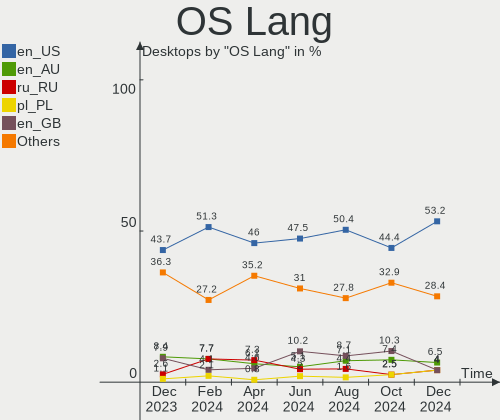
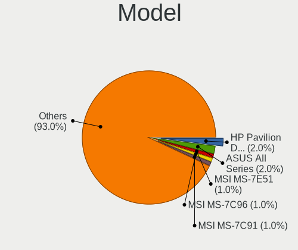

Fedora - Hardware Trends (Desktops)
-----------------------------------

A project to identify most popular hardware characteristics and track their change
over time based on data collected by Linux users at https://Linux-Hardware.org.

Anyone can contribute to this report by the [hw-probe](https://github.com/linuxhw/hw-probe) tool:

    sudo -E hw-probe -all -upload

This report is for one last month. Overall report since the beginning of time: [TestDays](https://github.com/linuxhw/TestDays)

Period: Apr, 2024.

Contents
--------

* [ System ](#system)
  - [ OS                       ](#os)
  - [ OS Family                ](#os-family)
  - [ Kernel                   ](#kernel)
  - [ Kernel Family            ](#kernel-family)
  - [ Kernel Major Ver.        ](#kernel-major-ver)
  - [ Arch                     ](#arch)
  - [ DE                       ](#de)
  - [ Display Server           ](#display-server)
  - [ Display Manager          ](#display-manager)
  - [ OS Lang                  ](#os-lang)
  - [ Boot Mode                ](#boot-mode)
  - [ Filesystem               ](#filesystem)
  - [ Part. scheme             ](#part-scheme)
  - [ Dual Boot with Linux/BSD ](#dual-boot-with-linuxbsd)
  - [ Dual Boot (Win)          ](#dual-boot-win)

* [ Board ](#board)
  - [ Vendor                   ](#vendor)
  - [ Model                    ](#model)
  - [ Model Family             ](#model-family)
  - [ MFG Year                 ](#mfg-year)
  - [ Form Factor              ](#form-factor)
  - [ Secure Boot              ](#secure-boot)
  - [ Coreboot                 ](#coreboot)
  - [ RAM Size                 ](#ram-size)
  - [ RAM Used                 ](#ram-used)
  - [ Total Drives             ](#total-drives)
  - [ Has CD-ROM               ](#has-cd-rom)
  - [ Has Ethernet             ](#has-ethernet)
  - [ Has WiFi                 ](#has-wifi)
  - [ Has Bluetooth            ](#has-bluetooth)

* [ Location ](#location)
  - [ Country                  ](#country)
  - [ City                     ](#city)

* [ Drives ](#drives)
  - [ Drive Vendor             ](#drive-vendor)
  - [ Drive Model              ](#drive-model)
  - [ HDD Vendor               ](#hdd-vendor)
  - [ SSD Vendor               ](#ssd-vendor)
  - [ Drive Kind               ](#drive-kind)
  - [ Drive Connector          ](#drive-connector)
  - [ Drive Size               ](#drive-size)
  - [ Space Total              ](#space-total)
  - [ Space Used               ](#space-used)
  - [ Malfunc. Drives          ](#malfunc-drives)
  - [ Malfunc. Drive Vendor    ](#malfunc-drive-vendor)
  - [ Malfunc. HDD Vendor      ](#malfunc-hdd-vendor)
  - [ Malfunc. Drive Kind      ](#malfunc-drive-kind)
  - [ Failed Drives            ](#failed-drives)
  - [ Failed Drive Vendor      ](#failed-drive-vendor)
  - [ Drive Status             ](#drive-status)

* [ Storage controller ](#storage-controller)
  - [ Storage Vendor           ](#storage-vendor)
  - [ Storage Model            ](#storage-model)
  - [ Storage Kind             ](#storage-kind)

* [ Processor ](#processor)
  - [ CPU Vendor               ](#cpu-vendor)
  - [ CPU Model                ](#cpu-model)
  - [ CPU Model Family         ](#cpu-model-family)
  - [ CPU Cores                ](#cpu-cores)
  - [ CPU Sockets              ](#cpu-sockets)
  - [ CPU Threads              ](#cpu-threads)
  - [ CPU Op-Modes             ](#cpu-op-modes)
  - [ CPU Microcode            ](#cpu-microcode)
  - [ CPU Microarch            ](#cpu-microarch)

* [ Graphics ](#graphics)
  - [ GPU Vendor               ](#gpu-vendor)
  - [ GPU Model                ](#gpu-model)
  - [ GPU Combo                ](#gpu-combo)
  - [ GPU Driver               ](#gpu-driver)
  - [ GPU Memory               ](#gpu-memory)

* [ Monitor ](#monitor)
  - [ Monitor Vendor           ](#monitor-vendor)
  - [ Monitor Model            ](#monitor-model)
  - [ Monitor Resolution       ](#monitor-resolution)
  - [ Monitor Diagonal         ](#monitor-diagonal)
  - [ Monitor Width            ](#monitor-width)
  - [ Aspect Ratio             ](#aspect-ratio)
  - [ Monitor Area             ](#monitor-area)
  - [ Pixel Density            ](#pixel-density)
  - [ Multiple Monitors        ](#multiple-monitors)

* [ Network ](#network)
  - [ Net Controller Vendor    ](#net-controller-vendor)
  - [ Net Controller Model     ](#net-controller-model)
  - [ Wireless Vendor          ](#wireless-vendor)
  - [ Wireless Model           ](#wireless-model)
  - [ Ethernet Vendor          ](#ethernet-vendor)
  - [ Ethernet Model           ](#ethernet-model)
  - [ Net Controller Kind      ](#net-controller-kind)
  - [ Used Controller          ](#used-controller)
  - [ NICs                     ](#nics)
  - [ IPv6                     ](#ipv6)

* [ Bluetooth ](#bluetooth)
  - [ Bluetooth Vendor         ](#bluetooth-vendor)
  - [ Bluetooth Model          ](#bluetooth-model)

* [ Sound ](#sound)
  - [ Sound Vendor             ](#sound-vendor)
  - [ Sound Model              ](#sound-model)

* [ Memory ](#memory)
  - [ Memory Vendor            ](#memory-vendor)
  - [ Memory Model             ](#memory-model)
  - [ Memory Kind              ](#memory-kind)
  - [ Memory Form Factor       ](#memory-form-factor)
  - [ Memory Size              ](#memory-size)
  - [ Memory Speed             ](#memory-speed)

* [ Printers & scanners ](#printers--scanners)
  - [ Printer Vendor           ](#printer-vendor)
  - [ Printer Model            ](#printer-model)
  - [ Scanner Vendor           ](#scanner-vendor)
  - [ Scanner Model            ](#scanner-model)

* [ Camera ](#camera)
  - [ Camera Vendor            ](#camera-vendor)
  - [ Camera Model             ](#camera-model)

* [ Security ](#security)
  - [ Fingerprint Vendor       ](#fingerprint-vendor)
  - [ Fingerprint Model        ](#fingerprint-model)
  - [ Chipcard Vendor          ](#chipcard-vendor)
  - [ Chipcard Model           ](#chipcard-model)

* [ Unsupported ](#unsupported)
  - [ Unsupported Devices      ](#unsupported-devices)
  - [ Unsupported Device Types ](#unsupported-device-types)

System
------

OS
--

Installed operating systems

| Name      | Desktops | Percent |
|-----------|----------|---------|
| Fedora 39 | 162      | 62.31%  |
| Fedora 40 | 86       | 33.08%  |
| Fedora 38 | 7        | 2.69%   |
| Fedora 41 | 3        | 1.15%   |
| Fedora 37 | 1        | 0.38%   |
| Fedora 36 | 1        | 0.38%   |

OS Family
---------

OS without a version

| Name   | Desktops | Percent |
|--------|----------|---------|
| Fedora | 260      | 100%    |

Kernel
------

Version of the Linux kernel

| Version                                                | Desktops | Percent |
|--------------------------------------------------------|----------|---------|
| 6.8.7-300.fc40.x86_64                                  | 57       | 21.92%  |
| 6.8.6-200.fc39.x86_64                                  | 27       | 10.38%  |
| 6.8.4-200.fc39.x86_64                                  | 27       | 10.38%  |
| 6.7.11-200.fc39.x86_64                                 | 27       | 10.38%  |
| 6.8.5-201.fc39.x86_64                                  | 22       | 8.46%   |
| 6.5.6-300.fc39.x86_64                                  | 19       | 7.31%   |
| 6.8.7-200.fc39.x86_64                                  | 13       | 5%      |
| 6.8.2-300.fc40.x86_64                                  | 12       | 4.62%   |
| 6.7.10-200.fc39.x86_64                                 | 10       | 3.85%   |
| 6.8.5-301.fc40.x86_64                                  | 7        | 2.69%   |
| 6.7.9-200.fc39.x86_64                                  | 6        | 2.31%   |
| 6.7.9-207.fsync.fc39.x86_64                            | 4        | 1.54%   |
| 6.8.6-300.fc40.x86_64                                  | 3        | 1.15%   |
| 6.9.0-0.rc3.31.fc41.x86_64+debug                       | 2        | 0.77%   |
| 6.8.7-301.fsync.fc40.x86_64                            | 2        | 0.77%   |
| 6.8.7-100.fc38.x86_64                                  | 2        | 0.77%   |
| 6.8.4-300.fc40.x86_64                                  | 2        | 0.77%   |
| 6.8.4-100.fc38.x86_64                                  | 2        | 0.77%   |
| 6.7.7-200.fc39.x86_64                                  | 2        | 0.77%   |
| 6.9.0-0.rc4.20240416git96fca68c4fbf7.38.fc41.x86_64    | 1        | 0.38%   |
| 6.9.0-0.rc3.20240411gte8c39d0f.232.vanilla.fc39.x86_64 | 1        | 0.38%   |
| 6.8.8-300.fc40.x86_64                                  | 1        | 0.38%   |
| 6.8.7-302.fsync.fc40.x86_64                            | 1        | 0.38%   |
| 6.8.4-cb1.0.fc39.x86_64                                | 1        | 0.38%   |
| 6.8.1-300.fc40.x86_64                                  | 1        | 0.38%   |
| 6.7.6-100.fc38.x86_64                                  | 1        | 0.38%   |
| 6.7.12-202.fsync.fc39.x86_64                           | 1        | 0.38%   |
| 6.7.12-201.fsync.fc39.x86_64                           | 1        | 0.38%   |
| 6.7.11-100.fc38.x86_64                                 | 1        | 0.38%   |
| 6.6.11-200.fc39.x86_64                                 | 1        | 0.38%   |
| 6.2.9-300.fc38.x86_64                                  | 1        | 0.38%   |
| 6.2.15-703.inttf.fc37.x86_64                           | 1        | 0.38%   |
| 6.2.15-100.fc36.x86_64                                 | 1        | 0.38%   |

Kernel Family
-------------

Linux kernel without a distro release

| Version | Desktops | Percent |
|---------|----------|---------|
| 6.8.7   | 75       | 28.85%  |
| 6.8.4   | 32       | 12.31%  |
| 6.8.6   | 30       | 11.54%  |
| 6.8.5   | 29       | 11.15%  |
| 6.7.11  | 28       | 10.77%  |
| 6.5.6   | 19       | 7.31%   |
| 6.8.2   | 12       | 4.62%   |
| 6.7.9   | 10       | 3.85%   |
| 6.7.10  | 10       | 3.85%   |
| 6.9.0   | 4        | 1.54%   |
| 6.7.7   | 2        | 0.77%   |
| 6.7.12  | 2        | 0.77%   |
| 6.2.15  | 2        | 0.77%   |
| 6.8.8   | 1        | 0.38%   |
| 6.8.1   | 1        | 0.38%   |
| 6.7.6   | 1        | 0.38%   |
| 6.6.11  | 1        | 0.38%   |
| 6.2.9   | 1        | 0.38%   |

Kernel Major Ver.
-----------------

Linux kernel major version

| Version | Desktops | Percent |
|---------|----------|---------|
| 6.8     | 180      | 69.23%  |
| 6.7     | 53       | 20.38%  |
| 6.5     | 19       | 7.31%   |
| 6.9     | 4        | 1.54%   |
| 6.2     | 3        | 1.15%   |
| 6.6     | 1        | 0.38%   |

Arch
----

OS architecture (x86_64, i586, etc.)

| Name   | Desktops | Percent |
|--------|----------|---------|
| x86_64 | 260      | 100%    |

DE
--

Desktop Environment

| Name          | Desktops | Percent |
|---------------|----------|---------|
| GNOME         | 179      | 68.85%  |
| KDE5          | 28       | 10.77%  |
| KDE6          | 19       | 7.31%   |
| Cinnamon      | 12       | 4.62%   |
| Unknown       | 5        | 1.92%   |
| XFCE          | 4        | 1.54%   |
| X-Cinnamon    | 4        | 1.54%   |
| KDE4          | 3        | 1.15%   |
| MATE          | 1        | 0.38%   |
| LXQt          | 1        | 0.38%   |
| KDE           | 1        | 0.38%   |
| GNOME Classic | 1        | 0.38%   |
| Deepin        | 1        | 0.38%   |
| Budgie        | 1        | 0.38%   |

Display Server
--------------

X11 or Wayland

| Name    | Desktops | Percent |
|---------|----------|---------|
| Wayland | 204      | 78.46%  |
| X11     | 40       | 15.38%  |
| Tty     | 16       | 6.15%   |

Display Manager
---------------

SDDM, LightDM, etc.

| Name    | Desktops | Percent |
|---------|----------|---------|
| Unknown | 190      | 73.08%  |
| GDM     | 34       | 13.08%  |
| SDDM    | 21       | 8.08%   |
| LightDM | 15       | 5.77%   |

OS Lang
-------

Language

| Lang    | Desktops | Percent |
|---------|----------|---------|
| en_US   | 119      | 45.77%  |
| ru_RU   | 19       | 7.31%   |
| pt_BR   | 18       | 6.92%   |
| en_AU   | 16       | 6.15%   |
| en_GB   | 12       | 4.62%   |
| de_DE   | 12       | 4.62%   |
| fr_FR   | 9        | 3.46%   |
| it_IT   | 8        | 3.08%   |
| en_CA   | 7        | 2.69%   |
| es_ES   | 5        | 1.92%   |
| cs_CZ   | 5        | 1.92%   |
| es_AR   | 4        | 1.54%   |
| nl_NL   | 3        | 1.15%   |
| pl_PL   | 2        | 0.77%   |
| fr_BE   | 2        | 0.77%   |
| es_MX   | 2        | 0.77%   |
| da_DK   | 2        | 0.77%   |
| tr_TR   | 1        | 0.38%   |
| sv_SE   | 1        | 0.38%   |
| lt_LT   | 1        | 0.38%   |
| hr_HR   | 1        | 0.38%   |
| fr_CH   | 1        | 0.38%   |
| fr_CA   | 1        | 0.38%   |
| fi_FI   | 1        | 0.38%   |
| es_UY   | 1        | 0.38%   |
| es_EC   | 1        | 0.38%   |
| es_CO   | 1        | 0.38%   |
| en_NZ   | 1        | 0.38%   |
| en_IE   | 1        | 0.38%   |
| en_DK   | 1        | 0.38%   |
| de_CH   | 1        | 0.38%   |
| Unknown | 1        | 0.38%   |

Boot Mode
---------

EFI or BIOS

| Mode | Desktops | Percent |
|------|----------|---------|
| BIOS | 199      | 76.54%  |
| EFI  | 61       | 23.46%  |

Filesystem
----------

Type of filesystem

| Type    | Desktops | Percent |
|---------|----------|---------|
| Btrfs   | 197      | 75.77%  |
| Ext4    | 50       | 19.23%  |
| Xfs     | 10       | 3.85%   |
| Tmpfs   | 1        | 0.38%   |
| Overlay | 1        | 0.38%   |
| Unknown | 1        | 0.38%   |

Part. scheme
------------

Scheme of partitioning

| Type    | Desktops | Percent |
|---------|----------|---------|
| Unknown | 186      | 71.54%  |
| GPT     | 67       | 25.77%  |
| MBR     | 7        | 2.69%   |

Dual Boot with Linux/BSD
------------------------

Hosting more than one Linux/BSD

| Dual boot | Desktops | Percent |
|-----------|----------|---------|
| No        | 241      | 92.69%  |
| Yes       | 19       | 7.31%   |

Dual Boot (Win)
---------------

Hosting Linux and Windows

| Dual boot | Desktops | Percent |
|-----------|----------|---------|
| No        | 222      | 85.38%  |
| Yes       | 38       | 14.62%  |

Board
-----

Vendor
------

Motherboard manufacturer

| Name                                 | Desktops | Percent |
|--------------------------------------|----------|---------|
| ASUSTek Computer                     | 75       | 28.85%  |
| Gigabyte Technology                  | 49       | 18.85%  |
| MSI                                  | 36       | 13.85%  |
| Hewlett-Packard                      | 23       | 8.85%   |
| ASRock                               | 19       | 7.31%   |
| Dell                                 | 17       | 6.54%   |
| Lenovo                               | 9        | 3.46%   |
| Intel                                | 5        | 1.92%   |
| Unknown                              | 4        | 1.54%   |
| Pegatron                             | 3        | 1.15%   |
| Shenzhen Meigao Electronic Equipment | 2        | 0.77%   |
| Itautec                              | 2        | 0.77%   |
| Fujitsu                              | 2        | 0.77%   |
| Apple                                | 2        | 0.77%   |
| Alienware                            | 2        | 0.77%   |
| Acer                                 | 2        | 0.77%   |
| SZQFTX                               | 1        | 0.38%   |
| PCWare                               | 1        | 0.38%   |
| OEM                                  | 1        | 0.38%   |
| NZXT                                 | 1        | 0.38%   |
| Foxconn                              | 1        | 0.38%   |
| Digiboard                            | 1        | 0.38%   |
| Colorful Technology                  | 1        | 0.38%   |
| Biostar                              | 1        | 0.38%   |

Model
-----

Motherboard model

| Name                                       | Desktops | Percent |
|--------------------------------------------|----------|---------|
| Unknown                                    | 4        | 1.54%   |
| MSI MS-7C02                                | 3        | 1.15%   |
| ASUS TUF Gaming B550M-PLUS WIFI II         | 3        | 1.15%   |
| ASUS PRIME A320M-K                         | 3        | 1.15%   |
| MSI MS-7C95                                | 2        | 0.77%   |
| MSI MS-7B89                                | 2        | 0.77%   |
| MSI MS-7B07                                | 2        | 0.77%   |
| MSI MS-7885                                | 2        | 0.77%   |
| Itautec ST 4265                            | 2        | 0.77%   |
| Intel X99                                  | 2        | 0.77%   |
| Gigabyte Z170XP-SLI                        | 2        | 0.77%   |
| Gigabyte X670E AORUS PRO X                 | 2        | 0.77%   |
| Dell Precision Tower 5810                  | 2        | 0.77%   |
| Dell OptiPlex 7080                         | 2        | 0.77%   |
| Dell OptiPlex 3070                         | 2        | 0.77%   |
| Dell OptiPlex 3050                         | 2        | 0.77%   |
| ASUS TUF Gaming X570-PLUS                  | 2        | 0.77%   |
| ASUS TUF Gaming B550-PLUS                  | 2        | 0.77%   |
| ASUS ROG STRIX Z690-A GAMING WIFI D4       | 2        | 0.77%   |
| ASUS ROG STRIX X570-E GAMING               | 2        | 0.77%   |
| ASUS ROG STRIX B650E-E GAMING WIFI         | 2        | 0.77%   |
| ASUS PRIME H510M-K                         | 2        | 0.77%   |
| ASUS M5A97 R2.0                            | 2        | 0.77%   |
| ASUS All Series                            | 2        | 0.77%   |
| ASRock B550 Phantom Gaming 4               | 2        | 0.77%   |
| SZQFTX MN56                                | 1        | 0.38%   |
| Shenzhen Meigao Electronic Equipment HX77G | 1        | 0.38%   |
| Shenzhen Meigao Electronic Equipment F7BSC | 1        | 0.38%   |
| Pegatron H81-M1                            | 1        | 0.38%   |
| Pegatron h8-1150sc                         | 1        | 0.38%   |
| Pegatron 2AA1h                             | 1        | 0.38%   |
| PCWare IPMH110G                            | 1        | 0.38%   |
| OEM X99-Turbo                              | 1        | 0.38%   |
| NZXT N7 B550                               | 1        | 0.38%   |
| MSI US Desktop Aegis RS                    | 1        | 0.38%   |
| MSI MS-7E25                                | 1        | 0.38%   |
| MSI MS-7E16                                | 1        | 0.38%   |
| MSI MS-7D91                                | 1        | 0.38%   |
| MSI MS-7D78                                | 1        | 0.38%   |
| MSI MS-7D75                                | 1        | 0.38%   |

Model Family
------------

Motherboard model prefix

| Name                                       | Desktops | Percent |
|--------------------------------------------|----------|---------|
| ASUS PRIME                                 | 22       | 8.46%   |
| ASUS ROG                                   | 16       | 6.15%   |
| Dell OptiPlex                              | 11       | 4.23%   |
| ASUS TUF                                   | 11       | 4.23%   |
| HP EliteDesk                               | 7        | 2.69%   |
| Gigabyte X570                              | 6        | 2.31%   |
| ASRock B550                                | 5        | 1.92%   |
| Unknown                                    | 4        | 1.54%   |
| MSI MS-7C02                                | 3        | 1.15%   |
| Lenovo ThinkStation                        | 3        | 1.15%   |
| Lenovo ThinkCentre                         | 3        | 1.15%   |
| Lenovo Legion                              | 3        | 1.15%   |
| Gigabyte B450M                             | 3        | 1.15%   |
| Dell Precision                             | 3        | 1.15%   |
| MSI MS-7C95                                | 2        | 0.77%   |
| MSI MS-7B89                                | 2        | 0.77%   |
| MSI MS-7B07                                | 2        | 0.77%   |
| MSI MS-7885                                | 2        | 0.77%   |
| Itautec ST                                 | 2        | 0.77%   |
| Intel X99                                  | 2        | 0.77%   |
| HP OMEN                                    | 2        | 0.77%   |
| HP Compaq                                  | 2        | 0.77%   |
| Gigabyte Z170XP-SLI                        | 2        | 0.77%   |
| Gigabyte X670E                             | 2        | 0.77%   |
| Gigabyte X570S                             | 2        | 0.77%   |
| Gigabyte B650                              | 2        | 0.77%   |
| Dell Vostro                                | 2        | 0.77%   |
| ASUS Maximus                               | 2        | 0.77%   |
| ASUS M5A97                                 | 2        | 0.77%   |
| ASUS All                                   | 2        | 0.77%   |
| ASRock Z790                                | 2        | 0.77%   |
| ASRock B450M-HDV                           | 2        | 0.77%   |
| SZQFTX MN56                                | 1        | 0.38%   |
| Shenzhen Meigao Electronic Equipment HX77G | 1        | 0.38%   |
| Shenzhen Meigao Electronic Equipment F7BSC | 1        | 0.38%   |
| Pegatron H81-M1                            | 1        | 0.38%   |
| Pegatron h8-1150sc                         | 1        | 0.38%   |
| Pegatron 2AA1h                             | 1        | 0.38%   |
| PCWare IPMH110G                            | 1        | 0.38%   |
| OEM X99-Turbo                              | 1        | 0.38%   |

MFG Year
--------

Motherboard manufacture year

| Year | Desktops | Percent |
|------|----------|---------|
| 2022 | 31       | 11.92%  |
| 2021 | 28       | 10.77%  |
| 2020 | 26       | 10%     |
| 2023 | 23       | 8.85%   |
| 2019 | 19       | 7.31%   |
| 2017 | 18       | 6.92%   |
| 2018 | 17       | 6.54%   |
| 2013 | 17       | 6.54%   |
| 2012 | 14       | 5.38%   |
| 2015 | 12       | 4.62%   |
| 2014 | 12       | 4.62%   |
| 2016 | 10       | 3.85%   |
| 2011 | 9        | 3.46%   |
| 2010 | 8        | 3.08%   |
| 2008 | 6        | 2.31%   |
| 2024 | 5        | 1.92%   |
| 2009 | 3        | 1.15%   |
| 2006 | 2        | 0.77%   |

Form Factor
-----------

Physical design of the computer

| Name    | Desktops | Percent |
|---------|----------|---------|
| Desktop | 260      | 100%    |

Secure Boot
-----------

Enabled or disabled

| State    | Desktops | Percent |
|----------|----------|---------|
| Disabled | 253      | 97.31%  |
| Enabled  | 7        | 2.69%   |

Coreboot
--------

Have coreboot on board

| Used | Desktops | Percent |
|------|----------|---------|
| No   | 260      | 100%    |

RAM Size
--------

Total RAM memory

| Size in GB  | Desktops | Percent |
|-------------|----------|---------|
| 32.01-64.0  | 73       | 28.08%  |
| 16.01-24.0  | 63       | 24.23%  |
| 4.01-8.0    | 37       | 14.23%  |
| 64.01-256.0 | 36       | 13.85%  |
| 8.01-16.0   | 29       | 11.15%  |
| 24.01-32.0  | 11       | 4.23%   |
| 3.01-4.0    | 9        | 3.46%   |
| 1.01-2.0    | 2        | 0.77%   |

RAM Used
--------

Used RAM memory

| Used GB    | Desktops | Percent |
|------------|----------|---------|
| 4.01-8.0   | 78       | 30%     |
| 2.01-3.0   | 60       | 23.08%  |
| 3.01-4.0   | 58       | 22.31%  |
| 1.01-2.0   | 29       | 11.15%  |
| 8.01-16.0  | 23       | 8.85%   |
| 0.51-1.0   | 6        | 2.31%   |
| 16.01-24.0 | 5        | 1.92%   |
| 32.01-64.0 | 1        | 0.38%   |

Total Drives
------------

Number of drives on board

| Drives | Desktops | Percent |
|--------|----------|---------|
| 2      | 71       | 27.31%  |
| 1      | 70       | 26.92%  |
| 3      | 69       | 26.54%  |
| 4      | 24       | 9.23%   |
| 5      | 14       | 5.38%   |
| 6      | 6        | 2.31%   |
| 7      | 3        | 1.15%   |
| 8      | 2        | 0.77%   |
| 9      | 1        | 0.38%   |

Has CD-ROM
----------

Has CD-ROM on board

| Presented | Desktops | Percent |
|-----------|----------|---------|
| No        | 182      | 70%     |
| Yes       | 78       | 30%     |

Has Ethernet
------------

Has Ethernet on board

| Presented | Desktops | Percent |
|-----------|----------|---------|
| Yes       | 260      | 100%    |

Has WiFi
--------

Has WiFi module

| Presented | Desktops | Percent |
|-----------|----------|---------|
| Yes       | 141      | 54.23%  |
| No        | 119      | 45.77%  |

Has Bluetooth
-------------

Has Bluetooth module

| Presented | Desktops | Percent |
|-----------|----------|---------|
| Yes       | 135      | 51.92%  |
| No        | 125      | 48.08%  |

Location
--------

Country
-------

Geographic location (country)

| Country         | Desktops | Percent |
|-----------------|----------|---------|
| USA             | 57       | 21.92%  |
| Brazil          | 23       | 8.85%   |
| Russia          | 19       | 7.31%   |
| Australia       | 18       | 6.92%   |
| Germany         | 17       | 6.54%   |
| Canada          | 12       | 4.62%   |
| Italy           | 11       | 4.23%   |
| France          | 10       | 3.85%   |
| UK              | 9        | 3.46%   |
| Czechia         | 6        | 2.31%   |
| Argentina       | 5        | 1.92%   |
| Switzerland     | 4        | 1.54%   |
| Spain           | 4        | 1.54%   |
| Poland          | 4        | 1.54%   |
| Netherlands     | 4        | 1.54%   |
| Denmark         | 4        | 1.54%   |
| Sweden          | 3        | 1.15%   |
| Romania         | 3        | 1.15%   |
| Norway          | 3        | 1.15%   |
| Mexico          | 3        | 1.15%   |
| Colombia        | 3        | 1.15%   |
| Belgium         | 3        | 1.15%   |
| Turkey          | 2        | 0.77%   |
| Serbia          | 2        | 0.77%   |
| Portugal        | 2        | 0.77%   |
| Finland         | 2        | 0.77%   |
| Belarus         | 2        | 0.77%   |
| Austria         | 2        | 0.77%   |
| Uruguay         | 1        | 0.38%   |
| Ukraine         | 1        | 0.38%   |
| The Netherlands | 1        | 0.38%   |
| Thailand        | 1        | 0.38%   |
| South Korea     | 1        | 0.38%   |
| Saudi Arabia    | 1        | 0.38%   |
| Philippines     | 1        | 0.38%   |
| North Macedonia | 1        | 0.38%   |
| New Zealand     | 1        | 0.38%   |
| Malaysia        | 1        | 0.38%   |
| Luxembourg      | 1        | 0.38%   |
| Latvia          | 1        | 0.38%   |

City
----

Geographic location (city)

| City               | Desktops | Percent |
|--------------------|----------|---------|
| Sydney             | 12       | 4.62%   |
| Moscow             | 6        | 2.31%   |
| Palmas             | 4        | 1.54%   |
| Seattle            | 3        | 1.15%   |
| Scarborough        | 3        | 1.15%   |
| Sao Paulo          | 3        | 1.15%   |
| New York           | 3        | 1.15%   |
| Toms River         | 2        | 0.77%   |
| Roswell            | 2        | 0.77%   |
| Rome               | 2        | 0.77%   |
| Prague             | 2        | 0.77%   |
| Paris              | 2        | 0.77%   |
| Odense             | 2        | 0.77%   |
| Montreal           | 2        | 0.77%   |
| Minsk              | 2        | 0.77%   |
| Melbourne          | 2        | 0.77%   |
| Kristiansand       | 2        | 0.77%   |
| Dourados           | 2        | 0.77%   |
| Denver             | 2        | 0.77%   |
| Brisbane           | 2        | 0.77%   |
| Brasília          | 2        | 0.77%   |
| Bogotá            | 2        | 0.77%   |
| Belgrade           | 2        | 0.77%   |
| Zadar              | 1        | 0.38%   |
| Yekaterinburg      | 1        | 0.38%   |
| Yaroslavl          | 1        | 0.38%   |
| Worcester          | 1        | 0.38%   |
| Westmont           | 1        | 0.38%   |
| Watertown          | 1        | 0.38%   |
| Warsaw             | 1        | 0.38%   |
| Warren             | 1        | 0.38%   |
| Waiblingen         | 1        | 0.38%   |
| Volta Redonda      | 1        | 0.38%   |
| Villa Carlos Paz   | 1        | 0.38%   |
| Vienna             | 1        | 0.38%   |
| Vicenza            | 1        | 0.38%   |
| Veseli nad Luznici | 1        | 0.38%   |
| Varzea Paulista    | 1        | 0.38%   |
| Valence            | 1        | 0.38%   |
| Ulm                | 1        | 0.38%   |

Drives
------

Drive Vendor
------------

Hard drive vendors

| Vendor                       | Desktops | Drives | Percent |
|------------------------------|----------|--------|---------|
| Samsung Electronics          | 88       | 131    | 16.54%  |
| WDC                          | 78       | 110    | 14.66%  |
| Seagate                      | 68       | 86     | 12.78%  |
| Sandisk                      | 38       | 49     | 7.14%   |
| Kingston                     | 35       | 42     | 6.58%   |
| Toshiba                      | 28       | 30     | 5.26%   |
| Crucial                      | 26       | 31     | 4.89%   |
| Phison Electronics           | 16       | 20     | 3.01%   |
| Intel                        | 13       | 15     | 2.44%   |
| Micron/Crucial Technology    | 12       | 14     | 2.26%   |
| Kingston Technology Company  | 11       | 11     | 2.07%   |
| SK hynix                     | 9        | 9      | 1.69%   |
| Hitachi                      | 9        | 11     | 1.69%   |
| China                        | 8        | 11     | 1.5%    |
| Micron Technology            | 7        | 7      | 1.32%   |
| HGST                         | 6        | 7      | 1.13%   |
| A-DATA Technology            | 6        | 6      | 1.13%   |
| Silicon Motion               | 5        | 6      | 0.94%   |
| Realtek Semiconductor        | 5        | 5      | 0.94%   |
| ADATA Technology             | 5        | 8      | 0.94%   |
| Unknown                      | 5        | 5      | 0.94%   |
| Shenzhen Longsys Electronics | 4        | 4      | 0.75%   |
| MAXIO Technology (Hangzhou)  | 4        | 4      | 0.75%   |
| KingSpec                     | 3        | 3      | 0.56%   |
| USB3.0                       | 2        | 2      | 0.38%   |
| Unknown                      | 2        | 2      | 0.38%   |
| Team                         | 2        | 2      | 0.38%   |
| SPCC                         | 2        | 2      | 0.38%   |
| Realtek                      | 2        | 2      | 0.38%   |
| Intenso                      | 2        | 3      | 0.38%   |
| HS-SSD-C100                  | 2        | 2      | 0.38%   |
| Verbatim                     | 1        | 1      | 0.19%   |
| Union Memory                 | 1        | 1      | 0.19%   |
| Transcend                    | 1        | 1      | 0.19%   |
| T-FORCE                      | 1        | 1      | 0.19%   |
| SSK                          | 1        | 1      | 0.19%   |
| Smartbuy                     | 1        | 2      | 0.19%   |
| SABRENT                      | 1        | 1      | 0.19%   |
| S3+                          | 1        | 1      | 0.19%   |
| Radeon                       | 1        | 1      | 0.19%   |

Drive Model
-----------

Hard drive models

| Model                                                 | Desktops | Percent |
|-------------------------------------------------------|----------|---------|
| Samsung NVMe SSD Controller SM981/PM981/PM983 1TB     | 18       | 2.93%   |
| Samsung NVMe SSD Controller PM9A1/PM9A3/980PRO 1TB    | 15       | 2.44%   |
| Seagate ST500DM002-1BD142 500GB                       | 8        | 1.3%    |
| Samsung SSD 850 EVO 500GB                             | 8        | 1.3%    |
| Samsung SSD 850 EVO 250GB                             | 8        | 1.3%    |
| Kingston SA400S37480G 480GB SSD                       | 8        | 1.3%    |
| Samsung SSD 990 PRO 2TB                               | 7        | 1.14%   |
| Seagate ST1000DM010-2EP102 1TB                        | 6        | 0.98%   |
| Sandisk WD Blue SN550 NVMe SSD 2TB                    | 6        | 0.98%   |
| Phison E12 NVMe Controller 2TB                        | 6        | 0.98%   |
| Micron/Crucial P2 NVMe PCIe SSD 4TB                   | 6        | 0.98%   |
| Toshiba DT01ACA100 1TB                                | 5        | 0.81%   |
| Silicon Motion SM2263EN/SM2263XT SSD Controller 256GB | 5        | 0.81%   |
| Sandisk WD Black SN750 / PC SN730 NVMe SSD 512GB      | 5        | 0.81%   |
| Samsung SSD 860 QVO 1TB                               | 5        | 0.81%   |
| Samsung SSD 860 EVO 500GB                             | 5        | 0.81%   |
| Samsung NVMe SSD Controller SM961/PM961/SM963 1TB     | 5        | 0.81%   |
| Crucial CT500MX500SSD1 500GB                          | 5        | 0.81%   |
| Crucial CT480BX500SSD1 480GB                          | 5        | 0.81%   |
| Unknown                                               | 5        | 0.81%   |
| WDC WD10EZEX-08WN4A0 1TB                              | 4        | 0.65%   |
| SK hynix BC511 256GB                                  | 4        | 0.65%   |
| Seagate ST2000DM008-2FR102 2TB                        | 4        | 0.65%   |
| Sandisk WD_BLACK SN850X 1000GB                        | 4        | 0.65%   |
| Sandisk WD_BLACK SN770 2TB                            | 4        | 0.65%   |
| Samsung SSD 980 500GB                                 | 4        | 0.65%   |
| Kingston Company SNV2S1000G 1TB                       | 4        | 0.65%   |
| Kingston Company A2000 NVMe SSD 500GB                 | 4        | 0.65%   |
| Kingston SA400S37240G 240GB SSD                       | 4        | 0.65%   |
| Kingston SA400S37120G 120GB SSD                       | 4        | 0.65%   |
| WDC WD2003FZEX-00SRLA0 2TB                            | 3        | 0.49%   |
| Seagate ST31000524AS 1TB                              | 3        | 0.49%   |
| SanDisk SSD PLUS 240GB                                | 3        | 0.49%   |
| Samsung SSD 870 EVO 1TB                               | 3        | 0.49%   |
| Kingston SUV500240G 240GB SSD                         | 3        | 0.49%   |
| Kingston SA400S37960G 960GB SSD                       | 3        | 0.49%   |
| Intel SSDSC2CT120A3 120GB                             | 3        | 0.49%   |
| Crucial CT2000MX500SSD1 2TB                           | 3        | 0.49%   |
| Crucial CT2000BX500SSD1 2TB                           | 3        | 0.49%   |
| Crucial CT1000MX500SSD1 1TB                           | 3        | 0.49%   |

HDD Vendor
----------

Hard disk drive vendors

| Vendor              | Desktops | Drives | Percent |
|---------------------|----------|--------|---------|
| WDC                 | 68       | 97     | 38.2%   |
| Seagate             | 68       | 86     | 38.2%   |
| Toshiba             | 22       | 24     | 12.36%  |
| Hitachi             | 9        | 11     | 5.06%   |
| HGST                | 6        | 7      | 3.37%   |
| Samsung Electronics | 4        | 6      | 2.25%   |
| SABRENT             | 1        | 1      | 0.56%   |

SSD Vendor
----------

Solid state drive vendors

| Vendor              | Desktops | Drives | Percent |
|---------------------|----------|--------|---------|
| Samsung Electronics | 47       | 60     | 24.48%  |
| Kingston            | 33       | 38     | 17.19%  |
| Crucial             | 26       | 31     | 13.54%  |
| WDC                 | 12       | 13     | 6.25%   |
| SanDisk             | 11       | 12     | 5.73%   |
| Intel               | 10       | 10     | 5.21%   |
| China               | 8        | 11     | 4.17%   |
| A-DATA Technology   | 6        | 6      | 3.13%   |
| SK hynix            | 3        | 3      | 1.56%   |
| Micron Technology   | 3        | 3      | 1.56%   |
| KingSpec            | 3        | 3      | 1.56%   |
| USB3.0              | 2        | 2      | 1.04%   |
| Toshiba             | 2        | 2      | 1.04%   |
| Team                | 2        | 2      | 1.04%   |
| SPCC                | 2        | 2      | 1.04%   |
| Intenso             | 2        | 3      | 1.04%   |
| Unknown             | 2        | 2      | 1.04%   |
| Verbatim            | 1        | 1      | 0.52%   |
| Transcend           | 1        | 1      | 0.52%   |
| Smartbuy            | 1        | 2      | 0.52%   |
| S3+                 | 1        | 1      | 0.52%   |
| Radeon              | 1        | 1      | 0.52%   |
| PNY                 | 1        | 1      | 0.52%   |
| Patriot             | 1        | 4      | 0.52%   |
| Palit               | 1        | 1      | 0.52%   |
| OCZ                 | 1        | 1      | 0.52%   |
| Neo                 | 1        | 1      | 0.52%   |
| MyDigitalSSD        | 1        | 1      | 0.52%   |
| Mushkin             | 1        | 1      | 0.52%   |
| Maxtor              | 1        | 1      | 0.52%   |
| LITEONIT            | 1        | 1      | 0.52%   |
| Gigabyte Technology | 1        | 1      | 0.52%   |
| External            | 1        | 1      | 0.52%   |
| Corsair             | 1        | 1      | 0.52%   |
| Apple               | 1        | 1      | 0.52%   |

Drive Kind
----------

HDD or SSD

| Kind    | Desktops | Drives | Percent |
|---------|----------|--------|---------|
| SSD     | 151      | 225    | 34.32%  |
| NVMe    | 141      | 207    | 32.05%  |
| HDD     | 139      | 232    | 31.59%  |
| Unknown | 9        | 9      | 2.05%   |

Drive Connector
---------------

SATA, SAS, NVMe, etc.

| Type | Desktops | Drives | Percent |
|------|----------|--------|---------|
| SATA | 209      | 451    | 56.79%  |
| NVMe | 141      | 204    | 38.32%  |
| SAS  | 18       | 18     | 4.89%   |

Drive Size
----------

Size of hard drive

| Size in TB | Desktops | Drives | Percent |
|------------|----------|--------|---------|
| 0.01-0.5   | 140      | 224    | 44.3%   |
| 0.51-1.0   | 97       | 126    | 30.7%   |
| 1.01-2.0   | 36       | 47     | 11.39%  |
| 4.01-10.0  | 17       | 23     | 5.38%   |
| 3.01-4.0   | 15       | 24     | 4.75%   |
| 10.01-20.0 | 6        | 6      | 1.9%    |
| 2.01-3.0   | 5        | 7      | 1.58%   |

Space Total
-----------

Amount of disk space available on the file system

| Size in GB     | Desktops | Percent |
|----------------|----------|---------|
| More than 3000 | 56       | 21.54%  |
| 1001-2000      | 49       | 18.85%  |
| 501-1000       | 41       | 15.77%  |
| 251-500        | 34       | 13.08%  |
| 101-250        | 29       | 11.15%  |
| 2001-3000      | 19       | 7.31%   |
| Unknown        | 12       | 4.62%   |
| 1-20           | 10       | 3.85%   |
| 51-100         | 6        | 2.31%   |
| 21-50          | 4        | 1.54%   |

Space Used
----------

Amount of used disk space

| Used GB        | Desktops | Percent |
|----------------|----------|---------|
| 1-20           | 56       | 21.54%  |
| 21-50          | 44       | 16.92%  |
| 251-500        | 32       | 12.31%  |
| 101-250        | 27       | 10.38%  |
| 501-1000       | 26       | 10%     |
| 51-100         | 26       | 10%     |
| More than 3000 | 16       | 6.15%   |
| 1001-2000      | 15       | 5.77%   |
| Unknown        | 12       | 4.62%   |
| 2001-3000      | 6        | 2.31%   |

Malfunc. Drives
---------------

Drive models with a malfunction

| Model                                                     | Desktops | Drives | Percent |
|-----------------------------------------------------------|----------|--------|---------|
| Intel SSDSC2CT120A3 120GB                                 | 2        | 2      | 7.69%   |
| WDC WD7500BPKX-00HPJT0 752GB                              | 1        | 1      | 3.85%   |
| WDC WD6004FZWX-00BKVA0 6TB                                | 1        | 1      | 3.85%   |
| WDC WD5000AVCS-632DY1 500GB                               | 1        | 1      | 3.85%   |
| WDC WD5000AAKX-603CA0 500GB                               | 1        | 1      | 3.85%   |
| WDC WD40EFRX-68N32N0 4TB                                  | 1        | 1      | 3.85%   |
| WDC WD3200AAJS-00L7A0 320GB                               | 1        | 1      | 3.85%   |
| WDC WD2003FZEX-00SRLA0 2TB                                | 1        | 1      | 3.85%   |
| Transcend TS240GMTS820S 240GB SSD                         | 1        | 1      | 3.85%   |
| Toshiba MQ01ABD050 500GB                                  | 1        | 1      | 3.85%   |
| Seagate ST500LM034-2GH17A 500GB                           | 1        | 1      | 3.85%   |
| Seagate ST500DM002-1BD142 500GB                           | 1        | 1      | 3.85%   |
| Seagate ST3500418AS 500GB                                 | 1        | 1      | 3.85%   |
| Seagate ST31000524AS 1TB                                  | 1        | 1      | 3.85%   |
| Seagate ST31000333AS 1TB                                  | 1        | 2      | 3.85%   |
| SanDisk SSD PLUS 120GB                                    | 1        | 1      | 3.85%   |
| Samsung Electronics SSD 980 1TB                           | 1        | 1      | 3.85%   |
| Samsung Electronics HD103UJ 1TB                           | 1        | 2      | 3.85%   |
| Realtek Semiconductor RTS5763DL NVMe SSD Controller 256GB | 1        | 1      | 3.85%   |
| Neo Forza NFS121SA324-6007000 240GB SSD                   | 1        | 1      | 3.85%   |
| Mushkin MKNSSDTR1TB-3D                                    | 1        | 1      | 3.85%   |
| Kingston SUV500240G 240GB SSD                             | 1        | 1      | 3.85%   |
| Hitachi HTS725025A9A364 250GB                             | 1        | 1      | 3.85%   |
| Hitachi HTS543232L9SA00 320GB                             | 1        | 1      | 3.85%   |
| HGST HTS545050A7E380 500GB                                | 1        | 1      | 3.85%   |

Malfunc. Drive Vendor
---------------------

Vendors of faulty drives

| Vendor                | Desktops | Drives | Percent |
|-----------------------|----------|--------|---------|
| WDC                   | 7        | 7      | 26.92%  |
| Seagate               | 5        | 6      | 19.23%  |
| Samsung Electronics   | 2        | 3      | 7.69%   |
| Intel                 | 2        | 2      | 7.69%   |
| Hitachi               | 2        | 2      | 7.69%   |
| Transcend             | 1        | 1      | 3.85%   |
| Toshiba               | 1        | 1      | 3.85%   |
| SanDisk               | 1        | 1      | 3.85%   |
| Realtek Semiconductor | 1        | 1      | 3.85%   |
| Neo                   | 1        | 1      | 3.85%   |
| Mushkin               | 1        | 1      | 3.85%   |
| Kingston              | 1        | 1      | 3.85%   |
| HGST                  | 1        | 1      | 3.85%   |

Malfunc. HDD Vendor
-------------------

Vendors of faulty HDD drives

| Vendor              | Desktops | Drives | Percent |
|---------------------|----------|--------|---------|
| WDC                 | 7        | 7      | 41.18%  |
| Seagate             | 5        | 6      | 29.41%  |
| Hitachi             | 2        | 2      | 11.76%  |
| Toshiba             | 1        | 1      | 5.88%   |
| Samsung Electronics | 1        | 2      | 5.88%   |
| HGST                | 1        | 1      | 5.88%   |

Malfunc. Drive Kind
-------------------

Kinds of faulty drives

| Kind | Desktops | Drives | Percent |
|------|----------|--------|---------|
| HDD  | 14       | 19     | 60.87%  |
| SSD  | 7        | 7      | 30.43%  |
| NVMe | 2        | 2      | 8.7%    |

Failed Drives
-------------

Failed drive models

| Model                       | Desktops | Drives | Percent |
|-----------------------------|----------|--------|---------|
| Hitachi HDS721010DLE630 1TB | 1        | 2      | 100%    |

Failed Drive Vendor
-------------------

Failed drive vendors

| Vendor  | Desktops | Drives | Percent |
|---------|----------|--------|---------|
| Hitachi | 1        | 2      | 100%    |

Drive Status
------------

Number of failed and malfunc. drives

| Status   | Desktops | Drives | Percent |
|----------|----------|--------|---------|
| Detected | 199      | 492    | 69.58%  |
| Works    | 66       | 151    | 23.08%  |
| Malfunc  | 20       | 28     | 6.99%   |
| Failed   | 1        | 2      | 0.35%   |

Storage controller
------------------

Storage Vendor
--------------

Storage controller vendors

| Vendor                       | Desktops | Percent |
|------------------------------|----------|---------|
| Intel                        | 137      | 30.24%  |
| AMD                          | 116      | 25.61%  |
| Samsung Electronics          | 49       | 10.82%  |
| SanDisk                      | 27       | 5.96%   |
| ASMedia Technology           | 19       | 4.19%   |
| Phison Electronics           | 16       | 3.53%   |
| Kingston Technology Company  | 14       | 3.09%   |
| Micron/Crucial Technology    | 12       | 2.65%   |
| SK hynix                     | 6        | 1.32%   |
| JMicron Technology           | 6        | 1.32%   |
| Silicon Motion               | 5        | 1.1%    |
| Realtek Semiconductor        | 5        | 1.1%    |
| Marvell Technology Group     | 5        | 1.1%    |
| ADATA Technology             | 5        | 1.1%    |
| Toshiba America Info Systems | 4        | 0.88%   |
| Shenzhen Longsys Electronics | 4        | 0.88%   |
| Micron Technology            | 4        | 0.88%   |
| MAXIO Technology (Hangzhou)  | 4        | 0.88%   |
| Solidigm                     | 2        | 0.44%   |
| Nvidia                       | 2        | 0.44%   |
| Broadcom / LSI               | 2        | 0.44%   |
| VIA Technologies             | 1        | 0.22%   |
| Union Memory (Shenzhen)      | 1        | 0.22%   |
| ULi Electronics              | 1        | 0.22%   |
| Silicon Image                | 1        | 0.22%   |
| OCZ Technology Group         | 1        | 0.22%   |
| Netac Technology             | 1        | 0.22%   |
| Lite-On Technology           | 1        | 0.22%   |
| HighPoint Technologies       | 1        | 0.22%   |
| Biwin Storage Technology     | 1        | 0.22%   |

Storage Model
-------------

Storage controller models

| Model                                                                          | Desktops | Percent |
|--------------------------------------------------------------------------------|----------|---------|
| AMD FCH SATA Controller [AHCI mode]                                            | 48       | 8.99%   |
| AMD 500 Series Chipset SATA Controller                                         | 26       | 4.87%   |
| AMD 400 Series Chipset SATA Controller                                         | 22       | 4.12%   |
| AMD 600 Series Chipset SATA Controller                                         | 21       | 3.93%   |
| Samsung NVMe SSD Controller SM981/PM981/PM983                                  | 18       | 3.37%   |
| ASMedia ASM1061/ASM1062 Serial ATA Controller                                  | 18       | 3.37%   |
| Intel Alder Lake-S PCH SATA Controller [AHCI Mode]                             | 16       | 3%      |
| Samsung NVMe SSD Controller PM9A1/PM9A3/980PRO                                 | 15       | 2.81%   |
| Intel SATA Controller [RAID mode]                                              | 12       | 2.25%   |
| Intel 8 Series/C220 Series Chipset Family 6-port SATA Controller 1 [AHCI mode] | 12       | 2.25%   |
| Samsung NVMe SSD Controller S4LV008[Pascal]                                    | 11       | 2.06%   |
| Intel 200 Series PCH SATA controller [AHCI mode]                               | 11       | 2.06%   |
| Intel Q170/Q150/B150/H170/H110/Z170/CM236 Chipset SATA Controller [AHCI Mode]  | 10       | 1.87%   |
| Intel 7 Series/C210 Series Chipset Family 6-port SATA Controller [AHCI mode]   | 10       | 1.87%   |
| Intel Raptor Lake SATA AHCI Controller                                         | 9        | 1.69%   |
| Intel 6 Series/C200 Series Chipset Family 6 port Desktop SATA AHCI Controller  | 9        | 1.69%   |
| Sandisk WD Black SN850X NVMe SSD                                               | 8        | 1.5%    |
| Intel Volume Management Device NVMe RAID Controller                            | 8        | 1.5%    |
| Intel Cannon Lake PCH SATA AHCI Controller                                     | 8        | 1.5%    |
| Samsung NVMe SSD Controller 980 (DRAM-less)                                    | 7        | 1.31%   |
| AMD SB7x0/SB8x0/SB9x0 SATA Controller [AHCI mode]                              | 7        | 1.31%   |
| SanDisk Ultra 3D / WD Blue SN550 NVMe SSD                                      | 6        | 1.12%   |
| Phison E12 NVMe Controller                                                     | 6        | 1.12%   |
| Micron/Crucial P2 [Nick P2] / P3 / P3 Plus NVMe PCIe SSD (DRAM-less)           | 6        | 1.12%   |
| Kingston Company NV2 NVMe SSD SM2267XT (DRAM-less)                             | 6        | 1.12%   |
| Intel C610/X99 series chipset sSATA Controller [AHCI mode]                     | 6        | 1.12%   |
| Silicon Motion SM2263EN/SM2263XT (DRAM-less) NVMe SSD Controllers              | 5        | 0.94%   |
| SanDisk WD Black SN770 / PC SN740 256GB / PC SN560 (DRAM-less) NVMe SSD        | 5        | 0.94%   |
| SanDisk Extreme Pro / WD Black SN750 / PC SN730 / Red SN700 NVMe SSD           | 5        | 0.94%   |
| Samsung NVMe SSD Controller SM961/PM961/SM963                                  | 5        | 0.94%   |
| Intel 500 Series Chipset Family SATA AHCI Controller                           | 5        | 0.94%   |
| AMD SB7x0/SB8x0/SB9x0 IDE Controller                                           | 5        | 0.94%   |
| AMD FCH SATA Controller D                                                      | 5        | 0.94%   |
| SK hynix BC511 NVMe SSD                                                        | 4        | 0.75%   |
| Kingston Company A2000 NVMe SSD SM2263EN                                       | 4        | 0.75%   |
| JMicron JMB363 SATA/IDE Controller                                             | 4        | 0.75%   |
| Intel SATA controller                                                          | 4        | 0.75%   |
| Intel Comet Lake SATA AHCI Controller                                          | 4        | 0.75%   |
| Intel C610/X99 series chipset 6-Port SATA Controller [AHCI mode]               | 4        | 0.75%   |
| Shenzhen Longsys Lexar NM790 NVME SSD (DRAM-less)                              | 3        | 0.56%   |

Storage Kind
------------

Kind of storage controller (IDE, SATA, NVMe, SAS, ...)

| Kind | Desktops | Percent |
|------|----------|---------|
| SATA | 235      | 54.78%  |
| NVMe | 141      | 32.87%  |
| IDE  | 26       | 6.06%   |
| RAID | 25       | 5.83%   |
| SAS  | 1        | 0.23%   |
| SCSI | 1        | 0.23%   |

Processor
---------

CPU Vendor
----------

Processor vendors

| Vendor | Desktops | Percent |
|--------|----------|---------|
| Intel  | 138      | 53.08%  |
| AMD    | 122      | 46.92%  |

CPU Model
---------

Processor models

| Model                                          | Desktops | Percent |
|------------------------------------------------|----------|---------|
| AMD Ryzen 5 5600X 6-Core Processor             | 11       | 4.23%   |
| AMD Ryzen 5 3600 6-Core Processor              | 9        | 3.46%   |
| AMD Ryzen 9 7950X 16-Core Processor            | 8        | 3.08%   |
| AMD Ryzen 9 5950X 16-Core Processor            | 7        | 2.69%   |
| AMD Ryzen 9 5900X 12-Core Processor            | 6        | 2.31%   |
| Intel Core i5-6500 CPU @ 3.20GHz               | 4        | 1.54%   |
| Intel Core i5-3330 CPU @ 3.00GHz               | 4        | 1.54%   |
| Intel 12th Gen Core i7-12700KF                 | 4        | 1.54%   |
| AMD Ryzen 5 2600 Six-Core Processor            | 4        | 1.54%   |
| Intel Pentium CPU G4560 @ 3.50GHz              | 3        | 1.15%   |
| Intel N100                                     | 3        | 1.15%   |
| Intel Core i7-7700 CPU @ 3.60GHz               | 3        | 1.15%   |
| Intel Core i7-2600 CPU @ 3.40GHz               | 3        | 1.15%   |
| Intel Core i7-10700 CPU @ 2.90GHz              | 3        | 1.15%   |
| Intel Core i5-2400 CPU @ 3.10GHz               | 3        | 1.15%   |
| Intel 13th Gen Core i9-13900K                  | 3        | 1.15%   |
| Intel 12th Gen Core i5-12400                   | 3        | 1.15%   |
| AMD Ryzen 7 7800X3D 8-Core Processor           | 3        | 1.15%   |
| AMD Ryzen 7 5800X 8-Core Processor             | 3        | 1.15%   |
| AMD Ryzen 5 5600G with Radeon Graphics         | 3        | 1.15%   |
| AMD Ryzen 5 5600 6-Core Processor              | 3        | 1.15%   |
| AMD Ryzen 5 5500                               | 3        | 1.15%   |
| Intel Core i9-14900K                           | 2        | 0.77%   |
| Intel Core i7-7700K CPU @ 4.20GHz              | 2        | 0.77%   |
| Intel Core i7-6700K CPU @ 4.00GHz              | 2        | 0.77%   |
| Intel Core i7-3770K CPU @ 3.50GHz              | 2        | 0.77%   |
| Intel Core i5-8400 CPU @ 2.80GHz               | 2        | 0.77%   |
| Intel Core i5-7500 CPU @ 3.40GHz               | 2        | 0.77%   |
| Intel Core i5-7400 CPU @ 3.00GHz               | 2        | 0.77%   |
| Intel Core i5-3570 CPU @ 3.40GHz               | 2        | 0.77%   |
| Intel Core i3-9100F CPU @ 3.60GHz              | 2        | 0.77%   |
| Intel Core i3-9100 CPU @ 3.60GHz               | 2        | 0.77%   |
| Intel Core i3-6100 CPU @ 3.70GHz               | 2        | 0.77%   |
| Intel 11th Gen Core i5-11400F @ 2.60GHz        | 2        | 0.77%   |
| AMD Ryzen Threadripper 1920X 12-Core Processor | 2        | 0.77%   |
| AMD Ryzen 9 7950X3D 16-Core Processor          | 2        | 0.77%   |
| AMD Ryzen 9 7900X 12-Core Processor            | 2        | 0.77%   |
| AMD Ryzen 9 3900X 12-Core Processor            | 2        | 0.77%   |
| AMD Ryzen 7 5800X3D 8-Core Processor           | 2        | 0.77%   |
| AMD Ryzen 7 5700G with Radeon Graphics         | 2        | 0.77%   |

CPU Model Family
----------------

Processor model prefix

| Model                  | Desktops | Percent |
|------------------------|----------|---------|
| AMD Ryzen 5            | 41       | 15.77%  |
| Intel Core i5          | 36       | 13.85%  |
| AMD Ryzen 9            | 31       | 11.92%  |
| Other                  | 30       | 11.54%  |
| Intel Core i7          | 28       | 10.77%  |
| AMD Ryzen 7            | 21       | 8.08%   |
| Intel Xeon             | 19       | 7.31%   |
| Intel Core i3          | 10       | 3.85%   |
| AMD FX                 | 5        | 1.92%   |
| Intel Pentium          | 4        | 1.54%   |
| AMD Ryzen Threadripper | 4        | 1.54%   |
| AMD Ryzen 3            | 4        | 1.54%   |
| Intel Core i9          | 3        | 1.15%   |
| Intel Core 2 Quad      | 2        | 0.77%   |
| Intel Core 2 Duo       | 2        | 0.77%   |
| Intel Celeron          | 2        | 0.77%   |
| Intel Atom             | 2        | 0.77%   |
| AMD Phenom II X4       | 2        | 0.77%   |
| AMD Athlon 64 X2       | 2        | 0.77%   |
| AMD A8                 | 2        | 0.77%   |
| AMD A10                | 2        | 0.77%   |
| Intel Genuine          | 1        | 0.38%   |
| AMD Ryzen 5 PRO        | 1        | 0.38%   |
| AMD PRO A10            | 1        | 0.38%   |
| AMD Phenom II X2       | 1        | 0.38%   |
| AMD GX                 | 1        | 0.38%   |
| AMD Athlon X4          | 1        | 0.38%   |
| AMD Athlon Dual Core   | 1        | 0.38%   |
| AMD A6                 | 1        | 0.38%   |

CPU Cores
---------

Number of processor cores

| Number | Desktops | Percent |
|--------|----------|---------|
| 4      | 78       | 30%     |
| 6      | 61       | 23.46%  |
| 8      | 30       | 11.54%  |
| 2      | 30       | 11.54%  |
| 12     | 24       | 9.23%   |
| 16     | 21       | 8.08%   |
| 24     | 6        | 2.31%   |
| 10     | 3        | 1.15%   |
| 14     | 2        | 0.77%   |
| 32     | 1        | 0.38%   |
| 28     | 1        | 0.38%   |
| 20     | 1        | 0.38%   |
| 18     | 1        | 0.38%   |
| 3      | 1        | 0.38%   |

CPU Sockets
-----------

Number of sockets

| Number | Desktops | Percent |
|--------|----------|---------|
| 1      | 257      | 98.85%  |
| 2      | 3        | 1.15%   |

CPU Threads
-----------

Threads per core (Hyper-Threading)

| Number | Desktops | Percent |
|--------|----------|---------|
| 2      | 196      | 75.38%  |
| 1      | 64       | 24.62%  |

CPU Op-Modes
------------

CPU Operation Modes (32-bit, 64-bit)

| Op mode        | Desktops | Percent |
|----------------|----------|---------|
| 32-bit, 64-bit | 260      | 100%    |

CPU Microcode
-------------

Microcode number

| Number     | Desktops | Percent |
|------------|----------|---------|
| Unknown    | 251      | 96.54%  |
| 0x08701021 | 2        | 0.77%   |
| 0x0a601206 | 1        | 0.38%   |
| 0x0a50000d | 1        | 0.38%   |
| 0x0a201009 | 1        | 0.38%   |
| 0x08701013 | 1        | 0.38%   |
| 0x08600109 | 1        | 0.38%   |
| 0x08600106 | 1        | 0.38%   |
| 0x08001138 | 1        | 0.38%   |

CPU Microarch
-------------

Microarchitecture

| Name             | Desktops | Percent |
|------------------|----------|---------|
| Unknown          | 50       | 19.23%  |
| Zen 3            | 40       | 15.38%  |
| KabyLake         | 25       | 9.62%   |
| Zen 2            | 22       | 8.46%   |
| Haswell          | 21       | 8.08%   |
| IvyBridge        | 13       | 5%      |
| SandyBridge      | 12       | 4.62%   |
| Skylake          | 10       | 3.85%   |
| Zen              | 9        | 3.46%   |
| Zen+             | 6        | 2.31%   |
| Piledriver       | 6        | 2.31%   |
| CometLake        | 6        | 2.31%   |
| Alderlake Hybrid | 6        | 2.31%   |
| Penryn           | 5        | 1.92%   |
| Broadwell        | 5        | 1.92%   |
| Steamroller      | 3        | 1.15%   |
| K8 Hammer        | 3        | 1.15%   |
| K10              | 3        | 1.15%   |
| Excavator        | 3        | 1.15%   |
| Bonnell          | 3        | 1.15%   |
| Westmere         | 2        | 0.77%   |
| Nehalem          | 2        | 0.77%   |
| Silvermont       | 1        | 0.38%   |
| K10 Llano        | 1        | 0.38%   |
| Jaguar           | 1        | 0.38%   |
| Gracemont        | 1        | 0.38%   |
| Core             | 1        | 0.38%   |

Graphics
--------

GPU Vendor
----------

Vendors of graphics cards

| Vendor                     | Desktops | Percent |
|----------------------------|----------|---------|
| Nvidia                     | 117      | 40.77%  |
| AMD                        | 101      | 35.19%  |
| Intel                      | 66       | 23%     |
| ASPEED Technology          | 2        | 0.7%    |
| Matrox Electronics Systems | 1        | 0.35%   |

GPU Model
---------

Graphics card models

| Model                                                                       | Desktops | Percent |
|-----------------------------------------------------------------------------|----------|---------|
| AMD Raphael                                                                 | 14       | 4.64%   |
| AMD Navi 23 [Radeon RX 6600/6600 XT/6600M]                                  | 9        | 2.98%   |
| AMD Navi 31 [Radeon RX 7900 XT/7900 XTX/7900M]                              | 8        | 2.65%   |
| AMD Ellesmere [Radeon RX 470/480/570/570X/580/580X/590]                     | 8        | 2.65%   |
| Intel Xeon E3-1200 v2/3rd Gen Core processor Graphics Controller            | 7        | 2.32%   |
| Intel HD Graphics 630                                                       | 7        | 2.32%   |
| Intel CoffeeLake-S GT2 [UHD Graphics 630]                                   | 7        | 2.32%   |
| AMD Navi 32 [Radeon RX 7700 XT / 7800 XT]                                   | 7        | 2.32%   |
| AMD Navi 22 [Radeon RX 6700/6700 XT/6750 XT / 6800M/6850M XT]               | 7        | 2.32%   |
| Intel Xeon E3-1200 v3/4th Gen Core Processor Integrated Graphics Controller | 6        | 1.99%   |
| Nvidia GM107 [GeForce GTX 750 Ti]                                           | 5        | 1.66%   |
| AMD Polaris 20 XL [Radeon RX 580 2048SP]                                    | 5        | 1.66%   |
| Nvidia TU106 [GeForce RTX 2060 Rev. A]                                      | 4        | 1.32%   |
| Nvidia GP107 [GeForce GTX 1050 Ti]                                          | 4        | 1.32%   |
| Nvidia GP104 [GeForce GTX 1070]                                             | 4        | 1.32%   |
| Nvidia GA106 [GeForce RTX 3060 Lite Hash Rate]                              | 4        | 1.32%   |
| Nvidia GA104 [GeForce RTX 3070]                                             | 4        | 1.32%   |
| Nvidia GA104 [GeForce RTX 3060 Ti Lite Hash Rate]                           | 4        | 1.32%   |
| Intel Raptor Lake-S GT1 [UHD Graphics 770]                                  | 4        | 1.32%   |
| Intel Alder Lake-N [UHD Graphics]                                           | 4        | 1.32%   |
| Intel 2nd Generation Core Processor Family Integrated Graphics Controller   | 4        | 1.32%   |
| AMD Phoenix1                                                                | 4        | 1.32%   |
| AMD Navi 10 [Radeon RX 5600 OEM/5600 XT / 5700/5700 XT]                     | 4        | 1.32%   |
| AMD Cezanne [Radeon Vega Series / Radeon Vega Mobile Series]                | 4        | 1.32%   |
| AMD Baffin [Radeon RX 550 640SP / RX 560/560X]                              | 4        | 1.32%   |
| Nvidia TU116 [GeForce GTX 1660 SUPER]                                       | 3        | 0.99%   |
| Nvidia TU116 [GeForce GTX 1650 SUPER]                                       | 3        | 0.99%   |
| Nvidia GP106 [GeForce GTX 1060 6GB]                                         | 3        | 0.99%   |
| Nvidia GP104 [GeForce GTX 1080]                                             | 3        | 0.99%   |
| Nvidia GK208B [GeForce GT 710]                                              | 3        | 0.99%   |
| Nvidia GA102 [GeForce RTX 3090]                                             | 3        | 0.99%   |
| Nvidia AD103 [GeForce RTX 4080]                                             | 3        | 0.99%   |
| Intel IvyBridge GT2 [HD Graphics 4000]                                      | 3        | 0.99%   |
| Intel HD Graphics 610                                                       | 3        | 0.99%   |
| Intel CometLake-S GT2 [UHD Graphics 630]                                    | 3        | 0.99%   |
| AMD Lexa PRO [Radeon 540/540X/550/550X / RX 540X/550/550X]                  | 3        | 0.99%   |
| Nvidia TU117 [GeForce GTX 1650]                                             | 2        | 0.66%   |
| Nvidia TU104 [GeForce RTX 2070 SUPER]                                       | 2        | 0.66%   |
| Nvidia GP108 [GeForce GT 1030]                                              | 2        | 0.66%   |
| Nvidia GP106 [GeForce GTX 1060 3GB]                                         | 2        | 0.66%   |

GPU Combo
---------

Combinations of graphics cards

| Name             | Desktops | Percent |
|------------------|----------|---------|
| 1 x Nvidia       | 98       | 37.69%  |
| 1 x AMD          | 74       | 28.46%  |
| 1 x Intel        | 52       | 20%     |
| 2 x AMD          | 14       | 5.38%   |
| AMD + Nvidia     | 10       | 3.85%   |
| Intel + Nvidia   | 6        | 2.31%   |
| Intel + AMD      | 2        | 0.77%   |
| Nvidia + ASPEED  | 1        | 0.38%   |
| 1 x Matrox       | 1        | 0.38%   |
| 1 x ASPEED       | 1        | 0.38%   |
| AMD + 2 x Nvidia | 1        | 0.38%   |

GPU Driver
----------

Free vs proprietary

| Driver      | Desktops | Percent |
|-------------|----------|---------|
| Free        | 203      | 78.08%  |
| Proprietary | 41       | 15.77%  |
| Unknown     | 16       | 6.15%   |

GPU Memory
----------

Total video memory

| Size in GB | Desktops | Percent |
|------------|----------|---------|
| Unknown    | 185      | 71.15%  |
| 8.01-16.0  | 16       | 6.15%   |
| 7.01-8.0   | 15       | 5.77%   |
| 3.01-4.0   | 11       | 4.23%   |
| 0.01-0.5   | 11       | 4.23%   |
| 5.01-6.0   | 6        | 2.31%   |
| 0.51-1.0   | 6        | 2.31%   |
| 16.01-24.0 | 5        | 1.92%   |
| 1.01-2.0   | 5        | 1.92%   |

Monitor
-------

Monitor Vendor
--------------

Monitor vendors

| Vendor               | Desktops | Percent |
|----------------------|----------|---------|
| Dell                 | 47       | 16.1%   |
| Goldstar             | 44       | 15.07%  |
| Samsung Electronics  | 42       | 14.38%  |
| AOC                  | 17       | 5.82%   |
| Acer                 | 15       | 5.14%   |
| Hewlett-Packard      | 14       | 4.79%   |
| Philips              | 12       | 4.11%   |
| BenQ                 | 12       | 4.11%   |
| Lenovo               | 11       | 3.77%   |
| ASUSTek Computer     | 9        | 3.08%   |
| Ancor Communications | 9        | 3.08%   |
| MSI                  | 7        | 2.4%    |
| ViewSonic            | 6        | 2.05%   |
| Iiyama               | 5        | 1.71%   |
| Unknown              | 3        | 1.03%   |
| Mi                   | 3        | 1.03%   |
| Unknown (XXX)        | 2        | 0.68%   |
| Sony                 | 2        | 0.68%   |
| Insignia             | 2        | 0.68%   |
| Grundig              | 2        | 0.68%   |
| ___                  | 1        | 0.34%   |
| ZZZ                  | 1        | 0.34%   |
| Unknown (CDD)        | 1        | 0.34%   |
| Unknown (ABC)        | 1        | 0.34%   |
| TCL                  | 1        | 0.34%   |
| Sun                  | 1        | 0.34%   |
| STA                  | 1        | 0.34%   |
| SJL                  | 1        | 0.34%   |
| Sceptre Tech         | 1        | 0.34%   |
| SAC                  | 1        | 0.34%   |
| Panasonic            | 1        | 0.34%   |
| NEC Computers        | 1        | 0.34%   |
| MKD                  | 1        | 0.34%   |
| LG Electronics       | 1        | 0.34%   |
| JVC                  | 1        | 0.34%   |
| HUAWEI               | 1        | 0.34%   |
| HKM                  | 1        | 0.34%   |
| HKC                  | 1        | 0.34%   |
| HannStar             | 1        | 0.34%   |
| Haier                | 1        | 0.34%   |

Monitor Model
-------------

Monitor models

| Model                                                                 | Desktops | Percent |
|-----------------------------------------------------------------------|----------|---------|
| Unknown LCD Monitor FFFF 2288x1287 2550x2550mm 142.0-inch             | 3        | 0.97%   |
| Lenovo LEN L1711pC LEN13B7 1280x1024 338x270mm 17.0-inch              | 3        | 0.97%   |
| Goldstar HDR 4K GSM7707 3840x2160 600x340mm 27.2-inch                 | 3        | 0.97%   |
| Dell P2214H DELA097 1920x1080 477x268mm 21.5-inch                     | 3        | 0.97%   |
| Dell P1917S DELD093 1280x1024 375x300mm 18.9-inch                     | 3        | 0.97%   |
| AOC 24B1W1G5 AOC2401 1920x1080 527x296mm 23.8-inch                    | 3        | 0.97%   |
| Samsung Electronics U32J59x SAM0F52 3840x2160 697x392mm 31.5-inch     | 2        | 0.65%   |
| Samsung Electronics LCD Monitor SAM0A7A 1920x1080 480x270mm 21.7-inch | 2        | 0.65%   |
| Samsung Electronics LC24RG50 SAM0F91 1920x1080 532x304mm 24.1-inch    | 2        | 0.65%   |
| Samsung Electronics C24F390 SAM0D2C 1920x1080 521x293mm 23.5-inch     | 2        | 0.65%   |
| Insignia TV BBY3223 1920x1080 697x392mm 31.5-inch                     | 2        | 0.65%   |
| Iiyama PL2792Q IVM6637 2560x1440 597x336mm 27.0-inch                  | 2        | 0.65%   |
| Grundig WXGA GRU4448 1600x1200                                        | 2        | 0.65%   |
| Goldstar ULTRAWIDE GSM59F1 2560x1080 673x284mm 28.8-inch              | 2        | 0.65%   |
| Goldstar ULTRAGEAR GSM7766 2560x1440 697x392mm 31.5-inch              | 2        | 0.65%   |
| Goldstar TV SSCR2 GSMC0C8 3840x2160                                   | 2        | 0.65%   |
| Goldstar TV SSCR2 GSM81CD 3840x2160                                   | 2        | 0.65%   |
| Goldstar HDR 4K GSM7750 3840x2160 697x392mm 31.5-inch                 | 2        | 0.65%   |
| Goldstar FHD GSM5BC9 1920x1080 480x270mm 21.7-inch                    | 2        | 0.65%   |
| Goldstar E2011 GSM4ED3 1600x900 443x249mm 20.0-inch                   | 2        | 0.65%   |
| Goldstar 27GN7 GSM5B8E 1920x1080 600x303mm 26.5-inch                  | 2        | 0.65%   |
| Dell S3220DGF DELD0F4 2560x1440 697x392mm 31.5-inch                   | 2        | 0.65%   |
| Dell S2721DGF DEL41D9 2560x1440 597x336mm 27.0-inch                   | 2        | 0.65%   |
| Dell P2319H DELD0D7 1920x1080 509x286mm 23.0-inch                     | 2        | 0.65%   |
| Dell P2319H DELD0D5 1920x1080 510x290mm 23.1-inch                     | 2        | 0.65%   |
| Dell P2213 DELF042 1680x1050 473x296mm 22.0-inch                      | 2        | 0.65%   |
| Dell AW3423DWF DELA212 3440x1440 800x337mm 34.2-inch                  | 2        | 0.65%   |
| Dell AW3420DW DELA149 3440x1440 798x335mm 34.1-inch                   | 2        | 0.65%   |
| ASUSTek Computer VG249 AUS2421 1920x1080 527x296mm 23.8-inch          | 2        | 0.65%   |
| AOC Q34E2G5 AOC3402 2560x1080 800x335mm 34.1-inch                     | 2        | 0.65%   |
| AOC 27G2G3 AOC2702 1920x1080 598x336mm 27.0-inch                      | 2        | 0.65%   |
| Ancor Communications ASUS VW193D ACI19D5 1440x900 408x255mm 18.9-inch | 2        | 0.65%   |
| Acer X223HQ ACR0098 1920x1080 477x268mm 21.5-inch                     | 2        | 0.65%   |
| Acer V246HL ACR0336 1920x1080 531x299mm 24.0-inch                     | 2        | 0.65%   |
| Acer G276HL ACR0300 1920x1080 598x336mm 27.0-inch                     | 2        | 0.65%   |
| ___ LCDTV16 ___9000 1360x768                                          | 1        | 0.32%   |
| ZZZ PG_HDMI ZZZFFF6 1440x900 408x255mm 18.9-inch                      | 1        | 0.32%   |
| ViewSonic XG2705-2K VSCD73A 2560x1440 597x336mm 27.0-inch             | 1        | 0.32%   |
| ViewSonic XG2431 VSC3B3B 1920x1080 527x296mm 23.8-inch                | 1        | 0.32%   |
| ViewSonic VX2776-4K-mhd VSC7137 3840x2160 608x355mm 27.7-inch         | 1        | 0.32%   |

Monitor Resolution
------------------

Monitor screen resolution

| Resolution         | Desktops | Percent |
|--------------------|----------|---------|
| 1920x1080 (FHD)    | 120      | 41.96%  |
| 3840x2160 (4K)     | 47       | 16.43%  |
| 2560x1440 (QHD)    | 36       | 12.59%  |
| 3440x1440          | 17       | 5.94%   |
| 1280x1024 (SXGA)   | 11       | 3.85%   |
| 1440x900 (WXGA+)   | 9        | 3.15%   |
| 1920x1200 (WUXGA)  | 8        | 2.8%    |
| 1680x1050 (WSXGA+) | 8        | 2.8%    |
| 1600x900 (HD+)     | 8        | 2.8%    |
| 2560x1080          | 7        | 2.45%   |
| 1366x768 (WXGA)    | 4        | 1.4%    |
| 2288x1287          | 3        | 1.05%   |
| 1920x540           | 2        | 0.7%    |
| 3840x1200          | 1        | 0.35%   |
| 3840x1080          | 1        | 0.35%   |
| 2560x2880          | 1        | 0.35%   |
| 2560x1600          | 1        | 0.35%   |
| 1360x768           | 1        | 0.35%   |
| 1280x768           | 1        | 0.35%   |

Monitor Diagonal
----------------

Diagonal size in inches

| Inches  | Desktops | Percent |
|---------|----------|---------|
| 27      | 61       | 21.25%  |
| 24      | 42       | 14.63%  |
| 21      | 29       | 10.1%   |
| 23      | 27       | 9.41%   |
| 34      | 23       | 8.01%   |
| 31      | 22       | 7.67%   |
| 19      | 15       | 5.23%   |
| 18      | 11       | 3.83%   |
| 22      | 6        | 2.09%   |
| 54      | 5        | 1.74%   |
| 20      | 5        | 1.74%   |
| Unknown | 5        | 1.74%   |
| 72      | 4        | 1.39%   |
| 40      | 4        | 1.39%   |
| 142     | 3        | 1.05%   |
| 84      | 3        | 1.05%   |
| 48      | 3        | 1.05%   |
| 32      | 3        | 1.05%   |
| 39      | 2        | 0.7%    |
| 29      | 2        | 0.7%    |
| 28      | 2        | 0.7%    |
| 74      | 1        | 0.35%   |
| 65      | 1        | 0.35%   |
| 59      | 1        | 0.35%   |
| 43      | 1        | 0.35%   |
| 42      | 1        | 0.35%   |
| 37      | 1        | 0.35%   |
| 36      | 1        | 0.35%   |
| 33      | 1        | 0.35%   |
| 26      | 1        | 0.35%   |
| 25      | 1        | 0.35%   |

Monitor Width
-------------

Physical width

| Width in mm    | Desktops | Percent |
|----------------|----------|---------|
| 501-600        | 117      | 41.94%  |
| 401-500        | 54       | 19.35%  |
| 601-700        | 32       | 11.47%  |
| 701-800        | 28       | 10.04%  |
| 351-400        | 12       | 4.3%    |
| 1001-1500      | 11       | 3.94%   |
| 1501-2000      | 8        | 2.87%   |
| 801-900        | 7        | 2.51%   |
| Unknown        | 5        | 1.79%   |
| More than 2000 | 3        | 1.08%   |
| 901-1000       | 2        | 0.72%   |

Aspect Ratio
------------

Proportional relationship between the width and the height

| Ratio   | Desktops | Percent |
|---------|----------|---------|
| 16/9    | 192      | 72.45%  |
| 21/9    | 26       | 9.81%   |
| 16/10   | 26       | 9.81%   |
| 5/4     | 9        | 3.4%    |
| 6/5     | 3        | 1.13%   |
| 1.00    | 3        | 1.13%   |
| Unknown | 2        | 0.75%   |
| 4/3     | 1        | 0.38%   |
| 32/9    | 1        | 0.38%   |
| 3.20    | 1        | 0.38%   |
| 0.89    | 1        | 0.38%   |

Monitor Area
------------

Area in inch²

| Area in inch² | Desktops | Percent |
|----------------|----------|---------|
| 201-250        | 81       | 28.22%  |
| 301-350        | 63       | 21.95%  |
| 351-500        | 51       | 17.77%  |
| 151-200        | 36       | 12.54%  |
| More than 1000 | 20       | 6.97%   |
| 251-300        | 16       | 5.57%   |
| 501-1000       | 11       | 3.83%   |
| Unknown        | 5        | 1.74%   |
| 141-150        | 4        | 1.39%   |

Pixel Density
-------------

Pixels per inch

| Density | Desktops | Percent |
|---------|----------|---------|
| 51-100  | 163      | 60.59%  |
| 101-120 | 67       | 24.91%  |
| 121-160 | 17       | 6.32%   |
| 161-240 | 9        | 3.35%   |
| 1-50    | 8        | 2.97%   |
| Unknown | 5        | 1.86%   |

Multiple Monitors
-----------------

Total monitors connected

| Total | Desktops | Percent |
|-------|----------|---------|
| 1     | 188      | 72.31%  |
| 2     | 50       | 19.23%  |
| 0     | 14       | 5.38%   |
| 3     | 6        | 2.31%   |
| 4     | 2        | 0.77%   |

Network
-------

Net Controller Vendor
---------------------

Controller vendors

| Vendor                          | Desktops | Percent |
|---------------------------------|----------|---------|
| Realtek Semiconductor           | 167      | 41.85%  |
| Intel                           | 129      | 32.33%  |
| MediaTek                        | 23       | 5.76%   |
| Broadcom                        | 17       | 4.26%   |
| Qualcomm Atheros                | 9        | 2.26%   |
| Ralink                          | 7        | 1.75%   |
| TP-Link                         | 6        | 1.5%    |
| Microsoft                       | 6        | 1.5%    |
| Aquantia                        | 6        | 1.5%    |
| Qualcomm Atheros Communications | 4        | 1%      |
| Ralink Technology               | 3        | 0.75%   |
| ASUSTek Computer                | 3        | 0.75%   |
| Samsung Electronics             | 2        | 0.5%    |
| Qualcomm Technologies           | 2        | 0.5%    |
| NetGear                         | 2        | 0.5%    |
| Marvell Technology Group        | 2        | 0.5%    |
| D-Link                          | 2        | 0.5%    |
| ZTE WCDMA Technologies MSM      | 1        | 0.25%   |
| Xiaomi                          | 1        | 0.25%   |
| ROCCAT                          | 1        | 0.25%   |
| Nvidia                          | 1        | 0.25%   |
| Microdia                        | 1        | 0.25%   |
| Mellanox Technologies           | 1        | 0.25%   |
| DisplayLink                     | 1        | 0.25%   |
| Broadcom Limited                | 1        | 0.25%   |
| ASIX Electronics                | 1        | 0.25%   |

Net Controller Model
--------------------

Controller models

| Model                                                                           | Desktops | Percent |
|---------------------------------------------------------------------------------|----------|---------|
| Realtek RTL8111/8168/8211/8411 PCI Express Gigabit Ethernet Controller          | 119      | 25.32%  |
| Realtek RTL8125 2.5GbE Controller                                               | 39       | 8.3%    |
| Intel Ethernet Controller I225-V                                                | 20       | 4.26%   |
| Intel I211 Gigabit Network Connection                                           | 16       | 3.4%    |
| Intel Wi-Fi 6 AX200                                                             | 15       | 3.19%   |
| Intel Wi-Fi 6E(802.11ax) AX210/AX1675* 2x2 [Typhoon Peak]                       | 13       | 2.77%   |
| MediaTek MT7922 802.11ax PCI Express Wireless Network Adapter                   | 11       | 2.34%   |
| Intel Ethernet Connection (2) I219-V                                            | 8        | 1.7%    |
| Intel Alder Lake-S PCH CNVi WiFi                                                | 8        | 1.7%    |
| Intel Ethernet Connection I217-LM                                               | 7        | 1.49%   |
| MediaTek MT7921K (RZ608) Wi-Fi 6E 80MHz                                         | 6        | 1.28%   |
| Intel Dual Band Wireless-AC 3168NGW [Stone Peak]                                | 6        | 1.28%   |
| Intel 82579LM Gigabit Network Connection (Lewisville)                           | 6        | 1.28%   |
| Realtek RTL8821CE 802.11ac PCIe Wireless Network Adapter                        | 5        | 1.06%   |
| Microsoft XBOX ACC                                                              | 5        | 1.06%   |
| Intel Ethernet Controller I226-V                                                | 5        | 1.06%   |
| Broadcom BCM4360 802.11ac Dual Band Wireless Network Adapter                    | 5        | 1.06%   |
| Realtek RTL8153 Gigabit Ethernet Adapter                                        | 4        | 0.85%   |
| Intel I210 Gigabit Network Connection                                           | 4        | 0.85%   |
| Intel Ethernet Connection (2) I218-V                                            | 4        | 0.85%   |
| Intel 82574L Gigabit Network Connection                                         | 4        | 0.85%   |
| Realtek RTL8852BE PCIe 802.11ax Wireless Network Controller                     | 3        | 0.64%   |
| Realtek RTL-8100/8101L/8139 PCI Fast Ethernet Adapter                           | 3        | 0.64%   |
| MediaTek MT7921 802.11ax PCI Express Wireless Network Adapter                   | 3        | 0.64%   |
| Intel Wireless 7260                                                             | 3        | 0.64%   |
| Intel Wi-Fi 5(802.11ac) Wireless-AC 9x6x [Thunder Peak]                         | 3        | 0.64%   |
| Intel Raptor Lake-S PCH CNVi WiFi                                               | 3        | 0.64%   |
| Intel Ethernet Connection (7) I219-V                                            | 3        | 0.64%   |
| Intel Ethernet Connection (11) I219-LM                                          | 3        | 0.64%   |
| Broadcom NetLink BCM57788 Gigabit Ethernet PCIe                                 | 3        | 0.64%   |
| Aquantia AQtion AQC113CS NBase-T/IEEE 802.3an Ethernet Controller [Antigua 10G] | 3        | 0.64%   |
| Aquantia AQtion AQC107 NBase-T/IEEE 802.3an Ethernet Controller [Atlantic 10G]  | 3        | 0.64%   |
| TP-Link 802.11ac WLAN Adapter                                                   | 2        | 0.43%   |
| TP-Link 802.11ac NIC                                                            | 2        | 0.43%   |
| Realtek RTL88x2bu [AC1200 Techkey]                                              | 2        | 0.43%   |
| Realtek RTL8822BE 802.11a/b/g/n/ac WiFi adapter                                 | 2        | 0.43%   |
| Realtek RTL810xE PCI Express Fast Ethernet controller                           | 2        | 0.43%   |
| Realtek 802.11ac NIC                                                            | 2        | 0.43%   |
| Ralink RT2800 802.11n PCI                                                       | 2        | 0.43%   |
| Qualcomm WCN785x Wi-Fi 7(802.11be) 320MHz 2x2 [FastConnect 7800]                | 2        | 0.43%   |

Wireless Vendor
---------------

Wireless vendors

| Vendor                          | Desktops | Percent |
|---------------------------------|----------|---------|
| Intel                           | 62       | 40.52%  |
| Realtek Semiconductor           | 23       | 15.03%  |
| MediaTek                        | 20       | 13.07%  |
| Broadcom                        | 10       | 6.54%   |
| Ralink                          | 7        | 4.58%   |
| TP-Link                         | 6        | 3.92%   |
| Microsoft                       | 6        | 3.92%   |
| Qualcomm Atheros Communications | 4        | 2.61%   |
| Qualcomm Atheros                | 4        | 2.61%   |
| Ralink Technology               | 3        | 1.96%   |
| ASUSTek Computer                | 3        | 1.96%   |
| Qualcomm Technologies           | 2        | 1.31%   |
| NetGear                         | 2        | 1.31%   |
| D-Link                          | 1        | 0.65%   |

Wireless Model
--------------

Wireless models

| Model                                                                         | Desktops | Percent |
|-------------------------------------------------------------------------------|----------|---------|
| Intel Wi-Fi 6 AX200                                                           | 15       | 9.74%   |
| Intel Wi-Fi 6E(802.11ax) AX210/AX1675* 2x2 [Typhoon Peak]                     | 13       | 8.44%   |
| MediaTek MT7922 802.11ax PCI Express Wireless Network Adapter                 | 11       | 7.14%   |
| Intel Alder Lake-S PCH CNVi WiFi                                              | 8        | 5.19%   |
| MediaTek MT7921K (RZ608) Wi-Fi 6E 80MHz                                       | 6        | 3.9%    |
| Intel Dual Band Wireless-AC 3168NGW [Stone Peak]                              | 6        | 3.9%    |
| Realtek RTL8821CE 802.11ac PCIe Wireless Network Adapter                      | 5        | 3.25%   |
| Microsoft XBOX ACC                                                            | 5        | 3.25%   |
| Broadcom BCM4360 802.11ac Dual Band Wireless Network Adapter                  | 5        | 3.25%   |
| Realtek RTL8852BE PCIe 802.11ax Wireless Network Controller                   | 3        | 1.95%   |
| MediaTek MT7921 802.11ax PCI Express Wireless Network Adapter                 | 3        | 1.95%   |
| Intel Wireless 7260                                                           | 3        | 1.95%   |
| Intel Wi-Fi 5(802.11ac) Wireless-AC 9x6x [Thunder Peak]                       | 3        | 1.95%   |
| Intel Raptor Lake-S PCH CNVi WiFi                                             | 3        | 1.95%   |
| TP-Link 802.11ac WLAN Adapter                                                 | 2        | 1.3%    |
| TP-Link 802.11ac NIC                                                          | 2        | 1.3%    |
| Realtek RTL88x2bu [AC1200 Techkey]                                            | 2        | 1.3%    |
| Realtek RTL8822BE 802.11a/b/g/n/ac WiFi adapter                               | 2        | 1.3%    |
| Realtek 802.11ac NIC                                                          | 2        | 1.3%    |
| Ralink RT2800 802.11n PCI                                                     | 2        | 1.3%    |
| Qualcomm WCN785x Wi-Fi 7(802.11be) 320MHz 2x2 [FastConnect 7800]              | 2        | 1.3%    |
| Qualcomm Atheros TP-Link TL-WN821N v2 / TL-WN822N v1 802.11n [Atheros AR9170] | 2        | 1.3%    |
| Qualcomm Atheros AR9271 802.11n                                               | 2        | 1.3%    |
| Intel Wireless 7265                                                           | 2        | 1.3%    |
| Intel Wireless 3165                                                           | 2        | 1.3%    |
| Intel Comet Lake PCH CNVi WiFi                                                | 2        | 1.3%    |
| Intel Cannon Lake PCH CNVi WiFi                                               | 2        | 1.3%    |
| Broadcom BCM4352 802.11ac Dual Band Wireless Network Adapter                  | 2        | 1.3%    |
| TP-Link TL-WN722N v2/v3 [Realtek RTL8188EUS]                                  | 1        | 0.65%   |
| TP-Link Archer T3U [Realtek RTL8812BU]                                        | 1        | 0.65%   |
| Realtek RTL8852CE PCIe 802.11ax Wireless Network Controller                   | 1        | 0.65%   |
| Realtek RTL8852AE 802.11ax PCIe Wireless Network Adapter                      | 1        | 0.65%   |
| Realtek RTL8821AE 802.11ac PCIe Wireless Network Adapter                      | 1        | 0.65%   |
| Realtek RTL8814AU 802.11a/b/g/n/ac Wireless Adapter                           | 1        | 0.65%   |
| Realtek RTL8812AE 802.11ac PCIe Wireless Network Adapter                      | 1        | 0.65%   |
| Realtek RTL8192EE PCIe Wireless Network Adapter                               | 1        | 0.65%   |
| Realtek RTL8191SU 802.11n WLAN Adapter                                        | 1        | 0.65%   |
| Realtek RTL8188FTV 802.11b/g/n 1T1R 2.4G WLAN Adapter                         | 1        | 0.65%   |
| Realtek RTL8188EUS 802.11n Wireless Network Adapter                           | 1        | 0.65%   |
| Realtek 802.11ax WLAN Adapter                                                 | 1        | 0.65%   |

Ethernet Vendor
---------------

Ethernet vendors

| Vendor                     | Desktops | Percent |
|----------------------------|----------|---------|
| Realtek Semiconductor      | 164      | 55.41%  |
| Intel                      | 99       | 33.45%  |
| Broadcom                   | 9        | 3.04%   |
| Aquantia                   | 6        | 2.03%   |
| Qualcomm Atheros           | 5        | 1.69%   |
| Samsung Electronics        | 2        | 0.68%   |
| Marvell Technology Group   | 2        | 0.68%   |
| ZTE WCDMA Technologies MSM | 1        | 0.34%   |
| Xiaomi                     | 1        | 0.34%   |
| Nvidia                     | 1        | 0.34%   |
| Mellanox Technologies      | 1        | 0.34%   |
| MediaTek                   | 1        | 0.34%   |
| DisplayLink                | 1        | 0.34%   |
| D-Link                     | 1        | 0.34%   |
| Broadcom Limited           | 1        | 0.34%   |
| ASIX Electronics           | 1        | 0.34%   |

Ethernet Model
--------------

Ethernet models

| Model                                                                           | Desktops | Percent |
|---------------------------------------------------------------------------------|----------|---------|
| Realtek RTL8111/8168/8211/8411 PCI Express Gigabit Ethernet Controller          | 119      | 38.14%  |
| Realtek RTL8125 2.5GbE Controller                                               | 39       | 12.5%   |
| Intel Ethernet Controller I225-V                                                | 20       | 6.41%   |
| Intel I211 Gigabit Network Connection                                           | 16       | 5.13%   |
| Intel Ethernet Connection (2) I219-V                                            | 8        | 2.56%   |
| Intel Ethernet Connection I217-LM                                               | 7        | 2.24%   |
| Intel 82579LM Gigabit Network Connection (Lewisville)                           | 6        | 1.92%   |
| Intel Ethernet Controller I226-V                                                | 5        | 1.6%    |
| Realtek RTL8153 Gigabit Ethernet Adapter                                        | 4        | 1.28%   |
| Intel I210 Gigabit Network Connection                                           | 4        | 1.28%   |
| Intel Ethernet Connection (2) I218-V                                            | 4        | 1.28%   |
| Intel 82574L Gigabit Network Connection                                         | 4        | 1.28%   |
| Realtek RTL-8100/8101L/8139 PCI Fast Ethernet Adapter                           | 3        | 0.96%   |
| Intel Ethernet Connection (7) I219-V                                            | 3        | 0.96%   |
| Intel Ethernet Connection (11) I219-LM                                          | 3        | 0.96%   |
| Broadcom NetLink BCM57788 Gigabit Ethernet PCIe                                 | 3        | 0.96%   |
| Aquantia AQtion AQC113CS NBase-T/IEEE 802.3an Ethernet Controller [Antigua 10G] | 3        | 0.96%   |
| Aquantia AQtion AQC107 NBase-T/IEEE 802.3an Ethernet Controller [Atlantic 10G]  | 3        | 0.96%   |
| Realtek RTL810xE PCI Express Fast Ethernet controller                           | 2        | 0.64%   |
| Qualcomm Atheros AR8151 v2.0 Gigabit Ethernet                                   | 2        | 0.64%   |
| Intel Ethernet Connection (7) I219-LM                                           | 2        | 0.64%   |
| Intel Ethernet Connection (5) I219-LM                                           | 2        | 0.64%   |
| Intel Ethernet Connection (2) I218-LM                                           | 2        | 0.64%   |
| Intel Ethernet Connection (17) I219-V                                           | 2        | 0.64%   |
| Intel Ethernet Connection (14) I219-V                                           | 2        | 0.64%   |
| Intel 82599ES 10-Gigabit SFI/SFP+ Network Connection                            | 2        | 0.64%   |
| Intel 82579V Gigabit Network Connection                                         | 2        | 0.64%   |
| Intel 82546GB Gigabit Ethernet Controller                                       | 2        | 0.64%   |
| Broadcom NetXtreme BCM5762 Gigabit Ethernet PCIe                                | 2        | 0.64%   |
| ZTE WCDMA MSM DEMO Mobile Boardband                                             | 1        | 0.32%   |
| Xiaomi Mi/Redmi series (RNDIS)                                                  | 1        | 0.32%   |
| Samsung GT-I9070 (network tethering, USB debugging enabled)                     | 1        | 0.32%   |
| Samsung Galaxy series, misc. (tethering mode)                                   | 1        | 0.32%   |
| Realtek USB 10/100/1G/2.5G LAN                                                  | 1        | 0.32%   |
| Realtek RTL8169 PCI Gigabit Ethernet Controller                                 | 1        | 0.32%   |
| Realtek RTL8152 Fast Ethernet Adapter                                           | 1        | 0.32%   |
| Realtek RTL8111/8168/8411 PCI Express Gigabit Ethernet Controller               | 1        | 0.32%   |
| Realtek Killer E3000 2.5GbE Controller                                          | 1        | 0.32%   |
| Qualcomm Atheros Killer E2400 Gigabit Ethernet Controller                       | 1        | 0.32%   |
| Qualcomm Atheros Killer E220x Gigabit Ethernet Controller                       | 1        | 0.32%   |

Net Controller Kind
-------------------

Ethernet, WiFi or modem

| Kind     | Desktops | Percent |
|----------|----------|---------|
| Ethernet | 260      | 63.73%  |
| WiFi     | 144      | 35.29%  |
| Unknown  | 3        | 0.74%   |
| Modem    | 1        | 0.25%   |

Used Controller
---------------

Currently used network controller

| Kind     | Desktops | Percent |
|----------|----------|---------|
| Ethernet | 198      | 71.48%  |
| WiFi     | 79       | 28.52%  |

NICs
----

Total network controllers on board

| Total | Desktops | Percent |
|-------|----------|---------|
| 2     | 117      | 45%     |
| 1     | 114      | 43.85%  |
| 3     | 21       | 8.08%   |
| 4     | 5        | 1.92%   |
| 5     | 2        | 0.77%   |
| 6     | 1        | 0.38%   |

IPv6
----

IPv6 vs IPv4

| Used | Desktops | Percent |
|------|----------|---------|
| No   | 173      | 66.54%  |
| Yes  | 87       | 33.46%  |

Bluetooth
---------

Bluetooth Vendor
----------------

Controller vendors

| Vendor                          | Desktops | Percent |
|---------------------------------|----------|---------|
| Intel                           | 60       | 42.86%  |
| Cambridge Silicon Radio         | 18       | 12.86%  |
| Realtek Semiconductor           | 14       | 10%     |
| MediaTek                        | 13       | 9.29%   |
| IMC Networks                    | 9        | 6.43%   |
| Foxconn / Hon Hai               | 7        | 5%      |
| ASUSTek Computer                | 4        | 2.86%   |
| TP-Link                         | 3        | 2.14%   |
| Broadcom                        | 3        | 2.14%   |
| Apple                           | 3        | 2.14%   |
| Qualcomm Atheros Communications | 1        | 0.71%   |
| Lite-On Technology              | 1        | 0.71%   |
| Integrated System Solution      | 1        | 0.71%   |
| Dynex                           | 1        | 0.71%   |
| Actions                         | 1        | 0.71%   |
| Unknown                         | 1        | 0.71%   |

Bluetooth Model
---------------

Controller models

| Model                                                    | Desktops | Percent |
|----------------------------------------------------------|----------|---------|
| Cambridge Silicon Radio Bluetooth Dongle (HCI mode)      | 18       | 12.86%  |
| Intel AX200 Bluetooth                                    | 14       | 10%     |
| MediaTek Wireless_Device                                 | 13       | 9.29%   |
| Intel AX210 Bluetooth                                    | 13       | 9.29%   |
| Realtek Bluetooth Radio                                  | 8        | 5.71%   |
| Intel AX201 Bluetooth                                    | 7        | 5%      |
| Intel Wireless-AC 3168 Bluetooth                         | 6        | 4.29%   |
| Intel Bluetooth wireless interface                       | 6        | 4.29%   |
| IMC Networks Bluetooth Radio                             | 6        | 4.29%   |
| Intel AX211 Bluetooth                                    | 5        | 3.57%   |
| Foxconn / Hon Hai Wireless_Device                        | 5        | 3.57%   |
| Intel Bluetooth 9460/9560 Jefferson Peak (JfP)           | 4        | 2.86%   |
| TP-Link UB500 Adapter                                    | 3        | 2.14%   |
| Realtek Bluetooth 5.3 Radio                              | 3        | 2.14%   |
| Intel Wireless-AC 9260 Bluetooth Adapter                 | 3        | 2.14%   |
| IMC Networks Wireless_Device                             | 3        | 2.14%   |
| Realtek  Bluetooth 4.2 Adapter                           | 2        | 1.43%   |
| Intel Bluetooth Device                                   | 2        | 1.43%   |
| Foxconn / Hon Hai Bluetooth Device                       | 2        | 1.43%   |
| Apple Bluetooth Host Controller                          | 2        | 1.43%   |
| Realtek RTL8822BE Bluetooth 4.2 Adapter                  | 1        | 0.71%   |
| Qualcomm Atheros AR3011 Bluetooth                        | 1        | 0.71%   |
| Lite-On Qualcomm Atheros QCA9377 Bluetooth               | 1        | 0.71%   |
| Integrated System Solution KY-BT100 Bluetooth Adapter    | 1        | 0.71%   |
| Dynex Bluetooth 4.0 Adapter [Broadcom, 1.12, BCM20702A0] | 1        | 0.71%   |
| Broadcom HP Bluetooth Module                             | 1        | 0.71%   |
| Broadcom BCM43142A0 Bluetooth 4.0                        | 1        | 0.71%   |
| Broadcom BCM20702A0 Bluetooth 4.0                        | 1        | 0.71%   |
| ASUS Qualcomm Bluetooth 4.1                              | 1        | 0.71%   |
| ASUS Broadcom BCM20702 Single-Chip Bluetooth 4.0 + LE    | 1        | 0.71%   |
| ASUS Bluetooth Adapter                                   | 1        | 0.71%   |
| ASUS ASUS USB-BT500                                      | 1        | 0.71%   |
| Apple Bluetooth HCI MacBookPro (HID mode)                | 1        | 0.71%   |
| Actions general adapter                                  | 1        | 0.71%   |
| Unknown                                                  | 1        | 0.71%   |

Sound
-----

Sound Vendor
------------

Sound card vendors

| Vendor                                          | Desktops | Percent |
|-------------------------------------------------|----------|---------|
| AMD                                             | 140      | 28.28%  |
| Intel                                           | 134      | 27.07%  |
| Nvidia                                          | 115      | 23.23%  |
| Logitech                                        | 11       | 2.22%   |
| C-Media Electronics                             | 10       | 2.02%   |
| ASUSTek Computer                                | 9        | 1.82%   |
| Razer USA                                       | 8        | 1.62%   |
| Micro Star International                        | 7        | 1.41%   |
| Creative Labs                                   | 7        | 1.41%   |
| Kingston Technology                             | 6        | 1.21%   |
| Focusrite-Novation                              | 4        | 0.81%   |
| Trust                                           | 3        | 0.61%   |
| JMTek                                           | 3        | 0.61%   |
| Zoran Co. Personal Media Division (Nogatech)    | 2        | 0.4%    |
| SteelSeries ApS                                 | 2        | 0.4%    |
| GN Netcom                                       | 2        | 0.4%    |
| BEHRINGER International                         | 2        | 0.4%    |
| XMOS                                            | 1        | 0.2%    |
| USB-MIC                                         | 1        | 0.2%    |
| Universal Audio                                 | 1        | 0.2%    |
| Turtle Beach                                    | 1        | 0.2%    |
| Thesycon Systemsoftware & Consulting            | 1        | 0.2%    |
| Texas Instruments                               | 1        | 0.2%    |
| Tenx Technology                                 | 1        | 0.2%    |
| Stadium USB microphone                          | 1        | 0.2%    |
| SM950T Microphone                               | 1        | 0.2%    |
| Schiit Audio                                    | 1        | 0.2%    |
| SAVITECH                                        | 1        | 0.2%    |
| ROCCAT                                          | 1        | 0.2%    |
| Plantronics                                     | 1        | 0.2%    |
| M-Audio                                         | 1        | 0.2%    |
| Licensed by Sony Computer Entertainment America | 1        | 0.2%    |
| KORG                                            | 1        | 0.2%    |
| Hewlett-Packard                                 | 1        | 0.2%    |
| Giga-Byte Technology                            | 1        | 0.2%    |
| Generalplus Technology                          | 1        | 0.2%    |
| fifinemicrophone.com                            | 1        | 0.2%    |
| Elgato Systems                                  | 1        | 0.2%    |
| Earth Computer Technologies                     | 1        | 0.2%    |
| Creative Technology                             | 1        | 0.2%    |

Sound Model
-----------

Sound card models

| Model                                                                      | Desktops | Percent |
|----------------------------------------------------------------------------|----------|---------|
| AMD Starship/Matisse HD Audio Controller                                   | 49       | 8.28%   |
| AMD Family 17h/19h HD Audio Controller                                     | 34       | 5.74%   |
| AMD Navi 21/23 HDMI/DP Audio Controller                                    | 21       | 3.55%   |
| AMD Rembrandt Radeon High Definition Audio Controller                      | 19       | 3.21%   |
| Intel Alder Lake-S HD Audio Controller                                     | 15       | 2.53%   |
| AMD Navi 31 HDMI/DP Audio                                                  | 15       | 2.53%   |
| Intel 8 Series/C220 Series Chipset High Definition Audio Controller        | 14       | 2.36%   |
| AMD Ellesmere HDMI Audio [Radeon RX 470/480 / 570/580/590]                 | 13       | 2.2%    |
| Nvidia GA104 High Definition Audio Controller                              | 12       | 2.03%   |
| Intel 6 Series/C200 Series Chipset Family High Definition Audio Controller | 12       | 2.03%   |
| Intel 200 Series PCH HD Audio                                              | 12       | 2.03%   |
| AMD Renoir Radeon High Definition Audio Controller                         | 12       | 2.03%   |
| AMD Family 17h (Models 00h-0fh) HD Audio Controller                        | 12       | 2.03%   |
| Nvidia Audio device                                                        | 11       | 1.86%   |
| Intel 7 Series/C216 Chipset Family High Definition Audio Controller        | 11       | 1.86%   |
| Intel Cannon Lake PCH cAVS                                                 | 10       | 1.69%   |
| Intel 100 Series/C230 Series Chipset Family HD Audio Controller            | 10       | 1.69%   |
| Nvidia GM107 High Definition Audio Controller [GeForce 940MX]              | 9        | 1.52%   |
| Intel Raptor Lake High Definition Audio Controller                         | 9        | 1.52%   |
| ASUSTek Computer USB Audio                                                 | 9        | 1.52%   |
| AMD Baffin HDMI/DP Audio [Radeon RX 550 640SP / RX 560/560X]               | 9        | 1.52%   |
| Intel Xeon E3-1200 v3/4th Gen Core Processor HD Audio Controller           | 8        | 1.35%   |
| Intel C610/X99 series chipset HD Audio Controller                          | 8        | 1.35%   |
| AMD SBx00 Azalia (Intel HDA)                                               | 8        | 1.35%   |
| Nvidia GP104 High Definition Audio Controller                              | 7        | 1.18%   |
| Nvidia GA106 High Definition Audio Controller                              | 7        | 1.18%   |
| Nvidia GA102 High Definition Audio Controller                              | 7        | 1.18%   |
| Micro Star International USB Audio                                         | 7        | 1.18%   |
| Nvidia TU116 High Definition Audio Controller                              | 6        | 1.01%   |
| Nvidia TU106 High Definition Audio Controller                              | 6        | 1.01%   |
| Nvidia GP107GL High Definition Audio Controller                            | 6        | 1.01%   |
| AMD FCH Azalia Controller                                                  | 6        | 1.01%   |
| Nvidia GP106 High Definition Audio Controller                              | 5        | 0.84%   |
| Nvidia GF119 HDMI Audio Controller                                         | 5        | 0.84%   |
| AMD Navi 10 HDMI Audio                                                     | 5        | 0.84%   |
| Nvidia GK208 HDMI/DP Audio Controller                                      | 4        | 0.68%   |
| Nvidia GK107 HDMI Audio Controller                                         | 4        | 0.68%   |
| Nvidia GF108 High Definition Audio Controller                              | 4        | 0.68%   |
| Intel NM10/ICH7 Family High Definition Audio Controller                    | 4        | 0.68%   |
| Intel Alder Lake-N PCH High Definition Audio Controller                    | 4        | 0.68%   |

Memory
------

Memory Vendor
-------------

Memory module vendors

| Vendor              | Desktops | Percent |
|---------------------|----------|---------|
| Samsung Electronics | 14       | 18.18%  |
| G.Skill             | 12       | 15.58%  |
| Kingston            | 11       | 14.29%  |
| Unknown             | 10       | 12.99%  |
| Corsair             | 9        | 11.69%  |
| Smart               | 4        | 5.19%   |
| Micron Technology   | 3        | 3.9%    |
| Team                | 2        | 2.6%    |
| SK hynix            | 2        | 2.6%    |
| Crucial             | 2        | 2.6%    |
| A-DATA Technology   | 2        | 2.6%    |
| Patriot Memory      | 1        | 1.3%    |
| Nanya Technology    | 1        | 1.3%    |
| Lexar               | 1        | 1.3%    |
| Apacer              | 1        | 1.3%    |
| AMD                 | 1        | 1.3%    |
| Unknown             | 1        | 1.3%    |

Memory Model
------------

Memory module models

| Model                                                     | Desktops | Percent |
|-----------------------------------------------------------|----------|---------|
| Unknown RAM Module 4GB DIMM 1333MT/s                      | 2        | 2.44%   |
| Smart RAM SH564128FH8N0TNSDR 4GB DIMM DDR3 1600MT/s       | 2        | 2.44%   |
| Samsung RAM M393A2G40DB0-CPB 16GB DIMM DDR4 2133MT/s      | 2        | 2.44%   |
| G.Skill RAM F5-6000J3238G32G 32GB DIMM DDR5 4800MT/s      | 2        | 2.44%   |
| Corsair RAM CMK32GX4M2E3200C16 16GB DIMM DDR4 3534MT/s    | 2        | 2.44%   |
| Unknown RAM Module 8GB DIMM 1600MT/s                      | 1        | 1.22%   |
| Unknown RAM Module 4GB DIMM SDRAM                         | 1        | 1.22%   |
| Unknown RAM Module 4GB DIMM 400MT/s                       | 1        | 1.22%   |
| Unknown RAM Module 2GB DIMM DDR3 1333MT/s                 | 1        | 1.22%   |
| Unknown RAM Module 2GB DIMM DDR2 1067MT/s                 | 1        | 1.22%   |
| Unknown RAM Module 2GB DIMM 667MT/s                       | 1        | 1.22%   |
| Unknown RAM Module 2GB DIMM 400MT/s                       | 1        | 1.22%   |
| Unknown RAM Module 1GB DIMM DDR 333MT/s                   | 1        | 1.22%   |
| Team RAM TEAMGROUP-UD4-3600 16GB DIMM DDR4 3600MT/s       | 1        | 1.22%   |
| Team RAM TEAMGROUP-UD4-3200 8GB DIMM DDR4 3800MT/s        | 1        | 1.22%   |
| Smart RAM SH564568FJ8NZRNSDR 2GB DIMM DDR3 1600MT/s       | 1        | 1.22%   |
| Smart RAM SH564128FH8N6TNSQR 4GB DIMM DDR3 1600MT/s       | 1        | 1.22%   |
| SK hynix RAM Module 16GB DIMM DDR4 2667MT/s               | 1        | 1.22%   |
| SK hynix RAM HMA41GR7MFR4N-TF 8GB DIMM DDR4 2667MT/s      | 1        | 1.22%   |
| Samsung RAM Module 4GB DIMM DDR3 1333MT/s                 | 1        | 1.22%   |
| Samsung RAM M471B5173QH0-YK0 4GB SODIMM DDR3 1600MT/s     | 1        | 1.22%   |
| Samsung RAM M471B1G73EB0-YK0 8GB SODIMM DDR3 1600MT/s     | 1        | 1.22%   |
| Samsung RAM M471B1G73DB0-YK0 8GB SODIMM DDR3 1600MT/s     | 1        | 1.22%   |
| Samsung RAM M471A1K43DB1-CWE 8GB SODIMM DDR4 3200MT/s     | 1        | 1.22%   |
| Samsung RAM M425R2GA3PB0-CWMOL 16GB SODIMM DDR5 5600MT/s  | 1        | 1.22%   |
| Samsung RAM M393B5170FH0-YH9 4GB DIMM DDR3 1333MT/s       | 1        | 1.22%   |
| Samsung RAM M393B5170FH0-CH9 4GB DIMM DDR3 1333MT/s       | 1        | 1.22%   |
| Samsung RAM M391A2K43BB1-CRC 16GB DIMM DDR4 2866MT/s      | 1        | 1.22%   |
| Samsung RAM M378A1K43EB2-CWE 8GB DIMM DDR4 3200MT/s       | 1        | 1.22%   |
| Samsung RAM M378A1K43CB2-CTD 8GB DIMM DDR4 3266MT/s       | 1        | 1.22%   |
| Samsung RAM M378A1K43BB2-CRC 8GB DIMM DDR4 3400MT/s       | 1        | 1.22%   |
| Samsung RAM M378A1G43DB0-CPB 8GB DIMM 2400MT/s            | 1        | 1.22%   |
| Patriot Memory RAM 3200 C16 Series 8GB DIMM DDR4 3400MT/s | 1        | 1.22%   |
| Nanya RAM Module 2GB DIMM DDR2 800MT/s                    | 1        | 1.22%   |
| Micron RAM Module 8GB SODIMM DDR4 2667MT/s                | 1        | 1.22%   |
| Micron RAM 8ATF1G64HZ-2G6D1 8GB SODIMM DDR4 2667MT/s      | 1        | 1.22%   |
| Micron RAM 16ATF2G64AZ-2G1B1 16GB DIMM DDR4 2133MT/s      | 1        | 1.22%   |
| Lexar RAM LD4AU008G-H3200GST 8GB DIMM DDR4 3200MT/s       | 1        | 1.22%   |
| Kingston RAM KHX2666C16D4/4G 4GB DIMM DDR4 2667MT/s       | 1        | 1.22%   |
| Kingston RAM KHX1600C9D3/4GX 4GB DIMM DDR3 1600MT/s       | 1        | 1.22%   |

Memory Kind
-----------

Memory module kinds

| Kind    | Desktops | Percent |
|---------|----------|---------|
| DDR4    | 32       | 43.24%  |
| DDR5    | 15       | 20.27%  |
| DDR3    | 15       | 20.27%  |
| Unknown | 6        | 8.11%   |
| DRAM    | 2        | 2.7%    |
| DDR2    | 2        | 2.7%    |
| SDRAM   | 1        | 1.35%   |
| DDR     | 1        | 1.35%   |

Memory Form Factor
------------------

Physical design of the memory module

| Name   | Desktops | Percent |
|--------|----------|---------|
| DIMM   | 66       | 90.41%  |
| SODIMM | 7        | 9.59%   |

Memory Size
-----------

Memory module size

| Size  | Desktops | Percent |
|-------|----------|---------|
| 16384 | 20       | 25.97%  |
| 8192  | 19       | 24.68%  |
| 32768 | 15       | 19.48%  |
| 4096  | 14       | 18.18%  |
| 2048  | 8        | 10.39%  |
| 1024  | 1        | 1.3%    |

Memory Speed
------------

Memory module speed

| Speed   | Desktops | Percent |
|---------|----------|---------|
| 1600    | 14       | 17.95%  |
| 4800    | 7        | 8.97%   |
| 3200    | 5        | 6.41%   |
| 2667    | 5        | 6.41%   |
| 1333    | 5        | 6.41%   |
| 3600    | 4        | 5.13%   |
| 2400    | 4        | 5.13%   |
| 6000    | 3        | 3.85%   |
| 3400    | 3        | 3.85%   |
| 2133    | 3        | 3.85%   |
| 6400    | 2        | 2.56%   |
| 5600    | 2        | 2.56%   |
| 3800    | 2        | 2.56%   |
| 3534    | 2        | 2.56%   |
| 3266    | 2        | 2.56%   |
| 400     | 2        | 2.56%   |
| 5200    | 1        | 1.28%   |
| 3866    | 1        | 1.28%   |
| 3733    | 1        | 1.28%   |
| 3333    | 1        | 1.28%   |
| 2866    | 1        | 1.28%   |
| 2666    | 1        | 1.28%   |
| 1867    | 1        | 1.28%   |
| 1334    | 1        | 1.28%   |
| 1067    | 1        | 1.28%   |
| 800     | 1        | 1.28%   |
| 667     | 1        | 1.28%   |
| 333     | 1        | 1.28%   |
| Unknown | 1        | 1.28%   |

Printers & scanners
-------------------

Printer Vendor
--------------

Printer device vendors

| Vendor                   | Desktops | Percent |
|--------------------------|----------|---------|
| Hewlett-Packard          | 8        | 53.33%  |
| Brother Industries       | 3        | 20%     |
| Seiko Epson              | 2        | 13.33%  |
| Zhuhai Poskey Technology | 1        | 6.67%   |
| Dymo-CoStar              | 1        | 6.67%   |

Printer Model
-------------

Printer device models

| Model                       | Desktops | Percent |
|-----------------------------|----------|---------|
| Zhuhai Poskey DT426B        | 1        | 6.67%   |
| Seiko Epson ET-4800 Series  | 1        | 6.67%   |
| Seiko Epson ET-2710 Series  | 1        | 6.67%   |
| HP PSC-1315/PSC-1317        | 1        | 6.67%   |
| HP LaserJet P1006           | 1        | 6.67%   |
| HP LaserJet P1005           | 1        | 6.67%   |
| HP LaserJet 1020            | 1        | 6.67%   |
| HP LaserJet 1010            | 1        | 6.67%   |
| HP HP LaserJet M14-M17      | 1        | 6.67%   |
| HP ENVY 4500 series         | 1        | 6.67%   |
| HP DeskJet 2600 series      | 1        | 6.67%   |
| Dymo-CoStar LabelWriter 450 | 1        | 6.67%   |
| Brother MFC-L2710DW series  | 1        | 6.67%   |
| Brother HL-L2320D series    | 1        | 6.67%   |
| Brother DCP-L2510D series   | 1        | 6.67%   |

Scanner Vendor
--------------

Scanner device vendors

| Vendor      | Desktops | Percent |
|-------------|----------|---------|
| Seiko Epson | 1        | 50%     |
| Canon       | 1        | 50%     |

Scanner Model
-------------

Scanner device models

| Model                                 | Desktops | Percent |
|---------------------------------------|----------|---------|
| Seiko Epson GT-6600U [Perfection 610] | 1        | 50%     |
| Canon CanoScan LiDE 210               | 1        | 50%     |

Camera
------

Camera Vendor
-------------

Camera device vendors

| Vendor                        | Desktops | Percent |
|-------------------------------|----------|---------|
| Logitech                      | 19       | 29.23%  |
| Microdia                      | 7        | 10.77%  |
| Sunplus Innovation Technology | 4        | 6.15%   |
| Samsung Electronics           | 4        | 6.15%   |
| Realtek Semiconductor         | 3        | 4.62%   |
| Generalplus Technology        | 3        | 4.62%   |
| ARC International             | 3        | 4.62%   |
| Razer USA                     | 2        | 3.08%   |
| Microsoft                     | 2        | 3.08%   |
| 2M UVC CAMERA                 | 2        | 3.08%   |
| webcamvendor                  | 1        | 1.54%   |
| Trust                         | 1        | 1.54%   |
| Sculpfun CAM500               | 1        | 1.54%   |
| Owon                          | 1        | 1.54%   |
| Leap Motion                   | 1        | 1.54%   |
| Jieli Technology              | 1        | 1.54%   |
| GoPro                         | 1        | 1.54%   |
| GEMBIRD                       | 1        | 1.54%   |
| eMeet                         | 1        | 1.54%   |
| DJI Technology                | 1        | 1.54%   |
| Chicony Electronics           | 1        | 1.54%   |
| Bison Electronics             | 1        | 1.54%   |
| AVerMedia Technologies        | 1        | 1.54%   |
| Aveo Technology               | 1        | 1.54%   |
| Arkmicro Technologies         | 1        | 1.54%   |
| Unknown                       | 1        | 1.54%   |

Camera Model
------------

Camera device models

| Model                                             | Desktops | Percent |
|---------------------------------------------------|----------|---------|
| Logitech C922 Pro Stream Webcam                   | 6        | 9.23%   |
| Samsung Galaxy series, misc. (MTP mode)           | 4        | 6.15%   |
| Logitech HD Pro Webcam C920                       | 3        | 4.62%   |
| ARC International Camera                          | 3        | 4.62%   |
| Razer USA Razer Kiyo Pro                          | 2        | 3.08%   |
| Microdia USB 2.0 Camera                           | 2        | 3.08%   |
| Microdia Camera                                   | 2        | 3.08%   |
| Logitech HD Webcam C615                           | 2        | 3.08%   |
| Generalplus 808 Camera                            | 2        | 3.08%   |
| 2M UVC CAMERA NexiGo N60 FHD Webcam               | 2        | 3.08%   |
| webcamvendor NexiGo N60 FHD Webcam Audio          | 1        | 1.54%   |
| Trust Full HD Webcam                              | 1        | 1.54%   |
| Sunplus PC Camera                                 | 1        | 1.54%   |
| Sunplus MEE C11Z Camera                           | 1        | 1.54%   |
| Sunplus Full HD webcam                            | 1        | 1.54%   |
| Sunplus ezcap U3 capture-04                       | 1        | 1.54%   |
| Sculpfun CAM500 USB Camera                        | 1        | 1.54%   |
| Realtek USB Camera                                | 1        | 1.54%   |
| Realtek HK 5M WebCam K50                          | 1        | 1.54%   |
| Realtek FHD Camera                                | 1        | 1.54%   |
| Owon USB CAMERA                                   | 1        | 1.54%   |
| Microsoft LifeCam HD-3000                         | 1        | 1.54%   |
| Microsoft LifeCam Cinema                          | 1        | 1.54%   |
| Microdia Webcam Vitade AF                         | 1        | 1.54%   |
| Microdia USB Live camera                          | 1        | 1.54%   |
| Microdia Integrated Camera                        | 1        | 1.54%   |
| Logitech Webcam C930e                             | 1        | 1.54%   |
| Logitech Webcam C310                              | 1        | 1.54%   |
| Logitech Webcam C270                              | 1        | 1.54%   |
| Logitech QuickCam Pro 9000                        | 1        | 1.54%   |
| Logitech QuickCam E 3500                          | 1        | 1.54%   |
| Logitech Logi Webcam C920e                        | 1        | 1.54%   |
| Logitech HD Webcam C525                           | 1        | 1.54%   |
| Logitech BRIO Ultra HD Webcam                     | 1        | 1.54%   |
| Leap Motion Controller                            | 1        | 1.54%   |
| Jieli USB PHY 2.0                                 | 1        | 1.54%   |
| GoPro StillImage                                  | 1        | 1.54%   |
| Generalplus CAMERA - UVC                          | 1        | 1.54%   |
| GEMBIRD Generic UVC 1.00 camera [AppoTech AX2311] | 1        | 1.54%   |
| eMeet HD Webcam C950                              | 1        | 1.54%   |

Security
--------

Fingerprint Vendor
------------------

Fingerprint sensor vendors

Zero info for selected period =(

Fingerprint Model
-----------------

Fingerprint sensor models

Zero info for selected period =(

Chipcard Vendor
---------------

Chipcard module vendors

| Vendor                | Desktops | Percent |
|-----------------------|----------|---------|
| Realtek Semiconductor | 1        | 100%    |

Chipcard Model
--------------

Chipcard module models

| Model                                             | Desktops | Percent |
|---------------------------------------------------|----------|---------|
| Realtek Semiconductor Smart Card Reader Interface | 1        | 100%    |

Unsupported
-----------

Unsupported Devices
-------------------

Total unsupported devices on board

| Total | Desktops | Percent |
|-------|----------|---------|
| 0     | 216      | 83.08%  |
| 1     | 35       | 13.46%  |
| 2     | 8        | 3.08%   |
| 3     | 1        | 0.38%   |

Unsupported Device Types
------------------------

Types of unsupported devices

| Type             | Desktops | Percent |
|------------------|----------|---------|
| Graphics card    | 27       | 50.94%  |
| Net/wireless     | 11       | 20.75%  |
| Unassigned class | 8        | 15.09%  |
| Sound            | 2        | 3.77%   |
| Network          | 2        | 3.77%   |
| Storage/raid     | 1        | 1.89%   |
| Net/ethernet     | 1        | 1.89%   |
| Bluetooth        | 1        | 1.89%   |

