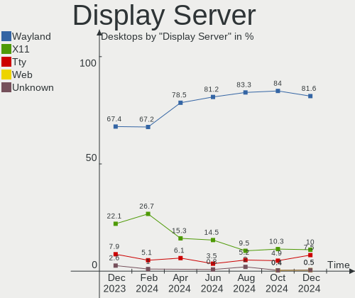
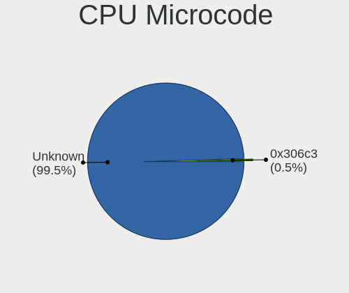

Fedora Hardware Trends (Desktop)
--------------------------------

A project to identify most popular hardware characteristics and track their change
over time based on data collected by Fedora users at https://Linux-Hardware.org.

Anyone can contribute to the study by uploading probes of their computers by
the [hw-probe](https://github.com/linuxhw/hw-probe) tool:

    sudo -E hw-probe -all -upload

Full-feature report is available here: https://linux-hardware.org/?view=trends&formfactor=desktop

Period: Apr, 2021.

Contents
--------

- [ OS                       ](#os)
- [ OS Family                ](#os-family)
- [ Kernel                   ](#kernel)
- [ Kernel Family            ](#kernel-family)
- [ Kernel Major Ver.        ](#kernel-major-ver)
- [ Arch                     ](#arch)
- [ DE                       ](#de)
- [ Display Server           ](#display-server)
- [ Display Manager          ](#display-manager)
- [ OS Lang                  ](#os-lang)
- [ Boot Mode                ](#boot-mode)
- [ Filesystem               ](#filesystem)
- [ Part. scheme             ](#part-scheme)
- [ Dual Boot with Linux/BSD ](#dual-boot-with-linux/bsd)
- [ Dual Boot (Win)          ](#dual-boot-win)
- [ Country                  ](#country)
- [ City                     ](#city)
- [ Vendor                   ](#vendor)
- [ Model                    ](#model)
- [ Model Family             ](#model-family)
- [ MFG Year                 ](#mfg-year)
- [ Form Factor              ](#form-factor)
- [ Secure Boot              ](#secure-boot)
- [ Coreboot                 ](#coreboot)
- [ RAM Size                 ](#ram-size)
- [ RAM Used                 ](#ram-used)
- [ Has CD-ROM               ](#has-cd-rom)
- [ Total Drives             ](#total-drives)
- [ Has Ethernet             ](#has-ethernet)
- [ Has WiFi                 ](#has-wifi)
- [ Has Bluetooth            ](#has-bluetooth)
- [ Drive Vendor             ](#drive-vendor)
- [ Drive Model              ](#drive-model)
- [ HDD Vendor               ](#hdd-vendor)
- [ SSD Vendor               ](#ssd-vendor)
- [ Drive Kind               ](#drive-kind)
- [ Drive Connector          ](#drive-connector)
- [ Drive Size               ](#drive-size)
- [ Space Total              ](#space-total)
- [ Space Used               ](#space-used)
- [ Malfunc. Drives          ](#malfunc-drives)
- [ Malfunc. Drive Vendor    ](#malfunc-drive-vendor)
- [ Malfunc. HDD Vendor      ](#malfunc-hdd-vendor)
- [ Malfunc. Drive Kind      ](#malfunc-drive-kind)
- [ Failed Drives            ](#failed-drives)
- [ Failed Drive Vendor      ](#failed-drive-vendor)
- [ Drive Status             ](#drive-status)
- [ Storage Vendor           ](#storage-vendor)
- [ Storage Model            ](#storage-model)
- [ Storage Kind             ](#storage-kind)
- [ CPU Vendor               ](#cpu-vendor)
- [ CPU Model                ](#cpu-model)
- [ CPU Model Family         ](#cpu-model-family)
- [ CPU Cores                ](#cpu-cores)
- [ CPU Sockets              ](#cpu-sockets)
- [ CPU Threads              ](#cpu-threads)
- [ CPU Op-Modes             ](#cpu-op-modes)
- [ CPU Microcode            ](#cpu-microcode)
- [ CPU Microarch            ](#cpu-microarch)
- [ GPU Vendor               ](#gpu-vendor)
- [ GPU Model                ](#gpu-model)
- [ GPU Combo                ](#gpu-combo)
- [ GPU Driver               ](#gpu-driver)
- [ GPU Memory               ](#gpu-memory)
- [ Monitor Vendor           ](#monitor-vendor)
- [ Monitor Model            ](#monitor-model)
- [ Monitor Resolution       ](#monitor-resolution)
- [ Monitor Diagonal         ](#monitor-diagonal)
- [ Monitor Width            ](#monitor-width)
- [ Aspect Ratio             ](#aspect-ratio)
- [ Monitor Area             ](#monitor-area)
- [ Pixel Density            ](#pixel-density)
- [ Multiple Monitors        ](#multiple-monitors)
- [ Net Controller Vendor    ](#net-controller-vendor)
- [ Net Controller Model     ](#net-controller-model)
- [ Wireless Vendor          ](#wireless-vendor)
- [ Wireless Model           ](#wireless-model)
- [ Ethernet Vendor          ](#ethernet-vendor)
- [ Ethernet Model           ](#ethernet-model)
- [ Net Controller Kind      ](#net-controller-kind)
- [ Used Controller          ](#used-controller)
- [ NICs                     ](#nics)
- [ IPv6                     ](#ipv6)
- [ Memory Vendor            ](#memory-vendor)
- [ Memory Model             ](#memory-model)
- [ Memory Kind              ](#memory-kind)
- [ Memory Form Factor       ](#memory-form-factor)
- [ Memory Size              ](#memory-size)
- [ Memory Speed             ](#memory-speed)
- [ Sound Vendor             ](#sound-vendor)
- [ Sound Model              ](#sound-model)
- [ Camera Vendor            ](#camera-vendor)
- [ Camera Model             ](#camera-model)
- [ Fingerprint Vendor       ](#fingerprint-vendor)
- [ Fingerprint Model        ](#fingerprint-model)
- [ Chipcard Vendor          ](#chipcard-vendor)
- [ Chipcard Model           ](#chipcard-model)
- [ Printer Vendor           ](#printer-vendor)
- [ Printer Model            ](#printer-model)
- [ Scanner Vendor           ](#scanner-vendor)
- [ Scanner Model            ](#scanner-model)
- [ Bluetooth Vendor         ](#bluetooth-vendor)
- [ Bluetooth Model          ](#bluetooth-model)
- [ Unsupported Devices      ](#unsupported-devices)
- [ Unsupported Device Types ](#unsupported-device-types)

OS
--

Installed operating systems

| Name      | Desktops | Percent |
|-----------|----------|---------|
| Fedora 33 | 62       | 51.24%  |
| Fedora 34 | 49       | 40.5%   |
| Fedora 32 | 8        | 6.61%   |
| Fedora 35 | 2        | 1.65%   |

OS Family
---------

OS without a version

| Name   | Desktops | Percent |
|--------|----------|---------|
| Fedora | 121      | 100%    |

Kernel
------

Version of the Linux kernel

| Version                                | Desktops | Percent |
|----------------------------------------|----------|---------|
| 5.11.11-200.fc33.x86_64                | 22       | 18.18%  |
| 5.11.16-300.fc34.x86_64                | 14       | 11.57%  |
| 5.11.14-200.fc33.x86_64                | 12       | 9.92%   |
| 5.11.11-300.fc34.x86_64                | 12       | 9.92%   |
| 5.11.15-200.fc33.x86_64                | 8        | 6.61%   |
| 5.11.12-300.fc34.x86_64                | 8        | 6.61%   |
| 5.11.13-200.fc33.x86_64                | 4        | 3.31%   |
| 5.11.10-200.fc33.x86_64                | 4        | 3.31%   |
| 5.11.15-300.fc34.x86_64                | 3        | 2.48%   |
| 5.11.14-300.fc34.x86_64                | 3        | 2.48%   |
| 5.11.13-300.fc34.x86_64                | 3        | 2.48%   |
| 5.12.0-0.rc7.189.fc35.x86_64           | 2        | 1.65%   |
| 5.11.3-300.fc34.x86_64                 | 2        | 1.65%   |
| 5.11.16-200.fc33.x86_64                | 2        | 1.65%   |
| 5.11.12-200.fc33.x86_64                | 2        | 1.65%   |
| 5.11.11-100.fc32.x86_64                | 2        | 1.65%   |
| 5.11.10-300.fc34.x86_64                | 2        | 1.65%   |
| 5.10.22-200.fc33.x86_64                | 2        | 1.65%   |
| 5.8.15-301.fc33.x86_64                 | 1        | 0.83%   |
| 5.7.10-201.fc32.x86_64                 | 1        | 0.83%   |
| 5.6.13-300.fc32.x86_64                 | 1        | 0.83%   |
| 5.12.0-xanmod1_cacule.0.fc34           | 1        | 0.83%   |
| 5.11.9-200.fc33.x86_64                 | 1        | 0.83%   |
| 5.11.7-200.fc33.x86_64                 | 1        | 0.83%   |
| 5.11.17-300.fc34.x86_64                | 1        | 0.83%   |
| 5.11.15-100.fc32.x86_64                | 1        | 0.83%   |
| 5.11.10-100.fc32.x86_64                | 1        | 0.83%   |
| 5.10.22-100.fc32.x86_64                | 1        | 0.83%   |
| 5.10.2-200.rt20.1.fc33.ccrma.x86_64+rt | 1        | 0.83%   |
| 5.10.19-200.fc33.x86_64                | 1        | 0.83%   |
| 5.10.18-200.fc33.x86_64                | 1        | 0.83%   |
| 5.10.17-100.fc32.x86_64                | 1        | 0.83%   |

Kernel Family
-------------

Linux kernel without a distro release

| Version | Desktops | Percent |
|---------|----------|---------|
| 5.11.11 | 36       | 29.75%  |
| 5.11.16 | 16       | 13.22%  |
| 5.11.14 | 15       | 12.4%   |
| 5.11.15 | 12       | 9.92%   |
| 5.11.12 | 10       | 8.26%   |
| 5.11.13 | 7        | 5.79%   |
| 5.11.10 | 7        | 5.79%   |
| 5.12.0  | 3        | 2.48%   |
| 5.10.22 | 3        | 2.48%   |
| 5.11.3  | 2        | 1.65%   |
| 5.8.15  | 1        | 0.83%   |
| 5.7.10  | 1        | 0.83%   |
| 5.6.13  | 1        | 0.83%   |
| 5.11.9  | 1        | 0.83%   |
| 5.11.7  | 1        | 0.83%   |
| 5.11.17 | 1        | 0.83%   |
| 5.10.2  | 1        | 0.83%   |
| 5.10.19 | 1        | 0.83%   |
| 5.10.18 | 1        | 0.83%   |
| 5.10.17 | 1        | 0.83%   |

Kernel Major Ver.
-----------------

Linux kernel major version

| Version | Desktops | Percent |
|---------|----------|---------|
| 5.11    | 108      | 89.26%  |
| 5.10    | 7        | 5.79%   |
| 5.12    | 3        | 2.48%   |
| 5.8     | 1        | 0.83%   |
| 5.7     | 1        | 0.83%   |
| 5.6     | 1        | 0.83%   |

Arch
----

OS architecture (x86_64, i586, etc.)

| Name   | Desktops | Percent |
|--------|----------|---------|
| x86_64 | 121      | 100%    |

DE
--

Desktop Environment

| Name       | Desktops | Percent |
|------------|----------|---------|
| GNOME      | 78       | 64.46%  |
| KDE        | 13       | 10.74%  |
| KDE5       | 7        | 5.79%   |
| Cinnamon   | 7        | 5.79%   |
| X-Cinnamon | 5        | 4.13%   |
| XFCE       | 4        | 3.31%   |
| Unknown    | 3        | 2.48%   |
| MATE       | 2        | 1.65%   |
| openbox    | 1        | 0.83%   |
| LXDE       | 1        | 0.83%   |

Display Server
--------------

X11 or Wayland

| Name    | Desktops | Percent |
|---------|----------|---------|
| Wayland | 63       | 52.07%  |
| X11     | 50       | 41.32%  |
| Tty     | 8        | 6.61%   |

Display Manager
---------------

SDDM, LightDM, etc.

| Name    | Desktops | Percent |
|---------|----------|---------|
| Unknown | 70       | 57.85%  |
| GDM     | 32       | 26.45%  |
| TDM     | 6        | 4.96%   |
| SDDM    | 6        | 4.96%   |
| LightDM | 5        | 4.13%   |
| XDM     | 2        | 1.65%   |

OS Lang
-------

Language

| Lang  | Desktops | Percent |
|-------|----------|---------|
| en_US | 49       | 40.5%   |
| de_DE | 10       | 8.26%   |
| en_GB | 8        | 6.61%   |
| ru_RU | 7        | 5.79%   |
| fr_FR | 7        | 5.79%   |
| en_AU | 6        | 4.96%   |
| pt_BR | 4        | 3.31%   |
| nl_BE | 4        | 3.31%   |
| it_IT | 3        | 2.48%   |
| en_CA | 3        | 2.48%   |
| fr_CH | 2        | 1.65%   |
| en_IE | 2        | 1.65%   |
| cs_CZ | 2        | 1.65%   |
| zh_CN | 1        | 0.83%   |
| pl_PL | 1        | 0.83%   |
| mn_MN | 1        | 0.83%   |
| ko_KR | 1        | 0.83%   |
| fi_FI | 1        | 0.83%   |
| es_UY | 1        | 0.83%   |
| es_ES | 1        | 0.83%   |
| es_CL | 1        | 0.83%   |
| es_AR | 1        | 0.83%   |
| en_NZ | 1        | 0.83%   |
| en_IN | 1        | 0.83%   |
| en_IL | 1        | 0.83%   |
| en_AT | 1        | 0.83%   |
| el_GR | 1        | 0.83%   |

Boot Mode
---------

EFI or BIOS

| Mode | Desktops | Percent |
|------|----------|---------|
| EFI  | 69       | 57.02%  |
| BIOS | 52       | 42.98%  |

Filesystem
----------

Type of filesystem

| Type  | Desktops | Percent |
|-------|----------|---------|
| Btrfs | 66       | 54.55%  |
| Ext4  | 42       | 34.71%  |
| Xfs   | 13       | 10.74%  |

Part. scheme
------------

Scheme of partitioning

| Type    | Desktops | Percent |
|---------|----------|---------|
| Unknown | 67       | 55.37%  |
| GPT     | 34       | 28.1%   |
| MBR     | 20       | 16.53%  |

Dual Boot with Linux/BSD
------------------------

Hosting more than one Linux/BSD

| Dual boot | Desktops | Percent |
|-----------|----------|---------|
| No        | 112      | 92.56%  |
| Yes       | 9        | 7.44%   |

Dual Boot (Win)
---------------

Hosting Linux and Windows

| Dual boot | Desktops | Percent |
|-----------|----------|---------|
| No        | 101      | 83.47%  |
| Yes       | 20       | 16.53%  |

Country
-------

Geographic location (country)

| Country     | Desktops | Percent |
|-------------|----------|---------|
| USA         | 27       | 22.31%  |
| Germany     | 15       | 12.4%   |
| Russia      | 8        | 6.61%   |
| France      | 7        | 5.79%   |
| Australia   | 7        | 5.79%   |
| Switzerland | 5        | 4.13%   |
| Belgium     | 5        | 4.13%   |
| Italy       | 4        | 3.31%   |
| Canada      | 4        | 3.31%   |
| Brazil      | 4        | 3.31%   |
| UK          | 3        | 2.48%   |
| Czechia     | 3        | 2.48%   |
| Sweden      | 2        | 1.65%   |
| Poland      | 2        | 1.65%   |
| Ireland     | 2        | 1.65%   |
| Finland     | 2        | 1.65%   |
| Chile       | 2        | 1.65%   |
| Uruguay     | 1        | 0.83%   |
| Ukraine     | 1        | 0.83%   |
| Turkey      | 1        | 0.83%   |
| Spain       | 1        | 0.83%   |
| South Korea | 1        | 0.83%   |
| Slovakia    | 1        | 0.83%   |
| Romania     | 1        | 0.83%   |
| New Zealand | 1        | 0.83%   |
| Netherlands | 1        | 0.83%   |
| Mongolia    | 1        | 0.83%   |
| Martinique  | 1        | 0.83%   |
| Indonesia   | 1        | 0.83%   |
| India       | 1        | 0.83%   |
| Greece      | 1        | 0.83%   |
| Egypt       | 1        | 0.83%   |
| China       | 1        | 0.83%   |
| Bulgaria    | 1        | 0.83%   |
| Belarus     | 1        | 0.83%   |
| Argentina   | 1        | 0.83%   |

City
----

Geographic location (city)

| City              | Desktops | Percent |
|-------------------|----------|---------|
| Chipping Norton   | 6        | 4.96%   |
| Zurich            | 2        | 1.65%   |
| Yekaterinburg     | 2        | 1.65%   |
| Vaestra Froelunda | 2        | 1.65%   |
| St Petersburg     | 2        | 1.65%   |
| Montreal          | 2        | 1.65%   |
| Cologne           | 2        | 1.65%   |
| Berlin            | 2        | 1.65%   |
| Athens            | 2        | 1.65%   |
| Woodbridge        | 1        | 0.83%   |
| Waterville        | 1        | 0.83%   |
| Voronezh          | 1        | 0.83%   |
| Villa Alemana     | 1        | 0.83%   |
| Vienna            | 1        | 0.83%   |
| Versailles        | 1        | 0.83%   |
| Vancouver         | 1        | 0.83%   |
| Ulyanovsk         | 1        | 0.83%   |
| Ulan Bator        | 1        | 0.83%   |
| Thetford Center   | 1        | 0.83%   |
| Surabaya          | 1        | 0.83%   |
| Streamwood        | 1        | 0.83%   |
| Sofia             | 1        | 0.83%   |
| Smolensk          | 1        | 0.83%   |
| Slatinice         | 1        | 0.83%   |
| Sint-Niklaas      | 1        | 0.83%   |
| Shenzhen          | 1        | 0.83%   |
| Seattle           | 1        | 0.83%   |
| Schramberg        | 1        | 0.83%   |
| Rosny-sous-Bois   | 1        | 0.83%   |
| Rosario           | 1        | 0.83%   |
| Rome              | 1        | 0.83%   |
| Rockford          | 1        | 0.83%   |
| Richmond          | 1        | 0.83%   |
| Pouso Alegre      | 1        | 0.83%   |
| Portland          | 1        | 0.83%   |
| Pompano Beach     | 1        | 0.83%   |
| Pobiedziska       | 1        | 0.83%   |
| Pinneberg         | 1        | 0.83%   |
| Pilsen            | 1        | 0.83%   |
| Perpignan         | 1        | 0.83%   |
| Owatonna          | 1        | 0.83%   |
| Osasco            | 1        | 0.83%   |
| Nuremberg         | 1        | 0.83%   |
| New Castle        | 1        | 0.83%   |
| Nantes            | 1        | 0.83%   |
| Montevideo        | 1        | 0.83%   |
| Mokpo             | 1        | 0.83%   |
| Mirsk             | 1        | 0.83%   |
| Minsk             | 1        | 0.83%   |
| Minneapolis       | 1        | 0.83%   |
| Milford           | 1        | 0.83%   |
| Mennecy           | 1        | 0.83%   |
| Mende             | 1        | 0.83%   |
| Mechelen          | 1        | 0.83%   |
| Manassas          | 1        | 0.83%   |
| Lugano            | 1        | 0.83%   |
| Louisville        | 1        | 0.83%   |
| Longmont          | 1        | 0.83%   |
| Longford          | 1        | 0.83%   |
| London            | 1        | 0.83%   |

Vendor
------

Motherboard manufacturer

| Name                | Desktops | Percent |
|---------------------|----------|---------|
| ASUSTek Computer    | 34       | 28.1%   |
| Gigabyte Technology | 28       | 23.14%  |
| MSI                 | 18       | 14.88%  |
| ASRock              | 14       | 11.57%  |
| Hewlett-Packard     | 9        | 7.44%   |
| Dell                | 5        | 4.13%   |
| Lenovo              | 3        | 2.48%   |
| Medion              | 2        | 1.65%   |
| Unknown             | 2        | 1.65%   |
| Packard Bell        | 1        | 0.83%   |
| Koloe               | 1        | 0.83%   |
| Fujitsu             | 1        | 0.83%   |
| eMachines           | 1        | 0.83%   |
| ECS                 | 1        | 0.83%   |
| Acer                | 1        | 0.83%   |

Model
-----

Motherboard model

| Name                               | Desktops | Percent |
|------------------------------------|----------|---------|
| ASUS TUF GAMING X570-PLUS          | 3        | 2.48%   |
| ASUS All Series                    | 3        | 2.48%   |
| ASUS ROG Maximus XI FORMULA        | 2        | 1.65%   |
| ASUS H110M-K                       | 2        | 1.65%   |
| ASRock AB350 Pro4                  | 2        | 1.65%   |
| Unknown                            | 2        | 1.65%   |
| Packard Bell ixtreme M5800         | 1        | 0.83%   |
| MSI MS-7C91                        | 1        | 0.83%   |
| MSI MS-7C56                        | 1        | 0.83%   |
| MSI MS-7C39                        | 1        | 0.83%   |
| MSI MS-7B89                        | 1        | 0.83%   |
| MSI MS-7B85                        | 1        | 0.83%   |
| MSI MS-7B48                        | 1        | 0.83%   |
| MSI MS-7B10                        | 1        | 0.83%   |
| MSI MS-7A72                        | 1        | 0.83%   |
| MSI MS-7A70                        | 1        | 0.83%   |
| MSI MS-7A44                        | 1        | 0.83%   |
| MSI MS-7A39                        | 1        | 0.83%   |
| MSI MS-7A38                        | 1        | 0.83%   |
| MSI MS-7A34                        | 1        | 0.83%   |
| MSI MS-7A32                        | 1        | 0.83%   |
| MSI MS-7974                        | 1        | 0.83%   |
| MSI MS-7917                        | 1        | 0.83%   |
| MSI MS-7693                        | 1        | 0.83%   |
| MSI MS-7597                        | 1        | 0.83%   |
| Medion P961x                       | 1        | 0.83%   |
| Medion MD34315/C841                | 1        | 0.83%   |
| Lenovo ThinkCentre M91 2491A3G     | 1        | 0.83%   |
| Lenovo H50-55 90BG003LUS           | 1        | 0.83%   |
| Lenovo H30-05 90BJ0082CK           | 1        | 0.83%   |
| Koloe Thurley                      | 1        | 0.83%   |
| HP Z820 Workstation                | 1        | 0.83%   |
| HP xw6600 Workstation              | 1        | 0.83%   |
| HP ProDesk 400 G2 MT               | 1        | 0.83%   |
| HP ProDesk 400 G1 MT               | 1        | 0.83%   |
| HP Pavilion Desktop PC 570-p047c   | 1        | 0.83%   |
| HP Pavilion Desktop 590-a0xxx      | 1        | 0.83%   |
| HP EliteDesk 800 G2 DM 65W         | 1        | 0.83%   |
| HP Compaq Elite 8300 SFF           | 1        | 0.83%   |
| HP Compaq dc5750 Small Form Factor | 1        | 0.83%   |
| Gigabyte Z97N-WIFI                 | 1        | 0.83%   |
| Gigabyte Z87-D3HP                  | 1        | 0.83%   |
| Gigabyte Z68P-DS3                  | 1        | 0.83%   |
| Gigabyte Z390 UD                   | 1        | 0.83%   |
| Gigabyte Z170-D3H                  | 1        | 0.83%   |
| Gigabyte X570 AORUS PRO WIFI       | 1        | 0.83%   |
| Gigabyte X570 AORUS PRO            | 1        | 0.83%   |
| Gigabyte H87-HD3                   | 1        | 0.83%   |
| Gigabyte H77N-WIFI                 | 1        | 0.83%   |
| Gigabyte H61M-S2PV                 | 1        | 0.83%   |
| Gigabyte H310M H 2.0               | 1        | 0.83%   |
| Gigabyte GA-MA780G-UD3H            | 1        | 0.83%   |
| Gigabyte GA-78LMT-USB3 6.0         | 1        | 0.83%   |
| Gigabyte GA-73VM-S2                | 1        | 0.83%   |
| Gigabyte G41MT-D3                  | 1        | 0.83%   |
| Gigabyte EP41-UD3L                 | 1        | 0.83%   |
| Gigabyte D525TUD                   | 1        | 0.83%   |
| Gigabyte B550M DS3H                | 1        | 0.83%   |
| Gigabyte B550 VISION D             | 1        | 0.83%   |
| Gigabyte B460MD3H                  | 1        | 0.83%   |

Model Family
------------

Motherboard model prefix

| Name                    | Desktops | Percent |
|-------------------------|----------|---------|
| ASUS ROG                | 10       | 8.26%   |
| ASUS TUF                | 4        | 3.31%   |
| ASUS PRIME              | 4        | 3.31%   |
| Gigabyte B450           | 3        | 2.48%   |
| Dell Precision          | 3        | 2.48%   |
| ASUS All                | 3        | 2.48%   |
| HP ProDesk              | 2        | 1.65%   |
| HP Pavilion             | 2        | 1.65%   |
| HP Compaq               | 2        | 1.65%   |
| Gigabyte X570           | 2        | 1.65%   |
| Gigabyte B450M          | 2        | 1.65%   |
| Dell OptiPlex           | 2        | 1.65%   |
| ASUS H110M-K            | 2        | 1.65%   |
| ASRock AB350            | 2        | 1.65%   |
| Unknown                 | 2        | 1.65%   |
| Packard Bell ixtreme    | 1        | 0.83%   |
| MSI MS-7C91             | 1        | 0.83%   |
| MSI MS-7C56             | 1        | 0.83%   |
| MSI MS-7C39             | 1        | 0.83%   |
| MSI MS-7B89             | 1        | 0.83%   |
| MSI MS-7B85             | 1        | 0.83%   |
| MSI MS-7B48             | 1        | 0.83%   |
| MSI MS-7B10             | 1        | 0.83%   |
| MSI MS-7A72             | 1        | 0.83%   |
| MSI MS-7A70             | 1        | 0.83%   |
| MSI MS-7A44             | 1        | 0.83%   |
| MSI MS-7A39             | 1        | 0.83%   |
| MSI MS-7A38             | 1        | 0.83%   |
| MSI MS-7A34             | 1        | 0.83%   |
| MSI MS-7A32             | 1        | 0.83%   |
| MSI MS-7974             | 1        | 0.83%   |
| MSI MS-7917             | 1        | 0.83%   |
| MSI MS-7693             | 1        | 0.83%   |
| MSI MS-7597             | 1        | 0.83%   |
| Medion P961x            | 1        | 0.83%   |
| Medion MD34315          | 1        | 0.83%   |
| Lenovo ThinkCentre      | 1        | 0.83%   |
| Lenovo H50-55           | 1        | 0.83%   |
| Lenovo H30-05           | 1        | 0.83%   |
| Koloe Thurley           | 1        | 0.83%   |
| HP Z820                 | 1        | 0.83%   |
| HP xw6600               | 1        | 0.83%   |
| HP EliteDesk            | 1        | 0.83%   |
| Gigabyte Z97N-WIFI      | 1        | 0.83%   |
| Gigabyte Z87-D3HP       | 1        | 0.83%   |
| Gigabyte Z68P-DS3       | 1        | 0.83%   |
| Gigabyte Z390           | 1        | 0.83%   |
| Gigabyte Z170-D3H       | 1        | 0.83%   |
| Gigabyte H87-HD3        | 1        | 0.83%   |
| Gigabyte H77N-WIFI      | 1        | 0.83%   |
| Gigabyte H61M-S2PV      | 1        | 0.83%   |
| Gigabyte H310M          | 1        | 0.83%   |
| Gigabyte GA-MA780G-UD3H | 1        | 0.83%   |
| Gigabyte GA-78LMT-USB3  | 1        | 0.83%   |
| Gigabyte GA-73VM-S2     | 1        | 0.83%   |
| Gigabyte G41MT-D3       | 1        | 0.83%   |
| Gigabyte EP41-UD3L      | 1        | 0.83%   |
| Gigabyte D525TUD        | 1        | 0.83%   |
| Gigabyte B550M          | 1        | 0.83%   |
| Gigabyte B550           | 1        | 0.83%   |

MFG Year
--------

Motherboard manufacture year

| Year | Desktops | Percent |
|------|----------|---------|
| 2020 | 22       | 18.18%  |
| 2019 | 19       | 15.7%   |
| 2018 | 13       | 10.74%  |
| 2014 | 11       | 9.09%   |
| 2021 | 7        | 5.79%   |
| 2016 | 7        | 5.79%   |
| 2012 | 7        | 5.79%   |
| 2010 | 7        | 5.79%   |
| 2017 | 6        | 4.96%   |
| 2013 | 5        | 4.13%   |
| 2015 | 4        | 3.31%   |
| 2009 | 4        | 3.31%   |
| 2011 | 3        | 2.48%   |
| 2008 | 3        | 2.48%   |
| 2006 | 2        | 1.65%   |
| 2007 | 1        | 0.83%   |

Form Factor
-----------

Physical design of the computer

| Name    | Desktops | Percent |
|---------|----------|---------|
| Desktop | 121      | 100%    |

Secure Boot
-----------

Enabled or disabled

| State    | Desktops | Percent |
|----------|----------|---------|
| Disabled | 118      | 97.52%  |
| Enabled  | 3        | 2.48%   |

Coreboot
--------

Have coreboot on board

| Used | Desktops | Percent |
|------|----------|---------|
| No   | 121      | 100%    |

RAM Size
--------

Total RAM memory

| Size in GB  | Desktops | Percent |
|-------------|----------|---------|
| 32.01-64.0  | 33       | 27.27%  |
| 16.01-24.0  | 27       | 22.31%  |
| 8.01-16.0   | 24       | 19.83%  |
| 3.01-4.0    | 14       | 11.57%  |
| 4.01-8.0    | 13       | 10.74%  |
| 64.01-256.0 | 8        | 6.61%   |
| 24.01-32.0  | 1        | 0.83%   |
| 0.51-1.0    | 1        | 0.83%   |

RAM Used
--------

Used RAM memory

| Used GB    | Desktops | Percent |
|------------|----------|---------|
| 4.01-8.0   | 36       | 29.75%  |
| 2.01-3.0   | 30       | 24.79%  |
| 3.01-4.0   | 20       | 16.53%  |
| 1.01-2.0   | 17       | 14.05%  |
| 8.01-16.0  | 8        | 6.61%   |
| 0.51-1.0   | 3        | 2.48%   |
| 0.01-0.5   | 3        | 2.48%   |
| 16.01-24.0 | 2        | 1.65%   |
| 32.01-64.0 | 1        | 0.83%   |
| 24.01-32.0 | 1        | 0.83%   |

Has CD-ROM
----------

Has CD-ROM on board

| Presented | Desktops | Percent |
|-----------|----------|---------|
| No        | 73       | 60.33%  |
| Yes       | 48       | 39.67%  |

Total Drives
------------

Number of drives on board

| Drives | Desktops | Percent |
|--------|----------|---------|
| 1      | 34       | 28.1%   |
| 2      | 33       | 27.27%  |
| 3      | 21       | 17.36%  |
| 4      | 13       | 10.74%  |
| 5      | 10       | 8.26%   |
| 6      | 4        | 3.31%   |
| 7      | 3        | 2.48%   |
| 0      | 2        | 1.65%   |
| 9      | 1        | 0.83%   |

Has Ethernet
------------

Has Ethernet on board

| Presented | Desktops | Percent |
|-----------|----------|---------|
| Yes       | 121      | 100%    |

Has WiFi
--------

Has WiFi module

| Presented | Desktops | Percent |
|-----------|----------|---------|
| No        | 74       | 61.16%  |
| Yes       | 47       | 38.84%  |

Has Bluetooth
-------------

Has Bluetooth module

| Presented | Desktops | Percent |
|-----------|----------|---------|
| No        | 70       | 57.85%  |
| Yes       | 51       | 42.15%  |

Drive Vendor
------------

Hard drive vendors

| Vendor                    | Desktops | Drives | Percent |
|---------------------------|----------|--------|---------|
| WDC                       | 48       | 66     | 20.69%  |
| Samsung Electronics       | 42       | 82     | 18.1%   |
| Seagate                   | 39       | 56     | 16.81%  |
| Toshiba                   | 15       | 17     | 6.47%   |
| Crucial                   | 15       | 18     | 6.47%   |
| Kingston                  | 13       | 16     | 5.6%    |
| SanDisk                   | 10       | 10     | 4.31%   |
| Hitachi                   | 9        | 10     | 3.88%   |
| Intel                     | 5        | 5      | 2.16%   |
| A-DATA Technology         | 4        | 4      | 1.72%   |
| SPCC                      | 3        | 4      | 1.29%   |
| Phison                    | 3        | 3      | 1.29%   |
| Unknown                   | 2        | 2      | 0.86%   |
| PNY                       | 2        | 3      | 0.86%   |
| Patriot                   | 2        | 3      | 0.86%   |
| Micron/Crucial Technology | 2        | 2      | 0.86%   |
| XPG                       | 1        | 1      | 0.43%   |
| WD MediaMax               | 1        | 1      | 0.43%   |
| Transcend                 | 1        | 1      | 0.43%   |
| Team                      | 1        | 1      | 0.43%   |
| Silicon Motion            | 1        | 1      | 0.43%   |
| Radeon                    | 1        | 1      | 0.43%   |
| OCZ                       | 1        | 2      | 0.43%   |
| Mushkin                   | 1        | 1      | 0.43%   |
| Micron Technology         | 1        | 1      | 0.43%   |
| MAXTOR                    | 1        | 1      | 0.43%   |
| Lite-On                   | 1        | 1      | 0.43%   |
| Leven                     | 1        | 1      | 0.43%   |
| KingSpec                  | 1        | 1      | 0.43%   |
| Fujitsu                   | 1        | 1      | 0.43%   |
| DREVO                     | 1        | 1      | 0.43%   |
| Axiom                     | 1        | 1      | 0.43%   |
| Advantech                 | 1        | 1      | 0.43%   |
| ADATA Technology          | 1        | 1      | 0.43%   |

Drive Model
-----------

Hard drive models

| Model                            | Desktops | Percent |
|----------------------------------|----------|---------|
| Samsung NVMe SSD Drive 1TB       | 7        | 2.41%   |
| Samsung NVMe SSD Drive 500GB     | 6        | 2.07%   |
| Seagate ST500DM002-1BD142 500GB  | 5        | 1.72%   |
| Samsung SSD 860 EVO 1TB          | 5        | 1.72%   |
| Samsung SSD 850 EVO 250GB        | 5        | 1.72%   |
| Seagate ST2000DM008-2FR102 2TB   | 4        | 1.38%   |
| Seagate ST1000DM003-1ER162 1TB   | 4        | 1.38%   |
| Samsung SSD 860 EVO 500GB        | 4        | 1.38%   |
| WDC WD40EFRX-68N32N0 4TB         | 3        | 1.03%   |
| Seagate ST1000DM010-2EP102 1TB   | 3        | 1.03%   |
| Samsung SSD 970 EVO 500GB        | 3        | 1.03%   |
| Samsung SSD 850 EVO 500GB        | 3        | 1.03%   |
| Samsung NVMe SSD Drive 250GB     | 3        | 1.03%   |
| Kingston SA400S37120G 120GB SSD  | 3        | 1.03%   |
| Crucial CT500MX500SSD1 500GB     | 3        | 1.03%   |
| WDC WDS480G2G0A-00JH30 480GB SSD | 2        | 0.69%   |
| WDC WDS240G2G0A-00JH30 240GB SSD | 2        | 0.69%   |
| WDC WD40EZRZ-00GXCB0 4TB         | 2        | 0.69%   |
| WDC WD30EFRX-68EUZN0 3TB         | 2        | 0.69%   |
| WDC WD2003FZEX-00SRLA0 2TB       | 2        | 0.69%   |
| WDC WD10EADS-00L5B1 1TB          | 2        | 0.69%   |
| WDC WD1003FZEX-00K3CA0 1TB       | 2        | 0.69%   |
| Toshiba MK7575GSX 752GB          | 2        | 0.69%   |
| Toshiba HDWD110 1TB              | 2        | 0.69%   |
| Toshiba DT01ACA200 2TB           | 2        | 0.69%   |
| Toshiba DT01ACA100 1TB           | 2        | 0.69%   |
| Seagate ST4000DM004-2CV104 4TB   | 2        | 0.69%   |
| Seagate ST3500413AS 500GB        | 2        | 0.69%   |
| Seagate ST3160815AS 160GB        | 2        | 0.69%   |
| Seagate ST1000DM003-1SB102 1TB   | 2        | 0.69%   |
| SanDisk SDSSDA240G 240GB         | 2        | 0.69%   |
| Samsung SSD 970 EVO Plus 1TB     | 2        | 0.69%   |
| Samsung SSD 860 EVO 250GB        | 2        | 0.69%   |
| Samsung SSD 840 EVO 250GB        | 2        | 0.69%   |
| Samsung Portable SSD T5 1TB      | 2        | 0.69%   |
| Samsung NVMe SSD Drive 2TB       | 2        | 0.69%   |
| Kingston SV300S37A240G 240GB SSD | 2        | 0.69%   |
| Kingston SV300S37A120G 120GB SSD | 2        | 0.69%   |
| Intel SSDSC2KW256G8 256GB        | 2        | 0.69%   |
| Crucial CT240BX500SSD1 240GB     | 2        | 0.69%   |
| Crucial CT240BX200SSD1 240GB     | 2        | 0.69%   |
| Crucial CT120BX500SSD1 120GB     | 2        | 0.69%   |
| A-DATA SP550 120GB SSD           | 2        | 0.69%   |
| XPG NVMe SSD Drive 512GB         | 1        | 0.34%   |
| WDC WDS500G2B0C-00PXH0 500GB     | 1        | 0.34%   |
| WDC WDS500G2B0B-00YS70 500GB SSD | 1        | 0.34%   |
| WDC WDS250G1B0A-00H9H0 250GB SSD | 1        | 0.34%   |
| WDC WDS240G2G0B-00EPW0 240GB SSD | 1        | 0.34%   |
| WDC WDS120G2G0B-00EPW0 120GB SSD | 1        | 0.34%   |
| WDC WDS120G2G0A-00JH30 120GB SSD | 1        | 0.34%   |
| WDC WDS100T2G0A-00JH30 1TB SSD   | 1        | 0.34%   |
| WDC WDS100T2B0A-00SM50 1TB SSD   | 1        | 0.34%   |
| WDC WDS100T1X0E-00AFY0 1TB       | 1        | 0.34%   |
| WDC WD5000AVDS-63U7B1 500GB      | 1        | 0.34%   |
| WDC WD5000AAKX-75U6AA0 500GB     | 1        | 0.34%   |
| WDC WD5000AAKX-60U6AA0 500GB     | 1        | 0.34%   |
| WDC WD5000AAKX-00ERMA0 500GB     | 1        | 0.34%   |
| WDC WD5000AACS-00ZUB0 500GB      | 1        | 0.34%   |
| WDC WD40EZRZ-22GXCB0 4TB         | 1        | 0.34%   |
| WDC WD40EZRX-22SPEB0 4TB         | 1        | 0.34%   |

HDD Vendor
----------

Hard disk drive vendors

| Vendor              | Desktops | Drives | Percent |
|---------------------|----------|--------|---------|
| Seagate             | 39       | 55     | 38.24%  |
| WDC                 | 36       | 53     | 35.29%  |
| Toshiba             | 12       | 14     | 11.76%  |
| Hitachi             | 9        | 10     | 8.82%   |
| Samsung Electronics | 4        | 5      | 3.92%   |
| MAXTOR              | 1        | 1      | 0.98%   |
| Fujitsu             | 1        | 1      | 0.98%   |

SSD Vendor
----------

Solid state drive vendors

| Vendor              | Desktops | Drives | Percent |
|---------------------|----------|--------|---------|
| Samsung Electronics | 29       | 45     | 29.59%  |
| Crucial             | 15       | 18     | 15.31%  |
| WDC                 | 11       | 11     | 11.22%  |
| Kingston            | 9        | 12     | 9.18%   |
| SanDisk             | 8        | 8      | 8.16%   |
| A-DATA Technology   | 4        | 4      | 4.08%   |
| SPCC                | 3        | 4      | 3.06%   |
| Intel               | 3        | 3      | 3.06%   |
| PNY                 | 2        | 3      | 2.04%   |
| Patriot             | 2        | 3      | 2.04%   |
| Transcend           | 1        | 1      | 1.02%   |
| Toshiba             | 1        | 1      | 1.02%   |
| Team                | 1        | 1      | 1.02%   |
| Radeon              | 1        | 1      | 1.02%   |
| OCZ                 | 1        | 2      | 1.02%   |
| Mushkin             | 1        | 1      | 1.02%   |
| Micron Technology   | 1        | 1      | 1.02%   |
| Leven               | 1        | 1      | 1.02%   |
| KingSpec            | 1        | 1      | 1.02%   |
| DREVO               | 1        | 1      | 1.02%   |
| Axiom               | 1        | 1      | 1.02%   |
| Advantech           | 1        | 1      | 1.02%   |

Drive Kind
----------

HDD or SSD

| Kind    | Desktops | Drives | Percent |
|---------|----------|--------|---------|
| SSD     | 84       | 124    | 42.21%  |
| HDD     | 74       | 139    | 37.19%  |
| NVMe    | 39       | 55     | 19.6%   |
| Unknown | 2        | 2      | 1.01%   |

Drive Connector
---------------

SATA, SAS, NVMe, etc.

| Type | Desktops | Drives | Percent |
|------|----------|--------|---------|
| SATA | 109      | 259    | 70.78%  |
| NVMe | 39       | 55     | 25.32%  |
| SAS  | 6        | 6      | 3.9%    |

Drive Size
----------

Size of hard drive

| Size in TB | Desktops | Drives | Percent |
|------------|----------|--------|---------|
| 0.01-0.5   | 85       | 134    | 48.02%  |
| 0.51-1.0   | 51       | 77     | 28.81%  |
| 1.01-2.0   | 23       | 27     | 12.99%  |
| 3.01-4.0   | 12       | 15     | 6.78%   |
| 2.01-3.0   | 5        | 9      | 2.82%   |
| 4.01-10.0  | 1        | 1      | 0.56%   |

Space Total
-----------

Amount of disk space available on the file system

| Size in GB     | Desktops | Percent |
|----------------|----------|---------|
| 251-500        | 20       | 16.53%  |
| 501-1000       | 20       | 16.53%  |
| 101-250        | 19       | 15.7%   |
| More than 3000 | 18       | 14.88%  |
| 1001-2000      | 16       | 13.22%  |
| 2001-3000      | 11       | 9.09%   |
| Unknown        | 8        | 6.61%   |
| 1-20           | 5        | 4.13%   |
| 21-50          | 2        | 1.65%   |
| 51-100         | 2        | 1.65%   |

Space Used
----------

Amount of used disk space

| Used GB        | Desktops | Percent |
|----------------|----------|---------|
| 251-500        | 22       | 18.18%  |
| 21-50          | 20       | 16.53%  |
| 101-250        | 16       | 13.22%  |
| 1-20           | 16       | 13.22%  |
| 501-1000       | 12       | 9.92%   |
| 1001-2000      | 8        | 6.61%   |
| 51-100         | 8        | 6.61%   |
| Unknown        | 8        | 6.61%   |
| 2001-3000      | 6        | 4.96%   |
| More than 3000 | 5        | 4.13%   |

Malfunc. Drives
---------------

Drive models with a malfunction

| Model                             | Desktops | Drives | Percent |
|-----------------------------------|----------|--------|---------|
| Seagate ST500DM002-1BD142 500GB   | 3        | 4      | 18.75%  |
| WDC WD1600AVVS-63L2B0 160GB       | 1        | 1      | 6.25%   |
| WDC WD15EARS-00S8B1 1TB           | 1        | 1      | 6.25%   |
| WDC WD1003FZEX-00MK2A0 1TB        | 1        | 2      | 6.25%   |
| Toshiba MK7575GSX 752GB           | 1        | 1      | 6.25%   |
| Toshiba HDWD110 1TB               | 1        | 1      | 6.25%   |
| Toshiba DT01ACA200 2TB            | 1        | 1      | 6.25%   |
| Toshiba DT01ACA050 500GB          | 1        | 1      | 6.25%   |
| Seagate ST3200827AS 200GB         | 1        | 1      | 6.25%   |
| SanDisk SDSSDX240GG25 240GB       | 1        | 1      | 6.25%   |
| Samsung Electronics HD501LJ 500GB | 1        | 1      | 6.25%   |
| Hitachi HTS725032A9A364 320GB     | 1        | 1      | 6.25%   |
| Hitachi HTS547575A9E384 752GB     | 1        | 1      | 6.25%   |
| A-DATA Technology SP900 128GB SSD | 1        | 1      | 6.25%   |

Malfunc. Drive Vendor
---------------------

Vendors of faulty drives

| Vendor              | Desktops | Drives | Percent |
|---------------------|----------|--------|---------|
| Toshiba             | 4        | 4      | 25%     |
| Seagate             | 4        | 5      | 25%     |
| WDC                 | 3        | 4      | 18.75%  |
| Hitachi             | 2        | 2      | 12.5%   |
| SanDisk             | 1        | 1      | 6.25%   |
| Samsung Electronics | 1        | 1      | 6.25%   |
| A-DATA Technology   | 1        | 1      | 6.25%   |

Malfunc. HDD Vendor
-------------------

Vendors of faulty HDD drives

| Vendor              | Desktops | Drives | Percent |
|---------------------|----------|--------|---------|
| Toshiba             | 4        | 4      | 28.57%  |
| Seagate             | 4        | 5      | 28.57%  |
| WDC                 | 3        | 4      | 21.43%  |
| Hitachi             | 2        | 2      | 14.29%  |
| Samsung Electronics | 1        | 1      | 7.14%   |

Malfunc. Drive Kind
-------------------

Kinds of faulty drives

| Kind | Desktops | Drives | Percent |
|------|----------|--------|---------|
| HDD  | 12       | 16     | 85.71%  |
| SSD  | 2        | 2      | 14.29%  |

Failed Drives
-------------

Failed drive models

| Model                       | Desktops | Drives | Percent |
|-----------------------------|----------|--------|---------|
| Hitachi HDS721010DLE630 1TB | 1        | 2      | 100%    |

Failed Drive Vendor
-------------------

Failed drive vendors

| Vendor  | Desktops | Drives | Percent |
|---------|----------|--------|---------|
| Hitachi | 1        | 2      | 100%    |

Drive Status
------------

Number of failed and malfunc. drives

| Status   | Desktops | Drives | Percent |
|----------|----------|--------|---------|
| Detected | 67       | 181    | 50.76%  |
| Works    | 50       | 119    | 37.88%  |
| Malfunc  | 14       | 18     | 10.61%  |
| Failed   | 1        | 2      | 0.76%   |

Storage Vendor
--------------

Storage controller vendors

| Vendor                         | Desktops | Percent |
|--------------------------------|----------|---------|
| Intel                          | 66       | 35.48%  |
| AMD                            | 50       | 26.88%  |
| Samsung Electronics            | 22       | 11.83%  |
| ASMedia Technology             | 11       | 5.91%   |
| Nvidia                         | 5        | 2.69%   |
| Sandisk                        | 4        | 2.15%   |
| Marvell Technology Group       | 4        | 2.15%   |
| Kingston Technology Company    | 4        | 2.15%   |
| Phison Electronics             | 3        | 1.61%   |
| Toshiba America Info Systems   | 2        | 1.08%   |
| Micron/Crucial Technology      | 2        | 1.08%   |
| Broadcom / LSI                 | 2        | 1.08%   |
| ADATA Technology               | 2        | 1.08%   |
| VIA Technologies               | 1        | 0.54%   |
| ULi Electronics                | 1        | 0.54%   |
| Solid State Storage Technology | 1        | 0.54%   |
| Silicon Motion                 | 1        | 0.54%   |
| Silicon Image                  | 1        | 0.54%   |
| Seagate Technology             | 1        | 0.54%   |
| LSI Logic / Symbios Logic      | 1        | 0.54%   |
| Lite-On Technology             | 1        | 0.54%   |
| JMicron Technology             | 1        | 0.54%   |

Storage Model
-------------

Storage controller models

| Model                                                                                   | Desktops | Percent |
|-----------------------------------------------------------------------------------------|----------|---------|
| AMD FCH SATA Controller [AHCI mode]                                                     | 32       | 13.79%  |
| Samsung NVMe SSD Controller SM981/PM981/PM983                                           | 17       | 7.33%   |
| ASMedia ASM1062 Serial ATA Controller                                                   | 11       | 4.74%   |
| AMD 400 Series Chipset SATA Controller                                                  | 11       | 4.74%   |
| Intel 200 Series PCH SATA controller [AHCI mode]                                        | 9        | 3.88%   |
| Intel Q170/Q150/B150/H170/H110/Z170/CM236 Chipset SATA Controller [AHCI Mode]           | 8        | 3.45%   |
| Intel 8 Series/C220 Series Chipset Family 6-port SATA Controller 1 [AHCI mode]          | 8        | 3.45%   |
| AMD Starship/Matisse Chipset SATA Controller [AHCI mode]                                | 7        | 3.02%   |
| AMD 300 Series Chipset SATA Controller                                                  | 6        | 2.59%   |
| Intel 6 Series/C200 Series Chipset Family Desktop SATA Controller (IDE mode, ports 4-5) | 5        | 2.16%   |
| Intel 6 Series/C200 Series Chipset Family Desktop SATA Controller (IDE mode, ports 0-3) | 5        | 2.16%   |
| AMD SB7x0/SB8x0/SB9x0 SATA Controller [AHCI mode]                                       | 5        | 2.16%   |
| AMD SB7x0/SB8x0/SB9x0 IDE Controller                                                    | 5        | 2.16%   |
| Intel Cannon Lake PCH SATA AHCI Controller                                              | 4        | 1.72%   |
| Intel 9 Series Chipset Family SATA Controller [AHCI Mode]                               | 4        | 1.72%   |
| Samsung NVMe SSD Controller SM961/PM961/SM963                                           | 3        | 1.29%   |
| Kingston Company A2000 NVMe SSD                                                         | 3        | 1.29%   |
| Intel SATA Controller [RAID mode]                                                       | 3        | 1.29%   |
| Intel NM10/ICH7 Family SATA Controller [IDE mode]                                       | 3        | 1.29%   |
| Intel 7 Series/C210 Series Chipset Family 6-port SATA Controller [AHCI mode]            | 3        | 1.29%   |
| Intel 6 Series/C200 Series Chipset Family 6 port Desktop SATA AHCI Controller           | 3        | 1.29%   |
| Sandisk WD Blue SN550 NVMe SSD                                                          | 2        | 0.86%   |
| Sandisk WD Black SN850                                                                  | 2        | 0.86%   |
| Samsung NVMe SSD Controller PM9A1/980PRO                                                | 2        | 0.86%   |
| Phison E12 NVMe Controller                                                              | 2        | 0.86%   |
| Nvidia MCP73 IDE Controller                                                             | 2        | 0.86%   |
| Nvidia MCP61 SATA Controller                                                            | 2        | 0.86%   |
| Nvidia MCP61 IDE                                                                        | 2        | 0.86%   |
| Intel C610/X99 series chipset 6-Port SATA Controller [AHCI mode]                        | 2        | 0.86%   |
| Intel 82801JI (ICH10 Family) SATA AHCI Controller                                       | 2        | 0.86%   |
| Intel 82801G (ICH7 Family) IDE Controller                                               | 2        | 0.86%   |
| AMD X399 Series Chipset SATA Controller                                                 | 2        | 0.86%   |
| AMD X370 Series Chipset SATA Controller                                                 | 2        | 0.86%   |
| AMD SB7x0/SB8x0/SB9x0 SATA Controller [IDE mode]                                        | 2        | 0.86%   |
| VIA VT6421 IDE/SATA Controller                                                          | 1        | 0.43%   |
| ULi ULi M5288 SATA                                                                      | 1        | 0.43%   |
| ULi M5229 IDE                                                                           | 1        | 0.43%   |
| Toshiba America Info Systems XG4 NVMe SSD Controller                                    | 1        | 0.43%   |
| Toshiba America Info Systems Toshiba America Info Non-Volatile memory controller        | 1        | 0.43%   |
| Solid State Storage Non-Volatile memory controller                                      | 1        | 0.43%   |
| Silicon Motion SM2263EN/SM2263XT SSD Controller                                         | 1        | 0.43%   |
| Silicon Image SiI 3132 Serial ATA Raid II Controller                                    | 1        | 0.43%   |
| Seagate FireCuda 510 SSD                                                                | 1        | 0.43%   |
| Phison NVMe Storage Controller                                                          | 1        | 0.43%   |
| Nvidia MCP78S [GeForce 8200] AHCI Controller                                            | 1        | 0.43%   |
| Nvidia MCP73 SATA Controller (IDE mode)                                                 | 1        | 0.43%   |
| Nvidia GeForce 7100/nForce 630i SATA                                                    | 1        | 0.43%   |
| Micron/Crucial P1 NVMe PCIe SSD                                                         | 1        | 0.43%   |
| Micron/Crucial Non-Volatile memory controller                                           | 1        | 0.43%   |
| Marvell Group 88SE9230 PCIe 2.0 x2 4-port SATA 6 Gb/s RAID Controller                   | 1        | 0.43%   |
| Marvell Group 88SE9215 PCIe 2.0 x1 4-port SATA 6 Gb/s Controller                        | 1        | 0.43%   |
| Marvell Group 88SE912x IDE Controller                                                   | 1        | 0.43%   |
| Marvell Group 88SE9120 SATA 6Gb/s Controller                                            | 1        | 0.43%   |
| Marvell Group 88SE6111/6121 SATA II / PATA Controller                                   | 1        | 0.43%   |
| LSI Logic / Symbios Logic SAS2008 PCI-Express Fusion-MPT SAS-2 [Falcon]                 | 1        | 0.43%   |
| Lite-On Non-Volatile memory controller                                                  | 1        | 0.43%   |
| Kingston Company U-SNS8154P3 NVMe SSD                                                   | 1        | 0.43%   |
| JMicron JMB363 SATA/IDE Controller                                                      | 1        | 0.43%   |
| Intel SSD 660P Series                                                                   | 1        | 0.43%   |
| Intel SSD 600P Series                                                                   | 1        | 0.43%   |

Storage Kind
------------

Kind of storage controller (IDE, SATA, NVMe, SAS, ...)

| Kind | Desktops | Percent |
|------|----------|---------|
| SATA | 102      | 56.98%  |
| NVMe | 39       | 21.79%  |
| IDE  | 28       | 15.64%  |
| RAID | 8        | 4.47%   |
| SAS  | 2        | 1.12%   |

CPU Vendor
----------

Processor vendors

| Vendor | Desktops | Percent |
|--------|----------|---------|
| Intel  | 66       | 54.55%  |
| AMD    | 55       | 45.45%  |

CPU Model
---------

Processor models

| Model                                          | Desktops | Percent |
|------------------------------------------------|----------|---------|
| AMD Ryzen 5 3600 6-Core Processor              | 9        | 7.44%   |
| AMD Ryzen 7 3700X 8-Core Processor             | 5        | 4.13%   |
| Intel Core i9-9900K CPU @ 3.60GHz              | 4        | 3.31%   |
| Intel Core i7-8700K CPU @ 3.70GHz              | 3        | 2.48%   |
| Intel Core i7-4790K CPU @ 4.00GHz              | 3        | 2.48%   |
| Intel Core i5-6500 CPU @ 3.20GHz               | 3        | 2.48%   |
| Intel Core i3-2120 CPU @ 3.30GHz               | 3        | 2.48%   |
| AMD Ryzen 5 1600 Six-Core Processor            | 3        | 2.48%   |
| Intel Xeon CPU E3-1230 v3 @ 3.30GHz            | 2        | 1.65%   |
| Intel Core i7-4790 CPU @ 3.60GHz               | 2        | 1.65%   |
| Intel Core 2 Quad CPU Q6600 @ 2.40GHz          | 2        | 1.65%   |
| Intel Core 2 CPU 6600 @ 2.40GHz                | 2        | 1.65%   |
| AMD Ryzen Threadripper 2920X 12-Core Processor | 2        | 1.65%   |
| AMD Ryzen 9 3900X 12-Core Processor            | 2        | 1.65%   |
| AMD Ryzen 7 5800X 8-Core Processor             | 2        | 1.65%   |
| AMD Ryzen 5 PRO 4650G with Radeon Graphics     | 2        | 1.65%   |
| AMD Ryzen 5 5600X 6-Core Processor             | 2        | 1.65%   |
| AMD Ryzen 3 2200G with Radeon Vega Graphics    | 2        | 1.65%   |
| AMD Athlon 64 X2 Dual Core Processor 4400+     | 2        | 1.65%   |
| Intel Xeon CPU X5660 @ 2.80GHz                 | 1        | 0.83%   |
| Intel Xeon CPU X3220 @ 2.40GHz                 | 1        | 0.83%   |
| Intel Xeon CPU E5450 @ 3.00GHz                 | 1        | 0.83%   |
| Intel Xeon CPU E5-2620 v3 @ 2.40GHz            | 1        | 0.83%   |
| Intel Xeon CPU E5-2620 0 @ 2.00GHz             | 1        | 0.83%   |
| Intel Xeon CPU E3-1240 v3 @ 3.40GHz            | 1        | 0.83%   |
| Intel Xeon CPU E3-1230 v5 @ 3.40GHz            | 1        | 0.83%   |
| Intel Xeon CPU C5549 @ 2.53GHz                 | 1        | 0.83%   |
| Intel Pentium Dual-Core CPU T4500 @ 2.30GHz    | 1        | 0.83%   |
| Intel Pentium Dual-Core CPU E5400 @ 2.70GHz    | 1        | 0.83%   |
| Intel Core i7-7700K CPU @ 4.20GHz              | 1        | 0.83%   |
| Intel Core i7-7700 CPU @ 3.60GHz               | 1        | 0.83%   |
| Intel Core i7-6900K CPU @ 3.20GHz              | 1        | 0.83%   |
| Intel Core i7-4770K CPU @ 3.50GHz              | 1        | 0.83%   |
| Intel Core i7-3770K CPU @ 3.50GHz              | 1        | 0.83%   |
| Intel Core i7-2600 CPU @ 3.40GHz               | 1        | 0.83%   |
| Intel Core i5-9400F CPU @ 2.90GHz              | 1        | 0.83%   |
| Intel Core i5-7600 CPU @ 3.50GHz               | 1        | 0.83%   |
| Intel Core i5-7500 CPU @ 3.40GHz               | 1        | 0.83%   |
| Intel Core i5-7400 CPU @ 3.00GHz               | 1        | 0.83%   |
| Intel Core i5-6600K CPU @ 3.50GHz              | 1        | 0.83%   |
| Intel Core i5-6400 CPU @ 2.70GHz               | 1        | 0.83%   |
| Intel Core i5-4590S CPU @ 3.00GHz              | 1        | 0.83%   |
| Intel Core i5-4570 CPU @ 3.20GHz               | 1        | 0.83%   |
| Intel Core i5-3570K CPU @ 3.40GHz              | 1        | 0.83%   |
| Intel Core i5-3330 CPU @ 3.00GHz               | 1        | 0.83%   |
| Intel Core i5-2320 CPU @ 3.00GHz               | 1        | 0.83%   |
| Intel Core i5-2310 CPU @ 2.90GHz               | 1        | 0.83%   |
| Intel Core i5 CPU 650 @ 3.20GHz                | 1        | 0.83%   |
| Intel Core i3-9100F CPU @ 3.60GHz              | 1        | 0.83%   |
| Intel Core i3-8100 CPU @ 3.60GHz               | 1        | 0.83%   |
| Intel Core i3-7100 CPU @ 3.90GHz               | 1        | 0.83%   |
| Intel Core i3-6100 CPU @ 3.70GHz               | 1        | 0.83%   |
| Intel Core i3-4150 CPU @ 3.50GHz               | 1        | 0.83%   |
| Intel Core i3-4130 CPU @ 3.40GHz               | 1        | 0.83%   |
| Intel Core i3-3220 CPU @ 3.30GHz               | 1        | 0.83%   |
| Intel Core i3-10100 CPU @ 3.60GHz              | 1        | 0.83%   |
| Intel Core 2 Quad CPU Q9550 @ 2.83GHz          | 1        | 0.83%   |
| Intel Core 2 Quad CPU Q9450 @ 2.66GHz          | 1        | 0.83%   |
| Intel Celeron CPU G1620 @ 2.70GHz              | 1        | 0.83%   |
| Intel Celeron CPU 3.06GHz                      | 1        | 0.83%   |

CPU Model Family
----------------

Processor model prefix

| Model                   | Desktops | Percent |
|-------------------------|----------|---------|
| AMD Ryzen 5             | 19       | 15.7%   |
| Intel Core i5           | 16       | 13.22%  |
| Intel Core i7           | 14       | 11.57%  |
| Intel Core i3           | 11       | 9.09%   |
| Intel Xeon              | 10       | 8.26%   |
| AMD Ryzen 7             | 10       | 8.26%   |
| Intel Core i9           | 4        | 3.31%   |
| Intel Core 2 Quad       | 4        | 3.31%   |
| AMD Ryzen 9             | 4        | 3.31%   |
| AMD FX                  | 4        | 3.31%   |
| AMD Athlon 64 X2        | 3        | 2.48%   |
| Intel Pentium Dual-Core | 2        | 1.65%   |
| Intel Core 2            | 2        | 1.65%   |
| Intel Celeron           | 2        | 1.65%   |
| AMD Ryzen Threadripper  | 2        | 1.65%   |
| AMD Ryzen 5 PRO         | 2        | 1.65%   |
| AMD Ryzen 3             | 2        | 1.65%   |
| Intel Atom              | 1        | 0.83%   |
| AMD Phenom II X6        | 1        | 0.83%   |
| AMD Phenom II X4        | 1        | 0.83%   |
| AMD Phenom II X2        | 1        | 0.83%   |
| AMD E2                  | 1        | 0.83%   |
| AMD Athlon II X4        | 1        | 0.83%   |
| AMD Athlon II X2        | 1        | 0.83%   |
| AMD A8                  | 1        | 0.83%   |
| AMD A4                  | 1        | 0.83%   |
| AMD A10                 | 1        | 0.83%   |

CPU Cores
---------

Number of processor cores

| Number | Desktops | Percent |
|--------|----------|---------|
| 4      | 44       | 36.36%  |
| 6      | 27       | 22.31%  |
| 2      | 23       | 19.01%  |
| 8      | 17       | 14.05%  |
| 12     | 6        | 4.96%   |
| 3      | 2        | 1.65%   |
| 16     | 1        | 0.83%   |
| 1      | 1        | 0.83%   |

CPU Sockets
-----------

Number of sockets

| Number | Desktops | Percent |
|--------|----------|---------|
| 1      | 118      | 97.52%  |
| 2      | 3        | 2.48%   |

CPU Threads
-----------

Threads per core (Hyper-Threading)

| Number | Desktops | Percent |
|--------|----------|---------|
| 2      | 79       | 65.29%  |
| 1      | 42       | 34.71%  |

CPU Op-Modes
------------

CPU Operation Modes (32-bit, 64-bit)

| Op mode        | Desktops | Percent |
|----------------|----------|---------|
| 32-bit, 64-bit | 121      | 100%    |

CPU Microcode
-------------

Microcode number

| Number     | Desktops | Percent |
|------------|----------|---------|
| 0x306c3    | 13       | 10.74%  |
| 0x08701021 | 12       | 9.92%   |
| Unknown    | 8        | 6.61%   |
| 0x506e3    | 7        | 5.79%   |
| 0x906e9    | 6        | 4.96%   |
| 0x0a201009 | 6        | 4.96%   |
| 0x306a9    | 5        | 4.13%   |
| 0x206a7    | 5        | 4.13%   |
| 0x08701013 | 5        | 4.13%   |
| 0x906ed    | 3        | 2.48%   |
| 0x906ea    | 3        | 2.48%   |
| 0x6fb      | 3        | 2.48%   |
| 0x0800820d | 3        | 2.48%   |
| 0x08001137 | 3        | 2.48%   |
| 0x906ec    | 2        | 1.65%   |
| 0x906eb    | 2        | 1.65%   |
| 0x6f6      | 2        | 1.65%   |
| 0x1067a    | 2        | 1.65%   |
| 0x08600103 | 2        | 1.65%   |
| 0x08101016 | 2        | 1.65%   |
| 0x08001138 | 2        | 1.65%   |
| 0x06000852 | 2        | 1.65%   |
| 0x010000c8 | 2        | 1.65%   |
| 0xf41      | 1        | 0.83%   |
| 0xa0653    | 1        | 0.83%   |
| 0x406f1    | 1        | 0.83%   |
| 0x306f2    | 1        | 0.83%   |
| 0x206d7    | 1        | 0.83%   |
| 0x206c2    | 1        | 0.83%   |
| 0x20652    | 1        | 0.83%   |
| 0x106e4    | 1        | 0.83%   |
| 0x106ca    | 1        | 0.83%   |
| 0x10677    | 1        | 0.83%   |
| 0x10676    | 1        | 0.83%   |
| 0x08600106 | 1        | 0.83%   |
| 0x0810100b | 1        | 0.83%   |
| 0x08001126 | 1        | 0.83%   |
| 0x07030105 | 1        | 0.83%   |
| 0x06006705 | 1        | 0.83%   |
| 0x06001119 | 1        | 0.83%   |
| 0x0600063e | 1        | 0.83%   |
| 0x010000dc | 1        | 0.83%   |
| 0x010000b6 | 1        | 0.83%   |
| 0x01000086 | 1        | 0.83%   |

CPU Microarch
-------------

Microarchitecture

| Name        | Desktops | Percent |
|-------------|----------|---------|
| Zen 2       | 20       | 16.53%  |
| KabyLake    | 16       | 13.22%  |
| Haswell     | 14       | 11.57%  |
| Zen         | 9        | 7.44%   |
| Skylake     | 7        | 5.79%   |
| SandyBridge | 7        | 5.79%   |
| Zen 3       | 6        | 4.96%   |
| Penryn      | 5        | 4.13%   |
| K10         | 5        | 4.13%   |
| IvyBridge   | 5        | 4.13%   |
| Core        | 5        | 4.13%   |
| Zen+        | 4        | 3.31%   |
| Piledriver  | 4        | 3.31%   |
| K8 Hammer   | 3        | 2.48%   |
| Westmere    | 2        | 1.65%   |
| Steamroller | 1        | 0.83%   |
| Puma        | 1        | 0.83%   |
| NetBurst    | 1        | 0.83%   |
| Nehalem     | 1        | 0.83%   |
| Excavator   | 1        | 0.83%   |
| CometLake   | 1        | 0.83%   |
| Bulldozer   | 1        | 0.83%   |
| Broadwell   | 1        | 0.83%   |
| Bonnell     | 1        | 0.83%   |

GPU Vendor
----------

Vendors of graphics cards

| Vendor | Desktops | Percent |
|--------|----------|---------|
| AMD    | 50       | 37.59%  |
| Nvidia | 49       | 36.84%  |
| Intel  | 34       | 25.56%  |

GPU Model
---------

Graphics card models

| Model                                                                       | Desktops | Percent |
|-----------------------------------------------------------------------------|----------|---------|
| AMD Ellesmere [Radeon RX 470/480/570/570X/580/580X/590]                     | 11       | 7.86%   |
| Intel Xeon E3-1200 v3/4th Gen Core Processor Integrated Graphics Controller | 7        | 5%      |
| AMD Navi 10 [Radeon RX 5600 OEM/5600 XT / 5700/5700 XT]                     | 7        | 5%      |
| Intel 2nd Generation Core Processor Family Integrated Graphics Controller   | 5        | 3.57%   |
| Nvidia TU106 [GeForce RTX 2070]                                             | 4        | 2.86%   |
| Nvidia GK208B [GeForce GT 710]                                              | 4        | 2.86%   |
| Intel Xeon E3-1200 v2/3rd Gen Core processor Graphics Controller            | 4        | 2.86%   |
| Intel HD Graphics 530                                                       | 4        | 2.86%   |
| Nvidia TU116 [GeForce GTX 1660]                                             | 3        | 2.14%   |
| Nvidia GP108 [GeForce GT 1030]                                              | 3        | 2.14%   |
| Intel HD Graphics 630                                                       | 3        | 2.14%   |
| Intel CometLake-S GT2 [UHD Graphics 630]                                    | 3        | 2.14%   |
| Intel CoffeeLake-S GT2 [UHD Graphics 630]                                   | 3        | 2.14%   |
| AMD Renoir                                                                  | 3        | 2.14%   |
| AMD Raven Ridge [Radeon Vega Series / Radeon Vega Mobile Series]            | 3        | 2.14%   |
| AMD Cedar [Radeon HD 5000/6000/7350/8350 Series]                            | 3        | 2.14%   |
| Nvidia TU106 [GeForce RTX 2060 SUPER]                                       | 2        | 1.43%   |
| Nvidia TU102 [GeForce RTX 2080 Ti Rev. A]                                   | 2        | 1.43%   |
| Nvidia GP104 [GeForce GTX 1070]                                             | 2        | 1.43%   |
| Nvidia GK208B [GeForce GT 730]                                              | 2        | 1.43%   |
| Nvidia GK107 [GeForce GTX 650]                                              | 2        | 1.43%   |
| Intel 4th Generation Core Processor Family Integrated Graphics Controller   | 2        | 1.43%   |
| AMD Tobago PRO [Radeon R7 360 / R9 360 OEM]                                 | 2        | 1.43%   |
| AMD RV620 LE [Radeon HD 3450]                                               | 2        | 1.43%   |
| AMD Redwood PRO [Radeon HD 5550/5570/5630/6510/6610/7570]                   | 2        | 1.43%   |
| AMD Oland XT [Radeon HD 8670 / R5 340X OEM / R7 250/350/350X OEM]           | 2        | 1.43%   |
| AMD Hawaii XT / Grenada XT [Radeon R9 290X/390X]                            | 2        | 1.43%   |
| AMD Baffin [Radeon RX 550 640SP / RX 560/560X]                              | 2        | 1.43%   |
| Nvidia TU116 [GeForce GTX 1650 SUPER]                                       | 1        | 0.71%   |
| Nvidia TU106 [GeForce RTX 2060 Rev. A]                                      | 1        | 0.71%   |
| Nvidia TU104 [GeForce RTX 2080 SUPER]                                       | 1        | 0.71%   |
| Nvidia GT218 [GeForce 210]                                                  | 1        | 0.71%   |
| Nvidia GT216M [GeForce GT 330M]                                             | 1        | 0.71%   |
| Nvidia GP107GL [Quadro P400]                                                | 1        | 0.71%   |
| Nvidia GP107GL [Quadro P1000]                                               | 1        | 0.71%   |
| Nvidia GP107 [GeForce GTX 1050 Ti]                                          | 1        | 0.71%   |
| Nvidia GP104 [GeForce GTX 1080]                                             | 1        | 0.71%   |
| Nvidia GM206 [GeForce GTX 960]                                              | 1        | 0.71%   |
| Nvidia GM206 [GeForce GTX 950]                                              | 1        | 0.71%   |
| Nvidia GM204GL [Quadro M4000]                                               | 1        | 0.71%   |
| Nvidia GM204 [GeForce GTX 980]                                              | 1        | 0.71%   |
| Nvidia GM204 [GeForce GTX 970]                                              | 1        | 0.71%   |
| Nvidia GM107GL [Quadro K2200]                                               | 1        | 0.71%   |
| Nvidia GM107 [GeForce GTX 750]                                              | 1        | 0.71%   |
| Nvidia GM107 [GeForce GTX 750 Ti]                                           | 1        | 0.71%   |
| Nvidia GK208B [GeForce GT 720]                                              | 1        | 0.71%   |
| Nvidia GK107GL [Quadro K600]                                                | 1        | 0.71%   |
| Nvidia GK107GL [Quadro K420]                                                | 1        | 0.71%   |
| Nvidia GF119 [NVS 310]                                                      | 1        | 0.71%   |
| Nvidia GF106 [GeForce GTS 450]                                              | 1        | 0.71%   |
| Nvidia GA106 [GeForce RTX 3060]                                             | 1        | 0.71%   |
| Nvidia G94 [GeForce 9600 GT]                                                | 1        | 0.71%   |
| Nvidia G92 [GeForce GTS 250]                                                | 1        | 0.71%   |
| Nvidia G92 [GeForce 9800 GT]                                                | 1        | 0.71%   |
| Nvidia G86 [GeForce 8500 GT]                                                | 1        | 0.71%   |
| Intel Atom Processor D4xx/D5xx/N4xx/N5xx Integrated Graphics Controller     | 1        | 0.71%   |
| Intel 82915G/GV/910GL Integrated Graphics Controller                        | 1        | 0.71%   |
| Intel 4 Series Chipset Integrated Graphics Controller                       | 1        | 0.71%   |
| AMD Turks PRO [Radeon HD 6570/7570/8550 / R5 230]                           | 1        | 0.71%   |
| AMD Trinity [Radeon HD 7660D]                                               | 1        | 0.71%   |

GPU Combo
---------

Combinations of graphics cards

| Name           | Desktops | Percent |
|----------------|----------|---------|
| 1 x Nvidia     | 45       | 37.19%  |
| 1 x AMD        | 44       | 36.36%  |
| 1 x Intel      | 23       | 19.01%  |
| 2 x AMD        | 5        | 4.13%   |
| Intel + Nvidia | 3        | 2.48%   |
| 2 x Nvidia     | 1        | 0.83%   |

GPU Driver
----------

Free vs proprietary

| Driver      | Desktops | Percent |
|-------------|----------|---------|
| Free        | 95       | 78.51%  |
| Proprietary | 25       | 20.66%  |
| Unknown     | 1        | 0.83%   |

GPU Memory
----------

Total video memory

| Size in GB | Desktops | Percent |
|------------|----------|---------|
| Unknown    | 35       | 28.93%  |
| 7.01-8.0   | 21       | 17.36%  |
| 1.01-2.0   | 20       | 16.53%  |
| 0.01-0.5   | 14       | 11.57%  |
| 0.51-1.0   | 13       | 10.74%  |
| 3.01-4.0   | 12       | 9.92%   |
| 8.01-16.0  | 4        | 3.31%   |
| 5.01-6.0   | 2        | 1.65%   |

Monitor Vendor
--------------

Monitor vendors

| Vendor               | Desktops | Percent |
|----------------------|----------|---------|
| Samsung Electronics  | 21       | 14.19%  |
| Dell                 | 18       | 12.16%  |
| Goldstar             | 15       | 10.14%  |
| Acer                 | 13       | 8.78%   |
| Hewlett-Packard      | 12       | 8.11%   |
| AOC                  | 12       | 8.11%   |
| Philips              | 10       | 6.76%   |
| BenQ                 | 6        | 4.05%   |
| ViewSonic            | 5        | 3.38%   |
| Iiyama               | 5        | 3.38%   |
| Ancor Communications | 5        | 3.38%   |
| Vizio                | 2        | 1.35%   |
| Sceptre Tech         | 2        | 1.35%   |
| Insignia             | 2        | 1.35%   |
| ASUSTek Computer     | 2        | 1.35%   |
| Toshiba              | 1        | 0.68%   |
| Sony                 | 1        | 0.68%   |
| SNC                  | 1        | 0.68%   |
| Sharp                | 1        | 0.68%   |
| Planar               | 1        | 0.68%   |
| Panasonic            | 1        | 0.68%   |
| Packard Bell         | 1        | 0.68%   |
| OUT                  | 1        | 0.68%   |
| NEC Computers        | 1        | 0.68%   |
| Medion Akoya         | 1        | 0.68%   |
| Medion               | 1        | 0.68%   |
| LG Electronics       | 1        | 0.68%   |
| Gigabyte Technology  | 1        | 0.68%   |
| Fujitsu Siemens      | 1        | 0.68%   |
| Element              | 1        | 0.68%   |
| Eizo                 | 1        | 0.68%   |
| Compaq Computer      | 1        | 0.68%   |
| Belinea              | 1        | 0.68%   |

Monitor Model
-------------

Monitor models

| Model                                                                   | Desktops | Percent |
|-------------------------------------------------------------------------|----------|---------|
| Samsung Electronics C27F390 SAM0D32 1920x1080 600x340mm 27.2-inch       | 3        | 1.85%   |
| Samsung Electronics SyncMaster SAM01D3 1440x900 410x260mm 19.1-inch     | 2        | 1.23%   |
| Samsung Electronics C49HG9x SAM0E5D 3840x1080 1200x340mm 49.1-inch      | 2        | 1.23%   |
| Goldstar Ultra HD GSM5B09 3840x2160 600x340mm 27.2-inch                 | 2        | 1.23%   |
| Goldstar 27GL850 GSM5B7F 2560x1440 597x336mm 27.0-inch                  | 2        | 1.23%   |
| Dell P1917S DELD091 1280x1024 375x300mm 18.9-inch                       | 2        | 1.23%   |
| AOC 2790 AOC2790 1920x1080 598x336mm 27.0-inch                          | 2        | 1.23%   |
| AOC 24B1W AOC2401 1920x1080 521x293mm 23.5-inch                         | 2        | 1.23%   |
| Vizio E241i-A1 VIZ1005 1920x1080 521x293mm 23.5-inch                    | 1        | 0.62%   |
| Vizio D43-C1 VIZ0098 1920x1080 940x529mm 42.5-inch                      | 1        | 0.62%   |
| ViewSonic VX2250 SERIES VSCCB25 1920x1080 477x268mm 21.5-inch           | 1        | 0.62%   |
| ViewSonic VA702b VSC231C 1280x1024 338x270mm 17.0-inch                  | 1        | 0.62%   |
| ViewSonic VA2265 SERIES VSCB330 1920x1080 476x268mm 21.5-inch           | 1        | 0.62%   |
| ViewSonic VA2246 SERIES VSC6F2E 1920x1080 477x268mm 21.5-inch           | 1        | 0.62%   |
| ViewSonic VA1926wSERIES VSC5920 1440x900 410x256mm 19.0-inch            | 1        | 0.62%   |
| Toshiba TV TSB0109 1920x1080 1600x900mm 72.3-inch                       | 1        | 0.62%   |
| Sony TV SNYAB03 1920x1080 1600x900mm 72.3-inch                          | 1        | 0.62%   |
| SNC PHOTO 190V SNC1850 1366x768 409x230mm 18.5-inch                     | 1        | 0.62%   |
| Sharp HDMI SHP105B 1920x1080 1020x570mm 46.0-inch                       | 1        | 0.62%   |
| Sceptre Tech Sceptre L24 SPT098C 1920x1080 530x300mm 24.0-inch          | 1        | 0.62%   |
| Sceptre Tech Sceptre C24 SPT09AB 1920x1080 530x300mm 24.0-inch          | 1        | 0.62%   |
| Samsung Electronics U28E590 SAM0C4D 3840x2160 607x345mm 27.5-inch       | 1        | 0.62%   |
| Samsung Electronics SyncMaster SAM05FC 1920x1080                        | 1        | 0.62%   |
| Samsung Electronics SyncMaster SAM036F 1440x900 428x255mm 19.6-inch     | 1        | 0.62%   |
| Samsung Electronics SyncMaster SAM0248 1280x1024 376x301mm 19.0-inch    | 1        | 0.62%   |
| Samsung Electronics SyncMaster SAM0218 1280x1024 376x301mm 19.0-inch    | 1        | 0.62%   |
| Samsung Electronics SyncMaster SAM01F9 1280x1024 376x301mm 19.0-inch    | 1        | 0.62%   |
| Samsung Electronics SME2420L SAM06C3 1920x1080 521x293mm 23.5-inch      | 1        | 0.62%   |
| Samsung Electronics S27E450 SAM0CA6 1920x1080 598x336mm 27.0-inch       | 1        | 0.62%   |
| Samsung Electronics S24R65x SAM1022 1920x1080 527x296mm 23.8-inch       | 1        | 0.62%   |
| Samsung Electronics S24R35x SAM100E 1920x1080 530x300mm 24.0-inch       | 1        | 0.62%   |
| Samsung Electronics S24H85x SAM0E0D 2560x1440 527x296mm 23.8-inch       | 1        | 0.62%   |
| Samsung Electronics S24D332 SAM0F5E 1920x1080 531x299mm 24.0-inch       | 1        | 0.62%   |
| Samsung Electronics LF24T40 SAM703D 1920x1080 521x293mm 23.5-inch       | 1        | 0.62%   |
| Samsung Electronics LF24T35 SAM707D 1920x1080 528x297mm 23.9-inch       | 1        | 0.62%   |
| Samsung Electronics LCD Monitor SAM0FA0 3840x2160 1872x1053mm 84.6-inch | 1        | 0.62%   |
| Samsung Electronics C27HG7x SAM0E16 2560x1440 598x336mm 27.0-inch       | 1        | 0.62%   |
| Planar PX2710MW PLN2710 1920x1080 600x340mm 27.2-inch                   | 1        | 0.62%   |
| Philips PHL 328E9Q PHLC180 1920x1080 698x393mm 31.5-inch                | 1        | 0.62%   |
| Philips PHL 276E8V PHLC18F 3840x2160 597x336mm 27.0-inch                | 1        | 0.62%   |
| Philips PHL 275E1 PHLC20C 2560x1440 597x336mm 27.0-inch                 | 1        | 0.62%   |
| Philips PHL 271B8Q PHL091B 1920x1080 598x336mm 27.0-inch                | 1        | 0.62%   |
| Philips PHL 246E7 PHLC107 1920x1080 521x293mm 23.5-inch                 | 1        | 0.62%   |
| Philips PHL 243V5 PHLC0D1 1920x1080 521x293mm 23.5-inch                 | 1        | 0.62%   |
| Philips PHL 227E6 PHLC0E5 1920x1080 477x268mm 21.5-inch                 | 1        | 0.62%   |
| Philips PHL 206V6 PHLC115 1440x900 419x293mm 20.1-inch                  | 1        | 0.62%   |
| Philips 190S PHL083F 1280x1024 376x301mm 19.0-inch                      | 1        | 0.62%   |
| Philips 170B PHL082C 1280x1024 338x270mm 17.0-inch                      | 1        | 0.62%   |
| Panasonic AE-4000 MEID09D 1920x540                                      | 1        | 0.62%   |
| Packard Bell Viseo 230Ws PKB00C1 1920x1080 509x286mm 23.0-inch          | 1        | 0.62%   |
| OUT HDMI OUT0240 1920x1200 341x256mm 16.8-inch                          | 1        | 0.62%   |
| NEC Computers LCD2070NX NEC667B 1600x1200 408x306mm 20.1-inch           | 1        | 0.62%   |
| Medion LCD Monitor MEDB603 1920x1080 480x270mm 21.7-inch                | 1        | 0.62%   |
| Medion Akoya MD20491 MEC5201 1920x1080 521x293mm 23.5-inch              | 1        | 0.62%   |
| LG Electronics LCD Monitor LG TV SSCR 3840x2160                         | 1        | 0.62%   |
| Insignia NS-32E320A13 BBY3213 1680x1050 698x392mm 31.5-inch             | 1        | 0.62%   |
| Insignia DX-19L150A11 BBY1911 1360x768 410x230mm 18.5-inch              | 1        | 0.62%   |
| Iiyama PLX2783H IVM6648 1920x1080 598x336mm 27.0-inch                   | 1        | 0.62%   |
| Iiyama PLG2788H IVM6627 1920x1080 598x336mm 27.0-inch                   | 1        | 0.62%   |
| Iiyama PLG2488H IVM6123 1920x1080 531x299mm 24.0-inch                   | 1        | 0.62%   |

Monitor Resolution
------------------

Monitor screen resolution

| Resolution         | Desktops | Percent |
|--------------------|----------|---------|
| 1920x1080 (FHD)    | 68       | 50.75%  |
| 2560x1440 (QHD)    | 14       | 10.45%  |
| 3840x2160 (4K)     | 12       | 8.96%   |
| 1280x1024 (SXGA)   | 9        | 6.72%   |
| 1920x1200 (WUXGA)  | 7        | 5.22%   |
| 1440x900 (WXGA+)   | 7        | 5.22%   |
| 1600x900 (HD+)     | 3        | 2.24%   |
| 1366x768 (WXGA)    | 3        | 2.24%   |
| 3840x1080          | 2        | 1.49%   |
| 2560x1080          | 2        | 1.49%   |
| 1680x1050 (WSXGA+) | 2        | 1.49%   |
| 1360x768           | 2        | 1.49%   |
| 3440x1440          | 1        | 0.75%   |
| 1920x540           | 1        | 0.75%   |
| 1600x1200          | 1        | 0.75%   |

Monitor Diagonal
----------------

Diagonal size in inches

| Inches  | Desktops | Percent |
|---------|----------|---------|
| 24      | 31       | 21.09%  |
| 27      | 26       | 17.69%  |
| 23      | 24       | 16.33%  |
| 21      | 18       | 12.24%  |
| 19      | 12       | 8.16%   |
| 31      | 5        | 3.4%    |
| 20      | 5        | 3.4%    |
| 18      | 4        | 2.72%   |
| 34      | 3        | 2.04%   |
| Unknown | 3        | 2.04%   |
| 72      | 2        | 1.36%   |
| 49      | 2        | 1.36%   |
| 25      | 2        | 1.36%   |
| 17      | 2        | 1.36%   |
| 84      | 1        | 0.68%   |
| 69      | 1        | 0.68%   |
| 42      | 1        | 0.68%   |
| 40      | 1        | 0.68%   |
| 32      | 1        | 0.68%   |
| 22      | 1        | 0.68%   |
| 16      | 1        | 0.68%   |
| 15      | 1        | 0.68%   |

Monitor Width
-------------

Physical width

| Width in mm | Desktops | Percent |
|-------------|----------|---------|
| 501-600     | 70       | 50.36%  |
| 401-500     | 35       | 25.18%  |
| 601-700     | 8        | 5.76%   |
| 351-400     | 7        | 5.04%   |
| 701-800     | 4        | 2.88%   |
| 301-350     | 4        | 2.88%   |
| 1501-2000   | 4        | 2.88%   |
| Unknown     | 3        | 2.16%   |
| 1001-1500   | 2        | 1.44%   |
| 801-900     | 1        | 0.72%   |
| 901-1000    | 1        | 0.72%   |

Aspect Ratio
------------

Proportional relationship between the width and the height

| Ratio   | Desktops | Percent |
|---------|----------|---------|
| 16/9    | 93       | 73.23%  |
| 16/10   | 14       | 11.02%  |
| 5/4     | 8        | 6.3%    |
| 4/3     | 4        | 3.15%   |
| 32/9    | 3        | 2.36%   |
| 21/9    | 3        | 2.36%   |
| 6/5     | 1        | 0.79%   |
| Unknown | 1        | 0.79%   |

Monitor Area
------------

Area in inch

| Area in inch | Desktops | Percent |
|----------------|----------|---------|
| 201-250        | 55       | 39.01%  |
| 301-350        | 26       | 18.44%  |
| 151-200        | 23       | 16.31%  |
| 251-300        | 10       | 7.09%   |
| 351-500        | 9        | 6.38%   |
| 141-150        | 5        | 3.55%   |
| More than 1000 | 4        | 2.84%   |
| 501-1000       | 4        | 2.84%   |
| Unknown        | 3        | 2.13%   |
| 131-140        | 1        | 0.71%   |
| 111-120        | 1        | 0.71%   |

Pixel Density
-------------

Pixels per inch

| Density | Desktops | Percent |
|---------|----------|---------|
| 51-100  | 86       | 65.15%  |
| 101-120 | 29       | 21.97%  |
| 121-160 | 7        | 5.3%    |
| 1-50    | 4        | 3.03%   |
| 161-240 | 3        | 2.27%   |
| Unknown | 3        | 2.27%   |

Multiple Monitors
-----------------

Total monitors connected

| Total | Desktops | Percent |
|-------|----------|---------|
| 1     | 77       | 63.64%  |
| 2     | 36       | 29.75%  |
| 3     | 3        | 2.48%   |
| 0     | 3        | 2.48%   |
| 5     | 2        | 1.65%   |

Net Controller Vendor
---------------------

Controller vendors

| Vendor                          | Desktops | Percent |
|---------------------------------|----------|---------|
| Realtek Semiconductor           | 78       | 48.15%  |
| Intel                           | 51       | 31.48%  |
| Qualcomm Atheros                | 8        | 4.94%   |
| Broadcom                        | 5        | 3.09%   |
| Nvidia                          | 3        | 1.85%   |
| Aquantia                        | 3        | 1.85%   |
| TP-Link                         | 2        | 1.23%   |
| NetGear                         | 2        | 1.23%   |
| Ralink Technology               | 1        | 0.62%   |
| Qualcomm Atheros Communications | 1        | 0.62%   |
| Oculus VR                       | 1        | 0.62%   |
| NetXen Incorporated             | 1        | 0.62%   |
| Motorola PCS                    | 1        | 0.62%   |
| MediaTek                        | 1        | 0.62%   |
| Marvell Technology Group        | 1        | 0.62%   |
| Linksys                         | 1        | 0.62%   |
| Edimax Technology               | 1        | 0.62%   |
| Broadcom Limited                | 1        | 0.62%   |

Net Controller Model
--------------------

Controller models

| Model                                                                  | Desktops | Percent |
|------------------------------------------------------------------------|----------|---------|
| Realtek RTL8111/8168/8411 PCI Express Gigabit Ethernet Controller      | 62       | 32.63%  |
| Intel I211 Gigabit Network Connection                                  | 15       | 7.89%   |
| Intel Wi-Fi 6 AX200                                                    | 12       | 6.32%   |
| Intel Ethernet Connection (2) I219-V                                   | 7        | 3.68%   |
| Intel Wireless-AC 9260                                                 | 5        | 2.63%   |
| Realtek RTL8822BE 802.11a/b/g/n/ac WiFi adapter                        | 4        | 2.11%   |
| Intel Ethernet Connection I217-V                                       | 4        | 2.11%   |
| Realtek RTL8125 2.5GbE Controller                                      | 3        | 1.58%   |
| Realtek RTL810xE PCI Express Fast Ethernet controller                  | 3        | 1.58%   |
| Intel Ethernet Connection (2) I218-V                                   | 3        | 1.58%   |
| Intel 82579LM Gigabit Network Connection (Lewisville)                  | 3        | 1.58%   |
| TP-Link TL-WN823N v2/v3 [Realtek RTL8192EU]                            | 2        | 1.05%   |
| Realtek RTL8192EE PCIe Wireless Network Adapter                        | 2        | 1.05%   |
| Realtek RTL8188EUS 802.11n Wireless Network Adapter                    | 2        | 1.05%   |
| Realtek RTL-8100/8101L/8139 PCI Fast Ethernet Adapter                  | 2        | 1.05%   |
| Qualcomm Atheros AR9485 Wireless Network Adapter                       | 2        | 1.05%   |
| Intel Wireless-AC 9560 [Jefferson Peak]                                | 2        | 1.05%   |
| Intel Ethernet Controller I225-V                                       | 2        | 1.05%   |
| Intel Ethernet Connection I217-LM                                      | 2        | 1.05%   |
| Intel Ethernet Connection (7) I219-V                                   | 2        | 1.05%   |
| Aquantia AQC111 NBase-T/IEEE 802.3bz Ethernet Controller [AQtion]      | 2        | 1.05%   |
| Realtek RTL8821AE 802.11ac PCIe Wireless Network Adapter               | 1        | 0.53%   |
| Realtek RTL8812AE 802.11ac PCIe Wireless Network Adapter               | 1        | 0.53%   |
| Realtek RTL8811AU 802.11a/b/g/n/ac WLAN Adapter                        | 1        | 0.53%   |
| Realtek RTL8191SEvB Wireless LAN Controller                            | 1        | 0.53%   |
| Realtek RTL8190 802.11n PCI Wireless Network Adapter                   | 1        | 0.53%   |
| Realtek RTL8188EE Wireless Network Adapter                             | 1        | 0.53%   |
| Ralink RT5370 Wireless Adapter                                         | 1        | 0.53%   |
| Qualcomm Atheros Killer E2500 Gigabit Ethernet Controller              | 1        | 0.53%   |
| Qualcomm Atheros Killer E220x Gigabit Ethernet Controller              | 1        | 0.53%   |
| Qualcomm Atheros AR9271 802.11n                                        | 1        | 0.53%   |
| Qualcomm Atheros Attansic L1 Gigabit Ethernet                          | 1        | 0.53%   |
| Qualcomm Atheros AR93xx Wireless Network Adapter                       | 1        | 0.53%   |
| Qualcomm Atheros AR8161 Gigabit Ethernet                               | 1        | 0.53%   |
| Qualcomm Atheros AR8152 v2.0 Fast Ethernet                             | 1        | 0.53%   |
| Qualcomm Atheros AR8121/AR8113/AR8114 Gigabit or Fast Ethernet         | 1        | 0.53%   |
| Oculus VR Rift S                                                       | 1        | 0.53%   |
| Nvidia MCP77 Ethernet                                                  | 1        | 0.53%   |
| Nvidia MCP73 Ethernet                                                  | 1        | 0.53%   |
| Nvidia MCP61 Ethernet                                                  | 1        | 0.53%   |
| NetXen Incorporated NX3031 Multifunction 1/10-Gigabit Server Adapter   | 1        | 0.53%   |
| NetGear A6210                                                          | 1        | 0.53%   |
| NetGear A6100 AC600 DB Wireless Adapter [Realtek RTL8811AU]            | 1        | 0.53%   |
| Motorola PCS Moto G (5S)                                               | 1        | 0.53%   |
| MediaTek GS100                                                         | 1        | 0.53%   |
| Marvell Group 88E8053 PCI-E Gigabit Ethernet Controller                | 1        | 0.53%   |
| Marvell Group 88E8001 Gigabit Ethernet Controller                      | 1        | 0.53%   |
| Linksys WUSB6300 802.11a/b/g/n/ac Wireless Adapter [Realtek RTL8812AU] | 1        | 0.53%   |
| Intel Wireless 8260                                                    | 1        | 0.53%   |
| Intel Wireless 7260                                                    | 1        | 0.53%   |
| Intel I210 Gigabit Network Connection                                  | 1        | 0.53%   |
| Intel Ethernet Controller X540                                         | 1        | 0.53%   |
| Intel Ethernet Connection (7) I219-LM                                  | 1        | 0.53%   |
| Intel Ethernet Connection (2) I219-LM                                  | 1        | 0.53%   |
| Intel Ethernet Connection (12) I219-V                                  | 1        | 0.53%   |
| Intel Dual Band Wireless-AC 3168NGW [Stone Peak]                       | 1        | 0.53%   |
| Intel Centrino Wireless-N 2230                                         | 1        | 0.53%   |
| Intel 82579V Gigabit Network Connection                                | 1        | 0.53%   |
| Intel 82578DM Gigabit Network Connection                               | 1        | 0.53%   |
| Intel 82575EB Gigabit Network Connection                               | 1        | 0.53%   |

Wireless Vendor
---------------

Wireless vendors

| Vendor                          | Desktops | Percent |
|---------------------------------|----------|---------|
| Intel                           | 23       | 46.94%  |
| Realtek Semiconductor           | 14       | 28.57%  |
| Qualcomm Atheros                | 3        | 6.12%   |
| TP-Link                         | 2        | 4.08%   |
| NetGear                         | 2        | 4.08%   |
| Ralink Technology               | 1        | 2.04%   |
| Qualcomm Atheros Communications | 1        | 2.04%   |
| Linksys                         | 1        | 2.04%   |
| Edimax Technology               | 1        | 2.04%   |
| Broadcom                        | 1        | 2.04%   |

Wireless Model
--------------

Wireless models

| Model                                                                  | Desktops | Percent |
|------------------------------------------------------------------------|----------|---------|
| Intel Wi-Fi 6 AX200                                                    | 12       | 24.49%  |
| Intel Wireless-AC 9260                                                 | 5        | 10.2%   |
| Realtek RTL8822BE 802.11a/b/g/n/ac WiFi adapter                        | 4        | 8.16%   |
| TP-Link TL-WN823N v2/v3 [Realtek RTL8192EU]                            | 2        | 4.08%   |
| Realtek RTL8192EE PCIe Wireless Network Adapter                        | 2        | 4.08%   |
| Realtek RTL8188EUS 802.11n Wireless Network Adapter                    | 2        | 4.08%   |
| Qualcomm Atheros AR9485 Wireless Network Adapter                       | 2        | 4.08%   |
| Intel Wireless-AC 9560 [Jefferson Peak]                                | 2        | 4.08%   |
| Realtek RTL8821AE 802.11ac PCIe Wireless Network Adapter               | 1        | 2.04%   |
| Realtek RTL8812AE 802.11ac PCIe Wireless Network Adapter               | 1        | 2.04%   |
| Realtek RTL8811AU 802.11a/b/g/n/ac WLAN Adapter                        | 1        | 2.04%   |
| Realtek RTL8191SEvB Wireless LAN Controller                            | 1        | 2.04%   |
| Realtek RTL8190 802.11n PCI Wireless Network Adapter                   | 1        | 2.04%   |
| Realtek RTL8188EE Wireless Network Adapter                             | 1        | 2.04%   |
| Ralink RT5370 Wireless Adapter                                         | 1        | 2.04%   |
| Qualcomm Atheros AR9271 802.11n                                        | 1        | 2.04%   |
| Qualcomm Atheros AR93xx Wireless Network Adapter                       | 1        | 2.04%   |
| NetGear A6210                                                          | 1        | 2.04%   |
| NetGear A6100 AC600 DB Wireless Adapter [Realtek RTL8811AU]            | 1        | 2.04%   |
| Linksys WUSB6300 802.11a/b/g/n/ac Wireless Adapter [Realtek RTL8812AU] | 1        | 2.04%   |
| Intel Wireless 8260                                                    | 1        | 2.04%   |
| Intel Wireless 7260                                                    | 1        | 2.04%   |
| Intel Dual Band Wireless-AC 3168NGW [Stone Peak]                       | 1        | 2.04%   |
| Intel Centrino Wireless-N 2230                                         | 1        | 2.04%   |
| Edimax EW-7711UTn nLite Wireless Adapter [Ralink RT3070]               | 1        | 2.04%   |
| Broadcom BCM4352 802.11ac Wireless Network Adapter                     | 1        | 2.04%   |

Ethernet Vendor
---------------

Ethernet vendors

| Vendor                   | Desktops | Percent |
|--------------------------|----------|---------|
| Realtek Semiconductor    | 69       | 52.27%  |
| Intel                    | 42       | 31.82%  |
| Qualcomm Atheros         | 6        | 4.55%   |
| Broadcom                 | 4        | 3.03%   |
| Nvidia                   | 3        | 2.27%   |
| Aquantia                 | 3        | 2.27%   |
| NetXen Incorporated      | 1        | 0.76%   |
| Motorola PCS             | 1        | 0.76%   |
| MediaTek                 | 1        | 0.76%   |
| Marvell Technology Group | 1        | 0.76%   |
| Broadcom Limited         | 1        | 0.76%   |

Ethernet Model
--------------

Ethernet models

| Model                                                                         | Desktops | Percent |
|-------------------------------------------------------------------------------|----------|---------|
| Realtek RTL8111/8168/8411 PCI Express Gigabit Ethernet Controller             | 62       | 44.29%  |
| Intel I211 Gigabit Network Connection                                         | 15       | 10.71%  |
| Intel Ethernet Connection (2) I219-V                                          | 7        | 5%      |
| Intel Ethernet Connection I217-V                                              | 4        | 2.86%   |
| Realtek RTL8125 2.5GbE Controller                                             | 3        | 2.14%   |
| Realtek RTL810xE PCI Express Fast Ethernet controller                         | 3        | 2.14%   |
| Intel Ethernet Connection (2) I218-V                                          | 3        | 2.14%   |
| Intel 82579LM Gigabit Network Connection (Lewisville)                         | 3        | 2.14%   |
| Realtek RTL-8100/8101L/8139 PCI Fast Ethernet Adapter                         | 2        | 1.43%   |
| Intel Ethernet Controller I225-V                                              | 2        | 1.43%   |
| Intel Ethernet Connection I217-LM                                             | 2        | 1.43%   |
| Intel Ethernet Connection (7) I219-V                                          | 2        | 1.43%   |
| Aquantia AQC111 NBase-T/IEEE 802.3bz Ethernet Controller [AQtion]             | 2        | 1.43%   |
| Qualcomm Atheros Killer E2500 Gigabit Ethernet Controller                     | 1        | 0.71%   |
| Qualcomm Atheros Killer E220x Gigabit Ethernet Controller                     | 1        | 0.71%   |
| Qualcomm Atheros Attansic L1 Gigabit Ethernet                                 | 1        | 0.71%   |
| Qualcomm Atheros AR8161 Gigabit Ethernet                                      | 1        | 0.71%   |
| Qualcomm Atheros AR8152 v2.0 Fast Ethernet                                    | 1        | 0.71%   |
| Qualcomm Atheros AR8121/AR8113/AR8114 Gigabit or Fast Ethernet                | 1        | 0.71%   |
| Nvidia MCP77 Ethernet                                                         | 1        | 0.71%   |
| Nvidia MCP73 Ethernet                                                         | 1        | 0.71%   |
| Nvidia MCP61 Ethernet                                                         | 1        | 0.71%   |
| NetXen Incorporated NX3031 Multifunction 1/10-Gigabit Server Adapter          | 1        | 0.71%   |
| Motorola PCS Moto G (5S)                                                      | 1        | 0.71%   |
| MediaTek GS100                                                                | 1        | 0.71%   |
| Marvell Group 88E8053 PCI-E Gigabit Ethernet Controller                       | 1        | 0.71%   |
| Marvell Group 88E8001 Gigabit Ethernet Controller                             | 1        | 0.71%   |
| Intel I210 Gigabit Network Connection                                         | 1        | 0.71%   |
| Intel Ethernet Controller X540                                                | 1        | 0.71%   |
| Intel Ethernet Connection (7) I219-LM                                         | 1        | 0.71%   |
| Intel Ethernet Connection (2) I219-LM                                         | 1        | 0.71%   |
| Intel Ethernet Connection (12) I219-V                                         | 1        | 0.71%   |
| Intel 82579V Gigabit Network Connection                                       | 1        | 0.71%   |
| Intel 82578DM Gigabit Network Connection                                      | 1        | 0.71%   |
| Intel 82575EB Gigabit Network Connection                                      | 1        | 0.71%   |
| Intel 82574L Gigabit Network Connection                                       | 1        | 0.71%   |
| Intel 82571EB/82571GB Gigabit Ethernet Controller D0/D1 (copper applications) | 1        | 0.71%   |
| Broadcom NetXtreme BCM5761 Gigabit Ethernet PCIe                              | 1        | 0.71%   |
| Broadcom NetXtreme BCM5755 Gigabit Ethernet PCI Express                       | 1        | 0.71%   |
| Broadcom NetXtreme BCM5754 Gigabit Ethernet PCI Express                       | 1        | 0.71%   |
| Broadcom NetLink BCM57781 Gigabit Ethernet PCIe                               | 1        | 0.71%   |
| Broadcom Limited NetXtreme BCM5755 Gigabit Ethernet PCI Express               | 1        | 0.71%   |
| Aquantia AQC107 NBase-T/IEEE 802.3bz Ethernet Controller [AQtion]             | 1        | 0.71%   |

Net Controller Kind
-------------------

Ethernet, WiFi or modem

| Kind     | Desktops | Percent |
|----------|----------|---------|
| Ethernet | 121      | 71.6%   |
| WiFi     | 47       | 27.81%  |
| Modem    | 1        | 0.59%   |

Used Controller
---------------

Currently used network controller

| Kind     | Desktops | Percent |
|----------|----------|---------|
| Ethernet | 114      | 78.08%  |
| WiFi     | 32       | 21.92%  |

NICs
----

Total network controllers on board

| Total | Desktops | Percent |
|-------|----------|---------|
| 1     | 69       | 57.02%  |
| 2     | 38       | 31.4%   |
| 3     | 14       | 11.57%  |

IPv6
----

IPv6 vs IPv4

| Used | Desktops | Percent |
|------|----------|---------|
| No   | 100      | 82.64%  |
| Yes  | 21       | 17.36%  |

Memory Vendor
-------------

Memory module vendors

| Vendor              | Desktops | Percent |
|---------------------|----------|---------|
| Unknown             | 12       | 20%     |
| Kingston            | 9        | 15%     |
| Crucial             | 9        | 15%     |
| G.Skill             | 8        | 13.33%  |
| Corsair             | 7        | 11.67%  |
| SK Hynix            | 5        | 8.33%   |
| Samsung Electronics | 3        | 5%      |
| Micron Technology   | 3        | 5%      |
| Team                | 1        | 1.67%   |
| Qimonda             | 1        | 1.67%   |
| Patriot             | 1        | 1.67%   |
| A-DATA Technology   | 1        | 1.67%   |

Memory Model
------------

Memory module models

| Model                                                    | Desktops | Percent |
|----------------------------------------------------------|----------|---------|
| Unknown RAM Module 8GB DIMM 1600MT/s                     | 2        | 2.82%   |
| Unknown RAM Module 2GB DIMM 400MT/s                      | 2        | 2.82%   |
| G.Skill RAM F4-2400C15-8GVR 8GB DIMM DDR4 3200MT/s       | 2        | 2.82%   |
| Crucial RAM CT102464BD160B.C16 8GB DIMM DDR3 1600MT/s    | 2        | 2.82%   |
| Crucial RAM BLS8G3D1609DS1S00. 8192MB DIMM DDR3 1600MT/s | 2        | 2.82%   |
| Unknown RAM Module 8GB DIMM DDR3 800MT/s                 | 1        | 1.41%   |
| Unknown RAM Module 8GB DIMM 1333MT/s                     | 1        | 1.41%   |
| Unknown RAM Module 512MB DIMM SDRAM                      | 1        | 1.41%   |
| Unknown RAM Module 512MB DIMM DDR 333MT/s                | 1        | 1.41%   |
| Unknown RAM Module 4GB DIMM 1600MT/s                     | 1        | 1.41%   |
| Unknown RAM Module 2GB DIMM DDR2 667MT/s                 | 1        | 1.41%   |
| Unknown RAM Module 2GB DIMM 667MT/s                      | 1        | 1.41%   |
| Unknown RAM Module 256MB DIMM SDRAM                      | 1        | 1.41%   |
| Unknown RAM Module 1GB DIMM DDR2 333MT/s                 | 1        | 1.41%   |
| Unknown RAM Module 1GB DIMM DDR 333MT/s                  | 1        | 1.41%   |
| Unknown RAM LE32MS16LVM-MD0A60 2GB DIMM 1333MT/s         | 1        | 1.41%   |
| Team RAM TEAMGROUP-UD4-2400 4096MB DIMM DDR4 2400MT/s    | 1        | 1.41%   |
| SK Hynix RAM Module 8GB SODIMM DDR4 2133MT/s             | 1        | 1.41%   |
| SK Hynix RAM HMT451U6AFR8C-PB 4GB DIMM DDR3 1600MT/s     | 1        | 1.41%   |
| SK Hynix RAM HMT41GU6BFR8C-PB 8GB DIMM DDR3 1600MT/s     | 1        | 1.41%   |
| SK Hynix RAM HMA451R7MFR8N-TF 4GB RIMM 2133MT/s          | 1        | 1.41%   |
| SK Hynix RAM DMT351E6CFR8C-H9 4GB DIMM DDR3 1333MT/s     | 1        | 1.41%   |
| Samsung RAM M471B5273CH0-CH9 4GB DIMM DDR3 1333MT/s      | 1        | 1.41%   |
| Samsung RAM M378B5173QH0-CK0 4GB DIMM DDR3 1866MT/s      | 1        | 1.41%   |
| Samsung RAM M378B5173DB0-CK0 4096MB DIMM DDR3 1600MT/s   | 1        | 1.41%   |
| Qimonda RAM 64T128020HU3SA 1GB DIMM DDR2 667MT/s         | 1        | 1.41%   |
| Patriot RAM 2666 C16 Series 8GB DIMM DDR4 2667MT/s       | 1        | 1.41%   |
| Micron RAM 9ASF51272PZ-2G1A2 4GB RIMM 2133MT/s           | 1        | 1.41%   |
| Micron RAM 8HTF12864AY-667E1 1GB DIMM DDR2 667MT/s       | 1        | 1.41%   |
| Micron RAM 16ATF2G64AZ-2G1B1 16GB DIMM DDR4 2133MT/s     | 1        | 1.41%   |
| Kingston RAM KHX3200C16D4/8GX 8GB DIMM DDR4 3533MT/s     | 1        | 1.41%   |
| Kingston RAM KHX2400C15/8G 8192MB DIMM DDR4 2933MT/s     | 1        | 1.41%   |
| Kingston RAM KHX2400C15/16G 16GB DIMM DDR4 3334MT/s      | 1        | 1.41%   |
| Kingston RAM KHX1866C9D3/8GX 8GB DIMM DDR3 1866MT/s      | 1        | 1.41%   |
| Kingston RAM KHX1600C10D3/8GX 8192MB DIMM DDR3 1600MT/s  | 1        | 1.41%   |
| Kingston RAM KHX1600C10D3/8G 4096MB DIMM DDR3 1867MT/s   | 1        | 1.41%   |
| Kingston RAM HX313C9F/4G 4GB DIMM DDR3 1333MT/s          | 1        | 1.41%   |
| Kingston RAM 99U5471-011.A01LF 2GB DIMM DDR3 1333MT/s    | 1        | 1.41%   |
| Kingston RAM 99U5471-002.A00LF 2GB DIMM DDR3 1333MT/s    | 1        | 1.41%   |
| Kingston RAM 99P5471-002.A00LF 2GB DIMM DDR3 1600MT/s    | 1        | 1.41%   |
| Kingston RAM 9905403-559.A00LF 8192MB DIMM DDR3 1600MT/s | 1        | 1.41%   |
| G.Skill RAM F4-3600C19-16GVRB 16GB DIMM DDR4 3600MT/s    | 1        | 1.41%   |
| G.Skill RAM F4-3600C18-16GVK 16GB DIMM DDR4 3733MT/s     | 1        | 1.41%   |
| G.Skill RAM F4-3600C17-16GTZR 16GB DIMM DDR4 3666MT/s    | 1        | 1.41%   |
| G.Skill RAM F4-3600C16-8GTZNC 8GB DIMM DDR4 3800MT/s     | 1        | 1.41%   |
| G.Skill RAM F4-3200C16-16GVK 16GB DIMM DDR4 3600MT/s     | 1        | 1.41%   |
| G.Skill RAM F4-3000C16-16GVRB 16GB DIMM DDR4 3000MT/s    | 1        | 1.41%   |
| G.Skill RAM F3-2133C9-8GXH 8GB DIMM DDR3 2133MT/s        | 1        | 1.41%   |
| G.Skill RAM F3-10666CL9-8GBXL 8GB DIMM DDR3 2133MT/s     | 1        | 1.41%   |
| Crucial RAM CT8G4DFS824A.C8FDD1 8GB DIMM DDR4 3200MT/s   | 1        | 1.41%   |
| Crucial RAM CT8G4DFRA266.C8FN 8GB DIMM DDR4 2667MT/s     | 1        | 1.41%   |
| Crucial RAM CT4G4DFS824A.C8FE 4GB DIMM DDR4 2400MT/s     | 1        | 1.41%   |
| Crucial RAM CT4G4DFS8213.C8FHP 4GB DIMM DDR4 2133MT/s    | 1        | 1.41%   |
| Crucial RAM BLS8G4D240FSB.16FBR 8GB DIMM DDR4 2400MT/s   | 1        | 1.41%   |
| Crucial RAM BLS8G4D240FSB.16FBD 8GB DIMM DDR4 2933MT/s   | 1        | 1.41%   |
| Crucial RAM BL8G32C16U4W.M8FE 8192MB DIMM DDR4 3600MT/s  | 1        | 1.41%   |
| Corsair RAM VS2GB1333D4 2GB DIMM 1600MT/s                | 1        | 1.41%   |
| Corsair RAM VS2GB1333D3 2GB DIMM 1333MT/s                | 1        | 1.41%   |
| Corsair RAM CMX8GX3M2A1600C9 4GB DIMM DDR3 1800MT/s      | 1        | 1.41%   |
| Corsair RAM CMW64GX4M4C3200C16 16GB DIMM DDR4 3200MT/s   | 1        | 1.41%   |

Memory Kind
-----------

Memory module kinds

| Kind    | Desktops | Percent |
|---------|----------|---------|
| DDR4    | 24       | 42.11%  |
| DDR3    | 20       | 35.09%  |
| Unknown | 7        | 12.28%  |
| DDR2    | 3        | 5.26%   |
| SDRAM   | 2        | 3.51%   |
| DDR     | 1        | 1.75%   |

Memory Form Factor
------------------

Physical design of the memory module

| Name   | Desktops | Percent |
|--------|----------|---------|
| DIMM   | 54       | 96.43%  |
| SODIMM | 1        | 1.79%   |
| RIMM   | 1        | 1.79%   |

Memory Size
-----------

Memory module size

| Size  | Desktops | Percent |
|-------|----------|---------|
| 8192  | 29       | 45.31%  |
| 16384 | 11       | 17.19%  |
| 4096  | 11       | 17.19%  |
| 2048  | 7        | 10.94%  |
| 1024  | 3        | 4.69%   |
| 512   | 2        | 3.13%   |
| 256   | 1        | 1.56%   |

Memory Speed
------------

Memory module speed

| Speed   | Desktops | Percent |
|---------|----------|---------|
| 1600    | 12       | 19.05%  |
| 1333    | 8        | 12.7%   |
| 3200    | 6        | 9.52%   |
| 2133    | 5        | 7.94%   |
| 3600    | 3        | 4.76%   |
| 2400    | 3        | 4.76%   |
| 667     | 3        | 4.76%   |
| 2933    | 2        | 3.17%   |
| 2667    | 2        | 3.17%   |
| 1866    | 2        | 3.17%   |
| 400     | 2        | 3.17%   |
| 333     | 2        | 3.17%   |
| 3800    | 1        | 1.59%   |
| 3733    | 1        | 1.59%   |
| 3666    | 1        | 1.59%   |
| 3533    | 1        | 1.59%   |
| 3466    | 1        | 1.59%   |
| 3334    | 1        | 1.59%   |
| 3266    | 1        | 1.59%   |
| 3066    | 1        | 1.59%   |
| 3000    | 1        | 1.59%   |
| 1867    | 1        | 1.59%   |
| 1800    | 1        | 1.59%   |
| 800     | 1        | 1.59%   |
| Unknown | 1        | 1.59%   |

Sound Vendor
------------

Sound card vendors

| Vendor                     | Desktops | Percent |
|----------------------------|----------|---------|
| AMD                        | 69       | 30.26%  |
| Intel                      | 63       | 27.63%  |
| Nvidia                     | 50       | 21.93%  |
| C-Media Electronics        | 8        | 3.51%   |
| Creative Labs              | 4        | 1.75%   |
| Blue Microphones           | 4        | 1.75%   |
| Razer USA                  | 3        | 1.32%   |
| Logitech                   | 3        | 1.32%   |
| JMTek                      | 2        | 0.88%   |
| GYROCOM C&C                | 2        | 0.88%   |
| Generalplus Technology     | 2        | 0.88%   |
| Focusrite-Novation         | 2        | 0.88%   |
| Corsair                    | 2        | 0.88%   |
| XMOS                       | 1        | 0.44%   |
| VIA Technologies           | 1        | 0.44%   |
| ULi Electronics            | 1        | 0.44%   |
| Tenx Technology            | 1        | 0.44%   |
| SteelSeries ApS            | 1        | 0.44%   |
| Shenzhen Riitek Technology | 1        | 0.44%   |
| RODE Microphones           | 1        | 0.44%   |
| RME                        | 1        | 0.44%   |
| Plantronics                | 1        | 0.44%   |
| Lenovo                     | 1        | 0.44%   |
| Kingston Technology        | 1        | 0.44%   |
| JBL                        | 1        | 0.44%   |
| EGO SYStems                | 1        | 0.44%   |
| Astro Gaming               | 1        | 0.44%   |

Sound Model
-----------

Sound card models

| Model                                                                       | Desktops | Percent |
|-----------------------------------------------------------------------------|----------|---------|
| AMD Starship/Matisse HD Audio Controller                                    | 22       | 8.24%   |
| AMD Ellesmere HDMI Audio [Radeon RX 470/480 / 570/580/590]                  | 11       | 4.12%   |
| AMD Family 17h (Models 00h-0fh) HD Audio Controller                         | 10       | 3.75%   |
| Intel 200 Series PCH HD Audio                                               | 9        | 3.37%   |
| Intel 8 Series/C220 Series Chipset High Definition Audio Controller         | 8        | 3%      |
| Intel 6 Series/C200 Series Chipset Family High Definition Audio Controller  | 8        | 3%      |
| Intel 100 Series/C230 Series Chipset Family HD Audio Controller             | 8        | 3%      |
| AMD SBx00 Azalia (Intel HDA)                                                | 8        | 3%      |
| AMD Navi 10 HDMI Audio                                                      | 8        | 3%      |
| Nvidia GK208 HDMI/DP Audio Controller                                       | 7        | 2.62%   |
| Intel Xeon E3-1200 v3/4th Gen Core Processor HD Audio Controller            | 7        | 2.62%   |
| Nvidia TU106 High Definition Audio Controller                               | 6        | 2.25%   |
| Intel Cannon Lake PCH cAVS                                                  | 6        | 2.25%   |
| Intel 9 Series Chipset Family HD Audio Controller                           | 5        | 1.87%   |
| AMD Family 17h (Models 10h-1fh) HD Audio Controller                         | 5        | 1.87%   |
| Nvidia TU116 High Definition Audio Controller                               | 4        | 1.5%    |
| Nvidia GK107 HDMI Audio Controller                                          | 4        | 1.5%    |
| Intel NM10/ICH7 Family High Definition Audio Controller                     | 4        | 1.5%    |
| Blue Microphones Yeti Stereo Microphone                                     | 4        | 1.5%    |
| AMD Oland/Hainan/Cape Verde/Pitcairn HDMI Audio [Radeon HD 7000 Series]     | 4        | 1.5%    |
| Nvidia GP108 High Definition Audio Controller                               | 3        | 1.12%   |
| Nvidia GP107GL High Definition Audio Controller                             | 3        | 1.12%   |
| Nvidia GP104 High Definition Audio Controller                               | 3        | 1.12%   |
| Nvidia GM204 High Definition Audio Controller                               | 3        | 1.12%   |
| Nvidia GM107 High Definition Audio Controller [GeForce 940MX]               | 3        | 1.12%   |
| Intel 82801I (ICH9 Family) HD Audio Controller                              | 3        | 1.12%   |
| Intel 7 Series/C216 Chipset Family High Definition Audio Controller         | 3        | 1.12%   |
| AMD Renoir Radeon High Definition Audio Controller                          | 3        | 1.12%   |
| AMD Raven/Raven2/Fenghuang HDMI/DP Audio Controller                         | 3        | 1.12%   |
| AMD FCH Azalia Controller                                                   | 3        | 1.12%   |
| AMD Cedar HDMI Audio [Radeon HD 5400/6300/7300 Series]                      | 3        | 1.12%   |
| AMD Baffin HDMI/DP Audio [Radeon RX 550 640SP / RX 560/560X]                | 3        | 1.12%   |
| Razer USA Kraken 7.1 V2                                                     | 2        | 0.75%   |
| Nvidia TU102 High Definition Audio Controller                               | 2        | 0.75%   |
| Nvidia MCP73 High Definition Audio                                          | 2        | 0.75%   |
| Nvidia MCP61 High Definition Audio                                          | 2        | 0.75%   |
| Nvidia GM206 High Definition Audio Controller                               | 2        | 0.75%   |
| Intel C610/X99 series chipset HD Audio Controller                           | 2        | 0.75%   |
| Intel 82801JI (ICH10 Family) HD Audio Controller                            | 2        | 0.75%   |
| GYROCOM C&C Fiio E10                                                        | 2        | 0.75%   |
| Generalplus Technology USB Audio Device                                     | 2        | 0.75%   |
| Creative Labs Sound Core3D [Sound Blaster Recon3D / Z-Series]               | 2        | 0.75%   |
| C-Media Electronics USB Audio Device                                        | 2        | 0.75%   |
| AMD Tobago HDMI Audio [Radeon R7 360 / R9 360 OEM]                          | 2        | 0.75%   |
| AMD RV620 HDMI Audio [Radeon HD 3450/3470/3550/3570]                        | 2        | 0.75%   |
| AMD Redwood HDMI Audio [Radeon HD 5000 Series]                              | 2        | 0.75%   |
| AMD Hawaii HDMI Audio [Radeon R9 290/290X / 390/390X]                       | 2        | 0.75%   |
| XMOS D30                                                                    | 1        | 0.37%   |
| VIA Technologies VT1720/24 [Envy24PT/HT] PCI Multi-Channel Audio Controller | 1        | 0.37%   |
| ULi Electronics HD Audio Controller                                         | 1        | 0.37%   |
| Tenx Technology USB AUDIO                                                   | 1        | 0.37%   |
| SteelSeries ApS Arctis 7 wireless adapter                                   | 1        | 0.37%   |
| Shenzhen Riitek Technology Multimedia Air Mouse Keyboard                    | 1        | 0.37%   |
| RODE Microphones RODE NT-USB Mini                                           | 1        | 0.37%   |
| RME ADI-2 DAC (58480236)                                                    | 1        | 0.37%   |
| Razer USA Kraken Tournament Edition                                         | 1        | 0.37%   |
| Plantronics RIG Surround                                                    | 1        | 0.37%   |
| Nvidia TU104 HD Audio Controller                                            | 1        | 0.37%   |
| Nvidia MCP72XE/MCP72P/MCP78U/MCP78S High Definition Audio                   | 1        | 0.37%   |
| Nvidia High Definition Audio Controller                                     | 1        | 0.37%   |

Camera Vendor
-------------

Camera device vendors

| Vendor                        | Desktops | Percent |
|-------------------------------|----------|---------|
| Logitech                      | 13       | 44.83%  |
| Sunplus Innovation Technology | 3        | 10.34%  |
| Microsoft                     | 2        | 6.9%    |
| Microdia                      | 2        | 6.9%    |
| Z-Star Microelectronics       | 1        | 3.45%   |
| Realtek Semiconductor         | 1        | 3.45%   |
| LG Electronics                | 1        | 3.45%   |
| HD WEBCAM                     | 1        | 3.45%   |
| Generalplus Technology        | 1        | 3.45%   |
| Creative Technology           | 1        | 3.45%   |
| Chicony Electronics           | 1        | 3.45%   |
| Apple                         | 1        | 3.45%   |
| Alcor Micro                   | 1        | 3.45%   |

Camera Model
------------

Camera device models

| Model                               | Desktops | Percent |
|-------------------------------------|----------|---------|
| Logitech Webcam C270                | 4        | 13.79%  |
| Sunplus HD 720P webcam              | 2        | 6.9%    |
| Logitech HD Webcam C525             | 2        | 6.9%    |
| Logitech HD Pro Webcam C920         | 2        | 6.9%    |
| Z-Star A4 TECH USB2.0 PC Camera J   | 1        | 3.45%   |
| Sunplus FHD Capture                 | 1        | 3.45%   |
| Realtek FULL HD 1080P Webcam        | 1        | 3.45%   |
| Microsoft LifeCam HD-5000           | 1        | 3.45%   |
| Microsoft LifeCam Cinema            | 1        | 3.45%   |
| Microdia Webcam Vitade AF           | 1        | 3.45%   |
| Microdia USB Camera                 | 1        | 3.45%   |
| Logitech Webcam C930e               | 1        | 3.45%   |
| Logitech Webcam C170                | 1        | 3.45%   |
| Logitech StreamCam                  | 1        | 3.45%   |
| Logitech QuickCam Pro 9000          | 1        | 3.45%   |
| Logitech C922 Pro Stream Webcam     | 1        | 3.45%   |
| LG VS996                            | 1        | 3.45%   |
| HD WEBCAM NexiGo N60 FHD Webcam     | 1        | 3.45%   |
| Generalplus GENERAL WEBCAM          | 1        | 3.45%   |
| Creative Live! Cam Sync HD [VF0770] | 1        | 3.45%   |
| Chicony CNF7166                     | 1        | 3.45%   |
| Apple iPhone 5/5C/5S/6/SE           | 1        | 3.45%   |
| Alcor Micro USB 2.0 PC Camera       | 1        | 3.45%   |

Fingerprint Vendor
------------------

Fingerprint sensor vendors

| Vendor                | Desktops | Percent |
|-----------------------|----------|---------|
| LighTuning Technology | 1        | 100%    |

Fingerprint Model
-----------------

Fingerprint sensor models

| Model                                       | Desktops | Percent |
|---------------------------------------------|----------|---------|
| LighTuning EgisTec Touch Fingerprint Sensor | 1        | 100%    |

Chipcard Vendor
---------------

Chipcard module vendors

| Vendor                | Desktops | Percent |
|-----------------------|----------|---------|
| Realtek Semiconductor | 1        | 100%    |

Chipcard Model
--------------

Chipcard module models

| Model                                             | Desktops | Percent |
|---------------------------------------------------|----------|---------|
| Realtek Semiconductor Smart Card Reader Interface | 1        | 100%    |

Printer Vendor
--------------

Printer device vendors

| Vendor             | Desktops | Percent |
|--------------------|----------|---------|
| Hewlett-Packard    | 8        | 72.73%  |
| Seiko Epson        | 1        | 9.09%   |
| Canon              | 1        | 9.09%   |
| Brother Industries | 1        | 9.09%   |

Printer Model
-------------

Printer device models

| Model                                        | Desktops | Percent |
|----------------------------------------------|----------|---------|
| HP OfficeJet 6950                            | 2        | 18.18%  |
| Seiko Epson ME 320/330 Series [Stylus SX125] | 1        | 9.09%   |
| HP Neverstop Laser 100x                      | 1        | 9.09%   |
| HP LaserJet Professional P1102w              | 1        | 9.09%   |
| HP LaserJet Professional P 1102w             | 1        | 9.09%   |
| HP DeskJet F4100 Printer series              | 1        | 9.09%   |
| HP DeskJet 2620 All-in-One Printer           | 1        | 9.09%   |
| HP Deskjet 1050 J410                         | 1        | 9.09%   |
| Canon PIXMA MP270 All-In-One Printer         | 1        | 9.09%   |
| Brother HL-1430 Laser Printer                | 1        | 9.09%   |

Scanner Vendor
--------------

Scanner device vendors

| Vendor          | Desktops | Percent |
|-----------------|----------|---------|
| Hewlett-Packard | 1        | 50%     |
| Canon           | 1        | 50%     |

Scanner Model
-------------

Scanner device models

| Model                   | Desktops | Percent |
|-------------------------|----------|---------|
| HP ScanJet 3400cse      | 1        | 50%     |
| Canon CanoScan LiDE 110 | 1        | 50%     |

Bluetooth Vendor
----------------

Controller vendors

| Vendor                     | Desktops | Percent |
|----------------------------|----------|---------|
| Intel                      | 24       | 45.28%  |
| Cambridge Silicon Radio    | 9        | 16.98%  |
| Broadcom                   | 7        | 13.21%  |
| ASUSTek Computer           | 5        | 9.43%   |
| Realtek Semiconductor      | 3        | 5.66%   |
| Integrated System Solution | 1        | 1.89%   |
| IMC Networks               | 1        | 1.89%   |
| Hewlett-Packard            | 1        | 1.89%   |
| Dynex                      | 1        | 1.89%   |
| D-Link System              | 1        | 1.89%   |

Bluetooth Model
---------------

Controller models

| Model                                                    | Desktops | Percent |
|----------------------------------------------------------|----------|---------|
| Intel Bluetooth Device                                   | 15       | 28.3%   |
| Cambridge Silicon Radio Bluetooth Dongle (HCI mode)      | 9        | 16.98%  |
| Intel Wireless-AC 9260 Bluetooth Adapter                 | 6        | 11.32%  |
| Broadcom BCM20702A0 Bluetooth 4.0                        | 6        | 11.32%  |
| ASUS Bluetooth Radio                                     | 3        | 5.66%   |
| Intel Bluetooth 9460/9560 Jefferson Peak (JfP)           | 2        | 3.77%   |
| Realtek RTL8821A Bluetooth                               | 1        | 1.89%   |
| Realtek  Bluetooth 4.2 Adapter                           | 1        | 1.89%   |
| Realtek Bluetooth Radio                                  | 1        | 1.89%   |
| Intel Wireless-AC 3168 Bluetooth                         | 1        | 1.89%   |
| Integrated System Solution Bluetooth Device              | 1        | 1.89%   |
| IMC Networks Bluetooth Module                            | 1        | 1.89%   |
| HP Bluetooth Adapter                                     | 1        | 1.89%   |
| Dynex Bluetooth 4.0 Adapter [Broadcom, 1.12, BCM20702A0] | 1        | 1.89%   |
| D-Link System DBT-122 Bluetooth                          | 1        | 1.89%   |
| Broadcom BCM92046DG-CL1ROM Bluetooth 2.1 Adapter         | 1        | 1.89%   |
| ASUS Broadcom BCM20702A0 Bluetooth                       | 1        | 1.89%   |
| ASUS BCM20702A0                                          | 1        | 1.89%   |

Unsupported Devices
-------------------

Total unsupported devices on board

| Total | Desktops | Percent |
|-------|----------|---------|
| 0     | 106      | 87.6%   |
| 1     | 15       | 12.4%   |

Unsupported Device Types
------------------------

Types of unsupported devices

| Type                  | Desktops | Percent |
|-----------------------|----------|---------|
| Net/wireless          | 6        | 40%     |
| Graphics card         | 3        | 20%     |
| Unassigned class      | 2        | 13.33%  |
| Camera                | 2        | 13.33%  |
| Multimedia controller | 1        | 6.67%   |
| Fingerprint reader    | 1        | 6.67%   |

