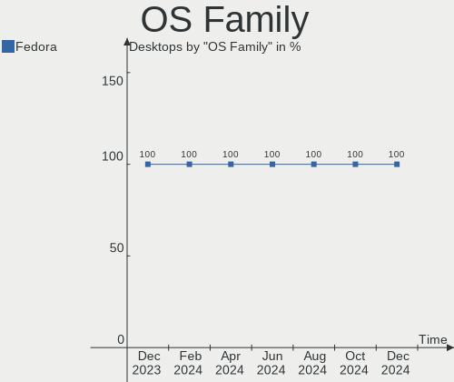
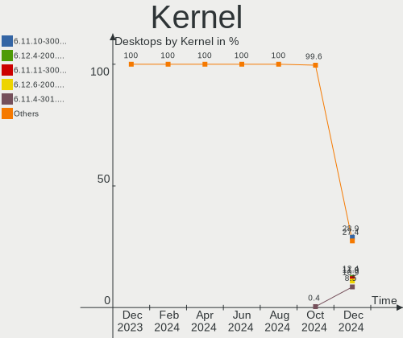
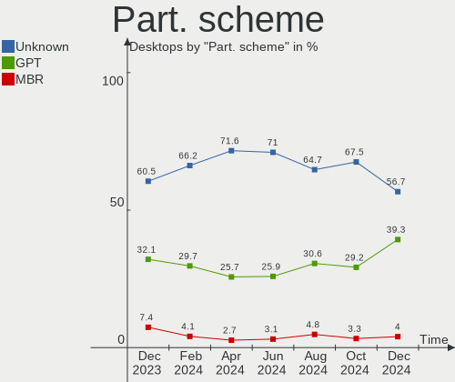
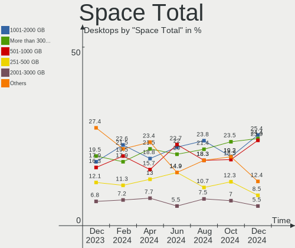
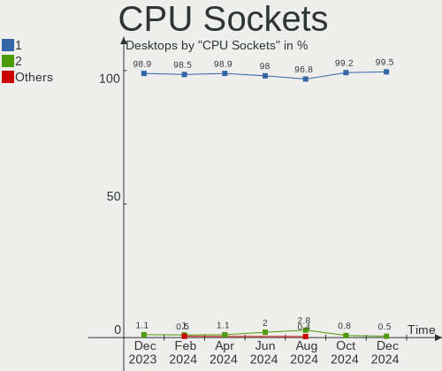
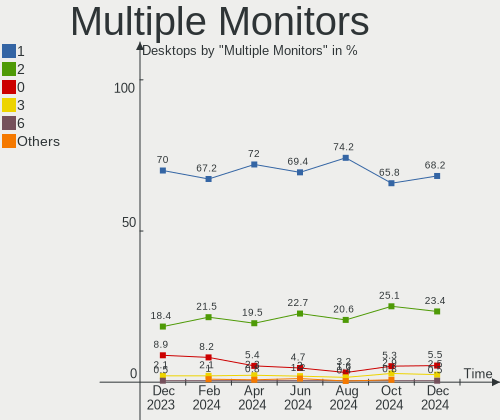
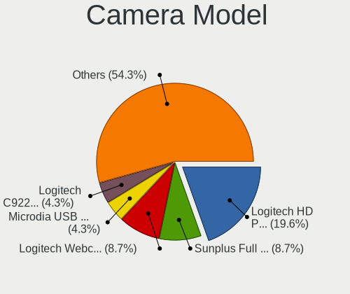

Fedora - Hardware Trends (Desktops)
-----------------------------------

A project to identify most popular hardware characteristics and track their change
over time based on data collected by Linux users at https://Linux-Hardware.org.

Anyone can contribute to this report by the [hw-probe](https://github.com/linuxhw/hw-probe) tool:

    sudo -E hw-probe -all -upload

This report is for one last month. Overall report since the beginning of time: [TestDays](https://github.com/linuxhw/TestDays)

Period: May, 2023.

Contents
--------

* [ System ](#system)
  - [ OS                       ](#os)
  - [ OS Family                ](#os-family)
  - [ Kernel                   ](#kernel)
  - [ Kernel Family            ](#kernel-family)
  - [ Kernel Major Ver.        ](#kernel-major-ver)
  - [ Arch                     ](#arch)
  - [ DE                       ](#de)
  - [ Display Server           ](#display-server)
  - [ Display Manager          ](#display-manager)
  - [ OS Lang                  ](#os-lang)
  - [ Boot Mode                ](#boot-mode)
  - [ Filesystem               ](#filesystem)
  - [ Part. scheme             ](#part-scheme)
  - [ Dual Boot with Linux/BSD ](#dual-boot-with-linuxbsd)
  - [ Dual Boot (Win)          ](#dual-boot-win)

* [ Board ](#board)
  - [ Vendor                   ](#vendor)
  - [ Model                    ](#model)
  - [ Model Family             ](#model-family)
  - [ MFG Year                 ](#mfg-year)
  - [ Form Factor              ](#form-factor)
  - [ Secure Boot              ](#secure-boot)
  - [ Coreboot                 ](#coreboot)
  - [ RAM Size                 ](#ram-size)
  - [ RAM Used                 ](#ram-used)
  - [ Total Drives             ](#total-drives)
  - [ Has CD-ROM               ](#has-cd-rom)
  - [ Has Ethernet             ](#has-ethernet)
  - [ Has WiFi                 ](#has-wifi)
  - [ Has Bluetooth            ](#has-bluetooth)

* [ Location ](#location)
  - [ Country                  ](#country)
  - [ City                     ](#city)

* [ Drives ](#drives)
  - [ Drive Vendor             ](#drive-vendor)
  - [ Drive Model              ](#drive-model)
  - [ HDD Vendor               ](#hdd-vendor)
  - [ SSD Vendor               ](#ssd-vendor)
  - [ Drive Kind               ](#drive-kind)
  - [ Drive Connector          ](#drive-connector)
  - [ Drive Size               ](#drive-size)
  - [ Space Total              ](#space-total)
  - [ Space Used               ](#space-used)
  - [ Malfunc. Drives          ](#malfunc-drives)
  - [ Malfunc. Drive Vendor    ](#malfunc-drive-vendor)
  - [ Malfunc. HDD Vendor      ](#malfunc-hdd-vendor)
  - [ Malfunc. Drive Kind      ](#malfunc-drive-kind)
  - [ Failed Drives            ](#failed-drives)
  - [ Failed Drive Vendor      ](#failed-drive-vendor)
  - [ Drive Status             ](#drive-status)

* [ Storage controller ](#storage-controller)
  - [ Storage Vendor           ](#storage-vendor)
  - [ Storage Model            ](#storage-model)
  - [ Storage Kind             ](#storage-kind)

* [ Processor ](#processor)
  - [ CPU Vendor               ](#cpu-vendor)
  - [ CPU Model                ](#cpu-model)
  - [ CPU Model Family         ](#cpu-model-family)
  - [ CPU Cores                ](#cpu-cores)
  - [ CPU Sockets              ](#cpu-sockets)
  - [ CPU Threads              ](#cpu-threads)
  - [ CPU Op-Modes             ](#cpu-op-modes)
  - [ CPU Microcode            ](#cpu-microcode)
  - [ CPU Microarch            ](#cpu-microarch)

* [ Graphics ](#graphics)
  - [ GPU Vendor               ](#gpu-vendor)
  - [ GPU Model                ](#gpu-model)
  - [ GPU Combo                ](#gpu-combo)
  - [ GPU Driver               ](#gpu-driver)
  - [ GPU Memory               ](#gpu-memory)

* [ Monitor ](#monitor)
  - [ Monitor Vendor           ](#monitor-vendor)
  - [ Monitor Model            ](#monitor-model)
  - [ Monitor Resolution       ](#monitor-resolution)
  - [ Monitor Diagonal         ](#monitor-diagonal)
  - [ Monitor Width            ](#monitor-width)
  - [ Aspect Ratio             ](#aspect-ratio)
  - [ Monitor Area             ](#monitor-area)
  - [ Pixel Density            ](#pixel-density)
  - [ Multiple Monitors        ](#multiple-monitors)

* [ Network ](#network)
  - [ Net Controller Vendor    ](#net-controller-vendor)
  - [ Net Controller Model     ](#net-controller-model)
  - [ Wireless Vendor          ](#wireless-vendor)
  - [ Wireless Model           ](#wireless-model)
  - [ Ethernet Vendor          ](#ethernet-vendor)
  - [ Ethernet Model           ](#ethernet-model)
  - [ Net Controller Kind      ](#net-controller-kind)
  - [ Used Controller          ](#used-controller)
  - [ NICs                     ](#nics)
  - [ IPv6                     ](#ipv6)

* [ Bluetooth ](#bluetooth)
  - [ Bluetooth Vendor         ](#bluetooth-vendor)
  - [ Bluetooth Model          ](#bluetooth-model)

* [ Sound ](#sound)
  - [ Sound Vendor             ](#sound-vendor)
  - [ Sound Model              ](#sound-model)

* [ Memory ](#memory)
  - [ Memory Vendor            ](#memory-vendor)
  - [ Memory Model             ](#memory-model)
  - [ Memory Kind              ](#memory-kind)
  - [ Memory Form Factor       ](#memory-form-factor)
  - [ Memory Size              ](#memory-size)
  - [ Memory Speed             ](#memory-speed)

* [ Printers & scanners ](#printers--scanners)
  - [ Printer Vendor           ](#printer-vendor)
  - [ Printer Model            ](#printer-model)
  - [ Scanner Vendor           ](#scanner-vendor)
  - [ Scanner Model            ](#scanner-model)

* [ Camera ](#camera)
  - [ Camera Vendor            ](#camera-vendor)
  - [ Camera Model             ](#camera-model)

* [ Security ](#security)
  - [ Fingerprint Vendor       ](#fingerprint-vendor)
  - [ Fingerprint Model        ](#fingerprint-model)
  - [ Chipcard Vendor          ](#chipcard-vendor)
  - [ Chipcard Model           ](#chipcard-model)

* [ Unsupported ](#unsupported)
  - [ Unsupported Devices      ](#unsupported-devices)
  - [ Unsupported Device Types ](#unsupported-device-types)

System
------

OS
--

Installed operating systems

| Name      | Desktops | Percent |
|-----------|----------|---------|
| Fedora 38 | 141      | 81.03%  |
| Fedora 37 | 23       | 13.22%  |
| Fedora 36 | 8        | 4.6%    |
| Fedora 39 | 2        | 1.15%   |

OS Family
---------

OS without a version

| Name   | Desktops | Percent |
|--------|----------|---------|
| Fedora | 174      | 100%    |

Kernel
------

Version of the Linux kernel

| Version                                                  | Desktops | Percent |
|----------------------------------------------------------|----------|---------|
| 6.2.15-300.fc38.x86_64                                   | 54       | 31.03%  |
| 6.2.14-300.fc38.x86_64                                   | 46       | 26.44%  |
| 6.2.9-300.fc38.x86_64                                    | 18       | 10.34%  |
| 6.2.13-300.fc38.x86_64                                   | 10       | 5.75%   |
| 6.2.14-200.fc37.x86_64                                   | 9        | 5.17%   |
| 6.2.15-200.fc37.x86_64                                   | 6        | 3.45%   |
| 6.2.12-300.fc38.x86_64                                   | 4        | 2.3%    |
| 6.3.3-200.fc38.x86_64                                    | 2        | 1.15%   |
| 6.2.12-200.fc37.x86_64                                   | 2        | 1.15%   |
| 6.2.11-300.fc38.x86_64                                   | 2        | 1.15%   |
| 6.2.11-200.fc37.x86_64                                   | 2        | 1.15%   |
| 6.1.8-100.fc36.x86_64                                    | 2        | 1.15%   |
| 6.4.0-0.rc3.20230526git0d85b27b0cc6.32.fc39.x86_64+debug | 1        | 0.57%   |
| 6.4.0-0.rc2.23.fc39.ppc64le                              | 1        | 0.57%   |
| 6.4.0-0.rc0.20230501git58390c8ce1bd.10.fc39.x86_64       | 1        | 0.57%   |
| 6.3.4-201.fc38.x86_64                                    | 1        | 0.57%   |
| 6.3.1-200.fc38.x86_64                                    | 1        | 0.57%   |
| 6.2.8-100.fc36.x86_64                                    | 1        | 0.57%   |
| 6.2.15-703.inttf.fc38.x86_64                             | 1        | 0.57%   |
| 6.2.14-100.fc36.x86_64                                   | 1        | 0.57%   |
| 6.2.13-200.fc37.x86_64                                   | 1        | 0.57%   |
| 6.1.9-200.fc37.x86_64                                    | 1        | 0.57%   |
| 6.1.26-200.fc38.x86_64                                   | 1        | 0.57%   |
| 6.0.7-301.fc37.x86_64                                    | 1        | 0.57%   |
| 6.0.7-200.fc36.x86_64                                    | 1        | 0.57%   |
| 6.0.16-200.fc36.x86_64                                   | 1        | 0.57%   |
| 6.0.15-200.fc36.x86_64                                   | 1        | 0.57%   |
| 6.0.11-300.fc37.x86_64                                   | 1        | 0.57%   |
| 5.3.18-ITmania                                           | 1        | 0.57%   |

Kernel Family
-------------

Linux kernel without a distro release

| Version | Desktops | Percent |
|---------|----------|---------|
| 6.2.15  | 61       | 35.06%  |
| 6.2.14  | 56       | 32.18%  |
| 6.2.9   | 18       | 10.34%  |
| 6.2.13  | 11       | 6.32%   |
| 6.2.12  | 6        | 3.45%   |
| 6.2.11  | 4        | 2.3%    |
| 6.4.0   | 3        | 1.72%   |
| 6.3.3   | 2        | 1.15%   |
| 6.1.8   | 2        | 1.15%   |
| 6.0.7   | 2        | 1.15%   |
| 6.3.4   | 1        | 0.57%   |
| 6.3.1   | 1        | 0.57%   |
| 6.2.8   | 1        | 0.57%   |
| 6.1.9   | 1        | 0.57%   |
| 6.1.26  | 1        | 0.57%   |
| 6.0.16  | 1        | 0.57%   |
| 6.0.15  | 1        | 0.57%   |
| 6.0.11  | 1        | 0.57%   |
| 5.3.18  | 1        | 0.57%   |

Kernel Major Ver.
-----------------

Linux kernel major version

| Version | Desktops | Percent |
|---------|----------|---------|
| 6.2     | 157      | 90.23%  |
| 6.0     | 5        | 2.87%   |
| 6.3     | 4        | 2.3%    |
| 6.1     | 4        | 2.3%    |
| 6.4     | 3        | 1.72%   |
| 5.3     | 1        | 0.57%   |

Arch
----

OS architecture (x86_64, i586, etc.)

| Name    | Desktops | Percent |
|---------|----------|---------|
| x86_64  | 173      | 99.43%  |
| ppc64le | 1        | 0.57%   |

DE
--

Desktop Environment

| Name       | Desktops | Percent |
|------------|----------|---------|
| GNOME      | 127      | 72.99%  |
| KDE5       | 27       | 15.52%  |
| Cinnamon   | 8        | 4.6%    |
| Unknown    | 7        | 4.02%   |
| XFCE       | 2        | 1.15%   |
| X-Cinnamon | 2        | 1.15%   |
| MATE       | 1        | 0.57%   |

Display Server
--------------

X11 or Wayland

| Name    | Desktops | Percent |
|---------|----------|---------|
| Wayland | 122      | 70.11%  |
| X11     | 36       | 20.69%  |
| Tty     | 15       | 8.62%   |
| Unknown | 1        | 0.57%   |

Display Manager
---------------

SDDM, LightDM, etc.

| Name    | Desktops | Percent |
|---------|----------|---------|
| Unknown | 109      | 62.64%  |
| GDM     | 37       | 21.26%  |
| SDDM    | 15       | 8.62%   |
| LightDM | 13       | 7.47%   |

OS Lang
-------

Language

| Lang  | Desktops | Percent |
|-------|----------|---------|
| en_US | 80       | 45.98%  |
| ru_RU | 11       | 6.32%   |
| en_GB | 11       | 6.32%   |
| de_DE | 11       | 6.32%   |
| pt_BR | 10       | 5.75%   |
| en_AU | 10       | 5.75%   |
| en_CA | 5        | 2.87%   |
| es_ES | 4        | 2.3%    |
| pl_PL | 3        | 1.72%   |
| fr_FR | 3        | 1.72%   |
| es_MX | 3        | 1.72%   |
| it_IT | 2        | 1.15%   |
| fr_BE | 2        | 1.15%   |
| es_AR | 2        | 1.15%   |
| zh_TW | 1        | 0.57%   |
| zh_CN | 1        | 0.57%   |
| tr_TR | 1        | 0.57%   |
| pt_PT | 1        | 0.57%   |
| nl_NL | 1        | 0.57%   |
| ja_JP | 1        | 0.57%   |
| hu_HU | 1        | 0.57%   |
| hr_HR | 1        | 0.57%   |
| fr_CA | 1        | 0.57%   |
| fi_FI | 1        | 0.57%   |
| es_CO | 1        | 0.57%   |
| es_CL | 1        | 0.57%   |
| en_NZ | 1        | 0.57%   |
| en_IL | 1        | 0.57%   |
| en_BW | 1        | 0.57%   |
| de_AT | 1        | 0.57%   |
| C     | 1        | 0.57%   |

Boot Mode
---------

EFI or BIOS

| Mode | Desktops | Percent |
|------|----------|---------|
| EFI  | 109      | 62.64%  |
| BIOS | 65       | 37.36%  |

Filesystem
----------

Type of filesystem

| Type    | Desktops | Percent |
|---------|----------|---------|
| Btrfs   | 131      | 75.29%  |
| Ext4    | 31       | 17.82%  |
| Xfs     | 10       | 5.75%   |
| Zfs     | 1        | 0.57%   |
| Overlay | 1        | 0.57%   |

Part. scheme
------------

Scheme of partitioning

| Type    | Desktops | Percent |
|---------|----------|---------|
| Unknown | 103      | 59.2%   |
| GPT     | 56       | 32.18%  |
| MBR     | 15       | 8.62%   |

Dual Boot with Linux/BSD
------------------------

Hosting more than one Linux/BSD

| Dual boot | Desktops | Percent |
|-----------|----------|---------|
| No        | 155      | 89.08%  |
| Yes       | 19       | 10.92%  |

Dual Boot (Win)
---------------

Hosting Linux and Windows

| Dual boot | Desktops | Percent |
|-----------|----------|---------|
| No        | 140      | 80.46%  |
| Yes       | 34       | 19.54%  |

Board
-----

Vendor
------

Motherboard manufacturer

| Name                                 | Desktops | Percent |
|--------------------------------------|----------|---------|
| ASUSTek Computer                     | 46       | 26.44%  |
| Gigabyte Technology                  | 37       | 21.26%  |
| MSI                                  | 26       | 14.94%  |
| ASRock                               | 23       | 13.22%  |
| Hewlett-Packard                      | 9        | 5.17%   |
| Dell                                 | 9        | 5.17%   |
| Lenovo                               | 6        | 3.45%   |
| Intel                                | 3        | 1.72%   |
| Biostar                              | 2        | 1.15%   |
| Acer                                 | 2        | 1.15%   |
| Unknown                              | 2        | 1.15%   |
| Shenzhen Meigao Electronic Equipment | 1        | 0.57%   |
| Itautec                              | 1        | 0.57%   |
| iRU                                  | 1        | 0.57%   |
| Huanan                               | 1        | 0.57%   |
| HPE                                  | 1        | 0.57%   |
| Fujitsu Siemens                      | 1        | 0.57%   |
| Foxconn                              | 1        | 0.57%   |
| AOpen                                | 1        | 0.57%   |
| AMI                                  | 1        | 0.57%   |

Model
-----

Motherboard model

| Name                                       | Desktops | Percent |
|--------------------------------------------|----------|---------|
| Gigabyte B450 AORUS ELITE                  | 3        | 1.72%   |
| ASRock B450M Pro4                          | 3        | 1.72%   |
| MSI MS-7D73                                | 2        | 1.15%   |
| Gigabyte X570S AORUS ELITE AX              | 2        | 1.15%   |
| Gigabyte B550 GAMING X V2                  | 2        | 1.15%   |
| ASUS PRIME H510M-K                         | 2        | 1.15%   |
| Unknown                                    | 2        | 1.15%   |
| Shenzhen Meigao Electronic Equipment UM690 | 1        | 0.57%   |
| MSI MS-7D97                                | 1        | 0.57%   |
| MSI MS-7D48                                | 1        | 0.57%   |
| MSI MS-7D43                                | 1        | 0.57%   |
| MSI MS-7D17                                | 1        | 0.57%   |
| MSI MS-7C95                                | 1        | 0.57%   |
| MSI MS-7C91                                | 1        | 0.57%   |
| MSI MS-7C88                                | 1        | 0.57%   |
| MSI MS-7C84                                | 1        | 0.57%   |
| MSI MS-7C37                                | 1        | 0.57%   |
| MSI MS-7C09                                | 1        | 0.57%   |
| MSI MS-7C02                                | 1        | 0.57%   |
| MSI MS-7B93                                | 1        | 0.57%   |
| MSI MS-7B89                                | 1        | 0.57%   |
| MSI MS-7B78                                | 1        | 0.57%   |
| MSI MS-7B10                                | 1        | 0.57%   |
| MSI MS-7A39                                | 1        | 0.57%   |
| MSI MS-7A38                                | 1        | 0.57%   |
| MSI MS-7A32                                | 1        | 0.57%   |
| MSI MS-7A31                                | 1        | 0.57%   |
| MSI MS-7971                                | 1        | 0.57%   |
| MSI MS-7885                                | 1        | 0.57%   |
| MSI MS-7640                                | 1        | 0.57%   |
| MSI MS-7388                                | 1        | 0.57%   |
| MSI CQ3321L                                | 1        | 0.57%   |
| Lenovo ThinkStation P330 30D1CTO1WW        | 1        | 0.57%   |
| Lenovo ThinkCentre M92p 3238F5U            | 1        | 0.57%   |
| Lenovo ThinkCentre M83 10AHS0CK14          | 1        | 0.57%   |
| Lenovo ThinkCentre M73z 10BC000DUS         | 1        | 0.57%   |
| Lenovo ThinkCentre M58p 7220A72            | 1        | 0.57%   |
| Lenovo 70A4000HUX ThinkServer TS140        | 1        | 0.57%   |
| Itautec ST 4265                            | 1        | 0.57%   |
| iRU A231                                   | 1        | 0.57%   |

Model Family
------------

Motherboard model prefix

| Name                                       | Desktops | Percent |
|--------------------------------------------|----------|---------|
| ASUS PRIME                                 | 16       | 9.2%    |
| ASUS ROG                                   | 9        | 5.17%   |
| Dell OptiPlex                              | 7        | 4.02%   |
| ASUS TUF                                   | 5        | 2.87%   |
| Lenovo ThinkCentre                         | 4        | 2.3%    |
| Gigabyte B550M                             | 4        | 2.3%    |
| Gigabyte B450                              | 4        | 2.3%    |
| ASRock B450M                               | 4        | 2.3%    |
| HP Compaq                                  | 3        | 1.72%   |
| Gigabyte B550                              | 3        | 1.72%   |
| MSI MS-7D73                                | 2        | 1.15%   |
| Intel DP43TF                               | 2        | 1.15%   |
| Gigabyte X570S                             | 2        | 1.15%   |
| Gigabyte X570                              | 2        | 1.15%   |
| Unknown                                    | 2        | 1.15%   |
| Shenzhen Meigao Electronic Equipment UM690 | 1        | 0.57%   |
| MSI MS-7D97                                | 1        | 0.57%   |
| MSI MS-7D48                                | 1        | 0.57%   |
| MSI MS-7D43                                | 1        | 0.57%   |
| MSI MS-7D17                                | 1        | 0.57%   |
| MSI MS-7C95                                | 1        | 0.57%   |
| MSI MS-7C91                                | 1        | 0.57%   |
| MSI MS-7C88                                | 1        | 0.57%   |
| MSI MS-7C84                                | 1        | 0.57%   |
| MSI MS-7C37                                | 1        | 0.57%   |
| MSI MS-7C09                                | 1        | 0.57%   |
| MSI MS-7C02                                | 1        | 0.57%   |
| MSI MS-7B93                                | 1        | 0.57%   |
| MSI MS-7B89                                | 1        | 0.57%   |
| MSI MS-7B78                                | 1        | 0.57%   |
| MSI MS-7B10                                | 1        | 0.57%   |
| MSI MS-7A39                                | 1        | 0.57%   |
| MSI MS-7A38                                | 1        | 0.57%   |
| MSI MS-7A32                                | 1        | 0.57%   |
| MSI MS-7A31                                | 1        | 0.57%   |
| MSI MS-7971                                | 1        | 0.57%   |
| MSI MS-7885                                | 1        | 0.57%   |
| MSI MS-7640                                | 1        | 0.57%   |
| MSI MS-7388                                | 1        | 0.57%   |
| MSI CQ3321L                                | 1        | 0.57%   |

MFG Year
--------

Motherboard manufacture year

| Year    | Desktops | Percent |
|---------|----------|---------|
| 2018    | 28       | 16.09%  |
| 2020    | 21       | 12.07%  |
| 2021    | 18       | 10.34%  |
| 2022    | 17       | 9.77%   |
| 2013    | 14       | 8.05%   |
| 2019    | 13       | 7.47%   |
| 2012    | 13       | 7.47%   |
| 2017    | 8        | 4.6%    |
| 2015    | 7        | 4.02%   |
| 2011    | 6        | 3.45%   |
| 2014    | 5        | 2.87%   |
| 2010    | 5        | 2.87%   |
| 2008    | 5        | 2.87%   |
| 2016    | 4        | 2.3%    |
| 2009    | 4        | 2.3%    |
| 2023    | 3        | 1.72%   |
| 2007    | 1        | 0.57%   |
| 2006    | 1        | 0.57%   |
| Unknown | 1        | 0.57%   |

Form Factor
-----------

Physical design of the computer

| Name    | Desktops | Percent |
|---------|----------|---------|
| Desktop | 174      | 100%    |

Secure Boot
-----------

Enabled or disabled

| State    | Desktops | Percent |
|----------|----------|---------|
| Disabled | 154      | 88.51%  |
| Enabled  | 20       | 11.49%  |

Coreboot
--------

Have coreboot on board

| Used | Desktops | Percent |
|------|----------|---------|
| No   | 174      | 100%    |

RAM Size
--------

Total RAM memory

| Size in GB  | Desktops | Percent |
|-------------|----------|---------|
| 16.01-24.0  | 50       | 28.74%  |
| 32.01-64.0  | 47       | 27.01%  |
| 8.01-16.0   | 26       | 14.94%  |
| 4.01-8.0    | 25       | 14.37%  |
| 64.01-256.0 | 15       | 8.62%   |
| 3.01-4.0    | 8        | 4.6%    |
| 24.01-32.0  | 3        | 1.72%   |

RAM Used
--------

Used RAM memory

| Used GB     | Desktops | Percent |
|-------------|----------|---------|
| 2.01-3.0    | 52       | 29.89%  |
| 4.01-8.0    | 45       | 25.86%  |
| 3.01-4.0    | 36       | 20.69%  |
| 1.01-2.0    | 17       | 9.77%   |
| 8.01-16.0   | 14       | 8.05%   |
| 0.51-1.0    | 6        | 3.45%   |
| 16.01-24.0  | 2        | 1.15%   |
| 24.01-32.0  | 1        | 0.57%   |
| 64.01-256.0 | 1        | 0.57%   |

Total Drives
------------

Number of drives on board

| Drives | Desktops | Percent |
|--------|----------|---------|
| 2      | 58       | 33.33%  |
| 1      | 57       | 32.76%  |
| 3      | 31       | 17.82%  |
| 4      | 15       | 8.62%   |
| 5      | 7        | 4.02%   |
| 6      | 3        | 1.72%   |
| 10     | 1        | 0.57%   |
| 7      | 1        | 0.57%   |
| 0      | 1        | 0.57%   |

Has CD-ROM
----------

Has CD-ROM on board

| Presented | Desktops | Percent |
|-----------|----------|---------|
| No        | 116      | 66.67%  |
| Yes       | 58       | 33.33%  |

Has Ethernet
------------

Has Ethernet on board

| Presented | Desktops | Percent |
|-----------|----------|---------|
| Yes       | 171      | 98.28%  |
| No        | 3        | 1.72%   |

Has WiFi
--------

Has WiFi module

| Presented | Desktops | Percent |
|-----------|----------|---------|
| No        | 94       | 54.02%  |
| Yes       | 80       | 45.98%  |

Has Bluetooth
-------------

Has Bluetooth module

| Presented | Desktops | Percent |
|-----------|----------|---------|
| No        | 102      | 58.62%  |
| Yes       | 72       | 41.38%  |

Location
--------

Country
-------

Geographic location (country)

| Country             | Desktops | Percent |
|---------------------|----------|---------|
| USA                 | 31       | 17.82%  |
| Russia              | 13       | 7.47%   |
| Germany             | 12       | 6.9%    |
| Brazil              | 12       | 6.9%    |
| Australia           | 11       | 6.32%   |
| Canada              | 6        | 3.45%   |
| UK                  | 5        | 2.87%   |
| Poland              | 5        | 2.87%   |
| Mexico              | 5        | 2.87%   |
| Hungary             | 5        | 2.87%   |
| France              | 5        | 2.87%   |
| Belgium             | 5        | 2.87%   |
| Thailand            | 4        | 2.3%    |
| Spain               | 4        | 2.3%    |
| Norway              | 4        | 2.3%    |
| Italy               | 4        | 2.3%    |
| Netherlands         | 3        | 1.72%   |
| Belarus             | 3        | 1.72%   |
| Taiwan              | 2        | 1.15%   |
| Singapore           | 2        | 1.15%   |
| Serbia              | 2        | 1.15%   |
| Romania             | 2        | 1.15%   |
| New Zealand         | 2        | 1.15%   |
| Japan               | 2        | 1.15%   |
| Greece              | 2        | 1.15%   |
| Colombia            | 2        | 1.15%   |
| Austria             | 2        | 1.15%   |
| Argentina           | 2        | 1.15%   |
| Turkey              | 1        | 0.57%   |
| Trinidad and Tobago | 1        | 0.57%   |
| Sweden              | 1        | 0.57%   |
| Puerto Rico         | 1        | 0.57%   |
| Portugal            | 1        | 0.57%   |
| Pakistan            | 1        | 0.57%   |
| Malaysia            | 1        | 0.57%   |
| Kazakhstan          | 1        | 0.57%   |
| Israel              | 1        | 0.57%   |
| Ireland             | 1        | 0.57%   |
| Indonesia           | 1        | 0.57%   |
| India               | 1        | 0.57%   |

City
----

Geographic location (city)

| City                 | Desktops | Percent |
|----------------------|----------|---------|
| Sydney               | 8        | 4.6%    |
| Moscow               | 4        | 2.3%    |
| Seattle              | 3        | 1.72%   |
| Minsk                | 3        | 1.72%   |
| Budapest             | 3        | 1.72%   |
| Warsaw               | 2        | 1.15%   |
| Vienna               | 2        | 1.15%   |
| Tecumseh             | 2        | 1.15%   |
| Singapore            | 2        | 1.15%   |
| Rio de Janeiro       | 2        | 1.15%   |
| Odessa               | 2        | 1.15%   |
| Moyock               | 2        | 1.15%   |
| Morlanwelz-Mariemont | 2        | 1.15%   |
| Madrid               | 2        | 1.15%   |
| Kristiansand         | 2        | 1.15%   |
| Irkutsk              | 2        | 1.15%   |
| Brussels             | 2        | 1.15%   |
| Brisbane             | 2        | 1.15%   |
| Bogotá              | 2        | 1.15%   |
| Bangkok              | 2        | 1.15%   |
| Athens               | 2        | 1.15%   |
| Winnipeg             | 1        | 0.57%   |
| Volgograd            | 1        | 0.57%   |
| Twin Falls           | 1        | 0.57%   |
| Tokyo                | 1        | 0.57%   |
| Timișoara           | 1        | 0.57%   |
| Tha Tako             | 1        | 0.57%   |
| Tandsbyn             | 1        | 0.57%   |
| Tampa                | 1        | 0.57%   |
| Sumaré              | 1        | 0.57%   |
| Stavanger            | 1        | 0.57%   |
| Starokandry          | 1        | 0.57%   |
| St Petersburg        | 1        | 0.57%   |
| Sosnowiec            | 1        | 0.57%   |
| Somaglia             | 1        | 0.57%   |
| Slatina              | 1        | 0.57%   |
| Sitio Piratuba       | 1        | 0.57%   |
| Sheffield            | 1        | 0.57%   |
| Sao Paulo            | 1        | 0.57%   |
| Santiago             | 1        | 0.57%   |

Drives
------

Drive Vendor
------------

Hard drive vendors

| Vendor                       | Desktops | Drives | Percent |
|------------------------------|----------|--------|---------|
| Samsung Electronics          | 62       | 93     | 19.31%  |
| WDC                          | 48       | 68     | 14.95%  |
| Seagate                      | 38       | 47     | 11.84%  |
| Toshiba                      | 19       | 19     | 5.92%   |
| Kingston                     | 19       | 19     | 5.92%   |
| Crucial                      | 19       | 20     | 5.92%   |
| Sandisk                      | 18       | 20     | 5.61%   |
| Phison Electronics           | 12       | 16     | 3.74%   |
| Intel                        | 7        | 8      | 2.18%   |
| Hitachi                      | 7        | 10     | 2.18%   |
| Patriot                      | 5        | 6      | 1.56%   |
| China                        | 5        | 5      | 1.56%   |
| SK hynix                     | 4        | 6      | 1.25%   |
| Netac                        | 4        | 4      | 1.25%   |
| ADATA Technology             | 4        | 4      | 1.25%   |
| A-DATA Technology            | 4        | 7      | 1.25%   |
| SPCC                         | 3        | 3      | 0.93%   |
| Silicon Motion               | 3        | 3      | 0.93%   |
| Micron/Crucial Technology    | 3        | 3      | 0.93%   |
| HGST                         | 3        | 3      | 0.93%   |
| Unknown                      | 2        | 2      | 0.62%   |
| Realtek Semiconductor        | 2        | 3      | 0.62%   |
| MAXIO Technology (Hangzhou)  | 2        | 2      | 0.62%   |
| Intenso                      | 2        | 2      | 0.62%   |
| Apacer                       | 2        | 2      | 0.62%   |
| Acer                         | 2        | 2      | 0.62%   |
| Transcend                    | 1        | 1      | 0.31%   |
| TO Exter                     | 1        | 1      | 0.31%   |
| Shenzhen Longsys Electronics | 1        | 1      | 0.31%   |
| SABRENT                      | 1        | 1      | 0.31%   |
| PNY                          | 1        | 1      | 0.31%   |
| Plextor                      | 1        | 1      | 0.31%   |
| Phison                       | 1        | 1      | 0.31%   |
| OCZ                          | 1        | 1      | 0.31%   |
| NE-256 2                     | 1        | 1      | 0.31%   |
| Micron Technology            | 1        | 1      | 0.31%   |
| Maxtor                       | 1        | 1      | 0.31%   |
| KingSpec                     | 1        | 1      | 0.31%   |
| HPE                          | 1        | 2      | 0.31%   |
| Hewlett-Packard              | 1        | 1      | 0.31%   |

Drive Model
-----------

Hard drive models

| Model                                               | Desktops | Percent |
|-----------------------------------------------------|----------|---------|
| Samsung NVMe SSD Controller SM981/PM981/PM983 256GB | 12       | 3.26%   |
| Samsung NVMe SSD Controller PM9A1/PM9A3/980PRO 1TB  | 8        | 2.17%   |
| Samsung SSD 980 1TB                                 | 6        | 1.63%   |
| Samsung NVMe SSD Controller SM961/PM961/SM963 256GB | 6        | 1.63%   |
| Phison E12 NVMe Controller 256GB                    | 6        | 1.63%   |
| Crucial CT500MX500SSD1 500GB                        | 5        | 1.36%   |
| Toshiba DT01ACA100 1TB                              | 4        | 1.09%   |
| Samsung SSD 870 EVO 1TB                             | 4        | 1.09%   |
| Samsung SSD 860 EVO 1TB                             | 4        | 1.09%   |
| WDC WDS500G2B0A-00SM50 500GB SSD                    | 3        | 0.82%   |
| WDC WDS240G2G0A-00JH30 240GB SSD                    | 3        | 0.82%   |
| WDC WD10EZEX-08WN4A0 1TB                            | 3        | 0.82%   |
| Seagate ST3500418AS 500GB                           | 3        | 0.82%   |
| Seagate ST2000DM008-2FR102 2TB                      | 3        | 0.82%   |
| Seagate ST2000DM006-2DM164 2TB                      | 3        | 0.82%   |
| Sandisk WD Blue SN550 NVMe SSD 512GB                | 3        | 0.82%   |
| Samsung SSD 860 EVO 500GB                           | 3        | 0.82%   |
| Samsung SSD 850 EVO 250GB                           | 3        | 0.82%   |
| Samsung SSD 840 Series 250GB                        | 3        | 0.82%   |
| Phison E16 PCIe4 NVMe Controller 1TB                | 3        | 0.82%   |
| Patriot P210 512GB SSD                              | 3        | 0.82%   |
| Kingston SA400S37480G 480GB SSD                     | 3        | 0.82%   |
| Kingston SA400S37240G 240GB SSD                     | 3        | 0.82%   |
| Kingston SA400S37120G 120GB SSD                     | 3        | 0.82%   |
| Crucial CT2000BX500SSD1 2TB                         | 3        | 0.82%   |
| China SSD 120GB                                     | 3        | 0.82%   |
| WDC WDS100T2G0A-00JH30 1TB SSD                      | 2        | 0.54%   |
| WDC WD5000AAKX-60U6AA0 500GB                        | 2        | 0.54%   |
| WDC WD20EZAZ-00GGJB0 2TB                            | 2        | 0.54%   |
| WDC WD10EZEX-08M2NA0 1TB                            | 2        | 0.54%   |
| Unknown SD/MMC/MS PRO 64GB                          | 2        | 0.54%   |
| Toshiba HDWD110 1TB                                 | 2        | 0.54%   |
| Toshiba DT01ACA050 500GB                            | 2        | 0.54%   |
| Silicon Motion SM2263EN/SM2263XT SSD Controller 1TB | 2        | 0.54%   |
| Seagate ST3320418AS 320GB                           | 2        | 0.54%   |
| Seagate ST3160815AS 160GB                           | 2        | 0.54%   |
| Seagate ST2000LX001-1RG174 2TB                      | 2        | 0.54%   |
| Seagate ST1000DM010-2EP102 1TB                      | 2        | 0.54%   |
| Seagate ST1000DM003-1CH162 1TB                      | 2        | 0.54%   |
| Sandisk WD Blue SN570 2TB                           | 2        | 0.54%   |

HDD Vendor
----------

Hard disk drive vendors

| Vendor              | Desktops | Drives | Percent |
|---------------------|----------|--------|---------|
| WDC                 | 42       | 57     | 37.84%  |
| Seagate             | 35       | 42     | 31.53%  |
| Toshiba             | 17       | 17     | 15.32%  |
| Hitachi             | 7        | 10     | 6.31%   |
| Samsung Electronics | 5        | 5      | 4.5%    |
| HGST                | 3        | 3      | 2.7%    |
| Unknown             | 2        | 2      | 1.8%    |

SSD Vendor
----------

Solid state drive vendors

| Vendor              | Desktops | Drives | Percent |
|---------------------|----------|--------|---------|
| Samsung Electronics | 35       | 41     | 26.32%  |
| Crucial             | 19       | 20     | 14.29%  |
| Kingston            | 13       | 13     | 9.77%   |
| WDC                 | 10       | 10     | 7.52%   |
| SanDisk             | 9        | 9      | 6.77%   |
| Patriot             | 5        | 6      | 3.76%   |
| Intel               | 5        | 5      | 3.76%   |
| China               | 5        | 5      | 3.76%   |
| A-DATA Technology   | 4        | 7      | 3.01%   |
| SPCC                | 3        | 3      | 2.26%   |
| Netac               | 2        | 2      | 1.5%    |
| Intenso             | 2        | 2      | 1.5%    |
| Apacer              | 2        | 2      | 1.5%    |
| Acer                | 2        | 2      | 1.5%    |
| Transcend           | 1        | 1      | 0.75%   |
| Toshiba             | 1        | 1      | 0.75%   |
| TO Exter            | 1        | 1      | 0.75%   |
| SK hynix            | 1        | 1      | 0.75%   |
| SABRENT             | 1        | 1      | 0.75%   |
| PNY                 | 1        | 1      | 0.75%   |
| Phison              | 1        | 1      | 0.75%   |
| OCZ                 | 1        | 1      | 0.75%   |
| Micron Technology   | 1        | 1      | 0.75%   |
| Maxtor              | 1        | 1      | 0.75%   |
| KingSpec            | 1        | 1      | 0.75%   |
| GOODRAM             | 1        | 1      | 0.75%   |
| Gigabyte Technology | 1        | 2      | 0.75%   |
| Dogfish             | 1        | 1      | 0.75%   |
| Colorful            | 1        | 1      | 0.75%   |
| AMD                 | 1        | 1      | 0.75%   |
| Unknown             | 1        | 1      | 0.75%   |

Drive Kind
----------

HDD or SSD

| Kind    | Desktops | Drives | Percent |
|---------|----------|--------|---------|
| SSD     | 110      | 145    | 37.93%  |
| HDD     | 91       | 136    | 31.38%  |
| NVMe    | 86       | 116    | 29.66%  |
| Unknown | 3        | 4      | 1.03%   |

Drive Connector
---------------

SATA, SAS, NVMe, etc.

| Type | Desktops | Drives | Percent |
|------|----------|--------|---------|
| SATA | 152      | 273    | 61.29%  |
| NVMe | 86       | 116    | 34.68%  |
| SAS  | 10       | 12     | 4.03%   |

Drive Size
----------

Size of hard drive

| Size in TB | Desktops | Drives | Percent |
|------------|----------|--------|---------|
| 0.01-0.5   | 104      | 136    | 47.71%  |
| 0.51-1.0   | 63       | 82     | 28.9%   |
| 1.01-2.0   | 29       | 34     | 13.3%   |
| 3.01-4.0   | 9        | 10     | 4.13%   |
| 4.01-10.0  | 9        | 14     | 4.13%   |
| 2.01-3.0   | 3        | 4      | 1.38%   |
| 10.01-20.0 | 1        | 1      | 0.46%   |

Space Total
-----------

Amount of disk space available on the file system

| Size in GB     | Desktops | Percent |
|----------------|----------|---------|
| 501-1000       | 35       | 20.11%  |
| 1001-2000      | 33       | 18.97%  |
| 251-500        | 29       | 16.67%  |
| More than 3000 | 24       | 13.79%  |
| 101-250        | 20       | 11.49%  |
| 2001-3000      | 11       | 6.32%   |
| 51-100         | 7        | 4.02%   |
| Unknown        | 7        | 4.02%   |
| 1-20           | 6        | 3.45%   |
| 21-50          | 2        | 1.15%   |

Space Used
----------

Amount of used disk space

| Used GB        | Desktops | Percent |
|----------------|----------|---------|
| 21-50          | 40       | 22.99%  |
| 1-20           | 35       | 20.11%  |
| 251-500        | 20       | 11.49%  |
| 501-1000       | 19       | 10.92%  |
| 51-100         | 16       | 9.2%    |
| 101-250        | 14       | 8.05%   |
| 1001-2000      | 14       | 8.05%   |
| Unknown        | 7        | 4.02%   |
| More than 3000 | 6        | 3.45%   |
| 2001-3000      | 3        | 1.72%   |

Malfunc. Drives
---------------

Drive models with a malfunction

| Model                                         | Desktops | Drives | Percent |
|-----------------------------------------------|----------|--------|---------|
| Intel SSDSC2CT120A3 120GB                     | 2        | 2      | 9.52%   |
| Crucial CT120M500SSD1 120GB                   | 2        | 2      | 9.52%   |
| WDC WDS240G2G0A-00JH30 240GB SSD              | 1        | 1      | 4.76%   |
| WDC WDS100T2G0A-00JH30 1TB SSD                | 1        | 1      | 4.76%   |
| WDC WD10JPVT-60A1YT0 1TB                      | 1        | 1      | 4.76%   |
| Toshiba MQ02ABD100H 1TB                       | 1        | 1      | 4.76%   |
| Seagate ST9160412AS 160GB                     | 1        | 1      | 4.76%   |
| Seagate ST3500630NS 500GB                     | 1        | 1      | 4.76%   |
| Seagate ST3500418AS 500GB                     | 1        | 1      | 4.76%   |
| Seagate ST3160813AS 160GB                     | 1        | 1      | 4.76%   |
| Seagate ST3000DM001-1CH166 3TB                | 1        | 1      | 4.76%   |
| Seagate ST2000DM008-2FR102 2TB                | 1        | 1      | 4.76%   |
| Samsung Electronics SSD 840 EVO 250GB         | 1        | 1      | 4.76%   |
| Samsung Electronics HD322GJ 320GB             | 1        | 1      | 4.76%   |
| Micron Technology MTFDDAK128MAM-1J1 128GB SSD | 1        | 1      | 4.76%   |
| Kingston SA400S37120G 120GB SSD               | 1        | 1      | 4.76%   |
| Intenso SSD 256GB                             | 1        | 1      | 4.76%   |
| Intenso SSD 240GB                             | 1        | 1      | 4.76%   |
| Crucial CT128MX100SSD1 128GB                  | 1        | 1      | 4.76%   |

Malfunc. Drive Vendor
---------------------

Vendors of faulty drives

| Vendor              | Desktops | Drives | Percent |
|---------------------|----------|--------|---------|
| Seagate             | 6        | 6      | 30%     |
| Crucial             | 3        | 3      | 15%     |
| WDC                 | 2        | 3      | 10%     |
| Samsung Electronics | 2        | 2      | 10%     |
| Intenso             | 2        | 2      | 10%     |
| Intel               | 2        | 2      | 10%     |
| Toshiba             | 1        | 1      | 5%      |
| Micron Technology   | 1        | 1      | 5%      |
| Kingston            | 1        | 1      | 5%      |

Malfunc. HDD Vendor
-------------------

Vendors of faulty HDD drives

| Vendor              | Desktops | Drives | Percent |
|---------------------|----------|--------|---------|
| Seagate             | 6        | 6      | 66.67%  |
| WDC                 | 1        | 1      | 11.11%  |
| Toshiba             | 1        | 1      | 11.11%  |
| Samsung Electronics | 1        | 1      | 11.11%  |

Malfunc. Drive Kind
-------------------

Kinds of faulty drives

| Kind | Desktops | Drives | Percent |
|------|----------|--------|---------|
| SSD  | 11       | 12     | 55%     |
| HDD  | 9        | 9      | 45%     |

Failed Drives
-------------

Failed drive models

Zero info for selected period =(

Failed Drive Vendor
-------------------

Failed drive vendors

Zero info for selected period =(

Drive Status
------------

Number of failed and malfunc. drives

| Status   | Desktops | Drives | Percent |
|----------|----------|--------|---------|
| Detected | 107      | 246    | 56.61%  |
| Works    | 64       | 134    | 33.86%  |
| Malfunc  | 18       | 21     | 9.52%   |

Storage controller
------------------

Storage Vendor
--------------

Storage controller vendors

| Vendor                         | Desktops | Percent |
|--------------------------------|----------|---------|
| Intel                          | 93       | 32.07%  |
| AMD                            | 79       | 27.24%  |
| Samsung Electronics            | 37       | 12.76%  |
| Phison Electronics             | 13       | 4.48%   |
| SanDisk                        | 12       | 4.14%   |
| ASMedia Technology             | 10       | 3.45%   |
| Marvell Technology Group       | 7        | 2.41%   |
| Kingston Technology Company    | 6        | 2.07%   |
| Silicon Motion                 | 4        | 1.38%   |
| ADATA Technology               | 4        | 1.38%   |
| SK hynix                       | 3        | 1.03%   |
| Seagate Technology             | 3        | 1.03%   |
| Micron/Crucial Technology      | 3        | 1.03%   |
| JMicron Technology             | 3        | 1.03%   |
| Realtek Semiconductor          | 2        | 0.69%   |
| Netac Technology               | 2        | 0.69%   |
| MAXIO Technology (Hangzhou)    | 2        | 0.69%   |
| Toshiba America Info Systems   | 1        | 0.34%   |
| Solid State Storage Technology | 1        | 0.34%   |
| Shenzhen Longsys Electronics   | 1        | 0.34%   |
| Nvidia                         | 1        | 0.34%   |
| LSI Logic / Symbios Logic      | 1        | 0.34%   |
| Broadcom / LSI                 | 1        | 0.34%   |
| Adaptec                        | 1        | 0.34%   |

Storage Model
-------------

Storage controller models

| Model                                                                          | Desktops | Percent |
|--------------------------------------------------------------------------------|----------|---------|
| AMD FCH SATA Controller [AHCI mode]                                            | 41       | 12.17%  |
| AMD 400 Series Chipset SATA Controller                                         | 17       | 5.04%   |
| AMD 500 Series Chipset SATA Controller                                         | 16       | 4.75%   |
| Samsung NVMe SSD Controller SM981/PM981/PM983                                  | 15       | 4.45%   |
| Intel 8 Series/C220 Series Chipset Family 6-port SATA Controller 1 [AHCI mode] | 12       | 3.56%   |
| Samsung NVMe SSD Controller PM9A1/PM9A3/980PRO                                 | 10       | 2.97%   |
| Intel 200 Series PCH SATA controller [AHCI mode]                               | 10       | 2.97%   |
| ASMedia ASM1062 Serial ATA Controller                                          | 10       | 2.97%   |
| AMD SB7x0/SB8x0/SB9x0 SATA Controller [AHCI mode]                              | 8        | 2.37%   |
| Samsung NVMe SSD Controller SM961/PM961/SM963                                  | 7        | 2.08%   |
| Samsung NVMe SSD Controller 980                                                | 7        | 2.08%   |
| Intel Cannon Lake PCH SATA AHCI Controller                                     | 7        | 2.08%   |
| Intel Alder Lake-S PCH SATA Controller [AHCI Mode]                             | 7        | 2.08%   |
| Intel 500 Series Chipset Family SATA AHCI Controller                           | 7        | 2.08%   |
| AMD SB7x0/SB8x0/SB9x0 IDE Controller                                           | 7        | 2.08%   |
| Phison E12 NVMe Controller                                                     | 6        | 1.78%   |
| Intel Q170/Q150/B150/H170/H110/Z170/CM236 Chipset SATA Controller [AHCI Mode]  | 6        | 1.78%   |
| Intel 7 Series/C210 Series Chipset Family 6-port SATA Controller [AHCI mode]   | 6        | 1.78%   |
| Kingston Company Company Non-Volatile memory controller                        | 5        | 1.48%   |
| AMD FCH SATA Controller D                                                      | 5        | 1.48%   |
| Silicon Motion SM2263EN/SM2263XT SSD Controller                                | 4        | 1.19%   |
| Phison E16 PCIe4 NVMe Controller                                               | 4        | 1.19%   |
| Intel 82801JD/DO (ICH10 Family) SATA AHCI Controller                           | 4        | 1.19%   |
| Intel 6 Series/C200 Series Chipset Family 6 port Desktop SATA AHCI Controller  | 4        | 1.19%   |
| AMD SB7x0/SB8x0/SB9x0 SATA Controller [IDE mode]                               | 4        | 1.19%   |
| SanDisk WD Blue SN550 NVMe SSD                                                 | 3        | 0.89%   |
| Intel Volume Management Device NVMe RAID Controller                            | 3        | 0.89%   |
| Intel SATA Controller [RAID mode]                                              | 3        | 0.89%   |
| Intel C610/X99 series chipset 6-Port SATA Controller [AHCI mode]               | 3        | 0.89%   |
| Intel 82801JI (ICH10 Family) 4 port SATA IDE Controller #1                     | 3        | 0.89%   |
| Intel 82801JI (ICH10 Family) 2 port SATA IDE Controller #2                     | 3        | 0.89%   |
| SK hynix Gold P31/PC711 NVMe Solid State Drive                                 | 2        | 0.59%   |
| Seagate FireCuda 530 SSD                                                       | 2        | 0.59%   |
| SanDisk WD Blue SN570 NVMe SSD 2TB                                             | 2        | 0.59%   |
| SanDisk WD Black SN750 / PC SN730 NVMe SSD                                     | 2        | 0.59%   |
| SanDisk Non-Volatile memory controller                                         | 2        | 0.59%   |
| Realtek NVMe Controller                                                        | 2        | 0.59%   |
| Phison PS5013 E13 NVMe Controller                                              | 2        | 0.59%   |
| Netac Non-Volatile memory controller                                           | 2        | 0.59%   |
| Micron/Crucial P5 Plus NVMe PCIe SSD                                           | 2        | 0.59%   |

Storage Kind
------------

Kind of storage controller (IDE, SATA, NVMe, SAS, ...)

| Kind | Desktops | Percent |
|------|----------|---------|
| SATA | 158      | 56.83%  |
| NVMe | 86       | 30.94%  |
| IDE  | 22       | 7.91%   |
| RAID | 9        | 3.24%   |
| SAS  | 2        | 0.72%   |
| SCSI | 1        | 0.36%   |

Processor
---------

CPU Vendor
----------

Processor vendors

| Vendor                   | Desktops | Percent |
|--------------------------|----------|---------|
| Intel                    | 92       | 52.87%  |
| AMD                      | 81       | 46.55%  |
| PowerNV C1P9S01 REV 1.01 | 1        | 0.57%   |

CPU Model
---------

Processor models

| Model                                              | Desktops | Percent |
|----------------------------------------------------|----------|---------|
| AMD Ryzen 5 5600X 6-Core Processor                 | 7        | 4.02%   |
| AMD Ryzen 5 2600 Six-Core Processor                | 6        | 3.45%   |
| AMD Ryzen 7 3700X 8-Core Processor                 | 4        | 2.3%    |
| AMD Ryzen 5 3600 6-Core Processor                  | 4        | 2.3%    |
| Intel Core i7-8700K CPU @ 3.70GHz                  | 3        | 1.72%   |
| Intel Core 2 Duo CPU E8400 @ 3.00GHz               | 3        | 1.72%   |
| AMD Ryzen 9 7950X 16-Core Processor                | 3        | 1.72%   |
| AMD Ryzen 9 5900X 12-Core Processor                | 3        | 1.72%   |
| AMD Ryzen 7 5800X3D 8-Core Processor               | 3        | 1.72%   |
| AMD Ryzen 7 5700G with Radeon Graphics             | 3        | 1.72%   |
| AMD Ryzen 5 3400G with Radeon Vega Graphics        | 3        | 1.72%   |
| AMD Phenom II X4 965 Processor                     | 3        | 1.72%   |
| AMD FX-6300 Six-Core Processor                     | 3        | 1.72%   |
| Intel Core i7-3770 CPU @ 3.40GHz                   | 2        | 1.15%   |
| Intel Core i7-10700K CPU @ 3.80GHz                 | 2        | 1.15%   |
| Intel Core i5-9400F CPU @ 2.90GHz                  | 2        | 1.15%   |
| Intel Core i5-3470 CPU @ 3.20GHz                   | 2        | 1.15%   |
| Intel Core i3-4130 CPU @ 3.40GHz                   | 2        | 1.15%   |
| Intel Core i3 CPU 540 @ 3.07GHz                    | 2        | 1.15%   |
| Intel Core 2 Quad CPU Q6600 @ 2.40GHz              | 2        | 1.15%   |
| Intel Core 2 Duo CPU E8500 @ 3.16GHz               | 2        | 1.15%   |
| Intel 12th Gen Core i5-12600K                      | 2        | 1.15%   |
| Intel 11th Gen Core i7-11700 @ 2.50GHz             | 2        | 1.15%   |
| AMD Ryzen 9 5950X 16-Core Processor                | 2        | 1.15%   |
| AMD Ryzen 7 5800X 8-Core Processor                 | 2        | 1.15%   |
| AMD Ryzen 7 2700X Eight-Core Processor             | 2        | 1.15%   |
| AMD Ryzen 5 3600X 6-Core Processor                 | 2        | 1.15%   |
| AMD FX-8350 Eight-Core Processor                   | 2        | 1.15%   |
| AMD Athlon 3000G with Radeon Vega Graphics         | 2        | 1.15%   |
| PowerNV C1P9S01 REV 1.01 POWER9, altivec supported | 1        | 0.57%   |
| Intel Xeon E-2314 CPU @ 2.80GHz                    | 1        | 0.57%   |
| Intel Xeon CPU X5680 @ 3.33GHz                     | 1        | 0.57%   |
| Intel Xeon CPU W3565 @ 3.20GHz                     | 1        | 0.57%   |
| Intel Xeon CPU L5420 @ 2.50GHz                     | 1        | 0.57%   |
| Intel Xeon CPU E5-2699 v3 @ 2.30GHz                | 1        | 0.57%   |
| Intel Xeon CPU E5-2660 v3 @ 2.60GHz                | 1        | 0.57%   |
| Intel Xeon CPU E5-2603 v4 @ 1.70GHz                | 1        | 0.57%   |
| Intel Xeon CPU E5-1620 v2 @ 3.70GHz                | 1        | 0.57%   |
| Intel Xeon CPU E5-1607 0 @ 3.00GHz                 | 1        | 0.57%   |
| Intel Xeon CPU E31240 @ 3.30GHz                    | 1        | 0.57%   |

CPU Model Family
----------------

Processor model prefix

| Model                  | Desktops | Percent |
|------------------------|----------|---------|
| AMD Ryzen 5            | 27       | 15.52%  |
| Intel Core i5          | 24       | 13.79%  |
| AMD Ryzen 7            | 19       | 10.92%  |
| Intel Core i7          | 17       | 9.77%   |
| Other                  | 16       | 9.2%    |
| Intel Xeon             | 12       | 6.9%    |
| AMD Ryzen 9            | 12       | 6.9%    |
| Intel Core i3          | 9        | 5.17%   |
| AMD FX                 | 9        | 5.17%   |
| Intel Core 2 Duo       | 5        | 2.87%   |
| Intel Core 2 Quad      | 4        | 2.3%    |
| AMD Phenom II X4       | 4        | 2.3%    |
| Intel Celeron          | 2        | 1.15%   |
| AMD Athlon             | 2        | 1.15%   |
| Intel Pentium Gold     | 1        | 0.57%   |
| Intel Pentium Dual     | 1        | 0.57%   |
| Intel Pentium          | 1        | 0.57%   |
| Intel Core i9          | 1        | 0.57%   |
| Intel Core 2           | 1        | 0.57%   |
| Intel Atom             | 1        | 0.57%   |
| AMD Ryzen Threadripper | 1        | 0.57%   |
| AMD Ryzen 5 PRO        | 1        | 0.57%   |
| AMD Ryzen 3            | 1        | 0.57%   |
| AMD Phenom II X2       | 1        | 0.57%   |
| AMD A8                 | 1        | 0.57%   |
| AMD A4                 | 1        | 0.57%   |

CPU Cores
---------

Number of processor cores

| Number | Desktops | Percent |
|--------|----------|---------|
| 4      | 58       | 33.33%  |
| 6      | 42       | 24.14%  |
| 8      | 27       | 15.52%  |
| 2      | 24       | 13.79%  |
| 12     | 8        | 4.6%    |
| 16     | 5        | 2.87%   |
| 10     | 3        | 1.72%   |
| 3      | 3        | 1.72%   |
| 24     | 1        | 0.57%   |
| 18     | 1        | 0.57%   |
| 14     | 1        | 0.57%   |
| 1      | 1        | 0.57%   |

CPU Sockets
-----------

Number of sockets

| Number | Desktops | Percent |
|--------|----------|---------|
| 1      | 173      | 99.43%  |
| 2      | 1        | 0.57%   |

CPU Threads
-----------

Threads per core (Hyper-Threading)

| Number | Desktops | Percent |
|--------|----------|---------|
| 2      | 122      | 70.11%  |
| 1      | 51       | 29.31%  |
| 4      | 1        | 0.57%   |

CPU Op-Modes
------------

CPU Operation Modes (32-bit, 64-bit)

| Op mode        | Desktops | Percent |
|----------------|----------|---------|
| 32-bit, 64-bit | 173      | 99.43%  |
| Unknown        | 1        | 0.57%   |

CPU Microcode
-------------

Microcode number

| Number     | Desktops | Percent |
|------------|----------|---------|
| Unknown    | 90       | 51.72%  |
| 0x08701021 | 9        | 5.17%   |
| 0x0800820d | 8        | 4.6%    |
| 0x0a601203 | 7        | 4.02%   |
| 0x0a20120a | 6        | 3.45%   |
| 0x0a201016 | 6        | 3.45%   |
| 0x08108109 | 6        | 3.45%   |
| 0x06000822 | 5        | 2.87%   |
| 0x010000c8 | 4        | 2.3%    |
| 0x0a201025 | 3        | 1.72%   |
| 0x0800820c | 3        | 1.72%   |
| 0x506e3    | 2        | 1.15%   |
| 0x306c3    | 2        | 1.15%   |
| 0x0a50000d | 2        | 1.15%   |
| 0x0a50000c | 2        | 1.15%   |
| 0x0a201204 | 2        | 1.15%   |
| 0x00000000 | 2        | 1.15%   |
| 0x906ea    | 1        | 0.57%   |
| 0x0a404102 | 1        | 0.57%   |
| 0x0a201205 | 1        | 0.57%   |
| 0x08701030 | 1        | 0.57%   |
| 0x08701013 | 1        | 0.57%   |
| 0x08600106 | 1        | 0.57%   |
| 0x08108102 | 1        | 0.57%   |
| 0x08001138 | 1        | 0.57%   |
| 0x07011108 | 1        | 0.57%   |
| 0x0600611a | 1        | 0.57%   |
| 0x0600110f | 1        | 0.57%   |
| 0x0600081f | 1        | 0.57%   |
| 0x0600063d | 1        | 0.57%   |
| 0x06000629 | 1        | 0.57%   |
| 0x010000b6 | 1        | 0.57%   |

CPU Microarch
-------------

Microarchitecture

| Name             | Desktops | Percent |
|------------------|----------|---------|
| Zen 3            | 23       | 13.22%  |
| Zen+             | 18       | 10.34%  |
| KabyLake         | 18       | 10.34%  |
| Haswell          | 14       | 8.05%   |
| Zen 2            | 13       | 7.47%   |
| IvyBridge        | 10       | 5.75%   |
| Unknown          | 10       | 5.75%   |
| Piledriver       | 9        | 5.17%   |
| Penryn           | 8        | 4.6%    |
| Alderlake Hybrid | 8        | 4.6%    |
| Skylake          | 6        | 3.45%   |
| Icelake          | 6        | 3.45%   |
| SandyBridge      | 5        | 2.87%   |
| K10              | 5        | 2.87%   |
| CometLake        | 5        | 2.87%   |
| Core             | 4        | 2.3%    |
| Westmere         | 3        | 1.72%   |
| Bulldozer        | 2        | 1.15%   |
| Zen              | 1        | 0.57%   |
| TigerLake        | 1        | 0.57%   |
| Silvermont       | 1        | 0.57%   |
| Nehalem          | 1        | 0.57%   |
| Excavator        | 1        | 0.57%   |
| Broadwell        | 1        | 0.57%   |
| Bonnell          | 1        | 0.57%   |

Graphics
--------

GPU Vendor
----------

Vendors of graphics cards

| Vendor                     | Desktops | Percent |
|----------------------------|----------|---------|
| AMD                        | 77       | 40.53%  |
| Nvidia                     | 73       | 38.42%  |
| Intel                      | 37       | 19.47%  |
| Matrox Electronics Systems | 2        | 1.05%   |
| ASPEED Technology          | 1        | 0.53%   |

GPU Model
---------

Graphics card models

| Model                                                                       | Desktops | Percent |
|-----------------------------------------------------------------------------|----------|---------|
| AMD Ellesmere [Radeon RX 470/480/570/570X/580/580X/590]                     | 17       | 8.59%   |
| AMD Navi 23 [Radeon RX 6600/6600 XT/6600M]                                  | 7        | 3.54%   |
| Nvidia GT218 [GeForce 210]                                                  | 6        | 3.03%   |
| Intel CoffeeLake-S GT2 [UHD Graphics 630]                                   | 6        | 3.03%   |
| AMD Picasso/Raven 2 [Radeon Vega Series / Radeon Vega Mobile Series]        | 6        | 3.03%   |
| AMD Navi 21 [Radeon RX 6800/6800 XT / 6900 XT]                              | 6        | 3.03%   |
| Nvidia GP107 [GeForce GTX 1050 Ti]                                          | 5        | 2.53%   |
| AMD Raphael                                                                 | 5        | 2.53%   |
| AMD Navi 10 [Radeon RX 5600 OEM/5600 XT / 5700/5700 XT]                     | 5        | 2.53%   |
| Nvidia GP108 [GeForce GT 1030]                                              | 4        | 2.02%   |
| Nvidia GP106 [GeForce GTX 1060 6GB]                                         | 4        | 2.02%   |
| Nvidia GK208B [GeForce GT 710]                                              | 4        | 2.02%   |
| Intel Xeon E3-1200 v3/4th Gen Core Processor Integrated Graphics Controller | 4        | 2.02%   |
| AMD Navi 31 [Radeon RX 7900 XT/7900 XTX]                                    | 4        | 2.02%   |
| Nvidia TU116 [GeForce GTX 1650 SUPER]                                       | 3        | 1.52%   |
| Nvidia GA104 [GeForce RTX 3060 Ti Lite Hash Rate]                           | 3        | 1.52%   |
| Intel HD Graphics 630                                                       | 3        | 1.52%   |
| Intel HD Graphics 530                                                       | 3        | 1.52%   |
| Intel 4 Series Chipset Integrated Graphics Controller                       | 3        | 1.52%   |
| AMD Caicos [Radeon HD 6450/7450/8450 / R5 230 OEM]                          | 3        | 1.52%   |
| AMD Baffin [Radeon RX 460/560D / Pro 450/455/460/555/555X/560/560X]         | 3        | 1.52%   |
| Nvidia TU117 [GeForce GTX 1650]                                             | 2        | 1.01%   |
| Nvidia TU106 [GeForce RTX 2060 Rev. A]                                      | 2        | 1.01%   |
| Nvidia GP107 [GeForce GTX 1050]                                             | 2        | 1.01%   |
| Nvidia GP102 [GeForce GTX 1080 Ti]                                          | 2        | 1.01%   |
| Nvidia GM206 [GeForce GTX 960]                                              | 2        | 1.01%   |
| Nvidia GK107 [GeForce GT 640]                                               | 2        | 1.01%   |
| Nvidia GA106 [GeForce RTX 3060 Lite Hash Rate]                              | 2        | 1.01%   |
| Nvidia GA106 [Geforce RTX 3050]                                             | 2        | 1.01%   |
| Nvidia GA104 [GeForce RTX 3070]                                             | 2        | 1.01%   |
| Nvidia GA102 [GeForce RTX 3080 12GB]                                        | 2        | 1.01%   |
| Intel Xeon E3-1200 v2/3rd Gen Core processor Graphics Controller            | 2        | 1.01%   |
| Intel 4th Generation Core Processor Family Integrated Graphics Controller   | 2        | 1.01%   |
| AMD Oland XT [Radeon HD 8670 / R5 340X OEM / R7 250/350/350X OEM]           | 2        | 1.01%   |
| AMD Navi 22 [Radeon RX 6700/6700 XT/6750 XT / 6800M/6850M XT]               | 2        | 1.01%   |
| AMD Cezanne [Radeon Vega Series / Radeon Vega Mobile Series]                | 2        | 1.01%   |
| Nvidia TU116 [GeForce GTX 1660 SUPER]                                       | 1        | 0.51%   |
| Nvidia TU106 [GeForce RTX 2070]                                             | 1        | 0.51%   |
| Nvidia TU104 [GeForce RTX 2070 SUPER]                                       | 1        | 0.51%   |
| Nvidia GT218 [GeForce G210]                                                 | 1        | 0.51%   |

GPU Combo
---------

Combinations of graphics cards

| Name           | Desktops | Percent |
|----------------|----------|---------|
| 1 x AMD        | 66       | 37.93%  |
| 1 x Nvidia     | 60       | 34.48%  |
| 1 x Intel      | 24       | 13.79%  |
| Intel + Nvidia | 7        | 4.02%   |
| 2 x AMD        | 4        | 2.3%    |
| 2 x Nvidia     | 3        | 1.72%   |
| AMD + Nvidia   | 3        | 1.72%   |
| 2 x Intel      | 2        | 1.15%   |
| Intel + AMD    | 2        | 1.15%   |
| 1 x Matrox     | 1        | 0.57%   |
| 1 x ASPEED     | 1        | 0.57%   |
| AMD + Matrox   | 1        | 0.57%   |

GPU Driver
----------

Free vs proprietary

| Driver      | Desktops | Percent |
|-------------|----------|---------|
| Free        | 136      | 78.16%  |
| Proprietary | 31       | 17.82%  |
| Unknown     | 7        | 4.02%   |

GPU Memory
----------

Total video memory

| Size in GB | Desktops | Percent |
|------------|----------|---------|
| Unknown    | 53       | 30.46%  |
| 7.01-8.0   | 34       | 19.54%  |
| 1.01-2.0   | 26       | 14.94%  |
| 0.51-1.0   | 14       | 8.05%   |
| 3.01-4.0   | 13       | 7.47%   |
| 8.01-16.0  | 13       | 7.47%   |
| 0.01-0.5   | 11       | 6.32%   |
| 5.01-6.0   | 4        | 2.3%    |
| 16.01-24.0 | 4        | 2.3%    |
| 2.01-3.0   | 2        | 1.15%   |

Monitor
-------

Monitor Vendor
--------------

Monitor vendors

| Vendor               | Desktops | Percent |
|----------------------|----------|---------|
| Goldstar             | 29       | 14.95%  |
| Dell                 | 26       | 13.4%   |
| Samsung Electronics  | 25       | 12.89%  |
| AOC                  | 12       | 6.19%   |
| Hewlett-Packard      | 10       | 5.15%   |
| Acer                 | 9        | 4.64%   |
| Philips              | 8        | 4.12%   |
| BenQ                 | 7        | 3.61%   |
| ASUSTek Computer     | 7        | 3.61%   |
| Iiyama               | 6        | 3.09%   |
| Ancor Communications | 6        | 3.09%   |
| Lenovo               | 5        | 2.58%   |
| Mi                   | 4        | 2.06%   |
| ViewSonic            | 3        | 1.55%   |
| MSI                  | 3        | 1.55%   |
| Gigabyte Technology  | 3        | 1.55%   |
| Unknown              | 2        | 1.03%   |
| Sceptre Tech         | 2        | 1.03%   |
| SAC                  | 2        | 1.03%   |
| Fujitsu Siemens      | 2        | 1.03%   |
| Belinea              | 2        | 1.03%   |
| Wacom                | 1        | 0.52%   |
| Vizio                | 1        | 0.52%   |
| Vestel Elektronik    | 1        | 0.52%   |
| SANYO                | 1        | 0.52%   |
| PZG                  | 1        | 0.52%   |
| Panasonic            | 1        | 0.52%   |
| MYS                  | 1        | 0.52%   |
| Medion               | 1        | 0.52%   |
| LYC                  | 1        | 0.52%   |
| JVC                  | 1        | 0.52%   |
| HUAWEI               | 1        | 0.52%   |
| HannStar             | 1        | 0.52%   |
| Furrion              | 1        | 0.52%   |
| Fujitsu              | 1        | 0.52%   |
| Envision             | 1        | 0.52%   |
| Eizo                 | 1        | 0.52%   |
| Corsair              | 1        | 0.52%   |
| CHR                  | 1        | 0.52%   |
| CHO                  | 1        | 0.52%   |

Monitor Model
-------------

Monitor models

| Model                                                                  | Desktops | Percent |
|------------------------------------------------------------------------|----------|---------|
| Samsung Electronics SE790C SAM0BFD 3440x1440 797x333mm 34.0-inch       | 2        | 0.97%   |
| Samsung Electronics S24D300 SAM0B43 1920x1080 531x299mm 24.0-inch      | 2        | 0.97%   |
| Samsung Electronics LCD Monitor SAM0A7A 1920x1080 1060x626mm 48.5-inch | 2        | 0.97%   |
| Samsung Electronics LC32G7xT SAM7058 2560x1440 698x393mm 31.5-inch     | 2        | 0.97%   |
| Mi Monitor XMI2701 2560x1440 597x335mm 27.0-inch                       | 2        | 0.97%   |
| Iiyama PL2530H IVM6133 1920x1080 544x303mm 24.5-inch                   | 2        | 0.97%   |
| Goldstar IPS FULLHD GSM5AB8 1920x1080 480x270mm 21.7-inch              | 2        | 0.97%   |
| Goldstar FULL HD GSM5B55 1920x1080 480x270mm 21.7-inch                 | 2        | 0.97%   |
| Goldstar 2D HD TV GSM59CA 1366x768 509x286mm 23.0-inch                 | 2        | 0.97%   |
| Gigabyte Technology M27Q GBT270D 2560x1440 596x335mm 26.9-inch         | 2        | 0.97%   |
| Dell S2522HG DELA1C2 1920x1080 544x303mm 24.5-inch                     | 2        | 0.97%   |
| Acer G276HL ACR0300 1920x1080 598x336mm 27.0-inch                      | 2        | 0.97%   |
| Wacom Cintiq 16 WAC1071 1920x1080 344x193mm 15.5-inch                  | 1        | 0.49%   |
| Vizio E320i-A0 VIZ1002 1366x768 698x392mm 31.5-inch                    | 1        | 0.49%   |
| ViewSonic VX2233wm-1 VSC1D22 1920x1080 477x268mm 21.5-inch             | 1        | 0.49%   |
| ViewSonic VP2786-4K VSC073D 3840x2160 597x336mm 27.0-inch              | 1        | 0.49%   |
| ViewSonic VP2785 SERIES VSC7F34 3840x2160 597x336mm 27.0-inch          | 1        | 0.49%   |
| ViewSonic VA2719-2K VSC6B34 2560x1440 597x336mm 27.0-inch              | 1        | 0.49%   |
| Vestel Elektronik 43UHD_LCD_TV VES3700 3840x2160 950x540mm 43.0-inch   | 1        | 0.49%   |
| Unknown MS306 0030 1920x1080 708x398mm 32.0-inch                       | 1        | 0.49%   |
| Unknown LCD Monitor FFFF 2288x1287 2550x2550mm 142.0-inch              | 1        | 0.49%   |
| Sceptre Tech Sceptre M27 SPT0ACD 1920x1080 598x336mm 27.0-inch         | 1        | 0.49%   |
| Sceptre Tech Sceptre F22 SPT087F 1920x1080 475x267mm 21.5-inch         | 1        | 0.49%   |
| SANYO LCD-42S SAN0A28 1360x765 708x398mm 32.0-inch                     | 1        | 0.49%   |
| Samsung Electronics U28E590 SAM0C4E 3840x2160 608x345mm 27.5-inch      | 1        | 0.49%   |
| Samsung Electronics U28D590 SAM0B80 3840x2160 607x345mm 27.5-inch      | 1        | 0.49%   |
| Samsung Electronics SyncMaster SAM0657 1920x1080                       | 1        | 0.49%   |
| Samsung Electronics SyncMaster SAM0489 1680x1050                       | 1        | 0.49%   |
| Samsung Electronics SyncMaster SAM03F2 1680x1050                       | 1        | 0.49%   |
| Samsung Electronics SyncMaster SAM027F 1680x1050 474x296mm 22.0-inch   | 1        | 0.49%   |
| Samsung Electronics SyncMaster SAM010F 1280x1024 376x301mm 19.0-inch   | 1        | 0.49%   |
| Samsung Electronics SMS19A100 SAM0867 1366x768 410x230mm 18.5-inch     | 1        | 0.49%   |
| Samsung Electronics S34J55x SAM0F71 3440x1440 797x333mm 34.0-inch      | 1        | 0.49%   |
| Samsung Electronics S27C230 SAM0A86 1920x1080 598x336mm 27.0-inch      | 1        | 0.49%   |
| Samsung Electronics S24F350 SAM0D20 1920x1080 521x293mm 23.5-inch      | 1        | 0.49%   |
| Samsung Electronics S24D390 SAM0B65 1920x1080 521x293mm 23.5-inch      | 1        | 0.49%   |
| Samsung Electronics S24D332 SAM0F5E 1920x1080 531x299mm 24.0-inch      | 1        | 0.49%   |
| Samsung Electronics S19C301 SAM0B08 1366x768 410x230mm 18.5-inch       | 1        | 0.49%   |
| Samsung Electronics LF27T450F SAM7099 1920x1080 597x336mm 27.0-inch    | 1        | 0.49%   |
| Samsung Electronics LCD Monitor SAM7048 1366x768 522x293mm 23.6-inch   | 1        | 0.49%   |

Monitor Resolution
------------------

Monitor screen resolution

| Resolution         | Desktops | Percent |
|--------------------|----------|---------|
| 1920x1080 (FHD)    | 82       | 42.49%  |
| 2560x1440 (QHD)    | 36       | 18.65%  |
| 3840x2160 (4K)     | 18       | 9.33%   |
| 1280x1024 (SXGA)   | 10       | 5.18%   |
| 3440x1440          | 9        | 4.66%   |
| 1680x1050 (WSXGA+) | 7        | 3.63%   |
| 1366x768 (WXGA)    | 6        | 3.11%   |
| 1600x900 (HD+)     | 5        | 2.59%   |
| 1440x900 (WXGA+)   | 4        | 2.07%   |
| 1920x1200 (WUXGA)  | 3        | 1.55%   |
| 2560x1080          | 2        | 1.04%   |
| 1360x768           | 2        | 1.04%   |
| 1024x768 (XGA)     | 2        | 1.04%   |
| 3840x2560          | 1        | 0.52%   |
| 3840x1600          | 1        | 0.52%   |
| 2288x1287          | 1        | 0.52%   |
| 1920x540           | 1        | 0.52%   |
| 1920x1440          | 1        | 0.52%   |
| 1600x1200          | 1        | 0.52%   |
| 1280x960           | 1        | 0.52%   |

Monitor Diagonal
----------------

Diagonal size in inches

| Inches  | Desktops | Percent |
|---------|----------|---------|
| 27      | 46       | 23.35%  |
| 24      | 32       | 16.24%  |
| 23      | 23       | 11.68%  |
| 21      | 18       | 9.14%   |
| 31      | 14       | 7.11%   |
| 19      | 12       | 6.09%   |
| 34      | 11       | 5.58%   |
| 20      | 6        | 3.05%   |
| 22      | 5        | 2.54%   |
| 17      | 5        | 2.54%   |
| 32      | 3        | 1.52%   |
| 15      | 3        | 1.52%   |
| Unknown | 3        | 1.52%   |
| 84      | 2        | 1.02%   |
| 48      | 2        | 1.02%   |
| 28      | 2        | 1.02%   |
| 18      | 2        | 1.02%   |
| 142     | 1        | 0.51%   |
| 72      | 1        | 0.51%   |
| 63      | 1        | 0.51%   |
| 42      | 1        | 0.51%   |
| 38      | 1        | 0.51%   |
| 37      | 1        | 0.51%   |
| 26      | 1        | 0.51%   |
| 25      | 1        | 0.51%   |

Monitor Width
-------------

Physical width

| Width in mm    | Desktops | Percent |
|----------------|----------|---------|
| 501-600        | 90       | 47.87%  |
| 401-500        | 35       | 18.62%  |
| 601-700        | 21       | 11.17%  |
| 701-800        | 14       | 7.45%   |
| 351-400        | 9        | 4.79%   |
| 301-350        | 6        | 3.19%   |
| 1501-2000      | 3        | 1.6%    |
| 1001-1500      | 3        | 1.6%    |
| Unknown        | 3        | 1.6%    |
| 801-900        | 2        | 1.06%   |
| More than 2000 | 1        | 0.53%   |
| 901-1000       | 1        | 0.53%   |

Aspect Ratio
------------

Proportional relationship between the width and the height

| Ratio | Desktops | Percent |
|-------|----------|---------|
| 16/9  | 136      | 75.56%  |
| 16/10 | 15       | 8.33%   |
| 5/4   | 11       | 6.11%   |
| 21/9  | 11       | 6.11%   |
| 4/3   | 4        | 2.22%   |
| 6/5   | 1        | 0.56%   |
| 3/2   | 1        | 0.56%   |
| 1.00  | 1        | 0.56%   |

Monitor Area
------------

Area in inch²

| Area in inch² | Desktops | Percent |
|----------------|----------|---------|
| 201-250        | 59       | 29.95%  |
| 301-350        | 46       | 23.35%  |
| 351-500        | 30       | 15.23%  |
| 151-200        | 26       | 13.2%   |
| 251-300        | 14       | 7.11%   |
| More than 1000 | 7        | 3.55%   |
| 141-150        | 6        | 3.05%   |
| 101-110        | 3        | 1.52%   |
| 501-1000       | 3        | 1.52%   |
| Unknown        | 3        | 1.52%   |

Pixel Density
-------------

Pixels per inch

| Density | Desktops | Percent |
|---------|----------|---------|
| 51-100  | 107      | 60.11%  |
| 101-120 | 48       | 26.97%  |
| 121-160 | 10       | 5.62%   |
| 1-50    | 7        | 3.93%   |
| 161-240 | 3        | 1.69%   |
| Unknown | 3        | 1.69%   |

Multiple Monitors
-----------------

Total monitors connected

| Total | Desktops | Percent |
|-------|----------|---------|
| 1     | 127      | 72.99%  |
| 2     | 34       | 19.54%  |
| 0     | 7        | 4.02%   |
| 3     | 5        | 2.87%   |
| 4     | 1        | 0.57%   |

Network
-------

Net Controller Vendor
---------------------

Controller vendors

| Vendor                                 | Desktops | Percent |
|----------------------------------------|----------|---------|
| Realtek Semiconductor                  | 114      | 44.19%  |
| Intel                                  | 77       | 29.84%  |
| Qualcomm Atheros                       | 12       | 4.65%   |
| MediaTek                               | 12       | 4.65%   |
| TP-Link                                | 6        | 2.33%   |
| Microsoft                              | 5        | 1.94%   |
| Broadcom                               | 5        | 1.94%   |
| Aquantia                               | 4        | 1.55%   |
| Qualcomm Atheros Communications        | 3        | 1.16%   |
| Samsung Electronics                    | 2        | 0.78%   |
| Ralink Technology                      | 2        | 0.78%   |
| Ralink                                 | 2        | 0.78%   |
| D-Link                                 | 2        | 0.78%   |
| ASUSTek Computer                       | 2        | 0.78%   |
| Wilocity                               | 1        | 0.39%   |
| Sony Ericsson Mobile Communications AB | 1        | 0.39%   |
| Qualcomm                               | 1        | 0.39%   |
| Motorola PCS                           | 1        | 0.39%   |
| Microchip Technology                   | 1        | 0.39%   |
| MCS                                    | 1        | 0.39%   |
| Marvell Technology Group               | 1        | 0.39%   |
| ICS Advent                             | 1        | 0.39%   |
| DisplayLink                            | 1        | 0.39%   |
| AVM                                    | 1        | 0.39%   |

Net Controller Model
--------------------

Controller models

| Model                                                               | Desktops | Percent |
|---------------------------------------------------------------------|----------|---------|
| Realtek RTL8111/8168/8411 PCI Express Gigabit Ethernet Controller   | 86       | 29.97%  |
| Realtek RTL8125 2.5GbE Controller                                   | 19       | 6.62%   |
| Intel I211 Gigabit Network Connection                               | 12       | 4.18%   |
| Intel Wi-Fi 6 AX200                                                 | 11       | 3.83%   |
| Intel Ethernet Controller I225-V                                    | 8        | 2.79%   |
| MediaTek MT7921K (RZ608) Wi-Fi 6E 80MHz                             | 7        | 2.44%   |
| Intel Dual Band Wireless-AC 3168NGW [Stone Peak]                    | 6        | 2.09%   |
| Intel Ethernet Connection (14) I219-V                               | 5        | 1.74%   |
| Intel 82579LM Gigabit Network Connection (Lewisville)               | 5        | 1.74%   |
| MediaTek MT7922 802.11ax PCI Express Wireless Network Adapter       | 4        | 1.39%   |
| Intel Alder Lake-S PCH CNVi WiFi                                    | 4        | 1.39%   |
| Realtek 802.11ac NIC                                                | 3        | 1.05%   |
| Microsoft XBOX ACC                                                  | 3        | 1.05%   |
| Intel Wi-Fi 6 AX210/AX211/AX411 160MHz                              | 3        | 1.05%   |
| Intel Ethernet Connection I217-V                                    | 3        | 1.05%   |
| Intel Ethernet Connection I217-LM                                   | 3        | 1.05%   |
| Intel Ethernet Connection (2) I218-V                                | 3        | 1.05%   |
| Intel Centrino Wireless-N 2230                                      | 3        | 1.05%   |
| Intel 82567LM-3 Gigabit Network Connection                          | 3        | 1.05%   |
| TP-Link Archer T2U PLUS [RTL8821AU]                                 | 2        | 0.7%    |
| Samsung Galaxy series, misc. (tethering mode)                       | 2        | 0.7%    |
| Realtek RTL8188FTV 802.11b/g/n 1T1R 2.4G WLAN Adapter               | 2        | 0.7%    |
| Realtek RTL8188EUS 802.11n Wireless Network Adapter                 | 2        | 0.7%    |
| Realtek RTL8153 Gigabit Ethernet Adapter                            | 2        | 0.7%    |
| Ralink MT7601U Wireless Adapter                                     | 2        | 0.7%    |
| Qualcomm Atheros QCA9565 / AR9565 Wireless Network Adapter          | 2        | 0.7%    |
| Qualcomm Atheros Killer E220x Gigabit Ethernet Controller           | 2        | 0.7%    |
| Microsoft Wireless XBox Controller Dongle                           | 2        | 0.7%    |
| Intel Wireless-AC 9260                                              | 2        | 0.7%    |
| Intel Wireless 3165                                                 | 2        | 0.7%    |
| Intel Ethernet Connection (2) I219-V                                | 2        | 0.7%    |
| Intel Ethernet Connection (2) I219-LM                               | 2        | 0.7%    |
| Intel Cannon Lake PCH CNVi WiFi                                     | 2        | 0.7%    |
| Intel 82575EB Gigabit Network Connection                            | 2        | 0.7%    |
| Intel 82574L Gigabit Network Connection                             | 2        | 0.7%    |
| Intel 82567V-2 Gigabit Network Connection                           | 2        | 0.7%    |
| Aquantia AQC113CS NBase-T/IEEE 802.3bz Ethernet Controller [AQtion] | 2        | 0.7%    |
| Wilocity Wil6200 802.11ad Wireless Network Adapter                  | 1        | 0.35%   |
| TP-Link TL-WN822N Version 4 RTL8192EU                               | 1        | 0.35%   |
| TP-Link TL-WN821N Version 5 RTL8192EU                               | 1        | 0.35%   |

Wireless Vendor
---------------

Wireless vendors

| Vendor                          | Desktops | Percent |
|---------------------------------|----------|---------|
| Intel                           | 35       | 39.33%  |
| Realtek Semiconductor           | 16       | 17.98%  |
| MediaTek                        | 12       | 13.48%  |
| Qualcomm Atheros                | 5        | 5.62%   |
| Microsoft                       | 5        | 5.62%   |
| TP-Link                         | 4        | 4.49%   |
| Qualcomm Atheros Communications | 3        | 3.37%   |
| Ralink Technology               | 2        | 2.25%   |
| Ralink                          | 2        | 2.25%   |
| ASUSTek Computer                | 2        | 2.25%   |
| Wilocity                        | 1        | 1.12%   |
| D-Link                          | 1        | 1.12%   |
| AVM                             | 1        | 1.12%   |

Wireless Model
--------------

Wireless models

| Model                                                                                | Desktops | Percent |
|--------------------------------------------------------------------------------------|----------|---------|
| Intel Wi-Fi 6 AX200                                                                  | 11       | 12.22%  |
| MediaTek MT7921K (RZ608) Wi-Fi 6E 80MHz                                              | 7        | 7.78%   |
| Intel Dual Band Wireless-AC 3168NGW [Stone Peak]                                     | 6        | 6.67%   |
| MediaTek MT7922 802.11ax PCI Express Wireless Network Adapter                        | 4        | 4.44%   |
| Intel Alder Lake-S PCH CNVi WiFi                                                     | 4        | 4.44%   |
| Realtek 802.11ac NIC                                                                 | 3        | 3.33%   |
| Microsoft XBOX ACC                                                                   | 3        | 3.33%   |
| Intel Wi-Fi 6 AX210/AX211/AX411 160MHz                                               | 3        | 3.33%   |
| Intel Centrino Wireless-N 2230                                                       | 3        | 3.33%   |
| Realtek RTL8188FTV 802.11b/g/n 1T1R 2.4G WLAN Adapter                                | 2        | 2.22%   |
| Realtek RTL8188EUS 802.11n Wireless Network Adapter                                  | 2        | 2.22%   |
| Ralink MT7601U Wireless Adapter                                                      | 2        | 2.22%   |
| Qualcomm Atheros QCA9565 / AR9565 Wireless Network Adapter                           | 2        | 2.22%   |
| Microsoft Wireless XBox Controller Dongle                                            | 2        | 2.22%   |
| Intel Wireless-AC 9260                                                               | 2        | 2.22%   |
| Intel Wireless 3165                                                                  | 2        | 2.22%   |
| Intel Cannon Lake PCH CNVi WiFi                                                      | 2        | 2.22%   |
| Wilocity Wil6200 802.11ad Wireless Network Adapter                                   | 1        | 1.11%   |
| TP-Link TL-WN822N Version 4 RTL8192EU                                                | 1        | 1.11%   |
| TP-Link TL-WN821N Version 5 RTL8192EU                                                | 1        | 1.11%   |
| TP-Link 802.11n NIC                                                                  | 1        | 1.11%   |
| TP-Link 802.11ac WLAN Adapter                                                        | 1        | 1.11%   |
| Realtek RTL88x2bu [AC1200 Techkey]                                                   | 1        | 1.11%   |
| Realtek RTL8852BE PCIe 802.11ax Wireless Network Controller                          | 1        | 1.11%   |
| Realtek RTL8822CE 802.11ac PCIe Wireless Network Adapter                             | 1        | 1.11%   |
| Realtek RTL8822BE 802.11a/b/g/n/ac WiFi adapter                                      | 1        | 1.11%   |
| Realtek RTL8814AU 802.11a/b/g/n/ac Wireless Adapter                                  | 1        | 1.11%   |
| Realtek RTL8812AE 802.11ac PCIe Wireless Network Adapter                             | 1        | 1.11%   |
| Realtek RTL8723AE PCIe Wireless Network Adapter                                      | 1        | 1.11%   |
| Realtek RTL8192CU 802.11n WLAN Adapter                                               | 1        | 1.11%   |
| Realtek RTL8188CUS 802.11n WLAN Adapter                                              | 1        | 1.11%   |
| Realtek RTL8188CE 802.11b/g/n WiFi Adapter                                           | 1        | 1.11%   |
| Ralink RT5390 Wireless 802.11n 1T/1R PCIe                                            | 1        | 1.11%   |
| Ralink RT2800 802.11n PCI                                                            | 1        | 1.11%   |
| Qualcomm Atheros QCA9377 802.11ac Wireless Network Adapter                           | 1        | 1.11%   |
| Qualcomm Atheros QCA6174 802.11ac Wireless Network Adapter                           | 1        | 1.11%   |
| Qualcomm Atheros TP-Link TL-WN821N v3 / TL-WN822N v2 802.11n [Atheros AR7010+AR9287] | 1        | 1.11%   |
| Qualcomm Atheros TP-Link TL-WN322G v3 / TL-WN422G v2 802.11g [Atheros AR9271]        | 1        | 1.11%   |
| Qualcomm Atheros AR9271 802.11n                                                      | 1        | 1.11%   |
| Qualcomm Atheros AR9285 Wireless Network Adapter (PCI-Express)                       | 1        | 1.11%   |

Ethernet Vendor
---------------

Ethernet vendors

| Vendor                                 | Desktops | Percent |
|----------------------------------------|----------|---------|
| Realtek Semiconductor                  | 106      | 55.21%  |
| Intel                                  | 60       | 31.25%  |
| Qualcomm Atheros                       | 7        | 3.65%   |
| Broadcom                               | 5        | 2.6%    |
| Aquantia                               | 4        | 2.08%   |
| TP-Link                                | 2        | 1.04%   |
| Samsung Electronics                    | 2        | 1.04%   |
| Sony Ericsson Mobile Communications AB | 1        | 0.52%   |
| Qualcomm                               | 1        | 0.52%   |
| Marvell Technology Group               | 1        | 0.52%   |
| ICS Advent                             | 1        | 0.52%   |
| DisplayLink                            | 1        | 0.52%   |
| D-Link                                 | 1        | 0.52%   |

Ethernet Model
--------------

Ethernet models

| Model                                                               | Desktops | Percent |
|---------------------------------------------------------------------|----------|---------|
| Realtek RTL8111/8168/8411 PCI Express Gigabit Ethernet Controller   | 86       | 44.33%  |
| Realtek RTL8125 2.5GbE Controller                                   | 19       | 9.79%   |
| Intel I211 Gigabit Network Connection                               | 12       | 6.19%   |
| Intel Ethernet Controller I225-V                                    | 8        | 4.12%   |
| Intel Ethernet Connection (14) I219-V                               | 5        | 2.58%   |
| Intel 82579LM Gigabit Network Connection (Lewisville)               | 5        | 2.58%   |
| Intel Ethernet Connection I217-V                                    | 3        | 1.55%   |
| Intel Ethernet Connection I217-LM                                   | 3        | 1.55%   |
| Intel Ethernet Connection (2) I218-V                                | 3        | 1.55%   |
| Intel 82567LM-3 Gigabit Network Connection                          | 3        | 1.55%   |
| TP-Link Archer T2U PLUS [RTL8821AU]                                 | 2        | 1.03%   |
| Samsung Galaxy series, misc. (tethering mode)                       | 2        | 1.03%   |
| Realtek RTL8153 Gigabit Ethernet Adapter                            | 2        | 1.03%   |
| Qualcomm Atheros Killer E220x Gigabit Ethernet Controller           | 2        | 1.03%   |
| Intel Ethernet Connection (2) I219-V                                | 2        | 1.03%   |
| Intel Ethernet Connection (2) I219-LM                               | 2        | 1.03%   |
| Intel 82575EB Gigabit Network Connection                            | 2        | 1.03%   |
| Intel 82574L Gigabit Network Connection                             | 2        | 1.03%   |
| Intel 82567V-2 Gigabit Network Connection                           | 2        | 1.03%   |
| Aquantia AQC113CS NBase-T/IEEE 802.3bz Ethernet Controller [AQtion] | 2        | 1.03%   |
| Sony Ericsson Mobile AB G3311                                       | 1        | 0.52%   |
| Realtek RTL8169 PCI Gigabit Ethernet Controller                     | 1        | 0.52%   |
| Qualcomm Fairphone 4 5G                                             | 1        | 0.52%   |
| Qualcomm Atheros QCA8171 Gigabit Ethernet                           | 1        | 0.52%   |
| Qualcomm Atheros Killer E2500 Gigabit Ethernet Controller           | 1        | 0.52%   |
| Qualcomm Atheros AR8152 v2.0 Fast Ethernet                          | 1        | 0.52%   |
| Qualcomm Atheros AR8151 v2.0 Gigabit Ethernet                       | 1        | 0.52%   |
| Qualcomm Atheros AR8121/AR8113/AR8114 Gigabit or Fast Ethernet      | 1        | 0.52%   |
| Marvell Group 88E8056 PCI-E Gigabit Ethernet Controller             | 1        | 0.52%   |
| Intel NM10/ICH7 Family LAN Controller                               | 1        | 0.52%   |
| Intel Ethernet Connection (7) I219-V                                | 1        | 0.52%   |
| Intel Ethernet Connection (7) I219-LM                               | 1        | 0.52%   |
| Intel Ethernet Connection (11) I219-V                               | 1        | 0.52%   |
| Intel 82579V Gigabit Network Connection                             | 1        | 0.52%   |
| Intel 82566DM-2 Gigabit Network Connection                          | 1        | 0.52%   |
| Intel 82546GB Gigabit Ethernet Controller                           | 1        | 0.52%   |
| Intel 82546EB Gigabit Ethernet Controller (Copper)                  | 1        | 0.52%   |
| ICS Advent DM9601 Fast Ethernet Adapter                             | 1        | 0.52%   |
| DisplayLink Dell Universal Dock D6000                               | 1        | 0.52%   |
| D-Link DUB-1312 Gigabit Ethernet Adapter                            | 1        | 0.52%   |

Net Controller Kind
-------------------

Ethernet, WiFi or modem

| Kind     | Desktops | Percent |
|----------|----------|---------|
| Ethernet | 169      | 66.8%   |
| WiFi     | 81       | 32.02%  |
| Modem    | 2        | 0.79%   |
| Unknown  | 1        | 0.4%    |

Used Controller
---------------

Currently used network controller

| Kind     | Desktops | Percent |
|----------|----------|---------|
| Ethernet | 134      | 74.03%  |
| WiFi     | 47       | 25.97%  |

NICs
----

Total network controllers on board

| Total | Desktops | Percent |
|-------|----------|---------|
| 1     | 102      | 58.62%  |
| 2     | 56       | 32.18%  |
| 3     | 10       | 5.75%   |
| 4     | 3        | 1.72%   |
| 0     | 2        | 1.15%   |
| 5     | 1        | 0.57%   |

IPv6
----

IPv6 vs IPv4

| Used | Desktops | Percent |
|------|----------|---------|
| No   | 112      | 64.37%  |
| Yes  | 62       | 35.63%  |

Bluetooth
---------

Bluetooth Vendor
----------------

Controller vendors

| Vendor                          | Desktops | Percent |
|---------------------------------|----------|---------|
| Intel                           | 35       | 46.67%  |
| Cambridge Silicon Radio         | 11       | 14.67%  |
| MediaTek                        | 9        | 12%     |
| Realtek Semiconductor           | 6        | 8%      |
| Lite-On Technology              | 2        | 2.67%   |
| IMC Networks                    | 2        | 2.67%   |
| Foxconn / Hon Hai               | 2        | 2.67%   |
| Broadcom                        | 2        | 2.67%   |
| ASUSTek Computer                | 2        | 2.67%   |
| TP-Link                         | 1        | 1.33%   |
| Qualcomm Atheros Communications | 1        | 1.33%   |
| Integrated System Solution      | 1        | 1.33%   |
| D-Link                          | 1        | 1.33%   |

Bluetooth Model
---------------

Controller models

| Model                                               | Desktops | Percent |
|-----------------------------------------------------|----------|---------|
| Intel AX200 Bluetooth                               | 11       | 14.67%  |
| Cambridge Silicon Radio Bluetooth Dongle (HCI mode) | 11       | 14.67%  |
| MediaTek Wireless_Device                            | 9        | 12%     |
| Intel Wireless-AC 3168 Bluetooth                    | 6        | 8%      |
| Realtek Bluetooth Radio                             | 5        | 6.67%   |
| Intel AX201 Bluetooth                               | 4        | 5.33%   |
| Intel Centrino Bluetooth Wireless Transceiver       | 3        | 4%      |
| Intel Bluetooth wireless interface                  | 3        | 4%      |
| Intel AX210 Bluetooth                               | 3        | 4%      |
| Intel Wireless-AC 9260 Bluetooth Adapter            | 2        | 2.67%   |
| Intel Bluetooth 9460/9560 Jefferson Peak (JfP)      | 2        | 2.67%   |
| Foxconn / Hon Hai Wireless_Device                   | 2        | 2.67%   |
| TP-Link UB500 Adapter                               | 1        | 1.33%   |
| Realtek  Bluetooth 4.2 Adapter                      | 1        | 1.33%   |
| Qualcomm Atheros  Bluetooth Device                  | 1        | 1.33%   |
| Lite-On Bluetooth Radio                             | 1        | 1.33%   |
| Lite-On Atheros AR3012 Bluetooth                    | 1        | 1.33%   |
| Intel Bluetooth Device                              | 1        | 1.33%   |
| Integrated System Solution Bluetooth Device         | 1        | 1.33%   |
| IMC Networks Wireless_Device                        | 1        | 1.33%   |
| IMC Networks Bluetooth Device                       | 1        | 1.33%   |
| D-Link DBT-122 Bluetooth adapter                    | 1        | 1.33%   |
| Broadcom BCM2070B0                                  | 1        | 1.33%   |
| Broadcom BCM20702A0 Bluetooth 4.0                   | 1        | 1.33%   |
| ASUS Bluetooth Radio                                | 1        | 1.33%   |
| ASUS Bluetooth Device                               | 1        | 1.33%   |

Sound
-----

Sound Vendor
------------

Sound card vendors

| Vendor                                          | Desktops | Percent |
|-------------------------------------------------|----------|---------|
| AMD                                             | 102      | 31.68%  |
| Intel                                           | 83       | 25.78%  |
| Nvidia                                          | 70       | 21.74%  |
| C-Media Electronics                             | 11       | 3.42%   |
| SteelSeries ApS                                 | 5        | 1.55%   |
| Kingston Technology                             | 4        | 1.24%   |
| JMTek                                           | 4        | 1.24%   |
| ASUSTek Computer                                | 4        | 1.24%   |
| Razer USA                                       | 3        | 0.93%   |
| Generalplus Technology                          | 3        | 0.93%   |
| Focusrite-Novation                              | 3        | 0.93%   |
| Creative Labs                                   | 3        | 0.93%   |
| Micro Star International                        | 2        | 0.62%   |
| Hewlett-Packard                                 | 2        | 0.62%   |
| Creative Technology                             | 2        | 0.62%   |
| Yamaha                                          | 1        | 0.31%   |
| Unknown                                         | 1        | 0.31%   |
| Universal Audio                                 | 1        | 0.31%   |
| Texas Instruments                               | 1        | 0.31%   |
| RODE Microphones                                | 1        | 0.31%   |
| Realtek Semiconductor                           | 1        | 0.31%   |
| Plantronics                                     | 1        | 0.31%   |
| MV-SILICON                                      | 1        | 0.31%   |
| miniDSP                                         | 1        | 0.31%   |
| Logitech                                        | 1        | 0.31%   |
| Licensed by Sony Computer Entertainment America | 1        | 0.31%   |
| KTMicro                                         | 1        | 0.31%   |
| JBL                                             | 1        | 0.31%   |
| Huawei Technologies                             | 1        | 0.31%   |
| Harman International                            | 1        | 0.31%   |
| GN Netcom                                       | 1        | 0.31%   |
| Corsair                                         | 1        | 0.31%   |
| BY                                              | 1        | 0.31%   |
| Blue Microphones                                | 1        | 0.31%   |
| Astro Gaming                                    | 1        | 0.31%   |
| Arturia                                         | 1        | 0.31%   |

Sound Model
-----------

Sound card models

| Model                                                                      | Desktops | Percent |
|----------------------------------------------------------------------------|----------|---------|
| AMD Starship/Matisse HD Audio Controller                                   | 31       | 8.03%   |
| AMD Navi 21/23 HDMI/DP Audio Controller                                    | 17       | 4.4%    |
| AMD Family 17h/19h HD Audio Controller                                     | 17       | 4.4%    |
| AMD Ellesmere HDMI Audio [Radeon RX 470/480 / 570/580/590]                 | 17       | 4.4%    |
| AMD SBx00 Azalia (Intel HDA)                                               | 13       | 3.37%   |
| Intel 8 Series/C220 Series Chipset High Definition Audio Controller        | 12       | 3.11%   |
| AMD Family 17h (Models 00h-0fh) HD Audio Controller                        | 12       | 3.11%   |
| Intel 200 Series PCH HD Audio                                              | 10       | 2.59%   |
| Nvidia GP107GL High Definition Audio Controller                            | 8        | 2.07%   |
| Nvidia GA104 High Definition Audio Controller                              | 8        | 2.07%   |
| Nvidia High Definition Audio Controller                                    | 7        | 1.81%   |
| Intel Cannon Lake PCH cAVS                                                 | 7        | 1.81%   |
| Intel 7 Series/C216 Chipset Family High Definition Audio Controller        | 7        | 1.81%   |
| Nvidia GK208 HDMI/DP Audio Controller                                      | 6        | 1.55%   |
| Intel Alder Lake-S HD Audio Controller                                     | 6        | 1.55%   |
| Intel 100 Series/C230 Series Chipset Family HD Audio Controller            | 6        | 1.55%   |
| AMD Rembrandt Radeon High Definition Audio Controller                      | 6        | 1.55%   |
| AMD Raven/Raven2/Fenghuang HDMI/DP Audio Controller                        | 6        | 1.55%   |
| Nvidia GP106 High Definition Audio Controller                              | 5        | 1.3%    |
| Intel Xeon E3-1200 v3/4th Gen Core Processor HD Audio Controller           | 5        | 1.3%    |
| Intel Tiger Lake-H HD Audio Controller                                     | 5        | 1.3%    |
| AMD Renoir Radeon High Definition Audio Controller                         | 5        | 1.3%    |
| AMD Navi 10 HDMI Audio                                                     | 5        | 1.3%    |
| AMD Baffin HDMI/DP Audio [Radeon RX 550 640SP / RX 560/560X]               | 5        | 1.3%    |
| Nvidia TU116 High Definition Audio Controller                              | 4        | 1.04%   |
| Nvidia GP108 High Definition Audio Controller                              | 4        | 1.04%   |
| Nvidia GA106 High Definition Audio Controller                              | 4        | 1.04%   |
| Intel 82801JD/DO (ICH10 Family) HD Audio Controller                        | 4        | 1.04%   |
| Intel 6 Series/C200 Series Chipset Family High Definition Audio Controller | 4        | 1.04%   |
| ASUSTek Computer USB Audio                                                 | 4        | 1.04%   |
| AMD Navi 31 [Radeon RX 7000 HDMI Audio]                                    | 4        | 1.04%   |
| Nvidia GK107 HDMI Audio Controller                                         | 3        | 0.78%   |
| Nvidia GA102 High Definition Audio Controller                              | 3        | 0.78%   |
| Kingston Technology HyperX 7.1 Audio                                       | 3        | 0.78%   |
| Intel C610/X99 series chipset HD Audio Controller                          | 3        | 0.78%   |
| Intel C600/X79 series chipset High Definition Audio Controller             | 3        | 0.78%   |
| Intel 82801JI (ICH10 Family) HD Audio Controller                           | 3        | 0.78%   |
| Generalplus Technology USB Audio Device                                    | 3        | 0.78%   |
| C-Media Electronics USB Audio Device                                       | 3        | 0.78%   |
| AMD Oland/Hainan/Cape Verde/Pitcairn HDMI Audio [Radeon HD 7000 Series]    | 3        | 0.78%   |

Memory
------

Memory Vendor
-------------

Memory module vendors

| Vendor              | Desktops | Percent |
|---------------------|----------|---------|
| Kingston            | 13       | 16.67%  |
| Corsair             | 13       | 16.67%  |
| Unknown             | 9        | 11.54%  |
| G.Skill             | 8        | 10.26%  |
| Crucial             | 8        | 10.26%  |
| Samsung Electronics | 6        | 7.69%   |
| A-DATA Technology   | 6        | 7.69%   |
| SK hynix            | 4        | 5.13%   |
| Team                | 2        | 2.56%   |
| Apacer              | 2        | 2.56%   |
| Transcend           | 1        | 1.28%   |
| Smart               | 1        | 1.28%   |
| PNY                 | 1        | 1.28%   |
| Micron Technology   | 1        | 1.28%   |
| Lexar               | 1        | 1.28%   |
| GeIL                | 1        | 1.28%   |
| AMD                 | 1        | 1.28%   |

Memory Model
------------

Memory module models

| Model                                                  | Desktops | Percent |
|--------------------------------------------------------|----------|---------|
| Unknown RAM Module 2GB DIMM DDR2 800MT/s               | 2        | 2.25%   |
| SK hynix RAM HMT112U6TFR8C-H9 1GB DIMM DDR3 1333MT/s   | 2        | 2.25%   |
| Kingston RAM 99U5471-001.A01LF 2GB DIMM DDR3 1333MT/s  | 2        | 2.25%   |
| Corsair RAM CMK16GX4M2B3200C16 8GB DIMM DDR4 3600MT/s  | 2        | 2.25%   |
| A-DATA RAM DDR4 3200 8GB DIMM DDR4 3600MT/s            | 2        | 2.25%   |
| Unknown RAM Module 8GB DIMM DDR4 2667MT/s              | 1        | 1.12%   |
| Unknown RAM Module 8GB DIMM 1600MT/s                   | 1        | 1.12%   |
| Unknown RAM Module 4GB DIMM DDR3 1333MT/s              | 1        | 1.12%   |
| Unknown RAM Module 4GB DIMM 400MT/s                    | 1        | 1.12%   |
| Unknown RAM Module 4GB DIMM 1333MT/s                   | 1        | 1.12%   |
| Unknown RAM Module 2GB DIMM DDR2 667MT/s               | 1        | 1.12%   |
| Unknown RAM Module 2GB DIMM DDR2 1067MT/s              | 1        | 1.12%   |
| Transcend RAM Module 4GB DIMM DDR3 1600MT/s            | 1        | 1.12%   |
| Team RAM UD5-5600 16GB DIMM DDR5 12800MT/s             | 1        | 1.12%   |
| Team RAM TEAMGROUP-UD3-1600 4GB DIMM DDR3 1600MT/s     | 1        | 1.12%   |
| Smart RAM SH564128FH8N0TNSDR 4GB DIMM DDR3 1600MT/s    | 1        | 1.12%   |
| SK hynix RAM Module 8GB SODIMM DDR4 2133MT/s           | 1        | 1.12%   |
| SK hynix RAM HMT125U6TFR8C-H9 2GB DIMM DDR3 1333MT/s   | 1        | 1.12%   |
| SK hynix RAM HMA81GU6DJR8N-XN 8GB DIMM DDR4 3200MT/s   | 1        | 1.12%   |
| SK hynix RAM 9905471-006.A00LF 4GB DIMM DDR3 1333MT/s  | 1        | 1.12%   |
| Samsung RAM M393B1K70DH0 8GB DIMM DDR3 1333MT/s        | 1        | 1.12%   |
| Samsung RAM M393A2G40DB0-CPB 16GB DIMM DDR4 2133MT/s   | 1        | 1.12%   |
| Samsung RAM M378B5273DH0-CH9 4GB DIMM DDR3 2133MT/s    | 1        | 1.12%   |
| Samsung RAM M378B5173EB0-YK0 4096MB DIMM DDR3 1600MT/s | 1        | 1.12%   |
| Samsung RAM M378B5173DB0-CK0 4GB DIMM DDR3 1600MT/s    | 1        | 1.12%   |
| Samsung RAM M378B2873GB0-CH9 1GB DIMM DDR3 1400MT/s    | 1        | 1.12%   |
| Samsung RAM M378A2K43DB1-CTD 16GB DIMM DDR4 2667MT/s   | 1        | 1.12%   |
| PNY RAM 8GBF1X08QFHH38-135-K 8GB DIMM DDR4 3600MT/s    | 1        | 1.12%   |
| Micron RAM 36KSF1G72PZ-1G4K1 8GB DIMM DDR3 1333MT/s    | 1        | 1.12%   |
| Micron RAM 36KSF1G72PZ-1G4D1 8GB DIMM DDR3 1333MT/s    | 1        | 1.12%   |
| Lexar RAM LD4AU008G-H3200GST 8GB DIMM DDR4 3200MT/s    | 1        | 1.12%   |
| Kingston RAM Module 2GB DIMM DDR2 800MT/s              | 1        | 1.12%   |
| Kingston RAM KTC1G-UDIMM 1GB DIMM DDR2 1639MT/s        | 1        | 1.12%   |
| Kingston RAM KHX3200C16D4/8GX 8GB DIMM DDR4 3600MT/s   | 1        | 1.12%   |
| Kingston RAM KHX3200C16D4/16GX 16GB DIMM DDR4 3600MT/s | 1        | 1.12%   |
| Kingston RAM KHX2400C15/16G 16GB DIMM DDR4 3334MT/s    | 1        | 1.12%   |
| Kingston RAM KHX1600C10D3/4G 4GB DIMM DDR3 1866MT/s    | 1        | 1.12%   |
| Kingston RAM KF552C36-16 16GB DIMM DDR5 5200MT/s       | 1        | 1.12%   |
| Kingston RAM KF1600C10D3/8G 8GB DIMM DDR3 1600MT/s     | 1        | 1.12%   |
| Kingston RAM HP698650-154-MCN 4GB DIMM DDR3 1600MT/s   | 1        | 1.12%   |

Memory Kind
-----------

Memory module kinds

| Kind    | Desktops | Percent |
|---------|----------|---------|
| DDR4    | 37       | 52.86%  |
| DDR3    | 19       | 27.14%  |
| DDR2    | 6        | 8.57%   |
| DDR5    | 4        | 5.71%   |
| Unknown | 3        | 4.29%   |
| SDRAM   | 1        | 1.43%   |

Memory Form Factor
------------------

Physical design of the memory module

| Name   | Desktops | Percent |
|--------|----------|---------|
| DIMM   | 68       | 98.55%  |
| SODIMM | 1        | 1.45%   |

Memory Size
-----------

Memory module size

| Size  | Desktops | Percent |
|-------|----------|---------|
| 8192  | 30       | 38.96%  |
| 16384 | 14       | 18.18%  |
| 4096  | 13       | 16.88%  |
| 2048  | 10       | 12.99%  |
| 32768 | 5        | 6.49%   |
| 1024  | 5        | 6.49%   |

Memory Speed
------------

Memory module speed

| Speed | Desktops | Percent |
|-------|----------|---------|
| 1600  | 14       | 17.28%  |
| 3600  | 10       | 12.35%  |
| 3200  | 9        | 11.11%  |
| 1333  | 7        | 8.64%   |
| 2667  | 5        | 6.17%   |
| 2133  | 5        | 6.17%   |
| 667   | 4        | 4.94%   |
| 3800  | 3        | 3.7%    |
| 2400  | 3        | 3.7%    |
| 800   | 3        | 3.7%    |
| 4800  | 2        | 2.47%   |
| 3000  | 2        | 2.47%   |
| 1866  | 2        | 2.47%   |
| 1800  | 2        | 2.47%   |
| 12800 | 1        | 1.23%   |
| 5200  | 1        | 1.23%   |
| 3400  | 1        | 1.23%   |
| 3334  | 1        | 1.23%   |
| 2800  | 1        | 1.23%   |
| 1867  | 1        | 1.23%   |
| 1639  | 1        | 1.23%   |
| 1400  | 1        | 1.23%   |
| 1067  | 1        | 1.23%   |
| 400   | 1        | 1.23%   |

Printers & scanners
-------------------

Printer Vendor
--------------

Printer device vendors

| Vendor             | Desktops | Percent |
|--------------------|----------|---------|
| Hewlett-Packard    | 6        | 60%     |
| Brother Industries | 2        | 20%     |
| Seiko Epson        | 1        | 10%     |
| Dymo-CoStar        | 1        | 10%     |

Printer Model
-------------

Printer device models

| Model                                  | Desktops | Percent |
|----------------------------------------|----------|---------|
| Seiko Epson L120 Series                | 1        | 10%     |
| HP LaserJet Professional P1102w        | 1        | 10%     |
| HP LaserJet 1020                       | 1        | 10%     |
| HP LaserJet 1010                       | 1        | 10%     |
| HP ENVY Inspire 7200 series            | 1        | 10%     |
| HP DeskJet F300 series                 | 1        | 10%     |
| HP Deskjet 2050 J510                   | 1        | 10%     |
| Dymo-CoStar DYMO LabelWriter 450 Turbo | 1        | 10%     |
| Brother HL-2270DW Laser Printer        | 1        | 10%     |
| Brother HL-2130 series                 | 1        | 10%     |

Scanner Vendor
--------------

Scanner device vendors

| Vendor | Desktops | Percent |
|--------|----------|---------|
| Canon  | 1        | 100%    |

Scanner Model
-------------

Scanner device models

| Model                   | Desktops | Percent |
|-------------------------|----------|---------|
| Canon CanoScan LiDE 210 | 1        | 100%    |

Camera
------

Camera Vendor
-------------

Camera device vendors

| Vendor                        | Desktops | Percent |
|-------------------------------|----------|---------|
| Logitech                      | 18       | 43.9%   |
| Trust                         | 2        | 4.88%   |
| Sunplus Innovation Technology | 2        | 4.88%   |
| Microdia                      | 2        | 4.88%   |
| Apple                         | 2        | 4.88%   |
| XHT-211220-ZW                 | 1        | 2.44%   |
| webcam                        | 1        | 2.44%   |
| Tobii Technology AB           | 1        | 2.44%   |
| Realtek Semiconductor         | 1        | 2.44%   |
| Microsoft                     | 1        | 2.44%   |
| Google                        | 1        | 2.44%   |
| Generalplus Technology        | 1        | 2.44%   |
| ezcap                         | 1        | 2.44%   |
| Elecom                        | 1        | 2.44%   |
| Chicony Electronics           | 1        | 2.44%   |
| AVerMedia Technologies        | 1        | 2.44%   |
| Aveo Technology               | 1        | 2.44%   |
| ARC International             | 1        | 2.44%   |
| Alcor Micro                   | 1        | 2.44%   |
| Unknown                       | 1        | 2.44%   |

Camera Model
------------

Camera device models

| Model                                  | Desktops | Percent |
|----------------------------------------|----------|---------|
| Logitech HD Webcam C525                | 5        | 12.2%   |
| Logitech HD Pro Webcam C920            | 5        | 12.2%   |
| Logitech HD Webcam C615                | 2        | 4.88%   |
| Apple iPhone 5/5C/5S/6/SE/7/8/X        | 2        | 4.88%   |
| XHT-211220-ZW Photry PC230A QHD Webcam | 1        | 2.44%   |
| webcam webcam                          | 1        | 2.44%   |
| Trust USB Camera                       | 1        | 2.44%   |
| Trust Full HD Webcam                   | 1        | 2.44%   |
| Tobii AB EyeChip                       | 1        | 2.44%   |
| Sunplus Full HD webcam                 | 1        | 2.44%   |
| Sunplus ezcap U3 capture-04            | 1        | 2.44%   |
| Realtek HD 720P Webcam                 | 1        | 2.44%   |
| Microsoft Microsoft LifeCam Cinema   | 1        | 2.44%   |
| Microdia Integrated Camera             | 1        | 2.44%   |
| Microdia CameraA                       | 1        | 2.44%   |
| Logitech Webcam C270                   | 1        | 2.44%   |
| Logitech Webcam C170                   | 1        | 2.44%   |
| Logitech Webcam B500                   | 1        | 2.44%   |
| Logitech QuickCam Communicate MP/S5500 | 1        | 2.44%   |
| Logitech HD Webcam C910                | 1        | 2.44%   |
| Logitech HD Webcam C510                | 1        | 2.44%   |
| Google HD USB Camera                   | 1        | 2.44%   |
| Generalplus GENERAL WEBCAM             | 1        | 2.44%   |
| ezcap LIVE GAMER RAW                   | 1        | 2.44%   |
| Elecom ELECOM 1MP Webcam               | 1        | 2.44%   |
| Chicony Integrated Camera              | 1        | 2.44%   |
| AVerMedia Live Streamer CAM 313        | 1        | 2.44%   |
| Aveo UVC camera (Bresser microscope)   | 1        | 2.44%   |
| ARC International Camera               | 1        | 2.44%   |
| Alcor Micro USB 2.0 PC Camera          | 1        | 2.44%   |
| Unknown                                | 1        | 2.44%   |

Security
--------

Fingerprint Vendor
------------------

Fingerprint sensor vendors

Zero info for selected period =(

Fingerprint Model
-----------------

Fingerprint sensor models

Zero info for selected period =(

Chipcard Vendor
---------------

Chipcard module vendors

Zero info for selected period =(

Chipcard Model
--------------

Chipcard module models

Zero info for selected period =(

Unsupported
-----------

Unsupported Devices
-------------------

Total unsupported devices on board

| Total | Desktops | Percent |
|-------|----------|---------|
| 0     | 146      | 83.91%  |
| 1     | 24       | 13.79%  |
| 2     | 3        | 1.72%   |
| 4     | 1        | 0.57%   |

Unsupported Device Types
------------------------

Types of unsupported devices

| Type                     | Desktops | Percent |
|--------------------------|----------|---------|
| Graphics card            | 11       | 36.67%  |
| Net/wireless             | 8        | 26.67%  |
| Unassigned class         | 3        | 10%     |
| Sound                    | 2        | 6.67%   |
| Communication controller | 2        | 6.67%   |
| Camera                   | 2        | 6.67%   |
| Net/ethernet             | 1        | 3.33%   |
| Multimedia controller    | 1        | 3.33%   |

