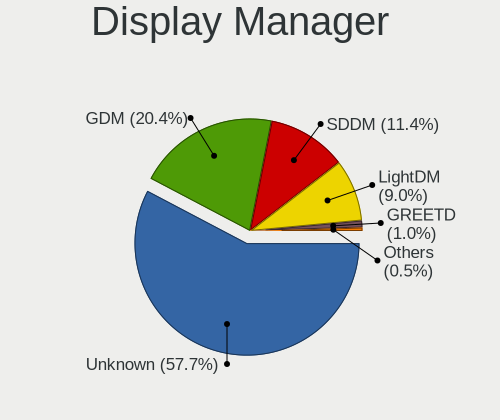
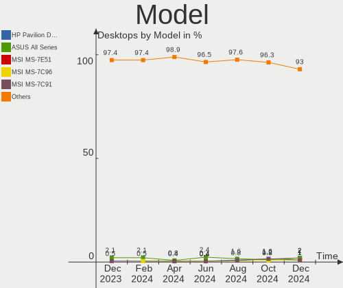

Fedora Hardware Trends (Desktop)
--------------------------------

A project to identify most popular hardware characteristics and track their change
over time based on data collected by Fedora users at https://Linux-Hardware.org.

Anyone can contribute to the study by uploading probes of their computers by
the [hw-probe](https://github.com/linuxhw/hw-probe) tool:

    sudo -E hw-probe -all -upload

Full-feature report is available here: https://linux-hardware.org/?view=trends&formfactor=desktop

Period: Sep, 2020.

Contents
--------

- [ OS                       ](#os)
- [ OS Family                ](#os-family)
- [ Kernel                   ](#kernel)
- [ Kernel Family            ](#kernel-family)
- [ Kernel Major Ver.        ](#kernel-major-ver)
- [ Arch                     ](#arch)
- [ DE                       ](#de)
- [ Display Server           ](#display-server)
- [ Display Manager          ](#display-manager)
- [ OS Lang                  ](#os-lang)
- [ Boot Mode                ](#boot-mode)
- [ Filesystem               ](#filesystem)
- [ Part. scheme             ](#part-scheme)
- [ Dual Boot with Linux/BSD ](#dual-boot-with-linux/bsd)
- [ Dual Boot (Win)          ](#dual-boot-win)
- [ Country                  ](#country)
- [ City                     ](#city)
- [ Vendor                   ](#vendor)
- [ Model                    ](#model)
- [ Model Family             ](#model-family)
- [ MFG Year                 ](#mfg-year)
- [ Form Factor              ](#form-factor)
- [ Secure Boot              ](#secure-boot)
- [ Coreboot                 ](#coreboot)
- [ RAM Size                 ](#ram-size)
- [ RAM Used                 ](#ram-used)
- [ Has CD-ROM               ](#has-cd-rom)
- [ Total Drives             ](#total-drives)
- [ Has Ethernet             ](#has-ethernet)
- [ Drive Vendor             ](#drive-vendor)
- [ HDD Vendor               ](#hdd-vendor)
- [ SSD Vendor               ](#ssd-vendor)
- [ Drive Model              ](#drive-model)
- [ Drive Kind               ](#drive-kind)
- [ Drive Connector          ](#drive-connector)
- [ Drive Size               ](#drive-size)
- [ Space Total              ](#space-total)
- [ Space Used               ](#space-used)
- [ Malfunc. Drives          ](#malfunc-drives)
- [ Malfunc. Drive Vendor    ](#malfunc-drive-vendor)
- [ Malfunc. HDD Vendor      ](#malfunc-hdd-vendor)
- [ Malfunc. Drive Kind      ](#malfunc-drive-kind)
- [ Failed Drives            ](#failed-drives)
- [ Failed Drive Vendor      ](#failed-drive-vendor)
- [ Drive Status             ](#drive-status)
- [ Storage Vendor           ](#storage-vendor)
- [ Storage Model            ](#storage-model)
- [ Storage Kind             ](#storage-kind)
- [ CPU Vendor               ](#cpu-vendor)
- [ CPU Model                ](#cpu-model)
- [ CPU Model Family         ](#cpu-model-family)
- [ CPU Cores                ](#cpu-cores)
- [ CPU Sockets              ](#cpu-sockets)
- [ CPU Threads              ](#cpu-threads)
- [ CPU Op-Modes             ](#cpu-op-modes)
- [ CPU Microcode            ](#cpu-microcode)
- [ CPU Microarch            ](#cpu-microarch)
- [ GPU Vendor               ](#gpu-vendor)
- [ GPU Model                ](#gpu-model)
- [ GPU Combo                ](#gpu-combo)
- [ GPU Driver               ](#gpu-driver)
- [ GPU Memory               ](#gpu-memory)
- [ Monitor Vendor           ](#monitor-vendor)
- [ Monitor Model            ](#monitor-model)
- [ Monitor Resolution       ](#monitor-resolution)
- [ Monitor Diagonal         ](#monitor-diagonal)
- [ Monitor Width            ](#monitor-width)
- [ Aspect Ratio             ](#aspect-ratio)
- [ Monitor Area             ](#monitor-area)
- [ Pixel Density            ](#pixel-density)
- [ Multiple Monitors        ](#multiple-monitors)
- [ Net Controller Vendor    ](#net-controller-vendor)
- [ Net Controller Model     ](#net-controller-model)
- [ Wireless Vendor          ](#wireless-vendor)
- [ Wireless Model           ](#wireless-model)
- [ Ethernet Vendor          ](#ethernet-vendor)
- [ Ethernet Model           ](#ethernet-model)
- [ Net Controller Kind      ](#net-controller-kind)
- [ Used Controller          ](#used-controller)
- [ NICs                     ](#nics)
- [ Memory Vendor            ](#memory-vendor)
- [ Memory Model             ](#memory-model)
- [ Memory Kind              ](#memory-kind)
- [ Memory Form Factor       ](#memory-form-factor)
- [ Memory Size              ](#memory-size)
- [ Memory Speed             ](#memory-speed)
- [ Sound Vendor             ](#sound-vendor)
- [ Sound Model              ](#sound-model)
- [ Camera Vendor            ](#camera-vendor)
- [ Camera Model             ](#camera-model)
- [ Fingerprint Vendor       ](#fingerprint-vendor)
- [ Fingerprint Model        ](#fingerprint-model)
- [ Chipcard Vendor          ](#chipcard-vendor)
- [ Chipcard Model           ](#chipcard-model)
- [ Printer Vendor           ](#printer-vendor)
- [ Printer Model            ](#printer-model)
- [ Scanner Vendor           ](#scanner-vendor)
- [ Scanner Model            ](#scanner-model)
- [ Bluetooth Vendor         ](#bluetooth-vendor)
- [ Bluetooth Model          ](#bluetooth-model)
- [ Unsupported Devices      ](#unsupported-devices)
- [ Unsupported Device Types ](#unsupported-device-types)

OS
--

Installed operating systems

| Name      | Desktops | Percent |
|-----------|----------|---------|
| Fedora 32 | 126      | 91.97%  |
| Fedora 31 | 7        | 5.11%   |
| Fedora 33 | 3        | 2.19%   |
| Fedora 25 | 1        | 0.73%   |

OS Family
---------

OS without a version

| Name   | Desktops | Percent |
|--------|----------|---------|
| Fedora | 137      | 100%    |

Kernel
------

Version of the Linux kernel

| Version                                                      | Desktops | Percent |
|--------------------------------------------------------------|----------|---------|
| 5.8.4-200.fc32.x86_64                                        | 34       | 24.82%  |
| 5.8.11-200.fc32.x86_64                                       | 17       | 12.41%  |
| 5.8.10-200.fc32.x86_64                                       | 17       | 12.41%  |
| 5.8.6-201.fc32.x86_64                                        | 15       | 10.95%  |
| 5.8.9-200.fc32.x86_64                                        | 11       | 8.03%   |
| 5.8.7-200.fc32.x86_64                                        | 7        | 5.11%   |
| 5.8.8-200.fc32.x86_64                                        | 6        | 4.38%   |
| 5.7.17-200.fc32.x86_64                                       | 4        | 2.92%   |
| 5.7.16-200.fc32.x86_64                                       | 4        | 2.92%   |
| 5.7.15-100.fc31.x86_64                                       | 3        | 2.19%   |
| 5.6.6-300.fc32.x86_64                                        | 3        | 2.19%   |
| 5.8.10-100.fc31.x86_64                                       | 2        | 1.46%   |
| 5.7.15-200.fc32.x86_64                                       | 2        | 1.46%   |
| 5.6.15-300.fc32.x86_64                                       | 2        | 1.46%   |
| 5.9.0-rc6-rt8                                                | 1        | 0.73%   |
| 5.9.0-0.rc6.20200925git171d4ff79f96.17.vanilla.1.fc32.x86_64 | 1        | 0.73%   |
| 5.8.6-301.fc33.x86_64                                        | 1        | 0.73%   |
| 5.8.6-101.fc31.x86_64                                        | 1        | 0.73%   |
| 5.8.3-300.fc33.x86_64                                        | 1        | 0.73%   |
| 5.8.12-300.fc33.x86_64                                       | 1        | 0.73%   |
| 5.7.7-200.fc32.x86_64                                        | 1        | 0.73%   |
| 5.7.14-200.fc32.x86_64                                       | 1        | 0.73%   |
| 5.3.7-301.fc31.x86_64                                        | 1        | 0.73%   |
| 4.13.16-100.fc25.x86_64                                      | 1        | 0.73%   |

Kernel Family
-------------

Linux kernel without a distro release

| Version | Desktops | Percent |
|---------|----------|---------|
| 5.8.4   | 34       | 24.82%  |
| 5.8.10  | 19       | 13.87%  |
| 5.8.6   | 17       | 12.41%  |
| 5.8.11  | 17       | 12.41%  |
| 5.8.9   | 11       | 8.03%   |
| 5.8.7   | 7        | 5.11%   |
| 5.8.8   | 6        | 4.38%   |
| 5.7.15  | 5        | 3.65%   |
| 5.7.17  | 4        | 2.92%   |
| 5.7.16  | 4        | 2.92%   |
| 5.6.6   | 3        | 2.19%   |
| 5.9.0   | 2        | 1.46%   |
| 5.6.15  | 2        | 1.46%   |
| 5.8.3   | 1        | 0.73%   |
| 5.8.12  | 1        | 0.73%   |
| 5.7.7   | 1        | 0.73%   |
| 5.7.14  | 1        | 0.73%   |
| 5.3.7   | 1        | 0.73%   |
| 4.13.16 | 1        | 0.73%   |

Kernel Major Ver.
-----------------

Linux kernel major version

| Version | Desktops | Percent |
|---------|----------|---------|
| 5.8     | 113      | 82.48%  |
| 5.7     | 15       | 10.95%  |
| 5.6     | 5        | 3.65%   |
| 5.9     | 2        | 1.46%   |
| 5.3     | 1        | 0.73%   |
| 4.13    | 1        | 0.73%   |

Arch
----

OS architecture (x86_64, i586, etc.)

| Name   | Desktops | Percent |
|--------|----------|---------|
| x86_64 | 137      | 100%    |

DE
--

Desktop Environment

| Name       | Desktops | Percent |
|------------|----------|---------|
| GNOME      | 95       | 69.34%  |
| KDE5       | 15       | 10.95%  |
| KDE        | 6        | 4.38%   |
| Unknown    | 6        | 4.38%   |
| XFCE       | 4        | 2.92%   |
| X-Cinnamon | 3        | 2.19%   |
| MATE       | 3        | 2.19%   |
| Cinnamon   | 2        | 1.46%   |
| LXDE       | 1        | 0.73%   |
| KDE4       | 1        | 0.73%   |
| i3         | 1        | 0.73%   |

Display Server
--------------

X11 or Wayland

| Name    | Desktops | Percent |
|---------|----------|---------|
| X11     | 80       | 58.39%  |
| Wayland | 45       | 32.85%  |
| Tty     | 11       | 8.03%   |
| Web     | 1        | 0.73%   |

Display Manager
---------------

SDDM, LightDM, etc.

| Name    | Desktops | Percent |
|---------|----------|---------|
| Unknown | 65       | 47.45%  |
| GDM     | 50       | 36.5%   |
| SDDM    | 14       | 10.22%  |
| TDM     | 6        | 4.38%   |
| LightDM | 2        | 1.46%   |

OS Lang
-------

Language

| Lang       | Desktops | Percent |
|------------|----------|---------|
| en_US      | 68       | 49.64%  |
| en_GB      | 15       | 10.95%  |
| de_DE      | 7        | 5.11%   |
| en_AU      | 6        | 4.38%   |
| pt_BR      | 5        | 3.65%   |
| fr_FR      | 5        | 3.65%   |
| en_CA      | 5        | 3.65%   |
| ru_RU      | 3        | 2.19%   |
| it_IT      | 3        | 2.19%   |
| en_US.utf8 | 3        | 2.19%   |
| pl_PL      | 2        | 1.46%   |
| uk_UA.utf8 | 1        | 0.73%   |
| sv_SE      | 1        | 0.73%   |
| nb_NO      | 1        | 0.73%   |
| ko_KR      | 1        | 0.73%   |
| hu_HU      | 1        | 0.73%   |
| fi_FI      | 1        | 0.73%   |
| es_ES.utf8 | 1        | 0.73%   |
| es_ES      | 1        | 0.73%   |
| es_CO      | 1        | 0.73%   |
| es_BO      | 1        | 0.73%   |
| en_PH      | 1        | 0.73%   |
| en_GB.utf8 | 1        | 0.73%   |
| en_DK      | 1        | 0.73%   |
| de_DE.utf8 | 1        | 0.73%   |
| de_CH      | 1        | 0.73%   |

Boot Mode
---------

EFI or BIOS

| Mode | Desktops | Percent |
|------|----------|---------|
| EFI  | 97       | 70.8%   |
| BIOS | 40       | 29.2%   |

Filesystem
----------

Type of filesystem

| Type  | Desktops | Percent |
|-------|----------|---------|
| Ext4  | 103      | 75.18%  |
| Xfs   | 17       | 12.41%  |
| Btrfs | 16       | 11.68%  |
| Ext3  | 1        | 0.73%   |

Part. scheme
------------

Scheme of partitioning

| Type    | Desktops | Percent |
|---------|----------|---------|
| GPT     | 69       | 50.36%  |
| Unknown | 58       | 42.34%  |
| MBR     | 10       | 7.3%    |

Dual Boot with Linux/BSD
------------------------

Hosting more than one Linux/BSD

| Dual boot | Desktops | Percent |
|-----------|----------|---------|
| No        | 119      | 86.86%  |
| Yes       | 18       | 13.14%  |

Dual Boot (Win)
---------------

Hosting Linux and Windows

| Dual boot | Desktops | Percent |
|-----------|----------|---------|
| No        | 106      | 77.37%  |
| Yes       | 31       | 22.63%  |

Country
-------

Geographic location (country)

| Country                | Desktops | Percent |
|------------------------|----------|---------|
| USA                    | 33       | 24.09%  |
| Germany                | 13       | 9.49%   |
| Brazil                 | 9        | 6.57%   |
| Canada                 | 7        | 5.11%   |
| Spain                  | 6        | 4.38%   |
| France                 | 6        | 4.38%   |
| Australia              | 6        | 4.38%   |
| Russia                 | 5        | 3.65%   |
| UK                     | 4        | 2.92%   |
| Switzerland            | 4        | 2.92%   |
| Poland                 | 4        | 2.92%   |
| Finland                | 4        | 2.92%   |
| Norway                 | 3        | 2.19%   |
| Italy                  | 3        | 2.19%   |
| Austria                | 3        | 2.19%   |
| Sweden                 | 2        | 1.46%   |
| Philippines            | 2        | 1.46%   |
| Netherlands            | 2        | 1.46%   |
| Korea, Republic of     | 2        | 1.46%   |
| Iceland                | 2        | 1.46%   |
| Hungary                | 2        | 1.46%   |
| Ukraine                | 1        | 0.73%   |
| Thailand               | 1        | 0.73%   |
| Slovakia               | 1        | 0.73%   |
| Romania                | 1        | 0.73%   |
| Portugal               | 1        | 0.73%   |
| Kenya                  | 1        | 0.73%   |
| Iran                   | 1        | 0.73%   |
| Indonesia              | 1        | 0.73%   |
| India                  | 1        | 0.73%   |
| Denmark                | 1        | 0.73%   |
| Czech Republic         | 1        | 0.73%   |
| Colombia               | 1        | 0.73%   |
| Bosnia and Herzegovina | 1        | 0.73%   |
| Bolivia                | 1        | 0.73%   |
| Belgium                | 1        | 0.73%   |

City
----

Geographic location (city)

| City           | Desktops | Percent |
|----------------|----------|---------|
| Helsinki       | 4        | 2.92%   |
| Toronto        | 3        | 2.19%   |
| Zurich         | 2        | 1.46%   |
| Wrocław       | 2        | 1.46%   |
| São Paulo     | 2        | 1.46%   |
| Seoul          | 2        | 1.46%   |
| Rostock        | 2        | 1.46%   |
| Reykjavik      | 2        | 1.46%   |
| Moscow         | 2        | 1.46%   |
| Milan          | 2        | 1.46%   |
| Kansas City    | 2        | 1.46%   |
| Hamburg        | 2        | 1.46%   |
| Berlin         | 2        | 1.46%   |
| Amsterdam      | 2        | 1.46%   |
| Almería       | 2        | 1.46%   |
| Žilina        | 1        | 0.73%   |
| Westerville    | 1        | 0.73%   |
| West Chester   | 1        | 0.73%   |
| Wahroonga      | 1        | 0.73%   |
| Villeurbanne   | 1        | 0.73%   |
| Villavicencio  | 1        | 0.73%   |
| Victoria       | 1        | 0.73%   |
| Veresegyhaz    | 1        | 0.73%   |
| Vancouver      | 1        | 0.73%   |
| Uccle          | 1        | 0.73%   |
| Trenton        | 1        | 0.73%   |
| Torrelodones   | 1        | 0.73%   |
| Tehran         | 1        | 0.73%   |
| Sydney         | 1        | 0.73%   |
| Surabaya       | 1        | 0.73%   |
| Sunnyvale      | 1        | 0.73%   |
| St Petersburg  | 1        | 0.73%   |
| Springfield    | 1        | 0.73%   |
| Sorocaba       | 1        | 0.73%   |
| Snezhinsk      | 1        | 0.73%   |
| Segovia        | 1        | 0.73%   |
| Sarajevo       | 1        | 0.73%   |
| Sannois        | 1        | 0.73%   |
| Salt Lake City | 1        | 0.73%   |
| Rural Valley   | 1        | 0.73%   |
| Recife         | 1        | 0.73%   |
| Reading        | 1        | 0.73%   |
| Poznan         | 1        | 0.73%   |
| Portage        | 1        | 0.73%   |
| Porsgrunn      | 1        | 0.73%   |
| Piraquara      | 1        | 0.73%   |
| Pinner         | 1        | 0.73%   |
| Paris          | 1        | 0.73%   |
| Palo Alto      | 1        | 0.73%   |
| Oslo           | 1        | 0.73%   |
| Orzhiv         | 1        | 0.73%   |
| Orlando        | 1        | 0.73%   |
| Olathe         | 1        | 0.73%   |
| Niterói       | 1        | 0.73%   |
| Navarres       | 1        | 0.73%   |
| Nantes         | 1        | 0.73%   |
| Nairobi        | 1        | 0.73%   |
| Moss           | 1        | 0.73%   |
| Mississauga    | 1        | 0.73%   |
| Minneapolis    | 1        | 0.73%   |

Vendor
------

Motherboard manufacturer

| Name                | Desktops | Percent |
|---------------------|----------|---------|
| ASUSTek Computer    | 37       | 27.01%  |
| Gigabyte Technology | 31       | 22.63%  |
| MSI                 | 19       | 13.87%  |
| ASRock              | 17       | 12.41%  |
| Dell                | 8        | 5.84%   |
| Hewlett-Packard     | 6        | 4.38%   |
| Lenovo              | 4        | 2.92%   |
| Intel               | 3        | 2.19%   |
| Fujitsu             | 2        | 1.46%   |
| Acer                | 2        | 1.46%   |
| Shuttle             | 1        | 0.73%   |
| Positivo            | 1        | 0.73%   |
| Pegatron            | 1        | 0.73%   |
| PCWare              | 1        | 0.73%   |
| OEM                 | 1        | 0.73%   |
| Biostar             | 1        | 0.73%   |
| ASRockRack          | 1        | 0.73%   |
| Unknown             | 1        | 0.73%   |

Model
-----

Motherboard model

| Name                                | Desktops | Percent |
|-------------------------------------|----------|---------|
| ASUS All Series                     | 5        | 3.65%   |
| MSI MS-7C02                         | 4        | 2.92%   |
| MSI MS-7C84                         | 2        | 1.46%   |
| MSI MS-7B86                         | 2        | 1.46%   |
| MSI MS-7866                         | 2        | 1.46%   |
| Gigabyte X570 AORUS ELITE           | 2        | 1.46%   |
| Gigabyte B550M AORUS PRO            | 2        | 1.46%   |
| Gigabyte B450M S2H                  | 2        | 1.46%   |
| Dell XPS 8930                       | 2        | 1.46%   |
| Dell OptiPlex 9020                  | 2        | 1.46%   |
| ASUS PRIME B350-PLUS                | 2        | 1.46%   |
| Shuttle SP45                        | 1        | 0.73%   |
| Positivo POS-PARS760GCD             | 1        | 0.73%   |
| Pegatron h8-1024ch                  | 1        | 0.73%   |
| PCWare IPMH61R3                     | 1        | 0.73%   |
| OEM 45CMX/45GMX/45CMX-K             | 1        | 0.73%   |
| MSI MS-7C56                         | 1        | 0.73%   |
| MSI MS-7C35                         | 1        | 0.73%   |
| MSI MS-7B93                         | 1        | 0.73%   |
| MSI MS-7B85                         | 1        | 0.73%   |
| MSI MS-7B61                         | 1        | 0.73%   |
| MSI MS-7B22                         | 1        | 0.73%   |
| MSI MS-7A39                         | 1        | 0.73%   |
| MSI MS-7A38                         | 1        | 0.73%   |
| MSI MS-7821                         | 1        | 0.73%   |
| Lenovo ThinkSystem ST50 7Y48CTO1WW  | 1        | 0.73%   |
| Lenovo ThinkStation P620 30E102Z    | 1        | 0.73%   |
| Lenovo ThinkStation P520 30BE007UMC | 1        | 0.73%   |
| Lenovo ThinkCentre M58p 7220A72     | 1        | 0.73%   |
| Intel X99                           | 1        | 0.73%   |
| Intel MAHOBAY                       | 1        | 0.73%   |
| Intel D54250WYK H13922-303          | 1        | 0.73%   |
| HP Slim Desktop 290-p0xxx           | 1        | 0.73%   |
| HP ProDesk 600 G1 SFF               | 1        | 0.73%   |
| HP Pavilion Desktop 590-a0xxx       | 1        | 0.73%   |
| HP Compaq 6200 Pro SFF PC           | 1        | 0.73%   |
| HP 870-055ng                        | 1        | 0.73%   |
| HP 200-5315ru                       | 1        | 0.73%   |
| Gigabyte Z370P D3                   | 1        | 0.73%   |
| Gigabyte Z370 HD3                   | 1        | 0.73%   |
| Gigabyte Z370 AORUS Ultra Gaming    | 1        | 0.73%   |
| Gigabyte Z170N-WIFI                 | 1        | 0.73%   |
| Gigabyte X99P-SLI-CF                | 1        | 0.73%   |
| Gigabyte X570 GAMING X              | 1        | 0.73%   |
| Gigabyte X570 AORUS PRO WIFI        | 1        | 0.73%   |
| Gigabyte X570 AORUS PRO             | 1        | 0.73%   |
| Gigabyte X570 AORUS MASTER          | 1        | 0.73%   |
| Gigabyte X470 AORUS ULTRA GAMING    | 1        | 0.73%   |
| Gigabyte X299 DESIGNARE EX          | 1        | 0.73%   |
| Gigabyte TRX40 AORUS XTREME         | 1        | 0.73%   |
| Gigabyte TRX40 AORUS MASTER         | 1        | 0.73%   |
| Gigabyte H61M-S2P                   | 1        | 0.73%   |
| Gigabyte GB-BACE-3160               | 1        | 0.73%   |
| Gigabyte F2A88XN-WIFI               | 1        | 0.73%   |
| Gigabyte F2A88XM-DS2P               | 1        | 0.73%   |
| Gigabyte F2A78M-HD2                 | 1        | 0.73%   |
| Gigabyte B450M DS3H                 | 1        | 0.73%   |
| Gigabyte B450 AORUS ELITE           | 1        | 0.73%   |
| Gigabyte B365M D3H                  | 1        | 0.73%   |
| Gigabyte 990XA-UD3                  | 1        | 0.73%   |

Model Family
------------

Motherboard model prefix

| Name                    | Desktops | Percent |
|-------------------------|----------|---------|
| ASUS PRIME              | 8        | 5.84%   |
| Gigabyte X570           | 6        | 4.38%   |
| ASUS ROG                | 5        | 3.65%   |
| ASUS All                | 5        | 3.65%   |
| MSI MS-7C02             | 4        | 2.92%   |
| ASUS TUF                | 4        | 2.92%   |
| Gigabyte B450M          | 3        | 2.19%   |
| Dell Precision          | 3        | 2.19%   |
| Dell OptiPlex           | 3        | 2.19%   |
| MSI MS-7C84             | 2        | 1.46%   |
| MSI MS-7B86             | 2        | 1.46%   |
| MSI MS-7866             | 2        | 1.46%   |
| Lenovo ThinkStation     | 2        | 1.46%   |
| Gigabyte Z370           | 2        | 1.46%   |
| Gigabyte TRX40          | 2        | 1.46%   |
| Gigabyte B550M          | 2        | 1.46%   |
| Dell XPS                | 2        | 1.46%   |
| ASUS Maximus            | 2        | 1.46%   |
| Shuttle SP45            | 1        | 0.73%   |
| Positivo POS-PARS760GCD | 1        | 0.73%   |
| Pegatron h8-1024ch      | 1        | 0.73%   |
| PCWare IPMH61R3         | 1        | 0.73%   |
| OEM 45CMX               | 1        | 0.73%   |
| MSI MS-7C56             | 1        | 0.73%   |
| MSI MS-7C35             | 1        | 0.73%   |
| MSI MS-7B93             | 1        | 0.73%   |
| MSI MS-7B85             | 1        | 0.73%   |
| MSI MS-7B61             | 1        | 0.73%   |
| MSI MS-7B22             | 1        | 0.73%   |
| MSI MS-7A39             | 1        | 0.73%   |
| MSI MS-7A38             | 1        | 0.73%   |
| MSI MS-7821             | 1        | 0.73%   |
| Lenovo ThinkSystem      | 1        | 0.73%   |
| Lenovo ThinkCentre      | 1        | 0.73%   |
| Intel X99               | 1        | 0.73%   |
| Intel MAHOBAY           | 1        | 0.73%   |
| Intel D54250WYK         | 1        | 0.73%   |
| HP Slim                 | 1        | 0.73%   |
| HP ProDesk              | 1        | 0.73%   |
| HP Pavilion             | 1        | 0.73%   |
| HP Compaq               | 1        | 0.73%   |
| HP 870-055ng            | 1        | 0.73%   |
| HP 200-5315ru           | 1        | 0.73%   |
| Gigabyte Z370P          | 1        | 0.73%   |
| Gigabyte Z170N-WIFI     | 1        | 0.73%   |
| Gigabyte X99P-SLI-CF    | 1        | 0.73%   |
| Gigabyte X470           | 1        | 0.73%   |
| Gigabyte X299           | 1        | 0.73%   |
| Gigabyte H61M-S2P       | 1        | 0.73%   |
| Gigabyte GB-BACE-3160   | 1        | 0.73%   |
| Gigabyte F2A88XN-WIFI   | 1        | 0.73%   |
| Gigabyte F2A88XM-DS2P   | 1        | 0.73%   |
| Gigabyte F2A78M-HD2     | 1        | 0.73%   |
| Gigabyte B450           | 1        | 0.73%   |
| Gigabyte B365M          | 1        | 0.73%   |
| Gigabyte 990XA-UD3      | 1        | 0.73%   |
| Gigabyte 970A-UD3P      | 1        | 0.73%   |
| Gigabyte 970A-UD3       | 1        | 0.73%   |
| Gigabyte 970A-DS3P      | 1        | 0.73%   |
| Fujitsu FUTRO           | 1        | 0.73%   |

MFG Year
--------

Motherboard manufacture year

| Year | Desktops | Percent |
|------|----------|---------|
| 2020 | 35       | 25.55%  |
| 2019 | 27       | 19.71%  |
| 2018 | 22       | 16.06%  |
| 2013 | 9        | 6.57%   |
| 2017 | 8        | 5.84%   |
| 2015 | 8        | 5.84%   |
| 2014 | 8        | 5.84%   |
| 2016 | 7        | 5.11%   |
| 2011 | 5        | 3.65%   |
| 2012 | 4        | 2.92%   |
| 2009 | 2        | 1.46%   |
| 2010 | 1        | 0.73%   |
| 2008 | 1        | 0.73%   |

Form Factor
-----------

Physical design of the computer

| Name    | Desktops | Percent |
|---------|----------|---------|
| Desktop | 137      | 100%    |

Secure Boot
-----------

Enabled or disabled

| State    | Desktops | Percent |
|----------|----------|---------|
| Disabled | 132      | 96.35%  |
| Enabled  | 5        | 3.65%   |

Coreboot
--------

Have coreboot on board

| Used | Desktops | Percent |
|------|----------|---------|
| No   | 137      | 100%    |

RAM Size
--------

Total RAM memory

| Size in GB  | Desktops | Percent |
|-------------|----------|---------|
| 16.01-24.0  | 53       | 38.69%  |
| 32.01-64.0  | 27       | 19.71%  |
| 8.01-16.0   | 17       | 12.41%  |
| 64.01-256.0 | 13       | 9.49%   |
| 4.01-8.0    | 12       | 8.76%   |
| 3.01-4.0    | 9        | 6.57%   |
| 24.01-32.0  | 5        | 3.65%   |
| 1.01-2.0    | 1        | 0.73%   |

RAM Used
--------

Used RAM memory

| Used GB    | Desktops | Percent |
|------------|----------|---------|
| 4.01-8.0   | 40       | 29.2%   |
| 3.01-4.0   | 31       | 22.63%  |
| 2.01-3.0   | 25       | 18.25%  |
| 8.01-16.0  | 20       | 14.6%   |
| 1.01-2.0   | 12       | 8.76%   |
| 16.01-24.0 | 5        | 3.65%   |
| 0.01-1.0   | 3        | 2.19%   |
| 32.01-64.0 | 1        | 0.73%   |

Has CD-ROM
----------

Has CD-ROM on board

| Presented | Desktops | Percent |
|-----------|----------|---------|
| No        | 86       | 62.77%  |
| Yes       | 51       | 37.23%  |

Total Drives
------------

Number of drives on board

| Drives | Desktops | Percent |
|--------|----------|---------|
| 1      | 40       | 29.2%   |
| 2      | 38       | 27.74%  |
| 3      | 26       | 18.98%  |
| 4      | 16       | 11.68%  |
| 5      | 10       | 7.3%    |
| 7      | 3        | 2.19%   |
| 11     | 1        | 0.73%   |
| 8      | 1        | 0.73%   |
| 6      | 1        | 0.73%   |
| 0      | 1        | 0.73%   |

Has Ethernet
------------

Has Ethernet on board

| Presented | Desktops | Percent |
|-----------|----------|---------|
| Yes       | 137      | 100%    |

Drive Vendor
------------

Hard drive vendors

| Vendor                    | Desktops | Drives  | Percent |
|---------------------------|----------|---------|---------|
| WDC                       | 58       | 78      | 20.86%  |
| Samsung Electronics       | 57       | 85      | 20.5%   |
| Seagate                   | 47       | 62      | 16.91%  |
| Kingston                  | 20       | 25      | 7.19%   |
| SanDisk                   | 16       | 18      | 5.76%   |
| Toshiba                   | 15       | 17      | 5.4%    |
| Crucial                   | 13       | 16      | 4.68%   |
| Intel                     | 9        | 12      | 3.24%   |
| Phison                    | 6        | 7       | 2.16%   |
| Hitachi                   | 5        | 6       | 1.8%    |
| HGST                      | 4        | 5       | 1.44%   |
| Corsair                   | 3        | 3       | 1.08%   |
| Transcend                 | 2        | 2       | 0.72%   |
| OCZ                       | 2        | 2       | 0.72%   |
| Gigabyte Technology       | 2        | 2       | 0.72%   |
| China                     | 2        | 2       | 0.72%   |
| Apacer                    | 2        | 2       | 0.72%   |
| XPG                       | 1        | 1       | 0.36%   |
| Unknown                   | 1        | 1       | 0.36%   |
| SPCC                      | 1        | 1       | 0.36%   |
| SK Hynix                  | 1        | 1       | 0.36%   |
| Patriot                   | 1        | 1       | 0.36%   |
| Micron/Crucial Technology | 1        | 1       | 0.36%   |
| Micron Technology         | 1        | 1       | 0.36%   |
| MAXTOR                    | 1        | 1       | 0.36%   |
| KINGMAX                   | 1        | 1       | 0.36%   |
| KingDian                  | 1        | 1       | 0.36%   |
| JMicron                   | 1        | Unknown | 0.36%   |
| InnoDisk                  | 1        | 1       | 0.36%   |
| Hewlett-Packard           | 1        | 1       | 0.36%   |
| Apple                     | 1        | 1       | 0.36%   |
| A-DATA Technology         | 1        | 1       | 0.36%   |

HDD Vendor
----------

Hard disk drive vendors

| Vendor              | Desktops | Drives | Percent |
|---------------------|----------|--------|---------|
| WDC                 | 48       | 65     | 39.67%  |
| Seagate             | 47       | 61     | 38.84%  |
| Toshiba             | 13       | 14     | 10.74%  |
| Hitachi             | 5        | 6      | 4.13%   |
| HGST                | 4        | 5      | 3.31%   |
| Samsung Electronics | 3        | 4      | 2.48%   |
| MAXTOR              | 1        | 1      | 0.83%   |

SSD Vendor
----------

Solid state drive vendors

| Vendor              | Desktops | Drives | Percent |
|---------------------|----------|--------|---------|
| Samsung Electronics | 41       | 55     | 36.28%  |
| Kingston            | 15       | 19     | 13.27%  |
| SanDisk             | 12       | 14     | 10.62%  |
| Crucial             | 12       | 15     | 10.62%  |
| WDC                 | 8        | 8      | 7.08%   |
| Intel               | 5        | 6      | 4.42%   |
| Transcend           | 2        | 2      | 1.77%   |
| Toshiba             | 2        | 2      | 1.77%   |
| OCZ                 | 2        | 2      | 1.77%   |
| Corsair             | 2        | 2      | 1.77%   |
| China               | 2        | 2      | 1.77%   |
| Apacer              | 2        | 2      | 1.77%   |
| Patriot             | 1        | 1      | 0.88%   |
| Micron Technology   | 1        | 1      | 0.88%   |
| KINGMAX             | 1        | 1      | 0.88%   |
| KingDian            | 1        | 1      | 0.88%   |
| InnoDisk            | 1        | 1      | 0.88%   |
| Hewlett-Packard     | 1        | 1      | 0.88%   |
| Apple               | 1        | 1      | 0.88%   |
| A-DATA Technology   | 1        | 1      | 0.88%   |

Drive Model
-----------

Hard drive models

| Model                        | Desktops | Percent |
|------------------------------|----------|---------|
| SSD 850 EVO 500GB            | 8        | 2.42%   |
| SSD 850 EVO 250GB            | 8        | 2.42%   |
| NVMe SSD Drive 500GB         | 6        | 1.82%   |
| WD10EZEX-08WN4A0 1TB         | 5        | 1.52%   |
| ST2000DM001-1ER164 2TB       | 5        | 1.52%   |
| ST1000DM010-2EP102 1TB       | 5        | 1.52%   |
| SSD 860 QVO 1TB              | 5        | 1.52%   |
| SSD 860 EVO 500GB            | 5        | 1.52%   |
| SSD 860 EVO 1TB              | 5        | 1.52%   |
| NVMe SSD Drive 1TB           | 5        | 1.52%   |
| DT01ACA300 3TB               | 5        | 1.52%   |
| ST3000DM008-2DM166 3TB       | 4        | 1.21%   |
| ST1000DM003-1SB102 1TB       | 4        | 1.21%   |
| SSD 860 EVO 250GB            | 4        | 1.21%   |
| WD30EFRX-68EUZN0 3TB         | 3        | 0.91%   |
| ST500DM002-1BD142 500GB      | 3        | 0.91%   |
| SSD 970 EVO Plus 500GB       | 3        | 0.91%   |
| SSD 840 EVO 250GB            | 3        | 0.91%   |
| SA400S37480G 480GB SSD       | 3        | 0.91%   |
| NVMe SSD Drive 250GB         | 3        | 0.91%   |
| WDS500G2B0A-00SM50 500GB SSD | 2        | 0.61%   |
| WDS240G2G0A-00JH30 240GB SSD | 2        | 0.61%   |
| WDS100T3X0C-00SJG0 1TB       | 2        | 0.61%   |
| WD5000AAKX-003CA0 500GB      | 2        | 0.61%   |
| WD30EFRX-68AX9N0 3TB         | 2        | 0.61%   |
| WD20EZRZ-00Z5HB0 2TB         | 2        | 0.61%   |
| WD20EZAZ-00GGJB0 2TB         | 2        | 0.61%   |
| WD10JPVX-22JC3T0 1TB         | 2        | 0.61%   |
| WD10EZEX-60WN4A1 1TB         | 2        | 0.61%   |
| WD10EZEX-21WN4A0 1TB         | 2        | 0.61%   |
| WD10EZEX-08M2NA0 1TB         | 2        | 0.61%   |
| WD10EZEX-00BN5A0 1TB         | 2        | 0.61%   |
| WD1002FAEX-00Z3A0 1TB        | 2        | 0.61%   |
| SV300S37A240G 240GB SSD      | 2        | 0.61%   |
| SV300S37A120G 120GB SSD      | 2        | 0.61%   |
| ST4000VN008-2DR166 4TB       | 2        | 0.61%   |
| ST3500312CS 499GB            | 2        | 0.61%   |
| ST2000DM008-2FR102 2TB       | 2        | 0.61%   |
| ST1000DM003-1SB10C 1TB       | 2        | 0.61%   |
| SSDPEKNW010T8 1TB            | 2        | 0.61%   |
| SSD 970 EVO 500GB            | 2        | 0.61%   |
| SSD 960 EVO 500GB            | 2        | 0.61%   |
| SSD 960 EVO 250GB            | 2        | 0.61%   |
| SSD 850 PRO 256GB            | 2        | 0.61%   |
| SSD 830 Series 256GB         | 2        | 0.61%   |
| SSD 750 EVO 250GB            | 2        | 0.61%   |
| SDSSDHP256G 256GB            | 2        | 0.61%   |
| SA400S37960G 960GB SSD       | 2        | 0.61%   |
| SA400S37120G 120GB SSD       | 2        | 0.61%   |
| NVMe SSD Drive 512GB         | 2        | 0.61%   |
| NVMe SSD Drive 2TB           | 2        | 0.61%   |
| NVMe SSD Drive 256GB         | 2        | 0.61%   |
| NVMe SSD Drive 1024GB        | 2        | 0.61%   |
| HDWD110 1TB                  | 2        | 0.61%   |
| HDN724040ALE640 4TB          | 2        | 0.61%   |
| HD103SJ 1TB                  | 2        | 0.61%   |
| Expansion Desk 6TB           | 2        | 0.61%   |
| DT01ACA100 1TB               | 2        | 0.61%   |
| CT500MX500SSD1 500GB         | 2        | 0.61%   |
| CT480BX500SSD1 480GB         | 2        | 0.61%   |

Drive Kind
----------

HDD or SSD

| Kind    | Desktops | Drives | Percent |
|---------|----------|--------|---------|
| HDD     | 94       | 156    | 40.34%  |
| SSD     | 87       | 137    | 37.34%  |
| NVMe    | 50       | 64     | 21.46%  |
| Unknown | 2        | 1      | 0.86%   |

Drive Connector
---------------

SATA, SAS, NVMe, etc.

| Type | Desktops | Drives | Percent |
|------|----------|--------|---------|
| SATA | 122      | 289    | 68.93%  |
| NVMe | 50       | 64     | 28.25%  |
| SAS  | 5        | 5      | 2.82%   |

Drive Size
----------

Size of hard drive

| Size in TB | Desktops | Drives | Percent |
|------------|----------|--------|---------|
| 0.01-0.5   | 101      | 171    | 42.26%  |
| 0.51-1.0   | 75       | 101    | 31.38%  |
| 1.01-2.0   | 29       | 37     | 12.13%  |
| 2.01-3.0   | 19       | 26     | 7.95%   |
| 3.01-4.0   | 11       | 17     | 4.6%    |
| 4.01-10.0  | 4        | 6      | 1.67%   |

Space Total
-----------

Amount of disk space available on the file system

| Size in GB     | Desktops | Percent |
|----------------|----------|---------|
| More than 3000 | 27       | 19.71%  |
| 501-1000       | 24       | 17.52%  |
| 251-500        | 22       | 16.06%  |
| 1001-2000      | 20       | 14.6%   |
| 101-250        | 19       | 13.87%  |
| 2001-3000      | 15       | 10.95%  |
| 1-20           | 8        | 5.84%   |
| 51-100         | 2        | 1.46%   |

Space Used
----------

Amount of used disk space

| Used GB        | Desktops | Percent |
|----------------|----------|---------|
| 1-20           | 25       | 18.25%  |
| 251-500        | 19       | 13.87%  |
| 21-50          | 17       | 12.41%  |
| 1001-2000      | 16       | 11.68%  |
| 501-1000       | 14       | 10.22%  |
| 51-100         | 14       | 10.22%  |
| 101-250        | 13       | 9.49%   |
| More than 3000 | 10       | 7.3%    |
| 2001-3000      | 8        | 5.84%   |
| 0              | 1        | 0.73%   |

Malfunc. Drives
---------------

Drive models with a malfunction

| Model                          | Desktops | Drives | Percent |
|--------------------------------|----------|--------|---------|
| ST2000DM001-1ER164 2TB         | 2        | 2      | 8%      |
| WD30EZRX-00D8PB0 3TB           | 1        | 1      | 4%      |
| WD1600AAJS-75M0A0 160GB        | 1        | 1      | 4%      |
| WD10EZEX-00BN5A0 1TB           | 1        | 1      | 4%      |
| WD10EACS-00D6B0 1TB            | 1        | 1      | 4%      |
| VERTEX4 256GB SSD              | 1        | 1      | 4%      |
| VERTEX4 128GB SSD              | 1        | 1      | 4%      |
| ST9750420AS 752GB              | 1        | 1      | 4%      |
| ST500DM002-1BD142 500GB        | 1        | 1      | 4%      |
| ST3160815AS 160GB              | 1        | 1      | 4%      |
| ST31500341AS 1TB               | 1        | 1      | 4%      |
| ST3000DM008-2DM166 3TB         | 1        | 1      | 4%      |
| ST2000VX000-1CU164 2TB         | 1        | 1      | 4%      |
| ST1000NM0011 1TB               | 1        | 2      | 4%      |
| SSDSC2KW480H6 480GB            | 1        | 1      | 4%      |
| SSD PLUS 240GB                 | 1        | 1      | 4%      |
| SSD 960 PRO 512GB              | 1        | 1      | 4%      |
| SD7SB6S-128G-1006 128GB SSD    | 1        | 1      | 4%      |
| HTS727550A9E364 500GB          | 1        | 1      | 4%      |
| HTS723232A7A364 320GB          | 1        | 1      | 4%      |
| HTS542516K9SA00 160GB          | 1        | 1      | 4%      |
| HDS721010CLA330 1TB            | 1        | 1      | 4%      |
| BC501 HFM128GDJTNG-8310A 128GB | 1        | 1      | 4%      |
| AS340 240GB SSD                | 1        | 1      | 4%      |

Malfunc. Drive Vendor
---------------------

Vendors of faulty drives

| Vendor              | Desktops | Drives | Percent |
|---------------------|----------|--------|---------|
| Seagate             | 9        | 10     | 37.5%   |
| WDC                 | 4        | 4      | 16.67%  |
| Hitachi             | 3        | 4      | 12.5%   |
| SanDisk             | 2        | 2      | 8.33%   |
| OCZ                 | 2        | 2      | 8.33%   |
| SK Hynix            | 1        | 1      | 4.17%   |
| Samsung Electronics | 1        | 1      | 4.17%   |
| Intel               | 1        | 1      | 4.17%   |
| Apacer              | 1        | 1      | 4.17%   |

Malfunc. HDD Vendor
-------------------

Vendors of faulty HDD drives

| Vendor  | Desktops | Drives | Percent |
|---------|----------|--------|---------|
| Seagate | 9        | 10     | 56.25%  |
| WDC     | 4        | 4      | 25%     |
| Hitachi | 3        | 4      | 18.75%  |

Malfunc. Drive Kind
-------------------

Kinds of faulty drives

| Kind | Desktops | Drives | Percent |
|------|----------|--------|---------|
| HDD  | 15       | 18     | 65.22%  |
| SSD  | 6        | 6      | 26.09%  |
| NVMe | 2        | 2      | 8.7%    |

Failed Drives
-------------

Failed drive models

Zero info for selected period =(

Failed Drive Vendor
-------------------

Failed drive vendors

Zero info for selected period =(

Drive Status
------------

Number of failed and malfunc. drives

| Status   | Desktops | Drives | Percent |
|----------|----------|--------|---------|
| Works    | 79       | 179    | 50.32%  |
| Detected | 57       | 153    | 36.31%  |
| Malfunc  | 21       | 26     | 13.38%  |

Storage Vendor
--------------

Storage controller vendors

| Vendor                       | Desktops | Percent |
|------------------------------|----------|---------|
| Intel                        | 73       | 35.1%   |
| AMD                          | 64       | 30.77%  |
| Samsung Electronics          | 23       | 11.06%  |
| ASMedia Technology           | 14       | 6.73%   |
| Phison Electronics           | 9        | 4.33%   |
| Sandisk                      | 8        | 3.85%   |
| Kingston Technology Company  | 5        | 2.4%    |
| Micron/Crucial Technology    | 2        | 0.96%   |
| JMicron Technology           | 2        | 0.96%   |
| ADATA Technology             | 2        | 0.96%   |
| Toshiba America Info Systems | 1        | 0.48%   |
| SK Hynix                     | 1        | 0.48%   |
| Silicon Motion               | 1        | 0.48%   |
| Marvell Technology Group     | 1        | 0.48%   |
| Broadcom / LSI               | 1        | 0.48%   |
| 3ware                        | 1        | 0.48%   |

Storage Model
-------------

Storage controller models

| Model                                                                             | Desktops | Percent |
|-----------------------------------------------------------------------------------|----------|---------|
| FCH SATA Controller [AHCI mode]                                                   | 47       | 17.94%  |
| 400 Series Chipset SATA Controller                                                | 19       | 7.25%   |
| NVMe SSD Controller SM981/PM981/PM983                                             | 15       | 5.73%   |
| ASM1062 Serial ATA Controller                                                     | 14       | 5.34%   |
| 8 Series/C220 Series Chipset Family 6-port SATA Controller 1 [AHCI mode]          | 12       | 4.58%   |
| Q170/Q150/B150/H170/H110/Z170/CM236 Chipset SATA Controller [AHCI Mode]           | 11       | 4.2%    |
| 200 Series PCH SATA controller [AHCI mode]                                        | 11       | 4.2%    |
| NVMe SSD Controller SM961/PM961                                                   | 9        | 3.44%   |
| SB7x0/SB8x0/SB9x0 SATA Controller [AHCI mode]                                     | 8        | 3.05%   |
| Non-Volatile memory controller                                                    | 8        | 3.05%   |
| SATA controller                                                                   | 6        | 2.29%   |
| Cannon Lake PCH SATA AHCI Controller                                              | 6        | 2.29%   |
| A2000, M.2, 500GB                                                                 | 5        | 1.91%   |
| 300 Series Chipset SATA Controller                                                | 5        | 1.91%   |
| SB7x0/SB8x0/SB9x0 IDE Controller                                                  | 4        | 1.53%   |
| SATA Controller [RAID mode]                                                       | 4        | 1.53%   |
| E16 PCIe4 NVMe Controller                                                         | 4        | 1.53%   |
| C610/X99 series chipset sSATA Controller [AHCI mode]                              | 4        | 1.53%   |
| 9 Series Chipset Family SATA Controller [AHCI Mode]                               | 4        | 1.53%   |
| NM10/ICH7 Family SATA Controller [IDE mode]                                       | 3        | 1.15%   |
| FCH IDE Controller                                                                | 3        | 1.15%   |
| E12 NVMe Controller                                                               | 3        | 1.15%   |
| 82801G (ICH7 Family) IDE Controller                                               | 3        | 1.15%   |
| 7 Series/C210 Series Chipset Family 6-port SATA Controller [AHCI mode]            | 3        | 1.15%   |
| 6 Series/C200 Series Chipset Family 6 port Desktop SATA AHCI Controller           | 3        | 1.15%   |
| XPG SX8200 Pro PCIe Gen3x4 M.2 2280 Solid State Drive                             | 2        | 0.76%   |
| SSD 660P Series                                                                   | 2        | 0.76%   |
| SSD 600P Series                                                                   | 2        | 0.76%   |
| SB7x0/SB8x0/SB9x0 SATA Controller [IDE mode]                                      | 2        | 0.76%   |
| RS690 PCI to PCI Bridge (PCI Express Port 2)                                      | 2        | 0.76%   |
| FCH SATA Controller D                                                             | 2        | 0.76%   |
| C610/X99 series chipset 6-Port SATA Controller [AHCI mode]                        | 2        | 0.76%   |
| 6 Series/C200 Series Chipset Family Desktop SATA Controller (IDE mode, ports 4-5) | 2        | 0.76%   |
| 6 Series/C200 Series Chipset Family Desktop SATA Controller (IDE mode, ports 0-3) | 2        | 0.76%   |
| X399 Series Chipset SATA Controller                                               | 1        | 0.38%   |
| X370 Series Chipset SATA Controller                                               | 1        | 0.38%   |
| WD Black NVMe SSD                                                                 | 1        | 0.38%   |
| WD Black 2018/PC SN720 NVMe SSD                                                   | 1        | 0.38%   |
| Toshiba America Info Non-Volatile memory controller                               | 1        | 0.38%   |
| Sunrise Point-LP SATA Controller [AHCI mode]                                      | 1        | 0.38%   |
| SSD Pro 7600p/760p/E 6100p Series                                                 | 1        | 0.38%   |
| SAS2008 PCI-Express Fusion-MPT SAS-2 [Falcon]                                     | 1        | 0.38%   |
| PS5013 E13 NVMe Controller                                                        | 1        | 0.38%   |
| P1 NVMe PCIe SSD                                                                  | 1        | 0.38%   |
| NVMe Storage Controller                                                           | 1        | 0.38%   |
| JMB368 IDE controller                                                             | 1        | 0.38%   |
| JMB362 SATA Controller                                                            | 1        | 0.38%   |
| Electronics SATA controller                                                       | 1        | 0.38%   |
| E7 NVMe Controller                                                                | 1        | 0.38%   |
| C600/X79 series chipset SATA RAID Controller                                      | 1        | 0.38%   |
| C600/X79 series chipset 6-Port SATA AHCI Controller                               | 1        | 0.38%   |
| BC501 NVMe Solid State Drive 512GB                                                | 1        | 0.38%   |
| 9750 SAS2/SATA-II RAID PCIe                                                       | 1        | 0.38%   |
| 88SE9128 PCIe SATA 6 Gb/s RAID controller with HyperDuo                           | 1        | 0.38%   |
| 82801JI (ICH10 Family) SATA AHCI Controller                                       | 1        | 0.38%   |
| 82801JI (ICH10 Family) 4 port SATA IDE Controller #1                              | 1        | 0.38%   |
| 82801JI (ICH10 Family) 2 port SATA IDE Controller #2                              | 1        | 0.38%   |
| 82801JD/DO (ICH10 Family) SATA AHCI Controller                                    | 1        | 0.38%   |
| 8 Series SATA Controller 1 [AHCI mode]                                            | 1        | 0.38%   |
| 6 Series/C200 Series Chipset Family Mobile SATA Controller (IDE mode, ports 4-5)  | 1        | 0.38%   |

Storage Kind
------------

Kind of storage controller (IDE, SATA, NVMe, SAS, ...)

| Kind | Desktops | Percent |
|------|----------|---------|
| SATA | 123      | 62.12%  |
| NVMe | 51       | 25.76%  |
| IDE  | 15       | 7.58%   |
| RAID | 8        | 4.04%   |
| SAS  | 1        | 0.51%   |

CPU Vendor
----------

Processor vendors

| Vendor | Desktops | Percent |
|--------|----------|---------|
| Intel  | 73       | 53.28%  |
| AMD    | 64       | 46.72%  |

CPU Model
---------

Processor models

| Model                                          | Desktops | Percent |
|------------------------------------------------|----------|---------|
| AMD Ryzen 5 3600 6-Core Processor              | 7        | 5.11%   |
| AMD Ryzen 7 3700X 8-Core Processor             | 5        | 3.65%   |
| AMD Ryzen 5 2600 Six-Core Processor            | 5        | 3.65%   |
| Intel Core i7-6700K CPU @ 4.00GHz              | 3        | 2.19%   |
| Intel Core i7-6700 CPU @ 3.40GHz               | 3        | 2.19%   |
| AMD Ryzen 9 3950X 16-Core Processor            | 3        | 2.19%   |
| AMD Ryzen 9 3900XT 12-Core Processor           | 3        | 2.19%   |
| AMD Ryzen 9 3900X 12-Core Processor            | 3        | 2.19%   |
| AMD Ryzen 7 2700X Eight-Core Processor         | 3        | 2.19%   |
| AMD Ryzen 5 3600X 6-Core Processor             | 3        | 2.19%   |
| Intel Xeon CPU E5-2620 v3 @ 2.40GHz            | 2        | 1.46%   |
| Intel Pentium CPU G620 @ 2.60GHz               | 2        | 1.46%   |
| Intel Core i7-8700 CPU @ 3.20GHz               | 2        | 1.46%   |
| Intel Core i7-4770K CPU @ 3.50GHz              | 2        | 1.46%   |
| Intel Core i7-3770 CPU @ 3.40GHz               | 2        | 1.46%   |
| Intel Core i5-8600K CPU @ 3.60GHz              | 2        | 1.46%   |
| Intel Core i5-8400 CPU @ 2.80GHz               | 2        | 1.46%   |
| Intel Core i5-6500 CPU @ 3.20GHz               | 2        | 1.46%   |
| Intel Core i5-4460 CPU @ 3.20GHz               | 2        | 1.46%   |
| AMD Ryzen Threadripper 3970X 32-Core Processor | 2        | 1.46%   |
| AMD Ryzen 7 PRO 4750G with Radeon Graphics     | 2        | 1.46%   |
| AMD Ryzen 7 1700 Eight-Core Processor          | 2        | 1.46%   |
| AMD Ryzen 5 2600X Six-Core Processor           | 2        | 1.46%   |
| AMD Ryzen 5 1600 Six-Core Processor            | 2        | 1.46%   |
| AMD FX-8350 Eight-Core Processor               | 2        | 1.46%   |
| AMD A8-7600 Radeon R7, 10 Compute Cores 4C+6G  | 2        | 1.46%   |
| Intel Xeon W-2133 CPU @ 3.60GHz                | 1        | 0.73%   |
| Intel Xeon E-2226G CPU @ 3.40GHz               | 1        | 0.73%   |
| Intel Xeon E-2146G CPU @ 3.50GHz               | 1        | 0.73%   |
| Intel Xeon CPU X3360 @ 2.83GHz                 | 1        | 0.73%   |
| Intel Xeon CPU E5620 @ 2.40GHz                 | 1        | 0.73%   |
| Intel Xeon CPU E3-1275 V2 @ 3.50GHz            | 1        | 0.73%   |
| Intel Xeon CPU E3-1230 v3 @ 3.30GHz            | 1        | 0.73%   |
| Intel Pentium CPU G4560 @ 3.50GHz              | 1        | 0.73%   |
| Intel Core i9-9900KF CPU @ 3.60GHz             | 1        | 0.73%   |
| Intel Core i9-9900K CPU @ 3.60GHz              | 1        | 0.73%   |
| Intel Core i9-10850K CPU @ 3.60GHz             | 1        | 0.73%   |
| Intel Core i7-9700KF CPU @ 3.60GHz             | 1        | 0.73%   |
| Intel Core i7-9700K CPU @ 3.60GHz              | 1        | 0.73%   |
| Intel Core i7-9700F CPU @ 3.00GHz              | 1        | 0.73%   |
| Intel Core i7-8700K CPU @ 3.70GHz              | 1        | 0.73%   |
| Intel Core i7-8086K CPU @ 4.00GHz              | 1        | 0.73%   |
| Intel Core i7-7800X CPU @ 3.50GHz              | 1        | 0.73%   |
| Intel Core i7-7700K CPU @ 4.20GHz              | 1        | 0.73%   |
| Intel Core i7-6950X CPU @ 3.00GHz              | 1        | 0.73%   |
| Intel Core i7-5820K CPU @ 3.30GHz              | 1        | 0.73%   |
| Intel Core i7-4790S CPU @ 3.20GHz              | 1        | 0.73%   |
| Intel Core i7-4790 CPU @ 3.60GHz               | 1        | 0.73%   |
| Intel Core i7-4770S CPU @ 3.10GHz              | 1        | 0.73%   |
| Intel Core i7-4770 CPU @ 3.40GHz               | 1        | 0.73%   |
| Intel Core i7-3930K CPU @ 3.20GHz              | 1        | 0.73%   |
| Intel Core i7-3770K CPU @ 3.50GHz              | 1        | 0.73%   |
| Intel Core i7-2600 CPU @ 3.40GHz               | 1        | 0.73%   |
| Intel Core i5-9400 CPU @ 2.90GHz               | 1        | 0.73%   |
| Intel Core i5-8500 CPU @ 3.00GHz               | 1        | 0.73%   |
| Intel Core i5-6400T CPU @ 2.20GHz              | 1        | 0.73%   |
| Intel Core i5-6400 CPU @ 2.70GHz               | 1        | 0.73%   |
| Intel Core i5-4590S CPU @ 3.00GHz              | 1        | 0.73%   |
| Intel Core i5-4590 CPU @ 3.30GHz               | 1        | 0.73%   |
| Intel Core i5-4570 CPU @ 3.20GHz               | 1        | 0.73%   |

CPU Model Family
----------------

Processor model prefix

| Model                  | Desktops | Percent |
|------------------------|----------|---------|
| Intel Core i7          | 28       | 20.44%  |
| AMD Ryzen 5            | 22       | 16.06%  |
| Intel Core i5          | 20       | 14.6%   |
| AMD Ryzen 7            | 12       | 8.76%   |
| Intel Xeon             | 9        | 6.57%   |
| AMD Ryzen 9            | 9        | 6.57%   |
| Intel Core i3          | 5        | 3.65%   |
| AMD FX                 | 5        | 3.65%   |
| AMD Ryzen Threadripper | 4        | 2.92%   |
| Intel Pentium          | 3        | 2.19%   |
| Intel Core i9          | 3        | 2.19%   |
| Intel Core 2 Duo       | 3        | 2.19%   |
| AMD Ryzen 7 PRO        | 2        | 1.46%   |
| AMD Ryzen 3            | 2        | 1.46%   |
| AMD Phenom II X4       | 2        | 1.46%   |
| AMD A8                 | 2        | 1.46%   |
| Intel Core 2           | 1        | 0.73%   |
| Intel Celeron          | 1        | 0.73%   |
| AMD Phenom II X6       | 1        | 0.73%   |
| AMD G                  | 1        | 0.73%   |
| AMD E2                 | 1        | 0.73%   |
| AMD A10                | 1        | 0.73%   |

CPU Cores
---------

Number of processor cores

| Number | Desktops | Percent |
|--------|----------|---------|
| 4      | 43       | 31.39%  |
| 6      | 38       | 27.74%  |
| 8      | 20       | 14.6%   |
| 2      | 19       | 13.87%  |
| 12     | 6        | 4.38%   |
| 16     | 4        | 2.92%   |
| 32     | 3        | 2.19%   |
| 10     | 2        | 1.46%   |
| 3      | 1        | 0.73%   |
| 1      | 1        | 0.73%   |

CPU Sockets
-----------

Number of sockets

| Number | Desktops | Percent |
|--------|----------|---------|
| 1      | 136      | 99.27%  |
| 2      | 1        | 0.73%   |

CPU Threads
-----------

Threads per core (Hyper-Threading)

| Number | Desktops | Percent |
|--------|----------|---------|
| 2      | 98       | 71.53%  |
| 1      | 39       | 28.47%  |

CPU Op-Modes
------------

CPU Operation Modes (32-bit, 64-bit)

| Op mode        | Desktops | Percent |
|----------------|----------|---------|
| 32-bit, 64-bit | 137      | 100%    |

CPU Microcode
-------------

Microcode number

| Number     | Desktops | Percent |
|------------|----------|---------|
| 0x306c3    | 15       | 10.95%  |
| 0x08701021 | 15       | 10.95%  |
| 0x906ea    | 11       | 8.03%   |
| 0x0800820d | 11       | 8.03%   |
| 0x506e3    | 9        | 6.57%   |
| 0x08701013 | 9        | 6.57%   |
| Unknown    | 9        | 6.57%   |
| 0x306a9    | 6        | 4.38%   |
| 0x906ed    | 4        | 2.92%   |
| 0x06000852 | 4        | 2.92%   |
| 0x306f2    | 3        | 2.19%   |
| 0x206a7    | 3        | 2.19%   |
| 0x08001137 | 3        | 2.19%   |
| 0x906e9    | 2        | 1.46%   |
| 0x50654    | 2        | 1.46%   |
| 0x1067a    | 2        | 1.46%   |
| 0x08600106 | 2        | 1.46%   |
| 0x08301039 | 2        | 1.46%   |
| 0x010000c8 | 2        | 1.46%   |
| 0xa0655    | 1        | 0.73%   |
| 0x906ec    | 1        | 0.73%   |
| 0x806e9    | 1        | 0.73%   |
| 0x6f6      | 1        | 0.73%   |
| 0x406f1    | 1        | 0.73%   |
| 0x406c4    | 1        | 0.73%   |
| 0x40651    | 1        | 0.73%   |
| 0x206d7    | 1        | 0.73%   |
| 0x206c2    | 1        | 0.73%   |
| 0x20655    | 1        | 0.73%   |
| 0x10677    | 1        | 0.73%   |
| 0x08301025 | 1        | 0.73%   |
| 0x08108109 | 1        | 0.73%   |
| 0x08108102 | 1        | 0.73%   |
| 0x08101016 | 1        | 0.73%   |
| 0x08001129 | 1        | 0.73%   |
| 0x0800111c | 1        | 0.73%   |
| 0x06006705 | 1        | 0.73%   |
| 0x06003106 | 1        | 0.73%   |
| 0x06001119 | 1        | 0.73%   |
| 0x0600063e | 1        | 0.73%   |
| 0x05000101 | 1        | 0.73%   |
| 0x010000dc | 1        | 0.73%   |

CPU Microarch
-------------

Microarchitecture

| Name        | Desktops | Percent |
|-------------|----------|---------|
| Skylake     | 32       | 23.36%  |
| Zen 2       | 29       | 21.17%  |
| Haswell     | 20       | 14.6%   |
| Zen+        | 16       | 11.68%  |
| IvyBridge   | 7        | 5.11%   |
| Zen         | 6        | 4.38%   |
| Piledriver  | 5        | 3.65%   |
| Core        | 5        | 3.65%   |
| SandyBridge | 4        | 2.92%   |
| K10         | 3        | 2.19%   |
| Westmere    | 2        | 1.46%   |
| Steamroller | 2        | 1.46%   |
| Silvermont  | 1        | 0.73%   |
| KabyLake    | 1        | 0.73%   |
| Excavator   | 1        | 0.73%   |
| Bulldozer   | 1        | 0.73%   |
| Broadwell   | 1        | 0.73%   |
| Bobcat      | 1        | 0.73%   |

GPU Vendor
----------

Vendors of graphics cards

| Vendor            | Desktops | Percent |
|-------------------|----------|---------|
| Nvidia            | 59       | 40.41%  |
| AMD               | 55       | 37.67%  |
| Intel             | 31       | 21.23%  |
| ASPEED Technology | 1        | 0.68%   |

GPU Model
---------

Graphics card models

| Model                                                                 | Desktops | Percent |
|-----------------------------------------------------------------------|----------|---------|
| Ellesmere [Radeon RX 470/480/570/570X/580/580X/590]                   | 21       | 13.91%  |
| Navi 10 [Radeon RX 5600 OEM/5600 XT / 5700/5700 XT]                   | 8        | 5.3%    |
| UHD Graphics 630 (Desktop)                                            | 7        | 4.64%   |
| Lexa PRO [Radeon 540/540X/550/550X / RX 540X/550/550X]                | 5        | 3.31%   |
| HD Graphics 530                                                       | 4        | 2.65%   |
| GP107 [GeForce GTX 1050 Ti]                                           | 4        | 2.65%   |
| GM204 [GeForce GTX 970]                                               | 4        | 2.65%   |
| Xeon E3-1200 v3/4th Gen Core Processor Integrated Graphics Controller | 3        | 1.99%   |
| Xeon E3-1200 v2/3rd Gen Core processor Graphics Controller            | 3        | 1.99%   |
| TU104 [GeForce RTX 2080 SUPER]                                        | 3        | 1.99%   |
| GP107 [GeForce GTX 1050]                                              | 3        | 1.99%   |
| GP106 [GeForce GTX 1060 6GB]                                          | 3        | 1.99%   |
| GP102 [GeForce GTX 1080 Ti]                                           | 3        | 1.99%   |
| Baffin [Radeon RX 460/560D / Pro 450/455/460/555/555X/560/560X]       | 3        | 1.99%   |
| 2nd Generation Core Processor Family Integrated Graphics Controller   | 3        | 1.99%   |
| TU117 [GeForce GTX 1650]                                              | 2        | 1.32%   |
| TU116 [GeForce GTX 1660]                                              | 2        | 1.32%   |
| TU106 [GeForce RTX 2070]                                              | 2        | 1.32%   |
| TU102 [GeForce RTX 2080 Ti Rev. A]                                    | 2        | 1.32%   |
| Renoir                                                                | 2        | 1.32%   |
| Kaveri [Radeon R7 Graphics]                                           | 2        | 1.32%   |
| HD Graphics P630                                                      | 2        | 1.32%   |
| Hawaii PRO [Radeon R9 290/390]                                        | 2        | 1.32%   |
| GT218 [GeForce 8400 GS Rev. 3]                                        | 2        | 1.32%   |
| GT218 [GeForce 210]                                                   | 2        | 1.32%   |
| GP106 [GeForce GTX 1060 3GB]                                          | 2        | 1.32%   |
| GP104 [GeForce GTX 1070]                                              | 2        | 1.32%   |
| GM107 [GeForce GTX 750 Ti]                                            | 2        | 1.32%   |
| GF119 [GeForce GT 610]                                                | 2        | 1.32%   |
| Wrestler [Radeon HD 6250]                                             | 1        | 0.66%   |
| Vega 10 XL/XT [Radeon RX Vega 56/64]                                  | 1        | 0.66%   |
| UHD Graphics 630 (Desktop 9 Series)                                   | 1        | 0.66%   |
| TU116 [GeForce GTX 1660 Ti]                                           | 1        | 0.66%   |
| TU116 [GeForce GTX 1660 SUPER]                                        | 1        | 0.66%   |
| TU106 [GeForce RTX 2070 Rev. A]                                       | 1        | 0.66%   |
| TU104GL [Quadro RTX 4000]                                             | 1        | 0.66%   |
| TU102 [TITAN RTX]                                                     | 1        | 0.66%   |
| Trinity [Radeon HD 7660D]                                             | 1        | 0.66%   |
| Tahiti PRO [Radeon HD 7950/8950 OEM / R9 280]                         | 1        | 0.66%   |
| Stoney [Radeon R2/R3/R4/R5 Graphics]                                  | 1        | 0.66%   |
| RV740 PRO [Radeon HD 4770]                                            | 1        | 0.66%   |
| RV710 [Radeon HD 4350/4550]                                           | 1        | 0.66%   |
| RV620 LE [Radeon HD 3450]                                             | 1        | 0.66%   |
| RS780L [Radeon 3000]                                                  | 1        | 0.66%   |
| Picasso                                                               | 1        | 0.66%   |
| Oland XT [Radeon HD 8670 / R7 250/350]                                | 1        | 0.66%   |
| Navi 14 [Radeon RX 5500/5500M / Pro 5500M]                            | 1        | 0.66%   |
| HD Graphics 630                                                       | 1        | 0.66%   |
| HD Graphics 620                                                       | 1        | 0.66%   |
| HD Graphics 610                                                       | 1        | 0.66%   |
| Haswell-ULT Integrated Graphics Controller                            | 1        | 0.66%   |
| GT218M [GeForce G210M]                                                | 1        | 0.66%   |
| GP104 [GeForce GTX 1080]                                              | 1        | 0.66%   |
| GM206 [GeForce GTX 960]                                               | 1        | 0.66%   |
| GM206 [GeForce GTX 950]                                               | 1        | 0.66%   |
| GM204 [GeForce GTX 980]                                               | 1        | 0.66%   |
| GK107 [GeForce GTX 650]                                               | 1        | 0.66%   |
| GK107 [GeForce GT 640]                                                | 1        | 0.66%   |
| GK106 [GeForce GTX 650 Ti]                                            | 1        | 0.66%   |
| GK104 [GeForce GTX 760]                                               | 1        | 0.66%   |

GPU Combo
---------

Combinations of graphics cards

| Name             | Desktops | Percent |
|------------------|----------|---------|
| 1 x Nvidia       | 56       | 40.88%  |
| 1 x AMD          | 51       | 37.23%  |
| 1 x Intel        | 23       | 16.79%  |
| 2 x Nvidia       | 2        | 1.46%   |
| 2 x AMD          | 2        | 1.46%   |
| Intel + AMD      | 1        | 0.73%   |
| 1 x ASPEED       | 1        | 0.73%   |
| AMD + 2 x Nvidia | 1        | 0.73%   |

GPU Driver
----------

Free vs proprietary

| Driver      | Desktops | Percent |
|-------------|----------|---------|
| Free        | 97       | 70.8%   |
| Proprietary | 39       | 28.47%  |
| Unknown     | 1        | 0.73%   |

GPU Memory
----------

Total video memory

| Size in GB | Desktops | Percent |
|------------|----------|---------|
| Unknown    | 49       | 35.77%  |
| 7.01-8.0   | 31       | 22.63%  |
| 3.01-4.0   | 12       | 8.76%   |
| 0.51-1.0   | 12       | 8.76%   |
| 1.01-2.0   | 11       | 8.03%   |
| 0.01-0.5   | 11       | 8.03%   |
| 5.01-6.0   | 5        | 3.65%   |
| 8.01-16.0  | 4        | 2.92%   |
| 2.01-3.0   | 2        | 1.46%   |

Monitor Vendor
--------------

Monitor vendors

| Vendor               | Desktops | Percent |
|----------------------|----------|---------|
| Samsung Electronics  | 28       | 17.83%  |
| Dell                 | 20       | 12.74%  |
| Acer                 | 15       | 9.55%   |
| Goldstar             | 13       | 8.28%   |
| Ancor Communications | 12       | 7.64%   |
| Hewlett-Packard      | 11       | 7.01%   |
| AOC                  | 9        | 5.73%   |
| Philips              | 7        | 4.46%   |
| BenQ                 | 7        | 4.46%   |
| ViewSonic            | 6        | 3.82%   |
| Lenovo               | 5        | 3.18%   |
| Sony                 | 3        | 1.91%   |
| Iiyama               | 3        | 1.91%   |
| ASUSTek Computer     | 3        | 1.91%   |
| Insignia             | 2        | 1.27%   |
| ___                  | 1        | 0.64%   |
| Vizio                | 1        | 0.64%   |
| Unknown              | 1        | 0.64%   |
| SNC                  | 1        | 0.64%   |
| Pixio                | 1        | 0.64%   |
| Pioneer              | 1        | 0.64%   |
| LG Electronics       | 1        | 0.64%   |
| IBM                  | 1        | 0.64%   |
| HannStar             | 1        | 0.64%   |
| Eizo                 | 1        | 0.64%   |
| DENON                | 1        | 0.64%   |
| Belinea              | 1        | 0.64%   |
| Apple                | 1        | 0.64%   |

Monitor Model
-------------

Monitor models

| Model                                               | Desktops | Percent |
|-----------------------------------------------------|----------|---------|
| U2515H DELD06F 2560x1440 553x311mm 25.0-inch        | 2        | 1.2%    |
| U2515H DELD06E 1920x1080 550x310mm 24.9-inch        | 2        | 1.2%    |
| S24F350 SAM0D20 1920x1080 521x293mm 23.5-inch       | 2        | 1.2%    |
| ROG PG348Q ACI3433 3440x1440 797x333mm 34.0-inch    | 2        | 1.2%    |
| LG ULTRAWIDE GSM59F1 1920x1080 580x240mm 24.7-inch  | 2        | 1.2%    |
| LCD Monitor SyncMaster                              | 2        | 1.2%    |
| HDR 4K GSM7707 3840x2160 600x340mm 27.2-inch        | 2        | 1.2%    |
| 27G2G4 AOC2702 1920x1080 598x336mm 27.0-inch        | 2        | 1.2%    |
| Z24i HWP309E 1920x1200 518x324mm 24.1-inch          | 1        | 0.6%    |
| XG2401 SERIES VSCBB31 1920x1080 531x299mm 24.0-inch | 1        | 0.6%    |
| XF270HU ACR0549 2560x1440 597x336mm 27.0-inch       | 1        | 0.6%    |
| XF270H B ACR064D 1920x1080 598x336mm 27.0-inch      | 1        | 0.6%    |
| X34 ACR0450 3440x1440 798x335mm 34.1-inch           | 1        | 0.6%    |
| X243HQ ACR00AC 1920x1080 521x293mm 23.5-inch        | 1        | 0.6%    |
| w2558hc HWP2818 1920x1200 550x309mm 24.8-inch       | 1        | 0.6%    |
| w2408 HWP26CF 1920x1200 518x324mm 24.1-inch         | 1        | 0.6%    |
| VX3276-FHD VSCE735 1920x1080 698x393mm 31.5-inch    | 1        | 0.6%    |
| VX2753 SERIES VSC7228 1920x1080 597x336mm 27.0-inch | 1        | 0.6%    |
| VX2370 SERIES VSC342C 1920x1080 509x286mm 23.0-inch | 1        | 0.6%    |
| VX2250 SERIES VSCCB25 1920x1080 477x268mm 21.5-inch | 1        | 0.6%    |
| VX2235wm-EU VSC591E 1680x1050 470x300mm 22.0-inch   | 1        | 0.6%    |
| VS248 ACI2498 1920x1080 531x299mm 24.0-inch         | 1        | 0.6%    |
| VP278 AUS27AE 1920x1080 598x336mm 27.0-inch         | 1        | 0.6%    |
| VG27A AUS2722 2560x1440 597x336mm 27.0-inch         | 1        | 0.6%    |
| VA2431 Series VSCD824 1920x1080 521x293mm 23.5-inch | 1        | 0.6%    |
| V277 ACR063E 1920x1080 598x336mm 27.0-inch          | 1        | 0.6%    |
| V246HL ACR032E 1920x1080 531x299mm 24.0-inch        | 1        | 0.6%    |
| ULTRAWIDE GSM5AFB 2560x1080 798x334mm 34.1-inch     | 1        | 0.6%    |
| U4919DW DELA10D 3840x1080 1198x337mm 49.0-inch      | 1        | 0.6%    |
| U32R59x SAM0F96 3840x2160 697x392mm 31.5-inch       | 1        | 0.6%    |
| U32J59x SAM0F35 3840x2160 697x392mm 31.5-inch       | 1        | 0.6%    |
| U32J59x SAM0F34 3840x2160 697x392mm 31.5-inch       | 1        | 0.6%    |
| U28E590 SAM0C4E 3840x2160 608x345mm 27.5-inch       | 1        | 0.6%    |
| U2719D DEL415A 2560x1440 597x336mm 27.0-inch        | 1        | 0.6%    |
| U2718Q DELA0EC 3840x2160 609x349mm 27.6-inch        | 1        | 0.6%    |
| U2717D DEL40EA 2560x1440 600x340mm 27.2-inch        | 1        | 0.6%    |
| U2715H DELD065 2560x1440 597x336mm 27.0-inch        | 1        | 0.6%    |
| U2713HM DEL4080 2560x1440 597x336mm 27.0-inch       | 1        | 0.6%    |
| U2711 DELA057 2560x1440 597x336mm 27.0-inch         | 1        | 0.6%    |
| U2412M DELA07B 1920x1200 518x324mm 24.1-inch        | 1        | 0.6%    |
| TV XV SNY5C01 1920x1080 1600x900mm 72.3-inch        | 1        | 0.6%    |
| TV SNYEE01 1920x1080 1600x900mm 72.3-inch           | 1        | 0.6%    |
| TV *00 SNY4904 3840x2160 1600x900mm 72.3-inch       | 1        | 0.6%    |
| T2224zD LEN60CB 1920x1080 476x267mm 21.5-inch       | 1        | 0.6%    |
| SyncMaster SAM0472 1440x900 367x229mm 17.0-inch     | 1        | 0.6%    |
| SyncMaster SAM0352 1680x1050 459x296mm 21.5-inch    | 1        | 0.6%    |
| SyncMaster SAM0226 1440x900 410x257mm 19.1-inch     | 1        | 0.6%    |
| SyncMaster SAM01D3 1440x900 410x260mm 19.1-inch     | 1        | 0.6%    |
| SMB2330 SAM0643 1920x1080 510x287mm 23.0-inch       | 1        | 0.6%    |
| SMB2240W SAM0699 1680x1050 459x296mm 21.5-inch      | 1        | 0.6%    |
| SB220Q ACR06AB 1920x1080 476x268mm 21.5-inch        | 1        | 0.6%    |
| SA300/SA350 SAM078C 1600x900 443x249mm 20.0-inch    | 1        | 0.6%    |
| S3219D DELD0F0 2560x1440 708x399mm 32.0-inch        | 1        | 0.6%    |
| S3219D DELD0EE 2560x1440 708x399mm 32.0-inch        | 1        | 0.6%    |
| S24D340 SAM0BBA 1920x1080 531x299mm 24.0-inch       | 1        | 0.6%    |
| S24D300 SAM0B43 1920x1080 531x299mm 24.0-inch       | 1        | 0.6%    |
| S24D300 SAM0B42 1920x1080 531x299mm 24.0-inch       | 1        | 0.6%    |
| S24C650 SAM0B13 1920x1200 518x324mm 24.1-inch       | 1        | 0.6%    |
| S2440L DELA08B 1920x1080 530x300mm 24.0-inch        | 1        | 0.6%    |
| S230HL ACR0280 1920x1080 509x286mm 23.0-inch        | 1        | 0.6%    |

Monitor Resolution
------------------

Monitor screen resolution

| Resolution         | Desktops | Percent |
|--------------------|----------|---------|
| 1920x1080 (FHD)    | 64       | 42.38%  |
| 3840x2160 (4K)     | 17       | 11.26%  |
| 2560x1440 (QHD)    | 17       | 11.26%  |
| 1920x1200 (WUXGA)  | 8        | 5.3%    |
| 1440x900 (WXGA+)   | 7        | 4.64%   |
| 3440x1440          | 5        | 3.31%   |
| 2560x1080          | 5        | 3.31%   |
| 1680x1050 (WSXGA+) | 5        | 3.31%   |
| 1280x1024 (SXGA)   | 5        | 3.31%   |
| 3840x1080          | 4        | 2.65%   |
| 1360x768           | 4        | 2.65%   |
| 1366x768 (WXGA)    | 3        | 1.99%   |
| Unknown            | 3        | 1.99%   |
| 1600x900 (HD+)     | 2        | 1.32%   |
| 6400x1080          | 1        | 0.66%   |
| 3520x1080          | 1        | 0.66%   |

Monitor Diagonal
----------------

Diagonal size in inches

| Inches  | Desktops | Percent |
|---------|----------|---------|
| 24      | 29       | 18.83%  |
| 27      | 27       | 17.53%  |
| 23      | 20       | 12.99%  |
| 21      | 18       | 11.69%  |
| 34      | 7        | 4.55%   |
| 18      | 7        | 4.55%   |
| 31      | 6        | 3.9%    |
| 19      | 5        | 3.25%   |
| Unknown | 5        | 3.25%   |
| 72      | 4        | 2.6%    |
| 25      | 4        | 2.6%    |
| 48      | 3        | 1.95%   |
| 22      | 3        | 1.95%   |
| 17      | 3        | 1.95%   |
| 32      | 2        | 1.3%    |
| 29      | 2        | 1.3%    |
| 20      | 2        | 1.3%    |
| 84      | 1        | 0.65%   |
| 65      | 1        | 0.65%   |
| 54      | 1        | 0.65%   |
| 49      | 1        | 0.65%   |
| 42      | 1        | 0.65%   |
| 40      | 1        | 0.65%   |
| 26      | 1        | 0.65%   |

Monitor Width
-------------

Physical width

| Width in mm | Desktops | Percent |
|-------------|----------|---------|
| 501-600     | 72       | 48.65%  |
| 401-500     | 31       | 20.95%  |
| 601-700     | 11       | 7.43%   |
| 701-800     | 9        | 6.08%   |
| 351-400     | 6        | 4.05%   |
| 1001-1500   | 6        | 4.05%   |
| 1501-2000   | 5        | 3.38%   |
| Unknown     | 5        | 3.38%   |
| 801-900     | 1        | 0.68%   |
| 301-350     | 1        | 0.68%   |
| 901-1000    | 1        | 0.68%   |

Aspect Ratio
------------

Proportional relationship between the width and the height

| Ratio   | Desktops | Percent |
|---------|----------|---------|
| 16/9    | 96       | 70.59%  |
| 16/10   | 18       | 13.24%  |
| 21/9    | 9        | 6.62%   |
| 5/4     | 5        | 3.68%   |
| Unknown | 4        | 2.94%   |
| 32/9    | 3        | 2.21%   |
| 1.96    | 1        | 0.74%   |

Monitor Area
------------

Area in inch²

| Area in inch² | Desktops | Percent |
|----------------|----------|---------|
| 201-250        | 44       | 28.95%  |
| 301-350        | 30       | 19.74%  |
| 151-200        | 23       | 15.13%  |
| 351-500        | 15       | 9.87%   |
| 251-300        | 15       | 9.87%   |
| More than 1000 | 7        | 4.61%   |
| 501-1000       | 6        | 3.95%   |
| 141-150        | 5        | 3.29%   |
| Unknown        | 5        | 3.29%   |
| 131-140        | 1        | 0.66%   |
| 121-130        | 1        | 0.66%   |

Pixel Density
-------------

Pixels per inch

| Density | Desktops | Percent |
|---------|----------|---------|
| 51-100  | 84       | 58.33%  |
| 101-120 | 35       | 24.31%  |
| 161-240 | 8        | 5.56%   |
| 1-50    | 6        | 4.17%   |
| 121-160 | 6        | 4.17%   |
| Unknown | 5        | 3.47%   |

Multiple Monitors
-----------------

Total monitors connected

| Total | Desktops | Percent |
|-------|----------|---------|
| 1     | 94       | 68.61%  |
| 2     | 31       | 22.63%  |
| 0     | 6        | 4.38%   |
| 3     | 4        | 2.92%   |
| 4     | 2        | 1.46%   |

Net Controller Vendor
---------------------

Controller vendors

| Vendor                          | Desktops | Percent |
|---------------------------------|----------|---------|
| Realtek Semiconductor           | 75       | 42.86%  |
| Intel                           | 69       | 39.43%  |
| Qualcomm Atheros                | 9        | 5.14%   |
| Ralink Technology               | 6        | 3.43%   |
| Broadcom Inc. and subsidiaries  | 3        | 1.71%   |
| Microsoft                       | 2        | 1.14%   |
| Marvell Technology Group        | 2        | 1.14%   |
| Aquantia                        | 2        | 1.14%   |
| TP-Link                         | 1        | 0.57%   |
| Qualcomm Atheros Communications | 1        | 0.57%   |
| OnePlus                         | 1        | 0.57%   |
| NetGear                         | 1        | 0.57%   |
| Edimax Technology               | 1        | 0.57%   |
| D-Link                          | 1        | 0.57%   |
| ASUSTek Computer                | 1        | 0.57%   |

Net Controller Model
--------------------

Controller models

| Model                                                                   | Desktops | Percent |
|-------------------------------------------------------------------------|----------|---------|
| RTL8111/8168/8411 PCI Express Gigabit Ethernet Controller               | 64       | 30.19%  |
| I211 Gigabit Network Connection                                         | 20       | 9.43%   |
| Ethernet Connection (2) I219-V                                          | 13       | 6.13%   |
| Wi-Fi 6 AX200                                                           | 11       | 5.19%   |
| RTL8153 Gigabit Ethernet Adapter                                        | 5        | 2.36%   |
| RTL8125 2.5GbE Controller                                               | 5        | 2.36%   |
| Ethernet Connection I217-LM                                             | 4        | 1.89%   |
| Dual Band Wireless-AC 3168NGW [Stone Peak]                              | 4        | 1.89%   |
| 82574L Gigabit Network Connection                                       | 4        | 1.89%   |
| Killer E220x Gigabit Ethernet Controller                                | 3        | 1.42%   |
| Ethernet Connection (7) I219-V                                          | 3        | 1.42%   |
| Ethernet Connection (2) I218-V                                          | 3        | 1.42%   |
| 802.11ac NIC                                                            | 3        | 1.42%   |
| Wireless-AC 9260                                                        | 2        | 0.94%   |
| Wireless XBox Controller Dongle                                         | 2        | 0.94%   |
| Wireless 8265 / 8275                                                    | 2        | 0.94%   |
| Wireless 7260                                                           | 2        | 0.94%   |
| RTL8821CE 802.11ac PCIe Wireless Network Adapter                        | 2        | 0.94%   |
| QCA9377 802.11ac Wireless Network Adapter                               | 2        | 0.94%   |
| MT7601U Wireless Adapter                                                | 2        | 0.94%   |
| Killer E2400 Gigabit Ethernet Controller                                | 2        | 0.94%   |
| I210 Gigabit Network Connection                                         | 2        | 0.94%   |
| Ethernet Controller I225-V                                              | 2        | 0.94%   |
| Ethernet Connection (7) I219-LM                                         | 2        | 0.94%   |
| AQC107 NBase-T/IEEE 802.3bz Ethernet Controller [AQtion]                | 2        | 0.94%   |
| 82579V Gigabit Network Connection                                       | 2        | 0.94%   |
| 82579LM Gigabit Network Connection (Lewisville)                         | 2        | 0.94%   |
| 82571EB/82571GB Gigabit Ethernet Controller D0/D1 (copper applications) | 2        | 0.94%   |
| Wireless 8260                                                           | 1        | 0.47%   |
| Wireless 3165                                                           | 1        | 0.47%   |
| Wireless 3160                                                           | 1        | 0.47%   |
| Ultimate N WiFi Link 5300                                               | 1        | 0.47%   |
| TL-WN722N v2                                                            | 1        | 0.47%   |
| RTL8822BE 802.11a/b/g/n/ac WiFi adapter                                 | 1        | 0.47%   |
| RTL8821AE 802.11ac PCIe Wireless Network Adapter                        | 1        | 0.47%   |
| RTL8188CE 802.11b/g/n WiFi Adapter                                      | 1        | 0.47%   |
| RTL8187B Wireless 802.11g 54Mbps Network Adapter                        | 1        | 0.47%   |
| RTL810xE PCI Express Fast Ethernet controller                           | 1        | 0.47%   |
| RTL-8185 IEEE 802.11a/b/g Wireless LAN Controller                       | 1        | 0.47%   |
| RTL-8110SC/8169SC Gigabit Ethernet                                      | 1        | 0.47%   |
| RT5372 Wireless Adapter                                                 | 1        | 0.47%   |
| RT5370 Wireless Adapter                                                 | 1        | 0.47%   |
| RT2870/RT3070 Wireless Adapter                                          | 1        | 0.47%   |
| OnePlus                                                                 | 1        | 0.47%   |
| NetXtreme BCM5761 Gigabit Ethernet PCIe                                 | 1        | 0.47%   |
| Network controller                                                      | 1        | 0.47%   |
| MT7610U ("Archer T2U" 2.4G+5G WLAN Adapter                              | 1        | 0.47%   |
| EW-7811Un 802.11n Wireless Adapter [Realtek RTL8188CUS]                 | 1        | 0.47%   |
| Ethernet Controller 10G X550T                                           | 1        | 0.47%   |
| Ethernet Connection I218-V                                              | 1        | 0.47%   |
| Ethernet Connection I217-V                                              | 1        | 0.47%   |
| Ethernet Connection (2) I219-LM                                         | 1        | 0.47%   |
| Ethernet Connection (2) I218-LM                                         | 1        | 0.47%   |
| DWA-160 802.11abgn Xtreme N Dual Band Adapter(rev.B2) [Ralink RT5572]   | 1        | 0.47%   |
| BCM4360 802.11ac Wireless Network Adapter                               | 1        | 0.47%   |
| AR9462 Wireless Network Adapter                                         | 1        | 0.47%   |
| AR9271 802.11n                                                          | 1        | 0.47%   |
| AR922X Wireless Network Adapter                                         | 1        | 0.47%   |
| AR8152 v2.0 Fast Ethernet                                               | 1        | 0.47%   |
| AR8151 v2.0 Gigabit Ethernet                                            | 1        | 0.47%   |

Wireless Vendor
---------------

Wireless vendors

| Vendor                          | Desktops | Percent |
|---------------------------------|----------|---------|
| Intel                           | 25       | 45.45%  |
| Realtek Semiconductor           | 10       | 18.18%  |
| Ralink Technology               | 6        | 10.91%  |
| Qualcomm Atheros                | 4        | 7.27%   |
| Microsoft                       | 2        | 3.64%   |
| Broadcom Inc. and subsidiaries  | 2        | 3.64%   |
| TP-Link                         | 1        | 1.82%   |
| Qualcomm Atheros Communications | 1        | 1.82%   |
| NetGear                         | 1        | 1.82%   |
| Edimax Technology               | 1        | 1.82%   |
| D-Link                          | 1        | 1.82%   |
| ASUSTek Computer                | 1        | 1.82%   |

Wireless Model
--------------

Wireless models

| Model                                                                 | Desktops | Percent |
|-----------------------------------------------------------------------|----------|---------|
| Wi-Fi 6 AX200                                                         | 11       | 19.64%  |
| Dual Band Wireless-AC 3168NGW [Stone Peak]                            | 4        | 7.14%   |
| 802.11ac NIC                                                          | 3        | 5.36%   |
| Wireless-AC 9260                                                      | 2        | 3.57%   |
| Wireless XBox Controller Dongle                                       | 2        | 3.57%   |
| Wireless 8265 / 8275                                                  | 2        | 3.57%   |
| Wireless 7260                                                         | 2        | 3.57%   |
| RTL8821CE 802.11ac PCIe Wireless Network Adapter                      | 2        | 3.57%   |
| QCA9377 802.11ac Wireless Network Adapter                             | 2        | 3.57%   |
| MT7601U Wireless Adapter                                              | 2        | 3.57%   |
| Wireless 8260                                                         | 1        | 1.79%   |
| Wireless 3165                                                         | 1        | 1.79%   |
| Wireless 3160                                                         | 1        | 1.79%   |
| Ultimate N WiFi Link 5300                                             | 1        | 1.79%   |
| TL-WN722N v2                                                          | 1        | 1.79%   |
| RTL8822BE 802.11a/b/g/n/ac WiFi adapter                               | 1        | 1.79%   |
| RTL8821AE 802.11ac PCIe Wireless Network Adapter                      | 1        | 1.79%   |
| RTL8188CE 802.11b/g/n WiFi Adapter                                    | 1        | 1.79%   |
| RTL8187B Wireless 802.11g 54Mbps Network Adapter                      | 1        | 1.79%   |
| RTL-8185 IEEE 802.11a/b/g Wireless LAN Controller                     | 1        | 1.79%   |
| RT5372 Wireless Adapter                                               | 1        | 1.79%   |
| RT5370 Wireless Adapter                                               | 1        | 1.79%   |
| RT2870/RT3070 Wireless Adapter                                        | 1        | 1.79%   |
| Network controller                                                    | 1        | 1.79%   |
| MT7610U ("Archer T2U" 2.4G+5G WLAN Adapter                            | 1        | 1.79%   |
| EW-7811Un 802.11n Wireless Adapter [Realtek RTL8188CUS]               | 1        | 1.79%   |
| DWA-160 802.11abgn Xtreme N Dual Band Adapter(rev.B2) [Ralink RT5572] | 1        | 1.79%   |
| BCM4360 802.11ac Wireless Network Adapter                             | 1        | 1.79%   |
| AR9462 Wireless Network Adapter                                       | 1        | 1.79%   |
| AR9271 802.11n                                                        | 1        | 1.79%   |
| AR922X Wireless Network Adapter                                       | 1        | 1.79%   |
| AC51 802.11a/b/g/n/ac Wireless Adapter [Mediatek MT7610U]             | 1        | 1.79%   |
| A6100 AC600 DB Wireless Adapter [Realtek RTL8811AU]                   | 1        | 1.79%   |
| 802.11n WLAN Adapter                                                  | 1        | 1.79%   |

Ethernet Vendor
---------------

Ethernet vendors

| Vendor                         | Desktops | Percent |
|--------------------------------|----------|---------|
| Realtek Semiconductor          | 73       | 50%     |
| Intel                          | 60       | 41.1%   |
| Qualcomm Atheros               | 7        | 4.79%   |
| Marvell Technology Group       | 2        | 1.37%   |
| Aquantia                       | 2        | 1.37%   |
| OnePlus                        | 1        | 0.68%   |
| Broadcom Inc. and subsidiaries | 1        | 0.68%   |

Ethernet Model
--------------

Ethernet models

| Model                                                                   | Desktops | Percent |
|-------------------------------------------------------------------------|----------|---------|
| RTL8111/8168/8411 PCI Express Gigabit Ethernet Controller               | 64       | 41.03%  |
| I211 Gigabit Network Connection                                         | 20       | 12.82%  |
| Ethernet Connection (2) I219-V                                          | 13       | 8.33%   |
| RTL8153 Gigabit Ethernet Adapter                                        | 5        | 3.21%   |
| RTL8125 2.5GbE Controller                                               | 5        | 3.21%   |
| Ethernet Connection I217-LM                                             | 4        | 2.56%   |
| 82574L Gigabit Network Connection                                       | 4        | 2.56%   |
| Killer E220x Gigabit Ethernet Controller                                | 3        | 1.92%   |
| Ethernet Connection (7) I219-V                                          | 3        | 1.92%   |
| Ethernet Connection (2) I218-V                                          | 3        | 1.92%   |
| Killer E2400 Gigabit Ethernet Controller                                | 2        | 1.28%   |
| I210 Gigabit Network Connection                                         | 2        | 1.28%   |
| Ethernet Controller I225-V                                              | 2        | 1.28%   |
| Ethernet Connection (7) I219-LM                                         | 2        | 1.28%   |
| AQC107 NBase-T/IEEE 802.3bz Ethernet Controller [AQtion]                | 2        | 1.28%   |
| 82579V Gigabit Network Connection                                       | 2        | 1.28%   |
| 82579LM Gigabit Network Connection (Lewisville)                         | 2        | 1.28%   |
| 82571EB/82571GB Gigabit Ethernet Controller D0/D1 (copper applications) | 2        | 1.28%   |
| RTL810xE PCI Express Fast Ethernet controller                           | 1        | 0.64%   |
| RTL-8110SC/8169SC Gigabit Ethernet                                      | 1        | 0.64%   |
| OnePlus                                                                 | 1        | 0.64%   |
| NetXtreme BCM5761 Gigabit Ethernet PCIe                                 | 1        | 0.64%   |
| Ethernet Controller 10G X550T                                           | 1        | 0.64%   |
| Ethernet Connection I218-V                                              | 1        | 0.64%   |
| Ethernet Connection I217-V                                              | 1        | 0.64%   |
| Ethernet Connection (2) I219-LM                                         | 1        | 0.64%   |
| Ethernet Connection (2) I218-LM                                         | 1        | 0.64%   |
| AR8152 v2.0 Fast Ethernet                                               | 1        | 0.64%   |
| AR8151 v2.0 Gigabit Ethernet                                            | 1        | 0.64%   |
| 88E8071 PCI-E Gigabit Ethernet Controller                               | 1        | 0.64%   |
| 88E8056 PCI-E Gigabit Ethernet Controller                               | 1        | 0.64%   |
| 82599 10 Gigabit Network Connection                                     | 1        | 0.64%   |
| 82567LM-3 Gigabit Network Connection                                    | 1        | 0.64%   |
| 82557/8/9/0/1 Ethernet Pro 100                                          | 1        | 0.64%   |

Net Controller Kind
-------------------

Ethernet, WiFi or modem

| Kind     | Desktops | Percent |
|----------|----------|---------|
| Ethernet | 137      | 71.35%  |
| WiFi     | 55       | 28.65%  |

Used Controller
---------------

Currently used network controller

| Kind     | Desktops | Percent |
|----------|----------|---------|
| Ethernet | 123      | 76.88%  |
| WiFi     | 37       | 23.13%  |

NICs
----

Total network controllers on board

| Total | Desktops | Percent |
|-------|----------|---------|
| 1     | 91       | 66.42%  |
| 2     | 36       | 26.28%  |
| 3     | 8        | 5.84%   |
| 4     | 2        | 1.46%   |

Memory Vendor
-------------

Memory module vendors

| Vendor              | Desktops | Percent |
|---------------------|----------|---------|
| Corsair             | 20       | 23.26%  |
| G.Skill             | 16       | 18.6%   |
| Kingston            | 13       | 15.12%  |
| Unknown             | 7        | 8.14%   |
| Samsung Electronics | 7        | 8.14%   |
| SK Hynix            | 5        | 5.81%   |
| Micron Technology   | 5        | 5.81%   |
| Crucial             | 5        | 5.81%   |
| Team                | 3        | 3.49%   |
| G Skill             | 2        | 2.33%   |
| Silicon Power       | 1        | 1.16%   |
| Patriot             | 1        | 1.16%   |
| Elpida              | 1        | 1.16%   |

Memory Model
------------

Memory module models

| Model                                              | Desktops | Percent |
|----------------------------------------------------|----------|---------|
| RAM CMK16GX4M2B3200C16 8192MB DIMM DDR4 3266MT/s   | 4        | 4.55%   |
| RAM Module 16GB DIMM DDR4 2666MT/s                 | 3        | 3.41%   |
| RAM CMK32GX4M2B3200C16 16384MB DIMM DDR4 3400MT/s  | 3        | 3.41%   |
| RAM TEAMGROUP-UD4-2400 8192MB DIMM DDR4 2400MT/s   | 2        | 2.27%   |
| RAM F4-3200C16-8GVKB 8192MB DIMM DDR4 3200MT/s     | 2        | 2.27%   |
| RAM F4-2400C15-8GVR 8GB DIMM DDR4 3200MT/s         | 2        | 2.27%   |
| RAM CMK16GX4M2B3000C15 8192MB DIMM DDR4 3466MT/s   | 2        | 2.27%   |
| RAM TS1GLH72V4B 8GB DIMM DDR4 2400MT/s             | 1        | 1.14%   |
| RAM TEAMGROUP-SD3-1600 4096MB DIMM DDR3 1600MT/s   | 1        | 1.14%   |
| RAM SP008GXLZU320BSA 8GB DIMM DDR4 3200MT/s        | 1        | 1.14%   |
| RAM Module 8GB DIMM DDR4 2666MT/s                  | 1        | 1.14%   |
| RAM Module 4GB DIMM SDRAM                          | 1        | 1.14%   |
| RAM Module 4GB DIMM DDR2 667MT/s                   | 1        | 1.14%   |
| RAM Module 2GB SODIMM DDR3 1333MT/s                | 1        | 1.14%   |
| RAM Module 2GB DIMM DDR3 1333MT/s                  | 1        | 1.14%   |
| RAM Module 2GB DIMM DDR3 1067MT/s                  | 1        | 1.14%   |
| RAM Module 2GB DIMM DDR2 667MT/s                   | 1        | 1.14%   |
| RAM Module 2GB DIMM DDR2 1067MT/s                  | 1        | 1.14%   |
| RAM M378B5273CH0-CK0 4GB DIMM DDR3 2000MT/s        | 1        | 1.14%   |
| RAM M378B1G73EB0-YK0 8GB DIMM DDR3 1600MT/s        | 1        | 1.14%   |
| RAM M378B1G73EB0-CK0 8192MB DIMM DDR3 1600MT/s     | 1        | 1.14%   |
| RAM M378B1G73DB0 8GB DIMM DDR3 800MT/s             | 1        | 1.14%   |
| RAM M378A1K43BB1-CPB 8192MB DIMM DDR4 2133MT/s     | 1        | 1.14%   |
| RAM KHX3200C16D4/8GX 8192MB DIMM DDR4 3333MT/s     | 1        | 1.14%   |
| RAM KHX2400C15D4/4G 4096MB DIMM DDR4 2400MT/s      | 1        | 1.14%   |
| RAM KHX2133C14D4/4G 4096MB DIMM DDR4 2933MT/s      | 1        | 1.14%   |
| RAM KHX2133C14/8G 8192MB DIMM DDR4 2133MT/s        | 1        | 1.14%   |
| RAM KHX1866C10D3/4G 4096MB DIMM DDR3 2133MT/s      | 1        | 1.14%   |
| RAM KHX1600C9D3/4GX 4096MB DIMM DDR3 2400MT/s      | 1        | 1.14%   |
| RAM KHX1600C10D3/8GX 8192MB DIMM DDR3 1600MT/s     | 1        | 1.14%   |
| RAM KHX1600C10D3/8G 4096MB DIMM DDR3 1867MT/s      | 1        | 1.14%   |
| RAM K66GKY-ETF 8GB DIMM DDR3 1600MT/s              | 1        | 1.14%   |
| RAM HMT451U6BFR8C-PB 4096MB DIMM DDR3 1600MT/s     | 1        | 1.14%   |
| RAM HMT351U6CFR8C-PB 4096MB DIMM DDR3 1800MT/s     | 1        | 1.14%   |
| RAM HMA82GU7CJR8N-VK 16GB DIMM DDR4 2667MT/s       | 1        | 1.14%   |
| RAM HMA82GR7CJR8N-XN 16GB DIMM DDR4 3200MT/s       | 1        | 1.14%   |
| RAM HMA81GU7CJR8N-VK 8GB DIMM DDR4 2666MT/s        | 1        | 1.14%   |
| RAM F4-3466C16-16GTZSW 16GB DIMM DDR4 3466MT/s     | 1        | 1.14%   |
| RAM F4-3200C16-8GIS 8GB DIMM DDR4 3200MT/s         | 1        | 1.14%   |
| RAM F4-3200C16-16GVK 16GB DIMM DDR4 3600MT/s       | 1        | 1.14%   |
| RAM F4-3200C14-16GTZ 16GB DIMM DDR4 3200MT/s       | 1        | 1.14%   |
| RAM F4-3000C16-8GISB 8192MB DIMM DDR4 3200MT/s     | 1        | 1.14%   |
| RAM F4-3000C16-16GVRB 16GB DIMM DDR4 3000MT/s      | 1        | 1.14%   |
| RAM F4-3000C16-16GTZR 16GB DIMM DDR4 3000MT/s      | 1        | 1.14%   |
| RAM F4-3000C16-16GISB 16384MB DIMM DDR4 3000MT/s   | 1        | 1.14%   |
| RAM F4-2666C15-8GVR 8192MB DIMM DDR4 2800MT/s      | 1        | 1.14%   |
| RAM F4-2400C15-8GVS 8GB DIMM DDR4 2400MT/s         | 1        | 1.14%   |
| RAM F3-2133C10-8G 8192MB DIMM DDR3 1333MT/s        | 1        | 1.14%   |
| RAM F3-1600C11-4GIS 4GB DIMM DDR3 1600MT/s         | 1        | 1.14%   |
| RAM F3-12800CL9-4GBXL 4096MB DIMM DDR3 1600MT/s    | 1        | 1.14%   |
| RAM F3-12800CL9-4 4GB DIMM DDR3 1600MT/s           | 1        | 1.14%   |
| RAM DDR4-16GB-2666 16GB DIMM DDR4 2666MT/s         | 1        | 1.14%   |
| RAM CT8G4DFS824A.C8FDD1 8192MB DIMM DDR4 2667MT/s  | 1        | 1.14%   |
| RAM CT4G4DFS8213.C8FBD1 4096MB DIMM DDR4 2667MT/s  | 1        | 1.14%   |
| RAM CT102464BF160B.M16 8192MB SODIMM DDR3 1600MT/s | 1        | 1.14%   |
| RAM CMZ8GX3M1A1600C10 8192MB DIMM DDR3 1600MT/s    | 1        | 1.14%   |
| RAM CMZ32GX3M4A1600C9 8192MB DIMM DDR3 1600MT/s    | 1        | 1.14%   |
| RAM CMX8GX3M2A1333C9 4096MB DIMM DDR3 1333MT/s     | 1        | 1.14%   |
| RAM CMX4GX3M1A133 4GB DIMM DDR3 667MT/s            | 1        | 1.14%   |
| RAM CMV8GX3M1C160 8GB DIMM DDR3 1600MT/s           | 1        | 1.14%   |

Memory Kind
-----------

Memory module kinds

| Kind  | Desktops | Percent |
|-------|----------|---------|
| DDR4  | 50       | 64.1%   |
| DDR3  | 25       | 32.05%  |
| DDR2  | 2        | 2.56%   |
| SDRAM | 1        | 1.28%   |

Memory Form Factor
------------------

Physical design of the memory module

| Name   | Desktops | Percent |
|--------|----------|---------|
| DIMM   | 75       | 94.94%  |
| SODIMM | 3        | 3.8%    |
| RIMM   | 1        | 1.27%   |

Memory Size
-----------

Memory module size

| Size  | Desktops | Percent |
|-------|----------|---------|
| 8192  | 24       | 29.27%  |
| 8000  | 15       | 18.29%  |
| 16000 | 12       | 14.63%  |
| 4096  | 12       | 14.63%  |
| 4000  | 8        | 9.76%   |
| 16384 | 5        | 6.1%    |
| 2000  | 5        | 6.1%    |
| 32000 | 1        | 1.22%   |

Memory Speed
------------

Memory module speed

| Speed   | Desktops | Percent |
|---------|----------|---------|
| 2133    | 20       | 25.64%  |
| 1600    | 13       | 16.67%  |
| 3200    | 9        | 11.54%  |
| 1333    | 8        | 10.26%  |
| 2666    | 7        | 8.97%   |
| 2400    | 7        | 8.97%   |
| 3000    | 2        | 2.56%   |
| 1067    | 2        | 2.56%   |
| 800     | 2        | 2.56%   |
| 667     | 2        | 2.56%   |
| 3466    | 1        | 1.28%   |
| 2934    | 1        | 1.28%   |
| 2800    | 1        | 1.28%   |
| 2187    | 1        | 1.28%   |
| 2134    | 1        | 1.28%   |
| Unknown | 1        | 1.28%   |

Sound Vendor
------------

Sound card vendors

| Vendor                                          | Desktops | Percent |
|-------------------------------------------------|----------|---------|
| AMD                                             | 78       | 31.58%  |
| Intel                                           | 70       | 28.34%  |
| Nvidia                                          | 55       | 22.27%  |
| C-Media Electronics                             | 7        | 2.83%   |
| Logitech                                        | 5        | 2.02%   |
| Creative Labs                                   | 5        | 2.02%   |
| Creative Technology                             | 4        | 1.62%   |
| GYROCOM C&C                                     | 2        | 0.81%   |
| Giga-Byte Technology                            | 2        | 0.81%   |
| Corsair                                         | 2        | 0.81%   |
| XMOS                                            | 1        | 0.4%    |
| Unknown                                         | 1        | 0.4%    |
| Texas Instruments                               | 1        | 0.4%    |
| Tenx Technology                                 | 1        | 0.4%    |
| SteelSeries ApS                                 | 1        | 0.4%    |
| Sony                                            | 1        | 0.4%    |
| Sennheiser Communications                       | 1        | 0.4%    |
| Plantronics                                     | 1        | 0.4%    |
| Nam Tai E&E Products                            | 1        | 0.4%    |
| Licensed by Sony Computer Entertainment America | 1        | 0.4%    |
| Lenovo                                          | 1        | 0.4%    |
| JMTek                                           | 1        | 0.4%    |
| Generalplus Technology                          | 1        | 0.4%    |
| Cooler Master                                   | 1        | 0.4%    |
| Cambridge Audio                                 | 1        | 0.4%    |
| Bose                                            | 1        | 0.4%    |
| Blue Microphones                                | 1        | 0.4%    |

Sound Model
-----------

Sound card models

| Model                                                                | Desktops | Percent |
|----------------------------------------------------------------------|----------|---------|
| Starship/Matisse HD Audio Controller                                 | 25       | 8.59%   |
| Ellesmere HDMI Audio [Radeon RX 470/480 / 570/580/590]               | 20       | 6.87%   |
| Family 17h (Models 00h-0fh) HD Audio Controller                      | 19       | 6.53%   |
| 200 Series PCH HD Audio                                              | 14       | 4.81%   |
| 8 Series/C220 Series Chipset High Definition Audio Controller        | 11       | 3.78%   |
| 100 Series/C230 Series Chipset Family HD Audio Controller            | 10       | 3.44%   |
| Navi 10 HDMI Audio                                                   | 9        | 3.09%   |
| SBx00 Azalia (Intel HDA)                                             | 8        | 2.75%   |
| Baffin HDMI/DP Audio [Radeon RX 550 640SP / RX 560/560X]             | 8        | 2.75%   |
| GP107GL High Definition Audio Controller                             | 7        | 2.41%   |
| 6 Series/C200 Series Chipset Family High Definition Audio Controller | 7        | 2.41%   |
| High Definition Audio Controller                                     | 6        | 2.06%   |
| Cannon Lake PCH cAVS                                                 | 6        | 2.06%   |
| GP106 High Definition Audio Controller                               | 5        | 1.72%   |
| GM204 High Definition Audio Controller                               | 5        | 1.72%   |
| Family 17h (Models 10h-1fh) HD Audio Controller                      | 5        | 1.72%   |
| Xeon E3-1200 v3/4th Gen Core Processor HD Audio Controller           | 4        | 1.37%   |
| USB Audio                                                            | 4        | 1.37%   |
| TU116 High Definition Audio Controller                               | 4        | 1.37%   |
| TU104 HD Audio Controller                                            | 4        | 1.37%   |
| C610/X99 series chipset HD Audio Controller                          | 4        | 1.37%   |
| 9 Series Chipset Family HD Audio Controller                          | 4        | 1.37%   |
| TU106 High Definition Audio Controller                               | 3        | 1.03%   |
| TU102 High Definition Audio Controller                               | 3        | 1.03%   |
| Oland/Hainan/Cape Verde/Pitcairn HDMI Audio [Radeon HD 7000 Series]  | 3        | 1.03%   |
| NM10/ICH7 Family High Definition Audio Controller                    | 3        | 1.03%   |
| GP104 High Definition Audio Controller                               | 3        | 1.03%   |
| GP102 HDMI Audio Controller                                          | 3        | 1.03%   |
| GF119 HDMI Audio Controller                                          | 3        | 1.03%   |
| FCH Azalia Controller                                                | 3        | 1.03%   |
| TU107 GeForce GTX 1650 High Definition Audio Controller              | 2        | 0.69%   |
| Sound Core3D [Sound Blaster Recon3D / Z-Series]                      | 2        | 0.69%   |
| RV710/730 HDMI Audio [Radeon HD 4000 series]                         | 2        | 0.69%   |
| Renoir Radeon High Definition Audio Controller                       | 2        | 0.69%   |
| Hawaii HDMI Audio [Radeon R9 290/290X / 390/390X]                    | 2        | 0.69%   |
| H600 [Wireless Headset]                                              | 2        | 0.69%   |
| GM206 High Definition Audio Controller                               | 2        | 0.69%   |
| GM107 High Definition Audio Controller [GeForce 940MX]               | 2        | 0.69%   |
| GK107 HDMI Audio Controller                                          | 2        | 0.69%   |
| CMI8788 [Oxygen HD Audio]                                            | 2        | 0.69%   |
| Audio Adapter (Unitek Y-247A)                                        | 2        | 0.69%   |
| 82801JI (ICH10 Family) HD Audio Controller                           | 2        | 0.69%   |
| 7 Series/C216 Chipset Family High Definition Audio Controller        | 2        | 0.69%   |
| Yeti Nano                                                            | 1        | 0.34%   |
| X1S USB DAC                                                          | 1        | 0.34%   |
| Wrestler HDMI Audio                                                  | 1        | 0.34%   |
| Wireless Stereo Headset                                              | 1        | 0.34%   |
| VOID Surround USB Sound Adaptor                                      | 1        | 0.34%   |
| Vega 10 HDMI Audio [Radeon Vega 56/64]                               | 1        | 0.34%   |
| USB PnP Audio Device(EEPROM)                                         | 1        | 0.34%   |
| USB Audio Device                                                     | 1        | 0.34%   |
| USB Advanced Audio Device                                            | 1        | 0.34%   |
| Trinity HDMI Audio Controller                                        | 1        | 0.34%   |
| Tahiti HDMI Audio [Radeon HD 7870 XT / 7950/7970]                    | 1        | 0.34%   |
| T2224zD                                                              | 1        | 0.34%   |
| Sunrise Point-LP HD Audio                                            | 1        | 0.34%   |
| SteelSeries Arctis 7                                                 | 1        | 0.34%   |
| SoundBlaster Live! 24-bit External SB0490                            | 1        | 0.34%   |
| Sony SingStar USBMIC                                                 | 1        | 0.34%   |
| Sirus Headset                                                        | 1        | 0.34%   |

Camera Vendor
-------------

Camera device vendors

| Vendor                | Desktops | Percent |
|-----------------------|----------|---------|
| Logitech              | 18       | 56.25%  |
| Microsoft             | 2        | 6.25%   |
| Chicony Electronics   | 2        | 6.25%   |
| Sunplus IT            | 1        | 3.13%   |
| SHENZHEN Fullhan      | 1        | 3.13%   |
| Realtek Semiconductor | 1        | 3.13%   |
| Razer USA             | 1        | 3.13%   |
| Pixart Imaging        | 1        | 3.13%   |
| Microdia              | 1        | 3.13%   |
| Intel                 | 1        | 3.13%   |
| Huawei Technologies   | 1        | 3.13%   |
| GoPro                 | 1        | 3.13%   |
| GEMBIRD               | 1        | 3.13%   |

Camera Model
------------

Camera device models

| Model                   | Desktops | Percent |
|-------------------------|----------|---------|
| HD Pro Webcam C920      | 7        | 21.88%  |
| Webcam C270             | 4        | 12.5%   |
| Webcam Pro 9000         | 1        | 3.13%   |
| Webcam C310             | 1        | 3.13%   |
| Webcam C170             | 1        | 3.13%   |
| Webcam B500             | 1        | 3.13%   |
| webcam                  | 1        | 3.13%   |
| UVC Camera              | 1        | 3.13%   |
| USB2.0 PC CAMERA        | 1        | 3.13%   |
| USB2.0 1080p UVC Camera | 1        | 3.13%   |
| Streaming Webcam        | 1        | 3.13%   |
| RealSense Camera SR300  | 1        | 3.13%   |
| Razer Kiyo              | 1        | 3.13%   |
| LifeCam VX-500 [1357]   | 1        | 3.13%   |
| LifeCam Cinema          | 1        | 3.13%   |
| HP Webcam               | 1        | 3.13%   |
| HERO8 BLACK             | 1        | 3.13%   |
| HD Webcam C615          | 1        | 3.13%   |
| HD Webcam C525          | 1        | 3.13%   |
| CrystalCam              | 1        | 3.13%   |
| Camera                  | 1        | 3.13%   |
| AUKEY PC-LM1 USB Camera | 1        | 3.13%   |
| A4 TECH PC Camera       | 1        | 3.13%   |

Fingerprint Vendor
------------------

Fingerprint sensor vendors

Zero info for selected period =(

Fingerprint Model
-----------------

Fingerprint sensor models

Zero info for selected period =(

Chipcard Vendor
---------------

Chipcard module vendors

| Vendor                    | Desktops | Percent |
|---------------------------|----------|---------|
| SCM Microsystems          | 1        | 50%     |
| Fujitsu Siemens Computers | 1        | 50%     |

Chipcard Model
--------------

Chipcard module models

| Model                                     | Desktops | Percent |
|-------------------------------------------|----------|---------|
| SmartCard Reader 2A                       | 1        | 50%     |
| SCR3340 - ExpressCard54 Smart Card Reader | 1        | 50%     |

Printer Vendor
--------------

Printer device vendors

| Vendor             | Desktops | Percent |
|--------------------|----------|---------|
| Hewlett-Packard    | 4        | 57.14%  |
| Brother Industries | 3        | 42.86%  |

Printer Model
-------------

Printer device models

| Model                         | Desktops | Percent |
|-------------------------------|----------|---------|
| MFC-9325CW                    | 1        | 14.29%  |
| LaserJet Professional P 1102w | 1        | 14.29%  |
| HL-2230 series                | 1        | 14.29%  |
| HL-1110 series                | 1        | 14.29%  |
| ENVY 5540 series              | 1        | 14.29%  |
| ENVY 5000 series              | 1        | 14.29%  |
| DeskJet 5550                  | 1        | 14.29%  |

Scanner Vendor
--------------

Scanner device vendors

| Vendor | Desktops | Percent |
|--------|----------|---------|
| Canon  | 1        | 100%    |

Scanner Model
-------------

Scanner device models

| Model          | Desktops | Percent |
|----------------|----------|---------|
| CanoScan 4400F | 1        | 100%    |

Bluetooth Vendor
----------------

Controller vendors

| Vendor                          | Desktops | Percent |
|---------------------------------|----------|---------|
| Intel                           | 24       | 44.44%  |
| Cambridge Silicon Radio         | 13       | 24.07%  |
| ASUSTek Computer                | 7        | 12.96%  |
| Realtek Semiconductor           | 2        | 3.7%    |
| Qualcomm Atheros Communications | 2        | 3.7%    |
| Broadcom                        | 2        | 3.7%    |
| Belkin Components               | 2        | 3.7%    |
| IMC Networks                    | 1        | 1.85%   |
| HTC (High Tech Computer)        | 1        | 1.85%   |

Bluetooth Model
---------------

Controller models

| Model                               | Desktops | Percent |
|-------------------------------------|----------|---------|
| Bluetooth Device                    | 23       | 42.59%  |
| Bluetooth Dongle (HCI mode)         | 13       | 24.07%  |
| Wireless-AC 3168 Bluetooth          | 4        | 7.41%   |
| Bluetooth Radio                     | 4        | 7.41%   |
| Broadcom BCM20702A0 Bluetooth       | 3        | 5.56%   |
| Qualcomm Atheros Bluetooth Device   | 2        | 3.7%    |
| F8T065BF Mini Bluetooth 4.0 Adapter | 2        | 3.7%    |
| BCM20702A0                          | 2        | 3.7%    |
| BCM920703 Bluetooth 4.1             | 1        | 1.85%   |

Unsupported Devices
-------------------

Total unsupported devices on board

| Total | Desktops | Percent |
|-------|----------|---------|
| 0     | 118      | 86.13%  |
| 1     | 18       | 13.14%  |
| 2     | 1        | 0.73%   |

Unsupported Device Types
------------------------

Types of unsupported devices

| Type             | Desktops | Percent |
|------------------|----------|---------|
| Net/wireless     | 8        | 40%     |
| Unassigned class | 4        | 20%     |
| Sound            | 2        | 10%     |
| Graphics card    | 2        | 10%     |
| Network          | 1        | 5%      |
| Chipcard         | 1        | 5%      |
| Card reader      | 1        | 5%      |
| Camera           | 1        | 5%      |

