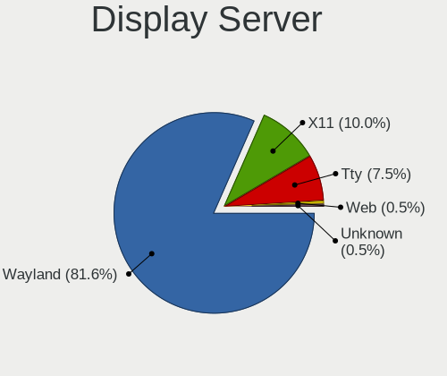
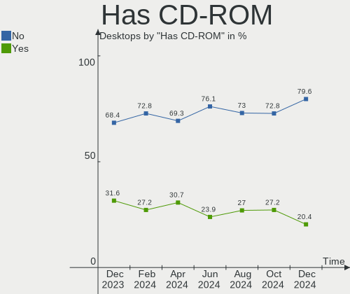
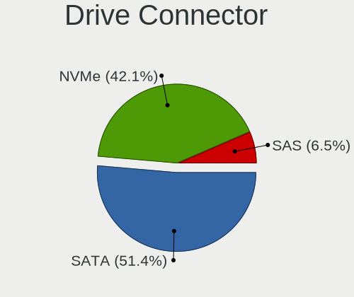
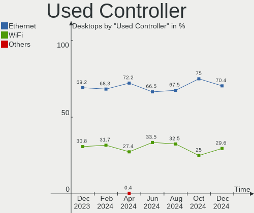
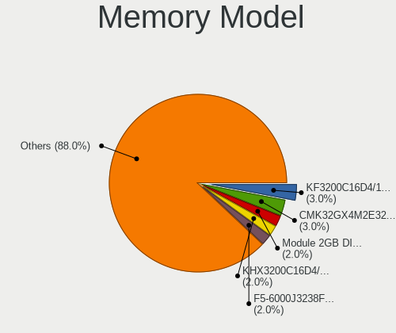

Fedora - Hardware Trends (Desktops)
-----------------------------------

A project to identify most popular hardware characteristics and track their change
over time based on data collected by Linux users at https://Linux-Hardware.org.

Anyone can contribute to this report by the [hw-probe](https://github.com/linuxhw/hw-probe) tool:

    sudo -E hw-probe -all -upload

This report is for one last month. Overall report since the beginning of time: [TestCoverage](https://github.com/linuxhw/TestCoverage)

Period: May, 2022.

Contents
--------

* [ System ](#system)
  - [ OS                       ](#os)
  - [ OS Family                ](#os-family)
  - [ Kernel                   ](#kernel)
  - [ Kernel Family            ](#kernel-family)
  - [ Kernel Major Ver.        ](#kernel-major-ver)
  - [ Arch                     ](#arch)
  - [ DE                       ](#de)
  - [ Display Server           ](#display-server)
  - [ Display Manager          ](#display-manager)
  - [ OS Lang                  ](#os-lang)
  - [ Boot Mode                ](#boot-mode)
  - [ Filesystem               ](#filesystem)
  - [ Part. scheme             ](#part-scheme)
  - [ Dual Boot with Linux/BSD ](#dual-boot-with-linuxbsd)
  - [ Dual Boot (Win)          ](#dual-boot-win)

* [ Board ](#board)
  - [ Vendor                   ](#vendor)
  - [ Model                    ](#model)
  - [ Model Family             ](#model-family)
  - [ MFG Year                 ](#mfg-year)
  - [ Form Factor              ](#form-factor)
  - [ Secure Boot              ](#secure-boot)
  - [ Coreboot                 ](#coreboot)
  - [ RAM Size                 ](#ram-size)
  - [ RAM Used                 ](#ram-used)
  - [ Total Drives             ](#total-drives)
  - [ Has CD-ROM               ](#has-cd-rom)
  - [ Has Ethernet             ](#has-ethernet)
  - [ Has WiFi                 ](#has-wifi)
  - [ Has Bluetooth            ](#has-bluetooth)

* [ Location ](#location)
  - [ Country                  ](#country)
  - [ City                     ](#city)

* [ Drives ](#drives)
  - [ Drive Vendor             ](#drive-vendor)
  - [ Drive Model              ](#drive-model)
  - [ HDD Vendor               ](#hdd-vendor)
  - [ SSD Vendor               ](#ssd-vendor)
  - [ Drive Kind               ](#drive-kind)
  - [ Drive Connector          ](#drive-connector)
  - [ Drive Size               ](#drive-size)
  - [ Space Total              ](#space-total)
  - [ Space Used               ](#space-used)
  - [ Malfunc. Drives          ](#malfunc-drives)
  - [ Malfunc. Drive Vendor    ](#malfunc-drive-vendor)
  - [ Malfunc. HDD Vendor      ](#malfunc-hdd-vendor)
  - [ Malfunc. Drive Kind      ](#malfunc-drive-kind)
  - [ Failed Drives            ](#failed-drives)
  - [ Failed Drive Vendor      ](#failed-drive-vendor)
  - [ Drive Status             ](#drive-status)

* [ Storage controller ](#storage-controller)
  - [ Storage Vendor           ](#storage-vendor)
  - [ Storage Model            ](#storage-model)
  - [ Storage Kind             ](#storage-kind)

* [ Processor ](#processor)
  - [ CPU Vendor               ](#cpu-vendor)
  - [ CPU Model                ](#cpu-model)
  - [ CPU Model Family         ](#cpu-model-family)
  - [ CPU Cores                ](#cpu-cores)
  - [ CPU Sockets              ](#cpu-sockets)
  - [ CPU Threads              ](#cpu-threads)
  - [ CPU Op-Modes             ](#cpu-op-modes)
  - [ CPU Microcode            ](#cpu-microcode)
  - [ CPU Microarch            ](#cpu-microarch)

* [ Graphics ](#graphics)
  - [ GPU Vendor               ](#gpu-vendor)
  - [ GPU Model                ](#gpu-model)
  - [ GPU Combo                ](#gpu-combo)
  - [ GPU Driver               ](#gpu-driver)
  - [ GPU Memory               ](#gpu-memory)

* [ Monitor ](#monitor)
  - [ Monitor Vendor           ](#monitor-vendor)
  - [ Monitor Model            ](#monitor-model)
  - [ Monitor Resolution       ](#monitor-resolution)
  - [ Monitor Diagonal         ](#monitor-diagonal)
  - [ Monitor Width            ](#monitor-width)
  - [ Aspect Ratio             ](#aspect-ratio)
  - [ Monitor Area             ](#monitor-area)
  - [ Pixel Density            ](#pixel-density)
  - [ Multiple Monitors        ](#multiple-monitors)

* [ Network ](#network)
  - [ Net Controller Vendor    ](#net-controller-vendor)
  - [ Net Controller Model     ](#net-controller-model)
  - [ Wireless Vendor          ](#wireless-vendor)
  - [ Wireless Model           ](#wireless-model)
  - [ Ethernet Vendor          ](#ethernet-vendor)
  - [ Ethernet Model           ](#ethernet-model)
  - [ Net Controller Kind      ](#net-controller-kind)
  - [ Used Controller          ](#used-controller)
  - [ NICs                     ](#nics)
  - [ IPv6                     ](#ipv6)

* [ Bluetooth ](#bluetooth)
  - [ Bluetooth Vendor         ](#bluetooth-vendor)
  - [ Bluetooth Model          ](#bluetooth-model)

* [ Sound ](#sound)
  - [ Sound Vendor             ](#sound-vendor)
  - [ Sound Model              ](#sound-model)

* [ Memory ](#memory)
  - [ Memory Vendor            ](#memory-vendor)
  - [ Memory Model             ](#memory-model)
  - [ Memory Kind              ](#memory-kind)
  - [ Memory Form Factor       ](#memory-form-factor)
  - [ Memory Size              ](#memory-size)
  - [ Memory Speed             ](#memory-speed)

* [ Printers & scanners ](#printers--scanners)
  - [ Printer Vendor           ](#printer-vendor)
  - [ Printer Model            ](#printer-model)
  - [ Scanner Vendor           ](#scanner-vendor)
  - [ Scanner Model            ](#scanner-model)

* [ Camera ](#camera)
  - [ Camera Vendor            ](#camera-vendor)
  - [ Camera Model             ](#camera-model)

* [ Security ](#security)
  - [ Fingerprint Vendor       ](#fingerprint-vendor)
  - [ Fingerprint Model        ](#fingerprint-model)
  - [ Chipcard Vendor          ](#chipcard-vendor)
  - [ Chipcard Model           ](#chipcard-model)

* [ Unsupported ](#unsupported)
  - [ Unsupported Devices      ](#unsupported-devices)
  - [ Unsupported Device Types ](#unsupported-device-types)

System
------

OS
--

Installed operating systems

| Name      | Desktops | Percent |
|-----------|----------|---------|
| Fedora 36 | 78       | 60%     |
| Fedora 35 | 44       | 33.85%  |
| Fedora 34 | 6        | 4.62%   |
| Fedora 37 | 1        | 0.77%   |
| Fedora 33 | 1        | 0.77%   |

OS Family
---------

OS without a version

| Name   | Desktops | Percent |
|--------|----------|---------|
| Fedora | 130      | 100%    |

Kernel
------

Version of the Linux kernel

| Version                                                | Desktops | Percent |
|--------------------------------------------------------|----------|---------|
| 5.17.6-300.fc36.x86_64                                 | 23       | 17.69%  |
| 5.17.5-300.fc36.x86_64                                 | 17       | 13.08%  |
| 5.17.8-300.fc36.x86_64                                 | 13       | 10%     |
| 5.17.5-200.fc35.x86_64                                 | 13       | 10%     |
| 5.17.4-200.fc35.x86_64                                 | 13       | 10%     |
| 5.17.7-300.fc36.x86_64                                 | 9        | 6.92%   |
| 5.17.9-300.fc36.x86_64                                 | 4        | 3.08%   |
| 5.17.11-300.fc36.x86_64                                | 4        | 3.08%   |
| 5.14.10-300.fc35.x86_64                                | 3        | 2.31%   |
| 5.17.9-200.fc35.x86_64                                 | 2        | 1.54%   |
| 5.17.7-200.fc35.x86_64                                 | 2        | 1.54%   |
| 5.17.6-200.fc35.x86_64                                 | 2        | 1.54%   |
| 5.17.5-100.fc34.x86_64                                 | 2        | 1.54%   |
| 5.17.11-200.fc35.x86_64                                | 2        | 1.54%   |
| 5.16.18-200.fc35.x86_64                                | 2        | 1.54%   |
| 5.18.0-0.rc5.20220505gita7391ad3572431a.43.fc37.x86_64 | 1        | 0.77%   |
| 5.17.9-602.inttf.fc36.x86_64                           | 1        | 0.77%   |
| 5.17.9-301.fsync.fc36.x86_64                           | 1        | 0.77%   |
| 5.17.7-301.fsync.fc36.x86_64                           | 1        | 0.77%   |
| 5.17.7-100.fc34.x86_64                                 | 1        | 0.77%   |
| 5.17.6-602.inttf.fc36.x86_64                           | 1        | 0.77%   |
| 5.17.6-100.fc34.x86_64                                 | 1        | 0.77%   |
| 5.17.5-301.fsync.fc36.x86_64                           | 1        | 0.77%   |
| 5.17.4-302.fsync.fc35.x86_64                           | 1        | 0.77%   |
| 5.17.4-100.fc34.x86_64                                 | 1        | 0.77%   |
| 5.17.3-302.fc36.x86_64                                 | 1        | 0.77%   |
| 5.17.11-602.inttf.fc36.x86_64                          | 1        | 0.77%   |
| 5.17.11-301.fsync.fc36.x86_64                          | 1        | 0.77%   |
| 5.16.20-200.fc35.x86_64                                | 1        | 0.77%   |
| 5.16.20-100.fc34.x86_64                                | 1        | 0.77%   |
| 5.16.11-200.fc35.x86_64                                | 1        | 0.77%   |
| 5.15.5-200.fc35.x86_64                                 | 1        | 0.77%   |
| 5.15.14-200.fc35.x86_64                                | 1        | 0.77%   |
| 5.14.18-100.fc33.x86_64                                | 1        | 0.77%   |

Kernel Family
-------------

Linux kernel without a distro release

| Version | Desktops | Percent |
|---------|----------|---------|
| 5.17.5  | 33       | 25.38%  |
| 5.17.6  | 27       | 20.77%  |
| 5.17.4  | 15       | 11.54%  |
| 5.17.8  | 13       | 10%     |
| 5.17.7  | 13       | 10%     |
| 5.17.9  | 8        | 6.15%   |
| 5.17.11 | 8        | 6.15%   |
| 5.14.10 | 3        | 2.31%   |
| 5.16.20 | 2        | 1.54%   |
| 5.16.18 | 2        | 1.54%   |
| 5.18.0  | 1        | 0.77%   |
| 5.17.3  | 1        | 0.77%   |
| 5.16.11 | 1        | 0.77%   |
| 5.15.5  | 1        | 0.77%   |
| 5.15.14 | 1        | 0.77%   |
| 5.14.18 | 1        | 0.77%   |

Kernel Major Ver.
-----------------

Linux kernel major version

| Version | Desktops | Percent |
|---------|----------|---------|
| 5.17    | 118      | 90.77%  |
| 5.16    | 5        | 3.85%   |
| 5.14    | 4        | 3.08%   |
| 5.15    | 2        | 1.54%   |
| 5.18    | 1        | 0.77%   |

Arch
----

OS architecture (x86_64, i586, etc.)

| Name   | Desktops | Percent |
|--------|----------|---------|
| x86_64 | 130      | 100%    |

DE
--

Desktop Environment

| Name       | Desktops | Percent |
|------------|----------|---------|
| GNOME      | 85       | 65.38%  |
| KDE5       | 21       | 16.15%  |
| X-Cinnamon | 7        | 5.38%   |
| Cinnamon   | 6        | 4.62%   |
| XFCE       | 5        | 3.85%   |
| Unknown    | 5        | 3.85%   |
| MATE       | 1        | 0.77%   |

Display Server
--------------

X11 or Wayland

| Name    | Desktops | Percent |
|---------|----------|---------|
| Wayland | 71       | 54.62%  |
| X11     | 50       | 38.46%  |
| Tty     | 7        | 5.38%   |
| Unknown | 2        | 1.54%   |

Display Manager
---------------

SDDM, LightDM, etc.

| Name    | Desktops | Percent |
|---------|----------|---------|
| Unknown | 81       | 62.31%  |
| GDM     | 24       | 18.46%  |
| LightDM | 15       | 11.54%  |
| SDDM    | 10       | 7.69%   |

OS Lang
-------

Language

| Lang  | Desktops | Percent |
|-------|----------|---------|
| en_US | 68       | 52.31%  |
| ru_RU | 10       | 7.69%   |
| en_AU | 10       | 7.69%   |
| en_GB | 9        | 6.92%   |
| de_DE | 5        | 3.85%   |
| pt_BR | 4        | 3.08%   |
| fr_FR | 3        | 2.31%   |
| cs_CZ | 2        | 1.54%   |
| zh_CN | 1        | 0.77%   |
| sv_SE | 1        | 0.77%   |
| sr_RS | 1        | 0.77%   |
| pl_PL | 1        | 0.77%   |
| nl_NL | 1        | 0.77%   |
| nl_BE | 1        | 0.77%   |
| ja_JP | 1        | 0.77%   |
| fr_BE | 1        | 0.77%   |
| fi_FI | 1        | 0.77%   |
| es_MX | 1        | 0.77%   |
| es_ES | 1        | 0.77%   |
| es_EC | 1        | 0.77%   |
| en_ZA | 1        | 0.77%   |
| en_PH | 1        | 0.77%   |
| en_NZ | 1        | 0.77%   |
| en_DK | 1        | 0.77%   |
| en_CA | 1        | 0.77%   |
| C     | 1        | 0.77%   |
| ar_SA | 1        | 0.77%   |

Boot Mode
---------

EFI or BIOS

| Mode | Desktops | Percent |
|------|----------|---------|
| EFI  | 89       | 68.46%  |
| BIOS | 41       | 31.54%  |

Filesystem
----------

Type of filesystem

| Type    | Desktops | Percent |
|---------|----------|---------|
| Btrfs   | 101      | 77.69%  |
| Ext4    | 17       | 13.08%  |
| Xfs     | 11       | 8.46%   |
| Overlay | 1        | 0.77%   |

Part. scheme
------------

Scheme of partitioning

| Type    | Desktops | Percent |
|---------|----------|---------|
| Unknown | 79       | 60.77%  |
| GPT     | 37       | 28.46%  |
| MBR     | 14       | 10.77%  |

Dual Boot with Linux/BSD
------------------------

Hosting more than one Linux/BSD

| Dual boot | Desktops | Percent |
|-----------|----------|---------|
| No        | 110      | 84.62%  |
| Yes       | 20       | 15.38%  |

Dual Boot (Win)
---------------

Hosting Linux and Windows

| Dual boot | Desktops | Percent |
|-----------|----------|---------|
| No        | 108      | 83.08%  |
| Yes       | 22       | 16.92%  |

Board
-----

Vendor
------

Motherboard manufacturer

| Name                | Desktops | Percent |
|---------------------|----------|---------|
| ASUSTek Computer    | 48       | 36.92%  |
| Gigabyte Technology | 26       | 20%     |
| MSI                 | 18       | 13.85%  |
| ASRock              | 15       | 11.54%  |
| Hewlett-Packard     | 6        | 4.62%   |
| Dell                | 5        | 3.85%   |
| Lenovo              | 3        | 2.31%   |
| Intel               | 2        | 1.54%   |
| Shuttle             | 1        | 0.77%   |
| Ruckus Wireless     | 1        | 0.77%   |
| JINGSHA             | 1        | 0.77%   |
| Huanan              | 1        | 0.77%   |
| ECS                 | 1        | 0.77%   |
| BESSTAR Tech        | 1        | 0.77%   |
| Acer                | 1        | 0.77%   |

Model
-----

Motherboard model

| Name                                    | Desktops | Percent |
|-----------------------------------------|----------|---------|
| ASUS All Series                         | 4        | 3.08%   |
| MSI MS-7A38                             | 3        | 2.31%   |
| Gigabyte X570 I AORUS PRO WIFI          | 3        | 2.31%   |
| Intel DH77EB AAG39073-304               | 2        | 1.54%   |
| Gigabyte B450M DS3H                     | 2        | 1.54%   |
| ASUS TUF Gaming X570-PRO                | 2        | 1.54%   |
| ASUS ROG STRIX X570-F GAMING            | 2        | 1.54%   |
| ASUS ROG STRIX X570-E GAMING            | 2        | 1.54%   |
| ASUS ROG STRIX B550-F GAMING            | 2        | 1.54%   |
| ASUS PRIME B450-PLUS                    | 2        | 1.54%   |
| ASRock X470 Taichi                      | 2        | 1.54%   |
| Shuttle SZ87R                           | 1        | 0.77%   |
| Ruckus Wireless SCG-100                 | 1        | 0.77%   |
| MSI MS-7C95                             | 1        | 0.77%   |
| MSI MS-7C92                             | 1        | 0.77%   |
| MSI MS-7C59                             | 1        | 0.77%   |
| MSI MS-7C56                             | 1        | 0.77%   |
| MSI MS-7C52                             | 1        | 0.77%   |
| MSI MS-7C37                             | 1        | 0.77%   |
| MSI MS-7C35                             | 1        | 0.77%   |
| MSI MS-7B85                             | 1        | 0.77%   |
| MSI MS-7B84                             | 1        | 0.77%   |
| MSI MS-7B79                             | 1        | 0.77%   |
| MSI MS-7996                             | 1        | 0.77%   |
| MSI MS-7918                             | 1        | 0.77%   |
| MSI MS-7885                             | 1        | 0.77%   |
| MSI MS-7758                             | 1        | 0.77%   |
| MSI MS-7636                             | 1        | 0.77%   |
| Lenovo ThinkCentre M93p 10A8S3C100      | 1        | 0.77%   |
| Lenovo ThinkCentre M58p 7220A72         | 1        | 0.77%   |
| Lenovo IdeaCentre 310S-08ASR 90G9002VUK | 1        | 0.77%   |
| Huanan X99-BD4 V1.1, NALEX              | 1        | 0.77%   |
| HP Z640 Workstation                     | 1        | 0.77%   |
| HP Z420 Workstation                     | 1        | 0.77%   |
| HP Slim Desktop 290-a0xxx               | 1        | 0.77%   |
| HP ProDesk 400 G4 SFF                   | 1        | 0.77%   |
| HP Pavilion Gaming Desktop TG01-1xxx    | 1        | 0.77%   |
| HP EliteDesk 800 G2 TWR                 | 1        | 0.77%   |
| Gigabyte Z390 AORUS MASTER              | 1        | 0.77%   |
| Gigabyte Z170-D3H                       | 1        | 0.77%   |
| Gigabyte X99-UD4-CF                     | 1        | 0.77%   |
| Gigabyte X470 AORUS ULTRA GAMING        | 1        | 0.77%   |
| Gigabyte Q35M-S2                        | 1        | 0.77%   |
| Gigabyte H77N-WIFI                      | 1        | 0.77%   |
| Gigabyte H410M H V3                     | 1        | 0.77%   |
| Gigabyte GB-BXi7-5500                   | 1        | 0.77%   |
| Gigabyte GA-MA785G-UD3H                 | 1        | 0.77%   |
| Gigabyte GA-K8NF-9                      | 1        | 0.77%   |
| Gigabyte G41MT-S2P                      | 1        | 0.77%   |
| Gigabyte G41MT-D3                       | 1        | 0.77%   |
| Gigabyte G1.Sniper B5                   | 1        | 0.77%   |
| Gigabyte EP45-DS3L                      | 1        | 0.77%   |
| Gigabyte B85M-D3V-A                     | 1        | 0.77%   |
| Gigabyte B550 GAMING X V2               | 1        | 0.77%   |
| Gigabyte B550 AORUS PRO AC              | 1        | 0.77%   |
| Gigabyte B550 AORUS ELITE AX            | 1        | 0.77%   |
| Gigabyte B450 I AORUS PRO WIFI          | 1        | 0.77%   |
| Gigabyte AB350-Gaming 3                 | 1        | 0.77%   |
| Gigabyte A320M-S2H                      | 1        | 0.77%   |
| ECS P67H2-A3                            | 1        | 0.77%   |

Model Family
------------

Motherboard model prefix

| Name                    | Desktops | Percent |
|-------------------------|----------|---------|
| ASUS ROG                | 12       | 9.23%   |
| ASUS PRIME              | 9        | 6.92%   |
| ASUS TUF                | 6        | 4.62%   |
| ASUS All                | 4        | 3.08%   |
| MSI MS-7A38             | 3        | 2.31%   |
| Gigabyte X570           | 3        | 2.31%   |
| Gigabyte B550           | 3        | 2.31%   |
| Dell OptiPlex           | 3        | 2.31%   |
| Lenovo ThinkCentre      | 2        | 1.54%   |
| Intel DH77EB            | 2        | 1.54%   |
| Gigabyte B450M          | 2        | 1.54%   |
| Dell XPS                | 2        | 1.54%   |
| ASUS P8Z68-V            | 2        | 1.54%   |
| ASRock X470             | 2        | 1.54%   |
| Shuttle SZ87R           | 1        | 0.77%   |
| Ruckus Wireless SCG-100 | 1        | 0.77%   |
| MSI MS-7C95             | 1        | 0.77%   |
| MSI MS-7C92             | 1        | 0.77%   |
| MSI MS-7C59             | 1        | 0.77%   |
| MSI MS-7C56             | 1        | 0.77%   |
| MSI MS-7C52             | 1        | 0.77%   |
| MSI MS-7C37             | 1        | 0.77%   |
| MSI MS-7C35             | 1        | 0.77%   |
| MSI MS-7B85             | 1        | 0.77%   |
| MSI MS-7B84             | 1        | 0.77%   |
| MSI MS-7B79             | 1        | 0.77%   |
| MSI MS-7996             | 1        | 0.77%   |
| MSI MS-7918             | 1        | 0.77%   |
| MSI MS-7885             | 1        | 0.77%   |
| MSI MS-7758             | 1        | 0.77%   |
| MSI MS-7636             | 1        | 0.77%   |
| Lenovo IdeaCentre       | 1        | 0.77%   |
| Huanan X99-BD4          | 1        | 0.77%   |
| HP Z640                 | 1        | 0.77%   |
| HP Z420                 | 1        | 0.77%   |
| HP Slim                 | 1        | 0.77%   |
| HP ProDesk              | 1        | 0.77%   |
| HP Pavilion             | 1        | 0.77%   |
| HP EliteDesk            | 1        | 0.77%   |
| Gigabyte Z390           | 1        | 0.77%   |
| Gigabyte Z170-D3H       | 1        | 0.77%   |
| Gigabyte X99-UD4-CF     | 1        | 0.77%   |
| Gigabyte X470           | 1        | 0.77%   |
| Gigabyte Q35M-S2        | 1        | 0.77%   |
| Gigabyte H77N-WIFI      | 1        | 0.77%   |
| Gigabyte H410M          | 1        | 0.77%   |
| Gigabyte GB-BXi7-5500   | 1        | 0.77%   |
| Gigabyte GA-MA785G-UD3H | 1        | 0.77%   |
| Gigabyte GA-K8NF-9      | 1        | 0.77%   |
| Gigabyte G41MT-S2P      | 1        | 0.77%   |
| Gigabyte G41MT-D3       | 1        | 0.77%   |
| Gigabyte G1.Sniper      | 1        | 0.77%   |
| Gigabyte EP45-DS3L      | 1        | 0.77%   |
| Gigabyte B85M-D3V-A     | 1        | 0.77%   |
| Gigabyte B450           | 1        | 0.77%   |
| Gigabyte AB350-Gaming   | 1        | 0.77%   |
| Gigabyte A320M-S2H      | 1        | 0.77%   |
| ECS P67H2-A3            | 1        | 0.77%   |
| BESSTAR Tech UM700      | 1        | 0.77%   |
| ASUS Z170-E             | 1        | 0.77%   |

MFG Year
--------

Motherboard manufacture year

| Year | Desktops | Percent |
|------|----------|---------|
| 2020 | 21       | 16.15%  |
| 2019 | 19       | 14.62%  |
| 2018 | 15       | 11.54%  |
| 2014 | 11       | 8.46%   |
| 2012 | 11       | 8.46%   |
| 2017 | 10       | 7.69%   |
| 2021 | 8        | 6.15%   |
| 2015 | 8        | 6.15%   |
| 2011 | 8        | 6.15%   |
| 2016 | 4        | 3.08%   |
| 2008 | 4        | 3.08%   |
| 2013 | 3        | 2.31%   |
| 2010 | 2        | 1.54%   |
| 2007 | 2        | 1.54%   |
| 2022 | 1        | 0.77%   |
| 2009 | 1        | 0.77%   |
| 2006 | 1        | 0.77%   |
| 2005 | 1        | 0.77%   |

Form Factor
-----------

Physical design of the computer

| Name    | Desktops | Percent |
|---------|----------|---------|
| Desktop | 130      | 100%    |

Secure Boot
-----------

Enabled or disabled

| State    | Desktops | Percent |
|----------|----------|---------|
| Disabled | 119      | 91.54%  |
| Enabled  | 11       | 8.46%   |

Coreboot
--------

Have coreboot on board

| Used | Desktops | Percent |
|------|----------|---------|
| No   | 130      | 100%    |

RAM Size
--------

Total RAM memory

| Size in GB  | Desktops | Percent |
|-------------|----------|---------|
| 16.01-24.0  | 45       | 34.62%  |
| 32.01-64.0  | 34       | 26.15%  |
| 8.01-16.0   | 16       | 12.31%  |
| 64.01-256.0 | 15       | 11.54%  |
| 4.01-8.0    | 9        | 6.92%   |
| 3.01-4.0    | 6        | 4.62%   |
| 24.01-32.0  | 4        | 3.08%   |
| 1.01-2.0    | 1        | 0.77%   |

RAM Used
--------

Used RAM memory

| Used GB     | Desktops | Percent |
|-------------|----------|---------|
| 4.01-8.0    | 49       | 37.69%  |
| 2.01-3.0    | 25       | 19.23%  |
| 1.01-2.0    | 19       | 14.62%  |
| 3.01-4.0    | 16       | 12.31%  |
| 8.01-16.0   | 11       | 8.46%   |
| 0.51-1.0    | 5        | 3.85%   |
| 16.01-24.0  | 2        | 1.54%   |
| 32.01-64.0  | 1        | 0.77%   |
| 64.01-256.0 | 1        | 0.77%   |
| 0.01-0.5    | 1        | 0.77%   |

Total Drives
------------

Number of drives on board

| Drives | Desktops | Percent |
|--------|----------|---------|
| 2      | 44       | 33.85%  |
| 1      | 33       | 25.38%  |
| 3      | 25       | 19.23%  |
| 4      | 17       | 13.08%  |
| 5      | 6        | 4.62%   |
| 7      | 2        | 1.54%   |
| 6      | 2        | 1.54%   |
| 15     | 1        | 0.77%   |

Has CD-ROM
----------

Has CD-ROM on board

| Presented | Desktops | Percent |
|-----------|----------|---------|
| No        | 94       | 72.31%  |
| Yes       | 36       | 27.69%  |

Has Ethernet
------------

Has Ethernet on board

| Presented | Desktops | Percent |
|-----------|----------|---------|
| Yes       | 129      | 99.23%  |
| No        | 1        | 0.77%   |

Has WiFi
--------

Has WiFi module

| Presented | Desktops | Percent |
|-----------|----------|---------|
| No        | 68       | 52.31%  |
| Yes       | 62       | 47.69%  |

Has Bluetooth
-------------

Has Bluetooth module

| Presented | Desktops | Percent |
|-----------|----------|---------|
| No        | 70       | 53.85%  |
| Yes       | 60       | 46.15%  |

Location
--------

Country
-------

Geographic location (country)

| Country      | Desktops | Percent |
|--------------|----------|---------|
| USA          | 33       | 25.38%  |
| Germany      | 11       | 8.46%   |
| Australia    | 10       | 7.69%   |
| Russia       | 7        | 5.38%   |
| Norway       | 5        | 3.85%   |
| France       | 5        | 3.85%   |
| Finland      | 5        | 3.85%   |
| Brazil       | 5        | 3.85%   |
| UK           | 3        | 2.31%   |
| Israel       | 3        | 2.31%   |
| Canada       | 3        | 2.31%   |
| Belgium      | 3        | 2.31%   |
| Belarus      | 3        | 2.31%   |
| Sweden       | 2        | 1.54%   |
| Spain        | 2        | 1.54%   |
| Netherlands  | 2        | 1.54%   |
| India        | 2        | 1.54%   |
| Czechia      | 2        | 1.54%   |
| Uzbekistan   | 1        | 0.77%   |
| Turkey       | 1        | 0.77%   |
| Thailand     | 1        | 0.77%   |
| Taiwan       | 1        | 0.77%   |
| Switzerland  | 1        | 0.77%   |
| South Africa | 1        | 0.77%   |
| Serbia       | 1        | 0.77%   |
| Saudi Arabia | 1        | 0.77%   |
| Romania      | 1        | 0.77%   |
| Portugal     | 1        | 0.77%   |
| Poland       | 1        | 0.77%   |
| Philippines  | 1        | 0.77%   |
| New Zealand  | 1        | 0.77%   |
| Mexico       | 1        | 0.77%   |
| Japan        | 1        | 0.77%   |
| Indonesia    | 1        | 0.77%   |
| Hungary      | 1        | 0.77%   |
| Greece       | 1        | 0.77%   |
| Estonia      | 1        | 0.77%   |
| Ecuador      | 1        | 0.77%   |
| Colombia     | 1        | 0.77%   |
| China        | 1        | 0.77%   |
| Bulgaria     | 1        | 0.77%   |
| Austria      | 1        | 0.77%   |

City
----

Geographic location (city)

| City            | Desktops | Percent |
|-----------------|----------|---------|
| Launceston      | 5        | 3.85%   |
| Oulu            | 3        | 2.31%   |
| Minsk           | 3        | 2.31%   |
| Yekaterinburg   | 2        | 1.54%   |
| Sydney          | 2        | 1.54%   |
| Reno            | 2        | 1.54%   |
| New Haven       | 2        | 1.54%   |
| Los Angeles     | 2        | 1.54%   |
| Kristiansand    | 2        | 1.54%   |
| Indianapolis    | 2        | 1.54%   |
| Dallas          | 2        | 1.54%   |
| Zierikzee       | 1        | 0.77%   |
| Zacatlan        | 1        | 0.77%   |
| Ylaemylly       | 1        | 0.77%   |
| Woodbine        | 1        | 0.77%   |
| Warsaw          | 1        | 0.77%   |
| Vladivostok     | 1        | 0.77%   |
| Vitória        | 1        | 0.77%   |
| Villamanta      | 1        | 0.77%   |
| Vancouver       | 1        | 0.77%   |
| Toyama          | 1        | 0.77%   |
| Thornton Heath  | 1        | 0.77%   |
| The Hague       | 1        | 0.77%   |
| Tel Aviv        | 1        | 0.77%   |
| Tampere         | 1        | 0.77%   |
| Tampa           | 1        | 0.77%   |
| Tallinn         | 1        | 0.77%   |
| Taipei          | 1        | 0.77%   |
| Stuttgart       | 1        | 0.77%   |
| Stockholm       | 1        | 0.77%   |
| Skaerhamn       | 1        | 0.77%   |
| Sindelfingen    | 1        | 0.77%   |
| Senonches       | 1        | 0.77%   |
| Schwieberdingen | 1        | 0.77%   |
| Sapucaia do Sul | 1        | 0.77%   |
| San Jose        | 1        | 0.77%   |
| Salzgitter      | 1        | 0.77%   |
| Salem           | 1        | 0.77%   |
| Riyadh          | 1        | 0.77%   |
| Quito           | 1        | 0.77%   |
| Quezon City     | 1        | 0.77%   |
| Prague          | 1        | 0.77%   |
| Porto Alegre    | 1        | 0.77%   |
| Portland        | 1        | 0.77%   |
| Petaẖ Tiqwa   | 1        | 0.77%   |
| Perm            | 1        | 0.77%   |
| Pattaya         | 1        | 0.77%   |
| Pasco           | 1        | 0.77%   |
| Oslo            | 1        | 0.77%   |
| Orenburg        | 1        | 0.77%   |
| Oak Ridge       | 1        | 0.77%   |
| Novosibirsk     | 1        | 0.77%   |
| Novo Hamburgo   | 1        | 0.77%   |
| Nice            | 1        | 0.77%   |
| New Milford     | 1        | 0.77%   |
| New Delhi       | 1        | 0.77%   |
| Neckargemund    | 1        | 0.77%   |
| Montreal        | 1        | 0.77%   |
| Montelavar      | 1        | 0.77%   |
| Minneapolis     | 1        | 0.77%   |

Drives
------

Drive Vendor
------------

Hard drive vendors

| Vendor                      | Desktops | Drives | Percent |
|-----------------------------|----------|--------|---------|
| Samsung Electronics         | 57       | 80     | 21.51%  |
| WDC                         | 49       | 67     | 18.49%  |
| Seagate                     | 45       | 60     | 16.98%  |
| Kingston                    | 17       | 18     | 6.42%   |
| Crucial                     | 17       | 18     | 6.42%   |
| Toshiba                     | 12       | 12     | 4.53%   |
| Sandisk                     | 9        | 9      | 3.4%    |
| Phison                      | 6        | 7      | 2.26%   |
| Intel                       | 5        | 5      | 1.89%   |
| Hitachi                     | 4        | 4      | 1.51%   |
| Corsair                     | 4        | 5      | 1.51%   |
| XPG                         | 3        | 4      | 1.13%   |
| Realtek Semiconductor       | 2        | 2      | 0.75%   |
| PNY                         | 2        | 2      | 0.75%   |
| Micron/Crucial Technology   | 2        | 2      | 0.75%   |
| China                       | 2        | 2      | 0.75%   |
| A-DATA Technology           | 2        | 2      | 0.75%   |
| USB                         | 1        | 1      | 0.38%   |
| Unknown                     | 1        | 1      | 0.38%   |
| Transcend                   | 1        | 2      | 0.38%   |
| Team                        | 1        | 2      | 0.38%   |
| SSK                         | 1        | 1      | 0.38%   |
| SPCC                        | 1        | 1      | 0.38%   |
| Silicon Motion              | 1        | 1      | 0.38%   |
| Pioneer                     | 1        | 1      | 0.38%   |
| Phison Electronics          | 1        | 7      | 0.38%   |
| Patriot                     | 1        | 1      | 0.38%   |
| Novation                    | 1        | 1      | 0.38%   |
| Micron Technology           | 1        | 1      | 0.38%   |
| MAXTOR                      | 1        | 1      | 0.38%   |
| MAXIO Technology (Hangzhou) | 1        | 1      | 0.38%   |
| LITEONIT                    | 1        | 1      | 0.38%   |
| LITEON                      | 1        | 1      | 0.38%   |
| KUIJIA                      | 1        | 1      | 0.38%   |
| Intenso                     | 1        | 2      | 0.38%   |
| HP SSD S                    | 1        | 1      | 0.38%   |
| HGST                        | 1        | 1      | 0.38%   |
| Hewlett-Packard             | 1        | 1      | 0.38%   |
| GOODRAM                     | 1        | 1      | 0.38%   |
| Gigabyte Technology         | 1        | 2      | 0.38%   |
| Fujitsu                     | 1        | 1      | 0.38%   |
| Drevo                       | 1        | 1      | 0.38%   |
| ASMT                        | 1        | 1      | 0.38%   |
| Unknown                     | 1        | 1      | 0.38%   |

Drive Model
-----------

Hard drive models

| Model                               | Desktops | Percent |
|-------------------------------------|----------|---------|
| Samsung SSD 850 EVO 250GB           | 10       | 3.26%   |
| WDC WD10EZEX-00WN4A0 1TB            | 4        | 1.3%    |
| Seagate ST1000DM010-2EP102 1TB      | 4        | 1.3%    |
| Sandisk NVMe SSD Drive 1TB          | 4        | 1.3%    |
| Samsung SSD 970 EVO Plus 500GB      | 4        | 1.3%    |
| Samsung NVMe SSD Drive 500GB        | 4        | 1.3%    |
| Samsung NVMe SSD Drive 2TB          | 4        | 1.3%    |
| Samsung NVMe SSD Drive 1TB          | 4        | 1.3%    |
| WDC WDS500G2B0B-00YS70 500GB SSD    | 3        | 0.98%   |
| WDC WDS100T2B0A-00SM50 1TB SSD      | 3        | 0.98%   |
| WDC WD30EFRX-68EUZN0 3TB            | 3        | 0.98%   |
| Seagate ST500DM002-1BD142 500GB     | 3        | 0.98%   |
| Seagate ST4000DM004-2CV104 4TB      | 3        | 0.98%   |
| Seagate ST2000DM008-2FR102 2TB      | 3        | 0.98%   |
| Seagate ST2000DM001-1ER164 2TB      | 3        | 0.98%   |
| Samsung SSD 960 EVO 250GB           | 3        | 0.98%   |
| Samsung SSD 870 EVO 500GB           | 3        | 0.98%   |
| Samsung SSD 860 EVO 1TB             | 3        | 0.98%   |
| Samsung SSD 850 EVO 1TB             | 3        | 0.98%   |
| Samsung NVMe SSD Drive 250GB        | 3        | 0.98%   |
| Kingston SA400S37240G 240GB SSD     | 3        | 0.98%   |
| Kingston SA400S37120G 120GB SSD     | 3        | 0.98%   |
| Crucial CT500MX500SSD1 500GB        | 3        | 0.98%   |
| Crucial CT480BX500SSD1 480GB        | 3        | 0.98%   |
| Crucial CT240BX500SSD1 240GB        | 3        | 0.98%   |
| Crucial CT2000MX500SSD1 2TB         | 3        | 0.98%   |
| WDC WDS500G2B0A-00SM50 500GB SSD    | 2        | 0.65%   |
| WDC WD5000AZRX-00A8LB0 500GB        | 2        | 0.65%   |
| WDC WD40EFRX-68N32N0 4TB            | 2        | 0.65%   |
| WDC WD20EFRX-68AX9N0 2TB            | 2        | 0.65%   |
| WDC WD20EARS-00MVWB0 2TB            | 2        | 0.65%   |
| Toshiba MQ01ABD100 1TB              | 2        | 0.65%   |
| Toshiba KBG30ZMS128G 128GB NVMe SSD | 2        | 0.65%   |
| Toshiba HDWD120 2TB                 | 2        | 0.65%   |
| Seagate ST1000LM035-1RK172 1TB      | 2        | 0.65%   |
| Seagate ST1000DM003-1SB102 1TB      | 2        | 0.65%   |
| Seagate ST1000DM003-1CH162 1TB      | 2        | 0.65%   |
| Samsung SSD 870 EVO 1TB             | 2        | 0.65%   |
| Samsung SSD 860 EVO 500GB           | 2        | 0.65%   |
| Samsung SSD 750 EVO 250GB           | 2        | 0.65%   |
| PNY CS900 240GB SSD                 | 2        | 0.65%   |
| Phison NVMe SSD Drive 256GB         | 2        | 0.65%   |
| Phison NVMe SSD Drive 1024GB        | 2        | 0.65%   |
| Kingston NVMe SSD Drive 500GB       | 2        | 0.65%   |
| Kingston NVMe SSD Drive 1TB         | 2        | 0.65%   |
| Intel SSDSC2CT120A3 120GB           | 2        | 0.65%   |
| Corsair Force GT 64GB SSD           | 2        | 0.65%   |
| XPG NVMe SSD Drive 256GB            | 1        | 0.33%   |
| XPG NVMe SSD Drive 1024GB           | 1        | 0.33%   |
| XPG GAMMIX S5 512GB                 | 1        | 0.33%   |
| WDC WDS120G1G0A-00SS50 120GB SSD    | 1        | 0.33%   |
| WDC WDS100T1X0E-00AFY0 1TB          | 1        | 0.33%   |
| WDC WD60EFAX-68SHWN0 6TB            | 1        | 0.33%   |
| WDC WD5000BPKT-00PK4T0 500GB        | 1        | 0.33%   |
| WDC WD5000AZLX-00CL5A0 500GB        | 1        | 0.33%   |
| WDC WD5000AAKS-22V1A0 500GB         | 1        | 0.33%   |
| WDC WD42EJRX-89BFNY0 4TB            | 1        | 0.33%   |
| WDC WD40EZRZ-22GXCB0 4TB            | 1        | 0.33%   |
| WDC WD40EZRZ-00GXCB0 4TB            | 1        | 0.33%   |
| WDC WD40EZAZ-00SF3B0 4TB            | 1        | 0.33%   |

HDD Vendor
----------

Hard disk drive vendors

| Vendor              | Desktops | Drives | Percent |
|---------------------|----------|--------|---------|
| Seagate             | 44       | 57     | 41.12%  |
| WDC                 | 43       | 57     | 40.19%  |
| Toshiba             | 9        | 9      | 8.41%   |
| Hitachi             | 4        | 4      | 3.74%   |
| Samsung Electronics | 2        | 2      | 1.87%   |
| USB                 | 1        | 1      | 0.93%   |
| MAXTOR              | 1        | 1      | 0.93%   |
| HGST                | 1        | 1      | 0.93%   |
| Fujitsu             | 1        | 1      | 0.93%   |
| ASMT                | 1        | 1      | 0.93%   |

SSD Vendor
----------

Solid state drive vendors

| Vendor              | Desktops | Drives | Percent |
|---------------------|----------|--------|---------|
| Samsung Electronics | 34       | 42     | 33.66%  |
| Crucial             | 16       | 17     | 15.84%  |
| Kingston            | 12       | 13     | 11.88%  |
| WDC                 | 8        | 9      | 7.92%   |
| SanDisk             | 4        | 4      | 3.96%   |
| Corsair             | 3        | 3      | 2.97%   |
| PNY                 | 2        | 2      | 1.98%   |
| Intel               | 2        | 2      | 1.98%   |
| China               | 2        | 2      | 1.98%   |
| A-DATA Technology   | 2        | 2      | 1.98%   |
| Transcend           | 1        | 2      | 0.99%   |
| Toshiba             | 1        | 1      | 0.99%   |
| Team                | 1        | 2      | 0.99%   |
| SPCC                | 1        | 1      | 0.99%   |
| Seagate             | 1        | 1      | 0.99%   |
| Pioneer             | 1        | 1      | 0.99%   |
| Micron Technology   | 1        | 1      | 0.99%   |
| LITEONIT            | 1        | 1      | 0.99%   |
| LITEON              | 1        | 1      | 0.99%   |
| KUIJIA              | 1        | 1      | 0.99%   |
| Intenso             | 1        | 2      | 0.99%   |
| Hewlett-Packard     | 1        | 1      | 0.99%   |
| GOODRAM             | 1        | 1      | 0.99%   |
| Gigabyte Technology | 1        | 2      | 0.99%   |
| Drevo               | 1        | 1      | 0.99%   |
| Unknown             | 1        | 1      | 0.99%   |

Drive Kind
----------

HDD or SSD

| Kind    | Desktops | Drives | Percent |
|---------|----------|--------|---------|
| HDD     | 87       | 134    | 37.83%  |
| SSD     | 81       | 116    | 35.22%  |
| NVMe    | 57       | 81     | 24.78%  |
| Unknown | 5        | 5      | 2.17%   |

Drive Connector
---------------

SATA, SAS, NVMe, etc.

| Type | Desktops | Drives | Percent |
|------|----------|--------|---------|
| SATA | 116      | 241    | 63.39%  |
| NVMe | 57       | 81     | 31.15%  |
| SAS  | 10       | 14     | 5.46%   |

Drive Size
----------

Size of hard drive

| Size in TB | Desktops | Drives | Percent |
|------------|----------|--------|---------|
| 0.01-0.5   | 73       | 117    | 39.89%  |
| 0.51-1.0   | 54       | 63     | 29.51%  |
| 1.01-2.0   | 27       | 37     | 14.75%  |
| 3.01-4.0   | 13       | 15     | 7.1%    |
| 4.01-10.0  | 10       | 11     | 5.46%   |
| 2.01-3.0   | 5        | 6      | 2.73%   |
| 10.01-20.0 | 1        | 1      | 0.55%   |

Space Total
-----------

Amount of disk space available on the file system

| Size in GB     | Desktops | Percent |
|----------------|----------|---------|
| More than 3000 | 27       | 20.77%  |
| 1001-2000      | 27       | 20.77%  |
| 501-1000       | 25       | 19.23%  |
| 251-500        | 17       | 13.08%  |
| 2001-3000      | 11       | 8.46%   |
| 101-250        | 9        | 6.92%   |
| 51-100         | 5        | 3.85%   |
| Unknown        | 5        | 3.85%   |
| 1-20           | 3        | 2.31%   |
| 21-50          | 1        | 0.77%   |

Space Used
----------

Amount of used disk space

| Used GB        | Desktops | Percent |
|----------------|----------|---------|
| 1-20           | 25       | 19.23%  |
| 21-50          | 20       | 15.38%  |
| 251-500        | 17       | 13.08%  |
| 51-100         | 14       | 10.77%  |
| 101-250        | 13       | 10%     |
| 1001-2000      | 13       | 10%     |
| 501-1000       | 10       | 7.69%   |
| More than 3000 | 8        | 6.15%   |
| 2001-3000      | 5        | 3.85%   |
| Unknown        | 5        | 3.85%   |

Malfunc. Drives
---------------

Drive models with a malfunction

| Model                               | Desktops | Drives | Percent |
|-------------------------------------|----------|--------|---------|
| Seagate ST500DM002-1BD142 500GB     | 2        | 4      | 11.11%  |
| Intel SSDSC2CT120A3 120GB           | 2        | 2      | 11.11%  |
| WDC WD1600AAJS-00Z4A0 160GB         | 1        | 1      | 5.56%   |
| WDC WD10EZEX-00WN4A0 1TB            | 1        | 1      | 5.56%   |
| WDC WD10EADS-65P6B0 1TB             | 1        | 1      | 5.56%   |
| Team T2535T480G 480GB SSD           | 1        | 2      | 5.56%   |
| Seagate ST4000VN008-2DR166 4TB      | 1        | 1      | 5.56%   |
| Seagate ST32000542AS 2TB            | 1        | 2      | 5.56%   |
| Seagate ST3000DM001-1CH166 3TB      | 1        | 1      | 5.56%   |
| Seagate ST2000DM001-1CH164 2TB      | 1        | 1      | 5.56%   |
| SanDisk SSD PLUS 1000GB             | 1        | 1      | 5.56%   |
| Samsung Electronics SSD 870 EVO 2TB | 1        | 1      | 5.56%   |
| Samsung Electronics SSD 870 EVO 1TB | 1        | 1      | 5.56%   |
| Samsung Electronics HD502HJ 500GB   | 1        | 1      | 5.56%   |
| Hitachi HDS5C3020ALA632 2TB         | 1        | 1      | 5.56%   |
| Crucial CT256M550SSD1 256GB         | 1        | 1      | 5.56%   |

Malfunc. Drive Vendor
---------------------

Vendors of faulty drives

| Vendor              | Desktops | Drives | Percent |
|---------------------|----------|--------|---------|
| Seagate             | 6        | 9      | 33.33%  |
| WDC                 | 3        | 3      | 16.67%  |
| Samsung Electronics | 3        | 3      | 16.67%  |
| Intel               | 2        | 2      | 11.11%  |
| Team                | 1        | 2      | 5.56%   |
| SanDisk             | 1        | 1      | 5.56%   |
| Hitachi             | 1        | 1      | 5.56%   |
| Crucial             | 1        | 1      | 5.56%   |

Malfunc. HDD Vendor
-------------------

Vendors of faulty HDD drives

| Vendor              | Desktops | Drives | Percent |
|---------------------|----------|--------|---------|
| Seagate             | 6        | 9      | 54.55%  |
| WDC                 | 3        | 3      | 27.27%  |
| Samsung Electronics | 1        | 1      | 9.09%   |
| Hitachi             | 1        | 1      | 9.09%   |

Malfunc. Drive Kind
-------------------

Kinds of faulty drives

| Kind | Desktops | Drives | Percent |
|------|----------|--------|---------|
| HDD  | 11       | 14     | 61.11%  |
| SSD  | 7        | 8      | 38.89%  |

Failed Drives
-------------

Failed drive models

| Model                             | Desktops | Drives | Percent |
|-----------------------------------|----------|--------|---------|
| Samsung Electronics SSD 980 500GB | 1        | 2      | 100%    |

Failed Drive Vendor
-------------------

Failed drive vendors

| Vendor              | Desktops | Drives | Percent |
|---------------------|----------|--------|---------|
| Samsung Electronics | 1        | 2      | 100%    |

Drive Status
------------

Number of failed and malfunc. drives

| Status   | Desktops | Drives | Percent |
|----------|----------|--------|---------|
| Detected | 82       | 208    | 55.78%  |
| Works    | 47       | 104    | 31.97%  |
| Malfunc  | 17       | 22     | 11.56%  |
| Failed   | 1        | 2      | 0.68%   |

Storage controller
------------------

Storage Vendor
--------------

Storage controller vendors

| Vendor                       | Desktops | Percent |
|------------------------------|----------|---------|
| Intel                        | 67       | 31.75%  |
| AMD                          | 63       | 29.86%  |
| Samsung Electronics          | 30       | 14.22%  |
| Phison Electronics           | 7        | 3.32%   |
| ASMedia Technology           | 7        | 3.32%   |
| Sandisk                      | 6        | 2.84%   |
| Kingston Technology Company  | 5        | 2.37%   |
| JMicron Technology           | 5        | 2.37%   |
| Realtek Semiconductor        | 3        | 1.42%   |
| Micron/Crucial Technology    | 3        | 1.42%   |
| Marvell Technology Group     | 3        | 1.42%   |
| Toshiba America Info Systems | 2        | 0.95%   |
| Nvidia                       | 2        | 0.95%   |
| ADATA Technology             | 2        | 0.95%   |
| Unknown                      | 1        | 0.47%   |
| ULi Electronics              | 1        | 0.47%   |
| Silicon Motion               | 1        | 0.47%   |
| Silicon Image                | 1        | 0.47%   |
| MAXIO Technology (Hangzhou)  | 1        | 0.47%   |
| Broadcom / LSI               | 1        | 0.47%   |

Storage Model
-------------

Storage controller models

| Model                                                                          | Desktops | Percent |
|--------------------------------------------------------------------------------|----------|---------|
| AMD FCH SATA Controller [AHCI mode]                                            | 41       | 16.14%  |
| AMD 400 Series Chipset SATA Controller                                         | 20       | 7.87%   |
| Samsung NVMe SSD Controller SM981/PM981/PM983                                  | 12       | 4.72%   |
| AMD 500 Series Chipset SATA Controller                                         | 12       | 4.72%   |
| Samsung NVMe SSD Controller PM9A1/PM9A3/980PRO                                 | 9        | 3.54%   |
| Intel SATA Controller [RAID mode]                                              | 7        | 2.76%   |
| Intel 8 Series/C220 Series Chipset Family 6-port SATA Controller 1 [AHCI mode] | 7        | 2.76%   |
| ASMedia ASM1062 Serial ATA Controller                                          | 7        | 2.76%   |
| Samsung NVMe SSD Controller SM961/PM961/SM963                                  | 6        | 2.36%   |
| Intel 6 Series/C200 Series Chipset Family 6 port Desktop SATA AHCI Controller  | 6        | 2.36%   |
| Intel 7 Series/C210 Series Chipset Family 6-port SATA Controller [AHCI mode]   | 5        | 1.97%   |
| Intel 200 Series PCH SATA controller [AHCI mode]                               | 5        | 1.97%   |
| Phison E12 NVMe Controller                                                     | 4        | 1.57%   |
| Intel Volume Management Device NVMe RAID Controller                            | 4        | 1.57%   |
| Intel Q170/Q150/B150/H170/H110/Z170/CM236 Chipset SATA Controller [AHCI Mode]  | 4        | 1.57%   |
| Intel Alder Lake-S PCH SATA Controller [AHCI Mode]                             | 4        | 1.57%   |
| AMD SB7x0/SB8x0/SB9x0 IDE Controller                                           | 4        | 1.57%   |
| Samsung NVMe SSD Controller 980                                                | 3        | 1.18%   |
| Kingston Company Company Non-Volatile memory controller                        | 3        | 1.18%   |
| JMicron JMB368 IDE controller                                                  | 3        | 1.18%   |
| Intel SSD 660P Series                                                          | 3        | 1.18%   |
| Intel NM10/ICH7 Family SATA Controller [IDE mode]                              | 3        | 1.18%   |
| Intel 9 Series Chipset Family SATA Controller [AHCI Mode]                      | 3        | 1.18%   |
| AMD SB7x0/SB8x0/SB9x0 SATA Controller [AHCI mode]                              | 3        | 1.18%   |
| Toshiba America Info Systems XG6 NVMe SSD Controller                           | 2        | 0.79%   |
| Sandisk WD Blue SN550 NVMe SSD                                                 | 2        | 0.79%   |
| Realtek Realtek Non-Volatile memory controller                                 | 2        | 0.79%   |
| Phison E18 PCIe4 NVMe Controller                                               | 2        | 0.79%   |
| Micron/Crucial NVMe Controller                                                 | 2        | 0.79%   |
| Intel Comet Lake SATA AHCI Controller                                          | 2        | 0.79%   |
| Intel C610/X99 series chipset sSATA Controller [AHCI mode]                     | 2        | 0.79%   |
| Intel C600/X79 series chipset 6-Port SATA AHCI Controller                      | 2        | 0.79%   |
| Intel 82801IR/IO/IH (ICH9R/DO/DH) 6 port SATA Controller [AHCI mode]           | 2        | 0.79%   |
| Intel 500 Series Chipset Family SATA AHCI Controller                           | 2        | 0.79%   |
| AMD FCH IDE Controller                                                         | 2        | 0.79%   |
| AMD 300 Series Chipset SATA Controller                                         | 2        | 0.79%   |
| ADATA XPG SX8200 Pro PCIe Gen3x4 M.2 2280 Solid State Drive                    | 2        | 0.79%   |
| Unknown Non-Volatile memory controller                                         | 1        | 0.39%   |
| ULi ULi M5288 SATA                                                             | 1        | 0.39%   |
| ULi M5229 IDE                                                                  | 1        | 0.39%   |
| Silicon Motion SM2263EN/SM2263XT SSD Controller                                | 1        | 0.39%   |
| Silicon Image SiI 3132 Serial ATA Raid II Controller                           | 1        | 0.39%   |
| Sandisk WD PC SN810 / Black SN850 NVMe SSD                                     | 1        | 0.39%   |
| Sandisk WD Blue SN570 NVMe SSD                                                 | 1        | 0.39%   |
| Sandisk WD Black SN750 / PC SN730 NVMe SSD                                     | 1        | 0.39%   |
| Sandisk Non-Volatile memory controller                                         | 1        | 0.39%   |
| Realtek RTS5763DL NVMe SSD Controller                                          | 1        | 0.39%   |
| Phison PS5013 E13 NVMe Controller                                              | 1        | 0.39%   |
| Phison NVMe Storage Controller                                                 | 1        | 0.39%   |
| Phison E16 PCIe4 NVMe Controller                                               | 1        | 0.39%   |
| Nvidia MCP79 AHCI Controller                                                   | 1        | 0.39%   |
| Nvidia CK804 Serial ATA Controller                                             | 1        | 0.39%   |
| Nvidia CK804 IDE                                                               | 1        | 0.39%   |
| Micron/Crucial P1 NVMe PCIe SSD                                                | 1        | 0.39%   |
| MAXIO (Hangzhou) NVMe SSD Controller MAP1001                                   | 1        | 0.39%   |
| Marvell Group 88SE9172 SATA 6Gb/s Controller                                   | 1        | 0.39%   |
| Marvell Group 88SE9123 PCIe SATA 6.0 Gb/s controller                           | 1        | 0.39%   |
| Marvell Group 88SE6101/6102 single-port PATA133 interface                      | 1        | 0.39%   |
| Kingston Company OM3PDP3 NVMe SSD                                              | 1        | 0.39%   |
| Kingston Company A2000 NVMe SSD                                                | 1        | 0.39%   |

Storage Kind
------------

Kind of storage controller (IDE, SATA, NVMe, SAS, ...)

| Kind | Desktops | Percent |
|------|----------|---------|
| SATA | 120      | 56.87%  |
| NVMe | 57       | 27.01%  |
| IDE  | 20       | 9.48%   |
| RAID | 12       | 5.69%   |
| SAS  | 2        | 0.95%   |

Processor
---------

CPU Vendor
----------

Processor vendors

| Vendor | Desktops | Percent |
|--------|----------|---------|
| Intel  | 65       | 50%     |
| AMD    | 65       | 50%     |

CPU Model
---------

Processor models

| Model                                       | Desktops | Percent |
|---------------------------------------------|----------|---------|
| AMD Ryzen 5 3600 6-Core Processor           | 8        | 6.15%   |
| Intel Core i7-3770 CPU @ 3.40GHz            | 6        | 4.62%   |
| AMD Ryzen 9 3900X 12-Core Processor         | 6        | 4.62%   |
| AMD Ryzen 5 5600X 6-Core Processor          | 6        | 4.62%   |
| AMD Ryzen 9 5900X 12-Core Processor         | 4        | 3.08%   |
| Intel Core i5-6500 CPU @ 3.20GHz            | 3        | 2.31%   |
| Intel Core 2 Duo CPU E8400 @ 3.00GHz        | 3        | 2.31%   |
| AMD Ryzen 5 5600G with Radeon Graphics      | 3        | 2.31%   |
| AMD Ryzen 5 2600 Six-Core Processor         | 3        | 2.31%   |
| AMD Ryzen 5 1600 Six-Core Processor         | 3        | 2.31%   |
| Intel Core i7-4790 CPU @ 3.60GHz            | 2        | 1.54%   |
| Intel Core i5-10400F CPU @ 2.90GHz          | 2        | 1.54%   |
| Intel 12th Gen Core i9-12900K               | 2        | 1.54%   |
| AMD Ryzen 9 5950X 16-Core Processor         | 2        | 1.54%   |
| AMD Ryzen 7 3700X 8-Core Processor          | 2        | 1.54%   |
| AMD Ryzen 7 2700 Eight-Core Processor       | 2        | 1.54%   |
| AMD Ryzen 5 2400G with Radeon Vega Graphics | 2        | 1.54%   |
| Intel Xeon CPU X5460 @ 3.16GHz              | 1        | 0.77%   |
| Intel Xeon CPU X3450 @ 2.67GHz              | 1        | 0.77%   |
| Intel Xeon CPU E5-2690 0 @ 2.90GHz          | 1        | 0.77%   |
| Intel Xeon CPU E5-2666 v3 @ 2.90GHz         | 1        | 0.77%   |
| Intel Xeon CPU E5-2620 v4 @ 2.10GHz         | 1        | 0.77%   |
| Intel Xeon CPU E5-2603 v4 @ 1.70GHz         | 1        | 0.77%   |
| Intel Xeon CPU E5-1620 0 @ 3.60GHz          | 1        | 0.77%   |
| Intel Genuine CPU @ 2.80GHz                 | 1        | 0.77%   |
| Intel Core i9-9900T CPU @ 2.10GHz           | 1        | 0.77%   |
| Intel Core i9-9900K CPU @ 3.60GHz           | 1        | 0.77%   |
| Intel Core i9-10900 CPU @ 2.80GHz           | 1        | 0.77%   |
| Intel Core i7-8700K CPU @ 3.70GHz           | 1        | 0.77%   |
| Intel Core i7-8700 CPU @ 3.20GHz            | 1        | 0.77%   |
| Intel Core i7-8086K CPU @ 4.00GHz           | 1        | 0.77%   |
| Intel Core i7-7700K CPU @ 4.20GHz           | 1        | 0.77%   |
| Intel Core i7-6700 CPU @ 3.40GHz            | 1        | 0.77%   |
| Intel Core i7-5930K CPU @ 3.50GHz           | 1        | 0.77%   |
| Intel Core i7-5500U CPU @ 2.40GHz           | 1        | 0.77%   |
| Intel Core i7-4790K CPU @ 4.00GHz           | 1        | 0.77%   |
| Intel Core i7-2600K CPU @ 3.40GHz           | 1        | 0.77%   |
| Intel Core i7-2600 CPU @ 3.40GHz            | 1        | 0.77%   |
| Intel Core i7 CPU 950 @ 3.07GHz             | 1        | 0.77%   |
| Intel Core i5-7640X CPU @ 4.00GHz           | 1        | 0.77%   |
| Intel Core i5-7500 CPU @ 3.40GHz            | 1        | 0.77%   |
| Intel Core i5-7200U CPU @ 2.50GHz           | 1        | 0.77%   |
| Intel Core i5-6600K CPU @ 3.50GHz           | 1        | 0.77%   |
| Intel Core i5-4690K CPU @ 3.50GHz           | 1        | 0.77%   |
| Intel Core i5-4690 CPU @ 3.50GHz            | 1        | 0.77%   |
| Intel Core i5-4570S CPU @ 2.90GHz           | 1        | 0.77%   |
| Intel Core i5-4460S CPU @ 2.90GHz           | 1        | 0.77%   |
| Intel Core i5-4460 CPU @ 3.20GHz            | 1        | 0.77%   |
| Intel Core i5-3570K CPU @ 3.40GHz           | 1        | 0.77%   |
| Intel Core i5-2500K CPU @ 3.30GHz           | 1        | 0.77%   |
| Intel Core i5-2400S CPU @ 2.50GHz           | 1        | 0.77%   |
| Intel Core i5-2320 CPU @ 3.00GHz            | 1        | 0.77%   |
| Intel Core i3-6100 CPU @ 3.70GHz            | 1        | 0.77%   |
| Intel Core i3-4160 CPU @ 3.60GHz            | 1        | 0.77%   |
| Intel Core i3-3220 CPU @ 3.30GHz            | 1        | 0.77%   |
| Intel Core 2 Quad CPU Q6700 @ 2.66GHz       | 1        | 0.77%   |
| Intel Core 2 Quad CPU Q6600 @ 2.40GHz       | 1        | 0.77%   |
| Intel Core 2 Duo CPU E7400 @ 2.80GHz        | 1        | 0.77%   |
| Intel Core 2 Duo CPU E7300 @ 2.66GHz        | 1        | 0.77%   |
| Intel Core 2 Duo CPU E6550 @ 2.33GHz        | 1        | 0.77%   |

CPU Model Family
----------------

Processor model prefix

| Model                  | Desktops | Percent |
|------------------------|----------|---------|
| AMD Ryzen 5            | 30       | 23.08%  |
| Intel Core i7          | 19       | 14.62%  |
| Intel Core i5          | 18       | 13.85%  |
| AMD Ryzen 9            | 13       | 10%     |
| AMD Ryzen 7            | 8        | 6.15%   |
| Intel Xeon             | 7        | 5.38%   |
| Intel Core 2 Duo       | 6        | 4.62%   |
| Other                  | 5        | 3.85%   |
| Intel Core i9          | 3        | 2.31%   |
| Intel Core i3          | 3        | 2.31%   |
| Intel Core 2 Quad      | 2        | 1.54%   |
| AMD Ryzen Threadripper | 2        | 1.54%   |
| AMD FX                 | 2        | 1.54%   |
| AMD A4                 | 2        | 1.54%   |
| Intel Genuine          | 1        | 0.77%   |
| Intel Atom             | 1        | 0.77%   |
| AMD Ryzen 3            | 1        | 0.77%   |
| AMD Phenom II X2       | 1        | 0.77%   |
| AMD Opteron            | 1        | 0.77%   |
| AMD Athlon 64 X2       | 1        | 0.77%   |
| AMD Athlon 64          | 1        | 0.77%   |
| AMD Athlon             | 1        | 0.77%   |
| AMD A8                 | 1        | 0.77%   |
| AMD A6                 | 1        | 0.77%   |

CPU Cores
---------

Number of processor cores

| Number | Desktops | Percent |
|--------|----------|---------|
| 4      | 41       | 31.54%  |
| 6      | 34       | 26.15%  |
| 2      | 17       | 13.08%  |
| 12     | 14       | 10.77%  |
| 8      | 10       | 7.69%   |
| 16     | 6        | 4.62%   |
| 10     | 2        | 1.54%   |
| 3      | 2        | 1.54%   |
| 1      | 2        | 1.54%   |
| 32     | 1        | 0.77%   |
| 24     | 1        | 0.77%   |

CPU Sockets
-----------

Number of sockets

| Number | Desktops | Percent |
|--------|----------|---------|
| 1      | 127      | 97.69%  |
| 2      | 3        | 2.31%   |

CPU Threads
-----------

Threads per core (Hyper-Threading)

| Number | Desktops | Percent |
|--------|----------|---------|
| 2      | 95       | 73.08%  |
| 1      | 35       | 26.92%  |

CPU Op-Modes
------------

CPU Operation Modes (32-bit, 64-bit)

| Op mode        | Desktops | Percent |
|----------------|----------|---------|
| 32-bit, 64-bit | 130      | 100%    |

CPU Microcode
-------------

Microcode number

| Number     | Desktops | Percent |
|------------|----------|---------|
| 0x08701021 | 15       | 11.54%  |
| 0x306c3    | 9        | 6.92%   |
| 0x306a9    | 8        | 6.15%   |
| 0x0800820d | 8        | 6.15%   |
| 0x0a201016 | 7        | 5.38%   |
| Unknown    | 7        | 5.38%   |
| 0x506e3    | 6        | 4.62%   |
| 0x206a7    | 5        | 3.85%   |
| 0x1067a    | 4        | 3.08%   |
| 0x0a50000c | 4        | 3.08%   |
| 0x906ea    | 3        | 2.31%   |
| 0x906e9    | 3        | 2.31%   |
| 0x6fb      | 3        | 2.31%   |
| 0x0a201009 | 3        | 2.31%   |
| 0x08701013 | 3        | 2.31%   |
| 0x08101016 | 3        | 2.31%   |
| 0xa0653    | 2        | 1.54%   |
| 0x906ec    | 2        | 1.54%   |
| 0x90672    | 2        | 1.54%   |
| 0x406f1    | 2        | 1.54%   |
| 0x306f2    | 2        | 1.54%   |
| 0x206d7    | 2        | 1.54%   |
| 0x10676    | 2        | 1.54%   |
| 0x0a201204 | 2        | 1.54%   |
| 0x08108109 | 2        | 1.54%   |
| 0x08001137 | 2        | 1.54%   |
| 0x06006705 | 2        | 1.54%   |
| 0x06000817 | 2        | 1.54%   |
| 0xa0671    | 1        | 0.77%   |
| 0xa0655    | 1        | 0.77%   |
| 0x90675    | 1        | 0.77%   |
| 0x306d4    | 1        | 0.77%   |
| 0x30661    | 1        | 0.77%   |
| 0x106e5    | 1        | 0.77%   |
| 0x106a5    | 1        | 0.77%   |
| 0x0a50000d | 1        | 0.77%   |
| 0x0a201205 | 1        | 0.77%   |
| 0x08301039 | 1        | 0.77%   |
| 0x0800820b | 1        | 0.77%   |
| 0x08001138 | 1        | 0.77%   |
| 0x0700010b | 1        | 0.77%   |
| 0x06001119 | 1        | 0.77%   |
| 0x010000c6 | 1        | 0.77%   |

CPU Microarch
-------------

Microarchitecture

| Name             | Desktops | Percent |
|------------------|----------|---------|
| Zen 2            | 19       | 14.62%  |
| Zen 3            | 18       | 13.85%  |
| Haswell          | 12       | 9.23%   |
| Zen+             | 11       | 8.46%   |
| KabyLake         | 9        | 6.92%   |
| IvyBridge        | 8        | 6.15%   |
| SandyBridge      | 7        | 5.38%   |
| Zen              | 6        | 4.62%   |
| Skylake          | 6        | 4.62%   |
| Penryn           | 6        | 4.62%   |
| Piledriver       | 4        | 3.08%   |
| Core             | 3        | 2.31%   |
| CometLake        | 3        | 2.31%   |
| Broadwell        | 3        | 2.31%   |
| Alderlake Hybrid | 3        | 2.31%   |
| Nehalem          | 2        | 1.54%   |
| K8 Hammer        | 2        | 1.54%   |
| K10              | 2        | 1.54%   |
| Excavator        | 2        | 1.54%   |
| Jaguar           | 1        | 0.77%   |
| Icelake          | 1        | 0.77%   |
| Bonnell          | 1        | 0.77%   |
| Unknown          | 1        | 0.77%   |

Graphics
--------

GPU Vendor
----------

Vendors of graphics cards

| Vendor            | Desktops | Percent |
|-------------------|----------|---------|
| Nvidia            | 63       | 44.68%  |
| AMD               | 56       | 39.72%  |
| Intel             | 21       | 14.89%  |
| ASPEED Technology | 1        | 0.71%   |

GPU Model
---------

Graphics card models

| Model                                                                       | Desktops | Percent |
|-----------------------------------------------------------------------------|----------|---------|
| Nvidia GP107 [GeForce GTX 1050 Ti]                                          | 10       | 6.85%   |
| AMD Ellesmere [Radeon RX 470/480/570/570X/580/580X/590]                     | 8        | 5.48%   |
| AMD Navi 10 [Radeon RX 5600 OEM/5600 XT / 5700/5700 XT]                     | 6        | 4.11%   |
| AMD Navi 23 [Radeon RX 6600/6600 XT/6600M]                                  | 5        | 3.42%   |
| AMD Navi 22 [Radeon RX 6700/6700 XT/6750 XT / 6800M]                        | 5        | 3.42%   |
| Nvidia GP104 [GeForce GTX 1070]                                             | 4        | 2.74%   |
| Nvidia GM206 [GeForce GTX 960]                                              | 4        | 2.74%   |
| Intel Xeon E3-1200 v3/4th Gen Core Processor Integrated Graphics Controller | 4        | 2.74%   |
| AMD Cezanne                                                                 | 4        | 2.74%   |
| Nvidia GP106 [GeForce GTX 1060 6GB]                                         | 3        | 2.05%   |
| Nvidia GM107 [GeForce GTX 750 Ti]                                           | 3        | 2.05%   |
| AMD Vega 10 XL/XT [Radeon RX Vega 56/64]                                    | 3        | 2.05%   |
| Nvidia GM204 [GeForce GTX 970]                                              | 2        | 1.37%   |
| Nvidia GK208B [GeForce GT 710]                                              | 2        | 1.37%   |
| Nvidia GF119 [GeForce GT 610]                                               | 2        | 1.37%   |
| Intel IvyBridge GT2 [HD Graphics 4000]                                      | 2        | 1.37%   |
| Intel HD Graphics 530                                                       | 2        | 1.37%   |
| Intel CoffeeLake-S GT2 [UHD Graphics 630]                                   | 2        | 1.37%   |
| Intel 4 Series Chipset Integrated Graphics Controller                       | 2        | 1.37%   |
| AMD Stoney [Radeon R2/R3/R4/R5 Graphics]                                    | 2        | 1.37%   |
| AMD Raven Ridge [Radeon Vega Series / Radeon Vega Mobile Series]            | 2        | 1.37%   |
| AMD Navi 14 [Radeon RX 5500/5500M / Pro 5500M]                              | 2        | 1.37%   |
| AMD Cedar [Radeon HD 5000/6000/7350/8350 Series]                            | 2        | 1.37%   |
| Nvidia TU117 [GeForce GTX 1650]                                             | 1        | 0.68%   |
| Nvidia TU116 [GeForce GTX 1660]                                             | 1        | 0.68%   |
| Nvidia TU116 [GeForce GTX 1660 SUPER]                                       | 1        | 0.68%   |
| Nvidia TU106 [GeForce RTX 2070]                                             | 1        | 0.68%   |
| Nvidia TU104 [GeForce RTX 2060]                                             | 1        | 0.68%   |
| Nvidia TU102 [GeForce RTX 2080 Ti Rev. A]                                   | 1        | 0.68%   |
| Nvidia GT218 [GeForce 210]                                                  | 1        | 0.68%   |
| Nvidia GP107GL [Quadro P620]                                                | 1        | 0.68%   |
| Nvidia GM204 [GeForce GTX 980]                                              | 1        | 0.68%   |
| Nvidia GM200 [GeForce GTX 980 Ti]                                           | 1        | 0.68%   |
| Nvidia GM108M [GeForce 930M]                                                | 1        | 0.68%   |
| Nvidia GM107 [GeForce GTX 745]                                              | 1        | 0.68%   |
| Nvidia GK107 [GeForce GT 740]                                               | 1        | 0.68%   |
| Nvidia GK106GL [Quadro K4000]                                               | 1        | 0.68%   |
| Nvidia GK106 [GeForce GTX 645 OEM]                                          | 1        | 0.68%   |
| Nvidia GK104 [GeForce GTX 760]                                              | 1        | 0.68%   |
| Nvidia GK104 [GeForce GTX 680]                                              | 1        | 0.68%   |
| Nvidia GK104 [GeForce GTX 670]                                              | 1        | 0.68%   |
| Nvidia GF119 [GeForce GT 520]                                               | 1        | 0.68%   |
| Nvidia GF116 [GeForce GT 640 OEM]                                           | 1        | 0.68%   |
| Nvidia GF114 [GeForce GTX 560]                                              | 1        | 0.68%   |
| Nvidia GF110 [GeForce GTX 570]                                              | 1        | 0.68%   |
| Nvidia GF106 [GeForce GTS 450]                                              | 1        | 0.68%   |
| Nvidia GA106 [GeForce RTX 3060]                                             | 1        | 0.68%   |
| Nvidia GA106 [GeForce RTX 3060 Lite Hash Rate]                              | 1        | 0.68%   |
| Nvidia GA104 [GeForce RTX 3070 Ti]                                          | 1        | 0.68%   |
| Nvidia GA104 [GeForce RTX 3070 Lite Hash Rate]                              | 1        | 0.68%   |
| Nvidia GA104 [GeForce RTX 3060 Ti Lite Hash Rate]                           | 1        | 0.68%   |
| Nvidia GA102 [GeForce RTX 3080]                                             | 1        | 0.68%   |
| Nvidia GA102 [GeForce RTX 3080 Lite Hash Rate]                              | 1        | 0.68%   |
| Nvidia GA102 [GeForce RTX 3080 12GB]                                        | 1        | 0.68%   |
| Nvidia G96C [GeForce 9400 GT]                                               | 1        | 0.68%   |
| Nvidia G86 [GeForce 8500 GT]                                                | 1        | 0.68%   |
| Nvidia C79 [GeForce 9300 / nForce 730i]                                     | 1        | 0.68%   |
| Intel HD Graphics 630                                                       | 1        | 0.68%   |
| Intel HD Graphics 620                                                       | 1        | 0.68%   |
| Intel HD Graphics 5500                                                      | 1        | 0.68%   |

GPU Combo
---------

Combinations of graphics cards

| Name            | Desktops | Percent |
|-----------------|----------|---------|
| 1 x Nvidia      | 57       | 43.85%  |
| 1 x AMD         | 51       | 39.23%  |
| 1 x Intel       | 12       | 9.23%   |
| 2 x AMD         | 3        | 2.31%   |
| Intel + Nvidia  | 3        | 2.31%   |
| 2 x Nvidia      | 1        | 0.77%   |
| Intel + 2 x AMD | 1        | 0.77%   |
| 1 x ASPEED      | 1        | 0.77%   |
| AMD + Nvidia    | 1        | 0.77%   |

GPU Driver
----------

Free vs proprietary

| Driver      | Desktops | Percent |
|-------------|----------|---------|
| Free        | 89       | 68.46%  |
| Proprietary | 34       | 26.15%  |
| Unknown     | 7        | 5.38%   |

GPU Memory
----------

Total video memory

| Size in GB | Desktops | Percent |
|------------|----------|---------|
| Unknown    | 36       | 27.69%  |
| 7.01-8.0   | 24       | 18.46%  |
| 3.01-4.0   | 20       | 15.38%  |
| 1.01-2.0   | 12       | 9.23%   |
| 0.51-1.0   | 12       | 9.23%   |
| 0.01-0.5   | 12       | 9.23%   |
| 8.01-16.0  | 10       | 7.69%   |
| 5.01-6.0   | 3        | 2.31%   |
| 2.01-3.0   | 1        | 0.77%   |

Monitor
-------

Monitor Vendor
--------------

Monitor vendors

| Vendor               | Desktops | Percent |
|----------------------|----------|---------|
| Samsung Electronics  | 23       | 15.75%  |
| Dell                 | 22       | 15.07%  |
| Goldstar             | 20       | 13.7%   |
| Hewlett-Packard      | 14       | 9.59%   |
| Ancor Communications | 9        | 6.16%   |
| Philips              | 7        | 4.79%   |
| Acer                 | 6        | 4.11%   |
| BenQ                 | 5        | 3.42%   |
| ViewSonic            | 4        | 2.74%   |
| Lenovo               | 4        | 2.74%   |
| ASUSTek Computer     | 4        | 2.74%   |
| AOC                  | 4        | 2.74%   |
| Iiyama               | 3        | 2.05%   |
| Gigabyte Technology  | 3        | 2.05%   |
| Sony                 | 2        | 1.37%   |
| ONN                  | 2        | 1.37%   |
| MSI                  | 2        | 1.37%   |
| UGD                  | 1        | 0.68%   |
| Sharp                | 1        | 0.68%   |
| Sceptre Tech         | 1        | 0.68%   |
| Pixio                | 1        | 0.68%   |
| Onkyo                | 1        | 0.68%   |
| Mitsubishi           | 1        | 0.68%   |
| Insignia             | 1        | 0.68%   |
| HUAWEI               | 1        | 0.68%   |
| Fujitsu Siemens      | 1        | 0.68%   |
| Eizo                 | 1        | 0.68%   |
| DENON                | 1        | 0.68%   |
| Belinea              | 1        | 0.68%   |

Monitor Model
-------------

Monitor models

| Model                                                                  | Desktops | Percent |
|------------------------------------------------------------------------|----------|---------|
| Hewlett-Packard E243 HPN3468 1920x1080 527x296mm 23.8-inch             | 3        | 1.91%   |
| Samsung Electronics C24F390 SAM0D2C 1920x1080 521x293mm 23.5-inch      | 2        | 1.27%   |
| ONN ONA18HO015 ONN0101 1920x1080 698x393mm 31.5-inch                   | 2        | 1.27%   |
| Goldstar FULL HD GSM5B55 1920x1080 480x270mm 21.7-inch                 | 2        | 1.27%   |
| Goldstar FULL HD GSM5ABB 1920x1080 480x270mm 21.7-inch                 | 2        | 1.27%   |
| ASUSTek Computer VG27A AUS2722 2560x1440 597x336mm 27.0-inch           | 2        | 1.27%   |
| Ancor Communications VS248 ACI2498 1920x1080 531x299mm 24.0-inch       | 2        | 1.27%   |
| Ancor Communications ASUS VE278 ACI27F6 1920x1080 598x336mm 27.0-inch  | 2        | 1.27%   |
| ViewSonic VX2703 SERIES VSCF62B 1920x1080 597x336mm 27.0-inch          | 1        | 0.64%   |
| ViewSonic VX2245wm VSCBB1E 1680x1050 474x296mm 22.0-inch               | 1        | 0.64%   |
| ViewSonic VA2445 SERIES VSC712E 1920x1080 521x293mm 23.5-inch          | 1        | 0.64%   |
| ViewSonic LCD Monitor VSC0E28 1920x1080 480x270mm 21.7-inch            | 1        | 0.64%   |
| UGD Artist22R Pro UGD2202 1920x1080 476x268mm 21.5-inch                | 1        | 0.64%   |
| Sony TV SNY9402 1920x1080                                              | 1        | 0.64%   |
| Sony TV *00 SNYF303 1920x1080 1439x809mm 65.0-inch                     | 1        | 0.64%   |
| Sharp LCD Monitor SHP1453 1920x1080 346x194mm 15.6-inch                | 1        | 0.64%   |
| Sceptre Tech Sceptre   SPT2092 1680x1050 410x310mm 20.2-inch           | 1        | 0.64%   |
| Samsung Electronics U28E590 SAM0C4E 3840x2160 610x350mm 27.7-inch      | 1        | 0.64%   |
| Samsung Electronics T24C550 SAM0AA1 1920x1080 521x293mm 23.5-inch      | 1        | 0.64%   |
| Samsung Electronics SyncMaster SAM0593 1920x1080 477x268mm 21.5-inch   | 1        | 0.64%   |
| Samsung Electronics SyncMaster SAM036F 1440x900 428x255mm 19.6-inch    | 1        | 0.64%   |
| Samsung Electronics SyncMaster SAM01D3 1440x900 408x225mm 18.3-inch    | 1        | 0.64%   |
| Samsung Electronics SMBX2350 SAM071E 1920x1080 509x286mm 23.0-inch     | 1        | 0.64%   |
| Samsung Electronics SA300/SA350 SAM0788 1366x768 410x230mm 18.5-inch   | 1        | 0.64%   |
| Samsung Electronics S27A950D SAM079D 1920x1080 598x336mm 27.0-inch     | 1        | 0.64%   |
| Samsung Electronics S24F350 SAM0D20 1920x1080 521x293mm 23.5-inch      | 1        | 0.64%   |
| Samsung Electronics S24D300 SAM0B43 1920x1080 531x299mm 24.0-inch      | 1        | 0.64%   |
| Samsung Electronics S23B300 SAM08AF 1920x1080 510x287mm 23.0-inch      | 1        | 0.64%   |
| Samsung Electronics S22B300 SAM08AA 1920x1080 477x268mm 21.5-inch      | 1        | 0.64%   |
| Samsung Electronics Odyssey G50A SAM7181 2560x1440 600x340mm 27.2-inch | 1        | 0.64%   |
| Samsung Electronics LU28R55 SAM1018 3840x2160 632x360mm 28.6-inch      | 1        | 0.64%   |
| Samsung Electronics LCD Monitor SAM0E90 1366x768 609x347mm 27.6-inch   | 1        | 0.64%   |
| Samsung Electronics LCD Monitor SAM0DF6 3840x2160 890x500mm 40.2-inch  | 1        | 0.64%   |
| Samsung Electronics LCD Monitor SAM0B60 1920x1080 887x500mm 40.1-inch  | 1        | 0.64%   |
| Samsung Electronics LCD Monitor SAM0A7E 1920x1080 1060x626mm 48.5-inch | 1        | 0.64%   |
| Samsung Electronics LCD Monitor SAM0A7A 1920x1080 890x500mm 40.2-inch  | 1        | 0.64%   |
| Samsung Electronics LCD Monitor SAM04FB 1920x1080                      | 1        | 0.64%   |
| Samsung Electronics C34H89x SAM0E25 3440x1440 797x333mm 34.0-inch      | 1        | 0.64%   |
| Samsung Electronics C27F390 SAM0D32 1920x1080 598x336mm 27.0-inch      | 1        | 0.64%   |
| Pixio DP ICB3500 3440x1440 708x399mm 32.0-inch                         | 1        | 0.64%   |
| Philips PHL 288E2 PHLC231 3840x2160 621x341mm 27.9-inch                | 1        | 0.64%   |
| Philips PHL 273V5 PHLC0D2 1920x1080 598x336mm 27.0-inch                | 1        | 0.64%   |
| Philips PHL 272E1GJ PHLC245 1920x1080 598x336mm 27.0-inch              | 1        | 0.64%   |
| Philips PHL 246V5 PHLC0C5 1920x1080 531x299mm 24.0-inch                | 1        | 0.64%   |
| Philips PHL 242G5 PHLC0C4 1920x1080 531x299mm 24.0-inch                | 1        | 0.64%   |
| Philips PHL 240V5 PHLC10A 1920x1080 527x296mm 23.8-inch                | 1        | 0.64%   |
| Philips 226V4 PHLC0B1 1920x1080 477x268mm 21.5-inch                    | 1        | 0.64%   |
| Onkyo TX-NR414 ONK0C41 1920x1080 698x392mm 31.5-inch                   | 1        | 0.64%   |
| MSI MP271 MSI30A2 1920x1080 598x336mm 27.0-inch                        | 1        | 0.64%   |
| MSI MAG271CR MSI3FA6 1920x1080 598x336mm 27.0-inch                     | 1        | 0.64%   |
| MSI G27C4 MSI3CA9 1920x1080 598x336mm 27.0-inch                        | 1        | 0.64%   |
| Mitsubishi RDT222WLM MEL486E 1920x1080 476x268mm 21.5-inch             | 1        | 0.64%   |
| Lenovo LEN T24i-20 LEN61F7 1920x1080 527x296mm 23.8-inch               | 1        | 0.64%   |
| Lenovo LEN LT2252pwA LEN0A0C 1680x1050 474x296mm 22.0-inch             | 1        | 0.64%   |
| Lenovo LEN LI2264d LEN65C5 1920x1080 476x268mm 21.5-inch               | 1        | 0.64%   |
| Lenovo LEN L28u-30 LEN65FA 3840x2160 621x341mm 27.9-inch               | 1        | 0.64%   |
| Insignia NS-19D310NA19 BBY0050 1680x1050 708x398mm 32.0-inch           | 1        | 0.64%   |
| Iiyama X2483/2481 IVM6128 1920x1080 527x296mm 23.8-inch                | 1        | 0.64%   |
| Iiyama PL3461WQ IVM7615 3440x1440 800x335mm 34.1-inch                  | 1        | 0.64%   |
| Iiyama PL2783Q IVM661F 2560x1440 597x336mm 27.0-inch                   | 1        | 0.64%   |

Monitor Resolution
------------------

Monitor screen resolution

| Resolution         | Desktops | Percent |
|--------------------|----------|---------|
| 1920x1080 (FHD)    | 79       | 54.86%  |
| 3840x2160 (4K)     | 17       | 11.81%  |
| 2560x1440 (QHD)    | 16       | 11.11%  |
| 3440x1440          | 9        | 6.25%   |
| 1280x1024 (SXGA)   | 5        | 3.47%   |
| 1920x1200 (WUXGA)  | 4        | 2.78%   |
| 1680x1050 (WSXGA+) | 4        | 2.78%   |
| 1366x768 (WXGA)    | 3        | 2.08%   |
| 2560x1080          | 2        | 1.39%   |
| 1440x900 (WXGA+)   | 2        | 1.39%   |
| 2560x1600          | 1        | 0.69%   |
| 1920x540           | 1        | 0.69%   |
| 1600x900 (HD+)     | 1        | 0.69%   |

Monitor Diagonal
----------------

Diagonal size in inches

| Inches  | Desktops | Percent |
|---------|----------|---------|
| 27      | 33       | 21.85%  |
| 24      | 32       | 21.19%  |
| 21      | 19       | 12.58%  |
| 23      | 13       | 8.61%   |
| 34      | 9        | 5.96%   |
| 31      | 8        | 5.3%    |
| 19      | 6        | 3.97%   |
| 22      | 5        | 3.31%   |
| 32      | 3        | 1.99%   |
| 25      | 3        | 1.99%   |
| Unknown | 3        | 1.99%   |
| 72      | 2        | 1.32%   |
| 54      | 2        | 1.32%   |
| 20      | 2        | 1.32%   |
| 18      | 2        | 1.32%   |
| 84      | 1        | 0.66%   |
| 75      | 1        | 0.66%   |
| 48      | 1        | 0.66%   |
| 42      | 1        | 0.66%   |
| 40      | 1        | 0.66%   |
| 29      | 1        | 0.66%   |
| 28      | 1        | 0.66%   |
| 17      | 1        | 0.66%   |
| 15      | 1        | 0.66%   |

Monitor Width
-------------

Physical width

| Width in mm | Desktops | Percent |
|-------------|----------|---------|
| 501-600     | 69       | 49.29%  |
| 401-500     | 27       | 19.29%  |
| 601-700     | 14       | 10%     |
| 701-800     | 12       | 8.57%   |
| 351-400     | 4        | 2.86%   |
| 1501-2000   | 4        | 2.86%   |
| 1001-1500   | 3        | 2.14%   |
| Unknown     | 3        | 2.14%   |
| 301-350     | 2        | 1.43%   |
| 801-900     | 1        | 0.71%   |
| 901-1000    | 1        | 0.71%   |

Aspect Ratio
------------

Proportional relationship between the width and the height

| Ratio   | Desktops | Percent |
|---------|----------|---------|
| 16/9    | 108      | 78.83%  |
| 16/10   | 14       | 10.22%  |
| 21/9    | 8        | 5.84%   |
| 5/4     | 5        | 3.65%   |
| 4/3     | 1        | 0.73%   |
| Unknown | 1        | 0.73%   |

Monitor Area
------------

Area in inch²

| Area in inch² | Desktops | Percent |
|----------------|----------|---------|
| 201-250        | 52       | 35.86%  |
| 301-350        | 33       | 22.76%  |
| 351-500        | 20       | 13.79%  |
| 151-200        | 12       | 8.28%   |
| 251-300        | 11       | 7.59%   |
| More than 1000 | 7        | 4.83%   |
| 141-150        | 3        | 2.07%   |
| 501-1000       | 3        | 2.07%   |
| Unknown        | 3        | 2.07%   |
| 101-110        | 1        | 0.69%   |

Pixel Density
-------------

Pixels per inch

| Density | Desktops | Percent |
|---------|----------|---------|
| 51-100  | 75       | 53.57%  |
| 101-120 | 41       | 29.29%  |
| 121-160 | 10       | 7.14%   |
| 1-50    | 7        | 5%      |
| 161-240 | 4        | 2.86%   |
| Unknown | 3        | 2.14%   |

Multiple Monitors
-----------------

Total monitors connected

| Total | Desktops | Percent |
|-------|----------|---------|
| 1     | 99       | 76.15%  |
| 2     | 21       | 16.15%  |
| 3     | 6        | 4.62%   |
| 0     | 3        | 2.31%   |
| 4     | 1        | 0.77%   |

Network
-------

Net Controller Vendor
---------------------

Controller vendors

| Vendor                          | Desktops | Percent |
|---------------------------------|----------|---------|
| Intel                           | 75       | 42.13%  |
| Realtek Semiconductor           | 74       | 41.57%  |
| Qualcomm Atheros                | 8        | 4.49%   |
| Aquantia                        | 3        | 1.69%   |
| TP-Link                         | 2        | 1.12%   |
| Qualcomm Atheros Communications | 2        | 1.12%   |
| Nvidia                          | 2        | 1.12%   |
| Sigma Designs                   | 1        | 0.56%   |
| Ralink                          | 1        | 0.56%   |
| PLANEX                          | 1        | 0.56%   |
| Marvell Technology Group        | 1        | 0.56%   |
| Lenovo                          | 1        | 0.56%   |
| Edimax Technology               | 1        | 0.56%   |
| D-Link                          | 1        | 0.56%   |
| Broadcom                        | 1        | 0.56%   |
| AVM                             | 1        | 0.56%   |
| ASUSTek Computer                | 1        | 0.56%   |
| ASIX Electronics                | 1        | 0.56%   |
| Apple                           | 1        | 0.56%   |

Net Controller Model
--------------------

Controller models

| Model                                                             | Desktops | Percent |
|-------------------------------------------------------------------|----------|---------|
| Realtek RTL8111/8168/8411 PCI Express Gigabit Ethernet Controller | 49       | 22.48%  |
| Intel I211 Gigabit Network Connection                             | 24       | 11.01%  |
| Intel Wi-Fi 6 AX200                                               | 17       | 7.8%    |
| Realtek RTL8125 2.5GbE Controller                                 | 12       | 5.5%    |
| Intel Ethernet Controller I225-V                                  | 9        | 4.13%   |
| Intel Ethernet Connection (2) I219-V                              | 5        | 2.29%   |
| Intel Ethernet Connection (2) I218-V                              | 5        | 2.29%   |
| Intel Dual Band Wireless-AC 3168NGW [Stone Peak]                  | 5        | 2.29%   |
| Intel Wi-Fi 6 AX210/AX211/AX411 160MHz                            | 4        | 1.83%   |
| Realtek RTL8822BE 802.11a/b/g/n/ac WiFi adapter                   | 3        | 1.38%   |
| Intel Wireless-AC 9260                                            | 3        | 1.38%   |
| Intel 82579V Gigabit Network Connection                           | 3        | 1.38%   |
| Realtek RTL8821CE 802.11ac PCIe Wireless Network Adapter          | 2        | 0.92%   |
| Realtek RTL8821AE 802.11ac PCIe Wireless Network Adapter          | 2        | 0.92%   |
| Realtek RTL8192CU 802.11n WLAN Adapter                            | 2        | 0.92%   |
| Realtek RTL8188EUS 802.11n Wireless Network Adapter               | 2        | 0.92%   |
| Realtek RTL8153 Gigabit Ethernet Adapter                          | 2        | 0.92%   |
| Realtek RTL-8100/8101L/8139 PCI Fast Ethernet Adapter             | 2        | 0.92%   |
| Qualcomm Atheros QCA8171 Gigabit Ethernet                         | 2        | 0.92%   |
| Qualcomm Atheros AR9271 802.11n                                   | 2        | 0.92%   |
| Intel Wireless 7265                                               | 2        | 0.92%   |
| Intel Wireless 3160                                               | 2        | 0.92%   |
| Intel Ethernet Connection I217-V                                  | 2        | 0.92%   |
| Intel Ethernet Connection (7) I219-V                              | 2        | 0.92%   |
| Intel 82579LM Gigabit Network Connection (Lewisville)             | 2        | 0.92%   |
| Intel 82574L Gigabit Network Connection                           | 2        | 0.92%   |
| Intel 82566DM-2 Gigabit Network Connection                        | 2        | 0.92%   |
| Aquantia AQC107 NBase-T/IEEE 802.3bz Ethernet Controller [AQtion] | 2        | 0.92%   |
| TP-Link Archer T4U ver.3                                          | 1        | 0.46%   |
| TP-Link 802.11ac NIC                                              | 1        | 0.46%   |
| Sigma Designs Aeotec Z-Stick Gen5 (ZW090) - UZB                   | 1        | 0.46%   |
| Realtek RTL88x2bu [AC1200 Techkey]                                | 1        | 0.46%   |
| Realtek RTL8812AE 802.11ac PCIe Wireless Network Adapter          | 1        | 0.46%   |
| Realtek RTL8169 PCI Gigabit Ethernet Controller                   | 1        | 0.46%   |
| Realtek Killer E3000 2.5GbE Controller                            | 1        | 0.46%   |
| Realtek 802.11ac NIC                                              | 1        | 0.46%   |
| Ralink RT2800 802.11n PCI                                         | 1        | 0.46%   |
| Qualcomm Atheros QCA9565 / AR9565 Wireless Network Adapter        | 1        | 0.46%   |
| Qualcomm Atheros QCA6174 802.11ac Wireless Network Adapter        | 1        | 0.46%   |
| Qualcomm Atheros Killer E2400 Gigabit Ethernet Controller         | 1        | 0.46%   |
| Qualcomm Atheros Killer E220x Gigabit Ethernet Controller         | 1        | 0.46%   |
| Qualcomm Atheros AR9462 Wireless Network Adapter                  | 1        | 0.46%   |
| Qualcomm Atheros AR8151 v2.0 Gigabit Ethernet                     | 1        | 0.46%   |
| Qualcomm Atheros AR8151 v1.0 Gigabit Ethernet                     | 1        | 0.46%   |
| Qualcomm Atheros AR8121/AR8113/AR8114 Gigabit or Fast Ethernet    | 1        | 0.46%   |
| PLANEX GW-USNano                                                  | 1        | 0.46%   |
| Nvidia MCP79 Ethernet                                             | 1        | 0.46%   |
| Nvidia CK804 Ethernet Controller                                  | 1        | 0.46%   |
| Marvell Group 88E8053 PCI-E Gigabit Ethernet Controller           | 1        | 0.46%   |
| Marvell Group 88E8001 Gigabit Ethernet Controller                 | 1        | 0.46%   |
| Lenovo ThinkPad TBT 3 Dock                                        | 1        | 0.46%   |
| Intel Wireless 8265 / 8275                                        | 1        | 0.46%   |
| Intel Wireless 7260                                               | 1        | 0.46%   |
| Intel I350 Gigabit Network Connection                             | 1        | 0.46%   |
| Intel I210 Gigabit Network Connection                             | 1        | 0.46%   |
| Intel Ethernet Connection I217-LM                                 | 1        | 0.46%   |
| Intel Ethernet Connection (7) I219-LM                             | 1        | 0.46%   |
| Intel Ethernet Connection (2) I219-LM                             | 1        | 0.46%   |
| Intel Ethernet Connection (2) I218-LM                             | 1        | 0.46%   |
| Intel Ethernet Connection (11) I219-V                             | 1        | 0.46%   |

Wireless Vendor
---------------

Wireless vendors

| Vendor                          | Desktops | Percent |
|---------------------------------|----------|---------|
| Intel                           | 37       | 56.92%  |
| Realtek Semiconductor           | 14       | 21.54%  |
| Qualcomm Atheros                | 3        | 4.62%   |
| TP-Link                         | 2        | 3.08%   |
| Qualcomm Atheros Communications | 2        | 3.08%   |
| Ralink                          | 1        | 1.54%   |
| PLANEX                          | 1        | 1.54%   |
| Edimax Technology               | 1        | 1.54%   |
| D-Link                          | 1        | 1.54%   |
| Broadcom                        | 1        | 1.54%   |
| AVM                             | 1        | 1.54%   |
| ASUSTek Computer                | 1        | 1.54%   |

Wireless Model
--------------

Wireless models

| Model                                                              | Desktops | Percent |
|--------------------------------------------------------------------|----------|---------|
| Intel Wi-Fi 6 AX200                                                | 17       | 26.15%  |
| Intel Dual Band Wireless-AC 3168NGW [Stone Peak]                   | 5        | 7.69%   |
| Intel Wi-Fi 6 AX210/AX211/AX411 160MHz                             | 4        | 6.15%   |
| Realtek RTL8822BE 802.11a/b/g/n/ac WiFi adapter                    | 3        | 4.62%   |
| Intel Wireless-AC 9260                                             | 3        | 4.62%   |
| Realtek RTL8821CE 802.11ac PCIe Wireless Network Adapter           | 2        | 3.08%   |
| Realtek RTL8821AE 802.11ac PCIe Wireless Network Adapter           | 2        | 3.08%   |
| Realtek RTL8192CU 802.11n WLAN Adapter                             | 2        | 3.08%   |
| Realtek RTL8188EUS 802.11n Wireless Network Adapter                | 2        | 3.08%   |
| Qualcomm Atheros AR9271 802.11n                                    | 2        | 3.08%   |
| Intel Wireless 7265                                                | 2        | 3.08%   |
| Intel Wireless 3160                                                | 2        | 3.08%   |
| TP-Link Archer T4U ver.3                                           | 1        | 1.54%   |
| TP-Link 802.11ac NIC                                               | 1        | 1.54%   |
| Realtek RTL88x2bu [AC1200 Techkey]                                 | 1        | 1.54%   |
| Realtek RTL8812AE 802.11ac PCIe Wireless Network Adapter           | 1        | 1.54%   |
| Realtek 802.11ac NIC                                               | 1        | 1.54%   |
| Ralink RT2800 802.11n PCI                                          | 1        | 1.54%   |
| Qualcomm Atheros QCA9565 / AR9565 Wireless Network Adapter         | 1        | 1.54%   |
| Qualcomm Atheros QCA6174 802.11ac Wireless Network Adapter         | 1        | 1.54%   |
| Qualcomm Atheros AR9462 Wireless Network Adapter                   | 1        | 1.54%   |
| PLANEX GW-USNano                                                   | 1        | 1.54%   |
| Intel Wireless 8265 / 8275                                         | 1        | 1.54%   |
| Intel Wireless 7260                                                | 1        | 1.54%   |
| Intel Centrino Wireless-N 2230                                     | 1        | 1.54%   |
| Intel Cannon Lake PCH CNVi WiFi                                    | 1        | 1.54%   |
| Edimax AC600 USB                                                   | 1        | 1.54%   |
| D-Link DWA-171                                                     | 1        | 1.54%   |
| Broadcom BCM4360 802.11ac Wireless Network Adapter                 | 1        | 1.54%   |
| AVM Fritz!WLAN N [Atheros AR9001U]                                 | 1        | 1.54%   |
| ASUS USB-N13 802.11n Network Adapter (rev. B1) [Realtek RTL8192CU] | 1        | 1.54%   |

Ethernet Vendor
---------------

Ethernet vendors

| Vendor                   | Desktops | Percent |
|--------------------------|----------|---------|
| Realtek Semiconductor    | 65       | 45.14%  |
| Intel                    | 63       | 43.75%  |
| Qualcomm Atheros         | 7        | 4.86%   |
| Aquantia                 | 3        | 2.08%   |
| Nvidia                   | 2        | 1.39%   |
| Marvell Technology Group | 1        | 0.69%   |
| Lenovo                   | 1        | 0.69%   |
| ASIX Electronics         | 1        | 0.69%   |
| Apple                    | 1        | 0.69%   |

Ethernet Model
--------------

Ethernet models

| Model                                                               | Desktops | Percent |
|---------------------------------------------------------------------|----------|---------|
| Realtek RTL8111/8168/8411 PCI Express Gigabit Ethernet Controller   | 49       | 32.24%  |
| Intel I211 Gigabit Network Connection                               | 24       | 15.79%  |
| Realtek RTL8125 2.5GbE Controller                                   | 12       | 7.89%   |
| Intel Ethernet Controller I225-V                                    | 9        | 5.92%   |
| Intel Ethernet Connection (2) I219-V                                | 5        | 3.29%   |
| Intel Ethernet Connection (2) I218-V                                | 5        | 3.29%   |
| Intel 82579V Gigabit Network Connection                             | 3        | 1.97%   |
| Realtek RTL8153 Gigabit Ethernet Adapter                            | 2        | 1.32%   |
| Realtek RTL-8100/8101L/8139 PCI Fast Ethernet Adapter               | 2        | 1.32%   |
| Qualcomm Atheros QCA8171 Gigabit Ethernet                           | 2        | 1.32%   |
| Intel Ethernet Connection I217-V                                    | 2        | 1.32%   |
| Intel Ethernet Connection (7) I219-V                                | 2        | 1.32%   |
| Intel 82579LM Gigabit Network Connection (Lewisville)               | 2        | 1.32%   |
| Intel 82574L Gigabit Network Connection                             | 2        | 1.32%   |
| Intel 82566DM-2 Gigabit Network Connection                          | 2        | 1.32%   |
| Aquantia AQC107 NBase-T/IEEE 802.3bz Ethernet Controller [AQtion]   | 2        | 1.32%   |
| Realtek RTL8169 PCI Gigabit Ethernet Controller                     | 1        | 0.66%   |
| Realtek Killer E3000 2.5GbE Controller                              | 1        | 0.66%   |
| Qualcomm Atheros Killer E2400 Gigabit Ethernet Controller           | 1        | 0.66%   |
| Qualcomm Atheros Killer E220x Gigabit Ethernet Controller           | 1        | 0.66%   |
| Qualcomm Atheros AR8151 v2.0 Gigabit Ethernet                       | 1        | 0.66%   |
| Qualcomm Atheros AR8151 v1.0 Gigabit Ethernet                       | 1        | 0.66%   |
| Qualcomm Atheros AR8121/AR8113/AR8114 Gigabit or Fast Ethernet      | 1        | 0.66%   |
| Nvidia MCP79 Ethernet                                               | 1        | 0.66%   |
| Nvidia CK804 Ethernet Controller                                    | 1        | 0.66%   |
| Marvell Group 88E8053 PCI-E Gigabit Ethernet Controller             | 1        | 0.66%   |
| Marvell Group 88E8001 Gigabit Ethernet Controller                   | 1        | 0.66%   |
| Lenovo ThinkPad TBT 3 Dock                                          | 1        | 0.66%   |
| Intel I350 Gigabit Network Connection                               | 1        | 0.66%   |
| Intel I210 Gigabit Network Connection                               | 1        | 0.66%   |
| Intel Ethernet Connection I217-LM                                   | 1        | 0.66%   |
| Intel Ethernet Connection (7) I219-LM                               | 1        | 0.66%   |
| Intel Ethernet Connection (2) I219-LM                               | 1        | 0.66%   |
| Intel Ethernet Connection (2) I218-LM                               | 1        | 0.66%   |
| Intel Ethernet Connection (11) I219-V                               | 1        | 0.66%   |
| Intel 82599ES 10-Gigabit SFI/SFP+ Network Connection                | 1        | 0.66%   |
| Intel 82571EB/82571GB Gigabit Ethernet Controller (Copper)          | 1        | 0.66%   |
| Intel 82567V-2 Gigabit Network Connection                           | 1        | 0.66%   |
| Intel 82567LM-3 Gigabit Network Connection                          | 1        | 0.66%   |
| Intel 82546EB Gigabit Ethernet Controller (Copper)                  | 1        | 0.66%   |
| ASIX AX88179 Gigabit Ethernet                                       | 1        | 0.66%   |
| Aquantia AQC113CS NBase-T/IEEE 802.3bz Ethernet Controller [AQtion] | 1        | 0.66%   |
| Apple iPad 4/Mini1                                                  | 1        | 0.66%   |

Net Controller Kind
-------------------

Ethernet, WiFi or modem

| Kind     | Desktops | Percent |
|----------|----------|---------|
| Ethernet | 129      | 67.19%  |
| WiFi     | 62       | 32.29%  |
| Modem    | 1        | 0.52%   |

Used Controller
---------------

Currently used network controller

| Kind     | Desktops | Percent |
|----------|----------|---------|
| Ethernet | 100      | 76.34%  |
| WiFi     | 31       | 23.66%  |

NICs
----

Total network controllers on board

| Total | Desktops | Percent |
|-------|----------|---------|
| 1     | 67       | 51.54%  |
| 2     | 51       | 39.23%  |
| 3     | 9        | 6.92%   |
| 6     | 1        | 0.77%   |
| 5     | 1        | 0.77%   |
| 4     | 1        | 0.77%   |

IPv6
----

IPv6 vs IPv4

| Used | Desktops | Percent |
|------|----------|---------|
| No   | 88       | 67.69%  |
| Yes  | 42       | 32.31%  |

Bluetooth
---------

Bluetooth Vendor
----------------

Controller vendors

| Vendor                          | Desktops | Percent |
|---------------------------------|----------|---------|
| Intel                           | 33       | 55%     |
| Cambridge Silicon Radio         | 8        | 13.33%  |
| Realtek Semiconductor           | 7        | 11.67%  |
| ASUSTek Computer                | 4        | 6.67%   |
| TP-Link                         | 2        | 3.33%   |
| Qualcomm Atheros Communications | 2        | 3.33%   |
| IMC Networks                    | 2        | 3.33%   |
| Belkin Components               | 1        | 1.67%   |
| Apple                           | 1        | 1.67%   |

Bluetooth Model
---------------

Controller models

| Model                                                 | Desktops | Percent |
|-------------------------------------------------------|----------|---------|
| Intel AX200 Bluetooth                                 | 15       | 25%     |
| Cambridge Silicon Radio Bluetooth Dongle (HCI mode)   | 8        | 13.33%  |
| Realtek Bluetooth Radio                               | 5        | 8.33%   |
| Intel Wireless-AC 3168 Bluetooth                      | 5        | 8.33%   |
| Intel Bluetooth wireless interface                    | 5        | 8.33%   |
| Intel Wireless-AC 9260 Bluetooth Adapter              | 3        | 5%      |
| Intel AX210 Bluetooth                                 | 3        | 5%      |
| TP-Link UB500 Adapter                                 | 2        | 3.33%   |
| Realtek  Bluetooth 4.2 Adapter                        | 2        | 3.33%   |
| Qualcomm Atheros  Bluetooth Device                    | 2        | 3.33%   |
| ASUS Bluetooth Radio                                  | 2        | 3.33%   |
| Intel Centrino Bluetooth Wireless Transceiver         | 1        | 1.67%   |
| Intel Bluetooth 9460/9560 Jefferson Peak (JfP)        | 1        | 1.67%   |
| IMC Networks Bluetooth Radio                          | 1        | 1.67%   |
| IMC Networks Bluetooth Device                         | 1        | 1.67%   |
| Belkin Components F8T065BF Mini Bluetooth 4.0 Adapter | 1        | 1.67%   |
| ASUS Bluetooth Adapter                                | 1        | 1.67%   |
| ASUS ASUS USB-BT500                                   | 1        | 1.67%   |
| Apple Bluetooth USB Host Controller                   | 1        | 1.67%   |

Sound
-----

Sound Vendor
------------

Sound card vendors

| Vendor                    | Desktops | Percent |
|---------------------------|----------|---------|
| AMD                       | 74       | 29.25%  |
| Intel                     | 62       | 24.51%  |
| Nvidia                    | 59       | 23.32%  |
| C-Media Electronics       | 8        | 3.16%   |
| Logitech                  | 5        | 1.98%   |
| Texas Instruments         | 4        | 1.58%   |
| XMOS                      | 3        | 1.19%   |
| RODE Microphones          | 3        | 1.19%   |
| JMTek                     | 3        | 1.19%   |
| Creative Labs             | 3        | 1.19%   |
| SteelSeries ApS           | 2        | 0.79%   |
| Sennheiser Communications | 2        | 0.79%   |
| Razer USA                 | 2        | 0.79%   |
| Plantronics               | 2        | 0.79%   |
| Corsair                   | 2        | 0.79%   |
| Blue Microphones          | 2        | 0.79%   |
| Yamaha                    | 1        | 0.4%    |
| USB PnP Sound Device      | 1        | 0.4%    |
| Tenx Technology           | 1        | 0.4%    |
| Native Instruments        | 1        | 0.4%    |
| Microdia                  | 1        | 0.4%    |
| Micro Star International  | 1        | 0.4%    |
| Lenovo                    | 1        | 0.4%    |
| Kingston Technology       | 1        | 0.4%    |
| GYROCOM C&C               | 1        | 0.4%    |
| GN Netcom                 | 1        | 0.4%    |
| Focusrite-Novation        | 1        | 0.4%    |
| Drop                      | 1        | 0.4%    |
| Creative Technology       | 1        | 0.4%    |
| Cooler Master             | 1        | 0.4%    |
| Cambridge Silicon Radio   | 1        | 0.4%    |
| BY EDIFIER                | 1        | 0.4%    |
| Bose                      | 1        | 0.4%    |

Sound Model
-----------

Sound card models

| Model                                                                      | Desktops | Percent |
|----------------------------------------------------------------------------|----------|---------|
| AMD Starship/Matisse HD Audio Controller                                   | 31       | 10.3%   |
| AMD Navi 21/23 HDMI/DP Audio Controller                                    | 13       | 4.32%   |
| Nvidia GP107GL High Definition Audio Controller                            | 11       | 3.65%   |
| AMD Family 17h (Models 00h-0fh) HD Audio Controller                        | 11       | 3.65%   |
| AMD Family 17h/19h HD Audio Controller                                     | 9        | 2.99%   |
| AMD Navi 10 HDMI Audio                                                     | 8        | 2.66%   |
| AMD Ellesmere HDMI Audio [Radeon RX 470/480 / 570/580/590]                 | 8        | 2.66%   |
| Intel 8 Series/C220 Series Chipset High Definition Audio Controller        | 7        | 2.33%   |
| Intel 7 Series/C216 Chipset Family High Definition Audio Controller        | 6        | 1.99%   |
| Intel 6 Series/C200 Series Chipset Family High Definition Audio Controller | 6        | 1.99%   |
| Intel 200 Series PCH HD Audio                                              | 6        | 1.99%   |
| Intel 100 Series/C230 Series Chipset Family HD Audio Controller            | 5        | 1.66%   |
| AMD Renoir Radeon High Definition Audio Controller                         | 5        | 1.66%   |
| Nvidia GP104 High Definition Audio Controller                              | 4        | 1.33%   |
| Nvidia GM206 High Definition Audio Controller                              | 4        | 1.33%   |
| Nvidia GM107 High Definition Audio Controller [GeForce 940MX]              | 4        | 1.33%   |
| Intel Xeon E3-1200 v3/4th Gen Core Processor HD Audio Controller           | 4        | 1.33%   |
| Intel C610/X99 series chipset HD Audio Controller                          | 4        | 1.33%   |
| Intel Alder Lake-S HD Audio Controller                                     | 4        | 1.33%   |
| Nvidia GP106 High Definition Audio Controller                              | 3        | 1%      |
| Nvidia GM204 High Definition Audio Controller                              | 3        | 1%      |
| Nvidia GK104 HDMI Audio Controller                                         | 3        | 1%      |
| Nvidia GF119 HDMI Audio Controller                                         | 3        | 1%      |
| Nvidia GA104 High Definition Audio Controller                              | 3        | 1%      |
| Nvidia GA102 High Definition Audio Controller                              | 3        | 1%      |
| Intel NM10/ICH7 Family High Definition Audio Controller                    | 3        | 1%      |
| Intel Cannon Lake PCH cAVS                                                 | 3        | 1%      |
| Intel 9 Series Chipset Family HD Audio Controller                          | 3        | 1%      |
| Intel 82801JI (ICH10 Family) HD Audio Controller                           | 3        | 1%      |
| AMD Vega 10 HDMI Audio [Radeon Vega 56/64]                                 | 3        | 1%      |
| AMD Raven/Raven2/Fenghuang HDMI/DP Audio Controller                        | 3        | 1%      |
| AMD FCH Azalia Controller                                                  | 3        | 1%      |
| AMD Baffin HDMI/DP Audio [Radeon RX 550 640SP / RX 560/560X]               | 3        | 1%      |
| XMOS AIRPULSE A100                                                         | 2        | 0.66%   |
| Texas Instruments PCM2900C Audio CODEC                                     | 2        | 0.66%   |
| RODE Microphones RODE NT-USB                                               | 2        | 0.66%   |
| Nvidia TU116 High Definition Audio Controller                              | 2        | 0.66%   |
| Nvidia GK208 HDMI/DP Audio Controller                                      | 2        | 0.66%   |
| Nvidia GK106 HDMI Audio Controller                                         | 2        | 0.66%   |
| Logitech Blue Microphones                                                  | 2        | 0.66%   |
| Intel Comet Lake PCH cAVS                                                  | 2        | 0.66%   |
| Intel C600/X79 series chipset High Definition Audio Controller             | 2        | 0.66%   |
| Intel 82801I (ICH9 Family) HD Audio Controller                             | 2        | 0.66%   |
| Blue Microphones Yeti Stereo Microphone                                    | 2        | 0.66%   |
| AMD Tobago HDMI Audio [Radeon R7 360 / R9 360 OEM]                         | 2        | 0.66%   |
| AMD SBx00 Azalia (Intel HDA)                                               | 2        | 0.66%   |
| AMD High Definition Audio Controller                                       | 2        | 0.66%   |
| AMD Family 15h (Models 60h-6fh) Audio Controller                           | 2        | 0.66%   |
| AMD Cedar HDMI Audio [Radeon HD 5400/6300/7300 Series]                     | 2        | 0.66%   |
| Yamaha MG-XU                                                               | 1        | 0.33%   |
| XMOS X1S USB DAC                                                           | 1        | 0.33%   |
| USB PnP Sound Device                                                       | 1        | 0.33%   |
| Texas Instruments PCM2902 Audio Codec                                      | 1        | 0.33%   |
| Texas Instruments PCM2900B Audio CODEC                                     | 1        | 0.33%   |
| Tenx Technology TP6911 Audio Headset                                       | 1        | 0.33%   |
| SteelSeries ApS SteelSeries GameDAC                                        | 1        | 0.33%   |
| SteelSeries ApS SteelSeries Arctis 7                                       | 1        | 0.33%   |
| Sennheiser Communications Sennheiser 3D G4ME1                              | 1        | 0.33%   |
| Sennheiser Communications BTD-800                                          | 1        | 0.33%   |
| RODE Microphones RODE NT-USB Mini                                          | 1        | 0.33%   |

Memory
------

Memory Vendor
-------------

Memory module vendors

| Vendor              | Desktops | Percent |
|---------------------|----------|---------|
| G.Skill             | 14       | 23.33%  |
| Kingston            | 11       | 18.33%  |
| Unknown             | 9        | 15%     |
| Corsair             | 7        | 11.67%  |
| SK Hynix            | 5        | 8.33%   |
| Crucial             | 4        | 6.67%   |
| Samsung Electronics | 3        | 5%      |
| Team                | 2        | 3.33%   |
| Unknown             | 2        | 3.33%   |
| Nanya Technology    | 1        | 1.67%   |
| Micron Technology   | 1        | 1.67%   |
| GOODRAM             | 1        | 1.67%   |

Memory Model
------------

Memory module models

| Model                                                    | Desktops | Percent |
|----------------------------------------------------------|----------|---------|
| Unknown RAM Module 2GB DIMM 800MT/s                      | 2        | 3.03%   |
| SK Hynix RAM HMT451U6AFR8C-PB 4096MB DIMM DDR3 1600MT/s  | 2        | 3.03%   |
| G.Skill RAM F4-3200C16-8GVKB 8GB DIMM DDR4 3200MT/s      | 2        | 3.03%   |
| G.Skill RAM F4-3200C16-16GVK 16GB DIMM DDR4 3600MT/s     | 2        | 3.03%   |
| G.Skill RAM F4-3200C14-8GTZR 8GB DIMM DDR4 3200MT/s      | 2        | 3.03%   |
| Crucial RAM BLS8G3D1609DS1S00. 8192MB DIMM DDR3 1600MT/s | 2        | 3.03%   |
| Unknown                                                  | 2        | 3.03%   |
| Unknown RAM Module 4GB DIMM 800MT/s                      | 1        | 1.52%   |
| Unknown RAM Module 4GB DIMM 400MT/s                      | 1        | 1.52%   |
| Unknown RAM Module 4GB DIMM 1066MT/s                     | 1        | 1.52%   |
| Unknown RAM Module 2GB DIMM SDRAM                        | 1        | 1.52%   |
| Unknown RAM Module 2GB DIMM DDR2 800MT/s                 | 1        | 1.52%   |
| Unknown RAM Module 2GB DIMM DDR2 1067MT/s                | 1        | 1.52%   |
| Unknown RAM Module 2GB DIMM 667MT/s                      | 1        | 1.52%   |
| Unknown RAM Module 2GB DIMM 1066MT/s                     | 1        | 1.52%   |
| Unknown RAM Module 1GB DIMM DDR 333MT/s                  | 1        | 1.52%   |
| Team RAM TEAMGROUP-UD4-2400 16GB DIMM DDR4 2400MT/s      | 1        | 1.52%   |
| Team RAM Module 16GB DIMM DDR4 2133MT/s                  | 1        | 1.52%   |
| SK Hynix RAM Module 8GB DIMM DDR4 2133MT/s               | 1        | 1.52%   |
| SK Hynix RAM HMA82GR7AFR4N-UH 16GB RIMM DDR4 2133MT/s    | 1        | 1.52%   |
| SK Hynix RAM HMA81GR7MFR8N-UH 8GB DIMM DDR4 2400MT/s     | 1        | 1.52%   |
| SK Hynix RAM HMA81GR7AFR8N-UH 8GB DIMM DDR4 2400MT/s     | 1        | 1.52%   |
| Samsung RAM Module 8GB DIMM DDR4 2133MT/s                | 1        | 1.52%   |
| Samsung RAM M393A2G40DB0-CPB 16GB DIMM DDR4 2133MT/s     | 1        | 1.52%   |
| Samsung RAM M3 78T5663QZ3-CF7 2GB DIMM DDR2 1639MT/s     | 1        | 1.52%   |
| Nanya RAM NT2GC64B8HA0NF-CG 2GB DIMM DDR3 1333MT/s       | 1        | 1.52%   |
| Micron RAM 16ATF2G64AZ-2G1B1 16GB DIMM DDR4 2133MT/s     | 1        | 1.52%   |
| Kingston RAM KHX3200C16D4/16GX 16GB DIMM DDR4 3600MT/s   | 1        | 1.52%   |
| Kingston RAM KHX2400C15/8G 8192MB DIMM DDR4 2933MT/s     | 1        | 1.52%   |
| Kingston RAM KHX2133C14D4/8G 8GB DIMM DDR4 2667MT/s      | 1        | 1.52%   |
| Kingston RAM KHX2133C14D4/4G 4GB DIMM DDR4 2933MT/s      | 1        | 1.52%   |
| Kingston RAM KHX1866C10D3/8G 8GB DIMM DDR3 1867MT/s      | 1        | 1.52%   |
| Kingston RAM KHX1600C10D3/8GX 8GB DIMM DDR3 1600MT/s     | 1        | 1.52%   |
| Kingston RAM KHX1600C10D3/4G 4GB DIMM DDR3 1866MT/s      | 1        | 1.52%   |
| Kingston RAM KF3600C18D4/16GX 16GB DIMM DDR4 3600MT/s    | 1        | 1.52%   |
| Kingston RAM KCM633-ELC 1GB DIMM DDR2 2048MT/s           | 1        | 1.52%   |
| Kingston RAM 99U5471-054.A00LF 8GB DIMM DDR3 1600MT/s    | 1        | 1.52%   |
| Kingston RAM 9905702-010.A00G 8GB DIMM DDR4 2400MT/s     | 1        | 1.52%   |
| Kingston RAM 9905402-670.A00LF 4GB DIMM DDR3 1333MT/s    | 1        | 1.52%   |
| GOODRAM RAM GR1600D364L11S/4G 4GB DIMM DDR3 1600MT/s     | 1        | 1.52%   |
| G.Skill RAM F4-3600C17-16GTZR 16GB DIMM DDR4 3666MT/s    | 1        | 1.52%   |
| G.Skill RAM F4-3600C16-16GVKC 16GB DIMM DDR4 3866MT/s    | 1        | 1.52%   |
| G.Skill RAM F4-3200C16Z16GVK 16GB DIMM DDR4 2133MT/s     | 1        | 1.52%   |
| G.Skill RAM F4-3200C16-8GTZR 8192MB DIMM DDR4 3200MT/s   | 1        | 1.52%   |
| G.Skill RAM F4-3200C16-8GTZB 8GB DIMM DDR4 3200MT/s      | 1        | 1.52%   |
| G.Skill RAM F4-3200C16-16GTRS 16GB DIMM DDR4 3200MT/s    | 1        | 1.52%   |
| G.Skill RAM F4-3200C14-8GFX 8GB DIMM DDR4 3733MT/s       | 1        | 1.52%   |
| G.Skill RAM F4-3000C16-16GVRB 16GB DIMM DDR4 3200MT/s    | 1        | 1.52%   |
| G.Skill RAM F4-2666C15-16GVR 16GB DIMM DDR4 2666MT/s     | 1        | 1.52%   |
| G.Skill RAM F3-1600C11-8GRSL 8GB SODIMM DDR3 1600MT/s    | 1        | 1.52%   |
| Crucial RAM CT51264BA160BJ.M8F 4GB DIMM DDR3 1600MT/s    | 1        | 1.52%   |
| Crucial RAM CT102464BD160B.C16 8GB DIMM DDR3 1600MT/s    | 1        | 1.52%   |
| Corsair RAM CMX8GX3M2A1600C9 4GB DIMM DDR3 1800MT/s      | 1        | 1.52%   |
| Corsair RAM CML16GX3M2A1600C9 8GB DIMM DDR3 2133MT/s     | 1        | 1.52%   |
| Corsair RAM CMK64GX4M2D3600C18 32GB DIMM DDR4 3600MT/s   | 1        | 1.52%   |
| Corsair RAM CMK32GX4M2B3200C16 16GB DIMM DDR4 3400MT/s   | 1        | 1.52%   |
| Corsair RAM CMK16GX4M2Z3600C18 8GB DIMM DDR4 3600MT/s    | 1        | 1.52%   |
| Corsair RAM CMK128GX4M8A2666C16 16GB DIMM DDR4 2133MT/s  | 1        | 1.52%   |
| Corsair RAM CMD16GX4M2B3200C16 8GB DIMM DDR4 3200MT/s    | 1        | 1.52%   |

Memory Kind
-----------

Memory module kinds

| Kind    | Desktops | Percent |
|---------|----------|---------|
| DDR4    | 29       | 54.72%  |
| DDR3    | 11       | 20.75%  |
| Unknown | 6        | 11.32%  |
| SDRAM   | 3        | 5.66%   |
| DDR2    | 3        | 5.66%   |
| DDR     | 1        | 1.89%   |

Memory Form Factor
------------------

Physical design of the memory module

| Name   | Desktops | Percent |
|--------|----------|---------|
| DIMM   | 50       | 96.15%  |
| SODIMM | 1        | 1.92%   |
| RIMM   | 1        | 1.92%   |

Memory Size
-----------

Memory module size

| Size  | Desktops | Percent |
|-------|----------|---------|
| 8192  | 19       | 33.33%  |
| 16384 | 16       | 28.07%  |
| 2048  | 10       | 17.54%  |
| 4096  | 8        | 14.04%  |
| 1024  | 3        | 5.26%   |
| 32768 | 1        | 1.75%   |

Memory Speed
------------

Memory module speed

| Speed   | Desktops | Percent |
|---------|----------|---------|
| 2133    | 8        | 13.33%  |
| 1600    | 8        | 13.33%  |
| 3600    | 7        | 11.67%  |
| 3200    | 6        | 10%     |
| 800     | 4        | 6.67%   |
| 2400    | 3        | 5%      |
| 1333    | 3        | 5%      |
| 3466    | 2        | 3.33%   |
| 2933    | 2        | 3.33%   |
| 3866    | 1        | 1.67%   |
| 3733    | 1        | 1.67%   |
| 3666    | 1        | 1.67%   |
| 3400    | 1        | 1.67%   |
| 2667    | 1        | 1.67%   |
| 2666    | 1        | 1.67%   |
| 2048    | 1        | 1.67%   |
| 1866    | 1        | 1.67%   |
| 1800    | 1        | 1.67%   |
| 1639    | 1        | 1.67%   |
| 1067    | 1        | 1.67%   |
| 1066    | 1        | 1.67%   |
| 667     | 1        | 1.67%   |
| 400     | 1        | 1.67%   |
| 333     | 1        | 1.67%   |
| 200     | 1        | 1.67%   |
| Unknown | 1        | 1.67%   |

Printers & scanners
-------------------

Printer Vendor
--------------

Printer device vendors

| Vendor          | Desktops | Percent |
|-----------------|----------|---------|
| Hewlett-Packard | 3        | 60%     |
| Seiko Epson     | 1        | 20%     |
| Kyocera         | 1        | 20%     |

Printer Model
-------------

Printer device models

| Model                   | Desktops | Percent |
|-------------------------|----------|---------|
| Seiko Epson Printer     | 1        | 20%     |
| Kyocera ECOSYS M5521cdw | 1        | 20%     |
| HP Officejet 6600       | 1        | 20%     |
| HP Ink Tank 310 series  | 1        | 20%     |
| HP DeskJet F300 series  | 1        | 20%     |

Scanner Vendor
--------------

Scanner device vendors

| Vendor | Desktops | Percent |
|--------|----------|---------|
| Canon  | 2        | 100%    |

Scanner Model
-------------

Scanner device models

| Model                   | Desktops | Percent |
|-------------------------|----------|---------|
| Canon CanoScan LiDE 100 | 2        | 100%    |

Camera
------

Camera Vendor
-------------

Camera device vendors

| Vendor                        | Desktops | Percent |
|-------------------------------|----------|---------|
| Logitech                      | 21       | 56.76%  |
| Realtek Semiconductor         | 2        | 5.41%   |
| Microdia                      | 2        | 5.41%   |
| Lenovo                        | 2        | 5.41%   |
| Sunplus Innovation Technology | 1        | 2.7%    |
| Microsoft                     | 1        | 2.7%    |
| MacroSilicon                  | 1        | 2.7%    |
| Hewlett-Packard               | 1        | 2.7%    |
| Asuscom Network               | 1        | 2.7%    |
| Arkmicro Technologies         | 1        | 2.7%    |
| ARC International             | 1        | 2.7%    |
| Apple                         | 1        | 2.7%    |
| Anker                         | 1        | 2.7%    |
| A4Tech                        | 1        | 2.7%    |

Camera Model
------------

Camera device models

| Model                                         | Desktops | Percent |
|-----------------------------------------------|----------|---------|
| Logitech HD Pro Webcam C920                   | 6        | 16.22%  |
| Logitech Webcam C270                          | 5        | 13.51%  |
| Logitech Webcam C310                          | 2        | 5.41%   |
| Logitech HD Webcam C525                       | 2        | 5.41%   |
| Logitech C920 PRO HD Webcam                   | 2        | 5.41%   |
| Logitech BRIO Ultra HD Webcam                 | 2        | 5.41%   |
| Sunplus HD 720P webcam                        | 1        | 2.7%    |
| Realtek WEB CAMERA M9 Pro                     | 1        | 2.7%    |
| Realtek Full HD webcam                        | 1        | 2.7%    |
| Microsoft LifeCam VX-500 [1357]               | 1        | 2.7%    |
| Microdia Webcam Vitade AF                     | 1        | 2.7%    |
| Microdia USB 2.0 Camera                       | 1        | 2.7%    |
| MacroSilicon MS210x Video Grabber [EasierCAP] | 1        | 2.7%    |
| Logitech Webcam B500                          | 1        | 2.7%    |
| Logitech C922 Pro Stream Webcam               | 1        | 2.7%    |
| Lenovo FHD Webcam                             | 1        | 2.7%    |
| Lenovo 500 RGB Camera                         | 1        | 2.7%    |
| HP Webcam HD 2300                             | 1        | 2.7%    |
| Asuscom Network HD 1080P PC-Camera            | 1        | 2.7%    |
| Arkmicro USB2.0 PC CAMERA                     | 1        | 2.7%    |
| ARC International Camera                      | 1        | 2.7%    |
| Apple iPhone 5/5C/5S/6/SE                     | 1        | 2.7%    |
| Anker PowerConf C300                          | 1        | 2.7%    |
| A4Tech FHD 1080P PC Camera                    | 1        | 2.7%    |

Security
--------

Fingerprint Vendor
------------------

Fingerprint sensor vendors

Zero info for selected period =(

Fingerprint Model
-----------------

Fingerprint sensor models

Zero info for selected period =(

Chipcard Vendor
---------------

Chipcard module vendors

| Vendor           | Desktops | Percent |
|------------------|----------|---------|
| SCM Microsystems | 1        | 100%    |

Chipcard Model
--------------

Chipcard module models

| Model                                                  | Desktops | Percent |
|--------------------------------------------------------|----------|---------|
| SCM Microsystems SCR331-LC1 / SCR3310 SmartCard Reader | 1        | 100%    |

Unsupported
-----------

Unsupported Devices
-------------------

Total unsupported devices on board

| Total | Desktops | Percent |
|-------|----------|---------|
| 0     | 108      | 83.08%  |
| 1     | 18       | 13.85%  |
| 2     | 2        | 1.54%   |
| 4     | 1        | 0.77%   |
| 3     | 1        | 0.77%   |

Unsupported Device Types
------------------------

Types of unsupported devices

| Type                     | Desktops | Percent |
|--------------------------|----------|---------|
| Graphics card            | 9        | 34.62%  |
| Net/wireless             | 7        | 26.92%  |
| Unassigned class         | 5        | 19.23%  |
| Sound                    | 2        | 7.69%   |
| Multimedia controller    | 1        | 3.85%   |
| Communication controller | 1        | 3.85%   |
| Bluetooth                | 1        | 3.85%   |

