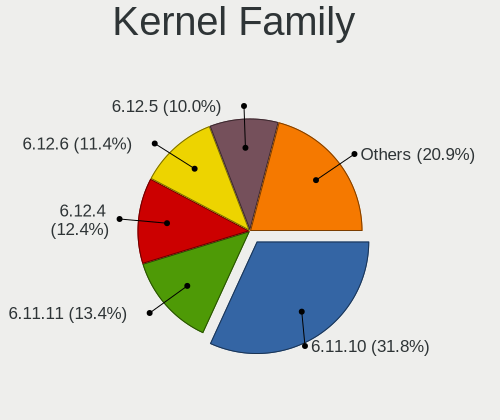
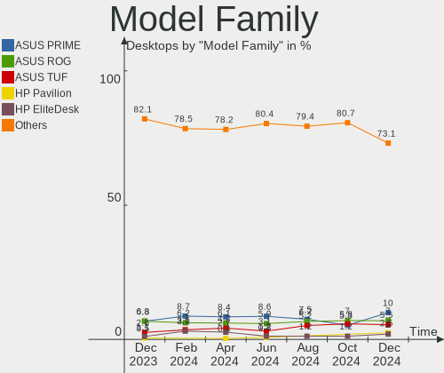
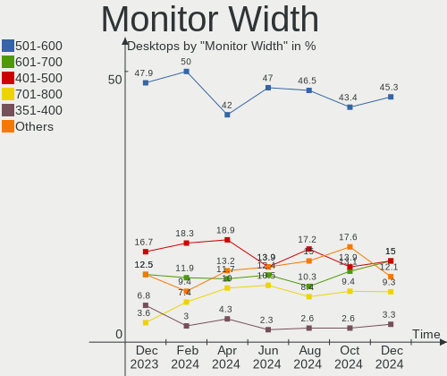
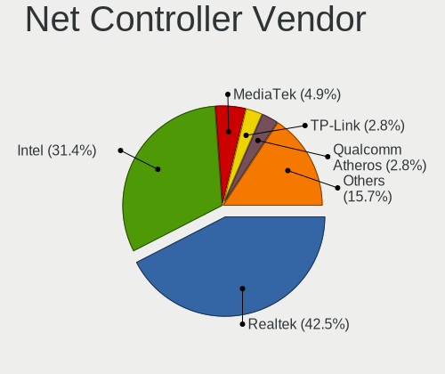

Fedora Hardware Trends (Desktop)
--------------------------------

A project to identify most popular hardware characteristics and track their change
over time based on data collected by Fedora users at https://Linux-Hardware.org.

Anyone can contribute to the study by uploading probes of their computers by
the [hw-probe](https://github.com/linuxhw/hw-probe) tool:

    sudo -E hw-probe -all -upload

Full-feature report is available here: https://linux-hardware.org/?view=trends&formfactor=desktop

Period: Oct, 2020.

Contents
--------

- [ OS                       ](#os)
- [ OS Family                ](#os-family)
- [ Kernel                   ](#kernel)
- [ Kernel Family            ](#kernel-family)
- [ Kernel Major Ver.        ](#kernel-major-ver)
- [ Arch                     ](#arch)
- [ DE                       ](#de)
- [ Display Server           ](#display-server)
- [ Display Manager          ](#display-manager)
- [ OS Lang                  ](#os-lang)
- [ Boot Mode                ](#boot-mode)
- [ Filesystem               ](#filesystem)
- [ Part. scheme             ](#part-scheme)
- [ Dual Boot with Linux/BSD ](#dual-boot-with-linux/bsd)
- [ Dual Boot (Win)          ](#dual-boot-win)
- [ Country                  ](#country)
- [ City                     ](#city)
- [ Vendor                   ](#vendor)
- [ Model                    ](#model)
- [ Model Family             ](#model-family)
- [ MFG Year                 ](#mfg-year)
- [ Form Factor              ](#form-factor)
- [ Secure Boot              ](#secure-boot)
- [ Coreboot                 ](#coreboot)
- [ RAM Size                 ](#ram-size)
- [ RAM Used                 ](#ram-used)
- [ Has CD-ROM               ](#has-cd-rom)
- [ Total Drives             ](#total-drives)
- [ Has Ethernet             ](#has-ethernet)
- [ Drive Vendor             ](#drive-vendor)
- [ HDD Vendor               ](#hdd-vendor)
- [ SSD Vendor               ](#ssd-vendor)
- [ Drive Model              ](#drive-model)
- [ Drive Kind               ](#drive-kind)
- [ Drive Connector          ](#drive-connector)
- [ Drive Size               ](#drive-size)
- [ Space Total              ](#space-total)
- [ Space Used               ](#space-used)
- [ Malfunc. Drives          ](#malfunc-drives)
- [ Malfunc. Drive Vendor    ](#malfunc-drive-vendor)
- [ Malfunc. HDD Vendor      ](#malfunc-hdd-vendor)
- [ Malfunc. Drive Kind      ](#malfunc-drive-kind)
- [ Failed Drives            ](#failed-drives)
- [ Failed Drive Vendor      ](#failed-drive-vendor)
- [ Drive Status             ](#drive-status)
- [ Storage Vendor           ](#storage-vendor)
- [ Storage Model            ](#storage-model)
- [ Storage Kind             ](#storage-kind)
- [ CPU Vendor               ](#cpu-vendor)
- [ CPU Model                ](#cpu-model)
- [ CPU Model Family         ](#cpu-model-family)
- [ CPU Cores                ](#cpu-cores)
- [ CPU Sockets              ](#cpu-sockets)
- [ CPU Threads              ](#cpu-threads)
- [ CPU Op-Modes             ](#cpu-op-modes)
- [ CPU Microcode            ](#cpu-microcode)
- [ CPU Microarch            ](#cpu-microarch)
- [ GPU Vendor               ](#gpu-vendor)
- [ GPU Model                ](#gpu-model)
- [ GPU Combo                ](#gpu-combo)
- [ GPU Driver               ](#gpu-driver)
- [ GPU Memory               ](#gpu-memory)
- [ Monitor Vendor           ](#monitor-vendor)
- [ Monitor Model            ](#monitor-model)
- [ Monitor Resolution       ](#monitor-resolution)
- [ Monitor Diagonal         ](#monitor-diagonal)
- [ Monitor Width            ](#monitor-width)
- [ Aspect Ratio             ](#aspect-ratio)
- [ Monitor Area             ](#monitor-area)
- [ Pixel Density            ](#pixel-density)
- [ Multiple Monitors        ](#multiple-monitors)
- [ Net Controller Vendor    ](#net-controller-vendor)
- [ Net Controller Model     ](#net-controller-model)
- [ Wireless Vendor          ](#wireless-vendor)
- [ Wireless Model           ](#wireless-model)
- [ Ethernet Vendor          ](#ethernet-vendor)
- [ Ethernet Model           ](#ethernet-model)
- [ Net Controller Kind      ](#net-controller-kind)
- [ Used Controller          ](#used-controller)
- [ NICs                     ](#nics)
- [ Memory Vendor            ](#memory-vendor)
- [ Memory Model             ](#memory-model)
- [ Memory Kind              ](#memory-kind)
- [ Memory Form Factor       ](#memory-form-factor)
- [ Memory Size              ](#memory-size)
- [ Memory Speed             ](#memory-speed)
- [ Sound Vendor             ](#sound-vendor)
- [ Sound Model              ](#sound-model)
- [ Camera Vendor            ](#camera-vendor)
- [ Camera Model             ](#camera-model)
- [ Fingerprint Vendor       ](#fingerprint-vendor)
- [ Fingerprint Model        ](#fingerprint-model)
- [ Chipcard Vendor          ](#chipcard-vendor)
- [ Chipcard Model           ](#chipcard-model)
- [ Printer Vendor           ](#printer-vendor)
- [ Printer Model            ](#printer-model)
- [ Scanner Vendor           ](#scanner-vendor)
- [ Scanner Model            ](#scanner-model)
- [ Bluetooth Vendor         ](#bluetooth-vendor)
- [ Bluetooth Model          ](#bluetooth-model)
- [ Unsupported Devices      ](#unsupported-devices)
- [ Unsupported Device Types ](#unsupported-device-types)

OS
--

Installed operating systems

| Name      | Desktops | Percent |
|-----------|----------|---------|
| Fedora 32 | 81       | 66.39%  |
| Fedora 33 | 33       | 27.05%  |
| Fedora 31 | 6        | 4.92%   |
| Fedora 34 | 1        | 0.82%   |
| Fedora 27 | 1        | 0.82%   |

OS Family
---------

OS without a version

| Name   | Desktops | Percent |
|--------|----------|---------|
| Fedora | 122      | 100%    |

Kernel
------

Version of the Linux kernel

| Version                                            | Desktops | Percent |
|----------------------------------------------------|----------|---------|
| 5.8.16-300.fc33.x86_64                             | 18       | 14.75%  |
| 5.8.13-200.fc32.x86_64                             | 18       | 14.75%  |
| 5.8.15-201.fc32.x86_64                             | 16       | 13.11%  |
| 5.8.12-200.fc32.x86_64                             | 14       | 11.48%  |
| 5.8.16-200.fc32.x86_64                             | 10       | 8.2%    |
| 5.8.15-301.fc33.x86_64                             | 7        | 5.74%   |
| 5.8.14-200.fc32.x86_64                             | 5        | 4.1%    |
| 5.8.11-200.fc32.x86_64                             | 5        | 4.1%    |
| 5.8.13-100.fc31.x86_64                             | 4        | 3.28%   |
| 5.8.14-300.fc33.x86_64                             | 3        | 2.46%   |
| 5.8.12-300.fc33.x86_64                             | 3        | 2.46%   |
| 5.6.6-300.fc32.x86_64                              | 3        | 2.46%   |
| 5.8.7-200.fc32.x86_64                              | 2        | 1.64%   |
| 5.8.13-300.fc33.x86_64                             | 2        | 1.64%   |
| 5.9.0-0.rc8.20201009git7575fdda569b.32.fc34.x86_64 | 1        | 0.82%   |
| 5.8.9-200.fc32.x86_64                              | 1        | 0.82%   |
| 5.8.8-200.fc32.x86_64                              | 1        | 0.82%   |
| 5.8.12-100.fc31.x86_64                             | 1        | 0.82%   |
| 5.8.10-200.fc32.x86_64                             | 1        | 0.82%   |
| 5.8.10-100.fc31.x86_64                             | 1        | 0.82%   |
| 5.7.8-200.fc32.x86_64                              | 1        | 0.82%   |
| 5.7.17-200.fc32.x86_64                             | 1        | 0.82%   |
| 5.7.14-200.fc32.x86_64                             | 1        | 0.82%   |
| 5.6.19-300.fc32.x86_64                             | 1        | 0.82%   |
| 5.6.16-300.fc32.x86_64                             | 1        | 0.82%   |
| 4.18.19-100.fc27.x86_64                            | 1        | 0.82%   |

Kernel Family
-------------

Linux kernel without a distro release

| Version | Desktops | Percent |
|---------|----------|---------|
| 5.8.16  | 28       | 22.95%  |
| 5.8.13  | 24       | 19.67%  |
| 5.8.15  | 23       | 18.85%  |
| 5.8.12  | 18       | 14.75%  |
| 5.8.14  | 8        | 6.56%   |
| 5.8.11  | 5        | 4.1%    |
| 5.6.6   | 3        | 2.46%   |
| 5.8.7   | 2        | 1.64%   |
| 5.8.10  | 2        | 1.64%   |
| 5.9.0   | 1        | 0.82%   |
| 5.8.9   | 1        | 0.82%   |
| 5.8.8   | 1        | 0.82%   |
| 5.7.8   | 1        | 0.82%   |
| 5.7.17  | 1        | 0.82%   |
| 5.7.14  | 1        | 0.82%   |
| 5.6.19  | 1        | 0.82%   |
| 5.6.16  | 1        | 0.82%   |
| 4.18.19 | 1        | 0.82%   |

Kernel Major Ver.
-----------------

Linux kernel major version

| Version | Desktops | Percent |
|---------|----------|---------|
| 5.8     | 112      | 91.8%   |
| 5.6     | 5        | 4.1%    |
| 5.7     | 3        | 2.46%   |
| 5.9     | 1        | 0.82%   |
| 4.18    | 1        | 0.82%   |

Arch
----

OS architecture (x86_64, i586, etc.)

| Name   | Desktops | Percent |
|--------|----------|---------|
| x86_64 | 122      | 100%    |

DE
--

Desktop Environment

| Name       | Desktops | Percent |
|------------|----------|---------|
| GNOME      | 74       | 60.66%  |
| KDE5       | 11       | 9.02%   |
| XFCE       | 9        | 7.38%   |
| Unknown    | 7        | 5.74%   |
| KDE        | 6        | 4.92%   |
| Cinnamon   | 6        | 4.92%   |
| X-Cinnamon | 4        | 3.28%   |
| MATE       | 3        | 2.46%   |
| i3         | 1        | 0.82%   |
| DWM        | 1        | 0.82%   |

Display Server
--------------

X11 or Wayland

| Name    | Desktops | Percent |
|---------|----------|---------|
| X11     | 66       | 54.1%   |
| Wayland | 45       | 36.89%  |
| Tty     | 10       | 8.2%    |
| Unknown | 1        | 0.82%   |

Display Manager
---------------

SDDM, LightDM, etc.

| Name    | Desktops | Percent |
|---------|----------|---------|
| Unknown | 70       | 57.38%  |
| GDM     | 28       | 22.95%  |
| SDDM    | 10       | 8.2%    |
| TDM     | 9        | 7.38%   |
| LightDM | 5        | 4.1%    |

OS Lang
-------

Language

| Lang       | Desktops | Percent |
|------------|----------|---------|
| en_US      | 57       | 46.72%  |
| en_GB      | 9        | 7.38%   |
| pt_BR      | 7        | 5.74%   |
| fr_FR      | 7        | 5.74%   |
| en_CA      | 7        | 5.74%   |
| en_AU      | 6        | 4.92%   |
| de_DE      | 5        | 4.1%    |
| ru_RU      | 4        | 3.28%   |
| en_US.utf8 | 3        | 2.46%   |
| pl_PL      | 2        | 1.64%   |
| cs_CZ      | 2        | 1.64%   |
| uk_UA      | 1        | 0.82%   |
| ru_RU.utf8 | 1        | 0.82%   |
| ro_RO      | 1        | 0.82%   |
| it_IT      | 1        | 0.82%   |
| fr_FR.utf8 | 1        | 0.82%   |
| fi_FI.utf8 | 1        | 0.82%   |
| es_MX      | 1        | 0.82%   |
| es_ES      | 1        | 0.82%   |
| en_IN      | 1        | 0.82%   |
| en_IE      | 1        | 0.82%   |
| en_GB.utf8 | 1        | 0.82%   |
| de_CH      | 1        | 0.82%   |
| de_AT.utf8 | 1        | 0.82%   |

Boot Mode
---------

EFI or BIOS

| Mode | Desktops | Percent |
|------|----------|---------|
| EFI  | 70       | 57.38%  |
| BIOS | 52       | 42.62%  |

Filesystem
----------

Type of filesystem

| Type  | Desktops | Percent |
|-------|----------|---------|
| Ext4  | 82       | 67.21%  |
| Btrfs | 22       | 18.03%  |
| Xfs   | 18       | 14.75%  |

Part. scheme
------------

Scheme of partitioning

| Type    | Desktops | Percent |
|---------|----------|---------|
| Unknown | 62       | 50.82%  |
| GPT     | 45       | 36.89%  |
| MBR     | 15       | 12.3%   |

Dual Boot with Linux/BSD
------------------------

Hosting more than one Linux/BSD

| Dual boot | Desktops | Percent |
|-----------|----------|---------|
| No        | 108      | 88.52%  |
| Yes       | 14       | 11.48%  |

Dual Boot (Win)
---------------

Hosting Linux and Windows

| Dual boot | Desktops | Percent |
|-----------|----------|---------|
| No        | 96       | 78.69%  |
| Yes       | 26       | 21.31%  |

Country
-------

Geographic location (country)

| Country        | Desktops | Percent |
|----------------|----------|---------|
| USA            | 33       | 27.05%  |
| Canada         | 9        | 7.38%   |
| Russia         | 8        | 6.56%   |
| France         | 8        | 6.56%   |
| Brazil         | 8        | 6.56%   |
| Germany        | 7        | 5.74%   |
| Australia      | 5        | 4.1%    |
| Switzerland    | 4        | 3.28%   |
| Sweden         | 3        | 2.46%   |
| Poland         | 3        | 2.46%   |
| India          | 3        | 2.46%   |
| Czech Republic | 3        | 2.46%   |
| Austria        | 3        | 2.46%   |
| Ukraine        | 2        | 1.64%   |
| Spain          | 2        | 1.64%   |
| Bangladesh     | 2        | 1.64%   |
| UK             | 1        | 0.82%   |
| Turkey         | 1        | 0.82%   |
| South Africa   | 1        | 0.82%   |
| Romania        | 1        | 0.82%   |
| Portugal       | 1        | 0.82%   |
| Norway         | 1        | 0.82%   |
| Netherlands    | 1        | 0.82%   |
| Mexico         | 1        | 0.82%   |
| Lithuania      | 1        | 0.82%   |
| Kenya          | 1        | 0.82%   |
| Italy          | 1        | 0.82%   |
| Ireland        | 1        | 0.82%   |
| Iceland        | 1        | 0.82%   |
| Hungary        | 1        | 0.82%   |
| Hong Kong      | 1        | 0.82%   |
| Finland        | 1        | 0.82%   |
| Chile          | 1        | 0.82%   |
| Belarus        | 1        | 0.82%   |
| Argentina      | 1        | 0.82%   |

City
----

Geographic location (city)

| City                     | Desktops | Percent |
|--------------------------|----------|---------|
| Cincinnati               | 4        | 3.28%   |
| Zurich                   | 3        | 2.46%   |
| Toronto                  | 2        | 1.64%   |
| São Paulo               | 2        | 1.64%   |
| St Petersburg            | 2        | 1.64%   |
| Prague                   | 2        | 1.64%   |
| Owatonna                 | 2        | 1.64%   |
| Neustadt                 | 2        | 1.64%   |
| Nantes                   | 2        | 1.64%   |
| Moscow                   | 2        | 1.64%   |
| Huber Heights            | 2        | 1.64%   |
| Hornsby                  | 2        | 1.64%   |
| Graz                     | 2        | 1.64%   |
| Dallas                   | 2        | 1.64%   |
| Barcelona                | 2        | 1.64%   |
| Šilalė                 | 1        | 0.82%   |
| West Chester             | 1        | 0.82%   |
| Weehawken                | 1        | 0.82%   |
| Wahroonga                | 1        | 0.82%   |
| Vinhedo                  | 1        | 0.82%   |
| Vincennes                | 1        | 0.82%   |
| Villeneuve-Saint-Georges | 1        | 0.82%   |
| Vantaa                   | 1        | 0.82%   |
| Vancouver                | 1        | 0.82%   |
| Ufa                      | 1        | 0.82%   |
| Turda                    | 1        | 0.82%   |
| Toulouse                 | 1        | 0.82%   |
| Temuco                   | 1        | 0.82%   |
| Stockholm                | 1        | 0.82%   |
| Steinkjer                | 1        | 0.82%   |
| Spokane                  | 1        | 0.82%   |
| Soedra Vi                | 1        | 0.82%   |
| Snodland                 | 1        | 0.82%   |
| Seattle                  | 1        | 0.82%   |
| Sao Goncalo              | 1        | 0.82%   |
| San Miguel de Tucumán   | 1        | 0.82%   |
| Rural Valley             | 1        | 0.82%   |
| Rivne                    | 1        | 0.82%   |
| Reykjanesbaer            | 1        | 0.82%   |
| Red Deer                 | 1        | 0.82%   |
| Pretoria                 | 1        | 0.82%   |
| Piraquara                | 1        | 0.82%   |
| Piensk                   | 1        | 0.82%   |
| Pflugerville             | 1        | 0.82%   |
| Petrolina                | 1        | 0.82%   |
| Perpignan                | 1        | 0.82%   |
| Peach Orchard            | 1        | 0.82%   |
| Palo Alto                | 1        | 0.82%   |
| Palaiseau                | 1        | 0.82%   |
| Pabna                    | 1        | 0.82%   |
| Ollainville              | 1        | 0.82%   |
| Oklahoma City            | 1        | 0.82%   |
| Nuremberg                | 1        | 0.82%   |
| Newark                   | 1        | 0.82%   |
| Nakuru                   | 1        | 0.82%   |
| Morrisville              | 1        | 0.82%   |
| Minneapolis              | 1        | 0.82%   |
| Midland                  | 1        | 0.82%   |
| Malda                    | 1        | 0.82%   |
| Lubartow                 | 1        | 0.82%   |

Vendor
------

Motherboard manufacturer

| Name                | Desktops | Percent |
|---------------------|----------|---------|
| ASUSTek Computer    | 33       | 27.05%  |
| Gigabyte Technology | 29       | 23.77%  |
| MSI                 | 25       | 20.49%  |
| ASRock              | 11       | 9.02%   |
| Dell                | 8        | 6.56%   |
| Hewlett-Packard     | 5        | 4.1%    |
| Supermicro          | 3        | 2.46%   |
| Unknown             | 2        | 1.64%   |
| X79                 | 1        | 0.82%   |
| Positivo            | 1        | 0.82%   |
| Packard Bell        | 1        | 0.82%   |
| Lenovo              | 1        | 0.82%   |
| Intel               | 1        | 0.82%   |
| Acer                | 1        | 0.82%   |

Model
-----

Motherboard model

| Name                             | Desktops | Percent |
|----------------------------------|----------|---------|
| ASUS All Series                  | 3        | 2.46%   |
| MSI MS-7C02                      | 2        | 1.64%   |
| MSI MS-7B85                      | 2        | 1.64%   |
| MSI MS-7817                      | 2        | 1.64%   |
| MSI MS-7758                      | 2        | 1.64%   |
| HP EliteDesk 800 G2 DM 35W       | 2        | 1.64%   |
| Gigabyte B450 AORUS ELITE        | 2        | 1.64%   |
| Dell OptiPlex 755                | 2        | 1.64%   |
| ASUS TUF GAMING X570-PLUS        | 2        | 1.64%   |
| ASUS ROG STRIX X570-I GAMING     | 2        | 1.64%   |
| ASUS P8Z77-V LX                  | 2        | 1.64%   |
| ASRock A320M-HDV R4.0            | 2        | 1.64%   |
| Unknown                          | 2        | 1.64%   |
| X79 G7-2011                      | 1        | 0.82%   |
| Supermicro X9SCI/X9SCA           | 1        | 0.82%   |
| Supermicro X7SLA                 | 1        | 0.82%   |
| Supermicro X7DB8                 | 1        | 0.82%   |
| Positivo POS-PARS760GCD          | 1        | 0.82%   |
| Packard Bell imedia S3810        | 1        | 0.82%   |
| MSI MS-7C91                      | 1        | 0.82%   |
| MSI MS-7C84                      | 1        | 0.82%   |
| MSI MS-7C37                      | 1        | 0.82%   |
| MSI MS-7B92                      | 1        | 0.82%   |
| MSI MS-7B86                      | 1        | 0.82%   |
| MSI MS-7B84                      | 1        | 0.82%   |
| MSI MS-7B78                      | 1        | 0.82%   |
| MSI MS-7B36                      | 1        | 0.82%   |
| MSI MS-7B09                      | 1        | 0.82%   |
| MSI MS-7A72                      | 1        | 0.82%   |
| MSI MS-7A38                      | 1        | 0.82%   |
| MSI MS-7922                      | 1        | 0.82%   |
| MSI MS-7917                      | 1        | 0.82%   |
| MSI MS-7798                      | 1        | 0.82%   |
| MSI MS-7623                      | 1        | 0.82%   |
| MSI MS-7593                      | 1        | 0.82%   |
| MSI HPE-410fr                    | 1        | 0.82%   |
| Lenovo ThinkCentre M58p 7220A72  | 1        | 0.82%   |
| Intel DN2820FYK H24582-202       | 1        | 0.82%   |
| HP xw4600 Workstation            | 1        | 0.82%   |
| HP Pavilion Desktop 590-a0xxx    | 1        | 0.82%   |
| HP Compaq 6200 Pro SFF PC        | 1        | 0.82%   |
| Gigabyte Z87-D3HP                | 1        | 0.82%   |
| Gigabyte Z370 HD3P               | 1        | 0.82%   |
| Gigabyte Z370 AORUS Gaming K3    | 1        | 0.82%   |
| Gigabyte Z270-HD3P               | 1        | 0.82%   |
| Gigabyte X99P-SLI-CF             | 1        | 0.82%   |
| Gigabyte X570 AORUS ULTRA        | 1        | 0.82%   |
| Gigabyte X570 AORUS MASTER       | 1        | 0.82%   |
| Gigabyte X470 AORUS ULTRA GAMING | 1        | 0.82%   |
| Gigabyte TRX40 AORUS XTREME      | 1        | 0.82%   |
| Gigabyte TRX40 AORUS MASTER      | 1        | 0.82%   |
| Gigabyte P55A-UD3                | 1        | 0.82%   |
| Gigabyte Hyrican PC              | 1        | 0.82%   |
| Gigabyte H81M-S1                 | 1        | 0.82%   |
| Gigabyte H77N-WIFI               | 1        | 0.82%   |
| Gigabyte H77-D3H                 | 1        | 0.82%   |
| Gigabyte H61M-DS2H               | 1        | 0.82%   |
| Gigabyte H55M-S2V                | 1        | 0.82%   |
| Gigabyte GA-890GPA-UD3H          | 1        | 0.82%   |
| Gigabyte G1.Sniper 2             | 1        | 0.82%   |

Model Family
------------

Motherboard model prefix

| Name                    | Desktops | Percent |
|-------------------------|----------|---------|
| ASUS PRIME              | 6        | 4.92%   |
| Dell OptiPlex           | 5        | 4.1%    |
| ASUS TUF                | 5        | 4.1%    |
| ASUS ROG                | 4        | 3.28%   |
| ASUS P8Z77-V            | 3        | 2.46%   |
| ASUS All                | 3        | 2.46%   |
| MSI MS-7C02             | 2        | 1.64%   |
| MSI MS-7B85             | 2        | 1.64%   |
| MSI MS-7817             | 2        | 1.64%   |
| MSI MS-7758             | 2        | 1.64%   |
| HP EliteDesk            | 2        | 1.64%   |
| Gigabyte Z370           | 2        | 1.64%   |
| Gigabyte X570           | 2        | 1.64%   |
| Gigabyte TRX40          | 2        | 1.64%   |
| Gigabyte B450           | 2        | 1.64%   |
| Dell Precision          | 2        | 1.64%   |
| ASRock B450M            | 2        | 1.64%   |
| ASRock A320M-HDV        | 2        | 1.64%   |
| Unknown                 | 2        | 1.64%   |
| X79 G7-2011             | 1        | 0.82%   |
| Supermicro X9SCI        | 1        | 0.82%   |
| Supermicro X7SLA        | 1        | 0.82%   |
| Supermicro X7DB8        | 1        | 0.82%   |
| Positivo POS-PARS760GCD | 1        | 0.82%   |
| Packard Bell imedia     | 1        | 0.82%   |
| MSI MS-7C91             | 1        | 0.82%   |
| MSI MS-7C84             | 1        | 0.82%   |
| MSI MS-7C37             | 1        | 0.82%   |
| MSI MS-7B92             | 1        | 0.82%   |
| MSI MS-7B86             | 1        | 0.82%   |
| MSI MS-7B84             | 1        | 0.82%   |
| MSI MS-7B78             | 1        | 0.82%   |
| MSI MS-7B36             | 1        | 0.82%   |
| MSI MS-7B09             | 1        | 0.82%   |
| MSI MS-7A72             | 1        | 0.82%   |
| MSI MS-7A38             | 1        | 0.82%   |
| MSI MS-7922             | 1        | 0.82%   |
| MSI MS-7917             | 1        | 0.82%   |
| MSI MS-7798             | 1        | 0.82%   |
| MSI MS-7623             | 1        | 0.82%   |
| MSI MS-7593             | 1        | 0.82%   |
| MSI HPE-410fr           | 1        | 0.82%   |
| Lenovo ThinkCentre      | 1        | 0.82%   |
| Intel DN2820FYK         | 1        | 0.82%   |
| HP xw4600               | 1        | 0.82%   |
| HP Pavilion             | 1        | 0.82%   |
| HP Compaq               | 1        | 0.82%   |
| Gigabyte Z87-D3HP       | 1        | 0.82%   |
| Gigabyte Z270-HD3P      | 1        | 0.82%   |
| Gigabyte X99P-SLI-CF    | 1        | 0.82%   |
| Gigabyte X470           | 1        | 0.82%   |
| Gigabyte P55A-UD3       | 1        | 0.82%   |
| Gigabyte Hyrican        | 1        | 0.82%   |
| Gigabyte H81M-S1        | 1        | 0.82%   |
| Gigabyte H77N-WIFI      | 1        | 0.82%   |
| Gigabyte H77-D3H        | 1        | 0.82%   |
| Gigabyte H61M-DS2H      | 1        | 0.82%   |
| Gigabyte H55M-S2V       | 1        | 0.82%   |
| Gigabyte GA-890GPA-UD3H | 1        | 0.82%   |
| Gigabyte G1.Sniper      | 1        | 0.82%   |

MFG Year
--------

Motherboard manufacture year

| Year | Desktops | Percent |
|------|----------|---------|
| 2020 | 26       | 21.31%  |
| 2019 | 21       | 17.21%  |
| 2018 | 17       | 13.93%  |
| 2014 | 9        | 7.38%   |
| 2013 | 9        | 7.38%   |
| 2010 | 8        | 6.56%   |
| 2017 | 6        | 4.92%   |
| 2015 | 6        | 4.92%   |
| 2012 | 6        | 4.92%   |
| 2011 | 5        | 4.1%    |
| 2009 | 4        | 3.28%   |
| 2016 | 3        | 2.46%   |
| 2008 | 2        | 1.64%   |

Form Factor
-----------

Physical design of the computer

| Name    | Desktops | Percent |
|---------|----------|---------|
| Desktop | 122      | 100%    |

Secure Boot
-----------

Enabled or disabled

| State    | Desktops | Percent |
|----------|----------|---------|
| Disabled | 119      | 97.54%  |
| Enabled  | 3        | 2.46%   |

Coreboot
--------

Have coreboot on board

| Used | Desktops | Percent |
|------|----------|---------|
| No   | 122      | 100%    |

RAM Size
--------

Total RAM memory

| Size in GB  | Desktops | Percent |
|-------------|----------|---------|
| 16.01-24.0  | 37       | 30.33%  |
| 32.01-64.0  | 26       | 21.31%  |
| 8.01-16.0   | 19       | 15.57%  |
| 4.01-8.0    | 15       | 12.3%   |
| 64.01-256.0 | 12       | 9.84%   |
| 3.01-4.0    | 8        | 6.56%   |
| 24.01-32.0  | 3        | 2.46%   |
| 1.01-2.0    | 2        | 1.64%   |

RAM Used
--------

Used RAM memory

| Used GB    | Desktops | Percent |
|------------|----------|---------|
| 4.01-8.0   | 29       | 23.77%  |
| 3.01-4.0   | 26       | 21.31%  |
| 2.01-3.0   | 22       | 18.03%  |
| 8.01-16.0  | 18       | 14.75%  |
| 1.01-2.0   | 17       | 13.93%  |
| 0.01-1.0   | 4        | 3.28%   |
| 24.01-32.0 | 3        | 2.46%   |
| 16.01-24.0 | 3        | 2.46%   |

Has CD-ROM
----------

Has CD-ROM on board

| Presented | Desktops | Percent |
|-----------|----------|---------|
| No        | 76       | 62.3%   |
| Yes       | 46       | 37.7%   |

Total Drives
------------

Number of drives on board

| Drives | Desktops | Percent |
|--------|----------|---------|
| 1      | 41       | 33.61%  |
| 2      | 34       | 27.87%  |
| 4      | 16       | 13.11%  |
| 3      | 16       | 13.11%  |
| 5      | 8        | 6.56%   |
| 9      | 2        | 1.64%   |
| 8      | 2        | 1.64%   |
| 7      | 2        | 1.64%   |
| 6      | 1        | 0.82%   |

Has Ethernet
------------

Has Ethernet on board

| Presented | Desktops | Percent |
|-----------|----------|---------|
| Yes       | 121      | 99.18%  |
| No        | 1        | 0.82%   |

Drive Vendor
------------

Hard drive vendors

| Vendor                    | Desktops | Drives | Percent |
|---------------------------|----------|--------|---------|
| WDC                       | 46       | 73     | 19.74%  |
| Seagate                   | 41       | 56     | 17.6%   |
| Samsung Electronics       | 39       | 64     | 16.74%  |
| Kingston                  | 17       | 21     | 7.3%    |
| Intel                     | 11       | 14     | 4.72%   |
| Crucial                   | 10       | 10     | 4.29%   |
| SanDisk                   | 8        | 11     | 3.43%   |
| Phison                    | 8        | 8      | 3.43%   |
| Toshiba                   | 7        | 7      | 3%      |
| Hitachi                   | 6        | 6      | 2.58%   |
| A-DATA Technology         | 6        | 7      | 2.58%   |
| SPCC                      | 3        | 4      | 1.29%   |
| OCZ                       | 3        | 3      | 1.29%   |
| Corsair                   | 3        | 3      | 1.29%   |
| PLEXTOR                   | 2        | 2      | 0.86%   |
| Micron/Crucial Technology | 2        | 2      | 0.86%   |
| Maxtor                    | 2        | 2      | 0.86%   |
| HGST                      | 2        | 3      | 0.86%   |
| XrayDisk                  | 1        | 1      | 0.43%   |
| Unknown                   | 1        | 1      | 0.43%   |
| Transcend                 | 1        | 1      | 0.43%   |
| SUNEAST                   | 1        | 1      | 0.43%   |
| Silicon Motion            | 1        | 1      | 0.43%   |
| SABRENT                   | 1        | 1      | 0.43%   |
| Realtek Semiconductor     | 1        | 1      | 0.43%   |
| PNY                       | 1        | 1      | 0.43%   |
| Patriot                   | 1        | 1      | 0.43%   |
| Lite-On                   | 1        | 1      | 0.43%   |
| Leven                     | 1        | 1      | 0.43%   |
| KingFast                  | 1        | 1      | 0.43%   |
| JMicron                   | 1        | 5      | 0.43%   |
| Inateck                   | 1        | 1      | 0.43%   |
| Fujitsu                   | 1        | 1      | 0.43%   |
| China                     | 1        | 1      | 0.43%   |
| Apple                     | 1        | 1      | 0.43%   |

HDD Vendor
----------

Hard disk drive vendors

| Vendor              | Desktops | Drives | Percent |
|---------------------|----------|--------|---------|
| Seagate             | 41       | 54     | 39.81%  |
| WDC                 | 39       | 65     | 37.86%  |
| Toshiba             | 7        | 7      | 6.8%    |
| Hitachi             | 6        | 6      | 5.83%   |
| Samsung Electronics | 4        | 4      | 3.88%   |
| Maxtor              | 2        | 2      | 1.94%   |
| HGST                | 2        | 3      | 1.94%   |
| Inateck             | 1        | 1      | 0.97%   |
| Fujitsu             | 1        | 1      | 0.97%   |

SSD Vendor
----------

Solid state drive vendors

| Vendor              | Desktops | Drives | Percent |
|---------------------|----------|--------|---------|
| Samsung Electronics | 30       | 41     | 32.61%  |
| Kingston            | 15       | 19     | 16.3%   |
| Crucial             | 9        | 9      | 9.78%   |
| WDC                 | 7        | 7      | 7.61%   |
| A-DATA Technology   | 5        | 6      | 5.43%   |
| SanDisk             | 4        | 6      | 4.35%   |
| Intel               | 4        | 4      | 4.35%   |
| OCZ                 | 3        | 3      | 3.26%   |
| SPCC                | 2        | 2      | 2.17%   |
| PLEXTOR             | 2        | 2      | 2.17%   |
| XrayDisk            | 1        | 1      | 1.09%   |
| Unknown             | 1        | 1      | 1.09%   |
| Transcend           | 1        | 1      | 1.09%   |
| SUNEAST             | 1        | 1      | 1.09%   |
| PNY                 | 1        | 1      | 1.09%   |
| Patriot             | 1        | 1      | 1.09%   |
| Leven               | 1        | 1      | 1.09%   |
| KingFast            | 1        | 1      | 1.09%   |
| Corsair             | 1        | 1      | 1.09%   |
| China               | 1        | 1      | 1.09%   |
| Apple               | 1        | 1      | 1.09%   |

Drive Model
-----------

Hard drive models

| Model                        | Desktops | Percent |
|------------------------------|----------|---------|
| NVMe SSD Drive 512GB         | 7        | 2.36%   |
| NVMe SSD Drive 500GB         | 7        | 2.36%   |
| SSD 860 EVO 500GB            | 5        | 1.69%   |
| SSD 860 EVO 1TB              | 5        | 1.69%   |
| NVMe SSD Drive 1TB           | 5        | 1.69%   |
| WD10EZEX-08WN4A0 1TB         | 4        | 1.35%   |
| ST2000DM008-2FR102 2TB       | 4        | 1.35%   |
| ST1000DM010-2EP102 1TB       | 4        | 1.35%   |
| SSD 850 EVO 250GB            | 4        | 1.35%   |
| SSD 840 EVO 250GB            | 4        | 1.35%   |
| SA400S37240G 240GB SSD       | 4        | 1.35%   |
| SUV400S37240G 240GB SSD      | 3        | 1.01%   |
| SSD 860 QVO 1TB              | 3        | 1.01%   |
| SSD 850 EVO 500GB            | 3        | 1.01%   |
| SA400S37480G 480GB SSD       | 3        | 1.01%   |
| NVMe SSD Drive 256GB         | 3        | 1.01%   |
| NVMe SSD Drive 1024GB        | 3        | 1.01%   |
| WD30EZRX-00D8PB0 3TB         | 2        | 0.68%   |
| WD10EZEX-08M2NA0 1TB         | 2        | 0.68%   |
| WD10EZEX-00WN4A0 1TB         | 2        | 0.68%   |
| WD10EARX-00N0YB0 1TB         | 2        | 0.68%   |
| WD10EADS-00L5B1 1TB          | 2        | 0.68%   |
| SV300S37A120G 120GB SSD      | 2        | 0.68%   |
| ST500DM002-1SB10A 500GB      | 2        | 0.68%   |
| ST500DM002-1BD142 500GB      | 2        | 0.68%   |
| ST1000DM003-1SB10C 1TB       | 2        | 0.68%   |
| ST1000DM003-1SB102 1TB       | 2        | 0.68%   |
| SSD 970 EVO Plus 1TB         | 2        | 0.68%   |
| SSD 860 EVO 250GB            | 2        | 0.68%   |
| SSD 840 EVO 120GB            | 2        | 0.68%   |
| SSD 240GB                    | 2        | 0.68%   |
| NVMe SSD Drive 250GB         | 2        | 0.68%   |
| NVMe SSD Drive 240GB         | 2        | 0.68%   |
| HDS723020BLA642 2TB          | 2        | 0.68%   |
| Expansion 4TB                | 2        | 0.68%   |
| DT01ACA050 500GB             | 2        | 0.68%   |
| CT250MX500SSD1 250GB         | 2        | 0.68%   |
| Backup+ Hub BK 4TB           | 2        | 0.68%   |
| WDS500G2B0B 500GB SSD        | 1        | 0.34%   |
| WDS500G2B0A-00SM50 500GB SSD | 1        | 0.34%   |
| WDS480G2G0A-00JH30 480GB SSD | 1        | 0.34%   |
| WDS240G2G0A-00JH30 240GB SSD | 1        | 0.34%   |
| WDS120G2G0B-00EPW0 120GB SSD | 1        | 0.34%   |
| WDS100T3X0C-00SJG0 1TB       | 1        | 0.34%   |
| WDS100T2B0A-00SM50 1TB SSD   | 1        | 0.34%   |
| WDBNCE2500PNC 250GB SSD      | 1        | 0.34%   |
| WD7500AACS-00D6B1 752GB      | 1        | 0.34%   |
| WD60EFRX-68L0BN1 6TB         | 1        | 0.34%   |
| WD5000AVDS-63U7B1 500GB      | 1        | 0.34%   |
| WD5000AAKX-75U6AA0 500GB     | 1        | 0.34%   |
| WD5000AAKX-00ERMA0 500GB     | 1        | 0.34%   |
| WD5000AAKX-003CA0 500GB      | 1        | 0.34%   |
| WD5000AAKX-001CA0 500GB      | 1        | 0.34%   |
| WD5000AAKS-40YGA1 500GB      | 1        | 0.34%   |
| WD40EFRX-68N32N0 4TB         | 1        | 0.34%   |
| WD4003FFBX-68MU3N0 4TB       | 1        | 0.34%   |
| WD40 02FYYZ-01B7C 4TB        | 1        | 0.34%   |
| WD3200AAJS-00L7A0 320GB      | 1        | 0.34%   |
| WD3000FYYZ-05UL1B0 3TB       | 1        | 0.34%   |
| WD30 EZRX-00D8PB0 3TB        | 1        | 0.34%   |

Drive Kind
----------

HDD or SSD

| Kind    | Desktops | Drives | Percent |
|---------|----------|--------|---------|
| SSD     | 82       | 110    | 40.59%  |
| HDD     | 76       | 143    | 37.62%  |
| NVMe    | 40       | 56     | 19.8%   |
| Unknown | 4        | 8      | 1.98%   |

Drive Connector
---------------

SATA, SAS, NVMe, etc.

| Type | Desktops | Drives | Percent |
|------|----------|--------|---------|
| SATA | 116      | 240    | 69.88%  |
| NVMe | 40       | 56     | 24.1%   |
| SAS  | 10       | 21     | 6.02%   |

Drive Size
----------

Size of hard drive

| Size in TB | Desktops | Drives | Percent |
|------------|----------|--------|---------|
| 0.01-0.5   | 88       | 129    | 50.57%  |
| 0.51-1.0   | 48       | 73     | 27.59%  |
| 1.01-2.0   | 18       | 23     | 10.34%  |
| 4.01-10.0  | 7        | 10     | 4.02%   |
| 2.01-3.0   | 6        | 9      | 3.45%   |
| 3.01-4.0   | 5        | 7      | 2.87%   |
| 10.01-20.0 | 2        | 2      | 1.15%   |

Space Total
-----------

Amount of disk space available on the file system

| Size in GB     | Desktops | Percent |
|----------------|----------|---------|
| 101-250        | 22       | 18.03%  |
| More than 3000 | 21       | 17.21%  |
| 251-500        | 20       | 16.39%  |
| 501-1000       | 20       | 16.39%  |
| 1001-2000      | 15       | 12.3%   |
| 2001-3000      | 10       | 8.2%    |
| 1-20           | 5        | 4.1%    |
| 51-100         | 5        | 4.1%    |
| Unknown        | 3        | 2.46%   |
| 21-50          | 1        | 0.82%   |

Space Used
----------

Amount of used disk space

| Used GB        | Desktops | Percent |
|----------------|----------|---------|
| 101-250        | 21       | 17.21%  |
| 1-20           | 17       | 13.93%  |
| 501-1000       | 16       | 13.11%  |
| 51-100         | 15       | 12.3%   |
| 251-500        | 13       | 10.66%  |
| 21-50          | 13       | 10.66%  |
| 1001-2000      | 9        | 7.38%   |
| More than 3000 | 8        | 6.56%   |
| 2001-3000      | 7        | 5.74%   |
| Unknown        | 3        | 2.46%   |

Malfunc. Drives
---------------

Drive models with a malfunction

| Model                   | Desktops | Drives | Percent |
|-------------------------|----------|--------|---------|
| WD30EZRX-00D8PB0 3TB    | 1        | 1      | 6.25%   |
| WD20EZRX-00SPEB0 2TB    | 1        | 1      | 6.25%   |
| WD20EFRX-68AX9N0 2TB    | 1        | 1      | 6.25%   |
| WD1601ABYS-18C0A0 160GB | 1        | 1      | 6.25%   |
| WD10EZEX-08WN4A0 1TB    | 1        | 1      | 6.25%   |
| WD10EZEX-00BN5A0 1TB    | 1        | 1      | 6.25%   |
| WD10EARX-00N0YB0 1TB    | 1        | 1      | 6.25%   |
| ST500DM002-1SB10A 500GB | 1        | 1      | 6.25%   |
| ST500DM002-1BD142 500GB | 1        | 1      | 6.25%   |
| ST31000528AS 1TB        | 1        | 1      | 6.25%   |
| ST2000DL003-9VT166 2TB  | 1        | 1      | 6.25%   |
| SSDSC2KW480H6 480GB     | 1        | 1      | 6.25%   |
| HDWN160 6TB             | 1        | 1      | 6.25%   |
| Force LS SSD 120GB      | 1        | 1      | 6.25%   |
| CT128MX100SSD1 128GB    | 1        | 1      | 6.25%   |
| AGILITY3 120GB SSD      | 1        | 1      | 6.25%   |

Malfunc. Drive Vendor
---------------------

Vendors of faulty drives

| Vendor  | Desktops | Drives | Percent |
|---------|----------|--------|---------|
| WDC     | 6        | 7      | 40%     |
| Seagate | 4        | 4      | 26.67%  |
| Toshiba | 1        | 1      | 6.67%   |
| OCZ     | 1        | 1      | 6.67%   |
| Intel   | 1        | 1      | 6.67%   |
| Crucial | 1        | 1      | 6.67%   |
| Corsair | 1        | 1      | 6.67%   |

Malfunc. HDD Vendor
-------------------

Vendors of faulty HDD drives

| Vendor  | Desktops | Drives | Percent |
|---------|----------|--------|---------|
| WDC     | 6        | 7      | 54.55%  |
| Seagate | 4        | 4      | 36.36%  |
| Toshiba | 1        | 1      | 9.09%   |

Malfunc. Drive Kind
-------------------

Kinds of faulty drives

| Kind | Desktops | Drives | Percent |
|------|----------|--------|---------|
| HDD  | 11       | 12     | 73.33%  |
| SSD  | 4        | 4      | 26.67%  |

Failed Drives
-------------

Failed drive models

Zero info for selected period =(

Failed Drive Vendor
-------------------

Failed drive vendors

Zero info for selected period =(

Drive Status
------------

Number of failed and malfunc. drives

| Status   | Desktops | Drives | Percent |
|----------|----------|--------|---------|
| Detected | 67       | 180    | 48.55%  |
| Works    | 57       | 121    | 41.3%   |
| Malfunc  | 14       | 16     | 10.14%  |

Storage Vendor
--------------

Storage controller vendors

| Vendor                        | Desktops | Percent |
|-------------------------------|----------|---------|
| Intel                         | 74       | 41.11%  |
| AMD                           | 50       | 27.78%  |
| Samsung Electronics           | 12       | 6.67%   |
| Phison Electronics            | 10       | 5.56%   |
| ASMedia Technology            | 7        | 3.89%   |
| Sandisk                       | 5        | 2.78%   |
| Nvidia                        | 3        | 1.67%   |
| Micron/Crucial Technology     | 3        | 1.67%   |
| Marvell Technology Group      | 3        | 1.67%   |
| JMicron Technology            | 3        | 1.67%   |
| Silicon Motion                | 2        | 1.11%   |
| Kingston Technology Company   | 2        | 1.11%   |
| Realtek Semiconductor         | 1        | 0.56%   |
| LSI Logic / Symbios Logic     | 1        | 0.56%   |
| Lite-On Technology            | 1        | 0.56%   |
| Integrated Technology Express | 1        | 0.56%   |
| HighPoint Technologies        | 1        | 0.56%   |
| ADATA Technology              | 1        | 0.56%   |

Storage Model
-------------

Storage controller models

| Model                                                                    | Desktops | Percent |
|--------------------------------------------------------------------------|----------|---------|
| FCH SATA Controller [AHCI mode]                                          | 39       | 16.88%  |
| 400 Series Chipset SATA Controller                                       | 15       | 6.49%   |
| 7 Series/C210 Series Chipset Family 6-port SATA Controller [AHCI mode]   | 10       | 4.33%   |
| NVMe SSD Controller SM981/PM981/PM983                                    | 8        | 3.46%   |
| 8 Series/C220 Series Chipset Family 6-port SATA Controller 1 [AHCI mode] | 8        | 3.46%   |
| ASM1062 Serial ATA Controller                                            | 7        | 3.03%   |
| 6 Series/C200 Series Chipset Family 6 port Desktop SATA AHCI Controller  | 7        | 3.03%   |
| 200 Series PCH SATA controller [AHCI mode]                               | 7        | 3.03%   |
| SB7x0/SB8x0/SB9x0 SATA Controller [AHCI mode]                            | 6        | 2.6%    |
| E12 NVMe Controller                                                      | 6        | 2.6%    |
| FCH SATA Controller D                                                    | 5        | 2.16%   |
| Cannon Lake PCH SATA AHCI Controller                                     | 5        | 2.16%   |
| SB7x0/SB8x0/SB9x0 IDE Controller                                         | 4        | 1.73%   |
| SATA Controller [RAID mode]                                              | 4        | 1.73%   |
| Q170/Q150/B150/H170/H110/Z170/CM236 Chipset SATA Controller [AHCI Mode]  | 4        | 1.73%   |
| Non-Volatile memory controller                                           | 4        | 1.73%   |
| 9 Series Chipset Family SATA Controller [AHCI Mode]                      | 4        | 1.73%   |
| X399 Series Chipset SATA Controller                                      | 3        | 1.3%    |
| WD Blue SN550 NVMe SSD                                                   | 3        | 1.3%    |
| P1 NVMe PCIe SSD                                                         | 3        | 1.3%    |
| NVMe SSD Controller SM961/PM961                                          | 3        | 1.3%    |
| NM10/ICH7 Family SATA Controller [IDE mode]                              | 3        | 1.3%    |
| 82801G (ICH7 Family) IDE Controller                                      | 3        | 1.3%    |
| 300 Series Chipset SATA Controller                                       | 3        | 1.3%    |
| SSD Pro 7600p/760p/E 6100p Series                                        | 2        | 0.87%   |
| SSD 660P Series                                                          | 2        | 0.87%   |
| SSD 600P Series                                                          | 2        | 0.87%   |
| SB7x0/SB8x0/SB9x0 SATA Controller [IDE mode]                             | 2        | 0.87%   |
| SATA controller                                                          | 2        | 0.87%   |
| NVMe SSD Controller SM951/PM951                                          | 2        | 0.87%   |
| JMB362 SATA Controller                                                   | 2        | 0.87%   |
| E16 PCIe4 NVMe Controller                                                | 2        | 0.87%   |
| C610/X99 series chipset sSATA Controller [AHCI mode]                     | 2        | 0.87%   |
| 82Q35 Express PT IDER Controller                                         | 2        | 0.87%   |
| 5 Series/3400 Series Chipset 6 port SATA AHCI Controller                 | 2        | 0.87%   |
| 400 Series Chipset Family SATA AHCI Controller                           | 2        | 0.87%   |
| XPG SX8200 Pro PCIe Gen3x4 M.2 2280 Solid State Drive                    | 1        | 0.43%   |
| X370 Series Chipset SATA Controller                                      | 1        | 0.43%   |
| WD Black NVMe SSD                                                        | 1        | 0.43%   |
| WD Black 2019/PC SN750 NVMe SSD                                          | 1        | 0.43%   |
| WD Black 2018 / PC SN720 NVMe SSD                                        | 1        | 0.43%   |
| Technology Company Non-Volatile memory controller                        | 1        | 0.43%   |
| Sunrise Point-LP SATA Controller [AHCI mode]                             | 1        | 0.43%   |
| SAS1068E PCI-Express Fusion-MPT SAS                                      | 1        | 0.43%   |
| RS690 PCI to PCI Bridge (PCI Express Port 2)                             | 1        | 0.43%   |
| RocketRAID 3520 SATA Controller                                          | 1        | 0.43%   |
| Realtek Non-Volatile memory controller                                   | 1        | 0.43%   |
| PS5013 E13 NVMe Controller                                               | 1        | 0.43%   |
| PCIe Data Center SSD                                                     | 1        | 0.43%   |
| Optane SSD 900P Series                                                   | 1        | 0.43%   |
| NVMe Datacenter SSD [3DNAND, Beta Rock Controller]                       | 1        | 0.43%   |
| MCP78S [GeForce 8200] IDE                                                | 1        | 0.43%   |
| MCP78S [GeForce 8200] AHCI Controller                                    | 1        | 0.43%   |
| MCP61 SATA Controller                                                    | 1        | 0.43%   |
| MCP61 IDE                                                                | 1        | 0.43%   |
| JMB363 SATA/IDE Controller                                               | 1        | 0.43%   |
| IT8213 IDE Controller                                                    | 1        | 0.43%   |
| Electronics SATA controller                                              | 1        | 0.43%   |
| E7 NVMe Controller                                                       | 1        | 0.43%   |
| CK804 Serial ATA Controller                                              | 1        | 0.43%   |

Storage Kind
------------

Kind of storage controller (IDE, SATA, NVMe, SAS, ...)

| Kind | Desktops | Percent |
|------|----------|---------|
| SATA | 108      | 62.43%  |
| NVMe | 40       | 23.12%  |
| IDE  | 17       | 9.83%   |
| RAID | 7        | 4.05%   |
| SCSI | 1        | 0.58%   |

CPU Vendor
----------

Processor vendors

| Vendor | Desktops | Percent |
|--------|----------|---------|
| Intel  | 69       | 56.56%  |
| AMD    | 53       | 43.44%  |

CPU Model
---------

Processor models

| Model                                          | Desktops | Percent |
|------------------------------------------------|----------|---------|
| AMD Ryzen 5 3600 6-Core Processor              | 6        | 4.92%   |
| AMD Ryzen 5 2600 Six-Core Processor            | 5        | 4.1%    |
| Intel Core i7-3770 CPU @ 3.40GHz               | 4        | 3.28%   |
| Intel Core i7-8700 CPU @ 3.20GHz               | 3        | 2.46%   |
| AMD Ryzen 7 2700X Eight-Core Processor         | 3        | 2.46%   |
| AMD Ryzen 5 3600X 6-Core Processor             | 3        | 2.46%   |
| Intel Core i7-4790K CPU @ 4.00GHz              | 2        | 1.64%   |
| Intel Core i7-2600 CPU @ 3.40GHz               | 2        | 1.64%   |
| Intel Core i5-9400 CPU @ 2.90GHz               | 2        | 1.64%   |
| Intel Core i5-6500T CPU @ 2.50GHz              | 2        | 1.64%   |
| Intel Core i5-4690K CPU @ 3.50GHz              | 2        | 1.64%   |
| Intel Core i5 CPU 650 @ 3.20GHz                | 2        | 1.64%   |
| Intel Core 2 Duo CPU E8400 @ 3.00GHz           | 2        | 1.64%   |
| Intel Core 2 Duo CPU E6550 @ 2.33GHz           | 2        | 1.64%   |
| AMD Ryzen Threadripper 3970X 32-Core Processor | 2        | 1.64%   |
| AMD Ryzen 7 3700X 8-Core Processor             | 2        | 1.64%   |
| AMD Ryzen 7 2700 Eight-Core Processor          | 2        | 1.64%   |
| AMD Ryzen 5 1600 Six-Core Processor            | 2        | 1.64%   |
| AMD Ryzen 3 2300X Quad-Core Processor          | 2        | 1.64%   |
| Intel Xeon CPU X5680 @ 3.33GHz                 | 1        | 0.82%   |
| Intel Xeon CPU E5410 @ 2.33GHz                 | 1        | 0.82%   |
| Intel Xeon CPU E5-2650 v2 @ 2.60GHz            | 1        | 0.82%   |
| Intel Xeon CPU E5-1607 v4 @ 3.10GHz            | 1        | 0.82%   |
| Intel Xeon CPU E31270 @ 3.40GHz                | 1        | 0.82%   |
| Intel Xeon CPU E3-1230 V2 @ 3.30GHz            | 1        | 0.82%   |
| Intel Pentium Gold G5400 CPU @ 3.70GHz         | 1        | 0.82%   |
| Intel Pentium CPU G620 @ 2.60GHz               | 1        | 0.82%   |
| Intel Pentium CPU G4560 @ 3.50GHz              | 1        | 0.82%   |
| Intel Core i9-10850K CPU @ 3.60GHz             | 1        | 0.82%   |
| Intel Core i7-8700K CPU @ 3.70GHz              | 1        | 0.82%   |
| Intel Core i7-6950X CPU @ 3.00GHz              | 1        | 0.82%   |
| Intel Core i7-4790 CPU @ 3.60GHz               | 1        | 0.82%   |
| Intel Core i7-3820 CPU @ 3.60GHz               | 1        | 0.82%   |
| Intel Core i7-3770K CPU @ 3.50GHz              | 1        | 0.82%   |
| Intel Core i7-2600K CPU @ 3.40GHz              | 1        | 0.82%   |
| Intel Core i7 CPU 960 @ 3.20GHz                | 1        | 0.82%   |
| Intel Core i5-9600K CPU @ 3.70GHz              | 1        | 0.82%   |
| Intel Core i5-9400F CPU @ 2.90GHz              | 1        | 0.82%   |
| Intel Core i5-8400 CPU @ 2.80GHz               | 1        | 0.82%   |
| Intel Core i5-7600K CPU @ 3.80GHz              | 1        | 0.82%   |
| Intel Core i5-7400 CPU @ 3.00GHz               | 1        | 0.82%   |
| Intel Core i5-4690 CPU @ 3.50GHz               | 1        | 0.82%   |
| Intel Core i5-4590S CPU @ 3.00GHz              | 1        | 0.82%   |
| Intel Core i5-4570 CPU @ 3.20GHz               | 1        | 0.82%   |
| Intel Core i5-3570K CPU @ 3.40GHz              | 1        | 0.82%   |
| Intel Core i5-3570 CPU @ 3.40GHz               | 1        | 0.82%   |
| Intel Core i5-3450 CPU @ 3.10GHz               | 1        | 0.82%   |
| Intel Core i5-10600K CPU @ 4.10GHz             | 1        | 0.82%   |
| Intel Core i5 CPU 760 @ 2.80GHz                | 1        | 0.82%   |
| Intel Core i3-8350K CPU @ 4.00GHz              | 1        | 0.82%   |
| Intel Core i3-7100U CPU @ 2.40GHz              | 1        | 0.82%   |
| Intel Core i3-6100 CPU @ 3.70GHz               | 1        | 0.82%   |
| Intel Core i3-4340 CPU @ 3.60GHz               | 1        | 0.82%   |
| Intel Core i3-4330 CPU @ 3.50GHz               | 1        | 0.82%   |
| Intel Core i3-4160 CPU @ 3.60GHz               | 1        | 0.82%   |
| Intel Core i3-4150 CPU @ 3.50GHz               | 1        | 0.82%   |
| Intel Core i3-3240 CPU @ 3.40GHz               | 1        | 0.82%   |
| Intel Core i3-3220 CPU @ 3.30GHz               | 1        | 0.82%   |
| Intel Core i3 CPU 540 @ 3.07GHz                | 1        | 0.82%   |
| Intel Core 2 CPU 6600 @ 2.40GHz                | 1        | 0.82%   |

CPU Model Family
----------------

Processor model prefix

| Model                  | Desktops | Percent |
|------------------------|----------|---------|
| Intel Core i5          | 21       | 17.21%  |
| Intel Core i7          | 18       | 14.75%  |
| AMD Ryzen 5            | 17       | 13.93%  |
| Intel Core i3          | 10       | 8.2%    |
| AMD Ryzen 7            | 10       | 8.2%    |
| Intel Xeon             | 6        | 4.92%   |
| AMD Ryzen Threadripper | 5        | 4.1%    |
| AMD Ryzen 3            | 5        | 4.1%    |
| Intel Core 2 Duo       | 4        | 3.28%   |
| Intel Celeron          | 4        | 3.28%   |
| AMD FX                 | 4        | 3.28%   |
| AMD Ryzen 9            | 3        | 2.46%   |
| AMD Phenom II X6       | 3        | 2.46%   |
| Intel Pentium          | 2        | 1.64%   |
| AMD Phenom II X4       | 2        | 1.64%   |
| Intel Pentium Gold     | 1        | 0.82%   |
| Intel Core i9          | 1        | 0.82%   |
| Intel Core 2           | 1        | 0.82%   |
| Intel Atom             | 1        | 0.82%   |
| AMD Ryzen 7 PRO        | 1        | 0.82%   |
| AMD E2                 | 1        | 0.82%   |
| AMD Athlon II X2       | 1        | 0.82%   |
| AMD Athlon 64 X2       | 1        | 0.82%   |

CPU Cores
---------

Number of processor cores

| Number | Desktops | Percent |
|--------|----------|---------|
| 4      | 39       | 31.97%  |
| 6      | 30       | 24.59%  |
| 2      | 27       | 22.13%  |
| 8      | 13       | 10.66%  |
| 12     | 4        | 3.28%   |
| 16     | 3        | 2.46%   |
| 32     | 2        | 1.64%   |
| 10     | 2        | 1.64%   |
| 3      | 1        | 0.82%   |
| 1      | 1        | 0.82%   |

CPU Sockets
-----------

Number of sockets

| Number | Desktops | Percent |
|--------|----------|---------|
| 1      | 120      | 98.36%  |
| 2      | 2        | 1.64%   |

CPU Threads
-----------

Threads per core (Hyper-Threading)

| Number | Desktops | Percent |
|--------|----------|---------|
| 2      | 77       | 63.11%  |
| 1      | 45       | 36.89%  |

CPU Op-Modes
------------

CPU Operation Modes (32-bit, 64-bit)

| Op mode        | Desktops | Percent |
|----------------|----------|---------|
| 32-bit, 64-bit | 122      | 100%    |

CPU Microcode
-------------

Microcode number

| Number     | Desktops | Percent |
|------------|----------|---------|
| 0x0800820d | 13       | 10.66%  |
| 0x306c3    | 12       | 9.84%   |
| 0x306a9    | 11       | 9.02%   |
| 0x08701021 | 10       | 8.2%    |
| 0x906ea    | 8        | 6.56%   |
| Unknown    | 8        | 6.56%   |
| 0x506e3    | 4        | 3.28%   |
| 0x08701013 | 4        | 3.28%   |
| 0x906e9    | 3        | 2.46%   |
| 0x206a7    | 3        | 2.46%   |
| 0x20655    | 3        | 2.46%   |
| 0x08001137 | 3        | 2.46%   |
| 0x06000852 | 3        | 2.46%   |
| 0x010000c8 | 3        | 2.46%   |
| 0xa0655    | 2        | 1.64%   |
| 0x6fb      | 2        | 1.64%   |
| 0x406f1    | 2        | 1.64%   |
| 0x1067a    | 2        | 1.64%   |
| 0x010000dc | 2        | 1.64%   |
| 0x906ed    | 1        | 0.82%   |
| 0x906eb    | 1        | 0.82%   |
| 0x806e9    | 1        | 0.82%   |
| 0x6f6      | 1        | 0.82%   |
| 0x506c9    | 1        | 0.82%   |
| 0x306e4    | 1        | 0.82%   |
| 0x30673    | 1        | 0.82%   |
| 0x206d7    | 1        | 0.82%   |
| 0x206c2    | 1        | 0.82%   |
| 0x106e5    | 1        | 0.82%   |
| 0x106c2    | 1        | 0.82%   |
| 0x106a5    | 1        | 0.82%   |
| 0x10676    | 1        | 0.82%   |
| 0x10661    | 1        | 0.82%   |
| 0x08600106 | 1        | 0.82%   |
| 0x08301039 | 1        | 0.82%   |
| 0x08301025 | 1        | 0.82%   |
| 0x08108102 | 1        | 0.82%   |
| 0x08101016 | 1        | 0.82%   |
| 0x0800820b | 1        | 0.82%   |
| 0x08001138 | 1        | 0.82%   |
| 0x06006705 | 1        | 0.82%   |
| 0x0600063e | 1        | 0.82%   |
| 0x010000bf | 1        | 0.82%   |

CPU Microarch
-------------

Microarchitecture

| Name        | Desktops | Percent |
|-------------|----------|---------|
| Zen 2       | 19       | 15.57%  |
| Zen+        | 16       | 13.11%  |
| KabyLake    | 15       | 12.3%   |
| IvyBridge   | 12       | 9.84%   |
| Haswell     | 12       | 9.84%   |
| Zen         | 6        | 4.92%   |
| SandyBridge | 6        | 4.92%   |
| K10         | 6        | 4.92%   |
| Westmere    | 4        | 3.28%   |
| Skylake     | 4        | 3.28%   |
| Core        | 4        | 3.28%   |
| Piledriver  | 3        | 2.46%   |
| Penryn      | 3        | 2.46%   |
| Nehalem     | 2        | 1.64%   |
| CometLake   | 2        | 1.64%   |
| Broadwell   | 2        | 1.64%   |
| Silvermont  | 1        | 0.82%   |
| K8 Hammer   | 1        | 0.82%   |
| Goldmont    | 1        | 0.82%   |
| Excavator   | 1        | 0.82%   |
| Bulldozer   | 1        | 0.82%   |
| Bonnell     | 1        | 0.82%   |

GPU Vendor
----------

Vendors of graphics cards

| Vendor                     | Desktops | Percent |
|----------------------------|----------|---------|
| AMD                        | 57       | 42.22%  |
| Nvidia                     | 49       | 36.3%   |
| Intel                      | 28       | 20.74%  |
| Matrox Electronics Systems | 1        | 0.74%   |

GPU Model
---------

Graphics card models

| Model                                                                 | Desktops | Percent |
|-----------------------------------------------------------------------|----------|---------|
| Ellesmere [Radeon RX 470/480/570/570X/580/580X/590]                   | 12       | 8.7%    |
| Navi 10 [Radeon RX 5600 OEM/5600 XT / 5700/5700 XT]                   | 8        | 5.8%    |
| Xeon E3-1200 v3/4th Gen Core Processor Integrated Graphics Controller | 5        | 3.62%   |
| Cedar [Radeon HD 5000/6000/7350/8350 Series]                          | 5        | 3.62%   |
| TU116 [GeForce GTX 1660 SUPER]                                        | 4        | 2.9%    |
| GP107 [GeForce GTX 1050 Ti]                                           | 4        | 2.9%    |
| GP106 [GeForce GTX 1060 6GB]                                          | 4        | 2.9%    |
| GK208B [GeForce GT 710]                                               | 4        | 2.9%    |
| Xeon E3-1200 v2/3rd Gen Core processor Graphics Controller            | 3        | 2.17%   |
| UHD Graphics 630 (Desktop)                                            | 3        | 2.17%   |
| RS780L [Radeon 3000]                                                  | 3        | 2.17%   |
| HD Graphics 530                                                       | 3        | 2.17%   |
| GP102 [GeForce GTX 1080 Ti]                                           | 3        | 2.17%   |
| Baffin [Radeon RX 550 640SP / RX 560/560X]                            | 3        | 2.17%   |
| Vega 20 [Radeon VII]                                                  | 2        | 1.45%   |
| TU106 [GeForce RTX 2070 Rev. A]                                       | 2        | 1.45%   |
| Navi 14 [Radeon RX 5500/5500M / Pro 5500M]                            | 2        | 1.45%   |
| Lexa PRO [Radeon 540/540X/550/550X / RX 540X/550/550X]                | 2        | 1.45%   |
| Hawaii PRO [Radeon R9 290/390]                                        | 2        | 1.45%   |
| GP107 [GeForce GTX 1050]                                              | 2        | 1.45%   |
| GM204 [GeForce GTX 970]                                               | 2        | 1.45%   |
| Baffin [Radeon RX 460/560D / Pro 450/455/460/555/555X/560/560X]       | 2        | 1.45%   |
| 82945G/GZ Integrated Graphics Controller                              | 2        | 1.45%   |
| Vega 10 XL/XT [Radeon RX Vega 56/64]                                  | 1        | 0.72%   |
| UHD Graphics                                                          | 1        | 0.72%   |
| TU117 [GeForce GTX 1650]                                              | 1        | 0.72%   |
| TU116 [GeForce GTX 1660 Ti]                                           | 1        | 0.72%   |
| TU116 [GeForce GTX 1650 SUPER]                                        | 1        | 0.72%   |
| TU104 [GeForce RTX 2080 SUPER]                                        | 1        | 0.72%   |
| TU104 [GeForce RTX 2080 Rev. A]                                       | 1        | 0.72%   |
| TU102 [TITAN RTX]                                                     | 1        | 0.72%   |
| TU102 [GeForce RTX 2080 Ti Rev. A]                                    | 1        | 0.72%   |
| Tonga PRO [Radeon R9 285/380]                                         | 1        | 0.72%   |
| Tahiti XT [Radeon HD 7970/8970 OEM / R9 280X]                         | 1        | 0.72%   |
| Tahiti PRO [Radeon HD 7950/8950 OEM / R9 280]                         | 1        | 0.72%   |
| Stoney [Radeon R2/R3/R4/R5 Graphics]                                  | 1        | 0.72%   |
| RV620 LE [Radeon HD 3450]                                             | 1        | 0.72%   |
| Renoir                                                                | 1        | 0.72%   |
| Raven Ridge [Radeon Vega Series / Radeon Vega Mobile Series]          | 1        | 0.72%   |
| Rage 3 [Rage XL PCI]                                                  | 1        | 0.72%   |
| MGA G200eW WPCM450                                                    | 1        | 0.72%   |
| Lexa XT [Radeon PRO WX 3100]                                          | 1        | 0.72%   |
| HD Graphics 620                                                       | 1        | 0.72%   |
| HD Graphics 610                                                       | 1        | 0.72%   |
| HD Graphics 510                                                       | 1        | 0.72%   |
| HD Graphics 500                                                       | 1        | 0.72%   |
| GT218 [GeForce 8400 GS Rev. 3]                                        | 1        | 0.72%   |
| GP108 [GeForce GT 1030]                                               | 1        | 0.72%   |
| GP104 [GeForce GTX 1080]                                              | 1        | 0.72%   |
| GM206GL [Quadro M2000]                                                | 1        | 0.72%   |
| GM206 [GeForce GTX 960]                                               | 1        | 0.72%   |
| GM206 [GeForce GTX 950]                                               | 1        | 0.72%   |
| GM200 [GeForce GTX 980 Ti]                                            | 1        | 0.72%   |
| GM107 [GeForce GTX 750 Ti]                                            | 1        | 0.72%   |
| GF119 [GeForce GT 520]                                                | 1        | 0.72%   |
| GF108GL [Quadro 600]                                                  | 1        | 0.72%   |
| GF108 [GeForce GT 420]                                                | 1        | 0.72%   |
| GF104 [GeForce GTX 460]                                               | 1        | 0.72%   |
| G98 [GeForce 8400 GS Rev. 2]                                          | 1        | 0.72%   |
| G96C [GeForce 9500 GT]                                                | 1        | 0.72%   |

GPU Combo
---------

Combinations of graphics cards

| Name             | Desktops | Percent |
|------------------|----------|---------|
| 1 x AMD          | 50       | 40.98%  |
| 1 x Nvidia       | 41       | 33.61%  |
| 1 x Intel        | 21       | 17.21%  |
| AMD + Nvidia     | 3        | 2.46%   |
| 2 x AMD          | 2        | 1.64%   |
| Intel + Nvidia   | 2        | 1.64%   |
| Nvidia + Matrox  | 1        | 0.82%   |
| Intel + AMD      | 1        | 0.82%   |
| AMD + 2 x Nvidia | 1        | 0.82%   |

GPU Driver
----------

Free vs proprietary

| Driver      | Desktops | Percent |
|-------------|----------|---------|
| Free        | 87       | 71.31%  |
| Proprietary | 31       | 25.41%  |
| Unknown     | 4        | 3.28%   |

GPU Memory
----------

Total video memory

| Size in GB | Desktops | Percent |
|------------|----------|---------|
| Unknown    | 40       | 32.79%  |
| 3.01-4.0   | 19       | 15.57%  |
| 7.01-8.0   | 18       | 14.75%  |
| 0.51-1.0   | 13       | 10.66%  |
| 1.01-2.0   | 11       | 9.02%   |
| 0.01-0.5   | 9        | 7.38%   |
| 5.01-6.0   | 5        | 4.1%    |
| 8.01-16.0  | 4        | 3.28%   |
| 2.01-3.0   | 2        | 1.64%   |
| 16.01-24.0 | 1        | 0.82%   |

Monitor Vendor
--------------

Monitor vendors

| Vendor               | Desktops | Percent |
|----------------------|----------|---------|
| Goldstar             | 24       | 16.9%   |
| Dell                 | 19       | 13.38%  |
| Samsung Electronics  | 15       | 10.56%  |
| Acer                 | 13       | 9.15%   |
| BenQ                 | 12       | 8.45%   |
| AOC                  | 9        | 6.34%   |
| Ancor Communications | 8        | 5.63%   |
| Philips              | 7        | 4.93%   |
| Hewlett-Packard      | 7        | 4.93%   |
| ViewSonic            | 6        | 4.23%   |
| Unknown              | 3        | 2.11%   |
| Iiyama               | 3        | 2.11%   |
| ASUSTek Computer     | 2        | 1.41%   |
| ___                  | 1        | 0.7%    |
| Wacom                | 1        | 0.7%    |
| Valve                | 1        | 0.7%    |
| Sony                 | 1        | 0.7%    |
| SNC                  | 1        | 0.7%    |
| Sceptre Tech         | 1        | 0.7%    |
| PPC                  | 1        | 0.7%    |
| Nixeus               | 1        | 0.7%    |
| MSI                  | 1        | 0.7%    |
| Lenovo               | 1        | 0.7%    |
| Insignia             | 1        | 0.7%    |
| HannStar             | 1        | 0.7%    |
| Eizo                 | 1        | 0.7%    |
| Belinea              | 1        | 0.7%    |

Monitor Model
-------------

Monitor models

| Model                                               | Desktops | Percent |
|-----------------------------------------------------|----------|---------|
| FULL HD GSM5B55 1920x1080 480x270mm 21.7-inch       | 3        | 1.88%   |
| VX3276-QHD VSCE635 2560x1440 698x393mm 31.5-inch    | 2        | 1.25%   |
| ULTRAWIDE GSM76FA 2560x1080 798x334mm 34.1-inch     | 2        | 1.25%   |
| U2515H DELD06F 2560x1440 553x311mm 25.0-inch        | 2        | 1.25%   |
| LG ULTRAWIDE GSM59F1 1920x1080 580x240mm 24.7-inch  | 2        | 1.25%   |
| GL2460 BNQ78CE 1920x1080 531x299mm 24.0-inch        | 2        | 1.25%   |
| ASUS VH242H ACI24F3 1920x1080 521x293mm 23.5-inch   | 2        | 1.25%   |
| ASUS MG279 ACI27A7 2560x1440 597x336mm 27.0-inch    | 2        | 1.25%   |
| 2220W AOC2220 1920x1080 477x268mm 21.5-inch         | 2        | 1.25%   |
| ZOWIE XL LCD BNQ7F32 1920x1080 531x298mm 24.0-inch  | 1        | 0.63%   |
| Z321QU ACR060A 2560x1440 697x392mm 31.5-inch        | 1        | 0.63%   |
| XV272U ACR06C1 2560x1440 597x336mm 27.0-inch        | 1        | 0.63%   |
| XL2720Z BNQ7F2B 1920x1080 597x336mm 27.0-inch       | 1        | 0.63%   |
| XL2720Z BNQ7F2A 1920x1080 597x336mm 27.0-inch       | 1        | 0.63%   |
| XF270HU ACR0549 2560x1440 597x336mm 27.0-inch       | 1        | 0.63%   |
| XB270HU ACR0408 2560x1440 600x340mm 27.2-inch       | 1        | 0.63%   |
| W2443 GSM571C 1920x1080 510x290mm 23.1-inch         | 1        | 0.63%   |
| VX2478 Series VSCE032 2560x1440 526x296mm 23.8-inch | 1        | 0.63%   |
| VX2453 Series VSC0C28 1920x1080 520x290mm 23.4-inch | 1        | 0.63%   |
| VX229 ACI22E5 1920x1080 476x268mm 21.5-inch         | 1        | 0.63%   |
| VW246 ACI24F2 1920x1080 530x300mm 24.0-inch         | 1        | 0.63%   |
| VW2420H BNQ7B26 1920x1080 531x298mm 24.0-inch       | 1        | 0.63%   |
| VP278 AUS27AE 1920x1080 598x336mm 27.0-inch         | 1        | 0.63%   |
| VG248 AUS24AB 1920x1080 531x299mm 24.0-inch         | 1        | 0.63%   |
| VG248 ACI24E1 1680x1050 530x300mm 24.0-inch         | 1        | 0.63%   |
| VA2212 Series VSCBD2B 1920x1080 477x268mm 21.5-inch | 1        | 0.63%   |
| VA1938 Series VSC0626 1366x768 410x230mm 18.5-inch  | 1        | 0.63%   |
| V277U ACR0679 2560x1440 597x336mm 27.0-inch         | 1        | 0.63%   |
| V246HL ACR032E 1920x1080 531x299mm 24.0-inch        | 1        | 0.63%   |
| V193W ACR001A 1440x900 410x256mm 19.0-inch          | 1        | 0.63%   |
| ULTRAWIDE GSM76FE 2560x1080 798x334mm 34.1-inch     | 1        | 0.63%   |
| ULTRAWIDE GSM76F9 2560x1080 531x298mm 24.0-inch     | 1        | 0.63%   |
| Ultra HD GSM5B09 3840x2160 600x340mm 27.2-inch      | 1        | 0.63%   |
| Ultra HD GSM5B08 3840x2160 600x340mm 27.2-inch      | 1        | 0.63%   |
| U32R59x SAM0F96 3840x2160 697x392mm 31.5-inch       | 1        | 0.63%   |
| U2917W DEL40F8 2560x1080 673x284mm 28.8-inch        | 1        | 0.63%   |
| U28H75x SAM0E00 3840x2160 607x345mm 27.5-inch       | 1        | 0.63%   |
| U2719DC DEL417C 2560x1440 597x336mm 27.0-inch       | 1        | 0.63%   |
| U2415 DELA0BC 1920x1080 518x324mm 24.1-inch         | 1        | 0.63%   |
| U2415 DELA0BA 1920x1080 518x324mm 24.1-inch         | 1        | 0.63%   |
| U2415 DELA0B8 1920x1080 520x320mm 24.0-inch         | 1        | 0.63%   |
| U2414H DELA0A2 1920x1080 527x296mm 23.8-inch        | 1        | 0.63%   |
| U2412M DELA07A 1920x1200 518x324mm 24.1-inch        | 1        | 0.63%   |
| U2410 DELF017 1920x1200 518x324mm 24.1-inch         | 1        | 0.63%   |
| TV SNYDD02 1920x1080 930x523mm 42.0-inch            | 1        | 0.63%   |
| T24C300 SAM0A9B 1920x1080 531x299mm 24.0-inch       | 1        | 0.63%   |
| T2224zD LEN60CB 1920x1080 476x267mm 21.5-inch       | 1        | 0.63%   |
| SyncMaster SAM0423 1920x1080                        | 1        | 0.63%   |
| SyncMaster SAM01D3 1440x900 410x260mm 19.1-inch     | 1        | 0.63%   |
| SyncMaster SAM01B7 1280x1024 338x270mm 17.0-inch    | 1        | 0.63%   |
| SMBX2240 SAM0684 1920x1080 477x268mm 21.5-inch      | 1        | 0.63%   |
| SE2417HG DELD08E 1920x1080 521x293mm 23.5-inch      | 1        | 0.63%   |
| SE2219H DELF10F 1920x1080 476x268mm 21.5-inch       | 1        | 0.63%   |
| Sceptre C24 SPT09AB 1920x1080 530x300mm 24.0-inch   | 1        | 0.63%   |
| SB220Q ACR06AB 1920x1080 476x268mm 21.5-inch        | 1        | 0.63%   |
| S24E450 SAM0C7F 1920x1080 521x293mm 23.5-inch       | 1        | 0.63%   |
| S24E390 SAM0C1A 1920x1080 520x290mm 23.4-inch       | 1        | 0.63%   |
| S240HL ACR0289 1920x1080 531x299mm 24.0-inch        | 1        | 0.63%   |
| S230HL ACR0280 1920x1080 509x286mm 23.0-inch        | 1        | 0.63%   |
| S22E450 SAM0C7A 1920x1080 477x268mm 21.5-inch       | 1        | 0.63%   |

Monitor Resolution
------------------

Monitor screen resolution

| Resolution         | Desktops | Percent |
|--------------------|----------|---------|
| 1920x1080 (FHD)    | 63       | 45.99%  |
| 2560x1440 (QHD)    | 20       | 14.6%   |
| 3840x2160 (4K)     | 11       | 8.03%   |
| 1280x1024 (SXGA)   | 9        | 6.57%   |
| 2560x1080          | 7        | 5.11%   |
| 1440x900 (WXGA+)   | 7        | 5.11%   |
| 1680x1050 (WSXGA+) | 6        | 4.38%   |
| 1920x1200 (WUXGA)  | 3        | 2.19%   |
| 1366x768 (WXGA)    | 3        | 2.19%   |
| 1360x768           | 2        | 1.46%   |
| Unknown            | 2        | 1.46%   |
| 6400x2160          | 1        | 0.73%   |
| 3440x1440          | 1        | 0.73%   |
| 2288x1287          | 1        | 0.73%   |
| 1600x900 (HD+)     | 1        | 0.73%   |

Monitor Diagonal
----------------

Diagonal size in inches

| Inches  | Desktops | Percent |
|---------|----------|---------|
| 27      | 23       | 15.65%  |
| 24      | 21       | 14.29%  |
| 21      | 20       | 13.61%  |
| 23      | 17       | 11.56%  |
| 19      | 11       | 7.48%   |
| 34      | 9        | 6.12%   |
| 22      | 7        | 4.76%   |
| 31      | 6        | 4.08%   |
| Unknown | 6        | 4.08%   |
| 18      | 4        | 2.72%   |
| 17      | 4        | 2.72%   |
| 25      | 3        | 2.04%   |
| 84      | 2        | 1.36%   |
| 20      | 2        | 1.36%   |
| 142     | 1        | 0.68%   |
| 72      | 1        | 0.68%   |
| 65      | 1        | 0.68%   |
| 50      | 1        | 0.68%   |
| 46      | 1        | 0.68%   |
| 43      | 1        | 0.68%   |
| 42      | 1        | 0.68%   |
| 40      | 1        | 0.68%   |
| 32      | 1        | 0.68%   |
| 28      | 1        | 0.68%   |
| 26      | 1        | 0.68%   |
| 15      | 1        | 0.68%   |

Monitor Width
-------------

Physical width

| Width in mm    | Desktops | Percent |
|----------------|----------|---------|
| 501-600        | 55       | 39.86%  |
| 401-500        | 37       | 26.81%  |
| 701-800        | 10       | 7.25%   |
| 601-700        | 8        | 5.8%    |
| 351-400        | 8        | 5.8%    |
| Unknown        | 6        | 4.35%   |
| 301-350        | 4        | 2.9%    |
| 1501-2000      | 3        | 2.17%   |
| 1001-1500      | 3        | 2.17%   |
| 901-1000       | 2        | 1.45%   |
| More than 2000 | 1        | 0.72%   |
| 801-900        | 1        | 0.72%   |

Aspect Ratio
------------

Proportional relationship between the width and the height

| Ratio   | Desktops | Percent |
|---------|----------|---------|
| 16/9    | 90       | 70.87%  |
| 16/10   | 16       | 12.6%   |
| 5/4     | 8        | 6.3%    |
| 21/9    | 8        | 6.3%    |
| Unknown | 3        | 2.36%   |
| 6/5     | 1        | 0.79%   |
| 1.00    | 1        | 0.79%   |

Monitor Area
------------

Area in inch²

| Area in inch² | Desktops | Percent |
|----------------|----------|---------|
| 201-250        | 49       | 35.25%  |
| 301-350        | 24       | 17.27%  |
| 151-200        | 21       | 15.11%  |
| 351-500        | 13       | 9.35%   |
| More than 1000 | 6        | 4.32%   |
| 251-300        | 6        | 4.32%   |
| 141-150        | 6        | 4.32%   |
| 501-1000       | 6        | 4.32%   |
| Unknown        | 6        | 4.32%   |
| 131-140        | 1        | 0.72%   |
| 101-110        | 1        | 0.72%   |

Pixel Density
-------------

Pixels per inch

| Density | Desktops | Percent |
|---------|----------|---------|
| 51-100  | 74       | 55.22%  |
| 101-120 | 38       | 28.36%  |
| 1-50    | 7        | 5.22%   |
| 121-160 | 6        | 4.48%   |
| Unknown | 6        | 4.48%   |
| 161-240 | 3        | 2.24%   |

Multiple Monitors
-----------------

Total monitors connected

| Total | Desktops | Percent |
|-------|----------|---------|
| 1     | 77       | 63.11%  |
| 2     | 30       | 24.59%  |
| 3     | 7        | 5.74%   |
| 0     | 7        | 5.74%   |
| 4     | 1        | 0.82%   |

Net Controller Vendor
---------------------

Controller vendors

| Vendor                          | Desktops | Percent |
|---------------------------------|----------|---------|
| Realtek Semiconductor           | 75       | 44.64%  |
| Intel                           | 51       | 30.36%  |
| Qualcomm Atheros                | 9        | 5.36%   |
| TP-Link                         | 6        | 3.57%   |
| Ralink Technology               | 4        | 2.38%   |
| D-Link                          | 4        | 2.38%   |
| Ralink                          | 2        | 1.19%   |
| Qualcomm Atheros Communications | 2        | 1.19%   |
| Nvidia                          | 2        | 1.19%   |
| Microsoft                       | 2        | 1.19%   |
| Broadcom Inc. and subsidiaries  | 2        | 1.19%   |
| Xiaomi                          | 1        | 0.6%    |
| Qualcomm                        | 1        | 0.6%    |
| NetGear                         | 1        | 0.6%    |
| Motorola PCS                    | 1        | 0.6%    |
| Huawei Technologies             | 1        | 0.6%    |
| Edimax Technology               | 1        | 0.6%    |
| DisplayLink                     | 1        | 0.6%    |
| Davicom Semiconductor           | 1        | 0.6%    |
| Broadcom Limited                | 1        | 0.6%    |

Net Controller Model
--------------------

Controller models

| Model                                                      | Desktops | Percent |
|------------------------------------------------------------|----------|---------|
| RTL8111/8168/8411 PCI Express Gigabit Ethernet Controller  | 66       | 33.67%  |
| I211 Gigabit Network Connection                            | 15       | 7.65%   |
| Wi-Fi 6 AX200                                              | 10       | 5.1%    |
| Wireless-AC 9260                                           | 6        | 3.06%   |
| Ethernet Connection (2) I219-V                             | 6        | 3.06%   |
| RTL8125 2.5GbE Controller                                  | 5        | 2.55%   |
| QCA6174 802.11ac Wireless Network Adapter                  | 3        | 1.53%   |
| Ethernet Connection (2) I218-V                             | 3        | 1.53%   |
| 82579V Gigabit Network Connection                          | 3        | 1.53%   |
| 82579LM Gigabit Network Connection (Lewisville)            | 3        | 1.53%   |
| TL-WN823N v2/v3 [Realtek RTL8192EU]                        | 2        | 1.02%   |
| RTL8153 Gigabit Ethernet Adapter                           | 2        | 1.02%   |
| Ethernet Connection I217-LM                                | 2        | 1.02%   |
| Ethernet Connection (7) I219-V                             | 2        | 1.02%   |
| Ethernet Connection (2) I219-LM                            | 2        | 1.02%   |
| AR9271 802.11n                                             | 2        | 1.02%   |
| 82566DM-2 Gigabit Network Connection                       | 2        | 1.02%   |
| 802.11ac NIC                                               | 2        | 1.02%   |
| 802.11 n WLAN                                              | 2        | 1.02%   |
| XBOX ACC                                                   | 1        | 0.51%   |
| Xbox 360 Wireless Adapter                                  | 1        | 0.51%   |
| Wireless-AC 9560 [Jefferson Peak]                          | 1        | 0.51%   |
| Wireless Adapter                                           | 1        | 0.51%   |
| Wireless 7265                                              | 1        | 0.51%   |
| Wireless 3160                                              | 1        | 0.51%   |
| VNS-L21                                                    | 1        | 0.51%   |
| USB3.0 Dual Video Dock                                     | 1        | 0.51%   |
| TL-WN722N v2/v3 [Realtek RTL8188EUS]                       | 1        | 0.51%   |
| RTL8822BE 802.11a/b/g/n/ac WiFi adapter                    | 1        | 0.51%   |
| RTL8821CE 802.11ac PCIe Wireless Network Adapter           | 1        | 0.51%   |
| RTL8821AE 802.11ac PCIe Wireless Network Adapter           | 1        | 0.51%   |
| RTL8812AE 802.11ac PCIe Wireless Network Adapter           | 1        | 0.51%   |
| RTL8192CE PCIe Wireless Network Adapter                    | 1        | 0.51%   |
| RTL8191SU 802.11n WLAN Adapter                             | 1        | 0.51%   |
| RTL8190 802.11n PCI Wireless Network Adapter               | 1        | 0.51%   |
| RTL8188CUS 802.11n WLAN Adapter                            | 1        | 0.51%   |
| RTL8169 PCI Gigabit Ethernet Controller                    | 1        | 0.51%   |
| RT5372 Wireless Adapter                                    | 1        | 0.51%   |
| RT5370 Wireless Adapter                                    | 1        | 0.51%   |
| RT3090 Wireless 802.11n 1T/1R PCIe                         | 1        | 0.51%   |
| RT3060 Wireless 802.11n 1T/1R                              | 1        | 0.51%   |
| RT2870/RT3070 Wireless Adapter                             | 1        | 0.51%   |
| NetXtreme II BCM5709 Gigabit Ethernet                      | 1        | 0.51%   |
| NetXtreme BCM5761 Gigabit Ethernet PCIe                    | 1        | 0.51%   |
| NetXtreme BCM5755 Gigabit Ethernet PCI Express             | 1        | 0.51%   |
| NetXtreme BCM5751 Gigabit Ethernet PCI Express             | 1        | 0.51%   |
| MT7601U Wireless Adapter                                   | 1        | 0.51%   |
| moto g(7)                                                  | 1        | 0.51%   |
| MediaTek MT7601U [MI WiFi]                                 | 1        | 0.51%   |
| MCP61 Ethernet                                             | 1        | 0.51%   |
| Killer E2400 Gigabit Ethernet Controller                   | 1        | 0.51%   |
| Killer E220x Gigabit Ethernet Controller                   | 1        | 0.51%   |
| HUAWEI NOVA                                                | 1        | 0.51%   |
| EW-7612UAn V2 802.11n Wireless Adapter [Realtek RTL8192CU] | 1        | 0.51%   |
| Ethernet Controller I225-V                                 | 1        | 0.51%   |
| Ethernet Controller 10G X550T                              | 1        | 0.51%   |
| Ethernet Connection I217-V                                 | 1        | 0.51%   |
| Ethernet Connection (11) I219-V                            | 1        | 0.51%   |
| Dual Band Wireless-AC 3168NGW [Stone Peak]                 | 1        | 0.51%   |
| CK804 Ethernet Controller                                  | 1        | 0.51%   |

Wireless Vendor
---------------

Wireless vendors

| Vendor                          | Desktops | Percent |
|---------------------------------|----------|---------|
| Intel                           | 21       | 36.21%  |
| Realtek Semiconductor           | 9        | 15.52%  |
| TP-Link                         | 6        | 10.34%  |
| Qualcomm Atheros                | 5        | 8.62%   |
| Ralink Technology               | 4        | 6.9%    |
| D-Link                          | 4        | 6.9%    |
| Ralink                          | 2        | 3.45%   |
| Qualcomm Atheros Communications | 2        | 3.45%   |
| Microsoft                       | 2        | 3.45%   |
| Xiaomi                          | 1        | 1.72%   |
| NetGear                         | 1        | 1.72%   |
| Edimax Technology               | 1        | 1.72%   |

Wireless Model
--------------

Wireless models

| Model                                                      | Desktops | Percent |
|------------------------------------------------------------|----------|---------|
| Wi-Fi 6 AX200                                              | 10       | 17.24%  |
| Wireless-AC 9260                                           | 6        | 10.34%  |
| QCA6174 802.11ac Wireless Network Adapter                  | 3        | 5.17%   |
| TL-WN823N v2/v3 [Realtek RTL8192EU]                        | 2        | 3.45%   |
| AR9271 802.11n                                             | 2        | 3.45%   |
| 802.11ac NIC                                               | 2        | 3.45%   |
| 802.11 n WLAN                                              | 2        | 3.45%   |
| XBOX ACC                                                   | 1        | 1.72%   |
| Xbox 360 Wireless Adapter                                  | 1        | 1.72%   |
| Wireless-AC 9560 [Jefferson Peak]                          | 1        | 1.72%   |
| Wireless Adapter                                           | 1        | 1.72%   |
| Wireless 7265                                              | 1        | 1.72%   |
| Wireless 3160                                              | 1        | 1.72%   |
| TL-WN722N v2/v3 [Realtek RTL8188EUS]                       | 1        | 1.72%   |
| RTL8822BE 802.11a/b/g/n/ac WiFi adapter                    | 1        | 1.72%   |
| RTL8821CE 802.11ac PCIe Wireless Network Adapter           | 1        | 1.72%   |
| RTL8821AE 802.11ac PCIe Wireless Network Adapter           | 1        | 1.72%   |
| RTL8812AE 802.11ac PCIe Wireless Network Adapter           | 1        | 1.72%   |
| RTL8192CE PCIe Wireless Network Adapter                    | 1        | 1.72%   |
| RTL8191SU 802.11n WLAN Adapter                             | 1        | 1.72%   |
| RTL8190 802.11n PCI Wireless Network Adapter               | 1        | 1.72%   |
| RTL8188CUS 802.11n WLAN Adapter                            | 1        | 1.72%   |
| RT5372 Wireless Adapter                                    | 1        | 1.72%   |
| RT5370 Wireless Adapter                                    | 1        | 1.72%   |
| RT3090 Wireless 802.11n 1T/1R PCIe                         | 1        | 1.72%   |
| RT3060 Wireless 802.11n 1T/1R                              | 1        | 1.72%   |
| RT2870/RT3070 Wireless Adapter                             | 1        | 1.72%   |
| MT7601U Wireless Adapter                                   | 1        | 1.72%   |
| MediaTek MT7601U [MI WiFi]                                 | 1        | 1.72%   |
| EW-7612UAn V2 802.11n Wireless Adapter [Realtek RTL8192CU] | 1        | 1.72%   |
| Dual Band Wireless-AC 3168NGW [Stone Peak]                 | 1        | 1.72%   |
| Centrino Wireless-N 2230                                   | 1        | 1.72%   |
| Archer T4U ver.3                                           | 1        | 1.72%   |
| Archer T4U v2 [Realtek RTL8812AU]                          | 1        | 1.72%   |
| Archer T3U [Realtek RTL8812BU]                             | 1        | 1.72%   |
| AR9485 Wireless Network Adapter                            | 1        | 1.72%   |
| AR9287 Wireless Network Adapter (PCI-Express)              | 1        | 1.72%   |
| A6100 AC600 DB Wireless Adapter [Realtek RTL8811AU]        | 1        | 1.72%   |

Ethernet Vendor
---------------

Ethernet vendors

| Vendor                         | Desktops | Percent |
|--------------------------------|----------|---------|
| Realtek Semiconductor          | 71       | 54.62%  |
| Intel                          | 44       | 33.85%  |
| Qualcomm Atheros               | 5        | 3.85%   |
| Nvidia                         | 2        | 1.54%   |
| Broadcom Inc. and subsidiaries | 2        | 1.54%   |
| Qualcomm                       | 1        | 0.77%   |
| Motorola PCS                   | 1        | 0.77%   |
| Huawei Technologies            | 1        | 0.77%   |
| DisplayLink                    | 1        | 0.77%   |
| Davicom Semiconductor          | 1        | 0.77%   |
| Broadcom Limited               | 1        | 0.77%   |

Ethernet Model
--------------

Ethernet models

| Model                                                     | Desktops | Percent |
|-----------------------------------------------------------|----------|---------|
| RTL8111/8168/8411 PCI Express Gigabit Ethernet Controller | 66       | 47.83%  |
| I211 Gigabit Network Connection                           | 15       | 10.87%  |
| Ethernet Connection (2) I219-V                            | 6        | 4.35%   |
| RTL8125 2.5GbE Controller                                 | 5        | 3.62%   |
| Ethernet Connection (2) I218-V                            | 3        | 2.17%   |
| 82579V Gigabit Network Connection                         | 3        | 2.17%   |
| 82579LM Gigabit Network Connection (Lewisville)           | 3        | 2.17%   |
| RTL8153 Gigabit Ethernet Adapter                          | 2        | 1.45%   |
| Ethernet Connection I217-LM                               | 2        | 1.45%   |
| Ethernet Connection (7) I219-V                            | 2        | 1.45%   |
| Ethernet Connection (2) I219-LM                           | 2        | 1.45%   |
| 82566DM-2 Gigabit Network Connection                      | 2        | 1.45%   |
| VNS-L21                                                   | 1        | 0.72%   |
| USB3.0 Dual Video Dock                                    | 1        | 0.72%   |
| RTL8169 PCI Gigabit Ethernet Controller                   | 1        | 0.72%   |
| NetXtreme II BCM5709 Gigabit Ethernet                     | 1        | 0.72%   |
| NetXtreme BCM5761 Gigabit Ethernet PCIe                   | 1        | 0.72%   |
| NetXtreme BCM5755 Gigabit Ethernet PCI Express            | 1        | 0.72%   |
| NetXtreme BCM5751 Gigabit Ethernet PCI Express            | 1        | 0.72%   |
| moto g(7)                                                 | 1        | 0.72%   |
| MCP61 Ethernet                                            | 1        | 0.72%   |
| Killer E2400 Gigabit Ethernet Controller                  | 1        | 0.72%   |
| Killer E220x Gigabit Ethernet Controller                  | 1        | 0.72%   |
| HUAWEI NOVA                                               | 1        | 0.72%   |
| Ethernet Controller I225-V                                | 1        | 0.72%   |
| Ethernet Controller 10G X550T                             | 1        | 0.72%   |
| Ethernet Connection I217-V                                | 1        | 0.72%   |
| Ethernet Connection (11) I219-V                           | 1        | 0.72%   |
| CK804 Ethernet Controller                                 | 1        | 0.72%   |
| AR8152 v2.0 Fast Ethernet                                 | 1        | 0.72%   |
| AR8151 v2.0 Gigabit Ethernet                              | 1        | 0.72%   |
| AR8131 Gigabit Ethernet                                   | 1        | 0.72%   |
| 82599ES 10-Gigabit SFI/SFP+ Network Connection            | 1        | 0.72%   |
| 82599 10 Gigabit Network Connection                       | 1        | 0.72%   |
| 82574L Gigabit Network Connection                         | 1        | 0.72%   |
| 82567LM-3 Gigabit Network Connection                      | 1        | 0.72%   |
| 82541PI Gigabit Ethernet Controller                       | 1        | 0.72%   |
| 80003ES2LAN Gigabit Ethernet Controller (Copper)          | 1        | 0.72%   |
| 21x4x DEC-Tulip compatible 10/100 Ethernet                | 1        | 0.72%   |

Net Controller Kind
-------------------

Ethernet, WiFi or modem

| Kind     | Desktops | Percent |
|----------|----------|---------|
| Ethernet | 121      | 68.75%  |
| WiFi     | 55       | 31.25%  |

Used Controller
---------------

Currently used network controller

| Kind     | Desktops | Percent |
|----------|----------|---------|
| Ethernet | 112      | 74.67%  |
| WiFi     | 38       | 25.33%  |

NICs
----

Total network controllers on board

| Total | Desktops | Percent |
|-------|----------|---------|
| 1     | 77       | 63.11%  |
| 2     | 33       | 27.05%  |
| 3     | 9        | 7.38%   |
| 6     | 1        | 0.82%   |
| 4     | 1        | 0.82%   |
| 0     | 1        | 0.82%   |

Memory Vendor
-------------

Memory module vendors

| Vendor              | Desktops | Percent |
|---------------------|----------|---------|
| Kingston            | 14       | 20.9%   |
| Crucial             | 12       | 17.91%  |
| Unknown             | 10       | 14.93%  |
| Corsair             | 9        | 13.43%  |
| G.Skill             | 7        | 10.45%  |
| Samsung Electronics | 5        | 7.46%   |
| Micron Technology   | 5        | 7.46%   |
| SK Hynix            | 1        | 1.49%   |
| Silicon Power       | 1        | 1.49%   |
| Nanya Technology    | 1        | 1.49%   |
| Elpida              | 1        | 1.49%   |
| A-DATA Technology   | 1        | 1.49%   |

Memory Model
------------

Memory module models

| Model                                              | Desktops | Percent |
|----------------------------------------------------|----------|---------|
| RAM Module 8GB SODIMM DDR4 2133MT/s                | 2        | 2.94%   |
| RAM CT8G4SFS824A.C8FBR1 8GB SODIMM DDR4 2400MT/s   | 2        | 2.94%   |
| RAM CMK16GX4M2B3000C15 8GB DIMM DDR4 3466MT/s      | 2        | 2.94%   |
| RAM SP008GBLTU160N02 8GB DIMM DDR3 1600MT/s        | 1        | 1.47%   |
| RAM NT2GT64U8HD0BY-AD 2048MB DIMM DDR2 2048MT/s    | 1        | 1.47%   |
| RAM Module 8GB DIMM DDR4 2666MT/s                  | 1        | 1.47%   |
| RAM Module 8GB DIMM 667MT/s                        | 1        | 1.47%   |
| RAM Module 4GB DIMM DDR4 2666MT/s                  | 1        | 1.47%   |
| RAM Module 4GB DIMM DDR3 1066MT/s                  | 1        | 1.47%   |
| RAM Module 4GB DIMM 1333MT/s                       | 1        | 1.47%   |
| RAM Module 2GB DIMM DDR3 1067MT/s                  | 1        | 1.47%   |
| RAM Module 2GB DIMM DDR2 800MT/s                   | 1        | 1.47%   |
| RAM Module 2GB DIMM DDR2 1067MT/s                  | 1        | 1.47%   |
| RAM Module 2GB DIMM 1333MT/s                       | 1        | 1.47%   |
| RAM Module 1GB DIMM SDRAM                          | 1        | 1.47%   |
| RAM M393B5170EH1 4GB DIMM DDR3 1333MT/s            | 1        | 1.47%   |
| RAM M378B5773CH0-CH9 2048MB DIMM DDR3 1867MT/s     | 1        | 1.47%   |
| RAM M378B1G73DB0 8GB DIMM DDR3 800MT/s             | 1        | 1.47%   |
| RAM KHX3200C18D4/16G 16384MB DIMM DDR4 3200MT/s    | 1        | 1.47%   |
| RAM KHX2666C16/8G 8192MB DIMM DDR4 2800MT/s        | 1        | 1.47%   |
| RAM KHX2666C16/16G 16384MB DIMM DDR4 2667MT/s      | 1        | 1.47%   |
| RAM KHX1866C10D3/8G 8GB DIMM DDR3 1904MT/s         | 1        | 1.47%   |
| RAM KHX1600C9D3/8GX 8192MB DIMM DDR3 1600MT/s      | 1        | 1.47%   |
| RAM KHX1600C9D3/8G 8GB DIMM DDR3 1600MT/s          | 1        | 1.47%   |
| RAM KHX1600C10D3/8G 8192MB DIMM 1867MT/s           | 1        | 1.47%   |
| RAM HMT351U6CFR8C-PB 4096MB DIMM DDR3 1800MT/s     | 1        | 1.47%   |
| RAM F4-3600C18-32GVK 32GB DIMM DDR4 3600MT/s       | 1        | 1.47%   |
| RAM F4-3600C18-16GTZN 16GB DIMM DDR4 3666MT/s      | 1        | 1.47%   |
| RAM F4-3200C16-8GIS 8192MB DIMM DDR4 3200MT/s      | 1        | 1.47%   |
| RAM F4-3200C16-16GVK 16384MB DIMM DDR4 3600MT/s    | 1        | 1.47%   |
| RAM F4-3200C16-16GTZRX 16384MB DIMM DDR4 3200MT/s  | 1        | 1.47%   |
| RAM F4-3000C16-8GISB 8GB DIMM DDR4 3200MT/s        | 1        | 1.47%   |
| RAM F3-12800CL9-4GBZL 4GB DIMM DDR3 1066MT/s       | 1        | 1.47%   |
| RAM DDR4 3200 8GB DIMM DDR4 3200MT/s               | 1        | 1.47%   |
| RAM DCLT8GN128S 8GB DIMM DDR3 1600MT/s             | 1        | 1.47%   |
| RAM CT4G4DFS824A.M8FG 4GB DIMM DDR4 2400MT/s       | 1        | 1.47%   |
| RAM CT4G4DFS824A.C8FDD2 4096MB DIMM DDR4 3000MT/s  | 1        | 1.47%   |
| RAM CT16G4DFD8266.C16FJ 16GB DIMM DDR4             | 1        | 1.47%   |
| RAM CT16G4DFD8266.C16FD1 16GB DIMM DDR4 2667MT/s   | 1        | 1.47%   |
| RAM CT102464BF160B.M16 8192MB SODIMM DDR3 1600MT/s | 1        | 1.47%   |
| RAM CT102464BD160B.C16 8GB DIMM DDR3 1600MT/s      | 1        | 1.47%   |
| RAM CMZ16GX3M4X1600C9 4096MB DIMM DDR3 1333MT/s    | 1        | 1.47%   |
| RAM CMK8GX4M2A2400C14 4GB DIMM DDR4 2400MT/s       | 1        | 1.47%   |
| RAM CMK8GX4M1A2400C16 8192MB DIMM DDR4 2800MT/s    | 1        | 1.47%   |
| RAM CMK32GX4M2E3200C16 16GB DIMM DDR4 3200MT/s     | 1        | 1.47%   |
| RAM CMK32GX4M2A2666C16 16GB DIMM DDR4 3100MT/s     | 1        | 1.47%   |
| RAM CMK16GX4M2E3200C16 8GB DIMM DDR4 3200MT/s      | 1        | 1.47%   |
| RAM CMK16GX4M2B3200C16 8192MB DIMM DDR4 3266MT/s   | 1        | 1.47%   |
| RAM CL16-18-18 D4-3200 8GB DIMM DDR4 3200MT/s      | 1        | 1.47%   |
| RAM BLS4G3D1609DS1S00. 4096MB DIMM DDR3 1600MT/s   | 1        | 1.47%   |
| RAM BLS16G4D26BFSC.16FBD 16GB DIMM DDR4 2666MT/s   | 1        | 1.47%   |
| RAM BLM8G40C18U4B.M8FE1 8GB DIMM DDR4 2666MT/s     | 1        | 1.47%   |
| RAM BL16G36C16U4BL.M16FE 16GB DIMM DDR4 3600MT/s   | 1        | 1.47%   |
| RAM BL16G32C16U4B.M16FE 16GB DIMM DDR4 3200MT/s    | 1        | 1.47%   |
| RAM 9ASF51272PZ-2G3B1 4GB RIMM DDR4 2400MT/s       | 1        | 1.47%   |
| RAM 99U5471-052.A00LF 8GB DIMM DDR3 1333MT/s       | 1        | 1.47%   |
| RAM 9965684-004.A00G 4GB DIMM DDR4 2133MT/s        | 1        | 1.47%   |
| RAM 9965525-008.A00LF 4GB DIMM DDR3 1333MT/s       | 1        | 1.47%   |
| RAM 9905625-074.A00G 16GB DIMM DDR4 2400MT/s       | 1        | 1.47%   |
| RAM 9905402-532.A00LF 4GB DIMM DDR3 1600MT/s       | 1        | 1.47%   |

Memory Kind
-----------

Memory module kinds

| Kind    | Desktops | Percent |
|---------|----------|---------|
| DDR4    | 32       | 50.79%  |
| DDR3    | 20       | 31.75%  |
| Unknown | 5        | 7.94%   |
| DDR2    | 4        | 6.35%   |
| SDRAM   | 2        | 3.17%   |

Memory Form Factor
------------------

Physical design of the memory module

| Name   | Desktops | Percent |
|--------|----------|---------|
| DIMM   | 59       | 93.65%  |
| SODIMM | 3        | 4.76%   |
| RIMM   | 1        | 1.59%   |

Memory Size
-----------

Memory module size

| Size  | Desktops | Percent |
|-------|----------|---------|
| 8192  | 22       | 33.85%  |
| 4096  | 19       | 29.23%  |
| 16384 | 15       | 23.08%  |
| 2048  | 7        | 10.77%  |
| 32768 | 1        | 1.54%   |
| 1024  | 1        | 1.54%   |

Memory Speed
------------

Memory module speed

| Speed   | Desktops | Percent |
|---------|----------|---------|
| 3200    | 9        | 13.64%  |
| 1600    | 8        | 12.12%  |
| 1333    | 7        | 10.61%  |
| 2400    | 6        | 9.09%   |
| 2133    | 4        | 6.06%   |
| 3600    | 3        | 4.55%   |
| 2667    | 3        | 4.55%   |
| 2666    | 3        | 4.55%   |
| 1066    | 3        | 4.55%   |
| 800     | 3        | 4.55%   |
| 3466    | 2        | 3.03%   |
| 2800    | 2        | 3.03%   |
| 1867    | 2        | 3.03%   |
| 1067    | 2        | 3.03%   |
| 667     | 2        | 3.03%   |
| 3666    | 1        | 1.52%   |
| 3266    | 1        | 1.52%   |
| 3100    | 1        | 1.52%   |
| 3000    | 1        | 1.52%   |
| 2048    | 1        | 1.52%   |
| 1800    | 1        | 1.52%   |
| Unknown | 1        | 1.52%   |

Sound Vendor
------------

Sound card vendors

| Vendor                     | Desktops | Percent |
|----------------------------|----------|---------|
| AMD                        | 71       | 31.98%  |
| Intel                      | 64       | 28.83%  |
| Nvidia                     | 45       | 20.27%  |
| C-Media Electronics        | 10       | 4.5%    |
| Logitech                   | 4        | 1.8%    |
| Creative Labs              | 3        | 1.35%   |
| Kingston Technology        | 2        | 0.9%    |
| JMTek                      | 2        | 0.9%    |
| Giga-Byte Technology       | 2        | 0.9%    |
| Corsair                    | 2        | 0.9%    |
| Blue Microphones           | 2        | 0.9%    |
| Valve Software             | 1        | 0.45%   |
| Sony                       | 1        | 0.45%   |
| Sennheiser Communications  | 1        | 0.45%   |
| Schiit Audio               | 1        | 0.45%   |
| Plantronics                | 1        | 0.45%   |
| Micronas                   | 1        | 0.45%   |
| M-Audio                    | 1        | 0.45%   |
| Lenovo                     | 1        | 0.45%   |
| GuangZhou FiiO Electronics | 1        | 0.45%   |
| Generalplus Technology     | 1        | 0.45%   |
| Focusrite-Novation         | 1        | 0.45%   |
| Creative Technology        | 1        | 0.45%   |
| Cooler Master              | 1        | 0.45%   |
| Audioengine                | 1        | 0.45%   |
| ASUSTek Computer           | 1        | 0.45%   |

Sound Model
-----------

Sound card models

| Model                                                                | Desktops | Percent |
|----------------------------------------------------------------------|----------|---------|
| Family 17h (Models 00h-0fh) HD Audio Controller                      | 20       | 7.6%    |
| Starship/Matisse HD Audio Controller                                 | 18       | 6.84%   |
| Ellesmere HDMI Audio [Radeon RX 470/480 / 570/580/590]               | 12       | 4.56%   |
| Navi 10 HDMI Audio                                                   | 10       | 3.8%    |
| 7 Series/C216 Chipset Family High Definition Audio Controller        | 10       | 3.8%    |
| Baffin HDMI/DP Audio [Radeon RX 550 640SP / RX 560/560X]             | 9        | 3.42%   |
| SBx00 Azalia (Intel HDA)                                             | 8        | 3.04%   |
| 8 Series/C220 Series Chipset High Definition Audio Controller        | 8        | 3.04%   |
| 200 Series PCH HD Audio                                              | 8        | 3.04%   |
| TU116 High Definition Audio Controller                               | 6        | 2.28%   |
| GP107GL High Definition Audio Controller                             | 6        | 2.28%   |
| Cedar HDMI Audio [Radeon HD 5400/6300/7300 Series]                   | 6        | 2.28%   |
| Cannon Lake PCH cAVS                                                 | 6        | 2.28%   |
| Xeon E3-1200 v3/4th Gen Core Processor HD Audio Controller           | 5        | 1.9%    |
| 6 Series/C200 Series Chipset Family High Definition Audio Controller | 5        | 1.9%    |
| GP106 High Definition Audio Controller                               | 4        | 1.52%   |
| GK208 HDMI/DP Audio Controller                                       | 4        | 1.52%   |
| 9 Series Chipset Family HD Audio Controller                          | 4        | 1.52%   |
| 5 Series/3400 Series Chipset High Definition Audio                   | 4        | 1.52%   |
| 100 Series/C230 Series Chipset Family HD Audio Controller            | 4        | 1.52%   |
| USB Audio                                                            | 3        | 1.14%   |
| GP102 HDMI Audio Controller                                          | 3        | 1.14%   |
| GM206 High Definition Audio Controller                               | 3        | 1.14%   |
| Family 17h (Models 10h-1fh) HD Audio Controller                      | 3        | 1.14%   |
| 82801I (ICH9 Family) HD Audio Controller                             | 3        | 1.14%   |
| Yeti Stereo Microphone                                               | 2        | 0.76%   |
| Vega 20 HDMI Audio [Radeon VII]                                      | 2        | 0.76%   |
| USB Audio Device                                                     | 2        | 0.76%   |
| TU106 High Definition Audio Controller                               | 2        | 0.76%   |
| TU104 HD Audio Controller                                            | 2        | 0.76%   |
| TU102 High Definition Audio Controller                               | 2        | 0.76%   |
| Tahiti HDMI Audio [Radeon HD 7870 XT / 7950/7970]                    | 2        | 0.76%   |
| Oland/Hainan/Cape Verde/Pitcairn HDMI Audio [Radeon HD 7000 Series]  | 2        | 0.76%   |
| NM10/ICH7 Family High Definition Audio Controller                    | 2        | 0.76%   |
| High Definition Audio Controller                                     | 2        | 0.76%   |
| Hawaii HDMI Audio [Radeon R9 290/290X / 390/390X]                    | 2        | 0.76%   |
| GM204 High Definition Audio Controller                               | 2        | 0.76%   |
| GF108 High Definition Audio Controller                               | 2        | 0.76%   |
| EMU10k2/CA0100/CA0102/CA10200 [Sound Blaster Audigy Series]          | 2        | 0.76%   |
| Comet Lake PCH cAVS                                                  | 2        | 0.76%   |
| Cayman/Antilles HDMI Audio [Radeon HD 6930/6950/6970/6990]           | 2        | 0.76%   |
| C610/X99 series chipset HD Audio Controller                          | 2        | 0.76%   |
| Audio Adapter (Unitek Y-247A)                                        | 2        | 0.76%   |
| VOID ELITE Wireless Gaming Dongle                                    | 1        | 0.38%   |
| Vega 10 HDMI Audio [Radeon Vega 56/64]                               | 1        | 0.38%   |
| Valve VR Radio & HMD Mic                                             | 1        | 0.38%   |
| USB PnP Audio Device                                                 | 1        | 0.38%   |
| USB Headset                                                          | 1        | 0.38%   |
| TU107 GeForce GTX 1650 High Definition Audio Controller              | 1        | 0.38%   |
| Tonga HDMI Audio [Radeon R9 285/380]                                 | 1        | 0.38%   |
| T2224zD                                                              | 1        | 0.38%   |
| Sunrise Point-LP HD Audio                                            | 1        | 0.38%   |
| Sirus Headset                                                        | 1        | 0.38%   |
| Schiit Hel                                                           | 1        | 0.38%   |
| Scarlett Solo USB                                                    | 1        | 0.38%   |
| RV620 HDMI Audio [Radeon HD 3450/3470/3550/3570]                     | 1        | 0.38%   |
| RS780 HDMI Audio [Radeon 3000/3100 / HD 3200/3300]                   | 1        | 0.38%   |
| Renoir Radeon High Definition Audio Controller                       | 1        | 0.38%   |
| Raven/Raven2/Fenghuang HDMI/DP Audio Controller                      | 1        | 0.38%   |
| Multimedia Headset [Gigaware by Ignition L.P.]                       | 1        | 0.38%   |

Camera Vendor
-------------

Camera device vendors

| Vendor                 | Desktops | Percent |
|------------------------|----------|---------|
| Logitech               | 7        | 31.82%  |
| Microsoft              | 4        | 18.18%  |
| Valve Software         | 1        | 4.55%   |
| Samsung Electronics    | 1        | 4.55%   |
| Realtek Semiconductor  | 1        | 4.55%   |
| Razer USA              | 1        | 4.55%   |
| Linux Foundation       | 1        | 4.55%   |
| Intel                  | 1        | 4.55%   |
| Creative Technology    | 1        | 4.55%   |
| Chicony Electronics    | 1        | 4.55%   |
| AVerMedia Technologies | 1        | 4.55%   |
| Aveo Technology        | 1        | 4.55%   |
| Apple                  | 1        | 4.55%   |

Camera Model
------------

Camera device models

| Model                           | Desktops | Percent |
|---------------------------------|----------|---------|
| HD Webcam C525                  | 2        | 9.09%   |
| HD Pro Webcam C920              | 2        | 9.09%   |
| Webcam Pro 9000                 | 1        | 4.55%   |
| Webcam C250                     | 1        | 4.55%   |
| Webcam C170                     | 1        | 4.55%   |
| USB2.0 Camera                   | 1        | 4.55%   |
| USB2.0 2MP UVC AF Camera        | 1        | 4.55%   |
| USB Webcam gadget               | 1        | 4.55%   |
| Streaming Webcam                | 1        | 4.55%   |
| RealSense Camera SR300          | 1        | 4.55%   |
| Razer Kiyo                      | 1        | 4.55%   |
| Live! Cam Socialize [VF0640]    | 1        | 4.55%   |
| Live Gamer Ultra-Video          | 1        | 4.55%   |
| LifeCam VX-500 [1357]           | 1        | 4.55%   |
| LifeCam HD-5000                 | 1        | 4.55%   |
| LifeCam HD-3000                 | 1        | 4.55%   |
| LifeCam Cinema                  | 1        | 4.55%   |
| iPhone 5/5C/5S/6/SE             | 1        | 4.55%   |
| Galaxy series, misc. (MTP mode) | 1        | 4.55%   |
| 3D Camera                       | 1        | 4.55%   |

Fingerprint Vendor
------------------

Fingerprint sensor vendors

Zero info for selected period =(

Fingerprint Model
-----------------

Fingerprint sensor models

Zero info for selected period =(

Chipcard Vendor
---------------

Chipcard module vendors

| Vendor           | Desktops | Percent |
|------------------|----------|---------|
| SCM Microsystems | 1        | 100%    |

Chipcard Model
--------------

Chipcard module models

| Model                                 | Desktops | Percent |
|---------------------------------------|----------|---------|
| SCR331-LC1 / SCR3310 SmartCard Reader | 1        | 100%    |

Printer Vendor
--------------

Printer device vendors

| Vendor          | Desktops | Percent |
|-----------------|----------|---------|
| Hewlett-Packard | 2        | 50%     |
| Xerox           | 1        | 25%     |
| Canon           | 1        | 25%     |

Printer Model
-------------

Printer device models

| Model                | Desktops | Percent |
|----------------------|----------|---------|
| PIXMA iP4600 Printer | 1        | 25%     |
| Phaser 6500DN        | 1        | 25%     |
| LaserJet P3005       | 1        | 25%     |
| LaserJet P1102       | 1        | 25%     |

Scanner Vendor
--------------

Scanner device vendors

Zero info for selected period =(

Scanner Model
-------------

Scanner device models

Zero info for selected period =(

Bluetooth Vendor
----------------

Controller vendors

| Vendor                          | Desktops | Percent |
|---------------------------------|----------|---------|
| Intel                           | 21       | 52.5%   |
| Cambridge Silicon Radio         | 9        | 22.5%   |
| ASUSTek Computer                | 7        | 17.5%   |
| Realtek Semiconductor           | 1        | 2.5%    |
| Qualcomm Atheros Communications | 1        | 2.5%    |
| Broadcom                        | 1        | 2.5%    |

Bluetooth Model
---------------

Controller models

| Model                                    | Desktops | Percent |
|------------------------------------------|----------|---------|
| AX200 Bluetooth                          | 10       | 25%     |
| Bluetooth Dongle (HCI mode)              | 9        | 22.5%   |
| Bluetooth Device                         | 6        | 15%     |
| Broadcom BCM20702A0 Bluetooth            | 3        | 7.5%    |
| Bluetooth wireless interface             | 2        | 5%      |
| Bluetooth Radio                          | 2        | 5%      |
| Wireless-AC 3168 Bluetooth               | 1        | 2.5%    |
| Realtek Bluetooth 4.2 Adapter            | 1        | 2.5%    |
| Qualcomm Bluetooth 4.1                   | 1        | 2.5%    |
| Qualcomm Atheros Bluetooth Device        | 1        | 2.5%    |
| Centrino Bluetooth Wireless Transceiver  | 1        | 2.5%    |
| Bluetooth Adapter                        | 1        | 2.5%    |
| Bluetooth 9460/9560 Jefferson Peak (JfP) | 1        | 2.5%    |
| BCM20702A0 Bluetooth 4.0                 | 1        | 2.5%    |

Unsupported Devices
-------------------

Total unsupported devices on board

| Total | Desktops | Percent |
|-------|----------|---------|
| 0     | 103      | 84.43%  |
| 1     | 17       | 13.93%  |
| 2     | 2        | 1.64%   |

Unsupported Device Types
------------------------

Types of unsupported devices

| Type                     | Desktops | Percent |
|--------------------------|----------|---------|
| Graphics card            | 7        | 35%     |
| Net/wireless             | 5        | 25%     |
| Unassigned class         | 2        | 10%     |
| Network                  | 2        | 10%     |
| Communication controller | 2        | 10%     |
| Dvb card                 | 1        | 5%      |
| Camera                   | 1        | 5%      |

