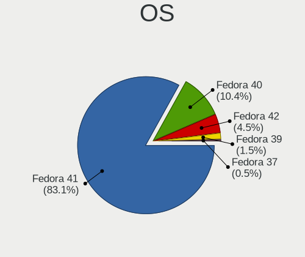
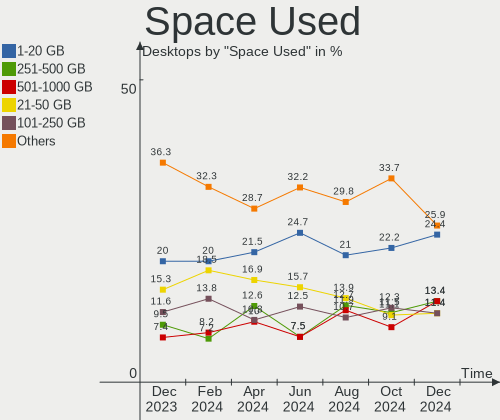
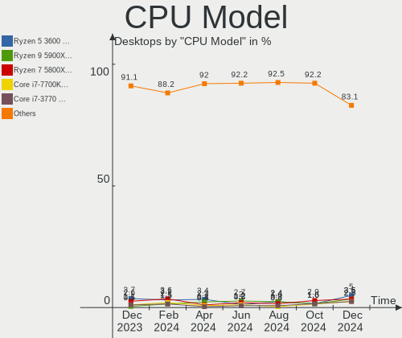
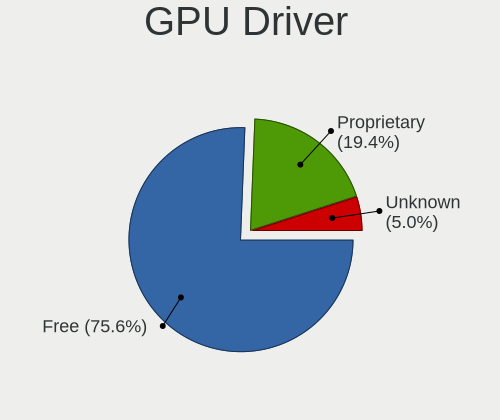
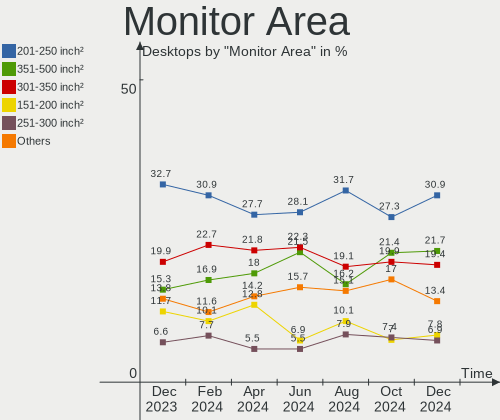

Fedora - Hardware Trends (Desktops)
-----------------------------------

A project to identify most popular hardware characteristics and track their change
over time based on data collected by Linux users at https://Linux-Hardware.org.

Anyone can contribute to this report by the [hw-probe](https://github.com/linuxhw/hw-probe) tool:

    sudo -E hw-probe -all -upload

This report is for one last month. Overall report since the beginning of time: [TestDays](https://github.com/linuxhw/TestDays)

Period: Feb, 2023.

Contents
--------

* [ System ](#system)
  - [ OS                       ](#os)
  - [ OS Family                ](#os-family)
  - [ Kernel                   ](#kernel)
  - [ Kernel Family            ](#kernel-family)
  - [ Kernel Major Ver.        ](#kernel-major-ver)
  - [ Arch                     ](#arch)
  - [ DE                       ](#de)
  - [ Display Server           ](#display-server)
  - [ Display Manager          ](#display-manager)
  - [ OS Lang                  ](#os-lang)
  - [ Boot Mode                ](#boot-mode)
  - [ Filesystem               ](#filesystem)
  - [ Part. scheme             ](#part-scheme)
  - [ Dual Boot with Linux/BSD ](#dual-boot-with-linuxbsd)
  - [ Dual Boot (Win)          ](#dual-boot-win)

* [ Board ](#board)
  - [ Vendor                   ](#vendor)
  - [ Model                    ](#model)
  - [ Model Family             ](#model-family)
  - [ MFG Year                 ](#mfg-year)
  - [ Form Factor              ](#form-factor)
  - [ Secure Boot              ](#secure-boot)
  - [ Coreboot                 ](#coreboot)
  - [ RAM Size                 ](#ram-size)
  - [ RAM Used                 ](#ram-used)
  - [ Total Drives             ](#total-drives)
  - [ Has CD-ROM               ](#has-cd-rom)
  - [ Has Ethernet             ](#has-ethernet)
  - [ Has WiFi                 ](#has-wifi)
  - [ Has Bluetooth            ](#has-bluetooth)

* [ Location ](#location)
  - [ Country                  ](#country)
  - [ City                     ](#city)

* [ Drives ](#drives)
  - [ Drive Vendor             ](#drive-vendor)
  - [ Drive Model              ](#drive-model)
  - [ HDD Vendor               ](#hdd-vendor)
  - [ SSD Vendor               ](#ssd-vendor)
  - [ Drive Kind               ](#drive-kind)
  - [ Drive Connector          ](#drive-connector)
  - [ Drive Size               ](#drive-size)
  - [ Space Total              ](#space-total)
  - [ Space Used               ](#space-used)
  - [ Malfunc. Drives          ](#malfunc-drives)
  - [ Malfunc. Drive Vendor    ](#malfunc-drive-vendor)
  - [ Malfunc. HDD Vendor      ](#malfunc-hdd-vendor)
  - [ Malfunc. Drive Kind      ](#malfunc-drive-kind)
  - [ Failed Drives            ](#failed-drives)
  - [ Failed Drive Vendor      ](#failed-drive-vendor)
  - [ Drive Status             ](#drive-status)

* [ Storage controller ](#storage-controller)
  - [ Storage Vendor           ](#storage-vendor)
  - [ Storage Model            ](#storage-model)
  - [ Storage Kind             ](#storage-kind)

* [ Processor ](#processor)
  - [ CPU Vendor               ](#cpu-vendor)
  - [ CPU Model                ](#cpu-model)
  - [ CPU Model Family         ](#cpu-model-family)
  - [ CPU Cores                ](#cpu-cores)
  - [ CPU Sockets              ](#cpu-sockets)
  - [ CPU Threads              ](#cpu-threads)
  - [ CPU Op-Modes             ](#cpu-op-modes)
  - [ CPU Microcode            ](#cpu-microcode)
  - [ CPU Microarch            ](#cpu-microarch)

* [ Graphics ](#graphics)
  - [ GPU Vendor               ](#gpu-vendor)
  - [ GPU Model                ](#gpu-model)
  - [ GPU Combo                ](#gpu-combo)
  - [ GPU Driver               ](#gpu-driver)
  - [ GPU Memory               ](#gpu-memory)

* [ Monitor ](#monitor)
  - [ Monitor Vendor           ](#monitor-vendor)
  - [ Monitor Model            ](#monitor-model)
  - [ Monitor Resolution       ](#monitor-resolution)
  - [ Monitor Diagonal         ](#monitor-diagonal)
  - [ Monitor Width            ](#monitor-width)
  - [ Aspect Ratio             ](#aspect-ratio)
  - [ Monitor Area             ](#monitor-area)
  - [ Pixel Density            ](#pixel-density)
  - [ Multiple Monitors        ](#multiple-monitors)

* [ Network ](#network)
  - [ Net Controller Vendor    ](#net-controller-vendor)
  - [ Net Controller Model     ](#net-controller-model)
  - [ Wireless Vendor          ](#wireless-vendor)
  - [ Wireless Model           ](#wireless-model)
  - [ Ethernet Vendor          ](#ethernet-vendor)
  - [ Ethernet Model           ](#ethernet-model)
  - [ Net Controller Kind      ](#net-controller-kind)
  - [ Used Controller          ](#used-controller)
  - [ NICs                     ](#nics)
  - [ IPv6                     ](#ipv6)

* [ Bluetooth ](#bluetooth)
  - [ Bluetooth Vendor         ](#bluetooth-vendor)
  - [ Bluetooth Model          ](#bluetooth-model)

* [ Sound ](#sound)
  - [ Sound Vendor             ](#sound-vendor)
  - [ Sound Model              ](#sound-model)

* [ Memory ](#memory)
  - [ Memory Vendor            ](#memory-vendor)
  - [ Memory Model             ](#memory-model)
  - [ Memory Kind              ](#memory-kind)
  - [ Memory Form Factor       ](#memory-form-factor)
  - [ Memory Size              ](#memory-size)
  - [ Memory Speed             ](#memory-speed)

* [ Printers & scanners ](#printers--scanners)
  - [ Printer Vendor           ](#printer-vendor)
  - [ Printer Model            ](#printer-model)
  - [ Scanner Vendor           ](#scanner-vendor)
  - [ Scanner Model            ](#scanner-model)

* [ Camera ](#camera)
  - [ Camera Vendor            ](#camera-vendor)
  - [ Camera Model             ](#camera-model)

* [ Security ](#security)
  - [ Fingerprint Vendor       ](#fingerprint-vendor)
  - [ Fingerprint Model        ](#fingerprint-model)
  - [ Chipcard Vendor          ](#chipcard-vendor)
  - [ Chipcard Model           ](#chipcard-model)

* [ Unsupported ](#unsupported)
  - [ Unsupported Devices      ](#unsupported-devices)
  - [ Unsupported Device Types ](#unsupported-device-types)

System
------

OS
--

Installed operating systems

| Name      | Desktops | Percent |
|-----------|----------|---------|
| Fedora 37 | 97       | 83.62%  |
| Fedora 36 | 13       | 11.21%  |
| Fedora 35 | 3        | 2.59%   |
| Fedora 38 | 2        | 1.72%   |
| Fedora 33 | 1        | 0.86%   |

OS Family
---------

OS without a version

| Name   | Desktops | Percent |
|--------|----------|---------|
| Fedora | 116      | 100%    |

Kernel
------

Version of the Linux kernel

| Version                      | Desktops | Percent |
|------------------------------|----------|---------|
| 6.1.11-200.fc37.x86_64       | 21       | 18.1%   |
| 6.1.9-200.fc37.x86_64        | 20       | 17.24%  |
| 6.1.8-200.fc37.x86_64        | 19       | 16.38%  |
| 6.1.10-200.fc37.x86_64       | 12       | 10.34%  |
| 6.1.12-200.fc37.x86_64       | 8        | 6.9%    |
| 6.1.13-200.fc37.x86_64       | 7        | 6.03%   |
| 6.1.7-200.fc37.x86_64        | 3        | 2.59%   |
| 6.2.0-63.fc38.x86_64         | 2        | 1.72%   |
| 6.1.9-100.fc36.x86_64        | 2        | 1.72%   |
| 6.1.8-100.fc36.x86_64        | 2        | 1.72%   |
| 6.0.7-301.fc37.x86_64        | 2        | 1.72%   |
| 6.0.12-100.fc35.x86_64       | 2        | 1.72%   |
| 6.1.8-200.fc37.x86_64+debug  | 1        | 0.86%   |
| 6.1.6-200.fc37.x86_64        | 1        | 0.86%   |
| 6.1.6-100.fc36.x86_64        | 1        | 0.86%   |
| 6.1.5-200.fc37.x86_64        | 1        | 0.86%   |
| 6.1.11-201.fsync.fc37.x86_64 | 1        | 0.86%   |
| 6.1.11-100.fc36.x86_64       | 1        | 0.86%   |
| 6.1.10-100.fc36.x86_64       | 1        | 0.86%   |
| 6.0.9                        | 1        | 0.86%   |
| 6.0.7-200.fc36.x86_64        | 1        | 0.86%   |
| 6.0.15-200.fc36.x86_64       | 1        | 0.86%   |
| 6.0.11-300.fc37.x86_64       | 1        | 0.86%   |
| 5.19.16-200.fc36.x86_64      | 1        | 0.86%   |
| 5.19.11-200.fc36.x86_64      | 1        | 0.86%   |
| 5.18.19-200.fc36.x86_64      | 1        | 0.86%   |
| 5.15.14-200.fc35.x86_64      | 1        | 0.86%   |
| 5.14.18-100.fc33.x86_64      | 1        | 0.86%   |

Kernel Family
-------------

Linux kernel without a distro release

| Version | Desktops | Percent |
|---------|----------|---------|
| 6.1.11  | 23       | 19.83%  |
| 6.1.9   | 22       | 18.97%  |
| 6.1.8   | 22       | 18.97%  |
| 6.1.10  | 13       | 11.21%  |
| 6.1.12  | 8        | 6.9%    |
| 6.1.13  | 7        | 6.03%   |
| 6.1.7   | 3        | 2.59%   |
| 6.0.7   | 3        | 2.59%   |
| 6.2.0   | 2        | 1.72%   |
| 6.1.6   | 2        | 1.72%   |
| 6.0.12  | 2        | 1.72%   |
| 6.1.5   | 1        | 0.86%   |
| 6.0.9   | 1        | 0.86%   |
| 6.0.15  | 1        | 0.86%   |
| 6.0.11  | 1        | 0.86%   |
| 5.19.16 | 1        | 0.86%   |
| 5.19.11 | 1        | 0.86%   |
| 5.18.19 | 1        | 0.86%   |
| 5.15.14 | 1        | 0.86%   |
| 5.14.18 | 1        | 0.86%   |

Kernel Major Ver.
-----------------

Linux kernel major version

| Version | Desktops | Percent |
|---------|----------|---------|
| 6.1     | 101      | 87.07%  |
| 6.0     | 8        | 6.9%    |
| 6.2     | 2        | 1.72%   |
| 5.19    | 2        | 1.72%   |
| 5.18    | 1        | 0.86%   |
| 5.15    | 1        | 0.86%   |
| 5.14    | 1        | 0.86%   |

Arch
----

OS architecture (x86_64, i586, etc.)

| Name   | Desktops | Percent |
|--------|----------|---------|
| x86_64 | 116      | 100%    |

DE
--

Desktop Environment

| Name          | Desktops | Percent |
|---------------|----------|---------|
| GNOME         | 77       | 66.38%  |
| KDE5          | 23       | 19.83%  |
| Unknown       | 5        | 4.31%   |
| GNOME Classic | 4        | 3.45%   |
| Cinnamon      | 4        | 3.45%   |
| X-Cinnamon    | 1        | 0.86%   |
| sway          | 1        | 0.86%   |
| bspwm         | 1        | 0.86%   |

Display Server
--------------

X11 or Wayland

| Name    | Desktops | Percent |
|---------|----------|---------|
| Wayland | 69       | 59.48%  |
| X11     | 36       | 31.03%  |
| Tty     | 9        | 7.76%   |
| Unknown | 2        | 1.72%   |

Display Manager
---------------

SDDM, LightDM, etc.

| Name    | Desktops | Percent |
|---------|----------|---------|
| Unknown | 76       | 65.52%  |
| GDM     | 24       | 20.69%  |
| LightDM | 10       | 8.62%   |
| SDDM    | 6        | 5.17%   |

OS Lang
-------

Language

| Lang  | Desktops | Percent |
|-------|----------|---------|
| en_US | 55       | 47.41%  |
| en_GB | 12       | 10.34%  |
| ru_RU | 9        | 7.76%   |
| en_AU | 9        | 7.76%   |
| de_DE | 6        | 5.17%   |
| pt_BR | 3        | 2.59%   |
| fr_FR | 3        | 2.59%   |
| en_CA | 3        | 2.59%   |
| vi_VN | 2        | 1.72%   |
| ko_KR | 2        | 1.72%   |
| it_IT | 2        | 1.72%   |
| cs_CZ | 2        | 1.72%   |
| sv_SE | 1        | 0.86%   |
| pl_PL | 1        | 0.86%   |
| nb_NO | 1        | 0.86%   |
| es_US | 1        | 0.86%   |
| es_SV | 1        | 0.86%   |
| es_MX | 1        | 0.86%   |
| es_ES | 1        | 0.86%   |
| en_IN | 1        | 0.86%   |

Boot Mode
---------

EFI or BIOS

| Mode | Desktops | Percent |
|------|----------|---------|
| EFI  | 82       | 70.69%  |
| BIOS | 34       | 29.31%  |

Filesystem
----------

Type of filesystem

| Type  | Desktops | Percent |
|-------|----------|---------|
| Btrfs | 88       | 75.86%  |
| Ext4  | 23       | 19.83%  |
| Xfs   | 5        | 4.31%   |

Part. scheme
------------

Scheme of partitioning

| Type    | Desktops | Percent |
|---------|----------|---------|
| Unknown | 71       | 61.21%  |
| GPT     | 35       | 30.17%  |
| MBR     | 10       | 8.62%   |

Dual Boot with Linux/BSD
------------------------

Hosting more than one Linux/BSD

| Dual boot | Desktops | Percent |
|-----------|----------|---------|
| No        | 99       | 85.34%  |
| Yes       | 17       | 14.66%  |

Dual Boot (Win)
---------------

Hosting Linux and Windows

| Dual boot | Desktops | Percent |
|-----------|----------|---------|
| No        | 100      | 86.21%  |
| Yes       | 16       | 13.79%  |

Board
-----

Vendor
------

Motherboard manufacturer

| Name                | Desktops | Percent |
|---------------------|----------|---------|
| ASUSTek Computer    | 40       | 34.48%  |
| MSI                 | 19       | 16.38%  |
| Gigabyte Technology | 19       | 16.38%  |
| ASRock              | 17       | 14.66%  |
| Hewlett-Packard     | 3        | 2.59%   |
| Dell                | 3        | 2.59%   |
| Pegatron            | 2        | 1.72%   |
| Lenovo              | 2        | 1.72%   |
| Intel               | 2        | 1.72%   |
| Acer                | 2        | 1.72%   |
| Supermicro          | 1        | 0.86%   |
| Gateway             | 1        | 0.86%   |
| Fujitsu             | 1        | 0.86%   |
| Compal              | 1        | 0.86%   |
| BESSTAR Tech        | 1        | 0.86%   |
| AZW                 | 1        | 0.86%   |
| ASRockRack          | 1        | 0.86%   |

Model
-----

Motherboard model

| Name                                   | Desktops | Percent |
|----------------------------------------|----------|---------|
| MSI MS-7885                            | 3        | 2.59%   |
| ASUS All Series                        | 3        | 2.59%   |
| MSI MS-7C84                            | 2        | 1.72%   |
| MSI MS-7971                            | 2        | 1.72%   |
| Gigabyte J1900M-D2P                    | 2        | 1.72%   |
| ASUS TUF Gaming X570-PLUS              | 2        | 1.72%   |
| ASUS ProArt X670E-CREATOR WIFI         | 2        | 1.72%   |
| ASUS PRIME B450M-A II                  | 2        | 1.72%   |
| ASRock X570 Phantom Gaming 4           | 2        | 1.72%   |
| Supermicro SYS-7048GR-TR               | 1        | 0.86%   |
| Pegatron IPXSB-H61                     | 1        | 0.86%   |
| Pegatron Elite 7200 MT Business PC     | 1        | 0.86%   |
| MSI MS-7D08                            | 1        | 0.86%   |
| MSI MS-7C94                            | 1        | 0.86%   |
| MSI MS-7C89                            | 1        | 0.86%   |
| MSI MS-7C37                            | 1        | 0.86%   |
| MSI MS-7B10                            | 1        | 0.86%   |
| MSI MS-7A64                            | 1        | 0.86%   |
| MSI MS-7A38                            | 1        | 0.86%   |
| MSI MS-7A15                            | 1        | 0.86%   |
| MSI MS-7984                            | 1        | 0.86%   |
| MSI MS-7866                            | 1        | 0.86%   |
| MSI MS-7721                            | 1        | 0.86%   |
| MSI Elite 7100 Microtower PC           | 1        | 0.86%   |
| Lenovo ThinkCentre M58 8910B4U         | 1        | 0.86%   |
| Lenovo 70A4000HUX ThinkServer TS140    | 1        | 0.86%   |
| Intel X99                              | 1        | 0.86%   |
| Intel LADPNVMO AAE76523-300            | 1        | 0.86%   |
| HP Z620 Workstation                    | 1        | 0.86%   |
| HP Z420 Workstation                    | 1        | 0.86%   |
| HP ProDesk 600 G6 Small Form Factor PC | 1        | 0.86%   |
| Gigabyte Z790 GAMING X AX              | 1        | 0.86%   |
| Gigabyte Z77MX-D3H                     | 1        | 0.86%   |
| Gigabyte Z490 VISION D                 | 1        | 0.86%   |
| Gigabyte Z370 AORUS Ultra Gaming       | 1        | 0.86%   |
| Gigabyte Z370 AORUS Gaming 5           | 1        | 0.86%   |
| Gigabyte Z170MX-Gaming 5               | 1        | 0.86%   |
| Gigabyte H510M S2                      | 1        | 0.86%   |
| Gigabyte H410M DS2V                    | 1        | 0.86%   |
| Gigabyte H310M S2 2.0                  | 1        | 0.86%   |

Model Family
------------

Motherboard model prefix

| Name                     | Desktops | Percent |
|--------------------------|----------|---------|
| ASUS ROG                 | 12       | 10.34%  |
| ASUS PRIME               | 8        | 6.9%    |
| ASUS TUF                 | 6        | 5.17%   |
| MSI MS-7885              | 3        | 2.59%   |
| ASUS ProArt              | 3        | 2.59%   |
| ASUS All                 | 3        | 2.59%   |
| MSI MS-7C84              | 2        | 1.72%   |
| MSI MS-7971              | 2        | 1.72%   |
| Gigabyte Z370            | 2        | 1.72%   |
| Gigabyte J1900M-D2P      | 2        | 1.72%   |
| Gigabyte H310M           | 2        | 1.72%   |
| Gigabyte B550            | 2        | 1.72%   |
| Dell XPS                 | 2        | 1.72%   |
| ASRock X570              | 2        | 1.72%   |
| ASRock B450M             | 2        | 1.72%   |
| Acer Veriton             | 2        | 1.72%   |
| Supermicro SYS-7048GR-TR | 1        | 0.86%   |
| Pegatron IPXSB-H61       | 1        | 0.86%   |
| Pegatron Elite           | 1        | 0.86%   |
| MSI MS-7D08              | 1        | 0.86%   |
| MSI MS-7C94              | 1        | 0.86%   |
| MSI MS-7C89              | 1        | 0.86%   |
| MSI MS-7C37              | 1        | 0.86%   |
| MSI MS-7B10              | 1        | 0.86%   |
| MSI MS-7A64              | 1        | 0.86%   |
| MSI MS-7A38              | 1        | 0.86%   |
| MSI MS-7A15              | 1        | 0.86%   |
| MSI MS-7984              | 1        | 0.86%   |
| MSI MS-7866              | 1        | 0.86%   |
| MSI MS-7721              | 1        | 0.86%   |
| MSI Elite                | 1        | 0.86%   |
| Lenovo ThinkCentre       | 1        | 0.86%   |
| Lenovo 70A4000HUX        | 1        | 0.86%   |
| Intel X99                | 1        | 0.86%   |
| Intel LADPNVMO           | 1        | 0.86%   |
| HP Z620                  | 1        | 0.86%   |
| HP Z420                  | 1        | 0.86%   |
| HP ProDesk               | 1        | 0.86%   |
| Gigabyte Z790            | 1        | 0.86%   |
| Gigabyte Z77MX-D3H       | 1        | 0.86%   |

MFG Year
--------

Motherboard manufacture year

| Year | Desktops | Percent |
|------|----------|---------|
| 2020 | 19       | 16.38%  |
| 2019 | 14       | 12.07%  |
| 2022 | 12       | 10.34%  |
| 2017 | 12       | 10.34%  |
| 2018 | 9        | 7.76%   |
| 2021 | 8        | 6.9%    |
| 2015 | 8        | 6.9%    |
| 2013 | 7        | 6.03%   |
| 2012 | 7        | 6.03%   |
| 2014 | 6        | 5.17%   |
| 2010 | 4        | 3.45%   |
| 2016 | 3        | 2.59%   |
| 2011 | 3        | 2.59%   |
| 2008 | 3        | 2.59%   |
| 2006 | 1        | 0.86%   |

Form Factor
-----------

Physical design of the computer

| Name    | Desktops | Percent |
|---------|----------|---------|
| Desktop | 116      | 100%    |

Secure Boot
-----------

Enabled or disabled

| State    | Desktops | Percent |
|----------|----------|---------|
| Disabled | 105      | 90.52%  |
| Enabled  | 11       | 9.48%   |

Coreboot
--------

Have coreboot on board

| Used | Desktops | Percent |
|------|----------|---------|
| No   | 116      | 100%    |

RAM Size
--------

Total RAM memory

| Size in GB  | Desktops | Percent |
|-------------|----------|---------|
| 16.01-24.0  | 35       | 30.17%  |
| 32.01-64.0  | 27       | 23.28%  |
| 64.01-256.0 | 16       | 13.79%  |
| 8.01-16.0   | 14       | 12.07%  |
| 4.01-8.0    | 10       | 8.62%   |
| 24.01-32.0  | 10       | 8.62%   |
| 3.01-4.0    | 4        | 3.45%   |

RAM Used
--------

Used RAM memory

| Used GB     | Desktops | Percent |
|-------------|----------|---------|
| 4.01-8.0    | 48       | 41.38%  |
| 3.01-4.0    | 16       | 13.79%  |
| 2.01-3.0    | 16       | 13.79%  |
| 8.01-16.0   | 14       | 12.07%  |
| 1.01-2.0    | 13       | 11.21%  |
| 0.51-1.0    | 5        | 4.31%   |
| 16.01-24.0  | 2        | 1.72%   |
| 24.01-32.0  | 1        | 0.86%   |
| 64.01-256.0 | 1        | 0.86%   |

Total Drives
------------

Number of drives on board

| Drives | Desktops | Percent |
|--------|----------|---------|
| 2      | 37       | 31.9%   |
| 3      | 25       | 21.55%  |
| 1      | 19       | 16.38%  |
| 4      | 16       | 13.79%  |
| 5      | 10       | 8.62%   |
| 6      | 6        | 5.17%   |
| 7      | 2        | 1.72%   |
| 9      | 1        | 0.86%   |

Has CD-ROM
----------

Has CD-ROM on board

| Presented | Desktops | Percent |
|-----------|----------|---------|
| No        | 77       | 66.38%  |
| Yes       | 39       | 33.62%  |

Has Ethernet
------------

Has Ethernet on board

| Presented | Desktops | Percent |
|-----------|----------|---------|
| Yes       | 115      | 99.14%  |
| No        | 1        | 0.86%   |

Has WiFi
--------

Has WiFi module

| Presented | Desktops | Percent |
|-----------|----------|---------|
| Yes       | 60       | 51.72%  |
| No        | 56       | 48.28%  |

Has Bluetooth
-------------

Has Bluetooth module

| Presented | Desktops | Percent |
|-----------|----------|---------|
| No        | 66       | 56.9%   |
| Yes       | 50       | 43.1%   |

Location
--------

Country
-------

Geographic location (country)

| Country     | Desktops | Percent |
|-------------|----------|---------|
| USA         | 29       | 25%     |
| Russia      | 10       | 8.62%   |
| Australia   | 9        | 7.76%   |
| Germany     | 7        | 6.03%   |
| Norway      | 5        | 4.31%   |
| Italy       | 5        | 4.31%   |
| Brazil      | 5        | 4.31%   |
| Sweden      | 4        | 3.45%   |
| France      | 4        | 3.45%   |
| Canada      | 4        | 3.45%   |
| Vietnam     | 3        | 2.59%   |
| Turkey      | 3        | 2.59%   |
| India       | 3        | 2.59%   |
| UK          | 2        | 1.72%   |
| South Korea | 2        | 1.72%   |
| Netherlands | 2        | 1.72%   |
| Czechia     | 2        | 1.72%   |
| Belgium     | 2        | 1.72%   |
| Thailand    | 1        | 0.86%   |
| Spain       | 1        | 0.86%   |
| Poland      | 1        | 0.86%   |
| New Zealand | 1        | 0.86%   |
| Mexico      | 1        | 0.86%   |
| Luxembourg  | 1        | 0.86%   |
| Latvia      | 1        | 0.86%   |
| Hungary     | 1        | 0.86%   |
| El Salvador | 1        | 0.86%   |
| Denmark     | 1        | 0.86%   |
| Colombia    | 1        | 0.86%   |
| Bulgaria    | 1        | 0.86%   |
| Bolivia     | 1        | 0.86%   |
| Austria     | 1        | 0.86%   |
| Algeria     | 1        | 0.86%   |

City
----

Geographic location (city)

| City           | Desktops | Percent |
|----------------|----------|---------|
| Sydney         | 7        | 6.03%   |
| Moscow         | 4        | 3.45%   |
| St Petersburg  | 2        | 1.72%   |
| Seattle        | 2        | 1.72%   |
| Regina         | 2        | 1.72%   |
| Liberec        | 2        | 1.72%   |
| Kristiansand   | 2        | 1.72%   |
| Kansas City    | 2        | 1.72%   |
| Delhi          | 2        | 1.72%   |
| Bac Giang      | 2        | 1.72%   |
| Zapopan        | 1        | 0.86%   |
| Yekaterinburg  | 1        | 0.86%   |
| Winnsboro      | 1        | 0.86%   |
| Wielsbeke      | 1        | 0.86%   |
| Weinsberg      | 1        | 0.86%   |
| Warsaw         | 1        | 0.86%   |
| Villanders     | 1        | 0.86%   |
| Västerås     | 1        | 0.86%   |
| Varna          | 1        | 0.86%   |
| Thrissur       | 1        | 0.86%   |
| Temecula       | 1        | 0.86%   |
| Stockholm      | 1        | 0.86%   |
| Stavanger      | 1        | 0.86%   |
| Starkville     | 1        | 0.86%   |
| South Bend     | 1        | 0.86%   |
| Sonoma         | 1        | 0.86%   |
| Songkhla       | 1        | 0.86%   |
| Siloam Springs | 1        | 0.86%   |
| Seffner        | 1        | 0.86%   |
| San Salvador   | 1        | 0.86%   |
| Rome           | 1        | 0.86%   |
| Rio de Janeiro | 1        | 0.86%   |
| Riga           | 1        | 0.86%   |
| Pyeongtaek-si  | 1        | 0.86%   |
| Pouso Alegre   | 1        | 0.86%   |
| Paris          | 1        | 0.86%   |
| Pamiers        | 1        | 0.86%   |
| Ottawa         | 1        | 0.86%   |
| Orenburg       | 1        | 0.86%   |
| Olympia        | 1        | 0.86%   |

Drives
------

Drive Vendor
------------

Hard drive vendors

| Vendor                       | Desktops | Drives | Percent |
|------------------------------|----------|--------|---------|
| Samsung Electronics          | 43       | 76     | 17.34%  |
| WDC                          | 40       | 66     | 16.13%  |
| Seagate                      | 38       | 46     | 15.32%  |
| SanDisk                      | 16       | 21     | 6.45%   |
| Kingston                     | 14       | 17     | 5.65%   |
| Toshiba                      | 12       | 12     | 4.84%   |
| Crucial                      | 12       | 18     | 4.84%   |
| Phison Electronics           | 9        | 10     | 3.63%   |
| HGST                         | 5        | 8      | 2.02%   |
| China                        | 5        | 5      | 2.02%   |
| A-DATA Technology            | 5        | 5      | 2.02%   |
| Intel                        | 4        | 4      | 1.61%   |
| Corsair                      | 4        | 5      | 1.61%   |
| SK hynix                     | 3        | 3      | 1.21%   |
| PNY                          | 3        | 3      | 1.21%   |
| Team                         | 2        | 2      | 0.81%   |
| Micron/Crucial Technology    | 2        | 2      | 0.81%   |
| LITEONIT                     | 2        | 2      | 0.81%   |
| Kingston Technology Company  | 2        | 2      | 0.81%   |
| JMicron Technology           | 2        | 2      | 0.81%   |
| Gigabyte Technology          | 2        | 2      | 0.81%   |
| XPG                          | 1        | 1      | 0.4%    |
| VSP                          | 1        | 1      | 0.4%    |
| Unknown                      | 1        | 3      | 0.4%    |
| Transcend                    | 1        | 1      | 0.4%    |
| Synology                     | 1        | 2      | 0.4%    |
| SPCC                         | 1        | 1      | 0.4%    |
| Silicon Motion               | 1        | 1      | 0.4%    |
| Shenzhen Longsys Electronics | 1        | 1      | 0.4%    |
| Realtek Semiconductor        | 1        | 1      | 0.4%    |
| Realtek                      | 1        | 1      | 0.4%    |
| Plextor                      | 1        | 1      | 0.4%    |
| Phison                       | 1        | 1      | 0.4%    |
| Patriot                      | 1        | 1      | 0.4%    |
| Netac                        | 1        | 1      | 0.4%    |
| Mac                          | 1        | 1      | 0.4%    |
| LT                           | 1        | 1      | 0.4%    |
| KingSpec                     | 1        | 1      | 0.4%    |
| Intenso                      | 1        | 1      | 0.4%    |
| Hitachi                      | 1        | 1      | 0.4%    |

Drive Model
-----------

Hard drive models

| Model                                                | Desktops | Percent |
|------------------------------------------------------|----------|---------|
| Samsung NVMe SSD Controller SM981/PM981/PM983 250GB  | 11       | 3.64%   |
| Samsung NVMe SSD Controller PM9A1/PM9A3/980PRO 960GB | 7        | 2.32%   |
| Seagate ST2000DM008-2FR102 2TB                       | 6        | 1.99%   |
| Phison E12 NVMe Controller 1024GB                    | 6        | 1.99%   |
| WDC WD10EZEX-08WN4A0 1TB                             | 4        | 1.32%   |
| Samsung SSD 870 QVO 2TB                              | 4        | 1.32%   |
| Samsung SSD 860 EVO 1TB                              | 4        | 1.32%   |
| Samsung SSD 850 EVO 500GB                            | 4        | 1.32%   |
| Samsung SSD 850 EVO 250GB                            | 4        | 1.32%   |
| WDC WDS500G2B0A-00SM50 500GB SSD                     | 3        | 0.99%   |
| WDC WD10EZEX-08M2NA0 1TB                             | 3        | 0.99%   |
| Seagate ST4000DM004-2CV104 4TB                       | 3        | 0.99%   |
| Seagate ST1000LM024 HN-M101MBB 1TB                   | 3        | 0.99%   |
| Samsung SSD 870 EVO 500GB                            | 3        | 0.99%   |
| Samsung SSD 860 EVO 500GB                            | 3        | 0.99%   |
| Samsung NVMe SSD Controller SM961/PM961/SM963 512GB  | 3        | 0.99%   |
| Kingston SA400S37120G 120GB SSD                      | 3        | 0.99%   |
| Crucial CT240BX500SSD1 240GB                         | 3        | 0.99%   |
| Crucial CT1000MX500SSD1 1TB                          | 3        | 0.99%   |
| WDC WD20EZRZ-00Z5HB0 2TB                             | 2        | 0.66%   |
| WDC WD10EZEX-21WN4A0 1TB                             | 2        | 0.66%   |
| WDC WD10EZEX-00WN4A0 1TB                             | 2        | 0.66%   |
| Toshiba HDWD110 1TB                                  | 2        | 0.66%   |
| Seagate ST8000VN004-2M2101 8TB                       | 2        | 0.66%   |
| Seagate ST4000VN008-2DR166 4TB                       | 2        | 0.66%   |
| Seagate ST1000DM003-1CH162 1TB                       | 2        | 0.66%   |
| Seagate Expansion Desk 5TB                           | 2        | 0.66%   |
| Seagate Expansion 1TB                                | 2        | 0.66%   |
| Sandisk WD Black SN750 / PC SN730 NVMe SSD 512GB     | 2        | 0.66%   |
| SanDisk SSD PLUS 1000GB                              | 2        | 0.66%   |
| SanDisk NVMe SSD Drive 1TB                           | 2        | 0.66%   |
| Samsung SSD 840 EVO 120GB                            | 2        | 0.66%   |
| PNY CS900 240GB SSD                                  | 2        | 0.66%   |
| Micron/Crucial P2 NVMe PCIe SSD 1TB                  | 2        | 0.66%   |
| Kingston SV300S37A240G 240GB SSD                     | 2        | 0.66%   |
| Kingston SA400S37960G 960GB SSD                      | 2        | 0.66%   |
| Kingston SA400S37480G 480GB SSD                      | 2        | 0.66%   |
| Kingston SA400S37240G 240GB SSD                      | 2        | 0.66%   |
| JMicron Tech 250GB                                   | 2        | 0.66%   |
| Crucial CT500MX500SSD1 500GB                         | 2        | 0.66%   |

HDD Vendor
----------

Hard disk drive vendors

| Vendor              | Desktops | Drives | Percent |
|---------------------|----------|--------|---------|
| Seagate             | 38       | 46     | 41.76%  |
| WDC                 | 37       | 57     | 40.66%  |
| Toshiba             | 8        | 8      | 8.79%   |
| HGST                | 5        | 8      | 5.49%   |
| Synology            | 1        | 2      | 1.1%    |
| Samsung Electronics | 1        | 2      | 1.1%    |
| Hitachi             | 1        | 1      | 1.1%    |

SSD Vendor
----------

Solid state drive vendors

| Vendor              | Desktops | Drives | Percent |
|---------------------|----------|--------|---------|
| Samsung Electronics | 31       | 41     | 31%     |
| Kingston            | 12       | 13     | 12%     |
| Crucial             | 11       | 17     | 11%     |
| SanDisk             | 7        | 8      | 7%      |
| WDC                 | 6        | 7      | 6%      |
| China               | 5        | 5      | 5%      |
| A-DATA Technology   | 5        | 5      | 5%      |
| PNY                 | 3        | 3      | 3%      |
| Intel               | 3        | 3      | 3%      |
| Toshiba             | 2        | 2      | 2%      |
| LITEONIT            | 2        | 2      | 2%      |
| VSP                 | 1        | 1      | 1%      |
| Transcend           | 1        | 1      | 1%      |
| Team                | 1        | 1      | 1%      |
| SPCC                | 1        | 1      | 1%      |
| Plextor             | 1        | 1      | 1%      |
| Patriot             | 1        | 1      | 1%      |
| LT                  | 1        | 1      | 1%      |
| KingSpec            | 1        | 1      | 1%      |
| Intenso             | 1        | 1      | 1%      |
| Gigabyte Technology | 1        | 1      | 1%      |
| Corsair             | 1        | 1      | 1%      |
| Apacer              | 1        | 1      | 1%      |
| ALLIED              | 1        | 1      | 1%      |

Drive Kind
----------

HDD or SSD

| Kind    | Desktops | Drives | Percent |
|---------|----------|--------|---------|
| SSD     | 81       | 119    | 36.82%  |
| HDD     | 75       | 124    | 34.09%  |
| NVMe    | 59       | 88     | 26.82%  |
| Unknown | 5        | 7      | 2.27%   |

Drive Connector
---------------

SATA, SAS, NVMe, etc.

| Type | Desktops | Drives | Percent |
|------|----------|--------|---------|
| SATA | 105      | 238    | 60.34%  |
| NVMe | 59       | 87     | 33.91%  |
| SAS  | 10       | 13     | 5.75%   |

Drive Size
----------

Size of hard drive

| Size in TB | Desktops | Drives | Percent |
|------------|----------|--------|---------|
| 0.01-0.5   | 69       | 101    | 38.98%  |
| 0.51-1.0   | 55       | 69     | 31.07%  |
| 1.01-2.0   | 22       | 28     | 12.43%  |
| 3.01-4.0   | 13       | 23     | 7.34%   |
| 4.01-10.0  | 13       | 15     | 7.34%   |
| 2.01-3.0   | 4        | 5      | 2.26%   |
| 10.01-20.0 | 1        | 2      | 0.56%   |

Space Total
-----------

Amount of disk space available on the file system

| Size in GB     | Desktops | Percent |
|----------------|----------|---------|
| More than 3000 | 31       | 26.72%  |
| 1001-2000      | 20       | 17.24%  |
| 501-1000       | 19       | 16.38%  |
| 251-500        | 16       | 13.79%  |
| 2001-3000      | 12       | 10.34%  |
| 101-250        | 10       | 8.62%   |
| Unknown        | 4        | 3.45%   |
| 21-50          | 2        | 1.72%   |
| 51-100         | 2        | 1.72%   |

Space Used
----------

Amount of used disk space

| Used GB        | Desktops | Percent |
|----------------|----------|---------|
| 101-250        | 21       | 18.1%   |
| 501-1000       | 16       | 13.79%  |
| 1001-2000      | 15       | 12.93%  |
| 21-50          | 13       | 11.21%  |
| 1-20           | 12       | 10.34%  |
| 251-500        | 11       | 9.48%   |
| More than 3000 | 10       | 8.62%   |
| 51-100         | 9        | 7.76%   |
| 2001-3000      | 5        | 4.31%   |
| Unknown        | 4        | 3.45%   |

Malfunc. Drives
---------------

Drive models with a malfunction

| Model                             | Desktops | Drives | Percent |
|-----------------------------------|----------|--------|---------|
| WDC WD5000AAKX-00ERMA0 500GB      | 1        | 1      | 10%     |
| WDC WD40PURZ-85AKKY0 4TB          | 1        | 1      | 10%     |
| WDC WD10EZEX-00WN4A0 1TB          | 1        | 1      | 10%     |
| Seagate ST500LM021-1KJ152 500GB   | 1        | 1      | 10%     |
| Seagate ST3000DM008-2DM166 3TB    | 1        | 1      | 10%     |
| Seagate ST3000DM001-1CH166 3TB    | 1        | 1      | 10%     |
| SanDisk SSD PLUS 240 GB           | 1        | 1      | 10%     |
| Samsung Electronics HD501LJ 500GB | 1        | 2      | 10%     |
| Intel SSDSC2CT120A3 120GB         | 1        | 1      | 10%     |
| A-DATA Technology SSD S599 64GB   | 1        | 1      | 10%     |

Malfunc. Drive Vendor
---------------------

Vendors of faulty drives

| Vendor              | Desktops | Drives | Percent |
|---------------------|----------|--------|---------|
| WDC                 | 3        | 3      | 30%     |
| Seagate             | 3        | 3      | 30%     |
| SanDisk             | 1        | 1      | 10%     |
| Samsung Electronics | 1        | 2      | 10%     |
| Intel               | 1        | 1      | 10%     |
| A-DATA Technology   | 1        | 1      | 10%     |

Malfunc. HDD Vendor
-------------------

Vendors of faulty HDD drives

| Vendor              | Desktops | Drives | Percent |
|---------------------|----------|--------|---------|
| WDC                 | 3        | 3      | 42.86%  |
| Seagate             | 3        | 3      | 42.86%  |
| Samsung Electronics | 1        | 2      | 14.29%  |

Malfunc. Drive Kind
-------------------

Kinds of faulty drives

| Kind | Desktops | Drives | Percent |
|------|----------|--------|---------|
| HDD  | 7        | 8      | 70%     |
| SSD  | 3        | 3      | 30%     |

Failed Drives
-------------

Failed drive models

Zero info for selected period =(

Failed Drive Vendor
-------------------

Failed drive vendors

Zero info for selected period =(

Drive Status
------------

Number of failed and malfunc. drives

| Status   | Desktops | Drives | Percent |
|----------|----------|--------|---------|
| Detected | 77       | 221    | 59.23%  |
| Works    | 43       | 106    | 33.08%  |
| Malfunc  | 10       | 11     | 7.69%   |

Storage controller
------------------

Storage Vendor
--------------

Storage controller vendors

| Vendor                       | Desktops | Percent |
|------------------------------|----------|---------|
| Intel                        | 67       | 33.84%  |
| AMD                          | 47       | 23.74%  |
| Samsung Electronics          | 24       | 12.12%  |
| Phison Electronics           | 13       | 6.57%   |
| SanDisk                      | 12       | 6.06%   |
| ASMedia Technology           | 10       | 5.05%   |
| Kingston Technology Company  | 6        | 3.03%   |
| SK hynix                     | 3        | 1.52%   |
| Micron/Crucial Technology    | 3        | 1.52%   |
| Marvell Technology Group     | 3        | 1.52%   |
| Toshiba America Info Systems | 2        | 1.01%   |
| Realtek Semiconductor        | 2        | 1.01%   |
| ADATA Technology             | 2        | 1.01%   |
| Silicon Motion               | 1        | 0.51%   |
| Shenzhen Longsys Electronics | 1        | 0.51%   |
| Netac Technology             | 1        | 0.51%   |
| LSI Logic / Symbios Logic    | 1        | 0.51%   |

Storage Model
-------------

Storage controller models

| Model                                                                                   | Desktops | Percent |
|-----------------------------------------------------------------------------------------|----------|---------|
| AMD FCH SATA Controller [AHCI mode]                                                     | 26       | 11.45%  |
| Samsung NVMe SSD Controller SM981/PM981/PM983                                           | 13       | 5.73%   |
| ASMedia ASM1062 Serial ATA Controller                                                   | 9        | 3.96%   |
| AMD 500 Series Chipset SATA Controller                                                  | 9        | 3.96%   |
| Samsung NVMe SSD Controller PM9A1/PM9A3/980PRO                                          | 8        | 3.52%   |
| Phison E12 NVMe Controller                                                              | 8        | 3.52%   |
| Intel 8 Series/C220 Series Chipset Family 6-port SATA Controller 1 [AHCI mode]          | 8        | 3.52%   |
| Intel 200 Series PCH SATA controller [AHCI mode]                                        | 8        | 3.52%   |
| Intel Q170/Q150/B150/H170/H110/Z170/CM236 Chipset SATA Controller [AHCI Mode]           | 7        | 3.08%   |
| AMD 400 Series Chipset SATA Controller                                                  | 7        | 3.08%   |
| Intel C610/X99 series chipset 6-Port SATA Controller [AHCI mode]                        | 6        | 2.64%   |
| AMD SATA controller                                                                     | 6        | 2.64%   |
| Phison E16 PCIe4 NVMe Controller                                                        | 4        | 1.76%   |
| Kingston Company Company Non-Volatile memory controller                                 | 4        | 1.76%   |
| SK hynix Gold P31/PC711 NVMe Solid State Drive                                          | 3        | 1.32%   |
| SanDisk WD Blue SN570 NVMe SSD                                                          | 3        | 1.32%   |
| SanDisk WD Black SN750 / PC SN730 NVMe SSD                                              | 3        | 1.32%   |
| Sandisk Non-Volatile memory controller                                                  | 3        | 1.32%   |
| Samsung NVMe SSD Controller SM961/PM961/SM963                                           | 3        | 1.32%   |
| Micron/Crucial P2 NVMe PCIe SSD                                                         | 3        | 1.32%   |
| Intel SATA Controller [RAID mode]                                                       | 3        | 1.32%   |
| Intel Comet Lake SATA AHCI Controller                                                   | 3        | 1.32%   |
| Intel Cannon Lake PCH SATA AHCI Controller                                              | 3        | 1.32%   |
| Intel Alder Lake-S PCH SATA Controller [AHCI Mode]                                      | 3        | 1.32%   |
| Intel 400 Series Chipset Family SATA AHCI Controller                                    | 3        | 1.32%   |
| AMD 300 Series Chipset SATA Controller                                                  | 3        | 1.32%   |
| SanDisk WD Blue SN550 NVMe SSD                                                          | 2        | 0.88%   |
| Realtek Realtek Non-Volatile memory controller                                          | 2        | 0.88%   |
| Marvell Group 88SE9215 PCIe 2.0 x1 4-port SATA 6 Gb/s Controller                        | 2        | 0.88%   |
| Intel SATA controller                                                                   | 2        | 0.88%   |
| Intel NM10/ICH7 Family SATA Controller [IDE mode]                                       | 2        | 0.88%   |
| Intel C610/X99 series chipset sSATA Controller [AHCI mode]                              | 2        | 0.88%   |
| Intel C602 chipset 4-Port SATA Storage Control Unit                                     | 2        | 0.88%   |
| Intel C600/X79 series chipset IDE-r Controller                                          | 2        | 0.88%   |
| Intel Atom Processor E3800 Series SATA AHCI Controller                                  | 2        | 0.88%   |
| Intel 7 Series/C210 Series Chipset Family 6-port SATA Controller [AHCI mode]            | 2        | 0.88%   |
| Intel 6 Series/C200 Series Chipset Family Desktop SATA Controller (IDE mode, ports 4-5) | 2        | 0.88%   |
| Intel 6 Series/C200 Series Chipset Family Desktop SATA Controller (IDE mode, ports 0-3) | 2        | 0.88%   |
| Intel 500 Series Chipset Family SATA AHCI Controller                                    | 2        | 0.88%   |
| AMD SB7x0/SB8x0/SB9x0 IDE Controller                                                    | 2        | 0.88%   |

Storage Kind
------------

Kind of storage controller (IDE, SATA, NVMe, SAS, ...)

| Kind | Desktops | Percent |
|------|----------|---------|
| SATA | 107      | 58.15%  |
| NVMe | 59       | 32.07%  |
| IDE  | 10       | 5.43%   |
| RAID | 6        | 3.26%   |
| SAS  | 2        | 1.09%   |

Processor
---------

CPU Vendor
----------

Processor vendors

| Vendor | Desktops | Percent |
|--------|----------|---------|
| Intel  | 67       | 57.76%  |
| AMD    | 49       | 42.24%  |

CPU Model
---------

Processor models

| Model                                       | Desktops | Percent |
|---------------------------------------------|----------|---------|
| AMD Ryzen 5 3600 6-Core Processor           | 5        | 4.31%   |
| Intel Core i5-6500 CPU @ 3.20GHz            | 4        | 3.45%   |
| AMD Ryzen 7 3700X 8-Core Processor          | 4        | 3.45%   |
| AMD Ryzen 9 7950X 16-Core Processor         | 3        | 2.59%   |
| AMD Ryzen 9 5950X 16-Core Processor         | 3        | 2.59%   |
| AMD Ryzen 7 5700G with Radeon Graphics      | 3        | 2.59%   |
| AMD Ryzen 5 5600X 6-Core Processor          | 3        | 2.59%   |
| AMD Ryzen 5 2600 Six-Core Processor         | 3        | 2.59%   |
| Intel Core i7-8700K CPU @ 3.70GHz           | 2        | 1.72%   |
| Intel Core i7-5820K CPU @ 3.30GHz           | 2        | 1.72%   |
| Intel Core i7-4790K CPU @ 4.00GHz           | 2        | 1.72%   |
| Intel Core i5-10400 CPU @ 2.90GHz           | 2        | 1.72%   |
| Intel Core i3-9100F CPU @ 3.60GHz           | 2        | 1.72%   |
| Intel Core i3-4130 CPU @ 3.40GHz            | 2        | 1.72%   |
| Intel Celeron CPU J1900 @ 1.99GHz           | 2        | 1.72%   |
| AMD Ryzen 7 5800X3D 8-Core Processor        | 2        | 1.72%   |
| AMD Ryzen 5 7600X 6-Core Processor          | 2        | 1.72%   |
| AMD Ryzen 5 5600G with Radeon Graphics      | 2        | 1.72%   |
| AMD Ryzen 5 2400G with Radeon Vega Graphics | 2        | 1.72%   |
| AMD Ryzen 5 1600X Six-Core Processor        | 2        | 1.72%   |
| Intel Xeon CPU E5-2680 0 @ 2.70GHz          | 1        | 0.86%   |
| Intel Xeon CPU E5-2678 v3 @ 2.50GHz         | 1        | 0.86%   |
| Intel Xeon CPU E5-2660 v4 @ 2.00GHz         | 1        | 0.86%   |
| Intel Xeon CPU E5-2603 v4 @ 1.70GHz         | 1        | 0.86%   |
| Intel Xeon CPU E5-1620 0 @ 3.60GHz          | 1        | 0.86%   |
| Intel Pentium Gold G5400 CPU @ 3.70GHz      | 1        | 0.86%   |
| Intel Pentium Dual-Core CPU E5700 @ 3.00GHz | 1        | 0.86%   |
| Intel Pentium CPU G3250 @ 3.20GHz           | 1        | 0.86%   |
| Intel Genuine CPU @ 1.66GHz                 | 1        | 0.86%   |
| Intel Core i9-9900K CPU @ 3.60GHz           | 1        | 0.86%   |
| Intel Core i9-10900 CPU @ 2.80GHz           | 1        | 0.86%   |
| Intel Core i9-10850K CPU @ 3.60GHz          | 1        | 0.86%   |
| Intel Core i7-9700K CPU @ 3.60GHz           | 1        | 0.86%   |
| Intel Core i7-8700 CPU @ 3.20GHz            | 1        | 0.86%   |
| Intel Core i7-8086K CPU @ 4.00GHz           | 1        | 0.86%   |
| Intel Core i7-7700 CPU @ 3.60GHz            | 1        | 0.86%   |
| Intel Core i7-6800K CPU @ 3.40GHz           | 1        | 0.86%   |
| Intel Core i7-6700K CPU @ 4.00GHz           | 1        | 0.86%   |
| Intel Core i7-6700 CPU @ 3.40GHz            | 1        | 0.86%   |
| Intel Core i7-4790 CPU @ 3.60GHz            | 1        | 0.86%   |

CPU Model Family
----------------

Processor model prefix

| Model                   | Desktops | Percent |
|-------------------------|----------|---------|
| Intel Core i7           | 20       | 17.24%  |
| AMD Ryzen 5             | 20       | 17.24%  |
| Intel Core i5           | 15       | 12.93%  |
| AMD Ryzen 7             | 11       | 9.48%   |
| AMD Ryzen 9             | 10       | 8.62%   |
| Intel Core i3           | 8        | 6.9%    |
| Other                   | 6        | 5.17%   |
| Intel Xeon              | 5        | 4.31%   |
| Intel Core i9           | 3        | 2.59%   |
| Intel Celeron           | 3        | 2.59%   |
| Intel Core 2 Quad       | 2        | 1.72%   |
| AMD A6                  | 2        | 1.72%   |
| Intel Pentium Gold      | 1        | 0.86%   |
| Intel Pentium Dual-Core | 1        | 0.86%   |
| Intel Pentium           | 1        | 0.86%   |
| Intel Genuine           | 1        | 0.86%   |
| Intel Core 2 Duo        | 1        | 0.86%   |
| AMD Ryzen Threadripper  | 1        | 0.86%   |
| AMD Ryzen 3             | 1        | 0.86%   |
| AMD Phenom II X2        | 1        | 0.86%   |
| AMD FX                  | 1        | 0.86%   |
| AMD A8                  | 1        | 0.86%   |
| AMD A4                  | 1        | 0.86%   |

CPU Cores
---------

Number of processor cores

| Number | Desktops | Percent |
|--------|----------|---------|
| 4      | 34       | 29.31%  |
| 6      | 33       | 28.45%  |
| 8      | 14       | 12.07%  |
| 2      | 14       | 12.07%  |
| 16     | 10       | 8.62%   |
| 12     | 4        | 3.45%   |
| 24     | 2        | 1.72%   |
| 10     | 2        | 1.72%   |
| 1      | 2        | 1.72%   |
| 28     | 1        | 0.86%   |

CPU Sockets
-----------

Number of sockets

| Number | Desktops | Percent |
|--------|----------|---------|
| 1      | 114      | 98.28%  |
| 2      | 2        | 1.72%   |

CPU Threads
-----------

Threads per core (Hyper-Threading)

| Number | Desktops | Percent |
|--------|----------|---------|
| 2      | 91       | 78.45%  |
| 1      | 25       | 21.55%  |

CPU Op-Modes
------------

CPU Operation Modes (32-bit, 64-bit)

| Op mode        | Desktops | Percent |
|----------------|----------|---------|
| 32-bit, 64-bit | 116      | 100%    |

CPU Microcode
-------------

Microcode number

| Number     | Desktops | Percent |
|------------|----------|---------|
| 0x08701021 | 11       | 9.48%   |
| 0x506e3    | 8        | 6.9%    |
| Unknown    | 8        | 6.9%    |
| 0x306c3    | 7        | 6.03%   |
| 0xa0653    | 5        | 4.31%   |
| 0x906ea    | 5        | 4.31%   |
| 0x0a601203 | 5        | 4.31%   |
| 0x306a9    | 4        | 3.45%   |
| 0x406f1    | 3        | 2.59%   |
| 0x306f2    | 3        | 2.59%   |
| 0x206d7    | 3        | 2.59%   |
| 0x206a7    | 3        | 2.59%   |
| 0x0a50000c | 3        | 2.59%   |
| 0x0a20120a | 3        | 2.59%   |
| 0x0a201205 | 3        | 2.59%   |
| 0x0a201016 | 3        | 2.59%   |
| 0x0800820d | 3        | 2.59%   |
| 0xb0671    | 2        | 1.72%   |
| 0xa0655    | 2        | 1.72%   |
| 0x906e9    | 2        | 1.72%   |
| 0x90672    | 2        | 1.72%   |
| 0x30678    | 2        | 1.72%   |
| 0x1067a    | 2        | 1.72%   |
| 0x08001138 | 2        | 1.72%   |
| 0xa0671    | 1        | 0.86%   |
| 0x906eb    | 1        | 0.86%   |
| 0x906c0    | 1        | 0.86%   |
| 0x90675    | 1        | 0.86%   |
| 0x6fd      | 1        | 0.86%   |
| 0x6fb      | 1        | 0.86%   |
| 0x106e5    | 1        | 0.86%   |
| 0x106ca    | 1        | 0.86%   |
| 0x0a50000d | 1        | 0.86%   |
| 0x0a50000b | 1        | 0.86%   |
| 0x0a201025 | 1        | 0.86%   |
| 0x08701013 | 1        | 0.86%   |
| 0x0830104d | 1        | 0.86%   |
| 0x08101016 | 1        | 0.86%   |
| 0x0810100b | 1        | 0.86%   |
| 0x0800820c | 1        | 0.86%   |

CPU Microarch
-------------

Microarchitecture

| Name             | Desktops | Percent |
|------------------|----------|---------|
| Zen 3            | 15       | 12.93%  |
| Zen 2            | 13       | 11.21%  |
| KabyLake         | 12       | 10.34%  |
| Haswell          | 12       | 10.34%  |
| Skylake          | 8        | 6.9%    |
| CometLake        | 7        | 6.03%   |
| SandyBridge      | 6        | 5.17%   |
| Unknown          | 6        | 5.17%   |
| Zen              | 5        | 4.31%   |
| Alderlake Hybrid | 5        | 4.31%   |
| Zen+             | 4        | 3.45%   |
| IvyBridge        | 4        | 3.45%   |
| Piledriver       | 3        | 2.59%   |
| Broadwell        | 3        | 2.59%   |
| Silvermont       | 2        | 1.72%   |
| Penryn           | 2        | 1.72%   |
| Core             | 2        | 1.72%   |
| Tremont          | 1        | 0.86%   |
| Nehalem          | 1        | 0.86%   |
| K10              | 1        | 0.86%   |
| Jaguar           | 1        | 0.86%   |
| Icelake          | 1        | 0.86%   |
| Excavator        | 1        | 0.86%   |
| Bonnell          | 1        | 0.86%   |

Graphics
--------

GPU Vendor
----------

Vendors of graphics cards

| Vendor            | Desktops | Percent |
|-------------------|----------|---------|
| Nvidia            | 58       | 44.27%  |
| AMD               | 44       | 33.59%  |
| Intel             | 26       | 19.85%  |
| ASPEED Technology | 3        | 2.29%   |

GPU Model
---------

Graphics card models

| Model                                                                       | Desktops | Percent |
|-----------------------------------------------------------------------------|----------|---------|
| AMD Raphael                                                                 | 6        | 4.38%   |
| AMD Navi 22 [Radeon RX 6700/6700 XT/6750 XT / 6800M/6850M XT]               | 6        | 4.38%   |
| AMD Ellesmere [Radeon RX 470/480/570/570X/580/580X/590]                     | 6        | 4.38%   |
| Nvidia GM206 [GeForce GTX 960]                                              | 4        | 2.92%   |
| AMD Cezanne [Radeon Vega Series / Radeon Vega Mobile Series]                | 4        | 2.92%   |
| Nvidia TU117 [GeForce GTX 1650]                                             | 3        | 2.19%   |
| Nvidia GP107 [GeForce GTX 1050 Ti]                                          | 3        | 2.19%   |
| Nvidia GP106 [GeForce GTX 1060 6GB]                                         | 3        | 2.19%   |
| Nvidia GM204 [GeForce GTX 970]                                              | 3        | 2.19%   |
| Intel CometLake-S GT2 [UHD Graphics 630]                                    | 3        | 2.19%   |
| ASPEED Technology ASPEED Graphics Family                                    | 3        | 2.19%   |
| AMD Navi 23 [Radeon RX 6600/6600 XT/6600M]                                  | 3        | 2.19%   |
| Nvidia TU106 [GeForce RTX 2070]                                             | 2        | 1.46%   |
| Nvidia GP104 [GeForce GTX 1070]                                             | 2        | 1.46%   |
| Nvidia GK208B [GeForce GT 710]                                              | 2        | 1.46%   |
| Nvidia GF119 [GeForce GT 610]                                               | 2        | 1.46%   |
| Nvidia GA106 [GeForce RTX 3060 Lite Hash Rate]                              | 2        | 1.46%   |
| Nvidia GA104 [GeForce RTX 3060 Ti Lite Hash Rate]                           | 2        | 1.46%   |
| Nvidia GA102 [GeForce RTX 3090]                                             | 2        | 1.46%   |
| Nvidia AD102 [GeForce RTX 4090]                                             | 2        | 1.46%   |
| Intel Xeon E3-1200 v3/4th Gen Core Processor Integrated Graphics Controller | 2        | 1.46%   |
| Intel Raptor Lake-S GT1 [UHD Graphics 770]                                  | 2        | 1.46%   |
| Intel IvyBridge GT2 [HD Graphics 4000]                                      | 2        | 1.46%   |
| Intel HD Graphics 630                                                       | 2        | 1.46%   |
| Intel HD Graphics 530                                                       | 2        | 1.46%   |
| Intel Atom Processor Z36xxx/Z37xxx Series Graphics & Display                | 2        | 1.46%   |
| Intel 4th Generation Core Processor Family Integrated Graphics Controller   | 2        | 1.46%   |
| Intel 2nd Generation Core Processor Family Integrated Graphics Controller   | 2        | 1.46%   |
| AMD Navi 31 [Radeon RX 7900 XT/7900 XTX]                                    | 2        | 1.46%   |
| AMD Navi 23 [Radeon RX 6650 XT]                                             | 2        | 1.46%   |
| AMD Navi 21 [Radeon RX 6800/6800 XT / 6900 XT]                              | 2        | 1.46%   |
| AMD Cypress PRO [Radeon HD 5850]                                            | 2        | 1.46%   |
| AMD Cape Verde PRO [Radeon HD 7750/8740 / R7 250E]                          | 2        | 1.46%   |
| AMD Baffin [Radeon RX 550 640SP / RX 560/560X]                              | 2        | 1.46%   |
| Nvidia TU116 [GeForce GTX 1660 Ti]                                          | 1        | 0.73%   |
| Nvidia TU116 [GeForce GTX 1650 SUPER]                                       | 1        | 0.73%   |
| Nvidia TU106 [GeForce RTX 2070 Rev. A]                                      | 1        | 0.73%   |
| Nvidia TU106 [GeForce RTX 2060 Rev. A]                                      | 1        | 0.73%   |
| Nvidia TU104GL [Quadro RTX 4000]                                            | 1        | 0.73%   |
| Nvidia TU104 [GeForce RTX 2070 SUPER]                                       | 1        | 0.73%   |

GPU Combo
---------

Combinations of graphics cards

| Name            | Desktops | Percent |
|-----------------|----------|---------|
| 1 x Nvidia      | 49       | 42.24%  |
| 1 x AMD         | 32       | 27.59%  |
| 1 x Intel       | 18       | 15.52%  |
| 2 x AMD         | 5        | 4.31%   |
| AMD + Nvidia    | 4        | 3.45%   |
| Intel + Nvidia  | 3        | 2.59%   |
| 2 x Nvidia      | 1        | 0.86%   |
| Nvidia + ASPEED | 1        | 0.86%   |
| Intel + AMD     | 1        | 0.86%   |
| 1 x ASPEED      | 1        | 0.86%   |
| AMD + ASPEED    | 1        | 0.86%   |

GPU Driver
----------

Free vs proprietary

| Driver      | Desktops | Percent |
|-------------|----------|---------|
| Free        | 75       | 64.66%  |
| Proprietary | 37       | 31.9%   |
| Unknown     | 4        | 3.45%   |

GPU Memory
----------

Total video memory

| Size in GB | Desktops | Percent |
|------------|----------|---------|
| Unknown    | 37       | 31.9%   |
| 7.01-8.0   | 21       | 18.1%   |
| 1.01-2.0   | 11       | 9.48%   |
| 8.01-16.0  | 11       | 9.48%   |
| 0.51-1.0   | 11       | 9.48%   |
| 3.01-4.0   | 10       | 8.62%   |
| 16.01-24.0 | 5        | 4.31%   |
| 0.01-0.5   | 5        | 4.31%   |
| 5.01-6.0   | 3        | 2.59%   |
| 2.01-3.0   | 2        | 1.72%   |

Monitor
-------

Monitor Vendor
--------------

Monitor vendors

| Vendor               | Desktops | Percent |
|----------------------|----------|---------|
| Samsung Electronics  | 21       | 15.33%  |
| Dell                 | 21       | 15.33%  |
| Goldstar             | 12       | 8.76%   |
| AOC                  | 10       | 7.3%    |
| Acer                 | 10       | 7.3%    |
| Philips              | 7        | 5.11%   |
| Hewlett-Packard      | 6        | 4.38%   |
| Lenovo               | 5        | 3.65%   |
| Ancor Communications | 5        | 3.65%   |
| BenQ                 | 4        | 2.92%   |
| ASUSTek Computer     | 4        | 2.92%   |
| ViewSonic            | 3        | 2.19%   |
| Sceptre Tech         | 3        | 2.19%   |
| Gigabyte Technology  | 3        | 2.19%   |
| Unknown              | 2        | 1.46%   |
| MSI                  | 2        | 1.46%   |
| Iiyama               | 2        | 1.46%   |
| FPT                  | 2        | 1.46%   |
| Vizio                | 1        | 0.73%   |
| Vestel Elektronik    | 1        | 0.73%   |
| Sony                 | 1        | 0.73%   |
| RTK                  | 1        | 0.73%   |
| Positivo             | 1        | 0.73%   |
| Microstep            | 1        | 0.73%   |
| Mi                   | 1        | 0.73%   |
| Medion Akoya         | 1        | 0.73%   |
| HXM                  | 1        | 0.73%   |
| HKC                  | 1        | 0.73%   |
| HannStar             | 1        | 0.73%   |
| Gateway              | 1        | 0.73%   |
| Fujitsu Siemens      | 1        | 0.73%   |
| Element              | 1        | 0.73%   |
| Unknown              | 1        | 0.73%   |

Monitor Model
-------------

Monitor models

| Model                                                                | Desktops | Percent |
|----------------------------------------------------------------------|----------|---------|
| Samsung Electronics U28E590 SAM0C4D 3840x2160 607x345mm 27.5-inch    | 3        | 1.99%   |
| Unknown LCD Monitor FFFF 2288x1287 2550x2550mm 142.0-inch            | 2        | 1.32%   |
| Goldstar ULTRAWIDE GSM59F1 2560x1080 798x334mm 34.1-inch             | 2        | 1.32%   |
| Goldstar ULTRAGEAR GSM774B 3440x1440 800x335mm 34.1-inch             | 2        | 1.32%   |
| FPT F22FAD FPTF22F 1920x1080 477x268mm 21.5-inch                     | 2        | 1.32%   |
| BenQ EW2480 BNQ7951 1920x1080 527x296mm 23.8-inch                    | 2        | 1.32%   |
| AOC 27G2G4 AOC2702 1920x1080 598x336mm 27.0-inch                     | 2        | 1.32%   |
| Vizio D32f4-J01 VIZ1044 1920x1080 698x392mm 31.5-inch                | 1        | 0.66%   |
| ViewSonic VX3211 SERIES VSCF534 1920x1080 698x392mm 31.5-inch        | 1        | 0.66%   |
| ViewSonic VX2768-2KP VSC0A3B 2560x1440 597x336mm 27.0-inch           | 1        | 0.66%   |
| ViewSonic LCD Monitor VA2226w-3 1680x1050                            | 1        | 0.66%   |
| Vestel Elektronik 42 FHD_LCD-TV VES3700 1920x540                     | 1        | 0.66%   |
| Sony TV SNY7E02 1920x1080                                            | 1        | 0.66%   |
| Sceptre Tech Sceptre B34 SPT0D52 2560x1080 797x334mm 34.0-inch       | 1        | 0.66%   |
| Sceptre Tech F22 SPT08CB 1920x1080 480x270mm 21.7-inch               | 1        | 0.66%   |
| Sceptre Tech E24 SPT099D 1920x1080 521x293mm 23.5-inch               | 1        | 0.66%   |
| Samsung Electronics U32J59x SAM0F52 3840x2160 697x392mm 31.5-inch    | 1        | 0.66%   |
| Samsung Electronics U32J59x SAM0F35 3840x2160 697x392mm 31.5-inch    | 1        | 0.66%   |
| Samsung Electronics SyncMaster SAM0526 1920x1080 510x287mm 23.0-inch | 1        | 0.66%   |
| Samsung Electronics SyncMaster SAM030D 1680x1050 474x296mm 22.0-inch | 1        | 0.66%   |
| Samsung Electronics SyncMaster SAM0248 1280x1024 376x301mm 19.0-inch | 1        | 0.66%   |
| Samsung Electronics SMB1930N SAM0632 1366x768 410x230mm 18.5-inch    | 1        | 0.66%   |
| Samsung Electronics S34J55x SAM0F70 3440x1440 797x333mm 34.0-inch    | 1        | 0.66%   |
| Samsung Electronics S27D590 SAM0B48 1920x1080 598x336mm 27.0-inch    | 1        | 0.66%   |
| Samsung Electronics S24F350 SAM0D20 1920x1080 521x293mm 23.5-inch    | 1        | 0.66%   |
| Samsung Electronics S24D332 SAM0F5E 1920x1080 531x299mm 24.0-inch    | 1        | 0.66%   |
| Samsung Electronics S24D300 SAM0B43 1920x1080 531x299mm 24.0-inch    | 1        | 0.66%   |
| Samsung Electronics S19C300 SAM0A12 1366x768 410x230mm 18.5-inch     | 1        | 0.66%   |
| Samsung Electronics LS49AG95 SAM71AC 3840x1080 1193x336mm 48.8-inch  | 1        | 0.66%   |
| Samsung Electronics LS27A600U SAM7173 2560x1440 597x337mm 27.0-inch  | 1        | 0.66%   |
| Samsung Electronics LS27A600U SAM7172 2560x1440 597x337mm 27.0-inch  | 1        | 0.66%   |
| Samsung Electronics LF24T35 SAM707D 1920x1080 528x297mm 23.9-inch    | 1        | 0.66%   |
| Samsung Electronics LCD Monitor SyncMaster                           | 1        | 0.66%   |
| Samsung Electronics LCD Monitor SAM0C3C 1366x768 609x347mm 27.6-inch | 1        | 0.66%   |
| Samsung Electronics LC32G7xT SAM7058 2560x1440 698x393mm 31.5-inch   | 1        | 0.66%   |
| Samsung Electronics C49RG9x SAM0F9C 3840x1080 1193x336mm 48.8-inch   | 1        | 0.66%   |
| Samsung Electronics C27JG5x SAM0F56 2560x1440 597x336mm 27.0-inch    | 1        | 0.66%   |
| Samsung Electronics C24F390 SAM0D2C 1920x1080 521x293mm 23.5-inch    | 1        | 0.66%   |
| RTK 32V3H-H6A RTK4C54 1280x1024 697x392mm 31.5-inch                  | 1        | 0.66%   |
| Positivo MC35120QWQHD NON3503 3440x1440 819x346mm 35.0-inch          | 1        | 0.66%   |

Monitor Resolution
------------------

Monitor screen resolution

| Resolution         | Desktops | Percent |
|--------------------|----------|---------|
| 1920x1080 (FHD)    | 44       | 33.59%  |
| 2560x1440 (QHD)    | 24       | 18.32%  |
| 3840x2160 (4K)     | 20       | 15.27%  |
| 3440x1440          | 8        | 6.11%   |
| 1680x1050 (WSXGA+) | 5        | 3.82%   |
| 1366x768 (WXGA)    | 5        | 3.82%   |
| 1280x1024 (SXGA)   | 5        | 3.82%   |
| 2560x1080          | 4        | 3.05%   |
| 3840x1080          | 3        | 2.29%   |
| 1440x900 (WXGA+)   | 3        | 2.29%   |
| 2288x1287          | 2        | 1.53%   |
| 1920x1200 (WUXGA)  | 2        | 1.53%   |
| 1600x900 (HD+)     | 2        | 1.53%   |
| Unknown            | 2        | 1.53%   |
| 4160x1440          | 1        | 0.76%   |
| 1600x1200          | 1        | 0.76%   |

Monitor Diagonal
----------------

Diagonal size in inches

| Inches  | Desktops | Percent |
|---------|----------|---------|
| 27      | 29       | 21.32%  |
| 24      | 25       | 18.38%  |
| 31      | 15       | 11.03%  |
| 21      | 11       | 8.09%   |
| 23      | 10       | 7.35%   |
| 34      | 9        | 6.62%   |
| 19      | 6        | 4.41%   |
| Unknown | 5        | 3.68%   |
| 22      | 4        | 2.94%   |
| 18      | 4        | 2.94%   |
| 142     | 2        | 1.47%   |
| 48      | 2        | 1.47%   |
| 32      | 2        | 1.47%   |
| 25      | 2        | 1.47%   |
| 20      | 2        | 1.47%   |
| 84      | 1        | 0.74%   |
| 72      | 1        | 0.74%   |
| 43      | 1        | 0.74%   |
| 38      | 1        | 0.74%   |
| 35      | 1        | 0.74%   |
| 28      | 1        | 0.74%   |
| 17      | 1        | 0.74%   |
| 16      | 1        | 0.74%   |

Monitor Width
-------------

Physical width

| Width in mm    | Desktops | Percent |
|----------------|----------|---------|
| 501-600        | 53       | 41.73%  |
| 401-500        | 23       | 18.11%  |
| 601-700        | 21       | 16.54%  |
| 701-800        | 11       | 8.66%   |
| Unknown        | 5        | 3.94%   |
| 351-400        | 4        | 3.15%   |
| More than 2000 | 2        | 1.57%   |
| 801-900        | 2        | 1.57%   |
| 1501-2000      | 2        | 1.57%   |
| 1001-1500      | 2        | 1.57%   |
| 301-350        | 1        | 0.79%   |
| 901-1000       | 1        | 0.79%   |

Aspect Ratio
------------

Proportional relationship between the width and the height

| Ratio   | Desktops | Percent |
|---------|----------|---------|
| 16/9    | 81       | 68.64%  |
| 16/10   | 12       | 10.17%  |
| 21/9    | 11       | 9.32%   |
| Unknown | 5        | 4.24%   |
| 5/4     | 4        | 3.39%   |
| 32/9    | 2        | 1.69%   |
| 1.00    | 2        | 1.69%   |
| 4/3     | 1        | 0.85%   |

Monitor Area
------------

Area in inch²

| Area in inch² | Desktops | Percent |
|----------------|----------|---------|
| 201-250        | 38       | 28.36%  |
| 301-350        | 29       | 21.64%  |
| 351-500        | 27       | 20.15%  |
| 151-200        | 12       | 8.96%   |
| 251-300        | 10       | 7.46%   |
| Unknown        | 5        | 3.73%   |
| More than 1000 | 4        | 2.99%   |
| 141-150        | 4        | 2.99%   |
| 501-1000       | 4        | 2.99%   |
| 111-120        | 1        | 0.75%   |

Pixel Density
-------------

Pixels per inch

| Density | Desktops | Percent |
|---------|----------|---------|
| 51-100  | 61       | 50.83%  |
| 101-120 | 33       | 27.5%   |
| 121-160 | 14       | 11.67%  |
| 1-50    | 5        | 4.17%   |
| Unknown | 5        | 4.17%   |
| 161-240 | 2        | 1.67%   |

Multiple Monitors
-----------------

Total monitors connected

| Total | Desktops | Percent |
|-------|----------|---------|
| 1     | 73       | 62.93%  |
| 2     | 30       | 25.86%  |
| 0     | 7        | 6.03%   |
| 3     | 5        | 4.31%   |
| 4     | 1        | 0.86%   |

Network
-------

Net Controller Vendor
---------------------

Controller vendors

| Vendor                          | Desktops | Percent |
|---------------------------------|----------|---------|
| Intel                           | 70       | 38.89%  |
| Realtek Semiconductor           | 67       | 37.22%  |
| Qualcomm Atheros                | 11       | 6.11%   |
| MediaTek                        | 8        | 4.44%   |
| Broadcom                        | 7        | 3.89%   |
| TP-Link                         | 4        | 2.22%   |
| Aquantia                        | 3        | 1.67%   |
| Microsoft                       | 2        | 1.11%   |
| Ralink Technology               | 1        | 0.56%   |
| Qualcomm Atheros Communications | 1        | 0.56%   |
| QinHeng Electronics             | 1        | 0.56%   |
| ICS Advent                      | 1        | 0.56%   |
| D-Link                          | 1        | 0.56%   |
| BUFFALO                         | 1        | 0.56%   |
| ASIX Electronics                | 1        | 0.56%   |
| American Megatrends             | 1        | 0.56%   |

Net Controller Model
--------------------

Controller models

| Model                                                               | Desktops | Percent |
|---------------------------------------------------------------------|----------|---------|
| Realtek RTL8111/8168/8411 PCI Express Gigabit Ethernet Controller   | 44       | 21.36%  |
| Realtek RTL8125 2.5GbE Controller                                   | 14       | 6.8%    |
| Intel Wi-Fi 6 AX200                                                 | 12       | 5.83%   |
| Intel I211 Gigabit Network Connection                               | 10       | 4.85%   |
| Intel Ethernet Controller I225-V                                    | 10       | 4.85%   |
| Intel Ethernet Connection (2) I219-V                                | 9        | 4.37%   |
| Intel Wi-Fi 6 AX210/AX211/AX411 160MHz                              | 5        | 2.43%   |
| MediaTek MT7922 802.11ax PCI Express Wireless Network Adapter       | 4        | 1.94%   |
| Intel Ethernet Connection (2) I218-V                                | 4        | 1.94%   |
| Realtek RTL8153 Gigabit Ethernet Adapter                            | 3        | 1.46%   |
| Realtek RTL810xE PCI Express Fast Ethernet controller               | 3        | 1.46%   |
| Intel Wireless-AC 9260                                              | 3        | 1.46%   |
| Intel 82579LM Gigabit Network Connection (Lewisville)               | 3        | 1.46%   |
| Broadcom BCM4360 802.11ac Wireless Network Adapter                  | 3        | 1.46%   |
| Aquantia AQC113CS NBase-T/IEEE 802.3bz Ethernet Controller [AQtion] | 3        | 1.46%   |
| Realtek RTL88x2bu [AC1200 Techkey]                                  | 2        | 0.97%   |
| Realtek 802.11ac NIC                                                | 2        | 0.97%   |
| Qualcomm Atheros Killer E220x Gigabit Ethernet Controller           | 2        | 0.97%   |
| Microsoft Xbox 360 Wireless Adapter                                 | 2        | 0.97%   |
| MediaTek MT7921K (RZ608) Wi-Fi 6E 80MHz                             | 2        | 0.97%   |
| MediaTek MT7921 802.11ax PCI Express Wireless Network Adapter       | 2        | 0.97%   |
| Intel Wireless 3165                                                 | 2        | 0.97%   |
| Intel I210 Gigabit Network Connection                               | 2        | 0.97%   |
| Intel Ethernet Connection I217-LM                                   | 2        | 0.97%   |
| Intel Ethernet Connection (2) I219-LM                               | 2        | 0.97%   |
| Intel Dual Band Wireless-AC 3168NGW [Stone Peak]                    | 2        | 0.97%   |
| Intel 82579V Gigabit Network Connection                             | 2        | 0.97%   |
| Intel 82575EB Gigabit Network Connection                            | 2        | 0.97%   |
| Intel 82574L Gigabit Network Connection                             | 2        | 0.97%   |
| TP-Link TL-WN821N v5/v6 [RTL8192EU]                                 | 1        | 0.49%   |
| TP-Link Archer T2U PLUS [RTL8821AU]                                 | 1        | 0.49%   |
| TP-Link AC600 wireless Realtek RTL8811AU [Archer T2U Nano]          | 1        | 0.49%   |
| TP-Link 802.11ac NIC                                                | 1        | 0.49%   |
| Realtek RTL8822BE 802.11a/b/g/n/ac WiFi adapter                     | 1        | 0.49%   |
| Realtek RTL8812AE 802.11ac PCIe Wireless Network Adapter            | 1        | 0.49%   |
| Realtek RTL8192EE PCIe Wireless Network Adapter                     | 1        | 0.49%   |
| Realtek RTL8192CE PCIe Wireless Network Adapter                     | 1        | 0.49%   |
| Realtek RTL8152 Fast Ethernet Adapter                               | 1        | 0.49%   |
| Realtek Killer E3000 2.5GbE Controller                              | 1        | 0.49%   |
| Ralink MT7601U Wireless Adapter                                     | 1        | 0.49%   |

Wireless Vendor
---------------

Wireless vendors

| Vendor                          | Desktops | Percent |
|---------------------------------|----------|---------|
| Intel                           | 28       | 44.44%  |
| Realtek Semiconductor           | 8        | 12.7%   |
| MediaTek                        | 8        | 12.7%   |
| Qualcomm Atheros                | 5        | 7.94%   |
| Broadcom                        | 5        | 7.94%   |
| TP-Link                         | 4        | 6.35%   |
| Microsoft                       | 2        | 3.17%   |
| Ralink Technology               | 1        | 1.59%   |
| Qualcomm Atheros Communications | 1        | 1.59%   |
| BUFFALO                         | 1        | 1.59%   |

Wireless Model
--------------

Wireless models

| Model                                                          | Desktops | Percent |
|----------------------------------------------------------------|----------|---------|
| Intel Wi-Fi 6 AX200                                            | 12       | 19.05%  |
| Intel Wi-Fi 6 AX210/AX211/AX411 160MHz                         | 5        | 7.94%   |
| MediaTek MT7922 802.11ax PCI Express Wireless Network Adapter  | 4        | 6.35%   |
| Intel Wireless-AC 9260                                         | 3        | 4.76%   |
| Broadcom BCM4360 802.11ac Wireless Network Adapter             | 3        | 4.76%   |
| Realtek RTL88x2bu [AC1200 Techkey]                             | 2        | 3.17%   |
| Realtek 802.11ac NIC                                           | 2        | 3.17%   |
| Microsoft Xbox 360 Wireless Adapter                            | 2        | 3.17%   |
| MediaTek MT7921K (RZ608) Wi-Fi 6E 80MHz                        | 2        | 3.17%   |
| MediaTek MT7921 802.11ax PCI Express Wireless Network Adapter  | 2        | 3.17%   |
| Intel Wireless 3165                                            | 2        | 3.17%   |
| Intel Dual Band Wireless-AC 3168NGW [Stone Peak]               | 2        | 3.17%   |
| TP-Link TL-WN821N v5/v6 [RTL8192EU]                            | 1        | 1.59%   |
| TP-Link Archer T2U PLUS [RTL8821AU]                            | 1        | 1.59%   |
| TP-Link AC600 wireless Realtek RTL8811AU [Archer T2U Nano]     | 1        | 1.59%   |
| TP-Link 802.11ac NIC                                           | 1        | 1.59%   |
| Realtek RTL8822BE 802.11a/b/g/n/ac WiFi adapter                | 1        | 1.59%   |
| Realtek RTL8812AE 802.11ac PCIe Wireless Network Adapter       | 1        | 1.59%   |
| Realtek RTL8192EE PCIe Wireless Network Adapter                | 1        | 1.59%   |
| Realtek RTL8192CE PCIe Wireless Network Adapter                | 1        | 1.59%   |
| Ralink MT7601U Wireless Adapter                                | 1        | 1.59%   |
| Qualcomm Atheros AR9271 802.11n                                | 1        | 1.59%   |
| Qualcomm Atheros AR9485 Wireless Network Adapter               | 1        | 1.59%   |
| Qualcomm Atheros AR9462 Wireless Network Adapter               | 1        | 1.59%   |
| Qualcomm Atheros AR93xx Wireless Network Adapter               | 1        | 1.59%   |
| Qualcomm Atheros AR9287 Wireless Network Adapter (PCI-Express) | 1        | 1.59%   |
| Qualcomm Atheros AR9227 Wireless Network Adapter               | 1        | 1.59%   |
| Intel WLAN controller                                          | 1        | 1.59%   |
| Intel Wireless 7265                                            | 1        | 1.59%   |
| Intel Wireless 7260                                            | 1        | 1.59%   |
| Intel Comet Lake PCH CNVi WiFi                                 | 1        | 1.59%   |
| BUFFALO WLI-UC-G300HP Wireless LAN Adapter                     | 1        | 1.59%   |
| Broadcom BCM43217 802.11b/g/n                                  | 1        | 1.59%   |
| Broadcom BCM4313 802.11bgn Wireless Network Adapter            | 1        | 1.59%   |

Ethernet Vendor
---------------

Ethernet vendors

| Vendor                | Desktops | Percent |
|-----------------------|----------|---------|
| Realtek Semiconductor | 62       | 46.62%  |
| Intel                 | 56       | 42.11%  |
| Qualcomm Atheros      | 6        | 4.51%   |
| Aquantia              | 3        | 2.26%   |
| Broadcom              | 2        | 1.5%    |
| ICS Advent            | 1        | 0.75%   |
| D-Link                | 1        | 0.75%   |
| ASIX Electronics      | 1        | 0.75%   |
| American Megatrends   | 1        | 0.75%   |

Ethernet Model
--------------

Ethernet models

| Model                                                               | Desktops | Percent |
|---------------------------------------------------------------------|----------|---------|
| Realtek RTL8111/8168/8411 PCI Express Gigabit Ethernet Controller   | 44       | 30.99%  |
| Realtek RTL8125 2.5GbE Controller                                   | 14       | 9.86%   |
| Intel I211 Gigabit Network Connection                               | 10       | 7.04%   |
| Intel Ethernet Controller I225-V                                    | 10       | 7.04%   |
| Intel Ethernet Connection (2) I219-V                                | 9        | 6.34%   |
| Intel Ethernet Connection (2) I218-V                                | 4        | 2.82%   |
| Realtek RTL8153 Gigabit Ethernet Adapter                            | 3        | 2.11%   |
| Realtek RTL810xE PCI Express Fast Ethernet controller               | 3        | 2.11%   |
| Intel 82579LM Gigabit Network Connection (Lewisville)               | 3        | 2.11%   |
| Aquantia AQC113CS NBase-T/IEEE 802.3bz Ethernet Controller [AQtion] | 3        | 2.11%   |
| Qualcomm Atheros Killer E220x Gigabit Ethernet Controller           | 2        | 1.41%   |
| Intel I210 Gigabit Network Connection                               | 2        | 1.41%   |
| Intel Ethernet Connection I217-LM                                   | 2        | 1.41%   |
| Intel Ethernet Connection (2) I219-LM                               | 2        | 1.41%   |
| Intel 82579V Gigabit Network Connection                             | 2        | 1.41%   |
| Intel 82575EB Gigabit Network Connection                            | 2        | 1.41%   |
| Intel 82574L Gigabit Network Connection                             | 2        | 1.41%   |
| Realtek RTL8152 Fast Ethernet Adapter                               | 1        | 0.7%    |
| Realtek Killer E3000 2.5GbE Controller                              | 1        | 0.7%    |
| Qualcomm Atheros QCA8171 Gigabit Ethernet                           | 1        | 0.7%    |
| Qualcomm Atheros Killer E2500 Gigabit Ethernet Controller           | 1        | 0.7%    |
| Qualcomm Atheros Attansic L1 Gigabit Ethernet                       | 1        | 0.7%    |
| Qualcomm Atheros AR8151 v2.0 Gigabit Ethernet                       | 1        | 0.7%    |
| Intel I350 Gigabit Network Connection                               | 1        | 0.7%    |
| Intel Ethernet Controller X550                                      | 1        | 0.7%    |
| Intel Ethernet controller                                           | 1        | 0.7%    |
| Intel Ethernet Connection I217-V                                    | 1        | 0.7%    |
| Intel Ethernet Connection (7) I219-V                                | 1        | 0.7%    |
| Intel Ethernet Connection (17) I219-V                               | 1        | 0.7%    |
| Intel Ethernet Connection (12) I219-V                               | 1        | 0.7%    |
| Intel Ethernet Connection (11) I219-V                               | 1        | 0.7%    |
| Intel Ethernet Connection (11) I219-LM                              | 1        | 0.7%    |
| Intel Ethernet Connection (10) I219-V                               | 1        | 0.7%    |
| Intel 82567LM-3 Gigabit Network Connection                          | 1        | 0.7%    |
| Intel 82557/8/9/0/1 Ethernet Pro 100                                | 1        | 0.7%    |
| Intel 82546GB Gigabit Ethernet Controller                           | 1        | 0.7%    |
| ICS Advent DM9601 Fast Ethernet Adapter                             | 1        | 0.7%    |
| D-Link DUB-1312 Gigabit Ethernet Adapter                            | 1        | 0.7%    |
| Broadcom NetXtreme BCM5719 Gigabit Ethernet PCIe                    | 1        | 0.7%    |
| Broadcom NetLink BCM57781 Gigabit Ethernet PCIe                     | 1        | 0.7%    |

Net Controller Kind
-------------------

Ethernet, WiFi or modem

| Kind     | Desktops | Percent |
|----------|----------|---------|
| Ethernet | 115      | 65.34%  |
| WiFi     | 60       | 34.09%  |
| Modem    | 1        | 0.57%   |

Used Controller
---------------

Currently used network controller

| Kind     | Desktops | Percent |
|----------|----------|---------|
| Ethernet | 88       | 71.54%  |
| WiFi     | 35       | 28.46%  |

NICs
----

Total network controllers on board

| Total | Desktops | Percent |
|-------|----------|---------|
| 1     | 55       | 47.41%  |
| 2     | 43       | 37.07%  |
| 3     | 12       | 10.34%  |
| 4     | 4        | 3.45%   |
| 5     | 2        | 1.72%   |

IPv6
----

IPv6 vs IPv4

| Used | Desktops | Percent |
|------|----------|---------|
| No   | 83       | 71.55%  |
| Yes  | 33       | 28.45%  |

Bluetooth
---------

Bluetooth Vendor
----------------

Controller vendors

| Vendor                     | Desktops | Percent |
|----------------------------|----------|---------|
| Intel                      | 25       | 47.17%  |
| Cambridge Silicon Radio    | 7        | 13.21%  |
| Broadcom                   | 3        | 5.66%   |
| TP-Link                    | 2        | 3.77%   |
| Realtek Semiconductor      | 2        | 3.77%   |
| MediaTek                   | 2        | 3.77%   |
| IMC Networks               | 2        | 3.77%   |
| Foxconn / Hon Hai          | 2        | 3.77%   |
| Edimax Technology          | 2        | 3.77%   |
| ASUSTek Computer           | 2        | 3.77%   |
| Lite-On Technology         | 1        | 1.89%   |
| Integrated System Solution | 1        | 1.89%   |
| Dynex                      | 1        | 1.89%   |
| Apple                      | 1        | 1.89%   |

Bluetooth Model
---------------

Controller models

| Model                                                    | Desktops | Percent |
|----------------------------------------------------------|----------|---------|
| Intel AX200 Bluetooth                                    | 12       | 22.64%  |
| Cambridge Silicon Radio Bluetooth Dongle (HCI mode)      | 7        | 13.21%  |
| Intel AX210 Bluetooth                                    | 4        | 7.55%   |
| Intel Bluetooth wireless interface                       | 3        | 5.66%   |
| TP-Link TPuLink UB500 Adapter                            | 2        | 3.77%   |
| Realtek Bluetooth Radio                                  | 2        | 3.77%   |
| MediaTek Wireless_Device                                 | 2        | 3.77%   |
| Intel Wireless-AC 9260 Bluetooth Adapter                 | 2        | 3.77%   |
| Intel Wireless-AC 3168 Bluetooth                         | 2        | 3.77%   |
| IMC Networks Wireless_Device                             | 2        | 3.77%   |
| Foxconn / Hon Hai Wireless_Device                        | 2        | 3.77%   |
| Edimax Bluetooth Adapter                                 | 2        | 3.77%   |
| Broadcom BCM20702A0 Bluetooth 4.0                        | 2        | 3.77%   |
| Lite-On Bluetooth Device                                 | 1        | 1.89%   |
| Intel Bluetooth Device                                   | 1        | 1.89%   |
| Intel AX201 Bluetooth                                    | 1        | 1.89%   |
| Integrated System Solution KY-BT100 Bluetooth Adapter    | 1        | 1.89%   |
| Dynex Bluetooth 4.0 Adapter [Broadcom, 1.12, BCM20702A0] | 1        | 1.89%   |
| Broadcom HP Portable Valentine                           | 1        | 1.89%   |
| ASUS Bluetooth Radio                                     | 1        | 1.89%   |
| ASUS ASUS USB-BT500                                      | 1        | 1.89%   |
| Apple Bluetooth USB Host Controller                      | 1        | 1.89%   |

Sound
-----

Sound Vendor
------------

Sound card vendors

| Vendor                   | Desktops | Percent |
|--------------------------|----------|---------|
| Intel                    | 67       | 28.63%  |
| AMD                      | 62       | 26.5%   |
| Nvidia                   | 55       | 23.5%   |
| C-Media Electronics      | 8        | 3.42%   |
| JMTek                    | 4        | 1.71%   |
| Generalplus Technology   | 3        | 1.28%   |
| Focusrite-Novation       | 3        | 1.28%   |
| ASUSTek Computer         | 3        | 1.28%   |
| SteelSeries ApS          | 2        | 0.85%   |
| Schiit Audio             | 2        | 0.85%   |
| Samson Technologies      | 2        | 0.85%   |
| KTMicro                  | 2        | 0.85%   |
| FDUCE PRO AUDIO MADE     | 2        | 0.85%   |
| Corsair                  | 2        | 0.85%   |
| Texas Instruments        | 1        | 0.43%   |
| Realtek Semiconductor    | 1        | 0.43%   |
| Razer USA                | 1        | 0.43%   |
| Plantronics              | 1        | 0.43%   |
| Nektar                   | 1        | 0.43%   |
| Micro Star International | 1        | 0.43%   |
| Logitech                 | 1        | 0.43%   |
| Kingston Technology      | 1        | 0.43%   |
| Hewlett-Packard          | 1        | 0.43%   |
| Harman                   | 1        | 0.43%   |
| GN Netcom                | 1        | 0.43%   |
| Dell                     | 1        | 0.43%   |
| Creative Labs            | 1        | 0.43%   |
| CEntrance                | 1        | 0.43%   |
| BY EDIFIER               | 1        | 0.43%   |
| Blue Microphones         | 1        | 0.43%   |
| Audio-Technica           | 1        | 0.43%   |

Sound Model
-----------

Sound card models

| Model                                                                      | Desktops | Percent |
|----------------------------------------------------------------------------|----------|---------|
| AMD Starship/Matisse HD Audio Controller                                   | 23       | 8.46%   |
| AMD Navi 21/23 HDMI/DP Audio Controller                                    | 14       | 5.15%   |
| AMD Family 17h/19h HD Audio Controller                                     | 12       | 4.41%   |
| Intel 200 Series PCH HD Audio                                              | 9        | 3.31%   |
| Intel 8 Series/C220 Series Chipset High Definition Audio Controller        | 8        | 2.94%   |
| Intel 100 Series/C230 Series Chipset Family HD Audio Controller            | 7        | 2.57%   |
| AMD Family 17h (Models 00h-0fh) HD Audio Controller                        | 7        | 2.57%   |
| Intel C610/X99 series chipset HD Audio Controller                          | 6        | 2.21%   |
| AMD Rembrandt Radeon High Definition Audio Controller                      | 6        | 2.21%   |
| AMD Ellesmere HDMI Audio [Radeon RX 470/480 / 570/580/590]                 | 6        | 2.21%   |
| Nvidia GA104 High Definition Audio Controller                              | 5        | 1.84%   |
| AMD Renoir Radeon High Definition Audio Controller                         | 5        | 1.84%   |
| Nvidia GP104 High Definition Audio Controller                              | 4        | 1.47%   |
| Nvidia GM206 High Definition Audio Controller                              | 4        | 1.47%   |
| Nvidia GK208 HDMI/DP Audio Controller                                      | 4        | 1.47%   |
| Nvidia GA106 High Definition Audio Controller                              | 4        | 1.47%   |
| JMTek USB PnP Audio Device                                                 | 4        | 1.47%   |
| Intel Xeon E3-1200 v3/4th Gen Core Processor HD Audio Controller           | 4        | 1.47%   |
| Intel 7 Series/C216 Chipset Family High Definition Audio Controller        | 4        | 1.47%   |
| AMD Baffin HDMI/DP Audio [Radeon RX 550 640SP / RX 560/560X]               | 4        | 1.47%   |
| Nvidia TU107 GeForce GTX 1650 High Definition Audio Controller             | 3        | 1.1%    |
| Nvidia TU106 High Definition Audio Controller                              | 3        | 1.1%    |
| Nvidia GP107GL High Definition Audio Controller                            | 3        | 1.1%    |
| Nvidia GP106 High Definition Audio Controller                              | 3        | 1.1%    |
| Nvidia GM204 High Definition Audio Controller                              | 3        | 1.1%    |
| Nvidia GF119 HDMI Audio Controller                                         | 3        | 1.1%    |
| Intel Comet Lake PCH-V cAVS                                                | 3        | 1.1%    |
| Intel Comet Lake PCH cAVS                                                  | 3        | 1.1%    |
| Intel Cannon Lake PCH cAVS                                                 | 3        | 1.1%    |
| Intel C600/X79 series chipset High Definition Audio Controller             | 3        | 1.1%    |
| Intel Audio device                                                         | 3        | 1.1%    |
| Intel Alder Lake-S HD Audio Controller                                     | 3        | 1.1%    |
| Intel 6 Series/C200 Series Chipset Family High Definition Audio Controller | 3        | 1.1%    |
| Generalplus Technology USB Audio Device                                    | 3        | 1.1%    |
| C-Media Electronics USB Audio Device                                       | 3        | 1.1%    |
| AMD FCH Azalia Controller                                                  | 3        | 1.1%    |
| Samson Technologies Q2U handheld mic with XLR                              | 2        | 0.74%   |
| Nvidia TU116 High Definition Audio Controller                              | 2        | 0.74%   |
| Nvidia TU104 HD Audio Controller                                           | 2        | 0.74%   |
| Nvidia GF108 High Definition Audio Controller                              | 2        | 0.74%   |

Memory
------

Memory Vendor
-------------

Memory module vendors

| Vendor              | Desktops | Percent |
|---------------------|----------|---------|
| Kingston            | 11       | 20%     |
| G.Skill             | 6        | 10.91%  |
| Crucial             | 6        | 10.91%  |
| Unknown             | 5        | 9.09%   |
| Samsung Electronics | 5        | 9.09%   |
| SK hynix            | 4        | 7.27%   |
| Micron Technology   | 3        | 5.45%   |
| Corsair             | 2        | 3.64%   |
| Unifosa             | 1        | 1.82%   |
| Transcend           | 1        | 1.82%   |
| Team                | 1        | 1.82%   |
| Ramaxel Technology  | 1        | 1.82%   |
| Patriot             | 1        | 1.82%   |
| Nanya Technology    | 1        | 1.82%   |
| Innodisk            | 1        | 1.82%   |
| Golden Empire       | 1        | 1.82%   |
| Avant               | 1        | 1.82%   |
| Apacer              | 1        | 1.82%   |
| AMD                 | 1        | 1.82%   |
| A-DATA Technology   | 1        | 1.82%   |
| Unknown             | 1        | 1.82%   |

Memory Model
------------

Memory module models

| Model                                                  | Desktops | Percent |
|--------------------------------------------------------|----------|---------|
| Unknown RAM Module 4GB DIMM DDR3 1333MT/s              | 2        | 3.39%   |
| Unknown RAM Module 4GB DIMM 800MT/s                    | 1        | 1.69%   |
| Unknown RAM Module 4GB DIMM 400MT/s                    | 1        | 1.69%   |
| Unknown RAM Module 2GB DIMM DDR2 333MT/s               | 1        | 1.69%   |
| Unknown RAM Module 2GB DIMM 667MT/s                    | 1        | 1.69%   |
| Unifosa RAM GU512303EP0202 2GB DIMM DDR3 1333MT/s      | 1        | 1.69%   |
| Transcend RAM TS1GLH72V4B 8GB DIMM DDR4 2400MT/s       | 1        | 1.69%   |
| Team RAM TEAMGROUP-UD4-3600 8GB DIMM DDR4 3600MT/s     | 1        | 1.69%   |
| SK hynix RAM HMT451U7AFR8A-PB 4GB DIMM DDR3 1600MT/s   | 1        | 1.69%   |
| SK hynix RAM HMT451U6BFR8A-PB 4GB DIMM DDR3 1648MT/s   | 1        | 1.69%   |
| SK hynix RAM HMT41GU6BFR8C-PB 8GB DIMM DDR3 1600MT/s   | 1        | 1.69%   |
| SK hynix RAM HMT125R7BFR8C-H9 2GB DIMM DDR3 1333MT/s   | 1        | 1.69%   |
| Samsung RAM M393B5673EH1-CH9 2GB DIMM DDR3 1333MT/s    | 1        | 1.69%   |
| Samsung RAM M393B1K70DH0-YK0 8GB DIMM DDR3 1600MT/s    | 1        | 1.69%   |
| Samsung RAM M393A2K40BB1-CRC 16GB DIMM DDR4 2400MT/s   | 1        | 1.69%   |
| Samsung RAM M393A2G40DB0-CPB 16GB DIMM DDR4 2133MT/s   | 1        | 1.69%   |
| Samsung RAM M378B5173DB0-CK0 4096MB DIMM DDR3 1600MT/s | 1        | 1.69%   |
| Samsung RAM M378A2K43CB1-CTD 16GB DIMM DDR4 2667MT/s   | 1        | 1.69%   |
| Ramaxel RAM RMR5030EF68F9W1600 4GB DIMM DDR3 1600MT/s  | 1        | 1.69%   |
| Patriot RAM 3000 C16 Series 8GB DIMM DDR4 3200MT/s     | 1        | 1.69%   |
| Nanya RAM Module 2GB DIMM DDR2 800MT/s                 | 1        | 1.69%   |
| Micron RAM 8JTF51264AZ-1G6E1 4GB DIMM DDR3 1600MT/s    | 1        | 1.69%   |
| Micron RAM 8ATF51264AZ-2G1A2 4GB DIMM DDR4 2666MT/s    | 1        | 1.69%   |
| Micron RAM 16ATF2G64AZ-2G1A1 16GB DIMM DDR4 2133MT/s   | 1        | 1.69%   |
| Kingston RAM KHX2666C16/8G 8GB DIMM DDR4 3466MT/s      | 1        | 1.69%   |
| Kingston RAM KHX2400C15D4/4G 4GB DIMM DDR4 3151MT/s    | 1        | 1.69%   |
| Kingston RAM KHX2400C15/16G 16GB DIMM DDR4 3334MT/s    | 1        | 1.69%   |
| Kingston RAM KHX1600C10D3/8G 8GB DIMM DDR3 1600MT/s    | 1        | 1.69%   |
| Kingston RAM KF552C40-8 8GB DIMM DDR5 4800MT/s         | 1        | 1.69%   |
| Kingston RAM KF3200C16D4/8GX 8GB DIMM DDR4 3600MT/s    | 1        | 1.69%   |
| Kingston RAM 99U5471-054.A00LF 8GB DIMM DDR3 1600MT/s  | 1        | 1.69%   |
| Kingston RAM 99U5471-020.A00LF 4GB DIMM DDR3 1600MT/s  | 1        | 1.69%   |
| Kingston RAM 9905713-030.A00G 8GB DIMM DDR4 2667MT/s   | 1        | 1.69%   |
| Kingston RAM 9905702-121.A00G 8GB DIMM DDR4 2400MT/s   | 1        | 1.69%   |
| Kingston RAM 9905702-017.A00G 8GB DIMM DDR4 2933MT/s   | 1        | 1.69%   |
| Innodisk RAM M4SS-4GSSN50J-E 4GB SODIMM DDR4 2400MT/s  | 1        | 1.69%   |
| Golden Empire RAM D4U0830160B 8GB DIMM DDR4 2400MT/s   | 1        | 1.69%   |
| G.Skill RAM F4-3600C16-16GVKC 16GB DIMM DDR4 3866MT/s  | 1        | 1.69%   |
| G.Skill RAM F4-3600C16-16GTZNC 16GB DIMM DDR4 3600MT/s | 1        | 1.69%   |
| G.Skill RAM F4-3200C16-8GVKB 8GB DIMM DDR4 3866MT/s    | 1        | 1.69%   |

Memory Kind
-----------

Memory module kinds

| Kind    | Desktops | Percent |
|---------|----------|---------|
| DDR4    | 25       | 58.14%  |
| DDR3    | 11       | 25.58%  |
| Unknown | 3        | 6.98%   |
| DDR5    | 2        | 4.65%   |
| DDR2    | 2        | 4.65%   |

Memory Form Factor
------------------

Physical design of the memory module

| Name   | Desktops | Percent |
|--------|----------|---------|
| DIMM   | 42       | 97.67%  |
| SODIMM | 1        | 2.33%   |

Memory Size
-----------

Memory module size

| Size  | Desktops | Percent |
|-------|----------|---------|
| 8192  | 17       | 35.42%  |
| 4096  | 13       | 27.08%  |
| 16384 | 9        | 18.75%  |
| 2048  | 6        | 12.5%   |
| 32768 | 3        | 6.25%   |

Memory Speed
------------

Memory module speed

| Speed | Desktops | Percent |
|-------|----------|---------|
| 1600  | 11       | 21.15%  |
| 2400  | 6        | 11.54%  |
| 3600  | 4        | 7.69%   |
| 2133  | 4        | 7.69%   |
| 1333  | 4        | 7.69%   |
| 2667  | 3        | 5.77%   |
| 4800  | 2        | 3.85%   |
| 3866  | 2        | 3.85%   |
| 3200  | 2        | 3.85%   |
| 800   | 2        | 3.85%   |
| 3466  | 1        | 1.92%   |
| 3400  | 1        | 1.92%   |
| 3334  | 1        | 1.92%   |
| 3151  | 1        | 1.92%   |
| 3000  | 1        | 1.92%   |
| 2933  | 1        | 1.92%   |
| 2800  | 1        | 1.92%   |
| 2666  | 1        | 1.92%   |
| 1648  | 1        | 1.92%   |
| 667   | 1        | 1.92%   |
| 400   | 1        | 1.92%   |
| 333   | 1        | 1.92%   |

Printers & scanners
-------------------

Printer Vendor
--------------

Printer device vendors

| Vendor              | Desktops | Percent |
|---------------------|----------|---------|
| Hewlett-Packard     | 2        | 66.67%  |
| Samsung Electronics | 1        | 33.33%  |

Printer Model
-------------

Printer device models

| Model                   | Desktops | Percent |
|-------------------------|----------|---------|
| Samsung SCX-4300 Series | 1        | 33.33%  |
| HP DeskJet F300 series  | 1        | 33.33%  |
| HP DeskJet 5650c        | 1        | 33.33%  |

Scanner Vendor
--------------

Scanner device vendors

| Vendor      | Desktops | Percent |
|-------------|----------|---------|
| Seiko Epson | 1        | 100%    |

Scanner Model
-------------

Scanner device models

| Model                                 | Desktops | Percent |
|---------------------------------------|----------|---------|
| Seiko Epson GT-6600U [Perfection 610] | 1        | 100%    |

Camera
------

Camera Vendor
-------------

Camera device vendors

| Vendor                        | Desktops | Percent |
|-------------------------------|----------|---------|
| Logitech                      | 22       | 53.66%  |
| Microdia                      | 6        | 14.63%  |
| Apple                         | 3        | 7.32%   |
| Sunplus Innovation Technology | 2        | 4.88%   |
| WaveRider Communications      | 1        | 2.44%   |
| Unknown                       | 1        | 2.44%   |
| SunplusIT                     | 1        | 2.44%   |
| SJ-180517-N                   | 1        | 2.44%   |
| Microsoft                     | 1        | 2.44%   |
| Chicony Electronics           | 1        | 2.44%   |
| AVerMedia Technologies        | 1        | 2.44%   |
| 2M UVC CAMERA                 | 1        | 2.44%   |

Camera Model
------------

Camera device models

| Model                                | Desktops | Percent |
|--------------------------------------|----------|---------|
| Logitech HD Webcam C525              | 6        | 14.29%  |
| Logitech Webcam C270                 | 4        | 9.52%   |
| Logitech HD Pro Webcam C920          | 4        | 9.52%   |
| Logitech C922 Pro Stream Webcam      | 3        | 7.14%   |
| Apple iPhone 5/5C/5S/6/SE            | 3        | 7.14%   |
| Microdia Integrated Camera           | 2        | 4.76%   |
| Microdia Camera                      | 2        | 4.76%   |
| Logitech Webcam C170                 | 2        | 4.76%   |
| WaveRider USB 2.0 Camera             | 1        | 2.38%   |
| Unknown HD camera                    | 1        | 2.38%   |
| SunplusIT USB camera                 | 1        | 2.38%   |
| Sunplus HD 720P webcam               | 1        | 2.38%   |
| Sunplus Aukey-PC-LM1E Camera         | 1        | 2.38%   |
| SJ-180517-N 1080P Webcam             | 1        | 2.38%   |
| Microsoft Microsoft LifeCam Cinema | 1        | 2.38%   |
| Microdia Webcam Vitade AF            | 1        | 2.38%   |
| Microdia NEXIGO HD Webcam            | 1        | 2.38%   |
| Logitech Webcam C930e                | 1        | 2.38%   |
| Logitech HD Webcam C910              | 1        | 2.38%   |
| Logitech BRIO Ultra HD Webcam        | 1        | 2.38%   |
| Chicony HP IR Camera                 | 1        | 2.38%   |
| Chicony HP Display Camera            | 1        | 2.38%   |
| AVerMedia Live Streamer CAM 313      | 1        | 2.38%   |
| 2M UVC CAMERA NexiGo N660 FHD Webcam | 1        | 2.38%   |

Security
--------

Fingerprint Vendor
------------------

Fingerprint sensor vendors

Zero info for selected period =(

Fingerprint Model
-----------------

Fingerprint sensor models

Zero info for selected period =(

Chipcard Vendor
---------------

Chipcard module vendors

| Vendor | Desktops | Percent |
|--------|----------|---------|
| Aktiv  | 1        | 100%    |

Chipcard Model
--------------

Chipcard module models

| Model              | Desktops | Percent |
|--------------------|----------|---------|
| Aktiv Rutoken lite | 1        | 100%    |

Unsupported
-----------

Unsupported Devices
-------------------

Total unsupported devices on board

| Total | Desktops | Percent |
|-------|----------|---------|
| 0     | 99       | 85.34%  |
| 1     | 14       | 12.07%  |
| 2     | 2        | 1.72%   |
| 3     | 1        | 0.86%   |

Unsupported Device Types
------------------------

Types of unsupported devices

| Type                     | Desktops | Percent |
|--------------------------|----------|---------|
| Graphics card            | 7        | 35%     |
| Unassigned class         | 6        | 30%     |
| Net/wireless             | 3        | 15%     |
| Sound                    | 1        | 5%      |
| Net/ethernet             | 1        | 5%      |
| Multimedia controller    | 1        | 5%      |
| Communication controller | 1        | 5%      |

