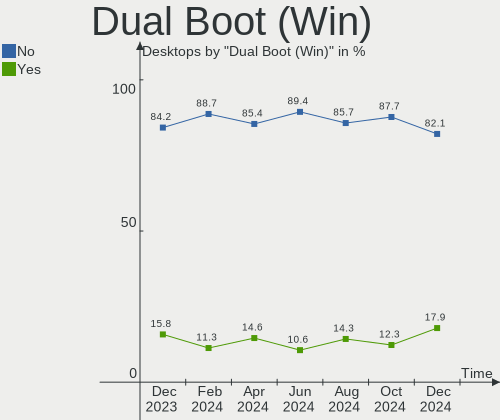
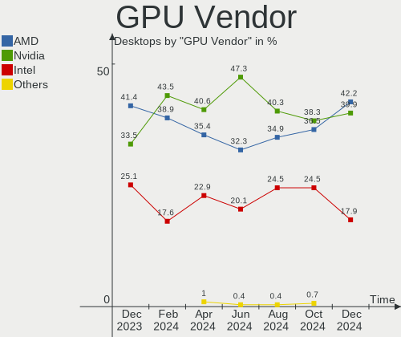
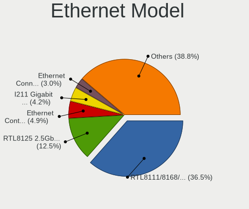
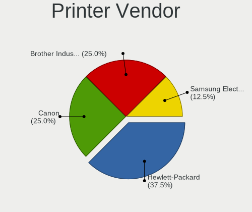

Fedora Hardware Trends (Desktop)
--------------------------------

A project to identify most popular hardware characteristics and track their change
over time based on data collected by Fedora users at https://Linux-Hardware.org.

Anyone can contribute to the study by uploading probes of their computers by
the [hw-probe](https://github.com/linuxhw/hw-probe) tool:

    sudo -E hw-probe -all -upload

Full-feature report is available here: https://linux-hardware.org/?view=trends&formfactor=desktop

Period: Jun, 2021.

Contents
--------

- [ OS                       ](#os)
- [ OS Family                ](#os-family)
- [ Kernel                   ](#kernel)
- [ Kernel Family            ](#kernel-family)
- [ Kernel Major Ver.        ](#kernel-major-ver)
- [ Arch                     ](#arch)
- [ DE                       ](#de)
- [ Display Server           ](#display-server)
- [ Display Manager          ](#display-manager)
- [ OS Lang                  ](#os-lang)
- [ Boot Mode                ](#boot-mode)
- [ Filesystem               ](#filesystem)
- [ Part. scheme             ](#part-scheme)
- [ Dual Boot with Linux/BSD ](#dual-boot-with-linux/bsd)
- [ Dual Boot (Win)          ](#dual-boot-win)
- [ Country                  ](#country)
- [ City                     ](#city)
- [ Vendor                   ](#vendor)
- [ Model                    ](#model)
- [ Model Family             ](#model-family)
- [ MFG Year                 ](#mfg-year)
- [ Form Factor              ](#form-factor)
- [ Secure Boot              ](#secure-boot)
- [ Coreboot                 ](#coreboot)
- [ RAM Size                 ](#ram-size)
- [ RAM Used                 ](#ram-used)
- [ Has CD-ROM               ](#has-cd-rom)
- [ Total Drives             ](#total-drives)
- [ Has Ethernet             ](#has-ethernet)
- [ Has WiFi                 ](#has-wifi)
- [ Has Bluetooth            ](#has-bluetooth)
- [ Drive Vendor             ](#drive-vendor)
- [ Drive Model              ](#drive-model)
- [ HDD Vendor               ](#hdd-vendor)
- [ SSD Vendor               ](#ssd-vendor)
- [ Drive Kind               ](#drive-kind)
- [ Drive Connector          ](#drive-connector)
- [ Drive Size               ](#drive-size)
- [ Space Total              ](#space-total)
- [ Space Used               ](#space-used)
- [ Malfunc. Drives          ](#malfunc-drives)
- [ Malfunc. Drive Vendor    ](#malfunc-drive-vendor)
- [ Malfunc. HDD Vendor      ](#malfunc-hdd-vendor)
- [ Malfunc. Drive Kind      ](#malfunc-drive-kind)
- [ Failed Drives            ](#failed-drives)
- [ Failed Drive Vendor      ](#failed-drive-vendor)
- [ Drive Status             ](#drive-status)
- [ Storage Vendor           ](#storage-vendor)
- [ Storage Model            ](#storage-model)
- [ Storage Kind             ](#storage-kind)
- [ CPU Vendor               ](#cpu-vendor)
- [ CPU Model                ](#cpu-model)
- [ CPU Model Family         ](#cpu-model-family)
- [ CPU Cores                ](#cpu-cores)
- [ CPU Sockets              ](#cpu-sockets)
- [ CPU Threads              ](#cpu-threads)
- [ CPU Op-Modes             ](#cpu-op-modes)
- [ CPU Microcode            ](#cpu-microcode)
- [ CPU Microarch            ](#cpu-microarch)
- [ GPU Vendor               ](#gpu-vendor)
- [ GPU Model                ](#gpu-model)
- [ GPU Combo                ](#gpu-combo)
- [ GPU Driver               ](#gpu-driver)
- [ GPU Memory               ](#gpu-memory)
- [ Monitor Vendor           ](#monitor-vendor)
- [ Monitor Model            ](#monitor-model)
- [ Monitor Resolution       ](#monitor-resolution)
- [ Monitor Diagonal         ](#monitor-diagonal)
- [ Monitor Width            ](#monitor-width)
- [ Aspect Ratio             ](#aspect-ratio)
- [ Monitor Area             ](#monitor-area)
- [ Pixel Density            ](#pixel-density)
- [ Multiple Monitors        ](#multiple-monitors)
- [ Net Controller Vendor    ](#net-controller-vendor)
- [ Net Controller Model     ](#net-controller-model)
- [ Wireless Vendor          ](#wireless-vendor)
- [ Wireless Model           ](#wireless-model)
- [ Ethernet Vendor          ](#ethernet-vendor)
- [ Ethernet Model           ](#ethernet-model)
- [ Net Controller Kind      ](#net-controller-kind)
- [ Used Controller          ](#used-controller)
- [ NICs                     ](#nics)
- [ IPv6                     ](#ipv6)
- [ Memory Vendor            ](#memory-vendor)
- [ Memory Model             ](#memory-model)
- [ Memory Kind              ](#memory-kind)
- [ Memory Form Factor       ](#memory-form-factor)
- [ Memory Size              ](#memory-size)
- [ Memory Speed             ](#memory-speed)
- [ Sound Vendor             ](#sound-vendor)
- [ Sound Model              ](#sound-model)
- [ Camera Vendor            ](#camera-vendor)
- [ Camera Model             ](#camera-model)
- [ Fingerprint Vendor       ](#fingerprint-vendor)
- [ Fingerprint Model        ](#fingerprint-model)
- [ Chipcard Vendor          ](#chipcard-vendor)
- [ Chipcard Model           ](#chipcard-model)
- [ Printer Vendor           ](#printer-vendor)
- [ Printer Model            ](#printer-model)
- [ Scanner Vendor           ](#scanner-vendor)
- [ Scanner Model            ](#scanner-model)
- [ Bluetooth Vendor         ](#bluetooth-vendor)
- [ Bluetooth Model          ](#bluetooth-model)
- [ Unsupported Devices      ](#unsupported-devices)
- [ Unsupported Device Types ](#unsupported-device-types)

OS
--

Installed operating systems

| Name      | Desktops | Percent |
|-----------|----------|---------|
| Fedora 34 | 87       | 83.65%  |
| Fedora 33 | 11       | 10.58%  |
| Fedora 35 | 2        | 1.92%   |
| Fedora 32 | 2        | 1.92%   |
| Fedora 4  | 1        | 0.96%   |
| Fedora 31 | 1        | 0.96%   |

OS Family
---------

OS without a version

| Name   | Desktops | Percent |
|--------|----------|---------|
| Fedora | 104      | 100%    |

Kernel
------

Version of the Linux kernel

| Version                     | Desktops | Percent |
|-----------------------------|----------|---------|
| 5.12.8-300.fc34.x86_64      | 24       | 23.08%  |
| 5.12.9-300.fc34.x86_64      | 16       | 15.38%  |
| 5.12.12-300.fc34.x86_64     | 12       | 11.54%  |
| 5.12.11-300.fc34.x86_64     | 11       | 10.58%  |
| 5.12.8-200.fc33.x86_64      | 7        | 6.73%   |
| 5.12.7-300.fc34.x86_64      | 7        | 6.73%   |
| 5.12.10-300.fc34.x86_64     | 7        | 6.73%   |
| 5.12.13-300.fc34.x86_64     | 2        | 1.92%   |
| 5.11.12-300.fc34.x86_64     | 2        | 1.92%   |
| 5.11.11-200.fc33.x86_64     | 2        | 1.92%   |
| 5.9.16-100.fc32.x86_64      | 1        | 0.96%   |
| 5.8.18-300.fc33.x86_64      | 1        | 0.96%   |
| 5.8.18-100.fc31.x86_64      | 1        | 0.96%   |
| 5.13.0-rc6-16-Yeoreum       | 1        | 0.96%   |
| 5.13.0-0.rc6.45.fc35.x86_64 | 1        | 0.96%   |
| 5.13.0-0.rc1.13.fc35.x86_64 | 1        | 0.96%   |
| 5.12.7-16-Yeoreum           | 1        | 0.96%   |
| 5.12.6-300.fc34.x86_64      | 1        | 0.96%   |
| 5.12.11-200.fc33.x86_64     | 1        | 0.96%   |
| 5.12.11-16-Yeoreum          | 1        | 0.96%   |
| 5.11.21-300.fc34.x86_64     | 1        | 0.96%   |
| 5.11.19-300.fc34.x86_64     | 1        | 0.96%   |
| 5.11.17-300.fc34.x86_64     | 1        | 0.96%   |
| 5.11.14-200.fc33.x86_64     | 1        | 0.96%   |

Kernel Family
-------------

Linux kernel without a distro release

| Version | Desktops | Percent |
|---------|----------|---------|
| 5.12.8  | 31       | 29.81%  |
| 5.12.9  | 16       | 15.38%  |
| 5.12.11 | 13       | 12.5%   |
| 5.12.12 | 12       | 11.54%  |
| 5.12.7  | 8        | 7.69%   |
| 5.12.10 | 7        | 6.73%   |
| 5.13.0  | 3        | 2.88%   |
| 5.8.18  | 2        | 1.92%   |
| 5.12.13 | 2        | 1.92%   |
| 5.11.12 | 2        | 1.92%   |
| 5.11.11 | 2        | 1.92%   |
| 5.9.16  | 1        | 0.96%   |
| 5.12.6  | 1        | 0.96%   |
| 5.11.21 | 1        | 0.96%   |
| 5.11.19 | 1        | 0.96%   |
| 5.11.17 | 1        | 0.96%   |
| 5.11.14 | 1        | 0.96%   |

Kernel Major Ver.
-----------------

Linux kernel major version

| Version | Desktops | Percent |
|---------|----------|---------|
| 5.12    | 90       | 86.54%  |
| 5.11    | 8        | 7.69%   |
| 5.13    | 3        | 2.88%   |
| 5.8     | 2        | 1.92%   |
| 5.9     | 1        | 0.96%   |

Arch
----

OS architecture (x86_64, i586, etc.)

| Name   | Desktops | Percent |
|--------|----------|---------|
| x86_64 | 104      | 100%    |

DE
--

Desktop Environment

| Name       | Desktops | Percent |
|------------|----------|---------|
| GNOME      | 66       | 63.46%  |
| KDE        | 10       | 9.62%   |
| Unknown    | 8        | 7.69%   |
| Cinnamon   | 7        | 6.73%   |
| KDE5       | 6        | 5.77%   |
| MATE       | 3        | 2.88%   |
| Deepin     | 2        | 1.92%   |
| XFCE       | 1        | 0.96%   |
| X-Cinnamon | 1        | 0.96%   |

Display Server
--------------

X11 or Wayland

| Name    | Desktops | Percent |
|---------|----------|---------|
| X11     | 49       | 47.12%  |
| Wayland | 42       | 40.38%  |
| Tty     | 9        | 8.65%   |
| Unknown | 4        | 3.85%   |

Display Manager
---------------

SDDM, LightDM, etc.

| Name    | Desktops | Percent |
|---------|----------|---------|
| Unknown | 61       | 58.65%  |
| GDM     | 26       | 25%     |
| TDM     | 6        | 5.77%   |
| LightDM | 6        | 5.77%   |
| SDDM    | 5        | 4.81%   |

OS Lang
-------

Language

| Lang    | Desktops | Percent |
|---------|----------|---------|
| en_US   | 40       | 38.46%  |
| en_GB   | 12       | 11.54%  |
| en_AU   | 8        | 7.69%   |
| pt_BR   | 7        | 6.73%   |
| fr_FR   | 7        | 6.73%   |
| pl_PL   | 5        | 4.81%   |
| de_DE   | 4        | 3.85%   |
| ru_RU   | 3        | 2.88%   |
| en_CA   | 3        | 2.88%   |
| nl_BE   | 2        | 1.92%   |
| it_IT   | 2        | 1.92%   |
| Unknown | 2        | 1.92%   |
| zh_TW   | 1        | 0.96%   |
| uk_UA   | 1        | 0.96%   |
| sk_SK   | 1        | 0.96%   |
| nl_NL   | 1        | 0.96%   |
| es_PA   | 1        | 0.96%   |
| es_DO   | 1        | 0.96%   |
| en_NZ   | 1        | 0.96%   |
| en_IN   | 1        | 0.96%   |
| ar_KW   | 1        | 0.96%   |

Boot Mode
---------

EFI or BIOS

| Mode | Desktops | Percent |
|------|----------|---------|
| EFI  | 66       | 63.46%  |
| BIOS | 38       | 36.54%  |

Filesystem
----------

Type of filesystem

| Type    | Desktops | Percent |
|---------|----------|---------|
| Btrfs   | 50       | 48.08%  |
| Ext4    | 40       | 38.46%  |
| Xfs     | 13       | 12.5%   |
| Unknown | 1        | 0.96%   |

Part. scheme
------------

Scheme of partitioning

| Type    | Desktops | Percent |
|---------|----------|---------|
| Unknown | 57       | 54.81%  |
| GPT     | 35       | 33.65%  |
| MBR     | 12       | 11.54%  |

Dual Boot with Linux/BSD
------------------------

Hosting more than one Linux/BSD

| Dual boot | Desktops | Percent |
|-----------|----------|---------|
| No        | 93       | 89.42%  |
| Yes       | 11       | 10.58%  |

Dual Boot (Win)
---------------

Hosting Linux and Windows

| Dual boot | Desktops | Percent |
|-----------|----------|---------|
| No        | 82       | 78.85%  |
| Yes       | 22       | 21.15%  |

Country
-------

Geographic location (country)

| Country            | Desktops | Percent |
|--------------------|----------|---------|
| USA                | 20       | 19.23%  |
| Australia          | 8        | 7.69%   |
| Germany            | 7        | 6.73%   |
| Brazil             | 7        | 6.73%   |
| Poland             | 6        | 5.77%   |
| UK                 | 5        | 4.81%   |
| Sweden             | 5        | 4.81%   |
| Italy              | 5        | 4.81%   |
| France             | 4        | 3.85%   |
| Ukraine            | 3        | 2.88%   |
| Switzerland        | 3        | 2.88%   |
| Canada             | 3        | 2.88%   |
| Belgium            | 3        | 2.88%   |
| Turkey             | 2        | 1.92%   |
| Russia             | 2        | 1.92%   |
| Netherlands        | 2        | 1.92%   |
| India              | 2        | 1.92%   |
| Belarus            | 2        | 1.92%   |
| Taiwan             | 1        | 0.96%   |
| Spain              | 1        | 0.96%   |
| Slovakia           | 1        | 0.96%   |
| Romania            | 1        | 0.96%   |
| Panama             | 1        | 0.96%   |
| Norway             | 1        | 0.96%   |
| New Zealand        | 1        | 0.96%   |
| Mexico             | 1        | 0.96%   |
| Martinique         | 1        | 0.96%   |
| Madagascar         | 1        | 0.96%   |
| Luxembourg         | 1        | 0.96%   |
| Kenya              | 1        | 0.96%   |
| Ireland            | 1        | 0.96%   |
| Indonesia          | 1        | 0.96%   |
| Dominican Republic | 1        | 0.96%   |

City
----

Geographic location (city)

| City               | Desktops | Percent |
|--------------------|----------|---------|
| Sydney             | 7        | 6.73%   |
| Zurich             | 3        | 2.88%   |
| London             | 3        | 2.88%   |
| Askloster          | 3        | 2.88%   |
| Pflugerville       | 2        | 1.92%   |
| Minsk              | 2        | 1.92%   |
| Lodz               | 2        | 1.92%   |
| Istanbul           | 2        | 1.92%   |
| Zgorzelec          | 1        | 0.96%   |
| Zaporizhzhya       | 1        | 0.96%   |
| Wroclaw            | 1        | 0.96%   |
| Wichita            | 1        | 0.96%   |
| Warsaw             | 1        | 0.96%   |
| Vougy              | 1        | 0.96%   |
| Thornbury          | 1        | 0.96%   |
| Terneuzen          | 1        | 0.96%   |
| Taipei             | 1        | 0.96%   |
| Streamwood         | 1        | 0.96%   |
| Strassen           | 1        | 0.96%   |
| St Petersburg      | 1        | 0.96%   |
| Spanga             | 1        | 0.96%   |
| Sioux Falls        | 1        | 0.96%   |
| Sharon             | 1        | 0.96%   |
| Serra              | 1        | 0.96%   |
| Sapucaia           | 1        | 0.96%   |
| Santo Domingo Este | 1        | 0.96%   |
| Sandpoint          | 1        | 0.96%   |
| San Pedro          | 1        | 0.96%   |
| San Jose           | 1        | 0.96%   |
| Salatiga           | 1        | 0.96%   |
| Porto Alegre       | 1        | 0.96%   |
| Pindamonhangaba    | 1        | 0.96%   |
| Pepperell          | 1        | 0.96%   |
| Pasadena           | 1        | 0.96%   |
| Palermo            | 1        | 0.96%   |
| Oslo               | 1        | 0.96%   |
| Nova Bana          | 1        | 0.96%   |
| Nizhniy Novgorod   | 1        | 0.96%   |
| Nixa               | 1        | 0.96%   |
| Naples             | 1        | 0.96%   |
| Nantes             | 1        | 0.96%   |
| Nairobi            | 1        | 0.96%   |
| Munich             | 1        | 0.96%   |
| Minneapolis        | 1        | 0.96%   |
| Milan              | 1        | 0.96%   |
| Maywood            | 1        | 0.96%   |
| Matteson           | 1        | 0.96%   |
| Madrid             | 1        | 0.96%   |
| Maastricht         | 1        | 0.96%   |
| Los Angeles        | 1        | 0.96%   |
| Lille              | 1        | 0.96%   |
| Legnica            | 1        | 0.96%   |
| Kyiv               | 1        | 0.96%   |
| Kamloops           | 1        | 0.96%   |
| Kalyani            | 1        | 0.96%   |
| Jujurieux          | 1        | 0.96%   |
| Jambes             | 1        | 0.96%   |
| Imbituba           | 1        | 0.96%   |
| Ilford             | 1        | 0.96%   |
| Iasi               | 1        | 0.96%   |

Vendor
------

Motherboard manufacturer

| Name                | Desktops | Percent |
|---------------------|----------|---------|
| ASUSTek Computer    | 30       | 28.85%  |
| Gigabyte Technology | 21       | 20.19%  |
| ASRock              | 13       | 12.5%   |
| MSI                 | 9        | 8.65%   |
| Hewlett-Packard     | 9        | 8.65%   |
| Dell                | 6        | 5.77%   |
| Intel               | 5        | 4.81%   |
| Lenovo              | 4        | 3.85%   |
| Fujitsu             | 2        | 1.92%   |
| SYWZ                | 1        | 0.96%   |
| Positivo            | 1        | 0.96%   |
| Gateway             | 1        | 0.96%   |
| ASRockRack          | 1        | 0.96%   |
| Unknown             | 1        | 0.96%   |

Model
-----

Motherboard model

| Name                                      | Desktops | Percent |
|-------------------------------------------|----------|---------|
| MSI MS-7C84                               | 2        | 1.92%   |
| ASUS Z170-A                               | 2        | 1.92%   |
| ASUS TUF GAMING X570-PLUS                 | 2        | 1.92%   |
| ASUS ROG STRIX X570-F GAMING              | 2        | 1.92%   |
| ASUS ROG STRIX B450-F GAMING              | 2        | 1.92%   |
| ASUS All Series                           | 2        | 1.92%   |
| SYWZ S200 Series                          | 1        | 0.96%   |
| Positivo POS-MI945AA                      | 1        | 0.96%   |
| MSI MS-7C02                               | 1        | 0.96%   |
| MSI MS-7B98                               | 1        | 0.96%   |
| MSI MS-7B89                               | 1        | 0.96%   |
| MSI MS-7B85                               | 1        | 0.96%   |
| MSI MS-7A37                               | 1        | 0.96%   |
| MSI MS-7917                               | 1        | 0.96%   |
| MSI MS-7721                               | 1        | 0.96%   |
| Lenovo ThinkCentre M58p 7220A72           | 1        | 0.96%   |
| Lenovo ThinkCentre M58p 6234GY2           | 1        | 0.96%   |
| Lenovo IdeaCentre T540-15ICK G 90LW00ATUS | 1        | 0.96%   |
| Lenovo H30-50 90B90026ID                  | 1        | 0.96%   |
| Intel SHARKBAY                            | 1        | 0.96%   |
| Intel KBL-R MRD                           | 1        | 0.96%   |
| Intel H61                                 | 1        | 0.96%   |
| Intel DP67BA AAG10219-304                 | 1        | 0.96%   |
| Intel DH55TC AAE70932-206                 | 1        | 0.96%   |
| HP Z800 Workstation                       | 1        | 0.96%   |
| HP Z4 G4 Workstation                      | 1        | 0.96%   |
| HP Slim Desktop S01-pF1xxx                | 1        | 0.96%   |
| HP ProLiant ML150 G5                      | 1        | 0.96%   |
| HP ProDesk 400 G1 MT                      | 1        | 0.96%   |
| HP Pavilion Desktop 590-a0xxx             | 1        | 0.96%   |
| HP EliteDesk 800 G2 SFF                   | 1        | 0.96%   |
| HP EliteDesk 800 G2 DM 65W                | 1        | 0.96%   |
| HP Compaq Elite 8300 SFF                  | 1        | 0.96%   |
| Gigabyte Z97MX-Gaming 5                   | 1        | 0.96%   |
| Gigabyte Z370N WIFI                       | 1        | 0.96%   |
| Gigabyte Z270-HD3P                        | 1        | 0.96%   |
| Gigabyte Z170-D3H                         | 1        | 0.96%   |
| Gigabyte H77N-WIFI                        | 1        | 0.96%   |
| Gigabyte H61N-USB3                        | 1        | 0.96%   |
| Gigabyte H110M-H                          | 1        | 0.96%   |
| Gigabyte GA-MA785GT-UD3H                  | 1        | 0.96%   |
| Gigabyte GA-MA785G-UD3H                   | 1        | 0.96%   |
| Gigabyte GA-880GM-D2H                     | 1        | 0.96%   |
| Gigabyte G41MT-D3                         | 1        | 0.96%   |
| Gigabyte EP45-DS3L                        | 1        | 0.96%   |
| Gigabyte EP41-UD3L                        | 1        | 0.96%   |
| Gigabyte B550 AORUS PRO AC                | 1        | 0.96%   |
| Gigabyte B450M DS3H                       | 1        | 0.96%   |
| Gigabyte B250M-DS3H                       | 1        | 0.96%   |
| Gigabyte B150M-D3H-CF                     | 1        | 0.96%   |
| Gigabyte AX370-Gaming 5                   | 1        | 0.96%   |
| Gigabyte AB350M-Gaming 3                  | 1        | 0.96%   |
| Gigabyte A320M-S2H                        | 1        | 0.96%   |
| Gigabyte 990XA-UD3                        | 1        | 0.96%   |
| Gateway DX4860                            | 1        | 0.96%   |
| Fujitsu ESPRIMO P710                      | 1        | 0.96%   |
| Fujitsu ESPRIMO P410                      | 1        | 0.96%   |
| Dell XPS 8940                             | 1        | 0.96%   |
| Dell OptiPlex GX620                       | 1        | 0.96%   |
| Dell OptiPlex 990                         | 1        | 0.96%   |

Model Family
------------

Motherboard model prefix

| Name                     | Desktops | Percent |
|--------------------------|----------|---------|
| ASUS ROG                 | 9        | 8.65%   |
| ASUS PRIME               | 5        | 4.81%   |
| Dell OptiPlex            | 4        | 3.85%   |
| ASUS TUF                 | 4        | 3.85%   |
| MSI MS-7C84              | 2        | 1.92%   |
| Lenovo ThinkCentre       | 2        | 1.92%   |
| HP EliteDesk             | 2        | 1.92%   |
| Fujitsu ESPRIMO          | 2        | 1.92%   |
| ASUS Z170-A              | 2        | 1.92%   |
| ASUS P8H61-M             | 2        | 1.92%   |
| ASUS All                 | 2        | 1.92%   |
| SYWZ S200                | 1        | 0.96%   |
| Positivo POS-MI945AA     | 1        | 0.96%   |
| MSI MS-7C02              | 1        | 0.96%   |
| MSI MS-7B98              | 1        | 0.96%   |
| MSI MS-7B89              | 1        | 0.96%   |
| MSI MS-7B85              | 1        | 0.96%   |
| MSI MS-7A37              | 1        | 0.96%   |
| MSI MS-7917              | 1        | 0.96%   |
| MSI MS-7721              | 1        | 0.96%   |
| Lenovo IdeaCentre        | 1        | 0.96%   |
| Lenovo H30-50            | 1        | 0.96%   |
| Intel SHARKBAY           | 1        | 0.96%   |
| Intel KBL-R              | 1        | 0.96%   |
| Intel H61                | 1        | 0.96%   |
| Intel DP67BA             | 1        | 0.96%   |
| Intel DH55TC             | 1        | 0.96%   |
| HP Z800                  | 1        | 0.96%   |
| HP Z4                    | 1        | 0.96%   |
| HP Slim                  | 1        | 0.96%   |
| HP ProLiant              | 1        | 0.96%   |
| HP ProDesk               | 1        | 0.96%   |
| HP Pavilion              | 1        | 0.96%   |
| HP Compaq                | 1        | 0.96%   |
| Gigabyte Z97MX-Gaming    | 1        | 0.96%   |
| Gigabyte Z370N           | 1        | 0.96%   |
| Gigabyte Z270-HD3P       | 1        | 0.96%   |
| Gigabyte Z170-D3H        | 1        | 0.96%   |
| Gigabyte H77N-WIFI       | 1        | 0.96%   |
| Gigabyte H61N-USB3       | 1        | 0.96%   |
| Gigabyte H110M-H         | 1        | 0.96%   |
| Gigabyte GA-MA785GT-UD3H | 1        | 0.96%   |
| Gigabyte GA-MA785G-UD3H  | 1        | 0.96%   |
| Gigabyte GA-880GM-D2H    | 1        | 0.96%   |
| Gigabyte G41MT-D3        | 1        | 0.96%   |
| Gigabyte EP45-DS3L       | 1        | 0.96%   |
| Gigabyte EP41-UD3L       | 1        | 0.96%   |
| Gigabyte B550            | 1        | 0.96%   |
| Gigabyte B450M           | 1        | 0.96%   |
| Gigabyte B250M-DS3H      | 1        | 0.96%   |
| Gigabyte B150M-D3H-CF    | 1        | 0.96%   |
| Gigabyte AX370-Gaming    | 1        | 0.96%   |
| Gigabyte AB350M-Gaming   | 1        | 0.96%   |
| Gigabyte A320M-S2H       | 1        | 0.96%   |
| Gigabyte 990XA-UD3       | 1        | 0.96%   |
| Gateway DX4860           | 1        | 0.96%   |
| Dell XPS                 | 1        | 0.96%   |
| Dell ASM100              | 1        | 0.96%   |
| ASUS STRIX               | 1        | 0.96%   |
| ASUS P8H77-V             | 1        | 0.96%   |

MFG Year
--------

Motherboard manufacture year

| Year | Desktops | Percent |
|------|----------|---------|
| 2019 | 17       | 16.35%  |
| 2020 | 15       | 14.42%  |
| 2018 | 14       | 13.46%  |
| 2021 | 13       | 12.5%   |
| 2014 | 6        | 5.77%   |
| 2013 | 6        | 5.77%   |
| 2010 | 6        | 5.77%   |
| 2017 | 5        | 4.81%   |
| 2015 | 4        | 3.85%   |
| 2012 | 4        | 3.85%   |
| 2011 | 4        | 3.85%   |
| 2016 | 3        | 2.88%   |
| 2009 | 2        | 1.92%   |
| 2008 | 2        | 1.92%   |
| 2007 | 1        | 0.96%   |
| 2006 | 1        | 0.96%   |
| 2005 | 1        | 0.96%   |

Form Factor
-----------

Physical design of the computer

| Name    | Desktops | Percent |
|---------|----------|---------|
| Desktop | 104      | 100%    |

Secure Boot
-----------

Enabled or disabled

| State    | Desktops | Percent |
|----------|----------|---------|
| Disabled | 101      | 97.12%  |
| Enabled  | 3        | 2.88%   |

Coreboot
--------

Have coreboot on board

| Used | Desktops | Percent |
|------|----------|---------|
| No   | 104      | 100%    |

RAM Size
--------

Total RAM memory

| Size in GB  | Desktops | Percent |
|-------------|----------|---------|
| 16.01-24.0  | 30       | 28.85%  |
| 32.01-64.0  | 27       | 25.96%  |
| 4.01-8.0    | 15       | 14.42%  |
| 8.01-16.0   | 13       | 12.5%   |
| 3.01-4.0    | 9        | 8.65%   |
| 64.01-256.0 | 6        | 5.77%   |
| 24.01-32.0  | 4        | 3.85%   |

RAM Used
--------

Used RAM memory

| Used GB    | Desktops | Percent |
|------------|----------|---------|
| 4.01-8.0   | 22       | 21.15%  |
| 2.01-3.0   | 22       | 21.15%  |
| 1.01-2.0   | 21       | 20.19%  |
| 3.01-4.0   | 19       | 18.27%  |
| 8.01-16.0  | 10       | 9.62%   |
| 0.51-1.0   | 4        | 3.85%   |
| 16.01-24.0 | 3        | 2.88%   |
| 0.01-0.5   | 2        | 1.92%   |
| 24.01-32.0 | 1        | 0.96%   |

Has CD-ROM
----------

Has CD-ROM on board

| Presented | Desktops | Percent |
|-----------|----------|---------|
| No        | 60       | 57.69%  |
| Yes       | 44       | 42.31%  |

Total Drives
------------

Number of drives on board

| Drives | Desktops | Percent |
|--------|----------|---------|
| 3      | 28       | 26.92%  |
| 2      | 27       | 25.96%  |
| 1      | 25       | 24.04%  |
| 4      | 12       | 11.54%  |
| 5      | 6        | 5.77%   |
| 7      | 3        | 2.88%   |
| 8      | 2        | 1.92%   |
| 6      | 1        | 0.96%   |

Has Ethernet
------------

Has Ethernet on board

| Presented | Desktops | Percent |
|-----------|----------|---------|
| Yes       | 102      | 98.08%  |
| No        | 2        | 1.92%   |

Has WiFi
--------

Has WiFi module

| Presented | Desktops | Percent |
|-----------|----------|---------|
| No        | 57       | 54.81%  |
| Yes       | 47       | 45.19%  |

Has Bluetooth
-------------

Has Bluetooth module

| Presented | Desktops | Percent |
|-----------|----------|---------|
| No        | 58       | 55.77%  |
| Yes       | 46       | 44.23%  |

Drive Vendor
------------

Hard drive vendors

| Vendor                    | Desktops | Drives | Percent |
|---------------------------|----------|--------|---------|
| Samsung Electronics       | 46       | 71     | 21.4%   |
| WDC                       | 38       | 52     | 17.67%  |
| Seagate                   | 31       | 47     | 14.42%  |
| Crucial                   | 14       | 16     | 6.51%   |
| Toshiba                   | 12       | 17     | 5.58%   |
| Sandisk                   | 10       | 10     | 4.65%   |
| Kingston                  | 9        | 9      | 4.19%   |
| Intel                     | 6        | 7      | 2.79%   |
| Hitachi                   | 6        | 7      | 2.79%   |
| SPCC                      | 4        | 4      | 1.86%   |
| Phison                    | 4        | 6      | 1.86%   |
| Micron/Crucial Technology | 3        | 3      | 1.4%    |
| XPG                       | 2        | 2      | 0.93%   |
| SK Hynix                  | 2        | 3      | 0.93%   |
| SABRENT                   | 2        | 2      | 0.93%   |
| PNY                       | 2        | 3      | 0.93%   |
| PLEXTOR                   | 2        | 3      | 0.93%   |
| Micron Technology         | 2        | 2      | 0.93%   |
| Maxtor                    | 2        | 2      | 0.93%   |
| Apacer                    | 2        | 3      | 0.93%   |
| Unknown                   | 1        | 1      | 0.47%   |
| Team                      | 1        | 1      | 0.47%   |
| Synology                  | 1        | 1      | 0.47%   |
| Phison Electronics        | 1        | 1      | 0.47%   |
| Patriot                   | 1        | 1      | 0.47%   |
| OCZ                       | 1        | 1      | 0.47%   |
| Mushkin                   | 1        | 1      | 0.47%   |
| MG                        | 1        | 1      | 0.47%   |
| KingSpec                  | 1        | 1      | 0.47%   |
| JMicron                   | 1        | 1      | 0.47%   |
| Hoodisk                   | 1        | 1      | 0.47%   |
| HGST                      | 1        | 1      | 0.47%   |
| GOODRAM                   | 1        | 1      | 0.47%   |
| Corsair                   | 1        | 1      | 0.47%   |
| ASMT                      | 1        | 1      | 0.47%   |
| A-DATA Technology         | 1        | 1      | 0.47%   |

Drive Model
-----------

Hard drive models

| Model                             | Desktops | Percent |
|-----------------------------------|----------|---------|
| Samsung SSD 860 EVO 1TB           | 6        | 2.21%   |
| Samsung NVMe SSD Drive 250GB      | 5        | 1.84%   |
| Samsung NVMe SSD Drive 1TB        | 5        | 1.84%   |
| Seagate ST500DM002-1BD142 500GB   | 4        | 1.47%   |
| Samsung SSD 850 EVO 250GB         | 4        | 1.47%   |
| Samsung SSD 840 EVO 250GB         | 4        | 1.47%   |
| Toshiba DT01ACA200 2TB            | 3        | 1.1%    |
| Seagate ST4000DM004-2CV104 4TB    | 3        | 1.1%    |
| Seagate ST1000DM003-1ER162 1TB    | 3        | 1.1%    |
| Sandisk NVMe SSD Drive 1TB        | 3        | 1.1%    |
| Phison NVMe SSD Drive 1024GB      | 3        | 1.1%    |
| Micron/Crucial NVMe SSD Drive 1TB | 3        | 1.1%    |
| Kingston SV300S37A120G 120GB SSD  | 3        | 1.1%    |
| Crucial CT500MX500SSD1 500GB      | 3        | 1.1%    |
| WDC WD40EZRZ-00GXCB0 4TB          | 2        | 0.74%   |
| WDC WD40EFRX-68N32N0 4TB          | 2        | 0.74%   |
| WDC WD15EARS-00MVWB0 1TB          | 2        | 0.74%   |
| WDC WD10EZEX-75WN4A0 1TB          | 2        | 0.74%   |
| WDC WD10EZEX-08WN4A0 1TB          | 2        | 0.74%   |
| WDC WD10EZEX-08M2NA0 1TB          | 2        | 0.74%   |
| WDC WD10EZEX-00WN4A0 1TB          | 2        | 0.74%   |
| WDC WD10EZEX-00BN5A0 1TB          | 2        | 0.74%   |
| Toshiba HDWD120 2TB               | 2        | 0.74%   |
| Toshiba DT01ACA300 3TB            | 2        | 0.74%   |
| Seagate ST4000VN008-2DR166 4TB    | 2        | 0.74%   |
| Seagate Expansion Desk 2TB        | 2        | 0.74%   |
| Samsung SSD 870 EVO 250GB         | 2        | 0.74%   |
| Samsung SSD 870 EVO 1TB           | 2        | 0.74%   |
| Samsung SSD 860 EVO 2TB           | 2        | 0.74%   |
| Samsung SSD 860 EVO 250GB         | 2        | 0.74%   |
| Samsung NVMe SSD Drive 500GB      | 2        | 0.74%   |
| Samsung HD103SJ 1TB               | 2        | 0.74%   |
| SABRENT Disk 240GB                | 2        | 0.74%   |
| Crucial CT480BX500SSD1 480GB      | 2        | 0.74%   |
| Crucial CT240BX200SSD1 240GB      | 2        | 0.74%   |
| XPG NVMe SSD Drive 512GB          | 1        | 0.37%   |
| XPG NVMe SSD Drive 2TB            | 1        | 0.37%   |
| WDC WDS500G2B0A-00SM50 500GB SSD  | 1        | 0.37%   |
| WDC WDS250G2B0A-00SM50 250GB SSD  | 1        | 0.37%   |
| WDC WDS250G1B0B-00AS40 250GB SSD  | 1        | 0.37%   |
| WDC WDS100T2B0C-00PXH0 1TB        | 1        | 0.37%   |
| WDC WDS100T1X0E-00AFY0 1TB        | 1        | 0.37%   |
| WDC WD800JD-75LSA0 80GB           | 1        | 0.37%   |
| WDC WD800JD-60LSA5 80GB           | 1        | 0.37%   |
| WDC WD7502ABYS-02A6B0 752GB       | 1        | 0.37%   |
| WDC WD60EZAZ-00SF3B0 6TB          | 1        | 0.37%   |
| WDC WD60 EFRX-68L0BN1 6TB         | 1        | 0.37%   |
| WDC WD5000LPCX-24C6HT0 500GB      | 1        | 0.37%   |
| WDC WD5000AAKX-08U6AA0 500GB      | 1        | 0.37%   |
| WDC WD40PURZ-85AKKY0 4TB          | 1        | 0.37%   |
| WDC WD40EZRZ-75GXCB0 4TB          | 1        | 0.37%   |
| WDC WD3200AVVS-63L2B0 320GB       | 1        | 0.37%   |
| WDC WD30EZRX-00SPEB0 3TB          | 1        | 0.37%   |
| WDC WD30EZRX-00MMMB0 3TB          | 1        | 0.37%   |
| WDC WD30EFRX-68EUZN0 3TB          | 1        | 0.37%   |
| WDC WD2500KS-00MJB0 250GB         | 1        | 0.37%   |
| WDC WD20EZRZ-00Z5HB0 2TB          | 1        | 0.37%   |
| WDC WD20EZRX-00D8PB0 2TB          | 1        | 0.37%   |
| WDC WD2002FAEX-007BA0 2TB         | 1        | 0.37%   |
| WDC WD15EADS-00P8B0 1TB           | 1        | 0.37%   |

HDD Vendor
----------

Hard disk drive vendors

| Vendor              | Desktops | Drives | Percent |
|---------------------|----------|--------|---------|
| WDC                 | 37       | 47     | 39.36%  |
| Seagate             | 29       | 45     | 30.85%  |
| Toshiba             | 10       | 14     | 10.64%  |
| Samsung Electronics | 8        | 10     | 8.51%   |
| Hitachi             | 6        | 7      | 6.38%   |
| Synology            | 1        | 1      | 1.06%   |
| Maxtor              | 1        | 1      | 1.06%   |
| HGST                | 1        | 1      | 1.06%   |
| ASMT                | 1        | 1      | 1.06%   |

SSD Vendor
----------

Solid state drive vendors

| Vendor              | Desktops | Drives | Percent |
|---------------------|----------|--------|---------|
| Samsung Electronics | 31       | 40     | 34.83%  |
| Crucial             | 13       | 15     | 14.61%  |
| Kingston            | 7        | 7      | 7.87%   |
| SanDisk             | 6        | 6      | 6.74%   |
| Intel               | 4        | 5      | 4.49%   |
| WDC                 | 3        | 3      | 3.37%   |
| Toshiba             | 2        | 2      | 2.25%   |
| SPCC                | 2        | 2      | 2.25%   |
| SABRENT             | 2        | 2      | 2.25%   |
| PNY                 | 2        | 2      | 2.25%   |
| PLEXTOR             | 2        | 3      | 2.25%   |
| Micron Technology   | 2        | 2      | 2.25%   |
| Apacer              | 2        | 3      | 2.25%   |
| Team                | 1        | 1      | 1.12%   |
| SK Hynix            | 1        | 1      | 1.12%   |
| Patriot             | 1        | 1      | 1.12%   |
| OCZ                 | 1        | 1      | 1.12%   |
| Mushkin             | 1        | 1      | 1.12%   |
| MG                  | 1        | 1      | 1.12%   |
| Maxtor              | 1        | 1      | 1.12%   |
| KingSpec            | 1        | 1      | 1.12%   |
| Hoodisk             | 1        | 1      | 1.12%   |
| GOODRAM             | 1        | 1      | 1.12%   |
| A-DATA Technology   | 1        | 1      | 1.12%   |

Drive Kind
----------

HDD or SSD

| Kind    | Desktops | Drives | Percent |
|---------|----------|--------|---------|
| SSD     | 74       | 103    | 40.44%  |
| HDD     | 70       | 127    | 38.25%  |
| NVMe    | 37       | 53     | 20.22%  |
| Unknown | 2        | 2      | 1.09%   |

Drive Connector
---------------

SATA, SAS, NVMe, etc.

| Type | Desktops | Drives | Percent |
|------|----------|--------|---------|
| SATA | 98       | 222    | 67.59%  |
| NVMe | 36       | 52     | 24.83%  |
| SAS  | 11       | 11     | 7.59%   |

Drive Size
----------

Size of hard drive

| Size in TB | Desktops | Drives | Percent |
|------------|----------|--------|---------|
| 0.01-0.5   | 79       | 107    | 46.47%  |
| 0.51-1.0   | 45       | 60     | 26.47%  |
| 1.01-2.0   | 20       | 25     | 11.76%  |
| 3.01-4.0   | 12       | 16     | 7.06%   |
| 4.01-10.0  | 7        | 10     | 4.12%   |
| 2.01-3.0   | 6        | 8      | 3.53%   |
| 10.01-20.0 | 1        | 4      | 0.59%   |

Space Total
-----------

Amount of disk space available on the file system

| Size in GB     | Desktops | Percent |
|----------------|----------|---------|
| More than 3000 | 20       | 19.23%  |
| 251-500        | 20       | 19.23%  |
| 101-250        | 18       | 17.31%  |
| 501-1000       | 18       | 17.31%  |
| 1001-2000      | 12       | 11.54%  |
| 2001-3000      | 6        | 5.77%   |
| Unknown        | 5        | 4.81%   |
| 1-20           | 3        | 2.88%   |
| 51-100         | 2        | 1.92%   |

Space Used
----------

Amount of used disk space

| Used GB        | Desktops | Percent |
|----------------|----------|---------|
| 1-20           | 21       | 20.19%  |
| 101-250        | 16       | 15.38%  |
| 251-500        | 13       | 12.5%   |
| 501-1000       | 13       | 12.5%   |
| 51-100         | 9        | 8.65%   |
| 21-50          | 8        | 7.69%   |
| 1001-2000      | 8        | 7.69%   |
| More than 3000 | 7        | 6.73%   |
| Unknown        | 5        | 4.81%   |
| 2001-3000      | 4        | 3.85%   |

Malfunc. Drives
---------------

Drive models with a malfunction

| Model                              | Desktops | Drives | Percent |
|------------------------------------|----------|--------|---------|
| Seagate ST500DM002-1BD142 500GB    | 3        | 4      | 30%     |
| Toshiba DT01ACA200 2TB             | 2        | 2      | 20%     |
| WDC WD40PURZ-85AKKY0 4TB           | 1        | 1      | 10%     |
| Seagate ST1000LM024 HN-M101MBB 1TB | 1        | 1      | 10%     |
| SanDisk SSD PLUS 480GB             | 1        | 1      | 10%     |
| Samsung Electronics HM160HI 160GB  | 1        | 1      | 10%     |
| Hitachi HTS725050A7E630 500GB      | 1        | 1      | 10%     |

Malfunc. Drive Vendor
---------------------

Vendors of faulty drives

| Vendor              | Desktops | Drives | Percent |
|---------------------|----------|--------|---------|
| Seagate             | 4        | 5      | 40%     |
| Toshiba             | 2        | 2      | 20%     |
| WDC                 | 1        | 1      | 10%     |
| SanDisk             | 1        | 1      | 10%     |
| Samsung Electronics | 1        | 1      | 10%     |
| Hitachi             | 1        | 1      | 10%     |

Malfunc. HDD Vendor
-------------------

Vendors of faulty HDD drives

| Vendor              | Desktops | Drives | Percent |
|---------------------|----------|--------|---------|
| Seagate             | 4        | 5      | 44.44%  |
| Toshiba             | 2        | 2      | 22.22%  |
| WDC                 | 1        | 1      | 11.11%  |
| Samsung Electronics | 1        | 1      | 11.11%  |
| Hitachi             | 1        | 1      | 11.11%  |

Malfunc. Drive Kind
-------------------

Kinds of faulty drives

| Kind | Desktops | Drives | Percent |
|------|----------|--------|---------|
| HDD  | 8        | 10     | 88.89%  |
| SSD  | 1        | 1      | 11.11%  |

Failed Drives
-------------

Failed drive models

| Model                       | Desktops | Drives | Percent |
|-----------------------------|----------|--------|---------|
| Hitachi HDS721010DLE630 1TB | 1        | 2      | 100%    |

Failed Drive Vendor
-------------------

Failed drive vendors

| Vendor  | Desktops | Drives | Percent |
|---------|----------|--------|---------|
| Hitachi | 1        | 2      | 100%    |

Drive Status
------------

Number of failed and malfunc. drives

| Status   | Desktops | Drives | Percent |
|----------|----------|--------|---------|
| Detected | 63       | 156    | 52.94%  |
| Works    | 46       | 116    | 38.66%  |
| Malfunc  | 9        | 11     | 7.56%   |
| Failed   | 1        | 2      | 0.84%   |

Storage Vendor
--------------

Storage controller vendors

| Vendor                       | Desktops | Percent |
|------------------------------|----------|---------|
| Intel                        | 63       | 38.18%  |
| AMD                          | 38       | 23.03%  |
| Samsung Electronics          | 18       | 10.91%  |
| Phison Electronics           | 8        | 4.85%   |
| ASMedia Technology           | 8        | 4.85%   |
| Sandisk                      | 6        | 3.64%   |
| Micron/Crucial Technology    | 4        | 2.42%   |
| Nvidia                       | 3        | 1.82%   |
| LSI Logic / Symbios Logic    | 2        | 1.21%   |
| Kingston Technology Company  | 2        | 1.21%   |
| ADATA Technology             | 2        | 1.21%   |
| VIA Technologies             | 1        | 0.61%   |
| ULi Electronics              | 1        | 0.61%   |
| Toshiba America Info Systems | 1        | 0.61%   |
| SK Hynix                     | 1        | 0.61%   |
| Silicon Image                | 1        | 0.61%   |
| Seagate Technology           | 1        | 0.61%   |
| Realtek Semiconductor        | 1        | 0.61%   |
| Lite-On IT Corp. / Plextor   | 1        | 0.61%   |
| JMicron Technology           | 1        | 0.61%   |
| Hewlett-Packard              | 1        | 0.61%   |
| Broadcom / LSI               | 1        | 0.61%   |

Storage Model
-------------

Storage controller models

| Model                                                                          | Desktops | Percent |
|--------------------------------------------------------------------------------|----------|---------|
| AMD FCH SATA Controller [AHCI mode]                                            | 29       | 14.22%  |
| Samsung NVMe SSD Controller SM981/PM981/PM983                                  | 11       | 5.39%   |
| AMD 400 Series Chipset SATA Controller                                         | 10       | 4.9%    |
| Intel Q170/Q150/B150/H170/H110/Z170/CM236 Chipset SATA Controller [AHCI Mode]  | 8        | 3.92%   |
| Intel 200 Series PCH SATA controller [AHCI mode]                               | 8        | 3.92%   |
| ASMedia ASM1062 Serial ATA Controller                                          | 8        | 3.92%   |
| Phison E12 NVMe Controller                                                     | 7        | 3.43%   |
| Intel 9 Series Chipset Family SATA Controller [AHCI Mode]                      | 7        | 3.43%   |
| Intel 6 Series/C200 Series Chipset Family 6 port Desktop SATA AHCI Controller  | 7        | 3.43%   |
| Intel 8 Series/C220 Series Chipset Family 6-port SATA Controller 1 [AHCI mode] | 5        | 2.45%   |
| Intel 7 Series/C210 Series Chipset Family 6-port SATA Controller [AHCI mode]   | 5        | 2.45%   |
| Samsung NVMe SSD Controller PM9A1/PM9A3/980PRO                                 | 4        | 1.96%   |
| Intel SATA Controller [RAID mode]                                              | 4        | 1.96%   |
| Intel NM10/ICH7 Family SATA Controller [IDE mode]                              | 4        | 1.96%   |
| AMD Starship/Matisse Chipset SATA Controller [AHCI mode]                       | 4        | 1.96%   |
| AMD SB7x0/SB8x0/SB9x0 IDE Controller                                           | 4        | 1.96%   |
| AMD 300 Series Chipset SATA Controller                                         | 4        | 1.96%   |
| Samsung NVMe SSD Controller SM961/PM961/SM963                                  | 3        | 1.47%   |
| AMD FCH SATA Controller D                                                      | 3        | 1.47%   |
| Sandisk WD Blue SN550 NVMe SSD                                                 | 2        | 0.98%   |
| Sandisk WD Black SN850                                                         | 2        | 0.98%   |
| Sandisk WD Black 2018/SN750 / PC SN720 NVMe SSD                                | 2        | 0.98%   |
| Samsung NVMe SSD Controller SM951/PM951                                        | 2        | 0.98%   |
| Phison E16 PCIe4 NVMe Controller                                               | 2        | 0.98%   |
| Micron/Crucial P2 NVMe PCIe SSD                                                | 2        | 0.98%   |
| Micron/Crucial P1 NVMe PCIe SSD                                                | 2        | 0.98%   |
| Intel Sunrise Point-LP SATA Controller [AHCI mode]                             | 2        | 0.98%   |
| Intel SSD 660P Series                                                          | 2        | 0.98%   |
| Intel Cannon Lake PCH SATA AHCI Controller                                     | 2        | 0.98%   |
| Intel 82801JD/DO (ICH10 Family) SATA AHCI Controller                           | 2        | 0.98%   |
| Intel 82801G (ICH7 Family) IDE Controller                                      | 2        | 0.98%   |
| Intel 4 Series Chipset PT IDER Controller                                      | 2        | 0.98%   |
| AMD SB7x0/SB8x0/SB9x0 SATA Controller [IDE mode]                               | 2        | 0.98%   |
| AMD SB7x0/SB8x0/SB9x0 SATA Controller [AHCI mode]                              | 2        | 0.98%   |
| ADATA XPG SX8200 Pro PCIe Gen3x4 M.2 2280 Solid State Drive                    | 2        | 0.98%   |
| VIA VT6421 IDE/SATA Controller                                                 | 1        | 0.49%   |
| ULi ULi M5288 SATA                                                             | 1        | 0.49%   |
| ULi M5229 IDE                                                                  | 1        | 0.49%   |
| Toshiba America Info Systems XG6 NVMe SSD Controller                           | 1        | 0.49%   |
| SK Hynix NVMe SSD Controller                                                   | 1        | 0.49%   |
| Silicon Image SiI 3132 Serial ATA Raid II Controller                           | 1        | 0.49%   |
| Seagate FireCuda 520 SSD                                                       | 1        | 0.49%   |
| Samsung XP941 PCIe SSD                                                         | 1        | 0.49%   |
| Realtek RTS5763DL NVMe SSD Controller                                          | 1        | 0.49%   |
| Nvidia SATA controller                                                         | 1        | 0.49%   |
| Nvidia MCP78S [GeForce 8200] IDE                                               | 1        | 0.49%   |
| Nvidia MCP73 SATA Controller (IDE mode)                                        | 1        | 0.49%   |
| Nvidia MCP73 IDE Controller                                                    | 1        | 0.49%   |
| Nvidia CK804 Serial ATA Controller                                             | 1        | 0.49%   |
| Nvidia CK804 IDE                                                               | 1        | 0.49%   |
| LSI Logic / Symbios Logic SAS1068E PCI-Express Fusion-MPT SAS                  | 1        | 0.49%   |
| LSI Logic / Symbios Logic SAS1064ET PCI-Express Fusion-MPT SAS                 | 1        | 0.49%   |
| Lite-On IT Corp. / Plextor M6e PCI Express SSD [Marvell 88SS9183]              | 1        | 0.49%   |
| Kingston Company U-SNS8154P3 NVMe SSD                                          | 1        | 0.49%   |
| Kingston Company A2000 NVMe SSD                                                | 1        | 0.49%   |
| JMicron JMB368 IDE controller                                                  | 1        | 0.49%   |
| Intel C600/X79 series chipset SATA RAID Controller                             | 1        | 0.49%   |
| Intel 82801JI (ICH10 Family) 4 port SATA IDE Controller #1                     | 1        | 0.49%   |
| Intel 82801JI (ICH10 Family) 2 port SATA IDE Controller #2                     | 1        | 0.49%   |
| Intel 82801IR/IO/IH (ICH9R/DO/DH) 4 port SATA Controller [IDE mode]            | 1        | 0.49%   |

Storage Kind
------------

Kind of storage controller (IDE, SATA, NVMe, SAS, ...)

| Kind | Desktops | Percent |
|------|----------|---------|
| SATA | 88       | 57.14%  |
| NVMe | 36       | 23.38%  |
| IDE  | 18       | 11.69%  |
| RAID | 9        | 5.84%   |
| SCSI | 3        | 1.95%   |

CPU Vendor
----------

Processor vendors

| Vendor | Desktops | Percent |
|--------|----------|---------|
| Intel  | 63       | 60.58%  |
| AMD    | 41       | 39.42%  |

CPU Model
---------

Processor models

| Model                                       | Desktops | Percent |
|---------------------------------------------|----------|---------|
| AMD Ryzen 5 1600 Six-Core Processor         | 5        | 4.81%   |
| Intel Core i7-4790K CPU @ 4.00GHz           | 4        | 3.85%   |
| Intel Core i7-6700K CPU @ 4.00GHz           | 3        | 2.88%   |
| Intel Core i5-7400 CPU @ 3.00GHz            | 3        | 2.88%   |
| Intel Core i3-3220 CPU @ 3.30GHz            | 3        | 2.88%   |
| AMD Ryzen 9 5900X 12-Core Processor         | 3        | 2.88%   |
| AMD Ryzen 7 3700X 8-Core Processor          | 3        | 2.88%   |
| AMD Ryzen 5 3600 6-Core Processor           | 3        | 2.88%   |
| Intel Core i5-6500 CPU @ 3.20GHz            | 2        | 1.92%   |
| Intel Core i3-2120 CPU @ 3.30GHz            | 2        | 1.92%   |
| Intel Celeron CPU G540 @ 2.50GHz            | 2        | 1.92%   |
| Intel 11th Gen Core i5-11400 @ 2.60GHz      | 2        | 1.92%   |
| AMD Ryzen 9 3900X 12-Core Processor         | 2        | 1.92%   |
| AMD Ryzen 7 5800X 8-Core Processor          | 2        | 1.92%   |
| AMD Ryzen 7 2700X Eight-Core Processor      | 2        | 1.92%   |
| AMD Ryzen 5 5600X 6-Core Processor          | 2        | 1.92%   |
| AMD Ryzen 5 3400G with Radeon Vega Graphics | 2        | 1.92%   |
| AMD Ryzen 5 2600X Six-Core Processor        | 2        | 1.92%   |
| AMD Ryzen 5 2600 Six-Core Processor         | 2        | 1.92%   |
| Intel Xeon W-2123 CPU @ 3.60GHz             | 1        | 0.96%   |
| Intel Xeon CPU X5550 @ 2.67GHz              | 1        | 0.96%   |
| Intel Xeon CPU E5430 @ 2.66GHz              | 1        | 0.96%   |
| Intel Xeon CPU E3-1245 v3 @ 3.40GHz         | 1        | 0.96%   |
| Intel Xeon CPU E3-1240L v3 @ 2.00GHz        | 1        | 0.96%   |
| Intel Pentium Dual-Core CPU E5400 @ 2.70GHz | 1        | 0.96%   |
| Intel Pentium Dual CPU E2220 @ 2.40GHz      | 1        | 0.96%   |
| Intel Pentium CPU G2020 @ 2.90GHz           | 1        | 0.96%   |
| Intel Pentium 4 CPU 3.20GHz                 | 1        | 0.96%   |
| Intel Core i9-9900KF CPU @ 3.60GHz          | 1        | 0.96%   |
| Intel Core i9-10900X CPU @ 3.70GHz          | 1        | 0.96%   |
| Intel Core i7-9700F CPU @ 3.00GHz           | 1        | 0.96%   |
| Intel Core i7-9700 CPU @ 3.00GHz            | 1        | 0.96%   |
| Intel Core i7-8700T CPU @ 2.40GHz           | 1        | 0.96%   |
| Intel Core i7-8650U CPU @ 1.90GHz           | 1        | 0.96%   |
| Intel Core i7-8550U CPU @ 1.80GHz           | 1        | 0.96%   |
| Intel Core i7-7700K CPU @ 4.20GHz           | 1        | 0.96%   |
| Intel Core i7-6700 CPU @ 3.40GHz            | 1        | 0.96%   |
| Intel Core i7-4790 CPU @ 3.60GHz            | 1        | 0.96%   |
| Intel Core i7-3770K CPU @ 3.50GHz           | 1        | 0.96%   |
| Intel Core i7-2600 CPU @ 3.40GHz            | 1        | 0.96%   |
| Intel Core i5-9600KF CPU @ 3.70GHz          | 1        | 0.96%   |
| Intel Core i5-7500 CPU @ 3.40GHz            | 1        | 0.96%   |
| Intel Core i5-6400 CPU @ 2.70GHz            | 1        | 0.96%   |
| Intel Core i5-4590S CPU @ 3.00GHz           | 1        | 0.96%   |
| Intel Core i5-3470 CPU @ 3.20GHz            | 1        | 0.96%   |
| Intel Core i5-3330 CPU @ 3.00GHz            | 1        | 0.96%   |
| Intel Core i5-2500 CPU @ 3.30GHz            | 1        | 0.96%   |
| Intel Core i5-2400 CPU @ 3.10GHz            | 1        | 0.96%   |
| Intel Core i5-10600 CPU @ 3.30GHz           | 1        | 0.96%   |
| Intel Core i5 CPU 750 @ 2.67GHz             | 1        | 0.96%   |
| Intel Core i3-8100 CPU @ 3.60GHz            | 1        | 0.96%   |
| Intel Core i3-4170T CPU @ 3.20GHz           | 1        | 0.96%   |
| Intel Core i3-4160 CPU @ 3.60GHz            | 1        | 0.96%   |
| Intel Core i3-4150 CPU @ 3.50GHz            | 1        | 0.96%   |
| Intel Core i3-4130 CPU @ 3.40GHz            | 1        | 0.96%   |
| Intel Core 2 Quad CPU Q8400 @ 2.66GHz       | 1        | 0.96%   |
| Intel Core 2 Quad CPU Q6600 @ 2.40GHz       | 1        | 0.96%   |
| Intel Core 2 Duo CPU E8400 @ 3.00GHz        | 1        | 0.96%   |
| Intel Core 2 Duo CPU E7400 @ 2.80GHz        | 1        | 0.96%   |
| Intel Core 2 CPU 6600 @ 2.40GHz             | 1        | 0.96%   |

CPU Model Family
----------------

Processor model prefix

| Model                   | Desktops | Percent |
|-------------------------|----------|---------|
| AMD Ryzen 5             | 18       | 17.31%  |
| Intel Core i7           | 17       | 16.35%  |
| Intel Core i5           | 15       | 14.42%  |
| Intel Core i3           | 10       | 9.62%   |
| AMD Ryzen 7             | 7        | 6.73%   |
| AMD Ryzen 9             | 6        | 5.77%   |
| Intel Xeon              | 5        | 4.81%   |
| Intel Celeron           | 3        | 2.88%   |
| Other                   | 2        | 1.92%   |
| Intel Core i9           | 2        | 1.92%   |
| Intel Core 2 Quad       | 2        | 1.92%   |
| Intel Core 2 Duo        | 2        | 1.92%   |
| AMD Athlon 64 X2        | 2        | 1.92%   |
| Intel Pentium Dual-Core | 1        | 0.96%   |
| Intel Pentium Dual      | 1        | 0.96%   |
| Intel Pentium 4         | 1        | 0.96%   |
| Intel Pentium           | 1        | 0.96%   |
| Intel Core 2            | 1        | 0.96%   |
| AMD Ryzen Threadripper  | 1        | 0.96%   |
| AMD Phenom II X4        | 1        | 0.96%   |
| AMD Phenom II X2        | 1        | 0.96%   |
| AMD FX                  | 1        | 0.96%   |
| AMD E2                  | 1        | 0.96%   |
| AMD Athlon II X2        | 1        | 0.96%   |
| AMD Athlon Dual Core    | 1        | 0.96%   |
| AMD A8                  | 1        | 0.96%   |

CPU Cores
---------

Number of processor cores

| Number | Desktops | Percent |
|--------|----------|---------|
| 4      | 38       | 36.54%  |
| 2      | 25       | 24.04%  |
| 6      | 20       | 19.23%  |
| 8      | 12       | 11.54%  |
| 12     | 6        | 5.77%   |
| 16     | 1        | 0.96%   |
| 10     | 1        | 0.96%   |
| 1      | 1        | 0.96%   |

CPU Sockets
-----------

Number of sockets

| Number | Desktops | Percent |
|--------|----------|---------|
| 1      | 102      | 98.08%  |
| 2      | 2        | 1.92%   |

CPU Threads
-----------

Threads per core (Hyper-Threading)

| Number | Desktops | Percent |
|--------|----------|---------|
| 2      | 67       | 64.42%  |
| 1      | 37       | 35.58%  |

CPU Op-Modes
------------

CPU Operation Modes (32-bit, 64-bit)

| Op mode        | Desktops | Percent |
|----------------|----------|---------|
| 32-bit, 64-bit | 104      | 100%    |

CPU Microcode
-------------

Microcode number

| Number     | Desktops | Percent |
|------------|----------|---------|
| 0x306c3    | 12       | 11.54%  |
| 0x0800820d | 9        | 8.65%   |
| Unknown    | 8        | 7.69%   |
| 0x306a9    | 7        | 6.73%   |
| 0x0a201009 | 7        | 6.73%   |
| 0x506e3    | 6        | 5.77%   |
| 0x206a7    | 6        | 5.77%   |
| 0x1067a    | 5        | 4.81%   |
| 0x906e9    | 4        | 3.85%   |
| 0x08701021 | 4        | 3.85%   |
| 0x08701013 | 4        | 3.85%   |
| 0x906ed    | 3        | 2.88%   |
| 0xa0671    | 2        | 1.92%   |
| 0x806ea    | 2        | 1.92%   |
| 0x08108102 | 2        | 1.92%   |
| 0x08001138 | 2        | 1.92%   |
| 0xf43      | 1        | 0.96%   |
| 0xa0653    | 1        | 0.96%   |
| 0x906ec    | 1        | 0.96%   |
| 0x906eb    | 1        | 0.96%   |
| 0x906ea    | 1        | 0.96%   |
| 0x6fd      | 1        | 0.96%   |
| 0x6fb      | 1        | 0.96%   |
| 0x6f6      | 1        | 0.96%   |
| 0x50657    | 1        | 0.96%   |
| 0x50654    | 1        | 0.96%   |
| 0x106e5    | 1        | 0.96%   |
| 0x106a5    | 1        | 0.96%   |
| 0x0a201016 | 1        | 0.96%   |
| 0x08101016 | 1        | 0.96%   |
| 0x08008206 | 1        | 0.96%   |
| 0x08001126 | 1        | 0.96%   |
| 0x06006705 | 1        | 0.96%   |
| 0x06001119 | 1        | 0.96%   |
| 0x06000803 | 1        | 0.96%   |
| 0x010000c8 | 1        | 0.96%   |
| 0x010000c6 | 1        | 0.96%   |

CPU Microarch
-------------

Microarchitecture

| Name        | Desktops | Percent |
|-------------|----------|---------|
| KabyLake    | 13       | 12.5%   |
| Zen+        | 12       | 11.54%  |
| Haswell     | 12       | 11.54%  |
| Skylake     | 9        | 8.65%   |
| Zen 3       | 8        | 7.69%   |
| Zen 2       | 8        | 7.69%   |
| SandyBridge | 7        | 6.73%   |
| IvyBridge   | 7        | 6.73%   |
| Penryn      | 5        | 4.81%   |
| Zen         | 4        | 3.85%   |
| K8 Hammer   | 3        | 2.88%   |
| K10         | 3        | 2.88%   |
| Core        | 3        | 2.88%   |
| Piledriver  | 2        | 1.92%   |
| Nehalem     | 2        | 1.92%   |
| Icelake     | 2        | 1.92%   |
| CometLake   | 2        | 1.92%   |
| NetBurst    | 1        | 0.96%   |
| Excavator   | 1        | 0.96%   |

GPU Vendor
----------

Vendors of graphics cards

| Vendor                     | Desktops | Percent |
|----------------------------|----------|---------|
| Nvidia                     | 49       | 43.36%  |
| Intel                      | 31       | 27.43%  |
| AMD                        | 31       | 27.43%  |
| Matrox Electronics Systems | 1        | 0.88%   |
| ASPEED Technology          | 1        | 0.88%   |

GPU Model
---------

Graphics card models

| Model                                                                       | Desktops | Percent |
|-----------------------------------------------------------------------------|----------|---------|
| AMD Ellesmere [Radeon RX 470/480/570/570X/580/580X/590]                     | 10       | 8.55%   |
| Nvidia GK208B [GeForce GT 710]                                              | 6        | 5.13%   |
| Intel Xeon E3-1200 v2/3rd Gen Core processor Graphics Controller            | 6        | 5.13%   |
| Nvidia GP106 [GeForce GTX 1060 6GB]                                         | 5        | 4.27%   |
| Intel Xeon E3-1200 v3/4th Gen Core Processor Integrated Graphics Controller | 4        | 3.42%   |
| Intel HD Graphics 630                                                       | 3        | 2.56%   |
| Intel 4th Generation Core Processor Family Integrated Graphics Controller   | 3        | 2.56%   |
| Intel 2nd Generation Core Processor Family Integrated Graphics Controller   | 3        | 2.56%   |
| AMD Navi 10 [Radeon RX 5600 OEM/5600 XT / 5700/5700 XT]                     | 3        | 2.56%   |
| Nvidia TU116 [GeForce GTX 1660]                                             | 2        | 1.71%   |
| Nvidia TU106 [GeForce RTX 2070]                                             | 2        | 1.71%   |
| Nvidia TU106 [GeForce RTX 2060 SUPER]                                       | 2        | 1.71%   |
| Nvidia GT218 [GeForce 210]                                                  | 2        | 1.71%   |
| Nvidia GP104 [GeForce GTX 1070]                                             | 2        | 1.71%   |
| Nvidia GP102 [GeForce GTX 1080 Ti]                                          | 2        | 1.71%   |
| Nvidia GM206 [GeForce GTX 960]                                              | 2        | 1.71%   |
| Nvidia GA104 [GeForce RTX 3060 Ti]                                          | 2        | 1.71%   |
| Intel UHD Graphics 620                                                      | 2        | 1.71%   |
| Intel RocketLake-S GT1 [UHD Graphics 730]                                   | 2        | 1.71%   |
| Intel HD Graphics 530                                                       | 2        | 1.71%   |
| Intel CometLake-S GT2 [UHD Graphics 630]                                    | 2        | 1.71%   |
| AMD Picasso                                                                 | 2        | 1.71%   |
| Nvidia TU116 [GeForce GTX 1660 Ti]                                          | 1        | 0.85%   |
| Nvidia TU116 [GeForce GTX 1660 SUPER]                                       | 1        | 0.85%   |
| Nvidia TU116 [GeForce GTX 1650 SUPER]                                       | 1        | 0.85%   |
| Nvidia TU104 [GeForce RTX 2080 SUPER]                                       | 1        | 0.85%   |
| Nvidia GP108 [GeForce GT 1030]                                              | 1        | 0.85%   |
| Nvidia GP107GL [Quadro P1000]                                               | 1        | 0.85%   |
| Nvidia GP107 [GeForce GTX 1050]                                             | 1        | 0.85%   |
| Nvidia GP107 [GeForce GTX 1050 Ti]                                          | 1        | 0.85%   |
| Nvidia GP106 [GeForce GTX 1060 3GB]                                         | 1        | 0.85%   |
| Nvidia GP104 [GeForce GTX 1080]                                             | 1        | 0.85%   |
| Nvidia GM200 [GeForce GTX 980 Ti]                                           | 1        | 0.85%   |
| Nvidia GM107M [GeForce GTX 860M]                                            | 1        | 0.85%   |
| Nvidia GM107 [GeForce GTX 750 Ti]                                           | 1        | 0.85%   |
| Nvidia GM107 [GeForce GTX 745]                                              | 1        | 0.85%   |
| Nvidia GK208B [GeForce GT 730]                                              | 1        | 0.85%   |
| Nvidia GK104 [GeForce GTX 670]                                              | 1        | 0.85%   |
| Nvidia GF119 [GeForce GT 520]                                               | 1        | 0.85%   |
| Nvidia GF106 [GeForce GTS 450]                                              | 1        | 0.85%   |
| Nvidia GA106 [GeForce RTX 3060]                                             | 1        | 0.85%   |
| Nvidia GA104 [GeForce RTX 3070]                                             | 1        | 0.85%   |
| Nvidia GA102 [GeForce RTX 3090]                                             | 1        | 0.85%   |
| Nvidia GA102 [GeForce RTX 3080]                                             | 1        | 0.85%   |
| Nvidia G94GL [Quadro FX 1800]                                               | 1        | 0.85%   |
| Nvidia G92 [GeForce GTS 250]                                                | 1        | 0.85%   |
| Nvidia C77 [GeForce 8200]                                                   | 1        | 0.85%   |
| Matrox Electronics Systems MGA G200e [Pilot] ServerEngines (SEP1)           | 1        | 0.85%   |
| Intel Xeon E3-1200 v3 Processor Integrated Graphics Controller              | 1        | 0.85%   |
| Intel Comet Lake UHD Graphics                                               | 1        | 0.85%   |
| Intel CoffeeLake-S GT2 [UHD Graphics 630]                                   | 1        | 0.85%   |
| Intel 82945G/GZ Integrated Graphics Controller                              | 1        | 0.85%   |
| ASPEED Technology ASPEED Graphics Family                                    | 1        | 0.85%   |
| AMD Tonga XT GL [FirePro S7150]                                             | 1        | 0.85%   |
| AMD Tobago PRO [Radeon R7 360 / R9 360 OEM]                                 | 1        | 0.85%   |
| AMD Stoney [Radeon R2/R3/R4/R5 Graphics]                                    | 1        | 0.85%   |
| AMD RV530 [Radeon X1600] (Secondary)                                        | 1        | 0.85%   |
| AMD RV530 [Radeon X1600 PRO]                                                | 1        | 0.85%   |
| AMD RS880 [Radeon HD 4250]                                                  | 1        | 0.85%   |
| AMD RS880 [Radeon HD 4200]                                                  | 1        | 0.85%   |

GPU Combo
---------

Combinations of graphics cards

| Name           | Desktops | Percent |
|----------------|----------|---------|
| 1 x Nvidia     | 41       | 39.42%  |
| 1 x AMD        | 29       | 27.88%  |
| 1 x Intel      | 23       | 22.12%  |
| Intel + Nvidia | 4        | 3.85%   |
| 2 x Nvidia     | 3        | 2.88%   |
| 2 x AMD        | 1        | 0.96%   |
| 1 x Matrox     | 1        | 0.96%   |
| 1 x ASPEED     | 1        | 0.96%   |
| AMD + Nvidia   | 1        | 0.96%   |

GPU Driver
----------

Free vs proprietary

| Driver      | Desktops | Percent |
|-------------|----------|---------|
| Free        | 75       | 72.12%  |
| Proprietary | 25       | 24.04%  |
| Unknown     | 4        | 3.85%   |

GPU Memory
----------

Total video memory

| Size in GB | Desktops | Percent |
|------------|----------|---------|
| Unknown    | 38       | 36.54%  |
| 7.01-8.0   | 18       | 17.31%  |
| 1.01-2.0   | 12       | 11.54%  |
| 0.51-1.0   | 10       | 9.62%   |
| 5.01-6.0   | 8        | 7.69%   |
| 3.01-4.0   | 8        | 7.69%   |
| 0.01-0.5   | 6        | 5.77%   |
| 8.01-16.0  | 4        | 3.85%   |

Monitor Vendor
--------------

Monitor vendors

| Vendor               | Desktops | Percent |
|----------------------|----------|---------|
| Goldstar             | 18       | 14.88%  |
| Dell                 | 18       | 14.88%  |
| Samsung Electronics  | 15       | 12.4%   |
| AOC                  | 9        | 7.44%   |
| Lenovo               | 7        | 5.79%   |
| Iiyama               | 6        | 4.96%   |
| Hewlett-Packard      | 6        | 4.96%   |
| BenQ                 | 6        | 4.96%   |
| Acer                 | 6        | 4.96%   |
| Philips              | 5        | 4.13%   |
| ASUSTek Computer     | 4        | 3.31%   |
| NEC Computers        | 3        | 2.48%   |
| ___                  | 2        | 1.65%   |
| ViewSonic            | 2        | 1.65%   |
| Vestel Elektronik    | 2        | 1.65%   |
| Ancor Communications | 2        | 1.65%   |
| Unknown              | 1        | 0.83%   |
| Sony                 | 1        | 0.83%   |
| Panasonic            | 1        | 0.83%   |
| Onkyo                | 1        | 0.83%   |
| MStar                | 1        | 0.83%   |
| MSI                  | 1        | 0.83%   |
| Microstep            | 1        | 0.83%   |
| Marantz              | 1        | 0.83%   |
| Fujitsu Siemens      | 1        | 0.83%   |
| Eizo                 | 1        | 0.83%   |

Monitor Model
-------------

Monitor models

| Model                                                                                 | Desktops | Percent |
|---------------------------------------------------------------------------------------|----------|---------|
| Goldstar W2442 GSM56D9 1680x1050 530x300mm 24.0-inch                                  | 3        | 2.19%   |
| ___ Monitor ranges (GTF): 48-62Hz V, 14-68kHz H, max dotclock 150MHz ___9000 1440x900 | 2        | 1.46%   |
| Vestel Elektronik 50UHD_LCD_TV VES3700 3840x2160 1872x1053mm 84.6-inch                | 2        | 1.46%   |
| Lenovo LEN LT1712p LEN13B7 1280x1024 338x270mm 17.0-inch                              | 2        | 1.46%   |
| Goldstar LG ULTRAWIDE GSM59F1 1920x1080 580x240mm 24.7-inch                           | 2        | 1.46%   |
| Dell P2319H DELD0D7 1920x1080 509x286mm 23.0-inch                                     | 2        | 1.46%   |
| Dell P1917S DELD091 1280x1024 375x300mm 18.9-inch                                     | 2        | 1.46%   |
| BenQ GW2470 BNQ78E4 1920x1080 527x296mm 23.8-inch                                     | 2        | 1.46%   |
| AOC 2757M AOC2757 1920x1080 598x336mm 27.0-inch                                       | 2        | 1.46%   |
| ViewSonic VX3276-UHD VSC5138 3840x2160 697x392mm 31.5-inch                            | 1        | 0.73%   |
| ViewSonic VP2770 SERIES VSC832B 2560x1440 597x336mm 27.0-inch                         | 1        | 0.73%   |
| Unknown LCDTV16 9000 1360x768 1600x900mm 72.3-inch                                    | 1        | 0.73%   |
| Sony LCD Monitor TV                                                                   | 1        | 0.73%   |
| Samsung Electronics SyncMaster SAM0585 2048x1152 510x290mm 23.1-inch                  | 1        | 0.73%   |
| Samsung Electronics SyncMaster SAM0473 2048x1152 510x287mm 23.0-inch                  | 1        | 0.73%   |
| Samsung Electronics SyncMaster SAM036F 1440x900 428x255mm 19.6-inch                   | 1        | 0.73%   |
| Samsung Electronics SyncMaster SAM02E3 1440x900 367x229mm 17.0-inch                   | 1        | 0.73%   |
| Samsung Electronics SyncMaster SAM020D 1280x1024 338x270mm 17.0-inch                  | 1        | 0.73%   |
| Samsung Electronics SyncMaster SAM01D3 1440x900 410x260mm 19.1-inch                   | 1        | 0.73%   |
| Samsung Electronics S24R65x SAM1022 1920x1080 527x296mm 23.8-inch                     | 1        | 0.73%   |
| Samsung Electronics S23C550 SAM0A42 1920x1080 510x287mm 23.0-inch                     | 1        | 0.73%   |
| Samsung Electronics S22F350 SAM0D1A 1920x1080 480x270mm 21.7-inch                     | 1        | 0.73%   |
| Samsung Electronics S22E450 SAM0C7A 1920x1080 477x268mm 21.5-inch                     | 1        | 0.73%   |
| Samsung Electronics LCD Monitor SAM0DF7 3840x2160 1872x1053mm 84.6-inch               | 1        | 0.73%   |
| Samsung Electronics LCD Monitor SAM0A7A 1920x1080 1060x626mm 48.5-inch                | 1        | 0.73%   |
| Samsung Electronics LC27G7xT SAM105C 2560x1440 600x340mm 27.2-inch                    | 1        | 0.73%   |
| Samsung Electronics C27HG7x SAM0E16 2560x1440 598x336mm 27.0-inch                     | 1        | 0.73%   |
| Samsung Electronics C27FG70 SAM0DCA 1920x1080 598x337mm 27.0-inch                     | 1        | 0.73%   |
| Samsung Electronics C24FG7x SAM0E43 1920x1080 532x304mm 24.1-inch                     | 1        | 0.73%   |
| Philips PHL BDM3270 PHL08E7 2560x1440 708x398mm 32.0-inch                             | 1        | 0.73%   |
| Philips PHL 246E7 PHLC107 1920x1080 521x293mm 23.5-inch                               | 1        | 0.73%   |
| Philips PHL 240V5A PHLC10C 1920x1080 527x296mm 23.8-inch                              | 1        | 0.73%   |
| Philips 247EL PHLC084 1920x1080 521x293mm 23.5-inch                                   | 1        | 0.73%   |
| Philips 190CW PHLC023 1440x900 408x255mm 18.9-inch                                    | 1        | 0.73%   |
| Panasonic TV MEIA096 1920x1080 698x392mm 31.5-inch                                    | 1        | 0.73%   |
| Onkyo AV Receiver ONK1161 3840x2160 1600x900mm 72.3-inch                              | 1        | 0.73%   |
| NEC Computers LCD2090UXi NEC66B0 1600x1200 408x306mm 20.1-inch                        | 1        | 0.73%   |
| NEC Computers EA274WMi NEC695F 2560x1440 597x336mm 27.0-inch                          | 1        | 0.73%   |
| NEC Computers EA271F NEC2DBE 1920x1080 598x336mm 27.0-inch                            | 1        | 0.73%   |
| MStar DISPLAYWORKS MST0530 1280x1024 307x230mm 15.1-inch                              | 1        | 0.73%   |
| MSI Optix MAG27CQ MSI1462 2560x1440 597x336mm 27.0-inch                               | 1        | 0.73%   |
| Microstep LCD Monitor MSI MAG241C 7120x1080                                           | 1        | 0.73%   |
| Microstep LCD Monitor MSI MAG241C                                                     | 1        | 0.73%   |
| Marantz AVR MJI0023 1920x1080 698x392mm 31.5-inch                                     | 1        | 0.73%   |
| Lenovo T2224zD LEN60CB 1920x1080 476x267mm 21.5-inch                                  | 1        | 0.73%   |
| Lenovo LEN LI1931ewA LEN65A1 1366x768 409x230mm 18.5-inch                             | 1        | 0.73%   |
| Lenovo LEN L24q-30 LEN65FB 2560x1440 527x296mm 23.8-inch                              | 1        | 0.73%   |
| Lenovo LCD Monitor LEN65A7 1920x1080 510x290mm 23.1-inch                              | 1        | 0.73%   |
| Lenovo LCD Monitor LEN40BA 1920x1080 344x194mm 15.5-inch                              | 1        | 0.73%   |
| Iiyama PLX2283H IVM5638 1920x1080 477x268mm 21.5-inch                                 | 1        | 0.73%   |
| Iiyama PLE2483H IVM6113 1920x1080 531x299mm 24.0-inch                                 | 1        | 0.73%   |
| Iiyama PL2530H IVM6132 1920x1080 544x303mm 24.5-inch                                  | 1        | 0.73%   |
| Iiyama PL2482HS IVM614A 1920x1080 531x299mm 24.0-inch                                 | 1        | 0.73%   |
| Iiyama PL2440HS IVM615E 1920x1080 527x296mm 23.8-inch                                 | 1        | 0.73%   |
| Iiyama PL2280H IVM5620 1920x1080 480x270mm 21.7-inch                                  | 1        | 0.73%   |
| Iiyama PL1906 IVM483C 1280x1024 376x301mm 19.0-inch                                   | 1        | 0.73%   |
| Hewlett-Packard ZR2740w HWP2957 2560x1440 597x336mm 27.0-inch                         | 1        | 0.73%   |
| Hewlett-Packard Z24s HWP316F 3840x2160 527x296mm 23.8-inch                            | 1        | 0.73%   |
| Hewlett-Packard Z22i HWP308B 1920x1080 480x270mm 21.7-inch                            | 1        | 0.73%   |
| Hewlett-Packard LE1901w HWP2842 1440x900 410x256mm 19.0-inch                          | 1        | 0.73%   |

Monitor Resolution
------------------

Monitor screen resolution

| Resolution        | Desktops | Percent |
|-------------------|----------|---------|
| 1920x1080 (FHD)   | 50       | 40.98%  |
| 2560x1440 (QHD)   | 17       | 13.93%  |
| 3840x2160 (4K)    | 13       | 10.66%  |
| 1280x1024 (SXGA)  | 11       | 9.02%   |
| 1440x900 (WXGA+)  | 7        | 5.74%   |
| 1366x768 (WXGA)   | 5        | 4.1%    |
| 2560x1080         | 4        | 3.28%   |
| 1920x1200 (WUXGA) | 3        | 2.46%   |
| 3440x1440         | 2        | 1.64%   |
| Unknown           | 2        | 1.64%   |
| 7120x1080         | 1        | 0.82%   |
| 3840x1080         | 1        | 0.82%   |
| 2560x1600         | 1        | 0.82%   |
| 2048x1152         | 1        | 0.82%   |
| 1600x900 (HD+)    | 1        | 0.82%   |
| 1600x1200         | 1        | 0.82%   |
| 1360x768          | 1        | 0.82%   |
| 1024x768 (XGA)    | 1        | 0.82%   |

Monitor Diagonal
----------------

Diagonal size in inches

| Inches  | Desktops | Percent |
|---------|----------|---------|
| 24      | 23       | 18.7%   |
| 27      | 21       | 17.07%  |
| 23      | 17       | 13.82%  |
| 21      | 9        | 7.32%   |
| 19      | 9        | 7.32%   |
| 18      | 6        | 4.88%   |
| 15      | 5        | 4.07%   |
| Unknown | 5        | 4.07%   |
| 34      | 4        | 3.25%   |
| 31      | 4        | 3.25%   |
| 84      | 3        | 2.44%   |
| 32      | 3        | 2.44%   |
| 17      | 3        | 2.44%   |
| 72      | 2        | 1.63%   |
| 26      | 2        | 1.63%   |
| 20      | 2        | 1.63%   |
| 48      | 1        | 0.81%   |
| 40      | 1        | 0.81%   |
| 30      | 1        | 0.81%   |
| 25      | 1        | 0.81%   |
| 22      | 1        | 0.81%   |

Monitor Width
-------------

Physical width

| Width in mm | Desktops | Percent |
|-------------|----------|---------|
| 501-600     | 58       | 49.15%  |
| 401-500     | 19       | 16.1%   |
| 351-400     | 9        | 7.63%   |
| 701-800     | 7        | 5.93%   |
| 301-350     | 7        | 5.93%   |
| 601-700     | 6        | 5.08%   |
| 1501-2000   | 5        | 4.24%   |
| Unknown     | 5        | 4.24%   |
| 801-900     | 1        | 0.85%   |
| 1001-1500   | 1        | 0.85%   |

Aspect Ratio
------------

Proportional relationship between the width and the height

| Ratio   | Desktops | Percent |
|---------|----------|---------|
| 16/9    | 79       | 72.48%  |
| 16/10   | 10       | 9.17%   |
| 5/4     | 8        | 7.34%   |
| 21/9    | 4        | 3.67%   |
| 4/3     | 3        | 2.75%   |
| Unknown | 3        | 2.75%   |
| 6/5     | 2        | 1.83%   |

Monitor Area
------------

Area in inch

| Area in inch | Desktops | Percent |
|----------------|----------|---------|
| 201-250        | 38       | 31.93%  |
| 301-350        | 21       | 17.65%  |
| 151-200        | 16       | 13.45%  |
| 351-500        | 12       | 10.08%  |
| 251-300        | 9        | 7.56%   |
| More than 1000 | 6        | 5.04%   |
| 141-150        | 5        | 4.2%    |
| 101-110        | 5        | 4.2%    |
| Unknown        | 5        | 4.2%    |
| 131-140        | 1        | 0.84%   |
| 501-1000       | 1        | 0.84%   |

Pixel Density
-------------

Pixels per inch

| Density | Desktops | Percent |
|---------|----------|---------|
| 51-100  | 69       | 60.53%  |
| 101-120 | 28       | 24.56%  |
| 161-240 | 5        | 4.39%   |
| 121-160 | 5        | 4.39%   |
| Unknown | 5        | 4.39%   |
| 1-50    | 2        | 1.75%   |

Multiple Monitors
-----------------

Total monitors connected

| Total | Desktops | Percent |
|-------|----------|---------|
| 1     | 61       | 58.65%  |
| 2     | 33       | 31.73%  |
| 0     | 6        | 5.77%   |
| 3     | 4        | 3.85%   |

Net Controller Vendor
---------------------

Controller vendors

| Vendor                          | Desktops | Percent |
|---------------------------------|----------|---------|
| Intel                           | 62       | 41.89%  |
| Realtek Semiconductor           | 56       | 37.84%  |
| Qualcomm Atheros                | 8        | 5.41%   |
| Broadcom                        | 6        | 4.05%   |
| Ralink Technology               | 3        | 2.03%   |
| Nvidia                          | 3        | 2.03%   |
| Ralink                          | 2        | 1.35%   |
| Huawei Technologies             | 2        | 1.35%   |
| Qualcomm Atheros Communications | 1        | 0.68%   |
| NetGear                         | 1        | 0.68%   |
| Microchip Technology            | 1        | 0.68%   |
| Marvell Technology Group        | 1        | 0.68%   |
| ICS Advent                      | 1        | 0.68%   |
| Broadcom Limited                | 1        | 0.68%   |

Net Controller Model
--------------------

Controller models

| Model                                                                         | Desktops | Percent |
|-------------------------------------------------------------------------------|----------|---------|
| Realtek RTL8111/8168/8411 PCI Express Gigabit Ethernet Controller             | 40       | 22.35%  |
| Intel Wi-Fi 6 AX200                                                           | 16       | 8.94%   |
| Intel I211 Gigabit Network Connection                                         | 12       | 6.7%    |
| Intel Ethernet Connection (2) I219-V                                          | 11       | 6.15%   |
| Realtek RTL8125 2.5GbE Controller                                             | 8        | 4.47%   |
| Intel Wireless-AC 9260                                                        | 4        | 2.23%   |
| Intel Ethernet Connection (2) I218-V                                          | 4        | 2.23%   |
| Qualcomm Atheros Killer E220x Gigabit Ethernet Controller                     | 3        | 1.68%   |
| Intel I210 Gigabit Network Connection                                         | 3        | 1.68%   |
| Intel Ethernet Connection (2) I219-LM                                         | 3        | 1.68%   |
| Intel Dual Band Wireless-AC 3168NGW [Stone Peak]                              | 3        | 1.68%   |
| Intel 82579V Gigabit Network Connection                                       | 3        | 1.68%   |
| Intel 82574L Gigabit Network Connection                                       | 3        | 1.68%   |
| Realtek RTL8821CE 802.11ac PCIe Wireless Network Adapter                      | 2        | 1.12%   |
| Realtek RTL810xE PCI Express Fast Ethernet controller                         | 2        | 1.12%   |
| Ralink MT7601U Wireless Adapter                                               | 2        | 1.12%   |
| Qualcomm Atheros AR9227 Wireless Network Adapter                              | 2        | 1.12%   |
| Intel Wireless 8265 / 8275                                                    | 2        | 1.12%   |
| Intel Ethernet Connection I217-LM                                             | 2        | 1.12%   |
| Intel 82579LM Gigabit Network Connection (Lewisville)                         | 2        | 1.12%   |
| Intel 82576 Gigabit Network Connection                                        | 2        | 1.12%   |
| Intel 82571EB/82571GB Gigabit Ethernet Controller D0/D1 (copper applications) | 2        | 1.12%   |
| Intel 82567LM-3 Gigabit Network Connection                                    | 2        | 1.12%   |
| Broadcom BCM4352 802.11ac Wireless Network Adapter                            | 2        | 1.12%   |
| Realtek RTL8822BE 802.11a/b/g/n/ac WiFi adapter                               | 1        | 0.56%   |
| Realtek RTL8812AE 802.11ac PCIe Wireless Network Adapter                      | 1        | 0.56%   |
| Realtek RTL8723BE PCIe Wireless Network Adapter                               | 1        | 0.56%   |
| Realtek RTL8192EE PCIe Wireless Network Adapter                               | 1        | 0.56%   |
| Realtek RTL8192CU 802.11n WLAN Adapter                                        | 1        | 0.56%   |
| Realtek RTL8188EUS 802.11n Wireless Network Adapter                           | 1        | 0.56%   |
| Realtek RTL8169 PCI Gigabit Ethernet Controller                               | 1        | 0.56%   |
| Realtek RTL8153 Gigabit Ethernet Adapter                                      | 1        | 0.56%   |
| Realtek RTL-8100/8101L/8139 PCI Fast Ethernet Adapter                         | 1        | 0.56%   |
| Realtek Killer E2600 Gigabit Ethernet Controller                              | 1        | 0.56%   |
| Realtek 802.11ac NIC                                                          | 1        | 0.56%   |
| Ralink RT5370 Wireless Adapter                                                | 1        | 0.56%   |
| Ralink RT3090 Wireless 802.11n 1T/1R PCIe                                     | 1        | 0.56%   |
| Ralink RT2561/RT61 rev B 802.11g                                              | 1        | 0.56%   |
| Qualcomm Atheros Killer E2500 Gigabit Ethernet Controller                     | 1        | 0.56%   |
| Qualcomm Atheros AR9271 802.11n                                               | 1        | 0.56%   |
| Qualcomm Atheros AR93xx Wireless Network Adapter                              | 1        | 0.56%   |
| Qualcomm Atheros AR8161 Gigabit Ethernet                                      | 1        | 0.56%   |
| Qualcomm Atheros AR5416 Wireless Network Adapter [AR5008 802.11(a)bgn]        | 1        | 0.56%   |
| Nvidia MCP77 Ethernet                                                         | 1        | 0.56%   |
| Nvidia MCP73 Ethernet                                                         | 1        | 0.56%   |
| Nvidia CK804 Ethernet Controller                                              | 1        | 0.56%   |
| NetGear WN111(v2) RangeMax Next Wireless [Atheros AR9170+AR9101]              | 1        | 0.56%   |
| Microchip MCP2200 USB Serial Port Emulator                                    | 1        | 0.56%   |
| Marvell Group 88E8053 PCI-E Gigabit Ethernet Controller                       | 1        | 0.56%   |
| Marvell Group 88E8001 Gigabit Ethernet Controller                             | 1        | 0.56%   |
| Intel Wireless 8260                                                           | 1        | 0.56%   |
| Intel Wireless 7260                                                           | 1        | 0.56%   |
| Intel Wireless 3160                                                           | 1        | 0.56%   |
| Intel Ethernet Controller I225-V                                              | 1        | 0.56%   |
| Intel Ethernet Connection (7) I219-V                                          | 1        | 0.56%   |
| Intel Comet Lake PCH CNVi WiFi                                                | 1        | 0.56%   |
| Intel Centrino Wireless-N 2230                                                | 1        | 0.56%   |
| Intel 82578DC Gigabit Network Connection                                      | 1        | 0.56%   |
| Intel 82571EB/82571GB Gigabit Ethernet Controller (Copper)                    | 1        | 0.56%   |
| Intel 82557/8/9/0/1 Ethernet Pro 100                                          | 1        | 0.56%   |

Wireless Vendor
---------------

Wireless vendors

| Vendor                          | Desktops | Percent |
|---------------------------------|----------|---------|
| Intel                           | 30       | 56.6%   |
| Realtek Semiconductor           | 9        | 16.98%  |
| Qualcomm Atheros                | 4        | 7.55%   |
| Ralink Technology               | 3        | 5.66%   |
| Broadcom                        | 3        | 5.66%   |
| Ralink                          | 2        | 3.77%   |
| Qualcomm Atheros Communications | 1        | 1.89%   |
| NetGear                         | 1        | 1.89%   |

Wireless Model
--------------

Wireless models

| Model                                                                  | Desktops | Percent |
|------------------------------------------------------------------------|----------|---------|
| Intel Wi-Fi 6 AX200                                                    | 16       | 29.63%  |
| Intel Wireless-AC 9260                                                 | 4        | 7.41%   |
| Intel Dual Band Wireless-AC 3168NGW [Stone Peak]                       | 3        | 5.56%   |
| Realtek RTL8821CE 802.11ac PCIe Wireless Network Adapter               | 2        | 3.7%    |
| Ralink MT7601U Wireless Adapter                                        | 2        | 3.7%    |
| Qualcomm Atheros AR9227 Wireless Network Adapter                       | 2        | 3.7%    |
| Intel Wireless 8265 / 8275                                             | 2        | 3.7%    |
| Broadcom BCM4352 802.11ac Wireless Network Adapter                     | 2        | 3.7%    |
| Realtek RTL8822BE 802.11a/b/g/n/ac WiFi adapter                        | 1        | 1.85%   |
| Realtek RTL8812AE 802.11ac PCIe Wireless Network Adapter               | 1        | 1.85%   |
| Realtek RTL8723BE PCIe Wireless Network Adapter                        | 1        | 1.85%   |
| Realtek RTL8192EE PCIe Wireless Network Adapter                        | 1        | 1.85%   |
| Realtek RTL8192CU 802.11n WLAN Adapter                                 | 1        | 1.85%   |
| Realtek RTL8188EUS 802.11n Wireless Network Adapter                    | 1        | 1.85%   |
| Realtek 802.11ac NIC                                                   | 1        | 1.85%   |
| Ralink RT5370 Wireless Adapter                                         | 1        | 1.85%   |
| Ralink RT3090 Wireless 802.11n 1T/1R PCIe                              | 1        | 1.85%   |
| Ralink RT2561/RT61 rev B 802.11g                                       | 1        | 1.85%   |
| Qualcomm Atheros AR9271 802.11n                                        | 1        | 1.85%   |
| Qualcomm Atheros AR93xx Wireless Network Adapter                       | 1        | 1.85%   |
| Qualcomm Atheros AR5416 Wireless Network Adapter [AR5008 802.11(a)bgn] | 1        | 1.85%   |
| NetGear WN111(v2) RangeMax Next Wireless [Atheros AR9170+AR9101]       | 1        | 1.85%   |
| Intel Wireless 8260                                                    | 1        | 1.85%   |
| Intel Wireless 7260                                                    | 1        | 1.85%   |
| Intel Wireless 3160                                                    | 1        | 1.85%   |
| Intel Comet Lake PCH CNVi WiFi                                         | 1        | 1.85%   |
| Intel Centrino Wireless-N 2230                                         | 1        | 1.85%   |
| Intel 82579V Gigabit Network Connection                                | 1        | 1.85%   |
| Broadcom BCM43228 802.11a/b/g/n                                        | 1        | 1.85%   |

Ethernet Vendor
---------------

Ethernet vendors

| Vendor                   | Desktops | Percent |
|--------------------------|----------|---------|
| Realtek Semiconductor    | 54       | 47.37%  |
| Intel                    | 45       | 39.47%  |
| Qualcomm Atheros         | 5        | 4.39%   |
| Nvidia                   | 3        | 2.63%   |
| Broadcom                 | 3        | 2.63%   |
| Marvell Technology Group | 1        | 0.88%   |
| ICS Advent               | 1        | 0.88%   |
| Huawei Technologies      | 1        | 0.88%   |
| Broadcom Limited         | 1        | 0.88%   |

Ethernet Model
--------------

Ethernet models

| Model                                                                         | Desktops | Percent |
|-------------------------------------------------------------------------------|----------|---------|
| Realtek RTL8111/8168/8411 PCI Express Gigabit Ethernet Controller             | 40       | 32.52%  |
| Intel I211 Gigabit Network Connection                                         | 12       | 9.76%   |
| Intel Ethernet Connection (2) I219-V                                          | 11       | 8.94%   |
| Realtek RTL8125 2.5GbE Controller                                             | 8        | 6.5%    |
| Intel Ethernet Connection (2) I218-V                                          | 4        | 3.25%   |
| Qualcomm Atheros Killer E220x Gigabit Ethernet Controller                     | 3        | 2.44%   |
| Intel I210 Gigabit Network Connection                                         | 3        | 2.44%   |
| Intel Ethernet Connection (2) I219-LM                                         | 3        | 2.44%   |
| Intel 82574L Gigabit Network Connection                                       | 3        | 2.44%   |
| Realtek RTL810xE PCI Express Fast Ethernet controller                         | 2        | 1.63%   |
| Intel Ethernet Connection I217-LM                                             | 2        | 1.63%   |
| Intel 82579V Gigabit Network Connection                                       | 2        | 1.63%   |
| Intel 82579LM Gigabit Network Connection (Lewisville)                         | 2        | 1.63%   |
| Intel 82576 Gigabit Network Connection                                        | 2        | 1.63%   |
| Intel 82571EB/82571GB Gigabit Ethernet Controller D0/D1 (copper applications) | 2        | 1.63%   |
| Intel 82567LM-3 Gigabit Network Connection                                    | 2        | 1.63%   |
| Realtek RTL8169 PCI Gigabit Ethernet Controller                               | 1        | 0.81%   |
| Realtek RTL8153 Gigabit Ethernet Adapter                                      | 1        | 0.81%   |
| Realtek RTL-8100/8101L/8139 PCI Fast Ethernet Adapter                         | 1        | 0.81%   |
| Realtek Killer E2600 Gigabit Ethernet Controller                              | 1        | 0.81%   |
| Qualcomm Atheros Killer E2500 Gigabit Ethernet Controller                     | 1        | 0.81%   |
| Qualcomm Atheros AR8161 Gigabit Ethernet                                      | 1        | 0.81%   |
| Nvidia MCP77 Ethernet                                                         | 1        | 0.81%   |
| Nvidia MCP73 Ethernet                                                         | 1        | 0.81%   |
| Nvidia CK804 Ethernet Controller                                              | 1        | 0.81%   |
| Marvell Group 88E8053 PCI-E Gigabit Ethernet Controller                       | 1        | 0.81%   |
| Marvell Group 88E8001 Gigabit Ethernet Controller                             | 1        | 0.81%   |
| Intel Ethernet Controller I225-V                                              | 1        | 0.81%   |
| Intel Ethernet Connection (7) I219-V                                          | 1        | 0.81%   |
| Intel 82578DC Gigabit Network Connection                                      | 1        | 0.81%   |
| Intel 82571EB/82571GB Gigabit Ethernet Controller (Copper)                    | 1        | 0.81%   |
| Intel 82557/8/9/0/1 Ethernet Pro 100                                          | 1        | 0.81%   |
| ICS Advent DM9601 Fast Ethernet Adapter                                       | 1        | 0.81%   |
| Huawei MAR-LX3Bm                                                              | 1        | 0.81%   |
| Broadcom NetXtreme BCM5764M Gigabit Ethernet PCIe                             | 1        | 0.81%   |
| Broadcom NetXtreme BCM5751 Gigabit Ethernet PCI Express                       | 1        | 0.81%   |
| Broadcom NetXtreme BCM5719 Gigabit Ethernet PCIe                              | 1        | 0.81%   |
| Broadcom Limited NetXtreme BCM5722 Gigabit Ethernet PCI Express               | 1        | 0.81%   |

Net Controller Kind
-------------------

Ethernet, WiFi or modem

| Kind     | Desktops | Percent |
|----------|----------|---------|
| Ethernet | 102      | 67.55%  |
| WiFi     | 47       | 31.13%  |
| Modem    | 2        | 1.32%   |

Used Controller
---------------

Currently used network controller

| Kind     | Desktops | Percent |
|----------|----------|---------|
| Ethernet | 92       | 71.88%  |
| WiFi     | 36       | 28.13%  |

NICs
----

Total network controllers on board

| Total | Desktops | Percent |
|-------|----------|---------|
| 2     | 47       | 45.19%  |
| 1     | 43       | 41.35%  |
| 3     | 12       | 11.54%  |
| 9     | 1        | 0.96%   |
| 5     | 1        | 0.96%   |

IPv6
----

IPv6 vs IPv4

| Used | Desktops | Percent |
|------|----------|---------|
| No   | 82       | 78.85%  |
| Yes  | 22       | 21.15%  |

Memory Vendor
-------------

Memory module vendors

| Vendor              | Desktops | Percent |
|---------------------|----------|---------|
| Corsair             | 11       | 20.37%  |
| Unknown             | 9        | 16.67%  |
| Kingston            | 8        | 14.81%  |
| SK Hynix            | 5        | 9.26%   |
| G.Skill             | 5        | 9.26%   |
| Samsung Electronics | 4        | 7.41%   |
| Crucial             | 4        | 7.41%   |
| Micron Technology   | 3        | 5.56%   |
| Transcend           | 2        | 3.7%    |
| Patriot             | 1        | 1.85%   |
| GOODRAM             | 1        | 1.85%   |
| A-DATA Technology   | 1        | 1.85%   |

Memory Model
------------

Memory module models

| Model                                                      | Desktops | Percent |
|------------------------------------------------------------|----------|---------|
| G.Skill RAM F4-3200C16-16GVK 16384MB DIMM DDR4 3600MT/s    | 2        | 3.45%   |
| Corsair RAM CMK32GX4M2B3200C16 16GB DIMM DDR4 3400MT/s     | 2        | 3.45%   |
| Unknown RAM TL48G32S8KGRGB16 8GB DIMM DDR4 3200MT/s        | 1        | 1.72%   |
| Unknown RAM RXD4P12008GA 8GB DIMM DDR4 2400MT/s            | 1        | 1.72%   |
| Unknown RAM Module 4GB DIMM                                | 1        | 1.72%   |
| Unknown RAM Module 4096MB DIMM 1066MT/s                    | 1        | 1.72%   |
| Unknown RAM Module 2GB DIMM DDR2 1067MT/s                  | 1        | 1.72%   |
| Unknown RAM Module 2GB DIMM 800MT/s                        | 1        | 1.72%   |
| Unknown RAM Module 2GB DIMM 667MT/s                        | 1        | 1.72%   |
| Unknown RAM Module 2GB DIMM 400MT/s                        | 1        | 1.72%   |
| Unknown RAM Module 1GB DIMM DDR 333MT/s                    | 1        | 1.72%   |
| Transcend RAM TS512MLK72V6N 4GB DIMM DDR3 1600MT/s         | 1        | 1.72%   |
| Transcend RAM TS1GLH72V4B 8GB DIMM DDR4 2400MT/s           | 1        | 1.72%   |
| SK Hynix RAM Module 8GB SODIMM DDR4 2133MT/s               | 1        | 1.72%   |
| SK Hynix RAM HMT451U7BFR8C-RD 4GB DIMM DDR3 1333MT/s       | 1        | 1.72%   |
| SK Hynix RAM HMT451U7AFR8C-PB 4GB DIMM DDR3 1600MT/s       | 1        | 1.72%   |
| SK Hynix RAM HMT451U6AFR8C-PB 4GB DIMM DDR3 1600MT/s       | 1        | 1.72%   |
| SK Hynix RAM HMAA1GU6CJR6N-XN 8GB DIMM DDR4 3200MT/s       | 1        | 1.72%   |
| SK Hynix RAM HMA851U6CJR6N-VK 4GB DIMM DDR4 2666MT/s       | 1        | 1.72%   |
| Samsung RAM Module 8GB DIMM DDR4 2133MT/s                  | 1        | 1.72%   |
| Samsung RAM M378B5273CH0-CH9 4GB DIMM DDR3 1867MT/s        | 1        | 1.72%   |
| Samsung RAM M378B5173DB0-CK0 4096MB DIMM DDR3 1600MT/s     | 1        | 1.72%   |
| Samsung RAM 8G2400CL17 8GB DIMM DDR4 2400MT/s              | 1        | 1.72%   |
| Patriot RAM 3200 C16 Series 8192MB DIMM DDR4 3200MT/s      | 1        | 1.72%   |
| Micron RAM 8KTF51264AZ-1G6E1 4GB DIMM DDR3 1600MT/s        | 1        | 1.72%   |
| Micron RAM 16ATF2G64AZ-2G1B1 16GB DIMM DDR4 2133MT/s       | 1        | 1.72%   |
| Micron RAM 16ATF1G64AZ-2G1A2 8GB DIMM DDR4 2400MT/s        | 1        | 1.72%   |
| Kingston RAM Module 8GB DIMM DDR2 667MT/s                  | 1        | 1.72%   |
| Kingston RAM Module 4GB DIMM DDR2 667MT/s                  | 1        | 1.72%   |
| Kingston RAM KHX2400C11D3/8GX 8GB DIMM DDR3 2400MT/s       | 1        | 1.72%   |
| Kingston RAM KHX2133C14/8G 8192MB DIMM DDR4 2400MT/s       | 1        | 1.72%   |
| Kingston RAM 99U5471-056.A00LF 8GB DIMM DDR3 1600MT/s      | 1        | 1.72%   |
| Kingston RAM 99U5471-011.A01LF 2GB DIMM DDR3 1333MT/s      | 1        | 1.72%   |
| Kingston RAM 99U5471-002.A00LF 2GB DIMM DDR3 1333MT/s      | 1        | 1.72%   |
| Kingston RAM 99U5403-465.A00LF 8GB DIMM DDR3 1333MT/s      | 1        | 1.72%   |
| Kingston RAM 99P5471-002.A00LF 2GB DIMM DDR3 1600MT/s      | 1        | 1.72%   |
| Kingston RAM 9965745-020.A00G 32GB DIMM DDR4 3200MT/s      | 1        | 1.72%   |
| Kingston RAM 9905665-014.A00G 4GB DIMM DDR4 2400MT/s       | 1        | 1.72%   |
| GOODRAM RAM IRX2666D464L16S/8G 8GB DIMM DDR4 3200MT/s      | 1        | 1.72%   |
| G.Skill RAM F4-3600C17-16GTZR 16GB DIMM DDR4 3666MT/s      | 1        | 1.72%   |
| G.Skill RAM F4-3200C16-8GTZB 8192MB DIMM DDR4 3200MT/s     | 1        | 1.72%   |
| G.Skill RAM F4-3200C14-8GTZKW 8GB DIMM DDR4 2134MT/s       | 1        | 1.72%   |
| Crucial RAM Module 8192MB SODIMM DDR3 1600MT/s             | 1        | 1.72%   |
| Crucial RAM CT16G4DFD8266.M16FH 16384MB DIMM DDR4 2667MT/s | 1        | 1.72%   |
| Crucial RAM CT102464BD160B.C16 8GB DIMM DDR3 1600MT/s      | 1        | 1.72%   |
| Crucial RAM BL16G36C16U4B.M8FB1 16384MB DIMM DDR4 3600MT/s | 1        | 1.72%   |
| Corsair RAM CMZ32GX3M4X1600C10 8192MB DIMM DDR3 1600MT/s   | 1        | 1.72%   |
| Corsair RAM CMX8GX3M2A1600C9 4GB DIMM DDR3 1800MT/s        | 1        | 1.72%   |
| Corsair RAM CMX4GX3M2A1600C9 2GB DIMM DDR3 1600MT/s        | 1        | 1.72%   |
| Corsair RAM CMU16GX4M2C3000C15 8GB DIMM DDR4 3200MT/s      | 1        | 1.72%   |
| Corsair RAM CML16GX3M2A1600C10 8GB DIMM DDR3 1600MT/s      | 1        | 1.72%   |
| Corsair RAM CMK8GX4M1A2400C16 8192MB DIMM DDR4 2800MT/s    | 1        | 1.72%   |
| Corsair RAM CMK32GX4M4A2666C16 8GB DIMM DDR4 2667MT/s      | 1        | 1.72%   |
| Corsair RAM CMK32GX4M2A2666C16 16384MB DIMM DDR4 3100MT/s  | 1        | 1.72%   |
| Corsair RAM CMK16GX4M2B3200C16 8GB DIMM DDR4 3600MT/s      | 1        | 1.72%   |
| A-DATA RAM DDR4 3200 8192MB DIMM DDR4 3200MT/s             | 1        | 1.72%   |

Memory Kind
-----------

Memory module kinds

| Kind    | Desktops | Percent |
|---------|----------|---------|
| DDR4    | 28       | 56%     |
| DDR3    | 14       | 28%     |
| Unknown | 5        | 10%     |
| DDR2    | 2        | 4%      |
| DDR     | 1        | 2%      |

Memory Form Factor
------------------

Physical design of the memory module

| Name   | Desktops | Percent |
|--------|----------|---------|
| DIMM   | 48       | 96%     |
| SODIMM | 2        | 4%      |

Memory Size
-----------

Memory module size

| Size  | Desktops | Percent |
|-------|----------|---------|
| 8192  | 23       | 43.4%   |
| 4096  | 11       | 20.75%  |
| 16384 | 9        | 16.98%  |
| 2048  | 6        | 11.32%  |
| 32768 | 3        | 5.66%   |
| 1024  | 1        | 1.89%   |

Memory Speed
------------

Memory module speed

| Speed   | Desktops | Percent |
|---------|----------|---------|
| 1600    | 11       | 20.75%  |
| 3200    | 8        | 15.09%  |
| 2400    | 5        | 9.43%   |
| 3600    | 4        | 7.55%   |
| 2133    | 3        | 5.66%   |
| 1333    | 3        | 5.66%   |
| 3400    | 2        | 3.77%   |
| 2667    | 2        | 3.77%   |
| 667     | 2        | 3.77%   |
| 3666    | 1        | 1.89%   |
| 3100    | 1        | 1.89%   |
| 2800    | 1        | 1.89%   |
| 2666    | 1        | 1.89%   |
| 2134    | 1        | 1.89%   |
| 1867    | 1        | 1.89%   |
| 1800    | 1        | 1.89%   |
| 1067    | 1        | 1.89%   |
| 1066    | 1        | 1.89%   |
| 800     | 1        | 1.89%   |
| 400     | 1        | 1.89%   |
| 333     | 1        | 1.89%   |
| Unknown | 1        | 1.89%   |

Sound Vendor
------------

Sound card vendors

| Vendor                      | Desktops | Percent |
|-----------------------------|----------|---------|
| Intel                       | 61       | 32.62%  |
| Nvidia                      | 47       | 25.13%  |
| AMD                         | 47       | 25.13%  |
| Logitech                    | 4        | 2.14%   |
| C-Media Electronics         | 4        | 2.14%   |
| Creative Technology         | 3        | 1.6%    |
| Texas Instruments           | 2        | 1.07%   |
| SteelSeries ApS             | 2        | 1.07%   |
| Schiit Audio                | 2        | 1.07%   |
| Kingston Technology         | 2        | 1.07%   |
| Creative Labs               | 2        | 1.07%   |
| Corsair                     | 2        | 1.07%   |
| ULi Electronics             | 1        | 0.53%   |
| Samson Technologies         | 1        | 0.53%   |
| RODE Microphones            | 1        | 0.53%   |
| PreSonus Audio Electronics  | 1        | 0.53%   |
| Lenovo                      | 1        | 0.53%   |
| GN Netcom                   | 1        | 0.53%   |
| FiiO Electronics Technology | 1        | 0.53%   |
| EGO SYStems                 | 1        | 0.53%   |
| Blue Microphones            | 1        | 0.53%   |

Sound Model
-----------

Sound card models

| Model                                                                      | Desktops | Percent |
|----------------------------------------------------------------------------|----------|---------|
| AMD Starship/Matisse HD Audio Controller                                   | 16       | 7.37%   |
| AMD Family 17h (Models 00h-0fh) HD Audio Controller                        | 13       | 5.99%   |
| Intel 200 Series PCH HD Audio                                              | 10       | 4.61%   |
| AMD Ellesmere HDMI Audio [Radeon RX 470/480 / 570/580/590]                 | 10       | 4.61%   |
| Intel 6 Series/C200 Series Chipset Family High Definition Audio Controller | 8        | 3.69%   |
| Intel 100 Series/C230 Series Chipset Family HD Audio Controller            | 8        | 3.69%   |
| Nvidia GK208 HDMI/DP Audio Controller                                      | 7        | 3.23%   |
| Intel Xeon E3-1200 v3/4th Gen Core Processor HD Audio Controller           | 7        | 3.23%   |
| Intel 9 Series Chipset Family HD Audio Controller                          | 7        | 3.23%   |
| Nvidia GP106 High Definition Audio Controller                              | 6        | 2.76%   |
| Intel 7 Series/C216 Chipset Family High Definition Audio Controller        | 6        | 2.76%   |
| Nvidia TU116 High Definition Audio Controller                              | 5        | 2.3%    |
| Intel 8 Series/C220 Series Chipset High Definition Audio Controller        | 5        | 2.3%    |
| Nvidia TU106 High Definition Audio Controller                              | 4        | 1.84%   |
| AMD SBx00 Azalia (Intel HDA)                                               | 4        | 1.84%   |
| Nvidia GP107GL High Definition Audio Controller                            | 3        | 1.38%   |
| Nvidia GP104 High Definition Audio Controller                              | 3        | 1.38%   |
| Nvidia GM107 High Definition Audio Controller [GeForce 940MX]              | 3        | 1.38%   |
| Nvidia GA104 High Definition Audio Controller                              | 3        | 1.38%   |
| Intel NM10/ICH7 Family High Definition Audio Controller                    | 3        | 1.38%   |
| AMD Raven/Raven2/Fenghuang HDMI/DP Audio Controller                        | 3        | 1.38%   |
| AMD Navi 10 HDMI Audio                                                     | 3        | 1.38%   |
| AMD Family 17h (Models 10h-1fh) HD Audio Controller                        | 3        | 1.38%   |
| AMD Baffin HDMI/DP Audio [Radeon RX 550 640SP / RX 560/560X]               | 3        | 1.38%   |
| Texas Instruments PCM2902 Audio Codec                                      | 2        | 0.92%   |
| Nvidia High Definition Audio Controller                                    | 2        | 0.92%   |
| Nvidia GP102 HDMI Audio Controller                                         | 2        | 0.92%   |
| Nvidia GM206 High Definition Audio Controller                              | 2        | 0.92%   |
| Nvidia GA102 High Definition Audio Controller                              | 2        | 0.92%   |
| Intel Sunrise Point-LP HD Audio                                            | 2        | 0.92%   |
| Intel Comet Lake PCH-V Smart Sound Technology Audio Controller             | 2        | 0.92%   |
| Intel Cannon Lake PCH cAVS                                                 | 2        | 0.92%   |
| Intel 82801JI (ICH10 Family) HD Audio Controller                           | 2        | 0.92%   |
| Intel 82801JD/DO (ICH10 Family) HD Audio Controller                        | 2        | 0.92%   |
| Creative Labs EMU10k1 [Sound Blaster Live! Series]                         | 2        | 0.92%   |
| AMD Tobago HDMI Audio [Radeon R7 360 / R9 360 OEM]                         | 2        | 0.92%   |
| AMD RS880 HDMI Audio [Radeon HD 4200 Series]                               | 2        | 0.92%   |
| AMD Cedar HDMI Audio [Radeon HD 5400/6300/7300 Series]                     | 2        | 0.92%   |
| ULi Electronics HD Audio Controller                                        | 1        | 0.46%   |
| SteelSeries ApS SteelSeries Arctis 7                                       | 1        | 0.46%   |
| SteelSeries ApS SteelSeries Arctis 5                                       | 1        | 0.46%   |
| Schiit Audio Schiit Unison Modius                                          | 1        | 0.46%   |
| Schiit Audio Schiit Modi 3+                                                | 1        | 0.46%   |
| Samson Technologies Meteor condenser microphone                            | 1        | 0.46%   |
| RODE Microphones RODE NT-USB Mini                                          | 1        | 0.46%   |
| PreSonus Audio Electronics Studio 24                                       | 1        | 0.46%   |
| Nvidia TU104 HD Audio Controller                                           | 1        | 0.46%   |
| Nvidia MCP73 High Definition Audio                                         | 1        | 0.46%   |
| Nvidia MCP72XE/MCP72P/MCP78U/MCP78S High Definition Audio                  | 1        | 0.46%   |
| Nvidia GP108 High Definition Audio Controller                              | 1        | 0.46%   |
| Nvidia GM200 High Definition Audio                                         | 1        | 0.46%   |
| Nvidia GK104 HDMI Audio Controller                                         | 1        | 0.46%   |
| Nvidia GF119 HDMI Audio Controller                                         | 1        | 0.46%   |
| Nvidia GF106 High Definition Audio Controller                              | 1        | 0.46%   |
| Nvidia Audio device                                                        | 1        | 0.46%   |
| Logitech USB Headset                                                       | 1        | 0.46%   |
| Logitech H600 [Wireless Headset]                                           | 1        | 0.46%   |
| Logitech G933 Wireless Headset Dongle                                      | 1        | 0.46%   |
| Logitech G433 Gaming Headset                                               | 1        | 0.46%   |
| Lenovo T2224zD                                                             | 1        | 0.46%   |

Camera Vendor
-------------

Camera device vendors

| Vendor                 | Desktops | Percent |
|------------------------|----------|---------|
| Logitech               | 13       | 56.52%  |
| Microdia               | 3        | 13.04%  |
| Trust                  | 1        | 4.35%   |
| Realtek Semiconductor  | 1        | 4.35%   |
| Microsoft              | 1        | 4.35%   |
| Jieli Technology       | 1        | 4.35%   |
| Hewlett-Packard        | 1        | 4.35%   |
| Generalplus Technology | 1        | 4.35%   |
| Creative Technology    | 1        | 4.35%   |

Camera Model
------------

Camera device models

| Model                                    | Desktops | Percent |
|------------------------------------------|----------|---------|
| Logitech Webcam C270                     | 5        | 21.74%  |
| Logitech HD Webcam C525                  | 3        | 13.04%  |
| Logitech HD Pro Webcam C920              | 3        | 13.04%  |
| Microdia Webcam Vitade AF                | 2        | 8.7%    |
| Trust USB Camera                         | 1        | 4.35%   |
| Realtek FULL HD 1080P Webcam             | 1        | 4.35%   |
| Microsoft LifeCam Cinema                 | 1        | 4.35%   |
| Microdia Laptop_Integrated_Webcam_FHD    | 1        | 4.35%   |
| Logitech Webcam C930e                    | 1        | 4.35%   |
| Logitech Webcam C925e                    | 1        | 4.35%   |
| Jieli USB PHY 2.0                        | 1        | 4.35%   |
| HP HD-4110 Webcam                        | 1        | 4.35%   |
| Generalplus 808 Camera #9 (web-cam mode) | 1        | 4.35%   |
| Creative Live! Cam Sync 1080p            | 1        | 4.35%   |

Fingerprint Vendor
------------------

Fingerprint sensor vendors

Zero info for selected period =(

Fingerprint Model
-----------------

Fingerprint sensor models

Zero info for selected period =(

Chipcard Vendor
---------------

Chipcard module vendors

| Vendor                | Desktops | Percent |
|-----------------------|----------|---------|
| Realtek Semiconductor | 1        | 100%    |

Chipcard Model
--------------

Chipcard module models

| Model                                             | Desktops | Percent |
|---------------------------------------------------|----------|---------|
| Realtek Semiconductor Smart Card Reader Interface | 1        | 100%    |

Printer Vendor
--------------

Printer device vendors

| Vendor              | Desktops | Percent |
|---------------------|----------|---------|
| Brother Industries  | 2        | 50%     |
| Prolific Technology | 1        | 25%     |
| Hewlett-Packard     | 1        | 25%     |

Printer Model
-------------

Printer device models

| Model                           | Desktops | Percent |
|---------------------------------|----------|---------|
| Prolific PL2305 Parallel Port   | 1        | 25%     |
| HP DeskJet F4100 Printer series | 1        | 25%     |
| Brother MFC-9325CW              | 1        | 25%     |
| Brother HL-1430 Laser Printer   | 1        | 25%     |

Scanner Vendor
--------------

Scanner device vendors

Zero info for selected period =(

Scanner Model
-------------

Scanner device models

Zero info for selected period =(

Bluetooth Vendor
----------------

Controller vendors

| Vendor                  | Desktops | Percent |
|-------------------------|----------|---------|
| Intel                   | 27       | 56.25%  |
| Cambridge Silicon Radio | 11       | 22.92%  |
| Realtek Semiconductor   | 4        | 8.33%   |
| Broadcom                | 4        | 8.33%   |
| ASUSTek Computer        | 2        | 4.17%   |

Bluetooth Model
---------------

Controller models

| Model                                               | Desktops | Percent |
|-----------------------------------------------------|----------|---------|
| Intel AX200 Bluetooth                               | 14       | 28.57%  |
| Cambridge Silicon Radio Bluetooth Dongle (HCI mode) | 11       | 22.45%  |
| Intel Bluetooth wireless interface                  | 5        | 10.2%   |
| Intel Wireless-AC 9260 Bluetooth Adapter            | 4        | 8.16%   |
| Broadcom BCM20702A0 Bluetooth 4.0                   | 4        | 8.16%   |
| Intel Wireless-AC 3168 Bluetooth                    | 3        | 6.12%   |
| Realtek Bluetooth Radio                             | 2        | 4.08%   |
| Realtek RTL8723B Bluetooth                          | 1        | 2.04%   |
| Realtek  Bluetooth 4.2 Adapter                      | 1        | 2.04%   |
| Intel Centrino Bluetooth Wireless Transceiver       | 1        | 2.04%   |
| Intel Bluetooth Device                              | 1        | 2.04%   |
| ASUS Bluetooth Radio                                | 1        | 2.04%   |
| ASUS BCM20702A0                                     | 1        | 2.04%   |

Unsupported Devices
-------------------

Total unsupported devices on board

| Total | Desktops | Percent |
|-------|----------|---------|
| 0     | 94       | 90.38%  |
| 1     | 9        | 8.65%   |
| 2     | 1        | 0.96%   |

Unsupported Device Types
------------------------

Types of unsupported devices

| Type          | Desktops | Percent |
|---------------|----------|---------|
| Graphics card | 5        | 50%     |
| Net/wireless  | 2        | 20%     |
| Network       | 1        | 10%     |
| Dvb card      | 1        | 10%     |
| Card reader   | 1        | 10%     |

