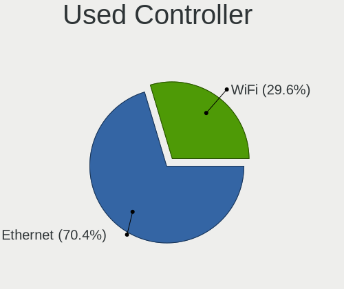

Fedora - Hardware Trends (Desktops)
-----------------------------------

A project to identify most popular hardware characteristics and track their change
over time based on data collected by Linux users at https://Linux-Hardware.org.

Anyone can contribute to this report by the [hw-probe](https://github.com/linuxhw/hw-probe) tool:

    sudo -E hw-probe -all -upload

This report is for one last month. Overall report since the beginning of time: [TestCoverage](https://github.com/linuxhw/TestCoverage)

Period: Jul, 2022.

Contents
--------

* [ System ](#system)
  - [ OS                       ](#os)
  - [ OS Family                ](#os-family)
  - [ Kernel                   ](#kernel)
  - [ Kernel Family            ](#kernel-family)
  - [ Kernel Major Ver.        ](#kernel-major-ver)
  - [ Arch                     ](#arch)
  - [ DE                       ](#de)
  - [ Display Server           ](#display-server)
  - [ Display Manager          ](#display-manager)
  - [ OS Lang                  ](#os-lang)
  - [ Boot Mode                ](#boot-mode)
  - [ Filesystem               ](#filesystem)
  - [ Part. scheme             ](#part-scheme)
  - [ Dual Boot with Linux/BSD ](#dual-boot-with-linuxbsd)
  - [ Dual Boot (Win)          ](#dual-boot-win)

* [ Board ](#board)
  - [ Vendor                   ](#vendor)
  - [ Model                    ](#model)
  - [ Model Family             ](#model-family)
  - [ MFG Year                 ](#mfg-year)
  - [ Form Factor              ](#form-factor)
  - [ Secure Boot              ](#secure-boot)
  - [ Coreboot                 ](#coreboot)
  - [ RAM Size                 ](#ram-size)
  - [ RAM Used                 ](#ram-used)
  - [ Total Drives             ](#total-drives)
  - [ Has CD-ROM               ](#has-cd-rom)
  - [ Has Ethernet             ](#has-ethernet)
  - [ Has WiFi                 ](#has-wifi)
  - [ Has Bluetooth            ](#has-bluetooth)

* [ Location ](#location)
  - [ Country                  ](#country)
  - [ City                     ](#city)

* [ Drives ](#drives)
  - [ Drive Vendor             ](#drive-vendor)
  - [ Drive Model              ](#drive-model)
  - [ HDD Vendor               ](#hdd-vendor)
  - [ SSD Vendor               ](#ssd-vendor)
  - [ Drive Kind               ](#drive-kind)
  - [ Drive Connector          ](#drive-connector)
  - [ Drive Size               ](#drive-size)
  - [ Space Total              ](#space-total)
  - [ Space Used               ](#space-used)
  - [ Malfunc. Drives          ](#malfunc-drives)
  - [ Malfunc. Drive Vendor    ](#malfunc-drive-vendor)
  - [ Malfunc. HDD Vendor      ](#malfunc-hdd-vendor)
  - [ Malfunc. Drive Kind      ](#malfunc-drive-kind)
  - [ Failed Drives            ](#failed-drives)
  - [ Failed Drive Vendor      ](#failed-drive-vendor)
  - [ Drive Status             ](#drive-status)

* [ Storage controller ](#storage-controller)
  - [ Storage Vendor           ](#storage-vendor)
  - [ Storage Model            ](#storage-model)
  - [ Storage Kind             ](#storage-kind)

* [ Processor ](#processor)
  - [ CPU Vendor               ](#cpu-vendor)
  - [ CPU Model                ](#cpu-model)
  - [ CPU Model Family         ](#cpu-model-family)
  - [ CPU Cores                ](#cpu-cores)
  - [ CPU Sockets              ](#cpu-sockets)
  - [ CPU Threads              ](#cpu-threads)
  - [ CPU Op-Modes             ](#cpu-op-modes)
  - [ CPU Microcode            ](#cpu-microcode)
  - [ CPU Microarch            ](#cpu-microarch)

* [ Graphics ](#graphics)
  - [ GPU Vendor               ](#gpu-vendor)
  - [ GPU Model                ](#gpu-model)
  - [ GPU Combo                ](#gpu-combo)
  - [ GPU Driver               ](#gpu-driver)
  - [ GPU Memory               ](#gpu-memory)

* [ Monitor ](#monitor)
  - [ Monitor Vendor           ](#monitor-vendor)
  - [ Monitor Model            ](#monitor-model)
  - [ Monitor Resolution       ](#monitor-resolution)
  - [ Monitor Diagonal         ](#monitor-diagonal)
  - [ Monitor Width            ](#monitor-width)
  - [ Aspect Ratio             ](#aspect-ratio)
  - [ Monitor Area             ](#monitor-area)
  - [ Pixel Density            ](#pixel-density)
  - [ Multiple Monitors        ](#multiple-monitors)

* [ Network ](#network)
  - [ Net Controller Vendor    ](#net-controller-vendor)
  - [ Net Controller Model     ](#net-controller-model)
  - [ Wireless Vendor          ](#wireless-vendor)
  - [ Wireless Model           ](#wireless-model)
  - [ Ethernet Vendor          ](#ethernet-vendor)
  - [ Ethernet Model           ](#ethernet-model)
  - [ Net Controller Kind      ](#net-controller-kind)
  - [ Used Controller          ](#used-controller)
  - [ NICs                     ](#nics)
  - [ IPv6                     ](#ipv6)

* [ Bluetooth ](#bluetooth)
  - [ Bluetooth Vendor         ](#bluetooth-vendor)
  - [ Bluetooth Model          ](#bluetooth-model)

* [ Sound ](#sound)
  - [ Sound Vendor             ](#sound-vendor)
  - [ Sound Model              ](#sound-model)

* [ Memory ](#memory)
  - [ Memory Vendor            ](#memory-vendor)
  - [ Memory Model             ](#memory-model)
  - [ Memory Kind              ](#memory-kind)
  - [ Memory Form Factor       ](#memory-form-factor)
  - [ Memory Size              ](#memory-size)
  - [ Memory Speed             ](#memory-speed)

* [ Printers & scanners ](#printers--scanners)
  - [ Printer Vendor           ](#printer-vendor)
  - [ Printer Model            ](#printer-model)
  - [ Scanner Vendor           ](#scanner-vendor)
  - [ Scanner Model            ](#scanner-model)

* [ Camera ](#camera)
  - [ Camera Vendor            ](#camera-vendor)
  - [ Camera Model             ](#camera-model)

* [ Security ](#security)
  - [ Fingerprint Vendor       ](#fingerprint-vendor)
  - [ Fingerprint Model        ](#fingerprint-model)
  - [ Chipcard Vendor          ](#chipcard-vendor)
  - [ Chipcard Model           ](#chipcard-model)

* [ Unsupported ](#unsupported)
  - [ Unsupported Devices      ](#unsupported-devices)
  - [ Unsupported Device Types ](#unsupported-device-types)

System
------

OS
--

Installed operating systems

| Name      | Desktops | Percent |
|-----------|----------|---------|
| Fedora 36 | 110      | 88.71%  |
| Fedora 35 | 11       | 8.87%   |
| Fedora 34 | 2        | 1.61%   |
| Fedora 32 | 1        | 0.81%   |

OS Family
---------

OS without a version

| Name   | Desktops | Percent |
|--------|----------|---------|
| Fedora | 124      | 100%    |

Kernel
------

Version of the Linux kernel

| Version                       | Desktops | Percent |
|-------------------------------|----------|---------|
| 5.18.11-200.fc36.x86_64       | 29       | 23.39%  |
| 5.18.13-200.fc36.x86_64       | 25       | 20.16%  |
| 5.18.10-200.fc36.x86_64       | 18       | 14.52%  |
| 5.18.9-200.fc36.x86_64        | 15       | 12.1%   |
| 5.18.7-200.fc36.x86_64        | 9        | 7.26%   |
| 5.18.6-200.fc36.x86_64        | 3        | 2.42%   |
| 5.17.5-300.fc36.x86_64        | 3        | 2.42%   |
| 5.17.12-100.fc34.x86_64       | 2        | 1.61%   |
| 5.16.18-200.fc35.x86_64       | 2        | 1.61%   |
| 5.19.0-0.rc5.39.fc37.x86_64   | 1        | 0.81%   |
| 5.18.9-gnu                    | 1        | 0.81%   |
| 5.18.9-201.fsync.fc36.x86_64  | 1        | 0.81%   |
| 5.18.9-100.fc35.x86_64        | 1        | 0.81%   |
| 5.18.8-xm1.0.fc36.x86_64      | 1        | 0.81%   |
| 5.18.7-100.fc35.x86_64        | 1        | 0.81%   |
| 5.18.6-201.fsync.fc36.x86_64  | 1        | 0.81%   |
| 5.18.5-100.fc35.x86_64        | 1        | 0.81%   |
| 5.18.4-101.fc35.x86_64        | 1        | 0.81%   |
| 5.18.13-100.fc35.x86_64       | 1        | 0.81%   |
| 5.18.11-100.fc35.x86_64       | 1        | 0.81%   |
| 5.18.10-201.fsync.fc36.x86_64 | 1        | 0.81%   |
| 5.18.10-100.fc35.x86_64       | 1        | 0.81%   |
| 5.17.4-200.fc35.x86_64        | 1        | 0.81%   |
| 5.17.12-300.fc36.x86_64       | 1        | 0.81%   |
| 5.16.8-200.fc35.x86_64        | 1        | 0.81%   |
| 5.16.11-200.fc35.x86_64       | 1        | 0.81%   |
| 4.18.16-300.fc29.x86_64       | 1        | 0.81%   |

Kernel Family
-------------

Linux kernel without a distro release

| Version | Desktops | Percent |
|---------|----------|---------|
| 5.18.11 | 30       | 24.19%  |
| 5.18.13 | 26       | 20.97%  |
| 5.18.10 | 20       | 16.13%  |
| 5.18.9  | 18       | 14.52%  |
| 5.18.7  | 10       | 8.06%   |
| 5.18.6  | 4        | 3.23%   |
| 5.17.5  | 3        | 2.42%   |
| 5.17.12 | 3        | 2.42%   |
| 5.16.18 | 2        | 1.61%   |
| 5.19.0  | 1        | 0.81%   |
| 5.18.8  | 1        | 0.81%   |
| 5.18.5  | 1        | 0.81%   |
| 5.18.4  | 1        | 0.81%   |
| 5.17.4  | 1        | 0.81%   |
| 5.16.8  | 1        | 0.81%   |
| 5.16.11 | 1        | 0.81%   |
| 4.18.16 | 1        | 0.81%   |

Kernel Major Ver.
-----------------

Linux kernel major version

| Version | Desktops | Percent |
|---------|----------|---------|
| 5.18    | 111      | 89.52%  |
| 5.17    | 7        | 5.65%   |
| 5.16    | 4        | 3.23%   |
| 5.19    | 1        | 0.81%   |
| 4.18    | 1        | 0.81%   |

Arch
----

OS architecture (x86_64, i586, etc.)

| Name   | Desktops | Percent |
|--------|----------|---------|
| x86_64 | 124      | 100%    |

DE
--

Desktop Environment

| Name          | Desktops | Percent |
|---------------|----------|---------|
| GNOME         | 81       | 65.32%  |
| KDE5          | 23       | 18.55%  |
| XFCE          | 7        | 5.65%   |
| Cinnamon      | 7        | 5.65%   |
| X-Cinnamon    | 2        | 1.61%   |
| MATE          | 2        | 1.61%   |
| GNOME Classic | 1        | 0.81%   |
| Unknown       | 1        | 0.81%   |

Display Server
--------------

X11 or Wayland

| Name    | Desktops | Percent |
|---------|----------|---------|
| Wayland | 65       | 52.42%  |
| X11     | 51       | 41.13%  |
| Tty     | 7        | 5.65%   |
| Web     | 1        | 0.81%   |

Display Manager
---------------

SDDM, LightDM, etc.

| Name    | Desktops | Percent |
|---------|----------|---------|
| Unknown | 67       | 54.03%  |
| GDM     | 28       | 22.58%  |
| LightDM | 17       | 13.71%  |
| SDDM    | 12       | 9.68%   |

OS Lang
-------

Language

| Lang  | Desktops | Percent |
|-------|----------|---------|
| en_US | 54       | 43.55%  |
| ru_RU | 13       | 10.48%  |
| pt_BR | 11       | 8.87%   |
| en_AU | 10       | 8.06%   |
| en_GB | 8        | 6.45%   |
| es_ES | 5        | 4.03%   |
| de_DE | 3        | 2.42%   |
| pl_PL | 2        | 1.61%   |
| fr_FR | 2        | 1.61%   |
| en_IN | 2        | 1.61%   |
| en_CA | 2        | 1.61%   |
| zh_CN | 1        | 0.81%   |
| sv_SE | 1        | 0.81%   |
| sk_SK | 1        | 0.81%   |
| id_ID | 1        | 0.81%   |
| es_MX | 1        | 0.81%   |
| es_AR | 1        | 0.81%   |
| en_NZ | 1        | 0.81%   |
| en_IE | 1        | 0.81%   |
| en_DK | 1        | 0.81%   |
| de_AT | 1        | 0.81%   |
| cs_CZ | 1        | 0.81%   |
| C     | 1        | 0.81%   |

Boot Mode
---------

EFI or BIOS

| Mode | Desktops | Percent |
|------|----------|---------|
| EFI  | 89       | 71.77%  |
| BIOS | 35       | 28.23%  |

Filesystem
----------

Type of filesystem

| Type  | Desktops | Percent |
|-------|----------|---------|
| Btrfs | 92       | 74.19%  |
| Ext4  | 25       | 20.16%  |
| Xfs   | 7        | 5.65%   |

Part. scheme
------------

Scheme of partitioning

| Type    | Desktops | Percent |
|---------|----------|---------|
| Unknown | 66       | 53.23%  |
| GPT     | 44       | 35.48%  |
| MBR     | 14       | 11.29%  |

Dual Boot with Linux/BSD
------------------------

Hosting more than one Linux/BSD

| Dual boot | Desktops | Percent |
|-----------|----------|---------|
| No        | 108      | 87.1%   |
| Yes       | 16       | 12.9%   |

Dual Boot (Win)
---------------

Hosting Linux and Windows

| Dual boot | Desktops | Percent |
|-----------|----------|---------|
| No        | 88       | 70.97%  |
| Yes       | 36       | 29.03%  |

Board
-----

Vendor
------

Motherboard manufacturer

| Name                | Desktops | Percent |
|---------------------|----------|---------|
| ASUSTek Computer    | 36       | 29.03%  |
| MSI                 | 29       | 23.39%  |
| Gigabyte Technology | 18       | 14.52%  |
| ASRock              | 10       | 8.06%   |
| Hewlett-Packard     | 9        | 7.26%   |
| Dell                | 6        | 4.84%   |
| Lenovo              | 4        | 3.23%   |
| Intel               | 2        | 1.61%   |
| ZOTAC               | 1        | 0.81%   |
| Pegatron            | 1        | 0.81%   |
| NCR                 | 1        | 0.81%   |
| Huanan              | 1        | 0.81%   |
| Gateway             | 1        | 0.81%   |
| Fujitsu             | 1        | 0.81%   |
| Foxconn             | 1        | 0.81%   |
| ECS                 | 1        | 0.81%   |
| Apple               | 1        | 0.81%   |
| Unknown             | 1        | 0.81%   |

Model
-----

Motherboard model

| Name                                | Desktops | Percent |
|-------------------------------------|----------|---------|
| MSI MS-7C91                         | 3        | 2.42%   |
| ASUS ROG STRIX B550-F GAMING        | 3        | 2.42%   |
| MSI MS-7D43                         | 2        | 1.61%   |
| MSI MS-7C37                         | 2        | 1.61%   |
| MSI MS-7A38                         | 2        | 1.61%   |
| HP Z2 Tower G4 Workstation          | 2        | 1.61%   |
| ASUS ROG STRIX B550-I GAMING        | 2        | 1.61%   |
| ASUS PRIME X470-PRO                 | 2        | 1.61%   |
| Unknown                             | 2        | 1.61%   |
| Pegatron IPM41-D3                   | 1        | 0.81%   |
| NCR 7606-1007-8801                  | 1        | 0.81%   |
| MSI MS-7D54                         | 1        | 0.81%   |
| MSI MS-7D25                         | 1        | 0.81%   |
| MSI MS-7D13                         | 1        | 0.81%   |
| MSI MS-7C95                         | 1        | 0.81%   |
| MSI MS-7C92                         | 1        | 0.81%   |
| MSI MS-7C75                         | 1        | 0.81%   |
| MSI MS-7C56                         | 1        | 0.81%   |
| MSI MS-7C35                         | 1        | 0.81%   |
| MSI MS-7C31                         | 1        | 0.81%   |
| MSI MS-7C02                         | 1        | 0.81%   |
| MSI MS-7B86                         | 1        | 0.81%   |
| MSI MS-7B48                         | 1        | 0.81%   |
| MSI MS-7A33                         | 1        | 0.81%   |
| MSI MS-7996                         | 1        | 0.81%   |
| MSI MS-7924                         | 1        | 0.81%   |
| MSI MS-7917                         | 1        | 0.81%   |
| MSI MS-7885                         | 1        | 0.81%   |
| MSI MS-7529                         | 1        | 0.81%   |
| MSI Cubi N JSL (MS-B0A1)            | 1        | 0.81%   |
| MSI CQ3321L                         | 1        | 0.81%   |
| Lenovo ThinkCentre M78 17661A1      | 1        | 0.81%   |
| Lenovo ThinkCentre M58p 7220A72     | 1        | 0.81%   |
| Lenovo ThinkCentre E73 10AS0035SP   | 1        | 0.81%   |
| Lenovo Legion T5 28IMB05 90NC00AFAU | 1        | 0.81%   |
| Intel DP55KG AAE47218-404           | 1        | 0.81%   |
| Intel DH61WW AAG23116-301           | 1        | 0.81%   |
| Huanan B75                          | 1        | 0.81%   |
| HP Z240 SFF Workstation             | 1        | 0.81%   |
| HP Z2 G8 SFF Workstation Desktop PC | 1        | 0.81%   |
| HP Slim Desktop S01-pF1xxx          | 1        | 0.81%   |
| HP rp5800                           | 1        | 0.81%   |
| HP Pavilion Desktop TP01-2xxx       | 1        | 0.81%   |
| HP Compaq 8200 Elite CMT PC         | 1        | 0.81%   |
| HP Compaq 8000 Elite SFF PC         | 1        | 0.81%   |
| Gigabyte Z590I AORUS ULTRA          | 1        | 0.81%   |
| Gigabyte Z370 AORUS Gaming 5        | 1        | 0.81%   |
| Gigabyte X99-UD4-CF                 | 1        | 0.81%   |
| Gigabyte X570 AORUS MASTER          | 1        | 0.81%   |
| Gigabyte H77N-WIFI                  | 1        | 0.81%   |
| Gigabyte H61M-DS2V                  | 1        | 0.81%   |
| Gigabyte GA-MA785G-UD3H             | 1        | 0.81%   |
| Gigabyte GA-MA780G-UD3H             | 1        | 0.81%   |
| Gigabyte GA-A55M-S2V                | 1        | 0.81%   |
| Gigabyte GA-880GM-UD2H              | 1        | 0.81%   |
| Gigabyte GA-78LMT-USB3 6.0          | 1        | 0.81%   |
| Gigabyte GA-78LMT-S2P               | 1        | 0.81%   |
| Gigabyte F2A68HM-DS2                | 1        | 0.81%   |
| Gigabyte B85M-D3H                   | 1        | 0.81%   |
| Gigabyte B660M AORUS PRO AX DDR4    | 1        | 0.81%   |

Model Family
------------

Motherboard model prefix

| Name                    | Desktops | Percent |
|-------------------------|----------|---------|
| ASUS ROG                | 16       | 12.9%   |
| ASUS PRIME              | 7        | 5.65%   |
| Dell OptiPlex           | 4        | 3.23%   |
| MSI MS-7C91             | 3        | 2.42%   |
| Lenovo ThinkCentre      | 3        | 2.42%   |
| HP Z2                   | 3        | 2.42%   |
| MSI MS-7D43             | 2        | 1.61%   |
| MSI MS-7C37             | 2        | 1.61%   |
| MSI MS-7A38             | 2        | 1.61%   |
| HP Compaq               | 2        | 1.61%   |
| ASUS TUF                | 2        | 1.61%   |
| ASRock X570             | 2        | 1.61%   |
| ASRock B450M            | 2        | 1.61%   |
| Unknown                 | 2        | 1.61%   |
| Pegatron IPM41-D3       | 1        | 0.81%   |
| NCR 7606-1007-8801      | 1        | 0.81%   |
| MSI MS-7D54             | 1        | 0.81%   |
| MSI MS-7D25             | 1        | 0.81%   |
| MSI MS-7D13             | 1        | 0.81%   |
| MSI MS-7C95             | 1        | 0.81%   |
| MSI MS-7C92             | 1        | 0.81%   |
| MSI MS-7C75             | 1        | 0.81%   |
| MSI MS-7C56             | 1        | 0.81%   |
| MSI MS-7C35             | 1        | 0.81%   |
| MSI MS-7C31             | 1        | 0.81%   |
| MSI MS-7C02             | 1        | 0.81%   |
| MSI MS-7B86             | 1        | 0.81%   |
| MSI MS-7B48             | 1        | 0.81%   |
| MSI MS-7A33             | 1        | 0.81%   |
| MSI MS-7996             | 1        | 0.81%   |
| MSI MS-7924             | 1        | 0.81%   |
| MSI MS-7917             | 1        | 0.81%   |
| MSI MS-7885             | 1        | 0.81%   |
| MSI MS-7529             | 1        | 0.81%   |
| MSI Cubi                | 1        | 0.81%   |
| MSI CQ3321L             | 1        | 0.81%   |
| Lenovo Legion           | 1        | 0.81%   |
| Intel DP55KG            | 1        | 0.81%   |
| Intel DH61WW            | 1        | 0.81%   |
| Huanan B75              | 1        | 0.81%   |
| HP Z240                 | 1        | 0.81%   |
| HP Slim                 | 1        | 0.81%   |
| HP rp5800               | 1        | 0.81%   |
| HP Pavilion             | 1        | 0.81%   |
| Gigabyte Z590I          | 1        | 0.81%   |
| Gigabyte Z370           | 1        | 0.81%   |
| Gigabyte X99-UD4-CF     | 1        | 0.81%   |
| Gigabyte X570           | 1        | 0.81%   |
| Gigabyte H77N-WIFI      | 1        | 0.81%   |
| Gigabyte H61M-DS2V      | 1        | 0.81%   |
| Gigabyte GA-MA785G-UD3H | 1        | 0.81%   |
| Gigabyte GA-MA780G-UD3H | 1        | 0.81%   |
| Gigabyte GA-A55M-S2V    | 1        | 0.81%   |
| Gigabyte GA-880GM-UD2H  | 1        | 0.81%   |
| Gigabyte GA-78LMT-USB3  | 1        | 0.81%   |
| Gigabyte GA-78LMT-S2P   | 1        | 0.81%   |
| Gigabyte F2A68HM-DS2    | 1        | 0.81%   |
| Gigabyte B85M-D3H       | 1        | 0.81%   |
| Gigabyte B660M          | 1        | 0.81%   |
| Gigabyte B450M          | 1        | 0.81%   |

MFG Year
--------

Motherboard manufacture year

| Year | Desktops | Percent |
|------|----------|---------|
| 2020 | 21       | 16.94%  |
| 2019 | 20       | 16.13%  |
| 2021 | 13       | 10.48%  |
| 2018 | 8        | 6.45%   |
| 2013 | 8        | 6.45%   |
| 2012 | 8        | 6.45%   |
| 2011 | 7        | 5.65%   |
| 2022 | 6        | 4.84%   |
| 2017 | 6        | 4.84%   |
| 2014 | 6        | 4.84%   |
| 2010 | 5        | 4.03%   |
| 2009 | 5        | 4.03%   |
| 2016 | 4        | 3.23%   |
| 2015 | 4        | 3.23%   |
| 2008 | 2        | 1.61%   |
| 2006 | 1        | 0.81%   |

Form Factor
-----------

Physical design of the computer

| Name    | Desktops | Percent |
|---------|----------|---------|
| Desktop | 124      | 100%    |

Secure Boot
-----------

Enabled or disabled

| State    | Desktops | Percent |
|----------|----------|---------|
| Disabled | 111      | 89.52%  |
| Enabled  | 13       | 10.48%  |

Coreboot
--------

Have coreboot on board

| Used | Desktops | Percent |
|------|----------|---------|
| No   | 124      | 100%    |

RAM Size
--------

Total RAM memory

| Size in GB  | Desktops | Percent |
|-------------|----------|---------|
| 32.01-64.0  | 40       | 32.26%  |
| 16.01-24.0  | 34       | 27.42%  |
| 4.01-8.0    | 16       | 12.9%   |
| 64.01-256.0 | 15       | 12.1%   |
| 8.01-16.0   | 12       | 9.68%   |
| 24.01-32.0  | 3        | 2.42%   |
| 3.01-4.0    | 2        | 1.61%   |
| 2.01-3.0    | 1        | 0.81%   |
| 1.01-2.0    | 1        | 0.81%   |

RAM Used
--------

Used RAM memory

| Used GB     | Desktops | Percent |
|-------------|----------|---------|
| 4.01-8.0    | 40       | 32.26%  |
| 2.01-3.0    | 29       | 23.39%  |
| 3.01-4.0    | 25       | 20.16%  |
| 8.01-16.0   | 14       | 11.29%  |
| 1.01-2.0    | 8        | 6.45%   |
| 16.01-24.0  | 4        | 3.23%   |
| 0.51-1.0    | 3        | 2.42%   |
| 64.01-256.0 | 1        | 0.81%   |

Total Drives
------------

Number of drives on board

| Drives | Desktops | Percent |
|--------|----------|---------|
| 2      | 42       | 33.87%  |
| 1      | 30       | 24.19%  |
| 3      | 23       | 18.55%  |
| 4      | 18       | 14.52%  |
| 6      | 4        | 3.23%   |
| 7      | 3        | 2.42%   |
| 5      | 3        | 2.42%   |
| 10     | 1        | 0.81%   |

Has CD-ROM
----------

Has CD-ROM on board

| Presented | Desktops | Percent |
|-----------|----------|---------|
| No        | 89       | 71.77%  |
| Yes       | 35       | 28.23%  |

Has Ethernet
------------

Has Ethernet on board

| Presented | Desktops | Percent |
|-----------|----------|---------|
| Yes       | 122      | 98.39%  |
| No        | 2        | 1.61%   |

Has WiFi
--------

Has WiFi module

| Presented | Desktops | Percent |
|-----------|----------|---------|
| Yes       | 63       | 50.81%  |
| No        | 61       | 49.19%  |

Has Bluetooth
-------------

Has Bluetooth module

| Presented | Desktops | Percent |
|-----------|----------|---------|
| No        | 67       | 54.03%  |
| Yes       | 57       | 45.97%  |

Location
--------

Country
-------

Geographic location (country)

| Country         | Desktops | Percent |
|-----------------|----------|---------|
| USA             | 30       | 24.19%  |
| Russia          | 14       | 11.29%  |
| Brazil          | 14       | 11.29%  |
| Australia       | 10       | 8.06%   |
| UK              | 5        | 4.03%   |
| Spain           | 5        | 4.03%   |
| Poland          | 4        | 3.23%   |
| France          | 4        | 3.23%   |
| Germany         | 3        | 2.42%   |
| Switzerland     | 2        | 1.61%   |
| Sweden          | 2        | 1.61%   |
| Slovakia        | 2        | 1.61%   |
| Norway          | 2        | 1.61%   |
| Indonesia       | 2        | 1.61%   |
| India           | 2        | 1.61%   |
| Canada          | 2        | 1.61%   |
| Vietnam         | 1        | 0.81%   |
| Uruguay         | 1        | 0.81%   |
| Sri Lanka       | 1        | 0.81%   |
| South Korea     | 1        | 0.81%   |
| Puerto Rico     | 1        | 0.81%   |
| Philippines     | 1        | 0.81%   |
| Pakistan        | 1        | 0.81%   |
| North Macedonia | 1        | 0.81%   |
| Netherlands     | 1        | 0.81%   |
| Mexico          | 1        | 0.81%   |
| Italy           | 1        | 0.81%   |
| Ireland         | 1        | 0.81%   |
| Finland         | 1        | 0.81%   |
| Estonia         | 1        | 0.81%   |
| Denmark         | 1        | 0.81%   |
| Czechia         | 1        | 0.81%   |
| China           | 1        | 0.81%   |
| Bulgaria        | 1        | 0.81%   |
| Austria         | 1        | 0.81%   |
| Argentina       | 1        | 0.81%   |
| Albania         | 1        | 0.81%   |

City
----

Geographic location (city)

| City                     | Desktops | Percent |
|--------------------------|----------|---------|
| Launceston               | 5        | 4.03%   |
| Moscow                   | 4        | 3.23%   |
| Brisbane                 | 3        | 2.42%   |
| Vitória                 | 2        | 1.61%   |
| Pasco                    | 2        | 1.61%   |
| Novosibirsk              | 2        | 1.61%   |
| Los Angeles              | 2        | 1.61%   |
| Kristiansand             | 2        | 1.61%   |
| Kansas City              | 2        | 1.61%   |
| Jakarta                  | 2        | 1.61%   |
| Chicago                  | 2        | 1.61%   |
| Zurich                   | 1        | 0.81%   |
| Wroclaw                  | 1        | 0.81%   |
| West Bromwich            | 1        | 0.81%   |
| Vienna                   | 1        | 0.81%   |
| Vancouver                | 1        | 0.81%   |
| Valencia                 | 1        | 0.81%   |
| Tomsk                    | 1        | 0.81%   |
| Tirana                   | 1        | 0.81%   |
| Thornton Heath           | 1        | 0.81%   |
| The Hague                | 1        | 0.81%   |
| Taytay                   | 1        | 0.81%   |
| Tallinn                  | 1        | 0.81%   |
| Stittsville              | 1        | 0.81%   |
| Stewartby                | 1        | 0.81%   |
| Skopje                   | 1        | 0.81%   |
| Seattle                  | 1        | 0.81%   |
| Sautron                  | 1        | 0.81%   |
| Santa Maria de Jetiba    | 1        | 0.81%   |
| Sandpoint                | 1        | 0.81%   |
| San Juan                 | 1        | 0.81%   |
| Salt Lake City           | 1        | 0.81%   |
| Rødovre Municipality    | 1        | 0.81%   |
| Rixheim                  | 1        | 0.81%   |
| Rio de Janeiro           | 1        | 0.81%   |
| Rinteln                  | 1        | 0.81%   |
| Ribeirao Preto           | 1        | 0.81%   |
| Porto Alegre             | 1        | 0.81%   |
| Plainfield               | 1        | 0.81%   |
| Petropavlovsk-Kamchatsky | 1        | 0.81%   |
| Pensacola                | 1        | 0.81%   |
| Paris                    | 1        | 0.81%   |
| Palakkad                 | 1        | 0.81%   |
| Onda                     | 1        | 0.81%   |
| Odintsovo                | 1        | 0.81%   |
| Norrköping              | 1        | 0.81%   |
| New York                 | 1        | 0.81%   |
| New Braunfels            | 1        | 0.81%   |
| Murino                   | 1        | 0.81%   |
| Montevideo               | 1        | 0.81%   |
| Mobile                   | 1        | 0.81%   |
| Mexico City              | 1        | 0.81%   |
| Merced                   | 1        | 0.81%   |
| Melbourne                | 1        | 0.81%   |
| Marion                   | 1        | 0.81%   |
| Maracanau                | 1        | 0.81%   |
| Maharagama               | 1        | 0.81%   |
| Lerum                    | 1        | 0.81%   |
| Leganés                 | 1        | 0.81%   |
| Lane Cove                | 1        | 0.81%   |

Drives
------

Drive Vendor
------------

Hard drive vendors

| Vendor                    | Desktops | Drives | Percent |
|---------------------------|----------|--------|---------|
| WDC                       | 46       | 67     | 17.9%   |
| Seagate                   | 44       | 63     | 17.12%  |
| Samsung Electronics       | 44       | 66     | 17.12%  |
| Kingston                  | 17       | 19     | 6.61%   |
| SanDisk                   | 15       | 15     | 5.84%   |
| Toshiba                   | 14       | 14     | 5.45%   |
| Crucial                   | 13       | 13     | 5.06%   |
| Phison                    | 8        | 9      | 3.11%   |
| Intel                     | 6        | 6      | 2.33%   |
| Micron/Crucial Technology | 5        | 5      | 1.95%   |
| Hitachi                   | 5        | 5      | 1.95%   |
| SPCC                      | 4        | 5      | 1.56%   |
| China                     | 4        | 4      | 1.56%   |
| SK hynix                  | 3        | 3      | 1.17%   |
| A-DATA Technology         | 3        | 3      | 1.17%   |
| Patriot                   | 2        | 2      | 0.78%   |
| GOODRAM                   | 2        | 2      | 0.78%   |
| Gigabyte Technology       | 2        | 3      | 0.78%   |
| Corsair                   | 2        | 3      | 0.78%   |
| Unknown                   | 1        | 1      | 0.39%   |
| Timetec                   | 1        | 1      | 0.39%   |
| Team                      | 1        | 1      | 0.39%   |
| T-FORCE                   | 1        | 1      | 0.39%   |
| Silicon Motion            | 1        | 1      | 0.39%   |
| SABRENT                   | 1        | 1      | 0.39%   |
| Plextor                   | 1        | 1      | 0.39%   |
| Phison Electronics        | 1        | 1      | 0.39%   |
| MyDigitalSSD              | 1        | 1      | 0.39%   |
| Micron Technology         | 1        | 1      | 0.39%   |
| KIOXIA-EXCERIA            | 1        | 1      | 0.39%   |
| KIOXIA                    | 1        | 2      | 0.39%   |
| KingDian                  | 1        | 1      | 0.39%   |
| Intenso                   | 1        | 1      | 0.39%   |
| HGST                      | 1        | 1      | 0.39%   |
| Colorful                  | 1        | 1      | 0.39%   |
| ASMT106x                  | 1        | 1      | 0.39%   |
| Unknown                   | 1        | 1      | 0.39%   |

Drive Model
-----------

Hard drive models

| Model                                | Desktops | Percent |
|--------------------------------------|----------|---------|
| Samsung NVMe SSD Drive 1TB           | 8        | 2.61%   |
| Samsung NVMe SSD Drive 500GB         | 5        | 1.63%   |
| Samsung NVMe SSD Drive 2TB           | 5        | 1.63%   |
| WDC WD10EZEX-08WN4A0 1TB             | 4        | 1.3%    |
| Seagate ST500DM002-1BD142 500GB      | 4        | 1.3%    |
| Samsung SSD 850 EVO 500GB            | 4        | 1.3%    |
| Samsung SSD 850 EVO 250GB            | 4        | 1.3%    |
| Kingston SA400S37240G 240GB SSD      | 4        | 1.3%    |
| Crucial CT1000MX500SSD1 1TB          | 4        | 1.3%    |
| WDC WDS240G2G0A-00JH30 240GB SSD     | 3        | 0.98%   |
| Toshiba DT01ACA100 1TB               | 3        | 0.98%   |
| Seagate ST2000DM008-2FR102 2TB       | 3        | 0.98%   |
| Seagate ST2000DM001-1ER164 2TB       | 3        | 0.98%   |
| Seagate ST1000DM010-2EP102 1TB       | 3        | 0.98%   |
| SanDisk NVMe SSD Drive 500GB         | 3        | 0.98%   |
| Samsung SSD 860 EVO 500GB            | 3        | 0.98%   |
| Phison NVMe SSD Drive 1024GB         | 3        | 0.98%   |
| Micron/Crucial NVMe SSD Drive 1TB    | 3        | 0.98%   |
| Crucial CT240BX500SSD1 240GB         | 3        | 0.98%   |
| WDC WDS100T2B0C-00PXH0 1TB           | 2        | 0.65%   |
| WDC WD5000AAKX-08U6AA0 500GB         | 2        | 0.65%   |
| WDC WD5000AAKX-003CA0 500GB          | 2        | 0.65%   |
| WDC WD10EZEX-60M2NA0 1TB             | 2        | 0.65%   |
| WDC WD10EZEX-08M2NA0 1TB             | 2        | 0.65%   |
| Toshiba HDWD110 1TB                  | 2        | 0.65%   |
| Seagate ST2000DM001-1CH164 2TB       | 2        | 0.65%   |
| Seagate ST1000LM024 HN-M101MBB 1TB   | 2        | 0.65%   |
| Seagate ST1000DM003-1SB102 1TB       | 2        | 0.65%   |
| Seagate ST1000DM003-1ER162 1TB       | 2        | 0.65%   |
| Seagate Expansion 1TB                | 2        | 0.65%   |
| SanDisk NVMe SSD Drive 480GB         | 2        | 0.65%   |
| Samsung SSD 970 EVO Plus 1TB         | 2        | 0.65%   |
| Samsung SSD 870 QVO 2TB              | 2        | 0.65%   |
| Samsung SSD 850 EVO 120GB            | 2        | 0.65%   |
| Samsung NVMe SSD Drive 1024GB        | 2        | 0.65%   |
| Samsung MZ7LN256HMJP-000H1 256GB SSD | 2        | 0.65%   |
| Patriot Burst 480GB SSD              | 2        | 0.65%   |
| Kingston SA400S37480G 480GB SSD      | 2        | 0.65%   |
| Kingston SA400S37120G 120GB SSD      | 2        | 0.65%   |
| Intel SSDPEKNW010T8 1TB              | 2        | 0.65%   |
| Crucial CT500MX500SSD1 500GB         | 2        | 0.65%   |
| Corsair Force MP510 960GB            | 2        | 0.65%   |
| WDC WDS500G2B0A-00SM50 500GB SSD     | 1        | 0.33%   |
| WDC WDS480G2G0A-00JH30 480GB SSD     | 1        | 0.33%   |
| WDC WDS200T1X0E-00AFY0 2TB           | 1        | 0.33%   |
| WDC WDS100T3X0C-00SJG0 1TB           | 1        | 0.33%   |
| WDC WDS100T2G0A-00JH30 1TB SSD       | 1        | 0.33%   |
| WDC WDS100T2B0A-00SM50 1TB SSD       | 1        | 0.33%   |
| WDC WDS100T1X0E-00AFY0 1TB           | 1        | 0.33%   |
| WDC WDBNCE2500PNC 250GB SSD          | 1        | 0.33%   |
| WDC WD7500AACS-00D6B0 752GB          | 1        | 0.33%   |
| WDC WD60EFAX-68SHWN0 6TB             | 1        | 0.33%   |
| WDC WD5000LPVX-22V0TT0 500GB         | 1        | 0.33%   |
| WDC WD5000AZLX-08K2TA0 500GB         | 1        | 0.33%   |
| WDC WD5000AVCS-632DY1 500GB          | 1        | 0.33%   |
| WDC WD5000AAKX-08ERMA0 500GB         | 1        | 0.33%   |
| WDC WD5000AAKS-60Z1A0 500GB          | 1        | 0.33%   |
| WDC WD5000AAKS-00V1A0 500GB          | 1        | 0.33%   |
| WDC WD40EZRZ-00WN9B0 4TB             | 1        | 0.33%   |
| WDC WD40EZRZ-00GXCB0 4TB             | 1        | 0.33%   |

HDD Vendor
----------

Hard disk drive vendors

| Vendor              | Desktops | Drives | Percent |
|---------------------|----------|--------|---------|
| Seagate             | 42       | 61     | 41.58%  |
| WDC                 | 37       | 53     | 36.63%  |
| Toshiba             | 12       | 12     | 11.88%  |
| Hitachi             | 5        | 5      | 4.95%   |
| Samsung Electronics | 1        | 2      | 0.99%   |
| SABRENT             | 1        | 1      | 0.99%   |
| Intenso             | 1        | 1      | 0.99%   |
| HGST                | 1        | 1      | 0.99%   |
| ASMT106x            | 1        | 1      | 0.99%   |

SSD Vendor
----------

Solid state drive vendors

| Vendor              | Desktops | Drives | Percent |
|---------------------|----------|--------|---------|
| Samsung Electronics | 27       | 31     | 30%     |
| Kingston            | 12       | 13     | 13.33%  |
| Crucial             | 11       | 11     | 12.22%  |
| WDC                 | 8        | 8      | 8.89%   |
| SanDisk             | 6        | 6      | 6.67%   |
| SPCC                | 4        | 5      | 4.44%   |
| China               | 4        | 4      | 4.44%   |
| Intel               | 3        | 3      | 3.33%   |
| Patriot             | 2        | 2      | 2.22%   |
| Goodram             | 2        | 2      | 2.22%   |
| Gigabyte Technology | 2        | 3      | 2.22%   |
| A-DATA Technology   | 2        | 2      | 2.22%   |
| Toshiba             | 1        | 1      | 1.11%   |
| Timetec             | 1        | 1      | 1.11%   |
| Team                | 1        | 1      | 1.11%   |
| SK hynix            | 1        | 1      | 1.11%   |
| Plextor             | 1        | 1      | 1.11%   |
| MyDigitalSSD        | 1        | 1      | 1.11%   |
| KingDian            | 1        | 1      | 1.11%   |

Drive Kind
----------

HDD or SSD

| Kind    | Desktops | Drives | Percent |
|---------|----------|--------|---------|
| HDD     | 78       | 137    | 35.94%  |
| SSD     | 71       | 97     | 32.72%  |
| NVMe    | 65       | 89     | 29.95%  |
| Unknown | 3        | 3      | 1.38%   |

Drive Connector
---------------

SATA, SAS, NVMe, etc.

| Type | Desktops | Drives | Percent |
|------|----------|--------|---------|
| SATA | 105      | 227    | 59.66%  |
| NVMe | 65       | 89     | 36.93%  |
| SAS  | 6        | 10     | 3.41%   |

Drive Size
----------

Size of hard drive

| Size in TB | Desktops | Drives | Percent |
|------------|----------|--------|---------|
| 0.01-0.5   | 68       | 100    | 39.31%  |
| 0.51-1.0   | 59       | 77     | 34.1%   |
| 1.01-2.0   | 23       | 27     | 13.29%  |
| 3.01-4.0   | 10       | 14     | 5.78%   |
| 2.01-3.0   | 7        | 8      | 4.05%   |
| 4.01-10.0  | 4        | 5      | 2.31%   |
| 10.01-20.0 | 2        | 3      | 1.16%   |

Space Total
-----------

Amount of disk space available on the file system

| Size in GB     | Desktops | Percent |
|----------------|----------|---------|
| More than 3000 | 23       | 18.55%  |
| 1001-2000      | 23       | 18.55%  |
| 501-1000       | 21       | 16.94%  |
| 2001-3000      | 15       | 12.1%   |
| 251-500        | 14       | 11.29%  |
| 101-250        | 13       | 10.48%  |
| 1-20           | 6        | 4.84%   |
| 51-100         | 5        | 4.03%   |
| Unknown        | 3        | 2.42%   |
| 21-50          | 1        | 0.81%   |

Space Used
----------

Amount of used disk space

| Used GB        | Desktops | Percent |
|----------------|----------|---------|
| 1-20           | 21       | 16.94%  |
| 21-50          | 17       | 13.71%  |
| 251-500        | 15       | 12.1%   |
| 1001-2000      | 15       | 12.1%   |
| 501-1000       | 14       | 11.29%  |
| 101-250        | 13       | 10.48%  |
| 51-100         | 13       | 10.48%  |
| More than 3000 | 8        | 6.45%   |
| 2001-3000      | 5        | 4.03%   |
| Unknown        | 3        | 2.42%   |

Malfunc. Drives
---------------

Drive models with a malfunction

| Model                               | Desktops | Drives | Percent |
|-------------------------------------|----------|--------|---------|
| WDC WD5000AAKX-08ERMA0 500GB        | 1        | 1      | 5.56%   |
| WDC WD5000AAKX-003CA0 500GB         | 1        | 1      | 5.56%   |
| WDC WD2500AAKX-753CA1 250GB         | 1        | 1      | 5.56%   |
| WDC WD10EARS-22Y5B1 1TB             | 1        | 1      | 5.56%   |
| WDC WD1003FBYX-01Y7B1 752GB         | 1        | 1      | 5.56%   |
| Toshiba MQ01ABD050 500GB            | 1        | 1      | 5.56%   |
| Toshiba MK3275GSX 320GB             | 1        | 1      | 5.56%   |
| Toshiba DT01ACA100 1TB              | 1        | 1      | 5.56%   |
| SPCC Solid State Disk 1TB           | 1        | 2      | 5.56%   |
| Seagate ST500LM030-2E717D 500GB     | 1        | 1      | 5.56%   |
| Seagate ST500DM002-1BD142 500GB     | 1        | 1      | 5.56%   |
| Seagate ST3500418AS 500GB           | 1        | 1      | 5.56%   |
| Seagate ST3000DM001-1CH166 3TB      | 1        | 1      | 5.56%   |
| Samsung Electronics SSD 870 EVO 1TB | 1        | 1      | 5.56%   |
| Samsung Electronics SSD 850 EVO 1TB | 1        | 1      | 5.56%   |
| Samsung Electronics HD501LJ 500GB   | 1        | 2      | 5.56%   |
| Intel SSDSC2CT120A3 120GB           | 1        | 1      | 5.56%   |
| Hitachi HDP725050GLA360 500GB       | 1        | 1      | 5.56%   |

Malfunc. Drive Vendor
---------------------

Vendors of faulty drives

| Vendor              | Desktops | Drives | Percent |
|---------------------|----------|--------|---------|
| WDC                 | 5        | 5      | 27.78%  |
| Seagate             | 4        | 4      | 22.22%  |
| Toshiba             | 3        | 3      | 16.67%  |
| Samsung Electronics | 3        | 4      | 16.67%  |
| SPCC                | 1        | 2      | 5.56%   |
| Intel               | 1        | 1      | 5.56%   |
| Hitachi             | 1        | 1      | 5.56%   |

Malfunc. HDD Vendor
-------------------

Vendors of faulty HDD drives

| Vendor              | Desktops | Drives | Percent |
|---------------------|----------|--------|---------|
| WDC                 | 5        | 5      | 35.71%  |
| Seagate             | 4        | 4      | 28.57%  |
| Toshiba             | 3        | 3      | 21.43%  |
| Samsung Electronics | 1        | 2      | 7.14%   |
| Hitachi             | 1        | 1      | 7.14%   |

Malfunc. Drive Kind
-------------------

Kinds of faulty drives

| Kind | Desktops | Drives | Percent |
|------|----------|--------|---------|
| HDD  | 14       | 15     | 77.78%  |
| SSD  | 4        | 5      | 22.22%  |

Failed Drives
-------------

Failed drive models

Zero info for selected period =(

Failed Drive Vendor
-------------------

Failed drive vendors

Zero info for selected period =(

Drive Status
------------

Number of failed and malfunc. drives

| Status   | Desktops | Drives | Percent |
|----------|----------|--------|---------|
| Detected | 70       | 186    | 49.3%   |
| Works    | 54       | 120    | 38.03%  |
| Malfunc  | 18       | 20     | 12.68%  |

Storage controller
------------------

Storage Vendor
--------------

Storage controller vendors

| Vendor                       | Desktops | Percent |
|------------------------------|----------|---------|
| Intel                        | 63       | 30.29%  |
| AMD                          | 59       | 28.37%  |
| Samsung Electronics          | 26       | 12.5%   |
| SanDisk                      | 13       | 6.25%   |
| Phison Electronics           | 12       | 5.77%   |
| Micron/Crucial Technology    | 7        | 3.37%   |
| ASMedia Technology           | 7        | 3.37%   |
| Kingston Technology Company  | 5        | 2.4%    |
| Marvell Technology Group     | 4        | 1.92%   |
| SK hynix                     | 2        | 0.96%   |
| Seagate Technology           | 2        | 0.96%   |
| KIOXIA                       | 2        | 0.96%   |
| Toshiba America Info Systems | 1        | 0.48%   |
| Silicon Motion               | 1        | 0.48%   |
| Nvidia                       | 1        | 0.48%   |
| Micron Technology            | 1        | 0.48%   |
| JMicron Technology           | 1        | 0.48%   |
| ADATA Technology             | 1        | 0.48%   |

Storage Model
-------------

Storage controller models

| Model                                                                                   | Desktops | Percent |
|-----------------------------------------------------------------------------------------|----------|---------|
| AMD FCH SATA Controller [AHCI mode]                                                     | 30       | 12.1%   |
| Samsung NVMe SSD Controller SM981/PM981/PM983                                           | 14       | 5.65%   |
| AMD 400 Series Chipset SATA Controller                                                  | 14       | 5.65%   |
| AMD 500 Series Chipset SATA Controller                                                  | 13       | 5.24%   |
| Phison E12 NVMe Controller                                                              | 11       | 4.44%   |
| Intel SATA Controller [RAID mode]                                                       | 9        | 3.63%   |
| AMD SB7x0/SB8x0/SB9x0 SATA Controller [AHCI mode]                                       | 9        | 3.63%   |
| AMD SB7x0/SB8x0/SB9x0 IDE Controller                                                    | 8        | 3.23%   |
| Intel Alder Lake-S PCH SATA Controller [AHCI Mode]                                      | 7        | 2.82%   |
| Intel 8 Series/C220 Series Chipset Family 6-port SATA Controller 1 [AHCI mode]          | 7        | 2.82%   |
| SanDisk Non-Volatile memory controller                                                  | 6        | 2.42%   |
| Samsung NVMe SSD Controller PM9A1/PM9A3/980PRO                                          | 6        | 2.42%   |
| ASMedia ASM1062 Serial ATA Controller                                                   | 6        | 2.42%   |
| Samsung NVMe SSD Controller 980                                                         | 5        | 2.02%   |
| Intel 6 Series/C200 Series Chipset Family 6 port Desktop SATA AHCI Controller           | 5        | 2.02%   |
| Intel 200 Series PCH SATA controller [AHCI mode]                                        | 5        | 2.02%   |
| Intel Q170/Q150/B150/H170/H110/Z170/CM236 Chipset SATA Controller [AHCI Mode]           | 4        | 1.61%   |
| Samsung NVMe SSD Controller SM961/PM961/SM963                                           | 3        | 1.21%   |
| Micron/Crucial P2 NVMe PCIe SSD                                                         | 3        | 1.21%   |
| Intel SSD 660P Series                                                                   | 3        | 1.21%   |
| Intel Comet Lake SATA AHCI Controller                                                   | 3        | 1.21%   |
| Intel Cannon Lake PCH SATA AHCI Controller                                              | 3        | 1.21%   |
| AMD FCH IDE Controller                                                                  | 3        | 1.21%   |
| SanDisk WD PC SN810 / Black SN850 NVMe SSD                                              | 2        | 0.81%   |
| SanDisk WD Black SN750 / PC SN730 NVMe SSD                                              | 2        | 0.81%   |
| Micron/Crucial P1 NVMe PCIe SSD                                                         | 2        | 0.81%   |
| Micron/Crucial NVMe Controller                                                          | 2        | 0.81%   |
| Kingston Company U-SNS8154P3 NVMe SSD                                                   | 2        | 0.81%   |
| Kingston Company Company Non-Volatile memory controller                                 | 2        | 0.81%   |
| Intel Volume Management Device NVMe RAID Controller                                     | 2        | 0.81%   |
| Intel NM10/ICH7 Family SATA Controller [IDE mode]                                       | 2        | 0.81%   |
| Intel C610/X99 series chipset 6-Port SATA Controller [AHCI mode]                        | 2        | 0.81%   |
| Intel 9 Series Chipset Family SATA Controller [AHCI Mode]                               | 2        | 0.81%   |
| Intel 82801JD/DO (ICH10 Family) SATA AHCI Controller                                    | 2        | 0.81%   |
| Intel 7 Series/C210 Series Chipset Family 6-port SATA Controller [AHCI mode]            | 2        | 0.81%   |
| Intel 6 Series/C200 Series Chipset Family Desktop SATA Controller (IDE mode, ports 4-5) | 2        | 0.81%   |
| Intel 6 Series/C200 Series Chipset Family Desktop SATA Controller (IDE mode, ports 0-3) | 2        | 0.81%   |
| Intel 5 Series/3400 Series Chipset 4 port SATA IDE Controller                           | 2        | 0.81%   |
| Intel 5 Series/3400 Series Chipset 2 port SATA IDE Controller                           | 2        | 0.81%   |
| AMD X370 Series Chipset SATA Controller                                                 | 2        | 0.81%   |
| AMD SB7x0/SB8x0/SB9x0 SATA Controller [IDE mode]                                        | 2        | 0.81%   |
| Toshiba America Info Systems XG6 NVMe SSD Controller                                    | 1        | 0.4%    |
| SK hynix Non-Volatile memory controller                                                 | 1        | 0.4%    |
| SK hynix BC501 NVMe Solid State Drive                                                   | 1        | 0.4%    |
| Silicon Motion SM2262/SM2262EN SSD Controller                                           | 1        | 0.4%    |
| Seagate FireCuda 530 SSD                                                                | 1        | 0.4%    |
| Seagate FireCuda 510 SSD                                                                | 1        | 0.4%    |
| SanDisk WD Blue SN570 NVMe SSD                                                          | 1        | 0.4%    |
| SanDisk WD Blue SN550 NVMe SSD                                                          | 1        | 0.4%    |
| SanDisk WD Blue SN500 / PC SN520 NVMe SSD                                               | 1        | 0.4%    |
| SanDisk WD Black 2018/SN750 / PC SN720 NVMe SSD                                         | 1        | 0.4%    |
| Phison Electronics Non-Volatile memory controller                                       | 1        | 0.4%    |
| Nvidia MCP61 SATA Controller                                                            | 1        | 0.4%    |
| Nvidia MCP61 IDE                                                                        | 1        | 0.4%    |
| Micron Non-Volatile memory controller                                                   | 1        | 0.4%    |
| Marvell Group 88SE9230 PCIe 2.0 x2 4-port SATA 6 Gb/s RAID Controller                   | 1        | 0.4%    |
| Marvell Group 88SE9215 PCIe 2.0 x1 4-port SATA 6 Gb/s Controller                        | 1        | 0.4%    |
| Marvell Group 88SE9128 PCIe SATA 6 Gb/s RAID controller with HyperDuo                   | 1        | 0.4%    |
| Marvell Group 88SE6145 SATA II PCI-E controller                                         | 1        | 0.4%    |
| KIOXIA NVMe SSD Controller BG4                                                          | 1        | 0.4%    |

Storage Kind
------------

Kind of storage controller (IDE, SATA, NVMe, SAS, ...)

| Kind | Desktops | Percent |
|------|----------|---------|
| SATA | 107      | 52.97%  |
| NVMe | 65       | 32.18%  |
| IDE  | 19       | 9.41%   |
| RAID | 11       | 5.45%   |

Processor
---------

CPU Vendor
----------

Processor vendors

| Vendor | Desktops | Percent |
|--------|----------|---------|
| Intel  | 63       | 50.81%  |
| AMD    | 61       | 49.19%  |

CPU Model
---------

Processor models

| Model                                       | Desktops | Percent |
|---------------------------------------------|----------|---------|
| AMD Ryzen 7 5800X 8-Core Processor          | 7        | 5.65%   |
| AMD Ryzen 5 3600 6-Core Processor           | 7        | 5.65%   |
| AMD Ryzen 5 5600X 6-Core Processor          | 5        | 4.03%   |
| AMD Ryzen 9 5950X 16-Core Processor         | 3        | 2.42%   |
| AMD Ryzen 9 5900X 12-Core Processor         | 3        | 2.42%   |
| AMD Ryzen 7 5700G with Radeon Graphics      | 3        | 2.42%   |
| AMD Ryzen 5 2600 Six-Core Processor         | 3        | 2.42%   |
| Intel Core i7-8700K CPU @ 3.70GHz           | 2        | 1.61%   |
| Intel Core i7-6700 CPU @ 3.40GHz            | 2        | 1.61%   |
| Intel Core i7-4790K CPU @ 4.00GHz           | 2        | 1.61%   |
| Intel Core i7-4790 CPU @ 3.60GHz            | 2        | 1.61%   |
| Intel Core i7-2600 CPU @ 3.40GHz            | 2        | 1.61%   |
| Intel Core i5-4460 CPU @ 3.20GHz            | 2        | 1.61%   |
| Intel Core i3-3220 CPU @ 3.30GHz            | 2        | 1.61%   |
| Intel Core 2 Duo CPU E8400 @ 3.00GHz        | 2        | 1.61%   |
| AMD Ryzen 9 3900X 12-Core Processor         | 2        | 1.61%   |
| AMD Ryzen 7 2700X Eight-Core Processor      | 2        | 1.61%   |
| AMD Ryzen 5 5600G with Radeon Graphics      | 2        | 1.61%   |
| AMD Phenom II X2 570 Processor              | 2        | 1.61%   |
| AMD FX-8320 Eight-Core Processor            | 2        | 1.61%   |
| Intel Xeon CPU E5-2699 v3 @ 2.30GHz         | 1        | 0.81%   |
| Intel Xeon CPU E5-2603 v4 @ 1.70GHz         | 1        | 0.81%   |
| Intel Xeon CPU E5-1680 v2 @ 3.00GHz         | 1        | 0.81%   |
| Intel Xeon CPU E3-1270 V2 @ 3.50GHz         | 1        | 0.81%   |
| Intel Pentium Silver N6000 @ 1.10GHz        | 1        | 0.81%   |
| Intel Pentium Gold G5420 CPU @ 3.80GHz      | 1        | 0.81%   |
| Intel Pentium Dual-Core CPU E6800 @ 3.33GHz | 1        | 0.81%   |
| Intel Pentium CPU G3260 @ 3.30GHz           | 1        | 0.81%   |
| Intel Core i9-9900KF CPU @ 3.60GHz          | 1        | 0.81%   |
| Intel Core i9-9900K CPU @ 3.60GHz           | 1        | 0.81%   |
| Intel Core i9-10900K CPU @ 3.70GHz          | 1        | 0.81%   |
| Intel Core i9-10900 CPU @ 2.80GHz           | 1        | 0.81%   |
| Intel Core i9-10850K CPU @ 3.60GHz          | 1        | 0.81%   |
| Intel Core i7-8700 CPU @ 3.20GHz            | 1        | 0.81%   |
| Intel Core i7-8086K CPU @ 4.00GHz           | 1        | 0.81%   |
| Intel Core i7-6700K CPU @ 4.00GHz           | 1        | 0.81%   |
| Intel Core i7-4770S CPU @ 3.10GHz           | 1        | 0.81%   |
| Intel Core i7-4770R CPU @ 3.20GHz           | 1        | 0.81%   |
| Intel Core i7-3820 CPU @ 3.60GHz            | 1        | 0.81%   |
| Intel Core i7-3770 CPU @ 3.40GHz            | 1        | 0.81%   |
| Intel Core i7-10700 CPU @ 2.90GHz           | 1        | 0.81%   |
| Intel Core i5-9600K CPU @ 3.70GHz           | 1        | 0.81%   |
| Intel Core i5-9500 CPU @ 3.00GHz            | 1        | 0.81%   |
| Intel Core i5-7600K CPU @ 3.80GHz           | 1        | 0.81%   |
| Intel Core i5-6500 CPU @ 3.20GHz            | 1        | 0.81%   |
| Intel Core i5-3470 CPU @ 3.20GHz            | 1        | 0.81%   |
| Intel Core i5-2500S CPU @ 2.70GHz           | 1        | 0.81%   |
| Intel Core i5-2500 CPU @ 3.30GHz            | 1        | 0.81%   |
| Intel Core i5-2400 CPU @ 3.10GHz            | 1        | 0.81%   |
| Intel Core i5-10400F CPU @ 2.90GHz          | 1        | 0.81%   |
| Intel Core i5 CPU 760 @ 2.80GHz             | 1        | 0.81%   |
| Intel Core i3-8100 CPU @ 3.60GHz            | 1        | 0.81%   |
| Intel Core i3-6100 CPU @ 3.70GHz            | 1        | 0.81%   |
| Intel Core i3-2100 CPU @ 3.10GHz            | 1        | 0.81%   |
| Intel Core i3 CPU 540 @ 3.07GHz             | 1        | 0.81%   |
| Intel Core i3 CPU 530 @ 2.93GHz             | 1        | 0.81%   |
| Intel Celeron CPU E3400 @ 2.60GHz           | 1        | 0.81%   |
| Intel Atom CPU D2700 @ 2.13GHz              | 1        | 0.81%   |
| Intel 12th Gen Core i9-12900K               | 1        | 0.81%   |
| Intel 12th Gen Core i7-12700KF              | 1        | 0.81%   |

CPU Model Family
----------------

Processor model prefix

| Model                   | Desktops | Percent |
|-------------------------|----------|---------|
| AMD Ryzen 5             | 20       | 16.13%  |
| Intel Core i7           | 18       | 14.52%  |
| AMD Ryzen 7             | 14       | 11.29%  |
| Intel Core i5           | 12       | 9.68%   |
| Other                   | 9        | 7.26%   |
| AMD Ryzen 9             | 9        | 7.26%   |
| Intel Core i3           | 7        | 5.65%   |
| AMD FX                  | 6        | 4.84%   |
| Intel Core i9           | 5        | 4.03%   |
| Intel Xeon              | 4        | 3.23%   |
| AMD Phenom II X2        | 3        | 2.42%   |
| Intel Core 2 Duo        | 2        | 1.61%   |
| AMD A8                  | 2        | 1.61%   |
| AMD A10                 | 2        | 1.61%   |
| Intel Pentium Silver    | 1        | 0.81%   |
| Intel Pentium Gold      | 1        | 0.81%   |
| Intel Pentium Dual-Core | 1        | 0.81%   |
| Intel Pentium           | 1        | 0.81%   |
| Intel Celeron           | 1        | 0.81%   |
| Intel Atom              | 1        | 0.81%   |
| AMD Ryzen 3             | 1        | 0.81%   |
| AMD Phenom II X4        | 1        | 0.81%   |
| AMD Athlon II X4        | 1        | 0.81%   |
| AMD Athlon Dual Core    | 1        | 0.81%   |
| AMD A4                  | 1        | 0.81%   |

CPU Cores
---------

Number of processor cores

| Number | Desktops | Percent |
|--------|----------|---------|
| 4      | 35       | 28.23%  |
| 6      | 29       | 23.39%  |
| 8      | 21       | 16.94%  |
| 2      | 20       | 16.13%  |
| 12     | 7        | 5.65%   |
| 16     | 4        | 3.23%   |
| 10     | 4        | 3.23%   |
| 3      | 2        | 1.61%   |
| 18     | 1        | 0.81%   |
| 1      | 1        | 0.81%   |

CPU Sockets
-----------

Number of sockets

| Number | Desktops | Percent |
|--------|----------|---------|
| 1      | 124      | 100%    |

CPU Threads
-----------

Threads per core (Hyper-Threading)

| Number | Desktops | Percent |
|--------|----------|---------|
| 2      | 98       | 79.03%  |
| 1      | 26       | 20.97%  |

CPU Op-Modes
------------

CPU Operation Modes (32-bit, 64-bit)

| Op mode        | Desktops | Percent |
|----------------|----------|---------|
| 32-bit, 64-bit | 124      | 100%    |

CPU Microcode
-------------

Microcode number

| Number     | Desktops | Percent |
|------------|----------|---------|
| 0x0a201016 | 11       | 8.87%   |
| 0x08701021 | 10       | 8.06%   |
| 0x306c3    | 7        | 5.65%   |
| Unknown    | 7        | 5.65%   |
| 0x906ea    | 6        | 4.84%   |
| 0x206a7    | 6        | 4.84%   |
| 0x0a50000c | 6        | 4.84%   |
| 0x506e3    | 5        | 4.03%   |
| 0x306a9    | 5        | 4.03%   |
| 0x0800820d | 5        | 4.03%   |
| 0xa0655    | 4        | 3.23%   |
| 0x90672    | 4        | 3.23%   |
| 0x1067a    | 4        | 3.23%   |
| 0x906ed    | 3        | 2.42%   |
| 0x06000822 | 3        | 2.42%   |
| 0xa0671    | 2        | 1.61%   |
| 0x90675    | 2        | 1.61%   |
| 0x20652    | 2        | 1.61%   |
| 0x0a20120a | 2        | 1.61%   |
| 0x0a201009 | 2        | 1.61%   |
| 0x06001119 | 2        | 1.61%   |
| 0x010000b6 | 2        | 1.61%   |
| 0xa0653    | 1        | 0.81%   |
| 0x906eb    | 1        | 0.81%   |
| 0x906e9    | 1        | 0.81%   |
| 0x906c0    | 1        | 0.81%   |
| 0x406f1    | 1        | 0.81%   |
| 0x40661    | 1        | 0.81%   |
| 0x306f2    | 1        | 0.81%   |
| 0x306e4    | 1        | 0.81%   |
| 0x30661    | 1        | 0.81%   |
| 0x206d7    | 1        | 0.81%   |
| 0x106e5    | 1        | 0.81%   |
| 0x0a50000d | 1        | 0.81%   |
| 0x0a201205 | 1        | 0.81%   |
| 0x08701013 | 1        | 0.81%   |
| 0x08101016 | 1        | 0.81%   |
| 0x08001138 | 1        | 0.81%   |
| 0x0800111c | 1        | 0.81%   |
| 0x06000817 | 1        | 0.81%   |
| 0x0600063d | 1        | 0.81%   |
| 0x06000623 | 1        | 0.81%   |
| 0x03000027 | 1        | 0.81%   |
| 0x010000c6 | 1        | 0.81%   |
| 0x010000bf | 1        | 0.81%   |
| 0x00000000 | 1        | 0.81%   |

CPU Microarch
-------------

Microarchitecture

| Name             | Desktops | Percent |
|------------------|----------|---------|
| Zen 3            | 25       | 20.16%  |
| Zen 2            | 11       | 8.87%   |
| KabyLake         | 11       | 8.87%   |
| Haswell          | 10       | 8.06%   |
| SandyBridge      | 7        | 5.65%   |
| Piledriver       | 7        | 5.65%   |
| IvyBridge        | 6        | 4.84%   |
| Alderlake Hybrid | 6        | 4.84%   |
| Zen+             | 5        | 4.03%   |
| Skylake          | 5        | 4.03%   |
| K10              | 5        | 4.03%   |
| CometLake        | 5        | 4.03%   |
| Penryn           | 4        | 3.23%   |
| Zen              | 3        | 2.42%   |
| Westmere         | 2        | 1.61%   |
| Icelake          | 2        | 1.61%   |
| Bulldozer        | 2        | 1.61%   |
| Tremont          | 1        | 0.81%   |
| Steamroller      | 1        | 0.81%   |
| Nehalem          | 1        | 0.81%   |
| K8 Hammer        | 1        | 0.81%   |
| K10 Llano        | 1        | 0.81%   |
| Broadwell        | 1        | 0.81%   |
| Bonnell          | 1        | 0.81%   |
| Unknown          | 1        | 0.81%   |

Graphics
--------

GPU Vendor
----------

Vendors of graphics cards

| Vendor | Desktops | Percent |
|--------|----------|---------|
| AMD    | 51       | 39.23%  |
| Nvidia | 50       | 38.46%  |
| Intel  | 29       | 22.31%  |

GPU Model
---------

Graphics card models

| Model                                                                       | Desktops | Percent |
|-----------------------------------------------------------------------------|----------|---------|
| AMD Ellesmere [Radeon RX 470/480/570/570X/580/580X/590]                     | 9        | 6.67%   |
| Nvidia GP107 [GeForce GTX 1050 Ti]                                          | 6        | 4.44%   |
| Intel Xeon E3-1200 v3/4th Gen Core Processor Integrated Graphics Controller | 6        | 4.44%   |
| AMD Navi 22 [Radeon RX 6700/6700 XT/6750 XT / 6800M]                        | 5        | 3.7%    |
| AMD Cezanne                                                                 | 5        | 3.7%    |
| AMD Navi 21 [Radeon RX 6800/6800 XT / 6900 XT]                              | 4        | 2.96%   |
| Nvidia GM206 [GeForce GTX 960]                                              | 3        | 2.22%   |
| Nvidia GA104 [GeForce RTX 3060 Ti Lite Hash Rate]                           | 3        | 2.22%   |
| Intel CoffeeLake-S GT2 [UHD Graphics 630]                                   | 3        | 2.22%   |
| Intel 2nd Generation Core Processor Family Integrated Graphics Controller   | 3        | 2.22%   |
| AMD Navi 23 [Radeon RX 6600/6600 XT/6600M]                                  | 3        | 2.22%   |
| Nvidia TU106 [GeForce RTX 2070]                                             | 2        | 1.48%   |
| Nvidia GT218 [GeForce 210]                                                  | 2        | 1.48%   |
| Nvidia GP107 [GeForce GTX 1050]                                             | 2        | 1.48%   |
| Nvidia GP106 [GeForce GTX 1060 3GB]                                         | 2        | 1.48%   |
| Nvidia GK208B [GeForce GT 710]                                              | 2        | 1.48%   |
| Nvidia GK104 [GeForce GTX 770]                                              | 2        | 1.48%   |
| Nvidia GA102 [GeForce RTX 3080]                                             | 2        | 1.48%   |
| Intel Xeon E3-1200 v2/3rd Gen Core processor Graphics Controller            | 2        | 1.48%   |
| Intel VGA compatible controller                                             | 2        | 1.48%   |
| Intel HD Graphics 530                                                       | 2        | 1.48%   |
| Intel CometLake-S GT2 [UHD Graphics 630]                                    | 2        | 1.48%   |
| Intel 4 Series Chipset Integrated Graphics Controller                       | 2        | 1.48%   |
| AMD Vega 10 XL/XT [Radeon RX Vega 56/64]                                    | 2        | 1.48%   |
| AMD Turks XT [Radeon HD 6670/7670]                                          | 2        | 1.48%   |
| AMD RS880 [Radeon HD 4200]                                                  | 2        | 1.48%   |
| AMD RS780L [Radeon 3000]                                                    | 2        | 1.48%   |
| AMD Navi 10 [Radeon RX 5600 OEM/5600 XT / 5700/5700 XT]                     | 2        | 1.48%   |
| AMD Juniper XT [Radeon HD 5770]                                             | 2        | 1.48%   |
| AMD Curacao XT / Trinidad XT [Radeon R7 370 / R9 270X/370X]                 | 2        | 1.48%   |
| AMD Baffin [Radeon RX 460/560D / Pro 450/455/460/555/555X/560/560X]         | 2        | 1.48%   |
| Nvidia TU117GLM [Quadro T1000 Mobile]                                       | 1        | 0.74%   |
| Nvidia TU116 [GeForce GTX 1660 SUPER]                                       | 1        | 0.74%   |
| Nvidia TU116 [GeForce GTX 1650 SUPER]                                       | 1        | 0.74%   |
| Nvidia TU106 [GeForce RTX 2060 Rev. A]                                      | 1        | 0.74%   |
| Nvidia TU106 [GeForce GTX 1650]                                             | 1        | 0.74%   |
| Nvidia TU102 [GeForce RTX 2080 Ti]                                          | 1        | 0.74%   |
| Nvidia GT215 [GeForce GT 240]                                               | 1        | 0.74%   |
| Nvidia GP107GL [Quadro P620]                                                | 1        | 0.74%   |
| Nvidia GP107GL [Quadro P1000]                                               | 1        | 0.74%   |
| Nvidia GP106 [GeForce GTX 1060 6GB]                                         | 1        | 0.74%   |
| Nvidia GP104 [GeForce GTX 1080]                                             | 1        | 0.74%   |
| Nvidia GP104 [GeForce GTX 1070 Ti]                                          | 1        | 0.74%   |
| Nvidia GP102 [GeForce GTX 1080 Ti]                                          | 1        | 0.74%   |
| Nvidia GM204 [GeForce GTX 970]                                              | 1        | 0.74%   |
| Nvidia GM200 [GeForce GTX 980 Ti]                                           | 1        | 0.74%   |
| Nvidia GK208B [GeForce GT 730]                                              | 1        | 0.74%   |
| Nvidia GK107 [NVS 510]                                                      | 1        | 0.74%   |
| Nvidia GK107 [GeForce GTX 650]                                              | 1        | 0.74%   |
| Nvidia GF119 [GeForce GT 520]                                               | 1        | 0.74%   |
| Nvidia GF116 [GeForce GTS 450 Rev. 2]                                       | 1        | 0.74%   |
| Nvidia GF108GL [Quadro 600]                                                 | 1        | 0.74%   |
| Nvidia GF108 [GeForce GT 730]                                               | 1        | 0.74%   |
| Nvidia GA106 [GeForce RTX 3060]                                             | 1        | 0.74%   |
| Nvidia GA104 [GeForce RTX 3070 Ti]                                          | 1        | 0.74%   |
| Nvidia GA102 [GeForce RTX 3080 Ti]                                          | 1        | 0.74%   |
| Intel RocketLake-S GT1 [UHD Graphics 750]                                   | 1        | 0.74%   |
| Intel JasperLake [UHD Graphics]                                             | 1        | 0.74%   |
| Intel IvyBridge GT2 [HD Graphics 4000]                                      | 1        | 0.74%   |
| Intel Crystal Well Integrated Iris Pro Graphics 5200                        | 1        | 0.74%   |

GPU Combo
---------

Combinations of graphics cards

| Name           | Desktops | Percent |
|----------------|----------|---------|
| 1 x Nvidia     | 46       | 37.1%   |
| 1 x AMD        | 42       | 33.87%  |
| 1 x Intel      | 25       | 20.16%  |
| 2 x AMD        | 5        | 4.03%   |
| Intel + AMD    | 2        | 1.61%   |
| AMD + Nvidia   | 2        | 1.61%   |
| 2 x Nvidia     | 1        | 0.81%   |
| Intel + Nvidia | 1        | 0.81%   |

GPU Driver
----------

Free vs proprietary

| Driver      | Desktops | Percent |
|-------------|----------|---------|
| Free        | 85       | 68.55%  |
| Proprietary | 34       | 27.42%  |
| Unknown     | 5        | 4.03%   |

GPU Memory
----------

Total video memory

| Size in GB | Desktops | Percent |
|------------|----------|---------|
| Unknown    | 48       | 38.71%  |
| 3.01-4.0   | 16       | 12.9%   |
| 7.01-8.0   | 15       | 12.1%   |
| 1.01-2.0   | 15       | 12.1%   |
| 8.01-16.0  | 12       | 9.68%   |
| 0.51-1.0   | 8        | 6.45%   |
| 0.01-0.5   | 7        | 5.65%   |
| 5.01-6.0   | 2        | 1.61%   |
| 2.01-3.0   | 1        | 0.81%   |

Monitor
-------

Monitor Vendor
--------------

Monitor vendors

| Vendor               | Desktops | Percent |
|----------------------|----------|---------|
| Goldstar             | 23       | 16.79%  |
| Samsung Electronics  | 20       | 14.6%   |
| Dell                 | 12       | 8.76%   |
| Acer                 | 9        | 6.57%   |
| BenQ                 | 8        | 5.84%   |
| ViewSonic            | 6        | 4.38%   |
| AOC                  | 6        | 4.38%   |
| Hewlett-Packard      | 5        | 3.65%   |
| ASUSTek Computer     | 5        | 3.65%   |
| Philips              | 4        | 2.92%   |
| Lenovo               | 4        | 2.92%   |
| Iiyama               | 4        | 2.92%   |
| Ancor Communications | 4        | 2.92%   |
| NEC Computers        | 3        | 2.19%   |
| MSI                  | 3        | 2.19%   |
| Vizio                | 2        | 1.46%   |
| Sceptre Tech         | 2        | 1.46%   |
| Gigabyte Technology  | 2        | 1.46%   |
| Unknown              | 1        | 0.73%   |
| Sony                 | 1        | 0.73%   |
| SGT                  | 1        | 0.73%   |
| NEX                  | 1        | 0.73%   |
| Mi                   | 1        | 0.73%   |
| Insignia             | 1        | 0.73%   |
| INS                  | 1        | 0.73%   |
| HVR                  | 1        | 0.73%   |
| Hitachi              | 1        | 0.73%   |
| HannStar             | 1        | 0.73%   |
| Element              | 1        | 0.73%   |
| Eizo                 | 1        | 0.73%   |
| DSC                  | 1        | 0.73%   |
| Denver               | 1        | 0.73%   |
| Daewoo               | 1        | 0.73%   |

Monitor Model
-------------

Monitor models

| Model                                                                  | Desktops | Percent |
|------------------------------------------------------------------------|----------|---------|
| Samsung Electronics LCD Monitor SAM0A7A 1920x1080 890x500mm 40.2-inch  | 2        | 1.35%   |
| Goldstar HDR WFHD GSM7714 2560x1080 798x334mm 34.1-inch                | 2        | 1.35%   |
| Goldstar FULL HD GSM5B55 1920x1080 480x270mm 21.7-inch                 | 2        | 1.35%   |
| Gigabyte Technology G32QC GBT3200 2560x1440 697x392mm 31.5-inch        | 2        | 1.35%   |
| Vizio V705-H3 VIZ1039 3840x2160 1538x865mm 69.5-inch                   | 1        | 0.68%   |
| Vizio D32x-D1 VIZ1005 1920x1080 700x390mm 31.5-inch                    | 1        | 0.68%   |
| ViewSonic XG2401 SERIES VSCBB31 1920x1080 531x299mm 24.0-inch          | 1        | 0.68%   |
| ViewSonic VX2458-mhd VSC0437 1920x1080 521x293mm 23.5-inch             | 1        | 0.68%   |
| ViewSonic VX2450 SERIES VSCE226 1920x1080 525x297mm 23.7-inch          | 1        | 0.68%   |
| ViewSonic VX2257 VSCB731 1920x1080 477x268mm 21.5-inch                 | 1        | 0.68%   |
| ViewSonic VA2465 SERIES VSCB730 1920x1080 521x293mm 23.5-inch          | 1        | 0.68%   |
| ViewSonic LCD Monitor VA2226w-3 1680x1050                              | 1        | 0.68%   |
| Unknown LCD Monitor FFFF 2288x1287 2550x2550mm 142.0-inch              | 1        | 0.68%   |
| Sony TV SNY6F02 1360x768                                               | 1        | 0.68%   |
| SGT LM156LCFL_03 SGT1560 1920x1080 345x194mm 15.6-inch                 | 1        | 0.68%   |
| Sceptre Tech Sceptre M25 SPT0A05 1920x1080 597x336mm 27.0-inch         | 1        | 0.68%   |
| Sceptre Tech E225W-19206C SPT2261 1920x1080 521x293mm 23.5-inch        | 1        | 0.68%   |
| Samsung Electronics U28E590 SAM0C4E 3840x2160 610x350mm 27.7-inch      | 1        | 0.68%   |
| Samsung Electronics T27B550 SAM095C 1920x1080 598x336mm 27.0-inch      | 1        | 0.68%   |
| Samsung Electronics SyncMaster SAM0481 1680x1050 474x296mm 22.0-inch   | 1        | 0.68%   |
| Samsung Electronics SyncMaster SAM0255 1680x1050 474x296mm 22.0-inch   | 1        | 0.68%   |
| Samsung Electronics SyncMaster SAM01B7 1280x1024 338x270mm 17.0-inch   | 1        | 0.68%   |
| Samsung Electronics SME1920N SAM06A3 1366x768 410x230mm 18.5-inch      | 1        | 0.68%   |
| Samsung Electronics S24F350 SAM0D20 1920x1080 521x293mm 23.5-inch      | 1        | 0.68%   |
| Samsung Electronics S19C300 SAM0A12 1366x768 410x230mm 18.5-inch       | 1        | 0.68%   |
| Samsung Electronics LU28R55 SAM1016 3840x2160 632x360mm 28.6-inch      | 1        | 0.68%   |
| Samsung Electronics LS32A70 SAM7165 3840x2160 698x393mm 31.5-inch      | 1        | 0.68%   |
| Samsung Electronics LCD Monitor SAM7082 2560x1440 597x336mm 27.0-inch  | 1        | 0.68%   |
| Samsung Electronics LCD Monitor SAM0D49 1920x1080 885x498mm 40.0-inch  | 1        | 0.68%   |
| Samsung Electronics LCD Monitor SAM0C3C 1366x768 609x347mm 27.6-inch   | 1        | 0.68%   |
| Samsung Electronics LCD Monitor SAM0A7C 1366x768 698x393mm 31.5-inch   | 1        | 0.68%   |
| Samsung Electronics LCD Monitor SAM094F 1920x1080 1120x630mm 50.6-inch | 1        | 0.68%   |
| Samsung Electronics LCD Monitor SAM08FE 1920x1080                      | 1        | 0.68%   |
| Samsung Electronics LCD Monitor SAM0678 1360x768                       | 1        | 0.68%   |
| Samsung Electronics LCD Monitor SAM0663 1920x540                       | 1        | 0.68%   |
| Samsung Electronics C32F391 SAM0D35 1920x1080 698x393mm 31.5-inch      | 1        | 0.68%   |
| Philips PHL 276E8FJ PHLC175 2560x1440 597x336mm 27.0-inch              | 1        | 0.68%   |
| Philips PHL 272B8Q PHL0918 2560x1440 597x336mm 27.0-inch               | 1        | 0.68%   |
| Philips 196V4 PHLC0AF 1366x768 410x230mm 18.5-inch                     | 1        | 0.68%   |
| Philips 192EL PHLC04E 1366x768 410x230mm 18.5-inch                     | 1        | 0.68%   |
| NEX 96VD NEX963D 1366x768 410x230mm 18.5-inch                          | 1        | 0.68%   |
| NEC Computers PA272W NEC6948 2560x1440 596x335mm 26.9-inch             | 1        | 0.68%   |
| NEC Computers LCD1715 NEC6618 1280x1024 338x270mm 17.0-inch            | 1        | 0.68%   |
| NEC Computers EA241WM NEC674F 1920x1200 518x324mm 24.1-inch            | 1        | 0.68%   |
| MSI Optix MAG27CQ MSI1462 2560x1440 597x336mm 27.0-inch                | 1        | 0.68%   |
| MSI MAG342CQR MSI3DB6 3440x1440 797x333mm 34.0-inch                    | 1        | 0.68%   |
| MSI MAG271C MSI3FA6 1920x1080 598x336mm 27.0-inch                      | 1        | 0.68%   |
| MSI G27C4 MSI3CA9 1920x1080 598x336mm 27.0-inch                        | 1        | 0.68%   |
| Mi Monitor XMI3444 3440x1440 797x334mm 34.0-inch                       | 1        | 0.68%   |
| Lenovo Y25-25 LEN66AA 1920x1080 597x336mm 27.0-inch                    | 1        | 0.68%   |
| Lenovo X1 LEN60E2 3840x2160 596x335mm 26.9-inch                        | 1        | 0.68%   |
| Lenovo LEN L1711pC LEN13B7 1280x1024 360x300mm 18.4-inch               | 1        | 0.68%   |
| Lenovo LEN C27-20 LEN65F6 1920x1080 598x336mm 27.0-inch                | 1        | 0.68%   |
| Insignia NS-40D510NA17 BBY4063 1920x1080 885x498mm 40.0-inch           | 1        | 0.68%   |
| INS NS43DF710NA21 INS4303 3840x2160 800x450mm 36.1-inch                | 1        | 0.68%   |
| Iiyama PLX2783H IVM6611 1920x1080 598x336mm 27.0-inch                  | 1        | 0.68%   |
| Iiyama PLG2488H IVM6117 1920x1080 531x299mm 24.0-inch                  | 1        | 0.68%   |
| Iiyama PL3466WQ IVM7628 3440x1440 797x334mm 34.0-inch                  | 1        | 0.68%   |
| Iiyama PL2760H IVM664A 1920x1080 598x336mm 27.0-inch                   | 1        | 0.68%   |
| HVR HTC-VIVE HVRAA01 2160x1200                                         | 1        | 0.68%   |

Monitor Resolution
------------------

Monitor screen resolution

| Resolution         | Desktops | Percent |
|--------------------|----------|---------|
| 1920x1080 (FHD)    | 61       | 45.52%  |
| 2560x1440 (QHD)    | 15       | 11.19%  |
| 3840x2160 (4K)     | 14       | 10.45%  |
| 1366x768 (WXGA)    | 11       | 8.21%   |
| 3440x1440          | 7        | 5.22%   |
| 1680x1050 (WSXGA+) | 5        | 3.73%   |
| 2560x1080          | 4        | 2.99%   |
| 1280x1024 (SXGA)   | 4        | 2.99%   |
| 1920x1200 (WUXGA)  | 2        | 1.49%   |
| 1600x1200          | 2        | 1.49%   |
| 1360x768           | 2        | 1.49%   |
| 2560x1600          | 1        | 0.75%   |
| 2288x1287          | 1        | 0.75%   |
| 2200x1650          | 1        | 0.75%   |
| 2160x1200          | 1        | 0.75%   |
| 1920x540           | 1        | 0.75%   |
| 1600x900 (HD+)     | 1        | 0.75%   |
| 1024x768 (XGA)     | 1        | 0.75%   |

Monitor Diagonal
----------------

Diagonal size in inches

| Inches  | Desktops | Percent |
|---------|----------|---------|
| 27      | 28       | 20%     |
| 23      | 19       | 13.57%  |
| 24      | 17       | 12.14%  |
| 31      | 13       | 9.29%   |
| 21      | 11       | 7.86%   |
| 34      | 10       | 7.14%   |
| 18      | 8        | 5.71%   |
| Unknown | 5        | 3.57%   |
| 22      | 4        | 2.86%   |
| 20      | 4        | 2.86%   |
| 72      | 2        | 1.43%   |
| 48      | 2        | 1.43%   |
| 40      | 2        | 1.43%   |
| 29      | 2        | 1.43%   |
| 17      | 2        | 1.43%   |
| 15      | 2        | 1.43%   |
| 142     | 1        | 0.71%   |
| 69      | 1        | 0.71%   |
| 50      | 1        | 0.71%   |
| 42      | 1        | 0.71%   |
| 38      | 1        | 0.71%   |
| 36      | 1        | 0.71%   |
| 28      | 1        | 0.71%   |
| 26      | 1        | 0.71%   |
| 19      | 1        | 0.71%   |

Monitor Width
-------------

Physical width

| Width in mm    | Desktops | Percent |
|----------------|----------|---------|
| 501-600        | 59       | 43.7%   |
| 401-500        | 25       | 18.52%  |
| 601-700        | 18       | 13.33%  |
| 701-800        | 11       | 8.15%   |
| Unknown        | 5        | 3.7%    |
| 301-350        | 4        | 2.96%   |
| 801-900        | 3        | 2.22%   |
| 1501-2000      | 3        | 2.22%   |
| 1001-1500      | 3        | 2.22%   |
| 351-400        | 2        | 1.48%   |
| More than 2000 | 1        | 0.74%   |
| 901-1000       | 1        | 0.74%   |

Aspect Ratio
------------

Proportional relationship between the width and the height

| Ratio   | Desktops | Percent |
|---------|----------|---------|
| 16/9    | 98       | 78.4%   |
| 21/9    | 11       | 8.8%    |
| 16/10   | 7        | 5.6%    |
| 5/4     | 3        | 2.4%    |
| 4/3     | 3        | 2.4%    |
| 6/5     | 1        | 0.8%    |
| 1.00    | 1        | 0.8%    |
| Unknown | 1        | 0.8%    |

Monitor Area
------------

Area in inch²

| Area in inch² | Desktops | Percent |
|----------------|----------|---------|
| 201-250        | 38       | 27.54%  |
| 301-350        | 30       | 21.74%  |
| 351-500        | 25       | 18.12%  |
| 151-200        | 12       | 8.7%    |
| 141-150        | 9        | 6.52%   |
| More than 1000 | 7        | 5.07%   |
| 251-300        | 5        | 3.62%   |
| 501-1000       | 5        | 3.62%   |
| Unknown        | 5        | 3.62%   |
| 101-110        | 2        | 1.45%   |

Pixel Density
-------------

Pixels per inch

| Density | Desktops | Percent |
|---------|----------|---------|
| 51-100  | 74       | 57.36%  |
| 101-120 | 32       | 24.81%  |
| 1-50    | 8        | 6.2%    |
| 161-240 | 5        | 3.88%   |
| 121-160 | 5        | 3.88%   |
| Unknown | 5        | 3.88%   |

Multiple Monitors
-----------------

Total monitors connected

| Total | Desktops | Percent |
|-------|----------|---------|
| 1     | 88       | 70.97%  |
| 2     | 27       | 21.77%  |
| 0     | 5        | 4.03%   |
| 4     | 2        | 1.61%   |
| 3     | 2        | 1.61%   |

Network
-------

Net Controller Vendor
---------------------

Controller vendors

| Vendor                          | Desktops | Percent |
|---------------------------------|----------|---------|
| Realtek Semiconductor           | 75       | 41.9%   |
| Intel                           | 71       | 39.66%  |
| Qualcomm Atheros                | 6        | 3.35%   |
| TP-Link                         | 4        | 2.23%   |
| Broadcom                        | 4        | 2.23%   |
| Ralink Technology               | 3        | 1.68%   |
| MediaTek                        | 2        | 1.12%   |
| Xiaomi                          | 1        | 0.56%   |
| Sierra Wireless                 | 1        | 0.56%   |
| Samsung Electronics             | 1        | 0.56%   |
| Ralink                          | 1        | 0.56%   |
| Qualcomm Atheros Communications | 1        | 0.56%   |
| Qualcomm                        | 1        | 0.56%   |
| QNAP System                     | 1        | 0.56%   |
| Nvidia                          | 1        | 0.56%   |
| Mellanox Technologies           | 1        | 0.56%   |
| Google                          | 1        | 0.56%   |
| Conexant Systems                | 1        | 0.56%   |
| Broadcom Limited                | 1        | 0.56%   |
| Belkin Components               | 1        | 0.56%   |
| ASUSTek Computer                | 1        | 0.56%   |

Net Controller Model
--------------------

Controller models

| Model                                                             | Desktops | Percent |
|-------------------------------------------------------------------|----------|---------|
| Realtek RTL8111/8168/8411 PCI Express Gigabit Ethernet Controller | 52       | 24.64%  |
| Intel Wi-Fi 6 AX200                                               | 20       | 9.48%   |
| Realtek RTL8125 2.5GbE Controller                                 | 15       | 7.11%   |
| Intel Ethernet Controller I225-V                                  | 12       | 5.69%   |
| Intel I211 Gigabit Network Connection                             | 11       | 5.21%   |
| Intel Wi-Fi 6 AX210/AX211/AX411 160MHz                            | 6        | 2.84%   |
| Intel 82579LM Gigabit Network Connection (Lewisville)             | 5        | 2.37%   |
| Intel Ethernet Connection (7) I219-LM                             | 4        | 1.9%    |
| Intel Ethernet Connection (2) I219-V                              | 4        | 1.9%    |
| Broadcom BCM4360 802.11ac Wireless Network Adapter                | 4        | 1.9%    |
| Realtek RTL810xE PCI Express Fast Ethernet controller             | 3        | 1.42%   |
| Intel Alder Lake-S PCH CNVi WiFi                                  | 3        | 1.42%   |
| TP-Link 802.11ac NIC                                              | 2        | 0.95%   |
| Realtek RTL8821CE 802.11ac PCIe Wireless Network Adapter          | 2        | 0.95%   |
| Realtek RTL8153 Gigabit Ethernet Adapter                          | 2        | 0.95%   |
| Realtek RTL-8100/8101L/8139 PCI Fast Ethernet Adapter             | 2        | 0.95%   |
| Qualcomm Atheros Killer E220x Gigabit Ethernet Controller         | 2        | 0.95%   |
| Intel Ethernet Connection I217-LM                                 | 2        | 0.95%   |
| Intel Ethernet Connection (2) I219-LM                             | 2        | 0.95%   |
| Intel Ethernet Connection (2) I218-V                              | 2        | 0.95%   |
| Intel 82579V Gigabit Network Connection                           | 2        | 0.95%   |
| Intel 82574L Gigabit Network Connection                           | 2        | 0.95%   |
| Intel 82567LM-3 Gigabit Network Connection                        | 2        | 0.95%   |
| Xiaomi Mi/Redmi series (RNDIS + ADB)                              | 1        | 0.47%   |
| TP-Link TL-WN722N v2/v3 [Realtek RTL8188EUS]                      | 1        | 0.47%   |
| TP-Link AC600 wireless Realtek RTL8811AU [Archer T2U Nano]        | 1        | 0.47%   |
| Sierra Wireless MC7700                                            | 1        | 0.47%   |
| Samsung Galaxy series, misc. (tethering mode)                     | 1        | 0.47%   |
| Realtek RTL88x2bu [AC1200 Techkey]                                | 1        | 0.47%   |
| Realtek RTL8814AU 802.11a/b/g/n/ac Wireless Adapter               | 1        | 0.47%   |
| Realtek RTL8811AU 802.11a/b/g/n/ac WLAN Adapter                   | 1        | 0.47%   |
| Realtek RTL8723AE PCIe Wireless Network Adapter                   | 1        | 0.47%   |
| Realtek RTL8188GU 802.11n WLAN Adapter (After Modeswitch)         | 1        | 0.47%   |
| Realtek RTL8188EUS 802.11n Wireless Network Adapter               | 1        | 0.47%   |
| Realtek RTL8169 PCI Gigabit Ethernet Controller                   | 1        | 0.47%   |
| Realtek Killer E3000 2.5GbE Controller                            | 1        | 0.47%   |
| Ralink RT2870/RT3070 Wireless Adapter                             | 1        | 0.47%   |
| Ralink RT2501/RT2573 Wireless Adapter                             | 1        | 0.47%   |
| Ralink MT7601U Wireless Adapter                                   | 1        | 0.47%   |
| Ralink RT5392 PCIe Wireless Network Adapter                       | 1        | 0.47%   |
| Qualcomm BENGAL-QRD _SN:C5464635                                  | 1        | 0.47%   |
| Qualcomm Atheros QCA8171 Gigabit Ethernet                         | 1        | 0.47%   |
| Qualcomm Atheros QCA6174 802.11ac Wireless Network Adapter        | 1        | 0.47%   |
| Qualcomm Atheros Killer E2400 Gigabit Ethernet Controller         | 1        | 0.47%   |
| Qualcomm Atheros AR9271 802.11n                                   | 1        | 0.47%   |
| Qualcomm Atheros AR93xx Wireless Network Adapter                  | 1        | 0.47%   |
| Qualcomm Atheros AR9285 Wireless Network Adapter (PCI-Express)    | 1        | 0.47%   |
| Qualcomm Atheros AR8151 v2.0 Gigabit Ethernet                     | 1        | 0.47%   |
| QNAP System Pacific                                               | 1        | 0.47%   |
| Nvidia MCP61 Ethernet                                             | 1        | 0.47%   |
| Mellanox MT27500 Family [ConnectX-3]                              | 1        | 0.47%   |
| MediaTek MT7921K (RZ608) Wi-Fi 6E 80MHz                           | 1        | 0.47%   |
| MediaTek MT7921 802.11ax PCI Express Wireless Network Adapter     | 1        | 0.47%   |
| Intel Wireless 7265                                               | 1        | 0.47%   |
| Intel Wireless 3165                                               | 1        | 0.47%   |
| Intel Wireless 3160                                               | 1        | 0.47%   |
| Intel Wi-Fi 6 AX201 160MHz                                        | 1        | 0.47%   |
| Intel I210 Gigabit Network Connection                             | 1        | 0.47%   |
| Intel Ethernet Controller 10-Gigabit X540-AT2                     | 1        | 0.47%   |
| Intel Ethernet Connection (7) I219-V                              | 1        | 0.47%   |

Wireless Vendor
---------------

Wireless vendors

| Vendor                          | Desktops | Percent |
|---------------------------------|----------|---------|
| Intel                           | 36       | 54.55%  |
| Realtek Semiconductor           | 8        | 12.12%  |
| TP-Link                         | 4        | 6.06%   |
| Broadcom                        | 4        | 6.06%   |
| Ralink Technology               | 3        | 4.55%   |
| Qualcomm Atheros                | 3        | 4.55%   |
| MediaTek                        | 2        | 3.03%   |
| Sierra Wireless                 | 1        | 1.52%   |
| Ralink                          | 1        | 1.52%   |
| Qualcomm Atheros Communications | 1        | 1.52%   |
| Broadcom Limited                | 1        | 1.52%   |
| Belkin Components               | 1        | 1.52%   |
| ASUSTek Computer                | 1        | 1.52%   |

Wireless Model
--------------

Wireless models

| Model                                                                        | Desktops | Percent |
|------------------------------------------------------------------------------|----------|---------|
| Intel Wi-Fi 6 AX200                                                          | 20       | 30.3%   |
| Intel Wi-Fi 6 AX210/AX211/AX411 160MHz                                       | 6        | 9.09%   |
| Broadcom BCM4360 802.11ac Wireless Network Adapter                           | 4        | 6.06%   |
| Intel Alder Lake-S PCH CNVi WiFi                                             | 3        | 4.55%   |
| TP-Link 802.11ac NIC                                                         | 2        | 3.03%   |
| Realtek RTL8821CE 802.11ac PCIe Wireless Network Adapter                     | 2        | 3.03%   |
| TP-Link TL-WN722N v2/v3 [Realtek RTL8188EUS]                                 | 1        | 1.52%   |
| TP-Link AC600 wireless Realtek RTL8811AU [Archer T2U Nano]                   | 1        | 1.52%   |
| Sierra Wireless MC7700                                                       | 1        | 1.52%   |
| Realtek RTL88x2bu [AC1200 Techkey]                                           | 1        | 1.52%   |
| Realtek RTL8814AU 802.11a/b/g/n/ac Wireless Adapter                          | 1        | 1.52%   |
| Realtek RTL8811AU 802.11a/b/g/n/ac WLAN Adapter                              | 1        | 1.52%   |
| Realtek RTL8723AE PCIe Wireless Network Adapter                              | 1        | 1.52%   |
| Realtek RTL8188GU 802.11n WLAN Adapter (After Modeswitch)                    | 1        | 1.52%   |
| Realtek RTL8188EUS 802.11n Wireless Network Adapter                          | 1        | 1.52%   |
| Ralink RT2870/RT3070 Wireless Adapter                                        | 1        | 1.52%   |
| Ralink RT2501/RT2573 Wireless Adapter                                        | 1        | 1.52%   |
| Ralink MT7601U Wireless Adapter                                              | 1        | 1.52%   |
| Ralink RT5392 PCIe Wireless Network Adapter                                  | 1        | 1.52%   |
| Qualcomm Atheros QCA6174 802.11ac Wireless Network Adapter                   | 1        | 1.52%   |
| Qualcomm Atheros AR9271 802.11n                                              | 1        | 1.52%   |
| Qualcomm Atheros AR93xx Wireless Network Adapter                             | 1        | 1.52%   |
| Qualcomm Atheros AR9285 Wireless Network Adapter (PCI-Express)               | 1        | 1.52%   |
| MediaTek MT7921K (RZ608) Wi-Fi 6E 80MHz                                      | 1        | 1.52%   |
| MediaTek MT7921 802.11ax PCI Express Wireless Network Adapter                | 1        | 1.52%   |
| Intel Wireless 7265                                                          | 1        | 1.52%   |
| Intel Wireless 3165                                                          | 1        | 1.52%   |
| Intel Wireless 3160                                                          | 1        | 1.52%   |
| Intel Wi-Fi 6 AX201 160MHz                                                   | 1        | 1.52%   |
| Intel Dual Band Wireless-AC 3168NGW [Stone Peak]                             | 1        | 1.52%   |
| Intel Comet Lake PCH CNVi WiFi                                               | 1        | 1.52%   |
| Intel Centrino Wireless-N 2230                                               | 1        | 1.52%   |
| Broadcom Limited BCM4360 802.11ac Wireless Network Adapter                   | 1        | 1.52%   |
| Belkin Components F5D8053 N Wireless USB Adapter v1000/v4000 [Ralink RT2870] | 1        | 1.52%   |
| ASUS USB-N10 802.11n Network Adapter [Realtek RTL8188SU]                     | 1        | 1.52%   |

Ethernet Vendor
---------------

Ethernet vendors

| Vendor                | Desktops | Percent |
|-----------------------|----------|---------|
| Realtek Semiconductor | 73       | 52.52%  |
| Intel                 | 53       | 38.13%  |
| Qualcomm Atheros      | 5        | 3.6%    |
| Xiaomi                | 1        | 0.72%   |
| Samsung Electronics   | 1        | 0.72%   |
| Qualcomm              | 1        | 0.72%   |
| QNAP System           | 1        | 0.72%   |
| Nvidia                | 1        | 0.72%   |
| Mellanox Technologies | 1        | 0.72%   |
| Google                | 1        | 0.72%   |
| Broadcom              | 1        | 0.72%   |

Ethernet Model
--------------

Ethernet models

| Model                                                             | Desktops | Percent |
|-------------------------------------------------------------------|----------|---------|
| Realtek RTL8111/8168/8411 PCI Express Gigabit Ethernet Controller | 52       | 36.11%  |
| Realtek RTL8125 2.5GbE Controller                                 | 15       | 10.42%  |
| Intel Ethernet Controller I225-V                                  | 12       | 8.33%   |
| Intel I211 Gigabit Network Connection                             | 11       | 7.64%   |
| Intel 82579LM Gigabit Network Connection (Lewisville)             | 5        | 3.47%   |
| Intel Ethernet Connection (7) I219-LM                             | 4        | 2.78%   |
| Intel Ethernet Connection (2) I219-V                              | 4        | 2.78%   |
| Realtek RTL810xE PCI Express Fast Ethernet controller             | 3        | 2.08%   |
| Realtek RTL8153 Gigabit Ethernet Adapter                          | 2        | 1.39%   |
| Realtek RTL-8100/8101L/8139 PCI Fast Ethernet Adapter             | 2        | 1.39%   |
| Qualcomm Atheros Killer E220x Gigabit Ethernet Controller         | 2        | 1.39%   |
| Intel Ethernet Connection I217-LM                                 | 2        | 1.39%   |
| Intel Ethernet Connection (2) I219-LM                             | 2        | 1.39%   |
| Intel Ethernet Connection (2) I218-V                              | 2        | 1.39%   |
| Intel 82579V Gigabit Network Connection                           | 2        | 1.39%   |
| Intel 82574L Gigabit Network Connection                           | 2        | 1.39%   |
| Intel 82567LM-3 Gigabit Network Connection                        | 2        | 1.39%   |
| Xiaomi Mi/Redmi series (RNDIS + ADB)                              | 1        | 0.69%   |
| Samsung Galaxy series, misc. (tethering mode)                     | 1        | 0.69%   |
| Realtek RTL8169 PCI Gigabit Ethernet Controller                   | 1        | 0.69%   |
| Realtek Killer E3000 2.5GbE Controller                            | 1        | 0.69%   |
| Qualcomm BENGAL-QRD _SN:C5464635                                  | 1        | 0.69%   |
| Qualcomm Atheros QCA8171 Gigabit Ethernet                         | 1        | 0.69%   |
| Qualcomm Atheros Killer E2400 Gigabit Ethernet Controller         | 1        | 0.69%   |
| Qualcomm Atheros AR8151 v2.0 Gigabit Ethernet                     | 1        | 0.69%   |
| QNAP System Pacific                                               | 1        | 0.69%   |
| Nvidia MCP61 Ethernet                                             | 1        | 0.69%   |
| Mellanox MT27500 Family [ConnectX-3]                              | 1        | 0.69%   |
| Intel I210 Gigabit Network Connection                             | 1        | 0.69%   |
| Intel Ethernet Controller 10-Gigabit X540-AT2                     | 1        | 0.69%   |
| Intel Ethernet Connection (7) I219-V                              | 1        | 0.69%   |
| Intel Ethernet Connection (14) I219-LM                            | 1        | 0.69%   |
| Intel 82578DC Gigabit Network Connection                          | 1        | 0.69%   |
| Intel 82557/8/9/0/1 Ethernet Pro 100                              | 1        | 0.69%   |
| Intel 82546EB Gigabit Ethernet Controller (Copper)                | 1        | 0.69%   |
| Google Nexus/Pixel Device (tether)                                | 1        | 0.69%   |
| Broadcom NetXtreme BCM57762 Gigabit Ethernet PCIe                 | 1        | 0.69%   |

Net Controller Kind
-------------------

Ethernet, WiFi or modem

| Kind     | Desktops | Percent |
|----------|----------|---------|
| Ethernet | 122      | 65.24%  |
| WiFi     | 64       | 34.22%  |
| Modem    | 1        | 0.53%   |

Used Controller
---------------

Currently used network controller

| Kind     | Desktops | Percent |
|----------|----------|---------|
| Ethernet | 99       | 76.15%  |
| WiFi     | 31       | 23.85%  |

NICs
----

Total network controllers on board

| Total | Desktops | Percent |
|-------|----------|---------|
| 1     | 68       | 54.84%  |
| 2     | 46       | 37.1%   |
| 3     | 9        | 7.26%   |
| 5     | 1        | 0.81%   |

IPv6
----

IPv6 vs IPv4

| Used | Desktops | Percent |
|------|----------|---------|
| No   | 97       | 78.23%  |
| Yes  | 27       | 21.77%  |

Bluetooth
---------

Bluetooth Vendor
----------------

Controller vendors

| Vendor                          | Desktops | Percent |
|---------------------------------|----------|---------|
| Intel                           | 35       | 59.32%  |
| Cambridge Silicon Radio         | 11       | 18.64%  |
| Realtek Semiconductor           | 3        | 5.08%   |
| Apple                           | 3        | 5.08%   |
| ASUSTek Computer                | 2        | 3.39%   |
| Qualcomm Atheros Communications | 1        | 1.69%   |
| MediaTek                        | 1        | 1.69%   |
| Kensington                      | 1        | 1.69%   |
| HTC (High Tech Computer)        | 1        | 1.69%   |
| Broadcom                        | 1        | 1.69%   |

Bluetooth Model
---------------

Controller models

| Model                                                                | Desktops | Percent |
|----------------------------------------------------------------------|----------|---------|
| Intel AX200 Bluetooth                                                | 20       | 33.9%   |
| Cambridge Silicon Radio Bluetooth Dongle (HCI mode)                  | 11       | 18.64%  |
| Intel AX210 Bluetooth                                                | 5        | 8.47%   |
| Intel AX201 Bluetooth                                                | 4        | 6.78%   |
| Intel Bluetooth wireless interface                                   | 3        | 5.08%   |
| Apple Bluetooth USB Host Controller                                  | 3        | 5.08%   |
| Realtek Bluetooth Radio                                              | 2        | 3.39%   |
| ASUS ASUS USB-BT500                                                  | 2        | 3.39%   |
| Realtek  Bluetooth 4.2 Adapter                                       | 1        | 1.69%   |
| Qualcomm Atheros  Bluetooth Device                                   | 1        | 1.69%   |
| MediaTek Wireless_Device                                             | 1        | 1.69%   |
| Kensington Bluetooth EDR Dongle                                      | 1        | 1.69%   |
| Intel Wireless-AC 3168 Bluetooth                                     | 1        | 1.69%   |
| Intel Centrino Bluetooth Wireless Transceiver                        | 1        | 1.69%   |
| Intel Bluetooth 9460/9560 Jefferson Peak (JfP)                       | 1        | 1.69%   |
| HTC (High Tech Computer) Vive Hub Bluetooth 4.1 (Broadcom BCM920703) | 1        | 1.69%   |
| Broadcom BCM20702A0 Bluetooth 4.0                                    | 1        | 1.69%   |

Sound
-----

Sound Vendor
------------

Sound card vendors

| Vendor                      | Desktops | Percent |
|-----------------------------|----------|---------|
| AMD                         | 72       | 28.92%  |
| Intel                       | 62       | 24.9%   |
| Nvidia                      | 51       | 20.48%  |
| C-Media Electronics         | 8        | 3.21%   |
| SteelSeries ApS             | 4        | 1.61%   |
| Logitech                    | 3        | 1.2%    |
| Kingston Technology         | 3        | 1.2%    |
| Texas Instruments           | 2        | 0.8%    |
| Plantronics                 | 2        | 0.8%    |
| JMTek                       | 2        | 0.8%    |
| GN Netcom                   | 2        | 0.8%    |
| FiiO Electronics Technology | 2        | 0.8%    |
| Creative Technology         | 2        | 0.8%    |
| Creative Labs               | 2        | 0.8%    |
| Corsair                     | 2        | 0.8%    |
| Blue Microphones            | 2        | 0.8%    |
| ASUSTek Computer            | 2        | 0.8%    |
| XMOS                        | 1        | 0.4%    |
| VIA Technologies            | 1        | 0.4%    |
| USB MICROPHONE              | 1        | 0.4%    |
| TerraTec Electronic         | 1        | 0.4%    |
| Tenx Technology             | 1        | 0.4%    |
| Schiit Audio                | 1        | 0.4%    |
| Samsung Electronics         | 1        | 0.4%    |
| Samson Technologies         | 1        | 0.4%    |
| ROCCAT                      | 1        | 0.4%    |
| Realtek Semiconductor       | 1        | 0.4%    |
| Micro Star International    | 1        | 0.4%    |
| Medeli Electronics          | 1        | 0.4%    |
| Lenovo                      | 1        | 0.4%    |
| iRiver                      | 1        | 0.4%    |
| Hangzhou Worlde             | 1        | 0.4%    |
| Goldvish                    | 1        | 0.4%    |
| Generalplus Technology      | 1        | 0.4%    |
| Focusrite-Novation          | 1        | 0.4%    |
| FIFINE 683 Microphone       | 1        | 0.4%    |
| Elgato Systems              | 1        | 0.4%    |
| EGO SYStems                 | 1        | 0.4%    |
| DCMT Technology             | 1        | 0.4%    |
| BY EDIFIER                  | 1        | 0.4%    |
| Barco Display Systems       | 1        | 0.4%    |
| AGPTek                      | 1        | 0.4%    |
| A4Tech                      | 1        | 0.4%    |

Sound Model
-----------

Sound card models

| Model                                                                      | Desktops | Percent |
|----------------------------------------------------------------------------|----------|---------|
| AMD Starship/Matisse HD Audio Controller                                   | 27       | 9.15%   |
| AMD Navi 21/23 HDMI/DP Audio Controller                                    | 12       | 4.07%   |
| Nvidia GP107GL High Definition Audio Controller                            | 10       | 3.39%   |
| AMD SBx00 Azalia (Intel HDA)                                               | 10       | 3.39%   |
| AMD Ellesmere HDMI Audio [Radeon RX 470/480 / 570/580/590]                 | 9        | 3.05%   |
| Intel 6 Series/C200 Series Chipset Family High Definition Audio Controller | 8        | 2.71%   |
| Intel Alder Lake-S HD Audio Controller                                     | 7        | 2.37%   |
| Intel 8 Series/C220 Series Chipset High Definition Audio Controller        | 7        | 2.37%   |
| AMD Renoir Radeon High Definition Audio Controller                         | 7        | 2.37%   |
| AMD Family 17h/19h HD Audio Controller                                     | 7        | 2.37%   |
| AMD Family 17h (Models 00h-0fh) HD Audio Controller                        | 7        | 2.37%   |
| Intel 200 Series PCH HD Audio                                              | 6        | 2.03%   |
| Intel Xeon E3-1200 v3/4th Gen Core Processor HD Audio Controller           | 5        | 1.69%   |
| Intel Cannon Lake PCH cAVS                                                 | 5        | 1.69%   |
| Intel 100 Series/C230 Series Chipset Family HD Audio Controller            | 5        | 1.69%   |
| AMD FCH Azalia Controller                                                  | 5        | 1.69%   |
| AMD Baffin HDMI/DP Audio [Radeon RX 550 640SP / RX 560/560X]               | 5        | 1.69%   |
| Nvidia TU106 High Definition Audio Controller                              | 4        | 1.36%   |
| Nvidia GA104 High Definition Audio Controller                              | 4        | 1.36%   |
| Nvidia High Definition Audio Controller                                    | 3        | 1.02%   |
| Nvidia GP106 High Definition Audio Controller                              | 3        | 1.02%   |
| Nvidia GM206 High Definition Audio Controller                              | 3        | 1.02%   |
| Nvidia GK208 HDMI/DP Audio Controller                                      | 3        | 1.02%   |
| Nvidia GA102 High Definition Audio Controller                              | 3        | 1.02%   |
| Intel Comet Lake PCH cAVS                                                  | 3        | 1.02%   |
| Intel 7 Series/C216 Chipset Family High Definition Audio Controller        | 3        | 1.02%   |
| Intel 5 Series/3400 Series Chipset High Definition Audio                   | 3        | 1.02%   |
| C-Media Electronics USB Audio Device                                       | 3        | 1.02%   |
| AMD Turks HDMI Audio [Radeon HD 6500/6600 / 6700M Series]                  | 3        | 1.02%   |
| AMD Oland/Hainan/Cape Verde/Pitcairn HDMI Audio [Radeon HD 7000 Series]    | 3        | 1.02%   |
| AMD Navi 10 HDMI Audio                                                     | 3        | 1.02%   |
| Texas Instruments PCM2902 Audio Codec                                      | 2        | 0.68%   |
| SteelSeries ApS SteelSeries GameDAC                                        | 2        | 0.68%   |
| Nvidia TU116 High Definition Audio Controller                              | 2        | 0.68%   |
| Nvidia GP104 High Definition Audio Controller                              | 2        | 0.68%   |
| Nvidia GK107 HDMI Audio Controller                                         | 2        | 0.68%   |
| Nvidia GK104 HDMI Audio Controller                                         | 2        | 0.68%   |
| Nvidia GF119 HDMI Audio Controller                                         | 2        | 0.68%   |
| JMTek USB PnP Audio Device                                                 | 2        | 0.68%   |
| Intel Tiger Lake-H HD Audio Controller                                     | 2        | 0.68%   |
| Intel NM10/ICH7 Family High Definition Audio Controller                    | 2        | 0.68%   |
| Intel Comet Lake PCH-V cAVS                                                | 2        | 0.68%   |
| Intel C610/X99 series chipset HD Audio Controller                          | 2        | 0.68%   |
| Intel C600/X79 series chipset High Definition Audio Controller             | 2        | 0.68%   |
| Intel 9 Series Chipset Family HD Audio Controller                          | 2        | 0.68%   |
| Intel 82801JD/DO (ICH10 Family) HD Audio Controller                        | 2        | 0.68%   |
| FiiO Electronics Technology FiiO USB DAC-E10                               | 2        | 0.68%   |
| Creative Labs Sound Core3D [Sound Blaster Recon3D / Z-Series]              | 2        | 0.68%   |
| ASUSTek Computer USB Audio                                                 | 2        | 0.68%   |
| AMD Vega 10 HDMI Audio [Radeon Vega 56/64]                                 | 2        | 0.68%   |
| AMD Trinity HDMI Audio Controller                                          | 2        | 0.68%   |
| AMD RS880 HDMI Audio [Radeon HD 4200 Series]                               | 2        | 0.68%   |
| AMD Juniper HDMI Audio [Radeon HD 5700 Series]                             | 2        | 0.68%   |
| XMOS JDS Labs Element II                                                   | 1        | 0.34%   |
| VIA Technologies Audio-gd                                                  | 1        | 0.34%   |
| USB MICROPHONE USB MICROPHONE                                              | 1        | 0.34%   |
| TerraTec Electronic Aureon 5.1 MkII                                        | 1        | 0.34%   |
| Tenx Technology USB AUDIO                                                  | 1        | 0.34%   |
| SteelSeries ApS SteelSeries Arctis 9                                       | 1        | 0.34%   |
| SteelSeries ApS Arctis 7 wireless adapter                                  | 1        | 0.34%   |

Memory
------

Memory Vendor
-------------

Memory module vendors

| Vendor              | Desktops | Percent |
|---------------------|----------|---------|
| Kingston            | 14       | 20.9%   |
| Unknown             | 10       | 14.93%  |
| Crucial             | 8        | 11.94%  |
| Corsair             | 8        | 11.94%  |
| SK hynix            | 7        | 10.45%  |
| G.Skill             | 7        | 10.45%  |
| Samsung Electronics | 3        | 4.48%   |
| Patriot             | 2        | 2.99%   |
| A-DATA Technology   | 2        | 2.99%   |
| Unknown             | 2        | 2.99%   |
| Smart               | 1        | 1.49%   |
| Silicon Power       | 1        | 1.49%   |
| PUSKILL             | 1        | 1.49%   |
| Micron Technology   | 1        | 1.49%   |

Memory Model
------------

Memory module models

| Model                                                    | Desktops | Percent |
|----------------------------------------------------------|----------|---------|
| Unknown RAM Module 8GB DIMM 1600MT/s                     | 2        | 2.82%   |
| Unknown RAM Module 2GB DIMM 667MT/s                      | 2        | 2.82%   |
| Unknown                                                  | 2        | 2.82%   |
| Unknown RAM Module 8GB DIMM DDR3 1066MT/s                | 1        | 1.41%   |
| Unknown RAM Module 4GB DIMM DDR3 1333MT/s                | 1        | 1.41%   |
| Unknown RAM Module 2GB DIMM DDR2 1067MT/s                | 1        | 1.41%   |
| Unknown RAM Module 2GB DIMM DDR2                         | 1        | 1.41%   |
| Unknown RAM Module 1GB DIMM DDR2 667MT/s                 | 1        | 1.41%   |
| Unknown RAM 1866 CL10 Ser 8192MB DIMM DDR3 800MT/s       | 1        | 1.41%   |
| Smart RAM SH5641G8FH8N6TNSQG 8GB DIMM DDR3 1600MT/s      | 1        | 1.41%   |
| SK hynix RAM Module 4GB DIMM DDR3 1333MT/s               | 1        | 1.41%   |
| SK hynix RAM Module 2GB DIMM DDR3 1333MT/s               | 1        | 1.41%   |
| SK hynix RAM Module 16GB DIMM DDR4 2667MT/s              | 1        | 1.41%   |
| SK hynix RAM Module 16GB DIMM DDR3 1866MT/s              | 1        | 1.41%   |
| SK hynix RAM HMT351U6CFR8C-PB 4GB DIMM DDR3 1600MT/s     | 1        | 1.41%   |
| SK hynix RAM HMT351U6CFR8C-H9 4GB DIMM DDR3 1600MT/s     | 1        | 1.41%   |
| SK hynix RAM HMA81GU6DJR8N-XN 8GB DIMM DDR4 3200MT/s     | 1        | 1.41%   |
| Silicon Power RAM Module 8GB DIMM DDR4 3200MT/s          | 1        | 1.41%   |
| Samsung RAM Module 32GB DIMM DDR4 3200MT/s               | 1        | 1.41%   |
| Samsung RAM M393A2G40DB0-CPB 16GB DIMM DDR4 2133MT/s     | 1        | 1.41%   |
| Samsung RAM M378A1G43DB0-CPB 8GB DIMM DDR4 2133MT/s      | 1        | 1.41%   |
| PUSKILL RAM PJ16TFK512M8 8GB DIMM DDR3                   | 1        | 1.41%   |
| Patriot RAM 3200 C16 Series 8GB DIMM DDR4 3200MT/s       | 1        | 1.41%   |
| Patriot RAM 2666 C16 Series 16384MB DIMM DDR4 2667MT/s   | 1        | 1.41%   |
| Micron RAM 16ATF1G64AZ-2G1B1 8GB DIMM DDR4 2133MT/s      | 1        | 1.41%   |
| Kingston RAM Module 8GB DIMM DDR4 2667MT/s               | 1        | 1.41%   |
| Kingston RAM Module 4GB DIMM DDR3 1333MT/s               | 1        | 1.41%   |
| Kingston RAM KHX3466C19D4/16G 16GB DIMM DDR4 3467MT/s    | 1        | 1.41%   |
| Kingston RAM KHX3200C16D4/16GX 16GB DIMM DDR4 3600MT/s   | 1        | 1.41%   |
| Kingston RAM KHX316C10FW/4G 4GB DIMM DDR3 1600MT/s       | 1        | 1.41%   |
| Kingston RAM KHX1866C10D3/8G 8GB DIMM DDR3 1867MT/s      | 1        | 1.41%   |
| Kingston RAM KHX1600C9D3/4GX 4GB SODIMM DDR3 1333MT/s    | 1        | 1.41%   |
| Kingston RAM KF552C40-16 16384MB DIMM 5200MT/s           | 1        | 1.41%   |
| Kingston RAM KF3200C16D4/8GX 8GB DIMM DDR4 3600MT/s      | 1        | 1.41%   |
| Kingston RAM KF3200C16D4/16GX 16GB DIMM DDR4 3200MT/s    | 1        | 1.41%   |
| Kingston RAM HX432C16FB3/16-SP 16GB DIMM DDR4 3200MT/s   | 1        | 1.41%   |
| Kingston RAM HX316C10FW/4 4GB DIMM DDR3 1600MT/s         | 1        | 1.41%   |
| Kingston RAM 99U5584-005.A00LF 4GB DIMM DDR3 1600MT/s    | 1        | 1.41%   |
| Kingston RAM 99U5471-054.A00LF 8GB DIMM DDR3 1600MT/s    | 1        | 1.41%   |
| Kingston RAM 99U5471-034.A00LF 4GB SODIMM DDR3 2667MT/s  | 1        | 1.41%   |
| Kingston RAM 99U5471-025.A00LF 4GB DIMM DDR3 1333MT/s    | 1        | 1.41%   |
| Kingston RAM 9905625-062.A00G 8GB DIMM DDR4 2133MT/s     | 1        | 1.41%   |
| G.Skill RAM Module 4GB DIMM DDR3 1333MT/s                | 1        | 1.41%   |
| G.Skill RAM Module 2GB DIMM DDR3 1333MT/s                | 1        | 1.41%   |
| G.Skill RAM F4-3600C16-16GVKC 16GB DIMM DDR4 3866MT/s    | 1        | 1.41%   |
| G.Skill RAM F4-3200C14-8GTZ 8GB DIMM DDR4 3733MT/s       | 1        | 1.41%   |
| G.Skill RAM F4-3000C14-16GVR 16GB DIMM DDR4 3000MT/s     | 1        | 1.41%   |
| G.Skill RAM F4-2666C15-8GVR 8GB DIMM DDR4 2800MT/s       | 1        | 1.41%   |
| G.Skill RAM F3-12800CL9-2GBXL 2GB DIMM DDR3 1600MT/s     | 1        | 1.41%   |
| G.Skill RAM F3-12800CL10-8GBXL 8GB DIMM DDR3 1600MT/s    | 1        | 1.41%   |
| Crucial RAM CT8G4DFS8213.M8FB 8GB DIMM DDR4 2133MT/s     | 1        | 1.41%   |
| Crucial RAM CT51264BD160B.C16F 4GB DIMM DDR3 1600MT/s    | 1        | 1.41%   |
| Crucial RAM CT16G4DFRA32A.C8FE 16GB DIMM DDR4 3200MT/s   | 1        | 1.41%   |
| Crucial RAM CT102464BD160B.C16 8GB DIMM DDR3 1600MT/s    | 1        | 1.41%   |
| Crucial RAM BLT4G3D1608DT1TX0. 4GB DIMM DDR3 1600MT/s    | 1        | 1.41%   |
| Crucial RAM BLS8G3D1609DS1S00. 8GB DIMM DDR3 1600MT/s    | 1        | 1.41%   |
| Crucial RAM BL8G36C16U4B.M8FE1 8GB DIMM DDR4 3733MT/s    | 1        | 1.41%   |
| Crucial RAM BL32G32C16U4B.M16FB1 32GB DIMM DDR4 3200MT/s | 1        | 1.41%   |
| Corsair RAM CMSX8GX3M1A1600C10 8GB SODIMM DDR3 1600MT/s  | 1        | 1.41%   |
| Corsair RAM CMK8GX4M1E3200C16 8GB DIMM DDR4 3200MT/s     | 1        | 1.41%   |

Memory Kind
-----------

Memory module kinds

| Kind    | Desktops | Percent |
|---------|----------|---------|
| DDR4    | 32       | 53.33%  |
| DDR3    | 19       | 31.67%  |
| Unknown | 6        | 10%     |
| DDR2    | 3        | 5%      |

Memory Form Factor
------------------

Physical design of the memory module

| Name   | Desktops | Percent |
|--------|----------|---------|
| DIMM   | 57       | 96.61%  |
| SODIMM | 2        | 3.39%   |

Memory Size
-----------

Memory module size

| Size  | Desktops | Percent |
|-------|----------|---------|
| 8192  | 24       | 38.71%  |
| 16384 | 17       | 27.42%  |
| 4096  | 9        | 14.52%  |
| 2048  | 7        | 11.29%  |
| 32768 | 4        | 6.45%   |
| 1024  | 1        | 1.61%   |

Memory Speed
------------

Memory module speed

| Speed   | Desktops | Percent |
|---------|----------|---------|
| 1600    | 14       | 23.33%  |
| 3200    | 9        | 15%     |
| 2667    | 5        | 8.33%   |
| 2133    | 5        | 8.33%   |
| 3600    | 4        | 6.67%   |
| 1333    | 4        | 6.67%   |
| 667     | 3        | 5%      |
| 3733    | 2        | 3.33%   |
| 3400    | 2        | 3.33%   |
| 3000    | 2        | 3.33%   |
| 5200    | 1        | 1.67%   |
| 4800    | 1        | 1.67%   |
| 3866    | 1        | 1.67%   |
| 3467    | 1        | 1.67%   |
| 2800    | 1        | 1.67%   |
| 2666    | 1        | 1.67%   |
| 1866    | 1        | 1.67%   |
| 1067    | 1        | 1.67%   |
| 1066    | 1        | 1.67%   |
| Unknown | 1        | 1.67%   |

Printers & scanners
-------------------

Printer Vendor
--------------

Printer device vendors

| Vendor              | Desktops | Percent |
|---------------------|----------|---------|
| Hewlett-Packard     | 3        | 50%     |
| Samsung Electronics | 1        | 16.67%  |
| Prolific Technology | 1        | 16.67%  |
| Canon               | 1        | 16.67%  |

Printer Model
-------------

Printer device models

| Model                         | Desktops | Percent |
|-------------------------------|----------|---------|
| Samsung M2070 Series          | 1        | 16.67%  |
| Prolific PL2305 Parallel Port | 1        | 16.67%  |
| HP DeskJet F300 series        | 1        | 16.67%  |
| HP DeskJet 3700 series        | 1        | 16.67%  |
| HP DeskJet 3630 series        | 1        | 16.67%  |
| Canon TR4500 series           | 1        | 16.67%  |

Scanner Vendor
--------------

Scanner device vendors

| Vendor      | Desktops | Percent |
|-------------|----------|---------|
| Seiko Epson | 1        | 100%    |

Scanner Model
-------------

Scanner device models

| Model                                 | Desktops | Percent |
|---------------------------------------|----------|---------|
| Seiko Epson GT-X770 [Perfection V500] | 1        | 100%    |

Camera
------

Camera Vendor
-------------

Camera device vendors

| Vendor                        | Desktops | Percent |
|-------------------------------|----------|---------|
| Logitech                      | 13       | 43.33%  |
| Sunplus Innovation Technology | 4        | 13.33%  |
| Realtek Semiconductor         | 2        | 6.67%   |
| Microsoft                     | 2        | 6.67%   |
| Apple                         | 2        | 6.67%   |
| Microdia                      | 1        | 3.33%   |
| Lenovo                        | 1        | 3.33%   |
| KYE Systems (Mouse Systems)   | 1        | 3.33%   |
| Jieli Technology              | 1        | 3.33%   |
| Intel                         | 1        | 3.33%   |
| Aveo Technology               | 1        | 3.33%   |
| Asuscom Network               | 1        | 3.33%   |

Camera Model
------------

Camera device models

| Model                                     | Desktops | Percent |
|-------------------------------------------|----------|---------|
| Logitech HD Pro Webcam C920               | 5        | 16.13%  |
| Apple iPhone 5/5C/5S/6/SE                 | 2        | 6.45%   |
| Sunplus Integrated_Webcam_HD              | 1        | 3.23%   |
| Sunplus Full HD webcam                    | 1        | 3.23%   |
| Sunplus ezcap U3 capture-04               | 1        | 3.23%   |
| Sunplus Aukey-PC-LM1E Camera              | 1        | 3.23%   |
| Realtek Thronmax Webcam Mic               | 1        | 3.23%   |
| Realtek Thronmax StreamGo Webcam          | 1        | 3.23%   |
| Realtek NYK NEMESIS                       | 1        | 3.23%   |
| Microsoft Xbox NUI Camera                 | 1        | 3.23%   |
| Microsoft LifeCam Cinema                  | 1        | 3.23%   |
| Microdia USB 2.0 Camera                   | 1        | 3.23%   |
| Logitech Webcam Pro 9000                  | 1        | 3.23%   |
| Logitech Webcam C270                      | 1        | 3.23%   |
| Logitech Webcam C200                      | 1        | 3.23%   |
| Logitech QuickCam Pro 9000                | 1        | 3.23%   |
| Logitech HD Webcam C615                   | 1        | 3.23%   |
| Logitech HD Webcam C525                   | 1        | 3.23%   |
| Logitech C922 Pro Stream Webcam           | 1        | 3.23%   |
| Logitech C920 PRO HD Webcam               | 1        | 3.23%   |
| Lenovo FULL HD 1080P Webcam               | 1        | 3.23%   |
| KYE Systems (Mouse Systems) FaceCam 1000X | 1        | 3.23%   |
| Jieli USB PHY 2.0                         | 1        | 3.23%   |
| Intel RealSense 3D Camera (Front F200)    | 1        | 3.23%   |
| Aveo USB2.0 UVC PC Camera                 | 1        | 3.23%   |
| Asuscom Network REDRAGON Live Camera      | 1        | 3.23%   |

Security
--------

Fingerprint Vendor
------------------

Fingerprint sensor vendors

| Vendor         | Desktops | Percent |
|----------------|----------|---------|
| DigitalPersona | 1        | 100%    |

Fingerprint Model
-----------------

Fingerprint sensor models

| Model                             | Desktops | Percent |
|-----------------------------------|----------|---------|
| DigitalPersona Fingerprint Reader | 1        | 100%    |

Chipcard Vendor
---------------

Chipcard module vendors

| Vendor  | Desktops | Percent |
|---------|----------|---------|
| OmniKey | 1        | 100%    |

Chipcard Model
--------------

Chipcard module models

| Model                | Desktops | Percent |
|----------------------|----------|---------|
| OmniKey CardMan 1021 | 1        | 100%    |

Unsupported
-----------

Unsupported Devices
-------------------

Total unsupported devices on board

| Total | Desktops | Percent |
|-------|----------|---------|
| 0     | 102      | 82.26%  |
| 1     | 19       | 15.32%  |
| 2     | 3        | 2.42%   |

Unsupported Device Types
------------------------

Types of unsupported devices

| Type                  | Desktops | Percent |
|-----------------------|----------|---------|
| Net/wireless          | 10       | 41.67%  |
| Graphics card         | 6        | 25%     |
| Unassigned class      | 2        | 8.33%   |
| Multimedia controller | 2        | 8.33%   |
| Wireless              | 1        | 4.17%   |
| Storage/ata           | 1        | 4.17%   |
| Sound                 | 1        | 4.17%   |
| Fingerprint reader    | 1        | 4.17%   |

