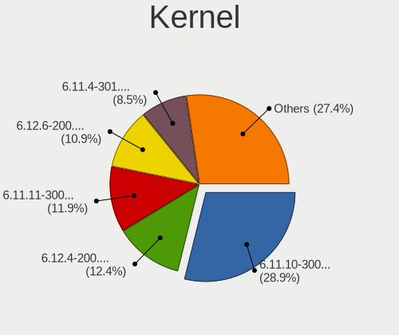
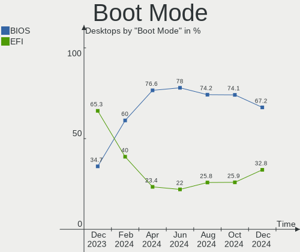
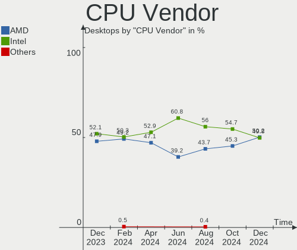
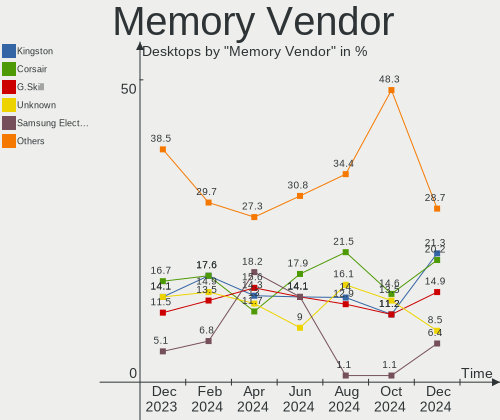
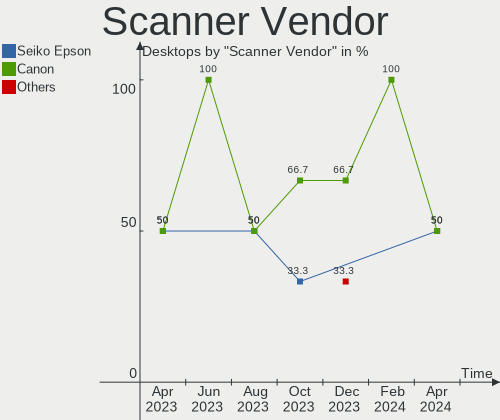
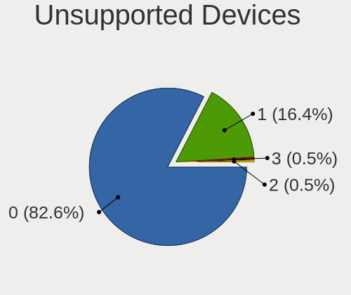

Fedora Hardware Trends (Desktops)
---------------------------------

A project to identify most popular hardware characteristics and track their change
over time based on data collected by Fedora users at https://Linux-Hardware.org.

Anyone can contribute to this report by the [hw-probe](https://github.com/linuxhw/hw-probe) tool:

    sudo -E hw-probe -all -upload

Full-feature report is available here: https://linux-hardware.org/?view=trends

Period: Feb, 2022.

Contents
--------

* [ System ](#system)
  - [ OS                       ](#os)
  - [ OS Family                ](#os-family)
  - [ Kernel                   ](#kernel)
  - [ Kernel Family            ](#kernel-family)
  - [ Kernel Major Ver.        ](#kernel-major-ver)
  - [ Arch                     ](#arch)
  - [ DE                       ](#de)
  - [ Display Server           ](#display-server)
  - [ Display Manager          ](#display-manager)
  - [ OS Lang                  ](#os-lang)
  - [ Boot Mode                ](#boot-mode)
  - [ Filesystem               ](#filesystem)
  - [ Part. scheme             ](#part-scheme)
  - [ Dual Boot with Linux/BSD ](#dual-boot-with-linuxbsd)
  - [ Dual Boot (Win)          ](#dual-boot-win)

* [ Board ](#board)
  - [ Vendor                   ](#vendor)
  - [ Model                    ](#model)
  - [ Model Family             ](#model-family)
  - [ MFG Year                 ](#mfg-year)
  - [ Form Factor              ](#form-factor)
  - [ Secure Boot              ](#secure-boot)
  - [ Coreboot                 ](#coreboot)
  - [ RAM Size                 ](#ram-size)
  - [ RAM Used                 ](#ram-used)
  - [ Total Drives             ](#total-drives)
  - [ Has CD-ROM               ](#has-cd-rom)
  - [ Has Ethernet             ](#has-ethernet)
  - [ Has WiFi                 ](#has-wifi)
  - [ Has Bluetooth            ](#has-bluetooth)

* [ Location ](#location)
  - [ Country                  ](#country)
  - [ City                     ](#city)

* [ Drives ](#drives)
  - [ Drive Vendor             ](#drive-vendor)
  - [ Drive Model              ](#drive-model)
  - [ HDD Vendor               ](#hdd-vendor)
  - [ SSD Vendor               ](#ssd-vendor)
  - [ Drive Kind               ](#drive-kind)
  - [ Drive Connector          ](#drive-connector)
  - [ Drive Size               ](#drive-size)
  - [ Space Total              ](#space-total)
  - [ Space Used               ](#space-used)
  - [ Malfunc. Drives          ](#malfunc-drives)
  - [ Malfunc. Drive Vendor    ](#malfunc-drive-vendor)
  - [ Malfunc. HDD Vendor      ](#malfunc-hdd-vendor)
  - [ Malfunc. Drive Kind      ](#malfunc-drive-kind)
  - [ Failed Drives            ](#failed-drives)
  - [ Failed Drive Vendor      ](#failed-drive-vendor)
  - [ Drive Status             ](#drive-status)

* [ Storage controller ](#storage-controller)
  - [ Storage Vendor           ](#storage-vendor)
  - [ Storage Model            ](#storage-model)
  - [ Storage Kind             ](#storage-kind)

* [ Processor ](#processor)
  - [ CPU Vendor               ](#cpu-vendor)
  - [ CPU Model                ](#cpu-model)
  - [ CPU Model Family         ](#cpu-model-family)
  - [ CPU Cores                ](#cpu-cores)
  - [ CPU Sockets              ](#cpu-sockets)
  - [ CPU Threads              ](#cpu-threads)
  - [ CPU Op-Modes             ](#cpu-op-modes)
  - [ CPU Microcode            ](#cpu-microcode)
  - [ CPU Microarch            ](#cpu-microarch)

* [ Graphics ](#graphics)
  - [ GPU Vendor               ](#gpu-vendor)
  - [ GPU Model                ](#gpu-model)
  - [ GPU Combo                ](#gpu-combo)
  - [ GPU Driver               ](#gpu-driver)
  - [ GPU Memory               ](#gpu-memory)

* [ Monitor ](#monitor)
  - [ Monitor Vendor           ](#monitor-vendor)
  - [ Monitor Model            ](#monitor-model)
  - [ Monitor Resolution       ](#monitor-resolution)
  - [ Monitor Diagonal         ](#monitor-diagonal)
  - [ Monitor Width            ](#monitor-width)
  - [ Aspect Ratio             ](#aspect-ratio)
  - [ Monitor Area             ](#monitor-area)
  - [ Pixel Density            ](#pixel-density)
  - [ Multiple Monitors        ](#multiple-monitors)

* [ Network ](#network)
  - [ Net Controller Vendor    ](#net-controller-vendor)
  - [ Net Controller Model     ](#net-controller-model)
  - [ Wireless Vendor          ](#wireless-vendor)
  - [ Wireless Model           ](#wireless-model)
  - [ Ethernet Vendor          ](#ethernet-vendor)
  - [ Ethernet Model           ](#ethernet-model)
  - [ Net Controller Kind      ](#net-controller-kind)
  - [ Used Controller          ](#used-controller)
  - [ NICs                     ](#nics)
  - [ IPv6                     ](#ipv6)

* [ Bluetooth ](#bluetooth)
  - [ Bluetooth Vendor         ](#bluetooth-vendor)
  - [ Bluetooth Model          ](#bluetooth-model)

* [ Sound ](#sound)
  - [ Sound Vendor             ](#sound-vendor)
  - [ Sound Model              ](#sound-model)

* [ Memory ](#memory)
  - [ Memory Vendor            ](#memory-vendor)
  - [ Memory Model             ](#memory-model)
  - [ Memory Kind              ](#memory-kind)
  - [ Memory Form Factor       ](#memory-form-factor)
  - [ Memory Size              ](#memory-size)
  - [ Memory Speed             ](#memory-speed)

* [ Printers & scanners ](#printers--scanners)
  - [ Printer Vendor           ](#printer-vendor)
  - [ Printer Model            ](#printer-model)
  - [ Scanner Vendor           ](#scanner-vendor)
  - [ Scanner Model            ](#scanner-model)

* [ Camera ](#camera)
  - [ Camera Vendor            ](#camera-vendor)
  - [ Camera Model             ](#camera-model)

* [ Security ](#security)
  - [ Fingerprint Vendor       ](#fingerprint-vendor)
  - [ Fingerprint Model        ](#fingerprint-model)
  - [ Chipcard Vendor          ](#chipcard-vendor)
  - [ Chipcard Model           ](#chipcard-model)

* [ Unsupported ](#unsupported)
  - [ Unsupported Devices      ](#unsupported-devices)
  - [ Unsupported Device Types ](#unsupported-device-types)

System
------

OS
--

Installed operating systems

| Name      | Desktops | Percent |
|-----------|----------|---------|
| Fedora 35 | 70       | 84.34%  |
| Fedora 34 | 8        | 9.64%   |
| Fedora 30 | 2        | 2.41%   |
| Fedora 36 | 1        | 1.2%    |
| Fedora 33 | 1        | 1.2%    |
| Fedora 32 | 1        | 1.2%    |

OS Family
---------

OS without a version

| Name   | Desktops | Percent |
|--------|----------|---------|
| Fedora | 83       | 100%    |

Kernel
------

Version of the Linux kernel

| Version                                             | Desktops | Percent |
|-----------------------------------------------------|----------|---------|
| 5.16.9-200.fc35.x86_64                              | 19       | 22.89%  |
| 5.15.18-200.fc35.x86_64                             | 15       | 18.07%  |
| 5.16.5-200.fc35.x86_64                              | 13       | 15.66%  |
| 5.16.8-200.fc35.x86_64                              | 5        | 6.02%   |
| 5.16.7-200.fc35.x86_64                              | 5        | 6.02%   |
| 5.15.17-200.fc35.x86_64                             | 4        | 4.82%   |
| 5.14.10-300.fc35.x86_64                             | 3        | 3.61%   |
| 5.11.12-300.fc34.x86_64                             | 3        | 3.61%   |
| 5.6.13-100.fc30.x86_64                              | 2        | 2.41%   |
| 5.16.11-200.fc35.x86_64                             | 2        | 2.41%   |
| 5.15.16-200.fc35.x86_64                             | 2        | 2.41%   |
| 5.15.12-200.fc35.x86_64                             | 2        | 2.41%   |
| 5.17.0-0.rc0.20220112gitdaadb3bd0e8d.63.fc36.x86_64 | 1        | 1.2%    |
| 5.16.7-100.fc34.x86_64                              | 1        | 1.2%    |
| 5.16.5-100.fc34.x86_64                              | 1        | 1.2%    |
| 5.15.18-100.fc34.x86_64                             | 1        | 1.2%    |
| 5.15.16-100.fc34.x86_64                             | 1        | 1.2%    |
| 5.14.18-100.fc33.x86_64                             | 1        | 1.2%    |
| 5.13.9-200.fc34.x86_64                              | 1        | 1.2%    |
| 5.10.7-100.fc32.x86_64                              | 1        | 1.2%    |

Kernel Family
-------------

Linux kernel without a distro release

| Version | Desktops | Percent |
|---------|----------|---------|
| 5.16.9  | 19       | 22.89%  |
| 5.15.18 | 16       | 19.28%  |
| 5.16.5  | 14       | 16.87%  |
| 5.16.7  | 6        | 7.23%   |
| 5.16.8  | 5        | 6.02%   |
| 5.15.17 | 4        | 4.82%   |
| 5.15.16 | 3        | 3.61%   |
| 5.14.10 | 3        | 3.61%   |
| 5.11.12 | 3        | 3.61%   |
| 5.6.13  | 2        | 2.41%   |
| 5.16.11 | 2        | 2.41%   |
| 5.15.12 | 2        | 2.41%   |
| 5.17.0  | 1        | 1.2%    |
| 5.14.18 | 1        | 1.2%    |
| 5.13.9  | 1        | 1.2%    |
| 5.10.7  | 1        | 1.2%    |

Kernel Major Ver.
-----------------

Linux kernel major version

| Version | Desktops | Percent |
|---------|----------|---------|
| 5.16    | 46       | 55.42%  |
| 5.15    | 25       | 30.12%  |
| 5.14    | 4        | 4.82%   |
| 5.11    | 3        | 3.61%   |
| 5.6     | 2        | 2.41%   |
| 5.17    | 1        | 1.2%    |
| 5.13    | 1        | 1.2%    |
| 5.10    | 1        | 1.2%    |

Arch
----

OS architecture (x86_64, i586, etc.)

| Name   | Desktops | Percent |
|--------|----------|---------|
| x86_64 | 83       | 100%    |

DE
--

Desktop Environment

| Name       | Desktops | Percent |
|------------|----------|---------|
| GNOME      | 61       | 73.49%  |
| KDE5       | 14       | 16.87%  |
| Cinnamon   | 6        | 7.23%   |
| X-Cinnamon | 1        | 1.2%    |
| KDE        | 1        | 1.2%    |

Display Server
--------------

X11 or Wayland

| Name    | Desktops | Percent |
|---------|----------|---------|
| Wayland | 41       | 49.4%   |
| X11     | 35       | 42.17%  |
| Tty     | 7        | 8.43%   |

Display Manager
---------------

SDDM, LightDM, etc.

| Name    | Desktops | Percent |
|---------|----------|---------|
| Unknown | 42       | 50.6%   |
| GDM     | 28       | 33.73%  |
| LightDM | 7        | 8.43%   |
| SDDM    | 6        | 7.23%   |

OS Lang
-------

Language

| Lang  | Desktops | Percent |
|-------|----------|---------|
| en_US | 37       | 44.58%  |
| ru_RU | 7        | 8.43%   |
| en_AU | 7        | 8.43%   |
| pt_BR | 6        | 7.23%   |
| en_GB | 6        | 7.23%   |
| fr_FR | 4        | 4.82%   |
| de_DE | 3        | 3.61%   |
| ro_RO | 1        | 1.2%    |
| pl_PL | 1        | 1.2%    |
| nl_BE | 1        | 1.2%    |
| it_IT | 1        | 1.2%    |
| fr_CH | 1        | 1.2%    |
| fr_BE | 1        | 1.2%    |
| es_MX | 1        | 1.2%    |
| es_ES | 1        | 1.2%    |
| en_IE | 1        | 1.2%    |
| en_CA | 1        | 1.2%    |
| de_AT | 1        | 1.2%    |
| bg_BG | 1        | 1.2%    |
| ar_SA | 1        | 1.2%    |

Boot Mode
---------

EFI or BIOS

| Mode | Desktops | Percent |
|------|----------|---------|
| EFI  | 52       | 62.65%  |
| BIOS | 31       | 37.35%  |

Filesystem
----------

Type of filesystem

| Type  | Desktops | Percent |
|-------|----------|---------|
| Btrfs | 52       | 62.65%  |
| Ext4  | 25       | 30.12%  |
| Xfs   | 6        | 7.23%   |

Part. scheme
------------

Scheme of partitioning

| Type    | Desktops | Percent |
|---------|----------|---------|
| Unknown | 45       | 54.22%  |
| GPT     | 28       | 33.73%  |
| MBR     | 10       | 12.05%  |

Dual Boot with Linux/BSD
------------------------

Hosting more than one Linux/BSD

| Dual boot | Desktops | Percent |
|-----------|----------|---------|
| No        | 71       | 85.54%  |
| Yes       | 12       | 14.46%  |

Dual Boot (Win)
---------------

Hosting Linux and Windows

| Dual boot | Desktops | Percent |
|-----------|----------|---------|
| No        | 63       | 75.9%   |
| Yes       | 20       | 24.1%   |

Board
-----

Vendor
------

Motherboard manufacturer

| Name                | Desktops | Percent |
|---------------------|----------|---------|
| ASUSTek Computer    | 29       | 34.94%  |
| Gigabyte Technology | 20       | 24.1%   |
| MSI                 | 9        | 10.84%  |
| ASRock              | 8        | 9.64%   |
| Lenovo              | 5        | 6.02%   |
| Dell                | 5        | 6.02%   |
| Supermicro          | 2        | 2.41%   |
| Biostar             | 2        | 2.41%   |
| Hewlett-Packard     | 1        | 1.2%    |
| Gateway             | 1        | 1.2%    |
| ECS                 | 1        | 1.2%    |

Model
-----

Motherboard model

| Name                               | Desktops | Percent |
|------------------------------------|----------|---------|
| MSI MS-7C84                        | 2        | 2.41%   |
| Gigabyte B450 AORUS M              | 2        | 2.41%   |
| ASUS ROG STRIX B450-F GAMING       | 2        | 2.41%   |
| ASUS ROG CROSSHAIR VIII HERO       | 2        | 2.41%   |
| ASUS Maximus VIII HERO             | 2        | 2.41%   |
| ASUS All Series                    | 2        | 2.41%   |
| Supermicro X9DRW                   | 1        | 1.2%    |
| Supermicro X9DAi                   | 1        | 1.2%    |
| MSI MS-7D25                        | 1        | 1.2%    |
| MSI MS-7C96                        | 1        | 1.2%    |
| MSI MS-7C56                        | 1        | 1.2%    |
| MSI MS-7B89                        | 1        | 1.2%    |
| MSI MS-7B86                        | 1        | 1.2%    |
| MSI MS-7A34                        | 1        | 1.2%    |
| MSI MS-7751                        | 1        | 1.2%    |
| Lenovo ThinkStation E32 30A2S07B00 | 1        | 1.2%    |
| Lenovo ThinkCentre M93p 10A8S3C100 | 1        | 1.2%    |
| Lenovo ThinkCentre M700 10HY003SRU | 1        | 1.2%    |
| Lenovo ThinkCentre M58p 7220A72    | 1        | 1.2%    |
| Lenovo ThinkCentre M58p 6234A1G    | 1        | 1.2%    |
| HP ProDesk 400 G4 SFF              | 1        | 1.2%    |
| Gigabyte Z690 UD DDR4              | 1        | 1.2%    |
| Gigabyte Z270-HD3P                 | 1        | 1.2%    |
| Gigabyte Z170-D3H                  | 1        | 1.2%    |
| Gigabyte X470 AORUS ULTRA GAMING   | 1        | 1.2%    |
| Gigabyte H310M M.2 2.0             | 1        | 1.2%    |
| Gigabyte GB-BRR7H-4800             | 1        | 1.2%    |
| Gigabyte GA-MA780G-UD3H            | 1        | 1.2%    |
| Gigabyte GA-990FXA-UD3             | 1        | 1.2%    |
| Gigabyte G41MT-D3                  | 1        | 1.2%    |
| Gigabyte F2A68HM-S1                | 1        | 1.2%    |
| Gigabyte EP45-DS3L                 | 1        | 1.2%    |
| Gigabyte D525TUD                   | 1        | 1.2%    |
| Gigabyte B85M-D3V-A                | 1        | 1.2%    |
| Gigabyte B85M-D3H                  | 1        | 1.2%    |
| Gigabyte B550 GAMING X V2          | 1        | 1.2%    |
| Gigabyte B450M DS3H                | 1        | 1.2%    |
| Gigabyte A320M-S2H                 | 1        | 1.2%    |
| Gigabyte 970A-DS3P                 | 1        | 1.2%    |
| Gateway DX4860                     | 1        | 1.2%    |
| ECS A58F2P-M4                      | 1        | 1.2%    |
| Dell Studio XPS 435T/9000          | 1        | 1.2%    |
| Dell Precision T3600               | 1        | 1.2%    |
| Dell OptiPlex 780                  | 1        | 1.2%    |
| Dell OptiPlex 5090                 | 1        | 1.2%    |
| Dell OptiPlex 3060                 | 1        | 1.2%    |
| Biostar H55 HD                     | 1        | 1.2%    |
| Biostar AM1ML                      | 1        | 1.2%    |
| ASUS TUF GAMING Z690-PLUS WIFI D4  | 1        | 1.2%    |
| ASUS TUF GAMING X570-PLUS          | 1        | 1.2%    |
| ASUS TUF B450-PLUS GAMING          | 1        | 1.2%    |
| ASUS STRIX B250F GAMING            | 1        | 1.2%    |
| ASUS ROG ZENITH EXTREME            | 1        | 1.2%    |
| ASUS ROG STRIX Z370-G GAMING       | 1        | 1.2%    |
| ASUS ROG STRIX B550-I GAMING       | 1        | 1.2%    |
| ASUS ROG STRIX B550-F GAMING       | 1        | 1.2%    |
| ASUS ROG Maximus Z690 FORMULA      | 1        | 1.2%    |
| ASUS ROG CROSSHAIR VIII IMPACT     | 1        | 1.2%    |
| ASUS ROG CROSSHAIR VII HERO        | 1        | 1.2%    |
| ASUS PRIME Z690-P D4               | 1        | 1.2%    |

Model Family
------------

Motherboard model prefix

| Name                    | Desktops | Percent |
|-------------------------|----------|---------|
| ASUS ROG                | 11       | 13.25%  |
| ASUS PRIME              | 5        | 6.02%   |
| Lenovo ThinkCentre      | 4        | 4.82%   |
| Dell OptiPlex           | 3        | 3.61%   |
| ASUS TUF                | 3        | 3.61%   |
| MSI MS-7C84             | 2        | 2.41%   |
| Gigabyte B450           | 2        | 2.41%   |
| ASUS Maximus            | 2        | 2.41%   |
| ASUS All                | 2        | 2.41%   |
| Supermicro X9DRW        | 1        | 1.2%    |
| Supermicro X9DAi        | 1        | 1.2%    |
| MSI MS-7D25             | 1        | 1.2%    |
| MSI MS-7C96             | 1        | 1.2%    |
| MSI MS-7C56             | 1        | 1.2%    |
| MSI MS-7B89             | 1        | 1.2%    |
| MSI MS-7B86             | 1        | 1.2%    |
| MSI MS-7A34             | 1        | 1.2%    |
| MSI MS-7751             | 1        | 1.2%    |
| Lenovo ThinkStation     | 1        | 1.2%    |
| HP ProDesk              | 1        | 1.2%    |
| Gigabyte Z690           | 1        | 1.2%    |
| Gigabyte Z270-HD3P      | 1        | 1.2%    |
| Gigabyte Z170-D3H       | 1        | 1.2%    |
| Gigabyte X470           | 1        | 1.2%    |
| Gigabyte H310M          | 1        | 1.2%    |
| Gigabyte GB-BRR7H-4800  | 1        | 1.2%    |
| Gigabyte GA-MA780G-UD3H | 1        | 1.2%    |
| Gigabyte GA-990FXA-UD3  | 1        | 1.2%    |
| Gigabyte G41MT-D3       | 1        | 1.2%    |
| Gigabyte F2A68HM-S1     | 1        | 1.2%    |
| Gigabyte EP45-DS3L      | 1        | 1.2%    |
| Gigabyte D525TUD        | 1        | 1.2%    |
| Gigabyte B85M-D3V-A     | 1        | 1.2%    |
| Gigabyte B85M-D3H       | 1        | 1.2%    |
| Gigabyte B550           | 1        | 1.2%    |
| Gigabyte B450M          | 1        | 1.2%    |
| Gigabyte A320M-S2H      | 1        | 1.2%    |
| Gigabyte 970A-DS3P      | 1        | 1.2%    |
| Gateway DX4860          | 1        | 1.2%    |
| ECS A58F2P-M4           | 1        | 1.2%    |
| Dell Studio             | 1        | 1.2%    |
| Dell Precision          | 1        | 1.2%    |
| Biostar H55             | 1        | 1.2%    |
| Biostar AM1ML           | 1        | 1.2%    |
| ASUS STRIX              | 1        | 1.2%    |
| ASUS P8Z77-V            | 1        | 1.2%    |
| ASUS P5QL               | 1        | 1.2%    |
| ASUS M5A97              | 1        | 1.2%    |
| ASUS M4N68T-M-LE-V2     | 1        | 1.2%    |
| ASUS A8R32-MVP          | 1        | 1.2%    |
| ASRock Z87              | 1        | 1.2%    |
| ASRock X570             | 1        | 1.2%    |
| ASRock H110M-STX        | 1        | 1.2%    |
| ASRock FM2A88X          | 1        | 1.2%    |
| ASRock B560M            | 1        | 1.2%    |
| ASRock B450M            | 1        | 1.2%    |
| ASRock AD2700-ITX       | 1        | 1.2%    |
| ASRock A320M-HD         | 1        | 1.2%    |

MFG Year
--------

Motherboard manufacture year

| Year | Desktops | Percent |
|------|----------|---------|
| 2021 | 13       | 15.66%  |
| 2018 | 12       | 14.46%  |
| 2020 | 8        | 9.64%   |
| 2017 | 7        | 8.43%   |
| 2014 | 7        | 8.43%   |
| 2013 | 7        | 8.43%   |
| 2019 | 5        | 6.02%   |
| 2010 | 5        | 6.02%   |
| 2016 | 4        | 4.82%   |
| 2015 | 3        | 3.61%   |
| 2012 | 3        | 3.61%   |
| 2009 | 3        | 3.61%   |
| 2008 | 3        | 3.61%   |
| 2011 | 2        | 2.41%   |
| 2006 | 1        | 1.2%    |

Form Factor
-----------

Physical design of the computer

| Name    | Desktops | Percent |
|---------|----------|---------|
| Desktop | 83       | 100%    |

Secure Boot
-----------

Enabled or disabled

| State    | Desktops | Percent |
|----------|----------|---------|
| Disabled | 78       | 93.98%  |
| Enabled  | 5        | 6.02%   |

Coreboot
--------

Have coreboot on board

| Used | Desktops | Percent |
|------|----------|---------|
| No   | 83       | 100%    |

RAM Size
--------

Total RAM memory

| Size in GB  | Desktops | Percent |
|-------------|----------|---------|
| 16.01-24.0  | 25       | 30.12%  |
| 32.01-64.0  | 16       | 19.28%  |
| 8.01-16.0   | 14       | 16.87%  |
| 4.01-8.0    | 8        | 9.64%   |
| 3.01-4.0    | 8        | 9.64%   |
| 64.01-256.0 | 8        | 9.64%   |
| 24.01-32.0  | 3        | 3.61%   |
| 1.01-2.0    | 1        | 1.2%    |

RAM Used
--------

Used RAM memory

| Used GB    | Desktops | Percent |
|------------|----------|---------|
| 4.01-8.0   | 24       | 28.92%  |
| 3.01-4.0   | 18       | 21.69%  |
| 2.01-3.0   | 14       | 16.87%  |
| 8.01-16.0  | 10       | 12.05%  |
| 1.01-2.0   | 8        | 9.64%   |
| 0.51-1.0   | 4        | 4.82%   |
| 24.01-32.0 | 3        | 3.61%   |
| 16.01-24.0 | 2        | 2.41%   |

Total Drives
------------

Number of drives on board

| Drives | Desktops | Percent |
|--------|----------|---------|
| 2      | 25       | 30.12%  |
| 1      | 22       | 26.51%  |
| 3      | 16       | 19.28%  |
| 4      | 10       | 12.05%  |
| 5      | 4        | 4.82%   |
| 7      | 3        | 3.61%   |
| 6      | 2        | 2.41%   |
| 8      | 1        | 1.2%    |

Has CD-ROM
----------

Has CD-ROM on board

| Presented | Desktops | Percent |
|-----------|----------|---------|
| No        | 58       | 69.88%  |
| Yes       | 25       | 30.12%  |

Has Ethernet
------------

Has Ethernet on board

| Presented | Desktops | Percent |
|-----------|----------|---------|
| Yes       | 82       | 98.8%   |
| No        | 1        | 1.2%    |

Has WiFi
--------

Has WiFi module

| Presented | Desktops | Percent |
|-----------|----------|---------|
| No        | 48       | 57.83%  |
| Yes       | 35       | 42.17%  |

Has Bluetooth
-------------

Has Bluetooth module

| Presented | Desktops | Percent |
|-----------|----------|---------|
| No        | 49       | 59.04%  |
| Yes       | 34       | 40.96%  |

Location
--------

Country
-------

Geographic location (country)

| Country      | Desktops | Percent |
|--------------|----------|---------|
| USA          | 17       | 20.48%  |
| Brazil       | 8        | 9.64%   |
| Australia    | 7        | 8.43%   |
| Germany      | 6        | 7.23%   |
| Russia       | 5        | 6.02%   |
| Belarus      | 4        | 4.82%   |
| UK           | 3        | 3.61%   |
| France       | 3        | 3.61%   |
| Belgium      | 3        | 3.61%   |
| Switzerland  | 2        | 2.41%   |
| Spain        | 2        | 2.41%   |
| Poland       | 2        | 2.41%   |
| Norway       | 2        | 2.41%   |
| Canada       | 2        | 2.41%   |
| Ukraine      | 1        | 1.2%    |
| Turkey       | 1        | 1.2%    |
| Sweden       | 1        | 1.2%    |
| Saudi Arabia | 1        | 1.2%    |
| Moldova      | 1        | 1.2%    |
| Mexico       | 1        | 1.2%    |
| Luxembourg   | 1        | 1.2%    |
| Italy        | 1        | 1.2%    |
| Ireland      | 1        | 1.2%    |
| Indonesia    | 1        | 1.2%    |
| Hungary      | 1        | 1.2%    |
| Egypt        | 1        | 1.2%    |
| Czechia      | 1        | 1.2%    |
| Bulgaria     | 1        | 1.2%    |
| Bolivia      | 1        | 1.2%    |
| Bangladesh   | 1        | 1.2%    |
| Austria      | 1        | 1.2%    |

City
----

Geographic location (city)

| City              | Desktops | Percent |
|-------------------|----------|---------|
| Sydney            | 6        | 7.23%   |
| Minsk             | 3        | 3.61%   |
| Rio de Janeiro    | 2        | 2.41%   |
| Pompano Beach     | 2        | 2.41%   |
| Brussels          | 2        | 2.41%   |
| Berlin            | 2        | 2.41%   |
| Zurich            | 1        | 1.2%    |
| Zheleznogorsk     | 1        | 1.2%    |
| Zgorzelec         | 1        | 1.2%    |
| Zaratamo          | 1        | 1.2%    |
| Yverdon-les-Bains | 1        | 1.2%    |
| Vitória        | 1        | 1.2%    |
| Vienna            | 1        | 1.2%    |
| Vecindario        | 1        | 1.2%    |
| Upper Marlboro    | 1        | 1.2%    |
| Trekhgornyy       | 1        | 1.2%    |
| Toronto           | 1        | 1.2%    |
| Stockholm         | 1        | 1.2%    |
| St Petersburg     | 1        | 1.2%    |
| Southampton       | 1        | 1.2%    |
| Sofia             | 1        | 1.2%    |
| Sioux Falls       | 1        | 1.2%    |
| São Luís    | 1        | 1.2%    |
| Sautron           | 1        | 1.2%    |
| Santa Barbara     | 1        | 1.2%    |
| Sandpoint         | 1        | 1.2%    |
| Samara            | 1        | 1.2%    |
| Saint Charles     | 1        | 1.2%    |
| Rosny-sous-Bois   | 1        | 1.2%    |
| Roeser            | 1        | 1.2%    |
| Riyadh            | 1        | 1.2%    |
| Rio Grande        | 1        | 1.2%    |
| Rahachow          | 1        | 1.2%    |
| Pennsville        | 1        | 1.2%    |
| Pearland          | 1        | 1.2%    |
| Pawlowice         | 1        | 1.2%    |
| Pachuca           | 1        | 1.2%    |
| Ottawa            | 1        | 1.2%    |
| Omaha             | 1        | 1.2%    |
| Oldenburg         | 1        | 1.2%    |
| Nuoro             | 1        | 1.2%    |
| North Bergen      | 1        | 1.2%    |
| Nevers            | 1        | 1.2%    |
| Kyiv              | 1        | 1.2%    |
| Kristiansand      | 1        | 1.2%    |
| Krefeld           | 1        | 1.2%    |
| Istanbul          | 1        | 1.2%    |
| Hodmezovasarhely  | 1        | 1.2%    |
| Heeslingen        | 1        | 1.2%    |
| Grand Rapids      | 1        | 1.2%    |
| Glazov            | 1        | 1.2%    |
| Gjolme            | 1        | 1.2%    |
| Gavere            | 1        | 1.2%    |
| Ft. Pierce        | 1        | 1.2%    |
| Everett           | 1        | 1.2%    |
| Ealing            | 1        | 1.2%    |
| Dublin            | 1        | 1.2%    |
| Dronfield         | 1        | 1.2%    |
| Dhaka             | 1        | 1.2%    |
| Daytona Beach     | 1        | 1.2%    |

Drives
------

Drive Vendor
------------

Hard drive vendors

| Vendor                    | Desktops | Drives | Percent |
|---------------------------|----------|--------|---------|
| Samsung Electronics       | 34       | 60     | 19.88%  |
| Seagate                   | 30       | 38     | 17.54%  |
| WDC                       | 26       | 36     | 15.2%   |
| Toshiba                   | 10       | 10     | 5.85%   |
| SanDisk                   | 10       | 10     | 5.85%   |
| Kingston                  | 9        | 12     | 5.26%   |
| Crucial                   | 7        | 7      | 4.09%   |
| Intel                     | 6        | 9      | 3.51%   |
| Phison                    | 4        | 5      | 2.34%   |
| Hitachi                   | 4        | 4      | 2.34%   |
| SPCC                      | 3        | 3      | 1.75%   |
| Corsair                   | 3        | 3      | 1.75%   |
| XPG                       | 2        | 2      | 1.17%   |
| SABRENT                   | 2        | 2      | 1.17%   |
| Patriot                   | 2        | 2      | 1.17%   |
| Micron/Crucial Technology | 2        | 2      | 1.17%   |
| KingSpec                  | 2        | 2      | 1.17%   |
| HGST                      | 2        | 5      | 1.17%   |
| A-DATA Technology         | 2        | 2      | 1.17%   |
| Transcend                 | 1        | 1      | 0.58%   |
| Team                      | 1        | 2      | 0.58%   |
| SK Hynix                  | 1        | 1      | 0.58%   |
| PNY                       | 1        | 2      | 0.58%   |
| Micron Technology         | 1        | 1      | 0.58%   |
| LITEONIT                  | 1        | 1      | 0.58%   |
| LITEON                    | 1        | 1      | 0.58%   |
| KIOXIA                    | 1        | 1      | 0.58%   |
| HS-SSD-C100               | 1        | 1      | 0.58%   |
| China                     | 1        | 1      | 0.58%   |
| ASMT                      | 1        | 1      | 0.58%   |

Drive Model
-----------

Hard drive models

| Model                                  | Desktops | Percent |
|----------------------------------------|----------|---------|
| Samsung SSD 860 EVO 500GB              | 5        | 2.43%   |
| Samsung SSD 850 EVO 250GB              | 4        | 1.94%   |
| Seagate ST3500418AS 500GB              | 3        | 1.46%   |
| Seagate ST1000DM010-2EP102 1TB         | 3        | 1.46%   |
| Samsung SSD 970 EVO Plus 1TB           | 3        | 1.46%   |
| Samsung SSD 870 EVO 500GB              | 3        | 1.46%   |
| Samsung SSD 870 EVO 1TB                | 3        | 1.46%   |
| Samsung NVMe SSD Drive 500GB           | 3        | 1.46%   |
| Samsung NVMe SSD Drive 250GB           | 3        | 1.46%   |
| Samsung NVMe SSD Drive 1TB             | 3        | 1.46%   |
| Crucial CT1000MX500SSD1 1TB            | 3        | 1.46%   |
| WDC WDBNCE0010PNC 1TB SSD              | 2        | 0.97%   |
| WDC WD5000AAKX-001CA0 500GB            | 2        | 0.97%   |
| WDC WD40EZRX-00SPEB0 4TB               | 2        | 0.97%   |
| WDC WD30EFRX-68EUZN0 3TB               | 2        | 0.97%   |
| WDC WD20EZRX-00D8PB0 2TB               | 2        | 0.97%   |
| Toshiba HDWD110 1TB                    | 2        | 0.97%   |
| Seagate ST500DM002-1BD142 500GB        | 2        | 0.97%   |
| Seagate ST2000DX002-2DV164 2TB         | 2        | 0.97%   |
| Seagate ST2000DM001-1CH164 2TB         | 2        | 0.97%   |
| SanDisk SDSSDA120G 120GB               | 2        | 0.97%   |
| Sandisk NVMe SSD Drive 1TB             | 2        | 0.97%   |
| Samsung SSD 870 QVO 2TB                | 2        | 0.97%   |
| Samsung SSD 860 EVO 1TB                | 2        | 0.97%   |
| Samsung SM963 2.5" NVMe PCIe SSD 256GB | 2        | 0.97%   |
| SABRENT Disk 1TB                       | 2        | 0.97%   |
| Micron/Crucial NVMe SSD Drive 500GB    | 2        | 0.97%   |
| Kingston SV300S37A120G 120GB SSD       | 2        | 0.97%   |
| Kingston SUV400S37240G 240GB SSD       | 2        | 0.97%   |
| Kingston SA400S37240G 240GB SSD        | 2        | 0.97%   |
| Intel SSDSC2CT120A3 120GB              | 2        | 0.97%   |
| Intel SSDPEKKW256G7 256GB              | 2        | 0.97%   |
| XPG NVMe SSD Drive 512GB               | 1        | 0.49%   |
| XPG NVMe SSD Drive 256GB               | 1        | 0.49%   |
| WDC WDS240G2G0B-00EPW0 240GB SSD       | 1        | 0.49%   |
| WDC WDS200T2B0A-00SM50 2TB SSD         | 1        | 0.49%   |
| WDC WDS100T2B0A-00SM50 1TB SSD         | 1        | 0.49%   |
| WDC WDS100T1X0E-00AFY0 1TB             | 1        | 0.49%   |
| WDC WD80EMAZ-00WJTA0 8TB               | 1        | 0.49%   |
| WDC WD60EFAX-68SHWN0 6TB               | 1        | 0.49%   |
| WDC WD5000AVCS-632DY1 500GB            | 1        | 0.49%   |
| WDC WD40EFRX-68N32N0 4TB               | 1        | 0.49%   |
| WDC WD4005FZBX-00K5WB0 4TB             | 1        | 0.49%   |
| WDC WD4000FDYZ-27YA5B0 4TB             | 1        | 0.49%   |
| WDC WD30EZRX-00MMMB0 3TB               | 1        | 0.49%   |
| WDC WD2500BPVT-75JJ5T0 250GB           | 1        | 0.49%   |
| WDC WD20EARS-42S0XB0 2TB               | 1        | 0.49%   |
| WDC WD120EMAZ-11BLFA0 12TB             | 1        | 0.49%   |
| WDC WD10JPVX-22JC3T0 1TB               | 1        | 0.49%   |
| WDC WD10EZRZ-22HTKB0 1TB               | 1        | 0.49%   |
| WDC WD10EZRZ-00HTKB0 1TB               | 1        | 0.49%   |
| WDC WD10EZRX-00L4HB0 1TB               | 1        | 0.49%   |
| WDC WD10EZEX-75WN4A0 1TB               | 1        | 0.49%   |
| WDC WD10EZEX-60WN4A0 1TB               | 1        | 0.49%   |
| WDC WD10EZEX-00WN4A0 1TB               | 1        | 0.49%   |
| WDC WD10EZEX-00BN5A0 1TB               | 1        | 0.49%   |
| WDC WD10EZEX-00BBHA0 1TB               | 1        | 0.49%   |
| WDC WD100EMAZ-00WJTA0 10TB             | 1        | 0.49%   |
| Transcend TS256GSSD370S 256GB          | 1        | 0.49%   |
| Toshiba THNSNJ128GCSU 128GB SSD        | 1        | 0.49%   |

HDD Vendor
----------

Hard disk drive vendors

| Vendor              | Desktops | Drives | Percent |
|---------------------|----------|--------|---------|
| Seagate             | 29       | 36     | 42.03%  |
| WDC                 | 20       | 29     | 28.99%  |
| Toshiba             | 9        | 9      | 13.04%  |
| Hitachi             | 4        | 4      | 5.8%    |
| Samsung Electronics | 2        | 3      | 2.9%    |
| SABRENT             | 2        | 2      | 2.9%    |
| HGST                | 2        | 5      | 2.9%    |
| ASMT                | 1        | 1      | 1.45%   |

SSD Vendor
----------

Solid state drive vendors

| Vendor              | Desktops | Drives | Percent |
|---------------------|----------|--------|---------|
| Samsung Electronics | 21       | 30     | 31.82%  |
| Kingston            | 8        | 9      | 12.12%  |
| SanDisk             | 7        | 7      | 10.61%  |
| WDC                 | 5        | 5      | 7.58%   |
| Crucial             | 5        | 5      | 7.58%   |
| SPCC                | 3        | 3      | 4.55%   |
| KingSpec            | 2        | 2      | 3.03%   |
| Intel               | 2        | 2      | 3.03%   |
| A-DATA Technology   | 2        | 2      | 3.03%   |
| Transcend           | 1        | 1      | 1.52%   |
| Toshiba             | 1        | 1      | 1.52%   |
| Team                | 1        | 2      | 1.52%   |
| PNY                 | 1        | 2      | 1.52%   |
| Patriot             | 1        | 1      | 1.52%   |
| Micron Technology   | 1        | 1      | 1.52%   |
| LITEONIT            | 1        | 1      | 1.52%   |
| LITEON              | 1        | 1      | 1.52%   |
| HS-SSD-C100         | 1        | 1      | 1.52%   |
| Corsair             | 1        | 1      | 1.52%   |
| China               | 1        | 1      | 1.52%   |

Drive Kind
----------

HDD or SSD

| Kind    | Desktops | Drives | Percent |
|---------|----------|--------|---------|
| SSD     | 55       | 78     | 38.19%  |
| HDD     | 53       | 89     | 36.81%  |
| NVMe    | 35       | 59     | 24.31%  |
| Unknown | 1        | 1      | 0.69%   |

Drive Connector
---------------

SATA, SAS, NVMe, etc.

| Type | Desktops | Drives | Percent |
|------|----------|--------|---------|
| SATA | 73       | 163    | 64.6%   |
| NVMe | 35       | 59     | 30.97%  |
| SAS  | 5        | 5      | 4.42%   |

Drive Size
----------

Size of hard drive

| Size in TB | Desktops | Drives | Percent |
|------------|----------|--------|---------|
| 0.01-0.5   | 49       | 73     | 41.53%  |
| 0.51-1.0   | 37       | 50     | 31.36%  |
| 1.01-2.0   | 13       | 16     | 11.02%  |
| 3.01-4.0   | 8        | 12     | 6.78%   |
| 4.01-10.0  | 5        | 8      | 4.24%   |
| 2.01-3.0   | 4        | 5      | 3.39%   |
| 10.01-20.0 | 2        | 3      | 1.69%   |

Space Total
-----------

Amount of disk space available on the file system

| Size in GB     | Desktops | Percent |
|----------------|----------|---------|
| 501-1000       | 20       | 24.1%   |
| 1001-2000      | 16       | 19.28%  |
| More than 3000 | 10       | 12.05%  |
| 251-500        | 10       | 12.05%  |
| 101-250        | 9        | 10.84%  |
| 1-20           | 8        | 9.64%   |
| 2001-3000      | 4        | 4.82%   |
| 51-100         | 3        | 3.61%   |
| Unknown        | 3        | 3.61%   |

Space Used
----------

Amount of used disk space

| Used GB        | Desktops | Percent |
|----------------|----------|---------|
| 501-1000       | 14       | 16.87%  |
| 101-250        | 12       | 14.46%  |
| 1-20           | 12       | 14.46%  |
| 21-50          | 11       | 13.25%  |
| 251-500        | 9        | 10.84%  |
| 51-100         | 9        | 10.84%  |
| 1001-2000      | 6        | 7.23%   |
| More than 3000 | 4        | 4.82%   |
| 2001-3000      | 3        | 3.61%   |
| Unknown        | 3        | 3.61%   |

Malfunc. Drives
---------------

Drive models with a malfunction

| Model                                 | Desktops | Drives | Percent |
|---------------------------------------|----------|--------|---------|
| Samsung Electronics SSD 870 EVO 500GB | 2        | 2      | 16.67%  |
| Intel SSDSC2CT120A3 120GB             | 2        | 2      | 16.67%  |
| Toshiba MK6476GSX 640GB               | 1        | 1      | 8.33%   |
| Team T2535T480G 480GB SSD             | 1        | 2      | 8.33%   |
| Seagate ST8000DM004-2CX188 8TB        | 1        | 3      | 8.33%   |
| Seagate ST500DM002-1BD142 500GB       | 1        | 1      | 8.33%   |
| Seagate ST3000DM001-1CH166 3TB        | 1        | 1      | 8.33%   |
| Samsung Electronics HD501LJ 500GB     | 1        | 2      | 8.33%   |
| Hitachi HDT721010SLA360 1TB           | 1        | 1      | 8.33%   |
| Hitachi HDS5C3020ALA632 2TB           | 1        | 1      | 8.33%   |

Malfunc. Drive Vendor
---------------------

Vendors of faulty drives

| Vendor              | Desktops | Drives | Percent |
|---------------------|----------|--------|---------|
| Seagate             | 3        | 5      | 25%     |
| Samsung Electronics | 3        | 4      | 25%     |
| Intel               | 2        | 2      | 16.67%  |
| Hitachi             | 2        | 2      | 16.67%  |
| Toshiba             | 1        | 1      | 8.33%   |
| Team                | 1        | 2      | 8.33%   |

Malfunc. HDD Vendor
-------------------

Vendors of faulty HDD drives

| Vendor              | Desktops | Drives | Percent |
|---------------------|----------|--------|---------|
| Seagate             | 3        | 5      | 42.86%  |
| Hitachi             | 2        | 2      | 28.57%  |
| Toshiba             | 1        | 1      | 14.29%  |
| Samsung Electronics | 1        | 2      | 14.29%  |

Malfunc. Drive Kind
-------------------

Kinds of faulty drives

| Kind | Desktops | Drives | Percent |
|------|----------|--------|---------|
| HDD  | 7        | 10     | 58.33%  |
| SSD  | 5        | 6      | 41.67%  |

Failed Drives
-------------

Failed drive models

Zero info for selected period =(

Failed Drive Vendor
-------------------

Failed drive vendors

Zero info for selected period =(

Drive Status
------------

Number of failed and malfunc. drives

| Status   | Desktops | Drives | Percent |
|----------|----------|--------|---------|
| Detected | 48       | 117    | 50.53%  |
| Works    | 36       | 94     | 37.89%  |
| Malfunc  | 11       | 16     | 11.58%  |

Storage controller
------------------

Storage Vendor
--------------

Storage controller vendors

| Vendor                      | Desktops | Percent |
|-----------------------------|----------|---------|
| Intel                       | 46       | 33.82%  |
| AMD                         | 36       | 26.47%  |
| Samsung Electronics         | 19       | 13.97%  |
| Phison Electronics          | 6        | 4.41%   |
| Sandisk                     | 4        | 2.94%   |
| Micron/Crucial Technology   | 4        | 2.94%   |
| ASMedia Technology          | 4        | 2.94%   |
| Kingston Technology Company | 3        | 2.21%   |
| JMicron Technology          | 3        | 2.21%   |
| Marvell Technology Group    | 2        | 1.47%   |
| ADATA Technology            | 2        | 1.47%   |
| VIA Technologies            | 1        | 0.74%   |
| ULi Electronics             | 1        | 0.74%   |
| SK Hynix                    | 1        | 0.74%   |
| Silicon Image               | 1        | 0.74%   |
| Seagate Technology          | 1        | 0.74%   |
| Nvidia                      | 1        | 0.74%   |
| KIOXIA                      | 1        | 0.74%   |

Storage Model
-------------

Storage controller models

| Model                                                                          | Desktops | Percent |
|--------------------------------------------------------------------------------|----------|---------|
| AMD FCH SATA Controller [AHCI mode]                                            | 22       | 12.64%  |
| AMD 400 Series Chipset SATA Controller                                         | 12       | 6.9%    |
| Samsung NVMe SSD Controller SM981/PM981/PM983                                  | 10       | 5.75%   |
| Intel 200 Series PCH SATA controller [AHCI mode]                               | 7        | 4.02%   |
| Intel 8 Series/C220 Series Chipset Family 6-port SATA Controller 1 [AHCI mode] | 6        | 3.45%   |
| Samsung NVMe SSD Controller SM961/PM961/SM963                                  | 5        | 2.87%   |
| Intel Alder Lake-S PCH SATA Controller [AHCI Mode]                             | 5        | 2.87%   |
| Samsung NVMe SSD Controller PM9A1/PM9A3/980PRO                                 | 4        | 2.3%    |
| Intel SATA Controller [RAID mode]                                              | 4        | 2.3%    |
| Intel Q170/Q150/B150/H170/H110/Z170/CM236 Chipset SATA Controller [AHCI Mode]  | 4        | 2.3%    |
| AMD Starship/Matisse Chipset SATA Controller [AHCI mode]                       | 4        | 2.3%    |
| Phison E16 PCIe4 NVMe Controller                                               | 3        | 1.72%   |
| Phison E12 NVMe Controller                                                     | 3        | 1.72%   |
| Kingston Company A2000 NVMe SSD                                                | 3        | 1.72%   |
| Intel Volume Management Device NVMe RAID Controller                            | 3        | 1.72%   |
| Intel C602 chipset 4-Port SATA Storage Control Unit                            | 3        | 1.72%   |
| Intel C600/X79 series chipset 6-Port SATA AHCI Controller                      | 3        | 1.72%   |
| Intel 4 Series Chipset PT IDER Controller                                      | 3        | 1.72%   |
| ASMedia ASM1062 Serial ATA Controller                                          | 3        | 1.72%   |
| AMD SB7x0/SB8x0/SB9x0 SATA Controller [AHCI mode]                              | 3        | 1.72%   |
| AMD SB7x0/SB8x0/SB9x0 IDE Controller                                           | 3        | 1.72%   |
| AMD FCH IDE Controller                                                         | 3        | 1.72%   |
| Sandisk WD Black SN750 / PC SN730 NVMe SSD                                     | 2        | 1.15%   |
| Samsung NVMe SSD Controller 980                                                | 2        | 1.15%   |
| Micron/Crucial P2 NVMe PCIe SSD                                                | 2        | 1.15%   |
| JMicron JMB363 SATA/IDE Controller                                             | 2        | 1.15%   |
| Intel SSD 600P Series                                                          | 2        | 1.15%   |
| Intel NM10/ICH7 Family SATA Controller [AHCI mode]                             | 2        | 1.15%   |
| Intel 82801JI (ICH10 Family) SATA AHCI Controller                              | 2        | 1.15%   |
| Intel 82801JD/DO (ICH10 Family) SATA AHCI Controller                           | 2        | 1.15%   |
| Intel 500 Series Chipset Family SATA AHCI Controller                           | 2        | 1.15%   |
| AMD FCH SATA Controller [IDE mode]                                             | 2        | 1.15%   |
| AMD FCH SATA Controller D                                                      | 2        | 1.15%   |
| ADATA XPG SX8200 Pro PCIe Gen3x4 M.2 2280 Solid State Drive                    | 2        | 1.15%   |
| VIA VT6415 PATA IDE Host Controller                                            | 1        | 0.57%   |
| ULi ULi M5288 SATA                                                             | 1        | 0.57%   |
| ULi M5229 IDE                                                                  | 1        | 0.57%   |
| SK Hynix BC501 NVMe Solid State Drive                                          | 1        | 0.57%   |
| Silicon Image SiI 3132 Serial ATA Raid II Controller                           | 1        | 0.57%   |
| Seagate FireCuda 520 SSD                                                       | 1        | 0.57%   |
| Sandisk WD PC SN810 / Black SN850 NVMe SSD                                     | 1        | 0.57%   |
| Sandisk WD Black 2018/SN750 / PC SN720 NVMe SSD                                | 1        | 0.57%   |
| Phison NVMe Storage Controller                                                 | 1        | 0.57%   |
| Nvidia MCP61 SATA Controller                                                   | 1        | 0.57%   |
| Nvidia MCP61 IDE                                                               | 1        | 0.57%   |
| Micron/Crucial P1 NVMe PCIe SSD                                                | 1        | 0.57%   |
| Micron/Crucial Non-Volatile memory controller                                  | 1        | 0.57%   |
| Marvell Group 88SE9172 SATA III 6Gb/s RAID Controller                          | 1        | 0.57%   |
| Marvell Group 88SE912x IDE Controller                                          | 1        | 0.57%   |
| Marvell Group 88SE9128 PCIe SATA 6 Gb/s RAID controller                        | 1        | 0.57%   |
| Marvell Group 88SE9120 SATA 6Gb/s Controller                                   | 1        | 0.57%   |
| KIOXIA Non-Volatile memory controller                                          | 1        | 0.57%   |
| JMicron JMB368 IDE controller                                                  | 1        | 0.57%   |
| Intel SSD Pro 7600p/760p/E 6100p Series                                        | 1        | 0.57%   |
| Intel SSD 660P Series                                                          | 1        | 0.57%   |
| Intel NM10/ICH7 Family SATA Controller [IDE mode]                              | 1        | 0.57%   |
| Intel Cannon Lake PCH SATA AHCI Controller                                     | 1        | 0.57%   |
| Intel 9 Series Chipset Family SATA Controller [AHCI Mode]                      | 1        | 0.57%   |
| Intel 82801JI (ICH10 Family) 4 port SATA IDE Controller #1                     | 1        | 0.57%   |
| Intel 82801JI (ICH10 Family) 2 port SATA IDE Controller #2                     | 1        | 0.57%   |

Storage Kind
------------

Kind of storage controller (IDE, SATA, NVMe, SAS, ...)

| Kind | Desktops | Percent |
|------|----------|---------|
| SATA | 75       | 53.96%  |
| NVMe | 35       | 25.18%  |
| IDE  | 18       | 12.95%  |
| RAID | 8        | 5.76%   |
| SAS  | 3        | 2.16%   |

Processor
---------

CPU Vendor
----------

Processor vendors

| Vendor | Desktops | Percent |
|--------|----------|---------|
| Intel  | 44       | 53.01%  |
| AMD    | 39       | 46.99%  |

CPU Model
---------

Processor models

| Model                                          | Desktops | Percent |
|------------------------------------------------|----------|---------|
| AMD Ryzen 5 1600 Six-Core Processor            | 4        | 4.82%   |
| Intel Core i5-7600K CPU @ 3.80GHz              | 3        | 3.61%   |
| AMD Ryzen 9 5950X 16-Core Processor            | 3        | 3.61%   |
| Intel Core i7-4770 CPU @ 3.40GHz               | 2        | 2.41%   |
| Intel Core i5-6500 CPU @ 3.20GHz               | 2        | 2.41%   |
| Intel 12th Gen Core i9-12900K                  | 2        | 2.41%   |
| AMD Ryzen 7 3800X 8-Core Processor             | 2        | 2.41%   |
| AMD Ryzen 7 3700X 8-Core Processor             | 2        | 2.41%   |
| AMD Ryzen 5 3600 6-Core Processor              | 2        | 2.41%   |
| Intel Xeon CPU X5460 @ 3.16GHz                 | 1        | 1.2%    |
| Intel Xeon CPU E5-2650 0 @ 2.00GHz             | 1        | 1.2%    |
| Intel Xeon CPU E5-2630 v2 @ 2.60GHz            | 1        | 1.2%    |
| Intel Xeon CPU E5-1603 0 @ 2.80GHz             | 1        | 1.2%    |
| Intel Xeon CPU E3-1230 v3 @ 3.30GHz            | 1        | 1.2%    |
| Intel Core i7-8700K CPU @ 3.70GHz              | 1        | 1.2%    |
| Intel Core i7-8700 CPU @ 3.20GHz               | 1        | 1.2%    |
| Intel Core i7-4790 CPU @ 3.60GHz               | 1        | 1.2%    |
| Intel Core i7-2600 CPU @ 3.40GHz               | 1        | 1.2%    |
| Intel Core i7 CPU 920 @ 2.67GHz                | 1        | 1.2%    |
| Intel Core i5-9500 CPU @ 3.00GHz               | 1        | 1.2%    |
| Intel Core i5-8500 CPU @ 3.00GHz               | 1        | 1.2%    |
| Intel Core i5-7500 CPU @ 3.40GHz               | 1        | 1.2%    |
| Intel Core i5-7400 CPU @ 3.00GHz               | 1        | 1.2%    |
| Intel Core i5-6600T CPU @ 2.70GHz              | 1        | 1.2%    |
| Intel Core i5-6600K CPU @ 3.50GHz              | 1        | 1.2%    |
| Intel Core i5-4690S CPU @ 3.20GHz              | 1        | 1.2%    |
| Intel Core i5-4690 CPU @ 3.50GHz               | 1        | 1.2%    |
| Intel Core i5-3570K CPU @ 3.40GHz              | 1        | 1.2%    |
| Intel Core i5-2500 CPU @ 3.30GHz               | 1        | 1.2%    |
| Intel Core i5-10500 CPU @ 3.10GHz              | 1        | 1.2%    |
| Intel Core i5 CPU 650 @ 3.20GHz                | 1        | 1.2%    |
| Intel Core i3-6100T CPU @ 3.20GHz              | 1        | 1.2%    |
| Intel Core i3-4160 CPU @ 3.60GHz               | 1        | 1.2%    |
| Intel Core 2 Quad CPU Q9550 @ 2.83GHz          | 1        | 1.2%    |
| Intel Core 2 Quad CPU Q9400 @ 2.66GHz          | 1        | 1.2%    |
| Intel Core 2 Quad CPU Q6600 @ 2.40GHz          | 1        | 1.2%    |
| Intel Core 2 Duo CPU E8400 @ 3.00GHz           | 1        | 1.2%    |
| Intel Core 2 Duo CPU E7400 @ 2.80GHz           | 1        | 1.2%    |
| Intel Atom CPU D525 @ 1.80GHz                  | 1        | 1.2%    |
| Intel Atom CPU D2700 @ 2.13GHz                 | 1        | 1.2%    |
| Intel 12th Gen Core i7-12700KF                 | 1        | 1.2%    |
| Intel 12th Gen Core i7-12700K                  | 1        | 1.2%    |
| Intel 12th Gen Core i5-12600K                  | 1        | 1.2%    |
| Intel 11th Gen Core i5-11400 @ 2.60GHz         | 1        | 1.2%    |
| AMD Ryzen Threadripper 1950X 16-Core Processor | 1        | 1.2%    |
| AMD Ryzen 9 5900X 12-Core Processor            | 1        | 1.2%    |
| AMD Ryzen 9 3900XT 12-Core Processor           | 1        | 1.2%    |
| AMD Ryzen 7 PRO 5750G with Radeon Graphics     | 1        | 1.2%    |
| AMD Ryzen 7 5800X 8-Core Processor             | 1        | 1.2%    |
| AMD Ryzen 7 5700G with Radeon Graphics         | 1        | 1.2%    |
| AMD Ryzen 7 4800U with Radeon Graphics         | 1        | 1.2%    |
| AMD Ryzen 7 2700X Eight-Core Processor         | 1        | 1.2%    |
| AMD Ryzen 7 2700 Eight-Core Processor          | 1        | 1.2%    |
| AMD Ryzen 7 1700X Eight-Core Processor         | 1        | 1.2%    |
| AMD Ryzen 5 5600X 6-Core Processor             | 1        | 1.2%    |
| AMD Ryzen 5 3600XT 6-Core Processor            | 1        | 1.2%    |
| AMD Ryzen 5 3600X 6-Core Processor             | 1        | 1.2%    |
| AMD Ryzen 5 2600 Six-Core Processor            | 1        | 1.2%    |
| AMD Ryzen 3 3200G with Radeon Vega Graphics    | 1        | 1.2%    |
| AMD Phenom II X2 570 Processor                 | 1        | 1.2%    |

CPU Model Family
----------------

Processor model prefix

| Model                  | Desktops | Percent |
|------------------------|----------|---------|
| Intel Core i5          | 17       | 20.48%  |
| AMD Ryzen 7            | 10       | 12.05%  |
| AMD Ryzen 5            | 10       | 12.05%  |
| Intel Core i7          | 7        | 8.43%   |
| Other                  | 6        | 7.23%   |
| Intel Xeon             | 5        | 6.02%   |
| AMD Ryzen 9            | 5        | 6.02%   |
| Intel Core 2 Quad      | 3        | 3.61%   |
| AMD FX                 | 3        | 3.61%   |
| Intel Core i3          | 2        | 2.41%   |
| Intel Core 2 Duo       | 2        | 2.41%   |
| Intel Atom             | 2        | 2.41%   |
| AMD Phenom II X2       | 2        | 2.41%   |
| AMD Athlon             | 2        | 2.41%   |
| AMD Ryzen Threadripper | 1        | 1.2%    |
| AMD Ryzen 7 PRO        | 1        | 1.2%    |
| AMD Ryzen 3            | 1        | 1.2%    |
| AMD Athlon X2          | 1        | 1.2%    |
| AMD Athlon 64 X2       | 1        | 1.2%    |
| AMD A6                 | 1        | 1.2%    |
| AMD A4                 | 1        | 1.2%    |

CPU Cores
---------

Number of processor cores

| Number | Desktops | Percent |
|--------|----------|---------|
| 4      | 28       | 33.73%  |
| 6      | 16       | 19.28%  |
| 8      | 11       | 13.25%  |
| 2      | 11       | 13.25%  |
| 16     | 7        | 8.43%   |
| 12     | 5        | 6.02%   |
| 1      | 3        | 3.61%   |
| 10     | 1        | 1.2%    |
| 3      | 1        | 1.2%    |

CPU Sockets
-----------

Number of sockets

| Number | Desktops | Percent |
|--------|----------|---------|
| 1      | 81       | 97.59%  |
| 2      | 2        | 2.41%   |

CPU Threads
-----------

Threads per core (Hyper-Threading)

| Number | Desktops | Percent |
|--------|----------|---------|
| 2      | 54       | 65.06%  |
| 1      | 29       | 34.94%  |

CPU Op-Modes
------------

CPU Operation Modes (32-bit, 64-bit)

| Op mode        | Desktops | Percent |
|----------------|----------|---------|
| 32-bit, 64-bit | 83       | 100%    |

CPU Microcode
-------------

Microcode number

| Number     | Desktops | Percent |
|------------|----------|---------|
| 0x08701021 | 8        | 9.64%   |
| 0x306c3    | 6        | 7.23%   |
| Unknown    | 6        | 7.23%   |
| 0x906e9    | 5        | 6.02%   |
| 0x906ea    | 4        | 4.82%   |
| 0x90672    | 4        | 4.82%   |
| 0x506e3    | 4        | 4.82%   |
| 0x1067a    | 3        | 3.61%   |
| 0x0a201016 | 3        | 3.61%   |
| 0x08001138 | 3        | 3.61%   |
| 0x06001119 | 3        | 3.61%   |
| 0x00000000 | 3        | 3.61%   |
| 0x206d7    | 2        | 2.41%   |
| 0x206a7    | 2        | 2.41%   |
| 0x0a50000c | 2        | 2.41%   |
| 0x0a201009 | 2        | 2.41%   |
| 0x08108109 | 2        | 2.41%   |
| 0x0800820b | 2        | 2.41%   |
| 0x08001137 | 2        | 2.41%   |
| 0xa0671    | 1        | 1.2%    |
| 0xa0653    | 1        | 1.2%    |
| 0x6fb      | 1        | 1.2%    |
| 0x306e4    | 1        | 1.2%    |
| 0x306a9    | 1        | 1.2%    |
| 0x20652    | 1        | 1.2%    |
| 0x106ca    | 1        | 1.2%    |
| 0x106a5    | 1        | 1.2%    |
| 0x10676    | 1        | 1.2%    |
| 0x08701013 | 1        | 1.2%    |
| 0x08600103 | 1        | 1.2%    |
| 0x0800820d | 1        | 1.2%    |
| 0x08008206 | 1        | 1.2%    |
| 0x0700010b | 1        | 1.2%    |
| 0x06000822 | 1        | 1.2%    |
| 0x0600081f | 1        | 1.2%    |
| 0x01000086 | 1        | 1.2%    |

CPU Microarch
-------------

Microarchitecture

| Name             | Desktops | Percent |
|------------------|----------|---------|
| Zen 2            | 10       | 12.05%  |
| KabyLake         | 9        | 10.84%  |
| Zen 3            | 8        | 9.64%   |
| Haswell          | 7        | 8.43%   |
| Zen+             | 6        | 7.23%   |
| Piledriver       | 6        | 7.23%   |
| Zen              | 5        | 6.02%   |
| Skylake          | 5        | 6.02%   |
| Penryn           | 5        | 6.02%   |
| SandyBridge      | 4        | 4.82%   |
| Alderlake Hybrid | 4        | 4.82%   |
| K10              | 2        | 2.41%   |
| IvyBridge        | 2        | 2.41%   |
| Bonnell          | 2        | 2.41%   |
| Westmere         | 1        | 1.2%    |
| Nehalem          | 1        | 1.2%    |
| K8 Hammer        | 1        | 1.2%    |
| Jaguar           | 1        | 1.2%    |
| Icelake          | 1        | 1.2%    |
| Core             | 1        | 1.2%    |
| CometLake        | 1        | 1.2%    |
| Unknown          | 1        | 1.2%    |

Graphics
--------

GPU Vendor
----------

Vendors of graphics cards

| Vendor                     | Desktops | Percent |
|----------------------------|----------|---------|
| Nvidia                     | 38       | 40.43%  |
| AMD                        | 32       | 34.04%  |
| Intel                      | 23       | 24.47%  |
| Matrox Electronics Systems | 1        | 1.06%   |

GPU Model
---------

Graphics card models

| Model                                                                       | Desktops | Percent |
|-----------------------------------------------------------------------------|----------|---------|
| AMD Ellesmere [Radeon RX 470/480/570/570X/580/580X/590]                     | 13       | 13.54%  |
| Nvidia GM107 [GeForce GTX 750 Ti]                                           | 4        | 4.17%   |
| Intel HD Graphics 530                                                       | 4        | 4.17%   |
| Nvidia GP106 [GeForce GTX 1060 6GB]                                         | 3        | 3.13%   |
| Intel Xeon E3-1200 v3/4th Gen Core Processor Integrated Graphics Controller | 3        | 3.13%   |
| Intel AlderLake-S GT1                                                       | 3        | 3.13%   |
| Nvidia GP107 [GeForce GTX 1050 Ti]                                          | 2        | 2.08%   |
| Nvidia GP102 [GeForce GTX 1080 Ti]                                          | 2        | 2.08%   |
| Nvidia GF108 [GeForce GT 730]                                               | 2        | 2.08%   |
| Nvidia GA104 [GeForce RTX 3070]                                             | 2        | 2.08%   |
| Intel HD Graphics 630                                                       | 2        | 2.08%   |
| Intel CoffeeLake-S GT2 [UHD Graphics 630]                                   | 2        | 2.08%   |
| Intel 4 Series Chipset Integrated Graphics Controller                       | 2        | 2.08%   |
| AMD Picasso/Raven 2 [Radeon Vega Series / Radeon Vega Mobile Series]        | 2        | 2.08%   |
| AMD Navi 23 [Radeon RX 6600/6600 XT/6600M]                                  | 2        | 2.08%   |
| AMD Navi 21 [Radeon RX 6800/6800 XT / 6900 XT]                              | 2        | 2.08%   |
| AMD Cezanne                                                                 | 2        | 2.08%   |
| AMD Baffin [Radeon RX 460/560D / Pro 450/455/460/555/555X/560/560X]         | 2        | 2.08%   |
| Nvidia TU104 [GeForce RTX 2080 SUPER]                                       | 1        | 1.04%   |
| Nvidia TU104 [GeForce RTX 2070 SUPER]                                       | 1        | 1.04%   |
| Nvidia GT218 [GeForce G210]                                                 | 1        | 1.04%   |
| Nvidia GT218 [GeForce 210]                                                  | 1        | 1.04%   |
| Nvidia GP107 [GeForce GTX 1050]                                             | 1        | 1.04%   |
| Nvidia GP106GL [Quadro P2000]                                               | 1        | 1.04%   |
| Nvidia GP106 [GeForce GTX 1060 3GB]                                         | 1        | 1.04%   |
| Nvidia GP104 [GeForce GTX 1080]                                             | 1        | 1.04%   |
| Nvidia GP104 [GeForce GTX 1070]                                             | 1        | 1.04%   |
| Nvidia GM204 [GeForce GTX 980]                                              | 1        | 1.04%   |
| Nvidia GM107GL [Quadro K620]                                                | 1        | 1.04%   |
| Nvidia GK208B [GeForce GT 710]                                              | 1        | 1.04%   |
| Nvidia GK110 [GeForce GTX 780]                                              | 1        | 1.04%   |
| Nvidia GK104GL [Quadro K4200]                                               | 1        | 1.04%   |
| Nvidia GK104 [GeForce GTX 760]                                              | 1        | 1.04%   |
| Nvidia GK104 [GeForce GTX 680]                                              | 1        | 1.04%   |
| Nvidia GF119 [GeForce GT 520]                                               | 1        | 1.04%   |
| Nvidia GF106 [GeForce GTS 450]                                              | 1        | 1.04%   |
| Nvidia GA106 [GeForce RTX 3060 Lite Hash Rate]                              | 1        | 1.04%   |
| Nvidia GA102 [GeForce RTX 3090]                                             | 1        | 1.04%   |
| Nvidia GA102 [GeForce RTX 3080 Lite Hash Rate]                              | 1        | 1.04%   |
| Nvidia G94 [GeForce 9600 GT]                                                | 1        | 1.04%   |
| Nvidia C61 [GeForce 7025 / nForce 630a]                                     | 1        | 1.04%   |
| Matrox Electronics Systems G200eR2                                          | 1        | 1.04%   |
| Intel RocketLake-S GT1 [UHD Graphics 730]                                   | 1        | 1.04%   |
| Intel IvyBridge GT2 [HD Graphics 4000]                                      | 1        | 1.04%   |
| Intel Core Processor Integrated Graphics Controller                         | 1        | 1.04%   |
| Intel CometLake-S GT2 [UHD Graphics 630]                                    | 1        | 1.04%   |
| Intel Atom Processor D4xx/D5xx/N4xx/N5xx Integrated Graphics Controller     | 1        | 1.04%   |
| Intel Atom Processor D2xxx/N2xxx Integrated Graphics Controller             | 1        | 1.04%   |
| Intel 4th Generation Core Processor Family Integrated Graphics Controller   | 1        | 1.04%   |
| AMD Turks PRO [Radeon HD 7570]                                              | 1        | 1.04%   |
| AMD Turks PRO [Radeon HD 6570/7570/8550 / R5 230]                           | 1        | 1.04%   |
| AMD RV530 [Radeon X1600] (Secondary)                                        | 1        | 1.04%   |
| AMD RV530 [Radeon X1600 PRO]                                                | 1        | 1.04%   |
| AMD RV380 [Radeon X300/X550/X1050 Series] (Secondary)                       | 1        | 1.04%   |
| AMD RV370 [Radeon X600/X600 SE]                                             | 1        | 1.04%   |
| AMD Richland [Radeon HD 8470D]                                              | 1        | 1.04%   |
| AMD Renoir                                                                  | 1        | 1.04%   |
| AMD Navi 10 [Radeon RX 5600 OEM/5600 XT / 5700/5700 XT]                     | 1        | 1.04%   |
| AMD Lexa XT [Radeon PRO WX 3100]                                            | 1        | 1.04%   |
| AMD Cape Verde PRO [Radeon HD 7750/8740 / R7 250E]                          | 1        | 1.04%   |

GPU Combo
---------

Combinations of graphics cards

| Name            | Desktops | Percent |
|-----------------|----------|---------|
| 1 x Nvidia      | 34       | 40.96%  |
| 1 x AMD         | 29       | 34.94%  |
| 1 x Intel       | 14       | 16.87%  |
| Intel + Nvidia  | 2        | 2.41%   |
| 2 x AMD         | 1        | 1.2%    |
| Nvidia + Matrox | 1        | 1.2%    |
| Intel + 2 x AMD | 1        | 1.2%    |
| AMD + Nvidia    | 1        | 1.2%    |

GPU Driver
----------

Free vs proprietary

| Driver      | Desktops | Percent |
|-------------|----------|---------|
| Free        | 62       | 74.7%   |
| Proprietary | 20       | 24.1%   |
| Unknown     | 1        | 1.2%    |

GPU Memory
----------

Total video memory

| Size in GB | Desktops | Percent |
|------------|----------|---------|
| Unknown    | 25       | 30.12%  |
| 7.01-8.0   | 14       | 16.87%  |
| 1.01-2.0   | 11       | 13.25%  |
| 3.01-4.0   | 9        | 10.84%  |
| 0.01-0.5   | 8        | 9.64%   |
| 8.01-16.0  | 6        | 7.23%   |
| 0.51-1.0   | 6        | 7.23%   |
| 5.01-6.0   | 2        | 2.41%   |
| 2.01-3.0   | 2        | 2.41%   |

Monitor
-------

Monitor Vendor
--------------

Monitor vendors

| Vendor               | Desktops | Percent |
|----------------------|----------|---------|
| Samsung Electronics  | 16       | 15.24%  |
| Goldstar             | 16       | 15.24%  |
| Dell                 | 13       | 12.38%  |
| AOC                  | 7        | 6.67%   |
| Hewlett-Packard      | 6        | 5.71%   |
| BenQ                 | 5        | 4.76%   |
| Ancor Communications | 4        | 3.81%   |
| Acer                 | 4        | 3.81%   |
| Vizio                | 3        | 2.86%   |
| ViewSonic            | 3        | 2.86%   |
| Philips              | 3        | 2.86%   |
| Lenovo               | 3        | 2.86%   |
| Unknown              | 2        | 1.9%    |
| Iiyama               | 2        | 1.9%    |
| ASUSTek Computer     | 2        | 1.9%    |
| ___                  | 1        | 0.95%   |
| YUK                  | 1        | 0.95%   |
| Wacom                | 1        | 0.95%   |
| Vestel Elektronik    | 1        | 0.95%   |
| Sony                 | 1        | 0.95%   |
| Panasonic            | 1        | 0.95%   |
| ONN                  | 1        | 0.95%   |
| Mi                   | 1        | 0.95%   |
| LG Electronics       | 1        | 0.95%   |
| HannStar             | 1        | 0.95%   |
| Gigabyte Technology  | 1        | 0.95%   |
| Gateway              | 1        | 0.95%   |
| Eizo                 | 1        | 0.95%   |
| Denver               | 1        | 0.95%   |
| Daewoo               | 1        | 0.95%   |
| CEI                  | 1        | 0.95%   |

Monitor Model
-------------

Monitor models

| Model                                                                  | Desktops | Percent |
|------------------------------------------------------------------------|----------|---------|
| Goldstar LG FULL HD GSM5B55 1920x1080 480x270mm 21.7-inch              | 2        | 1.74%   |
| BenQ GL2460 BNQ78CE 1920x1080 531x299mm 24.0-inch                      | 2        | 1.74%   |
| ___ LCDTV16 ___0101 1360x768                                           | 1        | 0.87%   |
| YUK NexDock YUKBC34 1920x1080 293x165mm 13.2-inch                      | 1        | 0.87%   |
| Wacom Cintiq 16 WAC1071 1920x1080 344x193mm 15.5-inch                  | 1        | 0.87%   |
| Vizio E60-E3 VIZ1018 3840x2160 1330x748mm 60.1-inch                    | 1        | 0.87%   |
| Vizio E390-A1 VIZ0098 1920x1080 853x480mm 38.5-inch                    | 1        | 0.87%   |
| Vizio D32x-D1 VIZ1005 1920x1080 698x392mm 31.5-inch                    | 1        | 0.87%   |
| ViewSonic VP2250wb VSC5320 1920x1080 465x291mm 21.6-inch               | 1        | 0.87%   |
| ViewSonic VA2446 SERIES VSC732E 1920x1080 521x293mm 23.5-inch          | 1        | 0.87%   |
| ViewSonic LCD Monitor VA2226w-3 1680x1050                              | 1        | 0.87%   |
| Vestel Elektronik 50UHD_LCD_TV VES3700 3840x2160 1100x620mm 49.7-inch  | 1        | 0.87%   |
| Unknown LCDTV16 0101 1920x1080 1600x900mm 72.3-inch                    | 1        | 0.87%   |
| Unknown LCD Monitor SAMSUNG 1920x1080                                  | 1        | 0.87%   |
| Sony TV *00 SNY7C04 3840x2160 952x535mm 43.0-inch                      | 1        | 0.87%   |
| Samsung Electronics U28D590 SAM0B80 3840x2160 607x345mm 27.5-inch      | 1        | 0.87%   |
| Samsung Electronics T22D390 SAM0B6B 1920x1080 477x268mm 21.5-inch      | 1        | 0.87%   |
| Samsung Electronics SyncMaster SAM044C 1680x1050 474x296mm 22.0-inch   | 1        | 0.87%   |
| Samsung Electronics SyncMaster SAM043F 1920x1200 518x324mm 24.1-inch   | 1        | 0.87%   |
| Samsung Electronics SyncMaster SAM0373 1680x1050 459x296mm 21.5-inch   | 1        | 0.87%   |
| Samsung Electronics SyncMaster SAM01D3 1440x900 408x225mm 18.3-inch    | 1        | 0.87%   |
| Samsung Electronics SyncMaster SAM01CE 1024x768 304x228mm 15.0-inch    | 1        | 0.87%   |
| Samsung Electronics SMB1630N SAM0630 1366x768 344x194mm 15.5-inch      | 1        | 0.87%   |
| Samsung Electronics S22D300 SAM0B3F 1920x1080 477x268mm 21.5-inch      | 1        | 0.87%   |
| Samsung Electronics LF24T35 SAM707D 1920x1080 528x297mm 23.9-inch      | 1        | 0.87%   |
| Samsung Electronics LCD Monitor SAM0DF7 3840x2160 1210x680mm 54.6-inch | 1        | 0.87%   |
| Samsung Electronics LC32G7xT SAM7058 2560x1440 700x400mm 31.7-inch     | 1        | 0.87%   |
| Samsung Electronics LC27G5xT SAM707A 2560x1440 597x336mm 27.0-inch     | 1        | 0.87%   |
| Samsung Electronics C49HG9x SAM0E5D 3840x1080 1196x336mm 48.9-inch     | 1        | 0.87%   |
| Samsung Electronics C32JG5x SAM0F55 2560x1440 697x392mm 31.5-inch      | 1        | 0.87%   |
| Samsung Electronics C27JG5x SAM0FDB 2560x1440 597x336mm 27.0-inch      | 1        | 0.87%   |
| Samsung Electronics C27F390 SAM0D32 1920x1080 598x336mm 27.0-inch      | 1        | 0.87%   |
| Samsung Electronics C24F390 SAM0D2D 1920x1080 521x293mm 23.5-inch      | 1        | 0.87%   |
| Samsung Electronics C24F390 SAM0D2C 1920x1080 521x293mm 23.5-inch      | 1        | 0.87%   |
| Philips PHL 275E2F PHLC23A 2560x1440 597x336mm 27.0-inch               | 1        | 0.87%   |
| Philips PHL 272E1GJ PHLC245 1920x1080 598x336mm 27.0-inch              | 1        | 0.87%   |
| Philips PHL 193V5 PHLC0CD 1366x768 410x230mm 18.5-inch                 | 1        | 0.87%   |
| Panasonic PanasonicTV0 MEIA0C1 1920x540                                | 1        | 0.87%   |
| ONN ONA24HB19T01 ONN0101 1920x1080 517x323mm 24.0-inch                 | 1        | 0.87%   |
| Mi Monitor XMI3444 3440x1440 797x334mm 34.0-inch                       | 1        | 0.87%   |
| LG Electronics LCD Monitor LG ULTRAWIDE                                | 1        | 0.87%   |
| Lenovo LEN T27h-2L LEN62B1 2560x1440 597x336mm 27.0-inch               | 1        | 0.87%   |
| Lenovo LEN L27q-30 LEN65FC 2560x1440 597x336mm 27.0-inch               | 1        | 0.87%   |
| Lenovo LEN L1711pC LEN13B7 1280x1024 338x270mm 17.0-inch               | 1        | 0.87%   |
| Iiyama PLX2783H IVM6611 1920x1080 598x336mm 27.0-inch                  | 1        | 0.87%   |
| Iiyama PLX2283H IVM5638 1920x1080 477x268mm 21.5-inch                  | 1        | 0.87%   |
| Hewlett-Packard Z30i HWP3099 2560x1600 641x400mm 29.7-inch             | 1        | 0.87%   |
| Hewlett-Packard Z22n HWP3280 1920x1080 476x268mm 21.5-inch             | 1        | 0.87%   |
| Hewlett-Packard LA1751 HWP2859 1280x1024 340x270mm 17.1-inch           | 1        | 0.87%   |
| Hewlett-Packard E231 HWP3065 1920x1080 510x287mm 23.0-inch             | 1        | 0.87%   |
| Hewlett-Packard 2711 HWP2940 1920x1080 598x337mm 27.0-inch             | 1        | 0.87%   |
| Hewlett-Packard 25xi HWP3035 1920x1080 553x311mm 25.0-inch             | 1        | 0.87%   |
| Hewlett-Packard 24uh HWP3221 1920x1080 531x299mm 24.0-inch             | 1        | 0.87%   |
| Hewlett-Packard 2211 HWP2938 1920x1080 476x268mm 21.5-inch             | 1        | 0.87%   |
| HannStar HannsG HS191D HSD0013 1280x1024 376x301mm 19.0-inch           | 1        | 0.87%   |
| Goldstar W2442 GSM56D9 1920x1080 531x299mm 24.0-inch                   | 1        | 0.87%   |
| Goldstar W2261 GSM56CF 1920x1080 477x268mm 21.5-inch                   | 1        | 0.87%   |
| Goldstar W1943 GSM4BAD 1360x768 406x229mm 18.4-inch                    | 1        | 0.87%   |
| Goldstar ULTRAWIDE GSM5AFB 2560x1080 798x334mm 34.1-inch               | 1        | 0.87%   |
| Goldstar ULTRAGEAR GSM7766 2560x1440 697x392mm 31.5-inch               | 1        | 0.87%   |

Monitor Resolution
------------------

Monitor screen resolution

| Resolution         | Desktops | Percent |
|--------------------|----------|---------|
| 1920x1080 (FHD)    | 43       | 41.75%  |
| 2560x1440 (QHD)    | 17       | 16.5%   |
| 3840x2160 (4K)     | 13       | 12.62%  |
| 1680x1050 (WSXGA+) | 7        | 6.8%    |
| 1280x1024 (SXGA)   | 5        | 4.85%   |
| 1440x900 (WXGA+)   | 3        | 2.91%   |
| 1366x768 (WXGA)    | 3        | 2.91%   |
| 3440x1440          | 2        | 1.94%   |
| 4480x1080          | 1        | 0.97%   |
| 3840x1080          | 1        | 0.97%   |
| 2560x1600          | 1        | 0.97%   |
| 2560x1080          | 1        | 0.97%   |
| 1920x540           | 1        | 0.97%   |
| 1920x1200 (WUXGA)  | 1        | 0.97%   |
| 1360x768           | 1        | 0.97%   |
| 1280x960           | 1        | 0.97%   |
| 1024x768 (XGA)     | 1        | 0.97%   |
| Unknown            | 1        | 0.97%   |

Monitor Diagonal
----------------

Diagonal size in inches

| Inches  | Desktops | Percent |
|---------|----------|---------|
| 27      | 20       | 18.35%  |
| 21      | 18       | 16.51%  |
| 24      | 15       | 13.76%  |
| 31      | 11       | 10.09%  |
| 23      | 7        | 6.42%   |
| 19      | 6        | 5.5%    |
| 22      | 5        | 4.59%   |
| 18      | 3        | 2.75%   |
| 15      | 3        | 2.75%   |
| Unknown | 3        | 2.75%   |
| 84      | 2        | 1.83%   |
| 72      | 2        | 1.83%   |
| 34      | 2        | 1.83%   |
| 25      | 2        | 1.83%   |
| 17      | 2        | 1.83%   |
| 74      | 1        | 0.92%   |
| 65      | 1        | 0.92%   |
| 49      | 1        | 0.92%   |
| 42      | 1        | 0.92%   |
| 36      | 1        | 0.92%   |
| 35      | 1        | 0.92%   |
| 29      | 1        | 0.92%   |
| 13      | 1        | 0.92%   |

Monitor Width
-------------

Physical width

| Width in mm | Desktops | Percent |
|-------------|----------|---------|
| 501-600     | 40       | 38.46%  |
| 401-500     | 25       | 24.04%  |
| 601-700     | 13       | 12.5%   |
| 351-400     | 5        | 4.81%   |
| 301-350     | 5        | 4.81%   |
| 1501-2000   | 5        | 4.81%   |
| 701-800     | 3        | 2.88%   |
| Unknown     | 3        | 2.88%   |
| 1001-1500   | 2        | 1.92%   |
| 801-900     | 1        | 0.96%   |
| 201-300     | 1        | 0.96%   |
| 901-1000    | 1        | 0.96%   |

Aspect Ratio
------------

Proportional relationship between the width and the height

| Ratio   | Desktops | Percent |
|---------|----------|---------|
| 16/9    | 64       | 71.11%  |
| 16/10   | 11       | 12.22%  |
| 5/4     | 6        | 6.67%   |
| 21/9    | 3        | 3.33%   |
| Unknown | 3        | 3.33%   |
| 6/5     | 1        | 1.11%   |
| 4/3     | 1        | 1.11%   |
| 32/9    | 1        | 1.11%   |

Monitor Area
------------

Area in inch²

| Area in inch² | Desktops | Percent |
|----------------|----------|---------|
| 201-250        | 36       | 33.64%  |
| 301-350        | 20       | 18.69%  |
| 351-500        | 15       | 14.02%  |
| 151-200        | 12       | 11.21%  |
| More than 1000 | 6        | 5.61%   |
| 251-300        | 4        | 3.74%   |
| 141-150        | 4        | 3.74%   |
| 101-110        | 3        | 2.8%    |
| 501-1000       | 3        | 2.8%    |
| Unknown        | 3        | 2.8%    |
| 71-80          | 1        | 0.93%   |

Pixel Density
-------------

Pixels per inch

| Density | Desktops | Percent |
|---------|----------|---------|
| 51-100  | 57       | 60.64%  |
| 101-120 | 25       | 26.6%   |
| 121-160 | 5        | 5.32%   |
| 161-240 | 3        | 3.19%   |
| Unknown | 3        | 3.19%   |
| 1-50    | 1        | 1.06%   |

Multiple Monitors
-----------------

Total monitors connected

| Total | Desktops | Percent |
|-------|----------|---------|
| 1     | 51       | 61.45%  |
| 2     | 27       | 32.53%  |
| 3     | 4        | 4.82%   |
| 0     | 1        | 1.2%    |

Network
-------

Net Controller Vendor
---------------------

Controller vendors

| Vendor                          | Desktops | Percent |
|---------------------------------|----------|---------|
| Realtek Semiconductor           | 54       | 46.96%  |
| Intel                           | 41       | 35.65%  |
| TP-Link                         | 4        | 3.48%   |
| Qualcomm Atheros                | 4        | 3.48%   |
| Ralink Technology               | 2        | 1.74%   |
| Winbond Electronics             | 1        | 0.87%   |
| Wilocity                        | 1        | 0.87%   |
| Qualcomm Atheros Communications | 1        | 0.87%   |
| Nvidia                          | 1        | 0.87%   |
| NetGear                         | 1        | 0.87%   |
| Microsoft                       | 1        | 0.87%   |
| Marvell Technology Group        | 1        | 0.87%   |
| Broadcom                        | 1        | 0.87%   |
| Aquantia                        | 1        | 0.87%   |
| Apple                           | 1        | 0.87%   |

Net Controller Model
--------------------

Controller models

| Model                                                                     | Desktops | Percent |
|---------------------------------------------------------------------------|----------|---------|
| Realtek RTL8111/8168/8411 PCI Express Gigabit Ethernet Controller         | 40       | 30.3%   |
| Intel Wi-Fi 6 AX200                                                       | 12       | 9.09%   |
| Realtek RTL8125 2.5GbE Controller                                         | 8        | 6.06%   |
| Intel I211 Gigabit Network Connection                                     | 8        | 6.06%   |
| Intel Ethernet Connection (2) I219-V                                      | 8        | 6.06%   |
| Intel Ethernet Controller I225-V                                          | 4        | 3.03%   |
| Realtek RTL8153 Gigabit Ethernet Adapter                                  | 3        | 2.27%   |
| Intel 82567LM-3 Gigabit Network Connection                                | 3        | 2.27%   |
| TP-Link TL WN823N RTL8192EU                                               | 2        | 1.52%   |
| Realtek RTL8822BE 802.11a/b/g/n/ac WiFi adapter                           | 2        | 1.52%   |
| Intel Wi-Fi 6 AX210/AX211/AX411 160MHz                                    | 2        | 1.52%   |
| Intel I350 Gigabit Network Connection                                     | 2        | 1.52%   |
| Intel Ethernet Connection I217-LM                                         | 2        | 1.52%   |
| Intel Alder Lake-S PCH CNVi WiFi                                          | 2        | 1.52%   |
| Winbond Virtual Com Port                                                  | 1        | 0.76%   |
| Wilocity Wil6200 802.11ad Wireless Network Adapter                        | 1        | 0.76%   |
| TP-Link TL-WN722N v2/v3 [Realtek RTL8188EUS]                              | 1        | 0.76%   |
| TP-Link AC600 wireless Realtek RTL8811AU [Archer T2U Nano]                | 1        | 0.76%   |
| Realtek RTL8192EE PCIe Wireless Network Adapter                           | 1        | 0.76%   |
| Realtek RTL8188EUS 802.11n Wireless Network Adapter                       | 1        | 0.76%   |
| Realtek RTL810xE PCI Express Fast Ethernet controller                     | 1        | 0.76%   |
| Realtek RTL-8100/8101L/8139 PCI Fast Ethernet Adapter                     | 1        | 0.76%   |
| Realtek 802.11ac NIC                                                      | 1        | 0.76%   |
| Ralink RT3072 Wireless Adapter                                            | 1        | 0.76%   |
| Ralink MT7601U Wireless Adapter                                           | 1        | 0.76%   |
| Qualcomm Atheros QCA8171 Gigabit Ethernet                                 | 1        | 0.76%   |
| Qualcomm Atheros QCA6174 802.11ac Wireless Network Adapter                | 1        | 0.76%   |
| Qualcomm Atheros Killer E220x Gigabit Ethernet Controller                 | 1        | 0.76%   |
| Qualcomm Atheros AR9271 802.11n                                           | 1        | 0.76%   |
| Qualcomm Atheros AR93xx Wireless Network Adapter                          | 1        | 0.76%   |
| Qualcomm Atheros AR9287 Wireless Network Adapter (PCI-Express)            | 1        | 0.76%   |
| Nvidia MCP61 Ethernet                                                     | 1        | 0.76%   |
| NetGear Nighthawk A7000 802.11ac Wireless Adapter AC1900 [Realtek 8814AU] | 1        | 0.76%   |
| Microsoft XBOX ACC                                                        | 1        | 0.76%   |
| Marvell Group 88E8053 PCI-E Gigabit Ethernet Controller                   | 1        | 0.76%   |
| Marvell Group 88E8001 Gigabit Ethernet Controller                         | 1        | 0.76%   |
| Intel Wireless-AC 9260                                                    | 1        | 0.76%   |
| Intel Ethernet Connection I217-V                                          | 1        | 0.76%   |
| Intel Ethernet Connection (14) I219-LM                                    | 1        | 0.76%   |
| Intel Dual Band Wireless-AC 3165 Plus Bluetooth                           | 1        | 0.76%   |
| Intel Centrino Ultimate-N 6300                                            | 1        | 0.76%   |
| Intel 82579LM Gigabit Network Connection (Lewisville)                     | 1        | 0.76%   |
| Intel 82571EB/82571GB Gigabit Ethernet Controller (Copper)                | 1        | 0.76%   |
| Intel 82546EB Gigabit Ethernet Controller (Copper)                        | 1        | 0.76%   |
| Broadcom BCM4352 802.11ac Wireless Network Adapter                        | 1        | 0.76%   |
| Broadcom BCM43225 802.11b/g/n                                             | 1        | 0.76%   |
| Aquantia Ethernet controller                                              | 1        | 0.76%   |
| Apple iPad 4/Mini1                                                        | 1        | 0.76%   |

Wireless Vendor
---------------

Wireless vendors

| Vendor                          | Desktops | Percent |
|---------------------------------|----------|---------|
| Intel                           | 19       | 50%     |
| Realtek Semiconductor           | 5        | 13.16%  |
| TP-Link                         | 4        | 10.53%  |
| Qualcomm Atheros                | 3        | 7.89%   |
| Ralink Technology               | 2        | 5.26%   |
| Wilocity                        | 1        | 2.63%   |
| Qualcomm Atheros Communications | 1        | 2.63%   |
| NetGear                         | 1        | 2.63%   |
| Microsoft                       | 1        | 2.63%   |
| Broadcom                        | 1        | 2.63%   |

Wireless Model
--------------

Wireless models

| Model                                                                     | Desktops | Percent |
|---------------------------------------------------------------------------|----------|---------|
| Intel Wi-Fi 6 AX200                                                       | 12       | 30.77%  |
| TP-Link TL WN823N RTL8192EU                                               | 2        | 5.13%   |
| Realtek RTL8822BE 802.11a/b/g/n/ac WiFi adapter                           | 2        | 5.13%   |
| Intel Wi-Fi 6 AX210/AX211/AX411 160MHz                                    | 2        | 5.13%   |
| Intel Alder Lake-S PCH CNVi WiFi                                          | 2        | 5.13%   |
| Wilocity Wil6200 802.11ad Wireless Network Adapter                        | 1        | 2.56%   |
| TP-Link TL-WN722N v2/v3 [Realtek RTL8188EUS]                              | 1        | 2.56%   |
| TP-Link AC600 wireless Realtek RTL8811AU [Archer T2U Nano]                | 1        | 2.56%   |
| Realtek RTL8192EE PCIe Wireless Network Adapter                           | 1        | 2.56%   |
| Realtek RTL8188EUS 802.11n Wireless Network Adapter                       | 1        | 2.56%   |
| Realtek 802.11ac NIC                                                      | 1        | 2.56%   |
| Ralink RT3072 Wireless Adapter                                            | 1        | 2.56%   |
| Ralink MT7601U Wireless Adapter                                           | 1        | 2.56%   |
| Qualcomm Atheros QCA6174 802.11ac Wireless Network Adapter                | 1        | 2.56%   |
| Qualcomm Atheros AR9271 802.11n                                           | 1        | 2.56%   |
| Qualcomm Atheros AR93xx Wireless Network Adapter                          | 1        | 2.56%   |
| Qualcomm Atheros AR9287 Wireless Network Adapter (PCI-Express)            | 1        | 2.56%   |
| NetGear Nighthawk A7000 802.11ac Wireless Adapter AC1900 [Realtek 8814AU] | 1        | 2.56%   |
| Microsoft XBOX ACC                                                        | 1        | 2.56%   |
| Intel Wireless-AC 9260                                                    | 1        | 2.56%   |
| Intel Dual Band Wireless-AC 3165 Plus Bluetooth                           | 1        | 2.56%   |
| Intel Centrino Ultimate-N 6300                                            | 1        | 2.56%   |
| Broadcom BCM4352 802.11ac Wireless Network Adapter                        | 1        | 2.56%   |
| Broadcom BCM43225 802.11b/g/n                                             | 1        | 2.56%   |

Ethernet Vendor
---------------

Ethernet vendors

| Vendor                   | Desktops | Percent |
|--------------------------|----------|---------|
| Realtek Semiconductor    | 52       | 58.43%  |
| Intel                    | 31       | 34.83%  |
| Qualcomm Atheros         | 2        | 2.25%   |
| Nvidia                   | 1        | 1.12%   |
| Marvell Technology Group | 1        | 1.12%   |
| Aquantia                 | 1        | 1.12%   |
| Apple                    | 1        | 1.12%   |

Ethernet Model
--------------

Ethernet models

| Model                                                             | Desktops | Percent |
|-------------------------------------------------------------------|----------|---------|
| Realtek RTL8111/8168/8411 PCI Express Gigabit Ethernet Controller | 40       | 43.48%  |
| Realtek RTL8125 2.5GbE Controller                                 | 8        | 8.7%    |
| Intel I211 Gigabit Network Connection                             | 8        | 8.7%    |
| Intel Ethernet Connection (2) I219-V                              | 8        | 8.7%    |
| Intel Ethernet Controller I225-V                                  | 4        | 4.35%   |
| Realtek RTL8153 Gigabit Ethernet Adapter                          | 3        | 3.26%   |
| Intel 82567LM-3 Gigabit Network Connection                        | 3        | 3.26%   |
| Intel I350 Gigabit Network Connection                             | 2        | 2.17%   |
| Intel Ethernet Connection I217-LM                                 | 2        | 2.17%   |
| Realtek RTL810xE PCI Express Fast Ethernet controller             | 1        | 1.09%   |
| Realtek RTL-8100/8101L/8139 PCI Fast Ethernet Adapter             | 1        | 1.09%   |
| Qualcomm Atheros QCA8171 Gigabit Ethernet                         | 1        | 1.09%   |
| Qualcomm Atheros Killer E220x Gigabit Ethernet Controller         | 1        | 1.09%   |
| Nvidia MCP61 Ethernet                                             | 1        | 1.09%   |
| Marvell Group 88E8053 PCI-E Gigabit Ethernet Controller           | 1        | 1.09%   |
| Marvell Group 88E8001 Gigabit Ethernet Controller                 | 1        | 1.09%   |
| Intel Ethernet Connection I217-V                                  | 1        | 1.09%   |
| Intel Ethernet Connection (14) I219-LM                            | 1        | 1.09%   |
| Intel 82579LM Gigabit Network Connection (Lewisville)             | 1        | 1.09%   |
| Intel 82571EB/82571GB Gigabit Ethernet Controller (Copper)        | 1        | 1.09%   |
| Intel 82546EB Gigabit Ethernet Controller (Copper)                | 1        | 1.09%   |
| Aquantia Ethernet controller                                      | 1        | 1.09%   |
| Apple iPad 4/Mini1                                                | 1        | 1.09%   |

Net Controller Kind
-------------------

Ethernet, WiFi or modem

| Kind     | Desktops | Percent |
|----------|----------|---------|
| Ethernet | 82       | 69.49%  |
| WiFi     | 35       | 29.66%  |
| Modem    | 1        | 0.85%   |

Used Controller
---------------

Currently used network controller

| Kind     | Desktops | Percent |
|----------|----------|---------|
| Ethernet | 77       | 74.76%  |
| WiFi     | 26       | 25.24%  |

NICs
----

Total network controllers on board

| Total | Desktops | Percent |
|-------|----------|---------|
| 1     | 51       | 61.45%  |
| 2     | 26       | 31.33%  |
| 3     | 5        | 6.02%   |
| 6     | 1        | 1.2%    |

IPv6
----

IPv6 vs IPv4

| Used | Desktops | Percent |
|------|----------|---------|
| No   | 56       | 67.47%  |
| Yes  | 27       | 32.53%  |

Bluetooth
---------

Bluetooth Vendor
----------------

Controller vendors

| Vendor                  | Desktops | Percent |
|-------------------------|----------|---------|
| Intel                   | 17       | 50%     |
| Cambridge Silicon Radio | 9        | 26.47%  |
| ASUSTek Computer        | 6        | 17.65%  |
| Realtek Semiconductor   | 1        | 2.94%   |
| Belkin Components       | 1        | 2.94%   |

Bluetooth Model
---------------

Controller models

| Model                                               | Desktops | Percent |
|-----------------------------------------------------|----------|---------|
| Intel AX200 Bluetooth                               | 11       | 32.35%  |
| Cambridge Silicon Radio Bluetooth Dongle (HCI mode) | 9        | 26.47%  |
| Intel Bluetooth Device                              | 2        | 5.88%   |
| Intel AX201 Bluetooth                               | 2        | 5.88%   |
| ASUS Bluetooth Radio                                | 2        | 5.88%   |
| ASUS ASUS USB-BT500                                 | 2        | 5.88%   |
| Realtek Bluetooth Radio                             | 1        | 2.94%   |
| Intel Wireless-AC 9260 Bluetooth Adapter            | 1        | 2.94%   |
| Intel Bluetooth wireless interface                  | 1        | 2.94%   |
| Belkin Components F8T012 Bluetooth Adapter          | 1        | 2.94%   |
| ASUS Broadcom BCM20702A0 Bluetooth                  | 1        | 2.94%   |
| ASUS Bluetooth Device                               | 1        | 2.94%   |

Sound
-----

Sound Vendor
------------

Sound card vendors

| Vendor                 | Desktops | Percent |
|------------------------|----------|---------|
| AMD                    | 46       | 28.75%  |
| Intel                  | 42       | 26.25%  |
| Nvidia                 | 37       | 23.13%  |
| Corsair                | 5        | 3.13%   |
| Creative Labs          | 3        | 1.88%   |
| C-Media Electronics    | 3        | 1.88%   |
| Razer USA              | 2        | 1.25%   |
| Logitech               | 2        | 1.25%   |
| JMTek                  | 2        | 1.25%   |
| Focusrite-Novation     | 2        | 1.25%   |
| Blue Microphones       | 2        | 1.25%   |
| Yamaha                 | 1        | 0.63%   |
| ULi Electronics        | 1        | 0.63%   |
| Thermaltake            | 1        | 0.63%   |
| Texas Instruments      | 1        | 0.63%   |
| SteelSeries ApS        | 1        | 0.63%   |
| Sony                   | 1        | 0.63%   |
| Native Instruments     | 1        | 0.63%   |
| Microdia               | 1        | 0.63%   |
| Kingston Technology    | 1        | 0.63%   |
| Huawei Technologies    | 1        | 0.63%   |
| Generalplus Technology | 1        | 0.63%   |
| Creative Technology    | 1        | 0.63%   |
| ASUSTek Computer       | 1        | 0.63%   |
| Apogee Electronics     | 1        | 0.63%   |

Sound Model
-----------

Sound card models

| Model                                                               | Desktops | Percent |
|---------------------------------------------------------------------|----------|---------|
| AMD Starship/Matisse HD Audio Controller                            | 15       | 8.11%   |
| AMD Ellesmere HDMI Audio [Radeon RX 470/480 / 570/580/590]          | 13       | 7.03%   |
| AMD Family 17h (Models 00h-0fh) HD Audio Controller                 | 9        | 4.86%   |
| Intel 200 Series PCH HD Audio                                       | 7        | 3.78%   |
| Intel 8 Series/C220 Series Chipset High Definition Audio Controller | 6        | 3.24%   |
| Nvidia GP106 High Definition Audio Controller                       | 5        | 2.7%    |
| Nvidia GM107 High Definition Audio Controller [GeForce 940MX]       | 5        | 2.7%    |
| Intel Alder Lake-S HD Audio Controller                              | 5        | 2.7%    |
| Intel 100 Series/C230 Series Chipset Family HD Audio Controller     | 5        | 2.7%    |
| AMD Family 17h/19h HD Audio Controller                              | 5        | 2.7%    |
| AMD SBx00 Azalia (Intel HDA)                                        | 4        | 2.16%   |
| AMD Navi 21 HDMI Audio [Radeon RX 6800/6800 XT / 6900 XT]           | 4        | 2.16%   |
| AMD FCH Azalia Controller                                           | 4        | 2.16%   |
| Nvidia GP107GL High Definition Audio Controller                     | 3        | 1.62%   |
| Nvidia GK104 HDMI Audio Controller                                  | 3        | 1.62%   |
| Intel Xeon E3-1200 v3/4th Gen Core Processor HD Audio Controller    | 3        | 1.62%   |
| Intel 82801JI (ICH10 Family) HD Audio Controller                    | 3        | 1.62%   |
| Intel 82801JD/DO (ICH10 Family) HD Audio Controller                 | 3        | 1.62%   |
| AMD Renoir Radeon High Definition Audio Controller                  | 3        | 1.62%   |
| AMD Baffin HDMI/DP Audio [Radeon RX 550 640SP / RX 560/560X]        | 3        | 1.62%   |
| Razer USA Razer Seiren Mini                                         | 2        | 1.08%   |
| Nvidia TU104 HD Audio Controller                                    | 2        | 1.08%   |
| Nvidia High Definition Audio Controller                             | 2        | 1.08%   |
| Nvidia GP104 High Definition Audio Controller                       | 2        | 1.08%   |
| Nvidia GP102 HDMI Audio Controller                                  | 2        | 1.08%   |
| Nvidia GF119 HDMI Audio Controller                                  | 2        | 1.08%   |
| Nvidia GA104 High Definition Audio Controller                       | 2        | 1.08%   |
| Nvidia GA102 High Definition Audio Controller                       | 2        | 1.08%   |
| Intel NM10/ICH7 Family High Definition Audio Controller             | 2        | 1.08%   |
| Intel Cannon Lake PCH cAVS                                          | 2        | 1.08%   |
| Intel C600/X79 series chipset High Definition Audio Controller      | 2        | 1.08%   |
| Intel 7 Series/C216 Chipset Family High Definition Audio Controller | 2        | 1.08%   |
| Creative Labs EMU10k1 [Sound Blaster Live! Series]                  | 2        | 1.08%   |
| Corsair VIRTUOSO SE Wireless Gaming Headset                         | 2        | 1.08%   |
| Blue Microphones Yeti Stereo Microphone                             | 2        | 1.08%   |
| AMD Turks HDMI Audio [Radeon HD 6500/6600 / 6700M Series]           | 2        | 1.08%   |
| AMD Raven/Raven2/Fenghuang HDMI/DP Audio Controller                 | 2        | 1.08%   |
| Yamaha Steinberg UR22mkII                                           | 1        | 0.54%   |
| ULi Electronics HD Audio Controller                                 | 1        | 0.54%   |
| Thermaltake Tt eSPORTS SHOCK PRO RGB 7.1                            | 1        | 0.54%   |
| Texas Instruments PCM2902 Audio Codec                               | 1        | 0.54%   |
| SteelSeries ApS SteelSeries Arctis 1 Wireless                       | 1        | 0.54%   |
| Sony DualShock 4 [CUH-ZCT2x]                                        | 1        | 0.54%   |
| Nvidia MCP61 High Definition Audio                                  | 1        | 0.54%   |
| Nvidia GM204 High Definition Audio Controller                       | 1        | 0.54%   |
| Nvidia GK208 HDMI/DP Audio Controller                               | 1        | 0.54%   |
| Nvidia GK110 High Definition Audio Controller                       | 1        | 0.54%   |
| Nvidia GF108 High Definition Audio Controller                       | 1        | 0.54%   |
| Nvidia GF106 High Definition Audio Controller                       | 1        | 0.54%   |
| Nvidia Audio device                                                 | 1        | 0.54%   |
| Native Instruments Komplete Audio 2                                 | 1        | 0.54%   |
| Microdia USB Headset                                                | 1        | 0.54%   |
| Logitech Z-10 Speakers                                              | 1        | 0.54%   |
| Logitech Logitech G PRO X Gaming Headset                            | 1        | 0.54%   |
| Kingston Technology HyperX QuadCast                                 | 1        | 0.54%   |
| JMTek USB PnP Audio Device                                          | 1        | 0.54%   |
| JMTek TKGOU PnP USB Microphone                                      | 1        | 0.54%   |
| Intel Tiger Lake-H HD Audio Controller                              | 1        | 0.54%   |
| Intel Audio device                                                  | 1        | 0.54%   |
| Intel 9 Series Chipset Family HD Audio Controller                   | 1        | 0.54%   |

Memory
------

Memory Vendor
-------------

Memory module vendors

| Vendor              | Desktops | Percent |
|---------------------|----------|---------|
| Unknown             | 9        | 20.93%  |
| Corsair             | 7        | 16.28%  |
| Kingston            | 6        | 13.95%  |
| G.Skill             | 5        | 11.63%  |
| Crucial             | 5        | 11.63%  |
| Team                | 2        | 4.65%   |
| GOODRAM             | 2        | 4.65%   |
| A-DATA Technology   | 2        | 4.65%   |
| SK Hynix            | 1        | 2.33%   |
| Samsung Electronics | 1        | 2.33%   |
| Ramaxel Technology  | 1        | 2.33%   |
| Micron Technology   | 1        | 2.33%   |
| Unknown             | 1        | 2.33%   |

Memory Model
------------

Memory module models

| Model                                                     | Desktops | Percent |
|-----------------------------------------------------------|----------|---------|
| Kingston RAM 99U5471-054.A00LF 8GB DIMM DDR3 1600MT/s     | 2        | 4.44%   |
| G.Skill RAM F4-3000C16-8GISB 8GB DIMM DDR4 3200MT/s       | 2        | 4.44%   |
| Unknown RAM Module 4GB DIMM 800MT/s                       | 1        | 2.22%   |
| Unknown RAM Module 4GB DIMM 400MT/s                       | 1        | 2.22%   |
| Unknown RAM Module 2GB DIMM DDR2 1067MT/s                 | 1        | 2.22%   |
| Unknown RAM Module 2GB DIMM 800MT/s                       | 1        | 2.22%   |
| Unknown RAM Module 2GB DIMM 667MT/s                       | 1        | 2.22%   |
| Unknown RAM Module 2GB DIMM 400MT/s                       | 1        | 2.22%   |
| Unknown RAM Module 2GB DIMM 1333MT/s                      | 1        | 2.22%   |
| Unknown RAM Module 2048MB DIMM DDR3 1333MT/s              | 1        | 2.22%   |
| Unknown RAM Module 1GB DIMM DDR 333MT/s                   | 1        | 2.22%   |
| Unknown RAM CL19-19-19 D4-2666 8192MB DIMM DDR4 2400MT/s  | 1        | 2.22%   |
| Team RAM TEAMGROUP-UD4-3200 16GB DIMM DDR4 3200MT/s       | 1        | 2.22%   |
| Team RAM TEAMGROUP-UD4-2400 8192MB DIMM DDR4 2400MT/s     | 1        | 2.22%   |
| SK Hynix RAM HMT325U6CFR8C-PB 2GB DIMM DDR3 1067MT/s      | 1        | 2.22%   |
| SK Hynix RAM HMT125U6BFR8C-H9 2GB DIMM DDR3 1067MT/s      | 1        | 2.22%   |
| Samsung RAM M378A1K43CB2-CTD 8192MB DIMM DDR4 3200MT/s    | 1        | 2.22%   |
| Ramaxel RAM RMR1781ME68F9F1600 4GB DIMM DDR3 1600MT/s     | 1        | 2.22%   |
| Micron RAM 16ATF2G64AZ-2G1B1 16GB DIMM DDR4 2133MT/s      | 1        | 2.22%   |
| Kingston RAM KHX3600C18D4/16GX 16GB DIMM DDR4 3600MT/s    | 1        | 2.22%   |
| Kingston RAM KHX2133C14D4/8G 8GB DIMM DDR4 2667MT/s       | 1        | 2.22%   |
| Kingston RAM KHX1600C10D3/8G 8GB DIMM DDR3 1867MT/s       | 1        | 2.22%   |
| Kingston RAM KF3600C18D4/32GX 32GB DIMM DDR4 2400MT/s     | 1        | 2.22%   |
| GOODRAM RAM GY1600D364L10/8G 8GB DIMM DDR3 1600MT/s       | 1        | 2.22%   |
| GOODRAM RAM GR1600D364L11S/4G 4GB DIMM DDR3 1600MT/s      | 1        | 2.22%   |
| G.Skill RAM F4-3600C16-16GTZNC 16GB DIMM DDR4 3600MT/s    | 1        | 2.22%   |
| G.Skill RAM F4-3200C16-16GIS 16GB DIMM DDR4 3600MT/s      | 1        | 2.22%   |
| G.Skill RAM F3-1600C9-8GXM 8GB DIMM DDR3 1600MT/s         | 1        | 2.22%   |
| Crucial RAM CT51264BA160BJ.M8F 4GB DIMM DDR3 1600MT/s     | 1        | 2.22%   |
| Crucial RAM CT16G4DFRA266.C8FE 16GB DIMM DDR4 2667MT/s    | 1        | 2.22%   |
| Crucial RAM BLS8G3D1609DS1S00. 8192MB DIMM DDR3 1600MT/s  | 1        | 2.22%   |
| Crucial RAM BL8G32C16U4B.8FE 8GB DIMM DDR4 3200MT/s       | 1        | 2.22%   |
| Crucial RAM BL16G32C16U4B.16FE 16GB DIMM DDR4 3200MT/s    | 1        | 2.22%   |
| Corsair RAM T32GX5M2X5600C36 16384MB DIMM 4800MT/s        | 1        | 2.22%   |
| Corsair RAM CMZ4GX3M2A1600C9 2GB DIMM DDR3 1600MT/s       | 1        | 2.22%   |
| Corsair RAM CMW32GX4M2C3200C16 16GB DIMM DDR4 3200MT/s    | 1        | 2.22%   |
| Corsair RAM CMU32GX4M2C3000C15 16384MB DIMM DDR4 3200MT/s | 1        | 2.22%   |
| Corsair RAM CMT64GX4M4E3200C16 16GB DIMM DDR4 3200MT/s    | 1        | 2.22%   |
| Corsair RAM CMK32GX4M2D3000C16 16GB DIMM DDR4 3066MT/s    | 1        | 2.22%   |
| Corsair RAM CMK16GX4M2E3200C16 8GB DIMM DDR4 3200MT/s     | 1        | 2.22%   |
| A-DATA RAM DDR4 3000 2OZ 8GB DIMM DDR4 3000MT/s           | 1        | 2.22%   |
| A-DATA RAM DDR4 2666 2OZ 16GB DIMM DDR4 3200MT/s          | 1        | 2.22%   |
| Unknown                                                   | 1        | 2.22%   |

Memory Kind
-----------

Memory module kinds

| Kind    | Desktops | Percent |
|---------|----------|---------|
| DDR4    | 22       | 55%     |
| DDR3    | 9        | 22.5%   |
| Unknown | 7        | 17.5%   |
| DDR2    | 1        | 2.5%    |
| DDR     | 1        | 2.5%    |

Memory Form Factor
------------------

Physical design of the memory module

| Name | Desktops | Percent |
|------|----------|---------|
| DIMM | 39       | 100%    |

Memory Size
-----------

Memory module size

| Size  | Desktops | Percent |
|-------|----------|---------|
| 16384 | 14       | 35%     |
| 8192  | 11       | 27.5%   |
| 2048  | 8        | 20%     |
| 4096  | 4        | 10%     |
| 32768 | 2        | 5%      |
| 1024  | 1        | 2.5%    |

Memory Speed
------------

Memory module speed

| Speed | Desktops | Percent |
|-------|----------|---------|
| 3200  | 11       | 26.83%  |
| 1600  | 7        | 17.07%  |
| 3600  | 3        | 7.32%   |
| 2667  | 3        | 7.32%   |
| 2400  | 2        | 4.88%   |
| 1333  | 2        | 4.88%   |
| 1067  | 2        | 4.88%   |
| 800   | 2        | 4.88%   |
| 400   | 2        | 4.88%   |
| 4800  | 1        | 2.44%   |
| 3066  | 1        | 2.44%   |
| 3000  | 1        | 2.44%   |
| 2133  | 1        | 2.44%   |
| 1867  | 1        | 2.44%   |
| 667   | 1        | 2.44%   |
| 333   | 1        | 2.44%   |

Printers & scanners
-------------------

Printer Vendor
--------------

Printer device vendors

| Vendor              | Desktops | Percent |
|---------------------|----------|---------|
| QinHeng Electronics | 1        | 33.33%  |
| Hewlett-Packard     | 1        | 33.33%  |
| Brother Industries  | 1        | 33.33%  |

Printer Model
-------------

Printer device models

| Model                  | Desktops | Percent |
|------------------------|----------|---------|
| QinHeng CH340S         | 1        | 33.33%  |
| HP DeskJet F300 series | 1        | 33.33%  |
| Brother MFC-J485DW     | 1        | 33.33%  |

Scanner Vendor
--------------

Scanner device vendors

| Vendor      | Desktops | Percent |
|-------------|----------|---------|
| Seiko Epson | 1        | 100%    |

Scanner Model
-------------

Scanner device models

| Model                                 | Desktops | Percent |
|---------------------------------------|----------|---------|
| Seiko Epson GT-X770 [Perfection V500] | 1        | 100%    |

Camera
------

Camera Vendor
-------------

Camera device vendors

| Vendor           | Desktops | Percent |
|------------------|----------|---------|
| Logitech         | 13       | 59.09%  |
| Trust            | 2        | 9.09%   |
| Microdia         | 2        | 9.09%   |
| SunplusIT        | 1        | 4.55%   |
| Owl Labs         | 1        | 4.55%   |
| Microsoft        | 1        | 4.55%   |
| Jieli Technology | 1        | 4.55%   |
| Genesys Logic    | 1        | 4.55%   |

Camera Model
------------

Camera device models

| Model                           | Desktops | Percent |
|---------------------------------|----------|---------|
| Logitech HD Pro Webcam C920     | 6        | 27.27%  |
| Trust USB Camera                | 1        | 4.55%   |
| Trust Full HD Webcam            | 1        | 4.55%   |
| SunplusIT MTD camera            | 1        | 4.55%   |
| Owl Labs Meeting Owl Pro        | 1        | 4.55%   |
| Microsoft LifeCam Studio        | 1        | 4.55%   |
| Microdia Webcam Vitade AF       | 1        | 4.55%   |
| Microdia CyberTrack H6          | 1        | 4.55%   |
| Logitech Webcam Pro 9000        | 1        | 4.55%   |
| Logitech Webcam C270            | 1        | 4.55%   |
| Logitech Webcam C170            | 1        | 4.55%   |
| Logitech StreamCam              | 1        | 4.55%   |
| Logitech QuickCam E 3500        | 1        | 4.55%   |
| Logitech HD Webcam C525         | 1        | 4.55%   |
| Logitech C922 Pro Stream Webcam | 1        | 4.55%   |
| Jieli USB PHY 2.0               | 1        | 4.55%   |
| Genesys Logic Camera            | 1        | 4.55%   |

Security
--------

Fingerprint Vendor
------------------

Fingerprint sensor vendors

Zero info for selected period =(

Fingerprint Model
-----------------

Fingerprint sensor models

Zero info for selected period =(

Chipcard Vendor
---------------

Chipcard module vendors

| Vendor     | Desktops | Percent |
|------------|----------|---------|
| Yubico.com | 1        | 100%    |

Chipcard Model
--------------

Chipcard module models

| Model                       | Desktops | Percent |
|-----------------------------|----------|---------|
| Yubico.com Yubikey 4/5 CCID | 1        | 100%    |

Unsupported
-----------

Unsupported Devices
-------------------

Total unsupported devices on board

| Total | Desktops | Percent |
|-------|----------|---------|
| 0     | 72       | 86.75%  |
| 1     | 9        | 10.84%  |
| 3     | 1        | 1.2%    |
| 2     | 1        | 1.2%    |

Unsupported Device Types
------------------------

Types of unsupported devices

| Type                     | Desktops | Percent |
|--------------------------|----------|---------|
| Net/wireless             | 5        | 41.67%  |
| Graphics card            | 5        | 41.67%  |
| Communication controller | 2        | 16.67%  |

