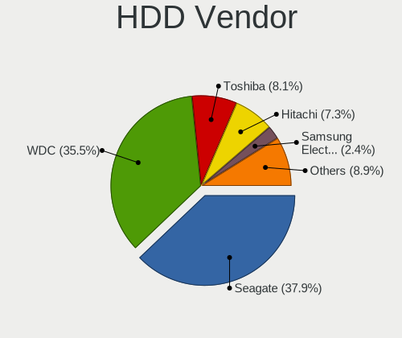
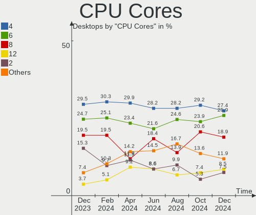
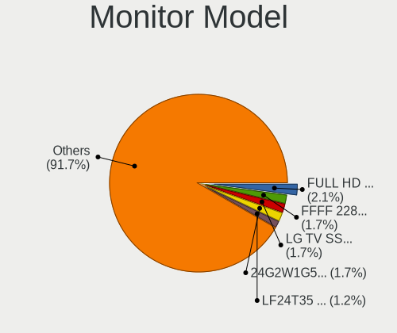
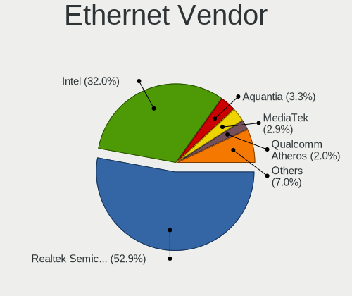
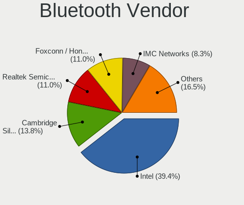

Fedora - Hardware Trends (Desktops)
-----------------------------------

A project to identify most popular hardware characteristics and track their change
over time based on data collected by Linux users at https://Linux-Hardware.org.

Anyone can contribute to this report by the [hw-probe](https://github.com/linuxhw/hw-probe) tool:

    sudo -E hw-probe -all -upload

This report is for one last month. Overall report since the beginning of time: [TestDays](https://github.com/linuxhw/TestDays)

Period: Dec, 2023.

Contents
--------

* [ System ](#system)
  - [ OS                       ](#os)
  - [ OS Family                ](#os-family)
  - [ Kernel                   ](#kernel)
  - [ Kernel Family            ](#kernel-family)
  - [ Kernel Major Ver.        ](#kernel-major-ver)
  - [ Arch                     ](#arch)
  - [ DE                       ](#de)
  - [ Display Server           ](#display-server)
  - [ Display Manager          ](#display-manager)
  - [ OS Lang                  ](#os-lang)
  - [ Boot Mode                ](#boot-mode)
  - [ Filesystem               ](#filesystem)
  - [ Part. scheme             ](#part-scheme)
  - [ Dual Boot with Linux/BSD ](#dual-boot-with-linuxbsd)
  - [ Dual Boot (Win)          ](#dual-boot-win)

* [ Board ](#board)
  - [ Vendor                   ](#vendor)
  - [ Model                    ](#model)
  - [ Model Family             ](#model-family)
  - [ MFG Year                 ](#mfg-year)
  - [ Form Factor              ](#form-factor)
  - [ Secure Boot              ](#secure-boot)
  - [ Coreboot                 ](#coreboot)
  - [ RAM Size                 ](#ram-size)
  - [ RAM Used                 ](#ram-used)
  - [ Total Drives             ](#total-drives)
  - [ Has CD-ROM               ](#has-cd-rom)
  - [ Has Ethernet             ](#has-ethernet)
  - [ Has WiFi                 ](#has-wifi)
  - [ Has Bluetooth            ](#has-bluetooth)

* [ Location ](#location)
  - [ Country                  ](#country)
  - [ City                     ](#city)

* [ Drives ](#drives)
  - [ Drive Vendor             ](#drive-vendor)
  - [ Drive Model              ](#drive-model)
  - [ HDD Vendor               ](#hdd-vendor)
  - [ SSD Vendor               ](#ssd-vendor)
  - [ Drive Kind               ](#drive-kind)
  - [ Drive Connector          ](#drive-connector)
  - [ Drive Size               ](#drive-size)
  - [ Space Total              ](#space-total)
  - [ Space Used               ](#space-used)
  - [ Malfunc. Drives          ](#malfunc-drives)
  - [ Malfunc. Drive Vendor    ](#malfunc-drive-vendor)
  - [ Malfunc. HDD Vendor      ](#malfunc-hdd-vendor)
  - [ Malfunc. Drive Kind      ](#malfunc-drive-kind)
  - [ Failed Drives            ](#failed-drives)
  - [ Failed Drive Vendor      ](#failed-drive-vendor)
  - [ Drive Status             ](#drive-status)

* [ Storage controller ](#storage-controller)
  - [ Storage Vendor           ](#storage-vendor)
  - [ Storage Model            ](#storage-model)
  - [ Storage Kind             ](#storage-kind)

* [ Processor ](#processor)
  - [ CPU Vendor               ](#cpu-vendor)
  - [ CPU Model                ](#cpu-model)
  - [ CPU Model Family         ](#cpu-model-family)
  - [ CPU Cores                ](#cpu-cores)
  - [ CPU Sockets              ](#cpu-sockets)
  - [ CPU Threads              ](#cpu-threads)
  - [ CPU Op-Modes             ](#cpu-op-modes)
  - [ CPU Microcode            ](#cpu-microcode)
  - [ CPU Microarch            ](#cpu-microarch)

* [ Graphics ](#graphics)
  - [ GPU Vendor               ](#gpu-vendor)
  - [ GPU Model                ](#gpu-model)
  - [ GPU Combo                ](#gpu-combo)
  - [ GPU Driver               ](#gpu-driver)
  - [ GPU Memory               ](#gpu-memory)

* [ Monitor ](#monitor)
  - [ Monitor Vendor           ](#monitor-vendor)
  - [ Monitor Model            ](#monitor-model)
  - [ Monitor Resolution       ](#monitor-resolution)
  - [ Monitor Diagonal         ](#monitor-diagonal)
  - [ Monitor Width            ](#monitor-width)
  - [ Aspect Ratio             ](#aspect-ratio)
  - [ Monitor Area             ](#monitor-area)
  - [ Pixel Density            ](#pixel-density)
  - [ Multiple Monitors        ](#multiple-monitors)

* [ Network ](#network)
  - [ Net Controller Vendor    ](#net-controller-vendor)
  - [ Net Controller Model     ](#net-controller-model)
  - [ Wireless Vendor          ](#wireless-vendor)
  - [ Wireless Model           ](#wireless-model)
  - [ Ethernet Vendor          ](#ethernet-vendor)
  - [ Ethernet Model           ](#ethernet-model)
  - [ Net Controller Kind      ](#net-controller-kind)
  - [ Used Controller          ](#used-controller)
  - [ NICs                     ](#nics)
  - [ IPv6                     ](#ipv6)

* [ Bluetooth ](#bluetooth)
  - [ Bluetooth Vendor         ](#bluetooth-vendor)
  - [ Bluetooth Model          ](#bluetooth-model)

* [ Sound ](#sound)
  - [ Sound Vendor             ](#sound-vendor)
  - [ Sound Model              ](#sound-model)

* [ Memory ](#memory)
  - [ Memory Vendor            ](#memory-vendor)
  - [ Memory Model             ](#memory-model)
  - [ Memory Kind              ](#memory-kind)
  - [ Memory Form Factor       ](#memory-form-factor)
  - [ Memory Size              ](#memory-size)
  - [ Memory Speed             ](#memory-speed)

* [ Printers & scanners ](#printers--scanners)
  - [ Printer Vendor           ](#printer-vendor)
  - [ Printer Model            ](#printer-model)
  - [ Scanner Vendor           ](#scanner-vendor)
  - [ Scanner Model            ](#scanner-model)

* [ Camera ](#camera)
  - [ Camera Vendor            ](#camera-vendor)
  - [ Camera Model             ](#camera-model)

* [ Security ](#security)
  - [ Fingerprint Vendor       ](#fingerprint-vendor)
  - [ Fingerprint Model        ](#fingerprint-model)
  - [ Chipcard Vendor          ](#chipcard-vendor)
  - [ Chipcard Model           ](#chipcard-model)

* [ Unsupported ](#unsupported)
  - [ Unsupported Devices      ](#unsupported-devices)
  - [ Unsupported Device Types ](#unsupported-device-types)

System
------

OS
--

Installed operating systems

| Name      | Desktops | Percent |
|-----------|----------|---------|
| Fedora 39 | 173      | 90.58%  |
| Fedora 38 | 11       | 5.76%   |
| Fedora 40 | 2        | 1.05%   |
| Fedora 37 | 2        | 1.05%   |
| Fedora 36 | 1        | 0.52%   |
| Fedora 33 | 1        | 0.52%   |
| Fedora 30 | 1        | 0.52%   |

OS Family
---------

OS without a version

| Name   | Desktops | Percent |
|--------|----------|---------|
| Fedora | 191      | 100%    |

Kernel
------

Version of the Linux kernel

| Version                                                | Desktops | Percent |
|--------------------------------------------------------|----------|---------|
| 6.6.7-200.fc39.x86_64                                  | 31       | 16.23%  |
| 6.6.8-200.fc39.x86_64                                  | 29       | 15.18%  |
| 6.6.4-200.fc39.x86_64                                  | 28       | 14.66%  |
| 6.6.2-201.fc39.x86_64                                  | 28       | 14.66%  |
| 6.6.6-200.fc39.x86_64                                  | 26       | 13.61%  |
| 6.5.6-300.fc39.x86_64                                  | 16       | 8.38%   |
| 6.6.3-200.fc39.x86_64                                  | 9        | 4.71%   |
| 6.5.5-200.fc38.x86_64                                  | 2        | 1.05%   |
| 6.5.12-300.fc39.x86_64                                 | 2        | 1.05%   |
| 6.2.9-300.fc38.x86_64                                  | 2        | 1.05%   |
| 6.7.0-0.rc5.20231212git26aff849438c.42.fc40.x86_64     | 1        | 0.52%   |
| 6.7.0-0.rc3.20231202gt815fb87b.332.vanilla.fc39.x86_64 | 1        | 0.52%   |
| 6.6.7_tkg_bore_llvm                                    | 1        | 0.52%   |
| 6.6.7-100.fc38.x86_64                                  | 1        | 0.52%   |
| 6.6.6-100.fc38.x86_64                                  | 1        | 0.52%   |
| 6.6.3-100.fc38.x86_64                                  | 1        | 0.52%   |
| 6.6.2-101.fc38.x86_64                                  | 1        | 0.52%   |
| 6.5.8-200.fc38.x86_64                                  | 1        | 0.52%   |
| 6.5.7-200.fc38.x86_64                                  | 1        | 0.52%   |
| 6.5.12-200.fc38.x86_64                                 | 1        | 0.52%   |
| 6.5.10-200.fc38.x86_64                                 | 1        | 0.52%   |
| 6.4.15-100.fc37.x86_64                                 | 1        | 0.52%   |
| 6.4.13-100.fc37.x86_64                                 | 1        | 0.52%   |
| 6.4.12-200.fc38.x86_64                                 | 1        | 0.52%   |
| 6.2.15-703.inttf.fc37.x86_64                           | 1        | 0.52%   |
| 6.2.15-100.fc36.x86_64                                 | 1        | 0.52%   |
| 5.8.15-301.fc33.x86_64                                 | 1        | 0.52%   |
| 5.6.13-100.fc30.i686                                   | 1        | 0.52%   |

Kernel Family
-------------

Linux kernel without a distro release

| Version | Desktops | Percent |
|---------|----------|---------|
| 6.6.7   | 33       | 17.28%  |
| 6.6.8   | 29       | 15.18%  |
| 6.6.2   | 29       | 15.18%  |
| 6.6.4   | 28       | 14.66%  |
| 6.6.6   | 27       | 14.14%  |
| 6.5.6   | 16       | 8.38%   |
| 6.6.3   | 10       | 5.24%   |
| 6.5.12  | 3        | 1.57%   |
| 6.7.0   | 2        | 1.05%   |
| 6.5.5   | 2        | 1.05%   |
| 6.2.9   | 2        | 1.05%   |
| 6.2.15  | 2        | 1.05%   |
| 6.5.8   | 1        | 0.52%   |
| 6.5.7   | 1        | 0.52%   |
| 6.5.10  | 1        | 0.52%   |
| 6.4.15  | 1        | 0.52%   |
| 6.4.13  | 1        | 0.52%   |
| 6.4.12  | 1        | 0.52%   |
| 5.8.15  | 1        | 0.52%   |
| 5.6.13  | 1        | 0.52%   |

Kernel Major Ver.
-----------------

Linux kernel major version

| Version | Desktops | Percent |
|---------|----------|---------|
| 6.6     | 156      | 81.68%  |
| 6.5     | 24       | 12.57%  |
| 6.2     | 4        | 2.09%   |
| 6.4     | 3        | 1.57%   |
| 6.7     | 2        | 1.05%   |
| 5.8     | 1        | 0.52%   |
| 5.6     | 1        | 0.52%   |

Arch
----

OS architecture (x86_64, i586, etc.)

| Name   | Desktops | Percent |
|--------|----------|---------|
| x86_64 | 190      | 99.48%  |
| i686   | 1        | 0.52%   |

DE
--

Desktop Environment

| Name          | Desktops | Percent |
|---------------|----------|---------|
| GNOME         | 124      | 64.92%  |
| KDE5          | 36       | 18.85%  |
| Cinnamon      | 11       | 5.76%   |
| Unknown       | 5        | 2.62%   |
| X-Cinnamon    | 3        | 1.57%   |
| GNOME Classic | 3        | 1.57%   |
| XFCE          | 2        | 1.05%   |
| MATE          | 2        | 1.05%   |
| Budgie        | 2        | 1.05%   |
| KDE           | 1        | 0.52%   |
| Hyprland      | 1        | 0.52%   |
| bspwm         | 1        | 0.52%   |

Display Server
--------------

X11 or Wayland

| Name    | Desktops | Percent |
|---------|----------|---------|
| Wayland | 129      | 67.54%  |
| X11     | 42       | 21.99%  |
| Tty     | 15       | 7.85%   |
| Unknown | 5        | 2.62%   |

Display Manager
---------------

SDDM, LightDM, etc.

| Name    | Desktops | Percent |
|---------|----------|---------|
| Unknown | 122      | 63.87%  |
| GDM     | 33       | 17.28%  |
| LightDM | 19       | 9.95%   |
| SDDM    | 17       | 8.9%    |

OS Lang
-------

Language

| Lang  | Desktops | Percent |
|-------|----------|---------|
| en_US | 84       | 43.98%  |
| pt_BR | 18       | 9.42%   |
| en_AU | 16       | 8.38%   |
| en_GB | 15       | 7.85%   |
| de_DE | 13       | 6.81%   |
| ru_RU | 5        | 2.62%   |
| hu_HU | 4        | 2.09%   |
| es_ES | 4        | 2.09%   |
| en_CA | 3        | 1.57%   |
| cs_CZ | 3        | 1.57%   |
| pt_PT | 2        | 1.05%   |
| pl_PL | 2        | 1.05%   |
| ja_JP | 2        | 1.05%   |
| it_IT | 2        | 1.05%   |
| fr_CA | 2        | 1.05%   |
| en_IN | 2        | 1.05%   |
| de_AT | 2        | 1.05%   |
| zh_SG | 1        | 0.52%   |
| zh_CN | 1        | 0.52%   |
| tr_TR | 1        | 0.52%   |
| nl_NL | 1        | 0.52%   |
| nl_BE | 1        | 0.52%   |
| lv_LV | 1        | 0.52%   |
| lt_LT | 1        | 0.52%   |
| es_SV | 1        | 0.52%   |
| es_MX | 1        | 0.52%   |
| es_CL | 1        | 0.52%   |
| en_NZ | 1        | 0.52%   |
| en_DK | 1        | 0.52%   |

Boot Mode
---------

EFI or BIOS

| Mode | Desktops | Percent |
|------|----------|---------|
| EFI  | 125      | 65.45%  |
| BIOS | 66       | 34.55%  |

Filesystem
----------

Type of filesystem

| Type  | Desktops | Percent |
|-------|----------|---------|
| Btrfs | 140      | 73.3%   |
| Ext4  | 43       | 22.51%  |
| Xfs   | 8        | 4.19%   |

Part. scheme
------------

Scheme of partitioning

| Type    | Desktops | Percent |
|---------|----------|---------|
| Unknown | 117      | 61.26%  |
| GPT     | 60       | 31.41%  |
| MBR     | 14       | 7.33%   |

Dual Boot with Linux/BSD
------------------------

Hosting more than one Linux/BSD

| Dual boot | Desktops | Percent |
|-----------|----------|---------|
| No        | 170      | 89.01%  |
| Yes       | 21       | 10.99%  |

Dual Boot (Win)
---------------

Hosting Linux and Windows

| Dual boot | Desktops | Percent |
|-----------|----------|---------|
| No        | 161      | 84.29%  |
| Yes       | 30       | 15.71%  |

Board
-----

Vendor
------

Motherboard manufacturer

| Name                | Desktops | Percent |
|---------------------|----------|---------|
| ASUSTek Computer    | 48       | 25.13%  |
| Gigabyte Technology | 40       | 20.94%  |
| MSI                 | 31       | 16.23%  |
| ASRock              | 18       | 9.42%   |
| Hewlett-Packard     | 12       | 6.28%   |
| Dell                | 12       | 6.28%   |
| Intel               | 5        | 2.62%   |
| Lenovo              | 4        | 2.09%   |
| Pegatron            | 2        | 1.05%   |
| Fujitsu             | 2        | 1.05%   |
| Apple               | 2        | 1.05%   |
| Unknown             | 2        | 1.05%   |
| Positivo            | 1        | 0.52%   |
| PCWare              | 1        | 0.52%   |
| OEM                 | 1        | 0.52%   |
| MAXSUN              | 1        | 0.52%   |
| Foxconn             | 1        | 0.52%   |
| EVGA                | 1        | 0.52%   |
| Colorful Technology | 1        | 0.52%   |
| Biostar             | 1        | 0.52%   |
| BESSTAR Tech        | 1        | 0.52%   |
| AZW                 | 1        | 0.52%   |
| ANGXUN              | 1        | 0.52%   |
| AMI                 | 1        | 0.52%   |
| Acer                | 1        | 0.52%   |

Model
-----

Motherboard model

| Name                               | Desktops | Percent |
|------------------------------------|----------|---------|
| ASUS All Series                    | 4        | 2.09%   |
| MSI MS-7C02                        | 3        | 1.57%   |
| MSI MS-7721                        | 2        | 1.05%   |
| HP Z240 SFF Workstation            | 2        | 1.05%   |
| Gigabyte J1900M-D2P                | 2        | 1.05%   |
| Gigabyte B650 AORUS ELITE AX       | 2        | 1.05%   |
| Dell OptiPlex 3020                 | 2        | 1.05%   |
| ASUS TUF Gaming Z690-PLUS D4       | 2        | 1.05%   |
| ASUS ROG STRIX B650E-I GAMING WIFI | 2        | 1.05%   |
| ASUS PRIME X570-PRO                | 2        | 1.05%   |
| ASRock B450M Pro4 R2.0             | 2        | 1.05%   |
| Unknown                            | 2        | 1.05%   |
| Positivo POS-SIGL40BX              | 1        | 0.52%   |
| Pegatron Pavilion P6000 Series     | 1        | 0.52%   |
| Pegatron IPMIP-GS                  | 1        | 0.52%   |
| PCWare IPMH61R3                    | 1        | 0.52%   |
| OEM G41 775 ICH7 8712              | 1        | 0.52%   |
| MSI MS-7E27                        | 1        | 0.52%   |
| MSI MS-7D78                        | 1        | 0.52%   |
| MSI MS-7D74                        | 1        | 0.52%   |
| MSI MS-7D43                        | 1        | 0.52%   |
| MSI MS-7D40                        | 1        | 0.52%   |
| MSI MS-7D25                        | 1        | 0.52%   |
| MSI MS-7D14                        | 1        | 0.52%   |
| MSI MS-7C95                        | 1        | 0.52%   |
| MSI MS-7C91                        | 1        | 0.52%   |
| MSI MS-7C88                        | 1        | 0.52%   |
| MSI MS-7C56                        | 1        | 0.52%   |
| MSI MS-7C52                        | 1        | 0.52%   |
| MSI MS-7C37                        | 1        | 0.52%   |
| MSI MS-7B86                        | 1        | 0.52%   |
| MSI MS-7B22                        | 1        | 0.52%   |
| MSI MS-7B17                        | 1        | 0.52%   |
| MSI MS-7B10                        | 1        | 0.52%   |
| MSI MS-7B07                        | 1        | 0.52%   |
| MSI MS-7A37                        | 1        | 0.52%   |
| MSI MS-7996                        | 1        | 0.52%   |
| MSI MS-7917                        | 1        | 0.52%   |
| MSI MS-7885                        | 1        | 0.52%   |
| MSI MS-7693                        | 1        | 0.52%   |

Model Family
------------

Motherboard model prefix

| Name                  | Desktops | Percent |
|-----------------------|----------|---------|
| ASUS ROG              | 14       | 7.33%   |
| ASUS PRIME            | 13       | 6.81%   |
| Dell OptiPlex         | 8        | 4.19%   |
| ASUS TUF              | 5        | 2.62%   |
| ASUS All              | 4        | 2.09%   |
| MSI MS-7C02           | 3        | 1.57%   |
| Lenovo ThinkCentre    | 3        | 1.57%   |
| HP ProDesk            | 3        | 1.57%   |
| Gigabyte X570         | 3        | 1.57%   |
| Gigabyte B550         | 3        | 1.57%   |
| MSI MS-7721           | 2        | 1.05%   |
| HP Z240               | 2        | 1.05%   |
| HP EliteDesk          | 2        | 1.05%   |
| HP Compaq             | 2        | 1.05%   |
| Gigabyte Z490         | 2        | 1.05%   |
| Gigabyte X670         | 2        | 1.05%   |
| Gigabyte J1900M-D2P   | 2        | 1.05%   |
| Gigabyte B650         | 2        | 1.05%   |
| Gigabyte B550M        | 2        | 1.05%   |
| Gigabyte B450M        | 2        | 1.05%   |
| Gigabyte B450         | 2        | 1.05%   |
| Fujitsu ESPRIMO       | 2        | 1.05%   |
| Dell XPS              | 2        | 1.05%   |
| Dell Inspiron         | 2        | 1.05%   |
| ASRock X570           | 2        | 1.05%   |
| ASRock B450M          | 2        | 1.05%   |
| Unknown               | 2        | 1.05%   |
| Positivo POS-SIGL40BX | 1        | 0.52%   |
| Pegatron Pavilion     | 1        | 0.52%   |
| Pegatron IPMIP-GS     | 1        | 0.52%   |
| PCWare IPMH61R3       | 1        | 0.52%   |
| OEM G41               | 1        | 0.52%   |
| MSI MS-7E27           | 1        | 0.52%   |
| MSI MS-7D78           | 1        | 0.52%   |
| MSI MS-7D74           | 1        | 0.52%   |
| MSI MS-7D43           | 1        | 0.52%   |
| MSI MS-7D40           | 1        | 0.52%   |
| MSI MS-7D25           | 1        | 0.52%   |
| MSI MS-7D14           | 1        | 0.52%   |
| MSI MS-7C95           | 1        | 0.52%   |

MFG Year
--------

Motherboard manufacture year

| Year | Desktops | Percent |
|------|----------|---------|
| 2022 | 22       | 11.52%  |
| 2020 | 21       | 10.99%  |
| 2018 | 20       | 10.47%  |
| 2019 | 17       | 8.9%    |
| 2021 | 13       | 6.81%   |
| 2017 | 12       | 6.28%   |
| 2013 | 12       | 6.28%   |
| 2011 | 11       | 5.76%   |
| 2023 | 10       | 5.24%   |
| 2016 | 10       | 5.24%   |
| 2014 | 10       | 5.24%   |
| 2012 | 9        | 4.71%   |
| 2010 | 9        | 4.71%   |
| 2015 | 5        | 2.62%   |
| 2008 | 5        | 2.62%   |
| 2009 | 2        | 1.05%   |
| 2006 | 2        | 1.05%   |
| 2007 | 1        | 0.52%   |

Form Factor
-----------

Physical design of the computer

| Name    | Desktops | Percent |
|---------|----------|---------|
| Desktop | 191      | 100%    |

Secure Boot
-----------

Enabled or disabled

| State    | Desktops | Percent |
|----------|----------|---------|
| Disabled | 164      | 85.86%  |
| Enabled  | 27       | 14.14%  |

Coreboot
--------

Have coreboot on board

| Used | Desktops | Percent |
|------|----------|---------|
| No   | 191      | 100%    |

RAM Size
--------

Total RAM memory

| Size in GB  | Desktops | Percent |
|-------------|----------|---------|
| 16.01-24.0  | 57       | 29.84%  |
| 32.01-64.0  | 43       | 22.51%  |
| 8.01-16.0   | 28       | 14.66%  |
| 64.01-256.0 | 20       | 10.47%  |
| 4.01-8.0    | 19       | 9.95%   |
| 3.01-4.0    | 13       | 6.81%   |
| 24.01-32.0  | 11       | 5.76%   |

RAM Used
--------

Used RAM memory

| Used GB    | Desktops | Percent |
|------------|----------|---------|
| 4.01-8.0   | 62       | 32.46%  |
| 2.01-3.0   | 49       | 25.65%  |
| 3.01-4.0   | 41       | 21.47%  |
| 1.01-2.0   | 15       | 7.85%   |
| 8.01-16.0  | 12       | 6.28%   |
| 0.51-1.0   | 6        | 3.14%   |
| 16.01-24.0 | 5        | 2.62%   |
| 24.01-32.0 | 1        | 0.52%   |

Total Drives
------------

Number of drives on board

| Drives | Desktops | Percent |
|--------|----------|---------|
| 1      | 66       | 34.55%  |
| 2      | 50       | 26.18%  |
| 3      | 36       | 18.85%  |
| 4      | 15       | 7.85%   |
| 5      | 13       | 6.81%   |
| 6      | 6        | 3.14%   |
| 8      | 2        | 1.05%   |
| 12     | 1        | 0.52%   |
| 10     | 1        | 0.52%   |
| 9      | 1        | 0.52%   |

Has CD-ROM
----------

Has CD-ROM on board

| Presented | Desktops | Percent |
|-----------|----------|---------|
| No        | 131      | 68.59%  |
| Yes       | 60       | 31.41%  |

Has Ethernet
------------

Has Ethernet on board

| Presented | Desktops | Percent |
|-----------|----------|---------|
| Yes       | 188      | 98.43%  |
| No        | 3        | 1.57%   |

Has WiFi
--------

Has WiFi module

| Presented | Desktops | Percent |
|-----------|----------|---------|
| Yes       | 102      | 53.4%   |
| No        | 89       | 46.6%   |

Has Bluetooth
-------------

Has Bluetooth module

| Presented | Desktops | Percent |
|-----------|----------|---------|
| No        | 101      | 52.88%  |
| Yes       | 90       | 47.12%  |

Location
--------

Country
-------

Geographic location (country)

| Country     | Desktops | Percent |
|-------------|----------|---------|
| USA         | 41       | 21.47%  |
| Brazil      | 21       | 10.99%  |
| Australia   | 17       | 8.9%    |
| Germany     | 14       | 7.33%   |
| UK          | 10       | 5.24%   |
| Netherlands | 7        | 3.66%   |
| Canada      | 7        | 3.66%   |
| Russia      | 6        | 3.14%   |
| Italy       | 6        | 3.14%   |
| Hungary     | 6        | 3.14%   |
| Spain       | 5        | 2.62%   |
| Czechia     | 4        | 2.09%   |
| Sweden      | 3        | 1.57%   |
| Poland      | 3        | 1.57%   |
| Japan       | 3        | 1.57%   |
| Egypt       | 3        | 1.57%   |
| Belgium     | 3        | 1.57%   |
| Austria     | 3        | 1.57%   |
| Turkey      | 2        | 1.05%   |
| Portugal    | 2        | 1.05%   |
| Norway      | 2        | 1.05%   |
| Malaysia    | 2        | 1.05%   |
| India       | 2        | 1.05%   |
| France      | 2        | 1.05%   |
| Finland     | 2        | 1.05%   |
| Bulgaria    | 2        | 1.05%   |
| Vietnam     | 1        | 0.52%   |
| Taiwan      | 1        | 0.52%   |
| Serbia      | 1        | 0.52%   |
| Romania     | 1        | 0.52%   |
| Morocco     | 1        | 0.52%   |
| Mexico      | 1        | 0.52%   |
| Latvia      | 1        | 0.52%   |
| Greece      | 1        | 0.52%   |
| Estonia     | 1        | 0.52%   |
| El Salvador | 1        | 0.52%   |
| Croatia     | 1        | 0.52%   |
| Colombia    | 1        | 0.52%   |
| Chile       | 1        | 0.52%   |

City
----

Geographic location (city)

| City          | Desktops | Percent |
|---------------|----------|---------|
| Sydney        | 12       | 6.28%   |
| Yekaterinburg | 2        | 1.05%   |
| Warsaw        | 2        | 1.05%   |
| Vancouver     | 2        | 1.05%   |
| Ravensburg    | 2        | 1.05%   |
| Porto Alegre  | 2        | 1.05%   |
| Ober-Morlen   | 2        | 1.05%   |
| Milano        | 2        | 1.05%   |
| Kuala Lumpur  | 2        | 1.05%   |
| Fortaleza     | 2        | 1.05%   |
| Brisbane      | 2        | 1.05%   |
| Zagreb        | 1        | 0.52%   |
| Wroclaw       | 1        | 0.52%   |
| Windsor       | 1        | 0.52%   |
| West Seneca   | 1        | 0.52%   |
| West Jordan   | 1        | 0.52%   |
| Weilmuenster  | 1        | 0.52%   |
| Weatherford   | 1        | 0.52%   |
| Wayne         | 1        | 0.52%   |
| Volgograd     | 1        | 0.52%   |
| Villepinte    | 1        | 0.52%   |
| Vigo          | 1        | 0.52%   |
| Vienna        | 1        | 0.52%   |
| Varna         | 1        | 0.52%   |
| Valparaíso   | 1        | 0.52%   |
| Valencia      | 1        | 0.52%   |
| Tunja         | 1        | 0.52%   |
| Trussville    | 1        | 0.52%   |
| Toronto       | 1        | 0.52%   |
| Toereboda     | 1        | 0.52%   |
| Toccoa        | 1        | 0.52%   |
| The Hague     | 1        | 0.52%   |
| Thame         | 1        | 0.52%   |
| Terrebonne    | 1        | 0.52%   |
| Tatabánya    | 1        | 0.52%   |
| Tangier       | 1        | 0.52%   |
| Tallinn       | 1        | 0.52%   |
| Tacoma        | 1        | 0.52%   |
| Szolnok       | 1        | 0.52%   |
| Szodliget     | 1        | 0.52%   |

Drives
------

Drive Vendor
------------

Hard drive vendors

| Vendor                       | Desktops | Drives | Percent |
|------------------------------|----------|--------|---------|
| Samsung Electronics          | 72       | 107    | 18.75%  |
| WDC                          | 55       | 81     | 14.32%  |
| Seagate                      | 44       | 68     | 11.46%  |
| Sandisk                      | 29       | 37     | 7.55%   |
| Toshiba                      | 20       | 22     | 5.21%   |
| Crucial                      | 20       | 22     | 5.21%   |
| Kingston                     | 17       | 18     | 4.43%   |
| Micron/Crucial Technology    | 15       | 16     | 3.91%   |
| Phison Electronics           | 9        | 10     | 2.34%   |
| Intel                        | 8        | 9      | 2.08%   |
| Hitachi                      | 8        | 10     | 2.08%   |
| ADATA Technology             | 8        | 9      | 2.08%   |
| China                        | 6        | 6      | 1.56%   |
| SK hynix                     | 5        | 5      | 1.3%    |
| MAXIO Technology (Hangzhou)  | 5        | 5      | 1.3%    |
| Silicon Motion               | 4        | 4      | 1.04%   |
| Micron Technology            | 4        | 4      | 1.04%   |
| Kingston Technology Company  | 4        | 5      | 1.04%   |
| HGST                         | 4        | 5      | 1.04%   |
| A-DATA Technology            | 4        | 4      | 1.04%   |
| Unknown                      | 3        | 3      | 0.78%   |
| SPCC                         | 3        | 3      | 0.78%   |
| Realtek Semiconductor        | 3        | 3      | 0.78%   |
| Apple                        | 3        | 3      | 0.78%   |
| Shenzhen Longsys Electronics | 2        | 2      | 0.52%   |
| Intenso                      | 2        | 2      | 0.52%   |
| TerraMas                     | 1        | 2      | 0.26%   |
| TECH                         | 1        | 1      | 0.26%   |
| Team                         | 1        | 1      | 0.26%   |
| SD                           | 1        | 1      | 0.26%   |
| SAGE                         | 1        | 1      | 0.26%   |
| PNY                          | 1        | 1      | 0.26%   |
| Patriot                      | 1        | 1      | 0.26%   |
| OCZ                          | 1        | 1      | 0.26%   |
| Netac                        | 1        | 2      | 0.26%   |
| Maxtor                       | 1        | 1      | 0.26%   |
| MaxDigital                   | 1        | 1      | 0.26%   |
| LITEONIT                     | 1        | 1      | 0.26%   |
| LITEON                       | 1        | 1      | 0.26%   |
| Lexar                        | 1        | 1      | 0.26%   |

Drive Model
-----------

Hard drive models

| Model                                                             | Desktops | Percent |
|-------------------------------------------------------------------|----------|---------|
| Samsung NVMe SSD Controller SM981/PM981/PM983 512GB               | 18       | 3.88%   |
| Micron/Crucial P2 NVMe PCIe SSD 4TB                               | 11       | 2.37%   |
| Samsung NVMe SSD Controller PM9A1/PM9A3/980PRO 2TB                | 9        | 1.94%   |
| Samsung SSD 860 EVO 1TB                                           | 7        | 1.51%   |
| Sandisk WD Blue SN550 NVMe SSD 1TB                                | 6        | 1.29%   |
| Samsung SSD 850 EVO 250GB                                         | 6        | 1.29%   |
| Toshiba DT01ACA100 1TB                                            | 5        | 1.08%   |
| Samsung SSD 860 EVO 500GB                                         | 5        | 1.08%   |
| Kingston SA400S37480G 480GB SSD                                   | 5        | 1.08%   |
| Silicon Motion SM2263EN/SM2263XT SSD Controller 500GB             | 4        | 0.86%   |
| Seagate ST2000DM008-2UB102 2TB                                    | 4        | 0.86%   |
| Sandisk WD_BLACK SN850X 2000GB                                    | 4        | 0.86%   |
| Samsung SSD 870 QVO 1TB                                           | 4        | 0.86%   |
| Phison E12 NVMe Controller 1TB                                    | 4        | 0.86%   |
| Crucial CT500MX500SSD1 500GB                                      | 4        | 0.86%   |
| Crucial CT1000MX500SSD1 1TB                                       | 4        | 0.86%   |
| WDC WDS240G2G0A-00JH30 240GB SSD                                  | 3        | 0.65%   |
| WDC WD40EFRX-68N32N0 4TB                                          | 3        | 0.65%   |
| Unknown SD/MMC/MS PRO 512GB                                       | 3        | 0.65%   |
| Toshiba MQ01ABD050 500GB                                          | 3        | 0.65%   |
| Toshiba HDWD110 1TB                                               | 3        | 0.65%   |
| SPCC Solid State Disk 512GB                                       | 3        | 0.65%   |
| Sandisk WD Black SN750 / PC SN730 NVMe SSD 2TB                    | 3        | 0.65%   |
| Samsung SSD 980 1TB                                               | 3        | 0.65%   |
| Samsung SSD 860 EVO 250GB                                         | 3        | 0.65%   |
| Samsung SSD 840 EVO 250GB                                         | 3        | 0.65%   |
| Samsung NVMe SSD Controller SM961/PM961/SM963 250GB               | 3        | 0.65%   |
| Kingston Company SNV2S1000G 1TB                                   | 3        | 0.65%   |
| Crucial CT250MX500SSD1 250GB                                      | 3        | 0.65%   |
| ADATA XPG SX8200 Pro PCIe Gen3x4 M.2 2280 Solid State Drive 512GB | 3        | 0.65%   |
| WDC WDS500G2B0A-00SM50 500GB SSD                                  | 2        | 0.43%   |
| WDC WD5000AAKS-00UU3A0 500GB                                      | 2        | 0.43%   |
| WDC WD20EARS-00MVWB0 2TB                                          | 2        | 0.43%   |
| WDC WD10EZEX-22MFCA0 1TB                                          | 2        | 0.43%   |
| WDC WD10EZEX-08WN4A0 1TB                                          | 2        | 0.43%   |
| WDC WD10EZEX-00WN4A0 1TB                                          | 2        | 0.43%   |
| WDC WD10EZEX-00BN5A0 1TB                                          | 2        | 0.43%   |
| Seagate ST500DM002-1BD142 500GB                                   | 2        | 0.43%   |
| Seagate ST4000VN006-3CW104 4TB                                    | 2        | 0.43%   |
| Seagate ST3500418AS 500GB                                         | 2        | 0.43%   |

HDD Vendor
----------

Hard disk drive vendors

| Vendor              | Desktops | Drives | Percent |
|---------------------|----------|--------|---------|
| WDC                 | 48       | 71     | 35.04%  |
| Seagate             | 44       | 68     | 32.12%  |
| Toshiba             | 17       | 19     | 12.41%  |
| Hitachi             | 8        | 10     | 5.84%   |
| Samsung Electronics | 7        | 9      | 5.11%   |
| HGST                | 4        | 5      | 2.92%   |
| Unknown             | 3        | 3      | 2.19%   |
| SAGE                | 1        | 1      | 0.73%   |
| Maxtor              | 1        | 1      | 0.73%   |
| KINGWIN             | 1        | 1      | 0.73%   |
| Intenso             | 1        | 1      | 0.73%   |
| ASMT                | 1        | 5      | 0.73%   |
| Apple               | 1        | 1      | 0.73%   |

SSD Vendor
----------

Solid state drive vendors

| Vendor              | Desktops | Drives | Percent |
|---------------------|----------|--------|---------|
| Samsung Electronics | 44       | 60     | 30.77%  |
| Crucial             | 20       | 22     | 13.99%  |
| Kingston            | 15       | 15     | 10.49%  |
| WDC                 | 10       | 10     | 6.99%   |
| SanDisk             | 9        | 10     | 6.29%   |
| Intel               | 6        | 6      | 4.2%    |
| China               | 6        | 6      | 4.2%    |
| A-DATA Technology   | 4        | 4      | 2.8%    |
| SPCC                | 3        | 3      | 2.1%    |
| SK hynix            | 3        | 3      | 2.1%    |
| Apple               | 2        | 2      | 1.4%    |
| Toshiba             | 1        | 1      | 0.7%    |
| TECH                | 1        | 1      | 0.7%    |
| Team                | 1        | 1      | 0.7%    |
| SD                  | 1        | 1      | 0.7%    |
| PNY                 | 1        | 1      | 0.7%    |
| Patriot             | 1        | 1      | 0.7%    |
| OCZ                 | 1        | 1      | 0.7%    |
| Netac               | 1        | 2      | 0.7%    |
| Micron Technology   | 1        | 1      | 0.7%    |
| MaxDigital          | 1        | 1      | 0.7%    |
| LITEONIT            | 1        | 1      | 0.7%    |
| LITEON              | 1        | 1      | 0.7%    |
| KingSpec            | 1        | 1      | 0.7%    |
| JMicron Technology  | 1        | 1      | 0.7%    |
| Intenso             | 1        | 1      | 0.7%    |
| Hewlett-Packard     | 1        | 1      | 0.7%    |
| GOODRAM             | 1        | 1      | 0.7%    |
| Apacer              | 1        | 1      | 0.7%    |
| AFOX                | 1        | 1      | 0.7%    |
| Acer                | 1        | 1      | 0.7%    |
| 2.5                 | 1        | 1      | 0.7%    |

Drive Kind
----------

HDD or SSD

| Kind    | Desktops | Drives | Percent |
|---------|----------|--------|---------|
| SSD     | 112      | 163    | 35.9%   |
| HDD     | 104      | 195    | 33.33%  |
| NVMe    | 94       | 134    | 30.13%  |
| Unknown | 2        | 4      | 0.64%   |

Drive Connector
---------------

SATA, SAS, NVMe, etc.

| Type | Desktops | Drives | Percent |
|------|----------|--------|---------|
| SATA | 154      | 326    | 59.23%  |
| NVMe | 94       | 134    | 36.15%  |
| SAS  | 12       | 36     | 4.62%   |

Drive Size
----------

Size of hard drive

| Size in TB | Desktops | Drives | Percent |
|------------|----------|--------|---------|
| 0.01-0.5   | 102      | 150    | 40.48%  |
| 0.51-1.0   | 80       | 107    | 31.75%  |
| 1.01-2.0   | 31       | 38     | 12.3%   |
| 3.01-4.0   | 16       | 20     | 6.35%   |
| 4.01-10.0  | 12       | 22     | 4.76%   |
| 2.01-3.0   | 7        | 14     | 2.78%   |
| 10.01-20.0 | 4        | 7      | 1.59%   |

Space Total
-----------

Amount of disk space available on the file system

| Size in GB     | Desktops | Percent |
|----------------|----------|---------|
| More than 3000 | 38       | 19.9%   |
| 1001-2000      | 34       | 17.8%   |
| 501-1000       | 31       | 16.23%  |
| 251-500        | 23       | 12.04%  |
| 101-250        | 23       | 12.04%  |
| 2001-3000      | 13       | 6.81%   |
| Unknown        | 12       | 6.28%   |
| 51-100         | 8        | 4.19%   |
| 1-20           | 7        | 3.66%   |
| 21-50          | 2        | 1.05%   |

Space Used
----------

Amount of used disk space

| Used GB        | Desktops | Percent |
|----------------|----------|---------|
| 1-20           | 39       | 20.42%  |
| 21-50          | 29       | 15.18%  |
| 101-250        | 23       | 12.04%  |
| 51-100         | 22       | 11.52%  |
| 251-500        | 17       | 8.9%    |
| 501-1000       | 15       | 7.85%   |
| More than 3000 | 14       | 7.33%   |
| 1001-2000      | 13       | 6.81%   |
| Unknown        | 12       | 6.28%   |
| 2001-3000      | 7        | 3.66%   |

Malfunc. Drives
---------------

Drive models with a malfunction

| Model                                               | Desktops | Drives | Percent |
|-----------------------------------------------------|----------|--------|---------|
| WDC WD40EFRX-68N32N0 4TB                            | 2        | 2      | 9.52%   |
| Intel SSDSC2CT120A3 120GB                           | 2        | 2      | 9.52%   |
| WDC WD5000AAKX-00ERMA0 500GB                        | 1        | 1      | 4.76%   |
| WDC WD5000AAKS-00UU3A0 500GB                        | 1        | 1      | 4.76%   |
| WDC WD40EFRX-68WT0N0 4TB                            | 1        | 1      | 4.76%   |
| WDC WD30 EZRX-00SPEB0 3TB                           | 1        | 1      | 4.76%   |
| WDC WD20 EZRX-00D8PB0 2TB                           | 1        | 1      | 4.76%   |
| WDC WD10EZEX-08WN4A0 1TB                            | 1        | 1      | 4.76%   |
| WDC WD10EARS-22Y5B1 1TB                             | 1        | 1      | 4.76%   |
| WDC WD10EADS-11M2B2 1TB                             | 1        | 1      | 4.76%   |
| Toshiba MQ01ABD050 500GB                            | 1        | 1      | 4.76%   |
| Seagate ST2000DX002-2DV164 2TB                      | 1        | 1      | 4.76%   |
| Seagate ST1000DX001-1NS162 1TB                      | 1        | 1      | 4.76%   |
| SanDisk SSD PLUS 240GB                              | 1        | 1      | 4.76%   |
| Samsung Electronics HD103UJ 1TB                     | 1        | 2      | 4.76%   |
| Micron Technology MTFDDAK128MAY-1AH1ZABHA 128GB SSD | 1        | 1      | 4.76%   |
| Maxtor 6L250S0 256GB                                | 1        | 1      | 4.76%   |
| Crucial CT275MX300SSD1 275GB                        | 1        | 1      | 4.76%   |
| Crucial CT120M500SSD1 120GB                         | 1        | 1      | 4.76%   |

Malfunc. Drive Vendor
---------------------

Vendors of faulty drives

| Vendor              | Desktops | Drives | Percent |
|---------------------|----------|--------|---------|
| WDC                 | 8        | 10     | 42.11%  |
| Seagate             | 2        | 2      | 10.53%  |
| Intel               | 2        | 2      | 10.53%  |
| Crucial             | 2        | 2      | 10.53%  |
| Toshiba             | 1        | 1      | 5.26%   |
| SanDisk             | 1        | 1      | 5.26%   |
| Samsung Electronics | 1        | 2      | 5.26%   |
| Micron Technology   | 1        | 1      | 5.26%   |
| Maxtor              | 1        | 1      | 5.26%   |

Malfunc. HDD Vendor
-------------------

Vendors of faulty HDD drives

| Vendor              | Desktops | Drives | Percent |
|---------------------|----------|--------|---------|
| WDC                 | 8        | 10     | 61.54%  |
| Seagate             | 2        | 2      | 15.38%  |
| Toshiba             | 1        | 1      | 7.69%   |
| Samsung Electronics | 1        | 2      | 7.69%   |
| Maxtor              | 1        | 1      | 7.69%   |

Malfunc. Drive Kind
-------------------

Kinds of faulty drives

| Kind | Desktops | Drives | Percent |
|------|----------|--------|---------|
| HDD  | 12       | 16     | 66.67%  |
| SSD  | 6        | 6      | 33.33%  |

Failed Drives
-------------

Failed drive models

| Model                     | Desktops | Drives | Percent |
|---------------------------|----------|--------|---------|
| WDC WD30 EZRS-00J99B0 3TB | 1        | 1      | 100%    |

Failed Drive Vendor
-------------------

Failed drive vendors

| Vendor | Desktops | Drives | Percent |
|--------|----------|--------|---------|
| WDC    | 1        | 1      | 100%    |

Drive Status
------------

Number of failed and malfunc. drives

| Status   | Desktops | Drives | Percent |
|----------|----------|--------|---------|
| Detected | 127      | 332    | 61.35%  |
| Works    | 62       | 141    | 29.95%  |
| Malfunc  | 17       | 22     | 8.21%   |
| Failed   | 1        | 1      | 0.48%   |

Storage controller
------------------

Storage Vendor
--------------

Storage controller vendors

| Vendor                       | Desktops | Percent |
|------------------------------|----------|---------|
| Intel                        | 98       | 29.43%  |
| AMD                          | 89       | 26.73%  |
| Samsung Electronics          | 38       | 11.41%  |
| Sandisk                      | 21       | 6.31%   |
| Micron/Crucial Technology    | 15       | 4.5%    |
| ASMedia Technology           | 12       | 3.6%    |
| Phison Electronics           | 9        | 2.7%    |
| ADATA Technology             | 8        | 2.4%    |
| Kingston Technology Company  | 7        | 2.1%    |
| JMicron Technology           | 6        | 1.8%    |
| MAXIO Technology (Hangzhou)  | 5        | 1.5%    |
| Silicon Motion               | 4        | 1.2%    |
| Realtek Semiconductor        | 3        | 0.9%    |
| Micron Technology            | 3        | 0.9%    |
| Toshiba America Info Systems | 2        | 0.6%    |
| SK hynix                     | 2        | 0.6%    |
| Shenzhen Longsys Electronics | 2        | 0.6%    |
| Nvidia                       | 2        | 0.6%    |
| Marvell Technology Group     | 2        | 0.6%    |
| ULi Electronics              | 1        | 0.3%    |
| Silicon Image                | 1        | 0.3%    |
| KIOXIA                       | 1        | 0.3%    |
| INNOGRIT                     | 1        | 0.3%    |
| Broadcom / LSI               | 1        | 0.3%    |

Storage Model
-------------

Storage controller models

| Model                                                                                   | Desktops | Percent |
|-----------------------------------------------------------------------------------------|----------|---------|
| AMD FCH SATA Controller [AHCI mode]                                                     | 49       | 12.6%   |
| Samsung NVMe SSD Controller SM981/PM981/PM983                                           | 19       | 4.88%   |
| AMD 400 Series Chipset SATA Controller                                                  | 18       | 4.63%   |
| AMD 500 Series Chipset SATA Controller                                                  | 17       | 4.37%   |
| Micron/Crucial P2 [Nick P2] / P3 / P3 Plus NVMe PCIe SSD (DRAM-less)                    | 11       | 2.83%   |
| Intel 8 Series/C220 Series Chipset Family 6-port SATA Controller 1 [AHCI mode]          | 11       | 2.83%   |
| Intel Cannon Lake PCH SATA AHCI Controller                                              | 10       | 2.57%   |
| Samsung NVMe SSD Controller PM9A1/PM9A3/980PRO                                          | 9        | 2.31%   |
| Intel Q170/Q150/B150/H170/H110/Z170/CM236 Chipset SATA Controller [AHCI Mode]           | 9        | 2.31%   |
| ASMedia ASM1062 Serial ATA Controller                                                   | 8        | 2.06%   |
| Sandisk WD Black SN850X NVMe SSD                                                        | 7        | 1.8%    |
| Intel 6 Series/C200 Series Chipset Family 6 port Desktop SATA AHCI Controller           | 7        | 1.8%    |
| Intel 200 Series PCH SATA controller [AHCI mode]                                        | 7        | 1.8%    |
| AMD SB7x0/SB8x0/SB9x0 SATA Controller [AHCI mode]                                       | 7        | 1.8%    |
| AMD SB7x0/SB8x0/SB9x0 IDE Controller                                                    | 7        | 1.8%    |
| SanDisk Ultra 3D / WD Blue SN550 NVMe SSD                                               | 6        | 1.54%   |
| JMicron JMB363 SATA/IDE Controller                                                      | 6        | 1.54%   |
| Intel Alder Lake-S PCH SATA Controller [AHCI Mode]                                      | 6        | 1.54%   |
| Intel 7 Series/C210 Series Chipset Family 6-port SATA Controller [AHCI mode]            | 5        | 1.29%   |
| Silicon Motion SM2263EN/SM2263XT (DRAM-less) NVMe SSD Controllers                       | 4        | 1.03%   |
| Samsung NVMe SSD Controller 980 (DRAM-less)                                             | 4        | 1.03%   |
| Phison E12 NVMe Controller                                                              | 4        | 1.03%   |
| Kingston Company NV2 NVMe SSD SM2267XT                                                  | 4        | 1.03%   |
| Intel Comet Lake SATA AHCI Controller                                                   | 4        | 1.03%   |
| Intel 700 Series Chipset Family SATA AHCI Controller                                    | 4        | 1.03%   |
| Intel 6 Series/C200 Series Chipset Family Desktop SATA Controller (IDE mode, ports 4-5) | 4        | 1.03%   |
| Intel 6 Series/C200 Series Chipset Family Desktop SATA Controller (IDE mode, ports 0-3) | 4        | 1.03%   |
| AMD SB7x0/SB8x0/SB9x0 SATA Controller [IDE mode]                                        | 4        | 1.03%   |
| AMD FCH SATA Controller D                                                               | 4        | 1.03%   |
| SanDisk WD Black SN770 / PC SN740 256GB / PC SN560 (DRAM-less) NVMe SSD                 | 3        | 0.77%   |
| SanDisk Extreme Pro / WD Black SN750 / PC SN730 / Red SN700 NVMe SSD                    | 3        | 0.77%   |
| Samsung NVMe SSD Controller SM961/PM961/SM963                                           | 3        | 0.77%   |
| Kingston Company KC3000/FURY Renegade NVMe SSD E18                                      | 3        | 0.77%   |
| Intel Volume Management Device NVMe RAID Controller Intel Corporation                   | 3        | 0.77%   |
| Intel SATA Controller [RAID mode]                                                       | 3        | 0.77%   |
| Intel NM10/ICH7 Family SATA Controller [IDE mode]                                       | 3        | 0.77%   |
| Intel NM10/ICH7 Family SATA Controller [AHCI mode]                                      | 3        | 0.77%   |
| AMD 300 Series Chipset SATA Controller                                                  | 3        | 0.77%   |
| ADATA XPG SX8200 Pro PCIe Gen3x4 M.2 2280 Solid State Drive                             | 3        | 0.77%   |
| Shenzhen Longsys Non-Volatile memory controller                                         | 2        | 0.51%   |

Storage Kind
------------

Kind of storage controller (IDE, SATA, NVMe, SAS, ...)

| Kind | Desktops | Percent |
|------|----------|---------|
| SATA | 176      | 56.96%  |
| NVMe | 94       | 30.42%  |
| IDE  | 29       | 9.39%   |
| RAID | 9        | 2.91%   |
| SAS  | 1        | 0.32%   |

Processor
---------

CPU Vendor
----------

Processor vendors

| Vendor | Desktops | Percent |
|--------|----------|---------|
| Intel  | 100      | 52.36%  |
| AMD    | 91       | 47.64%  |

CPU Model
---------

Processor models

| Model                                       | Desktops | Percent |
|---------------------------------------------|----------|---------|
| AMD Ryzen 5 3600 6-Core Processor           | 7        | 3.66%   |
| AMD Ryzen 7 3700X 8-Core Processor          | 6        | 3.14%   |
| AMD Ryzen 7 7800X3D 8-Core Processor        | 5        | 2.62%   |
| AMD Ryzen 7 5800X 8-Core Processor          | 5        | 2.62%   |
| AMD Ryzen 5 5600G with Radeon Graphics      | 4        | 2.09%   |
| Intel Core i9-9900K CPU @ 3.60GHz           | 3        | 1.57%   |
| Intel Core i5-8400 CPU @ 2.80GHz            | 3        | 1.57%   |
| AMD Ryzen 7 7700X 8-Core Processor          | 3        | 1.57%   |
| AMD Ryzen 7 5700G with Radeon Graphics      | 3        | 1.57%   |
| AMD Ryzen 5 5500                            | 3        | 1.57%   |
| Intel Core i7-8700 CPU @ 3.20GHz            | 2        | 1.05%   |
| Intel Core i7-7700K CPU @ 4.20GHz           | 2        | 1.05%   |
| Intel Core i7-6700K CPU @ 4.00GHz           | 2        | 1.05%   |
| Intel Core i7-3770 CPU @ 3.40GHz            | 2        | 1.05%   |
| Intel Core i5-6500 CPU @ 3.20GHz            | 2        | 1.05%   |
| Intel Core i5-4570 CPU @ 3.20GHz            | 2        | 1.05%   |
| Intel Core i5-2400 CPU @ 3.10GHz            | 2        | 1.05%   |
| Intel Core i5-10500 CPU @ 3.10GHz           | 2        | 1.05%   |
| Intel Core i3-4150 CPU @ 3.50GHz            | 2        | 1.05%   |
| Intel Core i3-3220 CPU @ 3.30GHz            | 2        | 1.05%   |
| Intel Core i3-2120 CPU @ 3.30GHz            | 2        | 1.05%   |
| Intel Core 2 Duo CPU E8400 @ 3.00GHz        | 2        | 1.05%   |
| Intel Celeron CPU J1900 @ 1.99GHz           | 2        | 1.05%   |
| Intel 13th Gen Core i5-13600K               | 2        | 1.05%   |
| AMD Ryzen 9 7950X 16-Core Processor         | 2        | 1.05%   |
| AMD Ryzen 9 3900X 12-Core Processor         | 2        | 1.05%   |
| AMD Ryzen 7 2700X Eight-Core Processor      | 2        | 1.05%   |
| AMD Ryzen 7 2700 Eight-Core Processor       | 2        | 1.05%   |
| AMD Ryzen 5 7600X 6-Core Processor          | 2        | 1.05%   |
| AMD Ryzen 5 7600 6-Core Processor           | 2        | 1.05%   |
| AMD Ryzen 5 5600X 6-Core Processor          | 2        | 1.05%   |
| AMD Ryzen 3 3200G with Radeon Vega Graphics | 2        | 1.05%   |
| AMD Ryzen 3 2200G with Radeon Vega Graphics | 2        | 1.05%   |
| AMD Phenom II X6 1090T Processor            | 2        | 1.05%   |
| AMD FX-8320 Eight-Core Processor            | 2        | 1.05%   |
| Intel Xeon CPU X5470 @ 3.33GHz              | 1        | 0.52%   |
| Intel Xeon CPU E5520 @ 2.27GHz              | 1        | 0.52%   |
| Intel Xeon CPU E5-2697 v2 @ 2.70GHz         | 1        | 0.52%   |
| Intel Xeon CPU E5-2680 v4 @ 2.40GHz         | 1        | 0.52%   |
| Intel Xeon CPU E5-2670 v3 @ 2.30GHz         | 1        | 0.52%   |

CPU Model Family
----------------

Processor model prefix

| Model                   | Desktops | Percent |
|-------------------------|----------|---------|
| Intel Core i5           | 31       | 16.23%  |
| AMD Ryzen 7             | 29       | 15.18%  |
| AMD Ryzen 5             | 28       | 14.66%  |
| Intel Core i7           | 18       | 9.42%   |
| Other                   | 11       | 5.76%   |
| Intel Core i3           | 10       | 5.24%   |
| Intel Xeon              | 7        | 3.66%   |
| AMD Ryzen 9             | 7        | 3.66%   |
| Intel Core i9           | 5        | 2.62%   |
| Intel Core 2 Duo        | 5        | 2.62%   |
| Intel Celeron           | 5        | 2.62%   |
| AMD Ryzen 3             | 5        | 2.62%   |
| AMD FX                  | 5        | 2.62%   |
| AMD Phenom II X6        | 3        | 1.57%   |
| AMD A8                  | 3        | 1.57%   |
| Intel Pentium           | 2        | 1.05%   |
| Intel Core 2 Quad       | 2        | 1.05%   |
| Intel Atom              | 2        | 1.05%   |
| AMD Phenom II X4        | 2        | 1.05%   |
| Intel Pentium Dual-Core | 1        | 0.52%   |
| Intel Genuine           | 1        | 0.52%   |
| Intel Core 2 Extreme    | 1        | 0.52%   |
| AMD Ryzen Threadripper  | 1        | 0.52%   |
| AMD Ryzen 7 PRO         | 1        | 0.52%   |
| AMD PRO A10             | 1        | 0.52%   |
| AMD Athlon II X4        | 1        | 0.52%   |
| AMD Athlon II X3        | 1        | 0.52%   |
| AMD Athlon 64 X2        | 1        | 0.52%   |
| AMD A4                  | 1        | 0.52%   |
| AMD A10                 | 1        | 0.52%   |

CPU Cores
---------

Number of processor cores

| Number | Desktops | Percent |
|--------|----------|---------|
| 4      | 56       | 29.32%  |
| 6      | 47       | 24.61%  |
| 8      | 37       | 19.37%  |
| 2      | 29       | 15.18%  |
| 12     | 7        | 3.66%   |
| 16     | 5        | 2.62%   |
| 14     | 3        | 1.57%   |
| 3      | 2        | 1.05%   |
| 28     | 1        | 0.52%   |
| 24     | 1        | 0.52%   |
| 20     | 1        | 0.52%   |
| 10     | 1        | 0.52%   |
| 1      | 1        | 0.52%   |

CPU Sockets
-----------

Number of sockets

| Number | Desktops | Percent |
|--------|----------|---------|
| 1      | 189      | 98.95%  |
| 2      | 2        | 1.05%   |

CPU Threads
-----------

Threads per core (Hyper-Threading)

| Number | Desktops | Percent |
|--------|----------|---------|
| 2      | 132      | 69.11%  |
| 1      | 59       | 30.89%  |

CPU Op-Modes
------------

CPU Operation Modes (32-bit, 64-bit)

| Op mode        | Desktops | Percent |
|----------------|----------|---------|
| 32-bit, 64-bit | 191      | 100%    |

CPU Microcode
-------------

Microcode number

| Number     | Desktops | Percent |
|------------|----------|---------|
| Unknown    | 105      | 54.97%  |
| 0x08701030 | 9        | 4.71%   |
| 0x0a601206 | 8        | 4.19%   |
| 0x0a601203 | 8        | 4.19%   |
| 0x0a50000d | 5        | 2.62%   |
| 0x0a20120a | 5        | 2.62%   |
| 0x08701021 | 5        | 2.62%   |
| 0x0a201016 | 4        | 2.09%   |
| 0x08108109 | 4        | 2.09%   |
| 0x0800820d | 4        | 2.09%   |
| 0x06000852 | 4        | 2.09%   |
| 0x010000c8 | 3        | 1.57%   |
| 0x0a50000f | 2        | 1.05%   |
| 0x08701013 | 2        | 1.05%   |
| 0x08101016 | 2        | 1.05%   |
| 0x08001138 | 2        | 1.05%   |
| 0x06001119 | 2        | 1.05%   |
| 0x010000bf | 2        | 1.05%   |
| 0x906e9    | 1        | 0.52%   |
| 0x0a50000c | 1        | 0.52%   |
| 0x0a20120e | 1        | 0.52%   |
| 0x0a201009 | 1        | 0.52%   |
| 0x08600106 | 1        | 0.52%   |
| 0x08001137 | 1        | 0.52%   |
| 0x0800111c | 1        | 0.52%   |
| 0x06006118 | 1        | 0.52%   |
| 0x06003106 | 1        | 0.52%   |
| 0x06003104 | 1        | 0.52%   |
| 0x0600081c | 1        | 0.52%   |
| 0x03000027 | 1        | 0.52%   |
| 0x010000dc | 1        | 0.52%   |
| 0x010000c7 | 1        | 0.52%   |
| 0x01000086 | 1        | 0.52%   |

CPU Microarch
-------------

Microarchitecture

| Name             | Desktops | Percent |
|------------------|----------|---------|
| Zen 3            | 22       | 11.52%  |
| KabyLake         | 20       | 10.47%  |
| Zen 2            | 19       | 9.95%   |
| Unknown          | 16       | 8.38%   |
| Haswell          | 12       | 6.28%   |
| Alderlake Hybrid | 10       | 5.24%   |
| Skylake          | 9        | 4.71%   |
| IvyBridge        | 9        | 4.71%   |
| Zen+             | 8        | 4.19%   |
| SandyBridge      | 8        | 4.19%   |
| Penryn           | 8        | 4.19%   |
| K10              | 8        | 4.19%   |
| Piledriver       | 7        | 3.66%   |
| Zen              | 6        | 3.14%   |
| CometLake        | 5        | 2.62%   |
| Silvermont       | 3        | 1.57%   |
| Icelake          | 3        | 1.57%   |
| Broadwell        | 3        | 1.57%   |
| Bonnell          | 3        | 1.57%   |
| Westmere         | 2        | 1.05%   |
| Steamroller      | 2        | 1.05%   |
| Core             | 2        | 1.05%   |
| Tremont          | 1        | 0.52%   |
| Nehalem          | 1        | 0.52%   |
| K8 Hammer        | 1        | 0.52%   |
| K10 Llano        | 1        | 0.52%   |
| Goldmont plus    | 1        | 0.52%   |
| Excavator        | 1        | 0.52%   |

Graphics
--------

GPU Vendor
----------

Vendors of graphics cards

| Vendor | Desktops | Percent |
|--------|----------|---------|
| AMD    | 85       | 41.67%  |
| Nvidia | 68       | 33.33%  |
| Intel  | 51       | 25%     |

GPU Model
---------

Graphics card models

| Model                                                                       | Desktops | Percent |
|-----------------------------------------------------------------------------|----------|---------|
| AMD Raphael                                                                 | 13       | 6.05%   |
| AMD Ellesmere [Radeon RX 470/480/570/570X/580/580X/590]                     | 8        | 3.72%   |
| Intel CoffeeLake-S GT2 [UHD Graphics 630]                                   | 7        | 3.26%   |
| Nvidia GP108 [GeForce GT 1030]                                              | 6        | 2.79%   |
| Intel Xeon E3-1200 v3/4th Gen Core Processor Integrated Graphics Controller | 6        | 2.79%   |
| AMD Navi 22 [Radeon RX 6700/6700 XT/6750 XT / 6800M/6850M XT]               | 6        | 2.79%   |
| Nvidia GK208B [GeForce GT 710]                                              | 5        | 2.33%   |
| AMD Navi 23 [Radeon RX 6600/6600 XT/6600M]                                  | 5        | 2.33%   |
| Intel HD Graphics 530                                                       | 4        | 1.86%   |
| AMD Polaris 20 XL [Radeon RX 580 2048SP]                                    | 4        | 1.86%   |
| AMD Navi 21 [Radeon RX 6800/6800 XT / 6900 XT]                              | 4        | 1.86%   |
| AMD Navi 10 [Radeon RX 5600 OEM/5600 XT / 5700/5700 XT]                     | 4        | 1.86%   |
| AMD Cezanne [Radeon Vega Series / Radeon Vega Mobile Series]                | 4        | 1.86%   |
| Nvidia GP107 [GeForce GTX 1050 Ti]                                          | 3        | 1.4%    |
| Nvidia GP104 [GeForce GTX 1080]                                             | 3        | 1.4%    |
| Nvidia GM107 [GeForce GTX 750 Ti]                                           | 3        | 1.4%    |
| Nvidia GA106 [Geforce RTX 3050]                                             | 3        | 1.4%    |
| Nvidia GA104 [GeForce RTX 3060 Ti Lite Hash Rate]                           | 3        | 1.4%    |
| Intel Xeon E3-1200 v2/3rd Gen Core processor Graphics Controller            | 3        | 1.4%    |
| Intel IvyBridge GT2 [HD Graphics 4000]                                      | 3        | 1.4%    |
| Intel HD Graphics 630                                                       | 3        | 1.4%    |
| Intel 4 Series Chipset Integrated Graphics Controller                       | 3        | 1.4%    |
| Intel 2nd Generation Core Processor Family Integrated Graphics Controller   | 3        | 1.4%    |
| AMD Picasso/Raven 2 [Radeon Vega Series / Radeon Vega Mobile Series]        | 3        | 1.4%    |
| AMD Navi 32 [Radeon RX 7700 XT / 7800 XT]                                   | 3        | 1.4%    |
| AMD Navi 31 [Radeon RX 7900 XT/7900 XTX]                                    | 3        | 1.4%    |
| AMD Navi 14 [Radeon RX 5500/5500M / Pro 5500M]                              | 3        | 1.4%    |
| Nvidia TU117 [GeForce GTX 1650]                                             | 2        | 0.93%   |
| Nvidia GP106 [GeForce GTX 1060 6GB]                                         | 2        | 0.93%   |
| Nvidia GP104 [GeForce GTX 1070]                                             | 2        | 0.93%   |
| Nvidia GK107 [GeForce GT 740]                                               | 2        | 0.93%   |
| Nvidia GF119 [GeForce GT 610]                                               | 2        | 0.93%   |
| Nvidia GF116 [GeForce GTX 550 Ti]                                           | 2        | 0.93%   |
| Nvidia GA106 [GeForce RTX 3060]                                             | 2        | 0.93%   |
| Nvidia GA106 [GeForce RTX 3060 Lite Hash Rate]                              | 2        | 0.93%   |
| Nvidia AD104 [GeForce RTX 4070]                                             | 2        | 0.93%   |
| Intel Atom Processor Z36xxx/Z37xxx Series Graphics & Display                | 2        | 0.93%   |
| Intel Atom Processor D4xx/D5xx/N4xx/N5xx Integrated Graphics Controller     | 2        | 0.93%   |
| AMD Raven Ridge [Radeon Vega Series / Radeon Vega Mobile Series]            | 2        | 0.93%   |
| AMD Lexa PRO [Radeon 540/540X/550/550X / RX 540X/550/550X]                  | 2        | 0.93%   |

GPU Combo
---------

Combinations of graphics cards

| Name           | Desktops | Percent |
|----------------|----------|---------|
| 1 x AMD        | 66       | 34.55%  |
| 1 x Nvidia     | 60       | 31.41%  |
| 1 x Intel      | 42       | 21.99%  |
| 2 x AMD        | 11       | 5.76%   |
| AMD + Nvidia   | 5        | 2.62%   |
| Intel + Nvidia | 2        | 1.05%   |
| Intel + AMD    | 2        | 1.05%   |
| Other          | 1        | 0.52%   |
| 2 x Nvidia     | 1        | 0.52%   |
| 2 x Intel      | 1        | 0.52%   |

GPU Driver
----------

Free vs proprietary

| Driver      | Desktops | Percent |
|-------------|----------|---------|
| Free        | 145      | 75.92%  |
| Proprietary | 36       | 18.85%  |
| Unknown     | 10       | 5.24%   |

GPU Memory
----------

Total video memory

| Size in GB | Desktops | Percent |
|------------|----------|---------|
| Unknown    | 69       | 36.13%  |
| 7.01-8.0   | 28       | 14.66%  |
| 1.01-2.0   | 25       | 13.09%  |
| 0.01-0.5   | 17       | 8.9%    |
| 3.01-4.0   | 15       | 7.85%   |
| 8.01-16.0  | 15       | 7.85%   |
| 0.51-1.0   | 12       | 6.28%   |
| 5.01-6.0   | 6        | 3.14%   |
| 16.01-24.0 | 3        | 1.57%   |
| 2.01-3.0   | 1        | 0.52%   |

Monitor
-------

Monitor Vendor
--------------

Monitor vendors

| Vendor               | Desktops | Percent |
|----------------------|----------|---------|
| Goldstar             | 33       | 16.67%  |
| Samsung Electronics  | 28       | 14.14%  |
| Dell                 | 22       | 11.11%  |
| Acer                 | 14       | 7.07%   |
| Lenovo               | 10       | 5.05%   |
| Ancor Communications | 10       | 5.05%   |
| Hewlett-Packard      | 9        | 4.55%   |
| Philips              | 7        | 3.54%   |
| AOC                  | 7        | 3.54%   |
| Iiyama               | 5        | 2.53%   |
| BenQ                 | 5        | 2.53%   |
| ASUSTek Computer     | 4        | 2.02%   |
| ViewSonic            | 3        | 1.52%   |
| Sony                 | 3        | 1.52%   |
| Panasonic            | 3        | 1.52%   |
| Gigabyte Technology  | 3        | 1.52%   |
| Vizio                | 2        | 1.01%   |
| NEC Computers        | 2        | 1.01%   |
| MSI                  | 2        | 1.01%   |
| HUAWEI               | 2        | 1.01%   |
| Eizo                 | 2        | 1.01%   |
| Unknown              | 1        | 0.51%   |
| TXD                  | 1        | 0.51%   |
| STD                  | 1        | 0.51%   |
| Sceptre Tech         | 1        | 0.51%   |
| PRI                  | 1        | 0.51%   |
| Pixio                | 1        | 0.51%   |
| Onkyo                | 1        | 0.51%   |
| Mi                   | 1        | 0.51%   |
| Medion Akoya         | 1        | 0.51%   |
| Medion               | 1        | 0.51%   |
| Marantz              | 1        | 0.51%   |
| KTC                  | 1        | 0.51%   |
| Kogan                | 1        | 0.51%   |
| IOD                  | 1        | 0.51%   |
| Insignia             | 1        | 0.51%   |
| INNOCN               | 1        | 0.51%   |
| Fujitsu Siemens      | 1        | 0.51%   |
| Envision Peripherals | 1        | 0.51%   |
| eMachines            | 1        | 0.51%   |

Monitor Model
-------------

Monitor models

| Model                                                                   | Desktops | Percent |
|-------------------------------------------------------------------------|----------|---------|
| Samsung Electronics S27F350 SAM0D22 1920x1080 598x336mm 27.0-inch       | 2        | 0.93%   |
| Panasonic TV MEIA296 1920x1080 698x392mm 31.5-inch                      | 2        | 0.93%   |
| Lenovo LEN L1711pC LEN13B7 1280x1024 338x270mm 17.0-inch                | 2        | 0.93%   |
| Goldstar HDR 4K GSM774F 3840x2160 697x392mm 31.5-inch                   | 2        | 0.93%   |
| Dell S2721DGF DEL41D9 2560x1440 597x336mm 27.0-inch                     | 2        | 0.93%   |
| Vizio E470VL VIZ0057 1920x1080 1040x580mm 46.9-inch                     | 1        | 0.47%   |
| Vizio E421VO VIZ0090 1920x1080 930x530mm 42.1-inch                      | 1        | 0.47%   |
| ViewSonic VX3276-QHD VSCE635 2560x1440 698x393mm 31.5-inch              | 1        | 0.47%   |
| ViewSonic VX2728-QHD VSC293E 2560x1440 597x336mm 27.0-inch              | 1        | 0.47%   |
| ViewSonic VX2410 SERIES VSCEF2D 1920x1080 521x293mm 23.5-inch           | 1        | 0.47%   |
| Unknown LCD Monitor FFFF 2288x1287 2550x2550mm 142.0-inch               | 1        | 0.47%   |
| TXD HDMI TXD7825 1440x900 408x255mm 18.9-inch                           | 1        | 0.47%   |
| STD HDMI STD0110 1440x900 420x240mm 19.0-inch                           | 1        | 0.47%   |
| Sony TV SNY9C01 1360x768                                                | 1        | 0.47%   |
| Sony TV SNY4B03 1920x1080 708x398mm 32.0-inch                           | 1        | 0.47%   |
| Sony TV *00 SNYA204 3840x2160 1218x685mm 55.0-inch                      | 1        | 0.47%   |
| Sceptre Tech E225W-19206C SPT2261 1920x1080 521x293mm 23.5-inch         | 1        | 0.47%   |
| Samsung Electronics U32J59x SAM0F35 3840x2160 697x392mm 31.5-inch       | 1        | 0.47%   |
| Samsung Electronics U28E590 SAM0C4C 3840x2160 608x345mm 27.5-inch       | 1        | 0.47%   |
| Samsung Electronics SyncMaster SAM04D5 1920x540                         | 1        | 0.47%   |
| Samsung Electronics SyncMaster SAM03E5 1680x1050 470x300mm 22.0-inch    | 1        | 0.47%   |
| Samsung Electronics SyncMaster SAM037C 1680x1050 474x296mm 22.0-inch    | 1        | 0.47%   |
| Samsung Electronics SyncMaster SAM0304 1680x1050 494x320mm 23.2-inch    | 1        | 0.47%   |
| Samsung Electronics SyncMaster SAM02E3 1440x900 367x229mm 17.0-inch     | 1        | 0.47%   |
| Samsung Electronics SyncMaster SAM01BB 1280x1024 376x301mm 19.0-inch    | 1        | 0.47%   |
| Samsung Electronics SMT27A550 SAM07B8 1920x1080 598x336mm 27.0-inch     | 1        | 0.47%   |
| Samsung Electronics SMT22A350 SAM07A5 1920x1080 477x268mm 21.5-inch     | 1        | 0.47%   |
| Samsung Electronics SMB2030N SAM0634 1600x900 443x249mm 20.0-inch       | 1        | 0.47%   |
| Samsung Electronics SA300/SA350 SAM07D2 1920x1080 477x268mm 21.5-inch   | 1        | 0.47%   |
| Samsung Electronics S24D590 SAM0B47 1920x1080 521x293mm 23.5-inch       | 1        | 0.47%   |
| Samsung Electronics S24C350 SAM0A3C 1920x1080 521x293mm 23.5-inch       | 1        | 0.47%   |
| Samsung Electronics S22F350 SAM0D1A 1920x1080 477x268mm 21.5-inch       | 1        | 0.47%   |
| Samsung Electronics LS49AG95 SAM71AC 3840x1080 1193x336mm 48.8-inch     | 1        | 0.47%   |
| Samsung Electronics LS27CG51x SAM72FC 2560x1440 597x336mm 27.0-inch     | 1        | 0.47%   |
| Samsung Electronics LCD Monitor SyncMaster 1280x1024                    | 1        | 0.47%   |
| Samsung Electronics LCD Monitor SAM7338 3840x2160 1872x1053mm 84.6-inch | 1        | 0.47%   |
| Samsung Electronics LCD Monitor SAM7048 1366x768 522x293mm 23.6-inch    | 1        | 0.47%   |
| Samsung Electronics LCD Monitor SAM7016 3840x2160 950x540mm 43.0-inch   | 1        | 0.47%   |
| Samsung Electronics LCD Monitor SAM0D4D 1366x768 609x347mm 27.6-inch    | 1        | 0.47%   |
| Samsung Electronics LCD Monitor SAM0C3C 1366x768 609x347mm 27.6-inch    | 1        | 0.47%   |

Monitor Resolution
------------------

Monitor screen resolution

| Resolution         | Desktops | Percent |
|--------------------|----------|---------|
| 1920x1080 (FHD)    | 86       | 44.56%  |
| 3840x2160 (4K)     | 27       | 13.99%  |
| 2560x1440 (QHD)    | 26       | 13.47%  |
| 1280x1024 (SXGA)   | 14       | 7.25%   |
| 1680x1050 (WSXGA+) | 7        | 3.63%   |
| 1600x900 (HD+)     | 6        | 3.11%   |
| 1366x768 (WXGA)    | 5        | 2.59%   |
| 2560x1080          | 4        | 2.07%   |
| 1920x1200 (WUXGA)  | 4        | 2.07%   |
| 3440x1440          | 3        | 1.55%   |
| 1920x540           | 3        | 1.55%   |
| 1360x768           | 3        | 1.55%   |
| 3840x1080          | 2        | 1.04%   |
| 2560x1600          | 1        | 0.52%   |
| 2288x1287          | 1        | 0.52%   |
| 1440x900 (WXGA+)   | 1        | 0.52%   |

Monitor Diagonal
----------------

Diagonal size in inches

| Inches  | Desktops | Percent |
|---------|----------|---------|
| 27      | 38       | 18.91%  |
| 23      | 30       | 14.93%  |
| 24      | 27       | 13.43%  |
| 31      | 19       | 9.45%   |
| 21      | 18       | 8.96%   |
| 19      | 11       | 5.47%   |
| 34      | 6        | 2.99%   |
| 20      | 6        | 2.99%   |
| Unknown | 5        | 2.49%   |
| 84      | 4        | 1.99%   |
| 25      | 4        | 1.99%   |
| 22      | 4        | 1.99%   |
| 18      | 4        | 1.99%   |
| 54      | 3        | 1.49%   |
| 26      | 3        | 1.49%   |
| 72      | 2        | 1%      |
| 28      | 2        | 1%      |
| 17      | 2        | 1%      |
| 15      | 2        | 1%      |
| 142     | 1        | 0.5%    |
| 50      | 1        | 0.5%    |
| 49      | 1        | 0.5%    |
| 48      | 1        | 0.5%    |
| 47      | 1        | 0.5%    |
| 44      | 1        | 0.5%    |
| 42      | 1        | 0.5%    |
| 35      | 1        | 0.5%    |
| 32      | 1        | 0.5%    |
| 29      | 1        | 0.5%    |
| 16      | 1        | 0.5%    |

Monitor Width
-------------

Physical width

| Width in mm    | Desktops | Percent |
|----------------|----------|---------|
| 501-600        | 92       | 47.42%  |
| 401-500        | 33       | 17.01%  |
| 601-700        | 24       | 12.37%  |
| 351-400        | 13       | 6.7%    |
| 701-800        | 7        | 3.61%   |
| 1001-1500      | 7        | 3.61%   |
| 1501-2000      | 6        | 3.09%   |
| Unknown        | 5        | 2.58%   |
| 301-350        | 3        | 1.55%   |
| 901-1000       | 2        | 1.03%   |
| More than 2000 | 1        | 0.52%   |
| 801-900        | 1        | 0.52%   |

Aspect Ratio
------------

Proportional relationship between the width and the height

| Ratio   | Desktops | Percent |
|---------|----------|---------|
| 16/9    | 136      | 76.84%  |
| 16/10   | 15       | 8.47%   |
| 5/4     | 9        | 5.08%   |
| 21/9    | 7        | 3.95%   |
| 6/5     | 3        | 1.69%   |
| 32/9    | 3        | 1.69%   |
| Unknown | 2        | 1.13%   |
| 3/2     | 1        | 0.56%   |
| 1.00    | 1        | 0.56%   |

Monitor Area
------------

Area in inch²

| Area in inch² | Desktops | Percent |
|----------------|----------|---------|
| 201-250        | 65       | 32.83%  |
| 301-350        | 40       | 20.2%   |
| 351-500        | 30       | 15.15%  |
| 151-200        | 23       | 11.62%  |
| 251-300        | 12       | 6.06%   |
| More than 1000 | 11       | 5.56%   |
| 501-1000       | 5        | 2.53%   |
| Unknown        | 5        | 2.53%   |
| 141-150        | 3        | 1.52%   |
| 131-140        | 1        | 0.51%   |
| 121-130        | 1        | 0.51%   |
| 101-110        | 1        | 0.51%   |
| 91-100         | 1        | 0.51%   |

Pixel Density
-------------

Pixels per inch

| Density | Desktops | Percent |
|---------|----------|---------|
| 51-100  | 114      | 60.96%  |
| 101-120 | 38       | 20.32%  |
| 121-160 | 13       | 6.95%   |
| 1-50    | 10       | 5.35%   |
| 161-240 | 7        | 3.74%   |
| Unknown | 5        | 2.67%   |

Multiple Monitors
-----------------

Total monitors connected

| Total | Desktops | Percent |
|-------|----------|---------|
| 1     | 133      | 69.63%  |
| 2     | 36       | 18.85%  |
| 0     | 17       | 8.9%    |
| 3     | 4        | 2.09%   |
| 6     | 1        | 0.52%   |

Network
-------

Net Controller Vendor
---------------------

Controller vendors

| Vendor                          | Desktops | Percent |
|---------------------------------|----------|---------|
| Realtek Semiconductor           | 124      | 42.91%  |
| Intel                           | 96       | 33.22%  |
| Qualcomm Atheros                | 11       | 3.81%   |
| MediaTek                        | 10       | 3.46%   |
| TP-Link                         | 8        | 2.77%   |
| Broadcom                        | 8        | 2.77%   |
| Ralink                          | 3        | 1.04%   |
| Qualcomm Atheros Communications | 3        | 1.04%   |
| NetGear                         | 3        | 1.04%   |
| ASIX Electronics                | 3        | 1.04%   |
| Ralink Technology               | 2        | 0.69%   |
| Nvidia                          | 2        | 0.69%   |
| Microsoft                       | 2        | 0.69%   |
| Xiaomi                          | 1        | 0.35%   |
| Sharp                           | 1        | 0.35%   |
| NEC Computers                   | 1        | 0.35%   |
| Motorola PCS                    | 1        | 0.35%   |
| Marvell Technology Group        | 1        | 0.35%   |
| Linksys                         | 1        | 0.35%   |
| JMicron Technology              | 1        | 0.35%   |
| Google                          | 1        | 0.35%   |
| DisplayLink                     | 1        | 0.35%   |
| D-Link                          | 1        | 0.35%   |
| Broadcom Limited                | 1        | 0.35%   |
| AVM                             | 1        | 0.35%   |
| ASUSTek Computer                | 1        | 0.35%   |
| Aquantia                        | 1        | 0.35%   |

Net Controller Model
--------------------

Controller models

| Model                                                             | Desktops | Percent |
|-------------------------------------------------------------------|----------|---------|
| Realtek RTL8111/8168/8411 PCI Express Gigabit Ethernet Controller | 87       | 26.36%  |
| Realtek RTL8125 2.5GbE Controller                                 | 23       | 6.97%   |
| Intel Wi-Fi 6 AX200                                               | 16       | 4.85%   |
| Intel I211 Gigabit Network Connection                             | 14       | 4.24%   |
| Intel Ethernet Controller I225-V                                  | 13       | 3.94%   |
| Intel Wi-Fi 6 AX210/AX211/AX411 160MHz                            | 8        | 2.42%   |
| Intel Ethernet Connection (2) I219-V                              | 8        | 2.42%   |
| MediaTek MT7922 802.11ax PCI Express Wireless Network Adapter     | 6        | 1.82%   |
| Intel Ethernet Connection (7) I219-V                              | 6        | 1.82%   |
| Intel 82574L Gigabit Network Connection                           | 5        | 1.52%   |
| Intel Ethernet Connection (2) I219-LM                             | 4        | 1.21%   |
| Intel Dual Band Wireless-AC 3168NGW [Stone Peak]                  | 4        | 1.21%   |
| Intel 700 Series Chipset Family Wi-Fi                             | 4        | 1.21%   |
| Broadcom BCM4360 802.11ac Dual Band Wireless Network Adapter      | 4        | 1.21%   |
| TP-Link TL-WN823N v2/v3 [Realtek RTL8192EU]                       | 3        | 0.91%   |
| TP-Link TL-WN722N v2/v3 [Realtek RTL8188EUS]                      | 3        | 0.91%   |
| Realtek RTL8821CE 802.11ac PCIe Wireless Network Adapter          | 3        | 0.91%   |
| Realtek RTL8188EUS 802.11n Wireless Network Adapter               | 3        | 0.91%   |
| Realtek RTL810xE PCI Express Fast Ethernet controller             | 3        | 0.91%   |
| Qualcomm Atheros Killer E220x Gigabit Ethernet Controller         | 3        | 0.91%   |
| Qualcomm Atheros AR9271 802.11n                                   | 3        | 0.91%   |
| MediaTek MT7921K (RZ608) Wi-Fi 6E 80MHz                           | 3        | 0.91%   |
| Intel 82579LM Gigabit Network Connection (Lewisville)             | 3        | 0.91%   |
| Realtek RTL8153 Gigabit Ethernet Adapter                          | 2        | 0.61%   |
| Realtek RTL-8100/8101L/8139 PCI Fast Ethernet Adapter             | 2        | 0.61%   |
| Realtek Realtek WLAN controller                                   | 2        | 0.61%   |
| Realtek Killer E3000 2.5GbE Controller                            | 2        | 0.61%   |
| Ralink MT7601U Wireless Adapter                                   | 2        | 0.61%   |
| Qualcomm Atheros AR8151 v2.0 Gigabit Ethernet                     | 2        | 0.61%   |
| Microsoft Xbox Wireless Adapter for Windows                       | 2        | 0.61%   |
| Intel Wireless-AC 9260                                            | 2        | 0.61%   |
| Intel Wireless 8260                                               | 2        | 0.61%   |
| Intel Wireless 7265                                               | 2        | 0.61%   |
| Intel Wireless 7260                                               | 2        | 0.61%   |
| Intel Wireless 3165                                               | 2        | 0.61%   |
| Intel Ethernet Connection I217-LM                                 | 2        | 0.61%   |
| Intel Ethernet Connection (2) I218-V                              | 2        | 0.61%   |
| Intel Comet Lake PCH CNVi WiFi                                    | 2        | 0.61%   |
| Intel Alder Lake-S PCH CNVi WiFi                                  | 2        | 0.61%   |
| Intel 82575EB Gigabit Network Connection                          | 2        | 0.61%   |

Wireless Vendor
---------------

Wireless vendors

| Vendor                          | Desktops | Percent |
|---------------------------------|----------|---------|
| Intel                           | 48       | 44.44%  |
| Realtek Semiconductor           | 15       | 13.89%  |
| MediaTek                        | 10       | 9.26%   |
| TP-Link                         | 8        | 7.41%   |
| Broadcom                        | 6        | 5.56%   |
| Qualcomm Atheros                | 4        | 3.7%    |
| Ralink                          | 3        | 2.78%   |
| Qualcomm Atheros Communications | 3        | 2.78%   |
| NetGear                         | 3        | 2.78%   |
| Ralink Technology               | 2        | 1.85%   |
| Microsoft                       | 2        | 1.85%   |
| NEC Computers                   | 1        | 0.93%   |
| Linksys                         | 1        | 0.93%   |
| AVM                             | 1        | 0.93%   |
| ASUSTek Computer                | 1        | 0.93%   |

Wireless Model
--------------

Wireless models

| Model                                                          | Desktops | Percent |
|----------------------------------------------------------------|----------|---------|
| Intel Wi-Fi 6 AX200                                            | 16       | 14.81%  |
| Intel Wi-Fi 6 AX210/AX211/AX411 160MHz                         | 8        | 7.41%   |
| MediaTek MT7922 802.11ax PCI Express Wireless Network Adapter  | 6        | 5.56%   |
| Intel Dual Band Wireless-AC 3168NGW [Stone Peak]               | 4        | 3.7%    |
| Intel 700 Series Chipset Family Wi-Fi                          | 4        | 3.7%    |
| Broadcom BCM4360 802.11ac Dual Band Wireless Network Adapter   | 4        | 3.7%    |
| TP-Link TL-WN823N v2/v3 [Realtek RTL8192EU]                    | 3        | 2.78%   |
| TP-Link TL-WN722N v2/v3 [Realtek RTL8188EUS]                   | 3        | 2.78%   |
| Realtek RTL8821CE 802.11ac PCIe Wireless Network Adapter       | 3        | 2.78%   |
| Realtek RTL8188EUS 802.11n Wireless Network Adapter            | 3        | 2.78%   |
| Qualcomm Atheros AR9271 802.11n                                | 3        | 2.78%   |
| MediaTek MT7921K (RZ608) Wi-Fi 6E 80MHz                        | 3        | 2.78%   |
| Realtek Realtek WLAN controller                                | 2        | 1.85%   |
| Ralink MT7601U Wireless Adapter                                | 2        | 1.85%   |
| Microsoft Xbox Wireless Adapter for Windows                    | 2        | 1.85%   |
| Intel Wireless-AC 9260                                         | 2        | 1.85%   |
| Intel Wireless 8260                                            | 2        | 1.85%   |
| Intel Wireless 7265                                            | 2        | 1.85%   |
| Intel Wireless 7260                                            | 2        | 1.85%   |
| Intel Wireless 3165                                            | 2        | 1.85%   |
| Intel Comet Lake PCH CNVi WiFi                                 | 2        | 1.85%   |
| Intel Alder Lake-S PCH CNVi WiFi                               | 2        | 1.85%   |
| TP-Link 802.11n NIC                                            | 1        | 0.93%   |
| TP-Link 802.11ac WLAN Adapter                                  | 1        | 0.93%   |
| Realtek RTL88x2bu [AC1200 Techkey]                             | 1        | 0.93%   |
| Realtek RTL8822CE 802.11ac PCIe Wireless Network Adapter       | 1        | 0.93%   |
| Realtek RTL8822BE 802.11a/b/g/n/ac WiFi adapter                | 1        | 0.93%   |
| Realtek RTL8812AU 802.11a/b/g/n/ac 2T2R DB WLAN Adapter        | 1        | 0.93%   |
| Realtek RTL8192CU 802.11n WLAN Adapter                         | 1        | 0.93%   |
| Realtek RTL8188CE 802.11b/g/n WiFi Adapter                     | 1        | 0.93%   |
| Realtek RTL8187 Wireless Adapter                               | 1        | 0.93%   |
| Ralink RT5392 PCIe Wireless Network Adapter                    | 1        | 0.93%   |
| Ralink RT5390 Wireless 802.11n 1T/1R PCIe                      | 1        | 0.93%   |
| Ralink RT3290 Wireless 802.11n 1T/1R PCIe                      | 1        | 0.93%   |
| Qualcomm Atheros QCA9565 / AR9565 Wireless Network Adapter     | 1        | 0.93%   |
| Qualcomm Atheros QCA6174 802.11ac Wireless Network Adapter     | 1        | 0.93%   |
| Qualcomm Atheros AR9485 Wireless Network Adapter               | 1        | 0.93%   |
| Qualcomm Atheros AR9285 Wireless Network Adapter (PCI-Express) | 1        | 0.93%   |
| NetGear WG111v3 54 Mbps Wireless [realtek RTL8187B]            | 1        | 0.93%   |
| NetGear A6210                                                  | 1        | 0.93%   |

Ethernet Vendor
---------------

Ethernet vendors

| Vendor                   | Desktops | Percent |
|--------------------------|----------|---------|
| Realtek Semiconductor    | 118      | 55.92%  |
| Intel                    | 68       | 32.23%  |
| Qualcomm Atheros         | 7        | 3.32%   |
| Broadcom                 | 3        | 1.42%   |
| ASIX Electronics         | 3        | 1.42%   |
| Nvidia                   | 2        | 0.95%   |
| Xiaomi                   | 1        | 0.47%   |
| Sharp                    | 1        | 0.47%   |
| Motorola PCS             | 1        | 0.47%   |
| Marvell Technology Group | 1        | 0.47%   |
| JMicron Technology       | 1        | 0.47%   |
| Google                   | 1        | 0.47%   |
| DisplayLink              | 1        | 0.47%   |
| D-Link                   | 1        | 0.47%   |
| Broadcom Limited         | 1        | 0.47%   |
| Aquantia                 | 1        | 0.47%   |

Ethernet Model
--------------

Ethernet models

| Model                                                             | Desktops | Percent |
|-------------------------------------------------------------------|----------|---------|
| Realtek RTL8111/8168/8411 PCI Express Gigabit Ethernet Controller | 87       | 39.19%  |
| Realtek RTL8125 2.5GbE Controller                                 | 23       | 10.36%  |
| Intel I211 Gigabit Network Connection                             | 14       | 6.31%   |
| Intel Ethernet Controller I225-V                                  | 13       | 5.86%   |
| Intel Ethernet Connection (2) I219-V                              | 8        | 3.6%    |
| Intel Ethernet Connection (7) I219-V                              | 6        | 2.7%    |
| Intel 82574L Gigabit Network Connection                           | 5        | 2.25%   |
| Intel Ethernet Connection (2) I219-LM                             | 4        | 1.8%    |
| Realtek RTL810xE PCI Express Fast Ethernet controller             | 3        | 1.35%   |
| Qualcomm Atheros Killer E220x Gigabit Ethernet Controller         | 3        | 1.35%   |
| Intel 82579LM Gigabit Network Connection (Lewisville)             | 3        | 1.35%   |
| Realtek RTL8153 Gigabit Ethernet Adapter                          | 2        | 0.9%    |
| Realtek RTL-8100/8101L/8139 PCI Fast Ethernet Adapter             | 2        | 0.9%    |
| Realtek Killer E3000 2.5GbE Controller                            | 2        | 0.9%    |
| Qualcomm Atheros AR8151 v2.0 Gigabit Ethernet                     | 2        | 0.9%    |
| Intel Ethernet Connection I217-LM                                 | 2        | 0.9%    |
| Intel Ethernet Connection (2) I218-V                              | 2        | 0.9%    |
| Intel 82575EB Gigabit Network Connection                          | 2        | 0.9%    |
| Intel 82567LM-3 Gigabit Network Connection                        | 2        | 0.9%    |
| Broadcom NetXtreme BCM5762 Gigabit Ethernet PCIe                  | 2        | 0.9%    |
| ASIX AX88179 Gigabit Ethernet                                     | 2        | 0.9%    |
| Xiaomi Mi/Redmi series (RNDIS + ADB)                              | 1        | 0.45%   |
| Sharp SH-M24                                                      | 1        | 0.45%   |
| Realtek RTL8169 PCI Gigabit Ethernet Controller                   | 1        | 0.45%   |
| Realtek RTL8152 Fast Ethernet Adapter                             | 1        | 0.45%   |
| Realtek Killer E2600 Gigabit Ethernet Controller                  | 1        | 0.45%   |
| Qualcomm Atheros Killer E2500 Gigabit Ethernet Controller         | 1        | 0.45%   |
| Qualcomm Atheros AR8131 Gigabit Ethernet                          | 1        | 0.45%   |
| Nvidia MCP65 Ethernet                                             | 1        | 0.45%   |
| Nvidia MCP55 Ethernet                                             | 1        | 0.45%   |
| Motorola PCS motorola edge 40                                     | 1        | 0.45%   |
| Marvell Group 88E8053 PCI-E Gigabit Ethernet Controller           | 1        | 0.45%   |
| Marvell Group 88E8001 Gigabit Ethernet Controller                 | 1        | 0.45%   |
| JMicron JMC260 PCI Express Fast Ethernet Controller               | 1        | 0.45%   |
| Intel Ethernet Controller I226-V                                  | 1        | 0.45%   |
| Intel Ethernet Connection I217-V                                  | 1        | 0.45%   |
| Intel Ethernet Connection (5) I219-LM                             | 1        | 0.45%   |
| Intel Ethernet Connection (17) I219-V                             | 1        | 0.45%   |
| Intel Ethernet Connection (12) I219-V                             | 1        | 0.45%   |
| Intel Ethernet Connection (11) I219-LM                            | 1        | 0.45%   |

Net Controller Kind
-------------------

Ethernet, WiFi or modem

| Kind     | Desktops | Percent |
|----------|----------|---------|
| Ethernet | 188      | 64.6%   |
| WiFi     | 103      | 35.4%   |

Used Controller
---------------

Currently used network controller

| Kind     | Desktops | Percent |
|----------|----------|---------|
| Ethernet | 147      | 69.34%  |
| WiFi     | 65       | 30.66%  |

NICs
----

Total network controllers on board

| Total | Desktops | Percent |
|-------|----------|---------|
| 1     | 91       | 47.64%  |
| 2     | 82       | 42.93%  |
| 3     | 12       | 6.28%   |
| 4     | 3        | 1.57%   |
| 5     | 2        | 1.05%   |
| 0     | 1        | 0.52%   |

IPv6
----

IPv6 vs IPv4

| Used | Desktops | Percent |
|------|----------|---------|
| No   | 118      | 61.78%  |
| Yes  | 73       | 38.22%  |

Bluetooth
---------

Bluetooth Vendor
----------------

Controller vendors

| Vendor                          | Desktops | Percent |
|---------------------------------|----------|---------|
| Intel                           | 47       | 51.65%  |
| Cambridge Silicon Radio         | 10       | 10.99%  |
| Realtek Semiconductor           | 8        | 8.79%   |
| MediaTek                        | 7        | 7.69%   |
| TP-Link                         | 4        | 4.4%    |
| ASUSTek Computer                | 3        | 3.3%    |
| Foxconn / Hon Hai               | 2        | 2.2%    |
| Broadcom                        | 2        | 2.2%    |
| Apple                           | 2        | 2.2%    |
| Ralink                          | 1        | 1.1%    |
| Qualcomm Atheros Communications | 1        | 1.1%    |
| Lite-On Technology              | 1        | 1.1%    |
| Integrated System Solution      | 1        | 1.1%    |
| IMC Networks                    | 1        | 1.1%    |
| Belkin Components               | 1        | 1.1%    |

Bluetooth Model
---------------

Controller models

| Model                                               | Desktops | Percent |
|-----------------------------------------------------|----------|---------|
| Intel AX200 Bluetooth                               | 16       | 17.58%  |
| Cambridge Silicon Radio Bluetooth Dongle (HCI mode) | 10       | 10.99%  |
| Intel Bluetooth wireless interface                  | 8        | 8.79%   |
| MediaTek Wireless_Device                            | 7        | 7.69%   |
| Intel Bluetooth Device                              | 7        | 7.69%   |
| Intel AX210 Bluetooth                               | 7        | 7.69%   |
| Realtek Bluetooth Radio                             | 6        | 6.59%   |
| TP-Link UB500 Adapter                               | 4        | 4.4%    |
| Intel Wireless-AC 3168 Bluetooth                    | 4        | 4.4%    |
| Intel Wireless-AC 9260 Bluetooth Adapter            | 2        | 2.2%    |
| Intel Bluetooth 9460/9560 Jefferson Peak (JfP)      | 2        | 2.2%    |
| Foxconn / Hon Hai Wireless_Device                   | 2        | 2.2%    |
| ASUS Bluetooth Device                               | 2        | 2.2%    |
| Realtek RTL8822BE Bluetooth 4.2 Adapter             | 1        | 1.1%    |
| Realtek  Bluetooth 4.2 Adapter                      | 1        | 1.1%    |
| Ralink RT3290 Bluetooth                             | 1        | 1.1%    |
| Qualcomm Atheros AR9462 Bluetooth                   | 1        | 1.1%    |
| Lite-On Bluetooth Radio                             | 1        | 1.1%    |
| Intel Centrino Bluetooth Wireless Transceiver       | 1        | 1.1%    |
| Integrated System Solution Bluetooth Device         | 1        | 1.1%    |
| IMC Networks Bluetooth Radio                        | 1        | 1.1%    |
| Broadcom Bluetooth 3.0 Dongle                       | 1        | 1.1%    |
| Broadcom BCM20702A0 Bluetooth 4.0                   | 1        | 1.1%    |
| Belkin Components F8T013 Bluetooth Adapter          | 1        | 1.1%    |
| ASUS Qualcomm Bluetooth 4.1                         | 1        | 1.1%    |
| Apple Built-in Bluetooth 2.0+EDR HCI                | 1        | 1.1%    |
| Apple Bluetooth USB Host Controller                 | 1        | 1.1%    |

Sound
-----

Sound Vendor
------------

Sound card vendors

| Vendor                               | Desktops | Percent |
|--------------------------------------|----------|---------|
| AMD                                  | 108      | 31.03%  |
| Intel                                | 98       | 28.16%  |
| Nvidia                               | 68       | 19.54%  |
| C-Media Electronics                  | 13       | 3.74%   |
| ASUSTek Computer                     | 5        | 1.44%   |
| JMTek                                | 4        | 1.15%   |
| Generalplus Technology               | 4        | 1.15%   |
| Creative Labs                        | 4        | 1.15%   |
| Thesycon Systemsoftware & Consulting | 3        | 0.86%   |
| SteelSeries ApS                      | 3        | 0.86%   |
| Logitech                             | 3        | 0.86%   |
| Plantronics                          | 2        | 0.57%   |
| Kingston Technology                  | 2        | 0.57%   |
| JBL                                  | 2        | 0.57%   |
| FIFINE Microphones                   | 2        | 0.57%   |
| Corsair                              | 2        | 0.57%   |
| Weltrend Semiconductor               | 1        | 0.29%   |
| Tenx Technology                      | 1        | 0.29%   |
| Sony                                 | 1        | 0.29%   |
| Roland                               | 1        | 0.29%   |
| RODE Microphones                     | 1        | 0.29%   |
| Realtek Semiconductor                | 1        | 0.29%   |
| PreSonus Audio Electronics           | 1        | 0.29%   |
| Panasonic (Matsushita)               | 1        | 0.29%   |
| Nordic Semiconductor ASA             | 1        | 0.29%   |
| Minami Acoustics Limited             | 1        | 0.29%   |
| Micro Star International             | 1        | 0.29%   |
| M-Audio                              | 1        | 0.29%   |
| Lenovo                               | 1        | 0.29%   |
| KTMicro                              | 1        | 0.29%   |
| Huawei Technologies                  | 1        | 0.29%   |
| Hewlett-Packard                      | 1        | 0.29%   |
| Google                               | 1        | 0.29%   |
| GN Netcom                            | 1        | 0.29%   |
| Dell                                 | 1        | 0.29%   |
| Cooler Master                        | 1        | 0.29%   |
| CMTECK                               | 1        | 0.29%   |
| BEHRINGER International              | 1        | 0.29%   |
| Audio-Technica                       | 1        | 0.29%   |
| Audient                              | 1        | 0.29%   |

Sound Model
-----------

Sound card models

| Model                                                                      | Desktops | Percent |
|----------------------------------------------------------------------------|----------|---------|
| AMD Starship/Matisse HD Audio Controller                                   | 28       | 6.64%   |
| AMD Family 17h/19h HD Audio Controller                                     | 28       | 6.64%   |
| AMD Navi 21/23 HDMI/DP Audio Controller                                    | 19       | 4.5%    |
| AMD Rembrandt Radeon High Definition Audio Controller                      | 13       | 3.08%   |
| AMD Ellesmere HDMI Audio [Radeon RX 470/480 / 570/580/590]                 | 12       | 2.84%   |
| Intel 8 Series/C220 Series Chipset High Definition Audio Controller        | 11       | 2.61%   |
| Intel 6 Series/C200 Series Chipset Family High Definition Audio Controller | 11       | 2.61%   |
| Intel 100 Series/C230 Series Chipset Family HD Audio Controller            | 11       | 2.61%   |
| Intel Cannon Lake PCH cAVS                                                 | 10       | 2.37%   |
| AMD SBx00 Azalia (Intel HDA)                                               | 10       | 2.37%   |
| AMD Renoir Radeon High Definition Audio Controller                         | 10       | 2.37%   |
| Intel 200 Series PCH HD Audio                                              | 8        | 1.9%    |
| Nvidia GA106 High Definition Audio Controller                              | 7        | 1.66%   |
| Intel Xeon E3-1200 v3/4th Gen Core Processor HD Audio Controller           | 7        | 1.66%   |
| AMD Navi 31 HDMI/DP Audio                                                  | 7        | 1.66%   |
| AMD Navi 10 HDMI Audio                                                     | 7        | 1.66%   |
| AMD Family 17h (Models 00h-0fh) HD Audio Controller                        | 7        | 1.66%   |
| Nvidia GP108 High Definition Audio Controller                              | 6        | 1.42%   |
| Nvidia GP104 High Definition Audio Controller                              | 6        | 1.42%   |
| Intel Alder Lake-S HD Audio Controller                                     | 6        | 1.42%   |
| Nvidia GK208 HDMI/DP Audio Controller                                      | 5        | 1.18%   |
| Nvidia GK107 HDMI Audio Controller                                         | 5        | 1.18%   |
| Intel 7 Series/C216 Chipset Family High Definition Audio Controller        | 5        | 1.18%   |
| ASUSTek Computer USB Audio                                                 | 5        | 1.18%   |
| AMD Raven/Raven2/Fenghuang HDMI/DP Audio Controller                        | 5        | 1.18%   |
| AMD FCH Azalia Controller                                                  | 5        | 1.18%   |
| AMD Baffin HDMI/DP Audio [Radeon RX 550 640SP / RX 560/560X]               | 5        | 1.18%   |
| Nvidia GP107GL High Definition Audio Controller                            | 4        | 0.95%   |
| JMTek USB PnP Audio Device                                                 | 4        | 0.95%   |
| Intel NM10/ICH7 Family High Definition Audio Controller                    | 4        | 0.95%   |
| Intel 700 Series Chipset Family Precise Touch and Stylus Port #1           | 4        | 0.95%   |
| Generalplus Technology USB Audio Device                                    | 4        | 0.95%   |
| C-Media Electronics Audio Adapter (Unitek Y-247A)                          | 4        | 0.95%   |
| Nvidia TU116 High Definition Audio Controller                              | 3        | 0.71%   |
| Nvidia GP106 High Definition Audio Controller                              | 3        | 0.71%   |
| Nvidia GM107 High Definition Audio Controller [GeForce 940MX]              | 3        | 0.71%   |
| Nvidia GF116 High Definition Audio Controller                              | 3        | 0.71%   |
| Nvidia GA104 High Definition Audio Controller                              | 3        | 0.71%   |
| Nvidia Audio device                                                        | 3        | 0.71%   |
| Intel Comet Lake PCH cAVS                                                  | 3        | 0.71%   |

Memory
------

Memory Vendor
-------------

Memory module vendors

| Vendor              | Desktops | Percent |
|---------------------|----------|---------|
| Corsair             | 13       | 16.67%  |
| Unknown             | 11       | 14.1%   |
| Kingston            | 11       | 14.1%   |
| G.Skill             | 9        | 11.54%  |
| Crucial             | 8        | 10.26%  |
| SK hynix            | 5        | 6.41%   |
| Samsung Electronics | 4        | 5.13%   |
| A-DATA Technology   | 3        | 3.85%   |
| Nanya Technology    | 2        | 2.56%   |
| Micron Technology   | 2        | 2.56%   |
| Unknown             | 2        | 2.56%   |
| Team                | 1        | 1.28%   |
| Silicon Power       | 1        | 1.28%   |
| Patriot             | 1        | 1.28%   |
| Lexar               | 1        | 1.28%   |
| Kllisre             | 1        | 1.28%   |
| CUSO                | 1        | 1.28%   |
| Chun Well           | 1        | 1.28%   |
| Apacer              | 1        | 1.28%   |

Memory Model
------------

Memory module models

| Model                                                            | Desktops | Percent |
|------------------------------------------------------------------|----------|---------|
| Unknown RAM Module 4GB DIMM 1333MT/s                             | 3        | 3.61%   |
| Unknown RAM Module 4GB DIMM DDR3 1333MT/s                        | 2        | 2.41%   |
| SK hynix RAM Module 8GB DIMM DDR4 2133MT/s                       | 2        | 2.41%   |
| G.Skill RAM F4-3200C16-8GTZR 8GB DIMM DDR4 3200MT/s              | 2        | 2.41%   |
| Corsair RAM CMK16GX4M2A2666C16 8GB DIMM DDR4 3400MT/s            | 2        | 2.41%   |
| Corsair RAM CMK16GX4M2A2133C13 8GB DIMM DDR4 3000MT/s            | 2        | 2.41%   |
| Unknown                                                          | 2        | 2.41%   |
| Unknown RAM Module 4GB DIMM DDR3 1600MT/s                        | 1        | 1.2%    |
| Unknown RAM Module 4GB DIMM 400MT/s                              | 1        | 1.2%    |
| Unknown RAM Module 2GB DIMM SDRAM 533MT/s                        | 1        | 1.2%    |
| Unknown RAM Module 2GB DIMM DDR2 800MT/s                         | 1        | 1.2%    |
| Unknown RAM Module 2GB DIMM DDR2 667MT/s                         | 1        | 1.2%    |
| Unknown RAM Module 2GB DIMM 400MT/s                              | 1        | 1.2%    |
| Unknown RAM Module 2GB DIMM 1333MT/s                             | 1        | 1.2%    |
| Unknown RAM Module 1GB DIMM DDR 333MT/s                          | 1        | 1.2%    |
| Team RAM TEAMGROUP-UD4-3200 32GB DIMM DDR4 3800MT/s              | 1        | 1.2%    |
| SK hynix RAM Module 16GB DIMM DDR3 1866MT/s                      | 1        | 1.2%    |
| SK hynix RAM HYMP125S64CP8-S6 2GB DIMM DDR2 800MT/s              | 1        | 1.2%    |
| SK hynix RAM HMT451U6AFR8C-PB 4GB DIMM DDR3 1600MT/s             | 1        | 1.2%    |
| Silicon Power RAM DCLT4GN568O 4GB DIMM SDRAM 1600MT/s            | 1        | 1.2%    |
| Samsung RAM MT53D512M64D4RQ-046 8GB Row Of Chips LPDDR4 3733MT/s | 1        | 1.2%    |
| Samsung RAM M393A2G40DB0-CPB 16GB DIMM DDR4 2133MT/s             | 1        | 1.2%    |
| Samsung RAM M393A1G40EB1-CRC 8GB DIMM DDR4 2400MT/s              | 1        | 1.2%    |
| Samsung RAM M378A1G44AB0-CWE 8GB DIMM DDR4 3200MT/s              | 1        | 1.2%    |
| Patriot RAM 3000 C16 Series 8GB DIMM DDR4 3200MT/s               | 1        | 1.2%    |
| Nanya RAM Module 2GB DIMM DDR2 800MT/s                           | 1        | 1.2%    |
| Nanya RAM M2F4G64CB8HB5N-CG 4GB DIMM DDR3 1333MT/s               | 1        | 1.2%    |
| Micron RAM 16ATF2G64HZ-2G6J1 16GB SODIMM DDR4 2667MT/s           | 1        | 1.2%    |
| Micron RAM 16ATF2G64AZ-2G1B1 16GB DIMM DDR4 2133MT/s             | 1        | 1.2%    |
| Lexar RAM LD4AU008G-H3200GST 8GB DIMM DDR4 3200MT/s              | 1        | 1.2%    |
| Kllisre RAM Module 8GB DIMM DDR3                                 | 1        | 1.2%    |
| Kingston RAM KHX2666C16/16G 16GB DIMM DDR4 3200MT/s              | 1        | 1.2%    |
| Kingston RAM KHX2666C15D4/8G 8GB DIMM DDR4 3200MT/s              | 1        | 1.2%    |
| Kingston RAM KHX2666C13/16GX 16GB DIMM DDR4 3200MT/s             | 1        | 1.2%    |
| Kingston RAM KHX2400C15D4/8G 8GB DIMM DDR4 2400MT/s              | 1        | 1.2%    |
| Kingston RAM KHX2400C15/8G 8GB DIMM DDR4 3400MT/s                | 1        | 1.2%    |
| Kingston RAM KHX1600C10D3/8G 8GB DIMM DDR3 1600MT/s              | 1        | 1.2%    |
| Kingston RAM KF560C40-16 16GB DIMM DDR5 6000MT/s                 | 1        | 1.2%    |
| Kingston RAM KF3200C16D4/32GX 32GB DIMM DDR4 3933MT/s            | 1        | 1.2%    |
| Kingston RAM CL16-18-18 D4-3000 8GB DIMM DDR4 3200MT/s           | 1        | 1.2%    |

Memory Kind
-----------

Memory module kinds

| Kind    | Desktops | Percent |
|---------|----------|---------|
| DDR4    | 41       | 56.94%  |
| DDR3    | 13       | 18.06%  |
| DDR5    | 5        | 6.94%   |
| Unknown | 5        | 6.94%   |
| DDR2    | 3        | 4.17%   |
| SDRAM   | 2        | 2.78%   |
| LPDDR4  | 1        | 1.39%   |
| DRAM    | 1        | 1.39%   |
| DDR     | 1        | 1.39%   |

Memory Form Factor
------------------

Physical design of the memory module

| Name         | Desktops | Percent |
|--------------|----------|---------|
| DIMM         | 68       | 94.44%  |
| SODIMM       | 3        | 4.17%   |
| Row Of Chips | 1        | 1.39%   |

Memory Size
-----------

Memory module size

| Size  | Desktops | Percent |
|-------|----------|---------|
| 8192  | 33       | 44%     |
| 16384 | 16       | 21.33%  |
| 4096  | 12       | 16%     |
| 2048  | 7        | 9.33%   |
| 32768 | 6        | 8%      |
| 1024  | 1        | 1.33%   |

Memory Speed
------------

Memory module speed

| Speed   | Desktops | Percent |
|---------|----------|---------|
| 3200    | 10       | 12.82%  |
| 1600    | 10       | 12.82%  |
| 1333    | 7        | 8.97%   |
| 3600    | 6        | 7.69%   |
| 2133    | 6        | 7.69%   |
| 2667    | 4        | 5.13%   |
| 4800    | 3        | 3.85%   |
| 3400    | 3        | 3.85%   |
| 2400    | 3        | 3.85%   |
| 800     | 3        | 3.85%   |
| 3000    | 2        | 2.56%   |
| 2800    | 2        | 2.56%   |
| 2666    | 2        | 2.56%   |
| 400     | 2        | 2.56%   |
| 6000    | 1        | 1.28%   |
| 5600    | 1        | 1.28%   |
| 4000    | 1        | 1.28%   |
| 3933    | 1        | 1.28%   |
| 3800    | 1        | 1.28%   |
| 3733    | 1        | 1.28%   |
| 3533    | 1        | 1.28%   |
| 3467    | 1        | 1.28%   |
| 3100    | 1        | 1.28%   |
| 2733    | 1        | 1.28%   |
| 1866    | 1        | 1.28%   |
| 667     | 1        | 1.28%   |
| 533     | 1        | 1.28%   |
| 333     | 1        | 1.28%   |
| Unknown | 1        | 1.28%   |

Printers & scanners
-------------------

Printer Vendor
--------------

Printer device vendors

| Vendor             | Desktops | Percent |
|--------------------|----------|---------|
| Hewlett-Packard    | 5        | 50%     |
| Canon              | 3        | 30%     |
| Dymo-CoStar        | 1        | 10%     |
| Brother Industries | 1        | 10%     |

Printer Model
-------------

Printer device models

| Model                       | Desktops | Percent |
|-----------------------------|----------|---------|
| HP Smart Tank 7300 series   | 1        | 10%     |
| HP LaserJet 2200            | 1        | 10%     |
| HP ENVY Photo 6200 series   | 1        | 10%     |
| HP ENVY 5000 series         | 1        | 10%     |
| HP DeskJet 3940             | 1        | 10%     |
| Dymo-CoStar LabelWriter 450 | 1        | 10%     |
| Canon TS3100 series         | 1        | 10%     |
| Canon TR4700 series         | 1        | 10%     |
| Canon PIXMA MX470 Series    | 1        | 10%     |
| Brother MFC-L2710DW series  | 1        | 10%     |

Scanner Vendor
--------------

Scanner device vendors

| Vendor             | Desktops | Percent |
|--------------------|----------|---------|
| Canon              | 2        | 66.67%  |
| Ultima Electronics | 1        | 33.33%  |

Scanner Model
-------------

Scanner device models

| Model                              | Desktops | Percent |
|------------------------------------|----------|---------|
| Canon CanoScan N670U/N676U/LiDE 20 | 2        | 66.67%  |
| Ultima Artec E+ Pro                | 1        | 33.33%  |

Camera
------

Camera Vendor
-------------

Camera device vendors

| Vendor                        | Desktops | Percent |
|-------------------------------|----------|---------|
| Logitech                      | 17       | 36.96%  |
| Microsoft                     | 5        | 10.87%  |
| Microdia                      | 5        | 10.87%  |
| Sunplus Innovation Technology | 2        | 4.35%   |
| Realtek Semiconductor         | 2        | 4.35%   |
| Generalplus Technology        | 2        | 4.35%   |
| Z-Star Microelectronics       | 1        | 2.17%   |
| WaveRider Communications      | 1        | 2.17%   |
| Quanta                        | 1        | 2.17%   |
| Owon                          | 1        | 2.17%   |
| Netchip Technology            | 1        | 2.17%   |
| KYE Systems (Mouse Systems)   | 1        | 2.17%   |
| Hopewin Electronic Material   | 1        | 2.17%   |
| GenesysLogic Technology       | 1        | 2.17%   |
| GEMBIRD                       | 1        | 2.17%   |
| ARC International             | 1        | 2.17%   |
| Apple                         | 1        | 2.17%   |
| Alpha Imaging Technology      | 1        | 2.17%   |
| A4Tech                        | 1        | 2.17%   |

Camera Model
------------

Camera device models

| Model                                             | Desktops | Percent |
|---------------------------------------------------|----------|---------|
| Microdia USB Camera                               | 3        | 6.52%   |
| Logitech QuickCam Pro 9000                        | 2        | 4.35%   |
| Logitech QuickCam E 3500                          | 2        | 4.35%   |
| Logitech HD Webcam C510                           | 2        | 4.35%   |
| Logitech C920 PRO HD Webcam                       | 2        | 4.35%   |
| Generalplus 808 Camera #9 (web-cam mode)          | 2        | 4.35%   |
| Z-Star A4 TECH USB2.0 PC Camera J                 | 1        | 2.17%   |
| WaveRider USB 2.0 Camera                          | 1        | 2.17%   |
| Sunplus USB 2.0 Camera                            | 1        | 2.17%   |
| Sunplus Integrated_Webcam_HD                      | 1        | 2.17%   |
| Realtek USB Camera                                | 1        | 2.17%   |
| Realtek HP 1.0MP High Definition Webcam           | 1        | 2.17%   |
| Quanta HP Display Camera                          | 1        | 2.17%   |
| Owon USB CAMERA                                   | 1        | 2.17%   |
| Netchip Nuroum V11                                | 1        | 2.17%   |
| Microsoft Microsoft LifeCam Studio              | 1        | 2.17%   |
| Microsoft LifeCam VX-2000                         | 1        | 2.17%   |
| Microsoft LifeCam Studio                          | 1        | 2.17%   |
| Microsoft LifeCam HD-5000                         | 1        | 2.17%   |
| Microsoft LifeCam HD-3000                         | 1        | 2.17%   |
| Microdia Webcam Vitade AF                         | 1        | 2.17%   |
| Microdia Integrated Camera                        | 1        | 2.17%   |
| Logitech Webcam Pro 9000                          | 1        | 2.17%   |
| Logitech Webcam C930e                             | 1        | 2.17%   |
| Logitech Webcam C310                              | 1        | 2.17%   |
| Logitech Webcam C270                              | 1        | 2.17%   |
| Logitech Webcam B500                              | 1        | 2.17%   |
| Logitech QuickCam Communicate MP/S5500            | 1        | 2.17%   |
| Logitech HD Webcam C615                           | 1        | 2.17%   |
| Logitech HD Pro Webcam C920                       | 1        | 2.17%   |
| Logitech C505 HD Webcam                           | 1        | 2.17%   |
| KYE Systems (Mouse Systems) Genius WideCam F100   | 1        | 2.17%   |
| Hopewin Electronic Material Integrated Camera     | 1        | 2.17%   |
| GenesysLogic USB2.0 UVC PC Camera                 | 1        | 2.17%   |
| GEMBIRD Generic UVC 1.00 camera [AppoTech AX2311] | 1        | 2.17%   |
| ARC International Camera                          | 1        | 2.17%   |
| Apple iPhone 5/5C/5S/6/SE                         | 1        | 2.17%   |
| Alpha Imaging DS-2CS54U0B-SD                      | 1        | 2.17%   |
| A4Tech A4tech FHD 1080P PC Camera                 | 1        | 2.17%   |

Security
--------

Fingerprint Vendor
------------------

Fingerprint sensor vendors

Zero info for selected period =(

Fingerprint Model
-----------------

Fingerprint sensor models

Zero info for selected period =(

Chipcard Vendor
---------------

Chipcard module vendors

| Vendor                    | Desktops | Percent |
|---------------------------|----------|---------|
| Aladdin Knowledge Systems | 1        | 50%     |
| Advanced Card Systems     | 1        | 50%     |

Chipcard Model
--------------

Chipcard module models

| Model                                        | Desktops | Percent |
|----------------------------------------------|----------|---------|
| Aladdin Knowledge Systems Token JC           | 1        | 50%     |
| Advanced Card Systems ACR1281 1S Dual Reader | 1        | 50%     |

Unsupported
-----------

Unsupported Devices
-------------------

Total unsupported devices on board

| Total | Desktops | Percent |
|-------|----------|---------|
| 0     | 164      | 85.86%  |
| 1     | 20       | 10.47%  |
| 2     | 5        | 2.62%   |
| 4     | 1        | 0.52%   |
| 3     | 1        | 0.52%   |

Unsupported Device Types
------------------------

Types of unsupported devices

| Type             | Desktops | Percent |
|------------------|----------|---------|
| Graphics card    | 17       | 51.52%  |
| Net/wireless     | 8        | 24.24%  |
| Unassigned class | 3        | 9.09%   |
| Sound            | 2        | 6.06%   |
| Bluetooth        | 2        | 6.06%   |
| Chipcard         | 1        | 3.03%   |

