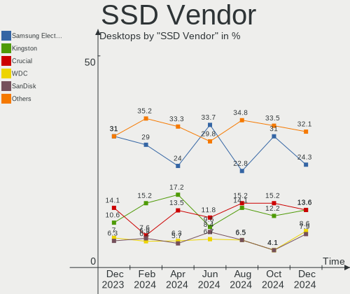
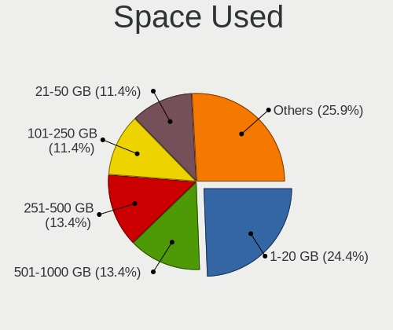
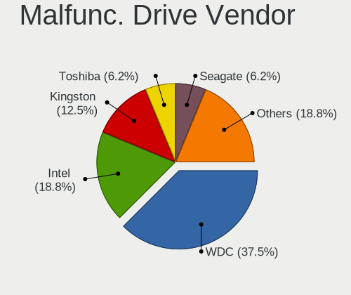
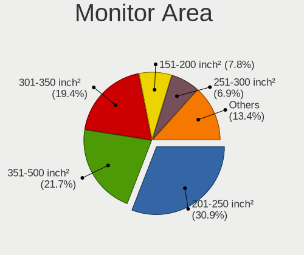
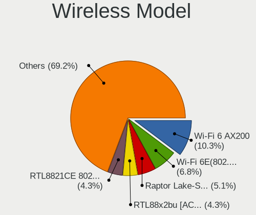
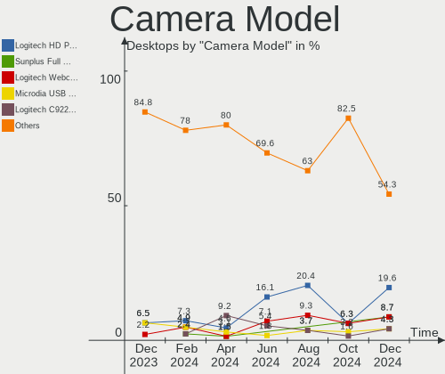
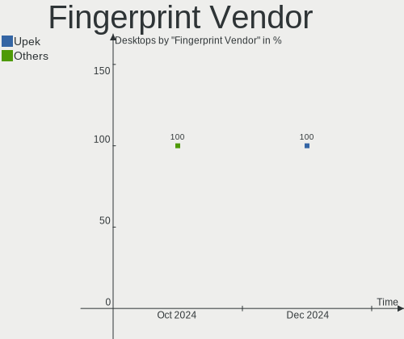

Fedora - Hardware Trends (Desktops)
-----------------------------------

A project to identify most popular hardware characteristics and track their change
over time based on data collected by Linux users at https://Linux-Hardware.org.

Anyone can contribute to this report by the [hw-probe](https://github.com/linuxhw/hw-probe) tool:

    sudo -E hw-probe -all -upload

This report is for one last month. Overall report since the beginning of time: [TestDays](https://github.com/linuxhw/TestDays)

Period: Dec, 2024.

Contents
--------

* [ System ](#system)
  - [ OS                       ](#os)
  - [ OS Family                ](#os-family)
  - [ Kernel                   ](#kernel)
  - [ Kernel Family            ](#kernel-family)
  - [ Kernel Major Ver.        ](#kernel-major-ver)
  - [ Arch                     ](#arch)
  - [ DE                       ](#de)
  - [ Display Server           ](#display-server)
  - [ Display Manager          ](#display-manager)
  - [ OS Lang                  ](#os-lang)
  - [ Boot Mode                ](#boot-mode)
  - [ Filesystem               ](#filesystem)
  - [ Part. scheme             ](#part-scheme)
  - [ Dual Boot with Linux/BSD ](#dual-boot-with-linuxbsd)
  - [ Dual Boot (Win)          ](#dual-boot-win)

* [ Board ](#board)
  - [ Vendor                   ](#vendor)
  - [ Model                    ](#model)
  - [ Model Family             ](#model-family)
  - [ MFG Year                 ](#mfg-year)
  - [ Form Factor              ](#form-factor)
  - [ Secure Boot              ](#secure-boot)
  - [ Coreboot                 ](#coreboot)
  - [ RAM Size                 ](#ram-size)
  - [ RAM Used                 ](#ram-used)
  - [ Total Drives             ](#total-drives)
  - [ Has CD-ROM               ](#has-cd-rom)
  - [ Has Ethernet             ](#has-ethernet)
  - [ Has WiFi                 ](#has-wifi)
  - [ Has Bluetooth            ](#has-bluetooth)

* [ Location ](#location)
  - [ Country                  ](#country)
  - [ City                     ](#city)

* [ Drives ](#drives)
  - [ Drive Vendor             ](#drive-vendor)
  - [ Drive Model              ](#drive-model)
  - [ HDD Vendor               ](#hdd-vendor)
  - [ SSD Vendor               ](#ssd-vendor)
  - [ Drive Kind               ](#drive-kind)
  - [ Drive Connector          ](#drive-connector)
  - [ Drive Size               ](#drive-size)
  - [ Space Total              ](#space-total)
  - [ Space Used               ](#space-used)
  - [ Malfunc. Drives          ](#malfunc-drives)
  - [ Malfunc. Drive Vendor    ](#malfunc-drive-vendor)
  - [ Malfunc. HDD Vendor      ](#malfunc-hdd-vendor)
  - [ Malfunc. Drive Kind      ](#malfunc-drive-kind)
  - [ Failed Drives            ](#failed-drives)
  - [ Failed Drive Vendor      ](#failed-drive-vendor)
  - [ Drive Status             ](#drive-status)

* [ Storage controller ](#storage-controller)
  - [ Storage Vendor           ](#storage-vendor)
  - [ Storage Model            ](#storage-model)
  - [ Storage Kind             ](#storage-kind)

* [ Processor ](#processor)
  - [ CPU Vendor               ](#cpu-vendor)
  - [ CPU Model                ](#cpu-model)
  - [ CPU Model Family         ](#cpu-model-family)
  - [ CPU Cores                ](#cpu-cores)
  - [ CPU Sockets              ](#cpu-sockets)
  - [ CPU Threads              ](#cpu-threads)
  - [ CPU Op-Modes             ](#cpu-op-modes)
  - [ CPU Microcode            ](#cpu-microcode)
  - [ CPU Microarch            ](#cpu-microarch)

* [ Graphics ](#graphics)
  - [ GPU Vendor               ](#gpu-vendor)
  - [ GPU Model                ](#gpu-model)
  - [ GPU Combo                ](#gpu-combo)
  - [ GPU Driver               ](#gpu-driver)
  - [ GPU Memory               ](#gpu-memory)

* [ Monitor ](#monitor)
  - [ Monitor Vendor           ](#monitor-vendor)
  - [ Monitor Model            ](#monitor-model)
  - [ Monitor Resolution       ](#monitor-resolution)
  - [ Monitor Diagonal         ](#monitor-diagonal)
  - [ Monitor Width            ](#monitor-width)
  - [ Aspect Ratio             ](#aspect-ratio)
  - [ Monitor Area             ](#monitor-area)
  - [ Pixel Density            ](#pixel-density)
  - [ Multiple Monitors        ](#multiple-monitors)

* [ Network ](#network)
  - [ Net Controller Vendor    ](#net-controller-vendor)
  - [ Net Controller Model     ](#net-controller-model)
  - [ Wireless Vendor          ](#wireless-vendor)
  - [ Wireless Model           ](#wireless-model)
  - [ Ethernet Vendor          ](#ethernet-vendor)
  - [ Ethernet Model           ](#ethernet-model)
  - [ Net Controller Kind      ](#net-controller-kind)
  - [ Used Controller          ](#used-controller)
  - [ NICs                     ](#nics)
  - [ IPv6                     ](#ipv6)

* [ Bluetooth ](#bluetooth)
  - [ Bluetooth Vendor         ](#bluetooth-vendor)
  - [ Bluetooth Model          ](#bluetooth-model)

* [ Sound ](#sound)
  - [ Sound Vendor             ](#sound-vendor)
  - [ Sound Model              ](#sound-model)

* [ Memory ](#memory)
  - [ Memory Vendor            ](#memory-vendor)
  - [ Memory Model             ](#memory-model)
  - [ Memory Kind              ](#memory-kind)
  - [ Memory Form Factor       ](#memory-form-factor)
  - [ Memory Size              ](#memory-size)
  - [ Memory Speed             ](#memory-speed)

* [ Printers & scanners ](#printers--scanners)
  - [ Printer Vendor           ](#printer-vendor)
  - [ Printer Model            ](#printer-model)
  - [ Scanner Vendor           ](#scanner-vendor)
  - [ Scanner Model            ](#scanner-model)

* [ Camera ](#camera)
  - [ Camera Vendor            ](#camera-vendor)
  - [ Camera Model             ](#camera-model)

* [ Security ](#security)
  - [ Fingerprint Vendor       ](#fingerprint-vendor)
  - [ Fingerprint Model        ](#fingerprint-model)
  - [ Chipcard Vendor          ](#chipcard-vendor)
  - [ Chipcard Model           ](#chipcard-model)

* [ Unsupported ](#unsupported)
  - [ Unsupported Devices      ](#unsupported-devices)
  - [ Unsupported Device Types ](#unsupported-device-types)

System
------

OS
--

Installed operating systems

| Name      | Desktops | Percent |
|-----------|----------|---------|
| Fedora 41 | 167      | 83.08%  |
| Fedora 40 | 21       | 10.45%  |
| Fedora 42 | 9        | 4.48%   |
| Fedora 39 | 3        | 1.49%   |
| Fedora 37 | 1        | 0.5%    |

OS Family
---------

OS without a version

| Name   | Desktops | Percent |
|--------|----------|---------|
| Fedora | 201      | 100%    |

Kernel
------

Version of the Linux kernel

| Version                                             | Desktops | Percent |
|-----------------------------------------------------|----------|---------|
| 6.11.10-300.fc41.x86_64                             | 58       | 28.86%  |
| 6.12.4-200.fc41.x86_64                              | 25       | 12.44%  |
| 6.11.11-300.fc41.x86_64                             | 24       | 11.94%  |
| 6.12.6-200.fc41.x86_64                              | 22       | 10.95%  |
| 6.11.4-301.fc41.x86_64                              | 17       | 8.46%   |
| 6.12.5-200.fc41.x86_64                              | 15       | 7.46%   |
| 6.11.10-200.fc40.x86_64                             | 6        | 2.99%   |
| 6.12.5-100.fc40.x86_64                              | 5        | 2.49%   |
| 6.11.8-300.fc41.x86_64                              | 4        | 1.99%   |
| 6.13.0-0.rc4.36.fc42.x86_64                         | 3        | 1.49%   |
| 6.11.11-200.fc40.x86_64                             | 3        | 1.49%   |
| 6.8.5-301.fc40.x86_64                               | 2        | 1%      |
| 6.11.9-100.fc39.x86_64                              | 2        | 1%      |
| 6.8.11-300.fc40.x86_64                              | 1        | 0.5%    |
| 6.8.10-300.fc40.x86_64                              | 1        | 0.5%    |
| 6.7.4-200.fc39.x86_64                               | 1        | 0.5%    |
| 6.13.0-rc3-f44d154d6e3d-revert-133577cad6bf+        | 1        | 0.5%    |
| 6.13.0-0.rc4.20241227gitd6ef8b40d075.39.fc42.x86_64 | 1        | 0.5%    |
| 6.13.0-0.rc3.20241220git8faabc041a00.33.fc42.x86_64 | 1        | 0.5%    |
| 6.13.0-0.rc3.20241218gitaef25be35d23.31.fc42.x86_64 | 1        | 0.5%    |
| 6.13.0-0.rc2.20241211gitf92f4749861b.24.fc42.x86_64 | 1        | 0.5%    |
| 6.13.0-0.rc2.20241210git7cb1b4663150.23.fc42.x86_64 | 1        | 0.5%    |
| 6.12.7-200.fc41.x86_64                              | 1        | 0.5%    |
| 6.12.6-100.fc40.x86_64                              | 1        | 0.5%    |
| 6.11.7-300.fc41.x86_64                              | 1        | 0.5%    |
| 6.11.6-200.fc40.x86_64                              | 1        | 0.5%    |
| 6.10.5-200.fc40.x86_64                              | 1        | 0.5%    |
| 6.0.7-301.fc37.x86_64                               | 1        | 0.5%    |

Kernel Family
-------------

Linux kernel without a distro release

| Version | Desktops | Percent |
|---------|----------|---------|
| 6.11.10 | 64       | 31.84%  |
| 6.11.11 | 27       | 13.43%  |
| 6.12.4  | 25       | 12.44%  |
| 6.12.6  | 23       | 11.44%  |
| 6.12.5  | 20       | 9.95%   |
| 6.11.4  | 17       | 8.46%   |
| 6.13.0  | 9        | 4.48%   |
| 6.11.8  | 4        | 1.99%   |
| 6.8.5   | 2        | 1%      |
| 6.11.9  | 2        | 1%      |
| 6.8.11  | 1        | 0.5%    |
| 6.8.10  | 1        | 0.5%    |
| 6.7.4   | 1        | 0.5%    |
| 6.12.7  | 1        | 0.5%    |
| 6.11.7  | 1        | 0.5%    |
| 6.11.6  | 1        | 0.5%    |
| 6.10.5  | 1        | 0.5%    |
| 6.0.7   | 1        | 0.5%    |

Kernel Major Ver.
-----------------

Linux kernel major version

| Version | Desktops | Percent |
|---------|----------|---------|
| 6.11    | 116      | 57.71%  |
| 6.12    | 69       | 34.33%  |
| 6.13    | 9        | 4.48%   |
| 6.8     | 4        | 1.99%   |
| 6.7     | 1        | 0.5%    |
| 6.10    | 1        | 0.5%    |
| 6.0     | 1        | 0.5%    |

Arch
----

OS architecture (x86_64, i586, etc.)

| Name   | Desktops | Percent |
|--------|----------|---------|
| x86_64 | 201      | 100%    |

DE
--

Desktop Environment

| Name       | Desktops | Percent |
|------------|----------|---------|
| GNOME      | 119      | 59.2%   |
| KDE6       | 52       | 25.87%  |
| Cinnamon   | 10       | 4.98%   |
| X-Cinnamon | 5        | 2.49%   |
| KDE4       | 5        | 2.49%   |
| Unknown    | 3        | 1.49%   |
| XFCE       | 2        | 1%      |
| MATE       | 1        | 0.5%    |
| LXDE       | 1        | 0.5%    |
| Hyprland   | 1        | 0.5%    |
| COSMIC     | 1        | 0.5%    |
| Budgie     | 1        | 0.5%    |

Display Server
--------------

X11 or Wayland

| Name    | Desktops | Percent |
|---------|----------|---------|
| Wayland | 164      | 81.59%  |
| X11     | 20       | 9.95%   |
| Tty     | 15       | 7.46%   |
| Web     | 1        | 0.5%    |
| Unknown | 1        | 0.5%    |

Display Manager
---------------

SDDM, LightDM, etc.

| Name    | Desktops | Percent |
|---------|----------|---------|
| Unknown | 116      | 57.71%  |
| GDM     | 41       | 20.4%   |
| SDDM    | 23       | 11.44%  |
| LightDM | 18       | 8.96%   |
| GREETD  | 2        | 1%      |
| LXDM    | 1        | 0.5%    |

OS Lang
-------

Language

| Lang       | Desktops | Percent |
|------------|----------|---------|
| en_US      | 107      | 53.23%  |
| en_AU      | 13       | 6.47%   |
| ru_RU      | 8        | 3.98%   |
| pl_PL      | 8        | 3.98%   |
| en_GB      | 8        | 3.98%   |
| de_DE      | 8        | 3.98%   |
| pt_BR      | 6        | 2.99%   |
| fr_FR      | 6        | 2.99%   |
| en_CA      | 4        | 1.99%   |
| it_IT      | 3        | 1.49%   |
| tr_TR      | 2        | 1%      |
| nl_BE      | 2        | 1%      |
| es_VE      | 2        | 1%      |
| es_MX      | 2        | 1%      |
| en_NZ      | 2        | 1%      |
| en_IN      | 2        | 1%      |
| zh_CN.UTF8 | 1        | 0.5%    |
| zh_CN      | 1        | 0.5%    |
| uk_UA      | 1        | 0.5%    |
| sl_SI      | 1        | 0.5%    |
| pt_PT      | 1        | 0.5%    |
| nl_NL      | 1        | 0.5%    |
| fr_CH      | 1        | 0.5%    |
| fr_CA      | 1        | 0.5%    |
| fi_FI      | 1        | 0.5%    |
| es_PE      | 1        | 0.5%    |
| es_ES      | 1        | 0.5%    |
| es_CO      | 1        | 0.5%    |
| en_ZA      | 1        | 0.5%    |
| en_SG      | 1        | 0.5%    |
| en_PH      | 1        | 0.5%    |
| en_IE      | 1        | 0.5%    |
| bg_BG      | 1        | 0.5%    |
| Unknown    | 1        | 0.5%    |

Boot Mode
---------

EFI or BIOS

| Mode | Desktops | Percent |
|------|----------|---------|
| BIOS | 135      | 67.16%  |
| EFI  | 66       | 32.84%  |

Filesystem
----------

Type of filesystem

| Type    | Desktops | Percent |
|---------|----------|---------|
| Btrfs   | 151      | 75.12%  |
| Ext4    | 33       | 16.42%  |
| Xfs     | 8        | 3.98%   |
| Tmpfs   | 5        | 2.49%   |
| Overlay | 3        | 1.49%   |
| Unknown | 1        | 0.5%    |

Part. scheme
------------

Scheme of partitioning

| Type    | Desktops | Percent |
|---------|----------|---------|
| Unknown | 114      | 56.72%  |
| GPT     | 79       | 39.3%   |
| MBR     | 8        | 3.98%   |

Dual Boot with Linux/BSD
------------------------

Hosting more than one Linux/BSD

| Dual boot | Desktops | Percent |
|-----------|----------|---------|
| No        | 181      | 90.05%  |
| Yes       | 20       | 9.95%   |

Dual Boot (Win)
---------------

Hosting Linux and Windows

| Dual boot | Desktops | Percent |
|-----------|----------|---------|
| No        | 165      | 82.09%  |
| Yes       | 36       | 17.91%  |

Board
-----

Vendor
------

Motherboard manufacturer

| Name                | Desktops | Percent |
|---------------------|----------|---------|
| ASUSTek Computer    | 68       | 33.83%  |
| Gigabyte Technology | 41       | 20.4%   |
| MSI                 | 28       | 13.93%  |
| ASRock              | 21       | 10.45%  |
| Hewlett-Packard     | 14       | 6.97%   |
| Dell                | 9        | 4.48%   |
| Lenovo              | 5        | 2.49%   |
| Pegatron            | 4        | 1.99%   |
| Intel               | 3        | 1.49%   |
| AZW                 | 2        | 1%      |
| System76            | 1        | 0.5%    |
| SLIMBOOK            | 1        | 0.5%    |
| Huanan              | 1        | 0.5%    |
| Fujitsu             | 1        | 0.5%    |
| Daten Tecnologia    | 1        | 0.5%    |
| Acidanthera         | 1        | 0.5%    |

Model
-----

Motherboard model

| Name                               | Desktops | Percent |
|------------------------------------|----------|---------|
| HP Pavilion Desktop TP01-2xxx      | 4        | 1.99%   |
| ASUS All Series                    | 4        | 1.99%   |
| MSI MS-7E51                        | 2        | 1%      |
| MSI MS-7C96                        | 2        | 1%      |
| MSI MS-7C91                        | 2        | 1%      |
| MSI MS-7C56                        | 2        | 1%      |
| Gigabyte X870 EAGLE WIFI7          | 2        | 1%      |
| Gigabyte H410M H V2                | 2        | 1%      |
| Gigabyte B450M DS3H                | 2        | 1%      |
| Dell Precision Tower 5810          | 2        | 1%      |
| Dell OptiPlex 7010                 | 2        | 1%      |
| AZW MINI S                         | 2        | 1%      |
| ASUS TUF Gaming B550M-PLUS WIFI II | 2        | 1%      |
| ASUS TUF B450M-PLUS GAMING         | 2        | 1%      |
| ASUS ROG STRIX B650E-I GAMING WIFI | 2        | 1%      |
| ASUS ROG STRIX B550-F GAMING       | 2        | 1%      |
| ASUS ProArt X870E-CREATOR WIFI     | 2        | 1%      |
| ASUS PRIME H510M-K                 | 2        | 1%      |
| ASUS PRIME B450-PLUS               | 2        | 1%      |
| ASRock B450 Gaming K4              | 2        | 1%      |
| System76 Thelio Major              | 1        | 0.5%    |
| SLIMBOOK ONE-AM5                   | 1        | 0.5%    |
| Pegatron IPM31G                    | 1        | 0.5%    |
| Pegatron HPE-490t                  | 1        | 0.5%    |
| Pegatron h8-1520t                  | 1        | 0.5%    |
| Pegatron FQ516AA-A2L a6648f        | 1        | 0.5%    |
| MSI MS-7E44                        | 1        | 0.5%    |
| MSI MS-7E25                        | 1        | 0.5%    |
| MSI MS-7E06                        | 1        | 0.5%    |
| MSI MS-7D86                        | 1        | 0.5%    |
| MSI MS-7D59                        | 1        | 0.5%    |
| MSI MS-7D14                        | 1        | 0.5%    |
| MSI MS-7C95                        | 1        | 0.5%    |
| MSI MS-7C52                        | 1        | 0.5%    |
| MSI MS-7C37                        | 1        | 0.5%    |
| MSI MS-7B89                        | 1        | 0.5%    |
| MSI MS-7B79                        | 1        | 0.5%    |
| MSI MS-7B18                        | 1        | 0.5%    |
| MSI MS-7B10                        | 1        | 0.5%    |
| MSI MS-7A66                        | 1        | 0.5%    |

Model Family
------------

Motherboard model prefix

| Name                 | Desktops | Percent |
|----------------------|----------|---------|
| ASUS PRIME           | 20       | 9.95%   |
| ASUS ROG             | 14       | 6.97%   |
| ASUS TUF             | 11       | 5.47%   |
| HP Pavilion          | 5        | 2.49%   |
| HP EliteDesk         | 4        | 1.99%   |
| Dell Precision       | 4        | 1.99%   |
| Dell OptiPlex        | 4        | 1.99%   |
| ASUS ProArt          | 4        | 1.99%   |
| ASUS All             | 4        | 1.99%   |
| Lenovo ThinkCentre   | 3        | 1.49%   |
| Gigabyte X570        | 3        | 1.49%   |
| Gigabyte B450M       | 3        | 1.49%   |
| ASUS STRIX           | 3        | 1.49%   |
| ASRock B450          | 3        | 1.49%   |
| MSI MS-7E51          | 2        | 1%      |
| MSI MS-7C96          | 2        | 1%      |
| MSI MS-7C91          | 2        | 1%      |
| MSI MS-7C56          | 2        | 1%      |
| HP ProDesk           | 2        | 1%      |
| Gigabyte Z790        | 2        | 1%      |
| Gigabyte X870        | 2        | 1%      |
| Gigabyte H410M       | 2        | 1%      |
| Gigabyte B650        | 2        | 1%      |
| Gigabyte B550M       | 2        | 1%      |
| AZW MINI             | 2        | 1%      |
| System76 Thelio      | 1        | 0.5%    |
| SLIMBOOK ONE-AM5     | 1        | 0.5%    |
| Pegatron IPM31G      | 1        | 0.5%    |
| Pegatron HPE-490t    | 1        | 0.5%    |
| Pegatron h8-1520t    | 1        | 0.5%    |
| Pegatron FQ516AA-A2L | 1        | 0.5%    |
| MSI MS-7E44          | 1        | 0.5%    |
| MSI MS-7E25          | 1        | 0.5%    |
| MSI MS-7E06          | 1        | 0.5%    |
| MSI MS-7D86          | 1        | 0.5%    |
| MSI MS-7D59          | 1        | 0.5%    |
| MSI MS-7D14          | 1        | 0.5%    |
| MSI MS-7C95          | 1        | 0.5%    |
| MSI MS-7C52          | 1        | 0.5%    |
| MSI MS-7C37          | 1        | 0.5%    |

MFG Year
--------

Motherboard manufacture year

| Year | Desktops | Percent |
|------|----------|---------|
| 2018 | 26       | 12.94%  |
| 2020 | 23       | 11.44%  |
| 2022 | 20       | 9.95%   |
| 2021 | 19       | 9.45%   |
| 2024 | 14       | 6.97%   |
| 2023 | 14       | 6.97%   |
| 2019 | 13       | 6.47%   |
| 2013 | 12       | 5.97%   |
| 2017 | 10       | 4.98%   |
| 2012 | 9        | 4.48%   |
| 2016 | 8        | 3.98%   |
| 2015 | 7        | 3.48%   |
| 2014 | 7        | 3.48%   |
| 2010 | 6        | 2.99%   |
| 2011 | 4        | 1.99%   |
| 2008 | 4        | 1.99%   |
| 2009 | 3        | 1.49%   |
| 2006 | 1        | 0.5%    |
| 2005 | 1        | 0.5%    |

Form Factor
-----------

Physical design of the computer

| Name    | Desktops | Percent |
|---------|----------|---------|
| Desktop | 201      | 100%    |

Secure Boot
-----------

Enabled or disabled

| State    | Desktops | Percent |
|----------|----------|---------|
| Disabled | 187      | 93.03%  |
| Enabled  | 14       | 6.97%   |

Coreboot
--------

Have coreboot on board

| Used | Desktops | Percent |
|------|----------|---------|
| No   | 201      | 100%    |

RAM Size
--------

Total RAM memory

| Size in GB  | Desktops | Percent |
|-------------|----------|---------|
| 32.01-64.0  | 63       | 31.34%  |
| 16.01-24.0  | 52       | 25.87%  |
| 64.01-256.0 | 26       | 12.94%  |
| 8.01-16.0   | 20       | 9.95%   |
| 4.01-8.0    | 19       | 9.45%   |
| 24.01-32.0  | 14       | 6.97%   |
| 3.01-4.0    | 7        | 3.48%   |

RAM Used
--------

Used RAM memory

| Used GB     | Desktops | Percent |
|-------------|----------|---------|
| 4.01-8.0    | 79       | 39.3%   |
| 3.01-4.0    | 42       | 20.9%   |
| 2.01-3.0    | 40       | 19.9%   |
| 8.01-16.0   | 20       | 9.95%   |
| 1.01-2.0    | 10       | 4.98%   |
| 0.51-1.0    | 4        | 1.99%   |
| 32.01-64.0  | 2        | 1%      |
| 24.01-32.0  | 2        | 1%      |
| 64.01-256.0 | 1        | 0.5%    |
| 16.01-24.0  | 1        | 0.5%    |

Total Drives
------------

Number of drives on board

| Drives | Desktops | Percent |
|--------|----------|---------|
| 2      | 63       | 31.34%  |
| 1      | 58       | 28.86%  |
| 3      | 39       | 19.4%   |
| 4      | 24       | 11.94%  |
| 5      | 8        | 3.98%   |
| 6      | 6        | 2.99%   |
| 9      | 1        | 0.5%    |
| 8      | 1        | 0.5%    |
| 7      | 1        | 0.5%    |

Has CD-ROM
----------

Has CD-ROM on board

| Presented | Desktops | Percent |
|-----------|----------|---------|
| No        | 160      | 79.6%   |
| Yes       | 41       | 20.4%   |

Has Ethernet
------------

Has Ethernet on board

| Presented | Desktops | Percent |
|-----------|----------|---------|
| Yes       | 200      | 99.5%   |
| No        | 1        | 0.5%    |

Has WiFi
--------

Has WiFi module

| Presented | Desktops | Percent |
|-----------|----------|---------|
| Yes       | 112      | 55.72%  |
| No        | 89       | 44.28%  |

Has Bluetooth
-------------

Has Bluetooth module

| Presented | Desktops | Percent |
|-----------|----------|---------|
| Yes       | 108      | 53.73%  |
| No        | 93       | 46.27%  |

Location
--------

Country
-------

Geographic location (country)

| Country      | Desktops | Percent |
|--------------|----------|---------|
| USA          | 48       | 23.88%  |
| Australia    | 14       | 6.97%   |
| Germany      | 13       | 6.47%   |
| Russia       | 11       | 5.47%   |
| Brazil       | 10       | 4.98%   |
| Canada       | 9        | 4.48%   |
| Poland       | 8        | 3.98%   |
| UK           | 6        | 2.99%   |
| India        | 6        | 2.99%   |
| France       | 6        | 2.99%   |
| Netherlands  | 4        | 1.99%   |
| Italy        | 4        | 1.99%   |
| Sweden       | 3        | 1.49%   |
| Spain        | 3        | 1.49%   |
| Romania      | 3        | 1.49%   |
| Portugal     | 3        | 1.49%   |
| Mexico       | 3        | 1.49%   |
| Czechia      | 3        | 1.49%   |
| Belgium      | 3        | 1.49%   |
| Austria      | 3        | 1.49%   |
| Venezuela    | 2        | 1%      |
| Switzerland  | 2        | 1%      |
| Serbia       | 2        | 1%      |
| Norway       | 2        | 1%      |
| New Zealand  | 2        | 1%      |
| Malaysia     | 2        | 1%      |
| Hungary      | 2        | 1%      |
| Finland      | 2        | 1%      |
| Colombia     | 2        | 1%      |
| Vietnam      | 1        | 0.5%    |
| Ukraine      | 1        | 0.5%    |
| Turkey       | 1        | 0.5%    |
| Tunisia      | 1        | 0.5%    |
| Taiwan       | 1        | 0.5%    |
| South Africa | 1        | 0.5%    |
| Slovenia     | 1        | 0.5%    |
| Slovakia     | 1        | 0.5%    |
| Singapore    | 1        | 0.5%    |
| Philippines  | 1        | 0.5%    |
| Peru         | 1        | 0.5%    |

City
----

Geographic location (city)

| City             | Desktops | Percent |
|------------------|----------|---------|
| Sydney           | 12       | 5.97%   |
| Vienna           | 3        | 1.49%   |
| Berlin           | 3        | 1.49%   |
| Warsaw           | 2        | 1%      |
| Seattle          | 2        | 1%      |
| Pune             | 2        | 1%      |
| Prague           | 2        | 1%      |
| Paris            | 2        | 1%      |
| Naples           | 2        | 1%      |
| Moscow           | 2        | 1%      |
| Montreal         | 2        | 1%      |
| Mexico City      | 2        | 1%      |
| Melbourne        | 2        | 1%      |
| Livonia          | 2        | 1%      |
| Honolulu         | 2        | 1%      |
| Helsinki         | 2        | 1%      |
| Colorado Springs | 2        | 1%      |
| Cincinnati       | 2        | 1%      |
| Zurich           | 1        | 0.5%    |
| Yerres           | 1        | 0.5%    |
| Yakima           | 1        | 0.5%    |
| Willits          | 1        | 0.5%    |
| Williamsburg     | 1        | 0.5%    |
| Wichita          | 1        | 0.5%    |
| Vicenza          | 1        | 0.5%    |
| Velke Kapusany   | 1        | 0.5%    |
| Västerås       | 1        | 0.5%    |
| Valencia         | 1        | 0.5%    |
| Ustka            | 1        | 0.5%    |
| Ust-Kamenogorsk  | 1        | 0.5%    |
| Ulyanovsk        | 1        | 0.5%    |
| Tunis            | 1        | 0.5%    |
| Travanca         | 1        | 0.5%    |
| Tokyo            | 1        | 0.5%    |
| Timișoara       | 1        | 0.5%    |
| Thun             | 1        | 0.5%    |
| Thornton         | 1        | 0.5%    |
| Tenhult          | 1        | 0.5%    |
| Temuco           | 1        | 0.5%    |
| Telluride        | 1        | 0.5%    |

Drives
------

Drive Vendor
------------

Hard drive vendors

| Vendor                       | Desktops | Drives | Percent |
|------------------------------|----------|--------|---------|
| Samsung Electronics          | 73       | 114    | 18.2%   |
| WDC                          | 54       | 74     | 13.47%  |
| Seagate                      | 49       | 64     | 12.22%  |
| SanDisk                      | 28       | 29     | 6.98%   |
| Kingston                     | 24       | 29     | 5.99%   |
| Crucial                      | 19       | 22     | 4.74%   |
| Phison Electronics           | 15       | 16     | 3.74%   |
| Toshiba                      | 12       | 13     | 2.99%   |
| Micron/Crucial Technology    | 11       | 13     | 2.74%   |
| Hitachi                      | 9        | 10     | 2.24%   |
| Silicon Motion               | 8        | 8      | 2%      |
| Intel                        | 6        | 7      | 1.5%    |
| China                        | 6        | 6      | 1.5%    |
| Unknown                      | 5        | 5      | 1.25%   |
| SK hynix                     | 5        | 6      | 1.25%   |
| Micron Technology            | 5        | 5      | 1.25%   |
| Kingston Technology Company  | 5        | 5      | 1.25%   |
| Shenzhen Longsys Electronics | 4        | 4      | 1%      |
| MAXIO Technology (Hangzhou)  | 4        | 4      | 1%      |
| A-DATA Technology            | 4        | 4      | 1%      |
| Realtek Semiconductor        | 3        | 3      | 0.75%   |
| PNY                          | 3        | 3      | 0.75%   |
| Patriot                      | 3        | 3      | 0.75%   |
| HGST                         | 3        | 3      | 0.75%   |
| Fanxiang                     | 3        | 3      | 0.75%   |
| ADATA Technology             | 3        | 4      | 0.75%   |
| Transcend                    | 2        | 2      | 0.5%    |
| T-FORCE                      | 2        | 2      | 0.5%    |
| SPCC                         | 2        | 2      | 0.5%    |
| Realtek                      | 2        | 2      | 0.5%    |
| KIOXIA                       | 2        | 2      | 0.5%    |
| JMicron Technology           | 2        | 2      | 0.5%    |
| Verbatim                     | 1        | 1      | 0.25%   |
| Vaseky                       | 1        | 1      | 0.25%   |
| Timetec                      | 1        | 1      | 0.25%   |
| Thinkplus                    | 1        | 1      | 0.25%   |
| StoreJet                     | 1        | 1      | 0.25%   |
| SSK SSD                      | 1        | 1      | 0.25%   |
| Skyline                      | 1        | 1      | 0.25%   |
| Seagate Technology           | 1        | 1      | 0.25%   |

Drive Model
-----------

Hard drive models

| Model                                                 | Desktops | Percent |
|-------------------------------------------------------|----------|---------|
| Samsung NVMe SSD Controller SM981/PM981/PM983 512GB   | 22       | 4.67%   |
| Samsung NVMe SSD Controller PM9A1/PM9A3/980PRO 512GB  | 13       | 2.76%   |
| Silicon Motion SM2263EN/SM2263XT SSD Controller 256GB | 8        | 1.7%    |
| Kingston SA400S37240G 240GB SSD                       | 8        | 1.7%    |
| Seagate ST4000DM004-2CV104 4TB                        | 5        | 1.06%   |
| Seagate ST1000DM010-2EP102 1TB                        | 5        | 1.06%   |
| Samsung SSD 860 EVO 500GB                             | 5        | 1.06%   |
| Samsung NVMe SSD Controller SM961/PM961/SM963 256GB   | 5        | 1.06%   |
| Phison E12 NVMe Controller 480GB                      | 5        | 1.06%   |
| Seagate ST2000DM008-2UB102 2TB                        | 4        | 0.85%   |
| Samsung SSD 990 PRO 2TB                               | 4        | 0.85%   |
| Samsung SSD 980 1TB                                   | 4        | 0.85%   |
| Samsung SSD 870 QVO 1TB                               | 4        | 0.85%   |
| Samsung SSD 860 EVO 1TB                               | 4        | 0.85%   |
| Samsung SSD 850 EVO 250GB                             | 4        | 0.85%   |
| WDC WD20EZRZ-00Z5HB0 2TB                              | 3        | 0.64%   |
| WDC WD10EZEX-08WN4A0 1TB                              | 3        | 0.64%   |
| Toshiba HDWD110 1TB                                   | 3        | 0.64%   |
| Toshiba DT01ACA100 1TB                                | 3        | 0.64%   |
| Seagate ST4000VN006-3CW104 4TB                        | 3        | 0.64%   |
| Sandisk WD Blue SN580 1TB                             | 3        | 0.64%   |
| Samsung SSD 990 PRO 1TB                               | 3        | 0.64%   |
| Samsung SSD 870 EVO 1TB                               | 3        | 0.64%   |
| Phison E16 PCIe4 NVMe Controller 1TB                  | 3        | 0.64%   |
| Micron/Crucial P2 NVMe PCIe SSD 500GB                 | 3        | 0.64%   |
| MAXIO (Hangzhou) NVMe SSD Controller MAP1202 512GB    | 3        | 0.64%   |
| Kingston SA400S37960G 960GB SSD                       | 3        | 0.64%   |
| Kingston SA400S37480G 480GB SSD                       | 3        | 0.64%   |
| Crucial CT500MX500SSD1 500GB                          | 3        | 0.64%   |
| Crucial CT480BX500SSD1 480GB                          | 3        | 0.64%   |
| Crucial CT240BX500SSD1 240GB                          | 3        | 0.64%   |
| Crucial CT1000BX500SSD1 1TB                           | 3        | 0.64%   |
| WDC WDS500G2B0A-00SM50 500GB SSD                      | 2        | 0.42%   |
| WDC WDS240G2G0A-00JH30 240GB SSD                      | 2        | 0.42%   |
| WDC WD5000AVCS-632DY1 500GB                           | 2        | 0.42%   |
| WDC WD40EFRX-68N32N0 4TB                              | 2        | 0.42%   |
| WDC WD10EZEX-60ZF5A0 1TB                              | 2        | 0.42%   |
| WDC WD10EZEX-08M2NA0 1TB                              | 2        | 0.42%   |
| WDC WD10EZEX-00BN5A0 1TB                              | 2        | 0.42%   |
| Unknown SD/MMC/MS PRO 128GB                           | 2        | 0.42%   |

HDD Vendor
----------

Hard disk drive vendors

| Vendor              | Desktops | Drives | Percent |
|---------------------|----------|--------|---------|
| Seagate             | 47       | 61     | 37.9%   |
| WDC                 | 44       | 60     | 35.48%  |
| Toshiba             | 10       | 11     | 8.06%   |
| Hitachi             | 9        | 10     | 7.26%   |
| Samsung Electronics | 3        | 4      | 2.42%   |
| HGST                | 3        | 3      | 2.42%   |
| Unknown             | 2        | 2      | 1.61%   |
| JMicron Technology  | 2        | 2      | 1.61%   |
| Verbatim            | 1        | 1      | 0.81%   |
| StoreJet            | 1        | 1      | 0.81%   |
| Maxtor              | 1        | 1      | 0.81%   |
| External            | 1        | 1      | 0.81%   |

SSD Vendor
----------

Solid state drive vendors

| Vendor              | Desktops | Drives | Percent |
|---------------------|----------|--------|---------|
| Samsung Electronics | 34       | 43     | 24.29%  |
| Kingston            | 19       | 23     | 13.57%  |
| Crucial             | 19       | 22     | 13.57%  |
| WDC                 | 12       | 14     | 8.57%   |
| SanDisk             | 11       | 12     | 7.86%   |
| China               | 6        | 6      | 4.29%   |
| Intel               | 4        | 4      | 2.86%   |
| SK hynix            | 3        | 3      | 2.14%   |
| PNY                 | 3        | 3      | 2.14%   |
| Patriot             | 3        | 3      | 2.14%   |
| A-DATA Technology   | 3        | 3      | 2.14%   |
| SPCC                | 2        | 2      | 1.43%   |
| Vaseky              | 1        | 1      | 0.71%   |
| Transcend           | 1        | 1      | 0.71%   |
| Toshiba             | 1        | 1      | 0.71%   |
| Timetec             | 1        | 1      | 0.71%   |
| Thinkplus           | 1        | 1      | 0.71%   |
| T-FORCE             | 1        | 1      | 0.71%   |
| SSK SSD             | 1        | 1      | 0.71%   |
| Ramsta              | 1        | 1      | 0.71%   |
| Netac               | 1        | 1      | 0.71%   |
| Micron Technology   | 1        | 1      | 0.71%   |
| LITEONIT            | 1        | 1      | 0.71%   |
| LITEON              | 1        | 1      | 0.71%   |
| LDLC                | 1        | 1      | 0.71%   |
| KingSpec            | 1        | 1      | 0.71%   |
| GOODRAM             | 1        | 1      | 0.71%   |
| Gigastone           | 1        | 1      | 0.71%   |
| Gigabyte Technology | 1        | 1      | 0.71%   |
| Fanxiang            | 1        | 1      | 0.71%   |
| Emtec               | 1        | 2      | 0.71%   |
| Apacer              | 1        | 1      | 0.71%   |
| Unknown             | 1        | 1      | 0.71%   |

Drive Kind
----------

HDD or SSD

| Kind    | Desktops | Drives | Percent |
|---------|----------|--------|---------|
| NVMe    | 123      | 173    | 35.65%  |
| SSD     | 114      | 160    | 33.04%  |
| HDD     | 101      | 157    | 29.28%  |
| Unknown | 7        | 7      | 2.03%   |

Drive Connector
---------------

SATA, SAS, NVMe, etc.

| Type | Desktops | Drives | Percent |
|------|----------|--------|---------|
| SATA | 150      | 306    | 51.37%  |
| NVMe | 123      | 171    | 42.12%  |
| SAS  | 19       | 20     | 6.51%   |

Drive Size
----------

Size of hard drive

| Size in TB | Desktops | Drives | Percent |
|------------|----------|--------|---------|
| 0.01-0.5   | 100      | 149    | 43.29%  |
| 0.51-1.0   | 67       | 90     | 29%     |
| 1.01-2.0   | 33       | 38     | 14.29%  |
| 3.01-4.0   | 16       | 21     | 6.93%   |
| 4.01-10.0  | 7        | 11     | 3.03%   |
| 10.01-20.0 | 5        | 5      | 2.16%   |
| 2.01-3.0   | 3        | 3      | 1.3%    |

Space Total
-----------

Amount of disk space available on the file system

| Size in GB     | Desktops | Percent |
|----------------|----------|---------|
| 1001-2000      | 51       | 25.37%  |
| More than 3000 | 49       | 24.38%  |
| 501-1000       | 48       | 23.88%  |
| 251-500        | 17       | 8.46%   |
| 2001-3000      | 11       | 5.47%   |
| 101-250        | 8        | 3.98%   |
| 1-20           | 7        | 3.48%   |
| Unknown        | 5        | 2.49%   |
| 51-100         | 4        | 1.99%   |
| 21-50          | 1        | 0.5%    |

Space Used
----------

Amount of used disk space

| Used GB        | Desktops | Percent |
|----------------|----------|---------|
| 1-20           | 49       | 24.38%  |
| 251-500        | 27       | 13.43%  |
| 501-1000       | 27       | 13.43%  |
| 21-50          | 23       | 11.44%  |
| 101-250        | 23       | 11.44%  |
| More than 3000 | 15       | 7.46%   |
| 1001-2000      | 13       | 6.47%   |
| 51-100         | 13       | 6.47%   |
| 2001-3000      | 6        | 2.99%   |
| Unknown        | 5        | 2.49%   |

Malfunc. Drives
---------------

Drive models with a malfunction

| Model                             | Desktops | Drives | Percent |
|-----------------------------------|----------|--------|---------|
| Intel SSDSC2CT120A3 120GB         | 2        | 2      | 12.5%   |
| WDC WDS500G2B0A-00SM50 500GB SSD  | 1        | 1      | 6.25%   |
| WDC WD5000AZLX-00ZR6A0 500GB      | 1        | 1      | 6.25%   |
| WDC WD5000AVCS-632DY1 500GB       | 1        | 1      | 6.25%   |
| WDC WD40EFRX-68N32N0 4TB          | 1        | 1      | 6.25%   |
| WDC WD1600AVVS-63L2B0 160GB       | 1        | 1      | 6.25%   |
| WDC WD10SPZX-60Z10T0 1TB          | 1        | 1      | 6.25%   |
| Toshiba DT01ACA100 1TB            | 1        | 1      | 6.25%   |
| Seagate ST1000DX002-2DV162 1TB    | 1        | 1      | 6.25%   |
| Samsung Electronics HD501LJ 500GB | 1        | 2      | 6.25%   |
| Kingston SV300S37A120G 120GB SSD  | 1        | 1      | 6.25%   |
| Kingston SA400S37960G 960GB SSD   | 1        | 2      | 6.25%   |
| Intel SSDSA2M160G2GC 160GB        | 1        | 1      | 6.25%   |
| Hitachi HTS727550A9E364 500GB     | 1        | 1      | 6.25%   |
| China SATA3 240GB SSD             | 1        | 1      | 6.25%   |

Malfunc. Drive Vendor
---------------------

Vendors of faulty drives

| Vendor              | Desktops | Drives | Percent |
|---------------------|----------|--------|---------|
| WDC                 | 6        | 6      | 37.5%   |
| Intel               | 3        | 3      | 18.75%  |
| Kingston            | 2        | 3      | 12.5%   |
| Toshiba             | 1        | 1      | 6.25%   |
| Seagate             | 1        | 1      | 6.25%   |
| Samsung Electronics | 1        | 2      | 6.25%   |
| Hitachi             | 1        | 1      | 6.25%   |
| China               | 1        | 1      | 6.25%   |

Malfunc. HDD Vendor
-------------------

Vendors of faulty HDD drives

| Vendor              | Desktops | Drives | Percent |
|---------------------|----------|--------|---------|
| WDC                 | 5        | 5      | 55.56%  |
| Toshiba             | 1        | 1      | 11.11%  |
| Seagate             | 1        | 1      | 11.11%  |
| Samsung Electronics | 1        | 2      | 11.11%  |
| Hitachi             | 1        | 1      | 11.11%  |

Malfunc. Drive Kind
-------------------

Kinds of faulty drives

| Kind | Desktops | Drives | Percent |
|------|----------|--------|---------|
| HDD  | 8        | 10     | 53.33%  |
| SSD  | 7        | 8      | 46.67%  |

Failed Drives
-------------

Failed drive models

| Model                | Desktops | Drives | Percent |
|----------------------|----------|--------|---------|
| Hitachi HDS72101 1TB | 1        | 1      | 100%    |

Failed Drive Vendor
-------------------

Failed drive vendors

| Vendor  | Desktops | Drives | Percent |
|---------|----------|--------|---------|
| Hitachi | 1        | 1      | 100%    |

Drive Status
------------

Number of failed and malfunc. drives

| Status   | Desktops | Drives | Percent |
|----------|----------|--------|---------|
| Detected | 124      | 298    | 56.88%  |
| Works    | 81       | 180    | 37.16%  |
| Malfunc  | 12       | 18     | 5.5%    |
| Failed   | 1        | 1      | 0.46%   |

Storage controller
------------------

Storage Vendor
--------------

Storage controller vendors

| Vendor                       | Desktops | Percent |
|------------------------------|----------|---------|
| Intel                        | 102      | 27.72%  |
| AMD                          | 99       | 26.9%   |
| Samsung Electronics          | 52       | 14.13%  |
| SanDisk                      | 17       | 4.62%   |
| Phison Electronics           | 16       | 4.35%   |
| Micron/Crucial Technology    | 11       | 2.99%   |
| ASMedia Technology           | 11       | 2.99%   |
| Kingston Technology Company  | 10       | 2.72%   |
| Silicon Motion               | 8        | 2.17%   |
| JMicron Technology           | 5        | 1.36%   |
| Shenzhen Longsys Electronics | 4        | 1.09%   |
| Micron Technology            | 4        | 1.09%   |
| MAXIO Technology (Hangzhou)  | 4        | 1.09%   |
| ADATA Technology             | 4        | 1.09%   |
| SK hynix                     | 3        | 0.82%   |
| Realtek Semiconductor        | 3        | 0.82%   |
| Solidigm                     | 2        | 0.54%   |
| Marvell Technology Group     | 2        | 0.54%   |
| KIOXIA                       | 2        | 0.54%   |
| VIA Technologies             | 1        | 0.27%   |
| ULi Electronics              | 1        | 0.27%   |
| Transcend                    | 1        | 0.27%   |
| Toshiba America Info Systems | 1        | 0.27%   |
| Seagate Technology           | 1        | 0.27%   |
| Nvidia                       | 1        | 0.27%   |
| Lite-On Technology           | 1        | 0.27%   |
| INNOGRIT                     | 1        | 0.27%   |
| Unknown                      | 1        | 0.27%   |

Storage Model
-------------

Storage controller models

| Model                                                                                                              | Desktops | Percent |
|--------------------------------------------------------------------------------------------------------------------|----------|---------|
| AMD FCH SATA Controller [AHCI mode]                                                                                | 34       | 8.08%   |
| AMD 500 Series Chipset SATA Controller                                                                             | 26       | 6.18%   |
| AMD 600 Series Chipset SATA Controller                                                                             | 23       | 5.46%   |
| Samsung NVMe SSD Controller SM981/PM981/PM983                                                                      | 22       | 5.23%   |
| AMD 400 Series Chipset SATA Controller                                                                             | 21       | 4.99%   |
| Samsung NVMe SSD Controller PM9A1/PM9A3/980PRO                                                                     | 13       | 3.09%   |
| Intel 200 Series PCH SATA controller [AHCI mode]                                                                   | 11       | 2.61%   |
| Intel Cannon Lake PCH SATA AHCI Controller                                                                         | 10       | 2.38%   |
| Intel 8 Series/C220 Series Chipset Family 6-port SATA Controller 1 [AHCI mode]                                     | 10       | 2.38%   |
| Samsung NVMe SSD Controller S4LV008[Pascal]                                                                        | 9        | 2.14%   |
| Intel Raptor Lake SATA AHCI Controller                                                                             | 9        | 2.14%   |
| Silicon Motion SM2263EN/SM2263XT (DRAM-less) NVMe SSD Controllers                                                  | 8        | 1.9%    |
| Intel Alder Lake-S PCH SATA Controller [AHCI Mode]                                                                 | 8        | 1.9%    |
| Intel 7 Series/C210 Series Chipset Family 6-port SATA Controller [AHCI mode]                                       | 8        | 1.9%    |
| ASMedia ASM1061/ASM1062 Serial ATA Controller                                                                      | 8        | 1.9%    |
| Samsung NVMe SSD Controller 980 (DRAM-less)                                                                        | 7        | 1.66%   |
| Intel Q170/Q150/B150/H170/H110/Z170/CM236 Chipset SATA Controller [AHCI Mode]                                      | 7        | 1.66%   |
| Samsung NVMe SSD Controller SM961/PM961/SM963                                                                      | 5        | 1.19%   |
| Phison E12 NVMe Controller                                                                                         | 5        | 1.19%   |
| Intel SATA Controller [RAID Mode]                                                                                  | 5        | 1.19%   |
| AMD SB7x0/SB8x0/SB9x0 IDE Controller                                                                               | 5        | 1.19%   |
| Samsung NVMe SSD Controller PM9C1a (DRAM-less)                                                                     | 4        | 0.95%   |
| Micron/Crucial P5 Plus NVMe PCIe SSD                                                                               | 4        | 0.95%   |
| Intel 6 Series/C200 Series Chipset Family 6 port Desktop SATA AHCI Controller                                      | 4        | 0.95%   |
| Intel 500 Series Chipset Family SATA AHCI Controller                                                               | 4        | 0.95%   |
| AMD SB7x0/SB8x0/SB9x0 SATA Controller [AHCI mode]                                                                  | 4        | 0.95%   |
| AMD A320 Chipset SATA Controller [AHCI mode]                                                                       | 4        | 0.95%   |
| Sandisk WD Blue SN580 NVMe SSD (DRAM-less)                                                                         | 3        | 0.71%   |
| SanDisk WD Black SN770 / PC SN740 256GB / PC SN560 (DRAM-less) NVMe SSD                                            | 3        | 0.71%   |
| Realtek RTS5765DL NVMe SSD Controller (DRAM-less)                                                                  | 3        | 0.71%   |
| Phison PS5021-E21 PCIe4 NVMe Controller (DRAM-less)                                                                | 3        | 0.71%   |
| Phison E16 PCIe4 NVMe Controller                                                                                   | 3        | 0.71%   |
| Micron/Crucial P2 [Nick P2] / P3 / P3 Plus NVMe PCIe SSD (DRAM-less)                                               | 3        | 0.71%   |
| MAXIO (Hangzhou) NVMe SSD Controller MAP1202 (DRAM-less)                                                           | 3        | 0.71%   |
| Kingston Company NV1 NVMe SSD [SM2263XT] (DRAM-less)                                                               | 3        | 0.71%   |
| JMicron JMB363 SATA/IDE Controller                                                                                 | 3        | 0.71%   |
| Intel Comet Lake SATA AHCI Controller                                                                              | 3        | 0.71%   |
| Shenzhen Longsys FORESEE XP1000 / Lexar Professional CFexpress Type B Gold series, NM620 PCIe NVME SSD (DRAM-less) | 2        | 0.48%   |
| SanDisk WD Green SN350 240GB (DRAM-less) / SN560E NVMe SSD                                                         | 2        | 0.48%   |
| Sandisk WD Black SN850X NVMe SSD                                                                                   | 2        | 0.48%   |

Storage Kind
------------

Kind of storage controller (IDE, SATA, NVMe, SAS, ...)

| Kind | Desktops | Percent |
|------|----------|---------|
| SATA | 186      | 54.23%  |
| NVMe | 123      | 35.86%  |
| IDE  | 21       | 6.12%   |
| RAID | 12       | 3.5%    |
| SAS  | 1        | 0.29%   |

Processor
---------

CPU Vendor
----------

Processor vendors

| Vendor | Desktops | Percent |
|--------|----------|---------|
| AMD    | 101      | 50.25%  |
| Intel  | 100      | 49.75%  |

CPU Model
---------

Processor models

| Model                                       | Desktops | Percent |
|---------------------------------------------|----------|---------|
| AMD Ryzen 5 3600 6-Core Processor           | 10       | 4.98%   |
| AMD Ryzen 9 5900X 12-Core Processor         | 7        | 3.48%   |
| AMD Ryzen 7 5800X 8-Core Processor          | 7        | 3.48%   |
| Intel Core i7-7700K CPU @ 4.20GHz           | 5        | 2.49%   |
| Intel Core i7-3770 CPU @ 3.40GHz            | 5        | 2.49%   |
| AMD Ryzen 9 7950X 16-Core Processor         | 5        | 2.49%   |
| AMD Ryzen 5 5600G with Radeon Graphics      | 5        | 2.49%   |
| AMD Ryzen 7 7800X3D 8-Core Processor        | 4        | 1.99%   |
| AMD Ryzen 7 5700G with Radeon Graphics      | 4        | 1.99%   |
| Intel Core i7-4790 CPU @ 3.60GHz            | 3        | 1.49%   |
| Intel Core i5-4440 CPU @ 3.10GHz            | 3        | 1.49%   |
| Intel 12th Gen Core i5-12600K               | 3        | 1.49%   |
| AMD Ryzen 9 9900X 12-Core Processor         | 3        | 1.49%   |
| AMD Ryzen 7 9700X 8-Core Processor          | 3        | 1.49%   |
| AMD Ryzen 7 5800X3D 8-Core Processor        | 3        | 1.49%   |
| AMD Ryzen 5 5600X 6-Core Processor          | 3        | 1.49%   |
| AMD Ryzen 5 5600 6-Core Processor           | 3        | 1.49%   |
| AMD Ryzen 5 2600 Six-Core Processor         | 3        | 1.49%   |
| Intel N100                                  | 2        | 1%      |
| Intel Core i9-14900KF                       | 2        | 1%      |
| Intel Core i7-9700K CPU @ 3.60GHz           | 2        | 1%      |
| Intel Core i7-8700 CPU @ 3.20GHz            | 2        | 1%      |
| Intel Core i7-6700K CPU @ 4.00GHz           | 2        | 1%      |
| Intel Core i7-6700 CPU @ 3.40GHz            | 2        | 1%      |
| Intel Core i7-4790K CPU @ 4.00GHz           | 2        | 1%      |
| Intel Core i5-3570 CPU @ 3.40GHz            | 2        | 1%      |
| Intel Core i5-2400 CPU @ 3.10GHz            | 2        | 1%      |
| Intel Core i5-10400F CPU @ 2.90GHz          | 2        | 1%      |
| Intel Core 2 Quad CPU Q6600 @ 2.40GHz       | 2        | 1%      |
| Intel 12th Gen Core i7-12700KF              | 2        | 1%      |
| Intel 12th Gen Core i7-12700F               | 2        | 1%      |
| Intel 12th Gen Core i5-12400F               | 2        | 1%      |
| AMD Ryzen 9 3950X 16-Core Processor         | 2        | 1%      |
| AMD Ryzen 7 3700X 8-Core Processor          | 2        | 1%      |
| AMD Ryzen 5 7600X 6-Core Processor          | 2        | 1%      |
| AMD Ryzen 5 7600 6-Core Processor           | 2        | 1%      |
| AMD Ryzen 5 7500F 6-Core Processor          | 2        | 1%      |
| AMD Ryzen 3 3200G with Radeon Vega Graphics | 2        | 1%      |
| AMD Phenom II X4 955 Processor              | 2        | 1%      |
| AMD FX-6300 Six-Core Processor              | 2        | 1%      |

CPU Model Family
----------------

Processor model prefix

| Model             | Desktops | Percent |
|-------------------|----------|---------|
| AMD Ryzen 5       | 35       | 17.41%  |
| Intel Core i7     | 31       | 15.42%  |
| AMD Ryzen 7       | 29       | 14.43%  |
| AMD Ryzen 9       | 24       | 11.94%  |
| Intel Core i5     | 21       | 10.45%  |
| Other             | 18       | 8.96%   |
| Intel Core i3     | 9        | 4.48%   |
| Intel Xeon        | 7        | 3.48%   |
| Intel Core i9     | 3        | 1.49%   |
| Intel Core 2 Quad | 3        | 1.49%   |
| AMD Ryzen 3       | 3        | 1.49%   |
| AMD FX            | 3        | 1.49%   |
| Intel Core 2 Duo  | 2        | 1%      |
| Intel Celeron     | 2        | 1%      |
| AMD Phenom II X4  | 2        | 1%      |
| AMD A8            | 2        | 1%      |
| Intel Pentium     | 1        | 0.5%    |
| Intel Genuine     | 1        | 0.5%    |
| Intel Core 2      | 1        | 0.5%    |
| Intel Core        | 1        | 0.5%    |
| Intel Atom        | 1        | 0.5%    |
| AMD Phenom II X2  | 1        | 0.5%    |
| AMD Athlon 64 X2  | 1        | 0.5%    |

CPU Cores
---------

Number of processor cores

| Number | Desktops | Percent |
|--------|----------|---------|
| 4      | 55       | 27.36%  |
| 6      | 52       | 25.87%  |
| 8      | 38       | 18.91%  |
| 12     | 17       | 8.46%   |
| 2      | 15       | 7.46%   |
| 16     | 11       | 5.47%   |
| 10     | 5        | 2.49%   |
| 24     | 3        | 1.49%   |
| 20     | 2        | 1%      |
| 14     | 2        | 1%      |
| 3      | 1        | 0.5%    |

CPU Sockets
-----------

Number of sockets

| Number | Desktops | Percent |
|--------|----------|---------|
| 1      | 200      | 99.5%   |
| 2      | 1        | 0.5%    |

CPU Threads
-----------

Threads per core (Hyper-Threading)

| Number | Desktops | Percent |
|--------|----------|---------|
| 2      | 148      | 73.63%  |
| 1      | 53       | 26.37%  |

CPU Op-Modes
------------

CPU Operation Modes (32-bit, 64-bit)

| Op mode        | Desktops | Percent |
|----------------|----------|---------|
| 32-bit, 64-bit | 201      | 100%    |

CPU Microcode
-------------

Microcode number

| Number  | Desktops | Percent |
|---------|----------|---------|
| Unknown | 200      | 99.5%   |
| 0x306c3 | 1        | 0.5%    |

CPU Microarch
-------------

Microarchitecture

| Name             | Desktops | Percent |
|------------------|----------|---------|
| Unknown          | 40       | 19.9%   |
| Zen 3            | 39       | 19.4%   |
| KabyLake         | 22       | 10.95%  |
| Zen 2            | 19       | 9.45%   |
| Haswell          | 15       | 7.46%   |
| IvyBridge        | 10       | 4.98%   |
| Zen+             | 6        | 2.99%   |
| Skylake          | 6        | 2.99%   |
| Alderlake Hybrid | 6        | 2.99%   |
| SandyBridge      | 5        | 2.49%   |
| CometLake        | 5        | 2.49%   |
| K10              | 4        | 1.99%   |
| Zen              | 3        | 1.49%   |
| Piledriver       | 3        | 1.49%   |
| Penryn           | 3        | 1.49%   |
| Core             | 3        | 1.49%   |
| Bonnell          | 2        | 1%      |
| Westmere         | 1        | 0.5%    |
| Silvermont       | 1        | 0.5%    |
| Puma             | 1        | 0.5%    |
| NetBurst         | 1        | 0.5%    |
| Nehalem          | 1        | 0.5%    |
| K8 Hammer        | 1        | 0.5%    |
| K10 Llano        | 1        | 0.5%    |
| Icelake          | 1        | 0.5%    |
| Goldmont plus    | 1        | 0.5%    |
| Broadwell        | 1        | 0.5%    |

Graphics
--------

GPU Vendor
----------

Vendors of graphics cards

| Vendor | Desktops | Percent |
|--------|----------|---------|
| AMD    | 92       | 42.2%   |
| Nvidia | 87       | 39.91%  |
| Intel  | 39       | 17.89%  |

GPU Model
---------

Graphics card models

| Model                                                                       | Desktops | Percent |
|-----------------------------------------------------------------------------|----------|---------|
| AMD Raphael                                                                 | 14       | 5.98%   |
| AMD Navi 31 [Radeon RX 7900 XT/7900 XTX/7900 GRE/7900M]                     | 11       | 4.7%    |
| AMD Ellesmere [Radeon RX 470/480/570/570X/580/580X/590]                     | 11       | 4.7%    |
| Nvidia AD107 [GeForce RTX 4060]                                             | 9        | 3.85%   |
| AMD Cezanne [Radeon Vega Series / Radeon Vega Mobile Series]                | 9        | 3.85%   |
| AMD Navi 22 [Radeon RX 6700/6700 XT/6750 XT / 6800M/6850M XT]               | 7        | 2.99%   |
| AMD Granite Ridge [Radeon Graphics]                                         | 7        | 2.99%   |
| Intel Xeon E3-1200 v3/4th Gen Core Processor Integrated Graphics Controller | 6        | 2.56%   |
| AMD Navi 23 [Radeon RX 6600/6600 XT/6600M]                                  | 6        | 2.56%   |
| AMD Navi 21 [Radeon RX 6800/6800 XT / 6900 XT]                              | 5        | 2.14%   |
| Nvidia GA106 [GeForce RTX 3060 Lite Hash Rate]                              | 4        | 1.71%   |
| Nvidia GA104 [GeForce RTX 3070]                                             | 4        | 1.71%   |
| Intel CoffeeLake-S GT2 [UHD Graphics 630]                                   | 4        | 1.71%   |
| AMD Cedar [Radeon HD 5000/6000/7350/8350 Series]                            | 4        | 1.71%   |
| Nvidia TU106 [GeForce RTX 2060 Rev. A]                                      | 3        | 1.28%   |
| Nvidia GP106 [GeForce GTX 1060 6GB]                                         | 3        | 1.28%   |
| Nvidia GP104 [GeForce GTX 1080]                                             | 3        | 1.28%   |
| Nvidia GA104 [GeForce RTX 3070 Ti]                                          | 3        | 1.28%   |
| Intel Xeon E3-1200 v2/3rd Gen Core processor Graphics Controller            | 3        | 1.28%   |
| Intel IvyBridge GT2 [HD Graphics 4000]                                      | 3        | 1.28%   |
| Intel HD Graphics 630                                                       | 3        | 1.28%   |
| Intel HD Graphics 530                                                       | 3        | 1.28%   |
| AMD Polaris 20 XL [Radeon RX 580 2048SP]                                    | 3        | 1.28%   |
| AMD Navi 33 [Radeon RX 7600/7600 XT/7600M XT/7600S/7700S / PRO W7600]       | 3        | 1.28%   |
| Nvidia TU117 [GeForce GTX 1650]                                             | 2        | 0.85%   |
| Nvidia TU116 [GeForce GTX 1660 Ti]                                          | 2        | 0.85%   |
| Nvidia TU116 [GeForce GTX 1650]                                             | 2        | 0.85%   |
| Nvidia TU104 [GeForce RTX 2070 SUPER]                                       | 2        | 0.85%   |
| Nvidia GP108 [GeForce GT 1030]                                              | 2        | 0.85%   |
| Nvidia GP107 [GeForce GTX 1050 Ti]                                          | 2        | 0.85%   |
| Nvidia GK208B [GeForce GT 730]                                              | 2        | 0.85%   |
| Nvidia GK208B [GeForce GT 710]                                              | 2        | 0.85%   |
| Nvidia GA106 [GeForce RTX 3060]                                             | 2        | 0.85%   |
| Nvidia GA106 [Geforce RTX 3050]                                             | 2        | 0.85%   |
| Nvidia GA104 [GeForce RTX 3070 Lite Hash Rate]                              | 2        | 0.85%   |
| Nvidia GA102 [GeForce RTX 3080]                                             | 2        | 0.85%   |
| Nvidia AD103 [GeForce RTX 4080 SUPER]                                       | 2        | 0.85%   |
| Intel Raptor Lake-S GT1 [UHD Graphics 770]                                  | 2        | 0.85%   |
| Intel AlderLake-S GT1                                                       | 2        | 0.85%   |
| Intel Alder Lake-N [UHD Graphics]                                           | 2        | 0.85%   |

GPU Combo
---------

Combinations of graphics cards

| Name           | Desktops | Percent |
|----------------|----------|---------|
| 1 x Nvidia     | 78       | 38.81%  |
| 1 x AMD        | 65       | 32.34%  |
| 1 x Intel      | 29       | 14.43%  |
| 2 x AMD        | 14       | 6.97%   |
| Intel + AMD    | 6        | 2.99%   |
| AMD + Nvidia   | 6        | 2.99%   |
| Intel + Nvidia | 2        | 1%      |
| 2 x Nvidia     | 1        | 0.5%    |

GPU Driver
----------

Free vs proprietary

| Driver      | Desktops | Percent |
|-------------|----------|---------|
| Free        | 152      | 75.62%  |
| Proprietary | 39       | 19.4%   |
| Unknown     | 10       | 4.98%   |

GPU Memory
----------

Total video memory

| Size in GB | Desktops | Percent |
|------------|----------|---------|
| Unknown    | 153      | 76.12%  |
| 8.01-16.0  | 11       | 5.47%   |
| 7.01-8.0   | 10       | 4.98%   |
| 0.01-0.5   | 8        | 3.98%   |
| 16.01-24.0 | 5        | 2.49%   |
| 0.51-1.0   | 5        | 2.49%   |
| 5.01-6.0   | 4        | 1.99%   |
| 1.01-2.0   | 4        | 1.99%   |
| 3.01-4.0   | 1        | 0.5%    |

Monitor
-------

Monitor Vendor
--------------

Monitor vendors

| Vendor               | Desktops | Percent |
|----------------------|----------|---------|
| Goldstar             | 44       | 19.3%   |
| Samsung Electronics  | 27       | 11.84%  |
| Dell                 | 23       | 10.09%  |
| AOC                  | 19       | 8.33%   |
| Acer                 | 17       | 7.46%   |
| BenQ                 | 11       | 4.82%   |
| Hewlett-Packard      | 10       | 4.39%   |
| ViewSonic            | 9        | 3.95%   |
| Lenovo               | 6        | 2.63%   |
| ASUSTek Computer     | 6        | 2.63%   |
| Philips              | 5        | 2.19%   |
| MSI                  | 5        | 2.19%   |
| Gigabyte Technology  | 5        | 2.19%   |
| Unknown              | 4        | 1.75%   |
| Iiyama               | 4        | 1.75%   |
| Ancor Communications | 4        | 1.75%   |
| Mi                   | 3        | 1.32%   |
| ONN                  | 2        | 0.88%   |
| Denver               | 2        | 0.88%   |
| Wacom                | 1        | 0.44%   |
| VOXICON              | 1        | 0.44%   |
| Vizio                | 1        | 0.44%   |
| Vestel Elektronik    | 1        | 0.44%   |
| Unknown (XXX)        | 1        | 0.44%   |
| Toshiba              | 1        | 0.44%   |
| Sony                 | 1        | 0.44%   |
| Sceptre Tech         | 1        | 0.44%   |
| S2-Tek               | 1        | 0.44%   |
| Panasonic            | 1        | 0.44%   |
| NEC Computers        | 1        | 0.44%   |
| Lanix                | 1        | 0.44%   |
| INNOCN               | 1        | 0.44%   |
| Huion                | 1        | 0.44%   |
| GVV                  | 1        | 0.44%   |
| Flipbook             | 1        | 0.44%   |
| Eizo                 | 1        | 0.44%   |
| CMT                  | 1        | 0.44%   |
| CHD                  | 1        | 0.44%   |
| Cbox                 | 1        | 0.44%   |
| BOE                  | 1        | 0.44%   |

Monitor Model
-------------

Monitor models

| Model                                                                 | Desktops | Percent |
|-----------------------------------------------------------------------|----------|---------|
| Goldstar FULL HD GSM5B55 1920x1080 480x270mm 21.7-inch                | 5        | 2.07%   |
| Unknown LCD Monitor FFFF 2288x1287 2550x2550mm 142.0-inch             | 4        | 1.66%   |
| Goldstar LG TV SSCR2 GSMC0C8 3840x2160                                | 4        | 1.66%   |
| AOC 24G2W1G5 AOC2402 1920x1080 527x296mm 23.8-inch                    | 4        | 1.66%   |
| Samsung Electronics LF24T35 SAM707D 1920x1080 528x297mm 23.9-inch     | 3        | 1.24%   |
| Lenovo LEN L1711pC LEN13B7 1280x1024 338x270mm 17.0-inch              | 3        | 1.24%   |
| Goldstar ULTRAGEAR GSM7766 2560x1440 697x392mm 31.5-inch              | 3        | 1.24%   |
| Goldstar HDR 4K GSM7707 3840x2160 600x340mm 27.2-inch                 | 3        | 1.24%   |
| Dell AW3423DWF DELA212 3440x1440 800x337mm 34.2-inch                  | 3        | 1.24%   |
| AOC Q27G2WG4 AOC2702 2560x1440 597x336mm 27.0-inch                    | 3        | 1.24%   |
| Goldstar ULTRAGEAR GSM5C1A 1920x1080 527x296mm 23.8-inch              | 2        | 0.83%   |
| Goldstar IPS FULLHD GSM5AB8 1920x1080 480x270mm 21.7-inch             | 2        | 0.83%   |
| Dell S2721DGF DEL41D9 2560x1440 597x336mm 27.0-inch                   | 2        | 0.83%   |
| AOC Q3279WG5B AOC3279 2560x1440 725x428mm 33.1-inch                   | 2        | 0.83%   |
| Wacom Cintiq 16 WAC1071 1920x1080 344x193mm 15.5-inch                 | 1        | 0.41%   |
| VOXICON D27QO DUS2700 2560x1440 597x336mm 27.0-inch                   | 1        | 0.41%   |
| Vizio VXW20LHDTV10A VIZ0035 1366x768 440x250mm 19.9-inch              | 1        | 0.41%   |
| ViewSonic XG270QC VSCC438 2560x1440 597x336mm 27.0-inch               | 1        | 0.41%   |
| ViewSonic XG2402 SERIES VSC1B35 1920x1080 531x299mm 24.0-inch         | 1        | 0.41%   |
| ViewSonic VX3276-FHD VSCE735 1920x1080 698x393mm 31.5-inch            | 1        | 0.41%   |
| ViewSonic VX2718-2KPC VSCB73A 2560x1440 598x336mm 27.0-inch           | 1        | 0.41%   |
| ViewSonic VX2453 Series VSC0C28 1920x1080 520x290mm 23.4-inch         | 1        | 0.41%   |
| ViewSonic VX2370 SERIES VSC342C 1920x1080 509x286mm 23.0-inch         | 1        | 0.41%   |
| ViewSonic VX2233wm-3 VSC3322 1920x1080 477x268mm 21.5-inch            | 1        | 0.41%   |
| ViewSonic VA2447-FHD VSC303B 1920x1080 527x296mm 23.8-inch            | 1        | 0.41%   |
| ViewSonic VA1926wSERIES VSC5920 1440x900 410x256mm 19.0-inch          | 1        | 0.41%   |
| Vestel Elektronik 49FHD_LCD_TV VES3700 1920x1080 1280x720mm 57.8-inch | 1        | 0.41%   |
| Unknown (XXX) Beyond TV XXX2851 3840x2160 1210x680mm 54.6-inch        | 1        | 0.41%   |
| Toshiba TV TSB0100 1920x1080 580x320mm 26.1-inch                      | 1        | 0.41%   |
| Sony CPD-E430 SNY0C90 1920x1440 352x264mm 17.3-inch                   | 1        | 0.41%   |
| Sceptre Tech Sceptre L27 SPT0AB8 1920x1080 598x336mm 27.0-inch        | 1        | 0.41%   |
| Samsung Electronics U32R59x SAM0F94 3840x2160 697x392mm 31.5-inch     | 1        | 0.41%   |
| Samsung Electronics U32J59x SAM0F35 3840x2160 697x392mm 31.5-inch     | 1        | 0.41%   |
| Samsung Electronics U28H75x SAM0E00 3840x2160 607x345mm 27.5-inch     | 1        | 0.41%   |
| Samsung Electronics U28E590 SAM0C4D 3840x2160 607x345mm 27.5-inch     | 1        | 0.41%   |
| Samsung Electronics T22B300 SAM092B 1920x1080 477x268mm 21.5-inch     | 1        | 0.41%   |
| Samsung Electronics SyncMaster SAM0589 1920x1080 521x293mm 23.5-inch  | 1        | 0.41%   |
| Samsung Electronics SyncMaster SAM0587 1920x1200 518x324mm 24.1-inch  | 1        | 0.41%   |
| Samsung Electronics SyncMaster SAM047D 1360x768 410x230mm 18.5-inch   | 1        | 0.41%   |
| Samsung Electronics SyncMaster SAM01D3 1440x900 408x225mm 18.3-inch   | 1        | 0.41%   |

Monitor Resolution
------------------

Monitor screen resolution

| Resolution         | Desktops | Percent |
|--------------------|----------|---------|
| 1920x1080 (FHD)    | 97       | 45.12%  |
| 3840x2160 (4K)     | 39       | 18.14%  |
| 2560x1440 (QHD)    | 33       | 15.35%  |
| 3440x1440          | 13       | 6.05%   |
| 1920x1200 (WUXGA)  | 6        | 2.79%   |
| 1280x1024 (SXGA)   | 6        | 2.79%   |
| 2288x1287          | 5        | 2.33%   |
| 2560x1080          | 3        | 1.4%    |
| 1680x1050 (WSXGA+) | 3        | 1.4%    |
| 1440x900 (WXGA+)   | 3        | 1.4%    |
| 1366x768 (WXGA)    | 2        | 0.93%   |
| 3840x1080          | 1        | 0.47%   |
| 1920x1440          | 1        | 0.47%   |
| 1600x900 (HD+)     | 1        | 0.47%   |
| 1600x1200          | 1        | 0.47%   |
| 1360x768           | 1        | 0.47%   |

Monitor Diagonal
----------------

Diagonal size in inches

| Inches  | Desktops | Percent |
|---------|----------|---------|
| 27      | 40       | 17.86%  |
| 24      | 36       | 16.07%  |
| 31      | 29       | 12.95%  |
| 23      | 28       | 12.5%   |
| 21      | 24       | 10.71%  |
| 34      | 16       | 7.14%   |
| 19      | 5        | 2.23%   |
| 18      | 5        | 2.23%   |
| 142     | 4        | 1.79%   |
| 72      | 4        | 1.79%   |
| 26      | 4        | 1.79%   |
| 49      | 3        | 1.34%   |
| 20      | 3        | 1.34%   |
| 15      | 3        | 1.34%   |
| 84      | 2        | 0.89%   |
| 48      | 2        | 0.89%   |
| 43      | 2        | 0.89%   |
| 33      | 2        | 0.89%   |
| 22      | 2        | 0.89%   |
| 17      | 2        | 0.89%   |
| 54      | 1        | 0.45%   |
| 42      | 1        | 0.45%   |
| 40      | 1        | 0.45%   |
| 36      | 1        | 0.45%   |
| 32      | 1        | 0.45%   |
| 13      | 1        | 0.45%   |
| 12      | 1        | 0.45%   |
| Unknown | 1        | 0.45%   |

Monitor Width
-------------

Physical width

| Width in mm    | Desktops | Percent |
|----------------|----------|---------|
| 501-600        | 97       | 45.33%  |
| 601-700        | 32       | 14.95%  |
| 401-500        | 32       | 14.95%  |
| 701-800        | 20       | 9.35%   |
| 351-400        | 7        | 3.27%   |
| 1501-2000      | 6        | 2.8%    |
| 1001-1500      | 5        | 2.34%   |
| More than 2000 | 4        | 1.87%   |
| 301-350        | 4        | 1.87%   |
| 901-1000       | 3        | 1.4%    |
| 201-300        | 2        | 0.93%   |
| 801-900        | 1        | 0.47%   |
| Unknown        | 1        | 0.47%   |

Aspect Ratio
------------

Proportional relationship between the width and the height

| Ratio | Desktops | Percent |
|-------|----------|---------|
| 16/9  | 149      | 75.63%  |
| 21/9  | 16       | 8.12%   |
| 16/10 | 13       | 6.6%    |
| 5/4   | 4        | 2.03%   |
| 1.00  | 4        | 2.03%   |
| 6/5   | 3        | 1.52%   |
| 4/3   | 3        | 1.52%   |
| 32/9  | 3        | 1.52%   |
| 3/2   | 2        | 1.02%   |

Monitor Area
------------

Area in inch²

| Area in inch² | Desktops | Percent |
|----------------|----------|---------|
| 201-250        | 67       | 30.88%  |
| 351-500        | 47       | 21.66%  |
| 301-350        | 42       | 19.35%  |
| 151-200        | 17       | 7.83%   |
| 251-300        | 15       | 6.91%   |
| More than 1000 | 11       | 5.07%   |
| 501-1000       | 8        | 3.69%   |
| 141-150        | 4        | 1.84%   |
| 101-110        | 3        | 1.38%   |
| 71-80          | 1        | 0.46%   |
| 61-70          | 1        | 0.46%   |
| Unknown        | 1        | 0.46%   |

Pixel Density
-------------

Pixels per inch

| Density | Desktops | Percent |
|---------|----------|---------|
| 51-100  | 121      | 58.17%  |
| 101-120 | 55       | 26.44%  |
| 121-160 | 17       | 8.17%   |
| 1-50    | 8        | 3.85%   |
| 161-240 | 6        | 2.88%   |
| Unknown | 1        | 0.48%   |

Multiple Monitors
-----------------

Total monitors connected

| Total | Desktops | Percent |
|-------|----------|---------|
| 1     | 137      | 68.16%  |
| 2     | 47       | 23.38%  |
| 0     | 11       | 5.47%   |
| 3     | 5        | 2.49%   |
| 6     | 1        | 0.5%    |

Network
-------

Net Controller Vendor
---------------------

Controller vendors

| Vendor                          | Desktops | Percent |
|---------------------------------|----------|---------|
| Realtek Semiconductor           | 138      | 42.46%  |
| Intel                           | 102      | 31.38%  |
| MediaTek                        | 16       | 4.92%   |
| TP-Link                         | 9        | 2.77%   |
| Qualcomm Atheros                | 9        | 2.77%   |
| Aquantia                        | 8        | 2.46%   |
| Ralink Technology               | 4        | 1.23%   |
| Broadcom                        | 4        | 1.23%   |
| Xiaomi                          | 3        | 0.92%   |
| Samsung Electronics             | 3        | 0.92%   |
| Qualcomm Technologies           | 3        | 0.92%   |
| Qualcomm Atheros Communications | 3        | 0.92%   |
| Ralink                          | 2        | 0.62%   |
| Google                          | 2        | 0.62%   |
| Edimax Technology               | 2        | 0.62%   |
| D-Link                          | 2        | 0.62%   |
| ASIX Electronics                | 2        | 0.62%   |
| Realtek                         | 1        | 0.31%   |
| Padix (Rockfire)                | 1        | 0.31%   |
| NetGear                         | 1        | 0.31%   |
| Netchip Technology              | 1        | 0.31%   |
| Motorola PCS                    | 1        | 0.31%   |
| Marvell Technology Group        | 1        | 0.31%   |
| InterBiometrics                 | 1        | 0.31%   |
| Huawei Technologies             | 1        | 0.31%   |
| D-Link System                   | 1        | 0.31%   |
| Cisco Systems                   | 1        | 0.31%   |
| Broadcom Limited                | 1        | 0.31%   |
| Arduino SA                      | 1        | 0.31%   |
| ADMtek                          | 1        | 0.31%   |

Net Controller Model
--------------------

Controller models

| Model                                                                           | Desktops | Percent |
|---------------------------------------------------------------------------------|----------|---------|
| Realtek RTL8111/8168/8211/8411 PCI Express Gigabit Ethernet Controller          | 96       | 24.81%  |
| Realtek RTL8125 2.5GbE Controller                                               | 33       | 8.53%   |
| Intel Ethernet Controller I225-V                                                | 13       | 3.36%   |
| Intel Wi-Fi 6 AX200                                                             | 12       | 3.1%    |
| Intel I211 Gigabit Network Connection                                           | 11       | 2.84%   |
| Intel Wi-Fi 6E(802.11ax) AX210/AX1675* 2x2 [Typhoon Peak]                       | 8        | 2.07%   |
| Intel Ethernet Connection (2) I219-V                                            | 8        | 2.07%   |
| Intel Raptor Lake-S PCH CNVi WiFi                                               | 7        | 1.81%   |
| Intel Ethernet Connection I217-LM                                               | 6        | 1.55%   |
| Intel Ethernet Connection (7) I219-V                                            | 6        | 1.55%   |
| Realtek RTL88x2bu [AC1200 Techkey]                                              | 5        | 1.29%   |
| Realtek RTL8821CE 802.11ac PCIe Wireless Network Adapter                        | 5        | 1.29%   |
| Intel 82579LM Gigabit Network Connection (Lewisville)                           | 5        | 1.29%   |
| MediaTek MT7922 802.11ax PCI Express Wireless Network Adapter                   | 4        | 1.03%   |
| Intel Ethernet Controller I226-V                                                | 4        | 1.03%   |
| Aquantia AQtion AQC107 NBase-T/IEEE 802.3an Ethernet Controller [Atlantic 10G]  | 4        | 1.03%   |
| Realtek RTL8192EU 802.11b/g/n WLAN Adapter                                      | 3        | 0.78%   |
| Realtek RTL8188FTV 802.11b/g/n 1T1R 2.4G WLAN Adapter                           | 3        | 0.78%   |
| Realtek RTL8188EUS 802.11n Wireless Network Adapter                             | 3        | 0.78%   |
| Realtek 802.11ac NIC                                                            | 3        | 0.78%   |
| Ralink RT2870/RT3070 Wireless Adapter                                           | 3        | 0.78%   |
| Qualcomm WCN785x Wi-Fi 7(802.11be) 320MHz 2x2 [FastConnect 7800]                | 3        | 0.78%   |
| MediaTek WLAN controller                                                        | 3        | 0.78%   |
| MediaTek MT7921K (RZ608) Wi-Fi 6E 80MHz                                         | 3        | 0.78%   |
| Intel Wireless 7265                                                             | 3        | 0.78%   |
| Intel Wi-Fi 5(802.11ac) Wireless-AC 9x6x [Thunder Peak]                         | 3        | 0.78%   |
| Intel Ethernet Connection (14) I219-V                                           | 3        | 0.78%   |
| Intel Dual Band Wireless-AC 3168NGW [Stone Peak]                                | 3        | 0.78%   |
| Intel Alder Lake-S PCH CNVi WiFi                                                | 3        | 0.78%   |
| Broadcom BCM4360 802.11ac Dual Band Wireless Network Adapter                    | 3        | 0.78%   |
| Aquantia AQtion AQC113CS NBase-T/IEEE 802.3an Ethernet Controller [Antigua 10G] | 3        | 0.78%   |
| Xiaomi Mi/Redmi series (RNDIS)                                                  | 2        | 0.52%   |
| TP-Link TL-WN823N v2/v3 [Realtek RTL8192EU]                                     | 2        | 0.52%   |
| TP-Link Archer T2U PLUS [RTL8821AU]                                             | 2        | 0.52%   |
| TP-Link 802.11ac NIC                                                            | 2        | 0.52%   |
| Samsung Galaxy series, misc. (tethering mode)                                   | 2        | 0.52%   |
| Realtek RTL8852CE PCIe 802.11ax Wireless Network Controller                     | 2        | 0.52%   |
| Realtek RTL8852BE PCIe 802.11ax Wireless Network Controller                     | 2        | 0.52%   |
| Realtek RTL8192EE PCIe Wireless Network Adapter                                 | 2        | 0.52%   |
| Realtek RTL8153 Gigabit Ethernet Adapter                                        | 2        | 0.52%   |

Wireless Vendor
---------------

Wireless vendors

| Vendor                          | Desktops | Percent |
|---------------------------------|----------|---------|
| Intel                           | 43       | 37.07%  |
| Realtek Semiconductor           | 32       | 27.59%  |
| TP-Link                         | 9        | 7.76%   |
| MediaTek                        | 7        | 6.03%   |
| Ralink Technology               | 4        | 3.45%   |
| Qualcomm Atheros                | 4        | 3.45%   |
| Qualcomm Technologies           | 3        | 2.59%   |
| Qualcomm Atheros Communications | 3        | 2.59%   |
| Broadcom                        | 3        | 2.59%   |
| Ralink                          | 2        | 1.72%   |
| Edimax Technology               | 2        | 1.72%   |
| Realtek                         | 1        | 0.86%   |
| NetGear                         | 1        | 0.86%   |
| D-Link                          | 1        | 0.86%   |
| Broadcom Limited                | 1        | 0.86%   |

Wireless Model
--------------

Wireless models

| Model                                                                                         | Desktops | Percent |
|-----------------------------------------------------------------------------------------------|----------|---------|
| Intel Wi-Fi 6 AX200                                                                           | 12       | 10.26%  |
| Intel Wi-Fi 6E(802.11ax) AX210/AX1675* 2x2 [Typhoon Peak]                                     | 8        | 6.84%   |
| Intel Raptor Lake-S PCH CNVi WiFi                                                             | 6        | 5.13%   |
| Realtek RTL88x2bu [AC1200 Techkey]                                                            | 5        | 4.27%   |
| Realtek RTL8821CE 802.11ac PCIe Wireless Network Adapter                                      | 5        | 4.27%   |
| Realtek RTL8192EU 802.11b/g/n WLAN Adapter                                                    | 3        | 2.56%   |
| Realtek RTL8188FTV 802.11b/g/n 1T1R 2.4G WLAN Adapter                                         | 3        | 2.56%   |
| Realtek RTL8188EUS 802.11n Wireless Network Adapter                                           | 3        | 2.56%   |
| Realtek 802.11ac NIC                                                                          | 3        | 2.56%   |
| Ralink RT2870/RT3070 Wireless Adapter                                                         | 3        | 2.56%   |
| Qualcomm WCN785x Wi-Fi 7(802.11be) 320MHz 2x2 [FastConnect 7800]                              | 3        | 2.56%   |
| MediaTek MT7921K (RZ608) Wi-Fi 6E 80MHz                                                       | 3        | 2.56%   |
| Intel Wireless 7265                                                                           | 3        | 2.56%   |
| Intel Wi-Fi 5(802.11ac) Wireless-AC 9x6x [Thunder Peak]                                       | 3        | 2.56%   |
| Intel Dual Band Wireless-AC 3168NGW [Stone Peak]                                              | 3        | 2.56%   |
| Intel Alder Lake-S PCH CNVi WiFi                                                              | 3        | 2.56%   |
| Broadcom BCM4360 802.11ac Dual Band Wireless Network Adapter                                  | 3        | 2.56%   |
| TP-Link TL-WN823N v2/v3 [Realtek RTL8192EU]                                                   | 2        | 1.71%   |
| TP-Link Archer T2U PLUS [RTL8821AU]                                                           | 2        | 1.71%   |
| TP-Link 802.11ac NIC                                                                          | 2        | 1.71%   |
| Realtek RTL8852CE PCIe 802.11ax Wireless Network Controller                                   | 2        | 1.71%   |
| Realtek RTL8192EE PCIe Wireless Network Adapter                                               | 2        | 1.71%   |
| Realtek 802.11ax WLAN Adapter                                                                 | 2        | 1.71%   |
| Qualcomm Atheros AR9271 802.11n                                                               | 2        | 1.71%   |
| MediaTek MT7921 802.11ax PCI Express Wireless Network Adapter                                 | 2        | 1.71%   |
| Intel Cannon Lake PCH CNVi WiFi                                                               | 2        | 1.71%   |
| TP-Link Archer T4U ver.3                                                                      | 1        | 0.85%   |
| TP-Link Archer T3U [Realtek RTL8812BU]                                                        | 1        | 0.85%   |
| TP-Link 802.11ac WLAN Adapter                                                                 | 1        | 0.85%   |
| Realtek RTL8822CE 802.11ac PCIe Wireless Network Adapter                                      | 1        | 0.85%   |
| Realtek RTL8822BE 802.11a/b/g/n/ac WiFi adapter                                               | 1        | 0.85%   |
| Realtek RTL8723BE PCIe Wireless Network Adapter                                               | 1        | 0.85%   |
| Realtek Realtek 8812AU/8821AU 802.11ac WLAN Adapter [USB Wireless Dual-Band Adapter 2.4/5Ghz] | 1        | 0.85%   |
| Realtek 802.11be WLAN Adapter                                                                 | 1        | 0.85%   |
| Realtek 802.11ac WLAN Adapter                                                                 | 1        | 0.85%   |
| Ralink MT7601U Wireless Adapter                                                               | 1        | 0.85%   |
| Ralink RT5392 PCIe Wireless Network Adapter                                                   | 1        | 0.85%   |
| Ralink RT2561/RT61 rev B 802.11g                                                              | 1        | 0.85%   |
| Qualcomm Atheros QCA6174 802.11ac Wireless Network Adapter                                    | 1        | 0.85%   |
| Qualcomm Atheros TP-Link TL-WN821N v2 / TL-WN822N v1 802.11n [Atheros AR9170]                 | 1        | 0.85%   |

Ethernet Vendor
---------------

Ethernet vendors

| Vendor                   | Desktops | Percent |
|--------------------------|----------|---------|
| Realtek Semiconductor    | 129      | 52.87%  |
| Intel                    | 78       | 31.97%  |
| Aquantia                 | 8        | 3.28%   |
| MediaTek                 | 7        | 2.87%   |
| Qualcomm Atheros         | 5        | 2.05%   |
| Xiaomi                   | 3        | 1.23%   |
| Samsung Electronics      | 2        | 0.82%   |
| Google                   | 2        | 0.82%   |
| ASIX Electronics         | 2        | 0.82%   |
| Netchip Technology       | 1        | 0.41%   |
| Motorola PCS             | 1        | 0.41%   |
| Marvell Technology Group | 1        | 0.41%   |
| Huawei Technologies      | 1        | 0.41%   |
| D-Link System            | 1        | 0.41%   |
| D-Link                   | 1        | 0.41%   |
| Broadcom                 | 1        | 0.41%   |
| ADMtek                   | 1        | 0.41%   |

Ethernet Model
--------------

Ethernet models

| Model                                                                           | Desktops | Percent |
|---------------------------------------------------------------------------------|----------|---------|
| Realtek RTL8111/8168/8211/8411 PCI Express Gigabit Ethernet Controller          | 96       | 36.5%   |
| Realtek RTL8125 2.5GbE Controller                                               | 33       | 12.55%  |
| Intel Ethernet Controller I225-V                                                | 13       | 4.94%   |
| Intel I211 Gigabit Network Connection                                           | 11       | 4.18%   |
| Intel Ethernet Connection (2) I219-V                                            | 8        | 3.04%   |
| Intel Ethernet Connection I217-LM                                               | 6        | 2.28%   |
| Intel Ethernet Connection (7) I219-V                                            | 6        | 2.28%   |
| Intel 82579LM Gigabit Network Connection (Lewisville)                           | 5        | 1.9%    |
| MediaTek MT7922 802.11ax PCI Express Wireless Network Adapter                   | 4        | 1.52%   |
| Intel Ethernet Controller I226-V                                                | 4        | 1.52%   |
| Aquantia AQtion AQC107 NBase-T/IEEE 802.3an Ethernet Controller [Atlantic 10G]  | 4        | 1.52%   |
| MediaTek WLAN controller                                                        | 3        | 1.14%   |
| Intel Ethernet Connection (14) I219-V                                           | 3        | 1.14%   |
| Aquantia AQtion AQC113CS NBase-T/IEEE 802.3an Ethernet Controller [Antigua 10G] | 3        | 1.14%   |
| Xiaomi Mi/Redmi series (RNDIS)                                                  | 2        | 0.76%   |
| Samsung Galaxy series, misc. (tethering mode)                                   | 2        | 0.76%   |
| Realtek RTL8852BE PCIe 802.11ax Wireless Network Controller                     | 2        | 0.76%   |
| Realtek RTL8153 Gigabit Ethernet Adapter                                        | 2        | 0.76%   |
| Realtek RTL-8100/8101L/8139 PCI Fast Ethernet Adapter                           | 2        | 0.76%   |
| Realtek RT8126 PCIe Ethernet Controller                                         | 2        | 0.76%   |
| Intel Ethernet Connection (7) I219-LM                                           | 2        | 0.76%   |
| Intel Ethernet Connection (2) I219-LM                                           | 2        | 0.76%   |
| Intel CNVi: Wi-Fi                                                               | 2        | 0.76%   |
| Intel 82599ES 10-Gigabit SFI/SFP+ Network Connection                            | 2        | 0.76%   |
| Intel 82579V Gigabit Network Connection                                         | 2        | 0.76%   |
| Intel 82546GB Gigabit Ethernet Controller                                       | 2        | 0.76%   |
| Xiaomi Mi/Redmi series (RNDIS + ADB)                                            | 1        | 0.38%   |
| Realtek USB 10/100/1G/2.5G LAN                                                  | 1        | 0.38%   |
| Realtek RTL8152 Fast Ethernet Adapter                                           | 1        | 0.38%   |
| Realtek RTL8111/8168/8411 PCI Express Gigabit Ethernet Controller               | 1        | 0.38%   |
| Realtek Realtek Network controller                                              | 1        | 0.38%   |
| Qualcomm Atheros QCA8171 Gigabit Ethernet                                       | 1        | 0.38%   |
| Qualcomm Atheros Killer E2500 Gigabit Ethernet Controller                       | 1        | 0.38%   |
| Qualcomm Atheros Killer E220x Gigabit Ethernet Controller                       | 1        | 0.38%   |
| Qualcomm Atheros AR8161 Gigabit Ethernet                                        | 1        | 0.38%   |
| Qualcomm Atheros AR8151 v2.0 Gigabit Ethernet                                   | 1        | 0.38%   |
| Netchip Linux-USB Ethernet/RNDIS Gadget                                         | 1        | 0.38%   |
| Motorola PCS moto g play - 2023                                                 | 1        | 0.38%   |
| Marvell Group 88E8053 PCI-E Gigabit Ethernet Controller                         | 1        | 0.38%   |
| Marvell Group 88E8001 Gigabit Ethernet Controller                               | 1        | 0.38%   |

Net Controller Kind
-------------------

Ethernet, WiFi or modem

| Kind     | Desktops | Percent |
|----------|----------|---------|
| Ethernet | 200      | 62.89%  |
| WiFi     | 112      | 35.22%  |
| Modem    | 3        | 0.94%   |
| Unknown  | 3        | 0.94%   |

Used Controller
---------------

Currently used network controller

| Kind     | Desktops | Percent |
|----------|----------|---------|
| Ethernet | 145      | 70.39%  |
| WiFi     | 61       | 29.61%  |

NICs
----

Total network controllers on board

| Total | Desktops | Percent |
|-------|----------|---------|
| 1     | 92       | 45.77%  |
| 2     | 85       | 42.29%  |
| 3     | 16       | 7.96%   |
| 4     | 4        | 1.99%   |
| 5     | 2        | 1%      |
| 7     | 1        | 0.5%    |
| 0     | 1        | 0.5%    |

IPv6
----

IPv6 vs IPv4

| Used | Desktops | Percent |
|------|----------|---------|
| No   | 130      | 64.68%  |
| Yes  | 71       | 35.32%  |

Bluetooth
---------

Bluetooth Vendor
----------------

Controller vendors

| Vendor                  | Desktops | Percent |
|-------------------------|----------|---------|
| Intel                   | 43       | 39.45%  |
| Cambridge Silicon Radio | 15       | 13.76%  |
| Realtek Semiconductor   | 12       | 11.01%  |
| Foxconn / Hon Hai       | 12       | 11.01%  |
| IMC Networks            | 9        | 8.26%   |
| ASUSTek Computer        | 8        | 7.34%   |
| TP-Link                 | 4        | 3.67%   |
| MediaTek                | 4        | 3.67%   |
| Broadcom                | 1        | 0.92%   |
| Apple                   | 1        | 0.92%   |

Bluetooth Model
---------------

Controller models

| Model                                               | Desktops | Percent |
|-----------------------------------------------------|----------|---------|
| Cambridge Silicon Radio Bluetooth Dongle (HCI mode) | 15       | 13.76%  |
| Intel AX200 Bluetooth                               | 11       | 10.09%  |
| Realtek Bluetooth Radio                             | 10       | 9.17%   |
| Foxconn / Hon Hai Wireless_Device                   | 8        | 7.34%   |
| Intel AX211 Bluetooth                               | 6        | 5.5%    |
| Intel AX210 Bluetooth                               | 6        | 5.5%    |
| IMC Networks Bluetooth Radio                        | 5        | 4.59%   |
| TP-Link TP-Link Bluetooth USB Adapter               | 4        | 3.67%   |
| MediaTek Wireless_Device                            | 4        | 3.67%   |
| Intel Bluetooth wireless interface                  | 4        | 3.67%   |
| Intel Bluetooth 9460/9560 Jefferson Peak (JfP)      | 4        | 3.67%   |
| Intel AX201 Bluetooth                               | 4        | 3.67%   |
| IMC Networks Wireless_Device                        | 4        | 3.67%   |
| Intel Wireless-AC 9260 Bluetooth Adapter            | 3        | 2.75%   |
| Intel Wireless-AC 3168 Bluetooth                    | 3        | 2.75%   |
| Foxconn / Hon Hai Bluetooth Device                  | 3        | 2.75%   |
| ASUS ASUS USB-BT500                                 | 3        | 2.75%   |
| ASUS Bluetooth Adapter                              | 2        | 1.83%   |
| Realtek  Bluetooth 4.2 Adapter                      | 1        | 0.92%   |
| Realtek Bluetooth 5.3 Radio                         | 1        | 0.92%   |
| Intel Centrino Bluetooth Wireless Transceiver       | 1        | 0.92%   |
| Intel Bluetooth Device                              | 1        | 0.92%   |
| Foxconn / Hon Hai Bluetooth Radio                   | 1        | 0.92%   |
| Broadcom BCM92046DG-CL1ROM Bluetooth 2.1 Adapter    | 1        | 0.92%   |
| ASUS Qualcomm Bluetooth 4.1                         | 1        | 0.92%   |
| ASUS Broadcom BCM20702A0 Bluetooth                  | 1        | 0.92%   |
| ASUS Bluetooth Radio                                | 1        | 0.92%   |
| Apple Bluetooth Host Controller                     | 1        | 0.92%   |

Sound
-----

Sound Vendor
------------

Sound card vendors

| Vendor                       | Desktops | Percent |
|------------------------------|----------|---------|
| AMD                          | 123      | 31.62%  |
| Intel                        | 99       | 25.45%  |
| Nvidia                       | 85       | 21.85%  |
| C-Media Electronics          | 8        | 2.06%   |
| SteelSeries ApS              | 6        | 1.54%   |
| ASUSTek Computer             | 6        | 1.54%   |
| Sony                         | 5        | 1.29%   |
| Kingston Technology          | 5        | 1.29%   |
| Focusrite-Novation           | 5        | 1.29%   |
| Razer USA                    | 4        | 1.03%   |
| Logitech                     | 4        | 1.03%   |
| Tenx Technology              | 3        | 0.77%   |
| Micro Star International     | 3        | 0.77%   |
| Generalplus Technology       | 3        | 0.77%   |
| Texas Instruments            | 2        | 0.51%   |
| Samson Technologies          | 2        | 0.51%   |
| JMTek                        | 2        | 0.51%   |
| Jieli Technology             | 2        | 0.51%   |
| XMOS                         | 1        | 0.26%   |
| Walmart                      | 1        | 0.26%   |
| Unknown                      | 1        | 0.26%   |
| Telink                       | 1        | 0.26%   |
| RODE Microphones             | 1        | 0.26%   |
| Nexight                      | 1        | 0.26%   |
| Native Instruments           | 1        | 0.26%   |
| Medeli Electronics           | 1        | 0.26%   |
| Mark of the Unicorn          | 1        | 0.26%   |
| JOUNIVO                      | 1        | 0.26%   |
| Huawei Technologies          | 1        | 0.26%   |
| Hewlett-Packard              | 1        | 0.26%   |
| Harman International         | 1        | 0.26%   |
| GN Netcom                    | 1        | 0.26%   |
| Giga-Byte Technology         | 1        | 0.26%   |
| fifine Microphones           | 1        | 0.26%   |
| eMPIA Technology             | 1        | 0.26%   |
| DSEA A/S                     | 1        | 0.26%   |
| D&M Holdings (Denon/Marantz) | 1        | 0.26%   |
| Corsair                      | 1        | 0.26%   |
| Conexant Systems             | 1        | 0.26%   |
| Behringer.......             | 1        | 0.26%   |

Sound Model
-----------

Sound card models

| Model                                                                      | Desktops | Percent |
|----------------------------------------------------------------------------|----------|---------|
| AMD Starship/Matisse HD Audio Controller                                   | 46       | 9.6%    |
| AMD Family 17h/19h/1ah HD Audio Controller                                 | 35       | 7.31%   |
| AMD Rembrandt Radeon High Definition Audio Controller                      | 21       | 4.38%   |
| AMD Navi 21/23 HDMI/DP Audio Controller                                    | 20       | 4.18%   |
| AMD Navi 31 HDMI/DP Audio                                                  | 16       | 3.34%   |
| AMD Ellesmere HDMI Audio [Radeon RX 470/480 / 570/580/590]                 | 14       | 2.92%   |
| AMD Renoir Radeon High Definition Audio Controller                         | 12       | 2.51%   |
| Nvidia GA104 High Definition Audio Controller                              | 11       | 2.3%    |
| Intel 8 Series/C220 Series Chipset High Definition Audio Controller        | 11       | 2.3%    |
| Intel 200 Series PCH HD Audio                                              | 11       | 2.3%    |
| Intel Cannon Lake PCH cAVS                                                 | 10       | 2.09%   |
| Nvidia GA106 High Definition Audio Controller                              | 9        | 1.88%   |
| Nvidia AD107 High Definition Audio Controller                              | 9        | 1.88%   |
| Intel Raptor Lake High Definition Audio Controller                         | 9        | 1.88%   |
| Intel Alder Lake-S HD Audio Controller                                     | 8        | 1.67%   |
| Intel 7 Series/C216 Chipset Family High Definition Audio Controller        | 8        | 1.67%   |
| Intel Xeon E3-1200 v3/4th Gen Core Processor HD Audio Controller           | 7        | 1.46%   |
| Intel 100 Series/C230 Series Chipset Family HD Audio Controller            | 7        | 1.46%   |
| Intel 6 Series/C200 Series Chipset Family High Definition Audio Controller | 6        | 1.25%   |
| AMD SBx00 Azalia (Intel HDA)                                               | 6        | 1.25%   |
| AMD Family 17h (Models 00h-0fh) HD Audio Controller                        | 6        | 1.25%   |
| Nvidia TU116 High Definition Audio Controller                              | 5        | 1.04%   |
| Nvidia TU106 High Definition Audio Controller                              | 4        | 0.84%   |
| Nvidia GP106 High Definition Audio Controller                              | 4        | 0.84%   |
| Nvidia GP104 High Definition Audio Controller                              | 4        | 0.84%   |
| Nvidia GK208 HDMI/DP Audio Controller                                      | 4        | 0.84%   |
| Nvidia GF108 High Definition Audio Controller                              | 4        | 0.84%   |
| Nvidia Audio device                                                        | 4        | 0.84%   |
| Intel 82801JI (ICH10 Family) HD Audio Controller                           | 4        | 0.84%   |
| ASUSTek Computer USB Audio                                                 | 4        | 0.84%   |
| AMD Oland/Hainan/Cape Verde/Pitcairn HDMI Audio [Radeon HD 7000 Series]    | 4        | 0.84%   |
| AMD Cedar HDMI Audio [Radeon HD 5400/6300/7300 Series]                     | 4        | 0.84%   |
| Tenx Technology USB AUDIO                                                  | 3        | 0.63%   |
| Nvidia TU104 HD Audio Controller                                           | 3        | 0.63%   |
| Nvidia GP107GL High Definition Audio Controller                            | 3        | 0.63%   |
| Micro Star International USB Audio                                         | 3        | 0.63%   |
| Intel USB PnP Sound Device                                                 | 3        | 0.63%   |
| Intel C610/X99 series chipset HD Audio Controller                          | 3        | 0.63%   |
| AMD Raven/Raven2/Fenghuang HDMI/DP Audio Controller                        | 3        | 0.63%   |
| Sony INZONE H9 / INZONE H7                                                 | 2        | 0.42%   |

Memory
------

Memory Vendor
-------------

Memory module vendors

| Vendor                | Desktops | Percent |
|-----------------------|----------|---------|
| Kingston              | 20       | 21.28%  |
| Corsair               | 19       | 20.21%  |
| G.Skill               | 14       | 14.89%  |
| Unknown               | 8        | 8.51%   |
| Samsung Electronics   | 6        | 6.38%   |
| Crucial               | 6        | 6.38%   |
| SK hynix              | 2        | 2.13%   |
| Patriot               | 2        | 2.13%   |
| Micron Technology     | 2        | 2.13%   |
| GOODRAM               | 2        | 2.13%   |
| Apacer                | 2        | 2.13%   |
| Toshiba               | 1        | 1.06%   |
| Team                  | 1        | 1.06%   |
| Smart                 | 1        | 1.06%   |
| PNY                   | 1        | 1.06%   |
| Nanya Technology      | 1        | 1.06%   |
| Lexar                 | 1        | 1.06%   |
| Kingmax Semiconductor | 1        | 1.06%   |
| Hikvision             | 1        | 1.06%   |
| DATEN                 | 1        | 1.06%   |
| AMD                   | 1        | 1.06%   |
| Unknown               | 1        | 1.06%   |

Memory Model
------------

Memory module models

| Model                                                  | Desktops | Percent |
|--------------------------------------------------------|----------|---------|
| Kingston RAM KF3200C16D4/16GX 16GB DIMM DDR4 3200MT/s  | 3        | 3%      |
| Corsair RAM CMK32GX4M2E3200C16 16GB DIMM DDR4 3534MT/s | 3        | 3%      |
| Unknown RAM Module 2GB DIMM 667MT/s                    | 2        | 2%      |
| Kingston RAM KHX3200C16D4/8GX 8GB DIMM DDR4 3733MT/s   | 2        | 2%      |
| G.Skill RAM F5-6000J3238F16G 16GB DIMM DDR5 6000MT/s   | 2        | 2%      |
| G.Skill RAM F4-3200C16-8GIS 8GB DIMM DDR4 3200MT/s     | 2        | 2%      |
| Unknown RAM Module 4GB DIMM DDR3 1333MT/s              | 1        | 1%      |
| Unknown RAM Module 4GB DIMM DDR2 667MT/s               | 1        | 1%      |
| Unknown RAM Module 4GB DIMM 400MT/s                    | 1        | 1%      |
| Unknown RAM Module 4GB DIMM 1333MT/s                   | 1        | 1%      |
| Unknown RAM Module 2GB DIMM DDR2 1067MT/s              | 1        | 1%      |
| Unknown RAM Module 1GB DIMM DDR 333MT/s                | 1        | 1%      |
| Toshiba RAM KHX2666C15S4/8G 8GB SODIMM DDR4 2400MT/s   | 1        | 1%      |
| Team RAM TEAMGROUP-UD4-3200 8GB DIMM DDR4 3800MT/s     | 1        | 1%      |
| Smart RAM SH5641G8FJ8NWRNSQG 8GB SODIMM DDR3 1600MT/s  | 1        | 1%      |
| SK hynix RAM HMT325U7BFR8C-H9 2GB DIMM DDR3 1333MT/s   | 1        | 1%      |
| SK hynix RAM HMT31GR7BFR4A-H9 8GB DIMM DDR3 1333MT/s   | 1        | 1%      |
| SK hynix RAM a PU 8GB DIMM DDR3 1333MT/s               | 1        | 1%      |
| Samsung RAM M393B1K70DH0-YH9 8GB DIMM DDR3 1333MT/s    | 1        | 1%      |
| Samsung RAM M393A1G40DB0-CPB 8GB DIMM DDR4 2133MT/s    | 1        | 1%      |
| Samsung RAM M378B5273CH0-CH9 4GB DIMM DDR3 1867MT/s    | 1        | 1%      |
| Samsung RAM M378B1G73EB0-YK0 8GB DIMM DDR3 1600MT/s    | 1        | 1%      |
| Samsung RAM M378A1K43CB2-CRC 8GB DIMM DDR4 3500MT/s    | 1        | 1%      |
| Samsung RAM M378A1G43DB0-CPB 8GB DIMM DDR4 2400MT/s    | 1        | 1%      |
| PNY RAM 16GF2X08QFHH36-135-K 16GB DIMM DDR4 3200MT/s   | 1        | 1%      |
| Patriot RAM 3200 C16 Series 4GB DIMM DDR4 3600MT/s     | 1        | 1%      |
| Patriot RAM 2666 C15 Series 8GB DIMM DDR4 2666MT/s     | 1        | 1%      |
| Nanya RAM Module 2GB DIMM DDR2 800MT/s                 | 1        | 1%      |
| Micron RAM CP16G4DFRA32A.M16FE 16GB DIMM DDR4 3200MT/s | 1        | 1%      |
| Micron RAM 16JTF1G64AZ-1G6E1 8GB DIMM DDR3 1600MT/s    | 1        | 1%      |
| Lexar RAM LD4AU008G-H3200GST 8GB DIMM DDR4 3200MT/s    | 1        | 1%      |
| Kingston RAM Module 8GB DIMM DDR4 2667MT/s             | 1        | 1%      |
| Kingston RAM Module 2GB DIMM DDR2 667MT/s              | 1        | 1%      |
| Kingston RAM KVR48U40BS8-16 16GB DIMM DDR5 4800MT/s    | 1        | 1%      |
| Kingston RAM KHX2133C14D4/8G 8GB DIMM DDR4 3000MT/s    | 1        | 1%      |
| Kingston RAM KHX2133C14D4/4G 4GB DIMM DDR4 2933MT/s    | 1        | 1%      |
| Kingston RAM KHX2133C14/8G 8GB DIMM DDR4 2666MT/s      | 1        | 1%      |
| Kingston RAM KHX2133C14/16G 16GB DIMM DDR4 2400MT/s    | 1        | 1%      |
| Kingston RAM KHX1600C10D3/8GX 8GB DIMM DDR3 1600MT/s   | 1        | 1%      |
| Kingston RAM KF560C40-32 32GB DIMM DDR5 6000MT/s       | 1        | 1%      |

Memory Kind
-----------

Memory module kinds

| Kind    | Desktops | Percent |
|---------|----------|---------|
| DDR4    | 48       | 55.81%  |
| DDR3    | 15       | 17.44%  |
| DDR5    | 14       | 16.28%  |
| Unknown | 4        | 4.65%   |
| DDR2    | 3        | 3.49%   |
| SDRAM   | 1        | 1.16%   |
| DDR     | 1        | 1.16%   |

Memory Form Factor
------------------

Physical design of the memory module

| Name   | Desktops | Percent |
|--------|----------|---------|
| DIMM   | 82       | 96.47%  |
| SODIMM | 3        | 3.53%   |

Memory Size
-----------

Memory module size

| Size  | Desktops | Percent |
|-------|----------|---------|
| 8192  | 31       | 34.07%  |
| 16384 | 26       | 28.57%  |
| 32768 | 12       | 13.19%  |
| 4096  | 12       | 13.19%  |
| 2048  | 8        | 8.79%   |
| 49152 | 1        | 1.1%    |
| 1024  | 1        | 1.1%    |

Memory Speed
------------

Memory module speed

| Speed | Desktops | Percent |
|-------|----------|---------|
| 3200  | 15       | 15.96%  |
| 1600  | 10       | 10.64%  |
| 6000  | 7        | 7.45%   |
| 4800  | 7        | 7.45%   |
| 3733  | 6        | 6.38%   |
| 1333  | 6        | 6.38%   |
| 3600  | 5        | 5.32%   |
| 2666  | 4        | 4.26%   |
| 2400  | 4        | 4.26%   |
| 2133  | 4        | 4.26%   |
| 3534  | 3        | 3.19%   |
| 2933  | 3        | 3.19%   |
| 667   | 3        | 3.19%   |
| 3800  | 2        | 2.13%   |
| 3000  | 2        | 2.13%   |
| 2667  | 2        | 2.13%   |
| 4000  | 1        | 1.06%   |
| 3666  | 1        | 1.06%   |
| 3500  | 1        | 1.06%   |
| 3466  | 1        | 1.06%   |
| 3400  | 1        | 1.06%   |
| 1867  | 1        | 1.06%   |
| 1334  | 1        | 1.06%   |
| 1067  | 1        | 1.06%   |
| 800   | 1        | 1.06%   |
| 400   | 1        | 1.06%   |
| 333   | 1        | 1.06%   |

Printers & scanners
-------------------

Printer Vendor
--------------

Printer device vendors

| Vendor              | Desktops | Percent |
|---------------------|----------|---------|
| Hewlett-Packard     | 3        | 37.5%   |
| Canon               | 2        | 25%     |
| Brother Industries  | 2        | 25%     |
| Samsung Electronics | 1        | 12.5%   |

Printer Model
-------------

Printer device models

| Model                          | Desktops | Percent |
|--------------------------------|----------|---------|
| Samsung M332x 382x 402x Series | 1        | 12.5%   |
| HP LaserJet 1020               | 1        | 12.5%   |
| HP HP LaserJet Pro M404-M405   | 1        | 12.5%   |
| HP HP ColorLaserJet M255-M256  | 1        | 12.5%   |
| Canon LBP3010/LBP3018/LBP3050  | 1        | 12.5%   |
| Canon G2010 series             | 1        | 12.5%   |
| Brother MFC-J480DW             | 1        | 12.5%   |
| Brother DCP-L2540DW            | 1        | 12.5%   |

Scanner Vendor
--------------

Scanner device vendors

Zero info for selected period =(

Scanner Model
-------------

Scanner device models

Zero info for selected period =(

Camera
------

Camera Vendor
-------------

Camera device vendors

| Vendor                        | Desktops | Percent |
|-------------------------------|----------|---------|
| Logitech                      | 20       | 43.48%  |
| Sunplus Innovation Technology | 6        | 13.04%  |
| Microdia                      | 3        | 6.52%   |
| Realtek Semiconductor         | 2        | 4.35%   |
| MacroSilicon                  | 2        | 4.35%   |
| XHT-220428-ZW                 | 1        | 2.17%   |
| SunplusIT                     | 1        | 2.17%   |
| Samsung Electronics           | 1        | 2.17%   |
| Razer USA                     | 1        | 2.17%   |
| Nexight                       | 1        | 2.17%   |
| Linux Foundation              | 1        | 2.17%   |
| Jieli Technology              | 1        | 2.17%   |
| eMeet                         | 1        | 2.17%   |
| DJI Technology                | 1        | 2.17%   |
| Arkmicro Technologies         | 1        | 2.17%   |
| ARC International             | 1        | 2.17%   |
| Apple                         | 1        | 2.17%   |
| 2M UVC CAMERA                 | 1        | 2.17%   |

Camera Model
------------

Camera device models

| Model                                         | Desktops | Percent |
|-----------------------------------------------|----------|---------|
| Logitech HD Pro Webcam C920                   | 9        | 19.57%  |
| Sunplus Full HD webcam                        | 4        | 8.7%    |
| Logitech Webcam C270                          | 4        | 8.7%    |
| Microdia USB 2.0 Camera                       | 2        | 4.35%   |
| Logitech C922 Pro Stream Webcam               | 2        | 4.35%   |
| XHT-220428-ZW KC#43157174                     | 1        | 2.17%   |
| SunplusIT USB 2.0 Camera                      | 1        | 2.17%   |
| Sunplus USB 2.0 Camera                        | 1        | 2.17%   |
| Sunplus FHD Capture                           | 1        | 2.17%   |
| Samsung Galaxy series, misc. (MTP mode)       | 1        | 2.17%   |
| Realtek FULL HD 1080P Webcam                  | 1        | 2.17%   |
| Realtek Dell_Monitor_IR_Webcam                | 1        | 2.17%   |
| Razer USA Razer Kiyo Pro Ultra                | 1        | 2.17%   |
| Nexight NexiGo HelloCam N930W Camera          | 1        | 2.17%   |
| Microdia Sonix USB 2.0 Camera                 | 1        | 2.17%   |
| MacroSilicon MS210x Video Grabber [EasierCAP] | 1        | 2.17%   |
| MacroSilicon C3-1 USB3 Video                  | 1        | 2.17%   |
| Logitech Webcam C310                          | 1        | 2.17%   |
| Logitech Webcam B500                          | 1        | 2.17%   |
| Logitech QuickCam E 3500                      | 1        | 2.17%   |
| Logitech QuickCam Communicate MP/S5500        | 1        | 2.17%   |
| Logitech Brio 100                             | 1        | 2.17%   |
| Linux Foundation EEM Gadget                   | 1        | 2.17%   |
| Jieli USB Composite Device                    | 1        | 2.17%   |
| eMeet HD Webcam C960                          | 1        | 2.17%   |
| DJI DJIPocket3                                | 1        | 2.17%   |
| Arkmicro USB2.0 PC CAMERA                     | 1        | 2.17%   |
| ARC International Camera                      | 1        | 2.17%   |
| Apple iPhone 5/5C/5S/6/SE/7/8/X/XR            | 1        | 2.17%   |
| 2M UVC CAMERA NexiGo N60 FHD Webcam           | 1        | 2.17%   |

Security
--------

Fingerprint Vendor
------------------

Fingerprint sensor vendors

| Vendor | Desktops | Percent |
|--------|----------|---------|
| Upek   | 1        | 100%    |

Fingerprint Model
-----------------

Fingerprint sensor models

| Model                                                  | Desktops | Percent |
|--------------------------------------------------------|----------|---------|
| Upek Biometric Touchchip/Touchstrip Fingerprint Sensor | 1        | 100%    |

Chipcard Vendor
---------------

Chipcard module vendors

Zero info for selected period =(

Chipcard Model
--------------

Chipcard module models

Zero info for selected period =(

Unsupported
-----------

Unsupported Devices
-------------------

Total unsupported devices on board

| Total | Desktops | Percent |
|-------|----------|---------|
| 0     | 166      | 82.59%  |
| 1     | 33       | 16.42%  |
| 3     | 1        | 0.5%    |
| 2     | 1        | 0.5%    |

Unsupported Device Types
------------------------

Types of unsupported devices

| Type               | Desktops | Percent |
|--------------------|----------|---------|
| Graphics card      | 14       | 37.84%  |
| Net/wireless       | 12       | 32.43%  |
| Unassigned class   | 4        | 10.81%  |
| Network            | 4        | 10.81%  |
| Net/ethernet       | 2        | 5.41%   |
| Fingerprint reader | 1        | 2.7%    |

