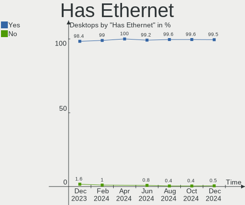
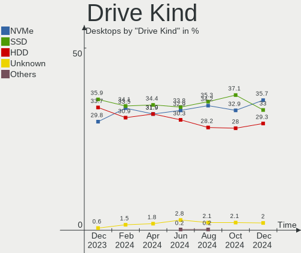
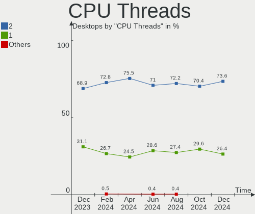
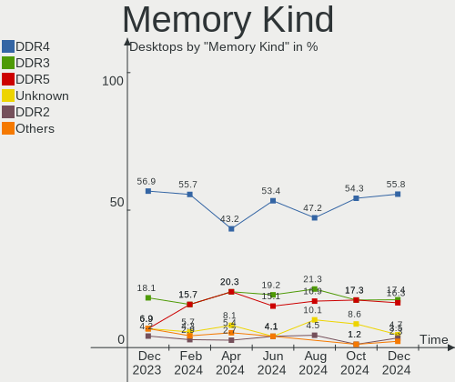
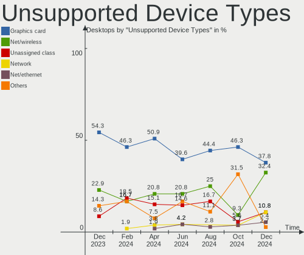

Fedora - Hardware Trends (Desktops)
-----------------------------------

A project to identify most popular hardware characteristics and track their change
over time based on data collected by Linux users at https://Linux-Hardware.org.

Anyone can contribute to this report by the [hw-probe](https://github.com/linuxhw/hw-probe) tool:

    sudo -E hw-probe -all -upload

This report is for one last month. Overall report since the beginning of time: [TestDays](https://github.com/linuxhw/TestDays)

Period: Jul, 2023.

Contents
--------

* [ System ](#system)
  - [ OS                       ](#os)
  - [ OS Family                ](#os-family)
  - [ Kernel                   ](#kernel)
  - [ Kernel Family            ](#kernel-family)
  - [ Kernel Major Ver.        ](#kernel-major-ver)
  - [ Arch                     ](#arch)
  - [ DE                       ](#de)
  - [ Display Server           ](#display-server)
  - [ Display Manager          ](#display-manager)
  - [ OS Lang                  ](#os-lang)
  - [ Boot Mode                ](#boot-mode)
  - [ Filesystem               ](#filesystem)
  - [ Part. scheme             ](#part-scheme)
  - [ Dual Boot with Linux/BSD ](#dual-boot-with-linuxbsd)
  - [ Dual Boot (Win)          ](#dual-boot-win)

* [ Board ](#board)
  - [ Vendor                   ](#vendor)
  - [ Model                    ](#model)
  - [ Model Family             ](#model-family)
  - [ MFG Year                 ](#mfg-year)
  - [ Form Factor              ](#form-factor)
  - [ Secure Boot              ](#secure-boot)
  - [ Coreboot                 ](#coreboot)
  - [ RAM Size                 ](#ram-size)
  - [ RAM Used                 ](#ram-used)
  - [ Total Drives             ](#total-drives)
  - [ Has CD-ROM               ](#has-cd-rom)
  - [ Has Ethernet             ](#has-ethernet)
  - [ Has WiFi                 ](#has-wifi)
  - [ Has Bluetooth            ](#has-bluetooth)

* [ Location ](#location)
  - [ Country                  ](#country)
  - [ City                     ](#city)

* [ Drives ](#drives)
  - [ Drive Vendor             ](#drive-vendor)
  - [ Drive Model              ](#drive-model)
  - [ HDD Vendor               ](#hdd-vendor)
  - [ SSD Vendor               ](#ssd-vendor)
  - [ Drive Kind               ](#drive-kind)
  - [ Drive Connector          ](#drive-connector)
  - [ Drive Size               ](#drive-size)
  - [ Space Total              ](#space-total)
  - [ Space Used               ](#space-used)
  - [ Malfunc. Drives          ](#malfunc-drives)
  - [ Malfunc. Drive Vendor    ](#malfunc-drive-vendor)
  - [ Malfunc. HDD Vendor      ](#malfunc-hdd-vendor)
  - [ Malfunc. Drive Kind      ](#malfunc-drive-kind)
  - [ Failed Drives            ](#failed-drives)
  - [ Failed Drive Vendor      ](#failed-drive-vendor)
  - [ Drive Status             ](#drive-status)

* [ Storage controller ](#storage-controller)
  - [ Storage Vendor           ](#storage-vendor)
  - [ Storage Model            ](#storage-model)
  - [ Storage Kind             ](#storage-kind)

* [ Processor ](#processor)
  - [ CPU Vendor               ](#cpu-vendor)
  - [ CPU Model                ](#cpu-model)
  - [ CPU Model Family         ](#cpu-model-family)
  - [ CPU Cores                ](#cpu-cores)
  - [ CPU Sockets              ](#cpu-sockets)
  - [ CPU Threads              ](#cpu-threads)
  - [ CPU Op-Modes             ](#cpu-op-modes)
  - [ CPU Microcode            ](#cpu-microcode)
  - [ CPU Microarch            ](#cpu-microarch)

* [ Graphics ](#graphics)
  - [ GPU Vendor               ](#gpu-vendor)
  - [ GPU Model                ](#gpu-model)
  - [ GPU Combo                ](#gpu-combo)
  - [ GPU Driver               ](#gpu-driver)
  - [ GPU Memory               ](#gpu-memory)

* [ Monitor ](#monitor)
  - [ Monitor Vendor           ](#monitor-vendor)
  - [ Monitor Model            ](#monitor-model)
  - [ Monitor Resolution       ](#monitor-resolution)
  - [ Monitor Diagonal         ](#monitor-diagonal)
  - [ Monitor Width            ](#monitor-width)
  - [ Aspect Ratio             ](#aspect-ratio)
  - [ Monitor Area             ](#monitor-area)
  - [ Pixel Density            ](#pixel-density)
  - [ Multiple Monitors        ](#multiple-monitors)

* [ Network ](#network)
  - [ Net Controller Vendor    ](#net-controller-vendor)
  - [ Net Controller Model     ](#net-controller-model)
  - [ Wireless Vendor          ](#wireless-vendor)
  - [ Wireless Model           ](#wireless-model)
  - [ Ethernet Vendor          ](#ethernet-vendor)
  - [ Ethernet Model           ](#ethernet-model)
  - [ Net Controller Kind      ](#net-controller-kind)
  - [ Used Controller          ](#used-controller)
  - [ NICs                     ](#nics)
  - [ IPv6                     ](#ipv6)

* [ Bluetooth ](#bluetooth)
  - [ Bluetooth Vendor         ](#bluetooth-vendor)
  - [ Bluetooth Model          ](#bluetooth-model)

* [ Sound ](#sound)
  - [ Sound Vendor             ](#sound-vendor)
  - [ Sound Model              ](#sound-model)

* [ Memory ](#memory)
  - [ Memory Vendor            ](#memory-vendor)
  - [ Memory Model             ](#memory-model)
  - [ Memory Kind              ](#memory-kind)
  - [ Memory Form Factor       ](#memory-form-factor)
  - [ Memory Size              ](#memory-size)
  - [ Memory Speed             ](#memory-speed)

* [ Printers & scanners ](#printers--scanners)
  - [ Printer Vendor           ](#printer-vendor)
  - [ Printer Model            ](#printer-model)
  - [ Scanner Vendor           ](#scanner-vendor)
  - [ Scanner Model            ](#scanner-model)

* [ Camera ](#camera)
  - [ Camera Vendor            ](#camera-vendor)
  - [ Camera Model             ](#camera-model)

* [ Security ](#security)
  - [ Fingerprint Vendor       ](#fingerprint-vendor)
  - [ Fingerprint Model        ](#fingerprint-model)
  - [ Chipcard Vendor          ](#chipcard-vendor)
  - [ Chipcard Model           ](#chipcard-model)

* [ Unsupported ](#unsupported)
  - [ Unsupported Devices      ](#unsupported-devices)
  - [ Unsupported Device Types ](#unsupported-device-types)

System
------

OS
--

Installed operating systems

| Name      | Desktops | Percent |
|-----------|----------|---------|
| Fedora 38 | 155      | 92.26%  |
| Fedora 37 | 10       | 5.95%   |
| Fedora 36 | 2        | 1.19%   |
| Fedora 39 | 1        | 0.6%    |

OS Family
---------

OS without a version

| Name   | Desktops | Percent |
|--------|----------|---------|
| Fedora | 168      | 100%    |

Kernel
------

Version of the Linux kernel

| Version                                            | Desktops | Percent |
|----------------------------------------------------|----------|---------|
| 6.3.8-200.fc38.x86_64                              | 39       | 23.21%  |
| 6.3.12-200.fc38.x86_64                             | 38       | 22.62%  |
| 6.3.11-200.fc38.x86_64                             | 30       | 17.86%  |
| 6.4.4-200.fc38.x86_64                              | 15       | 8.93%   |
| 6.2.9-300.fc38.x86_64                              | 11       | 6.55%   |
| 6.4.6-200.fc38.x86_64                              | 10       | 5.95%   |
| 6.3.8-100.fc37.x86_64                              | 3        | 1.79%   |
| 6.3.10-200.fc38.x86_64                             | 2        | 1.19%   |
| 6.2.15-703.inttf.fc38.x86_64                       | 2        | 1.19%   |
| 6.5.0-0.rc2.20230721gitf7e3a1bafdea.20.fc39.x86_64 | 1        | 0.6%    |
| 6.5.0-0.rc0.20230703gita901a3568fd2.8.fc39.x86_64  | 1        | 0.6%    |
| 6.4.6-100.fc37.x86_64                              | 1        | 0.6%    |
| 6.4.4-202.fsync.fc38.x86_64                        | 1        | 0.6%    |
| 6.4.4-100.fc37.x86_64                              | 1        | 0.6%    |
| 6.4.2-201.fc38.x86_64                              | 1        | 0.6%    |
| 6.3.8-400.unixcart.fc38.x86_64                     | 1        | 0.6%    |
| 6.3.7-200.fc38.x86_64                              | 1        | 0.6%    |
| 6.3.3-200.fc38.x86_64                              | 1        | 0.6%    |
| 6.3.12-100.fc37.x86_64                             | 1        | 0.6%    |
| 6.2.15-200.fc37.x86_64                             | 1        | 0.6%    |
| 6.2.15-100.fc36.x86_64                             | 1        | 0.6%    |
| 6.2.12-200.fc37.x86_64                             | 1        | 0.6%    |
| 6.2.11-300.fc38.x86_64                             | 1        | 0.6%    |
| 6.2.10-200.fc37.x86_64                             | 1        | 0.6%    |
| 6.1.38-hardened1-1-hardened                        | 1        | 0.6%    |
| 6.0.11-300.fc37.x86_64                             | 1        | 0.6%    |
| 5.17.5-300.fc36.x86_64                             | 1        | 0.6%    |

Kernel Family
-------------

Linux kernel without a distro release

| Version | Desktops | Percent |
|---------|----------|---------|
| 6.3.8   | 43       | 25.6%   |
| 6.3.12  | 39       | 23.21%  |
| 6.3.11  | 30       | 17.86%  |
| 6.4.4   | 17       | 10.12%  |
| 6.4.6   | 11       | 6.55%   |
| 6.2.9   | 11       | 6.55%   |
| 6.2.15  | 4        | 2.38%   |
| 6.5.0   | 2        | 1.19%   |
| 6.3.10  | 2        | 1.19%   |
| 6.4.2   | 1        | 0.6%    |
| 6.3.7   | 1        | 0.6%    |
| 6.3.3   | 1        | 0.6%    |
| 6.2.12  | 1        | 0.6%    |
| 6.2.11  | 1        | 0.6%    |
| 6.2.10  | 1        | 0.6%    |
| 6.1.38  | 1        | 0.6%    |
| 6.0.11  | 1        | 0.6%    |
| 5.17.5  | 1        | 0.6%    |

Kernel Major Ver.
-----------------

Linux kernel major version

| Version | Desktops | Percent |
|---------|----------|---------|
| 6.3     | 116      | 69.05%  |
| 6.4     | 29       | 17.26%  |
| 6.2     | 18       | 10.71%  |
| 6.5     | 2        | 1.19%   |
| 6.1     | 1        | 0.6%    |
| 6.0     | 1        | 0.6%    |
| 5.17    | 1        | 0.6%    |

Arch
----

OS architecture (x86_64, i586, etc.)

| Name   | Desktops | Percent |
|--------|----------|---------|
| x86_64 | 168      | 100%    |

DE
--

Desktop Environment

| Name          | Desktops | Percent |
|---------------|----------|---------|
| GNOME         | 119      | 70.83%  |
| KDE5          | 21       | 12.5%   |
| Cinnamon      | 6        | 3.57%   |
| Unknown       | 6        | 3.57%   |
| GNOME Classic | 5        | 2.98%   |
| XFCE          | 3        | 1.79%   |
| sway          | 3        | 1.79%   |
| X-Cinnamon    | 2        | 1.19%   |
| LXQt          | 1        | 0.6%    |
| Hyprland      | 1        | 0.6%    |
| Budgie        | 1        | 0.6%    |

Display Server
--------------

X11 or Wayland

| Name    | Desktops | Percent |
|---------|----------|---------|
| Wayland | 118      | 70.24%  |
| X11     | 38       | 22.62%  |
| Tty     | 10       | 5.95%   |
| Unknown | 2        | 1.19%   |

Display Manager
---------------

SDDM, LightDM, etc.

| Name    | Desktops | Percent |
|---------|----------|---------|
| Unknown | 109      | 64.88%  |
| GDM     | 35       | 20.83%  |
| SDDM    | 14       | 8.33%   |
| LightDM | 10       | 5.95%   |

OS Lang
-------

Language

| Lang  | Desktops | Percent |
|-------|----------|---------|
| en_US | 80       | 47.62%  |
| en_AU | 16       | 9.52%   |
| pt_BR | 9        | 5.36%   |
| en_GB | 9        | 5.36%   |
| ru_RU | 8        | 4.76%   |
| de_DE | 8        | 4.76%   |
| en_CA | 5        | 2.98%   |
| en_IN | 4        | 2.38%   |
| it_IT | 3        | 1.79%   |
| fr_FR | 3        | 1.79%   |
| es_ES | 3        | 1.79%   |
| es_CO | 2        | 1.19%   |
| zh_TW | 1        | 0.6%    |
| tr_TR | 1        | 0.6%    |
| sv_SE | 1        | 0.6%    |
| pl_PL | 1        | 0.6%    |
| id_ID | 1        | 0.6%    |
| ia_FR | 1        | 0.6%    |
| fi_FI | 1        | 0.6%    |
| es_PE | 1        | 0.6%    |
| es_MX | 1        | 0.6%    |
| es_CR | 1        | 0.6%    |
| es_CL | 1        | 0.6%    |
| en_SG | 1        | 0.6%    |
| en_NZ | 1        | 0.6%    |
| en_IE | 1        | 0.6%    |
| en_DK | 1        | 0.6%    |
| da_DK | 1        | 0.6%    |
| cs_CZ | 1        | 0.6%    |
| ca_ES | 1        | 0.6%    |

Boot Mode
---------

EFI or BIOS

| Mode | Desktops | Percent |
|------|----------|---------|
| EFI  | 123      | 73.21%  |
| BIOS | 45       | 26.79%  |

Filesystem
----------

Type of filesystem

| Type  | Desktops | Percent |
|-------|----------|---------|
| Btrfs | 119      | 70.83%  |
| Ext4  | 37       | 22.02%  |
| Xfs   | 12       | 7.14%   |

Part. scheme
------------

Scheme of partitioning

| Type    | Desktops | Percent |
|---------|----------|---------|
| Unknown | 104      | 61.9%   |
| GPT     | 54       | 32.14%  |
| MBR     | 10       | 5.95%   |

Dual Boot with Linux/BSD
------------------------

Hosting more than one Linux/BSD

| Dual boot | Desktops | Percent |
|-----------|----------|---------|
| No        | 154      | 91.67%  |
| Yes       | 14       | 8.33%   |

Dual Boot (Win)
---------------

Hosting Linux and Windows

| Dual boot | Desktops | Percent |
|-----------|----------|---------|
| No        | 143      | 85.12%  |
| Yes       | 25       | 14.88%  |

Board
-----

Vendor
------

Motherboard manufacturer

| Name                                 | Desktops | Percent |
|--------------------------------------|----------|---------|
| MSI                                  | 41       | 24.4%   |
| ASUSTek Computer                     | 40       | 23.81%  |
| Gigabyte Technology                  | 31       | 18.45%  |
| ASRock                               | 14       | 8.33%   |
| Hewlett-Packard                      | 13       | 7.74%   |
| Dell                                 | 7        | 4.17%   |
| Lenovo                               | 4        | 2.38%   |
| Shenzhen Meigao Electronic Equipment | 2        | 1.19%   |
| Pegatron                             | 2        | 1.19%   |
| Fujitsu                              | 2        | 1.19%   |
| ECS                                  | 2        | 1.19%   |
| AZW                                  | 2        | 1.19%   |
| MACHINIST                            | 1        | 0.6%    |
| LattePanda                           | 1        | 0.6%    |
| Kupi deshego edition                 | 1        | 0.6%    |
| Kllisre                              | 1        | 0.6%    |
| Huanan                               | 1        | 0.6%    |
| Gateway                              | 1        | 0.6%    |
| GALAX                                | 1        | 0.6%    |
| Unknown                              | 1        | 0.6%    |

Model
-----

Motherboard model

| Name                                       | Desktops | Percent |
|--------------------------------------------|----------|---------|
| Dell OptiPlex 7010                         | 3        | 1.79%   |
| MSI MS-7D25                                | 2        | 1.19%   |
| MSI MS-7C96                                | 2        | 1.19%   |
| MSI MS-7C52                                | 2        | 1.19%   |
| MSI MS-7C37                                | 2        | 1.19%   |
| MSI MS-7C02                                | 2        | 1.19%   |
| MSI MS-7B85                                | 2        | 1.19%   |
| MSI MS-7B17                                | 2        | 1.19%   |
| HP Z800 Workstation                        | 2        | 1.19%   |
| Gigabyte J1900M-D2P                        | 2        | 1.19%   |
| Gigabyte B550 GAMING X V2                  | 2        | 1.19%   |
| ASUS TUF Gaming X670E-PLUS WIFI            | 2        | 1.19%   |
| ASUS PRIME X570-P                          | 2        | 1.19%   |
| ASUS All Series                            | 2        | 1.19%   |
| Shenzhen Meigao Electronic Equipment UM690 | 1        | 0.6%    |
| Shenzhen Meigao Electronic Equipment HX90G | 1        | 0.6%    |
| Pegatron IPMH61P1                          | 1        | 0.6%    |
| Pegatron Elite 7500 Series MT              | 1        | 0.6%    |
| MSI PPPPP-CCC#MMMMMMMM                     | 1        | 0.6%    |
| MSI MS-7D78                                | 1        | 0.6%    |
| MSI MS-7D73                                | 1        | 0.6%    |
| MSI MS-7D53                                | 1        | 0.6%    |
| MSI MS-7D31                                | 1        | 0.6%    |
| MSI MS-7D23                                | 1        | 0.6%    |
| MSI MS-7C95                                | 1        | 0.6%    |
| MSI MS-7C56                                | 1        | 0.6%    |
| MSI MS-7B89                                | 1        | 0.6%    |
| MSI MS-7B79                                | 1        | 0.6%    |
| MSI MS-7B78                                | 1        | 0.6%    |
| MSI MS-7B50                                | 1        | 0.6%    |
| MSI MS-7B10                                | 1        | 0.6%    |
| MSI MS-7B07                                | 1        | 0.6%    |
| MSI MS-7A75                                | 1        | 0.6%    |
| MSI MS-7A74                                | 1        | 0.6%    |
| MSI MS-7A38                                | 1        | 0.6%    |
| MSI MS-7A37                                | 1        | 0.6%    |
| MSI MS-7998                                | 1        | 0.6%    |
| MSI MS-7984                                | 1        | 0.6%    |
| MSI MS-7978                                | 1        | 0.6%    |
| MSI MS-7923                                | 1        | 0.6%    |

Model Family
------------

Motherboard model prefix

| Name                                       | Desktops | Percent |
|--------------------------------------------|----------|---------|
| ASUS PRIME                                 | 13       | 7.74%   |
| Dell OptiPlex                              | 6        | 3.57%   |
| ASUS TUF                                   | 6        | 3.57%   |
| ASUS ROG                                   | 6        | 3.57%   |
| Lenovo ThinkCentre                         | 3        | 1.79%   |
| HP EliteDesk                               | 3        | 1.79%   |
| HP Compaq                                  | 3        | 1.79%   |
| MSI MS-7D25                                | 2        | 1.19%   |
| MSI MS-7C96                                | 2        | 1.19%   |
| MSI MS-7C52                                | 2        | 1.19%   |
| MSI MS-7C37                                | 2        | 1.19%   |
| MSI MS-7C02                                | 2        | 1.19%   |
| MSI MS-7B85                                | 2        | 1.19%   |
| MSI MS-7B17                                | 2        | 1.19%   |
| HP Z800                                    | 2        | 1.19%   |
| HP ProDesk                                 | 2        | 1.19%   |
| Gigabyte J1900M-D2P                        | 2        | 1.19%   |
| Gigabyte B550M                             | 2        | 1.19%   |
| Gigabyte B550                              | 2        | 1.19%   |
| Gigabyte B365M                             | 2        | 1.19%   |
| ASUS All                                   | 2        | 1.19%   |
| ASRock X670E                               | 2        | 1.19%   |
| Shenzhen Meigao Electronic Equipment UM690 | 1        | 0.6%    |
| Shenzhen Meigao Electronic Equipment HX90G | 1        | 0.6%    |
| Pegatron IPMH61P1                          | 1        | 0.6%    |
| Pegatron Elite                             | 1        | 0.6%    |
| MSI PPPPP-CCC#MMMMMMMM                     | 1        | 0.6%    |
| MSI MS-7D78                                | 1        | 0.6%    |
| MSI MS-7D73                                | 1        | 0.6%    |
| MSI MS-7D53                                | 1        | 0.6%    |
| MSI MS-7D31                                | 1        | 0.6%    |
| MSI MS-7D23                                | 1        | 0.6%    |
| MSI MS-7C95                                | 1        | 0.6%    |
| MSI MS-7C56                                | 1        | 0.6%    |
| MSI MS-7B89                                | 1        | 0.6%    |
| MSI MS-7B79                                | 1        | 0.6%    |
| MSI MS-7B78                                | 1        | 0.6%    |
| MSI MS-7B50                                | 1        | 0.6%    |
| MSI MS-7B10                                | 1        | 0.6%    |
| MSI MS-7B07                                | 1        | 0.6%    |

MFG Year
--------

Motherboard manufacture year

| Year | Desktops | Percent |
|------|----------|---------|
| 2021 | 21       | 12.5%   |
| 2020 | 19       | 11.31%  |
| 2019 | 18       | 10.71%  |
| 2018 | 17       | 10.12%  |
| 2013 | 16       | 9.52%   |
| 2022 | 14       | 8.33%   |
| 2017 | 12       | 7.14%   |
| 2015 | 12       | 7.14%   |
| 2012 | 8        | 4.76%   |
| 2016 | 7        | 4.17%   |
| 2010 | 7        | 4.17%   |
| 2011 | 6        | 3.57%   |
| 2014 | 3        | 1.79%   |
| 2023 | 2        | 1.19%   |
| 2009 | 2        | 1.19%   |
| 2008 | 1        | 0.6%    |
| 2007 | 1        | 0.6%    |
| 2006 | 1        | 0.6%    |
| 2005 | 1        | 0.6%    |

Form Factor
-----------

Physical design of the computer

| Name    | Desktops | Percent |
|---------|----------|---------|
| Desktop | 168      | 100%    |

Secure Boot
-----------

Enabled or disabled

| State    | Desktops | Percent |
|----------|----------|---------|
| Disabled | 141      | 83.93%  |
| Enabled  | 27       | 16.07%  |

Coreboot
--------

Have coreboot on board

| Used | Desktops | Percent |
|------|----------|---------|
| No   | 168      | 100%    |

RAM Size
--------

Total RAM memory

| Size in GB  | Desktops | Percent |
|-------------|----------|---------|
| 16.01-24.0  | 47       | 27.98%  |
| 32.01-64.0  | 43       | 25.6%   |
| 4.01-8.0    | 19       | 11.31%  |
| 64.01-256.0 | 18       | 10.71%  |
| 8.01-16.0   | 18       | 10.71%  |
| 24.01-32.0  | 10       | 5.95%   |
| 3.01-4.0    | 9        | 5.36%   |
| 1.01-2.0    | 3        | 1.79%   |
| 2.01-3.0    | 1        | 0.6%    |

RAM Used
--------

Used RAM memory

| Used GB    | Desktops | Percent |
|------------|----------|---------|
| 4.01-8.0   | 50       | 29.76%  |
| 3.01-4.0   | 42       | 25%     |
| 2.01-3.0   | 32       | 19.05%  |
| 8.01-16.0  | 20       | 11.9%   |
| 1.01-2.0   | 16       | 9.52%   |
| 0.51-1.0   | 5        | 2.98%   |
| 16.01-24.0 | 3        | 1.79%   |

Total Drives
------------

Number of drives on board

| Drives | Desktops | Percent |
|--------|----------|---------|
| 2      | 53       | 31.55%  |
| 1      | 48       | 28.57%  |
| 3      | 37       | 22.02%  |
| 4      | 17       | 10.12%  |
| 7      | 4        | 2.38%   |
| 6      | 4        | 2.38%   |
| 5      | 4        | 2.38%   |
| 8      | 1        | 0.6%    |

Has CD-ROM
----------

Has CD-ROM on board

| Presented | Desktops | Percent |
|-----------|----------|---------|
| No        | 114      | 67.86%  |
| Yes       | 54       | 32.14%  |

Has Ethernet
------------

Has Ethernet on board

| Presented | Desktops | Percent |
|-----------|----------|---------|
| Yes       | 165      | 98.21%  |
| No        | 3        | 1.79%   |

Has WiFi
--------

Has WiFi module

| Presented | Desktops | Percent |
|-----------|----------|---------|
| Yes       | 85       | 50.6%   |
| No        | 83       | 49.4%   |

Has Bluetooth
-------------

Has Bluetooth module

| Presented | Desktops | Percent |
|-----------|----------|---------|
| No        | 91       | 54.17%  |
| Yes       | 77       | 45.83%  |

Location
--------

Country
-------

Geographic location (country)

| Country             | Desktops | Percent |
|---------------------|----------|---------|
| USA                 | 29       | 17.26%  |
| Australia           | 18       | 10.71%  |
| Brazil              | 13       | 7.74%   |
| Germany             | 11       | 6.55%   |
| Russia              | 10       | 5.95%   |
| Netherlands         | 7        | 4.17%   |
| Italy               | 7        | 4.17%   |
| UK                  | 5        | 2.98%   |
| Spain               | 5        | 2.98%   |
| Canada              | 5        | 2.98%   |
| Sweden              | 4        | 2.38%   |
| India               | 4        | 2.38%   |
| Norway              | 3        | 1.79%   |
| Indonesia           | 3        | 1.79%   |
| France              | 3        | 1.79%   |
| Colombia            | 3        | 1.79%   |
| Austria             | 3        | 1.79%   |
| Thailand            | 2        | 1.19%   |
| Taiwan              | 2        | 1.19%   |
| Serbia              | 2        | 1.19%   |
| Morocco             | 2        | 1.19%   |
| Mexico              | 2        | 1.19%   |
| Denmark             | 2        | 1.19%   |
| Belgium             | 2        | 1.19%   |
| Turkey              | 1        | 0.6%    |
| Trinidad and Tobago | 1        | 0.6%    |
| Sri Lanka           | 1        | 0.6%    |
| South Africa        | 1        | 0.6%    |
| Slovakia            | 1        | 0.6%    |
| Singapore           | 1        | 0.6%    |
| Portugal            | 1        | 0.6%    |
| Poland              | 1        | 0.6%    |
| Philippines         | 1        | 0.6%    |
| Peru                | 1        | 0.6%    |
| New Zealand         | 1        | 0.6%    |
| Luxembourg          | 1        | 0.6%    |
| Ireland             | 1        | 0.6%    |
| Iran                | 1        | 0.6%    |
| Finland             | 1        | 0.6%    |
| Czechia             | 1        | 0.6%    |

City
----

Geographic location (city)

| City          | Desktops | Percent |
|---------------|----------|---------|
| Sydney        | 11       | 6.55%   |
| Vienna        | 3        | 1.79%   |
| Victoria      | 2        | 1.19%   |
| The Hague     | 2        | 1.19%   |
| St Petersburg | 2        | 1.19%   |
| Rostov-on-Don | 2        | 1.19%   |
| Ponferrada    | 2        | 1.19%   |
| Paris         | 2        | 1.19%   |
| Moscow        | 2        | 1.19%   |
| Milan         | 2        | 1.19%   |
| Los Angeles   | 2        | 1.19%   |
| Kristiansand  | 2        | 1.19%   |
| Düsseldorf   | 2        | 1.19%   |
| Brussels      | 2        | 1.19%   |
| Brisbane      | 2        | 1.19%   |
| Belgrade      | 2        | 1.19%   |
| Amsterdam     | 2        | 1.19%   |
| Adelaide      | 2        | 1.19%   |
| Yoshkar-Ola   | 1        | 0.6%    |
| Yorba Linda   | 1        | 0.6%    |
| Wiggins       | 1        | 0.6%    |
| Warsaw        | 1        | 0.6%    |
| Vigolo        | 1        | 0.6%    |
| Venice        | 1        | 0.6%    |
| Västerås    | 1        | 0.6%    |
| Varsta        | 1        | 0.6%    |
| Ulm           | 1        | 0.6%    |
| Tuttlingen    | 1        | 0.6%    |
| Tunja         | 1        | 0.6%    |
| Toronto       | 1        | 0.6%    |
| Texcoco       | 1        | 0.6%    |
| Tampa         | 1        | 0.6%    |
| Tacoma        | 1        | 0.6%    |
| Svenstrup     | 1        | 0.6%    |
| Stockholm     | 1        | 0.6%    |
| Stevenage     | 1        | 0.6%    |
| Steinheim     | 1        | 0.6%    |
| St Louis      | 1        | 0.6%    |
| South Bend    | 1        | 0.6%    |
| Somerville    | 1        | 0.6%    |

Drives
------

Drive Vendor
------------

Hard drive vendors

| Vendor                       | Desktops | Drives | Percent |
|------------------------------|----------|--------|---------|
| Samsung Electronics          | 63       | 99     | 19.03%  |
| Seagate                      | 51       | 61     | 15.41%  |
| WDC                          | 39       | 58     | 11.78%  |
| Sandisk                      | 21       | 24     | 6.34%   |
| Kingston                     | 20       | 23     | 6.04%   |
| Crucial                      | 19       | 25     | 5.74%   |
| Toshiba                      | 17       | 19     | 5.14%   |
| Intel                        | 9        | 14     | 2.72%   |
| Hitachi                      | 9        | 10     | 2.72%   |
| Micron/Crucial Technology    | 7        | 7      | 2.11%   |
| Silicon Motion               | 5        | 6      | 1.51%   |
| Phison Electronics           | 5        | 6      | 1.51%   |
| A-DATA Technology            | 5        | 5      | 1.51%   |
| Kingston Technology Company  | 4        | 4      | 1.21%   |
| PNY                          | 3        | 3      | 0.91%   |
| OCZ                          | 3        | 3      | 0.91%   |
| MAXIO Technology (Hangzhou)  | 3        | 4      | 0.91%   |
| JMicron Technology           | 3        | 3      | 0.91%   |
| China                        | 3        | 3      | 0.91%   |
| Unknown                      | 2        | 2      | 0.6%    |
| Transcend                    | 2        | 2      | 0.6%    |
| SPCC                         | 2        | 2      | 0.6%    |
| Realtek Semiconductor        | 2        | 2      | 0.6%    |
| Patriot                      | 2        | 3      | 0.6%    |
| NGFF                         | 2        | 2      | 0.6%    |
| Micron Technology            | 2        | 2      | 0.6%    |
| Maxtor                       | 2        | 2      | 0.6%    |
| LITEONIT                     | 2        | 2      | 0.6%    |
| HS-SSD-C100                  | 2        | 2      | 0.6%    |
| Unknown                      | 2        | 2      | 0.6%    |
| ZOTAC                        | 1        | 1      | 0.3%    |
| USB 3.0                      | 1        | 1      | 0.3%    |
| Supersonic                   | 1        | 1      | 0.3%    |
| SK hynix                     | 1        | 1      | 0.3%    |
| Shenzhen Longsys Electronics | 1        | 1      | 0.3%    |
| Seagate Technology           | 1        | 1      | 0.3%    |
| Ramaxel Technology           | 1        | 1      | 0.3%    |
| Netac                        | 1        | 1      | 0.3%    |
| MSI                          | 1        | 1      | 0.3%    |
| MaxDigital                   | 1        | 1      | 0.3%    |

Drive Model
-----------

Hard drive models

| Model                                                 | Desktops | Percent |
|-------------------------------------------------------|----------|---------|
| Samsung NVMe SSD Controller SM981/PM981/PM983 500GB   | 16       | 4.15%   |
| Samsung NVMe SSD Controller PM9A1/PM9A3/980PRO 1TB    | 13       | 3.37%   |
| Samsung NVMe SSD Controller SM961/PM961/SM963 256GB   | 6        | 1.55%   |
| Silicon Motion SM2263EN/SM2263XT SSD Controller 500GB | 5        | 1.3%    |
| Samsung SSD 860 EVO 500GB                             | 5        | 1.3%    |
| Samsung SSD 850 EVO 250GB                             | 5        | 1.3%    |
| Toshiba MQ01ABD100 1TB                                | 4        | 1.04%   |
| Seagate ST2000DM001-1ER164 2TB                        | 4        | 1.04%   |
| Seagate ST1000DM010-2EP102 1TB                        | 4        | 1.04%   |
| Samsung SSD 980 1TB                                   | 4        | 1.04%   |
| Samsung SSD 850 EVO 500GB                             | 4        | 1.04%   |
| Kingston SA400S37480G 480GB SSD                       | 4        | 1.04%   |
| Crucial CT1000MX500SSD1 1TB                           | 4        | 1.04%   |
| WDC WDS240G2G0A-00JH30 240GB SSD                      | 3        | 0.78%   |
| Toshiba DT01ACA100 1TB                                | 3        | 0.78%   |
| Seagate ST500DM002-1BD142 500GB                       | 3        | 0.78%   |
| Sandisk WD_BLACK SN770 1TB                            | 3        | 0.78%   |
| Samsung SSD 870 QVO 1TB                               | 3        | 0.78%   |
| Samsung SSD 860 EVO 1TB                               | 3        | 0.78%   |
| Micron/Crucial P2 NVMe PCIe SSD 1TB                   | 3        | 0.78%   |
| MAXIO (Hangzhou) NVMe SSD Controller MAP1202 256GB    | 3        | 0.78%   |
| Kingston SV300S37A240G 240GB SSD                      | 3        | 0.78%   |
| Crucial CT500MX500SSD1 500GB                          | 3        | 0.78%   |
| Crucial CT240BX500SSD1 240GB                          | 3        | 0.78%   |
| WDC WD5000AAKX-60U6AA0 500GB                          | 2        | 0.52%   |
| WDC WD10EZEX-00BN5A0 1TB                              | 2        | 0.52%   |
| WDC WD10EURX-63C57Y0 1TB                              | 2        | 0.52%   |
| Seagate ST3320613AS 320GB                             | 2        | 0.52%   |
| Seagate ST2000DM008-2FR102 2TB                        | 2        | 0.52%   |
| Seagate ST2000DM006-2DM164 2TB                        | 2        | 0.52%   |
| Seagate ST1000DM003-1SB10C 1TB                        | 2        | 0.52%   |
| Seagate ST1000DM003-1SB102 1TB                        | 2        | 0.52%   |
| Seagate ST1000DM003-1ER162 1TB                        | 2        | 0.52%   |
| Seagate ST1000DM003-1CH162 1TB                        | 2        | 0.52%   |
| Sandisk WDC WDS480G2G0C-00AJM0 480GB                  | 2        | 0.52%   |
| Sandisk WD Black SN850 1TB                            | 2        | 0.52%   |
| Sandisk WD Black 2018/SN750 / PC SN720 NVMe SSD 1TB   | 2        | 0.52%   |
| Samsung SSD 870 QVO 2TB                               | 2        | 0.52%   |
| Samsung SSD 870 EVO 500GB                             | 2        | 0.52%   |
| Samsung SSD 870 EVO 250GB                             | 2        | 0.52%   |

HDD Vendor
----------

Hard disk drive vendors

| Vendor              | Desktops | Drives | Percent |
|---------------------|----------|--------|---------|
| Seagate             | 50       | 60     | 43.1%   |
| WDC                 | 33       | 48     | 28.45%  |
| Toshiba             | 15       | 17     | 12.93%  |
| Hitachi             | 9        | 10     | 7.76%   |
| Samsung Electronics | 3        | 3      | 2.59%   |
| Maxtor              | 2        | 2      | 1.72%   |
| JMicron Technology  | 2        | 2      | 1.72%   |
| Unknown             | 1        | 1      | 0.86%   |
| HGST                | 1        | 1      | 0.86%   |

SSD Vendor
----------

Solid state drive vendors

| Vendor              | Desktops | Drives | Percent |
|---------------------|----------|--------|---------|
| Samsung Electronics | 34       | 47     | 25.95%  |
| Crucial             | 19       | 25     | 14.5%   |
| Kingston            | 15       | 17     | 11.45%  |
| WDC                 | 10       | 10     | 7.63%   |
| SanDisk             | 7        | 8      | 5.34%   |
| Intel               | 6        | 10     | 4.58%   |
| A-DATA Technology   | 5        | 5      | 3.82%   |
| PNY                 | 3        | 3      | 2.29%   |
| OCZ                 | 3        | 3      | 2.29%   |
| China               | 3        | 3      | 2.29%   |
| Transcend           | 2        | 2      | 1.53%   |
| Toshiba             | 2        | 2      | 1.53%   |
| SPCC                | 2        | 2      | 1.53%   |
| Patriot             | 2        | 3      | 1.53%   |
| NGFF                | 2        | 2      | 1.53%   |
| LITEONIT            | 2        | 2      | 1.53%   |
| Unknown             | 2        | 2      | 1.53%   |
| ZOTAC               | 1        | 1      | 0.76%   |
| Supersonic          | 1        | 1      | 0.76%   |
| Ramaxel Technology  | 1        | 1      | 0.76%   |
| Netac               | 1        | 1      | 0.76%   |
| MSI                 | 1        | 1      | 0.76%   |
| Micron Technology   | 1        | 1      | 0.76%   |
| MaxDigital          | 1        | 1      | 0.76%   |
| Lexar               | 1        | 1      | 0.76%   |
| KUIJIA              | 1        | 1      | 0.76%   |
| KingSpec            | 1        | 1      | 0.76%   |
| Intenso             | 1        | 1      | 0.76%   |
| Acer                | 1        | 1      | 0.76%   |

Drive Kind
----------

HDD or SSD

| Kind    | Desktops | Drives | Percent |
|---------|----------|--------|---------|
| SSD     | 106      | 158    | 37.32%  |
| HDD     | 91       | 144    | 32.04%  |
| NVMe    | 78       | 109    | 27.46%  |
| Unknown | 8        | 8      | 2.82%   |
| MMC     | 1        | 1      | 0.35%   |

Drive Connector
---------------

SATA, SAS, NVMe, etc.

| Type | Desktops | Drives | Percent |
|------|----------|--------|---------|
| SATA | 143      | 295    | 60.85%  |
| NVMe | 78       | 109    | 33.19%  |
| SAS  | 13       | 15     | 5.53%   |
| MMC  | 1        | 1      | 0.43%   |

Drive Size
----------

Size of hard drive

| Size in TB | Desktops | Drives | Percent |
|------------|----------|--------|---------|
| 0.01-0.5   | 105      | 158    | 48.84%  |
| 0.51-1.0   | 58       | 72     | 26.98%  |
| 1.01-2.0   | 28       | 33     | 13.02%  |
| 4.01-10.0  | 10       | 20     | 4.65%   |
| 3.01-4.0   | 7        | 10     | 3.26%   |
| 2.01-3.0   | 7        | 9      | 3.26%   |

Space Total
-----------

Amount of disk space available on the file system

| Size in GB     | Desktops | Percent |
|----------------|----------|---------|
| 1001-2000      | 37       | 22.02%  |
| 501-1000       | 32       | 19.05%  |
| More than 3000 | 26       | 15.48%  |
| 101-250        | 23       | 13.69%  |
| 251-500        | 21       | 12.5%   |
| 2001-3000      | 13       | 7.74%   |
| 51-100         | 6        | 3.57%   |
| Unknown        | 4        | 2.38%   |
| 1-20           | 3        | 1.79%   |
| 21-50          | 2        | 1.19%   |
| 0              | 1        | 0.6%    |

Space Used
----------

Amount of used disk space

| Used GB        | Desktops | Percent |
|----------------|----------|---------|
| 21-50          | 33       | 19.64%  |
| 101-250        | 29       | 17.26%  |
| 1-20           | 21       | 12.5%   |
| 251-500        | 18       | 10.71%  |
| 51-100         | 18       | 10.71%  |
| 501-1000       | 17       | 10.12%  |
| 1001-2000      | 11       | 6.55%   |
| More than 3000 | 9        | 5.36%   |
| 2001-3000      | 7        | 4.17%   |
| Unknown        | 4        | 2.38%   |
| 0              | 1        | 0.6%    |

Malfunc. Drives
---------------

Drive models with a malfunction

| Model                                                          | Desktops | Drives | Percent |
|----------------------------------------------------------------|----------|--------|---------|
| WDC WD10EZRZ-00HTKB0 1TB                                       | 1        | 1      | 6.67%   |
| WDC WD10EADS-65M2B0 1TB                                        | 1        | 1      | 6.67%   |
| WDC WD1002FAEX-00Z3A0 1TB                                      | 1        | 1      | 6.67%   |
| Toshiba MQ01ABD100 1TB                                         | 1        | 1      | 6.67%   |
| Seagate ST3320613AS 320GB                                      | 1        | 1      | 6.67%   |
| Seagate ST31000524AS 1TB                                       | 1        | 1      | 6.67%   |
| Seagate ST3000DM001-1CH166 3TB                                 | 1        | 1      | 6.67%   |
| Samsung Electronics SSD 870 EVO 250GB                          | 1        | 1      | 6.67%   |
| Samsung Electronics SSD 850 EVO 250GB                          | 1        | 2      | 6.67%   |
| Samsung Electronics NVMe SSD Controller PM9A1/PM9A3/980PRO 1TB | 1        | 1      | 6.67%   |
| Samsung Electronics HD322GJ 320GB                              | 1        | 1      | 6.67%   |
| Maxtor 6Y080L0 82GB                                            | 1        | 1      | 6.67%   |
| LITEONIT LMT-256M3M 256GB SSD                                  | 1        | 1      | 6.67%   |
| Kingston SA400S37480G 480GB SSD                                | 1        | 1      | 6.67%   |
| Intel SSDSC2CT120A3 120GB                                      | 1        | 1      | 6.67%   |

Malfunc. Drive Vendor
---------------------

Vendors of faulty drives

| Vendor              | Desktops | Drives | Percent |
|---------------------|----------|--------|---------|
| Samsung Electronics | 4        | 5      | 26.67%  |
| WDC                 | 3        | 3      | 20%     |
| Seagate             | 3        | 3      | 20%     |
| Toshiba             | 1        | 1      | 6.67%   |
| Maxtor              | 1        | 1      | 6.67%   |
| LITEONIT            | 1        | 1      | 6.67%   |
| Kingston            | 1        | 1      | 6.67%   |
| Intel               | 1        | 1      | 6.67%   |

Malfunc. HDD Vendor
-------------------

Vendors of faulty HDD drives

| Vendor              | Desktops | Drives | Percent |
|---------------------|----------|--------|---------|
| WDC                 | 3        | 3      | 33.33%  |
| Seagate             | 3        | 3      | 33.33%  |
| Toshiba             | 1        | 1      | 11.11%  |
| Samsung Electronics | 1        | 1      | 11.11%  |
| Maxtor              | 1        | 1      | 11.11%  |

Malfunc. Drive Kind
-------------------

Kinds of faulty drives

| Kind | Desktops | Drives | Percent |
|------|----------|--------|---------|
| HDD  | 9        | 9      | 60%     |
| SSD  | 5        | 6      | 33.33%  |
| NVMe | 1        | 1      | 6.67%   |

Failed Drives
-------------

Failed drive models

Zero info for selected period =(

Failed Drive Vendor
-------------------

Failed drive vendors

Zero info for selected period =(

Drive Status
------------

Number of failed and malfunc. drives

| Status   | Desktops | Drives | Percent |
|----------|----------|--------|---------|
| Detected | 108      | 265    | 58.38%  |
| Works    | 63       | 139    | 34.05%  |
| Malfunc  | 14       | 16     | 7.57%   |

Storage controller
------------------

Storage Vendor
--------------

Storage controller vendors

| Vendor                       | Desktops | Percent |
|------------------------------|----------|---------|
| Intel                        | 95       | 34.8%   |
| AMD                          | 69       | 25.27%  |
| Samsung Electronics          | 38       | 13.92%  |
| SanDisk                      | 14       | 5.13%   |
| Kingston Technology Company  | 10       | 3.66%   |
| ASMedia Technology           | 9        | 3.3%    |
| Micron/Crucial Technology    | 7        | 2.56%   |
| Silicon Motion               | 5        | 1.83%   |
| Phison Electronics           | 5        | 1.83%   |
| MAXIO Technology (Hangzhou)  | 3        | 1.1%    |
| JMicron Technology           | 3        | 1.1%    |
| Realtek Semiconductor        | 2        | 0.73%   |
| Marvell Technology Group     | 2        | 0.73%   |
| LSI Logic / Symbios Logic    | 2        | 0.73%   |
| VIA Technologies             | 1        | 0.37%   |
| ULi Electronics              | 1        | 0.37%   |
| SK hynix                     | 1        | 0.37%   |
| Silicon Image                | 1        | 0.37%   |
| Shenzhen Longsys Electronics | 1        | 0.37%   |
| Seagate Technology           | 1        | 0.37%   |
| Nvidia                       | 1        | 0.37%   |
| Micron Technology            | 1        | 0.37%   |
| ADATA Technology             | 1        | 0.37%   |

Storage Model
-------------

Storage controller models

| Model                                                                          | Desktops | Percent |
|--------------------------------------------------------------------------------|----------|---------|
| AMD FCH SATA Controller [AHCI mode]                                            | 39       | 12.42%  |
| Samsung NVMe SSD Controller SM981/PM981/PM983                                  | 16       | 5.1%    |
| AMD 400 Series Chipset SATA Controller                                         | 15       | 4.78%   |
| Samsung NVMe SSD Controller PM9A1/PM9A3/980PRO                                 | 13       | 4.14%   |
| AMD 500 Series Chipset SATA Controller                                         | 13       | 4.14%   |
| Intel Q170/Q150/B150/H170/H110/Z170/CM236 Chipset SATA Controller [AHCI Mode]  | 12       | 3.82%   |
| Intel 200 Series PCH SATA controller [AHCI mode]                               | 11       | 3.5%    |
| Intel Cannon Lake PCH SATA AHCI Controller                                     | 9        | 2.87%   |
| Intel 8 Series/C220 Series Chipset Family 6-port SATA Controller 1 [AHCI mode] | 9        | 2.87%   |
| Intel 7 Series/C210 Series Chipset Family 6-port SATA Controller [AHCI mode]   | 9        | 2.87%   |
| Intel SATA Controller [RAID mode]                                              | 8        | 2.55%   |
| ASMedia ASM1062 Serial ATA Controller                                          | 8        | 2.55%   |
| Samsung NVMe SSD Controller SM961/PM961/SM963                                  | 6        | 1.91%   |
| Samsung NVMe SSD Controller 980                                                | 6        | 1.91%   |
| Intel Alder Lake-S PCH SATA Controller [AHCI Mode]                             | 6        | 1.91%   |
| AMD SB7x0/SB8x0/SB9x0 IDE Controller                                           | 6        | 1.91%   |
| Silicon Motion SM2263EN/SM2263XT (DRAM-less) NVMe SSD Controllers              | 5        | 1.59%   |
| SanDisk WD Black SN770 / PC SN740 256GB / PC SN560 (DRAM-less) NVMe SSD        | 5        | 1.59%   |
| Intel 500 Series Chipset Family SATA AHCI Controller                           | 5        | 1.59%   |
| Kingston Company Company Non-Volatile memory controller                        | 4        | 1.27%   |
| Intel C610/X99 series chipset 6-Port SATA Controller [AHCI mode]               | 4        | 1.27%   |
| AMD SB7x0/SB8x0/SB9x0 SATA Controller [IDE mode]                               | 4        | 1.27%   |
| AMD FCH SATA Controller D                                                      | 4        | 1.27%   |
| Sandisk Western Digital WD Black SN850X NVMe SSD                               | 3        | 0.96%   |
| Micron/Crucial P2 [Nick P2] / P3 / P3 Plus NVMe PCIe SSD (DRAM-less)           | 3        | 0.96%   |
| MAXIO (Hangzhou) NVMe SSD Controller MAP1202                                   | 3        | 0.96%   |
| Intel C610/X99 series chipset sSATA Controller [AHCI mode]                     | 3        | 0.96%   |
| Intel 6 Series/C200 Series Chipset Family 6 port Desktop SATA AHCI Controller  | 3        | 0.96%   |
| AMD 300 Series Chipset SATA Controller                                         | 3        | 0.96%   |
| SanDisk WD PC SN810 / Black SN850 NVMe SSD                                     | 2        | 0.64%   |
| SanDisk WD Green SN350 NVMe SSD 240GB (DRAM-less)                              | 2        | 0.64%   |
| SanDisk WD Black 2018/SN750 / PC SN720 NVMe SSD                                | 2        | 0.64%   |
| Samsung NVMe SSD Controller S4LV008[Pascal]                                    | 2        | 0.64%   |
| Phison E16 PCIe4 NVMe Controller                                               | 2        | 0.64%   |
| Phison E12 NVMe Controller                                                     | 2        | 0.64%   |
| Micron/Crucial P1 NVMe PCIe SSD[Frampton]                                      | 2        | 0.64%   |
| LSI Logic / Symbios Logic SAS1068E PCI-Express Fusion-MPT SAS                  | 2        | 0.64%   |
| Kingston Company NVMe Controller                                               | 2        | 0.64%   |
| Kingston Company A2000 NVMe SSD                                                | 2        | 0.64%   |
| JMicron JMB368 IDE controller                                                  | 2        | 0.64%   |

Storage Kind
------------

Kind of storage controller (IDE, SATA, NVMe, SAS, ...)

| Kind | Desktops | Percent |
|------|----------|---------|
| SATA | 149      | 58.2%   |
| NVMe | 78       | 30.47%  |
| IDE  | 15       | 5.86%   |
| RAID | 12       | 4.69%   |
| SCSI | 2        | 0.78%   |

Processor
---------

CPU Vendor
----------

Processor vendors

| Vendor | Desktops | Percent |
|--------|----------|---------|
| Intel  | 95       | 56.55%  |
| AMD    | 73       | 43.45%  |

CPU Model
---------

Processor models

| Model                                       | Desktops | Percent |
|---------------------------------------------|----------|---------|
| AMD Ryzen 9 7950X 16-Core Processor         | 5        | 2.98%   |
| AMD Ryzen 9 5950X 16-Core Processor         | 5        | 2.98%   |
| AMD Ryzen 5 5600X 6-Core Processor          | 5        | 2.98%   |
| AMD Ryzen 5 5600G with Radeon Graphics      | 5        | 2.98%   |
| Intel Core i5-9400F CPU @ 2.90GHz           | 4        | 2.38%   |
| Intel Core i5-3570 CPU @ 3.40GHz            | 4        | 2.38%   |
| AMD Ryzen 7 3700X 8-Core Processor          | 4        | 2.38%   |
| Intel Core i7-6700 CPU @ 3.40GHz            | 3        | 1.79%   |
| Intel 12th Gen Core i5-12600K               | 3        | 1.79%   |
| AMD Ryzen 7 5800X 8-Core Processor          | 3        | 1.79%   |
| Intel Xeon CPU X5675 @ 3.07GHz              | 2        | 1.19%   |
| Intel Core i7-9700 CPU @ 3.00GHz            | 2        | 1.19%   |
| Intel Core i7-7700K CPU @ 4.20GHz           | 2        | 1.19%   |
| Intel Core i7-7700 CPU @ 3.60GHz            | 2        | 1.19%   |
| Intel Core i7-3770 CPU @ 3.40GHz            | 2        | 1.19%   |
| Intel Core i7-2600 CPU @ 3.40GHz            | 2        | 1.19%   |
| Intel Core i5-9400 CPU @ 2.90GHz            | 2        | 1.19%   |
| Intel Core i5 CPU 650 @ 3.20GHz             | 2        | 1.19%   |
| Intel Core i3-9100F CPU @ 3.60GHz           | 2        | 1.19%   |
| Intel Celeron N5095 @ 2.00GHz               | 2        | 1.19%   |
| Intel Celeron CPU J1900 @ 1.99GHz           | 2        | 1.19%   |
| AMD Ryzen 7 5800X3D 8-Core Processor        | 2        | 1.19%   |
| AMD Ryzen 7 5700G with Radeon Graphics      | 2        | 1.19%   |
| AMD Ryzen 7 3800X 8-Core Processor          | 2        | 1.19%   |
| AMD Ryzen 7 2700X Eight-Core Processor      | 2        | 1.19%   |
| AMD Ryzen 5 3600X 6-Core Processor          | 2        | 1.19%   |
| AMD Ryzen 5 3600 6-Core Processor           | 2        | 1.19%   |
| AMD Ryzen 5 3400G with Radeon Vega Graphics | 2        | 1.19%   |
| AMD FX-8320 Eight-Core Processor            | 2        | 1.19%   |
| Intel Xeon E-2126G CPU @ 3.30GHz            | 1        | 0.6%    |
| Intel Xeon CPU X5650 @ 2.67GHz              | 1        | 0.6%    |
| Intel Xeon CPU E5-2698 v3 @ 2.30GHz         | 1        | 0.6%    |
| Intel Xeon CPU E5-2683 v4 @ 2.10GHz         | 1        | 0.6%    |
| Intel Xeon CPU E5-2650 v3 @ 2.30GHz         | 1        | 0.6%    |
| Intel Xeon CPU E5-2620 v3 @ 2.40GHz         | 1        | 0.6%    |
| Intel Xeon CPU E5-2603 v4 @ 1.70GHz         | 1        | 0.6%    |
| Intel Xeon CPU E5-1650 v4 @ 3.60GHz         | 1        | 0.6%    |
| Intel Xeon CPU E31240 @ 3.30GHz             | 1        | 0.6%    |
| Intel Xeon CPU E3-1265L v3 @ 2.50GHz        | 1        | 0.6%    |
| Intel Xeon CPU E3-1230 v3 @ 3.30GHz         | 1        | 0.6%    |

CPU Model Family
----------------

Processor model prefix

| Model                   | Desktops | Percent |
|-------------------------|----------|---------|
| Intel Core i5           | 27       | 16.07%  |
| Intel Core i7           | 23       | 13.69%  |
| AMD Ryzen 5             | 20       | 11.9%   |
| AMD Ryzen 9             | 17       | 10.12%  |
| AMD Ryzen 7             | 17       | 10.12%  |
| Intel Xeon              | 14       | 8.33%   |
| Intel Core i3           | 9        | 5.36%   |
| Other                   | 7        | 4.17%   |
| Intel Celeron           | 6        | 3.57%   |
| AMD FX                  | 4        | 2.38%   |
| Intel Pentium           | 3        | 1.79%   |
| Intel Core i9           | 2        | 1.19%   |
| Intel Core 2 Quad       | 2        | 1.19%   |
| AMD Phenom II X4        | 2        | 1.19%   |
| AMD A4                  | 2        | 1.19%   |
| AMD A10                 | 2        | 1.19%   |
| Intel Pentium Gold      | 1        | 0.6%    |
| Intel Core 2 Duo        | 1        | 0.6%    |
| AMD Turion 64 X2 Mobile | 1        | 0.6%    |
| AMD Sempron             | 1        | 0.6%    |
| AMD Ryzen Threadripper  | 1        | 0.6%    |
| AMD Ryzen 5 PRO         | 1        | 0.6%    |
| AMD Ryzen 3             | 1        | 0.6%    |
| AMD Athlon 64 X2        | 1        | 0.6%    |
| AMD Athlon              | 1        | 0.6%    |
| AMD A8                  | 1        | 0.6%    |
| AMD A6                  | 1        | 0.6%    |

CPU Cores
---------

Number of processor cores

| Number | Desktops | Percent |
|--------|----------|---------|
| 4      | 59       | 35.12%  |
| 6      | 34       | 20.24%  |
| 8      | 25       | 14.88%  |
| 2      | 19       | 11.31%  |
| 16     | 13       | 7.74%   |
| 12     | 8        | 4.76%   |
| 10     | 5        | 2.98%   |
| 1      | 3        | 1.79%   |
| 32     | 1        | 0.6%    |
| 3      | 1        | 0.6%    |

CPU Sockets
-----------

Number of sockets

| Number | Desktops | Percent |
|--------|----------|---------|
| 1      | 164      | 97.62%  |
| 2      | 4        | 2.38%   |

CPU Threads
-----------

Threads per core (Hyper-Threading)

| Number | Desktops | Percent |
|--------|----------|---------|
| 2      | 114      | 67.86%  |
| 1      | 54       | 32.14%  |

CPU Op-Modes
------------

CPU Operation Modes (32-bit, 64-bit)

| Op mode        | Desktops | Percent |
|----------------|----------|---------|
| 32-bit, 64-bit | 168      | 100%    |

CPU Microcode
-------------

Microcode number

| Number     | Desktops | Percent |
|------------|----------|---------|
| Unknown    | 102      | 60.71%  |
| 0x0a601203 | 9        | 5.36%   |
| 0x0a20120a | 7        | 4.17%   |
| 0x0a50000d | 6        | 3.57%   |
| 0x08701021 | 6        | 3.57%   |
| 0x08108109 | 5        | 2.98%   |
| 0x0a201016 | 4        | 2.38%   |
| 0x0a201025 | 3        | 1.79%   |
| 0x08701030 | 3        | 1.79%   |
| 0x0a201009 | 2        | 1.19%   |
| 0x08701013 | 2        | 1.19%   |
| 0x0800820d | 2        | 1.19%   |
| 0x06000822 | 2        | 1.19%   |
| 0x010000c8 | 2        | 1.19%   |
| 0x20655    | 1        | 0.6%    |
| 0x0a601201 | 1        | 0.6%    |
| 0x0a50000c | 1        | 0.6%    |
| 0x0a404102 | 1        | 0.6%    |
| 0x0a201205 | 1        | 0.6%    |
| 0x08600106 | 1        | 0.6%    |
| 0x08001137 | 1        | 0.6%    |
| 0x0700010f | 1        | 0.6%    |
| 0x0600611a | 1        | 0.6%    |
| 0x06003106 | 1        | 0.6%    |
| 0x06001119 | 1        | 0.6%    |
| 0x06000852 | 1        | 0.6%    |
| 0x0600081f | 1        | 0.6%    |

CPU Microarch
-------------

Microarchitecture

| Name             | Desktops | Percent |
|------------------|----------|---------|
| Zen 3            | 26       | 15.48%  |
| KabyLake         | 25       | 14.88%  |
| Haswell          | 13       | 7.74%   |
| Zen 2            | 12       | 7.14%   |
| Unknown          | 12       | 7.14%   |
| IvyBridge        | 11       | 6.55%   |
| Skylake          | 10       | 5.95%   |
| Zen+             | 8        | 4.76%   |
| Westmere         | 6        | 3.57%   |
| Piledriver       | 6        | 3.57%   |
| Alderlake Hybrid | 6        | 3.57%   |
| SandyBridge      | 5        | 2.98%   |
| CometLake        | 5        | 2.98%   |
| Broadwell        | 5        | 2.98%   |
| K8 Hammer        | 3        | 1.79%   |
| Tremont          | 2        | 1.19%   |
| Silvermont       | 2        | 1.19%   |
| Penryn           | 2        | 1.19%   |
| K10              | 2        | 1.19%   |
| Zen              | 1        | 0.6%    |
| Steamroller      | 1        | 0.6%    |
| K10 Llano        | 1        | 0.6%    |
| Jaguar           | 1        | 0.6%    |
| Icelake          | 1        | 0.6%    |
| Excavator        | 1        | 0.6%    |
| Core             | 1        | 0.6%    |

Graphics
--------

GPU Vendor
----------

Vendors of graphics cards

| Vendor                     | Desktops | Percent |
|----------------------------|----------|---------|
| AMD                        | 75       | 40.32%  |
| Nvidia                     | 68       | 36.56%  |
| Intel                      | 41       | 22.04%  |
| VIA Technologies           | 1        | 0.54%   |
| Matrox Electronics Systems | 1        | 0.54%   |

GPU Model
---------

Graphics card models

| Model                                                                       | Desktops | Percent |
|-----------------------------------------------------------------------------|----------|---------|
| AMD Navi 23 [Radeon RX 6600/6600 XT/6600M]                                  | 9        | 4.52%   |
| AMD Raphael                                                                 | 8        | 4.02%   |
| AMD Ellesmere [Radeon RX 470/480/570/570X/580/580X/590]                     | 8        | 4.02%   |
| AMD Cezanne [Radeon Vega Series / Radeon Vega Mobile Series]                | 8        | 4.02%   |
| Nvidia GP107 [GeForce GTX 1050 Ti]                                          | 7        | 3.52%   |
| AMD Navi 22 [Radeon RX 6700/6700 XT/6750 XT / 6800M/6850M XT]               | 6        | 3.02%   |
| AMD Navi 10 [Radeon RX 5600 OEM/5600 XT / 5700/5700 XT]                     | 6        | 3.02%   |
| Nvidia GK208B [GeForce GT 710]                                              | 5        | 2.51%   |
| Intel CoffeeLake-S GT2 [UHD Graphics 630]                                   | 5        | 2.51%   |
| Nvidia GP104 [GeForce GTX 1080]                                             | 4        | 2.01%   |
| Intel Xeon E3-1200 v3/4th Gen Core Processor Integrated Graphics Controller | 4        | 2.01%   |
| Intel Xeon E3-1200 v2/3rd Gen Core processor Graphics Controller            | 4        | 2.01%   |
| Intel HD Graphics 630                                                       | 4        | 2.01%   |
| Intel HD Graphics 530                                                       | 4        | 2.01%   |
| AMD Picasso/Raven 2 [Radeon Vega Series / Radeon Vega Mobile Series]        | 4        | 2.01%   |
| AMD Navi 21 [Radeon RX 6800/6800 XT / 6900 XT]                              | 4        | 2.01%   |
| Nvidia GT218 [GeForce 210]                                                  | 3        | 1.51%   |
| Nvidia GK208B [GeForce GT 730]                                              | 3        | 1.51%   |
| Intel JasperLake [UHD Graphics]                                             | 3        | 1.51%   |
| AMD Navi 31 [Radeon RX 7900 XT/7900 XTX]                                    | 3        | 1.51%   |
| Nvidia GP108 [GeForce GT 1030]                                              | 2        | 1.01%   |
| Nvidia GP106 [GeForce GTX 1060 6GB]                                         | 2        | 1.01%   |
| Nvidia GM204 [GeForce GTX 970]                                              | 2        | 1.01%   |
| Nvidia GF108 [GeForce GT 730]                                               | 2        | 1.01%   |
| Nvidia GA104 [GeForce RTX 3070]                                             | 2        | 1.01%   |
| Nvidia GA102 [GeForce RTX 3080 Ti]                                          | 2        | 1.01%   |
| Nvidia AD102 [GeForce RTX 4090]                                             | 2        | 1.01%   |
| Intel IvyBridge GT2 [HD Graphics 4000]                                      | 2        | 1.01%   |
| Intel Atom Processor Z36xxx/Z37xxx Series Graphics & Display                | 2        | 1.01%   |
| Intel AlderLake-S GT1                                                       | 2        | 1.01%   |
| AMD Polaris 20 XL [Radeon RX 580 2048SP]                                    | 2        | 1.01%   |
| AMD Navi 33 [Radeon RX 7700S/7600/7600S/7600M XT/PRO W7600]                 | 2        | 1.01%   |
| AMD Baffin [Radeon RX 550 640SP / RX 560/560X]                              | 2        | 1.01%   |
| VIA Technologies K8M800/K8N800/K8N800A [S3 UniChrome Pro]                   | 1        | 0.5%    |
| Nvidia TU117M [GeForce GTX 1650 Mobile / Max-Q]                             | 1        | 0.5%    |
| Nvidia TU116 [GeForce GTX 1660]                                             | 1        | 0.5%    |
| Nvidia TU116 [GeForce GTX 1660 SUPER]                                       | 1        | 0.5%    |
| Nvidia TU116 [GeForce GTX 1650]                                             | 1        | 0.5%    |
| Nvidia TU116 [GeForce GTX 1650 SUPER]                                       | 1        | 0.5%    |
| Nvidia TU106 [GeForce RTX 2070]                                             | 1        | 0.5%    |

GPU Combo
---------

Combinations of graphics cards

| Name            | Desktops | Percent |
|-----------------|----------|---------|
| 1 x AMD         | 57       | 33.93%  |
| 1 x Nvidia      | 54       | 32.14%  |
| 1 x Intel       | 29       | 17.26%  |
| 2 x AMD         | 11       | 6.55%   |
| Intel + Nvidia  | 6        | 3.57%   |
| AMD + Nvidia    | 5        | 2.98%   |
| 2 x Nvidia      | 2        | 1.19%   |
| Intel + AMD     | 2        | 1.19%   |
| 1 x VIA         | 1        | 0.6%    |
| Nvidia + Matrox | 1        | 0.6%    |

GPU Driver
----------

Free vs proprietary

| Driver      | Desktops | Percent |
|-------------|----------|---------|
| Free        | 128      | 76.19%  |
| Proprietary | 33       | 19.64%  |
| Unknown     | 7        | 4.17%   |

GPU Memory
----------

Total video memory

| Size in GB | Desktops | Percent |
|------------|----------|---------|
| Unknown    | 54       | 32.14%  |
| 7.01-8.0   | 33       | 19.64%  |
| 1.01-2.0   | 24       | 14.29%  |
| 3.01-4.0   | 16       | 9.52%   |
| 8.01-16.0  | 12       | 7.14%   |
| 0.51-1.0   | 12       | 7.14%   |
| 0.01-0.5   | 11       | 6.55%   |
| 16.01-24.0 | 3        | 1.79%   |
| 5.01-6.0   | 2        | 1.19%   |
| 2.01-3.0   | 1        | 0.6%    |

Monitor
-------

Monitor Vendor
--------------

Monitor vendors

| Vendor               | Desktops | Percent |
|----------------------|----------|---------|
| Samsung Electronics  | 33       | 17.37%  |
| Dell                 | 32       | 16.84%  |
| Goldstar             | 19       | 10%     |
| Hewlett-Packard      | 12       | 6.32%   |
| Acer                 | 12       | 6.32%   |
| Philips              | 10       | 5.26%   |
| AOC                  | 9        | 4.74%   |
| BenQ                 | 7        | 3.68%   |
| Lenovo               | 6        | 3.16%   |
| ASUSTek Computer     | 6        | 3.16%   |
| Ancor Communications | 5        | 2.63%   |
| ViewSonic            | 3        | 1.58%   |
| Gigabyte Technology  | 3        | 1.58%   |
| Unknown              | 2        | 1.05%   |
| STD                  | 2        | 1.05%   |
| Sceptre Tech         | 2        | 1.05%   |
| MSI                  | 2        | 1.05%   |
| LG Electronics       | 2        | 1.05%   |
| Fujitsu Siemens      | 2        | 1.05%   |
| Yamaha               | 1        | 0.53%   |
| Valve                | 1        | 0.53%   |
| Unknown (XXX)        | 1        | 0.53%   |
| UGD                  | 1        | 0.53%   |
| Sony                 | 1        | 0.53%   |
| SGT                  | 1        | 0.53%   |
| QNI                  | 1        | 0.53%   |
| ODH                  | 1        | 0.53%   |
| MPI                  | 1        | 0.53%   |
| MiTAC                | 1        | 0.53%   |
| Mi                   | 1        | 0.53%   |
| LCP                  | 1        | 0.53%   |
| Lanix                | 1        | 0.53%   |
| KTC                  | 1        | 0.53%   |
| Iiyama               | 1        | 0.53%   |
| Hitachi              | 1        | 0.53%   |
| GreenWood            | 1        | 0.53%   |
| Gateway              | 1        | 0.53%   |
| Eve Spectrum         | 1        | 0.53%   |
| Denver               | 1        | 0.53%   |
| BOE                  | 1        | 0.53%   |

Monitor Model
-------------

Monitor models

| Model                                                                | Desktops | Percent |
|----------------------------------------------------------------------|----------|---------|
| Goldstar LG IPS FULLHD GSM5AB8 1920x1080 480x270mm 21.7-inch         | 4        | 1.95%   |
| Dell S3220DGF DELD0F4 2560x1440 697x392mm 31.5-inch                  | 4        | 1.95%   |
| Unknown LCD Monitor FFFF 2288x1287 2550x2550mm 142.0-inch            | 2        | 0.98%   |
| STD LCD STD2022 1440x900 420x240mm 19.0-inch                         | 2        | 0.98%   |
| Samsung Electronics LC32G7xT SAM7058 2560x1440 698x393mm 31.5-inch   | 2        | 0.98%   |
| Philips PHL 276E8V PHLC18F 3840x2160 597x336mm 27.0-inch             | 2        | 0.98%   |
| Goldstar ULTRAGEAR GSM5BD3 2560x1440 697x392mm 31.5-inch             | 2        | 0.98%   |
| Dell U2415 DELA0BA 1920x1200 518x324mm 24.1-inch                     | 2        | 0.98%   |
| Dell SE2719HR DELF115 1920x1080 598x336mm 27.0-inch                  | 2        | 0.98%   |
| Yamaha RX-V567 YMH3149 1920x540                                      | 1        | 0.49%   |
| ViewSonic VX2705-2KP VSC3B3A 2560x1440 597x336mm 27.0-inch           | 1        | 0.49%   |
| ViewSonic VA2409-FHD VSC983D 1920x1080 521x293mm 23.5-inch           | 1        | 0.49%   |
| ViewSonic VA2226w-3 VSC2051 1680x1050 490x290mm 22.4-inch            | 1        | 0.49%   |
| Valve Index HMD VLV91A8                                              | 1        | 0.49%   |
| Unknown (XXX) Union TV XXX2841 1920x1080 1209x680mm 54.6-inch        | 1        | 0.49%   |
| UGD Artist13.3pro UGD1302 1920x1080 294x165mm 13.3-inch              | 1        | 0.49%   |
| Sony TV SNY0801 1360x768                                             | 1        | 0.49%   |
| SGT LC156LF1L_03 SGT1560 1920x1080 345x194mm 15.6-inch               | 1        | 0.49%   |
| Sceptre Tech Sceptre Z27 SPT6B0B 3840x2160 622x294mm 27.1-inch       | 1        | 0.49%   |
| Sceptre Tech Sceptre E20 SPT080D 1600x900 410x280mm 19.5-inch        | 1        | 0.49%   |
| Samsung Electronics U32R59x SAM0F94 3840x2160 697x392mm 31.5-inch    | 1        | 0.49%   |
| Samsung Electronics T22C300 SAM0AB1 1920x1080 477x268mm 21.5-inch    | 1        | 0.49%   |
| Samsung Electronics T22B300 SAM092D 1920x1080 477x268mm 21.5-inch    | 1        | 0.49%   |
| Samsung Electronics SyncMaster SAM0486 1600x900                      | 1        | 0.49%   |
| Samsung Electronics SyncMaster SAM02FD 1680x1050 433x271mm 20.1-inch | 1        | 0.49%   |
| Samsung Electronics SyncMaster SAM01D3 1440x900 408x225mm 18.3-inch  | 1        | 0.49%   |
| Samsung Electronics SyncMaster SAM01B7 1280x1024 338x270mm 17.0-inch | 1        | 0.49%   |
| Samsung Electronics SyncMaster SAM011E 1280x1024 338x270mm 17.0-inch | 1        | 0.49%   |
| Samsung Electronics SE790C SAM0BFE 3440x1440 797x333mm 34.0-inch     | 1        | 0.49%   |
| Samsung Electronics S27E391 SAM0C16 1920x1080 598x336mm 27.0-inch    | 1        | 0.49%   |
| Samsung Electronics S27D360 SAM0B27 1920x1080 598x336mm 27.0-inch    | 1        | 0.49%   |
| Samsung Electronics S24F350 SAM0D20 1920x1080 521x293mm 23.5-inch    | 1        | 0.49%   |
| Samsung Electronics S24C350 SAM0A3B 1920x1080 521x293mm 23.5-inch    | 1        | 0.49%   |
| Samsung Electronics S23A700 SAM085F 1920x1080 509x286mm 23.0-inch    | 1        | 0.49%   |
| Samsung Electronics S22F350 SAM0D1A 1920x1080 477x268mm 21.5-inch    | 1        | 0.49%   |
| Samsung Electronics S22C200 SAM09AF 1920x1080 477x268mm 21.5-inch    | 1        | 0.49%   |
| Samsung Electronics LU28R55 SAM1018 3840x2160 632x360mm 28.6-inch    | 1        | 0.49%   |
| Samsung Electronics LU28R55 SAM1015 3840x2160 632x360mm 28.6-inch    | 1        | 0.49%   |
| Samsung Electronics LS27C36x SAM7315 1920x1080 598x336mm 27.0-inch   | 1        | 0.49%   |
| Samsung Electronics LCD Monitor SAM0C3C 1366x768 609x347mm 27.6-inch | 1        | 0.49%   |

Monitor Resolution
------------------

Monitor screen resolution

| Resolution         | Desktops | Percent |
|--------------------|----------|---------|
| 1920x1080 (FHD)    | 81       | 42.41%  |
| 2560x1440 (QHD)    | 28       | 14.66%  |
| 3840x2160 (4K)     | 22       | 11.52%  |
| 3440x1440          | 8        | 4.19%   |
| 1280x1024 (SXGA)   | 8        | 4.19%   |
| 1920x1200 (WUXGA)  | 7        | 3.66%   |
| 1680x1050 (WSXGA+) | 6        | 3.14%   |
| 1600x900 (HD+)     | 6        | 3.14%   |
| 1366x768 (WXGA)    | 5        | 2.62%   |
| 1360x768           | 4        | 2.09%   |
| 2560x1080          | 3        | 1.57%   |
| 3840x1080          | 2        | 1.05%   |
| 2288x1287          | 2        | 1.05%   |
| 1920x540           | 2        | 1.05%   |
| 1280x720 (HD)      | 2        | 1.05%   |
| Unknown            | 2        | 1.05%   |
| 1600x1200          | 1        | 0.52%   |
| 1440x900 (WXGA+)   | 1        | 0.52%   |
| 1024x768 (XGA)     | 1        | 0.52%   |

Monitor Diagonal
----------------

Diagonal size in inches

| Inches  | Desktops | Percent |
|---------|----------|---------|
| 27      | 39       | 19.8%   |
| 24      | 33       | 16.75%  |
| 21      | 19       | 9.64%   |
| 23      | 18       | 9.14%   |
| 31      | 16       | 8.12%   |
| 34      | 10       | 5.08%   |
| 19      | 8        | 4.06%   |
| 20      | 7        | 3.55%   |
| Unknown | 7        | 3.55%   |
| 22      | 5        | 2.54%   |
| 17      | 4        | 2.03%   |
| 15      | 4        | 2.03%   |
| 40      | 3        | 1.52%   |
| 28      | 3        | 1.52%   |
| 18      | 3        | 1.52%   |
| 142     | 2        | 1.02%   |
| 54      | 2        | 1.02%   |
| 32      | 2        | 1.02%   |
| 13      | 2        | 1.02%   |
| 72      | 1        | 0.51%   |
| 52      | 1        | 0.51%   |
| 49      | 1        | 0.51%   |
| 48      | 1        | 0.51%   |
| 42      | 1        | 0.51%   |
| 39      | 1        | 0.51%   |
| 35      | 1        | 0.51%   |
| 29      | 1        | 0.51%   |
| 26      | 1        | 0.51%   |
| 14      | 1        | 0.51%   |

Monitor Width
-------------

Physical width

| Width in mm    | Desktops | Percent |
|----------------|----------|---------|
| 501-600        | 77       | 41.4%   |
| 401-500        | 36       | 19.35%  |
| 601-700        | 25       | 13.44%  |
| 701-800        | 11       | 5.91%   |
| 301-350        | 8        | 4.3%    |
| Unknown        | 7        | 3.76%   |
| 801-900        | 6        | 3.23%   |
| 351-400        | 5        | 2.69%   |
| 1001-1500      | 5        | 2.69%   |
| More than 2000 | 2        | 1.08%   |
| 201-300        | 2        | 1.08%   |
| 1501-2000      | 1        | 0.54%   |
| 901-1000       | 1        | 0.54%   |

Aspect Ratio
------------

Proportional relationship between the width and the height

| Ratio   | Desktops | Percent |
|---------|----------|---------|
| 16/9    | 126      | 72%     |
| 16/10   | 17       | 9.71%   |
| 21/9    | 11       | 6.29%   |
| 5/4     | 9        | 5.14%   |
| Unknown | 4        | 2.29%   |
| 1.00    | 3        | 1.71%   |
| 4/3     | 2        | 1.14%   |
| 32/9    | 2        | 1.14%   |
| 2.12    | 1        | 0.57%   |

Monitor Area
------------

Area in inch²

| Area in inch² | Desktops | Percent |
|----------------|----------|---------|
| 201-250        | 52       | 27.08%  |
| 301-350        | 39       | 20.31%  |
| 351-500        | 32       | 16.67%  |
| 151-200        | 21       | 10.94%  |
| 251-300        | 14       | 7.29%   |
| More than 1000 | 7        | 3.65%   |
| 141-150        | 7        | 3.65%   |
| Unknown        | 7        | 3.65%   |
| 501-1000       | 6        | 3.13%   |
| 101-110        | 5        | 2.6%    |
| 81-90          | 1        | 0.52%   |
| 71-80          | 1        | 0.52%   |

Pixel Density
-------------

Pixels per inch

| Density       | Desktops | Percent |
|---------------|----------|---------|
| 51-100        | 100      | 55.25%  |
| 101-120       | 41       | 22.65%  |
| 1-50          | 11       | 6.08%   |
| 121-160       | 11       | 6.08%   |
| 161-240       | 9        | 4.97%   |
| Unknown       | 7        | 3.87%   |
| More than 240 | 2        | 1.1%    |

Multiple Monitors
-----------------

Total monitors connected

| Total | Desktops | Percent |
|-------|----------|---------|
| 1     | 114      | 67.86%  |
| 2     | 42       | 25%     |
| 0     | 8        | 4.76%   |
| 3     | 3        | 1.79%   |
| 4     | 1        | 0.6%    |

Network
-------

Net Controller Vendor
---------------------

Controller vendors

| Vendor                   | Desktops | Percent |
|--------------------------|----------|---------|
| Realtek Semiconductor    | 96       | 36.78%  |
| Intel                    | 85       | 32.57%  |
| Qualcomm Atheros         | 16       | 6.13%   |
| MediaTek                 | 12       | 4.6%    |
| Broadcom                 | 9        | 3.45%   |
| Ralink Technology        | 5        | 1.92%   |
| TP-Link                  | 4        | 1.53%   |
| Aquantia                 | 4        | 1.53%   |
| Microsoft                | 3        | 1.15%   |
| Xiaomi                   | 2        | 0.77%   |
| STMicroelectronics       | 2        | 0.77%   |
| Ralink                   | 2        | 0.77%   |
| Mellanox Technologies    | 2        | 0.77%   |
| Google                   | 2        | 0.77%   |
| ZyDAS                    | 1        | 0.38%   |
| VIA Technologies         | 1        | 0.38%   |
| Samsung Electronics      | 1        | 0.38%   |
| Qualcomm                 | 1        | 0.38%   |
| Nvidia                   | 1        | 0.38%   |
| NetGear                  | 1        | 0.38%   |
| Marvell Technology Group | 1        | 0.38%   |
| Magic Control Technology | 1        | 0.38%   |
| ICS Advent               | 1        | 0.38%   |
| Huawei Technologies      | 1        | 0.38%   |
| DisplayLink              | 1        | 0.38%   |
| D-Link                   | 1        | 0.38%   |
| Broadcom Limited         | 1        | 0.38%   |
| ASUSTek Computer         | 1        | 0.38%   |
| ASIX Electronics         | 1        | 0.38%   |
| Adafruit                 | 1        | 0.38%   |
| Unknown                  | 1        | 0.38%   |

Net Controller Model
--------------------

Controller models

| Model                                                             | Desktops | Percent |
|-------------------------------------------------------------------|----------|---------|
| Realtek RTL8111/8168/8411 PCI Express Gigabit Ethernet Controller | 79       | 26.78%  |
| Intel I211 Gigabit Network Connection                             | 16       | 5.42%   |
| Intel Wi-Fi 6 AX200                                               | 13       | 4.41%   |
| Realtek RTL8125 2.5GbE Controller                                 | 12       | 4.07%   |
| Intel Ethernet Controller I225-V                                  | 10       | 3.39%   |
| MediaTek MT7922 802.11ax PCI Express Wireless Network Adapter     | 6        | 2.03%   |
| MediaTek MT7921K (RZ608) Wi-Fi 6E 80MHz                           | 6        | 2.03%   |
| Intel Ethernet Connection (2) I219-V                              | 6        | 2.03%   |
| Intel Dual Band Wireless-AC 3168NGW [Stone Peak]                  | 6        | 2.03%   |
| Intel 82579LM Gigabit Network Connection (Lewisville)             | 6        | 2.03%   |
| Broadcom BCM4360 802.11ac Wireless Network Adapter                | 5        | 1.69%   |
| Ralink MT7601U Wireless Adapter                                   | 4        | 1.36%   |
| Intel Wireless-AC 9260                                            | 4        | 1.36%   |
| Intel Wi-Fi 6 AX210/AX211/AX411 160MHz                            | 4        | 1.36%   |
| Realtek RTL-8100/8101L/8139 PCI Fast Ethernet Adapter             | 3        | 1.02%   |
| Microsoft Xbox Wireless Adapter for Windows                       | 3        | 1.02%   |
| Intel I210 Gigabit Network Connection                             | 3        | 1.02%   |
| Intel Ethernet Connection I217-LM                                 | 3        | 1.02%   |
| Intel Ethernet Connection (7) I219-V                              | 3        | 1.02%   |
| Intel Ethernet Connection (2) I219-LM                             | 3        | 1.02%   |
| Aquantia AQC107 NBase-T/IEEE 802.3bz Ethernet Controller [AQtion] | 3        | 1.02%   |
| Xiaomi Mi/Redmi series (RNDIS + ADB)                              | 2        | 0.68%   |
| TP-Link TL-WN823N v2/v3 [Realtek RTL8192EU]                       | 2        | 0.68%   |
| TP-Link Archer T4U ver.3                                          | 2        | 0.68%   |
| STMicroelectronics Virtual COM Port                               | 2        | 0.68%   |
| Realtek RTL8192EU 802.11b/g/n WLAN Adapter                        | 2        | 0.68%   |
| Realtek RTL8153 Gigabit Ethernet Adapter                          | 2        | 0.68%   |
| Qualcomm Atheros AR93xx Wireless Network Adapter                  | 2        | 0.68%   |
| Qualcomm Atheros AR928X Wireless Network Adapter (PCI-Express)    | 2        | 0.68%   |
| Qualcomm Atheros AR8161 Gigabit Ethernet                          | 2        | 0.68%   |
| Qualcomm Atheros AR8151 v2.0 Gigabit Ethernet                     | 2        | 0.68%   |
| Mellanox MT27500 Family [ConnectX-3]                              | 2        | 0.68%   |
| Intel Wireless 7260                                               | 2        | 0.68%   |
| Intel Wireless 3165                                               | 2        | 0.68%   |
| Intel Ethernet Connection I217-V                                  | 2        | 0.68%   |
| Intel Ethernet Connection (7) I219-LM                             | 2        | 0.68%   |
| Intel Ethernet Connection (2) I218-V                              | 2        | 0.68%   |
| Intel Ethernet Connection (2) I218-LM                             | 2        | 0.68%   |
| Intel Ethernet Connection (14) I219-V                             | 2        | 0.68%   |
| Intel Alder Lake-S PCH CNVi WiFi                                  | 2        | 0.68%   |

Wireless Vendor
---------------

Wireless vendors

| Vendor                | Desktops | Percent |
|-----------------------|----------|---------|
| Intel                 | 38       | 42.7%   |
| MediaTek              | 12       | 13.48%  |
| Realtek Semiconductor | 8        | 8.99%   |
| Qualcomm Atheros      | 7        | 7.87%   |
| Broadcom              | 6        | 6.74%   |
| Ralink Technology     | 5        | 5.62%   |
| TP-Link               | 4        | 4.49%   |
| Microsoft             | 3        | 3.37%   |
| Ralink                | 2        | 2.25%   |
| ZyDAS                 | 1        | 1.12%   |
| NetGear               | 1        | 1.12%   |
| Broadcom Limited      | 1        | 1.12%   |
| ASUSTek Computer      | 1        | 1.12%   |

Wireless Model
--------------

Wireless models

| Model                                                                                         | Desktops | Percent |
|-----------------------------------------------------------------------------------------------|----------|---------|
| Intel Wi-Fi 6 AX200                                                                           | 13       | 14.61%  |
| MediaTek MT7922 802.11ax PCI Express Wireless Network Adapter                                 | 6        | 6.74%   |
| MediaTek MT7921K (RZ608) Wi-Fi 6E 80MHz                                                       | 6        | 6.74%   |
| Intel Dual Band Wireless-AC 3168NGW [Stone Peak]                                              | 6        | 6.74%   |
| Broadcom BCM4360 802.11ac Wireless Network Adapter                                            | 5        | 5.62%   |
| Ralink MT7601U Wireless Adapter                                                               | 4        | 4.49%   |
| Intel Wireless-AC 9260                                                                        | 4        | 4.49%   |
| Intel Wi-Fi 6 AX210/AX211/AX411 160MHz                                                        | 4        | 4.49%   |
| Microsoft Xbox Wireless Adapter for Windows                                                   | 3        | 3.37%   |
| TP-Link TL-WN823N v2/v3 [Realtek RTL8192EU]                                                   | 2        | 2.25%   |
| TP-Link Archer T4U ver.3                                                                      | 2        | 2.25%   |
| Realtek RTL8192EU 802.11b/g/n WLAN Adapter                                                    | 2        | 2.25%   |
| Qualcomm Atheros AR93xx Wireless Network Adapter                                              | 2        | 2.25%   |
| Qualcomm Atheros AR928X Wireless Network Adapter (PCI-Express)                                | 2        | 2.25%   |
| Intel Wireless 7260                                                                           | 2        | 2.25%   |
| Intel Wireless 3165                                                                           | 2        | 2.25%   |
| Intel Alder Lake-S PCH CNVi WiFi                                                              | 2        | 2.25%   |
| ZyDAS 802.11bg                                                                                | 1        | 1.12%   |
| Realtek RTL8821CE 802.11ac PCIe Wireless Network Adapter                                      | 1        | 1.12%   |
| Realtek RTL8812AU 802.11a/b/g/n/ac 2T2R DB WLAN Adapter                                       | 1        | 1.12%   |
| Realtek RTL8812AE 802.11ac PCIe Wireless Network Adapter                                      | 1        | 1.12%   |
| Realtek RTL8723AE PCIe Wireless Network Adapter                                               | 1        | 1.12%   |
| Realtek RTL8188CUS 802.11n WLAN Adapter                                                       | 1        | 1.12%   |
| Realtek Realtek 8812AU/8821AU 802.11ac WLAN Adapter [USB Wireless Dual-Band Adapter 2.4/5Ghz] | 1        | 1.12%   |
| Ralink RT5372 Wireless Adapter                                                                | 1        | 1.12%   |
| Ralink RT5392 PCIe Wireless Network Adapter                                                   | 1        | 1.12%   |
| Ralink RT2800 802.11n PCI                                                                     | 1        | 1.12%   |
| Qualcomm Atheros QCA9565 / AR9565 Wireless Network Adapter                                    | 1        | 1.12%   |
| Qualcomm Atheros AR9462 Wireless Network Adapter                                              | 1        | 1.12%   |
| Qualcomm Atheros AR9285 Wireless Network Adapter (PCI-Express)                                | 1        | 1.12%   |
| NetGear WNA1100 Wireless-N 150 [Atheros AR9271]                                               | 1        | 1.12%   |
| Intel Wireless 8260                                                                           | 1        | 1.12%   |
| Intel Wireless 7265                                                                           | 1        | 1.12%   |
| Intel Wi-Fi 6 AX201 160MHz                                                                    | 1        | 1.12%   |
| Intel Centrino Wireless-N 2230                                                                | 1        | 1.12%   |
| Intel Cannon Lake PCH CNVi WiFi                                                               | 1        | 1.12%   |
| Broadcom Remote Download Wireless Adapter                                                     | 1        | 1.12%   |
| Broadcom Limited BCM43228 802.11a/b/g/n                                                       | 1        | 1.12%   |
| ASUS USB-AC56 802.11a/b/g/n/ac Wireless Adapter [Realtek RTL8812AU]                           | 1        | 1.12%   |

Ethernet Vendor
---------------

Ethernet vendors

| Vendor                   | Desktops | Percent |
|--------------------------|----------|---------|
| Realtek Semiconductor    | 93       | 49.47%  |
| Intel                    | 64       | 34.04%  |
| Qualcomm Atheros         | 9        | 4.79%   |
| Aquantia                 | 4        | 2.13%   |
| Broadcom                 | 3        | 1.6%    |
| Xiaomi                   | 2        | 1.06%   |
| Google                   | 2        | 1.06%   |
| VIA Technologies         | 1        | 0.53%   |
| Qualcomm                 | 1        | 0.53%   |
| Nvidia                   | 1        | 0.53%   |
| Mellanox Technologies    | 1        | 0.53%   |
| Marvell Technology Group | 1        | 0.53%   |
| Magic Control Technology | 1        | 0.53%   |
| ICS Advent               | 1        | 0.53%   |
| Huawei Technologies      | 1        | 0.53%   |
| DisplayLink              | 1        | 0.53%   |
| D-Link                   | 1        | 0.53%   |
| ASIX Electronics         | 1        | 0.53%   |

Ethernet Model
--------------

Ethernet models

| Model                                                             | Desktops | Percent |
|-------------------------------------------------------------------|----------|---------|
| Realtek RTL8111/8168/8411 PCI Express Gigabit Ethernet Controller | 79       | 39.5%   |
| Intel I211 Gigabit Network Connection                             | 16       | 8%      |
| Realtek RTL8125 2.5GbE Controller                                 | 12       | 6%      |
| Intel Ethernet Controller I225-V                                  | 10       | 5%      |
| Intel Ethernet Connection (2) I219-V                              | 6        | 3%      |
| Intel 82579LM Gigabit Network Connection (Lewisville)             | 6        | 3%      |
| Realtek RTL-8100/8101L/8139 PCI Fast Ethernet Adapter             | 3        | 1.5%    |
| Intel I210 Gigabit Network Connection                             | 3        | 1.5%    |
| Intel Ethernet Connection I217-LM                                 | 3        | 1.5%    |
| Intel Ethernet Connection (7) I219-V                              | 3        | 1.5%    |
| Intel Ethernet Connection (2) I219-LM                             | 3        | 1.5%    |
| Aquantia AQC107 NBase-T/IEEE 802.3bz Ethernet Controller [AQtion] | 3        | 1.5%    |
| Xiaomi Mi/Redmi series (RNDIS + ADB)                              | 2        | 1%      |
| Realtek RTL8153 Gigabit Ethernet Adapter                          | 2        | 1%      |
| Qualcomm Atheros AR8161 Gigabit Ethernet                          | 2        | 1%      |
| Qualcomm Atheros AR8151 v2.0 Gigabit Ethernet                     | 2        | 1%      |
| Intel Ethernet Connection I217-V                                  | 2        | 1%      |
| Intel Ethernet Connection (7) I219-LM                             | 2        | 1%      |
| Intel Ethernet Connection (2) I218-V                              | 2        | 1%      |
| Intel Ethernet Connection (2) I218-LM                             | 2        | 1%      |
| Intel Ethernet Connection (14) I219-V                             | 2        | 1%      |
| Intel 82575EB Gigabit Network Connection                          | 2        | 1%      |
| Intel 82574L Gigabit Network Connection                           | 2        | 1%      |
| Google Pixel 7                                                    | 2        | 1%      |
| Broadcom NetXtreme BCM5764M Gigabit Ethernet PCIe                 | 2        | 1%      |
| VIA VT6102/VT6103 [Rhine-II]                                      | 1        | 0.5%    |
| Realtek RTL8169 PCI Gigabit Ethernet Controller                   | 1        | 0.5%    |
| Realtek RTL8152 Fast Ethernet Adapter                             | 1        | 0.5%    |
| Qualcomm Redmi Note 8                                             | 1        | 0.5%    |
| Qualcomm Atheros QCA8171 Gigabit Ethernet                         | 1        | 0.5%    |
| Qualcomm Atheros Killer E2500 Gigabit Ethernet Controller         | 1        | 0.5%    |
| Qualcomm Atheros Killer E2400 Gigabit Ethernet Controller         | 1        | 0.5%    |
| Qualcomm Atheros Killer E220x Gigabit Ethernet Controller         | 1        | 0.5%    |
| Qualcomm Atheros AR8121/AR8113/AR8114 Gigabit or Fast Ethernet    | 1        | 0.5%    |
| Nvidia MCP51 Ethernet Controller                                  | 1        | 0.5%    |
| Mellanox MT27500 Family [ConnectX-3]                              | 1        | 0.5%    |
| Marvell Group 88E8053 PCI-E Gigabit Ethernet Controller           | 1        | 0.5%    |
| Marvell Group 88E8001 Gigabit Ethernet Controller                 | 1        | 0.5%    |
| Magic Control Smart Data Link                                     | 1        | 0.5%    |
| Intel Ethernet Connection (17) I219-V                             | 1        | 0.5%    |

Net Controller Kind
-------------------

Ethernet, WiFi or modem

| Kind     | Desktops | Percent |
|----------|----------|---------|
| Ethernet | 165      | 64.45%  |
| WiFi     | 85       | 33.2%   |
| Modem    | 5        | 1.95%   |
| Unknown  | 1        | 0.39%   |

Used Controller
---------------

Currently used network controller

| Kind     | Desktops | Percent |
|----------|----------|---------|
| Ethernet | 127      | 74.27%  |
| WiFi     | 44       | 25.73%  |

NICs
----

Total network controllers on board

| Total | Desktops | Percent |
|-------|----------|---------|
| 1     | 85       | 50.6%   |
| 2     | 64       | 38.1%   |
| 3     | 13       | 7.74%   |
| 4     | 3        | 1.79%   |
| 0     | 2        | 1.19%   |
| 5     | 1        | 0.6%    |

IPv6
----

IPv6 vs IPv4

| Used | Desktops | Percent |
|------|----------|---------|
| No   | 116      | 69.05%  |
| Yes  | 52       | 30.95%  |

Bluetooth
---------

Bluetooth Vendor
----------------

Controller vendors

| Vendor                          | Desktops | Percent |
|---------------------------------|----------|---------|
| Intel                           | 36       | 45%     |
| Cambridge Silicon Radio         | 14       | 17.5%   |
| MediaTek                        | 10       | 12.5%   |
| Realtek Semiconductor           | 5        | 6.25%   |
| Broadcom                        | 5        | 6.25%   |
| ASUSTek Computer                | 4        | 5%      |
| TP-Link                         | 1        | 1.25%   |
| Qualcomm Atheros Communications | 1        | 1.25%   |
| Lite-On Technology              | 1        | 1.25%   |
| Hewlett-Packard                 | 1        | 1.25%   |
| Foxconn / Hon Hai               | 1        | 1.25%   |
| Edimax Technology               | 1        | 1.25%   |

Bluetooth Model
---------------

Controller models

| Model                                                 | Desktops | Percent |
|-------------------------------------------------------|----------|---------|
| Cambridge Silicon Radio Bluetooth Dongle (HCI mode)   | 14       | 17.5%   |
| Intel AX200 Bluetooth                                 | 12       | 15%     |
| MediaTek Wireless_Device                              | 10       | 12.5%   |
| Intel Wireless-AC 3168 Bluetooth                      | 6        | 7.5%    |
| Intel Bluetooth wireless interface                    | 5        | 6.25%   |
| Realtek Bluetooth Radio                               | 4        | 5%      |
| Intel Wireless-AC 9260 Bluetooth Adapter              | 4        | 5%      |
| Intel AX210 Bluetooth                                 | 4        | 5%      |
| Broadcom BCM20702A0 Bluetooth 4.0                     | 3        | 3.75%   |
| Intel AX201 Bluetooth                                 | 2        | 2.5%    |
| ASUS Broadcom BCM20702 Single-Chip Bluetooth 4.0 + LE | 2        | 2.5%    |
| TP-Link UB500 Adapter                                 | 1        | 1.25%   |
| Realtek Bluetooth 5.1 Radio                           | 1        | 1.25%   |
| Qualcomm Atheros  Bluetooth Device                    | 1        | 1.25%   |
| Lite-On Bluetooth Device                              | 1        | 1.25%   |
| Intel Centrino Bluetooth Wireless Transceiver         | 1        | 1.25%   |
| Intel Bluetooth Device                                | 1        | 1.25%   |
| Intel Bluetooth 9460/9560 Jefferson Peak (JfP)        | 1        | 1.25%   |
| HP Bluetooth 2.0 Interface [Broadcom BCM2045]         | 1        | 1.25%   |
| Foxconn / Hon Hai Wireless_Device                     | 1        | 1.25%   |
| Edimax Bluetooth Adapter                              | 1        | 1.25%   |
| Broadcom BCM20702A0                                   | 1        | 1.25%   |
| Broadcom BCM2045 Bluetooth                            | 1        | 1.25%   |
| ASUS Bluetooth Radio                                  | 1        | 1.25%   |
| ASUS ASUS USB-BT500                                   | 1        | 1.25%   |

Sound
-----

Sound Vendor
------------

Sound card vendors

| Vendor                                          | Desktops | Percent |
|-------------------------------------------------|----------|---------|
| Intel                                           | 89       | 28.99%  |
| AMD                                             | 86       | 28.01%  |
| Nvidia                                          | 64       | 20.85%  |
| C-Media Electronics                             | 9        | 2.93%   |
| Creative Labs                                   | 5        | 1.63%   |
| SteelSeries ApS                                 | 4        | 1.3%    |
| Micro Star International                        | 3        | 0.98%   |
| Logitech                                        | 3        | 0.98%   |
| Corsair                                         | 3        | 0.98%   |
| Sony                                            | 2        | 0.65%   |
| Schiit Audio                                    | 2        | 0.65%   |
| Realtek Semiconductor                           | 2        | 0.65%   |
| Razer USA                                       | 2        | 0.65%   |
| KTMicro                                         | 2        | 0.65%   |
| Kingston Technology                             | 2        | 0.65%   |
| JMTek                                           | 2        | 0.65%   |
| Generalplus Technology                          | 2        | 0.65%   |
| Dell                                            | 2        | 0.65%   |
| ASUSTek Computer                                | 2        | 0.65%   |
| VIA Technologies                                | 1        | 0.33%   |
| Valve Software                                  | 1        | 0.33%   |
| Unknown                                         | 1        | 0.33%   |
| ULi Electronics                                 | 1        | 0.33%   |
| Texas Instruments                               | 1        | 0.33%   |
| STMicroelectronics                              | 1        | 0.33%   |
| RODE Microphones                                | 1        | 0.33%   |
| Medeli Electronics                              | 1        | 0.33%   |
| M-Audio                                         | 1        | 0.33%   |
| Licensed by Sony Computer Entertainment America | 1        | 0.33%   |
| JBL                                             | 1        | 0.33%   |
| Hewlett-Packard                                 | 1        | 0.33%   |
| GN Netcom                                       | 1        | 0.33%   |
| FUXIN                                           | 1        | 0.33%   |
| Focusrite-Novation                              | 1        | 0.33%   |
| Elgato Systems                                  | 1        | 0.33%   |
| DSEA A/S                                        | 1        | 0.33%   |
| Cambridge Silicon Radio                         | 1        | 0.33%   |
| BEHRINGER International                         | 1        | 0.33%   |
| Audio-Technica                                  | 1        | 0.33%   |
| Astro Gaming                                    | 1        | 0.33%   |

Sound Model
-----------

Sound card models

| Model                                                                      | Desktops | Percent |
|----------------------------------------------------------------------------|----------|---------|
| AMD Starship/Matisse HD Audio Controller                                   | 27       | 7.2%    |
| AMD Family 17h/19h HD Audio Controller                                     | 24       | 6.4%    |
| AMD Navi 21/23 HDMI/DP Audio Controller                                    | 22       | 5.87%   |
| Intel 100 Series/C230 Series Chipset Family HD Audio Controller            | 13       | 3.47%   |
| Intel 200 Series PCH HD Audio                                              | 11       | 2.93%   |
| Intel 8 Series/C220 Series Chipset High Definition Audio Controller        | 10       | 2.67%   |
| Intel 7 Series/C216 Chipset Family High Definition Audio Controller        | 10       | 2.67%   |
| AMD Ellesmere HDMI Audio [Radeon RX 470/480 / 570/580/590]                 | 10       | 2.67%   |
| Intel Cannon Lake PCH cAVS                                                 | 9        | 2.4%    |
| AMD Renoir Radeon High Definition Audio Controller                         | 9        | 2.4%    |
| AMD Rembrandt Radeon High Definition Audio Controller                      | 9        | 2.4%    |
| Nvidia GP107GL High Definition Audio Controller                            | 8        | 2.13%   |
| Nvidia GK208 HDMI/DP Audio Controller                                      | 8        | 2.13%   |
| Intel Alder Lake-S HD Audio Controller                                     | 6        | 1.6%    |
| AMD SBx00 Azalia (Intel HDA)                                               | 6        | 1.6%    |
| AMD Navi 10 HDMI Audio                                                     | 6        | 1.6%    |
| Nvidia GP104 High Definition Audio Controller                              | 5        | 1.33%   |
| Intel Xeon E3-1200 v3/4th Gen Core Processor HD Audio Controller           | 5        | 1.33%   |
| Intel C610/X99 series chipset HD Audio Controller                          | 5        | 1.33%   |
| Intel 6 Series/C200 Series Chipset Family High Definition Audio Controller | 5        | 1.33%   |
| AMD Navi 31 HDMI/DP Audio                                                  | 5        | 1.33%   |
| AMD FCH Azalia Controller                                                  | 5        | 1.33%   |
| Nvidia TU116 High Definition Audio Controller                              | 4        | 1.07%   |
| Nvidia GA104 High Definition Audio Controller                              | 4        | 1.07%   |
| Intel Smart Sound Technology (SST) Audio Controller                        | 4        | 1.07%   |
| AMD Raven/Raven2/Fenghuang HDMI/DP Audio Controller                        | 4        | 1.07%   |
| AMD Family 17h (Models 00h-0fh) HD Audio Controller                        | 4        | 1.07%   |
| AMD Baffin HDMI/DP Audio [Radeon RX 550 640SP / RX 560/560X]               | 4        | 1.07%   |
| SteelSeries ApS Arctis Pro Wireless                                        | 3        | 0.8%    |
| Nvidia High Definition Audio Controller                                    | 3        | 0.8%    |
| Nvidia GM107 High Definition Audio Controller [GeForce 940MX]              | 3        | 0.8%    |
| Nvidia GK107 HDMI Audio Controller                                         | 3        | 0.8%    |
| Nvidia GA106 High Definition Audio Controller                              | 3        | 0.8%    |
| Micro Star International USB Audio                                         | 3        | 0.8%    |
| Intel Jasper Lake HD Audio                                                 | 3        | 0.8%    |
| Intel 82801JI (ICH10 Family) HD Audio Controller                           | 3        | 0.8%    |
| Intel 5 Series/3400 Series Chipset High Definition Audio                   | 3        | 0.8%    |
| Nvidia GP108 High Definition Audio Controller                              | 2        | 0.53%   |
| Nvidia GP106 High Definition Audio Controller                              | 2        | 0.53%   |
| Nvidia GM204 High Definition Audio Controller                              | 2        | 0.53%   |

Memory
------

Memory Vendor
-------------

Memory module vendors

| Vendor                       | Desktops | Percent |
|------------------------------|----------|---------|
| Kingston                     | 14       | 17.07%  |
| Corsair                      | 13       | 15.85%  |
| Unknown                      | 9        | 10.98%  |
| Samsung Electronics          | 8        | 9.76%   |
| Crucial                      | 8        | 9.76%   |
| SK hynix                     | 7        | 8.54%   |
| G.Skill                      | 7        | 8.54%   |
| Micron Technology            | 2        | 2.44%   |
| A-DATA Technology            | 2        | 2.44%   |
| Unknown                      | 2        | 2.44%   |
| Team                         | 1        | 1.22%   |
| Sesame                       | 1        | 1.22%   |
| Ramaxel Technology           | 1        | 1.22%   |
| PNY                          | 1        | 1.22%   |
| Patriot Memory (PDP Systems) | 1        | 1.22%   |
| Nanya Technology             | 1        | 1.22%   |
| Mushkin                      | 1        | 1.22%   |
| GOODRAM                      | 1        | 1.22%   |
| Atermiter                    | 1        | 1.22%   |
| Apacer                       | 1        | 1.22%   |

Memory Model
------------

Memory module models

| Model                                                                    | Desktops | Percent |
|--------------------------------------------------------------------------|----------|---------|
| Unknown RAM Module 4GB DIMM DDR3 1333MT/s                                | 2        | 2.35%   |
| SK hynix RAM HMT125U6TFR8C-H9 2GB DIMM DDR3 1333MT/s                     | 2        | 2.35%   |
| Samsung RAM M378B5273DH0-CH9 4GB DIMM DDR3 2133MT/s                      | 2        | 2.35%   |
| Kingston RAM KF3200C16D4/8GX 8GB DIMM DDR4 3600MT/s                      | 2        | 2.35%   |
| Unknown                                                                  | 2        | 2.35%   |
| Unknown RAM Module 8GB DIMM DDR3 1333MT/s                                | 1        | 1.18%   |
| Unknown RAM Module 8GB DIMM 667MT/s                                      | 1        | 1.18%   |
| Unknown RAM Module 8GB DIMM                                              | 1        | 1.18%   |
| Unknown RAM Module 4GB DIMM 400MT/s                                      | 1        | 1.18%   |
| Unknown RAM Module 1GB DIMM DDR2                                         | 1        | 1.18%   |
| Unknown RAM Module 1GB DIMM DDR 333MT/s                                  | 1        | 1.18%   |
| Unknown RAM CL18-22-22 D4-3600 16384MB DIMM DDR4 3600MT/s                | 1        | 1.18%   |
| Team RAM TEAMGROUP-UD3-1600 8GB DIMM DDR3 1600MT/s                       | 1        | 1.18%   |
| SK hynix RAM HMT41GU6MFR8C-PB 8GB DIMM DDR3 1600MT/s                     | 1        | 1.18%   |
| SK hynix RAM HMA81GU6JJR8N-VK 8GB DIMM DDR4 2667MT/s                     | 1        | 1.18%   |
| SK hynix RAM HMA81GU6AFR8N-UH 8GB DIMM DDR4 2400MT/s                     | 1        | 1.18%   |
| SK hynix RAM DMT325U6BFR8C-H9 2GB DIMM DDR3 1333MT/s                     | 1        | 1.18%   |
| SK hynix RAM 9905471-006.A00LF 4GB DIMM DDR3 1333MT/s                    | 1        | 1.18%   |
| Sesame RAM S949A4UUH-ITR 16GB DIMM DDR4 2400MT/s                         | 1        | 1.18%   |
| Samsung RAM Module 16GB DIMM DDR4 2667MT/s                               | 1        | 1.18%   |
| Samsung RAM M471A1K43CB1-CRC 8GB SODIMM DDR4 2667MT/s                    | 1        | 1.18%   |
| Samsung RAM M393A4K40BB1-CRC 32GB RIMM DDR4 2400MT/s                     | 1        | 1.18%   |
| Samsung RAM M393A2G40DB0-CPB 16GB DIMM DDR4 2133MT/s                     | 1        | 1.18%   |
| Samsung RAM M378B5173DB0-CK0 4GB DIMM DDR3 1600MT/s                      | 1        | 1.18%   |
| Samsung RAM M378A1K43CB2-CTD 8GB DIMM DDR4 3266MT/s                      | 1        | 1.18%   |
| Samsung RAM M378A1K43BB2-CRC 8GB DIMM DDR4 3400MT/s                      | 1        | 1.18%   |
| Ramaxel RAM RMR5030EF68F9W1600 4GB DIMM DDR3 1600MT/s                    | 1        | 1.18%   |
| PNY RAM 16GF2X08QFHH38-135-K 16GB DIMM DDR4 3200MT/s                     | 1        | 1.18%   |
| Patriot Memory (PDP Systems) RAM 3600 C18 Series 16GB DIMM DDR4 3600MT/s | 1        | 1.18%   |
| Nanya RAM NT4GC64B8HG0NF-DI 4GB DIMM DDR3 1600MT/s                       | 1        | 1.18%   |
| Nanya RAM NT4GC64B8HG0NF-CG 4GB DIMM DDR3 1333MT/s                       | 1        | 1.18%   |
| Mushkin RAM MRX4U320GJJM32G 32GB DIMM DDR4 3200MT/s                      | 1        | 1.18%   |
| Micron RAM 8ATF51264AZ-2G1B1 4GB DIMM DDR4 2133MT/s                      | 1        | 1.18%   |
| Micron RAM 8ATF1G64AZ-2G3B1 8GB DIMM DDR4 2448MT/s                       | 1        | 1.18%   |
| Kingston RAM KHX3200C16D4/8GX 8GB DIMM DDR4 3600MT/s                     | 1        | 1.18%   |
| Kingston RAM KHX2400C15/8G 8GB DIMM DDR4 3400MT/s                        | 1        | 1.18%   |
| Kingston RAM KF556C36-16 16GB DIMM DDR5 6400MT/s                         | 1        | 1.18%   |
| Kingston RAM KF548C38-32 32GB DIMM DDR5 4800MT/s                         | 1        | 1.18%   |
| Kingston RAM KF3600C17D4/8GX 8GB DIMM DDR4 3600MT/s                      | 1        | 1.18%   |
| Kingston RAM CBD48S40BS8MA-16 16GB SODIMM 4800MT/s                       | 1        | 1.18%   |

Memory Kind
-----------

Memory module kinds

| Kind    | Desktops | Percent |
|---------|----------|---------|
| DDR4    | 41       | 58.57%  |
| DDR3    | 16       | 22.86%  |
| DDR5    | 6        | 8.57%   |
| Unknown | 3        | 4.29%   |
| SDRAM   | 2        | 2.86%   |
| DDR2    | 1        | 1.43%   |
| DDR     | 1        | 1.43%   |

Memory Form Factor
------------------

Physical design of the memory module

| Name   | Desktops | Percent |
|--------|----------|---------|
| DIMM   | 64       | 92.75%  |
| SODIMM | 4        | 5.8%    |
| RIMM   | 1        | 1.45%   |

Memory Size
-----------

Memory module size

| Size  | Desktops | Percent |
|-------|----------|---------|
| 8192  | 32       | 43.84%  |
| 16384 | 15       | 20.55%  |
| 4096  | 14       | 19.18%  |
| 32768 | 7        | 9.59%   |
| 2048  | 3        | 4.11%   |
| 1024  | 2        | 2.74%   |

Memory Speed
------------

Memory module speed

| Speed   | Desktops | Percent |
|---------|----------|---------|
| 1600    | 11       | 13.41%  |
| 3600    | 9        | 10.98%  |
| 1333    | 9        | 10.98%  |
| 3200    | 8        | 9.76%   |
| 2667    | 7        | 8.54%   |
| 2400    | 7        | 8.54%   |
| 2133    | 5        | 6.1%    |
| 4800    | 4        | 4.88%   |
| 3400    | 3        | 3.66%   |
| 3266    | 2        | 2.44%   |
| 2448    | 2        | 2.44%   |
| 1867    | 2        | 2.44%   |
| 1800    | 2        | 2.44%   |
| Unknown | 2        | 2.44%   |
| 6400    | 1        | 1.22%   |
| 5600    | 1        | 1.22%   |
| 3534    | 1        | 1.22%   |
| 3000    | 1        | 1.22%   |
| 2933    | 1        | 1.22%   |
| 2733    | 1        | 1.22%   |
| 667     | 1        | 1.22%   |
| 400     | 1        | 1.22%   |
| 333     | 1        | 1.22%   |

Printers & scanners
-------------------

Printer Vendor
--------------

Printer device vendors

| Vendor              | Desktops | Percent |
|---------------------|----------|---------|
| Hewlett-Packard     | 3        | 75%     |
| Samsung Electronics | 1        | 25%     |

Printer Model
-------------

Printer device models

| Model                     | Desktops | Percent |
|---------------------------|----------|---------|
| Samsung M2070 Series      | 1        | 25%     |
| HP LaserJet 1010          | 1        | 25%     |
| HP ENVY Photo 7800 series | 1        | 25%     |
| HP DeskJet F300 series    | 1        | 25%     |

Scanner Vendor
--------------

Scanner device vendors

| Vendor | Desktops | Percent |
|--------|----------|---------|
| Canon  | 1        | 100%    |

Scanner Model
-------------

Scanner device models

| Model                   | Desktops | Percent |
|-------------------------|----------|---------|
| Canon CanoScan LiDE 210 | 1        | 100%    |

Camera
------

Camera Vendor
-------------

Camera device vendors

| Vendor                 | Desktops | Percent |
|------------------------|----------|---------|
| Logitech               | 15       | 44.12%  |
| Microsoft              | 2        | 5.88%   |
| Microdia               | 2        | 5.88%   |
| Valve Software         | 1        | 2.94%   |
| Tobii Technology AB    | 1        | 2.94%   |
| Sonix Technology       | 1        | 2.94%   |
| Samsung Electronics    | 1        | 2.94%   |
| Razer USA              | 1        | 2.94%   |
| Jieli Technology       | 1        | 2.94%   |
| Hewlett-Packard        | 1        | 2.94%   |
| Google                 | 1        | 2.94%   |
| Dell                   | 1        | 2.94%   |
| Bison Electronics      | 1        | 2.94%   |
| AVerMedia Technologies | 1        | 2.94%   |
| Asuscom Network        | 1        | 2.94%   |
| ARC International      | 1        | 2.94%   |
| Apple                  | 1        | 2.94%   |
| 2M UVC CAMERA          | 1        | 2.94%   |

Camera Model
------------

Camera device models

| Model                                   | Desktops | Percent |
|-----------------------------------------|----------|---------|
| Logitech HD Pro Webcam C920             | 4        | 11.76%  |
| Logitech Webcam C270                    | 2        | 5.88%   |
| Logitech HD Webcam C525                 | 2        | 5.88%   |
| Logitech BRIO Ultra HD Webcam           | 2        | 5.88%   |
| Valve Software 3D Camera                | 1        | 2.94%   |
| Tobii AB EyeChip                        | 1        | 2.94%   |
| Sonix USB Camera                        | 1        | 2.94%   |
| Samsung Galaxy series, misc. (MTP mode) | 1        | 2.94%   |
| Razer USA Razer Kiyo Pro                | 1        | 2.94%   |
| Microsoft Microsoft LifeCam Cinema    | 1        | 2.94%   |
| Microsoft LifeCam Studio                | 1        | 2.94%   |
| Microdia USB camera                     | 1        | 2.94%   |
| Microdia Sonix USB 2.0 Camera           | 1        | 2.94%   |
| Logitech Webcam Pro 9000                | 1        | 2.94%   |
| Logitech Webcam C170                    | 1        | 2.94%   |
| Logitech C920 PRO HD Webcam             | 1        | 2.94%   |
| Logitech C505 HD Webcam                 | 1        | 2.94%   |
| Logitech BRIO 4K Stream Edition         | 1        | 2.94%   |
| Jieli USB PHY 2.0                       | 1        | 2.94%   |
| HP USB Webcam                           | 1        | 2.94%   |
| Google HD USB Camera                    | 1        | 2.94%   |
| Dell Integrated_Webcam_5M_IR            | 1        | 2.94%   |
| Bison Integrated Camera                 | 1        | 2.94%   |
| AVerMedia Live Streamer CAM 313         | 1        | 2.94%   |
| Asuscom Network HD 1080P PC-Camera      | 1        | 2.94%   |
| ARC International Camera                | 1        | 2.94%   |
| Apple iPhone 5/5C/5S/6/SE/7/8/X         | 1        | 2.94%   |
| 2M UVC CAMERA Web Camera                | 1        | 2.94%   |

Security
--------

Fingerprint Vendor
------------------

Fingerprint sensor vendors

| Vendor    | Desktops | Percent |
|-----------|----------|---------|
| Upek      | 1        | 50%     |
| Synaptics | 1        | 50%     |

Fingerprint Model
-----------------

Fingerprint sensor models

| Model                                        | Desktops | Percent |
|----------------------------------------------|----------|---------|
| Upek TCS1C EIM/STM32 Fingerprint sensor      | 1        | 50%     |
| Synaptics  WBDI Fingerprint Reader - USB 052 | 1        | 50%     |

Chipcard Vendor
---------------

Chipcard module vendors

| Vendor                | Desktops | Percent |
|-----------------------|----------|---------|
| Yubico.com            | 1        | 50%     |
| Gemalto (was Gemplus) | 1        | 50%     |

Chipcard Model
--------------

Chipcard module models

| Model                                             | Desktops | Percent |
|---------------------------------------------------|----------|---------|
| Yubico.com Yubikey 4/5 U2F+CCID                   | 1        | 50%     |
| Gemalto (was Gemplus) GemPC Twin SmartCard Reader | 1        | 50%     |

Unsupported
-----------

Unsupported Devices
-------------------

Total unsupported devices on board

| Total | Desktops | Percent |
|-------|----------|---------|
| 0     | 138      | 82.14%  |
| 1     | 26       | 15.48%  |
| 3     | 2        | 1.19%   |
| 2     | 2        | 1.19%   |

Unsupported Device Types
------------------------

Types of unsupported devices

| Type                     | Desktops | Percent |
|--------------------------|----------|---------|
| Graphics card            | 12       | 35.29%  |
| Net/wireless             | 8        | 23.53%  |
| Unassigned class         | 6        | 17.65%  |
| Multimedia controller    | 3        | 8.82%   |
| Fingerprint reader       | 2        | 5.88%   |
| Communication controller | 1        | 2.94%   |
| Card reader              | 1        | 2.94%   |
| Camera                   | 1        | 2.94%   |

