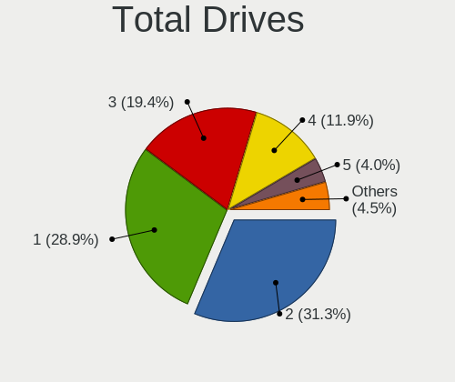
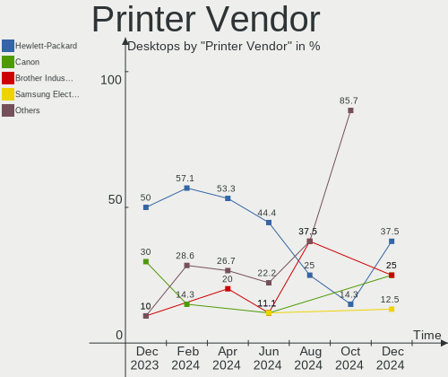

Fedora - Hardware Trends (Desktops)
-----------------------------------

A project to identify most popular hardware characteristics and track their change
over time based on data collected by Linux users at https://Linux-Hardware.org.

Anyone can contribute to this report by the [hw-probe](https://github.com/linuxhw/hw-probe) tool:

    sudo -E hw-probe -all -upload

This report is for one last month. Overall report since the beginning of time: [TestDays](https://github.com/linuxhw/TestDays)

Period: Apr, 2023.

Contents
--------

* [ System ](#system)
  - [ OS                       ](#os)
  - [ OS Family                ](#os-family)
  - [ Kernel                   ](#kernel)
  - [ Kernel Family            ](#kernel-family)
  - [ Kernel Major Ver.        ](#kernel-major-ver)
  - [ Arch                     ](#arch)
  - [ DE                       ](#de)
  - [ Display Server           ](#display-server)
  - [ Display Manager          ](#display-manager)
  - [ OS Lang                  ](#os-lang)
  - [ Boot Mode                ](#boot-mode)
  - [ Filesystem               ](#filesystem)
  - [ Part. scheme             ](#part-scheme)
  - [ Dual Boot with Linux/BSD ](#dual-boot-with-linuxbsd)
  - [ Dual Boot (Win)          ](#dual-boot-win)

* [ Board ](#board)
  - [ Vendor                   ](#vendor)
  - [ Model                    ](#model)
  - [ Model Family             ](#model-family)
  - [ MFG Year                 ](#mfg-year)
  - [ Form Factor              ](#form-factor)
  - [ Secure Boot              ](#secure-boot)
  - [ Coreboot                 ](#coreboot)
  - [ RAM Size                 ](#ram-size)
  - [ RAM Used                 ](#ram-used)
  - [ Total Drives             ](#total-drives)
  - [ Has CD-ROM               ](#has-cd-rom)
  - [ Has Ethernet             ](#has-ethernet)
  - [ Has WiFi                 ](#has-wifi)
  - [ Has Bluetooth            ](#has-bluetooth)

* [ Location ](#location)
  - [ Country                  ](#country)
  - [ City                     ](#city)

* [ Drives ](#drives)
  - [ Drive Vendor             ](#drive-vendor)
  - [ Drive Model              ](#drive-model)
  - [ HDD Vendor               ](#hdd-vendor)
  - [ SSD Vendor               ](#ssd-vendor)
  - [ Drive Kind               ](#drive-kind)
  - [ Drive Connector          ](#drive-connector)
  - [ Drive Size               ](#drive-size)
  - [ Space Total              ](#space-total)
  - [ Space Used               ](#space-used)
  - [ Malfunc. Drives          ](#malfunc-drives)
  - [ Malfunc. Drive Vendor    ](#malfunc-drive-vendor)
  - [ Malfunc. HDD Vendor      ](#malfunc-hdd-vendor)
  - [ Malfunc. Drive Kind      ](#malfunc-drive-kind)
  - [ Failed Drives            ](#failed-drives)
  - [ Failed Drive Vendor      ](#failed-drive-vendor)
  - [ Drive Status             ](#drive-status)

* [ Storage controller ](#storage-controller)
  - [ Storage Vendor           ](#storage-vendor)
  - [ Storage Model            ](#storage-model)
  - [ Storage Kind             ](#storage-kind)

* [ Processor ](#processor)
  - [ CPU Vendor               ](#cpu-vendor)
  - [ CPU Model                ](#cpu-model)
  - [ CPU Model Family         ](#cpu-model-family)
  - [ CPU Cores                ](#cpu-cores)
  - [ CPU Sockets              ](#cpu-sockets)
  - [ CPU Threads              ](#cpu-threads)
  - [ CPU Op-Modes             ](#cpu-op-modes)
  - [ CPU Microcode            ](#cpu-microcode)
  - [ CPU Microarch            ](#cpu-microarch)

* [ Graphics ](#graphics)
  - [ GPU Vendor               ](#gpu-vendor)
  - [ GPU Model                ](#gpu-model)
  - [ GPU Combo                ](#gpu-combo)
  - [ GPU Driver               ](#gpu-driver)
  - [ GPU Memory               ](#gpu-memory)

* [ Monitor ](#monitor)
  - [ Monitor Vendor           ](#monitor-vendor)
  - [ Monitor Model            ](#monitor-model)
  - [ Monitor Resolution       ](#monitor-resolution)
  - [ Monitor Diagonal         ](#monitor-diagonal)
  - [ Monitor Width            ](#monitor-width)
  - [ Aspect Ratio             ](#aspect-ratio)
  - [ Monitor Area             ](#monitor-area)
  - [ Pixel Density            ](#pixel-density)
  - [ Multiple Monitors        ](#multiple-monitors)

* [ Network ](#network)
  - [ Net Controller Vendor    ](#net-controller-vendor)
  - [ Net Controller Model     ](#net-controller-model)
  - [ Wireless Vendor          ](#wireless-vendor)
  - [ Wireless Model           ](#wireless-model)
  - [ Ethernet Vendor          ](#ethernet-vendor)
  - [ Ethernet Model           ](#ethernet-model)
  - [ Net Controller Kind      ](#net-controller-kind)
  - [ Used Controller          ](#used-controller)
  - [ NICs                     ](#nics)
  - [ IPv6                     ](#ipv6)

* [ Bluetooth ](#bluetooth)
  - [ Bluetooth Vendor         ](#bluetooth-vendor)
  - [ Bluetooth Model          ](#bluetooth-model)

* [ Sound ](#sound)
  - [ Sound Vendor             ](#sound-vendor)
  - [ Sound Model              ](#sound-model)

* [ Memory ](#memory)
  - [ Memory Vendor            ](#memory-vendor)
  - [ Memory Model             ](#memory-model)
  - [ Memory Kind              ](#memory-kind)
  - [ Memory Form Factor       ](#memory-form-factor)
  - [ Memory Size              ](#memory-size)
  - [ Memory Speed             ](#memory-speed)

* [ Printers & scanners ](#printers--scanners)
  - [ Printer Vendor           ](#printer-vendor)
  - [ Printer Model            ](#printer-model)
  - [ Scanner Vendor           ](#scanner-vendor)
  - [ Scanner Model            ](#scanner-model)

* [ Camera ](#camera)
  - [ Camera Vendor            ](#camera-vendor)
  - [ Camera Model             ](#camera-model)

* [ Security ](#security)
  - [ Fingerprint Vendor       ](#fingerprint-vendor)
  - [ Fingerprint Model        ](#fingerprint-model)
  - [ Chipcard Vendor          ](#chipcard-vendor)
  - [ Chipcard Model           ](#chipcard-model)

* [ Unsupported ](#unsupported)
  - [ Unsupported Devices      ](#unsupported-devices)
  - [ Unsupported Device Types ](#unsupported-device-types)

System
------

OS
--

Installed operating systems

| Name      | Desktops | Percent |
|-----------|----------|---------|
| Fedora 38 | 77       | 55.8%   |
| Fedora 37 | 53       | 38.41%  |
| Fedora 36 | 7        | 5.07%   |
| Fedora 33 | 1        | 0.72%   |

OS Family
---------

OS without a version

| Name   | Desktops | Percent |
|--------|----------|---------|
| Fedora | 138      | 100%    |

Kernel
------

Version of the Linux kernel

| Version                      | Desktops | Percent |
|------------------------------|----------|---------|
| 6.2.11-300.fc38.x86_64       | 31       | 22.46%  |
| 6.2.12-300.fc38.x86_64       | 19       | 13.77%  |
| 6.2.9-300.fc38.x86_64        | 14       | 10.14%  |
| 6.2.9-200.fc37.x86_64        | 13       | 9.42%   |
| 6.2.10-200.fc37.x86_64       | 13       | 9.42%   |
| 6.2.8-200.fc37.x86_64        | 10       | 7.25%   |
| 6.2.13-300.fc38.x86_64       | 7        | 5.07%   |
| 6.0.7-301.fc37.x86_64        | 4        | 2.9%    |
| 6.2.11-200.fc37.x86_64       | 3        | 2.17%   |
| 6.2.8-100.fc36.x86_64        | 2        | 1.45%   |
| 6.2.12-200.fc37.x86_64       | 2        | 1.45%   |
| 6.2.10-300.fc38.x86_64       | 2        | 1.45%   |
| 6.1.18-200.fc37.x86_64       | 2        | 1.45%   |
| 6.2.8-300.fc38.x86_64        | 1        | 0.72%   |
| 6.2.7-300.fc38.x86_64        | 1        | 0.72%   |
| 6.2.6-300.fc38.x86_64        | 1        | 0.72%   |
| 6.2.2-301.fc38.x86_64        | 1        | 0.72%   |
| 6.2.10-cb2.0.fc37.x86_64     | 1        | 0.72%   |
| 6.2.10-100.fc36.x86_64       | 1        | 0.72%   |
| 6.1.8-100.fc36.x86_64        | 1        | 0.72%   |
| 6.1.18-603.inttf.fc37.x86_64 | 1        | 0.72%   |
| 6.0.9-300.fc37.x86_64        | 1        | 0.72%   |
| 6.0.8-200.fc36.x86_64        | 1        | 0.72%   |
| 6.0.7-200.fc36.x86_64        | 1        | 0.72%   |
| 6.0.18-300.fc37.x86_64       | 1        | 0.72%   |
| 6.0.11-300.fc37.x86_64       | 1        | 0.72%   |
| 5.18.5-201.fsync.fc36.x86_64 | 1        | 0.72%   |
| 5.16.2-rt19.fc34.x86_64      | 1        | 0.72%   |
| 5.15.7-rt23.fc33.x86_64      | 1        | 0.72%   |

Kernel Family
-------------

Linux kernel without a distro release

| Version | Desktops | Percent |
|---------|----------|---------|
| 6.2.11  | 34       | 24.64%  |
| 6.2.9   | 27       | 19.57%  |
| 6.2.12  | 21       | 15.22%  |
| 6.2.10  | 17       | 12.32%  |
| 6.2.8   | 13       | 9.42%   |
| 6.2.13  | 7        | 5.07%   |
| 6.0.7   | 5        | 3.62%   |
| 6.1.18  | 3        | 2.17%   |
| 6.2.7   | 1        | 0.72%   |
| 6.2.6   | 1        | 0.72%   |
| 6.2.2   | 1        | 0.72%   |
| 6.1.8   | 1        | 0.72%   |
| 6.0.9   | 1        | 0.72%   |
| 6.0.8   | 1        | 0.72%   |
| 6.0.18  | 1        | 0.72%   |
| 6.0.11  | 1        | 0.72%   |
| 5.18.5  | 1        | 0.72%   |
| 5.16.2  | 1        | 0.72%   |
| 5.15.7  | 1        | 0.72%   |

Kernel Major Ver.
-----------------

Linux kernel major version

| Version | Desktops | Percent |
|---------|----------|---------|
| 6.2     | 122      | 88.41%  |
| 6.0     | 9        | 6.52%   |
| 6.1     | 4        | 2.9%    |
| 5.18    | 1        | 0.72%   |
| 5.16    | 1        | 0.72%   |
| 5.15    | 1        | 0.72%   |

Arch
----

OS architecture (x86_64, i586, etc.)

| Name   | Desktops | Percent |
|--------|----------|---------|
| x86_64 | 138      | 100%    |

DE
--

Desktop Environment

| Name          | Desktops | Percent |
|---------------|----------|---------|
| GNOME         | 91       | 65.94%  |
| KDE5          | 27       | 19.57%  |
| Cinnamon      | 6        | 4.35%   |
| MATE          | 4        | 2.9%    |
| Unknown       | 3        | 2.17%   |
| XFCE          | 2        | 1.45%   |
| sway          | 1        | 0.72%   |
| LXQt          | 1        | 0.72%   |
| KDE           | 1        | 0.72%   |
| GNOME Classic | 1        | 0.72%   |
| Deepin        | 1        | 0.72%   |

Display Server
--------------

X11 or Wayland

| Name    | Desktops | Percent |
|---------|----------|---------|
| Wayland | 93       | 67.39%  |
| X11     | 34       | 24.64%  |
| Tty     | 9        | 6.52%   |
| Unknown | 2        | 1.45%   |

Display Manager
---------------

SDDM, LightDM, etc.

| Name    | Desktops | Percent |
|---------|----------|---------|
| Unknown | 75       | 54.35%  |
| GDM     | 33       | 23.91%  |
| SDDM    | 20       | 14.49%  |
| LightDM | 10       | 7.25%   |

OS Lang
-------

Language

| Lang  | Desktops | Percent |
|-------|----------|---------|
| en_US | 57       | 41.3%   |
| en_AU | 12       | 8.7%    |
| ru_RU | 9        | 6.52%   |
| en_GB | 9        | 6.52%   |
| de_DE | 8        | 5.8%    |
| pt_BR | 6        | 4.35%   |
| it_IT | 4        | 2.9%    |
| en_CA | 4        | 2.9%    |
| fr_FR | 3        | 2.17%   |
| es_ES | 3        | 2.17%   |
| es_MX | 2        | 1.45%   |
| en_IE | 2        | 1.45%   |
| de_CH | 2        | 1.45%   |
| zh_SG | 1        | 0.72%   |
| tr_TR | 1        | 0.72%   |
| sv_SE | 1        | 0.72%   |
| sr_RS | 1        | 0.72%   |
| pt_PT | 1        | 0.72%   |
| pa_IN | 1        | 0.72%   |
| ja_JP | 1        | 0.72%   |
| hu_HU | 1        | 0.72%   |
| hr_HR | 1        | 0.72%   |
| fr_BE | 1        | 0.72%   |
| es_VE | 1        | 0.72%   |
| es_CL | 1        | 0.72%   |
| es_AR | 1        | 0.72%   |
| en_PH | 1        | 0.72%   |
| en_IN | 1        | 0.72%   |
| en_IL | 1        | 0.72%   |
| en_DK | 1        | 0.72%   |

Boot Mode
---------

EFI or BIOS

| Mode | Desktops | Percent |
|------|----------|---------|
| EFI  | 91       | 65.94%  |
| BIOS | 47       | 34.06%  |

Filesystem
----------

Type of filesystem

| Type    | Desktops | Percent |
|---------|----------|---------|
| Btrfs   | 100      | 72.46%  |
| Ext4    | 31       | 22.46%  |
| Xfs     | 5        | 3.62%   |
| Overlay | 1        | 0.72%   |
| F2fs    | 1        | 0.72%   |

Part. scheme
------------

Scheme of partitioning

| Type    | Desktops | Percent |
|---------|----------|---------|
| Unknown | 71       | 51.45%  |
| GPT     | 52       | 37.68%  |
| MBR     | 15       | 10.87%  |

Dual Boot with Linux/BSD
------------------------

Hosting more than one Linux/BSD

| Dual boot | Desktops | Percent |
|-----------|----------|---------|
| No        | 122      | 88.41%  |
| Yes       | 16       | 11.59%  |

Dual Boot (Win)
---------------

Hosting Linux and Windows

| Dual boot | Desktops | Percent |
|-----------|----------|---------|
| No        | 105      | 76.09%  |
| Yes       | 33       | 23.91%  |

Board
-----

Vendor
------

Motherboard manufacturer

| Name                | Desktops | Percent |
|---------------------|----------|---------|
| ASUSTek Computer    | 38       | 27.54%  |
| Gigabyte Technology | 27       | 19.57%  |
| MSI                 | 20       | 14.49%  |
| Dell                | 12       | 8.7%    |
| ASRock              | 11       | 7.97%   |
| Hewlett-Packard     | 9        | 6.52%   |
| Intel               | 4        | 2.9%    |
| Lenovo              | 3        | 2.17%   |
| Unknown             | 3        | 2.17%   |
| Pegatron            | 2        | 1.45%   |
| Techvision          | 1        | 0.72%   |
| Medion              | 1        | 0.72%   |
| Itautec             | 1        | 0.72%   |
| Huanan              | 1        | 0.72%   |
| ECS                 | 1        | 0.72%   |
| AZW                 | 1        | 0.72%   |
| Apple               | 1        | 0.72%   |
| AMI                 | 1        | 0.72%   |
| Alienware           | 1        | 0.72%   |

Model
-----

Motherboard model

| Name                                | Desktops | Percent |
|-------------------------------------|----------|---------|
| ASUS PRIME A320M-K                  | 3        | 2.17%   |
| Unknown                             | 3        | 2.17%   |
| MSI MS-7C37                         | 2        | 1.45%   |
| MSI MS-7B89                         | 2        | 1.45%   |
| MSI MS-7A40                         | 2        | 1.45%   |
| Gigabyte B450 I AORUS PRO WIFI      | 2        | 1.45%   |
| Gigabyte 970A-DS3P                  | 2        | 1.45%   |
| Dell OptiPlex 7010                  | 2        | 1.45%   |
| Dell OptiPlex 3050                  | 2        | 1.45%   |
| Dell OptiPlex 3020                  | 2        | 1.45%   |
| ASUS TUF Gaming B550M-PLUS          | 2        | 1.45%   |
| ASUS ROG STRIX B650E-F GAMING WIFI  | 2        | 1.45%   |
| ASUS PRIME B550M-A                  | 2        | 1.45%   |
| ASUS All Series                     | 2        | 1.45%   |
| Techvision TVI7309X                 | 1        | 0.72%   |
| Pegatron NY705AA-ABL p6204y         | 1        | 0.72%   |
| Pegatron 320-1030                   | 1        | 0.72%   |
| MSI Z370 Gaming Infinite X(MS-B916) | 1        | 0.72%   |
| MSI MS-7D73                         | 1        | 0.72%   |
| MSI MS-7D54                         | 1        | 0.72%   |
| MSI MS-7D42                         | 1        | 0.72%   |
| MSI MS-7C92                         | 1        | 0.72%   |
| MSI MS-7C84                         | 1        | 0.72%   |
| MSI MS-7C13                         | 1        | 0.72%   |
| MSI MS-7C02                         | 1        | 0.72%   |
| MSI MS-7B86                         | 1        | 0.72%   |
| MSI MS-7B85                         | 1        | 0.72%   |
| MSI MS-7B79                         | 1        | 0.72%   |
| MSI MS-7A12                         | 1        | 0.72%   |
| MSI MS-7885                         | 1        | 0.72%   |
| MSI MS-7388                         | 1        | 0.72%   |
| Medion MS-7728                      | 1        | 0.72%   |
| Lenovo ThinkCentre M93p 10A6A0BBFR  | 1        | 0.72%   |
| Lenovo ThinkCentre M58p 7220A72     | 1        | 0.72%   |
| Lenovo Legion T5 26IAB7 90SV00EMSZ  | 1        | 0.72%   |
| Itautec Infoway ST-4265             | 1        | 0.72%   |
| Intel X79M-S                        | 1        | 0.72%   |
| Intel DZ68DB AAG27985-105           | 1        | 0.72%   |
| Intel DH77EB AAG39073-304           | 1        | 0.72%   |
| Intel DESKTOP 310                   | 1        | 0.72%   |

Model Family
------------

Motherboard model prefix

| Name                 | Desktops | Percent |
|----------------------|----------|---------|
| Dell OptiPlex        | 10       | 7.25%   |
| ASUS PRIME           | 10       | 7.25%   |
| ASUS TUF             | 8        | 5.8%    |
| ASUS ROG             | 7        | 5.07%   |
| Unknown              | 3        | 2.17%   |
| MSI MS-7C37          | 2        | 1.45%   |
| MSI MS-7B89          | 2        | 1.45%   |
| MSI MS-7A40          | 2        | 1.45%   |
| Lenovo ThinkCentre   | 2        | 1.45%   |
| HP ProDesk           | 2        | 1.45%   |
| HP EliteDesk         | 2        | 1.45%   |
| Gigabyte X570S       | 2        | 1.45%   |
| Gigabyte X570        | 2        | 1.45%   |
| Gigabyte B450        | 2        | 1.45%   |
| Gigabyte 970A-DS3P   | 2        | 1.45%   |
| Dell Precision       | 2        | 1.45%   |
| ASUS All             | 2        | 1.45%   |
| ASRock 970           | 2        | 1.45%   |
| Techvision TVI7309X  | 1        | 0.72%   |
| Pegatron NY705AA-ABL | 1        | 0.72%   |
| Pegatron 320-1030    | 1        | 0.72%   |
| MSI Z370             | 1        | 0.72%   |
| MSI MS-7D73          | 1        | 0.72%   |
| MSI MS-7D54          | 1        | 0.72%   |
| MSI MS-7D42          | 1        | 0.72%   |
| MSI MS-7C92          | 1        | 0.72%   |
| MSI MS-7C84          | 1        | 0.72%   |
| MSI MS-7C13          | 1        | 0.72%   |
| MSI MS-7C02          | 1        | 0.72%   |
| MSI MS-7B86          | 1        | 0.72%   |
| MSI MS-7B85          | 1        | 0.72%   |
| MSI MS-7B79          | 1        | 0.72%   |
| MSI MS-7A12          | 1        | 0.72%   |
| MSI MS-7885          | 1        | 0.72%   |
| MSI MS-7388          | 1        | 0.72%   |
| Medion MS-7728       | 1        | 0.72%   |
| Lenovo Legion        | 1        | 0.72%   |
| Itautec Infoway      | 1        | 0.72%   |
| Intel X79M-S         | 1        | 0.72%   |
| Intel DZ68DB         | 1        | 0.72%   |

MFG Year
--------

Motherboard manufacture year

| Year | Desktops | Percent |
|------|----------|---------|
| 2018 | 17       | 12.32%  |
| 2020 | 14       | 10.14%  |
| 2019 | 13       | 9.42%   |
| 2021 | 12       | 8.7%    |
| 2022 | 11       | 7.97%   |
| 2011 | 10       | 7.25%   |
| 2013 | 9        | 6.52%   |
| 2017 | 8        | 5.8%    |
| 2012 | 8        | 5.8%    |
| 2015 | 7        | 5.07%   |
| 2016 | 6        | 4.35%   |
| 2014 | 6        | 4.35%   |
| 2023 | 5        | 3.62%   |
| 2010 | 5        | 3.62%   |
| 2008 | 3        | 2.17%   |
| 2009 | 2        | 1.45%   |
| 2007 | 1        | 0.72%   |
| 2006 | 1        | 0.72%   |

Form Factor
-----------

Physical design of the computer

| Name    | Desktops | Percent |
|---------|----------|---------|
| Desktop | 138      | 100%    |

Secure Boot
-----------

Enabled or disabled

| State    | Desktops | Percent |
|----------|----------|---------|
| Disabled | 127      | 92.03%  |
| Enabled  | 11       | 7.97%   |

Coreboot
--------

Have coreboot on board

| Used | Desktops | Percent |
|------|----------|---------|
| No   | 138      | 100%    |

RAM Size
--------

Total RAM memory

| Size in GB  | Desktops | Percent |
|-------------|----------|---------|
| 16.01-24.0  | 49       | 35.51%  |
| 32.01-64.0  | 30       | 21.74%  |
| 8.01-16.0   | 18       | 13.04%  |
| 4.01-8.0    | 13       | 9.42%   |
| 64.01-256.0 | 12       | 8.7%    |
| 24.01-32.0  | 11       | 7.97%   |
| 3.01-4.0    | 5        | 3.62%   |

RAM Used
--------

Used RAM memory

| Used GB     | Desktops | Percent |
|-------------|----------|---------|
| 4.01-8.0    | 43       | 31.16%  |
| 2.01-3.0    | 35       | 25.36%  |
| 3.01-4.0    | 29       | 21.01%  |
| 1.01-2.0    | 15       | 10.87%  |
| 8.01-16.0   | 9        | 6.52%   |
| 16.01-24.0  | 3        | 2.17%   |
| 0.51-1.0    | 3        | 2.17%   |
| 64.01-256.0 | 1        | 0.72%   |

Total Drives
------------

Number of drives on board

| Drives | Desktops | Percent |
|--------|----------|---------|
| 1      | 45       | 32.61%  |
| 2      | 44       | 31.88%  |
| 3      | 21       | 15.22%  |
| 4      | 19       | 13.77%  |
| 5      | 5        | 3.62%   |
| 6      | 3        | 2.17%   |
| 11     | 1        | 0.72%   |

Has CD-ROM
----------

Has CD-ROM on board

| Presented | Desktops | Percent |
|-----------|----------|---------|
| No        | 96       | 69.57%  |
| Yes       | 42       | 30.43%  |

Has Ethernet
------------

Has Ethernet on board

| Presented | Desktops | Percent |
|-----------|----------|---------|
| Yes       | 137      | 99.28%  |
| No        | 1        | 0.72%   |

Has WiFi
--------

Has WiFi module

| Presented | Desktops | Percent |
|-----------|----------|---------|
| Yes       | 78       | 56.52%  |
| No        | 60       | 43.48%  |

Has Bluetooth
-------------

Has Bluetooth module

| Presented | Desktops | Percent |
|-----------|----------|---------|
| No        | 72       | 52.17%  |
| Yes       | 66       | 47.83%  |

Location
--------

Country
-------

Geographic location (country)

| Country     | Desktops | Percent |
|-------------|----------|---------|
| USA         | 34       | 24.64%  |
| Australia   | 11       | 7.97%   |
| Russia      | 8        | 5.8%    |
| Germany     | 8        | 5.8%    |
| Brazil      | 8        | 5.8%    |
| UK          | 5        | 3.62%   |
| Canada      | 5        | 3.62%   |
| Netherlands | 4        | 2.9%    |
| Italy       | 4        | 2.9%    |
| Switzerland | 3        | 2.17%   |
| Spain       | 3        | 2.17%   |
| Poland      | 3        | 2.17%   |
| Norway      | 3        | 2.17%   |
| France      | 3        | 2.17%   |
| Sweden      | 2        | 1.45%   |
| Serbia      | 2        | 1.45%   |
| Mexico      | 2        | 1.45%   |
| Israel      | 2        | 1.45%   |
| Ireland     | 2        | 1.45%   |
| Hungary     | 2        | 1.45%   |
| Belarus     | 2        | 1.45%   |
| Ukraine     | 1        | 0.72%   |
| Turkey      | 1        | 0.72%   |
| Taiwan      | 1        | 0.72%   |
| Slovenia    | 1        | 0.72%   |
| Singapore   | 1        | 0.72%   |
| Romania     | 1        | 0.72%   |
| Portugal    | 1        | 0.72%   |
| Philippines | 1        | 0.72%   |
| Nicaragua   | 1        | 0.72%   |
| Malaysia    | 1        | 0.72%   |
| Japan       | 1        | 0.72%   |
| India       | 1        | 0.72%   |
| Hong Kong   | 1        | 0.72%   |
| Greece      | 1        | 0.72%   |
| Finland     | 1        | 0.72%   |
| Denmark     | 1        | 0.72%   |
| Czechia     | 1        | 0.72%   |
| Chile       | 1        | 0.72%   |
| Belgium     | 1        | 0.72%   |

City
----

Geographic location (city)

| City               | Desktops | Percent |
|--------------------|----------|---------|
| Sydney             | 8        | 5.8%    |
| Seattle            | 3        | 2.17%   |
| Woodstock          | 2        | 1.45%   |
| Ober-Morlen        | 2        | 1.45%   |
| Minsk              | 2        | 1.45%   |
| Melbourne          | 2        | 1.45%   |
| Kristiansand       | 2        | 1.45%   |
| Bournemouth        | 2        | 1.45%   |
| Belgrade           | 2        | 1.45%   |
| Balashikha         | 2        | 1.45%   |
| Yekaterinburg      | 1        | 0.72%   |
| Wroclaw            | 1        | 0.72%   |
| Winnipeg           | 1        | 0.72%   |
| Vise               | 1        | 0.72%   |
| Vienna             | 1        | 0.72%   |
| Uster              | 1        | 0.72%   |
| Turku              | 1        | 0.72%   |
| Tsarskoye Selo     | 1        | 0.72%   |
| Treillieres        | 1        | 0.72%   |
| Toronto            | 1        | 0.72%   |
| Tokyo              | 1        | 0.72%   |
| Titusville         | 1        | 0.72%   |
| The Bronx          | 1        | 0.72%   |
| Teresina           | 1        | 0.72%   |
| Tainan City        | 1        | 0.72%   |
| Suwałki           | 1        | 0.72%   |
| Stavern            | 1        | 0.72%   |
| Stafford           | 1        | 0.72%   |
| St Petersburg      | 1        | 0.72%   |
| Springfield        | 1        | 0.72%   |
| South Bend         | 1        | 0.72%   |
| Soltau             | 1        | 0.72%   |
| Singapore          | 1        | 0.72%   |
| Santiago           | 1        | 0.72%   |
| Saint Clair Shores | 1        | 0.72%   |
| Rochester          | 1        | 0.72%   |
| Riverside          | 1        | 0.72%   |
| Racine             | 1        | 0.72%   |
| Queens             | 1        | 0.72%   |
| Purmerend          | 1        | 0.72%   |

Drives
------

Drive Vendor
------------

Hard drive vendors

| Vendor                      | Desktops | Drives | Percent |
|-----------------------------|----------|--------|---------|
| Samsung Electronics         | 43       | 64     | 15.75%  |
| WDC                         | 40       | 51     | 14.65%  |
| Seagate                     | 35       | 38     | 12.82%  |
| Crucial                     | 26       | 32     | 9.52%   |
| Kingston                    | 19       | 20     | 6.96%   |
| Sandisk                     | 16       | 18     | 5.86%   |
| Toshiba                     | 15       | 15     | 5.49%   |
| Intel                       | 9        | 9      | 3.3%    |
| Hitachi                     | 7        | 8      | 2.56%   |
| Phison Electronics          | 4        | 7      | 1.47%   |
| Silicon Motion              | 3        | 3      | 1.1%    |
| PNY                         | 3        | 4      | 1.1%    |
| A-DATA Technology           | 3        | 3      | 1.1%    |
| SPCC                        | 2        | 2      | 0.73%   |
| SK hynix                    | 2        | 2      | 0.73%   |
| Patriot                     | 2        | 2      | 0.73%   |
| Mushkin                     | 2        | 2      | 0.73%   |
| Micron/Crucial Technology   | 2        | 2      | 0.73%   |
| Micron Technology           | 2        | 2      | 0.73%   |
| KIOXIA                      | 2        | 2      | 0.73%   |
| Kingston Technology Company | 2        | 3      | 0.73%   |
| KingSpec                    | 2        | 2      | 0.73%   |
| Corsair                     | 2        | 2      | 0.73%   |
| China                       | 2        | 2      | 0.73%   |
| Yeestor                     | 1        | 1      | 0.37%   |
| XPG                         | 1        | 1      | 0.37%   |
| Verbatim                    | 1        | 1      | 0.37%   |
| USB                         | 1        | 1      | 0.37%   |
| Unknown                     | 1        | 1      | 0.37%   |
| TO Exter                    | 1        | 1      | 0.37%   |
| TAMMUZ                      | 1        | 1      | 0.37%   |
| Smartbuy                    | 1        | 1      | 0.37%   |
| Seagate Technology          | 1        | 2      | 0.37%   |
| Realtek Semiconductor       | 1        | 2      | 0.37%   |
| OCZ                         | 1        | 1      | 0.37%   |
| Netac                       | 1        | 1      | 0.37%   |
| MAXIO Technology (Hangzhou) | 1        | 1      | 0.37%   |
| KingFast                    | 1        | 1      | 0.37%   |
| JMicron Technology          | 1        | 1      | 0.37%   |
| JAMESDONKEY                 | 1        | 1      | 0.37%   |

Drive Model
-----------

Hard drive models

| Model                                                  | Desktops | Percent |
|--------------------------------------------------------|----------|---------|
| Crucial CT500MX500SSD1 500GB                           | 7        | 2.32%   |
| Samsung NVMe SSD Controller PM9A1/PM9A3/980PRO 2TB     | 6        | 1.99%   |
| WDC WDS500G2B0A-00SM50 500GB SSD                       | 5        | 1.66%   |
| Samsung SSD 860 EVO 1TB                                | 5        | 1.66%   |
| Samsung NVMe SSD Controller SM981/PM981/PM983 1TB      | 5        | 1.66%   |
| Crucial CT1000MX500SSD1 1TB                            | 5        | 1.66%   |
| Toshiba HDWD110 1TB                                    | 4        | 1.32%   |
| Samsung SSD 980 PRO 1TB                                | 4        | 1.32%   |
| Kingston SA400S37240G 240GB SSD                        | 4        | 1.32%   |
| Silicon Motion SM2263EN/SM2263XT SSD Controller 1024GB | 3        | 0.99%   |
| Seagate ST500DM002-1BD142 500GB                        | 3        | 0.99%   |
| Sandisk WD Blue SN550 NVMe SSD 1024GB                  | 3        | 0.99%   |
| Samsung SSD 860 EVO 500GB                              | 3        | 0.99%   |
| Samsung SSD 850 EVO 250GB                              | 3        | 0.99%   |
| Phison E16 PCIe4 NVMe Controller 500GB                 | 3        | 0.99%   |
| WDC WD6002FFWX-68TZ4N0 6TB                             | 2        | 0.66%   |
| WDC WD30EFRX-68EUZN0 3TB                               | 2        | 0.66%   |
| Toshiba DT01ACA100 1TB                                 | 2        | 0.66%   |
| Toshiba DT01ACA050 500GB                               | 2        | 0.66%   |
| Seagate ST31000528AS 1TB                               | 2        | 0.66%   |
| Seagate ST3000DM001-1CH166 3TB                         | 2        | 0.66%   |
| Seagate ST2000DM008-2UB102 2TB                         | 2        | 0.66%   |
| Seagate ST2000DM006-2DM164 2TB                         | 2        | 0.66%   |
| Seagate ST1000LM035-1RK172 970GB                       | 2        | 0.66%   |
| Seagate ST1000DM003-1SB102 1TB                         | 2        | 0.66%   |
| Samsung SSD 970 EVO Plus 250GB                         | 2        | 0.66%   |
| Samsung SSD 860 EVO 250GB                              | 2        | 0.66%   |
| Samsung SSD 850 EVO 500GB                              | 2        | 0.66%   |
| PNY CS900 240GB SSD                                    | 2        | 0.66%   |
| Micron/Crucial P2 NVMe PCIe SSD 1TB                    | 2        | 0.66%   |
| Kingston SNVS500G 500GB                                | 2        | 0.66%   |
| Intel SSDSC2CT120A3 120GB                              | 2        | 0.66%   |
| Intel SSD 600P Series 256GB                            | 2        | 0.66%   |
| Crucial CT500P1SSD8 500GB                              | 2        | 0.66%   |
| Crucial CT480BX500SSD1 480GB                           | 2        | 0.66%   |
| Crucial CT2000MX500SSD1 2TB                            | 2        | 0.66%   |
| Crucial CT120M500SSD1 120GB                            | 2        | 0.66%   |
| China SSD 1TB                                          | 2        | 0.66%   |
| Yeestor 512GB                                          | 1        | 0.33%   |
| XPG NVMe SSD Drive 2TB                                 | 1        | 0.33%   |

HDD Vendor
----------

Hard disk drive vendors

| Vendor              | Desktops | Drives | Percent |
|---------------------|----------|--------|---------|
| Seagate             | 35       | 38     | 38.04%  |
| WDC                 | 30       | 38     | 32.61%  |
| Toshiba             | 12       | 12     | 13.04%  |
| Hitachi             | 7        | 8      | 7.61%   |
| Samsung Electronics | 3        | 4      | 3.26%   |
| USB                 | 1        | 1      | 1.09%   |
| Unknown             | 1        | 1      | 1.09%   |
| JMicron Technology  | 1        | 1      | 1.09%   |
| HGST                | 1        | 1      | 1.09%   |
| ASMT                | 1        | 2      | 1.09%   |

SSD Vendor
----------

Solid state drive vendors

| Vendor              | Desktops | Drives | Percent |
|---------------------|----------|--------|---------|
| Samsung Electronics | 24       | 28     | 20.69%  |
| Crucial             | 24       | 27     | 20.69%  |
| Kingston            | 12       | 12     | 10.34%  |
| WDC                 | 10       | 11     | 8.62%   |
| SanDisk             | 7        | 7      | 6.03%   |
| Intel               | 6        | 6      | 5.17%   |
| PNY                 | 3        | 4      | 2.59%   |
| A-DATA Technology   | 3        | 3      | 2.59%   |
| SPCC                | 2        | 2      | 1.72%   |
| Patriot             | 2        | 2      | 1.72%   |
| Mushkin             | 2        | 2      | 1.72%   |
| KingSpec            | 2        | 2      | 1.72%   |
| Corsair             | 2        | 2      | 1.72%   |
| China               | 2        | 2      | 1.72%   |
| Verbatim            | 1        | 1      | 0.86%   |
| Toshiba             | 1        | 1      | 0.86%   |
| TO Exter            | 1        | 1      | 0.86%   |
| TAMMUZ              | 1        | 1      | 0.86%   |
| Smartbuy            | 1        | 1      | 0.86%   |
| OCZ                 | 1        | 1      | 0.86%   |
| Micron Technology   | 1        | 1      | 0.86%   |
| GOODRAM             | 1        | 2      | 0.86%   |
| Gigabyte Technology | 1        | 1      | 0.86%   |
| Fanxiang            | 1        | 1      | 0.86%   |
| ASENNO              | 1        | 1      | 0.86%   |
| Apple               | 1        | 1      | 0.86%   |
| AMD                 | 1        | 1      | 0.86%   |
| Acer                | 1        | 1      | 0.86%   |
| 2.5"                | 1        | 1      | 0.86%   |

Drive Kind
----------

HDD or SSD

| Kind    | Desktops | Drives | Percent |
|---------|----------|--------|---------|
| SSD     | 92       | 126    | 39.48%  |
| HDD     | 73       | 106    | 31.33%  |
| NVMe    | 64       | 91     | 27.47%  |
| Unknown | 4        | 4      | 1.72%   |

Drive Connector
---------------

SATA, SAS, NVMe, etc.

| Type | Desktops | Drives | Percent |
|------|----------|--------|---------|
| SATA | 119      | 227    | 62.63%  |
| NVMe | 64       | 91     | 33.68%  |
| SAS  | 7        | 9      | 3.68%   |

Drive Size
----------

Size of hard drive

| Size in TB | Desktops | Drives | Percent |
|------------|----------|--------|---------|
| 0.01-0.5   | 76       | 116    | 44.44%  |
| 0.51-1.0   | 56       | 68     | 32.75%  |
| 1.01-2.0   | 24       | 27     | 14.04%  |
| 2.01-3.0   | 6        | 11     | 3.51%   |
| 4.01-10.0  | 6        | 7      | 3.51%   |
| 3.01-4.0   | 3        | 3      | 1.75%   |

Space Total
-----------

Amount of disk space available on the file system

| Size in GB     | Desktops | Percent |
|----------------|----------|---------|
| 1001-2000      | 27       | 19.57%  |
| 501-1000       | 22       | 15.94%  |
| More than 3000 | 21       | 15.22%  |
| 251-500        | 18       | 13.04%  |
| 101-250        | 16       | 11.59%  |
| 2001-3000      | 12       | 8.7%    |
| 1-20           | 7        | 5.07%   |
| Unknown        | 7        | 5.07%   |
| 51-100         | 6        | 4.35%   |
| 21-50          | 2        | 1.45%   |

Space Used
----------

Amount of used disk space

| Used GB        | Desktops | Percent |
|----------------|----------|---------|
| 1-20           | 32       | 23.19%  |
| 21-50          | 26       | 18.84%  |
| 501-1000       | 18       | 13.04%  |
| 251-500        | 14       | 10.14%  |
| 101-250        | 12       | 8.7%    |
| 1001-2000      | 10       | 7.25%   |
| 51-100         | 9        | 6.52%   |
| Unknown        | 7        | 5.07%   |
| 2001-3000      | 6        | 4.35%   |
| More than 3000 | 4        | 2.9%    |

Malfunc. Drives
---------------

Drive models with a malfunction

| Model                                 | Desktops | Drives | Percent |
|---------------------------------------|----------|--------|---------|
| Crucial CT120M500SSD1 120GB           | 2        | 2      | 8%      |
| WDC WD5000AADS-00S9B0 500GB           | 1        | 1      | 4%      |
| WDC WD2500AAKX-753CA1 250GB           | 1        | 1      | 4%      |
| WDC WD10EZEX-00BN5A0 1TB              | 1        | 1      | 4%      |
| Seagate ST500DM002-1BD142 500GB       | 1        | 1      | 4%      |
| Seagate ST3750528AS 752GB             | 1        | 1      | 4%      |
| Seagate ST3500418AS 500GB             | 1        | 1      | 4%      |
| Seagate ST31500341AS 1TB              | 1        | 1      | 4%      |
| Seagate ST31000524AS 1TB              | 1        | 1      | 4%      |
| Seagate ST3000DM001-1CH166 3TB        | 1        | 1      | 4%      |
| Seagate ST2000LX001-1RG174 2TB        | 1        | 1      | 4%      |
| Seagate ST2000DL003-9VT166 2TB        | 1        | 1      | 4%      |
| SanDisk SSD PLUS 480GB                | 1        | 1      | 4%      |
| SanDisk SSD PLUS 240GB                | 1        | 1      | 4%      |
| Samsung Electronics SSD 870 EVO 250GB | 1        | 1      | 4%      |
| Samsung Electronics SSD 870 EVO 1TB   | 1        | 1      | 4%      |
| Samsung Electronics HD501LJ 500GB     | 1        | 2      | 4%      |
| Samsung Electronics HD154UI 1TB       | 1        | 1      | 4%      |
| Kingston SA400S37240G 240GB SSD       | 1        | 1      | 4%      |
| KingSpec NT-256 256GB SSD             | 1        | 1      | 4%      |
| Intel SSDSC2CT120A3 120GB             | 1        | 1      | 4%      |
| Intel SSDSC2BF240A5L 240GB            | 1        | 1      | 4%      |
| Crucial CT750MX300SSD1 752GB          | 1        | 1      | 4%      |
| Crucial CT275MX300SSD1 275GB          | 1        | 1      | 4%      |

Malfunc. Drive Vendor
---------------------

Vendors of faulty drives

| Vendor              | Desktops | Drives | Percent |
|---------------------|----------|--------|---------|
| Seagate             | 8        | 8      | 32%     |
| Samsung Electronics | 4        | 5      | 16%     |
| Crucial             | 4        | 4      | 16%     |
| WDC                 | 3        | 3      | 12%     |
| SanDisk             | 2        | 2      | 8%      |
| Intel               | 2        | 2      | 8%      |
| Kingston            | 1        | 1      | 4%      |
| KingSpec            | 1        | 1      | 4%      |

Malfunc. HDD Vendor
-------------------

Vendors of faulty HDD drives

| Vendor              | Desktops | Drives | Percent |
|---------------------|----------|--------|---------|
| Seagate             | 8        | 8      | 61.54%  |
| WDC                 | 3        | 3      | 23.08%  |
| Samsung Electronics | 2        | 3      | 15.38%  |

Malfunc. Drive Kind
-------------------

Kinds of faulty drives

| Kind | Desktops | Drives | Percent |
|------|----------|--------|---------|
| HDD  | 13       | 14     | 54.17%  |
| SSD  | 11       | 12     | 45.83%  |

Failed Drives
-------------

Failed drive models

| Model                    | Desktops | Drives | Percent |
|--------------------------|----------|--------|---------|
| Seagate ST31000528AS 1TB | 1        | 1      | 100%    |

Failed Drive Vendor
-------------------

Failed drive vendors

| Vendor  | Desktops | Drives | Percent |
|---------|----------|--------|---------|
| Seagate | 1        | 1      | 100%    |

Drive Status
------------

Number of failed and malfunc. drives

| Status   | Desktops | Drives | Percent |
|----------|----------|--------|---------|
| Detected | 78       | 173    | 47.85%  |
| Works    | 61       | 127    | 37.42%  |
| Malfunc  | 23       | 26     | 14.11%  |
| Failed   | 1        | 1      | 0.61%   |

Storage controller
------------------

Storage Vendor
--------------

Storage controller vendors

| Vendor                       | Desktops | Percent |
|------------------------------|----------|---------|
| Intel                        | 67       | 31.02%  |
| AMD                          | 67       | 31.02%  |
| Samsung Electronics          | 24       | 11.11%  |
| SanDisk                      | 12       | 5.56%   |
| Kingston Technology Company  | 9        | 4.17%   |
| ASMedia Technology           | 5        | 2.31%   |
| Silicon Motion               | 4        | 1.85%   |
| Phison Electronics           | 4        | 1.85%   |
| Micron/Crucial Technology    | 4        | 1.85%   |
| JMicron Technology           | 4        | 1.85%   |
| Toshiba America Info Systems | 2        | 0.93%   |
| SK hynix                     | 2        | 0.93%   |
| Marvell Technology Group     | 2        | 0.93%   |
| KIOXIA                       | 2        | 0.93%   |
| Seagate Technology           | 1        | 0.46%   |
| Realtek Semiconductor        | 1        | 0.46%   |
| PMC-Sierra                   | 1        | 0.46%   |
| Netac Technology             | 1        | 0.46%   |
| Micron Technology            | 1        | 0.46%   |
| MAXIO Technology (Hangzhou)  | 1        | 0.46%   |
| LSI Logic / Symbios Logic    | 1        | 0.46%   |
| INNOGRIT                     | 1        | 0.46%   |

Storage Model
-------------

Storage controller models

| Model                                                                                   | Desktops | Percent |
|-----------------------------------------------------------------------------------------|----------|---------|
| AMD FCH SATA Controller [AHCI mode]                                                     | 41       | 15.83%  |
| AMD 400 Series Chipset SATA Controller                                                  | 14       | 5.41%   |
| AMD 500 Series Chipset SATA Controller                                                  | 13       | 5.02%   |
| Samsung NVMe SSD Controller SM981/PM981/PM983                                           | 11       | 4.25%   |
| Samsung NVMe SSD Controller PM9A1/PM9A3/980PRO                                          | 10       | 3.86%   |
| Intel 8 Series/C220 Series Chipset Family 6-port SATA Controller 1 [AHCI mode]          | 8        | 3.09%   |
| Intel 6 Series/C200 Series Chipset Family 6 port Desktop SATA AHCI Controller           | 8        | 3.09%   |
| AMD SB7x0/SB8x0/SB9x0 IDE Controller                                                    | 8        | 3.09%   |
| Intel Alder Lake-S PCH SATA Controller [AHCI Mode]                                      | 7        | 2.7%    |
| Intel Q170/Q150/B150/H170/H110/Z170/CM236 Chipset SATA Controller [AHCI Mode]           | 6        | 2.32%   |
| Intel 7 Series/C210 Series Chipset Family 6-port SATA Controller [AHCI mode]            | 6        | 2.32%   |
| AMD SB7x0/SB8x0/SB9x0 SATA Controller [AHCI mode]                                       | 6        | 2.32%   |
| Intel SATA Controller [RAID mode]                                                       | 5        | 1.93%   |
| ASMedia ASM1062 Serial ATA Controller                                                   | 5        | 1.93%   |
| Silicon Motion SM2263EN/SM2263XT SSD Controller                                         | 4        | 1.54%   |
| Kingston Company Company Non-Volatile memory controller                                 | 4        | 1.54%   |
| Intel Volume Management Device NVMe RAID Controller                                     | 4        | 1.54%   |
| Intel 200 Series PCH SATA controller [AHCI mode]                                        | 4        | 1.54%   |
| AMD FCH SATA Controller D                                                               | 4        | 1.54%   |
| SanDisk WD Blue SN550 NVMe SSD                                                          | 3        | 1.16%   |
| SanDisk Non-Volatile memory controller                                                  | 3        | 1.16%   |
| Phison E16 PCIe4 NVMe Controller                                                        | 3        | 1.16%   |
| Micron/Crucial P2 NVMe PCIe SSD                                                         | 3        | 1.16%   |
| Intel Cannon Lake PCH SATA AHCI Controller                                              | 3        | 1.16%   |
| Intel C610/X99 series chipset 6-Port SATA Controller [AHCI mode]                        | 3        | 1.16%   |
| SK hynix Gold P31/PC711 NVMe Solid State Drive                                          | 2        | 0.77%   |
| Sandisk Western Digital WD Black SN850X NVMe SSD                                        | 2        | 0.77%   |
| SanDisk WD Black SN750 / PC SN730 NVMe SSD                                              | 2        | 0.77%   |
| Marvell Group 88SE9172 SATA 6Gb/s Controller                                            | 2        | 0.77%   |
| KIOXIA Non-Volatile memory controller                                                   | 2        | 0.77%   |
| Kingston Company A2000 NVMe SSD                                                         | 2        | 0.77%   |
| JMicron JMB363 SATA/IDE Controller                                                      | 2        | 0.77%   |
| Intel SSD 600P Series                                                                   | 2        | 0.77%   |
| Intel 6 Series/C200 Series Chipset Family Desktop SATA Controller (IDE mode, ports 4-5) | 2        | 0.77%   |
| Intel 6 Series/C200 Series Chipset Family Desktop SATA Controller (IDE mode, ports 0-3) | 2        | 0.77%   |
| AMD SB7x0/SB8x0/SB9x0 SATA Controller [IDE mode]                                        | 2        | 0.77%   |
| AMD 300 Series Chipset SATA Controller                                                  | 2        | 0.77%   |
| Toshiba America Info Systems XG6 NVMe SSD Controller                                    | 1        | 0.39%   |
| Toshiba America Info Systems NVMe Controller                                            | 1        | 0.39%   |
| Seagate FireCuda 520 SSD                                                                | 1        | 0.39%   |

Storage Kind
------------

Kind of storage controller (IDE, SATA, NVMe, SAS, ...)

| Kind | Desktops | Percent |
|------|----------|---------|
| SATA | 125      | 57.34%  |
| NVMe | 62       | 28.44%  |
| IDE  | 18       | 8.26%   |
| RAID | 11       | 5.05%   |
| SAS  | 1        | 0.46%   |
| SCSI | 1        | 0.46%   |

Processor
---------

CPU Vendor
----------

Processor vendors

| Vendor | Desktops | Percent |
|--------|----------|---------|
| AMD    | 70       | 50.72%  |
| Intel  | 68       | 49.28%  |

CPU Model
---------

Processor models

| Model                                       | Desktops | Percent |
|---------------------------------------------|----------|---------|
| AMD Ryzen 5 5600X 6-Core Processor          | 5        | 3.62%   |
| AMD Ryzen 9 5900X 12-Core Processor         | 4        | 2.9%    |
| AMD Ryzen 7 5700G with Radeon Graphics      | 4        | 2.9%    |
| Intel Core i7-3770 CPU @ 3.40GHz            | 3        | 2.17%   |
| AMD Ryzen 7 5800X 8-Core Processor          | 3        | 2.17%   |
| AMD Ryzen 5 5600G with Radeon Graphics      | 3        | 2.17%   |
| AMD Ryzen 5 3600 6-Core Processor           | 3        | 2.17%   |
| AMD Ryzen 5 2600 Six-Core Processor         | 3        | 2.17%   |
| Intel Core i7-9700 CPU @ 3.00GHz            | 2        | 1.45%   |
| Intel Core i7-4770 CPU @ 3.40GHz            | 2        | 1.45%   |
| Intel Core i5-6500 CPU @ 3.20GHz            | 2        | 1.45%   |
| Intel Core i5-4570 CPU @ 3.20GHz            | 2        | 1.45%   |
| Intel Core i5-2400 CPU @ 3.10GHz            | 2        | 1.45%   |
| Intel 12th Gen Core i7-12700F               | 2        | 1.45%   |
| AMD Ryzen 9 7950X 16-Core Processor         | 2        | 1.45%   |
| AMD Ryzen 9 7900X 12-Core Processor         | 2        | 1.45%   |
| AMD Ryzen 9 3900X 12-Core Processor         | 2        | 1.45%   |
| AMD Ryzen 7 3700X 8-Core Processor          | 2        | 1.45%   |
| AMD Ryzen 5 5600 6-Core Processor           | 2        | 1.45%   |
| AMD Ryzen 5 3600X 6-Core Processor          | 2        | 1.45%   |
| AMD Ryzen 5 1600 Six-Core Processor         | 2        | 1.45%   |
| AMD Phenom II X2 570 Processor              | 2        | 1.45%   |
| Intel Xeon CPU X5675 @ 3.07GHz              | 1        | 0.72%   |
| Intel Xeon CPU X5650 @ 2.67GHz              | 1        | 0.72%   |
| Intel Xeon CPU E5-2690 0 @ 2.90GHz          | 1        | 0.72%   |
| Intel Xeon CPU E5-2670 v2 @ 2.50GHz         | 1        | 0.72%   |
| Intel Xeon CPU E5-2603 v4 @ 1.70GHz         | 1        | 0.72%   |
| Intel Xeon CPU E5-1650 v3 @ 3.50GHz         | 1        | 0.72%   |
| Intel Xeon CPU E5-1650 v2 @ 3.50GHz         | 1        | 0.72%   |
| Intel Xeon CPU E5-1603 v3 @ 2.80GHz         | 1        | 0.72%   |
| Intel Xeon CPU E3-1231 v3 @ 3.40GHz         | 1        | 0.72%   |
| Intel Xeon CPU E3-1230 v5 @ 3.40GHz         | 1        | 0.72%   |
| Intel Pentium Dual-Core CPU E5400 @ 2.70GHz | 1        | 0.72%   |
| Intel Pentium CPU G630 @ 2.70GHz            | 1        | 0.72%   |
| Intel Core i9-10850K CPU @ 3.60GHz          | 1        | 0.72%   |
| Intel Core i7-8700K CPU @ 3.70GHz           | 1        | 0.72%   |
| Intel Core i7-8700 CPU @ 3.20GHz            | 1        | 0.72%   |
| Intel Core i7-7700K CPU @ 4.20GHz           | 1        | 0.72%   |
| Intel Core i7-6700K CPU @ 4.00GHz           | 1        | 0.72%   |
| Intel Core i7-6700 CPU @ 3.40GHz            | 1        | 0.72%   |

CPU Model Family
----------------

Processor model prefix

| Model                   | Desktops | Percent |
|-------------------------|----------|---------|
| AMD Ryzen 5             | 23       | 16.67%  |
| Intel Core i5           | 17       | 12.32%  |
| Intel Core i7           | 16       | 11.59%  |
| AMD Ryzen 9             | 15       | 10.87%  |
| AMD Ryzen 7             | 12       | 8.7%    |
| Intel Xeon              | 10       | 7.25%   |
| Other                   | 9        | 6.52%   |
| Intel Core i3           | 7        | 5.07%   |
| AMD FX                  | 4        | 2.9%    |
| Intel Celeron           | 2        | 1.45%   |
| AMD Phenom II X4        | 2        | 1.45%   |
| AMD Phenom II X2        | 2        | 1.45%   |
| AMD A4                  | 2        | 1.45%   |
| AMD A10                 | 2        | 1.45%   |
| Intel Pentium Dual-Core | 1        | 0.72%   |
| Intel Pentium           | 1        | 0.72%   |
| Intel Core i9           | 1        | 0.72%   |
| Intel Core 2 Quad       | 1        | 0.72%   |
| Intel Core 2 Duo        | 1        | 0.72%   |
| Intel Core 2            | 1        | 0.72%   |
| Intel Atom              | 1        | 0.72%   |
| AMD Ryzen Threadripper  | 1        | 0.72%   |
| AMD Ryzen 7 PRO         | 1        | 0.72%   |
| AMD Ryzen 5 PRO         | 1        | 0.72%   |
| AMD Ryzen 3             | 1        | 0.72%   |
| AMD Phenom II X6        | 1        | 0.72%   |
| AMD E2                  | 1        | 0.72%   |
| AMD Athlon              | 1        | 0.72%   |
| AMD A8                  | 1        | 0.72%   |

CPU Cores
---------

Number of processor cores

| Number | Desktops | Percent |
|--------|----------|---------|
| 4      | 42       | 30.43%  |
| 6      | 33       | 23.91%  |
| 2      | 19       | 13.77%  |
| 8      | 18       | 13.04%  |
| 12     | 14       | 10.14%  |
| 16     | 6        | 4.35%   |
| 10     | 2        | 1.45%   |
| 3      | 2        | 1.45%   |
| 24     | 1        | 0.72%   |
| 1      | 1        | 0.72%   |

CPU Sockets
-----------

Number of sockets

| Number | Desktops | Percent |
|--------|----------|---------|
| 1      | 136      | 98.55%  |
| 2      | 2        | 1.45%   |

CPU Threads
-----------

Threads per core (Hyper-Threading)

| Number | Desktops | Percent |
|--------|----------|---------|
| 2      | 100      | 72.46%  |
| 1      | 38       | 27.54%  |

CPU Op-Modes
------------

CPU Operation Modes (32-bit, 64-bit)

| Op mode        | Desktops | Percent |
|----------------|----------|---------|
| 32-bit, 64-bit | 138      | 100%    |

CPU Microcode
-------------

Microcode number

| Number     | Desktops | Percent |
|------------|----------|---------|
| Unknown    | 65       | 47.1%   |
| 0x08701021 | 8        | 5.8%    |
| 0x0a20120a | 7        | 5.07%   |
| 0x0a601203 | 6        | 4.35%   |
| 0x0800820d | 5        | 3.62%   |
| 0x0a50000d | 3        | 2.17%   |
| 0x0a50000c | 3        | 2.17%   |
| 0x08108109 | 3        | 2.17%   |
| 0x506e3    | 2        | 1.45%   |
| 0x0a201205 | 2        | 1.45%   |
| 0x08701013 | 2        | 1.45%   |
| 0x06000822 | 2        | 1.45%   |
| 0x010000bf | 2        | 1.45%   |
| 0xa0653    | 1        | 0.72%   |
| 0x906ed    | 1        | 0.72%   |
| 0x306a9    | 1        | 0.72%   |
| 0x206a7    | 1        | 0.72%   |
| 0x0a50000b | 1        | 0.72%   |
| 0x0a404102 | 1        | 0.72%   |
| 0x0a201204 | 1        | 0.72%   |
| 0x0a201025 | 1        | 0.72%   |
| 0x0a201016 | 1        | 0.72%   |
| 0x0a201009 | 1        | 0.72%   |
| 0x0a201005 | 1        | 0.72%   |
| 0x0a008203 | 1        | 0.72%   |
| 0x08600109 | 1        | 0.72%   |
| 0x08600106 | 1        | 0.72%   |
| 0x08101016 | 1        | 0.72%   |
| 0x0800820b | 1        | 0.72%   |
| 0x08008206 | 1        | 0.72%   |
| 0x08001126 | 1        | 0.72%   |
| 0x0700010b | 1        | 0.72%   |
| 0x06003109 | 1        | 0.72%   |
| 0x06003106 | 1        | 0.72%   |
| 0x06003104 | 1        | 0.72%   |
| 0x06000852 | 1        | 0.72%   |
| 0x06000613 | 1        | 0.72%   |
| 0x03000014 | 1        | 0.72%   |
| 0x010000c8 | 1        | 0.72%   |
| 0x010000b6 | 1        | 0.72%   |

CPU Microarch
-------------

Microarchitecture

| Name             | Desktops | Percent |
|------------------|----------|---------|
| Zen 3            | 23       | 16.67%  |
| Zen 2            | 12       | 8.7%    |
| Zen+             | 10       | 7.25%   |
| SandyBridge      | 10       | 7.25%   |
| KabyLake         | 10       | 7.25%   |
| Haswell          | 10       | 7.25%   |
| IvyBridge        | 9        | 6.52%   |
| Unknown          | 8        | 5.8%    |
| Alderlake Hybrid | 7        | 5.07%   |
| Skylake          | 6        | 4.35%   |
| K10              | 5        | 3.62%   |
| Piledriver       | 4        | 2.9%    |
| Westmere         | 3        | 2.17%   |
| Steamroller      | 3        | 2.17%   |
| Zen              | 2        | 1.45%   |
| Penryn           | 2        | 1.45%   |
| Core             | 2        | 1.45%   |
| CometLake        | 2        | 1.45%   |
| Tremont          | 1        | 0.72%   |
| TigerLake        | 1        | 0.72%   |
| Silvermont       | 1        | 0.72%   |
| Nehalem          | 1        | 0.72%   |
| K10 Llano        | 1        | 0.72%   |
| Jaguar           | 1        | 0.72%   |
| Icelake          | 1        | 0.72%   |
| Bulldozer        | 1        | 0.72%   |
| Broadwell        | 1        | 0.72%   |
| Bonnell          | 1        | 0.72%   |

Graphics
--------

GPU Vendor
----------

Vendors of graphics cards

| Vendor | Desktops | Percent |
|--------|----------|---------|
| AMD    | 69       | 46.31%  |
| Nvidia | 47       | 31.54%  |
| Intel  | 33       | 22.15%  |

GPU Model
---------

Graphics card models

| Model                                                                       | Desktops | Percent |
|-----------------------------------------------------------------------------|----------|---------|
| AMD Cezanne [Radeon Vega Series / Radeon Vega Mobile Series]                | 7        | 4.64%   |
| AMD Navi 22 [Radeon RX 6700/6700 XT/6750 XT / 6800M/6850M XT]               | 6        | 3.97%   |
| AMD Ellesmere [Radeon RX 470/480/570/570X/580/580X/590]                     | 6        | 3.97%   |
| Intel Xeon E3-1200 v3/4th Gen Core Processor Integrated Graphics Controller | 5        | 3.31%   |
| Intel 2nd Generation Core Processor Family Integrated Graphics Controller   | 5        | 3.31%   |
| Nvidia GP106 [GeForce GTX 1060 6GB]                                         | 4        | 2.65%   |
| Nvidia GA104 [GeForce RTX 3060 Ti Lite Hash Rate]                           | 4        | 2.65%   |
| AMD Raphael                                                                 | 4        | 2.65%   |
| AMD Navi 23 [Radeon RX 6600/6600 XT/6600M]                                  | 4        | 2.65%   |
| AMD Navi 10 [Radeon RX 5600 OEM/5600 XT / 5700/5700 XT]                     | 4        | 2.65%   |
| Nvidia GT218 [GeForce 210]                                                  | 3        | 1.99%   |
| Nvidia GM206 [GeForce GTX 960]                                              | 3        | 1.99%   |
| Intel CoffeeLake-S GT2 [UHD Graphics 630]                                   | 3        | 1.99%   |
| AMD Picasso/Raven 2 [Radeon Vega Series / Radeon Vega Mobile Series]        | 3        | 1.99%   |
| AMD Navi 24 [Radeon RX 6400/6500 XT/6500M]                                  | 3        | 1.99%   |
| AMD Kaveri [Radeon R7 Graphics]                                             | 3        | 1.99%   |
| AMD Baffin [Radeon RX 460/560D / Pro 450/455/460/555/555X/560/560X]         | 3        | 1.99%   |
| Nvidia GP104 [GeForce GTX 1070]                                             | 2        | 1.32%   |
| Nvidia GK208B [GeForce GT 710]                                              | 2        | 1.32%   |
| Nvidia GF116 [GeForce GTX 550 Ti]                                           | 2        | 1.32%   |
| Nvidia GA104 [GeForce RTX 3070 Lite Hash Rate]                              | 2        | 1.32%   |
| Intel Xeon E3-1200 v2/3rd Gen Core processor Graphics Controller            | 2        | 1.32%   |
| Intel HD Graphics 630                                                       | 2        | 1.32%   |
| Intel HD Graphics 530                                                       | 2        | 1.32%   |
| AMD Navi 31 [Radeon RX 7900 XT/7900 XTX]                                    | 2        | 1.32%   |
| Nvidia TU117 [GeForce GTX 1650]                                             | 1        | 0.66%   |
| Nvidia TU116 [GeForce GTX 1660 Ti]                                          | 1        | 0.66%   |
| Nvidia TU106 [GeForce RTX 2060 Rev. A]                                      | 1        | 0.66%   |
| Nvidia TU104 [GeForce RTX 2080 SUPER]                                       | 1        | 0.66%   |
| Nvidia TU104 [GeForce RTX 2070 SUPER]                                       | 1        | 0.66%   |
| Nvidia TU102 [GeForce RTX 2080 Ti Rev. A]                                   | 1        | 0.66%   |
| Nvidia GP107 [GeForce GTX 1050 Ti]                                          | 1        | 0.66%   |
| Nvidia GP106 [GeForce GTX 1060 3GB]                                         | 1        | 0.66%   |
| Nvidia GP104 [GeForce GTX 1080]                                             | 1        | 0.66%   |
| Nvidia GP104 [GeForce GTX 1070 Ti]                                          | 1        | 0.66%   |
| Nvidia GP104 [GeForce GTX 1060 6GB]                                         | 1        | 0.66%   |
| Nvidia GM200 [GeForce GTX 980 Ti]                                           | 1        | 0.66%   |
| Nvidia GM107 [GeForce GTX 750 Ti]                                           | 1        | 0.66%   |
| Nvidia GK107 [GeForce GTX 650]                                              | 1        | 0.66%   |
| Nvidia GF119 [GeForce GT 610]                                               | 1        | 0.66%   |

GPU Combo
---------

Combinations of graphics cards

| Name           | Desktops | Percent |
|----------------|----------|---------|
| 1 x AMD        | 60       | 43.48%  |
| 1 x Nvidia     | 39       | 28.26%  |
| 1 x Intel      | 25       | 18.12%  |
| Intel + Nvidia | 4        | 2.9%    |
| Intel + AMD    | 4        | 2.9%    |
| AMD + Nvidia   | 3        | 2.17%   |
| 2 x AMD        | 2        | 1.45%   |
| 2 x Nvidia     | 1        | 0.72%   |

GPU Driver
----------

Free vs proprietary

| Driver      | Desktops | Percent |
|-------------|----------|---------|
| Free        | 108      | 78.26%  |
| Proprietary | 26       | 18.84%  |
| Unknown     | 4        | 2.9%    |

GPU Memory
----------

Total video memory

| Size in GB | Desktops | Percent |
|------------|----------|---------|
| Unknown    | 42       | 30.43%  |
| 7.01-8.0   | 25       | 18.12%  |
| 3.01-4.0   | 15       | 10.87%  |
| 0.51-1.0   | 14       | 10.14%  |
| 1.01-2.0   | 13       | 9.42%   |
| 0.01-0.5   | 11       | 7.97%   |
| 8.01-16.0  | 8        | 5.8%    |
| 5.01-6.0   | 6        | 4.35%   |
| 2.01-3.0   | 2        | 1.45%   |
| 16.01-24.0 | 2        | 1.45%   |

Monitor
-------

Monitor Vendor
--------------

Monitor vendors

| Vendor               | Desktops | Percent |
|----------------------|----------|---------|
| Dell                 | 29       | 18.59%  |
| Samsung Electronics  | 17       | 10.9%   |
| Goldstar             | 17       | 10.9%   |
| Acer                 | 11       | 7.05%   |
| Hewlett-Packard      | 9        | 5.77%   |
| Ancor Communications | 8        | 5.13%   |
| Philips              | 7        | 4.49%   |
| BenQ                 | 7        | 4.49%   |
| ASUSTek Computer     | 7        | 4.49%   |
| AOC                  | 7        | 4.49%   |
| Lenovo               | 4        | 2.56%   |
| ViewSonic            | 3        | 1.92%   |
| Sony                 | 3        | 1.92%   |
| Sceptre Tech         | 3        | 1.92%   |
| Gigabyte Technology  | 3        | 1.92%   |
| Unknown              | 2        | 1.28%   |
| MSI                  | 2        | 1.28%   |
| Mi                   | 2        | 1.28%   |
| Belinea              | 2        | 1.28%   |
| YTH                  | 1        | 0.64%   |
| XKX                  | 1        | 0.64%   |
| WIP                  | 1        | 0.64%   |
| Vizio                | 1        | 0.64%   |
| Unknown (XXX)        | 1        | 0.64%   |
| Toshiba              | 1        | 0.64%   |
| Optoma               | 1        | 0.64%   |
| ITE                  | 1        | 0.64%   |
| IPS                  | 1        | 0.64%   |
| Iiyama               | 1        | 0.64%   |
| HKC                  | 1        | 0.64%   |
| Eizo                 | 1        | 0.64%   |
| Unknown              | 1        | 0.64%   |

Monitor Model
-------------

Monitor models

| Model                                                                 | Desktops | Percent |
|-----------------------------------------------------------------------|----------|---------|
| Philips FTV PHL01EA 1920x1080 1440x810mm 65.0-inch                    | 2        | 1.23%   |
| Goldstar ULTRAWIDE GSM59F1 2560x1080 673x284mm 28.8-inch              | 2        | 1.23%   |
| Gigabyte Technology M27Q GBT270D 2560x1440 596x335mm 26.9-inch        | 2        | 1.23%   |
| Dell U3419W DELA12E 3440x1440 800x335mm 34.1-inch                     | 2        | 1.23%   |
| Dell U2412M DELA07B 1920x1200 518x324mm 24.1-inch                     | 2        | 1.23%   |
| Dell 2007FP DELA020 1600x1200 367x275mm 18.1-inch                     | 2        | 1.23%   |
| AOC 27G1G4 AOC2701 1920x1080 598x336mm 27.0-inch                      | 2        | 1.23%   |
| YTH HS-133MC YTH0133 1920x1080 600x340mm 27.2-inch                    | 1        | 0.61%   |
| XKX VGA XKX2380 1920x1080 520x310mm 23.8-inch                         | 1        | 0.61%   |
| WIP WLA180 WIPC180 1366x768 410x230mm 18.5-inch                       | 1        | 0.61%   |
| Vizio V405-H9 VIZ1039 3840x2160 878x485mm 39.5-inch                   | 1        | 0.61%   |
| ViewSonic VG930m-3 VSC991E 1280x1024 376x301mm 19.0-inch              | 1        | 0.61%   |
| ViewSonic VG2448 VSC3B35 1920x1080 527x296mm 23.8-inch                | 1        | 0.61%   |
| ViewSonic LCD Monitor VA2226w-3 1680x1050                             | 1        | 0.61%   |
| Unknown LCD Monitor SAMSUNG 1920x1080                                 | 1        | 0.61%   |
| Unknown LCD Monitor FFFF 2288x1287 2550x2550mm 142.0-inch             | 1        | 0.61%   |
| Unknown (XXX) Beyond TV XXX2851 3840x2160 1209x680mm 54.6-inch        | 1        | 0.61%   |
| Toshiba ScreenXpert TSB8888 1080x2160                                 | 1        | 0.61%   |
| Sony TV SNYDB01 1920x1080                                             | 1        | 0.61%   |
| Sony TV *02 SNYC603 1920x1080 952x535mm 43.0-inch                     | 1        | 0.61%   |
| Sony TV *01 SNYD902 1920x1080 1218x685mm 55.0-inch                    | 1        | 0.61%   |
| Sceptre Tech Sceptre Y27 SPT6B3D 2560x1440 597x336mm 27.0-inch        | 1        | 0.61%   |
| Sceptre Tech Sceptre Y27 SPT0AB9 2560x1440 597x336mm 27.0-inch        | 1        | 0.61%   |
| Sceptre Tech Sceptre F22 SPT087F 1920x1080 475x267mm 21.5-inch        | 1        | 0.61%   |
| Sceptre Tech F27 SPT0ABF 1920x1080 409x230mm 18.5-inch                | 1        | 0.61%   |
| Sceptre Tech E248W-19203S SPT099D 1920x1080 443x249mm 20.0-inch       | 1        | 0.61%   |
| Samsung Electronics U28H75x SAM0E00 3840x2160 607x345mm 27.5-inch     | 1        | 0.61%   |
| Samsung Electronics SyncMaster SAM050A 1920x1080 477x268mm 21.5-inch  | 1        | 0.61%   |
| Samsung Electronics SyncMaster SAM0499 1600x900 443x249mm 20.0-inch   | 1        | 0.61%   |
| Samsung Electronics SyncMaster SAM0473 2048x1152 510x287mm 23.0-inch  | 1        | 0.61%   |
| Samsung Electronics SyncMaster SAM03E5 1680x1050 474x296mm 22.0-inch  | 1        | 0.61%   |
| Samsung Electronics SMFX2490HD SAM0778 1920x1080 531x299mm 24.0-inch  | 1        | 0.61%   |
| Samsung Electronics SMC27A550U SAM07F5 1920x1080 604x342mm 27.3-inch  | 1        | 0.61%   |
| Samsung Electronics SE790C SAM0BFD 3440x1440 797x333mm 34.0-inch      | 1        | 0.61%   |
| Samsung Electronics SA300/SA350 SAM078F 1920x1080 477x268mm 21.5-inch | 1        | 0.61%   |
| Samsung Electronics S34J55x SAM0F70 3440x1440 797x333mm 34.0-inch     | 1        | 0.61%   |
| Samsung Electronics S24D330 SAM0D93 1920x1080 531x299mm 24.0-inch     | 1        | 0.61%   |
| Samsung Electronics S24B300 SAM08CE 1920x1080 531x299mm 24.0-inch     | 1        | 0.61%   |
| Samsung Electronics S23B370 SAM089B 1920x1080 510x287mm 23.0-inch     | 1        | 0.61%   |
| Samsung Electronics LCD Monitor SAM0D3B 3840x2160 950x540mm 43.0-inch | 1        | 0.61%   |

Monitor Resolution
------------------

Monitor screen resolution

| Resolution         | Desktops | Percent |
|--------------------|----------|---------|
| 1920x1080 (FHD)    | 65       | 43.05%  |
| 2560x1440 (QHD)    | 27       | 17.88%  |
| 3840x2160 (4K)     | 16       | 10.6%   |
| 3440x1440          | 7        | 4.64%   |
| 1280x1024 (SXGA)   | 6        | 3.97%   |
| 1600x900 (HD+)     | 5        | 3.31%   |
| 1920x1200 (WUXGA)  | 4        | 2.65%   |
| 1680x1050 (WSXGA+) | 4        | 2.65%   |
| 1366x768 (WXGA)    | 4        | 2.65%   |
| 2560x1080          | 3        | 1.99%   |
| 2048x1152          | 2        | 1.32%   |
| 1600x1200          | 2        | 1.32%   |
| 3840x1080          | 1        | 0.66%   |
| 3200x1080          | 1        | 0.66%   |
| 2288x1287          | 1        | 0.66%   |
| 1440x900 (WXGA+)   | 1        | 0.66%   |
| 1024x768 (XGA)     | 1        | 0.66%   |
| Unknown            | 1        | 0.66%   |

Monitor Diagonal
----------------

Diagonal size in inches

| Inches  | Desktops | Percent |
|---------|----------|---------|
| 27      | 43       | 28.1%   |
| 24      | 25       | 16.34%  |
| 23      | 13       | 8.5%    |
| 21      | 10       | 6.54%   |
| 34      | 9        | 5.88%   |
| 31      | 7        | 4.58%   |
| 20      | 7        | 4.58%   |
| Unknown | 6        | 3.92%   |
| 19      | 5        | 3.27%   |
| 22      | 4        | 2.61%   |
| 18      | 4        | 2.61%   |
| 65      | 2        | 1.31%   |
| 32      | 2        | 1.31%   |
| 25      | 2        | 1.31%   |
| 17      | 2        | 1.31%   |
| 142     | 1        | 0.65%   |
| 84      | 1        | 0.65%   |
| 72      | 1        | 0.65%   |
| 69      | 1        | 0.65%   |
| 55      | 1        | 0.65%   |
| 54      | 1        | 0.65%   |
| 49      | 1        | 0.65%   |
| 48      | 1        | 0.65%   |
| 40      | 1        | 0.65%   |
| 35      | 1        | 0.65%   |
| 26      | 1        | 0.65%   |
| 15      | 1        | 0.65%   |

Monitor Width
-------------

Physical width

| Width in mm    | Desktops | Percent |
|----------------|----------|---------|
| 501-600        | 75       | 50.68%  |
| 401-500        | 25       | 16.89%  |
| 601-700        | 13       | 8.78%   |
| 701-800        | 11       | 7.43%   |
| 1001-1500      | 6        | 4.05%   |
| Unknown        | 6        | 4.05%   |
| 351-400        | 3        | 2.03%   |
| 301-350        | 3        | 2.03%   |
| 1501-2000      | 3        | 2.03%   |
| 801-900        | 2        | 1.35%   |
| More than 2000 | 1        | 0.68%   |

Aspect Ratio
------------

Proportional relationship between the width and the height

| Ratio   | Desktops | Percent |
|---------|----------|---------|
| 16/9    | 102      | 73.91%  |
| 21/9    | 10       | 7.25%   |
| 16/10   | 10       | 7.25%   |
| 5/4     | 5        | 3.62%   |
| Unknown | 5        | 3.62%   |
| 4/3     | 4        | 2.9%    |
| 32/9    | 1        | 0.72%   |
| 1.00    | 1        | 0.72%   |

Monitor Area
------------

Area in inch²

| Area in inch² | Desktops | Percent |
|----------------|----------|---------|
| 301-350        | 44       | 29.33%  |
| 201-250        | 40       | 26.67%  |
| 351-500        | 19       | 12.67%  |
| 151-200        | 15       | 10%     |
| More than 1000 | 9        | 6%      |
| 251-300        | 8        | 5.33%   |
| 141-150        | 6        | 4%      |
| Unknown        | 6        | 4%      |
| 501-1000       | 2        | 1.33%   |
| 101-110        | 1        | 0.67%   |

Pixel Density
-------------

Pixels per inch

| Density | Desktops | Percent |
|---------|----------|---------|
| 51-100  | 89       | 60.14%  |
| 101-120 | 39       | 26.35%  |
| 1-50    | 6        | 4.05%   |
| 121-160 | 6        | 4.05%   |
| Unknown | 6        | 4.05%   |
| 161-240 | 2        | 1.35%   |

Multiple Monitors
-----------------

Total monitors connected

| Total | Desktops | Percent |
|-------|----------|---------|
| 1     | 103      | 74.64%  |
| 2     | 30       | 21.74%  |
| 3     | 3        | 2.17%   |
| 0     | 2        | 1.45%   |

Network
-------

Net Controller Vendor
---------------------

Controller vendors

| Vendor                          | Desktops | Percent |
|---------------------------------|----------|---------|
| Realtek Semiconductor           | 84       | 42%     |
| Intel                           | 70       | 35%     |
| MediaTek                        | 9        | 4.5%    |
| TP-Link                         | 7        | 3.5%    |
| Qualcomm Atheros                | 6        | 3%      |
| Ralink                          | 4        | 2%      |
| Broadcom                        | 4        | 2%      |
| Ralink Technology               | 2        | 1%      |
| Qualcomm Atheros Communications | 2        | 1%      |
| Microsoft                       | 2        | 1%      |
| Mellanox Technologies           | 2        | 1%      |
| Samsung Electronics             | 1        | 0.5%    |
| OPPO Electronics                | 1        | 0.5%    |
| NetGear                         | 1        | 0.5%    |
| Marvell Technology Group        | 1        | 0.5%    |
| IMC Networks                    | 1        | 0.5%    |
| Dresden Elektronik              | 1        | 0.5%    |
| D-Link                          | 1        | 0.5%    |
| Aquantia                        | 1        | 0.5%    |

Net Controller Model
--------------------

Controller models

| Model                                                             | Desktops | Percent |
|-------------------------------------------------------------------|----------|---------|
| Realtek RTL8111/8168/8411 PCI Express Gigabit Ethernet Controller | 67       | 28.76%  |
| Intel Wi-Fi 6 AX200                                               | 18       | 7.73%   |
| Intel Ethernet Controller I225-V                                  | 15       | 6.44%   |
| Realtek RTL8125 2.5GbE Controller                                 | 11       | 4.72%   |
| Intel I211 Gigabit Network Connection                             | 6        | 2.58%   |
| Intel Dual Band Wireless-AC 3168NGW [Stone Peak]                  | 6        | 2.58%   |
| Realtek RTL8153 Gigabit Ethernet Adapter                          | 5        | 2.15%   |
| Intel 82579LM Gigabit Network Connection (Lewisville)             | 5        | 2.15%   |
| MediaTek MT7921K (RZ608) Wi-Fi 6E 80MHz                           | 4        | 1.72%   |
| Intel Wireless-AC 9260                                            | 4        | 1.72%   |
| Intel Alder Lake-S PCH CNVi WiFi                                  | 4        | 1.72%   |
| MediaTek MT7922 802.11ax PCI Express Wireless Network Adapter     | 3        | 1.29%   |
| Intel Wi-Fi 6 AX210/AX211/AX411 160MHz                            | 3        | 1.29%   |
| Intel Ethernet Connection I217-LM                                 | 3        | 1.29%   |
| Intel Ethernet Connection (2) I219-V                              | 3        | 1.29%   |
| Realtek 802.11ac NIC                                              | 2        | 0.86%   |
| Qualcomm Atheros AR8151 v2.0 Gigabit Ethernet                     | 2        | 0.86%   |
| MediaTek MT7921 802.11ax PCI Express Wireless Network Adapter     | 2        | 0.86%   |
| Intel Ethernet Connection (2) I218-V                              | 2        | 0.86%   |
| Intel Ethernet Connection (17) I219-V                             | 2        | 0.86%   |
| Intel 82579V Gigabit Network Connection                           | 2        | 0.86%   |
| TP-Link TL-WN823N v2/v3 [Realtek RTL8192EU]                       | 1        | 0.43%   |
| TP-Link TL-WN722N v2/v3 [Realtek RTL8188EUS]                      | 1        | 0.43%   |
| TP-Link Archer T9UH v1 [Realtek RTL8814AU]                        | 1        | 0.43%   |
| TP-Link Archer T4U ver.3                                          | 1        | 0.43%   |
| TP-Link Archer T4U v2 [Realtek RTL8812AU]                         | 1        | 0.43%   |
| TP-Link 802.11ac WLAN Adapter                                     | 1        | 0.43%   |
| TP-Link 802.11ac NIC                                              | 1        | 0.43%   |
| Samsung Galaxy series, misc. (tethering mode)                     | 1        | 0.43%   |
| Realtek USB 10/100/1G/2.5G LAN                                    | 1        | 0.43%   |
| Realtek RTL8852BE PCIe 802.11ax Wireless Network Controller       | 1        | 0.43%   |
| Realtek RTL8822CE 802.11ac PCIe Wireless Network Adapter          | 1        | 0.43%   |
| Realtek RTL8822BE 802.11a/b/g/n/ac WiFi adapter                   | 1        | 0.43%   |
| Realtek RTL8821CE 802.11ac PCIe Wireless Network Adapter          | 1        | 0.43%   |
| Realtek RTL8812AE 802.11ac PCIe Wireless Network Adapter          | 1        | 0.43%   |
| Realtek RTL8192EU 802.11b/g/n WLAN Adapter                        | 1        | 0.43%   |
| Realtek RTL8192EE PCIe Wireless Network Adapter                   | 1        | 0.43%   |
| Realtek RTL8192CE PCIe Wireless Network Adapter                   | 1        | 0.43%   |
| Realtek RTL8188EUS 802.11n Wireless Network Adapter               | 1        | 0.43%   |
| Realtek RTL8188CE 802.11b/g/n WiFi Adapter                        | 1        | 0.43%   |

Wireless Vendor
---------------

Wireless vendors

| Vendor                          | Desktops | Percent |
|---------------------------------|----------|---------|
| Intel                           | 39       | 47.56%  |
| Realtek Semiconductor           | 12       | 14.63%  |
| MediaTek                        | 9        | 10.98%  |
| TP-Link                         | 7        | 8.54%   |
| Ralink                          | 4        | 4.88%   |
| Ralink Technology               | 2        | 2.44%   |
| Qualcomm Atheros Communications | 2        | 2.44%   |
| Qualcomm Atheros                | 2        | 2.44%   |
| Microsoft                       | 2        | 2.44%   |
| NetGear                         | 1        | 1.22%   |
| IMC Networks                    | 1        | 1.22%   |
| Broadcom                        | 1        | 1.22%   |

Wireless Model
--------------

Wireless models

| Model                                                                                | Desktops | Percent |
|--------------------------------------------------------------------------------------|----------|---------|
| Intel Wi-Fi 6 AX200                                                                  | 18       | 21.95%  |
| Intel Dual Band Wireless-AC 3168NGW [Stone Peak]                                     | 6        | 7.32%   |
| MediaTek MT7921K (RZ608) Wi-Fi 6E 80MHz                                              | 4        | 4.88%   |
| Intel Wireless-AC 9260                                                               | 4        | 4.88%   |
| Intel Alder Lake-S PCH CNVi WiFi                                                     | 4        | 4.88%   |
| MediaTek MT7922 802.11ax PCI Express Wireless Network Adapter                        | 3        | 3.66%   |
| Intel Wi-Fi 6 AX210/AX211/AX411 160MHz                                               | 3        | 3.66%   |
| Realtek 802.11ac NIC                                                                 | 2        | 2.44%   |
| MediaTek MT7921 802.11ax PCI Express Wireless Network Adapter                        | 2        | 2.44%   |
| TP-Link TL-WN823N v2/v3 [Realtek RTL8192EU]                                          | 1        | 1.22%   |
| TP-Link TL-WN722N v2/v3 [Realtek RTL8188EUS]                                         | 1        | 1.22%   |
| TP-Link Archer T9UH v1 [Realtek RTL8814AU]                                           | 1        | 1.22%   |
| TP-Link Archer T4U ver.3                                                             | 1        | 1.22%   |
| TP-Link Archer T4U v2 [Realtek RTL8812AU]                                            | 1        | 1.22%   |
| TP-Link 802.11ac WLAN Adapter                                                        | 1        | 1.22%   |
| TP-Link 802.11ac NIC                                                                 | 1        | 1.22%   |
| Realtek RTL8852BE PCIe 802.11ax Wireless Network Controller                          | 1        | 1.22%   |
| Realtek RTL8822CE 802.11ac PCIe Wireless Network Adapter                             | 1        | 1.22%   |
| Realtek RTL8822BE 802.11a/b/g/n/ac WiFi adapter                                      | 1        | 1.22%   |
| Realtek RTL8821CE 802.11ac PCIe Wireless Network Adapter                             | 1        | 1.22%   |
| Realtek RTL8812AE 802.11ac PCIe Wireless Network Adapter                             | 1        | 1.22%   |
| Realtek RTL8192EU 802.11b/g/n WLAN Adapter                                           | 1        | 1.22%   |
| Realtek RTL8192EE PCIe Wireless Network Adapter                                      | 1        | 1.22%   |
| Realtek RTL8192CE PCIe Wireless Network Adapter                                      | 1        | 1.22%   |
| Realtek RTL8188EUS 802.11n Wireless Network Adapter                                  | 1        | 1.22%   |
| Realtek RTL8188CE 802.11b/g/n WiFi Adapter                                           | 1        | 1.22%   |
| Ralink RT5572 Wireless Adapter                                                       | 1        | 1.22%   |
| Ralink RT5372 Wireless Adapter                                                       | 1        | 1.22%   |
| Ralink RT5390 Wireless 802.11n 1T/1R PCIe                                            | 1        | 1.22%   |
| Ralink RT2800 802.11n PCI                                                            | 1        | 1.22%   |
| Ralink RT2790 Wireless 802.11n 1T/2R PCIe                                            | 1        | 1.22%   |
| Ralink RT2561/RT61 802.11g PCI                                                       | 1        | 1.22%   |
| Qualcomm Atheros TP-Link TL-WN821N v3 / TL-WN822N v2 802.11n [Atheros AR7010+AR9287] | 1        | 1.22%   |
| Qualcomm Atheros AR9271 802.11n                                                      | 1        | 1.22%   |
| Qualcomm Atheros AR9485 Wireless Network Adapter                                     | 1        | 1.22%   |
| Qualcomm Atheros AR93xx Wireless Network Adapter                                     | 1        | 1.22%   |
| NetGear A6100 AC600 DB Wireless Adapter [Realtek RTL8811AU]                          | 1        | 1.22%   |
| Microsoft Xbox Wireless Adapter for Windows                                          | 1        | 1.22%   |
| Microsoft Xbox 360 Wireless Adapter                                                  | 1        | 1.22%   |
| Intel Wireless 7265                                                                  | 1        | 1.22%   |

Ethernet Vendor
---------------

Ethernet vendors

| Vendor                   | Desktops | Percent |
|--------------------------|----------|---------|
| Realtek Semiconductor    | 81       | 55.86%  |
| Intel                    | 49       | 33.79%  |
| Qualcomm Atheros         | 4        | 2.76%   |
| Broadcom                 | 4        | 2.76%   |
| Mellanox Technologies    | 2        | 1.38%   |
| Samsung Electronics      | 1        | 0.69%   |
| OPPO Electronics         | 1        | 0.69%   |
| Marvell Technology Group | 1        | 0.69%   |
| D-Link                   | 1        | 0.69%   |
| Aquantia                 | 1        | 0.69%   |

Ethernet Model
--------------

Ethernet models

| Model                                                               | Desktops | Percent |
|---------------------------------------------------------------------|----------|---------|
| Realtek RTL8111/8168/8411 PCI Express Gigabit Ethernet Controller   | 67       | 44.67%  |
| Intel Ethernet Controller I225-V                                    | 15       | 10%     |
| Realtek RTL8125 2.5GbE Controller                                   | 11       | 7.33%   |
| Intel I211 Gigabit Network Connection                               | 6        | 4%      |
| Realtek RTL8153 Gigabit Ethernet Adapter                            | 5        | 3.33%   |
| Intel 82579LM Gigabit Network Connection (Lewisville)               | 5        | 3.33%   |
| Intel Ethernet Connection I217-LM                                   | 3        | 2%      |
| Intel Ethernet Connection (2) I219-V                                | 3        | 2%      |
| Qualcomm Atheros AR8151 v2.0 Gigabit Ethernet                       | 2        | 1.33%   |
| Intel Ethernet Connection (2) I218-V                                | 2        | 1.33%   |
| Intel Ethernet Connection (17) I219-V                               | 2        | 1.33%   |
| Intel 82579V Gigabit Network Connection                             | 2        | 1.33%   |
| Samsung Galaxy series, misc. (tethering mode)                       | 1        | 0.67%   |
| Realtek USB 10/100/1G/2.5G LAN                                      | 1        | 0.67%   |
| Qualcomm Atheros QCA8171 Gigabit Ethernet                           | 1        | 0.67%   |
| Qualcomm Atheros Killer E2400 Gigabit Ethernet Controller           | 1        | 0.67%   |
| OPPO KALAMA-MTP_CID:0437_SN:AEEEF597                                | 1        | 0.67%   |
| Mellanox MT27500 Family [ConnectX-3]                                | 1        | 0.67%   |
| Mellanox MT26448 [ConnectX EN 10GigE, PCIe 2.0 5GT/s]               | 1        | 0.67%   |
| Marvell Group 88E8055 PCI-E Gigabit Ethernet Controller             | 1        | 0.67%   |
| Marvell Group 88E8001 Gigabit Ethernet Controller                   | 1        | 0.67%   |
| Intel NM10/ICH7 Family LAN Controller                               | 1        | 0.67%   |
| Intel Ethernet Controller X550                                      | 1        | 0.67%   |
| Intel Ethernet controller                                           | 1        | 0.67%   |
| Intel Ethernet Connection I217-V                                    | 1        | 0.67%   |
| Intel Ethernet Connection (7) I219-V                                | 1        | 0.67%   |
| Intel Ethernet Connection (2) I219-LM                               | 1        | 0.67%   |
| Intel Ethernet Connection (2) I218-LM                               | 1        | 0.67%   |
| Intel Ethernet Connection (17) I219-LM                              | 1        | 0.67%   |
| Intel 82578DM Gigabit Network Connection                            | 1        | 0.67%   |
| Intel 82574L Gigabit Network Connection                             | 1        | 0.67%   |
| Intel 82567LM-3 Gigabit Network Connection                          | 1        | 0.67%   |
| Intel 82546EB Gigabit Ethernet Controller (Copper)                  | 1        | 0.67%   |
| D-Link DUB-1312 Gigabit Ethernet Adapter                            | 1        | 0.67%   |
| Broadcom NetXtreme BCM57762 Gigabit Ethernet PCIe                   | 1        | 0.67%   |
| Broadcom NetXtreme BCM5764M Gigabit Ethernet PCIe                   | 1        | 0.67%   |
| Broadcom NetXtreme BCM5762 Gigabit Ethernet PCIe                    | 1        | 0.67%   |
| Broadcom NetXtreme BCM5761 Gigabit Ethernet PCIe                    | 1        | 0.67%   |
| Aquantia AQC113CS NBase-T/IEEE 802.3bz Ethernet Controller [AQtion] | 1        | 0.67%   |

Net Controller Kind
-------------------

Ethernet, WiFi or modem

| Kind     | Desktops | Percent |
|----------|----------|---------|
| Ethernet | 137      | 63.43%  |
| WiFi     | 78       | 36.11%  |
| Modem    | 1        | 0.46%   |

Used Controller
---------------

Currently used network controller

| Kind     | Desktops | Percent |
|----------|----------|---------|
| Ethernet | 101      | 68.24%  |
| WiFi     | 47       | 31.76%  |

NICs
----

Total network controllers on board

| Total | Desktops | Percent |
|-------|----------|---------|
| 1     | 66       | 47.83%  |
| 2     | 63       | 45.65%  |
| 3     | 4        | 2.9%    |
| 4     | 2        | 1.45%   |
| 0     | 2        | 1.45%   |
| 5     | 1        | 0.72%   |

IPv6
----

IPv6 vs IPv4

| Used | Desktops | Percent |
|------|----------|---------|
| No   | 96       | 69.57%  |
| Yes  | 42       | 30.43%  |

Bluetooth
---------

Bluetooth Vendor
----------------

Controller vendors

| Vendor                  | Desktops | Percent |
|-------------------------|----------|---------|
| Intel                   | 35       | 53.03%  |
| Cambridge Silicon Radio | 9        | 13.64%  |
| Realtek Semiconductor   | 6        | 9.09%   |
| MediaTek                | 5        | 7.58%   |
| Broadcom                | 3        | 4.55%   |
| Foxconn / Hon Hai       | 2        | 3.03%   |
| ASUSTek Computer        | 2        | 3.03%   |
| TP-Link                 | 1        | 1.52%   |
| D-Link                  | 1        | 1.52%   |
| Belkin Components       | 1        | 1.52%   |
| Apple                   | 1        | 1.52%   |

Bluetooth Model
---------------

Controller models

| Model                                               | Desktops | Percent |
|-----------------------------------------------------|----------|---------|
| Intel AX200 Bluetooth                               | 16       | 24.24%  |
| Cambridge Silicon Radio Bluetooth Dongle (HCI mode) | 9        | 13.64%  |
| Intel Wireless-AC 3168 Bluetooth                    | 6        | 9.09%   |
| Realtek Bluetooth Radio                             | 5        | 7.58%   |
| MediaTek Wireless_Device                            | 5        | 7.58%   |
| Intel Wireless-AC 9260 Bluetooth Adapter            | 4        | 6.06%   |
| Intel AX210 Bluetooth                               | 3        | 4.55%   |
| Intel Bluetooth wireless interface                  | 2        | 3.03%   |
| Intel AX201 Bluetooth                               | 2        | 3.03%   |
| Broadcom BCM20702A0 Bluetooth 4.0                   | 2        | 3.03%   |
| TP-Link UB500 Adapter                               | 1        | 1.52%   |
| Realtek  Bluetooth 4.2 Adapter                      | 1        | 1.52%   |
| Intel Centrino Bluetooth Wireless Transceiver       | 1        | 1.52%   |
| Intel Bluetooth Device                              | 1        | 1.52%   |
| Foxconn / Hon Hai Wireless_Device                   | 1        | 1.52%   |
| Foxconn / Hon Hai MediaTek MT7921 Bluetooth         | 1        | 1.52%   |
| D-Link DBT-122 Bluetooth adapter                    | 1        | 1.52%   |
| Broadcom Bluetooth 3.0 Dongle                       | 1        | 1.52%   |
| Belkin Components F8T003v2 Bluetooth                | 1        | 1.52%   |
| ASUS Broadcom BCM20702A0 Bluetooth                  | 1        | 1.52%   |
| ASUS Bluetooth Radio                                | 1        | 1.52%   |
| Apple Bluetooth Host Controller                     | 1        | 1.52%   |

Sound
-----

Sound Vendor
------------

Sound card vendors

| Vendor                      | Desktops | Percent |
|-----------------------------|----------|---------|
| AMD                         | 87       | 35.37%  |
| Intel                       | 63       | 25.61%  |
| Nvidia                      | 45       | 18.29%  |
| C-Media Electronics         | 7        | 2.85%   |
| ASUSTek Computer            | 4        | 1.63%   |
| Logitech                    | 3        | 1.22%   |
| GN Netcom                   | 3        | 1.22%   |
| Creative Labs               | 3        | 1.22%   |
| Yamaha                      | 2        | 0.81%   |
| RODE Microphones            | 2        | 0.81%   |
| Realtek Semiconductor       | 2        | 0.81%   |
| Micro Star International    | 2        | 0.81%   |
| JMTek                       | 2        | 0.81%   |
| Focusrite-Novation          | 2        | 0.81%   |
| Creative Technology         | 2        | 0.81%   |
| XMOS                        | 1        | 0.41%   |
| Trust                       | 1        | 0.41%   |
| Texas Instruments           | 1        | 0.41%   |
| SteelSeries ApS             | 1        | 0.41%   |
| Schiit Audio                | 1        | 0.41%   |
| Samson Technologies         | 1        | 0.41%   |
| Native Instruments          | 1        | 0.41%   |
| FiiO Electronics Technology | 1        | 0.41%   |
| Dell                        | 1        | 0.41%   |
| Corsair                     | 1        | 0.41%   |
| Cooler Master               | 1        | 0.41%   |
| Cambridge Audio             | 1        | 0.41%   |
| BEHRINGER International     | 1        | 0.41%   |
| Barco Display Systems       | 1        | 0.41%   |
| AudioQuest                  | 1        | 0.41%   |
| Astro Gaming                | 1        | 0.41%   |
| Alesis                      | 1        | 0.41%   |

Sound Model
-----------

Sound card models

| Model                                                                      | Desktops | Percent |
|----------------------------------------------------------------------------|----------|---------|
| AMD Starship/Matisse HD Audio Controller                                   | 25       | 8.36%   |
| AMD Family 17h/19h HD Audio Controller                                     | 17       | 5.69%   |
| AMD Navi 21/23 HDMI/DP Audio Controller                                    | 15       | 5.02%   |
| Intel 6 Series/C200 Series Chipset Family High Definition Audio Controller | 10       | 3.34%   |
| AMD Renoir Radeon High Definition Audio Controller                         | 10       | 3.34%   |
| Nvidia GA104 High Definition Audio Controller                              | 9        | 3.01%   |
| Intel 8 Series/C220 Series Chipset High Definition Audio Controller        | 8        | 2.68%   |
| AMD SBx00 Azalia (Intel HDA)                                               | 8        | 2.68%   |
| AMD Family 17h (Models 00h-0fh) HD Audio Controller                        | 8        | 2.68%   |
| Intel 7 Series/C216 Chipset Family High Definition Audio Controller        | 7        | 2.34%   |
| AMD Ellesmere HDMI Audio [Radeon RX 470/480 / 570/580/590]                 | 7        | 2.34%   |
| Intel Alder Lake-S HD Audio Controller                                     | 6        | 2.01%   |
| Intel 100 Series/C230 Series Chipset Family HD Audio Controller            | 6        | 2.01%   |
| AMD FCH Azalia Controller                                                  | 6        | 2.01%   |
| AMD Baffin HDMI/DP Audio [Radeon RX 550 640SP / RX 560/560X]               | 6        | 2.01%   |
| Nvidia GP106 High Definition Audio Controller                              | 5        | 1.67%   |
| Nvidia GP104 High Definition Audio Controller                              | 5        | 1.67%   |
| Intel Xeon E3-1200 v3/4th Gen Core Processor HD Audio Controller           | 5        | 1.67%   |
| Intel 200 Series PCH HD Audio                                              | 5        | 1.67%   |
| AMD Rembrandt Radeon High Definition Audio Controller                      | 5        | 1.67%   |
| AMD Oland/Hainan/Cape Verde/Pitcairn HDMI Audio [Radeon HD 7000 Series]    | 5        | 1.67%   |
| AMD Navi 10 HDMI Audio                                                     | 5        | 1.67%   |
| ASUSTek Computer USB Audio                                                 | 4        | 1.34%   |
| AMD Raven/Raven2/Fenghuang HDMI/DP Audio Controller                        | 4        | 1.34%   |
| Nvidia High Definition Audio Controller                                    | 3        | 1%      |
| Nvidia GM206 High Definition Audio Controller                              | 3        | 1%      |
| Nvidia GF119 HDMI Audio Controller                                         | 3        | 1%      |
| Nvidia GF116 High Definition Audio Controller                              | 3        | 1%      |
| Intel Cannon Lake PCH cAVS                                                 | 3        | 1%      |
| Intel C610/X99 series chipset HD Audio Controller                          | 3        | 1%      |
| AMD Kaveri HDMI/DP Audio Controller                                        | 3        | 1%      |
| Nvidia TU104 HD Audio Controller                                           | 2        | 0.67%   |
| Nvidia GK208 HDMI/DP Audio Controller                                      | 2        | 0.67%   |
| Micro Star International USB Audio                                         | 2        | 0.67%   |
| Logitech Logitech G PRO X Gaming Headset                                   | 2        | 0.67%   |
| JMTek USB PnP Audio Device                                                 | 2        | 0.67%   |
| Intel C600/X79 series chipset High Definition Audio Controller             | 2        | 0.67%   |
| Intel 82801JI (ICH10 Family) HD Audio Controller                           | 2        | 0.67%   |
| C-Media Electronics Audio Adapter (Unitek Y-247A)                          | 2        | 0.67%   |
| AMD Navi 31 [Radeon RX 7000 HDMI Audio]                                    | 2        | 0.67%   |

Memory
------

Memory Vendor
-------------

Memory module vendors

| Vendor              | Desktops | Percent |
|---------------------|----------|---------|
| G.Skill             | 12       | 14.46%  |
| Corsair             | 11       | 13.25%  |
| Kingston            | 10       | 12.05%  |
| Samsung Electronics | 9        | 10.84%  |
| Unknown             | 8        | 9.64%   |
| Crucial             | 8        | 9.64%   |
| A-DATA Technology   | 5        | 6.02%   |
| Micron Technology   | 4        | 4.82%   |
| Team                | 3        | 3.61%   |
| Smart               | 2        | 2.41%   |
| SK hynix            | 2        | 2.41%   |
| Silicon Power       | 1        | 1.2%    |
| Ramaxel Technology  | 1        | 1.2%    |
| Qumo                | 1        | 1.2%    |
| PNY                 | 1        | 1.2%    |
| Patriot Memory      | 1        | 1.2%    |
| Patriot             | 1        | 1.2%    |
| GOODRAM             | 1        | 1.2%    |
| CSX                 | 1        | 1.2%    |
| Apacer              | 1        | 1.2%    |

Memory Model
------------

Memory module models

| Model                                                      | Desktops | Percent |
|------------------------------------------------------------|----------|---------|
| Samsung RAM M378B5173DB0-CK0 4GB DIMM DDR3 1600MT/s        | 2        | 2.22%   |
| Crucial RAM CT51264BD160B.C16F 4GB DIMM DDR3 1600MT/s      | 2        | 2.22%   |
| Corsair RAM CM4X8GD3200C16K4 8GB DIMM DDR4 3200MT/s        | 2        | 2.22%   |
| Unknown RAM Module 8GB DIMM 1600MT/s                       | 1        | 1.11%   |
| Unknown RAM Module 2GB DIMM SDRAM                          | 1        | 1.11%   |
| Unknown RAM Module 2GB DIMM DDR3 1333MT/s                  | 1        | 1.11%   |
| Unknown RAM Module 2GB DIMM DDR3 1067MT/s                  | 1        | 1.11%   |
| Unknown RAM Module 2GB DIMM DDR2 667MT/s                   | 1        | 1.11%   |
| Unknown RAM Module 2GB DIMM DDR2 1067MT/s                  | 1        | 1.11%   |
| Unknown RAM Module 2GB DIMM 667MT/s                        | 1        | 1.11%   |
| Unknown RAM 3600 C20 Series 32GB DIMM DDR4 3666MT/s        | 1        | 1.11%   |
| Team RAM TEAMGROUP-UD4-3200 8GB DIMM DDR4 3800MT/s         | 1        | 1.11%   |
| Team RAM TEAMGROUP-UD4-3000 8GB DIMM DDR4 3000MT/s         | 1        | 1.11%   |
| Team RAM TEAMGROUP-UD3-1600 4GB DIMM DDR3 1600MT/s         | 1        | 1.11%   |
| Smart RAM SH564128FH8N6TNSQG 4GB DIMM DDR3 1600MT/s        | 1        | 1.11%   |
| Smart RAM SH564128FH8N0TNSDR 4GB DIMM DDR3 1600MT/s        | 1        | 1.11%   |
| SK hynix RAM HMT351U6CFR8C-H9 4GB DIMM DDR3 1600MT/s       | 1        | 1.11%   |
| SK hynix RAM HMCG88MEBSA095N 32GB SODIMM DDR5 4800MT/s     | 1        | 1.11%   |
| Silicon Power RAM Module 8GB DIMM DDR4 3200MT/s            | 1        | 1.11%   |
| Samsung RAM M471A2K43CB1-CRC 16GB SODIMM DDR4 2667MT/s     | 1        | 1.11%   |
| Samsung RAM M393B5773CH0-CH9 2GB DIMM DDR3 1333MT/s        | 1        | 1.11%   |
| Samsung RAM M393B5170GB0-CH9 4GB DIMM DDR3 1333MT/s        | 1        | 1.11%   |
| Samsung RAM M393B2G70AH0 16GB DIMM DDR3 1333MT/s           | 1        | 1.11%   |
| Samsung RAM M393A2G40DB0-CPB 16GB DIMM DDR4 2133MT/s       | 1        | 1.11%   |
| Samsung RAM M393A1G40DB0-CPB 8GB DIMM DDR4 2133MT/s        | 1        | 1.11%   |
| Samsung RAM M378B5773DH0-CH9 2GB DIMM DDR3 1333MT/s        | 1        | 1.11%   |
| Samsung RAM M3 78T5663QZ3-CF7 2GB DIMM DDR2 800MT/s        | 1        | 1.11%   |
| Ramaxel RAM RMR5030EF68F9W1600 4GB DIMM DDR3 1600MT/s      | 1        | 1.11%   |
| Qumo RAM Module 4GB DIMM DDR3 1067MT/s                     | 1        | 1.11%   |
| PNY RAM 8GBF1X08QFHH38-135-K 8GB DIMM DDR4 3600MT/s        | 1        | 1.11%   |
| Patriot RAM 4000 C16 Series 8GB DIMM DDR4 3600MT/s         | 1        | 1.11%   |
| Patriot Memory RAM 3200 C16 Series 32GB DIMM DDR4 3200MT/s | 1        | 1.11%   |
| Micron RAM 18ASF1G72PZ-2G1B1 8GB DIMM DDR4 2133MT/s        | 1        | 1.11%   |
| Micron RAM 16KTF1G64AZ-1G9P1 8GB DIMM DDR3 1866MT/s        | 1        | 1.11%   |
| Micron RAM 16JTF51264AZ-1G4M1 4GB DIMM DDR3 1333MT/s       | 1        | 1.11%   |
| Micron RAM 16ATF2G64AZ-2G1B1 16GB DIMM DDR4 2133MT/s       | 1        | 1.11%   |
| Kingston RAM XVTW4H-MIE-NX 32GB DIMM DDR4 2667MT/s         | 1        | 1.11%   |
| Kingston RAM KHX2400C15/16G 16GB DIMM DDR4 3334MT/s        | 1        | 1.11%   |
| Kingston RAM KHX1600C10D3/8G 8GB DIMM DDR3 1600MT/s        | 1        | 1.11%   |
| Kingston RAM KHX1600C10D3/4G 4GB DIMM DDR3 1866MT/s        | 1        | 1.11%   |

Memory Kind
-----------

Memory module kinds

| Kind    | Desktops | Percent |
|---------|----------|---------|
| DDR4    | 35       | 50%     |
| DDR3    | 23       | 32.86%  |
| DDR5    | 5        | 7.14%   |
| SDRAM   | 3        | 4.29%   |
| DDR2    | 2        | 2.86%   |
| Unknown | 2        | 2.86%   |

Memory Form Factor
------------------

Physical design of the memory module

| Name   | Desktops | Percent |
|--------|----------|---------|
| DIMM   | 65       | 94.2%   |
| SODIMM | 4        | 5.8%    |

Memory Size
-----------

Memory module size

| Size  | Desktops | Percent |
|-------|----------|---------|
| 8192  | 26       | 34.21%  |
| 16384 | 16       | 21.05%  |
| 4096  | 16       | 21.05%  |
| 32768 | 9        | 11.84%  |
| 2048  | 9        | 11.84%  |

Memory Speed
------------

Memory module speed

| Speed   | Desktops | Percent |
|---------|----------|---------|
| 1600    | 16       | 20.78%  |
| 3200    | 9        | 11.69%  |
| 1333    | 7        | 9.09%   |
| 3600    | 6        | 7.79%   |
| 2133    | 5        | 6.49%   |
| 3000    | 4        | 5.19%   |
| 4800    | 3        | 3.9%    |
| 2667    | 3        | 3.9%    |
| 1866    | 3        | 3.9%    |
| 3800    | 2        | 2.6%    |
| 2400    | 2        | 2.6%    |
| 1067    | 2        | 2.6%    |
| 667     | 2        | 2.6%    |
| 6000    | 1        | 1.3%    |
| 5800    | 1        | 1.3%    |
| 3866    | 1        | 1.3%    |
| 3666    | 1        | 1.3%    |
| 3534    | 1        | 1.3%    |
| 3400    | 1        | 1.3%    |
| 3334    | 1        | 1.3%    |
| 2800    | 1        | 1.3%    |
| 2666    | 1        | 1.3%    |
| 1867    | 1        | 1.3%    |
| 1800    | 1        | 1.3%    |
| 1639    | 1        | 1.3%    |
| Unknown | 1        | 1.3%    |

Printers & scanners
-------------------

Printer Vendor
--------------

Printer device vendors

| Vendor              | Desktops | Percent |
|---------------------|----------|---------|
| Hewlett-Packard     | 3        | 50%     |
| Seiko Epson         | 1        | 16.67%  |
| Samsung Electronics | 1        | 16.67%  |
| Brother Industries  | 1        | 16.67%  |

Printer Model
-------------

Printer device models

| Model                           | Desktops | Percent |
|---------------------------------|----------|---------|
| Seiko Epson WF-2860 Series      | 1        | 16.67%  |
| Samsung SCX-4623 Series         | 1        | 16.67%  |
| HP LaserJet P2055 series        | 1        | 16.67%  |
| HP LaserJet 1012                | 1        | 16.67%  |
| HP DeskJet F300 series          | 1        | 16.67%  |
| Brother HL-2270DW Laser Printer | 1        | 16.67%  |

Scanner Vendor
--------------

Scanner device vendors

| Vendor      | Desktops | Percent |
|-------------|----------|---------|
| Seiko Epson | 1        | 50%     |
| Canon       | 1        | 50%     |

Scanner Model
-------------

Scanner device models

| Model                                 | Desktops | Percent |
|---------------------------------------|----------|---------|
| Seiko Epson GT-X770 [Perfection V500] | 1        | 50%     |
| Canon CanoScan LiDE 100               | 1        | 50%     |

Camera
------

Camera Vendor
-------------

Camera device vendors

| Vendor                        | Desktops | Percent |
|-------------------------------|----------|---------|
| Logitech                      | 20       | 46.51%  |
| Microsoft                     | 3        | 6.98%   |
| KYE Systems (Mouse Systems)   | 2        | 4.65%   |
| Chicony Electronics           | 2        | 4.65%   |
| AVerMedia Technologies        | 2        | 4.65%   |
| ARC International             | 2        | 4.65%   |
| Sunplus Innovation Technology | 1        | 2.33%   |
| Samsung Electronics           | 1        | 2.33%   |
| Realtek Semiconductor         | 1        | 2.33%   |
| Razer USA                     | 1        | 2.33%   |
| Pixart Imaging                | 1        | 2.33%   |
| Microdia                      | 1        | 2.33%   |
| MacroSilicon                  | 1        | 2.33%   |
| Google                        | 1        | 2.33%   |
| Generalplus Technology        | 1        | 2.33%   |
| Elecom                        | 1        | 2.33%   |
| Cubeternet                    | 1        | 2.33%   |
| Asuscom Network               | 1        | 2.33%   |

Camera Model
------------

Camera device models

| Model                                           | Desktops | Percent |
|-------------------------------------------------|----------|---------|
| Logitech HD Webcam C615                         | 4        | 9.3%    |
| Logitech HD Pro Webcam C920                     | 4        | 9.3%    |
| Logitech Webcam C925e                           | 2        | 4.65%   |
| Logitech Webcam C270                            | 2        | 4.65%   |
| ARC International Camera                        | 2        | 4.65%   |
| Sunplus ezcap U3 capture-04                     | 1        | 2.33%   |
| Samsung Galaxy series, misc. (MTP mode)         | 1        | 2.33%   |
| Realtek USB Video device                        | 1        | 2.33%   |
| Razer USA Gaming Webcam [Kiyo]                  | 1        | 2.33%   |
| Pixart Imaging GE 1.3 MP MiniCam Pro            | 1        | 2.33%   |
| Microsoft Xbox NUI Camera                       | 1        | 2.33%   |
| Microsoft Microsoft LifeCam Studio            | 1        | 2.33%   |
| Microsoft LifeCam HD-3000                       | 1        | 2.33%   |
| Microdia HoverCam Solo Spark Audio              | 1        | 2.33%   |
| MacroSilicon USB Video                          | 1        | 2.33%   |
| Logitech Webcam B500                            | 1        | 2.33%   |
| Logitech StreamCam                              | 1        | 2.33%   |
| Logitech QuickCam Communicate MP/S5500          | 1        | 2.33%   |
| Logitech HD Webcam C525                         | 1        | 2.33%   |
| Logitech C922 Pro Stream Webcam                 | 1        | 2.33%   |
| Logitech C505 HD Webcam                         | 1        | 2.33%   |
| Logitech BRIO Ultra HD Webcam                   | 1        | 2.33%   |
| Logitech BRIO 4K Stream Edition                 | 1        | 2.33%   |
| KYE Systems (Mouse Systems) Genius WideCam F100 | 1        | 2.33%   |
| KYE Systems (Mouse Systems) Eye 320             | 1        | 2.33%   |
| Google Nexus/Pixel Device (PTP + debug)         | 1        | 2.33%   |
| Generalplus GENERAL WEBCAM                      | 1        | 2.33%   |
| Elecom ELECOM 5MP Webcam                        | 1        | 2.33%   |
| Cubeternet GL-UPC822 UVC WebCam                 | 1        | 2.33%   |
| Chicony HP Prem AF Webcam KQ245AA               | 1        | 2.33%   |
| Chicony HP High Definition 1MP Webcam           | 1        | 2.33%   |
| AVerMedia USB Device                            | 1        | 2.33%   |
| AVerMedia Live Streamer CAM 313                 | 1        | 2.33%   |
| Asuscom Network REDRAGON Live Camera            | 1        | 2.33%   |

Security
--------

Fingerprint Vendor
------------------

Fingerprint sensor vendors

| Vendor                | Desktops | Percent |
|-----------------------|----------|---------|
| LighTuning Technology | 1        | 33.33%  |
| DigitalPersona        | 1        | 33.33%  |
| AuthenTec             | 1        | 33.33%  |

Fingerprint Model
-----------------

Fingerprint sensor models

| Model                             | Desktops | Percent |
|-----------------------------------|----------|---------|
| LighTuning Fingerprint Sensor     | 1        | 33.33%  |
| DigitalPersona Fingerprint Reader | 1        | 33.33%  |
| AuthenTec Fingerprint Sensor      | 1        | 33.33%  |

Chipcard Vendor
---------------

Chipcard module vendors

| Vendor                | Desktops | Percent |
|-----------------------|----------|---------|
| Realtek Semiconductor | 1        | 50%     |
| Bit4id                | 1        | 50%     |

Chipcard Model
--------------

Chipcard module models

| Model                                             | Desktops | Percent |
|---------------------------------------------------|----------|---------|
| Realtek Semiconductor Smart Card Reader Interface | 1        | 50%     |
| Bit4id miniLector EVO                             | 1        | 50%     |

Unsupported
-----------

Unsupported Devices
-------------------

Total unsupported devices on board

| Total | Desktops | Percent |
|-------|----------|---------|
| 0     | 117      | 84.78%  |
| 1     | 20       | 14.49%  |
| 2     | 1        | 0.72%   |

Unsupported Device Types
------------------------

Types of unsupported devices

| Type                     | Desktops | Percent |
|--------------------------|----------|---------|
| Graphics card            | 7        | 31.82%  |
| Net/wireless             | 5        | 22.73%  |
| Unassigned class         | 3        | 13.64%  |
| Fingerprint reader       | 3        | 13.64%  |
| Communication controller | 2        | 9.09%   |
| Sound                    | 1        | 4.55%   |
| Camera                   | 1        | 4.55%   |

