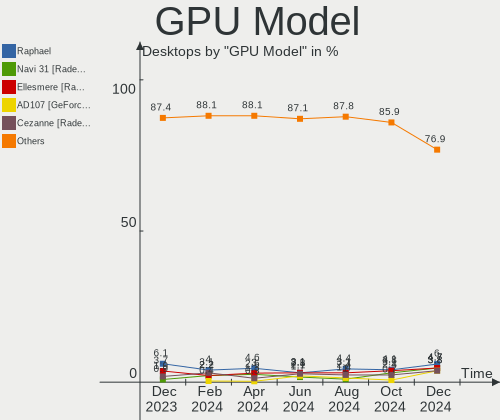

Fedora Hardware Trends (Desktop)
--------------------------------

A project to identify most popular hardware characteristics and track their change
over time based on data collected by Fedora users at https://Linux-Hardware.org.

Anyone can contribute to the study by uploading probes of their computers by
the [hw-probe](https://github.com/linuxhw/hw-probe) tool:

    sudo hw-probe -all -upload

Full-feature report is available here: https://linux-hardware.org/?view=trends&formfactor=desktop

Period: Mar, 2020.

Contents
--------

- [ OS                       ](#os)
- [ OS Family                ](#os-family)
- [ Kernel                   ](#kernel)
- [ Kernel Family            ](#kernel-family)
- [ Kernel Major Ver.        ](#kernel-major-ver)
- [ Arch                     ](#arch)
- [ DE                       ](#de)
- [ Display Server           ](#display-server)
- [ OS Lang                  ](#os-lang)
- [ Boot Mode                ](#boot-mode)
- [ Filesystem               ](#filesystem)
- [ Dual Boot with Linux     ](#dual-boot-with-linux)
- [ Dual Boot (Win)          ](#dual-boot-win)
- [ Country                  ](#country)
- [ City                     ](#city)
- [ Vendor                   ](#vendor)
- [ Model                    ](#model)
- [ Model Family             ](#model-family)
- [ MFG Year                 ](#mfg-year)
- [ Form Factor              ](#form-factor)
- [ Secure Boot              ](#secure-boot)
- [ Coreboot                 ](#coreboot)
- [ RAM Size                 ](#ram-size)
- [ RAM Used                 ](#ram-used)
- [ Drive Vendor             ](#drive-vendor)
- [ Drive Model              ](#drive-model)
- [ Drive Kind               ](#drive-kind)
- [ Drive Connector          ](#drive-connector)
- [ Drive Size               ](#drive-size)
- [ Space Total              ](#space-total)
- [ Space Used               ](#space-used)
- [ Malfunc. Drives          ](#malfunc-drives)
- [ Malfunc. Drive Vendor    ](#malfunc-drive-vendor)
- [ Malfunc. Drive Kind      ](#malfunc-drive-kind)
- [ Failed Drives            ](#failed-drives)
- [ Failed Drive Vendor      ](#failed-drive-vendor)
- [ Drive Status             ](#drive-status)
- [ Storage Vendor           ](#storage-vendor)
- [ Storage Model            ](#storage-model)
- [ Storage Kind             ](#storage-kind)
- [ CPU Vendor               ](#cpu-vendor)
- [ CPU Model                ](#cpu-model)
- [ CPU Model Family         ](#cpu-model-family)
- [ CPU Cores                ](#cpu-cores)
- [ CPU Sockets              ](#cpu-sockets)
- [ CPU Threads              ](#cpu-threads)
- [ CPU Op-Modes             ](#cpu-op-modes)
- [ CPU Microarch            ](#cpu-microarch)
- [ CPU Microcode            ](#cpu-microcode)
- [ GPU Vendor               ](#gpu-vendor)
- [ GPU Model                ](#gpu-model)
- [ GPU Combo                ](#gpu-combo)
- [ GPU Driver               ](#gpu-driver)
- [ GPU Memory               ](#gpu-memory)
- [ Monitor Vendor           ](#monitor-vendor)
- [ Monitor Model            ](#monitor-model)
- [ Monitor Resolution       ](#monitor-resolution)
- [ Monitor Diagonal         ](#monitor-diagonal)
- [ Monitor Width            ](#monitor-width)
- [ Aspect Ratio             ](#aspect-ratio)
- [ Monitor Area             ](#monitor-area)
- [ Pixel Density            ](#pixel-density)
- [ Multiple Monitors        ](#multiple-monitors)
- [ Net Controller Vendor    ](#net-controller-vendor)
- [ Net Controller Model     ](#net-controller-model)
- [ Net Controller Kind      ](#net-controller-kind)
- [ Used Controller          ](#used-controller)
- [ NICs                     ](#nics)
- [ Unsupported Devices      ](#unsupported-devices)
- [ Unsupported Device Types ](#unsupported-device-types)

OS
--

Installed operating systems

| Name      | Computers | Percent |
|-----------|-----------|---------|
| Fedora 31 | 60        | 86.96%  |
| Fedora 30 | 4         | 5.8%    |
| Fedora 32 | 2         | 2.9%    |
| Fedora 33 | 1         | 1.45%   |
| Fedora 28 | 1         | 1.45%   |
| Fedora 21 | 1         | 1.45%   |

OS Family
---------

OS without a version

| Name   | Computers | Percent |
|--------|-----------|---------|
| Fedora | 69        | 100%    |

Kernel
------

Version of the Linux kernel

| Version                                        | Computers | Percent |
|------------------------------------------------|-----------|---------|
| 5.5.7-200.fc31.x86_64                          | 12        | 17.39%  |
| 5.5.10-200.fc31.x86_64                         | 12        | 17.39%  |
| 5.5.8-200.fc31.x86_64                          | 10        | 14.49%  |
| 5.5.6-201.fc31.x86_64                          | 9         | 13.04%  |
| 5.5.11-200.fc31.x86_64                         | 5         | 7.25%   |
| 5.3.7-301.fc31.x86_64                          | 3         | 4.35%   |
| 5.5.9-200.fc31.x86_64                          | 2         | 2.9%    |
| 5.5.8-100.fc30.x86_64                          | 2         | 2.9%    |
| 5.5.6-100.fc30.x86_64                          | 2         | 2.9%    |
| 5.5.5-200.fc31.x86_64                          | 2         | 2.9%    |
| 5.6.0-0.rc7.git0.1.vanilla.knurd.1.fc33.x86_64 | 1         | 1.45%   |
| 5.6.0-0.rc4.git0.1.fc32.x86_64                 | 1         | 1.45%   |
| 5.6.0-0.rc1.git2.1.fc32.x86_64                 | 1         | 1.45%   |
| 5.4.20-200.fc31.x86_64                         | 1         | 1.45%   |
| 5.4.17-200.fc31.x86_64                         | 1         | 1.45%   |
| 5.4.13-201.fc31.x86_64                         | 1         | 1.45%   |
| 5.4.10-200.fc31.x86_64                         | 1         | 1.45%   |
| 5.2.7-200.fc30.x86_64                          | 1         | 1.45%   |
| 4.16.3-301.fc28.x86_64                         | 1         | 1.45%   |
| 4.1.13-100.fc21.x86_64                         | 1         | 1.45%   |

Kernel Family
-------------

Linux kernel without a distro release

| Version | Computers | Percent |
|---------|-----------|---------|
| 5.5.8   | 12        | 17.39%  |
| 5.5.7   | 12        | 17.39%  |
| 5.5.10  | 12        | 17.39%  |
| 5.5.6   | 11        | 15.94%  |
| 5.5.11  | 5         | 7.25%   |
| 5.6.0   | 3         | 4.35%   |
| 5.3.7   | 3         | 4.35%   |
| 5.5.9   | 2         | 2.9%    |
| 5.5.5   | 2         | 2.9%    |
| 5.4.20  | 1         | 1.45%   |
| 5.4.17  | 1         | 1.45%   |
| 5.4.13  | 1         | 1.45%   |
| 5.4.10  | 1         | 1.45%   |
| 5.2.7   | 1         | 1.45%   |
| 4.16.3  | 1         | 1.45%   |
| 4.1.13  | 1         | 1.45%   |

Kernel Major Ver.
-----------------

Linux kernel major version

| Version | Computers | Percent |
|---------|-----------|---------|
| 5.5     | 56        | 81.16%  |
| 5.4     | 4         | 5.8%    |
| 5.6     | 3         | 4.35%   |
| 5.3     | 3         | 4.35%   |
| 5.2     | 1         | 1.45%   |
| 4.16    | 1         | 1.45%   |
| 4.1     | 1         | 1.45%   |

Arch
----

OS architecture (x86_64, i586, etc.)

| Name   | Computers | Percent |
|--------|-----------|---------|
| x86_64 | 69        | 100%    |

DE
--

Desktop Environment

| Name     | Computers | Percent |
|----------|-----------|---------|
| GNOME    | 46        | 66.67%  |
| KDE5     | 9         | 13.04%  |
| Cinnamon | 6         | 8.7%    |
| KDE      | 3         | 4.35%   |
| MATE     | 2         | 2.9%    |
| KDE4     | 2         | 2.9%    |
| XFCE     | 1         | 1.45%   |

Display Server
--------------

X11 or Wayland

| Name    | Computers | Percent |
|---------|-----------|---------|
| Wayland | 36        | 52.17%  |
| X11     | 27        | 39.13%  |
| Tty     | 5         | 7.25%   |
| Web     | 1         | 1.45%   |

OS Lang
-------

Language

| Lang       | Computers | Percent |
|------------|-----------|---------|
| en_US      | 31        | 44.93%  |
| fr_FR      | 5         | 7.25%   |
| en_GB      | 4         | 5.8%    |
| en_AU      | 4         | 5.8%    |
| de_DE      | 4         | 5.8%    |
| en_CA      | 3         | 4.35%   |
| pt_BR      | 2         | 2.9%    |
| pl_PL      | 2         | 2.9%    |
| nl_BE.utf8 | 2         | 2.9%    |
| it_IT      | 2         | 2.9%    |
| sv_SE      | 1         | 1.45%   |
| fr_CH.utf8 | 1         | 1.45%   |
| fi_FI      | 1         | 1.45%   |
| et_EE      | 1         | 1.45%   |
| es_ES      | 1         | 1.45%   |
| es_AR      | 1         | 1.45%   |
| en_US.utf8 | 1         | 1.45%   |
| en_IN      | 1         | 1.45%   |
| en_IE      | 1         | 1.45%   |
| Unknown    | 1         | 1.45%   |

Boot Mode
---------

EFI or BIOS

| Mode | Computers | Percent |
|------|-----------|---------|
| EFI  | 35        | 50.72%  |
| BIOS | 34        | 49.28%  |

Filesystem
----------

Type of filesystem

| Type  | Computers | Percent |
|-------|-----------|---------|
| Ext4  | 56        | 81.16%  |
| Xfs   | 8         | 11.59%  |
| Btrfs | 5         | 7.25%   |

Dual Boot with Linux
--------------------

Hosting more than one Linux

| Dual boot | Computers | Percent |
|-----------|-----------|---------|
| No        | 59        | 85.51%  |
| Yes       | 10        | 14.49%  |

Dual Boot (Win)
---------------

Hosting Linux and Windows

| Dual boot | Computers | Percent |
|-----------|-----------|---------|
| No        | 56        | 81.16%  |
| Yes       | 13        | 18.84%  |

Country
-------

Geographic location (country)

| Country     | Computers | Percent |
|-------------|-----------|---------|
| USA         | 19        | 27.54%  |
| Germany     | 8         | 11.59%  |
| France      | 5         | 7.25%   |
| UK          | 4         | 5.8%    |
| Australia   | 4         | 5.8%    |
| Poland      | 3         | 4.35%   |
| Canada      | 3         | 4.35%   |
| Brazil      | 3         | 4.35%   |
| Italy       | 2         | 2.9%    |
| Hungary     | 2         | 2.9%    |
| Belgium     | 2         | 2.9%    |
| Switzerland | 1         | 1.45%   |
| Sweden      | 1         | 1.45%   |
| Spain       | 1         | 1.45%   |
| Singapore   | 1         | 1.45%   |
| Russia      | 1         | 1.45%   |
| Portugal    | 1         | 1.45%   |
| Norway      | 1         | 1.45%   |
| Netherlands | 1         | 1.45%   |
| Macedonia   | 1         | 1.45%   |
| Ireland     | 1         | 1.45%   |
| India       | 1         | 1.45%   |
| Finland     | 1         | 1.45%   |
| Estonia     | 1         | 1.45%   |
| Argentina   | 1         | 1.45%   |

City
----

Geographic location (city)

| City              | Computers | Percent |
|-------------------|-----------|---------|
| Wahroonga         | 3         | 4.35%   |
| Berlin            | 3         | 4.35%   |
| Warrenton         | 2         | 2.9%    |
| Mechelen          | 2         | 2.9%    |
| Brasília         | 2         | 2.9%    |
| Zeist             | 1         | 1.45%   |
| Watertown         | 1         | 1.45%   |
| Vác              | 1         | 1.45%   |
| Vancouver         | 1         | 1.45%   |
| Van Nuys          | 1         | 1.45%   |
| Trondheim         | 1         | 1.45%   |
| Treviso           | 1         | 1.45%   |
| Toronto           | 1         | 1.45%   |
| Theodore          | 1         | 1.45%   |
| Tallinn           | 1         | 1.45%   |
| Stare Kozlowice   | 1         | 1.45%   |
| Spokane           | 1         | 1.45%   |
| Sosnowiec         | 1         | 1.45%   |
| Skopje            | 1         | 1.45%   |
| Singapore         | 1         | 1.45%   |
| Sermaise          | 1         | 1.45%   |
| Sandown           | 1         | 1.45%   |
| San Diego         | 1         | 1.45%   |
| Round Rock        | 1         | 1.45%   |
| Redhill           | 1         | 1.45%   |
| Ramsen            | 1         | 1.45%   |
| Rambouillet       | 1         | 1.45%   |
| Porto             | 1         | 1.45%   |
| Pittsburgh        | 1         | 1.45%   |
| Pflugerville      | 1         | 1.45%   |
| Orsay             | 1         | 1.45%   |
| Norfolk           | 1         | 1.45%   |
| Nashville         | 1         | 1.45%   |
| Muehlheim am Main | 1         | 1.45%   |
| Moscow            | 1         | 1.45%   |
| McKinleyville     | 1         | 1.45%   |
| Lynnwood          | 1         | 1.45%   |
| Livingston        | 1         | 1.45%   |
| Lausanne          | 1         | 1.45%   |
| Jose Maria Ezeiza | 1         | 1.45%   |
| Hornsby           | 1         | 1.45%   |
| Holzkirchen       | 1         | 1.45%   |
| Helsinki          | 1         | 1.45%   |
| Guarulhos         | 1         | 1.45%   |
| Greenock          | 1         | 1.45%   |
| Forlì            | 1         | 1.45%   |
| Dublin            | 1         | 1.45%   |
| Deggendorf        | 1         | 1.45%   |
| Cologne           | 1         | 1.45%   |
| Chorzów          | 1         | 1.45%   |
| Chorley           | 1         | 1.45%   |
| Chaville          | 1         | 1.45%   |
| Burlington        | 1         | 1.45%   |
| Budapest          | 1         | 1.45%   |
| Boussois          | 1         | 1.45%   |
| Bethlehem         | 1         | 1.45%   |
| Banbury           | 1         | 1.45%   |
| Ashburn           | 1         | 1.45%   |
| Arboga            | 1         | 1.45%   |
| Albuquerque       | 1         | 1.45%   |

Vendor
------

Motherboard manufacturer

| Name                | Computers | Percent |
|---------------------|-----------|---------|
| Gigabyte Technology | 20        | 28.99%  |
| ASUSTek Computer    | 18        | 26.09%  |
| Dell                | 10        | 14.49%  |
| MSI                 | 7         | 10.14%  |
| Lenovo              | 4         | 5.8%    |
| ASRock              | 4         | 5.8%    |
| Hewlett-Packard     | 1         | 1.45%   |
| Foxconn             | 1         | 1.45%   |
| congatec            | 1         | 1.45%   |
| Alienware           | 1         | 1.45%   |
| Acer                | 1         | 1.45%   |
| ABIT                | 1         | 1.45%   |

Model
-----

Motherboard model

| Name                               | Computers | Percent |
|------------------------------------|-----------|---------|
| ASUS All Series                    | 5         | 7.25%   |
| Gigabyte 970A-DS3P                 | 2         | 2.9%    |
| ASUS PRIME X370-PRO                | 2         | 2.9%    |
| MSI MS-7C37                        | 1         | 1.45%   |
| MSI MS-7C02                        | 1         | 1.45%   |
| MSI MS-7B89                        | 1         | 1.45%   |
| MSI MS-7B53                        | 1         | 1.45%   |
| MSI MS-7A40                        | 1         | 1.45%   |
| MSI MS-7693                        | 1         | 1.45%   |
| MSI Hyrican PC                     | 1         | 1.45%   |
| Lenovo ThinkCentre M93p 10AAS03502 | 1         | 1.45%   |
| Lenovo ThinkCentre M93p 10A9000SUS | 1         | 1.45%   |
| Lenovo ThinkCentre M58p 7220A72    | 1         | 1.45%   |
| Lenovo H50-55 90BG003LUS           | 1         | 1.45%   |
| HP EliteDesk 800 G1 USDT           | 1         | 1.45%   |
| Gigabyte Z77X-D3H                  | 1         | 1.45%   |
| Gigabyte Z370M AORUS Gaming        | 1         | 1.45%   |
| Gigabyte X570 I AORUS PRO WIFI     | 1         | 1.45%   |
| Gigabyte X570 AORUS XTREME         | 1         | 1.45%   |
| Gigabyte X570 AORUS ULTRA          | 1         | 1.45%   |
| Gigabyte X470 AORUS GAMING 5 WIFI  | 1         | 1.45%   |
| Gigabyte Q87M-D2H                  | 1         | 1.45%   |
| Gigabyte M68M-S2P                  | 1         | 1.45%   |
| Gigabyte M57SLI-S4                 | 1         | 1.45%   |
| Gigabyte H77N-WIFI                 | 1         | 1.45%   |
| Gigabyte H310MS2P                  | 1         | 1.45%   |
| Gigabyte GA-MA770T-UD3P            | 1         | 1.45%   |
| Gigabyte GA-870A-UD3               | 1         | 1.45%   |
| Gigabyte B450M DS3H                | 1         | 1.45%   |
| Gigabyte B450 AORUS PRO WIFI       | 1         | 1.45%   |
| Gigabyte B360M-DS3H                | 1         | 1.45%   |
| Gigabyte AX370M-DS3H               | 1         | 1.45%   |
| Gigabyte 990FXA-UD5 R5             | 1         | 1.45%   |
| Foxconn p6-2170ef                  | 1         | 1.45%   |
| Dell XPS 8930                      | 1         | 1.45%   |
| Dell XPS 8700                      | 1         | 1.45%   |
| Dell Vostro 270                    | 1         | 1.45%   |
| Dell Precision WorkStation T7500   | 1         | 1.45%   |
| Dell Precision WorkStation T3400   | 1         | 1.45%   |
| Dell Precision Tower 5810          | 1         | 1.45%   |
| Dell Precision T3610               | 1         | 1.45%   |
| Dell PowerEdge T30                 | 1         | 1.45%   |
| Dell OptiPlex 380                  | 1         | 1.45%   |
| Dell Inspiron 546                  | 1         | 1.45%   |
| congatec IC17X B.0                 | 1         | 1.45%   |
| ASUS Z170I PRO GAMING              | 1         | 1.45%   |
| ASUS SABERTOOTH 990FX R2.0         | 1         | 1.45%   |
| ASUS ROG Maximus XI FORMULA        | 1         | 1.45%   |
| ASUS PRIME B350M-A                 | 1         | 1.45%   |
| ASUS PRIME B350-PLUS               | 1         | 1.45%   |
| ASUS PRIME B250M-PLUS              | 1         | 1.45%   |
| ASUS Maximus VIII RANGER           | 1         | 1.45%   |
| ASUS M4A785-M                      | 1         | 1.45%   |
| ASUS ITX-220                       | 1         | 1.45%   |
| ASUS B150M-C                       | 1         | 1.45%   |
| ASUS B150 PRO GAMING               | 1         | 1.45%   |
| ASRock Z87 Extreme4                | 1         | 1.45%   |
| ASRock Z390 Extreme4               | 1         | 1.45%   |
| ASRock X570 Phantom Gaming 4       | 1         | 1.45%   |
| ASRock G41M-VS3                    | 1         | 1.45%   |

Model Family
------------

Motherboard model prefix

| Name                    | Computers | Percent |
|-------------------------|-----------|---------|
| ASUS PRIME              | 5         | 7.25%   |
| ASUS All                | 5         | 7.25%   |
| Dell Precision          | 4         | 5.8%    |
| Lenovo ThinkCentre      | 3         | 4.35%   |
| Gigabyte X570           | 3         | 4.35%   |
| Gigabyte 970A-DS3P      | 2         | 2.9%    |
| Dell XPS                | 2         | 2.9%    |
| MSI MS-7C37             | 1         | 1.45%   |
| MSI MS-7C02             | 1         | 1.45%   |
| MSI MS-7B89             | 1         | 1.45%   |
| MSI MS-7B53             | 1         | 1.45%   |
| MSI MS-7A40             | 1         | 1.45%   |
| MSI MS-7693             | 1         | 1.45%   |
| MSI Hyrican             | 1         | 1.45%   |
| Lenovo H50-55           | 1         | 1.45%   |
| HP EliteDesk            | 1         | 1.45%   |
| Gigabyte Z77X-D3H       | 1         | 1.45%   |
| Gigabyte Z370M          | 1         | 1.45%   |
| Gigabyte X470           | 1         | 1.45%   |
| Gigabyte Q87M-D2H       | 1         | 1.45%   |
| Gigabyte M68M-S2P       | 1         | 1.45%   |
| Gigabyte M57SLI-S4      | 1         | 1.45%   |
| Gigabyte H77N-WIFI      | 1         | 1.45%   |
| Gigabyte H310MS2P       | 1         | 1.45%   |
| Gigabyte GA-MA770T-UD3P | 1         | 1.45%   |
| Gigabyte GA-870A-UD3    | 1         | 1.45%   |
| Gigabyte B450M          | 1         | 1.45%   |
| Gigabyte B450           | 1         | 1.45%   |
| Gigabyte B360M-DS3H     | 1         | 1.45%   |
| Gigabyte AX370M-DS3H    | 1         | 1.45%   |
| Gigabyte 990FXA-UD5     | 1         | 1.45%   |
| Foxconn p6-2170ef       | 1         | 1.45%   |
| Dell Vostro             | 1         | 1.45%   |
| Dell PowerEdge          | 1         | 1.45%   |
| Dell OptiPlex           | 1         | 1.45%   |
| Dell Inspiron           | 1         | 1.45%   |
| congatec IC17X          | 1         | 1.45%   |
| ASUS Z170I              | 1         | 1.45%   |
| ASUS SABERTOOTH         | 1         | 1.45%   |
| ASUS ROG                | 1         | 1.45%   |
| ASUS Maximus            | 1         | 1.45%   |
| ASUS M4A785-M           | 1         | 1.45%   |
| ASUS ITX-220            | 1         | 1.45%   |
| ASUS B150M-C            | 1         | 1.45%   |
| ASUS B150               | 1         | 1.45%   |
| ASRock Z87              | 1         | 1.45%   |
| ASRock Z390             | 1         | 1.45%   |
| ASRock X570             | 1         | 1.45%   |
| ASRock G41M-VS3         | 1         | 1.45%   |
| Alienware Area          | 1         | 1.45%   |
| Acer Aspire             | 1         | 1.45%   |
| ABIT KN9                | 1         | 1.45%   |

MFG Year
--------

Motherboard manufacture year

| Year | Computers | Percent |
|------|-----------|---------|
| 2019 | 16        | 23.19%  |
| 2018 | 12        | 17.39%  |
| 2016 | 6         | 8.7%    |
| 2012 | 6         | 8.7%    |
| 2017 | 5         | 7.25%   |
| 2015 | 5         | 7.25%   |
| 2009 | 5         | 7.25%   |
| 2014 | 4         | 5.8%    |
| 2013 | 4         | 5.8%    |
| 2010 | 2         | 2.9%    |
| 2020 | 1         | 1.45%   |
| 2011 | 1         | 1.45%   |
| 2008 | 1         | 1.45%   |
| 2007 | 1         | 1.45%   |

Form Factor
-----------

Physical design of the computer

| Name    | Computers | Percent |
|---------|-----------|---------|
| Desktop | 69        | 100%    |

Secure Boot
-----------

Enabled or disabled

| State    | Computers | Percent |
|----------|-----------|---------|
| Disabled | 66        | 95.65%  |
| Enabled  | 3         | 4.35%   |

Coreboot
--------

Have coreboot on board

| Used | Computers | Percent |
|------|-----------|---------|
| No   | 69        | 100%    |

RAM Size
--------

Total RAM memory

| Size in GB  | Computers | Percent |
|-------------|-----------|---------|
| 16.01-24.0  | 29        | 42.03%  |
| 32.01-64.0  | 12        | 17.39%  |
| 8.01-16.0   | 11        | 15.94%  |
| 4.01-8.0    | 10        | 14.49%  |
| 3.01-4.0    | 4         | 5.8%    |
| 24.01-32.0  | 2         | 2.9%    |
| 64.01-256.0 | 1         | 1.45%   |

RAM Used
--------

Used RAM memory

| Used GB   | Computers | Percent |
|-----------|-----------|---------|
| 2.01-3.0  | 21        | 30.43%  |
| 4.01-8.0  | 16        | 23.19%  |
| 1.01-2.0  | 14        | 20.29%  |
| 3.01-4.0  | 12        | 17.39%  |
| 8.01-16.0 | 5         | 7.25%   |
| 0.01-1.0  | 1         | 1.45%   |

Drive Vendor
------------

Hard drive vendors

| Vendor              | Computers | Drives | Percent |
|---------------------|-----------|--------|---------|
| WDC                 | 35        | 50     | 26.92%  |
| Samsung Electronics | 25        | 30     | 19.23%  |
| Seagate             | 19        | 27     | 14.62%  |
| Crucial             | 9         | 10     | 6.92%   |
| Hitachi             | 8         | 8      | 6.15%   |
| Toshiba             | 6         | 7      | 4.62%   |
| Kingston            | 6         | 8      | 4.62%   |
| SanDisk             | 4         | 4      | 3.08%   |
| HGST                | 3         | 6      | 2.31%   |
| A-DATA Technology   | 3         | 4      | 2.31%   |
| Intel               | 2         | 2      | 1.54%   |
| Transcend           | 1         | 1      | 0.77%   |
| SPCC                | 1         | 1      | 0.77%   |
| Radeon              | 1         | 1      | 0.77%   |
| PNY                 | 1         | 1      | 0.77%   |
| OCZ                 | 1         | 1      | 0.77%   |
| Micron Technology   | 1         | 1      | 0.77%   |
| LaCie               | 1         | 1      | 0.77%   |
| Inateck             | 1         | 1      | 0.77%   |
| GOODRAM             | 1         | 1      | 0.77%   |
| Dogfish             | 1         | 1      | 0.77%   |

Drive Model
-----------

Hard drive models

| Model                        | Computers | Percent |
|------------------------------|-----------|---------|
| SSD 860 EVO 500GB            | 6         | 3.68%   |
| DT01ACA100 1TB               | 4         | 2.45%   |
| CT500MX500SSD1 500GB         | 4         | 2.45%   |
| ST2000DM001-1ER164 2TB       | 3         | 1.84%   |
| WD40EZRZ-00GXCB0 4TB         | 2         | 1.23%   |
| WD2500BEVT-22ZCT0 250GB      | 2         | 1.23%   |
| WD20EZRZ-00Z5HB0 2TB         | 2         | 1.23%   |
| WD10EZEX-60WN4A0 1TB         | 2         | 1.23%   |
| WD10EZEX-08M2NA0 1TB         | 2         | 1.23%   |
| WD10EZEX-00BN5A0 1TB         | 2         | 1.23%   |
| ST1000DM003-1ER162 1TB       | 2         | 1.23%   |
| SSDSC2KW256G8 256GB          | 2         | 1.23%   |
| SSD 970 EVO Plus 500GB       | 2         | 1.23%   |
| SSD 850 EVO 250GB            | 2         | 1.23%   |
| SA400S37120G 120GB SSD       | 2         | 1.23%   |
| CT525MX300SSD1 528GB         | 2         | 1.23%   |
| WDS500G2B0B 500GB SSD        | 1         | 0.61%   |
| WDS500G2B0A-00SM50 500GB SSD | 1         | 0.61%   |
| WDS250G3X0C-00SJG0 250GB     | 1         | 0.61%   |
| WDS250G2B0B-00YS70 250GB SSD | 1         | 0.61%   |
| WDS250G2B0A-00SM50 250GB SSD | 1         | 0.61%   |
| WDS240G2G0B-00EPW0 240GB SSD | 1         | 0.61%   |
| WDS240G2G0A-00JH30 240GB SSD | 1         | 0.61%   |
| WDS120G2G0A-00JH30 120GB SSD | 1         | 0.61%   |
| WDS100T2G0A-00JH30 1TB SSD   | 1         | 0.61%   |
| WD5000AZRX-00A8LB0 500GB     | 1         | 0.61%   |
| WD5000AAKX-75U6AA0 500GB     | 1         | 0.61%   |
| WD5000AAKX-00ERMA0 500GB     | 1         | 0.61%   |
| WD5000AAKS-00E4A0 500GB      | 1         | 0.61%   |
| WD5000AAKS-00A7B2 500GB      | 1         | 0.61%   |
| WD400JB-00FMA0 40GB          | 1         | 0.61%   |
| WD3200AAKS-00L9A0 320GB      | 1         | 0.61%   |
| WD3200AAJS-56M0A0 320GB      | 1         | 0.61%   |
| WD2500AAJS-75M0A0 250GB      | 1         | 0.61%   |
| WD20PURZ-85GU6Y0 2TB         | 1         | 0.61%   |
| WD20EZRX-22D8PB0 2TB         | 1         | 0.61%   |
| WD20EZRX-00DC0B0 2TB         | 1         | 0.61%   |
| WD20EZRX-00D8PB0 2TB         | 1         | 0.61%   |
| WD20EZAZ-00GGJB0 2TB         | 1         | 0.61%   |
| WD20EFRX-68EUZN0 2TB         | 1         | 0.61%   |
| WD2003FZEX-00Z4SA0 2TB       | 1         | 0.61%   |
| WD2002FYPS-02W3B0 2TB        | 1         | 0.61%   |
| WD1600AABS-61PRA0 160GB      | 1         | 0.61%   |
| WD1500HLFS-01G6U3 150GB      | 1         | 0.61%   |
| WD10PURX-64E5EY0 1TB         | 1         | 0.61%   |
| WD10EZRX-00A8LB0 1TB         | 1         | 0.61%   |
| WD10EZEX-22MFCA0 1TB         | 1         | 0.61%   |
| WD10EZEX-08WN4A0 1TB         | 1         | 0.61%   |
| WD10EZEX-00RKKA0 1TB         | 1         | 0.61%   |
| WD10EADS-00M2B0 1TB          | 1         | 0.61%   |
| WD1003FZEX-00MK2A0 1TB       | 1         | 0.61%   |
| WD1001FALS-00J7B1 1TB        | 1         | 0.61%   |
| WD1001FALS-00J7B0 1TB        | 1         | 0.61%   |
| WD1001FALS-00E8B0 1TB        | 1         | 0.61%   |
| VERTEX4 128GB SSD            | 1         | 0.61%   |
| Ultra II 480GB SSD           | 1         | 0.61%   |
| TS128GSSD370S 128GB          | 1         | 0.61%   |
| SV300S37A240G 240GB SSD      | 1         | 0.61%   |
| SU800 512GB SSD              | 1         | 0.61%   |
| SU800 256GB SSD              | 1         | 0.61%   |

Drive Kind
----------

HDD or SSD

| Kind    | Computers | Drives | Percent |
|---------|-----------|--------|---------|
| HDD     | 53        | 92     | 48.18%  |
| SSD     | 48        | 65     | 43.64%  |
| NVMe    | 7         | 7      | 6.36%   |
| Unknown | 2         | 2      | 1.82%   |

Drive Connector
---------------

SATA, SAS, NVMe, etc.

| Type | Computers | Drives | Percent |
|------|-----------|--------|---------|
| SATA | 67        | 150    | 83.75%  |
| NVMe | 7         | 7      | 8.75%   |
| SAS  | 6         | 9      | 7.5%    |

Drive Size
----------

Size of hard drive

| Size in TB | Computers | Drives | Percent |
|------------|-----------|--------|---------|
| 0.01-0.5   | 57        | 85     | 48.31%  |
| 0.51-1.0   | 31        | 40     | 26.27%  |
| 1.01-2.0   | 18        | 24     | 15.25%  |
| 3.01-4.0   | 8         | 12     | 6.78%   |
| 2.01-3.0   | 2         | 3      | 1.69%   |
| 4.01-10.0  | 2         | 2      | 1.69%   |

Space Total
-----------

Amount of disk space available on the file system

| Size in GB     | Computers | Percent |
|----------------|-----------|---------|
| 101-250        | 14        | 20.29%  |
| More than 3000 | 13        | 18.84%  |
| 251-500        | 10        | 14.49%  |
| 2001-3000      | 9         | 13.04%  |
| 1001-2000      | 8         | 11.59%  |
| 501-1000       | 8         | 11.59%  |
| 21-50          | 3         | 4.35%   |
| 51-100         | 2         | 2.9%    |
| 1-20           | 1         | 1.45%   |
| Unknown        | 1         | 1.45%   |

Space Used
----------

Amount of used disk space

| Used GB        | Computers | Percent |
|----------------|-----------|---------|
| 1-20           | 13        | 18.84%  |
| 251-500        | 12        | 17.39%  |
| 101-250        | 11        | 15.94%  |
| 1001-2000      | 11        | 15.94%  |
| 21-50          | 8         | 11.59%  |
| More than 3000 | 4         | 5.8%    |
| 501-1000       | 4         | 5.8%    |
| 51-100         | 4         | 5.8%    |
| 2001-3000      | 1         | 1.45%   |
| Unknown        | 1         | 1.45%   |

Malfunc. Drives
---------------

Drive models with a malfunction

| Model                    | Computers | Drives | Percent |
|--------------------------|-----------|--------|---------|
| WD5000AAKX-00ERMA0 500GB | 1         | 1      | 9.09%   |
| WD5000AAKS-00E4A0 500GB  | 1         | 1      | 9.09%   |
| WD3200AAKS-00L9A0 320GB  | 1         | 1      | 9.09%   |
| WD20PURZ-85GU6Y0 2TB     | 1         | 1      | 9.09%   |
| WD1600AABS-61PRA0 160GB  | 1         | 1      | 9.09%   |
| WD10EZRX-00A8LB0 1TB     | 1         | 1      | 9.09%   |
| WD10EZEX-00RKKA0 1TB     | 1         | 1      | 9.09%   |
| WD10EZEX-00BN5A0 1TB     | 1         | 1      | 9.09%   |
| ST31500341AS 1TB         | 1         | 1      | 9.09%   |
| ST1500DM003-9YN16G 1TB   | 1         | 1      | 9.09%   |
| HD502IJ 500GB            | 1         | 1      | 9.09%   |

Malfunc. Drive Vendor
---------------------

Vendors of faulty drives

| Vendor              | Computers | Drives | Percent |
|---------------------|-----------|--------|---------|
| WDC                 | 5         | 8      | 71.43%  |
| Seagate             | 1         | 2      | 14.29%  |
| Samsung Electronics | 1         | 1      | 14.29%  |

Malfunc. Drive Kind
-------------------

Kinds of faulty drives

| Kind | Computers | Drives | Percent |
|------|-----------|--------|---------|
| HDD  | 6         | 11     | 100%    |

Failed Drives
-------------

Failed drive models

Zero info for selected period =(

Failed Drive Vendor
-------------------

Failed drive vendors

Zero info for selected period =(

Drive Status
------------

Number of failed and malfunc. drives

| Status   | Computers | Drives | Percent |
|----------|-----------|--------|---------|
| Detected | 37        | 89     | 48.68%  |
| Works    | 33        | 66     | 43.42%  |
| Malfunc  | 6         | 11     | 7.89%   |

Storage Vendor
--------------

Storage controller vendors

| Vendor                      | Computers | Percent |
|-----------------------------|-----------|---------|
| Intel                       | 40        | 40%     |
| AMD                         | 27        | 27%     |
| Samsung Electronics         | 10        | 10%     |
| ASMedia Technology          | 4         | 4%      |
| Nvidia                      | 3         | 3%      |
| Marvell Technology Group    | 3         | 3%      |
| Silicon Image               | 2         | 2%      |
| Sandisk                     | 2         | 2%      |
| Phison Electronics          | 2         | 2%      |
| LSI Logic / Symbios Logic   | 2         | 2%      |
| JMicron Technology          | 2         | 2%      |
| Silicon Motion              | 1         | 1%      |
| Kingston Technology Company | 1         | 1%      |
| Adaptec                     | 1         | 1%      |

Storage Model
-------------

Storage controller models

| Model                                                                    | Computers | Percent |
|--------------------------------------------------------------------------|-----------|---------|
| FCH SATA Controller [AHCI mode]                                          | 18        | 14.29%  |
| 8 Series/C220 Series Chipset Family 6-port SATA Controller 1 [AHCI mode] | 8         | 6.35%   |
| SB7x0/SB8x0/SB9x0 SATA Controller [AHCI mode]                            | 6         | 4.76%   |
| SB7x0/SB8x0/SB9x0 IDE Controller                                         | 6         | 4.76%   |
| 400 Series Chipset SATA Controller                                       | 6         | 4.76%   |
| Q170/Q150/B150/H170/H110/Z170/CM236 Chipset SATA Controller [AHCI Mode]  | 5         | 3.97%   |
| NVMe SSD Controller SM981/PM981/PM983                                    | 5         | 3.97%   |
| Cannon Lake PCH SATA AHCI Controller                                     | 5         | 3.97%   |
| NVMe SSD Controller SM961/PM961                                          | 4         | 3.17%   |
| ASM1062 Serial ATA Controller                                            | 4         | 3.17%   |
| X370 Series Chipset SATA Controller                                      | 3         | 2.38%   |
| SB7x0/SB8x0/SB9x0 SATA Controller [IDE mode]                             | 3         | 2.38%   |
| SATA Controller [RAID mode]                                              | 3         | 2.38%   |
| NM10/ICH7 Family SATA Controller [IDE mode]                              | 3         | 2.38%   |
| 9 Series Chipset Family SATA Controller [AHCI Mode]                      | 3         | 2.38%   |
| 82801G (ICH7 Family) IDE Controller                                      | 3         | 2.38%   |
| 7 Series/C210 Series Chipset Family 6-port SATA Controller [AHCI mode]   | 3         | 2.38%   |
| WD Black 2018/PC SN720 NVMe SSD                                          | 2         | 1.59%   |
| SSD 660P Series                                                          | 2         | 1.59%   |
| SiI 3132 Serial ATA Raid II Controller                                   | 2         | 1.59%   |
| Non-Volatile memory controller                                           | 2         | 1.59%   |
| MCP55 SATA Controller                                                    | 2         | 1.59%   |
| MCP55 IDE                                                                | 2         | 1.59%   |
| JMB363 SATA/IDE Controller                                               | 2         | 1.59%   |
| E16 PCIe4 NVMe Controller                                                | 2         | 1.59%   |
| 88SE9172 SATA 6Gb/s Controller                                           | 2         | 1.59%   |
| 300 Series Chipset SATA Controller                                       | 2         | 1.59%   |
| 200 Series PCH SATA controller [AHCI mode]                               | 2         | 1.59%   |
| Sunrise Point-LP SATA Controller [AHCI mode]                             | 1         | 0.79%   |
| SAS2008 PCI-Express Fusion-MPT SAS-2 [Falcon]                            | 1         | 0.79%   |
| SAS1068E PCI-Express Fusion-MPT SAS                                      | 1         | 0.79%   |
| NVMe SSD Controller SM951/PM951                                          | 1         | 0.79%   |
| MCP61 SATA Controller                                                    | 1         | 0.79%   |
| MCP61 IDE                                                                | 1         | 0.79%   |
| C610/X99 series chipset sSATA Controller [AHCI mode]                     | 1         | 0.79%   |
| C610/X99 series chipset 6-Port SATA Controller [AHCI mode]               | 1         | 0.79%   |
| C600/X79 series chipset SATA RAID Controller                             | 1         | 0.79%   |
| AIC-7850T/7856T [AVA-2902/4/6 / AHA-2910]                                | 1         | 0.79%   |
| 92xx SATA 6G Controller                                                  | 1         | 0.79%   |
| 82801JI (ICH10 Family) SATA AHCI Controller                              | 1         | 0.79%   |
| 82801JD/DO (ICH10 Family) SATA AHCI Controller                           | 1         | 0.79%   |
| 82801IR/IO/IH (ICH9R/DO/DH) 6 port SATA Controller [AHCI mode]           | 1         | 0.79%   |
| 6 Series/C200 Series Chipset Family 6 port Desktop SATA AHCI Controller  | 1         | 0.79%   |
| 4 Series Chipset PT IDER Controller                                      | 1         | 0.79%   |

Storage Kind
------------

Kind of storage controller (IDE, SATA, NVMe, SAS, ...)

| Kind | Computers | Percent |
|------|-----------|---------|
| SATA | 60        | 60.61%  |
| NVMe | 17        | 17.17%  |
| IDE  | 15        | 15.15%  |
| RAID | 4         | 4.04%   |
| SCSI | 2         | 2.02%   |
| SAS  | 1         | 1.01%   |

CPU Vendor
----------

Processor vendors

| Vendor | Computers | Percent |
|--------|-----------|---------|
| Intel  | 39        | 56.52%  |
| AMD    | 30        | 43.48%  |

CPU Model
---------

Processor models

| Model                                         | Computers | Percent |
|-----------------------------------------------|-----------|---------|
| Intel Core i7-8700 CPU @ 3.20GHz              | 3         | 4.35%   |
| Intel Core i7-4790K CPU @ 4.00GHz             | 3         | 4.35%   |
| AMD Ryzen 5 2600 Six-Core Processor           | 3         | 4.35%   |
| Intel Core i7-4770 CPU @ 3.40GHz              | 2         | 2.9%    |
| Intel Core 2 Duo CPU E8400 @ 3.00GHz          | 2         | 2.9%    |
| AMD Ryzen 9 3900X 12-Core Processor           | 2         | 2.9%    |
| AMD Ryzen 7 2700X Eight-Core Processor        | 2         | 2.9%    |
| AMD Ryzen 7 1700 Eight-Core Processor         | 2         | 2.9%    |
| AMD FX-8350 Eight-Core Processor              | 2         | 2.9%    |
| Intel Xeon CPU X5680 @ 3.33GHz                | 1         | 1.45%   |
| Intel Xeon CPU E5-1650 v2 @ 3.50GHz           | 1         | 1.45%   |
| Intel Xeon CPU E5-1607 v4 @ 3.10GHz           | 1         | 1.45%   |
| Intel Pentium Dual-Core CPU E5800 @ 3.20GHz   | 1         | 1.45%   |
| Intel Pentium CPU G4400 @ 3.30GHz             | 1         | 1.45%   |
| Intel Core i9-9900K CPU @ 3.60GHz             | 1         | 1.45%   |
| Intel Core i7-9700 CPU @ 3.00GHz              | 1         | 1.45%   |
| Intel Core i7-6700K CPU @ 4.00GHz             | 1         | 1.45%   |
| Intel Core i7-6700 CPU @ 3.40GHz              | 1         | 1.45%   |
| Intel Core i7-4790 CPU @ 3.60GHz              | 1         | 1.45%   |
| Intel Core i7 CPU 975 @ 3.33GHz               | 1         | 1.45%   |
| Intel Core i5-8400 CPU @ 2.80GHz              | 1         | 1.45%   |
| Intel Core i5-7500 CPU @ 3.40GHz              | 1         | 1.45%   |
| Intel Core i5-7400 CPU @ 3.00GHz              | 1         | 1.45%   |
| Intel Core i5-6600K CPU @ 3.50GHz             | 1         | 1.45%   |
| Intel Core i5-6500 CPU @ 3.20GHz              | 1         | 1.45%   |
| Intel Core i5-4590T CPU @ 2.00GHz             | 1         | 1.45%   |
| Intel Core i5-4570 CPU @ 3.20GHz              | 1         | 1.45%   |
| Intel Core i5-4460 CPU @ 3.20GHz              | 1         | 1.45%   |
| Intel Core i5-3450 CPU @ 3.10GHz              | 1         | 1.45%   |
| Intel Core i5-2400 CPU @ 3.10GHz              | 1         | 1.45%   |
| Intel Core i5-2320 CPU @ 3.00GHz              | 1         | 1.45%   |
| Intel Core i3-8100 CPU @ 3.60GHz              | 1         | 1.45%   |
| Intel Core i3-7100U CPU @ 2.40GHz             | 1         | 1.45%   |
| Intel Core i3-4130T CPU @ 2.90GHz             | 1         | 1.45%   |
| Intel Core i3-4130 CPU @ 3.40GHz              | 1         | 1.45%   |
| Intel Core i3-3220 CPU @ 3.30GHz              | 1         | 1.45%   |
| Intel Core 2 CPU 6600 @ 2.40GHz               | 1         | 1.45%   |
| Intel Celeron CPU 220 @ 1.20GHz               | 1         | 1.45%   |
| AMD Ryzen 9 3950X 16-Core Processor           | 1         | 1.45%   |
| AMD Ryzen 7 1700X Eight-Core Processor        | 1         | 1.45%   |
| AMD Ryzen 5 3600X 6-Core Processor            | 1         | 1.45%   |
| AMD Ryzen 5 3600 6-Core Processor             | 1         | 1.45%   |
| AMD Ryzen 5 3400G with Radeon Vega Graphics   | 1         | 1.45%   |
| AMD Ryzen 5 1600X Six-Core Processor          | 1         | 1.45%   |
| AMD Ryzen 3 2200G with Radeon Vega Graphics   | 1         | 1.45%   |
| AMD Phenom II X4 965 Processor                | 1         | 1.45%   |
| AMD Phenom II X4 955 Processor                | 1         | 1.45%   |
| AMD Phenom II X4 945 Processor                | 1         | 1.45%   |
| AMD Phenom 9750 Quad-Core Processor           | 1         | 1.45%   |
| AMD Phenom 8850B Triple-Core Processor        | 1         | 1.45%   |
| AMD FX-8370 Eight-Core Processor              | 1         | 1.45%   |
| AMD FX-8300 Eight-Core Processor              | 1         | 1.45%   |
| AMD FX-4100 Quad-Core Processor               | 1         | 1.45%   |
| AMD Athlon II X4 630 Processor                | 1         | 1.45%   |
| AMD Athlon 64 X2 Dual Core Processor 6000+    | 1         | 1.45%   |
| AMD A8-7600 Radeon R7, 10 Compute Cores 4C+6G | 1         | 1.45%   |
| AMD A8-5500 APU with Radeon HD Graphics       | 1         | 1.45%   |

CPU Model Family
----------------

Processor model prefix

| Model                   | Computers | Percent |
|-------------------------|-----------|---------|
| Intel Core i7           | 13        | 18.84%  |
| Intel Core i5           | 11        | 15.94%  |
| AMD Ryzen 5             | 7         | 10.14%  |
| Intel Core i3           | 5         | 7.25%   |
| AMD Ryzen 7             | 5         | 7.25%   |
| AMD FX                  | 5         | 7.25%   |
| Intel Xeon              | 3         | 4.35%   |
| AMD Ryzen 9             | 3         | 4.35%   |
| AMD Phenom II X4        | 3         | 4.35%   |
| Intel Core 2 Duo        | 2         | 2.9%    |
| AMD Phenom              | 2         | 2.9%    |
| AMD A8                  | 2         | 2.9%    |
| Intel Pentium Dual-Core | 1         | 1.45%   |
| Intel Pentium           | 1         | 1.45%   |
| Intel Core i9           | 1         | 1.45%   |
| Intel Core 2            | 1         | 1.45%   |
| Intel Celeron           | 1         | 1.45%   |
| AMD Ryzen 3             | 1         | 1.45%   |
| AMD Athlon II X4        | 1         | 1.45%   |
| AMD Athlon 64 X2        | 1         | 1.45%   |

CPU Cores
---------

Number of processor cores

| Number | Computers | Percent |
|--------|-----------|---------|
| 4      | 32        | 46.38%  |
| 2      | 13        | 18.84%  |
| 6      | 11        | 15.94%  |
| 8      | 7         | 10.14%  |
| 12     | 3         | 4.35%   |
| 16     | 1         | 1.45%   |
| 3      | 1         | 1.45%   |
| 1      | 1         | 1.45%   |

CPU Sockets
-----------

Number of sockets

| Number | Computers | Percent |
|--------|-----------|---------|
| 1      | 68        | 98.55%  |
| 2      | 1         | 1.45%   |

CPU Threads
-----------

Threads per core (Hyper-Threading)

| Number | Computers | Percent |
|--------|-----------|---------|
| 2      | 40        | 57.97%  |
| 1      | 29        | 42.03%  |

CPU Op-Modes
------------

CPU Operation Modes (32-bit, 64-bit)

| Op mode        | Computers | Percent |
|----------------|-----------|---------|
| 32-bit, 64-bit | 69        | 100%    |

CPU Microarch
-------------

Microarchitecture

| Name        | Computers | Percent |
|-------------|-----------|---------|
| Skylake     | 14        | 20.29%  |
| Haswell     | 11        | 15.94%  |
| Zen+        | 6         | 8.7%    |
| K10         | 6         | 8.7%    |
| Zen 2       | 5         | 7.25%   |
| Zen         | 5         | 7.25%   |
| Piledriver  | 5         | 7.25%   |
| Core        | 5         | 7.25%   |
| IvyBridge   | 3         | 4.35%   |
| SandyBridge | 2         | 2.9%    |
| Westmere    | 1         | 1.45%   |
| Steamroller | 1         | 1.45%   |
| Nehalem     | 1         | 1.45%   |
| KabyLake    | 1         | 1.45%   |
| K8 Hammer   | 1         | 1.45%   |
| Bulldozer   | 1         | 1.45%   |
| Broadwell   | 1         | 1.45%   |

CPU Microcode
-------------

Microcode number

| Number     | Computers | Percent |
|------------|-----------|---------|
| 0x306c3    | 11        | 15.94%  |
| 0x506e3    | 5         | 7.25%   |
| 0x08701013 | 5         | 7.25%   |
| 0x0800820d | 5         | 7.25%   |
| 0x906ea    | 4         | 5.8%    |
| 0x06000852 | 4         | 5.8%    |
| 0x1067a    | 3         | 4.35%   |
| 0x08001138 | 3         | 4.35%   |
| Unknown    | 3         | 4.35%   |
| 0x906e9    | 2         | 2.9%    |
| 0x306a9    | 2         | 2.9%    |
| 0x206a7    | 2         | 2.9%    |
| 0x906ed    | 1         | 1.45%   |
| 0x906eb    | 1         | 1.45%   |
| 0x806e9    | 1         | 1.45%   |
| 0x6f6      | 1         | 1.45%   |
| 0x406f1    | 1         | 1.45%   |
| 0x306e4    | 1         | 1.45%   |
| 0x206c2    | 1         | 1.45%   |
| 0x106a5    | 1         | 1.45%   |
| 0x10661    | 1         | 1.45%   |
| 0x08108109 | 1         | 1.45%   |
| 0x0810100b | 1         | 1.45%   |
| 0x08001137 | 1         | 1.45%   |
| 0x06003106 | 1         | 1.45%   |
| 0x06001119 | 1         | 1.45%   |
| 0x0600063e | 1         | 1.45%   |
| 0x010000db | 1         | 1.45%   |
| 0x010000c9 | 1         | 1.45%   |
| 0x010000c8 | 1         | 1.45%   |
| 0x010000b6 | 1         | 1.45%   |
| 0x01000095 | 1         | 1.45%   |

GPU Vendor
----------

Vendors of graphics cards

| Vendor | Computers | Percent |
|--------|-----------|---------|
| Nvidia | 29        | 39.19%  |
| AMD    | 23        | 31.08%  |
| Intel  | 22        | 29.73%  |

GPU Model
---------

Graphics card models

| Model                                                                 | Computers | Percent |
|-----------------------------------------------------------------------|-----------|---------|
| Ellesmere [Radeon RX 470/480/570/570X/580/580X/590]                   | 6         | 7.89%   |
| Xeon E3-1200 v3/4th Gen Core Processor Integrated Graphics Controller | 5         | 6.58%   |
| UHD Graphics 630 (Desktop)                                            | 4         | 5.26%   |
| GP107 [GeForce GTX 1050 Ti]                                           | 3         | 3.95%   |
| RV620 LE [Radeon HD 3450]                                             | 2         | 2.63%   |
| Navi 10 [Radeon RX 5600 OEM/5600 XT / 5700/5700 XT]                   | 2         | 2.63%   |
| HD Graphics 630                                                       | 2         | 2.63%   |
| GT218 [GeForce 8400 GS Rev. 3]                                        | 2         | 2.63%   |
| GP104 [GeForce GTX 1070]                                              | 2         | 2.63%   |
| 4th Generation Core Processor Family Integrated Graphics Controller   | 2         | 2.63%   |
| 4 Series Chipset Integrated Graphics Controller                       | 2         | 2.63%   |
| Xeon E3-1200 v2/3rd Gen Core processor Graphics Controller            | 1         | 1.32%   |
| UHD Graphics 630 (Desktop 9 Series)                                   | 1         | 1.32%   |
| Turks PRO [Radeon HD 7570]                                            | 1         | 1.32%   |
| TU116 [GeForce GTX 1660 Ti]                                           | 1         | 1.32%   |
| TU116 [GeForce GTX 1650 SUPER]                                        | 1         | 1.32%   |
| TU102 [GeForce RTX 2080 Ti Rev. A]                                    | 1         | 1.32%   |
| RV370 [Radeon X300]                                                   | 1         | 1.32%   |
| RV370 [Radeon X300 SE]                                                | 1         | 1.32%   |
| RS780 [Radeon HD 3200]                                                | 1         | 1.32%   |
| Raven Ridge [Radeon Vega Series / Radeon Vega Mobile Series]          | 1         | 1.32%   |
| Pitcairn PRO [Radeon HD 7850 / R7 265 / R9 270 1024SP]                | 1         | 1.32%   |
| Picasso                                                               | 1         | 1.32%   |
| Navi 14 [Radeon RX 5500/5500M / Pro 5500M]                            | 1         | 1.32%   |
| Kaveri [Radeon R7 Graphics]                                           | 1         | 1.32%   |
| HD Graphics 620                                                       | 1         | 1.32%   |
| HD Graphics 530                                                       | 1         | 1.32%   |
| HD Graphics 510                                                       | 1         | 1.32%   |
| GT218 [GeForce 210]                                                   | 1         | 1.32%   |
| GP108 [GeForce GT 1030]                                               | 1         | 1.32%   |
| GP106 [GeForce GTX 1060 3GB]                                          | 1         | 1.32%   |
| GP104 [GeForce GTX 1080]                                              | 1         | 1.32%   |
| GP102 [GeForce GTX 1080 Ti]                                           | 1         | 1.32%   |
| GM206 [GeForce GTX 960]                                               | 1         | 1.32%   |
| GM204 [GeForce GTX 970]                                               | 1         | 1.32%   |
| GM200 [GeForce GTX 980 Ti]                                            | 1         | 1.32%   |
| GM107 [GeForce GTX 750 Ti]                                            | 1         | 1.32%   |
| GK208B [GeForce GT 720]                                               | 1         | 1.32%   |
| GK208B [GeForce GT 710]                                               | 1         | 1.32%   |
| GK107GL [Quadro K2000]                                                | 1         | 1.32%   |
| GK106 [GeForce GTX 650 Ti]                                            | 1         | 1.32%   |
| GK104 [GeForce GTX 660 Ti]                                            | 1         | 1.32%   |
| GF119 [GeForce GT 520]                                                | 1         | 1.32%   |
| GF110 [GeForce GTX 560 Ti OEM]                                        | 1         | 1.32%   |
| G98 [Quadro NVS 295]                                                  | 1         | 1.32%   |
| G96CGL [Quadro FX 580]                                                | 1         | 1.32%   |
| Cedar [Radeon HD 7350/8350 / R5 220]                                  | 1         | 1.32%   |
| Cedar [Radeon HD 5000/6000/7350/8350 Series]                          | 1         | 1.32%   |
| Cape Verde PRO [Radeon HD 7750/8740 / R7 250E]                        | 1         | 1.32%   |
| Caicos [Radeon HD 6450/7450/8450 / R5 230 OEM]                        | 1         | 1.32%   |
| C61 [GeForce 7025 / nForce 630a]                                      | 1         | 1.32%   |
| Baffin [Radeon RX 550 640SP / RX 560/560X]                            | 1         | 1.32%   |
| Baffin [Radeon RX 460/560D / Pro 450/455/460/555/555X/560/560X]       | 1         | 1.32%   |
| 8th Gen Core Processor Gaussian Mixture Model                         | 1         | 1.32%   |
| 82945G/GZ Integrated Graphics Controller                              | 1         | 1.32%   |

GPU Combo
---------

Combinations of graphics cards

| Name       | Computers | Percent |
|------------|-----------|---------|
| 1 x Nvidia | 29        | 42.03%  |
| 1 x AMD    | 21        | 30.43%  |
| 1 x Intel  | 18        | 26.09%  |
| 2 x AMD    | 1         | 1.45%   |

GPU Driver
----------

Free vs proprietary

| Driver      | Computers | Percent |
|-------------|-----------|---------|
| Free        | 55        | 79.71%  |
| Proprietary | 13        | 18.84%  |
| Unknown     | 1         | 1.45%   |

GPU Memory
----------

Total video memory

| Size in GB | Computers | Percent |
|------------|-----------|---------|
| Unknown    | 24        | 34.78%  |
| 1.01-2.0   | 11        | 15.94%  |
| 7.01-8.0   | 10        | 14.49%  |
| 0.51-1.0   | 8         | 11.59%  |
| 0.01-0.5   | 8         | 11.59%  |
| 3.01-4.0   | 4         | 5.8%    |
| 5.01-6.0   | 2         | 2.9%    |
| 2.01-3.0   | 1         | 1.45%   |
| 8.01-16.0  | 1         | 1.45%   |

Monitor Vendor
--------------

Monitor vendors

| Vendor               | Computers | Percent |
|----------------------|-----------|---------|
| Samsung Electronics  | 14        | 17.5%   |
| Dell                 | 14        | 17.5%   |
| Goldstar             | 11        | 13.75%  |
| Acer                 | 6         | 7.5%    |
| AOC                  | 4         | 5%      |
| Ancor Communications | 4         | 5%      |
| ViewSonic            | 3         | 3.75%   |
| Hewlett-Packard      | 3         | 3.75%   |
| Sony                 | 2         | 2.5%    |
| SNC                  | 2         | 2.5%    |
| BenQ                 | 2         | 2.5%    |
| ASUSTek Computer     | 2         | 2.5%    |
| VOXICON              | 1         | 1.25%   |
| Unknown (AAA)        | 1         | 1.25%   |
| Philips              | 1         | 1.25%   |
| Nvidia               | 1         | 1.25%   |
| MSI                  | 1         | 1.25%   |
| Insignia             | 1         | 1.25%   |
| Iiyama               | 1         | 1.25%   |
| HannStar Display     | 1         | 1.25%   |
| GBT                  | 1         | 1.25%   |
| Fujitsu Siemens      | 1         | 1.25%   |
| Elo Touch            | 1         | 1.25%   |
| Eizo                 | 1         | 1.25%   |
| CCE                  | 1         | 1.25%   |

Monitor Model
-------------

Monitor models

| Model                                               | Computers | Percent |
|-----------------------------------------------------|-----------|---------|
| VA2226w-3 VSC2051 1680x1050 495x291mm 22.6-inch     | 2         | 2.27%   |
| PHOTO 190V SNC1850 1366x768 409x230mm 18.5-inch     | 2         | 2.27%   |
| XG32V AUS32B1 2560x1440 697x393mm 31.5-inch         | 1         | 1.14%   |
| X203H ACR009D 1600x900 443x249mm 20.0-inch          | 1         | 1.14%   |
| W2343 GSM5701 1920x1080 510x290mm 23.1-inch         | 1         | 1.14%   |
| W1943 GSM4BAD 1024x768 410x230mm 18.5-inch          | 1         | 1.14%   |
| VS248 ACI2498 1920x1080 531x299mm 24.0-inch         | 1         | 1.14%   |
| VP278 AUS27AE 1920x1080 598x336mm 27.0-inch         | 1         | 1.14%   |
| VG271U ACR06D7 2560x1440 597x336mm 27.0-inch        | 1         | 1.14%   |
| VG248 ACI24A4 1920x1080 530x300mm 24.0-inch         | 1         | 1.14%   |
| VA2349 Series VSC702E 1920x1080 509x286mm 23.0-inch | 1         | 1.14%   |
| ULTRAWIDE GSM76F6 3440x1440 800x335mm 34.1-inch     | 1         | 1.14%   |
| ULTRAWIDE GSM76E4 3440x1440 800x335mm 34.1-inch     | 1         | 1.14%   |
| Ultra HD GSM5B09 3840x2160 600x340mm 27.2-inch      | 1         | 1.14%   |
| U28E510 SAM0D63 3840x2160 607x345mm 27.5-inch       | 1         | 1.14%   |
| U2715H DELD067 2560x1440 597x336mm 27.0-inch        | 1         | 1.14%   |
| U2515H DELD06F 2560x1440 553x311mm 25.0-inch        | 1         | 1.14%   |
| U2515H DELD06E 1920x1080 550x310mm 24.9-inch        | 1         | 1.14%   |
| U2412M DELA07B 1920x1200 518x324mm 24.1-inch        | 1         | 1.14%   |
| U2412M DELA07A 1920x1200 518x324mm 24.1-inch        | 1         | 1.14%   |
| TV SNY6604 1920x1080 1600x900mm 72.3-inch           | 1         | 1.14%   |
| TV CCE0030 1920x540 708x398mm 32.0-inch             | 1         | 1.14%   |
| TV *01 SNYD902 1920x1080 1040x585mm 47.0-inch       | 1         | 1.14%   |
| SyncMaster SAM0582 1680x1050 480x270mm 21.7-inch    | 1         | 1.14%   |
| SyncMaster SAM041F 2048x1152 510x287mm 23.0-inch    | 1         | 1.14%   |
| SyncMaster SAM03E4 1680x1050 474x296mm 22.0-inch    | 1         | 1.14%   |
| SyncMaster SAM0226 1440x900 410x257mm 19.1-inch     | 1         | 1.14%   |
| SyncMaster SAM01D3 1440x900 410x260mm 19.1-inch     | 1         | 1.14%   |
| SyncMaster SAM0027 1280x1024 320x240mm 15.7-inch    | 1         | 1.14%   |
| ST2310 DELF01C 1920x1080 510x287mm 23.0-inch        | 1         | 1.14%   |
| SE2719HR DELF115 1920x1080 598x336mm 27.0-inch      | 1         | 1.14%   |
| S32D850 SAM0BCB 1920x1080 710x400mm 32.1-inch       | 1         | 1.14%   |
| S24D590 SAM0B47 1920x1080 520x290mm 23.4-inch       | 1         | 1.14%   |
| S24C750 SAM0A5D 1920x1080 531x299mm 24.0-inch       | 1         | 1.14%   |
| S243HL ACRADCF 1920x1080 531x299mm 24.0-inch        | 1         | 1.14%   |
| S2231 HWP2905 1920x1080 477x268mm 21.5-inch         | 1         | 1.14%   |
| PL2530H IVM6132 1920x1080 544x303mm 24.5-inch       | 1         | 1.14%   |
| PHL 276E8V PHLC18F 3840x2160 597x336mm 27.0-inch    | 1         | 1.14%   |
| P2419H DELD0DA 1920x1080 527x296mm 23.8-inch        | 1         | 1.14%   |
| P2414H DELA09A 1920x1080 527x297mm 23.8-inch        | 1         | 1.14%   |
| P2319H DELD0D7 1920x1080 509x286mm 23.0-inch        | 1         | 1.14%   |
| P2319H DELD0D5 1920x1080 509x286mm 23.0-inch        | 1         | 1.14%   |
| P1917S DELD091 1280x1024 375x300mm 18.9-inch        | 1         | 1.14%   |
| NS-40D510NA17 BBY4063 1920x1080 885x498mm 40.0-inch | 1         | 1.14%   |
| MP59G GSM5B34 1920x1080 480x270mm 21.7-inch         | 1         | 1.14%   |
| MAG271C MSI3FA6 1920x1080 598x336mm 27.0-inch       | 1         | 1.14%   |
| LSL 3230T FUS07A6 1920x1080 510x290mm 23.1-inch     | 1         | 1.14%   |
| LCDTV AAA3393 1360x768 890x500mm 40.2-inch          | 1         | 1.14%   |
| LCD Monitor XF270H A 3840x1080                      | 1         | 1.14%   |
| LCD Monitor XB272                                   | 1         | 1.14%   |
| LCD Monitor SAM2C35 1024x768 280x210mm 13.8-inch    | 1         | 1.14%   |
| LCD Monitor SAM07BA 1920x1080 890x500mm 40.2-inch   | 1         | 1.14%   |
| LCD Monitor SAM03BC 1920x1080                       | 1         | 1.14%   |
| LCD Monitor SAM029D 1360x768                        | 1         | 1.14%   |
| LCD Monitor HW223 1680x1050                         | 1         | 1.14%   |
| LCD Monitor EW2440L 1920x1080                       | 1         | 1.14%   |
| LCD Monitor ASUS MG279 2560x1440                    | 1         | 1.14%   |
| L2335 HWP2614 1920x1200 495x310mm 23.0-inch         | 1         | 1.14%   |
| L226WTX GSM5648 1680x1050 474x296mm 22.0-inch       | 1         | 1.14%   |
| K272HL ACR0523 1920x1080 600x340mm 27.2-inch        | 1         | 1.14%   |

Monitor Resolution
------------------

Monitor screen resolution

| Resolution         | Computers | Percent |
|--------------------|-----------|---------|
| 1920x1080 (FHD)    | 37        | 46.25%  |
| 2560x1440 (QHD)    | 8         | 10%     |
| 1680x1050 (WSXGA+) | 6         | 7.5%    |
| 3840x2160 (4K)     | 4         | 5%      |
| 1280x1024 (SXGA)   | 4         | 5%      |
| 1920x1200 (WUXGA)  | 3         | 3.75%   |
| 1440x900 (WXGA+)   | 3         | 3.75%   |
| 1024x768 (XGA)     | 3         | 3.75%   |
| 3440x1440          | 2         | 2.5%    |
| 1366x768 (WXGA)    | 2         | 2.5%    |
| 1360x768           | 2         | 2.5%    |
| 3840x1080          | 1         | 1.25%   |
| 2048x1152          | 1         | 1.25%   |
| 1920x540           | 1         | 1.25%   |
| 1600x900 (HD+)     | 1         | 1.25%   |
| 1280x720 (HD)      | 1         | 1.25%   |
| Unknown            | 1         | 1.25%   |

Monitor Diagonal
----------------

Diagonal size in inches

| Inches  | Computers | Percent |
|---------|-----------|---------|
| 23      | 15        | 17.86%  |
| 27      | 14        | 16.67%  |
| 24      | 10        | 11.9%   |
| 21      | 7         | 8.33%   |
| Unknown | 6         | 7.14%   |
| 19      | 5         | 5.95%   |
| 18      | 5         | 5.95%   |
| 22      | 4         | 4.76%   |
| 40      | 3         | 3.57%   |
| 34      | 2         | 2.38%   |
| 32      | 2         | 2.38%   |
| 31      | 2         | 2.38%   |
| 20      | 2         | 2.38%   |
| 72      | 1         | 1.19%   |
| 47      | 1         | 1.19%   |
| 26      | 1         | 1.19%   |
| 25      | 1         | 1.19%   |
| 15      | 1         | 1.19%   |
| 14      | 1         | 1.19%   |
| 13      | 1         | 1.19%   |

Monitor Width
-------------

Physical width

| Width in mm | Computers | Percent |
|-------------|-----------|---------|
| 501-600     | 37        | 46.25%  |
| 401-500     | 18        | 22.5%   |
| Unknown     | 6         | 7.5%    |
| 701-800     | 4         | 5%      |
| 351-400     | 4         | 5%      |
| 801-900     | 3         | 3.75%   |
| 601-700     | 3         | 3.75%   |
| 201-300     | 2         | 2.5%    |
| 301-350     | 1         | 1.25%   |
| 1501-2000   | 1         | 1.25%   |
| 1001-1500   | 1         | 1.25%   |

Aspect Ratio
------------

Proportional relationship between the width and the height

| Ratio   | Computers | Percent |
|---------|-----------|---------|
| 16/9    | 53        | 70.67%  |
| 16/10   | 9         | 12%     |
| 5/4     | 4         | 5.33%   |
| Unknown | 4         | 5.33%   |
| 4/3     | 3         | 4%      |
| 21/9    | 2         | 2.67%   |

Monitor Area
------------

Area in inch²

| Area in inch² | Computers | Percent |
|----------------|-----------|---------|
| 201-250        | 26        | 32.5%   |
| 301-350        | 15        | 18.75%  |
| 151-200        | 12        | 15%     |
| 351-500        | 6         | 7.5%    |
| Unknown        | 6         | 7.5%    |
| 251-300        | 4         | 5%      |
| 501-1000       | 4         | 5%      |
| 141-150        | 3         | 3.75%   |
| More than 1000 | 1         | 1.25%   |
| 81-90          | 1         | 1.25%   |
| 111-120        | 1         | 1.25%   |
| 101-110        | 1         | 1.25%   |

Pixel Density
-------------

Pixels per inch

| Density | Computers | Percent |
|---------|-----------|---------|
| 51-100  | 47        | 64.38%  |
| 101-120 | 13        | 17.81%  |
| Unknown | 6         | 8.22%   |
| 161-240 | 4         | 5.48%   |
| 1-50    | 3         | 4.11%   |

Multiple Monitors
-----------------

Total monitors connected

| Total | Computers | Percent |
|-------|-----------|---------|
| 1     | 51        | 73.91%  |
| 2     | 14        | 20.29%  |
| 0     | 2         | 2.9%    |
| 5     | 1         | 1.45%   |
| 3     | 1         | 1.45%   |

Net Controller Vendor
---------------------

Controller vendors

| Vendor                | Computers | Percent |
|-----------------------|-----------|---------|
| Intel                 | 12        | 63.16%  |
| Nvidia                | 3         | 15.79%  |
| Arduino SA            | 2         | 10.53%  |
| Realtek Semiconductor | 1         | 5.26%   |
| Huawei Technologies   | 1         | 5.26%   |

Net Controller Model
--------------------

Controller models

| Model                                           | Computers | Percent |
|-------------------------------------------------|-----------|---------|
| I211 Gigabit Network Connection                 | 8         | 38.1%   |
| Wi-Fi 6 AX200                                   | 3         | 14.29%  |
| MCP55 Ethernet                                  | 2         | 9.52%   |
| Uno R3 (CDC ACM)                                | 1         | 4.76%   |
| RTL8153 Gigabit Ethernet Adapter                | 1         | 4.76%   |
| Mega 2560 R3 (CDC ACM)                          | 1         | 4.76%   |
| MCP61 Ethernet                                  | 1         | 4.76%   |
| E398 LTE/UMTS/GSM Modem/Networkcard             | 1         | 4.76%   |
| 82579LM Gigabit Network Connection (Lewisville) | 1         | 4.76%   |
| 82574L Gigabit Network Connection               | 1         | 4.76%   |
| 82567LM-3 Gigabit Network Connection            | 1         | 4.76%   |

Net Controller Kind
-------------------

Ethernet, WiFi or modem

| Kind     | Computers | Percent |
|----------|-----------|---------|
| Ethernet | 15        | 71.43%  |
| Modem    | 3         | 14.29%  |
| WiFi     | 3         | 14.29%  |

Used Controller
---------------

Currently used network controller

| Kind     | Computers | Percent |
|----------|-----------|---------|
| Ethernet | 10        | 90.91%  |
| WiFi     | 1         | 9.09%   |

NICs
----

Total network controllers on board

| Total | Computers | Percent |
|-------|-----------|---------|
| 1     | 41        | 59.42%  |
| 2     | 20        | 28.99%  |
| 3     | 8         | 11.59%  |

Unsupported Devices
-------------------

Total unsupported devices on board

| Total | Computers | Percent |
|-------|-----------|---------|
| 0     | 55        | 79.71%  |
| 1     | 13        | 18.84%  |
| 2     | 1         | 1.45%   |

Unsupported Device Types
------------------------

Types of unsupported devices

| Type                  | Computers | Percent |
|-----------------------|-----------|---------|
| Graphics card         | 4         | 26.67%  |
| Net/wireless          | 3         | 20%     |
| Card reader           | 2         | 13.33%  |
| Unassigned class      | 1         | 6.67%   |
| Sound                 | 1         | 6.67%   |
| Network               | 1         | 6.67%   |
| Multimedia controller | 1         | 6.67%   |
| Fingerprint reader    | 1         | 6.67%   |
| Chipcard              | 1         | 6.67%   |

