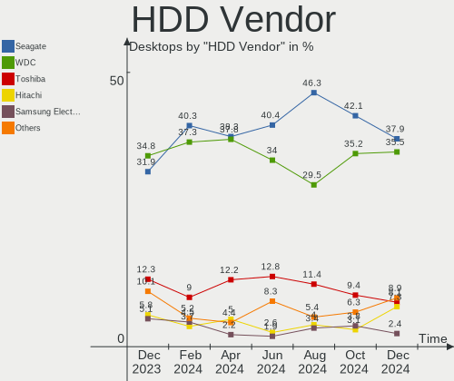
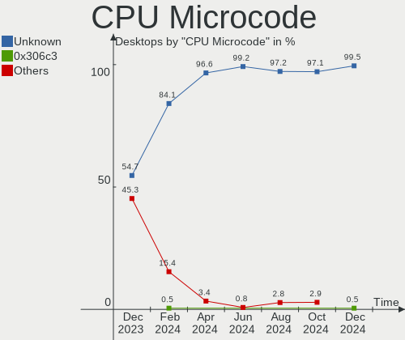
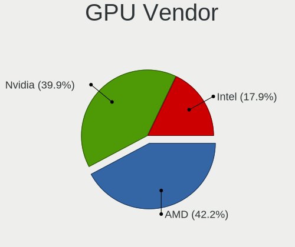

Fedora Hardware Trends (Desktops)
---------------------------------

A project to identify most popular hardware characteristics and track their change
over time based on data collected by Fedora users at https://Linux-Hardware.org.

Anyone can contribute to this report by the [hw-probe](https://github.com/linuxhw/hw-probe) tool:

    sudo -E hw-probe -all -upload

Full-feature report is available here: https://linux-hardware.org/?view=trends

Period: Nov, 2021.

Contents
--------

* [ System ](#system)
  - [ OS                       ](#os)
  - [ OS Family                ](#os-family)
  - [ Kernel                   ](#kernel)
  - [ Kernel Family            ](#kernel-family)
  - [ Kernel Major Ver.        ](#kernel-major-ver)
  - [ Arch                     ](#arch)
  - [ DE                       ](#de)
  - [ Display Server           ](#display-server)
  - [ Display Manager          ](#display-manager)
  - [ OS Lang                  ](#os-lang)
  - [ Boot Mode                ](#boot-mode)
  - [ Filesystem               ](#filesystem)
  - [ Part. scheme             ](#part-scheme)
  - [ Dual Boot with Linux/BSD ](#dual-boot-with-linuxbsd)
  - [ Dual Boot (Win)          ](#dual-boot-win)

* [ Board ](#board)
  - [ Vendor                   ](#vendor)
  - [ Model                    ](#model)
  - [ Model Family             ](#model-family)
  - [ MFG Year                 ](#mfg-year)
  - [ Form Factor              ](#form-factor)
  - [ Secure Boot              ](#secure-boot)
  - [ Coreboot                 ](#coreboot)
  - [ RAM Size                 ](#ram-size)
  - [ RAM Used                 ](#ram-used)
  - [ Total Drives             ](#total-drives)
  - [ Has CD-ROM               ](#has-cd-rom)
  - [ Has Ethernet             ](#has-ethernet)
  - [ Has WiFi                 ](#has-wifi)
  - [ Has Bluetooth            ](#has-bluetooth)

* [ Location ](#location)
  - [ Country                  ](#country)
  - [ City                     ](#city)

* [ Drives ](#drives)
  - [ Drive Vendor             ](#drive-vendor)
  - [ Drive Model              ](#drive-model)
  - [ HDD Vendor               ](#hdd-vendor)
  - [ SSD Vendor               ](#ssd-vendor)
  - [ Drive Kind               ](#drive-kind)
  - [ Drive Connector          ](#drive-connector)
  - [ Drive Size               ](#drive-size)
  - [ Space Total              ](#space-total)
  - [ Space Used               ](#space-used)
  - [ Malfunc. Drives          ](#malfunc-drives)
  - [ Malfunc. Drive Vendor    ](#malfunc-drive-vendor)
  - [ Malfunc. HDD Vendor      ](#malfunc-hdd-vendor)
  - [ Malfunc. Drive Kind      ](#malfunc-drive-kind)
  - [ Failed Drives            ](#failed-drives)
  - [ Failed Drive Vendor      ](#failed-drive-vendor)
  - [ Drive Status             ](#drive-status)

* [ Storage controller ](#storage-controller)
  - [ Storage Vendor           ](#storage-vendor)
  - [ Storage Model            ](#storage-model)
  - [ Storage Kind             ](#storage-kind)

* [ Processor ](#processor)
  - [ CPU Vendor               ](#cpu-vendor)
  - [ CPU Model                ](#cpu-model)
  - [ CPU Model Family         ](#cpu-model-family)
  - [ CPU Cores                ](#cpu-cores)
  - [ CPU Sockets              ](#cpu-sockets)
  - [ CPU Threads              ](#cpu-threads)
  - [ CPU Op-Modes             ](#cpu-op-modes)
  - [ CPU Microcode            ](#cpu-microcode)
  - [ CPU Microarch            ](#cpu-microarch)

* [ Graphics ](#graphics)
  - [ GPU Vendor               ](#gpu-vendor)
  - [ GPU Model                ](#gpu-model)
  - [ GPU Combo                ](#gpu-combo)
  - [ GPU Driver               ](#gpu-driver)
  - [ GPU Memory               ](#gpu-memory)

* [ Monitor ](#monitor)
  - [ Monitor Vendor           ](#monitor-vendor)
  - [ Monitor Model            ](#monitor-model)
  - [ Monitor Resolution       ](#monitor-resolution)
  - [ Monitor Diagonal         ](#monitor-diagonal)
  - [ Monitor Width            ](#monitor-width)
  - [ Aspect Ratio             ](#aspect-ratio)
  - [ Monitor Area             ](#monitor-area)
  - [ Pixel Density            ](#pixel-density)
  - [ Multiple Monitors        ](#multiple-monitors)

* [ Network ](#network)
  - [ Net Controller Vendor    ](#net-controller-vendor)
  - [ Net Controller Model     ](#net-controller-model)
  - [ Wireless Vendor          ](#wireless-vendor)
  - [ Wireless Model           ](#wireless-model)
  - [ Ethernet Vendor          ](#ethernet-vendor)
  - [ Ethernet Model           ](#ethernet-model)
  - [ Net Controller Kind      ](#net-controller-kind)
  - [ Used Controller          ](#used-controller)
  - [ NICs                     ](#nics)
  - [ IPv6                     ](#ipv6)

* [ Bluetooth ](#bluetooth)
  - [ Bluetooth Vendor         ](#bluetooth-vendor)
  - [ Bluetooth Model          ](#bluetooth-model)

* [ Sound ](#sound)
  - [ Sound Vendor             ](#sound-vendor)
  - [ Sound Model              ](#sound-model)

* [ Memory ](#memory)
  - [ Memory Vendor            ](#memory-vendor)
  - [ Memory Model             ](#memory-model)
  - [ Memory Kind              ](#memory-kind)
  - [ Memory Form Factor       ](#memory-form-factor)
  - [ Memory Size              ](#memory-size)
  - [ Memory Speed             ](#memory-speed)

* [ Printers & scanners ](#printers--scanners)
  - [ Printer Vendor           ](#printer-vendor)
  - [ Printer Model            ](#printer-model)
  - [ Scanner Vendor           ](#scanner-vendor)
  - [ Scanner Model            ](#scanner-model)

* [ Camera ](#camera)
  - [ Camera Vendor            ](#camera-vendor)
  - [ Camera Model             ](#camera-model)

* [ Security ](#security)
  - [ Fingerprint Vendor       ](#fingerprint-vendor)
  - [ Fingerprint Model        ](#fingerprint-model)
  - [ Chipcard Vendor          ](#chipcard-vendor)
  - [ Chipcard Model           ](#chipcard-model)

* [ Unsupported ](#unsupported)
  - [ Unsupported Devices      ](#unsupported-devices)
  - [ Unsupported Device Types ](#unsupported-device-types)

System
------

OS
--

Installed operating systems

| Name      | Desktops | Percent |
|-----------|----------|---------|
| Fedora 35 | 89       | 74.17%  |
| Fedora 34 | 25       | 20.83%  |
| Fedora 33 | 6        | 5%      |

OS Family
---------

OS without a version

| Name   | Desktops | Percent |
|--------|----------|---------|
| Fedora | 120      | 100%    |

Kernel
------

Version of the Linux kernel

| Version                                                       | Desktops | Percent |
|---------------------------------------------------------------|----------|---------|
| 5.14.18-300.fc35.x86_64                                       | 20       | 16.67%  |
| 5.14.16-301.fc35.x86_64                                       | 17       | 14.17%  |
| 5.14.17-301.fc35.x86_64                                       | 15       | 12.5%   |
| 5.14.14-300.fc35.x86_64                                       | 13       | 10.83%  |
| 5.14.15-300.fc35.x86_64                                       | 11       | 9.17%   |
| 5.14.14-200.fc34.x86_64                                       | 9        | 7.5%    |
| 5.14.16-201.fc34.x86_64                                       | 7        | 5.83%   |
| 5.15.4-201.fc35.x86_64                                        | 3        | 2.5%    |
| 5.14.10-300.fc35.x86_64                                       | 3        | 2.5%    |
| 5.14.18-200.fc34.x86_64                                       | 2        | 1.67%   |
| 5.14.15-200.fc34.x86_64                                       | 2        | 1.67%   |
| 5.4.19-200.fc31.x86_64                                        | 1        | 0.83%   |
| 5.16.0-0.rc2.18.vanilla.1.fc35.x86_64                         | 1        | 0.83%   |
| 5.16.0-0.rc1.20211115git8ab774587903.14.vanilla.1.fc35.x86_64 | 1        | 0.83%   |
| 5.15.5-xm1tt.0.fc35.x86_64                                    | 1        | 0.83%   |
| 5.15.4-xm1.0.fc35.x86_64                                      | 1        | 0.83%   |
| 5.15.4-101.fc34.x86_64                                        | 1        | 0.83%   |
| 5.15.2_tkg_bmq                                                | 1        | 0.83%   |
| 5.15.2-200.fc35.x86_64                                        | 1        | 0.83%   |
| 5.15.0-500.chinfo.fc35.x86_64                                 | 1        | 0.83%   |
| 5.14.9-200.fc34.x86_64                                        | 1        | 0.83%   |
| 5.14.20-300.fc35.x86_64                                       | 1        | 0.83%   |
| 5.14.18-100.fc33.x86_64                                       | 1        | 0.83%   |
| 5.14.17-101.fc33.x86_64                                       | 1        | 0.83%   |
| 5.14.13-200.fc34.x86_64                                       | 1        | 0.83%   |
| 5.13.12-200.fc34.x86_64                                       | 1        | 0.83%   |
| 5.12.6-200.fc33.x86_64                                        | 1        | 0.83%   |
| 5.11.15-200.fc33.x86_64                                       | 1        | 0.83%   |
| 5.10.22-200.fc33.x86_64                                       | 1        | 0.83%   |

Kernel Family
-------------

Linux kernel without a distro release

| Version | Desktops | Percent |
|---------|----------|---------|
| 5.14.16 | 24       | 20%     |
| 5.14.18 | 23       | 19.17%  |
| 5.14.14 | 22       | 18.33%  |
| 5.14.17 | 16       | 13.33%  |
| 5.14.15 | 13       | 10.83%  |
| 5.15.4  | 5        | 4.17%   |
| 5.14.10 | 3        | 2.5%    |
| 5.16.0  | 2        | 1.67%   |
| 5.15.2  | 2        | 1.67%   |
| 5.4.19  | 1        | 0.83%   |
| 5.15.5  | 1        | 0.83%   |
| 5.15.0  | 1        | 0.83%   |
| 5.14.9  | 1        | 0.83%   |
| 5.14.20 | 1        | 0.83%   |
| 5.14.13 | 1        | 0.83%   |
| 5.13.12 | 1        | 0.83%   |
| 5.12.6  | 1        | 0.83%   |
| 5.11.15 | 1        | 0.83%   |
| 5.10.22 | 1        | 0.83%   |

Kernel Major Ver.
-----------------

Linux kernel major version

| Version | Desktops | Percent |
|---------|----------|---------|
| 5.14    | 104      | 86.67%  |
| 5.15    | 9        | 7.5%    |
| 5.16    | 2        | 1.67%   |
| 5.4     | 1        | 0.83%   |
| 5.13    | 1        | 0.83%   |
| 5.12    | 1        | 0.83%   |
| 5.11    | 1        | 0.83%   |
| 5.10    | 1        | 0.83%   |

Arch
----

OS architecture (x86_64, i586, etc.)

| Name   | Desktops | Percent |
|--------|----------|---------|
| x86_64 | 120      | 100%    |

DE
--

Desktop Environment

| Name       | Desktops | Percent |
|------------|----------|---------|
| GNOME      | 80       | 66.67%  |
| KDE5       | 15       | 12.5%   |
| Unknown    | 7        | 5.83%   |
| X-Cinnamon | 5        | 4.17%   |
| Cinnamon   | 5        | 4.17%   |
| MATE       | 4        | 3.33%   |
| XFCE       | 3        | 2.5%    |
| LXDE       | 1        | 0.83%   |

Display Server
--------------

X11 or Wayland

| Name    | Desktops | Percent |
|---------|----------|---------|
| Wayland | 60       | 50%     |
| X11     | 53       | 44.17%  |
| Tty     | 5        | 4.17%   |
| Unknown | 2        | 1.67%   |

Display Manager
---------------

SDDM, LightDM, etc.

| Name    | Desktops | Percent |
|---------|----------|---------|
| Unknown | 57       | 47.5%   |
| GDM     | 35       | 29.17%  |
| LightDM | 18       | 15%     |
| SDDM    | 10       | 8.33%   |

OS Lang
-------

Language

| Lang       | Desktops | Percent |
|------------|----------|---------|
| en_US      | 46       | 38.33%  |
| en_AU      | 10       | 8.33%   |
| en_GB      | 9        | 7.5%    |
| de_DE      | 9        | 7.5%    |
| ru_RU      | 7        | 5.83%   |
| pt_BR      | 6        | 5%      |
| es_ES      | 5        | 4.17%   |
| fr_FR      | 4        | 3.33%   |
| en_CA      | 4        | 3.33%   |
| es_MX      | 3        | 2.5%    |
| it_IT      | 2        | 1.67%   |
| Unknown    | 2        | 1.67%   |
| sr_RS      | 1        | 0.83%   |
| pl_PL      | 1        | 0.83%   |
| ja_JP      | 1        | 0.83%   |
| fi_FI      | 1        | 0.83%   |
| es_VE      | 1        | 0.83%   |
| es_CO      | 1        | 0.83%   |
| es_CL      | 1        | 0.83%   |
| en_US.UTF8 | 1        | 0.83%   |
| en_NZ      | 1        | 0.83%   |
| en_IN      | 1        | 0.83%   |
| de_CH      | 1        | 0.83%   |
| ca_ES      | 1        | 0.83%   |
| ar_SA      | 1        | 0.83%   |

Boot Mode
---------

EFI or BIOS

| Mode | Desktops | Percent |
|------|----------|---------|
| EFI  | 66       | 55%     |
| BIOS | 54       | 45%     |

Filesystem
----------

Type of filesystem

| Type  | Desktops | Percent |
|-------|----------|---------|
| Btrfs | 76       | 63.33%  |
| Ext4  | 38       | 31.67%  |
| Xfs   | 5        | 4.17%   |
| Ext3  | 1        | 0.83%   |

Part. scheme
------------

Scheme of partitioning

| Type    | Desktops | Percent |
|---------|----------|---------|
| Unknown | 53       | 44.17%  |
| GPT     | 46       | 38.33%  |
| MBR     | 21       | 17.5%   |

Dual Boot with Linux/BSD
------------------------

Hosting more than one Linux/BSD

| Dual boot | Desktops | Percent |
|-----------|----------|---------|
| No        | 104      | 86.67%  |
| Yes       | 16       | 13.33%  |

Dual Boot (Win)
---------------

Hosting Linux and Windows

| Dual boot | Desktops | Percent |
|-----------|----------|---------|
| No        | 90       | 75%     |
| Yes       | 30       | 25%     |

Board
-----

Vendor
------

Motherboard manufacturer

| Name                | Desktops | Percent |
|---------------------|----------|---------|
| Gigabyte Technology | 30       | 25%     |
| ASUSTek Computer    | 29       | 24.17%  |
| MSI                 | 17       | 14.17%  |
| ASRock              | 13       | 10.83%  |
| Dell                | 10       | 8.33%   |
| Hewlett-Packard     | 7        | 5.83%   |
| Lenovo              | 3        | 2.5%    |
| Pegatron            | 2        | 1.67%   |
| Apple               | 2        | 1.67%   |
| Seco                | 1        | 0.83%   |
| Itautec             | 1        | 0.83%   |
| Intel               | 1        | 0.83%   |
| Huanan              | 1        | 0.83%   |
| ECS                 | 1        | 0.83%   |
| ABIT                | 1        | 0.83%   |
| Unknown             | 1        | 0.83%   |

Model
-----

Motherboard model

| Name                              | Desktops | Percent |
|-----------------------------------|----------|---------|
| ASUS All Series                   | 4        | 3.33%   |
| MSI MS-7C52                       | 2        | 1.67%   |
| MSI MS-7C02                       | 2        | 1.67%   |
| Gigabyte X570 AORUS MASTER        | 2        | 1.67%   |
| Gigabyte H97M-D3H                 | 2        | 1.67%   |
| Gigabyte B450M DS3H               | 2        | 1.67%   |
| Apple MacPro5,1                   | 2        | 1.67%   |
| Seco C40                          | 1        | 0.83%   |
| Pegatron h9-1350                  | 1        | 0.83%   |
| Pegatron FR566AA-ABU IQ515uk      | 1        | 0.83%   |
| MSI MS-7C94                       | 1        | 0.83%   |
| MSI MS-7C56                       | 1        | 0.83%   |
| MSI MS-7C37                       | 1        | 0.83%   |
| MSI MS-7C35                       | 1        | 0.83%   |
| MSI MS-7C31                       | 1        | 0.83%   |
| MSI MS-7B98                       | 1        | 0.83%   |
| MSI MS-7B93                       | 1        | 0.83%   |
| MSI MS-7B89                       | 1        | 0.83%   |
| MSI MS-7B86                       | 1        | 0.83%   |
| MSI MS-7B85                       | 1        | 0.83%   |
| MSI MS-7924                       | 1        | 0.83%   |
| MSI MS-7758                       | 1        | 0.83%   |
| MSI MS-7721                       | 1        | 0.83%   |
| Lenovo V55t-15ARE 11KG0004CK      | 1        | 0.83%   |
| Lenovo ThinkCentre M83 10AHS0FM00 | 1        | 0.83%   |
| Lenovo ThinkCentre M72z 3543A9G   | 1        | 0.83%   |
| Itautec Infoway ST-4271           | 1        | 0.83%   |
| Intel D33217GKE G69901-205        | 1        | 0.83%   |
| Huanan X99-F8                     | 1        | 0.83%   |
| HP Z400 Workstation               | 1        | 0.83%   |
| HP Z230 SFF Workstation           | 1        | 0.83%   |
| HP ProDesk 600 G1 DM              | 1        | 0.83%   |
| HP EliteDesk 800 G4 SFF           | 1        | 0.83%   |
| HP EliteDesk 800 G2 DM 65W        | 1        | 0.83%   |
| HP EliteDesk 705 G1 SFF           | 1        | 0.83%   |
| HP Compaq 6000 Pro SFF PC         | 1        | 0.83%   |
| Gigabyte Z690 UD DDR4             | 1        | 0.83%   |
| Gigabyte Z390 I AORUS PRO WIFI    | 1        | 0.83%   |
| Gigabyte Z170-D3H                 | 1        | 0.83%   |
| Gigabyte X570 UD                  | 1        | 0.83%   |
| Gigabyte X570 AORUS ELITE         | 1        | 0.83%   |
| Gigabyte H61M-S2V-B3              | 1        | 0.83%   |
| Gigabyte H370M-DS3H               | 1        | 0.83%   |
| Gigabyte H170-Gaming 3            | 1        | 0.83%   |
| Gigabyte GA-MA790X-UD4            | 1        | 0.83%   |
| Gigabyte GA-MA785G-UD3H           | 1        | 0.83%   |
| Gigabyte GA-MA780G-UD3H           | 1        | 0.83%   |
| Gigabyte GA-880GM-UD2H            | 1        | 0.83%   |
| Gigabyte GA-78LMT-USB3            | 1        | 0.83%   |
| Gigabyte F2A88XM-D3H              | 1        | 0.83%   |
| Gigabyte F2A85XM-D3H              | 1        | 0.83%   |
| Gigabyte EX58-UD3R                | 1        | 0.83%   |
| Gigabyte EP45-DS3L                | 1        | 0.83%   |
| Gigabyte B550M DS3H               | 1        | 0.83%   |
| Gigabyte B550 AORUS PRO           | 1        | 0.83%   |
| Gigabyte B550 AORUS ELITE         | 1        | 0.83%   |
| Gigabyte B150M-D3H                | 1        | 0.83%   |
| Gigabyte AB350M-Gaming 3          | 1        | 0.83%   |
| Gigabyte AB350M-DS3H V2           | 1        | 0.83%   |
| Gigabyte 990FXA-UD3               | 1        | 0.83%   |

Model Family
------------

Motherboard model prefix

| Name                    | Desktops | Percent |
|-------------------------|----------|---------|
| Dell OptiPlex           | 7        | 5.83%   |
| ASUS ROG                | 6        | 5%      |
| Gigabyte X570           | 4        | 3.33%   |
| ASUS All                | 4        | 3.33%   |
| HP EliteDesk            | 3        | 2.5%    |
| ASUS PRIME              | 3        | 2.5%    |
| MSI MS-7C52             | 2        | 1.67%   |
| MSI MS-7C02             | 2        | 1.67%   |
| Lenovo ThinkCentre      | 2        | 1.67%   |
| Gigabyte H97M-D3H       | 2        | 1.67%   |
| Gigabyte B550           | 2        | 1.67%   |
| Gigabyte B450M          | 2        | 1.67%   |
| ASUS TUF                | 2        | 1.67%   |
| ASRock X570             | 2        | 1.67%   |
| Apple MacPro5           | 2        | 1.67%   |
| Seco C40                | 1        | 0.83%   |
| Pegatron h9-1350        | 1        | 0.83%   |
| Pegatron FR566AA-ABU    | 1        | 0.83%   |
| MSI MS-7C94             | 1        | 0.83%   |
| MSI MS-7C56             | 1        | 0.83%   |
| MSI MS-7C37             | 1        | 0.83%   |
| MSI MS-7C35             | 1        | 0.83%   |
| MSI MS-7C31             | 1        | 0.83%   |
| MSI MS-7B98             | 1        | 0.83%   |
| MSI MS-7B93             | 1        | 0.83%   |
| MSI MS-7B89             | 1        | 0.83%   |
| MSI MS-7B86             | 1        | 0.83%   |
| MSI MS-7B85             | 1        | 0.83%   |
| MSI MS-7924             | 1        | 0.83%   |
| MSI MS-7758             | 1        | 0.83%   |
| MSI MS-7721             | 1        | 0.83%   |
| Lenovo V55t-15ARE       | 1        | 0.83%   |
| Itautec Infoway         | 1        | 0.83%   |
| Intel D33217GKE         | 1        | 0.83%   |
| Huanan X99-F8           | 1        | 0.83%   |
| HP Z400                 | 1        | 0.83%   |
| HP Z230                 | 1        | 0.83%   |
| HP ProDesk              | 1        | 0.83%   |
| HP Compaq               | 1        | 0.83%   |
| Gigabyte Z690           | 1        | 0.83%   |
| Gigabyte Z390           | 1        | 0.83%   |
| Gigabyte Z170-D3H       | 1        | 0.83%   |
| Gigabyte H61M-S2V-B3    | 1        | 0.83%   |
| Gigabyte H370M-DS3H     | 1        | 0.83%   |
| Gigabyte H170-Gaming    | 1        | 0.83%   |
| Gigabyte GA-MA790X-UD4  | 1        | 0.83%   |
| Gigabyte GA-MA785G-UD3H | 1        | 0.83%   |
| Gigabyte GA-MA780G-UD3H | 1        | 0.83%   |
| Gigabyte GA-880GM-UD2H  | 1        | 0.83%   |
| Gigabyte GA-78LMT-USB3  | 1        | 0.83%   |
| Gigabyte F2A88XM-D3H    | 1        | 0.83%   |
| Gigabyte F2A85XM-D3H    | 1        | 0.83%   |
| Gigabyte EX58-UD3R      | 1        | 0.83%   |
| Gigabyte EP45-DS3L      | 1        | 0.83%   |
| Gigabyte B550M          | 1        | 0.83%   |
| Gigabyte B150M-D3H      | 1        | 0.83%   |
| Gigabyte AB350M-Gaming  | 1        | 0.83%   |
| Gigabyte AB350M-DS3H    | 1        | 0.83%   |
| Gigabyte 990FXA-UD3     | 1        | 0.83%   |
| ECS H61H2-CM            | 1        | 0.83%   |

MFG Year
--------

Motherboard manufacture year

| Year | Desktops | Percent |
|------|----------|---------|
| 2021 | 21       | 17.5%   |
| 2019 | 20       | 16.67%  |
| 2020 | 14       | 11.67%  |
| 2018 | 12       | 10%     |
| 2014 | 11       | 9.17%   |
| 2009 | 7        | 5.83%   |
| 2015 | 6        | 5%      |
| 2012 | 6        | 5%      |
| 2010 | 6        | 5%      |
| 2013 | 5        | 4.17%   |
| 2016 | 4        | 3.33%   |
| 2008 | 3        | 2.5%    |
| 2017 | 2        | 1.67%   |
| 2011 | 2        | 1.67%   |
| 2006 | 1        | 0.83%   |

Form Factor
-----------

Physical design of the computer

| Name    | Desktops | Percent |
|---------|----------|---------|
| Desktop | 120      | 100%    |

Secure Boot
-----------

Enabled or disabled

| State    | Desktops | Percent |
|----------|----------|---------|
| Disabled | 113      | 94.17%  |
| Enabled  | 7        | 5.83%   |

Coreboot
--------

Have coreboot on board

| Used | Desktops | Percent |
|------|----------|---------|
| No   | 120      | 100%    |

RAM Size
--------

Total RAM memory

| Size in GB  | Desktops | Percent |
|-------------|----------|---------|
| 16.01-24.0  | 29       | 24.17%  |
| 32.01-64.0  | 27       | 22.5%   |
| 8.01-16.0   | 22       | 18.33%  |
| 4.01-8.0    | 14       | 11.67%  |
| 3.01-4.0    | 13       | 10.83%  |
| 64.01-256.0 | 10       | 8.33%   |
| 24.01-32.0  | 3        | 2.5%    |
| 2.01-3.0    | 1        | 0.83%   |
| 1.01-2.0    | 1        | 0.83%   |

RAM Used
--------

Used RAM memory

| Used GB    | Desktops | Percent |
|------------|----------|---------|
| 2.01-3.0   | 36       | 30%     |
| 4.01-8.0   | 33       | 27.5%   |
| 1.01-2.0   | 19       | 15.83%  |
| 3.01-4.0   | 15       | 12.5%   |
| 8.01-16.0  | 7        | 5.83%   |
| 0.51-1.0   | 5        | 4.17%   |
| 16.01-24.0 | 3        | 2.5%    |
| 32.01-64.0 | 1        | 0.83%   |
| 24.01-32.0 | 1        | 0.83%   |

Total Drives
------------

Number of drives on board

| Drives | Desktops | Percent |
|--------|----------|---------|
| 2      | 36       | 30%     |
| 1      | 36       | 30%     |
| 3      | 27       | 22.5%   |
| 6      | 7        | 5.83%   |
| 5      | 5        | 4.17%   |
| 4      | 5        | 4.17%   |
| 9      | 2        | 1.67%   |
| 7      | 2        | 1.67%   |

Has CD-ROM
----------

Has CD-ROM on board

| Presented | Desktops | Percent |
|-----------|----------|---------|
| No        | 65       | 54.17%  |
| Yes       | 55       | 45.83%  |

Has Ethernet
------------

Has Ethernet on board

| Presented | Desktops | Percent |
|-----------|----------|---------|
| Yes       | 119      | 99.17%  |
| No        | 1        | 0.83%   |

Has WiFi
--------

Has WiFi module

| Presented | Desktops | Percent |
|-----------|----------|---------|
| No        | 66       | 55%     |
| Yes       | 54       | 45%     |

Has Bluetooth
-------------

Has Bluetooth module

| Presented | Desktops | Percent |
|-----------|----------|---------|
| No        | 70       | 58.33%  |
| Yes       | 50       | 41.67%  |

Location
--------

Country
-------

Geographic location (country)

| Country      | Desktops | Percent |
|--------------|----------|---------|
| USA          | 18       | 15%     |
| Germany      | 10       | 8.33%   |
| Spain        | 8        | 6.67%   |
| Canada       | 8        | 6.67%   |
| Australia    | 8        | 6.67%   |
| Russia       | 7        | 5.83%   |
| Brazil       | 7        | 5.83%   |
| France       | 6        | 5%      |
| UK           | 4        | 3.33%   |
| Switzerland  | 4        | 3.33%   |
| Mexico       | 4        | 3.33%   |
| Romania      | 3        | 2.5%    |
| Italy        | 3        | 2.5%    |
| India        | 3        | 2.5%    |
| Poland       | 2        | 1.67%   |
| Malaysia     | 2        | 1.67%   |
| Chile        | 2        | 1.67%   |
| Belgium      | 2        | 1.67%   |
| Belarus      | 2        | 1.67%   |
| Yemen        | 1        | 0.83%   |
| Venezuela    | 1        | 0.83%   |
| Ukraine      | 1        | 0.83%   |
| Slovakia     | 1        | 0.83%   |
| Saudi Arabia | 1        | 0.83%   |
| New Zealand  | 1        | 0.83%   |
| Netherlands  | 1        | 0.83%   |
| Kazakhstan   | 1        | 0.83%   |
| Japan        | 1        | 0.83%   |
| Indonesia    | 1        | 0.83%   |
| Hong Kong    | 1        | 0.83%   |
| Greece       | 1        | 0.83%   |
| Finland      | 1        | 0.83%   |
| Estonia      | 1        | 0.83%   |
| Czechia      | 1        | 0.83%   |
| Cyprus       | 1        | 0.83%   |
| Colombia     | 1        | 0.83%   |

City
----

Geographic location (city)

| City                        | Desktops | Percent |
|-----------------------------|----------|---------|
| Sydney                      | 5        | 4.17%   |
| Zurich                      | 2        | 1.67%   |
| Weinsberg                   | 2        | 1.67%   |
| Ufa                         | 2        | 1.67%   |
| S??o Paulo                  | 2        | 1.67%   |
| Petaling Jaya               | 2        | 1.67%   |
| Oakville                    | 2        | 1.67%   |
| Moscow                      | 2        | 1.67%   |
| Minsk                       | 2        | 1.67%   |
| Berlin                      | 2        | 1.67%   |
| Bainbridge Island           | 2        | 1.67%   |
| Zapopan                     | 1        | 0.83%   |
| Winterthur                  | 1        | 0.83%   |
| Westerstede                 | 1        | 0.83%   |
| Weissenfels                 | 1        | 0.83%   |
| Waynesville                 | 1        | 0.83%   |
| Voronezh                    | 1        | 0.83%   |
| Verrieres-le-Buisson        | 1        | 0.83%   |
| Valencia                    | 1        | 0.83%   |
| Ulan-Ude                    | 1        | 0.83%   |
| Tuxtla Guti?©rrez           | 1        | 0.83%   |
| Tung Chung                  | 1        | 0.83%   |
| Trois-Rivi??res             | 1        | 0.83%   |
| Tonbridge                   | 1        | 0.83%   |
| Tlajomulco de Zuniga        | 1        | 0.83%   |
| Timi?™oara                  | 1        | 0.83%   |
| Tartu                       | 1        | 0.83%   |
| Tampa                       | 1        | 0.83%   |
| Stuttgart                   | 1        | 0.83%   |
| Shepherdsville              | 1        | 0.83%   |
| Serra                       | 1        | 0.83%   |
| Saskatoon                   | 1        | 0.83%   |
| Sanaa                       | 1        | 0.83%   |
| San Sebasti??n de los Reyes | 1        | 0.83%   |
| Sainte-Foy-les-Lyon         | 1        | 0.83%   |
| Rome                        | 1        | 0.83%   |
| Raleigh                     | 1        | 0.83%   |
| Providencia                 | 1        | 0.83%   |
| Prospect Park               | 1        | 0.83%   |
| Ponferrada                  | 1        | 0.83%   |
| Perth                       | 1        | 0.83%   |
| Paris                       | 1        | 0.83%   |
| Ottawa                      | 1        | 0.83%   |
| Orange                      | 1        | 0.83%   |
| Oberhausen                  | 1        | 0.83%   |
| Nunoa                       | 1        | 0.83%   |
| Nowa Sarzyna                | 1        | 0.83%   |
| Novosibirsk                 | 1        | 0.83%   |
| Nicosia                     | 1        | 0.83%   |
| New Orleans                 | 1        | 0.83%   |
| Midvale                     | 1        | 0.83%   |
| Mesa                        | 1        | 0.83%   |
| Melbourne                   | 1        | 0.83%   |
| Medina                      | 1        | 0.83%   |
| Medell?­n                   | 1        | 0.83%   |
| Martigues                   | 1        | 0.83%   |
| Mangawhai                   | 1        | 0.83%   |
| Mainz                       | 1        | 0.83%   |
| Madrid                      | 1        | 0.83%   |
| Lyon                        | 1        | 0.83%   |

Drives
------

Drive Vendor
------------

Hard drive vendors

| Vendor                      | Desktops | Drives | Percent |
|-----------------------------|----------|--------|---------|
| Seagate                     | 51       | 80     | 21.98%  |
| WDC                         | 38       | 57     | 16.38%  |
| Samsung Electronics         | 36       | 55     | 15.52%  |
| Kingston                    | 14       | 16     | 6.03%   |
| SanDisk                     | 12       | 12     | 5.17%   |
| Crucial                     | 11       | 12     | 4.74%   |
| Toshiba                     | 10       | 15     | 4.31%   |
| Intel                       | 8        | 8      | 3.45%   |
| A-DATA Technology           | 8        | 8      | 3.45%   |
| SPCC                        | 5        | 5      | 2.16%   |
| Hitachi                     | 5        | 5      | 2.16%   |
| XPG                         | 3        | 5      | 1.29%   |
| Patriot                     | 3        | 3      | 1.29%   |
| Corsair                     | 3        | 3      | 1.29%   |
| Unknown                     | 2        | 2      | 0.86%   |
| Silicon Motion              | 2        | 2      | 0.86%   |
| MAXIO Technology (Hangzhou) | 2        | 2      | 0.86%   |
| HGST                        | 2        | 2      | 0.86%   |
| ASMT                        | 2        | 2      | 0.86%   |
| USB 3.0                     | 1        | 2      | 0.43%   |
| T-FORCE                     | 1        | 1      | 0.43%   |
| Realtek Semiconductor       | 1        | 1      | 0.43%   |
| PNY                         | 1        | 1      | 0.43%   |
| PLEXTOR                     | 1        | 1      | 0.43%   |
| Phison                      | 1        | 2      | 0.43%   |
| ORICO                       | 1        | 1      | 0.43%   |
| Micron/Crucial Technology   | 1        | 1      | 0.43%   |
| Micron Technology           | 1        | 1      | 0.43%   |
| Lexar                       | 1        | 1      | 0.43%   |
| LDLC                        | 1        | 2      | 0.43%   |
| Intenso                     | 1        | 2      | 0.43%   |
| Hewlett-Packard             | 1        | 1      | 0.43%   |
| GOODRAM                     | 1        | 1      | 0.43%   |
| Unknown                     | 1        | 1      | 0.43%   |

Drive Model
-----------

Hard drive models

| Model                                  | Desktops | Percent |
|----------------------------------------|----------|---------|
| Seagate ST2000DM008-2FR102 2TB         | 8        | 2.72%   |
| Seagate ST500DM002-1BD142 500GB        | 5        | 1.7%    |
| Samsung NVMe SSD Drive 500GB           | 5        | 1.7%    |
| Seagate ST1000DM010-2EP102 1TB         | 4        | 1.36%   |
| Seagate ST1000DM003-1ER162 1TB         | 4        | 1.36%   |
| Crucial CT500MX500SSD1 500GB           | 4        | 1.36%   |
| WDC WDS100T1X0E-00AFY0 1TB             | 3        | 1.02%   |
| Toshiba DT01ACA200 2TB                 | 3        | 1.02%   |
| Seagate ST8000DM004-2CX188 8TB         | 3        | 1.02%   |
| Seagate ST4000DM005-2DP166 4TB         | 3        | 1.02%   |
| Seagate ST3500418AS 500GB              | 3        | 1.02%   |
| Seagate ST31000528AS 1TB               | 3        | 1.02%   |
| Sandisk NVMe SSD Drive 500GB           | 3        | 1.02%   |
| Samsung SSD 970 EVO 250GB              | 3        | 1.02%   |
| Samsung SSD 860 EVO 500GB              | 3        | 1.02%   |
| Kingston SV300S37A120G 120GB SSD       | 3        | 1.02%   |
| WDC WDS500G2B0A-00SM50 500GB SSD       | 2        | 0.68%   |
| WDC WDS480G2G0A-00JH30 480GB SSD       | 2        | 0.68%   |
| WDC WD5000AADS-00S9B0 500GB            | 2        | 0.68%   |
| WDC WD40EZRZ-00WN9B0 4TB               | 2        | 0.68%   |
| WDC WD360ADFD-00NLR1 37GB              | 2        | 0.68%   |
| WDC WD3200AAKS-00SBA0 320GB            | 2        | 0.68%   |
| WDC WD20EZRX-00D8PB0 2TB               | 2        | 0.68%   |
| WDC WD10EZEX-60WN4A0 1TB               | 2        | 0.68%   |
| Toshiba HDWD120 2TB                    | 2        | 0.68%   |
| SPCC M.2 PCIe SSD 256GB                | 2        | 0.68%   |
| Seagate ST500LM012 HN-M500MBB 500GB    | 2        | 0.68%   |
| Seagate ST3500620AS 500GB              | 2        | 0.68%   |
| Seagate ST3000DM008-2DM166 3TB         | 2        | 0.68%   |
| Seagate ST3000DM001-1ER166 3TB         | 2        | 0.68%   |
| Seagate ST1000DX001-1NS162 1TB         | 2        | 0.68%   |
| SanDisk SSD PLUS 240GB                 | 2        | 0.68%   |
| SanDisk SDSSDH3 250G                   | 2        | 0.68%   |
| Sandisk NVMe SSD Drive 1TB             | 2        | 0.68%   |
| Samsung SSD 970 EVO Plus 500GB         | 2        | 0.68%   |
| Samsung SSD 960 PRO 512GB              | 2        | 0.68%   |
| Samsung SSD 860 EVO 1TB                | 2        | 0.68%   |
| Samsung SSD 850 PRO 512GB              | 2        | 0.68%   |
| Samsung SSD 850 PRO 256GB              | 2        | 0.68%   |
| Samsung SSD 850 EVO 250GB              | 2        | 0.68%   |
| Samsung SSD 850 EVO 1TB                | 2        | 0.68%   |
| Samsung SSD 840 EVO 120GB              | 2        | 0.68%   |
| Samsung SM963 2.5" NVMe PCIe SSD 250GB | 2        | 0.68%   |
| MAXIO (Hangzhou) NVMe SSD Drive 256GB  | 2        | 0.68%   |
| Kingston SV300S37A240G 240GB SSD       | 2        | 0.68%   |
| Kingston SA400S37480G 480GB SSD        | 2        | 0.68%   |
| Kingston SA400S37240G 240GB SSD        | 2        | 0.68%   |
| Hitachi HDS721010CLA332 1TB            | 2        | 0.68%   |
| A-DATA SU655 120GB SSD                 | 2        | 0.68%   |
| XPG SX950U 960GB                       | 1        | 0.34%   |
| XPG NVMe SSD Drive 1024GB              | 1        | 0.34%   |
| XPG GAMMIX S11 Pro 1TB                 | 1        | 0.34%   |
| WDC WDS500G2B0A 500GB SSD              | 1        | 0.34%   |
| WDC WDS240G2G0A-00JH30 240GB SSD       | 1        | 0.34%   |
| WDC WDS200T2B0A-00SM50 2TB SSD         | 1        | 0.34%   |
| WDC WDS100T2B0C-00PXH0 1TB             | 1        | 0.34%   |
| WDC WDS100T2B0A-00SM50 1TB SSD         | 1        | 0.34%   |
| WDC WD800JD-60LSA5 80GB                | 1        | 0.34%   |
| WDC WD6400AAKS-65Z7B0 640GB            | 1        | 0.34%   |
| WDC WD6400AAKS-65A7B2 640GB            | 1        | 0.34%   |

HDD Vendor
----------

Hard disk drive vendors

| Vendor              | Desktops | Drives | Percent |
|---------------------|----------|--------|---------|
| Seagate             | 50       | 79     | 47.62%  |
| WDC                 | 32       | 45     | 30.48%  |
| Toshiba             | 9        | 11     | 8.57%   |
| Samsung Electronics | 5        | 6      | 4.76%   |
| Hitachi             | 5        | 5      | 4.76%   |
| HGST                | 2        | 2      | 1.9%    |
| USB 3.0             | 1        | 2      | 0.95%   |
| ASMT                | 1        | 1      | 0.95%   |

SSD Vendor
----------

Solid state drive vendors

| Vendor              | Desktops | Drives | Percent |
|---------------------|----------|--------|---------|
| Samsung Electronics | 22       | 29     | 25.29%  |
| Kingston            | 13       | 15     | 14.94%  |
| Crucial             | 8        | 9      | 9.2%    |
| WDC                 | 7        | 8      | 8.05%   |
| SanDisk             | 6        | 6      | 6.9%    |
| A-DATA Technology   | 6        | 6      | 6.9%    |
| Intel               | 5        | 5      | 5.75%   |
| Patriot             | 3        | 3      | 3.45%   |
| SPCC                | 2        | 2      | 2.3%    |
| XPG                 | 1        | 2      | 1.15%   |
| Unknown             | 1        | 1      | 1.15%   |
| Toshiba             | 1        | 1      | 1.15%   |
| T-FORCE             | 1        | 1      | 1.15%   |
| PNY                 | 1        | 1      | 1.15%   |
| PLEXTOR             | 1        | 1      | 1.15%   |
| ORICO               | 1        | 1      | 1.15%   |
| Micron Technology   | 1        | 1      | 1.15%   |
| Lexar               | 1        | 1      | 1.15%   |
| LDLC                | 1        | 1      | 1.15%   |
| Intenso             | 1        | 2      | 1.15%   |
| Hewlett-Packard     | 1        | 1      | 1.15%   |
| GOODRAM             | 1        | 1      | 1.15%   |
| Corsair             | 1        | 1      | 1.15%   |
| ASMT                | 1        | 1      | 1.15%   |

Drive Kind
----------

HDD or SSD

| Kind    | Desktops | Drives | Percent |
|---------|----------|--------|---------|
| HDD     | 83       | 151    | 41.5%   |
| SSD     | 69       | 100    | 34.5%   |
| NVMe    | 44       | 58     | 22%     |
| Unknown | 3        | 3      | 1.5%    |
| MMC     | 1        | 1      | 0.5%    |

Drive Connector
---------------

SATA, SAS, NVMe, etc.

| Type | Desktops | Drives | Percent |
|------|----------|--------|---------|
| SATA | 110      | 247    | 68.32%  |
| NVMe | 44       | 58     | 27.33%  |
| SAS  | 6        | 7      | 3.73%   |
| MMC  | 1        | 1      | 0.62%   |

Drive Size
----------

Size of hard drive

| Size in TB | Desktops | Drives | Percent |
|------------|----------|--------|---------|
| 0.01-0.5   | 80       | 121    | 45.45%  |
| 0.51-1.0   | 46       | 59     | 26.14%  |
| 1.01-2.0   | 25       | 28     | 14.2%   |
| 3.01-4.0   | 11       | 17     | 6.25%   |
| 2.01-3.0   | 7        | 15     | 3.98%   |
| 4.01-10.0  | 5        | 8      | 2.84%   |
| 10.01-20.0 | 2        | 3      | 1.14%   |

Space Total
-----------

Amount of disk space available on the file system

| Size in GB     | Desktops | Percent |
|----------------|----------|---------|
| 501-1000       | 28       | 23.33%  |
| More than 3000 | 24       | 20%     |
| 1001-2000      | 18       | 15%     |
| 251-500        | 15       | 12.5%   |
| 101-250        | 15       | 12.5%   |
| 2001-3000      | 8        | 6.67%   |
| 1-20           | 4        | 3.33%   |
| 51-100         | 4        | 3.33%   |
| Unknown        | 3        | 2.5%    |
| 21-50          | 1        | 0.83%   |

Space Used
----------

Amount of used disk space

| Used GB        | Desktops | Percent |
|----------------|----------|---------|
| 21-50          | 17       | 14.17%  |
| 1-20           | 17       | 14.17%  |
| 51-100         | 16       | 13.33%  |
| 501-1000       | 15       | 12.5%   |
| 251-500        | 13       | 10.83%  |
| 1001-2000      | 13       | 10.83%  |
| 101-250        | 12       | 10%     |
| More than 3000 | 10       | 8.33%   |
| 2001-3000      | 4        | 3.33%   |
| Unknown        | 3        | 2.5%    |

Malfunc. Drives
---------------

Drive models with a malfunction

| Model                                 | Desktops | Drives | Percent |
|---------------------------------------|----------|--------|---------|
| Seagate ST500DM002-1BD142 500GB       | 4        | 4      | 17.39%  |
| WDC WD10EFRX-68JCSN0 1TB              | 1        | 1      | 4.35%   |
| Seagate ST500LM012 HN-M500MBB 500GB   | 1        | 1      | 4.35%   |
| Seagate ST500LM000-1EJ162-SSHD 500GB  | 1        | 1      | 4.35%   |
| Seagate ST3500620AS 500GB             | 1        | 1      | 4.35%   |
| Seagate ST3500418AS 500GB             | 1        | 1      | 4.35%   |
| Seagate ST3250410AS 250GB             | 1        | 1      | 4.35%   |
| Seagate ST3200822A 200GB              | 1        | 1      | 4.35%   |
| Seagate ST31000528AS 1TB              | 1        | 1      | 4.35%   |
| Seagate ST3000DM001-1ER166 3TB        | 1        | 4      | 4.35%   |
| Seagate ST1000DM003-1ER162 1TB        | 1        | 1      | 4.35%   |
| Samsung Electronics SSD 970 EVO 250GB | 1        | 1      | 4.35%   |
| Samsung Electronics HM160HI 160GB     | 1        | 1      | 4.35%   |
| Samsung Electronics HD501LJ 500GB     | 1        | 2      | 4.35%   |
| ORICO N300 256GB SSD                  | 1        | 1      | 4.35%   |
| Kingston SV300S37A240G 240GB SSD      | 1        | 1      | 4.35%   |
| Kingston SV300S37A120G 120GB SSD      | 1        | 1      | 4.35%   |
| Intel SSDSC2CT120A3 120GB             | 1        | 1      | 4.35%   |
| HGST HTS725050A7E630 500GB            | 1        | 1      | 4.35%   |
| A-DATA Technology SX8100NP 1TB        | 1        | 1      | 4.35%   |

Malfunc. Drive Vendor
---------------------

Vendors of faulty drives

| Vendor              | Desktops | Drives | Percent |
|---------------------|----------|--------|---------|
| Seagate             | 13       | 16     | 56.52%  |
| Samsung Electronics | 3        | 4      | 13.04%  |
| Kingston            | 2        | 2      | 8.7%    |
| WDC                 | 1        | 1      | 4.35%   |
| ORICO               | 1        | 1      | 4.35%   |
| Intel               | 1        | 1      | 4.35%   |
| HGST                | 1        | 1      | 4.35%   |
| A-DATA Technology   | 1        | 1      | 4.35%   |

Malfunc. HDD Vendor
-------------------

Vendors of faulty HDD drives

| Vendor              | Desktops | Drives | Percent |
|---------------------|----------|--------|---------|
| Seagate             | 13       | 16     | 76.47%  |
| Samsung Electronics | 2        | 3      | 11.76%  |
| WDC                 | 1        | 1      | 5.88%   |
| HGST                | 1        | 1      | 5.88%   |

Malfunc. Drive Kind
-------------------

Kinds of faulty drives

| Kind | Desktops | Drives | Percent |
|------|----------|--------|---------|
| HDD  | 17       | 21     | 73.91%  |
| SSD  | 4        | 4      | 17.39%  |
| NVMe | 2        | 2      | 8.7%    |

Failed Drives
-------------

Failed drive models

Zero info for selected period =(

Failed Drive Vendor
-------------------

Failed drive vendors

Zero info for selected period =(

Drive Status
------------

Number of failed and malfunc. drives

| Status   | Desktops | Drives | Percent |
|----------|----------|--------|---------|
| Works    | 65       | 152    | 44.83%  |
| Detected | 57       | 134    | 39.31%  |
| Malfunc  | 23       | 27     | 15.86%  |

Storage controller
------------------

Storage Vendor
--------------

Storage controller vendors

| Vendor                       | Desktops | Percent |
|------------------------------|----------|---------|
| Intel                        | 61       | 32.45%  |
| AMD                          | 57       | 30.32%  |
| Samsung Electronics          | 16       | 8.51%   |
| Sandisk                      | 9        | 4.79%   |
| ASMedia Technology           | 8        | 4.26%   |
| JMicron Technology           | 6        | 3.19%   |
| Phison Electronics           | 4        | 2.13%   |
| Micron/Crucial Technology    | 4        | 2.13%   |
| Realtek Semiconductor        | 3        | 1.6%    |
| Nvidia                       | 3        | 1.6%    |
| Marvell Technology Group     | 3        | 1.6%    |
| Toshiba America Info Systems | 2        | 1.06%   |
| Silicon Motion               | 2        | 1.06%   |
| Silicon Image                | 2        | 1.06%   |
| MAXIO Technology (Hangzhou)  | 2        | 1.06%   |
| ADATA Technology             | 2        | 1.06%   |
| LSI Logic / Symbios Logic    | 1        | 0.53%   |
| KIOXIA                       | 1        | 0.53%   |
| Kingston Technology Company  | 1        | 0.53%   |
| HighPoint Technologies       | 1        | 0.53%   |

Storage Model
-------------

Storage controller models

| Model                                                                            | Desktops | Percent |
|----------------------------------------------------------------------------------|----------|---------|
| AMD FCH SATA Controller [AHCI mode]                                              | 38       | 16.45%  |
| AMD 400 Series Chipset SATA Controller                                           | 12       | 5.19%   |
| Samsung NVMe SSD Controller SM981/PM981/PM983                                    | 11       | 4.76%   |
| Intel 8 Series/C220 Series Chipset Family 6-port SATA Controller 1 [AHCI mode]   | 9        | 3.9%    |
| ASMedia ASM1062 Serial ATA Controller                                            | 8        | 3.46%   |
| AMD SB7x0/SB8x0/SB9x0 IDE Controller                                             | 8        | 3.46%   |
| Intel Q170/Q150/B150/H170/H110/Z170/CM236 Chipset SATA Controller [AHCI Mode]    | 7        | 3.03%   |
| Intel Cannon Lake PCH SATA AHCI Controller                                       | 7        | 3.03%   |
| AMD Starship/Matisse Chipset SATA Controller [AHCI mode]                         | 7        | 3.03%   |
| Intel 6 Series/C200 Series Chipset Family 6 port Desktop SATA AHCI Controller    | 6        | 2.6%    |
| AMD SB7x0/SB8x0/SB9x0 SATA Controller [AHCI mode]                                | 6        | 2.6%    |
| Sandisk WD PC SN810 / Black SN850 NVMe SSD                                       | 5        | 2.16%   |
| AMD SB7x0/SB8x0/SB9x0 SATA Controller [IDE mode]                                 | 5        | 2.16%   |
| Intel SATA Controller [RAID mode]                                                | 4        | 1.73%   |
| Intel 9 Series Chipset Family SATA Controller [AHCI Mode]                        | 4        | 1.73%   |
| Intel 7 Series/C210 Series Chipset Family 6-port SATA Controller [AHCI mode]     | 4        | 1.73%   |
| Sandisk WD Blue SN550 NVMe SSD                                                   | 3        | 1.3%    |
| Samsung NVMe SSD Controller PM9A1/PM9A3/980PRO                                   | 3        | 1.3%    |
| Realtek RTS5763DL NVMe SSD Controller                                            | 3        | 1.3%    |
| Phison E16 PCIe4 NVMe Controller                                                 | 3        | 1.3%    |
| JMicron JMB363 SATA/IDE Controller                                               | 3        | 1.3%    |
| Intel 82801JI (ICH10 Family) SATA AHCI Controller                                | 3        | 1.3%    |
| Toshiba America Info Systems Toshiba America Info Non-Volatile memory controller | 2        | 0.87%   |
| Silicon Image SiI 3132 Serial ATA Raid II Controller                             | 2        | 0.87%   |
| Sandisk WD Black 2018/SN750 / PC SN720 NVMe SSD                                  | 2        | 0.87%   |
| Samsung NVMe SSD Controller SM961/PM961/SM963                                    | 2        | 0.87%   |
| Nvidia MCP55 SATA Controller                                                     | 2        | 0.87%   |
| Nvidia MCP55 IDE                                                                 | 2        | 0.87%   |
| Micron/Crucial P2 NVMe PCIe SSD                                                  | 2        | 0.87%   |
| MAXIO (Hangzhou) NVMe SSD Controller MAP1001                                     | 2        | 0.87%   |
| JMicron JMB368 IDE controller                                                    | 2        | 0.87%   |
| Intel SSD 660P Series                                                            | 2        | 0.87%   |
| Intel 82801JI (ICH10 Family) 4 port SATA IDE Controller #1                       | 2        | 0.87%   |
| Intel 82801JI (ICH10 Family) 2 port SATA IDE Controller #2                       | 2        | 0.87%   |
| Intel 82801JD/DO (ICH10 Family) SATA AHCI Controller                             | 2        | 0.87%   |
| Intel 5 Series/3400 Series Chipset PT IDER Controller                            | 2        | 0.87%   |
| Intel 200 Series PCH SATA controller [AHCI mode]                                 | 2        | 0.87%   |
| AMD X399 Series Chipset SATA Controller                                          | 2        | 0.87%   |
| AMD 300 Series Chipset SATA Controller                                           | 2        | 0.87%   |
| ADATA XPG SX8200 Pro PCIe Gen3x4 M.2 2280 Solid State Drive                      | 2        | 0.87%   |
| Silicon Motion SM2263EN/SM2263XT SSD Controller                                  | 1        | 0.43%   |
| Silicon Motion SM2262/SM2262EN SSD Controller                                    | 1        | 0.43%   |
| Phison E12 NVMe Controller                                                       | 1        | 0.43%   |
| Nvidia SATA controller                                                           | 1        | 0.43%   |
| Nvidia MCP78S [GeForce 8200] IDE                                                 | 1        | 0.43%   |
| Micron/Crucial P1 NVMe PCIe SSD                                                  | 1        | 0.43%   |
| Micron/Crucial Non-Volatile memory controller                                    | 1        | 0.43%   |
| Marvell Group 88SE9172 SATA 6Gb/s Controller                                     | 1        | 0.43%   |
| Marvell Group 88SE912x IDE Controller                                            | 1        | 0.43%   |
| Marvell Group 88SE9128 PCIe SATA 6 Gb/s RAID controller with HyperDuo            | 1        | 0.43%   |
| LSI Logic / Symbios Logic SAS2008 PCI-Express Fusion-MPT SAS-2 [Falcon]          | 1        | 0.43%   |
| KIOXIA Non-Volatile memory controller                                            | 1        | 0.43%   |
| Kingston Company SNVS2000G [NV1 NVMe PCIe SSD 2TB]                               | 1        | 0.43%   |
| JMicron JMB362 SATA Controller                                                   | 1        | 0.43%   |
| Intel NVMe Optane Memory Series                                                  | 1        | 0.43%   |
| Intel NM10/ICH7 Family SATA Controller [IDE mode]                                | 1        | 0.43%   |
| Intel NM10/ICH7 Family SATA Controller [AHCI mode]                               | 1        | 0.43%   |
| Intel C610/X99 series chipset sSATA Controller [AHCI mode]                       | 1        | 0.43%   |
| Intel C600/X79 series chipset 6-Port SATA AHCI Controller                        | 1        | 0.43%   |
| Intel 82801HM/HEM (ICH8M/ICH8M-E) SATA Controller [AHCI mode]                    | 1        | 0.43%   |

Storage Kind
------------

Kind of storage controller (IDE, SATA, NVMe, SAS, ...)

| Kind | Desktops | Percent |
|------|----------|---------|
| SATA | 108      | 58.7%   |
| NVMe | 44       | 23.91%  |
| IDE  | 24       | 13.04%  |
| RAID | 7        | 3.8%    |
| SAS  | 1        | 0.54%   |

Processor
---------

CPU Vendor
----------

Processor vendors

| Vendor | Desktops | Percent |
|--------|----------|---------|
| Intel  | 60       | 50%     |
| AMD    | 60       | 50%     |

CPU Model
---------

Processor models

| Model                                          | Desktops | Percent |
|------------------------------------------------|----------|---------|
| Intel Core i7-3770 CPU @ 3.40GHz               | 5        | 4.17%   |
| Intel Core i7-8700 CPU @ 3.20GHz               | 4        | 3.33%   |
| AMD Ryzen 9 5950X 16-Core Processor            | 4        | 3.33%   |
| AMD Ryzen 5 3600 6-Core Processor              | 4        | 3.33%   |
| Intel Core i7-9700 CPU @ 3.00GHz               | 3        | 2.5%    |
| Intel Core i5-6500 CPU @ 3.20GHz               | 3        | 2.5%    |
| AMD Ryzen 7 2700X Eight-Core Processor         | 3        | 2.5%    |
| AMD Ryzen 5 5600X 6-Core Processor             | 3        | 2.5%    |
| AMD Ryzen 3 2200G with Radeon Vega Graphics    | 3        | 2.5%    |
| Intel Xeon CPU X5680 @ 3.33GHz                 | 2        | 1.67%   |
| Intel Core i7-4790K CPU @ 4.00GHz              | 2        | 1.67%   |
| Intel Core i7 CPU 920 @ 2.67GHz                | 2        | 1.67%   |
| Intel Core i3-4130 CPU @ 3.40GHz               | 2        | 1.67%   |
| Intel Core 2 Duo CPU E8400 @ 3.00GHz           | 2        | 1.67%   |
| AMD Ryzen 9 3900X 12-Core Processor            | 2        | 1.67%   |
| AMD Ryzen 7 3700X 8-Core Processor             | 2        | 1.67%   |
| AMD Ryzen 7 2700 Eight-Core Processor          | 2        | 1.67%   |
| AMD Ryzen 5 3600X 6-Core Processor             | 2        | 1.67%   |
| AMD Phenom II X2 570 Processor                 | 2        | 1.67%   |
| Intel Xeon CPU W3565 @ 3.20GHz                 | 1        | 0.83%   |
| Intel Xeon CPU E5-2660 v3 @ 2.60GHz            | 1        | 0.83%   |
| Intel Xeon CPU E31230 @ 3.20GHz                | 1        | 0.83%   |
| Intel Xeon CPU E3-1230 v3 @ 3.30GHz            | 1        | 0.83%   |
| Intel Xeon CPU E3-1226 v3 @ 3.30GHz            | 1        | 0.83%   |
| Intel Xeon CPU 3.00GHz                         | 1        | 0.83%   |
| Intel Pentium Dual-Core CPU E5200 @ 2.50GHz    | 1        | 0.83%   |
| Intel Pentium CPU G645 @ 2.90GHz               | 1        | 0.83%   |
| Intel Pentium CPU G3258 @ 3.20GHz              | 1        | 0.83%   |
| Intel Pentium CPU G3220T @ 2.60GHz             | 1        | 0.83%   |
| Intel Core i9-9900T CPU @ 2.10GHz              | 1        | 0.83%   |
| Intel Core i7-9700F CPU @ 3.00GHz              | 1        | 0.83%   |
| Intel Core i7-6700K CPU @ 4.00GHz              | 1        | 0.83%   |
| Intel Core i7-4790 CPU @ 3.60GHz               | 1        | 0.83%   |
| Intel Core i7-4770 CPU @ 3.40GHz               | 1        | 0.83%   |
| Intel Core i7-3930K CPU @ 3.20GHz              | 1        | 0.83%   |
| Intel Core i7-3770K CPU @ 3.50GHz              | 1        | 0.83%   |
| Intel Core i5-8600K CPU @ 3.60GHz              | 1        | 0.83%   |
| Intel Core i5-6600 CPU @ 3.30GHz               | 1        | 0.83%   |
| Intel Core i5-6400 CPU @ 2.70GHz               | 1        | 0.83%   |
| Intel Core i5-5675C CPU @ 3.10GHz              | 1        | 0.83%   |
| Intel Core i5-4670 CPU @ 3.40GHz               | 1        | 0.83%   |
| Intel Core i5-4590 CPU @ 3.30GHz               | 1        | 0.83%   |
| Intel Core i5-4460 CPU @ 3.20GHz               | 1        | 0.83%   |
| Intel Core i5-3470 CPU @ 3.20GHz               | 1        | 0.83%   |
| Intel Core i5-2500 CPU @ 3.30GHz               | 1        | 0.83%   |
| Intel Core i5 CPU 650 @ 3.20GHz                | 1        | 0.83%   |
| Intel Core i3-8100 CPU @ 3.60GHz               | 1        | 0.83%   |
| Intel Core i3-6100 CPU @ 3.70GHz               | 1        | 0.83%   |
| Intel Core i3-3217U CPU @ 1.80GHz              | 1        | 0.83%   |
| Intel Core i3 CPU 540 @ 3.07GHz                | 1        | 0.83%   |
| Intel Core 2 Duo CPU T8100 @ 2.10GHz           | 1        | 0.83%   |
| Intel Core 2 Duo CPU E7400 @ 2.80GHz           | 1        | 0.83%   |
| Intel Atom CPU D2700 @ 2.13GHz                 | 1        | 0.83%   |
| Intel 12th Gen Core i9-12900K                  | 1        | 0.83%   |
| AMD Ryzen Threadripper 2950X 16-Core Processor | 1        | 0.83%   |
| AMD Ryzen Threadripper 1950X 16-Core Processor | 1        | 0.83%   |
| AMD Ryzen Embedded V1605B with Radeon Vega Gfx | 1        | 0.83%   |
| AMD Ryzen 9 5900X 12-Core Processor            | 1        | 0.83%   |
| AMD Ryzen 9 3950X 16-Core Processor            | 1        | 0.83%   |
| AMD Ryzen 7 5800X 8-Core Processor             | 1        | 0.83%   |

CPU Model Family
----------------

Processor model prefix

| Model                   | Desktops | Percent |
|-------------------------|----------|---------|
| Intel Core i7           | 22       | 18.33%  |
| AMD Ryzen 5             | 14       | 11.67%  |
| Intel Core i5           | 13       | 10.83%  |
| AMD Ryzen 7             | 9        | 7.5%    |
| Intel Xeon              | 8        | 6.67%   |
| AMD Ryzen 9             | 8        | 6.67%   |
| Intel Core i3           | 6        | 5%      |
| AMD Ryzen 3             | 5        | 4.17%   |
| AMD FX                  | 5        | 4.17%   |
| Intel Core 2 Duo        | 4        | 3.33%   |
| Intel Pentium           | 3        | 2.5%    |
| AMD Phenom II X2        | 3        | 2.5%    |
| AMD Phenom              | 3        | 2.5%    |
| AMD A10                 | 3        | 2.5%    |
| AMD Ryzen Threadripper  | 2        | 1.67%   |
| Other                   | 1        | 0.83%   |
| Intel Pentium Dual-Core | 1        | 0.83%   |
| Intel Core i9           | 1        | 0.83%   |
| Intel Atom              | 1        | 0.83%   |
| AMD Ryzen Embedded      | 1        | 0.83%   |
| AMD Phenom II X6        | 1        | 0.83%   |
| AMD Athlon X4           | 1        | 0.83%   |
| AMD Athlon II X2        | 1        | 0.83%   |
| AMD Athlon Dual Core    | 1        | 0.83%   |
| AMD Athlon 64 X2        | 1        | 0.83%   |
| AMD A8                  | 1        | 0.83%   |
| AMD A4                  | 1        | 0.83%   |

CPU Cores
---------

Number of processor cores

| Number | Desktops | Percent |
|--------|----------|---------|
| 4      | 41       | 34.17%  |
| 2      | 27       | 22.5%   |
| 6      | 22       | 18.33%  |
| 8      | 14       | 11.67%  |
| 16     | 8        | 6.67%   |
| 12     | 3        | 2.5%    |
| 3      | 3        | 2.5%    |
| 10     | 1        | 0.83%   |
| 1      | 1        | 0.83%   |

CPU Sockets
-----------

Number of sockets

| Number | Desktops | Percent |
|--------|----------|---------|
| 1      | 119      | 99.17%  |
| 2      | 1        | 0.83%   |

CPU Threads
-----------

Threads per core (Hyper-Threading)

| Number | Desktops | Percent |
|--------|----------|---------|
| 2      | 80       | 66.67%  |
| 1      | 40       | 33.33%  |

CPU Op-Modes
------------

CPU Operation Modes (32-bit, 64-bit)

| Op mode        | Desktops | Percent |
|----------------|----------|---------|
| 32-bit, 64-bit | 120      | 100%    |

CPU Microcode
-------------

Microcode number

| Number     | Desktops | Percent |
|------------|----------|---------|
| 0x306c3    | 12       | 10%     |
| Unknown    | 10       | 8.33%   |
| 0x08701021 | 9        | 7.5%    |
| 0x306a9    | 7        | 5.83%   |
| 0x506e3    | 6        | 5%      |
| 0x0800820d | 6        | 5%      |
| 0x906ea    | 5        | 4.17%   |
| 0x906ed    | 4        | 3.33%   |
| 0x0a201016 | 4        | 3.33%   |
| 0x206a7    | 3        | 2.5%    |
| 0x106a5    | 3        | 2.5%    |
| 0x1067a    | 3        | 2.5%    |
| 0x0a201009 | 3        | 2.5%    |
| 0x08701013 | 3        | 2.5%    |
| 0x06003106 | 3        | 2.5%    |
| 0x206c2    | 2        | 1.67%   |
| 0x20655    | 2        | 1.67%   |
| 0x10676    | 2        | 1.67%   |
| 0x08101016 | 2        | 1.67%   |
| 0x0810100b | 2        | 1.67%   |
| 0x0800820b | 2        | 1.67%   |
| 0x06001119 | 2        | 1.67%   |
| 0x010000b6 | 2        | 1.67%   |
| 0xf43      | 1        | 0.83%   |
| 0x906ec    | 1        | 0.83%   |
| 0x906eb    | 1        | 0.83%   |
| 0x90672    | 1        | 0.83%   |
| 0x40671    | 1        | 0.83%   |
| 0x306f2    | 1        | 0.83%   |
| 0x30661    | 1        | 0.83%   |
| 0x206d7    | 1        | 0.83%   |
| 0x08600104 | 1        | 0.83%   |
| 0x08101013 | 1        | 0.83%   |
| 0x08008206 | 1        | 0.83%   |
| 0x08001138 | 1        | 0.83%   |
| 0x0600611a | 1        | 0.83%   |
| 0x06000852 | 1        | 0.83%   |
| 0x06000822 | 1        | 0.83%   |
| 0x06000629 | 1        | 0.83%   |
| 0x06000623 | 1        | 0.83%   |
| 0x010000c6 | 1        | 0.83%   |
| 0x010000bf | 1        | 0.83%   |
| 0x01000095 | 1        | 0.83%   |
| 0x01000083 | 1        | 0.83%   |
| 0x01000065 | 1        | 0.83%   |
| 0x00000000 | 1        | 0.83%   |

CPU Microarch
-------------

Microarchitecture

| Name             | Desktops | Percent |
|------------------|----------|---------|
| Haswell          | 14       | 11.67%  |
| Zen 2            | 13       | 10.83%  |
| KabyLake         | 11       | 9.17%   |
| Zen 3            | 10       | 8.33%   |
| Zen+             | 9        | 7.5%    |
| K10              | 8        | 6.67%   |
| IvyBridge        | 8        | 6.67%   |
| Zen              | 7        | 5.83%   |
| Skylake          | 7        | 5.83%   |
| Piledriver       | 5        | 4.17%   |
| Penryn           | 5        | 4.17%   |
| Westmere         | 4        | 3.33%   |
| SandyBridge      | 4        | 3.33%   |
| Steamroller      | 3        | 2.5%    |
| Nehalem          | 3        | 2.5%    |
| K8 Hammer        | 2        | 1.67%   |
| Bulldozer        | 2        | 1.67%   |
| NetBurst         | 1        | 0.83%   |
| Excavator        | 1        | 0.83%   |
| Broadwell        | 1        | 0.83%   |
| Bonnell          | 1        | 0.83%   |
| Alderlake Hybrid | 1        | 0.83%   |

Graphics
--------

GPU Vendor
----------

Vendors of graphics cards

| Vendor | Desktops | Percent |
|--------|----------|---------|
| Nvidia | 52       | 40.94%  |
| AMD    | 45       | 35.43%  |
| Intel  | 30       | 23.62%  |

GPU Model
---------

Graphics card models

| Model                                                                       | Desktops | Percent |
|-----------------------------------------------------------------------------|----------|---------|
| AMD Ellesmere [Radeon RX 470/480/570/570X/580/580X/590]                     | 8        | 6.2%    |
| Nvidia GK208B [GeForce GT 710]                                              | 6        | 4.65%   |
| Intel CoffeeLake-S GT2 [UHD Graphics 630]                                   | 6        | 4.65%   |
| Intel Xeon E3-1200 v3/4th Gen Core Processor Integrated Graphics Controller | 5        | 3.88%   |
| Intel HD Graphics 530                                                       | 5        | 3.88%   |
| AMD Navi 10 [Radeon RX 5600 OEM/5600 XT / 5700/5700 XT]                     | 5        | 3.88%   |
| Nvidia TU106 [GeForce RTX 2060 Rev. A]                                      | 4        | 3.1%    |
| AMD Raven Ridge [Radeon Vega Series / Radeon Vega Mobile Series]            | 4        | 3.1%    |
| Intel 4 Series Chipset Integrated Graphics Controller                       | 3        | 2.33%   |
| Nvidia GP108 [GeForce GT 1030]                                              | 2        | 1.55%   |
| Nvidia GP107 [GeForce GTX 1050]                                             | 2        | 1.55%   |
| Nvidia GP107 [GeForce GTX 1050 Ti]                                          | 2        | 1.55%   |
| Nvidia GP104 [GeForce GTX 1070]                                             | 2        | 1.55%   |
| Nvidia GM107 [GeForce GTX 750 Ti]                                           | 2        | 1.55%   |
| Nvidia GK208B [GeForce GT 730]                                              | 2        | 1.55%   |
| Nvidia GK104 [GeForce GTX 760]                                              | 2        | 1.55%   |
| Nvidia GF106 [GeForce GTS 450]                                              | 2        | 1.55%   |
| Nvidia GA106 [GeForce RTX 3060 Lite Hash Rate]                              | 2        | 1.55%   |
| Nvidia G96C [GeForce 9500 GT]                                               | 2        | 1.55%   |
| Intel IvyBridge GT2 [HD Graphics 4000]                                      | 2        | 1.55%   |
| Intel 4th Generation Core Processor Family Integrated Graphics Controller   | 2        | 1.55%   |
| AMD Vega 10 XL/XT [Radeon RX Vega 56/64]                                    | 2        | 1.55%   |
| AMD Navi 23 [Radeon RX 6600/6600 XT/6600M]                                  | 2        | 1.55%   |
| AMD Cape Verde XT [Radeon HD 7770/8760 / R7 250X]                           | 2        | 1.55%   |
| AMD Bonaire XT [Radeon HD 7790/8770 / R7 360 / R9 260/360 OEM]              | 2        | 1.55%   |
| AMD Baffin [Radeon RX 550 640SP / RX 560/560X]                              | 2        | 1.55%   |
| Nvidia TU117 [GeForce GTX 1650]                                             | 1        | 0.78%   |
| Nvidia TU116 [GeForce GTX 1660]                                             | 1        | 0.78%   |
| Nvidia TU104 [GeForce RTX 2080 Rev. A]                                      | 1        | 0.78%   |
| Nvidia TU104 [GeForce RTX 2070 SUPER]                                       | 1        | 0.78%   |
| Nvidia GT218 [GeForce 8400 GS Rev. 3]                                       | 1        | 0.78%   |
| Nvidia GP106 [GeForce GTX 1060 6GB]                                         | 1        | 0.78%   |
| Nvidia GP104 [GeForce GTX 1080]                                             | 1        | 0.78%   |
| Nvidia GM206 [GeForce GTX 960]                                              | 1        | 0.78%   |
| Nvidia GM206 [GeForce GTX 750 v2]                                           | 1        | 0.78%   |
| Nvidia GM204 [GeForce GTX 970]                                              | 1        | 0.78%   |
| Nvidia GM200 [GeForce GTX 980 Ti]                                           | 1        | 0.78%   |
| Nvidia GK107 [GeForce GTX 650]                                              | 1        | 0.78%   |
| Nvidia GF116 [GeForce GTX 550 Ti]                                           | 1        | 0.78%   |
| Nvidia GF108 [GeForce GT 730]                                               | 1        | 0.78%   |
| Nvidia GF108 [GeForce GT 630]                                               | 1        | 0.78%   |
| Nvidia GA104 [GeForce RTX 3070]                                             | 1        | 0.78%   |
| Nvidia GA102 [GeForce RTX 3080 Ti]                                          | 1        | 0.78%   |
| Nvidia GA102 [GeForce RTX 3080 Lite Hash Rate]                              | 1        | 0.78%   |
| Nvidia G96CM [GeForce 9600M GS]                                             | 1        | 0.78%   |
| Nvidia G94GL [Quadro FX 1800]                                               | 1        | 0.78%   |
| Nvidia G92 [GeForce 9800 GT]                                                | 1        | 0.78%   |
| Nvidia C77 [GeForce 8200]                                                   | 1        | 0.78%   |
| Intel Xeon E3-1200 v3 Processor Integrated Graphics Controller              | 1        | 0.78%   |
| Intel Xeon E3-1200 v2/3rd Gen Core processor Graphics Controller            | 1        | 0.78%   |
| Intel Iris Pro Graphics 6200                                                | 1        | 0.78%   |
| Intel Atom Processor D2xxx/N2xxx Integrated Graphics Controller             | 1        | 0.78%   |
| Intel AlderLake-S GT1                                                       | 1        | 0.78%   |
| Intel 3rd Gen Core processor Graphics Controller                            | 1        | 0.78%   |
| Intel 2nd Generation Core Processor Family Integrated Graphics Controller   | 1        | 0.78%   |
| AMD Wani [Radeon R5/R6/R7 Graphics]                                         | 1        | 0.78%   |
| AMD Vega 20 [Radeon VII]                                                    | 1        | 0.78%   |
| AMD Trinity [Radeon HD 7660D]                                               | 1        | 0.78%   |
| AMD Trinity 2 [Radeon HD 7480D]                                             | 1        | 0.78%   |
| AMD Tahiti PRO [Radeon HD 7950/8950 OEM / R9 280]                           | 1        | 0.78%   |

GPU Combo
---------

Combinations of graphics cards

| Name         | Desktops | Percent |
|--------------|----------|---------|
| 1 x Nvidia   | 51       | 42.5%   |
| 1 x AMD      | 42       | 35%     |
| 1 x Intel    | 24       | 20%     |
| 2 x AMD      | 2        | 1.67%   |
| AMD + Nvidia | 1        | 0.83%   |

GPU Driver
----------

Free vs proprietary

| Driver      | Desktops | Percent |
|-------------|----------|---------|
| Free        | 86       | 71.67%  |
| Proprietary | 33       | 27.5%   |
| Unknown     | 1        | 0.83%   |

GPU Memory
----------

Total video memory

| Size in GB | Desktops | Percent |
|------------|----------|---------|
| Unknown    | 41       | 34.17%  |
| 0.51-1.0   | 18       | 15%     |
| 1.01-2.0   | 16       | 13.33%  |
| 7.01-8.0   | 14       | 11.67%  |
| 3.01-4.0   | 11       | 9.17%   |
| 0.01-0.5   | 9        | 7.5%    |
| 5.01-6.0   | 6        | 5%      |
| 8.01-16.0  | 4        | 3.33%   |
| 2.01-3.0   | 1        | 0.83%   |

Monitor
-------

Monitor Vendor
--------------

Monitor vendors

| Vendor               | Desktops | Percent |
|----------------------|----------|---------|
| Samsung Electronics  | 21       | 15.56%  |
| Dell                 | 21       | 15.56%  |
| Goldstar             | 16       | 11.85%  |
| Hewlett-Packard      | 12       | 8.89%   |
| AOC                  | 10       | 7.41%   |
| ViewSonic            | 7        | 5.19%   |
| Acer                 | 7        | 5.19%   |
| Philips              | 5        | 3.7%    |
| Lenovo               | 5        | 3.7%    |
| BenQ                 | 4        | 2.96%   |
| Ancor Communications | 4        | 2.96%   |
| NEC Computers        | 3        | 2.22%   |
| Unknown (XXX)        | 2        | 1.48%   |
| Sceptre Tech         | 2        | 1.48%   |
| Iiyama               | 2        | 1.48%   |
| Eizo                 | 2        | 1.48%   |
| Westinghouse         | 1        | 0.74%   |
| Toshiba              | 1        | 0.74%   |
| TCL                  | 1        | 0.74%   |
| SHX                  | 1        | 0.74%   |
| Plain Tree Systems   | 1        | 0.74%   |
| Packard Bell         | 1        | 0.74%   |
| Gigabyte Technology  | 1        | 0.74%   |
| CHE                  | 1        | 0.74%   |
| Belinea              | 1        | 0.74%   |
| ASUSTek Computer     | 1        | 0.74%   |
| Arnos Instruments    | 1        | 0.74%   |
| Apple                | 1        | 0.74%   |

Monitor Model
-------------

Monitor models

| Model                                                                  | Desktops | Percent |
|------------------------------------------------------------------------|----------|---------|
| ViewSonic VA2419 Series VSC7B32 1920x1080 527x296mm 23.8-inch          | 2        | 1.4%    |
| Samsung Electronics S22C350 SAM0A32 1920x1080 477x268mm 21.5-inch      | 2        | 1.4%    |
| Samsung Electronics C32F391 SAM0D35 1920x1080 698x393mm 31.5-inch      | 2        | 1.4%    |
| Samsung Electronics C24F390 SAM0D2C 1920x1080 520x290mm 23.4-inch      | 2        | 1.4%    |
| Lenovo LEN LT1712p LEN13B7 1280x1024 338x270mm 17.0-inch               | 2        | 1.4%    |
| Goldstar FULL HD GSM5B55 1920x1080 480x270mm 21.7-inch                 | 2        | 1.4%    |
| Dell U2515H DELD06F 2560x1440 553x311mm 25.0-inch                      | 2        | 1.4%    |
| Dell U2417H DEL40E8 1920x1080 527x296mm 23.8-inch                      | 2        | 1.4%    |
| Dell 2007FP DELA021 1600x1200 367x275mm 18.1-inch                      | 2        | 1.4%    |
| AOC U34G2G4R3 AOC3402 3440x1440 797x334mm 34.0-inch                    | 2        | 1.4%    |
| Westinghouse EU24H1G1 WDT1D42 1366x768 1150x650mm 52.0-inch            | 1        | 0.7%    |
| ViewSonic VX2268wm VSC0E23 1680x1050 474x296mm 22.0-inch               | 1        | 0.7%    |
| ViewSonic VX2250 SERIES VSCCB25 1920x1080 477x268mm 21.5-inch          | 1        | 0.7%    |
| ViewSonic VA2226w-3 VSC2051 1680x1050 495x291mm 22.6-inch              | 1        | 0.7%    |
| ViewSonic VA1938 Series VSC0626 1366x768 410x230mm 18.5-inch           | 1        | 0.7%    |
| ViewSonic VA1926wSERIES VSC5920 1440x900 410x256mm 19.0-inch           | 1        | 0.7%    |
| Unknown (XXX) Union TV XXX2841 1920x1080 1209x680mm 54.6-inch          | 1        | 0.7%    |
| Unknown (XXX) Beyond TV XXX2851 3840x2160 1209x680mm 54.6-inch         | 1        | 0.7%    |
| Toshiba TV TSB0214 1920x1080 1433x809mm 64.8-inch                      | 1        | 0.7%    |
| TCL SMART TV TCL6586 3840x2160 1209x680mm 54.6-inch                    | 1        | 0.7%    |
| SHX SHX SHX0030 1920x1080 708x398mm 32.0-inch                          | 1        | 0.7%    |
| Sceptre Tech Sceptre X9G-NagaV SPT1991 1280x1024 365x292mm 18.4-inch   | 1        | 0.7%    |
| Sceptre Tech E248W-1920 SPT099D 1920x1080 443x249mm 20.0-inch          | 1        | 0.7%    |
| Samsung Electronics U32J59x SAM0F35 3840x2160 697x392mm 31.5-inch      | 1        | 0.7%    |
| Samsung Electronics U28D590 SAM0B81 3840x2160 608x345mm 27.5-inch      | 1        | 0.7%    |
| Samsung Electronics T27B300 SAM0933 1920x1080 598x336mm 27.0-inch      | 1        | 0.7%    |
| Samsung Electronics SyncMaster SAM060C 1920x1080 510x290mm 23.1-inch   | 1        | 0.7%    |
| Samsung Electronics SyncMaster SAM03E4 1680x1050 474x296mm 22.0-inch   | 1        | 0.7%    |
| Samsung Electronics SyncMaster SAM027F 1680x1050 474x296mm 22.0-inch   | 1        | 0.7%    |
| Samsung Electronics SyncMaster SAM020D 1280x1024 338x270mm 17.0-inch   | 1        | 0.7%    |
| Samsung Electronics SyncMaster SAM01B8 1280x1024 338x270mm 17.0-inch   | 1        | 0.7%    |
| Samsung Electronics SMB1930N SAM0632 1366x768 410x230mm 18.5-inch      | 1        | 0.7%    |
| Samsung Electronics S24D332 SAM0F5E 1920x1080 531x299mm 24.0-inch      | 1        | 0.7%    |
| Samsung Electronics LF24T35 SAM707D 1920x1080 528x297mm 23.9-inch      | 1        | 0.7%    |
| Samsung Electronics LCD Monitor SAM0C39 1920x1080 1050x590mm 47.4-inch | 1        | 0.7%    |
| Samsung Electronics LCD Monitor SAM0B60 1920x1080 1060x590mm 47.8-inch | 1        | 0.7%    |
| Samsung Electronics LCD Monitor SAM0A7A 1920x1080 1060x626mm 48.5-inch | 1        | 0.7%    |
| Samsung Electronics C49RG9x SAM0F9C 3840x1080 1190x340mm 48.7-inch     | 1        | 0.7%    |
| Samsung Electronics C27HG7x SAM0E16 2560x1440 598x336mm 27.0-inch      | 1        | 0.7%    |
| Samsung Electronics C27FG7x SAM0E41 1920x1080 598x337mm 27.0-inch      | 1        | 0.7%    |
| Plain Tree Systems Monitor PTS0770 1440x900 410x256mm 19.0-inch        | 1        | 0.7%    |
| Philips PHL 246V5 PHLC0C5 1920x1080 530x300mm 24.0-inch                | 1        | 0.7%    |
| Philips PHL 242V8 PHLC219 1920x1080 527x296mm 23.8-inch                | 1        | 0.7%    |
| Philips PHL 223V7 PHLC154 1920x1080 476x268mm 21.5-inch                | 1        | 0.7%    |
| Philips 230E PHLC02B 1920x1080 510x287mm 23.0-inch                     | 1        | 0.7%    |
| Philips 192E PHLC032 1366x768 413x234mm 18.7-inch                      | 1        | 0.7%    |
| Packard Bell Viseo193DX PKB0375 1366x768 410x230mm 18.5-inch           | 1        | 0.7%    |
| NEC Computers LCD1760NX NEC6604 1280x1024 338x270mm 17.0-inch          | 1        | 0.7%    |
| NEC Computers EA271U NEC2DD9 3840x2160 597x336mm 27.0-inch             | 1        | 0.7%    |
| NEC Computers 1740CX NEC66A8 1280x1024 338x270mm 17.0-inch             | 1        | 0.7%    |
| Lenovo LT1952p Wide LEN0990 1440x900 408x255mm 18.9-inch               | 1        | 0.7%    |
| Lenovo LEN T24i-20 LEN61F7 1920x1080 527x296mm 23.8-inch               | 1        | 0.7%    |
| Lenovo H61 LEN520B 1600x900 410x230mm 18.5-inch                        | 1        | 0.7%    |
| Iiyama PL4840 IVM1065 1920x1080 1054x593mm 47.6-inch                   | 1        | 0.7%    |
| Iiyama PL2792Q IVM6637 2560x1440 597x336mm 27.0-inch                   | 1        | 0.7%    |
| Hewlett-Packard Z27i HWP3097 2560x1440 597x336mm 27.0-inch             | 1        | 0.7%    |
| Hewlett-Packard w2408 HWP26CF 1920x1200 518x324mm 24.1-inch            | 1        | 0.7%    |
| Hewlett-Packard LA2405x HWP301E 1920x1200 518x324mm 24.1-inch          | 1        | 0.7%    |
| Hewlett-Packard LA2405 HWP284C 1920x1200 518x324mm 24.1-inch           | 1        | 0.7%    |
| Hewlett-Packard f1905 HWP264F 1280x1024 340x270mm 17.1-inch            | 1        | 0.7%    |

Monitor Resolution
------------------

Monitor screen resolution

| Resolution         | Desktops | Percent |
|--------------------|----------|---------|
| 1920x1080 (FHD)    | 61       | 47.66%  |
| 2560x1440 (QHD)    | 13       | 10.16%  |
| 3840x2160 (4K)     | 11       | 8.59%   |
| 1280x1024 (SXGA)   | 11       | 8.59%   |
| 1680x1050 (WSXGA+) | 7        | 5.47%   |
| 1920x1200 (WUXGA)  | 5        | 3.91%   |
| 1366x768 (WXGA)    | 5        | 3.91%   |
| 3440x1440          | 3        | 2.34%   |
| 1600x900 (HD+)     | 3        | 2.34%   |
| 1440x900 (WXGA+)   | 3        | 2.34%   |
| 2560x1080          | 2        | 1.56%   |
| 1600x1200          | 2        | 1.56%   |
| 3840x1080          | 1        | 0.78%   |
| 2560x1600          | 1        | 0.78%   |

Monitor Diagonal
----------------

Diagonal size in inches

| Inches | Desktops | Percent |
|--------|----------|---------|
| 24     | 27       | 20.3%   |
| 21     | 20       | 15.04%  |
| 27     | 18       | 13.53%  |
| 23     | 15       | 11.28%  |
| 18     | 8        | 6.02%   |
| 19     | 6        | 4.51%   |
| 34     | 5        | 3.76%   |
| 22     | 5        | 3.76%   |
| 20     | 5        | 3.76%   |
| 17     | 5        | 3.76%   |
| 54     | 4        | 3.01%   |
| 31     | 4        | 3.01%   |
| 48     | 2        | 1.5%    |
| 47     | 2        | 1.5%    |
| 25     | 2        | 1.5%    |
| 64     | 1        | 0.75%   |
| 52     | 1        | 0.75%   |
| 42     | 1        | 0.75%   |
| 32     | 1        | 0.75%   |
| 30     | 1        | 0.75%   |

Monitor Width
-------------

Physical width

| Width in mm | Desktops | Percent |
|-------------|----------|---------|
| 501-600     | 55       | 42.64%  |
| 401-500     | 39       | 30.23%  |
| 1001-1500   | 10       | 7.75%   |
| 351-400     | 7        | 5.43%   |
| 701-800     | 6        | 4.65%   |
| 601-700     | 6        | 4.65%   |
| 301-350     | 5        | 3.88%   |
| 901-1000    | 1        | 0.78%   |

Aspect Ratio
------------

Proportional relationship between the width and the height

| Ratio | Desktops | Percent |
|-------|----------|---------|
| 16/9  | 86       | 69.92%  |
| 16/10 | 16       | 13.01%  |
| 5/4   | 8        | 6.5%    |
| 21/9  | 5        | 4.07%   |
| 6/5   | 4        | 3.25%   |
| 4/3   | 2        | 1.63%   |
| 32/9  | 1        | 0.81%   |
| 3/2   | 1        | 0.81%   |

Monitor Area
------------

Area in inch²

| Area in inch² | Desktops | Percent |
|----------------|----------|---------|
| 201-250        | 49       | 37.12%  |
| 151-200        | 23       | 17.42%  |
| 301-350        | 18       | 13.64%  |
| 351-500        | 11       | 8.33%   |
| 251-300        | 10       | 7.58%   |
| 141-150        | 10       | 7.58%   |
| More than 1000 | 7        | 5.3%    |
| 501-1000       | 4        | 3.03%   |

Pixel Density
-------------

Pixels per inch

| Density | Desktops | Percent |
|---------|----------|---------|
| 51-100  | 80       | 62.99%  |
| 101-120 | 33       | 25.98%  |
| 1-50    | 7        | 5.51%   |
| 161-240 | 4        | 3.15%   |
| 121-160 | 3        | 2.36%   |

Multiple Monitors
-----------------

Total monitors connected

| Total | Desktops | Percent |
|-------|----------|---------|
| 1     | 88       | 73.33%  |
| 2     | 22       | 18.33%  |
| 0     | 5        | 4.17%   |
| 3     | 4        | 3.33%   |
| 4     | 1        | 0.83%   |

Network
-------

Net Controller Vendor
---------------------

Controller vendors

| Vendor                          | Desktops | Percent |
|---------------------------------|----------|---------|
| Realtek Semiconductor           | 74       | 43.27%  |
| Intel                           | 56       | 32.75%  |
| Qualcomm Atheros                | 8        | 4.68%   |
| Ralink Technology               | 7        | 4.09%   |
| Broadcom                        | 5        | 2.92%   |
| TP-Link                         | 3        | 1.75%   |
| Nvidia                          | 3        | 1.75%   |
| Ralink                          | 2        | 1.17%   |
| NetGear                         | 2        | 1.17%   |
| AVM                             | 2        | 1.17%   |
| Wilocity                        | 1        | 0.58%   |
| Qualcomm Atheros Communications | 1        | 0.58%   |
| ICS Advent                      | 1        | 0.58%   |
| Huawei Technologies             | 1        | 0.58%   |
| HMD Global                      | 1        | 0.58%   |
| Google                          | 1        | 0.58%   |
| Edimax Technology               | 1        | 0.58%   |
| D-Link                          | 1        | 0.58%   |
| Belkin Components               | 1        | 0.58%   |

Net Controller Model
--------------------

Controller models

| Model                                                                         | Desktops | Percent |
|-------------------------------------------------------------------------------|----------|---------|
| Realtek RTL8111/8168/8411 PCI Express Gigabit Ethernet Controller             | 60       | 30.61%  |
| Intel Wi-Fi 6 AX200                                                           | 14       | 7.14%   |
| Intel I211 Gigabit Network Connection                                         | 14       | 7.14%   |
| Realtek RTL8125 2.5GbE Controller                                             | 10       | 5.1%    |
| Intel 82574L Gigabit Network Connection                                       | 5        | 2.55%   |
| Qualcomm Atheros QCA6174 802.11ac Wireless Network Adapter                    | 4        | 2.04%   |
| Intel Wireless 8260                                                           | 4        | 2.04%   |
| Intel Ethernet Connection (7) I219-V                                          | 4        | 2.04%   |
| Intel 82579V Gigabit Network Connection                                       | 4        | 2.04%   |
| Intel Ethernet Connection I217-LM                                             | 3        | 1.53%   |
| Intel Ethernet Connection (2) I219-V                                          | 3        | 1.53%   |
| Intel Dual Band Wireless-AC 3168NGW [Stone Peak]                              | 3        | 1.53%   |
| TP-Link TL WN823N RTL8192EU                                                   | 2        | 1.02%   |
| Realtek RTL8153 Gigabit Ethernet Adapter                                      | 2        | 1.02%   |
| Ralink RT5372 Wireless Adapter                                                | 2        | 1.02%   |
| Ralink MT7601U Wireless Adapter                                               | 2        | 1.02%   |
| Nvidia MCP55 Ethernet                                                         | 2        | 1.02%   |
| Intel Ethernet Connection (7) I219-LM                                         | 2        | 1.02%   |
| Intel 82579LM Gigabit Network Connection (Lewisville)                         | 2        | 1.02%   |
| Intel 82578DM Gigabit Network Connection                                      | 2        | 1.02%   |
| Intel 82567LM-3 Gigabit Network Connection                                    | 2        | 1.02%   |
| Broadcom BCM4352 802.11ac Wireless Network Adapter                            | 2        | 1.02%   |
| AVM FRITZ!WLAN AC 860                                                         | 2        | 1.02%   |
| Wilocity Wil6200 802.11ad Wireless Network Adapter                            | 1        | 0.51%   |
| TP-Link TL-WN722N v2/v3 [Realtek RTL8188EUS]                                  | 1        | 0.51%   |
| Realtek RTL8192EE PCIe Wireless Network Adapter                               | 1        | 0.51%   |
| Realtek RTL8192CU 802.11n WLAN Adapter                                        | 1        | 0.51%   |
| Realtek RTL8191SU 802.11n WLAN Adapter                                        | 1        | 0.51%   |
| Realtek RTL8188EUS 802.11n Wireless Network Adapter                           | 1        | 0.51%   |
| Realtek RTL8169 PCI Gigabit Ethernet Controller                               | 1        | 0.51%   |
| Realtek RTL-8129                                                              | 1        | 0.51%   |
| Realtek Killer E3000 2.5GbE Controller                                        | 1        | 0.51%   |
| Realtek Killer E2500 Gigabit Ethernet Controller                              | 1        | 0.51%   |
| Realtek 802.11ac NIC                                                          | 1        | 0.51%   |
| Ralink RT2870/RT3070 Wireless Adapter                                         | 1        | 0.51%   |
| Ralink RT2501/RT2573 Wireless Adapter                                         | 1        | 0.51%   |
| Ralink MT7610U ("Archer T2U" 2.4G+5G WLAN Adapter                             | 1        | 0.51%   |
| Ralink RT2790 Wireless 802.11n 1T/2R PCIe                                     | 1        | 0.51%   |
| Ralink RT2561/RT61 802.11g PCI                                                | 1        | 0.51%   |
| Qualcomm Atheros QCA9377 802.11ac Wireless Network Adapter                    | 1        | 0.51%   |
| Qualcomm Atheros Killer E2400 Gigabit Ethernet Controller                     | 1        | 0.51%   |
| Qualcomm Atheros Killer E220x Gigabit Ethernet Controller                     | 1        | 0.51%   |
| Qualcomm Atheros AR5523                                                       | 1        | 0.51%   |
| Qualcomm Atheros AR8161 Gigabit Ethernet                                      | 1        | 0.51%   |
| Qualcomm Atheros AR8152 v2.0 Fast Ethernet                                    | 1        | 0.51%   |
| Nvidia MCP77 Ethernet                                                         | 1        | 0.51%   |
| NetGear WNDA3100v1 802.11abgn [Atheros AR9170+AR9104]                         | 1        | 0.51%   |
| NetGear A6210                                                                 | 1        | 0.51%   |
| Intel Wireless-AC 9260                                                        | 1        | 0.51%   |
| Intel Wi-Fi 6 AX210/AX211/AX411 160MHz                                        | 1        | 0.51%   |
| Intel Ethernet Connection I217-V                                              | 1        | 0.51%   |
| Intel Ethernet Connection (2) I219-LM                                         | 1        | 0.51%   |
| Intel Ethernet Connection (2) I218-V                                          | 1        | 0.51%   |
| Intel Centrino Wireless-N 2230                                                | 1        | 0.51%   |
| Intel Cannon Lake PCH CNVi WiFi                                               | 1        | 0.51%   |
| Intel 82571EB/82571GB Gigabit Ethernet Controller D0/D1 (copper applications) | 1        | 0.51%   |
| Intel 82571EB/82571GB Gigabit Ethernet Controller (Copper)                    | 1        | 0.51%   |
| Intel 82546EB Gigabit Ethernet Controller (Copper)                            | 1        | 0.51%   |
| Intel 82545GM Gigabit Ethernet Controller                                     | 1        | 0.51%   |
| ICS Advent DM9601 Fast Ethernet Adapter                                       | 1        | 0.51%   |

Wireless Vendor
---------------

Wireless vendors

| Vendor                          | Desktops | Percent |
|---------------------------------|----------|---------|
| Intel                           | 25       | 43.1%   |
| Ralink Technology               | 7        | 12.07%  |
| Qualcomm Atheros                | 5        | 8.62%   |
| Realtek Semiconductor           | 4        | 6.9%    |
| TP-Link                         | 3        | 5.17%   |
| Broadcom                        | 3        | 5.17%   |
| Ralink                          | 2        | 3.45%   |
| NetGear                         | 2        | 3.45%   |
| AVM                             | 2        | 3.45%   |
| Wilocity                        | 1        | 1.72%   |
| Qualcomm Atheros Communications | 1        | 1.72%   |
| Edimax Technology               | 1        | 1.72%   |
| D-Link                          | 1        | 1.72%   |
| Belkin Components               | 1        | 1.72%   |

Wireless Model
--------------

Wireless models

| Model                                                                                   | Desktops | Percent |
|-----------------------------------------------------------------------------------------|----------|---------|
| Intel Wi-Fi 6 AX200                                                                     | 14       | 23.73%  |
| Qualcomm Atheros QCA6174 802.11ac Wireless Network Adapter                              | 4        | 6.78%   |
| Intel Wireless 8260                                                                     | 4        | 6.78%   |
| Intel Dual Band Wireless-AC 3168NGW [Stone Peak]                                        | 3        | 5.08%   |
| TP-Link TL WN823N RTL8192EU                                                             | 2        | 3.39%   |
| Ralink RT5372 Wireless Adapter                                                          | 2        | 3.39%   |
| Ralink MT7601U Wireless Adapter                                                         | 2        | 3.39%   |
| Broadcom BCM4352 802.11ac Wireless Network Adapter                                      | 2        | 3.39%   |
| AVM FRITZ!WLAN AC 860                                                                   | 2        | 3.39%   |
| Wilocity Wil6200 802.11ad Wireless Network Adapter                                      | 1        | 1.69%   |
| TP-Link TL-WN722N v2/v3 [Realtek RTL8188EUS]                                            | 1        | 1.69%   |
| Realtek RTL8192EE PCIe Wireless Network Adapter                                         | 1        | 1.69%   |
| Realtek RTL8192CU 802.11n WLAN Adapter                                                  | 1        | 1.69%   |
| Realtek RTL8191SU 802.11n WLAN Adapter                                                  | 1        | 1.69%   |
| Realtek RTL8188EUS 802.11n Wireless Network Adapter                                     | 1        | 1.69%   |
| Realtek 802.11ac NIC                                                                    | 1        | 1.69%   |
| Ralink RT2870/RT3070 Wireless Adapter                                                   | 1        | 1.69%   |
| Ralink RT2501/RT2573 Wireless Adapter                                                   | 1        | 1.69%   |
| Ralink MT7610U ("Archer T2U" 2.4G+5G WLAN Adapter                                       | 1        | 1.69%   |
| Ralink RT2790 Wireless 802.11n 1T/2R PCIe                                               | 1        | 1.69%   |
| Ralink RT2561/RT61 802.11g PCI                                                          | 1        | 1.69%   |
| Qualcomm Atheros QCA9377 802.11ac Wireless Network Adapter                              | 1        | 1.69%   |
| Qualcomm Atheros AR5523                                                                 | 1        | 1.69%   |
| NetGear WNDA3100v1 802.11abgn [Atheros AR9170+AR9104]                                   | 1        | 1.69%   |
| NetGear A6210                                                                           | 1        | 1.69%   |
| Intel Wireless-AC 9260                                                                  | 1        | 1.69%   |
| Intel Wi-Fi 6 AX210/AX211/AX411 160MHz                                                  | 1        | 1.69%   |
| Intel Centrino Wireless-N 2230                                                          | 1        | 1.69%   |
| Intel Cannon Lake PCH CNVi WiFi                                                         | 1        | 1.69%   |
| Edimax EW-7612UAn V2 802.11n Wireless Adapter [Realtek RTL8192CU]                       | 1        | 1.69%   |
| D-Link 11ac adapter                                                                     | 1        | 1.69%   |
| Broadcom BCM43228 802.11a/b/g/n                                                         | 1        | 1.69%   |
| Belkin Components F7D2102 802.11n N300 Micro Wireless Adapter v3000 [Realtek RTL8192CU] | 1        | 1.69%   |

Ethernet Vendor
---------------

Ethernet vendors

| Vendor                | Desktops | Percent |
|-----------------------|----------|---------|
| Realtek Semiconductor | 72       | 55.81%  |
| Intel                 | 45       | 34.88%  |
| Qualcomm Atheros      | 4        | 3.1%    |
| Nvidia                | 3        | 2.33%   |
| Broadcom              | 2        | 1.55%   |
| ICS Advent            | 1        | 0.78%   |
| Huawei Technologies   | 1        | 0.78%   |
| HMD Global            | 1        | 0.78%   |

Ethernet Model
--------------

Ethernet models

| Model                                                                         | Desktops | Percent |
|-------------------------------------------------------------------------------|----------|---------|
| Realtek RTL8111/8168/8411 PCI Express Gigabit Ethernet Controller             | 60       | 44.44%  |
| Intel I211 Gigabit Network Connection                                         | 14       | 10.37%  |
| Realtek RTL8125 2.5GbE Controller                                             | 10       | 7.41%   |
| Intel 82574L Gigabit Network Connection                                       | 5        | 3.7%    |
| Intel Ethernet Connection (7) I219-V                                          | 4        | 2.96%   |
| Intel 82579V Gigabit Network Connection                                       | 4        | 2.96%   |
| Intel Ethernet Connection I217-LM                                             | 3        | 2.22%   |
| Intel Ethernet Connection (2) I219-V                                          | 3        | 2.22%   |
| Realtek RTL8153 Gigabit Ethernet Adapter                                      | 2        | 1.48%   |
| Nvidia MCP55 Ethernet                                                         | 2        | 1.48%   |
| Intel Ethernet Connection (7) I219-LM                                         | 2        | 1.48%   |
| Intel 82579LM Gigabit Network Connection (Lewisville)                         | 2        | 1.48%   |
| Intel 82578DM Gigabit Network Connection                                      | 2        | 1.48%   |
| Intel 82567LM-3 Gigabit Network Connection                                    | 2        | 1.48%   |
| Realtek RTL8169 PCI Gigabit Ethernet Controller                               | 1        | 0.74%   |
| Realtek Killer E3000 2.5GbE Controller                                        | 1        | 0.74%   |
| Realtek Killer E2500 Gigabit Ethernet Controller                              | 1        | 0.74%   |
| Qualcomm Atheros Killer E2400 Gigabit Ethernet Controller                     | 1        | 0.74%   |
| Qualcomm Atheros Killer E220x Gigabit Ethernet Controller                     | 1        | 0.74%   |
| Qualcomm Atheros AR8161 Gigabit Ethernet                                      | 1        | 0.74%   |
| Qualcomm Atheros AR8152 v2.0 Fast Ethernet                                    | 1        | 0.74%   |
| Nvidia MCP77 Ethernet                                                         | 1        | 0.74%   |
| Intel Ethernet Connection I217-V                                              | 1        | 0.74%   |
| Intel Ethernet Connection (2) I219-LM                                         | 1        | 0.74%   |
| Intel Ethernet Connection (2) I218-V                                          | 1        | 0.74%   |
| Intel 82571EB/82571GB Gigabit Ethernet Controller D0/D1 (copper applications) | 1        | 0.74%   |
| Intel 82571EB/82571GB Gigabit Ethernet Controller (Copper)                    | 1        | 0.74%   |
| Intel 82546EB Gigabit Ethernet Controller (Copper)                            | 1        | 0.74%   |
| Intel 82545GM Gigabit Ethernet Controller                                     | 1        | 0.74%   |
| ICS Advent DM9601 Fast Ethernet Adapter                                       | 1        | 0.74%   |
| Huawei E353/E3131                                                             | 1        | 0.74%   |
| HMD Global SDM439-QRD _SN:37CAD191                                            | 1        | 0.74%   |
| Broadcom NetXtreme BCM5764M Gigabit Ethernet PCIe                             | 1        | 0.74%   |
| Broadcom NetXtreme BCM5762 Gigabit Ethernet PCIe                              | 1        | 0.74%   |

Net Controller Kind
-------------------

Ethernet, WiFi or modem

| Kind     | Desktops | Percent |
|----------|----------|---------|
| Ethernet | 119      | 68%     |
| WiFi     | 54       | 30.86%  |
| Unknown  | 2        | 1.14%   |

Used Controller
---------------

Currently used network controller

| Kind     | Desktops | Percent |
|----------|----------|---------|
| Ethernet | 106      | 72.6%   |
| WiFi     | 40       | 27.4%   |

NICs
----

Total network controllers on board

| Total | Desktops | Percent |
|-------|----------|---------|
| 1     | 74       | 61.67%  |
| 2     | 34       | 28.33%  |
| 3     | 9        | 7.5%    |
| 5     | 1        | 0.83%   |
| 4     | 1        | 0.83%   |
| 0     | 1        | 0.83%   |

IPv6
----

IPv6 vs IPv4

| Used | Desktops | Percent |
|------|----------|---------|
| No   | 89       | 74.17%  |
| Yes  | 31       | 25.83%  |

Bluetooth
---------

Bluetooth Vendor
----------------

Controller vendors

| Vendor                          | Desktops | Percent |
|---------------------------------|----------|---------|
| Intel                           | 24       | 46.15%  |
| Cambridge Silicon Radio         | 15       | 28.85%  |
| Qualcomm Atheros Communications | 3        | 5.77%   |
| Broadcom                        | 3        | 5.77%   |
| ASUSTek Computer                | 3        | 5.77%   |
| Apple                           | 2        | 3.85%   |
| Realtek Semiconductor           | 1        | 1.92%   |
| Hewlett-Packard                 | 1        | 1.92%   |

Bluetooth Model
---------------

Controller models

| Model                                               | Desktops | Percent |
|-----------------------------------------------------|----------|---------|
| Cambridge Silicon Radio Bluetooth Dongle (HCI mode) | 15       | 28.85%  |
| Intel AX200 Bluetooth                               | 14       | 26.92%  |
| Intel Wireless-AC 3168 Bluetooth                    | 3        | 5.77%   |
| Intel Bluetooth wireless interface                  | 3        | 5.77%   |
| Qualcomm Atheros QCA61x4 Bluetooth 4.0              | 2        | 3.85%   |
| Apple Built-in Bluetooth 2.0+EDR HCI                | 2        | 3.85%   |
| Realtek Bluetooth Radio                             | 1        | 1.92%   |
| Qualcomm Atheros  Bluetooth Device                  | 1        | 1.92%   |
| Intel Wireless-AC 9260 Bluetooth Adapter            | 1        | 1.92%   |
| Intel Bluetooth Device                              | 1        | 1.92%   |
| Intel Bluetooth 9460/9560 Jefferson Peak (JfP)      | 1        | 1.92%   |
| Intel AX210 Bluetooth                               | 1        | 1.92%   |
| HP Bluetooth 2.0 Interface [Broadcom BCM2045]       | 1        | 1.92%   |
| Broadcom HP Portable Bumble Bee                     | 1        | 1.92%   |
| Broadcom BCM20702A0 Bluetooth 4.0                   | 1        | 1.92%   |
| Broadcom BCM2045 Bluetooth                          | 1        | 1.92%   |
| ASUS Qualcomm Bluetooth 4.1                         | 1        | 1.92%   |
| ASUS Bluetooth Device                               | 1        | 1.92%   |
| ASUS Bluetooth Adapter                              | 1        | 1.92%   |

Sound
-----

Sound Vendor
------------

Sound card vendors

| Vendor                    | Desktops | Percent |
|---------------------------|----------|---------|
| AMD                       | 66       | 30.99%  |
| Intel                     | 57       | 26.76%  |
| Nvidia                    | 48       | 22.54%  |
| Creative Labs             | 5        | 2.35%   |
| Plantronics               | 3        | 1.41%   |
| Logitech                  | 3        | 1.41%   |
| JMTek                     | 3        | 1.41%   |
| Generalplus Technology    | 2        | 0.94%   |
| Focusrite-Novation        | 2        | 0.94%   |
| C-Media Electronics       | 2        | 0.94%   |
| Blue Microphones          | 2        | 0.94%   |
| Apple                     | 2        | 0.94%   |
| Texas Instruments         | 1        | 0.47%   |
| Tenx Technology           | 1        | 0.47%   |
| SteelSeries ApS           | 1        | 0.47%   |
| Sennheiser Communications | 1        | 0.47%   |
| SAVITECH                  | 1        | 0.47%   |
| Samson Technologies       | 1        | 0.47%   |
| Razer USA                 | 1        | 0.47%   |
| Kingston Technology       | 1        | 0.47%   |
| GYROCOM C&C               | 1        | 0.47%   |
| Goldvish                  | 1        | 0.47%   |
| GN Netcom                 | 1        | 0.47%   |
| Elite Silicon             | 1        | 0.47%   |
| DigiTech                  | 1        | 0.47%   |
| Dell                      | 1        | 0.47%   |
| Corsair                   | 1        | 0.47%   |
| Cooler Master             | 1        | 0.47%   |
| AKAI Professional M.I.    | 1        | 0.47%   |
| Unknown                   | 1        | 0.47%   |

Sound Model
-----------

Sound card models

| Model                                                                      | Desktops | Percent |
|----------------------------------------------------------------------------|----------|---------|
| AMD Starship/Matisse HD Audio Controller                                   | 20       | 7.69%   |
| AMD SBx00 Azalia (Intel HDA)                                               | 12       | 4.62%   |
| AMD Family 17h (Models 00h-0fh) HD Audio Controller                        | 11       | 4.23%   |
| Intel 8 Series/C220 Series Chipset High Definition Audio Controller        | 10       | 3.85%   |
| Nvidia GK208 HDMI/DP Audio Controller                                      | 8        | 3.08%   |
| Intel Xeon E3-1200 v3/4th Gen Core Processor HD Audio Controller           | 8        | 3.08%   |
| Intel Cannon Lake PCH cAVS                                                 | 8        | 3.08%   |
| AMD Ellesmere HDMI Audio [Radeon RX 470/480 / 570/580/590]                 | 8        | 3.08%   |
| Intel 100 Series/C230 Series Chipset Family HD Audio Controller            | 7        | 2.69%   |
| AMD Family 17h (Models 10h-1fh) HD Audio Controller                        | 7        | 2.69%   |
| Intel 82801JI (ICH10 Family) HD Audio Controller                           | 6        | 2.31%   |
| Intel 6 Series/C200 Series Chipset Family High Definition Audio Controller | 6        | 2.31%   |
| Intel 7 Series/C216 Chipset Family High Definition Audio Controller        | 5        | 1.92%   |
| AMD Navi 10 HDMI Audio                                                     | 5        | 1.92%   |
| AMD FCH Azalia Controller                                                  | 5        | 1.92%   |
| Nvidia TU106 High Definition Audio Controller                              | 4        | 1.54%   |
| Nvidia GP107GL High Definition Audio Controller                            | 4        | 1.54%   |
| Intel 9 Series Chipset Family HD Audio Controller                          | 4        | 1.54%   |
| AMD Raven/Raven2/Fenghuang HDMI/DP Audio Controller                        | 4        | 1.54%   |
| AMD Oland/Hainan/Cape Verde/Pitcairn HDMI Audio [Radeon HD 7000 Series]    | 4        | 1.54%   |
| AMD Navi 21 HDMI Audio [Radeon RX 6800/6800 XT / 6900 XT]                  | 4        | 1.54%   |
| Nvidia GP104 High Definition Audio Controller                              | 3        | 1.15%   |
| AMD Baffin HDMI/DP Audio [Radeon RX 550 640SP / RX 560/560X]               | 3        | 1.15%   |
| Nvidia TU104 HD Audio Controller                                           | 2        | 0.77%   |
| Nvidia MCP55 High Definition Audio                                         | 2        | 0.77%   |
| Nvidia GP108 High Definition Audio Controller                              | 2        | 0.77%   |
| Nvidia GM206 High Definition Audio Controller                              | 2        | 0.77%   |
| Nvidia GM107 High Definition Audio Controller [GeForce 940MX]              | 2        | 0.77%   |
| Nvidia GK104 HDMI Audio Controller                                         | 2        | 0.77%   |
| Nvidia GF106 High Definition Audio Controller                              | 2        | 0.77%   |
| Nvidia GA102 High Definition Audio Controller                              | 2        | 0.77%   |
| Nvidia Audio device                                                        | 2        | 0.77%   |
| Intel USB PnP Sound Device                                                 | 2        | 0.77%   |
| Intel 82801JD/DO (ICH10 Family) HD Audio Controller                        | 2        | 0.77%   |
| Intel 5 Series/3400 Series Chipset High Definition Audio                   | 2        | 0.77%   |
| Intel 200 Series PCH HD Audio                                              | 2        | 0.77%   |
| Generalplus Technology USB Audio Device                                    | 2        | 0.77%   |
| Creative Labs CA0108/CA10300 [Sound Blaster Audigy Series]                 | 2        | 0.77%   |
| AMD Vega 10 HDMI Audio [Radeon Vega 56/64]                                 | 2        | 0.77%   |
| AMD Trinity HDMI Audio Controller                                          | 2        | 0.77%   |
| AMD RS880 HDMI Audio [Radeon HD 4200 Series]                               | 2        | 0.77%   |
| AMD Cedar HDMI Audio [Radeon HD 5400/6300/7300 Series]                     | 2        | 0.77%   |
| AMD Bonaire HDMI Audio                                                     | 2        | 0.77%   |
| Texas Instruments PCM2903B Audio CODEC                                     | 1        | 0.38%   |
| Tenx Technology USB AUDIO                                                  | 1        | 0.38%   |
| SteelSeries ApS Arctis 7 wireless adapter                                  | 1        | 0.38%   |
| Sennheiser Communications BTD-800                                          | 1        | 0.38%   |
| SAVITECH SA9023 USB Audio                                                  | 1        | 0.38%   |
| Samson Technologies C01U Pro condenser microphone                          | 1        | 0.38%   |
| Razer USA Gaming Headset [Kraken USB]                                      | 1        | 0.38%   |
| Plantronics Savi 8200 Office Series                                        | 1        | 0.38%   |
| Plantronics C725                                                           | 1        | 0.38%   |
| Plantronics Blackwire 3210 Series                                          | 1        | 0.38%   |
| Nvidia TU116 High Definition Audio Controller                              | 1        | 0.38%   |
| Nvidia TU107 GeForce GTX 1650 High Definition Audio Controller             | 1        | 0.38%   |
| Nvidia MCP72XE/MCP72P/MCP78U/MCP78S High Definition Audio                  | 1        | 0.38%   |
| Nvidia High Definition Audio Controller                                    | 1        | 0.38%   |
| Nvidia GP106 High Definition Audio Controller                              | 1        | 0.38%   |
| Nvidia GM204 High Definition Audio Controller                              | 1        | 0.38%   |
| Nvidia GM200 High Definition Audio                                         | 1        | 0.38%   |

Memory
------

Memory Vendor
-------------

Memory module vendors

| Vendor              | Desktops | Percent |
|---------------------|----------|---------|
| Kingston            | 18       | 23.38%  |
| Corsair             | 14       | 18.18%  |
| Unknown             | 12       | 15.58%  |
| SK Hynix            | 8        | 10.39%  |
| Samsung Electronics | 6        | 7.79%   |
| G.Skill             | 5        | 6.49%   |
| Crucial             | 3        | 3.9%    |
| Micron Technology   | 2        | 2.6%    |
| V-GeN               | 1        | 1.3%    |
| Team                | 1        | 1.3%    |
| Ramaxel Technology  | 1        | 1.3%    |
| PLEXHD              | 1        | 1.3%    |
| Patriot             | 1        | 1.3%    |
| OCZ                 | 1        | 1.3%    |
| GeIL                | 1        | 1.3%    |
| Apacer              | 1        | 1.3%    |
| A-DATA Technology   | 1        | 1.3%    |

Memory Model
------------

Memory module models

| Model                                                    | Desktops | Percent |
|----------------------------------------------------------|----------|---------|
| Unknown RAM Module 2GB DIMM 800MT/s                      | 3        | 3.57%   |
| Corsair RAM CMK32GX4M2B3200C16 16GB DIMM DDR4 3400MT/s   | 3        | 3.57%   |
| Corsair RAM CMK16GX4M2B3000C15 8GB DIMM DDR4 3466MT/s    | 3        | 3.57%   |
| Unknown RAM Module 8GB DIMM 1600MT/s                     | 2        | 2.38%   |
| Unknown RAM Module 4GB DIMM 1333MT/s                     | 2        | 2.38%   |
| Unknown RAM Module 2GB DIMM 667MT/s                      | 2        | 2.38%   |
| SK Hynix RAM Module 4GB DIMM DDR3 1066MT/s               | 2        | 2.38%   |
| Samsung RAM M378A2K43CB1-CTD 16GB DIMM DDR4 2667MT/s     | 2        | 2.38%   |
| Kingston RAM Module 4GB DIMM DDR3 1066MT/s               | 2        | 2.38%   |
| Kingston RAM KHX3200C16D4/16GX 16GB DIMM DDR4 3600MT/s   | 2        | 2.38%   |
| Kingston RAM KHX1600C9D3/4GX 4096MB DIMM DDR3 2400MT/s   | 2        | 2.38%   |
| G.Skill RAM F3-12800CL10-8GBXL 8GB DIMM DDR3 1600MT/s    | 2        | 2.38%   |
| V-GeN RAM D4H8GL32A8TS 8GB DIMM DDR4 3200MT/s            | 1        | 1.19%   |
| Unknown RAM Module 4GB DIMM DDR3 1600MT/s                | 1        | 1.19%   |
| Unknown RAM Module 4GB DIMM 800MT/s                      | 1        | 1.19%   |
| Unknown RAM Module 4GB DIMM                              | 1        | 1.19%   |
| Unknown RAM Module 2GB DIMM 1333MT/s                     | 1        | 1.19%   |
| Team RAM TEAMGROUP-UD4-4000 8GB DIMM DDR4 3200MT/s       | 1        | 1.19%   |
| SK Hynix RAM Module 8GB SODIMM DDR4 2133MT/s             | 1        | 1.19%   |
| SK Hynix RAM HYMP125S64CP8-S6 2048MB SODIMM DDR 975MT/s  | 1        | 1.19%   |
| SK Hynix RAM HMT451U6BFR8A-PB 4096MB DIMM DDR3 1600MT/s  | 1        | 1.19%   |
| SK Hynix RAM HMT451S6BFR8A-PB 4GB SODIMM DDR3 1600MT/s   | 1        | 1.19%   |
| SK Hynix RAM HMP125U6EFR8C-S6 2GB DIMM DDR2 800MT/s      | 1        | 1.19%   |
| SK Hynix RAM HMA81GU6JJR8N-VK 8GB DIMM DDR4 2666MT/s     | 1        | 1.19%   |
| Samsung RAM M471B5273CH0-CK0 4GB SODIMM DDR3 1600MT/s    | 1        | 1.19%   |
| Samsung RAM M378B5773CH0-CH9 2048MB DIMM DDR3 1867MT/s   | 1        | 1.19%   |
| Samsung RAM M378B5173QH0-CK0 4GB DIMM DDR3 1866MT/s      | 1        | 1.19%   |
| Samsung RAM M378A2G43AB3-CWE 16GB DIMM DDR4 3200MT/s     | 1        | 1.19%   |
| Samsung RAM M378A1K43CB2-CTD 8GB DIMM DDR4 3200MT/s      | 1        | 1.19%   |
| Ramaxel RAM RMR5030EF68F9W1600 4GB DIMM DDR3 1600MT/s    | 1        | 1.19%   |
| PLEXHD RAM Module 8GB DIMM DDR3 1333MT/s                 | 1        | 1.19%   |
| Patriot RAM 3200 C16 Series 8GB DIMM DDR4 3200MT/s       | 1        | 1.19%   |
| OCZ RAM OCZ2P8002G 2GB DIMM DDR2 1024MT/s                | 1        | 1.19%   |
| Micron RAM 16HTF25664AZ-800H1 2GB DIMM DDR2 800MT/s      | 1        | 1.19%   |
| Micron RAM 16ATF2G64AZ-2G1B1 16GB DIMM DDR4 2133MT/s     | 1        | 1.19%   |
| Kingston RAM KHX2666C16D4/16GX 16GB DIMM DDR4 2667MT/s   | 1        | 1.19%   |
| Kingston RAM KHX2666C16/8G 8192MB DIMM DDR4 3200MT/s     | 1        | 1.19%   |
| Kingston RAM KHX2400C15/8G 8GB DIMM DDR4 2933MT/s        | 1        | 1.19%   |
| Kingston RAM KHX2133C14D4/4G 4GB DIMM DDR4 2933MT/s      | 1        | 1.19%   |
| Kingston RAM KHX1866C10D3/4G 4GB DIMM DDR3               | 1        | 1.19%   |
| Kingston RAM KHX1600C10D3/8GX 8GB DIMM DDR3 1600MT/s     | 1        | 1.19%   |
| Kingston RAM KHX1600C10D3/ 4GB DIMM DDR3 1600MT/s        | 1        | 1.19%   |
| Kingston RAM KF3200C16D4/16GX 16GB DIMM DDR4 3200MT/s    | 1        | 1.19%   |
| Kingston RAM 99U5584-005.A00LF 4096MB DIMM DDR3 1600MT/s | 1        | 1.19%   |
| Kingston RAM 99U5474-028.A00LF 4GB DIMM DDR3 1600MT/s    | 1        | 1.19%   |
| Kingston RAM 99U5471-056.A00LF 8GB DIMM DDR3 1600MT/s    | 1        | 1.19%   |
| Kingston RAM 99U5471-036.A00LF 4GB DIMM DDR3 1600MT/s    | 1        | 1.19%   |
| Kingston RAM 9905584-015.A00LF 4GB DIMM DDR3 1600MT/s    | 1        | 1.19%   |
| Kingston RAM 9905428-193.A00LF 8GB SODIMM DDR3 1600MT/s  | 1        | 1.19%   |
| GeIL RAM CL11-11-11 D3-1600 4GB DIMM DDR3 1600MT/s       | 1        | 1.19%   |
| G.Skill RAM F4-3600C17-16GTZR 16GB DIMM DDR4 3666MT/s    | 1        | 1.19%   |
| G.Skill RAM F4-3000C16-16GISB 16GB DIMM DDR4 3000MT/s    | 1        | 1.19%   |
| G.Skill RAM F4-2666C15-8GVR 8GB DIMM DDR4 2800MT/s       | 1        | 1.19%   |
| G.Skill RAM F3-12800CL9-4GBRL 4096MB DIMM DDR3 1600MT/s  | 1        | 1.19%   |
| Crucial RAM CT102464BA160B.C16 8GB DIMM DDR3 1600MT/s    | 1        | 1.19%   |
| Crucial RAM CB16GU2666.C8ET 16GB DIMM DDR4 2666MT/s      | 1        | 1.19%   |
| Crucial RAM BLS8G4D32AESTK.M8FE1 8GB DIMM DDR4 2400MT/s  | 1        | 1.19%   |
| Corsair RAM CMZ16GX3M4X1600C9 4GB DIMM DDR3 1333MT/s     | 1        | 1.19%   |
| Corsair RAM CMY16GX3M2A24 8GB DIMM DDR3 1333MT/s         | 1        | 1.19%   |
| Corsair RAM CMW16GX4M2C3200C16 8GB DIMM DDR4 3266MT/s    | 1        | 1.19%   |

Memory Kind
-----------

Memory module kinds

| Kind    | Desktops | Percent |
|---------|----------|---------|
| DDR4    | 31       | 46.27%  |
| DDR3    | 22       | 32.84%  |
| Unknown | 11       | 16.42%  |
| DDR2    | 3        | 4.48%   |

Memory Form Factor
------------------

Physical design of the memory module

| Name   | Desktops | Percent |
|--------|----------|---------|
| DIMM   | 62       | 92.54%  |
| SODIMM | 5        | 7.46%   |

Memory Size
-----------

Memory module size

| Size  | Desktops | Percent |
|-------|----------|---------|
| 8192  | 25       | 35.21%  |
| 4096  | 19       | 26.76%  |
| 16384 | 16       | 22.54%  |
| 2048  | 10       | 14.08%  |
| 32768 | 1        | 1.41%   |

Memory Speed
------------

Memory module speed

| Speed   | Desktops | Percent |
|---------|----------|---------|
| 1600    | 16       | 21.33%  |
| 3200    | 9        | 12%     |
| 1333    | 6        | 8%      |
| 800     | 5        | 6.67%   |
| 2400    | 4        | 5.33%   |
| 2133    | 4        | 5.33%   |
| 3600    | 3        | 4%      |
| 3466    | 3        | 4%      |
| 3400    | 3        | 4%      |
| 2667    | 3        | 4%      |
| 2666    | 3        | 4%      |
| 3000    | 2        | 2.67%   |
| 2933    | 2        | 2.67%   |
| 1066    | 2        | 2.67%   |
| 667     | 2        | 2.67%   |
| 3666    | 1        | 1.33%   |
| 3266    | 1        | 1.33%   |
| 2800    | 1        | 1.33%   |
| 1867    | 1        | 1.33%   |
| 1866    | 1        | 1.33%   |
| 1024    | 1        | 1.33%   |
| 975     | 1        | 1.33%   |
| Unknown | 1        | 1.33%   |

Printers & scanners
-------------------

Printer Vendor
--------------

Printer device vendors

| Vendor             | Desktops | Percent |
|--------------------|----------|---------|
| Brother Industries | 2        | 50%     |
| Hewlett-Packard    | 1        | 25%     |
| Canon              | 1        | 25%     |

Printer Model
-------------

Printer device models

| Model                    | Desktops | Percent |
|--------------------------|----------|---------|
| HP LaserJet CM1415fnw    | 1        | 25%     |
| Canon TR4500 series      | 1        | 25%     |
| Brother HL-L2360D series | 1        | 25%     |
| Brother HL-L2340D series | 1        | 25%     |

Scanner Vendor
--------------

Scanner device vendors

| Vendor | Desktops | Percent |
|--------|----------|---------|
| Canon  | 3        | 100%    |

Scanner Model
-------------

Scanner device models

| Model                   | Desktops | Percent |
|-------------------------|----------|---------|
| Canon CanoScan LIDE 25  | 1        | 33.33%  |
| Canon CanoScan LiDE 220 | 1        | 33.33%  |
| Canon CanoScan LiDE 120 | 1        | 33.33%  |

Camera
------

Camera Vendor
-------------

Camera device vendors

| Vendor                        | Desktops | Percent |
|-------------------------------|----------|---------|
| Logitech                      | 16       | 57.14%  |
| Microsoft                     | 2        | 7.14%   |
| Z-Star Microelectronics       | 1        | 3.57%   |
| Sunplus Innovation Technology | 1        | 3.57%   |
| Microdia                      | 1        | 3.57%   |
| Lenovo                        | 1        | 3.57%   |
| KYE Systems (Mouse Systems)   | 1        | 3.57%   |
| Hewlett-Packard               | 1        | 3.57%   |
| Generalplus Technology        | 1        | 3.57%   |
| Cubeternet                    | 1        | 3.57%   |
| Chicony Electronics           | 1        | 3.57%   |
| Apple                         | 1        | 3.57%   |

Camera Model
------------

Camera device models

| Model                                                               | Desktops | Percent |
|---------------------------------------------------------------------|----------|---------|
| Logitech HD Pro Webcam C920                                         | 4        | 14.29%  |
| Logitech Webcam C270                                                | 2        | 7.14%   |
| Logitech StreamCam                                                  | 2        | 7.14%   |
| Logitech HD Webcam C525                                             | 2        | 7.14%   |
| Z-Star Sirius USB 2.0 Camera                                        | 1        | 3.57%   |
| Sunplus ezcap U3 capture-04                                         | 1        | 3.57%   |
| Microsoft Xbox NUI Camera                                           | 1        | 3.57%   |
| Microsoft LifeCam Cinema                                            | 1        | 3.57%   |
| Microdia Webcam Vitade AF                                           | 1        | 3.57%   |
| Logitech Webcam C930e                                               | 1        | 3.57%   |
| Logitech QuickCam Ultra Vision                                      | 1        | 3.57%   |
| Logitech QuickCam Pro 9000                                          | 1        | 3.57%   |
| Logitech QuickCam Communicate Deluxe                                | 1        | 3.57%   |
| Logitech HD Webcam C510                                             | 1        | 3.57%   |
| Logitech BRIO Ultra HD Webcam                                       | 1        | 3.57%   |
| Lenovo 500 RGB Camera                                               | 1        | 3.57%   |
| KYE Systems (Mouse Systems) FaceCam 1000X                           | 1        | 3.57%   |
| HP Webcam 1300                                                      | 1        | 3.57%   |
| Generalplus GENERAL WEBCAM                                          | 1        | 3.57%   |
| Cubeternet EtronTech CMOS based eSP570 WebCam [Onyx Titanium TC101] | 1        | 3.57%   |
| Chicony CNF7042                                                     | 1        | 3.57%   |
| Apple iSight in LED Cinema Display                                  | 1        | 3.57%   |

Security
--------

Fingerprint Vendor
------------------

Fingerprint sensor vendors

Zero info for selected period =(

Fingerprint Model
-----------------

Fingerprint sensor models

Zero info for selected period =(

Chipcard Vendor
---------------

Chipcard module vendors

Zero info for selected period =(

Chipcard Model
--------------

Chipcard module models

Zero info for selected period =(

Unsupported
-----------

Unsupported Devices
-------------------

Total unsupported devices on board

| Total | Desktops | Percent |
|-------|----------|---------|
| 0     | 109      | 90.83%  |
| 1     | 11       | 9.17%   |

Unsupported Device Types
------------------------

Types of unsupported devices

| Type                     | Desktops | Percent |
|--------------------------|----------|---------|
| Unassigned class         | 2        | 22.22%  |
| Net/wireless             | 2        | 22.22%  |
| Graphics card            | 2        | 22.22%  |
| Multimedia controller    | 1        | 11.11%  |
| Communication controller | 1        | 11.11%  |
| Camera                   | 1        | 11.11%  |

