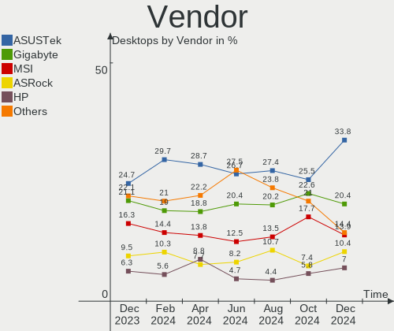
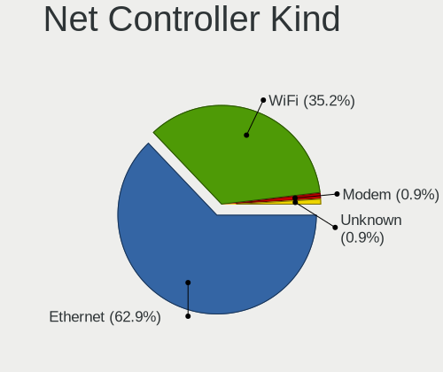
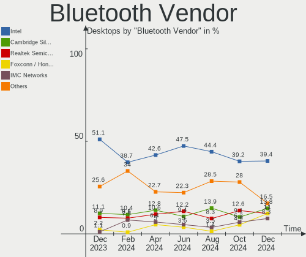
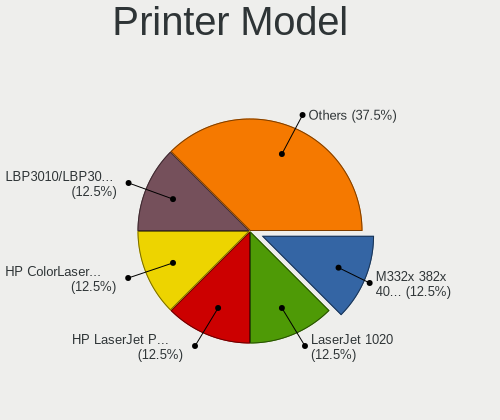
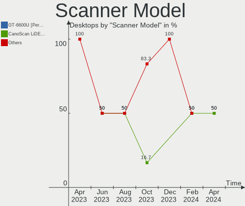

Fedora - Hardware Trends (Desktops)
-----------------------------------

A project to identify most popular hardware characteristics and track their change
over time based on data collected by Linux users at https://Linux-Hardware.org.

Anyone can contribute to this report by the [hw-probe](https://github.com/linuxhw/hw-probe) tool:

    sudo -E hw-probe -all -upload

This report is for one last month. Overall report since the beginning of time: [TestDays](https://github.com/linuxhw/TestDays)

Period: Jun, 2023.

Contents
--------

* [ System ](#system)
  - [ OS                       ](#os)
  - [ OS Family                ](#os-family)
  - [ Kernel                   ](#kernel)
  - [ Kernel Family            ](#kernel-family)
  - [ Kernel Major Ver.        ](#kernel-major-ver)
  - [ Arch                     ](#arch)
  - [ DE                       ](#de)
  - [ Display Server           ](#display-server)
  - [ Display Manager          ](#display-manager)
  - [ OS Lang                  ](#os-lang)
  - [ Boot Mode                ](#boot-mode)
  - [ Filesystem               ](#filesystem)
  - [ Part. scheme             ](#part-scheme)
  - [ Dual Boot with Linux/BSD ](#dual-boot-with-linuxbsd)
  - [ Dual Boot (Win)          ](#dual-boot-win)

* [ Board ](#board)
  - [ Vendor                   ](#vendor)
  - [ Model                    ](#model)
  - [ Model Family             ](#model-family)
  - [ MFG Year                 ](#mfg-year)
  - [ Form Factor              ](#form-factor)
  - [ Secure Boot              ](#secure-boot)
  - [ Coreboot                 ](#coreboot)
  - [ RAM Size                 ](#ram-size)
  - [ RAM Used                 ](#ram-used)
  - [ Total Drives             ](#total-drives)
  - [ Has CD-ROM               ](#has-cd-rom)
  - [ Has Ethernet             ](#has-ethernet)
  - [ Has WiFi                 ](#has-wifi)
  - [ Has Bluetooth            ](#has-bluetooth)

* [ Location ](#location)
  - [ Country                  ](#country)
  - [ City                     ](#city)

* [ Drives ](#drives)
  - [ Drive Vendor             ](#drive-vendor)
  - [ Drive Model              ](#drive-model)
  - [ HDD Vendor               ](#hdd-vendor)
  - [ SSD Vendor               ](#ssd-vendor)
  - [ Drive Kind               ](#drive-kind)
  - [ Drive Connector          ](#drive-connector)
  - [ Drive Size               ](#drive-size)
  - [ Space Total              ](#space-total)
  - [ Space Used               ](#space-used)
  - [ Malfunc. Drives          ](#malfunc-drives)
  - [ Malfunc. Drive Vendor    ](#malfunc-drive-vendor)
  - [ Malfunc. HDD Vendor      ](#malfunc-hdd-vendor)
  - [ Malfunc. Drive Kind      ](#malfunc-drive-kind)
  - [ Failed Drives            ](#failed-drives)
  - [ Failed Drive Vendor      ](#failed-drive-vendor)
  - [ Drive Status             ](#drive-status)

* [ Storage controller ](#storage-controller)
  - [ Storage Vendor           ](#storage-vendor)
  - [ Storage Model            ](#storage-model)
  - [ Storage Kind             ](#storage-kind)

* [ Processor ](#processor)
  - [ CPU Vendor               ](#cpu-vendor)
  - [ CPU Model                ](#cpu-model)
  - [ CPU Model Family         ](#cpu-model-family)
  - [ CPU Cores                ](#cpu-cores)
  - [ CPU Sockets              ](#cpu-sockets)
  - [ CPU Threads              ](#cpu-threads)
  - [ CPU Op-Modes             ](#cpu-op-modes)
  - [ CPU Microcode            ](#cpu-microcode)
  - [ CPU Microarch            ](#cpu-microarch)

* [ Graphics ](#graphics)
  - [ GPU Vendor               ](#gpu-vendor)
  - [ GPU Model                ](#gpu-model)
  - [ GPU Combo                ](#gpu-combo)
  - [ GPU Driver               ](#gpu-driver)
  - [ GPU Memory               ](#gpu-memory)

* [ Monitor ](#monitor)
  - [ Monitor Vendor           ](#monitor-vendor)
  - [ Monitor Model            ](#monitor-model)
  - [ Monitor Resolution       ](#monitor-resolution)
  - [ Monitor Diagonal         ](#monitor-diagonal)
  - [ Monitor Width            ](#monitor-width)
  - [ Aspect Ratio             ](#aspect-ratio)
  - [ Monitor Area             ](#monitor-area)
  - [ Pixel Density            ](#pixel-density)
  - [ Multiple Monitors        ](#multiple-monitors)

* [ Network ](#network)
  - [ Net Controller Vendor    ](#net-controller-vendor)
  - [ Net Controller Model     ](#net-controller-model)
  - [ Wireless Vendor          ](#wireless-vendor)
  - [ Wireless Model           ](#wireless-model)
  - [ Ethernet Vendor          ](#ethernet-vendor)
  - [ Ethernet Model           ](#ethernet-model)
  - [ Net Controller Kind      ](#net-controller-kind)
  - [ Used Controller          ](#used-controller)
  - [ NICs                     ](#nics)
  - [ IPv6                     ](#ipv6)

* [ Bluetooth ](#bluetooth)
  - [ Bluetooth Vendor         ](#bluetooth-vendor)
  - [ Bluetooth Model          ](#bluetooth-model)

* [ Sound ](#sound)
  - [ Sound Vendor             ](#sound-vendor)
  - [ Sound Model              ](#sound-model)

* [ Memory ](#memory)
  - [ Memory Vendor            ](#memory-vendor)
  - [ Memory Model             ](#memory-model)
  - [ Memory Kind              ](#memory-kind)
  - [ Memory Form Factor       ](#memory-form-factor)
  - [ Memory Size              ](#memory-size)
  - [ Memory Speed             ](#memory-speed)

* [ Printers & scanners ](#printers--scanners)
  - [ Printer Vendor           ](#printer-vendor)
  - [ Printer Model            ](#printer-model)
  - [ Scanner Vendor           ](#scanner-vendor)
  - [ Scanner Model            ](#scanner-model)

* [ Camera ](#camera)
  - [ Camera Vendor            ](#camera-vendor)
  - [ Camera Model             ](#camera-model)

* [ Security ](#security)
  - [ Fingerprint Vendor       ](#fingerprint-vendor)
  - [ Fingerprint Model        ](#fingerprint-model)
  - [ Chipcard Vendor          ](#chipcard-vendor)
  - [ Chipcard Model           ](#chipcard-model)

* [ Unsupported ](#unsupported)
  - [ Unsupported Devices      ](#unsupported-devices)
  - [ Unsupported Device Types ](#unsupported-device-types)

System
------

OS
--

Installed operating systems

| Name      | Desktops | Percent |
|-----------|----------|---------|
| Fedora 38 | 137      | 92.57%  |
| Fedora 37 | 7        | 4.73%   |
| Fedora 36 | 3        | 2.03%   |
| Fedora 39 | 1        | 0.68%   |

OS Family
---------

OS without a version

| Name   | Desktops | Percent |
|--------|----------|---------|
| Fedora | 148      | 100%    |

Kernel
------

Version of the Linux kernel

| Version                                                | Desktops | Percent |
|--------------------------------------------------------|----------|---------|
| 6.3.8-200.fc38.x86_64                                  | 33       | 22.3%   |
| 6.3.5-200.fc38.x86_64                                  | 24       | 16.22%  |
| 6.3.4-201.fc38.x86_64                                  | 21       | 14.19%  |
| 6.3.7-200.fc38.x86_64                                  | 18       | 12.16%  |
| 6.2.15-300.fc38.x86_64                                 | 14       | 9.46%   |
| 6.3.6-200.fc38.x86_64                                  | 13       | 8.78%   |
| 6.2.9-300.fc38.x86_64                                  | 10       | 6.76%   |
| 6.2.15-200.fc37.x86_64                                 | 3        | 2.03%   |
| 6.4.0-0.rc6.20230614gitb6dad5178cea.49.fc39.x86_64     | 1        | 0.68%   |
| 6.4.0-0.rc5.20230607gta4d7d701.342.vanilla.fc38.x86_64 | 1        | 0.68%   |
| 6.3.8-100.fc37.x86_64                                  | 1        | 0.68%   |
| 6.3.7-100.fc37.x86_64                                  | 1        | 0.68%   |
| 6.3.5-100.fc37.x86_64                                  | 1        | 0.68%   |
| 6.2.14-100.fc36.x86_64                                 | 1        | 0.68%   |
| 6.2.12-300.fc38.x86_64                                 | 1        | 0.68%   |
| 6.1.8-100.fc36.x86_64                                  | 1        | 0.68%   |
| 6.1.31-200.fc38.x86_64                                 | 1        | 0.68%   |
| 6.0.7-301.fc37.x86_64                                  | 1        | 0.68%   |
| 6.0.7-200.fc36.x86_64                                  | 1        | 0.68%   |
| 6.0.11-300.fc37.x86_64                                 | 1        | 0.68%   |

Kernel Family
-------------

Linux kernel without a distro release

| Version | Desktops | Percent |
|---------|----------|---------|
| 6.3.8   | 34       | 22.97%  |
| 6.3.5   | 25       | 16.89%  |
| 6.3.4   | 21       | 14.19%  |
| 6.3.7   | 19       | 12.84%  |
| 6.2.15  | 17       | 11.49%  |
| 6.3.6   | 13       | 8.78%   |
| 6.2.9   | 10       | 6.76%   |
| 6.4.0   | 2        | 1.35%   |
| 6.0.7   | 2        | 1.35%   |
| 6.2.14  | 1        | 0.68%   |
| 6.2.12  | 1        | 0.68%   |
| 6.1.8   | 1        | 0.68%   |
| 6.1.31  | 1        | 0.68%   |
| 6.0.11  | 1        | 0.68%   |

Kernel Major Ver.
-----------------

Linux kernel major version

| Version | Desktops | Percent |
|---------|----------|---------|
| 6.3     | 112      | 75.68%  |
| 6.2     | 29       | 19.59%  |
| 6.0     | 3        | 2.03%   |
| 6.4     | 2        | 1.35%   |
| 6.1     | 2        | 1.35%   |

Arch
----

OS architecture (x86_64, i586, etc.)

| Name   | Desktops | Percent |
|--------|----------|---------|
| x86_64 | 148      | 100%    |

DE
--

Desktop Environment

| Name          | Desktops | Percent |
|---------------|----------|---------|
| GNOME         | 89       | 60.14%  |
| KDE5          | 34       | 22.97%  |
| Cinnamon      | 7        | 4.73%   |
| Unknown       | 5        | 3.38%   |
| XFCE          | 4        | 2.7%    |
| X-Cinnamon    | 4        | 2.7%    |
| GNOME Classic | 3        | 2.03%   |
| sway          | 1        | 0.68%   |
| LXQt          | 1        | 0.68%   |

Display Server
--------------

X11 or Wayland

| Name    | Desktops | Percent |
|---------|----------|---------|
| Wayland | 99       | 66.89%  |
| X11     | 35       | 23.65%  |
| Tty     | 12       | 8.11%   |
| Unknown | 2        | 1.35%   |

Display Manager
---------------

SDDM, LightDM, etc.

| Name    | Desktops | Percent |
|---------|----------|---------|
| Unknown | 86       | 58.11%  |
| GDM     | 37       | 25%     |
| SDDM    | 13       | 8.78%   |
| LightDM | 12       | 8.11%   |

OS Lang
-------

Language

| Lang    | Desktops | Percent |
|---------|----------|---------|
| en_US   | 76       | 51.35%  |
| en_AU   | 11       | 7.43%   |
| ru_RU   | 8        | 5.41%   |
| en_GB   | 8        | 5.41%   |
| en_CA   | 7        | 4.73%   |
| es_ES   | 6        | 4.05%   |
| de_DE   | 6        | 4.05%   |
| pt_BR   | 4        | 2.7%    |
| pl_PL   | 3        | 2.03%   |
| fr_FR   | 3        | 2.03%   |
| es_AR   | 3        | 2.03%   |
| it_IT   | 2        | 1.35%   |
| es_CO   | 2        | 1.35%   |
| tr_TR   | 1        | 0.68%   |
| nl_NL   | 1        | 0.68%   |
| es_CL   | 1        | 0.68%   |
| en_NZ   | 1        | 0.68%   |
| en_DK   | 1        | 0.68%   |
| de_AT   | 1        | 0.68%   |
| da_DK   | 1        | 0.68%   |
| cs_CZ   | 1        | 0.68%   |
| Unknown | 1        | 0.68%   |

Boot Mode
---------

EFI or BIOS

| Mode | Desktops | Percent |
|------|----------|---------|
| EFI  | 100      | 67.57%  |
| BIOS | 48       | 32.43%  |

Filesystem
----------

Type of filesystem

| Type    | Desktops | Percent |
|---------|----------|---------|
| Btrfs   | 111      | 75%     |
| Ext4    | 31       | 20.95%  |
| Xfs     | 5        | 3.38%   |
| Overlay | 1        | 0.68%   |

Part. scheme
------------

Scheme of partitioning

| Type    | Desktops | Percent |
|---------|----------|---------|
| Unknown | 80       | 54.05%  |
| GPT     | 57       | 38.51%  |
| MBR     | 11       | 7.43%   |

Dual Boot with Linux/BSD
------------------------

Hosting more than one Linux/BSD

| Dual boot | Desktops | Percent |
|-----------|----------|---------|
| No        | 124      | 83.78%  |
| Yes       | 24       | 16.22%  |

Dual Boot (Win)
---------------

Hosting Linux and Windows

| Dual boot | Desktops | Percent |
|-----------|----------|---------|
| No        | 123      | 83.11%  |
| Yes       | 25       | 16.89%  |

Board
-----

Vendor
------

Motherboard manufacturer

| Name                | Desktops | Percent |
|---------------------|----------|---------|
| ASUSTek Computer    | 39       | 26.35%  |
| Gigabyte Technology | 34       | 22.97%  |
| MSI                 | 26       | 17.57%  |
| Dell                | 13       | 8.78%   |
| ASRock              | 8        | 5.41%   |
| Hewlett-Packard     | 7        | 4.73%   |
| Lenovo              | 4        | 2.7%    |
| Itautec             | 3        | 2.03%   |
| Intel               | 2        | 1.35%   |
| Unknown             | 2        | 1.35%   |
| Pegatron            | 1        | 0.68%   |
| Kllisre             | 1        | 0.68%   |
| Huanan              | 1        | 0.68%   |
| HPE                 | 1        | 0.68%   |
| Fill By OEM         | 1        | 0.68%   |
| ECS                 | 1        | 0.68%   |
| Colorful Technology | 1        | 0.68%   |
| AZW                 | 1        | 0.68%   |
| Alienware           | 1        | 0.68%   |
| Acer                | 1        | 0.68%   |

Model
-----

Motherboard model

| Name                                  | Desktops | Percent |
|---------------------------------------|----------|---------|
| Itautec Infoway ST-4265               | 3        | 2.03%   |
| ASUS All Series                       | 3        | 2.03%   |
| MSI MS-7C94                           | 2        | 1.35%   |
| Gigabyte X570 I AORUS PRO WIFI        | 2        | 1.35%   |
| Dell OptiPlex 9020                    | 2        | 1.35%   |
| Dell OptiPlex 7010                    | 2        | 1.35%   |
| ASUS ROG STRIX B650E-F GAMING WIFI    | 2        | 1.35%   |
| ASUS ROG STRIX B550-I GAMING          | 2        | 1.35%   |
| ASUS P8Z77-V LK                       | 2        | 1.35%   |
| Unknown                               | 2        | 1.35%   |
| Pegatron IPMIP-H55-INSPUR             | 1        | 0.68%   |
| MSI PPPPP-CCC#MMMMMMMM                | 1        | 0.68%   |
| MSI MS-7E07                           | 1        | 0.68%   |
| MSI MS-7D67                           | 1        | 0.68%   |
| MSI MS-7D54                           | 1        | 0.68%   |
| MSI MS-7D43                           | 1        | 0.68%   |
| MSI MS-7D22                           | 1        | 0.68%   |
| MSI MS-7C95                           | 1        | 0.68%   |
| MSI MS-7C37                           | 1        | 0.68%   |
| MSI MS-7B89                           | 1        | 0.68%   |
| MSI MS-7B86                           | 1        | 0.68%   |
| MSI MS-7B84                           | 1        | 0.68%   |
| MSI MS-7B79                           | 1        | 0.68%   |
| MSI MS-7B53                           | 1        | 0.68%   |
| MSI MS-7B07                           | 1        | 0.68%   |
| MSI MS-7A39                           | 1        | 0.68%   |
| MSI MS-7A38                           | 1        | 0.68%   |
| MSI MS-7977                           | 1        | 0.68%   |
| MSI MS-7885                           | 1        | 0.68%   |
| MSI MS-7816                           | 1        | 0.68%   |
| MSI MS-7798                           | 1        | 0.68%   |
| MSI MS-7752                           | 1        | 0.68%   |
| MSI MS-7641                           | 1        | 0.68%   |
| MSI MS-7623                           | 1        | 0.68%   |
| MSI MS-7388                           | 1        | 0.68%   |
| Lenovo ThinkCentre M900 10FLS0A000    | 1        | 0.68%   |
| Lenovo ThinkCentre M83 10AHS0CK14     | 1        | 0.68%   |
| Lenovo IdeaCentre 3 07IAB7 90SM0041PG | 1        | 0.68%   |
| Lenovo 70A4000HUX ThinkServer TS140   | 1        | 0.68%   |
| Kllisre X99-B5 V1.1                   | 1        | 0.68%   |

Model Family
------------

Motherboard model prefix

| Name                      | Desktops | Percent |
|---------------------------|----------|---------|
| ASUS ROG                  | 12       | 8.11%   |
| Dell OptiPlex             | 8        | 5.41%   |
| ASUS PRIME                | 8        | 5.41%   |
| ASUS TUF                  | 6        | 4.05%   |
| Itautec Infoway           | 3        | 2.03%   |
| ASUS All                  | 3        | 2.03%   |
| MSI MS-7C94               | 2        | 1.35%   |
| Lenovo ThinkCentre        | 2        | 1.35%   |
| HP EliteDesk              | 2        | 1.35%   |
| HP Compaq                 | 2        | 1.35%   |
| Gigabyte Z390             | 2        | 1.35%   |
| Gigabyte Z370             | 2        | 1.35%   |
| Gigabyte X570             | 2        | 1.35%   |
| Gigabyte H410M            | 2        | 1.35%   |
| Gigabyte B450             | 2        | 1.35%   |
| Dell XPS                  | 2        | 1.35%   |
| Dell Inspiron             | 2        | 1.35%   |
| ASUS P8Z77-V              | 2        | 1.35%   |
| Unknown                   | 2        | 1.35%   |
| Pegatron IPMIP-H55-INSPUR | 1        | 0.68%   |
| MSI PPPPP-CCC#MMMMMMMM    | 1        | 0.68%   |
| MSI MS-7E07               | 1        | 0.68%   |
| MSI MS-7D67               | 1        | 0.68%   |
| MSI MS-7D54               | 1        | 0.68%   |
| MSI MS-7D43               | 1        | 0.68%   |
| MSI MS-7D22               | 1        | 0.68%   |
| MSI MS-7C95               | 1        | 0.68%   |
| MSI MS-7C37               | 1        | 0.68%   |
| MSI MS-7B89               | 1        | 0.68%   |
| MSI MS-7B86               | 1        | 0.68%   |
| MSI MS-7B84               | 1        | 0.68%   |
| MSI MS-7B79               | 1        | 0.68%   |
| MSI MS-7B53               | 1        | 0.68%   |
| MSI MS-7B07               | 1        | 0.68%   |
| MSI MS-7A39               | 1        | 0.68%   |
| MSI MS-7A38               | 1        | 0.68%   |
| MSI MS-7977               | 1        | 0.68%   |
| MSI MS-7885               | 1        | 0.68%   |
| MSI MS-7816               | 1        | 0.68%   |
| MSI MS-7798               | 1        | 0.68%   |

MFG Year
--------

Motherboard manufacture year

| Year | Desktops | Percent |
|------|----------|---------|
| 2018 | 28       | 18.92%  |
| 2021 | 18       | 12.16%  |
| 2013 | 15       | 10.14%  |
| 2022 | 14       | 9.46%   |
| 2020 | 11       | 7.43%   |
| 2012 | 11       | 7.43%   |
| 2019 | 8        | 5.41%   |
| 2017 | 7        | 4.73%   |
| 2010 | 7        | 4.73%   |
| 2015 | 6        | 4.05%   |
| 2014 | 6        | 4.05%   |
| 2016 | 5        | 3.38%   |
| 2023 | 4        | 2.7%    |
| 2011 | 4        | 2.7%    |
| 2009 | 1        | 0.68%   |
| 2008 | 1        | 0.68%   |
| 2007 | 1        | 0.68%   |
| 2006 | 1        | 0.68%   |

Form Factor
-----------

Physical design of the computer

| Name    | Desktops | Percent |
|---------|----------|---------|
| Desktop | 148      | 100%    |

Secure Boot
-----------

Enabled or disabled

| State    | Desktops | Percent |
|----------|----------|---------|
| Disabled | 133      | 89.86%  |
| Enabled  | 15       | 10.14%  |

Coreboot
--------

Have coreboot on board

| Used | Desktops | Percent |
|------|----------|---------|
| No   | 148      | 100%    |

RAM Size
--------

Total RAM memory

| Size in GB      | Desktops | Percent |
|-----------------|----------|---------|
| 16.01-24.0      | 46       | 31.08%  |
| 32.01-64.0      | 37       | 25%     |
| 8.01-16.0       | 16       | 10.81%  |
| 4.01-8.0        | 15       | 10.14%  |
| 64.01-256.0     | 15       | 10.14%  |
| 3.01-4.0        | 10       | 6.76%   |
| 24.01-32.0      | 8        | 5.41%   |
| More than 256.0 | 1        | 0.68%   |

RAM Used
--------

Used RAM memory

| Used GB     | Desktops | Percent |
|-------------|----------|---------|
| 4.01-8.0    | 56       | 37.84%  |
| 3.01-4.0    | 31       | 20.95%  |
| 2.01-3.0    | 30       | 20.27%  |
| 1.01-2.0    | 10       | 6.76%   |
| 8.01-16.0   | 8        | 5.41%   |
| 0.51-1.0    | 5        | 3.38%   |
| 16.01-24.0  | 4        | 2.7%    |
| 32.01-64.0  | 3        | 2.03%   |
| 64.01-256.0 | 1        | 0.68%   |

Total Drives
------------

Number of drives on board

| Drives | Desktops | Percent |
|--------|----------|---------|
| 2      | 52       | 35.14%  |
| 1      | 40       | 27.03%  |
| 3      | 24       | 16.22%  |
| 4      | 17       | 11.49%  |
| 5      | 11       | 7.43%   |
| 6      | 3        | 2.03%   |
| 0      | 1        | 0.68%   |

Has CD-ROM
----------

Has CD-ROM on board

| Presented | Desktops | Percent |
|-----------|----------|---------|
| No        | 98       | 66.22%  |
| Yes       | 50       | 33.78%  |

Has Ethernet
------------

Has Ethernet on board

| Presented | Desktops | Percent |
|-----------|----------|---------|
| Yes       | 148      | 100%    |

Has WiFi
--------

Has WiFi module

| Presented | Desktops | Percent |
|-----------|----------|---------|
| Yes       | 80       | 54.05%  |
| No        | 68       | 45.95%  |

Has Bluetooth
-------------

Has Bluetooth module

| Presented | Desktops | Percent |
|-----------|----------|---------|
| Yes       | 74       | 50%     |
| No        | 74       | 50%     |

Location
--------

Country
-------

Geographic location (country)

| Country     | Desktops | Percent |
|-------------|----------|---------|
| USA         | 35       | 23.65%  |
| Brazil      | 12       | 8.11%   |
| Australia   | 11       | 7.43%   |
| Russia      | 8        | 5.41%   |
| Canada      | 8        | 5.41%   |
| Germany     | 7        | 4.73%   |
| Spain       | 5        | 3.38%   |
| Poland      | 5        | 3.38%   |
| Colombia    | 4        | 2.7%    |
| Argentina   | 4        | 2.7%    |
| UK          | 3        | 2.03%   |
| Norway      | 3        | 2.03%   |
| Netherlands | 3        | 2.03%   |
| Italy       | 3        | 2.03%   |
| France      | 3        | 2.03%   |
| Chile       | 3        | 2.03%   |
| Turkey      | 2        | 1.35%   |
| Sweden      | 2        | 1.35%   |
| Singapore   | 2        | 1.35%   |
| Mexico      | 2        | 1.35%   |
| Czechia     | 2        | 1.35%   |
| Vietnam     | 1        | 0.68%   |
| Venezuela   | 1        | 0.68%   |
| Ukraine     | 1        | 0.68%   |
| Thailand    | 1        | 0.68%   |
| Switzerland | 1        | 0.68%   |
| Serbia      | 1        | 0.68%   |
| Romania     | 1        | 0.68%   |
| Portugal    | 1        | 0.68%   |
| New Zealand | 1        | 0.68%   |
| Malaysia    | 1        | 0.68%   |
| Lithuania   | 1        | 0.68%   |
| Latvia      | 1        | 0.68%   |
| Indonesia   | 1        | 0.68%   |
| India       | 1        | 0.68%   |
| Hong Kong   | 1        | 0.68%   |
| Ethiopia    | 1        | 0.68%   |
| Denmark     | 1        | 0.68%   |
| Bulgaria    | 1        | 0.68%   |
| Belgium     | 1        | 0.68%   |

City
----

Geographic location (city)

| City                    | Desktops | Percent |
|-------------------------|----------|---------|
| Sydney                  | 9        | 6.08%   |
| Palmas                  | 4        | 2.7%    |
| Moscow                  | 4        | 2.7%    |
| Santiago                | 3        | 2.03%   |
| South Bend              | 2        | 1.35%   |
| Singapore               | 2        | 1.35%   |
| Seattle                 | 2        | 1.35%   |
| Sao Paulo               | 2        | 1.35%   |
| Prague                  | 2        | 1.35%   |
| Ottawa                  | 2        | 1.35%   |
| Los Angeles             | 2        | 1.35%   |
| Kristiansand            | 2        | 1.35%   |
| Berlin                  | 2        | 1.35%   |
| Alliston                | 2        | 1.35%   |
| Zierikzee               | 1        | 0.68%   |
| Zanesville              | 1        | 0.68%   |
| Winnipeg                | 1        | 0.68%   |
| Wellington              | 1        | 0.68%   |
| Warsaw                  | 1        | 0.68%   |
| Volgograd               | 1        | 0.68%   |
| Vitória                | 1        | 0.68%   |
| Vilnius                 | 1        | 0.68%   |
| Villeurbanne            | 1        | 0.68%   |
| Villaputzu              | 1        | 0.68%   |
| Vigo                    | 1        | 0.68%   |
| Verona                  | 1        | 0.68%   |
| Verkhnyaya Salda        | 1        | 0.68%   |
| Valledupar              | 1        | 0.68%   |
| Tunja                   | 1        | 0.68%   |
| Toronto                 | 1        | 0.68%   |
| Tenancingo de Degollado | 1        | 0.68%   |
| Tacoma                  | 1        | 0.68%   |
| Taby                    | 1        | 0.68%   |
| St Petersburg           | 1        | 0.68%   |
| South Tangerang         | 1        | 0.68%   |
| Sofia                   | 1        | 0.68%   |
| Saratov                 | 1        | 0.68%   |
| Santiago de Compostela  | 1        | 0.68%   |
| Santiago de Cali        | 1        | 0.68%   |
| San Francisco           | 1        | 0.68%   |

Drives
------

Drive Vendor
------------

Hard drive vendors

| Vendor                      | Desktops | Drives | Percent |
|-----------------------------|----------|--------|---------|
| Samsung Electronics         | 58       | 82     | 19.53%  |
| Seagate                     | 49       | 61     | 16.5%   |
| WDC                         | 40       | 56     | 13.47%  |
| Sandisk                     | 25       | 29     | 8.42%   |
| Kingston                    | 18       | 18     | 6.06%   |
| Toshiba                     | 14       | 15     | 4.71%   |
| Crucial                     | 13       | 13     | 4.38%   |
| Intel                       | 10       | 11     | 3.37%   |
| A-DATA Technology           | 7        | 7      | 2.36%   |
| Hitachi                     | 6        | 7      | 2.02%   |
| Phison Electronics          | 5        | 6      | 1.68%   |
| Micron/Crucial Technology   | 4        | 5      | 1.35%   |
| China                       | 4        | 4      | 1.35%   |
| Silicon Motion              | 3        | 3      | 1.01%   |
| SPCC                        | 2        | 2      | 0.67%   |
| Realtek Semiconductor       | 2        | 2      | 0.67%   |
| QNAP                        | 2        | 2      | 0.67%   |
| PNY                         | 2        | 3      | 0.67%   |
| Patriot                     | 2        | 2      | 0.67%   |
| Micron Technology           | 2        | 2      | 0.67%   |
| Maxtor                      | 2        | 2      | 0.67%   |
| MAXIO Technology (Hangzhou) | 2        | 2      | 0.67%   |
| Kingston Technology Company | 2        | 2      | 0.67%   |
| Intenso                     | 2        | 2      | 0.67%   |
| GOODRAM                     | 2        | 2      | 0.67%   |
| ASMT                        | 2        | 2      | 0.67%   |
| ADATA Technology            | 2        | 2      | 0.67%   |
| Unknown                     | 1        | 2      | 0.34%   |
| Union Memory (Shenzhen)     | 1        | 1      | 0.34%   |
| SABRENT                     | 1        | 1      | 0.34%   |
| Palit                       | 1        | 1      | 0.34%   |
| OCZ                         | 1        | 1      | 0.34%   |
| Mercury                     | 1        | 1      | 0.34%   |
| LITEON                      | 1        | 1      | 0.34%   |
| KUIJIA                      | 1        | 1      | 0.34%   |
| KingSpec                    | 1        | 1      | 0.34%   |
| Kimtigo                     | 1        | 1      | 0.34%   |
| Hjwdz                       | 1        | 1      | 0.34%   |
| FORESEE                     | 1        | 1      | 0.34%   |
| Digma                       | 1        | 2      | 0.34%   |

Drive Model
-----------

Hard drive models

| Model                                                 | Desktops | Percent |
|-------------------------------------------------------|----------|---------|
| Samsung NVMe SSD Controller PM9A1/PM9A3/980PRO 2TB    | 17       | 4.91%   |
| Samsung NVMe SSD Controller SM981/PM981/PM983 250GB   | 10       | 2.89%   |
| Kingston SA400S37120G 120GB SSD                       | 6        | 1.73%   |
| Toshiba DT01ACA100 1TB                                | 4        | 1.16%   |
| Seagate ST500DM002-1BD142 500GB                       | 4        | 1.16%   |
| Seagate ST2000DM006-2DM164 2TB                        | 4        | 1.16%   |
| Seagate ST1000DM010-2EP102 1TB                        | 4        | 1.16%   |
| Samsung SSD 860 EVO 500GB                             | 4        | 1.16%   |
| Samsung SSD 860 EVO 1TB                               | 4        | 1.16%   |
| Samsung SSD 850 EVO 250GB                             | 4        | 1.16%   |
| Crucial CT500MX500SSD1 500GB                          | 4        | 1.16%   |
| WDC WD10EZEX-60WN4A0 1TB                              | 3        | 0.87%   |
| Silicon Motion SM2263EN/SM2263XT SSD Controller 256GB | 3        | 0.87%   |
| Seagate ST3500413AS 500GB                             | 3        | 0.87%   |
| Seagate ST31000524AS 1TB                              | 3        | 0.87%   |
| Samsung SSD 870 EVO 1TB                               | 3        | 0.87%   |
| Samsung SSD 860 QVO 1TB                               | 3        | 0.87%   |
| Phison E12 NVMe Controller 1TB                        | 3        | 0.87%   |
| Kingston SV300S37A120G 120GB SSD                      | 3        | 0.87%   |
| Crucial CT1000MX500SSD1 1TB                           | 3        | 0.87%   |
| WDC WDS500G2B0A-00SM50 500GB SSD                      | 2        | 0.58%   |
| WDC WDS120G2G0A-00JH30 128GB SSD                      | 2        | 0.58%   |
| WDC WD40EFRX-68N32N0 4TB                              | 2        | 0.58%   |
| WDC WD20EZRX-00D8PB0 2TB                              | 2        | 0.58%   |
| WDC WD10EZEX-08WN4A0 1TB                              | 2        | 0.58%   |
| Toshiba MQ01ABD100 1TB                                | 2        | 0.58%   |
| Seagate ST4000DM004-2U9104 4TB                        | 2        | 0.58%   |
| Seagate ST4000DM004-2CV104 4TB                        | 2        | 0.58%   |
| Seagate ST4000DM000-1F2168 4TB                        | 2        | 0.58%   |
| Seagate ST3500418AS 500GB                             | 2        | 0.58%   |
| Seagate ST2000DM001-1ER164 2TB                        | 2        | 0.58%   |
| Seagate ST1000DM003-1CH162 1TB                        | 2        | 0.58%   |
| Seagate BUP Slim SL 1TB                               | 2        | 0.58%   |
| Sandisk WD Blue SN570 500GB                           | 2        | 0.58%   |
| Sandisk WD Black SN850 1TB                            | 2        | 0.58%   |
| Sandisk WD Black SN750 / PC SN730 NVMe SSD 500GB      | 2        | 0.58%   |
| Samsung SSD 870 QVO 2TB                               | 2        | 0.58%   |
| Samsung SSD 860 EVO 250GB                             | 2        | 0.58%   |
| Samsung SSD 850 PRO 512GB                             | 2        | 0.58%   |
| Samsung SSD 850 PRO 256GB                             | 2        | 0.58%   |

HDD Vendor
----------

Hard disk drive vendors

| Vendor              | Desktops | Drives | Percent |
|---------------------|----------|--------|---------|
| Seagate             | 47       | 58     | 43.52%  |
| WDC                 | 35       | 49     | 32.41%  |
| Toshiba             | 11       | 12     | 10.19%  |
| Hitachi             | 6        | 7      | 5.56%   |
| Samsung Electronics | 5        | 5      | 4.63%   |
| QNAP                | 2        | 2      | 1.85%   |
| Maxtor              | 2        | 2      | 1.85%   |

SSD Vendor
----------

Solid state drive vendors

| Vendor              | Desktops | Drives | Percent |
|---------------------|----------|--------|---------|
| Samsung Electronics | 35       | 44     | 28.93%  |
| Kingston            | 14       | 14     | 11.57%  |
| Crucial             | 13       | 13     | 10.74%  |
| SanDisk             | 11       | 13     | 9.09%   |
| WDC                 | 7        | 7      | 5.79%   |
| A-DATA Technology   | 7        | 7      | 5.79%   |
| Intel               | 6        | 7      | 4.96%   |
| China               | 4        | 4      | 3.31%   |
| Toshiba             | 2        | 2      | 1.65%   |
| SPCC                | 2        | 2      | 1.65%   |
| PNY                 | 2        | 3      | 1.65%   |
| Patriot             | 2        | 2      | 1.65%   |
| Micron Technology   | 2        | 2      | 1.65%   |
| GOODRAM             | 2        | 2      | 1.65%   |
| Seagate             | 1        | 1      | 0.83%   |
| Palit               | 1        | 1      | 0.83%   |
| OCZ                 | 1        | 1      | 0.83%   |
| LITEON              | 1        | 1      | 0.83%   |
| KUIJIA              | 1        | 1      | 0.83%   |
| KingSpec            | 1        | 1      | 0.83%   |
| Kimtigo             | 1        | 1      | 0.83%   |
| FORESEE             | 1        | 1      | 0.83%   |
| Digma               | 1        | 1      | 0.83%   |
| ASMT                | 1        | 1      | 0.83%   |
| Acer                | 1        | 1      | 0.83%   |
| Unknown             | 1        | 1      | 0.83%   |

Drive Kind
----------

HDD or SSD

| Kind    | Desktops | Drives | Percent |
|---------|----------|--------|---------|
| SSD     | 101      | 134    | 38.26%  |
| HDD     | 88       | 135    | 33.33%  |
| NVMe    | 68       | 84     | 25.76%  |
| Unknown | 7        | 8      | 2.65%   |

Drive Connector
---------------

SATA, SAS, NVMe, etc.

| Type | Desktops | Drives | Percent |
|------|----------|--------|---------|
| SATA | 122      | 261    | 60.1%   |
| NVMe | 67       | 83     | 33%     |
| SAS  | 14       | 17     | 6.9%    |

Drive Size
----------

Size of hard drive

| Size in TB | Desktops | Drives | Percent |
|------------|----------|--------|---------|
| 0.01-0.5   | 86       | 136    | 44.33%  |
| 0.51-1.0   | 62       | 77     | 31.96%  |
| 1.01-2.0   | 24       | 25     | 12.37%  |
| 3.01-4.0   | 10       | 14     | 5.15%   |
| 4.01-10.0  | 6        | 7      | 3.09%   |
| 2.01-3.0   | 5        | 6      | 2.58%   |
| 10.01-20.0 | 1        | 4      | 0.52%   |

Space Total
-----------

Amount of disk space available on the file system

| Size in GB     | Desktops | Percent |
|----------------|----------|---------|
| 1001-2000      | 32       | 21.62%  |
| 501-1000       | 27       | 18.24%  |
| 251-500        | 21       | 14.19%  |
| More than 3000 | 19       | 12.84%  |
| 101-250        | 18       | 12.16%  |
| 2001-3000      | 12       | 8.11%   |
| 1-20           | 10       | 6.76%   |
| 51-100         | 4        | 2.7%    |
| 21-50          | 3        | 2.03%   |
| Unknown        | 2        | 1.35%   |

Space Used
----------

Amount of used disk space

| Used GB        | Desktops | Percent |
|----------------|----------|---------|
| 1-20           | 35       | 23.65%  |
| 51-100         | 21       | 14.19%  |
| 101-250        | 20       | 13.51%  |
| 501-1000       | 19       | 12.84%  |
| 21-50          | 17       | 11.49%  |
| 251-500        | 16       | 10.81%  |
| 1001-2000      | 12       | 8.11%   |
| More than 3000 | 3        | 2.03%   |
| 2001-3000      | 3        | 2.03%   |
| Unknown        | 2        | 1.35%   |

Malfunc. Drives
---------------

Drive models with a malfunction

| Model                             | Desktops | Drives | Percent |
|-----------------------------------|----------|--------|---------|
| WDC WD20EZRX-00D8PB0 2TB          | 1        | 1      | 5.88%   |
| WDC WD1002FAEX-00Y9A0 1TB         | 1        | 1      | 5.88%   |
| Toshiba MQ01ABD100 1TB            | 1        | 1      | 5.88%   |
| Seagate ST9250827AS 250GB         | 1        | 1      | 5.88%   |
| Seagate ST500DM002-1BD142 500GB   | 1        | 1      | 5.88%   |
| Seagate ST3500418AS 500GB         | 1        | 1      | 5.88%   |
| Seagate ST31000524AS 1TB          | 1        | 1      | 5.88%   |
| Seagate ST3000DM001-1CH166 3TB    | 1        | 1      | 5.88%   |
| Seagate ST2000VX000-1CU164 2TB    | 1        | 1      | 5.88%   |
| Seagate ST1000LX015-1U7172 1TB    | 1        | 1      | 5.88%   |
| Seagate ST1000DX002-2DV162 1TB    | 1        | 1      | 5.88%   |
| SanDisk SSD PLUS 120 GB           | 1        | 1      | 5.88%   |
| SanDisk SD8SBAT256G1122 256GB SSD | 1        | 1      | 5.88%   |
| Intel SSDSC2KG019T7R 2TB          | 1        | 1      | 5.88%   |
| Crucial CT120M500SSD1 120GB       | 1        | 1      | 5.88%   |
| A-DATA Technology SX900 256GB SSD | 1        | 1      | 5.88%   |
| A-DATA Technology SU650 960GB SSD | 1        | 1      | 5.88%   |

Malfunc. Drive Vendor
---------------------

Vendors of faulty drives

| Vendor            | Desktops | Drives | Percent |
|-------------------|----------|--------|---------|
| Seagate           | 7        | 8      | 46.67%  |
| SanDisk           | 2        | 2      | 13.33%  |
| A-DATA Technology | 2        | 2      | 13.33%  |
| WDC               | 1        | 2      | 6.67%   |
| Toshiba           | 1        | 1      | 6.67%   |
| Intel             | 1        | 1      | 6.67%   |
| Crucial           | 1        | 1      | 6.67%   |

Malfunc. HDD Vendor
-------------------

Vendors of faulty HDD drives

| Vendor  | Desktops | Drives | Percent |
|---------|----------|--------|---------|
| Seagate | 7        | 8      | 77.78%  |
| WDC     | 1        | 2      | 11.11%  |
| Toshiba | 1        | 1      | 11.11%  |

Malfunc. Drive Kind
-------------------

Kinds of faulty drives

| Kind | Desktops | Drives | Percent |
|------|----------|--------|---------|
| HDD  | 9        | 11     | 60%     |
| SSD  | 6        | 6      | 40%     |

Failed Drives
-------------

Failed drive models

Zero info for selected period =(

Failed Drive Vendor
-------------------

Failed drive vendors

Zero info for selected period =(

Drive Status
------------

Number of failed and malfunc. drives

| Status   | Desktops | Drives | Percent |
|----------|----------|--------|---------|
| Detected | 91       | 218    | 55.83%  |
| Works    | 58       | 126    | 35.58%  |
| Malfunc  | 14       | 17     | 8.59%   |

Storage controller
------------------

Storage Vendor
--------------

Storage controller vendors

| Vendor                       | Desktops | Percent |
|------------------------------|----------|---------|
| Intel                        | 93       | 38.91%  |
| AMD                          | 55       | 23.01%  |
| Samsung Electronics          | 28       | 11.72%  |
| SanDisk                      | 14       | 5.86%   |
| Marvell Technology Group     | 8        | 3.35%   |
| ASMedia Technology           | 8        | 3.35%   |
| Kingston Technology Company  | 6        | 2.51%   |
| Phison Electronics           | 5        | 2.09%   |
| Micron/Crucial Technology    | 4        | 1.67%   |
| Silicon Motion               | 3        | 1.26%   |
| Silicon Image                | 2        | 0.84%   |
| Realtek Semiconductor        | 2        | 0.84%   |
| MAXIO Technology (Hangzhou)  | 2        | 0.84%   |
| ADATA Technology             | 2        | 0.84%   |
| Union Memory (Shenzhen)      | 1        | 0.42%   |
| ULi Electronics              | 1        | 0.42%   |
| Toshiba America Info Systems | 1        | 0.42%   |
| Seagate Technology           | 1        | 0.42%   |
| Promise Technology           | 1        | 0.42%   |
| JMicron Technology           | 1        | 0.42%   |
| Adaptec                      | 1        | 0.42%   |

Storage Model
-------------

Storage controller models

| Model                                                                          | Desktops | Percent |
|--------------------------------------------------------------------------------|----------|---------|
| AMD FCH SATA Controller [AHCI mode]                                            | 28       | 10.14%  |
| Samsung NVMe SSD Controller PM9A1/PM9A3/980PRO                                 | 17       | 6.16%   |
| Intel 7 Series/C210 Series Chipset Family 6-port SATA Controller [AHCI mode]   | 15       | 5.43%   |
| AMD 500 Series Chipset SATA Controller                                         | 14       | 5.07%   |
| Intel 8 Series/C220 Series Chipset Family 6-port SATA Controller 1 [AHCI mode] | 13       | 4.71%   |
| Samsung NVMe SSD Controller SM981/PM981/PM983                                  | 10       | 3.62%   |
| Intel Cannon Lake PCH SATA AHCI Controller                                     | 10       | 3.62%   |
| AMD 400 Series Chipset SATA Controller                                         | 10       | 3.62%   |
| Intel 200 Series PCH SATA controller [AHCI mode]                               | 9        | 3.26%   |
| Intel Alder Lake-S PCH SATA Controller [AHCI Mode]                             | 8        | 2.9%    |
| ASMedia ASM1062 Serial ATA Controller                                          | 7        | 2.54%   |
| AMD SB7x0/SB8x0/SB9x0 IDE Controller                                           | 7        | 2.54%   |
| Intel Volume Management Device NVMe RAID Controller                            | 5        | 1.81%   |
| Intel Q170/Q150/B150/H170/H110/Z170/CM236 Chipset SATA Controller [AHCI Mode]  | 5        | 1.81%   |
| Intel 500 Series Chipset Family SATA AHCI Controller                           | 5        | 1.81%   |
| Marvell Group 88SE9172 SATA 6Gb/s Controller                                   | 4        | 1.45%   |
| Intel SATA Controller [RAID mode]                                              | 4        | 1.45%   |
| AMD SB7x0/SB8x0/SB9x0 SATA Controller [IDE mode]                               | 4        | 1.45%   |
| Silicon Motion SM2263EN/SM2263XT SSD Controller                                | 3        | 1.09%   |
| Phison E12 NVMe Controller                                                     | 3        | 1.09%   |
| Kingston Company NVMe Controller                                               | 3        | 1.09%   |
| Intel Comet Lake PCH-H RAID                                                    | 3        | 1.09%   |
| AMD SB7x0/SB8x0/SB9x0 SATA Controller [AHCI mode]                              | 3        | 1.09%   |
| AMD 300 Series Chipset SATA Controller                                         | 3        | 1.09%   |
| Sandisk Western Digital WD Black SN850X NVMe SSD                               | 2        | 0.72%   |
| SanDisk WD PC SN810 / Black SN850 NVMe SSD                                     | 2        | 0.72%   |
| SanDisk WD Blue SN570 NVMe SSD 1TB                                             | 2        | 0.72%   |
| SanDisk WD Black SN750 / PC SN730 NVMe SSD                                     | 2        | 0.72%   |
| SanDisk Non-Volatile memory controller                                         | 2        | 0.72%   |
| Micron/Crucial P2 NVMe PCIe SSD                                                | 2        | 0.72%   |
| MAXIO (Hangzhou) NVMe SSD Controller MAP1202                                   | 2        | 0.72%   |
| Marvell Group 88SE9230 PCIe 2.0 x2 4-port SATA 6 Gb/s RAID Controller          | 2        | 0.72%   |
| Intel SATA controller                                                          | 2        | 0.72%   |
| Intel Non-Volatile memory controller                                           | 2        | 0.72%   |
| Intel NM10/ICH7 Family SATA Controller [AHCI mode]                             | 2        | 0.72%   |
| Intel C610/X99 series chipset 6-Port SATA Controller [AHCI mode]               | 2        | 0.72%   |
| Intel Atom Processor E3800 Series SATA AHCI Controller                         | 2        | 0.72%   |
| Intel 5 Series/3400 Series Chipset 6 port SATA AHCI Controller                 | 2        | 0.72%   |
| AMD X399 Series Chipset SATA Controller                                        | 2        | 0.72%   |
| AMD FCH SATA Controller D                                                      | 2        | 0.72%   |

Storage Kind
------------

Kind of storage controller (IDE, SATA, NVMe, SAS, ...)

| Kind | Desktops | Percent |
|------|----------|---------|
| SATA | 137      | 58.05%  |
| NVMe | 67       | 28.39%  |
| RAID | 17       | 7.2%    |
| IDE  | 14       | 5.93%   |
| SCSI | 1        | 0.42%   |

Processor
---------

CPU Vendor
----------

Processor vendors

| Vendor | Desktops | Percent |
|--------|----------|---------|
| Intel  | 92       | 62.16%  |
| AMD    | 56       | 37.84%  |

CPU Model
---------

Processor models

| Model                                       | Desktops | Percent |
|---------------------------------------------|----------|---------|
| Intel Core i7-3770 CPU @ 3.40GHz            | 6        | 4.05%   |
| AMD Ryzen 5 5600X 6-Core Processor          | 5        | 3.38%   |
| Intel Core i9-9900K CPU @ 3.60GHz           | 3        | 2.03%   |
| Intel Core i5-8500 CPU @ 3.00GHz            | 3        | 2.03%   |
| Intel Core i5-3330 CPU @ 3.00GHz            | 3        | 2.03%   |
| AMD Ryzen 9 7950X 16-Core Processor         | 3        | 2.03%   |
| AMD Ryzen 9 5900X 12-Core Processor         | 3        | 2.03%   |
| AMD Ryzen 7 5700X 8-Core Processor          | 3        | 2.03%   |
| AMD Ryzen 7 3700X 8-Core Processor          | 3        | 2.03%   |
| AMD Ryzen 5 3600 6-Core Processor           | 3        | 2.03%   |
| AMD Ryzen 5 2600 Six-Core Processor         | 3        | 2.03%   |
| Intel Xeon CPU E5-2650 v3 @ 2.30GHz         | 2        | 1.35%   |
| Intel Core i7-4790 CPU @ 3.60GHz            | 2        | 1.35%   |
| Intel Core i7-4770K CPU @ 3.50GHz           | 2        | 1.35%   |
| Intel Core i5-9400F CPU @ 2.90GHz           | 2        | 1.35%   |
| Intel Core i5-8400 CPU @ 2.80GHz            | 2        | 1.35%   |
| Intel Core i5-7600K CPU @ 3.80GHz           | 2        | 1.35%   |
| Intel Core i5-4460 CPU @ 3.20GHz            | 2        | 1.35%   |
| Intel Core i5-10400 CPU @ 2.90GHz           | 2        | 1.35%   |
| Intel Core i5 CPU 650 @ 3.20GHz             | 2        | 1.35%   |
| Intel Core i3-3220 CPU @ 3.30GHz            | 2        | 1.35%   |
| Intel Celeron G4900 CPU @ 3.10GHz           | 2        | 1.35%   |
| Intel Celeron CPU J1900 @ 1.99GHz           | 2        | 1.35%   |
| Intel 12th Gen Core i5-12400F               | 2        | 1.35%   |
| AMD Ryzen 7 5800X 8-Core Processor          | 2        | 1.35%   |
| AMD Ryzen 3 2200G with Radeon Vega Graphics | 2        | 1.35%   |
| Intel Xeon CPU W3565 @ 3.20GHz              | 1        | 0.68%   |
| Intel Xeon CPU E5-2603 v4 @ 1.70GHz         | 1        | 0.68%   |
| Intel Xeon CPU E5-1650 v3 @ 3.50GHz         | 1        | 0.68%   |
| Intel Xeon CPU E3-1265L v3 @ 2.50GHz        | 1        | 0.68%   |
| Intel Pentium CPU G4560 @ 3.50GHz           | 1        | 0.68%   |
| Intel Pentium CPU G2020 @ 2.90GHz           | 1        | 0.68%   |
| Intel N95                                   | 1        | 0.68%   |
| Intel N100                                  | 1        | 0.68%   |
| Intel Genuine CPU @ 1.66GHz                 | 1        | 0.68%   |
| Intel Core i9-9980HK CPU @ 2.40GHz          | 1        | 0.68%   |
| Intel Core i9-10900KF CPU @ 3.70GHz         | 1        | 0.68%   |
| Intel Core i7-8700K CPU @ 3.70GHz           | 1        | 0.68%   |
| Intel Core i7-8569U CPU @ 2.80GHz           | 1        | 0.68%   |
| Intel Core i7-6700K CPU @ 4.00GHz           | 1        | 0.68%   |

CPU Model Family
----------------

Processor model prefix

| Model                  | Desktops | Percent |
|------------------------|----------|---------|
| Intel Core i5          | 30       | 20.27%  |
| Intel Core i7          | 20       | 13.51%  |
| AMD Ryzen 7            | 15       | 10.14%  |
| Other                  | 14       | 9.46%   |
| AMD Ryzen 5            | 14       | 9.46%   |
| AMD Ryzen 9            | 9        | 6.08%   |
| Intel Core i3          | 7        | 4.73%   |
| Intel Xeon             | 6        | 4.05%   |
| Intel Core i9          | 5        | 3.38%   |
| AMD Ryzen 3            | 5        | 3.38%   |
| Intel Celeron          | 4        | 2.7%    |
| AMD FX                 | 3        | 2.03%   |
| Intel Pentium          | 2        | 1.35%   |
| AMD Ryzen Threadripper | 2        | 1.35%   |
| AMD Phenom II X4       | 2        | 1.35%   |
| AMD Phenom II X2       | 2        | 1.35%   |
| Intel Genuine          | 1        | 0.68%   |
| Intel Core 2 Quad      | 1        | 0.68%   |
| Intel Core 2           | 1        | 0.68%   |
| Intel Atom             | 1        | 0.68%   |
| AMD Phenom II X6       | 1        | 0.68%   |
| AMD Opteron            | 1        | 0.68%   |
| AMD Athlon 64 X2       | 1        | 0.68%   |
| AMD A4                 | 1        | 0.68%   |

CPU Cores
---------

Number of processor cores

| Number | Desktops | Percent |
|--------|----------|---------|
| 4      | 51       | 34.46%  |
| 6      | 34       | 22.97%  |
| 8      | 22       | 14.86%  |
| 2      | 19       | 12.84%  |
| 12     | 9        | 6.08%   |
| 16     | 6        | 4.05%   |
| 10     | 4        | 2.7%    |
| 14     | 1        | 0.68%   |
| 3      | 1        | 0.68%   |
| 1      | 1        | 0.68%   |

CPU Sockets
-----------

Number of sockets

| Number | Desktops | Percent |
|--------|----------|---------|
| 1      | 148      | 100%    |

CPU Threads
-----------

Threads per core (Hyper-Threading)

| Number | Desktops | Percent |
|--------|----------|---------|
| 2      | 96       | 64.86%  |
| 1      | 52       | 35.14%  |

CPU Op-Modes
------------

CPU Operation Modes (32-bit, 64-bit)

| Op mode        | Desktops | Percent |
|----------------|----------|---------|
| 32-bit, 64-bit | 148      | 100%    |

CPU Microcode
-------------

Microcode number

| Number     | Desktops | Percent |
|------------|----------|---------|
| Unknown    | 97       | 65.54%  |
| 0x0a20120a | 10       | 6.76%   |
| 0x0800820d | 6        | 4.05%   |
| 0x08701030 | 5        | 3.38%   |
| 0x0a601203 | 4        | 2.7%    |
| 0x08701021 | 4        | 2.7%    |
| 0x010000c8 | 3        | 2.03%   |
| 0x08600106 | 2        | 1.35%   |
| 0x08001137 | 2        | 1.35%   |
| 0x306c3    | 1        | 0.68%   |
| 0x0a601201 | 1        | 0.68%   |
| 0x0a50000d | 1        | 0.68%   |
| 0x0a201025 | 1        | 0.68%   |
| 0x0a201016 | 1        | 0.68%   |
| 0x0a201009 | 1        | 0.68%   |
| 0x08108109 | 1        | 0.68%   |
| 0x08101016 | 1        | 0.68%   |
| 0x08001138 | 1        | 0.68%   |
| 0x0600611a | 1        | 0.68%   |
| 0x06000822 | 1        | 0.68%   |
| 0x0600081c | 1        | 0.68%   |
| 0x06000629 | 1        | 0.68%   |
| 0x010000bf | 1        | 0.68%   |
| 0x010000b6 | 1        | 0.68%   |

CPU Microarch
-------------

Microarchitecture

| Name             | Desktops | Percent |
|------------------|----------|---------|
| KabyLake         | 24       | 16.22%  |
| Haswell          | 17       | 11.49%  |
| Zen 3            | 16       | 10.81%  |
| IvyBridge        | 16       | 10.81%  |
| Zen 2            | 11       | 7.43%   |
| Alderlake Hybrid | 9        | 6.08%   |
| Zen+             | 7        | 4.73%   |
| CometLake        | 6        | 4.05%   |
| Unknown          | 6        | 4.05%   |
| Zen              | 5        | 3.38%   |
| K10              | 5        | 3.38%   |
| Skylake          | 4        | 2.7%    |
| Piledriver       | 3        | 2.03%   |
| Icelake          | 3        | 2.03%   |
| Westmere         | 2        | 1.35%   |
| Silvermont       | 2        | 1.35%   |
| Gracemont        | 2        | 1.35%   |
| Bonnell          | 2        | 1.35%   |
| SandyBridge      | 1        | 0.68%   |
| Penryn           | 1        | 0.68%   |
| Nehalem          | 1        | 0.68%   |
| K8 Hammer        | 1        | 0.68%   |
| Excavator        | 1        | 0.68%   |
| Core             | 1        | 0.68%   |
| Bulldozer        | 1        | 0.68%   |
| Broadwell        | 1        | 0.68%   |

Graphics
--------

GPU Vendor
----------

Vendors of graphics cards

| Vendor | Desktops | Percent |
|--------|----------|---------|
| Nvidia | 62       | 38.27%  |
| AMD    | 59       | 36.42%  |
| Intel  | 41       | 25.31%  |

GPU Model
---------

Graphics card models

| Model                                                                       | Desktops | Percent |
|-----------------------------------------------------------------------------|----------|---------|
| AMD Ellesmere [Radeon RX 470/480/570/570X/580/580X/590]                     | 10       | 5.95%   |
| AMD Navi 23 [Radeon RX 6600/6600 XT/6600M]                                  | 9        | 5.36%   |
| Intel Xeon E3-1200 v3/4th Gen Core Processor Integrated Graphics Controller | 7        | 4.17%   |
| Nvidia GT218 [GeForce 210]                                                  | 5        | 2.98%   |
| AMD Raphael                                                                 | 5        | 2.98%   |
| AMD Navi 22 [Radeon RX 6700/6700 XT/6750 XT / 6800M/6850M XT]               | 5        | 2.98%   |
| Nvidia GP107 [GeForce GTX 1050 Ti]                                          | 4        | 2.38%   |
| Intel HD Graphics 630                                                       | 4        | 2.38%   |
| Intel CoffeeLake-S GT2 [UHD Graphics 630]                                   | 4        | 2.38%   |
| AMD Navi 21 [Radeon RX 6800/6800 XT / 6900 XT]                              | 4        | 2.38%   |
| Nvidia GP108 [GeForce GT 1030]                                              | 3        | 1.79%   |
| Nvidia GP104 [GeForce GTX 1070]                                             | 3        | 1.79%   |
| Nvidia GK208B [GeForce GT 710]                                              | 3        | 1.79%   |
| Nvidia GA106 [GeForce RTX 3060 Lite Hash Rate]                              | 3        | 1.79%   |
| Intel HD Graphics 530                                                       | 3        | 1.79%   |
| Intel CometLake-S GT2 [UHD Graphics 630]                                    | 3        | 1.79%   |
| AMD Navi 31 [Radeon RX 7900 XT/7900 XTX]                                    | 3        | 1.79%   |
| AMD Navi 10 [Radeon RX 5600 OEM/5600 XT / 5700/5700 XT]                     | 3        | 1.79%   |
| Nvidia TU116 [GeForce GTX 1660 Ti]                                          | 2        | 1.19%   |
| Nvidia TU116 [GeForce GTX 1660 SUPER]                                       | 2        | 1.19%   |
| Nvidia GP106 [GeForce GTX 1060 6GB]                                         | 2        | 1.19%   |
| Nvidia GP104 [GeForce GTX 1080]                                             | 2        | 1.19%   |
| Nvidia GM200 [GeForce GTX 980 Ti]                                           | 2        | 1.19%   |
| Nvidia GK208B [GeForce GT 730]                                              | 2        | 1.19%   |
| Nvidia GA104 [GeForce RTX 3070 Ti]                                          | 2        | 1.19%   |
| Intel Xeon E3-1200 v2/3rd Gen Core processor Graphics Controller            | 2        | 1.19%   |
| Intel Atom Processor Z36xxx/Z37xxx Series Graphics & Display                | 2        | 1.19%   |
| Intel Atom Processor D4xx/D5xx/N4xx/N5xx Integrated Graphics Controller     | 2        | 1.19%   |
| Intel AlderLake-S GT1                                                       | 2        | 1.19%   |
| Intel Alder Lake-N [UHD Graphics]                                           | 2        | 1.19%   |
| Intel 4th Generation Core Processor Family Integrated Graphics Controller   | 2        | 1.19%   |
| AMD RS880 [Radeon HD 4250]                                                  | 2        | 1.19%   |
| AMD Cedar [Radeon HD 5000/6000/7350/8350 Series]                            | 2        | 1.19%   |
| AMD Baffin [Radeon RX 550 640SP / RX 560/560X]                              | 2        | 1.19%   |
| Nvidia TU117 [GeForce GTX 1650]                                             | 1        | 0.6%    |
| Nvidia TU116 [GeForce GTX 1660]                                             | 1        | 0.6%    |
| Nvidia TU116 [GeForce GTX 1650 SUPER]                                       | 1        | 0.6%    |
| Nvidia TU106 [GeForce RTX 2060 Rev. A]                                      | 1        | 0.6%    |
| Nvidia TU104 [GeForce RTX 2080]                                             | 1        | 0.6%    |
| Nvidia TU104 [GeForce RTX 2080 SUPER]                                       | 1        | 0.6%    |

GPU Combo
---------

Combinations of graphics cards

| Name           | Desktops | Percent |
|----------------|----------|---------|
| 1 x Nvidia     | 54       | 36.49%  |
| 1 x AMD        | 52       | 35.14%  |
| 1 x Intel      | 28       | 18.92%  |
| Intel + Nvidia | 7        | 4.73%   |
| 2 x AMD        | 4        | 2.7%    |
| Intel + AMD    | 2        | 1.35%   |
| AMD + Nvidia   | 1        | 0.68%   |

GPU Driver
----------

Free vs proprietary

| Driver      | Desktops | Percent |
|-------------|----------|---------|
| Free        | 119      | 80.41%  |
| Proprietary | 25       | 16.89%  |
| Unknown     | 4        | 2.7%    |

GPU Memory
----------

Total video memory

| Size in GB | Desktops | Percent |
|------------|----------|---------|
| Unknown    | 51       | 34.46%  |
| 7.01-8.0   | 26       | 17.57%  |
| 3.01-4.0   | 15       | 10.14%  |
| 1.01-2.0   | 14       | 9.46%   |
| 8.01-16.0  | 13       | 8.78%   |
| 0.51-1.0   | 13       | 8.78%   |
| 0.01-0.5   | 9        | 6.08%   |
| 5.01-6.0   | 5        | 3.38%   |
| 16.01-24.0 | 2        | 1.35%   |

Monitor
-------

Monitor Vendor
--------------

Monitor vendors

| Vendor               | Desktops | Percent |
|----------------------|----------|---------|
| Goldstar             | 36       | 21.05%  |
| Samsung Electronics  | 26       | 15.2%   |
| Dell                 | 26       | 15.2%   |
| Hewlett-Packard      | 12       | 7.02%   |
| Philips              | 7        | 4.09%   |
| Acer                 | 7        | 4.09%   |
| AOC                  | 6        | 3.51%   |
| Gigabyte Technology  | 5        | 2.92%   |
| BenQ                 | 4        | 2.34%   |
| Ancor Communications | 4        | 2.34%   |
| Sceptre Tech         | 3        | 1.75%   |
| Lenovo               | 3        | 1.75%   |
| ASUSTek Computer     | 3        | 1.75%   |
| ViewSonic            | 2        | 1.17%   |
| Unknown              | 2        | 1.17%   |
| TCT                  | 2        | 1.17%   |
| Mi                   | 2        | 1.17%   |
| HUAWEI               | 2        | 1.17%   |
| Fujitsu Siemens      | 2        | 1.17%   |
| ___                  | 1        | 0.58%   |
| Toshiba              | 1        | 0.58%   |
| Sony                 | 1        | 0.58%   |
| SGT                  | 1        | 0.58%   |
| NXG                  | 1        | 0.58%   |
| NEC Computers        | 1        | 0.58%   |
| MSI                  | 1        | 0.58%   |
| KTC                  | 1        | 0.58%   |
| Insignia             | 1        | 0.58%   |
| Iiyama               | 1        | 0.58%   |
| Huion                | 1        | 0.58%   |
| Hitachi              | 1        | 0.58%   |
| Haier                | 1        | 0.58%   |
| GDH                  | 1        | 0.58%   |
| eMachines            | 1        | 0.58%   |
| Element              | 1        | 0.58%   |
| DIG                  | 1        | 0.58%   |

Monitor Model
-------------

Monitor models

| Model                                                                 | Desktops | Percent |
|-----------------------------------------------------------------------|----------|---------|
| Goldstar HDR 4K GSM7707 3840x2160 600x340mm 27.2-inch                 | 4        | 2.2%    |
| Goldstar FULL HD GSM5B55 1920x1080 480x270mm 21.7-inch                | 3        | 1.65%   |
| Gigabyte Technology M27Q GBT270D 2560x1440 596x335mm 26.9-inch        | 3        | 1.65%   |
| TCT DP1080P60 TCT0270 2560x1600 480x270mm 21.7-inch                   | 2        | 1.1%    |
| Samsung Electronics U32J59x SAM0F35 3840x2160 697x392mm 31.5-inch     | 2        | 1.1%    |
| Lenovo LEN L1711pC LEN13B7 1280x1024 360x300mm 18.4-inch              | 2        | 1.1%    |
| Goldstar ULTRAGEAR GSM5B7F 2560x1440 597x336mm 27.0-inch              | 2        | 1.1%    |
| Goldstar IPS FULLHD GSM5AB7 1920x1080 480x270mm 21.7-inch             | 2        | 1.1%    |
| Goldstar HDR WQHD GSM7756 3440x1440 820x346mm 35.0-inch               | 2        | 1.1%    |
| Goldstar E2011 GSM4ED3 1600x900 443x249mm 20.0-inch                   | 2        | 1.1%    |
| Dell P1917S DELD091 1280x1024 375x300mm 18.9-inch                     | 2        | 1.1%    |
| Dell E2011H DEL406B 1600x900 443x249mm 20.0-inch                      | 2        | 1.1%    |
| ___ LCDTV16 ___9000 1360x768                                          | 1        | 0.55%   |
| ViewSonic XG270QC VSCC438 2560x1440 597x336mm 27.0-inch               | 1        | 0.55%   |
| ViewSonic VA2213wm VSC3422 1920x1080 477x268mm 21.5-inch              | 1        | 0.55%   |
| Unknown LCDTV16 9000 1360x768 1600x900mm 72.3-inch                    | 1        | 0.55%   |
| Unknown LCD Monitor FFFF 2288x1287 2550x2550mm 142.0-inch             | 1        | 0.55%   |
| Toshiba 32W_LCD_TV TSB3700 1280x720                                   | 1        | 0.55%   |
| Sony TV XV SNY5C01 1920x1080                                          | 1        | 0.55%   |
| SGT MUCAI SGT2700 1920x1080 620x369mm 28.4-inch                       | 1        | 0.55%   |
| Sceptre Tech U650CV-UMC SPT19A1 3840x2160 575x323mm 26.0-inch         | 1        | 0.55%   |
| Sceptre Tech Sceptre Y27 SPT0AB9 2560x1440 597x336mm 27.0-inch        | 1        | 0.55%   |
| Sceptre Tech Sceptre F24 SPT09AB 1920x1080 530x290mm 23.8-inch        | 1        | 0.55%   |
| Samsung Electronics U32J59x SAM0F52 3840x2160 697x392mm 31.5-inch     | 1        | 0.55%   |
| Samsung Electronics U32H85x SAM0E3C 3840x2160 697x392mm 31.5-inch     | 1        | 0.55%   |
| Samsung Electronics U28E570 SAM0D71 3840x2160 608x345mm 27.5-inch     | 1        | 0.55%   |
| Samsung Electronics SyncMaster SAM03EF 1680x1050 433x271mm 20.1-inch  | 1        | 0.55%   |
| Samsung Electronics SyncMaster SAM01D3 1440x900 408x225mm 18.3-inch   | 1        | 0.55%   |
| Samsung Electronics SMBX2050 SAM0718 1600x900 440x250mm 19.9-inch     | 1        | 0.55%   |
| Samsung Electronics SMB1630N SAM0630 1366x768 344x194mm 15.5-inch     | 1        | 0.55%   |
| Samsung Electronics S24D360 SAM0B24 1920x1080 521x293mm 23.5-inch     | 1        | 0.55%   |
| Samsung Electronics S22B350 SAM08D4 1920x1080 477x268mm 21.5-inch     | 1        | 0.55%   |
| Samsung Electronics S19D300 SAM0B36 1366x768 410x230mm 18.5-inch      | 1        | 0.55%   |
| Samsung Electronics S19B300 SAM08A5 1366x768 410x230mm 18.5-inch      | 1        | 0.55%   |
| Samsung Electronics LS32B30 SAM7246 1920x1080 698x393mm 31.5-inch     | 1        | 0.55%   |
| Samsung Electronics LS32A70 SAM7164 3840x2160 698x393mm 31.5-inch     | 1        | 0.55%   |
| Samsung Electronics LS27A70 SAM71A0 3840x2160 597x336mm 27.0-inch     | 1        | 0.55%   |
| Samsung Electronics LF27T450F SAM7099 1920x1080 597x336mm 27.0-inch   | 1        | 0.55%   |
| Samsung Electronics LF24T35 SAM707D 1920x1080 530x300mm 24.0-inch     | 1        | 0.55%   |
| Samsung Electronics LCD Monitor SAM7106 1920x1080 600x340mm 27.2-inch | 1        | 0.55%   |

Monitor Resolution
------------------

Monitor screen resolution

| Resolution         | Desktops | Percent |
|--------------------|----------|---------|
| 1920x1080 (FHD)    | 60       | 37.04%  |
| 3840x2160 (4K)     | 25       | 15.43%  |
| 2560x1440 (QHD)    | 25       | 15.43%  |
| 1600x900 (HD+)     | 8        | 4.94%   |
| 1280x1024 (SXGA)   | 8        | 4.94%   |
| 3440x1440          | 7        | 4.32%   |
| 1440x900 (WXGA+)   | 6        | 3.7%    |
| 1366x768 (WXGA)    | 6        | 3.7%    |
| 1680x1050 (WSXGA+) | 5        | 3.09%   |
| 2560x1080          | 4        | 2.47%   |
| 1360x768           | 3        | 1.85%   |
| 1920x1200 (WUXGA)  | 2        | 1.23%   |
| 3840x2560          | 1        | 0.62%   |
| 3840x1080          | 1        | 0.62%   |
| 2288x1287          | 1        | 0.62%   |

Monitor Diagonal
----------------

Diagonal size in inches

| Inches  | Desktops | Percent |
|---------|----------|---------|
| 27      | 37       | 21.51%  |
| 21      | 21       | 12.21%  |
| 24      | 18       | 10.47%  |
| 31      | 17       | 9.88%   |
| 23      | 16       | 9.3%    |
| 20      | 9        | 5.23%   |
| 34      | 8        | 4.65%   |
| 19      | 8        | 4.65%   |
| 18      | 7        | 4.07%   |
| 72      | 4        | 2.33%   |
| 22      | 4        | 2.33%   |
| 84      | 3        | 1.74%   |
| 35      | 3        | 1.74%   |
| 48      | 2        | 1.16%   |
| 32      | 2        | 1.16%   |
| 28      | 2        | 1.16%   |
| 25      | 2        | 1.16%   |
| 17      | 2        | 1.16%   |
| 142     | 1        | 0.58%   |
| 54      | 1        | 0.58%   |
| 40      | 1        | 0.58%   |
| 26      | 1        | 0.58%   |
| 16      | 1        | 0.58%   |
| 15      | 1        | 0.58%   |
| Unknown | 1        | 0.58%   |

Monitor Width
-------------

Physical width

| Width in mm    | Desktops | Percent |
|----------------|----------|---------|
| 501-600        | 64       | 39.26%  |
| 401-500        | 42       | 25.77%  |
| 601-700        | 22       | 13.5%   |
| 701-800        | 10       | 6.13%   |
| 1501-2000      | 7        | 4.29%   |
| 351-400        | 6        | 3.68%   |
| 801-900        | 4        | 2.45%   |
| 301-350        | 3        | 1.84%   |
| 1001-1500      | 3        | 1.84%   |
| More than 2000 | 1        | 0.61%   |
| Unknown        | 1        | 0.61%   |

Aspect Ratio
------------

Proportional relationship between the width and the height

| Ratio | Desktops | Percent |
|-------|----------|---------|
| 16/9  | 115      | 77.18%  |
| 16/10 | 13       | 8.72%   |
| 21/9  | 11       | 7.38%   |
| 5/4   | 5        | 3.36%   |
| 6/5   | 2        | 1.34%   |
| 32/9  | 1        | 0.67%   |
| 3/2   | 1        | 0.67%   |
| 1.00  | 1        | 0.67%   |

Monitor Area
------------

Area in inch²

| Area in inch² | Desktops | Percent |
|----------------|----------|---------|
| 201-250        | 47       | 27.65%  |
| 301-350        | 37       | 21.76%  |
| 351-500        | 31       | 18.24%  |
| 151-200        | 25       | 14.71%  |
| More than 1000 | 10       | 5.88%   |
| 251-300        | 9        | 5.29%   |
| 141-150        | 6        | 3.53%   |
| 501-1000       | 2        | 1.18%   |
| 121-130        | 1        | 0.59%   |
| 101-110        | 1        | 0.59%   |
| Unknown        | 1        | 0.59%   |

Pixel Density
-------------

Pixels per inch

| Density | Desktops | Percent |
|---------|----------|---------|
| 51-100  | 84       | 53.5%   |
| 101-120 | 43       | 27.39%  |
| 121-160 | 11       | 7.01%   |
| 161-240 | 10       | 6.37%   |
| 1-50    | 8        | 5.1%    |
| Unknown | 1        | 0.64%   |

Multiple Monitors
-----------------

Total monitors connected

| Total | Desktops | Percent |
|-------|----------|---------|
| 1     | 106      | 71.62%  |
| 2     | 34       | 22.97%  |
| 3     | 4        | 2.7%    |
| 0     | 4        | 2.7%    |

Network
-------

Net Controller Vendor
---------------------

Controller vendors

| Vendor                          | Desktops | Percent |
|---------------------------------|----------|---------|
| Realtek Semiconductor           | 88       | 40.55%  |
| Intel                           | 77       | 35.48%  |
| Qualcomm Atheros                | 15       | 6.91%   |
| MediaTek                        | 7        | 3.23%   |
| Broadcom                        | 7        | 3.23%   |
| Ralink Technology               | 4        | 1.84%   |
| Ralink                          | 3        | 1.38%   |
| Aquantia                        | 3        | 1.38%   |
| D-Link                          | 2        | 0.92%   |
| Xiaomi                          | 1        | 0.46%   |
| Wilocity                        | 1        | 0.46%   |
| TP-Link                         | 1        | 0.46%   |
| Qualcomm Atheros Communications | 1        | 0.46%   |
| Motorola PCS                    | 1        | 0.46%   |
| Microsoft                       | 1        | 0.46%   |
| Mellanox Technologies           | 1        | 0.46%   |
| Marvell Technology Group        | 1        | 0.46%   |
| ICS Advent                      | 1        | 0.46%   |
| ASIX Electronics                | 1        | 0.46%   |
| 3Com                            | 1        | 0.46%   |

Net Controller Model
--------------------

Controller models

| Model                                                               | Desktops | Percent |
|---------------------------------------------------------------------|----------|---------|
| Realtek RTL8111/8168/8411 PCI Express Gigabit Ethernet Controller   | 67       | 25.97%  |
| Intel Wi-Fi 6 AX200                                                 | 13       | 5.04%   |
| Intel Ethernet Controller I225-V                                    | 13       | 5.04%   |
| Realtek RTL8125 2.5GbE Controller                                   | 12       | 4.65%   |
| Intel Wi-Fi 6 AX210/AX211/AX411 160MHz                              | 9        | 3.49%   |
| Intel I211 Gigabit Network Connection                               | 7        | 2.71%   |
| Intel 82579LM Gigabit Network Connection (Lewisville)               | 5        | 1.94%   |
| MediaTek MT7921K (RZ608) Wi-Fi 6E 80MHz                             | 4        | 1.55%   |
| Intel Ethernet Connection I217-LM                                   | 4        | 1.55%   |
| Intel Ethernet Connection (7) I219-V                                | 4        | 1.55%   |
| Intel Ethernet Connection (2) I219-V                                | 4        | 1.55%   |
| Intel Alder Lake-S PCH CNVi WiFi                                    | 4        | 1.55%   |
| Realtek Killer E3000 2.5GbE Controller                              | 3        | 1.16%   |
| Ralink RT2800 802.11n PCI                                           | 3        | 1.16%   |
| Intel Ethernet Connection (2) I218-V                                | 3        | 1.16%   |
| Broadcom BCM4360 802.11ac Wireless Network Adapter                  | 3        | 1.16%   |
| Realtek RTL8188FTV 802.11b/g/n 1T1R 2.4G WLAN Adapter               | 2        | 0.78%   |
| Realtek 802.11ac NIC                                                | 2        | 0.78%   |
| Ralink MT7601U Wireless Adapter                                     | 2        | 0.78%   |
| Qualcomm Atheros QCA9565 / AR9565 Wireless Network Adapter          | 2        | 0.78%   |
| Qualcomm Atheros QCA6174 802.11ac Wireless Network Adapter          | 2        | 0.78%   |
| Qualcomm Atheros AR8151 v2.0 Gigabit Ethernet                       | 2        | 0.78%   |
| MediaTek MT7921 802.11ax PCI Express Wireless Network Adapter       | 2        | 0.78%   |
| Intel Wireless-AC 9260                                              | 2        | 0.78%   |
| Intel Wireless 3165                                                 | 2        | 0.78%   |
| Intel Ethernet Connection I217-V                                    | 2        | 0.78%   |
| Intel Ethernet Connection (7) I219-LM                               | 2        | 0.78%   |
| Intel Ethernet Connection (2) I219-LM                               | 2        | 0.78%   |
| Intel Ethernet Connection (14) I219-V                               | 2        | 0.78%   |
| Intel Cannon Lake PCH CNVi WiFi                                     | 2        | 0.78%   |
| Intel 82574L Gigabit Network Connection                             | 2        | 0.78%   |
| D-Link DUB-1312 Gigabit Ethernet Adapter                            | 2        | 0.78%   |
| Aquantia AQC113CS NBase-T/IEEE 802.3bz Ethernet Controller [AQtion] | 2        | 0.78%   |
| Xiaomi Mi/Redmi series (RNDIS)                                      | 1        | 0.39%   |
| Wilocity Wil6200 802.11ad Wireless Network Adapter                  | 1        | 0.39%   |
| TP-Link Archer T2U PLUS [RTL8821AU]                                 | 1        | 0.39%   |
| Realtek RTL88x2bu [AC1200 Techkey]                                  | 1        | 0.39%   |
| Realtek RTL8821CE 802.11ac PCIe Wireless Network Adapter            | 1        | 0.39%   |
| Realtek RTL8812AU 802.11a/b/g/n/ac 2T2R DB WLAN Adapter             | 1        | 0.39%   |
| Realtek RTL8723BE PCIe Wireless Network Adapter                     | 1        | 0.39%   |

Wireless Vendor
---------------

Wireless vendors

| Vendor                          | Desktops | Percent |
|---------------------------------|----------|---------|
| Intel                           | 42       | 49.41%  |
| Realtek Semiconductor           | 11       | 12.94%  |
| Qualcomm Atheros                | 10       | 11.76%  |
| MediaTek                        | 7        | 8.24%   |
| Ralink Technology               | 4        | 4.71%   |
| Broadcom                        | 4        | 4.71%   |
| Ralink                          | 3        | 3.53%   |
| Wilocity                        | 1        | 1.18%   |
| TP-Link                         | 1        | 1.18%   |
| Qualcomm Atheros Communications | 1        | 1.18%   |
| Microsoft                       | 1        | 1.18%   |

Wireless Model
--------------

Wireless models

| Model                                                               | Desktops | Percent |
|---------------------------------------------------------------------|----------|---------|
| Intel Wi-Fi 6 AX200                                                 | 13       | 15.12%  |
| Intel Wi-Fi 6 AX210/AX211/AX411 160MHz                              | 9        | 10.47%  |
| MediaTek MT7921K (RZ608) Wi-Fi 6E 80MHz                             | 4        | 4.65%   |
| Intel Alder Lake-S PCH CNVi WiFi                                    | 4        | 4.65%   |
| Ralink RT2800 802.11n PCI                                           | 3        | 3.49%   |
| Broadcom BCM4360 802.11ac Wireless Network Adapter                  | 3        | 3.49%   |
| Realtek RTL8188FTV 802.11b/g/n 1T1R 2.4G WLAN Adapter               | 2        | 2.33%   |
| Realtek 802.11ac NIC                                                | 2        | 2.33%   |
| Ralink MT7601U Wireless Adapter                                     | 2        | 2.33%   |
| Qualcomm Atheros QCA9565 / AR9565 Wireless Network Adapter          | 2        | 2.33%   |
| Qualcomm Atheros QCA6174 802.11ac Wireless Network Adapter          | 2        | 2.33%   |
| MediaTek MT7921 802.11ax PCI Express Wireless Network Adapter       | 2        | 2.33%   |
| Intel Wireless-AC 9260                                              | 2        | 2.33%   |
| Intel Wireless 3165                                                 | 2        | 2.33%   |
| Intel Cannon Lake PCH CNVi WiFi                                     | 2        | 2.33%   |
| Wilocity Wil6200 802.11ad Wireless Network Adapter                  | 1        | 1.16%   |
| TP-Link Archer T2U PLUS [RTL8821AU]                                 | 1        | 1.16%   |
| Realtek RTL88x2bu [AC1200 Techkey]                                  | 1        | 1.16%   |
| Realtek RTL8821CE 802.11ac PCIe Wireless Network Adapter            | 1        | 1.16%   |
| Realtek RTL8812AU 802.11a/b/g/n/ac 2T2R DB WLAN Adapter             | 1        | 1.16%   |
| Realtek RTL8723BE PCIe Wireless Network Adapter                     | 1        | 1.16%   |
| Realtek RTL8192CU 802.11n WLAN Adapter                              | 1        | 1.16%   |
| Realtek RTL8188EUS 802.11n Wireless Network Adapter                 | 1        | 1.16%   |
| Realtek RTL8188EE Wireless Network Adapter                          | 1        | 1.16%   |
| Realtek 8821CE PCIe 802.11ac Wireless Network Controller            | 1        | 1.16%   |
| Ralink RT5372 Wireless Adapter                                      | 1        | 1.16%   |
| Ralink RT5370 Wireless Adapter                                      | 1        | 1.16%   |
| Qualcomm Atheros QCA9377 802.11ac Wireless Network Adapter          | 1        | 1.16%   |
| Qualcomm Atheros AR9271 802.11n                                     | 1        | 1.16%   |
| Qualcomm Atheros AR93xx Wireless Network Adapter                    | 1        | 1.16%   |
| Qualcomm Atheros AR9287 Wireless Network Adapter (PCI-Express)      | 1        | 1.16%   |
| Qualcomm Atheros AR9285 Wireless Network Adapter (PCI-Express)      | 1        | 1.16%   |
| Qualcomm Atheros AR9227 Wireless Network Adapter                    | 1        | 1.16%   |
| Qualcomm Atheros AR2417 Wireless Network Adapter [AR5007G 802.11bg] | 1        | 1.16%   |
| Microsoft Xbox Wireless Adapter for Windows                         | 1        | 1.16%   |
| MediaTek MT7922 802.11ax PCI Express Wireless Network Adapter       | 1        | 1.16%   |
| Intel Wireless 8265 / 8275                                          | 1        | 1.16%   |
| Intel Wireless 7265                                                 | 1        | 1.16%   |
| Intel Wireless 7260                                                 | 1        | 1.16%   |
| Intel Tiger Lake PCH CNVi WiFi                                      | 1        | 1.16%   |

Ethernet Vendor
---------------

Ethernet vendors

| Vendor                   | Desktops | Percent |
|--------------------------|----------|---------|
| Realtek Semiconductor    | 84       | 50.6%   |
| Intel                    | 61       | 36.75%  |
| Qualcomm Atheros         | 6        | 3.61%   |
| Broadcom                 | 3        | 1.81%   |
| Aquantia                 | 3        | 1.81%   |
| D-Link                   | 2        | 1.2%    |
| Xiaomi                   | 1        | 0.6%    |
| Motorola PCS             | 1        | 0.6%    |
| Mellanox Technologies    | 1        | 0.6%    |
| Marvell Technology Group | 1        | 0.6%    |
| ICS Advent               | 1        | 0.6%    |
| ASIX Electronics         | 1        | 0.6%    |
| 3Com                     | 1        | 0.6%    |

Ethernet Model
--------------

Ethernet models

| Model                                                               | Desktops | Percent |
|---------------------------------------------------------------------|----------|---------|
| Realtek RTL8111/8168/8411 PCI Express Gigabit Ethernet Controller   | 67       | 38.95%  |
| Intel Ethernet Controller I225-V                                    | 13       | 7.56%   |
| Realtek RTL8125 2.5GbE Controller                                   | 12       | 6.98%   |
| Intel I211 Gigabit Network Connection                               | 7        | 4.07%   |
| Intel 82579LM Gigabit Network Connection (Lewisville)               | 5        | 2.91%   |
| Intel Ethernet Connection I217-LM                                   | 4        | 2.33%   |
| Intel Ethernet Connection (7) I219-V                                | 4        | 2.33%   |
| Intel Ethernet Connection (2) I219-V                                | 4        | 2.33%   |
| Realtek Killer E3000 2.5GbE Controller                              | 3        | 1.74%   |
| Intel Ethernet Connection (2) I218-V                                | 3        | 1.74%   |
| Qualcomm Atheros AR8151 v2.0 Gigabit Ethernet                       | 2        | 1.16%   |
| Intel Ethernet Connection I217-V                                    | 2        | 1.16%   |
| Intel Ethernet Connection (7) I219-LM                               | 2        | 1.16%   |
| Intel Ethernet Connection (2) I219-LM                               | 2        | 1.16%   |
| Intel Ethernet Connection (14) I219-V                               | 2        | 1.16%   |
| Intel 82574L Gigabit Network Connection                             | 2        | 1.16%   |
| D-Link DUB-1312 Gigabit Ethernet Adapter                            | 2        | 1.16%   |
| Aquantia AQC113CS NBase-T/IEEE 802.3bz Ethernet Controller [AQtion] | 2        | 1.16%   |
| Xiaomi Mi/Redmi series (RNDIS)                                      | 1        | 0.58%   |
| Realtek RTL8169 PCI Gigabit Ethernet Controller                     | 1        | 0.58%   |
| Realtek RTL8153 Gigabit Ethernet Adapter                            | 1        | 0.58%   |
| Realtek RTL8152 Fast Ethernet Adapter                               | 1        | 0.58%   |
| Realtek RTL-8100/8101L/8139 PCI Fast Ethernet Adapter               | 1        | 0.58%   |
| Realtek Killer E2600 Gigabit Ethernet Controller                    | 1        | 0.58%   |
| Qualcomm Atheros QCA8171 Gigabit Ethernet                           | 1        | 0.58%   |
| Qualcomm Atheros Killer E2400 Gigabit Ethernet Controller           | 1        | 0.58%   |
| Qualcomm Atheros Killer E220x Gigabit Ethernet Controller           | 1        | 0.58%   |
| Qualcomm Atheros AR8131 Gigabit Ethernet                            | 1        | 0.58%   |
| Motorola PCS moto g(30)                                             | 1        | 0.58%   |
| Mellanox MT27520 Family [ConnectX-3 Pro]                            | 1        | 0.58%   |
| Marvell Group 88E8053 PCI-E Gigabit Ethernet Controller             | 1        | 0.58%   |
| Marvell Group 88E8001 Gigabit Ethernet Controller                   | 1        | 0.58%   |
| Intel I210 Gigabit Network Connection                               | 1        | 0.58%   |
| Intel Ethernet Connection (6) I219-V                                | 1        | 0.58%   |
| Intel Ethernet Connection (5) I219-V                                | 1        | 0.58%   |
| Intel Ethernet Connection (5) I219-LM                               | 1        | 0.58%   |
| Intel Ethernet Connection (2) I218-LM                               | 1        | 0.58%   |
| Intel Ethernet Connection (11) I219-LM                              | 1        | 0.58%   |
| Intel Ethernet Connection (10) I219-V                               | 1        | 0.58%   |
| Intel 82579V Gigabit Network Connection                             | 1        | 0.58%   |

Net Controller Kind
-------------------

Ethernet, WiFi or modem

| Kind     | Desktops | Percent |
|----------|----------|---------|
| Ethernet | 147      | 64.76%  |
| WiFi     | 80       | 35.24%  |

Used Controller
---------------

Currently used network controller

| Kind     | Desktops | Percent |
|----------|----------|---------|
| Ethernet | 115      | 70.99%  |
| WiFi     | 47       | 29.01%  |

NICs
----

Total network controllers on board

| Total | Desktops | Percent |
|-------|----------|---------|
| 1     | 69       | 46.62%  |
| 2     | 65       | 43.92%  |
| 3     | 11       | 7.43%   |
| 6     | 1        | 0.68%   |
| 5     | 1        | 0.68%   |
| 4     | 1        | 0.68%   |

IPv6
----

IPv6 vs IPv4

| Used | Desktops | Percent |
|------|----------|---------|
| No   | 115      | 77.7%   |
| Yes  | 33       | 22.3%   |

Bluetooth
---------

Bluetooth Vendor
----------------

Controller vendors

| Vendor                          | Desktops | Percent |
|---------------------------------|----------|---------|
| Intel                           | 39       | 49.37%  |
| Cambridge Silicon Radio         | 8        | 10.13%  |
| Realtek Semiconductor           | 6        | 7.59%   |
| MediaTek                        | 5        | 6.33%   |
| Qualcomm Atheros Communications | 4        | 5.06%   |
| ASUSTek Computer                | 4        | 5.06%   |
| TP-Link                         | 3        | 3.8%    |
| IMC Networks                    | 3        | 3.8%    |
| Broadcom                        | 3        | 3.8%    |
| Unknown                         | 2        | 2.53%   |
| Foxconn International           | 1        | 1.27%   |
| D-Link                          | 1        | 1.27%   |

Bluetooth Model
---------------

Controller models

| Model                                                 | Desktops | Percent |
|-------------------------------------------------------|----------|---------|
| Intel AX200 Bluetooth                                 | 13       | 16.46%  |
| Intel AX210 Bluetooth                                 | 9        | 11.39%  |
| Cambridge Silicon Radio Bluetooth Dongle (HCI mode)   | 8        | 10.13%  |
| Realtek Bluetooth Radio                               | 6        | 7.59%   |
| MediaTek Wireless_Device                              | 5        | 6.33%   |
| Intel Bluetooth 9460/9560 Jefferson Peak (JfP)        | 4        | 5.06%   |
| Intel AX201 Bluetooth                                 | 4        | 5.06%   |
| TP-Link UB500 Adapter                                 | 3        | 3.8%    |
| Qualcomm Atheros  Bluetooth Device                    | 3        | 3.8%    |
| Intel Bluetooth wireless interface                    | 3        | 3.8%    |
| Intel Wireless-AC 9260 Bluetooth Adapter              | 2        | 2.53%   |
| Intel Bluetooth Device                                | 2        | 2.53%   |
| IMC Networks Wireless_Device                          | 2        | 2.53%   |
| Broadcom BCM20702A0 Bluetooth 4.0                     | 2        | 2.53%   |
| Unknown                                               | 2        | 2.53%   |
| Qualcomm Atheros AR9462 Bluetooth                     | 1        | 1.27%   |
| Intel Wireless-AC 3168 Bluetooth                      | 1        | 1.27%   |
| Intel Centrino Bluetooth Wireless Transceiver         | 1        | 1.27%   |
| IMC Networks Bluetooth Radio                          | 1        | 1.27%   |
| Foxconn International BCM43142A0 Bluetooth module     | 1        | 1.27%   |
| D-Link DBT-122 Bluetooth adapter                      | 1        | 1.27%   |
| Broadcom Bluetooth 3.0 USB Dongle                     | 1        | 1.27%   |
| ASUS Broadcom BCM20702 Single-Chip Bluetooth 4.0 + LE | 1        | 1.27%   |
| ASUS Bluetooth Device                                 | 1        | 1.27%   |
| ASUS Bluetooth Adapter                                | 1        | 1.27%   |
| ASUS ASUS USB-BT500                                   | 1        | 1.27%   |

Sound
-----

Sound Vendor
------------

Sound card vendors

| Vendor                                       | Desktops | Percent |
|----------------------------------------------|----------|---------|
| Intel                                        | 89       | 30.38%  |
| AMD                                          | 77       | 26.28%  |
| Nvidia                                       | 61       | 20.82%  |
| C-Media Electronics                          | 11       | 3.75%   |
| Logitech                                     | 7        | 2.39%   |
| ASUSTek Computer                             | 5        | 1.71%   |
| Micro Star International                     | 3        | 1.02%   |
| Creative Labs                                | 3        | 1.02%   |
| Zoran Co. Personal Media Division (Nogatech) | 2        | 0.68%   |
| Yamaha                                       | 2        | 0.68%   |
| SteelSeries ApS                              | 2        | 0.68%   |
| Generalplus Technology                       | 2        | 0.68%   |
| FIFINE Microphones                           | 2        | 0.68%   |
| XMOS                                         | 1        | 0.34%   |
| Weltrend Semiconductor                       | 1        | 0.34%   |
| Vitana                                       | 1        | 0.34%   |
| VIA Technologies                             | 1        | 0.34%   |
| ULi Electronics                              | 1        | 0.34%   |
| Trust                                        | 1        | 0.34%   |
| Texas Instruments                            | 1        | 0.34%   |
| Tenx Technology                              | 1        | 0.34%   |
| Sony                                         | 1        | 0.34%   |
| Scarlett                                     | 1        | 0.34%   |
| Samson Technologies                          | 1        | 0.34%   |
| Realtek Semiconductor                        | 1        | 0.34%   |
| Razer USA                                    | 1        | 0.34%   |
| LG Electronics                               | 1        | 0.34%   |
| Kingston Technology                          | 1        | 0.34%   |
| JOUNIVO JV601P                               | 1        | 0.34%   |
| JMTek                                        | 1        | 0.34%   |
| JBL                                          | 1        | 0.34%   |
| Huawei Technologies                          | 1        | 0.34%   |
| Hewlett-Packard                              | 1        | 0.34%   |
| Focusrite-Novation                           | 1        | 0.34%   |
| FiiO Electronics Technology                  | 1        | 0.34%   |
| FDUCE PRO AUDIO MADE                         | 1        | 0.34%   |
| Dell                                         | 1        | 0.34%   |
| DCMT Technology                              | 1        | 0.34%   |
| Creative Technology                          | 1        | 0.34%   |
| Unknown                                      | 1        | 0.34%   |

Sound Model
-----------

Sound card models

| Model                                                               | Desktops | Percent |
|---------------------------------------------------------------------|----------|---------|
| AMD Starship/Matisse HD Audio Controller                            | 22       | 6.55%   |
| AMD Navi 21/23 HDMI/DP Audio Controller                             | 21       | 6.25%   |
| Intel 7 Series/C216 Chipset Family High Definition Audio Controller | 15       | 4.46%   |
| Intel 8 Series/C220 Series Chipset High Definition Audio Controller | 13       | 3.87%   |
| Intel Cannon Lake PCH cAVS                                          | 10       | 2.98%   |
| Intel 200 Series PCH HD Audio                                       | 10       | 2.98%   |
| AMD Ellesmere HDMI Audio [Radeon RX 470/480 / 570/580/590]          | 10       | 2.98%   |
| AMD Family 17h (Models 00h-0fh) HD Audio Controller                 | 9        | 2.68%   |
| Intel Xeon E3-1200 v3/4th Gen Core Processor HD Audio Controller    | 8        | 2.38%   |
| Intel Alder Lake-S HD Audio Controller                              | 8        | 2.38%   |
| AMD SBx00 Azalia (Intel HDA)                                        | 8        | 2.38%   |
| AMD Family 17h/19h HD Audio Controller                              | 7        | 2.08%   |
| Nvidia TU116 High Definition Audio Controller                       | 6        | 1.79%   |
| Nvidia GP104 High Definition Audio Controller                       | 6        | 1.79%   |
| Nvidia High Definition Audio Controller                             | 5        | 1.49%   |
| Nvidia GP107GL High Definition Audio Controller                     | 5        | 1.49%   |
| Nvidia GK208 HDMI/DP Audio Controller                               | 5        | 1.49%   |
| Intel 100 Series/C230 Series Chipset Family HD Audio Controller     | 5        | 1.49%   |
| ASUSTek Computer USB Audio                                          | 5        | 1.49%   |
| AMD Rembrandt Radeon High Definition Audio Controller               | 5        | 1.49%   |
| Nvidia GA106 High Definition Audio Controller                       | 4        | 1.19%   |
| Nvidia GA104 High Definition Audio Controller                       | 4        | 1.19%   |
| Intel Smart Sound Technology (SST) Audio Controller                 | 4        | 1.19%   |
| AMD Baffin HDMI/DP Audio [Radeon RX 550 640SP / RX 560/560X]        | 4        | 1.19%   |
| Nvidia TU104 HD Audio Controller                                    | 3        | 0.89%   |
| Nvidia GP108 High Definition Audio Controller                       | 3        | 0.89%   |
| Nvidia GP106 High Definition Audio Controller                       | 3        | 0.89%   |
| Micro Star International USB Audio                                  | 3        | 0.89%   |
| Intel C610/X99 series chipset HD Audio Controller                   | 3        | 0.89%   |
| C-Media Electronics USB Audio Device                                | 3        | 0.89%   |
| AMD RS880 HDMI Audio [Radeon HD 4200 Series]                        | 3        | 0.89%   |
| AMD Navi 31 [Radeon RX 7000 HDMI Audio]                             | 3        | 0.89%   |
| AMD Navi 10 HDMI Audio                                              | 3        | 0.89%   |
| Zoran Co. Personal Media Division (Nogatech) USB Audio and HID      | 2        | 0.6%    |
| Nvidia GM200 High Definition Audio                                  | 2        | 0.6%    |
| Nvidia GF116 High Definition Audio Controller                       | 2        | 0.6%    |
| Logitech G432 Gaming Headset                                        | 2        | 0.6%    |
| Intel Tiger Lake-H HD Audio Controller                              | 2        | 0.6%    |
| Intel NM10/ICH7 Family High Definition Audio Controller             | 2        | 0.6%    |
| Intel Comet Lake PCH cAVS                                           | 2        | 0.6%    |

Memory
------

Memory Vendor
-------------

Memory module vendors

| Vendor              | Desktops | Percent |
|---------------------|----------|---------|
| Kingston            | 16       | 19.75%  |
| G.Skill             | 11       | 13.58%  |
| Crucial             | 8        | 9.88%   |
| Corsair             | 7        | 8.64%   |
| Unknown             | 6        | 7.41%   |
| Samsung Electronics | 6        | 7.41%   |
| SK hynix            | 4        | 4.94%   |
| Smart               | 3        | 3.7%    |
| Micron Technology   | 3        | 3.7%    |
| Nanya Technology    | 2        | 2.47%   |
| A-DATA Technology   | 2        | 2.47%   |
| Unknown             | 2        | 2.47%   |
| Unknown (0x0E9D)    | 1        | 1.23%   |
| Timetec             | 1        | 1.23%   |
| Team                | 1        | 1.23%   |
| TakeMS              | 1        | 1.23%   |
| Ramaxel Technology  | 1        | 1.23%   |
| Lexar               | 1        | 1.23%   |
| GOODRAM             | 1        | 1.23%   |
| GIGA-BYTE           | 1        | 1.23%   |
| EVGA                | 1        | 1.23%   |
| Apacer              | 1        | 1.23%   |
| 89450000830B        | 1        | 1.23%   |

Memory Model
------------

Memory module models

| Model                                                            | Desktops | Percent |
|------------------------------------------------------------------|----------|---------|
| Smart RAM SH564128FH8N0TNSDR 4GB DIMM DDR3 1600MT/s              | 3        | 3.53%   |
| Corsair RAM CMK32GX4M2E3200C16 16GB DIMM DDR4 3534MT/s           | 2        | 2.35%   |
| Unknown                                                          | 2        | 2.35%   |
| Unknown RAM Module 8GB DIMM 1600MT/s                             | 1        | 1.18%   |
| Unknown RAM Module 4GB DIMM DDR3 1333MT/s                        | 1        | 1.18%   |
| Unknown RAM Module 2GB DIMM DDR2 667MT/s                         | 1        | 1.18%   |
| Unknown RAM Module 2GB DIMM 667MT/s                              | 1        | 1.18%   |
| Unknown RAM Module 2GB DIMM 400MT/s                              | 1        | 1.18%   |
| Unknown RAM Module 1GB DIMM DDR 333MT/s                          | 1        | 1.18%   |
| Unknown (0x0E9D) RAM KINSOTIN8GB2666MHZ 8GB SODIMM DDR4 2667MT/s | 1        | 1.18%   |
| Timetec RAM SD3-1600 8GB SODIMM DDR3 1600MT/s                    | 1        | 1.18%   |
| Team RAM TEAMGROUP-UD4-3200 8GB DIMM DDR4 3733MT/s               | 1        | 1.18%   |
| TakeMS RAM Module 2GB DIMM DDR2 800MT/s                          | 1        | 1.18%   |
| SK hynix RAM Module 16GB SODIMM DDR4 2667MT/s                    | 1        | 1.18%   |
| SK hynix RAM HMA81GS6MFR8N-UH 8GB SODIMM DDR4 2400MT/s           | 1        | 1.18%   |
| SK hynix RAM HMA42GR7MFR4N-TF 16GB DIMM DDR4 2133MT/s            | 1        | 1.18%   |
| SK hynix RAM 9905471-006.A00LF 4GB DIMM DDR3 1333MT/s            | 1        | 1.18%   |
| Samsung RAM M393A2G40DB0-CPB 16GB DIMM DDR4 2133MT/s             | 1        | 1.18%   |
| Samsung RAM M393A1G40DB0-CPB 8GB DIMM DDR4 2133MT/s              | 1        | 1.18%   |
| Samsung RAM M378B5273EB0-CK0 8GB DIMM DDR3 1800MT/s              | 1        | 1.18%   |
| Samsung RAM M378B5273DH0-CH9 4096MB DIMM DDR3 2133MT/s           | 1        | 1.18%   |
| Samsung RAM M378B5173DB0-CK0 4GB DIMM DDR3 1600MT/s              | 1        | 1.18%   |
| Samsung RAM M378B1G73QH0-CK0 8GB DIMM DDR3 1600MT/s              | 1        | 1.18%   |
| Samsung RAM M378A1K43EB2-CWE 8GB DIMM DDR4 3200MT/s              | 1        | 1.18%   |
| Ramaxel RAM RMR5030EF68F9W1600 4GB DIMM DDR3 1600MT/s            | 1        | 1.18%   |
| Nanya RAM NT4GC64B8HG0NF-DI 4GB DIMM DDR3 1600MT/s               | 1        | 1.18%   |
| Nanya RAM NT4GC64B8HG0NF-CG 4GB DIMM DDR3 1333MT/s               | 1        | 1.18%   |
| Nanya RAM Module 2GB DIMM DDR2 800MT/s                           | 1        | 1.18%   |
| Micron RAM Module 16GB DIMM DDR4 3200MT/s                        | 1        | 1.18%   |
| Micron RAM 18ASF1G72PZ-2G1B1 8GB DIMM DDR4 2133MT/s              | 1        | 1.18%   |
| Micron RAM 16JTF1G64AZ-1G6E1 8GB DIMM DDR3 1600MT/s              | 1        | 1.18%   |
| Lexar RAM LD4AU008G-H3200GST 8GB DIMM DDR4 3200MT/s              | 1        | 1.18%   |
| Kingston RAM Module 8GB DIMM DDR4 3200MT/s                       | 1        | 1.18%   |
| Kingston RAM Module 2GB DIMM DDR2 800MT/s                        | 1        | 1.18%   |
| Kingston RAM KX2666C16/16G 16GB DIMM DDR4 2667MT/s               | 1        | 1.18%   |
| Kingston RAM KHX3200C16D4/8GX 8GB DIMM DDR4 3600MT/s             | 1        | 1.18%   |
| Kingston RAM KHX2666C16/16G 16GB DIMM DDR4 3200MT/s              | 1        | 1.18%   |
| Kingston RAM KHX2666C15D4/8G 8GB DIMM DDR4 3200MT/s              | 1        | 1.18%   |
| Kingston RAM KHX2666C15D4/4G 4GB DIMM DDR4 3200MT/s              | 1        | 1.18%   |
| Kingston RAM KHX2400C11D3/8GX 8GB DIMM DDR3 2400MT/s             | 1        | 1.18%   |

Memory Kind
-----------

Memory module kinds

| Kind    | Desktops | Percent |
|---------|----------|---------|
| DDR4    | 36       | 54.55%  |
| DDR3    | 18       | 27.27%  |
| DDR5    | 4        | 6.06%   |
| DDR2    | 3        | 4.55%   |
| Unknown | 3        | 4.55%   |
| SDRAM   | 1        | 1.52%   |
| DDR     | 1        | 1.52%   |

Memory Form Factor
------------------

Physical design of the memory module

| Name   | Desktops | Percent |
|--------|----------|---------|
| DIMM   | 60       | 92.31%  |
| SODIMM | 5        | 7.69%   |

Memory Size
-----------

Memory module size

| Size  | Desktops | Percent |
|-------|----------|---------|
| 8192  | 28       | 40%     |
| 4096  | 14       | 20%     |
| 16384 | 13       | 18.57%  |
| 32768 | 8        | 11.43%  |
| 2048  | 6        | 8.57%   |
| 1024  | 1        | 1.43%   |

Memory Speed
------------

Memory module speed

| Speed | Desktops | Percent |
|-------|----------|---------|
| 3200  | 17       | 21.79%  |
| 1600  | 16       | 20.51%  |
| 3600  | 6        | 7.69%   |
| 2133  | 6        | 7.69%   |
| 2667  | 5        | 6.41%   |
| 2400  | 5        | 6.41%   |
| 1333  | 4        | 5.13%   |
| 3534  | 2        | 2.56%   |
| 1800  | 2        | 2.56%   |
| 800   | 2        | 2.56%   |
| 667   | 2        | 2.56%   |
| 6400  | 1        | 1.28%   |
| 6000  | 1        | 1.28%   |
| 5200  | 1        | 1.28%   |
| 4800  | 1        | 1.28%   |
| 3933  | 1        | 1.28%   |
| 3733  | 1        | 1.28%   |
| 2800  | 1        | 1.28%   |
| 2666  | 1        | 1.28%   |
| 1400  | 1        | 1.28%   |
| 400   | 1        | 1.28%   |
| 333   | 1        | 1.28%   |

Printers & scanners
-------------------

Printer Vendor
--------------

Printer device vendors

| Vendor             | Desktops | Percent |
|--------------------|----------|---------|
| Hewlett-Packard    | 4        | 80%     |
| Brother Industries | 1        | 20%     |

Printer Model
-------------

Printer device models

| Model                         | Desktops | Percent |
|-------------------------------|----------|---------|
| HP LaserJet 1010              | 1        | 20%     |
| HP ENVY 5000 series           | 1        | 20%     |
| HP DeskJet F300 series        | 1        | 20%     |
| HP DeskJet 3700 series        | 1        | 20%     |
| Brother HL-1440 Laser Printer | 1        | 20%     |

Scanner Vendor
--------------

Scanner device vendors

| Vendor | Desktops | Percent |
|--------|----------|---------|
| Canon  | 2        | 100%    |

Scanner Model
-------------

Scanner device models

| Model                   | Desktops | Percent |
|-------------------------|----------|---------|
| Canon CanoScan LiDE 210 | 1        | 50%     |
| Canon CanoScan 4400F    | 1        | 50%     |

Camera
------

Camera Vendor
-------------

Camera device vendors

| Vendor                                 | Desktops | Percent |
|----------------------------------------|----------|---------|
| Logitech                               | 18       | 45%     |
| Microsoft                              | 5        | 12.5%   |
| Microdia                               | 3        | 7.5%    |
| Sunplus Innovation Technology          | 2        | 5%      |
| Apple                                  | 2        | 5%      |
| 2M UVC CAMERA                          | 2        | 5%      |
| Samsung Electronics                    | 1        | 2.5%    |
| LG Electronics                         | 1        | 2.5%    |
| KYE Systems (Mouse Systems)            | 1        | 2.5%    |
| Insta360                               | 1        | 2.5%    |
| Generalplus Technology                 | 1        | 2.5%    |
| Cheng Uei Precision Industry (Foxlink) | 1        | 2.5%    |
| ARC International                      | 1        | 2.5%    |
| Alpha Imaging Technology               | 1        | 2.5%    |

Camera Model
------------

Camera device models

| Model                                                                  | Desktops | Percent |
|------------------------------------------------------------------------|----------|---------|
| Logitech Webcam C170                                                   | 3        | 7.5%    |
| Logitech Webcam C270                                                   | 2        | 5%      |
| Logitech Webcam B500                                                   | 2        | 5%      |
| Logitech C920 PRO HD Webcam                                            | 2        | 5%      |
| Apple iPhone 5/5C/5S/6/SE/7/8/X                                        | 2        | 5%      |
| 2M UVC CAMERA NexiGo N660 FHD Webcam                                   | 2        | 5%      |
| Sunplus Full HD webcam                                                 | 1        | 2.5%    |
| Sunplus ezcap U3 capture-04                                            | 1        | 2.5%    |
| Samsung Galaxy A5 (MTP)                                                | 1        | 2.5%    |
| Microsoft Xbox NUI Camera                                              | 1        | 2.5%    |
| Microsoft Microsoft LifeCam Studio                                   | 1        | 2.5%    |
| Microsoft Microsoft LifeCam Cinema                                   | 1        | 2.5%    |
| Microsoft LifeCam VX-800                                               | 1        | 2.5%    |
| Microsoft LifeCam HD-3000                                              | 1        | 2.5%    |
| Microdia Webcam Vitade AF                                              | 1        | 2.5%    |
| Microdia REDRAGON Live Camera Audio                                    | 1        | 2.5%    |
| Microdia Integrated Camera                                             | 1        | 2.5%    |
| Logitech Webcam C310                                                   | 1        | 2.5%    |
| Logitech QuickCam Pro for Notebooks                                    | 1        | 2.5%    |
| Logitech QuickCam Communicate MP/S5500                                 | 1        | 2.5%    |
| Logitech HD Webcam C525                                                | 1        | 2.5%    |
| Logitech HD Webcam C510                                                | 1        | 2.5%    |
| Logitech HD Webcam B910                                                | 1        | 2.5%    |
| Logitech HD Pro Webcam C920                                            | 1        | 2.5%    |
| Logitech C922 Pro Stream Webcam                                        | 1        | 2.5%    |
| Logitech BRIO Ultra HD Webcam                                          | 1        | 2.5%    |
| LG LG UltraFine Display Camera                                         | 1        | 2.5%    |
| KYE Systems (Mouse Systems) Genius Webcam                              | 1        | 2.5%    |
| Insta360 Link                                                          | 1        | 2.5%    |
| Generalplus GENERAL WEBCAM                                             | 1        | 2.5%    |
| Cheng Uei Precision Industry (Foxlink) HP 2.0MP High Definition Webcam | 1        | 2.5%    |
| ARC International Camera                                               | 1        | 2.5%    |
| Alpha Imaging DS-2CS54U0B-SD                                           | 1        | 2.5%    |

Security
--------

Fingerprint Vendor
------------------

Fingerprint sensor vendors

| Vendor                | Desktops | Percent |
|-----------------------|----------|---------|
| Elan Microelectronics | 1        | 50%     |
| DigitalPersona        | 1        | 50%     |

Fingerprint Model
-----------------

Fingerprint sensor models

| Model                                       | Desktops | Percent |
|---------------------------------------------|----------|---------|
| Elan fingerprint sensor [FeinTech FPS00200] | 1        | 50%     |
| DigitalPersona Fingerprint Reader           | 1        | 50%     |

Chipcard Vendor
---------------

Chipcard module vendors

Zero info for selected period =(

Chipcard Model
--------------

Chipcard module models

Zero info for selected period =(

Unsupported
-----------

Unsupported Devices
-------------------

Total unsupported devices on board

| Total | Desktops | Percent |
|-------|----------|---------|
| 0     | 125      | 84.46%  |
| 1     | 20       | 13.51%  |
| 2     | 3        | 2.03%   |

Unsupported Device Types
------------------------

Types of unsupported devices

| Type                  | Desktops | Percent |
|-----------------------|----------|---------|
| Graphics card         | 9        | 34.62%  |
| Net/wireless          | 6        | 23.08%  |
| Unassigned class      | 3        | 11.54%  |
| Camera                | 3        | 11.54%  |
| Fingerprint reader    | 2        | 7.69%   |
| Storage/nvme          | 1        | 3.85%   |
| Net/ethernet          | 1        | 3.85%   |
| Multimedia controller | 1        | 3.85%   |

