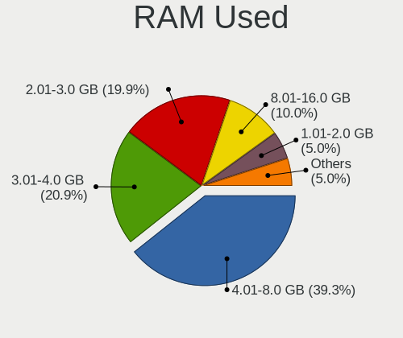
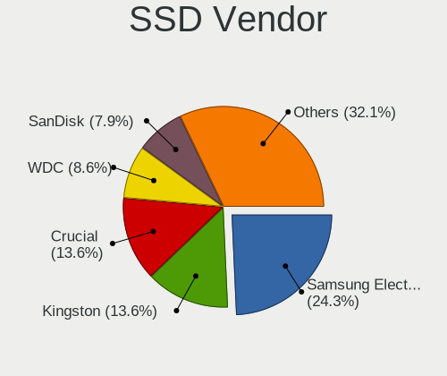

Fedora Hardware Trends (Desktops)
---------------------------------

A project to identify most popular hardware characteristics and track their change
over time based on data collected by Fedora users at https://Linux-Hardware.org.

Anyone can contribute to this report by the [hw-probe](https://github.com/linuxhw/hw-probe) tool:

    sudo -E hw-probe -all -upload

This report is for one last month. Overall report since the beginning of time: [TestCoverage](https://github.com/linuxhw/TestCoverage)

Period: Apr, 2022.

Contents
--------

* [ System ](#system)
  - [ OS                       ](#os)
  - [ OS Family                ](#os-family)
  - [ Kernel                   ](#kernel)
  - [ Kernel Family            ](#kernel-family)
  - [ Kernel Major Ver.        ](#kernel-major-ver)
  - [ Arch                     ](#arch)
  - [ DE                       ](#de)
  - [ Display Server           ](#display-server)
  - [ Display Manager          ](#display-manager)
  - [ OS Lang                  ](#os-lang)
  - [ Boot Mode                ](#boot-mode)
  - [ Filesystem               ](#filesystem)
  - [ Part. scheme             ](#part-scheme)
  - [ Dual Boot with Linux/BSD ](#dual-boot-with-linuxbsd)
  - [ Dual Boot (Win)          ](#dual-boot-win)

* [ Board ](#board)
  - [ Vendor                   ](#vendor)
  - [ Model                    ](#model)
  - [ Model Family             ](#model-family)
  - [ MFG Year                 ](#mfg-year)
  - [ Form Factor              ](#form-factor)
  - [ Secure Boot              ](#secure-boot)
  - [ Coreboot                 ](#coreboot)
  - [ RAM Size                 ](#ram-size)
  - [ RAM Used                 ](#ram-used)
  - [ Total Drives             ](#total-drives)
  - [ Has CD-ROM               ](#has-cd-rom)
  - [ Has Ethernet             ](#has-ethernet)
  - [ Has WiFi                 ](#has-wifi)
  - [ Has Bluetooth            ](#has-bluetooth)

* [ Location ](#location)
  - [ Country                  ](#country)
  - [ City                     ](#city)

* [ Drives ](#drives)
  - [ Drive Vendor             ](#drive-vendor)
  - [ Drive Model              ](#drive-model)
  - [ HDD Vendor               ](#hdd-vendor)
  - [ SSD Vendor               ](#ssd-vendor)
  - [ Drive Kind               ](#drive-kind)
  - [ Drive Connector          ](#drive-connector)
  - [ Drive Size               ](#drive-size)
  - [ Space Total              ](#space-total)
  - [ Space Used               ](#space-used)
  - [ Malfunc. Drives          ](#malfunc-drives)
  - [ Malfunc. Drive Vendor    ](#malfunc-drive-vendor)
  - [ Malfunc. HDD Vendor      ](#malfunc-hdd-vendor)
  - [ Malfunc. Drive Kind      ](#malfunc-drive-kind)
  - [ Failed Drives            ](#failed-drives)
  - [ Failed Drive Vendor      ](#failed-drive-vendor)
  - [ Drive Status             ](#drive-status)

* [ Storage controller ](#storage-controller)
  - [ Storage Vendor           ](#storage-vendor)
  - [ Storage Model            ](#storage-model)
  - [ Storage Kind             ](#storage-kind)

* [ Processor ](#processor)
  - [ CPU Vendor               ](#cpu-vendor)
  - [ CPU Model                ](#cpu-model)
  - [ CPU Model Family         ](#cpu-model-family)
  - [ CPU Cores                ](#cpu-cores)
  - [ CPU Sockets              ](#cpu-sockets)
  - [ CPU Threads              ](#cpu-threads)
  - [ CPU Op-Modes             ](#cpu-op-modes)
  - [ CPU Microcode            ](#cpu-microcode)
  - [ CPU Microarch            ](#cpu-microarch)

* [ Graphics ](#graphics)
  - [ GPU Vendor               ](#gpu-vendor)
  - [ GPU Model                ](#gpu-model)
  - [ GPU Combo                ](#gpu-combo)
  - [ GPU Driver               ](#gpu-driver)
  - [ GPU Memory               ](#gpu-memory)

* [ Monitor ](#monitor)
  - [ Monitor Vendor           ](#monitor-vendor)
  - [ Monitor Model            ](#monitor-model)
  - [ Monitor Resolution       ](#monitor-resolution)
  - [ Monitor Diagonal         ](#monitor-diagonal)
  - [ Monitor Width            ](#monitor-width)
  - [ Aspect Ratio             ](#aspect-ratio)
  - [ Monitor Area             ](#monitor-area)
  - [ Pixel Density            ](#pixel-density)
  - [ Multiple Monitors        ](#multiple-monitors)

* [ Network ](#network)
  - [ Net Controller Vendor    ](#net-controller-vendor)
  - [ Net Controller Model     ](#net-controller-model)
  - [ Wireless Vendor          ](#wireless-vendor)
  - [ Wireless Model           ](#wireless-model)
  - [ Ethernet Vendor          ](#ethernet-vendor)
  - [ Ethernet Model           ](#ethernet-model)
  - [ Net Controller Kind      ](#net-controller-kind)
  - [ Used Controller          ](#used-controller)
  - [ NICs                     ](#nics)
  - [ IPv6                     ](#ipv6)

* [ Bluetooth ](#bluetooth)
  - [ Bluetooth Vendor         ](#bluetooth-vendor)
  - [ Bluetooth Model          ](#bluetooth-model)

* [ Sound ](#sound)
  - [ Sound Vendor             ](#sound-vendor)
  - [ Sound Model              ](#sound-model)

* [ Memory ](#memory)
  - [ Memory Vendor            ](#memory-vendor)
  - [ Memory Model             ](#memory-model)
  - [ Memory Kind              ](#memory-kind)
  - [ Memory Form Factor       ](#memory-form-factor)
  - [ Memory Size              ](#memory-size)
  - [ Memory Speed             ](#memory-speed)

* [ Printers & scanners ](#printers--scanners)
  - [ Printer Vendor           ](#printer-vendor)
  - [ Printer Model            ](#printer-model)
  - [ Scanner Vendor           ](#scanner-vendor)
  - [ Scanner Model            ](#scanner-model)

* [ Camera ](#camera)
  - [ Camera Vendor            ](#camera-vendor)
  - [ Camera Model             ](#camera-model)

* [ Security ](#security)
  - [ Fingerprint Vendor       ](#fingerprint-vendor)
  - [ Fingerprint Model        ](#fingerprint-model)
  - [ Chipcard Vendor          ](#chipcard-vendor)
  - [ Chipcard Model           ](#chipcard-model)

* [ Unsupported ](#unsupported)
  - [ Unsupported Devices      ](#unsupported-devices)
  - [ Unsupported Device Types ](#unsupported-device-types)

System
------

OS
--

Installed operating systems

| Name      | Desktops | Percent |
|-----------|----------|---------|
| Fedora 35 | 111      | 72.55%  |
| Fedora 36 | 30       | 19.61%  |
| Fedora 34 | 11       | 7.19%   |
| Fedora 33 | 1        | 0.65%   |

OS Family
---------

OS without a version

| Name   | Desktops | Percent |
|--------|----------|---------|
| Fedora | 153      | 100%    |

Kernel
------

Version of the Linux kernel

| Version                                                | Desktops | Percent |
|--------------------------------------------------------|----------|---------|
| 5.16.18-200.fc35.x86_64                                | 52       | 33.99%  |
| 5.16.20-200.fc35.x86_64                                | 17       | 11.11%  |
| 5.16.19-200.fc35.x86_64                                | 15       | 9.8%    |
| 5.17.2-300.fc36.x86_64                                 | 11       | 7.19%   |
| 5.17.4-200.fc35.x86_64                                 | 9        | 5.88%   |
| 5.17.1-300.fc36.x86_64                                 | 8        | 5.23%   |
| 5.16.18-100.fc34.x86_64                                | 6        | 3.92%   |
| 5.14.10-300.fc35.x86_64                                | 6        | 3.92%   |
| 5.17.3-302.fc36.x86_64                                 | 5        | 3.27%   |
| 5.16.16-200.fc35.x86_64                                | 5        | 3.27%   |
| 5.17.4-300.fc36.x86_64                                 | 2        | 1.31%   |
| 5.16.20-100.fc34.x86_64                                | 2        | 1.31%   |
| 5.8.18-100.fc31.x86_64                                 | 1        | 0.65%   |
| 5.18.0-0.rc4.20220428git8f4dd16603ce834.36.fc37.x86_64 | 1        | 0.65%   |
| 5.17.3-300.fc36.x86_64                                 | 1        | 0.65%   |
| 5.17.0-0.rc7.116.fc36.x86_64                           | 1        | 0.65%   |
| 5.16.8-200.fc35.x86_64                                 | 1        | 0.65%   |
| 5.16.19-201.fsync.fc35.x86_64                          | 1        | 0.65%   |
| 5.16.19-100.fc34.x86_64                                | 1        | 0.65%   |
| 5.16.18-201.fsync.fc35.x86_64                          | 1        | 0.65%   |
| 5.16.17-200.fc35.x86_64                                | 1        | 0.65%   |
| 5.16.15-201.fc35.x86_64                                | 1        | 0.65%   |
| 5.16.14-200.fc35.x86_64                                | 1        | 0.65%   |
| 5.15.16-200.fc35.x86_64                                | 1        | 0.65%   |
| 5.14.9-200.fc34.x86_64                                 | 1        | 0.65%   |
| 5.14.16-201.fc34.x86_64                                | 1        | 0.65%   |
| 5.13.10-100.fc33.x86_64                                | 1        | 0.65%   |

Kernel Family
-------------

Linux kernel without a distro release

| Version | Desktops | Percent |
|---------|----------|---------|
| 5.16.18 | 59       | 38.56%  |
| 5.16.20 | 19       | 12.42%  |
| 5.16.19 | 17       | 11.11%  |
| 5.17.4  | 11       | 7.19%   |
| 5.17.2  | 11       | 7.19%   |
| 5.17.1  | 8        | 5.23%   |
| 5.17.3  | 6        | 3.92%   |
| 5.14.10 | 6        | 3.92%   |
| 5.16.16 | 5        | 3.27%   |
| 5.8.18  | 1        | 0.65%   |
| 5.18.0  | 1        | 0.65%   |
| 5.17.0  | 1        | 0.65%   |
| 5.16.8  | 1        | 0.65%   |
| 5.16.17 | 1        | 0.65%   |
| 5.16.15 | 1        | 0.65%   |
| 5.16.14 | 1        | 0.65%   |
| 5.15.16 | 1        | 0.65%   |
| 5.14.9  | 1        | 0.65%   |
| 5.14.16 | 1        | 0.65%   |
| 5.13.10 | 1        | 0.65%   |

Kernel Major Ver.
-----------------

Linux kernel major version

| Version | Desktops | Percent |
|---------|----------|---------|
| 5.16    | 104      | 67.97%  |
| 5.17    | 37       | 24.18%  |
| 5.14    | 8        | 5.23%   |
| 5.8     | 1        | 0.65%   |
| 5.18    | 1        | 0.65%   |
| 5.15    | 1        | 0.65%   |
| 5.13    | 1        | 0.65%   |

Arch
----

OS architecture (x86_64, i586, etc.)

| Name   | Desktops | Percent |
|--------|----------|---------|
| x86_64 | 153      | 100%    |

DE
--

Desktop Environment

| Name          | Desktops | Percent |
|---------------|----------|---------|
| GNOME         | 100      | 65.36%  |
| KDE5          | 23       | 15.03%  |
| Unknown       | 10       | 6.54%   |
| XFCE          | 7        | 4.58%   |
| Cinnamon      | 7        | 4.58%   |
| X-Cinnamon    | 4        | 2.61%   |
| MATE          | 1        | 0.65%   |
| GNOME Classic | 1        | 0.65%   |

Display Server
--------------

X11 or Wayland

| Name    | Desktops | Percent |
|---------|----------|---------|
| Wayland | 78       | 50.98%  |
| X11     | 61       | 39.87%  |
| Tty     | 10       | 6.54%   |
| Unknown | 4        | 2.61%   |

Display Manager
---------------

SDDM, LightDM, etc.

| Name    | Desktops | Percent |
|---------|----------|---------|
| Unknown | 71       | 46.41%  |
| GDM     | 52       | 33.99%  |
| LightDM | 19       | 12.42%  |
| SDDM    | 11       | 7.19%   |

OS Lang
-------

Language

| Lang  | Desktops | Percent |
|-------|----------|---------|
| en_US | 77       | 50.33%  |
| en_GB | 13       | 8.5%    |
| en_AU | 9        | 5.88%   |
| ru_RU | 8        | 5.23%   |
| fr_FR | 6        | 3.92%   |
| pl_PL | 5        | 3.27%   |
| it_IT | 5        | 3.27%   |
| en_CA | 5        | 3.27%   |
| de_DE | 4        | 2.61%   |
| pt_BR | 3        | 1.96%   |
| nl_BE | 3        | 1.96%   |
| sv_SE | 2        | 1.31%   |
| fi_FI | 2        | 1.31%   |
| en_IE | 2        | 1.31%   |
| cs_CZ | 2        | 1.31%   |
| sr_RS | 1        | 0.65%   |
| fr_BE | 1        | 0.65%   |
| es_ES | 1        | 0.65%   |
| es_AR | 1        | 0.65%   |
| C     | 1        | 0.65%   |
| bs_BA | 1        | 0.65%   |
| ar_SA | 1        | 0.65%   |

Boot Mode
---------

EFI or BIOS

| Mode | Desktops | Percent |
|------|----------|---------|
| EFI  | 103      | 67.32%  |
| BIOS | 50       | 32.68%  |

Filesystem
----------

Type of filesystem

| Type  | Desktops | Percent |
|-------|----------|---------|
| Btrfs | 99       | 64.71%  |
| Ext4  | 39       | 25.49%  |
| Xfs   | 13       | 8.5%    |
| Zfs   | 1        | 0.65%   |
| Ext3  | 1        | 0.65%   |

Part. scheme
------------

Scheme of partitioning

| Type    | Desktops | Percent |
|---------|----------|---------|
| Unknown | 70       | 45.75%  |
| GPT     | 65       | 42.48%  |
| MBR     | 18       | 11.76%  |

Dual Boot with Linux/BSD
------------------------

Hosting more than one Linux/BSD

| Dual boot | Desktops | Percent |
|-----------|----------|---------|
| No        | 129      | 84.31%  |
| Yes       | 24       | 15.69%  |

Dual Boot (Win)
---------------

Hosting Linux and Windows

| Dual boot | Desktops | Percent |
|-----------|----------|---------|
| No        | 113      | 73.86%  |
| Yes       | 40       | 26.14%  |

Board
-----

Vendor
------

Motherboard manufacturer

| Name                | Desktops | Percent |
|---------------------|----------|---------|
| ASUSTek Computer    | 41       | 26.8%   |
| Gigabyte Technology | 31       | 20.26%  |
| MSI                 | 24       | 15.69%  |
| ASRock              | 15       | 9.8%    |
| Lenovo              | 12       | 7.84%   |
| Dell                | 7        | 4.58%   |
| Hewlett-Packard     | 6        | 3.92%   |
| System76            | 2        | 1.31%   |
| Intel               | 2        | 1.31%   |
| Biostar             | 2        | 1.31%   |
| Unknown             | 2        | 1.31%   |
| JINGSHA             | 1        | 0.65%   |
| Gateway             | 1        | 0.65%   |
| Fujitsu             | 1        | 0.65%   |
| Foxconn             | 1        | 0.65%   |
| ECS                 | 1        | 0.65%   |
| BESSTAR Tech        | 1        | 0.65%   |
| AMI                 | 1        | 0.65%   |
| Alienware           | 1        | 0.65%   |
| Acer                | 1        | 0.65%   |

Model
-----

Motherboard model

| Name                                | Desktops | Percent |
|-------------------------------------|----------|---------|
| MSI MS-7C37                         | 4        | 2.61%   |
| ASUS All Series                     | 4        | 2.61%   |
| MSI MS-7A38                         | 3        | 1.96%   |
| Gigabyte B450 AORUS M               | 3        | 1.96%   |
| ASUS ROG STRIX B550-I GAMING        | 3        | 1.96%   |
| Unknown                             | 3        | 1.96%   |
| System76 Thelio Mira                | 2        | 1.31%   |
| Gigabyte X570 I AORUS PRO WIFI      | 2        | 1.31%   |
| Gigabyte B550I AORUS PRO AX         | 2        | 1.31%   |
| ASUS ROG STRIX B550-F GAMING        | 2        | 1.31%   |
| ASUS ROG STRIX B450-F GAMING        | 2        | 1.31%   |
| ASUS ROG CROSSHAIR VIII DARK HERO   | 2        | 1.31%   |
| ASUS A55M-E                         | 2        | 1.31%   |
| MSI MS-7D32                         | 1        | 0.65%   |
| MSI MS-7D13                         | 1        | 0.65%   |
| MSI MS-7C91                         | 1        | 0.65%   |
| MSI MS-7C84                         | 1        | 0.65%   |
| MSI MS-7C82                         | 1        | 0.65%   |
| MSI MS-7C56                         | 1        | 0.65%   |
| MSI MS-7B98                         | 1        | 0.65%   |
| MSI MS-7B93                         | 1        | 0.65%   |
| MSI MS-7B85                         | 1        | 0.65%   |
| MSI MS-7A70                         | 1        | 0.65%   |
| MSI MS-7A69                         | 1        | 0.65%   |
| MSI MS-7978                         | 1        | 0.65%   |
| MSI MS-7968                         | 1        | 0.65%   |
| MSI MS-7917                         | 1        | 0.65%   |
| MSI MS-7817                         | 1        | 0.65%   |
| MSI MS-7792                         | 1        | 0.65%   |
| MSI MS-7529                         | 1        | 0.65%   |
| Lenovo ThinkCentre M93z 10AF0019MB  | 1        | 0.65%   |
| Lenovo ThinkCentre M93p 10A8S3C100  | 1        | 0.65%   |
| Lenovo ThinkCentre M93p 10A8S1K403  | 1        | 0.65%   |
| Lenovo ThinkCentre M92p 2988E2U     | 1        | 0.65%   |
| Lenovo ThinkCentre M92 3235B7G      | 1        | 0.65%   |
| Lenovo ThinkCentre M91P 7034A2U     | 1        | 0.65%   |
| Lenovo ThinkCentre M91p 7033HS8     | 1        | 0.65%   |
| Lenovo ThinkCentre M910s 10MLS0K701 | 1        | 0.65%   |
| Lenovo ThinkCentre M720s 10ST0014MB | 1        | 0.65%   |
| Lenovo ThinkCentre M700 10HY002VIX  | 1        | 0.65%   |
| Lenovo ThinkCentre M58p 7220A72     | 1        | 0.65%   |
| Lenovo ThinkCentre E73 10AS0035SP   | 1        | 0.65%   |
| Intel W3609                         | 1        | 0.65%   |
| Intel DH61BE AAG14062-206           | 1        | 0.65%   |
| HP Z440 Workstation                 | 1        | 0.65%   |
| HP Slim Desktop S01-pF1xxx          | 1        | 0.65%   |
| HP ProDesk 600 G2 SFF               | 1        | 0.65%   |
| HP EliteDesk 800 G2 TWR             | 1        | 0.65%   |
| HP Desktop 460-a2xx                 | 1        | 0.65%   |
| HP Compaq 8200 Elite CMT PC         | 1        | 0.65%   |
| Gigabyte Z590 VISION D              | 1        | 0.65%   |
| Gigabyte Z490 UD                    | 1        | 0.65%   |
| Gigabyte Z170N-Gaming 5             | 1        | 0.65%   |
| Gigabyte Z170MX-Gaming 5            | 1        | 0.65%   |
| Gigabyte Z170-D3H                   | 1        | 0.65%   |
| Gigabyte X570 AORUS PRO             | 1        | 0.65%   |
| Gigabyte X570 AORUS ELITE           | 1        | 0.65%   |
| Gigabyte TRX40 AORUS MASTER         | 1        | 0.65%   |
| Gigabyte H97-Gaming 3               | 1        | 0.65%   |
| Gigabyte H81M-S2H                   | 1        | 0.65%   |

Model Family
------------

Motherboard model prefix

| Name                    | Desktops | Percent |
|-------------------------|----------|---------|
| ASUS ROG                | 16       | 10.46%  |
| Lenovo ThinkCentre      | 12       | 7.84%   |
| ASUS PRIME              | 5        | 3.27%   |
| MSI MS-7C37             | 4        | 2.61%   |
| Gigabyte X570           | 4        | 2.61%   |
| ASUS All                | 4        | 2.61%   |
| MSI MS-7A38             | 3        | 1.96%   |
| Gigabyte B550           | 3        | 1.96%   |
| Gigabyte B450           | 3        | 1.96%   |
| Dell Precision          | 3        | 1.96%   |
| Dell Inspiron           | 3        | 1.96%   |
| ASRock B450             | 3        | 1.96%   |
| Unknown                 | 3        | 1.96%   |
| System76 Thelio         | 2        | 1.31%   |
| Gigabyte B550I          | 2        | 1.31%   |
| ASUS TUF                | 2        | 1.31%   |
| ASUS CROSSHAIR          | 2        | 1.31%   |
| ASUS A55M-E             | 2        | 1.31%   |
| ASRock X570             | 2        | 1.31%   |
| MSI MS-7D32             | 1        | 0.65%   |
| MSI MS-7D13             | 1        | 0.65%   |
| MSI MS-7C91             | 1        | 0.65%   |
| MSI MS-7C84             | 1        | 0.65%   |
| MSI MS-7C82             | 1        | 0.65%   |
| MSI MS-7C56             | 1        | 0.65%   |
| MSI MS-7B98             | 1        | 0.65%   |
| MSI MS-7B93             | 1        | 0.65%   |
| MSI MS-7B85             | 1        | 0.65%   |
| MSI MS-7A70             | 1        | 0.65%   |
| MSI MS-7A69             | 1        | 0.65%   |
| MSI MS-7978             | 1        | 0.65%   |
| MSI MS-7968             | 1        | 0.65%   |
| MSI MS-7917             | 1        | 0.65%   |
| MSI MS-7817             | 1        | 0.65%   |
| MSI MS-7792             | 1        | 0.65%   |
| MSI MS-7529             | 1        | 0.65%   |
| Intel W3609             | 1        | 0.65%   |
| Intel DH61BE            | 1        | 0.65%   |
| HP Z440                 | 1        | 0.65%   |
| HP Slim                 | 1        | 0.65%   |
| HP ProDesk              | 1        | 0.65%   |
| HP EliteDesk            | 1        | 0.65%   |
| HP Desktop              | 1        | 0.65%   |
| HP Compaq               | 1        | 0.65%   |
| Gigabyte Z590           | 1        | 0.65%   |
| Gigabyte Z490           | 1        | 0.65%   |
| Gigabyte Z170N-Gaming   | 1        | 0.65%   |
| Gigabyte Z170MX-Gaming  | 1        | 0.65%   |
| Gigabyte Z170-D3H       | 1        | 0.65%   |
| Gigabyte TRX40          | 1        | 0.65%   |
| Gigabyte H97-Gaming     | 1        | 0.65%   |
| Gigabyte H81M-S2H       | 1        | 0.65%   |
| Gigabyte H77N-WIFI      | 1        | 0.65%   |
| Gigabyte H110M-H        | 1        | 0.65%   |
| Gigabyte GA-MA785G-UD3H | 1        | 0.65%   |
| Gigabyte GA-MA780G-UD3H | 1        | 0.65%   |
| Gigabyte GA-78LMT-USB3  | 1        | 0.65%   |
| Gigabyte G41MT-D3       | 1        | 0.65%   |
| Gigabyte F2A88XM-D3H    | 1        | 0.65%   |
| Gigabyte EP45-DS3L      | 1        | 0.65%   |

MFG Year
--------

Motherboard manufacture year

| Year | Desktops | Percent |
|------|----------|---------|
| 2020 | 24       | 15.69%  |
| 2019 | 21       | 13.73%  |
| 2018 | 16       | 10.46%  |
| 2021 | 14       | 9.15%   |
| 2013 | 13       | 8.5%    |
| 2016 | 9        | 5.88%   |
| 2014 | 9        | 5.88%   |
| 2015 | 8        | 5.23%   |
| 2012 | 8        | 5.23%   |
| 2017 | 7        | 4.58%   |
| 2011 | 7        | 4.58%   |
| 2009 | 6        | 3.92%   |
| 2010 | 3        | 1.96%   |
| 2022 | 2        | 1.31%   |
| 2008 | 2        | 1.31%   |
| 2007 | 2        | 1.31%   |
| 2006 | 2        | 1.31%   |

Form Factor
-----------

Physical design of the computer

| Name    | Desktops | Percent |
|---------|----------|---------|
| Desktop | 153      | 100%    |

Secure Boot
-----------

Enabled or disabled

| State    | Desktops | Percent |
|----------|----------|---------|
| Disabled | 143      | 93.46%  |
| Enabled  | 10       | 6.54%   |

Coreboot
--------

Have coreboot on board

| Used | Desktops | Percent |
|------|----------|---------|
| No   | 153      | 100%    |

RAM Size
--------

Total RAM memory

| Size in GB  | Desktops | Percent |
|-------------|----------|---------|
| 32.01-64.0  | 42       | 27.45%  |
| 16.01-24.0  | 31       | 20.26%  |
| 8.01-16.0   | 24       | 15.69%  |
| 64.01-256.0 | 20       | 13.07%  |
| 4.01-8.0    | 17       | 11.11%  |
| 3.01-4.0    | 11       | 7.19%   |
| 24.01-32.0  | 6        | 3.92%   |
| 2.01-3.0    | 2        | 1.31%   |

RAM Used
--------

Used RAM memory

| Used GB    | Desktops | Percent |
|------------|----------|---------|
| 4.01-8.0   | 55       | 35.95%  |
| 2.01-3.0   | 31       | 20.26%  |
| 3.01-4.0   | 25       | 16.34%  |
| 8.01-16.0  | 19       | 12.42%  |
| 1.01-2.0   | 15       | 9.8%    |
| 0.51-1.0   | 4        | 2.61%   |
| 32.01-64.0 | 2        | 1.31%   |
| 24.01-32.0 | 1        | 0.65%   |
| 16.01-24.0 | 1        | 0.65%   |

Total Drives
------------

Number of drives on board

| Drives | Desktops | Percent |
|--------|----------|---------|
| 2      | 47       | 30.72%  |
| 1      | 37       | 24.18%  |
| 3      | 27       | 17.65%  |
| 4      | 24       | 15.69%  |
| 5      | 9        | 5.88%   |
| 6      | 4        | 2.61%   |
| 7      | 3        | 1.96%   |
| 9      | 1        | 0.65%   |
| 8      | 1        | 0.65%   |

Has CD-ROM
----------

Has CD-ROM on board

| Presented | Desktops | Percent |
|-----------|----------|---------|
| No        | 103      | 67.32%  |
| Yes       | 50       | 32.68%  |

Has Ethernet
------------

Has Ethernet on board

| Presented | Desktops | Percent |
|-----------|----------|---------|
| Yes       | 153      | 100%    |

Has WiFi
--------

Has WiFi module

| Presented | Desktops | Percent |
|-----------|----------|---------|
| No        | 79       | 51.63%  |
| Yes       | 74       | 48.37%  |

Has Bluetooth
-------------

Has Bluetooth module

| Presented | Desktops | Percent |
|-----------|----------|---------|
| No        | 80       | 52.29%  |
| Yes       | 73       | 47.71%  |

Location
--------

Country
-------

Geographic location (country)

| Country      | Desktops | Percent |
|--------------|----------|---------|
| USA          | 38       | 24.84%  |
| Australia    | 11       | 7.19%   |
| Germany      | 9        | 5.88%   |
| Italy        | 8        | 5.23%   |
| France       | 8        | 5.23%   |
| Canada       | 8        | 5.23%   |
| Russia       | 7        | 4.58%   |
| Poland       | 6        | 3.92%   |
| Belgium      | 6        | 3.92%   |
| Sweden       | 5        | 3.27%   |
| Spain        | 4        | 2.61%   |
| Brazil       | 4        | 2.61%   |
| Norway       | 3        | 1.96%   |
| Czechia      | 3        | 1.96%   |
| Belarus      | 3        | 1.96%   |
| UK           | 2        | 1.31%   |
| Switzerland  | 2        | 1.31%   |
| Mexico       | 2        | 1.31%   |
| Hungary      | 2        | 1.31%   |
| Finland      | 2        | 1.31%   |
| Austria      | 2        | 1.31%   |
| Argentina    | 2        | 1.31%   |
| Turkey       | 1        | 0.65%   |
| Slovenia     | 1        | 0.65%   |
| Singapore    | 1        | 0.65%   |
| Saudi Arabia | 1        | 0.65%   |
| Netherlands  | 1        | 0.65%   |
| Myanmar      | 1        | 0.65%   |
| Latvia       | 1        | 0.65%   |
| Indonesia    | 1        | 0.65%   |
| India        | 1        | 0.65%   |
| Guam         | 1        | 0.65%   |
| Greece       | 1        | 0.65%   |
| Egypt        | 1        | 0.65%   |
| Ecuador      | 1        | 0.65%   |
| Denmark      | 1        | 0.65%   |
| Cambodia     | 1        | 0.65%   |
| Armenia      | 1        | 0.65%   |

City
----

Geographic location (city)

| City              | Desktops | Percent |
|-------------------|----------|---------|
| Sydney            | 7        | 4.58%   |
| Zurich            | 2        | 1.31%   |
| Wroclaw           | 2        | 1.31%   |
| Warsaw            | 2        | 1.31%   |
| Toronto           | 2        | 1.31%   |
| Springfield       | 2        | 1.31%   |
| Sollentuna        | 2        | 1.31%   |
| Seattle           | 2        | 1.31%   |
| Pittsburgh        | 2        | 1.31%   |
| Paris             | 2        | 1.31%   |
| Moscow            | 2        | 1.31%   |
| Minsk             | 2        | 1.31%   |
| Milan             | 2        | 1.31%   |
| Melbourne         | 2        | 1.31%   |
| Chandler          | 2        | 1.31%   |
| Athens            | 2        | 1.31%   |
| Allen             | 2        | 1.31%   |
| Ypsilanti         | 1        | 0.65%   |
| Yerevan           | 1        | 0.65%   |
| Yangon            | 1        | 0.65%   |
| Villeneuve-d'Ascq | 1        | 0.65%   |
| Vila Velha        | 1        | 0.65%   |
| Vigodarzere       | 1        | 0.65%   |
| Vienna            | 1        | 0.65%   |
| Vaestra Froelunda | 1        | 0.65%   |
| Tyumen            | 1        | 0.65%   |
| Turku             | 1        | 0.65%   |
| Troy              | 1        | 0.65%   |
| Taubate           | 1        | 0.65%   |
| Tarragona         | 1        | 0.65%   |
| Tampico           | 1        | 0.65%   |
| Surry Hills       | 1        | 0.65%   |
| Štore            | 1        | 0.65%   |
| Stockholm         | 1        | 0.65%   |
| Steinway          | 1        | 0.65%   |
| St Petersburg     | 1        | 0.65%   |
| Soddy-Daisy       | 1        | 0.65%   |
| Singapore         | 1        | 0.65%   |
| Shokino           | 1        | 0.65%   |
| Sedriano          | 1        | 0.65%   |
| Secaucus          | 1        | 0.65%   |
| Sarpsborg         | 1        | 0.65%   |
| Sao Paulo         | 1        | 0.65%   |
| San Jose          | 1        | 0.65%   |
| Sacramento        | 1        | 0.65%   |
| Rotterdam         | 1        | 0.65%   |
| Rostov-on-Don     | 1        | 0.65%   |
| Ronda             | 1        | 0.65%   |
| Rome              | 1        | 0.65%   |
| Riyadh            | 1        | 0.65%   |
| Riga              | 1        | 0.65%   |
| Regina            | 1        | 0.65%   |
| Rawdon            | 1        | 0.65%   |
| Prague            | 1        | 0.65%   |
| Phnom Penh        | 1        | 0.65%   |
| Pearland          | 1        | 0.65%   |
| Parker            | 1        | 0.65%   |
| Oslo              | 1        | 0.65%   |
| Oakville          | 1        | 0.65%   |
| New Haven         | 1        | 0.65%   |

Drives
------

Drive Vendor
------------

Hard drive vendors

| Vendor                         | Desktops | Drives | Percent |
|--------------------------------|----------|--------|---------|
| Samsung Electronics            | 68       | 105    | 22.15%  |
| WDC                            | 61       | 96     | 19.87%  |
| Seagate                        | 47       | 69     | 15.31%  |
| Kingston                       | 17       | 24     | 5.54%   |
| Crucial                        | 17       | 18     | 5.54%   |
| Toshiba                        | 15       | 17     | 4.89%   |
| Sandisk                        | 14       | 15     | 4.56%   |
| Intel                          | 10       | 12     | 3.26%   |
| Hitachi                        | 8        | 11     | 2.61%   |
| Phison                         | 6        | 6      | 1.95%   |
| PNY                            | 5        | 6      | 1.63%   |
| Unknown                        | 3        | 4      | 0.98%   |
| MAXTOR                         | 3        | 3      | 0.98%   |
| HGST                           | 3        | 3      | 0.98%   |
| Corsair                        | 3        | 3      | 0.98%   |
| SK Hynix                       | 2        | 3      | 0.65%   |
| Silicon Motion                 | 2        | 2      | 0.65%   |
| OCZ                            | 2        | 2      | 0.65%   |
| Micron Technology              | 2        | 2      | 0.65%   |
| A-DATA Technology              | 2        | 2      | 0.65%   |
| Zheino                         | 1        | 1      | 0.33%   |
| XPG                            | 1        | 1      | 0.33%   |
| SSK                            | 1        | 1      | 0.33%   |
| SPCC                           | 1        | 1      | 0.33%   |
| Solid State Storage Technology | 1        | 1      | 0.33%   |
| Phison Electronics             | 1        | 1      | 0.33%   |
| Patriot                        | 1        | 1      | 0.33%   |
| OCZ-VERTEX                     | 1        | 1      | 0.33%   |
| N300                           | 1        | 1      | 0.33%   |
| Micron/Crucial Technology      | 1        | 1      | 0.33%   |
| LITEONIT                       | 1        | 1      | 0.33%   |
| LDLC                           | 1        | 1      | 0.33%   |
| KingDian                       | 1        | 1      | 0.33%   |
| Intenso                        | 1        | 1      | 0.33%   |
| Hewlett-Packard                | 1        | 1      | 0.33%   |
| China                          | 1        | 1      | 0.33%   |
| Apacer                         | 1        | 1      | 0.33%   |

Drive Model
-----------

Hard drive models

| Model                              | Desktops | Percent |
|------------------------------------|----------|---------|
| Seagate ST1000DM010-2EP102 1TB     | 7        | 1.82%   |
| Sandisk NVMe SSD Drive 1TB         | 7        | 1.82%   |
| Samsung SSD 850 EVO 500GB          | 7        | 1.82%   |
| Samsung SSD 850 EVO 250GB          | 7        | 1.82%   |
| Kingston SA400S37240G 240GB SSD    | 7        | 1.82%   |
| Samsung SSD 860 EVO 1TB            | 6        | 1.56%   |
| Samsung NVMe SSD Drive 1TB         | 6        | 1.56%   |
| Seagate ST2000DM008-2FR102 2TB     | 5        | 1.3%    |
| Crucial CT1000MX500SSD1 1TB        | 5        | 1.3%    |
| Seagate ST500DM002-1BD142 500GB    | 4        | 1.04%   |
| Seagate ST4000DM005-2DP166 4TB     | 4        | 1.04%   |
| Samsung SSD 970 EVO Plus 500GB     | 4        | 1.04%   |
| Samsung SSD 860 EVO 500GB          | 4        | 1.04%   |
| Samsung NVMe SSD Drive 500GB       | 4        | 1.04%   |
| Crucial CT500MX500SSD1 500GB       | 4        | 1.04%   |
| WDC WDS100T2B0A-00SM50 1TB SSD     | 3        | 0.78%   |
| Seagate ST4000DM004-2CV104 4TB     | 3        | 0.78%   |
| Sandisk NVMe SSD Drive 500GB       | 3        | 0.78%   |
| Samsung SSD 980 PRO 1TB            | 3        | 0.78%   |
| Samsung SSD 980 1TB                | 3        | 0.78%   |
| Samsung SSD 970 EVO Plus 1TB       | 3        | 0.78%   |
| Samsung HD103SJ 1TB                | 3        | 0.78%   |
| WDC WDS240G2G0B-00EPW0 240GB SSD   | 2        | 0.52%   |
| WDC WDS200T2B0C-00PXH0 2TB         | 2        | 0.52%   |
| WDC WD5000LPVX-22V0TT0 500GB       | 2        | 0.52%   |
| WDC WD5000AAKX-08U6AA0 500GB       | 2        | 0.52%   |
| WDC WD40EZRZ-00GXCB0 4TB           | 2        | 0.52%   |
| WDC WD40EFRX-68N32N0 4TB           | 2        | 0.52%   |
| WDC WD30EFRX-68N32N0 3TB           | 2        | 0.52%   |
| WDC WD10EZEX-60WN4A0 1TB           | 2        | 0.52%   |
| WDC WD10EZEX-08WN4A0 1TB           | 2        | 0.52%   |
| Toshiba MQ01ABD100 1TB             | 2        | 0.52%   |
| Toshiba MQ01ABD050 500GB           | 2        | 0.52%   |
| Toshiba HDWD110 1TB                | 2        | 0.52%   |
| Seagate ST3500418AS 500GB          | 2        | 0.52%   |
| Seagate ST3000DM001-1CH166 3TB     | 2        | 0.52%   |
| Seagate ST1000LM024 HN-M101MBB 1TB | 2        | 0.52%   |
| Seagate ST1000DM003-1SB102 1TB     | 2        | 0.52%   |
| Seagate ST1000DM003-1CH162 1TB     | 2        | 0.52%   |
| SanDisk SSD G5 BICS4 500GB         | 2        | 0.52%   |
| Samsung SSD 980 PRO 2TB            | 2        | 0.52%   |
| Samsung SSD 970 EVO 250GB          | 2        | 0.52%   |
| Samsung SSD 870 QVO 2TB            | 2        | 0.52%   |
| Samsung SSD 870 EVO 2TB            | 2        | 0.52%   |
| Samsung SSD 860 QVO 1TB            | 2        | 0.52%   |
| Samsung SSD 860 EVO 250GB          | 2        | 0.52%   |
| Samsung SSD 850 EVO 1TB            | 2        | 0.52%   |
| Samsung SSD 840 EVO 250GB          | 2        | 0.52%   |
| Samsung SSD 830 Series 128GB       | 2        | 0.52%   |
| Phison NVMe SSD Drive 1024GB       | 2        | 0.52%   |
| Kingston SA400S37120G 120GB SSD    | 2        | 0.52%   |
| Kingston NVMe SSD Drive 1TB        | 2        | 0.52%   |
| Intel SSDSC2CT120A3 120GB          | 2        | 0.52%   |
| Hitachi HUA722020ALA330 2TB        | 2        | 0.52%   |
| Crucial CT240BX500SSD1 240GB       | 2        | 0.52%   |
| Zheino CHN-mSATAQ3-120 120GB       | 1        | 0.26%   |
| XPG GAMMIX S11 Pro 512GB           | 1        | 0.26%   |
| WDC WDS500G3X0C-00SJG0 500GB       | 1        | 0.26%   |
| WDC WDS500G2B0C-00PXH0 500GB       | 1        | 0.26%   |
| WDC WDS500G2B0B-00YS70 500GB SSD   | 1        | 0.26%   |

HDD Vendor
----------

Hard disk drive vendors

| Vendor              | Desktops | Drives | Percent |
|---------------------|----------|--------|---------|
| WDC                 | 47       | 75     | 38.21%  |
| Seagate             | 47       | 69     | 38.21%  |
| Toshiba             | 10       | 11     | 8.13%   |
| Hitachi             | 8        | 11     | 6.5%    |
| Samsung Electronics | 4        | 6      | 3.25%   |
| MAXTOR              | 3        | 3      | 2.44%   |
| HGST                | 3        | 3      | 2.44%   |
| Unknown             | 1        | 1      | 0.81%   |

SSD Vendor
----------

Solid state drive vendors

| Vendor              | Desktops | Drives | Percent |
|---------------------|----------|--------|---------|
| Samsung Electronics | 43       | 63     | 36.75%  |
| Crucial             | 16       | 17     | 13.68%  |
| Kingston            | 15       | 19     | 12.82%  |
| WDC                 | 12       | 13     | 10.26%  |
| PNY                 | 5        | 6      | 4.27%   |
| SanDisk             | 4        | 4      | 3.42%   |
| Intel               | 4        | 5      | 3.42%   |
| Toshiba             | 3        | 4      | 2.56%   |
| OCZ                 | 2        | 2      | 1.71%   |
| Micron Technology   | 2        | 2      | 1.71%   |
| SPCC                | 1        | 1      | 0.85%   |
| SK Hynix            | 1        | 2      | 0.85%   |
| Patriot             | 1        | 1      | 0.85%   |
| OCZ-VERTEX          | 1        | 1      | 0.85%   |
| LITEONIT            | 1        | 1      | 0.85%   |
| KingDian            | 1        | 1      | 0.85%   |
| Intenso             | 1        | 1      | 0.85%   |
| Corsair             | 1        | 1      | 0.85%   |
| China               | 1        | 1      | 0.85%   |
| Apacer              | 1        | 1      | 0.85%   |
| A-DATA Technology   | 1        | 1      | 0.85%   |

Drive Kind
----------

HDD or SSD

| Kind    | Desktops | Drives | Percent |
|---------|----------|--------|---------|
| HDD     | 101      | 179    | 37%     |
| SSD     | 97       | 147    | 35.53%  |
| NVMe    | 69       | 87     | 25.27%  |
| Unknown | 4        | 4      | 1.47%   |
| MMC     | 2        | 3      | 0.73%   |

Drive Connector
---------------

SATA, SAS, NVMe, etc.

| Type | Desktops | Drives | Percent |
|------|----------|--------|---------|
| SATA | 135      | 326    | 64.29%  |
| NVMe | 69       | 87     | 32.86%  |
| SAS  | 4        | 4      | 1.9%    |
| MMC  | 2        | 3      | 0.95%   |

Drive Size
----------

Size of hard drive

| Size in TB | Desktops | Drives | Percent |
|------------|----------|--------|---------|
| 0.01-0.5   | 93       | 150    | 43.66%  |
| 0.51-1.0   | 64       | 83     | 30.05%  |
| 1.01-2.0   | 25       | 44     | 11.74%  |
| 3.01-4.0   | 16       | 25     | 7.51%   |
| 2.01-3.0   | 9        | 12     | 4.23%   |
| 4.01-10.0  | 5        | 8      | 2.35%   |
| 10.01-20.0 | 1        | 4      | 0.47%   |

Space Total
-----------

Amount of disk space available on the file system

| Size in GB     | Desktops | Percent |
|----------------|----------|---------|
| 1001-2000      | 34       | 22.22%  |
| 501-1000       | 28       | 18.3%   |
| More than 3000 | 24       | 15.69%  |
| 251-500        | 18       | 11.76%  |
| 101-250        | 18       | 11.76%  |
| 2001-3000      | 13       | 8.5%    |
| 1-20           | 10       | 6.54%   |
| 51-100         | 4        | 2.61%   |
| Unknown        | 3        | 1.96%   |
| 21-50          | 1        | 0.65%   |

Space Used
----------

Amount of used disk space

| Used GB        | Desktops | Percent |
|----------------|----------|---------|
| 1-20           | 25       | 16.34%  |
| 251-500        | 24       | 15.69%  |
| 101-250        | 24       | 15.69%  |
| 1001-2000      | 21       | 13.73%  |
| 51-100         | 16       | 10.46%  |
| 501-1000       | 15       | 9.8%    |
| 21-50          | 14       | 9.15%   |
| More than 3000 | 7        | 4.58%   |
| 2001-3000      | 4        | 2.61%   |
| Unknown        | 3        | 1.96%   |

Malfunc. Drives
---------------

Drive models with a malfunction

| Model                               | Desktops | Drives | Percent |
|-------------------------------------|----------|--------|---------|
| Intel SSDSC2CT120A3 120GB           | 2        | 2      | 7.69%   |
| WDC WD30EZRX-00SPEB0 3TB            | 1        | 1      | 3.85%   |
| WDC WD30EFRX-68AX9N0 3TB            | 1        | 1      | 3.85%   |
| WDC WD10JPVX-60JC3T0 1TB            | 1        | 1      | 3.85%   |
| Toshiba MQ01ABD050 500GB            | 1        | 1      | 3.85%   |
| Seagate ST3500418AS 500GB           | 1        | 1      | 3.85%   |
| Seagate ST31500341AS 1TB            | 1        | 1      | 3.85%   |
| Seagate ST31000528AS 1TB            | 1        | 1      | 3.85%   |
| Seagate ST3000DM001-1CH166 3TB      | 1        | 1      | 3.85%   |
| Seagate ST2000DM008-2FR102 2TB      | 1        | 1      | 3.85%   |
| Seagate ST1500DM003-9YN16G 1TB      | 1        | 1      | 3.85%   |
| Seagate ST1000DX001-1CM162 1TB      | 1        | 1      | 3.85%   |
| Samsung Electronics SSD 980 PRO 2TB | 1        | 1      | 3.85%   |
| Samsung Electronics SSD 970 EVO 1TB | 1        | 1      | 3.85%   |
| Samsung Electronics SSD 870 EVO 2TB | 1        | 1      | 3.85%   |
| Samsung Electronics SSD 850 PRO 2TB | 1        | 1      | 3.85%   |
| Samsung Electronics HD501LJ 500GB   | 1        | 2      | 3.85%   |
| PNY CS1311 960GB SSD                | 1        | 1      | 3.85%   |
| Hitachi HUA722020ALA330 2TB         | 1        | 1      | 3.85%   |
| Hitachi HTS725032A9A364 320GB       | 1        | 1      | 3.85%   |
| Hitachi HTS723232A7A364 320GB       | 1        | 1      | 3.85%   |
| Hitachi HDP725016GLA380 160GB       | 1        | 1      | 3.85%   |
| Crucial CT250BX100SSD1 250GB        | 1        | 1      | 3.85%   |
| Crucial CT1024MX 1TB SSD            | 1        | 1      | 3.85%   |
| A-DATA Technology SU800 512GB SSD   | 1        | 1      | 3.85%   |

Malfunc. Drive Vendor
---------------------

Vendors of faulty drives

| Vendor              | Desktops | Drives | Percent |
|---------------------|----------|--------|---------|
| Seagate             | 6        | 7      | 25%     |
| Samsung Electronics | 5        | 6      | 20.83%  |
| WDC                 | 3        | 3      | 12.5%   |
| Hitachi             | 3        | 4      | 12.5%   |
| Intel               | 2        | 2      | 8.33%   |
| Crucial             | 2        | 2      | 8.33%   |
| Toshiba             | 1        | 1      | 4.17%   |
| PNY                 | 1        | 1      | 4.17%   |
| A-DATA Technology   | 1        | 1      | 4.17%   |

Malfunc. HDD Vendor
-------------------

Vendors of faulty HDD drives

| Vendor              | Desktops | Drives | Percent |
|---------------------|----------|--------|---------|
| Seagate             | 6        | 7      | 42.86%  |
| WDC                 | 3        | 3      | 21.43%  |
| Hitachi             | 3        | 4      | 21.43%  |
| Toshiba             | 1        | 1      | 7.14%   |
| Samsung Electronics | 1        | 2      | 7.14%   |

Malfunc. Drive Kind
-------------------

Kinds of faulty drives

| Kind | Desktops | Drives | Percent |
|------|----------|--------|---------|
| HDD  | 14       | 17     | 58.33%  |
| SSD  | 8        | 8      | 33.33%  |
| NVMe | 2        | 2      | 8.33%   |

Failed Drives
-------------

Failed drive models

Zero info for selected period =(

Failed Drive Vendor
-------------------

Failed drive vendors

Zero info for selected period =(

Drive Status
------------

Number of failed and malfunc. drives

| Status   | Desktops | Drives | Percent |
|----------|----------|--------|---------|
| Works    | 77       | 182    | 43.75%  |
| Detected | 75       | 211    | 42.61%  |
| Malfunc  | 24       | 27     | 13.64%  |

Storage controller
------------------

Storage Vendor
--------------

Storage controller vendors

| Vendor                         | Desktops | Percent |
|--------------------------------|----------|---------|
| Intel                          | 80       | 31.01%  |
| AMD                            | 76       | 29.46%  |
| Samsung Electronics            | 31       | 12.02%  |
| ASMedia Technology             | 17       | 6.59%   |
| Sandisk                        | 16       | 6.2%    |
| Phison Electronics             | 8        | 3.1%    |
| Marvell Technology Group       | 6        | 2.33%   |
| Kingston Technology Company    | 5        | 1.94%   |
| Silicon Motion                 | 3        | 1.16%   |
| JMicron Technology             | 3        | 1.16%   |
| Toshiba America Info Systems   | 2        | 0.78%   |
| Silicon Image                  | 2        | 0.78%   |
| Micron/Crucial Technology      | 2        | 0.78%   |
| ADATA Technology               | 2        | 0.78%   |
| VIA Technologies               | 1        | 0.39%   |
| ULi Electronics                | 1        | 0.39%   |
| Solid State Storage Technology | 1        | 0.39%   |
| SK Hynix                       | 1        | 0.39%   |
| Broadcom / LSI                 | 1        | 0.39%   |

Storage Model
-------------

Storage controller models

| Model                                                                            | Desktops | Percent |
|----------------------------------------------------------------------------------|----------|---------|
| AMD FCH SATA Controller [AHCI mode]                                              | 47       | 15.82%  |
| Samsung NVMe SSD Controller SM981/PM981/PM983                                    | 16       | 5.39%   |
| ASMedia ASM1062 Serial ATA Controller                                            | 16       | 5.39%   |
| AMD 500 Series Chipset SATA Controller                                           | 15       | 5.05%   |
| AMD 400 Series Chipset SATA Controller                                           | 15       | 5.05%   |
| Intel Q170/Q150/B150/H170/H110/Z170/CM236 Chipset SATA Controller [AHCI Mode]    | 12       | 4.04%   |
| Intel 8 Series/C220 Series Chipset Family 6-port SATA Controller 1 [AHCI mode]   | 11       | 3.7%    |
| AMD SB7x0/SB8x0/SB9x0 SATA Controller [AHCI mode]                                | 9        | 3.03%   |
| Sandisk WD Blue SN550 NVMe SSD                                                   | 7        | 2.36%   |
| Samsung NVMe SSD Controller PM9A1/PM9A3/980PRO                                   | 7        | 2.36%   |
| Samsung NVMe SSD Controller 980                                                  | 7        | 2.36%   |
| Intel 200 Series PCH SATA controller [AHCI mode]                                 | 6        | 2.02%   |
| Phison E12 NVMe Controller                                                       | 5        | 1.68%   |
| Intel 6 Series/C200 Series Chipset Family 6 port Desktop SATA AHCI Controller    | 5        | 1.68%   |
| Intel SATA Controller [RAID mode]                                                | 4        | 1.35%   |
| Intel NM10/ICH7 Family SATA Controller [IDE mode]                                | 4        | 1.35%   |
| Intel Cannon Lake PCH SATA AHCI Controller                                       | 4        | 1.35%   |
| Intel 82801G (ICH7 Family) IDE Controller                                        | 4        | 1.35%   |
| Intel 500 Series Chipset Family SATA AHCI Controller                             | 4        | 1.35%   |
| Silicon Motion SM2263EN/SM2263XT SSD Controller                                  | 3        | 1.01%   |
| Sandisk WD Black SN750 / PC SN730 NVMe SSD                                       | 3        | 1.01%   |
| Samsung NVMe SSD Controller SM961/PM961/SM963                                    | 3        | 1.01%   |
| Marvell Group 88SE9230 PCIe 2.0 x2 4-port SATA 6 Gb/s RAID Controller            | 3        | 1.01%   |
| Intel C600/X79 series chipset 6-Port SATA AHCI Controller                        | 3        | 1.01%   |
| Intel 9 Series Chipset Family SATA Controller [AHCI Mode]                        | 3        | 1.01%   |
| Intel 7 Series/C210 Series Chipset Family 6-port SATA Controller [AHCI mode]     | 3        | 1.01%   |
| Intel 400 Series Chipset Family SATA AHCI Controller                             | 3        | 1.01%   |
| AMD SB7x0/SB8x0/SB9x0 IDE Controller                                             | 3        | 1.01%   |
| Silicon Image SiI 3132 Serial ATA Raid II Controller                             | 2        | 0.67%   |
| Sandisk WD Black 2018/SN750 / PC SN720 NVMe SSD                                  | 2        | 0.67%   |
| Sandisk Non-Volatile memory controller                                           | 2        | 0.67%   |
| Phison E16 PCIe4 NVMe Controller                                                 | 2        | 0.67%   |
| Marvell Group 88SE9172 SATA 6Gb/s Controller                                     | 2        | 0.67%   |
| Kingston Company Company Non-Volatile memory controller                          | 2        | 0.67%   |
| JMicron JMB363 SATA/IDE Controller                                               | 2        | 0.67%   |
| Intel SSD 660P Series                                                            | 2        | 0.67%   |
| Intel SSD 600P Series                                                            | 2        | 0.67%   |
| Intel Non-Volatile memory controller                                             | 2        | 0.67%   |
| Intel NM10/ICH7 Family SATA Controller [AHCI mode]                               | 2        | 0.67%   |
| Intel C610/X99 series chipset 6-Port SATA Controller [AHCI mode]                 | 2        | 0.67%   |
| AMD FCH IDE Controller                                                           | 2        | 0.67%   |
| ADATA XPG SX8200 Pro PCIe Gen3x4 M.2 2280 Solid State Drive                      | 2        | 0.67%   |
| VIA VT6421 IDE/SATA Controller                                                   | 1        | 0.34%   |
| ULi ULi M5288 SATA                                                               | 1        | 0.34%   |
| ULi M5229 IDE                                                                    | 1        | 0.34%   |
| Toshiba America Info Systems Toshiba America Info Non-Volatile memory controller | 1        | 0.34%   |
| Toshiba America Info Systems NVMe Controller                                     | 1        | 0.34%   |
| Solid State Storage Non-Volatile memory controller                               | 1        | 0.34%   |
| SK Hynix Gold P31 SSD                                                            | 1        | 0.34%   |
| Sandisk WD PC SN810 / Black SN850 NVMe SSD                                       | 1        | 0.34%   |
| Sandisk WD Blue SN570 NVMe SSD                                                   | 1        | 0.34%   |
| Sandisk WD Blue SN500 / PC SN520 NVMe SSD                                        | 1        | 0.34%   |
| Phison PS5013 E13 NVMe Controller                                                | 1        | 0.34%   |
| Micron/Crucial P1 NVMe PCIe SSD                                                  | 1        | 0.34%   |
| Micron/Crucial NVMe Controller                                                   | 1        | 0.34%   |
| Marvell Group 88SE912x SATA 6Gb/s Controller [IDE mode]                          | 1        | 0.34%   |
| Marvell Group 88SE912x IDE Controller                                            | 1        | 0.34%   |
| Marvell Group 88SE9123 PCIe SATA 6.0 Gb/s controller                             | 1        | 0.34%   |
| Kingston Company SNVS2000G [NV1 NVMe PCIe SSD 2TB]                               | 1        | 0.34%   |
| Kingston Company KC2000 NVMe SSD                                                 | 1        | 0.34%   |

Storage Kind
------------

Kind of storage controller (IDE, SATA, NVMe, SAS, ...)

| Kind | Desktops | Percent |
|------|----------|---------|
| SATA | 143      | 60.08%  |
| NVMe | 69       | 28.99%  |
| IDE  | 17       | 7.14%   |
| RAID | 7        | 2.94%   |
| SAS  | 2        | 0.84%   |

Processor
---------

CPU Vendor
----------

Processor vendors

| Vendor | Desktops | Percent |
|--------|----------|---------|
| AMD    | 77       | 50.33%  |
| Intel  | 76       | 49.67%  |

CPU Model
---------

Processor models

| Model                                       | Desktops | Percent |
|---------------------------------------------|----------|---------|
| AMD Ryzen 7 5800X 8-Core Processor          | 6        | 3.92%   |
| AMD Ryzen 7 3700X 8-Core Processor          | 6        | 3.92%   |
| AMD Ryzen 9 5950X 16-Core Processor         | 5        | 3.27%   |
| AMD Ryzen 9 3900X 12-Core Processor         | 5        | 3.27%   |
| AMD Ryzen 7 5700G with Radeon Graphics      | 4        | 2.61%   |
| AMD Ryzen 5 3600X 6-Core Processor          | 4        | 2.61%   |
| Intel Core i7-6700K CPU @ 4.00GHz           | 3        | 1.96%   |
| Intel Core i5-4460 CPU @ 3.20GHz            | 3        | 1.96%   |
| Intel Core i5-2400 CPU @ 3.10GHz            | 3        | 1.96%   |
| Intel Core i5-10400 CPU @ 2.90GHz           | 3        | 1.96%   |
| AMD Ryzen 5 3600 6-Core Processor           | 3        | 1.96%   |
| AMD Ryzen 5 2600X Six-Core Processor        | 3        | 1.96%   |
| AMD Athlon X4 760K Quad Core Processor      | 3        | 1.96%   |
| Intel Core i7-7700K CPU @ 4.20GHz           | 2        | 1.31%   |
| Intel Core i7-6700 CPU @ 3.40GHz            | 2        | 1.31%   |
| Intel Core i5-7500 CPU @ 3.40GHz            | 2        | 1.31%   |
| Intel Core i5-6600K CPU @ 3.50GHz           | 2        | 1.31%   |
| Intel Core i5-6500 CPU @ 3.20GHz            | 2        | 1.31%   |
| Intel Core i3-7100 CPU @ 3.90GHz            | 2        | 1.31%   |
| Intel 11th Gen Core i5-11400 @ 2.60GHz      | 2        | 1.31%   |
| AMD Ryzen 9 5900X 12-Core Processor         | 2        | 1.31%   |
| AMD Ryzen 5 5600G with Radeon Graphics      | 2        | 1.31%   |
| AMD Ryzen 5 1600 Six-Core Processor         | 2        | 1.31%   |
| AMD Ryzen 3 2200G with Radeon Vega Graphics | 2        | 1.31%   |
| AMD A4-5300 APU with Radeon HD Graphics     | 2        | 1.31%   |
| Intel Xeon W-2155 CPU @ 3.30GHz             | 1        | 0.65%   |
| Intel Xeon CPU E5-2690 0 @ 2.90GHz          | 1        | 0.65%   |
| Intel Xeon CPU E5-2680 v4 @ 2.40GHz         | 1        | 0.65%   |
| Intel Xeon CPU E5-2670 0 @ 2.60GHz          | 1        | 0.65%   |
| Intel Xeon CPU E5-2620 v3 @ 2.40GHz         | 1        | 0.65%   |
| Intel Xeon CPU E5-1680 v2 @ 3.00GHz         | 1        | 0.65%   |
| Intel Xeon CPU E3-1230 v3 @ 3.30GHz         | 1        | 0.65%   |
| Intel Pentium Dual-Core CPU E5700 @ 3.00GHz | 1        | 0.65%   |
| Intel Core i9-9900K CPU @ 3.60GHz           | 1        | 0.65%   |
| Intel Core i7-9700K CPU @ 3.60GHz           | 1        | 0.65%   |
| Intel Core i7-8700 CPU @ 3.20GHz            | 1        | 0.65%   |
| Intel Core i7-4790 CPU @ 3.60GHz            | 1        | 0.65%   |
| Intel Core i7-3770 CPU @ 3.40GHz            | 1        | 0.65%   |
| Intel Core i7 CPU 975 @ 3.33GHz             | 1        | 0.65%   |
| Intel Core i7 CPU 870 @ 2.93GHz             | 1        | 0.65%   |
| Intel Core i5-9400F CPU @ 2.90GHz           | 1        | 0.65%   |
| Intel Core i5-8400 CPU @ 2.80GHz            | 1        | 0.65%   |
| Intel Core i5-6400T CPU @ 2.20GHz           | 1        | 0.65%   |
| Intel Core i5-4690K CPU @ 3.50GHz           | 1        | 0.65%   |
| Intel Core i5-4690 CPU @ 3.50GHz            | 1        | 0.65%   |
| Intel Core i5-4590S CPU @ 3.00GHz           | 1        | 0.65%   |
| Intel Core i5-4590 CPU @ 3.30GHz            | 1        | 0.65%   |
| Intel Core i5-4570 CPU @ 3.20GHz            | 1        | 0.65%   |
| Intel Core i5-4440 CPU @ 3.10GHz            | 1        | 0.65%   |
| Intel Core i5-4430 CPU @ 3.00GHz            | 1        | 0.65%   |
| Intel Core i5-2500K CPU @ 3.30GHz           | 1        | 0.65%   |
| Intel Core i5-2500 CPU @ 3.30GHz            | 1        | 0.65%   |
| Intel Core i5-10600K CPU @ 4.10GHz          | 1        | 0.65%   |
| Intel Core i3-7300T CPU @ 3.50GHz           | 1        | 0.65%   |
| Intel Core i3-4150 CPU @ 3.50GHz            | 1        | 0.65%   |
| Intel Core i3-4130 CPU @ 3.40GHz            | 1        | 0.65%   |
| Intel Core i3-3220 CPU @ 3.30GHz            | 1        | 0.65%   |
| Intel Core i3-2120T CPU @ 2.60GHz           | 1        | 0.65%   |
| Intel Core i3-2100 CPU @ 3.10GHz            | 1        | 0.65%   |
| Intel Core i3-10100 CPU @ 3.60GHz           | 1        | 0.65%   |

CPU Model Family
----------------

Processor model prefix

| Model                   | Desktops | Percent |
|-------------------------|----------|---------|
| Intel Core i5           | 28       | 18.3%   |
| AMD Ryzen 7             | 21       | 13.73%  |
| AMD Ryzen 5             | 18       | 11.76%  |
| AMD Ryzen 9             | 14       | 9.15%   |
| Intel Core i7           | 13       | 8.5%    |
| Intel Core i3           | 9        | 5.88%   |
| Intel Xeon              | 7        | 4.58%   |
| Other                   | 5        | 3.27%   |
| AMD FX                  | 5        | 3.27%   |
| Intel Core 2 Duo        | 4        | 2.61%   |
| Intel Atom              | 3        | 1.96%   |
| AMD Athlon X4           | 3        | 1.96%   |
| Intel Core 2            | 2        | 1.31%   |
| Intel Celeron           | 2        | 1.31%   |
| AMD Ryzen Threadripper  | 2        | 1.31%   |
| AMD Ryzen 3             | 2        | 1.31%   |
| AMD Phenom II X2        | 2        | 1.31%   |
| AMD A4                  | 2        | 1.31%   |
| AMD A10                 | 2        | 1.31%   |
| Intel Pentium Dual-Core | 1        | 0.65%   |
| Intel Core i9           | 1        | 0.65%   |
| Intel Core 2 Quad       | 1        | 0.65%   |
| AMD Phenom II X4        | 1        | 0.65%   |
| AMD Athlon II X4        | 1        | 0.65%   |
| AMD Athlon II X2        | 1        | 0.65%   |
| AMD Athlon 64 X2        | 1        | 0.65%   |
| AMD Athlon              | 1        | 0.65%   |
| AMD A6                  | 1        | 0.65%   |

CPU Cores
---------

Number of processor cores

| Number | Desktops | Percent |
|--------|----------|---------|
| 4      | 48       | 31.37%  |
| 8      | 28       | 18.3%   |
| 6      | 26       | 16.99%  |
| 2      | 26       | 16.99%  |
| 12     | 10       | 6.54%   |
| 16     | 7        | 4.58%   |
| 24     | 2        | 1.31%   |
| 3      | 2        | 1.31%   |
| 1      | 2        | 1.31%   |
| 14     | 1        | 0.65%   |
| 10     | 1        | 0.65%   |

CPU Sockets
-----------

Number of sockets

| Number | Desktops | Percent |
|--------|----------|---------|
| 1      | 150      | 98.04%  |
| 2      | 3        | 1.96%   |

CPU Threads
-----------

Threads per core (Hyper-Threading)

| Number | Desktops | Percent |
|--------|----------|---------|
| 2      | 106      | 69.28%  |
| 1      | 47       | 30.72%  |

CPU Op-Modes
------------

CPU Operation Modes (32-bit, 64-bit)

| Op mode        | Desktops | Percent |
|----------------|----------|---------|
| 32-bit, 64-bit | 153      | 100%    |

CPU Microcode
-------------

Microcode number

| Number     | Desktops | Percent |
|------------|----------|---------|
| 0x08701021 | 16       | 10.46%  |
| 0x306c3    | 14       | 9.15%   |
| 0x506e3    | 9        | 5.88%   |
| 0x906e9    | 7        | 4.58%   |
| 0x206a7    | 7        | 4.58%   |
| 0x0800820d | 7        | 4.58%   |
| Unknown    | 6        | 3.92%   |
| 0x0a50000c | 5        | 3.27%   |
| 0x0a201016 | 5        | 3.27%   |
| 0x0a201009 | 5        | 3.27%   |
| 0x06001119 | 5        | 3.27%   |
| 0xa0671    | 4        | 2.61%   |
| 0x1067a    | 4        | 2.61%   |
| 0xa0653    | 3        | 1.96%   |
| 0x08701013 | 3        | 1.96%   |
| 0xa0655    | 2        | 1.31%   |
| 0x906ea    | 2        | 1.31%   |
| 0x306a9    | 2        | 1.31%   |
| 0x206d7    | 2        | 1.31%   |
| 0x0a201205 | 2        | 1.31%   |
| 0x08001138 | 2        | 1.31%   |
| 0x06000822 | 2        | 1.31%   |
| 0x010000c6 | 2        | 1.31%   |
| 0x00000000 | 2        | 1.31%   |
| 0x906ed    | 1        | 0.65%   |
| 0x906ec    | 1        | 0.65%   |
| 0x90672    | 1        | 0.65%   |
| 0x6fd      | 1        | 0.65%   |
| 0x6fb      | 1        | 0.65%   |
| 0x6f6      | 1        | 0.65%   |
| 0x6f2      | 1        | 0.65%   |
| 0x506c9    | 1        | 0.65%   |
| 0x50654    | 1        | 0.65%   |
| 0x406f1    | 1        | 0.65%   |
| 0x406d8    | 1        | 0.65%   |
| 0x406c4    | 1        | 0.65%   |
| 0x406c3    | 1        | 0.65%   |
| 0x306f2    | 1        | 0.65%   |
| 0x306e4    | 1        | 0.65%   |
| 0x106e5    | 1        | 0.65%   |
| 0x106a5    | 1        | 0.65%   |
| 0x0a50000b | 1        | 0.65%   |
| 0x0a201204 | 1        | 0.65%   |
| 0x08701011 | 1        | 0.65%   |
| 0x08600106 | 1        | 0.65%   |
| 0x08301039 | 1        | 0.65%   |
| 0x08108109 | 1        | 0.65%   |
| 0x08101016 | 1        | 0.65%   |
| 0x0810100b | 1        | 0.65%   |
| 0x0800820b | 1        | 0.65%   |
| 0x08001137 | 1        | 0.65%   |
| 0x0700010b | 1        | 0.65%   |
| 0x07000106 | 1        | 0.65%   |
| 0x06003106 | 1        | 0.65%   |
| 0x06000852 | 1        | 0.65%   |
| 0x0600081c | 1        | 0.65%   |
| 0x06000613 | 1        | 0.65%   |
| 0x010000c8 | 1        | 0.65%   |
| 0x010000bf | 1        | 0.65%   |

CPU Microarch
-------------

Microarchitecture

| Name             | Desktops | Percent |
|------------------|----------|---------|
| Zen 2            | 22       | 14.38%  |
| Zen 3            | 21       | 13.73%  |
| Haswell          | 15       | 9.8%    |
| KabyLake         | 12       | 7.84%   |
| Skylake          | 11       | 7.19%   |
| Piledriver       | 10       | 6.54%   |
| Zen+             | 9        | 5.88%   |
| SandyBridge      | 9        | 5.88%   |
| Zen              | 5        | 3.27%   |
| K10              | 5        | 3.27%   |
| CometLake        | 5        | 3.27%   |
| Penryn           | 4        | 2.61%   |
| Icelake          | 4        | 2.61%   |
| Core             | 4        | 2.61%   |
| Silvermont       | 3        | 1.96%   |
| IvyBridge        | 3        | 1.96%   |
| Nehalem          | 2        | 1.31%   |
| Jaguar           | 2        | 1.31%   |
| Steamroller      | 1        | 0.65%   |
| K8 Hammer        | 1        | 0.65%   |
| Goldmont         | 1        | 0.65%   |
| Bulldozer        | 1        | 0.65%   |
| Broadwell        | 1        | 0.65%   |
| Bonnell          | 1        | 0.65%   |
| Alderlake Hybrid | 1        | 0.65%   |

Graphics
--------

GPU Vendor
----------

Vendors of graphics cards

| Vendor            | Desktops | Percent |
|-------------------|----------|---------|
| AMD               | 68       | 40.96%  |
| Nvidia            | 59       | 35.54%  |
| Intel             | 38       | 22.89%  |
| ASPEED Technology | 1        | 0.6%    |

GPU Model
---------

Graphics card models

| Model                                                                                    | Desktops | Percent |
|------------------------------------------------------------------------------------------|----------|---------|
| AMD Ellesmere [Radeon RX 470/480/570/570X/580/580X/590]                                  | 12       | 7.14%   |
| Intel Xeon E3-1200 v3/4th Gen Core Processor Integrated Graphics Controller              | 6        | 3.57%   |
| AMD Cezanne                                                                              | 6        | 3.57%   |
| Nvidia GK208B [GeForce GT 710]                                                           | 5        | 2.98%   |
| Nvidia GP106 [GeForce GTX 1060 6GB]                                                      | 4        | 2.38%   |
| Intel HD Graphics 530                                                                    | 4        | 2.38%   |
| Intel CometLake-S GT2 [UHD Graphics 630]                                                 | 4        | 2.38%   |
| Intel 2nd Generation Core Processor Family Integrated Graphics Controller                | 4        | 2.38%   |
| AMD Navi 10 [Radeon RX 5600 OEM/5600 XT / 5700/5700 XT]                                  | 4        | 2.38%   |
| AMD Baffin [Radeon RX 460/560D / Pro 450/455/460/555/555X/560/560X]                      | 4        | 2.38%   |
| Nvidia GK107 [GeForce GTX 650]                                                           | 3        | 1.79%   |
| Intel HD Graphics 630                                                                    | 3        | 1.79%   |
| Intel CoffeeLake-S GT2 [UHD Graphics 630]                                                | 3        | 1.79%   |
| AMD RS880 [Radeon HD 4200]                                                               | 3        | 1.79%   |
| AMD Navi 23 [Radeon RX 6600/6600 XT/6600M]                                               | 3        | 1.79%   |
| AMD Navi 21 [Radeon RX 6800/6800 XT / 6900 XT]                                           | 3        | 1.79%   |
| Nvidia TU117 [GeForce GTX 1650]                                                          | 2        | 1.19%   |
| Nvidia TU116 [GeForce GTX 1660]                                                          | 2        | 1.19%   |
| Nvidia TU104 [GeForce RTX 2080 SUPER]                                                    | 2        | 1.19%   |
| Nvidia GP107 [GeForce GTX 1050 Ti]                                                       | 2        | 1.19%   |
| Nvidia GP106 [GeForce GTX 1060 3GB]                                                      | 2        | 1.19%   |
| Nvidia GP102 [GeForce GTX 1080 Ti]                                                       | 2        | 1.19%   |
| Nvidia GA104 [GeForce RTX 3070]                                                          | 2        | 1.19%   |
| Nvidia GA104 [GeForce RTX 3060 Ti Lite Hash Rate]                                        | 2        | 1.19%   |
| Nvidia GA102 [GeForce RTX 3080]                                                          | 2        | 1.19%   |
| Intel RocketLake-S GT1 [UHD Graphics 750]                                                | 2        | 1.19%   |
| Intel RocketLake-S GT1 [UHD Graphics 730]                                                | 2        | 1.19%   |
| Intel Atom/Celeron/Pentium Processor x5-E8000/J3xxx/N3xxx Integrated Graphics Controller | 2        | 1.19%   |
| Intel 82G33/G31 Express Integrated Graphics Controller                                   | 2        | 1.19%   |
| AMD Vega 10 XL/XT [Radeon RX Vega 56/64]                                                 | 2        | 1.19%   |
| AMD Oland PRO [Radeon R7 240/340 / Radeon 520]                                           | 2        | 1.19%   |
| AMD Navi 22 [Radeon RX 6700/6700 XT/6750 XT / 6800M]                                     | 2        | 1.19%   |
| AMD Navi 21 [Radeon RX 6900 XT]                                                          | 2        | 1.19%   |
| AMD Lexa PRO [Radeon 540/540X/550/550X / RX 540X/550/550X]                               | 2        | 1.19%   |
| AMD Kabini [Radeon HD 8400 / R3 Series]                                                  | 2        | 1.19%   |
| AMD Baffin [Radeon RX 550 640SP / RX 560/560X]                                           | 2        | 1.19%   |
| Nvidia TU106 [GeForce RTX 2070]                                                          | 1        | 0.6%    |
| Nvidia TU106 [GeForce RTX 2060 SUPER]                                                    | 1        | 0.6%    |
| Nvidia TU104 [GeForce RTX 2070 SUPER]                                                    | 1        | 0.6%    |
| Nvidia TU102 [GeForce RTX 2080 Ti]                                                       | 1        | 0.6%    |
| Nvidia TU102 [GeForce RTX 2080 Ti Rev. A]                                                | 1        | 0.6%    |
| Nvidia NV44 [Quadro NVS 285]                                                             | 1        | 0.6%    |
| Nvidia GT218 [GeForce 210]                                                               | 1        | 0.6%    |
| Nvidia GT215 [GeForce GT 240]                                                            | 1        | 0.6%    |
| Nvidia GP108 [GeForce GT 1030]                                                           | 1        | 0.6%    |
| Nvidia GP107GL [Quadro P600]                                                             | 1        | 0.6%    |
| Nvidia GP107 [GeForce GTX 1050]                                                          | 1        | 0.6%    |
| Nvidia GP104 [GeForce GTX 1080]                                                          | 1        | 0.6%    |
| Nvidia GP104 [GeForce GTX 1070]                                                          | 1        | 0.6%    |
| Nvidia GP104 [GeForce GTX 1070 Ti]                                                       | 1        | 0.6%    |
| Nvidia GM206GL [Quadro M2000]                                                            | 1        | 0.6%    |
| Nvidia GM206 [GeForce GTX 960]                                                           | 1        | 0.6%    |
| Nvidia GM204GL [Quadro M4000]                                                            | 1        | 0.6%    |
| Nvidia GM204 [GeForce GTX 970]                                                           | 1        | 0.6%    |
| Nvidia GM107 [GeForce GTX 750 Ti]                                                        | 1        | 0.6%    |
| Nvidia GF119 [GeForce GT 520]                                                            | 1        | 0.6%    |
| Nvidia GF110 [GeForce GTX 560 Ti OEM]                                                    | 1        | 0.6%    |
| Nvidia GF108GL [Quadro 600]                                                              | 1        | 0.6%    |
| Nvidia GF108 [GeForce GT 730]                                                            | 1        | 0.6%    |
| Nvidia GF106 [GeForce GTS 450]                                                           | 1        | 0.6%    |

GPU Combo
---------

Combinations of graphics cards

| Name            | Desktops | Percent |
|-----------------|----------|---------|
| 1 x AMD         | 64       | 41.83%  |
| 1 x Nvidia      | 51       | 33.33%  |
| 1 x Intel       | 26       | 16.99%  |
| Intel + Nvidia  | 7        | 4.58%   |
| Intel + AMD     | 2        | 1.31%   |
| 2 x AMD         | 1        | 0.65%   |
| Intel + 2 x AMD | 1        | 0.65%   |
| 1 x ASPEED      | 1        | 0.65%   |

GPU Driver
----------

Free vs proprietary

| Driver      | Desktops | Percent |
|-------------|----------|---------|
| Free        | 113      | 73.86%  |
| Proprietary | 36       | 23.53%  |
| Unknown     | 4        | 2.61%   |

GPU Memory
----------

Total video memory

| Size in GB | Desktops | Percent |
|------------|----------|---------|
| Unknown    | 54       | 35.29%  |
| 7.01-8.0   | 23       | 15.03%  |
| 3.01-4.0   | 18       | 11.76%  |
| 0.51-1.0   | 17       | 11.11%  |
| 1.01-2.0   | 12       | 7.84%   |
| 0.01-0.5   | 12       | 7.84%   |
| 8.01-16.0  | 10       | 6.54%   |
| 5.01-6.0   | 5        | 3.27%   |
| 2.01-3.0   | 2        | 1.31%   |

Monitor
-------

Monitor Vendor
--------------

Monitor vendors

| Vendor               | Desktops | Percent |
|----------------------|----------|---------|
| Samsung Electronics  | 29       | 15.85%  |
| Dell                 | 29       | 15.85%  |
| Goldstar             | 20       | 10.93%  |
| Acer                 | 13       | 7.1%    |
| AOC                  | 12       | 6.56%   |
| Philips              | 11       | 6.01%   |
| Hewlett-Packard      | 10       | 5.46%   |
| BenQ                 | 8        | 4.37%   |
| Ancor Communications | 8        | 4.37%   |
| Lenovo               | 5        | 2.73%   |
| ViewSonic            | 4        | 2.19%   |
| Iiyama               | 4        | 2.19%   |
| ASUSTek Computer     | 4        | 2.19%   |
| Sceptre Tech         | 2        | 1.09%   |
| NEC Computers        | 2        | 1.09%   |
| MSI                  | 2        | 1.09%   |
| Mi                   | 2        | 1.09%   |
| Marantz              | 2        | 1.09%   |
| Unknown              | 1        | 0.55%   |
| TCL                  | 1        | 0.55%   |
| Sony                 | 1        | 0.55%   |
| RTK                  | 1        | 0.55%   |
| Medion               | 1        | 0.55%   |
| LG Electronics       | 1        | 0.55%   |
| Insignia             | 1        | 0.55%   |
| Hedy                 | 1        | 0.55%   |
| HannStar             | 1        | 0.55%   |
| Gigabyte Technology  | 1        | 0.55%   |
| Gateway              | 1        | 0.55%   |
| Eizo                 | 1        | 0.55%   |
| DMG                  | 1        | 0.55%   |
| DENON                | 1        | 0.55%   |
| Belinea              | 1        | 0.55%   |
| AGO                  | 1        | 0.55%   |

Monitor Model
-------------

Monitor models

| Model                                                                 | Desktops | Percent |
|-----------------------------------------------------------------------|----------|---------|
| Acer XF270HU ACR0549 2560x1440 597x336mm 27.0-inch                    | 3        | 1.57%   |
| Samsung Electronics LCD Monitor SAM07C5 1920x1080 890x500mm 40.2-inch | 2        | 1.05%   |
| Philips PHL 276E8V PHLC18F 1920x1080 597x336mm 27.0-inch              | 2        | 1.05%   |
| Mi Monitor XMI3444 3440x1440 797x334mm 34.0-inch                      | 2        | 1.05%   |
| Marantz AVR MJI0031 1920x1080 2210x1250mm 100.0-inch                  | 2        | 1.05%   |
| Goldstar LG HDR 4K GSM7707 3840x2160 600x340mm 27.2-inch              | 2        | 1.05%   |
| Dell U2515H DELD06F 2560x1440 553x311mm 25.0-inch                     | 2        | 1.05%   |
| Acer SB220Q ACR06AB 1920x1080 476x268mm 21.5-inch                     | 2        | 1.05%   |
| ViewSonic VA2703 Series VSC622A 1920x1080 598x336mm 27.0-inch         | 1        | 0.52%   |
| ViewSonic VA2226w-3 VSC2051 1680x1050 490x290mm 22.4-inch             | 1        | 0.52%   |
| ViewSonic VA2014 SERIES VSC6026 1600x900 443x249mm 20.0-inch          | 1        | 0.52%   |
| ViewSonic LCD Monitor VSCBB31 1920x1080 530x300mm 24.0-inch           | 1        | 0.52%   |
| Unknown LCD Monitor SAMSUNG 1920x1080                                 | 1        | 0.52%   |
| TCL LCD TV TCL0030 1920x1080 708x398mm 32.0-inch                      | 1        | 0.52%   |
| Sony TV SNYAB03 1920x1080                                             | 1        | 0.52%   |
| Sceptre Tech E225W-19206C SPT2261 1920x1080 521x293mm 23.5-inch       | 1        | 0.52%   |
| Sceptre Tech E20 SPT080D 1600x900 434x236mm 19.4-inch                 | 1        | 0.52%   |
| Samsung Electronics U32J59x SAM0F35 3840x2160 697x392mm 31.5-inch     | 1        | 0.52%   |
| Samsung Electronics U28E590 SAM0C4D 3840x2160 610x350mm 27.7-inch     | 1        | 0.52%   |
| Samsung Electronics U28D590 SAM0B80 3840x2160 607x345mm 27.5-inch     | 1        | 0.52%   |
| Samsung Electronics T24D390 SAM0B6E 1920x1080 520x290mm 23.4-inch     | 1        | 0.52%   |
| Samsung Electronics SyncMaster SAM0587 1920x1200 518x324mm 24.1-inch  | 1        | 0.52%   |
| Samsung Electronics SyncMaster SAM04D3 1920x1080 530x300mm 24.0-inch  | 1        | 0.52%   |
| Samsung Electronics SyncMaster SAM049B 1920x1080 477x268mm 21.5-inch  | 1        | 0.52%   |
| Samsung Electronics SyncMaster SAM047D 1360x768 410x230mm 18.5-inch   | 1        | 0.52%   |
| Samsung Electronics SyncMaster SAM027F 1680x1050 474x296mm 22.0-inch  | 1        | 0.52%   |
| Samsung Electronics SyncMaster SAM01D3 1440x900 408x225mm 18.3-inch   | 1        | 0.52%   |
| Samsung Electronics SMT22A550 SAM07AF 1920x1080 477x268mm 21.5-inch   | 1        | 0.52%   |
| Samsung Electronics SMS22A100 SAM0868 1920x1080 477x268mm 21.5-inch   | 1        | 0.52%   |
| Samsung Electronics SMBX2350 SAM071E 1920x1080 510x290mm 23.1-inch    | 1        | 0.52%   |
| Samsung Electronics SMB2330H SAM0649 1920x1080 509x286mm 23.0-inch    | 1        | 0.52%   |
| Samsung Electronics SA300/SA350 SAM0790 1920x1080 510x287mm 23.0-inch | 1        | 0.52%   |
| Samsung Electronics S24R65x SAM1027 1920x1080 527x296mm 23.8-inch     | 1        | 0.52%   |
| Samsung Electronics S24R65x SAM1022 1920x1080 527x296mm 23.8-inch     | 1        | 0.52%   |
| Samsung Electronics M3704C SAM064E 1920x1080                          | 1        | 0.52%   |
| Samsung Electronics LU28R55 SAM1018 3840x2160 632x360mm 28.6-inch     | 1        | 0.52%   |
| Samsung Electronics LU28R55 SAM1017 3840x2160 632x360mm 28.6-inch     | 1        | 0.52%   |
| Samsung Electronics LCD Monitor SAM71B4 3840x2160 950x540mm 43.0-inch | 1        | 0.52%   |
| Samsung Electronics LCD Monitor SAM0B7C 1920x1080 886x498mm 40.0-inch | 1        | 0.52%   |
| Samsung Electronics LC27G5xT SAM7079 2560x1440 597x336mm 27.0-inch    | 1        | 0.52%   |
| Samsung Electronics F27G3xTF SAM710E 1920x1080 600x330mm 27.0-inch    | 1        | 0.52%   |
| Samsung Electronics C49RG9x SAM0F9C 3840x1080 1190x340mm 48.7-inch    | 1        | 0.52%   |
| Samsung Electronics C32F391 SAM0D35 1920x1080 698x393mm 31.5-inch     | 1        | 0.52%   |
| Samsung Electronics C27HG7x SAM0E16 2560x1440 598x336mm 27.0-inch     | 1        | 0.52%   |
| Samsung Electronics C24F390 SAM0D2C 1920x1080 521x293mm 23.5-inch     | 1        | 0.52%   |
| RTK FHD HDR RTK3B3A 1920x1080 344x195mm 15.6-inch                     | 1        | 0.52%   |
| Philips PHL 278E1 PHLC217 3840x2160 597x336mm 27.0-inch               | 1        | 0.52%   |
| Philips PHL 273V7 PHLC156 1920x1080 598x336mm 27.0-inch               | 1        | 0.52%   |
| Philips PHL 272E1GZ PHLC24D 1920x1080 598x336mm 27.0-inch             | 1        | 0.52%   |
| Philips PHL 271E1 PHLC208 1920x1080 598x336mm 27.0-inch               | 1        | 0.52%   |
| Philips PHL 252B9 PHL092C 1920x1200 535x339mm 24.9-inch               | 1        | 0.52%   |
| Philips PHL 243V5 PHLC0D1 1920x1080 521x293mm 23.5-inch               | 1        | 0.52%   |
| Philips PHL 223V7 PHLC154 1920x1080 476x268mm 21.5-inch               | 1        | 0.52%   |
| Philips PHL 223V5 PHLC0CF 1920x1080 477x268mm 21.5-inch               | 1        | 0.52%   |
| Philips FTV PHL01EA 1920x1080 640x360mm 28.9-inch                     | 1        | 0.52%   |
| Philips 226VL PHLC081 1920x1080 480x268mm 21.6-inch                   | 1        | 0.52%   |
| NEC Computers LCD4610 NEC6675 1920x540                                | 1        | 0.52%   |
| NEC Computers LCD4610 NEC6674 1600x1200 1020x570mm 46.0-inch          | 1        | 0.52%   |
| NEC Computers LCD4610 NEC6674 1600x1200 1018x572mm 46.0-inch          | 1        | 0.52%   |
| NEC Computers LCD2170NX NEC6695 1600x1200 432x324mm 21.3-inch         | 1        | 0.52%   |

Monitor Resolution
------------------

Monitor screen resolution

| Resolution         | Desktops | Percent |
|--------------------|----------|---------|
| 1920x1080 (FHD)    | 79       | 45.66%  |
| 2560x1440 (QHD)    | 30       | 17.34%  |
| 3840x2160 (4K)     | 19       | 10.98%  |
| 3440x1440          | 7        | 4.05%   |
| 1280x1024 (SXGA)   | 7        | 4.05%   |
| 2560x1080          | 4        | 2.31%   |
| 1920x1200 (WUXGA)  | 4        | 2.31%   |
| 1680x1050 (WSXGA+) | 4        | 2.31%   |
| 1600x900 (HD+)     | 4        | 2.31%   |
| 1440x900 (WXGA+)   | 3        | 1.73%   |
| 1366x768 (WXGA)    | 3        | 1.73%   |
| 1600x1200          | 2        | 1.16%   |
| 4480x1200          | 1        | 0.58%   |
| 3840x1080          | 1        | 0.58%   |
| 2560x1600          | 1        | 0.58%   |
| 1920x540           | 1        | 0.58%   |
| 1360x768           | 1        | 0.58%   |
| 1024x768 (XGA)     | 1        | 0.58%   |
| Unknown            | 1        | 0.58%   |

Monitor Diagonal
----------------

Diagonal size in inches

| Inches  | Desktops | Percent |
|---------|----------|---------|
| 27      | 41       | 22.53%  |
| 24      | 29       | 15.93%  |
| 23      | 28       | 15.38%  |
| 21      | 15       | 8.24%   |
| 31      | 11       | 6.04%   |
| 34      | 8        | 4.4%    |
| 19      | 8        | 4.4%    |
| 18      | 5        | 2.75%   |
| 22      | 4        | 2.2%    |
| Unknown | 4        | 2.2%    |
| 72      | 3        | 1.65%   |
| 25      | 3        | 1.65%   |
| 20      | 3        | 1.65%   |
| 100     | 2        | 1.1%    |
| 54      | 2        | 1.1%    |
| 40      | 2        | 1.1%    |
| 28      | 2        | 1.1%    |
| 84      | 1        | 0.55%   |
| 65      | 1        | 0.55%   |
| 48      | 1        | 0.55%   |
| 46      | 1        | 0.55%   |
| 42      | 1        | 0.55%   |
| 32      | 1        | 0.55%   |
| 30      | 1        | 0.55%   |
| 26      | 1        | 0.55%   |
| 17      | 1        | 0.55%   |
| 15      | 1        | 0.55%   |
| 13      | 1        | 0.55%   |
| 12      | 1        | 0.55%   |

Monitor Width
-------------

Physical width

| Width in mm    | Desktops | Percent |
|----------------|----------|---------|
| 501-600        | 89       | 52.05%  |
| 401-500        | 27       | 15.79%  |
| 601-700        | 17       | 9.94%   |
| 701-800        | 9        | 5.26%   |
| 351-400        | 7        | 4.09%   |
| 1001-1500      | 5        | 2.92%   |
| 1501-2000      | 4        | 2.34%   |
| Unknown        | 4        | 2.34%   |
| More than 2000 | 2        | 1.17%   |
| 801-900        | 2        | 1.17%   |
| 301-350        | 2        | 1.17%   |
| 201-300        | 2        | 1.17%   |
| 901-1000       | 1        | 0.58%   |

Aspect Ratio
------------

Proportional relationship between the width and the height

| Ratio   | Desktops | Percent |
|---------|----------|---------|
| 16/9    | 129      | 78.66%  |
| 16/10   | 12       | 7.32%   |
| 21/9    | 8        | 4.88%   |
| 5/4     | 7        | 4.27%   |
| 4/3     | 3        | 1.83%   |
| 32/9    | 2        | 1.22%   |
| Unknown | 2        | 1.22%   |
| 6/5     | 1        | 0.61%   |

Monitor Area
------------

Area in inch²

| Area in inch² | Desktops | Percent |
|----------------|----------|---------|
| 201-250        | 62       | 35.03%  |
| 301-350        | 42       | 23.73%  |
| 351-500        | 23       | 12.99%  |
| 151-200        | 16       | 9.04%   |
| 251-300        | 9        | 5.08%   |
| More than 1000 | 8        | 4.52%   |
| 141-150        | 5        | 2.82%   |
| 501-1000       | 5        | 2.82%   |
| Unknown        | 4        | 2.26%   |
| 81-90          | 1        | 0.56%   |
| 71-80          | 1        | 0.56%   |
| 101-110        | 1        | 0.56%   |

Pixel Density
-------------

Pixels per inch

| Density | Desktops | Percent |
|---------|----------|---------|
| 51-100  | 99       | 59.64%  |
| 101-120 | 39       | 23.49%  |
| 121-160 | 9        | 5.42%   |
| 161-240 | 8        | 4.82%   |
| 1-50    | 7        | 4.22%   |
| Unknown | 4        | 2.41%   |

Multiple Monitors
-----------------

Total monitors connected

| Total | Desktops | Percent |
|-------|----------|---------|
| 1     | 111      | 72.55%  |
| 2     | 37       | 24.18%  |
| 3     | 3        | 1.96%   |
| 0     | 2        | 1.31%   |

Network
-------

Net Controller Vendor
---------------------

Controller vendors

| Vendor                   | Desktops | Percent |
|--------------------------|----------|---------|
| Intel                    | 89       | 40.09%  |
| Realtek Semiconductor    | 83       | 37.39%  |
| Qualcomm Atheros         | 11       | 4.95%   |
| Microsoft                | 5        | 2.25%   |
| TP-Link                  | 3        | 1.35%   |
| MediaTek                 | 3        | 1.35%   |
| Aquantia                 | 3        | 1.35%   |
| Samsung Electronics      | 2        | 0.9%    |
| OpenMoko                 | 2        | 0.9%    |
| InterBiometrics          | 2        | 0.9%    |
| Broadcom                 | 2        | 0.9%    |
| ASUSTek Computer         | 2        | 0.9%    |
| ADMtek                   | 2        | 0.9%    |
| Xiaomi                   | 1        | 0.45%   |
| U-Blox                   | 1        | 0.45%   |
| RetroFreak PCB           | 1        | 0.45%   |
| Ralink Technology        | 1        | 0.45%   |
| NetGear                  | 1        | 0.45%   |
| Mellanox Technologies    | 1        | 0.45%   |
| Marvell Technology Group | 1        | 0.45%   |
| Linksys                  | 1        | 0.45%   |
| DisplayLink              | 1        | 0.45%   |
| D-Link System            | 1        | 0.45%   |
| D-Link                   | 1        | 0.45%   |
| Broadcom Limited         | 1        | 0.45%   |
| AVM                      | 1        | 0.45%   |

Net Controller Model
--------------------

Controller models

| Model                                                                  | Desktops | Percent |
|------------------------------------------------------------------------|----------|---------|
| Realtek RTL8111/8168/8411 PCI Express Gigabit Ethernet Controller      | 60       | 22.3%   |
| Intel Wi-Fi 6 AX200                                                    | 27       | 10.04%  |
| Intel I211 Gigabit Network Connection                                  | 26       | 9.67%   |
| Realtek RTL8125 2.5GbE Controller                                      | 16       | 5.95%   |
| Intel Ethernet Controller I225-V                                       | 11       | 4.09%   |
| Intel Ethernet Connection (2) I219-V                                   | 5        | 1.86%   |
| Intel Dual Band Wireless-AC 3168NGW [Stone Peak]                       | 5        | 1.86%   |
| Intel 82579LM Gigabit Network Connection (Lewisville)                  | 5        | 1.86%   |
| Qualcomm Atheros Killer E220x Gigabit Ethernet Controller              | 4        | 1.49%   |
| Intel Wireless-AC 9260                                                 | 4        | 1.49%   |
| Intel Wireless 8260                                                    | 4        | 1.49%   |
| Intel Ethernet Connection I217-LM                                      | 4        | 1.49%   |
| Intel Ethernet Connection (2) I219-LM                                  | 4        | 1.49%   |
| Realtek RTL-8100/8101L/8139 PCI Fast Ethernet Adapter                  | 3        | 1.12%   |
| Intel Ethernet Connection (7) I219-V                                   | 3        | 1.12%   |
| Intel 82574L Gigabit Network Connection                                | 3        | 1.12%   |
| TP-Link TL-WN823N v2/v3 [Realtek RTL8192EU]                            | 2        | 0.74%   |
| Realtek RTL8821CE 802.11ac PCIe Wireless Network Adapter               | 2        | 0.74%   |
| Realtek RTL8153 Gigabit Ethernet Adapter                               | 2        | 0.74%   |
| Realtek RTL810xE PCI Express Fast Ethernet controller                  | 2        | 0.74%   |
| Microsoft Xbox 360 Wireless Adapter                                    | 2        | 0.74%   |
| Microsoft Wireless XBox Controller Dongle                              | 2        | 0.74%   |
| MEDIATEK RZ608 Wi-Fi 6E 80MHz                                          | 2        | 0.74%   |
| InterBiometrics Io                                                     | 2        | 0.74%   |
| Intel Wireless 7260                                                    | 2        | 0.74%   |
| Intel Wi-Fi 6 AX210/AX211/AX411 160MHz                                 | 2        | 0.74%   |
| Intel 82583V Gigabit Network Connection                                | 2        | 0.74%   |
| Intel 82579V Gigabit Network Connection                                | 2        | 0.74%   |
| ADMtek NC100 Network Everywhere Fast Ethernet 10/100                   | 2        | 0.74%   |
| Xiaomi Mi/Redmi series (RNDIS + ADB)                                   | 1        | 0.37%   |
| U-Blox [u-blox 7]                                                      | 1        | 0.37%   |
| TP-Link TL-WN722N v2/v3 [Realtek RTL8188EUS]                           | 1        | 0.37%   |
| Samsung WIS09ABGN LinkStick Wireless LAN Adapter                       | 1        | 0.37%   |
| Samsung Galaxy series, misc. (tethering mode)                          | 1        | 0.37%   |
| RetroFreak PCB B                                                       | 1        | 0.37%   |
| Realtek RTL8811AU 802.11a/b/g/n/ac WLAN Adapter                        | 1        | 0.37%   |
| Realtek RTL8192EU 802.11b/g/n WLAN Adapter                             | 1        | 0.37%   |
| Realtek RTL8192CE PCIe Wireless Network Adapter                        | 1        | 0.37%   |
| Realtek RTL8188FTV 802.11b/g/n 1T1R 2.4G WLAN Adapter                  | 1        | 0.37%   |
| Realtek RTL8188EUS 802.11n Wireless Network Adapter                    | 1        | 0.37%   |
| Realtek RTL8131 PCIe Fast Ethernet Adapter                             | 1        | 0.37%   |
| Ralink MT7610U ("Archer T2U" 2.4G+5G WLAN Adapter                      | 1        | 0.37%   |
| Qualcomm Atheros QCA9565 / AR9565 Wireless Network Adapter             | 1        | 0.37%   |
| Qualcomm Atheros QCA8171 Gigabit Ethernet                              | 1        | 0.37%   |
| Qualcomm Atheros Killer E2400 Gigabit Ethernet Controller              | 1        | 0.37%   |
| Qualcomm Atheros AR9462 Wireless Network Adapter                       | 1        | 0.37%   |
| Qualcomm Atheros AR9287 Wireless Network Adapter (PCI-Express)         | 1        | 0.37%   |
| Qualcomm Atheros AR8161 Gigabit Ethernet                               | 1        | 0.37%   |
| Qualcomm Atheros AR5212/5213/2414 Wireless Network Adapter             | 1        | 0.37%   |
| OpenMoko OneRNG entropy device                                         | 1        | 0.37%   |
| OpenMoko Duet 2 WiFi or Duet 2 Ethernet 3D printer control electronics | 1        | 0.37%   |
| NetGear A6210                                                          | 1        | 0.37%   |
| Microsoft XBOX ACC                                                     | 1        | 0.37%   |
| Mellanox MT27500 Family [ConnectX-3]                                   | 1        | 0.37%   |
| MediaTek WiFi                                                          | 1        | 0.37%   |
| Marvell Group 88E8053 PCI-E Gigabit Ethernet Controller                | 1        | 0.37%   |
| Marvell Group 88E8001 Gigabit Ethernet Controller                      | 1        | 0.37%   |
| Linksys AE1200 802.11bgn Wireless Adapter [Broadcom BCM43235]          | 1        | 0.37%   |
| Intel Wireless 3165                                                    | 1        | 0.37%   |
| Intel Wireless 3160                                                    | 1        | 0.37%   |

Wireless Vendor
---------------

Wireless vendors

| Vendor                | Desktops | Percent |
|-----------------------|----------|---------|
| Intel                 | 49       | 62.03%  |
| Realtek Semiconductor | 7        | 8.86%   |
| Microsoft             | 5        | 6.33%   |
| Qualcomm Atheros      | 4        | 5.06%   |
| TP-Link               | 3        | 3.8%    |
| MEDIATEK              | 3        | 3.8%    |
| ASUSTek Computer      | 2        | 2.53%   |
| Samsung Electronics   | 1        | 1.27%   |
| Ralink Technology     | 1        | 1.27%   |
| NetGear               | 1        | 1.27%   |
| Linksys               | 1        | 1.27%   |
| D-Link                | 1        | 1.27%   |
| AVM                   | 1        | 1.27%   |

Wireless Model
--------------

Wireless models

| Model                                                                | Desktops | Percent |
|----------------------------------------------------------------------|----------|---------|
| Intel Wi-Fi 6 AX200                                                  | 27       | 34.18%  |
| Intel Dual Band Wireless-AC 3168NGW [Stone Peak]                     | 5        | 6.33%   |
| Intel Wireless-AC 9260                                               | 4        | 5.06%   |
| Intel Wireless 8260                                                  | 4        | 5.06%   |
| TP-Link TL-WN823N v2/v3 [Realtek RTL8192EU]                          | 2        | 2.53%   |
| Realtek RTL8821CE 802.11ac PCIe Wireless Network Adapter             | 2        | 2.53%   |
| Microsoft Xbox 360 Wireless Adapter                                  | 2        | 2.53%   |
| Microsoft Wireless XBox Controller Dongle                            | 2        | 2.53%   |
| MEDIATEK RZ608 Wi-Fi 6E 80MHz                                        | 2        | 2.53%   |
| Intel Wireless 7260                                                  | 2        | 2.53%   |
| Intel Wi-Fi 6 AX210/AX211/AX411 160MHz                               | 2        | 2.53%   |
| TP-Link TL-WN722N v2/v3 [Realtek RTL8188EUS]                         | 1        | 1.27%   |
| Samsung WIS09ABGN LinkStick Wireless LAN Adapter                     | 1        | 1.27%   |
| Realtek RTL8811AU 802.11a/b/g/n/ac WLAN Adapter                      | 1        | 1.27%   |
| Realtek RTL8192EU 802.11b/g/n WLAN Adapter                           | 1        | 1.27%   |
| Realtek RTL8192CE PCIe Wireless Network Adapter                      | 1        | 1.27%   |
| Realtek RTL8188FTV 802.11b/g/n 1T1R 2.4G WLAN Adapter                | 1        | 1.27%   |
| Realtek RTL8188EUS 802.11n Wireless Network Adapter                  | 1        | 1.27%   |
| Ralink MT7610U ("Archer T2U" 2.4G+5G WLAN Adapter                    | 1        | 1.27%   |
| Qualcomm Atheros QCA9565 / AR9565 Wireless Network Adapter           | 1        | 1.27%   |
| Qualcomm Atheros AR9462 Wireless Network Adapter                     | 1        | 1.27%   |
| Qualcomm Atheros AR9287 Wireless Network Adapter (PCI-Express)       | 1        | 1.27%   |
| Qualcomm Atheros AR5212/5213/2414 Wireless Network Adapter           | 1        | 1.27%   |
| NetGear A6210                                                        | 1        | 1.27%   |
| Microsoft XBOX ACC                                                   | 1        | 1.27%   |
| MediaTek WiFi                                                        | 1        | 1.27%   |
| Linksys AE1200 802.11bgn Wireless Adapter [Broadcom BCM43235]        | 1        | 1.27%   |
| Intel Wireless 3165                                                  | 1        | 1.27%   |
| Intel Wireless 3160                                                  | 1        | 1.27%   |
| Intel Tiger Lake PCH CNVi WiFi                                       | 1        | 1.27%   |
| Intel Centrino Wireless-N 2230                                       | 1        | 1.27%   |
| Intel Alder Lake-S PCH CNVi WiFi                                     | 1        | 1.27%   |
| D-Link DWA-131 Wireless N Nano Adapter (Rev. E1) [Realtek RTL8192EU] | 1        | 1.27%   |
| AVM FRITZ!WLAN AC 860                                                | 1        | 1.27%   |
| ASUS USB-N13 802.11n Network Adapter (rev. B1) [Realtek RTL8192CU]   | 1        | 1.27%   |
| ASUS 802.11ac NIC                                                    | 1        | 1.27%   |

Ethernet Vendor
---------------

Ethernet vendors

| Vendor                   | Desktops | Percent |
|--------------------------|----------|---------|
| Realtek Semiconductor    | 80       | 46.24%  |
| Intel                    | 72       | 41.62%  |
| Qualcomm Atheros         | 7        | 4.05%   |
| Aquantia                 | 3        | 1.73%   |
| Broadcom                 | 2        | 1.16%   |
| ADMtek                   | 2        | 1.16%   |
| Xiaomi                   | 1        | 0.58%   |
| Samsung Electronics      | 1        | 0.58%   |
| OpenMoko                 | 1        | 0.58%   |
| Marvell Technology Group | 1        | 0.58%   |
| DisplayLink              | 1        | 0.58%   |
| D-Link System            | 1        | 0.58%   |
| Broadcom Limited         | 1        | 0.58%   |

Ethernet Model
--------------

Ethernet models

| Model                                                                         | Desktops | Percent |
|-------------------------------------------------------------------------------|----------|---------|
| Realtek RTL8111/8168/8411 PCI Express Gigabit Ethernet Controller             | 60       | 32.61%  |
| Intel I211 Gigabit Network Connection                                         | 26       | 14.13%  |
| Realtek RTL8125 2.5GbE Controller                                             | 16       | 8.7%    |
| Intel Ethernet Controller I225-V                                              | 11       | 5.98%   |
| Intel Ethernet Connection (2) I219-V                                          | 5        | 2.72%   |
| Intel 82579LM Gigabit Network Connection (Lewisville)                         | 5        | 2.72%   |
| Qualcomm Atheros Killer E220x Gigabit Ethernet Controller                     | 4        | 2.17%   |
| Intel Ethernet Connection I217-LM                                             | 4        | 2.17%   |
| Intel Ethernet Connection (2) I219-LM                                         | 4        | 2.17%   |
| Realtek RTL-8100/8101L/8139 PCI Fast Ethernet Adapter                         | 3        | 1.63%   |
| Intel Ethernet Connection (7) I219-V                                          | 3        | 1.63%   |
| Intel 82574L Gigabit Network Connection                                       | 3        | 1.63%   |
| Realtek RTL8153 Gigabit Ethernet Adapter                                      | 2        | 1.09%   |
| Realtek RTL810xE PCI Express Fast Ethernet controller                         | 2        | 1.09%   |
| Intel 82583V Gigabit Network Connection                                       | 2        | 1.09%   |
| Intel 82579V Gigabit Network Connection                                       | 2        | 1.09%   |
| ADMtek NC100 Network Everywhere Fast Ethernet 10/100                          | 2        | 1.09%   |
| Xiaomi Mi/Redmi series (RNDIS + ADB)                                          | 1        | 0.54%   |
| Samsung Galaxy series, misc. (tethering mode)                                 | 1        | 0.54%   |
| Realtek RTL8131 PCIe Fast Ethernet Adapter                                    | 1        | 0.54%   |
| Qualcomm Atheros QCA8171 Gigabit Ethernet                                     | 1        | 0.54%   |
| Qualcomm Atheros Killer E2400 Gigabit Ethernet Controller                     | 1        | 0.54%   |
| Qualcomm Atheros AR8161 Gigabit Ethernet                                      | 1        | 0.54%   |
| OpenMoko Duet 2 WiFi or Duet 2 Ethernet 3D printer control electronics        | 1        | 0.54%   |
| Marvell Group 88E8053 PCI-E Gigabit Ethernet Controller                       | 1        | 0.54%   |
| Marvell Group 88E8001 Gigabit Ethernet Controller                             | 1        | 0.54%   |
| Intel PRO/100 VE Network Connection                                           | 1        | 0.54%   |
| Intel I350 Gigabit Network Connection                                         | 1        | 0.54%   |
| Intel I210 Gigabit Network Connection                                         | 1        | 0.54%   |
| Intel Ethernet Controller 10G X550T                                           | 1        | 0.54%   |
| Intel Ethernet Connection I217-V                                              | 1        | 0.54%   |
| Intel Ethernet Connection (2) I218-LM                                         | 1        | 0.54%   |
| Intel Ethernet Connection (12) I219-V                                         | 1        | 0.54%   |
| Intel 82599ES 10-Gigabit SFI/SFP+ Network Connection                          | 1        | 0.54%   |
| Intel 82576 Gigabit Network Connection                                        | 1        | 0.54%   |
| Intel 82571EB/82571GB Gigabit Ethernet Controller D0/D1 (copper applications) | 1        | 0.54%   |
| Intel 82567LM-3 Gigabit Network Connection                                    | 1        | 0.54%   |
| Intel 82562V-2 10/100 Network Connection                                      | 1        | 0.54%   |
| Intel 82546EB Gigabit Ethernet Controller (Copper)                            | 1        | 0.54%   |
| DisplayLink Plugable UD-3900                                                  | 1        | 0.54%   |
| D-Link System DGE-528T Gigabit Ethernet Adapter                               | 1        | 0.54%   |
| Broadcom NetLink BCM5784M Gigabit Ethernet PCIe                               | 1        | 0.54%   |
| Broadcom NetLink BCM57788 Gigabit Ethernet PCIe                               | 1        | 0.54%   |
| Broadcom Limited NetXtreme BCM5754 Gigabit Ethernet PCI Express               | 1        | 0.54%   |
| Aquantia AQC111 NBase-T/IEEE 802.3bz Ethernet Controller [AQtion]             | 1        | 0.54%   |
| Aquantia AQC108 NBase-T/IEEE 802.3bz Ethernet Controller [AQtion]             | 1        | 0.54%   |
| Aquantia AQC107 NBase-T/IEEE 802.3bz Ethernet Controller [AQtion]             | 1        | 0.54%   |

Net Controller Kind
-------------------

Ethernet, WiFi or modem

| Kind     | Desktops | Percent |
|----------|----------|---------|
| Ethernet | 153      | 65.95%  |
| WiFi     | 74       | 31.9%   |
| Modem    | 4        | 1.72%   |
| Unknown  | 1        | 0.43%   |

Used Controller
---------------

Currently used network controller

| Kind     | Desktops | Percent |
|----------|----------|---------|
| Ethernet | 119      | 76.28%  |
| WiFi     | 37       | 23.72%  |

NICs
----

Total network controllers on board

| Total | Desktops | Percent |
|-------|----------|---------|
| 1     | 74       | 48.37%  |
| 2     | 62       | 40.52%  |
| 3     | 12       | 7.84%   |
| 4     | 3        | 1.96%   |
| 6     | 1        | 0.65%   |
| 5     | 1        | 0.65%   |

IPv6
----

IPv6 vs IPv4

| Used | Desktops | Percent |
|------|----------|---------|
| No   | 113      | 73.86%  |
| Yes  | 40       | 26.14%  |

Bluetooth
---------

Bluetooth Vendor
----------------

Controller vendors

| Vendor                          | Desktops | Percent |
|---------------------------------|----------|---------|
| Intel                           | 46       | 61.33%  |
| Cambridge Silicon Radio         | 10       | 13.33%  |
| ASUSTek Computer                | 4        | 5.33%   |
| Realtek Semiconductor           | 3        | 4%      |
| Qualcomm Atheros Communications | 3        | 4%      |
| TP-Link                         | 2        | 2.67%   |
| MediaTek                        | 2        | 2.67%   |
| Broadcom                        | 2        | 2.67%   |
| Lite-On Technology              | 1        | 1.33%   |
| Edimax Technology               | 1        | 1.33%   |
| Dell                            | 1        | 1.33%   |

Bluetooth Model
---------------

Controller models

| Model                                               | Desktops | Percent |
|-----------------------------------------------------|----------|---------|
| Intel AX200 Bluetooth                               | 26       | 34.67%  |
| Cambridge Silicon Radio Bluetooth Dongle (HCI mode) | 10       | 13.33%  |
| Intel Bluetooth wireless interface                  | 6        | 8%      |
| Intel Wireless-AC 3168 Bluetooth                    | 5        | 6.67%   |
| Intel Wireless-AC 9260 Bluetooth Adapter            | 4        | 5.33%   |
| TP-Link UB500 Adapter                               | 2        | 2.67%   |
| Realtek Bluetooth Radio                             | 2        | 2.67%   |
| Qualcomm Atheros AR3011 Bluetooth                   | 2        | 2.67%   |
| MediaTek Wireless_Device                            | 2        | 2.67%   |
| Intel Bluetooth Device                              | 2        | 2.67%   |
| Intel AX210 Bluetooth                               | 2        | 2.67%   |
| ASUS Broadcom BCM20702A0 Bluetooth                  | 2        | 2.67%   |
| Realtek  Bluetooth 4.2 Adapter                      | 1        | 1.33%   |
| Qualcomm Atheros AR9462 Bluetooth                   | 1        | 1.33%   |
| Lite-On Bluetooth Device                            | 1        | 1.33%   |
| Intel Centrino Bluetooth Wireless Transceiver       | 1        | 1.33%   |
| Edimax Bluetooth Adapter                            | 1        | 1.33%   |
| Dell Wireless 365 Bluetooth                         | 1        | 1.33%   |
| Broadcom BCM92046DG-CL1ROM Bluetooth 2.1 Adapter    | 1        | 1.33%   |
| Broadcom BCM20702A0 Bluetooth 4.0                   | 1        | 1.33%   |
| ASUS BCM20702A0                                     | 1        | 1.33%   |
| ASUS ASUS USB-BT500                                 | 1        | 1.33%   |

Sound
-----

Sound Vendor
------------

Sound card vendors

| Vendor                     | Desktops | Percent |
|----------------------------|----------|---------|
| AMD                        | 89       | 30.9%   |
| Intel                      | 69       | 23.96%  |
| Nvidia                     | 57       | 19.79%  |
| Logitech                   | 11       | 3.82%   |
| C-Media Electronics        | 10       | 3.47%   |
| Focusrite-Novation         | 5        | 1.74%   |
| Creative Labs              | 5        | 1.74%   |
| Corsair                    | 4        | 1.39%   |
| Texas Instruments          | 3        | 1.04%   |
| SteelSeries ApS            | 3        | 1.04%   |
| Plantronics                | 3        | 1.04%   |
| Tenx Technology            | 2        | 0.69%   |
| JMTek                      | 2        | 0.69%   |
| Yamaha                     | 1        | 0.35%   |
| XMOS                       | 1        | 0.35%   |
| Turtle Beach               | 1        | 0.35%   |
| Sony                       | 1        | 0.35%   |
| Sennheiser Communications  | 1        | 0.35%   |
| Samson Technologies        | 1        | 0.35%   |
| Realtek Semiconductor      | 1        | 0.35%   |
| Razer USA                  | 1        | 0.35%   |
| PreSonus Audio Electronics | 1        | 0.35%   |
| OLKB                       | 1        | 0.35%   |
| Micro Star International   | 1        | 0.35%   |
| KORG                       | 1        | 0.35%   |
| Kingston Technology        | 1        | 0.35%   |
| GYROCOM C&C                | 1        | 0.35%   |
| GN Netcom                  | 1        | 0.35%   |
| Giga-Byte Technology       | 1        | 0.35%   |
| Generalplus Technology     | 1        | 0.35%   |
| FIFINE Microphones         | 1        | 0.35%   |
| Creative Technology        | 1        | 0.35%   |
| Cooler Master              | 1        | 0.35%   |
| Cambridge Silicon Radio    | 1        | 0.35%   |
| BR25                       | 1        | 0.35%   |
| Blue Microphones           | 1        | 0.35%   |
| BEHRINGER International    | 1        | 0.35%   |
| ASUSTek Computer           | 1        | 0.35%   |

Sound Model
-----------

Sound card models

| Model                                                                      | Desktops | Percent |
|----------------------------------------------------------------------------|----------|---------|
| AMD Starship/Matisse HD Audio Controller                                   | 33       | 9.57%   |
| AMD Ellesmere HDMI Audio [Radeon RX 470/480 / 570/580/590]                 | 12       | 3.48%   |
| Intel 8 Series/C220 Series Chipset High Definition Audio Controller        | 11       | 3.19%   |
| Intel 100 Series/C230 Series Chipset Family HD Audio Controller            | 11       | 3.19%   |
| AMD Navi 21/23 HDMI/DP Audio Controller                                    | 11       | 3.19%   |
| AMD Family 17h (Models 00h-0fh) HD Audio Controller                        | 11       | 3.19%   |
| AMD SBx00 Azalia (Intel HDA)                                               | 10       | 2.9%    |
| AMD Family 17h/19h HD Audio Controller                                     | 10       | 2.9%    |
| AMD FCH Azalia Controller                                                  | 9        | 2.61%   |
| AMD Baffin HDMI/DP Audio [Radeon RX 550 640SP / RX 560/560X]               | 9        | 2.61%   |
| AMD Renoir Radeon High Definition Audio Controller                         | 8        | 2.32%   |
| Intel Xeon E3-1200 v3/4th Gen Core Processor HD Audio Controller           | 7        | 2.03%   |
| Intel 200 Series PCH HD Audio                                              | 7        | 2.03%   |
| Nvidia GP106 High Definition Audio Controller                              | 6        | 1.74%   |
| Intel 6 Series/C200 Series Chipset Family High Definition Audio Controller | 6        | 1.74%   |
| Nvidia GK208 HDMI/DP Audio Controller                                      | 5        | 1.45%   |
| Nvidia GA104 High Definition Audio Controller                              | 5        | 1.45%   |
| Nvidia GA102 High Definition Audio Controller                              | 5        | 1.45%   |
| Intel NM10/ICH7 Family High Definition Audio Controller                    | 5        | 1.45%   |
| AMD Navi 10 HDMI Audio                                                     | 5        | 1.45%   |
| Nvidia GP107GL High Definition Audio Controller                            | 4        | 1.16%   |
| Intel Comet Lake PCH-V cAVS                                                | 4        | 1.16%   |
| Intel Cannon Lake PCH cAVS                                                 | 4        | 1.16%   |
| C-Media Electronics USB Audio Device                                       | 4        | 1.16%   |
| C-Media Electronics Audio Adapter (Unitek Y-247A)                          | 4        | 1.16%   |
| AMD Oland/Hainan/Cape Verde/Pitcairn HDMI Audio [Radeon HD 7000 Series]    | 4        | 1.16%   |
| Nvidia TU104 HD Audio Controller                                           | 3        | 0.87%   |
| Nvidia GP104 High Definition Audio Controller                              | 3        | 0.87%   |
| Nvidia GK107 HDMI Audio Controller                                         | 3        | 0.87%   |
| Logitech Headset H390                                                      | 3        | 0.87%   |
| Intel Tiger Lake-H HD Audio Controller                                     | 3        | 0.87%   |
| Intel 9 Series Chipset Family HD Audio Controller                          | 3        | 0.87%   |
| Intel 7 Series/C216 Chipset Family High Definition Audio Controller        | 3        | 0.87%   |
| Nvidia TU116 High Definition Audio Controller                              | 2        | 0.58%   |
| Nvidia TU107 GeForce GTX 1650 High Definition Audio Controller             | 2        | 0.58%   |
| Nvidia TU106 High Definition Audio Controller                              | 2        | 0.58%   |
| Nvidia TU102 High Definition Audio Controller                              | 2        | 0.58%   |
| Nvidia High Definition Audio Controller                                    | 2        | 0.58%   |
| Nvidia GP102 HDMI Audio Controller                                         | 2        | 0.58%   |
| Nvidia GM206 High Definition Audio Controller                              | 2        | 0.58%   |
| Nvidia GM204 High Definition Audio Controller                              | 2        | 0.58%   |
| Nvidia GF119 HDMI Audio Controller                                         | 2        | 0.58%   |
| Logitech PRO X Wireless Gaming Headset                                     | 2        | 0.58%   |
| Logitech Logitech G PRO X Gaming Headset                                   | 2        | 0.58%   |
| Intel C610/X99 series chipset HD Audio Controller                          | 2        | 0.58%   |
| Intel C600/X79 series chipset High Definition Audio Controller             | 2        | 0.58%   |
| Focusrite-Novation Scarlett Solo USB                                       | 2        | 0.58%   |
| Focusrite-Novation Scarlett 2i2 Camera                                     | 2        | 0.58%   |
| Creative Labs EMU20k2 [Sound Blaster X-Fi Titanium Series]                 | 2        | 0.58%   |
| AMD Vega 10 HDMI Audio [Radeon Vega 56/64]                                 | 2        | 0.58%   |
| AMD Tobago HDMI Audio [Radeon R7 360 / R9 360 OEM]                         | 2        | 0.58%   |
| AMD RS880 HDMI Audio [Radeon HD 4200 Series]                               | 2        | 0.58%   |
| AMD Raven/Raven2/Fenghuang HDMI/DP Audio Controller                        | 2        | 0.58%   |
| AMD Kabini HDMI/DP Audio                                                   | 2        | 0.58%   |
| Yamaha Steinberg UR44C                                                     | 1        | 0.29%   |
| XMOS iFi (by AMR) HD USB Audio                                             | 1        | 0.29%   |
| Turtle Beach Elite SuperAmp PC                                             | 1        | 0.29%   |
| Texas Instruments PCM2902 Audio Codec                                      | 1        | 0.29%   |
| Texas Instruments PCM2900C Audio CODEC                                     | 1        | 0.29%   |
| Texas Instruments PCM2704 16-bit stereo audio DAC                          | 1        | 0.29%   |

Memory
------

Memory Vendor
-------------

Memory module vendors

| Vendor                       | Desktops | Percent |
|------------------------------|----------|---------|
| Crucial                      | 14       | 14.14%  |
| Corsair                      | 14       | 14.14%  |
| G.Skill                      | 13       | 13.13%  |
| Unknown                      | 12       | 12.12%  |
| Kingston                     | 12       | 12.12%  |
| Samsung Electronics          | 11       | 11.11%  |
| SK Hynix                     | 6        | 6.06%   |
| Micron Technology            | 2        | 2.02%   |
| Unknown                      | 2        | 2.02%   |
| V-GeN                        | 1        | 1.01%   |
| Unknown (ABCD)               | 1        | 1.01%   |
| Unknown (AB)                 | 1        | 1.01%   |
| Unknown (0xF7F7F7F7F7F7E300) | 1        | 1.01%   |
| Toshiba                      | 1        | 1.01%   |
| Team                         | 1        | 1.01%   |
| Samsung 1                    | 1        | 1.01%   |
| Ramaxel Technology           | 1        | 1.01%   |
| Qumo                         | 1        | 1.01%   |
| Patriot Memory               | 1        | 1.01%   |
| OLOY                         | 1        | 1.01%   |
| AMD                          | 1        | 1.01%   |
| A-TECH                       | 1        | 1.01%   |

Memory Model
------------

Memory module models

| Model                                                          | Desktops | Percent |
|----------------------------------------------------------------|----------|---------|
| Crucial RAM BLS4G3D1609DS1S00. 4GB DIMM DDR3 1600MT/s          | 3        | 2.88%   |
| Corsair RAM CMK16GX4M2B3000C15 8GB DIMM DDR4 3000MT/s          | 3        | 2.88%   |
| Unknown RAM Module 4GB DIMM DDR3 1333MT/s                      | 2        | 1.92%   |
| Unknown RAM Module 2GB DIMM 667MT/s                            | 2        | 1.92%   |
| Samsung RAM M471A1G43DB0-CPB 8GB SODIMM DDR4 2400MT/s          | 2        | 1.92%   |
| G.Skill RAM F4-3600C16-16GVKC 16GB DIMM DDR4 3866MT/s          | 2        | 1.92%   |
| Crucial RAM BL32G36C16U4B.M16FB1 32GB DIMM DDR4 3600MT/s       | 2        | 1.92%   |
| Corsair RAM CMK32GX4M2D3600C18 16GB DIMM DDR4 3600MT/s         | 2        | 1.92%   |
| Corsair RAM CMK16GX4M2B3200C16 8GB DIMM DDR4 3600MT/s          | 2        | 1.92%   |
| Unknown                                                        | 2        | 1.92%   |
| V-GeN RAM D4H8GL32A8TS 8GB DIMM DDR4 3200MT/s                  | 1        | 0.96%   |
| Unknown RAM Module 8GB DIMM 1333MT/s                           | 1        | 0.96%   |
| Unknown RAM Module 4GB DIMM DDR3 1600MT/s                      | 1        | 0.96%   |
| Unknown RAM Module 4GB DIMM 800MT/s                            | 1        | 0.96%   |
| Unknown RAM Module 4GB DIMM 400MT/s                            | 1        | 0.96%   |
| Unknown RAM Module 2GB DIMM DDR2 1067MT/s                      | 1        | 0.96%   |
| Unknown RAM Module 2GB DIMM 800MT/s                            | 1        | 0.96%   |
| Unknown RAM Module 1GB DIMM DDR 333MT/s                        | 1        | 0.96%   |
| Unknown RAM 3733 C17 Series 8192MB DIMM DDR4 2133MT/s          | 1        | 0.96%   |
| Unknown RAM 3600 C18 Series 16GB DIMM DDR4 2933MT/s            | 1        | 0.96%   |
| Unknown (ABCD) RAM 123456789012345678 2GB DIMM LPDDR3 2400MT/s | 1        | 0.96%   |
| Unknown (AB) RAM Module 2GB DIMM LPDDR3 1333MT/s               | 1        | 0.96%   |
| Unknown (0xF7F7F7F7F7F7E300) RAM Module 2GB DIMM DDR2 667MT/s  | 1        | 0.96%   |
| Toshiba RAM KHX1600C10D3/8GX 8GB DIMM DDR3 1333MT/s            | 1        | 0.96%   |
| Team RAM Elite-1600 8GB DIMM DDR3 1600MT/s                     | 1        | 0.96%   |
| SK Hynix RAM Module 4GB DIMM DDR3 1333MT/s                     | 1        | 0.96%   |
| SK Hynix RAM Module 2GB DIMM DDR3 1066MT/s                     | 1        | 0.96%   |
| SK Hynix RAM HYMP125U64CP8-S6 2GB DIMM DDR2 49926MT/s          | 1        | 0.96%   |
| SK Hynix RAM HMT451U6AFR8C-PB 4096MB DIMM DDR3 1600MT/s        | 1        | 0.96%   |
| SK Hynix RAM HMT451S6BFR8A-PB 4096MB SODIMM DDR3 1600MT/s      | 1        | 0.96%   |
| SK Hynix RAM HMA451R7MFR8N-TF 4GB RIMM 2133MT/s                | 1        | 0.96%   |
| Samsung RAM Module 4GB DIMM DDR4 2133MT/s                      | 1        | 0.96%   |
| Samsung RAM Module 4GB DIMM DDR3 1333MT/s                      | 1        | 0.96%   |
| Samsung RAM M471B5273DM0-CH9 4GB SODIMM DDR3 1334MT/s          | 1        | 0.96%   |
| Samsung RAM M393A1G40DB1-CRC 8GB DIMM DDR4 2400MT/s            | 1        | 0.96%   |
| Samsung RAM M378B5273DH0-CH9 4GB DIMM DDR3 2133MT/s            | 1        | 0.96%   |
| Samsung RAM M378B5273BH1-CH9 4GB DIMM 1333MT/s                 | 1        | 0.96%   |
| Samsung RAM M378B1G73DB0-CK0 8GB DIMM DDR3 2133MT/s            | 1        | 0.96%   |
| Samsung RAM M378A4G43MB1-CTD 32GB DIMM DDR4 3466MT/s           | 1        | 0.96%   |
| Samsung RAM M378A2G43MX3-CTD 16GB DIMM DDR4 3466MT/s           | 1        | 0.96%   |
| Samsung RAM M378A1K43CB2-CRC 8192MB DIMM DDR4 3500MT/s         | 1        | 0.96%   |
| Samsung 1 RAM M378B1G73BH0-CK0 8GB DIMM DDR3 1600MT/s          | 1        | 0.96%   |
| Ramaxel RAM RMR1870EC58E9F1333 4GB DIMM DDR3 1333MT/s          | 1        | 0.96%   |
| Qumo RAM QUM4U-8G2400P16 8GB DIMM DDR4 2400MT/s                | 1        | 0.96%   |
| Patriot Memory RAM 3200 C16 Series 8GB DIMM DDR4 3200MT/s      | 1        | 0.96%   |
| OLOY RAM CL16-20-20 D4-3200 32GB DIMM DDR4 3200MT/s            | 1        | 0.96%   |
| Micron RAM 9ASF51272PZ-2G1A2 4GB RIMM 2133MT/s                 | 1        | 0.96%   |
| Micron RAM 16ATF2G64AZ-2G1B1 16GB DIMM DDR4 2133MT/s           | 1        | 0.96%   |
| Kingston RAM KHX3200C16D4/8GX 8GB DIMM DDR4 3533MT/s           | 1        | 0.96%   |
| Kingston RAM KHX2666C16/8G 8GB DIMM DDR4 3466MT/s              | 1        | 0.96%   |
| Kingston RAM KHX2666C16/16G 16GB DIMM DDR4 3200MT/s            | 1        | 0.96%   |
| Kingston RAM KHX2133C14D4/4G 4096MB DIMM DDR4 2933MT/s         | 1        | 0.96%   |
| Kingston RAM KF3600C16D4/16GX 16GB DIMM DDR4 3600MT/s          | 1        | 0.96%   |
| Kingston RAM KF3200C16D4/32GX 32GB DIMM DDR4 3200MT/s          | 1        | 0.96%   |
| Kingston RAM CBD32D4S2S8ME-16 16GB SODIMM DDR4 3200MT/s        | 1        | 0.96%   |
| Kingston RAM ACR512X64D3U13C9G 4GB DIMM DDR3 1333MT/s          | 1        | 0.96%   |
| Kingston RAM 99U5702-101.A00G 8GB DIMM DDR4 2667MT/s           | 1        | 0.96%   |
| Kingston RAM 99U5471-054.A00LF 8GB DIMM DDR3 1600MT/s          | 1        | 0.96%   |
| Kingston RAM 99U5471-034.A 4GB DIMM DDR3 667MT/s               | 1        | 0.96%   |
| Kingston RAM 9905469-143.A00LF 4GB SODIMM DDR3 1600MT/s        | 1        | 0.96%   |

Memory Kind
-----------

Memory module kinds

| Kind    | Desktops | Percent |
|---------|----------|---------|
| DDR4    | 53       | 59.55%  |
| DDR3    | 24       | 26.97%  |
| Unknown | 5        | 5.62%   |
| DDR2    | 3        | 3.37%   |
| DDR     | 2        | 2.25%   |
| LPDDR4  | 1        | 1.12%   |
| LPDDR3  | 1        | 1.12%   |

Memory Form Factor
------------------

Physical design of the memory module

| Name   | Desktops | Percent |
|--------|----------|---------|
| DIMM   | 81       | 92.05%  |
| SODIMM | 6        | 6.82%   |
| RIMM   | 1        | 1.14%   |

Memory Size
-----------

Memory module size

| Size  | Desktops | Percent |
|-------|----------|---------|
| 8192  | 33       | 35.11%  |
| 4096  | 21       | 22.34%  |
| 16384 | 19       | 20.21%  |
| 32768 | 10       | 10.64%  |
| 2048  | 9        | 9.57%   |
| 1024  | 2        | 2.13%   |

Memory Speed
------------

Memory module speed

| Speed | Desktops | Percent |
|-------|----------|---------|
| 3200  | 16       | 17.02%  |
| 3600  | 11       | 11.7%   |
| 1600  | 11       | 11.7%   |
| 1333  | 8        | 8.51%   |
| 2400  | 7        | 7.45%   |
| 3466  | 6        | 6.38%   |
| 2133  | 5        | 5.32%   |
| 1867  | 4        | 4.26%   |
| 667   | 4        | 4.26%   |
| 3866  | 2        | 2.13%   |
| 3000  | 2        | 2.13%   |
| 2933  | 2        | 2.13%   |
| 2667  | 2        | 2.13%   |
| 800   | 2        | 2.13%   |
| 49926 | 1        | 1.06%   |
| 3800  | 1        | 1.06%   |
| 3733  | 1        | 1.06%   |
| 3533  | 1        | 1.06%   |
| 3500  | 1        | 1.06%   |
| 2600  | 1        | 1.06%   |
| 1334  | 1        | 1.06%   |
| 1067  | 1        | 1.06%   |
| 1066  | 1        | 1.06%   |
| 533   | 1        | 1.06%   |
| 400   | 1        | 1.06%   |
| 333   | 1        | 1.06%   |

Printers & scanners
-------------------

Printer Vendor
--------------

Printer device vendors

| Vendor              | Desktops | Percent |
|---------------------|----------|---------|
| Hewlett-Packard     | 5        | 55.56%  |
| Prolific Technology | 1        | 11.11%  |
| Kyocera             | 1        | 11.11%  |
| Canon               | 1        | 11.11%  |
| Brother Industries  | 1        | 11.11%  |

Printer Model
-------------

Printer device models

| Model                         | Desktops | Percent |
|-------------------------------|----------|---------|
| HP DeskJet 2130 series        | 2        | 22.22%  |
| Prolific PL2305 Parallel Port | 1        | 11.11%  |
| Kyocera TASKalfa 250ci        | 1        | 11.11%  |
| HP Neverstop Laser 100x       | 1        | 11.11%  |
| HP DeskJet F300 series        | 1        | 11.11%  |
| HP DeskJet 3700 series        | 1        | 11.11%  |
| Canon G3010 series            | 1        | 11.11%  |
| Brother HL-2030 Laser Printer | 1        | 11.11%  |

Scanner Vendor
--------------

Scanner device vendors

| Vendor          | Desktops | Percent |
|-----------------|----------|---------|
| Canon           | 2        | 66.67%  |
| Hewlett-Packard | 1        | 33.33%  |

Scanner Model
-------------

Scanner device models

| Model                   | Desktops | Percent |
|-------------------------|----------|---------|
| HP ScanJet 5590         | 1        | 33.33%  |
| Canon CanoScan LiDE 220 | 1        | 33.33%  |
| Canon CanoScan LiDE 210 | 1        | 33.33%  |

Camera
------

Camera Vendor
-------------

Camera device vendors

| Vendor                        | Desktops | Percent |
|-------------------------------|----------|---------|
| Logitech                      | 15       | 37.5%   |
| Microsoft                     | 6        | 15%     |
| Sunplus Innovation Technology | 3        | 7.5%    |
| Microdia                      | 2        | 5%      |
| Generalplus Technology        | 2        | 5%      |
| Cubeternet                    | 2        | 5%      |
| Unknown                       | 1        | 2.5%    |
| Tobii Technology AB           | 1        | 2.5%    |
| Samsung Electronics           | 1        | 2.5%    |
| Nokia Mobile Phones           | 1        | 2.5%    |
| Linux Foundation              | 1        | 2.5%    |
| KYE Systems (Mouse Systems)   | 1        | 2.5%    |
| Jieli Technology              | 1        | 2.5%    |
| Google                        | 1        | 2.5%    |
| ARC International             | 1        | 2.5%    |
| Acer                          | 1        | 2.5%    |

Camera Model
------------

Camera device models

| Model                                     | Desktops | Percent |
|-------------------------------------------|----------|---------|
| Microsoft LifeCam HD-3000                 | 3        | 7.5%    |
| Microsoft LifeCam VX-5000                 | 2        | 5%      |
| Logitech HD Pro Webcam C920               | 2        | 5%      |
| Logitech C922 Pro Stream Webcam           | 2        | 5%      |
| Logitech C920 PRO HD Webcam               | 2        | 5%      |
| Unknown HD camera                         | 1        | 2.5%    |
| Tobii AB EyeChip                          | 1        | 2.5%    |
| Sunplus Full HD webcam                    | 1        | 2.5%    |
| Sunplus Canyon CNS CWC5 Webcam            | 1        | 2.5%    |
| Sunplus Aukey-PC-LM1E Camera              | 1        | 2.5%    |
| Samsung Galaxy A5 (MTP)                   | 1        | 2.5%    |
| Nokia Mobile Phones Lumia 620/920         | 1        | 2.5%    |
| Microsoft LifeCam Cinema                  | 1        | 2.5%    |
| Microdia Webcam Vitade AF                 | 1        | 2.5%    |
| Microdia JP001                            | 1        | 2.5%    |
| Logitech Webcam Pro 9000                  | 1        | 2.5%    |
| Logitech Webcam C925e                     | 1        | 2.5%    |
| Logitech Logitech Webcam C160             | 1        | 2.5%    |
| Logitech HD Webcam C615                   | 1        | 2.5%    |
| Logitech HD Webcam C525                   | 1        | 2.5%    |
| Logitech CrystalCam                       | 1        | 2.5%    |
| Logitech BRIO Ultra HD Webcam             | 1        | 2.5%    |
| Logitech BRIO 4K Stream Edition           | 1        | 2.5%    |
| Logitech B525 HD Webcam                   | 1        | 2.5%    |
| Linux Foundation EEM Gadget               | 1        | 2.5%    |
| KYE Systems (Mouse Systems) Genius Webcam | 1        | 2.5%    |
| Jieli USB PHY 2.0                         | 1        | 2.5%    |
| Google Nexus/Pixel Device (MTP + debug)   | 1        | 2.5%    |
| Generalplus USB WEBCAM                    | 1        | 2.5%    |
| Generalplus GENERAL WEBCAM                | 1        | 2.5%    |
| Cubeternet WebCam                         | 1        | 2.5%    |
| Cubeternet HDMI to U3 capture             | 1        | 2.5%    |
| ARC International Camera                  | 1        | 2.5%    |
| Acer Integrated Camera                    | 1        | 2.5%    |

Security
--------

Fingerprint Vendor
------------------

Fingerprint sensor vendors

| Vendor         | Desktops | Percent |
|----------------|----------|---------|
| DigitalPersona | 1        | 100%    |

Fingerprint Model
-----------------

Fingerprint sensor models

| Model                             | Desktops | Percent |
|-----------------------------------|----------|---------|
| DigitalPersona Fingerprint Reader | 1        | 100%    |

Chipcard Vendor
---------------

Chipcard module vendors

| Vendor                            | Desktops | Percent |
|-----------------------------------|----------|---------|
| Yubico.com                        | 2        | 50%     |
| VASCO Data Security International | 1        | 25%     |
| Clay Logic                        | 1        | 25%     |

Chipcard Model
--------------

Chipcard module models

| Model                                          | Desktops | Percent |
|------------------------------------------------|----------|---------|
| Yubico.com Yubikey 4/5 U2F+CCID                | 2        | 50%     |
| VASCO Data Security International DIGIPASS 870 | 1        | 25%     |
| Clay Logic Nitrokey Pro                        | 1        | 25%     |

Unsupported
-----------

Unsupported Devices
-------------------

Total unsupported devices on board

| Total | Desktops | Percent |
|-------|----------|---------|
| 0     | 133      | 86.93%  |
| 1     | 15       | 9.8%    |
| 2     | 5        | 3.27%   |

Unsupported Device Types
------------------------

Types of unsupported devices

| Type                     | Desktops | Percent |
|--------------------------|----------|---------|
| Graphics card            | 6        | 27.27%  |
| Net/wireless             | 3        | 13.64%  |
| Modem                    | 3        | 13.64%  |
| Unassigned class         | 2        | 9.09%   |
| Communication controller | 2        | 9.09%   |
| Camera                   | 2        | 9.09%   |
| Storage/raid             | 1        | 4.55%   |
| Sound                    | 1        | 4.55%   |
| Net/ethernet             | 1        | 4.55%   |
| Fingerprint reader       | 1        | 4.55%   |

