Fedora - Hardware Trends (Notebooks)
------------------------------------

A project to identify most popular hardware characteristics and track their change
over time based on data collected by Linux users at https://Linux-Hardware.org.

Anyone can contribute to this report by the [hw-probe](https://github.com/linuxhw/hw-probe) tool:

    sudo -E hw-probe -all -upload

This report is for one last month. Overall report since the beginning of time: [TestDays](https://github.com/linuxhw/TestDays)

Period: Dec, 2025.

Contents
--------

* [ System ](#system)
  - [ OS                       ](#os)
  - [ OS Family                ](#os-family)
  - [ Kernel                   ](#kernel)
  - [ Kernel Family            ](#kernel-family)
  - [ Kernel Major Ver.        ](#kernel-major-ver)
  - [ Arch                     ](#arch)
  - [ DE                       ](#de)
  - [ Display Server           ](#display-server)
  - [ Display Manager          ](#display-manager)
  - [ OS Lang                  ](#os-lang)
  - [ Boot Mode                ](#boot-mode)
  - [ Filesystem               ](#filesystem)
  - [ Part. scheme             ](#part-scheme)
  - [ Dual Boot with Linux/BSD ](#dual-boot-with-linuxbsd)
  - [ Dual Boot (Win)          ](#dual-boot-win)

* [ Board ](#board)
  - [ Vendor                   ](#vendor)
  - [ Model                    ](#model)
  - [ Model Family             ](#model-family)
  - [ MFG Year                 ](#mfg-year)
  - [ Form Factor              ](#form-factor)
  - [ Secure Boot              ](#secure-boot)
  - [ Coreboot                 ](#coreboot)
  - [ RAM Size                 ](#ram-size)
  - [ RAM Used                 ](#ram-used)
  - [ Total Drives             ](#total-drives)
  - [ Has CD-ROM               ](#has-cd-rom)
  - [ Has Ethernet             ](#has-ethernet)
  - [ Has WiFi                 ](#has-wifi)
  - [ Has Bluetooth            ](#has-bluetooth)

* [ Location ](#location)
  - [ Country                  ](#country)
  - [ City                     ](#city)

* [ Drives ](#drives)
  - [ Drive Vendor             ](#drive-vendor)
  - [ Drive Model              ](#drive-model)
  - [ HDD Vendor               ](#hdd-vendor)
  - [ SSD Vendor               ](#ssd-vendor)
  - [ Drive Kind               ](#drive-kind)
  - [ Drive Connector          ](#drive-connector)
  - [ Drive Size               ](#drive-size)
  - [ Space Total              ](#space-total)
  - [ Space Used               ](#space-used)
  - [ Malfunc. Drives          ](#malfunc-drives)
  - [ Malfunc. Drive Vendor    ](#malfunc-drive-vendor)
  - [ Malfunc. HDD Vendor      ](#malfunc-hdd-vendor)
  - [ Malfunc. Drive Kind      ](#malfunc-drive-kind)
  - [ Failed Drives            ](#failed-drives)
  - [ Failed Drive Vendor      ](#failed-drive-vendor)
  - [ Drive Status             ](#drive-status)

* [ Storage controller ](#storage-controller)
  - [ Storage Vendor           ](#storage-vendor)
  - [ Storage Model            ](#storage-model)
  - [ Storage Kind             ](#storage-kind)

* [ Processor ](#processor)
  - [ CPU Vendor               ](#cpu-vendor)
  - [ CPU Model                ](#cpu-model)
  - [ CPU Model Family         ](#cpu-model-family)
  - [ CPU Cores                ](#cpu-cores)
  - [ CPU Sockets              ](#cpu-sockets)
  - [ CPU Threads              ](#cpu-threads)
  - [ CPU Op-Modes             ](#cpu-op-modes)
  - [ CPU Microcode            ](#cpu-microcode)
  - [ CPU Microarch            ](#cpu-microarch)

* [ Graphics ](#graphics)
  - [ GPU Vendor               ](#gpu-vendor)
  - [ GPU Model                ](#gpu-model)
  - [ GPU Combo                ](#gpu-combo)
  - [ GPU Driver               ](#gpu-driver)
  - [ GPU Memory               ](#gpu-memory)

* [ Monitor ](#monitor)
  - [ Monitor Vendor           ](#monitor-vendor)
  - [ Monitor Model            ](#monitor-model)
  - [ Monitor Resolution       ](#monitor-resolution)
  - [ Monitor Diagonal         ](#monitor-diagonal)
  - [ Monitor Width            ](#monitor-width)
  - [ Aspect Ratio             ](#aspect-ratio)
  - [ Monitor Area             ](#monitor-area)
  - [ Pixel Density            ](#pixel-density)
  - [ Multiple Monitors        ](#multiple-monitors)

* [ Network ](#network)
  - [ Net Controller Vendor    ](#net-controller-vendor)
  - [ Net Controller Model     ](#net-controller-model)
  - [ Wireless Vendor          ](#wireless-vendor)
  - [ Wireless Model           ](#wireless-model)
  - [ Ethernet Vendor          ](#ethernet-vendor)
  - [ Ethernet Model           ](#ethernet-model)
  - [ Net Controller Kind      ](#net-controller-kind)
  - [ Used Controller          ](#used-controller)
  - [ NICs                     ](#nics)
  - [ IPv6                     ](#ipv6)

* [ Bluetooth ](#bluetooth)
  - [ Bluetooth Vendor         ](#bluetooth-vendor)
  - [ Bluetooth Model          ](#bluetooth-model)

* [ Sound ](#sound)
  - [ Sound Vendor             ](#sound-vendor)
  - [ Sound Model              ](#sound-model)

* [ Memory ](#memory)
  - [ Memory Vendor            ](#memory-vendor)
  - [ Memory Model             ](#memory-model)
  - [ Memory Kind              ](#memory-kind)
  - [ Memory Form Factor       ](#memory-form-factor)
  - [ Memory Size              ](#memory-size)
  - [ Memory Speed             ](#memory-speed)

* [ Printers & scanners ](#printers--scanners)
  - [ Printer Vendor           ](#printer-vendor)
  - [ Printer Model            ](#printer-model)
  - [ Scanner Vendor           ](#scanner-vendor)
  - [ Scanner Model            ](#scanner-model)

* [ Camera ](#camera)
  - [ Camera Vendor            ](#camera-vendor)
  - [ Camera Model             ](#camera-model)

* [ Security ](#security)
  - [ Fingerprint Vendor       ](#fingerprint-vendor)
  - [ Fingerprint Model        ](#fingerprint-model)
  - [ Chipcard Vendor          ](#chipcard-vendor)
  - [ Chipcard Model           ](#chipcard-model)

* [ Unsupported ](#unsupported)
  - [ Unsupported Devices      ](#unsupported-devices)
  - [ Unsupported Device Types ](#unsupported-device-types)

System
------

OS
--

Installed operating systems

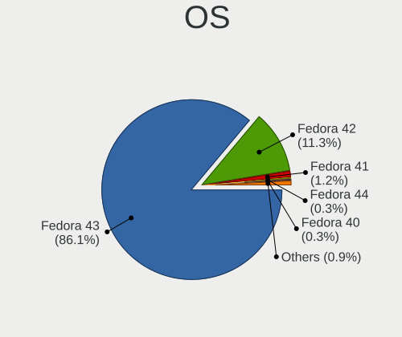

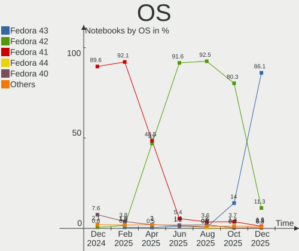

| Name      | Notebooks | Percent |
|-----------|-----------|---------|
| Fedora 43 | 297       | 86.09%  |
| Fedora 42 | 39        | 11.3%   |
| Fedora 41 | 4         | 1.16%   |
| Fedora 44 | 1         | 0.29%   |
| Fedora 40 | 1         | 0.29%   |
| Fedora 37 | 1         | 0.29%   |
| Fedora 36 | 1         | 0.29%   |
| Fedora 33 | 1         | 0.29%   |

OS Family
---------

OS without a version

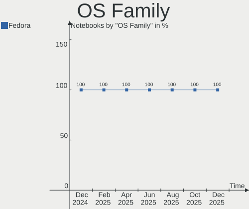

| Name   | Notebooks | Percent |
|--------|-----------|---------|
| Fedora | 345       | 100%    |

Kernel
------

Version of the Linux kernel

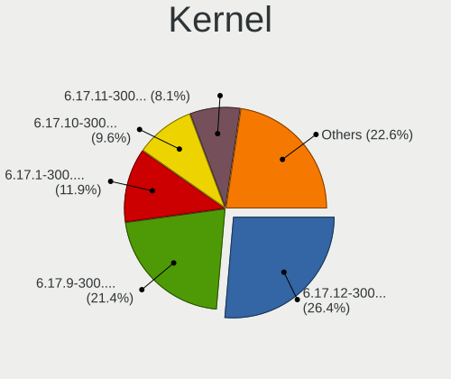

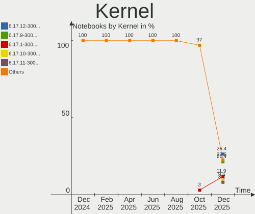

| Version                           | Notebooks | Percent |
|-----------------------------------|-----------|---------|
| 6.17.12-300.fc43.x86_64           | 91        | 26.38%  |
| 6.17.9-300.fc43.x86_64            | 74        | 21.45%  |
| 6.17.1-300.fc43.x86_64            | 41        | 11.88%  |
| 6.17.10-300.fc43.x86_64           | 33        | 9.57%   |
| 6.17.11-300.fc43.x86_64           | 28        | 8.12%   |
| 6.17.8-300.fc43.x86_64            | 20        | 5.8%    |
| 6.17.8-200.fc42.x86_64            | 6         | 1.74%   |
| 6.17.10-200.fc42.x86_64           | 6         | 1.74%   |
| 6.17.13-200.fc42.x86_64           | 5         | 1.45%   |
| 6.17.11-200.fc42.x86_64           | 5         | 1.45%   |
| 6.17.9-200.fc42.x86_64            | 4         | 1.16%   |
| 6.17.7-300.fc43.x86_64            | 3         | 0.87%   |
| 6.18.2-cachyos1.fc43.x86_64       | 2         | 0.58%   |
| 6.17.7-200.fc42.x86_64            | 2         | 0.58%   |
| 6.17.4-200.fc42.x86_64            | 2         | 0.58%   |
| 6.17.12-200.fc42.x86_64           | 2         | 0.58%   |
| 6.14.0-63.fc42.x86_64             | 2         | 0.58%   |
| 6.8.11-300.fc40.x86_64            | 1         | 0.29%   |
| 6.5.12-100.fc37.x86_64            | 1         | 0.29%   |
| 6.18.1-200.fc43.x86_64            | 1         | 0.29%   |
| 6.18.0-65.fc44.x86_64             | 1         | 0.29%   |
| 6.18.0-364.vanilla.fc43.x86_64    | 1         | 0.29%   |
| 6.17.9-400.asahi.fc43.aarch64+16k | 1         | 0.29%   |
| 6.17.9-400.asahi.fc42.aarch64+16k | 1         | 0.29%   |
| 6.17.8-210.t2.fc43.x86_64         | 1         | 0.29%   |
| 6.17.5-300.fc43.x86_64            | 1         | 0.29%   |
| 6.17.10-100.fc41.x86_64           | 1         | 0.29%   |
| 6.16.9-200.fc42.x86_64            | 1         | 0.29%   |
| 6.16.7-200.fc42.x86_64            | 1         | 0.29%   |
| 6.16.4-200.fc42.x86_64            | 1         | 0.29%   |
| 6.15.9-201.fc42.x86_64            | 1         | 0.29%   |
| 6.13.11-200.fc41.x86_64           | 1         | 0.29%   |
| 6.12.1-404.asahi.fc41.aarch64+16k | 1         | 0.29%   |
| 6.11.4-301.fc41.x86_64            | 1         | 0.29%   |
| 5.19.14-200.fc36.x86_64           | 1         | 0.29%   |
| 5.14.18-100.fc33.x86_64           | 1         | 0.29%   |

Kernel Family
-------------

Linux kernel without a distro release

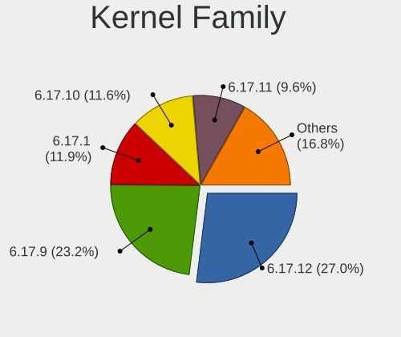

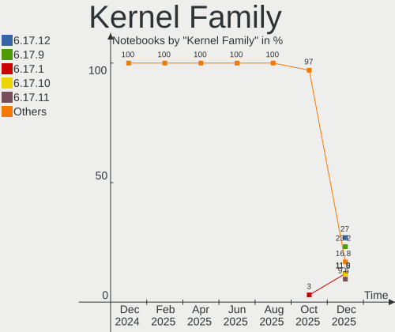

| Version | Notebooks | Percent |
|---------|-----------|---------|
| 6.17.12 | 93        | 26.96%  |
| 6.17.9  | 80        | 23.19%  |
| 6.17.1  | 41        | 11.88%  |
| 6.17.10 | 40        | 11.59%  |
| 6.17.11 | 33        | 9.57%   |
| 6.17.8  | 27        | 7.83%   |
| 6.17.7  | 5         | 1.45%   |
| 6.17.13 | 5         | 1.45%   |
| 6.18.2  | 2         | 0.58%   |
| 6.18.0  | 2         | 0.58%   |
| 6.17.4  | 2         | 0.58%   |
| 6.14.0  | 2         | 0.58%   |
| 6.8.11  | 1         | 0.29%   |
| 6.5.12  | 1         | 0.29%   |
| 6.18.1  | 1         | 0.29%   |
| 6.17.5  | 1         | 0.29%   |
| 6.16.9  | 1         | 0.29%   |
| 6.16.7  | 1         | 0.29%   |
| 6.16.4  | 1         | 0.29%   |
| 6.15.9  | 1         | 0.29%   |
| 6.13.11 | 1         | 0.29%   |
| 6.12.1  | 1         | 0.29%   |
| 6.11.4  | 1         | 0.29%   |
| 5.19.14 | 1         | 0.29%   |
| 5.14.18 | 1         | 0.29%   |

Kernel Major Ver.
-----------------

Linux kernel major version

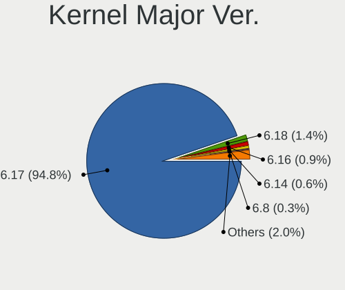

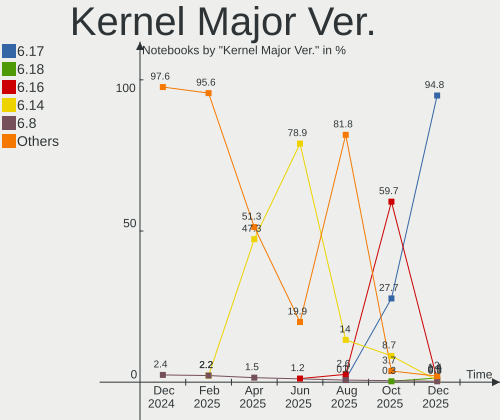

| Version | Notebooks | Percent |
|---------|-----------|---------|
| 6.17    | 327       | 94.78%  |
| 6.18    | 5         | 1.45%   |
| 6.16    | 3         | 0.87%   |
| 6.14    | 2         | 0.58%   |
| 6.8     | 1         | 0.29%   |
| 6.5     | 1         | 0.29%   |
| 6.15    | 1         | 0.29%   |
| 6.13    | 1         | 0.29%   |
| 6.12    | 1         | 0.29%   |
| 6.11    | 1         | 0.29%   |
| 5.19    | 1         | 0.29%   |
| 5.14    | 1         | 0.29%   |

Arch
----

OS architecture (x86_64, i586, etc.)

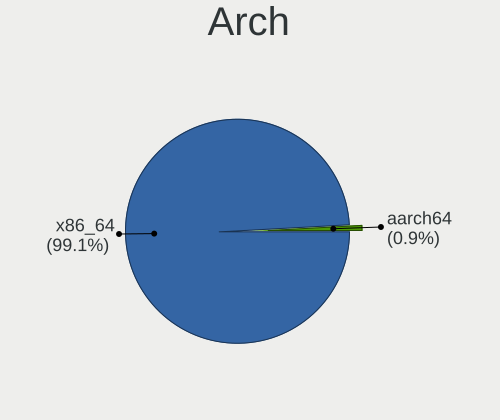

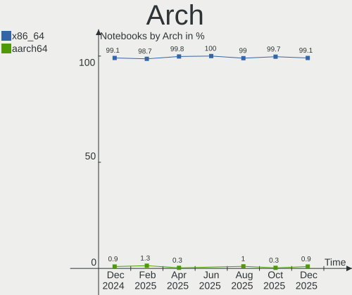

| Name    | Notebooks | Percent |
|---------|-----------|---------|
| x86_64  | 342       | 99.13%  |
| aarch64 | 3         | 0.87%   |

DE
--

Desktop Environment

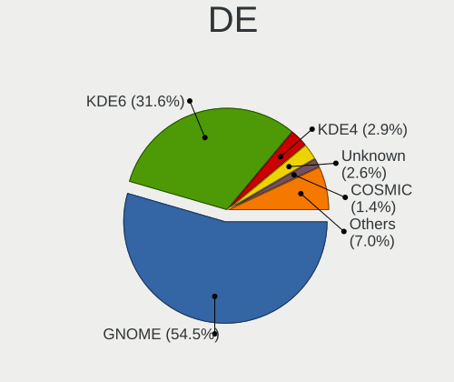

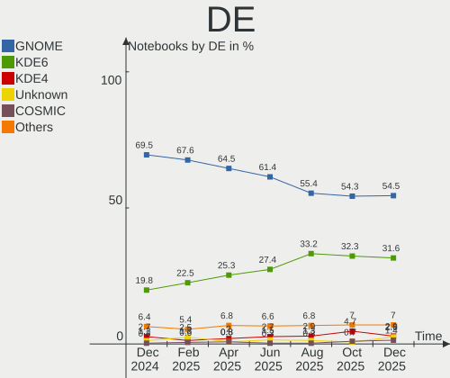

| Name          | Notebooks | Percent |
|---------------|-----------|---------|
| GNOME         | 188       | 54.49%  |
| KDE6          | 109       | 31.59%  |
| KDE4          | 10        | 2.9%    |
| Unknown       | 9         | 2.61%   |
| COSMIC        | 5         | 1.45%   |
| XFCE          | 4         | 1.16%   |
| X-Cinnamon    | 4         | 1.16%   |
| niri          | 4         | 1.16%   |
| MATE          | 2         | 0.58%   |
| GNOME Classic | 2         | 0.58%   |
| Cinnamon      | 2         | 0.58%   |
| Budgie        | 2         | 0.58%   |
| sway:wlroots  | 1         | 0.29%   |
| KDE5          | 1         | 0.29%   |
| i3            | 1         | 0.29%   |
| Hyprland      | 1         | 0.29%   |

Display Server
--------------

X11 or Wayland

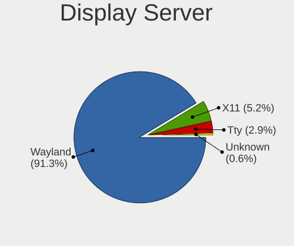

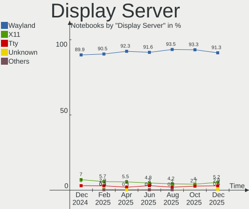

| Name    | Notebooks | Percent |
|---------|-----------|---------|
| Wayland | 315       | 91.3%   |
| X11     | 18        | 5.22%   |
| Tty     | 10        | 2.9%    |
| Unknown | 2         | 0.58%   |

Display Manager
---------------

SDDM, LightDM, etc.

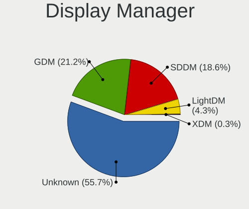

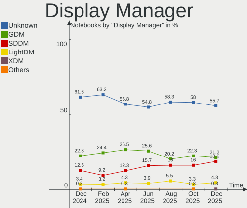

| Name    | Notebooks | Percent |
|---------|-----------|---------|
| Unknown | 192       | 55.65%  |
| GDM     | 73        | 21.16%  |
| SDDM    | 64        | 18.55%  |
| LightDM | 15        | 4.35%   |
| XDM     | 1         | 0.29%   |

OS Lang
-------

Language

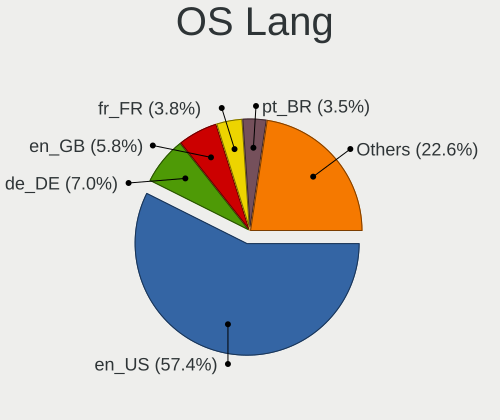

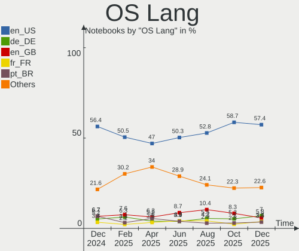

| Lang  | Notebooks | Percent |
|-------|-----------|---------|
| en_US | 198       | 57.39%  |
| de_DE | 24        | 6.96%   |
| en_GB | 20        | 5.8%    |
| fr_FR | 13        | 3.77%   |
| pt_BR | 12        | 3.48%   |
| ru_RU | 11        | 3.19%   |
| en_AU | 7         | 2.03%   |
| it_IT | 6         | 1.74%   |
| es_ES | 6         | 1.74%   |
| en_IN | 6         | 1.74%   |
| en_CA | 6         | 1.74%   |
| nl_NL | 5         | 1.45%   |
| pl_PL | 3         | 0.87%   |
| en_DK | 3         | 0.87%   |
| zh_CN | 2         | 0.58%   |
| tr_TR | 2         | 0.58%   |
| fi_FI | 2         | 0.58%   |
| en_IL | 2         | 0.58%   |
| C     | 2         | 0.58%   |
| zh_TW | 1         | 0.29%   |
| sv_SE | 1         | 0.29%   |
| ru_UA | 1         | 0.29%   |
| pt_PT | 1         | 0.29%   |
| nl_BE | 1         | 0.29%   |
| hu_HU | 1         | 0.29%   |
| es_UY | 1         | 0.29%   |
| es_PA | 1         | 0.29%   |
| es_EC | 1         | 0.29%   |
| es_CR | 1         | 0.29%   |
| en_ZA | 1         | 0.29%   |
| en_PH | 1         | 0.29%   |
| en_NZ | 1         | 0.29%   |
| da_DK | 1         | 0.29%   |
| cs_CZ | 1         | 0.29%   |

Boot Mode
---------

EFI or BIOS

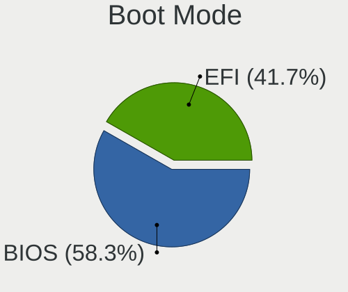

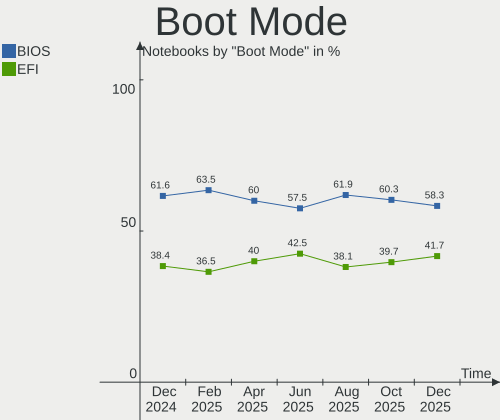

| Mode | Notebooks | Percent |
|------|-----------|---------|
| BIOS | 201       | 58.26%  |
| EFI  | 144       | 41.74%  |

Filesystem
----------

Type of filesystem

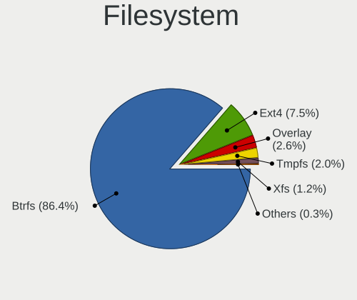

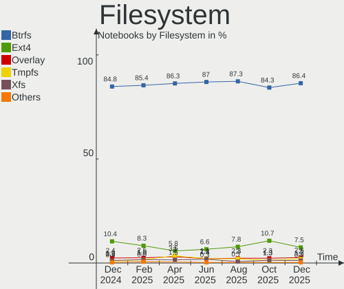

| Type    | Notebooks | Percent |
|---------|-----------|---------|
| Btrfs   | 298       | 86.38%  |
| Ext4    | 26        | 7.54%   |
| Overlay | 9         | 2.61%   |
| Tmpfs   | 7         | 2.03%   |
| Xfs     | 4         | 1.16%   |
| Zfs     | 1         | 0.29%   |

Part. scheme
------------

Scheme of partitioning

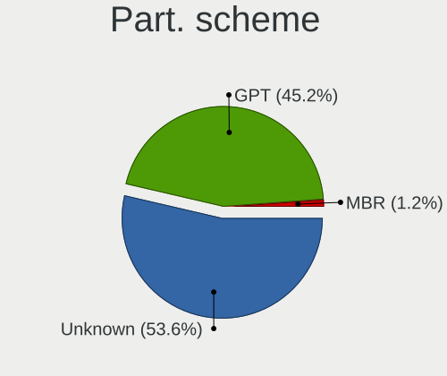

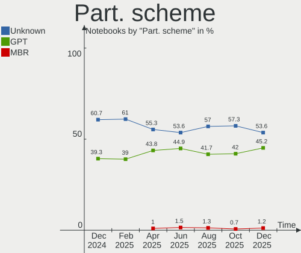

| Type    | Notebooks | Percent |
|---------|-----------|---------|
| Unknown | 185       | 53.62%  |
| GPT     | 156       | 45.22%  |
| MBR     | 4         | 1.16%   |

Dual Boot with Linux/BSD
------------------------

Hosting more than one Linux/BSD

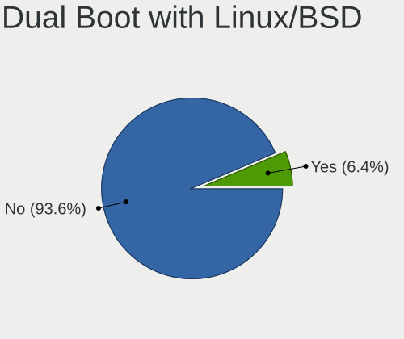

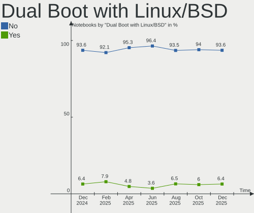

| Dual boot | Notebooks | Percent |
|-----------|-----------|---------|
| No        | 323       | 93.62%  |
| Yes       | 22        | 6.38%   |

Dual Boot (Win)
---------------

Hosting Linux and Windows

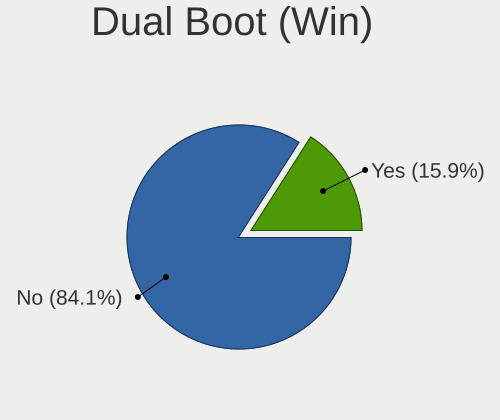

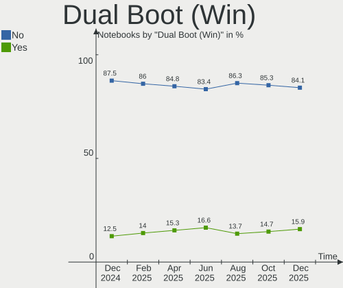

| Dual boot | Notebooks | Percent |
|-----------|-----------|---------|
| No        | 290       | 84.06%  |
| Yes       | 55        | 15.94%  |

Board
-----

Vendor
------

Motherboard manufacturer

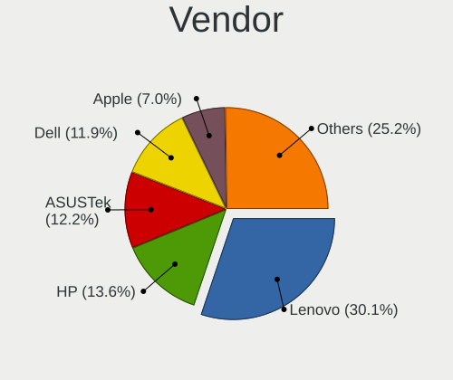

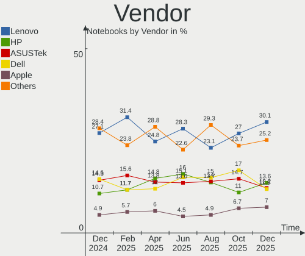

| Name                 | Notebooks | Percent |
|----------------------|-----------|---------|
| Lenovo               | 104       | 30.14%  |
| Hewlett-Packard      | 47        | 13.62%  |
| ASUSTek Computer     | 42        | 12.17%  |
| Dell                 | 41        | 11.88%  |
| Apple                | 24        | 6.96%   |
| Acer                 | 17        | 4.93%   |
| MSI                  | 8         | 2.32%   |
| HUAWEI               | 8         | 2.32%   |
| Samsung Electronics  | 7         | 2.03%   |
| Framework            | 5         | 1.45%   |
| Toshiba              | 4         | 1.16%   |
| Google               | 4         | 1.16%   |
| Unknown              | 4         | 1.16%   |
| Fujitsu              | 3         | 0.87%   |
| Alienware            | 3         | 0.87%   |
| Standard             | 2         | 0.58%   |
| Sony                 | 2         | 0.58%   |
| GPD                  | 2         | 0.58%   |
| Chuwi                | 2         | 0.58%   |
| TECNO Mobile Limited | 1         | 0.29%   |
| SLIMBOOK             | 1         | 0.29%   |
| Schenker             | 1         | 0.29%   |
| Positivo             | 1         | 0.29%   |
| PC Specialist        | 1         | 0.29%   |
| Panasonic            | 1         | 0.29%   |
| Notebook             | 1         | 0.29%   |
| Medion               | 1         | 0.29%   |
| MECHREVO             | 1         | 0.29%   |
| Lunnen               | 1         | 0.29%   |
| LG Electronics       | 1         | 0.29%   |
| Gigabyte Technology  | 1         | 0.29%   |
| Digma Pro            | 1         | 0.29%   |
| DEXP                 | 1         | 0.29%   |
| Avell                | 1         | 0.29%   |
| ASRock               | 1         | 0.29%   |

Model
-----

Motherboard model

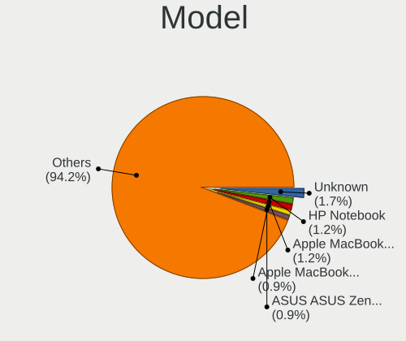

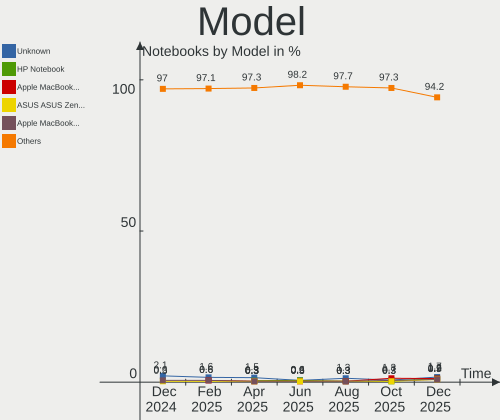

| Name                                          | Notebooks | Percent |
|-----------------------------------------------|-----------|---------|
| Unknown                                       | 6         | 1.74%   |
| HP Notebook                                   | 4         | 1.16%   |
| Apple MacBookAir7,2                           | 4         | 1.16%   |
| ASUS ASUS Zenbook S 16 UM5606WA_UM5606WA      | 3         | 0.87%   |
| Apple MacBookPro11,3                          | 3         | 0.87%   |
| Samsung 750XGK                                | 2         | 0.58%   |
| Lenovo ThinkPad P14s Gen 6 AMD 21QL0020US     | 2         | 0.58%   |
| HP Pavilion dv6                               | 2         | 0.58%   |
| HP Laptop 15s-eq2xxx                          | 2         | 0.58%   |
| HP Laptop 15-fc0xxx                           | 2         | 0.58%   |
| HP Laptop 14-fq0xxx                           | 2         | 0.58%   |
| HP EliteBook 840 G5                           | 2         | 0.58%   |
| Framework Laptop 16 (AMD Ryzen 7040 Series)   | 2         | 0.58%   |
| Framework Laptop 13 (AMD Ryzen AI 300 Series) | 2         | 0.58%   |
| Dell G15 5515                                 | 2         | 0.58%   |
| ASUS VivoBook_ASUSLaptop X7400PC_N7400PC      | 2         | 0.58%   |
| Apple MacBookPro9,2                           | 2         | 0.58%   |
| Apple MacBookPro14,1                          | 2         | 0.58%   |
| Apple MacBookPro12,1                          | 2         | 0.58%   |
| Apple MacBookPro11,5                          | 2         | 0.58%   |
| Toshiba Satellite S845                        | 1         | 0.29%   |
| Toshiba Satellite C850-C5K                    | 1         | 0.29%   |
| Toshiba Satellite C670-104                    | 1         | 0.29%   |
| Toshiba PORTEGE Z30-E                         | 1         | 0.29%   |
| TECNO Mobile Limited MEGABOOK T1 TGL          | 1         | 0.29%   |
| Sony VJS4R1                                   | 1         | 0.29%   |
| Sony SVF15213CBW                              | 1         | 0.29%   |
| SLIMBOOK Executive                            | 1         | 0.29%   |
| Schenker XMG NEO (M22)                        | 1         | 0.29%   |
| Samsung 960XGL                                | 1         | 0.29%   |
| Samsung 900X3C/900X3D/900X3E/900X4C/900X4D    | 1         | 0.29%   |
| Samsung 767XCL                                | 1         | 0.29%   |
| Samsung 550XED                                | 1         | 0.29%   |
| Samsung 355V4C/356V4C/3445VC/3545VC           | 1         | 0.29%   |
| Positivo S15SL                                | 1         | 0.29%   |
| PC Specialist Lafite Pro 15 AMD               | 1         | 0.29%   |
| Panasonic FZG1-4                              | 1         | 0.29%   |
| Notebook NL5xNU                               | 1         | 0.29%   |
| MSI Prestige 16 AI Evo B1MG                   | 1         | 0.29%   |
| MSI Prestige 14H B12UCX                       | 1         | 0.29%   |

Model Family
------------

Motherboard model prefix

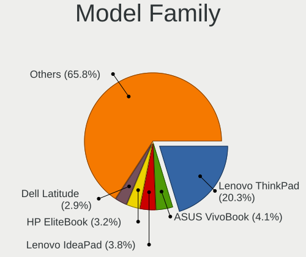

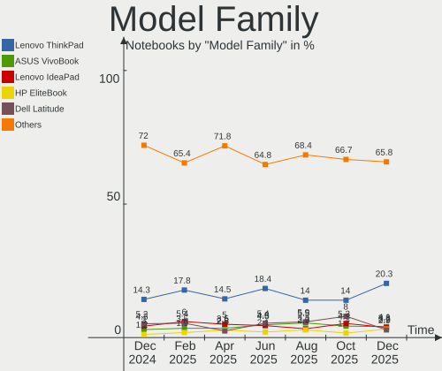

| Name                          | Notebooks | Percent |
|-------------------------------|-----------|---------|
| Lenovo ThinkPad               | 70        | 20.29%  |
| ASUS VivoBook                 | 14        | 4.06%   |
| Lenovo IdeaPad                | 13        | 3.77%   |
| HP EliteBook                  | 11        | 3.19%   |
| Dell Latitude                 | 10        | 2.9%    |
| Acer Aspire                   | 10        | 2.9%    |
| Lenovo Legion                 | 9         | 2.61%   |
| Dell Inspiron                 | 9         | 2.61%   |
| ASUS ASUS                     | 9         | 2.61%   |
| HP Laptop                     | 8         | 2.32%   |
| Dell XPS                      | 7         | 2.03%   |
| ASUS ROG                      | 7         | 2.03%   |
| HP Pavilion                   | 6         | 1.74%   |
| Dell Precision                | 6         | 1.74%   |
| Apple MacBookPro11            | 6         | 1.74%   |
| Unknown                       | 6         | 1.74%   |
| Framework Laptop              | 5         | 1.45%   |
| Apple MacBookAir7             | 5         | 1.45%   |
| Lenovo ThinkBook              | 4         | 1.16%   |
| HP ZBook                      | 4         | 1.16%   |
| HP Notebook                   | 4         | 1.16%   |
| ASUS Zenbook                  | 4         | 1.16%   |
| Toshiba Satellite             | 3         | 0.87%   |
| Lenovo Yoga                   | 3         | 0.87%   |
| HP 255                        | 3         | 0.87%   |
| Dell Vostro                   | 3         | 0.87%   |
| Dell G15                      | 3         | 0.87%   |
| Samsung 750XGK                | 2         | 0.58%   |
| MSI Prestige                  | 2         | 0.58%   |
| MSI Cyborg                    | 2         | 0.58%   |
| HP Victus                     | 2         | 0.58%   |
| HP ProBook                    | 2         | 0.58%   |
| HP OMEN                       | 2         | 0.58%   |
| Apple MacBookPro9             | 2         | 0.58%   |
| Apple MacBookPro14            | 2         | 0.58%   |
| Apple MacBookPro12            | 2         | 0.58%   |
| Acer Predator                 | 2         | 0.58%   |
| Acer Nitro                    | 2         | 0.58%   |
| Toshiba PORTEGE               | 1         | 0.29%   |
| TECNO Mobile Limited MEGABOOK | 1         | 0.29%   |

MFG Year
--------

Motherboard manufacture year

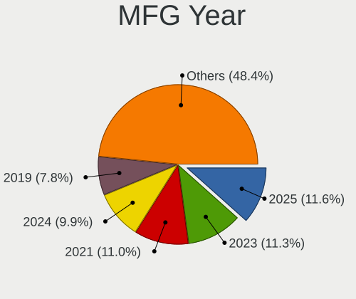

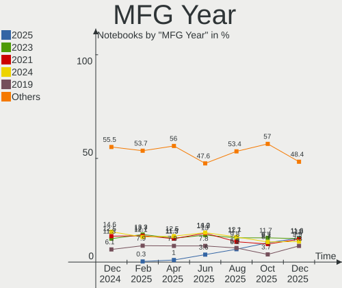

| Year    | Notebooks | Percent |
|---------|-----------|---------|
| 2025    | 40        | 11.59%  |
| 2023    | 39        | 11.3%   |
| 2021    | 38        | 11.01%  |
| 2024    | 34        | 9.86%   |
| 2019    | 27        | 7.83%   |
| 2020    | 25        | 7.25%   |
| 2018    | 23        | 6.67%   |
| 2022    | 19        | 5.51%   |
| 2013    | 18        | 5.22%   |
| 2017    | 16        | 4.64%   |
| 2012    | 14        | 4.06%   |
| 2016    | 12        | 3.48%   |
| 2015    | 11        | 3.19%   |
| 2011    | 9         | 2.61%   |
| 2014    | 6         | 1.74%   |
| 2006    | 4         | 1.16%   |
| 2010    | 3         | 0.87%   |
| 2008    | 3         | 0.87%   |
| Unknown | 3         | 0.87%   |
| 2009    | 1         | 0.29%   |

Form Factor
-----------

Physical design of the computer

| Name     | Notebooks | Percent |
|----------|-----------|---------|
| Notebook | 345       | 100%    |

Secure Boot
-----------

Enabled or disabled

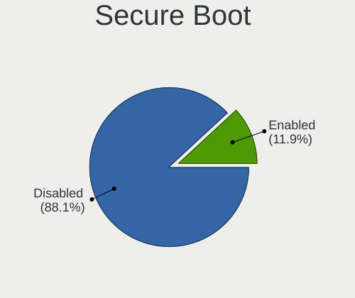

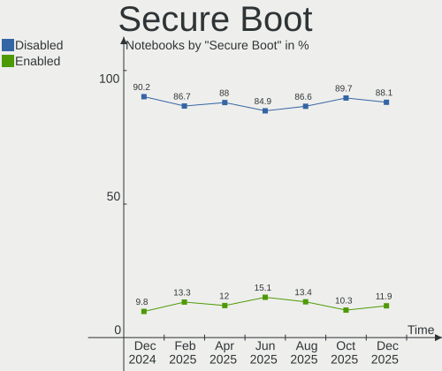

| State    | Notebooks | Percent |
|----------|-----------|---------|
| Disabled | 304       | 88.12%  |
| Enabled  | 41        | 11.88%  |

Coreboot
--------

Have coreboot on board

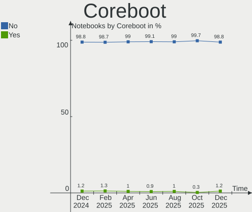

| Used | Notebooks | Percent |
|------|-----------|---------|
| No   | 341       | 98.84%  |
| Yes  | 4         | 1.16%   |

RAM Size
--------

Total RAM memory

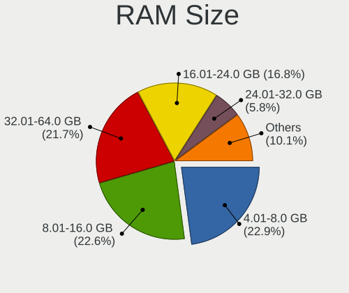

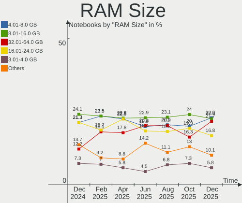

| Size in GB  | Notebooks | Percent |
|-------------|-----------|---------|
| 4.01-8.0    | 79        | 22.9%   |
| 8.01-16.0   | 78        | 22.61%  |
| 32.01-64.0  | 75        | 21.74%  |
| 16.01-24.0  | 58        | 16.81%  |
| 3.01-4.0    | 20        | 5.8%    |
| 24.01-32.0  | 20        | 5.8%    |
| 64.01-256.0 | 15        | 4.35%   |

RAM Used
--------

Used RAM memory

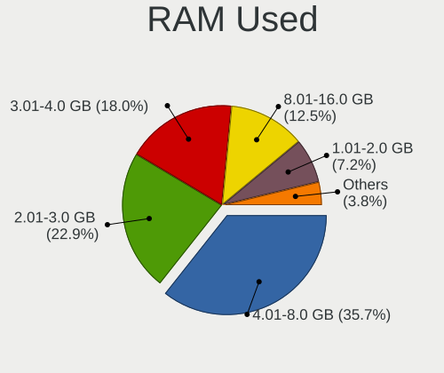

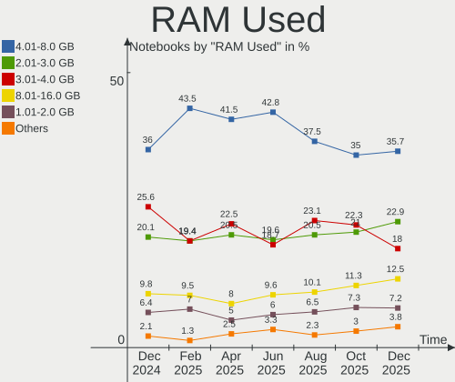

| Used GB    | Notebooks | Percent |
|------------|-----------|---------|
| 4.01-8.0   | 123       | 35.65%  |
| 2.01-3.0   | 79        | 22.9%   |
| 3.01-4.0   | 62        | 17.97%  |
| 8.01-16.0  | 43        | 12.46%  |
| 1.01-2.0   | 25        | 7.25%   |
| 16.01-24.0 | 8         | 2.32%   |
| 0.51-1.0   | 4         | 1.16%   |
| 24.01-32.0 | 1         | 0.29%   |

Total Drives
------------

Number of drives on board

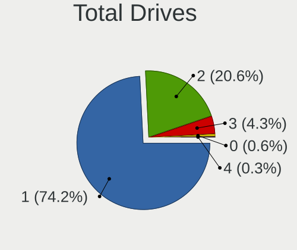

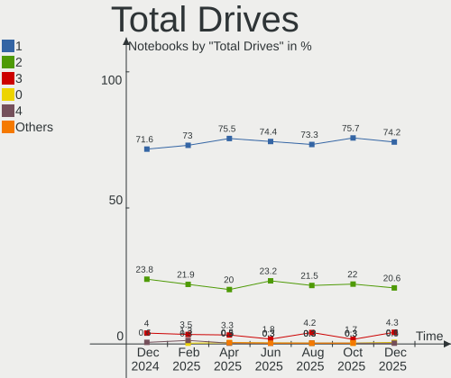

| Drives | Notebooks | Percent |
|--------|-----------|---------|
| 1      | 256       | 74.2%   |
| 2      | 71        | 20.58%  |
| 3      | 15        | 4.35%   |
| 0      | 2         | 0.58%   |
| 4      | 1         | 0.29%   |

Has CD-ROM
----------

Has CD-ROM on board

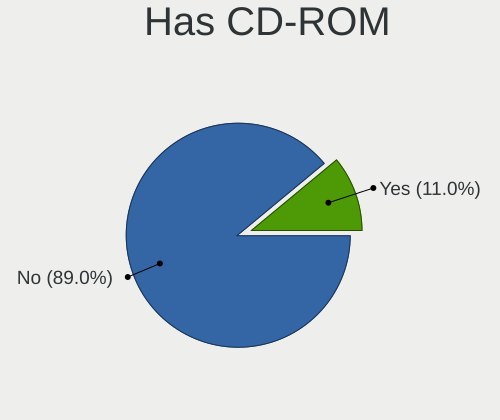

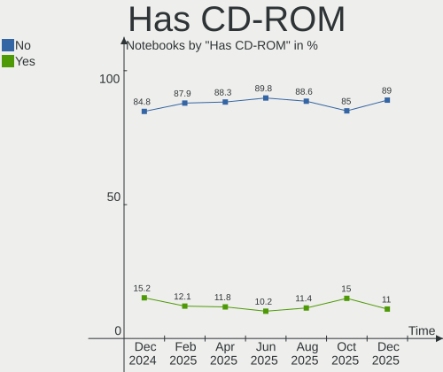

| Presented | Notebooks | Percent |
|-----------|-----------|---------|
| No        | 307       | 88.99%  |
| Yes       | 38        | 11.01%  |

Has Ethernet
------------

Has Ethernet on board

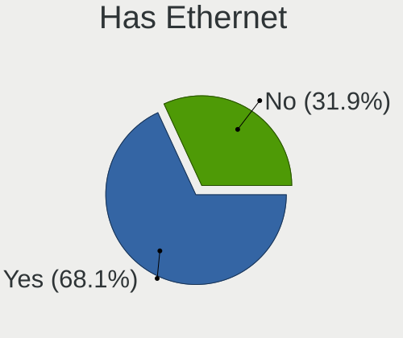

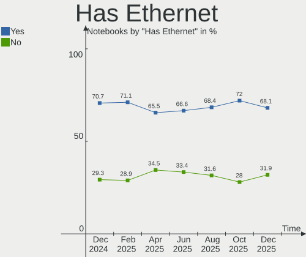

| Presented | Notebooks | Percent |
|-----------|-----------|---------|
| Yes       | 235       | 68.12%  |
| No        | 110       | 31.88%  |

Has WiFi
--------

Has WiFi module

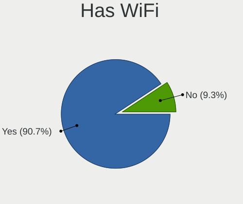

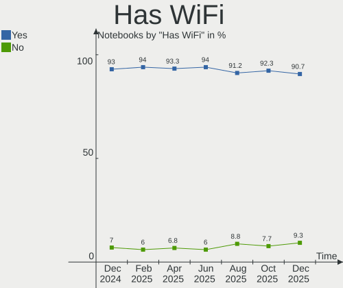

| Presented | Notebooks | Percent |
|-----------|-----------|---------|
| Yes       | 313       | 90.72%  |
| No        | 32        | 9.28%   |

Has Bluetooth
-------------

Has Bluetooth module

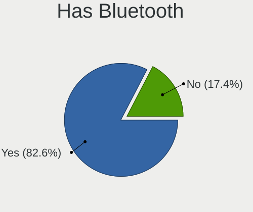

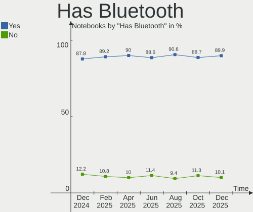

| Presented | Notebooks | Percent |
|-----------|-----------|---------|
| Yes       | 310       | 89.86%  |
| No        | 35        | 10.14%  |

Location
--------

Country
-------

Geographic location (country)

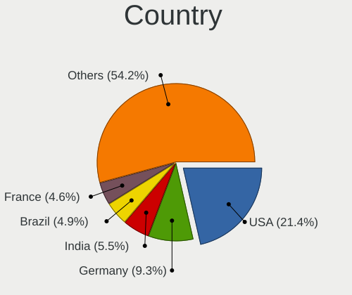

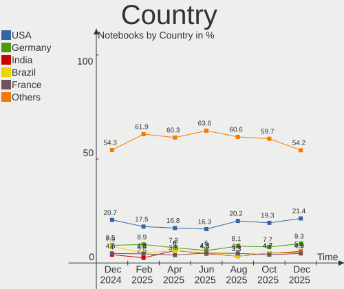

| Country         | Notebooks | Percent |
|-----------------|-----------|---------|
| USA             | 74        | 21.45%  |
| Germany         | 32        | 9.28%   |
| India           | 19        | 5.51%   |
| Brazil          | 17        | 4.93%   |
| France          | 16        | 4.64%   |
| UK              | 14        | 4.06%   |
| Canada          | 13        | 3.77%   |
| Italy           | 12        | 3.48%   |
| Russia          | 10        | 2.9%    |
| Australia       | 9         | 2.61%   |
| Spain           | 8         | 2.32%   |
| Netherlands     | 8         | 2.32%   |
| Poland          | 7         | 2.03%   |
| Indonesia       | 7         | 2.03%   |
| Switzerland     | 6         | 1.74%   |
| Portugal        | 6         | 1.74%   |
| Sweden          | 5         | 1.45%   |
| Israel          | 5         | 1.45%   |
| Denmark         | 5         | 1.45%   |
| Philippines     | 4         | 1.16%   |
| Morocco         | 3         | 0.87%   |
| Finland         | 3         | 0.87%   |
| Bulgaria        | 3         | 0.87%   |
| Austria         | 3         | 0.87%   |
| Vietnam         | 2         | 0.58%   |
| Turkey          | 2         | 0.58%   |
| The Netherlands | 2         | 0.58%   |
| South Africa    | 2         | 0.58%   |
| Romania         | 2         | 0.58%   |
| Pakistan        | 2         | 0.58%   |
| Norway          | 2         | 0.58%   |
| Mexico          | 2         | 0.58%   |
| Malaysia        | 2         | 0.58%   |
| Kenya           | 2         | 0.58%   |
| Hong Kong       | 2         | 0.58%   |
| Czechia         | 2         | 0.58%   |
| Colombia        | 2         | 0.58%   |
| China           | 2         | 0.58%   |
| Chile           | 2         | 0.58%   |
| Zambia          | 1         | 0.29%   |

City
----

Geographic location (city)

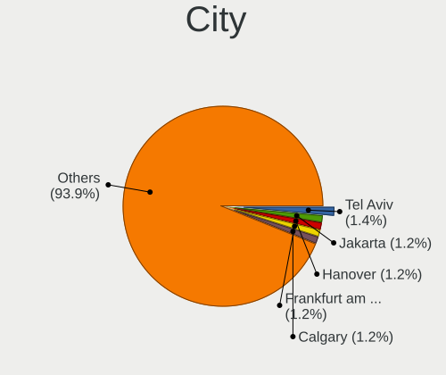

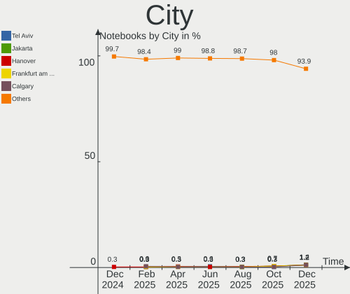

| City              | Notebooks | Percent |
|-------------------|-----------|---------|
| Tel Aviv          | 5         | 1.45%   |
| Jakarta           | 4         | 1.16%   |
| Hanover           | 4         | 1.16%   |
| Frankfurt am Main | 4         | 1.16%   |
| Calgary           | 4         | 1.16%   |
| Berlin            | 4         | 1.16%   |
| Warminster        | 3         | 0.87%   |
| Vienna            | 3         | 0.87%   |
| Paris             | 3         | 0.87%   |
| Melbourne         | 3         | 0.87%   |
| Madrid            | 3         | 0.87%   |
| Bengaluru         | 3         | 0.87%   |
| Amsterdam         | 3         | 0.87%   |
| Ahmedabad         | 3         | 0.87%   |
| Zurich            | 2         | 0.58%   |
| Warsaw            | 2         | 0.58%   |
| Sydney            | 2         | 0.58%   |
| Sao Paulo         | 2         | 0.58%   |
| Pickering         | 2         | 0.58%   |
| Perth             | 2         | 0.58%   |
| Oslo              | 2         | 0.58%   |
| Nairobi           | 2         | 0.58%   |
| Moscow            | 2         | 0.58%   |
| Minneapolis       | 2         | 0.58%   |
| Milan             | 2         | 0.58%   |
| Linköping        | 2         | 0.58%   |
| Hyderabad         | 2         | 0.58%   |
| Chicago           | 2         | 0.58%   |
| Boston            | 2         | 0.58%   |
| Bonn              | 2         | 0.58%   |
| Birsfelden        | 2         | 0.58%   |
| Bhubaneswar       | 2         | 0.58%   |
| Akron             | 2         | 0.58%   |
| Würzburg         | 1         | 0.29%   |
| Worthing          | 1         | 0.29%   |
| Windham           | 1         | 0.29%   |
| Williamsburg      | 1         | 0.29%   |
| Wayne             | 1         | 0.29%   |
| Warwick           | 1         | 0.29%   |
| Warner            | 1         | 0.29%   |

Drives
------

Drive Vendor
------------

Hard drive vendors

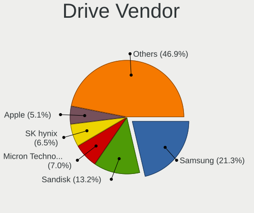

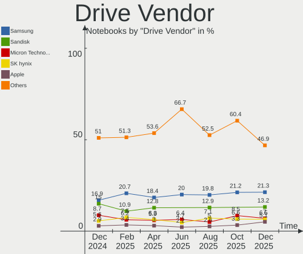

| Vendor                       | Notebooks | Drives | Percent |
|------------------------------|-----------|--------|---------|
| Samsung Electronics          | 92        | 99     | 21.35%  |
| Sandisk                      | 57        | 57     | 13.23%  |
| Micron Technology            | 30        | 30     | 6.96%   |
| SK hynix                     | 28        | 30     | 6.5%    |
| Apple                        | 22        | 33     | 5.1%    |
| WDC                          | 16        | 17     | 3.71%   |
| Unknown                      | 13        | 13     | 3.02%   |
| Toshiba                      | 13        | 13     | 3.02%   |
| KIOXIA                       | 13        | 14     | 3.02%   |
| Intel                        | 12        | 13     | 2.78%   |
| Seagate                      | 11        | 11     | 2.55%   |
| Micron/Crucial Technology    | 9         | 9      | 2.09%   |
| MAXIO Technology (Hangzhou)  | 9         | 9      | 2.09%   |
| Kingston                     | 9         | 10     | 2.09%   |
| Kingston Technology Company  | 8         | 8      | 1.86%   |
| A-DATA Technology            | 8         | 8      | 1.86%   |
| Crucial                      | 6         | 6      | 1.39%   |
| Shenzhen Longsys Electronics | 5         | 5      | 1.16%   |
| Union Memory                 | 4         | 4      | 0.93%   |
| Phison Electronics           | 4         | 4      | 0.93%   |
| HGST                         | 4         | 4      | 0.93%   |
| ADATA Technology             | 4         | 4      | 0.93%   |
| Silicon Motion               | 3         | 3      | 0.7%    |
| Realtek Semiconductor        | 3         | 3      | 0.7%    |
| KingSpec                     | 3         | 3      | 0.7%    |
| China                        | 3         | 3      | 0.7%    |
| Unknown                      | 3         | 3      | 0.7%    |
| USB                          | 2         | 2      | 0.46%   |
| Team                         | 2         | 2      | 0.46%   |
| SPCC                         | 2         | 2      | 0.46%   |
| SABRENT                      | 2         | 3      | 0.46%   |
| PNY                          | 2         | 2      | 0.46%   |
| Patriot                      | 2         | 2      | 0.46%   |
| Lexar                        | 2         | 2      | 0.46%   |
| JMicron Technology           | 2         | 2      | 0.46%   |
| Yangtze Memory Technologies  | 1         | 1      | 0.23%   |
| XUM                          | 1         | 1      | 0.23%   |
| XrayDisk                     | 1         | 1      | 0.23%   |
| WD Blue                      | 1         | 1      | 0.23%   |
| USB3.0                       | 1         | 1      | 0.23%   |

Drive Model
-----------

Hard drive models

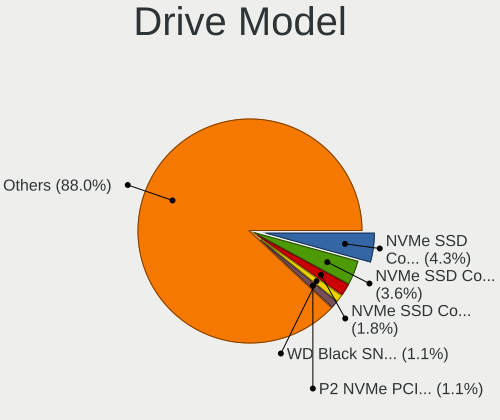

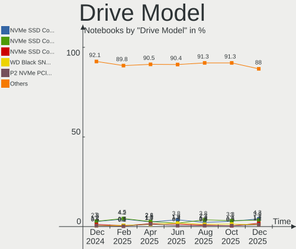

| Model                                                | Notebooks | Percent |
|------------------------------------------------------|-----------|---------|
| Samsung NVMe SSD Controller SM981/PM981/PM983 1TB    | 19        | 4.29%   |
| Samsung NVMe SSD Controller PM9A1/PM9A3/980PRO 1TB   | 16        | 3.61%   |
| MAXIO (Hangzhou) NVMe SSD Controller MAP1202 2TB     | 8         | 1.81%   |
| Sandisk WD Black SN750 / PC SN730 NVMe SSD 500GB     | 5         | 1.13%   |
| Micron/Crucial P2 NVMe PCIe SSD 2TB                  | 5         | 1.13%   |
| Toshiba MQ04ABF100 1TB                               | 4         | 0.9%    |
| Samsung MZVL4512HBLU-00BTW 512GB                     | 4         | 0.9%    |
| Micron 2400_MTFDKBA512QFM 512GB                      | 4         | 0.9%    |
| Apple SSD SM0512G 500GB                              | 4         | 0.9%    |
| Unknown MMC Card  64GB                               | 3         | 0.68%   |
| Unknown MMC Card  32GB                               | 3         | 0.68%   |
| SK hynix SKHynix_HFS001TEJ9X162N 1024GB              | 3         | 0.68%   |
| Seagate ST1000LM035-1RK172 1TB                       | 3         | 0.68%   |
| Sandisk PC SN530 NVMe WDC 512GB                      | 3         | 0.68%   |
| Samsung SSD 990 PRO 2TB                              | 3         | 0.68%   |
| Samsung SSD 870 EVO 500GB                            | 3         | 0.68%   |
| Samsung NVMe SSD Controller SM961/PM961/SM963 1024GB | 3         | 0.68%   |
| KIOXIA KBG40ZNS512G NVMe 512GB                       | 3         | 0.68%   |
| HGST HTS545050A7E680 500GB                           | 3         | 0.68%   |
| Apple SSD SM0512F 500GB                              | 3         | 0.68%   |
| Unknown                                              | 3         | 0.68%   |
| USB SanDisk 3.2Gen1 496GB                            | 2         | 0.45%   |
| Unknown SD/MMC/MS PRO 2GB                            | 2         | 0.45%   |
| Union Memory UMIS RPJTJ256MED1OWX 256GB              | 2         | 0.45%   |
| Toshiba XG6 NVMe SSD Controller 1024GB               | 2         | 0.45%   |
| Toshiba MQ01ABD100 1TB                               | 2         | 0.45%   |
| Team T2531TB SSD                                     | 2         | 0.45%   |
| SK hynix SKHynix_HFS512GEM9X169N 512GB               | 2         | 0.45%   |
| SK hynix PC601 NVMe 512GB                            | 2         | 0.45%   |
| SK hynix HFS256G39TND-N210A 256GB SSD                | 2         | 0.45%   |
| Sandisk WD_BLACK SN850X 2000GB                       | 2         | 0.45%   |
| Sandisk WD PC SN740 SDDPNQD-512G-2006 512GB          | 2         | 0.45%   |
| Sandisk WD PC SN560 SDDPNQE-1T00-1102 1024GB         | 2         | 0.45%   |
| Sandisk WD PC SN560 SDDPNQE-1T00-1032 1TB            | 2         | 0.45%   |
| Sandisk WD PC SN5000S SDEQNSJ-1T00-1002 1TB          | 2         | 0.45%   |
| Sandisk WD Green SN350 2TB                           | 2         | 0.45%   |
| Sandisk WD Blue SN550 NVMe SSD 1024GB                | 2         | 0.45%   |
| Samsung SSD 990 PRO 1TB                              | 2         | 0.45%   |
| Samsung SSD 990 EVO Plus 1TB                         | 2         | 0.45%   |
| Samsung SSD 860 EVO M.2 250GB                        | 2         | 0.45%   |

HDD Vendor
----------

Hard disk drive vendors

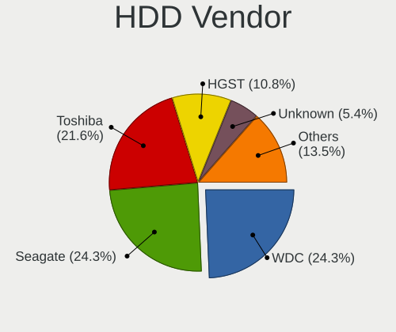

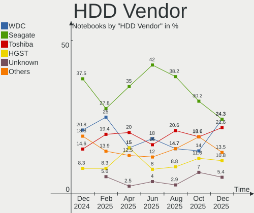

| Vendor             | Notebooks | Drives | Percent |
|--------------------|-----------|--------|---------|
| WDC                | 9         | 10     | 24.32%  |
| Seagate            | 9         | 9      | 24.32%  |
| Toshiba            | 8         | 8      | 21.62%  |
| HGST               | 4         | 4      | 10.81%  |
| Unknown            | 2         | 2      | 5.41%   |
| USB3.0             | 1         | 1      | 2.7%    |
| SABRENT            | 1         | 2      | 2.7%    |
| JMicron Technology | 1         | 1      | 2.7%    |
| HGST HTS           | 1         | 1      | 2.7%    |
| Apple              | 1         | 1      | 2.7%    |

SSD Vendor
----------

Solid state drive vendors

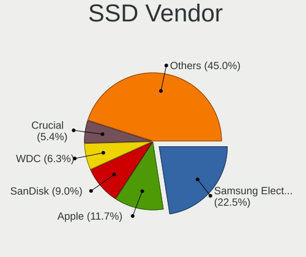

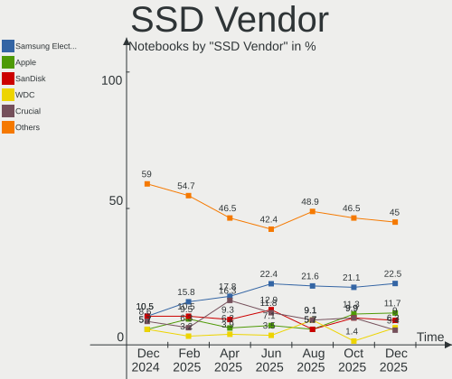

| Vendor              | Notebooks | Drives | Percent |
|---------------------|-----------|--------|---------|
| Samsung Electronics | 25        | 26     | 22.52%  |
| Apple               | 13        | 13     | 11.71%  |
| SanDisk             | 10        | 10     | 9.01%   |
| WDC                 | 7         | 7      | 6.31%   |
| Crucial             | 6         | 6      | 5.41%   |
| A-DATA Technology   | 6         | 6      | 5.41%   |
| Kingston            | 5         | 5      | 4.5%    |
| SK hynix            | 4         | 4      | 3.6%    |
| Micron Technology   | 3         | 3      | 2.7%    |
| KingSpec            | 3         | 3      | 2.7%    |
| Intel               | 3         | 3      | 2.7%    |
| Toshiba             | 2         | 2      | 1.8%    |
| Team                | 2         | 2      | 1.8%    |
| SPCC                | 2         | 2      | 1.8%    |
| PNY                 | 2         | 2      | 1.8%    |
| Patriot             | 2         | 2      | 1.8%    |
| Lexar               | 2         | 2      | 1.8%    |
| China               | 2         | 2      | 1.8%    |
| XUM                 | 1         | 1      | 0.9%    |
| SABRENT             | 1         | 1      | 0.9%    |
| OV                  | 1         | 1      | 0.9%    |
| OCZ                 | 1         | 1      | 0.9%    |
| MidasForce          | 1         | 1      | 0.9%    |
| LITEON              | 1         | 1      | 0.9%    |
| HS-SSD-E100         | 1         | 1      | 0.9%    |
| CONSISTENT          | 1         | 1      | 0.9%    |
| Colorful            | 1         | 1      | 0.9%    |
| BR                  | 1         | 1      | 0.9%    |
| Apacer              | 1         | 1      | 0.9%    |
| Unknown             | 1         | 1      | 0.9%    |

Drive Kind
----------

HDD or SSD

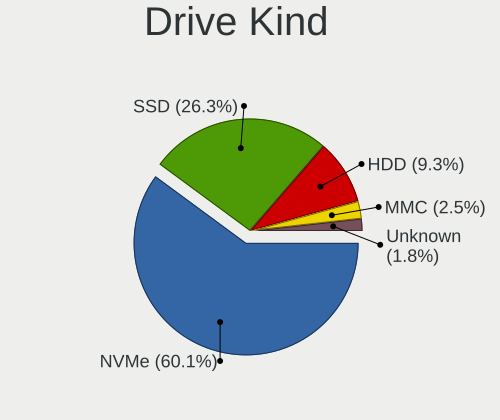

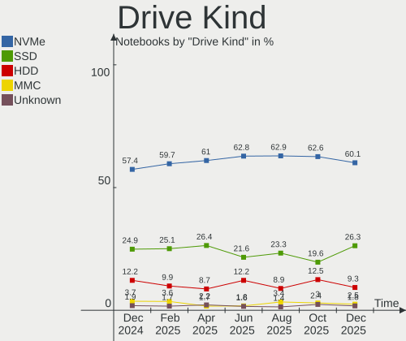

| Kind    | Notebooks | Drives | Percent |
|---------|-----------|--------|---------|
| NVMe    | 238       | 287    | 60.1%   |
| SSD     | 104       | 112    | 26.26%  |
| HDD     | 37        | 39     | 9.34%   |
| MMC     | 10        | 10     | 2.53%   |
| Unknown | 7         | 8      | 1.77%   |

Drive Connector
---------------

SATA, SAS, NVMe, etc.

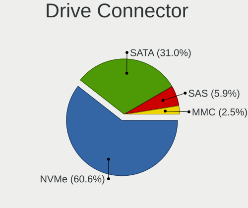

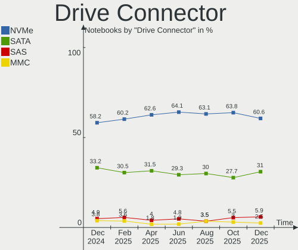

| Type | Notebooks | Drives | Percent |
|------|-----------|--------|---------|
| NVMe | 238       | 282    | 60.56%  |
| SATA | 122       | 137    | 31.04%  |
| SAS  | 23        | 27     | 5.85%   |
| MMC  | 10        | 10     | 2.54%   |

Drive Size
----------

Size of hard drive

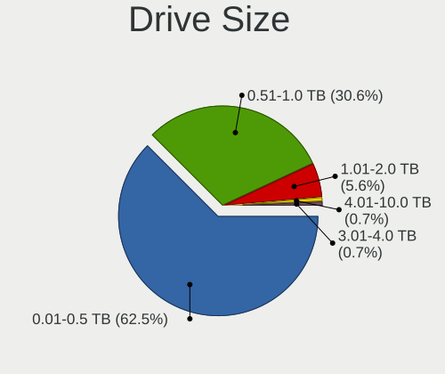

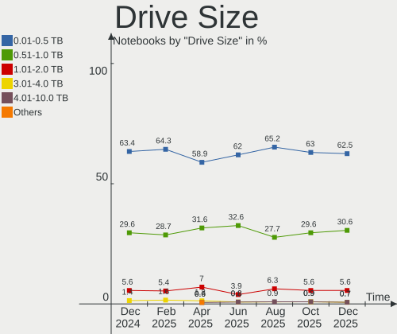

| Size in TB | Notebooks | Drives | Percent |
|------------|-----------|--------|---------|
| 0.01-0.5   | 90        | 96     | 62.5%   |
| 0.51-1.0   | 44        | 45     | 30.56%  |
| 1.01-2.0   | 8         | 8      | 5.56%   |
| 3.01-4.0   | 1         | 1      | 0.69%   |
| 4.01-10.0  | 1         | 1      | 0.69%   |

Space Total
-----------

Amount of disk space available on the file system

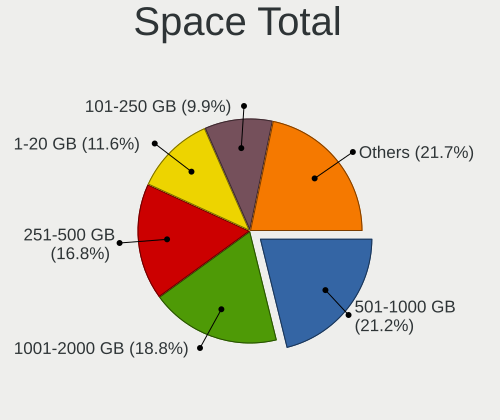

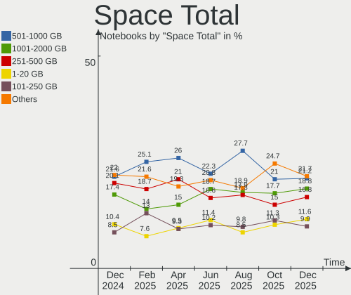

| Size in GB     | Notebooks | Percent |
|----------------|-----------|---------|
| 501-1000       | 73        | 21.16%  |
| 1001-2000      | 65        | 18.84%  |
| 251-500        | 58        | 16.81%  |
| 1-20           | 40        | 11.59%  |
| 101-250        | 34        | 9.86%   |
| Unknown        | 33        | 9.57%   |
| More than 3000 | 21        | 6.09%   |
| 2001-3000      | 9         | 2.61%   |
| 51-100         | 9         | 2.61%   |
| 21-50          | 3         | 0.87%   |

Space Used
----------

Amount of used disk space

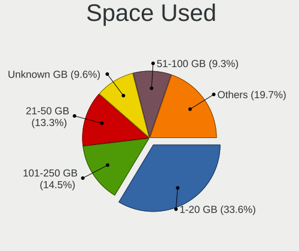

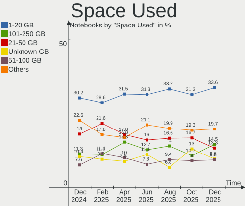

| Used GB        | Notebooks | Percent |
|----------------|-----------|---------|
| 1-20           | 116       | 33.62%  |
| 101-250        | 50        | 14.49%  |
| 21-50          | 46        | 13.33%  |
| Unknown        | 33        | 9.57%   |
| 51-100         | 32        | 9.28%   |
| 501-1000       | 29        | 8.41%   |
| 251-500        | 28        | 8.12%   |
| 1001-2000      | 8         | 2.32%   |
| More than 3000 | 2         | 0.58%   |
| 2001-3000      | 1         | 0.29%   |

Malfunc. Drives
---------------

Drive models with a malfunction

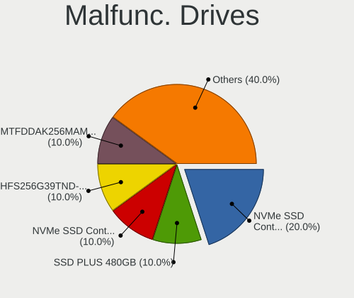

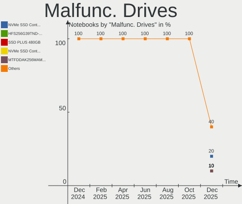

| Model                                                          | Notebooks | Drives | Percent |
|----------------------------------------------------------------|-----------|--------|---------|
| Samsung Electronics NVMe SSD Controller SM981/PM981/PM983 1TB  | 2         | 2      | 20%     |
| SK hynix HFS256G39TND-N210A 256GB SSD                          | 1         | 1      | 10%     |
| SanDisk SSD PLUS 480GB                                         | 1         | 1      | 10%     |
| Samsung Electronics NVMe SSD Controller PM9A1/PM9A3/980PRO 1TB | 1         | 1      | 10%     |
| Micron Technology MTFDDAK256MAM-1K12 256GB SSD                 | 1         | 1      | 10%     |
| Kingston SUV400S37240G 240GB SSD                               | 1         | 1      | 10%     |
| HGST HTS545050A7E680 500GB                                     | 1         | 1      | 10%     |
| Apple HDD HTS545050A7E362 500GB                                | 1         | 1      | 10%     |
| A-DATA Technology SU800 128GB SSD                              | 1         | 1      | 10%     |

Malfunc. Drive Vendor
---------------------

Vendors of faulty drives

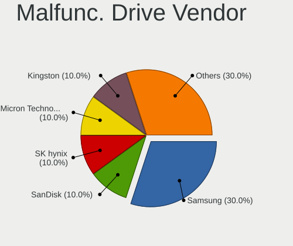

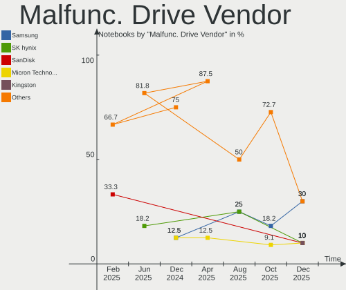

| Vendor              | Notebooks | Drives | Percent |
|---------------------|-----------|--------|---------|
| Samsung Electronics | 3         | 3      | 30%     |
| SK hynix            | 1         | 1      | 10%     |
| SanDisk             | 1         | 1      | 10%     |
| Micron Technology   | 1         | 1      | 10%     |
| Kingston            | 1         | 1      | 10%     |
| HGST                | 1         | 1      | 10%     |
| Apple               | 1         | 1      | 10%     |
| A-DATA Technology   | 1         | 1      | 10%     |

Malfunc. HDD Vendor
-------------------

Vendors of faulty HDD drives

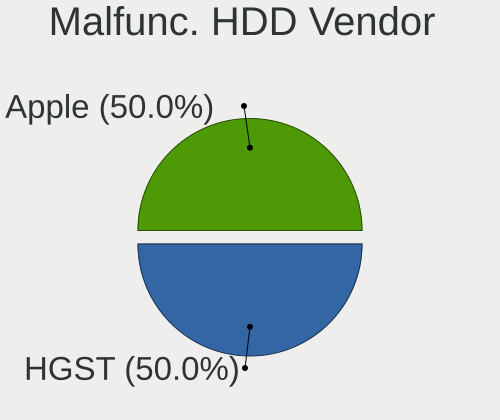

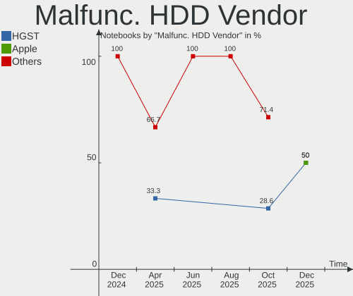

| Vendor | Notebooks | Drives | Percent |
|--------|-----------|--------|---------|
| HGST   | 1         | 1      | 50%     |
| Apple  | 1         | 1      | 50%     |

Malfunc. Drive Kind
-------------------

Kinds of faulty drives

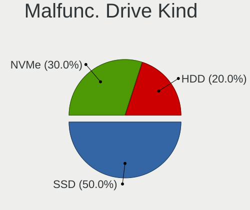

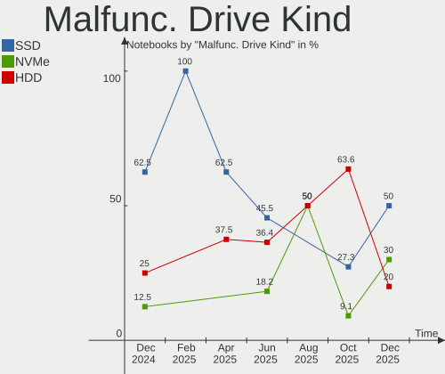

| Kind | Notebooks | Drives | Percent |
|------|-----------|--------|---------|
| SSD  | 5         | 5      | 50%     |
| NVMe | 3         | 3      | 30%     |
| HDD  | 2         | 2      | 20%     |

Failed Drives
-------------

Failed drive models

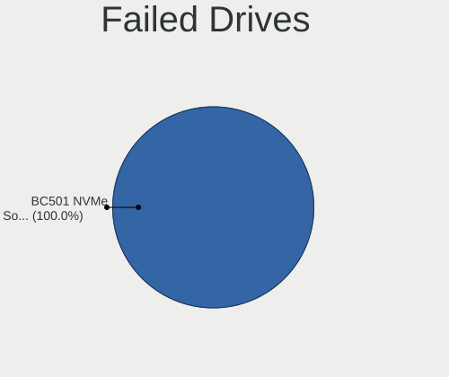

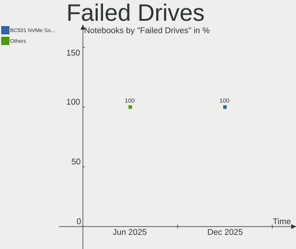

| Model                                       | Notebooks | Drives | Percent |
|---------------------------------------------|-----------|--------|---------|
| SK hynix BC501 NVMe Solid State Drive 512GB | 1         | 1      | 100%    |

Failed Drive Vendor
-------------------

Failed drive vendors

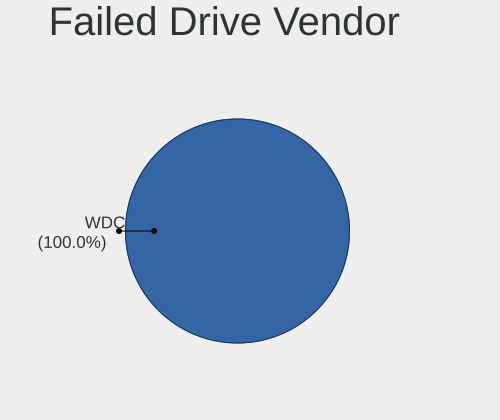

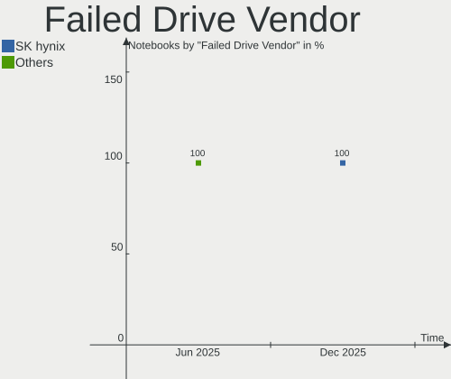

| Vendor   | Notebooks | Drives | Percent |
|----------|-----------|--------|---------|
| SK hynix | 1         | 1      | 100%    |

Drive Status
------------

Number of failed and malfunc. drives

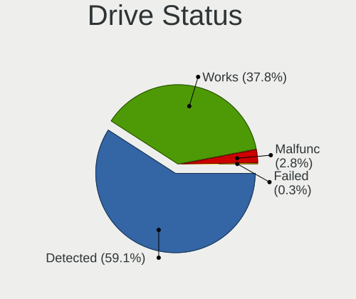

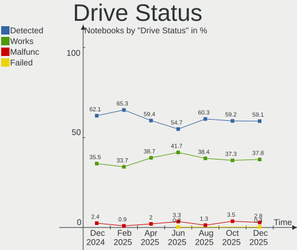

| Status   | Notebooks | Drives | Percent |
|----------|-----------|--------|---------|
| Detected | 214       | 269    | 59.12%  |
| Works    | 137       | 176    | 37.85%  |
| Malfunc  | 10        | 10     | 2.76%   |
| Failed   | 1         | 1      | 0.28%   |

Storage controller
------------------

Storage Vendor
--------------

Storage controller vendors

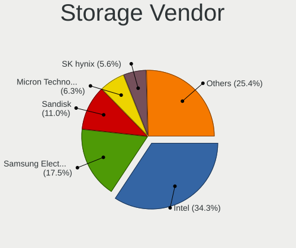

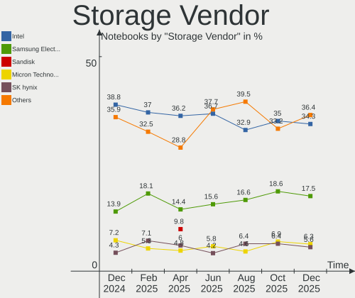

| Vendor                                  | Notebooks | Percent |
|-----------------------------------------|-----------|---------|
| Intel                                   | 147       | 34.27%  |
| Samsung Electronics                     | 75        | 17.48%  |
| Sandisk                                 | 47        | 10.96%  |
| Micron Technology                       | 27        | 6.29%   |
| SK hynix                                | 24        | 5.59%   |
| AMD                                     | 21        | 4.9%    |
| KIOXIA                                  | 14        | 3.26%   |
| Kingston Technology Company             | 11        | 2.56%   |
| Micron/Crucial Technology               | 9         | 2.1%    |
| MAXIO Technology (Hangzhou)             | 8         | 1.86%   |
| ADATA Technology                        | 6         | 1.4%    |
| Shenzhen Longsys Electronics            | 5         | 1.17%   |
| Apple                                   | 5         | 1.17%   |
| Union Memory (Shenzhen)                 | 4         | 0.93%   |
| Phison Electronics                      | 4         | 0.93%   |
| Toshiba America Info Systems            | 3         | 0.7%    |
| Silicon Motion                          | 3         | 0.7%    |
| Realtek Semiconductor                   | 3         | 0.7%    |
| Shenzhen Shichuangyi Electronics        | 2         | 0.47%   |
| Marvell Technology Group                | 2         | 0.47%   |
| Yangtze Memory Technologies             | 1         | 0.23%   |
| TenaFe                                  | 1         | 0.23%   |
| Solidigm                                | 1         | 0.23%   |
| Solid State Storage Technology          | 1         | 0.23%   |
| Shenzhen Unionmemory Information System | 1         | 0.23%   |
| Seagate Technology                      | 1         | 0.23%   |
| JMicron Technology                      | 1         | 0.23%   |
| Hosin Global Electronics                | 1         | 0.23%   |
| Broadcom / LSI                          | 1         | 0.23%   |

Storage Model
-------------

Storage controller models

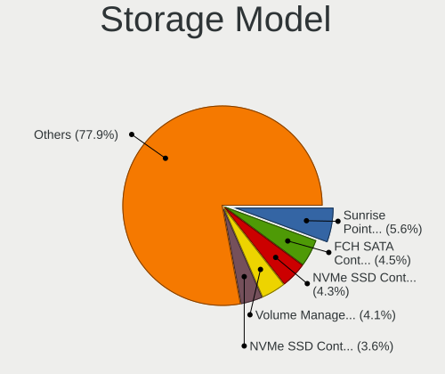

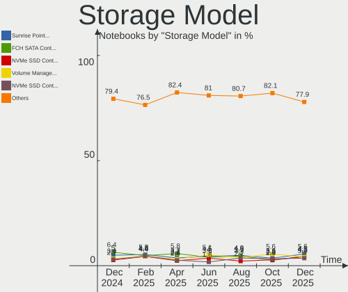

| Model                                                                          | Notebooks | Percent |
|--------------------------------------------------------------------------------|-----------|---------|
| Intel Sunrise Point-LP SATA Controller [AHCI mode]                             | 25        | 5.63%   |
| AMD FCH SATA Controller [AHCI mode]                                            | 20        | 4.5%    |
| Samsung NVMe SSD Controller SM981/PM981/PM983                                  | 19        | 4.28%   |
| Intel Volume Management Device NVMe RAID Controller                            | 18        | 4.05%   |
| Samsung NVMe SSD Controller PM9A1/PM9A3/980PRO                                 | 16        | 3.6%    |
| Intel 7 Series Chipset Family 6-port SATA Controller [AHCI mode]               | 14        | 3.15%   |
| SanDisk WD SN560/SN740/SN770/SN5000 NVMe SSD                                   | 13        | 2.93%   |
| Samsung NVMe SSD Controller PM9C1a (DRAM-less)                                 | 10        | 2.25%   |
| Intel Cannon Lake Mobile PCH SATA AHCI Controller                              | 10        | 2.25%   |
| Intel 6 Series/C200 Series Chipset Family 6 port Mobile SATA AHCI Controller   | 9         | 2.03%   |
| Samsung S4LN058A01[SSUBX] AHCI SSD Controller (Apple slot)                     | 8         | 1.8%    |
| Micron 2400 NVMe SSD (DRAM-less)                                               | 8         | 1.8%    |
| Intel Tiger Lake-LP SATA Controller                                            | 8         | 1.8%    |
| Intel 82801 Mobile SATA Controller [RAID mode]                                 | 8         | 1.8%    |
| SK hynix Platinum P41/PC801 NVMe Solid State Drive                             | 7         | 1.58%   |
| Samsung NVMe SSD Controller 980 (DRAM-less)                                    | 7         | 1.58%   |
| MAXIO (Hangzhou) NVMe SSD Controller MAP1202 (DRAM-less)                       | 7         | 1.58%   |
| Intel Wildcat Point-LP SATA Controller [AHCI Mode]                             | 7         | 1.58%   |
| Intel Alder Lake-P SATA AHCI Controller                                        | 7         | 1.58%   |
| Samsung NVMe SSD Controller S4LV008[Pascal]                                    | 6         | 1.35%   |
| KIOXIA NVMe SSD Controller BG4 (DRAM-less)                                     | 6         | 1.35%   |
| SK hynix Gold P31/BC711/PC711 NVMe Solid State Drive                           | 5         | 1.13%   |
| SanDisk IX SN530 NVMe SSD / microSD Express Card (DRAM-less)                   | 5         | 1.13%   |
| SanDisk Extreme Pro / WD Black SN750 / PC SN730 / Red SN700 NVMe SSD           | 5         | 1.13%   |
| Micron/Crucial P2 [Nick P2] / P3 / P3 Plus NVMe PCIe SSD (DRAM-less)           | 5         | 1.13%   |
| Micron 2550 NVMe SSD (DRAM-less)                                               | 5         | 1.13%   |
| Intel 8 Series SATA Controller 1 [AHCI mode]                                   | 5         | 1.13%   |
| SK hynix PVC10 NVMe Solid State Drive (DRAM-less)                              | 4         | 0.9%    |
| Samsung NVMe SSD Controller PM9B1 (DRAM-less)                                  | 4         | 0.9%    |
| Micron 2450 NVMe SSD [HendrixV] (DRAM-less)                                    | 4         | 0.9%    |
| Intel Q170/Q150/B150/H170/H110/Z170/CM236 Chipset SATA Controller [AHCI Mode]  | 4         | 0.9%    |
| Intel HM170/QM170 Chipset SATA Controller [AHCI Mode]                          | 4         | 0.9%    |
| Intel 8 Series/C220 Series Chipset Family 6-port SATA Controller 1 [AHCI mode] | 4         | 0.9%    |
| SK hynix PC601 NVMe Solid State Drive                                          | 3         | 0.68%   |
| Sandisk WD PC SN5000S M.2 2280 NVMe SSD (DRAM-less)                            | 3         | 0.68%   |
| Sandisk WD Black SN850X NVMe SSD                                               | 3         | 0.68%   |
| Samsung S4LN053X01 AHCI SSD Controller(Apple slot)                             | 3         | 0.68%   |
| KIOXIA NVMe SSD Controller XG8                                                 | 3         | 0.68%   |
| KIOXIA NVMe SSD Controller BG5 (DRAM-less)                                     | 3         | 0.68%   |
| Kingston Company KC3000/FURY Renegade NVMe SSD [E18]                           | 3         | 0.68%   |

Storage Kind
------------

Kind of storage controller (IDE, SATA, NVMe, SAS, ...)

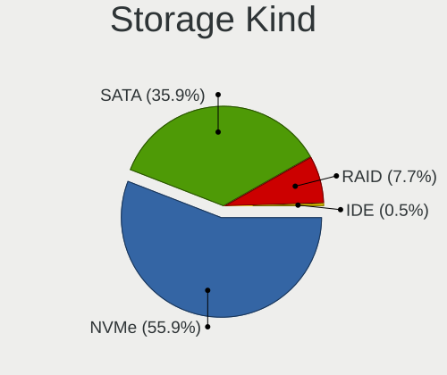

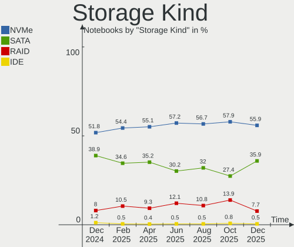

| Kind | Notebooks | Percent |
|------|-----------|---------|
| NVMe | 232       | 55.9%   |
| SATA | 149       | 35.9%   |
| RAID | 32        | 7.71%   |
| IDE  | 2         | 0.48%   |

Processor
---------

CPU Vendor
----------

Processor vendors

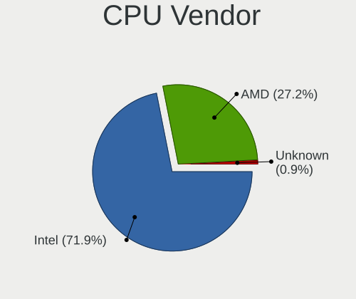

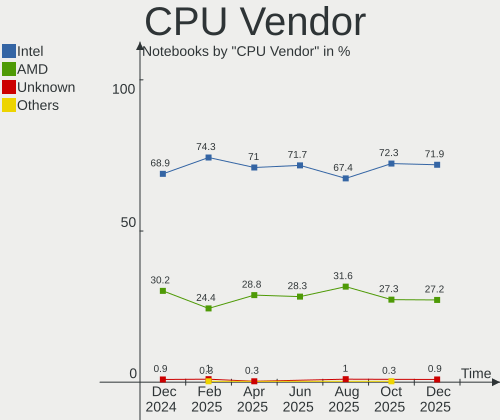

| Vendor  | Notebooks | Percent |
|---------|-----------|---------|
| Intel   | 248       | 71.88%  |
| AMD     | 94        | 27.25%  |
| Unknown | 3         | 0.87%   |

CPU Model
---------

Processor models

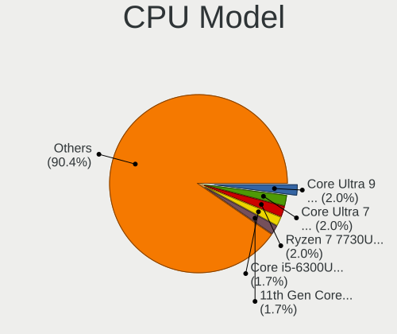

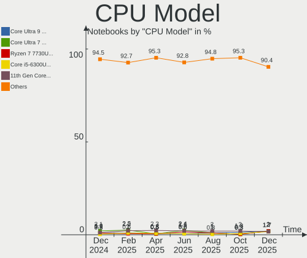

| Model                                         | Notebooks | Percent |
|-----------------------------------------------|-----------|---------|
| Intel Core Ultra 9 185H                       | 7         | 2.03%   |
| Intel Core Ultra 7 155H                       | 7         | 2.03%   |
| AMD Ryzen 7 7730U with Radeon Graphics        | 7         | 2.03%   |
| Intel Core i5-6300U CPU @ 2.40GHz             | 6         | 1.74%   |
| Intel 11th Gen Core i5-1135G7 @ 2.40GHz       | 6         | 1.74%   |
| AMD Ryzen AI 9 HX 370 w/ Radeon 890M          | 6         | 1.74%   |
| AMD Ryzen AI 7 PRO 350 w/ Radeon 860M         | 6         | 1.74%   |
| Intel Core i7-8550U CPU @ 1.80GHz             | 5         | 1.45%   |
| AMD Ryzen 5 5600H with Radeon Graphics        | 5         | 1.45%   |
| Intel Core Ultra 7 258V                       | 4         | 1.16%   |
| Intel Core i7-7700HQ CPU @ 2.80GHz            | 4         | 1.16%   |
| Intel Core i7-10750H CPU @ 2.60GHz            | 4         | 1.16%   |
| Intel Core i5-2520M CPU @ 2.50GHz             | 4         | 1.16%   |
| Intel 12th Gen Core i5-12450H                 | 4         | 1.16%   |
| Intel 12th Gen Core i5-1235U                  | 4         | 1.16%   |
| Intel 12th Gen Core i3-1215U                  | 4         | 1.16%   |
| Intel 11th Gen Core i7-1165G7 @ 2.80GHz       | 4         | 1.16%   |
| Intel 11th Gen Core i5-1145G7 @ 2.60GHz       | 4         | 1.16%   |
| Intel Core Ultra 5 225U                       | 3         | 0.87%   |
| Intel Core i7-9750H CPU @ 2.60GHz             | 3         | 0.87%   |
| Intel Core i7-5500U CPU @ 2.40GHz             | 3         | 0.87%   |
| Intel Core i5-8365U CPU @ 1.60GHz             | 3         | 0.87%   |
| Intel Core i5-8350U CPU @ 1.70GHz             | 3         | 0.87%   |
| Intel Core i5-8250U CPU @ 1.60GHz             | 3         | 0.87%   |
| Intel Core i5-7200U CPU @ 2.50GHz             | 3         | 0.87%   |
| Intel Core i5-6200U CPU @ 2.30GHz             | 3         | 0.87%   |
| Intel Core i5-5350U CPU @ 1.80GHz             | 3         | 0.87%   |
| Intel Core i5-3210M CPU @ 2.50GHz             | 3         | 0.87%   |
| Intel 12th Gen Core i5-12500H                 | 3         | 0.87%   |
| Intel 11th Gen Core i3-1115G4 @ 3.00GHz       | 3         | 0.87%   |
| AMD Ryzen 7 PRO 4750U with Radeon Graphics    | 3         | 0.87%   |
| AMD Ryzen 7 5825U with Radeon Graphics        | 3         | 0.87%   |
| AMD Ryzen 7 5800H with Radeon Graphics        | 3         | 0.87%   |
| AMD Ryzen 5 5500U with Radeon Graphics        | 3         | 0.87%   |
| AMD Ryzen 5 3500U with Radeon Vega Mobile Gfx | 3         | 0.87%   |
|                                               | 3         | 0.87%   |
| Intel Core Ultra 7 255H                       | 2         | 0.58%   |
| Intel Core i9-9880H CPU @ 2.30GHz             | 2         | 0.58%   |
| Intel Core i9-14900HX                         | 2         | 0.58%   |
| Intel Core i7-8750H CPU @ 2.20GHz             | 2         | 0.58%   |

CPU Model Family
----------------

Processor model prefix

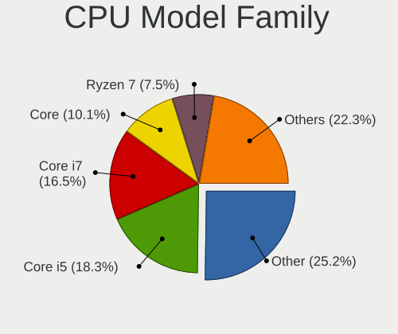

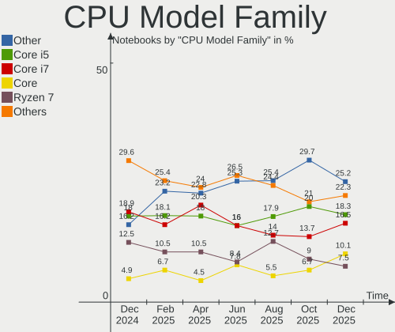

| Model                | Notebooks | Percent |
|----------------------|-----------|---------|
| Other                | 87        | 25.22%  |
| Intel Core i5        | 63        | 18.26%  |
| Intel Core i7        | 57        | 16.52%  |
| Intel Core           | 35        | 10.14%  |
| AMD Ryzen 7          | 26        | 7.54%   |
| AMD Ryzen 5          | 21        | 6.09%   |
| Intel Core i3        | 11        | 3.19%   |
| AMD Ryzen 9          | 6         | 1.74%   |
| AMD Ryzen 7 PRO      | 6         | 1.74%   |
| AMD Ryzen 5 PRO      | 6         | 1.74%   |
| Intel Core i9        | 4         | 1.16%   |
| Intel Celeron        | 4         | 1.16%   |
| AMD Ryzen 3          | 4         | 1.16%   |
| Intel Xeon           | 3         | 0.87%   |
| Intel Pentium        | 3         | 0.87%   |
| Intel Core 2 Duo     | 2         | 0.58%   |
| AMD A4               | 2         | 0.58%   |
| Intel Pentium Silver | 1         | 0.29%   |
| Intel Core m3        | 1         | 0.29%   |
| AMD E2               | 1         | 0.29%   |
| AMD A6               | 1         | 0.29%   |
| AMD A10              | 1         | 0.29%   |

CPU Cores
---------

Number of processor cores

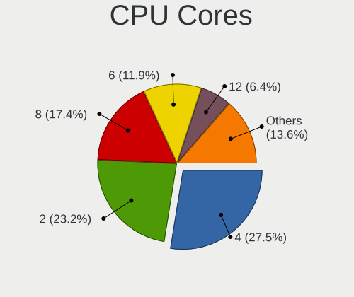

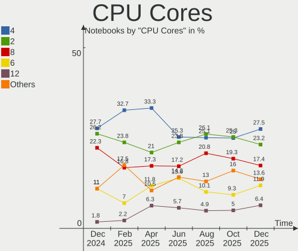

| Number | Notebooks | Percent |
|--------|-----------|---------|
| 4      | 95        | 27.54%  |
| 2      | 80        | 23.19%  |
| 8      | 60        | 17.39%  |
| 6      | 41        | 11.88%  |
| 12     | 22        | 6.38%   |
| 16     | 19        | 5.51%   |
| 10     | 16        | 4.64%   |
| 14     | 6         | 1.74%   |
| 24     | 4         | 1.16%   |
| 20     | 1         | 0.29%   |
| 5      | 1         | 0.29%   |

CPU Sockets
-----------

Number of sockets

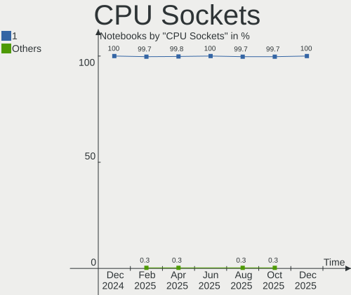

| Number | Notebooks | Percent |
|--------|-----------|---------|
| 1      | 345       | 100%    |

CPU Threads
-----------

Threads per core (Hyper-Threading)

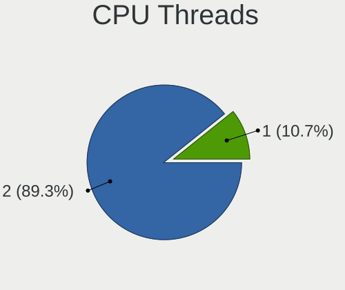

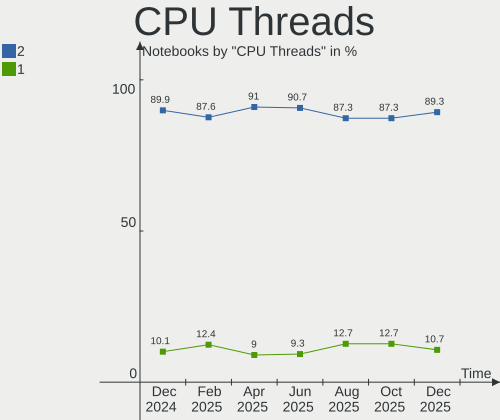

| Number | Notebooks | Percent |
|--------|-----------|---------|
| 2      | 308       | 89.28%  |
| 1      | 37        | 10.72%  |

CPU Op-Modes
------------

CPU Operation Modes (32-bit, 64-bit)

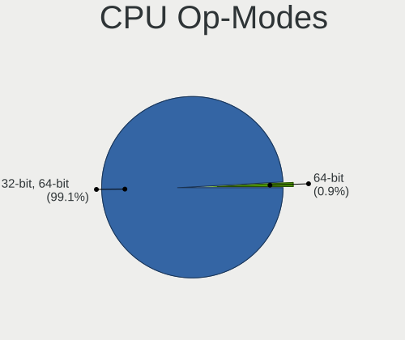

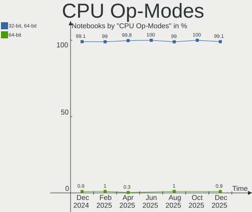

| Op mode        | Notebooks | Percent |
|----------------|-----------|---------|
| 32-bit, 64-bit | 342       | 99.13%  |
| 64-bit         | 3         | 0.87%   |

CPU Microcode
-------------

Microcode number

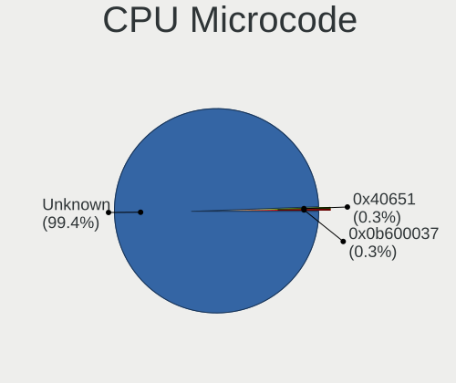

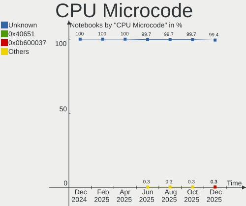

| Number     | Notebooks | Percent |
|------------|-----------|---------|
| Unknown    | 343       | 99.42%  |
| 0x40651    | 1         | 0.29%   |
| 0x0b600037 | 1         | 0.29%   |

CPU Microarch
-------------

Microarchitecture

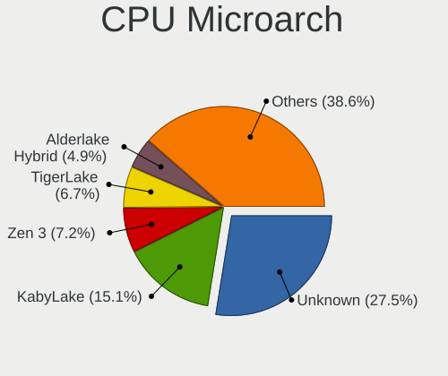

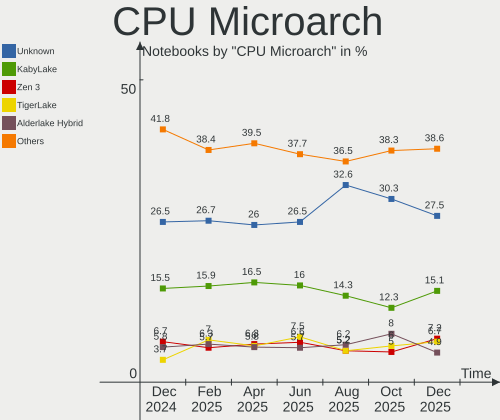

| Name               | Notebooks | Percent |
|--------------------|-----------|---------|
| Unknown            | 95        | 27.54%  |
| KabyLake           | 52        | 15.07%  |
| Zen 3              | 25        | 7.25%   |
| TigerLake          | 23        | 6.67%   |
| Alderlake Hybrid   | 17        | 4.93%   |
| Skylake            | 16        | 4.64%   |
| Haswell            | 16        | 4.64%   |
| Broadwell          | 15        | 4.35%   |
| IvyBridge          | 14        | 4.06%   |
| SandyBridge        | 11        | 3.19%   |
| Meteorlake Hybrid  | 8         | 2.32%   |
| Zen+               | 7         | 2.03%   |
| Zen 2              | 7         | 2.03%   |
| CometLake          | 7         | 2.03%   |
| Zen                | 5         | 1.45%   |
| Lunarlake Hybrid   | 4         | 1.16%   |
| Icelake            | 4         | 1.16%   |
| Westmere           | 3         | 0.87%   |
| Goldmont plus      | 3         | 0.87%   |
| Silvermont         | 2         | 0.58%   |
| ArrowLake-H Hybrid | 2         | 0.58%   |
| Piledriver         | 1         | 0.29%   |
| Penryn             | 1         | 0.29%   |
| K10 Llano          | 1         | 0.29%   |
| Jaguar             | 1         | 0.29%   |
| Gracemont          | 1         | 0.29%   |
| Goldmont           | 1         | 0.29%   |
| Excavator          | 1         | 0.29%   |
| Core               | 1         | 0.29%   |
| Bobcat             | 1         | 0.29%   |

Graphics
--------

GPU Vendor
----------

Vendors of graphics cards

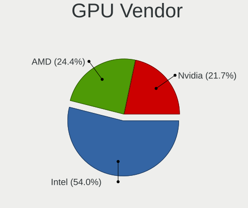

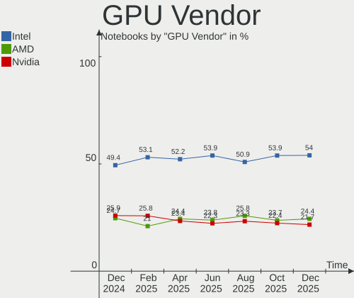

| Vendor | Notebooks | Percent |
|--------|-----------|---------|
| Intel  | 239       | 53.95%  |
| AMD    | 108       | 24.38%  |
| Nvidia | 96        | 21.67%  |

GPU Model
---------

Graphics card models

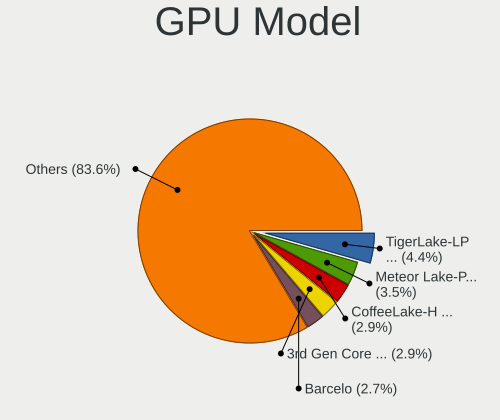

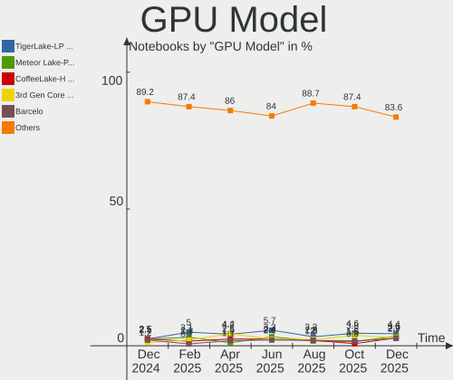

| Model                                                                     | Notebooks | Percent |
|---------------------------------------------------------------------------|-----------|---------|
| Intel TigerLake-LP GT2 [Iris Xe Graphics]                                 | 20        | 4.43%   |
| Intel Meteor Lake-P [Intel Arc Graphics]                                  | 16        | 3.55%   |
| Intel CoffeeLake-H GT2 [UHD Graphics 630]                                 | 13        | 2.88%   |
| Intel 3rd Gen Core processor Graphics Controller                          | 13        | 2.88%   |
| AMD Barcelo                                                               | 12        | 2.66%   |
| Intel Skylake-U GT2 [HD Graphics 520]                                     | 11        | 2.44%   |
| Intel Kaby Lake-R GT2 [UHD Graphics 620]                                  | 11        | 2.44%   |
| Intel 2nd Generation Core Processor Family Integrated Graphics Controller | 11        | 2.44%   |
| AMD Cezanne [Radeon Vega Series / Radeon Vega Mobile Series]              | 11        | 2.44%   |
| AMD Strix [Radeon 880M / 890M]                                            | 10        | 2.22%   |
| AMD Rembrandt [Radeon 680M]                                               | 10        | 2.22%   |
| AMD Picasso/Raven 2 [Radeon Vega Series / Radeon Vega Mobile Series]      | 9         | 2%      |
| Nvidia GA107M [GeForce RTX 3050 Mobile]                                   | 8         | 1.77%   |
| Intel Broadwell-U GT2 [HD Graphics 5500]                                  | 8         | 1.77%   |
| Intel Alder Lake-P GT2 [Iris Xe Graphics]                                 | 8         | 1.77%   |
| AMD Krackan [Radeon 840M / 860M Graphics]                                 | 8         | 1.77%   |
| Intel WhiskeyLake-U GT2 [UHD Graphics 620]                                | 7         | 1.55%   |
| Intel Raptor Lake-P [UHD Graphics]                                        | 7         | 1.55%   |
| Intel Raptor Lake-P [Iris Xe Graphics]                                    | 7         | 1.55%   |
| Intel Haswell-ULT Integrated Graphics Controller                          | 7         | 1.55%   |
| AMD Renoir [Radeon Vega Series / Radeon Vega Mobile Series]               | 7         | 1.55%   |
| Intel Kaby Lake-U GT2 [HD Graphics 620]                                   | 6         | 1.33%   |
| Intel CometLake-H GT2 [UHD Graphics]                                      | 6         | 1.33%   |
| AMD Lucienne                                                              | 6         | 1.33%   |
| Intel Lunar Lake [Intel Arc Graphics 130V / 140V]                         | 5         | 1.11%   |
| Intel Broadwell-U GT3 [HD Graphics 6000]                                  | 5         | 1.11%   |
| AMD Phoenix1                                                              | 5         | 1.11%   |
| Nvidia GA106M [GeForce RTX 3060 Mobile / Max-Q]                           | 4         | 0.89%   |
| Nvidia AD107M [GeForce RTX 4060 Max-Q / Mobile]                           | 4         | 0.89%   |
| Nvidia AD106M [GeForce RTX 4070 Max-Q / Mobile]                           | 4         | 0.89%   |
| Intel Skylake-H GT2 [HD Graphics 530]                                     | 4         | 0.89%   |
| Intel Kaby Lake-H GT2 [HD Graphics 630]                                   | 4         | 0.89%   |
| Intel Alder Lake-UP3 GT1 [UHD Graphics]                                   | 4         | 0.89%   |
| Intel Alder Lake-P GT1 [UHD Graphics]                                     | 4         | 0.89%   |
| Nvidia TU117M [GeForce GTX 1650 Mobile / Max-Q]                           | 3         | 0.67%   |
| Nvidia GP107M [GeForce GTX 1050 Ti Mobile]                                | 3         | 0.67%   |
| Nvidia GM108M [GeForce MX130]                                             | 3         | 0.67%   |
| Nvidia GK107M [GeForce GT 750M Mac Edition]                               | 3         | 0.67%   |
| Nvidia GA107M [GeForce RTX 3050 Ti Mobile]                                | 3         | 0.67%   |
| Intel TigerLake-H GT1 [UHD Graphics]                                      | 3         | 0.67%   |

GPU Combo
---------

Combinations of graphics cards

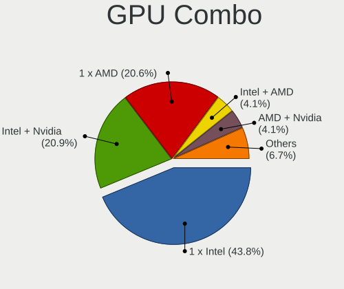

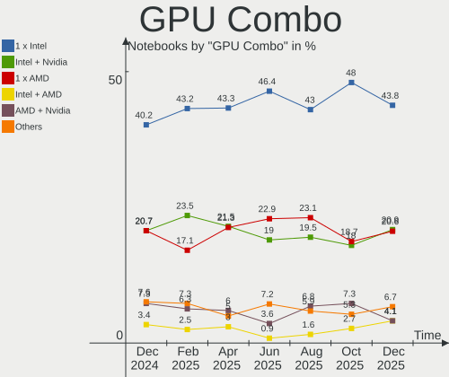

| Name           | Notebooks | Percent |
|----------------|-----------|---------|
| 1 x Intel      | 151       | 43.77%  |
| Intel + Nvidia | 72        | 20.87%  |
| 1 x AMD        | 71        | 20.58%  |
| Intel + AMD    | 14        | 4.06%   |
| AMD + Nvidia   | 14        | 4.06%   |
| 1 x Nvidia     | 10        | 2.9%    |
| 2 x AMD        | 8         | 2.32%   |
| Other          | 5         | 1.45%   |

GPU Driver
----------

Free vs proprietary

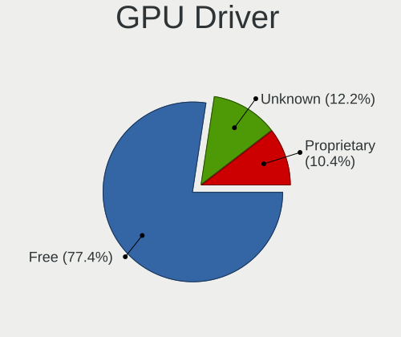

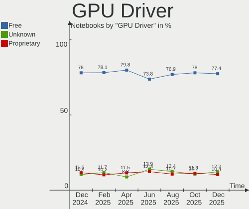

| Driver      | Notebooks | Percent |
|-------------|-----------|---------|
| Free        | 267       | 77.39%  |
| Unknown     | 42        | 12.17%  |
| Proprietary | 36        | 10.43%  |

GPU Memory
----------

Total video memory

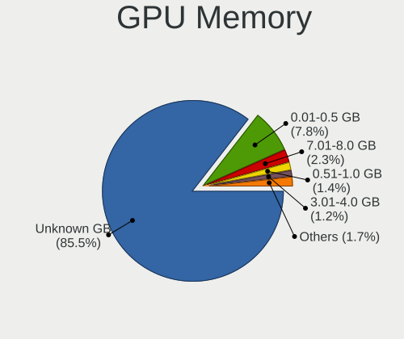

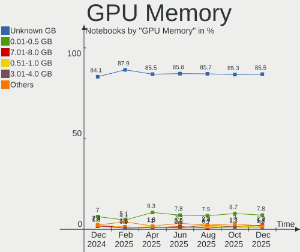

| Size in GB | Notebooks | Percent |
|------------|-----------|---------|
| Unknown    | 295       | 85.51%  |
| 0.01-0.5   | 27        | 7.83%   |
| 7.01-8.0   | 8         | 2.32%   |
| 0.51-1.0   | 5         | 1.45%   |
| 3.01-4.0   | 4         | 1.16%   |
| 1.01-2.0   | 4         | 1.16%   |
| 2.01-3.0   | 1         | 0.29%   |
| 8.01-16.0  | 1         | 0.29%   |

Monitor
-------

Monitor Vendor
--------------

Monitor vendors

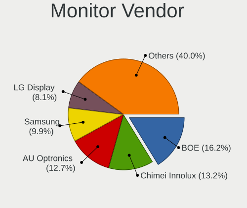

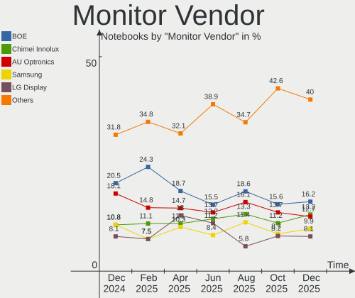

| Vendor                  | Notebooks | Percent |
|-------------------------|-----------|---------|
| BOE                     | 64        | 16.2%   |
| Chimei Innolux          | 52        | 13.16%  |
| AU Optronics            | 50        | 12.66%  |
| Samsung Electronics     | 39        | 9.87%   |
| LG Display              | 32        | 8.1%    |
| Lenovo                  | 30        | 7.59%   |
| Apple                   | 25        | 6.33%   |
| Dell                    | 11        | 2.78%   |
| Sharp                   | 9         | 2.28%   |
| CSOT                    | 7         | 1.77%   |
| InfoVision              | 6         | 1.52%   |
| Goldstar                | 6         | 1.52%   |
| ASUSTek Computer        | 6         | 1.52%   |
| Chi Mei Optoelectronics | 5         | 1.27%   |
| Acer                    | 5         | 1.27%   |
| BenQ                    | 4         | 1.01%   |
| TMX                     | 3         | 0.76%   |
| Philips                 | 3         | 0.76%   |
| KDB                     | 3         | 0.76%   |
| HKC                     | 3         | 0.76%   |
| Hewlett-Packard         | 3         | 0.76%   |
| EDO                     | 3         | 0.76%   |
| CSW                     | 3         | 0.76%   |
| AOC                     | 3         | 0.76%   |
| Toshiba                 | 2         | 0.51%   |
| MSI                     | 2         | 0.51%   |
| VXN                     | 1         | 0.25%   |
| Unknown                 | 1         | 0.25%   |
| TMA                     | 1         | 0.25%   |
| RTK                     | 1         | 0.25%   |
| PANDA                   | 1         | 0.25%   |
| Panasonic               | 1         | 0.25%   |
| KDC                     | 1         | 0.25%   |
| Iiyama                  | 1         | 0.25%   |
| HSX                     | 1         | 0.25%   |
| HannStar                | 1         | 0.25%   |
| GPD                     | 1         | 0.25%   |
| Gigabyte Technology     | 1         | 0.25%   |
| Fujitsu Siemens         | 1         | 0.25%   |
| Eizo                    | 1         | 0.25%   |

Monitor Model
-------------

Monitor models

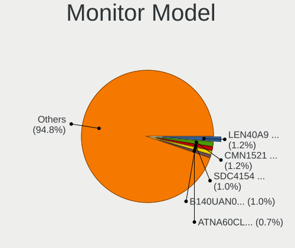

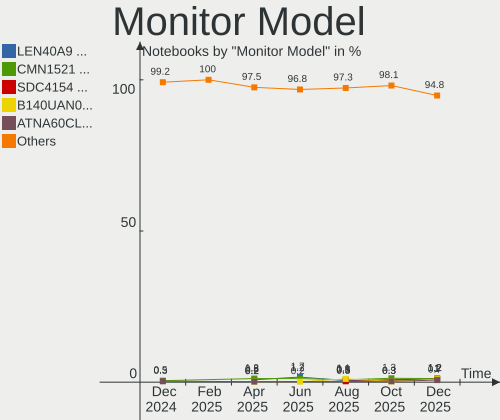

| Model                                                                    | Notebooks | Percent |
|--------------------------------------------------------------------------|-----------|---------|
| Lenovo LCD Monitor LEN40A9 1920x1080 309x173mm 13.9-inch                 | 5         | 1.25%   |
| Chimei Innolux LCD Monitor CMN1521 1920x1080 344x193mm 15.5-inch         | 5         | 1.25%   |
| Samsung Electronics LCD Monitor SDC4154 2880x1800 302x189mm 14.0-inch    | 4         | 1%      |
| Lenovo B140UAN02.7 LEN403A 1920x1200 302x188mm 14.0-inch                 | 4         | 1%      |
| Samsung Electronics ATNA60CL10-0 SDC41AF 2880x1800 344x215mm 16.0-inch   | 3         | 0.75%   |
| BOE LCD Monitor BOE0B14 1920x1080 344x194mm 15.5-inch                    | 3         | 0.75%   |
| Toshiba ScreenXpert TSB8888 1080x2160                                    | 2         | 0.5%    |
| Sharp LCD Monitor SHP14BA 1920x1080 344x194mm 15.5-inch                  | 2         | 0.5%    |
| Samsung Electronics LCD Monitor SDC4161 1920x1080 344x194mm 15.5-inch    | 2         | 0.5%    |
| Lenovo Y32p-30 LEN66F9 3840x2160 697x392mm 31.5-inch                     | 2         | 0.5%    |
| Lenovo LCD Monitor LEN40BA 1920x1080 344x194mm 15.5-inch                 | 2         | 0.5%    |
| Lenovo ATNA40HQ02-0  LEN414D                                             | 2         | 0.5%    |
| CSOT LCD Monitor CSO1500 3840x2160 344x194mm 15.5-inch                   | 2         | 0.5%    |
| Chimei Innolux LCD Monitor CMN1738 1920x1080 381x214mm 17.2-inch         | 2         | 0.5%    |
| Chimei Innolux LCD Monitor CMN15F5 1920x1080 344x193mm 15.5-inch         | 2         | 0.5%    |
| Chimei Innolux LCD Monitor CMN15E8 1920x1080 344x193mm 15.5-inch         | 2         | 0.5%    |
| Chimei Innolux LCD Monitor CMN15D5 1920x1080 344x193mm 15.5-inch         | 2         | 0.5%    |
| Chimei Innolux LCD Monitor CMN1552 1920x1080 344x193mm 15.5-inch         | 2         | 0.5%    |
| Chimei Innolux LCD Monitor CMN14FF 1920x1080 309x173mm 13.9-inch         | 2         | 0.5%    |
| Chimei Innolux LCD Monitor CMN14D6 1366x768 309x173mm 13.9-inch          | 2         | 0.5%    |
| Chimei Innolux LCD Monitor CMN14D4 1920x1080 309x173mm 13.9-inch         | 2         | 0.5%    |
| Chimei Innolux LCD Monitor CMN14C9 1920x1080 309x173mm 13.9-inch         | 2         | 0.5%    |
| Chi Mei Optoelectronics LCD Monitor CMO15A7 1366x768 344x193mm 15.5-inch | 2         | 0.5%    |
| BOE NE160QDM-NYL BOE0D5E 2560x1600 345x215mm 16.0-inch                   | 2         | 0.5%    |
| BOE NE135A1M-NY1 BOE0CB4 2880x1920 285x190mm 13.5-inch                   | 2         | 0.5%    |
| BOE LCD Monitor BOE0BC9 2560x1600 345x215mm 16.0-inch                    | 2         | 0.5%    |
| BOE LCD Monitor BOE0A74 1920x1200 345x215mm 16.0-inch                    | 2         | 0.5%    |
| BOE LCD Monitor BOE097D 1920x1080 344x194mm 15.5-inch                    | 2         | 0.5%    |
| BOE LCD Monitor BOE0893 2160x1440 296x197mm 14.0-inch                    | 2         | 0.5%    |
| BOE LCD Monitor BOE07C9 1920x1080 309x173mm 13.9-inch                    | 2         | 0.5%    |
| BOE LCD Monitor BOE0700 1920x1080 344x194mm 15.5-inch                    | 2         | 0.5%    |
| AU Optronics LCD Monitor AUO71EC 1366x768 344x193mm 15.5-inch            | 2         | 0.5%    |
| AU Optronics LCD Monitor AUO38ED 1920x1080 344x193mm 15.5-inch           | 2         | 0.5%    |
| AU Optronics LCD Monitor AUO21ED 1920x1080 344x193mm 15.5-inch           | 2         | 0.5%    |
| Apple Color LCD APPA01B 1440x900 286x179mm 13.3-inch                     | 2         | 0.5%    |
| Apple Color LCD APPA019 2880x1800 331x207mm 15.4-inch                    | 2         | 0.5%    |
| Apple Color LCD APP9CDF 1440x900 286x179mm 13.3-inch                     | 2         | 0.5%    |
| VXN VisN236HUZ15 VXN1421                                                 | 1         | 0.25%   |
| Unknown LCD Monitor FFFF 2288x1287 2550x2550mm 142.0-inch                | 1         | 0.25%   |
| TMX TL156VDXP0101 TMX1561 1920x1080 344x194mm 15.5-inch                  | 1         | 0.25%   |

Monitor Resolution
------------------

Monitor screen resolution

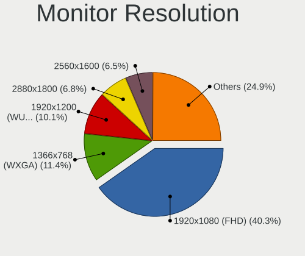

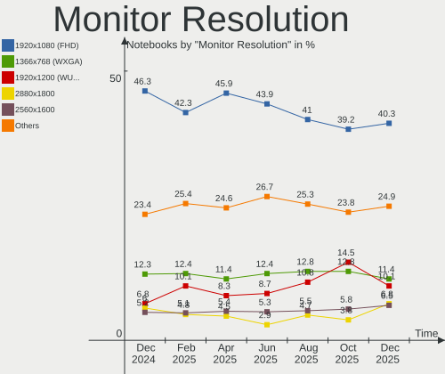

| Resolution         | Notebooks | Percent |
|--------------------|-----------|---------|
| 1920x1080 (FHD)    | 155       | 40.26%  |
| 1366x768 (WXGA)    | 44        | 11.43%  |
| 1920x1200 (WUXGA)  | 39        | 10.13%  |
| 2880x1800          | 26        | 6.75%   |
| 2560x1600          | 25        | 6.49%   |
| 3840x2160 (4K)     | 21        | 5.45%   |
| 2560x1440 (QHD)    | 14        | 3.64%   |
| Unknown            | 12        | 3.12%   |
| 1600x900 (HD+)     | 10        | 2.6%    |
| 1440x900 (WXGA+)   | 9         | 2.34%   |
| 2160x1440          | 4         | 1.04%   |
| 3840x2400          | 3         | 0.78%   |
| 3440x1440          | 3         | 0.78%   |
| 1280x800 (WXGA)    | 3         | 0.78%   |
| 2880x1920          | 2         | 0.52%   |
| 3840x1080          | 1         | 0.26%   |
| 3200x2000          | 1         | 0.26%   |
| 3200x1800 (QHD+)   | 1         | 0.26%   |
| 3072x1920          | 1         | 0.26%   |
| 2880x1620          | 1         | 0.26%   |
| 2560x1080          | 1         | 0.26%   |
| 2520x1680          | 1         | 0.26%   |
| 2304x1440          | 1         | 0.26%   |
| 2288x1287          | 1         | 0.26%   |
| 2256x1504          | 1         | 0.26%   |
| 2240x1400          | 1         | 0.26%   |
| 1680x1050 (WSXGA+) | 1         | 0.26%   |
| 1600x2560          | 1         | 0.26%   |
| 1600x1200          | 1         | 0.26%   |
| 1080x1920          | 1         | 0.26%   |

Monitor Diagonal
----------------

Diagonal size in inches

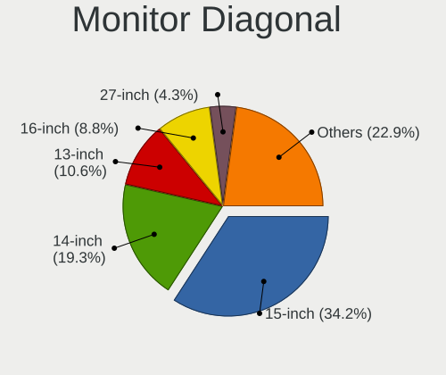

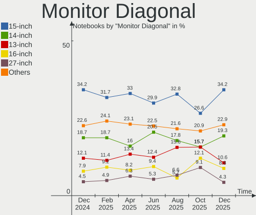

| Inches  | Notebooks | Percent |
|---------|-----------|---------|
| 15      | 136       | 34.17%  |
| 14      | 77        | 19.35%  |
| 13      | 42        | 10.55%  |
| 16      | 35        | 8.79%   |
| 27      | 17        | 4.27%   |
| 17      | 15        | 3.77%   |
| Unknown | 13        | 3.27%   |
| 24      | 12        | 3.02%   |
| 12      | 10        | 2.51%   |
| 31      | 6         | 1.51%   |
| 21      | 6         | 1.51%   |
| 11      | 5         | 1.26%   |
| 34      | 3         | 0.75%   |
| 23      | 3         | 0.75%   |
| 86      | 2         | 0.5%    |
| 26      | 2         | 0.5%    |
| 19      | 2         | 0.5%    |
| 142     | 1         | 0.25%   |
| 84      | 1         | 0.25%   |
| 72      | 1         | 0.25%   |
| 48      | 1         | 0.25%   |
| 42      | 1         | 0.25%   |
| 40      | 1         | 0.25%   |
| 36      | 1         | 0.25%   |
| 29      | 1         | 0.25%   |
| 20      | 1         | 0.25%   |
| 18      | 1         | 0.25%   |
| 10      | 1         | 0.25%   |
| 8       | 1         | 0.25%   |

Monitor Width
-------------

Physical width

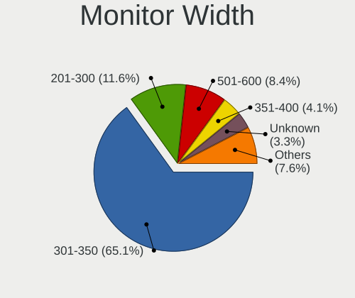

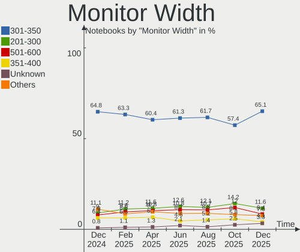

| Width in mm    | Notebooks | Percent |
|----------------|-----------|---------|
| 301-350        | 257       | 65.06%  |
| 201-300        | 46        | 11.65%  |
| 501-600        | 33        | 8.35%   |
| 351-400        | 16        | 4.05%   |
| Unknown        | 13        | 3.29%   |
| 401-500        | 9         | 2.28%   |
| 601-700        | 8         | 2.03%   |
| 701-800        | 4         | 1.01%   |
| 1001-1500      | 3         | 0.76%   |
| 1501-2000      | 2         | 0.51%   |
| More than 2000 | 1         | 0.25%   |
| 801-900        | 1         | 0.25%   |
| 101-200        | 1         | 0.25%   |
| 901-1000       | 1         | 0.25%   |

Aspect Ratio
------------

Proportional relationship between the width and the height

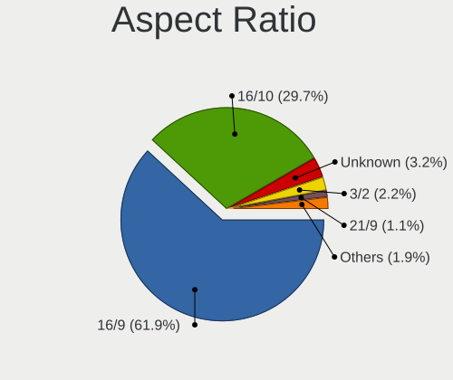

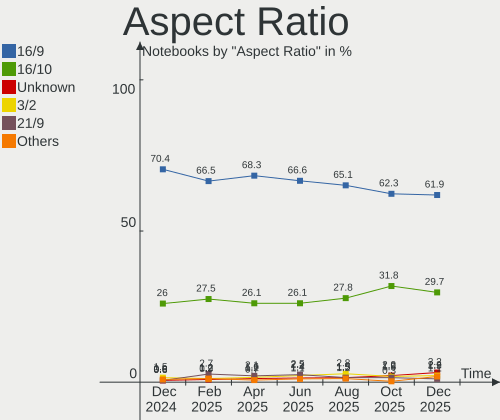

| Ratio   | Notebooks | Percent |
|---------|-----------|---------|
| 16/9    | 229       | 61.89%  |
| 16/10   | 110       | 29.73%  |
| Unknown | 12        | 3.24%   |
| 3/2     | 8         | 2.16%   |
| 21/9    | 4         | 1.08%   |
| 0.56    | 3         | 0.81%   |
| 4/3     | 1         | 0.27%   |
| 32/9    | 1         | 0.27%   |
| 1.00    | 1         | 0.27%   |
| 0.63    | 1         | 0.27%   |

Monitor Area
------------

Area in inch²

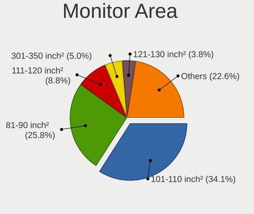

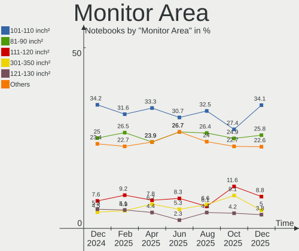

| Area in inch² | Notebooks | Percent |
|----------------|-----------|---------|
| 101-110        | 136       | 34.09%  |
| 81-90          | 103       | 25.81%  |
| 111-120        | 35        | 8.77%   |
| 301-350        | 20        | 5.01%   |
| 121-130        | 15        | 3.76%   |
| 201-250        | 14        | 3.51%   |
| 71-80          | 13        | 3.26%   |
| Unknown        | 13        | 3.26%   |
| 61-70          | 10        | 2.51%   |
| 351-500        | 9         | 2.26%   |
| More than 1000 | 5         | 1.25%   |
| 51-60          | 5         | 1.25%   |
| 251-300        | 5         | 1.25%   |
| 151-200        | 5         | 1.25%   |
| 501-1000       | 4         | 1%      |
| 91-100         | 4         | 1%      |
| 41-50          | 1         | 0.25%   |
| 1-40           | 1         | 0.25%   |
| 141-150        | 1         | 0.25%   |

Pixel Density
-------------

Pixels per inch

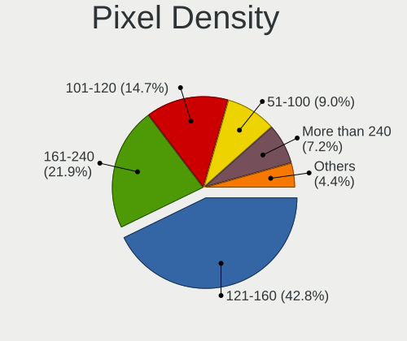

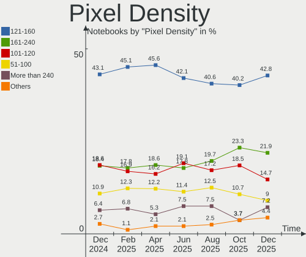

| Density       | Notebooks | Percent |
|---------------|-----------|---------|
| 121-160       | 166       | 42.78%  |
| 161-240       | 85        | 21.91%  |
| 101-120       | 57        | 14.69%  |
| 51-100        | 35        | 9.02%   |
| More than 240 | 28        | 7.22%   |
| Unknown       | 13        | 3.35%   |
| 1-50          | 4         | 1.03%   |

Multiple Monitors
-----------------

Total monitors connected

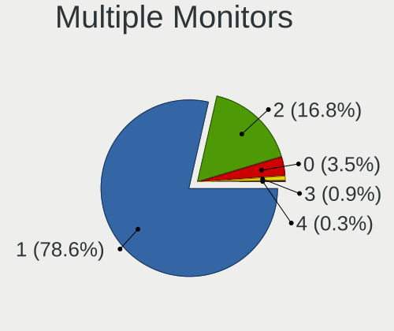

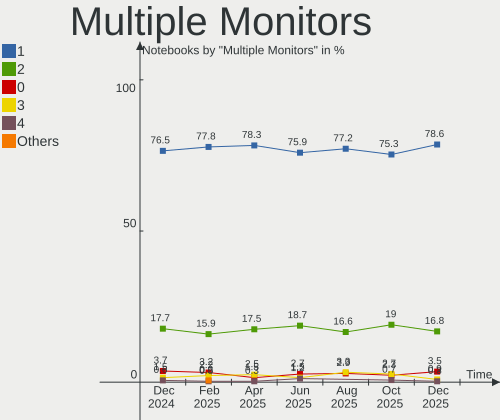

| Total | Notebooks | Percent |
|-------|-----------|---------|
| 1     | 271       | 78.55%  |
| 2     | 58        | 16.81%  |
| 0     | 12        | 3.48%   |
| 3     | 3         | 0.87%   |
| 4     | 1         | 0.29%   |

Network
-------

Net Controller Vendor
---------------------

Controller vendors

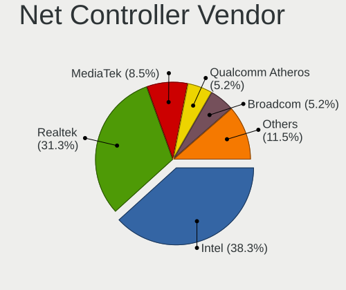

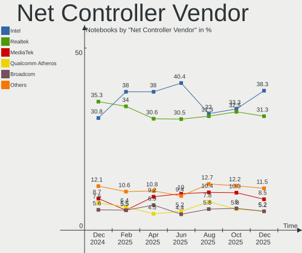

| Vendor                      | Notebooks | Percent |
|-----------------------------|-----------|---------|
| Intel                       | 197       | 38.25%  |
| Realtek Semiconductor       | 161       | 31.26%  |
| MediaTek                    | 44        | 8.54%   |
| Qualcomm Atheros            | 27        | 5.24%   |
| Broadcom                    | 27        | 5.24%   |
| Broadcom Limited            | 9         | 1.75%   |
| Shenzhen Goodix Technology  | 6         | 1.17%   |
| Lenovo                      | 5         | 0.97%   |
| ASIX Electronics            | 5         | 0.97%   |
| Sierra Wireless             | 4         | 0.78%   |
| Samsung Electronics         | 4         | 0.78%   |
| Ralink                      | 3         | 0.58%   |
| Motorcomm Microelectronics. | 3         | 0.58%   |
| Xiaomi                      | 2         | 0.39%   |
| TP-Link                     | 2         | 0.39%   |
| Huawei Technologies         | 2         | 0.39%   |
| Aquantia                    | 2         | 0.39%   |
| Ralink Technology           | 1         | 0.19%   |
| Qualcomm                    | 1         | 0.19%   |
| OPPO Electronics            | 1         | 0.19%   |
| NetGear                     | 1         | 0.19%   |
| Hewlett-Packard             | 1         | 0.19%   |
| Google                      | 1         | 0.19%   |
| DisplayLink                 | 1         | 0.19%   |
| D-Link                      | 1         | 0.19%   |
| Cypress Semiconductor       | 1         | 0.19%   |
| ASUSTek Computer            | 1         | 0.19%   |
| Apple                       | 1         | 0.19%   |
| AMTelecom                   | 1         | 0.19%   |

Net Controller Model
--------------------

Controller models

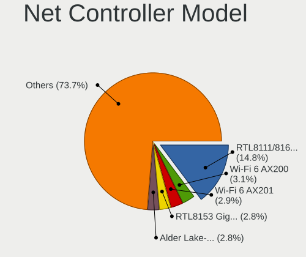

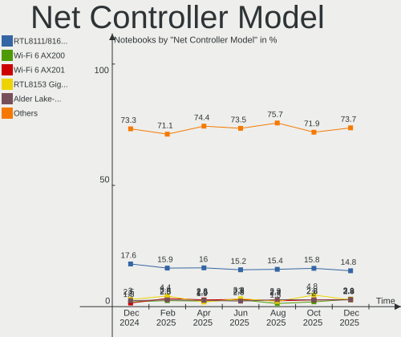

| Model                                                                           | Notebooks | Percent |
|---------------------------------------------------------------------------------|-----------|---------|
| Realtek RTL8111/8168/8211/8411 PCI Express Gigabit Ethernet Controller          | 91        | 14.77%  |
| Intel Wi-Fi 6 AX200                                                             | 19        | 3.08%   |
| Intel Wi-Fi 6 AX201                                                             | 18        | 2.92%   |
| Realtek RTL8153 Gigabit Ethernet Adapter                                        | 17        | 2.76%   |
| Intel Alder Lake-P PCH CNVi WiFi                                                | 17        | 2.76%   |
| MediaTek MT7925 802.11be 160MHz 2x2 PCIe Wireless Network Adapter [Filogic 360] | 14        | 2.27%   |
| Realtek RTL810xE PCI Express Fast Ethernet controller                           | 13        | 2.11%   |
| Intel Wireless 8265 / 8275                                                      | 12        | 1.95%   |
| Intel Raptor Lake PCH CNVi WiFi                                                 | 11        | 1.79%   |
| MediaTek MT7922 802.11ax PCI Express Wireless Network Adapter                   | 10        | 1.62%   |
| Intel Wireless 7265                                                             | 10        | 1.62%   |
| Intel Wi-Fi 7(802.11be) AX1775*/AX1790*/BE20*/BE401/BE1750* 2x2                 | 10        | 1.62%   |
| Intel Wi-Fi 6E(802.11ax) AX210/AX1675* 2x2 [Typhoon Peak]                       | 10        | 1.62%   |
| Intel Meteor Lake PCH CNVi WiFi                                                 | 10        | 1.62%   |
| Realtek RTL8852BE PCIe 802.11ax Wireless Network Controller                     | 9         | 1.46%   |
| Realtek RTL8125 2.5GbE Controller                                               | 9         | 1.46%   |
| Qualcomm Atheros QCA9377 802.11ac Wireless Network Adapter                      | 9         | 1.46%   |
| MediaTek MT7921 802.11ax PCIe Wireless Network Adapter [Filogic 330]            | 9         | 1.46%   |
| Intel Wireless 8260                                                             | 9         | 1.46%   |
| Intel 82579LM Gigabit Network Connection (Lewisville)                           | 9         | 1.46%   |
| Realtek RTL8821CE 802.11ac PCIe Wireless Network Adapter                        | 8         | 1.3%    |
| Qualcomm Atheros QCA6174 802.11ac Wireless Network Adapter                      | 7         | 1.14%   |
| Intel Centrino Advanced-N 6205 [Taylor Peak]                                    | 7         | 1.14%   |
| Intel Cannon Lake PCH CNVi WiFi                                                 | 7         | 1.14%   |
| Broadcom Limited BCM4360 802.11ac Dual Band Wireless Network Adapter            | 7         | 1.14%   |
| Shenzhen Goodix Fingerprint Reader                                              | 6         | 0.97%   |
| Qualcomm Atheros AR9485 Wireless Network Adapter                                | 6         | 0.97%   |
| MediaTek MT7902 802.11ax PCIe Wireless Network Adapter [Filogic 310]            | 6         | 0.97%   |
| Intel Wireless 7260                                                             | 6         | 0.97%   |
| Intel Ethernet Connection I219-LM                                               | 6         | 0.97%   |
| Intel Comet Lake PCH CNVi WiFi                                                  | 6         | 0.97%   |
| Intel Cannon Point-LP CNVi [Wireless-AC]                                        | 6         | 0.97%   |
| Realtek RTL8822CE 802.11ac PCIe Wireless Network Adapter                        | 5         | 0.81%   |
| Intel BE201 320MHz                                                              | 5         | 0.81%   |
| Intel Arrow Lake CNVi WiFi                                                      | 5         | 0.81%   |
| ASIX AX88179 Gigabit Ethernet                                                   | 5         | 0.81%   |
| Samsung Galaxy series, misc. (tethering mode)                                   | 4         | 0.65%   |
| Realtek USB 10/100/1G/2.5 LAN                                                   | 4         | 0.65%   |
| Realtek RTL8723BE PCIe Wireless Network Adapter                                 | 4         | 0.65%   |
| Intel Wi-Fi 5(802.11ac) Wireless-AC 9x6x [Thunder Peak]                         | 4         | 0.65%   |

Wireless Vendor
---------------

Wireless vendors

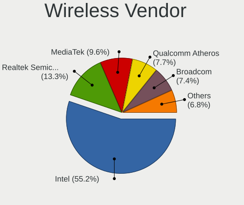

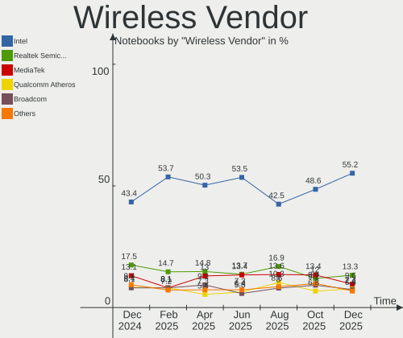

| Vendor                | Notebooks | Percent |
|-----------------------|-----------|---------|
| Intel                 | 179       | 55.25%  |
| Realtek Semiconductor | 43        | 13.27%  |
| MediaTek              | 31        | 9.57%   |
| Qualcomm Atheros      | 25        | 7.72%   |
| Broadcom              | 24        | 7.41%   |
| Broadcom Limited      | 9         | 2.78%   |
| Sierra Wireless       | 4         | 1.23%   |
| Ralink                | 3         | 0.93%   |
| TP-Link               | 2         | 0.62%   |
| Ralink Technology     | 1         | 0.31%   |
| Qualcomm              | 1         | 0.31%   |
| NetGear               | 1         | 0.31%   |
| D-Link                | 1         | 0.31%   |

Wireless Model
--------------

Wireless models

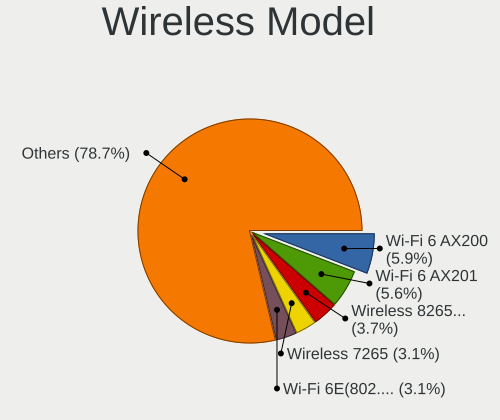

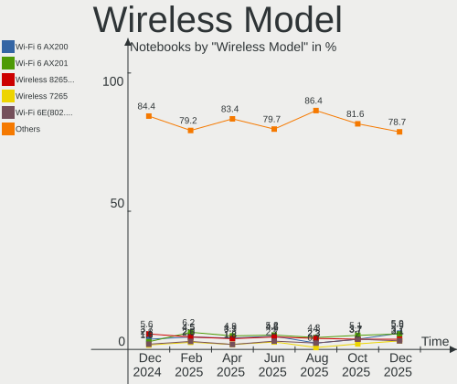

| Model                                                                           | Notebooks | Percent |
|---------------------------------------------------------------------------------|-----------|---------|
| Intel Wi-Fi 6 AX200                                                             | 19        | 5.86%   |
| Intel Wi-Fi 6 AX201                                                             | 18        | 5.56%   |
| Intel Wireless 8265 / 8275                                                      | 12        | 3.7%    |
| Intel Wireless 7265                                                             | 10        | 3.09%   |
| Intel Wi-Fi 6E(802.11ax) AX210/AX1675* 2x2 [Typhoon Peak]                       | 10        | 3.09%   |
| Intel Meteor Lake PCH CNVi WiFi                                                 | 10        | 3.09%   |
| Intel Alder Lake-P PCH CNVi WiFi                                                | 10        | 3.09%   |
| Qualcomm Atheros QCA9377 802.11ac Wireless Network Adapter                      | 9         | 2.78%   |
| MediaTek MT7921 802.11ax PCIe Wireless Network Adapter [Filogic 330]            | 9         | 2.78%   |
| Intel Wireless 8260                                                             | 9         | 2.78%   |
| Intel Wi-Fi 7(802.11be) AX1775*/AX1790*/BE20*/BE401/BE1750* 2x2                 | 9         | 2.78%   |
| Intel Raptor Lake PCH CNVi WiFi                                                 | 9         | 2.78%   |
| Realtek RTL8852BE PCIe 802.11ax Wireless Network Controller                     | 8         | 2.47%   |
| Realtek RTL8821CE 802.11ac PCIe Wireless Network Adapter                        | 8         | 2.47%   |
| Qualcomm Atheros QCA6174 802.11ac Wireless Network Adapter                      | 7         | 2.16%   |
| MediaTek MT7922 802.11ax PCI Express Wireless Network Adapter                   | 7         | 2.16%   |
| Intel Centrino Advanced-N 6205 [Taylor Peak]                                    | 7         | 2.16%   |
| Intel Cannon Lake PCH CNVi WiFi                                                 | 7         | 2.16%   |
| Broadcom Limited BCM4360 802.11ac Dual Band Wireless Network Adapter            | 7         | 2.16%   |
| Qualcomm Atheros AR9485 Wireless Network Adapter                                | 6         | 1.85%   |
| MediaTek MT7902 802.11ax PCIe Wireless Network Adapter [Filogic 310]            | 6         | 1.85%   |
| Intel Wireless 7260                                                             | 6         | 1.85%   |
| Intel Comet Lake PCH CNVi WiFi                                                  | 6         | 1.85%   |
| Intel Cannon Point-LP CNVi [Wireless-AC]                                        | 6         | 1.85%   |
| Realtek RTL8822CE 802.11ac PCIe Wireless Network Adapter                        | 5         | 1.54%   |
| MediaTek MT7925 802.11be 160MHz 2x2 PCIe Wireless Network Adapter [Filogic 360] | 5         | 1.54%   |
| Realtek RTL8723BE PCIe Wireless Network Adapter                                 | 4         | 1.23%   |
| Intel Wi-Fi 5(802.11ac) Wireless-AC 9x6x [Thunder Peak]                         | 4         | 1.23%   |
| Intel Tiger Lake PCH CNVi WiFi                                                  | 4         | 1.23%   |
| Intel Comet Lake PCH-LP CNVi WiFi                                               | 4         | 1.23%   |
| Broadcom BCM43602 802.11ac Wireless LAN SoC                                     | 4         | 1.23%   |
| Realtek RTL8852BE PCIe 802.11ax Wireless Network Controller [1T1R]              | 3         | 0.93%   |
| Realtek RTL8822BE 802.11a/b/g/n/ac WiFi adapter                                 | 3         | 0.93%   |
| Intel Ice Lake-LP PCH CNVi WiFi                                                 | 3         | 0.93%   |
| Intel 700 Series Chipset CNVi WiFi                                              | 3         | 0.93%   |
| Broadcom BCM4378 802.11ax Dual Band Wireless Network Adapter                    | 3         | 0.93%   |
| Broadcom BCM4360 802.11ac Dual Band Wireless Network Adapter                    | 3         | 0.93%   |
| Broadcom BCM4350 802.11ac Wireless Network Adapter                              | 3         | 0.93%   |
| Broadcom BCM4331 802.11a/b/g/n                                                  | 3         | 0.93%   |
| Broadcom BCM43142 802.11b/g/n                                                   | 3         | 0.93%   |

Ethernet Vendor
---------------

Ethernet vendors

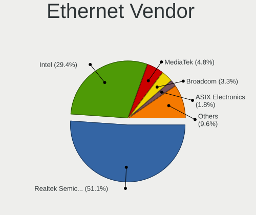

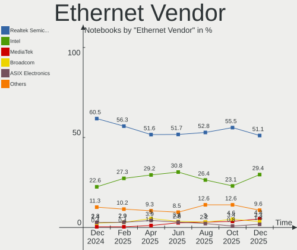

| Vendor                      | Notebooks | Percent |
|-----------------------------|-----------|---------|
| Realtek Semiconductor       | 139       | 51.1%   |
| Intel                       | 80        | 29.41%  |
| MediaTek                    | 13        | 4.78%   |
| Broadcom                    | 9         | 3.31%   |
| ASIX Electronics            | 5         | 1.84%   |
| Samsung Electronics         | 4         | 1.47%   |
| Qualcomm Atheros            | 4         | 1.47%   |
| Motorcomm Microelectronics. | 3         | 1.1%    |
| Lenovo                      | 3         | 1.1%    |
| Xiaomi                      | 2         | 0.74%   |
| Aquantia                    | 2         | 0.74%   |
| OPPO Electronics            | 1         | 0.37%   |
| Huawei Technologies         | 1         | 0.37%   |
| Google                      | 1         | 0.37%   |
| DisplayLink                 | 1         | 0.37%   |
| Cypress Semiconductor       | 1         | 0.37%   |
| ASUSTek Computer            | 1         | 0.37%   |
| Apple                       | 1         | 0.37%   |
| AMTelecom                   | 1         | 0.37%   |

Ethernet Model
--------------

Ethernet models

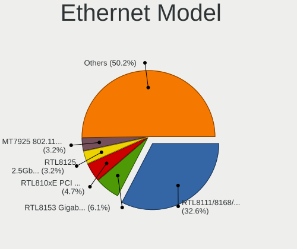

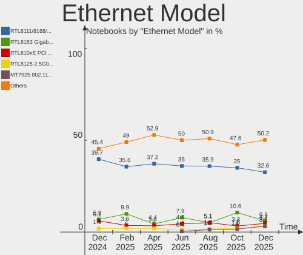

| Model                                                                           | Notebooks | Percent |
|---------------------------------------------------------------------------------|-----------|---------|
| Realtek RTL8111/8168/8211/8411 PCI Express Gigabit Ethernet Controller          | 91        | 32.62%  |
| Realtek RTL8153 Gigabit Ethernet Adapter                                        | 17        | 6.09%   |
| Realtek RTL810xE PCI Express Fast Ethernet controller                           | 13        | 4.66%   |
| Realtek RTL8125 2.5GbE Controller                                               | 9         | 3.23%   |
| MediaTek MT7925 802.11be 160MHz 2x2 PCIe Wireless Network Adapter [Filogic 360] | 9         | 3.23%   |
| Intel 82579LM Gigabit Network Connection (Lewisville)                           | 9         | 3.23%   |
| Intel Alder Lake-P PCH CNVi WiFi                                                | 7         | 2.51%   |
| Intel Ethernet Connection I219-LM                                               | 6         | 2.15%   |
| ASIX AX88179 Gigabit Ethernet                                                   | 5         | 1.79%   |
| Samsung Galaxy series, misc. (tethering mode)                                   | 4         | 1.43%   |
| Realtek USB 10/100/1G/2.5 LAN                                                   | 4         | 1.43%   |
| Intel Ethernet Connection I217-LM                                               | 4         | 1.43%   |
| Intel Ethernet Connection (6) I219-LM                                           | 4         | 1.43%   |
| Intel Ethernet Connection (4) I219-LM                                           | 4         | 1.43%   |
| Intel Ethernet Connection (18) I219-LM                                          | 4         | 1.43%   |
| Realtek RTL8152 Fast Ethernet Adapter                                           | 3         | 1.08%   |
| Realtek Killer E2600 GbE Controller                                             | 3         | 1.08%   |
| Motorcomm Microelectronics. YT6801 Gigabit Ethernet Controller                  | 3         | 1.08%   |
| MediaTek MT7922 802.11ax PCI Express Wireless Network Adapter                   | 3         | 1.08%   |
| Intel Ethernet Connection (7) I219-LM                                           | 3         | 1.08%   |
| Intel Ethernet Connection (24) I219-V                                           | 3         | 1.08%   |
| Intel BE201 320MHz                                                              | 3         | 1.08%   |
| Intel Arrow Lake CNVi WiFi                                                      | 3         | 1.08%   |
| Broadcom NetXtreme BCM57765 Gigabit Ethernet PCIe                               | 3         | 1.08%   |
| Xiaomi Mi/Redmi series (RNDIS)                                                  | 2         | 0.72%   |
| Lenovo USB-C Dock Ethernet                                                      | 2         | 0.72%   |
| Intel Raptor Lake PCH CNVi WiFi                                                 | 2         | 0.72%   |
| Intel Ethernet Controller I226-V                                                | 2         | 0.72%   |
| Intel Ethernet Connection I218-LM                                               | 2         | 0.72%   |
| Intel Ethernet Connection (5) I219-LM                                           | 2         | 0.72%   |
| Intel Ethernet Connection (4) I219-V                                            | 2         | 0.72%   |
| Intel Ethernet Connection (3) I218-LM                                           | 2         | 0.72%   |
| Intel Ethernet Connection (13) I219-V                                           | 2         | 0.72%   |
| Broadcom NetXtreme BCM57762 Gigabit Ethernet PCIe                               | 2         | 0.72%   |
| Broadcom NetLink BCM57785 Gigabit Ethernet PCIe                                 | 2         | 0.72%   |
| Realtek USB 10/100/1G/2.5G/5G/10G LAN                                           | 1         | 0.36%   |
| Realtek RTL8852CE PCIe 802.11ax Wireless Network Controller                     | 1         | 0.36%   |
| Realtek RTL8852BE PCIe 802.11ax Wireless Network Controller                     | 1         | 0.36%   |
| Realtek Killer E3000 2.5GbE Controller                                          | 1         | 0.36%   |
| Realtek Killer E2500 Gigabit Ethernet Controller                                | 1         | 0.36%   |

Net Controller Kind
-------------------

Ethernet, WiFi or modem

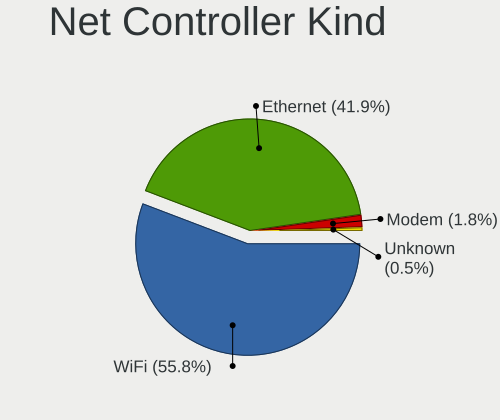

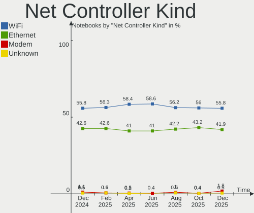

| Kind     | Notebooks | Percent |
|----------|-----------|---------|
| WiFi     | 313       | 55.79%  |
| Ethernet | 235       | 41.89%  |
| Modem    | 10        | 1.78%   |
| Unknown  | 3         | 0.53%   |

Used Controller
---------------

Currently used network controller

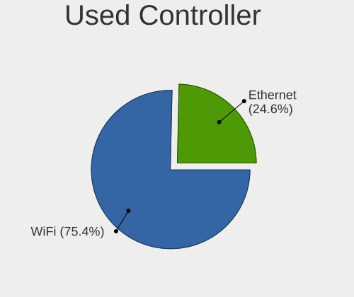

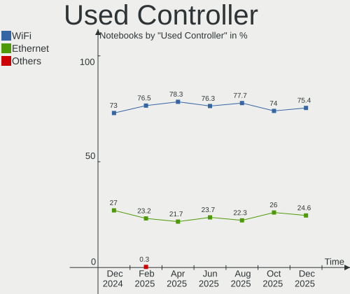

| Kind     | Notebooks | Percent |
|----------|-----------|---------|
| WiFi     | 269       | 75.35%  |
| Ethernet | 88        | 24.65%  |

NICs
----

Total network controllers on board

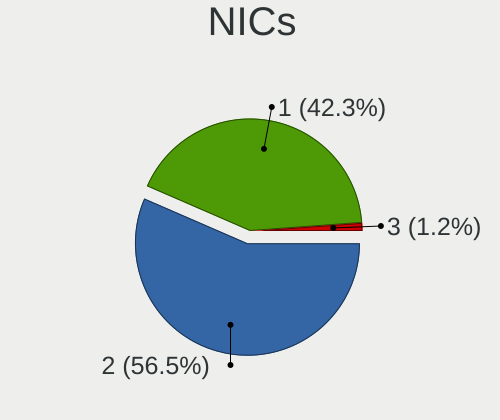

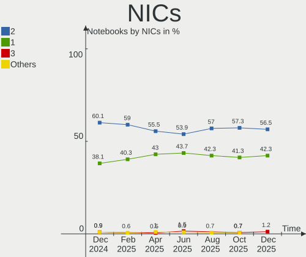

| Total | Notebooks | Percent |
|-------|-----------|---------|
| 2     | 195       | 56.52%  |
| 1     | 146       | 42.32%  |
| 3     | 4         | 1.16%   |

IPv6
----

IPv6 vs IPv4

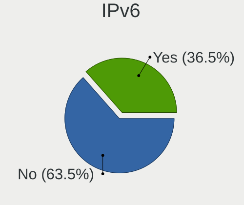

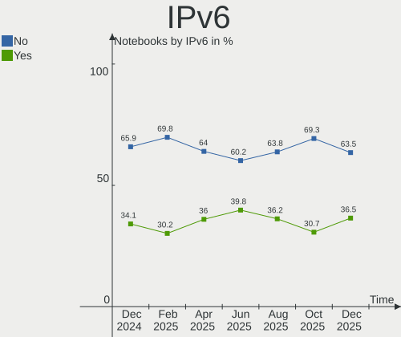

| Used | Notebooks | Percent |
|------|-----------|---------|
| No   | 219       | 63.48%  |
| Yes  | 126       | 36.52%  |

Bluetooth
---------

Bluetooth Vendor
----------------

Controller vendors

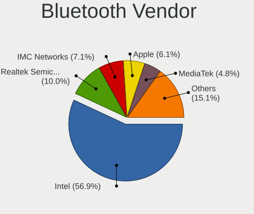

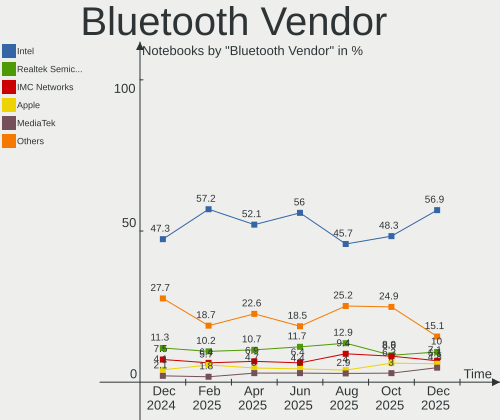

| Vendor                          | Notebooks | Percent |
|---------------------------------|-----------|---------|
| Intel                           | 177       | 56.91%  |
| Realtek Semiconductor           | 31        | 9.97%   |
| IMC Networks                    | 22        | 7.07%   |
| Apple                           | 19        | 6.11%   |
| MediaTek                        | 15        | 4.82%   |
| Qualcomm Atheros Communications | 13        | 4.18%   |
| Foxconn / Hon Hai               | 9         | 2.89%   |
| Broadcom                        | 8         | 2.57%   |
| Lite-On Technology              | 4         | 1.29%   |
| Realtek                         | 3         | 0.96%   |
| Hewlett-Packard                 | 2         | 0.64%   |
| USI                             | 1         | 0.32%   |
| TP-Link                         | 1         | 0.32%   |
| Toshiba                         | 1         | 0.32%   |
| Smart Modular Technologies      | 1         | 0.32%   |
| Ralink                          | 1         | 0.32%   |
| Foxconn International           | 1         | 0.32%   |
| Dell                            | 1         | 0.32%   |
| Unknown                         | 1         | 0.32%   |

Bluetooth Model
---------------

Controller models

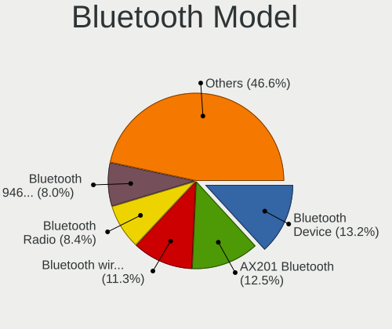

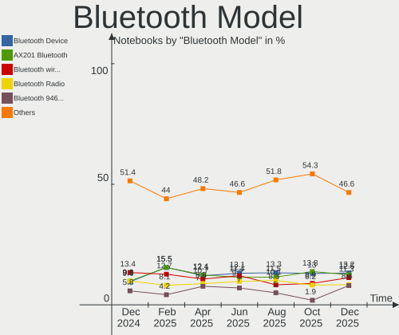

| Model                                             | Notebooks | Percent |
|---------------------------------------------------|-----------|---------|
| Intel Bluetooth Device                            | 41        | 13.18%  |
| Intel AX201 Bluetooth                             | 39        | 12.54%  |
| Intel Bluetooth wireless interface                | 35        | 11.25%  |
| Realtek Bluetooth Radio                           | 26        | 8.36%   |
| Intel Bluetooth 9460/9560 Jefferson Peak (JfP)    | 25        | 8.04%   |
| Intel AX200 Bluetooth                             | 18        | 5.79%   |
| IMC Networks Wireless_Device                      | 16        | 5.14%   |
| MediaTek Wireless_Device                          | 15        | 4.82%   |
| Apple Bluetooth Host Controller                   | 12        | 3.86%   |
| Intel AX210 Bluetooth                             | 10        | 3.22%   |
| Qualcomm Atheros  Bluetooth Device                | 8         | 2.57%   |
| Apple Bluetooth USB Host Controller               | 7         | 2.25%   |
| Foxconn / Hon Hai Wireless_Device                 | 5         | 1.61%   |
| Intel Wireless-AC 9260 Bluetooth Adapter          | 4         | 1.29%   |
| IMC Networks Bluetooth Radio                      | 4         | 1.29%   |
| Realtek  Bluetooth 4.2 Adapter                    | 3         | 0.96%   |
| Realtek Bluetooth Radio                           | 3         | 0.96%   |
| Lite-On Bluetooth Device                          | 3         | 0.96%   |
| Intel Bluetooth                                   | 3         | 0.96%   |
| Foxconn / Hon Hai MediaTek Bluetooth Adapter      | 3         | 0.96%   |
| Realtek RTL8822BE Bluetooth 4.2 Adapter           | 2         | 0.64%   |
| Qualcomm Atheros QCA61x4 Bluetooth 4.0            | 2         | 0.64%   |
| Qualcomm Atheros AR3012 Bluetooth 4.0             | 2         | 0.64%   |
| Intel Centrino Bluetooth Wireless Transceiver     | 2         | 0.64%   |
| IMC Networks Bluetooth Device                     | 2         | 0.64%   |
| HP Broadcom 2070 Bluetooth Combo                  | 2         | 0.64%   |
| Broadcom BCM20702 Bluetooth 4.0 [ThinkPad]        | 2         | 0.64%   |
| Broadcom BCM2045B (BDC-2.1)                       | 2         | 0.64%   |
| USI Bluetooth Device                              | 1         | 0.32%   |
| TP-Link TP-T@- UB500 Adapter                      | 1         | 0.32%   |
| Toshiba Bluetooth USB Host Controller             | 1         | 0.32%   |
| Smart Modular Bluetooth Device                    | 1         | 0.32%   |
| Ralink RT3290 Bluetooth                           | 1         | 0.32%   |
| Qualcomm Atheros AR3011 Bluetooth                 | 1         | 0.32%   |
| Lite-On Qualcomm Atheros QCA9377 Bluetooth        | 1         | 0.32%   |
| Foxconn International BCM43142A0 Bluetooth module | 1         | 0.32%   |
| Foxconn / Hon Hai BCM43142A0                      | 1         | 0.32%   |
| Dell BCM20702A0 Bluetooth Module                  | 1         | 0.32%   |
| Broadcom HP Portable Valentine                    | 1         | 0.32%   |
| Broadcom HP Portable SoftSailing                  | 1         | 0.32%   |

Sound
-----

Sound Vendor
------------

Sound card vendors

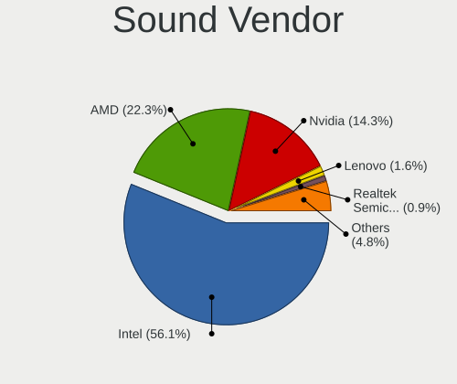

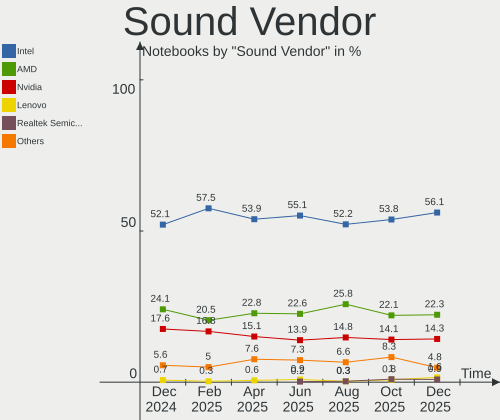

| Vendor                               | Notebooks | Percent |
|--------------------------------------|-----------|---------|
| Intel                                | 247       | 56.14%  |
| AMD                                  | 98        | 22.27%  |
| Nvidia                               | 63        | 14.32%  |
| Lenovo                               | 7         | 1.59%   |
| Realtek Semiconductor                | 4         | 0.91%   |
| Texas Instruments                    | 2         | 0.45%   |
| JMTek                                | 2         | 0.45%   |
| Hewlett-Packard                      | 2         | 0.45%   |
| Apple                                | 2         | 0.45%   |
| Thesycon Systemsoftware & Consulting | 1         | 0.23%   |
| Sony                                 | 1         | 0.23%   |
| Shure                                | 1         | 0.23%   |
| RODE Microphones                     | 1         | 0.23%   |
| No brand                             | 1         | 0.23%   |
| Logitech                             | 1         | 0.23%   |
| Kingston Technology                  | 1         | 0.23%   |
| Jieli Technology                     | 1         | 0.23%   |
| Framework                            | 1         | 0.23%   |
| Focusrite-Novation                   | 1         | 0.23%   |
| DSEA A/S                             | 1         | 0.23%   |
| bestechnic                           | 1         | 0.23%   |
| ASUSTek Computer                     | 1         | 0.23%   |

Sound Model
-----------

Sound card models

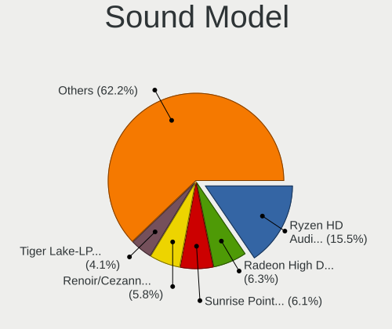

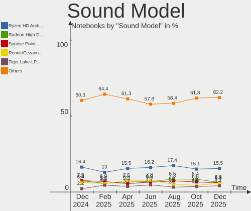

| Model                                                                      | Notebooks | Percent |
|----------------------------------------------------------------------------|-----------|---------|
| AMD Ryzen HD Audio Controller                                              | 86        | 15.5%   |
| AMD Radeon High Definition Audio Controller                                | 35        | 6.31%   |
| Intel Sunrise Point-LP HD Audio                                            | 34        | 6.13%   |
| AMD Renoir/Cezanne HDMI/DP Audio Controller                                | 32        | 5.77%   |
| Intel Tiger Lake-LP Smart Sound Technology Audio Controller                | 23        | 4.14%   |
| Intel Alder Lake PCH-P High Definition Audio Controller                    | 21        | 3.78%   |
| Intel Meteor Lake-P HD Audio Controller                                    | 18        | 3.24%   |
| Intel Raptor Lake-P/U/H cAVS                                               | 17        | 3.06%   |
| Intel 7 Series/C216 Chipset Family High Definition Audio Controller        | 16        | 2.88%   |
| Intel Wildcat Point-LP High Definition Audio Controller                    | 15        | 2.7%    |
| Intel Broadwell-U Audio Controller                                         | 15        | 2.7%    |
| Intel Cannon Lake PCH cAVS                                                 | 13        | 2.34%   |
| AMD Raven/Raven2/Fenghuang HDMI/DP Audio Controller                        | 12        | 2.16%   |
| Intel 8 Series/C220 Series Chipset High Definition Audio Controller        | 9         | 1.62%   |
| Intel 6 Series/C200 Series Chipset Family High Definition Audio Controller | 9         | 1.62%   |
| Nvidia GA107 High Definition Audio Controller                              | 8         | 1.44%   |
| Intel Cannon Point-LP High Definition Audio Controller                     | 8         | 1.44%   |
| Intel Haswell-ULT HD Audio Controller                                      | 7         | 1.26%   |
| Intel 8 Series HD Audio Controller                                         | 7         | 1.26%   |
| Nvidia GP107GL High Definition Audio Controller                            | 6         | 1.08%   |
| Intel Comet Lake PCH cAVS                                                  | 6         | 1.08%   |
| Intel CM238 HD Audio Controller                                            | 6         | 1.08%   |
| Intel Arrow Lake cAVS                                                      | 6         | 1.08%   |
| Nvidia AD107 High Definition Audio Controller                              | 5         | 0.9%    |
| Intel Lunar Lake-M HD Audio Controller                                     | 5         | 0.9%    |
| Nvidia TU106 High Definition Audio Controller                              | 4         | 0.72%   |
| Nvidia GK107 HDMI Audio Controller                                         | 4         | 0.72%   |
| Nvidia GB206 High Definition Audio Controller                              | 4         | 0.72%   |
| Nvidia GA106 High Definition Audio Controller                              | 4         | 0.72%   |
| Intel Tiger Lake-H HD Audio Controller                                     | 4         | 0.72%   |
| Intel Comet Lake PCH-LP cAVS                                               | 4         | 0.72%   |
| AMD FCH Azalia Controller                                                  | 4         | 0.72%   |
| Realtek Semiconductor USB Audio                                            | 3         | 0.54%   |
| Nvidia GM107 High Definition Audio Controller [GeForce 940MX]              | 3         | 0.54%   |
| Nvidia GA104 High Definition Audio Controller                              | 3         | 0.54%   |
| Intel Xeon E3-1200 v3/4th Gen Core Processor HD Audio Controller           | 3         | 0.54%   |
| Intel Raptor Lake High Definition Audio Controller                         | 3         | 0.54%   |
| Intel Ice Lake-LP Smart Sound Technology Audio Controller                  | 3         | 0.54%   |
| Intel Celeron/Pentium Silver Processor High Definition Audio               | 3         | 0.54%   |
| Intel Alder Lake-N PCH High Definition Audio Controller                    | 3         | 0.54%   |

Memory
------

Memory Vendor
-------------

Memory module vendors

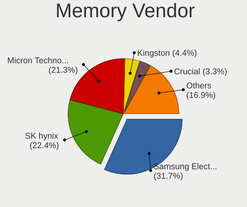

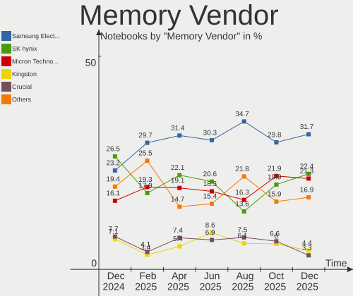

| Vendor              | Notebooks | Percent |
|---------------------|-----------|---------|
| Samsung Electronics | 58        | 31.69%  |
| SK hynix            | 41        | 22.4%   |
| Micron Technology   | 39        | 21.31%  |
| Kingston            | 8         | 4.37%   |
| Crucial             | 6         | 3.28%   |
| Unknown             | 6         | 3.28%   |
| Corsair             | 4         | 2.19%   |
| G.Skill             | 3         | 1.64%   |
| A-DATA Technology   | 3         | 1.64%   |
| Unknown             | 2         | 1.09%   |
| Team                | 2         | 1.09%   |
| V-GeN               | 1         | 0.55%   |
| Unknown (0x0BEC)    | 1         | 0.55%   |
| Unknown (0x0B5E)    | 1         | 0.55%   |
| Transcend           | 1         | 0.55%   |
| Timetec             | 1         | 0.55%   |
| Shenzhen SCY        | 1         | 0.55%   |
| Nanya Technology    | 1         | 0.55%   |
| Lexar Co Limited    | 1         | 0.55%   |
| Essencore Limited   | 1         | 0.55%   |
| Elpida              | 1         | 0.55%   |
| AMD                 | 1         | 0.55%   |

Memory Model
------------

Memory module models

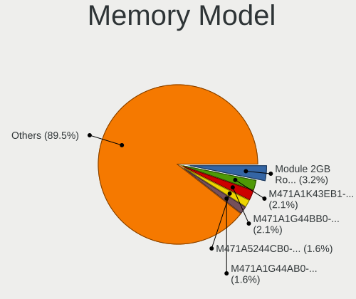

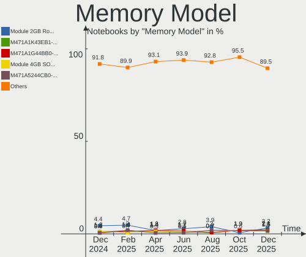

| Model                                                           | Notebooks | Percent |
|-----------------------------------------------------------------|-----------|---------|
| Unknown                                                         | 6         | 3.16%   |
| Samsung RAM M471A1K43EB1-CWE 8GB SODIMM DDR4 3200MT/s           | 4         | 2.11%   |
| Samsung RAM M471A1G44BB0-CWE 8GB SODIMM DDR4 3200MT/s           | 4         | 2.11%   |
| SK hynix RAM Module 4GB SODIMM DDR3 1600MT/s                    | 3         | 1.58%   |
| Samsung RAM M471A5244CB0-CWE 4GB SODIMM DDR4 3200MT/s           | 3         | 1.58%   |
| Samsung RAM M471A1G44AB0-CWE 8GiB SODIMM DDR4 3200MT/s          | 3         | 1.58%   |
| Samsung RAM M425R4GA3EB0-CWMOD 32GB SODIMM DDR5 5600MT/s        | 3         | 1.58%   |
| Micron RAM Module 8GB SODIMM DDR4 3200MT/s                      | 3         | 1.58%   |
| SK hynix RAM HMCG78MEBSA092N 16GB SODIMM DDR5 4800MT/s          | 2         | 1.05%   |
| SK hynix RAM HMAA1GS6CJR6N-XN 8GB SODIMM DDR4 3200MT/s          | 2         | 1.05%   |
| Samsung RAM M471B5273DH0-CK0 4GB SODIMM DDR3 2400MT/s           | 2         | 1.05%   |
| Samsung RAM M471B5173QH0-YK0 4GB SODIMM DDR3 1600MT/s           | 2         | 1.05%   |
| Samsung RAM M471B5173EB0-YK0 4GB SODIMM DDR3 1600MT/s           | 2         | 1.05%   |
| Samsung RAM M425R2GA3EB0-CWMOL 16GB SODIMM DDR5 5600MT/s        | 2         | 1.05%   |
| Samsung RAM M425R2GA3EB0-CWMOD 16GB SODIMM DDR5 5600MT/s        | 2         | 1.05%   |
| Micron RAM MTC4C10163S1SC56BD1 8GB SODIMM DDR5 5600MT/s         | 2         | 1.05%   |
| Micron RAM 8ATF1G64HZ-3G2R1 8GB SODIMM DDR4 3200MT/s            | 2         | 1.05%   |
| Micron RAM 4ATF1G64HZ-3G2F1 8GB SODIMM DDR4 3200MT/s            | 2         | 1.05%   |
| Micron RAM 4ATF1G64HZ-3G2E2 8GB SODIMM DDR4 3200MT/s            | 2         | 1.05%   |
| G.Skill RAM F3-1600C9-8GRSL 8GB SODIMM DDR3 1600MT/s            | 2         | 1.05%   |
| Crucial RAM CT102464BF160B.M16 8GB SODIMM DDR3 1600MT/s         | 2         | 1.05%   |
| V-GeN RAM D4H8GS26A8 8GB SODIMM DDR4 2667MT/s                   | 1         | 0.53%   |
| Unknown RAM Module 8GB SODIMM DDR3 1600MT/s                     | 1         | 0.53%   |
| Unknown RAM Module 4GB SODIMM DDR3 1333MT/s                     | 1         | 0.53%   |
| Unknown (0x0BEC) RAM SM4S510888DHC 8GB SODIMM DDR4 3200MT/s     | 1         | 0.53%   |
| Unknown (0x0B5E) RAM HEMA81GS6DJR8N-XN 8GB SODIMM DDR4 3200MT/s | 1         | 0.53%   |
| Transcend RAM JM5600ASE-16G 16GB SODIMM DDR5 5600MT/s           | 1         | 0.53%   |
| Timetec RAM S16G-2400 16GB SODIMM DDR4 2400MT/s                 | 1         | 0.53%   |
| Team RAM TEAMGROUP-SD4-3200 16GB SODIMM DDR4 3200MT/s           | 1         | 0.53%   |
| Team RAM SD5-5600 16GB SODIMM DDR5 5600MT/s                     | 1         | 0.53%   |
| SK hynix RAM Module 8GB SODIMM DDR4 2667MT/s                    | 1         | 0.53%   |
| SK hynix RAM Module 8GB SODIMM DDR4 2400MT/s                    | 1         | 0.53%   |
| SK hynix RAM Module 4GB SODIMM DDR3 1066MT/s                    | 1         | 0.53%   |
| SK hynix RAM Module 4GB Row Of Chips LPDDR4 4267MT/s            | 1         | 0.53%   |
| SK hynix RAM Module 2GB SODIMM DDR3 1600MT/s                    | 1         | 0.53%   |
| SK hynix RAM Module 2GB SODIMM DDR3 1067MT/s                    | 1         | 0.53%   |
| SK hynix RAM Module 16GB SODIMM DDR5 5600MT/s                   | 1         | 0.53%   |
| SK hynix RAM HMT851S6AMR6A-PB 4GB Chip DDR3 1600MT/s            | 1         | 0.53%   |
| SK hynix RAM HMT451S6BFR8A-PB 4GB SODIMM DDR3 1600MT/s          | 1         | 0.53%   |
| SK hynix RAM HMT41GS6MFR8C-PB 8GB SODIMM DDR3 1600MT/s          | 1         | 0.53%   |

Memory Kind
-----------

Memory module kinds

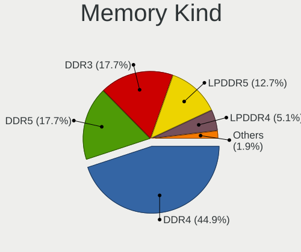

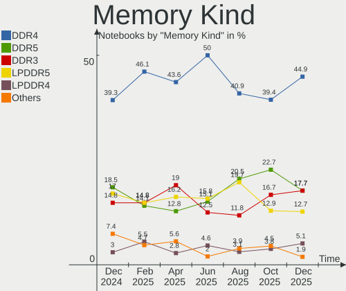

| Kind   | Notebooks | Percent |
|--------|-----------|---------|
| DDR4   | 71        | 44.94%  |
| DDR5   | 28        | 17.72%  |
| DDR3   | 28        | 17.72%  |
| LPDDR5 | 20        | 12.66%  |
| LPDDR4 | 8         | 5.06%   |
| LPDDR3 | 3         | 1.9%    |

Memory Form Factor
------------------

Physical design of the memory module

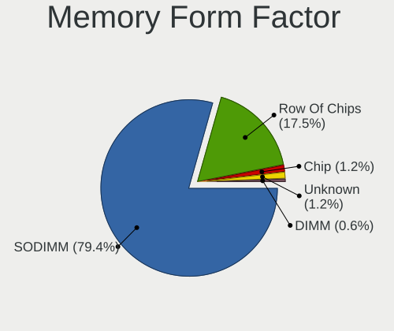

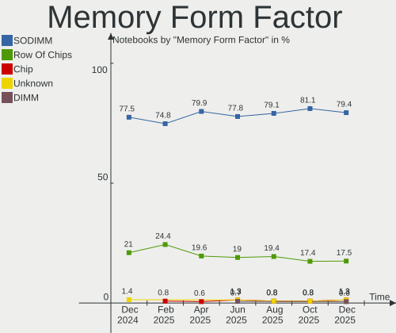

| Name         | Notebooks | Percent |
|--------------|-----------|---------|
| SODIMM       | 127       | 79.38%  |
| Row Of Chips | 28        | 17.5%   |
| Chip         | 2         | 1.25%   |
| Unknown      | 2         | 1.25%   |
| DIMM         | 1         | 0.63%   |

Memory Size
-----------

Memory module size

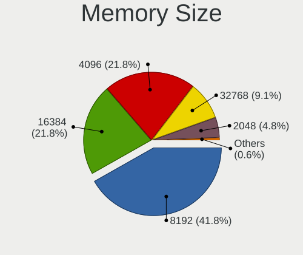

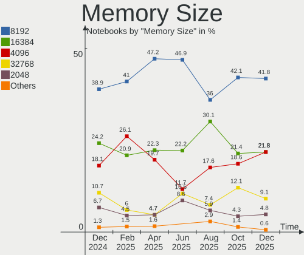

| Size  | Notebooks | Percent |
|-------|-----------|---------|
| 8192  | 69        | 41.82%  |
| 16384 | 36        | 21.82%  |
| 4096  | 36        | 21.82%  |
| 32768 | 15        | 9.09%   |
| 2048  | 8         | 4.85%   |
| 49152 | 1         | 0.61%   |

Memory Speed
------------

Memory module speed

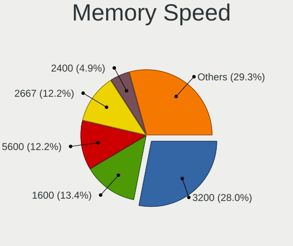

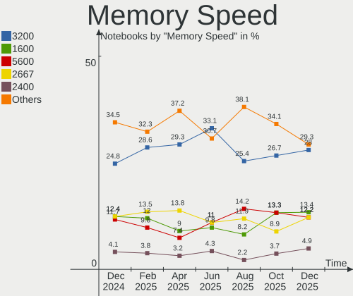

| Speed | Notebooks | Percent |
|-------|-----------|---------|
| 3200  | 46        | 28.05%  |
| 1600  | 22        | 13.41%  |
| 5600  | 20        | 12.2%   |
| 2667  | 20        | 12.2%   |
| 2400  | 8         | 4.88%   |
| 6400  | 6         | 3.66%   |
| 4800  | 6         | 3.66%   |
| 8533  | 5         | 3.05%   |
| 7500  | 5         | 3.05%   |
| 4267  | 5         | 3.05%   |
| 2133  | 4         | 2.44%   |
| 7467  | 2         | 1.22%   |
| 4266  | 2         | 1.22%   |
| 1867  | 2         | 1.22%   |
| 1333  | 2         | 1.22%   |
| 8600  | 1         | 0.61%   |
| 8400  | 1         | 0.61%   |
| 8000  | 1         | 0.61%   |
| 7400  | 1         | 0.61%   |
| 6000  | 1         | 0.61%   |
| 3600  | 1         | 0.61%   |
| 1334  | 1         | 0.61%   |
| 1067  | 1         | 0.61%   |
| 1066  | 1         | 0.61%   |

Printers & scanners
-------------------

Printer Vendor
--------------

Printer device vendors

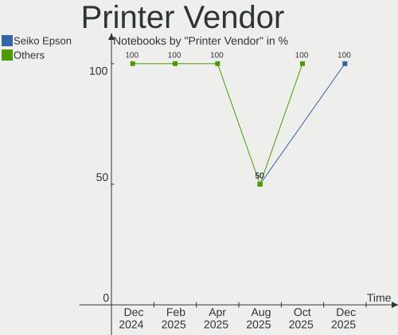

| Vendor      | Notebooks | Percent |
|-------------|-----------|---------|
| Seiko Epson | 1         | 100%    |

Printer Model
-------------

Printer device models

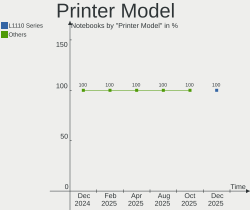

| Model                    | Notebooks | Percent |
|--------------------------|-----------|---------|
| Seiko Epson L1110 Series | 1         | 100%    |

Scanner Vendor
--------------

Scanner device vendors

Zero info for selected period =(

Scanner Model
-------------

Scanner device models

Zero info for selected period =(

Camera
------

Camera Vendor
-------------

Camera device vendors

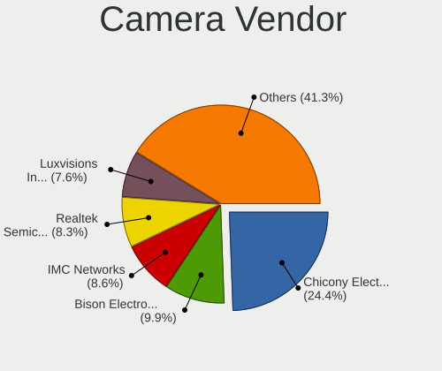

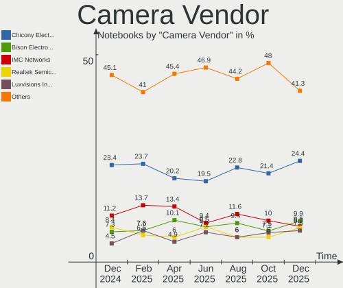

| Vendor                                 | Notebooks | Percent |
|----------------------------------------|-----------|---------|
| Chicony Electronics                    | 74        | 24.42%  |
| Bison Electronics                      | 30        | 9.9%    |
| IMC Networks                           | 26        | 8.58%   |
| Realtek Semiconductor                  | 25        | 8.25%   |
| Luxvisions Innotech Limited            | 23        | 7.59%   |
| Quanta                                 | 16        | 5.28%   |
| Microdia                               | 16        | 5.28%   |
| Syntek                                 | 15        | 4.95%   |
| Sunplus Innovation Technology          | 14        | 4.62%   |
| Shinetech                              | 11        | 3.63%   |
| Apple                                  | 9         | 2.97%   |
| Cheng Uei Precision Industry (Foxlink) | 5         | 1.65%   |
| SunplusIT                              | 4         | 1.32%   |
| Lite-On Technology                     | 4         | 1.32%   |
| Sonix Technology                       | 3         | 0.99%   |
| Logitech                               | 3         | 0.99%   |
| Silicon Motion                         | 2         | 0.66%   |
| Shine-optics                           | 2         | 0.66%   |
| Jiangxi Shinetech Optical              | 2         | 0.66%   |
| Framework                              | 2         | 0.66%   |
| Alcor Micro                            | 2         | 0.66%   |
| USB CAMERA                             | 1         | 0.33%   |
| Tobii Technology AB                    | 1         | 0.33%   |
| Suyin                                  | 1         | 0.33%   |
| Sunplus Technology                     | 1         | 0.33%   |
| SenseTek                               | 1         | 0.33%   |
| Samsung Electronics                    | 1         | 0.33%   |
| Microsoft                              | 1         | 0.33%   |
| Lenovo                                 | 1         | 0.33%   |
| kingcome                               | 1         | 0.33%   |
| Insta360                               | 1         | 0.33%   |
| HYGD-XH--241023                        | 1         | 0.33%   |
| HYGD-220831-A                          | 1         | 0.33%   |
| Hopewin Electronic Material            | 1         | 0.33%   |
| Generalplus Technology                 | 1         | 0.33%   |
| ASUSTek Computer                       | 1         | 0.33%   |

Camera Model
------------

Camera device models

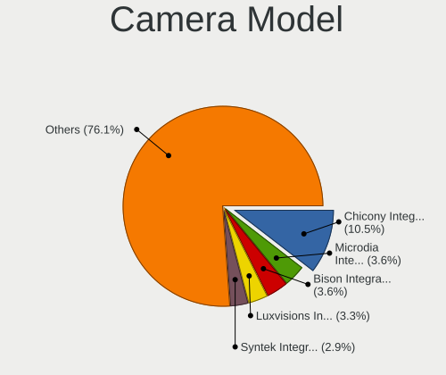

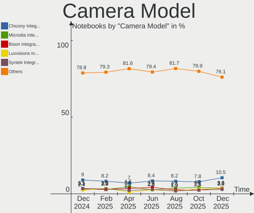

| Model                                               | Notebooks | Percent |
|-----------------------------------------------------|-----------|---------|
| Chicony Integrated Camera                           | 32        | 10.46%  |
| Microdia Integrated_Webcam_HD                       | 11        | 3.59%   |
| Bison Integrated Camera                             | 11        | 3.59%   |
| Luxvisions Innotech Limited Integrated Camera       | 10        | 3.27%   |
| Syntek Integrated Camera                            | 9         | 2.94%   |
| IMC Networks USB2.0 HD UVC WebCam                   | 9         | 2.94%   |
| IMC Networks Integrated Camera                      | 9         | 2.94%   |
| Realtek Integrated_Webcam_HD                        | 6         | 1.96%   |
| Chicony HD WebCam                                   | 6         | 1.96%   |
| Syntek Integrated RGB Camera                        | 4         | 1.31%   |
| Shinetech ASUS FHD webcam                           | 4         | 1.31%   |
| Realtek Integrated_Webcam_FHD                       | 4         | 1.31%   |
| Realtek Integrated Webcam                           | 4         | 1.31%   |
| IMC Networks USB2.0 VGA UVC WebCam                  | 4         | 1.31%   |
| Chicony HP HD Camera                                | 4         | 1.31%   |
| Bison Integrated RGB Camera                         | 4         | 1.31%   |
| Sunplus Integrated_Webcam_FHD                       | 3         | 0.98%   |
| ShineTech USB2.0 HD UVC WebCam                      | 3         | 0.98%   |
| Shinetech USB2.0 FHD UVC WebCam                     | 3         | 0.98%   |
| Luxvisions Innotech Limited Integrated RGB Camera   | 3         | 0.98%   |
| Luxvisions Innotech Limited HP 5MP Camera           | 3         | 0.98%   |
| Lite-On Integrated Camera                           | 3         | 0.98%   |
| Chicony Integrated Camera (1280x720@30)             | 3         | 0.98%   |
| Chicony HP Truevision HD camera                     | 3         | 0.98%   |
| Chicony HP Truevision HD                            | 3         | 0.98%   |
| Bison HD Webcam                                     | 3         | 0.98%   |
| Apple iPhone 5/5C/5S/6/SE/7/8/X                     | 3         | 0.98%   |
| Apple FaceTime HD Camera                            | 3         | 0.98%   |
| Sunplus USB 2.0 Camera                              | 2         | 0.65%   |
| Sunplus Integrated_Webcam_HD                        | 2         | 0.65%   |
| Sunplus Integrated Camera                           | 2         | 0.65%   |
| Sonix USB2.0 FHD UVC WebCam                         | 2         | 0.65%   |
| Shine-optics USB2.0 HD UVC WebCam                   | 2         | 0.65%   |
| Realtek USB2.0 VGA UVC WebCam                       | 2         | 0.65%   |
| Realtek HD WebCam                                   | 2         | 0.65%   |
| Quanta HP True Vision HD Camera                     | 2         | 0.65%   |
| Quanta HD Webcam                                    | 2         | 0.65%   |
| Luxvisions Innotech Limited HP TrueVision HD Camera | 2         | 0.65%   |
| Logitech C920 PRO HD Webcam                         | 2         | 0.65%   |
| Jiangxi Shinetech Optical 720p HD Camera            | 2         | 0.65%   |

Security
--------

Fingerprint Vendor
------------------

Fingerprint sensor vendors

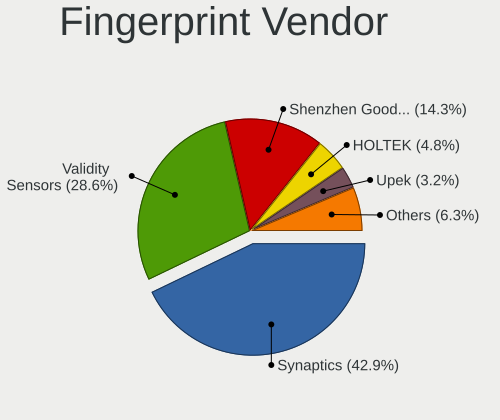

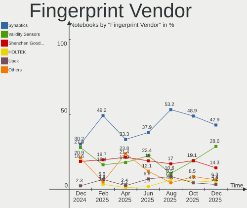

| Vendor                     | Notebooks | Percent |
|----------------------------|-----------|---------|
| Synaptics                  | 27        | 42.86%  |
| Validity Sensors           | 18        | 28.57%  |
| Shenzhen Goodix Technology | 9         | 14.29%  |
| HOLTEK                     | 3         | 4.76%   |
| Upek                       | 2         | 3.17%   |
| LighTuning Technology      | 2         | 3.17%   |
| Elan Microelectronics      | 2         | 3.17%   |

Fingerprint Model
-----------------

Fingerprint sensor models

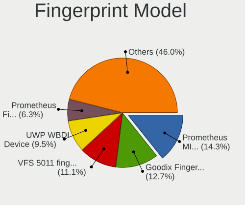

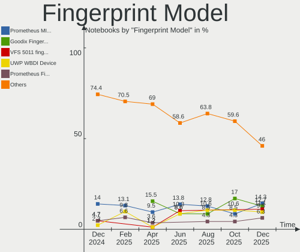

| Model                                                                      | Notebooks | Percent |
|----------------------------------------------------------------------------|-----------|---------|
| Synaptics Prometheus MIS Touch Fingerprint Reader                          | 9         | 14.29%  |
| Shenzhen Goodix  Fingerprint Device                                        | 8         | 12.7%   |
| Validity Sensors VFS 5011 fingerprint sensor                               | 7         | 11.11%  |
| Synaptics UWP WBDI Device                                                  | 6         | 9.52%   |
| Synaptics Prometheus Fingerprint Reader                                    | 4         | 6.35%   |
| Validity Sensors Synaptics VFS7552 Touch Fingerprint Sensor with PurePrint | 3         | 4.76%   |
| Synaptics FS7604 Touch Fingerprint Sensor with PurePrint                   | 3         | 4.76%   |
| Synaptics Fingerprint reader [HP G6]                                       | 3         | 4.76%   |
| HOLTEK FocalTech Fingerprint Device                                        | 3         | 4.76%   |
| Validity Sensors VFS491                                                    | 2         | 3.17%   |
| Validity Sensors Swipe Fingerprint Sensor                                  | 2         | 3.17%   |
| Upek Biometric Touchchip/Touchstrip Fingerprint Sensor                     | 2         | 3.17%   |
| Synaptics Metallica MIS Touch Fingerprint Reader                           | 2         | 3.17%   |
| Elan ELAN:ARM-M4                                                           | 2         | 3.17%   |
| Validity Sensors VFS7500 Touch Fingerprint Sensor                          | 1         | 1.59%   |
| Validity Sensors VFS5011 Fingerprint Reader                                | 1         | 1.59%   |
| Validity Sensors VFS471 Fingerprint Reader                                 | 1         | 1.59%   |
| Validity Sensors Synaptics WBDI                                            | 1         | 1.59%   |
| Shenzhen Goodix Fingerprint Reader                                         | 1         | 1.59%   |
| LighTuning ES603 Swipe Fingerprint Sensor                                  | 1         | 1.59%   |
| LighTuning EgisTec Touch Fingerprint Sensor                                | 1         | 1.59%   |

Chipcard Vendor
---------------

Chipcard module vendors

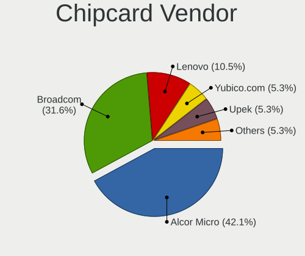

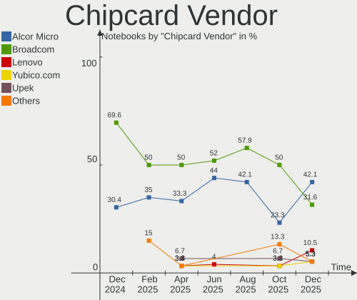

| Vendor      | Notebooks | Percent |
|-------------|-----------|---------|
| Alcor Micro | 8         | 42.11%  |
| Broadcom    | 6         | 31.58%  |
| Lenovo      | 2         | 10.53%  |
| Yubico.com  | 1         | 5.26%   |
| Upek        | 1         | 5.26%   |
| O2 Micro    | 1         | 5.26%   |

Chipcard Model
--------------

Chipcard module models

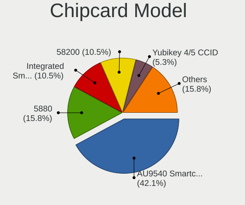

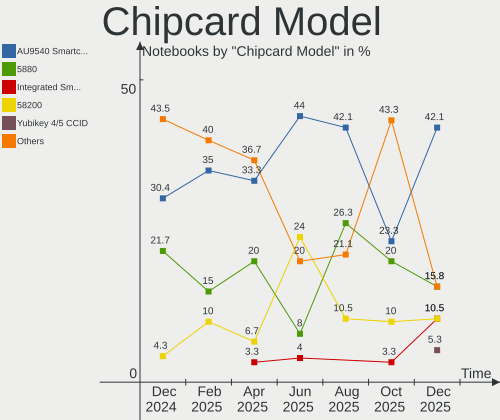

| Model                                                                        | Notebooks | Percent |
|------------------------------------------------------------------------------|-----------|---------|
| Alcor Micro AU9540 Smartcard Reader                                          | 8         | 42.11%  |
| Broadcom 5880                                                                | 3         | 15.79%  |
| Lenovo Integrated Smart Card Reader                                          | 2         | 10.53%  |
| Broadcom 58200                                                               | 2         | 10.53%  |
| Yubico.com Yubikey 4/5 CCID                                                  | 1         | 5.26%   |
| Upek TouchChip Fingerprint Coprocessor (WBF advanced mode)                   | 1         | 5.26%   |
| O2 Micro OZ776 CCID Smartcard Reader                                         | 1         | 5.26%   |
| Broadcom BCM5880 Secure Applications Processor with fingerprint swipe sensor | 1         | 5.26%   |

Unsupported
-----------

Unsupported Devices
-------------------

Total unsupported devices on board

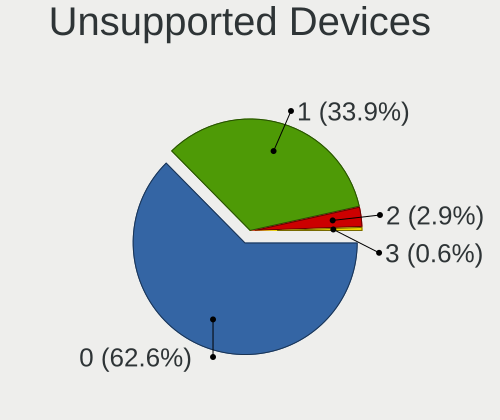

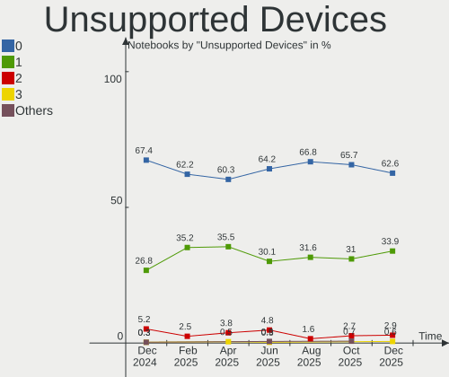

| Total | Notebooks | Percent |
|-------|-----------|---------|
| 0     | 216       | 62.61%  |
| 1     | 117       | 33.91%  |
| 2     | 10        | 2.9%    |
| 3     | 2         | 0.58%   |

Unsupported Device Types
------------------------

Types of unsupported devices

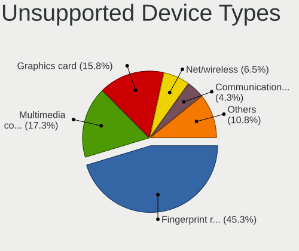

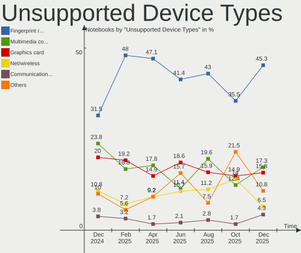

| Type                     | Notebooks | Percent |
|--------------------------|-----------|---------|
| Fingerprint reader       | 63        | 45.32%  |
| Multimedia controller    | 24        | 17.27%  |
| Graphics card            | 22        | 15.83%  |
| Net/wireless             | 9         | 6.47%   |
| Communication controller | 6         | 4.32%   |
| Chipcard                 | 5         | 3.6%    |
| Net/ethernet             | 3         | 2.16%   |
| Sound                    | 2         | 1.44%   |
| Modem                    | 2         | 1.44%   |
| Card reader              | 1         | 0.72%   |
| Camera                   | 1         | 0.72%   |
| Bluetooth                | 1         | 0.72%   |

