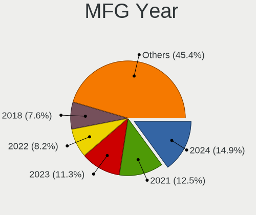

Fedora Hardware Trends (Notebook)
---------------------------------

A project to identify most popular hardware characteristics and track their change
over time based on data collected by Fedora users at https://Linux-Hardware.org.

Anyone can contribute to the study by uploading probes of their computers by
the [hw-probe](https://github.com/linuxhw/hw-probe) tool:

    sudo hw-probe -all -upload

Full-feature report is available here: https://linux-hardware.org/?view=trends&formfactor=notebook

Period: Apr, 2020.

Contents
--------

- [ OS                       ](#os)
- [ OS Family                ](#os-family)
- [ Kernel                   ](#kernel)
- [ Kernel Family            ](#kernel-family)
- [ Kernel Major Ver.        ](#kernel-major-ver)
- [ Arch                     ](#arch)
- [ DE                       ](#de)
- [ Display Server           ](#display-server)
- [ Display Manager          ](#display-manager)
- [ OS Lang                  ](#os-lang)
- [ Boot Mode                ](#boot-mode)
- [ Filesystem               ](#filesystem)
- [ Dual Boot with Linux/BSD ](#dual-boot-with-linux/bsd)
- [ Dual Boot (Win)          ](#dual-boot-win)
- [ Country                  ](#country)
- [ City                     ](#city)
- [ Vendor                   ](#vendor)
- [ Model                    ](#model)
- [ Model Family             ](#model-family)
- [ MFG Year                 ](#mfg-year)
- [ Form Factor              ](#form-factor)
- [ Secure Boot              ](#secure-boot)
- [ Coreboot                 ](#coreboot)
- [ RAM Size                 ](#ram-size)
- [ RAM Used                 ](#ram-used)
- [ Drive Vendor             ](#drive-vendor)
- [ Drive Model              ](#drive-model)
- [ Drive Kind               ](#drive-kind)
- [ Drive Connector          ](#drive-connector)
- [ Drive Size               ](#drive-size)
- [ Space Total              ](#space-total)
- [ Space Used               ](#space-used)
- [ Malfunc. Drives          ](#malfunc-drives)
- [ Malfunc. Drive Vendor    ](#malfunc-drive-vendor)
- [ Malfunc. Drive Kind      ](#malfunc-drive-kind)
- [ Failed Drives            ](#failed-drives)
- [ Failed Drive Vendor      ](#failed-drive-vendor)
- [ Drive Status             ](#drive-status)
- [ Storage Vendor           ](#storage-vendor)
- [ Storage Model            ](#storage-model)
- [ Storage Kind             ](#storage-kind)
- [ CPU Vendor               ](#cpu-vendor)
- [ CPU Model                ](#cpu-model)
- [ CPU Model Family         ](#cpu-model-family)
- [ CPU Cores                ](#cpu-cores)
- [ CPU Sockets              ](#cpu-sockets)
- [ CPU Threads              ](#cpu-threads)
- [ CPU Op-Modes             ](#cpu-op-modes)
- [ CPU Microarch            ](#cpu-microarch)
- [ CPU Microcode            ](#cpu-microcode)
- [ GPU Vendor               ](#gpu-vendor)
- [ GPU Model                ](#gpu-model)
- [ GPU Combo                ](#gpu-combo)
- [ GPU Driver               ](#gpu-driver)
- [ GPU Memory               ](#gpu-memory)
- [ Monitor Vendor           ](#monitor-vendor)
- [ Monitor Model            ](#monitor-model)
- [ Monitor Resolution       ](#monitor-resolution)
- [ Monitor Diagonal         ](#monitor-diagonal)
- [ Monitor Width            ](#monitor-width)
- [ Aspect Ratio             ](#aspect-ratio)
- [ Monitor Area             ](#monitor-area)
- [ Pixel Density            ](#pixel-density)
- [ Multiple Monitors        ](#multiple-monitors)
- [ Net Controller Vendor    ](#net-controller-vendor)
- [ Net Controller Model     ](#net-controller-model)
- [ Net Controller Kind      ](#net-controller-kind)
- [ Used Controller          ](#used-controller)
- [ NICs                     ](#nics)
- [ Unsupported Devices      ](#unsupported-devices)
- [ Unsupported Device Types ](#unsupported-device-types)

OS
--

Installed operating systems

| Name      | Computers | Percent |
|-----------|-----------|---------|
| Fedora 31 | 88        | 73.33%  |
| Fedora 32 | 26        | 21.67%  |
| Fedora 30 | 3         | 2.5%    |
| Fedora 29 | 1         | 0.83%   |
| Fedora 28 | 1         | 0.83%   |
| Fedora 21 | 1         | 0.83%   |

OS Family
---------

OS without a version

| Name   | Computers | Percent |
|--------|-----------|---------|
| Fedora | 120       | 100%    |

Kernel
------

Version of the Linux kernel

| Version                        | Computers | Percent |
|--------------------------------|-----------|---------|
| 5.5.15-200.fc31.x86_64         | 26        | 21.67%  |
| 5.5.17-200.fc31.x86_64         | 17        | 14.17%  |
| 5.5.13-200.fc31.x86_64         | 9         | 7.5%    |
| 5.6.6-200.fc31.x86_64          | 8         | 6.67%   |
| 5.5.11-200.fc31.x86_64         | 8         | 6.67%   |
| 5.6.7-300.fc32.x86_64          | 6         | 5%      |
| 5.5.16-200.fc31.x86_64         | 6         | 5%      |
| 5.6.3-300.fc32.x86_64          | 5         | 4.17%   |
| 5.6.6-300.fc32.x86_64          | 4         | 3.33%   |
| 5.3.7-301.fc31.x86_64          | 4         | 3.33%   |
| 5.6.0-300.fc32.x86_64          | 3         | 2.5%    |
| 5.6.4-300.fc32.x86_64          | 2         | 1.67%   |
| 5.6.2-300.fc32.x86_64          | 2         | 1.67%   |
| 5.6.0-0.rc7.git0.2.fc32.x86_64 | 2         | 1.67%   |
| 5.5.10-100.fc30.x86_64         | 2         | 1.67%   |
| 5.6.7-200.fc31.x86_64          | 1         | 0.83%   |
| 5.6.3-300.fc31.x86_64          | 1         | 0.83%   |
| 5.6.2-301.fc32.x86_64          | 1         | 0.83%   |
| 5.6.0-0.rc5.git0.2.fc32.x86_64 | 1         | 0.83%   |
| 5.5.9-200.fc31.x86_64          | 1         | 0.83%   |
| 5.5.9-100.fc30.x86_64          | 1         | 0.83%   |
| 5.5.7-200.fc31.x86_64          | 1         | 0.83%   |
| 5.5.18-200.fc31.x86_64         | 1         | 0.83%   |
| 5.5.14-200.fc31.x86_64         | 1         | 0.83%   |
| 5.5.10-200.fc31.x86_64         | 1         | 0.83%   |
| 5.4.17-200.fc31.x86_64         | 1         | 0.83%   |
| 5.4.10-200.fc31.x86_64         | 1         | 0.83%   |
| 5.3.13-300.fc31.x86_64         | 1         | 0.83%   |
| 5.3.11-100.fc29.x86_64         | 1         | 0.83%   |
| 4.20.16-100.fc28.x86_64        | 1         | 0.83%   |
| 4.1.13-100.fc21.x86_64         | 1         | 0.83%   |

Kernel Family
-------------

Linux kernel without a distro release

| Version | Computers | Percent |
|---------|-----------|---------|
| 5.5.15  | 26        | 21.67%  |
| 5.5.17  | 17        | 14.17%  |
| 5.6.6   | 12        | 10%     |
| 5.5.13  | 9         | 7.5%    |
| 5.5.11  | 8         | 6.67%   |
| 5.6.7   | 7         | 5.83%   |
| 5.6.3   | 6         | 5%      |
| 5.6.0   | 6         | 5%      |
| 5.5.16  | 6         | 5%      |
| 5.3.7   | 4         | 3.33%   |
| 5.6.2   | 3         | 2.5%    |
| 5.5.10  | 3         | 2.5%    |
| 5.6.4   | 2         | 1.67%   |
| 5.5.9   | 2         | 1.67%   |
| 5.5.7   | 1         | 0.83%   |
| 5.5.18  | 1         | 0.83%   |
| 5.5.14  | 1         | 0.83%   |
| 5.4.17  | 1         | 0.83%   |
| 5.4.10  | 1         | 0.83%   |
| 5.3.13  | 1         | 0.83%   |
| 5.3.11  | 1         | 0.83%   |
| 4.20.16 | 1         | 0.83%   |
| 4.1.13  | 1         | 0.83%   |

Kernel Major Ver.
-----------------

Linux kernel major version

| Version | Computers | Percent |
|---------|-----------|---------|
| 5.5     | 74        | 61.67%  |
| 5.6     | 36        | 30%     |
| 5.3     | 6         | 5%      |
| 5.4     | 2         | 1.67%   |
| 4.20    | 1         | 0.83%   |
| 4.1     | 1         | 0.83%   |

Arch
----

OS architecture (x86_64, i586, etc.)

| Name   | Computers | Percent |
|--------|-----------|---------|
| x86_64 | 120       | 100%    |

DE
--

Desktop Environment

| Name       | Computers | Percent |
|------------|-----------|---------|
| GNOME      | 94        | 78.33%  |
| KDE5       | 9         | 7.5%    |
| KDE        | 5         | 4.17%   |
| XFCE       | 3         | 2.5%    |
| X-Cinnamon | 2         | 1.67%   |
| MATE       | 2         | 1.67%   |
| Cinnamon   | 2         | 1.67%   |
| Unknown    | 2         | 1.67%   |
| KDE4       | 1         | 0.83%   |

Display Server
--------------

X11 or Wayland

| Name    | Computers | Percent |
|---------|-----------|---------|
| Wayland | 72        | 60%     |
| X11     | 42        | 35%     |
| Tty     | 4         | 3.33%   |
| Unknown | 2         | 1.67%   |

Display Manager
---------------

SDDM, LightDM, etc.

| Name    | Computers | Percent |
|---------|-----------|---------|
| Unknown | 63        | 52.5%   |
| GDM     | 46        | 38.33%  |
| LightDM | 6         | 5%      |
| SDDM    | 5         | 4.17%   |

OS Lang
-------

Language

| Lang       | Computers | Percent |
|------------|-----------|---------|
| en_US      | 68        | 56.67%  |
| en_GB      | 8         | 6.67%   |
| it_IT      | 6         | 5%      |
| fr_FR      | 6         | 5%      |
| pt_BR      | 4         | 3.33%   |
| de_DE      | 3         | 2.5%    |
| uk_UA      | 2         | 1.67%   |
| pl_PL      | 2         | 1.67%   |
| es_ES      | 2         | 1.67%   |
| en_AU      | 2         | 1.67%   |
| cs_CZ      | 2         | 1.67%   |
| Unknown    | 2         | 1.67%   |
| zh_CN      | 1         | 0.83%   |
| sk_SK      | 1         | 0.83%   |
| ru_RU      | 1         | 0.83%   |
| nl_NL      | 1         | 0.83%   |
| nb_NO      | 1         | 0.83%   |
| it_IT.utf8 | 1         | 0.83%   |
| es_AR      | 1         | 0.83%   |
| en_US.utf8 | 1         | 0.83%   |
| en_PH      | 1         | 0.83%   |
| en_IN      | 1         | 0.83%   |
| en_IL      | 1         | 0.83%   |
| en_GB.utf8 | 1         | 0.83%   |
| de_AT      | 1         | 0.83%   |

Boot Mode
---------

EFI or BIOS

| Mode | Computers | Percent |
|------|-----------|---------|
| EFI  | 86        | 71.67%  |
| BIOS | 34        | 28.33%  |

Filesystem
----------

Type of filesystem

| Type  | Computers | Percent |
|-------|-----------|---------|
| Ext4  | 109       | 90.83%  |
| Xfs   | 10        | 8.33%   |
| Btrfs | 1         | 0.83%   |

Dual Boot with Linux/BSD
------------------------

Hosting more than one Linux/BSD

| Dual boot | Computers | Percent |
|-----------|-----------|---------|
| No        | 109       | 90.83%  |
| Yes       | 11        | 9.17%   |

Dual Boot (Win)
---------------

Hosting Linux and Windows

| Dual boot | Computers | Percent |
|-----------|-----------|---------|
| No        | 103       | 85.83%  |
| Yes       | 17        | 14.17%  |

Country
-------

Geographic location (country)

| Country        | Computers | Percent |
|----------------|-----------|---------|
| USA            | 21        | 17.5%   |
| Germany        | 10        | 8.33%   |
| France         | 10        | 8.33%   |
| Brazil         | 9         | 7.5%    |
| Italy          | 8         | 6.67%   |
| Canada         | 6         | 5%      |
| Netherlands    | 5         | 4.17%   |
| India          | 5         | 4.17%   |
| Poland         | 4         | 3.33%   |
| Australia      | 3         | 2.5%    |
| Ukraine        | 2         | 1.67%   |
| UK             | 2         | 1.67%   |
| Russia         | 2         | 1.67%   |
| Finland        | 2         | 1.67%   |
| Czech Republic | 2         | 1.67%   |
| Colombia       | 2         | 1.67%   |
| Turkey         | 1         | 0.83%   |
| Switzerland    | 1         | 0.83%   |
| Spain          | 1         | 0.83%   |
| Slovenia       | 1         | 0.83%   |
| Slovakia       | 1         | 0.83%   |
| Serbia         | 1         | 0.83%   |
| Qatar          | 1         | 0.83%   |
| Portugal       | 1         | 0.83%   |
| Philippines    | 1         | 0.83%   |
| Norway         | 1         | 0.83%   |
| New Zealand    | 1         | 0.83%   |
| Latvia         | 1         | 0.83%   |
| Kenya          | 1         | 0.83%   |
| Jordan         | 1         | 0.83%   |
| Israel         | 1         | 0.83%   |
| Iran           | 1         | 0.83%   |
| Hungary        | 1         | 0.83%   |
| Guam           | 1         | 0.83%   |
| Ethiopia       | 1         | 0.83%   |
| Egypt          | 1         | 0.83%   |
| Ecuador        | 1         | 0.83%   |
| China          | 1         | 0.83%   |
| Bulgaria       | 1         | 0.83%   |
| Belgium        | 1         | 0.83%   |
| Azerbaijan     | 1         | 0.83%   |
| Austria        | 1         | 0.83%   |
| Argentina      | 1         | 0.83%   |

City
----

Geographic location (city)

| City                   | Computers | Percent |
|------------------------|-----------|---------|
| Warsaw                 | 2         | 1.67%   |
| Toronto                | 2         | 1.67%   |
| Raleigh                | 2         | 1.67%   |
| Paris                  | 2         | 1.67%   |
| Madrid                 | 2         | 1.67%   |
| Los Angeles            | 2         | 1.67%   |
| Frankfurt am Main      | 2         | 1.67%   |
| Zurich                 | 1         | 0.83%   |
| Yigo Village           | 1         | 0.83%   |
| Wrocław               | 1         | 0.83%   |
| Wellington             | 1         | 0.83%   |
| Voronezh               | 1         | 0.83%   |
| Vienna                 | 1         | 0.83%   |
| Vidolasco              | 1         | 0.83%   |
| Utrecht                | 1         | 0.83%   |
| Tromsø                | 1         | 0.83%   |
| Tours                  | 1         | 0.83%   |
| The Hague              | 1         | 0.83%   |
| Tempe                  | 1         | 0.83%   |
| São José dos Campos  | 1         | 0.83%   |
| São Bernardo do Campo | 1         | 0.83%   |
| Sugar Land             | 1         | 0.83%   |
| St Helens              | 1         | 0.83%   |
| Spencer                | 1         | 0.83%   |
| Sofia                  | 1         | 0.83%   |
| Schwabach              | 1         | 0.83%   |
| Santiago de Cali       | 1         | 0.83%   |
| Santa Cruz do Sul      | 1         | 0.83%   |
| San Antonio            | 1         | 0.83%   |
| Saint-Eustache         | 1         | 0.83%   |
| Rovon                  | 1         | 0.83%   |
| Round Rock             | 1         | 0.83%   |
| Roubaix                | 1         | 0.83%   |
| Rotterdam              | 1         | 0.83%   |
| Rosemere               | 1         | 0.83%   |
| Roche-la-Moliere       | 1         | 0.83%   |
| Roanoke                | 1         | 0.83%   |
| Riga                   | 1         | 0.83%   |
| Remscheid              | 1         | 0.83%   |
| Quito                  | 1         | 0.83%   |
| Progresso              | 1         | 0.83%   |
| Prague                 | 1         | 0.83%   |
| Pottstown              | 1         | 0.83%   |
| Ponta Grossa           | 1         | 0.83%   |
| Planegg                | 1         | 0.83%   |
| Pignan                 | 1         | 0.83%   |
| Owatonna               | 1         | 0.83%   |
| Nof HaGalil            | 1         | 0.83%   |
| Newton Center          | 1         | 0.83%   |
| New Delhi              | 1         | 0.83%   |
| Nantes                 | 1         | 0.83%   |
| Nairobi                | 1         | 0.83%   |
| Nagercoil              | 1         | 0.83%   |
| Mysore                 | 1         | 0.83%   |
| Mukilteo               | 1         | 0.83%   |
| Moscow                 | 1         | 0.83%   |
| Montclair              | 1         | 0.83%   |
| Monselice              | 1         | 0.83%   |
| Milan                  | 1         | 0.83%   |
| Mersin                 | 1         | 0.83%   |

Vendor
------

Motherboard manufacturer

| Name                   | Computers | Percent |
|------------------------|-----------|---------|
| Dell                   | 36        | 30%     |
| Lenovo                 | 27        | 22.5%   |
| Hewlett-Packard        | 24        | 20%     |
| ASUSTek Computer       | 10        | 8.33%   |
| Toshiba                | 4         | 3.33%   |
| Apple                  | 4         | 3.33%   |
| Acer                   | 4         | 3.33%   |
| Sony                   | 3         | 2.5%    |
| MSI                    | 2         | 1.67%   |
| System76               | 1         | 0.83%   |
| Notebook               | 1         | 0.83%   |
| HUAWEI                 | 1         | 0.83%   |
| Fujitsu                | 1         | 0.83%   |
| Avell High Performance | 1         | 0.83%   |
| Alienware              | 1         | 0.83%   |

Model
-----

Motherboard model

| Name                                     | Computers | Percent |
|------------------------------------------|-----------|---------|
| Dell XPS 15 7590                         | 4         | 3.33%   |
| HP EliteBook 840 G6                      | 3         | 2.5%    |
| Dell XPS 13 7390                         | 3         | 2.5%    |
| Toshiba Satellite C660                   | 2         | 1.67%   |
| Dell XPS 15 9550                         | 2         | 1.67%   |
| Dell XPS 13 9370                         | 2         | 1.67%   |
| Dell XPS 13 9350                         | 2         | 1.67%   |
| Dell Inspiron 5570                       | 2         | 1.67%   |
| Dell Inspiron 5567                       | 2         | 1.67%   |
| Apple MacBookPro12,1                     | 2         | 1.67%   |
| Acer Aspire A515-51G                     | 2         | 1.67%   |
| Toshiba Satellite L50-B                  | 1         | 0.83%   |
| Toshiba Satellite A505                   | 1         | 0.83%   |
| System76 Lemur                           | 1         | 0.83%   |
| Sony VPCEB23FM                           | 1         | 0.83%   |
| Sony VPCCB35FN                           | 1         | 0.83%   |
| Sony SVS1311C5E                          | 1         | 0.83%   |
| Notebook NH55RGQ                         | 1         | 0.83%   |
| MSI GS60 6QD                             | 1         | 0.83%   |
| MSI GE70 0NC                             | 1         | 0.83%   |
| Lenovo XiaoXinPro-13IML 2019 81XB        | 1         | 0.83%   |
| Lenovo V130-15IKB 81HN                   | 1         | 0.83%   |
| Lenovo ThinkPad X240 20AL007SMS          | 1         | 0.83%   |
| Lenovo ThinkPad X230 2325CP0             | 1         | 0.83%   |
| Lenovo ThinkPad X230 2325B14             | 1         | 0.83%   |
| Lenovo ThinkPad X1 Carbon 7th 20QES2P401 | 1         | 0.83%   |
| Lenovo ThinkPad X1 Carbon 6th 20KHCTO1WW | 1         | 0.83%   |
| Lenovo ThinkPad X1 Carbon 3443CTO        | 1         | 0.83%   |
| Lenovo ThinkPad W540 20BHS11M00          | 1         | 0.83%   |
| Lenovo ThinkPad W510 4391A83             | 1         | 0.83%   |
| Lenovo ThinkPad T530 2394EE9             | 1         | 0.83%   |
| Lenovo ThinkPad T480 20L5S1S100          | 1         | 0.83%   |
| Lenovo ThinkPad T470s 20HGS22D1P         | 1         | 0.83%   |
| Lenovo ThinkPad T470 20HEA0TMBR          | 1         | 0.83%   |
| Lenovo ThinkPad T440s 20ARA07500         | 1         | 0.83%   |
| Lenovo ThinkPad T420 4236MBG             | 1         | 0.83%   |
| Lenovo ThinkPad T410 2522PT3             | 1         | 0.83%   |
| Lenovo ThinkPad R61 8934F9U              | 1         | 0.83%   |
| Lenovo ThinkPad P52 20MAS1720C           | 1         | 0.83%   |
| Lenovo ThinkPad P50 20EQS64N0B           | 1         | 0.83%   |
| Lenovo ThinkPad P50 20EN0013US           | 1         | 0.83%   |
| Lenovo ThinkPad P1 Gen 2 20QTCTO1WW      | 1         | 0.83%   |
| Lenovo ThinkPad E480 20KN007XAD          | 1         | 0.83%   |
| Lenovo IdeaPad S340-15API 81NC           | 1         | 0.83%   |
| Lenovo IdeaPad S145-15API 81UT           | 1         | 0.83%   |
| Lenovo IdeaPad 110-15ISK 80UD            | 1         | 0.83%   |
| Lenovo G50-45 80E3                       | 1         | 0.83%   |
| HUAWEI WRT-WX9                           | 1         | 0.83%   |
| HP ZBook 17 G6                           | 1         | 0.83%   |
| HP ZBook 17                              | 1         | 0.83%   |
| HP ZBook 15u G6                          | 1         | 0.83%   |
| HP ZBook 15 G3                           | 1         | 0.83%   |
| HP ProBook 470 G5                        | 1         | 0.83%   |
| HP ProBook 450 G3                        | 1         | 0.83%   |
| HP ProBook 430 G6                        | 1         | 0.83%   |
| HP Pavilion x2 Detachable                | 1         | 0.83%   |
| HP Pavilion Laptop 15-cw1xxx             | 1         | 0.83%   |
| HP Pavilion Laptop 15-cc5xx              | 1         | 0.83%   |
| HP Pavilion Gaming Notebook              | 1         | 0.83%   |
| HP Pavilion Gaming Laptop 15-cx0xxx      | 1         | 0.83%   |

Model Family
------------

Motherboard model prefix

| Name                         | Computers | Percent |
|------------------------------|-----------|---------|
| Lenovo ThinkPad              | 21        | 17.5%   |
| Dell XPS                     | 14        | 11.67%  |
| Dell Inspiron                | 9         | 7.5%    |
| Dell Latitude                | 8         | 6.67%   |
| HP Pavilion                  | 7         | 5.83%   |
| HP EliteBook                 | 6         | 5%      |
| Toshiba Satellite            | 4         | 3.33%   |
| HP ZBook                     | 4         | 3.33%   |
| Lenovo IdeaPad               | 3         | 2.5%    |
| HP ProBook                   | 3         | 2.5%    |
| Acer Aspire                  | 3         | 2.5%    |
| HP 250                       | 2         | 1.67%   |
| Dell Precision               | 2         | 1.67%   |
| Dell G5                      | 2         | 1.67%   |
| Apple MacBookPro12           | 2         | 1.67%   |
| System76 Lemur               | 1         | 0.83%   |
| Sony VPCEB23FM               | 1         | 0.83%   |
| Sony VPCCB35FN               | 1         | 0.83%   |
| Sony SVS1311C5E              | 1         | 0.83%   |
| Notebook NH55RGQ             | 1         | 0.83%   |
| MSI GS60                     | 1         | 0.83%   |
| MSI GE70                     | 1         | 0.83%   |
| Lenovo XiaoXinPro-13IML      | 1         | 0.83%   |
| Lenovo V130-15IKB            | 1         | 0.83%   |
| Lenovo G50-45                | 1         | 0.83%   |
| HUAWEI WRT-WX9               | 1         | 0.83%   |
| HP Laptop                    | 1         | 0.83%   |
| HP ENVY                      | 1         | 0.83%   |
| Fujitsu LIFEBOOK             | 1         | 0.83%   |
| Dell Vostro                  | 1         | 0.83%   |
| Avell High Performance Avell | 1         | 0.83%   |
| ASUS ZenBook                 | 1         | 0.83%   |
| ASUS X555LD                  | 1         | 0.83%   |
| ASUS X550EP                  | 1         | 0.83%   |
| ASUS VivoBook                | 1         | 0.83%   |
| ASUS TUF                     | 1         | 0.83%   |
| ASUS N551VW                  | 1         | 0.83%   |
| ASUS K55VJ                   | 1         | 0.83%   |
| ASUS GL552VW                 | 1         | 0.83%   |
| ASUS G75VW                   | 1         | 0.83%   |
| ASUS B9440UA                 | 1         | 0.83%   |
| Apple MacBookPro8            | 1         | 0.83%   |
| Apple MacBookPro13           | 1         | 0.83%   |
| Alienware 17                 | 1         | 0.83%   |
| Acer Swift                   | 1         | 0.83%   |

MFG Year
--------

Motherboard manufacture year

| Year | Computers | Percent |
|------|-----------|---------|
| 2019 | 43        | 35.83%  |
| 2018 | 20        | 16.67%  |
| 2020 | 17        | 14.17%  |
| 2014 | 8         | 6.67%   |
| 2017 | 6         | 5%      |
| 2011 | 5         | 4.17%   |
| 2010 | 5         | 4.17%   |
| 2016 | 4         | 3.33%   |
| 2013 | 4         | 3.33%   |
| 2012 | 4         | 3.33%   |
| 2015 | 3         | 2.5%    |
| 2007 | 1         | 0.83%   |

Form Factor
-----------

Physical design of the computer

| Name     | Computers | Percent |
|----------|-----------|---------|
| Notebook | 120       | 100%    |

Secure Boot
-----------

Enabled or disabled

| State    | Computers | Percent |
|----------|-----------|---------|
| Disabled | 99        | 82.5%   |
| Enabled  | 21        | 17.5%   |

Coreboot
--------

Have coreboot on board

| Used | Computers | Percent |
|------|-----------|---------|
| No   | 119       | 99.17%  |
| Yes  | 1         | 0.83%   |

RAM Size
--------

Total RAM memory

| Size in GB  | Computers | Percent |
|-------------|-----------|---------|
| 16.01-24.0  | 35        | 29.17%  |
| 4.01-8.0    | 34        | 28.33%  |
| 8.01-16.0   | 19        | 15.83%  |
| 32.01-64.0  | 13        | 10.83%  |
| 3.01-4.0    | 10        | 8.33%   |
| 64.01-256.0 | 5         | 4.17%   |
| 1.01-2.0    | 3         | 2.5%    |
| 24.01-32.0  | 1         | 0.83%   |

RAM Used
--------

Used RAM memory

| Used GB   | Computers | Percent |
|-----------|-----------|---------|
| 2.01-3.0  | 43        | 35.83%  |
| 4.01-8.0  | 27        | 22.5%   |
| 1.01-2.0  | 23        | 19.17%  |
| 8.01-16.0 | 13        | 10.83%  |
| 3.01-4.0  | 11        | 9.17%   |
| 0.01-1.0  | 3         | 2.5%    |

Drive Vendor
------------

Hard drive vendors

| Vendor              | Computers | Drives  | Percent |
|---------------------|-----------|---------|---------|
| Samsung Electronics | 27        | 29      | 21.77%  |
| Toshiba             | 14        | 14      | 11.29%  |
| WDC                 | 13        | 14      | 10.48%  |
| Seagate             | 12        | 12      | 9.68%   |
| SanDisk             | 9         | 10      | 7.26%   |
| HGST                | 9         | 9       | 7.26%   |
| Kingston            | 8         | 9       | 6.45%   |
| Micron Technology   | 5         | 5       | 4.03%   |
| Intel               | 5         | 5       | 4.03%   |
| Crucial             | 4         | 4       | 3.23%   |
| Unknown             | 3         | 4       | 2.42%   |
| A-DATA Technology   | 3         | 3       | 2.42%   |
| SK Hynix            | 2         | 2       | 1.61%   |
| PNY                 | 2         | 2       | 1.61%   |
| Hitachi             | 2         | 2       | 1.61%   |
| Apple               | 2         | 2       | 1.61%   |
| KingSpec            | 1         | 1       | 0.81%   |
| JMicron             | 1         | 1       | 0.81%   |
| HL-DT-ST            | 1         | Unknown | 0.81%   |
| China               | 1         | 1       | 0.81%   |

Drive Model
-----------

Hard drive models

| Model                             | Computers | Percent |
|-----------------------------------|-----------|---------|
| ST1000LM035-1RK172 1TB            | 3         | 2.33%   |
| SSD 850 EVO 500GB                 | 3         | 2.33%   |
| HTS721010A9E630 1TB               | 3         | 2.33%   |
| WD10SPZX-21Z10T0 1TB              | 2         | 1.55%   |
| THNSN5512GPUK NVMe 512GB          | 2         | 1.55%   |
| SV300S37A120G 120GB SSD           | 2         | 1.55%   |
| SSD 850 EVO 250GB                 | 2         | 1.55%   |
| SSD 840 EVO 250GB                 | 2         | 1.55%   |
| MZVLB256HAHQ-000H1 256GB          | 2         | 1.55%   |
| MZ7TD256HAFV-000L9 256GB SSD      | 2         | 1.55%   |
| MQ01ABD100 1TB                    | 2         | 1.55%   |
| HTS545050A7E380 500GB             | 2         | 1.55%   |
| HTS541010B7E610 1TB               | 2         | 1.55%   |
| CS900 120GB SSD                   | 2         | 1.55%   |
| 2200S NVMe 1024GB                 | 2         | 1.55%   |
| X600 M.2 2280 SATA 128GB SSD      | 1         | 0.78%   |
| WDS500G2B0B-00YS70 500GB SSD      | 1         | 0.78%   |
| WDS240G2G0B-00EPW0 240GB SSD      | 1         | 0.78%   |
| WDS100T1B0A-00H9H0 1TB SSD        | 1         | 0.78%   |
| WD5000LPVX-80V0TT0 500GB          | 1         | 0.78%   |
| WD5000LPLX-08ZNTT0 500GB          | 1         | 0.78%   |
| WD10SPZX-24Z10 1TB                | 1         | 0.78%   |
| WD10SPZX-00Z10T0 1TB              | 1         | 0.78%   |
| WD10JPVX-60JC3T0 1TB              | 1         | 0.78%   |
| WD10JPVX-22JC3T0 1TB              | 1         | 0.78%   |
| WD10JPVX-00JC3T0 1TB              | 1         | 0.78%   |
| THNSNJ128GMCU 128GB SSD           | 1         | 0.78%   |
| SV300S37A240G 240GB SSD           | 1         | 0.78%   |
| SU800NS38 128GB SSD               | 1         | 0.78%   |
| SU650 120GB SSD                   | 1         | 0.78%   |
| ST9500420AS 500GB                 | 1         | 0.78%   |
| ST9320423AS 320GB                 | 1         | 0.78%   |
| ST750LM022 HN-M750MBB 752GB       | 1         | 0.78%   |
| ST500LT012-1DG142 500GB           | 1         | 0.78%   |
| ST500LM000-1EJ162-SSHD 500GB      | 1         | 0.78%   |
| ST2000LX001-1RG174 2TB            | 1         | 0.78%   |
| ST2000LM015-2E8174 2TB            | 1         | 0.78%   |
| ST1000LM048-2E7172 1TB            | 1         | 0.78%   |
| ST1000LM014-1EJ164-SSHD 1TB       | 1         | 0.78%   |
| SSM28512GPTCB3B-S114613 512GB SSD | 1         | 0.78%   |
| SSDSC2KW256G8 256GB               | 1         | 0.78%   |
| SSDSC2BW180A3H 180GB              | 1         | 0.78%   |
| SSDPEMKF010T8 NVMe 1024GB         | 1         | 0.78%   |
| SSDPEKKF512G8L 512GB              | 1         | 0.78%   |
| SSDPEKKF256G8 NVMe 256GB          | 1         | 0.78%   |
| SSD SM0256G 256GB                 | 1         | 0.78%   |
| SSD SM0128G 121GB                 | 1         | 0.78%   |
| SSD PLUS 480GB                    | 1         | 0.78%   |
| SSD PLUS 1000GB                   | 1         | 0.78%   |
| SSD 970 PRO 512GB                 | 1         | 0.78%   |
| SSD 970 EVO Plus 1TB              | 1         | 0.78%   |
| SSD 960 EVO 250GB                 | 1         | 0.78%   |
| SSD 860 EVO 250GB                 | 1         | 0.78%   |
| SSD 860 EVO 1TB                   | 1         | 0.78%   |
| SSD 850 EVO mSATA 250GB           | 1         | 0.78%   |
| SSD 850 EVO M.2 500GB             | 1         | 0.78%   |
| SSD 750 EVO 120GB                 | 1         | 0.78%   |
| SP550 120GB SSD                   | 1         | 0.78%   |
| SM2280S3G2480G 480GB SSD          | 1         | 0.78%   |
| SHFS37A240G 240GB SSD             | 1         | 0.78%   |

Drive Kind
----------

HDD or SSD

| Kind    | Computers | Drives  | Percent |
|---------|-----------|---------|---------|
| SSD     | 50        | 59      | 42.37%  |
| HDD     | 39        | 41      | 33.05%  |
| NVMe    | 26        | 26      | 22.03%  |
| MMC     | 2         | 3       | 1.69%   |
| Unknown | 1         | Unknown | 0.85%   |

Drive Connector
---------------

SATA, SAS, NVMe, etc.

| Type | Computers | Drives | Percent |
|------|-----------|--------|---------|
| SATA | 77        | 97     | 70.64%  |
| NVMe | 26        | 26     | 23.85%  |
| SAS  | 4         | 3      | 3.67%   |
| MMC  | 2         | 3      | 1.83%   |

Drive Size
----------

Size of hard drive

| Size in TB | Computers | Drives | Percent |
|------------|-----------|--------|---------|
| 0.01-0.5   | 65        | 74     | 55.08%  |
| 0.51-1.0   | 46        | 48     | 38.98%  |
| 1.01-2.0   | 6         | 6      | 5.08%   |
| 2.01-3.0   | 1         | 1      | 0.85%   |

Space Total
-----------

Amount of disk space available on the file system

| Size in GB     | Computers | Percent |
|----------------|-----------|---------|
| 101-250        | 39        | 32.5%   |
| 251-500        | 34        | 28.33%  |
| 501-1000       | 20        | 16.67%  |
| 1001-2000      | 9         | 7.5%    |
| 51-100         | 8         | 6.67%   |
| 1-20           | 5         | 4.17%   |
| 2001-3000      | 2         | 1.67%   |
| More than 3000 | 1         | 0.83%   |
| 21-50          | 1         | 0.83%   |
| Unknown        | 1         | 0.83%   |

Space Used
----------

Amount of used disk space

| Used GB        | Computers | Percent |
|----------------|-----------|---------|
| 21-50          | 28        | 23.33%  |
| 1-20           | 28        | 23.33%  |
| 51-100         | 21        | 17.5%   |
| 101-250        | 20        | 16.67%  |
| 251-500        | 11        | 9.17%   |
| 501-1000       | 7         | 5.83%   |
| 1001-2000      | 2         | 1.67%   |
| More than 3000 | 1         | 0.83%   |
| 2001-3000      | 1         | 0.83%   |
| Unknown        | 1         | 0.83%   |

Malfunc. Drives
---------------

Drive models with a malfunction

| Model                     | Computers | Drives | Percent |
|---------------------------|-----------|--------|---------|
| SV300S37A120G 120GB SSD   | 1         | 1      | 11.11%  |
| ST9320423AS 320GB         | 1         | 1      | 11.11%  |
| ST500LT012-1DG142 500GB   | 1         | 1      | 11.11%  |
| SD5SG2256G1052E 256GB SSD | 1         | 1      | 11.11%  |
| MK7559GSXP 752GB          | 1         | 1      | 11.11%  |
| MK3275GSX 320GB           | 1         | 1      | 11.11%  |
| HTS545050B9A300 500GB     | 1         | 1      | 11.11%  |
| HTS541075A9E680 752GB     | 1         | 1      | 11.11%  |
| CT525MX300SSD1 528GB      | 1         | 1      | 11.11%  |

Malfunc. Drive Vendor
---------------------

Vendors of faulty drives

| Vendor   | Computers | Drives | Percent |
|----------|-----------|--------|---------|
| Toshiba  | 2         | 2      | 22.22%  |
| Seagate  | 2         | 2      | 22.22%  |
| SanDisk  | 1         | 1      | 11.11%  |
| Kingston | 1         | 1      | 11.11%  |
| Hitachi  | 1         | 1      | 11.11%  |
| HGST     | 1         | 1      | 11.11%  |
| Crucial  | 1         | 1      | 11.11%  |

Malfunc. Drive Kind
-------------------

Kinds of faulty drives

| Kind | Computers | Drives | Percent |
|------|-----------|--------|---------|
| HDD  | 5         | 6      | 62.5%   |
| SSD  | 3         | 3      | 37.5%   |

Failed Drives
-------------

Failed drive models

Zero info for selected period =(

Failed Drive Vendor
-------------------

Failed drive vendors

Zero info for selected period =(

Drive Status
------------

Number of failed and malfunc. drives

| Status   | Computers | Drives | Percent |
|----------|-----------|--------|---------|
| Works    | 51        | 62     | 48.57%  |
| Detected | 46        | 58     | 43.81%  |
| Malfunc  | 8         | 9      | 7.62%   |

Storage Vendor
--------------

Storage controller vendors

| Vendor                       | Computers | Percent |
|------------------------------|-----------|---------|
| Intel                        | 90        | 64.29%  |
| Samsung Electronics          | 18        | 12.86%  |
| Toshiba America Info Systems | 9         | 6.43%   |
| Sandisk                      | 7         | 5%      |
| AMD                          | 6         | 4.29%   |
| Micron Technology            | 5         | 3.57%   |
| SK Hynix                     | 2         | 1.43%   |
| Phison Electronics           | 1         | 0.71%   |
| KIOXIA                       | 1         | 0.71%   |
| Kingston Technology Company  | 1         | 0.71%   |

Storage Model
-------------

Storage controller models

| Model                                                                    | Computers | Percent |
|--------------------------------------------------------------------------|-----------|---------|
| Sunrise Point-LP SATA Controller [AHCI mode]                             | 19        | 13.29%  |
| 7 Series Chipset Family 6-port SATA Controller [AHCI mode]               | 12        | 8.39%   |
| NVMe SSD Controller SM981/PM981/PM983                                    | 10        | 6.99%   |
| Cannon Lake Mobile PCH SATA AHCI Controller                              | 10        | 6.99%   |
| Non-Volatile memory controller                                           | 8         | 5.59%   |
| 82801 Mobile SATA Controller [RAID mode]                                 | 8         | 5.59%   |
| HM170/QM170 Chipset SATA Controller [AHCI Mode]                          | 7         | 4.9%    |
| Toshiba America Info Non-Volatile memory controller                      | 6         | 4.2%    |
| FCH SATA Controller [AHCI mode]                                          | 6         | 4.2%    |
| 6 Series/C200 Series Chipset Family 6 port Mobile SATA AHCI Controller   | 6         | 4.2%    |
| Q170/Q150/B150/H170/H110/Z170/CM236 Chipset SATA Controller [AHCI Mode]  | 5         | 3.5%    |
| 5 Series/3400 Series Chipset 4 port SATA AHCI Controller                 | 5         | 3.5%    |
| WD Black 2018/PC SN520 NVMe SSD                                          | 4         | 2.8%    |
| SSD Pro 7600p/760p/E 6100p Series                                        | 4         | 2.8%    |
| NVMe SSD Controller SM961/PM961                                          | 4         | 2.8%    |
| 8 Series SATA Controller 1 [AHCI mode]                                   | 4         | 2.8%    |
| WD Black 2018/PC SN720 NVMe SSD                                          | 3         | 2.1%    |
| 8 Series/C220 Series Chipset Family 6-port SATA Controller 1 [AHCI mode] | 3         | 2.1%    |
| XG4 NVMe SSD Controller                                                  | 2         | 1.4%    |
| NVMe SSD Controller SM951/PM951                                          | 2         | 1.4%    |
| Electronics SATA controller                                              | 2         | 1.4%    |
| Cannon Point-LP SATA Controller [AHCI Mode]                              | 2         | 1.4%    |
| 5 Series/3400 Series Chipset 6 port SATA AHCI Controller                 | 2         | 1.4%    |
| Wildcat Point-LP SATA Controller [AHCI Mode]                             | 1         | 0.7%    |
| NVMe SSD Optane Series Controller                                        | 1         | 0.7%    |
| Ice Lake-LP SATA Controller [AHCI mode]                                  | 1         | 0.7%    |
| E12 NVMe Controller                                                      | 1         | 0.7%    |
| BG3 NVMe SSD Controller                                                  | 1         | 0.7%    |
| BC501 NVMe Solid State Drive 512GB                                       | 1         | 0.7%    |
| 82801IBM/IEM (ICH9M/ICH9M-E) 4 port SATA Controller [AHCI mode]          | 1         | 0.7%    |
| 82801HM/HEM (ICH8M/ICH8M-E) SATA Controller [AHCI mode]                  | 1         | 0.7%    |
| 82801HM/HEM (ICH8M/ICH8M-E) IDE Controller                               | 1         | 0.7%    |

Storage Kind
------------

Kind of storage controller (IDE, SATA, NVMe, SAS, ...)

| Kind | Computers | Percent |
|------|-----------|---------|
| SATA | 87        | 60.84%  |
| NVMe | 47        | 32.87%  |
| RAID | 8         | 5.59%   |
| IDE  | 1         | 0.7%    |

CPU Vendor
----------

Processor vendors

| Vendor | Computers | Percent |
|--------|-----------|---------|
| Intel  | 112       | 93.33%  |
| AMD    | 8         | 6.67%   |

CPU Model
---------

Processor models

| Model                                         | Computers | Percent |
|-----------------------------------------------|-----------|---------|
| Intel Core i7-6700HQ CPU @ 2.60GHz            | 7         | 5.83%   |
| Intel Core i7-9750H CPU @ 2.60GHz             | 5         | 4.17%   |
| Intel Core i7-8550U CPU @ 1.80GHz             | 4         | 3.33%   |
| Intel Core i7-7500U CPU @ 2.70GHz             | 4         | 3.33%   |
| Intel Core i5-6200U CPU @ 2.30GHz             | 4         | 3.33%   |
| Intel Core i9-9980HK CPU @ 2.40GHz            | 3         | 2.5%    |
| Intel Core i7-8650U CPU @ 1.90GHz             | 3         | 2.5%    |
| Intel Core i7-8565U CPU @ 1.80GHz             | 3         | 2.5%    |
| Intel Core i7-7600U CPU @ 2.80GHz             | 3         | 2.5%    |
| Intel Core i7-3630QM CPU @ 2.40GHz            | 3         | 2.5%    |
| Intel Core i7-10710U CPU @ 1.10GHz            | 3         | 2.5%    |
| Intel Core i5-8265U CPU @ 1.60GHz             | 3         | 2.5%    |
| Intel Core i5-8250U CPU @ 1.60GHz             | 3         | 2.5%    |
| Intel Core i5-7200U CPU @ 2.50GHz             | 3         | 2.5%    |
| Intel Core i7-8850H CPU @ 2.60GHz             | 2         | 1.67%   |
| Intel Core i7-8750H CPU @ 2.20GHz             | 2         | 1.67%   |
| Intel Core i7-8665U CPU @ 1.90GHz             | 2         | 1.67%   |
| Intel Core i7-6820HQ CPU @ 2.70GHz            | 2         | 1.67%   |
| Intel Core i7-4800MQ CPU @ 2.70GHz            | 2         | 1.67%   |
| Intel Core i5-5257U CPU @ 2.70GHz             | 2         | 1.67%   |
| Intel Core i5-4200U CPU @ 1.60GHz             | 2         | 1.67%   |
| Intel Core i5-3320M CPU @ 2.60GHz             | 2         | 1.67%   |
| Intel Core i3-6006U CPU @ 2.00GHz             | 2         | 1.67%   |
| Intel Core i3 CPU M 380 @ 2.53GHz             | 2         | 1.67%   |
| Intel Core i3 CPU M 350 @ 2.27GHz             | 2         | 1.67%   |
| AMD Ryzen 5 2500U with Radeon Vega Mobile Gfx | 2         | 1.67%   |
| AMD Ryzen 3 3200U with Radeon Vega Mobile Gfx | 2         | 1.67%   |
| Intel Xeon CPU E3-1535M v6 @ 3.10GHz          | 1         | 0.83%   |
| Intel Core i7-7820HK CPU @ 2.90GHz            | 1         | 0.83%   |
| Intel Core i7-7700HQ CPU @ 2.80GHz            | 1         | 0.83%   |
| Intel Core i7-7560U CPU @ 2.40GHz             | 1         | 0.83%   |
| Intel Core i7-6600U CPU @ 2.60GHz             | 1         | 0.83%   |
| Intel Core i7-6560U CPU @ 2.20GHz             | 1         | 0.83%   |
| Intel Core i7-5500U CPU @ 2.40GHz             | 1         | 0.83%   |
| Intel Core i7-4702MQ CPU @ 2.20GHz            | 1         | 0.83%   |
| Intel Core i7-4600U CPU @ 2.10GHz             | 1         | 0.83%   |
| Intel Core i7-3720QM CPU @ 2.60GHz            | 1         | 0.83%   |
| Intel Core i7-3610QM CPU @ 2.30GHz            | 1         | 0.83%   |
| Intel Core i7-3520M CPU @ 2.90GHz             | 1         | 0.83%   |
| Intel Core i7-2860QM CPU @ 2.50GHz            | 1         | 0.83%   |
| Intel Core i7-2720QM CPU @ 2.20GHz            | 1         | 0.83%   |
| Intel Core i7-2670QM CPU @ 2.20GHz            | 1         | 0.83%   |
| Intel Core i7-10510U CPU @ 1.80GHz            | 1         | 0.83%   |
| Intel Core i7 CPU Q 820 @ 1.73GHz             | 1         | 0.83%   |
| Intel Core i7 CPU Q 720 @ 1.60GHz             | 1         | 0.83%   |
| Intel Core i5-9300H CPU @ 2.40GHz             | 1         | 0.83%   |
| Intel Core i5-8365U CPU @ 1.60GHz             | 1         | 0.83%   |
| Intel Core i5-8300H CPU @ 2.30GHz             | 1         | 0.83%   |
| Intel Core i5-6300HQ CPU @ 2.30GHz            | 1         | 0.83%   |
| Intel Core i5-4310U CPU @ 2.00GHz             | 1         | 0.83%   |
| Intel Core i5-4210U CPU @ 1.70GHz             | 1         | 0.83%   |
| Intel Core i5-3427U CPU @ 1.80GHz             | 1         | 0.83%   |
| Intel Core i5-3230M CPU @ 2.60GHz             | 1         | 0.83%   |
| Intel Core i5-3210M CPU @ 2.50GHz             | 1         | 0.83%   |
| Intel Core i5-2540M CPU @ 2.60GHz             | 1         | 0.83%   |
| Intel Core i5-2430M CPU @ 2.40GHz             | 1         | 0.83%   |
| Intel Core i5-2410M CPU @ 2.30GHz             | 1         | 0.83%   |
| Intel Core i5-1035G1 CPU @ 1.00GHz            | 1         | 0.83%   |
| Intel Core i5 CPU M 540 @ 2.53GHz             | 1         | 0.83%   |
| Intel Core i3-7100U CPU @ 2.40GHz             | 1         | 0.83%   |

CPU Model Family
----------------

Processor model prefix

| Model            | Computers | Percent |
|------------------|-----------|---------|
| Intel Core i7    | 62        | 51.67%  |
| Intel Core i5    | 33        | 27.5%   |
| Intel Core i3    | 10        | 8.33%   |
| Intel Core i9    | 3         | 2.5%    |
| AMD Ryzen 5      | 3         | 2.5%    |
| Intel Core 2 Duo | 2         | 1.67%   |
| AMD Ryzen 3      | 2         | 1.67%   |
| Intel Xeon       | 1         | 0.83%   |
| Intel Atom       | 1         | 0.83%   |
| AMD Ryzen 7      | 1         | 0.83%   |
| AMD A6           | 1         | 0.83%   |
| AMD A4           | 1         | 0.83%   |

CPU Cores
---------

Number of processor cores

| Number | Computers | Percent |
|--------|-----------|---------|
| 4      | 56        | 46.67%  |
| 2      | 49        | 40.83%  |
| 6      | 12        | 10%     |
| 8      | 3         | 2.5%    |

CPU Sockets
-----------

Number of sockets

| Number | Computers | Percent |
|--------|-----------|---------|
| 1      | 120       | 100%    |

CPU Threads
-----------

Threads per core (Hyper-Threading)

| Number | Computers | Percent |
|--------|-----------|---------|
| 2      | 113       | 94.17%  |
| 1      | 7         | 5.83%   |

CPU Op-Modes
------------

CPU Operation Modes (32-bit, 64-bit)

| Op mode        | Computers | Percent |
|----------------|-----------|---------|
| 32-bit, 64-bit | 120       | 100%    |

CPU Microarch
-------------

Microarchitecture

| Name        | Computers | Percent |
|-------------|-----------|---------|
| Skylake     | 66        | 55%     |
| IvyBridge   | 11        | 9.17%   |
| SandyBridge | 8         | 6.67%   |
| Haswell     | 8         | 6.67%   |
| Westmere    | 5         | 4.17%   |
| KabyLake    | 5         | 4.17%   |
| Zen+        | 3         | 2.5%    |
| Zen         | 3         | 2.5%    |
| Broadwell   | 3         | 2.5%    |
| Nehalem     | 2         | 1.67%   |
| Core        | 2         | 1.67%   |
| Silvermont  | 1         | 0.83%   |
| Puma        | 1         | 0.83%   |
| Jaguar      | 1         | 0.83%   |
| Icelake     | 1         | 0.83%   |

CPU Microcode
-------------

Microcode number

| Number     | Computers | Percent |
|------------|-----------|---------|
| 0x306a9    | 11        | 9.17%   |
| 0x906ea    | 10        | 8.33%   |
| 0x806e9    | 10        | 8.33%   |
| 0x806ea    | 9         | 7.5%    |
| 0x506e3    | 9         | 7.5%    |
| 0x206a7    | 8         | 6.67%   |
| 0x806ec    | 7         | 5.83%   |
| 0x406e3    | 7         | 5.83%   |
| Unknown    | 7         | 5.83%   |
| 0x40651    | 5         | 4.17%   |
| 0xa0660    | 3         | 2.5%    |
| 0x906ed    | 3         | 2.5%    |
| 0x906e9    | 3         | 2.5%    |
| 0x806eb    | 3         | 2.5%    |
| 0x306d4    | 3         | 2.5%    |
| 0x306c3    | 3         | 2.5%    |
| 0x20655    | 3         | 2.5%    |
| 0x08108102 | 3         | 2.5%    |
| 0x20652    | 2         | 1.67%   |
| 0x106e5    | 2         | 1.67%   |
| 0x0810100b | 2         | 1.67%   |
| 0x706e5    | 1         | 0.83%   |
| 0x406c3    | 1         | 0.83%   |
| 0x1067a    | 1         | 0.83%   |
| 0x10676    | 1         | 0.83%   |
| 0x08101007 | 1         | 0.83%   |
| 0x07030105 | 1         | 0.83%   |
| 0x0700010f | 1         | 0.83%   |

GPU Vendor
----------

Vendors of graphics cards

| Vendor | Computers | Percent |
|--------|-----------|---------|
| Intel  | 100       | 60.98%  |
| Nvidia | 41        | 25%     |
| AMD    | 23        | 14.02%  |

GPU Model
---------

Graphics card models

| Model                                                                             | Computers | Percent |
|-----------------------------------------------------------------------------------|-----------|---------|
| HD Graphics 620                                                                   | 12        | 7.23%   |
| UHD Graphics 630 (Mobile)                                                         | 11        | 6.63%   |
| UHD Graphics 620                                                                  | 10        | 6.02%   |
| UHD Graphics 620 (Whiskey Lake)                                                   | 9         | 5.42%   |
| 3rd Gen Core processor Graphics Controller                                        | 9         | 5.42%   |
| HD Graphics 530                                                                   | 8         | 4.82%   |
| 2nd Generation Core Processor Family Integrated Graphics Controller               | 7         | 4.22%   |
| Skylake GT2 [HD Graphics 520]                                                     | 6         | 3.61%   |
| Haswell-ULT Integrated Graphics Controller                                        | 5         | 3.01%   |
| Core Processor Integrated Graphics Controller                                     | 5         | 3.01%   |
| UHD Graphics                                                                      | 4         | 2.41%   |
| TU117M [GeForce GTX 1650 Mobile / Max-Q]                                          | 4         | 2.41%   |
| Topaz XT [Radeon R7 M260/M265 / M340/M360 / M440/M445 / 530/535 / 620/625 Mobile] | 4         | 2.41%   |
| GP107M [GeForce GTX 1050 Ti Mobile]                                               | 4         | 2.41%   |
| GM107M [GeForce GTX 960M]                                                         | 4         | 2.41%   |
| Whistler [Radeon HD 6630M/6650M/6750M/7670M/7690M]                                | 3         | 1.81%   |
| Raven Ridge [Radeon Vega Series / Radeon Vega Mobile Series]                      | 3         | 1.81%   |
| Picasso                                                                           | 3         | 1.81%   |
| GM108M [GeForce MX130]                                                            | 3         | 1.81%   |
| TU117GLM [Quadro T1000 Mobile]                                                    | 2         | 1.2%    |
| Sun XT [Radeon HD 8670A/8670M/8690M / R5 M330 / M430 / Radeon 520 Mobile]         | 2         | 1.2%    |
| Lexa PRO [Radeon 540/540X/550/550X / RX 540X/550/550X]                            | 2         | 1.2%    |
| Iris Graphics 6100                                                                | 2         | 1.2%    |
| HD Graphics 630                                                                   | 2         | 1.2%    |
| GM107GLM [Quadro M1000M]                                                          | 2         | 1.2%    |
| GK107M [GeForce GTX 660M]                                                         | 2         | 1.2%    |
| 4th Gen Core Processor Integrated Graphics Controller                             | 2         | 1.2%    |
| Whistler [Radeon HD 6730M/6770M/7690M XT]                                         | 1         | 0.6%    |
| TU116M [GeForce GTX 1660 Ti Mobile]                                               | 1         | 0.6%    |
| Thames [Radeon HD 7550M/7570M/7650M]                                              | 1         | 0.6%    |
| Park [Mobility Radeon HD 5430/5450/5470]                                          | 1         | 0.6%    |
| Mullins [Radeon R4/R5 Graphics]                                                   | 1         | 0.6%    |
| Mobile GM965/GL960 Integrated Graphics Controller (secondary)                     | 1         | 0.6%    |
| Mobile GM965/GL960 Integrated Graphics Controller (primary)                       | 1         | 0.6%    |
| Mobile 4 Series Chipset Integrated Graphics Controller                            | 1         | 0.6%    |
| Lexa XT [Radeon PRO WX 3200]                                                      | 1         | 0.6%    |
| Kabini [Radeon HD 8330]                                                           | 1         | 0.6%    |
| Iris Plus Graphics G1 (Ice Lake)                                                  | 1         | 0.6%    |
| Iris Plus Graphics 640                                                            | 1         | 0.6%    |
| Iris Graphics 540                                                                 | 1         | 0.6%    |
| HD Graphics 5500                                                                  | 1         | 0.6%    |
| HD Graphics 520                                                                   | 1         | 0.6%    |
| GT216M [GeForce GT 330M]                                                          | 1         | 0.6%    |
| GT216GLM [Quadro FX 880M]                                                         | 1         | 0.6%    |
| GP108M [GeForce MX250]                                                            | 1         | 0.6%    |
| GP107M [GeForce GTX 1050 Mobile]                                                  | 1         | 0.6%    |
| GP107M [GeForce GTX 1050 3 GB Max-Q]                                              | 1         | 0.6%    |
| GP107GLM [Quadro P1000 Mobile]                                                    | 1         | 0.6%    |
| GP104GLM [Quadro P4000 Mobile]                                                    | 1         | 0.6%    |
| GP104BM [GeForce GTX 1080 Mobile]                                                 | 1         | 0.6%    |
| GM206M [GeForce GTX 965M]                                                         | 1         | 0.6%    |
| GM108M [GeForce 930MX]                                                            | 1         | 0.6%    |
| GM107M [GeForce GTX 950M]                                                         | 1         | 0.6%    |
| GK106M [GeForce GTX 760M]                                                         | 1         | 0.6%    |
| GK106GLM [Quadro K2100M]                                                          | 1         | 0.6%    |
| GK104GLM [Quadro K3100M]                                                          | 1         | 0.6%    |
| GF117M [GeForce 610M/710M/810M/820M / GT 620M/625M/630M/720M]                     | 1         | 0.6%    |
| GF108M [NVS 5400M]                                                                | 1         | 0.6%    |
| GF108M [GeForce GT 635M]                                                          | 1         | 0.6%    |
| GF108GLM [NVS 5200M]                                                              | 1         | 0.6%    |

GPU Combo
---------

Combinations of graphics cards

| Name           | Computers | Percent |
|----------------|-----------|---------|
| 1 x Intel      | 57        | 47.5%   |
| Intel + Nvidia | 29        | 24.17%  |
| Intel + AMD    | 13        | 10.83%  |
| 1 x Nvidia     | 11        | 9.17%   |
| 1 x AMD        | 8         | 6.67%   |
| 2 x AMD        | 1         | 0.83%   |
| AMD + Nvidia   | 1         | 0.83%   |

GPU Driver
----------

Free vs proprietary

| Driver      | Computers | Percent |
|-------------|-----------|---------|
| Free        | 100       | 83.33%  |
| Proprietary | 16        | 13.33%  |
| Unknown     | 4         | 3.33%   |

GPU Memory
----------

Total video memory

| Size in GB | Computers | Percent |
|------------|-----------|---------|
| Unknown    | 72        | 60%     |
| 1.01-2.0   | 24        | 20%     |
| 3.01-4.0   | 11        | 9.17%   |
| 0.51-1.0   | 8         | 6.67%   |
| 0.01-0.5   | 3         | 2.5%    |
| 7.01-8.0   | 1         | 0.83%   |
| 5.01-6.0   | 1         | 0.83%   |

Monitor Vendor
--------------

Monitor vendors

| Vendor                  | Computers | Percent |
|-------------------------|-----------|---------|
| AU Optronics            | 26        | 17.81%  |
| BOE                     | 22        | 15.07%  |
| Samsung Electronics     | 17        | 11.64%  |
| LG Display              | 17        | 11.64%  |
| Chimei Innolux          | 15        | 10.27%  |
| Sharp                   | 9         | 6.16%   |
| Chi Mei Optoelectronics | 7         | 4.79%   |
| Hewlett-Packard         | 5         | 3.42%   |
| Dell                    | 5         | 3.42%   |
| Lenovo                  | 3         | 2.05%   |
| BenQ                    | 3         | 2.05%   |
| Apple                   | 3         | 2.05%   |
| Acer                    | 3         | 2.05%   |
| AOC                     | 2         | 1.37%   |
| ViewSonic               | 1         | 0.68%   |
| Toshiba                 | 1         | 0.68%   |
| Sony                    | 1         | 0.68%   |
| RTK                     | 1         | 0.68%   |
| Philips                 | 1         | 0.68%   |
| PANDA                   | 1         | 0.68%   |
| InfoVision              | 1         | 0.68%   |
| Iiyama                  | 1         | 0.68%   |
| Goldstar                | 1         | 0.68%   |

Monitor Model
-------------

Monitor models

| Model                                             | Computers | Percent |
|---------------------------------------------------|-----------|---------|
| Color LCD SDCA029 2160x1440 252x168mm 11.9-inch   | 4         | 2.7%    |
| LCD Monitor AUO38ED 1920x1080 340x190mm 15.3-inch | 3         | 2.03%   |
| U2412M DELA07A 1920x1200 518x324mm 24.1-inch      | 2         | 1.35%   |
| LCD Monitor SHP1484 1920x1080 294x165mm 13.3-inch | 2         | 1.35%   |
| LCD Monitor SHP144A 3200x1800 294x165mm 13.3-inch | 2         | 1.35%   |
| LCD Monitor LGD046D 1920x1080 309x174mm 14.0-inch | 2         | 1.35%   |
| LCD Monitor LGD03A3 1366x768 277x156mm 12.5-inch  | 2         | 1.35%   |
| LCD Monitor CMO1720 1920x1080 382x215mm 17.3-inch | 2         | 1.35%   |
| LCD Monitor CMN15C4 1920x1080 344x193mm 15.5-inch | 2         | 1.35%   |
| LCD Monitor BOE0812 1920x1080 344x194mm 15.5-inch | 2         | 1.35%   |
| LCD Monitor BOE06A5 1366x768 344x194mm 15.5-inch  | 2         | 1.35%   |
| LCD Monitor BOE0672 1366x768 344x194mm 15.5-inch  | 2         | 1.35%   |
| LCD Monitor AUO61ED 1920x1080 340x190mm 15.3-inch | 2         | 1.35%   |
| LCD Monitor AUO5B2D 1920x1080 293x162mm 13.2-inch | 2         | 1.35%   |
| Z27 HPN3535 3840x2160 597x336mm 27.0-inch         | 1         | 0.68%   |
| Z23n HWP3284 1920x1080 509x286mm 23.0-inch        | 1         | 0.68%   |
| VX2433wm VSC3822 1920x1080 520x290mm 23.4-inch    | 1         | 0.68%   |
| Ultra HD GSM5B09 3840x2160 600x340mm 27.2-inch    | 1         | 0.68%   |
| U2520D DELA14C 2560x1440 553x311mm 25.0-inch      | 1         | 0.68%   |
| U2515H DELD070 2560x1440 553x311mm 25.0-inch      | 1         | 0.68%   |
| TV TSB0206 1920x1080 886x498mm 40.0-inch          | 1         | 0.68%   |
| TV SNYEE01 1920x1080 1600x900mm 72.3-inch         | 1         | 0.68%   |
| S27D390 SAM0B67 1920x1080 600x340mm 27.2-inch     | 1         | 0.68%   |
| S24F350 SAM0D20 1920x1080 521x293mm 23.5-inch     | 1         | 0.68%   |
| S24C230 SAM0A85 1920x1080 521x293mm 23.5-inch     | 1         | 0.68%   |
| RTD Monitor RTK2A3B 1920x1080 510x290mm 23.1-inch | 1         | 0.68%   |
| Q3279WG5B AOC3279 2560x1440 725x428mm 33.1-inch   | 1         | 0.68%   |
| PL2282H IVM5625 1920x1080 477x268mm 21.5-inch     | 1         | 0.68%   |
| P2419H DELD0D9 1920x1080 527x296mm 23.8-inch      | 1         | 0.68%   |
| P2314H DEL409A 1920x1080 509x286mm 23.0-inch      | 1         | 0.68%   |
| P130ZDZ-EF1 CMN8201 2160x1440 275x183mm 13.0-inch | 1         | 0.68%   |
| LCD Monitor SHP14AD 3840x2160 294x165mm 13.3-inch | 1         | 0.68%   |
| LCD Monitor SHP1453 1920x1080 346x194mm 15.6-inch | 1         | 0.68%   |
| LCD Monitor SHP1450 3840x2160 350x190mm 15.7-inch | 1         | 0.68%   |
| LCD Monitor SHP1449 1920x1080 294x165mm 13.3-inch | 1         | 0.68%   |
| LCD Monitor SHP143E 3840x2160 346x194mm 15.6-inch | 1         | 0.68%   |
| LCD Monitor SEC5842 1366x768 309x174mm 14.0-inch  | 1         | 0.68%   |
| LCD Monitor SEC5541 1366x768 344x193mm 15.5-inch  | 1         | 0.68%   |
| LCD Monitor SEC5448 1920x1080 344x194mm 15.5-inch | 1         | 0.68%   |
| LCD Monitor SEC5441 1366x768 344x194mm 15.5-inch  | 1         | 0.68%   |
| LCD Monitor SEC3041 1366x768 353x198mm 15.9-inch  | 1         | 0.68%   |
| LCD Monitor SDC5844 1920x1080 344x194mm 15.5-inch | 1         | 0.68%   |
| LCD Monitor SDC5344 1920x1080 344x194mm 15.5-inch | 1         | 0.68%   |
| LCD Monitor SDC4146 1366x768 344x194mm 15.5-inch  | 1         | 0.68%   |
| LCD Monitor SAM07C0 1920x1080 700x390mm 31.5-inch | 1         | 0.68%   |
| LCD Monitor SAM04FD 1920x1080                     | 1         | 0.68%   |
| LCD Monitor NCP0035 1920x1080 309x174mm 14.0-inch | 1         | 0.68%   |
| LCD Monitor LGD05E5 1920x1080 344x194mm 15.5-inch | 1         | 0.68%   |
| LCD Monitor LGD053F 1920x1080 344x194mm 15.5-inch | 1         | 0.68%   |
| LCD Monitor LGD0521 1920x1080 309x174mm 14.0-inch | 1         | 0.68%   |
| LCD Monitor LGD04A7 1920x1080 340x190mm 15.3-inch | 1         | 0.68%   |
| LCD Monitor LGD046F 1920x1080 344x194mm 15.5-inch | 1         | 0.68%   |
| LCD Monitor LGD045C 1366x768 350x190mm 15.7-inch  | 1         | 0.68%   |
| LCD Monitor LGD040A 1920x1080 310x170mm 13.9-inch | 1         | 0.68%   |
| LCD Monitor LGD03ED 1366x768 277x156mm 12.5-inch  | 1         | 0.68%   |
| LCD Monitor LGD0382 1600x900 310x170mm 13.9-inch  | 1         | 0.68%   |
| LCD Monitor LGD02FC 1920x1080 380x210mm 17.1-inch | 1         | 0.68%   |
| LCD Monitor LGD02E3 1366x768 344x194mm 15.5-inch  | 1         | 0.68%   |
| LCD Monitor LGD02DC 1366x768 344x194mm 15.5-inch  | 1         | 0.68%   |
| LCD Monitor LGD01E9 1920x1080 345x194mm 15.6-inch | 1         | 0.68%   |

Monitor Resolution
------------------

Monitor screen resolution

| Resolution        | Computers | Percent |
|-------------------|-----------|---------|
| 1920x1080 (FHD)   | 64        | 48.12%  |
| 1366x768 (WXGA)   | 30        | 22.56%  |
| 3840x2160 (4K)    | 12        | 9.02%   |
| 2560x1440 (QHD)   | 5         | 3.76%   |
| 1600x900 (HD+)    | 5         | 3.76%   |
| 2560x1600         | 3         | 2.26%   |
| 1280x800 (WXGA)   | 3         | 2.26%   |
| 3200x1800 (QHD+)  | 2         | 1.5%    |
| 1920x1200 (WUXGA) | 2         | 1.5%    |
| 1280x1024 (SXGA)  | 2         | 1.5%    |
| 2880x1800         | 1         | 0.75%   |
| 2160x1440         | 1         | 0.75%   |
| 1440x900 (WXGA+)  | 1         | 0.75%   |
| 1360x768          | 1         | 0.75%   |
| 1280x720 (HD)     | 1         | 0.75%   |

Monitor Diagonal
----------------

Diagonal size in inches

| Inches  | Computers | Percent |
|---------|-----------|---------|
| 15      | 62        | 42.18%  |
| 13      | 26        | 17.69%  |
| 14      | 16        | 10.88%  |
| 23      | 10        | 6.8%    |
| 17      | 8         | 5.44%   |
| 27      | 4         | 2.72%   |
| 21      | 4         | 2.72%   |
| 12      | 4         | 2.72%   |
| 24      | 3         | 2.04%   |
| 25      | 2         | 1.36%   |
| 74      | 1         | 0.68%   |
| 72      | 1         | 0.68%   |
| 40      | 1         | 0.68%   |
| 33      | 1         | 0.68%   |
| 31      | 1         | 0.68%   |
| 19      | 1         | 0.68%   |
| 10      | 1         | 0.68%   |
| Unknown | 1         | 0.68%   |

Monitor Width
-------------

Physical width

| Width in mm | Computers | Percent |
|-------------|-----------|---------|
| 301-350     | 89        | 61.38%  |
| 201-300     | 20        | 13.79%  |
| 501-600     | 17        | 11.72%  |
| 351-400     | 9         | 6.21%   |
| 401-500     | 4         | 2.76%   |
| 1501-2000   | 2         | 1.38%   |
| 801-900     | 1         | 0.69%   |
| 701-800     | 1         | 0.69%   |
| 601-700     | 1         | 0.69%   |
| Unknown     | 1         | 0.69%   |

Aspect Ratio
------------

Proportional relationship between the width and the height

| Ratio | Computers | Percent |
|-------|-----------|---------|
| 16/9  | 108       | 88.52%  |
| 16/10 | 11        | 9.02%   |
| 5/4   | 2         | 1.64%   |
| 3/2   | 1         | 0.82%   |

Monitor Area
------------

Area in inch²

| Area in inch² | Computers | Percent |
|----------------|-----------|---------|
| 101-110        | 62        | 41.89%  |
| 81-90          | 26        | 17.57%  |
| 71-80          | 16        | 10.81%  |
| 201-250        | 10        | 6.76%   |
| 121-130        | 8         | 5.41%   |
| 251-300        | 5         | 3.38%   |
| 151-200        | 5         | 3.38%   |
| 61-70          | 4         | 2.7%    |
| 301-350        | 4         | 2.7%    |
| More than 1000 | 2         | 1.35%   |
| 351-500        | 2         | 1.35%   |
| 41-50          | 1         | 0.68%   |
| 141-150        | 1         | 0.68%   |
| 501-1000       | 1         | 0.68%   |
| Unknown        | 1         | 0.68%   |

Pixel Density
-------------

Pixels per inch

| Density       | Computers | Percent |
|---------------|-----------|---------|
| 121-160       | 62        | 43.36%  |
| 101-120       | 34        | 23.78%  |
| 51-100        | 18        | 12.59%  |
| 161-240       | 15        | 10.49%  |
| More than 240 | 11        | 7.69%   |
| 1-50          | 2         | 1.4%    |
| Unknown       | 1         | 0.7%    |

Multiple Monitors
-----------------

Total monitors connected

| Total | Computers | Percent |
|-------|-----------|---------|
| 1     | 88        | 73.33%  |
| 2     | 24        | 20%     |
| 3     | 5         | 4.17%   |
| 0     | 3         | 2.5%    |

Net Controller Vendor
---------------------

Controller vendors

| Vendor                            | Computers | Percent |
|-----------------------------------|-----------|---------|
| Intel                             | 29        | 58%     |
| Realtek Semiconductor             | 9         | 18%     |
| Hewlett-Packard                   | 3         | 6%      |
| Ericsson Business Mobile Networks | 3         | 6%      |
| TP-Link                           | 1         | 2%      |
| Samsung Electronics               | 1         | 2%      |
| Lenovo                            | 1         | 2%      |
| Huawei Technologies               | 1         | 2%      |
| DisplayLink                       | 1         | 2%      |
| ASIX Electronics                  | 1         | 2%      |

Net Controller Model
--------------------

Controller models

| Model                                                              | Computers | Percent |
|--------------------------------------------------------------------|-----------|---------|
| Wi-Fi 6 AX200                                                      | 13        | 22.03%  |
| RTL8153 Gigabit Ethernet Adapter                                   | 9         | 15.25%  |
| 82579LM Gigabit Network Connection (Lewisville)                    | 7         | 11.86%  |
| Centrino Advanced-N 6205 [Taylor Peak]                             | 6         | 10.17%  |
| Wireless 8265 / 8275                                               | 3         | 5.08%   |
| Centrino Advanced-N 6200                                           | 3         | 5.08%   |
| L830-EB                                                            | 2         | 3.39%   |
| H5321 gw Mobile Broadband Driver                                   | 2         | 3.39%   |
| Centrino Ultimate-N 6300                                           | 2         | 3.39%   |
| 82577LM Gigabit Network Connection                                 | 2         | 3.39%   |
| ThinkPad USB 3.0 Dock                                              | 1         | 1.69%   |
| ThinkPad TBT 3 Dock                                                | 1         | 1.69%   |
| RTL8153 TP-Link UE300 USB 10/100/1000 LAN                          | 1         | 1.69%   |
| N5321 gw                                                           | 1         | 1.69%   |
| hs2350 HSPA+ MobileBroadband                                       | 1         | 1.69%   |
| GT-I9500 [Galaxy S4] / GT-I9250 [Galaxy Nexus] (network tethering) | 1         | 1.69%   |
| E398 LTE/UMTS/GSM Modem/Networkcard                                | 1         | 1.69%   |
| Centrino Advanced-N 6235                                           | 1         | 1.69%   |
| AX88179 Gigabit Ethernet                                           | 1         | 1.69%   |
| 82579V Gigabit Network Connection                                  | 1         | 1.69%   |

Net Controller Kind
-------------------

Ethernet, WiFi or modem

| Kind     | Computers | Percent |
|----------|-----------|---------|
| WiFi     | 29        | 51.79%  |
| Ethernet | 22        | 39.29%  |
| Unknown  | 3         | 5.36%   |
| Modem    | 2         | 3.57%   |

Used Controller
---------------

Currently used network controller

| Kind     | Computers | Percent |
|----------|-----------|---------|
| WiFi     | 25        | 73.53%  |
| Ethernet | 9         | 26.47%  |

NICs
----

Total network controllers on board

| Total | Computers | Percent |
|-------|-----------|---------|
| 2     | 89        | 74.17%  |
| 1     | 31        | 25.83%  |

Unsupported Devices
-------------------

Total unsupported devices on board

| Total | Computers | Percent |
|-------|-----------|---------|
| 0     | 71        | 59.17%  |
| 1     | 42        | 35%     |
| 2     | 6         | 5%      |
| 3     | 1         | 0.83%   |

Unsupported Device Types
------------------------

Types of unsupported devices

| Type                     | Computers | Percent |
|--------------------------|-----------|---------|
| Fingerprint reader       | 30        | 55.56%  |
| Chipcard                 | 8         | 14.81%  |
| Graphics card            | 6         | 11.11%  |
| Multimedia controller    | 5         | 9.26%   |
| Net/wireless             | 2         | 3.7%    |
| Storage                  | 1         | 1.85%   |
| Communication controller | 1         | 1.85%   |
| Camera                   | 1         | 1.85%   |

