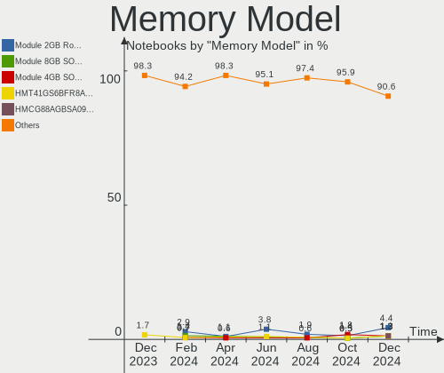

Fedora Hardware Trends (Notebooks)
----------------------------------

A project to identify most popular hardware characteristics and track their change
over time based on data collected by Fedora users at https://Linux-Hardware.org.

Anyone can contribute to this report by the [hw-probe](https://github.com/linuxhw/hw-probe) tool:

    sudo -E hw-probe -all -upload

Full-feature report is available here: https://linux-hardware.org/?view=trends

Period: Jan, 2022.

Contents
--------

* [ System ](#system)
  - [ OS                       ](#os)
  - [ OS Family                ](#os-family)
  - [ Kernel                   ](#kernel)
  - [ Kernel Family            ](#kernel-family)
  - [ Kernel Major Ver.        ](#kernel-major-ver)
  - [ Arch                     ](#arch)
  - [ DE                       ](#de)
  - [ Display Server           ](#display-server)
  - [ Display Manager          ](#display-manager)
  - [ OS Lang                  ](#os-lang)
  - [ Boot Mode                ](#boot-mode)
  - [ Filesystem               ](#filesystem)
  - [ Part. scheme             ](#part-scheme)
  - [ Dual Boot with Linux/BSD ](#dual-boot-with-linuxbsd)
  - [ Dual Boot (Win)          ](#dual-boot-win)

* [ Board ](#board)
  - [ Vendor                   ](#vendor)
  - [ Model                    ](#model)
  - [ Model Family             ](#model-family)
  - [ MFG Year                 ](#mfg-year)
  - [ Form Factor              ](#form-factor)
  - [ Secure Boot              ](#secure-boot)
  - [ Coreboot                 ](#coreboot)
  - [ RAM Size                 ](#ram-size)
  - [ RAM Used                 ](#ram-used)
  - [ Total Drives             ](#total-drives)
  - [ Has CD-ROM               ](#has-cd-rom)
  - [ Has Ethernet             ](#has-ethernet)
  - [ Has WiFi                 ](#has-wifi)
  - [ Has Bluetooth            ](#has-bluetooth)

* [ Location ](#location)
  - [ Country                  ](#country)
  - [ City                     ](#city)

* [ Drives ](#drives)
  - [ Drive Vendor             ](#drive-vendor)
  - [ Drive Model              ](#drive-model)
  - [ HDD Vendor               ](#hdd-vendor)
  - [ SSD Vendor               ](#ssd-vendor)
  - [ Drive Kind               ](#drive-kind)
  - [ Drive Connector          ](#drive-connector)
  - [ Drive Size               ](#drive-size)
  - [ Space Total              ](#space-total)
  - [ Space Used               ](#space-used)
  - [ Malfunc. Drives          ](#malfunc-drives)
  - [ Malfunc. Drive Vendor    ](#malfunc-drive-vendor)
  - [ Malfunc. HDD Vendor      ](#malfunc-hdd-vendor)
  - [ Malfunc. Drive Kind      ](#malfunc-drive-kind)
  - [ Failed Drives            ](#failed-drives)
  - [ Failed Drive Vendor      ](#failed-drive-vendor)
  - [ Drive Status             ](#drive-status)

* [ Storage controller ](#storage-controller)
  - [ Storage Vendor           ](#storage-vendor)
  - [ Storage Model            ](#storage-model)
  - [ Storage Kind             ](#storage-kind)

* [ Processor ](#processor)
  - [ CPU Vendor               ](#cpu-vendor)
  - [ CPU Model                ](#cpu-model)
  - [ CPU Model Family         ](#cpu-model-family)
  - [ CPU Cores                ](#cpu-cores)
  - [ CPU Sockets              ](#cpu-sockets)
  - [ CPU Threads              ](#cpu-threads)
  - [ CPU Op-Modes             ](#cpu-op-modes)
  - [ CPU Microcode            ](#cpu-microcode)
  - [ CPU Microarch            ](#cpu-microarch)

* [ Graphics ](#graphics)
  - [ GPU Vendor               ](#gpu-vendor)
  - [ GPU Model                ](#gpu-model)
  - [ GPU Combo                ](#gpu-combo)
  - [ GPU Driver               ](#gpu-driver)
  - [ GPU Memory               ](#gpu-memory)

* [ Monitor ](#monitor)
  - [ Monitor Vendor           ](#monitor-vendor)
  - [ Monitor Model            ](#monitor-model)
  - [ Monitor Resolution       ](#monitor-resolution)
  - [ Monitor Diagonal         ](#monitor-diagonal)
  - [ Monitor Width            ](#monitor-width)
  - [ Aspect Ratio             ](#aspect-ratio)
  - [ Monitor Area             ](#monitor-area)
  - [ Pixel Density            ](#pixel-density)
  - [ Multiple Monitors        ](#multiple-monitors)

* [ Network ](#network)
  - [ Net Controller Vendor    ](#net-controller-vendor)
  - [ Net Controller Model     ](#net-controller-model)
  - [ Wireless Vendor          ](#wireless-vendor)
  - [ Wireless Model           ](#wireless-model)
  - [ Ethernet Vendor          ](#ethernet-vendor)
  - [ Ethernet Model           ](#ethernet-model)
  - [ Net Controller Kind      ](#net-controller-kind)
  - [ Used Controller          ](#used-controller)
  - [ NICs                     ](#nics)
  - [ IPv6                     ](#ipv6)

* [ Bluetooth ](#bluetooth)
  - [ Bluetooth Vendor         ](#bluetooth-vendor)
  - [ Bluetooth Model          ](#bluetooth-model)

* [ Sound ](#sound)
  - [ Sound Vendor             ](#sound-vendor)
  - [ Sound Model              ](#sound-model)

* [ Memory ](#memory)
  - [ Memory Vendor            ](#memory-vendor)
  - [ Memory Model             ](#memory-model)
  - [ Memory Kind              ](#memory-kind)
  - [ Memory Form Factor       ](#memory-form-factor)
  - [ Memory Size              ](#memory-size)
  - [ Memory Speed             ](#memory-speed)

* [ Printers & scanners ](#printers--scanners)
  - [ Printer Vendor           ](#printer-vendor)
  - [ Printer Model            ](#printer-model)
  - [ Scanner Vendor           ](#scanner-vendor)
  - [ Scanner Model            ](#scanner-model)

* [ Camera ](#camera)
  - [ Camera Vendor            ](#camera-vendor)
  - [ Camera Model             ](#camera-model)

* [ Security ](#security)
  - [ Fingerprint Vendor       ](#fingerprint-vendor)
  - [ Fingerprint Model        ](#fingerprint-model)
  - [ Chipcard Vendor          ](#chipcard-vendor)
  - [ Chipcard Model           ](#chipcard-model)

* [ Unsupported ](#unsupported)
  - [ Unsupported Devices      ](#unsupported-devices)
  - [ Unsupported Device Types ](#unsupported-device-types)

System
------

OS
--

Installed operating systems

| Name      | Notebooks | Percent |
|-----------|-----------|---------|
| Fedora 35 | 127       | 86.99%  |
| Fedora 34 | 14        | 9.59%   |
| Fedora 36 | 1         | 0.68%   |
| Fedora 33 | 1         | 0.68%   |
| Fedora 32 | 1         | 0.68%   |
| Fedora 31 | 1         | 0.68%   |
| Fedora 21 | 1         | 0.68%   |

OS Family
---------

OS without a version

| Name   | Notebooks | Percent |
|--------|-----------|---------|
| Fedora | 146       | 100%    |

Kernel
------

Version of the Linux kernel

| Version                                                       | Notebooks | Percent |
|---------------------------------------------------------------|-----------|---------|
| 5.15.12-200.fc35.x86_64                                       | 39        | 26.71%  |
| 5.15.16-200.fc35.x86_64                                       | 22        | 15.07%  |
| 5.15.14-200.fc35.x86_64                                       | 16        | 10.96%  |
| 5.15.13-200.fc35.x86_64                                       | 16        | 10.96%  |
| 5.15.15-200.fc35.x86_64                                       | 6         | 4.11%   |
| 5.15.12-100.fc34.x86_64                                       | 5         | 3.42%   |
| 5.15.17-200.fc35.x86_64                                       | 3         | 2.05%   |
| 5.15.11-200.fc35.x86_64                                       | 3         | 2.05%   |
| 5.15.10-200.fc35.x86_64                                       | 3         | 2.05%   |
| 5.14.10-300.fc35.x86_64                                       | 3         | 2.05%   |
| 5.11.12-300.fc34.x86_64                                       | 3         | 2.05%   |
| 5.14.18-300.fc35.x86_64                                       | 2         | 1.37%   |
| 5.8.18-100.fc31.x86_64                                        | 1         | 0.68%   |
| 5.16.2-200.fc35.x86_64                                        | 1         | 0.68%   |
| 5.16.1-xm1.0.fc35.x86_64                                      | 1         | 0.68%   |
| 5.16.0-0.rc7.20211231git4f3d93c6eaff.52.vanilla.1.fc36.x86_64 | 1         | 0.68%   |
| 5.16.0-0.rc7.20211231git4f3d93c6eaff.52.vanilla.1.fc35.x86_64 | 1         | 0.68%   |
| 5.15.8-200.rog.fc35.x86_64                                    | 1         | 0.68%   |
| 5.15.8-100.fc34.x86_64                                        | 1         | 0.68%   |
| 5.15.7-200.fc35.x86_64                                        | 1         | 0.68%   |
| 5.15.6-200.fc35.x86_64                                        | 1         | 0.68%   |
| 5.15.15-200.rog.fc35.x86_64                                   | 1         | 0.68%   |
| 5.15.15-100.fc34.x86_64                                       | 1         | 0.68%   |
| 5.15.13-lqx1.0.fc35.x86_64                                    | 1         | 0.68%   |
| 5.15.13-250.vanilla.1.fc35.x86_64                             | 1         | 0.68%   |
| 5.15.13-100.fc34.x86_64                                       | 1         | 0.68%   |
| 5.15.12-250.vanilla.1.fc35.x86_64                             | 1         | 0.68%   |
| 5.15.11-100.fc34.x86_64                                       | 1         | 0.68%   |
| 5.14.9-200.fc34.x86_64                                        | 1         | 0.68%   |
| 5.14.18-200.fc34.x86_64                                       | 1         | 0.68%   |
| 5.14.16-301.fc35.x86_64                                       | 1         | 0.68%   |
| 5.14.11-300.fc35.x86_64                                       | 1         | 0.68%   |
| 5.13.7-100.fc33.x86_64                                        | 1         | 0.68%   |
| 5.13.19-200.fc34.x86_64                                       | 1         | 0.68%   |
| 5.11.22-100.fc32.x86_64                                       | 1         | 0.68%   |
| 5.10.93-xm1.0.fc35.x86_64                                     | 1         | 0.68%   |
| 4.1.13-100.fc21.x86_64                                        | 1         | 0.68%   |

Kernel Family
-------------

Linux kernel without a distro release

| Version | Notebooks | Percent |
|---------|-----------|---------|
| 5.15.12 | 45        | 30.82%  |
| 5.15.16 | 22        | 15.07%  |
| 5.15.13 | 19        | 13.01%  |
| 5.15.14 | 16        | 10.96%  |
| 5.15.15 | 8         | 5.48%   |
| 5.15.11 | 4         | 2.74%   |
| 5.15.17 | 3         | 2.05%   |
| 5.15.10 | 3         | 2.05%   |
| 5.14.18 | 3         | 2.05%   |
| 5.14.10 | 3         | 2.05%   |
| 5.11.12 | 3         | 2.05%   |
| 5.16.0  | 2         | 1.37%   |
| 5.15.8  | 2         | 1.37%   |
| 5.8.18  | 1         | 0.68%   |
| 5.16.2  | 1         | 0.68%   |
| 5.16.1  | 1         | 0.68%   |
| 5.15.7  | 1         | 0.68%   |
| 5.15.6  | 1         | 0.68%   |
| 5.14.9  | 1         | 0.68%   |
| 5.14.16 | 1         | 0.68%   |
| 5.14.11 | 1         | 0.68%   |
| 5.13.7  | 1         | 0.68%   |
| 5.13.19 | 1         | 0.68%   |
| 5.11.22 | 1         | 0.68%   |
| 5.10.93 | 1         | 0.68%   |
| 4.1.13  | 1         | 0.68%   |

Kernel Major Ver.
-----------------

Linux kernel major version

| Version | Notebooks | Percent |
|---------|-----------|---------|
| 5.15    | 124       | 84.93%  |
| 5.14    | 9         | 6.16%   |
| 5.16    | 4         | 2.74%   |
| 5.11    | 4         | 2.74%   |
| 5.13    | 2         | 1.37%   |
| 5.8     | 1         | 0.68%   |
| 5.10    | 1         | 0.68%   |
| 4.1     | 1         | 0.68%   |

Arch
----

OS architecture (x86_64, i586, etc.)

| Name   | Notebooks | Percent |
|--------|-----------|---------|
| x86_64 | 146       | 100%    |

DE
--

Desktop Environment

| Name            | Notebooks | Percent |
|-----------------|-----------|---------|
| GNOME           | 117       | 80.14%  |
| KDE5            | 14        | 9.59%   |
| Cinnamon        | 3         | 2.05%   |
| X-Cinnamon      | 2         | 1.37%   |
| MATE            | 2         | 1.37%   |
| Unknown         | 2         | 1.37%   |
| sway            | 1         | 0.68%   |
| Pantheon        | 1         | 0.68%   |
| LXDE            | 1         | 0.68%   |
| KDE4            | 1         | 0.68%   |
| GNOME Flashback | 1         | 0.68%   |
| bspwm           | 1         | 0.68%   |

Display Server
--------------

X11 or Wayland

| Name    | Notebooks | Percent |
|---------|-----------|---------|
| Wayland | 94        | 64.38%  |
| X11     | 49        | 33.56%  |
| Unknown | 2         | 1.37%   |
| Tty     | 1         | 0.68%   |

Display Manager
---------------

SDDM, LightDM, etc.

| Name    | Notebooks | Percent |
|---------|-----------|---------|
| Unknown | 70        | 47.95%  |
| GDM     | 55        | 37.67%  |
| LightDM | 12        | 8.22%   |
| SDDM    | 8         | 5.48%   |
| LXDM    | 1         | 0.68%   |

OS Lang
-------

Language

| Lang   | Notebooks | Percent |
|--------|-----------|---------|
| en_US  | 81        | 55.48%  |
| en_GB  | 17        | 11.64%  |
| ru_RU  | 5         | 3.42%   |
| fr_FR  | 5         | 3.42%   |
| en_AU  | 5         | 3.42%   |
| es_MX  | 4         | 2.74%   |
| pt_BR  | 3         | 2.05%   |
| pl_PL  | 3         | 2.05%   |
| it_IT  | 3         | 2.05%   |
| de_DE  | 3         | 2.05%   |
| es_CO  | 2         | 1.37%   |
| en_CA  | 2         | 1.37%   |
| cs_CZ  | 2         | 1.37%   |
| szl_PL | 1         | 0.68%   |
| pt_PT  | 1         | 0.68%   |
| nl_BE  | 1         | 0.68%   |
| id_ID  | 1         | 0.68%   |
| fr_CA  | 1         | 0.68%   |
| es_PE  | 1         | 0.68%   |
| es_CL  | 1         | 0.68%   |
| es_AR  | 1         | 0.68%   |
| en_ZA  | 1         | 0.68%   |
| en_SG  | 1         | 0.68%   |
| de_AT  | 1         | 0.68%   |

Boot Mode
---------

EFI or BIOS

| Mode | Notebooks | Percent |
|------|-----------|---------|
| EFI  | 116       | 79.45%  |
| BIOS | 30        | 20.55%  |

Filesystem
----------

Type of filesystem

| Type  | Notebooks | Percent |
|-------|-----------|---------|
| Btrfs | 104       | 71.23%  |
| Ext4  | 39        | 26.71%  |
| Xfs   | 3         | 2.05%   |

Part. scheme
------------

Scheme of partitioning

| Type    | Notebooks | Percent |
|---------|-----------|---------|
| Unknown | 72        | 49.32%  |
| GPT     | 59        | 40.41%  |
| MBR     | 15        | 10.27%  |

Dual Boot with Linux/BSD
------------------------

Hosting more than one Linux/BSD

| Dual boot | Notebooks | Percent |
|-----------|-----------|---------|
| No        | 136       | 93.15%  |
| Yes       | 10        | 6.85%   |

Dual Boot (Win)
---------------

Hosting Linux and Windows

| Dual boot | Notebooks | Percent |
|-----------|-----------|---------|
| No        | 124       | 84.93%  |
| Yes       | 22        | 15.07%  |

Board
-----

Vendor
------

Motherboard manufacturer

| Name             | Notebooks | Percent |
|------------------|-----------|---------|
| Lenovo           | 49        | 33.56%  |
| Dell             | 29        | 19.86%  |
| Hewlett-Packard  | 18        | 12.33%  |
| ASUSTek Computer | 12        | 8.22%   |
| Acer             | 11        | 7.53%   |
| Apple            | 5         | 3.42%   |
| Toshiba          | 4         | 2.74%   |
| Notebook         | 4         | 2.74%   |
| Sony             | 2         | 1.37%   |
| Positivo         | 2         | 1.37%   |
| HUAWEI           | 2         | 1.37%   |
| System76         | 1         | 0.68%   |
| SCHNEIDER        | 1         | 0.68%   |
| Razer            | 1         | 0.68%   |
| Panasonic        | 1         | 0.68%   |
| MSI              | 1         | 0.68%   |
| Mediacom         | 1         | 0.68%   |
| Framework        | 1         | 0.68%   |
| Unknown          | 1         | 0.68%   |

Model
-----

Motherboard model

| Name                                       | Notebooks | Percent |
|--------------------------------------------|-----------|---------|
| Lenovo ThinkBook 15 G2 ITL 20VE            | 2         | 1.37%   |
| Lenovo IdeaPad 3 14ALC6 82KT               | 2         | 1.37%   |
| Dell XPS 13 9310                           | 2         | 1.37%   |
| Dell XPS 13 7390                           | 2         | 1.37%   |
| Dell Latitude E7440                        | 2         | 1.37%   |
| Dell Latitude E6530                        | 2         | 1.37%   |
| Dell Latitude 7490                         | 2         | 1.37%   |
| Dell Inspiron 7591                         | 2         | 1.37%   |
| ASUS VivoBook_ASUS Laptop E210MA_L210MA    | 2         | 1.37%   |
| Acer Swift SF114-34                        | 2         | 1.37%   |
| Toshiba Satellite L855                     | 1         | 0.68%   |
| Toshiba Satellite L755                     | 1         | 0.68%   |
| Toshiba Satellite C660                     | 1         | 0.68%   |
| Toshiba Satellite C55-A-1NU                | 1         | 0.68%   |
| System76 Gazelle                           | 1         | 0.68%   |
| Sony VPCEB3PGX                             | 1         | 0.68%   |
| Sony SVF15328CXB                           | 1         | 0.68%   |
| SCHNEIDER SCL141CTP                        | 1         | 0.68%   |
| Razer Book 13 - RZ09-0357                  | 1         | 0.68%   |
| Positivo VJF155F11UAR                      | 1         | 0.68%   |
| Positivo H14BU08                           | 1         | 0.68%   |
| Panasonic CF-195FYCALM                     | 1         | 0.68%   |
| Notebook P15SM                             | 1         | 0.68%   |
| Notebook NS50MU                            | 1         | 0.68%   |
| Notebook NH5x_NH7x_HHx_HJx_HKx             | 1         | 0.68%   |
| Notebook NH55RGQ                           | 1         | 0.68%   |
| MSI CR61 2M/CX61 2OC/CX61 2OD              | 1         | 0.68%   |
| Mediacom GTZS                              | 1         | 0.68%   |
| Lenovo Yoga S940-14IWL 81Q7                | 1         | 0.68%   |
| Lenovo Yoga 2 Pro 20266                    | 1         | 0.68%   |
| Lenovo ThinkPad X61s 7666WCQ               | 1         | 0.68%   |
| Lenovo ThinkPad X260 20F5S0W22B            | 1         | 0.68%   |
| Lenovo ThinkPad X240 20AMS1S800            | 1         | 0.68%   |
| Lenovo ThinkPad X240 20AMA2AN00            | 1         | 0.68%   |
| Lenovo ThinkPad X1 Carbon Gen 9 20XW005GRT | 1         | 0.68%   |
| Lenovo ThinkPad X1 Carbon 6th 20KGCTO1WW   | 1         | 0.68%   |
| Lenovo ThinkPad X1 Carbon 5th 20HR0011US   | 1         | 0.68%   |
| Lenovo ThinkPad W541 20EFCTO1WW            | 1         | 0.68%   |
| Lenovo ThinkPad T530 239265U               | 1         | 0.68%   |
| Lenovo ThinkPad T490 20N3S2NJ00            | 1         | 0.68%   |
| Lenovo ThinkPad T490 20N2000LFR            | 1         | 0.68%   |
| Lenovo ThinkPad T490 20N20009RT            | 1         | 0.68%   |
| Lenovo ThinkPad T470s W10DG 20JTS0SQ0Z     | 1         | 0.68%   |
| Lenovo ThinkPad T470s W10DG 20JTS0HT00     | 1         | 0.68%   |
| Lenovo ThinkPad T460s 20FAS1NF00           | 1         | 0.68%   |
| Lenovo ThinkPad T440p 20AWS2CH00           | 1         | 0.68%   |
| Lenovo ThinkPad T430u 3351CTO              | 1         | 0.68%   |
| Lenovo ThinkPad T420 4180F65               | 1         | 0.68%   |
| Lenovo ThinkPad T420 4178CTO               | 1         | 0.68%   |
| Lenovo ThinkPad T410 2522PT3               | 1         | 0.68%   |
| Lenovo ThinkPad T14 Gen 2i 20W0CTO1WW      | 1         | 0.68%   |
| Lenovo ThinkPad L14 Gen 1 20U5001WTX       | 1         | 0.68%   |
| Lenovo ThinkPad L14 Gen 1 20U50001GE       | 1         | 0.68%   |
| Lenovo ThinkPad E570 20H500B4MH            | 1         | 0.68%   |
| Lenovo ThinkPad E490 20N8CTO1WW            | 1         | 0.68%   |
| Lenovo ThinkPad E480 20KN003WUS            | 1         | 0.68%   |
| Lenovo ThinkPad E15 20RD0015PG             | 1         | 0.68%   |
| Lenovo ThinkPad E14 Gen 3 20Y70083RT       | 1         | 0.68%   |
| Lenovo ThinkBook 15 G3 ACL 21A4            | 1         | 0.68%   |
| Lenovo ThinkBook 14 G3 ACL 21A2            | 1         | 0.68%   |

Model Family
------------

Motherboard model prefix

| Name                   | Notebooks | Percent |
|------------------------|-----------|---------|
| Lenovo ThinkPad        | 28        | 19.18%  |
| Dell Latitude          | 14        | 9.59%   |
| Lenovo IdeaPad         | 12        | 8.22%   |
| Dell XPS               | 6         | 4.11%   |
| Lenovo ThinkBook       | 5         | 3.42%   |
| HP Pavilion            | 5         | 3.42%   |
| Dell Inspiron          | 5         | 3.42%   |
| Toshiba Satellite      | 4         | 2.74%   |
| HP ProBook             | 4         | 2.74%   |
| Acer Aspire            | 4         | 2.74%   |
| Dell Precision         | 3         | 2.05%   |
| ASUS VivoBook          | 3         | 2.05%   |
| ASUS ROG               | 3         | 2.05%   |
| ASUS ASUS              | 3         | 2.05%   |
| Acer Swift             | 3         | 2.05%   |
| Lenovo Yoga            | 2         | 1.37%   |
| HP ZBook               | 2         | 1.37%   |
| HP Laptop              | 2         | 1.37%   |
| Acer Nitro             | 2         | 1.37%   |
| System76 Gazelle       | 1         | 0.68%   |
| Sony VPCEB3PGX         | 1         | 0.68%   |
| Sony SVF15328CXB       | 1         | 0.68%   |
| SCHNEIDER SCL141CTP    | 1         | 0.68%   |
| Razer Book             | 1         | 0.68%   |
| Positivo VJF155F11UAR  | 1         | 0.68%   |
| Positivo H14BU08       | 1         | 0.68%   |
| Panasonic CF-195FYCALM | 1         | 0.68%   |
| Notebook P15SM         | 1         | 0.68%   |
| Notebook NS50MU        | 1         | 0.68%   |
| Notebook NH5x          | 1         | 0.68%   |
| Notebook NH55RGQ       | 1         | 0.68%   |
| MSI CR61               | 1         | 0.68%   |
| Mediacom GTZS          | 1         | 0.68%   |
| Lenovo Legion          | 1         | 0.68%   |
| Lenovo B490            | 1         | 0.68%   |
| HUAWEI MACHD-WXX9      | 1         | 0.68%   |
| HUAWEI KLVL-WXX9       | 1         | 0.68%   |
| HP OMEN                | 1         | 0.68%   |
| HP ENVY                | 1         | 0.68%   |
| HP EliteBook           | 1         | 0.68%   |
| HP Compaq              | 1         | 0.68%   |
| HP 15                  | 1         | 0.68%   |
| Framework Laptop       | 1         | 0.68%   |
| Dell Venue             | 1         | 0.68%   |
| ASUS ZenBook           | 1         | 0.68%   |
| ASUS X542URR           | 1         | 0.68%   |
| ASUS X510UNR           | 1         | 0.68%   |
| Apple MacBookPro9      | 1         | 0.68%   |
| Apple MacBookPro14     | 1         | 0.68%   |
| Apple MacBookPro11     | 1         | 0.68%   |
| Apple MacBookAir6      | 1         | 0.68%   |
| Apple MacBook6         | 1         | 0.68%   |
| Acer Predator          | 1         | 0.68%   |
| Acer Extensa           | 1         | 0.68%   |
| Unknown                | 1         | 0.68%   |

MFG Year
--------

Motherboard manufacture year

| Year | Notebooks | Percent |
|------|-----------|---------|
| 2020 | 28        | 19.18%  |
| 2021 | 21        | 14.38%  |
| 2019 | 17        | 11.64%  |
| 2018 | 14        | 9.59%   |
| 2013 | 14        | 9.59%   |
| 2016 | 11        | 7.53%   |
| 2017 | 10        | 6.85%   |
| 2014 | 7         | 4.79%   |
| 2011 | 7         | 4.79%   |
| 2012 | 6         | 4.11%   |
| 2015 | 4         | 2.74%   |
| 2010 | 4         | 2.74%   |
| 2009 | 2         | 1.37%   |
| 2007 | 1         | 0.68%   |

Form Factor
-----------

Physical design of the computer

| Name     | Notebooks | Percent |
|----------|-----------|---------|
| Notebook | 146       | 100%    |

Secure Boot
-----------

Enabled or disabled

| State    | Notebooks | Percent |
|----------|-----------|---------|
| Disabled | 113       | 77.4%   |
| Enabled  | 33        | 22.6%   |

Coreboot
--------

Have coreboot on board

| Used | Notebooks | Percent |
|------|-----------|---------|
| No   | 146       | 100%    |

RAM Size
--------

Total RAM memory

| Size in GB  | Notebooks | Percent |
|-------------|-----------|---------|
| 16.01-24.0  | 46        | 31.51%  |
| 4.01-8.0    | 43        | 29.45%  |
| 8.01-16.0   | 21        | 14.38%  |
| 32.01-64.0  | 15        | 10.27%  |
| 3.01-4.0    | 10        | 6.85%   |
| 1.01-2.0    | 4         | 2.74%   |
| 24.01-32.0  | 3         | 2.05%   |
| 64.01-256.0 | 3         | 2.05%   |
| 2.01-3.0    | 1         | 0.68%   |

RAM Used
--------

Used RAM memory

| Used GB   | Notebooks | Percent |
|-----------|-----------|---------|
| 4.01-8.0  | 52        | 35.62%  |
| 2.01-3.0  | 38        | 26.03%  |
| 3.01-4.0  | 29        | 19.86%  |
| 1.01-2.0  | 20        | 13.7%   |
| 8.01-16.0 | 6         | 4.11%   |
| 0.51-1.0  | 1         | 0.68%   |

Total Drives
------------

Number of drives on board

| Drives | Notebooks | Percent |
|--------|-----------|---------|
| 1      | 105       | 71.92%  |
| 2      | 34        | 23.29%  |
| 3      | 7         | 4.79%   |

Has CD-ROM
----------

Has CD-ROM on board

| Presented | Notebooks | Percent |
|-----------|-----------|---------|
| No        | 121       | 82.88%  |
| Yes       | 25        | 17.12%  |

Has Ethernet
------------

Has Ethernet on board

| Presented | Notebooks | Percent |
|-----------|-----------|---------|
| Yes       | 108       | 73.97%  |
| No        | 38        | 26.03%  |

Has WiFi
--------

Has WiFi module

| Presented | Notebooks | Percent |
|-----------|-----------|---------|
| Yes       | 145       | 99.32%  |
| No        | 1         | 0.68%   |

Has Bluetooth
-------------

Has Bluetooth module

| Presented | Notebooks | Percent |
|-----------|-----------|---------|
| Yes       | 119       | 81.51%  |
| No        | 27        | 18.49%  |

Location
--------

Country
-------

Geographic location (country)

| Country      | Notebooks | Percent |
|--------------|-----------|---------|
| USA          | 24        | 16.44%  |
| Russia       | 13        | 8.9%    |
| UK           | 7         | 4.79%   |
| Brazil       | 7         | 4.79%   |
| Italy        | 6         | 4.11%   |
| Germany      | 6         | 4.11%   |
| France       | 6         | 4.11%   |
| Austria      | 6         | 4.11%   |
| Poland       | 5         | 3.42%   |
| India        | 5         | 3.42%   |
| Czechia      | 5         | 3.42%   |
| Australia    | 5         | 3.42%   |
| Portugal     | 4         | 2.74%   |
| Mexico       | 4         | 2.74%   |
| Canada       | 4         | 2.74%   |
| Netherlands  | 3         | 2.05%   |
| Belgium      | 3         | 2.05%   |
| Ukraine      | 2         | 1.37%   |
| Turkey       | 2         | 1.37%   |
| Norway       | 2         | 1.37%   |
| Georgia      | 2         | 1.37%   |
| Colombia     | 2         | 1.37%   |
| Argentina    | 2         | 1.37%   |
| Taiwan       | 1         | 0.68%   |
| Sweden       | 1         | 0.68%   |
| Spain        | 1         | 0.68%   |
| South Africa | 1         | 0.68%   |
| Singapore    | 1         | 0.68%   |
| Serbia       | 1         | 0.68%   |
| Romania      | 1         | 0.68%   |
| Peru         | 1         | 0.68%   |
| Nicaragua    | 1         | 0.68%   |
| Kazakhstan   | 1         | 0.68%   |
| Ireland      | 1         | 0.68%   |
| Indonesia    | 1         | 0.68%   |
| Greece       | 1         | 0.68%   |
| Finland      | 1         | 0.68%   |
| Egypt        | 1         | 0.68%   |
| Cyprus       | 1         | 0.68%   |
| Croatia      | 1         | 0.68%   |
| Chile        | 1         | 0.68%   |
| Belize       | 1         | 0.68%   |
| Belarus      | 1         | 0.68%   |
| Algeria      | 1         | 0.68%   |

City
----

Geographic location (city)

| City              | Notebooks | Percent |
|-------------------|-----------|---------|
| Moscow            | 6         | 4.11%   |
| W?¶rgl            | 3         | 2.05%   |
| Vienna            | 3         | 2.05%   |
| Sydney            | 3         | 2.05%   |
| Yekaterinburg     | 2         | 1.37%   |
| Rotterdam         | 2         | 1.37%   |
| Prague            | 2         | 1.37%   |
| Nizhniy Novgorod  | 2         | 1.37%   |
| Milan             | 2         | 1.37%   |
| Lisbon            | 2         | 1.37%   |
| Krakow            | 2         | 1.37%   |
| K'alak'i T'bilisi | 2         | 1.37%   |
| Istanbul          | 2         | 1.37%   |
| Coimbatore        | 2         | 1.37%   |
| Zagreb            | 1         | 0.68%   |
| Wisconsin Rapids  | 1         | 0.68%   |
| Westerlo          | 1         | 0.68%   |
| Wells             | 1         | 0.68%   |
| Warsaw            | 1         | 0.68%   |
| Villemomble       | 1         | 0.68%   |
| Victoria          | 1         | 0.68%   |
| Vancouver         | 1         | 0.68%   |
| Troy              | 1         | 0.68%   |
| Toulouse          | 1         | 0.68%   |
| Teramo            | 1         | 0.68%   |
| Tepic             | 1         | 0.68%   |
| Tehuac??n         | 1         | 0.68%   |
| Teakettle Village | 1         | 0.68%   |
| Taubate           | 1         | 0.68%   |
| Taoyuan District  | 1         | 0.68%   |
| Tallahassee       | 1         | 0.68%   |
| Stuttgart         | 1         | 0.68%   |
| St Petersburg     | 1         | 0.68%   |
| South Bend        | 1         | 0.68%   |
| Singapore         | 1         | 0.68%   |
| Simferopol        | 1         | 0.68%   |
| Sidi Kada         | 1         | 0.68%   |
| Sheffield         | 1         | 0.68%   |
| S??o Paulo        | 1         | 0.68%   |
| Santo Andr?©      | 1         | 0.68%   |
| Santiago de Cali  | 1         | 0.68%   |
| Saint John        | 1         | 0.68%   |
| Royal Oak         | 1         | 0.68%   |
| Rostov-on-Don     | 1         | 0.68%   |
| Rome              | 1         | 0.68%   |
| Rio Rancho        | 1         | 0.68%   |
| Qu?©bec           | 1         | 0.68%   |
| Pouso Alegre      | 1         | 0.68%   |
| Playa del Carmen  | 1         | 0.68%   |
| Phoenix           | 1         | 0.68%   |
| Oslo              | 1         | 0.68%   |
| Orl?©ans          | 1         | 0.68%   |
| Orlando           | 1         | 0.68%   |
| Olympia           | 1         | 0.68%   |
| Nicosia           | 1         | 0.68%   |
| New Malden        | 1         | 0.68%   |
| New Delhi         | 1         | 0.68%   |
| Munich            | 1         | 0.68%   |
| Morelia           | 1         | 0.68%   |
| Montreal          | 1         | 0.68%   |

Drives
------

Drive Vendor
------------

Hard drive vendors

| Vendor                       | Notebooks | Drives | Percent |
|------------------------------|-----------|--------|---------|
| Samsung Electronics          | 43        | 47     | 22.99%  |
| WDC                          | 30        | 31     | 16.04%  |
| Intel                        | 14        | 14     | 7.49%   |
| Sandisk                      | 11        | 12     | 5.88%   |
| Kingston                     | 11        | 11     | 5.88%   |
| Seagate                      | 10        | 10     | 5.35%   |
| Toshiba                      | 9         | 9      | 4.81%   |
| Unknown                      | 8         | 9      | 4.28%   |
| Micron Technology            | 5         | 5      | 2.67%   |
| SK Hynix                     | 4         | 5      | 2.14%   |
| KIOXIA                       | 4         | 4      | 2.14%   |
| Crucial                      | 4         | 4      | 2.14%   |
| HGST                         | 3         | 3      | 1.6%    |
| Apple                        | 3         | 3      | 1.6%    |
| A-DATA Technology            | 3         | 3      | 1.6%    |
| PLEXTOR                      | 2         | 2      | 1.07%   |
| LITEONIT                     | 2         | 2      | 1.07%   |
| Lexar                        | 2         | 2      | 1.07%   |
| China                        | 2         | 2      | 1.07%   |
| Unknown                      | 2         | 2      | 1.07%   |
| XPG                          | 1         | 1      | 0.53%   |
| Union Memory (Shenzhen)      | 1         | 1      | 0.53%   |
| Transcend                    | 1         | 1      | 0.53%   |
| Team                         | 1         | 1      | 0.53%   |
| SSK                          | 1         | 1      | 0.53%   |
| Realtek Semiconductor        | 1         | 1      | 0.53%   |
| Pioneer                      | 1         | 1      | 0.53%   |
| Phison                       | 1         | 1      | 0.53%   |
| MX                           | 1         | 1      | 0.53%   |
| LITEON                       | 1         | 1      | 0.53%   |
| Leven                        | 1         | 1      | 0.53%   |
| HPE                          | 1         | 1      | 0.53%   |
| Hitachi                      | 1         | 1      | 0.53%   |
| Corsair                      | 1         | 1      | 0.53%   |
| Beijing Starblaze Technology | 1         | 1      | 0.53%   |

Drive Model
-----------

Hard drive models

| Model                                        | Notebooks | Percent |
|----------------------------------------------|-----------|---------|
| Samsung NVMe SSD Drive 512GB                 | 7         | 3.61%   |
| Samsung NVMe SSD Drive 256GB                 | 4         | 2.06%   |
| Sandisk NVMe SSD Drive 256GB                 | 3         | 1.55%   |
| Kingston SA400S37120G 120GB SSD              | 3         | 1.55%   |
| WDC WDS500G2B0A-00SM50 500GB SSD             | 2         | 1.03%   |
| WDC PC SN530 SDBPMPZ-256G-1101 256GB         | 2         | 1.03%   |
| Unknown MMC Card  64GB                       | 2         | 1.03%   |
| SK Hynix NVMe SSD Drive 512GB                | 2         | 1.03%   |
| Seagate ST1000LM048-2E7172 1TB               | 2         | 1.03%   |
| Seagate ST1000LM024 HN-M101MBB 1TB           | 2         | 1.03%   |
| SanDisk SD8SN8U-128G-1006 128GB SSD          | 2         | 1.03%   |
| Sandisk NVMe SSD Drive 500GB                 | 2         | 1.03%   |
| Sandisk NVMe SSD Drive 1TB                   | 2         | 1.03%   |
| Samsung SSD 860 EVO 1TB                      | 2         | 1.03%   |
| Samsung SSD 850 EVO 250GB                    | 2         | 1.03%   |
| Samsung NVMe SSD Drive 500GB                 | 2         | 1.03%   |
| Samsung NVMe SSD Drive 1024GB                | 2         | 1.03%   |
| KIOXIA NVMe SSD Drive 256GB                  | 2         | 1.03%   |
| Intel NVMe SSD Drive 512GB                   | 2         | 1.03%   |
| Intel NVMe SSD Drive 1024GB                  | 2         | 1.03%   |
| HGST HTS725050A7E630 500GB                   | 2         | 1.03%   |
| Unknown                                      | 2         | 1.03%   |
| XPG NVMe SSD Drive 1024GB                    | 1         | 0.52%   |
| WDC WDS500G2B0C-00PXH0 500GB                 | 1         | 0.52%   |
| WDC WDS250G2B0A-00SM50 250GB SSD             | 1         | 0.52%   |
| WDC WDS240G2G0B-00EPW0 240GB SSD             | 1         | 0.52%   |
| WDC WDBNCE5000PNC 500GB SSD                  | 1         | 0.52%   |
| WDC WD7500BPVX-00JC3T0 752GB                 | 1         | 0.52%   |
| WDC WD5000LPVX-28V0TT0 500GB                 | 1         | 0.52%   |
| WDC WD5000LPVX-22V0TT0 500GB                 | 1         | 0.52%   |
| WDC WD5000LPLX-00ZNTT0 500GB                 | 1         | 0.52%   |
| WDC WD5000LPCX-21VHAT0 500GB                 | 1         | 0.52%   |
| WDC WD5000BPVT-75HXZT3 500GB                 | 1         | 0.52%   |
| WDC WD3200BPVT-22JJ5T0 320GB                 | 1         | 0.52%   |
| WDC WD2500LPVX-22V0TT0 250GB                 | 1         | 0.52%   |
| WDC WD2500BJKT-75F4T0 250GB                  | 1         | 0.52%   |
| WDC WD10SPZX-75Z10T3 1TB                     | 1         | 0.52%   |
| WDC WD10SPZX-21Z10T0 1TB                     | 1         | 0.52%   |
| WDC WD10SPZX-08Z10 1TB                       | 1         | 0.52%   |
| WDC WD10JPVX-75JC3T0 1TB                     | 1         | 0.52%   |
| WDC WD10JPVX-08JC3T5 1TB                     | 1         | 0.52%   |
| WDC WD10JPVX-08JC3T2 1TB                     | 1         | 0.52%   |
| WDC WD A3 128GB SSD                          | 1         | 0.52%   |
| WDC PC SN730 SDBQNTY-512G-1001 512GB         | 1         | 0.52%   |
| WDC PC SN730 SDBPNTY-1T00 1TB                | 1         | 0.52%   |
| WDC PC SN720 SDAQNTW-512G-1001 512GB         | 1         | 0.52%   |
| WDC PC SN530 SDBPNPZ-512G-1002 512GB         | 1         | 0.52%   |
| WDC PC SN530 SDBPNPZ-1T00-1002 1TB           | 1         | 0.52%   |
| WDC PC SN530 SDBPMPZ-512G-1101 512GB         | 1         | 0.52%   |
| WDC PC SN520 SDAPMUW-256G-1101 256GB         | 1         | 0.52%   |
| Unknown SD128  128GB                         | 1         | 0.52%   |
| Unknown SD04G  4GB                           | 1         | 0.52%   |
| Unknown MMC Card  32GB                       | 1         | 0.52%   |
| Unknown MBG4GC  32GB                         | 1         | 0.52%   |
| Unknown DA4128  128GB                        | 1         | 0.52%   |
| Unknown DA4064  64GB                         | 1         | 0.52%   |
| Union Memory (Shenzhen) NVMe SSD Drive 256GB | 1         | 0.52%   |
| Transcend TS120GMTS420S 120GB SSD            | 1         | 0.52%   |
| Toshiba THNSNF256GMCS 256GB SSD              | 1         | 0.52%   |
| Toshiba THNSN5256GPU7 NVMe 256GB             | 1         | 0.52%   |

HDD Vendor
----------

Hard disk drive vendors

| Vendor  | Notebooks | Drives | Percent |
|---------|-----------|--------|---------|
| WDC     | 15        | 15     | 45.45%  |
| Seagate | 10        | 10     | 30.3%   |
| Toshiba | 4         | 4      | 12.12%  |
| HGST    | 3         | 3      | 9.09%   |
| Hitachi | 1         | 1      | 3.03%   |

SSD Vendor
----------

Solid state drive vendors

| Vendor              | Notebooks | Drives | Percent |
|---------------------|-----------|--------|---------|
| Samsung Electronics | 15        | 16     | 22.73%  |
| Kingston            | 8         | 8      | 12.12%  |
| Intel               | 7         | 7      | 10.61%  |
| WDC                 | 5         | 6      | 7.58%   |
| SanDisk             | 4         | 5      | 6.06%   |
| Crucial             | 4         | 4      | 6.06%   |
| Micron Technology   | 3         | 3      | 4.55%   |
| A-DATA Technology   | 3         | 3      | 4.55%   |
| Toshiba             | 2         | 2      | 3.03%   |
| LITEONIT            | 2         | 2      | 3.03%   |
| China               | 2         | 2      | 3.03%   |
| Apple               | 2         | 2      | 3.03%   |
| Transcend           | 1         | 1      | 1.52%   |
| PLEXTOR             | 1         | 1      | 1.52%   |
| Pioneer             | 1         | 1      | 1.52%   |
| MX                  | 1         | 1      | 1.52%   |
| LITEON              | 1         | 1      | 1.52%   |
| Lexar               | 1         | 1      | 1.52%   |
| Leven               | 1         | 1      | 1.52%   |
| HPE                 | 1         | 1      | 1.52%   |
| Corsair             | 1         | 1      | 1.52%   |

Drive Kind
----------

HDD or SSD

| Kind    | Notebooks | Drives | Percent |
|---------|-----------|--------|---------|
| NVMe    | 74        | 80     | 41.11%  |
| SSD     | 61        | 69     | 33.89%  |
| HDD     | 33        | 33     | 18.33%  |
| MMC     | 10        | 11     | 5.56%   |
| Unknown | 2         | 2      | 1.11%   |

Drive Connector
---------------

SATA, SAS, NVMe, etc.

| Type | Notebooks | Drives | Percent |
|------|-----------|--------|---------|
| SATA | 78        | 98     | 46.71%  |
| NVMe | 74        | 80     | 44.31%  |
| MMC  | 10        | 11     | 5.99%   |
| SAS  | 5         | 6      | 2.99%   |

Drive Size
----------

Size of hard drive

| Size in TB | Notebooks | Drives | Percent |
|------------|-----------|--------|---------|
| 0.01-0.5   | 65        | 74     | 69.89%  |
| 0.51-1.0   | 24        | 24     | 25.81%  |
| 1.01-2.0   | 4         | 4      | 4.3%    |

Space Total
-----------

Amount of disk space available on the file system

| Size in GB     | Notebooks | Percent |
|----------------|-----------|---------|
| 251-500        | 29        | 19.86%  |
| 101-250        | 29        | 19.86%  |
| 501-1000       | 27        | 18.49%  |
| 1001-2000      | 18        | 12.33%  |
| 1-20           | 16        | 10.96%  |
| Unknown        | 14        | 9.59%   |
| 51-100         | 6         | 4.11%   |
| 2001-3000      | 4         | 2.74%   |
| 21-50          | 2         | 1.37%   |
| More than 3000 | 1         | 0.68%   |

Space Used
----------

Amount of used disk space

| Used GB   | Notebooks | Percent |
|-----------|-----------|---------|
| 1-20      | 39        | 26.71%  |
| 101-250   | 32        | 21.92%  |
| 21-50     | 23        | 15.75%  |
| 51-100    | 16        | 10.96%  |
| Unknown   | 14        | 9.59%   |
| 251-500   | 10        | 6.85%   |
| 501-1000  | 7         | 4.79%   |
| 1001-2000 | 5         | 3.42%   |

Malfunc. Drives
---------------

Drive models with a malfunction

| Model                                               | Notebooks | Drives | Percent |
|-----------------------------------------------------|-----------|--------|---------|
| WDC WD5000LPVX-28V0TT0 500GB                        | 1         | 1      | 16.67%  |
| Toshiba MQ01ABD075 752GB                            | 1         | 1      | 16.67%  |
| Seagate ST1000LM024 HN-M101MBB 1TB                  | 1         | 1      | 16.67%  |
| PLEXTOR PX-256M8PeG 256GB                           | 1         | 1      | 16.67%  |
| Micron Technology MTFDDAK256MAY-1AH12ABHA 256GB SSD | 1         | 1      | 16.67%  |
| LITEON CV3-CE256 256GB SSD                          | 1         | 1      | 16.67%  |

Malfunc. Drive Vendor
---------------------

Vendors of faulty drives

| Vendor            | Notebooks | Drives | Percent |
|-------------------|-----------|--------|---------|
| WDC               | 1         | 1      | 16.67%  |
| Toshiba           | 1         | 1      | 16.67%  |
| Seagate           | 1         | 1      | 16.67%  |
| PLEXTOR           | 1         | 1      | 16.67%  |
| Micron Technology | 1         | 1      | 16.67%  |
| LITEON            | 1         | 1      | 16.67%  |

Malfunc. HDD Vendor
-------------------

Vendors of faulty HDD drives

| Vendor  | Notebooks | Drives | Percent |
|---------|-----------|--------|---------|
| WDC     | 1         | 1      | 33.33%  |
| Toshiba | 1         | 1      | 33.33%  |
| Seagate | 1         | 1      | 33.33%  |

Malfunc. Drive Kind
-------------------

Kinds of faulty drives

| Kind | Notebooks | Drives | Percent |
|------|-----------|--------|---------|
| HDD  | 3         | 3      | 50%     |
| SSD  | 2         | 2      | 33.33%  |
| NVMe | 1         | 1      | 16.67%  |

Failed Drives
-------------

Failed drive models

Zero info for selected period =(

Failed Drive Vendor
-------------------

Failed drive vendors

Zero info for selected period =(

Drive Status
------------

Number of failed and malfunc. drives

| Status   | Notebooks | Drives | Percent |
|----------|-----------|--------|---------|
| Detected | 82        | 109    | 52.23%  |
| Works    | 69        | 80     | 43.95%  |
| Malfunc  | 6         | 6      | 3.82%   |

Storage controller
------------------

Storage Vendor
--------------

Storage controller vendors

| Vendor                       | Notebooks | Percent |
|------------------------------|-----------|---------|
| Intel                        | 99        | 53.23%  |
| Samsung Electronics          | 29        | 15.59%  |
| Sandisk                      | 17        | 9.14%   |
| AMD                          | 15        | 8.06%   |
| Toshiba America Info Systems | 4         | 2.15%   |
| SK Hynix                     | 4         | 2.15%   |
| KIOXIA                       | 3         | 1.61%   |
| Kingston Technology Company  | 3         | 1.61%   |
| Micron Technology            | 2         | 1.08%   |
| Marvell Technology Group     | 2         | 1.08%   |
| Union Memory (Shenzhen)      | 1         | 0.54%   |
| Silicon Motion               | 1         | 0.54%   |
| Realtek Semiconductor        | 1         | 0.54%   |
| Phison Electronics           | 1         | 0.54%   |
| Nvidia                       | 1         | 0.54%   |
| Lite-On Technology           | 1         | 0.54%   |
| Beijing Starblaze Technology | 1         | 0.54%   |
| ADATA Technology             | 1         | 0.54%   |

Storage Model
-------------

Storage controller models

| Model                                                                            | Notebooks | Percent |
|----------------------------------------------------------------------------------|-----------|---------|
| Intel Sunrise Point-LP SATA Controller [AHCI mode]                               | 17        | 8.76%   |
| AMD FCH SATA Controller [AHCI mode]                                              | 14        | 7.22%   |
| Samsung NVMe SSD Controller SM981/PM981/PM983                                    | 12        | 6.19%   |
| Intel Volume Management Device NVMe RAID Controller                              | 10        | 5.15%   |
| Samsung NVMe SSD Controller 980                                                  | 9         | 4.64%   |
| Intel Cannon Lake Mobile PCH SATA AHCI Controller                                | 8         | 4.12%   |
| Intel 8 Series/C220 Series Chipset Family 6-port SATA Controller 1 [AHCI mode]   | 8         | 4.12%   |
| Intel 8 Series SATA Controller 1 [AHCI mode]                                     | 8         | 4.12%   |
| Intel 7 Series Chipset Family 6-port SATA Controller [AHCI mode]                 | 8         | 4.12%   |
| Intel 6 Series/C200 Series Chipset Family 6 port Mobile SATA AHCI Controller     | 8         | 4.12%   |
| Samsung NVMe SSD Controller PM9A1/PM9A3/980PRO                                   | 6         | 3.09%   |
| Intel 82801 Mobile SATA Controller [RAID mode]                                   | 6         | 3.09%   |
| Sandisk WD Blue SN550 NVMe SSD                                                   | 5         | 2.58%   |
| Sandisk Non-Volatile memory controller                                           | 5         | 2.58%   |
| Sandisk WD Black SN750 / PC SN730 NVMe SSD                                       | 4         | 2.06%   |
| Intel Wildcat Point-LP SATA Controller [AHCI Mode]                               | 4         | 2.06%   |
| Intel SSD 660P Series                                                            | 4         | 2.06%   |
| KIOXIA Non-Volatile memory controller                                            | 3         | 1.55%   |
| SK Hynix Gold P31 SSD                                                            | 2         | 1.03%   |
| Samsung NVMe SSD Controller SM961/PM961/SM963                                    | 2         | 1.03%   |
| Micron Non-Volatile memory controller                                            | 2         | 1.03%   |
| Marvell Group 88SS9183 PCIe SSD Controller                                       | 2         | 1.03%   |
| Kingston Company A2000 NVMe SSD                                                  | 2         | 1.03%   |
| Intel Tiger Lake-LP SATA Controller [AHCI mode]                                  | 2         | 1.03%   |
| Intel Celeron/Pentium Silver Processor SATA Controller                           | 2         | 1.03%   |
| Intel Celeron N3350/Pentium N4200/Atom E3900 Series SATA AHCI Controller         | 2         | 1.03%   |
| Intel Atom Processor E3800 Series SATA AHCI Controller                           | 2         | 1.03%   |
| Intel 82801HM/HEM (ICH8M/ICH8M-E) SATA Controller [AHCI mode]                    | 2         | 1.03%   |
| Intel 82801HM/HEM (ICH8M/ICH8M-E) IDE Controller                                 | 2         | 1.03%   |
| Intel 400 Series Chipset Family SATA AHCI Controller                             | 2         | 1.03%   |
| Union Memory (Shenzhen) Non-Volatile memory controller                           | 1         | 0.52%   |
| Toshiba America Info Systems XG6 NVMe SSD Controller                             | 1         | 0.52%   |
| Toshiba America Info Systems Toshiba America Info Non-Volatile memory controller | 1         | 0.52%   |
| Toshiba America Info Systems NVMe Controller                                     | 1         | 0.52%   |
| Toshiba America Info Systems BG3 NVMe SSD Controller                             | 1         | 0.52%   |
| SK Hynix PC401 NVMe Solid State Drive 256GB                                      | 1         | 0.52%   |
| SK Hynix BC511                                                                   | 1         | 0.52%   |
| Silicon Motion SM2263EN/SM2263XT SSD Controller                                  | 1         | 0.52%   |
| Sandisk WD PC SN810 / Black SN850 NVMe SSD                                       | 1         | 0.52%   |
| Sandisk WD Black 2018/SN750 / PC SN720 NVMe SSD                                  | 1         | 0.52%   |
| Sandisk PC SN520 NVMe SSD                                                        | 1         | 0.52%   |
| Samsung Apple PCIe SSD                                                           | 1         | 0.52%   |
| Realtek RTS5763DL NVMe SSD Controller                                            | 1         | 0.52%   |
| Phison PS5013 E13 NVMe Controller                                                | 1         | 0.52%   |
| Nvidia MCP79 AHCI Controller                                                     | 1         | 0.52%   |
| Lite-On M8Pe Series NVMe SSD                                                     | 1         | 0.52%   |
| Kingston Company Company Non-Volatile memory controller                          | 1         | 0.52%   |
| Intel SSD Pro 7600p/760p/E 6100p Series                                          | 1         | 0.52%   |
| Intel SSD 600P Series                                                            | 1         | 0.52%   |
| Intel Q170/Q150/B150/H170/H110/Z170/CM236 Chipset SATA Controller [AHCI Mode]    | 1         | 0.52%   |
| Intel Non-Volatile memory controller                                             | 1         | 0.52%   |
| Intel Ice Lake-LP SATA Controller [AHCI mode]                                    | 1         | 0.52%   |
| Intel Comet Lake SATA AHCI Controller                                            | 1         | 0.52%   |
| Intel Cannon Point-LP SATA Controller [AHCI Mode]                                | 1         | 0.52%   |
| Intel 7 Series/C210 Series Chipset Family IDE-r Controller                       | 1         | 0.52%   |
| Intel 500 Series Chipset Family SATA AHCI Controller                             | 1         | 0.52%   |
| Intel 5 Series/3400 Series Chipset 6 port SATA AHCI Controller                   | 1         | 0.52%   |
| Intel 5 Series/3400 Series Chipset 4 port SATA AHCI Controller                   | 1         | 0.52%   |
| Beijing Starblaze Non-Volatile memory controller                                 | 1         | 0.52%   |
| AMD SB7x0/SB8x0/SB9x0 SATA Controller [AHCI mode]                                | 1         | 0.52%   |

Storage Kind
------------

Kind of storage controller (IDE, SATA, NVMe, SAS, ...)

| Kind | Notebooks | Percent |
|------|-----------|---------|
| SATA | 98        | 51.31%  |
| NVMe | 74        | 38.74%  |
| RAID | 16        | 8.38%   |
| IDE  | 3         | 1.57%   |

Processor
---------

CPU Vendor
----------

Processor vendors

| Vendor | Notebooks | Percent |
|--------|-----------|---------|
| Intel  | 124       | 84.93%  |
| AMD    | 22        | 15.07%  |

CPU Model
---------

Processor models

| Model                                      | Notebooks | Percent |
|--------------------------------------------|-----------|---------|
| Intel 11th Gen Core i7-1165G7 @ 2.80GHz    | 9         | 6.16%   |
| Intel Core i7-9750H CPU @ 2.60GHz          | 4         | 2.74%   |
| Intel Core i7-8550U CPU @ 1.80GHz          | 4         | 2.74%   |
| Intel Core i7-10510U CPU @ 1.80GHz         | 4         | 2.74%   |
| Intel 11th Gen Core i7-1185G7 @ 3.00GHz    | 4         | 2.74%   |
| Intel 11th Gen Core i5-1135G7 @ 2.40GHz    | 4         | 2.74%   |
| Intel Core i7-8750H CPU @ 2.20GHz          | 3         | 2.05%   |
| Intel Core i7-8565U CPU @ 1.80GHz          | 3         | 2.05%   |
| Intel Core i7-2670QM CPU @ 2.20GHz         | 3         | 2.05%   |
| Intel Core i5-8265U CPU @ 1.60GHz          | 3         | 2.05%   |
| Intel Core i5-6300U CPU @ 2.40GHz          | 3         | 2.05%   |
| Intel Core i3-5005U CPU @ 2.00GHz          | 3         | 2.05%   |
| AMD Ryzen 7 5700U with Radeon Graphics     | 3         | 2.05%   |
| AMD Ryzen 7 4800H with Radeon Graphics     | 3         | 2.05%   |
| AMD Ryzen 5 5500U with Radeon Graphics     | 3         | 2.05%   |
| Intel Pentium Silver N6000 @ 1.10GHz       | 2         | 1.37%   |
| Intel Core i7-8650U CPU @ 1.90GHz          | 2         | 1.37%   |
| Intel Core i7-7500U CPU @ 2.70GHz          | 2         | 1.37%   |
| Intel Core i7-6600U CPU @ 2.60GHz          | 2         | 1.37%   |
| Intel Core i7-4910MQ CPU @ 2.90GHz         | 2         | 1.37%   |
| Intel Core i7-10850H CPU @ 2.70GHz         | 2         | 1.37%   |
| Intel Core i7-10750H CPU @ 2.60GHz         | 2         | 1.37%   |
| Intel Core i5-8250U CPU @ 1.60GHz          | 2         | 1.37%   |
| Intel Core i5-6200U CPU @ 2.30GHz          | 2         | 1.37%   |
| Intel Core i5-4300U CPU @ 1.90GHz          | 2         | 1.37%   |
| Intel Core i5-4200M CPU @ 2.50GHz          | 2         | 1.37%   |
| Intel Core i5-3230M CPU @ 2.60GHz          | 2         | 1.37%   |
| Intel Celeron N4020 CPU @ 1.10GHz          | 2         | 1.37%   |
| Intel Celeron CPU J3455 @ 1.50GHz          | 2         | 1.37%   |
| AMD Ryzen 7 PRO 4750U with Radeon Graphics | 2         | 1.37%   |
| AMD Ryzen 7 4700U with Radeon Graphics     | 2         | 1.37%   |
| AMD Ryzen 3 5300U with Radeon Graphics     | 2         | 1.37%   |
| Intel Pentium CPU N3520 @ 2.16GHz          | 1         | 0.68%   |
| Intel Core i7-8850H CPU @ 2.60GHz          | 1         | 0.68%   |
| Intel Core i7-7600U CPU @ 2.80GHz          | 1         | 0.68%   |
| Intel Core i7-6820HQ CPU @ 2.70GHz         | 1         | 0.68%   |
| Intel Core i7-4980HQ CPU @ 2.80GHz         | 1         | 0.68%   |
| Intel Core i7-4702MQ CPU @ 2.20GHz         | 1         | 0.68%   |
| Intel Core i7-4700MQ CPU @ 2.40GHz         | 1         | 0.68%   |
| Intel Core i7-4650U CPU @ 1.70GHz          | 1         | 0.68%   |
| Intel Core i7-4600U CPU @ 2.10GHz          | 1         | 0.68%   |
| Intel Core i7-4600M CPU @ 2.90GHz          | 1         | 0.68%   |
| Intel Core i7-4510U CPU @ 2.00GHz          | 1         | 0.68%   |
| Intel Core i7-4500U CPU @ 1.80GHz          | 1         | 0.68%   |
| Intel Core i7-3630QM CPU @ 2.40GHz         | 1         | 0.68%   |
| Intel Core i7-3517U CPU @ 1.90GHz          | 1         | 0.68%   |
| Intel Core i5-9300HF CPU @ 2.40GHz         | 1         | 0.68%   |
| Intel Core i5-9300H CPU @ 2.40GHz          | 1         | 0.68%   |
| Intel Core i5-8300H CPU @ 2.30GHz          | 1         | 0.68%   |
| Intel Core i5-7360U CPU @ 2.30GHz          | 1         | 0.68%   |
| Intel Core i5-7200U CPU @ 2.50GHz          | 1         | 0.68%   |
| Intel Core i5-5300U CPU @ 2.30GHz          | 1         | 0.68%   |
| Intel Core i5-4310U CPU @ 2.00GHz          | 1         | 0.68%   |
| Intel Core i5-4210M CPU @ 2.60GHz          | 1         | 0.68%   |
| Intel Core i5-4200U CPU @ 1.60GHz          | 1         | 0.68%   |
| Intel Core i5-3340M CPU @ 2.70GHz          | 1         | 0.68%   |
| Intel Core i5-3320M CPU @ 2.60GHz          | 1         | 0.68%   |
| Intel Core i5-3210M CPU @ 2.50GHz          | 1         | 0.68%   |
| Intel Core i5-2540M CPU @ 2.60GHz          | 1         | 0.68%   |
| Intel Core i5-2520M CPU @ 2.50GHz          | 1         | 0.68%   |

CPU Model Family
----------------

Processor model prefix

| Model                | Notebooks | Percent |
|----------------------|-----------|---------|
| Intel Core i7        | 46        | 31.51%  |
| Intel Core i5        | 35        | 23.97%  |
| Other                | 19        | 13.01%  |
| Intel Core i3        | 11        | 7.53%   |
| AMD Ryzen 7          | 9         | 6.16%   |
| AMD Ryzen 5          | 6         | 4.11%   |
| Intel Celeron        | 5         | 3.42%   |
| Intel Core 2 Duo     | 3         | 2.05%   |
| Intel Pentium Silver | 2         | 1.37%   |
| Intel Atom           | 2         | 1.37%   |
| AMD Ryzen 7 PRO      | 2         | 1.37%   |
| AMD Ryzen 3          | 2         | 1.37%   |
| Intel Pentium        | 1         | 0.68%   |
| AMD Ryzen 9          | 1         | 0.68%   |
| AMD Athlon II        | 1         | 0.68%   |
| AMD A6               | 1         | 0.68%   |

CPU Cores
---------

Number of processor cores

| Number | Notebooks | Percent |
|--------|-----------|---------|
| 4      | 63        | 43.15%  |
| 2      | 54        | 36.99%  |
| 6      | 16        | 10.96%  |
| 8      | 13        | 8.9%    |

CPU Sockets
-----------

Number of sockets

| Number | Notebooks | Percent |
|--------|-----------|---------|
| 1      | 146       | 100%    |

CPU Threads
-----------

Threads per core (Hyper-Threading)

| Number | Notebooks | Percent |
|--------|-----------|---------|
| 2      | 127       | 86.99%  |
| 1      | 19        | 13.01%  |

CPU Op-Modes
------------

CPU Operation Modes (32-bit, 64-bit)

| Op mode        | Notebooks | Percent |
|----------------|-----------|---------|
| 32-bit, 64-bit | 146       | 100%    |

CPU Microcode
-------------

Microcode number

| Number     | Notebooks | Percent |
|------------|-----------|---------|
| 0x806c1    | 18        | 12.33%  |
| 0x906ea    | 9         | 6.16%   |
| 0x406e3    | 8         | 5.48%   |
| 0x40651    | 8         | 5.48%   |
| 0x306c3    | 8         | 5.48%   |
| 0x306a9    | 8         | 5.48%   |
| 0x206a7    | 8         | 5.48%   |
| 0x806ec    | 7         | 4.79%   |
| 0x806ea    | 7         | 4.79%   |
| 0x806e9    | 7         | 4.79%   |
| 0xa0652    | 5         | 3.42%   |
| 0x08600106 | 5         | 3.42%   |
| 0x306d4    | 4         | 2.74%   |
| 0x08608103 | 4         | 2.74%   |
| 0x08608102 | 4         | 2.74%   |
| 0x08600104 | 4         | 2.74%   |
| Unknown    | 4         | 2.74%   |
| 0x806eb    | 3         | 2.05%   |
| 0x906ed    | 2         | 1.37%   |
| 0x906c0    | 2         | 1.37%   |
| 0x706a8    | 2         | 1.37%   |
| 0x506c9    | 2         | 1.37%   |
| 0x30678    | 2         | 1.37%   |
| 0x806d1    | 1         | 0.68%   |
| 0x706e5    | 1         | 0.68%   |
| 0x6fa      | 1         | 0.68%   |
| 0x506e3    | 1         | 0.68%   |
| 0x406c4    | 1         | 0.68%   |
| 0x40661    | 1         | 0.68%   |
| 0x20655    | 1         | 0.68%   |
| 0x20652    | 1         | 0.68%   |
| 0x1067a    | 1         | 0.68%   |
| 0x10676    | 1         | 0.68%   |
| 0x0a50000c | 1         | 0.68%   |
| 0x08108109 | 1         | 0.68%   |
| 0x0810100b | 1         | 0.68%   |
| 0x0700010b | 1         | 0.68%   |
| 0x010000c8 | 1         | 0.68%   |

CPU Microarch
-------------

Microarchitecture

| Name          | Notebooks | Percent |
|---------------|-----------|---------|
| KabyLake      | 36        | 24.66%  |
| TigerLake     | 18        | 12.33%  |
| Haswell       | 18        | 12.33%  |
| Zen 2         | 9         | 6.16%   |
| Skylake       | 9         | 6.16%   |
| IvyBridge     | 9         | 6.16%   |
| SandyBridge   | 8         | 5.48%   |
| Unknown       | 8         | 5.48%   |
| CometLake     | 5         | 3.42%   |
| Silvermont    | 4         | 2.74%   |
| Broadwell     | 4         | 2.74%   |
| Westmere      | 2         | 1.37%   |
| Tremont       | 2         | 1.37%   |
| Penryn        | 2         | 1.37%   |
| IceLake       | 2         | 1.37%   |
| Goldmont plus | 2         | 1.37%   |
| Goldmont      | 2         | 1.37%   |
| Zen+          | 1         | 0.68%   |
| Zen 3         | 1         | 0.68%   |
| Zen           | 1         | 0.68%   |
| K10           | 1         | 0.68%   |
| Jaguar        | 1         | 0.68%   |
| Core          | 1         | 0.68%   |

Graphics
--------

GPU Vendor
----------

Vendors of graphics cards

| Vendor | Notebooks | Percent |
|--------|-----------|---------|
| Intel  | 117       | 62.57%  |
| Nvidia | 46        | 24.6%   |
| AMD    | 24        | 12.83%  |

GPU Model
---------

Graphics card models

| Model                                                                     | Notebooks | Percent |
|---------------------------------------------------------------------------|-----------|---------|
| Intel TigerLake-LP GT2 [Iris Xe Graphics]                                 | 18        | 9.47%   |
| Intel Haswell-ULT Integrated Graphics Controller                          | 9         | 4.74%   |
| Intel CoffeeLake-H GT2 [UHD Graphics 630]                                 | 9         | 4.74%   |
| Intel 3rd Gen Core processor Graphics Controller                          | 9         | 4.74%   |
| AMD Renoir                                                                | 9         | 4.74%   |
| Intel UHD Graphics 620                                                    | 8         | 4.21%   |
| Intel Skylake GT2 [HD Graphics 520]                                       | 8         | 4.21%   |
| AMD Lucienne                                                              | 8         | 4.21%   |
| Intel 4th Gen Core Processor Integrated Graphics Controller               | 7         | 3.68%   |
| Intel WhiskeyLake-U GT2 [UHD Graphics 620]                                | 6         | 3.16%   |
| Intel HD Graphics 620                                                     | 6         | 3.16%   |
| Intel 2nd Generation Core Processor Family Integrated Graphics Controller | 6         | 3.16%   |
| Intel CometLake-H GT2 [UHD Graphics]                                      | 5         | 2.63%   |
| Nvidia GP107M [GeForce GTX 1050 3 GB Max-Q]                               | 4         | 2.11%   |
| Intel HD Graphics 5500                                                    | 4         | 2.11%   |
| Intel CometLake-U GT2 [UHD Graphics]                                      | 4         | 2.11%   |
| Nvidia GK208M [GeForce GT 740M]                                           | 3         | 1.58%   |
| Intel Atom Processor Z36xxx/Z37xxx Series Graphics & Display              | 3         | 1.58%   |
| Nvidia GP108M [GeForce MX250]                                             | 2         | 1.05%   |
| Nvidia GM108M [GeForce 930MX]                                             | 2         | 1.05%   |
| Nvidia GF117M [GeForce 610M/710M/810M/820M / GT 620M/625M/630M/720M]      | 2         | 1.05%   |
| Nvidia GA106M [GeForce RTX 3060 Mobile / Max-Q]                           | 2         | 1.05%   |
| Intel Mobile GM965/GL960 Integrated Graphics Controller (secondary)       | 2         | 1.05%   |
| Intel Mobile GM965/GL960 Integrated Graphics Controller (primary)         | 2         | 1.05%   |
| Intel JasperLake [UHD Graphics]                                           | 2         | 1.05%   |
| Intel HD Graphics 500                                                     | 2         | 1.05%   |
| Intel GeminiLake [UHD Graphics 600]                                       | 2         | 1.05%   |
| Intel Core Processor Integrated Graphics Controller                       | 2         | 1.05%   |
| Nvidia TU117M [GeForce GTX 1650 Ti Mobile]                                | 1         | 0.53%   |
| Nvidia TU117M [GeForce GTX 1650 Mobile / Max-Q]                           | 1         | 0.53%   |
| Nvidia TU117GLM [Quadro T1000 Mobile]                                     | 1         | 0.53%   |
| Nvidia TU106M [GeForce RTX 2070 Mobile / Max-Q Refresh]                   | 1         | 0.53%   |
| Nvidia TU106M [GeForce RTX 2060 Mobile]                                   | 1         | 0.53%   |
| Nvidia GT218M [GeForce 315M]                                              | 1         | 0.53%   |
| Nvidia GP108M [GeForce MX330]                                             | 1         | 0.53%   |
| Nvidia GP108M [GeForce MX150]                                             | 1         | 0.53%   |
| Nvidia GP107M [GeForce GTX 1050 Ti Mobile]                                | 1         | 0.53%   |
| Nvidia GP107M [GeForce GTX 1050 Mobile]                                   | 1         | 0.53%   |
| Nvidia GP107GLM [Quadro P620]                                             | 1         | 0.53%   |
| Nvidia GP107GLM [Quadro P1000 Mobile]                                     | 1         | 0.53%   |
| Nvidia GP106M [GeForce GTX 1060 Mobile]                                   | 1         | 0.53%   |
| Nvidia GP106BM [GeForce GTX 1060 Mobile 6GB]                              | 1         | 0.53%   |
| Nvidia GP104 [GeForce GTX 1070 Ti]                                        | 1         | 0.53%   |
| Nvidia GM108M [GeForce 940MX]                                             | 1         | 0.53%   |
| Nvidia GM108M [GeForce 920MX]                                             | 1         | 0.53%   |
| Nvidia GM108M [GeForce 830M]                                              | 1         | 0.53%   |
| Nvidia GM107M [GeForce GTX 950M]                                          | 1         | 0.53%   |
| Nvidia GM107GLM [Quadro M1000M]                                           | 1         | 0.53%   |
| Nvidia GK208BM [GeForce 920M]                                             | 1         | 0.53%   |
| Nvidia GK107M [GeForce GT 750M Mac Edition]                               | 1         | 0.53%   |
| Nvidia GK107GLM [Quadro K1100M]                                           | 1         | 0.53%   |
| Nvidia GK106M [GeForce GTX 770M]                                          | 1         | 0.53%   |
| Nvidia GK104GLM [Quadro K4100M]                                           | 1         | 0.53%   |
| Nvidia GF119M [NVS 4200M]                                                 | 1         | 0.53%   |
| Nvidia GF108M [GeForce GT 525M]                                           | 1         | 0.53%   |
| Nvidia GF108GLM [NVS 5200M]                                               | 1         | 0.53%   |
| Nvidia GA107M [GeForce RTX 3050 Ti Mobile]                                | 1         | 0.53%   |
| Nvidia GA107M [GeForce RTX 3050 Mobile]                                   | 1         | 0.53%   |
| Nvidia C79 [GeForce 9400M]                                                | 1         | 0.53%   |
| Intel TigerLake-H GT1 [UHD Graphics]                                      | 1         | 0.53%   |

GPU Combo
---------

Combinations of graphics cards

| Name           | Notebooks | Percent |
|----------------|-----------|---------|
| 1 x Intel      | 81        | 55.48%  |
| Intel + Nvidia | 34        | 23.29%  |
| 1 x AMD        | 16        | 10.96%  |
| 1 x Nvidia     | 7         | 4.79%   |
| AMD + Nvidia   | 5         | 3.42%   |
| Intel + AMD    | 2         | 1.37%   |
| 2 x AMD        | 1         | 0.68%   |

GPU Driver
----------

Free vs proprietary

| Driver      | Notebooks | Percent |
|-------------|-----------|---------|
| Free        | 123       | 84.25%  |
| Proprietary | 22        | 15.07%  |
| Unknown     | 1         | 0.68%   |

GPU Memory
----------

Total video memory

| Size in GB | Notebooks | Percent |
|------------|-----------|---------|
| Unknown    | 99        | 67.81%  |
| 1.01-2.0   | 22        | 15.07%  |
| 0.01-0.5   | 15        | 10.27%  |
| 3.01-4.0   | 5         | 3.42%   |
| 2.01-3.0   | 2         | 1.37%   |
| 0.51-1.0   | 2         | 1.37%   |
| 5.01-6.0   | 1         | 0.68%   |

Monitor
-------

Monitor Vendor
--------------

Monitor vendors

| Vendor                  | Notebooks | Percent |
|-------------------------|-----------|---------|
| Chimei Innolux          | 31        | 16.49%  |
| LG Display              | 29        | 15.43%  |
| AU Optronics            | 29        | 15.43%  |
| BOE                     | 17        | 9.04%   |
| Samsung Electronics     | 14        | 7.45%   |
| Sharp                   | 9         | 4.79%   |
| Dell                    | 9         | 4.79%   |
| Lenovo                  | 5         | 2.66%   |
| Hewlett-Packard         | 5         | 2.66%   |
| Goldstar                | 5         | 2.66%   |
| BenQ                    | 5         | 2.66%   |
| Apple                   | 4         | 2.13%   |
| InfoVision              | 3         | 1.6%    |
| AOC                     | 3         | 1.6%    |
| Philips                 | 2         | 1.06%   |
| PANDA                   | 2         | 1.06%   |
| Iiyama                  | 2         | 1.06%   |
| Chi Mei Optoelectronics | 2         | 1.06%   |
| ASUSTek Computer        | 2         | 1.06%   |
| Ancor Communications    | 2         | 1.06%   |
| Acer                    | 2         | 1.06%   |
| ViewSonic               | 1         | 0.53%   |
| TIANMA XM               | 1         | 0.53%   |
| Panasonic               | 1         | 0.53%   |
| MSI                     | 1         | 0.53%   |
| JRY                     | 1         | 0.53%   |
| HUAWEI                  | 1         | 0.53%   |

Monitor Model
-------------

Monitor models

| Model                                                                 | Notebooks | Percent |
|-----------------------------------------------------------------------|-----------|---------|
| Chimei Innolux LCD Monitor CMN14D4 1920x1080 309x173mm 13.9-inch      | 4         | 2.11%   |
| LG Display LCD Monitor LGD05E5 1920x1080 344x194mm 15.5-inch          | 3         | 1.58%   |
| Chimei Innolux LCD Monitor CMN140A 1920x1080 309x173mm 13.9-inch      | 3         | 1.58%   |
| AU Optronics LCD Monitor AUO38ED 1920x1080 344x193mm 15.5-inch        | 3         | 1.58%   |
| Sharp LCD Monitor SHP14F9 1920x1200 288x180mm 13.4-inch               | 2         | 1.05%   |
| Samsung Electronics U32R59x SAM0F94 3840x2160 697x392mm 31.5-inch     | 2         | 1.05%   |
| Samsung Electronics LCD Monitor SEC5441 1366x768 344x194mm 15.5-inch  | 2         | 1.05%   |
| LG Display LCD Monitor LGD061A 1920x1080 344x194mm 15.5-inch          | 2         | 1.05%   |
| LG Display LCD Monitor LGD02DC 1366x768 344x194mm 15.5-inch           | 2         | 1.05%   |
| Hewlett-Packard 24f HPN3545 1920x1080 527x296mm 23.8-inch             | 2         | 1.05%   |
| Goldstar LG FULL HD GSM5B55 1920x1080 480x270mm 21.7-inch             | 2         | 1.05%   |
| Chimei Innolux LCD Monitor CMN15E7 1920x1080 344x193mm 15.5-inch      | 2         | 1.05%   |
| Chimei Innolux LCD Monitor CMN15DB 1366x768 344x193mm 15.5-inch       | 2         | 1.05%   |
| Chimei Innolux LCD Monitor CMN1521 1920x1080 344x193mm 15.5-inch      | 2         | 1.05%   |
| BOE LCD Monitor BOE06FB 1920x1080 344x194mm 15.5-inch                 | 2         | 1.05%   |
| AU Optronics LCD Monitor AUOE48D 1920x1080 344x194mm 15.5-inch        | 2         | 1.05%   |
| AU Optronics LCD Monitor AUO235C 1366x768 256x144mm 11.6-inch         | 2         | 1.05%   |
| AU Optronics LCD Monitor AUO21ED 1920x1080 344x193mm 15.5-inch        | 2         | 1.05%   |
| ViewSonic VX2758-Series VSCA738 2560x1440 598x336mm 27.0-inch         | 1         | 0.53%   |
| TIANMA XM LCD Monitor TLX1388 3000x2000 293x196mm 13.9-inch           | 1         | 0.53%   |
| Sharp LQ156M1JW09 SHP14D3 1920x1080 344x194mm 15.5-inch               | 1         | 0.53%   |
| Sharp LQ134N1JW48 SHP1527 1920x1200 288x180mm 13.4-inch               | 1         | 0.53%   |
| Sharp LCD Monitor SHP14BA 1920x1080 344x194mm 15.5-inch               | 1         | 0.53%   |
| Sharp LCD Monitor SHP14AD 3840x2160 294x165mm 13.3-inch               | 1         | 0.53%   |
| Sharp LCD Monitor SHP149A 1920x1080 344x194mm 15.5-inch               | 1         | 0.53%   |
| Sharp LCD Monitor SHP1453 1920x1080 346x194mm 15.6-inch               | 1         | 0.53%   |
| Sharp LCD Monitor SHP1449 1920x1080 294x165mm 13.3-inch               | 1         | 0.53%   |
| Samsung Electronics U28E590 SAM0C4C 3840x2160 608x345mm 27.5-inch     | 1         | 0.53%   |
| Samsung Electronics S34J55x SAM0F71 3440x1440 797x333mm 34.0-inch     | 1         | 0.53%   |
| Samsung Electronics LCD Monitor SEC3651 1366x768 344x194mm 15.5-inch  | 1         | 0.53%   |
| Samsung Electronics LCD Monitor SEC3358 1280x800 331x207mm 15.4-inch  | 1         | 0.53%   |
| Samsung Electronics LCD Monitor SDC4E51 1366x768 344x194mm 15.5-inch  | 1         | 0.53%   |
| Samsung Electronics LCD Monitor SDC424A 3200x1800 293x165mm 13.2-inch | 1         | 0.53%   |
| Samsung Electronics LCD Monitor SDC4158 1920x1080 294x165mm 13.3-inch | 1         | 0.53%   |
| Samsung Electronics LCD Monitor SDC3252 1366x768 344x194mm 15.5-inch  | 1         | 0.53%   |
| Samsung Electronics C27F390 SAM0D33 1920x1080 598x336mm 27.0-inch     | 1         | 0.53%   |
| Samsung Electronics C27F390 SAM0D32 1920x1080 598x336mm 27.0-inch     | 1         | 0.53%   |
| Philips PHL 242V8 PHLC219 1920x1080 527x296mm 23.8-inch               | 1         | 0.53%   |
| Philips 288P6 PHL08D7 3840x2160 621x341mm 27.9-inch                   | 1         | 0.53%   |
| PANDA LCD Monitor NCP0050 1920x1080 309x174mm 14.0-inch               | 1         | 0.53%   |
| PANDA LCD Monitor NCP004D 1920x1080 344x194mm 15.5-inch               | 1         | 0.53%   |
| Panasonic LCD Monitor MEI96A2 2880x1620 344x193mm 15.5-inch           | 1         | 0.53%   |
| MSI MAG271C MSI3FA6 1920x1080 598x336mm 27.0-inch                     | 1         | 0.53%   |
| LG Display LCD Monitor LGD06FB 1920x1080 309x174mm 14.0-inch          | 1         | 0.53%   |
| LG Display LCD Monitor LGD06C3 1920x1080 309x174mm 14.0-inch          | 1         | 0.53%   |
| LG Display LCD Monitor LGD066A 1920x1080 344x194mm 15.5-inch          | 1         | 0.53%   |
| LG Display LCD Monitor LGD062C 1920x1080 309x174mm 14.0-inch          | 1         | 0.53%   |
| LG Display LCD Monitor LGD05FA 1920x1080 309x174mm 14.0-inch          | 1         | 0.53%   |
| LG Display LCD Monitor LGD05F6 1920x1080 309x174mm 14.0-inch          | 1         | 0.53%   |
| LG Display LCD Monitor LGD05E9 1920x1080 294x165mm 13.3-inch          | 1         | 0.53%   |
| LG Display LCD Monitor LGD05C0 1920x1080 344x194mm 15.5-inch          | 1         | 0.53%   |
| LG Display LCD Monitor LGD05A2 1920x1080 309x174mm 14.0-inch          | 1         | 0.53%   |
| LG Display LCD Monitor LGD0599 1920x1080 309x174mm 14.0-inch          | 1         | 0.53%   |
| LG Display LCD Monitor LGD0521 1920x1080 309x174mm 14.0-inch          | 1         | 0.53%   |
| LG Display LCD Monitor LGD04B1 1366x768 310x174mm 14.0-inch           | 1         | 0.53%   |
| LG Display LCD Monitor LGD046F 1920x1080 340x190mm 15.3-inch          | 1         | 0.53%   |
| LG Display LCD Monitor LGD045C 1366x768 345x194mm 15.6-inch           | 1         | 0.53%   |
| LG Display LCD Monitor LGD0454 1366x768 310x174mm 14.0-inch           | 1         | 0.53%   |
| LG Display LCD Monitor LGD03D9 1366x768 345x194mm 15.6-inch           | 1         | 0.53%   |
| LG Display LCD Monitor LGD03CD 1366x768 277x156mm 12.5-inch           | 1         | 0.53%   |

Monitor Resolution
------------------

Monitor screen resolution

| Resolution        | Notebooks | Percent |
|-------------------|-----------|---------|
| 1920x1080 (FHD)   | 94        | 55.95%  |
| 1366x768 (WXGA)   | 34        | 20.24%  |
| 3840x2160 (4K)    | 10        | 5.95%   |
| 1920x1200 (WUXGA) | 6         | 3.57%   |
| 2560x1440 (QHD)   | 5         | 2.98%   |
| 3440x1440         | 3         | 1.79%   |
| 1600x900 (HD+)    | 3         | 1.79%   |
| 2880x1800         | 2         | 1.19%   |
| 1440x900 (WXGA+)  | 2         | 1.19%   |
| 1280x800 (WXGA)   | 2         | 1.19%   |
| 3840x2560         | 1         | 0.6%    |
| 3200x1800 (QHD+)  | 1         | 0.6%    |
| 3000x2000         | 1         | 0.6%    |
| 2256x1504         | 1         | 0.6%    |
| 2240x1400         | 1         | 0.6%    |
| 2160x1440         | 1         | 0.6%    |
| 1280x1024 (SXGA)  | 1         | 0.6%    |

Monitor Diagonal
----------------

Diagonal size in inches

| Inches | Notebooks | Percent |
|--------|-----------|---------|
| 15     | 65        | 34.57%  |
| 13     | 34        | 18.09%  |
| 14     | 30        | 15.96%  |
| 27     | 15        | 7.98%   |
| 24     | 12        | 6.38%   |
| 23     | 9         | 4.79%   |
| 21     | 5         | 2.66%   |
| 12     | 4         | 2.13%   |
| 17     | 3         | 1.6%    |
| 11     | 3         | 1.6%    |
| 35     | 2         | 1.06%   |
| 31     | 2         | 1.06%   |
| 34     | 1         | 0.53%   |
| 28     | 1         | 0.53%   |
| 25     | 1         | 0.53%   |
| 19     | 1         | 0.53%   |

Monitor Width
-------------

Physical width

| Width in mm | Notebooks | Percent |
|-------------|-----------|---------|
| 301-350     | 112       | 60.22%  |
| 501-600     | 32        | 17.2%   |
| 201-300     | 22        | 11.83%  |
| 401-500     | 6         | 3.23%   |
| 351-400     | 6         | 3.23%   |
| 601-700     | 5         | 2.69%   |
| 801-900     | 2         | 1.08%   |
| 701-800     | 1         | 0.54%   |

Aspect Ratio
------------

Proportional relationship between the width and the height

| Ratio | Notebooks | Percent |
|-------|-----------|---------|
| 16/9  | 130       | 86.09%  |
| 16/10 | 13        | 8.61%   |
| 3/2   | 4         | 2.65%   |
| 21/9  | 3         | 1.99%   |
| 5/4   | 1         | 0.66%   |

Monitor Area
------------

Area in inch²

| Area in inch² | Notebooks | Percent |
|----------------|-----------|---------|
| 101-110        | 65        | 34.57%  |
| 81-90          | 53        | 28.19%  |
| 201-250        | 23        | 12.23%  |
| 301-350        | 15        | 7.98%   |
| 71-80          | 11        | 5.85%   |
| 351-500        | 6         | 3.19%   |
| 61-70          | 4         | 2.13%   |
| 51-60          | 3         | 1.6%    |
| 251-300        | 3         | 1.6%    |
| 121-130        | 3         | 1.6%    |
| 151-200        | 2         | 1.06%   |

Pixel Density
-------------

Pixels per inch

| Density       | Notebooks | Percent |
|---------------|-----------|---------|
| 121-160       | 93        | 51.38%  |
| 101-120       | 36        | 19.89%  |
| 51-100        | 32        | 17.68%  |
| 161-240       | 14        | 7.73%   |
| More than 240 | 6         | 3.31%   |

Multiple Monitors
-----------------

Total monitors connected

| Total | Notebooks | Percent |
|-------|-----------|---------|
| 1     | 100       | 68.49%  |
| 2     | 36        | 24.66%  |
| 3     | 6         | 4.11%   |
| 0     | 4         | 2.74%   |

Network
-------

Net Controller Vendor
---------------------

Controller vendors

| Vendor                   | Notebooks | Percent |
|--------------------------|-----------|---------|
| Intel                    | 99        | 45.62%  |
| Realtek Semiconductor    | 70        | 32.26%  |
| Qualcomm Atheros         | 16        | 7.37%   |
| Broadcom                 | 8         | 3.69%   |
| Broadcom Limited         | 6         | 2.76%   |
| Dell                     | 3         | 1.38%   |
| TP-Link                  | 2         | 0.92%   |
| MEDIATEK                 | 2         | 0.92%   |
| Xiaomi                   | 1         | 0.46%   |
| Sierra Wireless          | 1         | 0.46%   |
| Samsung Electronics      | 1         | 0.46%   |
| Ralink                   | 1         | 0.46%   |
| Qualcomm                 | 1         | 0.46%   |
| Nvidia                   | 1         | 0.46%   |
| Marvell Technology Group | 1         | 0.46%   |
| Linksys                  | 1         | 0.46%   |
| Hewlett-Packard          | 1         | 0.46%   |
| Cypress Semiconductor    | 1         | 0.46%   |
| Belkin Components        | 1         | 0.46%   |

Net Controller Model
--------------------

Controller models

| Model                                                             | Notebooks | Percent |
|-------------------------------------------------------------------|-----------|---------|
| Realtek RTL8111/8168/8411 PCI Express Gigabit Ethernet Controller | 44        | 16%     |
| Intel Wi-Fi 6 AX201                                               | 17        | 6.18%   |
| Realtek RTL8153 Gigabit Ethernet Adapter                          | 14        | 5.09%   |
| Intel Wi-Fi 6 AX200                                               | 11        | 4%      |
| Intel Wireless 7260                                               | 9         | 3.27%   |
| Realtek RTL8822CE 802.11ac PCIe Wireless Network Adapter          | 7         | 2.55%   |
| Realtek RTL810xE PCI Express Fast Ethernet controller             | 7         | 2.55%   |
| Intel Wireless 8265 / 8275                                        | 7         | 2.55%   |
| Intel Wireless 8260                                               | 7         | 2.55%   |
| Intel 82579LM Gigabit Network Connection (Lewisville)             | 7         | 2.55%   |
| Intel Centrino Advanced-N 6205 [Taylor Peak]                      | 6         | 2.18%   |
| Intel Cannon Lake PCH CNVi WiFi                                   | 6         | 2.18%   |
| Intel Ethernet Connection I219-LM                                 | 5         | 1.82%   |
| Intel Ethernet Connection I218-LM                                 | 5         | 1.82%   |
| Intel Cannon Point-LP CNVi [Wireless-AC]                          | 5         | 1.82%   |
| Qualcomm Atheros QCA9377 802.11ac Wireless Network Adapter        | 4         | 1.45%   |
| Intel Comet Lake PCH CNVi WiFi                                    | 4         | 1.45%   |
| Realtek RTL8852AE 802.11ax PCIe Wireless Network Adapter          | 3         | 1.09%   |
| Qualcomm Atheros QCA9565 / AR9565 Wireless Network Adapter        | 3         | 1.09%   |
| Intel Ethernet Connection I217-LM                                 | 3         | 1.09%   |
| Intel Ethernet Connection (6) I219-V                              | 3         | 1.09%   |
| Intel Ethernet Connection (4) I219-LM                             | 3         | 1.09%   |
| Intel Dual Band Wireless-AC 3165 Plus Bluetooth                   | 3         | 1.09%   |
| Realtek RTL8821CE 802.11ac PCIe Wireless Network Adapter          | 2         | 0.73%   |
| Realtek RTL8723BE PCIe Wireless Network Adapter                   | 2         | 0.73%   |
| Realtek RTL8188EE Wireless Network Adapter                        | 2         | 0.73%   |
| Qualcomm Atheros AR9485 Wireless Network Adapter                  | 2         | 0.73%   |
| Qualcomm Atheros AR9462 Wireless Network Adapter                  | 2         | 0.73%   |
| Qualcomm Atheros AR9285 Wireless Network Adapter (PCI-Express)    | 2         | 0.73%   |
| MEDIATEK MT7921 802.11ax PCI Express Wireless Network Adapter     | 2         | 0.73%   |
| Intel Wireless-AC 9260                                            | 2         | 0.73%   |
| Intel Wireless 7265                                               | 2         | 0.73%   |
| Intel Wi-Fi 6 AX201 160MHz                                        | 2         | 0.73%   |
| Intel PRO/Wireless 3945ABG [Golan] Network Connection             | 2         | 0.73%   |
| Intel Ethernet Connection (4) I219-V                              | 2         | 0.73%   |
| Intel Ethernet Connection (13) I219-V                             | 2         | 0.73%   |
| Intel Ethernet Connection (11) I219-LM                            | 2         | 0.73%   |
| Intel Dual Band Wireless-AC 3168NGW [Stone Peak]                  | 2         | 0.73%   |
| Intel Comet Lake PCH-LP CNVi WiFi                                 | 2         | 0.73%   |
| Intel Centrino Wireless-N 1000 [Condor Peak]                      | 2         | 0.73%   |
| Broadcom BCM43142 802.11b/g/n                                     | 2         | 0.73%   |
| Xiaomi Mi/Redmi series (RNDIS)                                    | 1         | 0.36%   |
| TP-Link UE300 10/100/1000 LAN (ethernet mode) [Realtek RTL8153]   | 1         | 0.36%   |
| TP-Link TL-WN823N v2/v3 [Realtek RTL8192EU]                       | 1         | 0.36%   |
| Sierra Wireless EM7430 Qualcomm Snapdragon X7 LTE-A               | 1         | 0.36%   |
| Samsung Galaxy series, misc. (tethering mode)                     | 1         | 0.36%   |
| Realtek RTL8822BE 802.11a/b/g/n/ac WiFi adapter                   | 1         | 0.36%   |
| Realtek RTL8812AU 802.11a/b/g/n/ac 2T2R DB WLAN Adapter           | 1         | 0.36%   |
| Realtek RTL8723AE PCIe Wireless Network Adapter                   | 1         | 0.36%   |
| Realtek RTL8188SU 802.11n WLAN Adapter                            | 1         | 0.36%   |
| Realtek RTL8188FTV 802.11b/g/n 1T1R 2.4G WLAN Adapter             | 1         | 0.36%   |
| Realtek RTL8152 Fast Ethernet Adapter                             | 1         | 0.36%   |
| Realtek Killer E2600 Gigabit Ethernet Controller                  | 1         | 0.36%   |
| Realtek 802.11n WLAN Adapter                                      | 1         | 0.36%   |
| Realtek 802.11ac NIC                                              | 1         | 0.36%   |
| Ralink RT3290 Wireless 802.11n 1T/1R PCIe                         | 1         | 0.36%   |
| Qualcomm QCA6390 Wireless Network Adapter [AX500-DBS (2x2)]       | 1         | 0.36%   |
| Qualcomm Atheros QCA8172 Fast Ethernet                            | 1         | 0.36%   |
| Qualcomm Atheros QCA6174 802.11ac Wireless Network Adapter        | 1         | 0.36%   |
| Qualcomm Atheros AR8162 Fast Ethernet                             | 1         | 0.36%   |

Wireless Vendor
---------------

Wireless vendors

| Vendor                | Notebooks | Percent |
|-----------------------|-----------|---------|
| Intel                 | 96        | 61.94%  |
| Realtek Semiconductor | 23        | 14.84%  |
| Qualcomm Atheros      | 14        | 9.03%   |
| Broadcom              | 8         | 5.16%   |
| Broadcom Limited      | 3         | 1.94%   |
| MEDIATEK              | 2         | 1.29%   |
| Dell                  | 2         | 1.29%   |
| TP-Link               | 1         | 0.65%   |
| Sierra Wireless       | 1         | 0.65%   |
| Ralink                | 1         | 0.65%   |
| Qualcomm              | 1         | 0.65%   |
| Linksys               | 1         | 0.65%   |
| Hewlett-Packard       | 1         | 0.65%   |
| Belkin Components     | 1         | 0.65%   |

Wireless Model
--------------

Wireless models

| Model                                                          | Notebooks | Percent |
|----------------------------------------------------------------|-----------|---------|
| Intel Wi-Fi 6 AX201                                            | 17        | 10.83%  |
| Intel Wi-Fi 6 AX200                                            | 11        | 7.01%   |
| Intel Wireless 7260                                            | 9         | 5.73%   |
| Realtek RTL8822CE 802.11ac PCIe Wireless Network Adapter       | 7         | 4.46%   |
| Intel Wireless 8265 / 8275                                     | 7         | 4.46%   |
| Intel Wireless 8260                                            | 7         | 4.46%   |
| Intel Centrino Advanced-N 6205 [Taylor Peak]                   | 6         | 3.82%   |
| Intel Cannon Lake PCH CNVi WiFi                                | 6         | 3.82%   |
| Intel Cannon Point-LP CNVi [Wireless-AC]                       | 5         | 3.18%   |
| Qualcomm Atheros QCA9377 802.11ac Wireless Network Adapter     | 4         | 2.55%   |
| Intel Comet Lake PCH CNVi WiFi                                 | 4         | 2.55%   |
| Realtek RTL8852AE 802.11ax PCIe Wireless Network Adapter       | 3         | 1.91%   |
| Qualcomm Atheros QCA9565 / AR9565 Wireless Network Adapter     | 3         | 1.91%   |
| Intel Dual Band Wireless-AC 3165 Plus Bluetooth                | 3         | 1.91%   |
| Realtek RTL8821CE 802.11ac PCIe Wireless Network Adapter       | 2         | 1.27%   |
| Realtek RTL8723BE PCIe Wireless Network Adapter                | 2         | 1.27%   |
| Realtek RTL8188EE Wireless Network Adapter                     | 2         | 1.27%   |
| Qualcomm Atheros AR9485 Wireless Network Adapter               | 2         | 1.27%   |
| Qualcomm Atheros AR9462 Wireless Network Adapter               | 2         | 1.27%   |
| Qualcomm Atheros AR9285 Wireless Network Adapter (PCI-Express) | 2         | 1.27%   |
| MEDIATEK MT7921 802.11ax PCI Express Wireless Network Adapter  | 2         | 1.27%   |
| Intel Wireless-AC 9260                                         | 2         | 1.27%   |
| Intel Wireless 7265                                            | 2         | 1.27%   |
| Intel Wi-Fi 6 AX201 160MHz                                     | 2         | 1.27%   |
| Intel PRO/Wireless 3945ABG [Golan] Network Connection          | 2         | 1.27%   |
| Intel Dual Band Wireless-AC 3168NGW [Stone Peak]               | 2         | 1.27%   |
| Intel Comet Lake PCH-LP CNVi WiFi                              | 2         | 1.27%   |
| Intel Centrino Wireless-N 1000 [Condor Peak]                   | 2         | 1.27%   |
| Broadcom BCM43142 802.11b/g/n                                  | 2         | 1.27%   |
| TP-Link TL-WN823N v2/v3 [Realtek RTL8192EU]                    | 1         | 0.64%   |
| Sierra Wireless EM7430 Qualcomm Snapdragon X7 LTE-A            | 1         | 0.64%   |
| Realtek RTL8822BE 802.11a/b/g/n/ac WiFi adapter                | 1         | 0.64%   |
| Realtek RTL8812AU 802.11a/b/g/n/ac 2T2R DB WLAN Adapter        | 1         | 0.64%   |
| Realtek RTL8723AE PCIe Wireless Network Adapter                | 1         | 0.64%   |
| Realtek RTL8188SU 802.11n WLAN Adapter                         | 1         | 0.64%   |
| Realtek RTL8188FTV 802.11b/g/n 1T1R 2.4G WLAN Adapter          | 1         | 0.64%   |
| Realtek 802.11n WLAN Adapter                                   | 1         | 0.64%   |
| Realtek 802.11ac NIC                                           | 1         | 0.64%   |
| Ralink RT3290 Wireless 802.11n 1T/1R PCIe                      | 1         | 0.64%   |
| Qualcomm QCA6390 Wireless Network Adapter [AX500-DBS (2x2)]    | 1         | 0.64%   |
| Qualcomm Atheros QCA6174 802.11ac Wireless Network Adapter     | 1         | 0.64%   |
| Linksys WUSB6100M 802.11a/b/g/n/ac Wireless Adapter            | 1         | 0.64%   |
| Intel Wireless 3165                                            | 1         | 0.64%   |
| Intel Ice Lake-LP PCH CNVi WiFi                                | 1         | 0.64%   |
| Intel Centrino Wireless-N 6150                                 | 1         | 0.64%   |
| Intel Centrino Wireless-N 2230                                 | 1         | 0.64%   |
| Intel Centrino Wireless-N 2200                                 | 1         | 0.64%   |
| Intel Centrino Wireless-N 135                                  | 1         | 0.64%   |
| Intel Centrino Wireless-N + WiMAX 6150                         | 1         | 0.64%   |
| Intel Centrino Ultimate-N 6300                                 | 1         | 0.64%   |
| Intel Centrino Advanced-N 6200                                 | 1         | 0.64%   |
| HP lt4112 Gobi 4G Module Network Device                        | 1         | 0.64%   |
| Dell Wireless 5809e Gobi???„?? 4G LTE Mobile Broadband Card    | 1         | 0.64%   |
| Dell DW5811e Snapdragon???„?? X7 LTE                           | 1         | 0.64%   |
| Broadcom Limited BCM4360 802.11ac Wireless Network Adapter     | 1         | 0.64%   |
| Broadcom Limited BCM43228 802.11a/b/g/n                        | 1         | 0.64%   |
| Broadcom Limited BCM4313 802.11bgn Wireless Network Adapter    | 1         | 0.64%   |
| Broadcom BCM4360 802.11ac Wireless Network Adapter             | 1         | 0.64%   |
| Broadcom BCM4350 802.11ac Wireless Network Adapter             | 1         | 0.64%   |
| Broadcom BCM4331 802.11a/b/g/n                                 | 1         | 0.64%   |

Ethernet Vendor
---------------

Ethernet vendors

| Vendor                   | Notebooks | Percent |
|--------------------------|-----------|---------|
| Realtek Semiconductor    | 61        | 54.95%  |
| Intel                    | 36        | 32.43%  |
| Qualcomm Atheros         | 4         | 3.6%    |
| Broadcom Limited         | 3         | 2.7%    |
| Xiaomi                   | 1         | 0.9%    |
| TP-Link                  | 1         | 0.9%    |
| Samsung Electronics      | 1         | 0.9%    |
| Nvidia                   | 1         | 0.9%    |
| Marvell Technology Group | 1         | 0.9%    |
| Cypress Semiconductor    | 1         | 0.9%    |
| Broadcom                 | 1         | 0.9%    |

Ethernet Model
--------------

Ethernet models

| Model                                                                          | Notebooks | Percent |
|--------------------------------------------------------------------------------|-----------|---------|
| Realtek RTL8111/8168/8411 PCI Express Gigabit Ethernet Controller              | 44        | 37.61%  |
| Realtek RTL8153 Gigabit Ethernet Adapter                                       | 14        | 11.97%  |
| Realtek RTL810xE PCI Express Fast Ethernet controller                          | 7         | 5.98%   |
| Intel 82579LM Gigabit Network Connection (Lewisville)                          | 7         | 5.98%   |
| Intel Ethernet Connection I219-LM                                              | 5         | 4.27%   |
| Intel Ethernet Connection I218-LM                                              | 5         | 4.27%   |
| Intel Ethernet Connection I217-LM                                              | 3         | 2.56%   |
| Intel Ethernet Connection (6) I219-V                                           | 3         | 2.56%   |
| Intel Ethernet Connection (4) I219-LM                                          | 3         | 2.56%   |
| Intel Ethernet Connection (4) I219-V                                           | 2         | 1.71%   |
| Intel Ethernet Connection (13) I219-V                                          | 2         | 1.71%   |
| Intel Ethernet Connection (11) I219-LM                                         | 2         | 1.71%   |
| Xiaomi Mi/Redmi series (RNDIS)                                                 | 1         | 0.85%   |
| TP-Link UE300 10/100/1000 LAN (ethernet mode) [Realtek RTL8153]                | 1         | 0.85%   |
| Samsung Galaxy series, misc. (tethering mode)                                  | 1         | 0.85%   |
| Realtek RTL8152 Fast Ethernet Adapter                                          | 1         | 0.85%   |
| Realtek Killer E2600 Gigabit Ethernet Controller                               | 1         | 0.85%   |
| Qualcomm Atheros QCA8172 Fast Ethernet                                         | 1         | 0.85%   |
| Qualcomm Atheros AR8162 Fast Ethernet                                          | 1         | 0.85%   |
| Qualcomm Atheros AR8161 Gigabit Ethernet                                       | 1         | 0.85%   |
| Qualcomm Atheros AR8151 v2.0 Gigabit Ethernet                                  | 1         | 0.85%   |
| Nvidia MCP79 Ethernet                                                          | 1         | 0.85%   |
| Marvell Group Yukon Optima 88E8059 [PCIe Gigabit Ethernet Controller with AVB] | 1         | 0.85%   |
| Intel Ethernet Connection I217-V                                               | 1         | 0.85%   |
| Intel Ethernet Connection (3) I218-LM                                          | 1         | 0.85%   |
| Intel Ethernet Connection (10) I219-LM                                         | 1         | 0.85%   |
| Intel 82577LM Gigabit Network Connection                                       | 1         | 0.85%   |
| Cypress K38231_03                                                              | 1         | 0.85%   |
| Broadcom NetXtreme BCM57765 Gigabit Ethernet PCIe                              | 1         | 0.85%   |
| Broadcom Limited NetXtreme BCM5761 Gigabit Ethernet PCIe                       | 1         | 0.85%   |
| Broadcom Limited NetLink BCM5787M Gigabit Ethernet PCI Express                 | 1         | 0.85%   |
| Broadcom Limited NetLink BCM57781 Gigabit Ethernet PCIe                        | 1         | 0.85%   |

Net Controller Kind
-------------------

Ethernet, WiFi or modem

| Kind     | Notebooks | Percent |
|----------|-----------|---------|
| WiFi     | 145       | 57.31%  |
| Ethernet | 107       | 42.29%  |
| Modem    | 1         | 0.4%    |

Used Controller
---------------

Currently used network controller

| Kind     | Notebooks | Percent |
|----------|-----------|---------|
| WiFi     | 135       | 64.9%   |
| Ethernet | 73        | 35.1%   |

NICs
----

Total network controllers on board

| Total | Notebooks | Percent |
|-------|-----------|---------|
| 2     | 98        | 67.12%  |
| 1     | 44        | 30.14%  |
| 0     | 3         | 2.05%   |
| 3     | 1         | 0.68%   |

IPv6
----

IPv6 vs IPv4

| Used | Notebooks | Percent |
|------|-----------|---------|
| No   | 112       | 76.71%  |
| Yes  | 34        | 23.29%  |

Bluetooth
---------

Bluetooth Vendor
----------------

Controller vendors

| Vendor                          | Notebooks | Percent |
|---------------------------------|-----------|---------|
| Intel                           | 77        | 64.17%  |
| Realtek Semiconductor           | 12        | 10%     |
| Qualcomm Atheros Communications | 5         | 4.17%   |
| IMC Networks                    | 5         | 4.17%   |
| Foxconn / Hon Hai               | 4         | 3.33%   |
| Apple                           | 4         | 3.33%   |
| Broadcom                        | 3         | 2.5%    |
| Lite-On Technology              | 2         | 1.67%   |
| Dell                            | 2         | 1.67%   |
| Realtek                         | 1         | 0.83%   |
| Ralink                          | 1         | 0.83%   |
| Hewlett-Packard                 | 1         | 0.83%   |
| Foxconn International           | 1         | 0.83%   |
| Cambridge Silicon Radio         | 1         | 0.83%   |
| ASUSTek Computer                | 1         | 0.83%   |

Bluetooth Model
---------------

Controller models

| Model                                                                               | Notebooks | Percent |
|-------------------------------------------------------------------------------------|-----------|---------|
| Intel Bluetooth Device                                                              | 45        | 37.5%   |
| Intel Bluetooth 9460/9560 Jefferson Peak (JfP)                                      | 15        | 12.5%   |
| Intel Bluetooth wireless interface                                                  | 11        | 9.17%   |
| Realtek Bluetooth Radio                                                             | 10        | 8.33%   |
| Qualcomm Atheros  Bluetooth Device                                                  | 3         | 2.5%    |
| Qualcomm Atheros AR3011 Bluetooth                                                   | 2         | 1.67%   |
| Intel Wireless-AC 9260 Bluetooth Adapter                                            | 2         | 1.67%   |
| Intel Wireless-AC 3168 Bluetooth                                                    | 2         | 1.67%   |
| Intel Centrino Bluetooth Wireless Transceiver                                       | 2         | 1.67%   |
| IMC Networks Bluetooth Radio                                                        | 2         | 1.67%   |
| Dell BCM20702A0 Bluetooth Module                                                    | 2         | 1.67%   |
| Apple Bluetooth USB Host Controller                                                 | 2         | 1.67%   |
| Apple Bluetooth Host Controller                                                     | 2         | 1.67%   |
| Realtek RTL8822BE Bluetooth 4.2 Adapter                                             | 1         | 0.83%   |
| Realtek RTL8723B Bluetooth                                                          | 1         | 0.83%   |
| Realtek Bluetooth Radio                                                             | 1         | 0.83%   |
| Ralink RT3290 Bluetooth                                                             | 1         | 0.83%   |
| Lite-On Wireless_Device                                                             | 1         | 0.83%   |
| Lite-On Qualcomm Atheros QCA9377 Bluetooth                                          | 1         | 0.83%   |
| IMC Networks Wireless_Device                                                        | 1         | 0.83%   |
| IMC Networks Bluetooth Device                                                       | 1         | 0.83%   |
| IMC Networks Bluetooth                                                              | 1         | 0.83%   |
| HP Bluetooth 2.0 Interface [Broadcom BCM2045]                                       | 1         | 0.83%   |
| Foxconn International BCM43142A0 Bluetooth module                                   | 1         | 0.83%   |
| Foxconn / Hon Hai Foxconn T77H114 BCM2070 [Single-Chip Bluetooth 2.1 + EDR Adapter] | 1         | 0.83%   |
| Foxconn / Hon Hai Broadcom Bluetooth 2.1 Device                                     | 1         | 0.83%   |
| Foxconn / Hon Hai Bluetooth Device                                                  | 1         | 0.83%   |
| Foxconn / Hon Hai BCM43142A0                                                        | 1         | 0.83%   |
| Cambridge Silicon Radio Bluetooth Dongle (HCI mode)                                 | 1         | 0.83%   |
| Broadcom HP Portable Bumble Bee                                                     | 1         | 0.83%   |
| Broadcom BCM2070 Bluetooth 2.1 + EDR                                                | 1         | 0.83%   |
| Broadcom BCM2045B (BDC-2.1)                                                         | 1         | 0.83%   |
| ASUS ASUS USB-BT500                                                                 | 1         | 0.83%   |

Sound
-----

Sound Vendor
------------

Sound card vendors

| Vendor                | Notebooks | Percent |
|-----------------------|-----------|---------|
| Intel                 | 121       | 64.36%  |
| Nvidia                | 24        | 12.77%  |
| AMD                   | 22        | 11.7%   |
| Realtek Semiconductor | 3         | 1.6%    |
| C-Media Electronics   | 3         | 1.6%    |
| Texas Instruments     | 2         | 1.06%   |
| GN Netcom             | 2         | 1.06%   |
| Creative Technology   | 2         | 1.06%   |
| XMOS                  | 1         | 0.53%   |
| SteelSeries ApS       | 1         | 0.53%   |
| Razer USA             | 1         | 0.53%   |
| Plantronics           | 1         | 0.53%   |
| Kingston Technology   | 1         | 0.53%   |
| JMTek                 | 1         | 0.53%   |
| Hewlett-Packard       | 1         | 0.53%   |
| GYROCOM C&C           | 1         | 0.53%   |
| Focusrite-Novation    | 1         | 0.53%   |

Sound Model
-----------

Sound card models

| Model                                                                      | Notebooks | Percent |
|----------------------------------------------------------------------------|-----------|---------|
| Intel Sunrise Point-LP HD Audio                                            | 23        | 10.18%  |
| AMD Family 17h (Models 10h-1fh) HD Audio Controller                        | 19        | 8.41%   |
| Intel Tiger Lake-LP Smart Sound Technology Audio Controller                | 18        | 7.96%   |
| AMD Renoir Radeon High Definition Audio Controller                         | 16        | 7.08%   |
| Intel Cannon Lake PCH cAVS                                                 | 11        | 4.87%   |
| Intel Haswell-ULT HD Audio Controller                                      | 9         | 3.98%   |
| Intel 8 Series/C220 Series Chipset High Definition Audio Controller        | 9         | 3.98%   |
| Intel 8 Series HD Audio Controller                                         | 9         | 3.98%   |
| Intel 7 Series/C216 Chipset Family High Definition Audio Controller        | 9         | 3.98%   |
| Intel 6 Series/C200 Series Chipset Family High Definition Audio Controller | 8         | 3.54%   |
| Intel Xeon E3-1200 v3/4th Gen Core Processor HD Audio Controller           | 7         | 3.1%    |
| Intel Cannon Point-LP High Definition Audio Controller                     | 6         | 2.65%   |
| Intel Comet Lake PCH cAVS                                                  | 5         | 2.21%   |
| Nvidia GP107GL High Definition Audio Controller                            | 4         | 1.77%   |
| Nvidia Audio device                                                        | 4         | 1.77%   |
| Intel Wildcat Point-LP High Definition Audio Controller                    | 4         | 1.77%   |
| Intel Comet Lake PCH-LP cAVS                                               | 4         | 1.77%   |
| Intel Broadwell-U Audio Controller                                         | 4         | 1.77%   |
| Realtek Semiconductor USB Audio                                            | 3         | 1.33%   |
| Nvidia TU107 GeForce GTX 1650 High Definition Audio Controller             | 2         | 0.88%   |
| Nvidia TU106 High Definition Audio Controller                              | 2         | 0.88%   |
| Nvidia GP106 High Definition Audio Controller                              | 2         | 0.88%   |
| Nvidia GK107 HDMI Audio Controller                                         | 2         | 0.88%   |
| Intel Jasper Lake HD Audio                                                 | 2         | 0.88%   |
| Intel Celeron/Pentium Silver Processor High Definition Audio               | 2         | 0.88%   |
| Intel Celeron N3350/Pentium N4200/Atom E3900 Series Audio Cluster          | 2         | 0.88%   |
| Intel Atom Processor Z36xxx/Z37xxx Series High Definition Audio Controller | 2         | 0.88%   |
| Intel 82801H (ICH8 Family) HD Audio Controller                             | 2         | 0.88%   |
| Intel 5 Series/3400 Series Chipset High Definition Audio                   | 2         | 0.88%   |
| XMOS iFi (by AMR) HD USB Audio                                             | 1         | 0.44%   |
| Texas Instruments PCM2912A Audio Codec                                     | 1         | 0.44%   |
| Texas Instruments PCM2903B Audio CODEC                                     | 1         | 0.44%   |
| SteelSeries ApS SteelSeries Arctis 7                                       | 1         | 0.44%   |
| Razer USA Megalodon                                                        | 1         | 0.44%   |
| Plantronics Blackwire 3225 Series                                          | 1         | 0.44%   |
| Nvidia MCP79 High Definition Audio                                         | 1         | 0.44%   |
| Nvidia High Definition Audio Controller                                    | 1         | 0.44%   |
| Nvidia GP104 High Definition Audio Controller                              | 1         | 0.44%   |
| Nvidia GK208 HDMI/DP Audio Controller                                      | 1         | 0.44%   |
| Nvidia GK106 HDMI Audio Controller                                         | 1         | 0.44%   |
| Nvidia GK104 HDMI Audio Controller                                         | 1         | 0.44%   |
| Nvidia GF119 HDMI Audio Controller                                         | 1         | 0.44%   |
| Nvidia GF108 High Definition Audio Controller                              | 1         | 0.44%   |
| Kingston Technology HyperX Cloud Revolver S                                | 1         | 0.44%   |
| JMTek USB PnP Audio Device                                                 | 1         | 0.44%   |
| Intel Tiger Lake-H HD Audio Controller                                     | 1         | 0.44%   |
| Intel Ice Lake-LP Smart Sound Technology Audio Controller                  | 1         | 0.44%   |
| Intel 100 Series/C230 Series Chipset Family HD Audio Controller            | 1         | 0.44%   |
| Hewlett-Packard USB Audio                                                  | 1         | 0.44%   |
| GYROCOM C&C Fiio E10                                                       | 1         | 0.44%   |
| GN Netcom Jabra Link 370                                                   | 1         | 0.44%   |
| GN Netcom Jabra Evolve 65                                                  | 1         | 0.44%   |
| Focusrite-Novation Scarlett 2i2 Camera                                     | 1         | 0.44%   |
| Creative Technology SB X-Fi Surround 5.1 Pro                               | 1         | 0.44%   |
| Creative Technology Pebble V3                                              | 1         | 0.44%   |
| C-Media Electronics CM106 Like Sound Device                                | 1         | 0.44%   |
| C-Media Electronics Blue Snowball                                          | 1         | 0.44%   |
| C-Media Electronics Audio Adapter (Unitek Y-247A)                          | 1         | 0.44%   |
| AMD SBx00 Azalia (Intel HDA)                                               | 1         | 0.44%   |
| AMD RS880 HDMI Audio [Radeon HD 4200 Series]                               | 1         | 0.44%   |

Memory
------

Memory Vendor
-------------

Memory module vendors

| Vendor              | Notebooks | Percent |
|---------------------|-----------|---------|
| Samsung Electronics | 28        | 29.47%  |
| SK Hynix            | 18        | 18.95%  |
| Micron Technology   | 12        | 12.63%  |
| Kingston            | 11        | 11.58%  |
| Unknown             | 8         | 8.42%   |
| G.Skill             | 2         | 2.11%   |
| Elpida              | 2         | 2.11%   |
| Crucial             | 2         | 2.11%   |
| Corsair             | 2         | 2.11%   |
| Unknown (ABCD)      | 1         | 1.05%   |
| Transcend           | 1         | 1.05%   |
| Smart Brazil        | 1         | 1.05%   |
| Smart               | 1         | 1.05%   |
| Ramaxel Technology  | 1         | 1.05%   |
| Qimonda             | 1         | 1.05%   |
| PUSKILL             | 1         | 1.05%   |
| Nanya Technology    | 1         | 1.05%   |
| GOODRAM             | 1         | 1.05%   |
| Goldkey             | 1         | 1.05%   |

Memory Model
------------

Memory module models

| Model                                                            | Notebooks | Percent |
|------------------------------------------------------------------|-----------|---------|
| SK Hynix RAM HMT41GS6BFR8A-PB 8192MB SODIMM DDR3 1600MT/s        | 3         | 2.91%   |
| SK Hynix RAM H9CCNNNCLGALAR-NVD 8GB Row Of Chips LPDDR3 2133MT/s | 3         | 2.91%   |
| Samsung RAM M471A1K43DB1-CWE 8GB SODIMM DDR4 3200MT/s            | 3         | 2.91%   |
| Samsung RAM M471A1K43BB1-CTD 8GB SODIMM DDR4 2667MT/s            | 3         | 2.91%   |
| SK Hynix RAM HMA81GS6JJR8N-VK 8GB SODIMM DDR4 2667MT/s           | 2         | 1.94%   |
| Samsung RAM M471A1G44AB0-CWE 8GB Row Of Chips DDR4 3200MT/s      | 2         | 1.94%   |
| Samsung RAM M471A1G44AB0-CWE 8192MB SODIMM DDR4 3200MT/s         | 2         | 1.94%   |
| Micron RAM 8ATF1G64HZ-2G6E1 8192MB SODIMM DDR4 2667MT/s          | 2         | 1.94%   |
| Micron RAM 4ATF51264HZ-3G2J1 4GB SODIMM DDR4 3200MT/s            | 2         | 1.94%   |
| Micron RAM 4ATF51264HZ-3G2J1 4GB Row Of Chips DDR4 3200MT/s      | 2         | 1.94%   |
| Unknown RAM Module 8GB SODIMM LPDDR4 4266MT/s                    | 1         | 0.97%   |
| Unknown RAM Module 8GB SODIMM DDR3                               | 1         | 0.97%   |
| Unknown RAM Module 4GB SODIMM DDR4 2400MT/s                      | 1         | 0.97%   |
| Unknown RAM Module 4GB SODIMM DDR3                               | 1         | 0.97%   |
| Unknown RAM Module 2GB SODIMM DDR3 1333MT/s                      | 1         | 0.97%   |
| Unknown RAM Module 2GB SODIMM DDR2 667MT/s                       | 1         | 0.97%   |
| Unknown RAM Module 2GB Row Of Chips LPDDR4 4267MT/s              | 1         | 0.97%   |
| Unknown RAM Module 2GB DIMM DDR3 1600MT/s                        | 1         | 0.97%   |
| Unknown RAM Module 1GB SODIMM DDR2 667MT/s                       | 1         | 0.97%   |
| Unknown (ABCD) RAM 123456789012345678 4GB DIMM LPDDR4 2400MT/s   | 1         | 0.97%   |
| Transcend RAM JM2666HSB-16G 16384MB SODIMM DDR4 2667MT/s         | 1         | 0.97%   |
| Smart RAM SF4641G8CK8IEHLSBG 8GB SODIMM DDR4 2667MT/s            | 1         | 0.97%   |
| Smart Brazil RAM SMS4WEC8C1K0446FCG 8GB SODIMM DDR4 2933MT/s     | 1         | 0.97%   |
| SK Hynix RAM Module 8GB SODIMM DDR4 2400MT/s                     | 1         | 0.97%   |
| SK Hynix RAM Module 4GB SODIMM DDR3 1066MT/s                     | 1         | 0.97%   |
| SK Hynix RAM Module 32GB SODIMM DDR4 2667MT/s                    | 1         | 0.97%   |
| SK Hynix RAM HMT41GS6DFR8A-PB 8GB SODIMM DDR3 1600MT/s           | 1         | 0.97%   |
| SK Hynix RAM HMT351S6BFR8C-H9 4GB SODIMM DDR3 1333MT/s           | 1         | 0.97%   |
| SK Hynix RAM HMAA1GS6CJR6N-XN 8GB Row Of Chips DDR4 3200MT/s     | 1         | 0.97%   |
| SK Hynix RAM HMA82GS6MFR8N-TF 16GB SODIMM DDR4 2133MT/s          | 1         | 0.97%   |
| SK Hynix RAM HMA81GS6DJR8N-XN 8GB SODIMM DDR4 3200MT/s           | 1         | 0.97%   |
| SK Hynix RAM HMA81GS6CJR8N-VK 8GB SODIMM DDR4 2667MT/s           | 1         | 0.97%   |
| SK Hynix RAM HMA81GS6AFR8N-UH 8192MB SODIMM DDR4 2667MT/s        | 1         | 0.97%   |
| SK Hynix RAM HCNNNBKMMLXR-NEE 4GB Row Of Chips LPDDR4 4267MT/s   | 1         | 0.97%   |
| Samsung RAM U6E3S4AA-MGCR 1024MB Row Of Chips LPDDR4 4267MT/s    | 1         | 0.97%   |
| Samsung RAM Module 2GB SODIMM DDR3 1067MT/s                      | 1         | 0.97%   |
| Samsung RAM M471B5773CHS-CK0 2048MB SODIMM DDR3 1600MT/s         | 1         | 0.97%   |
| Samsung RAM M471B5273DH0-YK0 4GB SODIMM DDR3 1600MT/s            | 1         | 0.97%   |
| Samsung RAM M471B5273DH0-CH9 4GB SODIMM DDR3 1334MT/s            | 1         | 0.97%   |
| Samsung RAM M471B5273CH0-CK0 4GB SODIMM DDR3 1600MT/s            | 1         | 0.97%   |
| Samsung RAM M471B5173QH0-YK0 4GB SODIMM DDR3 1600MT/s            | 1         | 0.97%   |
| Samsung RAM M471B5173DB0-YK0 4GB SODIMM DDR3 1600MT/s            | 1         | 0.97%   |
| Samsung RAM M471B1G73QH0-YK0 8192MB SODIMM DDR3 2667MT/s         | 1         | 0.97%   |
| Samsung RAM M471A5244CB0-CWE 4GB SODIMM DDR4 3200MT/s            | 1         | 0.97%   |
| Samsung RAM M471A5244CB0-CTD 4GB SODIMM DDR4 3266MT/s            | 1         | 0.97%   |
| Samsung RAM M471A5244CB0-CTD 4GB Row Of Chips DDR4 2667MT/s      | 1         | 0.97%   |
| Samsung RAM M471A5244BB0-CRC 4096MB SODIMM DDR4 2667MT/s         | 1         | 0.97%   |
| Samsung RAM M471A4G43BB1-CWE 32GB SODIMM DDR4 3200MT/s           | 1         | 0.97%   |
| Samsung RAM M471A2K43CB1-CRC 16GB SODIMM DDR4 2667MT/s           | 1         | 0.97%   |
| Samsung RAM M471A2K43BB1-CPB 16GB SODIMM DDR4 2133MT/s           | 1         | 0.97%   |
| Samsung RAM M471A2G43AB2-CWE 16GB SODIMM DDR4 3200MT/s           | 1         | 0.97%   |
| Samsung RAM M471A1K43DB1-CTD 8GB SODIMM DDR4 2667MT/s            | 1         | 0.97%   |
| Samsung RAM M471A1K43CB1-CWE 8GB SODIMM DDR4 3200MT/s            | 1         | 0.97%   |
| Samsung RAM M471A1K43CB1-CTD 8GB SODIMM DDR4 2667MT/s            | 1         | 0.97%   |
| Samsung RAM M471A1K43CB1-CRC 8GB SODIMM DDR4 2667MT/s            | 1         | 0.97%   |
| Samsung RAM K4EBE304EC-EGCG 8GB Row Of Chips LPDDR3 2133MT/s     | 1         | 0.97%   |
| Ramaxel RAM RMSA3310MJ86H9F-3200 4GB SODIMM DDR4 3200MT/s        | 1         | 0.97%   |
| Qimonda RAM 64T128021EDL3SB2 1GB SODIMM DDR2 667MT/s             | 1         | 0.97%   |
| PUSKILL RAM PJ16TFK1GM8 16GB SODIMM DDR4 2400MT/s                | 1         | 0.97%   |
| Nanya RAM NT1GT64U8HB0BN-3C 1GB SODIMM DDR2 667MT/s              | 1         | 0.97%   |

Memory Kind
-----------

Memory module kinds

| Kind   | Notebooks | Percent |
|--------|-----------|---------|
| DDR4   | 40        | 51.28%  |
| DDR3   | 24        | 30.77%  |
| LPDDR4 | 6         | 7.69%   |
| LPDDR3 | 6         | 7.69%   |
| DDR2   | 2         | 2.56%   |

Memory Form Factor
------------------

Physical design of the memory module

| Name         | Notebooks | Percent |
|--------------|-----------|---------|
| SODIMM       | 65        | 80.25%  |
| Row Of Chips | 14        | 17.28%  |
| DIMM         | 1         | 1.23%   |
| Chip         | 1         | 1.23%   |

Memory Size
-----------

Memory module size

| Size  | Notebooks | Percent |
|-------|-----------|---------|
| 8192  | 39        | 45.88%  |
| 4096  | 24        | 28.24%  |
| 16384 | 11        | 12.94%  |
| 2048  | 6         | 7.06%   |
| 32768 | 3         | 3.53%   |
| 1024  | 2         | 2.35%   |

Memory Speed
------------

Memory module speed

| Speed   | Notebooks | Percent |
|---------|-----------|---------|
| 3200    | 18        | 21.95%  |
| 2667    | 18        | 21.95%  |
| 1600    | 16        | 19.51%  |
| 2133    | 7         | 8.54%   |
| 4267    | 4         | 4.88%   |
| 2400    | 4         | 4.88%   |
| 1333    | 4         | 4.88%   |
| 667     | 2         | 2.44%   |
| Unknown | 2         | 2.44%   |
| 4266    | 1         | 1.22%   |
| 3266    | 1         | 1.22%   |
| 2933    | 1         | 1.22%   |
| 1867    | 1         | 1.22%   |
| 1334    | 1         | 1.22%   |
| 1067    | 1         | 1.22%   |
| 1066    | 1         | 1.22%   |

Printers & scanners
-------------------

Printer Vendor
--------------

Printer device vendors

| Vendor          | Notebooks | Percent |
|-----------------|-----------|---------|
| Hewlett-Packard | 1         | 50%     |
| Canon           | 1         | 50%     |

Printer Model
-------------

Printer device models

| Model                           | Notebooks | Percent |
|---------------------------------|-----------|---------|
| HP LaserJet 400 colorMFP M475dw | 1         | 50%     |
| Canon TR8500 series             | 1         | 50%     |

Scanner Vendor
--------------

Scanner device vendors

Zero info for selected period =(

Scanner Model
-------------

Scanner device models

Zero info for selected period =(

Camera
------

Camera Vendor
-------------

Camera device vendors

| Vendor                                 | Notebooks | Percent |
|----------------------------------------|-----------|---------|
| Chicony Electronics                    | 26        | 18.31%  |
| Acer                                   | 21        | 14.79%  |
| Microdia                               | 20        | 14.08%  |
| IMC Networks                           | 17        | 11.97%  |
| Quanta                                 | 9         | 6.34%   |
| Cheng Uei Precision Industry (Foxlink) | 8         | 5.63%   |
| Sunplus Innovation Technology          | 7         | 4.93%   |
| Logitech                               | 7         | 4.93%   |
| Realtek Semiconductor                  | 6         | 4.23%   |
| Syntek                                 | 4         | 2.82%   |
| Lite-On Technology                     | 4         | 2.82%   |
| Apple                                  | 2         | 1.41%   |
| USB2.0 Webcamera                       | 1         | 0.7%    |
| Suyin                                  | 1         | 0.7%    |
| Samsung Electronics                    | 1         | 0.7%    |
| Microsoft                              | 1         | 0.7%    |
| Lenovo                                 | 1         | 0.7%    |
| Importek                               | 1         | 0.7%    |
| DLUPCA1UIFL9ZS                         | 1         | 0.7%    |
| DJJHFA1BIEW726                         | 1         | 0.7%    |
| Creative Technology                    | 1         | 0.7%    |
| ANYKA                                  | 1         | 0.7%    |
| Alcor Micro                            | 1         | 0.7%    |

Camera Model
------------

Camera device models

| Model                                               | Notebooks | Percent |
|-----------------------------------------------------|-----------|---------|
| Microdia Integrated_Webcam_HD                       | 12        | 8.45%   |
| Chicony Integrated Camera                           | 11        | 7.75%   |
| Acer Integrated Camera                              | 10        | 7.04%   |
| IMC Networks Integrated Camera                      | 8         | 5.63%   |
| Microdia Integrated Webcam                          | 5         | 3.52%   |
| Quanta HD User Facing                               | 4         | 2.82%   |
| Acer SunplusIT Integrated Camera                    | 4         | 2.82%   |
| Syntek Integrated Camera                            | 3         | 2.11%   |
| Logitech Webcam C270                                | 3         | 2.11%   |
| Logitech HD Pro Webcam C920                         | 3         | 2.11%   |
| IMC Networks USB2.0 VGA UVC WebCam                  | 3         | 2.11%   |
| Chicony USB2.0 Camera                               | 3         | 2.11%   |
| Chicony HD WebCam                                   | 3         | 2.11%   |
| Sunplus Integrated_Webcam_HD                        | 2         | 1.41%   |
| Realtek Integrated_Webcam_HD                        | 2         | 1.41%   |
| Quanta USB2.0 HD UVC WebCam                         | 2         | 1.41%   |
| Quanta HP TrueVision HD Camera                      | 2         | 1.41%   |
| Lite-On Integrated Camera                           | 2         | 1.41%   |
| IMC Networks USB2.0 HD UVC WebCam                   | 2         | 1.41%   |
| IMC Networks HP TrueVision HD Camera                | 2         | 1.41%   |
| Cheng Uei Precision Industry (Foxlink) HP HD Webcam | 2         | 1.41%   |
| Cheng Uei Precision Industry (Foxlink) HD Camera    | 2         | 1.41%   |
| Acer SunplusIT INC. Integrated Camera               | 2         | 1.41%   |
| Acer BisonCam,NB Pro                                | 2         | 1.41%   |
| USB2.0 Webcamera USB2.0 Webcamera                   | 1         | 0.7%    |
| Syntek EasyCamera                                   | 1         | 0.7%    |
| Suyin HP Webcam                                     | 1         | 0.7%    |
| Sunplus Lenovo EasyCamera                           | 1         | 0.7%    |
| Sunplus Laptop Integrated WebCam HD                 | 1         | 0.7%    |
| Sunplus Integrated_Webcam_FHD                       | 1         | 0.7%    |
| Sunplus FHD Camera Microphone                       | 1         | 0.7%    |
| Sunplus Dell HD Webcam                              | 1         | 0.7%    |
| Samsung Galaxy A5 (MTP)                             | 1         | 0.7%    |
| Realtek Lenovo EasyCamera                           | 1         | 0.7%    |
| Realtek Laptop Camera                               | 1         | 0.7%    |
| Realtek Integrated Webcam HD                        | 1         | 0.7%    |
| Realtek Acer 640 x 480 laptop camera                | 1         | 0.7%    |
| Quanta VGA WebCam                                   | 1         | 0.7%    |
| Microsoft LifeCam HD-3000                           | 1         | 0.7%    |
| Microdia Webcam                                     | 1         | 0.7%    |
| Microdia USB 2.0 Camera                             | 1         | 0.7%    |
| Microdia 1.3 MPixel Integrated Webcam               | 1         | 0.7%    |
| Logitech HD Webcam C615                             | 1         | 0.7%    |
| Lite-On HP Wide Vision HD Camera                    | 1         | 0.7%    |
| Lite-On HP HD Camera                                | 1         | 0.7%    |
| Lenovo Integrated Webcam [R5U877]                   | 1         | 0.7%    |
| Importek TOSHIBA Web Camera - HD                    | 1         | 0.7%    |
| IMC Networks VGA UVC WebCam                         | 1         | 0.7%    |
| IMC Networks Lenovo EasyCamera                      | 1         | 0.7%    |
| DLUPCA1UIFL9ZS HP HD Camera                         | 1         | 0.7%    |
| DJJHFA1BIEW726 HP HD Camera                         | 1         | 0.7%    |
| Creative Live! Cam Sync 1080p V2                    | 1         | 0.7%    |
| Chicony USB 2.0 Camera                              | 1         | 0.7%    |
| Chicony TOSHIBA Web Camera - MP                     | 1         | 0.7%    |
| Chicony TOSHIBA Web Camera - HD                     | 1         | 0.7%    |
| Chicony Lenovo EasyCamera                           | 1         | 0.7%    |
| Chicony HP Wide Vision HD Camera                    | 1         | 0.7%    |
| Chicony HP HD Webcam                                | 1         | 0.7%    |
| Chicony HD User Facing                              | 1         | 0.7%    |
| Chicony Front Camera                                | 1         | 0.7%    |

Security
--------

Fingerprint Vendor
------------------

Fingerprint sensor vendors

| Vendor                     | Notebooks | Percent |
|----------------------------|-----------|---------|
| Validity Sensors           | 10        | 31.25%  |
| Synaptics                  | 8         | 25%     |
| Shenzhen Goodix Technology | 7         | 21.88%  |
| Upek                       | 5         | 15.63%  |
| Elan Microelectronics      | 1         | 3.13%   |
| AuthenTec                  | 1         | 3.13%   |

Fingerprint Model
-----------------

Fingerprint sensor models

| Model                                                     | Notebooks | Percent |
|-----------------------------------------------------------|-----------|---------|
| Upek Biometric Touchchip/Touchstrip Fingerprint Sensor    | 5         | 15.63%  |
| Validity Sensors VFS 5011 fingerprint sensor              | 4         | 12.5%   |
| Validity Sensors VFS495 Fingerprint Reader                | 3         | 9.38%   |
| Synaptics Prometheus MIS Touch Fingerprint Reader         | 3         | 9.38%   |
| Shenzhen Goodix  FingerPrint Device                       | 3         | 9.38%   |
| Validity Sensors Synaptics WBDI                           | 2         | 6.25%   |
| Shenzhen Goodix Fingerprint Reader                        | 2         | 6.25%   |
| Shenzhen Goodix FingerPrint                               | 2         | 6.25%   |
| Validity Sensors VFS5011 Fingerprint Reader               | 1         | 3.13%   |
| Synaptics  WBDI                                           | 1         | 3.13%   |
| Synaptics  FS7604 Touch Fingerprint Sensor with PurePrint | 1         | 3.13%   |
| Synaptics Metallica MOH Touch Fingerprint Reader          | 1         | 3.13%   |
| Synaptics Metallica MIS Touch Fingerprint Reader          | 1         | 3.13%   |
| Elan ELAN:Fingerprint                                     | 1         | 3.13%   |
| AuthenTec AES2501 Fingerprint Sensor                      | 1         | 3.13%   |
| Unknown                                                   | 1         | 3.13%   |

Chipcard Vendor
---------------

Chipcard module vendors

| Vendor           | Notebooks | Percent |
|------------------|-----------|---------|
| Broadcom         | 8         | 42.11%  |
| Alcor Micro      | 6         | 31.58%  |
| Lenovo           | 3         | 15.79%  |
| Upek             | 1         | 5.26%   |
| SCM Microsystems | 1         | 5.26%   |

Chipcard Model
--------------

Chipcard module models

| Model                                                                        | Notebooks | Percent |
|------------------------------------------------------------------------------|-----------|---------|
| Alcor Micro AU9540 Smartcard Reader                                          | 6         | 31.58%  |
| Lenovo Integrated Smart Card Reader                                          | 3         | 15.79%  |
| Broadcom BCM5880 Secure Applications Processor                               | 3         | 15.79%  |
| Broadcom BCM5880 Secure Applications Processor with fingerprint swipe sensor | 2         | 10.53%  |
| Broadcom 58200                                                               | 2         | 10.53%  |
| Upek TouchChip Fingerprint Coprocessor (WBF advanced mode)                   | 1         | 5.26%   |
| SCM Microsystems SCR331-LC1 / SCR3310 SmartCard Reader                       | 1         | 5.26%   |
| Broadcom 5880                                                                | 1         | 5.26%   |

Unsupported
-----------

Unsupported Devices
-------------------

Total unsupported devices on board

| Total | Notebooks | Percent |
|-------|-----------|---------|
| 0     | 84        | 57.53%  |
| 1     | 50        | 34.25%  |
| 2     | 7         | 4.79%   |
| 3     | 4         | 2.74%   |
| 5     | 1         | 0.68%   |

Unsupported Device Types
------------------------

Types of unsupported devices

| Type                  | Notebooks | Percent |
|-----------------------|-----------|---------|
| Fingerprint reader    | 33        | 40.74%  |
| Graphics card         | 15        | 18.52%  |
| Multimedia controller | 11        | 13.58%  |
| Net/wireless          | 9         | 11.11%  |
| Camera                | 4         | 4.94%   |
| Storage               | 2         | 2.47%   |
| Chipcard              | 2         | 2.47%   |
| Card reader           | 2         | 2.47%   |
| Bluetooth             | 2         | 2.47%   |
| Sound                 | 1         | 1.23%   |

