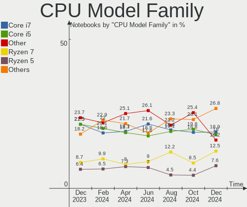

Fedora Hardware Trends (Notebook)
---------------------------------

A project to identify most popular hardware characteristics and track their change
over time based on data collected by Fedora users at https://Linux-Hardware.org.

Anyone can contribute to the study by uploading probes of their computers by
the [hw-probe](https://github.com/linuxhw/hw-probe) tool:

    sudo -E hw-probe -all -upload

Full-feature report is available here: https://linux-hardware.org/?view=trends&formfactor=notebook

Period: Mar, 2021.

Contents
--------

- [ OS                       ](#os)
- [ OS Family                ](#os-family)
- [ Kernel                   ](#kernel)
- [ Kernel Family            ](#kernel-family)
- [ Kernel Major Ver.        ](#kernel-major-ver)
- [ Arch                     ](#arch)
- [ DE                       ](#de)
- [ Display Server           ](#display-server)
- [ Display Manager          ](#display-manager)
- [ OS Lang                  ](#os-lang)
- [ Boot Mode                ](#boot-mode)
- [ Filesystem               ](#filesystem)
- [ Part. scheme             ](#part-scheme)
- [ Dual Boot with Linux/BSD ](#dual-boot-with-linux/bsd)
- [ Dual Boot (Win)          ](#dual-boot-win)
- [ Country                  ](#country)
- [ City                     ](#city)
- [ Vendor                   ](#vendor)
- [ Model                    ](#model)
- [ Model Family             ](#model-family)
- [ MFG Year                 ](#mfg-year)
- [ Form Factor              ](#form-factor)
- [ Secure Boot              ](#secure-boot)
- [ Coreboot                 ](#coreboot)
- [ RAM Size                 ](#ram-size)
- [ RAM Used                 ](#ram-used)
- [ Has CD-ROM               ](#has-cd-rom)
- [ Total Drives             ](#total-drives)
- [ Has Ethernet             ](#has-ethernet)
- [ Has WiFi                 ](#has-wifi)
- [ Has Bluetooth            ](#has-bluetooth)
- [ Drive Vendor             ](#drive-vendor)
- [ Drive Model              ](#drive-model)
- [ HDD Vendor               ](#hdd-vendor)
- [ SSD Vendor               ](#ssd-vendor)
- [ Drive Kind               ](#drive-kind)
- [ Drive Connector          ](#drive-connector)
- [ Drive Size               ](#drive-size)
- [ Space Total              ](#space-total)
- [ Space Used               ](#space-used)
- [ Malfunc. Drives          ](#malfunc-drives)
- [ Malfunc. Drive Vendor    ](#malfunc-drive-vendor)
- [ Malfunc. HDD Vendor      ](#malfunc-hdd-vendor)
- [ Malfunc. Drive Kind      ](#malfunc-drive-kind)
- [ Failed Drives            ](#failed-drives)
- [ Failed Drive Vendor      ](#failed-drive-vendor)
- [ Drive Status             ](#drive-status)
- [ Storage Vendor           ](#storage-vendor)
- [ Storage Model            ](#storage-model)
- [ Storage Kind             ](#storage-kind)
- [ CPU Vendor               ](#cpu-vendor)
- [ CPU Model                ](#cpu-model)
- [ CPU Model Family         ](#cpu-model-family)
- [ CPU Cores                ](#cpu-cores)
- [ CPU Sockets              ](#cpu-sockets)
- [ CPU Threads              ](#cpu-threads)
- [ CPU Op-Modes             ](#cpu-op-modes)
- [ CPU Microcode            ](#cpu-microcode)
- [ CPU Microarch            ](#cpu-microarch)
- [ GPU Vendor               ](#gpu-vendor)
- [ GPU Model                ](#gpu-model)
- [ GPU Combo                ](#gpu-combo)
- [ GPU Driver               ](#gpu-driver)
- [ GPU Memory               ](#gpu-memory)
- [ Monitor Vendor           ](#monitor-vendor)
- [ Monitor Model            ](#monitor-model)
- [ Monitor Resolution       ](#monitor-resolution)
- [ Monitor Diagonal         ](#monitor-diagonal)
- [ Monitor Width            ](#monitor-width)
- [ Aspect Ratio             ](#aspect-ratio)
- [ Monitor Area             ](#monitor-area)
- [ Pixel Density            ](#pixel-density)
- [ Multiple Monitors        ](#multiple-monitors)
- [ Net Controller Vendor    ](#net-controller-vendor)
- [ Net Controller Model     ](#net-controller-model)
- [ Wireless Vendor          ](#wireless-vendor)
- [ Wireless Model           ](#wireless-model)
- [ Ethernet Vendor          ](#ethernet-vendor)
- [ Ethernet Model           ](#ethernet-model)
- [ Net Controller Kind      ](#net-controller-kind)
- [ Used Controller          ](#used-controller)
- [ NICs                     ](#nics)
- [ IPv6                     ](#ipv6)
- [ Memory Vendor            ](#memory-vendor)
- [ Memory Model             ](#memory-model)
- [ Memory Kind              ](#memory-kind)
- [ Memory Form Factor       ](#memory-form-factor)
- [ Memory Size              ](#memory-size)
- [ Memory Speed             ](#memory-speed)
- [ Sound Vendor             ](#sound-vendor)
- [ Sound Model              ](#sound-model)
- [ Camera Vendor            ](#camera-vendor)
- [ Camera Model             ](#camera-model)
- [ Fingerprint Vendor       ](#fingerprint-vendor)
- [ Fingerprint Model        ](#fingerprint-model)
- [ Chipcard Vendor          ](#chipcard-vendor)
- [ Chipcard Model           ](#chipcard-model)
- [ Printer Vendor           ](#printer-vendor)
- [ Printer Model            ](#printer-model)
- [ Scanner Vendor           ](#scanner-vendor)
- [ Scanner Model            ](#scanner-model)
- [ Bluetooth Vendor         ](#bluetooth-vendor)
- [ Bluetooth Model          ](#bluetooth-model)
- [ Unsupported Devices      ](#unsupported-devices)
- [ Unsupported Device Types ](#unsupported-device-types)

OS
--

Installed operating systems

| Name      | Notebooks | Percent |
|-----------|-----------|---------|
| Fedora 33 | 138       | 80.7%   |
| Fedora 34 | 17        | 9.94%   |
| Fedora 32 | 12        | 7.02%   |
| Fedora 31 | 2         | 1.17%   |
| Fedora 35 | 1         | 0.58%   |
| Fedora 21 | 1         | 0.58%   |

OS Family
---------

OS without a version

| Name   | Notebooks | Percent |
|--------|-----------|---------|
| Fedora | 171       | 100%    |

Kernel
------

Version of the Linux kernel

| Version                                              | Notebooks | Percent |
|------------------------------------------------------|-----------|---------|
| 5.10.19-200.fc33.x86_64                              | 42        | 24.56%  |
| 5.10.22-200.fc33.x86_64                              | 21        | 12.28%  |
| 5.11.7-200.fc33.x86_64                               | 19        | 11.11%  |
| 5.10.21-200.fc33.x86_64                              | 13        | 7.6%    |
| 5.10.23-200.fc33.x86_64                              | 10        | 5.85%   |
| 5.11.10-200.fc33.x86_64                              | 9         | 5.26%   |
| 5.10.18-200.fc33.x86_64                              | 7         | 4.09%   |
| 5.10.20-200.fc33.x86_64                              | 5         | 2.92%   |
| 5.11.9-200.fc33.x86_64                               | 4         | 2.34%   |
| 5.11.8-300.fc34.x86_64                               | 4         | 2.34%   |
| 5.11.10-300.fc34.x86_64                              | 4         | 2.34%   |
| 5.10.19-100.fc32.x86_64                              | 4         | 2.34%   |
| 5.8.15-301.fc33.x86_64                               | 3         | 1.75%   |
| 5.11.7-300.fc34.x86_64                               | 3         | 1.75%   |
| 5.8.18-100.fc31.x86_64                               | 2         | 1.17%   |
| 5.11.3-300.fc34.x86_64                               | 2         | 1.17%   |
| 5.10.20-100.fc32.x86_64                              | 2         | 1.17%   |
| 5.10.12-100.fc32.x86_64                              | 2         | 1.17%   |
| 5.8.17-300.fc33.x86_64                               | 1         | 0.58%   |
| 5.6.6-300.fc32.x86_64                                | 1         | 0.58%   |
| 5.12.0-0.rc2.20210309git144c79ef3353.166.fc35.x86_64 | 1         | 0.58%   |
| 5.11.9-300.fc34.x86_64                               | 1         | 0.58%   |
| 5.11.8-200.fc33.x86_64                               | 1         | 0.58%   |
| 5.11.7-100.fc32.x86_64                               | 1         | 0.58%   |
| 5.11.6-300.fc34.x86_64                               | 1         | 0.58%   |
| 5.11.5-300.fc34.x86_64                               | 1         | 0.58%   |
| 5.11.2-300.fc34.x86_64                               | 1         | 0.58%   |
| 5.10.8-100.fc32.x86_64                               | 1         | 0.58%   |
| 5.10.22-100.fc32.x86_64                              | 1         | 0.58%   |
| 5.10.17-200.fc33.x86_64                              | 1         | 0.58%   |
| 5.10.16-200.fc33.x86_64                              | 1         | 0.58%   |
| 5.10.15-100.fc32.x86_64                              | 1         | 0.58%   |
| 4.1.13-100.fc21.x86_64                               | 1         | 0.58%   |

Kernel Family
-------------

Linux kernel without a distro release

| Version | Notebooks | Percent |
|---------|-----------|---------|
| 5.10.19 | 46        | 26.9%   |
| 5.11.7  | 23        | 13.45%  |
| 5.10.22 | 22        | 12.87%  |
| 5.11.10 | 13        | 7.6%    |
| 5.10.21 | 13        | 7.6%    |
| 5.10.23 | 10        | 5.85%   |
| 5.10.20 | 7         | 4.09%   |
| 5.10.18 | 7         | 4.09%   |
| 5.11.9  | 5         | 2.92%   |
| 5.11.8  | 5         | 2.92%   |
| 5.8.15  | 3         | 1.75%   |
| 5.8.18  | 2         | 1.17%   |
| 5.11.3  | 2         | 1.17%   |
| 5.10.12 | 2         | 1.17%   |
| 5.8.17  | 1         | 0.58%   |
| 5.6.6   | 1         | 0.58%   |
| 5.12.0  | 1         | 0.58%   |
| 5.11.6  | 1         | 0.58%   |
| 5.11.5  | 1         | 0.58%   |
| 5.11.2  | 1         | 0.58%   |
| 5.10.8  | 1         | 0.58%   |
| 5.10.17 | 1         | 0.58%   |
| 5.10.16 | 1         | 0.58%   |
| 5.10.15 | 1         | 0.58%   |
| 4.1.13  | 1         | 0.58%   |

Kernel Major Ver.
-----------------

Linux kernel major version

| Version | Notebooks | Percent |
|---------|-----------|---------|
| 5.10    | 111       | 64.91%  |
| 5.11    | 51        | 29.82%  |
| 5.8     | 6         | 3.51%   |
| 5.6     | 1         | 0.58%   |
| 5.12    | 1         | 0.58%   |
| 4.1     | 1         | 0.58%   |

Arch
----

OS architecture (x86_64, i586, etc.)

| Name   | Notebooks | Percent |
|--------|-----------|---------|
| x86_64 | 171       | 100%    |

DE
--

Desktop Environment

| Name       | Notebooks | Percent |
|------------|-----------|---------|
| GNOME      | 121       | 70.76%  |
| KDE5       | 12        | 7.02%   |
| KDE        | 10        | 5.85%   |
| Unknown    | 9         | 5.26%   |
| X-Cinnamon | 5         | 2.92%   |
| MATE       | 5         | 2.92%   |
| Cinnamon   | 3         | 1.75%   |
| XFCE       | 2         | 1.17%   |
| LXQt       | 1         | 0.58%   |
| LXDE       | 1         | 0.58%   |
| KDE4       | 1         | 0.58%   |
| i3         | 1         | 0.58%   |

Display Server
--------------

X11 or Wayland

| Name    | Notebooks | Percent |
|---------|-----------|---------|
| Wayland | 94        | 54.97%  |
| X11     | 68        | 39.77%  |
| Unknown | 6         | 3.51%   |
| Tty     | 3         | 1.75%   |

Display Manager
---------------

SDDM, LightDM, etc.

| Name    | Notebooks | Percent |
|---------|-----------|---------|
| Unknown | 103       | 60.23%  |
| GDM     | 43        | 25.15%  |
| SDDM    | 13        | 7.6%    |
| TDM     | 9         | 5.26%   |
| XDM     | 1         | 0.58%   |
| LightDM | 1         | 0.58%   |
| KDM     | 1         | 0.58%   |

OS Lang
-------

Language

| Lang    | Notebooks | Percent |
|---------|-----------|---------|
| en_US   | 85        | 49.71%  |
| en_GB   | 15        | 8.77%   |
| pt_BR   | 11        | 6.43%   |
| ru_RU   | 7         | 4.09%   |
| it_IT   | 7         | 4.09%   |
| de_DE   | 6         | 3.51%   |
| pl_PL   | 5         | 2.92%   |
| es_ES   | 5         | 2.92%   |
| en_AU   | 4         | 2.34%   |
| fr_FR   | 3         | 1.75%   |
| en_CA   | 3         | 1.75%   |
| zh_CN   | 2         | 1.17%   |
| fi_FI   | 2         | 1.17%   |
| es_MX   | 2         | 1.17%   |
| cs_CZ   | 2         | 1.17%   |
| Unknown | 2         | 1.17%   |
| tr_TR   | 1         | 0.58%   |
| ru_UA   | 1         | 0.58%   |
| pt_PT   | 1         | 0.58%   |
| nl_BE   | 1         | 0.58%   |
| es_CO   | 1         | 0.58%   |
| es_AR   | 1         | 0.58%   |
| en_NZ   | 1         | 0.58%   |
| en_IN   | 1         | 0.58%   |
| de_CH   | 1         | 0.58%   |
| ca_ES   | 1         | 0.58%   |

Boot Mode
---------

EFI or BIOS

| Mode | Notebooks | Percent |
|------|-----------|---------|
| EFI  | 125       | 73.1%   |
| BIOS | 46        | 26.9%   |

Filesystem
----------

Type of filesystem

| Type  | Notebooks | Percent |
|-------|-----------|---------|
| Btrfs | 107       | 62.57%  |
| Ext4  | 53        | 30.99%  |
| Xfs   | 11        | 6.43%   |

Part. scheme
------------

Scheme of partitioning

| Type    | Notebooks | Percent |
|---------|-----------|---------|
| Unknown | 97        | 56.73%  |
| GPT     | 58        | 33.92%  |
| MBR     | 16        | 9.36%   |

Dual Boot with Linux/BSD
------------------------

Hosting more than one Linux/BSD

| Dual boot | Notebooks | Percent |
|-----------|-----------|---------|
| No        | 162       | 94.74%  |
| Yes       | 9         | 5.26%   |

Dual Boot (Win)
---------------

Hosting Linux and Windows

| Dual boot | Notebooks | Percent |
|-----------|-----------|---------|
| No        | 149       | 87.13%  |
| Yes       | 22        | 12.87%  |

Country
-------

Geographic location (country)

| Country      | Notebooks | Percent |
|--------------|-----------|---------|
| USA          | 21        | 12.28%  |
| Russia       | 14        | 8.19%   |
| Germany      | 14        | 8.19%   |
| Brazil       | 12        | 7.02%   |
| Spain        | 9         | 5.26%   |
| Italy        | 9         | 5.26%   |
| Ukraine      | 7         | 4.09%   |
| Canada       | 6         | 3.51%   |
| Turkey       | 5         | 2.92%   |
| Poland       | 5         | 2.92%   |
| India        | 5         | 2.92%   |
| Finland      | 5         | 2.92%   |
| France       | 4         | 2.34%   |
| Czechia      | 4         | 2.34%   |
| Australia    | 4         | 2.34%   |
| UK           | 3         | 1.75%   |
| Mexico       | 3         | 1.75%   |
| Colombia     | 3         | 1.75%   |
| Switzerland  | 2         | 1.17%   |
| Serbia       | 2         | 1.17%   |
| New Zealand  | 2         | 1.17%   |
| Netherlands  | 2         | 1.17%   |
| Israel       | 2         | 1.17%   |
| Egypt        | 2         | 1.17%   |
| Chile        | 2         | 1.17%   |
| Belgium      | 2         | 1.17%   |
| Belarus      | 2         | 1.17%   |
| Tunisia      | 1         | 0.58%   |
| Thailand     | 1         | 0.58%   |
| Taiwan       | 1         | 0.58%   |
| Sweden       | 1         | 0.58%   |
| South Africa | 1         | 0.58%   |
| Singapore    | 1         | 0.58%   |
| Romania      | 1         | 0.58%   |
| Portugal     | 1         | 0.58%   |
| Moldova      | 1         | 0.58%   |
| Malaysia     | 1         | 0.58%   |
| Jordan       | 1         | 0.58%   |
| Japan        | 1         | 0.58%   |
| Iran         | 1         | 0.58%   |
| Hong Kong    | 1         | 0.58%   |
| Croatia      | 1         | 0.58%   |
| China        | 1         | 0.58%   |
| Bulgaria     | 1         | 0.58%   |
| Bangladesh   | 1         | 0.58%   |
| Austria      | 1         | 0.58%   |
| Argentina    | 1         | 0.58%   |

City
----

Geographic location (city)

| City                    | Notebooks | Percent |
|-------------------------|-----------|---------|
| Moscow                  | 6         | 3.51%   |
| Istanbul                | 3         | 1.75%   |
| Bologna                 | 3         | 1.75%   |
| São Paulo              | 2         | 1.17%   |
| Oulu                    | 2         | 1.17%   |
| Novosibirsk             | 2         | 1.17%   |
| Montreal                | 2         | 1.17%   |
| Minsk                   | 2         | 1.17%   |
| Kyiv                    | 2         | 1.17%   |
| Helsinki                | 2         | 1.17%   |
| Berlin                  | 2         | 1.17%   |
| Belgrade                | 2         | 1.17%   |
| Augsburg                | 2         | 1.17%   |
| Almería                | 2         | 1.17%   |
| Zurich                  | 1         | 0.58%   |
| Zielona Góra           | 1         | 0.58%   |
| Zagreb                  | 1         | 0.58%   |
| Yaroslavl               | 1         | 0.58%   |
| Wroclaw                 | 1         | 0.58%   |
| Winterberg              | 1         | 0.58%   |
| Wilmington              | 1         | 0.58%   |
| Warsaw                  | 1         | 0.58%   |
| Warner                  | 1         | 0.58%   |
| Virginia Beach          | 1         | 0.58%   |
| Villars                 | 1         | 0.58%   |
| Vienna                  | 1         | 0.58%   |
| Viamão                 | 1         | 0.58%   |
| Valencia                | 1         | 0.58%   |
| Tychy                   | 1         | 0.58%   |
| Tunnel Hill             | 1         | 0.58%   |
| Trivandrum              | 1         | 0.58%   |
| Torrevieja              | 1         | 0.58%   |
| Toronto                 | 1         | 0.58%   |
| The Bronx               | 1         | 0.58%   |
| Tewkesbury              | 1         | 0.58%   |
| Tel Aviv                | 1         | 0.58%   |
| Sydney                  | 1         | 0.58%   |
| Sunnyvale               | 1         | 0.58%   |
| Stony Plain             | 1         | 0.58%   |
| Stara Zagora            | 1         | 0.58%   |
| Singapore               | 1         | 0.58%   |
| Shimla                  | 1         | 0.58%   |
| Shanghai                | 1         | 0.58%   |
| Sehnde                  | 1         | 0.58%   |
| Searcy                  | 1         | 0.58%   |
| Sao Jose do Rio Preto   | 1         | 0.58%   |
| Sao Gabriel             | 1         | 0.58%   |
| Santiago                | 1         | 0.58%   |
| San Francisco           | 1         | 0.58%   |
| Salt Lake City          | 1         | 0.58%   |
| Saint-Michel-des-Saints | 1         | 0.58%   |
| Rotorua                 | 1         | 0.58%   |
| Regina                  | 1         | 0.58%   |
| Redondela               | 1         | 0.58%   |
| Rastede                 | 1         | 0.58%   |
| Rancho Cucamonga        | 1         | 0.58%   |
| Raleigh                 | 1         | 0.58%   |
| Psary                   | 1         | 0.58%   |
| Pretoria                | 1         | 0.58%   |
| Prague                  | 1         | 0.58%   |

Vendor
------

Motherboard manufacturer

| Name                | Notebooks | Percent |
|---------------------|-----------|---------|
| Lenovo              | 64        | 37.43%  |
| Dell                | 35        | 20.47%  |
| Hewlett-Packard     | 26        | 15.2%   |
| ASUSTek Computer    | 15        | 8.77%   |
| Acer                | 9         | 5.26%   |
| Toshiba             | 5         | 2.92%   |
| HUAWEI              | 4         | 2.34%   |
| Notebook            | 2         | 1.17%   |
| MSI                 | 2         | 1.17%   |
| TECNO               | 1         | 0.58%   |
| System76            | 1         | 0.58%   |
| Sony                | 1         | 0.58%   |
| Schenker            | 1         | 0.58%   |
| Samsung Electronics | 1         | 0.58%   |
| Prestigio           | 1         | 0.58%   |
| PC Specialist       | 1         | 0.58%   |
| CRX                 | 1         | 0.58%   |
| AZW                 | 1         | 0.58%   |

Model
-----

Motherboard model

| Name                                       | Notebooks | Percent |
|--------------------------------------------|-----------|---------|
| Lenovo ThinkPad X1 Carbon Gen 8 20U9CTO1WW | 4         | 2.34%   |
| Lenovo Y520-15IKBN 80WK                    | 2         | 1.17%   |
| HUAWEI BOHK-WAX9X                          | 2         | 1.17%   |
| Dell XPS 13 9370                           | 2         | 1.17%   |
| Dell Latitude E6530                        | 2         | 1.17%   |
| Dell Latitude E6430                        | 2         | 1.17%   |
| Toshiba TECRA Z40-A                        | 1         | 0.58%   |
| Toshiba Satellite S55t-B                   | 1         | 0.58%   |
| Toshiba Satellite L50-B                    | 1         | 0.58%   |
| Toshiba Satellite C70-A-K2W                | 1         | 0.58%   |
| Toshiba PORTEGE R700                       | 1         | 0.58%   |
| TECNO WinPad 10A                           | 1         | 0.58%   |
| System76 Galago Pro                        | 1         | 0.58%   |
| Sony VPCCB45FN                             | 1         | 0.58%   |
| Schenker SCHENKER VIA 15 Pro               | 1         | 0.58%   |
| Samsung 950XCJ/951XCJ/950XCR               | 1         | 0.58%   |
| Prestigio PSB141C03                        | 1         | 0.58%   |
| PC Specialist NS50MU                       | 1         | 0.58%   |
| Notebook W942SW                            | 1         | 0.58%   |
| Notebook NH55RGQ                           | 1         | 0.58%   |
| MSI GL65 Leopard 10SDR                     | 1         | 0.58%   |
| MSI GF63 Thin 9SC                          | 1         | 0.58%   |
| Lenovo Yoga Slim 7 15ITL05 82AC            | 1         | 0.58%   |
| Lenovo V330-15IKB 81AX                     | 1         | 0.58%   |
| Lenovo ThinkPad X230 2324DM2               | 1         | 0.58%   |
| Lenovo ThinkPad X220 4291EM4               | 1         | 0.58%   |
| Lenovo ThinkPad X1 Extreme 2nd 20QVCTO1WW  | 1         | 0.58%   |
| Lenovo ThinkPad X1 Carbon 7th 20QD001FZA   | 1         | 0.58%   |
| Lenovo ThinkPad X1 Carbon 6th 20KGS03900   | 1         | 0.58%   |
| Lenovo ThinkPad W550s 20E1S0L500           | 1         | 0.58%   |
| Lenovo ThinkPad T580 20LAS3NJ0F            | 1         | 0.58%   |
| Lenovo ThinkPad T580 20L90025RT            | 1         | 0.58%   |
| Lenovo ThinkPad T520 4242AU2               | 1         | 0.58%   |
| Lenovo ThinkPad T495 20NJ000XIX            | 1         | 0.58%   |
| Lenovo ThinkPad T490s 20NYS7K914           | 1         | 0.58%   |
| Lenovo ThinkPad T480s 20L8S2N80E           | 1         | 0.58%   |
| Lenovo ThinkPad T480s 20L8S2N80D           | 1         | 0.58%   |
| Lenovo ThinkPad T480s 20L7CTO1WW           | 1         | 0.58%   |
| Lenovo ThinkPad T480s 20L7001RPB           | 1         | 0.58%   |
| Lenovo ThinkPad T470 20HEA15XBR            | 1         | 0.58%   |
| Lenovo ThinkPad T470 20HDS09Q00            | 1         | 0.58%   |
| Lenovo ThinkPad T460s 20FAS0UU00           | 1         | 0.58%   |
| Lenovo ThinkPad T460s 20F9005CSC           | 1         | 0.58%   |
| Lenovo ThinkPad T450s 20BWS04P00           | 1         | 0.58%   |
| Lenovo ThinkPad T450 20BV001YMS            | 1         | 0.58%   |
| Lenovo ThinkPad T450 20BUS0X10N            | 1         | 0.58%   |
| Lenovo ThinkPad T440s 20AQS00600           | 1         | 0.58%   |
| Lenovo ThinkPad T440p 20AWS1WS00           | 1         | 0.58%   |
| Lenovo ThinkPad T440p 20AWA1X600           | 1         | 0.58%   |
| Lenovo ThinkPad T440p 20ANCTO1WW           | 1         | 0.58%   |
| Lenovo ThinkPad T420 4236VD9               | 1         | 0.58%   |
| Lenovo ThinkPad T410 2522PT3               | 1         | 0.58%   |
| Lenovo ThinkPad T14 Gen 1 20S1SAXT00       | 1         | 0.58%   |
| Lenovo ThinkPad P51 20HH0015GE             | 1         | 0.58%   |
| Lenovo ThinkPad P14s Gen 1 20S4A001CD      | 1         | 0.58%   |
| Lenovo ThinkPad L480 20LTS71D00            | 1         | 0.58%   |
| Lenovo ThinkPad L13 20R3CTO1WW             | 1         | 0.58%   |
| Lenovo ThinkPad Edge E540 20C6003QMS       | 1         | 0.58%   |
| Lenovo ThinkPad Edge E330 3354AG1          | 1         | 0.58%   |
| Lenovo ThinkPad E490 20N9S1XE00            | 1         | 0.58%   |

Model Family
------------

Motherboard model prefix

| Name                 | Notebooks | Percent |
|----------------------|-----------|---------|
| Lenovo ThinkPad      | 47        | 27.49%  |
| Dell Latitude        | 13        | 7.6%    |
| Dell Inspiron        | 11        | 6.43%   |
| Lenovo IdeaPad       | 10        | 5.85%   |
| HP ProBook           | 8         | 4.68%   |
| Acer Aspire          | 7         | 4.09%   |
| Dell XPS             | 5         | 2.92%   |
| HP Pavilion          | 4         | 2.34%   |
| HP EliteBook         | 4         | 2.34%   |
| Toshiba Satellite    | 3         | 1.75%   |
| HP ZBook             | 3         | 1.75%   |
| HP Laptop            | 3         | 1.75%   |
| Dell Precision       | 3         | 1.75%   |
| Lenovo Y520-15IKBN   | 2         | 1.17%   |
| HUAWEI BOHK-WAX9X    | 2         | 1.17%   |
| Dell G5              | 2         | 1.17%   |
| ASUS ZenBook         | 2         | 1.17%   |
| ASUS VivoBook        | 2         | 1.17%   |
| Toshiba TECRA        | 1         | 0.58%   |
| Toshiba PORTEGE      | 1         | 0.58%   |
| TECNO WinPad         | 1         | 0.58%   |
| System76 Galago      | 1         | 0.58%   |
| Sony VPCCB45FN       | 1         | 0.58%   |
| Schenker SCHENKER    | 1         | 0.58%   |
| Samsung 950XCJ       | 1         | 0.58%   |
| Prestigio PSB141C03  | 1         | 0.58%   |
| PC Specialist NS50MU | 1         | 0.58%   |
| Notebook W942SW      | 1         | 0.58%   |
| Notebook NH55RGQ     | 1         | 0.58%   |
| MSI GL65             | 1         | 0.58%   |
| MSI GF63             | 1         | 0.58%   |
| Lenovo Yoga          | 1         | 0.58%   |
| Lenovo V330-15IKB    | 1         | 0.58%   |
| Lenovo G50-80        | 1         | 0.58%   |
| Lenovo G50-70        | 1         | 0.58%   |
| Lenovo AILZx         | 1         | 0.58%   |
| HUAWEI KPL-W0X       | 1         | 0.58%   |
| HUAWEI HN-WX9X       | 1         | 0.58%   |
| HP ENVY              | 1         | 0.58%   |
| HP 550               | 1         | 0.58%   |
| HP 355               | 1         | 0.58%   |
| HP 250               | 1         | 0.58%   |
| Dell G7              | 1         | 0.58%   |
| CRX CRX156           | 1         | 0.58%   |
| AZW GT-R             | 1         | 0.58%   |
| ASUS X75VD           | 1         | 0.58%   |
| ASUS X750JN          | 1         | 0.58%   |
| ASUS X550LN          | 1         | 0.58%   |
| ASUS X550IU          | 1         | 0.58%   |
| ASUS X451MA          | 1         | 0.58%   |
| ASUS UX305FA         | 1         | 0.58%   |
| ASUS UX302LA         | 1         | 0.58%   |
| ASUS ROG             | 1         | 0.58%   |
| ASUS K54C            | 1         | 0.58%   |
| ASUS K42JK           | 1         | 0.58%   |
| ASUS ASUS            | 1         | 0.58%   |
| Acer P5WE0           | 1         | 0.58%   |
| Acer Nitro           | 1         | 0.58%   |

MFG Year
--------

Motherboard manufacture year

| Year | Notebooks | Percent |
|------|-----------|---------|
| 2020 | 75        | 43.86%  |
| 2019 | 24        | 14.04%  |
| 2014 | 16        | 9.36%   |
| 2018 | 15        | 8.77%   |
| 2011 | 9         | 5.26%   |
| 2016 | 7         | 4.09%   |
| 2021 | 6         | 3.51%   |
| 2015 | 5         | 2.92%   |
| 2012 | 5         | 2.92%   |
| 2013 | 3         | 1.75%   |
| 2010 | 3         | 1.75%   |
| 2017 | 2         | 1.17%   |
| 2009 | 1         | 0.58%   |

Form Factor
-----------

Physical design of the computer

| Name     | Notebooks | Percent |
|----------|-----------|---------|
| Notebook | 171       | 100%    |

Secure Boot
-----------

Enabled or disabled

| State    | Notebooks | Percent |
|----------|-----------|---------|
| Disabled | 143       | 83.63%  |
| Enabled  | 28        | 16.37%  |

Coreboot
--------

Have coreboot on board

| Used | Notebooks | Percent |
|------|-----------|---------|
| No   | 171       | 100%    |

RAM Size
--------

Total RAM memory

| Size in GB | Notebooks | Percent |
|------------|-----------|---------|
| 4.01-8.0   | 58        | 33.92%  |
| 16.01-24.0 | 45        | 26.32%  |
| 8.01-16.0  | 25        | 14.62%  |
| 32.01-64.0 | 19        | 11.11%  |
| 3.01-4.0   | 13        | 7.6%    |
| 24.01-32.0 | 6         | 3.51%   |
| 1.01-2.0   | 5         | 2.92%   |

RAM Used
--------

Used RAM memory

| Used GB    | Notebooks | Percent |
|------------|-----------|---------|
| 4.01-8.0   | 48        | 28.07%  |
| 2.01-3.0   | 45        | 26.32%  |
| 3.01-4.0   | 31        | 18.13%  |
| 1.01-2.0   | 24        | 14.04%  |
| 8.01-16.0  | 17        | 9.94%   |
| 0.51-1.0   | 4         | 2.34%   |
| 16.01-24.0 | 2         | 1.17%   |

Has CD-ROM
----------

Has CD-ROM on board

| Presented | Notebooks | Percent |
|-----------|-----------|---------|
| No        | 128       | 74.85%  |
| Yes       | 43        | 25.15%  |

Total Drives
------------

Number of drives on board

| Drives | Notebooks | Percent |
|--------|-----------|---------|
| 1      | 123       | 71.93%  |
| 2      | 42        | 24.56%  |
| 3      | 4         | 2.34%   |
| 5      | 1         | 0.58%   |
| 4      | 1         | 0.58%   |

Has Ethernet
------------

Has Ethernet on board

| Presented | Notebooks | Percent |
|-----------|-----------|---------|
| Yes       | 143       | 83.63%  |
| No        | 28        | 16.37%  |

Has WiFi
--------

Has WiFi module

| Presented | Notebooks | Percent |
|-----------|-----------|---------|
| Yes       | 166       | 97.08%  |
| No        | 5         | 2.92%   |

Has Bluetooth
-------------

Has Bluetooth module

| Presented | Notebooks | Percent |
|-----------|-----------|---------|
| Yes       | 139       | 81.29%  |
| No        | 32        | 18.71%  |

Drive Vendor
------------

Hard drive vendors

| Vendor              | Notebooks | Drives | Percent |
|---------------------|-----------|--------|---------|
| Samsung Electronics | 41        | 44     | 18.81%  |
| WDC                 | 26        | 27     | 11.93%  |
| Sandisk             | 20        | 21     | 9.17%   |
| Toshiba             | 16        | 16     | 7.34%   |
| Seagate             | 16        | 16     | 7.34%   |
| Intel               | 16        | 16     | 7.34%   |
| Unknown             | 12        | 14     | 5.5%    |
| SK Hynix            | 12        | 12     | 5.5%    |
| Kingston            | 11        | 11     | 5.05%   |
| Crucial             | 9         | 10     | 4.13%   |
| A-DATA Technology   | 5         | 5      | 2.29%   |
| LITEON              | 4         | 4      | 1.83%   |
| Silicon Motion      | 3         | 3      | 1.38%   |
| Lexar               | 3         | 3      | 1.38%   |
| Hitachi             | 3         | 3      | 1.38%   |
| HGST                | 3         | 3      | 1.38%   |
| Union Memory        | 2         | 2      | 0.92%   |
| Phison              | 2         | 2      | 0.92%   |
| XPG                 | 1         | 1      | 0.46%   |
| Transcend           | 1         | 1      | 0.46%   |
| TO Exter            | 1         | 1      | 0.46%   |
| PNY                 | 1         | 1      | 0.46%   |
| Mushkin             | 1         | 1      | 0.46%   |
| Micron Technology   | 1         | 1      | 0.46%   |
| Lenovo              | 1         | 1      | 0.46%   |
| KIOXIA              | 1         | 1      | 0.46%   |
| KingSpec            | 1         | 1      | 0.46%   |
| KingFast            | 1         | 1      | 0.46%   |
| Intenso             | 1         | 1      | 0.46%   |
| INDMEM S            | 1         | 1      | 0.46%   |
| GOODRAM             | 1         | 1      | 0.46%   |
| China               | 1         | 1      | 0.46%   |

Drive Model
-----------

Hard drive models

| Model                                | Notebooks | Percent |
|--------------------------------------|-----------|---------|
| Sandisk NVMe SSD Drive 256GB         | 5         | 2.22%   |
| Seagate ST1000LM035-1RK172 1TB       | 4         | 1.78%   |
| Kingston SA400S37240G 240GB SSD      | 4         | 1.78%   |
| Toshiba NVMe SSD Drive 512GB         | 3         | 1.33%   |
| Sandisk NVMe SSD Drive 512GB         | 3         | 1.33%   |
| Samsung NVMe SSD Drive 500GB         | 3         | 1.33%   |
| WDC WDS240G2G0B-00EPW0 240GB SSD     | 2         | 0.89%   |
| WDC WDS240G2G0A-00JH30 240GB SSD     | 2         | 0.89%   |
| WDC WD10SPZX-60Z10T0 1TB             | 2         | 0.89%   |
| WDC WD10JPVX-22JC3T0 1TB             | 2         | 0.89%   |
| Unknown SD/MMC/MS PRO 128GB          | 2         | 0.89%   |
| Unknown MMC Card  32GB               | 2         | 0.89%   |
| Union Memory RPFTJ128PDD2EWX 128GB   | 2         | 0.89%   |
| Toshiba MQ04ABF100 1TB               | 2         | 0.89%   |
| Toshiba MQ01ACF050 500GB             | 2         | 0.89%   |
| SK Hynix SC311 SATA 256GB SSD        | 2         | 0.89%   |
| SK Hynix PC401 NVMe 256GB            | 2         | 0.89%   |
| SK Hynix NVMe SSD Drive 512GB        | 2         | 0.89%   |
| SanDisk SSD U110 16GB                | 2         | 0.89%   |
| Samsung SSD 970 PRO 512GB            | 2         | 0.89%   |
| Samsung SSD 970 EVO 1TB              | 2         | 0.89%   |
| Samsung SSD 860 EVO 1TB              | 2         | 0.89%   |
| Samsung SSD 850 EVO 250GB            | 2         | 0.89%   |
| Samsung NVMe SSD Drive 512GB         | 2         | 0.89%   |
| Samsung NVMe SSD Drive 256GB         | 2         | 0.89%   |
| Samsung NVMe SSD Drive 1024GB        | 2         | 0.89%   |
| Samsung MZVLB512HAJQ-000L7 512GB     | 2         | 0.89%   |
| Samsung MZVLB256HBHQ-000L7 256GB     | 2         | 0.89%   |
| Samsung MZALQ512HALU-000L1 512GB     | 2         | 0.89%   |
| Samsung MZ7LN256HCHP-000L7 256GB SSD | 2         | 0.89%   |
| Intel SSDSC2BF180A5L 180GB           | 2         | 0.89%   |
| Crucial CT1000MX500SSD1 1TB          | 2         | 0.89%   |
| XPG NVMe SSD Drive 1024GB            | 1         | 0.44%   |
| WDC WDS500G2B0B 500GB SSD            | 1         | 0.44%   |
| WDC WDS100T2B0C-00PXH0 1TB           | 1         | 0.44%   |
| WDC WDS100T2B0B-00YS70 1TB SSD       | 1         | 0.44%   |
| WDC WD5000LPCX-24C6HT0 500GB         | 1         | 0.44%   |
| WDC WD3200BPVT-75ZEST0 320GB         | 1         | 0.44%   |
| WDC WD2500BPVT-75JJ5T0 250GB         | 1         | 0.44%   |
| WDC WD20SPZX-75UA7T1 2TB             | 1         | 0.44%   |
| WDC WD16 00BEVT-60ZCT 160GB          | 1         | 0.44%   |
| WDC WD10SPZX-24Z10 1TB               | 1         | 0.44%   |
| WDC WD10SPZX-21Z10T0 1TB             | 1         | 0.44%   |
| WDC WD10SPZX-00Z10T0 1TB             | 1         | 0.44%   |
| WDC WD10SPSX-60A6WT0 1TB             | 1         | 0.44%   |
| WDC WD10SPCX-60KHST0 1TB             | 1         | 0.44%   |
| WDC WD10JPVX-08JC3T5 1TB             | 1         | 0.44%   |
| WDC PC SN730 SDBQNTY-1T00-1001 1TB   | 1         | 0.44%   |
| WDC PC SN730 SDBPNTY-256G-1027 256GB | 1         | 0.44%   |
| WDC PC SN530 SDBPNPZ-1T00-1002 1TB   | 1         | 0.44%   |
| WDC PC SN530 SDBPMPZ-256G-1001 256GB | 1         | 0.44%   |
| WDC PC SN520 SDAPNUW-256G-1006 256GB | 1         | 0.44%   |
| Unknown SF256  256GB                 | 1         | 0.44%   |
| Unknown SD8GB                        | 1         | 0.44%   |
| Unknown SD08G  8GB                   | 1         | 0.44%   |
| Unknown SC128  128GB                 | 1         | 0.44%   |
| Unknown MMC Card  128GB              | 1         | 0.44%   |
| Unknown MGS240GB                     | 1         | 0.44%   |
| Unknown M0S001  32GB                 | 1         | 0.44%   |
| Unknown GE8QT  256GB                 | 1         | 0.44%   |

HDD Vendor
----------

Hard disk drive vendors

| Vendor   | Notebooks | Drives | Percent |
|----------|-----------|--------|---------|
| WDC      | 15        | 15     | 33.33%  |
| Seagate  | 15        | 15     | 33.33%  |
| Toshiba  | 8         | 8      | 17.78%  |
| Hitachi  | 3         | 3      | 6.67%   |
| HGST     | 3         | 3      | 6.67%   |
| TO Exter | 1         | 1      | 2.22%   |

SSD Vendor
----------

Solid state drive vendors

| Vendor              | Notebooks | Drives | Percent |
|---------------------|-----------|--------|---------|
| Samsung Electronics | 15        | 16     | 19.23%  |
| SanDisk             | 11        | 12     | 14.1%   |
| Intel               | 9         | 9      | 11.54%  |
| Kingston            | 8         | 8      | 10.26%  |
| Crucial             | 8         | 9      | 10.26%  |
| WDC                 | 6         | 6      | 7.69%   |
| A-DATA Technology   | 5         | 5      | 6.41%   |
| SK Hynix            | 4         | 4      | 5.13%   |
| LITEON              | 4         | 4      | 5.13%   |
| Lexar               | 2         | 2      | 2.56%   |
| PNY                 | 1         | 1      | 1.28%   |
| Mushkin             | 1         | 1      | 1.28%   |
| Micron Technology   | 1         | 1      | 1.28%   |
| Intenso             | 1         | 1      | 1.28%   |
| GOODRAM             | 1         | 1      | 1.28%   |
| China               | 1         | 1      | 1.28%   |

Drive Kind
----------

HDD or SSD

| Kind    | Notebooks | Drives | Percent |
|---------|-----------|--------|---------|
| NVMe    | 79        | 83     | 37.44%  |
| SSD     | 74        | 81     | 35.07%  |
| HDD     | 43        | 45     | 20.38%  |
| MMC     | 9         | 11     | 4.27%   |
| Unknown | 6         | 6      | 2.84%   |

Drive Connector
---------------

SATA, SAS, NVMe, etc.

| Type | Notebooks | Drives | Percent |
|------|-----------|--------|---------|
| SATA | 106       | 125    | 53%     |
| NVMe | 79        | 83     | 39.5%   |
| MMC  | 9         | 11     | 4.5%    |
| SAS  | 6         | 7      | 3%      |

Drive Size
----------

Size of hard drive

| Size in TB | Notebooks | Drives | Percent |
|------------|-----------|--------|---------|
| 0.01-0.5   | 76        | 79     | 63.33%  |
| 0.51-1.0   | 38        | 41     | 31.67%  |
| 1.01-2.0   | 6         | 6      | 5%      |

Space Total
-----------

Amount of disk space available on the file system

| Size in GB     | Notebooks | Percent |
|----------------|-----------|---------|
| 251-500        | 49        | 28.65%  |
| 101-250        | 33        | 19.3%   |
| 501-1000       | 32        | 18.71%  |
| 1001-2000      | 14        | 8.19%   |
| Unknown        | 14        | 8.19%   |
| 1-20           | 13        | 7.6%    |
| 51-100         | 7         | 4.09%   |
| 21-50          | 4         | 2.34%   |
| 2001-3000      | 3         | 1.75%   |
| More than 3000 | 2         | 1.17%   |

Space Used
----------

Amount of used disk space

| Used GB   | Notebooks | Percent |
|-----------|-----------|---------|
| 21-50     | 37        | 21.64%  |
| 1-20      | 35        | 20.47%  |
| 101-250   | 33        | 19.3%   |
| 51-100    | 27        | 15.79%  |
| 251-500   | 15        | 8.77%   |
| Unknown   | 14        | 8.19%   |
| 501-1000  | 8         | 4.68%   |
| 1001-2000 | 2         | 1.17%   |

Malfunc. Drives
---------------

Drive models with a malfunction

| Model                               | Notebooks | Drives | Percent |
|-------------------------------------|-----------|--------|---------|
| Toshiba MQ01ACF050 500GB            | 1         | 1      | 8.33%   |
| Seagate ST500LM021-1KJ152 500GB     | 1         | 1      | 8.33%   |
| SanDisk SDSSDXPS960G 960GB          | 1         | 1      | 8.33%   |
| SanDisk SD6PP4M-256G-1006 256GB SSD | 1         | 1      | 8.33%   |
| Intel SSDSCKKF256G8H 256GB          | 1         | 1      | 8.33%   |
| Intel SSDSC2BF180A5L 180GB          | 1         | 1      | 8.33%   |
| Intel SSDSA2M080G2GC 80GB           | 1         | 1      | 8.33%   |
| Hitachi HTS547575A9E384 752GB       | 1         | 1      | 8.33%   |
| HGST HTS545050A7E680 500GB          | 1         | 1      | 8.33%   |
| Crucial CT1050MX300SSD1 1TB         | 1         | 1      | 8.33%   |
| Crucial CT1024M550SSD1 1TB          | 1         | 1      | 8.33%   |
| A-DATA Technology SU650 480GB SSD   | 1         | 1      | 8.33%   |

Malfunc. Drive Vendor
---------------------

Vendors of faulty drives

| Vendor            | Notebooks | Drives | Percent |
|-------------------|-----------|--------|---------|
| Intel             | 3         | 3      | 27.27%  |
| Crucial           | 2         | 2      | 18.18%  |
| Toshiba           | 1         | 1      | 9.09%   |
| Seagate           | 1         | 1      | 9.09%   |
| SanDisk           | 1         | 2      | 9.09%   |
| Hitachi           | 1         | 1      | 9.09%   |
| HGST              | 1         | 1      | 9.09%   |
| A-DATA Technology | 1         | 1      | 9.09%   |

Malfunc. HDD Vendor
-------------------

Vendors of faulty HDD drives

| Vendor  | Notebooks | Drives | Percent |
|---------|-----------|--------|---------|
| Toshiba | 1         | 1      | 25%     |
| Seagate | 1         | 1      | 25%     |
| Hitachi | 1         | 1      | 25%     |
| HGST    | 1         | 1      | 25%     |

Malfunc. Drive Kind
-------------------

Kinds of faulty drives

| Kind | Notebooks | Drives | Percent |
|------|-----------|--------|---------|
| SSD  | 6         | 8      | 60%     |
| HDD  | 4         | 4      | 40%     |

Failed Drives
-------------

Failed drive models

Zero info for selected period =(

Failed Drive Vendor
-------------------

Failed drive vendors

Zero info for selected period =(

Drive Status
------------

Number of failed and malfunc. drives

| Status   | Notebooks | Drives | Percent |
|----------|-----------|--------|---------|
| Detected | 107       | 135    | 58.47%  |
| Works    | 66        | 79     | 36.07%  |
| Malfunc  | 10        | 12     | 5.46%   |

Storage Vendor
--------------

Storage controller vendors

| Vendor                       | Notebooks | Percent |
|------------------------------|-----------|---------|
| Intel                        | 114       | 54.81%  |
| Samsung Electronics          | 27        | 12.98%  |
| AMD                          | 19        | 9.13%   |
| Sandisk                      | 13        | 6.25%   |
| Toshiba America Info Systems | 8         | 3.85%   |
| SK Hynix                     | 8         | 3.85%   |
| Silicon Motion               | 4         | 1.92%   |
| Kingston Technology Company  | 3         | 1.44%   |
| Union Memory (Shenzhen)      | 2         | 0.96%   |
| Phison Electronics           | 2         | 0.96%   |
| Shenzhen Longsys Electronics | 1         | 0.48%   |
| Seagate Technology           | 1         | 0.48%   |
| Micron/Crucial Technology    | 1         | 0.48%   |
| Marvell Technology Group     | 1         | 0.48%   |
| Lenovo                       | 1         | 0.48%   |
| KIOXIA                       | 1         | 0.48%   |
| ASMedia Technology           | 1         | 0.48%   |
| ADATA Technology             | 1         | 0.48%   |

Storage Model
-------------

Storage controller models

| Model                                                                            | Notebooks | Percent |
|----------------------------------------------------------------------------------|-----------|---------|
| Intel Sunrise Point-LP SATA Controller [AHCI mode]                               | 23        | 10.7%   |
| Samsung NVMe SSD Controller SM981/PM981/PM983                                    | 20        | 9.3%    |
| AMD FCH SATA Controller [AHCI mode]                                              | 17        | 7.91%   |
| Intel 82801 Mobile SATA Controller [RAID mode]                                   | 13        | 6.05%   |
| Intel 6 Series/C200 Series Chipset Family 6 port Mobile SATA AHCI Controller     | 11        | 5.12%   |
| Intel Wildcat Point-LP SATA Controller [AHCI Mode]                               | 9         | 4.19%   |
| Intel 8 Series/C220 Series Chipset Family 6-port SATA Controller 1 [AHCI mode]   | 9         | 4.19%   |
| Intel 7 Series Chipset Family 6-port SATA Controller [AHCI mode]                 | 9         | 4.19%   |
| Intel Cannon Lake Mobile PCH SATA AHCI Controller                                | 6         | 2.79%   |
| Intel 8 Series SATA Controller 1 [AHCI mode]                                     | 6         | 2.79%   |
| Sandisk WD Blue SN550 NVMe SSD                                                   | 5         | 2.33%   |
| Sandisk WD Black SN750 / PC SN730 NVMe SSD                                       | 5         | 2.33%   |
| SK Hynix BC511                                                                   | 4         | 1.86%   |
| Samsung NVMe Controller                                                          | 4         | 1.86%   |
| Intel SSD 660P Series                                                            | 4         | 1.86%   |
| Intel Comet Lake SATA AHCI Controller                                            | 4         | 1.86%   |
| Intel 400 Series Chipset Family SATA AHCI Controller                             | 4         | 1.86%   |
| Toshiba America Info Systems XG6 NVMe SSD Controller                             | 3         | 1.4%    |
| Toshiba America Info Systems BG3 NVMe SSD Controller                             | 3         | 1.4%    |
| Silicon Motion SM2263EN/SM2263XT SSD Controller                                  | 3         | 1.4%    |
| Intel SSD Pro 7600p/760p/E 6100p Series                                          | 3         | 1.4%    |
| Intel Cannon Point-LP SATA Controller [AHCI Mode]                                | 3         | 1.4%    |
| Union Memory (Shenzhen) Non-Volatile memory controller                           | 2         | 0.93%   |
| Toshiba America Info Systems Toshiba America Info Non-Volatile memory controller | 2         | 0.93%   |
| SK Hynix PC401 NVMe Solid State Drive 256GB                                      | 2         | 0.93%   |
| Samsung NVMe SSD Controller SM961/PM961/SM963                                    | 2         | 0.93%   |
| Phison E12 NVMe Controller                                                       | 2         | 0.93%   |
| Intel Q170/Q150/B150/H170/H110/Z170/CM236 Chipset SATA Controller [AHCI Mode]    | 2         | 0.93%   |
| Intel HM170/QM170 Chipset SATA Controller [AHCI Mode]                            | 2         | 0.93%   |
| Intel 5 Series/3400 Series Chipset 6 port SATA AHCI Controller                   | 2         | 0.93%   |
| AMD SB7x0/SB8x0/SB9x0 SATA Controller [AHCI mode]                                | 2         | 0.93%   |
| SK Hynix NVMe SSD Controller                                                     | 1         | 0.47%   |
| SK Hynix BC501 NVMe Solid State Drive 512GB                                      | 1         | 0.47%   |
| Silicon Motion SM2262/SM2262EN SSD Controller                                    | 1         | 0.47%   |
| Shenzhen Longsys Non-Volatile memory controller                                  | 1         | 0.47%   |
| Seagate Non-Volatile memory controller                                           | 1         | 0.47%   |
| Sandisk WD Blue SN500 / PC SN520 NVMe SSD                                        | 1         | 0.47%   |
| Sandisk WD Black 2018/SN750 / PC SN720 NVMe SSD                                  | 1         | 0.47%   |
| Sandisk Non-Volatile memory controller                                           | 1         | 0.47%   |
| Samsung NVMe SSD Controller PM9A1/980PRO                                         | 1         | 0.47%   |
| Micron/Crucial P1 NVMe PCIe SSD                                                  | 1         | 0.47%   |
| Marvell Group 88SS9183 PCIe SSD Controller                                       | 1         | 0.47%   |
| Lenovo Non-Volatile memory controller                                            | 1         | 0.47%   |
| KIOXIA Non-Volatile memory controller                                            | 1         | 0.47%   |
| Kingston Company U-SNS8154P3 NVMe SSD                                            | 1         | 0.47%   |
| Kingston Company Company Non-Volatile memory controller                          | 1         | 0.47%   |
| Kingston Company A2000 NVMe SSD                                                  | 1         | 0.47%   |
| Intel Volume Management Device NVMe RAID Controller                              | 1         | 0.47%   |
| Intel Tiger Lake-LP SATA Controller [AHCI mode]                                  | 1         | 0.47%   |
| Intel Ice Lake-LP SATA Controller [AHCI mode]                                    | 1         | 0.47%   |
| Intel Celeron/Pentium Silver Processor SATA Controller                           | 1         | 0.47%   |
| Intel Atom/Celeron/Pentium Processor x5-E8000/J3xxx/N3xxx Series SATA Controller | 1         | 0.47%   |
| Intel Atom Processor E3800 Series SATA AHCI Controller                           | 1         | 0.47%   |
| Intel 82801HM/HEM (ICH8M/ICH8M-E) SATA Controller [AHCI mode]                    | 1         | 0.47%   |
| Intel 82801HM/HEM (ICH8M/ICH8M-E) IDE Controller                                 | 1         | 0.47%   |
| Intel 5 Series/3400 Series Chipset 4 port SATA IDE Controller                    | 1         | 0.47%   |
| Intel 5 Series/3400 Series Chipset 4 port SATA AHCI Controller                   | 1         | 0.47%   |
| Intel 5 Series/3400 Series Chipset 2 port SATA IDE Controller                    | 1         | 0.47%   |
| ASMedia ASM1062 Serial ATA Controller                                            | 1         | 0.47%   |
| ADATA XPG SX8200 Pro PCIe Gen3x4 M.2 2280 Solid State Drive                      | 1         | 0.47%   |

Storage Kind
------------

Kind of storage controller (IDE, SATA, NVMe, SAS, ...)

| Kind | Notebooks | Percent |
|------|-----------|---------|
| SATA | 116       | 54.98%  |
| NVMe | 79        | 37.44%  |
| RAID | 14        | 6.64%   |
| IDE  | 2         | 0.95%   |

CPU Vendor
----------

Processor vendors

| Vendor | Notebooks | Percent |
|--------|-----------|---------|
| Intel  | 144       | 84.21%  |
| AMD    | 27        | 15.79%  |

CPU Model
---------

Processor models

| Model                                         | Notebooks | Percent |
|-----------------------------------------------|-----------|---------|
| Intel Core i7-8550U CPU @ 1.80GHz             | 10        | 5.85%   |
| Intel Core i5-8250U CPU @ 1.60GHz             | 7         | 4.09%   |
| Intel Core i7-10510U CPU @ 1.80GHz            | 6         | 3.51%   |
| Intel Core i5-5300U CPU @ 2.30GHz             | 4         | 2.34%   |
| AMD Ryzen 5 3500U with Radeon Vega Mobile Gfx | 4         | 2.34%   |
| Intel Core i7-9750H CPU @ 2.60GHz             | 3         | 1.75%   |
| Intel Core i7-8650U CPU @ 1.90GHz             | 3         | 1.75%   |
| Intel Core i7-6500U CPU @ 2.50GHz             | 3         | 1.75%   |
| Intel Core i7-5500U CPU @ 2.40GHz             | 3         | 1.75%   |
| Intel Core i5-8265U CPU @ 1.60GHz             | 3         | 1.75%   |
| Intel Core i5-6200U CPU @ 2.30GHz             | 3         | 1.75%   |
| Intel Core i5-10210U CPU @ 1.60GHz            | 3         | 1.75%   |
| Intel 11th Gen Core i7-1165G7 @ 2.80GHz       | 3         | 1.75%   |
| AMD Ryzen 5 4500U with Radeon Graphics        | 3         | 1.75%   |
| AMD Ryzen 5 2500U with Radeon Vega Mobile Gfx | 3         | 1.75%   |
| Intel Core i7-8565U CPU @ 1.80GHz             | 2         | 1.17%   |
| Intel Core i7-7820HQ CPU @ 2.90GHz            | 2         | 1.17%   |
| Intel Core i7-7700HQ CPU @ 2.80GHz            | 2         | 1.17%   |
| Intel Core i7-4710HQ CPU @ 2.50GHz            | 2         | 1.17%   |
| Intel Core i7-4702MQ CPU @ 2.20GHz            | 2         | 1.17%   |
| Intel Core i7-2640M CPU @ 2.80GHz             | 2         | 1.17%   |
| Intel Core i7-2630QM CPU @ 2.00GHz            | 2         | 1.17%   |
| Intel Core i7-10750H CPU @ 2.60GHz            | 2         | 1.17%   |
| Intel Core i7-10610U CPU @ 1.80GHz            | 2         | 1.17%   |
| Intel Core i5-8350U CPU @ 1.70GHz             | 2         | 1.17%   |
| Intel Core i5-7200U CPU @ 2.50GHz             | 2         | 1.17%   |
| Intel Core i5-6300U CPU @ 2.40GHz             | 2         | 1.17%   |
| Intel Core i5-4200U CPU @ 1.60GHz             | 2         | 1.17%   |
| Intel Core i5-3340M CPU @ 2.70GHz             | 2         | 1.17%   |
| Intel Core i5-3210M CPU @ 2.50GHz             | 2         | 1.17%   |
| Intel Core i5-2540M CPU @ 2.60GHz             | 2         | 1.17%   |
| Intel Core i5-2450M CPU @ 2.50GHz             | 2         | 1.17%   |
| Intel Core i3-6100U CPU @ 2.30GHz             | 2         | 1.17%   |
| Intel Core i3-3110M CPU @ 2.40GHz             | 2         | 1.17%   |
| Intel Atom CPU Z3735F @ 1.33GHz               | 2         | 1.17%   |
| Intel 11th Gen Core i5-1135G7 @ 2.40GHz       | 2         | 1.17%   |
| AMD Ryzen 7 4800H with Radeon Graphics        | 2         | 1.17%   |
| AMD Ryzen 7 3700U with Radeon Vega Mobile Gfx | 2         | 1.17%   |
| Intel Pentium CPU N3710 @ 1.60GHz             | 1         | 0.58%   |
| Intel Pentium CPU B940 @ 2.00GHz              | 1         | 0.58%   |
| Intel Core M-5Y10c CPU @ 0.80GHz              | 1         | 0.58%   |
| Intel Core i9-9880H CPU @ 2.30GHz             | 1         | 0.58%   |
| Intel Core i7-8750H CPU @ 2.20GHz             | 1         | 0.58%   |
| Intel Core i7-8665U CPU @ 1.90GHz             | 1         | 0.58%   |
| Intel Core i7-7600U CPU @ 2.80GHz             | 1         | 0.58%   |
| Intel Core i7-7500U CPU @ 2.70GHz             | 1         | 0.58%   |
| Intel Core i7-6820HQ CPU @ 2.70GHz            | 1         | 0.58%   |
| Intel Core i7-6600U CPU @ 2.60GHz             | 1         | 0.58%   |
| Intel Core i7-4910MQ CPU @ 2.90GHz            | 1         | 0.58%   |
| Intel Core i7-4710MQ CPU @ 2.50GHz            | 1         | 0.58%   |
| Intel Core i7-4600M CPU @ 2.90GHz             | 1         | 0.58%   |
| Intel Core i7-4500U CPU @ 1.80GHz             | 1         | 0.58%   |
| Intel Core i7-3740QM CPU @ 2.70GHz            | 1         | 0.58%   |
| Intel Core i7-3632QM CPU @ 2.20GHz            | 1         | 0.58%   |
| Intel Core i7-3630QM CPU @ 2.40GHz            | 1         | 0.58%   |
| Intel Core i7-2620M CPU @ 2.70GHz             | 1         | 0.58%   |
| Intel Core i7-10850H CPU @ 2.70GHz            | 1         | 0.58%   |
| Intel Core i7-10710U CPU @ 1.10GHz            | 1         | 0.58%   |
| Intel Core i7-1065G7 CPU @ 1.30GHz            | 1         | 0.58%   |
| Intel Core i5-9300H CPU @ 2.40GHz             | 1         | 0.58%   |

CPU Model Family
----------------

Processor model prefix

| Model           | Notebooks | Percent |
|-----------------|-----------|---------|
| Intel Core i7   | 63        | 36.84%  |
| Intel Core i5   | 51        | 29.82%  |
| Intel Core i3   | 14        | 8.19%   |
| AMD Ryzen 5     | 12        | 7.02%   |
| Other           | 7         | 4.09%   |
| AMD Ryzen 7     | 6         | 3.51%   |
| Intel Celeron   | 3         | 1.75%   |
| Intel Atom      | 3         | 1.75%   |
| Intel Pentium   | 2         | 1.17%   |
| Intel Core M    | 1         | 0.58%   |
| Intel Core i9   | 1         | 0.58%   |
| AMD Turion II   | 1         | 0.58%   |
| AMD Ryzen 5 PRO | 1         | 0.58%   |
| AMD Ryzen 3     | 1         | 0.58%   |
| AMD FX          | 1         | 0.58%   |
| AMD Athlon II   | 1         | 0.58%   |
| AMD Athlon      | 1         | 0.58%   |
| AMD A4          | 1         | 0.58%   |
| AMD A10         | 1         | 0.58%   |

CPU Cores
---------

Number of processor cores

| Number | Notebooks | Percent |
|--------|-----------|---------|
| 4      | 82        | 47.95%  |
| 2      | 71        | 41.52%  |
| 6      | 12        | 7.02%   |
| 8      | 5         | 2.92%   |
| 1      | 1         | 0.58%   |

CPU Sockets
-----------

Number of sockets

| Number | Notebooks | Percent |
|--------|-----------|---------|
| 1      | 171       | 100%    |

CPU Threads
-----------

Threads per core (Hyper-Threading)

| Number | Notebooks | Percent |
|--------|-----------|---------|
| 2      | 153       | 89.47%  |
| 1      | 18        | 10.53%  |

CPU Op-Modes
------------

CPU Operation Modes (32-bit, 64-bit)

| Op mode        | Notebooks | Percent |
|----------------|-----------|---------|
| 32-bit, 64-bit | 171       | 100%    |

CPU Microcode
-------------

Microcode number

| Number     | Notebooks | Percent |
|------------|-----------|---------|
| 0x806ea    | 19        | 11.11%  |
| 0x806ec    | 18        | 10.53%  |
| 0x206a7    | 12        | 7.02%   |
| Unknown    | 12        | 7.02%   |
| 0x406e3    | 11        | 6.43%   |
| 0x306d4    | 10        | 5.85%   |
| 0x306a9    | 10        | 5.85%   |
| 0x306c3    | 9         | 5.26%   |
| 0x806e9    | 6         | 3.51%   |
| 0x806c1    | 6         | 3.51%   |
| 0x40651    | 6         | 3.51%   |
| 0x906e9    | 5         | 2.92%   |
| 0x08108109 | 5         | 2.92%   |
| 0xa0652    | 4         | 2.34%   |
| 0x906ea    | 4         | 2.34%   |
| 0x08108102 | 3         | 1.75%   |
| 0x906ed    | 2         | 1.17%   |
| 0x706e5    | 2         | 1.17%   |
| 0x406c4    | 2         | 1.17%   |
| 0x30678    | 2         | 1.17%   |
| 0x20655    | 2         | 1.17%   |
| 0x20652    | 2         | 1.17%   |
| 0x08600106 | 2         | 1.17%   |
| 0x08600103 | 2         | 1.17%   |
| 0x0810100b | 2         | 1.17%   |
| 0x010000c8 | 2         | 1.17%   |
| 0xa0660    | 1         | 0.58%   |
| 0x706a8    | 1         | 0.58%   |
| 0x506e3    | 1         | 0.58%   |
| 0x30673    | 1         | 0.58%   |
| 0x10661    | 1         | 0.58%   |
| 0x08600104 | 1         | 0.58%   |
| 0x08600102 | 1         | 0.58%   |
| 0x08101007 | 1         | 0.58%   |
| 0x07030104 | 1         | 0.58%   |
| 0x06006705 | 1         | 0.58%   |
| 0x06006115 | 1         | 0.58%   |

CPU Microarch
-------------

Microarchitecture

| Name          | Notebooks | Percent |
|---------------|-----------|---------|
| KabyLake      | 58        | 33.92%  |
| Haswell       | 15        | 8.77%   |
| SandyBridge   | 13        | 7.6%    |
| Skylake       | 12        | 7.02%   |
| IvyBridge     | 12        | 7.02%   |
| Zen+          | 10        | 5.85%   |
| Broadwell     | 10        | 5.85%   |
| Zen 2         | 8         | 4.68%   |
| TigerLake     | 6         | 3.51%   |
| Silvermont    | 5         | 2.92%   |
| CometLake     | 5         | 2.92%   |
| Westmere      | 4         | 2.34%   |
| Zen           | 3         | 1.75%   |
| K10           | 2         | 1.17%   |
| IceLake       | 2         | 1.17%   |
| Excavator     | 2         | 1.17%   |
| Steamroller   | 1         | 0.58%   |
| Puma          | 1         | 0.58%   |
| Goldmont plus | 1         | 0.58%   |
| Core          | 1         | 0.58%   |

GPU Vendor
----------

Vendors of graphics cards

| Vendor | Notebooks | Percent |
|--------|-----------|---------|
| Intel  | 140       | 62.22%  |
| Nvidia | 50        | 22.22%  |
| AMD    | 35        | 15.56%  |

GPU Model
---------

Graphics card models

| Model                                                                                    | Notebooks | Percent |
|------------------------------------------------------------------------------------------|-----------|---------|
| Intel UHD Graphics 620                                                                   | 22        | 9.61%   |
| Intel 2nd Generation Core Processor Family Integrated Graphics Controller                | 13        | 5.68%   |
| Intel CometLake-U GT2 [UHD Graphics]                                                     | 12        | 5.24%   |
| Intel Skylake GT2 [HD Graphics 520]                                                      | 11        | 4.8%    |
| Intel 3rd Gen Core processor Graphics Controller                                         | 11        | 4.8%    |
| AMD Picasso                                                                              | 10        | 4.37%   |
| Intel HD Graphics 5500                                                                   | 9         | 3.93%   |
| Intel 4th Gen Core Processor Integrated Graphics Controller                              | 8         | 3.49%   |
| AMD Renoir                                                                               | 8         | 3.49%   |
| Intel CoffeeLake-H GT2 [UHD Graphics 630]                                                | 7         | 3.06%   |
| Intel WhiskeyLake-U GT2 [UHD Graphics 620]                                               | 6         | 2.62%   |
| Intel Haswell-ULT Integrated Graphics Controller                                         | 6         | 2.62%   |
| Intel TigerLake GT2 [Iris Xe Graphics]                                                   | 5         | 2.18%   |
| Intel HD Graphics 630                                                                    | 5         | 2.18%   |
| Intel HD Graphics 620                                                                    | 5         | 2.18%   |
| Nvidia TU117M [GeForce GTX 1650 Mobile / Max-Q]                                          | 4         | 1.75%   |
| Nvidia GF108GLM [NVS 5200M]                                                              | 3         | 1.31%   |
| Intel Core Processor Integrated Graphics Controller                                      | 3         | 1.31%   |
| Intel CometLake-H GT2 [UHD Graphics]                                                     | 3         | 1.31%   |
| Intel Atom Processor Z36xxx/Z37xxx Series Graphics & Display                             | 3         | 1.31%   |
| AMD Raven Ridge [Radeon Vega Series / Radeon Vega Mobile Series]                         | 3         | 1.31%   |
| Nvidia TU117M [GeForce GTX 1650 Ti Mobile]                                               | 2         | 0.87%   |
| Nvidia GP108M [GeForce MX150]                                                            | 2         | 0.87%   |
| Nvidia GP107M [GeForce GTX 1050 Mobile]                                                  | 2         | 0.87%   |
| Nvidia GM108M [GeForce MX130]                                                            | 2         | 0.87%   |
| Nvidia GM108M [GeForce 930MX]                                                            | 2         | 0.87%   |
| Nvidia GM108M [GeForce 840M]                                                             | 2         | 0.87%   |
| Nvidia GK208M [GeForce GT 740M]                                                          | 2         | 0.87%   |
| Nvidia GF119M [Quadro NVS 4200M]                                                         | 2         | 0.87%   |
| Nvidia GF108M [GeForce GT 620M/630M/635M/640M LE]                                        | 2         | 0.87%   |
| Intel Atom/Celeron/Pentium Processor x5-E8000/J3xxx/N3xxx Integrated Graphics Controller | 2         | 0.87%   |
| AMD Topaz XT [Radeon R7 M260/M265 / M340/M360 / M440/M445 / 530/535 / 620/625 Mobile]    | 2         | 0.87%   |
| AMD RS880M [Mobility Radeon HD 4225/4250]                                                | 2         | 0.87%   |
| AMD Baffin [Radeon RX 460/560D / Pro 450/455/460/555/555X/560/560X]                      | 2         | 0.87%   |
| Nvidia TU117M [GeForce MX450]                                                            | 1         | 0.44%   |
| Nvidia TU117GLM [Quadro T2000 Mobile / Max-Q]                                            | 1         | 0.44%   |
| Nvidia TU116M [GeForce GTX 1660 Ti Mobile]                                               | 1         | 0.44%   |
| Nvidia TU106M [GeForce RTX 2060 Mobile]                                                  | 1         | 0.44%   |
| Nvidia TU106M [GeForce RTX 2060 Max-Q]                                                   | 1         | 0.44%   |
| Nvidia GP108M [GeForce MX330]                                                            | 1         | 0.44%   |
| Nvidia GP108M [GeForce MX250]                                                            | 1         | 0.44%   |
| Nvidia GP108GLM [Quadro P520]                                                            | 1         | 0.44%   |
| Nvidia GP107M [GeForce MX350]                                                            | 1         | 0.44%   |
| Nvidia GP107M [GeForce GTX 1050 Ti Mobile]                                               | 1         | 0.44%   |
| Nvidia GP107GLM [Quadro P620]                                                            | 1         | 0.44%   |
| Nvidia GP106M [GeForce GTX 1060 Mobile]                                                  | 1         | 0.44%   |
| Nvidia GM206GLM [Quadro M2200 Mobile]                                                    | 1         | 0.44%   |
| Nvidia GM108M [GeForce MX110]                                                            | 1         | 0.44%   |
| Nvidia GM108M [GeForce 930M]                                                             | 1         | 0.44%   |
| Nvidia GM108M [GeForce 830M]                                                             | 1         | 0.44%   |
| Nvidia GM108GLM [Quadro K620M / Quadro M500M]                                            | 1         | 0.44%   |
| Nvidia GM107GLM [Quadro M2000M]                                                          | 1         | 0.44%   |
| Nvidia GM107GLM [Quadro M1200 Mobile]                                                    | 1         | 0.44%   |
| Nvidia GM107 [GeForce 940MX]                                                             | 1         | 0.44%   |
| Nvidia GK208M [GeForce GT 730M]                                                          | 1         | 0.44%   |
| Nvidia GK104GLM [Quadro K4100M]                                                          | 1         | 0.44%   |
| Nvidia GF119M [GeForce 610M]                                                             | 1         | 0.44%   |
| Nvidia GF117M [GeForce 610M/710M/810M/820M / GT 620M/625M/630M/720M]                     | 1         | 0.44%   |
| Nvidia GF108M [GeForce GT 525M]                                                          | 1         | 0.44%   |
| Intel Tiger Lake UHD Graphics                                                            | 1         | 0.44%   |

GPU Combo
---------

Combinations of graphics cards

| Name           | Notebooks | Percent |
|----------------|-----------|---------|
| 1 x Intel      | 89        | 52.05%  |
| Intel + Nvidia | 45        | 26.32%  |
| 1 x AMD        | 22        | 12.87%  |
| Intel + AMD    | 6         | 3.51%   |
| 2 x AMD        | 4         | 2.34%   |
| AMD + Nvidia   | 3         | 1.75%   |
| 1 x Nvidia     | 2         | 1.17%   |

GPU Driver
----------

Free vs proprietary

| Driver      | Notebooks | Percent |
|-------------|-----------|---------|
| Free        | 151       | 88.3%   |
| Proprietary | 19        | 11.11%  |
| Unknown     | 1         | 0.58%   |

GPU Memory
----------

Total video memory

| Size in GB | Notebooks | Percent |
|------------|-----------|---------|
| Unknown    | 114       | 66.67%  |
| 0.51-1.0   | 19        | 11.11%  |
| 1.01-2.0   | 18        | 10.53%  |
| 3.01-4.0   | 10        | 5.85%   |
| 0.01-0.5   | 7         | 4.09%   |
| 5.01-6.0   | 3         | 1.75%   |

Monitor Vendor
--------------

Monitor vendors

| Vendor                  | Notebooks | Percent |
|-------------------------|-----------|---------|
| LG Display              | 41        | 19.62%  |
| AU Optronics            | 38        | 18.18%  |
| Chimei Innolux          | 27        | 12.92%  |
| BOE                     | 27        | 12.92%  |
| Samsung Electronics     | 22        | 10.53%  |
| Dell                    | 11        | 5.26%   |
| Sharp                   | 6         | 2.87%   |
| Lenovo                  | 6         | 2.87%   |
| Hewlett-Packard         | 6         | 2.87%   |
| Philips                 | 4         | 1.91%   |
| Goldstar                | 4         | 1.91%   |
| Acer                    | 4         | 1.91%   |
| PANDA                   | 2         | 0.96%   |
| InfoVision              | 2         | 0.96%   |
| Chi Mei Optoelectronics | 2         | 0.96%   |
| ViewSonic               | 1         | 0.48%   |
| Sceptre Tech            | 1         | 0.48%   |
| Iiyama                  | 1         | 0.48%   |
| Fujitsu Siemens         | 1         | 0.48%   |
| CSO                     | 1         | 0.48%   |
| Apple                   | 1         | 0.48%   |
| AOC                     | 1         | 0.48%   |

Monitor Model
-------------

Monitor models

| Model                                                                 | Notebooks | Percent |
|-----------------------------------------------------------------------|-----------|---------|
| LG Display LCD Monitor LGD05FA 1920x1080 309x174mm 14.0-inch          | 3         | 1.42%   |
| LG Display LCD Monitor LGD0590 1920x1080 344x194mm 15.5-inch          | 3         | 1.42%   |
| LG Display LCD Monitor LGD03FC 1600x900 309x174mm 14.0-inch           | 3         | 1.42%   |
| Chimei Innolux LCD Monitor CMN14C9 1920x1080 309x173mm 13.9-inch      | 3         | 1.42%   |
| AU Optronics LCD Monitor AUO243D 1920x1080 309x173mm 13.9-inch        | 3         | 1.42%   |
| Samsung Electronics LCD Monitor SEC544B 1600x900 382x214mm 17.2-inch  | 2         | 0.94%   |
| Samsung Electronics LCD Monitor SEC5441 1366x768 344x194mm 15.5-inch  | 2         | 0.94%   |
| Samsung Electronics LCD Monitor SDC4146 1366x768 344x194mm 15.5-inch  | 2         | 0.94%   |
| LG Display LCD Monitor LGD05F2 1920x1080 344x194mm 15.5-inch          | 2         | 0.94%   |
| LG Display LCD Monitor LGD053F 1920x1080 344x194mm 15.5-inch          | 2         | 0.94%   |
| LG Display LCD Monitor LGD032C 1920x1080 344x194mm 15.5-inch          | 2         | 0.94%   |
| LG Display LCD Monitor LGD02DC 1366x768 344x194mm 15.5-inch           | 2         | 0.94%   |
| Lenovo LCD Monitor LEN4036 1440x900 304x190mm 14.1-inch               | 2         | 0.94%   |
| InfoVision LCD Monitor IVO057D 1920x1080 309x174mm 14.0-inch          | 2         | 0.94%   |
| Chimei Innolux LCD Monitor CMN15DB 1366x768 344x193mm 15.5-inch       | 2         | 0.94%   |
| Chimei Innolux LCD Monitor CMN14D4 1920x1080 309x173mm 13.9-inch      | 2         | 0.94%   |
| Chimei Innolux LCD Monitor CMN1490 1366x768 309x173mm 13.9-inch       | 2         | 0.94%   |
| AU Optronics LCD Monitor AUO403D 1920x1080 309x173mm 13.9-inch        | 2         | 0.94%   |
| AU Optronics LCD Monitor AUO21ED 1920x1080 344x194mm 15.5-inch        | 2         | 0.94%   |
| AU Optronics LCD Monitor AUO106C 1366x768 277x156mm 12.5-inch         | 2         | 0.94%   |
| ViewSonic V3D231 Series VSC4C29 1920x1080 510x290mm 23.1-inch         | 1         | 0.47%   |
| Sharp LQ156M1JW16 SHP14F4 1920x1080 344x194mm 15.5-inch               | 1         | 0.47%   |
| Sharp LQ156M1JW01 SHP14C3 1920x1080 344x194mm 15.5-inch               | 1         | 0.47%   |
| Sharp LCD Monitor SHP14FA 3840x2400 288x180mm 13.4-inch               | 1         | 0.47%   |
| Sharp LCD Monitor SHP14CB 1920x1200 288x180mm 13.4-inch               | 1         | 0.47%   |
| Sharp LCD Monitor SHP148B 3840x2160 294x165mm 13.3-inch               | 1         | 0.47%   |
| Sharp LCD Monitor SHP1453 1920x1080 346x194mm 15.6-inch               | 1         | 0.47%   |
| Sceptre Tech E275W-1920 SPT0ABF 1920x1080 443x249mm 20.0-inch         | 1         | 0.47%   |
| Samsung Electronics U32R59x SAM0F96 3840x2160 697x392mm 31.5-inch     | 1         | 0.47%   |
| Samsung Electronics SMS27A850 SAM083D 1280x1024 520x320mm 24.0-inch   | 1         | 0.47%   |
| Samsung Electronics SMS27A650 SAM082E 1920x1080 600x340mm 27.2-inch   | 1         | 0.47%   |
| Samsung Electronics S22F350 SAM0D1A 1920x1080 480x270mm 21.7-inch     | 1         | 0.47%   |
| Samsung Electronics S19A10N SAM083E 1366x768 410x230mm 18.5-inch      | 1         | 0.47%   |
| Samsung Electronics LCD Monitor SEC5541 1366x768 344x193mm 15.5-inch  | 1         | 0.47%   |
| Samsung Electronics LCD Monitor SEC4E45 1280x800 331x207mm 15.4-inch  | 1         | 0.47%   |
| Samsung Electronics LCD Monitor SEC4149 1366x768 292x174mm 13.4-inch  | 1         | 0.47%   |
| Samsung Electronics LCD Monitor SEC3942 1366x768 309x174mm 14.0-inch  | 1         | 0.47%   |
| Samsung Electronics LCD Monitor SEC304A 1920x1080 367x230mm 17.1-inch | 1         | 0.47%   |
| Samsung Electronics LCD Monitor SDC8B4F 1920x1080 344x194mm 15.5-inch | 1         | 0.47%   |
| Samsung Electronics LCD Monitor SDC5344 1920x1080 344x194mm 15.5-inch | 1         | 0.47%   |
| Samsung Electronics LCD Monitor SDC4A51 1366x768 344x194mm 15.5-inch  | 1         | 0.47%   |
| Samsung Electronics LCD Monitor SDC4951 1366x768 344x194mm 15.5-inch  | 1         | 0.47%   |
| Samsung Electronics Color LCD SDCA029 2160x1440 252x168mm 11.9-inch   | 1         | 0.47%   |
| Samsung Electronics C27HG7x SAM0E15 2560x1440 598x336mm 27.0-inch     | 1         | 0.47%   |
| Philips PHL BDM4350 PHL08FA 3840x2160 950x540mm 43.0-inch             | 1         | 0.47%   |
| Philips PHL 258B6QJEB PHL08E9 2560x1440 553x311mm 25.0-inch           | 1         | 0.47%   |
| Philips PHL 234E5 PHLC0C7 1920x1080 509x286mm 23.0-inch               | 1         | 0.47%   |
| Philips 191EW PHLC02A 1366x768 413x234mm 18.7-inch                    | 1         | 0.47%   |
| PANDA LCD Monitor NCP004D 1920x1080 344x194mm 15.5-inch               | 1         | 0.47%   |
| PANDA LCD Monitor NCP0046 1920x1080 344x194mm 15.5-inch               | 1         | 0.47%   |
| LG Display LCD Monitor LGD065A 1920x1080 344x194mm 15.5-inch          | 1         | 0.47%   |
| LG Display LCD Monitor LGD062E 1920x1080 344x194mm 15.5-inch          | 1         | 0.47%   |
| LG Display LCD Monitor LGD05EE 2560x1440 309x174mm 14.0-inch          | 1         | 0.47%   |
| LG Display LCD Monitor LGD05E5 1920x1080 344x194mm 15.5-inch          | 1         | 0.47%   |
| LG Display LCD Monitor LGD05E4 1920x1080 344x194mm 15.5-inch          | 1         | 0.47%   |
| LG Display LCD Monitor LGD05DA 1920x1080 309x174mm 14.0-inch          | 1         | 0.47%   |
| LG Display LCD Monitor LGD05D8 1920x1080 344x194mm 15.5-inch          | 1         | 0.47%   |
| LG Display LCD Monitor LGD05D5 1920x1080 344x194mm 15.5-inch          | 1         | 0.47%   |
| LG Display LCD Monitor LGD0599 1920x1080 309x174mm 14.0-inch          | 1         | 0.47%   |
| LG Display LCD Monitor LGD0597 1920x1080 294x165mm 13.3-inch          | 1         | 0.47%   |

Monitor Resolution
------------------

Monitor screen resolution

| Resolution         | Notebooks | Percent |
|--------------------|-----------|---------|
| 1920x1080 (FHD)    | 105       | 54.4%   |
| 1366x768 (WXGA)    | 48        | 24.87%  |
| 1600x900 (HD+)     | 12        | 6.22%   |
| 3840x2160 (4K)     | 10        | 5.18%   |
| 2560x1440 (QHD)    | 8         | 4.15%   |
| 1440x900 (WXGA+)   | 3         | 1.55%   |
| 1680x1050 (WSXGA+) | 2         | 1.04%   |
| 3840x2400          | 1         | 0.52%   |
| 3200x1800 (QHD+)   | 1         | 0.52%   |
| 2160x1440          | 1         | 0.52%   |
| 1920x1200 (WUXGA)  | 1         | 0.52%   |
| 1280x800 (WXGA)    | 1         | 0.52%   |

Monitor Diagonal
----------------

Diagonal size in inches

| Inches | Notebooks | Percent |
|--------|-----------|---------|
| 15     | 81        | 38.94%  |
| 13     | 37        | 17.79%  |
| 14     | 34        | 16.35%  |
| 23     | 10        | 4.81%   |
| 17     | 10        | 4.81%   |
| 27     | 8         | 3.85%   |
| 24     | 8         | 3.85%   |
| 21     | 5         | 2.4%    |
| 31     | 2         | 0.96%   |
| 25     | 2         | 0.96%   |
| 19     | 2         | 0.96%   |
| 18     | 2         | 0.96%   |
| 12     | 2         | 0.96%   |
| 43     | 1         | 0.48%   |
| 32     | 1         | 0.48%   |
| 22     | 1         | 0.48%   |
| 20     | 1         | 0.48%   |
| 11     | 1         | 0.48%   |

Monitor Width
-------------

Physical width

| Width in mm | Notebooks | Percent |
|-------------|-----------|---------|
| 301-350     | 134       | 64.73%  |
| 501-600     | 27        | 13.04%  |
| 201-300     | 19        | 9.18%   |
| 351-400     | 12        | 5.8%    |
| 401-500     | 10        | 4.83%   |
| 601-700     | 3         | 1.45%   |
| 701-800     | 1         | 0.48%   |
| 901-1000    | 1         | 0.48%   |

Aspect Ratio
------------

Proportional relationship between the width and the height

| Ratio | Notebooks | Percent |
|-------|-----------|---------|
| 16/9  | 161       | 93.06%  |
| 16/10 | 11        | 6.36%   |
| 3/2   | 1         | 0.58%   |

Monitor Area
------------

Area in inch²

| Area in inch² | Notebooks | Percent |
|----------------|-----------|---------|
| 101-110        | 81        | 38.94%  |
| 81-90          | 55        | 26.44%  |
| 201-250        | 22        | 10.58%  |
| 71-80          | 16        | 7.69%   |
| 121-130        | 9         | 4.33%   |
| 301-350        | 8         | 3.85%   |
| 251-300        | 4         | 1.92%   |
| 351-500        | 3         | 1.44%   |
| 151-200        | 3         | 1.44%   |
| 61-70          | 2         | 0.96%   |
| 141-150        | 2         | 0.96%   |
| 51-60          | 1         | 0.48%   |
| 131-140        | 1         | 0.48%   |
| 501-1000       | 1         | 0.48%   |

Pixel Density
-------------

Pixels per inch

| Density       | Notebooks | Percent |
|---------------|-----------|---------|
| 121-160       | 93        | 46.5%   |
| 101-120       | 55        | 27.5%   |
| 51-100        | 31        | 15.5%   |
| 161-240       | 14        | 7%      |
| More than 240 | 7         | 3.5%    |

Multiple Monitors
-----------------

Total monitors connected

| Total | Notebooks | Percent |
|-------|-----------|---------|
| 1     | 127       | 74.27%  |
| 2     | 40        | 23.39%  |
| 3     | 3         | 1.75%   |
| 0     | 1         | 0.58%   |

Net Controller Vendor
---------------------

Controller vendors

| Vendor                            | Notebooks | Percent |
|-----------------------------------|-----------|---------|
| Intel                             | 117       | 44.49%  |
| Realtek Semiconductor             | 85        | 32.32%  |
| Qualcomm Atheros                  | 29        | 11.03%  |
| Broadcom Inc. and subsidiaries    | 6         | 2.28%   |
| TP-Link                           | 3         | 1.14%   |
| Ralink                            | 3         | 1.14%   |
| Lenovo                            | 3         | 1.14%   |
| Ericsson Business Mobile Networks | 3         | 1.14%   |
| Sierra Wireless                   | 2         | 0.76%   |
| Fibocom                           | 2         | 0.76%   |
| DisplayLink                       | 2         | 0.76%   |
| Qualcomm                          | 1         | 0.38%   |
| Linksys                           | 1         | 0.38%   |
| JMicron Technology                | 1         | 0.38%   |
| Huawei Technologies               | 1         | 0.38%   |
| Hewlett-Packard                   | 1         | 0.38%   |
| Dell                              | 1         | 0.38%   |
| Broadcom Limited                  | 1         | 0.38%   |
| Bose                              | 1         | 0.38%   |

Net Controller Model
--------------------

Controller models

| Model                                                                     | Notebooks | Percent |
|---------------------------------------------------------------------------|-----------|---------|
| Realtek RTL8111/8168/8411 PCI Express Gigabit Ethernet Controller         | 55        | 16.27%  |
| Intel Wireless 8265 / 8275                                                | 23        | 6.8%    |
| Intel Wi-Fi 6 AX200                                                       | 13        | 3.85%   |
| Realtek RTL810xE PCI Express Fast Ethernet controller                     | 12        | 3.55%   |
| Intel Wireless 7260                                                       | 12        | 3.55%   |
| Intel Comet Lake PCH-LP CNVi WiFi                                         | 12        | 3.55%   |
| Intel 82579LM Gigabit Network Connection (Lewisville)                     | 12        | 3.55%   |
| Qualcomm Atheros QCA9377 802.11ac Wireless Network Adapter                | 8         | 2.37%   |
| Qualcomm Atheros QCA6174 802.11ac Wireless Network Adapter                | 8         | 2.37%   |
| Intel Ethernet Connection (4) I219-LM                                     | 8         | 2.37%   |
| Realtek RTL8153 Gigabit Ethernet Adapter                                  | 7         | 2.07%   |
| Intel Wireless 7265                                                       | 7         | 2.07%   |
| Intel Ethernet Connection (4) I219-V                                      | 7         | 2.07%   |
| Intel Ethernet Connection (10) I219-V                                     | 7         | 2.07%   |
| Intel Centrino Advanced-N 6205 [Taylor Peak]                              | 6         | 1.78%   |
| Qualcomm Atheros AR9485 Wireless Network Adapter                          | 5         | 1.48%   |
| Intel Wireless 8260                                                       | 5         | 1.48%   |
| Realtek RTL8822CE 802.11ac PCIe Wireless Network Adapter                  | 4         | 1.18%   |
| Realtek RTL8822BE 802.11a/b/g/n/ac WiFi adapter                           | 4         | 1.18%   |
| Realtek RTL8723BE PCIe Wireless Network Adapter                           | 4         | 1.18%   |
| Intel Wi-Fi 6 AX201                                                       | 4         | 1.18%   |
| Intel Ethernet Connection I217-LM                                         | 4         | 1.18%   |
| Intel Ethernet Connection (3) I218-LM                                     | 4         | 1.18%   |
| Qualcomm Atheros QCA9565 / AR9565 Wireless Network Adapter                | 3         | 0.89%   |
| Intel Ethernet Connection I219-LM                                         | 3         | 0.89%   |
| Intel Dual Band Wireless-AC 3165 Plus Bluetooth                           | 3         | 0.89%   |
| Intel Comet Lake PCH CNVi WiFi                                            | 3         | 0.89%   |
| Intel Centrino Ultimate-N 6300                                            | 3         | 0.89%   |
| TP-Link AC600 wireless Realtek RTL8811AU [Archer T2U Nano]                | 2         | 0.59%   |
| Realtek RTL8821CE 802.11ac PCIe Wireless Network Adapter                  | 2         | 0.59%   |
| Realtek RTL8821AE 802.11ac PCIe Wireless Network Adapter                  | 2         | 0.59%   |
| Realtek RTL8188CE 802.11b/g/n WiFi Adapter                                | 2         | 0.59%   |
| Qualcomm Atheros AR9285 Wireless Network Adapter (PCI-Express)            | 2         | 0.59%   |
| Qualcomm Atheros AR8151 v2.0 Gigabit Ethernet                             | 2         | 0.59%   |
| Lenovo ThinkPad TBT3 LAN                                                  | 2         | 0.59%   |
| Intel Wireless-AC 9560 [Jefferson Peak]                                   | 2         | 0.59%   |
| Intel Wireless-AC 9260                                                    | 2         | 0.59%   |
| Intel Wireless 3160                                                       | 2         | 0.59%   |
| Intel Killer Wi-Fi 6 AX1650i 160MHz Wireless Network Adapter (201NGW)     | 2         | 0.59%   |
| Intel Ethernet Connection I219-V                                          | 2         | 0.59%   |
| Intel Ethernet Connection (10) I219-LM                                    | 2         | 0.59%   |
| Intel Centrino Wireless-N 2230                                            | 2         | 0.59%   |
| Intel Cannon Point-LP CNVi [Wireless-AC]                                  | 2         | 0.59%   |
| Intel 82577LM Gigabit Network Connection                                  | 2         | 0.59%   |
| Fibocom L830-EB-00 LTE WWAN Modem                                         | 2         | 0.59%   |
| Ericsson Business Mobile Networks N5321 gw                                | 2         | 0.59%   |
| Broadcom Inc. and subsidiaries BCM43228 802.11a/b/g/n                     | 2         | 0.59%   |
| Broadcom Inc. and subsidiaries BCM4313 802.11bgn Wireless Network Adapter | 2         | 0.59%   |
| TP-Link USB 10/100 LAN                                                    | 1         | 0.3%    |
| TP-Link 802.11ac WLAN Adapter                                             | 1         | 0.3%    |
| Sierra Wireless EM7455                                                    | 1         | 0.3%    |
| Sierra Wireless EM7345 4G LTE                                             | 1         | 0.3%    |
| Realtek USB 10/100 LAN                                                    | 1         | 0.3%    |
| Realtek RTL8723DE Wireless Network Adapter                                | 1         | 0.3%    |
| Realtek RTL8723BU 802.11b/g/n WLAN Adapter                                | 1         | 0.3%    |
| Realtek RTL8192EE PCIe Wireless Network Adapter                           | 1         | 0.3%    |
| Realtek RTL8188EUS 802.11n Wireless Network Adapter                       | 1         | 0.3%    |
| Realtek RTL8152 Fast Ethernet Adapter                                     | 1         | 0.3%    |
| Realtek Killer E2500 Gigabit Ethernet Controller                          | 1         | 0.3%    |
| Ralink RT5390 [802.11 b/g/n 1T1R G-band PCI Express Single Chip]          | 1         | 0.3%    |

Wireless Vendor
---------------

Wireless vendors

| Vendor                         | Notebooks | Percent |
|--------------------------------|-----------|---------|
| Intel                          | 108       | 61.71%  |
| Qualcomm Atheros               | 27        | 15.43%  |
| Realtek Semiconductor          | 22        | 12.57%  |
| Broadcom Inc. and subsidiaries | 5         | 2.86%   |
| TP-Link                        | 3         | 1.71%   |
| Ralink                         | 3         | 1.71%   |
| Sierra Wireless                | 2         | 1.14%   |
| Fibocom                        | 2         | 1.14%   |
| Qualcomm                       | 1         | 0.57%   |
| Hewlett-Packard                | 1         | 0.57%   |
| Broadcom Limited               | 1         | 0.57%   |

Wireless Model
--------------

Wireless models

| Model                                                                     | Notebooks | Percent |
|---------------------------------------------------------------------------|-----------|---------|
| Intel Wireless 8265 / 8275                                                | 23        | 12.99%  |
| Intel Wi-Fi 6 AX200                                                       | 13        | 7.34%   |
| Intel Wireless 7260                                                       | 12        | 6.78%   |
| Intel Comet Lake PCH-LP CNVi WiFi                                         | 12        | 6.78%   |
| Qualcomm Atheros QCA9377 802.11ac Wireless Network Adapter                | 8         | 4.52%   |
| Qualcomm Atheros QCA6174 802.11ac Wireless Network Adapter                | 8         | 4.52%   |
| Intel Wireless 7265                                                       | 7         | 3.95%   |
| Intel Centrino Advanced-N 6205 [Taylor Peak]                              | 6         | 3.39%   |
| Qualcomm Atheros AR9485 Wireless Network Adapter                          | 5         | 2.82%   |
| Intel Wireless 8260                                                       | 5         | 2.82%   |
| Realtek RTL8822CE 802.11ac PCIe Wireless Network Adapter                  | 4         | 2.26%   |
| Realtek RTL8822BE 802.11a/b/g/n/ac WiFi adapter                           | 4         | 2.26%   |
| Realtek RTL8723BE PCIe Wireless Network Adapter                           | 4         | 2.26%   |
| Intel Wi-Fi 6 AX201                                                       | 4         | 2.26%   |
| Qualcomm Atheros QCA9565 / AR9565 Wireless Network Adapter                | 3         | 1.69%   |
| Intel Dual Band Wireless-AC 3165 Plus Bluetooth                           | 3         | 1.69%   |
| Intel Comet Lake PCH CNVi WiFi                                            | 3         | 1.69%   |
| Intel Centrino Ultimate-N 6300                                            | 3         | 1.69%   |
| TP-Link AC600 wireless Realtek RTL8811AU [Archer T2U Nano]                | 2         | 1.13%   |
| Realtek RTL8821CE 802.11ac PCIe Wireless Network Adapter                  | 2         | 1.13%   |
| Realtek RTL8821AE 802.11ac PCIe Wireless Network Adapter                  | 2         | 1.13%   |
| Realtek RTL8188CE 802.11b/g/n WiFi Adapter                                | 2         | 1.13%   |
| Qualcomm Atheros AR9285 Wireless Network Adapter (PCI-Express)            | 2         | 1.13%   |
| Intel Wireless-AC 9560 [Jefferson Peak]                                   | 2         | 1.13%   |
| Intel Wireless-AC 9260                                                    | 2         | 1.13%   |
| Intel Wireless 3160                                                       | 2         | 1.13%   |
| Intel Killer Wi-Fi 6 AX1650i 160MHz Wireless Network Adapter (201NGW)     | 2         | 1.13%   |
| Intel Centrino Wireless-N 2230                                            | 2         | 1.13%   |
| Intel Cannon Point-LP CNVi [Wireless-AC]                                  | 2         | 1.13%   |
| Fibocom L830-EB-00 LTE WWAN Modem                                         | 2         | 1.13%   |
| Broadcom Inc. and subsidiaries BCM43228 802.11a/b/g/n                     | 2         | 1.13%   |
| Broadcom Inc. and subsidiaries BCM4313 802.11bgn Wireless Network Adapter | 2         | 1.13%   |
| TP-Link 802.11ac WLAN Adapter                                             | 1         | 0.56%   |
| Sierra Wireless EM7455                                                    | 1         | 0.56%   |
| Sierra Wireless EM7345 4G LTE                                             | 1         | 0.56%   |
| Realtek RTL8723DE Wireless Network Adapter                                | 1         | 0.56%   |
| Realtek RTL8723BU 802.11b/g/n WLAN Adapter                                | 1         | 0.56%   |
| Realtek RTL8192EE PCIe Wireless Network Adapter                           | 1         | 0.56%   |
| Realtek RTL8188EUS 802.11n Wireless Network Adapter                       | 1         | 0.56%   |
| Ralink RT5390 [802.11 b/g/n 1T1R G-band PCI Express Single Chip]          | 1         | 0.56%   |
| Ralink RT5390 Wireless 802.11n 1T/1R PCIe                                 | 1         | 0.56%   |
| Ralink RT3290 Wireless 802.11n 1T/1R PCIe                                 | 1         | 0.56%   |
| Qualcomm QCA6390 Wireless Network Adapter [AX500-DBS (2x2)]               | 1         | 0.56%   |
| Qualcomm Atheros AR9287 Wireless Network Adapter (PCI-Express)            | 1         | 0.56%   |
| Intel Wireless 3165                                                       | 1         | 0.56%   |
| Intel Dual Band Wireless-AC 3168NGW [Stone Peak]                          | 1         | 0.56%   |
| Intel Centrino Wireless-N 6150                                            | 1         | 0.56%   |
| Intel Centrino Wireless-N 1030 [Rainbow Peak]                             | 1         | 0.56%   |
| Intel Centrino Wireless-N + WiMAX 6150                                    | 1         | 0.56%   |
| Intel Centrino Advanced-N 6200                                            | 1         | 0.56%   |
| Intel Centrino Advanced-N + WiMAX 6250 [Kilmer Peak]                      | 1         | 0.56%   |
| HP lt4112 Gobi 4G Module Network Device                                   | 1         | 0.56%   |
| Broadcom Limited BCM4352 802.11ac Wireless Network Adapter                | 1         | 0.56%   |
| Broadcom Inc. and subsidiaries BCM4311 802.11a/b/g                        | 1         | 0.56%   |

Ethernet Vendor
---------------

Ethernet vendors

| Vendor                         | Notebooks | Percent |
|--------------------------------|-----------|---------|
| Realtek Semiconductor          | 75        | 49.02%  |
| Intel                          | 64        | 41.83%  |
| Qualcomm Atheros               | 5         | 3.27%   |
| Lenovo                         | 3         | 1.96%   |
| DisplayLink                    | 2         | 1.31%   |
| TP-Link                        | 1         | 0.65%   |
| Linksys                        | 1         | 0.65%   |
| JMicron Technology             | 1         | 0.65%   |
| Broadcom Inc. and subsidiaries | 1         | 0.65%   |

Ethernet Model
--------------

Ethernet models

| Model                                                                 | Notebooks | Percent |
|-----------------------------------------------------------------------|-----------|---------|
| Realtek RTL8111/8168/8411 PCI Express Gigabit Ethernet Controller     | 55        | 35.48%  |
| Realtek RTL810xE PCI Express Fast Ethernet controller                 | 12        | 7.74%   |
| Intel 82579LM Gigabit Network Connection (Lewisville)                 | 12        | 7.74%   |
| Intel Ethernet Connection (4) I219-LM                                 | 8         | 5.16%   |
| Realtek RTL8153 Gigabit Ethernet Adapter                              | 7         | 4.52%   |
| Intel Ethernet Connection (4) I219-V                                  | 7         | 4.52%   |
| Intel Ethernet Connection (10) I219-V                                 | 7         | 4.52%   |
| Intel Ethernet Connection I217-LM                                     | 4         | 2.58%   |
| Intel Ethernet Connection (3) I218-LM                                 | 4         | 2.58%   |
| Intel Ethernet Connection I219-LM                                     | 3         | 1.94%   |
| Qualcomm Atheros AR8151 v2.0 Gigabit Ethernet                         | 2         | 1.29%   |
| Lenovo ThinkPad TBT3 LAN                                              | 2         | 1.29%   |
| Intel Ethernet Connection I219-V                                      | 2         | 1.29%   |
| Intel Ethernet Connection (10) I219-LM                                | 2         | 1.29%   |
| Intel 82577LM Gigabit Network Connection                              | 2         | 1.29%   |
| TP-Link USB 10/100 LAN                                                | 1         | 0.65%   |
| Realtek USB 10/100 LAN                                                | 1         | 0.65%   |
| Realtek RTL8152 Fast Ethernet Adapter                                 | 1         | 0.65%   |
| Realtek Killer E2500 Gigabit Ethernet Controller                      | 1         | 0.65%   |
| Qualcomm Atheros Killer E2400 Gigabit Ethernet Controller             | 1         | 0.65%   |
| Qualcomm Atheros AR8162 Fast Ethernet                                 | 1         | 0.65%   |
| Qualcomm Atheros AR8161 Gigabit Ethernet                              | 1         | 0.65%   |
| Linksys Gigabit Ethernet Adapter                                      | 1         | 0.65%   |
| Lenovo ThinkPad TBT 3 Dock                                            | 1         | 0.65%   |
| JMicron JMC250 PCI Express Gigabit Ethernet Controller                | 1         | 0.65%   |
| Intel Ethernet Connection I218-V                                      | 1         | 0.65%   |
| Intel Ethernet Connection I218-LM                                     | 1         | 0.65%   |
| Intel Ethernet Connection I217-V                                      | 1         | 0.65%   |
| Intel Ethernet Connection (7) I219-LM                                 | 1         | 0.65%   |
| Intel Ethernet Connection (6) I219-V                                  | 1         | 0.65%   |
| Intel Ethernet Connection (6) I219-LM                                 | 1         | 0.65%   |
| Intel Ethernet Connection (5) I219-LM                                 | 1         | 0.65%   |
| Intel Ethernet Connection (3) I218-V                                  | 1         | 0.65%   |
| Intel Ethernet Connection (2) I219-LM                                 | 1         | 0.65%   |
| Intel Ethernet Connection (11) I219-V                                 | 1         | 0.65%   |
| Intel Centrino Advanced-N + WiMAX 6250                                | 1         | 0.65%   |
| Intel 82579V Gigabit Network Connection                               | 1         | 0.65%   |
| Intel 82562GT 10/100 Network Connection                               | 1         | 0.65%   |
| DisplayLink Plugable UGA-2KHDMI                                       | 1         | 0.65%   |
| DisplayLink Dell Universal Dock D6000                                 | 1         | 0.65%   |
| Broadcom Inc. and subsidiaries NetLink BCM57785 Gigabit Ethernet PCIe | 1         | 0.65%   |

Net Controller Kind
-------------------

Ethernet, WiFi or modem

| Kind     | Notebooks | Percent |
|----------|-----------|---------|
| WiFi     | 166       | 52.7%   |
| Ethernet | 143       | 45.4%   |
| Modem    | 6         | 1.9%    |

Used Controller
---------------

Currently used network controller

| Kind     | Notebooks | Percent |
|----------|-----------|---------|
| WiFi     | 154       | 60.87%  |
| Ethernet | 99        | 39.13%  |

NICs
----

Total network controllers on board

| Total | Notebooks | Percent |
|-------|-----------|---------|
| 2     | 132       | 77.19%  |
| 1     | 33        | 19.3%   |
| 3     | 3         | 1.75%   |
| 0     | 3         | 1.75%   |

IPv6
----

IPv6 vs IPv4

| Used | Notebooks | Percent |
|------|-----------|---------|
| No   | 138       | 80.7%   |
| Yes  | 33        | 19.3%   |

Memory Vendor
-------------

Memory module vendors

| Vendor              | Notebooks | Percent |
|---------------------|-----------|---------|
| Samsung Electronics | 25        | 27.47%  |
| SK Hynix            | 21        | 23.08%  |
| Micron Technology   | 15        | 16.48%  |
| Crucial             | 10        | 10.99%  |
| Kingston            | 5         | 5.49%   |
| Ramaxel Technology  | 4         | 4.4%    |
| Unknown             | 3         | 3.3%    |
| Corsair             | 2         | 2.2%    |
| A-DATA Technology   | 2         | 2.2%    |
| SMART Brazil        | 1         | 1.1%    |
| Smart               | 1         | 1.1%    |
| SHARETRONIC         | 1         | 1.1%    |
| GOODRAM             | 1         | 1.1%    |

Memory Model
------------

Memory module models

| Model                                                            | Notebooks | Percent |
|------------------------------------------------------------------|-----------|---------|
| Unknown RAM Module 4GB Chip DDR4 2133MT/s                        | 2         | 2.08%   |
| SK Hynix RAM Module 8GB Row Of Chips LPDDR3 2133MT/s             | 2         | 2.08%   |
| SK Hynix RAM HMT351S6CFR8C-H9 4GB SODIMM DDR3 1334MT/s           | 2         | 2.08%   |
| SK Hynix RAM HMA81GS6AFR8N-UH 8GB SODIMM DDR4 2667MT/s           | 2         | 2.08%   |
| Samsung RAM M471B5273CH0-CH9 4GB SODIMM DDR3 1334MT/s            | 2         | 2.08%   |
| Samsung RAM M471A5244CB0-CTD 4096MB SODIMM DDR4 2667MT/s         | 2         | 2.08%   |
| Samsung RAM M471A5244CB0-CTD 4096MB Row Of Chips DDR4 2667MT/s   | 2         | 2.08%   |
| Samsung RAM M471A2K43CB1-CRC 16GB SODIMM DDR4 2667MT/s           | 2         | 2.08%   |
| Samsung RAM M471A1K43BB1-CRC 8GB SODIMM DDR4 2667MT/s            | 2         | 2.08%   |
| Micron RAM 16KTF1G64HZ-1G6E1 8GB SODIMM DDR3 1600MT/s            | 2         | 2.08%   |
| Unknown RAM Module 2GB SODIMM DDR3 1333MT/s                      | 1         | 1.04%   |
| Smart RAM SH564568FJ8NZRNSDR 2GB SODIMM DDR3 1600MT/s            | 1         | 1.04%   |
| SMART Brazil RAM SMS4TDC3C0K0446SCG 4GB SODIMM DDR4 2667MT/s     | 1         | 1.04%   |
| SK Hynix RAM Module 4GB SODIMM DDR3 1600MT/s                     | 1         | 1.04%   |
| SK Hynix RAM Module 4GB SODIMM DDR3 1066MT/s                     | 1         | 1.04%   |
| SK Hynix RAM Module 32GB SODIMM DDR4 2667MT/s                    | 1         | 1.04%   |
| SK Hynix RAM Module 2GB SODIMM DDR3 1066MT/s                     | 1         | 1.04%   |
| SK Hynix RAM HMT451S6BFR8A-PB 4GB SODIMM DDR3 1600MT/s           | 1         | 1.04%   |
| SK Hynix RAM HMT41GS6BFR8A-PB 8192MB SODIMM DDR3 1600MT/s        | 1         | 1.04%   |
| SK Hynix RAM HMT41GS6AFR8A-PB 8GB SODIMM DDR3 1600MT/s           | 1         | 1.04%   |
| SK Hynix RAM HMT351S6CFR8A-PB 4GB SODIMM DDR3 1600MT/s           | 1         | 1.04%   |
| SK Hynix RAM HMT325S6CFR8C-PB 2GB SODIMM DDR3 1600MT/s           | 1         | 1.04%   |
| SK Hynix RAM HMAA1GS6CMR6N-VK 8GB SODIMM DDR4 2667MT/s           | 1         | 1.04%   |
| SK Hynix RAM HMA851S6CJR6N-XN 4GB SODIMM DDR4 3200MT/s           | 1         | 1.04%   |
| SK Hynix RAM HMA851S6CJR6N-VK 4GB Row Of Chips DDR4 1866MT/s     | 1         | 1.04%   |
| SK Hynix RAM HMA82GS6DJR8N-XN 16384MB SODIMM DDR4 3200MT/s       | 1         | 1.04%   |
| SK Hynix RAM HMA82GS6AFR8N-UH 16384MB SODIMM DDR4 2400MT/s       | 1         | 1.04%   |
| SK Hynix RAM HMA81GS6CJR8N-VK 8192MB SODIMM DDR4 2667MT/s        | 1         | 1.04%   |
| SK Hynix RAM H9CCNNNBJTALAR-NUD 4GB Row Of Chips LPDDR3 1867MT/s | 1         | 1.04%   |
| SHARETRONIC RAM Module 8GB SODIMM DDR3 1600MT/s                  | 1         | 1.04%   |
| Samsung RAM M471B5773DH0-CK0 2GB SODIMM DDR3 1600MT/s            | 1         | 1.04%   |
| Samsung RAM M471B5673FH0-CH9 2GB SODIMM DDR3 1334MT/s            | 1         | 1.04%   |
| Samsung RAM M471B5273DH0-YK0 4GB SODIMM DDR3 1600MT/s            | 1         | 1.04%   |
| Samsung RAM M471B5273DH0-CK0 4GB SODIMM DDR3 1600MT/s            | 1         | 1.04%   |
| Samsung RAM M471B5273CH0-YK0 4GB SODIMM DDR3 1600MT/s            | 1         | 1.04%   |
| Samsung RAM M471B1G73EB0-YK0 8192MB SODIMM DDR3 1600MT/s         | 1         | 1.04%   |
| Samsung RAM M471A5244CB0-CRC 4GB SODIMM DDR4 2667MT/s            | 1         | 1.04%   |
| Samsung RAM M471A2K43DB1-CWE 16384MB SODIMM DDR4 3200MT/s        | 1         | 1.04%   |
| Samsung RAM M471A2K43DB1-CTD 16GB SODIMM DDR4 2667MT/s           | 1         | 1.04%   |
| Samsung RAM M471A2G44AM0-CTD 16384MB SODIMM DDR4 2667MT/s        | 1         | 1.04%   |
| Samsung RAM M471A1K43DB1-CWE 8GB SODIMM DDR4 3200MT/s            | 1         | 1.04%   |
| Samsung RAM M471A1K43DB1-CTD 8192MB SODIMM DDR4 2667MT/s         | 1         | 1.04%   |
| Samsung RAM M471A1K43CB1-CWE 8GB SODIMM DDR4 3200MT/s            | 1         | 1.04%   |
| Samsung RAM M471A1K43CB1-CRC 8GB SODIMM DDR4 2667MT/s            | 1         | 1.04%   |
| Samsung RAM M471A1K43BB0-CPB 8192MB SODIMM DDR4 2133MT/s         | 1         | 1.04%   |
| Samsung RAM M471A1G44AB0-CWE 8192MB SODIMM DDR4 3200MT/s         | 1         | 1.04%   |
| Samsung RAM M471A1G44AB0-CTD 8GB DDR4 2667MT/s                   | 1         | 1.04%   |
| Samsung RAM M4 70T2953EZ3-CE6 1GB SODIMM DDR2 667MT/s            | 1         | 1.04%   |
| Ramaxel RAM RMT3170EB68F9W1600 4GB SODIMM DDR3 1600MT/s          | 1         | 1.04%   |
| Ramaxel RAM RMSA3300ME78HBF-2666 16GB SODIMM DDR4 2667MT/s       | 1         | 1.04%   |
| Ramaxel RAM RMSA3270ME86H9F-2666 4GB SODIMM DDR4 2667MT/s        | 1         | 1.04%   |
| Ramaxel RAM RMN1150EC48D7F-667 1GB SODIMM DDR2 667MT/s           | 1         | 1.04%   |
| Micron RAM MT53E512M32D2NP-046 4GB SODIMM LPDDR4 4266MT/s        | 1         | 1.04%   |
| Micron RAM MT52L1G32D4PG-093 8GB Row Of Chips LPDDR3 2133MT/s    | 1         | 1.04%   |
| Micron RAM CT102464BF186D.C16 8GB SODIMM DDR3 1600MT/s           | 1         | 1.04%   |
| Micron RAM 8KTF51264HZ-1G6E1 4096MB SODIMM DDR3 1600MT/s         | 1         | 1.04%   |
| Micron RAM 8ATF51264HZ-2G1A2 4GB SODIMM DDR4 2133MT/s            | 1         | 1.04%   |
| Micron RAM 8ATF1G64HZ-3G2J1 8GB SODIMM DDR4 3200MT/s             | 1         | 1.04%   |
| Micron RAM 8ATF1G64HZ-2G6E1 8192MB SODIMM DDR4 2667MT/s          | 1         | 1.04%   |
| Micron RAM 8ATF1G64HZ-2G3E1 8GB SODIMM DDR4 2400MT/s             | 1         | 1.04%   |

Memory Kind
-----------

Memory module kinds

| Kind   | Notebooks | Percent |
|--------|-----------|---------|
| DDR4   | 46        | 60.53%  |
| DDR3   | 24        | 31.58%  |
| LPDDR3 | 4         | 5.26%   |
| LPDDR4 | 1         | 1.32%   |
| DDR2   | 1         | 1.32%   |

Memory Form Factor
------------------

Physical design of the memory module

| Name         | Notebooks | Percent |
|--------------|-----------|---------|
| SODIMM       | 67        | 85.9%   |
| Row Of Chips | 8         | 10.26%  |
| Chip         | 2         | 2.56%   |
| Unknown      | 1         | 1.28%   |

Memory Size
-----------

Memory module size

| Size  | Notebooks | Percent |
|-------|-----------|---------|
| 8192  | 30        | 35.29%  |
| 4096  | 25        | 29.41%  |
| 16384 | 21        | 24.71%  |
| 2048  | 7         | 8.24%   |
| 32768 | 1         | 1.18%   |
| 1024  | 1         | 1.18%   |

Memory Speed
------------

Memory module speed

| Speed | Notebooks | Percent |
|-------|-----------|---------|
| 2667  | 27        | 31.76%  |
| 1600  | 17        | 20%     |
| 3200  | 11        | 12.94%  |
| 2400  | 11        | 12.94%  |
| 2133  | 7         | 8.24%   |
| 1334  | 5         | 5.88%   |
| 1066  | 2         | 2.35%   |
| 4266  | 1         | 1.18%   |
| 1867  | 1         | 1.18%   |
| 1866  | 1         | 1.18%   |
| 1333  | 1         | 1.18%   |
| 667   | 1         | 1.18%   |

Sound Vendor
------------

Sound card vendors

| Vendor                | Notebooks | Percent |
|-----------------------|-----------|---------|
| Intel                 | 140       | 66.99%  |
| AMD                   | 29        | 13.88%  |
| Nvidia                | 22        | 10.53%  |
| Lenovo                | 3         | 1.44%   |
| C-Media Electronics   | 3         | 1.44%   |
| JMTek                 | 2         | 0.96%   |
| ZOOM                  | 1         | 0.48%   |
| Sony                  | 1         | 0.48%   |
| Samsung Electronics   | 1         | 0.48%   |
| Realtek Semiconductor | 1         | 0.48%   |
| Plantronics           | 1         | 0.48%   |
| Native Instruments    | 1         | 0.48%   |
| Logitech              | 1         | 0.48%   |
| GN Netcom             | 1         | 0.48%   |
| Creative Technology   | 1         | 0.48%   |
| Corsair               | 1         | 0.48%   |

Sound Model
-----------

Sound card models

| Model                                                                                             | Notebooks | Percent |
|---------------------------------------------------------------------------------------------------|-----------|---------|
| Intel Sunrise Point-LP HD Audio                                                                   | 39        | 14.94%  |
| AMD Family 17h (Models 10h-1fh) HD Audio Controller                                               | 21        | 8.05%   |
| Intel Comet Lake PCH-LP cAVS                                                                      | 13        | 4.98%   |
| Intel 6 Series/C200 Series Chipset Family High Definition Audio Controller                        | 13        | 4.98%   |
| AMD Raven/Raven2/Fenghuang HDMI/DP Audio Controller                                               | 13        | 4.98%   |
| Intel 7 Series/C216 Chipset Family High Definition Audio Controller                               | 12        | 4.6%    |
| Intel Wildcat Point-LP High Definition Audio Controller                                           | 10        | 3.83%   |
| Intel Broadwell-U Audio Controller                                                                | 10        | 3.83%   |
| Intel 8 Series/C220 Series Chipset High Definition Audio Controller                               | 9         | 3.45%   |
| Intel Xeon E3-1200 v3/4th Gen Core Processor HD Audio Controller                                  | 8         | 3.07%   |
| AMD Renoir Radeon High Definition Audio Controller                                                | 7         | 2.68%   |
| Intel Tiger Lake-LP Smart Sound Technology Audio Controller                                       | 6         | 2.3%    |
| Intel Haswell-ULT HD Audio Controller                                                             | 6         | 2.3%    |
| Intel Cannon Point-LP High Definition Audio Controller                                            | 6         | 2.3%    |
| Intel Cannon Lake PCH cAVS                                                                        | 6         | 2.3%    |
| Intel 8 Series HD Audio Controller                                                                | 6         | 2.3%    |
| Nvidia TU107 GeForce GTX 1650 High Definition Audio Controller                                    | 5         | 1.92%   |
| Nvidia GF108 High Definition Audio Controller                                                     | 5         | 1.92%   |
| Intel CM238 HD Audio Controller                                                                   | 5         | 1.92%   |
| Intel Comet Lake PCH cAVS                                                                         | 4         | 1.53%   |
| Intel 5 Series/3400 Series Chipset High Definition Audio                                          | 4         | 1.53%   |
| Nvidia TU106 High Definition Audio Controller                                                     | 2         | 0.77%   |
| Nvidia GM107 High Definition Audio Controller [GeForce 940MX]                                     | 2         | 0.77%   |
| Nvidia GF119 HDMI Audio Controller                                                                | 2         | 0.77%   |
| Lenovo ThinkPad Thunderbolt 3 Dock Audio                                                          | 2         | 0.77%   |
| JMTek USB PnP Audio Device                                                                        | 2         | 0.77%   |
| Intel Ice Lake-LP Smart Sound Technology Audio Controller                                         | 2         | 0.77%   |
| C-Media Electronics Auna Mic CM900                                                                | 2         | 0.77%   |
| AMD SBx00 Azalia (Intel HDA)                                                                      | 2         | 0.77%   |
| AMD RS880 HDMI Audio [Radeon HD 4200 Series]                                                      | 2         | 0.77%   |
| AMD Kabini HDMI/DP Audio                                                                          | 2         | 0.77%   |
| AMD FCH Azalia Controller                                                                         | 2         | 0.77%   |
| AMD Family 15h (Models 60h-6fh) Audio Controller                                                  | 2         | 0.77%   |
| ZOOM Handy Recorder stereo mix                                                                    | 1         | 0.38%   |
| Sony Wireless Headset                                                                             | 1         | 0.38%   |
| Samsung Electronics USBC Headset                                                                  | 1         | 0.38%   |
| Realtek Semiconductor USB Audio                                                                   | 1         | 0.38%   |
| Plantronics BT600                                                                                 | 1         | 0.38%   |
| Nvidia TU116 High Definition Audio Controller                                                     | 1         | 0.38%   |
| Nvidia GP107GL High Definition Audio Controller                                                   | 1         | 0.38%   |
| Nvidia GP106 High Definition Audio Controller                                                     | 1         | 0.38%   |
| Nvidia GM206 High Definition Audio Controller                                                     | 1         | 0.38%   |
| Nvidia GK208 HDMI/DP Audio Controller                                                             | 1         | 0.38%   |
| Nvidia GK104 HDMI Audio Controller                                                                | 1         | 0.38%   |
| Native Instruments Traktor Kontrol Z1                                                             | 1         | 0.38%   |
| Logitech H600 [Wireless Headset]                                                                  | 1         | 0.38%   |
| Lenovo ThinkPad Thunderbolt 3 Dock USB Audio                                                      | 1         | 0.38%   |
| Intel Celeron/Pentium Silver Processor High Definition Audio                                      | 1         | 0.38%   |
| Intel Atom/Celeron/Pentium Processor x5-E8000/J3xxx/N3xxx Series High Definition Audio Controller | 1         | 0.38%   |
| Intel Atom Processor Z36xxx/Z37xxx Series High Definition Audio Controller                        | 1         | 0.38%   |
| Intel 82801H (ICH8 Family) HD Audio Controller                                                    | 1         | 0.38%   |
| Intel 100 Series/C230 Series Chipset Family HD Audio Controller                                   | 1         | 0.38%   |
| GN Netcom Jabra SPEAK 410 USB                                                                     | 1         | 0.38%   |
| Creative Technology SB X-Fi Surround 5.1 Pro                                                      | 1         | 0.38%   |
| Corsair VIRTUOSO Wireless Gaming Headset                                                          | 1         | 0.38%   |
| C-Media Electronics CM108 Audio Controller                                                        | 1         | 0.38%   |
| C-Media Electronics Audio Adapter                                                                 | 1         | 0.38%   |
| AMD RV710/730 HDMI Audio [Radeon HD 4000 series]                                                  | 1         | 0.38%   |
| AMD Oland/Hainan/Cape Verde/Pitcairn HDMI Audio [Radeon HD 7000 Series]                           | 1         | 0.38%   |
| AMD Navi 10 HDMI Audio                                                                            | 1         | 0.38%   |

Camera Vendor
-------------

Camera device vendors

| Vendor                                 | Notebooks | Percent |
|----------------------------------------|-----------|---------|
| Chicony Electronics                    | 42        | 25.77%  |
| Acer                                   | 20        | 12.27%  |
| Realtek Semiconductor                  | 19        | 11.66%  |
| IMC Networks                           | 18        | 11.04%  |
| Lite-On Technology                     | 10        | 6.13%   |
| Microdia                               | 9         | 5.52%   |
| Sunplus Innovation Technology          | 8         | 4.91%   |
| Quanta                                 | 7         | 4.29%   |
| Cheng Uei Precision Industry (Foxlink) | 7         | 4.29%   |
| Logitech                               | 6         | 3.68%   |
| Syntek                                 | 2         | 1.23%   |
| Suyin                                  | 2         | 1.23%   |
| Ricoh                                  | 2         | 1.23%   |
| Primax Electronics                     | 2         | 1.23%   |
| Unknown                                | 1         | 0.61%   |
| Microsoft                              | 1         | 0.61%   |
| LG Electronics                         | 1         | 0.61%   |
| Lenovo                                 | 1         | 0.61%   |
| Intel                                  | 1         | 0.61%   |
| Importek                               | 1         | 0.61%   |
| Genesys Logic                          | 1         | 0.61%   |
| Apple                                  | 1         | 0.61%   |
| Alcor Micro                            | 1         | 0.61%   |

Camera Model
------------

Camera device models

| Model                                                                    | Notebooks | Percent |
|--------------------------------------------------------------------------|-----------|---------|
| Chicony Integrated Camera                                                | 13        | 7.93%   |
| Realtek Integrated_Webcam_HD                                             | 10        | 6.1%    |
| Acer Integrated Camera                                                   | 10        | 6.1%    |
| Chicony Integrated Camera (1280x720@30)                                  | 7         | 4.27%   |
| Lite-On Integrated Camera                                                | 6         | 3.66%   |
| IMC Networks Integrated Camera                                           | 6         | 3.66%   |
| Microdia Integrated_Webcam_HD                                            | 4         | 2.44%   |
| Lite-On HP HD Camera                                                     | 4         | 2.44%   |
| Sunplus Integrated_Webcam_HD                                             | 3         | 1.83%   |
| IMC Networks USB2.0 HD UVC WebCam                                        | 3         | 1.83%   |
| Chicony USB2.0 Camera                                                    | 3         | 1.83%   |
| Chicony HD WebCam                                                        | 3         | 1.83%   |
| Cheng Uei Precision Industry (Foxlink) HP HD Camera                      | 3         | 1.83%   |
| Acer Lenovo EasyCamera                                                   | 3         | 1.83%   |
| Sunplus HD WebCam                                                        | 2         | 1.22%   |
| Realtek Integrated Webcam                                                | 2         | 1.22%   |
| Realtek EasyCamera                                                       | 2         | 1.22%   |
| Quanta HP TrueVision HD Camera                                           | 2         | 1.22%   |
| Quanta HD Webcam                                                         | 2         | 1.22%   |
| Primax HP HD Webcam [Fixed]                                              | 2         | 1.22%   |
| Logitech HD Pro Webcam C920                                              | 2         | 1.22%   |
| IMC Networks TOSHIBA Web Camera - HD                                     | 2         | 1.22%   |
| IMC Networks ov9734_azurewave_camera                                     | 2         | 1.22%   |
| Chicony USB2.0 HD UVC WebCam                                             | 2         | 1.22%   |
| Chicony Lenovo Integrated Camera (0.3MP)                                 | 2         | 1.22%   |
| Chicony HP TrueVision HD Camera                                          | 2         | 1.22%   |
| Cheng Uei Precision Industry (Foxlink) HP EliteBook integrated HD Webcam | 2         | 1.22%   |
| Acer EasyCamera                                                          | 2         | 1.22%   |
| Unknown 720p HD Camera                                                   | 1         | 0.61%   |
| Syntek Integrated Camera                                                 | 1         | 0.61%   |
| Syntek EasyCamera                                                        | 1         | 0.61%   |
| Suyin HP TrueVision HD Integrated Webcam                                 | 1         | 0.61%   |
| Suyin Asus Integrated Webcam                                             | 1         | 0.61%   |
| Sunplus Laptop_Integrated_Webcam_HD                                      | 1         | 0.61%   |
| Sunplus Dell HD Webcam                                                   | 1         | 0.61%   |
| Sunplus Asus Webcam                                                      | 1         | 0.61%   |
| Ricoh USB2.0 Camera                                                      | 1         | 0.61%   |
| Ricoh Laptop_Integrated_Webcam_FHD                                       | 1         | 0.61%   |
| Realtek USB2.0 HD UVC WebCam                                             | 1         | 0.61%   |
| Realtek USB Camera                                                       | 1         | 0.61%   |
| Realtek Integrated Webcam HD                                             | 1         | 0.61%   |
| Realtek HP "Truevision HD" laptop camera                                 | 1         | 0.61%   |
| Realtek 2SF001                                                           | 1         | 0.61%   |
| Quanta HP HD Camera                                                      | 1         | 0.61%   |
| Quanta hm1091_techfront                                                  | 1         | 0.61%   |
| Quanta HD User Facing                                                    | 1         | 0.61%   |
| Microsoft LifeCam HD-3000                                                | 1         | 0.61%   |
| Microdia Laptop_Integrated_Webcam_E4HD                                   | 1         | 0.61%   |
| Microdia Laptop Integrated Webcam HD (Composite Device)                  | 1         | 0.61%   |
| Microdia Integrated Webcam                                               | 1         | 0.61%   |
| Microdia Dell Integrated HD Webcam                                       | 1         | 0.61%   |
| Microdia 1.3 MPixel Integrated Webcam                                    | 1         | 0.61%   |
| Logitech Webcam C930e                                                    | 1         | 0.61%   |
| Logitech Webcam C925e                                                    | 1         | 0.61%   |
| Logitech HD Webcam C910                                                  | 1         | 0.61%   |
| Logitech HD Webcam B910                                                  | 1         | 0.61%   |
| LG LM-X420xxx/G2/G3 Android Phone (MTP/download mode)                    | 1         | 0.61%   |
| Lenovo Integrated Webcam [R5U877]                                        | 1         | 0.61%   |
| Intel RealSense 3D Camera (Front F200)                                   | 1         | 0.61%   |
| Importek HP Webcam                                                       | 1         | 0.61%   |

Fingerprint Vendor
------------------

Fingerprint sensor vendors

| Vendor                     | Notebooks | Percent |
|----------------------------|-----------|---------|
| Validity Sensors           | 21        | 42%     |
| Synaptics                  | 15        | 30%     |
| Shenzhen Goodix Technology | 7         | 14%     |
| Upek                       | 3         | 6%      |
| Samsung Electronics        | 1         | 2%      |
| LighTuning Technology      | 1         | 2%      |
| Elan Microelectronics      | 1         | 2%      |
| AuthenTec                  | 1         | 2%      |

Fingerprint Model
-----------------

Fingerprint sensor models

| Model                                                     | Notebooks | Percent |
|-----------------------------------------------------------|-----------|---------|
| Synaptics Prometheus MIS Touch Fingerprint Reader         | 9         | 18%     |
| Validity Sensors VFS495 Fingerprint Reader                | 6         | 12%     |
| Validity Sensors VFS 5011 fingerprint sensor              | 4         | 8%      |
| Validity Sensors Synaptics WBDI                           | 3         | 6%      |
| Upek Biometric Touchchip/Touchstrip Fingerprint Sensor    | 3         | 6%      |
| Shenzhen Goodix Fingerprint Reader                        | 3         | 6%      |
| Validity Sensors VFS7500 Touch Fingerprint Sensor         | 2         | 4%      |
| Validity Sensors VFS5011 Fingerprint Reader               | 2         | 4%      |
| Synaptics  FS7604 Touch Fingerprint Sensor with PurePrint | 2         | 4%      |
| Synaptics Metallica MIS Touch Fingerprint Reader          | 2         | 4%      |
| Shenzhen Goodix  Fingerprint Device                       | 2         | 4%      |
| Shenzhen Goodix FingerPrint                               | 2         | 4%      |
| Validity Sensors VFS491                                   | 1         | 2%      |
| Validity Sensors VFS301 Fingerprint Reader                | 1         | 2%      |
| Validity Sensors VFS Fingerprint sensor                   | 1         | 2%      |
| Validity Sensors Fingerprint scanner                      | 1         | 2%      |
| Synaptics  WBDI                                           | 1         | 2%      |
| Synaptics Metallica MOH Touch Fingerprint Reader          | 1         | 2%      |
| Samsung Fingerprint Sensor Device - 730B                  | 1         | 2%      |
| LighTuning ES603 Swipe Fingerprint Sensor                 | 1         | 2%      |
| Elan ELAN:Fingerprint                                     | 1         | 2%      |
| AuthenTec Fingerprint Sensor                              | 1         | 2%      |

Chipcard Vendor
---------------

Chipcard module vendors

| Vendor                    | Notebooks | Percent |
|---------------------------|-----------|---------|
| Broadcom                  | 8         | 38.1%   |
| Alcor Micro               | 8         | 38.1%   |
| Lenovo                    | 2         | 9.52%   |
| O2 Micro                  | 1         | 4.76%   |
| Gemalto (was Gemplus)     | 1         | 4.76%   |
| Aladdin Knowledge Systems | 1         | 4.76%   |

Chipcard Model
--------------

Chipcard module models

| Model                                                                        | Notebooks | Percent |
|------------------------------------------------------------------------------|-----------|---------|
| Alcor Micro AU9540 Smartcard Reader                                          | 8         | 38.1%   |
| Broadcom 5880                                                                | 3         | 14.29%  |
| Lenovo Integrated Smart Card Reader                                          | 2         | 9.52%   |
| Broadcom BCM5880 Secure Applications Processor with fingerprint swipe sensor | 2         | 9.52%   |
| Broadcom BCM5880 Secure Applications Processor                               | 2         | 9.52%   |
| O2 Micro OZ776 CCID Smartcard Reader                                         | 1         | 4.76%   |
| Gemalto (was Gemplus) Compact Smart Card Reader Writer                       | 1         | 4.76%   |
| Broadcom 58200                                                               | 1         | 4.76%   |
| Aladdin Knowledge Systems Token JC                                           | 1         | 4.76%   |

Printer Vendor
--------------

Printer device vendors

Zero info for selected period =(

Printer Model
-------------

Printer device models

Zero info for selected period =(

Scanner Vendor
--------------

Scanner device vendors

Zero info for selected period =(

Scanner Model
-------------

Scanner device models

Zero info for selected period =(

Bluetooth Vendor
----------------

Controller vendors

| Vendor                          | Notebooks | Percent |
|---------------------------------|-----------|---------|
| Intel                           | 86        | 61.43%  |
| Realtek Semiconductor           | 12        | 8.57%   |
| Qualcomm Atheros Communications | 11        | 7.86%   |
| Lite-On Technology              | 6         | 4.29%   |
| Dell                            | 5         | 3.57%   |
| Broadcom                        | 5         | 3.57%   |
| IMC Networks                    | 4         | 2.86%   |
| Realtek                         | 3         | 2.14%   |
| Foxconn / Hon Hai               | 3         | 2.14%   |
| Ralink Technology               | 1         | 0.71%   |
| Ralink                          | 1         | 0.71%   |
| Hewlett-Packard                 | 1         | 0.71%   |
| Cambridge Silicon Radio         | 1         | 0.71%   |
| ASUSTek Computer                | 1         | 0.71%   |

Bluetooth Model
---------------

Controller models

| Model                                               | Notebooks | Percent |
|-----------------------------------------------------|-----------|---------|
| Intel Bluetooth wireless interface                  | 46        | 32.86%  |
| Intel Bluetooth Device                              | 19        | 13.57%  |
| Intel AX200 Bluetooth                               | 13        | 9.29%   |
| Qualcomm Atheros  Bluetooth Device                  | 10        | 7.14%   |
| Realtek Bluetooth Radio                             | 7         | 5%      |
| Intel Bluetooth 9460/9560 Jefferson Peak (JfP)      | 5         | 3.57%   |
| Realtek  Bluetooth 4.2 Adapter                      | 3         | 2.14%   |
| Realtek Bluetooth Radio                             | 3         | 2.14%   |
| Lite-On Qualcomm Atheros QCA9377 Bluetooth          | 3         | 2.14%   |
| Dell BCM20702A0 Bluetooth Module                    | 3         | 2.14%   |
| Lite-On Bluetooth Device                            | 2         | 1.43%   |
| IMC Networks Bluetooth Radio                        | 2         | 1.43%   |
| IMC Networks Atheros AR3012 Bluetooth 4.0 Adapter   | 2         | 1.43%   |
| Foxconn / Hon Hai Bluetooth Device                  | 2         | 1.43%   |
| Dell DW375 Bluetooth Module                         | 2         | 1.43%   |
| Broadcom BCM20702 Bluetooth 4.0 [ThinkPad]          | 2         | 1.43%   |
| Realtek RTL8723B Bluetooth                          | 1         | 0.71%   |
| Realtek 802.11n WLAN Adapter                        | 1         | 0.71%   |
| Ralink CSR BS8510                                   | 1         | 0.71%   |
| Ralink RT3290 Bluetooth                             | 1         | 0.71%   |
| Qualcomm Atheros AR3011 Bluetooth                   | 1         | 0.71%   |
| Lite-On Atheros Bluetooth                           | 1         | 0.71%   |
| Intel Wireless-AC 9260 Bluetooth Adapter            | 1         | 0.71%   |
| Intel Centrino Bluetooth Wireless Transceiver       | 1         | 0.71%   |
| Intel Centrino Advanced-N 6230 Bluetooth adapter    | 1         | 0.71%   |
| HP Broadcom 2070 Bluetooth Combo                    | 1         | 0.71%   |
| Foxconn / Hon Hai Bluetooth USB Host Controller     | 1         | 0.71%   |
| Cambridge Silicon Radio Bluetooth Dongle (HCI mode) | 1         | 0.71%   |
| Broadcom HP Portable Bumble Bee                     | 1         | 0.71%   |
| Broadcom BCM20702A0 Bluetooth                       | 1         | 0.71%   |
| Broadcom BCM2070 Bluetooth 2.1 + EDR                | 1         | 0.71%   |
| ASUS BT-270 Bluetooth Adapter                       | 1         | 0.71%   |

Unsupported Devices
-------------------

Total unsupported devices on board

| Total | Notebooks | Percent |
|-------|-----------|---------|
| 0     | 107       | 62.57%  |
| 1     | 50        | 29.24%  |
| 2     | 13        | 7.6%    |
| 3     | 1         | 0.58%   |

Unsupported Device Types
------------------------

Types of unsupported devices

| Type                  | Notebooks | Percent |
|-----------------------|-----------|---------|
| Fingerprint reader    | 50        | 63.29%  |
| Graphics card         | 7         | 8.86%   |
| Net/wireless          | 4         | 5.06%   |
| Multimedia controller | 4         | 5.06%   |
| Chipcard              | 4         | 5.06%   |
| Camera                | 4         | 5.06%   |
| Bluetooth             | 2         | 2.53%   |
| Storage               | 1         | 1.27%   |
| Network               | 1         | 1.27%   |
| Net/ethernet          | 1         | 1.27%   |
| Card reader           | 1         | 1.27%   |

