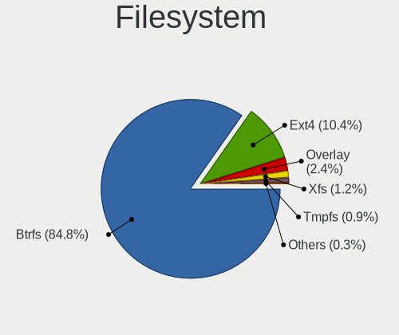
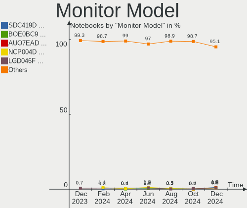
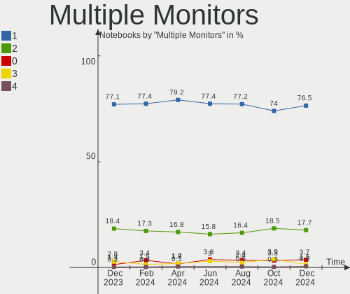
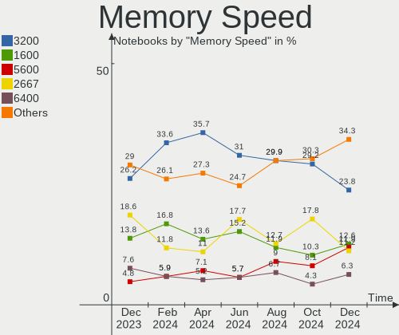

Fedora Hardware Trends (Notebook)
---------------------------------

A project to identify most popular hardware characteristics and track their change
over time based on data collected by Fedora users at https://Linux-Hardware.org.

Anyone can contribute to the study by uploading probes of their computers by
the [hw-probe](https://github.com/linuxhw/hw-probe) tool:

    sudo -E hw-probe -all -upload

Full-feature report is available here: https://linux-hardware.org/?view=trends&formfactor=notebook

Period: Apr, 2021.

Contents
--------

- [ OS                       ](#os)
- [ OS Family                ](#os-family)
- [ Kernel                   ](#kernel)
- [ Kernel Family            ](#kernel-family)
- [ Kernel Major Ver.        ](#kernel-major-ver)
- [ Arch                     ](#arch)
- [ DE                       ](#de)
- [ Display Server           ](#display-server)
- [ Display Manager          ](#display-manager)
- [ OS Lang                  ](#os-lang)
- [ Boot Mode                ](#boot-mode)
- [ Filesystem               ](#filesystem)
- [ Part. scheme             ](#part-scheme)
- [ Dual Boot with Linux/BSD ](#dual-boot-with-linux/bsd)
- [ Dual Boot (Win)          ](#dual-boot-win)
- [ Country                  ](#country)
- [ City                     ](#city)
- [ Vendor                   ](#vendor)
- [ Model                    ](#model)
- [ Model Family             ](#model-family)
- [ MFG Year                 ](#mfg-year)
- [ Form Factor              ](#form-factor)
- [ Secure Boot              ](#secure-boot)
- [ Coreboot                 ](#coreboot)
- [ RAM Size                 ](#ram-size)
- [ RAM Used                 ](#ram-used)
- [ Has CD-ROM               ](#has-cd-rom)
- [ Total Drives             ](#total-drives)
- [ Has Ethernet             ](#has-ethernet)
- [ Has WiFi                 ](#has-wifi)
- [ Has Bluetooth            ](#has-bluetooth)
- [ Drive Vendor             ](#drive-vendor)
- [ Drive Model              ](#drive-model)
- [ HDD Vendor               ](#hdd-vendor)
- [ SSD Vendor               ](#ssd-vendor)
- [ Drive Kind               ](#drive-kind)
- [ Drive Connector          ](#drive-connector)
- [ Drive Size               ](#drive-size)
- [ Space Total              ](#space-total)
- [ Space Used               ](#space-used)
- [ Malfunc. Drives          ](#malfunc-drives)
- [ Malfunc. Drive Vendor    ](#malfunc-drive-vendor)
- [ Malfunc. HDD Vendor      ](#malfunc-hdd-vendor)
- [ Malfunc. Drive Kind      ](#malfunc-drive-kind)
- [ Failed Drives            ](#failed-drives)
- [ Failed Drive Vendor      ](#failed-drive-vendor)
- [ Drive Status             ](#drive-status)
- [ Storage Vendor           ](#storage-vendor)
- [ Storage Model            ](#storage-model)
- [ Storage Kind             ](#storage-kind)
- [ CPU Vendor               ](#cpu-vendor)
- [ CPU Model                ](#cpu-model)
- [ CPU Model Family         ](#cpu-model-family)
- [ CPU Cores                ](#cpu-cores)
- [ CPU Sockets              ](#cpu-sockets)
- [ CPU Threads              ](#cpu-threads)
- [ CPU Op-Modes             ](#cpu-op-modes)
- [ CPU Microcode            ](#cpu-microcode)
- [ CPU Microarch            ](#cpu-microarch)
- [ GPU Vendor               ](#gpu-vendor)
- [ GPU Model                ](#gpu-model)
- [ GPU Combo                ](#gpu-combo)
- [ GPU Driver               ](#gpu-driver)
- [ GPU Memory               ](#gpu-memory)
- [ Monitor Vendor           ](#monitor-vendor)
- [ Monitor Model            ](#monitor-model)
- [ Monitor Resolution       ](#monitor-resolution)
- [ Monitor Diagonal         ](#monitor-diagonal)
- [ Monitor Width            ](#monitor-width)
- [ Aspect Ratio             ](#aspect-ratio)
- [ Monitor Area             ](#monitor-area)
- [ Pixel Density            ](#pixel-density)
- [ Multiple Monitors        ](#multiple-monitors)
- [ Net Controller Vendor    ](#net-controller-vendor)
- [ Net Controller Model     ](#net-controller-model)
- [ Wireless Vendor          ](#wireless-vendor)
- [ Wireless Model           ](#wireless-model)
- [ Ethernet Vendor          ](#ethernet-vendor)
- [ Ethernet Model           ](#ethernet-model)
- [ Net Controller Kind      ](#net-controller-kind)
- [ Used Controller          ](#used-controller)
- [ NICs                     ](#nics)
- [ IPv6                     ](#ipv6)
- [ Memory Vendor            ](#memory-vendor)
- [ Memory Model             ](#memory-model)
- [ Memory Kind              ](#memory-kind)
- [ Memory Form Factor       ](#memory-form-factor)
- [ Memory Size              ](#memory-size)
- [ Memory Speed             ](#memory-speed)
- [ Sound Vendor             ](#sound-vendor)
- [ Sound Model              ](#sound-model)
- [ Camera Vendor            ](#camera-vendor)
- [ Camera Model             ](#camera-model)
- [ Fingerprint Vendor       ](#fingerprint-vendor)
- [ Fingerprint Model        ](#fingerprint-model)
- [ Chipcard Vendor          ](#chipcard-vendor)
- [ Chipcard Model           ](#chipcard-model)
- [ Printer Vendor           ](#printer-vendor)
- [ Printer Model            ](#printer-model)
- [ Scanner Vendor           ](#scanner-vendor)
- [ Scanner Model            ](#scanner-model)
- [ Bluetooth Vendor         ](#bluetooth-vendor)
- [ Bluetooth Model          ](#bluetooth-model)
- [ Unsupported Devices      ](#unsupported-devices)
- [ Unsupported Device Types ](#unsupported-device-types)

OS
--

Installed operating systems

| Name      | Notebooks | Percent |
|-----------|-----------|---------|
| Fedora 33 | 104       | 51.23%  |
| Fedora 34 | 92        | 45.32%  |
| Fedora 32 | 6         | 2.96%   |
| Fedora 35 | 1         | 0.49%   |

OS Family
---------

OS without a version

| Name   | Notebooks | Percent |
|--------|-----------|---------|
| Fedora | 203       | 100%    |

Kernel
------

Version of the Linux kernel

| Version                                              | Notebooks | Percent |
|------------------------------------------------------|-----------|---------|
| 5.11.11-200.fc33.x86_64                              | 37        | 18.23%  |
| 5.11.11-300.fc34.x86_64                              | 24        | 11.82%  |
| 5.11.14-200.fc33.x86_64                              | 22        | 10.84%  |
| 5.11.15-300.fc34.x86_64                              | 16        | 7.88%   |
| 5.11.12-300.fc34.x86_64                              | 14        | 6.9%    |
| 5.8.15-301.fc33.x86_64                               | 10        | 4.93%   |
| 5.11.16-300.fc34.x86_64                              | 8         | 3.94%   |
| 5.11.3-300.fc34.x86_64                               | 7         | 3.45%   |
| 5.11.15-200.fc33.x86_64                              | 7         | 3.45%   |
| 5.11.14-300.fc34.x86_64                              | 7         | 3.45%   |
| 5.11.13-300.fc34.x86_64                              | 7         | 3.45%   |
| 5.11.13-200.fc33.x86_64                              | 6         | 2.96%   |
| 5.11.12-200.fc33.x86_64                              | 6         | 2.96%   |
| 5.11.10-200.fc33.x86_64                              | 6         | 2.96%   |
| 5.11.11-100.fc32.x86_64                              | 4         | 1.97%   |
| 5.11.10-300.fc34.x86_64                              | 4         | 1.97%   |
| 5.11.16-200.fc33.x86_64                              | 3         | 1.48%   |
| 5.11.8-200.fc33.x86_64                               | 2         | 0.99%   |
| 5.10.20-200.fc33.x86_64                              | 2         | 0.99%   |
| 5.6.6-300.fc32.x86_64                                | 1         | 0.49%   |
| 5.4.111                                              | 1         | 0.49%   |
| 5.12.0-rc7+                                          | 1         | 0.49%   |
| 5.12.0-rc4+                                          | 1         | 0.49%   |
| 5.12.0-0.rc6.20210408git454859c552da.186.fc35.x86_64 | 1         | 0.49%   |
| 5.11.7-200.fc33.x86_64                               | 1         | 0.49%   |
| 5.11.17-300.fc34.x86_64                              | 1         | 0.49%   |
| 5.11.16-301.experimental.fc34.x86_64                 | 1         | 0.49%   |
| 5.11.12-100.fc32.x86_64                              | 1         | 0.49%   |
| 5.11.10-xanmod1_cacule.0.fc33                        | 1         | 0.49%   |
| 5.10.13-200.fc33.x86_64                              | 1         | 0.49%   |

Kernel Family
-------------

Linux kernel without a distro release

| Version | Notebooks | Percent |
|---------|-----------|---------|
| 5.11.11 | 65        | 32.02%  |
| 5.11.14 | 29        | 14.29%  |
| 5.11.15 | 23        | 11.33%  |
| 5.11.12 | 21        | 10.34%  |
| 5.11.13 | 13        | 6.4%    |
| 5.11.16 | 12        | 5.91%   |
| 5.11.10 | 11        | 5.42%   |
| 5.8.15  | 10        | 4.93%   |
| 5.11.3  | 7         | 3.45%   |
| 5.12.0  | 3         | 1.48%   |
| 5.11.8  | 2         | 0.99%   |
| 5.10.20 | 2         | 0.99%   |
| 5.6.6   | 1         | 0.49%   |
| 5.4.111 | 1         | 0.49%   |
| 5.11.7  | 1         | 0.49%   |
| 5.11.17 | 1         | 0.49%   |
| 5.10.13 | 1         | 0.49%   |

Kernel Major Ver.
-----------------

Linux kernel major version

| Version | Notebooks | Percent |
|---------|-----------|---------|
| 5.11    | 185       | 91.13%  |
| 5.8     | 10        | 4.93%   |
| 5.12    | 3         | 1.48%   |
| 5.10    | 3         | 1.48%   |
| 5.6     | 1         | 0.49%   |
| 5.4     | 1         | 0.49%   |

Arch
----

OS architecture (x86_64, i586, etc.)

| Name   | Notebooks | Percent |
|--------|-----------|---------|
| x86_64 | 203       | 100%    |

DE
--

Desktop Environment

| Name          | Notebooks | Percent |
|---------------|-----------|---------|
| GNOME         | 157       | 77.34%  |
| KDE5          | 17        | 8.37%   |
| KDE           | 9         | 4.43%   |
| XFCE          | 5         | 2.46%   |
| X-Cinnamon    | 5         | 2.46%   |
| MATE          | 3         | 1.48%   |
| Unknown       | 3         | 1.48%   |
| Cinnamon      | 2         | 0.99%   |
| i3            | 1         | 0.49%   |
| GNOME Classic | 1         | 0.49%   |

Display Server
--------------

X11 or Wayland

| Name    | Notebooks | Percent |
|---------|-----------|---------|
| Wayland | 118       | 58.13%  |
| X11     | 82        | 40.39%  |
| Tty     | 2         | 0.99%   |
| Unknown | 1         | 0.49%   |

Display Manager
---------------

SDDM, LightDM, etc.

| Name    | Notebooks | Percent |
|---------|-----------|---------|
| Unknown | 108       | 53.2%   |
| GDM     | 73        | 35.96%  |
| SDDM    | 14        | 6.9%    |
| TDM     | 7         | 3.45%   |
| KDM     | 1         | 0.49%   |

OS Lang
-------

Language

| Lang    | Notebooks | Percent |
|---------|-----------|---------|
| en_US   | 108       | 53.2%   |
| pt_BR   | 14        | 6.9%    |
| en_GB   | 13        | 6.4%    |
| fr_FR   | 7         | 3.45%   |
| en_AU   | 7         | 3.45%   |
| de_DE   | 7         | 3.45%   |
| ru_RU   | 6         | 2.96%   |
| it_IT   | 6         | 2.96%   |
| zh_CN   | 3         | 1.48%   |
| es_AR   | 3         | 1.48%   |
| tr_TR   | 2         | 0.99%   |
| sv_SE   | 2         | 0.99%   |
| nl_NL   | 2         | 0.99%   |
| es_CL   | 2         | 0.99%   |
| en_CA   | 2         | 0.99%   |
| el_GR   | 2         | 0.99%   |
| Unknown | 2         | 0.99%   |
| zh_HK   | 1         | 0.49%   |
| sl_SI   | 1         | 0.49%   |
| ru_UA   | 1         | 0.49%   |
| pt_PT   | 1         | 0.49%   |
| pl_PL   | 1         | 0.49%   |
| nl_BE   | 1         | 0.49%   |
| hu_HU   | 1         | 0.49%   |
| es_MX   | 1         | 0.49%   |
| es_ES   | 1         | 0.49%   |
| es_EC   | 1         | 0.49%   |
| en_NL   | 1         | 0.49%   |
| en_IN   | 1         | 0.49%   |
| en_DK   | 1         | 0.49%   |
| de_CH   | 1         | 0.49%   |
| cs_CZ   | 1         | 0.49%   |

Boot Mode
---------

EFI or BIOS

| Mode | Notebooks | Percent |
|------|-----------|---------|
| EFI  | 160       | 78.82%  |
| BIOS | 43        | 21.18%  |

Filesystem
----------

Type of filesystem

| Type  | Notebooks | Percent |
|-------|-----------|---------|
| Btrfs | 125       | 61.58%  |
| Ext4  | 68        | 33.5%   |
| Xfs   | 10        | 4.93%   |

Part. scheme
------------

Scheme of partitioning

| Type    | Notebooks | Percent |
|---------|-----------|---------|
| Unknown | 104       | 51.23%  |
| GPT     | 82        | 40.39%  |
| MBR     | 17        | 8.37%   |

Dual Boot with Linux/BSD
------------------------

Hosting more than one Linux/BSD

| Dual boot | Notebooks | Percent |
|-----------|-----------|---------|
| No        | 186       | 91.63%  |
| Yes       | 17        | 8.37%   |

Dual Boot (Win)
---------------

Hosting Linux and Windows

| Dual boot | Notebooks | Percent |
|-----------|-----------|---------|
| No        | 164       | 80.79%  |
| Yes       | 39        | 19.21%  |

Country
-------

Geographic location (country)

| Country     | Notebooks | Percent |
|-------------|-----------|---------|
| USA         | 28        | 13.79%  |
| Brazil      | 20        | 9.85%   |
| Germany     | 15        | 7.39%   |
| Netherlands | 14        | 6.9%    |
| France      | 11        | 5.42%   |
| Italy       | 10        | 4.93%   |
| Russia      | 7         | 3.45%   |
| India       | 6         | 2.96%   |
| Argentina   | 6         | 2.96%   |
| Czechia     | 5         | 2.46%   |
| Australia   | 5         | 2.46%   |
| Ukraine     | 4         | 1.97%   |
| UK          | 4         | 1.97%   |
| Turkey      | 4         | 1.97%   |
| Sweden      | 4         | 1.97%   |
| Slovakia    | 4         | 1.97%   |
| Canada      | 4         | 1.97%   |
| Austria     | 4         | 1.97%   |
| Switzerland | 3         | 1.48%   |
| Spain       | 3         | 1.48%   |
| Poland      | 3         | 1.48%   |
| Iran        | 3         | 1.48%   |
| Hungary     | 3         | 1.48%   |
| China       | 3         | 1.48%   |
| Slovenia    | 2         | 0.99%   |
| Romania     | 2         | 0.99%   |
| Portugal    | 2         | 0.99%   |
| Hong Kong   | 2         | 0.99%   |
| Greece      | 2         | 0.99%   |
| Finland     | 2         | 0.99%   |
| Ecuador     | 2         | 0.99%   |
| Denmark     | 2         | 0.99%   |
| Chile       | 2         | 0.99%   |
| Bulgaria    | 2         | 0.99%   |
| Belgium     | 2         | 0.99%   |
| Vietnam     | 1         | 0.49%   |
| Sri Lanka   | 1         | 0.49%   |
| Paraguay    | 1         | 0.49%   |
| Morocco     | 1         | 0.49%   |
| Montenegro  | 1         | 0.49%   |
| Mexico      | 1         | 0.49%   |
| Croatia     | 1         | 0.49%   |
| Belarus     | 1         | 0.49%   |

City
----

Geographic location (city)

| City              | Notebooks | Percent |
|-------------------|-----------|---------|
| The Hague         | 7         | 3.45%   |
| Prague            | 4         | 1.97%   |
| Berlin            | 4         | 1.97%   |
| Tehran            | 3         | 1.48%   |
| Moscow            | 3         | 1.48%   |
| Kyiv              | 3         | 1.48%   |
| Greifswald        | 3         | 1.48%   |
| Buenos Aires      | 3         | 1.48%   |
| Vienna            | 2         | 0.99%   |
| São Paulo        | 2         | 0.99%   |
| Sydney            | 2         | 0.99%   |
| Sofia             | 2         | 0.99%   |
| Paris             | 2         | 0.99%   |
| Nola              | 2         | 0.99%   |
| New York          | 2         | 0.99%   |
| Milan             | 2         | 0.99%   |
| Madrid            | 2         | 0.99%   |
| Los Angeles       | 2         | 0.99%   |
| Istanbul          | 2         | 0.99%   |
| Handen            | 2         | 0.99%   |
| Feeding Hills     | 2         | 0.99%   |
| Espoo             | 2         | 0.99%   |
| Eibergen          | 2         | 0.99%   |
| Corinth           | 2         | 0.99%   |
| Chipping Norton   | 2         | 0.99%   |
| Central           | 2         | 0.99%   |
| Bucharest         | 2         | 0.99%   |
| Bratislava        | 2         | 0.99%   |
| Brasília         | 2         | 0.99%   |
| Bengaluru         | 2         | 0.99%   |
| Zurich            | 1         | 0.49%   |
| Zagreb            | 1         | 0.49%   |
| Yenne             | 1         | 0.49%   |
| Yakima            | 1         | 0.49%   |
| Winter Park       | 1         | 0.49%   |
| Winnipeg          | 1         | 0.49%   |
| Wiesbaden         | 1         | 0.49%   |
| West Henrietta    | 1         | 0.49%   |
| Warsaw            | 1         | 0.49%   |
| Villa Ballester   | 1         | 0.49%   |
| Vila Nova de Gaia | 1         | 0.49%   |
| Valparaíso       | 1         | 0.49%   |
| Utrecht           | 1         | 0.49%   |
| Uberlândia       | 1         | 0.49%   |
| Tulsa             | 1         | 0.49%   |
| Trabzon           | 1         | 0.49%   |
| The Bronx         | 1         | 0.49%   |
| Temuco            | 1         | 0.49%   |
| Taranto           | 1         | 0.49%   |
| Strasbourg        | 1         | 0.49%   |
| Stockholm         | 1         | 0.49%   |
| Stabroek          | 1         | 0.49%   |
| St Petersburg     | 1         | 0.49%   |
| Smethwick         | 1         | 0.49%   |
| Shiplake          | 1         | 0.49%   |
| Shenzhen          | 1         | 0.49%   |
| Sharon            | 1         | 0.49%   |
| Shanghai          | 1         | 0.49%   |
| Searcy            | 1         | 0.49%   |
| Saratoga Springs  | 1         | 0.49%   |

Vendor
------

Motherboard manufacturer

| Name                                          | Notebooks | Percent |
|-----------------------------------------------|-----------|---------|
| Lenovo                                        | 66        | 32.51%  |
| Dell                                          | 37        | 18.23%  |
| Hewlett-Packard                               | 31        | 15.27%  |
| ASUSTek Computer                              | 15        | 7.39%   |
| Acer                                          | 11        | 5.42%   |
| Notebook                                      | 7         | 3.45%   |
| Samsung Electronics                           | 4         | 1.97%   |
| MSI                                           | 4         | 1.97%   |
| Apple                                         | 3         | 1.48%   |
| Toshiba                                       | 2         | 0.99%   |
| System76                                      | 2         | 0.99%   |
| Positivo                                      | 2         | 0.99%   |
| Panasonic                                     | 2         | 0.99%   |
| TrekStor                                      | 1         | 0.49%   |
| Teclast                                       | 1         | 0.49%   |
| Standard                                      | 1         | 0.49%   |
| Sony                                          | 1         | 0.49%   |
| Shenzhen PLOYER electronics                   | 1         | 0.49%   |
| Razer                                         | 1         | 0.49%   |
| PCBOX                                         | 1         | 0.49%   |
| MPMAN                                         | 1         | 0.49%   |
| Intel                                         | 1         | 0.49%   |
| Insyde                                        | 1         | 0.49%   |
| Gigabyte Technology                           | 1         | 0.49%   |
| Fujitsu                                       | 1         | 0.49%   |
| CRX                                           | 1         | 0.49%   |
| Connect                                       | 1         | 0.49%   |
| CHUWI Innovation And Technology (ShenZhen)co. | 1         | 0.49%   |
| BESSTAR Tech                                  | 1         | 0.49%   |
| Alienware                                     | 1         | 0.49%   |

Model
-----

Motherboard model

| Name                                               | Notebooks | Percent |
|----------------------------------------------------|-----------|---------|
| HP Pavilion Gaming Laptop 15-ec1xxx                | 3         | 1.48%   |
| HP Notebook                                        | 3         | 1.48%   |
| System76 Oryx Pro                                  | 2         | 0.99%   |
| Lenovo ThinkPad X1 Carbon Gen 9 20XWCTO1WW         | 2         | 0.99%   |
| HP Laptop 15-db0xxx                                | 2         | 0.99%   |
| Dell XPS L502X                                     | 2         | 0.99%   |
| Dell XPS 15 7590                                   | 2         | 0.99%   |
| Dell Latitude 5480                                 | 2         | 0.99%   |
| Acer Nitro AN515-44                                | 2         | 0.99%   |
| TrekStor SurfTab wintron 7.0 ST70416-6             | 1         | 0.49%   |
| Toshiba Satellite L50-C                            | 1         | 0.49%   |
| Toshiba Satellite C850D-119                        | 1         | 0.49%   |
| Teclast TbooK 11                                   | 1         | 0.49%   |
| Sony VPCSC41FM                                     | 1         | 0.49%   |
| Shenzhen PLOYER electronics MOMO7W                 | 1         | 0.49%   |
| Samsung R520/R522/R620                             | 1         | 0.49%   |
| Samsung N100SP                                     | 1         | 0.49%   |
| Samsung 800G5M/800G5W                              | 1         | 0.49%   |
| Samsung 300E4A/300E5A/300E7A                       | 1         | 0.49%   |
| Razer Blade 15 Base Model (Early 2020) - RZ09-0328 | 1         | 0.49%   |
| Positivo S14CT01                                   | 1         | 0.49%   |
| Positivo C41TB                                     | 1         | 0.49%   |
| PCBOX Kant                                         | 1         | 0.49%   |
| Panasonic CFSZ5-2L                                 | 1         | 0.49%   |
| Panasonic CFMX4-1                                  | 1         | 0.49%   |
| Notebook PB50_70DFx,DDx                            | 1         | 0.49%   |
| Notebook P95_96_97Ex,Rx                            | 1         | 0.49%   |
| Notebook P377SM-A                                  | 1         | 0.49%   |
| Notebook NL40_50GU                                 | 1         | 0.49%   |
| Notebook NH5xAx                                    | 1         | 0.49%   |
| Notebook N8xEJEK                                   | 1         | 0.49%   |
| Notebook N150CU                                    | 1         | 0.49%   |
| MSI Modern 14 A10M                                 | 1         | 0.49%   |
| MSI GS73VR 7RG                                     | 1         | 0.49%   |
| MSI GL63 8RD                                       | 1         | 0.49%   |
| MSI Bravo 15 A4DDR                                 | 1         | 0.49%   |
| MPMAN MPWIN8900CL                                  | 1         | 0.49%   |
| Lenovo Yoga Slim 7 14ARE05 82A2                    | 1         | 0.49%   |
| Lenovo Yoga S740-14IIL 81RS                        | 1         | 0.49%   |
| Lenovo V330-14ARR 81B1                             | 1         | 0.49%   |
| Lenovo V310-15IKB 80T3                             | 1         | 0.49%   |
| Lenovo ThinkPad X390 20Q00056MX                    | 1         | 0.49%   |
| Lenovo ThinkPad X270 20HMS27Q00                    | 1         | 0.49%   |
| Lenovo ThinkPad X230 2325QT2                       | 1         | 0.49%   |
| Lenovo ThinkPad X230 2325BP9                       | 1         | 0.49%   |
| Lenovo ThinkPad X220 4291V5K                       | 1         | 0.49%   |
| Lenovo ThinkPad X1 Extreme Gen 3 20TKCTO1WW        | 1         | 0.49%   |
| Lenovo ThinkPad X1 Extreme 2nd 20QVCTO1WW          | 1         | 0.49%   |
| Lenovo ThinkPad X1 Extreme 20MGS0P400              | 1         | 0.49%   |
| Lenovo ThinkPad X1 Carbon Gen 8 20U9CTO1WW         | 1         | 0.49%   |
| Lenovo ThinkPad X1 Carbon 3rd 20BTS0MX00           | 1         | 0.49%   |
| Lenovo ThinkPad X1 Carbon 2nd 20A8S0ET00           | 1         | 0.49%   |
| Lenovo ThinkPad W550s 20E1S0L500                   | 1         | 0.49%   |
| Lenovo ThinkPad W541 20EF000UMN                    | 1         | 0.49%   |
| Lenovo ThinkPad T590 20N4CTO1WW                    | 1         | 0.49%   |
| Lenovo ThinkPad T580 20LAS3NJ0R                    | 1         | 0.49%   |
| Lenovo ThinkPad T580 20LAS3NJ08                    | 1         | 0.49%   |
| Lenovo ThinkPad T560 20FHCTO1WW                    | 1         | 0.49%   |
| Lenovo ThinkPad T490 20N20009MC                    | 1         | 0.49%   |
| Lenovo ThinkPad T480s 20L8S2UQ1F                   | 1         | 0.49%   |

Model Family
------------

Motherboard model prefix

| Name                               | Notebooks | Percent |
|------------------------------------|-----------|---------|
| Lenovo ThinkPad                    | 46        | 22.66%  |
| Dell Inspiron                      | 15        | 7.39%   |
| Lenovo IdeaPad                     | 11        | 5.42%   |
| Dell Latitude                      | 9         | 4.43%   |
| Dell XPS                           | 8         | 3.94%   |
| HP Pavilion                        | 7         | 3.45%   |
| HP Laptop                          | 6         | 2.96%   |
| HP EliteBook                       | 6         | 2.96%   |
| HP ProBook                         | 5         | 2.46%   |
| Acer Aspire                        | 5         | 2.46%   |
| Acer Nitro                         | 4         | 1.97%   |
| HP Notebook                        | 3         | 1.48%   |
| Toshiba Satellite                  | 2         | 0.99%   |
| System76 Oryx                      | 2         | 0.99%   |
| Lenovo Yoga                        | 2         | 0.99%   |
| Dell Precision                     | 2         | 0.99%   |
| ASUS TUF                           | 2         | 0.99%   |
| TrekStor SurfTab                   | 1         | 0.49%   |
| Teclast TbooK                      | 1         | 0.49%   |
| Sony VPCSC41FM                     | 1         | 0.49%   |
| Shenzhen PLOYER electronics MOMO7W | 1         | 0.49%   |
| Samsung R520                       | 1         | 0.49%   |
| Samsung N100SP                     | 1         | 0.49%   |
| Samsung 800G5M                     | 1         | 0.49%   |
| Samsung 300E4A                     | 1         | 0.49%   |
| Razer Blade                        | 1         | 0.49%   |
| Positivo S14CT01                   | 1         | 0.49%   |
| Positivo C41TB                     | 1         | 0.49%   |
| PCBOX Kant                         | 1         | 0.49%   |
| Panasonic CFSZ5-2L                 | 1         | 0.49%   |
| Panasonic CFMX4-1                  | 1         | 0.49%   |
| Notebook PB50                      | 1         | 0.49%   |
| Notebook P95                       | 1         | 0.49%   |
| Notebook P377SM-A                  | 1         | 0.49%   |
| Notebook NL40                      | 1         | 0.49%   |
| Notebook NH5xAx                    | 1         | 0.49%   |
| Notebook N8xEJEK                   | 1         | 0.49%   |
| Notebook N150CU                    | 1         | 0.49%   |
| MSI Modern                         | 1         | 0.49%   |
| MSI GS73VR                         | 1         | 0.49%   |
| MSI GL63                           | 1         | 0.49%   |
| MSI Bravo                          | 1         | 0.49%   |
| MPMAN MPWIN8900CL                  | 1         | 0.49%   |
| Lenovo V330-14ARR                  | 1         | 0.49%   |
| Lenovo V310-15IKB                  | 1         | 0.49%   |
| Lenovo G70-70                      | 1         | 0.49%   |
| Lenovo G500s                       | 1         | 0.49%   |
| Lenovo G50-45                      | 1         | 0.49%   |
| Lenovo G40-80                      | 1         | 0.49%   |
| Lenovo G40-70                      | 1         | 0.49%   |
| Intel TW9                          | 1         | 0.49%   |
| Insyde i71c                        | 1         | 0.49%   |
| HP Elite                           | 1         | 0.49%   |
| HP 355                             | 1         | 0.49%   |
| HP 250                             | 1         | 0.49%   |
| HP 246                             | 1         | 0.49%   |
| Gigabyte AERO                      | 1         | 0.49%   |
| Fujitsu LIFEBOOK                   | 1         | 0.49%   |
| Dell Vostro                        | 1         | 0.49%   |
| Dell Venue                         | 1         | 0.49%   |

MFG Year
--------

Motherboard manufacture year

| Year | Notebooks | Percent |
|------|-----------|---------|
| 2020 | 74        | 36.45%  |
| 2019 | 29        | 14.29%  |
| 2021 | 19        | 9.36%   |
| 2018 | 15        | 7.39%   |
| 2015 | 14        | 6.9%    |
| 2016 | 13        | 6.4%    |
| 2012 | 11        | 5.42%   |
| 2017 | 8         | 3.94%   |
| 2014 | 6         | 2.96%   |
| 2013 | 6         | 2.96%   |
| 2011 | 4         | 1.97%   |
| 2010 | 3         | 1.48%   |
| 2009 | 1         | 0.49%   |

Form Factor
-----------

Physical design of the computer

| Name     | Notebooks | Percent |
|----------|-----------|---------|
| Notebook | 202       | 99.51%  |
| Other    | 1         | 0.49%   |

Secure Boot
-----------

Enabled or disabled

| State    | Notebooks | Percent |
|----------|-----------|---------|
| Disabled | 176       | 86.7%   |
| Enabled  | 27        | 13.3%   |

Coreboot
--------

Have coreboot on board

| Used | Notebooks | Percent |
|------|-----------|---------|
| No   | 202       | 99.51%  |
| Yes  | 1         | 0.49%   |

RAM Size
--------

Total RAM memory

| Size in GB  | Notebooks | Percent |
|-------------|-----------|---------|
| 4.01-8.0    | 71        | 34.98%  |
| 16.01-24.0  | 39        | 19.21%  |
| 32.01-64.0  | 33        | 16.26%  |
| 8.01-16.0   | 30        | 14.78%  |
| 3.01-4.0    | 15        | 7.39%   |
| 0.51-1.0    | 5         | 2.46%   |
| 64.01-256.0 | 4         | 1.97%   |
| 24.01-32.0  | 3         | 1.48%   |
| 1.01-2.0    | 3         | 1.48%   |

RAM Used
--------

Used RAM memory

| Used GB    | Notebooks | Percent |
|------------|-----------|---------|
| 2.01-3.0   | 64        | 31.53%  |
| 4.01-8.0   | 56        | 27.59%  |
| 3.01-4.0   | 34        | 16.75%  |
| 1.01-2.0   | 30        | 14.78%  |
| 8.01-16.0  | 9         | 4.43%   |
| 0.51-1.0   | 8         | 3.94%   |
| 24.01-32.0 | 1         | 0.49%   |
| 16.01-24.0 | 1         | 0.49%   |

Has CD-ROM
----------

Has CD-ROM on board

| Presented | Notebooks | Percent |
|-----------|-----------|---------|
| No        | 158       | 77.83%  |
| Yes       | 45        | 22.17%  |

Total Drives
------------

Number of drives on board

| Drives | Notebooks | Percent |
|--------|-----------|---------|
| 1      | 138       | 67.98%  |
| 2      | 57        | 28.08%  |
| 3      | 5         | 2.46%   |
| 5      | 2         | 0.99%   |
| 4      | 1         | 0.49%   |

Has Ethernet
------------

Has Ethernet on board

| Presented | Notebooks | Percent |
|-----------|-----------|---------|
| Yes       | 164       | 80.79%  |
| No        | 39        | 19.21%  |

Has WiFi
--------

Has WiFi module

| Presented | Notebooks | Percent |
|-----------|-----------|---------|
| Yes       | 195       | 96.06%  |
| No        | 8         | 3.94%   |

Has Bluetooth
-------------

Has Bluetooth module

| Presented | Notebooks | Percent |
|-----------|-----------|---------|
| Yes       | 169       | 83.25%  |
| No        | 34        | 16.75%  |

Drive Vendor
------------

Hard drive vendors

| Vendor                | Notebooks | Drives | Percent |
|-----------------------|-----------|--------|---------|
| Samsung Electronics   | 56        | 70     | 21.29%  |
| WDC                   | 30        | 31     | 11.41%  |
| Seagate               | 22        | 25     | 8.37%   |
| Toshiba               | 20        | 21     | 7.6%    |
| Unknown               | 19        | 19     | 7.22%   |
| SK Hynix              | 15        | 17     | 5.7%    |
| SanDisk               | 15        | 15     | 5.7%    |
| Kingston              | 15        | 15     | 5.7%    |
| Intel                 | 14        | 15     | 5.32%   |
| Crucial               | 9         | 9      | 3.42%   |
| HGST                  | 6         | 6      | 2.28%   |
| Micron Technology     | 4         | 4      | 1.52%   |
| KIOXIA                | 4         | 4      | 1.52%   |
| A-DATA Technology     | 4         | 4      | 1.52%   |
| Phison                | 3         | 3      | 1.14%   |
| Corsair               | 3         | 3      | 1.14%   |
| PNY                   | 2         | 2      | 0.76%   |
| LITEON                | 2         | 2      | 0.76%   |
| Hitachi               | 2         | 2      | 0.76%   |
| XPG                   | 1         | 2      | 0.38%   |
| W800S                 | 1         | 1      | 0.38%   |
| Union Memory          | 1         | 1      | 0.38%   |
| Team                  | 1         | 1      | 0.38%   |
| Silicon Motion        | 1         | 1      | 0.38%   |
| SABRENT               | 1         | 1      | 0.38%   |
| Realtek Semiconductor | 1         | 1      | 0.38%   |
| Patriot               | 1         | 1      | 0.38%   |
| OCZ                   | 1         | 1      | 0.38%   |
| Lite-On               | 1         | 1      | 0.38%   |
| Lexar                 | 1         | 1      | 0.38%   |
| LDLC                  | 1         | 1      | 0.38%   |
| KingFast              | 1         | 1      | 0.38%   |
| Hewlett-Packard       | 1         | 1      | 0.38%   |
| GOODRAM               | 1         | 1      | 0.38%   |
| DOGFISH               | 1         | 1      | 0.38%   |
| China                 | 1         | 2      | 0.38%   |
| Apple                 | 1         | 1      | 0.38%   |

Drive Model
-----------

Hard drive models

| Model                                | Notebooks | Percent |
|--------------------------------------|-----------|---------|
| Kingston SA400S37240G 240GB SSD      | 7         | 2.5%    |
| Seagate ST1000LM024 HN-M101MBB 1TB   | 6         | 2.14%   |
| Samsung NVMe SSD Drive 256GB         | 5         | 1.79%   |
| Unknown NCard  16GB                  | 4         | 1.43%   |
| Samsung SSD 860 EVO 500GB            | 4         | 1.43%   |
| Intel NVMe SSD Drive 512GB           | 4         | 1.43%   |
| Seagate Expansion 4TB                | 3         | 1.07%   |
| Samsung SSD 970 EVO Plus 500GB       | 3         | 1.07%   |
| Samsung SSD 860 EVO 2TB              | 3         | 1.07%   |
| Samsung SSD 860 EVO 1TB              | 3         | 1.07%   |
| Samsung NVMe SSD Drive 512GB         | 3         | 1.07%   |
| Samsung NVMe SSD Drive 500GB         | 3         | 1.07%   |
| Samsung NVMe SSD Drive 2TB           | 3         | 1.07%   |
| HGST HTS721010A9E630 1TB             | 3         | 1.07%   |
| Crucial CT1000MX500SSD1 1TB          | 3         | 1.07%   |
| WDC WD10JPVX-22JC3T0 1TB             | 2         | 0.71%   |
| WDC WD10JPCX-24UE4T0 1TB             | 2         | 0.71%   |
| WDC PC SN720 SDAQNTW-512G-1001 512GB | 2         | 0.71%   |
| Unknown SD/MMC/MS PRO 32GB           | 2         | 0.71%   |
| Unknown MMC Card  32GB               | 2         | 0.71%   |
| Toshiba NVMe SSD Drive 256GB         | 2         | 0.71%   |
| Toshiba MQ04ABF100 1TB               | 2         | 0.71%   |
| SK Hynix NVMe SSD Drive 256GB        | 2         | 0.71%   |
| SK Hynix HCG8e  64GB                 | 2         | 0.71%   |
| Seagate ST1000LM035-1RK172 1TB       | 2         | 0.71%   |
| Sandisk NVMe SSD Drive 512GB         | 2         | 0.71%   |
| Samsung SSD 970 EVO Plus 1TB         | 2         | 0.71%   |
| Samsung SSD 860 EVO 250GB            | 2         | 0.71%   |
| Samsung NVMe SSD Drive 1TB           | 2         | 0.71%   |
| Phison NVMe SSD Drive 1TB            | 2         | 0.71%   |
| KIOXIA NVMe SSD Drive 256GB          | 2         | 0.71%   |
| Kingston SA400S37480G 480GB SSD      | 2         | 0.71%   |
| Intel SSDPEKNW512G8H 512GB           | 2         | 0.71%   |
| Crucial CT240BX500SSD1 240GB         | 2         | 0.71%   |
| Crucial CT120BX500SSD1 120GB         | 2         | 0.71%   |
| XPG NVMe SSD Drive 256GB             | 1         | 0.36%   |
| XPG GAMMIX S11 Pro 2TB               | 1         | 0.36%   |
| WDC WDS500G2B0B-00YS70 500GB SSD     | 1         | 0.36%   |
| WDC WDS500G2B0A-00SM50 500GB SSD     | 1         | 0.36%   |
| WDC WDS250G2B0C-00PXH0 250GB         | 1         | 0.36%   |
| WDC WDS240G2G0B-00EPW0 240GB SSD     | 1         | 0.36%   |
| WDC WDS240G2G0A-00JH30 240GB SSD     | 1         | 0.36%   |
| WDC WDS100T2B0C-00PXH0 1TB           | 1         | 0.36%   |
| WDC WD5000LPVX-22V0TT0 500GB         | 1         | 0.36%   |
| WDC WD5000LPVX-00V0TT0 500GB         | 1         | 0.36%   |
| WDC WD5000LPSX-08A6W 500GB           | 1         | 0.36%   |
| WDC WD5000LPLX-08ZNTT0 500GB         | 1         | 0.36%   |
| WDC WD5000LPCX-35VHAT0 500GB         | 1         | 0.36%   |
| WDC WD5000LPCX-24C6HT0 500GB         | 1         | 0.36%   |
| WDC WD5000BPKT-08PK4T0 500GB         | 1         | 0.36%   |
| WDC WD16 00BEVT-60ZCT 160GB          | 1         | 0.36%   |
| WDC WD10SPZX-24Z10T0 1TB             | 1         | 0.36%   |
| WDC WD10SPZX-24Z10 1TB               | 1         | 0.36%   |
| WDC WD10SPZX-22Z10T1 1TB             | 1         | 0.36%   |
| WDC WD10SPZX-21Z10T0 1TB             | 1         | 0.36%   |
| WDC WD10SPZX-08Z10 1TB               | 1         | 0.36%   |
| WDC WD10SPSX-22A6WT0 1TB             | 1         | 0.36%   |
| WDC WD10JPVX-60JC3T0 1TB             | 1         | 0.36%   |
| WDC PC SN530 SDBPTPZ-512G-1002 512GB | 1         | 0.36%   |
| WDC PC SN530 SDBPNPZ-512G-1014 512GB | 1         | 0.36%   |

HDD Vendor
----------

Hard disk drive vendors

| Vendor  | Notebooks | Drives | Percent |
|---------|-----------|--------|---------|
| Seagate | 20        | 22     | 37.74%  |
| WDC     | 19        | 19     | 35.85%  |
| Toshiba | 6         | 6      | 11.32%  |
| HGST    | 6         | 6      | 11.32%  |
| Hitachi | 2         | 2      | 3.77%   |

SSD Vendor
----------

Solid state drive vendors

| Vendor              | Notebooks | Drives | Percent |
|---------------------|-----------|--------|---------|
| Samsung Electronics | 27        | 31     | 30.34%  |
| Kingston            | 13        | 13     | 14.61%  |
| SanDisk             | 12        | 12     | 13.48%  |
| Crucial             | 8         | 8      | 8.99%   |
| WDC                 | 4         | 4      | 4.49%   |
| Intel               | 3         | 3      | 3.37%   |
| A-DATA Technology   | 3         | 3      | 3.37%   |
| Toshiba             | 2         | 2      | 2.25%   |
| SK Hynix            | 2         | 2      | 2.25%   |
| PNY                 | 2         | 2      | 2.25%   |
| Corsair             | 2         | 2      | 2.25%   |
| W800S               | 1         | 1      | 1.12%   |
| Unknown             | 1         | 1      | 1.12%   |
| SABRENT             | 1         | 1      | 1.12%   |
| Patriot             | 1         | 1      | 1.12%   |
| OCZ                 | 1         | 1      | 1.12%   |
| LITEON              | 1         | 1      | 1.12%   |
| Lexar               | 1         | 1      | 1.12%   |
| GOODRAM             | 1         | 1      | 1.12%   |
| DOGFISH             | 1         | 1      | 1.12%   |
| China               | 1         | 2      | 1.12%   |
| Apple               | 1         | 1      | 1.12%   |

Drive Kind
----------

HDD or SSD

| Kind    | Notebooks | Drives | Percent |
|---------|-----------|--------|---------|
| NVMe    | 101       | 117    | 39%     |
| SSD     | 86        | 94     | 33.2%   |
| HDD     | 51        | 55     | 19.69%  |
| MMC     | 15        | 15     | 5.79%   |
| Unknown | 6         | 6      | 2.32%   |

Drive Connector
---------------

SATA, SAS, NVMe, etc.

| Type | Notebooks | Drives | Percent |
|------|-----------|--------|---------|
| SATA | 118       | 142    | 48.36%  |
| NVMe | 101       | 117    | 41.39%  |
| MMC  | 15        | 15     | 6.15%   |
| SAS  | 10        | 13     | 4.1%    |

Drive Size
----------

Size of hard drive

| Size in TB | Notebooks | Drives | Percent |
|------------|-----------|--------|---------|
| 0.01-0.5   | 82        | 91     | 60.74%  |
| 0.51-1.0   | 45        | 49     | 33.33%  |
| 1.01-2.0   | 5         | 6      | 3.7%    |
| 3.01-4.0   | 3         | 3      | 2.22%   |

Space Total
-----------

Amount of disk space available on the file system

| Size in GB     | Notebooks | Percent |
|----------------|-----------|---------|
| 251-500        | 54        | 26.6%   |
| 501-1000       | 41        | 20.2%   |
| 1001-2000      | 29        | 14.29%  |
| 101-250        | 24        | 11.82%  |
| 1-20           | 21        | 10.34%  |
| Unknown        | 14        | 6.9%    |
| 21-50          | 8         | 3.94%   |
| More than 3000 | 6         | 2.96%   |
| 2001-3000      | 3         | 1.48%   |
| 51-100         | 3         | 1.48%   |

Space Used
----------

Amount of used disk space

| Used GB        | Notebooks | Percent |
|----------------|-----------|---------|
| 1-20           | 47        | 23.15%  |
| 101-250        | 34        | 16.75%  |
| 251-500        | 32        | 15.76%  |
| 21-50          | 26        | 12.81%  |
| 51-100         | 26        | 12.81%  |
| 501-1000       | 16        | 7.88%   |
| Unknown        | 14        | 6.9%    |
| 1001-2000      | 6         | 2.96%   |
| More than 3000 | 1         | 0.49%   |
| 2001-3000      | 1         | 0.49%   |

Malfunc. Drives
---------------

Drive models with a malfunction

| Model                              | Notebooks | Drives | Percent |
|------------------------------------|-----------|--------|---------|
| Seagate ST1000LM024 HN-M101MBB 1TB | 2         | 2      | 33.33%  |
| WDC WD10JPCX-24UE4T0 1TB           | 1         | 1      | 16.67%  |
| Seagate ST9500420AS 500GB          | 1         | 2      | 16.67%  |
| Seagate ST500LT012-1DG142 500GB    | 1         | 1      | 16.67%  |
| Seagate ST500LM021-1KJ152 500GB    | 1         | 1      | 16.67%  |

Malfunc. Drive Vendor
---------------------

Vendors of faulty drives

| Vendor  | Notebooks | Drives | Percent |
|---------|-----------|--------|---------|
| Seagate | 5         | 6      | 83.33%  |
| WDC     | 1         | 1      | 16.67%  |

Malfunc. HDD Vendor
-------------------

Vendors of faulty HDD drives

| Vendor  | Notebooks | Drives | Percent |
|---------|-----------|--------|---------|
| Seagate | 5         | 6      | 83.33%  |
| WDC     | 1         | 1      | 16.67%  |

Malfunc. Drive Kind
-------------------

Kinds of faulty drives

| Kind | Notebooks | Drives | Percent |
|------|-----------|--------|---------|
| HDD  | 6         | 7      | 100%    |

Failed Drives
-------------

Failed drive models

Zero info for selected period =(

Failed Drive Vendor
-------------------

Failed drive vendors

Zero info for selected period =(

Drive Status
------------

Number of failed and malfunc. drives

| Status   | Notebooks | Drives | Percent |
|----------|-----------|--------|---------|
| Detected | 115       | 160    | 53.24%  |
| Works    | 95        | 120    | 43.98%  |
| Malfunc  | 6         | 7      | 2.78%   |

Storage Vendor
--------------

Storage controller vendors

| Vendor                         | Notebooks | Percent |
|--------------------------------|-----------|---------|
| Intel                          | 127       | 51.21%  |
| Samsung Electronics            | 33        | 13.31%  |
| AMD                            | 28        | 11.29%  |
| SK Hynix                       | 11        | 4.44%   |
| Sandisk                        | 11        | 4.44%   |
| Toshiba America Info Systems   | 10        | 4.03%   |
| Phison Electronics             | 4         | 1.61%   |
| Micron Technology              | 4         | 1.61%   |
| KIOXIA                         | 4         | 1.61%   |
| Silicon Motion                 | 3         | 1.21%   |
| Seagate Technology             | 2         | 0.81%   |
| Lite-On Technology             | 2         | 0.81%   |
| Kingston Technology Company    | 2         | 0.81%   |
| ADATA Technology               | 2         | 0.81%   |
| Union Memory (Shenzhen)        | 1         | 0.4%    |
| Solid State Storage Technology | 1         | 0.4%    |
| Realtek Semiconductor          | 1         | 0.4%    |
| Nvidia                         | 1         | 0.4%    |
| Micron/Crucial Technology      | 1         | 0.4%    |

Storage Model
-------------

Storage controller models

| Model                                                                            | Notebooks | Percent |
|----------------------------------------------------------------------------------|-----------|---------|
| AMD FCH SATA Controller [AHCI mode]                                              | 26        | 10.28%  |
| Samsung NVMe SSD Controller SM981/PM981/PM983                                    | 24        | 9.49%   |
| Intel Sunrise Point-LP SATA Controller [AHCI mode]                               | 22        | 8.7%    |
| Intel 7 Series Chipset Family 6-port SATA Controller [AHCI mode]                 | 12        | 4.74%   |
| Intel 82801 Mobile SATA Controller [RAID mode]                                   | 11        | 4.35%   |
| Intel 6 Series/C200 Series Chipset Family 6 port Mobile SATA AHCI Controller     | 10        | 3.95%   |
| Intel Cannon Lake Mobile PCH SATA AHCI Controller                                | 9         | 3.56%   |
| Intel Wildcat Point-LP SATA Controller [AHCI Mode]                               | 8         | 3.16%   |
| Intel SSD 660P Series                                                            | 6         | 2.37%   |
| Intel 8 Series/C220 Series Chipset Family 6-port SATA Controller 1 [AHCI mode]   | 6         | 2.37%   |
| Toshiba America Info Systems XG6 NVMe SSD Controller                             | 5         | 1.98%   |
| Intel HM170/QM170 Chipset SATA Controller [AHCI Mode]                            | 5         | 1.98%   |
| Intel 8 Series SATA Controller 1 [AHCI mode]                                     | 5         | 1.98%   |
| SK Hynix Non-Volatile memory controller                                          | 4         | 1.58%   |
| Sandisk WD Blue SN550 NVMe SSD                                                   | 4         | 1.58%   |
| Samsung NVMe Controller                                                          | 4         | 1.58%   |
| Micron Non-Volatile memory controller                                            | 4         | 1.58%   |
| KIOXIA Non-Volatile memory controller                                            | 4         | 1.58%   |
| Intel SSD Pro 7600p/760p/E 6100p Series                                          | 4         | 1.58%   |
| Intel Comet Lake SATA AHCI Controller                                            | 4         | 1.58%   |
| Intel Celeron/Pentium Silver Processor SATA Controller                           | 4         | 1.58%   |
| Intel Cannon Point-LP SATA Controller [AHCI Mode]                                | 4         | 1.58%   |
| Toshiba America Info Systems BG3 NVMe SSD Controller                             | 3         | 1.19%   |
| SK Hynix BC511                                                                   | 3         | 1.19%   |
| SK Hynix BC501 NVMe Solid State Drive 512GB                                      | 3         | 1.19%   |
| Silicon Motion SM2263EN/SM2263XT SSD Controller                                  | 3         | 1.19%   |
| Sandisk WD Black 2018/SN750 / PC SN720 NVMe SSD                                  | 3         | 1.19%   |
| Phison E12 NVMe Controller                                                       | 3         | 1.19%   |
| Intel Ice Lake-LP SATA Controller [AHCI mode]                                    | 3         | 1.19%   |
| Intel 400 Series Chipset Family SATA AHCI Controller                             | 3         | 1.19%   |
| Seagate FireCuda 510 SSD                                                         | 2         | 0.79%   |
| Sandisk Non-Volatile memory controller                                           | 2         | 0.79%   |
| Samsung NVMe SSD Controller SM961/PM961/SM963                                    | 2         | 0.79%   |
| Lite-On NVMe Controller                                                          | 2         | 0.79%   |
| Intel Volume Management Device NVMe RAID Controller                              | 2         | 0.79%   |
| Intel Atom Processor E3800 Series SATA AHCI Controller                           | 2         | 0.79%   |
| Intel 5 Series/3400 Series Chipset 6 port SATA AHCI Controller                   | 2         | 0.79%   |
| Intel 5 Series/3400 Series Chipset 4 port SATA AHCI Controller                   | 2         | 0.79%   |
| AMD SB7x0/SB8x0/SB9x0 SATA Controller [AHCI mode]                                | 2         | 0.79%   |
| ADATA XPG SX8200 Pro PCIe Gen3x4 M.2 2280 Solid State Drive                      | 2         | 0.79%   |
| Union Memory (Shenzhen) Non-Volatile memory controller                           | 1         | 0.4%    |
| Toshiba America Info Systems XG4 NVMe SSD Controller                             | 1         | 0.4%    |
| Toshiba America Info Systems Toshiba America Info Non-Volatile memory controller | 1         | 0.4%    |
| Solid State Storage Non-Volatile memory controller                               | 1         | 0.4%    |
| SK Hynix NVMe SSD Controller                                                     | 1         | 0.4%    |
| Sandisk WD Blue SN500 / PC SN520 NVMe SSD                                        | 1         | 0.4%    |
| Sandisk PC SN520 NVMe SSD                                                        | 1         | 0.4%    |
| Samsung NVMe SSD Controller SM951/PM951                                          | 1         | 0.4%    |
| Samsung NVMe SSD Controller PM9A1/980PRO                                         | 1         | 0.4%    |
| Samsung Electronics SATA controller                                              | 1         | 0.4%    |
| Realtek RTS5763DL NVMe SSD Controller                                            | 1         | 0.4%    |
| Phison E16 PCIe4 NVMe Controller                                                 | 1         | 0.4%    |
| Nvidia MCP89 SATA Controller (AHCI mode)                                         | 1         | 0.4%    |
| Micron/Crucial Non-Volatile memory controller                                    | 1         | 0.4%    |
| Kingston Company U-SNS8154P3 NVMe SSD                                            | 1         | 0.4%    |
| Kingston Company OM3PDP3 NVMe SSD                                                | 1         | 0.4%    |
| Intel Q170/Q150/B150/H170/H110/Z170/CM236 Chipset SATA Controller [AHCI Mode]    | 1         | 0.4%    |
| Intel NVMe Optane Memory Series                                                  | 1         | 0.4%    |
| Intel NM10/ICH7 Family SATA Controller [AHCI mode]                               | 1         | 0.4%    |
| Intel Atom/Celeron/Pentium Processor x5-E8000/J3xxx/N3xxx Series SATA Controller | 1         | 0.4%    |

Storage Kind
------------

Kind of storage controller (IDE, SATA, NVMe, SAS, ...)

| Kind | Notebooks | Percent |
|------|-----------|---------|
| SATA | 137       | 55.47%  |
| NVMe | 98        | 39.68%  |
| RAID | 11        | 4.45%   |
| IDE  | 1         | 0.4%    |

CPU Vendor
----------

Processor vendors

| Vendor | Notebooks | Percent |
|--------|-----------|---------|
| Intel  | 164       | 80.79%  |
| AMD    | 39        | 19.21%  |

CPU Model
---------

Processor models

| Model                                         | Notebooks | Percent |
|-----------------------------------------------|-----------|---------|
| Intel Core i5-8250U CPU @ 1.60GHz             | 7         | 3.45%   |
| Intel Core i7-8750H CPU @ 2.20GHz             | 6         | 2.96%   |
| Intel Core i5-8265U CPU @ 1.60GHz             | 6         | 2.96%   |
| Intel Core i5-6200U CPU @ 2.30GHz             | 5         | 2.46%   |
| Intel Core i5-10210U CPU @ 1.60GHz            | 5         | 2.46%   |
| Intel Atom CPU Z3735G @ 1.33GHz               | 5         | 2.46%   |
| AMD Ryzen 7 4800H with Radeon Graphics        | 5         | 2.46%   |
| AMD Ryzen 5 2500U with Radeon Vega Mobile Gfx | 5         | 2.46%   |
| Intel Core i7-10750H CPU @ 2.60GHz            | 4         | 1.97%   |
| Intel Core i7-10510U CPU @ 1.80GHz            | 4         | 1.97%   |
| Intel Core i7-8650U CPU @ 1.90GHz             | 3         | 1.48%   |
| Intel Core i7-8565U CPU @ 1.80GHz             | 3         | 1.48%   |
| Intel Core i7-8550U CPU @ 1.80GHz             | 3         | 1.48%   |
| Intel Core i7-7700HQ CPU @ 2.80GHz            | 3         | 1.48%   |
| Intel Core i7-3520M CPU @ 2.90GHz             | 3         | 1.48%   |
| Intel Core i7-10875H CPU @ 2.30GHz            | 3         | 1.48%   |
| Intel Core i5-7200U CPU @ 2.50GHz             | 3         | 1.48%   |
| Intel Core i5-5200U CPU @ 2.20GHz             | 3         | 1.48%   |
| Intel Core i5-1035G1 CPU @ 1.00GHz            | 3         | 1.48%   |
| Intel 11th Gen Core i7-1165G7 @ 2.80GHz       | 3         | 1.48%   |
| Intel Core i7-9750H CPU @ 2.60GHz             | 2         | 0.99%   |
| Intel Core i7-7500U CPU @ 2.70GHz             | 2         | 0.99%   |
| Intel Core i7-6820HQ CPU @ 2.70GHz            | 2         | 0.99%   |
| Intel Core i7-6500U CPU @ 2.50GHz             | 2         | 0.99%   |
| Intel Core i7-5500U CPU @ 2.40GHz             | 2         | 0.99%   |
| Intel Core i7-2670QM CPU @ 2.20GHz            | 2         | 0.99%   |
| Intel Core i7-10850H CPU @ 2.70GHz            | 2         | 0.99%   |
| Intel Core i5-9300H CPU @ 2.40GHz             | 2         | 0.99%   |
| Intel Core i5-6300U CPU @ 2.40GHz             | 2         | 0.99%   |
| Intel Core i5-5300U CPU @ 2.30GHz             | 2         | 0.99%   |
| Intel Core i5-4300M CPU @ 2.60GHz             | 2         | 0.99%   |
| Intel Core i5-3320M CPU @ 2.60GHz             | 2         | 0.99%   |
| Intel Core i5-2520M CPU @ 2.50GHz             | 2         | 0.99%   |
| Intel Core i3-4005U CPU @ 1.70GHz             | 2         | 0.99%   |
| Intel Atom x5-Z8300 CPU @ 1.44GHz             | 2         | 0.99%   |
| Intel 11th Gen Core i5-1135G7 @ 2.40GHz       | 2         | 0.99%   |
| AMD Ryzen 5 4600H with Radeon Graphics        | 2         | 0.99%   |
| AMD Ryzen 5 4500U with Radeon Graphics        | 2         | 0.99%   |
| AMD Ryzen 5 3500U with Radeon Vega Mobile Gfx | 2         | 0.99%   |
| AMD Ryzen 3 3250U with Radeon Graphics        | 2         | 0.99%   |
| AMD Ryzen 3 3200U with Radeon Vega Mobile Gfx | 2         | 0.99%   |
| AMD A10-5750M APU with Radeon HD Graphics     | 2         | 0.99%   |
| Intel Pentium Silver N5000 CPU @ 1.10GHz      | 1         | 0.49%   |
| Intel Pentium Dual CPU T3400 @ 2.16GHz        | 1         | 0.49%   |
| Intel Pentium CPU N3700 @ 1.60GHz             | 1         | 0.49%   |
| Intel Pentium CPU N3540 @ 2.16GHz             | 1         | 0.49%   |
| Intel Pentium CPU N3530 @ 2.16GHz             | 1         | 0.49%   |
| Intel Pentium CPU B940 @ 2.00GHz              | 1         | 0.49%   |
| Intel Pentium CPU 2117U @ 1.80GHz             | 1         | 0.49%   |
| Intel Pentium 3556U @ 1.70GHz                 | 1         | 0.49%   |
| Intel Core m7-6Y75 CPU @ 1.20GHz              | 1         | 0.49%   |
| Intel Core i9-9980HK CPU @ 2.40GHz            | 1         | 0.49%   |
| Intel Core i9-9880H CPU @ 2.30GHz             | 1         | 0.49%   |
| Intel Core i9-8950HK CPU @ 2.90GHz            | 1         | 0.49%   |
| Intel Core i9-10900K CPU @ 3.70GHz            | 1         | 0.49%   |
| Intel Core i7-8850H CPU @ 2.60GHz             | 1         | 0.49%   |
| Intel Core i7-8665U CPU @ 1.90GHz             | 1         | 0.49%   |
| Intel Core i7-6700HQ CPU @ 2.60GHz            | 1         | 0.49%   |
| Intel Core i7-6600U CPU @ 2.60GHz             | 1         | 0.49%   |
| Intel Core i7-5600U CPU @ 2.60GHz             | 1         | 0.49%   |

CPU Model Family
----------------

Processor model prefix

| Model                | Notebooks | Percent |
|----------------------|-----------|---------|
| Intel Core i7        | 63        | 31.03%  |
| Intel Core i5        | 54        | 26.6%   |
| Intel Core i3        | 14        | 6.9%    |
| AMD Ryzen 5          | 12        | 5.91%   |
| AMD Ryzen 7          | 11        | 5.42%   |
| Intel Atom           | 9         | 4.43%   |
| Other                | 8         | 3.94%   |
| Intel Pentium        | 6         | 2.96%   |
| Intel Core i9        | 4         | 1.97%   |
| AMD Ryzen 3          | 4         | 1.97%   |
| Intel Celeron        | 3         | 1.48%   |
| AMD A10              | 3         | 1.48%   |
| Intel Pentium Silver | 1         | 0.49%   |
| Intel Pentium Dual   | 1         | 0.49%   |
| Intel Core m7        | 1         | 0.49%   |
| Intel Core 2 Duo     | 1         | 0.49%   |
| AMD Turion II        | 1         | 0.49%   |
| AMD Ryzen 9          | 1         | 0.49%   |
| AMD Ryzen 7 PRO      | 1         | 0.49%   |
| AMD Ryzen 5 PRO      | 1         | 0.49%   |
| AMD E1               | 1         | 0.49%   |
| AMD Athlon II        | 1         | 0.49%   |
| AMD A8               | 1         | 0.49%   |
| AMD A4               | 1         | 0.49%   |

CPU Cores
---------

Number of processor cores

| Number | Notebooks | Percent |
|--------|-----------|---------|
| 4      | 90        | 44.33%  |
| 2      | 76        | 37.44%  |
| 6      | 21        | 10.34%  |
| 8      | 13        | 6.4%    |
| 12     | 1         | 0.49%   |
| 10     | 1         | 0.49%   |
| 1      | 1         | 0.49%   |

CPU Sockets
-----------

Number of sockets

| Number | Notebooks | Percent |
|--------|-----------|---------|
| 1      | 203       | 100%    |

CPU Threads
-----------

Threads per core (Hyper-Threading)

| Number | Notebooks | Percent |
|--------|-----------|---------|
| 2      | 172       | 84.73%  |
| 1      | 31        | 15.27%  |

CPU Op-Modes
------------

CPU Operation Modes (32-bit, 64-bit)

| Op mode        | Notebooks | Percent |
|----------------|-----------|---------|
| 32-bit, 64-bit | 203       | 100%    |

CPU Microcode
-------------

Microcode number

| Number     | Notebooks | Percent |
|------------|-----------|---------|
| 0x806ec    | 17        | 8.37%   |
| 0x906ea    | 13        | 6.4%    |
| 0x406e3    | 12        | 5.91%   |
| 0x306a9    | 12        | 5.91%   |
| 0x806ea    | 11        | 5.42%   |
| 0x206a7    | 10        | 4.93%   |
| 0xa0652    | 9         | 4.43%   |
| 0x306d4    | 9         | 4.43%   |
| 0x30678    | 8         | 3.94%   |
| 0x806e9    | 7         | 3.45%   |
| 0x806c1    | 7         | 3.45%   |
| Unknown    | 7         | 3.45%   |
| 0x306c3    | 6         | 2.96%   |
| 0x806eb    | 5         | 2.46%   |
| 0x706e5    | 5         | 2.46%   |
| 0x40651    | 5         | 2.46%   |
| 0x08108102 | 5         | 2.46%   |
| 0x0810100b | 5         | 2.46%   |
| 0x08600103 | 4         | 1.97%   |
| 0x08108109 | 4         | 1.97%   |
| 0x906e9    | 3         | 1.48%   |
| 0x706a1    | 3         | 1.48%   |
| 0x506e3    | 3         | 1.48%   |
| 0x406c3    | 3         | 1.48%   |
| 0x20655    | 3         | 1.48%   |
| 0x08600106 | 3         | 1.48%   |
| 0x906ed    | 2         | 0.99%   |
| 0x08600104 | 2         | 0.99%   |
| 0x06001119 | 2         | 0.99%   |
| 0x010000c8 | 2         | 0.99%   |
| 0xa0655    | 1         | 0.49%   |
| 0x706a8    | 1         | 0.49%   |
| 0x6fd      | 1         | 0.49%   |
| 0x30661    | 1         | 0.49%   |
| 0x106e5    | 1         | 0.49%   |
| 0x1067a    | 1         | 0.49%   |
| 0x0a50000b | 1         | 0.49%   |
| 0x08701013 | 1         | 0.49%   |
| 0x08600102 | 1         | 0.49%   |
| 0x08101016 | 1         | 0.49%   |
| 0x08101007 | 1         | 0.49%   |
| 0x07030105 | 1         | 0.49%   |
| 0x07030104 | 1         | 0.49%   |
| 0x06006705 | 1         | 0.49%   |
| 0x06006118 | 1         | 0.49%   |
| 0x05000119 | 1         | 0.49%   |

CPU Microarch
-------------

Microarchitecture

| Name          | Notebooks | Percent |
|---------------|-----------|---------|
| KabyLake      | 60        | 29.56%  |
| Skylake       | 16        | 7.88%   |
| Zen 2         | 13        | 6.4%    |
| IvyBridge     | 13        | 6.4%    |
| Haswell       | 12        | 5.91%   |
| Silvermont    | 11        | 5.42%   |
| SandyBridge   | 10        | 4.93%   |
| CometLake     | 10        | 4.93%   |
| Zen+          | 9         | 4.43%   |
| Broadwell     | 9         | 4.43%   |
| Zen           | 7         | 3.45%   |
| TigerLake     | 7         | 3.45%   |
| IceLake       | 5         | 2.46%   |
| Goldmont plus | 4         | 1.97%   |
| Westmere      | 3         | 1.48%   |
| Puma          | 2         | 0.99%   |
| Piledriver    | 2         | 0.99%   |
| K10           | 2         | 0.99%   |
| Excavator     | 2         | 0.99%   |
| Zen 3         | 1         | 0.49%   |
| Penryn        | 1         | 0.49%   |
| Nehalem       | 1         | 0.49%   |
| Core          | 1         | 0.49%   |
| Bonnell       | 1         | 0.49%   |
| Bobcat        | 1         | 0.49%   |

GPU Vendor
----------

Vendors of graphics cards

| Vendor | Notebooks | Percent |
|--------|-----------|---------|
| Intel  | 156       | 57.14%  |
| Nvidia | 66        | 24.18%  |
| AMD    | 51        | 18.68%  |

GPU Model
---------

Graphics card models

| Model                                                                                    | Notebooks | Percent |
|------------------------------------------------------------------------------------------|-----------|---------|
| Intel CoffeeLake-H GT2 [UHD Graphics 630]                                                | 14        | 5.02%   |
| Intel UHD Graphics 620                                                                   | 13        | 4.66%   |
| Intel 3rd Gen Core processor Graphics Controller                                         | 12        | 4.3%    |
| AMD Renoir                                                                               | 12        | 4.3%    |
| Intel WhiskeyLake-U GT2 [UHD Graphics 620]                                               | 11        | 3.94%   |
| Intel Skylake GT2 [HD Graphics 520]                                                      | 11        | 3.94%   |
| Intel CometLake-U GT2 [UHD Graphics]                                                     | 11        | 3.94%   |
| Intel HD Graphics 5500                                                                   | 9         | 3.23%   |
| Intel CometLake-H GT2 [UHD Graphics]                                                     | 9         | 3.23%   |
| Intel 2nd Generation Core Processor Family Integrated Graphics Controller                | 9         | 3.23%   |
| AMD Picasso                                                                              | 9         | 3.23%   |
| Intel Atom Processor Z36xxx/Z37xxx Series Graphics & Display                             | 8         | 2.87%   |
| Intel TigerLake-LP GT2 [Iris Xe Graphics]                                                | 7         | 2.51%   |
| AMD Raven Ridge [Radeon Vega Series / Radeon Vega Mobile Series]                         | 7         | 2.51%   |
| Intel HD Graphics 620                                                                    | 6         | 2.15%   |
| Nvidia TU117M [GeForce GTX 1650 Mobile / Max-Q]                                          | 5         | 1.79%   |
| Intel Haswell-ULT Integrated Graphics Controller                                         | 5         | 1.79%   |
| Intel 4th Gen Core Processor Integrated Graphics Controller                              | 5         | 1.79%   |
| AMD Topaz XT [Radeon R7 M260/M265 / M340/M360 / M440/M445 / 530/535 / 620/625 Mobile]    | 5         | 1.79%   |
| Nvidia TU117M [GeForce GTX 1650 Ti Mobile]                                               | 4         | 1.43%   |
| Intel Iris Plus Graphics G1 (Ice Lake)                                                   | 4         | 1.43%   |
| Nvidia GP107M [GeForce GTX 1050 Ti Mobile]                                               | 3         | 1.08%   |
| Nvidia GP107M [GeForce GTX 1050 Mobile]                                                  | 3         | 1.08%   |
| Nvidia GP104M [GeForce GTX 1070 Mobile]                                                  | 3         | 1.08%   |
| Nvidia GM108M [GeForce 930MX]                                                            | 3         | 1.08%   |
| Intel HD Graphics 630                                                                    | 3         | 1.08%   |
| Intel HD Graphics 530                                                                    | 3         | 1.08%   |
| Intel GeminiLake [UHD Graphics 600]                                                      | 3         | 1.08%   |
| Intel Core Processor Integrated Graphics Controller                                      | 3         | 1.08%   |
| Intel Atom/Celeron/Pentium Processor x5-E8000/J3xxx/N3xxx Integrated Graphics Controller | 3         | 1.08%   |
| AMD Sun XT [Radeon HD 8670A/8670M/8690M / R5 M330 / M430 / Radeon 520 Mobile]            | 3         | 1.08%   |
| Nvidia TU117M                                                                            | 2         | 0.72%   |
| Nvidia TU106M [GeForce RTX 2070 Mobile]                                                  | 2         | 0.72%   |
| Nvidia TU106M [GeForce RTX 2070 Mobile / Max-Q Refresh]                                  | 2         | 0.72%   |
| Nvidia TU104M [GeForce RTX 2080 SUPER Mobile / Max-Q]                                    | 2         | 0.72%   |
| Nvidia GP107M [GeForce GTX 1050 3 GB Max-Q]                                              | 2         | 0.72%   |
| Nvidia GF117M [GeForce 610M/710M/810M/820M / GT 620M/625M/630M/720M]                     | 2         | 0.72%   |
| Nvidia GF108M [GeForce GT 620M/630M/635M/640M LE]                                        | 2         | 0.72%   |
| Nvidia GF108M [GeForce GT 525M]                                                          | 2         | 0.72%   |
| AMD RS880M [Mobility Radeon HD 4225/4250]                                                | 2         | 0.72%   |
| AMD Richland [Radeon HD 8650G]                                                           | 2         | 0.72%   |
| Nvidia TU117GLM [Quadro T1000 Mobile]                                                    | 1         | 0.36%   |
| Nvidia TU116M [GeForce GTX 1660 Ti Mobile]                                               | 1         | 0.36%   |
| Nvidia TU106M [GeForce RTX 2060 Mobile]                                                  | 1         | 0.36%   |
| Nvidia TU106GLM [Quadro RTX 3000 Mobile / Max-Q]                                         | 1         | 0.36%   |
| Nvidia TU104M [GeForce RTX 2070 SUPER Mobile / Max-Q]                                    | 1         | 0.36%   |
| Nvidia MCP89 [GeForce 320M]                                                              | 1         | 0.36%   |
| Nvidia GP108M [GeForce MX330]                                                            | 1         | 0.36%   |
| Nvidia GP108M [GeForce MX250]                                                            | 1         | 0.36%   |
| Nvidia GP108M [GeForce MX230]                                                            | 1         | 0.36%   |
| Nvidia GP108M [GeForce MX150]                                                            | 1         | 0.36%   |
| Nvidia GP108GLM [Quadro P520]                                                            | 1         | 0.36%   |
| Nvidia GP107M [GeForce MX150]                                                            | 1         | 0.36%   |
| Nvidia GP107GLM [Quadro P2000 Mobile]                                                    | 1         | 0.36%   |
| Nvidia GP107GLM [Quadro P1000 Mobile]                                                    | 1         | 0.36%   |
| Nvidia GP106M [GeForce GTX 1060 Mobile]                                                  | 1         | 0.36%   |
| Nvidia GM204M [GeForce GTX 980M]                                                         | 1         | 0.36%   |
| Nvidia GM108M [GeForce MX110]                                                            | 1         | 0.36%   |
| Nvidia GM108M [GeForce 940M]                                                             | 1         | 0.36%   |
| Nvidia GM108M [GeForce 940MX]                                                            | 1         | 0.36%   |

GPU Combo
---------

Combinations of graphics cards

| Name           | Notebooks | Percent |
|----------------|-----------|---------|
| 1 x Intel      | 94        | 46.31%  |
| Intel + Nvidia | 50        | 24.63%  |
| 1 x AMD        | 26        | 12.81%  |
| Intel + AMD    | 11        | 5.42%   |
| 1 x Nvidia     | 8         | 3.94%   |
| AMD + Nvidia   | 8         | 3.94%   |
| 2 x AMD        | 6         | 2.96%   |

GPU Driver
----------

Free vs proprietary

| Driver      | Notebooks | Percent |
|-------------|-----------|---------|
| Free        | 169       | 83.25%  |
| Proprietary | 32        | 15.76%  |
| Unknown     | 2         | 0.99%   |

GPU Memory
----------

Total video memory

| Size in GB | Notebooks | Percent |
|------------|-----------|---------|
| Unknown    | 121       | 59.61%  |
| 1.01-2.0   | 27        | 13.3%   |
| 0.01-0.5   | 22        | 10.84%  |
| 3.01-4.0   | 12        | 5.91%   |
| 0.51-1.0   | 12        | 5.91%   |
| 7.01-8.0   | 5         | 2.46%   |
| 5.01-6.0   | 2         | 0.99%   |
| 2.01-3.0   | 2         | 0.99%   |

Monitor Vendor
--------------

Monitor vendors

| Vendor                  | Notebooks | Percent |
|-------------------------|-----------|---------|
| AU Optronics            | 50        | 20.24%  |
| BOE                     | 34        | 13.77%  |
| Chimei Innolux          | 32        | 12.96%  |
| LG Display              | 30        | 12.15%  |
| Samsung Electronics     | 20        | 8.1%    |
| Dell                    | 11        | 4.45%   |
| Goldstar                | 9         | 3.64%   |
| Sharp                   | 7         | 2.83%   |
| Lenovo                  | 6         | 2.43%   |
| PANDA                   | 5         | 2.02%   |
| Hewlett-Packard         | 5         | 2.02%   |
| BenQ                    | 5         | 2.02%   |
| CSO                     | 4         | 1.62%   |
| Philips                 | 3         | 1.21%   |
| Apple                   | 3         | 1.21%   |
| Ancor Communications    | 3         | 1.21%   |
| CPT                     | 2         | 0.81%   |
| Acer                    | 2         | 0.81%   |
| ViewSonic               | 1         | 0.4%    |
| Sony                    | 1         | 0.4%    |
| SKY                     | 1         | 0.4%    |
| Sceptre Tech            | 1         | 0.4%    |
| Pixio                   | 1         | 0.4%    |
| Panasonic               | 1         | 0.4%    |
| OPT                     | 1         | 0.4%    |
| LGD                     | 1         | 0.4%    |
| JDI                     | 1         | 0.4%    |
| InfoVision              | 1         | 0.4%    |
| HXV                     | 1         | 0.4%    |
| HannStar                | 1         | 0.4%    |
| Denver                  | 1         | 0.4%    |
| Chi Mei Optoelectronics | 1         | 0.4%    |
| CHD                     | 1         | 0.4%    |
| ASUSTek Computer        | 1         | 0.4%    |

Monitor Model
-------------

Monitor models

| Model                                                                 | Notebooks | Percent |
|-----------------------------------------------------------------------|-----------|---------|
| Samsung Electronics LCD Monitor SEC5441 1366x768 344x194mm 15.5-inch  | 4         | 1.61%   |
| Lenovo LCD Monitor LEN40BA 1920x1080 344x194mm 15.5-inch              | 4         | 1.61%   |
| AU Optronics LCD Monitor AUO38ED 1920x1080 340x190mm 15.3-inch        | 4         | 1.61%   |
| AU Optronics LCD Monitor AUO21ED 1920x1080 344x194mm 15.5-inch        | 4         | 1.61%   |
| Chimei Innolux LCD Monitor CMN14D5 1920x1080 309x173mm 13.9-inch      | 3         | 1.21%   |
| BOE LCD Monitor BOE0812 1920x1080 344x194mm 15.5-inch                 | 3         | 1.21%   |
| BOE LCD Monitor BOE06A4 1366x768 344x194mm 15.5-inch                  | 3         | 1.21%   |
| Samsung Electronics S24F350 SAM0D20 1920x1080 521x293mm 23.5-inch     | 2         | 0.81%   |
| Samsung Electronics Color LCD SDCA029 2160x1440 252x168mm 11.9-inch   | 2         | 0.81%   |
| PANDA LCD Monitor NCP004D 1920x1080 344x194mm 15.5-inch               | 2         | 0.81%   |
| LG Display LCD Monitor LGD02D8 1366x768 277x156mm 12.5-inch           | 2         | 0.81%   |
| Goldstar ULTRAWIDE GSM76F9 2560x1080 531x298mm 24.0-inch              | 2         | 0.81%   |
| CSO LCD Monitor CSO1500 3840x2160 344x194mm 15.5-inch                 | 2         | 0.81%   |
| Chimei Innolux LCD Monitor CMN15F5 1920x1080 344x193mm 15.5-inch      | 2         | 0.81%   |
| Chimei Innolux LCD Monitor CMN15E8 1920x1080 344x193mm 15.5-inch      | 2         | 0.81%   |
| Chimei Innolux LCD Monitor CMN15E6 1366x768 344x193mm 15.5-inch       | 2         | 0.81%   |
| Chimei Innolux LCD Monitor CMN15C3 1920x1080 340x190mm 15.3-inch      | 2         | 0.81%   |
| Chimei Innolux LCD Monitor CMN1515 1920x1080 344x193mm 15.5-inch      | 2         | 0.81%   |
| Chimei Innolux LCD Monitor CMN14C9 1920x1080 309x173mm 13.9-inch      | 2         | 0.81%   |
| Chimei Innolux LCD Monitor CMN14C3 1366x768 309x173mm 13.9-inch       | 2         | 0.81%   |
| BOE LCD Monitor BOE06A7 1920x1080 294x165mm 13.3-inch                 | 2         | 0.81%   |
| BOE LCD Monitor BOE05F0 1366x768 309x173mm 13.9-inch                  | 2         | 0.81%   |
| AU Optronics LCD Monitor AUO333C 1366x768 309x173mm 13.9-inch         | 2         | 0.81%   |
| AU Optronics LCD Monitor AUO303E 1600x900 309x174mm 14.0-inch         | 2         | 0.81%   |
| AU Optronics LCD Monitor AUO243D 1920x1080 309x173mm 13.9-inch        | 2         | 0.81%   |
| AU Optronics LCD Monitor AUO23ED 1920x1080 344x193mm 15.5-inch        | 2         | 0.81%   |
| AU Optronics LCD Monitor AUO106C 1366x768 277x156mm 12.5-inch         | 2         | 0.81%   |
| ViewSonic VX2433wm VSC3822 1920x1080 520x290mm 23.4-inch              | 1         | 0.4%    |
| Sony TV SNYAA01 1920x1080 880x490mm 39.7-inch                         | 1         | 0.4%    |
| SKY TV-monitor SKY0104 1920x1080 885x498mm 40.0-inch                  | 1         | 0.4%    |
| Sharp LQ156M1JW26 SHP1532 1920x1080 344x194mm 15.5-inch               | 1         | 0.4%    |
| Sharp LCD Monitor SHP14D1 1920x1200 336x210mm 15.6-inch               | 1         | 0.4%    |
| Sharp LCD Monitor SHP14BA 1920x1080 344x194mm 15.5-inch               | 1         | 0.4%    |
| Sharp LCD Monitor SHP14B9 3840x2160 344x194mm 15.5-inch               | 1         | 0.4%    |
| Sharp LCD Monitor SHP149A 1920x1080 344x194mm 15.5-inch               | 1         | 0.4%    |
| Sharp LCD Monitor SHP1453 1920x1080 346x194mm 15.6-inch               | 1         | 0.4%    |
| Sharp LCD Monitor SHP144A 3200x1800 294x165mm 13.3-inch               | 1         | 0.4%    |
| Sceptre Tech E275W-1920 SPT0ABF 1920x1080 443x249mm 20.0-inch         | 1         | 0.4%    |
| Samsung Electronics SyncMaster SAM0598 1360x768 410x230mm 18.5-inch   | 1         | 0.4%    |
| Samsung Electronics SMT22A350 SAM07A7 1920x1080 480x270mm 21.7-inch   | 1         | 0.4%    |
| Samsung Electronics S23B350 SAM08D6 1920x1080 510x287mm 23.0-inch     | 1         | 0.4%    |
| Samsung Electronics LCD Monitor SEC5541 1366x768 344x193mm 15.5-inch  | 1         | 0.4%    |
| Samsung Electronics LCD Monitor SEC324C 1366x768 353x198mm 15.9-inch  | 1         | 0.4%    |
| Samsung Electronics LCD Monitor SEC324A 1366x768 344x194mm 15.5-inch  | 1         | 0.4%    |
| Samsung Electronics LCD Monitor SEC3150 1366x768 344x193mm 15.5-inch  | 1         | 0.4%    |
| Samsung Electronics LCD Monitor SEC304C 1920x1080 353x198mm 15.9-inch | 1         | 0.4%    |
| Samsung Electronics LCD Monitor SDC4A51 1366x768 344x194mm 15.5-inch  | 1         | 0.4%    |
| Samsung Electronics LCD Monitor SDC4951 1366x768 344x194mm 15.5-inch  | 1         | 0.4%    |
| Samsung Electronics LCD Monitor SDC4141 1366x768 340x190mm 15.3-inch  | 1         | 0.4%    |
| Samsung Electronics LCD Monitor SDC3654 1600x900 382x215mm 17.3-inch  | 1         | 0.4%    |
| Samsung Electronics LCD Monitor SDC324C 1920x1080 344x194mm 15.5-inch | 1         | 0.4%    |
| Pixio DP ICB0FA0 3840x2160 878x485mm 39.5-inch                        | 1         | 0.4%    |
| Philips PHL 288P6L PHL08F2 3840x2160 621x341mm 27.9-inch              | 1         | 0.4%    |
| Philips PHL 258B6QJEB PHL08E9 2560x1440 553x311mm 25.0-inch           | 1         | 0.4%    |
| Philips 227E4QH PHLC0AA 1920x1080 477x268mm 21.5-inch                 | 1         | 0.4%    |
| PANDA LCD Monitor NCP0046 1920x1080 344x194mm 15.5-inch               | 1         | 0.4%    |
| PANDA LCD Monitor NCP0036 1920x1080 344x194mm 15.5-inch               | 1         | 0.4%    |
| PANDA LCD Monitor NCP002B 1920x1080 309x174mm 14.0-inch               | 1         | 0.4%    |
| Panasonic VVX13F009G00 MEI96A2 1920x1080 290x170mm 13.2-inch          | 1         | 0.4%    |
| OPT Optoma HD20 OPT0020 1920x1080 708x398mm 32.0-inch                 | 1         | 0.4%    |

Monitor Resolution
------------------

Monitor screen resolution

| Resolution        | Notebooks | Percent |
|-------------------|-----------|---------|
| 1920x1080 (FHD)   | 117       | 53.18%  |
| 1366x768 (WXGA)   | 52        | 23.64%  |
| 3840x2160 (4K)    | 16        | 7.27%   |
| 1600x900 (HD+)    | 9         | 4.09%   |
| 2560x1440 (QHD)   | 8         | 3.64%   |
| 1920x1200 (WUXGA) | 6         | 2.73%   |
| 2560x1080         | 3         | 1.36%   |
| 1360x768          | 2         | 0.91%   |
| 1280x800 (WXGA)   | 2         | 0.91%   |
| 3200x1800 (QHD+)  | 1         | 0.45%   |
| 2160x1440         | 1         | 0.45%   |
| 1920x515          | 1         | 0.45%   |
| 1920x1280         | 1         | 0.45%   |
| 1024x600          | 1         | 0.45%   |

Monitor Diagonal
----------------

Diagonal size in inches

| Inches  | Notebooks | Percent |
|---------|-----------|---------|
| 15      | 100       | 40.49%  |
| 13      | 38        | 15.38%  |
| 14      | 28        | 11.34%  |
| 17      | 15        | 6.07%   |
| 24      | 12        | 4.86%   |
| 23      | 10        | 4.05%   |
| 27      | 9         | 3.64%   |
| 21      | 8         | 3.24%   |
| 12      | 7         | 2.83%   |
| 34      | 3         | 1.21%   |
| 39      | 2         | 0.81%   |
| 32      | 2         | 0.81%   |
| 25      | 2         | 0.81%   |
| 18      | 2         | 0.81%   |
| 11      | 2         | 0.81%   |
| Unknown | 2         | 0.81%   |
| 63      | 1         | 0.4%    |
| 48      | 1         | 0.4%    |
| 40      | 1         | 0.4%    |
| 20      | 1         | 0.4%    |
| 10      | 1         | 0.4%    |

Monitor Width
-------------

Physical width

| Width in mm | Notebooks | Percent |
|-------------|-----------|---------|
| 301-350     | 150       | 61.22%  |
| 501-600     | 30        | 12.24%  |
| 351-400     | 21        | 8.57%   |
| 201-300     | 19        | 7.76%   |
| 401-500     | 11        | 4.49%   |
| 701-800     | 5         | 2.04%   |
| 801-900     | 3         | 1.22%   |
| 601-700     | 2         | 0.82%   |
| 1001-1500   | 2         | 0.82%   |
| Unknown     | 2         | 0.82%   |

Aspect Ratio
------------

Proportional relationship between the width and the height

| Ratio   | Notebooks | Percent |
|---------|-----------|---------|
| 16/9    | 188       | 91.71%  |
| 16/10   | 9         | 4.39%   |
| 21/9    | 3         | 1.46%   |
| 3/2     | 2         | 0.98%   |
| 32/9    | 1         | 0.49%   |
| 3.88    | 1         | 0.49%   |
| Unknown | 1         | 0.49%   |

Monitor Area
------------

Area in inch²

| Area in inch² | Notebooks | Percent |
|----------------|-----------|---------|
| 101-110        | 100       | 40.82%  |
| 81-90          | 56        | 22.86%  |
| 201-250        | 23        | 9.39%   |
| 121-130        | 15        | 6.12%   |
| 71-80          | 10        | 4.08%   |
| 301-350        | 9         | 3.67%   |
| 61-70          | 6         | 2.45%   |
| 251-300        | 6         | 2.45%   |
| 351-500        | 5         | 2.04%   |
| 501-1000       | 4         | 1.63%   |
| 51-60          | 2         | 0.82%   |
| 151-200        | 2         | 0.82%   |
| 141-150        | 2         | 0.82%   |
| Unknown        | 2         | 0.82%   |
| More than 1000 | 1         | 0.41%   |
| 41-50          | 1         | 0.41%   |
| 1-40           | 1         | 0.41%   |

Pixel Density
-------------

Pixels per inch

| Density       | Notebooks | Percent |
|---------------|-----------|---------|
| 121-160       | 109       | 45.23%  |
| 101-120       | 59        | 24.48%  |
| 51-100        | 42        | 17.43%  |
| 161-240       | 15        | 6.22%   |
| More than 240 | 14        | 5.81%   |
| Unknown       | 2         | 0.83%   |

Multiple Monitors
-----------------

Total monitors connected

| Total | Notebooks | Percent |
|-------|-----------|---------|
| 1     | 140       | 68.97%  |
| 2     | 51        | 25.12%  |
| 0     | 9         | 4.43%   |
| 3     | 3         | 1.48%   |

Net Controller Vendor
---------------------

Controller vendors

| Vendor                            | Notebooks | Percent |
|-----------------------------------|-----------|---------|
| Intel                             | 122       | 39.23%  |
| Realtek Semiconductor             | 108       | 34.73%  |
| Qualcomm Atheros                  | 42        | 13.5%   |
| Broadcom                          | 11        | 3.54%   |
| TP-Link                           | 6         | 1.93%   |
| Ralink                            | 4         | 1.29%   |
| Lenovo                            | 3         | 0.96%   |
| DisplayLink                       | 3         | 0.96%   |
| Qualcomm Atheros Communications   | 2         | 0.64%   |
| Ericsson Business Mobile Networks | 2         | 0.64%   |
| Xiaomi                            | 1         | 0.32%   |
| Sierra Wireless                   | 1         | 0.32%   |
| Samsung Electronics               | 1         | 0.32%   |
| Marvell Technology Group          | 1         | 0.32%   |
| Linksys                           | 1         | 0.32%   |
| Hewlett-Packard                   | 1         | 0.32%   |
| Google                            | 1         | 0.32%   |
| ASIX Electronics                  | 1         | 0.32%   |

Net Controller Model
--------------------

Controller models

| Model                                                                 | Notebooks | Percent |
|-----------------------------------------------------------------------|-----------|---------|
| Realtek RTL8111/8168/8411 PCI Express Gigabit Ethernet Controller     | 74        | 19.12%  |
| Realtek RTL810xE PCI Express Fast Ethernet controller                 | 21        | 5.43%   |
| Qualcomm Atheros QCA9377 802.11ac Wireless Network Adapter            | 19        | 4.91%   |
| Intel Wi-Fi 6 AX200                                                   | 19        | 4.91%   |
| Intel Wireless 8265 / 8275                                            | 13        | 3.36%   |
| Realtek RTL8153 Gigabit Ethernet Adapter                              | 11        | 2.84%   |
| Intel Comet Lake PCH CNVi WiFi                                        | 10        | 2.58%   |
| Intel Wireless 7260                                                   | 9         | 2.33%   |
| Intel Wireless 8260                                                   | 8         | 2.07%   |
| Intel Wireless 7265                                                   | 8         | 2.07%   |
| Intel Comet Lake PCH-LP CNVi WiFi                                     | 8         | 2.07%   |
| Realtek RTL8822CE 802.11ac PCIe Wireless Network Adapter              | 7         | 1.81%   |
| Intel Wireless-AC 9560 [Jefferson Peak]                               | 7         | 1.81%   |
| Realtek RTL8821CE 802.11ac PCIe Wireless Network Adapter              | 6         | 1.55%   |
| Qualcomm Atheros QCA6174 802.11ac Wireless Network Adapter            | 6         | 1.55%   |
| Intel Ethernet Connection (4) I219-LM                                 | 6         | 1.55%   |
| Intel Centrino Advanced-N 6205 [Taylor Peak]                          | 6         | 1.55%   |
| Intel Cannon Point-LP CNVi [Wireless-AC]                              | 6         | 1.55%   |
| Intel 82579LM Gigabit Network Connection (Lewisville)                 | 6         | 1.55%   |
| Intel Wi-Fi 6 AX201                                                   | 5         | 1.29%   |
| TP-Link UE300 10/100/1000 LAN (ethernet mode) [Realtek RTL8153]       | 4         | 1.03%   |
| Ralink RT3290 Wireless 802.11n 1T/1R PCIe                             | 4         | 1.03%   |
| Qualcomm Atheros QCA9565 / AR9565 Wireless Network Adapter            | 4         | 1.03%   |
| Qualcomm Atheros AR9285 Wireless Network Adapter (PCI-Express)        | 4         | 1.03%   |
| Intel Ethernet Connection I217-LM                                     | 4         | 1.03%   |
| Intel Ethernet Connection (4) I219-V                                  | 4         | 1.03%   |
| Broadcom BCM4313 802.11bgn Wireless Network Adapter                   | 4         | 1.03%   |
| Realtek RTL8723BE PCIe Wireless Network Adapter                       | 3         | 0.78%   |
| Qualcomm Atheros AR9485 Wireless Network Adapter                      | 3         | 0.78%   |
| Intel Wireless-AC 9260                                                | 3         | 0.78%   |
| Intel Wireless 3165                                                   | 3         | 0.78%   |
| Intel Killer Wi-Fi 6 AX1650i 160MHz Wireless Network Adapter (201NGW) | 3         | 0.78%   |
| Intel Ethernet Connection I219-LM                                     | 3         | 0.78%   |
| Intel Ethernet Connection (6) I219-V                                  | 3         | 0.78%   |
| Intel Ethernet Connection (10) I219-V                                 | 3         | 0.78%   |
| Intel Centrino Wireless-N 1030 [Rainbow Peak]                         | 3         | 0.78%   |
| Realtek RTL8822BE 802.11a/b/g/n/ac WiFi adapter                       | 2         | 0.52%   |
| Realtek RTL8723BU 802.11b/g/n WLAN Adapter                            | 2         | 0.52%   |
| Realtek Killer E2600 Gigabit Ethernet Controller                      | 2         | 0.52%   |
| Qualcomm Atheros Killer E2500 Gigabit Ethernet Controller             | 2         | 0.52%   |
| Qualcomm Atheros AR9271 802.11n                                       | 2         | 0.52%   |
| Qualcomm Atheros AR8131 Gigabit Ethernet                              | 2         | 0.52%   |
| Lenovo ThinkPad TBT 3 Dock                                            | 2         | 0.52%   |
| Intel Wireless 3160                                                   | 2         | 0.52%   |
| Intel Ethernet Connection (7) I219-LM                                 | 2         | 0.52%   |
| Intel Ethernet Connection (3) I218-V                                  | 2         | 0.52%   |
| Intel Ethernet Connection (3) I218-LM                                 | 2         | 0.52%   |
| Intel Ethernet Connection (2) I219-LM                                 | 2         | 0.52%   |
| Intel Ethernet Connection (11) I219-LM                                | 2         | 0.52%   |
| Broadcom BCM43228 802.11a/b/g/n                                       | 2         | 0.52%   |
| Broadcom BCM43142 802.11b/g/n                                         | 2         | 0.52%   |
| Xiaomi Mi/Redmi series (RNDIS)                                        | 1         | 0.26%   |
| TP-Link AC600 wireless Realtek RTL8811AU [Archer T2U Nano]            | 1         | 0.26%   |
| TP-Link 802.11ac WLAN Adapter                                         | 1         | 0.26%   |
| Sierra Wireless EM7345 4G LTE                                         | 1         | 0.26%   |
| Samsung GT-I9070 (network tethering, USB debugging enabled)           | 1         | 0.26%   |
| Realtek RTL8723DE Wireless Network Adapter                            | 1         | 0.26%   |
| Realtek RTL8723AE PCIe Wireless Network Adapter                       | 1         | 0.26%   |
| Realtek RTL8188GU 802.11n WLAN Adapter (After Modeswitch)             | 1         | 0.26%   |
| Realtek RTL8188EUS 802.11n Wireless Network Adapter                   | 1         | 0.26%   |

Wireless Vendor
---------------

Wireless vendors

| Vendor                          | Notebooks | Percent |
|---------------------------------|-----------|---------|
| Intel                           | 121       | 59.31%  |
| Qualcomm Atheros                | 38        | 18.63%  |
| Realtek Semiconductor           | 25        | 12.25%  |
| Broadcom                        | 11        | 5.39%   |
| Ralink                          | 4         | 1.96%   |
| TP-Link                         | 2         | 0.98%   |
| Qualcomm Atheros Communications | 2         | 0.98%   |
| Sierra Wireless                 | 1         | 0.49%   |

Wireless Model
--------------

Wireless models

| Model                                                                   | Notebooks | Percent |
|-------------------------------------------------------------------------|-----------|---------|
| Qualcomm Atheros QCA9377 802.11ac Wireless Network Adapter              | 19        | 9.31%   |
| Intel Wi-Fi 6 AX200                                                     | 19        | 9.31%   |
| Intel Wireless 8265 / 8275                                              | 13        | 6.37%   |
| Intel Comet Lake PCH CNVi WiFi                                          | 10        | 4.9%    |
| Intel Wireless 7260                                                     | 9         | 4.41%   |
| Intel Wireless 8260                                                     | 8         | 3.92%   |
| Intel Wireless 7265                                                     | 8         | 3.92%   |
| Intel Comet Lake PCH-LP CNVi WiFi                                       | 8         | 3.92%   |
| Realtek RTL8822CE 802.11ac PCIe Wireless Network Adapter                | 7         | 3.43%   |
| Intel Wireless-AC 9560 [Jefferson Peak]                                 | 7         | 3.43%   |
| Realtek RTL8821CE 802.11ac PCIe Wireless Network Adapter                | 6         | 2.94%   |
| Qualcomm Atheros QCA6174 802.11ac Wireless Network Adapter              | 6         | 2.94%   |
| Intel Centrino Advanced-N 6205 [Taylor Peak]                            | 6         | 2.94%   |
| Intel Cannon Point-LP CNVi [Wireless-AC]                                | 6         | 2.94%   |
| Intel Wi-Fi 6 AX201                                                     | 5         | 2.45%   |
| Ralink RT3290 Wireless 802.11n 1T/1R PCIe                               | 4         | 1.96%   |
| Qualcomm Atheros QCA9565 / AR9565 Wireless Network Adapter              | 4         | 1.96%   |
| Qualcomm Atheros AR9285 Wireless Network Adapter (PCI-Express)          | 4         | 1.96%   |
| Broadcom BCM4313 802.11bgn Wireless Network Adapter                     | 4         | 1.96%   |
| Realtek RTL8723BE PCIe Wireless Network Adapter                         | 3         | 1.47%   |
| Qualcomm Atheros AR9485 Wireless Network Adapter                        | 3         | 1.47%   |
| Intel Wireless-AC 9260                                                  | 3         | 1.47%   |
| Intel Wireless 3165                                                     | 3         | 1.47%   |
| Intel Killer Wi-Fi 6 AX1650i 160MHz Wireless Network Adapter (201NGW)   | 3         | 1.47%   |
| Intel Centrino Wireless-N 1030 [Rainbow Peak]                           | 3         | 1.47%   |
| Realtek RTL8822BE 802.11a/b/g/n/ac WiFi adapter                         | 2         | 0.98%   |
| Realtek RTL8723BU 802.11b/g/n WLAN Adapter                              | 2         | 0.98%   |
| Qualcomm Atheros AR9271 802.11n                                         | 2         | 0.98%   |
| Intel Wireless 3160                                                     | 2         | 0.98%   |
| Broadcom BCM43228 802.11a/b/g/n                                         | 2         | 0.98%   |
| Broadcom BCM43142 802.11b/g/n                                           | 2         | 0.98%   |
| TP-Link AC600 wireless Realtek RTL8811AU [Archer T2U Nano]              | 1         | 0.49%   |
| TP-Link 802.11ac WLAN Adapter                                           | 1         | 0.49%   |
| Sierra Wireless EM7345 4G LTE                                           | 1         | 0.49%   |
| Realtek RTL8723DE Wireless Network Adapter                              | 1         | 0.49%   |
| Realtek RTL8723AE PCIe Wireless Network Adapter                         | 1         | 0.49%   |
| Realtek RTL8188GU 802.11n WLAN Adapter (After Modeswitch)               | 1         | 0.49%   |
| Realtek RTL8188EUS 802.11n Wireless Network Adapter                     | 1         | 0.49%   |
| Realtek RTL8188CE 802.11b/g/n WiFi Adapter                              | 1         | 0.49%   |
| Qualcomm Atheros AR9462 Wireless Network Adapter                        | 1         | 0.49%   |
| Qualcomm Atheros AR242x / AR542x Wireless Network Adapter (PCI-Express) | 1         | 0.49%   |
| Intel Wi-Fi 6 AX210/AX211/AX411 160MHz                                  | 1         | 0.49%   |
| Intel Dual Band Wireless-AC 3168NGW [Stone Peak]                        | 1         | 0.49%   |
| Intel Dual Band Wireless-AC 3165 Plus Bluetooth                         | 1         | 0.49%   |
| Intel Centrino Wireless-N 135                                           | 1         | 0.49%   |
| Intel Centrino Wireless-N 130                                           | 1         | 0.49%   |
| Intel Centrino Wireless-N 100                                           | 1         | 0.49%   |
| Intel Centrino Advanced-N 6200                                          | 1         | 0.49%   |
| Intel AC 1550i Wireless                                                 | 1         | 0.49%   |
| Broadcom BCM4331 802.11a/b/g/n                                          | 1         | 0.49%   |
| Broadcom BCM43224 802.11a/b/g/n                                         | 1         | 0.49%   |
| Broadcom BCM4322 802.11a/b/g/n Wireless LAN Controller                  | 1         | 0.49%   |

Ethernet Vendor
---------------

Ethernet vendors

| Vendor                   | Notebooks | Percent |
|--------------------------|-----------|---------|
| Realtek Semiconductor    | 105       | 59.66%  |
| Intel                    | 46        | 26.14%  |
| Qualcomm Atheros         | 7         | 3.98%   |
| TP-Link                  | 4         | 2.27%   |
| Lenovo                   | 3         | 1.7%    |
| DisplayLink              | 3         | 1.7%    |
| Broadcom                 | 2         | 1.14%   |
| Xiaomi                   | 1         | 0.57%   |
| Samsung Electronics      | 1         | 0.57%   |
| Marvell Technology Group | 1         | 0.57%   |
| Linksys                  | 1         | 0.57%   |
| Google                   | 1         | 0.57%   |
| ASIX Electronics         | 1         | 0.57%   |

Ethernet Model
--------------

Ethernet models

| Model                                                             | Notebooks | Percent |
|-------------------------------------------------------------------|-----------|---------|
| Realtek RTL8111/8168/8411 PCI Express Gigabit Ethernet Controller | 74        | 41.11%  |
| Realtek RTL810xE PCI Express Fast Ethernet controller             | 21        | 11.67%  |
| Realtek RTL8153 Gigabit Ethernet Adapter                          | 11        | 6.11%   |
| Intel Ethernet Connection (4) I219-LM                             | 6         | 3.33%   |
| Intel 82579LM Gigabit Network Connection (Lewisville)             | 6         | 3.33%   |
| TP-Link UE300 10/100/1000 LAN (ethernet mode) [Realtek RTL8153]   | 4         | 2.22%   |
| Intel Ethernet Connection I217-LM                                 | 4         | 2.22%   |
| Intel Ethernet Connection (4) I219-V                              | 4         | 2.22%   |
| Intel Ethernet Connection I219-LM                                 | 3         | 1.67%   |
| Intel Ethernet Connection (6) I219-V                              | 3         | 1.67%   |
| Intel Ethernet Connection (10) I219-V                             | 3         | 1.67%   |
| Realtek Killer E2600 Gigabit Ethernet Controller                  | 2         | 1.11%   |
| Qualcomm Atheros Killer E2500 Gigabit Ethernet Controller         | 2         | 1.11%   |
| Qualcomm Atheros AR8131 Gigabit Ethernet                          | 2         | 1.11%   |
| Lenovo ThinkPad TBT 3 Dock                                        | 2         | 1.11%   |
| Intel Ethernet Connection (7) I219-LM                             | 2         | 1.11%   |
| Intel Ethernet Connection (3) I218-V                              | 2         | 1.11%   |
| Intel Ethernet Connection (3) I218-LM                             | 2         | 1.11%   |
| Intel Ethernet Connection (2) I219-LM                             | 2         | 1.11%   |
| Intel Ethernet Connection (11) I219-LM                            | 2         | 1.11%   |
| Xiaomi Mi/Redmi series (RNDIS)                                    | 1         | 0.56%   |
| Samsung GT-I9070 (network tethering, USB debugging enabled)       | 1         | 0.56%   |
| Realtek Killer E3000 2.5GbE Controller                            | 1         | 0.56%   |
| Qualcomm Atheros QCA8172 Fast Ethernet                            | 1         | 0.56%   |
| Qualcomm Atheros QCA8171 Gigabit Ethernet                         | 1         | 0.56%   |
| Qualcomm Atheros Killer E2400 Gigabit Ethernet Controller         | 1         | 0.56%   |
| Marvell Group 88E8057 PCI-E Gigabit Ethernet Controller           | 1         | 0.56%   |
| Linksys Gigabit Ethernet Adapter                                  | 1         | 0.56%   |
| Lenovo USB-C Dock Ethernet                                        | 1         | 0.56%   |
| Intel Ethernet Connection I219-V                                  | 1         | 0.56%   |
| Intel Ethernet Connection I218-LM                                 | 1         | 0.56%   |
| Intel Ethernet Connection I217-V                                  | 1         | 0.56%   |
| Intel Ethernet Connection (7) I219-V                              | 1         | 0.56%   |
| Intel Ethernet Connection (13) I219-V                             | 1         | 0.56%   |
| Intel Ethernet Connection (11) I219-V                             | 1         | 0.56%   |
| Intel 82577LM Gigabit Network Connection                          | 1         | 0.56%   |
| Google Nexus/Pixel Device (tether)                                | 1         | 0.56%   |
| DisplayLink USB3.0 Dual Video Dock                                | 1         | 0.56%   |
| DisplayLink Dell Universal Dock D6000                             | 1         | 0.56%   |
| DisplayLink Dell D3100 Docking Station                            | 1         | 0.56%   |
| Broadcom NetXtreme BCM57765 Gigabit Ethernet PCIe                 | 1         | 0.56%   |
| Broadcom NetXtreme BCM5764M Gigabit Ethernet PCIe                 | 1         | 0.56%   |
| ASIX AX88179 Gigabit Ethernet                                     | 1         | 0.56%   |

Net Controller Kind
-------------------

Ethernet, WiFi or modem

| Kind     | Notebooks | Percent |
|----------|-----------|---------|
| WiFi     | 195       | 53.87%  |
| Ethernet | 164       | 45.3%   |
| Modem    | 3         | 0.83%   |

Used Controller
---------------

Currently used network controller

| Kind     | Notebooks | Percent |
|----------|-----------|---------|
| WiFi     | 183       | 62.67%  |
| Ethernet | 108       | 36.99%  |
| Modem    | 1         | 0.34%   |

NICs
----

Total network controllers on board

| Total | Notebooks | Percent |
|-------|-----------|---------|
| 2     | 150       | 73.89%  |
| 1     | 43        | 21.18%  |
| 0     | 8         | 3.94%   |
| 3     | 2         | 0.99%   |

IPv6
----

IPv6 vs IPv4

| Used | Notebooks | Percent |
|------|-----------|---------|
| No   | 142       | 69.95%  |
| Yes  | 61        | 30.05%  |

Memory Vendor
-------------

Memory module vendors

| Vendor              | Notebooks | Percent |
|---------------------|-----------|---------|
| SK Hynix            | 33        | 25.58%  |
| Samsung Electronics | 32        | 24.81%  |
| Kingston            | 12        | 9.3%    |
| Unknown             | 10        | 7.75%   |
| Micron Technology   | 10        | 7.75%   |
| A-DATA Technology   | 8         | 6.2%    |
| Crucial             | 5         | 3.88%   |
| Corsair             | 5         | 3.88%   |
| Ramaxel Technology  | 3         | 2.33%   |
| Team                | 2         | 1.55%   |
| G.Skill             | 2         | 1.55%   |
| Unknown (CD04)      | 1         | 0.78%   |
| SMART Brazil        | 1         | 0.78%   |
| Smart               | 1         | 0.78%   |
| Nanya Technology    | 1         | 0.78%   |
| Kllisre             | 1         | 0.78%   |
| Elpida              | 1         | 0.78%   |
| Apacer              | 1         | 0.78%   |

Memory Model
------------

Memory module models

| Model                                                               | Notebooks | Percent |
|---------------------------------------------------------------------|-----------|---------|
| Unknown RAM Module 1GB SODIMM DDR3 1333MT/s                         | 4         | 2.99%   |
| A-DATA RAM Module 8GB SODIMM DDR4 2400MT/s                          | 3         | 2.24%   |
| SK Hynix RAM HMA81GS6CJR8N-VK 8GB SODIMM DDR4 2667MT/s              | 2         | 1.49%   |
| SK Hynix RAM HMA81GS6AFR8N-UH 8192MB SODIMM DDR4 2667MT/s           | 2         | 1.49%   |
| Samsung RAM M471B5173QH0-YK0 4096MB SODIMM DDR3 1600MT/s            | 2         | 1.49%   |
| Samsung RAM M471B5173EB0-YK0 4GB SODIMM DDR3 1600MT/s               | 2         | 1.49%   |
| Samsung RAM M471A5244CB0-CTD 4GB SODIMM DDR4 2667MT/s               | 2         | 1.49%   |
| Samsung RAM M471A2K43DB1-CWE 16384MB SODIMM DDR4 3200MT/s           | 2         | 1.49%   |
| Samsung RAM M471A2K43CB1-CTD 16GB SODIMM DDR4 2667MT/s              | 2         | 1.49%   |
| Samsung RAM M471A1K43DB1-CWE 8192MB SODIMM DDR4 3200MT/s            | 2         | 1.49%   |
| Samsung RAM M471A1K43CB1-CTD 8192MB SODIMM DDR4 2667MT/s            | 2         | 1.49%   |
| Samsung RAM M471A1K43BB1-CRC 8GB SODIMM DDR4 2667MT/s               | 2         | 1.49%   |
| Samsung RAM M471A1G44AB0-CWE 8GB SODIMM DDR4 3200MT/s               | 2         | 1.49%   |
| Micron RAM 8ATF1G64HZ-3G2J1 8GB SODIMM DDR4 3200MT/s                | 2         | 1.49%   |
| Crucial RAM CT16G4SFD8266.M16FE 16384MB SODIMM DDR4 2667MT/s        | 2         | 1.49%   |
| Unknown SODIMM 2GB SODIMM DDR2 667MT/s                              | 1         | 0.75%   |
| Unknown RAM SP016GBSFU266B02 16GB SODIMM DDR4 2400MT/s              | 1         | 0.75%   |
| Unknown RAM Module 8192MB SODIMM DDR3 1600MT/s                      | 1         | 0.75%   |
| Unknown RAM Module 2GB SODIMM DDR3 1333MT/s                         | 1         | 0.75%   |
| Unknown RAM Module 1GB DIMM DDR3 1333MT/s                           | 1         | 0.75%   |
| Unknown RAM CM3X4GSD1066 4GB SODIMM DDR3 533MT/s                    | 1         | 0.75%   |
| Unknown (CD04) RAM Module 8GB SODIMM DDR3 1600MT/s                  | 1         | 0.75%   |
| Team RAM TEAMGROUP-SD4-2666 8192MB SODIMM DDR4 2667MT/s             | 1         | 0.75%   |
| Team RAM TEAMGROUP-SD4-2400 16GB SODIMM DDR4 2667MT/s               | 1         | 0.75%   |
| Smart RAM SH564128FJ8NWRNSQG 4GB SODIMM DDR3 1600MT/s               | 1         | 0.75%   |
| Smart RAM SF564128CJ8NWMNSEG 4GB SODIMM DDR3 1600MT/s               | 1         | 0.75%   |
| SMART Brazil RAM SMS4TDC3C0K0446SCG 4096MB SODIMM DDR4 2667MT/s     | 1         | 0.75%   |
| SK Hynix RAM Module 8GB SODIMM DDR4 2400MT/s                        | 1         | 0.75%   |
| SK Hynix RAM Module 8GB SODIMM DDR3 1600MT/s                        | 1         | 0.75%   |
| SK Hynix RAM Module 4GB SODIMM LPDDR3 1867MT/s                      | 1         | 0.75%   |
| SK Hynix RAM Module 4GB SODIMM DDR3 1600MT/s                        | 1         | 0.75%   |
| SK Hynix RAM HMT451S6MFR8C-PB 4GB SODIMM DDR3 1600MT/s              | 1         | 0.75%   |
| SK Hynix RAM HMT451S6BFR8A-PB 4096MB SODIMM DDR3 1600MT/s           | 1         | 0.75%   |
| SK Hynix RAM HMT451S6AFR8C-PB 4GB SODIMM DDR3 1600MT/s              | 1         | 0.75%   |
| SK Hynix RAM HMT425S6AFR6A-PB 2048MB SODIMM DDR3 1600MT/s           | 1         | 0.75%   |
| SK Hynix RAM HMT41GS6BFR8A-PB 8GB SODIMM DDR3 1600MT/s              | 1         | 0.75%   |
| SK Hynix RAM HMT351S6EFR8A-PB 4GB SODIMM DDR3 1600MT/s              | 1         | 0.75%   |
| SK Hynix RAM HMT351S6CFR8C-PB 4096MB SODIMM DDR3 1600MT/s           | 1         | 0.75%   |
| SK Hynix RAM HMT351S6CFR8C-H9 4GB SODIMM DDR3 1334MT/s              | 1         | 0.75%   |
| SK Hynix RAM HMT351S6CFR8C-H9 4096MB SODIMM DDR3 1333MT/s           | 1         | 0.75%   |
| SK Hynix RAM HMT351S6BFR8C-H9 4GB SODIMM DDR3 1334MT/s              | 1         | 0.75%   |
| SK Hynix RAM HMT351S6BFR8C-H9 4GB SODIMM DDR3 1333MT/s              | 1         | 0.75%   |
| SK Hynix RAM HMAA4GS6AJR8N-XN 32GB SODIMM DDR4 3200MT/s             | 1         | 0.75%   |
| SK Hynix RAM HMAA1GS6CMR8N-VK 8GB SODIMM DDR4 2667MT/s              | 1         | 0.75%   |
| SK Hynix RAM HMAA1GS6CMR6N-XN 8192MB SODIMM DDR4 3200MT/s           | 1         | 0.75%   |
| SK Hynix RAM HMA851S6CJR6N-VK 4GB Row Of Chips DDR4 1866MT/s        | 1         | 0.75%   |
| SK Hynix RAM HMA851S6CJR6N-VK 4096MB SODIMM DDR4 2667MT/s           | 1         | 0.75%   |
| SK Hynix RAM HMA82GS6DJR8N-XN 16384MB SODIMM DDR4 3200MT/s          | 1         | 0.75%   |
| SK Hynix RAM HMA82GS6CJR8N-VK 16384MB SODIMM DDR4 2667MT/s          | 1         | 0.75%   |
| SK Hynix RAM HMA82GS6AFR8N-UH 16GB SODIMM DDR4 2400MT/s             | 1         | 0.75%   |
| SK Hynix RAM HMA81GS6JJR8N-VK 8GB SODIMM DDR4 2667MT/s              | 1         | 0.75%   |
| SK Hynix RAM HMA81GS6CJR8N-VK 8192MB SODIMM DDR4 2667MT/s           | 1         | 0.75%   |
| SK Hynix RAM HCNNNFAMMLXR-NEE 4GB Row Of Chips LPDDR4 4267MT/s      | 1         | 0.75%   |
| SK Hynix RAM H9HCNNNCPMALHR-NEE 8192MB Row Of Chips LPDDR4 4267MT/s | 1         | 0.75%   |
| SK Hynix RAM H9CCNNNCLTMLAR-NUD 8GB Chip LPDDR3 1867MT/s            | 1         | 0.75%   |
| SK Hynix RAM H9CCNNNCLGALAR-NVD 8GB Row Of Chips LPDDR3 2133MT/s    | 1         | 0.75%   |
| Samsung RAM Module 2GB SODIMM DDR3 1333MT/s                         | 1         | 0.75%   |
| Samsung RAM M471B5674-M0-YK0 4GB Chip DDR3 1600MT/s                 | 1         | 0.75%   |
| Samsung RAM M471B5273DH0-YK0 4GB SODIMM DDR3 1600MT/s               | 1         | 0.75%   |
| Samsung RAM M471B5273DH0-CK0 4GB SODIMM DDR3 1600MT/s               | 1         | 0.75%   |

Memory Kind
-----------

Memory module kinds

| Kind   | Notebooks | Percent |
|--------|-----------|---------|
| DDR4   | 58        | 53.7%   |
| DDR3   | 40        | 37.04%  |
| LPDDR4 | 5         | 4.63%   |
| LPDDR3 | 4         | 3.7%    |
| DDR2   | 1         | 0.93%   |

Memory Form Factor
------------------

Physical design of the memory module

| Name         | Notebooks | Percent |
|--------------|-----------|---------|
| SODIMM       | 97        | 88.99%  |
| Row Of Chips | 8         | 7.34%   |
| Chip         | 3         | 2.75%   |
| DIMM         | 1         | 0.92%   |

Memory Size
-----------

Memory module size

| Size  | Notebooks | Percent |
|-------|-----------|---------|
| 8192  | 44        | 37.93%  |
| 4096  | 33        | 28.45%  |
| 16384 | 22        | 18.97%  |
| 2048  | 10        | 8.62%   |
| 1024  | 5         | 4.31%   |
| 32768 | 2         | 1.72%   |

Memory Speed
------------

Memory module speed

| Speed | Notebooks | Percent |
|-------|-----------|---------|
| 2667  | 32        | 27.12%  |
| 1600  | 28        | 23.73%  |
| 3200  | 17        | 14.41%  |
| 2400  | 12        | 10.17%  |
| 1333  | 10        | 8.47%   |
| 4267  | 4         | 3.39%   |
| 1334  | 4         | 3.39%   |
| 2133  | 3         | 2.54%   |
| 1867  | 3         | 2.54%   |
| 4266  | 1         | 0.85%   |
| 1866  | 1         | 0.85%   |
| 800   | 1         | 0.85%   |
| 667   | 1         | 0.85%   |
| 533   | 1         | 0.85%   |

Sound Vendor
------------

Sound card vendors

| Vendor                  | Notebooks | Percent |
|-------------------------|-----------|---------|
| Intel                   | 155       | 57.62%  |
| Nvidia                  | 43        | 15.99%  |
| AMD                     | 42        | 15.61%  |
| Realtek Semiconductor   | 4         | 1.49%   |
| Logitech                | 3         | 1.12%   |
| Lenovo                  | 3         | 1.12%   |
| C-Media Electronics     | 3         | 1.12%   |
| Creative Technology     | 2         | 0.74%   |
| XMOS                    | 1         | 0.37%   |
| Sony                    | 1         | 0.37%   |
| SAVITECH                | 1         | 0.37%   |
| RODE Microphones        | 1         | 0.37%   |
| Razer USA               | 1         | 0.37%   |
| Native Instruments      | 1         | 0.37%   |
| Micronas                | 1         | 0.37%   |
| M-Audio                 | 1         | 0.37%   |
| Hewlett-Packard         | 1         | 0.37%   |
| Cambridge Silicon Radio | 1         | 0.37%   |
| BY EDIFIER              | 1         | 0.37%   |
| Blue Microphones        | 1         | 0.37%   |
| BEHRINGER International | 1         | 0.37%   |
| Audio-Technica          | 1         | 0.37%   |

Sound Model
-----------

Sound card models

| Model                                                                      | Notebooks | Percent |
|----------------------------------------------------------------------------|-----------|---------|
| Intel Sunrise Point-LP HD Audio                                            | 33        | 10.25%  |
| AMD Family 17h (Models 10h-1fh) HD Audio Controller                        | 29        | 9.01%   |
| Intel Cannon Lake PCH cAVS                                                 | 15        | 4.66%   |
| AMD Raven/Raven2/Fenghuang HDMI/DP Audio Controller                        | 15        | 4.66%   |
| Intel 7 Series/C216 Chipset Family High Definition Audio Controller        | 13        | 4.04%   |
| Intel Comet Lake PCH-LP cAVS                                               | 11        | 3.42%   |
| Intel Cannon Point-LP High Definition Audio Controller                     | 11        | 3.42%   |
| Intel Comet Lake PCH cAVS                                                  | 10        | 3.11%   |
| Intel 6 Series/C200 Series Chipset Family High Definition Audio Controller | 10        | 3.11%   |
| Intel Wildcat Point-LP High Definition Audio Controller                    | 9         | 2.8%    |
| Intel Broadwell-U Audio Controller                                         | 9         | 2.8%    |
| Nvidia TU107 GeForce GTX 1650 High Definition Audio Controller             | 8         | 2.48%   |
| Nvidia GF108 High Definition Audio Controller                              | 7         | 2.17%   |
| Intel Tiger Lake-LP Smart Sound Technology Audio Controller                | 7         | 2.17%   |
| Intel 8 Series/C220 Series Chipset High Definition Audio Controller        | 7         | 2.17%   |
| AMD Renoir Radeon High Definition Audio Controller                         | 7         | 2.17%   |
| Nvidia TU106 High Definition Audio Controller                              | 6         | 1.86%   |
| Nvidia GP107GL High Definition Audio Controller                            | 6         | 1.86%   |
| Intel Xeon E3-1200 v3/4th Gen Core Processor HD Audio Controller           | 5         | 1.55%   |
| Intel Ice Lake-LP Smart Sound Technology Audio Controller                  | 5         | 1.55%   |
| Intel Haswell-ULT HD Audio Controller                                      | 5         | 1.55%   |
| Intel 8 Series HD Audio Controller                                         | 5         | 1.55%   |
| AMD FCH Azalia Controller                                                  | 5         | 1.55%   |
| Realtek Semiconductor USB Audio                                            | 4         | 1.24%   |
| Intel Celeron/Pentium Silver Processor High Definition Audio               | 4         | 1.24%   |
| Intel 5 Series/3400 Series Chipset High Definition Audio                   | 4         | 1.24%   |
| Nvidia TU104 HD Audio Controller                                           | 3         | 0.93%   |
| Nvidia GP104 High Definition Audio Controller                              | 3         | 0.93%   |
| Intel CM238 HD Audio Controller                                            | 3         | 0.93%   |
| Intel 100 Series/C230 Series Chipset Family HD Audio Controller            | 3         | 0.93%   |
| AMD Kabini HDMI/DP Audio                                                   | 3         | 0.93%   |
| Nvidia GM107 High Definition Audio Controller [GeForce 940MX]              | 2         | 0.62%   |
| Lenovo ThinkPad Thunderbolt 3 Dock USB Audio                               | 2         | 0.62%   |
| Intel Atom Processor Z36xxx/Z37xxx Series High Definition Audio Controller | 2         | 0.62%   |
| Creative Technology SB X-Fi Surround 5.1 Pro                               | 2         | 0.62%   |
| AMD Trinity HDMI Audio Controller                                          | 2         | 0.62%   |
| AMD SBx00 Azalia (Intel HDA)                                               | 2         | 0.62%   |
| AMD RS880 HDMI Audio [Radeon HD 4200 Series]                               | 2         | 0.62%   |
| AMD Family 15h (Models 60h-6fh) Audio Controller                           | 2         | 0.62%   |
| XMOS iFi (by AMR) HD USB Audio                                             | 1         | 0.31%   |
| Sony CEVCECM                                                               | 1         | 0.31%   |
| SAVITECH SA9023 audio controller                                           | 1         | 0.31%   |
| RODE Microphones RODE NT-USB                                               | 1         | 0.31%   |
| Razer USA Razer Seiren Elite                                               | 1         | 0.31%   |
| Razer USA Nari (Wireless)                                                  | 1         | 0.31%   |
| Nvidia TU116 High Definition Audio Controller                              | 1         | 0.31%   |
| Nvidia MCP89 High Definition Audio                                         | 1         | 0.31%   |
| Nvidia GP106 High Definition Audio Controller                              | 1         | 0.31%   |
| Nvidia GM204 High Definition Audio Controller                              | 1         | 0.31%   |
| Nvidia GK106 HDMI Audio Controller                                         | 1         | 0.31%   |
| Nvidia GF119 HDMI Audio Controller                                         | 1         | 0.31%   |
| Nvidia GF116 High Definition Audio Controller                              | 1         | 0.31%   |
| Nvidia GA104 High Definition Audio Controller                              | 1         | 0.31%   |
| Native Instruments Komplete Audio 6                                        | 1         | 0.31%   |
| Micronas BLUE USB Audio 2.0                                                | 1         | 0.31%   |
| M-Audio M-Audio Fast Track Pro                                             | 1         | 0.31%   |
| Logitech Headset H390                                                      | 1         | 0.31%   |
| Logitech H390 headset with microphone                                      | 1         | 0.31%   |
| Logitech ClearChat Pro USB                                                 | 1         | 0.31%   |
| Lenovo ThinkPad USB-C Dock Gen2 USB Audio                                  | 1         | 0.31%   |

Camera Vendor
-------------

Camera device vendors

| Vendor                                 | Notebooks | Percent |
|----------------------------------------|-----------|---------|
| Chicony Electronics                    | 56        | 28.43%  |
| Acer                                   | 26        | 13.2%   |
| IMC Networks                           | 22        | 11.17%  |
| Realtek Semiconductor                  | 17        | 8.63%   |
| Microdia                               | 17        | 8.63%   |
| Quanta                                 | 9         | 4.57%   |
| Syntek                                 | 7         | 3.55%   |
| Sunplus Innovation Technology          | 7         | 3.55%   |
| Lite-On Technology                     | 6         | 3.05%   |
| Cheng Uei Precision Industry (Foxlink) | 6         | 3.05%   |
| Luxvisions Innotech Limited            | 4         | 2.03%   |
| Suyin                                  | 3         | 1.52%   |
| Silicon Motion                         | 3         | 1.52%   |
| Apple                                  | 3         | 1.52%   |
| Ricoh                                  | 2         | 1.02%   |
| Logitech                               | 2         | 1.02%   |
| Genesys Logic                          | 2         | 1.02%   |
| Z-Star Microelectronics                | 1         | 0.51%   |
| Tobii Technology AB                    | 1         | 0.51%   |
| Sony                                   | 1         | 0.51%   |
| Samsung Electronics                    | 1         | 0.51%   |
| Alcor Micro                            | 1         | 0.51%   |

Camera Model
------------

Camera device models

| Model                                               | Notebooks | Percent |
|-----------------------------------------------------|-----------|---------|
| Chicony Integrated Camera                           | 18        | 9.05%   |
| Realtek Integrated_Webcam_HD                        | 11        | 5.53%   |
| IMC Networks Integrated Camera                      | 11        | 5.53%   |
| Microdia Integrated_Webcam_HD                       | 9         | 4.52%   |
| Chicony Integrated Camera (1280x720@30)             | 6         | 3.02%   |
| Syntek Integrated Camera                            | 5         | 2.51%   |
| Sunplus Integrated_Webcam_HD                        | 5         | 2.51%   |
| IMC Networks USB2.0 HD UVC WebCam                   | 4         | 2.01%   |
| Chicony USB2.0 HD UVC WebCam                        | 4         | 2.01%   |
| Acer SunplusIT Integrated Camera                    | 4         | 2.01%   |
| Acer BisonCam,NB Pro                                | 4         | 2.01%   |
| Quanta HP TrueVision HD Camera                      | 3         | 1.51%   |
| Luxvisions Innotech Limited HP TrueVision HD Camera | 3         | 1.51%   |
| Lite-On Integrated Camera                           | 3         | 1.51%   |
| Chicony HP Truevision HD camera                     | 3         | 1.51%   |
| Acer Lenovo EasyCamera                              | 3         | 1.51%   |
| Acer Integrated Camera                              | 3         | 1.51%   |
| Silicon Motion WebCam SC-0311139N                   | 2         | 1.01%   |
| Quanta Laptop_Integrated_Webcam_2HDM                | 2         | 1.01%   |
| Quanta HD User Facing                               | 2         | 1.01%   |
| Microdia USB 2.0 Camera                             | 2         | 1.01%   |
| Microdia 1.3 MPixel Integrated Webcam               | 2         | 1.01%   |
| Lite-On HP HD Camera                                | 2         | 1.01%   |
| Chicony VGA WebCam                                  | 2         | 1.01%   |
| Chicony USB2.0 Camera                               | 2         | 1.01%   |
| Chicony TOSHIBA Web Camera - HD                     | 2         | 1.01%   |
| Chicony HP TrueVision HD                            | 2         | 1.01%   |
| Chicony HD User Facing                              | 2         | 1.01%   |
| Cheng Uei Precision Industry (Foxlink) Webcam       | 2         | 1.01%   |
| Acer VGA WebCam                                     | 2         | 1.01%   |
| Acer USB HD Webcam                                  | 2         | 1.01%   |
| Acer ThinkPad Integrated Camera                     | 2         | 1.01%   |
| Acer HD Webcam                                      | 2         | 1.01%   |
| Acer BisonCam, NB Pro                               | 2         | 1.01%   |
| Z-Star Namuga 1.3M Webcam                           | 1         | 0.5%    |
| Tobii AB EyeChip                                    | 1         | 0.5%    |
| Syntek Lenovo EasyCamera                            | 1         | 0.5%    |
| Syntek EasyCamera                                   | 1         | 0.5%    |
| Suyin Integrated_Webcam_HD                          | 1         | 0.5%    |
| Suyin HP TrueVision HD Integrated Webcam            | 1         | 0.5%    |
| Suyin HP Truevision HD                              | 1         | 0.5%    |
| Sunplus HD WebCam                                   | 1         | 0.5%    |
| Sunplus HD User Facing                              | 1         | 0.5%    |
| Sony CEVCECM                                        | 1         | 0.5%    |
| Silicon Motion Web Camera                           | 1         | 0.5%    |
| Samsung Galaxy A5 (MTP)                             | 1         | 0.5%    |
| Ricoh Laptop_Integrated_Webcam_FHD                  | 1         | 0.5%    |
| Ricoh Integrated Webcam                             | 1         | 0.5%    |
| Realtek USB2.0 HD UVC WebCam                        | 1         | 0.5%    |
| Realtek Lenovo EasyCamera                           | 1         | 0.5%    |
| Realtek Integrated Webcam                           | 1         | 0.5%    |
| Realtek HP Truevision HD integrated webcam          | 1         | 0.5%    |
| Realtek HP "Truevision HD" laptop camera            | 1         | 0.5%    |
| Realtek EasyCamera                                  | 1         | 0.5%    |
| Quanta VGA WebCam                                   | 1         | 0.5%    |
| Quanta HD Webcam                                    | 1         | 0.5%    |
| Microdia Webcam Vitade AF                           | 1         | 0.5%    |
| Microdia Integrated Webcam                          | 1         | 0.5%    |
| Microdia Integrated HD Webcam                       | 1         | 0.5%    |
| Microdia Dell Laptop Integrated Webcam HD           | 1         | 0.5%    |

Fingerprint Vendor
------------------

Fingerprint sensor vendors

| Vendor                     | Notebooks | Percent |
|----------------------------|-----------|---------|
| Synaptics                  | 23        | 53.49%  |
| Validity Sensors           | 15        | 34.88%  |
| LighTuning Technology      | 3         | 6.98%   |
| Upek                       | 1         | 2.33%   |
| Shenzhen Goodix Technology | 1         | 2.33%   |

Fingerprint Model
-----------------

Fingerprint sensor models

| Model                                                                      | Notebooks | Percent |
|----------------------------------------------------------------------------|-----------|---------|
| Synaptics Prometheus MIS Touch Fingerprint Reader                          | 10        | 23.26%  |
| Validity Sensors VFS495 Fingerprint Reader                                 | 5         | 11.63%  |
| Validity Sensors VFS 5011 fingerprint sensor                               | 5         | 11.63%  |
| Synaptics Metallica MIS Touch Fingerprint Reader                           | 5         | 11.63%  |
| Unknown                                                                    | 4         | 9.3%    |
| Validity Sensors VFS7500 Touch Fingerprint Sensor                          | 2         | 4.65%   |
| LighTuning ES603 Swipe Fingerprint Sensor                                  | 2         | 4.65%   |
| Validity Sensors VFS491                                                    | 1         | 2.33%   |
| Validity Sensors VFS451 Fingerprint Reader                                 | 1         | 2.33%   |
| Validity Sensors Synaptics VFS7552 Touch Fingerprint Sensor with PurePrint | 1         | 2.33%   |
| Upek Biometric Touchchip/Touchstrip Fingerprint Sensor                     | 1         | 2.33%   |
| Synaptics WBDI Device                                                      | 1         | 2.33%   |
| Synaptics  WBDI                                                            | 1         | 2.33%   |
| Synaptics  FS7604 Touch Fingerprint Sensor with PurePrint                  | 1         | 2.33%   |
| Synaptics Metallica MOH Touch Fingerprint Reader                           | 1         | 2.33%   |
| Shenzhen Goodix  FingerPrint Device                                        | 1         | 2.33%   |
| LighTuning EgisTec Touch Fingerprint Sensor                                | 1         | 2.33%   |

Chipcard Vendor
---------------

Chipcard module vendors

| Vendor                | Notebooks | Percent |
|-----------------------|-----------|---------|
| Alcor Micro           | 9         | 45%     |
| Broadcom              | 8         | 40%     |
| Upek                  | 2         | 10%     |
| Gemalto (was Gemplus) | 1         | 5%      |

Chipcard Model
--------------

Chipcard module models

| Model                                                      | Notebooks | Percent |
|------------------------------------------------------------|-----------|---------|
| Alcor Micro AU9540 Smartcard Reader                        | 9         | 45%     |
| Broadcom 58200                                             | 4         | 20%     |
| Broadcom 5880                                              | 3         | 15%     |
| Upek TouchChip Fingerprint Coprocessor (WBF advanced mode) | 2         | 10%     |
| Gemalto (was Gemplus) GemPC Twin SmartCard Reader          | 1         | 5%      |
| Broadcom BCM5880 Secure Applications Processor             | 1         | 5%      |

Printer Vendor
--------------

Printer device vendors

| Vendor | Notebooks | Percent |
|--------|-----------|---------|
| Pantum | 1         | 100%    |

Printer Model
-------------

Printer device models

| Model                | Notebooks | Percent |
|----------------------|-----------|---------|
| Pantum P2500W series | 1         | 100%    |

Scanner Vendor
--------------

Scanner device vendors

Zero info for selected period =(

Scanner Model
-------------

Scanner device models

Zero info for selected period =(

Bluetooth Vendor
----------------

Controller vendors

| Vendor                          | Notebooks | Percent |
|---------------------------------|-----------|---------|
| Intel                           | 103       | 59.88%  |
| Qualcomm Atheros Communications | 25        | 14.53%  |
| Realtek Semiconductor           | 15        | 8.72%   |
| Broadcom                        | 7         | 4.07%   |
| Lite-On Technology              | 6         | 3.49%   |
| Ralink                          | 4         | 2.33%   |
| IMC Networks                    | 4         | 2.33%   |
| Apple                           | 3         | 1.74%   |
| Cambridge Silicon Radio         | 2         | 1.16%   |
| Hewlett-Packard                 | 1         | 0.58%   |
| Foxconn / Hon Hai               | 1         | 0.58%   |
| ASUSTek Computer                | 1         | 0.58%   |

Bluetooth Model
---------------

Controller models

| Model                                                | Notebooks | Percent |
|------------------------------------------------------|-----------|---------|
| Intel Bluetooth Device                               | 72        | 41.86%  |
| Qualcomm Atheros  Bluetooth Device                   | 17        | 9.88%   |
| Intel Bluetooth 9460/9560 Jefferson Peak (JfP)       | 15        | 8.72%   |
| Intel Bluetooth wireless interface                   | 9         | 5.23%   |
| Realtek  Bluetooth 4.2 Adapter                       | 7         | 4.07%   |
| Realtek Bluetooth Radio                              | 7         | 4.07%   |
| Ralink RT3290 Bluetooth                              | 4         | 2.33%   |
| Lite-On Qualcomm Atheros QCA9377 Bluetooth           | 4         | 2.33%   |
| Intel Centrino Advanced-N 6230 Bluetooth adapter     | 4         | 2.33%   |
| Qualcomm Atheros AR3012 Bluetooth 4.0                | 3         | 1.74%   |
| Qualcomm Atheros QCA61x4 Bluetooth 4.0               | 2         | 1.16%   |
| Qualcomm Atheros AR3011 Bluetooth                    | 2         | 1.16%   |
| Intel Wireless-AC 9260 Bluetooth Adapter             | 2         | 1.16%   |
| IMC Networks Atheros AR3012 Bluetooth 4.0 Adapter    | 2         | 1.16%   |
| Cambridge Silicon Radio Bluetooth Dongle (HCI mode)  | 2         | 1.16%   |
| Broadcom BCM43142A0 Bluetooth 4.0                    | 2         | 1.16%   |
| Broadcom BCM20702 Bluetooth 4.0 [ThinkPad]           | 2         | 1.16%   |
| Realtek RTL8723B Bluetooth                           | 1         | 0.58%   |
| Qualcomm Atheros Dell Wireless 1802 Bluetooth 4.0 LE | 1         | 0.58%   |
| Lite-On Bluetooth Radio                              | 1         | 0.58%   |
| Lite-On Bluetooth Device                             | 1         | 0.58%   |
| Intel Wireless-AC 3168 Bluetooth                     | 1         | 0.58%   |
| IMC Networks Bluetooth Radio                         | 1         | 0.58%   |
| IMC Networks Bluetooth Device                        | 1         | 0.58%   |
| HP Broadcom 2070 Bluetooth Combo                     | 1         | 0.58%   |
| Foxconn / Hon Hai BCM20702A0                         | 1         | 0.58%   |
| Broadcom HP Portable SoftSailing                     | 1         | 0.58%   |
| Broadcom HP Portable Bumble Bee                      | 1         | 0.58%   |
| Broadcom BCM2070 Bluetooth 2.1 + EDR                 | 1         | 0.58%   |
| ASUS BT-270 Bluetooth Adapter                        | 1         | 0.58%   |
| Apple Built-in Bluetooth 2.0+EDR HCI                 | 1         | 0.58%   |
| Apple Bluetooth USB Host Controller                  | 1         | 0.58%   |
| Apple Bluetooth Host Controller                      | 1         | 0.58%   |

Unsupported Devices
-------------------

Total unsupported devices on board

| Total | Notebooks | Percent |
|-------|-----------|---------|
| 0     | 133       | 65.52%  |
| 1     | 63        | 31.03%  |
| 2     | 5         | 2.46%   |
| 3     | 2         | 0.99%   |

Unsupported Device Types
------------------------

Types of unsupported devices

| Type                  | Notebooks | Percent |
|-----------------------|-----------|---------|
| Fingerprint reader    | 43        | 54.43%  |
| Graphics card         | 13        | 16.46%  |
| Multimedia controller | 8         | 10.13%  |
| Chipcard              | 4         | 5.06%   |
| Bluetooth             | 4         | 5.06%   |
| Net/wireless          | 2         | 2.53%   |
| Modem                 | 2         | 2.53%   |
| Sound                 | 1         | 1.27%   |
| Card reader           | 1         | 1.27%   |
| Camera                | 1         | 1.27%   |

