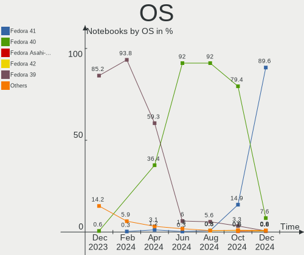
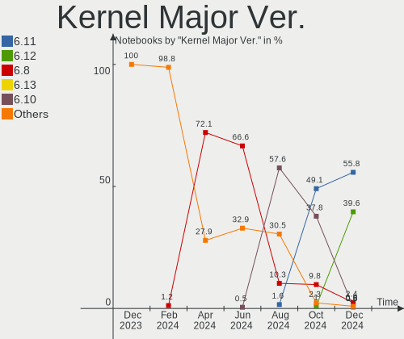
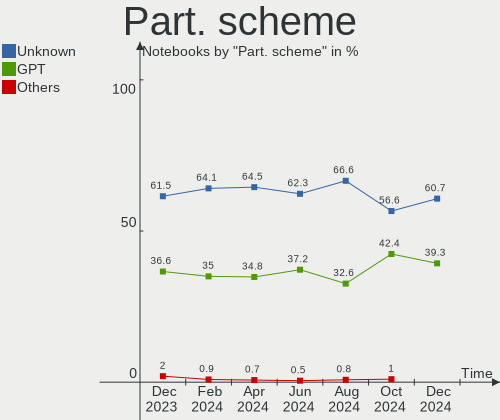
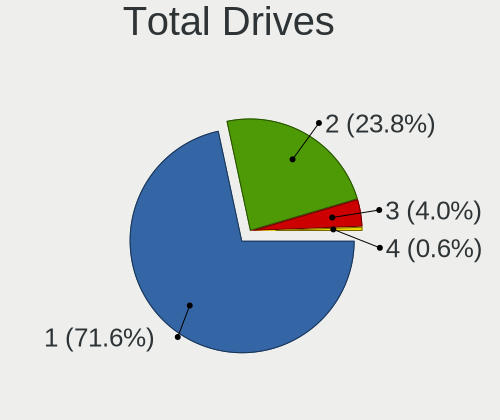

Fedora Hardware Trends (Notebooks)
----------------------------------

A project to identify most popular hardware characteristics and track their change
over time based on data collected by Fedora users at https://Linux-Hardware.org.

Anyone can contribute to this report by the [hw-probe](https://github.com/linuxhw/hw-probe) tool:

    sudo -E hw-probe -all -upload

This report is for one last month. Overall report since the beginning of time: [TestCoverage](https://github.com/linuxhw/TestCoverage)

Period: Apr, 2022.

Contents
--------

* [ System ](#system)
  - [ OS                       ](#os)
  - [ OS Family                ](#os-family)
  - [ Kernel                   ](#kernel)
  - [ Kernel Family            ](#kernel-family)
  - [ Kernel Major Ver.        ](#kernel-major-ver)
  - [ Arch                     ](#arch)
  - [ DE                       ](#de)
  - [ Display Server           ](#display-server)
  - [ Display Manager          ](#display-manager)
  - [ OS Lang                  ](#os-lang)
  - [ Boot Mode                ](#boot-mode)
  - [ Filesystem               ](#filesystem)
  - [ Part. scheme             ](#part-scheme)
  - [ Dual Boot with Linux/BSD ](#dual-boot-with-linuxbsd)
  - [ Dual Boot (Win)          ](#dual-boot-win)

* [ Board ](#board)
  - [ Vendor                   ](#vendor)
  - [ Model                    ](#model)
  - [ Model Family             ](#model-family)
  - [ MFG Year                 ](#mfg-year)
  - [ Form Factor              ](#form-factor)
  - [ Secure Boot              ](#secure-boot)
  - [ Coreboot                 ](#coreboot)
  - [ RAM Size                 ](#ram-size)
  - [ RAM Used                 ](#ram-used)
  - [ Total Drives             ](#total-drives)
  - [ Has CD-ROM               ](#has-cd-rom)
  - [ Has Ethernet             ](#has-ethernet)
  - [ Has WiFi                 ](#has-wifi)
  - [ Has Bluetooth            ](#has-bluetooth)

* [ Location ](#location)
  - [ Country                  ](#country)
  - [ City                     ](#city)

* [ Drives ](#drives)
  - [ Drive Vendor             ](#drive-vendor)
  - [ Drive Model              ](#drive-model)
  - [ HDD Vendor               ](#hdd-vendor)
  - [ SSD Vendor               ](#ssd-vendor)
  - [ Drive Kind               ](#drive-kind)
  - [ Drive Connector          ](#drive-connector)
  - [ Drive Size               ](#drive-size)
  - [ Space Total              ](#space-total)
  - [ Space Used               ](#space-used)
  - [ Malfunc. Drives          ](#malfunc-drives)
  - [ Malfunc. Drive Vendor    ](#malfunc-drive-vendor)
  - [ Malfunc. HDD Vendor      ](#malfunc-hdd-vendor)
  - [ Malfunc. Drive Kind      ](#malfunc-drive-kind)
  - [ Failed Drives            ](#failed-drives)
  - [ Failed Drive Vendor      ](#failed-drive-vendor)
  - [ Drive Status             ](#drive-status)

* [ Storage controller ](#storage-controller)
  - [ Storage Vendor           ](#storage-vendor)
  - [ Storage Model            ](#storage-model)
  - [ Storage Kind             ](#storage-kind)

* [ Processor ](#processor)
  - [ CPU Vendor               ](#cpu-vendor)
  - [ CPU Model                ](#cpu-model)
  - [ CPU Model Family         ](#cpu-model-family)
  - [ CPU Cores                ](#cpu-cores)
  - [ CPU Sockets              ](#cpu-sockets)
  - [ CPU Threads              ](#cpu-threads)
  - [ CPU Op-Modes             ](#cpu-op-modes)
  - [ CPU Microcode            ](#cpu-microcode)
  - [ CPU Microarch            ](#cpu-microarch)

* [ Graphics ](#graphics)
  - [ GPU Vendor               ](#gpu-vendor)
  - [ GPU Model                ](#gpu-model)
  - [ GPU Combo                ](#gpu-combo)
  - [ GPU Driver               ](#gpu-driver)
  - [ GPU Memory               ](#gpu-memory)

* [ Monitor ](#monitor)
  - [ Monitor Vendor           ](#monitor-vendor)
  - [ Monitor Model            ](#monitor-model)
  - [ Monitor Resolution       ](#monitor-resolution)
  - [ Monitor Diagonal         ](#monitor-diagonal)
  - [ Monitor Width            ](#monitor-width)
  - [ Aspect Ratio             ](#aspect-ratio)
  - [ Monitor Area             ](#monitor-area)
  - [ Pixel Density            ](#pixel-density)
  - [ Multiple Monitors        ](#multiple-monitors)

* [ Network ](#network)
  - [ Net Controller Vendor    ](#net-controller-vendor)
  - [ Net Controller Model     ](#net-controller-model)
  - [ Wireless Vendor          ](#wireless-vendor)
  - [ Wireless Model           ](#wireless-model)
  - [ Ethernet Vendor          ](#ethernet-vendor)
  - [ Ethernet Model           ](#ethernet-model)
  - [ Net Controller Kind      ](#net-controller-kind)
  - [ Used Controller          ](#used-controller)
  - [ NICs                     ](#nics)
  - [ IPv6                     ](#ipv6)

* [ Bluetooth ](#bluetooth)
  - [ Bluetooth Vendor         ](#bluetooth-vendor)
  - [ Bluetooth Model          ](#bluetooth-model)

* [ Sound ](#sound)
  - [ Sound Vendor             ](#sound-vendor)
  - [ Sound Model              ](#sound-model)

* [ Memory ](#memory)
  - [ Memory Vendor            ](#memory-vendor)
  - [ Memory Model             ](#memory-model)
  - [ Memory Kind              ](#memory-kind)
  - [ Memory Form Factor       ](#memory-form-factor)
  - [ Memory Size              ](#memory-size)
  - [ Memory Speed             ](#memory-speed)

* [ Printers & scanners ](#printers--scanners)
  - [ Printer Vendor           ](#printer-vendor)
  - [ Printer Model            ](#printer-model)
  - [ Scanner Vendor           ](#scanner-vendor)
  - [ Scanner Model            ](#scanner-model)

* [ Camera ](#camera)
  - [ Camera Vendor            ](#camera-vendor)
  - [ Camera Model             ](#camera-model)

* [ Security ](#security)
  - [ Fingerprint Vendor       ](#fingerprint-vendor)
  - [ Fingerprint Model        ](#fingerprint-model)
  - [ Chipcard Vendor          ](#chipcard-vendor)
  - [ Chipcard Model           ](#chipcard-model)

* [ Unsupported ](#unsupported)
  - [ Unsupported Devices      ](#unsupported-devices)
  - [ Unsupported Device Types ](#unsupported-device-types)

System
------

OS
--

Installed operating systems

| Name      | Notebooks | Percent |
|-----------|-----------|---------|
| Fedora 35 | 189       | 75%     |
| Fedora 36 | 47        | 18.65%  |
| Fedora 34 | 12        | 4.76%   |
| Fedora 37 | 2         | 0.79%   |
| Fedora 33 | 1         | 0.4%    |
| Fedora 31 | 1         | 0.4%    |

OS Family
---------

OS without a version

| Name   | Notebooks | Percent |
|--------|-----------|---------|
| Fedora | 252       | 100%    |

Kernel
------

Version of the Linux kernel

| Version                                                      | Notebooks | Percent |
|--------------------------------------------------------------|-----------|---------|
| 5.16.18-200.fc35.x86_64                                      | 86        | 34.13%  |
| 5.16.20-200.fc35.x86_64                                      | 23        | 9.13%   |
| 5.16.19-200.fc35.x86_64                                      | 21        | 8.33%   |
| 5.17.4-200.fc35.x86_64                                       | 18        | 7.14%   |
| 5.17.2-300.fc36.x86_64                                       | 14        | 5.56%   |
| 5.17.1-300.fc36.x86_64                                       | 11        | 4.37%   |
| 5.14.10-300.fc35.x86_64                                      | 11        | 4.37%   |
| 5.16.16-200.fc35.x86_64                                      | 9         | 3.57%   |
| 5.17.3-302.fc36.x86_64                                       | 8         | 3.17%   |
| 5.17.0-0.rc7.116.fc36.x86_64                                 | 8         | 3.17%   |
| 5.17.4-100.fc34.x86_64                                       | 4         | 1.59%   |
| 5.16.18-100.fc34.x86_64                                      | 3         | 1.19%   |
| 5.16.12-200.fc35.x86_64                                      | 3         | 1.19%   |
| 5.15.16-200.fc35.x86_64                                      | 3         | 1.19%   |
| 5.18.0-0.rc2.23.fc37.x86_64                                  | 2         | 0.79%   |
| 5.16.19-100.fc34.x86_64                                      | 2         | 0.79%   |
| 5.16.15-201.fc35.x86_64                                      | 2         | 0.79%   |
| 5.8.18-100.fc31.x86_64                                       | 1         | 0.4%    |
| 5.18.0-0.rc3.220422.d569e86915b7f2f.31.vanilla.1.fc36.x86_64 | 1         | 0.4%    |
| 5.17.5-300.fc36.x86_64                                       | 1         | 0.4%    |
| 5.17.4-lqx1.0.fc35.x86_64                                    | 1         | 0.4%    |
| 5.17.4-300.fc36.x86_64                                       | 1         | 0.4%    |
| 5.17.3-xm1.0.fc35.x86_64                                     | 1         | 0.4%    |
| 5.17.3-301.fsync.fc36.x86_64                                 | 1         | 0.4%    |
| 5.17.1-xm1.0.fc35.x86_64                                     | 1         | 0.4%    |
| 5.17.1-200.fc35.x86_64                                       | 1         | 0.4%    |
| 5.17.0-300.fc36.x86_64                                       | 1         | 0.4%    |
| 5.16.9-200.fc35.x86_64                                       | 1         | 0.4%    |
| 5.16.8-200.fc35.x86_64                                       | 1         | 0.4%    |
| 5.16.20m.wael-beta.r2                                        | 1         | 0.4%    |
| 5.16.20-100.fc34.x86_64                                      | 1         | 0.4%    |
| 5.16.17-250.vanilla.1.fc35.x86_64                            | 1         | 0.4%    |
| 5.16.17-200.fc35.x86_64                                      | 1         | 0.4%    |
| 5.16.16-xm1.0e20220113.fc35.x86_64                           | 1         | 0.4%    |
| 5.16.12-250.vanilla.1.fc35.x86_64                            | 1         | 0.4%    |
| 5.15.5-100.fc34.x86_64                                       | 1         | 0.4%    |
| 5.15.32-xm1tt.0.fc35.x86_64                                  | 1         | 0.4%    |
| 5.15.11-1                                                    | 1         | 0.4%    |
| 5.14.18-100.fc33.x86_64                                      | 1         | 0.4%    |
| 5.14.14-300.mbp.fc33.x86_64                                  | 1         | 0.4%    |
| 5.10.111-200.fc35.x86_64                                     | 1         | 0.4%    |

Kernel Family
-------------

Linux kernel without a distro release

| Version  | Notebooks | Percent |
|----------|-----------|---------|
| 5.16.18  | 89        | 35.32%  |
| 5.16.20  | 25        | 9.92%   |
| 5.17.4   | 24        | 9.52%   |
| 5.16.19  | 23        | 9.13%   |
| 5.17.2   | 14        | 5.56%   |
| 5.17.1   | 13        | 5.16%   |
| 5.14.10  | 11        | 4.37%   |
| 5.17.3   | 10        | 3.97%   |
| 5.16.16  | 10        | 3.97%   |
| 5.17.0   | 9         | 3.57%   |
| 5.16.12  | 4         | 1.59%   |
| 5.18.0   | 3         | 1.19%   |
| 5.15.16  | 3         | 1.19%   |
| 5.16.17  | 2         | 0.79%   |
| 5.16.15  | 2         | 0.79%   |
| 5.8.18   | 1         | 0.4%    |
| 5.17.5   | 1         | 0.4%    |
| 5.16.9   | 1         | 0.4%    |
| 5.16.8   | 1         | 0.4%    |
| 5.15.5   | 1         | 0.4%    |
| 5.15.32  | 1         | 0.4%    |
| 5.15.11  | 1         | 0.4%    |
| 5.14.18  | 1         | 0.4%    |
| 5.14.14  | 1         | 0.4%    |
| 5.10.111 | 1         | 0.4%    |

Kernel Major Ver.
-----------------

Linux kernel major version

| Version | Notebooks | Percent |
|---------|-----------|---------|
| 5.16    | 157       | 62.3%   |
| 5.17    | 71        | 28.17%  |
| 5.14    | 13        | 5.16%   |
| 5.15    | 6         | 2.38%   |
| 5.18    | 3         | 1.19%   |
| 5.8     | 1         | 0.4%    |
| 5.10    | 1         | 0.4%    |

Arch
----

OS architecture (x86_64, i586, etc.)

| Name    | Notebooks | Percent |
|---------|-----------|---------|
| x86_64  | 251       | 99.6%   |
| aarch64 | 1         | 0.4%    |

DE
--

Desktop Environment

| Name          | Notebooks | Percent |
|---------------|-----------|---------|
| GNOME         | 194       | 76.98%  |
| KDE5          | 26        | 10.32%  |
| i3            | 7         | 2.78%   |
| Unknown       | 6         | 2.38%   |
| XFCE          | 4         | 1.59%   |
| X-Cinnamon    | 3         | 1.19%   |
| GNOME Classic | 3         | 1.19%   |
| Cinnamon      | 3         | 1.19%   |
| MATE          | 2         | 0.79%   |
| LXDE          | 2         | 0.79%   |
| sway          | 1         | 0.4%    |
| KDE           | 1         | 0.4%    |

Display Server
--------------

X11 or Wayland

| Name    | Notebooks | Percent |
|---------|-----------|---------|
| Wayland | 168       | 66.67%  |
| X11     | 78        | 30.95%  |
| Unknown | 5         | 1.98%   |
| Tty     | 1         | 0.4%    |

Display Manager
---------------

SDDM, LightDM, etc.

| Name    | Notebooks | Percent |
|---------|-----------|---------|
| GDM     | 111       | 44.05%  |
| Unknown | 106       | 42.06%  |
| SDDM    | 18        | 7.14%   |
| LightDM | 16        | 6.35%   |
| LXDM    | 1         | 0.4%    |

OS Lang
-------

Language

| Lang    | Notebooks | Percent |
|---------|-----------|---------|
| en_US   | 150       | 59.52%  |
| en_GB   | 19        | 7.54%   |
| pt_BR   | 13        | 5.16%   |
| fr_FR   | 9         | 3.57%   |
| de_DE   | 8         | 3.17%   |
| es_ES   | 5         | 1.98%   |
| ru_RU   | 4         | 1.59%   |
| pl_PL   | 4         | 1.59%   |
| en_AU   | 3         | 1.19%   |
| nl_NL   | 2         | 0.79%   |
| it_IT   | 2         | 0.79%   |
| hu_HU   | 2         | 0.79%   |
| es_CL   | 2         | 0.79%   |
| en_IN   | 2         | 0.79%   |
| en_DE   | 2         | 0.79%   |
| en_CA   | 2         | 0.79%   |
| cs_CZ   | 2         | 0.79%   |
| C       | 2         | 0.79%   |
| Unknown | 2         | 0.79%   |
| zh_TW   | 1         | 0.4%    |
| zh_CN   | 1         | 0.4%    |
| uk_UA   | 1         | 0.4%    |
| tr_TR   | 1         | 0.4%    |
| sk_SK   | 1         | 0.4%    |
| ro_RO   | 1         | 0.4%    |
| nb_NO   | 1         | 0.4%    |
| fr_CH   | 1         | 0.4%    |
| fr_BE   | 1         | 0.4%    |
| es_UY   | 1         | 0.4%    |
| es_MX   | 1         | 0.4%    |
| en_ZA   | 1         | 0.4%    |
| en_NZ   | 1         | 0.4%    |
| en_IL   | 1         | 0.4%    |
| en_IE   | 1         | 0.4%    |
| de_CH   | 1         | 0.4%    |
| ba_RU   | 1         | 0.4%    |

Boot Mode
---------

EFI or BIOS

| Mode | Notebooks | Percent |
|------|-----------|---------|
| EFI  | 208       | 82.54%  |
| BIOS | 44        | 17.46%  |

Filesystem
----------

Type of filesystem

| Type    | Notebooks | Percent |
|---------|-----------|---------|
| Btrfs   | 182       | 72.22%  |
| Ext4    | 61        | 24.21%  |
| Xfs     | 8         | 3.17%   |
| Overlay | 1         | 0.4%    |

Part. scheme
------------

Scheme of partitioning

| Type    | Notebooks | Percent |
|---------|-----------|---------|
| GPT     | 135       | 53.57%  |
| Unknown | 105       | 41.67%  |
| MBR     | 12        | 4.76%   |

Dual Boot with Linux/BSD
------------------------

Hosting more than one Linux/BSD

| Dual boot | Notebooks | Percent |
|-----------|-----------|---------|
| No        | 214       | 84.92%  |
| Yes       | 38        | 15.08%  |

Dual Boot (Win)
---------------

Hosting Linux and Windows

| Dual boot | Notebooks | Percent |
|-----------|-----------|---------|
| No        | 203       | 80.56%  |
| Yes       | 49        | 19.44%  |

Board
-----

Vendor
------

Motherboard manufacturer

| Name                | Notebooks | Percent |
|---------------------|-----------|---------|
| Lenovo              | 71        | 28.17%  |
| Dell                | 51        | 20.24%  |
| Hewlett-Packard     | 31        | 12.3%   |
| ASUSTek Computer    | 28        | 11.11%  |
| Acer                | 16        | 6.35%   |
| Apple               | 8         | 3.17%   |
| MSI                 | 7         | 2.78%   |
| Framework           | 6         | 2.38%   |
| Toshiba             | 3         | 1.19%   |
| Timi                | 3         | 1.19%   |
| Samsung Electronics | 3         | 1.19%   |
| TUXEDO              | 2         | 0.79%   |
| Sony                | 2         | 0.79%   |
| Notebook            | 2         | 0.79%   |
| HUAWEI              | 2         | 0.79%   |
| Google              | 2         | 0.79%   |
| Gigabyte Technology | 2         | 0.79%   |
| Chuwi               | 2         | 0.79%   |
| Wiltronic           | 1         | 0.4%    |
| System76            | 1         | 0.4%    |
| Razer               | 1         | 0.4%    |
| Positivo            | 1         | 0.4%    |
| Pine Microsystems   | 1         | 0.4%    |
| PC Specialist       | 1         | 0.4%    |
| Intel               | 1         | 0.4%    |
| GPU Company         | 1         | 0.4%    |
| Getac               | 1         | 0.4%    |
| Alienware           | 1         | 0.4%    |
| Unknown             | 1         | 0.4%    |

Model
-----

Motherboard model

| Name                                        | Notebooks | Percent |
|---------------------------------------------|-----------|---------|
| Framework Laptop                            | 6         | 2.38%   |
| Dell XPS 13 9370                            | 4         | 1.59%   |
| Dell XPS 13 9360                            | 3         | 1.19%   |
| ASUS ROG Zephyrus G14 GA402RJ_GA402RJ       | 3         | 1.19%   |
| Lenovo ThinkBook 15 G2 ITL 20VE             | 2         | 0.79%   |
| Lenovo G500 20236                           | 2         | 0.79%   |
| Dell XPS 13 9305                            | 2         | 0.79%   |
| Dell XPS 13 7390                            | 2         | 0.79%   |
| Dell Latitude E6530                         | 2         | 0.79%   |
| Dell Inspiron N5110                         | 2         | 0.79%   |
| Dell Inspiron 7577                          | 2         | 0.79%   |
| Dell Inspiron 5458                          | 2         | 0.79%   |
| Dell Inspiron 15-3567                       | 2         | 0.79%   |
| Apple MacBookPro9,2                         | 2         | 0.79%   |
| Acer Aspire A315-31                         | 2         | 0.79%   |
| Wiltronic iVIEW i896QW                      | 1         | 0.4%    |
| TUXEDO Pulse 15 Gen1                        | 1         | 0.4%    |
| TUXEDO Polaris Intel Gen3 (TGL)             | 1         | 0.4%    |
| Toshiba Satellite U840                      | 1         | 0.4%    |
| Toshiba Satellite P755                      | 1         | 0.4%    |
| Toshiba Satellite C660                      | 1         | 0.4%    |
| Timi TM1701                                 | 1         | 0.4%    |
| Timi TM1612                                 | 1         | 0.4%    |
| Timi TM1604                                 | 1         | 0.4%    |
| System76 Pangolin                           | 1         | 0.4%    |
| Sony VPCEB4L1E                              | 1         | 0.4%    |
| Sony VPCEB3PGX                              | 1         | 0.4%    |
| Samsung RV411/RV511/E3511/S3511/RV711/E3411 | 1         | 0.4%    |
| Samsung RC420/RC520/RC720                   | 1         | 0.4%    |
| Samsung 270E5J/2570EJ                       | 1         | 0.4%    |
| Razer Blade 15 (2022) - RZ09-0421           | 1         | 0.4%    |
| Positivo H14BU08                            | 1         | 0.4%    |
| Pine Microsystems Pine64 Pinebook Pro       | 1         | 0.4%    |
| PC Specialist PC5x_7xHP_HR_HS               | 1         | 0.4%    |
| Notebook NH5x_NH7x_HHx_HJx_HKx              | 1         | 0.4%    |
| Notebook NH55RGQ                            | 1         | 0.4%    |
| MSI Stealth GS66 12UGS                      | 1         | 0.4%    |
| MSI Prestige 14Evo A11M                     | 1         | 0.4%    |
| MSI Modern 14 B4MW                          | 1         | 0.4%    |
| MSI Katana GF76 11SC                        | 1         | 0.4%    |
| MSI GX70 3BE                                | 1         | 0.4%    |
| MSI GS66 Stealth 10UH                       | 1         | 0.4%    |
| MSI GF63 Thin 9SCXR                         | 1         | 0.4%    |
| Lenovo Z50-70 20354                         | 1         | 0.4%    |
| Lenovo Yoga Slim 7 Pro 14ACH5 82MS          | 1         | 0.4%    |
| Lenovo Yoga S740-14IIL 81RS                 | 1         | 0.4%    |
| Lenovo ThinkPad X390 20Q1SCDR00             | 1         | 0.4%    |
| Lenovo ThinkPad X390 20Q0002LMX             | 1         | 0.4%    |
| Lenovo ThinkPad X250 20CLS2B000             | 1         | 0.4%    |
| Lenovo ThinkPad X1 Extreme Gen 3 20TK000AGE | 1         | 0.4%    |
| Lenovo ThinkPad X1 Extreme 2nd 20QVCTO1WW   | 1         | 0.4%    |
| Lenovo ThinkPad X1 Carbon Gen 9 20XW00A9US  | 1         | 0.4%    |
| Lenovo ThinkPad X1 Carbon Gen 8 20U9CTO1WW  | 1         | 0.4%    |
| Lenovo ThinkPad X1 Carbon 7th 20R1S05B00    | 1         | 0.4%    |
| Lenovo ThinkPad X1 Carbon 6th 20KGS23S0P    | 1         | 0.4%    |
| Lenovo ThinkPad X1 Carbon 5th 20HRCTO1WW    | 1         | 0.4%    |
| Lenovo ThinkPad W541 20EFCTO1WW             | 1         | 0.4%    |
| Lenovo ThinkPad W530 2463A49                | 1         | 0.4%    |
| Lenovo ThinkPad T495 20NJ0012GM             | 1         | 0.4%    |
| Lenovo ThinkPad T495 20NJ000XIX             | 1         | 0.4%    |

Model Family
------------

Motherboard model prefix

| Name                     | Notebooks | Percent |
|--------------------------|-----------|---------|
| Lenovo ThinkPad          | 45        | 17.86%  |
| Dell XPS                 | 16        | 6.35%   |
| Dell Inspiron            | 16        | 6.35%   |
| Dell Latitude            | 13        | 5.16%   |
| Lenovo IdeaPad           | 12        | 4.76%   |
| Acer Aspire              | 9         | 3.57%   |
| HP Pavilion              | 8         | 3.17%   |
| ASUS ROG                 | 8         | 3.17%   |
| Framework Laptop         | 6         | 2.38%   |
| Lenovo ThinkBook         | 5         | 1.98%   |
| HP ProBook               | 5         | 1.98%   |
| HP EliteBook             | 5         | 1.98%   |
| Lenovo Legion            | 4         | 1.59%   |
| HP Laptop                | 4         | 1.59%   |
| ASUS ASUS                | 4         | 1.59%   |
| Acer Swift               | 4         | 1.59%   |
| Toshiba Satellite        | 3         | 1.19%   |
| HP ZBook                 | 3         | 1.19%   |
| Dell Precision           | 3         | 1.19%   |
| ASUS VivoBook            | 3         | 1.19%   |
| Lenovo Yoga              | 2         | 0.79%   |
| Lenovo G500              | 2         | 0.79%   |
| ASUS ZenBook             | 2         | 0.79%   |
| Apple MacBookPro9        | 2         | 0.79%   |
| Apple MacBookPro11       | 2         | 0.79%   |
| Acer Nitro               | 2         | 0.79%   |
| Wiltronic iVIEW          | 1         | 0.4%    |
| TUXEDO Pulse             | 1         | 0.4%    |
| TUXEDO Polaris           | 1         | 0.4%    |
| Timi TM1701              | 1         | 0.4%    |
| Timi TM1612              | 1         | 0.4%    |
| Timi TM1604              | 1         | 0.4%    |
| System76 Pangolin        | 1         | 0.4%    |
| Sony VPCEB4L1E           | 1         | 0.4%    |
| Sony VPCEB3PGX           | 1         | 0.4%    |
| Samsung RV411            | 1         | 0.4%    |
| Samsung RC420            | 1         | 0.4%    |
| Samsung 270E5J           | 1         | 0.4%    |
| Razer Blade              | 1         | 0.4%    |
| Positivo H14BU08         | 1         | 0.4%    |
| Pine Microsystems Pine64 | 1         | 0.4%    |
| PC Specialist PC5x       | 1         | 0.4%    |
| Notebook NH5x            | 1         | 0.4%    |
| Notebook NH55RGQ         | 1         | 0.4%    |
| MSI Stealth              | 1         | 0.4%    |
| MSI Prestige             | 1         | 0.4%    |
| MSI Modern               | 1         | 0.4%    |
| MSI Katana               | 1         | 0.4%    |
| MSI GX70                 | 1         | 0.4%    |
| MSI GS66                 | 1         | 0.4%    |
| MSI GF63                 | 1         | 0.4%    |
| Lenovo Z50-70            | 1         | 0.4%    |
| Intel Shark              | 1         | 0.4%    |
| HUAWEI KLVL-WXXW         | 1         | 0.4%    |
| HUAWEI HVY-WXX9          | 1         | 0.4%    |
| HP Spectre               | 1         | 0.4%    |
| HP OMEN                  | 1         | 0.4%    |
| HP Notebook              | 1         | 0.4%    |
| HP ElitePad              | 1         | 0.4%    |
| HP 255                   | 1         | 0.4%    |

MFG Year
--------

Motherboard manufacture year

| Year    | Notebooks | Percent |
|---------|-----------|---------|
| 2021    | 47        | 18.65%  |
| 2020    | 41        | 16.27%  |
| 2019    | 35        | 13.89%  |
| 2018    | 19        | 7.54%   |
| 2017    | 18        | 7.14%   |
| 2013    | 18        | 7.14%   |
| 2016    | 17        | 6.75%   |
| 2012    | 12        | 4.76%   |
| 2015    | 10        | 3.97%   |
| 2014    | 10        | 3.97%   |
| 2011    | 9         | 3.57%   |
| 2022    | 7         | 2.78%   |
| 2010    | 4         | 1.59%   |
| 2008    | 3         | 1.19%   |
| 2007    | 1         | 0.4%    |
| Unknown | 1         | 0.4%    |

Form Factor
-----------

Physical design of the computer

| Name     | Notebooks | Percent |
|----------|-----------|---------|
| Notebook | 252       | 100%    |

Secure Boot
-----------

Enabled or disabled

| State    | Notebooks | Percent |
|----------|-----------|---------|
| Disabled | 210       | 83.33%  |
| Enabled  | 42        | 16.67%  |

Coreboot
--------

Have coreboot on board

| Used | Notebooks | Percent |
|------|-----------|---------|
| No   | 250       | 99.21%  |
| Yes  | 2         | 0.79%   |

RAM Size
--------

Total RAM memory

| Size in GB  | Notebooks | Percent |
|-------------|-----------|---------|
| 16.01-24.0  | 73        | 28.97%  |
| 4.01-8.0    | 64        | 25.4%   |
| 8.01-16.0   | 43        | 17.06%  |
| 32.01-64.0  | 34        | 13.49%  |
| 3.01-4.0    | 21        | 8.33%   |
| 64.01-256.0 | 9         | 3.57%   |
| 24.01-32.0  | 5         | 1.98%   |
| 1.01-2.0    | 3         | 1.19%   |

RAM Used
--------

Used RAM memory

| Used GB    | Notebooks | Percent |
|------------|-----------|---------|
| 4.01-8.0   | 75        | 29.76%  |
| 2.01-3.0   | 66        | 26.19%  |
| 3.01-4.0   | 51        | 20.24%  |
| 8.01-16.0  | 30        | 11.9%   |
| 1.01-2.0   | 27        | 10.71%  |
| 32.01-64.0 | 2         | 0.79%   |
| 16.01-24.0 | 1         | 0.4%    |

Total Drives
------------

Number of drives on board

| Drives | Notebooks | Percent |
|--------|-----------|---------|
| 1      | 175       | 69.44%  |
| 2      | 69        | 27.38%  |
| 3      | 7         | 2.78%   |
| 4      | 1         | 0.4%    |

Has CD-ROM
----------

Has CD-ROM on board

| Presented | Notebooks | Percent |
|-----------|-----------|---------|
| No        | 212       | 84.13%  |
| Yes       | 40        | 15.87%  |

Has Ethernet
------------

Has Ethernet on board

| Presented | Notebooks | Percent |
|-----------|-----------|---------|
| Yes       | 184       | 73.02%  |
| No        | 68        | 26.98%  |

Has WiFi
--------

Has WiFi module

| Presented | Notebooks | Percent |
|-----------|-----------|---------|
| Yes       | 247       | 98.02%  |
| No        | 5         | 1.98%   |

Has Bluetooth
-------------

Has Bluetooth module

| Presented | Notebooks | Percent |
|-----------|-----------|---------|
| Yes       | 224       | 88.89%  |
| No        | 28        | 11.11%  |

Location
--------

Country
-------

Geographic location (country)

| Country      | Notebooks | Percent |
|--------------|-----------|---------|
| USA          | 54        | 21.43%  |
| Brazil       | 21        | 8.33%   |
| Germany      | 17        | 6.75%   |
| Russia       | 12        | 4.76%   |
| France       | 12        | 4.76%   |
| UK           | 9         | 3.57%   |
| Poland       | 9         | 3.57%   |
| Netherlands  | 8         | 3.17%   |
| India        | 7         | 2.78%   |
| Sweden       | 6         | 2.38%   |
| Spain        | 6         | 2.38%   |
| Canada       | 6         | 2.38%   |
| Romania      | 5         | 1.98%   |
| Italy        | 5         | 1.98%   |
| Austria      | 5         | 1.98%   |
| Norway       | 4         | 1.59%   |
| Hungary      | 4         | 1.59%   |
| Switzerland  | 3         | 1.19%   |
| South Africa | 3         | 1.19%   |
| Mexico       | 3         | 1.19%   |
| Czechia      | 3         | 1.19%   |
| Australia    | 3         | 1.19%   |
| Ukraine      | 2         | 0.79%   |
| Turkey       | 2         | 0.79%   |
| Taiwan       | 2         | 0.79%   |
| Portugal     | 2         | 0.79%   |
| New Zealand  | 2         | 0.79%   |
| Israel       | 2         | 0.79%   |
| Greece       | 2         | 0.79%   |
| Egypt        | 2         | 0.79%   |
| Chile        | 2         | 0.79%   |
| Bulgaria     | 2         | 0.79%   |
| Belgium      | 2         | 0.79%   |
| Belarus      | 2         | 0.79%   |
| UAE          | 1         | 0.4%    |
| Tunisia      | 1         | 0.4%    |
| Thailand     | 1         | 0.4%    |
| Slovakia     | 1         | 0.4%    |
| Saudi Arabia | 1         | 0.4%    |
| Qatar        | 1         | 0.4%    |
| Philippines  | 1         | 0.4%    |
| Nepal        | 1         | 0.4%    |
| Myanmar      | 1         | 0.4%    |
| Malta        | 1         | 0.4%    |
| Kenya        | 1         | 0.4%    |
| Japan        | 1         | 0.4%    |
| Ireland      | 1         | 0.4%    |
| Iran         | 1         | 0.4%    |
| Indonesia    | 1         | 0.4%    |
| Iceland      | 1         | 0.4%    |
| Hong Kong    | 1         | 0.4%    |
| Georgia      | 1         | 0.4%    |
| Estonia      | 1         | 0.4%    |
| Denmark      | 1         | 0.4%    |
| Croatia      | 1         | 0.4%    |
| Armenia      | 1         | 0.4%    |
| Argentina    | 1         | 0.4%    |

City
----

Geographic location (city)

| City                   | Notebooks | Percent |
|------------------------|-----------|---------|
| Moscow                 | 7         | 2.78%   |
| Warsaw                 | 5         | 1.98%   |
| Sao Paulo              | 5         | 1.98%   |
| Vienna                 | 4         | 1.59%   |
| Munich                 | 4         | 1.59%   |
| Amsterdam              | 3         | 1.19%   |
| Sofia                  | 2         | 0.79%   |
| Saint-Denis            | 2         | 0.79%   |
| Portland               | 2         | 0.79%   |
| Oslo                   | 2         | 0.79%   |
| Novosibirsk            | 2         | 0.79%   |
| Minsk                  | 2         | 0.79%   |
| Las Vegas              | 2         | 0.79%   |
| Kitchener              | 2         | 0.79%   |
| Iowa City              | 2         | 0.79%   |
| Frankfurt am Main      | 2         | 0.79%   |
| Chicago                | 2         | 0.79%   |
| Calgary                | 2         | 0.79%   |
| Zurich                 | 1         | 0.4%    |
| Znojmo                 | 1         | 0.4%    |
| Yerevan                | 1         | 0.4%    |
| Yekaterinburg          | 1         | 0.4%    |
| Yangon                 | 1         | 0.4%    |
| Xalapa                 | 1         | 0.4%    |
| Wylie                  | 1         | 0.4%    |
| Wroclaw                | 1         | 0.4%    |
| Witney                 | 1         | 0.4%    |
| Wichita                | 1         | 0.4%    |
| Westford               | 1         | 0.4%    |
| Wellington             | 1         | 0.4%    |
| Washington             | 1         | 0.4%    |
| Vladivostok            | 1         | 0.4%    |
| Vitória da Conquista  | 1         | 0.4%    |
| Villejuif              | 1         | 0.4%    |
| Vila Velha             | 1         | 0.4%    |
| Vegarshei              | 1         | 0.4%    |
| Tunis                  | 1         | 0.4%    |
| Trier                  | 1         | 0.4%    |
| Treffurt               | 1         | 0.4%    |
| Toulouse               | 1         | 0.4%    |
| Toulon                 | 1         | 0.4%    |
| Torrevieja             | 1         | 0.4%    |
| Tel Aviv               | 1         | 0.4%    |
| Tehran                 | 1         | 0.4%    |
| Tallinn                | 1         | 0.4%    |
| Sumida                 | 1         | 0.4%    |
| Stratford              | 1         | 0.4%    |
| Stockholm              | 1         | 0.4%    |
| St Petersburg          | 1         | 0.4%    |
| Split                  | 1         | 0.4%    |
| Sopron                 | 1         | 0.4%    |
| Skondal                | 1         | 0.4%    |
| Sion                   | 1         | 0.4%    |
| Scorrano               | 1         | 0.4%    |
| Sao Lourenco da Mata   | 1         | 0.4%    |
| Sao Jose da Tapera     | 1         | 0.4%    |
| Santiago               | 1         | 0.4%    |
| Sant Joan Despí       | 1         | 0.4%    |
| Sangli                 | 1         | 0.4%    |
| Rozmital pod Tremsinem | 1         | 0.4%    |

Drives
------

Drive Vendor
------------

Hard drive vendors

| Vendor                      | Notebooks | Drives | Percent |
|-----------------------------|-----------|--------|---------|
| Samsung Electronics         | 71        | 80     | 22.26%  |
| WDC                         | 26        | 27     | 8.15%   |
| Seagate                     | 26        | 26     | 8.15%   |
| SK Hynix                    | 25        | 27     | 7.84%   |
| Unknown                     | 21        | 24     | 6.58%   |
| Toshiba                     | 20        | 20     | 6.27%   |
| Sandisk                     | 14        | 16     | 4.39%   |
| Kingston                    | 14        | 15     | 4.39%   |
| Intel                       | 14        | 17     | 4.39%   |
| Micron Technology           | 12        | 13     | 3.76%   |
| Crucial                     | 12        | 12     | 3.76%   |
| KIOXIA                      | 8         | 8      | 2.51%   |
| A-DATA Technology           | 6         | 6      | 1.88%   |
| Apple                       | 5         | 5      | 1.57%   |
| Transcend                   | 4         | 4      | 1.25%   |
| Phison                      | 4         | 4      | 1.25%   |
| XPG                         | 3         | 4      | 0.94%   |
| Silicon Motion              | 3         | 3      | 0.94%   |
| HGST                        | 3         | 3      | 0.94%   |
| Netac                       | 2         | 2      | 0.63%   |
| LITEON                      | 2         | 2      | 0.63%   |
| Hitachi                     | 2         | 2      | 0.63%   |
| Corsair                     | 2         | 3      | 0.63%   |
| Unknown                     | 2         | 2      | 0.63%   |
| Zozt                        | 1         | 1      | 0.31%   |
| Yangtze Memory Technologies | 1         | 1      | 0.31%   |
| WDC WDS2                    | 1         | 1      | 0.31%   |
| Vaseky                      | 1         | 1      | 0.31%   |
| Teclast                     | 1         | 1      | 0.31%   |
| Team                        | 1         | 1      | 0.31%   |
| Ramsta                      | 1         | 1      | 0.31%   |
| PNY                         | 1         | 1      | 0.31%   |
| Mass                        | 1         | 1      | 0.31%   |
| Lexar                       | 1         | 1      | 0.31%   |
| Lenovo                      | 1         | 1      | 0.31%   |
| KingFast                    | 1         | 1      | 0.31%   |
| KingDian                    | 1         | 1      | 0.31%   |
| HUSKY                       | 1         | 1      | 0.31%   |
| GOODRAM                     | 1         | 1      | 0.31%   |
| FORESEE                     | 1         | 1      | 0.31%   |
| EAGET                       | 1         | 1      | 0.31%   |
| China                       | 1         | 1      | 0.31%   |

Drive Model
-----------

Hard drive models

| Model                               | Notebooks | Percent |
|-------------------------------------|-----------|---------|
| Seagate ST1000LM035-1RK172 1TB      | 9         | 2.69%   |
| Unknown MMC Card  32GB              | 6         | 1.8%    |
| Samsung NVMe SSD Drive 512GB        | 5         | 1.5%    |
| Samsung NVMe SSD Drive 500GB        | 5         | 1.5%    |
| Samsung NVMe SSD Drive 1TB          | 5         | 1.5%    |
| SK Hynix NVMe SSD Drive 256GB       | 4         | 1.2%    |
| Samsung SSD 970 EVO Plus 500GB      | 4         | 1.2%    |
| XPG NVMe SSD Drive 1024GB           | 3         | 0.9%    |
| Transcend TS512GMTS430S 512GB SSD   | 3         | 0.9%    |
| Toshiba KXG6AZNV512G 512GB          | 3         | 0.9%    |
| SK Hynix NVMe SSD Drive 512GB       | 3         | 0.9%    |
| Sandisk NVMe SSD Drive 512GB        | 3         | 0.9%    |
| Sandisk NVMe SSD Drive 1024GB       | 3         | 0.9%    |
| Samsung SSD 980 1TB                 | 3         | 0.9%    |
| Samsung NVMe SSD Drive 1024GB       | 3         | 0.9%    |
| Samsung MZVLB1T0HBLR-000L7 1TB      | 3         | 0.9%    |
| KIOXIA NVMe SSD Drive 512GB         | 3         | 0.9%    |
| Intel NVMe SSD Drive 512GB          | 3         | 0.9%    |
| WDC WDS500G2B0C 500GB               | 2         | 0.6%    |
| WDC WD10SPZX-24Z10 1TB              | 2         | 0.6%    |
| Unknown SN128  128GB                | 2         | 0.6%    |
| Unknown MMC Card  128GB             | 2         | 0.6%    |
| Toshiba NVMe SSD Drive 512GB        | 2         | 0.6%    |
| Toshiba MQ04ABF100 1TB              | 2         | 0.6%    |
| Toshiba MQ01ABD100 1TB              | 2         | 0.6%    |
| Toshiba KXG50ZNV512G NVMe 512GB     | 2         | 0.6%    |
| SK Hynix PC401 NVMe 512GB           | 2         | 0.6%    |
| SK Hynix NVMe SSD Drive 1024GB      | 2         | 0.6%    |
| Seagate ST500LT012-1DG142 500GB     | 2         | 0.6%    |
| Seagate ST500LM000-1EJ162 500GB     | 2         | 0.6%    |
| Seagate ST2000LM003 HN-M201RAD 2TB  | 2         | 0.6%    |
| Seagate ST1000LM048-2E7172 1TB      | 2         | 0.6%    |
| Seagate ST1000LM024 HN-M101MBB 1TB  | 2         | 0.6%    |
| SanDisk SSD PLUS 240GB              | 2         | 0.6%    |
| SanDisk SSD PLUS 1000GB             | 2         | 0.6%    |
| Samsung SSD 970 EVO 1TB             | 2         | 0.6%    |
| Samsung SSD 860 EVO 250GB           | 2         | 0.6%    |
| Samsung SSD 850 EVO 500GB           | 2         | 0.6%    |
| Samsung SSD 850 EVO 250GB           | 2         | 0.6%    |
| Samsung NVMe SSD Drive 256GB        | 2         | 0.6%    |
| Samsung NVMe SSD Drive 250GB        | 2         | 0.6%    |
| Phison Sabrent 512GB                | 2         | 0.6%    |
| Micron NVMe SSD Drive 1024GB        | 2         | 0.6%    |
| Micron 2210_MTFDHBA512QFD 512GB     | 2         | 0.6%    |
| KIOXIA KBG40ZNS512G NVMe 512GB      | 2         | 0.6%    |
| Kingston SA400S37480G 480GB SSD     | 2         | 0.6%    |
| Kingston SA400S37240G 240GB SSD     | 2         | 0.6%    |
| Intel SSDPEKNW512G8 512GB           | 2         | 0.6%    |
| Crucial CT480BX500SSD1 480GB        | 2         | 0.6%    |
| Crucial CT240BX500SSD1 240GB        | 2         | 0.6%    |
| Unknown                             | 2         | 0.6%    |
| Zozt G3000 240 240GB                | 1         | 0.3%    |
| Yangtze Memory NVMe SSD Drive 512GB | 1         | 0.3%    |
| XPG NVMe SSD Drive 2TB              | 1         | 0.3%    |
| WDC WDS500G2B0C-00PXH0 500GB        | 1         | 0.3%    |
| WDC WDS500G2B0B 500GB SSD           | 1         | 0.3%    |
| WDC WDS240G2G0A-00JH30 240GB SSD    | 1         | 0.3%    |
| WDC WDS200T1X0E-00AFY0 2TB          | 1         | 0.3%    |
| WDC WDS2 40G2G0B-00EP 240GB SSD     | 1         | 0.3%    |
| WDC WDS120G2G0B-00EPW0 120GB SSD    | 1         | 0.3%    |

HDD Vendor
----------

Hard disk drive vendors

| Vendor  | Notebooks | Drives | Percent |
|---------|-----------|--------|---------|
| Seagate | 26        | 26     | 53.06%  |
| WDC     | 9         | 9      | 18.37%  |
| Toshiba | 7         | 7      | 14.29%  |
| HGST    | 3         | 3      | 6.12%   |
| Hitachi | 2         | 2      | 4.08%   |
| Unknown | 1         | 1      | 2.04%   |
| Apple   | 1         | 1      | 2.04%   |

SSD Vendor
----------

Solid state drive vendors

| Vendor              | Notebooks | Drives | Percent |
|---------------------|-----------|--------|---------|
| Samsung Electronics | 20        | 21     | 23.26%  |
| Kingston            | 10        | 10     | 11.63%  |
| Crucial             | 9         | 9      | 10.47%  |
| SanDisk             | 6         | 8      | 6.98%   |
| WDC                 | 4         | 4      | 4.65%   |
| Transcend           | 4         | 4      | 4.65%   |
| Intel               | 4         | 4      | 4.65%   |
| Micron Technology   | 3         | 3      | 3.49%   |
| Apple               | 3         | 3      | 3.49%   |
| A-DATA Technology   | 3         | 3      | 3.49%   |
| SK Hynix            | 2         | 2      | 2.33%   |
| Netac               | 2         | 2      | 2.33%   |
| LITEON              | 2         | 2      | 2.33%   |
| Zozt                | 1         | 1      | 1.16%   |
| WDC WDS2            | 1         | 1      | 1.16%   |
| Vaseky              | 1         | 1      | 1.16%   |
| Teclast             | 1         | 1      | 1.16%   |
| Team                | 1         | 1      | 1.16%   |
| Ramsta              | 1         | 1      | 1.16%   |
| PNY                 | 1         | 1      | 1.16%   |
| Lexar               | 1         | 1      | 1.16%   |
| HUSKY               | 1         | 1      | 1.16%   |
| GOODRAM             | 1         | 1      | 1.16%   |
| FORESEE             | 1         | 1      | 1.16%   |
| EAGET               | 1         | 1      | 1.16%   |
| Corsair             | 1         | 2      | 1.16%   |
| China               | 1         | 1      | 1.16%   |

Drive Kind
----------

HDD or SSD

| Kind    | Notebooks | Drives | Percent |
|---------|-----------|--------|---------|
| NVMe    | 148       | 175    | 49.33%  |
| SSD     | 80        | 90     | 26.67%  |
| HDD     | 48        | 49     | 16%     |
| MMC     | 21        | 26     | 7%      |
| Unknown | 3         | 3      | 1%      |

Drive Connector
---------------

SATA, SAS, NVMe, etc.

| Type | Notebooks | Drives | Percent |
|------|-----------|--------|---------|
| NVMe | 148       | 175    | 50.68%  |
| SATA | 116       | 135    | 39.73%  |
| MMC  | 21        | 26     | 7.19%   |
| SAS  | 7         | 7      | 2.4%    |

Drive Size
----------

Size of hard drive

| Size in TB | Notebooks | Drives | Percent |
|------------|-----------|--------|---------|
| 0.01-0.5   | 83        | 91     | 63.36%  |
| 0.51-1.0   | 42        | 42     | 32.06%  |
| 1.01-2.0   | 5         | 5      | 3.82%   |
| 3.01-4.0   | 1         | 1      | 0.76%   |

Space Total
-----------

Amount of disk space available on the file system

| Size in GB     | Notebooks | Percent |
|----------------|-----------|---------|
| 501-1000       | 58        | 23.02%  |
| 251-500        | 54        | 21.43%  |
| 1-20           | 45        | 17.86%  |
| 1001-2000      | 31        | 12.3%   |
| 101-250        | 27        | 10.71%  |
| Unknown        | 20        | 7.94%   |
| More than 3000 | 7         | 2.78%   |
| 51-100         | 4         | 1.59%   |
| 21-50          | 3         | 1.19%   |
| 2001-3000      | 3         | 1.19%   |

Space Used
----------

Amount of used disk space

| Used GB        | Notebooks | Percent |
|----------------|-----------|---------|
| 1-20           | 82        | 32.54%  |
| 101-250        | 41        | 16.27%  |
| 21-50          | 36        | 14.29%  |
| 251-500        | 26        | 10.32%  |
| 51-100         | 24        | 9.52%   |
| Unknown        | 20        | 7.94%   |
| 501-1000       | 16        | 6.35%   |
| 1001-2000      | 6         | 2.38%   |
| More than 3000 | 1         | 0.4%    |

Malfunc. Drives
---------------

Drive models with a malfunction

| Model                                            | Notebooks | Drives | Percent |
|--------------------------------------------------|-----------|--------|---------|
| WDC WD5000LPLX-60ZNTT1 500GB                     | 1         | 1      | 10%     |
| WDC WD1600BEVS-60RST0 160GB                      | 1         | 1      | 10%     |
| Toshiba MQ01ABD100 1TB                           | 1         | 1      | 10%     |
| Teclast 360GB A850 SSD                           | 1         | 1      | 10%     |
| SK Hynix SC308 SATA 256GB SSD                    | 1         | 1      | 10%     |
| Seagate ST500LT012-1DG142 500GB                  | 1         | 1      | 10%     |
| Seagate ST500LM000-1EJ162 500GB                  | 1         | 1      | 10%     |
| Samsung Electronics MZ7TE256HMHP-000L7 256GB SSD | 1         | 1      | 10%     |
| Intel SSDSC2CT240A3 240GB                        | 1         | 1      | 10%     |
| HGST HTS545050A7E680 500GB                       | 1         | 1      | 10%     |

Malfunc. Drive Vendor
---------------------

Vendors of faulty drives

| Vendor              | Notebooks | Drives | Percent |
|---------------------|-----------|--------|---------|
| WDC                 | 2         | 2      | 20%     |
| Seagate             | 2         | 2      | 20%     |
| Toshiba             | 1         | 1      | 10%     |
| Teclast             | 1         | 1      | 10%     |
| SK Hynix            | 1         | 1      | 10%     |
| Samsung Electronics | 1         | 1      | 10%     |
| Intel               | 1         | 1      | 10%     |
| HGST                | 1         | 1      | 10%     |

Malfunc. HDD Vendor
-------------------

Vendors of faulty HDD drives

| Vendor  | Notebooks | Drives | Percent |
|---------|-----------|--------|---------|
| WDC     | 2         | 2      | 33.33%  |
| Seagate | 2         | 2      | 33.33%  |
| Toshiba | 1         | 1      | 16.67%  |
| HGST    | 1         | 1      | 16.67%  |

Malfunc. Drive Kind
-------------------

Kinds of faulty drives

| Kind | Notebooks | Drives | Percent |
|------|-----------|--------|---------|
| HDD  | 6         | 6      | 60%     |
| SSD  | 4         | 4      | 40%     |

Failed Drives
-------------

Failed drive models

Zero info for selected period =(

Failed Drive Vendor
-------------------

Failed drive vendors

Zero info for selected period =(

Drive Status
------------

Number of failed and malfunc. drives

| Status   | Notebooks | Drives | Percent |
|----------|-----------|--------|---------|
| Works    | 135       | 168    | 50.37%  |
| Detected | 123       | 165    | 45.9%   |
| Malfunc  | 10        | 10     | 3.73%   |

Storage controller
------------------

Storage Vendor
--------------

Storage controller vendors

| Vendor                       | Notebooks | Percent |
|------------------------------|-----------|---------|
| Intel                        | 141       | 44.76%  |
| Samsung Electronics          | 54        | 17.14%  |
| SK Hynix                     | 22        | 6.98%   |
| AMD                          | 22        | 6.98%   |
| Sandisk                      | 21        | 6.67%   |
| Toshiba America Info Systems | 13        | 4.13%   |
| Micron Technology            | 9         | 2.86%   |
| KIOXIA                       | 8         | 2.54%   |
| Phison Electronics           | 5         | 1.59%   |
| ADATA Technology             | 5         | 1.59%   |
| Kingston Technology Company  | 4         | 1.27%   |
| Silicon Motion               | 3         | 0.95%   |
| Micron/Crucial Technology    | 3         | 0.95%   |
| Yangtze Memory Technologies  | 1         | 0.32%   |
| Realtek Semiconductor        | 1         | 0.32%   |
| Lenovo                       | 1         | 0.32%   |
| JMicron Technology           | 1         | 0.32%   |
| Apple                        | 1         | 0.32%   |

Storage Model
-------------

Storage controller models

| Model                                                                            | Notebooks | Percent |
|----------------------------------------------------------------------------------|-----------|---------|
| Samsung NVMe SSD Controller SM981/PM981/PM983                                    | 30        | 9.12%   |
| AMD FCH SATA Controller [AHCI mode]                                              | 22        | 6.69%   |
| Intel Sunrise Point-LP SATA Controller [AHCI mode]                               | 21        | 6.38%   |
| Intel 7 Series Chipset Family 6-port SATA Controller [AHCI mode]                 | 16        | 4.86%   |
| Samsung NVMe SSD Controller 980                                                  | 15        | 4.56%   |
| Intel 8 Series SATA Controller 1 [AHCI mode]                                     | 14        | 4.26%   |
| Intel Cannon Lake Mobile PCH SATA AHCI Controller                                | 12        | 3.65%   |
| SK Hynix Gold P31 SSD                                                            | 11        | 3.34%   |
| Intel Volume Management Device NVMe RAID Controller                              | 10        | 3.04%   |
| Micron Non-Volatile memory controller                                            | 9         | 2.74%   |
| KIOXIA Non-Volatile memory controller                                            | 8         | 2.43%   |
| Intel Wildcat Point-LP SATA Controller [AHCI Mode]                               | 8         | 2.43%   |
| Intel Tiger Lake-LP SATA Controller [AHCI mode]                                  | 8         | 2.43%   |
| Intel 82801 Mobile SATA Controller [RAID mode]                                   | 8         | 2.43%   |
| Intel 6 Series/C200 Series Chipset Family 6 port Mobile SATA AHCI Controller     | 7         | 2.13%   |
| Toshiba America Info Systems XG6 NVMe SSD Controller                             | 6         | 1.82%   |
| Sandisk WD Blue SN550 NVMe SSD                                                   | 6         | 1.82%   |
| Sandisk WD Black SN750 / PC SN730 NVMe SSD                                       | 5         | 1.52%   |
| Samsung NVMe SSD Controller PM9A1/PM9A3/980PRO                                   | 5         | 1.52%   |
| Intel Non-Volatile memory controller                                             | 5         | 1.52%   |
| Intel 8 Series/C220 Series Chipset Family 6-port SATA Controller 1 [AHCI mode]   | 5         | 1.52%   |
| Toshiba America Info Systems Toshiba America Info Non-Volatile memory controller | 4         | 1.22%   |
| SK Hynix PC401 NVMe Solid State Drive 256GB                                      | 4         | 1.22%   |
| SK Hynix Non-Volatile memory controller                                          | 4         | 1.22%   |
| Sandisk WD Blue SN500 / PC SN520 NVMe SSD                                        | 4         | 1.22%   |
| Intel SSD 660P Series                                                            | 4         | 1.22%   |
| Intel HM170/QM170 Chipset SATA Controller [AHCI Mode]                            | 4         | 1.22%   |
| Intel 500 Series Chipset Family SATA AHCI Controller                             | 4         | 1.22%   |
| ADATA XPG SX8200 Pro PCIe Gen3x4 M.2 2280 Solid State Drive                      | 4         | 1.22%   |
| Sandisk Non-Volatile memory controller                                           | 3         | 0.91%   |
| Phison E12 NVMe Controller                                                       | 3         | 0.91%   |
| Intel Celeron/Pentium Silver Processor SATA Controller                           | 3         | 0.91%   |
| Intel 5 Series/3400 Series Chipset 4 port SATA AHCI Controller                   | 3         | 0.91%   |
| Toshiba America Info Systems XG4 NVMe SSD Controller                             | 2         | 0.61%   |
| SK Hynix BC501 NVMe Solid State Drive                                            | 2         | 0.61%   |
| Silicon Motion SM2263EN/SM2263XT SSD Controller                                  | 2         | 0.61%   |
| Sandisk WD PC SN810 / Black SN850 NVMe SSD                                       | 2         | 0.61%   |
| Samsung NVMe SSD Controller SM961/PM961/SM963                                    | 2         | 0.61%   |
| Samsung Apple PCIe SSD                                                           | 2         | 0.61%   |
| Micron/Crucial P2 NVMe PCIe SSD                                                  | 2         | 0.61%   |
| Intel Ice Lake-LP SATA Controller [AHCI mode]                                    | 2         | 0.61%   |
| Intel Celeron N3350/Pentium N4200/Atom E3900 Series SATA AHCI Controller         | 2         | 0.61%   |
| Intel 82801IBM/IEM (ICH9M/ICH9M-E) 4 port SATA Controller [AHCI mode]            | 2         | 0.61%   |
| Intel 82801HM/HEM (ICH8M/ICH8M-E) SATA Controller [AHCI mode]                    | 2         | 0.61%   |
| Intel 82801HM/HEM (ICH8M/ICH8M-E) IDE Controller                                 | 2         | 0.61%   |
| Yangtze Memory Non-Volatile memory controller                                    | 1         | 0.3%    |
| Toshiba America Info Systems NVMe Controller                                     | 1         | 0.3%    |
| SK Hynix PC300 NVMe Solid State Drive 1TB                                        | 1         | 0.3%    |
| Silicon Motion SM2262/SM2262EN SSD Controller                                    | 1         | 0.3%    |
| Sandisk WD Black 2018/SN750 / PC SN720 NVMe SSD                                  | 1         | 0.3%    |
| Sandisk PC SN520 NVMe SSD                                                        | 1         | 0.3%    |
| Samsung NVMe SSD Controller SM951/PM951                                          | 1         | 0.3%    |
| Realtek Realtek Non-Volatile memory controller                                   | 1         | 0.3%    |
| Phison PS5013 E13 NVMe Controller                                                | 1         | 0.3%    |
| Phison Electronics Non-Volatile memory controller                                | 1         | 0.3%    |
| Micron/Crucial NVMe Controller                                                   | 1         | 0.3%    |
| Lenovo Non-Volatile memory controller                                            | 1         | 0.3%    |
| Kingston Company U-SNS8154P3 NVMe SSD                                            | 1         | 0.3%    |
| Kingston Company Company Non-Volatile memory controller                          | 1         | 0.3%    |
| Kingston Company SNVS2000G [NV1 NVMe PCIe SSD 2TB]                               | 1         | 0.3%    |

Storage Kind
------------

Kind of storage controller (IDE, SATA, NVMe, SAS, ...)

| Kind | Notebooks | Percent |
|------|-----------|---------|
| NVMe | 148       | 47.28%  |
| SATA | 143       | 45.69%  |
| RAID | 18        | 5.75%   |
| IDE  | 4         | 1.28%   |

Processor
---------

CPU Vendor
----------

Processor vendors

| Vendor | Notebooks | Percent |
|--------|-----------|---------|
| Intel  | 202       | 80.16%  |
| AMD    | 49        | 19.44%  |
| ARM    | 1         | 0.4%    |

CPU Model
---------

Processor models

| Model                                           | Notebooks | Percent |
|-------------------------------------------------|-----------|---------|
| Intel 11th Gen Core i5-1135G7 @ 2.40GHz         | 11        | 4.37%   |
| Intel 11th Gen Core i7-1165G7 @ 2.80GHz         | 8         | 3.17%   |
| Intel Core i7-8550U CPU @ 1.80GHz               | 7         | 2.78%   |
| Intel Core i7-8750H CPU @ 2.20GHz               | 6         | 2.38%   |
| Intel Core i7-7500U CPU @ 2.70GHz               | 6         | 2.38%   |
| Intel Core i7-10510U CPU @ 1.80GHz              | 6         | 2.38%   |
| Intel Core i7-7700HQ CPU @ 2.80GHz              | 5         | 1.98%   |
| Intel Core i5-7200U CPU @ 2.50GHz               | 5         | 1.98%   |
| AMD Ryzen 5 3500U with Radeon Vega Mobile Gfx   | 5         | 1.98%   |
| Intel Core i7-4510U CPU @ 2.00GHz               | 4         | 1.59%   |
| Intel Core i5-4210U CPU @ 1.70GHz               | 4         | 1.59%   |
| Intel 11th Gen Core i7-1185G7 @ 3.00GHz         | 4         | 1.59%   |
| AMD Ryzen 9 5900HX with Radeon Graphics         | 4         | 1.59%   |
| AMD Ryzen 7 PRO 4750U with Radeon Graphics      | 4         | 1.59%   |
| AMD Ryzen 7 5800H with Radeon Graphics          | 4         | 1.59%   |
| AMD Ryzen 7 4800H with Radeon Graphics          | 4         | 1.59%   |
| Intel Core i9-9880H CPU @ 2.30GHz               | 3         | 1.19%   |
| Intel Core i7-9750H CPU @ 2.60GHz               | 3         | 1.19%   |
| Intel Core i7-8665U CPU @ 1.90GHz               | 3         | 1.19%   |
| Intel Core i7-8565U CPU @ 1.80GHz               | 3         | 1.19%   |
| Intel Core i7-6500U CPU @ 2.50GHz               | 3         | 1.19%   |
| Intel Core i7-3630QM CPU @ 2.40GHz              | 3         | 1.19%   |
| Intel Core i7-10870H CPU @ 2.20GHz              | 3         | 1.19%   |
| Intel Core i7-10850H CPU @ 2.70GHz              | 3         | 1.19%   |
| Intel Core i5-8265U CPU @ 1.60GHz               | 3         | 1.19%   |
| Intel Core i5-8250U CPU @ 1.60GHz               | 3         | 1.19%   |
| Intel Core i5-5200U CPU @ 2.20GHz               | 3         | 1.19%   |
| Intel Core i5-2410M CPU @ 2.30GHz               | 3         | 1.19%   |
| Intel Core i3-5005U CPU @ 2.00GHz               | 3         | 1.19%   |
| Intel 11th Gen Core i7-11800H @ 2.30GHz         | 3         | 1.19%   |
| AMD Ryzen 9 6900HS with Radeon Graphics         | 3         | 1.19%   |
| AMD Ryzen 5 4500U with Radeon Graphics          | 3         | 1.19%   |
| Intel Pentium CPU N4200 @ 1.10GHz               | 2         | 0.79%   |
| Intel Core i7-8850H CPU @ 2.60GHz               | 2         | 0.79%   |
| Intel Core i7-8650U CPU @ 1.90GHz               | 2         | 0.79%   |
| Intel Core i7-7600U CPU @ 2.80GHz               | 2         | 0.79%   |
| Intel Core i7-4720HQ CPU @ 2.60GHz              | 2         | 0.79%   |
| Intel Core i7-4500U CPU @ 1.80GHz               | 2         | 0.79%   |
| Intel Core i7-3720QM CPU @ 2.60GHz              | 2         | 0.79%   |
| Intel Core i7-1065G7 CPU @ 1.30GHz              | 2         | 0.79%   |
| Intel Core i5-9300H CPU @ 2.40GHz               | 2         | 0.79%   |
| Intel Core i5-4200U CPU @ 1.60GHz               | 2         | 0.79%   |
| Intel Core i3 CPU M 380 @ 2.53GHz               | 2         | 0.79%   |
| Intel 11th Gen Core i5-11400H @ 2.70GHz         | 2         | 0.79%   |
| Intel 11th Gen Core i3-1125G4 @ 2.00GHz         | 2         | 0.79%   |
| AMD Ryzen 7 5800U with Radeon Graphics          | 2         | 0.79%   |
| AMD Ryzen 7 5700U with Radeon Graphics          | 2         | 0.79%   |
| AMD Ryzen 5 PRO 3500U w/ Radeon Vega Mobile Gfx | 2         | 0.79%   |
| AMD Ryzen 3 5300U with Radeon Graphics          | 2         | 0.79%   |
| Intel Xeon W-10885M CPU @ 2.40GHz               | 1         | 0.4%    |
| Intel Pentium Silver N6000 @ 1.10GHz            | 1         | 0.4%    |
| Intel Pentium Silver N5030 CPU @ 1.10GHz        | 1         | 0.4%    |
| Intel Pentium CPU 2020M @ 2.40GHz               | 1         | 0.4%    |
| Intel Core m5-6Y57 CPU @ 1.10GHz                | 1         | 0.4%    |
| Intel Core m3-6Y30 CPU @ 0.90GHz                | 1         | 0.4%    |
| Intel Core i9-10900K CPU @ 3.70GHz              | 1         | 0.4%    |
| Intel Core i7-9850H CPU @ 2.60GHz               | 1         | 0.4%    |
| Intel Core i7-6820HQ CPU @ 2.70GHz              | 1         | 0.4%    |
| Intel Core i7-6600U CPU @ 2.60GHz               | 1         | 0.4%    |
| Intel Core i7-6560U CPU @ 2.20GHz               | 1         | 0.4%    |

CPU Model Family
----------------

Processor model prefix

| Model                | Notebooks | Percent |
|----------------------|-----------|---------|
| Intel Core i7        | 84        | 33.33%  |
| Intel Core i5        | 46        | 18.25%  |
| Other                | 35        | 13.89%  |
| AMD Ryzen 7          | 16        | 6.35%   |
| Intel Core i3        | 14        | 5.56%   |
| AMD Ryzen 5          | 12        | 4.76%   |
| AMD Ryzen 9          | 7         | 2.78%   |
| Intel Celeron        | 6         | 2.38%   |
| AMD Ryzen 7 PRO      | 5         | 1.98%   |
| Intel Core i9        | 4         | 1.59%   |
| Intel Core 2 Duo     | 4         | 1.59%   |
| AMD Ryzen 3          | 4         | 1.59%   |
| Intel Pentium        | 3         | 1.19%   |
| Intel Pentium Silver | 2         | 0.79%   |
| Intel Atom           | 2         | 0.79%   |
| AMD Ryzen 5 PRO      | 2         | 0.79%   |
| Intel Xeon           | 1         | 0.4%    |
| Intel Core m5        | 1         | 0.4%    |
| Intel Core m3        | 1         | 0.4%    |
| AMD Ryzen 3 PRO      | 1         | 0.4%    |
| AMD E2               | 1         | 0.4%    |
| AMD A10              | 1         | 0.4%    |

CPU Cores
---------

Number of processor cores

| Number | Notebooks | Percent |
|--------|-----------|---------|
| 4      | 102       | 40.48%  |
| 2      | 84        | 33.33%  |
| 8      | 36        | 14.29%  |
| 6      | 27        | 10.71%  |
| 14     | 2         | 0.79%   |
| 10     | 1         | 0.4%    |

CPU Sockets
-----------

Number of sockets

| Number | Notebooks | Percent |
|--------|-----------|---------|
| 1      | 251       | 99.6%   |
| 2      | 1         | 0.4%    |

CPU Threads
-----------

Threads per core (Hyper-Threading)

| Number | Notebooks | Percent |
|--------|-----------|---------|
| 2      | 225       | 89.29%  |
| 1      | 27        | 10.71%  |

CPU Op-Modes
------------

CPU Operation Modes (32-bit, 64-bit)

| Op mode        | Notebooks | Percent |
|----------------|-----------|---------|
| 32-bit, 64-bit | 252       | 100%    |

CPU Microcode
-------------

Microcode number

| Number     | Notebooks | Percent |
|------------|-----------|---------|
| 0x806c1    | 20        | 7.94%   |
| Unknown    | 19        | 7.54%   |
| 0x306a9    | 18        | 7.14%   |
| 0x40651    | 16        | 6.35%   |
| 0x806ec    | 15        | 5.95%   |
| 0x806e9    | 13        | 5.16%   |
| 0x906ea    | 12        | 4.76%   |
| 0x806ea    | 12        | 4.76%   |
| 0x0a50000c | 10        | 3.97%   |
| 0xa0652    | 9         | 3.57%   |
| 0x406e3    | 8         | 3.17%   |
| 0x306d4    | 8         | 3.17%   |
| 0x206a7    | 8         | 3.17%   |
| 0x08600106 | 7         | 2.78%   |
| 0x08108109 | 7         | 2.78%   |
| 0x806d1    | 6         | 2.38%   |
| 0x906ed    | 4         | 1.59%   |
| 0x306c3    | 4         | 1.59%   |
| 0x20655    | 4         | 1.59%   |
| 0x0a404101 | 4         | 1.59%   |
| 0x906e9    | 3         | 1.19%   |
| 0x806eb    | 3         | 1.19%   |
| 0x706e5    | 3         | 1.19%   |
| 0x706a8    | 3         | 1.19%   |
| 0x30678    | 3         | 1.19%   |
| 0x10676    | 3         | 1.19%   |
| 0x0a50000b | 3         | 1.19%   |
| 0x08608102 | 3         | 1.19%   |
| 0x08600104 | 3         | 1.19%   |
| 0x08108102 | 3         | 1.19%   |
| 0x906c0    | 2         | 0.79%   |
| 0x906a3    | 2         | 0.79%   |
| 0x506e3    | 2         | 0.79%   |
| 0x506c9    | 2         | 0.79%   |
| 0xa0660    | 1         | 0.4%    |
| 0xa0655    | 1         | 0.4%    |
| 0x706a1    | 1         | 0.4%    |
| 0x6fd      | 1         | 0.4%    |
| 0x40661    | 1         | 0.4%    |
| 0x08701013 | 1         | 0.4%    |
| 0x08608103 | 1         | 0.4%    |
| 0x08600103 | 1         | 0.4%    |
| 0x06006705 | 1         | 0.4%    |
| 0x06001119 | 1         | 0.4%    |

CPU Microarch
-------------

Microarchitecture

| Name             | Notebooks | Percent |
|------------------|-----------|---------|
| KabyLake         | 67        | 26.59%  |
| TigerLake        | 26        | 10.32%  |
| Haswell          | 23        | 9.13%   |
| IvyBridge        | 18        | 7.14%   |
| Zen 2            | 15        | 5.95%   |
| Zen 3            | 13        | 5.16%   |
| Skylake          | 11        | 4.37%   |
| CometLake        | 11        | 4.37%   |
| Zen+             | 10        | 3.97%   |
| Unknown          | 10        | 3.97%   |
| IceLake          | 9         | 3.57%   |
| SandyBridge      | 8         | 3.17%   |
| Broadwell        | 8         | 3.17%   |
| Westmere         | 4         | 1.59%   |
| Goldmont plus    | 4         | 1.59%   |
| Silvermont       | 3         | 1.19%   |
| Penryn           | 3         | 1.19%   |
| Tremont          | 2         | 0.79%   |
| Goldmont         | 2         | 0.79%   |
| Alderlake Hybrid | 2         | 0.79%   |
| Piledriver       | 1         | 0.4%    |
| Excavator        | 1         | 0.4%    |
| Core             | 1         | 0.4%    |

Graphics
--------

GPU Vendor
----------

Vendors of graphics cards

| Vendor | Notebooks | Percent |
|--------|-----------|---------|
| Intel  | 193       | 59.02%  |
| Nvidia | 80        | 24.46%  |
| AMD    | 54        | 16.51%  |

GPU Model
---------

Graphics card models

| Model                                                                                 | Notebooks | Percent |
|---------------------------------------------------------------------------------------|-----------|---------|
| Intel TigerLake-LP GT2 [Iris Xe Graphics]                                             | 24        | 7.23%   |
| Intel Haswell-ULT Integrated Graphics Controller                                      | 17        | 5.12%   |
| Intel CoffeeLake-H GT2 [UHD Graphics 630]                                             | 15        | 4.52%   |
| Intel 3rd Gen Core processor Graphics Controller                                      | 15        | 4.52%   |
| Intel HD Graphics 620                                                                 | 14        | 4.22%   |
| AMD Renoir                                                                            | 14        | 4.22%   |
| Intel UHD Graphics 620                                                                | 12        | 3.61%   |
| AMD Cezanne                                                                           | 12        | 3.61%   |
| Intel WhiskeyLake-U GT2 [UHD Graphics 620]                                            | 10        | 3.01%   |
| AMD Picasso/Raven 2 [Radeon Vega Series / Radeon Vega Mobile Series]                  | 10        | 3.01%   |
| Intel HD Graphics 5500                                                                | 8         | 2.41%   |
| Intel CometLake-U GT2 [UHD Graphics]                                                  | 8         | 2.41%   |
| Intel CometLake-H GT2 [UHD Graphics]                                                  | 8         | 2.41%   |
| Intel 2nd Generation Core Processor Family Integrated Graphics Controller             | 8         | 2.41%   |
| Nvidia GF117M [GeForce 610M/710M/810M/820M / GT 620M/625M/630M/720M]                  | 6         | 1.81%   |
| Nvidia TU117M [GeForce GTX 1650 Mobile / Max-Q]                                       | 5         | 1.51%   |
| Nvidia GA106M [GeForce RTX 3060 Mobile / Max-Q]                                       | 5         | 1.51%   |
| Intel TigerLake-H GT1 [UHD Graphics]                                                  | 5         | 1.51%   |
| Intel Skylake GT2 [HD Graphics 520]                                                   | 5         | 1.51%   |
| Intel HD Graphics 630                                                                 | 5         | 1.51%   |
| Intel 4th Gen Core Processor Integrated Graphics Controller                           | 5         | 1.51%   |
| AMD Lucienne                                                                          | 5         | 1.51%   |
| Nvidia GP107M [GeForce GTX 1050 Ti Mobile]                                            | 4         | 1.2%    |
| Intel Core Processor Integrated Graphics Controller                                   | 4         | 1.2%    |
| AMD Rembrandt [Radeon 680M]                                                           | 4         | 1.2%    |
| Nvidia GP108M [GeForce MX250]                                                         | 3         | 0.9%    |
| Nvidia GP108M [GeForce MX150]                                                         | 3         | 0.9%    |
| Intel GeminiLake [UHD Graphics 600]                                                   | 3         | 0.9%    |
| Intel Atom Processor Z36xxx/Z37xxx Series Graphics & Display                          | 3         | 0.9%    |
| AMD Navi 23 [Radeon RX 6650 XT]                                                       | 3         | 0.9%    |
| Nvidia TU117M [GeForce GTX 1650 Ti Mobile]                                            | 2         | 0.6%    |
| Nvidia TU117M                                                                         | 2         | 0.6%    |
| Nvidia TU116M [GeForce GTX 1660 Ti Mobile]                                            | 2         | 0.6%    |
| Nvidia TU106M [GeForce RTX 2060 Mobile]                                               | 2         | 0.6%    |
| Nvidia GP107M [GeForce GTX 1050 3 GB Max-Q]                                           | 2         | 0.6%    |
| Nvidia GP107GLM [Quadro P1000 Mobile]                                                 | 2         | 0.6%    |
| Nvidia GP104M [GeForce GTX 1070 Mobile]                                               | 2         | 0.6%    |
| Nvidia GM108M [GeForce 940MX]                                                         | 2         | 0.6%    |
| Nvidia GM107M [GeForce GTX 960M]                                                      | 2         | 0.6%    |
| Nvidia GK208M [GeForce GT 740M]                                                       | 2         | 0.6%    |
| Nvidia GA107M [GeForce RTX 3050 Mobile]                                               | 2         | 0.6%    |
| Nvidia GA104M [GeForce RTX 3080 Mobile / Max-Q 8GB/16GB]                              | 2         | 0.6%    |
| Nvidia GA104M [GeForce RTX 3070 Mobile / Max-Q]                                       | 2         | 0.6%    |
| Intel Tiger Lake UHD Graphics                                                         | 2         | 0.6%    |
| Intel Mobile 4 Series Chipset Integrated Graphics Controller                          | 2         | 0.6%    |
| Intel JasperLake [UHD Graphics]                                                       | 2         | 0.6%    |
| Intel Iris Plus Graphics G7                                                           | 2         | 0.6%    |
| Intel HD Graphics 515                                                                 | 2         | 0.6%    |
| Intel Celeron N3350/Pentium N4200/Atom E3900 Series Integrated Graphics Controller    | 2         | 0.6%    |
| Intel Alder Lake-P Integrated Graphics Controller                                     | 2         | 0.6%    |
| AMD Topaz XT [Radeon R7 M260/M265 / M340/M360 / M440/M445 / 530/535 / 620/625 Mobile] | 2         | 0.6%    |
| AMD Sun XT [Radeon HD 8670A/8670M/8690M / R5 M330 / M430 / Radeon 520 Mobile]         | 2         | 0.6%    |
| Nvidia TU117GLM [Quadro T500 Mobile]                                                  | 1         | 0.3%    |
| Nvidia TU117GLM [Quadro T2000 Mobile / Max-Q]                                         | 1         | 0.3%    |
| Nvidia TU117GLM [Quadro T1000 Mobile]                                                 | 1         | 0.3%    |
| Nvidia TU116 [GeForce GTX 1660]                                                       | 1         | 0.3%    |
| Nvidia TU104M [GeForce RTX 2080 SUPER Mobile / Max-Q]                                 | 1         | 0.3%    |
| Nvidia TU104GLM [Quadro RTX 5000 Mobile / Max-Q]                                      | 1         | 0.3%    |
| Nvidia TU104GLM [Quadro RTX 4000 Mobile / Max-Q]                                      | 1         | 0.3%    |
| Nvidia GP107M [GeForce GTX 1050 Mobile]                                               | 1         | 0.3%    |

GPU Combo
---------

Combinations of graphics cards

| Name           | Notebooks | Percent |
|----------------|-----------|---------|
| 1 x Intel      | 125       | 49.6%   |
| Intel + Nvidia | 61        | 24.21%  |
| 1 x AMD        | 36        | 14.29%  |
| 1 x Nvidia     | 10        | 3.97%   |
| AMD + Nvidia   | 9         | 3.57%   |
| Intel + AMD    | 5         | 1.98%   |
| 2 x AMD        | 4         | 1.59%   |
| Other          | 2         | 0.79%   |

GPU Driver
----------

Free vs proprietary

| Driver      | Notebooks | Percent |
|-------------|-----------|---------|
| Free        | 207       | 82.14%  |
| Proprietary | 41        | 16.27%  |
| Unknown     | 4         | 1.59%   |

GPU Memory
----------

Total video memory

| Size in GB | Notebooks | Percent |
|------------|-----------|---------|
| Unknown    | 164       | 65.08%  |
| 1.01-2.0   | 30        | 11.9%   |
| 0.01-0.5   | 23        | 9.13%   |
| 3.01-4.0   | 17        | 6.75%   |
| 7.01-8.0   | 7         | 2.78%   |
| 0.51-1.0   | 6         | 2.38%   |
| 5.01-6.0   | 2         | 0.79%   |
| 2.01-3.0   | 2         | 0.79%   |
| 8.01-16.0  | 1         | 0.4%    |

Monitor
-------

Monitor Vendor
--------------

Monitor vendors

| Vendor                  | Notebooks | Percent |
|-------------------------|-----------|---------|
| BOE                     | 52        | 16.4%   |
| AU Optronics            | 48        | 15.14%  |
| Chimei Innolux          | 43        | 13.56%  |
| LG Display              | 38        | 11.99%  |
| Sharp                   | 20        | 6.31%   |
| Samsung Electronics     | 20        | 6.31%   |
| Goldstar                | 13        | 4.1%    |
| Dell                    | 13        | 4.1%    |
| Apple                   | 8         | 2.52%   |
| PANDA                   | 7         | 2.21%   |
| Lenovo                  | 7         | 2.21%   |
| Hewlett-Packard         | 6         | 1.89%   |
| CSO                     | 5         | 1.58%   |
| Ancor Communications    | 4         | 1.26%   |
| InfoVision              | 3         | 0.95%   |
| Chi Mei Optoelectronics | 3         | 0.95%   |
| Acer                    | 3         | 0.95%   |
| Vizio                   | 2         | 0.63%   |
| ViewSonic               | 2         | 0.63%   |
| Philips                 | 2         | 0.63%   |
| MSI                     | 2         | 0.63%   |
| BenQ                    | 2         | 0.63%   |
| AOC                     | 2         | 0.63%   |
| Targa Visionary         | 1         | 0.32%   |
| Sceptre Tech            | 1         | 0.32%   |
| RTK                     | 1         | 0.32%   |
| Panasonic               | 1         | 0.32%   |
| ONN                     | 1         | 0.32%   |
| INX                     | 1         | 0.32%   |
| Insignia                | 1         | 0.32%   |
| Gigabyte Technology     | 1         | 0.32%   |
| Eizo                    | 1         | 0.32%   |
| AVX                     | 1         | 0.32%   |
| Aosiman                 | 1         | 0.32%   |
| AGO                     | 1         | 0.32%   |

Monitor Model
-------------

Monitor models

| Model                                                                 | Notebooks | Percent |
|-----------------------------------------------------------------------|-----------|---------|
| BOE LCD Monitor BOE095F 2256x1504 285x190mm 13.5-inch                 | 6         | 1.86%   |
| Chimei Innolux LCD Monitor CMN15E7 1920x1080 344x193mm 15.5-inch      | 5         | 1.55%   |
| Chimei Innolux LCD Monitor CMN14D4 1920x1080 309x173mm 13.9-inch      | 5         | 1.55%   |
| Sharp LCD Monitor SHP144A 3200x1800 294x165mm 13.3-inch               | 4         | 1.24%   |
| LG Display LCD Monitor LGD05FA 1920x1080 309x174mm 14.0-inch          | 4         | 1.24%   |
| LG Display LCD Monitor LGD05E5 1920x1080 344x194mm 15.5-inch          | 4         | 1.24%   |
| Sharp LCD Monitor SHP148B 3840x2160 294x165mm 13.3-inch               | 3         | 0.93%   |
| Goldstar ULTRAWIDE GSM59F1 2560x1080 677x290mm 29.0-inch              | 3         | 0.93%   |
| Goldstar HDR 4K GSM7706 3840x2160 600x340mm 27.2-inch                 | 3         | 0.93%   |
| Chimei Innolux LCD Monitor CMN1482 1600x900 309x174mm 14.0-inch       | 3         | 0.93%   |
| BOE LCD Monitor BOE0A1D 2560x1600 302x189mm 14.0-inch                 | 3         | 0.93%   |
| AU Optronics LCD Monitor AUO5B2D 1920x1080 293x162mm 13.2-inch        | 3         | 0.93%   |
| AU Optronics LCD Monitor AUO573D 1920x1080 309x174mm 14.0-inch        | 3         | 0.93%   |
| AU Optronics LCD Monitor AUO21ED 1920x1080 344x194mm 15.5-inch        | 3         | 0.93%   |
| Sharp LQ156M1JW03 SHP155D 1920x1080 344x194mm 15.5-inch               | 2         | 0.62%   |
| Samsung Electronics LCD Monitor SDC324C 1920x1080 344x194mm 15.5-inch | 2         | 0.62%   |
| Samsung Electronics C24F390 SAM0D2C 1920x1080 521x293mm 23.5-inch     | 2         | 0.62%   |
| PANDA LCD Monitor NCP004D 1920x1080 344x194mm 15.5-inch               | 2         | 0.62%   |
| LG Display LCD Monitor LGD062E 1920x1080 344x194mm 15.5-inch          | 2         | 0.62%   |
| LG Display LCD Monitor LGD060A 1920x1080 294x165mm 13.3-inch          | 2         | 0.62%   |
| LG Display LCD Monitor LGD053F 1920x1080 344x194mm 15.5-inch          | 2         | 0.62%   |
| LG Display LCD Monitor LGD046F 1920x1080 344x194mm 15.5-inch          | 2         | 0.62%   |
| LG Display LCD Monitor LGD046D 1920x1080 309x174mm 14.0-inch          | 2         | 0.62%   |
| Hewlett-Packard 24f HPN3545 1920x1080 527x296mm 23.8-inch             | 2         | 0.62%   |
| Goldstar FULL HD GSM5B55 1920x1080 480x270mm 21.7-inch                | 2         | 0.62%   |
| Dell P2419H DELD0DA 1920x1080 527x296mm 23.8-inch                     | 2         | 0.62%   |
| Chimei Innolux LCD Monitor CMN15DB 1366x768 344x193mm 15.5-inch       | 2         | 0.62%   |
| Chimei Innolux LCD Monitor CMN1521 1920x1080 344x193mm 15.5-inch      | 2         | 0.62%   |
| Chimei Innolux LCD Monitor CMN14F2 1920x1080 309x173mm 13.9-inch      | 2         | 0.62%   |
| BOE LCD Monitor BOE0853 1920x1080 344x194mm 15.5-inch                 | 2         | 0.62%   |
| BOE LCD Monitor BOE07DB 1920x1080 309x174mm 14.0-inch                 | 2         | 0.62%   |
| BOE LCD Monitor BOE07C9 1920x1080 309x173mm 13.9-inch                 | 2         | 0.62%   |
| AU Optronics LCD Monitor AUO82ED 1920x1080 344x193mm 15.5-inch        | 2         | 0.62%   |
| AU Optronics LCD Monitor AUO63ED 1920x1080 344x193mm 15.5-inch        | 2         | 0.62%   |
| AU Optronics LCD Monitor AUO48EC 1366x768 344x193mm 15.5-inch         | 2         | 0.62%   |
| AU Optronics LCD Monitor AUO42EB 3840x2160 344x193mm 15.5-inch        | 2         | 0.62%   |
| AU Optronics LCD Monitor AUO22EC 1366x768 344x193mm 15.5-inch         | 2         | 0.62%   |
| Apple Color LCD APP9CC7 1280x800 286x179mm 13.3-inch                  | 2         | 0.62%   |
| Vizio M260VA VIZ0067 1360x768 575x323mm 26.0-inch                     | 1         | 0.31%   |
| Vizio E420VO VIZ0070 1920x1080 930x523mm 42.0-inch                    | 1         | 0.31%   |
| ViewSonic VX2250 SERIES VSCCB25 1920x1080 477x268mm 21.5-inch         | 1         | 0.31%   |
| ViewSonic VA2055 Series VSC3C31 1920x1080 435x239mm 19.5-inch         | 1         | 0.31%   |
| Targa Visionary Monitor TAR0C19 1280x1024                             | 1         | 0.31%   |
| Sharp LQ173M1JW04 SHP14E1 1920x1080 382x215mm 17.3-inch               | 1         | 0.31%   |
| Sharp LQ156T1JW03 SHP1529 2560x1440 344x194mm 15.5-inch               | 1         | 0.31%   |
| Sharp LQ156M1JW23 SHP1514 1920x1080 344x194mm 15.5-inch               | 1         | 0.31%   |
| Sharp LQ156M1JW01 SHP14C3 1920x1080 344x194mm 15.5-inch               | 1         | 0.31%   |
| Sharp LQ133T1JW14 SHP1406 2560x1440 294x165mm 13.3-inch               | 1         | 0.31%   |
| Sharp LCD Monitor SHP14F9 1920x1200 288x180mm 13.4-inch               | 1         | 0.31%   |
| Sharp LCD Monitor SHP14AD 3840x2160 294x165mm 13.3-inch               | 1         | 0.31%   |
| Sharp LCD Monitor SHP149A 1920x1080 344x194mm 15.5-inch               | 1         | 0.31%   |
| Sharp LCD Monitor SHP148D 3840x2160 344x194mm 15.5-inch               | 1         | 0.31%   |
| Sharp LCD Monitor SHP144F 1920x1080 276x156mm 12.5-inch               | 1         | 0.31%   |
| Sharp LCD Monitor SHP1447 1920x1080 294x165mm 13.3-inch               | 1         | 0.31%   |
| Sceptre Tech Sceptre F24 SPT09AB 1920x1080 530x290mm 23.8-inch        | 1         | 0.31%   |
| Samsung Electronics U32R59x SAM0F94 3840x2160 700x390mm 31.5-inch     | 1         | 0.31%   |
| Samsung Electronics S24E310 SAM0C2F 1920x1080 521x293mm 23.5-inch     | 1         | 0.31%   |
| Samsung Electronics LCD Monitor SEC5441 1366x768 309x174mm 14.0-inch  | 1         | 0.31%   |
| Samsung Electronics LCD Monitor SEC5044 1920x1080 382x215mm 17.3-inch | 1         | 0.31%   |
| Samsung Electronics LCD Monitor SEC4449 1366x768 309x174mm 14.0-inch  | 1         | 0.31%   |

Monitor Resolution
------------------

Monitor screen resolution

| Resolution         | Notebooks | Percent |
|--------------------|-----------|---------|
| 1920x1080 (FHD)    | 155       | 54.2%   |
| 1366x768 (WXGA)    | 41        | 14.34%  |
| 3840x2160 (4K)     | 24        | 8.39%   |
| 2560x1440 (QHD)    | 12        | 4.2%    |
| 1600x900 (HD+)     | 8         | 2.8%    |
| 2256x1504          | 6         | 2.1%    |
| 1280x800 (WXGA)    | 6         | 2.1%    |
| 2560x1600          | 5         | 1.75%   |
| 1920x1200 (WUXGA)  | 5         | 1.75%   |
| 3200x1800 (QHD+)   | 4         | 1.4%    |
| 2880x1800          | 4         | 1.4%    |
| 3440x1440          | 3         | 1.05%   |
| 2560x1080          | 3         | 1.05%   |
| 1440x900 (WXGA+)   | 2         | 0.7%    |
| 1360x768           | 2         | 0.7%    |
| 2240x1400          | 1         | 0.35%   |
| 2160x1440          | 1         | 0.35%   |
| 1680x1050 (WSXGA+) | 1         | 0.35%   |
| 1280x720 (HD)      | 1         | 0.35%   |
| 1280x1024 (SXGA)   | 1         | 0.35%   |
| 1024x768 (XGA)     | 1         | 0.35%   |

Monitor Diagonal
----------------

Diagonal size in inches

| Inches  | Notebooks | Percent |
|---------|-----------|---------|
| 15      | 119       | 37.3%   |
| 13      | 61        | 19.12%  |
| 14      | 41        | 12.85%  |
| 27      | 15        | 4.7%    |
| 23      | 15        | 4.7%    |
| 17      | 12        | 3.76%   |
| 24      | 10        | 3.13%   |
| 12      | 9         | 2.82%   |
| 31      | 7         | 2.19%   |
| 21      | 7         | 2.19%   |
| 34      | 5         | 1.57%   |
| 18      | 3         | 0.94%   |
| 11      | 3         | 0.94%   |
| 16      | 2         | 0.63%   |
| Unknown | 2         | 0.63%   |
| 84      | 1         | 0.31%   |
| 42      | 1         | 0.31%   |
| 35      | 1         | 0.31%   |
| 32      | 1         | 0.31%   |
| 25      | 1         | 0.31%   |
| 22      | 1         | 0.31%   |
| 19      | 1         | 0.31%   |
| 10      | 1         | 0.31%   |

Monitor Width
-------------

Physical width

| Width in mm | Notebooks | Percent |
|-------------|-----------|---------|
| 301-350     | 180       | 57.32%  |
| 201-300     | 52        | 16.56%  |
| 501-600     | 37        | 11.78%  |
| 351-400     | 14        | 4.46%   |
| 401-500     | 11        | 3.5%    |
| 601-700     | 9         | 2.87%   |
| 701-800     | 6         | 1.91%   |
| Unknown     | 2         | 0.64%   |
| 801-900     | 1         | 0.32%   |
| 1501-2000   | 1         | 0.32%   |
| 901-1000    | 1         | 0.32%   |

Aspect Ratio
------------

Proportional relationship between the width and the height

| Ratio | Notebooks | Percent |
|-------|-----------|---------|
| 16/9  | 221       | 84.35%  |
| 16/10 | 24        | 9.16%   |
| 3/2   | 8         | 3.05%   |
| 21/9  | 6         | 2.29%   |
| 4/3   | 2         | 0.76%   |
| 5/4   | 1         | 0.38%   |

Monitor Area
------------

Area in inch²

| Area in inch² | Notebooks | Percent |
|----------------|-----------|---------|
| 101-110        | 119       | 37.54%  |
| 81-90          | 73        | 23.03%  |
| 71-80          | 32        | 10.09%  |
| 201-250        | 29        | 9.15%   |
| 301-350        | 15        | 4.73%   |
| 351-500        | 13        | 4.1%    |
| 121-130        | 12        | 3.79%   |
| 61-70          | 6         | 1.89%   |
| 251-300        | 4         | 1.26%   |
| 51-60          | 3         | 0.95%   |
| 151-200        | 2         | 0.63%   |
| 141-150        | 2         | 0.63%   |
| 111-120        | 2         | 0.63%   |
| Unknown        | 2         | 0.63%   |
| More than 1000 | 1         | 0.32%   |
| 41-50          | 1         | 0.32%   |
| 501-1000       | 1         | 0.32%   |

Pixel Density
-------------

Pixels per inch

| Density       | Notebooks | Percent |
|---------------|-----------|---------|
| 121-160       | 137       | 44.63%  |
| 101-120       | 53        | 17.26%  |
| 161-240       | 51        | 16.61%  |
| 51-100        | 44        | 14.33%  |
| More than 240 | 19        | 6.19%   |
| Unknown       | 2         | 0.65%   |
| 1-50          | 1         | 0.33%   |

Multiple Monitors
-----------------

Total monitors connected

| Total | Notebooks | Percent |
|-------|-----------|---------|
| 1     | 179       | 71.03%  |
| 2     | 57        | 22.62%  |
| 3     | 7         | 2.78%   |
| 0     | 7         | 2.78%   |
| 5     | 1         | 0.4%    |
| 4     | 1         | 0.4%    |

Network
-------

Net Controller Vendor
---------------------

Controller vendors

| Vendor                            | Notebooks | Percent |
|-----------------------------------|-----------|---------|
| Intel                             | 156       | 40.21%  |
| Realtek Semiconductor             | 121       | 31.19%  |
| Qualcomm Atheros                  | 41        | 10.57%  |
| Broadcom                          | 17        | 4.38%   |
| MEDIATEK                          | 13        | 3.35%   |
| Lenovo                            | 7         | 1.8%    |
| ASIX Electronics                  | 6         | 1.55%   |
| Dell                              | 4         | 1.03%   |
| Sierra Wireless                   | 3         | 0.77%   |
| Marvell Technology Group          | 3         | 0.77%   |
| DisplayLink                       | 3         | 0.77%   |
| Broadcom Limited                  | 3         | 0.77%   |
| Xiaomi                            | 2         | 0.52%   |
| Ralink                            | 2         | 0.52%   |
| Ralink Technology                 | 1         | 0.26%   |
| OPPO Electronics                  | 1         | 0.26%   |
| Motorola PCS                      | 1         | 0.26%   |
| Huawei Technologies               | 1         | 0.26%   |
| HMD Global                        | 1         | 0.26%   |
| Hewlett-Packard                   | 1         | 0.26%   |
| Ericsson Business Mobile Networks | 1         | 0.26%   |

Net Controller Model
--------------------

Controller models

| Model                                                                          | Notebooks | Percent |
|--------------------------------------------------------------------------------|-----------|---------|
| Realtek RTL8111/8168/8411 PCI Express Gigabit Ethernet Controller              | 79        | 17.06%  |
| Intel Wi-Fi 6 AX200                                                            | 28        | 6.05%   |
| Realtek RTL810xE PCI Express Fast Ethernet controller                          | 17        | 3.67%   |
| Qualcomm Atheros QCA6174 802.11ac Wireless Network Adapter                     | 16        | 3.46%   |
| Intel Wireless 8265 / 8275                                                     | 14        | 3.02%   |
| Intel Wireless 7260                                                            | 14        | 3.02%   |
| Intel Wi-Fi 6 AX201                                                            | 12        | 2.59%   |
| Realtek RTL8153 Gigabit Ethernet Adapter                                       | 11        | 2.38%   |
| Intel Wi-Fi 6 AX210/AX211/AX411 160MHz                                         | 11        | 2.38%   |
| MEDIATEK MT7921 802.11ax PCI Express Wireless Network Adapter                  | 10        | 2.16%   |
| Realtek RTL8822CE 802.11ac PCIe Wireless Network Adapter                       | 9         | 1.94%   |
| Qualcomm Atheros QCA9377 802.11ac Wireless Network Adapter                     | 8         | 1.73%   |
| Intel Comet Lake PCH-LP CNVi WiFi                                              | 7         | 1.51%   |
| Intel Comet Lake PCH CNVi WiFi                                                 | 7         | 1.51%   |
| Qualcomm Atheros QCA9565 / AR9565 Wireless Network Adapter                     | 6         | 1.3%    |
| Intel Wireless 8260                                                            | 6         | 1.3%    |
| Intel Cannon Point-LP CNVi [Wireless-AC]                                       | 6         | 1.3%    |
| Intel 82579LM Gigabit Network Connection (Lewisville)                          | 6         | 1.3%    |
| ASIX AX88179 Gigabit Ethernet                                                  | 6         | 1.3%    |
| Realtek RTL8822BE 802.11a/b/g/n/ac WiFi adapter                                | 5         | 1.08%   |
| Intel Wireless 7265                                                            | 5         | 1.08%   |
| Intel Ethernet Connection (7) I219-LM                                          | 5         | 1.08%   |
| Intel Ethernet Connection (4) I219-LM                                          | 5         | 1.08%   |
| Intel Ethernet Connection (10) I219-V                                          | 5         | 1.08%   |
| Intel Cannon Lake PCH CNVi WiFi                                                | 5         | 1.08%   |
| Lenovo ThinkPad TBT 3 Dock                                                     | 4         | 0.86%   |
| Intel Wireless 3165                                                            | 4         | 0.86%   |
| Intel Ethernet Connection (6) I219-V                                           | 4         | 0.86%   |
| Intel Centrino Advanced-N 6205 [Taylor Peak]                                   | 4         | 0.86%   |
| Realtek RTL8821CE 802.11ac PCIe Wireless Network Adapter                       | 3         | 0.65%   |
| Qualcomm Atheros AR9485 Wireless Network Adapter                               | 3         | 0.65%   |
| Qualcomm Atheros AR9285 Wireless Network Adapter (PCI-Express)                 | 3         | 0.65%   |
| MEDIATEK WLAN controller                                                       | 3         | 0.65%   |
| Intel Wireless-AC 9260                                                         | 3         | 0.65%   |
| Intel Tiger Lake PCH CNVi WiFi                                                 | 3         | 0.65%   |
| Intel Ethernet Connection I218-LM                                              | 3         | 0.65%   |
| Intel Ethernet Connection (6) I219-LM                                          | 3         | 0.65%   |
| Intel Dual Band Wireless-AC 3168NGW [Stone Peak]                               | 3         | 0.65%   |
| Intel Centrino Wireless-N 1000 [Condor Peak]                                   | 3         | 0.65%   |
| Broadcom NetXtreme BCM57765 Gigabit Ethernet PCIe                              | 3         | 0.65%   |
| Broadcom BCM4331 802.11a/b/g/n                                                 | 3         | 0.65%   |
| Xiaomi Mi/Redmi series (RNDIS)                                                 | 2         | 0.43%   |
| Realtek RTL8852AE 802.11ax PCIe Wireless Network Adapter                       | 2         | 0.43%   |
| Realtek RTL8125 2.5GbE Controller                                              | 2         | 0.43%   |
| Realtek Killer E3000 2.5GbE Controller                                         | 2         | 0.43%   |
| Realtek 802.11ac NIC                                                           | 2         | 0.43%   |
| Ralink RT3290 Wireless 802.11n 1T/1R PCIe                                      | 2         | 0.43%   |
| Qualcomm Atheros QCA8172 Fast Ethernet                                         | 2         | 0.43%   |
| Marvell Group Yukon Optima 88E8059 [PCIe Gigabit Ethernet Controller with AVB] | 2         | 0.43%   |
| Lenovo USB-C Dock Ethernet                                                     | 2         | 0.43%   |
| Intel Wireless 3160                                                            | 2         | 0.43%   |
| Intel Ice Lake-LP PCH CNVi WiFi                                                | 2         | 0.43%   |
| Intel Gemini Lake PCH CNVi WiFi                                                | 2         | 0.43%   |
| Intel Ethernet Connection I219-LM                                              | 2         | 0.43%   |
| Intel Ethernet Connection (3) I218-V                                           | 2         | 0.43%   |
| Intel Ethernet Connection (3) I218-LM                                          | 2         | 0.43%   |
| Intel Ethernet Connection (13) I219-V                                          | 2         | 0.43%   |
| Intel Dual Band Wireless-AC 3165 Plus Bluetooth                                | 2         | 0.43%   |
| Intel Centrino Wireless-N 2230                                                 | 2         | 0.43%   |
| Intel Centrino Ultimate-N 6300                                                 | 2         | 0.43%   |

Wireless Vendor
---------------

Wireless vendors

| Vendor                | Notebooks | Percent |
|-----------------------|-----------|---------|
| Intel                 | 154       | 60.39%  |
| Qualcomm Atheros      | 36        | 14.12%  |
| Realtek Semiconductor | 29        | 11.37%  |
| MEDIATEK              | 13        | 5.1%    |
| Broadcom              | 13        | 5.1%    |
| Sierra Wireless       | 3         | 1.18%   |
| Ralink                | 2         | 0.78%   |
| Dell                  | 2         | 0.78%   |
| Broadcom Limited      | 2         | 0.78%   |
| Ralink Technology     | 1         | 0.39%   |

Wireless Model
--------------

Wireless models

| Model                                                          | Notebooks | Percent |
|----------------------------------------------------------------|-----------|---------|
| Intel Wi-Fi 6 AX200                                            | 28        | 10.89%  |
| Qualcomm Atheros QCA6174 802.11ac Wireless Network Adapter     | 16        | 6.23%   |
| Intel Wireless 8265 / 8275                                     | 14        | 5.45%   |
| Intel Wireless 7260                                            | 14        | 5.45%   |
| Intel Wi-Fi 6 AX201                                            | 12        | 4.67%   |
| Intel Wi-Fi 6 AX210/AX211/AX411 160MHz                         | 11        | 4.28%   |
| MEDIATEK MT7921 802.11ax PCI Express Wireless Network Adapter  | 10        | 3.89%   |
| Realtek RTL8822CE 802.11ac PCIe Wireless Network Adapter       | 9         | 3.5%    |
| Qualcomm Atheros QCA9377 802.11ac Wireless Network Adapter     | 8         | 3.11%   |
| Intel Comet Lake PCH-LP CNVi WiFi                              | 7         | 2.72%   |
| Intel Comet Lake PCH CNVi WiFi                                 | 7         | 2.72%   |
| Qualcomm Atheros QCA9565 / AR9565 Wireless Network Adapter     | 6         | 2.33%   |
| Intel Wireless 8260                                            | 6         | 2.33%   |
| Intel Cannon Point-LP CNVi [Wireless-AC]                       | 6         | 2.33%   |
| Realtek RTL8822BE 802.11a/b/g/n/ac WiFi adapter                | 5         | 1.95%   |
| Intel Wireless 7265                                            | 5         | 1.95%   |
| Intel Cannon Lake PCH CNVi WiFi                                | 5         | 1.95%   |
| Intel Wireless 3165                                            | 4         | 1.56%   |
| Intel Centrino Advanced-N 6205 [Taylor Peak]                   | 4         | 1.56%   |
| Realtek RTL8821CE 802.11ac PCIe Wireless Network Adapter       | 3         | 1.17%   |
| Qualcomm Atheros AR9485 Wireless Network Adapter               | 3         | 1.17%   |
| Qualcomm Atheros AR9285 Wireless Network Adapter (PCI-Express) | 3         | 1.17%   |
| MEDIATEK WLAN controller                                       | 3         | 1.17%   |
| Intel Wireless-AC 9260                                         | 3         | 1.17%   |
| Intel Tiger Lake PCH CNVi WiFi                                 | 3         | 1.17%   |
| Intel Dual Band Wireless-AC 3168NGW [Stone Peak]               | 3         | 1.17%   |
| Intel Centrino Wireless-N 1000 [Condor Peak]                   | 3         | 1.17%   |
| Broadcom BCM4331 802.11a/b/g/n                                 | 3         | 1.17%   |
| Realtek RTL8852AE 802.11ax PCIe Wireless Network Adapter       | 2         | 0.78%   |
| Realtek 802.11ac NIC                                           | 2         | 0.78%   |
| Ralink RT3290 Wireless 802.11n 1T/1R PCIe                      | 2         | 0.78%   |
| Intel Wireless 3160                                            | 2         | 0.78%   |
| Intel Ice Lake-LP PCH CNVi WiFi                                | 2         | 0.78%   |
| Intel Gemini Lake PCH CNVi WiFi                                | 2         | 0.78%   |
| Intel Dual Band Wireless-AC 3165 Plus Bluetooth                | 2         | 0.78%   |
| Intel Centrino Wireless-N 2230                                 | 2         | 0.78%   |
| Intel Centrino Ultimate-N 6300                                 | 2         | 0.78%   |
| Broadcom BCM43142 802.11b/g/n                                  | 2         | 0.78%   |
| Broadcom BCM4313 802.11bgn Wireless Network Adapter            | 2         | 0.78%   |
| Sierra Wireless EM7455 Qualcomm Snapdragon X7 LTE-A            | 1         | 0.39%   |
| Sierra Wireless EM7430 Qualcomm Snapdragon X7 LTE-A            | 1         | 0.39%   |
| Sierra Wireless EM7305 Modem                                   | 1         | 0.39%   |
| Realtek RTL88x2bu [AC1200 Techkey]                             | 1         | 0.39%   |
| Realtek RTL8821AE 802.11ac PCIe Wireless Network Adapter       | 1         | 0.39%   |
| Realtek RTL8723BU 802.11b/g/n WLAN Adapter                     | 1         | 0.39%   |
| Realtek RTL8723BE PCIe Wireless Network Adapter                | 1         | 0.39%   |
| Realtek RTL8723AU 802.11n WLAN Adapter                         | 1         | 0.39%   |
| Realtek RTL8188EE Wireless Network Adapter                     | 1         | 0.39%   |
| Realtek RTL8188CE 802.11b/g/n WiFi Adapter                     | 1         | 0.39%   |
| Realtek Realtek Network controller                             | 1         | 0.39%   |
| Ralink RT5370 Wireless Adapter                                 | 1         | 0.39%   |
| Intel WiFi Link 5100                                           | 1         | 0.39%   |
| Intel Wi-Fi 6 AX201 160MHz                                     | 1         | 0.39%   |
| Intel PRO/Wireless 5100 AGN [Shiloh] Network Connection        | 1         | 0.39%   |
| Intel Centrino Wireless-N 6150                                 | 1         | 0.39%   |
| Intel Centrino Wireless-N 135                                  | 1         | 0.39%   |
| Intel Centrino Wireless-N 1030 [Rainbow Peak]                  | 1         | 0.39%   |
| Intel Centrino Wireless-N + WiMAX 6150                         | 1         | 0.39%   |
| Intel Centrino Advanced-N 6200                                 | 1         | 0.39%   |
| Intel Alder Lake-P PCH CNVi WiFi                               | 1         | 0.39%   |

Ethernet Vendor
---------------

Ethernet vendors

| Vendor                   | Notebooks | Percent |
|--------------------------|-----------|---------|
| Realtek Semiconductor    | 109       | 55.05%  |
| Intel                    | 51        | 25.76%  |
| Lenovo                   | 7         | 3.54%   |
| Broadcom                 | 7         | 3.54%   |
| Qualcomm Atheros         | 6         | 3.03%   |
| ASIX Electronics         | 6         | 3.03%   |
| Marvell Technology Group | 3         | 1.52%   |
| DisplayLink              | 3         | 1.52%   |
| Xiaomi                   | 2         | 1.01%   |
| OPPO Electronics         | 1         | 0.51%   |
| Motorola PCS             | 1         | 0.51%   |
| HMD Global               | 1         | 0.51%   |
| Broadcom Limited         | 1         | 0.51%   |

Ethernet Model
--------------

Ethernet models

| Model                                                                          | Notebooks | Percent |
|--------------------------------------------------------------------------------|-----------|---------|
| Realtek RTL8111/8168/8411 PCI Express Gigabit Ethernet Controller              | 79        | 39.3%   |
| Realtek RTL810xE PCI Express Fast Ethernet controller                          | 17        | 8.46%   |
| Realtek RTL8153 Gigabit Ethernet Adapter                                       | 11        | 5.47%   |
| Intel 82579LM Gigabit Network Connection (Lewisville)                          | 6         | 2.99%   |
| ASIX AX88179 Gigabit Ethernet                                                  | 6         | 2.99%   |
| Intel Ethernet Connection (7) I219-LM                                          | 5         | 2.49%   |
| Intel Ethernet Connection (4) I219-LM                                          | 5         | 2.49%   |
| Intel Ethernet Connection (10) I219-V                                          | 5         | 2.49%   |
| Lenovo ThinkPad TBT 3 Dock                                                     | 4         | 1.99%   |
| Intel Ethernet Connection (6) I219-V                                           | 4         | 1.99%   |
| Intel Ethernet Connection I218-LM                                              | 3         | 1.49%   |
| Intel Ethernet Connection (6) I219-LM                                          | 3         | 1.49%   |
| Broadcom NetXtreme BCM57765 Gigabit Ethernet PCIe                              | 3         | 1.49%   |
| Xiaomi Mi/Redmi series (RNDIS)                                                 | 2         | 1%      |
| Realtek RTL8125 2.5GbE Controller                                              | 2         | 1%      |
| Realtek Killer E3000 2.5GbE Controller                                         | 2         | 1%      |
| Qualcomm Atheros QCA8172 Fast Ethernet                                         | 2         | 1%      |
| Marvell Group Yukon Optima 88E8059 [PCIe Gigabit Ethernet Controller with AVB] | 2         | 1%      |
| Lenovo USB-C Dock Ethernet                                                     | 2         | 1%      |
| Intel Ethernet Connection I219-LM                                              | 2         | 1%      |
| Intel Ethernet Connection (3) I218-V                                           | 2         | 1%      |
| Intel Ethernet Connection (3) I218-LM                                          | 2         | 1%      |
| Intel Ethernet Connection (13) I219-V                                          | 2         | 1%      |
| DisplayLink GIQ Triple-display Mini Docking station                            | 2         | 1%      |
| Realtek Killer E2600 Gigabit Ethernet Controller                               | 1         | 0.5%    |
| Qualcomm Atheros Killer E220x Gigabit Ethernet Controller                      | 1         | 0.5%    |
| Qualcomm Atheros AR8161 Gigabit Ethernet                                       | 1         | 0.5%    |
| Qualcomm Atheros AR8152 v2.0 Fast Ethernet                                     | 1         | 0.5%    |
| Qualcomm Atheros AR8151 v2.0 Gigabit Ethernet                                  | 1         | 0.5%    |
| OPPO SDM665-IDP _SN:18689828                                                   | 1         | 0.5%    |
| Motorola PCS moto g(30)                                                        | 1         | 0.5%    |
| Marvell Group 88E8058 PCI-E Gigabit Ethernet Controller                        | 1         | 0.5%    |
| Lenovo ThinkPad Lan                                                            | 1         | 0.5%    |
| Intel Ethernet Controller I225-LM                                              | 1         | 0.5%    |
| Intel Ethernet controller                                                      | 1         | 0.5%    |
| Intel Ethernet Connection I217-V                                               | 1         | 0.5%    |
| Intel Ethernet Connection I217-LM                                              | 1         | 0.5%    |
| Intel Ethernet Connection (5) I219-V                                           | 1         | 0.5%    |
| Intel Ethernet Connection (4) I219-V                                           | 1         | 0.5%    |
| Intel Ethernet Connection (2) I219-LM                                          | 1         | 0.5%    |
| Intel Ethernet Connection (13) I219-LM                                         | 1         | 0.5%    |
| Intel Ethernet Connection (11) I219-LM                                         | 1         | 0.5%    |
| Intel Ethernet Connection (10) I219-LM                                         | 1         | 0.5%    |
| Intel 82577LM Gigabit Network Connection                                       | 1         | 0.5%    |
| Intel 82567LM Gigabit Network Connection                                       | 1         | 0.5%    |
| HMD Global Android                                                             | 1         | 0.5%    |
| DisplayLink Dell Universal Dock D6000                                          | 1         | 0.5%    |
| Broadcom NetXtreme BCM57786 Gigabit Ethernet PCIe                              | 1         | 0.5%    |
| Broadcom NetXtreme BCM5761 Gigabit Ethernet PCIe                               | 1         | 0.5%    |
| Broadcom NetLink BCM5784M Gigabit Ethernet PCIe                                | 1         | 0.5%    |
| Broadcom NetLink BCM57785 Gigabit Ethernet PCIe                                | 1         | 0.5%    |
| Broadcom Limited NetLink BCM57781 Gigabit Ethernet PCIe                        | 1         | 0.5%    |

Net Controller Kind
-------------------

Ethernet, WiFi or modem

| Kind     | Notebooks | Percent |
|----------|-----------|---------|
| WiFi     | 248       | 56.75%  |
| Ethernet | 184       | 42.11%  |
| Modem    | 5         | 1.14%   |

Used Controller
---------------

Currently used network controller

| Kind     | Notebooks | Percent |
|----------|-----------|---------|
| WiFi     | 222       | 83.46%  |
| Ethernet | 44        | 16.54%  |

NICs
----

Total network controllers on board

| Total | Notebooks | Percent |
|-------|-----------|---------|
| 2     | 161       | 63.89%  |
| 1     | 79        | 31.35%  |
| 3     | 6         | 2.38%   |
| 0     | 6         | 2.38%   |

IPv6
----

IPv6 vs IPv4

| Used | Notebooks | Percent |
|------|-----------|---------|
| No   | 189       | 75%     |
| Yes  | 63        | 25%     |

Bluetooth
---------

Bluetooth Vendor
----------------

Controller vendors

| Vendor                          | Notebooks | Percent |
|---------------------------------|-----------|---------|
| Intel                           | 135       | 60%     |
| Qualcomm Atheros Communications | 19        | 8.44%   |
| Realtek Semiconductor           | 15        | 6.67%   |
| IMC Networks                    | 13        | 5.78%   |
| Lite-On Technology              | 12        | 5.33%   |
| Foxconn / Hon Hai               | 9         | 4%      |
| Broadcom                        | 7         | 3.11%   |
| Apple                           | 7         | 3.11%   |
| Dell                            | 3         | 1.33%   |
| Ralink                          | 2         | 0.89%   |
| Realtek                         | 1         | 0.44%   |
| Cambridge Silicon Radio         | 1         | 0.44%   |
| ASUSTek Computer                | 1         | 0.44%   |

Bluetooth Model
---------------

Controller models

| Model                                               | Notebooks | Percent |
|-----------------------------------------------------|-----------|---------|
| Intel Bluetooth wireless interface                  | 43        | 19.11%  |
| Intel Bluetooth Device                              | 31        | 13.78%  |
| Intel AX200 Bluetooth                               | 28        | 12.44%  |
| Intel Bluetooth 9460/9560 Jefferson Peak (JfP)      | 14        | 6.22%   |
| Qualcomm Atheros  Bluetooth Device                  | 12        | 5.33%   |
| Realtek Bluetooth Radio                             | 10        | 4.44%   |
| Intel AX210 Bluetooth                               | 9         | 4%      |
| IMC Networks Wireless_Device                        | 8         | 3.56%   |
| Lite-On Bluetooth Device                            | 7         | 3.11%   |
| Foxconn / Hon Hai Bluetooth Device                  | 6         | 2.67%   |
| Apple Bluetooth USB Host Controller                 | 4         | 1.78%   |
| Realtek RTL8822BE Bluetooth 4.2 Adapter             | 3         | 1.33%   |
| Qualcomm Atheros QCA61x4 Bluetooth 4.0              | 3         | 1.33%   |
| Lite-On Wireless_Device                             | 3         | 1.33%   |
| Intel Wireless-AC 9260 Bluetooth Adapter            | 3         | 1.33%   |
| Intel Wireless-AC 3168 Bluetooth                    | 3         | 1.33%   |
| Intel Centrino Bluetooth Wireless Transceiver       | 3         | 1.33%   |
| IMC Networks Bluetooth Radio                        | 3         | 1.33%   |
| Ralink RT3290 Bluetooth                             | 2         | 0.89%   |
| Qualcomm Atheros AR3012 Bluetooth 4.0               | 2         | 0.89%   |
| Qualcomm Atheros AR3011 Bluetooth                   | 2         | 0.89%   |
| IMC Networks Atheros AR3012 Bluetooth 4.0 Adapter   | 2         | 0.89%   |
| Foxconn / Hon Hai Wireless_Device                   | 2         | 0.89%   |
| Dell BCM20702A0 Bluetooth Module                    | 2         | 0.89%   |
| Broadcom HP Portable SoftSailing                    | 2         | 0.89%   |
| Apple Bluetooth Host Controller                     | 2         | 0.89%   |
| Realtek RTL8821A Bluetooth                          | 1         | 0.44%   |
| Realtek  Bluetooth 4.2 Adapter                      | 1         | 0.44%   |
| Realtek Bluetooth Radio                             | 1         | 0.44%   |
| Lite-On Broadcom BCM43142A0 Bluetooth Device        | 1         | 0.44%   |
| Lite-On Bluetooth Radio                             | 1         | 0.44%   |
| Intel Centrino Advanced-N 6230 Bluetooth adapter    | 1         | 0.44%   |
| Foxconn / Hon Hai Broadcom Bluetooth 2.1 Device     | 1         | 0.44%   |
| Dell Wireless 370 Bluetooth Mini-card               | 1         | 0.44%   |
| Cambridge Silicon Radio Bluetooth Dongle (HCI mode) | 1         | 0.44%   |
| Broadcom HP Portable Bumble Bee                     | 1         | 0.44%   |
| Broadcom BCM43142A0 Bluetooth Device                | 1         | 0.44%   |
| Broadcom BCM20702A0 Bluetooth 4.0                   | 1         | 0.44%   |
| Broadcom BCM20702 Bluetooth 4.0 [ThinkPad]          | 1         | 0.44%   |
| Broadcom BCM2045A0                                  | 1         | 0.44%   |
| ASUS ASUS USB-BT500                                 | 1         | 0.44%   |
| Apple Bluetooth HCI                                 | 1         | 0.44%   |

Sound
-----

Sound Vendor
------------

Sound card vendors

| Vendor                      | Notebooks | Percent |
|-----------------------------|-----------|---------|
| Intel                       | 198       | 59.46%  |
| AMD                         | 52        | 15.62%  |
| Nvidia                      | 50        | 15.02%  |
| Lenovo                      | 6         | 1.8%    |
| SteelSeries ApS             | 4         | 1.2%    |
| Realtek Semiconductor       | 3         | 0.9%    |
| GN Netcom                   | 3         | 0.9%    |
| RODE Microphones            | 2         | 0.6%    |
| Generalplus Technology      | 2         | 0.6%    |
| C-Media Electronics         | 2         | 0.6%    |
| XMOS                        | 1         | 0.3%    |
| Sony                        | 1         | 0.3%    |
| Samson Technologies         | 1         | 0.3%    |
| Plantronics                 | 1         | 0.3%    |
| JMTek                       | 1         | 0.3%    |
| Hewlett-Packard             | 1         | 0.3%    |
| FiiO Electronics Technology | 1         | 0.3%    |
| fifinemicrophone.com        | 1         | 0.3%    |
| Dell                        | 1         | 0.3%    |
| Blue Microphones            | 1         | 0.3%    |
| Apple                       | 1         | 0.3%    |

Sound Model
-----------

Sound card models

| Model                                                                      | Notebooks | Percent |
|----------------------------------------------------------------------------|-----------|---------|
| AMD Family 17h/19h HD Audio Controller                                     | 44        | 10.73%  |
| Intel Sunrise Point-LP HD Audio                                            | 35        | 8.54%   |
| AMD Renoir Radeon High Definition Audio Controller                         | 28        | 6.83%   |
| Intel Tiger Lake-LP Smart Sound Technology Audio Controller                | 26        | 6.34%   |
| Intel 7 Series/C216 Chipset Family High Definition Audio Controller        | 18        | 4.39%   |
| Intel Haswell-ULT HD Audio Controller                                      | 17        | 4.15%   |
| Intel Cannon Lake PCH cAVS                                                 | 17        | 4.15%   |
| Intel 8 Series HD Audio Controller                                         | 17        | 4.15%   |
| Intel Cannon Point-LP High Definition Audio Controller                     | 10        | 2.44%   |
| AMD Raven/Raven2/Fenghuang HDMI/DP Audio Controller                        | 10        | 2.44%   |
| Intel Comet Lake PCH-LP cAVS                                               | 9         | 2.2%    |
| Intel Comet Lake PCH cAVS                                                  | 9         | 2.2%    |
| Nvidia TU107 GeForce GTX 1650 High Definition Audio Controller             | 8         | 1.95%   |
| Nvidia Audio device                                                        | 8         | 1.95%   |
| Intel Wildcat Point-LP High Definition Audio Controller                    | 8         | 1.95%   |
| Intel Broadwell-U Audio Controller                                         | 8         | 1.95%   |
| Intel 6 Series/C200 Series Chipset Family High Definition Audio Controller | 8         | 1.95%   |
| Nvidia GP107GL High Definition Audio Controller                            | 7         | 1.71%   |
| Intel Tiger Lake-H HD Audio Controller                                     | 6         | 1.46%   |
| Intel 8 Series/C220 Series Chipset High Definition Audio Controller        | 6         | 1.46%   |
| Nvidia GA104 High Definition Audio Controller                              | 5         | 1.22%   |
| Intel Xeon E3-1200 v3/4th Gen Core Processor HD Audio Controller           | 5         | 1.22%   |
| Intel CM238 HD Audio Controller                                            | 5         | 1.22%   |
| Nvidia GK107 HDMI Audio Controller                                         | 4         | 0.98%   |
| Lenovo ThinkPad Thunderbolt 3 Dock USB Audio                               | 4         | 0.98%   |
| Intel Celeron/Pentium Silver Processor High Definition Audio               | 4         | 0.98%   |
| Intel 5 Series/3400 Series Chipset High Definition Audio                   | 4         | 0.98%   |
| AMD Rembrandt Radeon High Definition Audio Controller                      | 4         | 0.98%   |
| Realtek Semiconductor USB Audio                                            | 3         | 0.73%   |
| Nvidia TU116 High Definition Audio Controller                              | 3         | 0.73%   |
| Nvidia TU104 HD Audio Controller                                           | 3         | 0.73%   |
| Intel Ice Lake-LP Smart Sound Technology Audio Controller                  | 3         | 0.73%   |
| AMD Navi 21/23 HDMI/DP Audio Controller                                    | 3         | 0.73%   |
| RODE Microphones RODE NT-USB Mini                                          | 2         | 0.49%   |
| Nvidia TU106 High Definition Audio Controller                              | 2         | 0.49%   |
| Nvidia GP106 High Definition Audio Controller                              | 2         | 0.49%   |
| Nvidia GP104 High Definition Audio Controller                              | 2         | 0.49%   |
| Nvidia GM107 High Definition Audio Controller [GeForce 940MX]              | 2         | 0.49%   |
| Nvidia GF108 High Definition Audio Controller                              | 2         | 0.49%   |
| Lenovo ThinkPad USB-C Dock Gen2 USB Audio                                  | 2         | 0.49%   |
| Intel Jasper Lake HD Audio                                                 | 2         | 0.49%   |
| Intel Celeron N3350/Pentium N4200/Atom E3900 Series Audio Cluster          | 2         | 0.49%   |
| Intel Alder Lake PCH-P High Definition Audio Controller                    | 2         | 0.49%   |
| Intel 82801I (ICH9 Family) HD Audio Controller                             | 2         | 0.49%   |
| Intel 82801H (ICH8 Family) HD Audio Controller                             | 2         | 0.49%   |
| Intel 100 Series/C230 Series Chipset Family HD Audio Controller            | 2         | 0.49%   |
| Generalplus Technology USB Audio Device                                    | 2         | 0.49%   |
| AMD Baffin HDMI/DP Audio [Radeon RX 550 640SP / RX 560/560X]               | 2         | 0.49%   |
| XMOS M2s                                                                   | 1         | 0.24%   |
| SteelSeries ApS SteelSeries Arctis 7                                       | 1         | 0.24%   |
| SteelSeries ApS SteelSeries Arctis 1 Wireless                              | 1         | 0.24%   |
| SteelSeries ApS Siberia V2 Illuminated                                     | 1         | 0.24%   |
| SteelSeries ApS Arctis 7+                                                  | 1         | 0.24%   |
| Sony Wireless Controller                                                   | 1         | 0.24%   |
| Samson Technologies C01U condenser microphone                              | 1         | 0.24%   |
| Plantronics BT600                                                          | 1         | 0.24%   |
| Nvidia stereo controller                                                   | 1         | 0.24%   |
| Nvidia GM204 High Definition Audio Controller                              | 1         | 0.24%   |
| Nvidia GK104 HDMI Audio Controller                                         | 1         | 0.24%   |
| JMTek USB PnP Audio Device                                                 | 1         | 0.24%   |

Memory
------

Memory Vendor
-------------

Memory module vendors

| Vendor              | Notebooks | Percent |
|---------------------|-----------|---------|
| Samsung Electronics | 46        | 24.47%  |
| SK Hynix            | 36        | 19.15%  |
| Micron Technology   | 34        | 18.09%  |
| Crucial             | 19        | 10.11%  |
| Kingston            | 17        | 9.04%   |
| Unknown             | 5         | 2.66%   |
| Corsair             | 4         | 2.13%   |
| A-DATA Technology   | 4         | 2.13%   |
| G.Skill             | 3         | 1.6%    |
| Smart               | 2         | 1.06%   |
| Ramaxel Technology  | 2         | 1.06%   |
| Elpida              | 2         | 1.06%   |
| Unknown             | 2         | 1.06%   |
| Unknown (ABCD)      | 1         | 0.53%   |
| Unknown (0x7301)    | 1         | 0.53%   |
| Transcend           | 1         | 0.53%   |
| TIMETEC             | 1         | 0.53%   |
| Team                | 1         | 0.53%   |
| Sesame              | 1         | 0.53%   |
| RZX                 | 1         | 0.53%   |
| Patriot             | 1         | 0.53%   |
| Nanya Technology    | 1         | 0.53%   |
| Miron               | 1         | 0.53%   |
| Hikvision           | 1         | 0.53%   |
| CSX                 | 1         | 0.53%   |

Memory Model
------------

Memory module models

| Model                                                            | Notebooks | Percent |
|------------------------------------------------------------------|-----------|---------|
| Micron RAM 4ATF1G64HZ-3G2E1 8GB SODIMM DDR4 3200MT/s             | 6         | 3%      |
| SK Hynix RAM H9CCNNNCLGALAR-NVD 8GB Row Of Chips LPDDR3 2133MT/s | 4         | 2%      |
| Micron RAM 8ATF1G64HZ-3G2J1 8192MB SODIMM DDR4 3200MT/s          | 4         | 2%      |
| SK Hynix RAM HMAA2GS6CJR8N-XN 16GB SODIMM DDR4 3200MT/s          | 3         | 1.5%    |
| SK Hynix RAM Module 8GB SODIMM DDR3 1600MT/s                     | 2         | 1%      |
| SK Hynix RAM HMA851S6CJR6N-VK 4GB SODIMM DDR4 2667MT/s           | 2         | 1%      |
| Samsung RAM Module 8GB SODIMM DDR4 2667MT/s                      | 2         | 1%      |
| Samsung RAM M471B5773CHS-CH9 2GB SODIMM DDR3 4199MT/s            | 2         | 1%      |
| Samsung RAM M471B5273DH0-CK0 4GB SODIMM DDR3 1600MT/s            | 2         | 1%      |
| Samsung RAM M471B5173QH0-YK0 4GB SODIMM DDR3 1600MT/s            | 2         | 1%      |
| Samsung RAM M471B5173DB0-YK0 4096MB SODIMM DDR3 1600MT/s         | 2         | 1%      |
| Samsung RAM M471B1G73QH0-YK0 8GB SODIMM DDR3 1600MT/s            | 2         | 1%      |
| Samsung RAM M471A5244CB0-CTD 4096MB SODIMM DDR4 3266MT/s         | 2         | 1%      |
| Samsung RAM M471A2K43DB1-CTD 16GB SODIMM DDR4 2667MT/s           | 2         | 1%      |
| Samsung RAM M471A2G44AM0-CWE 16GB SODIMM DDR4 3200MT/s           | 2         | 1%      |
| Samsung RAM M471A1K43DB1-CWE 8192MB SODIMM DDR4 3200MT/s         | 2         | 1%      |
| Samsung RAM M471A1G44AB0-CWE 8192MB SODIMM DDR4 3200MT/s         | 2         | 1%      |
| Samsung RAM M425R1GB4BB0-CQKOD 8GB SODIMM 4800MT/s               | 2         | 1%      |
| Samsung RAM K4E6E304EB-EGCF 4GB Row Of Chips LPDDR3 1867MT/s     | 2         | 1%      |
| Micron RAM Module 8GB Row Of Chips LPDDR4 3733MT/s               | 2         | 1%      |
| Micron RAM 16ATF2G64HZ-2G6E1 16GB SODIMM DDR4 2667MT/s           | 2         | 1%      |
| Kingston RAM 9905700-032.A00G 8GB SODIMM DDR4 3200MT/s           | 2         | 1%      |
| Crucial RAM CT16G4SFRA32A.M16FRS 16384MB SODIMM DDR4 3200MT/s    | 2         | 1%      |
| Crucial RAM CT16G4SFRA32A.C8FE 16GB SODIMM DDR4 3200MT/s         | 2         | 1%      |
| Unknown                                                          | 2         | 1%      |
| Unknown RAM Module 4GB SODIMM DDR3 1333MT/s                      | 1         | 0.5%    |
| Unknown RAM Module 4GB SODIMM DDR3                               | 1         | 0.5%    |
| Unknown RAM Module 2GB Row Of Chips LPDDR4 4267MT/s              | 1         | 0.5%    |
| Unknown RAM Module 1GB SODIMM DDR2 667MT/s                       | 1         | 0.5%    |
| Unknown RAM Module 1GB Row Of Chips LPDDR4 4267MT/s              | 1         | 0.5%    |
| Unknown (ABCD) RAM 123456789012345678 3GB SODIMM LPDDR4 2400MT/s | 1         | 0.5%    |
| Unknown (0x7301) RAM G2TT-4AFW00 16GB SODIMM DDR4 3200MT/s       | 1         | 0.5%    |
| Transcend RAM TS1GSK64W6H 8GB SODIMM DDR3 1600MT/s               | 1         | 0.5%    |
| TIMETEC RAM SD3-1600 8192MB SODIMM DDR3 1600MT/s                 | 1         | 0.5%    |
| Team RAM TEAMGROUP-SD4-3200 8GB SODIMM DDR4 3200MT/s             | 1         | 0.5%    |
| Smart RAM SH5641G8FJ8NWRNSQG 8GB SODIMM DDR3 1600MT/s            | 1         | 0.5%    |
| Smart RAM SF564128CJ8NWMNSEG 4GB SODIMM DDR3 1600MT/s            | 1         | 0.5%    |
| SK Hynix RAM Module 8GB SODIMM DDR4 3200MT/s                     | 1         | 0.5%    |
| SK Hynix RAM Module 8GB Row Of Chips LPDDR3 2133MT/s             | 1         | 0.5%    |
| SK Hynix RAM Module 32GB SODIMM DDR4 2667MT/s                    | 1         | 0.5%    |
| SK Hynix RAM Module 2GB SODIMM DDR3 1333MT/s                     | 1         | 0.5%    |
| SK Hynix RAM Module 2GB SODIMM DDR3 1066MT/s                     | 1         | 0.5%    |
| SK Hynix RAM Module 16GB SODIMM DDR4 2133MT/s                    | 1         | 0.5%    |
| SK Hynix RAM HMT451S6BFR8A-PB 4096MB SODIMM DDR3 1600MT/s        | 1         | 0.5%    |
| SK Hynix RAM HMT41GS6BFR8A-PB 8GB SODIMM DDR3 1600MT/s           | 1         | 0.5%    |
| SK Hynix RAM HMT41GS6BFR8A-PB 8192MB SODIMM DDR3 1600MT/s        | 1         | 0.5%    |
| SK Hynix RAM HMT351S6EFR8C-PB 4096MB SODIMM DDR3 1600MT/s        | 1         | 0.5%    |
| SK Hynix RAM HMCG78MEBSA095N 16GB SODIMM 4800MT/s                | 1         | 0.5%    |
| SK Hynix RAM HMAA4GS6AJR8N-XN 32GB SODIMM DDR4 3200MT/s          | 1         | 0.5%    |
| SK Hynix RAM HMAA1GS6CJR6N-XN 8GB SODIMM DDR4 3200MT/s           | 1         | 0.5%    |
| SK Hynix RAM HMAA1GS6CJR6N-XN 8GB Row Of Chips DDR4 3200MT/s     | 1         | 0.5%    |
| SK Hynix RAM HMA851S6AFR6N-UH 4096MB SODIMM DDR4 2667MT/s        | 1         | 0.5%    |
| SK Hynix RAM HMA851S6AFR6N-UH 4096MB SODIMM DDR4 2400MT/s        | 1         | 0.5%    |
| SK Hynix RAM HMA82GS6AFR8N-UH 16384MB SODIMM DDR4 2667MT/s       | 1         | 0.5%    |
| SK Hynix RAM HMA81GS6JJR8N-VK 8GB SODIMM DDR4 2667MT/s           | 1         | 0.5%    |
| SK Hynix RAM HMA81GS6DJR8N-VK 8GB SODIMM DDR4 2667MT/s           | 1         | 0.5%    |
| SK Hynix RAM HMA81GS6CJR8N-VK 8192MB SODIMM DDR4 2667MT/s        | 1         | 0.5%    |
| SK Hynix RAM HMA81GS6AFR8N-UH 8GB SODIMM DDR4 2667MT/s           | 1         | 0.5%    |
| SK Hynix RAM HCNNNCPMMLXR-NEE 2GB Row Of Chips LPDDR4 4267MT/s   | 1         | 0.5%    |
| SK Hynix RAM HCNNNBKMMLXR-NEE 4GB Row Of Chips LPDDR4 4267MT/s   | 1         | 0.5%    |

Memory Kind
-----------

Memory module kinds

| Kind    | Notebooks | Percent |
|---------|-----------|---------|
| DDR4    | 78        | 51.66%  |
| DDR3    | 41        | 27.15%  |
| LPDDR3  | 14        | 9.27%   |
| LPDDR4  | 11        | 7.28%   |
| Unknown | 3         | 1.99%   |
| SDRAM   | 2         | 1.32%   |
| DDR2    | 2         | 1.32%   |

Memory Form Factor
------------------

Physical design of the memory module

| Name         | Notebooks | Percent |
|--------------|-----------|---------|
| SODIMM       | 125       | 83.33%  |
| Row Of Chips | 23        | 15.33%  |
| Chip         | 2         | 1.33%   |

Memory Size
-----------

Memory module size

| Size  | Notebooks | Percent |
|-------|-----------|---------|
| 8192  | 77        | 45.83%  |
| 4096  | 38        | 22.62%  |
| 16384 | 33        | 19.64%  |
| 32768 | 9         | 5.36%   |
| 2048  | 8         | 4.76%   |
| 1024  | 2         | 1.19%   |
| 3072  | 1         | 0.6%    |

Memory Speed
------------

Memory module speed

| Speed   | Notebooks | Percent |
|---------|-----------|---------|
| 3200    | 43        | 26.38%  |
| 2667    | 35        | 21.47%  |
| 1600    | 34        | 20.86%  |
| 2133    | 10        | 6.13%   |
| 2400    | 9         | 5.52%   |
| 1867    | 7         | 4.29%   |
| 4267    | 6         | 3.68%   |
| 4800    | 3         | 1.84%   |
| 1334    | 3         | 1.84%   |
| 1333    | 3         | 1.84%   |
| 4199    | 2         | 1.23%   |
| 3733    | 2         | 1.23%   |
| 3266    | 2         | 1.23%   |
| 667     | 2         | 1.23%   |
| 1066    | 1         | 0.61%   |
| Unknown | 1         | 0.61%   |

Printers & scanners
-------------------

Printer Vendor
--------------

Printer device vendors

| Vendor | Notebooks | Percent |
|--------|-----------|---------|
| Canon  | 1         | 100%    |

Printer Model
-------------

Printer device models

| Model               | Notebooks | Percent |
|---------------------|-----------|---------|
| Canon TR8500 series | 1         | 100%    |

Scanner Vendor
--------------

Scanner device vendors

Zero info for selected period =(

Scanner Model
-------------

Scanner device models

Zero info for selected period =(

Camera
------

Camera Vendor
-------------

Camera device vendors

| Vendor                                 | Notebooks | Percent |
|----------------------------------------|-----------|---------|
| Chicony Electronics                    | 58        | 23.87%  |
| Realtek Semiconductor                  | 32        | 13.17%  |
| IMC Networks                           | 30        | 12.35%  |
| Microdia                               | 24        | 9.88%   |
| Acer                                   | 22        | 9.05%   |
| Quanta                                 | 16        | 6.58%   |
| Sunplus Innovation Technology          | 15        | 6.17%   |
| Logitech                               | 7         | 2.88%   |
| Apple                                  | 6         | 2.47%   |
| Lite-On Technology                     | 5         | 2.06%   |
| Syntek                                 | 4         | 1.65%   |
| Cheng Uei Precision Industry (Foxlink) | 4         | 1.65%   |
| Luxvisions Innotech Limited            | 3         | 1.23%   |
| USB Camera                             | 2         | 0.82%   |
| Suyin                                  | 2         | 0.82%   |
| Sonix Technology                       | 2         | 0.82%   |
| Samsung Electronics                    | 2         | 0.82%   |
| Primax Electronics                     | 2         | 0.82%   |
| Tobii Technology AB                    | 1         | 0.41%   |
| Silicon Motion                         | 1         | 0.41%   |
| Ricoh                                  | 1         | 0.41%   |
| MacroSilicon                           | 1         | 0.41%   |
| Lenovo                                 | 1         | 0.41%   |
| Generalplus Technology                 | 1         | 0.41%   |
| DigiTech                               | 1         | 0.41%   |

Camera Model
------------

Camera device models

| Model                                    | Notebooks | Percent |
|------------------------------------------|-----------|---------|
| Chicony Integrated Camera                | 21        | 8.57%   |
| Realtek Integrated_Webcam_HD             | 13        | 5.31%   |
| Microdia Integrated_Webcam_HD            | 13        | 5.31%   |
| IMC Networks USB2.0 HD UVC WebCam        | 12        | 4.9%    |
| IMC Networks Integrated Camera           | 12        | 4.9%    |
| Acer Integrated Camera                   | 9         | 3.67%   |
| Sunplus Integrated_Webcam_HD             | 7         | 2.86%   |
| Chicony HD WebCam                        | 7         | 2.86%   |
| Quanta HD User Facing                    | 6         | 2.45%   |
| Realtek Integrated Webcam                | 4         | 1.63%   |
| Realtek Integrated Camera                | 4         | 1.63%   |
| Sunplus HD WebCam                        | 3         | 1.22%   |
| Realtek Laptop Camera                    | 3         | 1.22%   |
| Quanta HP TrueVision HD Camera           | 3         | 1.22%   |
| Quanta HP HD Camera                      | 3         | 1.22%   |
| Microdia Integrated Webcam HD            | 3         | 1.22%   |
| Lite-On Integrated Camera                | 3         | 1.22%   |
| Chicony XiaoMi USB 2.0 Webcam            | 3         | 1.22%   |
| Chicony Integrated Camera (1280x720@30)  | 3         | 1.22%   |
| Chicony HP TrueVision HD Camera          | 3         | 1.22%   |
| Apple FaceTime HD Camera                 | 3         | 1.22%   |
| Acer Lenovo EasyCamera                   | 3         | 1.22%   |
| Acer BisonCam,NB Pro                     | 3         | 1.22%   |
| USB Camera USB Camera                    | 2         | 0.82%   |
| Syntek Integrated Camera                 | 2         | 0.82%   |
| Samsung Galaxy A5 (MTP)                  | 2         | 0.82%   |
| Quanta HD WebCam                         | 2         | 0.82%   |
| Primax HP HD Webcam [Fixed]              | 2         | 0.82%   |
| Microdia Integrated Webcam               | 2         | 0.82%   |
| Luxvisions Innotech Limited HP HD Camera | 2         | 0.82%   |
| Logitech Webcam C270                     | 2         | 0.82%   |
| IMC Networks HD Camera                   | 2         | 0.82%   |
| Chicony USB2.0 HD UVC WebCam             | 2         | 0.82%   |
| Chicony USB 2.0 Camera                   | 2         | 0.82%   |
| Chicony ThinkPad T490 Webcam             | 2         | 0.82%   |
| Chicony HP HD Webcam                     | 2         | 0.82%   |
| Acer HD Webcam                           | 2         | 0.82%   |
| Acer HD Camera                           | 2         | 0.82%   |
| Tobii AB EyeChip                         | 1         | 0.41%   |
| Syntek Lenovo EasyCamera                 | 1         | 0.41%   |
| Syntek EasyCamera                        | 1         | 0.41%   |
| Suyin USB 2.0 Camera                     | 1         | 0.41%   |
| Suyin Integrated_Webcam_HD               | 1         | 0.41%   |
| Sunplus Laptop_Integrated_Webcam_FHD     | 1         | 0.41%   |
| Sunplus Laptop Integrated Webcam HD      | 1         | 0.41%   |
| Sunplus Integrated Webcam                | 1         | 0.41%   |
| Sunplus Dell HD Webcam                   | 1         | 0.41%   |
| Sunplus ASUS Webcam                      | 1         | 0.41%   |
| Sonix USB2.0 HD UVC WebCam               | 1         | 0.41%   |
| Sonix USB Camera                         | 1         | 0.41%   |
| Silicon Motion WebCam SC-0311139N        | 1         | 0.41%   |
| Ricoh Integrated Webcam                  | 1         | 0.41%   |
| Realtek USB2.0 HD UVC WebCam             | 1         | 0.41%   |
| Realtek USB Camera                       | 1         | 0.41%   |
| Realtek USB Boot                         | 1         | 0.41%   |
| Realtek Thronmax Stream Go Pro Webcam    | 1         | 0.41%   |
| Realtek Lenovo EasyCamera                | 1         | 0.41%   |
| Realtek Integrated Webcam HD             | 1         | 0.41%   |
| Realtek HP Truevision HD                 | 1         | 0.41%   |
| Realtek Front Camera                     | 1         | 0.41%   |

Security
--------

Fingerprint Vendor
------------------

Fingerprint sensor vendors

| Vendor                     | Notebooks | Percent |
|----------------------------|-----------|---------|
| Synaptics                  | 33        | 51.56%  |
| Validity Sensors           | 15        | 23.44%  |
| Shenzhen Goodix Technology | 8         | 12.5%   |
| Elan Microelectronics      | 5         | 7.81%   |
| LighTuning Technology      | 3         | 4.69%   |

Fingerprint Model
-----------------

Fingerprint sensor models

| Model                                                      | Notebooks | Percent |
|------------------------------------------------------------|-----------|---------|
| Synaptics Prometheus MIS Touch Fingerprint Reader          | 23        | 35.94%  |
| Unknown                                                    | 5         | 7.81%   |
| Shenzhen Goodix  Fingerprint Device                        | 4         | 6.25%   |
| Elan ELAN:Fingerprint                                      | 4         | 6.25%   |
| Validity Sensors VFS5011 Fingerprint Reader                | 3         | 4.69%   |
| Validity Sensors VFS491                                    | 3         | 4.69%   |
| Validity Sensors Synaptics WBDI                            | 3         | 4.69%   |
| Shenzhen Goodix Fingerprint Reader                         | 3         | 4.69%   |
| LighTuning EgisTec Touch Fingerprint Sensor                | 3         | 4.69%   |
| Validity Sensors VFS495 Fingerprint Reader                 | 2         | 3.13%   |
| Validity Sensors VFS 5011 fingerprint sensor               | 2         | 3.13%   |
| Synaptics  VFS7552 Touch Fingerprint Sensor with PurePrint | 2         | 3.13%   |
| Synaptics  FS7604 Touch Fingerprint Sensor with PurePrint  | 2         | 3.13%   |
| Validity Sensors VFS7552 Touch Fingerprint Sensor          | 1         | 1.56%   |
| Validity Sensors VFS451 Fingerprint Reader                 | 1         | 1.56%   |
| Synaptics Metallica MIS Touch Fingerprint Reader           | 1         | 1.56%   |
| Shenzhen Goodix FingerPrint                                | 1         | 1.56%   |
| Elan ELAN:ARM-M4                                           | 1         | 1.56%   |

Chipcard Vendor
---------------

Chipcard module vendors

| Vendor          | Notebooks | Percent |
|-----------------|-----------|---------|
| Alcor Micro     | 18        | 66.67%  |
| Broadcom        | 8         | 29.63%  |
| Hewlett-Packard | 1         | 3.7%    |

Chipcard Model
--------------

Chipcard module models

| Model                                                                        | Notebooks | Percent |
|------------------------------------------------------------------------------|-----------|---------|
| Alcor Micro AU9540 Smartcard Reader                                          | 18        | 66.67%  |
| Broadcom 58200                                                               | 4         | 14.81%  |
| Broadcom BCM5880 Secure Applications Processor with fingerprint swipe sensor | 3         | 11.11%  |
| Hewlett-Packard SC Keyboard - Apollo (Liteon)                                | 1         | 3.7%    |
| Broadcom 5880                                                                | 1         | 3.7%    |

Unsupported
-----------

Unsupported Devices
-------------------

Total unsupported devices on board

| Total | Notebooks | Percent |
|-------|-----------|---------|
| 0     | 153       | 60.71%  |
| 1     | 79        | 31.35%  |
| 2     | 17        | 6.75%   |
| 3     | 3         | 1.19%   |

Unsupported Device Types
------------------------

Types of unsupported devices

| Type                  | Notebooks | Percent |
|-----------------------|-----------|---------|
| Fingerprint reader    | 60        | 49.59%  |
| Graphics card         | 30        | 24.79%  |
| Net/wireless          | 9         | 7.44%   |
| Multimedia controller | 8         | 6.61%   |
| Camera                | 4         | 3.31%   |
| Card reader           | 3         | 2.48%   |
| Bluetooth             | 3         | 2.48%   |
| Chipcard              | 2         | 1.65%   |
| Storage               | 1         | 0.83%   |
| Net/ethernet          | 1         | 0.83%   |

