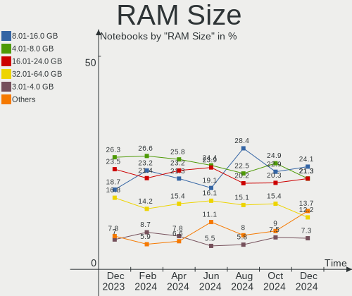
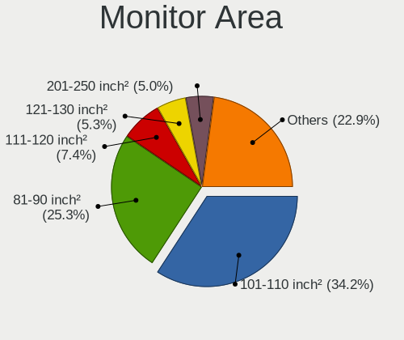
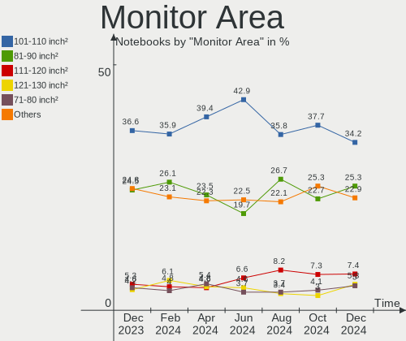

Fedora Hardware Trends (Notebook)
---------------------------------

A project to identify most popular hardware characteristics and track their change
over time based on data collected by Fedora users at https://Linux-Hardware.org.

Anyone can contribute to the study by uploading probes of their computers by
the [hw-probe](https://github.com/linuxhw/hw-probe) tool:

    sudo hw-probe -all -upload

Full-feature report is available here: https://linux-hardware.org/?view=trends&formfactor=notebook

Period: Mar, 2020.

Contents
--------

- [ OS                       ](#os)
- [ OS Family                ](#os-family)
- [ Kernel                   ](#kernel)
- [ Kernel Family            ](#kernel-family)
- [ Kernel Major Ver.        ](#kernel-major-ver)
- [ Arch                     ](#arch)
- [ DE                       ](#de)
- [ Display Server           ](#display-server)
- [ OS Lang                  ](#os-lang)
- [ Boot Mode                ](#boot-mode)
- [ Filesystem               ](#filesystem)
- [ Dual Boot with Linux     ](#dual-boot-with-linux)
- [ Dual Boot (Win)          ](#dual-boot-win)
- [ Country                  ](#country)
- [ City                     ](#city)
- [ Vendor                   ](#vendor)
- [ Model                    ](#model)
- [ Model Family             ](#model-family)
- [ MFG Year                 ](#mfg-year)
- [ Form Factor              ](#form-factor)
- [ Secure Boot              ](#secure-boot)
- [ Coreboot                 ](#coreboot)
- [ RAM Size                 ](#ram-size)
- [ RAM Used                 ](#ram-used)
- [ Drive Vendor             ](#drive-vendor)
- [ Drive Model              ](#drive-model)
- [ Drive Kind               ](#drive-kind)
- [ Drive Connector          ](#drive-connector)
- [ Drive Size               ](#drive-size)
- [ Space Total              ](#space-total)
- [ Space Used               ](#space-used)
- [ Malfunc. Drives          ](#malfunc-drives)
- [ Malfunc. Drive Vendor    ](#malfunc-drive-vendor)
- [ Malfunc. Drive Kind      ](#malfunc-drive-kind)
- [ Failed Drives            ](#failed-drives)
- [ Failed Drive Vendor      ](#failed-drive-vendor)
- [ Drive Status             ](#drive-status)
- [ Storage Vendor           ](#storage-vendor)
- [ Storage Model            ](#storage-model)
- [ Storage Kind             ](#storage-kind)
- [ CPU Vendor               ](#cpu-vendor)
- [ CPU Model                ](#cpu-model)
- [ CPU Model Family         ](#cpu-model-family)
- [ CPU Cores                ](#cpu-cores)
- [ CPU Sockets              ](#cpu-sockets)
- [ CPU Threads              ](#cpu-threads)
- [ CPU Op-Modes             ](#cpu-op-modes)
- [ CPU Microarch            ](#cpu-microarch)
- [ CPU Microcode            ](#cpu-microcode)
- [ GPU Vendor               ](#gpu-vendor)
- [ GPU Model                ](#gpu-model)
- [ GPU Combo                ](#gpu-combo)
- [ GPU Driver               ](#gpu-driver)
- [ GPU Memory               ](#gpu-memory)
- [ Monitor Vendor           ](#monitor-vendor)
- [ Monitor Model            ](#monitor-model)
- [ Monitor Resolution       ](#monitor-resolution)
- [ Monitor Diagonal         ](#monitor-diagonal)
- [ Monitor Width            ](#monitor-width)
- [ Aspect Ratio             ](#aspect-ratio)
- [ Monitor Area             ](#monitor-area)
- [ Pixel Density            ](#pixel-density)
- [ Multiple Monitors        ](#multiple-monitors)
- [ Net Controller Vendor    ](#net-controller-vendor)
- [ Net Controller Model     ](#net-controller-model)
- [ Net Controller Kind      ](#net-controller-kind)
- [ Used Controller          ](#used-controller)
- [ NICs                     ](#nics)
- [ Unsupported Devices      ](#unsupported-devices)
- [ Unsupported Device Types ](#unsupported-device-types)

OS
--

Installed operating systems

| Name      | Computers | Percent |
|-----------|-----------|---------|
| Fedora 31 | 84        | 85.71%  |
| Fedora 32 | 7         | 7.14%   |
| Fedora 30 | 5         | 5.1%    |
| Fedora 33 | 2         | 2.04%   |

OS Family
---------

OS without a version

| Name   | Computers | Percent |
|--------|-----------|---------|
| Fedora | 98        | 100%    |

Kernel
------

Version of the Linux kernel

| Version                        | Computers | Percent |
|--------------------------------|-----------|---------|
| 5.5.8-200.fc31.x86_64          | 28        | 28.57%  |
| 5.5.7-200.fc31.x86_64          | 12        | 12.24%  |
| 5.5.10-200.fc31.x86_64         | 11        | 11.22%  |
| 5.5.11-200.fc31.x86_64         | 10        | 10.2%   |
| 5.5.5-200.fc31.x86_64          | 5         | 5.1%    |
| 5.5.6-201.fc31.x86_64          | 4         | 4.08%   |
| 5.3.7-301.fc31.x86_64          | 4         | 4.08%   |
| 5.6.0-0.rc5.git0.2.fc32.x86_64 | 3         | 3.06%   |
| 5.5.9-200.fc31.x86_64          | 3         | 3.06%   |
| 5.6.0-0.rc3.git0.1.fc32.x86_64 | 2         | 2.04%   |
| 5.5.8-100.fc30.x86_64          | 2         | 2.04%   |
| 5.4.8-200.fc31.x86_64          | 2         | 2.04%   |
| 5.6.0-300.fc32.x86_64          | 1         | 1.02%   |
| 5.6.0-0.rc7.git0.2.fc32.x86_64 | 1         | 1.02%   |
| 5.6.0-0.rc6.git2.1.fc33.x86_64 | 1         | 1.02%   |
| 5.6.0-0.rc4.git0.1.fc32.x86_64 | 1         | 1.02%   |
| 5.5.6-100.fc30.x86_64          | 1         | 1.02%   |
| 5.5.10-100.fc30.x86_64         | 1         | 1.02%   |
| 5.4.18-200.fc31.x86_64         | 1         | 1.02%   |
| 5.4.10-200.fc31.x86_64         | 1         | 1.02%   |
| 5.3.16-300.fc31.x86_64         | 1         | 1.02%   |
| 5.3.13-300.fc31.x86_64         | 1         | 1.02%   |
| 5.3.11-200.fc30.x86_64         | 1         | 1.02%   |
| 4.19.109-300.fc31.x86_64       | 1         | 1.02%   |

Kernel Family
-------------

Linux kernel without a distro release

| Version  | Computers | Percent |
|----------|-----------|---------|
| 5.5.8    | 30        | 30.61%  |
| 5.5.7    | 12        | 12.24%  |
| 5.5.10   | 12        | 12.24%  |
| 5.5.11   | 10        | 10.2%   |
| 5.6.0    | 9         | 9.18%   |
| 5.5.6    | 5         | 5.1%    |
| 5.5.5    | 5         | 5.1%    |
| 5.3.7    | 4         | 4.08%   |
| 5.5.9    | 3         | 3.06%   |
| 5.4.8    | 2         | 2.04%   |
| 5.4.18   | 1         | 1.02%   |
| 5.4.10   | 1         | 1.02%   |
| 5.3.16   | 1         | 1.02%   |
| 5.3.13   | 1         | 1.02%   |
| 5.3.11   | 1         | 1.02%   |
| 4.19.109 | 1         | 1.02%   |

Kernel Major Ver.
-----------------

Linux kernel major version

| Version | Computers | Percent |
|---------|-----------|---------|
| 5.5     | 77        | 78.57%  |
| 5.6     | 9         | 9.18%   |
| 5.3     | 7         | 7.14%   |
| 5.4     | 4         | 4.08%   |
| 4.19    | 1         | 1.02%   |

Arch
----

OS architecture (x86_64, i586, etc.)

| Name   | Computers | Percent |
|--------|-----------|---------|
| x86_64 | 98        | 100%    |

DE
--

Desktop Environment

| Name          | Computers | Percent |
|---------------|-----------|---------|
| GNOME         | 79        | 80.61%  |
| KDE           | 6         | 6.12%   |
| KDE5          | 5         | 5.1%    |
| Cinnamon      | 4         | 4.08%   |
| X-Cinnamon    | 2         | 2.04%   |
| XFCE          | 1         | 1.02%   |
| GNOME Classic | 1         | 1.02%   |

Display Server
--------------

X11 or Wayland

| Name    | Computers | Percent |
|---------|-----------|---------|
| Wayland | 57        | 58.16%  |
| X11     | 40        | 40.82%  |
| Tty     | 1         | 1.02%   |

OS Lang
-------

Language

| Lang       | Computers | Percent |
|------------|-----------|---------|
| en_US      | 47        | 47.96%  |
| en_GB      | 10        | 10.2%   |
| it_IT      | 5         | 5.1%    |
| de_DE      | 4         | 4.08%   |
| ru_RU      | 3         | 3.06%   |
| pt_BR      | 3         | 3.06%   |
| fr_FR      | 3         | 3.06%   |
| sv_SE      | 2         | 2.04%   |
| es_CO      | 2         | 2.04%   |
| en_AU      | 2         | 2.04%   |
| de_CH      | 2         | 2.04%   |
| de_AT      | 2         | 2.04%   |
| cs_CZ      | 2         | 2.04%   |
| sk_SK      | 1         | 1.02%   |
| pl_PL      | 1         | 1.02%   |
| nl_NL      | 1         | 1.02%   |
| es_MX      | 1         | 1.02%   |
| es_AR      | 1         | 1.02%   |
| en_US.utf8 | 1         | 1.02%   |
| en_US      | 1         | 1.02%   |
| en_SG      | 1         | 1.02%   |
| en_NZ      | 1         | 1.02%   |
| en_GB.utf8 | 1         | 1.02%   |
| en_CA      | 1         | 1.02%   |

Boot Mode
---------

EFI or BIOS

| Mode | Computers | Percent |
|------|-----------|---------|
| EFI  | 73        | 74.49%  |
| BIOS | 25        | 25.51%  |

Filesystem
----------

Type of filesystem

| Type  | Computers | Percent |
|-------|-----------|---------|
| Ext4  | 92        | 93.88%  |
| Xfs   | 4         | 4.08%   |
| Btrfs | 2         | 2.04%   |

Dual Boot with Linux
--------------------

Hosting more than one Linux

| Dual boot | Computers | Percent |
|-----------|-----------|---------|
| No        | 91        | 92.86%  |
| Yes       | 7         | 7.14%   |

Dual Boot (Win)
---------------

Hosting Linux and Windows

| Dual boot | Computers | Percent |
|-----------|-----------|---------|
| No        | 84        | 85.71%  |
| Yes       | 14        | 14.29%  |

Country
-------

Geographic location (country)

| Country        | Computers | Percent |
|----------------|-----------|---------|
| USA            | 21        | 21.43%  |
| UK             | 9         | 9.18%   |
| Italy          | 9         | 9.18%   |
| Netherlands    | 5         | 5.1%    |
| Spain          | 4         | 4.08%   |
| Germany        | 4         | 4.08%   |
| France         | 4         | 4.08%   |
| Brazil         | 4         | 4.08%   |
| Switzerland    | 3         | 3.06%   |
| Sweden         | 3         | 3.06%   |
| Russia         | 3         | 3.06%   |
| India          | 3         | 3.06%   |
| Australia      | 3         | 3.06%   |
| Slovakia       | 2         | 2.04%   |
| Poland         | 2         | 2.04%   |
| Norway         | 2         | 2.04%   |
| Mexico         | 2         | 2.04%   |
| Czech Republic | 2         | 2.04%   |
| Colombia       | 2         | 2.04%   |
| Ukraine        | 1         | 1.02%   |
| South Africa   | 1         | 1.02%   |
| Singapore      | 1         | 1.02%   |
| New Zealand    | 1         | 1.02%   |
| Iran           | 1         | 1.02%   |
| Indonesia      | 1         | 1.02%   |
| Greece         | 1         | 1.02%   |
| Canada         | 1         | 1.02%   |
| Belgium        | 1         | 1.02%   |
| Austria        | 1         | 1.02%   |
| Argentina      | 1         | 1.02%   |

City
----

Geographic location (city)

| City                     | Computers | Percent |
|--------------------------|-----------|---------|
| Zurich                   | 3         | 3.06%   |
| Oslo                     | 2         | 2.04%   |
| Mexico City              | 2         | 2.04%   |
| Madrid                   | 2         | 2.04%   |
| Kwintsheul               | 2         | 2.04%   |
| Johnstone                | 2         | 2.04%   |
| Łódź                  | 1         | 1.02%   |
| Český Krumlov          | 1         | 1.02%   |
| Āstāneh-ye Ashrafīyeh | 1         | 1.02%   |
| Évreux                  | 1         | 1.02%   |
| Wormer                   | 1         | 1.02%   |
| Warsaw                   | 1         | 1.02%   |
| Wahroonga                | 1         | 1.02%   |
| Vitória da Conquista    | 1         | 1.02%   |
| Vienna                   | 1         | 1.02%   |
| Victoria                 | 1         | 1.02%   |
| Verona                   | 1         | 1.02%   |
| Vaestra Froelunda        | 1         | 1.02%   |
| Utrecht                  | 1         | 1.02%   |
| Trento                   | 1         | 1.02%   |
| Temecula                 | 1         | 1.02%   |
| Taylors                  | 1         | 1.02%   |
| Tampa                    | 1         | 1.02%   |
| Tacoma                   | 1         | 1.02%   |
| São José dos Campos    | 1         | 1.02%   |
| Sunbury                  | 1         | 1.02%   |
| Show Low                 | 1         | 1.02%   |
| Shickshinny              | 1         | 1.02%   |
| Sheffield                | 1         | 1.02%   |
| Seattle                  | 1         | 1.02%   |
| Schonwalde am Bungsberg  | 1         | 1.02%   |
| Santiago de Cali         | 1         | 1.02%   |
| San Giorgio di Piano     | 1         | 1.02%   |
| Salem                    | 1         | 1.02%   |
| Saint Paul               | 1         | 1.02%   |
| Reading                  | 1         | 1.02%   |
| Raleigh                  | 1         | 1.02%   |
| Queenstown Estate        | 1         | 1.02%   |
| Pune                     | 1         | 1.02%   |
| Prague                   | 1         | 1.02%   |
| Poços de Caldas         | 1         | 1.02%   |
| Portland                 | 1         | 1.02%   |
| Perth                    | 1         | 1.02%   |
| Paris                    | 1         | 1.02%   |
| Offenbach                | 1         | 1.02%   |
| Nitra                    | 1         | 1.02%   |
| New Delhi                | 1         | 1.02%   |
| Moscow                   | 1         | 1.02%   |
| Milan                    | 1         | 1.02%   |
| Melbourne                | 1         | 1.02%   |
| Macerata                 | 1         | 1.02%   |
| Lynnwood                 | 1         | 1.02%   |
| Lecco                    | 1         | 1.02%   |
| La Grande                | 1         | 1.02%   |
| Kyiv                     | 1         | 1.02%   |
| Kingston upon Thames     | 1         | 1.02%   |
| Jonesboro                | 1         | 1.02%   |
| Johanneshov              | 1         | 1.02%   |
| Jakarta                  | 1         | 1.02%   |
| Ivanovo                  | 1         | 1.02%   |

Vendor
------

Motherboard manufacturer

| Name                | Computers | Percent |
|---------------------|-----------|---------|
| Lenovo              | 26        | 26.53%  |
| Dell                | 24        | 24.49%  |
| Hewlett-Packard     | 19        | 19.39%  |
| Acer                | 7         | 7.14%   |
| Notebook            | 6         | 6.12%   |
| ASUSTek Computer    | 5         | 5.1%    |
| Apple               | 2         | 2.04%   |
| Toshiba             | 1         | 1.02%   |
| Sony                | 1         | 1.02%   |
| Samsung Electronics | 1         | 1.02%   |
| Positivo            | 1         | 1.02%   |
| PC Specialist       | 1         | 1.02%   |
| HUAWEI              | 1         | 1.02%   |
| Fujitsu             | 1         | 1.02%   |
| DEXP                | 1         | 1.02%   |
| Unknown             | 1         | 1.02%   |

Model
-----

Motherboard model

| Name                                     | Computers | Percent |
|------------------------------------------|-----------|---------|
| HP EliteBook 850 G6                      | 2         | 2.04%   |
| Toshiba Satellite P55W-C                 | 1         | 1.02%   |
| Sony VPCZ12Z9E                           | 1         | 1.02%   |
| Samsung Electronics RF510/RF410/RF710    | 1         | 1.02%   |
| Positivo MOBILE                          | 1         | 1.02%   |
| PC Specialist Recoil II                  | 1         | 1.02%   |
| Notebook W350SKQ/W370SK                  | 1         | 1.02%   |
| Notebook NH55RGQ                         | 1         | 1.02%   |
| Notebook N8xxEP6                         | 1         | 1.02%   |
| Notebook N24_25BU                        | 1         | 1.02%   |
| Notebook N150ZU                          | 1         | 1.02%   |
| Notebook L140CU                          | 1         | 1.02%   |
| Lenovo Yoga 3 Pro-1370 80HE              | 1         | 1.02%   |
| Lenovo ThinkPad X240 20AMS2PN0N          | 1         | 1.02%   |
| Lenovo ThinkPad X230 2325SSF             | 1         | 1.02%   |
| Lenovo ThinkPad X201 36806D8             | 1         | 1.02%   |
| Lenovo ThinkPad X200 74542HU             | 1         | 1.02%   |
| Lenovo ThinkPad X1 Carbon 7th 20R1SITSIT | 1         | 1.02%   |
| Lenovo ThinkPad X1 Carbon 7th 20QES2831P | 1         | 1.02%   |
| Lenovo ThinkPad X1 Carbon 7th 20QD003CRT | 1         | 1.02%   |
| Lenovo ThinkPad X1 Carbon 2nd 20A7005KMS | 1         | 1.02%   |
| Lenovo ThinkPad T580 20LAS3NJ0R          | 1         | 1.02%   |
| Lenovo ThinkPad T580 20LAS3NJ00          | 1         | 1.02%   |
| Lenovo ThinkPad T560 20FH0036MN          | 1         | 1.02%   |
| Lenovo ThinkPad T530 2394D44             | 1         | 1.02%   |
| Lenovo ThinkPad T480 20L6S0VE00          | 1         | 1.02%   |
| Lenovo ThinkPad T470s 20HGS2MB0M         | 1         | 1.02%   |
| Lenovo ThinkPad T470 20HD000LUK          | 1         | 1.02%   |
| Lenovo ThinkPad T420 4177R3U             | 1         | 1.02%   |
| Lenovo ThinkPad T410 2522PT3             | 1         | 1.02%   |
| Lenovo ThinkPad P53 20QNCTO1WW           | 1         | 1.02%   |
| Lenovo ThinkPad P1 Gen 2 20QUS04M00      | 1         | 1.02%   |
| Lenovo ThinkPad P1 Gen 2 20QT002JMX      | 1         | 1.02%   |
| Lenovo Legion Y740-17IRHg 81UJ           | 1         | 1.02%   |
| Lenovo IdeaPad 720-15IKB 81C7            | 1         | 1.02%   |
| Lenovo IdeaPad 520-15IKB 80YL            | 1         | 1.02%   |
| Lenovo IdeaPad 330-15ICH 81FK            | 1         | 1.02%   |
| Lenovo G580 20157                        | 1         | 1.02%   |
| HUAWEI MACH-WX9                          | 1         | 1.02%   |
| HP ZBook 17 G5                           | 1         | 1.02%   |
| HP ProBook 470 G5                        | 1         | 1.02%   |
| HP ProBook 450 G6                        | 1         | 1.02%   |
| HP ProBook 440 G6                        | 1         | 1.02%   |
| HP ProBook 430 G6                        | 1         | 1.02%   |
| HP Pavilion x2 Detachable                | 1         | 1.02%   |
| HP Pavilion Sleekbook 15 PC              | 1         | 1.02%   |
| HP Pavilion Notebook                     | 1         | 1.02%   |
| HP Notebook                              | 1         | 1.02%   |
| HP Laptop 17z-ca000                      | 1         | 1.02%   |
| HP Laptop 15-db0xxx                      | 1         | 1.02%   |
| HP Laptop 14-dk0xxx                      | 1         | 1.02%   |
| HP ENVY Notebook 13-ab0XX                | 1         | 1.02%   |
| HP ENVY m6                               | 1         | 1.02%   |
| HP EliteBook 8770w                       | 1         | 1.02%   |
| HP EliteBook 840 G6                      | 1         | 1.02%   |
| HP EliteBook 820 G3                      | 1         | 1.02%   |
| Fujitsu LIFEBOOK U747                    | 1         | 1.02%   |
| DEXP Notebook                            | 1         | 1.02%   |
| Dell XPS 15 9560                         | 1         | 1.02%   |
| Dell XPS 15 9550                         | 1         | 1.02%   |

Model Family
------------

Motherboard model prefix

| Name                      | Computers | Percent |
|---------------------------|-----------|---------|
| Lenovo ThinkPad           | 20        | 20.41%  |
| Dell Latitude             | 10        | 10.2%   |
| HP EliteBook              | 5         | 5.1%    |
| Dell XPS                  | 5         | 5.1%    |
| Dell Inspiron             | 5         | 5.1%    |
| HP ProBook                | 4         | 4.08%   |
| Acer Aspire               | 4         | 4.08%   |
| Lenovo IdeaPad            | 3         | 3.06%   |
| HP Pavilion               | 3         | 3.06%   |
| HP Laptop                 | 3         | 3.06%   |
| HP ENVY                   | 2         | 2.04%   |
| Dell Vostro               | 2         | 2.04%   |
| Dell Precision            | 2         | 2.04%   |
| Toshiba Satellite         | 1         | 1.02%   |
| Sony VPCZ12Z9E            | 1         | 1.02%   |
| Samsung Electronics RF510 | 1         | 1.02%   |
| Positivo MOBILE           | 1         | 1.02%   |
| PC Specialist Recoil      | 1         | 1.02%   |
| Notebook W350SKQ          | 1         | 1.02%   |
| Notebook NH55RGQ          | 1         | 1.02%   |
| Notebook N8xxEP6          | 1         | 1.02%   |
| Notebook N24              | 1         | 1.02%   |
| Notebook N150ZU           | 1         | 1.02%   |
| Notebook L140CU           | 1         | 1.02%   |
| Lenovo Yoga               | 1         | 1.02%   |
| Lenovo Legion             | 1         | 1.02%   |
| Lenovo G580               | 1         | 1.02%   |
| HUAWEI MACH-WX9           | 1         | 1.02%   |
| HP ZBook                  | 1         | 1.02%   |
| HP Notebook               | 1         | 1.02%   |
| Fujitsu LIFEBOOK          | 1         | 1.02%   |
| DEXP Notebook             | 1         | 1.02%   |
| ASUS X541NA               | 1         | 1.02%   |
| ASUS X455LD               | 1         | 1.02%   |
| ASUS TUF                  | 1         | 1.02%   |
| ASUS G73Jh                | 1         | 1.02%   |
| ASUS G46VW                | 1         | 1.02%   |
| Apple MacBookPro8         | 1         | 1.02%   |
| Apple MacBookPro11        | 1         | 1.02%   |
| Acer TravelMate           | 1         | 1.02%   |
| Acer Swift                | 1         | 1.02%   |
| Acer Nitro                | 1         | 1.02%   |
| Unknown                   | 1         | 1.02%   |

MFG Year
--------

Motherboard manufacture year

| Year | Computers | Percent |
|------|-----------|---------|
| 2019 | 42        | 42.86%  |
| 2018 | 20        | 20.41%  |
| 2017 | 6         | 6.12%   |
| 2015 | 6         | 6.12%   |
| 2020 | 5         | 5.1%    |
| 2012 | 4         | 4.08%   |
| 2010 | 4         | 4.08%   |
| 2016 | 3         | 3.06%   |
| 2013 | 3         | 3.06%   |
| 2011 | 3         | 3.06%   |
| 2014 | 2         | 2.04%   |

Form Factor
-----------

Physical design of the computer

| Name     | Computers | Percent |
|----------|-----------|---------|
| Notebook | 98        | 100%    |

Secure Boot
-----------

Enabled or disabled

| State    | Computers | Percent |
|----------|-----------|---------|
| Disabled | 80        | 81.63%  |
| Enabled  | 18        | 18.37%  |

Coreboot
--------

Have coreboot on board

| Used | Computers | Percent |
|------|-----------|---------|
| No   | 98        | 100%    |

RAM Size
--------

Total RAM memory

| Size in GB | Computers | Percent |
|------------|-----------|---------|
| 4.01-8.0   | 36        | 36.73%  |
| 16.01-24.0 | 28        | 28.57%  |
| 32.01-64.0 | 12        | 12.24%  |
| 8.01-16.0  | 12        | 12.24%  |
| 3.01-4.0   | 7         | 7.14%   |
| 24.01-32.0 | 1         | 1.02%   |
| 2.01-3.0   | 1         | 1.02%   |
| 1.01-2.0   | 1         | 1.02%   |

RAM Used
--------

Used RAM memory

| Used GB   | Computers | Percent |
|-----------|-----------|---------|
| 2.01-3.0  | 39        | 39.8%   |
| 3.01-4.0  | 22        | 22.45%  |
| 1.01-2.0  | 20        | 20.41%  |
| 4.01-8.0  | 11        | 11.22%  |
| 8.01-16.0 | 6         | 6.12%   |

Drive Vendor
------------

Hard drive vendors

| Vendor              | Computers | Drives  | Percent |
|---------------------|-----------|---------|---------|
| Samsung Electronics | 22        | 23      | 21.57%  |
| Seagate             | 19        | 19      | 18.63%  |
| Toshiba             | 10        | 10      | 9.8%    |
| WDC                 | 9         | 9       | 8.82%   |
| SanDisk             | 7         | 7       | 6.86%   |
| Unknown             | 5         | 5       | 4.9%    |
| Intel               | 5         | 5       | 4.9%    |
| SK Hynix            | 3         | 3       | 2.94%   |
| Kingston            | 3         | 3       | 2.94%   |
| Crucial             | 3         | 3       | 2.94%   |
| Micron Technology   | 2         | 2       | 1.96%   |
| LITEON              | 2         | 2       | 1.96%   |
| HL-DT-ST            | 2         | Unknown | 1.96%   |
| Hitachi             | 2         | 2       | 1.96%   |
| OSC                 | 1         | 1       | 0.98%   |
| LITEONIT            | 1         | 1       | 0.98%   |
| LDLC                | 1         | 1       | 0.98%   |
| KingFast            | 1         | 1       | 0.98%   |
| JMicron             | 1         | 1       | 0.98%   |
| INDMEM              | 1         | 1       | 0.98%   |
| HGST                | 1         | 1       | 0.98%   |
| Apple               | 1         | 1       | 0.98%   |

Drive Model
-----------

Hard drive models

| Model                            | Computers | Percent |
|----------------------------------|-----------|---------|
| ST1000LM035-1RK172 1TB           | 3         | 2.91%   |
| MQ01ABD100 1TB                   | 3         | 2.91%   |
| ST500LT012-1DG142 500GB          | 2         | 1.94%   |
| ST1000LM014-1EJ164 1TB           | 2         | 1.94%   |
| SSD 860 EVO M.2 500GB            | 2         | 1.94%   |
| SSD 850 EVO 500GB                | 2         | 1.94%   |
| MQ04ABF100 1TB                   | 2         | 1.94%   |
| MMC Card  32GB                   | 2         | 1.94%   |
| 1100 SATA 512GB SSD              | 2         | 1.94%   |
| WD5000LPVX-22V0TT0 500GB         | 1         | 0.97%   |
| WD5000BEVT-22A0RT0 500GB         | 1         | 0.97%   |
| WD10SPZX-24Z10T0 1TB             | 1         | 0.97%   |
| WD10SPZX-22Z10T0 1TB             | 1         | 0.97%   |
| WD10JPVX-60JC3T0 1TB             | 1         | 0.97%   |
| WD10JPVX-00JC3T0 1TB             | 1         | 0.97%   |
| TR200 240GB SSD                  | 1         | 0.97%   |
| THNSNH256GMCT 256GB SSD          | 1         | 0.97%   |
| THNSF5256GPUK 256GB              | 1         | 0.97%   |
| SV300S37A120G 120GB SSD          | 1         | 0.97%   |
| ST9750422AS 752GB                | 1         | 0.97%   |
| ST95005620AS 500GB               | 1         | 0.97%   |
| ST9500325AS 500GB                | 1         | 0.97%   |
| ST750LM022 HN-M750MBB 752GB      | 1         | 0.97%   |
| ST500LT012-9WS142 500GB          | 1         | 0.97%   |
| ST500LM021-1KJ152 500GB          | 1         | 0.97%   |
| ST500LM000-1EJ162 500GB          | 1         | 0.97%   |
| ST2000LX001-1RG174 2TB           | 1         | 0.97%   |
| ST2000LM003 HN-M201RAD 2TB       | 1         | 0.97%   |
| ST1000LM048-2E7172 1TB           | 1         | 0.97%   |
| SSDSC2KW256G8 256GB              | 1         | 0.97%   |
| SSDPEMKF010T8 NVMe 1024GB        | 1         | 0.97%   |
| SSDPEKNW512G8 512GB              | 1         | 0.97%   |
| SSDPEKNW010T8 1TB                | 1         | 0.97%   |
| SSDMCEAC120B3A 120GB             | 1         | 0.97%   |
| SSD U100 128GB                   | 1         | 0.97%   |
| SSD SM871 2.5 7mm 256GB          | 1         | 0.97%   |
| SSD SM0512F 500GB                | 1         | 0.97%   |
| SSD PM871b M.2 2280 256GB        | 1         | 0.97%   |
| SSD PM871 mSATA 256GB            | 1         | 0.97%   |
| SSD PLUS 240GB                   | 1         | 0.97%   |
| SSD PLUS 120 GB                  | 1         | 0.97%   |
| SSD 860 EVO 500GB                | 1         | 0.97%   |
| SSD 860 EVO 250GB                | 1         | 0.97%   |
| SSD 860 EVO 1TB                  | 1         | 0.97%   |
| SSD 850 PRO 256GB                | 1         | 0.97%   |
| SSD 850 EVO 250GB                | 1         | 0.97%   |
| SSD 750 EVO 250GB                | 1         | 0.97%   |
| SM2280S3G2480G 480GB SSD         | 1         | 0.97%   |
| SD9SN8W-128G-1006 128GB SSD      | 1         | 0.97%   |
| SD8TB8U256G1001 256GB SSD        | 1         | 0.97%   |
| SD8SN8U-256G-1006 256GB SSD      | 1         | 0.97%   |
| SC311 SATA 512GB SSD             | 1         | 0.97%   |
| RBU-SNS8100S3128GD 128GB SSD     | 1         | 0.97%   |
| PC SN720 SDAQNTW-256G-1001 256GB | 1         | 0.97%   |
| PC SN520 SDAPNUW-256G-1006 256GB | 1         | 0.97%   |
| PC SN520 NVMe 512GB              | 1         | 0.97%   |
| NCard  32GB                      | 1         | 0.97%   |
| MZVLV256HCHP-000H1 256GB         | 1         | 0.97%   |
| MZVLB512HBJQ-000L7 512GB         | 1         | 0.97%   |
| MZVLB512HBJQ-000H1 512GB         | 1         | 0.97%   |

Drive Kind
----------

HDD or SSD

| Kind    | Computers | Drives | Percent |
|---------|-----------|--------|---------|
| SSD     | 41        | 42     | 41%     |
| HDD     | 34        | 35     | 34%     |
| NVMe    | 13        | 14     | 13%     |
| Unknown | 7         | 5      | 7%      |
| MMC     | 5         | 5      | 5%      |

Drive Connector
---------------

SATA, SAS, NVMe, etc.

| Type | Computers | Drives | Percent |
|------|-----------|--------|---------|
| SATA | 68        | 80     | 75.56%  |
| NVMe | 13        | 14     | 14.44%  |
| MMC  | 5         | 5      | 5.56%   |
| SAS  | 4         | 2      | 4.44%   |

Drive Size
----------

Size of hard drive

| Size in TB | Computers | Drives | Percent |
|------------|-----------|--------|---------|
| 0.01-0.5   | 55        | 61     | 57.89%  |
| 0.51-1.0   | 34        | 34     | 35.79%  |
| 1.01-2.0   | 6         | 6      | 6.32%   |

Space Total
-----------

Amount of disk space available on the file system

| Size in GB | Computers | Percent |
|------------|-----------|---------|
| 101-250    | 34        | 34.69%  |
| 251-500    | 25        | 25.51%  |
| 501-1000   | 15        | 15.31%  |
| 51-100     | 9         | 9.18%   |
| 1001-2000  | 5         | 5.1%    |
| 21-50      | 3         | 3.06%   |
| 1-20       | 3         | 3.06%   |
| 2001-3000  | 2         | 2.04%   |
| Unknown    | 2         | 2.04%   |

Space Used
----------

Amount of used disk space

| Used GB  | Computers | Percent |
|----------|-----------|---------|
| 1-20     | 38        | 38.78%  |
| 21-50    | 19        | 19.39%  |
| 51-100   | 16        | 16.33%  |
| 101-250  | 13        | 13.27%  |
| 251-500  | 7         | 7.14%   |
| 501-1000 | 3         | 3.06%   |
| Unknown  | 2         | 2.04%   |

Malfunc. Drives
---------------

Drive models with a malfunction

| Model                   | Computers | Drives | Percent |
|-------------------------|-----------|--------|---------|
| ST9500325AS 500GB       | 1         | 1      | 50%     |
| ST500LT012-1DG142 500GB | 1         | 1      | 50%     |

Malfunc. Drive Vendor
---------------------

Vendors of faulty drives

| Vendor  | Computers | Drives | Percent |
|---------|-----------|--------|---------|
| Seagate | 2         | 2      | 100%    |

Malfunc. Drive Kind
-------------------

Kinds of faulty drives

| Kind | Computers | Drives | Percent |
|------|-----------|--------|---------|
| HDD  | 2         | 2      | 100%    |

Failed Drives
-------------

Failed drive models

Zero info for selected period =(

Failed Drive Vendor
-------------------

Failed drive vendors

Zero info for selected period =(

Drive Status
------------

Number of failed and malfunc. drives

| Status   | Computers | Drives | Percent |
|----------|-----------|--------|---------|
| Detected | 44        | 53     | 51.16%  |
| Works    | 40        | 46     | 46.51%  |
| Malfunc  | 2         | 2      | 2.33%   |

Storage Vendor
--------------

Storage controller vendors

| Vendor                       | Computers | Percent |
|------------------------------|-----------|---------|
| Intel                        | 74        | 65.49%  |
| Samsung Electronics          | 15        | 13.27%  |
| Sandisk                      | 10        | 8.85%   |
| AMD                          | 6         | 5.31%   |
| Toshiba America Info Systems | 4         | 3.54%   |
| SK Hynix                     | 2         | 1.77%   |
| Lite-On Technology           | 1         | 0.88%   |
| JMicron Technology           | 1         | 0.88%   |

Storage Model
-------------

Storage controller models

| Model                                                                    | Computers | Percent |
|--------------------------------------------------------------------------|-----------|---------|
| 82801 Mobile SATA Controller [RAID mode]                                 | 15        | 13.04%  |
| Sunrise Point-LP SATA Controller [AHCI mode]                             | 13        | 11.3%   |
| NVMe SSD Controller SM981/PM981/PM983                                    | 11        | 9.57%   |
| FCH SATA Controller [AHCI mode]                                          | 6         | 5.22%   |
| Cannon Lake Mobile PCH SATA AHCI Controller                              | 6         | 5.22%   |
| WD Black 2018/PC SN720 NVMe SSD                                          | 5         | 4.35%   |
| 7 Series Chipset Family 6-port SATA Controller [AHCI mode]               | 5         | 4.35%   |
| Wildcat Point-LP SATA Controller [AHCI Mode]                             | 4         | 3.48%   |
| WD Black 2018/PC SN520 NVMe SSD                                          | 4         | 3.48%   |
| Cannon Point-LP SATA Controller [AHCI Mode]                              | 4         | 3.48%   |
| 8 Series/C220 Series Chipset Family 6-port SATA Controller 1 [AHCI mode] | 4         | 3.48%   |
| 8 Series SATA Controller 1 [AHCI mode]                                   | 4         | 3.48%   |
| 6 Series/C200 Series Chipset Family 6 port Mobile SATA AHCI Controller   | 4         | 3.48%   |
| Non-Volatile memory controller                                           | 3         | 2.61%   |
| HM170/QM170 Chipset SATA Controller [AHCI Mode]                          | 3         | 2.61%   |
| XG4 NVMe SSD Controller                                                  | 2         | 1.74%   |
| SSD 660P Series                                                          | 2         | 1.74%   |
| NVMe SSD Controller SM951/PM951                                          | 2         | 1.74%   |
| 5 Series/3400 Series Chipset 6 port SATA AHCI Controller                 | 2         | 1.74%   |
| 5 Series/3400 Series Chipset 4 port SATA AHCI Controller                 | 2         | 1.74%   |
| Toshiba America Info Non-Volatile memory controller                      | 1         | 0.87%   |
| SSD Pro 7600p/760p/E 6100p Series                                        | 1         | 0.87%   |
| SATA Controller [RAID mode]                                              | 1         | 0.87%   |
| Q170/Q150/B150/H170/H110/Z170/CM236 Chipset SATA Controller [AHCI Mode]  | 1         | 0.87%   |
| PC300 NVMe Solid State Drive 256GB                                       | 1         | 0.87%   |
| NVMe SSD Controller SM961/PM961                                          | 1         | 0.87%   |
| JMB360 AHCI Controller                                                   | 1         | 0.87%   |
| Comet Lake SATA AHCI Controller                                          | 1         | 0.87%   |
| Celeron N3350/Pentium N4200/Atom E3900 Series SATA AHCI Controller       | 1         | 0.87%   |
| BG3 NVMe SSD Controller                                                  | 1         | 0.87%   |
| Apple PCIe SSD                                                           | 1         | 0.87%   |
| 82801IBM/IEM (ICH9M/ICH9M-E) 4 port SATA Controller [AHCI mode]          | 1         | 0.87%   |
| 5 Series/3400 Series Chipset 4 port SATA IDE Controller                  | 1         | 0.87%   |
| 5 Series/3400 Series Chipset 2 port SATA IDE Controller                  | 1         | 0.87%   |

Storage Kind
------------

Kind of storage controller (IDE, SATA, NVMe, SAS, ...)

| Kind | Computers | Percent |
|------|-----------|---------|
| SATA | 62        | 55.36%  |
| NVMe | 33        | 29.46%  |
| RAID | 16        | 14.29%  |
| IDE  | 1         | 0.89%   |

CPU Vendor
----------

Processor vendors

| Vendor | Computers | Percent |
|--------|-----------|---------|
| Intel  | 91        | 92.86%  |
| AMD    | 7         | 7.14%   |

CPU Model
---------

Processor models

| Model                                         | Computers | Percent |
|-----------------------------------------------|-----------|---------|
| Intel Core i7-8550U CPU @ 1.80GHz             | 7         | 7.14%   |
| Intel Core i7-9750H CPU @ 2.60GHz             | 4         | 4.08%   |
| Intel Core i7-8565U CPU @ 1.80GHz             | 4         | 4.08%   |
| Intel Core i7-8750H CPU @ 2.20GHz             | 3         | 3.06%   |
| Intel Core i7-10510U CPU @ 1.80GHz            | 3         | 3.06%   |
| Intel Core i5-8265U CPU @ 1.60GHz             | 3         | 3.06%   |
| Intel Core i5-5200U CPU @ 2.20GHz             | 3         | 3.06%   |
| Intel Core i7-8850H CPU @ 2.60GHz             | 2         | 2.04%   |
| Intel Core i7-8650U CPU @ 1.90GHz             | 2         | 2.04%   |
| Intel Core i7-7600U CPU @ 2.80GHz             | 2         | 2.04%   |
| Intel Core i7-7500U CPU @ 2.70GHz             | 2         | 2.04%   |
| Intel Core i7-6600U CPU @ 2.60GHz             | 2         | 2.04%   |
| Intel Core i7-3630QM CPU @ 2.40GHz            | 2         | 2.04%   |
| Intel Core i5-7300U CPU @ 2.60GHz             | 2         | 2.04%   |
| Intel Core i5-7200U CPU @ 2.50GHz             | 2         | 2.04%   |
| Intel Core i5-6200U CPU @ 2.30GHz             | 2         | 2.04%   |
| Intel Core i5-4300U CPU @ 1.90GHz             | 2         | 2.04%   |
| Intel Core i5-3317U CPU @ 1.70GHz             | 2         | 2.04%   |
| Intel Core i5-2430M CPU @ 2.40GHz             | 2         | 2.04%   |
| Intel Pentium CPU N4200 @ 1.10GHz             | 1         | 1.02%   |
| Intel Pentium CPU 4415U @ 2.30GHz             | 1         | 1.02%   |
| Intel Core M-5Y71 CPU @ 1.20GHz               | 1         | 1.02%   |
| Intel Core i7-9850H CPU @ 2.60GHz             | 1         | 1.02%   |
| Intel Core i7-8665U CPU @ 1.90GHz             | 1         | 1.02%   |
| Intel Core i7-7820HQ CPU @ 2.90GHz            | 1         | 1.02%   |
| Intel Core i7-7700HQ CPU @ 2.80GHz            | 1         | 1.02%   |
| Intel Core i7-6820HQ CPU @ 2.70GHz            | 1         | 1.02%   |
| Intel Core i7-6700HQ CPU @ 2.60GHz            | 1         | 1.02%   |
| Intel Core i7-6500U CPU @ 2.50GHz             | 1         | 1.02%   |
| Intel Core i7-5600U CPU @ 2.60GHz             | 1         | 1.02%   |
| Intel Core i7-4870HQ CPU @ 2.50GHz            | 1         | 1.02%   |
| Intel Core i7-4720HQ CPU @ 2.60GHz            | 1         | 1.02%   |
| Intel Core i7-4710MQ CPU @ 2.50GHz            | 1         | 1.02%   |
| Intel Core i7-4702MQ CPU @ 2.20GHz            | 1         | 1.02%   |
| Intel Core i7-4700MQ CPU @ 2.40GHz            | 1         | 1.02%   |
| Intel Core i7-4550U CPU @ 1.50GHz             | 1         | 1.02%   |
| Intel Core i7-10710U CPU @ 1.10GHz            | 1         | 1.02%   |
| Intel Core i7 CPU Q 720 @ 1.60GHz             | 1         | 1.02%   |
| Intel Core i7 CPU M 620 @ 2.67GHz             | 1         | 1.02%   |
| Intel Core i5-8400H CPU @ 2.50GHz             | 1         | 1.02%   |
| Intel Core i5-8365U CPU @ 1.60GHz             | 1         | 1.02%   |
| Intel Core i5-8350U CPU @ 1.70GHz             | 1         | 1.02%   |
| Intel Core i5-8250U CPU @ 1.60GHz             | 1         | 1.02%   |
| Intel Core i5-7300HQ CPU @ 2.50GHz            | 1         | 1.02%   |
| Intel Core i5-4210U CPU @ 1.70GHz             | 1         | 1.02%   |
| Intel Core i5-4210M CPU @ 2.60GHz             | 1         | 1.02%   |
| Intel Core i5-4200U CPU @ 1.60GHz             | 1         | 1.02%   |
| Intel Core i5-3340M CPU @ 2.70GHz             | 1         | 1.02%   |
| Intel Core i5-3320M CPU @ 2.60GHz             | 1         | 1.02%   |
| Intel Core i5-3210M CPU @ 2.50GHz             | 1         | 1.02%   |
| Intel Core i5-2450M CPU @ 2.50GHz             | 1         | 1.02%   |
| Intel Core i5-2415M CPU @ 2.30GHz             | 1         | 1.02%   |
| Intel Core i5 CPU M 560 @ 2.67GHz             | 1         | 1.02%   |
| Intel Core i5 CPU M 540 @ 2.53GHz             | 1         | 1.02%   |
| Intel Core i5 CPU M 520 @ 2.40GHz             | 1         | 1.02%   |
| Intel Core i5 CPU M 450 @ 2.40GHz             | 1         | 1.02%   |
| Intel Core i3-2370M CPU @ 2.40GHz             | 1         | 1.02%   |
| Intel Core 2 Duo CPU P8600 @ 2.40GHz          | 1         | 1.02%   |
| Intel Atom x5-Z8300 CPU @ 1.44GHz             | 1         | 1.02%   |
| AMD Ryzen 7 2700U with Radeon Vega Mobile Gfx | 1         | 1.02%   |

CPU Model Family
----------------

Processor model prefix

| Model            | Computers | Percent |
|------------------|-----------|---------|
| Intel Core i7    | 50        | 51.02%  |
| Intel Core i5    | 35        | 35.71%  |
| Intel Pentium    | 2         | 2.04%   |
| AMD Ryzen 5      | 2         | 2.04%   |
| Other            | 1         | 1.02%   |
| Intel Core M     | 1         | 1.02%   |
| Intel Core i3    | 1         | 1.02%   |
| Intel Core 2 Duo | 1         | 1.02%   |
| Intel Atom       | 1         | 1.02%   |
| AMD Ryzen 7      | 1         | 1.02%   |
| AMD Ryzen 3      | 1         | 1.02%   |
| AMD FX           | 1         | 1.02%   |
| AMD A6           | 1         | 1.02%   |

CPU Cores
---------

Number of processor cores

| Number | Computers | Percent |
|--------|-----------|---------|
| 2      | 45        | 45.92%  |
| 4      | 42        | 42.86%  |
| 6      | 11        | 11.22%  |

CPU Sockets
-----------

Number of sockets

| Number | Computers | Percent |
|--------|-----------|---------|
| 1      | 98        | 100%    |

CPU Threads
-----------

Threads per core (Hyper-Threading)

| Number | Computers | Percent |
|--------|-----------|---------|
| 2      | 92        | 93.88%  |
| 1      | 6         | 6.12%   |

CPU Op-Modes
------------

CPU Operation Modes (32-bit, 64-bit)

| Op mode        | Computers | Percent |
|----------------|-----------|---------|
| 32-bit, 64-bit | 98        | 100%    |

CPU Microarch
-------------

Microarchitecture

| Name        | Computers | Percent |
|-------------|-----------|---------|
| Skylake     | 51        | 52.04%  |
| Haswell     | 11        | 11.22%  |
| IvyBridge   | 7         | 7.14%   |
| Westmere    | 5         | 5.1%    |
| SandyBridge | 5         | 5.1%    |
| Broadwell   | 5         | 5.1%    |
| KabyLake    | 3         | 3.06%   |
| Zen+        | 2         | 2.04%   |
| Zen         | 2         | 2.04%   |
| Excavator   | 2         | 2.04%   |
| Steamroller | 1         | 1.02%   |
| Silvermont  | 1         | 1.02%   |
| Nehalem     | 1         | 1.02%   |
| Goldmont    | 1         | 1.02%   |
| Core        | 1         | 1.02%   |

CPU Microcode
-------------

Microcode number

| Number     | Computers | Percent |
|------------|-----------|---------|
| 0x806ec    | 11        | 11.22%  |
| 0x806ea    | 11        | 11.22%  |
| 0x906ea    | 10        | 10.2%   |
| 0x806e9    | 8         | 8.16%   |
| 0x306a9    | 7         | 7.14%   |
| 0x406e3    | 5         | 5.1%    |
| 0x40651    | 5         | 5.1%    |
| 0x306d4    | 5         | 5.1%    |
| 0x306c3    | 5         | 5.1%    |
| 0x206a7    | 5         | 5.1%    |
| 0x20655    | 4         | 4.08%   |
| 0x906e9    | 3         | 3.06%   |
| 0x506e3    | 2         | 2.04%   |
| 0x08108102 | 2         | 2.04%   |
| 0x06006705 | 2         | 2.04%   |
| 0xa0660    | 1         | 1.02%   |
| 0x906ed    | 1         | 1.02%   |
| 0x806eb    | 1         | 1.02%   |
| 0x506c9    | 1         | 1.02%   |
| 0x406c3    | 1         | 1.02%   |
| 0x40661    | 1         | 1.02%   |
| 0x20652    | 1         | 1.02%   |
| 0x106e5    | 1         | 1.02%   |
| 0x10676    | 1         | 1.02%   |
| 0x0810100b | 1         | 1.02%   |
| 0x08101007 | 1         | 1.02%   |
| 0x06003106 | 1         | 1.02%   |
| Unknown    | 1         | 1.02%   |

GPU Vendor
----------

Vendors of graphics cards

| Vendor | Computers | Percent |
|--------|-----------|---------|
| Intel  | 85        | 62.96%  |
| Nvidia | 36        | 26.67%  |
| AMD    | 14        | 10.37%  |

GPU Model
---------

Graphics card models

| Model                                                                              | Computers | Percent |
|------------------------------------------------------------------------------------|-----------|---------|
| UHD Graphics 620                                                                   | 11        | 8.09%   |
| UHD Graphics 630 (Mobile)                                                          | 10        | 7.35%   |
| UHD Graphics 620 (Whiskey Lake)                                                    | 9         | 6.62%   |
| HD Graphics 620                                                                    | 8         | 5.88%   |
| 3rd Gen Core processor Graphics Controller                                         | 6         | 4.41%   |
| Skylake GT2 [HD Graphics 520]                                                      | 5         | 3.68%   |
| Haswell-ULT Integrated Graphics Controller                                         | 5         | 3.68%   |
| 2nd Generation Core Processor Family Integrated Graphics Controller                | 5         | 3.68%   |
| UHD Graphics                                                                       | 4         | 2.94%   |
| HD Graphics 5500                                                                   | 4         | 2.94%   |
| Core Processor Integrated Graphics Controller                                      | 4         | 2.94%   |
| 4th Gen Core Processor Integrated Graphics Controller                              | 4         | 2.94%   |
| HD Graphics 630                                                                    | 3         | 2.21%   |
| GP106M [GeForce GTX 1060 Mobile]                                                   | 3         | 2.21%   |
| GF117M [GeForce 610M/710M/810M/820M / GT 620M/625M/630M/720M]                      | 3         | 2.21%   |
| TU117GLM [Quadro T2000 Mobile / Max-Q]                                             | 2         | 1.47%   |
| Topaz XT [Radeon R7 M260/M265 / M340/M360 / M440/M445 / 530/535 / 620/625 Mobile]  | 2         | 1.47%   |
| Stoney [Radeon R2/R3/R4/R5 Graphics]                                               | 2         | 1.47%   |
| Raven Ridge [Radeon Vega Series / Radeon Vega Mobile Series]                       | 2         | 1.47%   |
| Picasso                                                                            | 2         | 1.47%   |
| Lexa PRO [Radeon 540/540X/550/550X / RX 540X/550/550X]                             | 2         | 1.47%   |
| HD Graphics 530                                                                    | 2         | 1.47%   |
| GP108M [GeForce MX150]                                                             | 2         | 1.47%   |
| GP107M [GeForce GTX 1050 Mobile]                                                   | 2         | 1.47%   |
| GM107M [GeForce GTX 950M]                                                          | 2         | 1.47%   |
| TU117GLM [Quadro T1000 Mobile]                                                     | 1         | 0.74%   |
| TU106BM [GeForce RTX 2060 Mobile]                                                  | 1         | 0.74%   |
| Thames [Radeon HD 7550M/7570M/7650M]                                               | 1         | 0.74%   |
| Saturn XT [FirePro M6100]                                                          | 1         | 0.74%   |
| Mobile 4 Series Chipset Integrated Graphics Controller                             | 1         | 0.74%   |
| Kaveri [Radeon R6/R7 Graphics]                                                     | 1         | 0.74%   |
| Kaby Lake-U GT1 Integrated Graphics Controller                                     | 1         | 0.74%   |
| HD Graphics 5300                                                                   | 1         | 0.74%   |
| GT216M [GeForce GT 330M]                                                           | 1         | 0.74%   |
| GP108M [GeForce MX250]                                                             | 1         | 0.74%   |
| GP108M [GeForce MX230]                                                             | 1         | 0.74%   |
| GP107M [GeForce GTX 1050 3 GB Max-Q]                                               | 1         | 0.74%   |
| GP104GLM [Quadro P5200 Mobile]                                                     | 1         | 0.74%   |
| GM108M [GeForce MX130]                                                             | 1         | 0.74%   |
| GM108M [GeForce 940M]                                                              | 1         | 0.74%   |
| GM108M [GeForce 940MX]                                                             | 1         | 0.74%   |
| GM108M [GeForce 930MX]                                                             | 1         | 0.74%   |
| GM108M [GeForce 840M]                                                              | 1         | 0.74%   |
| GM107M [GeForce GTX 960M]                                                          | 1         | 0.74%   |
| GM107GLM [Quadro M1000M]                                                           | 1         | 0.74%   |
| GK208M [GeForce GT 740M]                                                           | 1         | 0.74%   |
| GK107M [GeForce GTX 660M]                                                          | 1         | 0.74%   |
| GK107M [GeForce GT 750M]                                                           | 1         | 0.74%   |
| GK107M [GeForce GT 750M Mac Edition]                                               | 1         | 0.74%   |
| GK106M [GeForce GTX 760M]                                                          | 1         | 0.74%   |
| GK104GLM [Quadro K3000M]                                                           | 1         | 0.74%   |
| GF108M [GeForce GT 540M]                                                           | 1         | 0.74%   |
| GF108M [GeForce GT 420M]                                                           | 1         | 0.74%   |
| Celeron N3350/Pentium N4200/Atom E3900 Series Integrated Graphics Controller       | 1         | 0.74%   |
| Broadway XT [Mobility Radeon HD 5870]                                              | 1         | 0.74%   |
| Baffin [Radeon RX 460/560D / Pro 450/455/460/555/555X/560/560X]                    | 1         | 0.74%   |
| Atom/Celeron/Pentium Processor x5-E8000/J3xxx/N3xxx Integrated Graphics Controller | 1         | 0.74%   |

GPU Combo
---------

Combinations of graphics cards

| Name           | Computers | Percent |
|----------------|-----------|---------|
| 1 x Intel      | 49        | 50%     |
| Intel + Nvidia | 31        | 31.63%  |
| 1 x AMD        | 7         | 7.14%   |
| Intel + AMD    | 5         | 5.1%    |
| 1 x Nvidia     | 4         | 4.08%   |
| 2 x AMD        | 1         | 1.02%   |
| AMD + Nvidia   | 1         | 1.02%   |

GPU Driver
----------

Free vs proprietary

| Driver      | Computers | Percent |
|-------------|-----------|---------|
| Free        | 81        | 82.65%  |
| Proprietary | 16        | 16.33%  |
| Unknown     | 1         | 1.02%   |

GPU Memory
----------

Total video memory

| Size in GB | Computers | Percent |
|------------|-----------|---------|
| Unknown    | 69        | 70.41%  |
| 1.01-2.0   | 14        | 14.29%  |
| 3.01-4.0   | 7         | 7.14%   |
| 0.01-0.5   | 5         | 5.1%    |
| 0.51-1.0   | 3         | 3.06%   |

Monitor Vendor
--------------

Monitor vendors

| Vendor              | Computers | Percent |
|---------------------|-----------|---------|
| AU Optronics        | 25        | 21.19%  |
| LG Display          | 21        | 17.8%   |
| BOE                 | 16        | 13.56%  |
| Chimei Innolux      | 15        | 12.71%  |
| Lenovo              | 7         | 5.93%   |
| Sharp               | 6         | 5.08%   |
| Samsung Electronics | 6         | 5.08%   |
| Dell                | 6         | 5.08%   |
| Hewlett-Packard     | 3         | 2.54%   |
| Philips             | 2         | 1.69%   |
| Goldstar            | 2         | 1.69%   |
| ViewSonic           | 1         | 0.85%   |
| Sony                | 1         | 0.85%   |
| PANDA               | 1         | 0.85%   |
| JDI                 | 1         | 0.85%   |
| HannStar            | 1         | 0.85%   |
| BenQ                | 1         | 0.85%   |
| ASUSTek Computer    | 1         | 0.85%   |
| Apple               | 1         | 0.85%   |
| AOC                 | 1         | 0.85%   |

Monitor Model
-------------

Monitor models

| Model                                                            | Computers | Percent |
|------------------------------------------------------------------|-----------|---------|
| LCD Monitor SHP143E 3840x2160 346x194mm 15.6-inch                | 2         | 1.67%   |
| LCD Monitor LGD046D 1920x1080 309x174mm 14.0-inch                | 2         | 1.67%   |
| LCD Monitor CMN15DB 1366x768 344x193mm 15.5-inch                 | 2         | 1.67%   |
| LCD Monitor CMN14C9 1920x1080 309x173mm 13.9-inch                | 2         | 1.67%   |
| LCD Monitor AUO42EB 3840x2160 344x193mm 15.5-inch                | 2         | 1.67%   |
| LCD Monitor AUO233C 1366x768 309x173mm 13.9-inch                 | 2         | 1.67%   |
| LCD Monitor AUO21ED 1920x1080 344x194mm 15.5-inch                | 2         | 1.67%   |
| LCD Monitor AUO133D 1920x1080 309x173mm 13.9-inch                | 2         | 1.67%   |
| Z23n HWP3283 1920x1080 509x286mm 23.0-inch                       | 1         | 0.83%   |
| VZ229 AUS22CC 1920x1080 476x268mm 21.5-inch                      | 1         | 0.83%   |
| VX2433wm VSC3822 1920x1080 520x290mm 23.4-inch                   | 1         | 0.83%   |
| U2515H DELD070 2560x1440 553x311mm 25.0-inch                     | 1         | 0.83%   |
| U2412M DELA07A 1920x1200 518x324mm 24.1-inch                     | 1         | 0.83%   |
| U2410 DELF016 1920x1080 520x320mm 24.0-inch                      | 1         | 0.83%   |
| SA300/SA350 SAM078E 1680x1050 480x270mm 21.7-inch                | 1         | 0.83%   |
| S24D330 SAM0D92 1920x1080 531x299mm 24.0-inch                    | 1         | 0.83%   |
| S2419H DELD0D1 1920x1080 527x296mm 23.8-inch                     | 1         | 0.83%   |
| PHL 241B8Q PHL0929 1920x1080 527x296mm 23.8-inch                 | 1         | 0.83%   |
| P24h-10 LEN61AE 2560x1440 527x296mm 23.8-inch                    | 1         | 0.83%   |
| P2418D DELD0C2 2560x1440 526x296mm 23.8-inch                     | 1         | 0.83%   |
| P2418D DELD0C1 2560x1440 526x296mm 23.8-inch                     | 1         | 0.83%   |
| P2310H DELD027 1920x1080 509x286mm 23.0-inch                     | 1         | 0.83%   |
| Nvidia Defaul t Flat Panel MS_0025 1920x1080 531x299mm 24.0-inch | 1         | 0.83%   |
| LG ULTRAWIDE GSM59F1 1920x1080 580x240mm 24.7-inch               | 1         | 0.83%   |
| LEN P27u-10 LEN61B0 3840x2160 597x336mm 27.0-inch                | 1         | 0.83%   |
| LCD Monitor SHP14AD 3840x2160 294x165mm 13.3-inch                | 1         | 0.83%   |
| LCD Monitor SHP1484 1920x1080 294x165mm 13.3-inch                | 1         | 0.83%   |
| LCD Monitor SHP1453 1920x1080 346x194mm 15.6-inch                | 1         | 0.83%   |
| LCD Monitor SHP1449 1920x1080 294x165mm 13.3-inch                | 1         | 0.83%   |
| LCD Monitor SEC5742 1366x768 309x174mm 14.0-inch                 | 1         | 0.83%   |
| LCD Monitor SEC4252 1366x768 344x194mm 15.5-inch                 | 1         | 0.83%   |
| LCD Monitor SDC4A51 1366x768 344x194mm 15.5-inch                 | 1         | 0.83%   |
| LCD Monitor SDC434A 3200x1800 293x165mm 13.2-inch                | 1         | 0.83%   |
| LCD Monitor SDC415A 3200x1800 293x165mm 13.2-inch                | 1         | 0.83%   |
| LCD Monitor NCP0036 1920x1080 344x194mm 15.5-inch                | 1         | 0.83%   |
| LCD Monitor LGD05EE 2560x1440 309x174mm 14.0-inch                | 1         | 0.83%   |
| LCD Monitor LGD05E5 1920x1080 344x194mm 15.5-inch                | 1         | 0.83%   |
| LCD Monitor LGD05E0 1920x1080 382x215mm 17.3-inch                | 1         | 0.83%   |
| LCD Monitor LGD05D8 1920x1080 344x194mm 15.5-inch                | 1         | 0.83%   |
| LCD Monitor LGD0590 1920x1080 344x194mm 15.5-inch                | 1         | 0.83%   |
| LCD Monitor LGD0573 1920x1080 344x194mm 15.5-inch                | 1         | 0.83%   |
| LCD Monitor LGD0521 1920x1080 309x174mm 14.0-inch                | 1         | 0.83%   |
| LCD Monitor LGD0503 1366x768 340x190mm 15.3-inch                 | 1         | 0.83%   |
| LCD Monitor LGD04A7 1920x1080 340x190mm 15.3-inch                | 1         | 0.83%   |
| LCD Monitor LGD0470 1920x1080 345x194mm 15.6-inch                | 1         | 0.83%   |
| LCD Monitor LGD0469 1920x1080 382x215mm 17.3-inch                | 1         | 0.83%   |
| LCD Monitor LGD044F 1920x1080 350x190mm 15.7-inch                | 1         | 0.83%   |
| LCD Monitor LGD0419 2560x1440 310x174mm 14.0-inch                | 1         | 0.83%   |
| LCD Monitor LGD03ED 1366x768 277x156mm 12.5-inch                 | 1         | 0.83%   |
| LCD Monitor LGD03A3 1366x768 277x156mm 12.5-inch                 | 1         | 0.83%   |
| LCD Monitor LGD0395 1366x768 344x194mm 15.5-inch                 | 1         | 0.83%   |
| LCD Monitor LGD0383 1600x900 382x215mm 17.3-inch                 | 1         | 0.83%   |
| LCD Monitor LGD02DC 1366x768 344x194mm 15.5-inch                 | 1         | 0.83%   |
| LCD Monitor LGD0259 1920x1080 350x190mm 15.7-inch                | 1         | 0.83%   |
| LCD Monitor LEN40BA 1920x1080 344x194mm 15.5-inch                | 1         | 0.83%   |
| LCD Monitor LEN40B1 1600x900 344x194mm 15.5-inch                 | 1         | 0.83%   |
| LCD Monitor LEN4036 1440x900 304x190mm 14.1-inch                 | 1         | 0.83%   |
| LCD Monitor LEN4011 1280x800 261x163mm 12.1-inch                 | 1         | 0.83%   |
| LCD Monitor LEN4010 1280x800 261x163mm 12.1-inch                 | 1         | 0.83%   |
| LCD Monitor JDI422A 3000x2000 293x196mm 13.9-inch                | 1         | 0.83%   |

Monitor Resolution
------------------

Monitor screen resolution

| Resolution        | Computers | Percent |
|-------------------|-----------|---------|
| 1920x1080 (FHD)   | 50        | 46.3%   |
| 1366x768 (WXGA)   | 27        | 25%     |
| 3840x2160 (4K)    | 7         | 6.48%   |
| 1600x900 (HD+)    | 6         | 5.56%   |
| 2560x1440 (QHD)   | 5         | 4.63%   |
| 1920x1200 (WUXGA) | 3         | 2.78%   |
| 1280x800 (WXGA)   | 3         | 2.78%   |
| 3200x1800 (QHD+)  | 2         | 1.85%   |
| 3440x1440         | 1         | 0.93%   |
| 3000x2000         | 1         | 0.93%   |
| 2880x1800         | 1         | 0.93%   |
| 2560x1080         | 1         | 0.93%   |
| 1440x900 (WXGA+)  | 1         | 0.93%   |

Monitor Diagonal
----------------

Diagonal size in inches

| Inches | Computers | Percent |
|--------|-----------|---------|
| 15     | 42        | 35.29%  |
| 13     | 24        | 20.17%  |
| 14     | 14        | 11.76%  |
| 23     | 10        | 8.4%    |
| 17     | 10        | 8.4%    |
| 12     | 6         | 5.04%   |
| 24     | 3         | 2.52%   |
| 21     | 3         | 2.52%   |
| 27     | 2         | 1.68%   |
| 35     | 1         | 0.84%   |
| 28     | 1         | 0.84%   |
| 25     | 1         | 0.84%   |
| 18     | 1         | 0.84%   |
| 10     | 1         | 0.84%   |

Monitor Width
-------------

Physical width

| Width in mm | Computers | Percent |
|-------------|-----------|---------|
| 301-350     | 71        | 59.66%  |
| 501-600     | 16        | 13.45%  |
| 201-300     | 16        | 13.45%  |
| 351-400     | 10        | 8.4%    |
| 401-500     | 4         | 3.36%   |
| 801-900     | 1         | 0.84%   |
| 601-700     | 1         | 0.84%   |

Aspect Ratio
------------

Proportional relationship between the width and the height

| Ratio | Computers | Percent |
|-------|-----------|---------|
| 16/9  | 92        | 89.32%  |
| 16/10 | 8         | 7.77%   |
| 21/9  | 2         | 1.94%   |
| 3/2   | 1         | 0.97%   |

Monitor Area
------------

Area in inch²

| Area in inch² | Computers | Percent |
|----------------|-----------|---------|
| 101-110        | 42        | 35.59%  |
| 81-90          | 30        | 25.42%  |
| 201-250        | 11        | 9.32%   |
| 121-130        | 10        | 8.47%   |
| 71-80          | 8         | 6.78%   |
| 61-70          | 6         | 5.08%   |
| 251-300        | 4         | 3.39%   |
| 301-350        | 2         | 1.69%   |
| 151-200        | 2         | 1.69%   |
| 351-500        | 1         | 0.85%   |
| 41-50          | 1         | 0.85%   |
| 141-150        | 1         | 0.85%   |

Pixel Density
-------------

Pixels per inch

| Density       | Computers | Percent |
|---------------|-----------|---------|
| 121-160       | 52        | 44.83%  |
| 101-120       | 32        | 27.59%  |
| 51-100        | 14        | 12.07%  |
| More than 240 | 10        | 8.62%   |
| 161-240       | 8         | 6.9%    |

Multiple Monitors
-----------------

Total monitors connected

| Total | Computers | Percent |
|-------|-----------|---------|
| 1     | 75        | 76.53%  |
| 2     | 20        | 20.41%  |
| 3     | 2         | 2.04%   |
| 0     | 1         | 1.02%   |

Net Controller Vendor
---------------------

Controller vendors

| Vendor                | Computers | Percent |
|-----------------------|-----------|---------|
| Intel                 | 20        | 62.5%   |
| Realtek Semiconductor | 6         | 18.75%  |
| Dell                  | 2         | 6.25%   |
| Sierra Wireless       | 1         | 3.13%   |
| Novatel Wireless      | 1         | 3.13%   |
| Huawei Technologies   | 1         | 3.13%   |
| ASIX Electronics      | 1         | 3.13%   |

Net Controller Model
--------------------

Controller models

| Model                                           | Computers | Percent |
|-------------------------------------------------|-----------|---------|
| Wi-Fi 6 AX200                                   | 8         | 20.51%  |
| RTL8153 Gigabit Ethernet Adapter                | 5         | 12.82%  |
| 82579LM Gigabit Network Connection (Lewisville) | 5         | 12.82%  |
| Centrino Advanced-N 6205 [Taylor Peak]          | 4         | 10.26%  |
| Centrino Advanced-N 6200                        | 3         | 7.69%   |
| Wireless 8265 / 8275                            | 2         | 5.13%   |
| DW5811e Snapdragon X7 LTE                       | 2         | 5.13%   |
| 82577LM Gigabit Network Connection              | 2         | 5.13%   |
| Wireless-AC 9462                                | 1         | 2.56%   |
| RTL8723DE Wireless Network Adapter              | 1         | 2.56%   |
| MiFi 8800L                                      | 1         | 2.56%   |
| EM770W miniPCI WCDMA Modem                      | 1         | 2.56%   |
| EM7345 4G LTE                                   | 1         | 2.56%   |
| AX88772                                         | 1         | 2.56%   |
| 82577LC Gigabit Network Connection              | 1         | 2.56%   |
| 82567LM Gigabit Network Connection              | 1         | 2.56%   |

Net Controller Kind
-------------------

Ethernet, WiFi or modem

| Kind     | Computers | Percent |
|----------|-----------|---------|
| WiFi     | 22        | 56.41%  |
| Ethernet | 16        | 41.03%  |
| Modem    | 1         | 2.56%   |

Used Controller
---------------

Currently used network controller

| Kind     | Computers | Percent |
|----------|-----------|---------|
| WiFi     | 15        | 71.43%  |
| Ethernet | 6         | 28.57%  |

NICs
----

Total network controllers on board

| Total | Computers | Percent |
|-------|-----------|---------|
| 2     | 82        | 83.67%  |
| 1     | 16        | 16.33%  |

Unsupported Devices
-------------------

Total unsupported devices on board

| Total | Computers | Percent |
|-------|-----------|---------|
| 0     | 53        | 54.08%  |
| 1     | 36        | 36.73%  |
| 2     | 7         | 7.14%   |
| 3     | 2         | 2.04%   |

Unsupported Device Types
------------------------

Types of unsupported devices

| Type                  | Computers | Percent |
|-----------------------|-----------|---------|
| Fingerprint reader    | 27        | 50%     |
| Chipcard              | 12        | 22.22%  |
| Graphics card         | 8         | 14.81%  |
| Net/wireless          | 2         | 3.7%    |
| Camera                | 2         | 3.7%    |
| Network               | 1         | 1.85%   |
| Multimedia controller | 1         | 1.85%   |
| Bluetooth             | 1         | 1.85%   |

