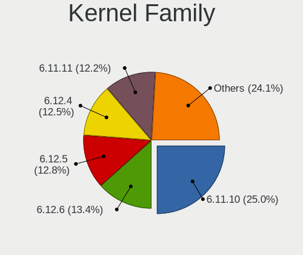
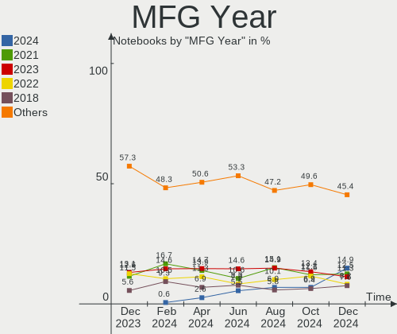
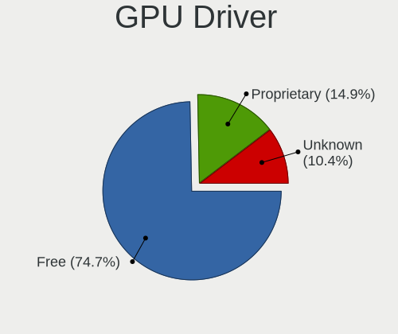

Fedora - Hardware Trends (Notebooks)
------------------------------------

A project to identify most popular hardware characteristics and track their change
over time based on data collected by Linux users at https://Linux-Hardware.org.

Anyone can contribute to this report by the [hw-probe](https://github.com/linuxhw/hw-probe) tool:

    sudo -E hw-probe -all -upload

This report is for one last month. Overall report since the beginning of time: [TestDays](https://github.com/linuxhw/TestDays)

Period: Aug, 2023.

Contents
--------

* [ System ](#system)
  - [ OS                       ](#os)
  - [ OS Family                ](#os-family)
  - [ Kernel                   ](#kernel)
  - [ Kernel Family            ](#kernel-family)
  - [ Kernel Major Ver.        ](#kernel-major-ver)
  - [ Arch                     ](#arch)
  - [ DE                       ](#de)
  - [ Display Server           ](#display-server)
  - [ Display Manager          ](#display-manager)
  - [ OS Lang                  ](#os-lang)
  - [ Boot Mode                ](#boot-mode)
  - [ Filesystem               ](#filesystem)
  - [ Part. scheme             ](#part-scheme)
  - [ Dual Boot with Linux/BSD ](#dual-boot-with-linuxbsd)
  - [ Dual Boot (Win)          ](#dual-boot-win)

* [ Board ](#board)
  - [ Vendor                   ](#vendor)
  - [ Model                    ](#model)
  - [ Model Family             ](#model-family)
  - [ MFG Year                 ](#mfg-year)
  - [ Form Factor              ](#form-factor)
  - [ Secure Boot              ](#secure-boot)
  - [ Coreboot                 ](#coreboot)
  - [ RAM Size                 ](#ram-size)
  - [ RAM Used                 ](#ram-used)
  - [ Total Drives             ](#total-drives)
  - [ Has CD-ROM               ](#has-cd-rom)
  - [ Has Ethernet             ](#has-ethernet)
  - [ Has WiFi                 ](#has-wifi)
  - [ Has Bluetooth            ](#has-bluetooth)

* [ Location ](#location)
  - [ Country                  ](#country)
  - [ City                     ](#city)

* [ Drives ](#drives)
  - [ Drive Vendor             ](#drive-vendor)
  - [ Drive Model              ](#drive-model)
  - [ HDD Vendor               ](#hdd-vendor)
  - [ SSD Vendor               ](#ssd-vendor)
  - [ Drive Kind               ](#drive-kind)
  - [ Drive Connector          ](#drive-connector)
  - [ Drive Size               ](#drive-size)
  - [ Space Total              ](#space-total)
  - [ Space Used               ](#space-used)
  - [ Malfunc. Drives          ](#malfunc-drives)
  - [ Malfunc. Drive Vendor    ](#malfunc-drive-vendor)
  - [ Malfunc. HDD Vendor      ](#malfunc-hdd-vendor)
  - [ Malfunc. Drive Kind      ](#malfunc-drive-kind)
  - [ Failed Drives            ](#failed-drives)
  - [ Failed Drive Vendor      ](#failed-drive-vendor)
  - [ Drive Status             ](#drive-status)

* [ Storage controller ](#storage-controller)
  - [ Storage Vendor           ](#storage-vendor)
  - [ Storage Model            ](#storage-model)
  - [ Storage Kind             ](#storage-kind)

* [ Processor ](#processor)
  - [ CPU Vendor               ](#cpu-vendor)
  - [ CPU Model                ](#cpu-model)
  - [ CPU Model Family         ](#cpu-model-family)
  - [ CPU Cores                ](#cpu-cores)
  - [ CPU Sockets              ](#cpu-sockets)
  - [ CPU Threads              ](#cpu-threads)
  - [ CPU Op-Modes             ](#cpu-op-modes)
  - [ CPU Microcode            ](#cpu-microcode)
  - [ CPU Microarch            ](#cpu-microarch)

* [ Graphics ](#graphics)
  - [ GPU Vendor               ](#gpu-vendor)
  - [ GPU Model                ](#gpu-model)
  - [ GPU Combo                ](#gpu-combo)
  - [ GPU Driver               ](#gpu-driver)
  - [ GPU Memory               ](#gpu-memory)

* [ Monitor ](#monitor)
  - [ Monitor Vendor           ](#monitor-vendor)
  - [ Monitor Model            ](#monitor-model)
  - [ Monitor Resolution       ](#monitor-resolution)
  - [ Monitor Diagonal         ](#monitor-diagonal)
  - [ Monitor Width            ](#monitor-width)
  - [ Aspect Ratio             ](#aspect-ratio)
  - [ Monitor Area             ](#monitor-area)
  - [ Pixel Density            ](#pixel-density)
  - [ Multiple Monitors        ](#multiple-monitors)

* [ Network ](#network)
  - [ Net Controller Vendor    ](#net-controller-vendor)
  - [ Net Controller Model     ](#net-controller-model)
  - [ Wireless Vendor          ](#wireless-vendor)
  - [ Wireless Model           ](#wireless-model)
  - [ Ethernet Vendor          ](#ethernet-vendor)
  - [ Ethernet Model           ](#ethernet-model)
  - [ Net Controller Kind      ](#net-controller-kind)
  - [ Used Controller          ](#used-controller)
  - [ NICs                     ](#nics)
  - [ IPv6                     ](#ipv6)

* [ Bluetooth ](#bluetooth)
  - [ Bluetooth Vendor         ](#bluetooth-vendor)
  - [ Bluetooth Model          ](#bluetooth-model)

* [ Sound ](#sound)
  - [ Sound Vendor             ](#sound-vendor)
  - [ Sound Model              ](#sound-model)

* [ Memory ](#memory)
  - [ Memory Vendor            ](#memory-vendor)
  - [ Memory Model             ](#memory-model)
  - [ Memory Kind              ](#memory-kind)
  - [ Memory Form Factor       ](#memory-form-factor)
  - [ Memory Size              ](#memory-size)
  - [ Memory Speed             ](#memory-speed)

* [ Printers & scanners ](#printers--scanners)
  - [ Printer Vendor           ](#printer-vendor)
  - [ Printer Model            ](#printer-model)
  - [ Scanner Vendor           ](#scanner-vendor)
  - [ Scanner Model            ](#scanner-model)

* [ Camera ](#camera)
  - [ Camera Vendor            ](#camera-vendor)
  - [ Camera Model             ](#camera-model)

* [ Security ](#security)
  - [ Fingerprint Vendor       ](#fingerprint-vendor)
  - [ Fingerprint Model        ](#fingerprint-model)
  - [ Chipcard Vendor          ](#chipcard-vendor)
  - [ Chipcard Model           ](#chipcard-model)

* [ Unsupported ](#unsupported)
  - [ Unsupported Devices      ](#unsupported-devices)
  - [ Unsupported Device Types ](#unsupported-device-types)

System
------

OS
--

Installed operating systems

| Name      | Notebooks | Percent |
|-----------|-----------|---------|
| Fedora 38 | 261       | 91.9%   |
| Fedora 37 | 14        | 4.93%   |
| Fedora 36 | 3         | 1.06%   |
| Fedora 40 | 2         | 0.7%    |
| Fedora 35 | 2         | 0.7%    |
| Fedora 34 | 2         | 0.7%    |

OS Family
---------

OS without a version

| Name   | Notebooks | Percent |
|--------|-----------|---------|
| Fedora | 284       | 100%    |

Kernel
------

Version of the Linux kernel

| Version                                            | Notebooks | Percent |
|----------------------------------------------------|-----------|---------|
| 6.4.7-200.fc38.x86_64                              | 45        | 15.85%  |
| 6.4.10-200.fc38.x86_64                             | 41        | 14.44%  |
| 6.4.11-200.fc38.x86_64                             | 40        | 14.08%  |
| 6.2.9-300.fc38.x86_64                              | 35        | 12.32%  |
| 6.4.6-200.fc38.x86_64                              | 28        | 9.86%   |
| 6.4.12-200.fc38.x86_64                             | 27        | 9.51%   |
| 6.4.9-200.fc38.x86_64                              | 26        | 9.15%   |
| 6.4.8-200.fc38.x86_64                              | 5         | 1.76%   |
| 6.4.7-100.fc37.x86_64                              | 4         | 1.41%   |
| 6.3.12-200.fc38.x86_64                             | 4         | 1.41%   |
| 6.4.4-200.fc38.x86_64                              | 2         | 0.7%    |
| 6.4.4-100.fc37.x86_64                              | 2         | 0.7%    |
| 6.4.12-100.fc37.x86_64                             | 2         | 0.7%    |
| 6.0.12-100.fc35.x86_64                             | 2         | 0.7%    |
| 5.17.12-100.fc34.x86_64                            | 2         | 0.7%    |
| 6.5.0-257.vanilla.fc38.x86_64                      | 1         | 0.35%   |
| 6.5.0-0.rc6.43.fc40.x86_64                         | 1         | 0.35%   |
| 6.5.0-0.rc6.20230818git0e8860d2125f.47.fc40.x86_64 | 1         | 0.35%   |
| 6.4.9-100.fc37.x86_64                              | 1         | 0.35%   |
| 6.4.7-200.t2.fc38.x86_64                           | 1         | 0.35%   |
| 6.4.12-cb1.0.fc38.x86_64                           | 1         | 0.35%   |
| 6.4.11-100.fc37.x86_64                             | 1         | 0.35%   |
| 6.4.10-cb2.0.fc38.x86_64                           | 1         | 0.35%   |
| 6.4.10-cb1.0.fc38.x86_64                           | 1         | 0.35%   |
| 6.4.10-100.fc37.x86_64                             | 1         | 0.35%   |
| 6.3.8-200.fc38.x86_64                              | 1         | 0.35%   |
| 6.3.12-100.fc37.x86_64                             | 1         | 0.35%   |
| 6.3.11-200.fc38.x86_64                             | 1         | 0.35%   |
| 6.2.15-200.fc37.x86_64                             | 1         | 0.35%   |
| 6.2.15-100.fc36.x86_64                             | 1         | 0.35%   |
| 6.1.7-100.fc36.x86_64                              | 1         | 0.35%   |
| 6.0.7-301.fc37.x86_64                              | 1         | 0.35%   |
| 5.18.17-200.fc36.x86_64                            | 1         | 0.35%   |
| 5.10.178-eupnea                                    | 1         | 0.35%   |

Kernel Family
-------------

Linux kernel without a distro release

| Version  | Notebooks | Percent |
|----------|-----------|---------|
| 6.4.7    | 50        | 17.61%  |
| 6.4.10   | 44        | 15.49%  |
| 6.4.11   | 41        | 14.44%  |
| 6.2.9    | 35        | 12.32%  |
| 6.4.12   | 30        | 10.56%  |
| 6.4.6    | 28        | 9.86%   |
| 6.4.9    | 27        | 9.51%   |
| 6.4.8    | 5         | 1.76%   |
| 6.3.12   | 5         | 1.76%   |
| 6.4.4    | 4         | 1.41%   |
| 6.5.0    | 3         | 1.06%   |
| 6.2.15   | 2         | 0.7%    |
| 6.0.12   | 2         | 0.7%    |
| 5.17.12  | 2         | 0.7%    |
| 6.3.8    | 1         | 0.35%   |
| 6.3.11   | 1         | 0.35%   |
| 6.1.7    | 1         | 0.35%   |
| 6.0.7    | 1         | 0.35%   |
| 5.18.17  | 1         | 0.35%   |
| 5.10.178 | 1         | 0.35%   |

Kernel Major Ver.
-----------------

Linux kernel major version

| Version | Notebooks | Percent |
|---------|-----------|---------|
| 6.4     | 229       | 80.63%  |
| 6.2     | 37        | 13.03%  |
| 6.3     | 7         | 2.46%   |
| 6.5     | 3         | 1.06%   |
| 6.0     | 3         | 1.06%   |
| 5.17    | 2         | 0.7%    |
| 6.1     | 1         | 0.35%   |
| 5.18    | 1         | 0.35%   |
| 5.10    | 1         | 0.35%   |

Arch
----

OS architecture (x86_64, i586, etc.)

| Name   | Notebooks | Percent |
|--------|-----------|---------|
| x86_64 | 284       | 100%    |

DE
--

Desktop Environment

| Name          | Notebooks | Percent |
|---------------|-----------|---------|
| GNOME         | 213       | 75%     |
| KDE5          | 45        | 15.85%  |
| XFCE          | 5         | 1.76%   |
| X-Cinnamon    | 5         | 1.76%   |
| Cinnamon      | 4         | 1.41%   |
| Unknown       | 4         | 1.41%   |
| sway          | 1         | 0.35%   |
| MATE          | 1         | 0.35%   |
| LXQt          | 1         | 0.35%   |
| LXDE          | 1         | 0.35%   |
| Hyprland      | 1         | 0.35%   |
| GNOME Classic | 1         | 0.35%   |
| fluxbox       | 1         | 0.35%   |
| Budgie        | 1         | 0.35%   |

Display Server
--------------

X11 or Wayland

| Name    | Notebooks | Percent |
|---------|-----------|---------|
| Wayland | 220       | 77.46%  |
| X11     | 57        | 20.07%  |
| Tty     | 4         | 1.41%   |
| Unknown | 3         | 1.06%   |

Display Manager
---------------

SDDM, LightDM, etc.

| Name    | Notebooks | Percent |
|---------|-----------|---------|
| Unknown | 184       | 64.79%  |
| GDM     | 71        | 25%     |
| SDDM    | 18        | 6.34%   |
| LightDM | 10        | 3.52%   |
| LXDM    | 1         | 0.35%   |

OS Lang
-------

Language

| Lang    | Notebooks | Percent |
|---------|-----------|---------|
| en_US   | 144       | 50.7%   |
| en_GB   | 19        | 6.69%   |
| ru_RU   | 18        | 6.34%   |
| de_DE   | 14        | 4.93%   |
| pt_BR   | 11        | 3.87%   |
| en_AU   | 9         | 3.17%   |
| fr_FR   | 6         | 2.11%   |
| es_ES   | 6         | 2.11%   |
| it_IT   | 5         | 1.76%   |
| pl_PL   | 4         | 1.41%   |
| es_CO   | 4         | 1.41%   |
| es_CL   | 4         | 1.41%   |
| en_CA   | 4         | 1.41%   |
| es_MX   | 3         | 1.06%   |
| en_ZA   | 3         | 1.06%   |
| en_IN   | 3         | 1.06%   |
| en_DK   | 3         | 1.06%   |
| Unknown | 3         | 1.06%   |
| zh_CN   | 2         | 0.7%    |
| pt_PT   | 2         | 0.7%    |
| hu_HU   | 2         | 0.7%    |
| cs_CZ   | 2         | 0.7%    |
| zh_HK   | 1         | 0.35%   |
| tr_TR   | 1         | 0.35%   |
| ru_UA   | 1         | 0.35%   |
| es_UY   | 1         | 0.35%   |
| es_EC   | 1         | 0.35%   |
| en_ZM   | 1         | 0.35%   |
| en_SG   | 1         | 0.35%   |
| en_PH   | 1         | 0.35%   |
| en_NZ   | 1         | 0.35%   |
| en_IL   | 1         | 0.35%   |
| en_IE   | 1         | 0.35%   |
| en_BW   | 1         | 0.35%   |
| de_AT   | 1         | 0.35%   |

Boot Mode
---------

EFI or BIOS

| Mode | Notebooks | Percent |
|------|-----------|---------|
| EFI  | 233       | 82.04%  |
| BIOS | 51        | 17.96%  |

Filesystem
----------

Type of filesystem

| Type  | Notebooks | Percent |
|-------|-----------|---------|
| Btrfs | 228       | 80.28%  |
| Ext4  | 51        | 17.96%  |
| Xfs   | 5         | 1.76%   |

Part. scheme
------------

Scheme of partitioning

| Type    | Notebooks | Percent |
|---------|-----------|---------|
| Unknown | 179       | 63.03%  |
| GPT     | 100       | 35.21%  |
| MBR     | 5         | 1.76%   |

Dual Boot with Linux/BSD
------------------------

Hosting more than one Linux/BSD

| Dual boot | Notebooks | Percent |
|-----------|-----------|---------|
| No        | 264       | 92.96%  |
| Yes       | 20        | 7.04%   |

Dual Boot (Win)
---------------

Hosting Linux and Windows

| Dual boot | Notebooks | Percent |
|-----------|-----------|---------|
| No        | 251       | 88.38%  |
| Yes       | 33        | 11.62%  |

Board
-----

Vendor
------

Motherboard manufacturer

| Name                     | Notebooks | Percent |
|--------------------------|-----------|---------|
| Lenovo                   | 72        | 25.35%  |
| Dell                     | 54        | 19.01%  |
| Hewlett-Packard          | 48        | 16.9%   |
| ASUSTek Computer         | 34        | 11.97%  |
| Acer                     | 17        | 5.99%   |
| Apple                    | 11        | 3.87%   |
| HUAWEI                   | 9         | 3.17%   |
| Toshiba                  | 4         | 1.41%   |
| Timi                     | 4         | 1.41%   |
| MSI                      | 4         | 1.41%   |
| System76                 | 3         | 1.06%   |
| Google                   | 3         | 1.06%   |
| Sony                     | 2         | 0.7%    |
| Gigabyte Technology      | 2         | 0.7%    |
| Framework                | 2         | 0.7%    |
| Corsair                  | 2         | 0.7%    |
| Xplore                   | 1         | 0.35%   |
| Topstar                  | 1         | 0.35%   |
| Schenker                 | 1         | 0.35%   |
| Samsung Electronics      | 1         | 0.35%   |
| RCA                      | 1         | 0.35%   |
| Positivo Bahia - VAIO    | 1         | 0.35%   |
| PC Specialist            | 1         | 0.35%   |
| Packard Bell             | 1         | 0.35%   |
| LDLC                     | 1         | 0.35%   |
| HONOR                    | 1         | 0.35%   |
| Fujitsu                  | 1         | 0.35%   |
| COMPUMAX COMPUTER S.A.S. | 1         | 0.35%   |
| Chuwi                    | 1         | 0.35%   |

Model
-----

Motherboard model

| Name                                        | Notebooks | Percent |
|---------------------------------------------|-----------|---------|
| HP Victus by Laptop 16-e0xxx                | 3         | 1.06%   |
| Lenovo ThinkPad X1 Carbon Gen 10 21CBCTO1WW | 2         | 0.7%    |
| Lenovo IdeaPad Pro 5 14APH8 83AM            | 2         | 0.7%    |
| HUAWEI BOHB-WAX9                            | 2         | 0.7%    |
| HP Notebook                                 | 2         | 0.7%    |
| HP Laptop 15s-eq2xxx                        | 2         | 0.7%    |
| HP EliteBook 845 14 inch G9 Notebook PC     | 2         | 0.7%    |
| Framework Laptop                            | 2         | 0.7%    |
| Dell XPS 15 9560                            | 2         | 0.7%    |
| Dell Latitude E7470                         | 2         | 0.7%    |
| Dell Latitude 7440                          | 2         | 0.7%    |
| Dell Latitude 5480                          | 2         | 0.7%    |
| Dell Latitude 5290 2-in-1                   | 2         | 0.7%    |
| Dell G15 5510                               | 2         | 0.7%    |
| Corsair Voyager a1600                       | 2         | 0.7%    |
| ASUS K55VD                                  | 2         | 0.7%    |
| Apple MacBookPro9,2                         | 2         | 0.7%    |
| Apple MacBookPro5,5                         | 2         | 0.7%    |
| Apple MacBookPro11,1                        | 2         | 0.7%    |
| Xplore iX104C6                              | 1         | 0.35%   |
| Toshiba Satellite L515                      | 1         | 0.35%   |
| Toshiba Satellite C70-B                     | 1         | 0.35%   |
| Toshiba Satellite C55D-A                    | 1         | 0.35%   |
| Toshiba Satellite C55-A                     | 1         | 0.35%   |
| Topstar Cantiga & ICH9M Chipset             | 1         | 0.35%   |
| Timi TM1701                                 | 1         | 0.35%   |
| Timi Redmi Book Pro 14 2022                 | 1         | 0.35%   |
| Timi A7S                                    | 1         | 0.35%   |
| Timi A34S                                   | 1         | 0.35%   |
| System76 Pangolin                           | 1         | 0.35%   |
| System76 Lemur Pro                          | 1         | 0.35%   |
| System76 Darter Pro                         | 1         | 0.35%   |
| Sony SVF15A1M2ES                            | 1         | 0.35%   |
| Sony SVF1521USTW                            | 1         | 0.35%   |
| Schenker MEDIA (M22)                        | 1         | 0.35%   |
| Samsung 550XDA                              | 1         | 0.35%   |
| RCA W101SA23T1                              | 1         | 0.35%   |
| Positivo Bahia - VAIO VJFE59F11X-B0411H     | 1         | 0.35%   |
| PC Specialist Ionico 16                     | 1         | 0.35%   |
| Packard Bell EasyNote ENTF71BM              | 1         | 0.35%   |

Model Family
------------

Motherboard model prefix

| Name               | Notebooks | Percent |
|--------------------|-----------|---------|
| Lenovo ThinkPad    | 42        | 14.79%  |
| Dell Latitude      | 26        | 9.15%   |
| Lenovo IdeaPad     | 16        | 5.63%   |
| Dell Inspiron      | 14        | 4.93%   |
| ASUS VivoBook      | 11        | 3.87%   |
| HP ProBook         | 9         | 3.17%   |
| HP Laptop          | 9         | 3.17%   |
| Acer Aspire        | 9         | 3.17%   |
| HP EliteBook       | 7         | 2.46%   |
| Dell XPS           | 7         | 2.46%   |
| ASUS ROG           | 6         | 2.11%   |
| Lenovo Legion      | 5         | 1.76%   |
| HP Pavilion        | 5         | 1.76%   |
| Toshiba Satellite  | 4         | 1.41%   |
| HP ENVY            | 4         | 1.41%   |
| Lenovo Yoga        | 3         | 1.06%   |
| Lenovo ThinkBook   | 3         | 1.06%   |
| HP Victus          | 3         | 1.06%   |
| ASUS ZenBook       | 3         | 1.06%   |
| ASUS ASUS          | 3         | 1.06%   |
| Apple MacBookPro5  | 3         | 1.06%   |
| Acer Nitro         | 3         | 1.06%   |
| HUAWEI BOHB-WAX9   | 2         | 0.7%    |
| HP OMEN            | 2         | 0.7%    |
| HP Notebook        | 2         | 0.7%    |
| Framework Laptop   | 2         | 0.7%    |
| Dell Precision     | 2         | 0.7%    |
| Dell G15           | 2         | 0.7%    |
| Corsair Voyager    | 2         | 0.7%    |
| ASUS K55VD         | 2         | 0.7%    |
| Apple MacBookPro9  | 2         | 0.7%    |
| Apple MacBookPro11 | 2         | 0.7%    |
| Acer Swift         | 2         | 0.7%    |
| Acer Predator      | 2         | 0.7%    |
| Xplore iX104C6     | 1         | 0.35%   |
| Topstar Cantiga    | 1         | 0.35%   |
| Timi TM1701        | 1         | 0.35%   |
| Timi Redmi         | 1         | 0.35%   |
| Timi A7S           | 1         | 0.35%   |
| Timi A34S          | 1         | 0.35%   |

MFG Year
--------

Motherboard manufacture year

| Year | Notebooks | Percent |
|------|-----------|---------|
| 2021 | 48        | 16.9%   |
| 2022 | 37        | 13.03%  |
| 2020 | 28        | 9.86%   |
| 2018 | 24        | 8.45%   |
| 2017 | 21        | 7.39%   |
| 2023 | 19        | 6.69%   |
| 2014 | 18        | 6.34%   |
| 2019 | 17        | 5.99%   |
| 2012 | 14        | 4.93%   |
| 2016 | 13        | 4.58%   |
| 2013 | 13        | 4.58%   |
| 2015 | 10        | 3.52%   |
| 2011 | 7         | 2.46%   |
| 2009 | 5         | 1.76%   |
| 2008 | 5         | 1.76%   |
| 2010 | 4         | 1.41%   |
| 2007 | 1         | 0.35%   |

Form Factor
-----------

Physical design of the computer

| Name     | Notebooks | Percent |
|----------|-----------|---------|
| Notebook | 284       | 100%    |

Secure Boot
-----------

Enabled or disabled

| State    | Notebooks | Percent |
|----------|-----------|---------|
| Disabled | 214       | 75.35%  |
| Enabled  | 70        | 24.65%  |

Coreboot
--------

Have coreboot on board

| Used | Notebooks | Percent |
|------|-----------|---------|
| No   | 279       | 98.24%  |
| Yes  | 5         | 1.76%   |

RAM Size
--------

Total RAM memory

| Size in GB  | Notebooks | Percent |
|-------------|-----------|---------|
| 4.01-8.0    | 86        | 30.28%  |
| 8.01-16.0   | 58        | 20.42%  |
| 16.01-24.0  | 54        | 19.01%  |
| 32.01-64.0  | 40        | 14.08%  |
| 3.01-4.0    | 29        | 10.21%  |
| 24.01-32.0  | 6         | 2.11%   |
| 1.01-2.0    | 5         | 1.76%   |
| 64.01-256.0 | 4         | 1.41%   |
| 2.01-3.0    | 2         | 0.7%    |

RAM Used
--------

Used RAM memory

| Used GB    | Notebooks | Percent |
|------------|-----------|---------|
| 4.01-8.0   | 79        | 27.82%  |
| 3.01-4.0   | 74        | 26.06%  |
| 2.01-3.0   | 69        | 24.3%   |
| 1.01-2.0   | 31        | 10.92%  |
| 8.01-16.0  | 24        | 8.45%   |
| 16.01-24.0 | 3         | 1.06%   |
| 24.01-32.0 | 2         | 0.7%    |
| 0.51-1.0   | 2         | 0.7%    |

Total Drives
------------

Number of drives on board

| Drives | Notebooks | Percent |
|--------|-----------|---------|
| 1      | 214       | 75.35%  |
| 2      | 59        | 20.77%  |
| 3      | 7         | 2.46%   |
| 0      | 2         | 0.7%    |
| 5      | 1         | 0.35%   |
| 4      | 1         | 0.35%   |

Has CD-ROM
----------

Has CD-ROM on board

| Presented | Notebooks | Percent |
|-----------|-----------|---------|
| No        | 231       | 81.34%  |
| Yes       | 53        | 18.66%  |

Has Ethernet
------------

Has Ethernet on board

| Presented | Notebooks | Percent |
|-----------|-----------|---------|
| Yes       | 202       | 71.13%  |
| No        | 82        | 28.87%  |

Has WiFi
--------

Has WiFi module

| Presented | Notebooks | Percent |
|-----------|-----------|---------|
| Yes       | 281       | 98.94%  |
| No        | 3         | 1.06%   |

Has Bluetooth
-------------

Has Bluetooth module

| Presented | Notebooks | Percent |
|-----------|-----------|---------|
| Yes       | 241       | 84.86%  |
| No        | 43        | 15.14%  |

Location
--------

Country
-------

Geographic location (country)

| Country      | Notebooks | Percent |
|--------------|-----------|---------|
| USA          | 46        | 16.2%   |
| Germany      | 26        | 9.15%   |
| Russia       | 25        | 8.8%    |
| Brazil       | 18        | 6.34%   |
| UK           | 10        | 3.52%   |
| Italy        | 10        | 3.52%   |
| India        | 10        | 3.52%   |
| France       | 10        | 3.52%   |
| Poland       | 9         | 3.17%   |
| Australia    | 8         | 2.82%   |
| Spain        | 7         | 2.46%   |
| Philippines  | 6         | 2.11%   |
| Canada       | 6         | 2.11%   |
| Mexico       | 5         | 1.76%   |
| Israel       | 5         | 1.76%   |
| Colombia     | 5         | 1.76%   |
| Turkey       | 4         | 1.41%   |
| Indonesia    | 4         | 1.41%   |
| Czechia      | 4         | 1.41%   |
| Chile        | 4         | 1.41%   |
| Portugal     | 3         | 1.06%   |
| Netherlands  | 3         | 1.06%   |
| China        | 3         | 1.06%   |
| Austria      | 3         | 1.06%   |
| UAE          | 2         | 0.7%    |
| Romania      | 2         | 0.7%    |
| Japan        | 2         | 0.7%    |
| Iran         | 2         | 0.7%    |
| Hungary      | 2         | 0.7%    |
| Ecuador      | 2         | 0.7%    |
| Denmark      | 2         | 0.7%    |
| Bulgaria     | 2         | 0.7%    |
| Belarus      | 2         | 0.7%    |
| Zambia       | 1         | 0.35%   |
| Vietnam      | 1         | 0.35%   |
| Uruguay      | 1         | 0.35%   |
| Sweden       | 1         | 0.35%   |
| Sri Lanka    | 1         | 0.35%   |
| South Korea  | 1         | 0.35%   |
| South Africa | 1         | 0.35%   |

City
----

Geographic location (city)

| City             | Notebooks | Percent |
|------------------|-----------|---------|
| Moscow           | 10        | 3.52%   |
| Berlin           | 4         | 1.41%   |
| Warsaw           | 3         | 1.06%   |
| Sydney           | 3         | 1.06%   |
| Quezon City      | 3         | 1.06%   |
| Paris            | 3         | 1.06%   |
| Melbourne        | 3         | 1.06%   |
| Hamburg          | 3         | 1.06%   |
| Delhi            | 3         | 1.06%   |
| Cologne          | 3         | 1.06%   |
| Yekaterinburg    | 2         | 0.7%    |
| Vienna           | 2         | 0.7%    |
| Valladolid       | 2         | 0.7%    |
| Tel Aviv         | 2         | 0.7%    |
| Sterling Heights | 2         | 0.7%    |
| St Petersburg    | 2         | 0.7%    |
| Sao Paulo        | 2         | 0.7%    |
| Santiago         | 2         | 0.7%    |
| San Antonio      | 2         | 0.7%    |
| Rio de Janeiro   | 2         | 0.7%    |
| Raleigh          | 2         | 0.7%    |
| Pilsen           | 2         | 0.7%    |
| Munich           | 2         | 0.7%    |
| Minsk            | 2         | 0.7%    |
| Milano           | 2         | 0.7%    |
| Krakow           | 2         | 0.7%    |
| Istanbul         | 2         | 0.7%    |
| Greifswald       | 2         | 0.7%    |
| Copenhagen       | 2         | 0.7%    |
| Chelyabinsk      | 2         | 0.7%    |
| Brisbane         | 2         | 0.7%    |
| Brasília        | 2         | 0.7%    |
| Aracaju          | 2         | 0.7%    |
| Zaragoza         | 1         | 0.35%   |
| Zapopan          | 1         | 0.35%   |
| Zagreb           | 1         | 0.35%   |
| Yanaka           | 1         | 0.35%   |
| Xenia            | 1         | 0.35%   |
| Wroclaw          | 1         | 0.35%   |
| Wiscasset        | 1         | 0.35%   |

Drives
------

Drive Vendor
------------

Hard drive vendors

| Vendor                         | Notebooks | Drives | Percent |
|--------------------------------|-----------|--------|---------|
| Samsung Electronics            | 64        | 70     | 18.34%  |
| Sandisk                        | 39        | 42     | 11.17%  |
| Seagate                        | 21        | 21     | 6.02%   |
| WDC                            | 20        | 20     | 5.73%   |
| SK hynix                       | 20        | 20     | 5.73%   |
| Micron Technology              | 18        | 18     | 5.16%   |
| Unknown                        | 17        | 18     | 4.87%   |
| Kingston                       | 16        | 16     | 4.58%   |
| Intel                          | 16        | 16     | 4.58%   |
| Toshiba                        | 15        | 15     | 4.3%    |
| Crucial                        | 10        | 11     | 2.87%   |
| KIOXIA                         | 7         | 7      | 2.01%   |
| Apple                          | 6         | 8      | 1.72%   |
| Silicon Motion                 | 5         | 5      | 1.43%   |
| Micron/Crucial Technology      | 5         | 5      | 1.43%   |
| HGST                           | 5         | 5      | 1.43%   |
| Shenzhen Longsys Electronics   | 4         | 4      | 1.15%   |
| Phison Electronics             | 4         | 4      | 1.15%   |
| MAXIO Technology (Hangzhou)    | 4         | 4      | 1.15%   |
| JMicron Technology             | 4         | 5      | 1.15%   |
| China                          | 4         | 4      | 1.15%   |
| Solid State Storage Technology | 3         | 3      | 0.86%   |
| Hitachi                        | 3         | 3      | 0.86%   |
| ADATA Technology               | 3         | 3      | 0.86%   |
| Unknown                        | 3         | 3      | 0.86%   |
| Union Memory (Shenzhen)        | 2         | 2      | 0.57%   |
| Realtek Semiconductor          | 2         | 2      | 0.57%   |
| Phison                         | 2         | 2      | 0.57%   |
| Fujitsu                        | 2         | 2      | 0.57%   |
| A-DATA Technology              | 2         | 2      | 0.57%   |
| V-GeN                          | 1         | 1      | 0.29%   |
| Team                           | 1         | 1      | 0.29%   |
| SABRENT                        | 1         | 1      | 0.29%   |
| RESCUE                         | 1         | 1      | 0.29%   |
| Plextor                        | 1         | 1      | 0.29%   |
| Patriot                        | 1         | 1      | 0.29%   |
| OSCOO                          | 1         | 1      | 0.29%   |
| Netac                          | 1         | 1      | 0.29%   |
| Mushkin                        | 1         | 1      | 0.29%   |
| MidasForce                     | 1         | 1      | 0.29%   |

Drive Model
-----------

Hard drive models

| Model                                                 | Notebooks | Percent |
|-------------------------------------------------------|-----------|---------|
| Samsung NVMe SSD Controller SM981/PM981/PM983 500GB   | 16        | 4.47%   |
| Samsung NVMe SSD Controller PM9A1/PM9A3/980PRO 1024GB | 8         | 2.23%   |
| Unknown MMC Card  64GB                                | 7         | 1.96%   |
| Kingston SA400S37240G 240GB SSD                       | 7         | 1.96%   |
| Seagate ST1000LM035-1RK172 1TB                        | 5         | 1.4%    |
| Sandisk WD Black SN750 / PC SN730 NVMe SSD 1024GB     | 5         | 1.4%    |
| Intel SSDPEKNU512GZ 512GB                             | 5         | 1.4%    |
| Sandisk WD Blue SN550 NVMe SSD 250GB                  | 4         | 1.12%   |
| Unknown MMC Card  128GB                               | 3         | 0.84%   |
| Toshiba MQ01ABF050 500GB                              | 3         | 0.84%   |
| SK hynix BC501 NVMe Solid State Drive 512GB           | 3         | 0.84%   |
| Silicon Motion PCIe-8 SSD 512GB                       | 3         | 0.84%   |
| Sandisk WD Blue SN500 / PC SN520 NVMe SSD 512GB       | 3         | 0.84%   |
| Samsung SSD 980 1TB                                   | 3         | 0.84%   |
| Samsung NVMe SSD Controller SM961/PM961/SM963 1024GB  | 3         | 0.84%   |
| MAXIO (Hangzhou) NVMe SSD Controller MAP1202 1024GB   | 3         | 0.84%   |
| JMicron Generic 1TB                                   | 3         | 0.84%   |
| HGST HTS721010A9E630 1TB                              | 3         | 0.84%   |
| Unknown                                               | 3         | 0.84%   |
| Unknown MMC Card  256GB                               | 2         | 0.56%   |
| Toshiba XG6 NVMe SSD Controller 1024GB                | 2         | 0.56%   |
| Toshiba MQ01ABD075 752GB                              | 2         | 0.56%   |
| Toshiba MQ01ABD050 500GB                              | 2         | 0.56%   |
| SK hynix PC711 NVMe 1TB                               | 2         | 0.56%   |
| SK hynix HFM512GD3JX013N 512GB                        | 2         | 0.56%   |
| SK hynix BC711 HFM512GD3JX013N 512GB                  | 2         | 0.56%   |
| Seagate ST500LT012-1DG142 500GB                       | 2         | 0.56%   |
| Seagate ST500LM021-1KJ152 500GB                       | 2         | 0.56%   |
| Seagate ST1000LM024 HN-M101MBB 1TB                    | 2         | 0.56%   |
| Sandisk WD PC SN560 SDDPNQE-1T00-1002 1TB             | 2         | 0.56%   |
| Sandisk WD Blue SN570 1TB                             | 2         | 0.56%   |
| Sandisk WD Black SN850 256GB                          | 2         | 0.56%   |
| Sandisk WD Black 2018/SN750 / PC SN720 NVMe SSD 512GB | 2         | 0.56%   |
| Samsung MZALQ512HBLU-00BL2 512GB                      | 2         | 0.56%   |
| Samsung MZALQ512HBLU-00BL1 512GB                      | 2         | 0.56%   |
| Samsung MZAL4512HBLU-00BL2 512GB                      | 2         | 0.56%   |
| Samsung MZ7LN256HCHP-000L7 256GB SSD                  | 2         | 0.56%   |
| Phison PS5013 E13 NVMe Controller 512GB               | 2         | 0.56%   |
| Phison E12 NVMe Controller 256GB                      | 2         | 0.56%   |
| Micron/Crucial P2 NVMe PCIe SSD 1TB                   | 2         | 0.56%   |

HDD Vendor
----------

Hard disk drive vendors

| Vendor  | Notebooks | Drives | Percent |
|---------|-----------|--------|---------|
| Seagate | 21        | 21     | 33.87%  |
| WDC     | 16        | 16     | 25.81%  |
| Toshiba | 11        | 11     | 17.74%  |
| HGST    | 5         | 5      | 8.06%   |
| Hitachi | 3         | 3      | 4.84%   |
| Fujitsu | 2         | 2      | 3.23%   |
| Unknown | 1         | 1      | 1.61%   |
| SABRENT | 1         | 1      | 1.61%   |
| Apple   | 1         | 1      | 1.61%   |
| ACASIS  | 1         | 1      | 1.61%   |

SSD Vendor
----------

Solid state drive vendors

| Vendor              | Notebooks | Drives | Percent |
|---------------------|-----------|--------|---------|
| Samsung Electronics | 16        | 16     | 18.6%   |
| Kingston            | 14        | 14     | 16.28%  |
| SanDisk             | 11        | 11     | 12.79%  |
| Crucial             | 10        | 11     | 11.63%  |
| WDC                 | 4         | 4      | 4.65%   |
| Micron Technology   | 4         | 4      | 4.65%   |
| Intel               | 4         | 4      | 4.65%   |
| China               | 4         | 4      | 4.65%   |
| JMicron Technology  | 3         | 4      | 3.49%   |
| Apple               | 2         | 2      | 2.33%   |
| V-GeN               | 1         | 1      | 1.16%   |
| Team                | 1         | 1      | 1.16%   |
| Plextor             | 1         | 1      | 1.16%   |
| Patriot             | 1         | 1      | 1.16%   |
| Netac               | 1         | 1      | 1.16%   |
| Mushkin             | 1         | 1      | 1.16%   |
| MidasForce          | 1         | 1      | 1.16%   |
| LITEONIT            | 1         | 1      | 1.16%   |
| LALAK               | 1         | 1      | 1.16%   |
| Hikvision           | 1         | 1      | 1.16%   |
| GOODRAM             | 1         | 1      | 1.16%   |
| Gigabyte Technology | 1         | 1      | 1.16%   |
| Colorful            | 1         | 1      | 1.16%   |
| A-DATA Technology   | 1         | 1      | 1.16%   |

Drive Kind
----------

HDD or SSD

| Kind    | Notebooks | Drives | Percent |
|---------|-----------|--------|---------|
| NVMe    | 167       | 191    | 50.61%  |
| SSD     | 81        | 88     | 24.55%  |
| HDD     | 60        | 62     | 18.18%  |
| MMC     | 16        | 16     | 4.85%   |
| Unknown | 6         | 6      | 1.82%   |

Drive Connector
---------------

SATA, SAS, NVMe, etc.

| Type | Notebooks | Drives | Percent |
|------|-----------|--------|---------|
| NVMe | 167       | 190    | 52.02%  |
| SATA | 125       | 141    | 38.94%  |
| MMC  | 16        | 16     | 4.98%   |
| SAS  | 13        | 16     | 4.05%   |

Drive Size
----------

Size of hard drive

| Size in TB | Notebooks | Drives | Percent |
|------------|-----------|--------|---------|
| 0.01-0.5   | 96        | 100    | 67.13%  |
| 0.51-1.0   | 40        | 43     | 27.97%  |
| 1.01-2.0   | 6         | 6      | 4.2%    |
| 4.01-10.0  | 1         | 1      | 0.7%    |

Space Total
-----------

Amount of disk space available on the file system

| Size in GB     | Notebooks | Percent |
|----------------|-----------|---------|
| 501-1000       | 72        | 25.35%  |
| 251-500        | 67        | 23.59%  |
| 1001-2000      | 39        | 13.73%  |
| 101-250        | 33        | 11.62%  |
| 1-20           | 26        | 9.15%   |
| Unknown        | 21        | 7.39%   |
| 51-100         | 10        | 3.52%   |
| More than 3000 | 9         | 3.17%   |
| 2001-3000      | 6         | 2.11%   |
| 21-50          | 1         | 0.35%   |

Space Used
----------

Amount of used disk space

| Used GB        | Notebooks | Percent |
|----------------|-----------|---------|
| 1-20           | 86        | 30.28%  |
| 21-50          | 61        | 21.48%  |
| 101-250        | 38        | 13.38%  |
| 251-500        | 28        | 9.86%   |
| 51-100         | 28        | 9.86%   |
| Unknown        | 21        | 7.39%   |
| 501-1000       | 13        | 4.58%   |
| 1001-2000      | 4         | 1.41%   |
| 2001-3000      | 3         | 1.06%   |
| More than 3000 | 2         | 0.7%    |

Malfunc. Drives
---------------

Drive models with a malfunction

| Model                                                           | Notebooks | Drives | Percent |
|-----------------------------------------------------------------|-----------|--------|---------|
| HGST HTS721010A9E630 1TB                                        | 2         | 2      | 16.67%  |
| WDC WDS240G2G0A-00JH30 240GB SSD                                | 1         | 1      | 8.33%   |
| Toshiba MQ01ABF050 500GB                                        | 1         | 1      | 8.33%   |
| SanDisk SD8SBAT256G1122 256GB SSD                               | 1         | 1      | 8.33%   |
| Samsung Electronics NVMe SSD Controller SM981/PM981/PM983 500GB | 1         | 1      | 8.33%   |
| LITEONIT LCT-128M3S 128GB SSD                                   | 1         | 1      | 8.33%   |
| Kingston RBU-SNS8350DES3128GP 128GB SSD                         | 1         | 1      | 8.33%   |
| Intel SSDSC2KF256H6 SATA 256GB                                  | 1         | 1      | 8.33%   |
| Hitachi HTS722080K9A300 80GB                                    | 1         | 1      | 8.33%   |
| Crucial CT1050MX300SSD1 1TB                                     | 1         | 1      | 8.33%   |
| China SSD 256GB                                                 | 1         | 1      | 8.33%   |

Malfunc. Drive Vendor
---------------------

Vendors of faulty drives

| Vendor              | Notebooks | Drives | Percent |
|---------------------|-----------|--------|---------|
| HGST                | 2         | 2      | 16.67%  |
| WDC                 | 1         | 1      | 8.33%   |
| Toshiba             | 1         | 1      | 8.33%   |
| SanDisk             | 1         | 1      | 8.33%   |
| Samsung Electronics | 1         | 1      | 8.33%   |
| LITEONIT            | 1         | 1      | 8.33%   |
| Kingston            | 1         | 1      | 8.33%   |
| Intel               | 1         | 1      | 8.33%   |
| Hitachi             | 1         | 1      | 8.33%   |
| Crucial             | 1         | 1      | 8.33%   |
| China               | 1         | 1      | 8.33%   |

Malfunc. HDD Vendor
-------------------

Vendors of faulty HDD drives

| Vendor  | Notebooks | Drives | Percent |
|---------|-----------|--------|---------|
| HGST    | 2         | 2      | 50%     |
| Toshiba | 1         | 1      | 25%     |
| Hitachi | 1         | 1      | 25%     |

Malfunc. Drive Kind
-------------------

Kinds of faulty drives

| Kind | Notebooks | Drives | Percent |
|------|-----------|--------|---------|
| SSD  | 7         | 7      | 58.33%  |
| HDD  | 4         | 4      | 33.33%  |
| NVMe | 1         | 1      | 8.33%   |

Failed Drives
-------------

Failed drive models

Zero info for selected period =(

Failed Drive Vendor
-------------------

Failed drive vendors

Zero info for selected period =(

Drive Status
------------

Number of failed and malfunc. drives

| Status   | Notebooks | Drives | Percent |
|----------|-----------|--------|---------|
| Detected | 186       | 233    | 63.92%  |
| Works    | 94        | 118    | 32.3%   |
| Malfunc  | 11        | 12     | 3.78%   |

Storage controller
------------------

Storage Vendor
--------------

Storage controller vendors

| Vendor                         | Notebooks | Percent |
|--------------------------------|-----------|---------|
| Intel                          | 148       | 42.41%  |
| Samsung Electronics            | 50        | 14.33%  |
| SanDisk                        | 29        | 8.31%   |
| AMD                            | 27        | 7.74%   |
| SK hynix                       | 20        | 5.73%   |
| Micron Technology              | 14        | 4.01%   |
| KIOXIA                         | 7         | 2.01%   |
| Phison Electronics             | 6         | 1.72%   |
| Silicon Motion                 | 5         | 1.43%   |
| Micron/Crucial Technology      | 5         | 1.43%   |
| Toshiba America Info Systems   | 4         | 1.15%   |
| Shenzhen Longsys Electronics   | 4         | 1.15%   |
| MAXIO Technology (Hangzhou)    | 4         | 1.15%   |
| Solid State Storage Technology | 3         | 0.86%   |
| Nvidia                         | 3         | 0.86%   |
| Kingston Technology Company    | 3         | 0.86%   |
| Apple                          | 3         | 0.86%   |
| ADATA Technology               | 3         | 0.86%   |
| Union Memory (Shenzhen)        | 2         | 0.57%   |
| Realtek Semiconductor          | 2         | 0.57%   |
| Solidigm                       | 1         | 0.29%   |
| Marvell Technology Group       | 1         | 0.29%   |
| Lite-On Technology             | 1         | 0.29%   |
| Lenovo                         | 1         | 0.29%   |
| INNOGRIT                       | 1         | 0.29%   |
| Biwin Storage Technology       | 1         | 0.29%   |
| ASMedia Technology             | 1         | 0.29%   |

Storage Model
-------------

Storage controller models

| Model                                                                          | Notebooks | Percent |
|--------------------------------------------------------------------------------|-----------|---------|
| AMD FCH SATA Controller [AHCI mode]                                            | 24        | 6.58%   |
| Intel Sunrise Point-LP SATA Controller [AHCI mode]                             | 23        | 6.3%    |
| Samsung NVMe SSD Controller SM981/PM981/PM983                                  | 17        | 4.66%   |
| Intel 82801 Mobile SATA Controller [RAID mode]                                 | 16        | 4.38%   |
| Samsung NVMe SSD Controller 980                                                | 15        | 4.11%   |
| Intel Volume Management Device NVMe RAID Controller                            | 14        | 3.84%   |
| Intel 7 Series Chipset Family 6-port SATA Controller [AHCI mode]               | 14        | 3.84%   |
| SK hynix Gold P31/BC711/PC711 NVMe Solid State Drive                           | 10        | 2.74%   |
| Samsung NVMe SSD Controller PM9A1/PM9A3/980PRO                                 | 9         | 2.47%   |
| Intel SSD 670p Series [Keystone Harbor]                                        | 9         | 2.47%   |
| Intel Wildcat Point-LP SATA Controller [AHCI Mode]                             | 8         | 2.19%   |
| Intel 8 Series SATA Controller 1 [AHCI mode]                                   | 8         | 2.19%   |
| KIOXIA NVMe SSD Controller BG4 (DRAM-less)                                     | 6         | 1.64%   |
| Intel Tiger Lake-LP SATA Controller                                            | 6         | 1.64%   |
| Intel HM170/QM170 Chipset SATA Controller [AHCI Mode]                          | 6         | 1.64%   |
| Intel Comet Lake SATA AHCI Controller                                          | 6         | 1.64%   |
| SanDisk WD Black SN770 / PC SN740 256GB / PC SN560 (DRAM-less) NVMe SSD        | 5         | 1.37%   |
| SanDisk WD Black SN750 / PC SN730 NVMe SSD                                     | 5         | 1.37%   |
| Samsung NVMe SSD Controller PM9B1                                              | 5         | 1.37%   |
| Intel 6 Series/C200 Series Chipset Family 6 port Mobile SATA AHCI Controller   | 5         | 1.37%   |
| SK hynix BC501 NVMe Solid State Drive                                          | 4         | 1.1%    |
| Silicon Motion Non-Volatile memory controller                                  | 4         | 1.1%    |
| SanDisk WD Blue SN550 NVMe SSD                                                 | 4         | 1.1%    |
| Micron 2300 NVMe SSD [Santana]                                                 | 4         | 1.1%    |
| Intel Volume Management Device NVMe RAID Controller Intel Corporation          | 4         | 1.1%    |
| Intel Cannon Lake Mobile PCH SATA AHCI Controller                              | 4         | 1.1%    |
| Intel 82801IBM/IEM (ICH9M/ICH9M-E) 4 port SATA Controller [AHCI mode]          | 4         | 1.1%    |
| Intel 8 Series/C220 Series Chipset Family 6-port SATA Controller 1 [AHCI mode] | 4         | 1.1%    |
| SK hynix Platinum P41/PC801 NVMe Solid State Drive                             | 3         | 0.82%   |
| SanDisk WD Blue SN500 / PC SN520 NVMe SSD                                      | 3         | 0.82%   |
| Nvidia MCP79 AHCI Controller                                                   | 3         | 0.82%   |
| Micron 3400 NVMe SSD [Hendrix]                                                 | 3         | 0.82%   |
| Micron 2450 NVMe SSD [HendrixV] (DRAM-less)                                    | 3         | 0.82%   |
| MAXIO (Hangzhou) NVMe SSD Controller MAP1202                                   | 3         | 0.82%   |
| Intel Celeron/Pentium Silver Processor SATA Controller                         | 3         | 0.82%   |
| Intel Atom Processor E3800 Series SATA AHCI Controller                         | 3         | 0.82%   |
| Intel Alder Lake-P SATA AHCI Controller                                        | 3         | 0.82%   |
| Intel 5 Series/3400 Series Chipset 6 port SATA AHCI Controller                 | 3         | 0.82%   |
| Toshiba America Info Systems XG6 NVMe SSD Controller                           | 2         | 0.55%   |
| Toshiba America Info Systems XG5 NVMe SSD Controller                           | 2         | 0.55%   |

Storage Kind
------------

Kind of storage controller (IDE, SATA, NVMe, SAS, ...)

| Kind | Notebooks | Percent |
|------|-----------|---------|
| NVMe | 166       | 47.84%  |
| SATA | 142       | 40.92%  |
| RAID | 34        | 9.8%    |
| IDE  | 5         | 1.44%   |

Processor
---------

CPU Vendor
----------

Processor vendors

| Vendor | Notebooks | Percent |
|--------|-----------|---------|
| Intel  | 217       | 76.41%  |
| AMD    | 67        | 23.59%  |

CPU Model
---------

Processor models

| Model                                         | Notebooks | Percent |
|-----------------------------------------------|-----------|---------|
| Intel Core i5-8250U CPU @ 1.60GHz             | 9         | 3.17%   |
| AMD Ryzen 7 5800H with Radeon Graphics        | 9         | 3.17%   |
| Intel Core i7-7700HQ CPU @ 2.80GHz            | 6         | 2.11%   |
| Intel 12th Gen Core i7-12700H                 | 5         | 1.76%   |
| Intel 12th Gen Core i5-1235U                  | 5         | 1.76%   |
| Intel 11th Gen Core i5-1135G7 @ 2.40GHz       | 5         | 1.76%   |
| AMD Ryzen 7 5700U with Radeon Graphics        | 5         | 1.76%   |
| Intel Core i7-6600U CPU @ 2.60GHz             | 4         | 1.41%   |
| Intel Core i5-6300U CPU @ 2.40GHz             | 4         | 1.41%   |
| Intel Core i5-6200U CPU @ 2.30GHz             | 4         | 1.41%   |
| Intel Core i3-10110U CPU @ 2.10GHz            | 4         | 1.41%   |
| Intel Core 2 Duo CPU P8700 @ 2.53GHz          | 4         | 1.41%   |
| Intel 11th Gen Core i7-1185G7 @ 3.00GHz       | 4         | 1.41%   |
| AMD Ryzen 5 5500U with Radeon Graphics        | 4         | 1.41%   |
| Intel Core i7-8750H CPU @ 2.20GHz             | 3         | 1.06%   |
| Intel Core i7-8565U CPU @ 1.80GHz             | 3         | 1.06%   |
| Intel Core i7-8550U CPU @ 1.80GHz             | 3         | 1.06%   |
| Intel Core i7-7500U CPU @ 2.70GHz             | 3         | 1.06%   |
| Intel Core i7-10510U CPU @ 1.80GHz            | 3         | 1.06%   |
| Intel Core i5-8365U CPU @ 1.60GHz             | 3         | 1.06%   |
| Intel Core i5-5200U CPU @ 2.20GHz             | 3         | 1.06%   |
| Intel Core i5-4210U CPU @ 1.70GHz             | 3         | 1.06%   |
| Intel Core i5-3337U CPU @ 1.80GHz             | 3         | 1.06%   |
| Intel Core i5-3210M CPU @ 2.50GHz             | 3         | 1.06%   |
| Intel 12th Gen Core i7-1255U                  | 3         | 1.06%   |
| Intel 11th Gen Core i7-11800H @ 2.30GHz       | 3         | 1.06%   |
| Intel 11th Gen Core i7-1165G7 @ 2.80GHz       | 3         | 1.06%   |
| Intel 11th Gen Core i5-11300H @ 3.10GHz       | 3         | 1.06%   |
| AMD Ryzen 7 6800H with Radeon Graphics        | 3         | 1.06%   |
| AMD Ryzen 7 4800H with Radeon Graphics        | 3         | 1.06%   |
| AMD Ryzen 5 3500U with Radeon Vega Mobile Gfx | 3         | 1.06%   |
| Intel Pentium Silver N5030 CPU @ 1.10GHz      | 2         | 0.7%    |
| Intel Core i7-9750H CPU @ 2.60GHz             | 2         | 0.7%    |
| Intel Core i7-8650U CPU @ 1.90GHz             | 2         | 0.7%    |
| Intel Core i7-6700HQ CPU @ 2.60GHz            | 2         | 0.7%    |
| Intel Core i7-6500U CPU @ 2.50GHz             | 2         | 0.7%    |
| Intel Core i7-5600U CPU @ 2.60GHz             | 2         | 0.7%    |
| Intel Core i7-10870H CPU @ 2.20GHz            | 2         | 0.7%    |
| Intel Core i7-10750H CPU @ 2.60GHz            | 2         | 0.7%    |
| Intel Core i7-1065G7 CPU @ 1.30GHz            | 2         | 0.7%    |

CPU Model Family
----------------

Processor model prefix

| Model                   | Notebooks | Percent |
|-------------------------|-----------|---------|
| Intel Core i5           | 61        | 21.48%  |
| Other                   | 56        | 19.72%  |
| Intel Core i7           | 54        | 19.01%  |
| AMD Ryzen 7             | 34        | 11.97%  |
| AMD Ryzen 5             | 16        | 5.63%   |
| Intel Core i3           | 13        | 4.58%   |
| Intel Celeron           | 10        | 3.52%   |
| Intel Core 2 Duo        | 9         | 3.17%   |
| Intel Pentium Silver    | 4         | 1.41%   |
| Intel Pentium           | 3         | 1.06%   |
| Intel Atom              | 3         | 1.06%   |
| AMD Ryzen 9             | 2         | 0.7%    |
| AMD Ryzen 7 PRO         | 2         | 0.7%    |
| AMD Ryzen 5 PRO         | 2         | 0.7%    |
| AMD Ryzen 3             | 2         | 0.7%    |
| AMD A4                  | 2         | 0.7%    |
| Intel Pentium Dual      | 1         | 0.35%   |
| Intel Core m5           | 1         | 0.35%   |
| Intel Core m3           | 1         | 0.35%   |
| Intel Core i9           | 1         | 0.35%   |
| Intel Core 2            | 1         | 0.35%   |
| AMD Turion II Dual-Core | 1         | 0.35%   |
| AMD E2                  | 1         | 0.35%   |
| AMD E1                  | 1         | 0.35%   |
| AMD Athlon II           | 1         | 0.35%   |
| AMD A6                  | 1         | 0.35%   |
| AMD A10                 | 1         | 0.35%   |

CPU Cores
---------

Number of processor cores

| Number | Notebooks | Percent |
|--------|-----------|---------|
| 2      | 99        | 34.86%  |
| 4      | 87        | 30.63%  |
| 8      | 44        | 15.49%  |
| 6      | 20        | 7.04%   |
| 10     | 12        | 4.23%   |
| 14     | 11        | 3.87%   |
| 12     | 7         | 2.46%   |
| 24     | 2         | 0.7%    |
| 1      | 2         | 0.7%    |

CPU Sockets
-----------

Number of sockets

| Number | Notebooks | Percent |
|--------|-----------|---------|
| 1      | 284       | 100%    |

CPU Threads
-----------

Threads per core (Hyper-Threading)

| Number | Notebooks | Percent |
|--------|-----------|---------|
| 2      | 243       | 85.56%  |
| 1      | 41        | 14.44%  |

CPU Op-Modes
------------

CPU Operation Modes (32-bit, 64-bit)

| Op mode        | Notebooks | Percent |
|----------------|-----------|---------|
| 32-bit, 64-bit | 284       | 100%    |

CPU Microcode
-------------

Microcode number

| Number     | Notebooks | Percent |
|------------|-----------|---------|
| Unknown    | 214       | 75.35%  |
| 0x0a50000c | 12        | 4.23%   |
| 0x08608103 | 8         | 2.82%   |
| 0x0a50000d | 6         | 2.11%   |
| 0x0a404102 | 6         | 2.11%   |
| 0x08600106 | 5         | 1.76%   |
| 0x0a404101 | 3         | 1.06%   |
| 0x08108109 | 3         | 1.06%   |
| 0x206a7    | 2         | 0.7%    |
| 0x0a704101 | 2         | 0.7%    |
| 0x08608104 | 2         | 0.7%    |
| 0x08600103 | 2         | 0.7%    |
| 0x08108102 | 2         | 0.7%    |
| 0x06006705 | 2         | 0.7%    |
| 0xa0652    | 1         | 0.35%   |
| 0x40651    | 1         | 0.35%   |
| 0x306d4    | 1         | 0.35%   |
| 0x0a704103 | 1         | 0.35%   |
| 0x08a00008 | 1         | 0.35%   |
| 0x08608102 | 1         | 0.35%   |
| 0x08600109 | 1         | 0.35%   |
| 0x08101007 | 1         | 0.35%   |
| 0x08001138 | 1         | 0.35%   |
| 0x07030104 | 1         | 0.35%   |
| 0x0700010f | 1         | 0.35%   |
| 0x0600111f | 1         | 0.35%   |
| 0x06001119 | 1         | 0.35%   |
| 0x0500010d | 1         | 0.35%   |
| 0x010000c8 | 1         | 0.35%   |

CPU Microarch
-------------

Microarchitecture

| Name             | Notebooks | Percent |
|------------------|-----------|---------|
| KabyLake         | 57        | 20.07%  |
| Alderlake Hybrid | 29        | 10.21%  |
| Unknown          | 29        | 10.21%  |
| Skylake          | 20        | 7.04%   |
| Zen 3            | 18        | 6.34%   |
| TigerLake        | 17        | 5.99%   |
| IvyBridge        | 15        | 5.28%   |
| Haswell          | 14        | 4.93%   |
| Penryn           | 9         | 3.17%   |
| Zen 2            | 8         | 2.82%   |
| SandyBridge      | 8         | 2.82%   |
| IceLake          | 8         | 2.82%   |
| Broadwell        | 8         | 2.82%   |
| Silvermont       | 7         | 2.46%   |
| Zen+             | 6         | 2.11%   |
| CometLake        | 6         | 2.11%   |
| Goldmont plus    | 5         | 1.76%   |
| Core             | 3         | 1.06%   |
| Zen              | 2         | 0.7%    |
| Westmere         | 2         | 0.7%    |
| Tremont          | 2         | 0.7%    |
| Piledriver       | 2         | 0.7%    |
| K10              | 2         | 0.7%    |
| Excavator        | 2         | 0.7%    |
| Puma             | 1         | 0.35%   |
| Nehalem          | 1         | 0.35%   |
| Jaguar           | 1         | 0.35%   |
| Goldmont         | 1         | 0.35%   |
| Bobcat           | 1         | 0.35%   |

Graphics
--------

GPU Vendor
----------

Vendors of graphics cards

| Vendor | Notebooks | Percent |
|--------|-----------|---------|
| Intel  | 207       | 56.87%  |
| Nvidia | 80        | 21.98%  |
| AMD    | 77        | 21.15%  |

GPU Model
---------

Graphics card models

| Model                                                                                    | Notebooks | Percent |
|------------------------------------------------------------------------------------------|-----------|---------|
| Intel UHD Graphics 620                                                                   | 18        | 4.83%   |
| AMD Cezanne [Radeon Vega Series / Radeon Vega Mobile Series]                             | 16        | 4.29%   |
| Intel TigerLake-LP GT2 [Iris Xe Graphics]                                                | 15        | 4.02%   |
| Intel 3rd Gen Core processor Graphics Controller                                         | 15        | 4.02%   |
| Intel Skylake GT2 [HD Graphics 520]                                                      | 14        | 3.75%   |
| Intel Alder Lake-P Integrated Graphics Controller                                        | 13        | 3.49%   |
| AMD Lucienne                                                                             | 11        | 2.95%   |
| Intel Haswell-ULT Integrated Graphics Controller                                         | 10        | 2.68%   |
| Intel CometLake-U GT2 [UHD Graphics]                                                     | 9         | 2.41%   |
| AMD Rembrandt [Radeon 680M]                                                              | 9         | 2.41%   |
| Nvidia GA107M [GeForce RTX 3050 Mobile]                                                  | 8         | 2.14%   |
| Intel HD Graphics 5500                                                                   | 8         | 2.14%   |
| Intel 2nd Generation Core Processor Family Integrated Graphics Controller                | 8         | 2.14%   |
| AMD Renoir                                                                               | 8         | 2.14%   |
| Intel WhiskeyLake-U GT2 [UHD Graphics 620]                                               | 7         | 1.88%   |
| Intel Raptor Lake-P [Iris Xe Graphics]                                                   | 7         | 1.88%   |
| Intel HD Graphics 620                                                                    | 7         | 1.88%   |
| Intel CoffeeLake-H GT2 [UHD Graphics 630]                                                | 7         | 1.88%   |
| Intel Mobile 4 Series Chipset Integrated Graphics Controller                             | 6         | 1.61%   |
| Intel Alder Lake-UP3 GT2 [Iris Xe Graphics]                                              | 6         | 1.61%   |
| AMD Picasso/Raven 2 [Radeon Vega Series / Radeon Vega Mobile Series]                     | 6         | 1.61%   |
| Nvidia GA107M [GeForce RTX 3050 Ti Mobile]                                               | 5         | 1.34%   |
| Nvidia GA106M [GeForce RTX 3060 Mobile / Max-Q]                                          | 5         | 1.34%   |
| Intel CometLake-H GT2 [UHD Graphics]                                                     | 5         | 1.34%   |
| Nvidia TU117M [GeForce GTX 1650 Mobile / Max-Q]                                          | 4         | 1.07%   |
| Nvidia GP107M [GeForce GTX 1050 Mobile]                                                  | 4         | 1.07%   |
| Nvidia GM108M [GeForce 940MX]                                                            | 4         | 1.07%   |
| Intel TigerLake-H GT1 [UHD Graphics]                                                     | 4         | 1.07%   |
| Intel HD Graphics 630                                                                    | 4         | 1.07%   |
| Intel Atom Processor Z36xxx/Z37xxx Series Graphics & Display                             | 4         | 1.07%   |
| Nvidia GP108M [GeForce MX150]                                                            | 3         | 0.8%    |
| Nvidia GM108M [GeForce 930MX]                                                            | 3         | 0.8%    |
| Nvidia C79 [GeForce 9400M]                                                               | 3         | 0.8%    |
| Nvidia AD106M [GeForce RTX 4070 Max-Q / Mobile]                                          | 3         | 0.8%    |
| Intel GeminiLake [UHD Graphics 605]                                                      | 3         | 0.8%    |
| Intel Atom/Celeron/Pentium Processor x5-E8000/J3xxx/N3xxx Integrated Graphics Controller | 3         | 0.8%    |
| Intel 4th Gen Core Processor Integrated Graphics Controller                              | 3         | 0.8%    |
| AMD Topaz XT [Radeon R7 M260/M265 / M340/M360 / M440/M445 / 530/535 / 620/625 Mobile]    | 3         | 0.8%    |
| AMD Phoenix1                                                                             | 3         | 0.8%    |
| Nvidia TU117M [GeForce GTX 1650 Ti Mobile]                                               | 2         | 0.54%   |

GPU Combo
---------

Combinations of graphics cards

| Name           | Notebooks | Percent |
|----------------|-----------|---------|
| 1 x Intel      | 136       | 47.89%  |
| Intel + Nvidia | 55        | 19.37%  |
| 1 x AMD        | 48        | 16.9%   |
| AMD + Nvidia   | 15        | 5.28%   |
| 1 x Nvidia     | 9         | 3.17%   |
| Intel + AMD    | 9         | 3.17%   |
| 2 x Intel      | 6         | 2.11%   |
| 2 x AMD        | 4         | 1.41%   |
| Other          | 1         | 0.35%   |
| 2 x Nvidia     | 1         | 0.35%   |

GPU Driver
----------

Free vs proprietary

| Driver      | Notebooks | Percent |
|-------------|-----------|---------|
| Free        | 242       | 85.21%  |
| Proprietary | 37        | 13.03%  |
| Unknown     | 5         | 1.76%   |

GPU Memory
----------

Total video memory

| Size in GB | Notebooks | Percent |
|------------|-----------|---------|
| Unknown    | 173       | 60.92%  |
| 0.01-0.5   | 40        | 14.08%  |
| 1.01-2.0   | 26        | 9.15%   |
| 3.01-4.0   | 23        | 8.1%    |
| 0.51-1.0   | 9         | 3.17%   |
| 7.01-8.0   | 7         | 2.46%   |
| 5.01-6.0   | 4         | 1.41%   |
| 8.01-16.0  | 2         | 0.7%    |

Monitor
-------

Monitor Vendor
--------------

Monitor vendors

| Vendor                  | Notebooks | Percent |
|-------------------------|-----------|---------|
| BOE                     | 69        | 19.94%  |
| AU Optronics            | 56        | 16.18%  |
| Chimei Innolux          | 46        | 13.29%  |
| LG Display              | 33        | 9.54%   |
| Samsung Electronics     | 22        | 6.36%   |
| Dell                    | 15        | 4.34%   |
| Goldstar                | 13        | 3.76%   |
| Apple                   | 12        | 3.47%   |
| Lenovo                  | 11        | 3.18%   |
| Sharp                   | 8         | 2.31%   |
| CSO                     | 7         | 2.02%   |
| Chi Mei Optoelectronics | 6         | 1.73%   |
| Philips                 | 5         | 1.45%   |
| InfoVision              | 4         | 1.16%   |
| PANDA                   | 3         | 0.87%   |
| Hewlett-Packard         | 3         | 0.87%   |
| Gigabyte Technology     | 3         | 0.87%   |
| ViewSonic               | 2         | 0.58%   |
| Toshiba                 | 2         | 0.58%   |
| Panasonic               | 2         | 0.58%   |
| MSI                     | 2         | 0.58%   |
| LG Philips              | 2         | 0.58%   |
| AOC                     | 2         | 0.58%   |
| Acer                    | 2         | 0.58%   |
| ___                     | 1         | 0.29%   |
| WST                     | 1         | 0.29%   |
| UTV                     | 1         | 0.29%   |
| Unknown                 | 1         | 0.29%   |
| TMX                     | 1         | 0.29%   |
| Sun                     | 1         | 0.29%   |
| STA                     | 1         | 0.29%   |
| RGT                     | 1         | 0.29%   |
| Razer                   | 1         | 0.29%   |
| PRO                     | 1         | 0.29%   |
| NEC Computers           | 1         | 0.29%   |
| Iiyama                  | 1         | 0.29%   |
| HKC                     | 1         | 0.29%   |
| GDH                     | 1         | 0.29%   |
| ASUSTek Computer        | 1         | 0.29%   |
| Ancor Communications    | 1         | 0.29%   |

Monitor Model
-------------

Monitor models

| Model                                                                    | Notebooks | Percent |
|--------------------------------------------------------------------------|-----------|---------|
| Chimei Innolux LCD Monitor CMN15DB 1366x768 344x193mm 15.5-inch          | 5         | 1.42%   |
| Chimei Innolux LCD Monitor CMN1521 1920x1080 344x193mm 15.5-inch         | 3         | 0.85%   |
| Chimei Innolux LCD Monitor CMN14D4 1920x1080 309x173mm 13.9-inch         | 3         | 0.85%   |
| BOE LCD Monitor BOE0872 1920x1080 344x194mm 15.5-inch                    | 3         | 0.85%   |
| Sharp LCD Monitor SHP1479 1920x1280 259x173mm 12.3-inch                  | 2         | 0.57%   |
| Samsung Electronics LCD Monitor SEC5441 1280x800 331x207mm 15.4-inch     | 2         | 0.57%   |
| Samsung Electronics Color LCD SDCA029 2160x1440 252x168mm 11.9-inch      | 2         | 0.57%   |
| Panasonic TDM13O56 MEI96A2 3000x2000 285x190mm 13.5-inch                 | 2         | 0.57%   |
| LG Display LCD Monitor LGD071D 1920x1080 344x194mm 15.5-inch             | 2         | 0.57%   |
| Lenovo P27q-20 LEN61EA 2560x1440 609x349mm 27.6-inch                     | 2         | 0.57%   |
| Lenovo LCD Monitor LEN40B0 1366x768 345x194mm 15.6-inch                  | 2         | 0.57%   |
| Goldstar HDR WFHD GSM7714 2560x1080 798x334mm 34.1-inch                  | 2         | 0.57%   |
| Dell P2421 DELA171 1920x1200 520x320mm 24.0-inch                         | 2         | 0.57%   |
| CSO LCD Monitor CSO1416 2880x1800 301x188mm 14.0-inch                    | 2         | 0.57%   |
| Chimei Innolux LCD Monitor CMN15BF 1366x768 344x194mm 15.5-inch          | 2         | 0.57%   |
| Chimei Innolux LCD Monitor CMN14E5 1920x1080 309x173mm 13.9-inch         | 2         | 0.57%   |
| Chimei Innolux LCD Monitor CMN14C9 1920x1080 309x173mm 13.9-inch         | 2         | 0.57%   |
| Chimei Innolux LCD Monitor CMN1490 1366x768 309x173mm 13.9-inch          | 2         | 0.57%   |
| Chimei Innolux LCD Monitor CMN1482 1600x900 309x174mm 14.0-inch          | 2         | 0.57%   |
| Chi Mei Optoelectronics LCD Monitor CMO15A3 1366x768 344x193mm 15.5-inch | 2         | 0.57%   |
| BOE LCD Monitor BOE0A92 2560x1600 302x189mm 14.0-inch                    | 2         | 0.57%   |
| BOE LCD Monitor BOE0A3B 2560x1600 344x215mm 16.0-inch                    | 2         | 0.57%   |
| BOE LCD Monitor BOE095F 2256x1504 285x190mm 13.5-inch                    | 2         | 0.57%   |
| BOE LCD Monitor BOE0893 2160x1440 296x197mm 14.0-inch                    | 2         | 0.57%   |
| BOE LCD Monitor BOE0819 1920x1080 344x194mm 15.5-inch                    | 2         | 0.57%   |
| BOE LCD Monitor BOE0812 1920x1080 344x194mm 15.5-inch                    | 2         | 0.57%   |
| BOE LCD Monitor BOE07C8 3840x2160 309x174mm 14.0-inch                    | 2         | 0.57%   |
| BOE LCD Monitor BOE06C6 1920x1080 344x194mm 15.5-inch                    | 2         | 0.57%   |
| AU Optronics LCD Monitor AUOA49A 1920x1200 301x188mm 14.0-inch           | 2         | 0.57%   |
| AU Optronics LCD Monitor AUO403D 1920x1080 309x173mm 13.9-inch           | 2         | 0.57%   |
| AU Optronics LCD Monitor AUO229E 1600x900 382x214mm 17.2-inch            | 2         | 0.57%   |
| AU Optronics LCD Monitor AUO21ED 1920x1080 344x193mm 15.5-inch           | 2         | 0.57%   |
| Apple Color LCD APPA030 2880x1800 331x207mm 15.4-inch                    | 2         | 0.57%   |
| Apple Color LCD APPA018 2560x1600 286x179mm 13.3-inch                    | 2         | 0.57%   |
| AOC 24B1W1 AOC2401 1920x1080 527x296mm 23.8-inch                         | 2         | 0.57%   |
| ___ LCDTV16 ___9000 1360x768                                             | 1         | 0.28%   |
| WST KL.1350W.005 WST2C34 2256x1504 285x190mm 13.5-inch                   | 1         | 0.28%   |
| ViewSonic VX2233wm-1 VSC1D22 1920x1080 477x268mm 21.5-inch               | 1         | 0.28%   |
| ViewSonic TD2220 VSC052C 1920x1080 480x270mm 21.7-inch                   | 1         | 0.28%   |
| UTV MONITOR UTV002F 3840x2160 1872x1053mm 84.6-inch                      | 1         | 0.28%   |

Monitor Resolution
------------------

Monitor screen resolution

| Resolution        | Notebooks | Percent |
|-------------------|-----------|---------|
| 1920x1080 (FHD)   | 136       | 41.09%  |
| 1366x768 (WXGA)   | 65        | 19.64%  |
| 3840x2160 (4K)    | 19        | 5.74%   |
| 2560x1600         | 17        | 5.14%   |
| 2560x1440 (QHD)   | 17        | 5.14%   |
| 1920x1200 (WUXGA) | 16        | 4.83%   |
| 2880x1800         | 10        | 3.02%   |
| 1600x900 (HD+)    | 10        | 3.02%   |
| 1280x800 (WXGA)   | 10        | 3.02%   |
| 2560x1080         | 4         | 1.21%   |
| 3840x2400         | 3         | 0.91%   |
| 2256x1504         | 3         | 0.91%   |
| 2160x1440         | 3         | 0.91%   |
| 1920x1280         | 3         | 0.91%   |
| 1440x900 (WXGA+)  | 3         | 0.91%   |
| 3440x1440         | 2         | 0.6%    |
| 2240x1400         | 2         | 0.6%    |
| 3840x1080         | 1         | 0.3%    |
| 3456x2160         | 1         | 0.3%    |
| 3072x1920         | 1         | 0.3%    |
| 2520x1680         | 1         | 0.3%    |
| 2304x1440         | 1         | 0.3%    |
| 1920x540          | 1         | 0.3%    |
| 1360x768          | 1         | 0.3%    |
| 1280x1024 (SXGA)  | 1         | 0.3%    |

Monitor Diagonal
----------------

Diagonal size in inches

| Inches  | Notebooks | Percent |
|---------|-----------|---------|
| 15      | 107       | 30.92%  |
| 14      | 67        | 19.36%  |
| 13      | 50        | 14.45%  |
| 27      | 21        | 6.07%   |
| 16      | 18        | 5.2%    |
| 17      | 16        | 4.62%   |
| 24      | 14        | 4.05%   |
| 12      | 12        | 3.47%   |
| 21      | 8         | 2.31%   |
| 34      | 6         | 1.73%   |
| 23      | 5         | 1.45%   |
| 11      | 3         | 0.87%   |
| 72      | 2         | 0.58%   |
| 31      | 2         | 0.58%   |
| 19      | 2         | 0.58%   |
| 95      | 1         | 0.29%   |
| 84      | 1         | 0.29%   |
| 52      | 1         | 0.29%   |
| 49      | 1         | 0.29%   |
| 42      | 1         | 0.29%   |
| 32      | 1         | 0.29%   |
| 29      | 1         | 0.29%   |
| 26      | 1         | 0.29%   |
| 25      | 1         | 0.29%   |
| 22      | 1         | 0.29%   |
| 20      | 1         | 0.29%   |
| 18      | 1         | 0.29%   |
| Unknown | 1         | 0.29%   |

Monitor Width
-------------

Physical width

| Width in mm | Notebooks | Percent |
|-------------|-----------|---------|
| 301-350     | 209       | 61.11%  |
| 201-300     | 41        | 11.99%  |
| 501-600     | 33        | 9.65%   |
| 351-400     | 24        | 7.02%   |
| 401-500     | 12        | 3.51%   |
| 601-700     | 8         | 2.34%   |
| 701-800     | 7         | 2.05%   |
| 1501-2000   | 4         | 1.17%   |
| 1001-1500   | 2         | 0.58%   |
| 901-1000    | 1         | 0.29%   |
| Unknown     | 1         | 0.29%   |

Aspect Ratio
------------

Proportional relationship between the width and the height

| Ratio | Notebooks | Percent |
|-------|-----------|---------|
| 16/9  | 221       | 71.99%  |
| 16/10 | 65        | 21.17%  |
| 3/2   | 11        | 3.58%   |
| 21/9  | 6         | 1.95%   |
| 4/3   | 2         | 0.65%   |
| 5/4   | 1         | 0.33%   |
| 32/9  | 1         | 0.33%   |

Monitor Area
------------

Area in inch²

| Area in inch² | Notebooks | Percent |
|----------------|-----------|---------|
| 101-110        | 110       | 31.79%  |
| 81-90          | 99        | 28.61%  |
| 301-350        | 22        | 6.36%   |
| 71-80          | 16        | 4.62%   |
| 201-250        | 15        | 4.34%   |
| 121-130        | 15        | 4.34%   |
| 111-120        | 15        | 4.34%   |
| 251-300        | 14        | 4.05%   |
| 61-70          | 12        | 3.47%   |
| 351-500        | 10        | 2.89%   |
| More than 1000 | 5         | 1.45%   |
| 51-60          | 3         | 0.87%   |
| 151-200        | 3         | 0.87%   |
| 501-1000       | 2         | 0.58%   |
| 91-100         | 2         | 0.58%   |
| 141-150        | 1         | 0.29%   |
| 131-140        | 1         | 0.29%   |
| Unknown        | 1         | 0.29%   |

Pixel Density
-------------

Pixels per inch

| Density       | Notebooks | Percent |
|---------------|-----------|---------|
| 121-160       | 128       | 37.54%  |
| 101-120       | 90        | 26.39%  |
| 161-240       | 52        | 15.25%  |
| 51-100        | 46        | 13.49%  |
| More than 240 | 21        | 6.16%   |
| 1-50          | 3         | 0.88%   |
| Unknown       | 1         | 0.29%   |

Multiple Monitors
-----------------

Total monitors connected

| Total | Notebooks | Percent |
|-------|-----------|---------|
| 1     | 211       | 74.3%   |
| 2     | 55        | 19.37%  |
| 3     | 11        | 3.87%   |
| 0     | 7         | 2.46%   |

Network
-------

Net Controller Vendor
---------------------

Controller vendors

| Vendor                   | Notebooks | Percent |
|--------------------------|-----------|---------|
| Intel                    | 156       | 36.71%  |
| Realtek Semiconductor    | 151       | 35.53%  |
| Qualcomm Atheros         | 30        | 7.06%   |
| Broadcom                 | 27        | 6.35%   |
| MediaTek                 | 16        | 3.76%   |
| Broadcom Limited         | 5         | 1.18%   |
| TP-Link                  | 4         | 0.94%   |
| Qualcomm                 | 4         | 0.94%   |
| Lenovo                   | 4         | 0.94%   |
| Samsung Electronics      | 3         | 0.71%   |
| Nvidia                   | 3         | 0.71%   |
| Dell                     | 3         | 0.71%   |
| Ralink Technology        | 2         | 0.47%   |
| Ralink                   | 2         | 0.47%   |
| Hewlett-Packard          | 2         | 0.47%   |
| ASUSTek Computer         | 2         | 0.47%   |
| ASIX Electronics         | 2         | 0.47%   |
| ZyDAS                    | 1         | 0.24%   |
| Sierra Wireless          | 1         | 0.24%   |
| Qualcomm Technologies    | 1         | 0.24%   |
| Marvell Technology Group | 1         | 0.24%   |
| Google                   | 1         | 0.24%   |
| Edimax Technology        | 1         | 0.24%   |
| Cypress Semiconductor    | 1         | 0.24%   |
| AVM                      | 1         | 0.24%   |
| Apple                    | 1         | 0.24%   |

Net Controller Model
--------------------

Controller models

| Model                                                             | Notebooks | Percent |
|-------------------------------------------------------------------|-----------|---------|
| Realtek RTL8111/8168/8411 PCI Express Gigabit Ethernet Controller | 80        | 15.63%  |
| Realtek RTL810xE PCI Express Fast Ethernet controller             | 22        | 4.3%    |
| Intel Alder Lake-P PCH CNVi WiFi                                  | 19        | 3.71%   |
| Realtek RTL8153 Gigabit Ethernet Adapter                          | 17        | 3.32%   |
| Intel Wireless 8265 / 8275                                        | 15        | 2.93%   |
| Intel Wi-Fi 6 AX200                                               | 14        | 2.73%   |
| Intel Wireless 7265                                               | 12        | 2.34%   |
| Realtek RTL8822CE 802.11ac PCIe Wireless Network Adapter          | 11        | 2.15%   |
| Intel Wi-Fi 6 AX201                                               | 11        | 2.15%   |
| Intel Wireless 8260                                               | 10        | 1.95%   |
| Qualcomm Atheros QCA9377 802.11ac Wireless Network Adapter        | 9         | 1.76%   |
| MediaTek MT7921 802.11ax PCI Express Wireless Network Adapter     | 8         | 1.56%   |
| Intel Comet Lake PCH-LP CNVi WiFi                                 | 8         | 1.56%   |
| Realtek RTL8852BE PCIe 802.11ax Wireless Network Controller       | 7         | 1.37%   |
| Realtek RTL8852AE 802.11ax PCIe Wireless Network Adapter          | 7         | 1.37%   |
| Realtek RTL8821CE 802.11ac PCIe Wireless Network Adapter          | 7         | 1.37%   |
| Qualcomm Atheros QCA6174 802.11ac Wireless Network Adapter        | 7         | 1.37%   |
| Qualcomm Atheros QCA9565 / AR9565 Wireless Network Adapter        | 6         | 1.17%   |
| MediaTek MT7922 802.11ax PCI Express Wireless Network Adapter     | 6         | 1.17%   |
| Intel Raptor Lake PCH CNVi WiFi                                   | 6         | 1.17%   |
| Intel Ethernet Connection I219-LM                                 | 6         | 1.17%   |
| Intel Comet Lake PCH CNVi WiFi                                    | 6         | 1.17%   |
| Broadcom BCM43142 802.11b/g/n                                     | 6         | 1.17%   |
| Intel Wireless 7260                                               | 5         | 0.98%   |
| Intel Wi-Fi 6 AX210/AX211/AX411 160MHz                            | 5         | 0.98%   |
| Intel Ethernet Connection (4) I219-LM                             | 5         | 0.98%   |
| Intel Cannon Point-LP CNVi [Wireless-AC]                          | 5         | 0.98%   |
| Intel 82579LM Gigabit Network Connection (Lewisville)             | 5         | 0.98%   |
| Broadcom BCM43228 802.11a/b/g/n                                   | 5         | 0.98%   |
| Realtek RTL8723BE PCIe Wireless Network Adapter                   | 4         | 0.78%   |
| Realtek RTL8188EE Wireless Network Adapter                        | 4         | 0.78%   |
| Realtek Killer E2600 Gigabit Ethernet Controller                  | 4         | 0.78%   |
| Qualcomm Atheros AR9485 Wireless Network Adapter                  | 4         | 0.78%   |
| Intel Ethernet Connection (4) I219-V                              | 4         | 0.78%   |
| Intel Ethernet Connection (3) I218-LM                             | 4         | 0.78%   |
| Intel Ethernet Connection (16) I219-V                             | 4         | 0.78%   |
| Intel Cannon Lake PCH CNVi WiFi                                   | 4         | 0.78%   |
| Samsung Galaxy series, misc. (tethering mode)                     | 3         | 0.59%   |
| Qualcomm QCNFA765 Wireless Network Adapter                        | 3         | 0.59%   |
| Qualcomm Atheros Killer E2500 Gigabit Ethernet Controller         | 3         | 0.59%   |

Wireless Vendor
---------------

Wireless vendors

| Vendor                | Notebooks | Percent |
|-----------------------|-----------|---------|
| Intel                 | 152       | 51.53%  |
| Realtek Semiconductor | 48        | 16.27%  |
| Qualcomm Atheros      | 28        | 9.49%   |
| Broadcom              | 26        | 8.81%   |
| MediaTek              | 16        | 5.42%   |
| TP-Link               | 4         | 1.36%   |
| Qualcomm              | 4         | 1.36%   |
| Broadcom Limited      | 3         | 1.02%   |
| Ralink Technology     | 2         | 0.68%   |
| Ralink                | 2         | 0.68%   |
| Dell                  | 2         | 0.68%   |
| ASUSTek Computer      | 2         | 0.68%   |
| ZyDAS                 | 1         | 0.34%   |
| Sierra Wireless       | 1         | 0.34%   |
| Qualcomm Technologies | 1         | 0.34%   |
| Hewlett-Packard       | 1         | 0.34%   |
| Edimax Technology     | 1         | 0.34%   |
| AVM                   | 1         | 0.34%   |

Wireless Model
--------------

Wireless models

| Model                                                         | Notebooks | Percent |
|---------------------------------------------------------------|-----------|---------|
| Intel Alder Lake-P PCH CNVi WiFi                              | 19        | 6.38%   |
| Intel Wireless 8265 / 8275                                    | 15        | 5.03%   |
| Intel Wi-Fi 6 AX200                                           | 14        | 4.7%    |
| Intel Wireless 7265                                           | 12        | 4.03%   |
| Realtek RTL8822CE 802.11ac PCIe Wireless Network Adapter      | 11        | 3.69%   |
| Intel Wi-Fi 6 AX201                                           | 11        | 3.69%   |
| Intel Wireless 8260                                           | 10        | 3.36%   |
| Qualcomm Atheros QCA9377 802.11ac Wireless Network Adapter    | 9         | 3.02%   |
| MediaTek MT7921 802.11ax PCI Express Wireless Network Adapter | 8         | 2.68%   |
| Intel Comet Lake PCH-LP CNVi WiFi                             | 8         | 2.68%   |
| Realtek RTL8852BE PCIe 802.11ax Wireless Network Controller   | 7         | 2.35%   |
| Realtek RTL8852AE 802.11ax PCIe Wireless Network Adapter      | 7         | 2.35%   |
| Realtek RTL8821CE 802.11ac PCIe Wireless Network Adapter      | 7         | 2.35%   |
| Qualcomm Atheros QCA6174 802.11ac Wireless Network Adapter    | 7         | 2.35%   |
| Qualcomm Atheros QCA9565 / AR9565 Wireless Network Adapter    | 6         | 2.01%   |
| MediaTek MT7922 802.11ax PCI Express Wireless Network Adapter | 6         | 2.01%   |
| Intel Raptor Lake PCH CNVi WiFi                               | 6         | 2.01%   |
| Intel Comet Lake PCH CNVi WiFi                                | 6         | 2.01%   |
| Broadcom BCM43142 802.11b/g/n                                 | 6         | 2.01%   |
| Intel Wireless 7260                                           | 5         | 1.68%   |
| Intel Wi-Fi 6 AX210/AX211/AX411 160MHz                        | 5         | 1.68%   |
| Intel Cannon Point-LP CNVi [Wireless-AC]                      | 5         | 1.68%   |
| Broadcom BCM43228 802.11a/b/g/n                               | 5         | 1.68%   |
| Realtek RTL8723BE PCIe Wireless Network Adapter               | 4         | 1.34%   |
| Realtek RTL8188EE Wireless Network Adapter                    | 4         | 1.34%   |
| Qualcomm Atheros AR9485 Wireless Network Adapter              | 4         | 1.34%   |
| Intel Cannon Lake PCH CNVi WiFi                               | 4         | 1.34%   |
| Qualcomm QCNFA765 Wireless Network Adapter                    | 3         | 1.01%   |
| Intel Wireless 3160                                           | 3         | 1.01%   |
| Intel Ice Lake-LP PCH CNVi WiFi                               | 3         | 1.01%   |
| Intel Gemini Lake PCH CNVi WiFi                               | 3         | 1.01%   |
| Intel Centrino Wireless-N 1000 [Condor Peak]                  | 3         | 1.01%   |
| Intel Centrino Advanced-N 6205 [Taylor Peak]                  | 3         | 1.01%   |
| Broadcom BCM4322 802.11a/b/g/n Wireless LAN Controller        | 3         | 1.01%   |
| Realtek RTL8822BE 802.11a/b/g/n/ac WiFi adapter               | 2         | 0.67%   |
| Ralink MT7601U Wireless Adapter                               | 2         | 0.67%   |
| Ralink RT3290 Wireless 802.11n 1T/1R PCIe                     | 2         | 0.67%   |
| Intel Wireless-AC 9260                                        | 2         | 0.67%   |
| Intel Wireless Gigabit 17265                                  | 2         | 0.67%   |
| Intel Wireless 3165                                           | 2         | 0.67%   |

Ethernet Vendor
---------------

Ethernet vendors

| Vendor                   | Notebooks | Percent |
|--------------------------|-----------|---------|
| Realtek Semiconductor    | 127       | 59.91%  |
| Intel                    | 57        | 26.89%  |
| Qualcomm Atheros         | 5         | 2.36%   |
| Lenovo                   | 4         | 1.89%   |
| Broadcom                 | 4         | 1.89%   |
| Samsung Electronics      | 3         | 1.42%   |
| Nvidia                   | 3         | 1.42%   |
| Broadcom Limited         | 2         | 0.94%   |
| ASIX Electronics         | 2         | 0.94%   |
| Marvell Technology Group | 1         | 0.47%   |
| Hewlett-Packard          | 1         | 0.47%   |
| Google                   | 1         | 0.47%   |
| Cypress Semiconductor    | 1         | 0.47%   |
| Apple                    | 1         | 0.47%   |

Ethernet Model
--------------

Ethernet models

| Model                                                             | Notebooks | Percent |
|-------------------------------------------------------------------|-----------|---------|
| Realtek RTL8111/8168/8411 PCI Express Gigabit Ethernet Controller | 80        | 37.56%  |
| Realtek RTL810xE PCI Express Fast Ethernet controller             | 22        | 10.33%  |
| Realtek RTL8153 Gigabit Ethernet Adapter                          | 17        | 7.98%   |
| Intel Ethernet Connection I219-LM                                 | 6         | 2.82%   |
| Intel Ethernet Connection (4) I219-LM                             | 5         | 2.35%   |
| Intel 82579LM Gigabit Network Connection (Lewisville)             | 5         | 2.35%   |
| Realtek Killer E2600 Gigabit Ethernet Controller                  | 4         | 1.88%   |
| Intel Ethernet Connection (4) I219-V                              | 4         | 1.88%   |
| Intel Ethernet Connection (3) I218-LM                             | 4         | 1.88%   |
| Intel Ethernet Connection (16) I219-V                             | 4         | 1.88%   |
| Samsung Galaxy series, misc. (tethering mode)                     | 3         | 1.41%   |
| Qualcomm Atheros Killer E2500 Gigabit Ethernet Controller         | 3         | 1.41%   |
| Nvidia MCP79 Ethernet                                             | 3         | 1.41%   |
| Realtek RTL8152 Fast Ethernet Adapter                             | 2         | 0.94%   |
| Realtek RTL8125 2.5GbE Controller                                 | 2         | 0.94%   |
| Lenovo USB-C Dock Ethernet                                        | 2         | 0.94%   |
| Intel I210 Gigabit Network Connection                             | 2         | 0.94%   |
| Intel Ethernet Connection I218-LM                                 | 2         | 0.94%   |
| Intel Ethernet Connection (6) I219-V                              | 2         | 0.94%   |
| Intel Ethernet Connection (6) I219-LM                             | 2         | 0.94%   |
| Intel Ethernet Connection (16) I219-LM                            | 2         | 0.94%   |
| Intel Ethernet Connection (11) I219-LM                            | 2         | 0.94%   |
| Intel 82577LM Gigabit Network Connection                          | 2         | 0.94%   |
| Intel 82567LM Gigabit Network Connection                          | 2         | 0.94%   |
| Broadcom NetXtreme BCM57765 Gigabit Ethernet PCIe                 | 2         | 0.94%   |
| Broadcom NetLink BCM57785 Gigabit Ethernet PCIe                   | 2         | 0.94%   |
| ASIX AX88179 Gigabit Ethernet                                     | 2         | 0.94%   |
| Realtek USB 10/100/1G/2.5G LAN                                    | 1         | 0.47%   |
| Qualcomm Atheros Killer E220x Gigabit Ethernet Controller         | 1         | 0.47%   |
| Qualcomm Atheros AR8162 Fast Ethernet                             | 1         | 0.47%   |
| Marvell Group 88E8040 PCI-E Fast Ethernet Controller              | 1         | 0.47%   |
| Lenovo ThinkPad TBT 3 Dock                                        | 1         | 0.47%   |
| Lenovo Powered Hub                                                | 1         | 0.47%   |
| Intel Ethernet Controller I225-V                                  | 1         | 0.47%   |
| Intel Ethernet Controller I225-LM                                 | 1         | 0.47%   |
| Intel Ethernet Controller I219-V                                  | 1         | 0.47%   |
| Intel Ethernet Connection I217-V                                  | 1         | 0.47%   |
| Intel Ethernet Connection I217-LM                                 | 1         | 0.47%   |
| Intel Ethernet Connection (7) I219-LM                             | 1         | 0.47%   |
| Intel Ethernet Connection (3) I218-V                              | 1         | 0.47%   |

Net Controller Kind
-------------------

Ethernet, WiFi or modem

| Kind     | Notebooks | Percent |
|----------|-----------|---------|
| WiFi     | 281       | 58.06%  |
| Ethernet | 202       | 41.74%  |
| Modem    | 1         | 0.21%   |

Used Controller
---------------

Currently used network controller

| Kind     | Notebooks | Percent |
|----------|-----------|---------|
| WiFi     | 248       | 84.07%  |
| Ethernet | 47        | 15.93%  |

NICs
----

Total network controllers on board

| Total | Notebooks | Percent |
|-------|-----------|---------|
| 2     | 173       | 60.92%  |
| 1     | 105       | 36.97%  |
| 3     | 3         | 1.06%   |
| 0     | 3         | 1.06%   |

IPv6
----

IPv6 vs IPv4

| Used | Notebooks | Percent |
|------|-----------|---------|
| No   | 198       | 69.72%  |
| Yes  | 86        | 30.28%  |

Bluetooth
---------

Bluetooth Vendor
----------------

Controller vendors

| Vendor                          | Notebooks | Percent |
|---------------------------------|-----------|---------|
| Intel                           | 130       | 53.06%  |
| Realtek Semiconductor           | 32        | 13.06%  |
| Qualcomm Atheros Communications | 14        | 5.71%   |
| Foxconn / Hon Hai               | 14        | 5.71%   |
| IMC Networks                    | 11        | 4.49%   |
| Broadcom                        | 8         | 3.27%   |
| Lite-On Technology              | 7         | 2.86%   |
| Apple                           | 7         | 2.86%   |
| Realtek                         | 6         | 2.45%   |
| Cambridge Silicon Radio         | 3         | 1.22%   |
| Ralink                          | 2         | 0.82%   |
| Opticis                         | 2         | 0.82%   |
| Hewlett-Packard                 | 2         | 0.82%   |
| Dell                            | 2         | 0.82%   |
| USI                             | 1         | 0.41%   |
| TP-Link                         | 1         | 0.41%   |
| Syntek                          | 1         | 0.41%   |
| MediaTek                        | 1         | 0.41%   |
| ASUSTek Computer                | 1         | 0.41%   |

Bluetooth Model
---------------

Controller models

| Model                                               | Notebooks | Percent |
|-----------------------------------------------------|-----------|---------|
| Intel Bluetooth wireless interface                  | 40        | 16.33%  |
| Intel AX201 Bluetooth                               | 29        | 11.84%  |
| Realtek Bluetooth Radio                             | 26        | 10.61%  |
| Intel Bluetooth Device                              | 22        | 8.98%   |
| Intel Bluetooth 9460/9560 Jefferson Peak (JfP)      | 18        | 7.35%   |
| Intel AX200 Bluetooth                               | 14        | 5.71%   |
| Qualcomm Atheros  Bluetooth Device                  | 9         | 3.67%   |
| IMC Networks Wireless_Device                        | 7         | 2.86%   |
| Realtek 802.11ac WLAN Adapter                       | 6         | 2.45%   |
| Intel AX210 Bluetooth                               | 5         | 2.04%   |
| Apple Bluetooth Host Controller                     | 5         | 2.04%   |
| Realtek  Bluetooth 4.2 Adapter                      | 4         | 1.63%   |
| Foxconn / Hon Hai Wireless_Device                   | 4         | 1.63%   |
| Foxconn / Hon Hai Bluetooth Device                  | 4         | 1.63%   |
| Qualcomm Atheros QCA61x4 Bluetooth 4.0              | 3         | 1.22%   |
| Lite-On Qualcomm Atheros QCA9377 Bluetooth          | 3         | 1.22%   |
| Foxconn / Hon Hai MediaTek Bluetooth Adapter        | 3         | 1.22%   |
| Cambridge Silicon Radio Bluetooth Dongle (HCI mode) | 3         | 1.22%   |
| Broadcom HP Portable Bumble Bee                     | 3         | 1.22%   |
| Ralink RT3290 Bluetooth                             | 2         | 0.82%   |
| Opticis Bluetooth Radio                             | 2         | 0.82%   |
| Lite-On Atheros AR3012 Bluetooth                    | 2         | 0.82%   |
| Intel Wireless-AC 9260 Bluetooth Adapter            | 2         | 0.82%   |
| IMC Networks Bluetooth Device                       | 2         | 0.82%   |
| HP Broadcom 2070 Bluetooth Combo                    | 2         | 0.82%   |
| Foxconn / Hon Hai BCM43142A0                        | 2         | 0.82%   |
| Broadcom BCM43142 Bluetooth 4.0                     | 2         | 0.82%   |
| Apple Bluetooth USB Host Controller                 | 2         | 0.82%   |
| USI Bluetooth Device                                | 1         | 0.41%   |
| TP-Link UB5A Adapter                                | 1         | 0.41%   |
| Syntek 802.11g + Bluetooth Wireless Adapter         | 1         | 0.41%   |
| Realtek RTL8822BE Bluetooth 4.2 Adapter             | 1         | 0.41%   |
| Realtek RTL8821A Bluetooth                          | 1         | 0.41%   |
| Qualcomm Atheros Bluetooth USB Host Controller      | 1         | 0.41%   |
| Qualcomm Atheros AR3012 Bluetooth 4.0               | 1         | 0.41%   |
| MediaTek Wireless_Device                            | 1         | 0.41%   |
| Lite-On Wireless_Device                             | 1         | 0.41%   |
| Lite-On Bluetooth Device                            | 1         | 0.41%   |
| IMC Networks Bluetooth Radio                        | 1         | 0.41%   |
| IMC Networks Atheros AR3012 Bluetooth 4.0 Adapter   | 1         | 0.41%   |

Sound
-----

Sound Vendor
------------

Sound card vendors

| Vendor                      | Notebooks | Percent |
|-----------------------------|-----------|---------|
| Intel                       | 211       | 59.1%   |
| AMD                         | 67        | 18.77%  |
| Nvidia                      | 45        | 12.61%  |
| C-Media Electronics         | 5         | 1.4%    |
| Realtek Semiconductor       | 3         | 0.84%   |
| Lenovo                      | 3         | 0.84%   |
| GN Netcom                   | 3         | 0.84%   |
| Plantronics                 | 2         | 0.56%   |
| Logitech                    | 2         | 0.56%   |
| Hewlett-Packard             | 2         | 0.56%   |
| Creative Technology         | 2         | 0.56%   |
| Texas Instruments           | 1         | 0.28%   |
| SteelSeries ApS             | 1         | 0.28%   |
| Sony                        | 1         | 0.28%   |
| shw                         | 1         | 0.28%   |
| ROCCAT                      | 1         | 0.28%   |
| Razer USA                   | 1         | 0.28%   |
| Plugable                    | 1         | 0.28%   |
| No brand                    | 1         | 0.28%   |
| Kingston Technology         | 1         | 0.28%   |
| FiiO Electronics Technology | 1         | 0.28%   |
| ASUSTek Computer            | 1         | 0.28%   |
| Apple                       | 1         | 0.28%   |

Sound Model
-----------

Sound card models

| Model                                                                      | Notebooks | Percent |
|----------------------------------------------------------------------------|-----------|---------|
| AMD Family 17h/19h HD Audio Controller                                     | 51        | 11.64%  |
| Intel Sunrise Point-LP HD Audio                                            | 43        | 9.82%   |
| AMD Renoir Radeon High Definition Audio Controller                         | 32        | 7.31%   |
| Intel Alder Lake PCH-P High Definition Audio Controller                    | 24        | 5.48%   |
| Nvidia Audio device                                                        | 17        | 3.88%   |
| Intel Tiger Lake-LP Smart Sound Technology Audio Controller                | 17        | 3.88%   |
| Intel 7 Series/C216 Chipset Family High Definition Audio Controller        | 17        | 3.88%   |
| AMD Rembrandt Radeon High Definition Audio Controller                      | 12        | 2.74%   |
| Intel Haswell-ULT HD Audio Controller                                      | 10        | 2.28%   |
| Intel 8 Series HD Audio Controller                                         | 10        | 2.28%   |
| Intel Comet Lake PCH-LP cAVS                                               | 9         | 2.05%   |
| Intel Wildcat Point-LP High Definition Audio Controller                    | 8         | 1.83%   |
| Intel Raptor Lake-P/U/H cAVS                                               | 8         | 1.83%   |
| Intel Cannon Point-LP High Definition Audio Controller                     | 8         | 1.83%   |
| Intel Cannon Lake PCH cAVS                                                 | 8         | 1.83%   |
| Intel Broadwell-U Audio Controller                                         | 8         | 1.83%   |
| AMD Raven/Raven2/Fenghuang HDMI/DP Audio Controller                        | 7         | 1.6%    |
| Intel Comet Lake PCH cAVS                                                  | 6         | 1.37%   |
| Intel CM238 HD Audio Controller                                            | 6         | 1.37%   |
| Intel 82801I (ICH9 Family) HD Audio Controller                             | 6         | 1.37%   |
| Intel 6 Series/C200 Series Chipset Family High Definition Audio Controller | 6         | 1.37%   |
| Nvidia GA106 High Definition Audio Controller                              | 5         | 1.14%   |
| Intel Celeron/Pentium Silver Processor High Definition Audio               | 5         | 1.14%   |
| AMD FCH Azalia Controller                                                  | 5         | 1.14%   |
| Nvidia TU107 GeForce GTX 1650 High Definition Audio Controller             | 4         | 0.91%   |
| Intel Xeon E3-1200 v3/4th Gen Core Processor HD Audio Controller           | 4         | 0.91%   |
| Intel Tiger Lake-H HD Audio Controller                                     | 4         | 0.91%   |
| Intel Ice Lake-LP Smart Sound Technology Audio Controller                  | 4         | 0.91%   |
| Intel 8 Series/C220 Series Chipset High Definition Audio Controller        | 4         | 0.91%   |
| Realtek Semiconductor USB Audio                                            | 3         | 0.68%   |
| Nvidia MCP79 High Definition Audio                                         | 3         | 0.68%   |
| Nvidia GP104 High Definition Audio Controller                              | 3         | 0.68%   |
| Intel Atom Processor Z36xxx/Z37xxx Series High Definition Audio Controller | 3         | 0.68%   |
| Intel 5 Series/3400 Series Chipset High Definition Audio                   | 3         | 0.68%   |
| Intel 100 Series/C230 Series Chipset Family HD Audio Controller            | 3         | 0.68%   |
| Nvidia TU106 High Definition Audio Controller                              | 2         | 0.46%   |
| Nvidia GP106 High Definition Audio Controller                              | 2         | 0.46%   |
| Nvidia GF108 High Definition Audio Controller                              | 2         | 0.46%   |
| Lenovo ThinkPad USB-C Dock Gen2 USB Audio                                  | 2         | 0.46%   |
| Intel Jasper Lake HD Audio                                                 | 2         | 0.46%   |

Memory
------

Memory Vendor
-------------

Memory module vendors

| Vendor              | Notebooks | Percent |
|---------------------|-----------|---------|
| Samsung Electronics | 36        | 28.57%  |
| SK hynix            | 29        | 23.02%  |
| Micron Technology   | 20        | 15.87%  |
| Crucial             | 10        | 7.94%   |
| Unknown             | 4         | 3.17%   |
| Unknown             | 4         | 3.17%   |
| Kingston            | 3         | 2.38%   |
| Corsair             | 3         | 2.38%   |
| A-DATA Technology   | 3         | 2.38%   |
| Ramaxel Technology  | 2         | 1.59%   |
| V-GeN               | 1         | 0.79%   |
| Unknown (0x0B5E)    | 1         | 0.79%   |
| Timetec             | 1         | 0.79%   |
| Smart               | 1         | 0.79%   |
| PNY                 | 1         | 0.79%   |
| Patriot             | 1         | 0.79%   |
| Kingmax             | 1         | 0.79%   |
| Goldkey             | 1         | 0.79%   |
| ff                  | 1         | 0.79%   |
| CSX                 | 1         | 0.79%   |
| ChangXin Memory     | 1         | 0.79%   |
| 4ea5                | 1         | 0.79%   |

Memory Model
------------

Memory module models

| Model                                                           | Notebooks | Percent |
|-----------------------------------------------------------------|-----------|---------|
| Unknown                                                         | 4         | 3.13%   |
| Samsung RAM M471A1K43EB1-CWE 8GB SODIMM DDR4 3200MT/s           | 3         | 2.34%   |
| SK hynix RAM HMT351S6BFR8C-H9 4GB SODIMM DDR3 1333MT/s          | 2         | 1.56%   |
| SK hynix RAM HMAA2GS6CJR8N-XN 16GB SODIMM DDR4 3200MT/s         | 2         | 1.56%   |
| Samsung RAM M471B5173QH0-YK0 4GB SODIMM DDR3 1600MT/s           | 2         | 1.56%   |
| Samsung RAM M471A2G44AM0-CWE 16GB SODIMM DDR4 3200MT/s          | 2         | 1.56%   |
| Samsung RAM M471A2G43BB2-CWE 16GB SODIMM DDR4 3200MT/s          | 2         | 1.56%   |
| Samsung RAM M471A1G44AB0-CWE 8GB SODIMM DDR4 3200MT/s           | 2         | 1.56%   |
| Micron RAM 8ATF1G64HZ-2G3B1 8GB SODIMM DDR4 2400MT/s            | 2         | 1.56%   |
| Micron RAM 4ATF51264HZ-3G2J1 4GB Row Of Chips DDR4 3200MT/s     | 2         | 1.56%   |
| Micron RAM 4ATF1G64HZ-3G2E1 8GB Row Of Chips DDR4 3200MT/s      | 2         | 1.56%   |
| V-GeN RAM D4S16GS32A8 16GB SODIMM DDR4 3200MT/s                 | 1         | 0.78%   |
| Unknown RAM Module 8GB Row Of Chips LPDDR3 2133MT/s             | 1         | 0.78%   |
| Unknown RAM Module 4GB SODIMM DDR3 1600MT/s                     | 1         | 0.78%   |
| Unknown RAM Module 4GB SODIMM DDR2 667MT/s                      | 1         | 0.78%   |
| Unknown RAM Module 4GB Row Of Chips LPDDR3 1867MT/s             | 1         | 0.78%   |
| Unknown (0x0B5E) RAM HEMA81GS6DJR8N-XN 8GB SODIMM DDR4 3200MT/s | 1         | 0.78%   |
| Timetec RAM S8G-1600 8GB SODIMM DDR3 1600MT/s                   | 1         | 0.78%   |
| Smart RAM SF4641G8CK8IEHLSBG 8GB SODIMM DDR4 2667MT/s           | 1         | 0.78%   |
| SK hynix RAM Module 4GB SODIMM DDR3 1067MT/s                    | 1         | 0.78%   |
| SK hynix RAM Module 2GB SODIMM LPDDR3 1867MT/s                  | 1         | 0.78%   |
| SK hynix RAM Module 16GB SODIMM DDR4 3200MT/s                   | 1         | 0.78%   |
| SK hynix RAM HYMP125S64CP8-S6 2GB SODIMM DDR 975MT/s            | 1         | 0.78%   |
| SK hynix RAM HMT425S6AFR6A-PB 2GB SODIMM DDR3 1600MT/s          | 1         | 0.78%   |
| SK hynix RAM HMT41GS6AFR8A-PB 8GB SODIMM DDR3 1600MT/s          | 1         | 0.78%   |
| SK hynix RAM HMT351S6EFR8C-PB 4GB SODIMM DDR3 1600MT/s          | 1         | 0.78%   |
| SK hynix RAM HMT351S6EFR8A-PB 4096MB SODIMM DDR3 1600MT/s       | 1         | 0.78%   |
| SK hynix RAM HMT351S6CFR8C-PB 4GB SODIMM DDR3 1600MT/s          | 1         | 0.78%   |
| SK hynix RAM HMT351S6CFR8C-H9 4096MB SODIMM DDR3 1333MT/s       | 1         | 0.78%   |
| SK hynix RAM HMT325S6BFR8C-G7 2GB SODIMM DDR3 1067MT/s          | 1         | 0.78%   |
| SK hynix RAM HMT125S6BFR8C-H9 2GB SODIMM DDR3 1333MT/s          | 1         | 0.78%   |
| SK hynix RAM HMCG78AGBSA095N 16GB SODIMM DDR5 5600MT/s          | 1         | 0.78%   |
| SK hynix RAM HMCG66AGBSA095N 8GB SODIMM DDR5 5600MT/s           | 1         | 0.78%   |
| SK hynix RAM HMAA2GS6AJR8N-XN 16GB SODIMM DDR4 3200MT/s         | 1         | 0.78%   |
| SK hynix RAM HMAA1GS6CJR6N-XN 8GB SODIMM DDR4 3200MT/s          | 1         | 0.78%   |
| SK hynix RAM HMA851S6JJR6N-VK 4GB SODIMM DDR4 2667MT/s          | 1         | 0.78%   |
| SK hynix RAM HMA851S6DJR6N-XN 4GB Row Of Chips DDR4 3200MT/s    | 1         | 0.78%   |
| SK hynix RAM HMA851S6CJR6N-VK 4GB SODIMM DDR4 2667MT/s          | 1         | 0.78%   |
| SK hynix RAM HMA81GS6JJR8N-VK 8GB SODIMM DDR4 2667MT/s          | 1         | 0.78%   |
| SK hynix RAM HMA81GS6CJR8N-XN 8192MB SODIMM DDR4 3200MT/s       | 1         | 0.78%   |

Memory Kind
-----------

Memory module kinds

| Kind    | Notebooks | Percent |
|---------|-----------|---------|
| DDR4    | 56        | 51.38%  |
| DDR3    | 22        | 20.18%  |
| DDR5    | 10        | 9.17%   |
| LPDDR5  | 7         | 6.42%   |
| LPDDR4  | 5         | 4.59%   |
| LPDDR3  | 4         | 3.67%   |
| DDR2    | 3         | 2.75%   |
| SDRAM   | 1         | 0.92%   |
| Unknown | 1         | 0.92%   |

Memory Form Factor
------------------

Physical design of the memory module

| Name         | Notebooks | Percent |
|--------------|-----------|---------|
| SODIMM       | 89        | 81.65%  |
| Row Of Chips | 18        | 16.51%  |
| Unknown      | 2         | 1.83%   |

Memory Size
-----------

Memory module size

| Size  | Notebooks | Percent |
|-------|-----------|---------|
| 8192  | 44        | 38.26%  |
| 4096  | 32        | 27.83%  |
| 16384 | 23        | 20%     |
| 2048  | 8         | 6.96%   |
| 32768 | 6         | 5.22%   |
| 1024  | 2         | 1.74%   |

Memory Speed
------------

Memory module speed

| Speed | Notebooks | Percent |
|-------|-----------|---------|
| 3200  | 38        | 33.63%  |
| 2667  | 13        | 11.5%   |
| 1600  | 12        | 10.62%  |
| 4800  | 8         | 7.08%   |
| 6400  | 7         | 6.19%   |
| 2400  | 6         | 5.31%   |
| 2133  | 4         | 3.54%   |
| 1867  | 4         | 3.54%   |
| 1333  | 4         | 3.54%   |
| 1334  | 3         | 2.65%   |
| 5600  | 2         | 1.77%   |
| 1067  | 2         | 1.77%   |
| 975   | 2         | 1.77%   |
| 5500  | 1         | 0.88%   |
| 4267  | 1         | 0.88%   |
| 4266  | 1         | 0.88%   |
| 3733  | 1         | 0.88%   |
| 3266  | 1         | 0.88%   |
| 2048  | 1         | 0.88%   |
| 1777  | 1         | 0.88%   |
| 667   | 1         | 0.88%   |

Printers & scanners
-------------------

Printer Vendor
--------------

Printer device vendors

| Vendor             | Notebooks | Percent |
|--------------------|-----------|---------|
| Hewlett-Packard    | 2         | 50%     |
| STMicroelectronics | 1         | 25%     |
| Seiko Epson        | 1         | 25%     |

Printer Model
-------------

Printer device models

| Model                                                                 | Notebooks | Percent |
|-----------------------------------------------------------------------|-----------|---------|
| STMicroelectronics USB Printing Support                               | 1         | 25%     |
| Seiko Epson ME OFFICE 620F Series/Stylus Office BX305F/BX305FW/TX320F | 1         | 25%     |
| HP LaserJet P1102                                                     | 1         | 25%     |
| HP Ink Tank 310 series                                                | 1         | 25%     |

Scanner Vendor
--------------

Scanner device vendors

Zero info for selected period =(

Scanner Model
-------------

Scanner device models

Zero info for selected period =(

Camera
------

Camera Vendor
-------------

Camera device vendors

| Vendor                                 | Notebooks | Percent |
|----------------------------------------|-----------|---------|
| Chicony Electronics                    | 57        | 22.27%  |
| IMC Networks                           | 35        | 13.67%  |
| Realtek Semiconductor                  | 22        | 8.59%   |
| Quanta                                 | 20        | 7.81%   |
| Microdia                               | 17        | 6.64%   |
| Sunplus Innovation Technology          | 14        | 5.47%   |
| Luxvisions Innotech Limited            | 12        | 4.69%   |
| Bison Electronics                      | 12        | 4.69%   |
| Cheng Uei Precision Industry (Foxlink) | 11        | 4.3%    |
| Syntek                                 | 8         | 3.13%   |
| Sonix Technology                       | 8         | 3.13%   |
| Apple                                  | 8         | 3.13%   |
| Lite-On Technology                     | 7         | 2.73%   |
| Suyin                                  | 5         | 1.95%   |
| Logitech                               | 4         | 1.56%   |
| Importek                               | 3         | 1.17%   |
| Acer                                   | 3         | 1.17%   |
| Lenovo                                 | 2         | 0.78%   |
| Alcor Micro                            | 2         | 0.78%   |
| SunplusIT                              | 1         | 0.39%   |
| Ricoh                                  | 1         | 0.39%   |
| Razer USA                              | 1         | 0.39%   |
| MacroSilicon                           | 1         | 0.39%   |
| Goertek Electronics                    | 1         | 0.39%   |
| Unknown                                | 1         | 0.39%   |

Camera Model
------------

Camera device models

| Model                                                   | Notebooks | Percent |
|---------------------------------------------------------|-----------|---------|
| Chicony Integrated Camera                               | 15        | 5.81%   |
| Realtek Integrated_Webcam_HD                            | 14        | 5.43%   |
| IMC Networks Integrated Camera                          | 12        | 4.65%   |
| Microdia Integrated_Webcam_HD                           | 11        | 4.26%   |
| IMC Networks USB2.0 HD UVC WebCam                       | 11        | 4.26%   |
| Syntek Integrated Camera                                | 7         | 2.71%   |
| Sunplus Integrated_Webcam_HD                            | 6         | 2.33%   |
| Chicony HD WebCam                                       | 6         | 2.33%   |
| IMC Networks USB2.0 VGA UVC WebCam                      | 5         | 1.94%   |
| Sonix USB2.0 HD UVC WebCam                              | 4         | 1.55%   |
| Sonix USB2.0 FHD UVC WebCam                             | 4         | 1.55%   |
| Quanta HP Wide Vision HD Camera                         | 4         | 1.55%   |
| Lite-On Integrated Camera                               | 4         | 1.55%   |
| IMC Networks HD Camera                                  | 4         | 1.55%   |
| Quanta HD Webcam                                        | 3         | 1.16%   |
| Quanta HD Camera                                        | 3         | 1.16%   |
| Luxvisions Innotech Limited Integrated Camera           | 3         | 1.16%   |
| Luxvisions Innotech Limited HP TrueVision HD Camera     | 3         | 1.16%   |
| Luxvisions Innotech Limited HP HD Camera                | 3         | 1.16%   |
| Importek TOSHIBA Web Camera - HD                        | 3         | 1.16%   |
| Chicony USB2.0 Camera                                   | 3         | 1.16%   |
| Chicony HD User Facing                                  | 3         | 1.16%   |
| Chicony EasyCamera                                      | 3         | 1.16%   |
| Bison Integrated Camera                                 | 3         | 1.16%   |
| Apple Built-in iSight                                   | 3         | 1.16%   |
| Suyin USB 2.0 Camera                                    | 2         | 0.78%   |
| Sunplus XiaoMi USB 2.0 Webcam                           | 2         | 0.78%   |
| Quanta ov9734_techfront_camera                          | 2         | 0.78%   |
| Quanta HP TrueVision HD Camera                          | 2         | 0.78%   |
| Quanta HD User Facing                                   | 2         | 0.78%   |
| Luxvisions Innotech Limited Integrated RGB Camera       | 2         | 0.78%   |
| Lite-On HP HD Webcam                                    | 2         | 0.78%   |
| Chicony VGA Webcam                                      | 2         | 0.78%   |
| Chicony HP HD Webcam                                    | 2         | 0.78%   |
| Chicony HP HD Camera                                    | 2         | 0.78%   |
| Chicony FHD Webcam                                      | 2         | 0.78%   |
| Cheng Uei Precision Industry (Foxlink) HP TrueVision HD | 2         | 0.78%   |
| Bison SunplusIT Integrated Camera                       | 2         | 0.78%   |
| Apple FaceTime HD Camera                                | 2         | 0.78%   |
| Acer Integrated Camera                                  | 2         | 0.78%   |

Security
--------

Fingerprint Vendor
------------------

Fingerprint sensor vendors

| Vendor                             | Notebooks | Percent |
|------------------------------------|-----------|---------|
| Synaptics                          | 19        | 31.67%  |
| Shenzhen Goodix Technology         | 15        | 25%     |
| Validity Sensors                   | 12        | 20%     |
| Elan Microelectronics              | 6         | 10%     |
| Realtek USB2.0 Finger Print Bridge | 3         | 5%      |
| LighTuning Technology              | 2         | 3.33%   |
| AuthenTec                          | 2         | 3.33%   |
| Upek                               | 1         | 1.67%   |

Fingerprint Model
-----------------

Fingerprint sensor models

| Model                                                           | Notebooks | Percent |
|-----------------------------------------------------------------|-----------|---------|
| Shenzhen Goodix  FingerPrint Device                             | 11        | 18.33%  |
| Synaptics Prometheus MIS Touch Fingerprint Reader               | 6         | 10%     |
| Validity Sensors VFS495 Fingerprint Reader                      | 4         | 6.67%   |
| Validity Sensors VFS 5011 fingerprint sensor                    | 4         | 6.67%   |
| Synaptics FS7604 Touch Fingerprint Sensor with PurePrint        | 4         | 6.67%   |
| Synaptics Metallica MIS Touch Fingerprint Reader                | 3         | 5%      |
| Realtek USB2.0 Finger Print Bridge FocalTech Fingerprint Device | 3         | 5%      |
| Elan ELAN:ARM-M4                                                | 3         | 5%      |
| Validity Sensors VFS7500 Touch Fingerprint Sensor               | 2         | 3.33%   |
| Synaptics UWP WBDI Device                                       | 2         | 3.33%   |
| Synaptics Metallica MOH Touch Fingerprint Reader                | 2         | 3.33%   |
| Shenzhen Goodix Fingerprint Reader                              | 2         | 3.33%   |
| Shenzhen Goodix FingerPrint                                     | 2         | 3.33%   |
| Elan ELAN:Fingerprint                                           | 2         | 3.33%   |
| Validity Sensors VFS5011 Fingerprint Reader                     | 1         | 1.67%   |
| Validity Sensors VFS451 Fingerprint Reader                      | 1         | 1.67%   |
| Upek Biometric Touchchip/Touchstrip Fingerprint Sensor          | 1         | 1.67%   |
| Synaptics  WBDI                                                 | 1         | 1.67%   |
| Synaptics Fingerprint reader [HP G6]                            | 1         | 1.67%   |
| LighTuning ES603 Swipe Fingerprint Sensor                       | 1         | 1.67%   |
| LighTuning EgisTec Touch Fingerprint Sensor                     | 1         | 1.67%   |
| Elan WBF Fingerprint Sensor                                     | 1         | 1.67%   |
| AuthenTec AES2810                                               | 1         | 1.67%   |
| AuthenTec AES2501 Fingerprint Sensor                            | 1         | 1.67%   |

Chipcard Vendor
---------------

Chipcard module vendors

| Vendor      | Notebooks | Percent |
|-------------|-----------|---------|
| Broadcom    | 16        | 69.57%  |
| Alcor Micro | 6         | 26.09%  |
| Upek        | 1         | 4.35%   |

Chipcard Model
--------------

Chipcard module models

| Model                                                                        | Notebooks | Percent |
|------------------------------------------------------------------------------|-----------|---------|
| Broadcom 58200                                                               | 7         | 30.43%  |
| Broadcom 5880                                                                | 6         | 26.09%  |
| Alcor Micro AU9540 Smartcard Reader                                          | 6         | 26.09%  |
| Broadcom BCM5880 Secure Applications Processor with fingerprint swipe sensor | 2         | 8.7%    |
| Upek TouchChip Fingerprint Coprocessor (WBF advanced mode)                   | 1         | 4.35%   |
| Broadcom BCM5880 Secure Applications Processor                               | 1         | 4.35%   |

Unsupported
-----------

Unsupported Devices
-------------------

Total unsupported devices on board

| Total | Notebooks | Percent |
|-------|-----------|---------|
| 0     | 163       | 57.39%  |
| 1     | 100       | 35.21%  |
| 2     | 17        | 5.99%   |
| 3     | 4         | 1.41%   |

Unsupported Device Types
------------------------

Types of unsupported devices

| Type                  | Notebooks | Percent |
|-----------------------|-----------|---------|
| Fingerprint reader    | 60        | 41.96%  |
| Graphics card         | 37        | 25.87%  |
| Multimedia controller | 19        | 13.29%  |
| Net/wireless          | 12        | 8.39%   |
| Chipcard              | 3         | 2.1%    |
| Camera                | 3         | 2.1%    |
| Bluetooth             | 3         | 2.1%    |
| Storage               | 2         | 1.4%    |
| Card reader           | 2         | 1.4%    |
| Network               | 1         | 0.7%    |
| Net/ethernet          | 1         | 0.7%    |

