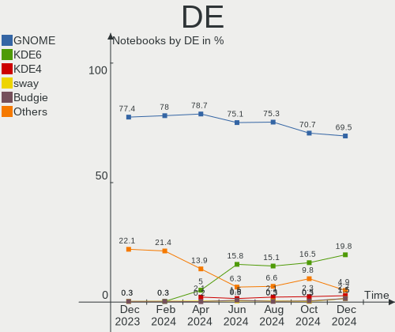
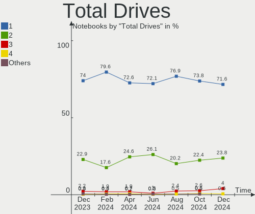
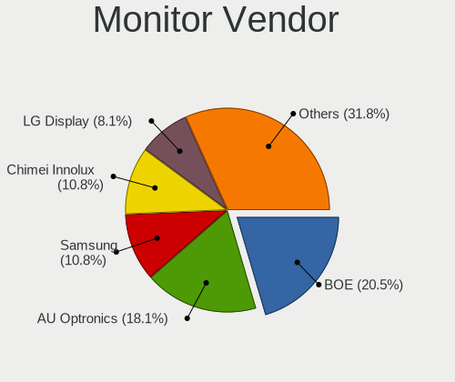

Fedora - Hardware Trends (Notebooks)
------------------------------------

A project to identify most popular hardware characteristics and track their change
over time based on data collected by Linux users at https://Linux-Hardware.org.

Anyone can contribute to this report by the [hw-probe](https://github.com/linuxhw/hw-probe) tool:

    sudo -E hw-probe -all -upload

This report is for one last month. Overall report since the beginning of time: [TestDays](https://github.com/linuxhw/TestDays)

Period: Dec, 2024.

Contents
--------

* [ System ](#system)
  - [ OS                       ](#os)
  - [ OS Family                ](#os-family)
  - [ Kernel                   ](#kernel)
  - [ Kernel Family            ](#kernel-family)
  - [ Kernel Major Ver.        ](#kernel-major-ver)
  - [ Arch                     ](#arch)
  - [ DE                       ](#de)
  - [ Display Server           ](#display-server)
  - [ Display Manager          ](#display-manager)
  - [ OS Lang                  ](#os-lang)
  - [ Boot Mode                ](#boot-mode)
  - [ Filesystem               ](#filesystem)
  - [ Part. scheme             ](#part-scheme)
  - [ Dual Boot with Linux/BSD ](#dual-boot-with-linuxbsd)
  - [ Dual Boot (Win)          ](#dual-boot-win)

* [ Board ](#board)
  - [ Vendor                   ](#vendor)
  - [ Model                    ](#model)
  - [ Model Family             ](#model-family)
  - [ MFG Year                 ](#mfg-year)
  - [ Form Factor              ](#form-factor)
  - [ Secure Boot              ](#secure-boot)
  - [ Coreboot                 ](#coreboot)
  - [ RAM Size                 ](#ram-size)
  - [ RAM Used                 ](#ram-used)
  - [ Total Drives             ](#total-drives)
  - [ Has CD-ROM               ](#has-cd-rom)
  - [ Has Ethernet             ](#has-ethernet)
  - [ Has WiFi                 ](#has-wifi)
  - [ Has Bluetooth            ](#has-bluetooth)

* [ Location ](#location)
  - [ Country                  ](#country)
  - [ City                     ](#city)

* [ Drives ](#drives)
  - [ Drive Vendor             ](#drive-vendor)
  - [ Drive Model              ](#drive-model)
  - [ HDD Vendor               ](#hdd-vendor)
  - [ SSD Vendor               ](#ssd-vendor)
  - [ Drive Kind               ](#drive-kind)
  - [ Drive Connector          ](#drive-connector)
  - [ Drive Size               ](#drive-size)
  - [ Space Total              ](#space-total)
  - [ Space Used               ](#space-used)
  - [ Malfunc. Drives          ](#malfunc-drives)
  - [ Malfunc. Drive Vendor    ](#malfunc-drive-vendor)
  - [ Malfunc. HDD Vendor      ](#malfunc-hdd-vendor)
  - [ Malfunc. Drive Kind      ](#malfunc-drive-kind)
  - [ Failed Drives            ](#failed-drives)
  - [ Failed Drive Vendor      ](#failed-drive-vendor)
  - [ Drive Status             ](#drive-status)

* [ Storage controller ](#storage-controller)
  - [ Storage Vendor           ](#storage-vendor)
  - [ Storage Model            ](#storage-model)
  - [ Storage Kind             ](#storage-kind)

* [ Processor ](#processor)
  - [ CPU Vendor               ](#cpu-vendor)
  - [ CPU Model                ](#cpu-model)
  - [ CPU Model Family         ](#cpu-model-family)
  - [ CPU Cores                ](#cpu-cores)
  - [ CPU Sockets              ](#cpu-sockets)
  - [ CPU Threads              ](#cpu-threads)
  - [ CPU Op-Modes             ](#cpu-op-modes)
  - [ CPU Microcode            ](#cpu-microcode)
  - [ CPU Microarch            ](#cpu-microarch)

* [ Graphics ](#graphics)
  - [ GPU Vendor               ](#gpu-vendor)
  - [ GPU Model                ](#gpu-model)
  - [ GPU Combo                ](#gpu-combo)
  - [ GPU Driver               ](#gpu-driver)
  - [ GPU Memory               ](#gpu-memory)

* [ Monitor ](#monitor)
  - [ Monitor Vendor           ](#monitor-vendor)
  - [ Monitor Model            ](#monitor-model)
  - [ Monitor Resolution       ](#monitor-resolution)
  - [ Monitor Diagonal         ](#monitor-diagonal)
  - [ Monitor Width            ](#monitor-width)
  - [ Aspect Ratio             ](#aspect-ratio)
  - [ Monitor Area             ](#monitor-area)
  - [ Pixel Density            ](#pixel-density)
  - [ Multiple Monitors        ](#multiple-monitors)

* [ Network ](#network)
  - [ Net Controller Vendor    ](#net-controller-vendor)
  - [ Net Controller Model     ](#net-controller-model)
  - [ Wireless Vendor          ](#wireless-vendor)
  - [ Wireless Model           ](#wireless-model)
  - [ Ethernet Vendor          ](#ethernet-vendor)
  - [ Ethernet Model           ](#ethernet-model)
  - [ Net Controller Kind      ](#net-controller-kind)
  - [ Used Controller          ](#used-controller)
  - [ NICs                     ](#nics)
  - [ IPv6                     ](#ipv6)

* [ Bluetooth ](#bluetooth)
  - [ Bluetooth Vendor         ](#bluetooth-vendor)
  - [ Bluetooth Model          ](#bluetooth-model)

* [ Sound ](#sound)
  - [ Sound Vendor             ](#sound-vendor)
  - [ Sound Model              ](#sound-model)

* [ Memory ](#memory)
  - [ Memory Vendor            ](#memory-vendor)
  - [ Memory Model             ](#memory-model)
  - [ Memory Kind              ](#memory-kind)
  - [ Memory Form Factor       ](#memory-form-factor)
  - [ Memory Size              ](#memory-size)
  - [ Memory Speed             ](#memory-speed)

* [ Printers & scanners ](#printers--scanners)
  - [ Printer Vendor           ](#printer-vendor)
  - [ Printer Model            ](#printer-model)
  - [ Scanner Vendor           ](#scanner-vendor)
  - [ Scanner Model            ](#scanner-model)

* [ Camera ](#camera)
  - [ Camera Vendor            ](#camera-vendor)
  - [ Camera Model             ](#camera-model)

* [ Security ](#security)
  - [ Fingerprint Vendor       ](#fingerprint-vendor)
  - [ Fingerprint Model        ](#fingerprint-model)
  - [ Chipcard Vendor          ](#chipcard-vendor)
  - [ Chipcard Model           ](#chipcard-model)

* [ Unsupported ](#unsupported)
  - [ Unsupported Devices      ](#unsupported-devices)
  - [ Unsupported Device Types ](#unsupported-device-types)

System
------

OS
--

Installed operating systems

| Name                  | Notebooks | Percent |
|-----------------------|-----------|---------|
| Fedora 41             | 294       | 89.63%  |
| Fedora 40             | 25        | 7.62%   |
| Fedora Asahi-remix-40 | 2         | 0.61%   |
| Fedora 42             | 2         | 0.61%   |
| Fedora 39             | 2         | 0.61%   |
| Fedora 38             | 2         | 0.61%   |
| Fedora Asahi-remix-39 | 1         | 0.3%    |

OS Family
---------

OS without a version

| Name   | Notebooks | Percent |
|--------|-----------|---------|
| Fedora | 328       | 100%    |

Kernel
------

Version of the Linux kernel

| Version                                             | Notebooks | Percent |
|-----------------------------------------------------|-----------|---------|
| 6.11.10-300.fc41.x86_64                             | 74        | 22.56%  |
| 6.12.6-200.fc41.x86_64                              | 44        | 13.41%  |
| 6.12.5-200.fc41.x86_64                              | 41        | 12.5%   |
| 6.11.11-300.fc41.x86_64                             | 38        | 11.59%  |
| 6.11.4-301.fc41.x86_64                              | 36        | 10.98%  |
| 6.12.4-200.fc41.x86_64                              | 35        | 10.67%  |
| 6.11.8-300.fc41.x86_64                              | 14        | 4.27%   |
| 6.11.10-200.fc40.x86_64                             | 8         | 2.44%   |
| 6.8.5-301.fc40.x86_64                               | 4         | 1.22%   |
| 6.12.4-100.fc40.x86_64                              | 4         | 1.22%   |
| 6.8.9-100.fc38.x86_64                               | 2         | 0.61%   |
| 6.12.4-cb1.0.fc41.x86_64                            | 2         | 0.61%   |
| 6.12.1-404.asahi.fc40.aarch64+16k                   | 2         | 0.61%   |
| 6.11.7-300.fc41.x86_64                              | 2         | 0.61%   |
| 6.11.4-201.fc40.x86_64                              | 2         | 0.61%   |
| 6.11.11-200.fc40.x86_64                             | 2         | 0.61%   |
| 6.9.6-200.fc40.x86_64                               | 1         | 0.3%    |
| 6.8.4-300.es83xx.fc40.x86_64                        | 1         | 0.3%    |
| 6.8.10-300.fc40.x86_64                              | 1         | 0.3%    |
| 6.6.63-clts1.0.fc41.x86_64                          | 1         | 0.3%    |
| 6.5.6-300.fc39.x86_64                               | 1         | 0.3%    |
| 6.13.0-0.rc3.20241218gitaef25be35d23.31.fc42.x86_64 | 1         | 0.3%    |
| 6.13.0-0.rc0.20241119git158f238aa69d.2.fc42.x86_64  | 1         | 0.3%    |
| 6.12.5-100.fc40.x86_64                              | 1         | 0.3%    |
| 6.12.1-200.fc41.x86_64                              | 1         | 0.3%    |
| 6.11.9-100.fc39.x86_64                              | 1         | 0.3%    |
| 6.11.8-200.fc40.x86_64                              | 1         | 0.3%    |
| 6.11.6-200.fc40.x86_64                              | 1         | 0.3%    |
| 6.11.5-300.t2.fc41.x86_64                           | 1         | 0.3%    |
| 6.11.5-300.fc41.x86_64                              | 1         | 0.3%    |
| 6.11.5-200.fc40.x86_64                              | 1         | 0.3%    |
| 6.11.0-400.asahi.fc39.aarch64+16k                   | 1         | 0.3%    |
| 6.10.14-200.fc40.x86_64                             | 1         | 0.3%    |
| 6.10.11-200.fc40.x86_64                             | 1         | 0.3%    |

Kernel Family
-------------

Linux kernel without a distro release

| Version | Notebooks | Percent |
|---------|-----------|---------|
| 6.11.10 | 82        | 25%     |
| 6.12.6  | 44        | 13.41%  |
| 6.12.5  | 42        | 12.8%   |
| 6.12.4  | 41        | 12.5%   |
| 6.11.11 | 40        | 12.2%   |
| 6.11.4  | 38        | 11.59%  |
| 6.11.8  | 15        | 4.57%   |
| 6.8.5   | 4         | 1.22%   |
| 6.12.1  | 3         | 0.91%   |
| 6.11.5  | 3         | 0.91%   |
| 6.8.9   | 2         | 0.61%   |
| 6.13.0  | 2         | 0.61%   |
| 6.11.7  | 2         | 0.61%   |
| 6.9.6   | 1         | 0.3%    |
| 6.8.4   | 1         | 0.3%    |
| 6.8.10  | 1         | 0.3%    |
| 6.6.63  | 1         | 0.3%    |
| 6.5.6   | 1         | 0.3%    |
| 6.11.9  | 1         | 0.3%    |
| 6.11.6  | 1         | 0.3%    |
| 6.11.0  | 1         | 0.3%    |
| 6.10.14 | 1         | 0.3%    |
| 6.10.11 | 1         | 0.3%    |

Kernel Major Ver.
-----------------

Linux kernel major version

| Version | Notebooks | Percent |
|---------|-----------|---------|
| 6.11    | 183       | 55.79%  |
| 6.12    | 130       | 39.63%  |
| 6.8     | 8         | 2.44%   |
| 6.13    | 2         | 0.61%   |
| 6.10    | 2         | 0.61%   |
| 6.9     | 1         | 0.3%    |
| 6.6     | 1         | 0.3%    |
| 6.5     | 1         | 0.3%    |

Arch
----

OS architecture (x86_64, i586, etc.)

| Name    | Notebooks | Percent |
|---------|-----------|---------|
| x86_64  | 325       | 99.09%  |
| aarch64 | 3         | 0.91%   |

DE
--

Desktop Environment

| Name          | Notebooks | Percent |
|---------------|-----------|---------|
| GNOME         | 228       | 69.51%  |
| KDE6          | 65        | 19.82%  |
| KDE4          | 9         | 2.74%   |
| sway          | 5         | 1.52%   |
| Budgie        | 5         | 1.52%   |
| Unknown       | 4         | 1.22%   |
| X-Cinnamon    | 3         | 0.91%   |
| GNOME Classic | 3         | 0.91%   |
| XFCE          | 2         | 0.61%   |
| KDE5          | 1         | 0.3%    |
| i3            | 1         | 0.3%    |
| Hyprland      | 1         | 0.3%    |
| COSMIC        | 1         | 0.3%    |

Display Server
--------------

X11 or Wayland

| Name    | Notebooks | Percent |
|---------|-----------|---------|
| Wayland | 295       | 89.94%  |
| X11     | 23        | 7.01%   |
| Tty     | 10        | 3.05%   |

Display Manager
---------------

SDDM, LightDM, etc.

| Name    | Notebooks | Percent |
|---------|-----------|---------|
| Unknown | 202       | 61.59%  |
| GDM     | 73        | 22.26%  |
| SDDM    | 41        | 12.5%   |
| LightDM | 11        | 3.35%   |
| GREETD  | 1         | 0.3%    |

OS Lang
-------

Language

| Lang    | Notebooks | Percent |
|---------|-----------|---------|
| en_US   | 185       | 56.4%   |
| pt_BR   | 22        | 6.71%   |
| en_GB   | 22        | 6.71%   |
| de_DE   | 17        | 5.18%   |
| it_IT   | 13        | 3.96%   |
| fr_FR   | 11        | 3.35%   |
| ru_RU   | 7         | 2.13%   |
| es_ES   | 7         | 2.13%   |
| pl_PL   | 4         | 1.22%   |
| en_CA   | 4         | 1.22%   |
| sv_SE   | 3         | 0.91%   |
| fr_BE   | 3         | 0.91%   |
| en_IN   | 3         | 0.91%   |
| tr_TR   | 2         | 0.61%   |
| fr_CH   | 2         | 0.61%   |
| es_MX   | 2         | 0.61%   |
| es_EC   | 2         | 0.61%   |
| es_CL   | 2         | 0.61%   |
| en_AU   | 2         | 0.61%   |
| zh_TW   | 1         | 0.3%    |
| zh_CN   | 1         | 0.3%    |
| tr_CY   | 1         | 0.3%    |
| pt_PT   | 1         | 0.3%    |
| nl_NL   | 1         | 0.3%    |
| hu_HU   | 1         | 0.3%    |
| fi_FI   | 1         | 0.3%    |
| es_PE   | 1         | 0.3%    |
| es_CO   | 1         | 0.3%    |
| en_PH   | 1         | 0.3%    |
| en_BW   | 1         | 0.3%    |
| el_GR   | 1         | 0.3%    |
| cs_CZ   | 1         | 0.3%    |
| ca_ES   | 1         | 0.3%    |
| Unknown | 1         | 0.3%    |

Boot Mode
---------

EFI or BIOS

| Mode | Notebooks | Percent |
|------|-----------|---------|
| BIOS | 202       | 61.59%  |
| EFI  | 126       | 38.41%  |

Filesystem
----------

Type of filesystem

| Type    | Notebooks | Percent |
|---------|-----------|---------|
| Btrfs   | 278       | 84.76%  |
| Ext4    | 34        | 10.37%  |
| Overlay | 8         | 2.44%   |
| Xfs     | 4         | 1.22%   |
| Tmpfs   | 3         | 0.91%   |
| Unknown | 1         | 0.3%    |

Part. scheme
------------

Scheme of partitioning

| Type    | Notebooks | Percent |
|---------|-----------|---------|
| Unknown | 199       | 60.67%  |
| GPT     | 129       | 39.33%  |

Dual Boot with Linux/BSD
------------------------

Hosting more than one Linux/BSD

| Dual boot | Notebooks | Percent |
|-----------|-----------|---------|
| No        | 307       | 93.6%   |
| Yes       | 21        | 6.4%    |

Dual Boot (Win)
---------------

Hosting Linux and Windows

| Dual boot | Notebooks | Percent |
|-----------|-----------|---------|
| No        | 287       | 87.5%   |
| Yes       | 41        | 12.5%   |

Board
-----

Vendor
------

Motherboard manufacturer

| Name                   | Notebooks | Percent |
|------------------------|-----------|---------|
| Lenovo                 | 89        | 27.13%  |
| Dell                   | 48        | 14.63%  |
| ASUSTek Computer       | 47        | 14.33%  |
| Hewlett-Packard        | 35        | 10.67%  |
| Acer                   | 21        | 6.4%    |
| Apple                  | 16        | 4.88%   |
| MSI                    | 11        | 3.35%   |
| Toshiba                | 7         | 2.13%   |
| Samsung Electronics    | 6         | 1.83%   |
| HUAWEI                 | 6         | 1.83%   |
| Unknown                | 6         | 1.83%   |
| Framework              | 5         | 1.52%   |
| Timi                   | 3         | 0.91%   |
| Google                 | 3         | 0.91%   |
| TUXEDO                 | 2         | 0.61%   |
| Gigabyte Technology    | 2         | 0.61%   |
| Fujitsu                | 2         | 0.61%   |
| XIAOMI                 | 1         | 0.3%    |
| Valve                  | 1         | 0.3%    |
| Sony                   | 1         | 0.3%    |
| Positivo               | 1         | 0.3%    |
| PC Specialist          | 1         | 0.3%    |
| Packard Bell           | 1         | 0.3%    |
| ONE-NETBOOK TECHNOLOGY | 1         | 0.3%    |
| Monster                | 1         | 0.3%    |
| LG Electronics         | 1         | 0.3%    |
| KVADRA                 | 1         | 0.3%    |
| Intel Client Systems   | 1         | 0.3%    |
| Intel                  | 1         | 0.3%    |
| HONOR                  | 1         | 0.3%    |
| GPU Company            | 1         | 0.3%    |
| GPD                    | 1         | 0.3%    |
| COMEXR                 | 1         | 0.3%    |
| Chuwi                  | 1         | 0.3%    |
| Avell High Performance | 1         | 0.3%    |
| Alienware              | 1         | 0.3%    |

Model
-----

Motherboard model

| Name                                        | Notebooks | Percent |
|---------------------------------------------|-----------|---------|
| Unknown                                     | 7         | 2.13%   |
| Framework Laptop 16 (AMD Ryzen 7040 Series) | 4         | 1.22%   |
| HP Laptop 15s-eq2xxx                        | 3         | 0.91%   |
| ASUS ASUS Zenbook S 14 UX5406SA_UX5406SA    | 3         | 0.91%   |
| ASUS ASUS Zenbook 14 UX3405MA_UX3405MA      | 3         | 0.91%   |
| Samsung 550XDA                              | 2         | 0.61%   |
| Lenovo LOQ 15IAX9 83GS                      | 2         | 0.61%   |
| Lenovo LOQ 15ARP9 83JC                      | 2         | 0.61%   |
| Lenovo Legion 9 16IRX9 83G0                 | 2         | 0.61%   |
| Lenovo Legion 5 16IRX9 83DG                 | 2         | 0.61%   |
| Lenovo IdeaPad Gaming 3 15ACH6 82K2         | 2         | 0.61%   |
| Lenovo IdeaPad 3 15ALC6 82KU                | 2         | 0.61%   |
| HUAWEI KLVL-WXX9                            | 2         | 0.61%   |
| HP 15 Notebook PC                           | 2         | 0.61%   |
| Dell Latitude E5550                         | 2         | 0.61%   |
| Dell Latitude 5400                          | 2         | 0.61%   |
| ASUS VivoBook_ASUSLaptop M3704YA_M3704YA    | 2         | 0.61%   |
| ASUS ASUS Zenbook 14 UM3406HA_UM3406HA      | 2         | 0.61%   |
| Apple MacBookPro8,1                         | 2         | 0.61%   |
| Apple MacBookPro11,3                        | 2         | 0.61%   |
| Apple MacBookAir6,2                         | 2         | 0.61%   |
| XIAOMI Redmi Book Pro 15 2023               | 1         | 0.3%    |
| Valve Jupiter                               | 1         | 0.3%    |
| TUXEDO Pulse 14 Gen1                        | 1         | 0.3%    |
| TUXEDO N650DU                               | 1         | 0.3%    |
| Toshiba Satellite Pro L630                  | 1         | 0.3%    |
| Toshiba Satellite L850                      | 1         | 0.3%    |
| Toshiba Satellite L745                      | 1         | 0.3%    |
| Toshiba Satellite L50-B                     | 1         | 0.3%    |
| Toshiba Satellite C70-B                     | 1         | 0.3%    |
| Toshiba Satellite A200                      | 1         | 0.3%    |
| Toshiba PORTEGE R700                        | 1         | 0.3%    |
| Timi TM1801                                 | 1         | 0.3%    |
| Timi RedmiBook 16                           | 1         | 0.3%    |
| Timi Mi NoteBook Pro                        | 1         | 0.3%    |
| Sony VPCEH25FD                              | 1         | 0.3%    |
| Samsung RV411/RV511/E3511/S3511/RV711/E3411 | 1         | 0.3%    |
| Samsung 960XGK                              | 1         | 0.3%    |
| Samsung 700Z3A/700Z4A/700Z5A/700Z5B         | 1         | 0.3%    |
| Samsung 700G7C                              | 1         | 0.3%    |

Model Family
------------

Motherboard model prefix

| Name               | Notebooks | Percent |
|--------------------|-----------|---------|
| Lenovo ThinkPad    | 47        | 14.33%  |
| Dell Latitude      | 17        | 5.18%   |
| ASUS ASUS          | 15        | 4.57%   |
| Lenovo IdeaPad     | 14        | 4.27%   |
| Dell Inspiron      | 14        | 4.27%   |
| Acer Aspire        | 12        | 3.66%   |
| Lenovo Legion      | 11        | 3.35%   |
| ASUS VivoBook      | 10        | 3.05%   |
| HP ProBook         | 8         | 2.44%   |
| Dell XPS           | 8         | 2.44%   |
| Unknown            | 7         | 2.13%   |
| Toshiba Satellite  | 6         | 1.83%   |
| Lenovo LOQ         | 6         | 1.83%   |
| HP Laptop          | 6         | 1.83%   |
| ASUS Zenbook       | 6         | 1.83%   |
| ASUS ROG           | 6         | 1.83%   |
| Framework Laptop   | 5         | 1.52%   |
| Apple MacBookPro11 | 5         | 1.52%   |
| Acer Nitro         | 5         | 1.52%   |
| Lenovo Yoga        | 4         | 1.22%   |
| HP Pavilion        | 4         | 1.22%   |
| HP EliteBook       | 4         | 1.22%   |
| Dell Precision     | 4         | 1.22%   |
| Lenovo ThinkBook   | 3         | 0.91%   |
| Apple MacBookPro8  | 3         | 0.91%   |
| Acer Swift         | 3         | 0.91%   |
| Samsung 550XDA     | 2         | 0.61%   |
| Lenovo V15         | 2         | 0.61%   |
| HUAWEI KLVL-WXX9   | 2         | 0.61%   |
| HP Victus          | 2         | 0.61%   |
| HP OMEN            | 2         | 0.61%   |
| HP 15              | 2         | 0.61%   |
| Dell Venue         | 2         | 0.61%   |
| Apple MacBookPro14 | 2         | 0.61%   |
| Apple MacBookAir6  | 2         | 0.61%   |
| XIAOMI Redmi       | 1         | 0.3%    |
| Valve Jupiter      | 1         | 0.3%    |
| TUXEDO Pulse       | 1         | 0.3%    |
| TUXEDO N650DU      | 1         | 0.3%    |
| Toshiba PORTEGE    | 1         | 0.3%    |

MFG Year
--------

Motherboard manufacture year

| Year    | Notebooks | Percent |
|---------|-----------|---------|
| 2024    | 49        | 14.94%  |
| 2021    | 41        | 12.5%   |
| 2023    | 37        | 11.28%  |
| 2022    | 27        | 8.23%   |
| 2018    | 25        | 7.62%   |
| 2020    | 20        | 6.1%    |
| 2019    | 19        | 5.79%   |
| 2017    | 17        | 5.18%   |
| 2014    | 17        | 5.18%   |
| 2015    | 15        | 4.57%   |
| 2012    | 15        | 4.57%   |
| 2013    | 12        | 3.66%   |
| 2011    | 12        | 3.66%   |
| 2016    | 9         | 2.74%   |
| 2010    | 3         | 0.91%   |
| 2008    | 3         | 0.91%   |
| 2007    | 3         | 0.91%   |
| Unknown | 3         | 0.91%   |
| 2009    | 1         | 0.3%    |

Form Factor
-----------

Physical design of the computer

| Name     | Notebooks | Percent |
|----------|-----------|---------|
| Notebook | 328       | 100%    |

Secure Boot
-----------

Enabled or disabled

| State    | Notebooks | Percent |
|----------|-----------|---------|
| Disabled | 296       | 90.24%  |
| Enabled  | 32        | 9.76%   |

Coreboot
--------

Have coreboot on board

| Used | Notebooks | Percent |
|------|-----------|---------|
| No   | 324       | 98.78%  |
| Yes  | 4         | 1.22%   |

RAM Size
--------

Total RAM memory

| Size in GB  | Notebooks | Percent |
|-------------|-----------|---------|
| 8.01-16.0   | 79        | 24.09%  |
| 4.01-8.0    | 70        | 21.34%  |
| 16.01-24.0  | 70        | 21.34%  |
| 32.01-64.0  | 40        | 12.2%   |
| 3.01-4.0    | 24        | 7.32%   |
| 24.01-32.0  | 23        | 7.01%   |
| 64.01-256.0 | 17        | 5.18%   |
| 2.01-3.0    | 3         | 0.91%   |
| 1.01-2.0    | 2         | 0.61%   |

RAM Used
--------

Used RAM memory

| Used GB    | Notebooks | Percent |
|------------|-----------|---------|
| 4.01-8.0   | 118       | 35.98%  |
| 3.01-4.0   | 84        | 25.61%  |
| 2.01-3.0   | 66        | 20.12%  |
| 8.01-16.0  | 32        | 9.76%   |
| 1.01-2.0   | 21        | 6.4%    |
| 16.01-24.0 | 3         | 0.91%   |
| 32.01-64.0 | 2         | 0.61%   |
| 24.01-32.0 | 1         | 0.3%    |
| 0.51-1.0   | 1         | 0.3%    |

Total Drives
------------

Number of drives on board

| Drives | Notebooks | Percent |
|--------|-----------|---------|
| 1      | 235       | 71.65%  |
| 2      | 78        | 23.78%  |
| 3      | 13        | 3.96%   |
| 4      | 2         | 0.61%   |

Has CD-ROM
----------

Has CD-ROM on board

| Presented | Notebooks | Percent |
|-----------|-----------|---------|
| No        | 278       | 84.76%  |
| Yes       | 50        | 15.24%  |

Has Ethernet
------------

Has Ethernet on board

| Presented | Notebooks | Percent |
|-----------|-----------|---------|
| Yes       | 235       | 71.65%  |
| No        | 93        | 28.35%  |

Has WiFi
--------

Has WiFi module

| Presented | Notebooks | Percent |
|-----------|-----------|---------|
| Yes       | 303       | 92.38%  |
| No        | 25        | 7.62%   |

Has Bluetooth
-------------

Has Bluetooth module

| Presented | Notebooks | Percent |
|-----------|-----------|---------|
| Yes       | 288       | 87.8%   |
| No        | 40        | 12.2%   |

Location
--------

Country
-------

Geographic location (country)

| Country                | Notebooks | Percent |
|------------------------|-----------|---------|
| USA                    | 68        | 20.73%  |
| Germany                | 28        | 8.54%   |
| Brazil                 | 26        | 7.93%   |
| Italy                  | 21        | 6.4%    |
| Russia                 | 15        | 4.57%   |
| France                 | 15        | 4.57%   |
| India                  | 13        | 3.96%   |
| UK                     | 9         | 2.74%   |
| Canada                 | 8         | 2.44%   |
| Turkey                 | 7         | 2.13%   |
| Spain                  | 7         | 2.13%   |
| Mexico                 | 7         | 2.13%   |
| Austria                | 6         | 1.83%   |
| Poland                 | 5         | 1.52%   |
| Finland                | 5         | 1.52%   |
| Slovakia               | 4         | 1.22%   |
| Netherlands            | 4         | 1.22%   |
| Greece                 | 4         | 1.22%   |
| Chile                  | 4         | 1.22%   |
| Bulgaria               | 4         | 1.22%   |
| Belgium                | 4         | 1.22%   |
| Vietnam                | 3         | 0.91%   |
| Switzerland            | 3         | 0.91%   |
| Sweden                 | 3         | 0.91%   |
| Japan                  | 3         | 0.91%   |
| Egypt                  | 3         | 0.91%   |
| Czechia                | 3         | 0.91%   |
| The Netherlands        | 2         | 0.61%   |
| Thailand               | 2         | 0.61%   |
| Portugal               | 2         | 0.61%   |
| Panama                 | 2         | 0.61%   |
| Malaysia               | 2         | 0.61%   |
| Kenya                  | 2         | 0.61%   |
| Indonesia              | 2         | 0.61%   |
| Estonia                | 2         | 0.61%   |
| Ecuador                | 2         | 0.61%   |
| Bosnia and Herzegovina | 2         | 0.61%   |
| Australia              | 2         | 0.61%   |
| Uruguay                | 1         | 0.3%    |
| UAE                    | 1         | 0.3%    |

City
----

Geographic location (city)

| City           | Notebooks | Percent |
|----------------|-----------|---------|
| Milan          | 6         | 1.83%   |
| Vienna         | 5         | 1.52%   |
| St Petersburg  | 5         | 1.52%   |
| Sao Paulo      | 4         | 1.22%   |
| Helsinki       | 4         | 1.22%   |
| Bratislava     | 4         | 1.22%   |
| Santiago       | 3         | 0.91%   |
| Berlin         | 3         | 0.91%   |
| Warsaw         | 2         | 0.61%   |
| Vancouver      | 2         | 0.61%   |
| Umeå          | 2         | 0.61%   |
| Stuttgart      | 2         | 0.61%   |
| Sofia          | 2         | 0.61%   |
| Richmond Hill  | 2         | 0.61%   |
| Reutlingen     | 2         | 0.61%   |
| Quito          | 2         | 0.61%   |
| Paris          | 2         | 0.61%   |
| Panama City    | 2         | 0.61%   |
| Moscow         | 2         | 0.61%   |
| Mombasa        | 2         | 0.61%   |
| Minneapolis    | 2         | 0.61%   |
| Mexico City    | 2         | 0.61%   |
| London         | 2         | 0.61%   |
| Karlsruhe      | 2         | 0.61%   |
| Istanbul       | 2         | 0.61%   |
| Hanoi          | 2         | 0.61%   |
| Florianópolis | 2         | 0.61%   |
| Denton         | 2         | 0.61%   |
| Dallas         | 2         | 0.61%   |
| Cypress        | 2         | 0.61%   |
| Curitiba       | 2         | 0.61%   |
| Cologne        | 2         | 0.61%   |
| Cleveland      | 2         | 0.61%   |
| Bengaluru      | 2         | 0.61%   |
| Zhengzhou      | 1         | 0.3%    |
| Yokohama       | 1         | 0.3%    |
| Yerevan        | 1         | 0.3%    |
| Winterswijk    | 1         | 0.3%    |
| Willits        | 1         | 0.3%    |
| Vught          | 1         | 0.3%    |

Drives
------

Drive Vendor
------------

Hard drive vendors

| Vendor                         | Notebooks | Drives | Percent |
|--------------------------------|-----------|--------|---------|
| Samsung Electronics            | 70        | 76     | 16.91%  |
| Sandisk                        | 62        | 64     | 14.98%  |
| Micron Technology              | 36        | 37     | 8.7%    |
| SK hynix                       | 23        | 24     | 5.56%   |
| Seagate                        | 19        | 20     | 4.59%   |
| Kingston                       | 19        | 19     | 4.59%   |
| WDC                            | 16        | 17     | 3.86%   |
| Unknown                        | 16        | 16     | 3.86%   |
| Intel                          | 16        | 16     | 3.86%   |
| Toshiba                        | 13        | 13     | 3.14%   |
| Apple                          | 12        | 20     | 2.9%    |
| KIOXIA                         | 10        | 10     | 2.42%   |
| Crucial                        | 9         | 9      | 2.17%   |
| A-DATA Technology              | 9         | 9      | 2.17%   |
| Kingston Technology Company    | 8         | 8      | 1.93%   |
| MAXIO Technology (Hangzhou)    | 5         | 5      | 1.21%   |
| China                          | 5         | 5      | 1.21%   |
| Phison Electronics             | 4         | 4      | 0.97%   |
| Hitachi                        | 4         | 4      | 0.97%   |
| HGST                           | 4         | 4      | 0.97%   |
| Union Memory (Shenzhen)        | 3         | 3      | 0.72%   |
| Realtek Semiconductor          | 3         | 3      | 0.72%   |
| PNY                            | 3         | 3      | 0.72%   |
| Micron/Crucial Technology      | 3         | 3      | 0.72%   |
| ADATA Technology               | 3         | 3      | 0.72%   |
| Solid State Storage Technology | 2         | 2      | 0.48%   |
| Silicon Motion                 | 2         | 2      | 0.48%   |
| Plextor                        | 2         | 2      | 0.48%   |
| Lexar                          | 2         | 2      | 0.48%   |
| JMicron Technology             | 2         | 2      | 0.48%   |
| Biwin Storage Technology       | 2         | 2      | 0.48%   |
| Yangtze Memory Technologies    | 1         | 1      | 0.24%   |
| XrayDisk                       | 1         | 1      | 0.24%   |
| Transcend                      | 1         | 1      | 0.24%   |
| SSK                            | 1         | 1      | 0.24%   |
| SPCC                           | 1         | 1      | 0.24%   |
| Sonnics                        | 1         | 1      | 0.24%   |
| ShiJi                          | 1         | 1      | 0.24%   |
| Seagate Technology             | 1         | 1      | 0.24%   |
| SABRENT                        | 1         | 1      | 0.24%   |

Drive Model
-----------

Hard drive models

| Model                                                 | Notebooks | Percent |
|-------------------------------------------------------|-----------|---------|
| Samsung NVMe SSD Controller PM9A1/PM9A3/980PRO 512GB  | 13        | 3.03%   |
| Samsung NVMe SSD Controller SM981/PM981/PM983 512GB   | 12        | 2.8%    |
| Sandisk WD PC SN560 SDDPNQE-1T00-1102 1024GB          | 6         | 1.4%    |
| Unknown MMC Card  32GB                                | 5         | 1.17%   |
| Seagate ST1000LM035-1RK172 1TB                        | 5         | 1.17%   |
| Sandisk WD Blue SN550 NVMe SSD 256GB                  | 5         | 1.17%   |
| Sandisk WD Black SN850 2TB                            | 5         | 1.17%   |
| Samsung SSD 980 1TB                                   | 5         | 1.17%   |
| MAXIO (Hangzhou) NVMe SSD Controller MAP1202 512GB    | 5         | 1.17%   |
| Kingston SA400S37240G 240GB SSD                       | 5         | 1.17%   |
| Unknown MMC Card  64GB                                | 4         | 0.93%   |
| Samsung NVMe SSD Controller SM961/PM961/SM963 256GB   | 4         | 0.93%   |
| Micron MTFDKBA1T0QFM-1BD1AABGB 1024GB                 | 4         | 0.93%   |
| Micron 2450_MTFDKBA512TFK 512GB                       | 4         | 0.93%   |
| Micron 2400_MTFDKBA512QFM 512GB                       | 4         | 0.93%   |
| Toshiba MQ04ABF100 1TB                                | 3         | 0.7%    |
| SK hynix SKHynix_HFS001TEJ9X115N 1TB                  | 3         | 0.7%    |
| Sandisk WD_BLACK SN770 2TB                            | 3         | 0.7%    |
| Sandisk WD Blue SN500 / PC SN520 NVMe SSD 256GB       | 3         | 0.7%    |
| Samsung SSD 990 PRO 2TB                               | 3         | 0.7%    |
| Samsung PSSD T7 1TB                                   | 3         | 0.7%    |
| Samsung MZALQ512HBLU-00BL2 512GB                      | 3         | 0.7%    |
| Micron MTFDKCD1T0QFM-1BD1AABLA 1024GB                 | 3         | 0.7%    |
| KIOXIA KBG50ZNV512G 512GB                             | 3         | 0.7%    |
| Intel SSDPEKNU512GZ 512GB                             | 3         | 0.7%    |
| Intel SSD Pro 7600p/760p/E 6100p Series 512GB         | 3         | 0.7%    |
| Apple NVMe SSD Drive 3MB                              | 3         | 0.7%    |
| Apple NVMe SSD Drive 128MB                            | 3         | 0.7%    |
| WDC WD10SPZX-75Z10T2 1TB                              | 2         | 0.47%   |
| WDC WD10SPZX-21Z10T0 1TB                              | 2         | 0.47%   |
| Unknown NVMe SSD Drive 512GB                          | 2         | 0.47%   |
| Toshiba MQ01ABF050 500GB                              | 2         | 0.47%   |
| SK hynix BC511 512GB                                  | 2         | 0.47%   |
| Silicon Motion SM2263EN/SM2263XT SSD Controller 256GB | 2         | 0.47%   |
| Seagate ST500LM000-1EJ162 500GB                       | 2         | 0.47%   |
| Seagate ST1000LM048-2E7172 1TB                        | 2         | 0.47%   |
| SanDisk X400 M.2 2280 128GB SSD                       | 2         | 0.47%   |
| Sandisk WD PC SN740 SDDPNQD-512G-1006 512GB           | 2         | 0.47%   |
| Sandisk WD PC SN740 SDDPMQD-1T00-1101 1024GB          | 2         | 0.47%   |
| Sandisk WD Black SN750 / PC SN730 NVMe SSD 512GB      | 2         | 0.47%   |

HDD Vendor
----------

Hard disk drive vendors

| Vendor              | Notebooks | Drives | Percent |
|---------------------|-----------|--------|---------|
| Seagate             | 18        | 18     | 37.5%   |
| WDC                 | 10        | 10     | 20.83%  |
| Toshiba             | 7         | 7      | 14.58%  |
| Hitachi             | 4         | 4      | 8.33%   |
| HGST                | 4         | 4      | 8.33%   |
| Samsung Electronics | 2         | 2      | 4.17%   |
| JMicron Technology  | 2         | 2      | 4.17%   |
| SABRENT             | 1         | 1      | 2.08%   |

SSD Vendor
----------

Solid state drive vendors

| Vendor              | Notebooks | Drives | Percent |
|---------------------|-----------|--------|---------|
| Samsung Electronics | 15        | 15     | 13.89%  |
| Kingston            | 13        | 13     | 12.04%  |
| SanDisk             | 11        | 11     | 10.19%  |
| Crucial             | 9         | 9      | 8.33%   |
| WDC                 | 6         | 7      | 5.56%   |
| Micron Technology   | 6         | 6      | 5.56%   |
| Apple               | 6         | 6      | 5.56%   |
| A-DATA Technology   | 6         | 6      | 5.56%   |
| SK hynix            | 5         | 5      | 4.63%   |
| Intel               | 5         | 5      | 4.63%   |
| China               | 5         | 5      | 4.63%   |
| PNY                 | 3         | 3      | 2.78%   |
| Plextor             | 2         | 2      | 1.85%   |
| Lexar               | 2         | 2      | 1.85%   |
| XrayDisk            | 1         | 1      | 0.93%   |
| Transcend           | 1         | 1      | 0.93%   |
| Toshiba             | 1         | 1      | 0.93%   |
| SPCC                | 1         | 1      | 0.93%   |
| OCZ                 | 1         | 1      | 0.93%   |
| Mushkin             | 1         | 1      | 0.93%   |
| LITEONIT            | 1         | 1      | 0.93%   |
| LITEON              | 1         | 1      | 0.93%   |
| Intenso             | 1         | 1      | 0.93%   |
| Hewlett-Packard     | 1         | 1      | 0.93%   |
| CT500MX5            | 1         | 1      | 0.93%   |
| CS                  | 1         | 1      | 0.93%   |
| Corsair             | 1         | 1      | 0.93%   |
| Ant                 | 1         | 1      | 0.93%   |

Drive Kind
----------

HDD or SSD

| Kind    | Notebooks | Drives | Percent |
|---------|-----------|--------|---------|
| NVMe    | 217       | 256    | 56.96%  |
| SSD     | 97        | 109    | 25.46%  |
| HDD     | 46        | 48     | 12.07%  |
| MMC     | 14        | 14     | 3.67%   |
| Unknown | 7         | 7      | 1.84%   |

Drive Connector
---------------

SATA, SAS, NVMe, etc.

| Type | Notebooks | Drives | Percent |
|------|-----------|--------|---------|
| NVMe | 216       | 253    | 58.22%  |
| SATA | 123       | 147    | 33.15%  |
| SAS  | 18        | 20     | 4.85%   |
| MMC  | 14        | 14     | 3.77%   |

Drive Size
----------

Size of hard drive

| Size in TB | Notebooks | Drives | Percent |
|------------|-----------|--------|---------|
| 0.01-0.5   | 90        | 99     | 62.5%   |
| 0.51-1.0   | 46        | 50     | 31.94%  |
| 1.01-2.0   | 7         | 7      | 4.86%   |
| 10.01-20.0 | 1         | 1      | 0.69%   |

Space Total
-----------

Amount of disk space available on the file system

| Size in GB     | Notebooks | Percent |
|----------------|-----------|---------|
| 501-1000       | 71        | 21.65%  |
| 251-500        | 66        | 20.12%  |
| 1001-2000      | 57        | 17.38%  |
| 1-20           | 34        | 10.37%  |
| Unknown        | 34        | 10.37%  |
| 101-250        | 28        | 8.54%   |
| More than 3000 | 15        | 4.57%   |
| 51-100         | 11        | 3.35%   |
| 2001-3000      | 8         | 2.44%   |
| 21-50          | 4         | 1.22%   |

Space Used
----------

Amount of used disk space

| Used GB        | Notebooks | Percent |
|----------------|-----------|---------|
| 1-20           | 99        | 30.18%  |
| 21-50          | 59        | 17.99%  |
| 251-500        | 37        | 11.28%  |
| 101-250        | 37        | 11.28%  |
| Unknown        | 34        | 10.37%  |
| 51-100         | 25        | 7.62%   |
| 501-1000       | 20        | 6.1%    |
| 1001-2000      | 12        | 3.66%   |
| 2001-3000      | 3         | 0.91%   |
| More than 3000 | 2         | 0.61%   |

Malfunc. Drives
---------------

Drive models with a malfunction

| Model                                          | Notebooks | Drives | Percent |
|------------------------------------------------|-----------|--------|---------|
| WDC WDS120G2G0B-00EPW0 120GB SSD               | 1         | 1      | 12.5%   |
| WDC WD5000LPCX-60VHAT0 500GB                   | 1         | 1      | 12.5%   |
| SPCC Solid State Disk 120GB                    | 1         | 1      | 12.5%   |
| Seagate ST1000LM048-2E7172 1TB                 | 1         | 1      | 12.5%   |
| Samsung Electronics SSD 850 PRO 2TB            | 1         | 1      | 12.5%   |
| Realtek Semiconductor ADATA SX6000PNP 1TB      | 1         | 1      | 12.5%   |
| PNY 1TB SATA SSD                               | 1         | 1      | 12.5%   |
| Micron Technology 1100_MTFDDAV512TBN 512GB SSD | 1         | 1      | 12.5%   |

Malfunc. Drive Vendor
---------------------

Vendors of faulty drives

| Vendor                | Notebooks | Drives | Percent |
|-----------------------|-----------|--------|---------|
| WDC                   | 2         | 2      | 25%     |
| SPCC                  | 1         | 1      | 12.5%   |
| Seagate               | 1         | 1      | 12.5%   |
| Samsung Electronics   | 1         | 1      | 12.5%   |
| Realtek Semiconductor | 1         | 1      | 12.5%   |
| PNY                   | 1         | 1      | 12.5%   |
| Micron Technology     | 1         | 1      | 12.5%   |

Malfunc. HDD Vendor
-------------------

Vendors of faulty HDD drives

| Vendor  | Notebooks | Drives | Percent |
|---------|-----------|--------|---------|
| WDC     | 1         | 1      | 50%     |
| Seagate | 1         | 1      | 50%     |

Malfunc. Drive Kind
-------------------

Kinds of faulty drives

| Kind | Notebooks | Drives | Percent |
|------|-----------|--------|---------|
| SSD  | 5         | 5      | 62.5%   |
| HDD  | 2         | 2      | 25%     |
| NVMe | 1         | 1      | 12.5%   |

Failed Drives
-------------

Failed drive models

Zero info for selected period =(

Failed Drive Vendor
-------------------

Failed drive vendors

Zero info for selected period =(

Drive Status
------------

Number of failed and malfunc. drives

| Status   | Notebooks | Drives | Percent |
|----------|-----------|--------|---------|
| Detected | 210       | 281    | 62.13%  |
| Works    | 120       | 145    | 35.5%   |
| Malfunc  | 8         | 8      | 2.37%   |

Storage controller
------------------

Storage Vendor
--------------

Storage controller vendors

| Vendor                                  | Notebooks | Percent |
|-----------------------------------------|-----------|---------|
| Intel                                   | 162       | 38.76%  |
| Samsung Electronics                     | 58        | 13.88%  |
| SanDisk                                 | 51        | 12.2%   |
| Micron Technology                       | 30        | 7.18%   |
| AMD                                     | 29        | 6.94%   |
| SK hynix                                | 18        | 4.31%   |
| Kingston Technology Company             | 14        | 3.35%   |
| KIOXIA                                  | 10        | 2.39%   |
| ADATA Technology                        | 6         | 1.44%   |
| Toshiba America Info Systems            | 5         | 1.2%    |
| Phison Electronics                      | 5         | 1.2%    |
| MAXIO Technology (Hangzhou)             | 5         | 1.2%    |
| Realtek Semiconductor                   | 3         | 0.72%   |
| Micron/Crucial Technology               | 3         | 0.72%   |
| Apple                                   | 3         | 0.72%   |
| Union Memory (Shenzhen)                 | 2         | 0.48%   |
| Solid State Storage Technology          | 2         | 0.48%   |
| Silicon Motion                          | 2         | 0.48%   |
| Seagate Technology                      | 2         | 0.48%   |
| Biwin Storage Technology                | 2         | 0.48%   |
| Yangtze Memory Technologies             | 1         | 0.24%   |
| Solidigm                                | 1         | 0.24%   |
| Shenzhen Unionmemory Information System | 1         | 0.24%   |
| Marvell Technology Group                | 1         | 0.24%   |
| Lenovo                                  | 1         | 0.24%   |
| INNOGRIT                                | 1         | 0.24%   |

Storage Model
-------------

Storage controller models

| Model                                                                          | Notebooks | Percent |
|--------------------------------------------------------------------------------|-----------|---------|
| AMD FCH SATA Controller [AHCI mode]                                            | 28        | 6.41%   |
| SanDisk WD Black SN770 / PC SN740 256GB / PC SN560 (DRAM-less) NVMe SSD        | 22        | 5.03%   |
| Intel Sunrise Point-LP SATA Controller [AHCI mode]                             | 22        | 5.03%   |
| Samsung NVMe SSD Controller 980 (DRAM-less)                                    | 17        | 3.89%   |
| Micron 2400 NVMe SSD (DRAM-less)                                               | 17        | 3.89%   |
| Intel Volume Management Device NVMe RAID Controller                            | 15        | 3.43%   |
| Intel 82801 Mobile SATA Controller [RAID mode]                                 | 14        | 3.2%    |
| Samsung NVMe SSD Controller PM9A1/PM9A3/980PRO                                 | 13        | 2.97%   |
| Samsung NVMe SSD Controller SM981/PM981/PM983                                  | 12        | 2.75%   |
| Intel Wildcat Point-LP SATA Controller [AHCI Mode]                             | 10        | 2.29%   |
| Intel Cannon Lake Mobile PCH SATA AHCI Controller                              | 10        | 2.29%   |
| Intel 8 Series SATA Controller 1 [AHCI mode]                                   | 9         | 2.06%   |
| Intel 6 Series/C200 Series Chipset Family 6 port Mobile SATA AHCI Controller   | 9         | 2.06%   |
| SK hynix Platinum P41/PC801 NVMe Solid State Drive                             | 7         | 1.6%    |
| Intel 8 Series/C220 Series Chipset Family 6-port SATA Controller 1 [AHCI mode] | 7         | 1.6%    |
| Intel 7 Series Chipset Family 6-port SATA Controller [AHCI mode]               | 7         | 1.6%    |
| Intel SSD 670p Series [Keystone Harbor]                                        | 6         | 1.37%   |
| SK hynix Gold P31/BC711/PC711 NVMe Solid State Drive                           | 5         | 1.14%   |
| SanDisk WD PC SN810 / Black SN850 NVMe SSD                                     | 5         | 1.14%   |
| Sandisk WD PC SN740 NVMe SSD 512GB (DRAM-less)                                 | 5         | 1.14%   |
| SanDisk Ultra 3D / WD PC SN530, IX SN530, Blue SN550 NVMe SSD (DRAM-less)      | 5         | 1.14%   |
| Samsung NVMe SSD Controller S4LV008[Pascal]                                    | 5         | 1.14%   |
| Micron 2450 NVMe SSD [HendrixV] (DRAM-less)                                    | 5         | 1.14%   |
| MAXIO (Hangzhou) NVMe SSD Controller MAP1202 (DRAM-less)                       | 5         | 1.14%   |
| Samsung S4LN053X01 AHCI SSD Controller(Apple slot)                             | 4         | 0.92%   |
| Samsung NVMe SSD Controller SM961/PM961/SM963                                  | 4         | 0.92%   |
| KIOXIA NVMe SSD Controller XG8                                                 | 4         | 0.92%   |
| Intel Volume Management Device NVMe RAID Controller Intel Corporation          | 4         | 0.92%   |
| Intel Tiger Lake-LP SATA Controller                                            | 4         | 0.92%   |
| Intel Q170/Q150/B150/H170/H110/Z170/CM236 Chipset SATA Controller [AHCI Mode]  | 4         | 0.92%   |
| Intel Comet Lake SATA AHCI Controller                                          | 4         | 0.92%   |
| Intel Celeron/Pentium Silver Processor SATA Controller                         | 4         | 0.92%   |
| Intel Alder Lake-P SATA AHCI Controller                                        | 4         | 0.92%   |
| Intel 82801HM/HEM (ICH8M/ICH8M-E) SATA Controller [AHCI mode]                  | 4         | 0.92%   |
| Intel 82801HM/HEM (ICH8M/ICH8M-E) IDE Controller                               | 4         | 0.92%   |
| Toshiba America Info Systems XG5 NVMe SSD Controller                           | 3         | 0.69%   |
| SanDisk WD Blue SN500 / PC SN520 x2 M.2 2280 NVMe SSD                          | 3         | 0.69%   |
| Samsung NVMe SSD Controller PM9B1 (DRAM-less)                                  | 3         | 0.69%   |
| Micron 2550 NVMe SSD (DRAM-less)                                               | 3         | 0.69%   |
| KIOXIA NVMe SSD Controller BG5 (DRAM-less)                                     | 3         | 0.69%   |

Storage Kind
------------

Kind of storage controller (IDE, SATA, NVMe, SAS, ...)

| Kind | Notebooks | Percent |
|------|-----------|---------|
| NVMe | 213       | 51.82%  |
| SATA | 160       | 38.93%  |
| RAID | 33        | 8.03%   |
| IDE  | 5         | 1.22%   |

Processor
---------

CPU Vendor
----------

Processor vendors

| Vendor  | Notebooks | Percent |
|---------|-----------|---------|
| Intel   | 226       | 68.9%   |
| AMD     | 99        | 30.18%  |
| Unknown | 3         | 0.91%   |

CPU Model
---------

Processor models

| Model                                         | Notebooks | Percent |
|-----------------------------------------------|-----------|---------|
| Intel Core Ultra 7 155H                       | 7         | 2.13%   |
| Intel Core i7-8750H CPU @ 2.20GHz             | 7         | 2.13%   |
| Intel Core i5-5200U CPU @ 2.20GHz             | 7         | 2.13%   |
| Intel Core i9-14900HX                         | 6         | 1.83%   |
| Intel Core i5-8250U CPU @ 1.60GHz             | 6         | 1.83%   |
| Intel Core i5-6200U CPU @ 2.30GHz             | 5         | 1.52%   |
| Intel 11th Gen Core i7-1165G7 @ 2.80GHz       | 5         | 1.52%   |
| AMD Ryzen 7 5800H with Radeon Graphics        | 5         | 1.52%   |
| AMD Ryzen 5 5500U with Radeon Graphics        | 5         | 1.52%   |
| Intel Core i5-8350U CPU @ 1.70GHz             | 4         | 1.22%   |
| Intel Core i5-10210U CPU @ 1.60GHz            | 4         | 1.22%   |
| Intel 12th Gen Core i5-12450H                 | 4         | 1.22%   |
| Intel 11th Gen Core i5-1135G7 @ 2.40GHz       | 4         | 1.22%   |
| AMD Ryzen 7 7735HS with Radeon Graphics       | 4         | 1.22%   |
| AMD Ryzen 7 4800H with Radeon Graphics        | 4         | 1.22%   |
| Intel Core Ultra 9 185H                       | 3         | 0.91%   |
| Intel Core i7-8550U CPU @ 1.80GHz             | 3         | 0.91%   |
| Intel Core i7-6600U CPU @ 2.60GHz             | 3         | 0.91%   |
| Intel Core i7-4700HQ CPU @ 2.40GHz            | 3         | 0.91%   |
| Intel Core i7-3630QM CPU @ 2.40GHz            | 3         | 0.91%   |
| Intel Core i5-7300U CPU @ 2.60GHz             | 3         | 0.91%   |
| Intel Core i5-10300H CPU @ 2.50GHz            | 3         | 0.91%   |
| Intel 12th Gen Core i7-12700H                 | 3         | 0.91%   |
| AMD Ryzen 7 PRO 6850U with Radeon Graphics    | 3         | 0.91%   |
| AMD Ryzen 7 8845HS w/ Radeon 780M Graphics    | 3         | 0.91%   |
| AMD Ryzen 7 8840HS w/ Radeon 780M Graphics    | 3         | 0.91%   |
| AMD Ryzen 7 7840HS w/ Radeon 780M Graphics    | 3         | 0.91%   |
| AMD Ryzen 7 7730U with Radeon Graphics        | 3         | 0.91%   |
| AMD Ryzen 7 7435HS                            | 3         | 0.91%   |
| AMD Ryzen 7 5700U with Radeon Graphics        | 3         | 0.91%   |
| AMD Ryzen 5 7520U with Radeon Graphics        | 3         | 0.91%   |
| AMD Ryzen 5 5600H with Radeon Graphics        | 3         | 0.91%   |
| AMD Ryzen 5 2500U with Radeon Vega Mobile Gfx | 3         | 0.91%   |
|                                               | 3         | 0.91%   |
| Intel Pentium CPU N3540 @ 2.16GHz             | 2         | 0.61%   |
| Intel Core Ultra 7 258V                       | 2         | 0.61%   |
| Intel Core Ultra 7 256V                       | 2         | 0.61%   |
| Intel Core m3-6Y30 CPU @ 0.90GHz              | 2         | 0.61%   |
| Intel Core i7-9750H CPU @ 2.60GHz             | 2         | 0.61%   |
| Intel Core i7-7500U CPU @ 2.70GHz             | 2         | 0.61%   |

CPU Model Family
----------------

Processor model prefix

| Model                   | Notebooks | Percent |
|-------------------------|-----------|---------|
| Intel Core i7           | 62        | 18.9%   |
| Intel Core i5           | 59        | 17.99%  |
| Other                   | 53        | 16.16%  |
| AMD Ryzen 7             | 41        | 12.5%   |
| AMD Ryzen 5             | 25        | 7.62%   |
| Intel Core              | 16        | 4.88%   |
| Intel Core i3           | 15        | 4.57%   |
| AMD Ryzen 7 PRO         | 8         | 2.44%   |
| AMD Ryzen 9             | 7         | 2.13%   |
| Intel Core i9           | 6         | 1.83%   |
| Intel Celeron           | 6         | 1.83%   |
| AMD Ryzen 3             | 5         | 1.52%   |
| AMD Ryzen 5 PRO         | 4         | 1.22%   |
| Intel Xeon              | 3         | 0.91%   |
| Intel Pentium           | 3         | 0.91%   |
| Intel Core 2 Duo        | 3         | 0.91%   |
| Intel Pentium Dual-Core | 2         | 0.61%   |
| Intel Core m3           | 2         | 0.61%   |
| Intel Atom              | 2         | 0.61%   |
| Intel Pentium Silver    | 1         | 0.3%    |
| Intel Pentium Dual      | 1         | 0.3%    |
| AMD Ryzen 3 PRO         | 1         | 0.3%    |
| AMD Athlon Neo X2       | 1         | 0.3%    |
| AMD A4                  | 1         | 0.3%    |
| AMD A10                 | 1         | 0.3%    |

CPU Cores
---------

Number of processor cores

| Number | Notebooks | Percent |
|--------|-----------|---------|
| 4      | 91        | 27.74%  |
| 2      | 86        | 26.22%  |
| 8      | 73        | 22.26%  |
| 6      | 36        | 10.98%  |
| 16     | 12        | 3.66%   |
| 14     | 9         | 2.74%   |
| 10     | 8         | 2.44%   |
| 24     | 7         | 2.13%   |
| 12     | 6         | 1.83%   |

CPU Sockets
-----------

Number of sockets

| Number | Notebooks | Percent |
|--------|-----------|---------|
| 1      | 328       | 100%    |

CPU Threads
-----------

Threads per core (Hyper-Threading)

| Number | Notebooks | Percent |
|--------|-----------|---------|
| 2      | 295       | 89.94%  |
| 1      | 33        | 10.06%  |

CPU Op-Modes
------------

CPU Operation Modes (32-bit, 64-bit)

| Op mode        | Notebooks | Percent |
|----------------|-----------|---------|
| 32-bit, 64-bit | 325       | 99.09%  |
| 64-bit         | 3         | 0.91%   |

CPU Microcode
-------------

Microcode number

| Number  | Notebooks | Percent |
|---------|-----------|---------|
| Unknown | 328       | 100%    |

CPU Microarch
-------------

Microarchitecture

| Name              | Notebooks | Percent |
|-------------------|-----------|---------|
| Unknown           | 87        | 26.52%  |
| KabyLake          | 51        | 15.55%  |
| Haswell           | 26        | 7.93%   |
| Zen 3             | 22        | 6.71%   |
| Skylake           | 19        | 5.79%   |
| Alderlake Hybrid  | 19        | 5.79%   |
| TigerLake         | 12        | 3.66%   |
| SandyBridge       | 11        | 3.35%   |
| Broadwell         | 11        | 3.35%   |
| Meteorlake Hybrid | 8         | 2.44%   |
| IvyBridge         | 8         | 2.44%   |
| Zen 2             | 7         | 2.13%   |
| IceLake           | 7         | 2.13%   |
| CometLake         | 6         | 1.83%   |
| Zen+              | 5         | 1.52%   |
| Zen               | 5         | 1.52%   |
| Goldmont plus     | 5         | 1.52%   |
| Westmere          | 4         | 1.22%   |
| Silvermont        | 4         | 1.22%   |
| Penryn            | 3         | 0.91%   |
| Core              | 3         | 0.91%   |
| Piledriver        | 1         | 0.3%    |
| Lunarlake Hybrid  | 1         | 0.3%    |
| K8 Hammer         | 1         | 0.3%    |
| K10 Llano         | 1         | 0.3%    |
| Goldmont          | 1         | 0.3%    |

Graphics
--------

GPU Vendor
----------

Vendors of graphics cards

| Vendor | Notebooks | Percent |
|--------|-----------|---------|
| Intel  | 212       | 49.42%  |
| Nvidia | 111       | 25.87%  |
| AMD    | 106       | 24.71%  |

GPU Model
---------

Graphics card models

| Model                                                                                 | Notebooks | Percent |
|---------------------------------------------------------------------------------------|-----------|---------|
| Intel UHD Graphics 620                                                                | 15        | 3.46%   |
| AMD Rembrandt [Radeon 680M]                                                           | 14        | 3.23%   |
| Nvidia AD106M [GeForce RTX 4070 Max-Q / Mobile]                                       | 13        | 3%      |
| Intel Skylake GT2 [HD Graphics 520]                                                   | 13        | 3%      |
| Intel Haswell-ULT Integrated Graphics Controller                                      | 13        | 3%      |
| Intel TigerLake-LP GT2 [Iris Xe Graphics]                                             | 11        | 2.53%   |
| Intel Meteor Lake-P [Intel Arc Graphics]                                              | 11        | 2.53%   |
| Intel HD Graphics 5500                                                                | 11        | 2.53%   |
| Intel CoffeeLake-H GT2 [UHD Graphics 630]                                             | 11        | 2.53%   |
| Intel 2nd Generation Core Processor Family Integrated Graphics Controller             | 10        | 2.3%    |
| AMD Phoenix3                                                                          | 10        | 2.3%    |
| AMD Lucienne                                                                          | 10        | 2.3%    |
| AMD Cezanne [Radeon Vega Series / Radeon Vega Mobile Series]                          | 10        | 2.3%    |
| Nvidia AD107M [GeForce RTX 4060 Max-Q / Mobile]                                       | 9         | 2.07%   |
| AMD Barcelo                                                                           | 9         | 2.07%   |
| Intel HD Graphics 620                                                                 | 8         | 1.84%   |
| AMD Phoenix1                                                                          | 8         | 1.84%   |
| Nvidia TU117M [GeForce GTX 1650 Mobile / Max-Q]                                       | 7         | 1.61%   |
| Intel Alder Lake-P GT2 [Iris Xe Graphics]                                             | 7         | 1.61%   |
| Intel 4th Gen Core Processor Integrated Graphics Controller                           | 7         | 1.61%   |
| AMD Renoir [Radeon Vega Series / Radeon Vega Mobile Series]                           | 7         | 1.61%   |
| Nvidia GA107M [GeForce RTX 3050 Mobile]                                               | 6         | 1.38%   |
| Intel CometLake-U GT2 [UHD Graphics]                                                  | 6         | 1.38%   |
| Intel Alder Lake-P GT1 [UHD Graphics]                                                 | 6         | 1.38%   |
| Nvidia GA107M [GeForce RTX 3050 Ti Mobile]                                            | 5         | 1.15%   |
| Nvidia GA106M [GeForce RTX 3060 Mobile / Max-Q]                                       | 5         | 1.15%   |
| Intel WhiskeyLake-U GT2 [UHD Graphics 620]                                            | 5         | 1.15%   |
| Intel Raptor Lake-S UHD Graphics                                                      | 5         | 1.15%   |
| Intel CometLake-H GT2 [UHD Graphics]                                                  | 5         | 1.15%   |
| Intel 3rd Gen Core processor Graphics Controller                                      | 5         | 1.15%   |
| AMD Topaz XT [Radeon R7 M260/M265 / M340/M360 / M440/M445 / 530/535 / 620/625 Mobile] | 5         | 1.15%   |
| AMD Raven Ridge [Radeon Vega Series / Radeon Vega Mobile Series]                      | 5         | 1.15%   |
| AMD Picasso/Raven 2 [Radeon Vega Series / Radeon Vega Mobile Series]                  | 5         | 1.15%   |
| Intel Raptor Lake-P [Iris Xe Graphics]                                                | 4         | 0.92%   |
| Intel Lunar Lake [Intel Arc Graphics 130V / 140V]                                     | 4         | 0.92%   |
| Intel GeminiLake [UHD Graphics 600]                                                   | 4         | 0.92%   |
| Intel Core Processor Integrated Graphics Controller                                   | 4         | 0.92%   |
| Intel Atom Processor Z36xxx/Z37xxx Series Graphics & Display                          | 4         | 0.92%   |
| AMD Strix [Radeon 880M / 890M]                                                        | 4         | 0.92%   |
| AMD Mendocino                                                                         | 4         | 0.92%   |

GPU Combo
---------

Combinations of graphics cards

| Name           | Notebooks | Percent |
|----------------|-----------|---------|
| 1 x Intel      | 132       | 40.24%  |
| Intel + Nvidia | 68        | 20.73%  |
| 1 x AMD        | 68        | 20.73%  |
| AMD + Nvidia   | 24        | 7.32%   |
| 1 x Nvidia     | 18        | 5.49%   |
| Intel + AMD    | 11        | 3.35%   |
| Other          | 4         | 1.22%   |
| 2 x AMD        | 3         | 0.91%   |

GPU Driver
----------

Free vs proprietary

| Driver      | Notebooks | Percent |
|-------------|-----------|---------|
| Free        | 245       | 74.7%   |
| Proprietary | 49        | 14.94%  |
| Unknown     | 34        | 10.37%  |

GPU Memory
----------

Total video memory

| Size in GB | Notebooks | Percent |
|------------|-----------|---------|
| Unknown    | 276       | 84.15%  |
| 0.01-0.5   | 23        | 7.01%   |
| 0.51-1.0   | 9         | 2.74%   |
| 1.01-2.0   | 8         | 2.44%   |
| 7.01-8.0   | 6         | 1.83%   |
| 3.01-4.0   | 6         | 1.83%   |

Monitor
-------

Monitor Vendor
--------------

Monitor vendors

| Vendor                  | Notebooks | Percent |
|-------------------------|-----------|---------|
| BOE                     | 78        | 20.47%  |
| AU Optronics            | 69        | 18.11%  |
| Samsung Electronics     | 41        | 10.76%  |
| Chimei Innolux          | 41        | 10.76%  |
| LG Display              | 31        | 8.14%   |
| Apple                   | 16        | 4.2%    |
| Lenovo                  | 11        | 2.89%   |
| Goldstar                | 11        | 2.89%   |
| CSO                     | 11        | 2.89%   |
| Sharp                   | 9         | 2.36%   |
| Dell                    | 9         | 2.36%   |
| PANDA                   | 4         | 1.05%   |
| Hewlett-Packard         | 4         | 1.05%   |
| TMX                     | 3         | 0.79%   |
| Sony                    | 3         | 0.79%   |
| Philips                 | 3         | 0.79%   |
| MSI                     | 3         | 0.79%   |
| LG Philips              | 2         | 0.52%   |
| InfoVision              | 2         | 0.52%   |
| Gigabyte Technology     | 2         | 0.52%   |
| CSW                     | 2         | 0.52%   |
| Chi Mei Optoelectronics | 2         | 0.52%   |
| BenQ                    | 2         | 0.52%   |
| AOC                     | 2         | 0.52%   |
| Ancor Communications    | 2         | 0.52%   |
| Acer                    | 2         | 0.52%   |
| Vizio                   | 1         | 0.26%   |
| Valve                   | 1         | 0.26%   |
| SWE                     | 1         | 0.26%   |
| Sceptre Tech            | 1         | 0.26%   |
| RTK                     | 1         | 0.26%   |
| Panasonic               | 1         | 0.26%   |
| Orion                   | 1         | 0.26%   |
| ONN                     | 1         | 0.26%   |
| Mi                      | 1         | 0.26%   |
| JDI                     | 1         | 0.26%   |
| HKC                     | 1         | 0.26%   |
| EDO                     | 1         | 0.26%   |
| CTO                     | 1         | 0.26%   |
| CHD                     | 1         | 0.26%   |

Monitor Model
-------------

Monitor models

| Model                                                                     | Notebooks | Percent |
|---------------------------------------------------------------------------|-----------|---------|
| Samsung Electronics LCD Monitor SDC419D 2880x1800 302x189mm 14.0-inch     | 5         | 1.3%    |
| BOE LCD Monitor BOE0BC9 2560x1600 345x215mm 16.0-inch                     | 4         | 1.04%   |
| AU Optronics LCD Monitor AUO7EAD 1920x1080 344x193mm 15.5-inch            | 4         | 1.04%   |
| PANDA LCD Monitor NCP004D 1920x1080 344x194mm 15.5-inch                   | 3         | 0.78%   |
| LG Display LCD Monitor LGD046F 1920x1080 344x194mm 15.5-inch              | 3         | 0.78%   |
| CSO LCD Monitor CSO1404 1920x1200 302x189mm 14.0-inch                     | 3         | 0.78%   |
| Chimei Innolux LCD Monitor CMN1512 1920x1080 344x193mm 15.5-inch          | 3         | 0.78%   |
| Chimei Innolux LCD Monitor CMN14D5 1920x1080 309x173mm 13.9-inch          | 3         | 0.78%   |
| Chimei Innolux LCD Monitor CMN14C9 1920x1080 309x173mm 13.9-inch          | 3         | 0.78%   |
| AU Optronics LCD Monitor AUO21ED 1920x1080 344x193mm 15.5-inch            | 3         | 0.78%   |
| Apple Color LCD APPA019 2880x1800 331x207mm 15.4-inch                     | 3         | 0.78%   |
| Sony TV SNYAC03 1680x1050                                                 | 2         | 0.52%   |
| Samsung Electronics LCD Monitor SEC3859 1366x768 293x165mm 13.2-inch      | 2         | 0.52%   |
| Samsung Electronics LCD Monitor SDC4C48 1920x1080 239x134mm 10.8-inch     | 2         | 0.52%   |
| Samsung Electronics LCD Monitor SDC41A0 1920x1200 302x189mm 14.0-inch     | 2         | 0.52%   |
| Samsung Electronics LCD Monitor SDC4188 2880x1800 312x195mm 14.5-inch     | 2         | 0.52%   |
| Samsung Electronics LCD Monitor SDC4171 2880x1800 302x189mm 14.0-inch     | 2         | 0.52%   |
| Dell G3223Q DEL4284 3840x2160 708x399mm 32.0-inch                         | 2         | 0.52%   |
| CSW LCD Monitor CSW163E 3200x2000 344x215mm 16.0-inch                     | 2         | 0.52%   |
| CSO LCD Monitor CSO1413 1920x1200 302x189mm 14.0-inch                     | 2         | 0.52%   |
| Chimei Innolux LCD Monitor CMN1735 1920x1080 382x215mm 17.3-inch          | 2         | 0.52%   |
| Chimei Innolux LCD Monitor CMN1521 1920x1080 344x193mm 15.5-inch          | 2         | 0.52%   |
| Chimei Innolux LCD Monitor CMN151E 1920x1080 344x193mm 15.5-inch          | 2         | 0.52%   |
| Chimei Innolux LCD Monitor CMN14D6 1366x768 309x173mm 13.9-inch           | 2         | 0.52%   |
| Chimei Innolux LCD Monitor CMN1496 1366x768 309x173mm 13.9-inch           | 2         | 0.52%   |
| Chi Mei Optoelectronics LCD Monitor CMO1720 1920x1080 382x215mm 17.3-inch | 2         | 0.52%   |
| BOE LCD Monitor BOE0B38 2560x1600 344x215mm 16.0-inch                     | 2         | 0.52%   |
| BOE LCD Monitor BOE0B14 1920x1080 344x194mm 15.5-inch                     | 2         | 0.52%   |
| BOE LCD Monitor BOE0A81 1920x1080 344x194mm 15.5-inch                     | 2         | 0.52%   |
| BOE LCD Monitor BOE0893 2160x1440 296x197mm 14.0-inch                     | 2         | 0.52%   |
| BOE LCD Monitor BOE0852 1920x1080 344x194mm 15.5-inch                     | 2         | 0.52%   |
| BOE LCD Monitor BOE0812 1920x1080 344x194mm 15.5-inch                     | 2         | 0.52%   |
| BOE LCD Monitor BOE0791 1920x1080 309x173mm 13.9-inch                     | 2         | 0.52%   |
| AU Optronics LCD Monitor AUOD291 1920x1200 301x188mm 14.0-inch            | 2         | 0.52%   |
| AU Optronics LCD Monitor AUOAF90 1920x1080 344x193mm 15.5-inch            | 2         | 0.52%   |
| AU Optronics LCD Monitor AUO463D 1920x1080 309x174mm 14.0-inch            | 2         | 0.52%   |
| AU Optronics LCD Monitor AUO413D 1920x1080 309x173mm 13.9-inch            | 2         | 0.52%   |
| AU Optronics LCD Monitor AUO403D 1920x1080 309x174mm 14.0-inch            | 2         | 0.52%   |
| AU Optronics LCD Monitor AUO243D 1920x1080 309x173mm 13.9-inch            | 2         | 0.52%   |
| AU Optronics LCD Monitor AUO219D 1920x1080 381x214mm 17.2-inch            | 2         | 0.52%   |

Monitor Resolution
------------------

Monitor screen resolution

| Resolution         | Notebooks | Percent |
|--------------------|-----------|---------|
| 1920x1080 (FHD)    | 170       | 46.32%  |
| 1366x768 (WXGA)    | 45        | 12.26%  |
| 1920x1200 (WUXGA)  | 25        | 6.81%   |
| 2880x1800          | 22        | 5.99%   |
| 2560x1600          | 19        | 5.18%   |
| 3840x2160 (4K)     | 17        | 4.63%   |
| 2560x1440 (QHD)    | 17        | 4.63%   |
| 1600x900 (HD+)     | 10        | 2.72%   |
| 1280x800 (WXGA)    | 7         | 1.91%   |
| 3200x2000          | 6         | 1.63%   |
| 1440x900 (WXGA+)   | 4         | 1.09%   |
| 3440x1440          | 3         | 0.82%   |
| 2240x1400          | 2         | 0.54%   |
| 2160x1440          | 2         | 0.54%   |
| 1680x1050 (WSXGA+) | 2         | 0.54%   |
| Unknown            | 2         | 0.54%   |
| 800x1280           | 1         | 0.27%   |
| 3840x2400          | 1         | 0.27%   |
| 3840x1100          | 1         | 0.27%   |
| 3200x1800 (QHD+)   | 1         | 0.27%   |
| 3072x1920          | 1         | 0.27%   |
| 2880x1920          | 1         | 0.27%   |
| 2880x1620          | 1         | 0.27%   |
| 2560x1080          | 1         | 0.27%   |
| 2400x1600          | 1         | 0.27%   |
| 1920x540           | 1         | 0.27%   |
| 1920x1280          | 1         | 0.27%   |
| 1680x945           | 1         | 0.27%   |
| 1600x2560          | 1         | 0.27%   |
| 1360x768           | 1         | 0.27%   |

Monitor Diagonal
----------------

Diagonal size in inches

| Inches  | Notebooks | Percent |
|---------|-----------|---------|
| 15      | 129       | 33.95%  |
| 14      | 72        | 18.95%  |
| 13      | 46        | 12.11%  |
| 16      | 30        | 7.89%   |
| 17      | 20        | 5.26%   |
| 27      | 18        | 4.74%   |
| 21      | 10        | 2.63%   |
| 31      | 8         | 2.11%   |
| 24      | 8         | 2.11%   |
| 12      | 6         | 1.58%   |
| 23      | 5         | 1.32%   |
| 18      | 5         | 1.32%   |
| 32      | 4         | 1.05%   |
| 72      | 3         | 0.79%   |
| 34      | 3         | 0.79%   |
| Unknown | 3         | 0.79%   |
| 40      | 2         | 0.53%   |
| 20      | 2         | 0.53%   |
| 48      | 1         | 0.26%   |
| 47      | 1         | 0.26%   |
| 25      | 1         | 0.26%   |
| 10      | 1         | 0.26%   |
| 8       | 1         | 0.26%   |
| 7       | 1         | 0.26%   |

Monitor Width
-------------

Physical width

| Width in mm | Notebooks | Percent |
|-------------|-----------|---------|
| 301-350     | 244       | 64.55%  |
| 201-300     | 35        | 9.26%   |
| 501-600     | 31        | 8.2%    |
| 351-400     | 24        | 6.35%   |
| 401-500     | 16        | 4.23%   |
| 601-700     | 9         | 2.38%   |
| 701-800     | 7         | 1.85%   |
| 1501-2000   | 3         | 0.79%   |
| Unknown     | 3         | 0.79%   |
| 801-900     | 2         | 0.53%   |
| 1001-1500   | 2         | 0.53%   |
| 101-200     | 1         | 0.26%   |
| 1-100       | 1         | 0.26%   |

Aspect Ratio
------------

Proportional relationship between the width and the height

| Ratio   | Notebooks | Percent |
|---------|-----------|---------|
| 16/9    | 238       | 70%     |
| 16/10   | 89        | 26.18%  |
| 3/2     | 5         | 1.47%   |
| 21/9    | 3         | 0.88%   |
| Unknown | 2         | 0.59%   |
| 3.40    | 1         | 0.29%   |
| 0.67    | 1         | 0.29%   |
| 0.62    | 1         | 0.29%   |

Monitor Area
------------

Area in inch²

| Area in inch² | Notebooks | Percent |
|----------------|-----------|---------|
| 101-110        | 130       | 34.21%  |
| 81-90          | 96        | 25.26%  |
| 111-120        | 28        | 7.37%   |
| 121-130        | 20        | 5.26%   |
| 71-80          | 19        | 5%      |
| 201-250        | 19        | 5%      |
| 301-350        | 18        | 4.74%   |
| 351-500        | 14        | 3.68%   |
| 61-70          | 5         | 1.32%   |
| 141-150        | 5         | 1.32%   |
| 91-100         | 5         | 1.32%   |
| More than 1000 | 4         | 1.05%   |
| 251-300        | 4         | 1.05%   |
| 151-200        | 3         | 0.79%   |
| 501-1000       | 3         | 0.79%   |
| Unknown        | 3         | 0.79%   |
| 1-40           | 2         | 0.53%   |
| 51-60          | 1         | 0.26%   |
| 41-50          | 1         | 0.26%   |

Pixel Density
-------------

Pixels per inch

| Density       | Notebooks | Percent |
|---------------|-----------|---------|
| 121-160       | 162       | 43.09%  |
| 101-120       | 71        | 18.88%  |
| 161-240       | 69        | 18.35%  |
| 51-100        | 42        | 11.17%  |
| More than 240 | 24        | 6.38%   |
| 1-50          | 5         | 1.33%   |
| Unknown       | 3         | 0.8%    |

Multiple Monitors
-----------------

Total monitors connected

| Total | Notebooks | Percent |
|-------|-----------|---------|
| 1     | 251       | 76.52%  |
| 2     | 58        | 17.68%  |
| 0     | 12        | 3.66%   |
| 3     | 5         | 1.52%   |
| 4     | 2         | 0.61%   |

Network
-------

Net Controller Vendor
---------------------

Controller vendors

| Vendor                                 | Notebooks | Percent |
|----------------------------------------|-----------|---------|
| Realtek Semiconductor                  | 175       | 35.57%  |
| Intel                                  | 153       | 31.1%   |
| MediaTek                               | 43        | 8.74%   |
| Qualcomm Atheros                       | 37        | 7.52%   |
| Broadcom                               | 28        | 5.69%   |
| Samsung Electronics                    | 7         | 1.42%   |
| Broadcom Limited                       | 7         | 1.42%   |
| ASIX Electronics                       | 7         | 1.42%   |
| Qualcomm Technologies                  | 6         | 1.22%   |
| Qualcomm                               | 5         | 1.02%   |
| TP-Link                                | 4         | 0.81%   |
| Dell                                   | 3         | 0.61%   |
| Ralink                                 | 2         | 0.41%   |
| Marvell Technology Group               | 2         | 0.41%   |
| Xiaomi                                 | 1         | 0.2%    |
| U-Blox                                 | 1         | 0.2%    |
| Suzhou Motorcomm Electronic Technology | 1         | 0.2%    |
| Sony Ericsson Mobile Communications AB | 1         | 0.2%    |
| NetGear                                | 1         | 0.2%    |
| Mercucys                               | 1         | 0.2%    |
| Lenovo                                 | 1         | 0.2%    |
| JMicron Technology                     | 1         | 0.2%    |
| Framework Computer                     | 1         | 0.2%    |
| DisplayLink                            | 1         | 0.2%    |
| ASUSTek Computer                       | 1         | 0.2%    |
| Aquantia                               | 1         | 0.2%    |
| Unknown                                | 1         | 0.2%    |

Net Controller Model
--------------------

Controller models

| Model                                                                  | Notebooks | Percent |
|------------------------------------------------------------------------|-----------|---------|
| Realtek RTL8111/8168/8211/8411 PCI Express Gigabit Ethernet Controller | 104       | 17.69%  |
| MediaTek MT7921 802.11ax PCI Express Wireless Network Adapter          | 19        | 3.23%   |
| Realtek RTL8153 Gigabit Ethernet Adapter                               | 18        | 3.06%   |
| Intel Wireless 8265 / 8275                                             | 18        | 3.06%   |
| Realtek RTL810xE PCI Express Fast Ethernet controller                  | 16        | 2.72%   |
| MediaTek MT7922 802.11ax PCI Express Wireless Network Adapter          | 16        | 2.72%   |
| Intel Alder Lake-P PCH CNVi WiFi                                       | 15        | 2.55%   |
| Realtek RTL8822CE 802.11ac PCIe Wireless Network Adapter               | 13        | 2.21%   |
| Intel Wi-Fi 6 AX200                                                    | 12        | 2.04%   |
| Realtek RTL8852BE PCIe 802.11ax Wireless Network Controller            | 9         | 1.53%   |
| Intel Wireless 8260                                                    | 9         | 1.53%   |
| Intel Wi-Fi 6 AX201                                                    | 9         | 1.53%   |
| Intel Meteor Lake PCH CNVi WiFi                                        | 9         | 1.53%   |
| Intel Ethernet Connection (4) I219-LM                                  | 9         | 1.53%   |
| Qualcomm Atheros QCA9377 802.11ac Wireless Network Adapter             | 8         | 1.36%   |
| ASIX AX88179 Gigabit Ethernet                                          | 7         | 1.19%   |
| Qualcomm Atheros QCA9565 / AR9565 Wireless Network Adapter             | 6         | 1.02%   |
| Qualcomm Atheros QCA6174 802.11ac Wireless Network Adapter             | 6         | 1.02%   |
| Intel Wi-Fi 6E(802.11ax) AX210/AX1675* 2x2 [Typhoon Peak]              | 6         | 1.02%   |
| Realtek RTL8852CE PCIe 802.11ax Wireless Network Controller            | 5         | 0.85%   |
| Realtek RTL8852AE 802.11ax PCIe Wireless Network Adapter               | 5         | 0.85%   |
| Realtek RTL8821CE 802.11ac PCIe Wireless Network Adapter               | 5         | 0.85%   |
| Realtek RTL8125 2.5GbE Controller                                      | 5         | 0.85%   |
| Qualcomm WCN785x Wi-Fi 7(802.11be) 320MHz 2x2 [FastConnect 7800]       | 5         | 0.85%   |
| Qualcomm QCNFA765 Wireless Network Adapter                             | 5         | 0.85%   |
| MediaTek Wi-Fi 6E MT7902 Wireless Network Adapter                      | 5         | 0.85%   |
| Intel Wireless 7265                                                    | 5         | 0.85%   |
| Intel Raptor Lake PCH CNVi WiFi                                        | 5         | 0.85%   |
| Intel Comet Lake PCH-LP CNVi WiFi                                      | 5         | 0.85%   |
| Intel Comet Lake PCH CNVi WiFi                                         | 5         | 0.85%   |
| Intel Cannon Lake PCH CNVi WiFi                                        | 5         | 0.85%   |
| Samsung Galaxy series, misc. (tethering mode)                          | 4         | 0.68%   |
| Realtek Killer E2600 GbE Controller                                    | 4         | 0.68%   |
| Qualcomm Atheros AR9485 Wireless Network Adapter                       | 4         | 0.68%   |
| Intel Wireless 7260                                                    | 4         | 0.68%   |
| Intel Wi-Fi 6E AX231 160MHz                                            | 4         | 0.68%   |
| Intel Tiger Lake PCH CNVi WiFi                                         | 4         | 0.68%   |
| Intel Raptor Lake-S PCH CNVi WiFi                                      | 4         | 0.68%   |
| Intel Gemini Lake PCH CNVi WiFi                                        | 4         | 0.68%   |
| Intel Ethernet Connection I219-LM                                      | 4         | 0.68%   |

Wireless Vendor
---------------

Wireless vendors

| Vendor                | Notebooks | Percent |
|-----------------------|-----------|---------|
| Intel                 | 145       | 45.6%   |
| Realtek Semiconductor | 52        | 16.35%  |
| MediaTek              | 39        | 12.26%  |
| Qualcomm Atheros      | 27        | 8.49%   |
| Broadcom              | 25        | 7.86%   |
| Broadcom Limited      | 7         | 2.2%    |
| Qualcomm Technologies | 6         | 1.89%   |
| Qualcomm              | 5         | 1.57%   |
| TP-Link               | 4         | 1.26%   |
| Dell                  | 3         | 0.94%   |
| Ralink                | 2         | 0.63%   |
| NetGear               | 1         | 0.31%   |
| Mercucys              | 1         | 0.31%   |
| ASUSTek Computer      | 1         | 0.31%   |

Wireless Model
--------------

Wireless models

| Model                                                                | Notebooks | Percent |
|----------------------------------------------------------------------|-----------|---------|
| MediaTek MT7921 802.11ax PCI Express Wireless Network Adapter        | 19        | 5.96%   |
| Intel Wireless 8265 / 8275                                           | 18        | 5.64%   |
| Intel Alder Lake-P PCH CNVi WiFi                                     | 14        | 4.39%   |
| Realtek RTL8822CE 802.11ac PCIe Wireless Network Adapter             | 13        | 4.08%   |
| MediaTek MT7922 802.11ax PCI Express Wireless Network Adapter        | 12        | 3.76%   |
| Intel Wi-Fi 6 AX200                                                  | 12        | 3.76%   |
| Intel Wireless 8260                                                  | 9         | 2.82%   |
| Intel Wi-Fi 6 AX201                                                  | 9         | 2.82%   |
| Intel Meteor Lake PCH CNVi WiFi                                      | 9         | 2.82%   |
| Realtek RTL8852BE PCIe 802.11ax Wireless Network Controller          | 8         | 2.51%   |
| Qualcomm Atheros QCA9377 802.11ac Wireless Network Adapter           | 8         | 2.51%   |
| Qualcomm Atheros QCA9565 / AR9565 Wireless Network Adapter           | 6         | 1.88%   |
| Qualcomm Atheros QCA6174 802.11ac Wireless Network Adapter           | 6         | 1.88%   |
| Intel Wi-Fi 6E(802.11ax) AX210/AX1675* 2x2 [Typhoon Peak]            | 6         | 1.88%   |
| Realtek RTL8852AE 802.11ax PCIe Wireless Network Adapter             | 5         | 1.57%   |
| Realtek RTL8821CE 802.11ac PCIe Wireless Network Adapter             | 5         | 1.57%   |
| Qualcomm WCN785x Wi-Fi 7(802.11be) 320MHz 2x2 [FastConnect 7800]     | 5         | 1.57%   |
| Qualcomm QCNFA765 Wireless Network Adapter                           | 5         | 1.57%   |
| MediaTek Wi-Fi 6E MT7902 Wireless Network Adapter                    | 5         | 1.57%   |
| Intel Wireless 7265                                                  | 5         | 1.57%   |
| Intel Raptor Lake PCH CNVi WiFi                                      | 5         | 1.57%   |
| Intel Comet Lake PCH-LP CNVi WiFi                                    | 5         | 1.57%   |
| Intel Comet Lake PCH CNVi WiFi                                       | 5         | 1.57%   |
| Intel Cannon Lake PCH CNVi WiFi                                      | 5         | 1.57%   |
| Qualcomm Atheros AR9485 Wireless Network Adapter                     | 4         | 1.25%   |
| Intel Wireless 7260                                                  | 4         | 1.25%   |
| Intel Tiger Lake PCH CNVi WiFi                                       | 4         | 1.25%   |
| Intel Raptor Lake-S PCH CNVi WiFi                                    | 4         | 1.25%   |
| Intel Gemini Lake PCH CNVi WiFi                                      | 4         | 1.25%   |
| Intel Cannon Point-LP CNVi [Wireless-AC]                             | 4         | 1.25%   |
| Broadcom BCM4331 802.11a/b/g/n                                       | 4         | 1.25%   |
| Realtek RTL8822BE 802.11a/b/g/n/ac WiFi adapter                      | 3         | 0.94%   |
| Realtek RTL8188CE 802.11b/g/n WiFi Adapter                           | 3         | 0.94%   |
| Intel Wireless 3165                                                  | 3         | 0.94%   |
| Intel Wi-Fi 7(802.11be) AX1775*/AX1790*/BE20*/BE401/BE1750* 2x2      | 3         | 0.94%   |
| Intel Centrino Advanced-N 6235                                       | 3         | 0.94%   |
| Broadcom Limited BCM4360 802.11ac Dual Band Wireless Network Adapter | 3         | 0.94%   |
| Broadcom BCM43602 802.11ac Wireless LAN SoC                          | 3         | 0.94%   |
| Broadcom BCM4360 802.11ac Dual Band Wireless Network Adapter         | 3         | 0.94%   |
| Broadcom BCM4352 802.11ac Dual Band Wireless Network Adapter         | 3         | 0.94%   |

Ethernet Vendor
---------------

Ethernet vendors

| Vendor                                 | Notebooks | Percent |
|----------------------------------------|-----------|---------|
| Realtek Semiconductor                  | 153       | 61.69%  |
| Intel                                  | 52        | 20.97%  |
| Qualcomm Atheros                       | 11        | 4.44%   |
| Broadcom                               | 7         | 2.82%   |
| ASIX Electronics                       | 7         | 2.82%   |
| Samsung Electronics                    | 4         | 1.61%   |
| MediaTek                               | 4         | 1.61%   |
| Marvell Technology Group               | 2         | 0.81%   |
| Xiaomi                                 | 1         | 0.4%    |
| Suzhou Motorcomm Electronic Technology | 1         | 0.4%    |
| Sony Ericsson Mobile Communications AB | 1         | 0.4%    |
| Lenovo                                 | 1         | 0.4%    |
| JMicron Technology                     | 1         | 0.4%    |
| DisplayLink                            | 1         | 0.4%    |
| Aquantia                               | 1         | 0.4%    |
| Unknown                                | 1         | 0.4%    |

Ethernet Model
--------------

Ethernet models

| Model                                                                  | Notebooks | Percent |
|------------------------------------------------------------------------|-----------|---------|
| Realtek RTL8111/8168/8211/8411 PCI Express Gigabit Ethernet Controller | 104       | 39.85%  |
| Realtek RTL8153 Gigabit Ethernet Adapter                               | 18        | 6.9%    |
| Realtek RTL810xE PCI Express Fast Ethernet controller                  | 16        | 6.13%   |
| Intel Ethernet Connection (4) I219-LM                                  | 9         | 3.45%   |
| ASIX AX88179 Gigabit Ethernet                                          | 7         | 2.68%   |
| Realtek RTL8125 2.5GbE Controller                                      | 5         | 1.92%   |
| Samsung Galaxy series, misc. (tethering mode)                          | 4         | 1.53%   |
| Realtek RTL8852CE PCIe 802.11ax Wireless Network Controller            | 4         | 1.53%   |
| Realtek Killer E2600 GbE Controller                                    | 4         | 1.53%   |
| MediaTek MT7922 802.11ax PCI Express Wireless Network Adapter          | 4         | 1.53%   |
| Intel Wi-Fi 6E AX231 160MHz                                            | 4         | 1.53%   |
| Intel Ethernet Connection I219-LM                                      | 4         | 1.53%   |
| Intel 82579LM Gigabit Network Connection (Lewisville)                  | 4         | 1.53%   |
| Broadcom NetXtreme BCM57765 Gigabit Ethernet PCIe                      | 4         | 1.53%   |
| Realtek USB 10/100/1G/2.5G LAN                                         | 3         | 1.15%   |
| Realtek RTL8152 Fast Ethernet Adapter                                  | 3         | 1.15%   |
| Realtek Killer E3000 2.5GbE Controller                                 | 3         | 1.15%   |
| Qualcomm Atheros QCA8171 Gigabit Ethernet                              | 3         | 1.15%   |
| Intel Ethernet Controller I219-V                                       | 3         | 1.15%   |
| Intel Ethernet Connection I218-LM                                      | 3         | 1.15%   |
| Intel Ethernet Connection I217-LM                                      | 3         | 1.15%   |
| Realtek RTL8852BE PCIe 802.11ax Wireless Network Controller [1T1R]     | 2         | 0.77%   |
| Qualcomm Atheros Killer E2500 Gigabit Ethernet Controller              | 2         | 0.77%   |
| Qualcomm Atheros AR8151 v2.0 Gigabit Ethernet                          | 2         | 0.77%   |
| Intel Ethernet Connection (6) I219-V                                   | 2         | 0.77%   |
| Intel Ethernet Connection (6) I219-LM                                  | 2         | 0.77%   |
| Intel Ethernet Connection (4) I219-V                                   | 2         | 0.77%   |
| Intel Ethernet Connection (3) I218-LM                                  | 2         | 0.77%   |
| Intel Ethernet Connection (14) I219-LM                                 | 2         | 0.77%   |
| Intel Ethernet Connection (10) I219-V                                  | 2         | 0.77%   |
| Xiaomi Mi/Redmi series (RNDIS)                                         | 1         | 0.38%   |
| Suzhou Motorcomm Electronic YT6801 Gigabit Ethernet Controller         | 1         | 0.38%   |
| Sony Ericsson Mobile AB XQ-BT52                                        | 1         | 0.38%   |
| Realtek RTL8852BE PCIe 802.11ax Wireless Network Controller            | 1         | 0.38%   |
| Realtek Realtek Network controller                                     | 1         | 0.38%   |
| Realtek Killer E2500 Gigabit Ethernet Controller                       | 1         | 0.38%   |
| Qualcomm Atheros Killer E220x Gigabit Ethernet Controller              | 1         | 0.38%   |
| Qualcomm Atheros AR8161 Gigabit Ethernet                               | 1         | 0.38%   |
| Qualcomm Atheros AR8152 v2.0 Fast Ethernet                             | 1         | 0.38%   |
| Qualcomm Atheros AR8151 v1.0 Gigabit Ethernet                          | 1         | 0.38%   |

Net Controller Kind
-------------------

Ethernet, WiFi or modem

| Kind     | Notebooks | Percent |
|----------|-----------|---------|
| WiFi     | 303       | 55.49%  |
| Ethernet | 235       | 43.04%  |
| Modem    | 5         | 0.92%   |
| Unknown  | 3         | 0.55%   |

Used Controller
---------------

Currently used network controller

| Kind     | Notebooks | Percent |
|----------|-----------|---------|
| WiFi     | 250       | 72.46%  |
| Ethernet | 95        | 27.54%  |

NICs
----

Total network controllers on board

| Total | Notebooks | Percent |
|-------|-----------|---------|
| 2     | 197       | 60.06%  |
| 1     | 125       | 38.11%  |
| 3     | 3         | 0.91%   |
| 0     | 3         | 0.91%   |

IPv6
----

IPv6 vs IPv4

| Used | Notebooks | Percent |
|------|-----------|---------|
| No   | 216       | 65.85%  |
| Yes  | 112       | 34.15%  |

Bluetooth
---------

Bluetooth Vendor
----------------

Controller vendors

| Vendor                          | Notebooks | Percent |
|---------------------------------|-----------|---------|
| Intel                           | 138       | 47.26%  |
| Realtek Semiconductor           | 33        | 11.3%   |
| Foxconn / Hon Hai               | 28        | 9.59%   |
| IMC Networks                    | 22        | 7.53%   |
| Qualcomm Atheros Communications | 15        | 5.14%   |
| Lite-On Technology              | 14        | 4.79%   |
| Apple                           | 12        | 4.11%   |
| MediaTek                        | 6         | 2.05%   |
| Broadcom                        | 6         | 2.05%   |
| USI                             | 4         | 1.37%   |
| Toshiba                         | 4         | 1.37%   |
| Realtek                         | 3         | 1.03%   |
| Cambridge Silicon Radio         | 3         | 1.03%   |
| Dell                            | 2         | 0.68%   |
| ASUSTek Computer                | 1         | 0.34%   |
| Unknown                         | 1         | 0.34%   |

Bluetooth Model
---------------

Controller models

| Model                                               | Notebooks | Percent |
|-----------------------------------------------------|-----------|---------|
| Intel Bluetooth wireless interface                  | 39        | 13.36%  |
| Intel AX201 Bluetooth                               | 29        | 9.93%   |
| Realtek Bluetooth Radio                             | 26        | 8.9%    |
| Intel AX211 Bluetooth                               | 22        | 7.53%   |
| Intel Bluetooth 9460/9560 Jefferson Peak (JfP)      | 17        | 5.82%   |
| IMC Networks Wireless_Device                        | 13        | 4.45%   |
| Intel AX200 Bluetooth                               | 12        | 4.11%   |
| Qualcomm Atheros  Bluetooth Device                  | 10        | 3.42%   |
| Foxconn / Hon Hai Wireless_Device                   | 10        | 3.42%   |
| Foxconn / Hon Hai Bluetooth Device                  | 8         | 2.74%   |
| Apple Bluetooth Host Controller                     | 8         | 2.74%   |
| Lite-On Wireless_Device                             | 7         | 2.4%    |
| Foxconn / Hon Hai MediaTek Bluetooth Adapter        | 7         | 2.4%    |
| MediaTek Wireless_Device                            | 6         | 2.05%   |
| Intel Bluetooth Device                              | 6         | 2.05%   |
| Intel AX210 Bluetooth                               | 6         | 2.05%   |
| USI Bluetooth Device                                | 4         | 1.37%   |
| Intel Centrino Bluetooth Wireless Transceiver       | 4         | 1.37%   |
| IMC Networks Bluetooth Radio                        | 4         | 1.37%   |
| Realtek  Bluetooth 4.2 Adapter                      | 3         | 1.03%   |
| Realtek 802.11ac WLAN Adapter                       | 3         | 1.03%   |
| Realtek Bluetooth Radio                             | 3         | 1.03%   |
| Lite-On Qualcomm Atheros QCA9377 Bluetooth          | 3         | 1.03%   |
| IMC Networks BCM20702A0                             | 3         | 1.03%   |
| Cambridge Silicon Radio Bluetooth Dongle (HCI mode) | 3         | 1.03%   |
| Apple Bluetooth USB Host Controller                 | 3         | 1.03%   |
| Qualcomm Atheros AR9462 Bluetooth                   | 2         | 0.68%   |
| Qualcomm Atheros AR3012 Bluetooth 4.0               | 2         | 0.68%   |
| Dell DW375 Bluetooth Module                         | 2         | 0.68%   |
| Broadcom HP Portable Bumble Bee                     | 2         | 0.68%   |
| Broadcom BCM43142 Bluetooth 4.0                     | 2         | 0.68%   |
| Toshiba BRCM Bluetooth Controller BCM2070           | 1         | 0.34%   |
| Toshiba Bluetooth USB Host Controller               | 1         | 0.34%   |
| Toshiba BCM43142A0                                  | 1         | 0.34%   |
| Toshiba Askey Bluetooth Module                      | 1         | 0.34%   |
| Realtek RTL8723B Bluetooth                          | 1         | 0.34%   |
| Qualcomm Atheros QCA61x4 Bluetooth 4.0              | 1         | 0.34%   |
| Lite-On Broadcom BCM43142A0 Bluetooth Device        | 1         | 0.34%   |
| Lite-On Bluetooth Radio                             | 1         | 0.34%   |
| Lite-On Bluetooth Device                            | 1         | 0.34%   |

Sound
-----

Sound Vendor
------------

Sound card vendors

| Vendor                      | Notebooks | Percent |
|-----------------------------|-----------|---------|
| Intel                       | 225       | 52.08%  |
| AMD                         | 104       | 24.07%  |
| Nvidia                      | 76        | 17.59%  |
| Lenovo                      | 3         | 0.69%   |
| GN Netcom                   | 2         | 0.46%   |
| Framework                   | 2         | 0.46%   |
| Focusrite-Novation          | 2         | 0.46%   |
| Walmart                     | 1         | 0.23%   |
| TTGK Technology             | 1         | 0.23%   |
| SteelSeries ApS             | 1         | 0.23%   |
| Sony                        | 1         | 0.23%   |
| RODE Microphones            | 1         | 0.23%   |
| POROSVOC                    | 1         | 0.23%   |
| No brand                    | 1         | 0.23%   |
| MOONDROP                    | 1         | 0.23%   |
| Medeli Electronics          | 1         | 0.23%   |
| JMTek                       | 1         | 0.23%   |
| Huawei Technologies         | 1         | 0.23%   |
| Hewlett-Packard             | 1         | 0.23%   |
| FiiO Electronics Technology | 1         | 0.23%   |
| Creative Technology         | 1         | 0.23%   |
| C-Media Electronics         | 1         | 0.23%   |
| Audio-Technica              | 1         | 0.23%   |
| ASUSTek Computer            | 1         | 0.23%   |
| Apple                       | 1         | 0.23%   |

Sound Model
-----------

Sound card models

| Model                                                                      | Notebooks | Percent |
|----------------------------------------------------------------------------|-----------|---------|
| AMD Family 17h/19h/1ah HD Audio Controller                                 | 90        | 16.39%  |
| Intel Sunrise Point-LP HD Audio                                            | 41        | 7.47%   |
| AMD Rembrandt Radeon High Definition Audio Controller                      | 40        | 7.29%   |
| AMD Renoir Radeon High Definition Audio Controller                         | 35        | 6.38%   |
| Intel Alder Lake PCH-P High Definition Audio Controller                    | 19        | 3.46%   |
| Nvidia GA107 High Definition Audio Controller                              | 13        | 2.37%   |
| Intel Haswell-ULT HD Audio Controller                                      | 13        | 2.37%   |
| Intel 8 Series HD Audio Controller                                         | 13        | 2.37%   |
| Intel Tiger Lake-LP Smart Sound Technology Audio Controller                | 12        | 2.19%   |
| Intel 8 Series/C220 Series Chipset High Definition Audio Controller        | 12        | 2.19%   |
| Nvidia AD106M High Definition Audio Controller                             | 11        | 2%      |
| Intel Wildcat Point-LP High Definition Audio Controller                    | 11        | 2%      |
| Intel Meteor Lake-P HD Audio Controller                                    | 11        | 2%      |
| Intel Cannon Lake PCH cAVS                                                 | 11        | 2%      |
| Intel Broadwell-U Audio Controller                                         | 11        | 2%      |
| Intel 6 Series/C200 Series Chipset Family High Definition Audio Controller | 11        | 2%      |
| Nvidia AD107 High Definition Audio Controller                              | 10        | 1.82%   |
| AMD Raven/Raven2/Fenghuang HDMI/DP Audio Controller                        | 9         | 1.64%   |
| Intel 7 Series/C216 Chipset Family High Definition Audio Controller        | 8         | 1.46%   |
| Intel Xeon E3-1200 v3/4th Gen Core Processor HD Audio Controller           | 7         | 1.28%   |
| Intel Raptor Lake High Definition Audio Controller                         | 7         | 1.28%   |
| Intel Comet Lake PCH-LP cAVS                                               | 7         | 1.28%   |
| Intel Raptor Lake-P/U/H cAVS                                               | 6         | 1.09%   |
| Intel Comet Lake PCH cAVS                                                  | 6         | 1.09%   |
| Nvidia TU107 GeForce GTX 1650 High Definition Audio Controller             | 5         | 0.91%   |
| Nvidia GA106 High Definition Audio Controller                              | 5         | 0.91%   |
| Intel Tiger Lake-H HD Audio Controller                                     | 5         | 0.91%   |
| Intel Celeron/Pentium Silver Processor High Definition Audio               | 5         | 0.91%   |
| Intel Cannon Point-LP High Definition Audio Controller                     | 5         | 0.91%   |
| Nvidia TU106 High Definition Audio Controller                              | 4         | 0.73%   |
| Nvidia GP107GL High Definition Audio Controller                            | 4         | 0.73%   |
| Intel Lunar Lake-M HD Audio Controller                                     | 4         | 0.73%   |
| Intel Ice Lake-LP Smart Sound Technology Audio Controller                  | 4         | 0.73%   |
| Intel 82801H (ICH8 Family) HD Audio Controller                             | 4         | 0.73%   |
| Intel 5 Series/3400 Series Chipset High Definition Audio                   | 4         | 0.73%   |
| Intel 100 Series/C230 Series Chipset Family HD Audio Controller            | 4         | 0.73%   |
| Nvidia GP106 High Definition Audio Controller                              | 3         | 0.55%   |
| Nvidia GF119 HDMI Audio Controller                                         | 3         | 0.55%   |
| Nvidia Audio device                                                        | 3         | 0.55%   |
| Nvidia TU116 High Definition Audio Controller                              | 2         | 0.36%   |

Memory
------

Memory Vendor
-------------

Memory module vendors

| Vendor              | Notebooks | Percent |
|---------------------|-----------|---------|
| SK hynix            | 41        | 26.45%  |
| Samsung Electronics | 36        | 23.23%  |
| Micron Technology   | 25        | 16.13%  |
| Crucial             | 12        | 7.74%   |
| Kingston            | 11        | 7.1%    |
| Unknown             | 7         | 4.52%   |
| Ramaxel Technology  | 4         | 2.58%   |
| A-DATA Technology   | 4         | 2.58%   |
| Unknown             | 3         | 1.94%   |
| Timetec             | 2         | 1.29%   |
| Corsair             | 2         | 1.29%   |
| Unknown (0x0EEF)    | 1         | 0.65%   |
| Transcend           | 1         | 0.65%   |
| Team                | 1         | 0.65%   |
| Smart Brazil        | 1         | 0.65%   |
| Smart               | 1         | 0.65%   |
| G.Skill             | 1         | 0.65%   |
| Elpida              | 1         | 0.65%   |
| Apacer              | 1         | 0.65%   |

Memory Model
------------

Memory module models

| Model                                                         | Notebooks | Percent |
|---------------------------------------------------------------|-----------|---------|
| Unknown                                                       | 7         | 4.4%    |
| SK hynix RAM Module 8GB SODIMM DDR3 1600MT/s                  | 2         | 1.26%   |
| SK hynix RAM Module 4GB SODIMM DDR3 1600MT/s                  | 2         | 1.26%   |
| SK hynix RAM HMT41GS6BFR8A-PB 8GB SODIMM DDR3 1600MT/s        | 2         | 1.26%   |
| SK hynix RAM HMCG88AGBSA095N 32GB SODIMM DDR5 5600MT/s        | 2         | 1.26%   |
| SK hynix RAM HMCG88AGBSA092N 32GB SODIMM DDR5 5600MT/s        | 2         | 1.26%   |
| SK hynix RAM HMAA1GS6CJR6N-XN 8GB Row Of Chips DDR4 3200MT/s  | 2         | 1.26%   |
| SK hynix RAM HMA81GS6AFR8N-UH 8GB SODIMM DDR4 2667MT/s        | 2         | 1.26%   |
| SK hynix RAM H58G66BK7BX067 4GB Row Of Chips LPDDR5 8533MT/s  | 2         | 1.26%   |
| Samsung RAM M471A1K43EB1-CWE 8GB SODIMM DDR4 3200MT/s         | 2         | 1.26%   |
| Samsung RAM M471A1K43CB1-CTD 8GB SODIMM DDR4 2667MT/s         | 2         | 1.26%   |
| Samsung RAM M471A1G44AB0-CWE 8GB SODIMM DDR4 3200MT/s         | 2         | 1.26%   |
| Samsung RAM M471A1G44AB0-CWE 8GB Row Of Chips DDR4 3200MT/s   | 2         | 1.26%   |
| Samsung RAM M425R2GA3BB0-CQKOL 16GB SODIMM DDR5 4800MT/s      | 2         | 1.26%   |
| Samsung RAM K4UBE3D4AA-MGCR 2GB Row Of Chips LPDDR4 4267MT/s  | 2         | 1.26%   |
| Ramaxel RAM RMSB3410HA88IBF-5600 16GB SODIMM DDR5 5600MT/s    | 2         | 1.26%   |
| Micron RAM 4ATF1G64HZ-3G2F1 8GB SODIMM DDR4 3200MT/s          | 2         | 1.26%   |
| Crucial RAM CT16G48C40S5.M8A1 16GB SODIMM DDR5 4800MT/s       | 2         | 1.26%   |
| A-DATA RAM AD5S560032G-SFW 32GB SODIMM DDR5 5600MT/s          | 2         | 1.26%   |
| Unknown RAM Module 8GB SODIMM DDR4 2667MT/s                   | 1         | 0.63%   |
| Unknown RAM Module 4GB Row Of Chips LPDDR3 1867MT/s           | 1         | 0.63%   |
| Unknown RAM Module 2GB SODIMM DDR3 1333MT/s                   | 1         | 0.63%   |
| Unknown RAM Module 16GB SODIMM DDR4 2667MT/s                  | 1         | 0.63%   |
| Unknown (0x0EEF) RAM AGI320016SD138 16GB SODIMM DDR4 3200MT/s | 1         | 0.63%   |
| Transcend RAM JM5600ASE-16G 16GB SODIMM DDR5 5600MT/s         | 1         | 0.63%   |
| Timetec RAM S8G-1600 8GB SODIMM DDR3 1600MT/s                 | 1         | 0.63%   |
| Timetec RAM Module 8GB SODIMM DDR3 1600MT/s                   | 1         | 0.63%   |
| Team RAM TEAMGROUP-SD3-1600 8GB SODIMM DDR3 1600MT/s          | 1         | 0.63%   |
| Smart RAM SF4642G8CK8IEHLSBG 16GB SODIMM DDR4 2667MT/s        | 1         | 0.63%   |
| Smart Brazil RAM SMS4TDC3C0K0446SCG 4GB SODIMM DDR4 2667MT/s  | 1         | 0.63%   |
| SK hynix RAM Module 8GB Row Of Chips LPDDR3 2133MT/s          | 1         | 0.63%   |
| SK hynix RAM Module 4GB SODIMM LPDDR3 2133MT/s                | 1         | 0.63%   |
| SK hynix RAM Module 4GB Row Of Chips LPDDR3 2133MT/s          | 1         | 0.63%   |
| SK hynix RAM Module 16GB SODIMM DDR4 3200MT/s                 | 1         | 0.63%   |
| SK hynix RAM HMT451S6BFR8A-PB 4GB SODIMM DDR3 1600MT/s        | 1         | 0.63%   |
| SK hynix RAM HMT451S6AFR8A-PB 4GB SODIMM DDR3 1600MT/s        | 1         | 0.63%   |
| SK hynix RAM HMT41GS6DFR8A-PB 8GB SODIMM DDR3 1600MT/s        | 1         | 0.63%   |
| SK hynix RAM HMT351S6CFR8C-PB 4GB SODIMM DDR3 1600MT/s        | 1         | 0.63%   |
| SK hynix RAM HMCG78MEBSA095N 16GB SODIMM DDR5 4800MT/s        | 1         | 0.63%   |
| SK hynix RAM HMCG78AGBSA095N 16GB SODIMM DDR5 5600MT/s        | 1         | 0.63%   |

Memory Kind
-----------

Memory module kinds

| Kind   | Notebooks | Percent |
|--------|-----------|---------|
| DDR4   | 53        | 39.26%  |
| DDR5   | 25        | 18.52%  |
| LPDDR5 | 23        | 17.04%  |
| DDR3   | 20        | 14.81%  |
| LPDDR3 | 9         | 6.67%   |
| LPDDR4 | 4         | 2.96%   |
| DDR2   | 1         | 0.74%   |

Memory Form Factor
------------------

Physical design of the memory module

| Name         | Notebooks | Percent |
|--------------|-----------|---------|
| SODIMM       | 107       | 77.54%  |
| Row Of Chips | 29        | 21.01%  |
| Unknown      | 2         | 1.45%   |

Memory Size
-----------

Memory module size

| Size  | Notebooks | Percent |
|-------|-----------|---------|
| 8192  | 59        | 39.6%   |
| 16384 | 37        | 24.83%  |
| 4096  | 27        | 18.12%  |
| 32768 | 14        | 9.4%    |
| 2048  | 10        | 6.71%   |
| 49152 | 1         | 0.67%   |
| 6144  | 1         | 0.67%   |

Memory Speed
------------

Memory module speed

| Speed | Notebooks | Percent |
|-------|-----------|---------|
| 3200  | 34        | 23.78%  |
| 1600  | 18        | 12.59%  |
| 5600  | 17        | 11.89%  |
| 2667  | 16        | 11.19%  |
| 6400  | 9         | 6.29%   |
| 4800  | 8         | 5.59%   |
| 2400  | 7         | 4.9%    |
| 7500  | 6         | 4.2%    |
| 2133  | 6         | 4.2%    |
| 8533  | 5         | 3.5%    |
| 4267  | 4         | 2.8%    |
| 1867  | 3         | 2.1%    |
| 1333  | 3         | 2.1%    |
| 7467  | 2         | 1.4%    |
| 1334  | 2         | 1.4%    |
| 5500  | 1         | 0.7%    |
| 3266  | 1         | 0.7%    |
| 667   | 1         | 0.7%    |

Printers & scanners
-------------------

Printer Vendor
--------------

Printer device vendors

| Vendor              | Notebooks | Percent |
|---------------------|-----------|---------|
| Hewlett-Packard     | 3         | 50%     |
| Brother Industries  | 2         | 33.33%  |
| Samsung Electronics | 1         | 16.67%  |

Printer Model
-------------

Printer device models

| Model                       | Notebooks | Percent |
|-----------------------------|-----------|---------|
| Samsung SCX-4623 Series     | 1         | 16.67%  |
| HP Ink Tank 310 series      | 1         | 16.67%  |
| HP DeskJet 959c             | 1         | 16.67%  |
| HP DeskJet 3630 series      | 1         | 16.67%  |
| Brother HL-L2370DW series   | 1         | 16.67%  |
| Brother DCP-L8410CDW series | 1         | 16.67%  |

Scanner Vendor
--------------

Scanner device vendors

Zero info for selected period =(

Scanner Model
-------------

Scanner device models

Zero info for selected period =(

Camera
------

Camera Vendor
-------------

Camera device vendors

| Vendor                                 | Notebooks | Percent |
|----------------------------------------|-----------|---------|
| Chicony Electronics                    | 67        | 23.43%  |
| IMC Networks                           | 32        | 11.19%  |
| Realtek Semiconductor                  | 24        | 8.39%   |
| Bison Electronics                      | 21        | 7.34%   |
| Sunplus Innovation Technology          | 19        | 6.64%   |
| Quanta                                 | 18        | 6.29%   |
| Shinetech                              | 14        | 4.9%    |
| Microdia                               | 14        | 4.9%    |
| Luxvisions Innotech Limited            | 13        | 4.55%   |
| Syntek                                 | 12        | 4.2%    |
| Lite-On Technology                     | 7         | 2.45%   |
| Sonix Technology                       | 6         | 2.1%    |
| Cheng Uei Precision Industry (Foxlink) | 6         | 2.1%    |
| Logitech                               | 4         | 1.4%    |
| Apple                                  | 4         | 1.4%    |
| Silicon Motion                         | 3         | 1.05%   |
| Tripath Technology                     | 2         | 0.7%    |
| Suyin                                  | 2         | 0.7%    |
| Samsung Electronics                    | 2         | 0.7%    |
| Importek                               | 2         | 0.7%    |
| icSpring                               | 2         | 0.7%    |
| Sunwingroup                            | 1         | 0.35%   |
| SunplusIT                              | 1         | 0.35%   |
| ShineOptics                            | 1         | 0.35%   |
| SenseTek                               | 1         | 0.35%   |
| kingcome                               | 1         | 0.35%   |
| Framework                              | 1         | 0.35%   |
| DigiTech                               | 1         | 0.35%   |
| Creative Technology                    | 1         | 0.35%   |
| BRS 2Mp Camera                         | 1         | 0.35%   |
| BillionPixels                          | 1         | 0.35%   |
| Alcor Micro                            | 1         | 0.35%   |
| Acer                                   | 1         | 0.35%   |

Camera Model
------------

Camera device models

| Model                                             | Notebooks | Percent |
|---------------------------------------------------|-----------|---------|
| Chicony Integrated Camera                         | 26        | 9.03%   |
| IMC Networks USB2.0 HD UVC WebCam                 | 12        | 4.17%   |
| Syntek Integrated Camera                          | 10        | 3.47%   |
| Microdia Integrated_Webcam_HD                     | 9         | 3.13%   |
| IMC Networks Integrated Camera                    | 9         | 3.13%   |
| Bison Integrated Camera                           | 9         | 3.13%   |
| Shinetech USB2.0 FHD UVC WebCam                   | 8         | 2.78%   |
| Realtek Integrated_Webcam_HD                      | 8         | 2.78%   |
| Sunplus Integrated_Webcam_HD                      | 7         | 2.43%   |
| Luxvisions Innotech Limited Integrated Camera     | 7         | 2.43%   |
| Realtek Bluetooth Radio                           | 5         | 1.74%   |
| Bison HD Webcam                                   | 5         | 1.74%   |
| Shinetech ASUS FHD webcam                         | 4         | 1.39%   |
| Quanta HD User Facing                             | 4         | 1.39%   |
| Chicony HD WebCam                                 | 4         | 1.39%   |
| Sonix USB2.0 HD UVC WebCam                        | 3         | 1.04%   |
| Sonix USB2.0 FHD UVC WebCam                       | 3         | 1.04%   |
| Quanta HP TrueVision HD Camera                    | 3         | 1.04%   |
| Luxvisions Innotech Limited Integrated RGB Camera | 3         | 1.04%   |
| IMC Networks USB2.0 VGA UVC WebCam                | 3         | 1.04%   |
| Chicony Integrated Camera (1280x720@30)           | 3         | 1.04%   |
| Chicony HP HD Camera                              | 3         | 1.04%   |
| Chicony HD User Facing                            | 3         | 1.04%   |
| Bison SunplusIT Integrated Camera                 | 3         | 1.04%   |
| Apple FaceTime HD Camera                          | 3         | 1.04%   |
| Tripath USB Camera                                | 2         | 0.69%   |
| Syntek Lenovo EasyCamera                          | 2         | 0.69%   |
| Sunplus Laptop Integrated Webcam HD               | 2         | 0.69%   |
| Sunplus DICOTA 4K                                 | 2         | 0.69%   |
| ShineTech USB2.0 HD UVC WebCam                    | 2         | 0.69%   |
| Samsung Galaxy series, misc. (MTP mode)           | 2         | 0.69%   |
| Realtek USB Camera                                | 2         | 0.69%   |
| Realtek Integrated_Webcam_FHD                     | 2         | 0.69%   |
| Realtek Integrated Webcam HD                      | 2         | 0.69%   |
| Quanta USB2.0 HD UVC WebCam                       | 2         | 0.69%   |
| Quanta HP Wide Vision HD Camera                   | 2         | 0.69%   |
| Quanta HP HD Camera                               | 2         | 0.69%   |
| Quanta ACER HD User Facing                        | 2         | 0.69%   |
| Microdia Integrated Webcam                        | 2         | 0.69%   |
| Logitech HD Pro Webcam C920                       | 2         | 0.69%   |

Security
--------

Fingerprint Vendor
------------------

Fingerprint sensor vendors

| Vendor                             | Notebooks | Percent |
|------------------------------------|-----------|---------|
| Synaptics                          | 13        | 30.23%  |
| Validity Sensors                   | 12        | 27.91%  |
| Shenzhen Goodix Technology         | 8         | 18.6%   |
| Elan Microelectronics              | 5         | 11.63%  |
| LighTuning Technology              | 2         | 4.65%   |
| Upek                               | 1         | 2.33%   |
| Realtek USB2.0 Finger Print Bridge | 1         | 2.33%   |
| AuthenTec                          | 1         | 2.33%   |

Fingerprint Model
-----------------

Fingerprint sensor models

| Model                                                           | Notebooks | Percent |
|-----------------------------------------------------------------|-----------|---------|
| Shenzhen Goodix  FingerPrint Device                             | 8         | 18.6%   |
| Synaptics Prometheus MIS Touch Fingerprint Reader               | 6         | 13.95%  |
| Validity Sensors VFS495 Fingerprint Reader                      | 4         | 9.3%    |
| Validity Sensors Synaptics WBDI                                 | 4         | 9.3%    |
| Elan ELAN:Fingerprint                                           | 4         | 9.3%    |
| Synaptics Metallica MIS Touch Fingerprint Reader                | 3         | 6.98%   |
| Validity Sensors VFS7500 Touch Fingerprint Sensor               | 2         | 4.65%   |
| Validity Sensors VFS 5011 fingerprint sensor                    | 2         | 4.65%   |
| Synaptics Prometheus Fingerprint Reader                         | 2         | 4.65%   |
| Upek Biometric Touchchip/Touchstrip Fingerprint Sensor          | 1         | 2.33%   |
| Synaptics WBDI Fingerprint Reader USB 086                       | 1         | 2.33%   |
| Synaptics UWP WBDI Device                                       | 1         | 2.33%   |
| Realtek USB2.0 Finger Print Bridge FocalTech Fingerprint Device | 1         | 2.33%   |
| LighTuning ES603 Swipe Fingerprint Sensor                       | 1         | 2.33%   |
| LighTuning EgisTec Touch Fingerprint Sensor                     | 1         | 2.33%   |
| Elan ELAN:ARM-M4                                                | 1         | 2.33%   |
| AuthenTec Fingerprint Sensor                                    | 1         | 2.33%   |

Chipcard Vendor
---------------

Chipcard module vendors

| Vendor      | Notebooks | Percent |
|-------------|-----------|---------|
| Broadcom    | 16        | 69.57%  |
| Alcor Micro | 7         | 30.43%  |

Chipcard Model
--------------

Chipcard module models

| Model                                                                        | Notebooks | Percent |
|------------------------------------------------------------------------------|-----------|---------|
| Alcor Micro AU9540 Smartcard Reader                                          | 7         | 30.43%  |
| Broadcom 5880                                                                | 5         | 21.74%  |
| Broadcom BCM5880 Secure Applications Processor with fingerprint swipe sensor | 4         | 17.39%  |
| Broadcom 58200                                                               | 4         | 17.39%  |
| Broadcom BCM5880 Secure Applications Processor                               | 3         | 13.04%  |

Unsupported
-----------

Unsupported Devices
-------------------

Total unsupported devices on board

| Total | Notebooks | Percent |
|-------|-----------|---------|
| 0     | 221       | 67.38%  |
| 1     | 88        | 26.83%  |
| 2     | 17        | 5.18%   |
| 9     | 1         | 0.3%    |
| 3     | 1         | 0.3%    |

Unsupported Device Types
------------------------

Types of unsupported devices

| Type                     | Notebooks | Percent |
|--------------------------|-----------|---------|
| Fingerprint reader       | 41        | 31.54%  |
| Multimedia controller    | 31        | 23.85%  |
| Graphics card            | 26        | 20%     |
| Net/wireless             | 14        | 10.77%  |
| Communication controller | 5         | 3.85%   |
| Chipcard                 | 5         | 3.85%   |
| Unassigned class         | 2         | 1.54%   |
| Storage                  | 2         | 1.54%   |
| Bluetooth                | 2         | 1.54%   |
| Sound                    | 1         | 0.77%   |
| Camera                   | 1         | 0.77%   |

