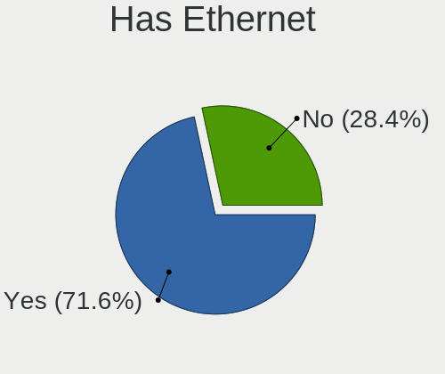
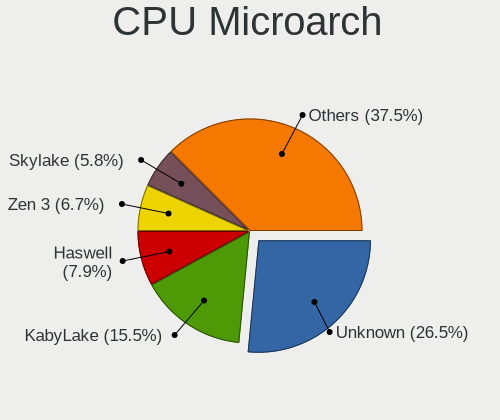
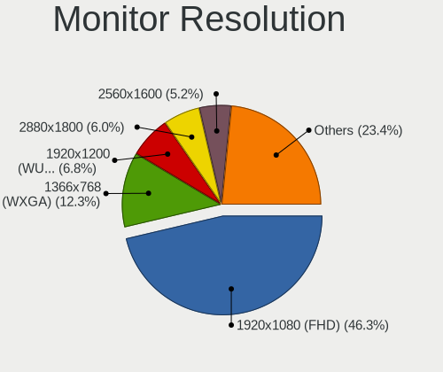
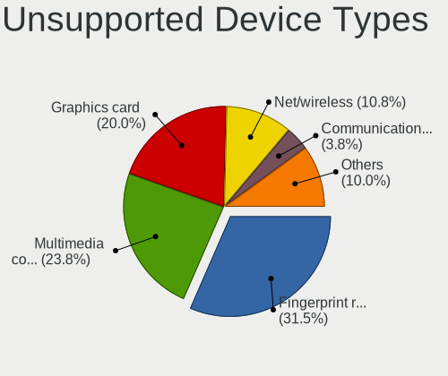

Fedora - Hardware Trends (Notebooks)
------------------------------------

A project to identify most popular hardware characteristics and track their change
over time based on data collected by Linux users at https://Linux-Hardware.org.

Anyone can contribute to this report by the [hw-probe](https://github.com/linuxhw/hw-probe) tool:

    sudo -E hw-probe -all -upload

This report is for one last month. Overall report since the beginning of time: [TestDays](https://github.com/linuxhw/TestDays)

Period: May, 2023.

Contents
--------

* [ System ](#system)
  - [ OS                       ](#os)
  - [ OS Family                ](#os-family)
  - [ Kernel                   ](#kernel)
  - [ Kernel Family            ](#kernel-family)
  - [ Kernel Major Ver.        ](#kernel-major-ver)
  - [ Arch                     ](#arch)
  - [ DE                       ](#de)
  - [ Display Server           ](#display-server)
  - [ Display Manager          ](#display-manager)
  - [ OS Lang                  ](#os-lang)
  - [ Boot Mode                ](#boot-mode)
  - [ Filesystem               ](#filesystem)
  - [ Part. scheme             ](#part-scheme)
  - [ Dual Boot with Linux/BSD ](#dual-boot-with-linuxbsd)
  - [ Dual Boot (Win)          ](#dual-boot-win)

* [ Board ](#board)
  - [ Vendor                   ](#vendor)
  - [ Model                    ](#model)
  - [ Model Family             ](#model-family)
  - [ MFG Year                 ](#mfg-year)
  - [ Form Factor              ](#form-factor)
  - [ Secure Boot              ](#secure-boot)
  - [ Coreboot                 ](#coreboot)
  - [ RAM Size                 ](#ram-size)
  - [ RAM Used                 ](#ram-used)
  - [ Total Drives             ](#total-drives)
  - [ Has CD-ROM               ](#has-cd-rom)
  - [ Has Ethernet             ](#has-ethernet)
  - [ Has WiFi                 ](#has-wifi)
  - [ Has Bluetooth            ](#has-bluetooth)

* [ Location ](#location)
  - [ Country                  ](#country)
  - [ City                     ](#city)

* [ Drives ](#drives)
  - [ Drive Vendor             ](#drive-vendor)
  - [ Drive Model              ](#drive-model)
  - [ HDD Vendor               ](#hdd-vendor)
  - [ SSD Vendor               ](#ssd-vendor)
  - [ Drive Kind               ](#drive-kind)
  - [ Drive Connector          ](#drive-connector)
  - [ Drive Size               ](#drive-size)
  - [ Space Total              ](#space-total)
  - [ Space Used               ](#space-used)
  - [ Malfunc. Drives          ](#malfunc-drives)
  - [ Malfunc. Drive Vendor    ](#malfunc-drive-vendor)
  - [ Malfunc. HDD Vendor      ](#malfunc-hdd-vendor)
  - [ Malfunc. Drive Kind      ](#malfunc-drive-kind)
  - [ Failed Drives            ](#failed-drives)
  - [ Failed Drive Vendor      ](#failed-drive-vendor)
  - [ Drive Status             ](#drive-status)

* [ Storage controller ](#storage-controller)
  - [ Storage Vendor           ](#storage-vendor)
  - [ Storage Model            ](#storage-model)
  - [ Storage Kind             ](#storage-kind)

* [ Processor ](#processor)
  - [ CPU Vendor               ](#cpu-vendor)
  - [ CPU Model                ](#cpu-model)
  - [ CPU Model Family         ](#cpu-model-family)
  - [ CPU Cores                ](#cpu-cores)
  - [ CPU Sockets              ](#cpu-sockets)
  - [ CPU Threads              ](#cpu-threads)
  - [ CPU Op-Modes             ](#cpu-op-modes)
  - [ CPU Microcode            ](#cpu-microcode)
  - [ CPU Microarch            ](#cpu-microarch)

* [ Graphics ](#graphics)
  - [ GPU Vendor               ](#gpu-vendor)
  - [ GPU Model                ](#gpu-model)
  - [ GPU Combo                ](#gpu-combo)
  - [ GPU Driver               ](#gpu-driver)
  - [ GPU Memory               ](#gpu-memory)

* [ Monitor ](#monitor)
  - [ Monitor Vendor           ](#monitor-vendor)
  - [ Monitor Model            ](#monitor-model)
  - [ Monitor Resolution       ](#monitor-resolution)
  - [ Monitor Diagonal         ](#monitor-diagonal)
  - [ Monitor Width            ](#monitor-width)
  - [ Aspect Ratio             ](#aspect-ratio)
  - [ Monitor Area             ](#monitor-area)
  - [ Pixel Density            ](#pixel-density)
  - [ Multiple Monitors        ](#multiple-monitors)

* [ Network ](#network)
  - [ Net Controller Vendor    ](#net-controller-vendor)
  - [ Net Controller Model     ](#net-controller-model)
  - [ Wireless Vendor          ](#wireless-vendor)
  - [ Wireless Model           ](#wireless-model)
  - [ Ethernet Vendor          ](#ethernet-vendor)
  - [ Ethernet Model           ](#ethernet-model)
  - [ Net Controller Kind      ](#net-controller-kind)
  - [ Used Controller          ](#used-controller)
  - [ NICs                     ](#nics)
  - [ IPv6                     ](#ipv6)

* [ Bluetooth ](#bluetooth)
  - [ Bluetooth Vendor         ](#bluetooth-vendor)
  - [ Bluetooth Model          ](#bluetooth-model)

* [ Sound ](#sound)
  - [ Sound Vendor             ](#sound-vendor)
  - [ Sound Model              ](#sound-model)

* [ Memory ](#memory)
  - [ Memory Vendor            ](#memory-vendor)
  - [ Memory Model             ](#memory-model)
  - [ Memory Kind              ](#memory-kind)
  - [ Memory Form Factor       ](#memory-form-factor)
  - [ Memory Size              ](#memory-size)
  - [ Memory Speed             ](#memory-speed)

* [ Printers & scanners ](#printers--scanners)
  - [ Printer Vendor           ](#printer-vendor)
  - [ Printer Model            ](#printer-model)
  - [ Scanner Vendor           ](#scanner-vendor)
  - [ Scanner Model            ](#scanner-model)

* [ Camera ](#camera)
  - [ Camera Vendor            ](#camera-vendor)
  - [ Camera Model             ](#camera-model)

* [ Security ](#security)
  - [ Fingerprint Vendor       ](#fingerprint-vendor)
  - [ Fingerprint Model        ](#fingerprint-model)
  - [ Chipcard Vendor          ](#chipcard-vendor)
  - [ Chipcard Model           ](#chipcard-model)

* [ Unsupported ](#unsupported)
  - [ Unsupported Devices      ](#unsupported-devices)
  - [ Unsupported Device Types ](#unsupported-device-types)

System
------

OS
--

Installed operating systems

| Name      | Notebooks | Percent |
|-----------|-----------|---------|
| Fedora 38 | 284       | 85.8%   |
| Fedora 37 | 33        | 9.97%   |
| Fedora 36 | 7         | 2.11%   |
| Fedora 35 | 3         | 0.91%   |
| Fedora 39 | 2         | 0.6%    |
| Fedora 34 | 1         | 0.3%    |
| Fedora 30 | 1         | 0.3%    |

OS Family
---------

OS without a version

| Name   | Notebooks | Percent |
|--------|-----------|---------|
| Fedora | 331       | 100%    |

Kernel
------

Version of the Linux kernel

| Version                                            | Notebooks | Percent |
|----------------------------------------------------|-----------|---------|
| 6.2.15-300.fc38.x86_64                             | 120       | 36.25%  |
| 6.2.14-300.fc38.x86_64                             | 87        | 26.28%  |
| 6.2.13-300.fc38.x86_64                             | 32        | 9.67%   |
| 6.2.9-300.fc38.x86_64                              | 24        | 7.25%   |
| 6.2.15-200.fc37.x86_64                             | 15        | 4.53%   |
| 6.2.14-200.fc37.x86_64                             | 8         | 2.42%   |
| 6.2.11-300.fc38.x86_64                             | 6         | 1.81%   |
| 6.2.11-200.fc37.x86_64                             | 3         | 0.91%   |
| 6.3.0+                                             | 2         | 0.6%    |
| 6.2.15-100.fc36.x86_64                             | 2         | 0.6%    |
| 6.2.14-100.fc36.x86_64                             | 2         | 0.6%    |
| 6.0.7-301.fc37.x86_64                              | 2         | 0.6%    |
| 6.4.0-0.rc4.334.vanilla.fc38.x86_64                | 1         | 0.3%    |
| 6.4.0-0.rc4.20230529gite338142b39cf.35.fc39.x86_64 | 1         | 0.3%    |
| 6.4.0-0.rc2.20230519git2d1bcbc6cd70.25.fc39.x86_64 | 1         | 0.3%    |
| 6.3.4-201.fc38.x86_64                              | 1         | 0.3%    |
| 6.3.3-cb1.0.fc38.x86_64                            | 1         | 0.3%    |
| 6.3.3-200.fc38.x86_64                              | 1         | 0.3%    |
| 6.3.2-cbl1.0.fc38.x86_64                           | 1         | 0.3%    |
| 6.3.1-cb3.0.fc38.x86_64                            | 1         | 0.3%    |
| 6.3.1-350.vanilla.fc38.x86_64                      | 1         | 0.3%    |
| 6.2.9-200.fc37.x86_64                              | 1         | 0.3%    |
| 6.2.15-703.inttf.fc38.x86_64                       | 1         | 0.3%    |
| 6.2.14-703.inttf.fc38.x86_64                       | 1         | 0.3%    |
| 6.2.14-450.asahi.fc38.aarch64                      | 1         | 0.3%    |
| 6.2.12-300.fc38.x86_64                             | 1         | 0.3%    |
| 6.2.12-200.fc37.x86_64                             | 1         | 0.3%    |
| 6.2.10-200.fc37.x86_64                             | 1         | 0.3%    |
| 6.1.26-200.fc38.x86_64                             | 1         | 0.3%    |
| 6.1.12-200.fc37.x86_64                             | 1         | 0.3%    |
| 6.0.17-200.fc36.x86_64                             | 1         | 0.3%    |
| 6.0.12-100.fc35.x86_64                             | 1         | 0.3%    |
| 5.19.14-200.fc36.x86_64                            | 1         | 0.3%    |
| 5.19.11-300.fc37.x86_64                            | 1         | 0.3%    |
| 5.17.5-300.fc36.x86_64                             | 1         | 0.3%    |
| 5.17.12-300.fc36.x86_64                            | 1         | 0.3%    |
| 5.17.12-100.fc34.x86_64                            | 1         | 0.3%    |
| 5.15.55-rt48xm1.0.fc37.x86_64                      | 1         | 0.3%    |
| 5.14.10-300.fc35.x86_64                            | 1         | 0.3%    |
| 5.0.9-301.fc30.x86_64                              | 1         | 0.3%    |

Kernel Family
-------------

Linux kernel without a distro release

| Version | Notebooks | Percent |
|---------|-----------|---------|
| 6.2.15  | 138       | 41.69%  |
| 6.2.14  | 99        | 29.91%  |
| 6.2.13  | 32        | 9.67%   |
| 6.2.9   | 25        | 7.55%   |
| 6.2.11  | 9         | 2.72%   |
| 6.4.0   | 3         | 0.91%   |
| 6.3.3   | 2         | 0.6%    |
| 6.3.1   | 2         | 0.6%    |
| 6.3.0   | 2         | 0.6%    |
| 6.2.12  | 2         | 0.6%    |
| 6.0.7   | 2         | 0.6%    |
| 5.17.12 | 2         | 0.6%    |
| 6.3.4   | 1         | 0.3%    |
| 6.3.2   | 1         | 0.3%    |
| 6.2.10  | 1         | 0.3%    |
| 6.1.26  | 1         | 0.3%    |
| 6.1.12  | 1         | 0.3%    |
| 6.0.17  | 1         | 0.3%    |
| 6.0.12  | 1         | 0.3%    |
| 5.19.14 | 1         | 0.3%    |
| 5.19.11 | 1         | 0.3%    |
| 5.17.5  | 1         | 0.3%    |
| 5.15.55 | 1         | 0.3%    |
| 5.14.10 | 1         | 0.3%    |
| 5.0.9   | 1         | 0.3%    |

Kernel Major Ver.
-----------------

Linux kernel major version

| Version | Notebooks | Percent |
|---------|-----------|---------|
| 6.2     | 306       | 92.45%  |
| 6.3     | 8         | 2.42%   |
| 6.0     | 4         | 1.21%   |
| 6.4     | 3         | 0.91%   |
| 5.17    | 3         | 0.91%   |
| 6.1     | 2         | 0.6%    |
| 5.19    | 2         | 0.6%    |
| 5.15    | 1         | 0.3%    |
| 5.14    | 1         | 0.3%    |
| 5.0     | 1         | 0.3%    |

Arch
----

OS architecture (x86_64, i586, etc.)

| Name    | Notebooks | Percent |
|---------|-----------|---------|
| x86_64  | 330       | 99.7%   |
| aarch64 | 1         | 0.3%    |

DE
--

Desktop Environment

| Name       | Notebooks | Percent |
|------------|-----------|---------|
| GNOME      | 253       | 76.44%  |
| KDE5       | 52        | 15.71%  |
| Unknown    | 5         | 1.51%   |
| XFCE       | 4         | 1.21%   |
| MATE       | 4         | 1.21%   |
| Cinnamon   | 4         | 1.21%   |
| X-Cinnamon | 3         | 0.91%   |
| i3         | 3         | 0.91%   |
| Hyprland   | 2         | 0.6%    |
| Deepin     | 1         | 0.3%    |

Display Server
--------------

X11 or Wayland

| Name    | Notebooks | Percent |
|---------|-----------|---------|
| Wayland | 260       | 78.55%  |
| X11     | 63        | 19.03%  |
| Unknown | 5         | 1.51%   |
| Tty     | 2         | 0.6%    |
| Xcb     | 1         | 0.3%    |

Display Manager
---------------

SDDM, LightDM, etc.

| Name    | Notebooks | Percent |
|---------|-----------|---------|
| Unknown | 212       | 64.05%  |
| GDM     | 78        | 23.56%  |
| SDDM    | 23        | 6.95%   |
| LightDM | 17        | 5.14%   |
| SLiM    | 1         | 0.3%    |

OS Lang
-------

Language

| Lang    | Notebooks | Percent |
|---------|-----------|---------|
| en_US   | 160       | 48.34%  |
| pt_BR   | 26        | 7.85%   |
| en_GB   | 22        | 6.65%   |
| ru_RU   | 16        | 4.83%   |
| fr_FR   | 15        | 4.53%   |
| de_DE   | 15        | 4.53%   |
| it_IT   | 9         | 2.72%   |
| es_ES   | 7         | 2.11%   |
| es_MX   | 6         | 1.81%   |
| es_CL   | 6         | 1.81%   |
| en_CA   | 5         | 1.51%   |
| pl_PL   | 4         | 1.21%   |
| hu_HU   | 4         | 1.21%   |
| en_IN   | 4         | 1.21%   |
| zh_CN   | 3         | 0.91%   |
| pt_PT   | 3         | 0.91%   |
| tr_TR   | 2         | 0.6%    |
| sk_SK   | 2         | 0.6%    |
| nl_BE   | 2         | 0.6%    |
| es_PE   | 2         | 0.6%    |
| es_CO   | 2         | 0.6%    |
| sv_SE   | 1         | 0.3%    |
| ru_UA   | 1         | 0.3%    |
| nl_NL   | 1         | 0.3%    |
| nb_NO   | 1         | 0.3%    |
| fr_CA   | 1         | 0.3%    |
| es_PA   | 1         | 0.3%    |
| es_GT   | 1         | 0.3%    |
| es_EC   | 1         | 0.3%    |
| es_CR   | 1         | 0.3%    |
| es_AR   | 1         | 0.3%    |
| en_DK   | 1         | 0.3%    |
| en_AU   | 1         | 0.3%    |
| de_AT   | 1         | 0.3%    |
| da_DK   | 1         | 0.3%    |
| ca_ES   | 1         | 0.3%    |
| Unknown | 1         | 0.3%    |

Boot Mode
---------

EFI or BIOS

| Mode | Notebooks | Percent |
|------|-----------|---------|
| EFI  | 269       | 81.27%  |
| BIOS | 62        | 18.73%  |

Filesystem
----------

Type of filesystem

| Type  | Notebooks | Percent |
|-------|-----------|---------|
| Btrfs | 272       | 82.18%  |
| Ext4  | 53        | 16.01%  |
| Xfs   | 6         | 1.81%   |

Part. scheme
------------

Scheme of partitioning

| Type    | Notebooks | Percent |
|---------|-----------|---------|
| Unknown | 207       | 62.54%  |
| GPT     | 118       | 35.65%  |
| MBR     | 6         | 1.81%   |

Dual Boot with Linux/BSD
------------------------

Hosting more than one Linux/BSD

| Dual boot | Notebooks | Percent |
|-----------|-----------|---------|
| No        | 302       | 91.24%  |
| Yes       | 29        | 8.76%   |

Dual Boot (Win)
---------------

Hosting Linux and Windows

| Dual boot | Notebooks | Percent |
|-----------|-----------|---------|
| No        | 281       | 84.89%  |
| Yes       | 50        | 15.11%  |

Board
-----

Vendor
------

Motherboard manufacturer

| Name                   | Notebooks | Percent |
|------------------------|-----------|---------|
| Lenovo                 | 91        | 27.49%  |
| Hewlett-Packard        | 56        | 16.92%  |
| Dell                   | 54        | 16.31%  |
| ASUSTek Computer       | 44        | 13.29%  |
| Acer                   | 15        | 4.53%   |
| Apple                  | 10        | 3.02%   |
| MSI                    | 8         | 2.42%   |
| HUAWEI                 | 8         | 2.42%   |
| Unknown                | 5         | 1.51%   |
| Toshiba                | 4         | 1.21%   |
| Samsung Electronics    | 4         | 1.21%   |
| Notebook               | 4         | 1.21%   |
| Google                 | 3         | 0.91%   |
| Positivo               | 2         | 0.6%    |
| Intel Client Systems   | 2         | 0.6%    |
| Framework              | 2         | 0.6%    |
| Avell High Performance | 2         | 0.6%    |
| VPU Company            | 1         | 0.3%    |
| Valve                  | 1         | 0.3%    |
| UNOWHY                 | 1         | 0.3%    |
| Timi                   | 1         | 0.3%    |
| Sony                   | 1         | 0.3%    |
| SK hynix               | 1         | 0.3%    |
| Razer                  | 1         | 0.3%    |
| PC Specialist          | 1         | 0.3%    |
| Monster                | 1         | 0.3%    |
| Micro Electronics      | 1         | 0.3%    |
| Intel                  | 1         | 0.3%    |
| HT                     | 1         | 0.3%    |
| GPU Company            | 1         | 0.3%    |
| Gigabyte Technology    | 1         | 0.3%    |
| Alienware              | 1         | 0.3%    |
| Adreamer               | 1         | 0.3%    |
| AAEON                  | 1         | 0.3%    |

Model
-----

Motherboard model

| Name                                                 | Notebooks | Percent |
|------------------------------------------------------|-----------|---------|
| Unknown                                              | 7         | 2.11%   |
| HP Pavilion Aero Laptop 13-be0xxx                    | 4         | 1.21%   |
| Dell Precision 7540                                  | 3         | 0.91%   |
| Samsung 550XDA                                       | 2         | 0.6%    |
| Lenovo ThinkPad X220 42911H8                         | 2         | 0.6%    |
| Lenovo ThinkPad T580 20L9CTO1WW                      | 2         | 0.6%    |
| Lenovo IdeaPad Gaming 3 15IMH05 82CG                 | 2         | 0.6%    |
| HUAWEI BOHK-WAX9X                                    | 2         | 0.6%    |
| HP Pavilion Laptop 15-eg0xxx                         | 2         | 0.6%    |
| HP 630                                               | 2         | 0.6%    |
| HP 255 G8 Notebook PC                                | 2         | 0.6%    |
| Dell XPS 13 9310                                     | 2         | 0.6%    |
| Dell XPS 13 9305                                     | 2         | 0.6%    |
| Dell Precision 5540                                  | 2         | 0.6%    |
| Dell Latitude E7450                                  | 2         | 0.6%    |
| Dell Latitude 7420                                   | 2         | 0.6%    |
| Dell Latitude 5490                                   | 2         | 0.6%    |
| Dell Inspiron 5490                                   | 2         | 0.6%    |
| Apple MacBookPro8,1                                  | 2         | 0.6%    |
| Apple MacBookAir7,2                                  | 2         | 0.6%    |
| VPU Company VWNC51518                                | 1         | 0.3%    |
| Valve Jupiter                                        | 1         | 0.3%    |
| UNOWHY Y13G011S4EI                                   | 1         | 0.3%    |
| Toshiba Satellite L40                                | 1         | 0.3%    |
| Toshiba Satellite C850-C5K                           | 1         | 0.3%    |
| Toshiba Satellite C55-C                              | 1         | 0.3%    |
| Toshiba PORTEGE Z830                                 | 1         | 0.3%    |
| Timi Redmi Book Pro 14 2022                          | 1         | 0.3%    |
| Sony VPCSA25GB                                       | 1         | 0.3%    |
| SK hynix HyBook Plus                                 | 1         | 0.3%    |
| Samsung 730QCJ/730QCR                                | 1         | 0.3%    |
| Samsung 300E4A/300E5A/300E7A/3430EA/3530EA           | 1         | 0.3%    |
| Razer Blade 15 Advanced Model (Mid 2021) - RZ09-0409 | 1         | 0.3%    |
| Positivo N1250                                       | 1         | 0.3%    |
| Positivo J14GL11                                     | 1         | 0.3%    |
| PC Specialist NP5x_NP6x_NP7xPNP                      | 1         | 0.3%    |
| Notebook P750ZM                                      | 1         | 0.3%    |
| Notebook P15SM-A/SM1-A                               | 1         | 0.3%    |
| Notebook NV4xPZ                                      | 1         | 0.3%    |
| Notebook NS5x_NS7xPU                                 | 1         | 0.3%    |

Model Family
------------

Motherboard model prefix

| Name                  | Notebooks | Percent |
|-----------------------|-----------|---------|
| Lenovo ThinkPad       | 53        | 16.01%  |
| Lenovo IdeaPad        | 22        | 6.65%   |
| Dell Inspiron         | 16        | 4.83%   |
| HP Pavilion           | 15        | 4.53%   |
| ASUS VivoBook         | 13        | 3.93%   |
| Dell Precision        | 12        | 3.63%   |
| Dell Latitude         | 12        | 3.63%   |
| HP Laptop             | 10        | 3.02%   |
| Dell XPS              | 9         | 2.72%   |
| ASUS ASUS             | 8         | 2.42%   |
| Acer Aspire           | 8         | 2.42%   |
| ASUS ROG              | 7         | 2.11%   |
| Unknown               | 7         | 2.11%   |
| HP EliteBook          | 6         | 1.81%   |
| Lenovo ThinkBook      | 4         | 1.21%   |
| HP ProBook            | 4         | 1.21%   |
| Acer Nitro            | 4         | 1.21%   |
| Toshiba Satellite     | 3         | 0.91%   |
| Lenovo Legion         | 3         | 0.91%   |
| HP Victus             | 3         | 0.91%   |
| HP 255                | 3         | 0.91%   |
| ASUS ZenBook          | 3         | 0.91%   |
| Samsung 550XDA        | 2         | 0.6%    |
| MSI Summit            | 2         | 0.6%    |
| MSI GF65              | 2         | 0.6%    |
| Lenovo Yoga           | 2         | 0.6%    |
| HUAWEI BOHK-WAX9X     | 2         | 0.6%    |
| HP ENVY               | 2         | 0.6%    |
| HP Compaq             | 2         | 0.6%    |
| HP 630                | 2         | 0.6%    |
| HP 250                | 2         | 0.6%    |
| Framework Laptop      | 2         | 0.6%    |
| Dell Vostro           | 2         | 0.6%    |
| Dell G5               | 2         | 0.6%    |
| Apple MacBookPro9     | 2         | 0.6%    |
| Apple MacBookPro8     | 2         | 0.6%    |
| Apple MacBookAir7     | 2         | 0.6%    |
| VPU Company VWNC51518 | 1         | 0.3%    |
| Valve Jupiter         | 1         | 0.3%    |
| UNOWHY Y13G011S4EI    | 1         | 0.3%    |

MFG Year
--------

Motherboard manufacture year

| Year    | Notebooks | Percent |
|---------|-----------|---------|
| 2021    | 56        | 16.92%  |
| 2022    | 42        | 12.69%  |
| 2019    | 41        | 12.39%  |
| 2020    | 36        | 10.88%  |
| 2018    | 26        | 7.85%   |
| 2017    | 18        | 5.44%   |
| 2011    | 18        | 5.44%   |
| 2012    | 17        | 5.14%   |
| 2015    | 14        | 4.23%   |
| 2023    | 12        | 3.63%   |
| 2016    | 12        | 3.63%   |
| 2014    | 12        | 3.63%   |
| 2013    | 11        | 3.32%   |
| 2010    | 5         | 1.51%   |
| 2009    | 5         | 1.51%   |
| 2007    | 3         | 0.91%   |
| 2008    | 2         | 0.6%    |
| Unknown | 1         | 0.3%    |

Form Factor
-----------

Physical design of the computer

| Name     | Notebooks | Percent |
|----------|-----------|---------|
| Notebook | 331       | 100%    |

Secure Boot
-----------

Enabled or disabled

| State    | Notebooks | Percent |
|----------|-----------|---------|
| Disabled | 248       | 74.92%  |
| Enabled  | 83        | 25.08%  |

Coreboot
--------

Have coreboot on board

| Used | Notebooks | Percent |
|------|-----------|---------|
| No   | 327       | 98.79%  |
| Yes  | 4         | 1.21%   |

RAM Size
--------

Total RAM memory

| Size in GB  | Notebooks | Percent |
|-------------|-----------|---------|
| 4.01-8.0    | 100       | 30.21%  |
| 16.01-24.0  | 77        | 23.26%  |
| 8.01-16.0   | 66        | 19.94%  |
| 32.01-64.0  | 40        | 12.08%  |
| 3.01-4.0    | 31        | 9.37%   |
| 24.01-32.0  | 6         | 1.81%   |
| 64.01-256.0 | 6         | 1.81%   |
| 1.01-2.0    | 4         | 1.21%   |
| 2.01-3.0    | 1         | 0.3%    |

RAM Used
--------

Used RAM memory

| Used GB    | Notebooks | Percent |
|------------|-----------|---------|
| 4.01-8.0   | 109       | 32.93%  |
| 3.01-4.0   | 92        | 27.79%  |
| 2.01-3.0   | 70        | 21.15%  |
| 1.01-2.0   | 33        | 9.97%   |
| 8.01-16.0  | 21        | 6.34%   |
| 0.51-1.0   | 4         | 1.21%   |
| 16.01-24.0 | 2         | 0.6%    |

Total Drives
------------

Number of drives on board

| Drives | Notebooks | Percent |
|--------|-----------|---------|
| 1      | 244       | 73.72%  |
| 2      | 74        | 22.36%  |
| 3      | 10        | 3.02%   |
| 4      | 2         | 0.6%    |
| 6      | 1         | 0.3%    |

Has CD-ROM
----------

Has CD-ROM on board

| Presented | Notebooks | Percent |
|-----------|-----------|---------|
| No        | 276       | 83.38%  |
| Yes       | 55        | 16.62%  |

Has Ethernet
------------

Has Ethernet on board

| Presented | Notebooks | Percent |
|-----------|-----------|---------|
| Yes       | 240       | 72.51%  |
| No        | 91        | 27.49%  |

Has WiFi
--------

Has WiFi module

| Presented | Notebooks | Percent |
|-----------|-----------|---------|
| Yes       | 324       | 97.89%  |
| No        | 7         | 2.11%   |

Has Bluetooth
-------------

Has Bluetooth module

| Presented | Notebooks | Percent |
|-----------|-----------|---------|
| Yes       | 282       | 85.2%   |
| No        | 49        | 14.8%   |

Location
--------

Country
-------

Geographic location (country)

| Country      | Notebooks | Percent |
|--------------|-----------|---------|
| USA          | 50        | 15.11%  |
| Brazil       | 31        | 9.37%   |
| Germany      | 26        | 7.85%   |
| France       | 16        | 4.83%   |
| Russia       | 15        | 4.53%   |
| Italy        | 14        | 4.23%   |
| Mexico       | 13        | 3.93%   |
| India        | 11        | 3.32%   |
| Poland       | 10        | 3.02%   |
| Canada       | 10        | 3.02%   |
| Spain        | 9         | 2.72%   |
| Turkey       | 7         | 2.11%   |
| Portugal     | 7         | 2.11%   |
| Netherlands  | 7         | 2.11%   |
| Hungary      | 7         | 2.11%   |
| Chile        | 7         | 2.11%   |
| Czechia      | 5         | 1.51%   |
| UK           | 4         | 1.21%   |
| Romania      | 4         | 1.21%   |
| Sri Lanka    | 3         | 0.91%   |
| South Korea  | 3         | 0.91%   |
| Peru         | 3         | 0.91%   |
| Israel       | 3         | 0.91%   |
| Denmark      | 3         | 0.91%   |
| Colombia     | 3         | 0.91%   |
| Bulgaria     | 3         | 0.91%   |
| Belarus      | 3         | 0.91%   |
| Bangladesh   | 3         | 0.91%   |
| Australia    | 3         | 0.91%   |
| Ukraine      | 2         | 0.6%    |
| South Africa | 2         | 0.6%    |
| Slovakia     | 2         | 0.6%    |
| Singapore    | 2         | 0.6%    |
| Norway       | 2         | 0.6%    |
| Nepal        | 2         | 0.6%    |
| Morocco      | 2         | 0.6%    |
| Japan        | 2         | 0.6%    |
| Croatia      | 2         | 0.6%    |
| China        | 2         | 0.6%    |
| Belgium      | 2         | 0.6%    |

City
----

Geographic location (city)

| City        | Notebooks | Percent |
|-------------|-----------|---------|
| Mexico City | 5         | 1.51%   |
| Sao Paulo   | 4         | 1.21%   |
| Moscow      | 4         | 1.21%   |
| Santiago    | 3         | 0.91%   |
| Prague      | 3         | 0.91%   |
| Poznan      | 3         | 0.91%   |
| Paris       | 3         | 0.91%   |
| Madrid      | 3         | 0.91%   |
| Lisbon      | 3         | 0.91%   |
| Istanbul    | 3         | 0.91%   |
| Berlin      | 3         | 0.91%   |
| Tyumen      | 2         | 0.6%    |
| Toronto     | 2         | 0.6%    |
| Tokyo       | 2         | 0.6%    |
| Sofia       | 2         | 0.6%    |
| Singapore   | 2         | 0.6%    |
| Santa Maria | 2         | 0.6%    |
| Porto       | 2         | 0.6%    |
| Ottawa      | 2         | 0.6%    |
| Olomouc     | 2         | 0.6%    |
| Natal       | 2         | 0.6%    |
| Minsk       | 2         | 0.6%    |
| Milan       | 2         | 0.6%    |
| Kathmandu   | 2         | 0.6%    |
| Hanau       | 2         | 0.6%    |
| Gdansk      | 2         | 0.6%    |
| Fortaleza   | 2         | 0.6%    |
| Delhi       | 2         | 0.6%    |
| Delft       | 2         | 0.6%    |
| Chennai     | 2         | 0.6%    |
| Cambridge   | 2         | 0.6%    |
| Zapopan     | 1         | 0.3%    |
| Zagreb      | 1         | 0.3%    |
| Yurginskoye | 1         | 0.3%    |
| Yoshkar-Ola | 1         | 0.3%    |
| Worms       | 1         | 0.3%    |
| Wollongong  | 1         | 0.3%    |
| Wolfsburg   | 1         | 0.3%    |
| Winnipeg    | 1         | 0.3%    |
| Winchester  | 1         | 0.3%    |

Drives
------

Drive Vendor
------------

Hard drive vendors

| Vendor                      | Notebooks | Drives | Percent |
|-----------------------------|-----------|--------|---------|
| Samsung Electronics         | 85        | 91     | 20.43%  |
| SanDisk                     | 48        | 48     | 11.54%  |
| SK hynix                    | 26        | 26     | 6.25%   |
| Kingston                    | 24        | 24     | 5.77%   |
| Toshiba                     | 23        | 23     | 5.53%   |
| WDC                         | 22        | 22     | 5.29%   |
| Seagate                     | 20        | 21     | 4.81%   |
| Micron Technology           | 19        | 19     | 4.57%   |
| Unknown                     | 18        | 19     | 4.33%   |
| Intel                       | 17        | 19     | 4.09%   |
| A-DATA Technology           | 8         | 8      | 1.92%   |
| HGST                        | 7         | 7      | 1.68%   |
| Silicon Motion              | 6         | 6      | 1.44%   |
| KIOXIA                      | 6         | 6      | 1.44%   |
| Crucial                     | 6         | 6      | 1.44%   |
| China                       | 6         | 6      | 1.44%   |
| Micron/Crucial Technology   | 5         | 5      | 1.2%    |
| Kingston Technology Company | 5         | 6      | 1.2%    |
| Apple                       | 5         | 10     | 1.2%    |
| ADATA Technology            | 5         | 5      | 1.2%    |
| Phison Electronics          | 3         | 3      | 0.72%   |
| Hitachi                     | 3         | 3      | 0.72%   |
| Apacer                      | 3         | 3      | 0.72%   |
| Union Memory                | 2         | 2      | 0.48%   |
| SPCC                        | 2         | 2      | 0.48%   |
| Solid State Storage         | 2         | 2      | 0.48%   |
| Phison                      | 2         | 2      | 0.48%   |
| LITEON                      | 2         | 2      | 0.48%   |
| Lexar                       | 2         | 2      | 0.48%   |
| Gigabyte Technology         | 2         | 2      | 0.48%   |
| Emtec                       | 2         | 2      | 0.48%   |
| Advantech                   | 2         | 2      | 0.48%   |
| YMTC                        | 1         | 1      | 0.24%   |
| Yangtze Memory Technologies | 1         | 1      | 0.24%   |
| XrayDisk                    | 1         | 1      | 0.24%   |
| WDC WDS2                    | 1         | 1      | 0.24%   |
| Vaseky                      | 1         | 1      | 0.24%   |
| Union Memory (Shenzhen)     | 1         | 1      | 0.24%   |
| Transcend                   | 1         | 1      | 0.24%   |
| Team                        | 1         | 1      | 0.24%   |

Drive Model
-----------

Hard drive models

| Model                                               | Notebooks | Percent |
|-----------------------------------------------------|-----------|---------|
| Samsung NVMe SSD Controller SM981/PM981/PM983 256GB | 14        | 3.29%   |
| Samsung NVMe SSD Controller PM9A1/PM9A3/980PRO 1TB  | 12        | 2.82%   |
| Intel SSD 660P Series 512GB                         | 8         | 1.88%   |
| Kingston SA400S37240G 240GB SSD                     | 7         | 1.64%   |
| Sandisk WD Blue SN550 NVMe SSD 512GB                | 6         | 1.41%   |
| Kingston SA400S37480G 480GB SSD                     | 6         | 1.41%   |
| Samsung SSD 980 1TB                                 | 5         | 1.17%   |
| Samsung NVMe SSD Controller SM961/PM961/SM963 256GB | 5         | 1.17%   |
| Samsung MZVLQ512HBLU-00BH1 512GB                    | 5         | 1.17%   |
| Unknown MMC Card  64GB                              | 4         | 0.94%   |
| Unknown MMC Card  32GB                              | 4         | 0.94%   |
| Unknown MMC Card  128GB                             | 4         | 0.94%   |
| Toshiba XG6 NVMe SSD Controller 256GB               | 4         | 0.94%   |
| SK hynix PC401 NVMe Solid State Drive 256GB         | 4         | 0.94%   |
| Sandisk WD Blue SN500 / PC SN520 NVMe SSD 512GB     | 4         | 0.94%   |
| Sandisk WD Black SN850 500GB                        | 4         | 0.94%   |
| Micron/Crucial P2 NVMe PCIe SSD 1TB                 | 4         | 0.94%   |
| Micron 2450_MTFDKBA512TFK 512GB                     | 4         | 0.94%   |
| Intel SSD Pro 7600p/760p/E 6100p Series 1TB         | 4         | 0.94%   |
| HGST HTS721010A9E630 1TB                            | 4         | 0.94%   |
| Toshiba MQ01ABD100 1TB                              | 3         | 0.7%    |
| SK hynix BC711 HFM512GD3JX013N 512GB                | 3         | 0.7%    |
| SK hynix BC501 NVMe Solid State Drive 512GB         | 3         | 0.7%    |
| Silicon Motion SM2263EN/SM2263XT SSD Controller 1TB | 3         | 0.7%    |
| Seagate ST1000LM035-1RK172 1TB                      | 3         | 0.7%    |
| Seagate Expansion 1TB                               | 3         | 0.7%    |
| Sandisk WDC PC SN530 SDBPMPZ-512G-1101 512GB        | 3         | 0.7%    |
| SanDisk SSD PLUS 480GB                              | 3         | 0.7%    |
| WDC WD10JPCX-24UE4T0 1TB                            | 2         | 0.47%   |
| Toshiba THNSFJ256GCSU 256GB SSD                     | 2         | 0.47%   |
| Toshiba MQ01ACF050 500GB                            | 2         | 0.47%   |
| Toshiba MQ01ABF050 500GB                            | 2         | 0.47%   |
| Solid State Storage SSSTC CL1-4D256 256GB           | 2         | 0.47%   |
| SK hynix HFM512GD3JX013N 512GB                      | 2         | 0.47%   |
| SK hynix BC711 NVMe 512GB                           | 2         | 0.47%   |
| SK hynix BC511 256GB                                | 2         | 0.47%   |
| Seagate ST1000LM049-2GH172 1TB                      | 2         | 0.47%   |
| Sandisk WD_BLACK SN770 1TB                          | 2         | 0.47%   |
| Sandisk WD Black SN750 / PC SN730 NVMe SSD 256GB    | 2         | 0.47%   |
| Sandisk PC SN520 NVMe SSD 256GB                     | 2         | 0.47%   |

HDD Vendor
----------

Hard disk drive vendors

| Vendor              | Notebooks | Drives | Percent |
|---------------------|-----------|--------|---------|
| Seagate             | 20        | 21     | 32.79%  |
| WDC                 | 14        | 14     | 22.95%  |
| Toshiba             | 12        | 12     | 19.67%  |
| HGST                | 7         | 7      | 11.48%  |
| Hitachi             | 3         | 3      | 4.92%   |
| Samsung Electronics | 1         | 1      | 1.64%   |
| SAGE                | 1         | 1      | 1.64%   |
| LaCie               | 1         | 1      | 1.64%   |
| ASMT                | 1         | 2      | 1.64%   |
| Apple               | 1         | 1      | 1.64%   |

SSD Vendor
----------

Solid state drive vendors

| Vendor              | Notebooks | Drives | Percent |
|---------------------|-----------|--------|---------|
| Samsung Electronics | 24        | 25     | 19.83%  |
| Kingston            | 23        | 23     | 19.01%  |
| SanDisk             | 10        | 10     | 8.26%   |
| Crucial             | 6         | 6      | 4.96%   |
| China               | 6         | 6      | 4.96%   |
| WDC                 | 5         | 5      | 4.13%   |
| Toshiba             | 5         | 5      | 4.13%   |
| A-DATA Technology   | 5         | 5      | 4.13%   |
| Intel               | 4         | 4      | 3.31%   |
| SPCC                | 2         | 2      | 1.65%   |
| LITEON              | 2         | 2      | 1.65%   |
| Lexar               | 2         | 2      | 1.65%   |
| Gigabyte Technology | 2         | 2      | 1.65%   |
| Emtec               | 2         | 2      | 1.65%   |
| Apple               | 2         | 2      | 1.65%   |
| Advantech           | 2         | 2      | 1.65%   |
| XrayDisk            | 1         | 1      | 0.83%   |
| WDC WDS2            | 1         | 1      | 0.83%   |
| Vaseky              | 1         | 1      | 0.83%   |
| Union Memory        | 1         | 1      | 0.83%   |
| Transcend           | 1         | 1      | 0.83%   |
| Team                | 1         | 1      | 0.83%   |
| Smart               | 1         | 1      | 0.83%   |
| SABRENT             | 1         | 1      | 0.83%   |
| Ramsta              | 1         | 1      | 0.83%   |
| PNY                 | 1         | 1      | 0.83%   |
| Pichau              | 1         | 1      | 0.83%   |
| Netac               | 1         | 1      | 0.83%   |
| Micron Technology   | 1         | 1      | 0.83%   |
| LITEONIT            | 1         | 1      | 0.83%   |
| Lenovo              | 1         | 1      | 0.83%   |
| Kimtigo             | 1         | 1      | 0.83%   |
| HS-SSD-E100         | 1         | 1      | 0.83%   |
| Hewlett-Packard     | 1         | 1      | 0.83%   |
| Apacer              | 1         | 1      | 0.83%   |

Drive Kind
----------

HDD or SSD

| Kind    | Notebooks | Drives | Percent |
|---------|-----------|--------|---------|
| NVMe    | 198       | 222    | 50.64%  |
| SSD     | 110       | 122    | 28.13%  |
| HDD     | 58        | 63     | 14.83%  |
| MMC     | 20        | 21     | 5.12%   |
| Unknown | 5         | 5      | 1.28%   |

Drive Connector
---------------

SATA, SAS, NVMe, etc.

| Type | Notebooks | Drives | Percent |
|------|-----------|--------|---------|
| NVMe | 198       | 222    | 52.52%  |
| SATA | 143       | 171    | 37.93%  |
| MMC  | 20        | 21     | 5.31%   |
| SAS  | 16        | 19     | 4.24%   |

Drive Size
----------

Size of hard drive

| Size in TB | Notebooks | Drives | Percent |
|------------|-----------|--------|---------|
| 0.01-0.5   | 104       | 118    | 62.65%  |
| 0.51-1.0   | 52        | 56     | 31.33%  |
| 1.01-2.0   | 7         | 7      | 4.22%   |
| 3.01-4.0   | 2         | 3      | 1.2%    |
| 10.01-20.0 | 1         | 1      | 0.6%    |

Space Total
-----------

Amount of disk space available on the file system

| Size in GB     | Notebooks | Percent |
|----------------|-----------|---------|
| 251-500        | 84        | 25.38%  |
| 501-1000       | 78        | 23.56%  |
| 1001-2000      | 41        | 12.39%  |
| 101-250        | 33        | 9.97%   |
| Unknown        | 30        | 9.06%   |
| 1-20           | 27        | 8.16%   |
| 51-100         | 14        | 4.23%   |
| More than 3000 | 10        | 3.02%   |
| 2001-3000      | 8         | 2.42%   |
| 21-50          | 6         | 1.81%   |

Space Used
----------

Amount of used disk space

| Used GB        | Notebooks | Percent |
|----------------|-----------|---------|
| 1-20           | 111       | 33.53%  |
| 101-250        | 52        | 15.71%  |
| 21-50          | 49        | 14.8%   |
| 51-100         | 34        | 10.27%  |
| 251-500        | 33        | 9.97%   |
| Unknown        | 30        | 9.06%   |
| 501-1000       | 15        | 4.53%   |
| 1001-2000      | 5         | 1.51%   |
| More than 3000 | 1         | 0.3%    |
| 2001-3000      | 1         | 0.3%    |

Malfunc. Drives
---------------

Drive models with a malfunction

| Model                                        | Notebooks | Drives | Percent |
|----------------------------------------------|-----------|--------|---------|
| WDC WDS240G2G0A-00JH30 240GB SSD             | 1         | 1      | 25%     |
| Toshiba MK3256GSYF 320GB                     | 1         | 1      | 25%     |
| Samsung Electronics SSD 980 1TB              | 1         | 1      | 25%     |
| Samsung Electronics SSD 840 PRO Series 256GB | 1         | 1      | 25%     |

Malfunc. Drive Vendor
---------------------

Vendors of faulty drives

| Vendor              | Notebooks | Drives | Percent |
|---------------------|-----------|--------|---------|
| Samsung Electronics | 2         | 2      | 50%     |
| WDC                 | 1         | 1      | 25%     |
| Toshiba             | 1         | 1      | 25%     |

Malfunc. HDD Vendor
-------------------

Vendors of faulty HDD drives

| Vendor  | Notebooks | Drives | Percent |
|---------|-----------|--------|---------|
| Toshiba | 1         | 1      | 100%    |

Malfunc. Drive Kind
-------------------

Kinds of faulty drives

| Kind | Notebooks | Drives | Percent |
|------|-----------|--------|---------|
| SSD  | 2         | 2      | 50%     |
| NVMe | 1         | 1      | 25%     |
| HDD  | 1         | 1      | 25%     |

Failed Drives
-------------

Failed drive models

Zero info for selected period =(

Failed Drive Vendor
-------------------

Failed drive vendors

Zero info for selected period =(

Drive Status
------------

Number of failed and malfunc. drives

| Status   | Notebooks | Drives | Percent |
|----------|-----------|--------|---------|
| Detected | 231       | 296    | 67.54%  |
| Works    | 107       | 133    | 31.29%  |
| Malfunc  | 4         | 4      | 1.17%   |

Storage controller
------------------

Storage Vendor
--------------

Storage controller vendors

| Vendor                         | Notebooks | Percent |
|--------------------------------|-----------|---------|
| Intel                          | 189       | 44.68%  |
| Samsung Electronics            | 66        | 15.6%   |
| SanDisk                        | 40        | 9.46%   |
| AMD                            | 31        | 7.33%   |
| SK hynix                       | 26        | 6.15%   |
| Micron Technology              | 18        | 4.26%   |
| ADATA Technology               | 8         | 1.89%   |
| Toshiba America Info Systems   | 7         | 1.65%   |
| Silicon Motion                 | 6         | 1.42%   |
| Phison Electronics             | 6         | 1.42%   |
| Kingston Technology Company    | 6         | 1.42%   |
| Micron/Crucial Technology      | 5         | 1.18%   |
| KIOXIA                         | 5         | 1.18%   |
| Solid State Storage Technology | 3         | 0.71%   |
| Yangtze Memory Technologies    | 2         | 0.47%   |
| Union Memory (Shenzhen)        | 2         | 0.47%   |
| Nvidia                         | 1         | 0.24%   |
| MAXIO Technology (Hangzhou)    | 1         | 0.24%   |
| Apple                          | 1         | 0.24%   |

Storage Model
-------------

Storage controller models

| Model                                                                          | Notebooks | Percent |
|--------------------------------------------------------------------------------|-----------|---------|
| AMD FCH SATA Controller [AHCI mode]                                            | 31        | 6.84%   |
| Samsung NVMe SSD Controller 980                                                | 24        | 5.3%    |
| Intel Volume Management Device NVMe RAID Controller                            | 24        | 5.3%    |
| Samsung NVMe SSD Controller SM981/PM981/PM983                                  | 20        | 4.42%   |
| Intel Sunrise Point-LP SATA Controller [AHCI mode]                             | 19        | 4.19%   |
| Intel 82801 Mobile SATA Controller [RAID mode]                                 | 18        | 3.97%   |
| Micron NVMe Storage Controller                                                 | 16        | 3.53%   |
| Intel 7 Series Chipset Family 6-port SATA Controller [AHCI mode]               | 16        | 3.53%   |
| Intel Cannon Lake Mobile PCH SATA AHCI Controller                              | 13        | 2.87%   |
| Samsung NVMe SSD Controller PM9A1/PM9A3/980PRO                                 | 12        | 2.65%   |
| Intel 6 Series/C200 Series Chipset Family 6 port Mobile SATA AHCI Controller   | 12        | 2.65%   |
| SK hynix Gold P31/PC711 NVMe Solid State Drive                                 | 10        | 2.21%   |
| Intel Tiger Lake-LP SATA Controller                                            | 9         | 1.99%   |
| Intel SSD 660P Series                                                          | 8         | 1.77%   |
| Intel HM170/QM170 Chipset SATA Controller [AHCI Mode]                          | 8         | 1.77%   |
| Intel Celeron/Pentium Silver Processor SATA Controller                         | 8         | 1.77%   |
| SanDisk WD Blue SN550 NVMe SSD                                                 | 7         | 1.55%   |
| SanDisk Non-Volatile memory controller                                         | 7         | 1.55%   |
| Intel 8 Series/C220 Series Chipset Family 6-port SATA Controller 1 [AHCI mode] | 7         | 1.55%   |
| Intel 8 Series SATA Controller 1 [AHCI mode]                                   | 7         | 1.55%   |
| SanDisk NVMe Controller                                                        | 6         | 1.32%   |
| Samsung NVMe SSD Controller SM961/PM961/SM963                                  | 6         | 1.32%   |
| Intel Comet Lake SATA AHCI Controller                                          | 6         | 1.32%   |
| Toshiba America Info Systems XG6 NVMe SSD Controller                           | 5         | 1.1%    |
| SanDisk WD Black SN770 NVMe SSD                                                | 5         | 1.1%    |
| Intel Wildcat Point-LP SATA Controller [AHCI Mode]                             | 5         | 1.1%    |
| Intel Ice Lake-LP SATA Controller [AHCI mode]                                  | 5         | 1.1%    |
| Intel 82801IBM/IEM (ICH9M/ICH9M-E) 4 port SATA Controller [AHCI mode]          | 5         | 1.1%    |
| Intel 400 Series Chipset Family SATA AHCI Controller                           | 5         | 1.1%    |
| SK hynix PC401 NVMe Solid State Drive 256GB                                    | 4         | 0.88%   |
| SK hynix BC501 NVMe Solid State Drive                                          | 4         | 0.88%   |
| SanDisk WD PC SN810 / Black SN850 NVMe SSD                                     | 4         | 0.88%   |
| SanDisk WD Blue SN500 / PC SN520 NVMe SSD                                      | 4         | 0.88%   |
| Micron/Crucial P2 NVMe PCIe SSD                                                | 4         | 0.88%   |
| Kingston Company Company Non-Volatile memory controller                        | 4         | 0.88%   |
| Intel SSD Pro 7600p/760p/E 6100p Series                                        | 4         | 0.88%   |
| Intel Cannon Point-LP SATA Controller [AHCI Mode]                              | 4         | 0.88%   |
| Intel 5 Series/3400 Series Chipset 4 port SATA AHCI Controller                 | 4         | 0.88%   |
| Solid State Storage Non-Volatile memory controller                             | 3         | 0.66%   |
| SK hynix Platinum P41 NVMe Solid State Drive 2TB                               | 3         | 0.66%   |

Storage Kind
------------

Kind of storage controller (IDE, SATA, NVMe, SAS, ...)

| Kind | Notebooks | Percent |
|------|-----------|---------|
| NVMe | 197       | 45.81%  |
| SATA | 183       | 42.56%  |
| RAID | 42        | 9.77%   |
| IDE  | 8         | 1.86%   |

Processor
---------

CPU Vendor
----------

Processor vendors

| Vendor       | Notebooks | Percent |
|--------------|-----------|---------|
| Intel        | 261       | 78.85%  |
| AMD          | 68        | 20.54%  |
| CentaurHauls | 1         | 0.3%    |
| Unknown      | 1         | 0.3%    |

CPU Model
---------

Processor models

| Model                                         | Notebooks | Percent |
|-----------------------------------------------|-----------|---------|
| Intel 11th Gen Core i5-1135G7 @ 2.40GHz       | 14        | 4.23%   |
| Intel 11th Gen Core i7-1165G7 @ 2.80GHz       | 9         | 2.72%   |
| AMD Ryzen 5 3500U with Radeon Vega Mobile Gfx | 8         | 2.42%   |
| AMD Ryzen 5 5500U with Radeon Graphics        | 7         | 2.11%   |
| Intel Core i5-8250U CPU @ 1.60GHz             | 6         | 1.81%   |
| Intel 12th Gen Core i7-12700H                 | 6         | 1.81%   |
| Intel Core i7-7700HQ CPU @ 2.80GHz            | 5         | 1.51%   |
| Intel Core i5-3210M CPU @ 2.50GHz             | 5         | 1.51%   |
| Intel 12th Gen Core i5-1240P                  | 5         | 1.51%   |
| AMD Ryzen 5 5600U with Radeon Graphics        | 5         | 1.51%   |
| Intel Core i7-9750H CPU @ 2.60GHz             | 4         | 1.21%   |
| Intel Core i5-9300H CPU @ 2.40GHz             | 4         | 1.21%   |
| Intel Core i5-10300H CPU @ 2.50GHz            | 4         | 1.21%   |
| Intel Core i5-10210U CPU @ 1.60GHz            | 4         | 1.21%   |
| AMD Ryzen 3 5300U with Radeon Graphics        | 4         | 1.21%   |
| Intel Core i7-9850H CPU @ 2.60GHz             | 3         | 0.91%   |
| Intel Core i7-8750H CPU @ 2.20GHz             | 3         | 0.91%   |
| Intel Core i7-8650U CPU @ 1.90GHz             | 3         | 0.91%   |
| Intel Core i7-8565U CPU @ 1.80GHz             | 3         | 0.91%   |
| Intel Core i7-2620M CPU @ 2.70GHz             | 3         | 0.91%   |
| Intel Core i7-1065G7 CPU @ 1.30GHz            | 3         | 0.91%   |
| Intel Core i7-10510U CPU @ 1.80GHz            | 3         | 0.91%   |
| Intel Core i5-8350U CPU @ 1.70GHz             | 3         | 0.91%   |
| Intel Core i5-8265U CPU @ 1.60GHz             | 3         | 0.91%   |
| Intel Core i5-7300U CPU @ 2.60GHz             | 3         | 0.91%   |
| Intel Core i5-5300U CPU @ 2.30GHz             | 3         | 0.91%   |
| Intel Core i5-3320M CPU @ 2.60GHz             | 3         | 0.91%   |
| Intel Core i5-1035G1 CPU @ 1.00GHz            | 3         | 0.91%   |
| Intel Core i3-1005G1 CPU @ 1.20GHz            | 3         | 0.91%   |
| Intel Core i3 CPU M 370 @ 2.40GHz             | 3         | 0.91%   |
| Intel Celeron N4020 CPU @ 1.10GHz             | 3         | 0.91%   |
| Intel 12th Gen Core i5-1235U                  | 3         | 0.91%   |
| Intel 11th Gen Core i7-1185G7 @ 3.00GHz       | 3         | 0.91%   |
| Intel 11th Gen Core i7-11800H @ 2.30GHz       | 3         | 0.91%   |
| AMD Ryzen 7 6800H with Radeon Graphics        | 3         | 0.91%   |
| Intel Pentium Silver N6000 @ 1.10GHz          | 2         | 0.6%    |
| Intel Pentium Silver N5030 CPU @ 1.10GHz      | 2         | 0.6%    |
| Intel Core i9-10885H CPU @ 2.40GHz            | 2         | 0.6%    |
| Intel Core i7-8665U CPU @ 1.90GHz             | 2         | 0.6%    |
| Intel Core i7-8550U CPU @ 1.80GHz             | 2         | 0.6%    |

CPU Model Family
----------------

Processor model prefix

| Model                   | Notebooks | Percent |
|-------------------------|-----------|---------|
| Intel Core i7           | 73        | 22.05%  |
| Other                   | 69        | 20.85%  |
| Intel Core i5           | 67        | 20.24%  |
| AMD Ryzen 5             | 30        | 9.06%   |
| Intel Core i3           | 20        | 6.04%   |
| AMD Ryzen 7             | 16        | 4.83%   |
| Intel Celeron           | 10        | 3.02%   |
| AMD Ryzen 3             | 6         | 1.81%   |
| Intel Core 2 Duo        | 5         | 1.51%   |
| Intel Atom              | 5         | 1.51%   |
| AMD Ryzen 9             | 5         | 1.51%   |
| Intel Pentium Silver    | 4         | 1.21%   |
| Intel Core i9           | 3         | 0.91%   |
| AMD A10                 | 3         | 0.91%   |
| Intel Pentium Dual      | 2         | 0.6%    |
| Intel Pentium           | 2         | 0.6%    |
| AMD Ryzen 5 PRO         | 2         | 0.6%    |
| AMD A6                  | 2         | 0.6%    |
| Intel Xeon              | 1         | 0.3%    |
| Intel Pentium Dual-Core | 1         | 0.3%    |
| Intel Genuine           | 1         | 0.3%    |
| Intel Core m3           | 1         | 0.3%    |
| AMD Ryzen 7 PRO         | 1         | 0.3%    |
| AMD E1                  | 1         | 0.3%    |
| AMD A12                 | 1         | 0.3%    |

CPU Cores
---------

Number of processor cores

| Number | Notebooks | Percent |
|--------|-----------|---------|
| 4      | 133       | 40.18%  |
| 2      | 103       | 31.12%  |
| 6      | 38        | 11.48%  |
| 8      | 31        | 9.37%   |
| 14     | 10        | 3.02%   |
| 12     | 9         | 2.72%   |
| 10     | 6         | 1.81%   |
| 16     | 1         | 0.3%    |

CPU Sockets
-----------

Number of sockets

| Number | Notebooks | Percent |
|--------|-----------|---------|
| 1      | 331       | 100%    |

CPU Threads
-----------

Threads per core (Hyper-Threading)

| Number | Notebooks | Percent |
|--------|-----------|---------|
| 2      | 290       | 87.61%  |
| 1      | 41        | 12.39%  |

CPU Op-Modes
------------

CPU Operation Modes (32-bit, 64-bit)

| Op mode        | Notebooks | Percent |
|----------------|-----------|---------|
| 32-bit, 64-bit | 330       | 99.7%   |
| 64-bit         | 1         | 0.3%    |

CPU Microcode
-------------

Microcode number

| Number     | Notebooks | Percent |
|------------|-----------|---------|
| Unknown    | 258       | 77.95%  |
| 0x08608103 | 9         | 2.72%   |
| 0x0a50000c | 8         | 2.42%   |
| 0x0a404102 | 8         | 2.42%   |
| 0x0a50000d | 7         | 2.11%   |
| 0x08108109 | 7         | 2.11%   |
| 0x08108102 | 3         | 0.91%   |
| 0x906ea    | 2         | 0.6%    |
| 0x806c1    | 2         | 0.6%    |
| 0x0a601203 | 2         | 0.6%    |
| 0x08608102 | 2         | 0.6%    |
| 0x06001116 | 2         | 0.6%    |
| 0x906a4    | 1         | 0.3%    |
| 0x806e9    | 1         | 0.3%    |
| 0x306d4    | 1         | 0.3%    |
| 0x206a7    | 1         | 0.3%    |
| 0x20652    | 1         | 0.3%    |
| 0x10676    | 1         | 0.3%    |
| 0x0a404101 | 1         | 0.3%    |
| 0x08900201 | 1         | 0.3%    |
| 0x08608104 | 1         | 0.3%    |
| 0x08600109 | 1         | 0.3%    |
| 0x08600106 | 1         | 0.3%    |
| 0x08600104 | 1         | 0.3%    |
| 0x08600103 | 1         | 0.3%    |
| 0x08600102 | 1         | 0.3%    |
| 0x08101016 | 1         | 0.3%    |
| 0x0810100b | 1         | 0.3%    |
| 0x07030104 | 1         | 0.3%    |
| 0x0700010f | 1         | 0.3%    |
| 0x06006705 | 1         | 0.3%    |
| 0x0600611a | 1         | 0.3%    |
| 0x06006110 | 1         | 0.3%    |

CPU Microarch
-------------

Microarchitecture

| Name             | Notebooks | Percent |
|------------------|-----------|---------|
| KabyLake         | 72        | 21.75%  |
| TigerLake        | 32        | 9.67%   |
| Unknown          | 28        | 8.46%   |
| Alderlake Hybrid | 27        | 8.16%   |
| IvyBridge        | 18        | 5.44%   |
| Haswell          | 18        | 5.44%   |
| SandyBridge      | 17        | 5.14%   |
| Zen 3            | 16        | 4.83%   |
| IceLake          | 16        | 4.83%   |
| Zen+             | 10        | 3.02%   |
| Skylake          | 9         | 2.72%   |
| CometLake        | 9         | 2.72%   |
| Broadwell        | 9         | 2.72%   |
| Westmere         | 8         | 2.42%   |
| Goldmont plus    | 8         | 2.42%   |
| Silvermont       | 7         | 2.11%   |
| Zen 2            | 6         | 1.81%   |
| Penryn           | 6         | 1.81%   |
| Zen              | 3         | 0.91%   |
| Excavator        | 3         | 0.91%   |
| Core             | 3         | 0.91%   |
| Tremont          | 2         | 0.6%    |
| Piledriver       | 2         | 0.6%    |
| Puma             | 1         | 0.3%    |
| Jaguar           | 1         | 0.3%    |

Graphics
--------

GPU Vendor
----------

Vendors of graphics cards

| Vendor  | Notebooks | Percent |
|---------|-----------|---------|
| Intel   | 245       | 57.65%  |
| Nvidia  | 98        | 23.06%  |
| AMD     | 81        | 19.06%  |
| Zhaoxin | 1         | 0.24%   |

GPU Model
---------

Graphics card models

| Model                                                                                    | Notebooks | Percent |
|------------------------------------------------------------------------------------------|-----------|---------|
| Intel TigerLake-LP GT2 [Iris Xe Graphics]                                                | 30        | 6.93%   |
| Intel CoffeeLake-H GT2 [UHD Graphics 630]                                                | 17        | 3.93%   |
| Intel Alder Lake-P Integrated Graphics Controller                                        | 17        | 3.93%   |
| Intel 3rd Gen Core processor Graphics Controller                                         | 16        | 3.7%    |
| Intel 2nd Generation Core Processor Family Integrated Graphics Controller                | 16        | 3.7%    |
| Intel UHD Graphics 620                                                                   | 15        | 3.46%   |
| AMD Lucienne                                                                             | 13        | 3%      |
| AMD Cezanne [Radeon Vega Series / Radeon Vega Mobile Series]                             | 13        | 3%      |
| Intel CometLake-U GT2 [UHD Graphics]                                                     | 10        | 2.31%   |
| AMD Rembrandt [Radeon 680M]                                                              | 10        | 2.31%   |
| AMD Picasso/Raven 2 [Radeon Vega Series / Radeon Vega Mobile Series]                     | 10        | 2.31%   |
| Nvidia GA106M [GeForce RTX 3060 Mobile / Max-Q]                                          | 9         | 2.08%   |
| Intel WhiskeyLake-U GT2 [UHD Graphics 620]                                               | 9         | 2.08%   |
| Intel HD Graphics 620                                                                    | 9         | 2.08%   |
| Intel CometLake-H GT2 [UHD Graphics]                                                     | 9         | 2.08%   |
| Intel 4th Gen Core Processor Integrated Graphics Controller                              | 8         | 1.85%   |
| Intel TigerLake-H GT1 [UHD Graphics]                                                     | 7         | 1.62%   |
| Intel Skylake GT2 [HD Graphics 520]                                                      | 7         | 1.62%   |
| Intel HD Graphics 630                                                                    | 7         | 1.62%   |
| Intel Haswell-ULT Integrated Graphics Controller                                         | 7         | 1.62%   |
| Nvidia TU117M [GeForce GTX 1650 Mobile / Max-Q]                                          | 6         | 1.39%   |
| Intel Iris Plus Graphics G1 (Ice Lake)                                                   | 6         | 1.39%   |
| Intel GeminiLake [UHD Graphics 600]                                                      | 6         | 1.39%   |
| Intel Alder Lake-UP3 GT2 [Iris Xe Graphics]                                              | 6         | 1.39%   |
| AMD Renoir                                                                               | 6         | 1.39%   |
| Intel HD Graphics 5500                                                                   | 5         | 1.15%   |
| Intel Atom/Celeron/Pentium Processor x5-E8000/J3xxx/N3xxx Integrated Graphics Controller | 5         | 1.15%   |
| Nvidia TU117M [GeForce GTX 1650 Ti Mobile]                                               | 4         | 0.92%   |
| Nvidia GP107M [GeForce GTX 1050 Ti Mobile]                                               | 4         | 0.92%   |
| Nvidia GP107M [GeForce GTX 1050 Mobile]                                                  | 4         | 0.92%   |
| Intel Core Processor Integrated Graphics Controller                                      | 4         | 0.92%   |
| AMD Barcelo                                                                              | 4         | 0.92%   |
| Nvidia TU117M                                                                            | 3         | 0.69%   |
| Nvidia TU117GLM [Quadro T2000 Mobile / Max-Q]                                            | 3         | 0.69%   |
| Intel Mobile GM965/GL960 Integrated Graphics Controller (secondary)                      | 3         | 0.69%   |
| Intel Mobile GM965/GL960 Integrated Graphics Controller (primary)                        | 3         | 0.69%   |
| Intel Mobile 4 Series Chipset Integrated Graphics Controller                             | 3         | 0.69%   |
| Intel Iris Plus Graphics G7                                                              | 3         | 0.69%   |
| AMD Raven Ridge [Radeon Vega Series / Radeon Vega Mobile Series]                         | 3         | 0.69%   |
| Nvidia TU106M [GeForce RTX 2060 Mobile]                                                  | 2         | 0.46%   |

GPU Combo
---------

Combinations of graphics cards

| Name           | Notebooks | Percent |
|----------------|-----------|---------|
| 1 x Intel      | 158       | 47.73%  |
| Intel + Nvidia | 77        | 23.26%  |
| 1 x AMD        | 58        | 17.52%  |
| 1 x Nvidia     | 12        | 3.63%   |
| AMD + Nvidia   | 9         | 2.72%   |
| Intel + AMD    | 8         | 2.42%   |
| 2 x AMD        | 5         | 1.51%   |
| 2 x Intel      | 2         | 0.6%    |
| Other          | 1         | 0.3%    |
| 1 x Zhaoxin    | 1         | 0.3%    |

GPU Driver
----------

Free vs proprietary

| Driver      | Notebooks | Percent |
|-------------|-----------|---------|
| Free        | 293       | 88.52%  |
| Proprietary | 33        | 9.97%   |
| Unknown     | 5         | 1.51%   |

GPU Memory
----------

Total video memory

| Size in GB | Notebooks | Percent |
|------------|-----------|---------|
| Unknown    | 198       | 59.82%  |
| 0.01-0.5   | 40        | 12.08%  |
| 1.01-2.0   | 34        | 10.27%  |
| 3.01-4.0   | 25        | 7.55%   |
| 0.51-1.0   | 21        | 6.34%   |
| 5.01-6.0   | 11        | 3.32%   |
| 7.01-8.0   | 2         | 0.6%    |

Monitor
-------

Monitor Vendor
--------------

Monitor vendors

| Vendor                  | Notebooks | Percent |
|-------------------------|-----------|---------|
| BOE                     | 76        | 19.19%  |
| Chimei Innolux          | 67        | 16.92%  |
| AU Optronics            | 66        | 16.67%  |
| LG Display              | 46        | 11.62%  |
| Samsung Electronics     | 21        | 5.3%    |
| Dell                    | 18        | 4.55%   |
| Sharp                   | 15        | 3.79%   |
| Apple                   | 11        | 2.78%   |
| Lenovo                  | 8         | 2.02%   |
| PANDA                   | 7         | 1.77%   |
| Goldstar                | 6         | 1.52%   |
| Chi Mei Optoelectronics | 6         | 1.52%   |
| Ancor Communications    | 5         | 1.26%   |
| CSO                     | 4         | 1.01%   |
| Philips                 | 3         | 0.76%   |
| LG Philips              | 3         | 0.76%   |
| Hewlett-Packard         | 3         | 0.76%   |
| BenQ                    | 3         | 0.76%   |
| ASUSTek Computer        | 3         | 0.76%   |
| Acer                    | 3         | 0.76%   |
| InfoVision              | 2         | 0.51%   |
| Iiyama                  | 2         | 0.51%   |
| Fujitsu Siemens         | 2         | 0.51%   |
| AOC                     | 2         | 0.51%   |
| WaveShare               | 1         | 0.25%   |
| Valve                   | 1         | 0.25%   |
| Unknown (XXX)           | 1         | 0.25%   |
| SKY                     | 1         | 0.25%   |
| Panasonic               | 1         | 0.25%   |
| MSI                     | 1         | 0.25%   |
| KDC                     | 1         | 0.25%   |
| IBM                     | 1         | 0.25%   |
| HKC                     | 1         | 0.25%   |
| Hitachi                 | 1         | 0.25%   |
| Gigabyte Technology     | 1         | 0.25%   |
| FUN                     | 1         | 0.25%   |
| EMO                     | 1         | 0.25%   |
| CHO                     | 1         | 0.25%   |

Monitor Model
-------------

Monitor models

| Model                                                                     | Notebooks | Percent |
|---------------------------------------------------------------------------|-----------|---------|
| Chimei Innolux LCD Monitor CMN15E7 1920x1080 344x193mm 15.5-inch          | 5         | 1.25%   |
| Chimei Innolux LCD Monitor CMN15DB 1366x768 344x193mm 15.5-inch           | 4         | 1%      |
| AU Optronics LCD Monitor AUO21ED 1920x1080 344x194mm 15.5-inch            | 4         | 1%      |
| Chimei Innolux LCD Monitor CMN153C 1920x1080 344x193mm 15.5-inch          | 3         | 0.75%   |
| Chimei Innolux LCD Monitor CMN1521 1920x1080 344x193mm 15.5-inch          | 3         | 0.75%   |
| Chimei Innolux LCD Monitor CMN14E5 1920x1080 309x173mm 13.9-inch          | 3         | 0.75%   |
| Chimei Innolux LCD Monitor CMN14D4 1920x1080 309x173mm 13.9-inch          | 3         | 0.75%   |
| Chimei Innolux LCD Monitor CMN1482 1600x900 309x174mm 14.0-inch           | 3         | 0.75%   |
| Chimei Innolux LCD Monitor CMN140A 1920x1080 309x173mm 13.9-inch          | 3         | 0.75%   |
| BOE LCD Monitor BOE095F 2256x1504 285x190mm 13.5-inch                     | 3         | 0.75%   |
| BOE LCD Monitor BOE0872 1920x1080 344x194mm 15.5-inch                     | 3         | 0.75%   |
| BOE LCD Monitor BOE0812 1920x1080 344x194mm 15.5-inch                     | 3         | 0.75%   |
| AU Optronics LCD Monitor AUO103D 1920x1080 309x173mm 13.9-inch            | 3         | 0.75%   |
| Sharp LCD Monitor SHP14F9 1920x1200 288x180mm 13.4-inch                   | 2         | 0.5%    |
| Sharp LCD Monitor SHP14BA 1920x1080 344x194mm 15.5-inch                   | 2         | 0.5%    |
| Sharp LCD Monitor SHP1476 3840x2160 346x194mm 15.6-inch                   | 2         | 0.5%    |
| PANDA LCD Monitor NCP0036 1920x1080 344x194mm 15.5-inch                   | 2         | 0.5%    |
| LG Display LCD Monitor LGD058B 2560x1440 309x174mm 14.0-inch              | 2         | 0.5%    |
| LG Display LCD Monitor LGD033B 1366x768 344x194mm 15.5-inch               | 2         | 0.5%    |
| LG Display LCD Monitor LGD02E9 1366x768 309x174mm 14.0-inch               | 2         | 0.5%    |
| Lenovo LCD Monitor LEN40BA 1920x1080 344x194mm 15.5-inch                  | 2         | 0.5%    |
| Lenovo LCD Monitor LEN40B2 1920x1080 344x193mm 15.5-inch                  | 2         | 0.5%    |
| Dell P2419H DELD0DA 1920x1080 527x296mm 23.8-inch                         | 2         | 0.5%    |
| Dell P2311H DEL4067 1920x1080 509x286mm 23.0-inch                         | 2         | 0.5%    |
| Chimei Innolux LCD Monitor CMN15E6 1366x768 344x193mm 15.5-inch           | 2         | 0.5%    |
| Chimei Innolux LCD Monitor CMN15DC 1366x768 344x193mm 15.5-inch           | 2         | 0.5%    |
| Chimei Innolux LCD Monitor CMN15D5 1920x1080 344x193mm 15.5-inch          | 2         | 0.5%    |
| Chimei Innolux LCD Monitor CMN15C4 1920x1080 344x193mm 15.5-inch          | 2         | 0.5%    |
| Chimei Innolux LCD Monitor CMN14D5 1920x1080 309x173mm 13.9-inch          | 2         | 0.5%    |
| Chi Mei Optoelectronics LCD Monitor CMO1720 1920x1080 382x215mm 17.3-inch | 2         | 0.5%    |
| BOE LCD Monitor BOE0A68 3840x1100 340x100mm 14.0-inch                     | 2         | 0.5%    |
| BOE LCD Monitor BOE0974 2560x1440 344x194mm 15.5-inch                     | 2         | 0.5%    |
| BOE LCD Monitor BOE092F 2520x1680 338x226mm 16.0-inch                     | 2         | 0.5%    |
| BOE LCD Monitor BOE08D5 1920x1080 344x194mm 15.5-inch                     | 2         | 0.5%    |
| BOE LCD Monitor BOE0791 1920x1080 309x173mm 13.9-inch                     | 2         | 0.5%    |
| BOE LCD Monitor BOE0757 1366x768 344x194mm 15.5-inch                      | 2         | 0.5%    |
| BOE LCD Monitor BOE0742 1920x1080 309x173mm 13.9-inch                     | 2         | 0.5%    |
| BOE LCD Monitor BOE0697 1366x768 309x173mm 13.9-inch                      | 2         | 0.5%    |
| AU Optronics LCD Monitor AUOD1ED 1920x1080 344x193mm 15.5-inch            | 2         | 0.5%    |
| AU Optronics LCD Monitor AUOC391 2880x1800 300x190mm 14.0-inch            | 2         | 0.5%    |

Monitor Resolution
------------------

Monitor screen resolution

| Resolution         | Notebooks | Percent |
|--------------------|-----------|---------|
| 1920x1080 (FHD)    | 182       | 50.42%  |
| 1366x768 (WXGA)    | 61        | 16.9%   |
| 1920x1200 (WUXGA)  | 19        | 5.26%   |
| 3840x2160 (4K)     | 18        | 4.99%   |
| 2560x1440 (QHD)    | 17        | 4.71%   |
| 2560x1600          | 10        | 2.77%   |
| 1600x900 (HD+)     | 10        | 2.77%   |
| 1280x800 (WXGA)    | 10        | 2.77%   |
| 2880x1800          | 6         | 1.66%   |
| 1440x900 (WXGA+)   | 5         | 1.39%   |
| 2256x1504          | 4         | 1.11%   |
| 3440x1440          | 3         | 0.83%   |
| 1680x1050 (WSXGA+) | 3         | 0.83%   |
| 1280x1024 (SXGA)   | 3         | 0.83%   |
| 3840x1100          | 2         | 0.55%   |
| 3200x1800 (QHD+)   | 2         | 0.55%   |
| 2520x1680          | 2         | 0.55%   |
| 800x1280           | 1         | 0.28%   |
| 3840x2400          | 1         | 0.28%   |
| 2560x1080          | 1         | 0.28%   |
| 2304x1440          | 1         | 0.28%   |

Monitor Diagonal
----------------

Diagonal size in inches

| Inches | Notebooks | Percent |
|--------|-----------|---------|
| 15     | 155       | 39.44%  |
| 13     | 75        | 19.08%  |
| 14     | 54        | 13.74%  |
| 17     | 16        | 4.07%   |
| 27     | 13        | 3.31%   |
| 24     | 11        | 2.8%    |
| 23     | 11        | 2.8%    |
| 16     | 10        | 2.54%   |
| 21     | 9         | 2.29%   |
| 12     | 6         | 1.53%   |
| 31     | 5         | 1.27%   |
| 84     | 3         | 0.76%   |
| 40     | 3         | 0.76%   |
| 34     | 3         | 0.76%   |
| 19     | 3         | 0.76%   |
| 18     | 3         | 0.76%   |
| 10     | 3         | 0.76%   |
| 22     | 2         | 0.51%   |
| 11     | 2         | 0.51%   |
| 63     | 1         | 0.25%   |
| 54     | 1         | 0.25%   |
| 42     | 1         | 0.25%   |
| 28     | 1         | 0.25%   |
| 26     | 1         | 0.25%   |
| 7      | 1         | 0.25%   |

Monitor Width
-------------

Physical width

| Width in mm | Notebooks | Percent |
|-------------|-----------|---------|
| 301-350     | 248       | 64.08%  |
| 201-300     | 50        | 12.92%  |
| 501-600     | 34        | 8.79%   |
| 351-400     | 20        | 5.17%   |
| 401-500     | 16        | 4.13%   |
| 601-700     | 6         | 1.55%   |
| 801-900     | 3         | 0.78%   |
| 701-800     | 3         | 0.78%   |
| 1501-2000   | 3         | 0.78%   |
| 1001-1500   | 2         | 0.52%   |
| 901-1000    | 1         | 0.26%   |
| 1-100       | 1         | 0.26%   |

Aspect Ratio
------------

Proportional relationship between the width and the height

| Ratio | Notebooks | Percent |
|-------|-----------|---------|
| 16/9  | 270       | 79.41%  |
| 16/10 | 54        | 15.88%  |
| 3/2   | 6         | 1.76%   |
| 21/9  | 4         | 1.18%   |
| 5/4   | 3         | 0.88%   |
| 3.40  | 2         | 0.59%   |
| 0.67  | 1         | 0.29%   |

Monitor Area
------------

Area in inch

| Area in inch | Notebooks | Percent |
|----------------|-----------|---------|
| 101-110        | 158       | 40.31%  |
| 81-90          | 97        | 24.74%  |
| 201-250        | 30        | 7.65%   |
| 71-80          | 29        | 7.4%    |
| 301-350        | 14        | 3.57%   |
| 121-130        | 13        | 3.32%   |
| 351-500        | 8         | 2.04%   |
| 111-120        | 7         | 1.79%   |
| 61-70          | 6         | 1.53%   |
| More than 1000 | 5         | 1.28%   |
| 51-60          | 4         | 1.02%   |
| 151-200        | 4         | 1.02%   |
| 141-150        | 4         | 1.02%   |
| 501-1000       | 4         | 1.02%   |
| 41-50          | 3         | 0.77%   |
| 251-300        | 3         | 0.77%   |
| 131-140        | 2         | 0.51%   |
| 1-40           | 1         | 0.26%   |

Pixel Density
-------------

Pixels per inch

| Density       | Notebooks | Percent |
|---------------|-----------|---------|
| 121-160       | 179       | 46.37%  |
| 101-120       | 81        | 20.98%  |
| 161-240       | 57        | 14.77%  |
| 51-100        | 51        | 13.21%  |
| More than 240 | 17        | 4.4%    |
| 1-50          | 1         | 0.26%   |

Multiple Monitors
-----------------

Total monitors connected

| Total | Notebooks | Percent |
|-------|-----------|---------|
| 1     | 253       | 76.44%  |
| 2     | 60        | 18.13%  |
| 3     | 10        | 3.02%   |
| 0     | 7         | 2.11%   |
| 4     | 1         | 0.3%    |

Network
-------

Net Controller Vendor
---------------------

Controller vendors

| Vendor                            | Notebooks | Percent |
|-----------------------------------|-----------|---------|
| Intel                             | 187       | 37.18%  |
| Realtek Semiconductor             | 182       | 36.18%  |
| Qualcomm Atheros                  | 40        | 7.95%   |
| Broadcom                          | 26        | 5.17%   |
| MediaTek                          | 19        | 3.78%   |
| DisplayLink                       | 6         | 1.19%   |
| TP-Link                           | 5         | 0.99%   |
| Broadcom Limited                  | 5         | 0.99%   |
| Samsung Electronics               | 3         | 0.6%    |
| Qualcomm                          | 3         | 0.6%    |
| Microsoft                         | 3         | 0.6%    |
| Ericsson Business Mobile Networks | 3         | 0.6%    |
| ASIX Electronics                  | 3         | 0.6%    |
| Xiaomi                            | 2         | 0.4%    |
| Sierra Wireless                   | 2         | 0.4%    |
| Ralink                            | 2         | 0.4%    |
| Qualcomm Atheros Communications   | 2         | 0.4%    |
| Lenovo                            | 2         | 0.4%    |
| Dell                              | 2         | 0.4%    |
| WEMOS.CC                          | 1         | 0.2%    |
| Ralink Technology                 | 1         | 0.2%    |
| Qualcomm Technologies             | 1         | 0.2%    |
| Nvidia                            | 1         | 0.2%    |
| NetGear                           | 1         | 0.2%    |
| Hewlett-Packard                   | 1         | 0.2%    |

Net Controller Model
--------------------

Controller models

| Model                                                             | Notebooks | Percent |
|-------------------------------------------------------------------|-----------|---------|
| Realtek RTL8111/8168/8411 PCI Express Gigabit Ethernet Controller | 103       | 17%     |
| Intel Wi-Fi 6 AX201                                               | 26        | 4.29%   |
| Intel Alder Lake-P PCH CNVi WiFi                                  | 20        | 3.3%    |
| Intel Wi-Fi 6 AX200                                               | 19        | 3.14%   |
| Realtek RTL8153 Gigabit Ethernet Adapter                          | 18        | 2.97%   |
| Realtek RTL810xE PCI Express Fast Ethernet controller             | 18        | 2.97%   |
| Intel Wireless 8265 / 8275                                        | 18        | 2.97%   |
| Qualcomm Atheros QCA9377 802.11ac Wireless Network Adapter        | 15        | 2.48%   |
| Realtek RTL8822CE 802.11ac PCIe Wireless Network Adapter          | 14        | 2.31%   |
| MediaTek MT7921 802.11ax PCI Express Wireless Network Adapter     | 14        | 2.31%   |
| Realtek RTL8821CE 802.11ac PCIe Wireless Network Adapter          | 13        | 2.15%   |
| Intel 82579LM Gigabit Network Connection (Lewisville)             | 12        | 1.98%   |
| Intel Wireless 7260                                               | 10        | 1.65%   |
| Intel Wi-Fi 6 AX210/AX211/AX411 160MHz                            | 10        | 1.65%   |
| Intel Ethernet Connection (4) I219-LM                             | 10        | 1.65%   |
| Intel Comet Lake PCH-LP CNVi WiFi                                 | 9         | 1.49%   |
| Intel Centrino Advanced-N 6205 [Taylor Peak]                      | 9         | 1.49%   |
| Intel Wireless 7265                                               | 8         | 1.32%   |
| Intel Comet Lake PCH CNVi WiFi                                    | 8         | 1.32%   |
| Intel Cannon Lake PCH CNVi WiFi                                   | 7         | 1.16%   |
| Realtek RTL8125 2.5GbE Controller                                 | 6         | 0.99%   |
| Intel Cannon Point-LP CNVi [Wireless-AC]                          | 6         | 0.99%   |
| Realtek RTL8852BE PCIe 802.11ax Wireless Network Controller       | 5         | 0.83%   |
| Realtek RTL8852AE 802.11ax PCIe Wireless Network Adapter          | 5         | 0.83%   |
| Intel Ethernet Connection (4) I219-V                              | 5         | 0.83%   |
| Broadcom BCM4313 802.11bgn Wireless Network Adapter               | 5         | 0.83%   |
| Realtek RTL8822BE 802.11a/b/g/n/ac WiFi adapter                   | 4         | 0.66%   |
| Qualcomm Atheros QCA9565 / AR9565 Wireless Network Adapter        | 4         | 0.66%   |
| Qualcomm Atheros AR9485 Wireless Network Adapter                  | 4         | 0.66%   |
| Qualcomm Atheros AR9285 Wireless Network Adapter (PCI-Express)    | 4         | 0.66%   |
| MediaTek MT7922 802.11ax PCI Express Wireless Network Adapter     | 4         | 0.66%   |
| Intel Wireless 8260                                               | 4         | 0.66%   |
| Intel Tiger Lake PCH CNVi WiFi                                    | 4         | 0.66%   |
| Intel Ethernet Connection I217-LM                                 | 4         | 0.66%   |
| Intel Ethernet Connection (7) I219-LM                             | 4         | 0.66%   |
| Intel Ethernet Connection (3) I218-LM                             | 4         | 0.66%   |
| Broadcom NetXtreme BCM57765 Gigabit Ethernet PCIe                 | 4         | 0.66%   |
| Broadcom BCM4331 802.11a/b/g/n                                    | 4         | 0.66%   |
| Broadcom BCM43142 802.11b/g/n                                     | 4         | 0.66%   |
| Samsung Galaxy series, misc. (tethering mode)                     | 3         | 0.5%    |

Wireless Vendor
---------------

Wireless vendors

| Vendor                          | Notebooks | Percent |
|---------------------------------|-----------|---------|
| Intel                           | 183       | 53.67%  |
| Realtek Semiconductor           | 59        | 17.3%   |
| Qualcomm Atheros                | 34        | 9.97%   |
| Broadcom                        | 26        | 7.62%   |
| MediaTek                        | 18        | 5.28%   |
| Broadcom Limited                | 4         | 1.17%   |
| TP-Link                         | 3         | 0.88%   |
| Qualcomm                        | 3         | 0.88%   |
| Sierra Wireless                 | 2         | 0.59%   |
| Ralink                          | 2         | 0.59%   |
| Qualcomm Atheros Communications | 2         | 0.59%   |
| Ralink Technology               | 1         | 0.29%   |
| Qualcomm Technologies           | 1         | 0.29%   |
| NetGear                         | 1         | 0.29%   |
| Microsoft                       | 1         | 0.29%   |
| Dell                            | 1         | 0.29%   |

Wireless Model
--------------

Wireless models

| Model                                                          | Notebooks | Percent |
|----------------------------------------------------------------|-----------|---------|
| Intel Wi-Fi 6 AX201                                            | 26        | 7.6%    |
| Intel Alder Lake-P PCH CNVi WiFi                               | 20        | 5.85%   |
| Intel Wi-Fi 6 AX200                                            | 19        | 5.56%   |
| Intel Wireless 8265 / 8275                                     | 18        | 5.26%   |
| Qualcomm Atheros QCA9377 802.11ac Wireless Network Adapter     | 15        | 4.39%   |
| Realtek RTL8822CE 802.11ac PCIe Wireless Network Adapter       | 14        | 4.09%   |
| MediaTek MT7921 802.11ax PCI Express Wireless Network Adapter  | 14        | 4.09%   |
| Realtek RTL8821CE 802.11ac PCIe Wireless Network Adapter       | 13        | 3.8%    |
| Intel Wireless 7260                                            | 10        | 2.92%   |
| Intel Wi-Fi 6 AX210/AX211/AX411 160MHz                         | 10        | 2.92%   |
| Intel Comet Lake PCH-LP CNVi WiFi                              | 9         | 2.63%   |
| Intel Centrino Advanced-N 6205 [Taylor Peak]                   | 9         | 2.63%   |
| Intel Wireless 7265                                            | 8         | 2.34%   |
| Intel Comet Lake PCH CNVi WiFi                                 | 8         | 2.34%   |
| Intel Cannon Lake PCH CNVi WiFi                                | 7         | 2.05%   |
| Intel Cannon Point-LP CNVi [Wireless-AC]                       | 6         | 1.75%   |
| Realtek RTL8852BE PCIe 802.11ax Wireless Network Controller    | 5         | 1.46%   |
| Realtek RTL8852AE 802.11ax PCIe Wireless Network Adapter       | 5         | 1.46%   |
| Broadcom BCM4313 802.11bgn Wireless Network Adapter            | 5         | 1.46%   |
| Realtek RTL8822BE 802.11a/b/g/n/ac WiFi adapter                | 4         | 1.17%   |
| Qualcomm Atheros QCA9565 / AR9565 Wireless Network Adapter     | 4         | 1.17%   |
| Qualcomm Atheros AR9485 Wireless Network Adapter               | 4         | 1.17%   |
| Qualcomm Atheros AR9285 Wireless Network Adapter (PCI-Express) | 4         | 1.17%   |
| MediaTek MT7922 802.11ax PCI Express Wireless Network Adapter  | 4         | 1.17%   |
| Intel Wireless 8260                                            | 4         | 1.17%   |
| Intel Tiger Lake PCH CNVi WiFi                                 | 4         | 1.17%   |
| Broadcom BCM4331 802.11a/b/g/n                                 | 4         | 1.17%   |
| Broadcom BCM43142 802.11b/g/n                                  | 4         | 1.17%   |
| Realtek RTL8723BU 802.11b/g/n WLAN Adapter                     | 3         | 0.88%   |
| Qualcomm Atheros QCA6174 802.11ac Wireless Network Adapter     | 3         | 0.88%   |
| Qualcomm Atheros AR9462 Wireless Network Adapter               | 3         | 0.88%   |
| Intel Wireless-AC 9260                                         | 3         | 0.88%   |
| Intel Wireless 3165                                            | 3         | 0.88%   |
| Broadcom BCM4350 802.11ac Wireless Network Adapter             | 3         | 0.88%   |
| Sierra Wireless EM7455                                         | 2         | 0.58%   |
| Realtek RTL88x2bu [AC1200 Techkey]                             | 2         | 0.58%   |
| Qualcomm QCNFA765 Wireless Network Adapter                     | 2         | 0.58%   |
| Qualcomm Atheros AR9271 802.11n                                | 2         | 0.58%   |
| Intel PRO/Wireless 4965 AG or AGN [Kedron] Network Connection  | 2         | 0.58%   |
| Intel Ice Lake-LP PCH CNVi WiFi                                | 2         | 0.58%   |

Ethernet Vendor
---------------

Ethernet vendors

| Vendor                | Notebooks | Percent |
|-----------------------|-----------|---------|
| Realtek Semiconductor | 149       | 59.13%  |
| Intel                 | 67        | 26.59%  |
| Qualcomm Atheros      | 9         | 3.57%   |
| DisplayLink           | 6         | 2.38%   |
| Broadcom              | 4         | 1.59%   |
| Samsung Electronics   | 3         | 1.19%   |
| ASIX Electronics      | 3         | 1.19%   |
| Xiaomi                | 2         | 0.79%   |
| TP-Link               | 2         | 0.79%   |
| Microsoft             | 2         | 0.79%   |
| Lenovo                | 2         | 0.79%   |
| Nvidia                | 1         | 0.4%    |
| MediaTek              | 1         | 0.4%    |
| Broadcom Limited      | 1         | 0.4%    |

Ethernet Model
--------------

Ethernet models

| Model                                                             | Notebooks | Percent |
|-------------------------------------------------------------------|-----------|---------|
| Realtek RTL8111/8168/8411 PCI Express Gigabit Ethernet Controller | 103       | 40.08%  |
| Realtek RTL8153 Gigabit Ethernet Adapter                          | 18        | 7%      |
| Realtek RTL810xE PCI Express Fast Ethernet controller             | 18        | 7%      |
| Intel 82579LM Gigabit Network Connection (Lewisville)             | 12        | 4.67%   |
| Intel Ethernet Connection (4) I219-LM                             | 10        | 3.89%   |
| Realtek RTL8125 2.5GbE Controller                                 | 6         | 2.33%   |
| Intel Ethernet Connection (4) I219-V                              | 5         | 1.95%   |
| Intel Ethernet Connection I217-LM                                 | 4         | 1.56%   |
| Intel Ethernet Connection (7) I219-LM                             | 4         | 1.56%   |
| Intel Ethernet Connection (3) I218-LM                             | 4         | 1.56%   |
| Broadcom NetXtreme BCM57765 Gigabit Ethernet PCIe                 | 4         | 1.56%   |
| Samsung Galaxy series, misc. (tethering mode)                     | 3         | 1.17%   |
| Realtek RTL8152 Fast Ethernet Adapter                             | 3         | 1.17%   |
| Qualcomm Atheros AR8151 v2.0 Gigabit Ethernet                     | 3         | 1.17%   |
| Intel Ethernet Connection (16) I219-LM                            | 3         | 1.17%   |
| Intel Ethernet Connection (13) I219-V                             | 3         | 1.17%   |
| ASIX AX88179 Gigabit Ethernet                                     | 3         | 1.17%   |
| Xiaomi Mi/Redmi series (RNDIS)                                    | 2         | 0.78%   |
| TP-Link UE300 10/100/1000 LAN (ethernet mode) [Realtek RTL8153]   | 2         | 0.78%   |
| Realtek PCIe GbE Family Controller                                | 2         | 0.78%   |
| Qualcomm Atheros Killer E220x Gigabit Ethernet Controller         | 2         | 0.78%   |
| Intel Ethernet Connection I219-LM                                 | 2         | 0.78%   |
| Intel Ethernet Connection (6) I219-LM                             | 2         | 0.78%   |
| Intel Ethernet Connection (10) I219-V                             | 2         | 0.78%   |
| Intel 82577LM Gigabit Network Connection                          | 2         | 0.78%   |
| Intel 82566MM Gigabit Network Connection                          | 2         | 0.78%   |
| DisplayLink Dell Universal Dock D6000                             | 2         | 0.78%   |
| DisplayLink Dell D3100 Docking Station                            | 2         | 0.78%   |
| Realtek USB 10/100/1G/2.5G LAN                                    | 1         | 0.39%   |
| Realtek RTL-8100/8101L/8139 PCI Fast Ethernet Adapter             | 1         | 0.39%   |
| Realtek Killer E2600 Gigabit Ethernet Controller                  | 1         | 0.39%   |
| Qualcomm Atheros QCA8172 Fast Ethernet                            | 1         | 0.39%   |
| Qualcomm Atheros Killer E2500 Gigabit Ethernet Controller         | 1         | 0.39%   |
| Qualcomm Atheros Killer E2400 Gigabit Ethernet Controller         | 1         | 0.39%   |
| Qualcomm Atheros AR8132 Fast Ethernet                             | 1         | 0.39%   |
| Nvidia MCP79 Ethernet                                             | 1         | 0.39%   |
| Microsoft RTL8153B GigE [Surface Ethernet Adapter]                | 1         | 0.39%   |
| Microsoft Ethernet Adapter                                        | 1         | 0.39%   |
| MediaTek TECNO SPARK 9T                                           | 1         | 0.39%   |
| Lenovo USB-C to LAN                                               | 1         | 0.39%   |

Net Controller Kind
-------------------

Ethernet, WiFi or modem

| Kind     | Notebooks | Percent |
|----------|-----------|---------|
| WiFi     | 324       | 56.74%  |
| Ethernet | 240       | 42.03%  |
| Modem    | 6         | 1.05%   |
| Unknown  | 1         | 0.18%   |

Used Controller
---------------

Currently used network controller

| Kind     | Notebooks | Percent |
|----------|-----------|---------|
| WiFi     | 280       | 78.21%  |
| Ethernet | 78        | 21.79%  |

NICs
----

Total network controllers on board

| Total | Notebooks | Percent |
|-------|-----------|---------|
| 2     | 209       | 63.14%  |
| 1     | 112       | 33.84%  |
| 0     | 10        | 3.02%   |

IPv6
----

IPv6 vs IPv4

| Used | Notebooks | Percent |
|------|-----------|---------|
| No   | 229       | 69.18%  |
| Yes  | 102       | 30.82%  |

Bluetooth
---------

Bluetooth Vendor
----------------

Controller vendors

| Vendor                          | Notebooks | Percent |
|---------------------------------|-----------|---------|
| Intel                           | 155       | 54.39%  |
| Realtek Semiconductor           | 33        | 11.58%  |
| IMC Networks                    | 18        | 6.32%   |
| Qualcomm Atheros Communications | 17        | 5.96%   |
| Broadcom                        | 15        | 5.26%   |
| Foxconn / Hon Hai               | 14        | 4.91%   |
| Apple                           | 9         | 3.16%   |
| Lite-On Technology              | 6         | 2.11%   |
| Hewlett-Packard                 | 4         | 1.4%    |
| USI                             | 3         | 1.05%   |
| Realtek                         | 3         | 1.05%   |
| Toshiba                         | 2         | 0.7%    |
| Smart Modular Technologies      | 1         | 0.35%   |
| Opticis                         | 1         | 0.35%   |
| Fujitsu                         | 1         | 0.35%   |
| Foxconn International           | 1         | 0.35%   |
| Dell                            | 1         | 0.35%   |
| Cambridge Silicon Radio         | 1         | 0.35%   |

Bluetooth Model
---------------

Controller models

| Model                                          | Notebooks | Percent |
|------------------------------------------------|-----------|---------|
| Intel AX201 Bluetooth                          | 47        | 16.49%  |
| Intel Bluetooth wireless interface             | 37        | 12.98%  |
| Realtek Bluetooth Radio                        | 24        | 8.42%   |
| Intel Bluetooth 9460/9560 Jefferson Peak (JfP) | 22        | 7.72%   |
| Intel AX200 Bluetooth                          | 19        | 6.67%   |
| Intel Bluetooth Device                         | 13        | 4.56%   |
| Qualcomm Atheros  Bluetooth Device             | 12        | 4.21%   |
| Intel AX210 Bluetooth                          | 10        | 3.51%   |
| Realtek  Bluetooth 4.2 Adapter                 | 7         | 2.46%   |
| IMC Networks Wireless_Device                   | 7         | 2.46%   |
| IMC Networks Bluetooth Radio                   | 6         | 2.11%   |
| Foxconn / Hon Hai Wireless_Device              | 5         | 1.75%   |
| Foxconn / Hon Hai MediaTek Bluetooth Adapter   | 5         | 1.75%   |
| Apple Bluetooth Host Controller                | 5         | 1.75%   |
| Lite-On Qualcomm Atheros QCA9377 Bluetooth     | 4         | 1.4%    |
| Intel Wireless-AC 9260 Bluetooth Adapter       | 4         | 1.4%    |
| IMC Networks Bluetooth Device                  | 4         | 1.4%    |
| Broadcom BCM20702 Bluetooth 4.0 [ThinkPad]     | 4         | 1.4%    |
| Apple Bluetooth USB Host Controller            | 4         | 1.4%    |
| USI Bluetooth Device                           | 3         | 1.05%   |
| Realtek Bluetooth Radio                        | 3         | 1.05%   |
| HP Broadcom 2070 Bluetooth Combo               | 3         | 1.05%   |
| Broadcom BCM2045B (BDC-2.1)                    | 3         | 1.05%   |
| Qualcomm Atheros AR3011 Bluetooth              | 2         | 0.7%    |
| Intel Centrino Bluetooth Wireless Transceiver  | 2         | 0.7%    |
| Broadcom BCM20702A0                            | 2         | 0.7%    |
| Broadcom BCM2045A0                             | 2         | 0.7%    |
| Toshiba RT Bluetooth Radio                     | 1         | 0.35%   |
| Toshiba BCM43142A0                             | 1         | 0.35%   |
| Smart Modular Bluetooth Device                 | 1         | 0.35%   |
| Realtek RTL8822BE Bluetooth 4.2 Adapter        | 1         | 0.35%   |
| Realtek RTL8821A Bluetooth                     | 1         | 0.35%   |
| Qualcomm Atheros QCA61x4 Bluetooth 4.0         | 1         | 0.35%   |
| Qualcomm Atheros Bluetooth USB Host Controller | 1         | 0.35%   |
| Qualcomm Atheros AR3012 Bluetooth 4.0          | 1         | 0.35%   |
| Opticis Bluetooth Radio                        | 1         | 0.35%   |
| Lite-On Wireless_Device                        | 1         | 0.35%   |
| Lite-On Bluetooth Device                       | 1         | 0.35%   |
| Intel Wireless-AC 3168 Bluetooth               | 1         | 0.35%   |
| IMC Networks BCM20702A0                        | 1         | 0.35%   |

Sound
-----

Sound Vendor
------------

Sound card vendors

| Vendor                | Notebooks | Percent |
|-----------------------|-----------|---------|
| Intel                 | 255       | 59.58%  |
| AMD                   | 72        | 16.82%  |
| Nvidia                | 65        | 15.19%  |
| Logitech              | 6         | 1.4%    |
| Realtek Semiconductor | 4         | 0.93%   |
| Lenovo                | 4         | 0.93%   |
| GN Netcom             | 3         | 0.7%    |
| C-Media Electronics   | 3         | 0.7%    |
| ASUSTek Computer      | 3         | 0.7%    |
| JMTek                 | 2         | 0.47%   |
| Zhaoxin               | 1         | 0.23%   |
| Synaptics             | 1         | 0.23%   |
| Silicon Motion        | 1         | 0.23%   |
| Razer USA             | 1         | 0.23%   |
| Kingston Technology   | 1         | 0.23%   |
| Harman                | 1         | 0.23%   |
| Focusrite-Novation    | 1         | 0.23%   |
| DSEA A/S              | 1         | 0.23%   |
| Dell                  | 1         | 0.23%   |
| Blue Microphones      | 1         | 0.23%   |
| Audio-Technica        | 1         | 0.23%   |

Sound Model
-----------

Sound card models

| Model                                                                      | Notebooks | Percent |
|----------------------------------------------------------------------------|-----------|---------|
| AMD Family 17h/19h HD Audio Controller                                     | 57        | 11.03%  |
| AMD Renoir Radeon High Definition Audio Controller                         | 34        | 6.58%   |
| Intel Tiger Lake-LP Smart Sound Technology Audio Controller                | 32        | 6.19%   |
| Intel Sunrise Point-LP HD Audio                                            | 32        | 6.19%   |
| Intel Alder Lake PCH-P High Definition Audio Controller                    | 25        | 4.84%   |
| Intel 7 Series/C216 Chipset Family High Definition Audio Controller        | 20        | 3.87%   |
| Intel Cannon Lake PCH cAVS                                                 | 19        | 3.68%   |
| Intel 6 Series/C200 Series Chipset Family High Definition Audio Controller | 15        | 2.9%    |
| AMD Raven/Raven2/Fenghuang HDMI/DP Audio Controller                        | 13        | 2.51%   |
| Nvidia TU107 GeForce GTX 1650 High Definition Audio Controller             | 12        | 2.32%   |
| AMD Rembrandt Radeon High Definition Audio Controller                      | 12        | 2.32%   |
| Intel Comet Lake PCH-LP cAVS                                               | 10        | 1.93%   |
| Intel Cannon Point-LP High Definition Audio Controller                     | 10        | 1.93%   |
| Intel 8 Series/C220 Series Chipset High Definition Audio Controller        | 10        | 1.93%   |
| Nvidia GA106 High Definition Audio Controller                              | 9         | 1.74%   |
| Nvidia Audio device                                                        | 9         | 1.74%   |
| Intel Wildcat Point-LP High Definition Audio Controller                    | 9         | 1.74%   |
| Intel Ice Lake-LP Smart Sound Technology Audio Controller                  | 9         | 1.74%   |
| Intel Comet Lake PCH cAVS                                                  | 9         | 1.74%   |
| Intel Broadwell-U Audio Controller                                         | 9         | 1.74%   |
| Intel CM238 HD Audio Controller                                            | 8         | 1.55%   |
| Intel Celeron/Pentium Silver Processor High Definition Audio               | 8         | 1.55%   |
| Intel 5 Series/3400 Series Chipset High Definition Audio                   | 8         | 1.55%   |
| Intel Xeon E3-1200 v3/4th Gen Core Processor HD Audio Controller           | 7         | 1.35%   |
| Intel Tiger Lake-H HD Audio Controller                                     | 7         | 1.35%   |
| Intel Haswell-ULT HD Audio Controller                                      | 7         | 1.35%   |
| Intel 8 Series HD Audio Controller                                         | 7         | 1.35%   |
| Nvidia GP107GL High Definition Audio Controller                            | 6         | 1.16%   |
| Intel 82801I (ICH9 Family) HD Audio Controller                             | 5         | 0.97%   |
| Realtek Semiconductor USB Audio                                            | 4         | 0.77%   |
| Nvidia TU106 High Definition Audio Controller                              | 4         | 0.77%   |
| Nvidia GK107 HDMI Audio Controller                                         | 4         | 0.77%   |
| Nvidia GF108 High Definition Audio Controller                              | 4         | 0.77%   |
| Nvidia GA104 High Definition Audio Controller                              | 4         | 0.77%   |
| AMD Kabini HDMI/DP Audio                                                   | 4         | 0.77%   |
| AMD FCH Azalia Controller                                                  | 4         | 0.77%   |
| Nvidia GP106 High Definition Audio Controller                              | 3         | 0.58%   |
| Intel 82801H (ICH8 Family) HD Audio Controller                             | 3         | 0.58%   |
| ASUSTek Computer C-Media Audio                                             | 3         | 0.58%   |
| AMD Family 15h (Models 60h-6fh) Audio Controller                           | 3         | 0.58%   |

Memory
------

Memory Vendor
-------------

Memory module vendors

| Vendor              | Notebooks | Percent |
|---------------------|-----------|---------|
| Samsung Electronics | 45        | 30.82%  |
| SK hynix            | 27        | 18.49%  |
| Micron Technology   | 25        | 17.12%  |
| Kingston            | 11        | 7.53%   |
| Crucial             | 9         | 6.16%   |
| Unknown             | 6         | 4.11%   |
| Unknown             | 4         | 2.74%   |
| Teikon              | 3         | 2.05%   |
| A-DATA Technology   | 3         | 2.05%   |
| Unknown (ABCD)      | 2         | 1.37%   |
| Patriot             | 2         | 1.37%   |
| Nanya Technology    | 2         | 1.37%   |
| Elpida              | 2         | 1.37%   |
| Unknown (08C8)      | 1         | 0.68%   |
| Silicon Power       | 1         | 0.68%   |
| Ramaxel Technology  | 1         | 0.68%   |
| Neo Forza           | 1         | 0.68%   |
| Corsair             | 1         | 0.68%   |

Memory Model
------------

Memory module models

| Model                                                            | Notebooks | Percent |
|------------------------------------------------------------------|-----------|---------|
| SK hynix RAM HMA81GS6DJR8N-XN 8GB SODIMM DDR4 3200MT/s           | 4         | 2.67%   |
| Unknown                                                          | 4         | 2.67%   |
| SK hynix RAM HMAA2GS6CJR8N-XN 16GB SODIMM DDR4 3200MT/s          | 3         | 2%      |
| Samsung RAM M471B5273DH0-CH9 4GB SODIMM DDR3 1334MT/s            | 3         | 2%      |
| Samsung RAM M471A5244CB0-CWE 4GB SODIMM DDR4 3200MT/s            | 3         | 2%      |
| Unknown (ABCD) RAM 123456789012345678 2GB SODIMM LPDDR4 2400MT/s | 2         | 1.33%   |
| Teikon RAM TMA81GS6AFR8N-UHSC 8GB SODIMM DDR4 2400MT/s           | 2         | 1.33%   |
| SK hynix RAM HMA82GS6CJR8N-VK 16GB SODIMM DDR4 2667MT/s          | 2         | 1.33%   |
| Samsung RAM M471A1K43EB1-CWE 8GB SODIMM DDR4 3200MT/s            | 2         | 1.33%   |
| Samsung RAM M471A1K43DB1-CWE 8GB SODIMM DDR4 3200MT/s            | 2         | 1.33%   |
| Samsung RAM M471A1K43DB1-CTD 8GB SODIMM DDR4 2667MT/s            | 2         | 1.33%   |
| Samsung RAM M471A1K43CB1-CRC 8GB SODIMM DDR4 2667MT/s            | 2         | 1.33%   |
| Samsung RAM M471A1G44AB0-CWE 8GB SODIMM DDR4 3200MT/s            | 2         | 1.33%   |
| Samsung RAM K4EBE304EB-EGCF 8GB Row Of Chips LPDDR3 1867MT/s     | 2         | 1.33%   |
| Micron RAM MTC4C10163S1SC48BA1 8GB SODIMM DDR5 4800MT/s          | 2         | 1.33%   |
| Micron RAM 8ATF1G64HZ-3G2R1 8GB SODIMM DDR4 3200MT/s             | 2         | 1.33%   |
| Micron RAM 4ATF51264HZ-3G2J1 4GB SODIMM DDR4 3200MT/s            | 2         | 1.33%   |
| Micron RAM 4ATF1G64HZ-3G2F1 8GB SODIMM DDR4 3200MT/s             | 2         | 1.33%   |
| Micron RAM 16JTF51264HZ-1G6M1 4GB SODIMM DDR3 1600MT/s           | 2         | 1.33%   |
| Crucial RAM CT8G4SFRA32A.C8FP 8GB SODIMM DDR4 3200MT/s           | 2         | 1.33%   |
| Unknown RAM Module 8GB SODIMM DDR3 800MT/s                       | 1         | 0.67%   |
| Unknown RAM Module 4GB SODIMM DDR4 2667MT/s                      | 1         | 0.67%   |
| Unknown RAM Module 4GB SODIMM DDR3                               | 1         | 0.67%   |
| Unknown RAM Module 2GB SODIMM DDR3 1600MT/s                      | 1         | 0.67%   |
| Unknown RAM Module 2GB SODIMM DDR3                               | 1         | 0.67%   |
| Unknown RAM Module 2GB SODIMM DDR2 667MT/s                       | 1         | 0.67%   |
| Unknown RAM Module 2GB Row Of Chips LPDDR4 4267MT/s              | 1         | 0.67%   |
| Unknown (08C8) RAM Module 8GB SODIMM DDR4 2667MT/s               | 1         | 0.67%   |
| Teikon RAM TMA851S6AFR6N-UHHC 4GB SODIMM DDR4 2400MT/s           | 1         | 0.67%   |
| SK hynix RAM Module 8GB SODIMM DDR3 1600MT/s                     | 1         | 0.67%   |
| SK hynix RAM Module 2GB SODIMM DDR3 1066MT/s                     | 1         | 0.67%   |
| SK hynix RAM Module 2GB DIMM DDR3 1600MT/s                       | 1         | 0.67%   |
| SK hynix RAM HMT451S6BFR8A-PB 4GB SODIMM DDR3 1600MT/s           | 1         | 0.67%   |
| SK hynix RAM HMT41GS6MFR8C-PB 8GB SODIMM DDR3 1600MT/s           | 1         | 0.67%   |
| SK hynix RAM HMT351S6BFR8C-PB 4GB SODIMM DDR3 1600MT/s           | 1         | 0.67%   |
| SK hynix RAM HMT351S6BFR8C-H9 4GB SODIMM DDR3 1333MT/s           | 1         | 0.67%   |
| SK hynix RAM HMT112S6BFR6C-G7 1024MB SODIMM DDR3 1067MT/s        | 1         | 0.67%   |
| SK hynix RAM HMAB2GS6AMR6N-XN 16GB SODIMM DDR4 3200MT/s          | 1         | 0.67%   |
| SK hynix RAM HMAA1GS6CJR6N-XN 8GB SODIMM DDR4 3200MT/s           | 1         | 0.67%   |
| SK hynix RAM HMA851S6CJR6N-VK 4GB SODIMM DDR4 2667MT/s           | 1         | 0.67%   |

Memory Kind
-----------

Memory module kinds

| Kind   | Notebooks | Percent |
|--------|-----------|---------|
| DDR4   | 69        | 56.1%   |
| DDR3   | 24        | 19.51%  |
| LPDDR4 | 10        | 8.13%   |
| LPDDR5 | 6         | 4.88%   |
| DDR5   | 6         | 4.88%   |
| LPDDR3 | 5         | 4.07%   |
| DDR2   | 3         | 2.44%   |

Memory Form Factor
------------------

Physical design of the memory module

| Name         | Notebooks | Percent |
|--------------|-----------|---------|
| SODIMM       | 99        | 79.2%   |
| Row Of Chips | 23        | 18.4%   |
| Unknown      | 2         | 1.6%    |
| DIMM         | 1         | 0.8%    |

Memory Size
-----------

Memory module size

| Size  | Notebooks | Percent |
|-------|-----------|---------|
| 8192  | 61        | 44.53%  |
| 4096  | 31        | 22.63%  |
| 16384 | 23        | 16.79%  |
| 2048  | 16        | 11.68%  |
| 32768 | 4         | 2.92%   |
| 1024  | 2         | 1.46%   |

Memory Speed
------------

Memory module speed

| Speed   | Notebooks | Percent |
|---------|-----------|---------|
| 3200    | 45        | 33.83%  |
| 2667    | 23        | 17.29%  |
| 1600    | 16        | 12.03%  |
| 2400    | 7         | 5.26%   |
| 1334    | 7         | 5.26%   |
| 6400    | 6         | 4.51%   |
| 4800    | 6         | 4.51%   |
| 4267    | 6         | 4.51%   |
| 2133    | 3         | 2.26%   |
| 1867    | 3         | 2.26%   |
| 4266    | 2         | 1.5%    |
| 1333    | 2         | 1.5%    |
| 667     | 2         | 1.5%    |
| 1067    | 1         | 0.75%   |
| 1066    | 1         | 0.75%   |
| 975     | 1         | 0.75%   |
| 800     | 1         | 0.75%   |
| Unknown | 1         | 0.75%   |

Printers & scanners
-------------------

Printer Vendor
--------------

Printer device vendors

| Vendor      | Notebooks | Percent |
|-------------|-----------|---------|
| Seiko Epson | 1         | 100%    |

Printer Model
-------------

Printer device models

| Model                                                                 | Notebooks | Percent |
|-----------------------------------------------------------------------|-----------|---------|
| Seiko Epson ME OFFICE 620F Series/Stylus Office BX305F/BX305FW/TX320F | 1         | 100%    |

Scanner Vendor
--------------

Scanner device vendors

Zero info for selected period =(

Scanner Model
-------------

Scanner device models

Zero info for selected period =(

Camera
------

Camera Vendor
-------------

Camera device vendors

| Vendor                                 | Notebooks | Percent |
|----------------------------------------|-----------|---------|
| Chicony Electronics                    | 65        | 21.74%  |
| IMC Networks                           | 37        | 12.37%  |
| Microdia                               | 31        | 10.37%  |
| Bison Electronics                      | 24        | 8.03%   |
| Quanta                                 | 22        | 7.36%   |
| Realtek Semiconductor                  | 21        | 7.02%   |
| Sunplus Innovation Technology          | 14        | 4.68%   |
| Luxvisions Innotech Limited            | 12        | 4.01%   |
| Acer                                   | 10        | 3.34%   |
| Syntek                                 | 9         | 3.01%   |
| Sonix Technology                       | 8         | 2.68%   |
| Cheng Uei Precision Industry (Foxlink) | 8         | 2.68%   |
| Logitech                               | 7         | 2.34%   |
| Lite-On Technology                     | 6         | 2.01%   |
| Apple                                  | 6         | 2.01%   |
| Suyin                                  | 4         | 1.34%   |
| SunplusIT                              | 2         | 0.67%   |
| Ricoh                                  | 2         | 0.67%   |
| Xiongmai                               | 1         | 0.33%   |
| Silicon Motion                         | 1         | 0.33%   |
| ShineTech                              | 1         | 0.33%   |
| Shenzhen Kingcome Optoelectronic       | 1         | 0.33%   |
| Remo Tech                              | 1         | 0.33%   |
| Razer USA                              | 1         | 0.33%   |
| Primax Electronics                     | 1         | 0.33%   |
| MacroSilicon                           | 1         | 0.33%   |
| Lenovo                                 | 1         | 0.33%   |
| Alcor Micro                            | 1         | 0.33%   |
| Unknown                                | 1         | 0.33%   |

Camera Model
------------

Camera device models

| Model                                                           | Notebooks | Percent |
|-----------------------------------------------------------------|-----------|---------|
| Microdia Integrated_Webcam_HD                                   | 19        | 6.33%   |
| Chicony Integrated Camera                                       | 19        | 6.33%   |
| IMC Networks USB2.0 HD UVC WebCam                               | 17        | 5.67%   |
| Realtek Integrated_Webcam_HD                                    | 12        | 4%      |
| IMC Networks Integrated Camera                                  | 9         | 3%      |
| Chicony Integrated Camera (1280x720@30)                         | 7         | 2.33%   |
| Chicony HD WebCam                                               | 6         | 2%      |
| Syntek Integrated Camera                                        | 5         | 1.67%   |
| Sonix USB2.0 HD UVC WebCam                                      | 5         | 1.67%   |
| Quanta HD User Facing                                           | 5         | 1.67%   |
| Chicony HP TrueVision HD Camera                                 | 5         | 1.67%   |
| Cheng Uei Precision Industry (Foxlink) HP Wide Vision HD Camera | 5         | 1.67%   |
| Bison Integrated Camera                                         | 5         | 1.67%   |
| Acer Integrated Camera                                          | 5         | 1.67%   |
| Luxvisions Innotech Limited Integrated Camera                   | 4         | 1.33%   |
| Luxvisions Innotech Limited HP Wide Vision HD Camera            | 4         | 1.33%   |
| Bison SunplusIT Integrated Camera                               | 4         | 1.33%   |
| Apple FaceTime HD Camera                                        | 4         | 1.33%   |
| Sonix USB2.0 FHD UVC WebCam                                     | 3         | 1%      |
| Realtek USB Camera                                              | 3         | 1%      |
| Quanta VGA WebCam                                               | 3         | 1%      |
| Quanta HP Wide Vision HD Camera                                 | 3         | 1%      |
| Microdia Integrated_Webcam_FHD                                  | 3         | 1%      |
| Luxvisions Innotech Limited HP TrueVision HD Camera             | 3         | 1%      |
| Lite-On Integrated Camera                                       | 3         | 1%      |
| IMC Networks ov9734_azurewave_camera                            | 3         | 1%      |
| Chicony USB2.0 Camera                                           | 3         | 1%      |
| Chicony Integrated IR Camera                                    | 3         | 1%      |
| Bison Integrated RGB Camera                                     | 3         | 1%      |
| Suyin Integrated_Webcam_HD                                      | 2         | 0.67%   |
| SunplusIT MTD camera                                            | 2         | 0.67%   |
| Sunplus Integrated_Webcam_HD                                    | 2         | 0.67%   |
| Sunplus Asus Webcam                                             | 2         | 0.67%   |
| Realtek Lenovo EasyCamera                                       | 2         | 0.67%   |
| Quanta HP TrueVision HD Camera                                  | 2         | 0.67%   |
| Quanta FHD Camera                                               | 2         | 0.67%   |
| Quanta ACER HD User Facing                                      | 2         | 0.67%   |
| Microdia Webcam Vitade AF                                       | 2         | 0.67%   |
| Microdia Laptop_Integrated_Webcam_E4HD                          | 2         | 0.67%   |
| Logitech HD Pro Webcam C920                                     | 2         | 0.67%   |

Security
--------

Fingerprint Vendor
------------------

Fingerprint sensor vendors

| Vendor                             | Notebooks | Percent |
|------------------------------------|-----------|---------|
| Shenzhen Goodix Technology         | 18        | 24%     |
| Validity Sensors                   | 16        | 21.33%  |
| Synaptics                          | 16        | 21.33%  |
| Elan Microelectronics              | 9         | 12%     |
| Upek                               | 6         | 8%      |
| AuthenTec                          | 3         | 4%      |
| Realtek USB2.0 Finger Print Bridge | 2         | 2.67%   |
| LighTuning Technology              | 2         | 2.67%   |
| STMicroelectronics                 | 1         | 1.33%   |
| Samsung Electronics                | 1         | 1.33%   |
| Focal-systems.Corp                 | 1         | 1.33%   |

Fingerprint Model
-----------------

Fingerprint sensor models

| Model                                                                      | Notebooks | Percent |
|----------------------------------------------------------------------------|-----------|---------|
| Shenzhen Goodix  FingerPrint Device                                        | 15        | 20%     |
| Elan ELAN:ARM-M4                                                           | 7         | 9.33%   |
| Synaptics Prometheus MIS Touch Fingerprint Reader                          | 6         | 8%      |
| Synaptics Metallica MIS Touch Fingerprint Reader                           | 6         | 8%      |
| Upek Biometric Touchchip/Touchstrip Fingerprint Sensor                     | 5         | 6.67%   |
| Validity Sensors VFS 5011 fingerprint sensor                               | 4         | 5.33%   |
| Validity Sensors Synaptics WBDI                                            | 4         | 5.33%   |
| Validity Sensors VFS7500 Touch Fingerprint Sensor                          | 2         | 2.67%   |
| Validity Sensors VFS491                                                    | 2         | 2.67%   |
| Shenzhen Goodix FingerPrint                                                | 2         | 2.67%   |
| Realtek USB2.0 Finger Print Bridge FocalTech Fingerprint Device            | 2         | 2.67%   |
| LighTuning ES603 Swipe Fingerprint Sensor                                  | 2         | 2.67%   |
| Validity Sensors VFS495 Fingerprint Reader                                 | 1         | 1.33%   |
| Validity Sensors VFS451 Fingerprint Reader                                 | 1         | 1.33%   |
| Validity Sensors VFS301 Fingerprint Reader                                 | 1         | 1.33%   |
| Validity Sensors Synaptics VFS7552 Touch Fingerprint Sensor with PurePrint | 1         | 1.33%   |
| Upek TCS5B Fingerprint sensor                                              | 1         | 1.33%   |
| Synaptics UWP WBDI Device                                                  | 1         | 1.33%   |
| Synaptics  FS7604 Touch Fingerprint Sensor with PurePrint                  | 1         | 1.33%   |
| Synaptics Metallica MOH Touch Fingerprint Reader                           | 1         | 1.33%   |
| Synaptics FS7604 Touch Fingerprint Sensor with PurePrint                   | 1         | 1.33%   |
| STMicroelectronics Fingerprint Reader                                      | 1         | 1.33%   |
| Shenzhen Goodix Fingerprint Reader                                         | 1         | 1.33%   |
| Samsung Fingerprint Sensor Device - 730B                                   | 1         | 1.33%   |
| Focal-systems.Corp FT9201Fingerprint.                                      | 1         | 1.33%   |
| Elan fingerprint sensor [FeinTech FPS00200]                                | 1         | 1.33%   |
| Elan ELAN:Fingerprint                                                      | 1         | 1.33%   |
| AuthenTec AES2810                                                          | 1         | 1.33%   |
| AuthenTec AES2501 Fingerprint Sensor                                       | 1         | 1.33%   |
| AuthenTec AES1660 Fingerprint Sensor                                       | 1         | 1.33%   |

Chipcard Vendor
---------------

Chipcard module vendors

| Vendor                | Notebooks | Percent |
|-----------------------|-----------|---------|
| Broadcom              | 14        | 58.33%  |
| Alcor Micro           | 4         | 16.67%  |
| Lenovo                | 3         | 12.5%   |
| Upek                  | 2         | 8.33%   |
| Gemalto (was Gemplus) | 1         | 4.17%   |

Chipcard Model
--------------

Chipcard module models

| Model                                                                        | Notebooks | Percent |
|------------------------------------------------------------------------------|-----------|---------|
| Broadcom 58200                                                               | 8         | 33.33%  |
| Broadcom BCM5880 Secure Applications Processor with fingerprint swipe sensor | 4         | 16.67%  |
| Alcor Micro AU9540 Smartcard Reader                                          | 4         | 16.67%  |
| Lenovo Integrated Smart Card Reader                                          | 3         | 12.5%   |
| Upek TouchChip Fingerprint Coprocessor (WBF advanced mode)                   | 2         | 8.33%   |
| Broadcom 5880                                                                | 2         | 8.33%   |
| Gemalto (was Gemplus) Compact Smart Card Reader Writer                       | 1         | 4.17%   |

Unsupported
-----------

Unsupported Devices
-------------------

Total unsupported devices on board

| Total | Notebooks | Percent |
|-------|-----------|---------|
| 0     | 190       | 57.4%   |
| 1     | 116       | 35.05%  |
| 2     | 24        | 7.25%   |
| 3     | 1         | 0.3%    |

Unsupported Device Types
------------------------

Types of unsupported devices

| Type                  | Notebooks | Percent |
|-----------------------|-----------|---------|
| Fingerprint reader    | 73        | 43.71%  |
| Graphics card         | 47        | 28.14%  |
| Multimedia controller | 22        | 13.17%  |
| Net/wireless          | 12        | 7.19%   |
| Chipcard              | 6         | 3.59%   |
| Card reader           | 3         | 1.8%    |
| Camera                | 2         | 1.2%    |
| Storage               | 1         | 0.6%    |
| Sound                 | 1         | 0.6%    |

