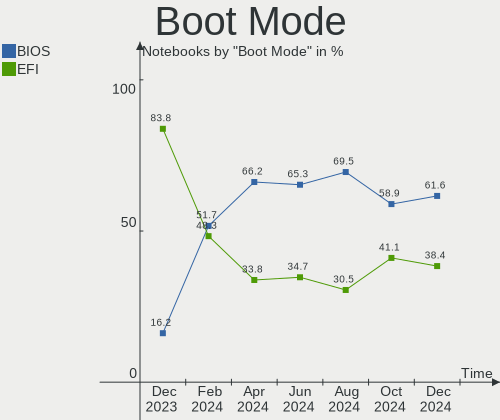

Fedora Hardware Trends (Notebook)
---------------------------------

A project to identify most popular hardware characteristics and track their change
over time based on data collected by Fedora users at https://Linux-Hardware.org.

Anyone can contribute to the study by uploading probes of their computers by
the [hw-probe](https://github.com/linuxhw/hw-probe) tool:

    sudo hw-probe -all -upload

Full-feature report is available here: https://linux-hardware.org/?view=trends&formfactor=notebook

Period: Feb, 2020.

Contents
--------

- [ OS                       ](#os)
- [ OS Family                ](#os-family)
- [ Kernel                   ](#kernel)
- [ Kernel Family            ](#kernel-family)
- [ Kernel Major Ver.        ](#kernel-major-ver)
- [ Arch                     ](#arch)
- [ DE                       ](#de)
- [ Display Server           ](#display-server)
- [ OS Lang                  ](#os-lang)
- [ Boot Mode                ](#boot-mode)
- [ Filesystem               ](#filesystem)
- [ Dual Boot with Linux     ](#dual-boot-with-linux)
- [ Dual Boot (Win)          ](#dual-boot-win)
- [ Country                  ](#country)
- [ City                     ](#city)
- [ Vendor                   ](#vendor)
- [ Model                    ](#model)
- [ Model Family             ](#model-family)
- [ MFG Year                 ](#mfg-year)
- [ Form Factor              ](#form-factor)
- [ Secure Boot              ](#secure-boot)
- [ Coreboot                 ](#coreboot)
- [ RAM Size                 ](#ram-size)
- [ RAM Used                 ](#ram-used)
- [ Drive Vendor             ](#drive-vendor)
- [ Drive Model              ](#drive-model)
- [ Drive Kind               ](#drive-kind)
- [ Drive Connector          ](#drive-connector)
- [ Drive Size               ](#drive-size)
- [ Space Total              ](#space-total)
- [ Space Used               ](#space-used)
- [ Malfunc. Drives          ](#malfunc-drives)
- [ Malfunc. Drive Vendor    ](#malfunc-drive-vendor)
- [ Malfunc. Drive Kind      ](#malfunc-drive-kind)
- [ Failed Drives            ](#failed-drives)
- [ Failed Drive Vendor      ](#failed-drive-vendor)
- [ Drive Status             ](#drive-status)
- [ Storage Vendor           ](#storage-vendor)
- [ Storage Model            ](#storage-model)
- [ Storage Kind             ](#storage-kind)
- [ CPU Vendor               ](#cpu-vendor)
- [ CPU Model                ](#cpu-model)
- [ CPU Model Family         ](#cpu-model-family)
- [ CPU Cores                ](#cpu-cores)
- [ CPU Sockets              ](#cpu-sockets)
- [ CPU Threads              ](#cpu-threads)
- [ CPU Op-Modes             ](#cpu-op-modes)
- [ CPU Microarch            ](#cpu-microarch)
- [ CPU Microcode            ](#cpu-microcode)
- [ GPU Vendor               ](#gpu-vendor)
- [ GPU Model                ](#gpu-model)
- [ GPU Combo                ](#gpu-combo)
- [ GPU Driver               ](#gpu-driver)
- [ GPU Memory               ](#gpu-memory)
- [ Monitor Vendor           ](#monitor-vendor)
- [ Monitor Model            ](#monitor-model)
- [ Monitor Resolution       ](#monitor-resolution)
- [ Monitor Diagonal         ](#monitor-diagonal)
- [ Monitor Width            ](#monitor-width)
- [ Aspect Ratio             ](#aspect-ratio)
- [ Monitor Area             ](#monitor-area)
- [ Pixel Density            ](#pixel-density)
- [ Multiple Monitors        ](#multiple-monitors)
- [ Net Controller Vendor    ](#net-controller-vendor)
- [ Net Controller Model     ](#net-controller-model)
- [ Net Controller Kind      ](#net-controller-kind)
- [ Used Controller          ](#used-controller)
- [ NICs                     ](#nics)
- [ Unsupported Devices      ](#unsupported-devices)
- [ Unsupported Device Types ](#unsupported-device-types)

OS
--

Installed operating systems

| Name      | Computers | Percent |
|-----------|-----------|---------|
| Fedora 31 | 115       | 92%     |
| Fedora 30 | 7         | 5.6%    |
| Fedora 33 | 1         | 0.8%    |
| Fedora 32 | 1         | 0.8%    |
| Fedora 24 | 1         | 0.8%    |

OS Family
---------

OS without a version

| Name   | Computers | Percent |
|--------|-----------|---------|
| Fedora | 125       | 100%    |

Kernel
------

Version of the Linux kernel

| Version                               | Computers | Percent |
|---------------------------------------|-----------|---------|
| 5.5.5-200.fc31.x86_64                 | 22        | 17.6%   |
| 5.4.17-200.fc31.x86_64                | 21        | 16.8%   |
| 5.4.19-200.fc31.x86_64                | 16        | 12.8%   |
| 5.4.18-200.fc31.x86_64                | 15        | 12%     |
| 5.4.15-200.fc31.x86_64                | 13        | 10.4%   |
| 5.4.20-200.fc31.x86_64                | 9         | 7.2%    |
| 5.3.7-301.fc31.x86_64                 | 5         | 4%      |
| 5.4.19-100.fc30.x86_64                | 3         | 2.4%    |
| 5.4.13-201.fc31.x86_64                | 3         | 2.4%    |
| 5.5.3-200.fc31.x86_64                 | 2         | 1.6%    |
| 5.4.14-200.fc31.x86_64                | 2         | 1.6%    |
| 5.4.12-200.fc31.x86_64                | 2         | 1.6%    |
| 5.4.10-200.fc31.x86_64                | 2         | 1.6%    |
| 5.6.0-0.rc2.git1.1.fc33.x86_64        | 1         | 0.8%    |
| 5.6.0-0.rc1.git2.1.fc32.x86_64        | 1         | 0.8%    |
| 5.5.6-250.vanilla.knurd.1.fc31.x86_64 | 1         | 0.8%    |
| 5.4.21-100.fc30.x86_64                | 1         | 0.8%    |
| 5.4.18-100.fc30.x86_64                | 1         | 0.8%    |
| 5.4.14-100.fc30.x86_64                | 1         | 0.8%    |
| 5.3.16-200.fc30.x86_64                | 1         | 0.8%    |
| 5.3.15-300.fc31.x86_64                | 1         | 0.8%    |
| 5.0.9-301.fc30.x86_64                 | 1         | 0.8%    |
| 4.11.12-100.fc24.x86_64               | 1         | 0.8%    |

Kernel Family
-------------

Linux kernel without a distro release

| Version | Computers | Percent |
|---------|-----------|---------|
| 5.5.5   | 22        | 17.6%   |
| 5.4.17  | 21        | 16.8%   |
| 5.4.19  | 19        | 15.2%   |
| 5.4.18  | 16        | 12.8%   |
| 5.4.15  | 13        | 10.4%   |
| 5.4.20  | 9         | 7.2%    |
| 5.3.7   | 5         | 4%      |
| 5.4.14  | 3         | 2.4%    |
| 5.4.13  | 3         | 2.4%    |
| 5.6.0   | 2         | 1.6%    |
| 5.5.3   | 2         | 1.6%    |
| 5.4.12  | 2         | 1.6%    |
| 5.4.10  | 2         | 1.6%    |
| 5.5.6   | 1         | 0.8%    |
| 5.4.21  | 1         | 0.8%    |
| 5.3.16  | 1         | 0.8%    |
| 5.3.15  | 1         | 0.8%    |
| 5.0.9   | 1         | 0.8%    |
| 4.11.12 | 1         | 0.8%    |

Kernel Major Ver.
-----------------

Linux kernel major version

| Version | Computers | Percent |
|---------|-----------|---------|
| 5.4     | 89        | 71.2%   |
| 5.5     | 25        | 20%     |
| 5.3     | 7         | 5.6%    |
| 5.6     | 2         | 1.6%    |
| 5.0     | 1         | 0.8%    |
| 4.11    | 1         | 0.8%    |

Arch
----

OS architecture (x86_64, i586, etc.)

| Name   | Computers | Percent |
|--------|-----------|---------|
| x86_64 | 125       | 100%    |

DE
--

Desktop Environment

| Name          | Computers | Percent |
|---------------|-----------|---------|
| GNOME         | 96        | 76.8%   |
| KDE5          | 6         | 4.8%    |
| Cinnamon      | 6         | 4.8%    |
| KDE           | 5         | 4%      |
| X-Cinnamon    | 3         | 2.4%    |
| MATE          | 3         | 2.4%    |
| XFCE          | 2         | 1.6%    |
| LXQt          | 2         | 1.6%    |
| GNOME Classic | 1         | 0.8%    |
| Budgie        | 1         | 0.8%    |

Display Server
--------------

X11 or Wayland

| Name    | Computers | Percent |
|---------|-----------|---------|
| Wayland | 65        | 52%     |
| X11     | 58        | 46.4%   |
| Tty     | 2         | 1.6%    |

OS Lang
-------

Language

| Lang       | Computers | Percent |
|------------|-----------|---------|
| en_US      | 60        | 48%     |
| en_GB      | 9         | 7.2%    |
| pt_BR      | 8         | 6.4%    |
| fr_FR      | 7         | 5.6%    |
| de_DE      | 5         | 4%      |
| en_US.utf8 | 4         | 3.2%    |
| en_CA      | 4         | 3.2%    |
| it_IT      | 3         | 2.4%    |
| es_MX      | 3         | 2.4%    |
| en_AU      | 3         | 2.4%    |
| ru_RU      | 2         | 1.6%    |
| pl_PL      | 2         | 1.6%    |
| en_NZ      | 2         | 1.6%    |
| en_DK      | 2         | 1.6%    |
| cs_CZ      | 2         | 1.6%    |
| sv_SE      | 1         | 0.8%    |
| pt_PT      | 1         | 0.8%    |
| fr_BE      | 1         | 0.8%    |
| es_NI      | 1         | 0.8%    |
| en_PH      | 1         | 0.8%    |
| en_IE      | 1         | 0.8%    |
| da_DK      | 1         | 0.8%    |
| ca_ES      | 1         | 0.8%    |
| bg_BG      | 1         | 0.8%    |

Boot Mode
---------

EFI or BIOS

| Mode | Computers | Percent |
|------|-----------|---------|
| EFI  | 94        | 75.2%   |
| BIOS | 31        | 24.8%   |

Filesystem
----------

Type of filesystem

| Type  | Computers | Percent |
|-------|-----------|---------|
| Ext4  | 118       | 94.4%   |
| Xfs   | 4         | 3.2%    |
| Btrfs | 3         | 2.4%    |

Dual Boot with Linux
--------------------

Hosting more than one Linux

| Dual boot | Computers | Percent |
|-----------|-----------|---------|
| No        | 115       | 92%     |
| Yes       | 10        | 8%      |

Dual Boot (Win)
---------------

Hosting Linux and Windows

| Dual boot | Computers | Percent |
|-----------|-----------|---------|
| No        | 108       | 86.4%   |
| Yes       | 17        | 13.6%   |

Country
-------

Geographic location (country)

| Country            | Computers | Percent |
|--------------------|-----------|---------|
| USA                | 18        | 14.4%   |
| Brazil             | 14        | 11.2%   |
| Germany            | 9         | 7.2%    |
| Canada             | 8         | 6.4%    |
| Netherlands        | 7         | 5.6%    |
| Russia             | 5         | 4%      |
| Mexico             | 5         | 4%      |
| France             | 5         | 4%      |
| UK                 | 4         | 3.2%    |
| Poland             | 4         | 3.2%    |
| Italy              | 4         | 3.2%    |
| Norway             | 3         | 2.4%    |
| India              | 3         | 2.4%    |
| Czech Republic     | 3         | 2.4%    |
| Australia          | 3         | 2.4%    |
| New Zealand        | 2         | 1.6%    |
| Japan              | 2         | 1.6%    |
| Denmark            | 2         | 1.6%    |
| Bulgaria           | 2         | 1.6%    |
| Vietnam            | 1         | 0.8%    |
| Ukraine            | 1         | 0.8%    |
| Turkey             | 1         | 0.8%    |
| Thailand           | 1         | 0.8%    |
| Taiwan             | 1         | 0.8%    |
| Sweden             | 1         | 0.8%    |
| Spain              | 1         | 0.8%    |
| Slovakia           | 1         | 0.8%    |
| Portugal           | 1         | 0.8%    |
| Philippines        | 1         | 0.8%    |
| Panama             | 1         | 0.8%    |
| Nicaragua          | 1         | 0.8%    |
| Lithuania          | 1         | 0.8%    |
| Lebanon            | 1         | 0.8%    |
| Jordan             | 1         | 0.8%    |
| Isle of Man        | 1         | 0.8%    |
| Iran               | 1         | 0.8%    |
| Dominican Republic | 1         | 0.8%    |
| Colombia           | 1         | 0.8%    |
| Belgium            | 1         | 0.8%    |
| Algeria            | 1         | 0.8%    |
| Unknown            | 1         | 0.8%    |

City
----

Geographic location (city)

| City                   | Computers | Percent |
|------------------------|-----------|---------|
| São Paulo             | 3         | 2.4%    |
| Mexico City            | 3         | 2.4%    |
| Brasília              | 3         | 2.4%    |
| Amsterdam              | 3         | 2.4%    |
| Poznan                 | 2         | 1.6%    |
| Oslo                   | 2         | 1.6%    |
| Nashville              | 2         | 1.6%    |
| Berlin                 | 2         | 1.6%    |
| Auckland               | 2         | 1.6%    |
| Évreux                | 1         | 0.8%    |
| Zarqa                  | 1         | 0.8%    |
| Washington             | 1         | 0.8%    |
| Warsaw                 | 1         | 0.8%    |
| Wahroonga              | 1         | 0.8%    |
| Volta Redonda          | 1         | 0.8%    |
| Vitória da Conquista  | 1         | 0.8%    |
| Vilnius                | 1         | 0.8%    |
| Ulefoss                | 1         | 0.8%    |
| Toronto                | 1         | 0.8%    |
| The Hague              | 1         | 0.8%    |
| The Bronx              | 1         | 0.8%    |
| Tehrān                | 1         | 0.8%    |
| Tanabe                 | 1         | 0.8%    |
| Taipei                 | 1         | 0.8%    |
| Taguig                 | 1         | 0.8%    |
| São José dos Campos  | 1         | 0.8%    |
| São Bernardo do Campo | 1         | 0.8%    |
| Södertälje           | 1         | 0.8%    |
| Surat Thani            | 1         | 0.8%    |
| St Petersburg          | 1         | 0.8%    |
| Soumagne               | 1         | 0.8%    |
| Sofia                  | 1         | 0.8%    |
| Smila                  | 1         | 0.8%    |
| Santo Domingo Este     | 1         | 0.8%    |
| Santo Domingo          | 1         | 0.8%    |
| Royal Oak              | 1         | 0.8%    |
| Rosarito               | 1         | 0.8%    |
| Rome                   | 1         | 0.8%    |
| Rimini                 | 1         | 0.8%    |
| Prague                 | 1         | 0.8%    |
| Portland               | 1         | 0.8%    |
| Port Orchard           | 1         | 0.8%    |
| Pleasure Point         | 1         | 0.8%    |
| Pelotas                | 1         | 0.8%    |
| Paris                  | 1         | 0.8%    |
| Panama City            | 1         | 0.8%    |
| Ottersberg             | 1         | 0.8%    |
| Ostrów Wielkopolski   | 1         | 0.8%    |
| Oristano               | 1         | 0.8%    |
| Oakville               | 1         | 0.8%    |
| Nuremberg              | 1         | 0.8%    |
| Nizhniy Novgorod       | 1         | 0.8%    |
| Niterói               | 1         | 0.8%    |
| Newcastle              | 1         | 0.8%    |
| New Malden             | 1         | 0.8%    |
| New Delhi              | 1         | 0.8%    |
| Naunhof                | 1         | 0.8%    |
| Moscavide e Portela    | 1         | 0.8%    |
| Moncks Corner          | 1         | 0.8%    |
| Mississauga            | 1         | 0.8%    |

Vendor
------

Motherboard manufacturer

| Name                   | Computers | Percent |
|------------------------|-----------|---------|
| Dell                   | 34        | 27.2%   |
| Lenovo                 | 30        | 24%     |
| Hewlett-Packard        | 22        | 17.6%   |
| Acer                   | 9         | 7.2%    |
| ASUSTek Computer       | 8         | 6.4%    |
| Samsung Electronics    | 4         | 3.2%    |
| Notebook               | 4         | 3.2%    |
| Sony                   | 3         | 2.4%    |
| MSI                    | 3         | 2.4%    |
| Toshiba                | 2         | 1.6%    |
| Razer                  | 1         | 0.8%    |
| IT Channel Pty         | 1         | 0.8%    |
| Gateway                | 1         | 0.8%    |
| Digma                  | 1         | 0.8%    |
| Avell High Performance | 1         | 0.8%    |
| Alienware              | 1         | 0.8%    |

Model
-----

Motherboard model

| Name                                     | Computers | Percent |
|------------------------------------------|-----------|---------|
| Dell XPS 15 7590                         | 4         | 3.2%    |
| Dell Latitude 5490                       | 3         | 2.4%    |
| Samsung Electronics 760XBE               | 2         | 1.6%    |
| HP Laptop 15-db0xxx                      | 2         | 1.6%    |
| Dell XPS 13 7390                         | 2         | 1.6%    |
| Dell Inspiron 15-3567                    | 2         | 1.6%    |
| Toshiba Satellite P70-A                  | 1         | 0.8%    |
| Toshiba Satellite L70-A-K6S              | 1         | 0.8%    |
| Sony VPCF236FM                           | 1         | 0.8%    |
| Sony VPCEB4J0E                           | 1         | 0.8%    |
| Sony VJS141C11L                          | 1         | 0.8%    |
| Samsung Electronics RF510/RF410/RF710    | 1         | 0.8%    |
| Samsung Electronics 550P5C/550P7C        | 1         | 0.8%    |
| Razer Blade                              | 1         | 0.8%    |
| Notebook NH55RGQ                         | 1         | 0.8%    |
| Notebook N8xEJEK                         | 1         | 0.8%    |
| Notebook N24_25BU                        | 1         | 0.8%    |
| Notebook N150ZU                          | 1         | 0.8%    |
| MSI GS63 Stealth 8RE                     | 1         | 0.8%    |
| MSI GS60 6QE                             | 1         | 0.8%    |
| MSI GF75 Thin 9SC                        | 1         | 0.8%    |
| Lenovo ThinkPad X250 20CM001PUK          | 1         | 0.8%    |
| Lenovo ThinkPad X250 20CLS2B000          | 1         | 0.8%    |
| Lenovo ThinkPad X200 74542HU             | 1         | 0.8%    |
| Lenovo ThinkPad X1 Carbon 7th 20QDCTO1WW | 1         | 0.8%    |
| Lenovo ThinkPad X1 Carbon 6th 20KH006KPB | 1         | 0.8%    |
| Lenovo ThinkPad X1 Carbon 6th 20KGS0A400 | 1         | 0.8%    |
| Lenovo ThinkPad X1 Carbon 5th 20HQS3DV00 | 1         | 0.8%    |
| Lenovo ThinkPad W540 20BHS0GB06          | 1         | 0.8%    |
| Lenovo ThinkPad W540 20BGCTO1WW          | 1         | 0.8%    |
| Lenovo ThinkPad T560 20FJS1YD00          | 1         | 0.8%    |
| Lenovo ThinkPad T495s 20QJCTO1WW         | 1         | 0.8%    |
| Lenovo ThinkPad T490 20N2000LMH          | 1         | 0.8%    |
| Lenovo ThinkPad T480 20L6S8DQ00          | 1         | 0.8%    |
| Lenovo ThinkPad T480 20L5CTO1WW          | 1         | 0.8%    |
| Lenovo ThinkPad T450s 20BWS2SK00         | 1         | 0.8%    |
| Lenovo ThinkPad T440s 20ARS3CQ0S         | 1         | 0.8%    |
| Lenovo ThinkPad T410 2522PT3             | 1         | 0.8%    |
| Lenovo ThinkPad T400s 2808DKU            | 1         | 0.8%    |
| Lenovo ThinkPad S5-S540 20B3CTO1WW       | 1         | 0.8%    |
| Lenovo ThinkPad P72 20MBCTO1WW           | 1         | 0.8%    |
| Lenovo ThinkPad P53 20QQS1JE00           | 1         | 0.8%    |
| Lenovo ThinkPad P50 20ENCTO1WW           | 1         | 0.8%    |
| Lenovo ThinkPad P1 Gen 2 20QT002FMX      | 1         | 0.8%    |
| Lenovo ThinkPad E520 11433FU             | 1         | 0.8%    |
| Lenovo ThinkPad E480 20KNS0E200          | 1         | 0.8%    |
| Lenovo IdeaPad FLEX-14API 81SS           | 1         | 0.8%    |
| Lenovo IdeaPad 500-15ISK 80NT            | 1         | 0.8%    |
| Lenovo IdeaPad 310-15ISK 80SM            | 1         | 0.8%    |
| Lenovo IdeaPad 310-14ISK 80UG            | 1         | 0.8%    |
| Lenovo IdeaPad 300-15ISK 80Q7            | 1         | 0.8%    |
| IT Channel Pty NH50_70RH                 | 1         | 0.8%    |
| HP ZBook Studio G4                       | 1         | 0.8%    |
| HP Stream Laptop 11-ak0xxx               | 1         | 0.8%    |
| HP ProBook 650 G1                        | 1         | 0.8%    |
| HP ProBook 450 G5                        | 1         | 0.8%    |
| HP ProBook 430 G6                        | 1         | 0.8%    |
| HP ProBook 430 G2                        | 1         | 0.8%    |
| HP Pavilion Gaming Laptop 17-cd0xxx      | 1         | 0.8%    |
| HP Pavilion Gaming Laptop 15-ec0xxx      | 1         | 0.8%    |

Model Family
------------

Motherboard model prefix

| Name                         | Computers | Percent |
|------------------------------|-----------|---------|
| Lenovo ThinkPad              | 25        | 20%     |
| Dell Latitude                | 11        | 8.8%    |
| Dell Inspiron                | 10        | 8%      |
| Dell XPS                     | 8         | 6.4%    |
| Acer Aspire                  | 7         | 5.6%    |
| HP Laptop                    | 6         | 4.8%    |
| HP EliteBook                 | 6         | 4.8%    |
| Lenovo IdeaPad               | 5         | 4%      |
| HP ProBook                   | 4         | 3.2%    |
| HP Pavilion                  | 3         | 2.4%    |
| Dell Vostro                  | 3         | 2.4%    |
| Toshiba Satellite            | 2         | 1.6%    |
| Samsung Electronics 760XBE   | 2         | 1.6%    |
| Dell G5                      | 2         | 1.6%    |
| Sony VPCF236FM               | 1         | 0.8%    |
| Sony VPCEB4J0E               | 1         | 0.8%    |
| Sony VJS141C11L              | 1         | 0.8%    |
| Samsung Electronics RF510    | 1         | 0.8%    |
| Samsung Electronics 550P5C   | 1         | 0.8%    |
| Razer Blade                  | 1         | 0.8%    |
| Notebook NH55RGQ             | 1         | 0.8%    |
| Notebook N8xEJEK             | 1         | 0.8%    |
| Notebook N24                 | 1         | 0.8%    |
| Notebook N150ZU              | 1         | 0.8%    |
| MSI GS63                     | 1         | 0.8%    |
| MSI GS60                     | 1         | 0.8%    |
| MSI GF75                     | 1         | 0.8%    |
| IT Channel Pty NH50          | 1         | 0.8%    |
| HP ZBook                     | 1         | 0.8%    |
| HP Stream                    | 1         | 0.8%    |
| HP ENVY                      | 1         | 0.8%    |
| Gateway NE570                | 1         | 0.8%    |
| Digma CITI                   | 1         | 0.8%    |
| Avell High Performance Avell | 1         | 0.8%    |
| ASUS X75A                    | 1         | 0.8%    |
| ASUS X541UVK                 | 1         | 0.8%    |
| ASUS X541NA                  | 1         | 0.8%    |
| ASUS X411UA                  | 1         | 0.8%    |
| ASUS UX490UA                 | 1         | 0.8%    |
| ASUS UX305FA                 | 1         | 0.8%    |
| ASUS TUF                     | 1         | 0.8%    |
| ASUS K501UX                  | 1         | 0.8%    |
| Alienware 17                 | 1         | 0.8%    |
| Acer Predator                | 1         | 0.8%    |
| Acer Nitro                   | 1         | 0.8%    |

MFG Year
--------

Motherboard manufacture year

| Year | Computers | Percent |
|------|-----------|---------|
| 2019 | 64        | 51.2%   |
| 2018 | 15        | 12%     |
| 2017 | 7         | 5.6%    |
| 2016 | 7         | 5.6%    |
| 2014 | 7         | 5.6%    |
| 2013 | 7         | 5.6%    |
| 2015 | 5         | 4%      |
| 2011 | 4         | 3.2%    |
| 2010 | 4         | 3.2%    |
| 2020 | 2         | 1.6%    |
| 2012 | 2         | 1.6%    |
| 2009 | 1         | 0.8%    |

Form Factor
-----------

Physical design of the computer

| Name     | Computers | Percent |
|----------|-----------|---------|
| Notebook | 125       | 100%    |

Secure Boot
-----------

Enabled or disabled

| State    | Computers | Percent |
|----------|-----------|---------|
| Disabled | 104       | 83.2%   |
| Enabled  | 21        | 16.8%   |

Coreboot
--------

Have coreboot on board

| Used | Computers | Percent |
|------|-----------|---------|
| No   | 125       | 100%    |

RAM Size
--------

Total RAM memory

| Size in GB  | Computers | Percent |
|-------------|-----------|---------|
| 16.01-24.0  | 43        | 34.4%   |
| 4.01-8.0    | 35        | 28%     |
| 8.01-16.0   | 20        | 16%     |
| 3.01-4.0    | 14        | 11.2%   |
| 32.01-64.0  | 9         | 7.2%    |
| 64.01-256.0 | 2         | 1.6%    |
| 24.01-32.0  | 1         | 0.8%    |
| 1.01-2.0    | 1         | 0.8%    |

RAM Used
--------

Used RAM memory

| Used GB    | Computers | Percent |
|------------|-----------|---------|
| 2.01-3.0   | 46        | 36.8%   |
| 3.01-4.0   | 30        | 24%     |
| 4.01-8.0   | 28        | 22.4%   |
| 1.01-2.0   | 15        | 12%     |
| 8.01-16.0  | 3         | 2.4%    |
| 16.01-24.0 | 2         | 1.6%    |
| 0.01-1.0   | 1         | 0.8%    |

Drive Vendor
------------

Hard drive vendors

| Vendor              | Computers | Drives | Percent |
|---------------------|-----------|--------|---------|
| Samsung Electronics | 37        | 40     | 24.5%   |
| WDC                 | 16        | 16     | 10.6%   |
| Seagate             | 14        | 15     | 9.27%   |
| Toshiba             | 12        | 12     | 7.95%   |
| SanDisk             | 12        | 13     | 7.95%   |
| Unknown             | 8         | 8      | 5.3%    |
| Intel               | 7         | 7      | 4.64%   |
| Kingston            | 6         | 6      | 3.97%   |
| HGST                | 6         | 6      | 3.97%   |
| SK Hynix            | 5         | 5      | 3.31%   |
| Hitachi             | 4         | 4      | 2.65%   |
| Crucial             | 4         | 4      | 2.65%   |
| Micron Technology   | 3         | 3      | 1.99%   |
| Transcend           | 2         | 2      | 1.32%   |
| LITEONIT            | 2         | 2      | 1.32%   |
| LITEON              | 2         | 2      | 1.32%   |
| A-DATA Technology   | 2         | 2      | 1.32%   |
| Vaseky              | 1         | 1      | 0.66%   |
| Team                | 1         | 1      | 0.66%   |
| SPCC                | 1         | 1      | 0.66%   |
| Patriot             | 1         | 1      | 0.66%   |
| LDLC                | 1         | 1      | 0.66%   |
| LaCie               | 1         | 1      | 0.66%   |
| Inateck             | 1         | 1      | 0.66%   |
| GOODRAM             | 1         | 1      | 0.66%   |
| Generic             | 1         | 1      | 0.66%   |

Drive Model
-----------

Hard drive models

| Model                            | Computers | Percent |
|----------------------------------|-----------|---------|
| SSD 860 EVO 1TB                  | 3         | 1.92%   |
| SSD 850 EVO 500GB                | 3         | 1.92%   |
| SSD 850 EVO 250GB                | 3         | 1.92%   |
| HTS721010A9E630 1TB              | 3         | 1.92%   |
| WD5000LPVX-22V0TT0 500GB         | 2         | 1.28%   |
| WD10JPVX-22JC3T0 1TB             | 2         | 1.28%   |
| ST500LT012-1DG142 500GB          | 2         | 1.28%   |
| ST2000LX001-1RG174 2TB           | 2         | 1.28%   |
| ST1000LM024 HN-M101MBB 1TB       | 2         | 1.28%   |
| SSDPEMKF512G8 NVMe 512GB         | 2         | 1.28%   |
| SSD PLUS 480GB                   | 2         | 1.28%   |
| SSD 970 PRO 512GB                | 2         | 1.28%   |
| SSD 860 QVO 1TB                  | 2         | 1.28%   |
| PC SN730 SDBQNTY-512G-1001 512GB | 2         | 1.28%   |
| MZVLB256HAHQ-000H1 256GB         | 2         | 1.28%   |
| MZVLB1T0HBLR-000L7 1TB           | 2         | 1.28%   |
| MQ04ABF100 1TB                   | 2         | 1.28%   |
| KXG60ZNV512G NVMe 512GB          | 2         | 1.28%   |
| HTS541010B7E610 1TB              | 2         | 1.28%   |
| CV8-8E256 256GB SSD              | 2         | 1.28%   |
| ZTC-SM201-256G SSD               | 1         | 0.64%   |
| X400 M.2 2280 256GB SSD          | 1         | 0.64%   |
| WDS500G2B0B-00YS70 500GB SSD     | 1         | 0.64%   |
| WDS120G2G0A-00JH30 120GB SSD     | 1         | 0.64%   |
| WD5000LPLX-08ZNTT0 500GB         | 1         | 0.64%   |
| WD5000LPCX-24VHAT0 500GB         | 1         | 0.64%   |
| WD3200BEVT-75ZCT2 320GB          | 1         | 0.64%   |
| WD20SPZX-11UA7T0 2TB             | 1         | 0.64%   |
| WD10SPZX-60Z10T0 1TB             | 1         | 0.64%   |
| WD10SPCX-60KHST0 1TB             | 1         | 0.64%   |
| WD10JPVX-75JC3T0 1TB             | 1         | 0.64%   |
| V800/512G 512GB                  | 1         | 0.64%   |
| TS256GSSD370S 256GB              | 1         | 0.64%   |
| TS128GSSD370S 128GB              | 1         | 0.64%   |
| THNSNJ128GMCU 128GB SSD          | 1         | 0.64%   |
| THNSNH256GMCT 256GB SSD          | 1         | 0.64%   |
| T253TD480G 480GB SSD             | 1         | 0.64%   |
| SV300S37A120G 120GB SSD          | 1         | 0.64%   |
| SUV500480G 480GB SSD             | 1         | 0.64%   |
| SUV400S37240G 240GB SSD          | 1         | 0.64%   |
| SU655 480GB SSD                  | 1         | 0.64%   |
| ST500LT012-9WS142 500GB          | 1         | 0.64%   |
| ST500LM000-1EJ162 500GB          | 1         | 0.64%   |
| ST2000LM007-1R8174 2TB           | 1         | 0.64%   |
| ST1000LM049-2GH172 1TB           | 1         | 0.64%   |
| ST1000LM048-2E7172 1TB           | 1         | 0.64%   |
| ST1000LM014-1EJ164 1TB           | 1         | 0.64%   |
| SSDSCKKF256G8 SATA 256GB         | 1         | 0.64%   |
| SSDSC2KW256G8 256GB              | 1         | 0.64%   |
| SSDPR-CL100-240 240GB            | 1         | 0.64%   |
| SSDPEKNW010T8 1TB                | 1         | 0.64%   |
| SSDPEKKW512G8 512GB              | 1         | 0.64%   |
| SSDPEKKF256G8L 256GB             | 1         | 0.64%   |
| SSD U110 16GB                    | 1         | 0.64%   |
| SSD PM871b M.2 2280 256GB        | 1         | 0.64%   |
| SSD PLUS 240GB                   | 1         | 0.64%   |
| SSD PLUS 120 GB                  | 1         | 0.64%   |
| SSD PLUS 1000GB                  | 1         | 0.64%   |
| SSD 970 EVO Plus 500GB           | 1         | 0.64%   |
| SSD 970 EVO Plus 1TB             | 1         | 0.64%   |

Drive Kind
----------

HDD or SSD

| Kind    | Computers | Drives | Percent |
|---------|-----------|--------|---------|
| SSD     | 56        | 66     | 39.72%  |
| HDD     | 42        | 45     | 29.79%  |
| NVMe    | 32        | 34     | 22.7%   |
| MMC     | 7         | 7      | 4.96%   |
| Unknown | 4         | 4      | 2.84%   |

Drive Connector
---------------

SATA, SAS, NVMe, etc.

| Type | Computers | Drives | Percent |
|------|-----------|--------|---------|
| SATA | 86        | 109    | 65.65%  |
| NVMe | 32        | 34     | 24.43%  |
| MMC  | 7         | 7      | 5.34%   |
| SAS  | 6         | 6      | 4.58%   |

Drive Size
----------

Size of hard drive

| Size in TB | Computers | Drives | Percent |
|------------|-----------|--------|---------|
| 0.01-0.5   | 73        | 87     | 52.52%  |
| 0.51-1.0   | 54        | 57     | 38.85%  |
| 1.01-2.0   | 10        | 10     | 7.19%   |
| 3.01-4.0   | 1         | 1      | 0.72%   |
| 4.01-10.0  | 1         | 1      | 0.72%   |

Space Total
-----------

Amount of disk space available on the file system

| Size in GB     | Computers | Percent |
|----------------|-----------|---------|
| 101-250        | 34        | 27.2%   |
| 251-500        | 31        | 24.8%   |
| 501-1000       | 30        | 24%     |
| 1-20           | 8         | 6.4%    |
| 1001-2000      | 6         | 4.8%    |
| 2001-3000      | 4         | 3.2%    |
| 51-100         | 4         | 3.2%    |
| Unknown        | 4         | 3.2%    |
| More than 3000 | 2         | 1.6%    |
| 21-50          | 2         | 1.6%    |

Space Used
----------

Amount of used disk space

| Used GB   | Computers | Percent |
|-----------|-----------|---------|
| 1-20      | 31        | 24.8%   |
| 101-250   | 30        | 24%     |
| 21-50     | 20        | 16%     |
| 51-100    | 16        | 12.8%   |
| 251-500   | 15        | 12%     |
| 501-1000  | 5         | 4%      |
| 1001-2000 | 4         | 3.2%    |
| Unknown   | 4         | 3.2%    |

Malfunc. Drives
---------------

Drive models with a malfunction

| Model                        | Computers | Drives | Percent |
|------------------------------|-----------|--------|---------|
| WD5000LPLX-08ZNTT0 500GB     | 1         | 1      | 20%     |
| WD10SPCX-60KHST0 1TB         | 1         | 1      | 20%     |
| MQ01ABD075 752GB             | 1         | 1      | 20%     |
| HM321HI 320GB                | 1         | 1      | 20%     |
| 1100_MTFDDAV256TBN 256GB SSD | 1         | 1      | 20%     |

Malfunc. Drive Vendor
---------------------

Vendors of faulty drives

| Vendor              | Computers | Drives | Percent |
|---------------------|-----------|--------|---------|
| WDC                 | 2         | 2      | 40%     |
| Toshiba             | 1         | 1      | 20%     |
| Samsung Electronics | 1         | 1      | 20%     |
| Micron Technology   | 1         | 1      | 20%     |

Malfunc. Drive Kind
-------------------

Kinds of faulty drives

| Kind | Computers | Drives | Percent |
|------|-----------|--------|---------|
| HDD  | 4         | 4      | 80%     |
| SSD  | 1         | 1      | 20%     |

Failed Drives
-------------

Failed drive models

Zero info for selected period =(

Failed Drive Vendor
-------------------

Failed drive vendors

Zero info for selected period =(

Drive Status
------------

Number of failed and malfunc. drives

| Status   | Computers | Drives | Percent |
|----------|-----------|--------|---------|
| Works    | 63        | 83     | 51.22%  |
| Detected | 55        | 68     | 44.72%  |
| Malfunc  | 5         | 5      | 4.07%   |

Storage Vendor
--------------

Storage controller vendors

| Vendor                       | Computers | Percent |
|------------------------------|-----------|---------|
| Intel                        | 101       | 70.63%  |
| Samsung Electronics          | 23        | 16.08%  |
| Toshiba America Info Systems | 5         | 3.5%    |
| Sandisk                      | 5         | 3.5%    |
| SK Hynix                     | 3         | 2.1%    |
| AMD                          | 3         | 2.1%    |
| Kingston Technology Company  | 2         | 1.4%    |
| OCZ Technology Group         | 1         | 0.7%    |

Storage Model
-------------

Storage controller models

| Model                                                                    | Computers | Percent |
|--------------------------------------------------------------------------|-----------|---------|
| Sunrise Point-LP SATA Controller [AHCI mode]                             | 22        | 14.86%  |
| NVMe SSD Controller SM981/PM981/PM983                                    | 21        | 14.19%  |
| Cannon Lake Mobile PCH SATA AHCI Controller                              | 14        | 9.46%   |
| 82801 Mobile SATA Controller [RAID mode]                                 | 13        | 8.78%   |
| Wildcat Point-LP SATA Controller [AHCI Mode]                             | 8         | 5.41%   |
| 7 Series Chipset Family 6-port SATA Controller [AHCI mode]               | 8         | 5.41%   |
| Non-Volatile memory controller                                           | 7         | 4.73%   |
| 8 Series/C220 Series Chipset Family 6-port SATA Controller 1 [AHCI mode] | 6         | 4.05%   |
| 8 Series SATA Controller 1 [AHCI mode]                                   | 5         | 3.38%   |
| SSD Pro 7600p/760p/E 6100p Series                                        | 4         | 2.7%    |
| Cannon Point-LP SATA Controller [AHCI Mode]                              | 4         | 2.7%    |
| 82801IBM/IEM (ICH9M/ICH9M-E) 4 port SATA Controller [AHCI mode]          | 4         | 2.7%    |
| Toshiba America Info Non-Volatile memory controller                      | 3         | 2.03%   |
| SSD 660P Series                                                          | 3         | 2.03%   |
| FCH SATA Controller [AHCI mode]                                          | 3         | 2.03%   |
| 5 Series/3400 Series Chipset 6 port SATA AHCI Controller                 | 3         | 2.03%   |
| 5 Series/3400 Series Chipset 4 port SATA AHCI Controller                 | 3         | 2.03%   |
| NVMe SSD Controller SM961/PM961                                          | 2         | 1.35%   |
| BG3 NVMe SSD Controller                                                  | 2         | 1.35%   |
| 6 Series/C200 Series Chipset Family 6 port Mobile SATA AHCI Controller   | 2         | 1.35%   |
| WD Black 2018/PC SN720 NVMe SSD                                          | 1         | 0.68%   |
| WD Black 2018/PC SN520 NVMe SSD                                          | 1         | 0.68%   |
| Technology Company Non-Volatile memory controller                        | 1         | 0.68%   |
| SATA Controller [RAID mode]                                              | 1         | 0.68%   |
| RD400/400A SSD                                                           | 1         | 0.68%   |
| Q170/Q150/B150/H170/H110/Z170/CM236 Chipset SATA Controller [AHCI Mode]  | 1         | 0.68%   |
| NVMe SSD Controller SM951/PM951                                          | 1         | 0.68%   |
| Ice Lake-LP SATA Controller [AHCI mode]                                  | 1         | 0.68%   |
| HM170/QM170 Chipset SATA Controller [AHCI Mode]                          | 1         | 0.68%   |
| Comet Lake SATA AHCI Controller                                          | 1         | 0.68%   |
| Celeron N3350/Pentium N4200/Atom E3900 Series SATA AHCI Controller       | 1         | 0.68%   |

Storage Kind
------------

Kind of storage controller (IDE, SATA, NVMe, SAS, ...)

| Kind | Computers | Percent |
|------|-----------|---------|
| SATA | 87        | 60%     |
| NVMe | 44        | 30.34%  |
| RAID | 14        | 9.66%   |

CPU Vendor
----------

Processor vendors

| Vendor | Computers | Percent |
|--------|-----------|---------|
| Intel  | 119       | 95.2%   |
| AMD    | 6         | 4.8%    |

CPU Model
---------

Processor models

| Model                                | Computers | Percent |
|--------------------------------------|-----------|---------|
| Intel Core i7-9750H CPU @ 2.60GHz    | 12        | 9.6%    |
| Intel Core i7-8565U CPU @ 1.80GHz    | 7         | 5.6%    |
| Intel Core i7-8750H CPU @ 2.20GHz    | 5         | 4%      |
| Intel Core i7-8550U CPU @ 1.80GHz    | 5         | 4%      |
| Intel Core i5-8250U CPU @ 1.60GHz    | 5         | 4%      |
| Intel Core i5-7200U CPU @ 2.50GHz    | 4         | 3.2%    |
| Intel Core i7-7500U CPU @ 2.70GHz    | 3         | 2.4%    |
| Intel Core i5-5300U CPU @ 2.30GHz    | 3         | 2.4%    |
| Intel Core i5-5200U CPU @ 2.20GHz    | 3         | 2.4%    |
| Intel Core i5-4300U CPU @ 1.90GHz    | 3         | 2.4%    |
| Intel Core i5-3230M CPU @ 2.60GHz    | 3         | 2.4%    |
| Intel Core i7-6500U CPU @ 2.50GHz    | 2         | 1.6%    |
| Intel Core i7-4800MQ CPU @ 2.70GHz   | 2         | 1.6%    |
| Intel Core i7-10710U CPU @ 1.10GHz   | 2         | 1.6%    |
| Intel Core i5-8350U CPU @ 1.70GHz    | 2         | 1.6%    |
| Intel Core i5-8265U CPU @ 1.60GHz    | 2         | 1.6%    |
| Intel Core i5-6200U CPU @ 2.30GHz    | 2         | 1.6%    |
| Intel Core i5-4200U CPU @ 1.60GHz    | 2         | 1.6%    |
| Intel Core i5-3210M CPU @ 2.50GHz    | 2         | 1.6%    |
| Intel Core i5 CPU M 540 @ 2.53GHz    | 2         | 1.6%    |
| Intel Core i5 CPU M 480 @ 2.67GHz    | 2         | 1.6%    |
| Intel Core i3-8130U CPU @ 2.20GHz    | 2         | 1.6%    |
| Intel Xeon CPU E3-1535M v5 @ 2.90GHz | 1         | 0.8%    |
| Intel Pentium CPU N4200 @ 1.10GHz    | 1         | 0.8%    |
| Intel Core M-5Y10c CPU @ 0.80GHz     | 1         | 0.8%    |
| Intel Core i7-9850H CPU @ 2.60GHz    | 1         | 0.8%    |
| Intel Core i7-8850H CPU @ 2.60GHz    | 1         | 0.8%    |
| Intel Core i7-8650U CPU @ 1.90GHz    | 1         | 0.8%    |
| Intel Core i7-7700HQ CPU @ 2.80GHz   | 1         | 0.8%    |
| Intel Core i7-7600U CPU @ 2.80GHz    | 1         | 0.8%    |
| Intel Core i7-6700HQ CPU @ 2.60GHz   | 1         | 0.8%    |
| Intel Core i7-6600U CPU @ 2.60GHz    | 1         | 0.8%    |
| Intel Core i7-5600U CPU @ 2.60GHz    | 1         | 0.8%    |
| Intel Core i7-4910MQ CPU @ 2.90GHz   | 1         | 0.8%    |
| Intel Core i7-4712MQ CPU @ 2.30GHz   | 1         | 0.8%    |
| Intel Core i7-4702MQ CPU @ 2.20GHz   | 1         | 0.8%    |
| Intel Core i7-4700MQ CPU @ 2.40GHz   | 1         | 0.8%    |
| Intel Core i7-4600M CPU @ 2.90GHz    | 1         | 0.8%    |
| Intel Core i7-3667U CPU @ 2.00GHz    | 1         | 0.8%    |
| Intel Core i7-3630QM CPU @ 2.40GHz   | 1         | 0.8%    |
| Intel Core i7-2670QM CPU @ 2.20GHz   | 1         | 0.8%    |
| Intel Core i7-10510U CPU @ 1.80GHz   | 1         | 0.8%    |
| Intel Core i5-9300H CPU @ 2.40GHz    | 1         | 0.8%    |
| Intel Core i5-8400H CPU @ 2.50GHz    | 1         | 0.8%    |
| Intel Core i5-8365U CPU @ 1.60GHz    | 1         | 0.8%    |
| Intel Core i5-8300H CPU @ 2.30GHz    | 1         | 0.8%    |
| Intel Core i5-7300U CPU @ 2.60GHz    | 1         | 0.8%    |
| Intel Core i5-6300U CPU @ 2.40GHz    | 1         | 0.8%    |
| Intel Core i5-3317U CPU @ 1.70GHz    | 1         | 0.8%    |
| Intel Core i5-2410M CPU @ 2.30GHz    | 1         | 0.8%    |
| Intel Core i5-1035G4 CPU @ 1.10GHz   | 1         | 0.8%    |
| Intel Core i5-1035G1 CPU @ 1.00GHz   | 1         | 0.8%    |
| Intel Core i3-7100U CPU @ 2.40GHz    | 1         | 0.8%    |
| Intel Core i3-7020U CPU @ 2.30GHz    | 1         | 0.8%    |
| Intel Core i3-6100U CPU @ 2.30GHz    | 1         | 0.8%    |
| Intel Core i3-4005U CPU @ 1.70GHz    | 1         | 0.8%    |
| Intel Core i3-3217U CPU @ 1.80GHz    | 1         | 0.8%    |
| Intel Core i3-2328M CPU @ 2.20GHz    | 1         | 0.8%    |
| Intel Core i3 CPU M 370 @ 2.40GHz    | 1         | 0.8%    |
| Intel Core i3 CPU M 350 @ 2.27GHz    | 1         | 0.8%    |

CPU Model Family
----------------

Processor model prefix

| Model            | Computers | Percent |
|------------------|-----------|---------|
| Intel Core i7    | 55        | 44%     |
| Intel Core i5    | 45        | 36%     |
| Intel Core i3    | 10        | 8%      |
| Intel Core 2 Duo | 4         | 3.2%    |
| AMD Ryzen 5      | 3         | 2.4%    |
| Other            | 1         | 0.8%    |
| Intel Xeon       | 1         | 0.8%    |
| Intel Pentium    | 1         | 0.8%    |
| Intel Core M     | 1         | 0.8%    |
| Intel Celeron    | 1         | 0.8%    |
| Intel Atom       | 1         | 0.8%    |
| AMD Ryzen 7 PRO  | 1         | 0.8%    |
| AMD Ryzen 3      | 1         | 0.8%    |

CPU Cores
---------

Number of processor cores

| Number | Computers | Percent |
|--------|-----------|---------|
| 2      | 58        | 46.4%   |
| 4      | 46        | 36.8%   |
| 6      | 21        | 16.8%   |

CPU Sockets
-----------

Number of sockets

| Number | Computers | Percent |
|--------|-----------|---------|
| 1      | 125       | 100%    |

CPU Threads
-----------

Threads per core (Hyper-Threading)

| Number | Computers | Percent |
|--------|-----------|---------|
| 2      | 117       | 93.6%   |
| 1      | 8         | 6.4%    |

CPU Op-Modes
------------

CPU Operation Modes (32-bit, 64-bit)

| Op mode        | Computers | Percent |
|----------------|-----------|---------|
| 32-bit, 64-bit | 125       | 100%    |

CPU Microarch
-------------

Microarchitecture

| Name          | Computers | Percent |
|---------------|-----------|---------|
| Skylake       | 68        | 54.4%   |
| Haswell       | 13        | 10.4%   |
| IvyBridge     | 9         | 7.2%    |
| Broadwell     | 8         | 6.4%    |
| Westmere      | 6         | 4.8%    |
| Zen+          | 3         | 2.4%    |
| SandyBridge   | 3         | 2.4%    |
| KabyLake      | 3         | 2.4%    |
| Core          | 3         | 2.4%    |
| Zen           | 2         | 1.6%    |
| Icelake       | 2         | 1.6%    |
| Silvermont    | 1         | 0.8%    |
| Penryn        | 1         | 0.8%    |
| Goldmont plus | 1         | 0.8%    |
| Goldmont      | 1         | 0.8%    |
| Excavator     | 1         | 0.8%    |

CPU Microcode
-------------

Microcode number

| Number     | Computers | Percent |
|------------|-----------|---------|
| 0x906ea    | 21        | 16.8%   |
| 0x806ea    | 14        | 11.2%   |
| 0x806e9    | 11        | 8.8%    |
| 0x306d4    | 8         | 6.4%    |
| 0x306a9    | 8         | 6.4%    |
| 0x306c3    | 7         | 5.6%    |
| Unknown    | 7         | 5.6%    |
| 0x806ec    | 6         | 4.8%    |
| 0x806eb    | 5         | 4%      |
| 0x40651    | 5         | 4%      |
| 0x406e3    | 4         | 3.2%    |
| 0x206a7    | 3         | 2.4%    |
| 0x20655    | 3         | 2.4%    |
| 0x20652    | 3         | 2.4%    |
| 0x1067a    | 3         | 2.4%    |
| 0xa0660    | 2         | 1.6%    |
| 0x706e5    | 2         | 1.6%    |
| 0x506e3    | 2         | 1.6%    |
| 0x08108102 | 2         | 1.6%    |
| 0x0810100b | 2         | 1.6%    |
| 0x906e9    | 1         | 0.8%    |
| 0x706a1    | 1         | 0.8%    |
| 0x506c9    | 1         | 0.8%    |
| 0x406c4    | 1         | 0.8%    |
| 0x10676    | 1         | 0.8%    |
| 0x08108109 | 1         | 0.8%    |
| 0x06006705 | 1         | 0.8%    |

GPU Vendor
----------

Vendors of graphics cards

| Vendor | Computers | Percent |
|--------|-----------|---------|
| Intel  | 112       | 65.12%  |
| Nvidia | 43        | 25%     |
| AMD    | 17        | 9.88%   |

GPU Model
---------

Graphics card models

| Model                                                                              | Computers | Percent |
|------------------------------------------------------------------------------------|-----------|---------|
| UHD Graphics 630 (Mobile)                                                          | 19        | 10.98%  |
| UHD Graphics 620                                                                   | 15        | 8.67%   |
| UHD Graphics 620 (Whiskey Lake)                                                    | 10        | 5.78%   |
| HD Graphics 620                                                                    | 10        | 5.78%   |
| 3rd Gen Core processor Graphics Controller                                         | 9         | 5.2%    |
| TU117M [GeForce GTX 1650 Mobile / Max-Q]                                           | 7         | 4.05%   |
| Skylake GT2 [HD Graphics 520]                                                      | 7         | 4.05%   |
| HD Graphics 5500                                                                   | 7         | 4.05%   |
| 4th Gen Core Processor Integrated Graphics Controller                              | 7         | 4.05%   |
| Haswell-ULT Integrated Graphics Controller                                         | 6         | 3.47%   |
| Core Processor Integrated Graphics Controller                                      | 5         | 2.89%   |
| Topaz XT [Radeon R7 M260/M265 / M340/M360 / M440/M445 / 530/535 / 620/625 Mobile]  | 4         | 2.31%   |
| UHD Graphics                                                                       | 3         | 1.73%   |
| Picasso                                                                            | 3         | 1.73%   |
| Mobile 4 Series Chipset Integrated Graphics Controller                             | 3         | 1.73%   |
| GP107M [GeForce GTX 1050 Ti Mobile]                                                | 3         | 1.73%   |
| GP107M [GeForce GTX 1050 3 GB Max-Q]                                               | 3         | 1.73%   |
| TU117GLM [Quadro T2000 Mobile / Max-Q]                                             | 2         | 1.16%   |
| Sun XT [Radeon HD 8670A/8670M/8690M / R5 M330 / M430 / Radeon 520 Mobile]          | 2         | 1.16%   |
| Raven Ridge [Radeon Vega Series / Radeon Vega Mobile Series]                       | 2         | 1.16%   |
| GP106M [GeForce GTX 1060 Mobile]                                                   | 2         | 1.16%   |
| GM108M [GeForce 840M]                                                              | 2         | 1.16%   |
| GK208M [GeForce GT 740M]                                                           | 2         | 1.16%   |
| GK107GLM [Quadro K1100M]                                                           | 2         | 1.16%   |
| GF117M [GeForce 610M/710M/810M/820M / GT 620M/625M/630M/720M]                      | 2         | 1.16%   |
| 2nd Generation Core Processor Family Integrated Graphics Controller                | 2         | 1.16%   |
| UHD Graphics, Gen11 LP                                                             | 1         | 0.58%   |
| UHD Graphics 920                                                                   | 1         | 0.58%   |
| UHD Graphics 605                                                                   | 1         | 0.58%   |
| TU116M [GeForce GTX 1660 Ti Mobile]                                                | 1         | 0.58%   |
| TU106M [GeForce RTX 2070 Mobile]                                                   | 1         | 0.58%   |
| TU104BM [GeForce RTX 2080 Mobile]                                                  | 1         | 0.58%   |
| Thames [Radeon HD 7550M/7570M/7650M]                                               | 1         | 0.58%   |
| Stoney [Radeon R2/R3/R4/R5 Graphics]                                               | 1         | 0.58%   |
| Mars XTX [Radeon HD 8790M]                                                         | 1         | 0.58%   |
| Madison [Mobility Radeon HD 5650/5750 / 6530M/6550M]                               | 1         | 0.58%   |
| Lexa PRO [Radeon 540/540X/550/550X / RX 540X/550/550X]                             | 1         | 0.58%   |
| Kaby Lake-U GT2f Integrated Graphics Controller                                    | 1         | 0.58%   |
| HD Graphics 630                                                                    | 1         | 0.58%   |
| HD Graphics 5300                                                                   | 1         | 0.58%   |
| HD Graphics 530                                                                    | 1         | 0.58%   |
| GT216M [GeForce GT 330M]                                                           | 1         | 0.58%   |
| GP108M [GeForce MX250]                                                             | 1         | 0.58%   |
| GP108M [GeForce MX230]                                                             | 1         | 0.58%   |
| GP108M [GeForce MX150]                                                             | 1         | 0.58%   |
| GP107GLM [Quadro P2000 Mobile]                                                     | 1         | 0.58%   |
| GM204M [GeForce GTX 970M]                                                          | 1         | 0.58%   |
| GM108M [GeForce 920MX]                                                             | 1         | 0.58%   |
| GM107M [GeForce GTX 950M]                                                          | 1         | 0.58%   |
| GM107GLM [Quadro M2000M]                                                           | 1         | 0.58%   |
| GK208BM [GeForce 920M]                                                             | 1         | 0.58%   |
| GK107M [GeForce GT 745M]                                                           | 1         | 0.58%   |
| GK107M [GeForce GT 650M]                                                           | 1         | 0.58%   |
| GK106M [GeForce GTX 760M]                                                          | 1         | 0.58%   |
| GF108M [GeForce GT 540M]                                                           | 1         | 0.58%   |
| G98M [GeForce G 105M]                                                              | 1         | 0.58%   |
| Ellesmere [Radeon RX 470/480/570/570X/580/580X/590]                                | 1         | 0.58%   |
| Celeron N3350/Pentium N4200/Atom E3900 Series Integrated Graphics Controller       | 1         | 0.58%   |
| Baffin [Radeon RX 460/560D / Pro 450/455/460/555/555X/560/560X]                    | 1         | 0.58%   |
| Atom/Celeron/Pentium Processor x5-E8000/J3xxx/N3xxx Integrated Graphics Controller | 1         | 0.58%   |

GPU Combo
---------

Combinations of graphics cards

| Name           | Computers | Percent |
|----------------|-----------|---------|
| 1 x Intel      | 66        | 52.8%   |
| Intel + Nvidia | 35        | 28%     |
| Intel + AMD    | 10        | 8%      |
| 1 x Nvidia     | 7         | 5.6%    |
| 1 x AMD        | 5         | 4%      |
| 2 x AMD        | 1         | 0.8%    |
| AMD + Nvidia   | 1         | 0.8%    |

GPU Driver
----------

Free vs proprietary

| Driver      | Computers | Percent |
|-------------|-----------|---------|
| Free        | 97        | 77.6%   |
| Proprietary | 25        | 20%     |
| Unknown     | 3         | 2.4%    |

GPU Memory
----------

Total video memory

| Size in GB | Computers | Percent |
|------------|-----------|---------|
| Unknown    | 87        | 69.6%   |
| 1.01-2.0   | 18        | 14.4%   |
| 3.01-4.0   | 8         | 6.4%    |
| 0.51-1.0   | 4         | 3.2%    |
| 7.01-8.0   | 2         | 1.6%    |
| 5.01-6.0   | 2         | 1.6%    |
| 2.01-3.0   | 2         | 1.6%    |
| 0.01-0.5   | 2         | 1.6%    |

Monitor Vendor
--------------

Monitor vendors

| Vendor                  | Computers | Percent |
|-------------------------|-----------|---------|
| AU Optronics            | 32        | 21.33%  |
| LG Display              | 26        | 17.33%  |
| Chimei Innolux          | 20        | 13.33%  |
| BOE                     | 17        | 11.33%  |
| Samsung Electronics     | 16        | 10.67%  |
| Sharp                   | 7         | 4.67%   |
| Dell                    | 7         | 4.67%   |
| Lenovo                  | 4         | 2.67%   |
| Hewlett-Packard         | 4         | 2.67%   |
| PANDA                   | 3         | 2%      |
| Goldstar                | 3         | 2%      |
| Iiyama                  | 2         | 1.33%   |
| Toshiba                 | 1         | 0.67%   |
| Philips                 | 1         | 0.67%   |
| Panasonic               | 1         | 0.67%   |
| Chi Mei Optoelectronics | 1         | 0.67%   |
| BenQ                    | 1         | 0.67%   |
| ASUSTek Computer        | 1         | 0.67%   |
| AOC                     | 1         | 0.67%   |
| Ancor Communications    | 1         | 0.67%   |
| Acer                    | 1         | 0.67%   |

Monitor Model
-------------

Monitor models

| Model                                              | Computers | Percent |
|----------------------------------------------------|-----------|---------|
| LCD Monitor SEC5441 1366x768 344x194mm 15.5-inch   | 3         | 1.97%   |
| LCD Monitor LGD058B 2560x1440 309x174mm 14.0-inch  | 3         | 1.97%   |
| LCD Monitor AUO38ED 1920x1080 340x190mm 15.3-inch  | 3         | 1.97%   |
| LCD Monitor SHP14BA 1920x1080 344x194mm 15.5-inch  | 2         | 1.32%   |
| LCD Monitor SHP14AD 3840x2160 294x165mm 13.3-inch  | 2         | 1.32%   |
| LCD Monitor NCP0064 1920x1080 344x194mm 15.5-inch  | 2         | 1.32%   |
| LCD Monitor LGD056D 1920x1080 380x210mm 17.1-inch  | 2         | 1.32%   |
| LCD Monitor LGD0525 1366x768 344x194mm 15.5-inch   | 2         | 1.32%   |
| LCD Monitor LEN4036 1440x900 304x190mm 14.1-inch   | 2         | 1.32%   |
| LCD Monitor CMN15F5 1920x1080 344x193mm 15.5-inch  | 2         | 1.32%   |
| LCD Monitor CMN15BF 1366x768 344x193mm 15.5-inch   | 2         | 1.32%   |
| LCD Monitor AUO34ED 1920x1080 340x190mm 15.3-inch  | 2         | 1.32%   |
| LCD Monitor AUO233C 1366x768 309x173mm 13.9-inch   | 2         | 1.32%   |
| LCD Monitor AUO113D 1920x1080 309x173mm 13.9-inch  | 2         | 1.32%   |
| Color LCD SDCA029 2160x1440 252x168mm 11.9-inch    | 2         | 1.32%   |
| XG35V AUS3551 3440x1440 819x346mm 35.0-inch        | 1         | 0.66%   |
| W1943 GSM4BAD 1024x768 410x230mm 18.5-inch         | 1         | 0.66%   |
| VG248 ACI24A5 1920x1080 531x299mm 24.0-inch        | 1         | 0.66%   |
| ULTRAWIDE GSM5A2A 2560x1080 677x290mm 29.0-inch    | 1         | 0.66%   |
| U2719DC DEL419C 2560x1440 597x336mm 27.0-inch      | 1         | 0.66%   |
| U2415 DELA0BA 1920x1080 518x324mm 24.1-inch        | 1         | 0.66%   |
| U2415 DELA0B8 1920x1080 520x320mm 24.0-inch        | 1         | 0.66%   |
| U2412M DELA07B 1920x1200 518x324mm 24.1-inch       | 1         | 0.66%   |
| U2412M DELA07A 1920x1200 518x324mm 24.1-inch       | 1         | 0.66%   |
| TV TSB020A 1920x1080 1594x900mm 72.1-inch          | 1         | 0.66%   |
| TV MEIA296 1920x1080 1280x720mm 57.8-inch          | 1         | 0.66%   |
| SyncMaster SAM041F 2048x1152 510x287mm 23.0-inch   | 1         | 0.66%   |
| S24D340 SAM0BBB 1920x1080 531x299mm 24.0-inch      | 1         | 0.66%   |
| S24D332 SAM0F5E 1920x1080 531x299mm 24.0-inch      | 1         | 0.66%   |
| S2340L DELD058 1920x1080 510x290mm 23.1-inch       | 1         | 0.66%   |
| S22E310 SAM0C2D 1920x1080 477x268mm 21.5-inch      | 1         | 0.66%   |
| PLX2380H IVM5621 1920x1080 510x290mm 23.1-inch     | 1         | 0.66%   |
| PL2282H IVM5625 1920x1080 477x268mm 21.5-inch      | 1         | 0.66%   |
| PHL 223V5LH PHLC114 1920x1080 477x268mm 21.5-inch  | 1         | 0.66%   |
| P4317Q DELD086 3840x2160 941x529mm 42.5-inch       | 1         | 0.66%   |
| P2210 DEL404D 1680x1050 474x296mm 22.0-inch        | 1         | 0.66%   |
| LQ156M1JW03 SHP14C5 1920x1080 344x194mm 15.5-inch  | 1         | 0.66%   |
| LP156WH2-TLE1 LGDCF01 1366x768 344x194mm 15.5-inch | 1         | 0.66%   |
| LG ULTRAWIDE GSM59F1 1920x1080 580x240mm 24.7-inch | 1         | 0.66%   |
| LCD Monitor SHP149A 1920x1080 344x194mm 15.5-inch  | 1         | 0.66%   |
| LCD Monitor SHP143B 3840x2160 350x190mm 15.7-inch  | 1         | 0.66%   |
| LCD Monitor SEC5442 1440x900 367x230mm 17.1-inch   | 1         | 0.66%   |
| LCD Monitor SEC4254 1366x768 322x181mm 14.5-inch   | 1         | 0.66%   |
| LCD Monitor SEC314F 1600x900 382x215mm 17.3-inch   | 1         | 0.66%   |
| LCD Monitor SEC314B 1680x945 409x230mm 18.5-inch   | 1         | 0.66%   |
| LCD Monitor SDC5544 1920x1080 344x194mm 15.5-inch  | 1         | 0.66%   |
| LCD Monitor SDC4A52 1366x768 344x194mm 15.5-inch   | 1         | 0.66%   |
| LCD Monitor SDC424B 3840x2160 344x194mm 15.5-inch  | 1         | 0.66%   |
| LCD Monitor NCP0036 1920x1080 344x194mm 15.5-inch  | 1         | 0.66%   |
| LCD Monitor LGD05FA 1920x1080 309x174mm 14.0-inch  | 1         | 0.66%   |
| LCD Monitor LGD05E5 1920x1080 344x194mm 15.5-inch  | 1         | 0.66%   |
| LCD Monitor LGD05D8 1920x1080 344x194mm 15.5-inch  | 1         | 0.66%   |
| LCD Monitor LGD05B5 1920x1080 382x215mm 17.3-inch  | 1         | 0.66%   |
| LCD Monitor LGD059D 1920x1080 309x174mm 14.0-inch  | 1         | 0.66%   |
| LCD Monitor LGD057E 1920x1080 344x194mm 15.5-inch  | 1         | 0.66%   |
| LCD Monitor LGD0558 1920x1080 309x174mm 14.0-inch  | 1         | 0.66%   |
| LCD Monitor LGD0553 1920x1080 309x174mm 14.0-inch  | 1         | 0.66%   |
| LCD Monitor LGD054F 1920x1080 344x194mm 15.5-inch  | 1         | 0.66%   |
| LCD Monitor LGD053F 1920x1080 344x194mm 15.5-inch  | 1         | 0.66%   |
| LCD Monitor LGD04A7 1920x1080 340x190mm 15.3-inch  | 1         | 0.66%   |

Monitor Resolution
------------------

Monitor screen resolution

| Resolution         | Computers | Percent |
|--------------------|-----------|---------|
| 1920x1080 (FHD)    | 71        | 51.82%  |
| 1366x768 (WXGA)    | 32        | 23.36%  |
| 3840x2160 (4K)     | 10        | 7.3%    |
| 2560x1440 (QHD)    | 6         | 4.38%   |
| 1600x900 (HD+)     | 6         | 4.38%   |
| 1440x900 (WXGA+)   | 3         | 2.19%   |
| 2560x1080          | 2         | 1.46%   |
| 1680x1050 (WSXGA+) | 2         | 1.46%   |
| 3440x1440          | 1         | 0.73%   |
| 2048x1152          | 1         | 0.73%   |
| 1920x1200 (WUXGA)  | 1         | 0.73%   |
| 1360x768           | 1         | 0.73%   |
| 1280x800 (WXGA)    | 1         | 0.73%   |

Monitor Diagonal
----------------

Diagonal size in inches

| Inches | Computers | Percent |
|--------|-----------|---------|
| 15     | 55        | 36.67%  |
| 13     | 26        | 17.33%  |
| 14     | 23        | 15.33%  |
| 17     | 11        | 7.33%   |
| 23     | 7         | 4.67%   |
| 24     | 6         | 4%      |
| 12     | 4         | 2.67%   |
| 21     | 3         | 2%      |
| 31     | 2         | 1.33%   |
| 29     | 2         | 1.33%   |
| 27     | 2         | 1.33%   |
| 22     | 2         | 1.33%   |
| 18     | 2         | 1.33%   |
| 72     | 1         | 0.67%   |
| 42     | 1         | 0.67%   |
| 35     | 1         | 0.67%   |
| 16     | 1         | 0.67%   |
| 11     | 1         | 0.67%   |

Monitor Width
-------------

Physical width

| Width in mm | Computers | Percent |
|-------------|-----------|---------|
| 301-350     | 98        | 65.77%  |
| 501-600     | 14        | 9.4%    |
| 351-400     | 12        | 8.05%   |
| 201-300     | 11        | 7.38%   |
| 401-500     | 7         | 4.7%    |
| 601-700     | 4         | 2.68%   |
| 801-900     | 1         | 0.67%   |
| 1501-2000   | 1         | 0.67%   |
| 901-1000    | 1         | 0.67%   |

Aspect Ratio
------------

Proportional relationship between the width and the height

| Ratio | Computers | Percent |
|-------|-----------|---------|
| 16/9  | 118       | 91.47%  |
| 16/10 | 8         | 6.2%    |
| 21/9  | 3         | 2.33%   |

Monitor Area
------------

Area in inch²

| Area in inch² | Computers | Percent |
|----------------|-----------|---------|
| 101-110        | 55        | 37.16%  |
| 81-90          | 43        | 29.05%  |
| 201-250        | 11        | 7.43%   |
| 121-130        | 11        | 7.43%   |
| 71-80          | 6         | 4.05%   |
| 61-70          | 4         | 2.7%    |
| 301-350        | 4         | 2.7%    |
| 351-500        | 3         | 2.03%   |
| 151-200        | 3         | 2.03%   |
| 251-300        | 2         | 1.35%   |
| 141-150        | 2         | 1.35%   |
| More than 1000 | 1         | 0.68%   |
| 51-60          | 1         | 0.68%   |
| 111-120        | 1         | 0.68%   |
| 501-1000       | 1         | 0.68%   |

Pixel Density
-------------

Pixels per inch

| Density       | Computers | Percent |
|---------------|-----------|---------|
| 121-160       | 73        | 49.66%  |
| 101-120       | 39        | 26.53%  |
| 51-100        | 18        | 12.24%  |
| More than 240 | 9         | 6.12%   |
| 161-240       | 7         | 4.76%   |
| 1-50          | 1         | 0.68%   |

Multiple Monitors
-----------------

Total monitors connected

| Total | Computers | Percent |
|-------|-----------|---------|
| 1     | 93        | 74.4%   |
| 2     | 24        | 19.2%   |
| 3     | 4         | 3.2%    |
| 0     | 4         | 3.2%    |

Net Controller Vendor
---------------------

Controller vendors

| Vendor                            | Computers | Percent |
|-----------------------------------|-----------|---------|
| Intel                             | 26        | 61.9%   |
| Realtek Semiconductor             | 7         | 16.67%  |
| Sierra Wireless                   | 2         | 4.76%   |
| Hewlett-Packard                   | 2         | 4.76%   |
| Dell                              | 2         | 4.76%   |
| Lenovo                            | 1         | 2.38%   |
| Huawei Technologies               | 1         | 2.38%   |
| Ericsson Business Mobile Networks | 1         | 2.38%   |

Net Controller Model
--------------------

Controller models

| Model                                           | Computers | Percent |
|-------------------------------------------------|-----------|---------|
| Wi-Fi 6 AX200                                   | 14        | 31.11%  |
| RTL8153 Gigabit Ethernet Adapter                | 5         | 11.11%  |
| Centrino Advanced-N 6200                        | 3         | 6.67%   |
| Wireless 8265 / 8275                            | 2         | 4.44%   |
| RTL8723DE Wireless Network Adapter              | 2         | 4.44%   |
| DW5811e Snapdragon X7 LTE                       | 2         | 4.44%   |
| Centrino Advanced-N 6235                        | 2         | 4.44%   |
| 82579LM Gigabit Network Connection (Lewisville) | 2         | 4.44%   |
| 82577LM Gigabit Network Connection              | 2         | 4.44%   |
| 82567LM Gigabit Network Connection              | 2         | 4.44%   |
| Wireless-AC 9462                                | 1         | 2.22%   |
| ThinkPad Dock Giga                              | 1         | 2.22%   |
| N5321 gw                                        | 1         | 2.22%   |
| lt4112 Gobi 4G Module Network Device            | 1         | 2.22%   |
| hs2350 HSPA+ MobileBroadband                    | 1         | 2.22%   |
| EM7455 Qualcomm Snapdragon X7 LTE-A             | 1         | 2.22%   |
| EM7345 4G LTE                                   | 1         | 2.22%   |
| DLI-TL20                                        | 1         | 2.22%   |
| Centrino Ultimate-N 6300                        | 1         | 2.22%   |

Net Controller Kind
-------------------

Ethernet, WiFi or modem

| Kind     | Computers | Percent |
|----------|-----------|---------|
| WiFi     | 30        | 68.18%  |
| Ethernet | 13        | 29.55%  |
| Modem    | 1         | 2.27%   |

Used Controller
---------------

Currently used network controller

| Kind     | Computers | Percent |
|----------|-----------|---------|
| WiFi     | 21        | 80.77%  |
| Ethernet | 5         | 19.23%  |

NICs
----

Total network controllers on board

| Total | Computers | Percent |
|-------|-----------|---------|
| 2     | 101       | 80.8%   |
| 1     | 22        | 17.6%   |
| 0     | 2         | 1.6%    |

Unsupported Devices
-------------------

Total unsupported devices on board

| Total | Computers | Percent |
|-------|-----------|---------|
| 0     | 77        | 61.6%   |
| 1     | 42        | 33.6%   |
| 2     | 4         | 3.2%    |
| 6     | 2         | 1.6%    |

Unsupported Device Types
------------------------

Types of unsupported devices

| Type                     | Computers | Percent |
|--------------------------|-----------|---------|
| Fingerprint reader       | 28        | 45.9%   |
| Chipcard                 | 10        | 16.39%  |
| Graphics card            | 9         | 14.75%  |
| Network                  | 3         | 4.92%   |
| Camera                   | 3         | 4.92%   |
| Sound                    | 2         | 3.28%   |
| Multimedia controller    | 2         | 3.28%   |
| Net/wireless             | 1         | 1.64%   |
| Communication controller | 1         | 1.64%   |
| Card reader              | 1         | 1.64%   |
| Bluetooth                | 1         | 1.64%   |

