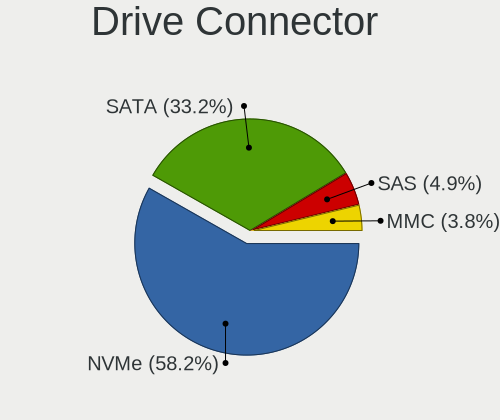
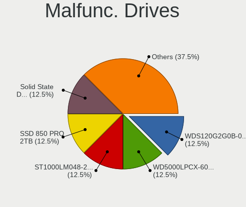
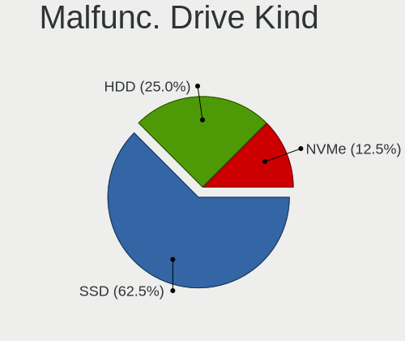
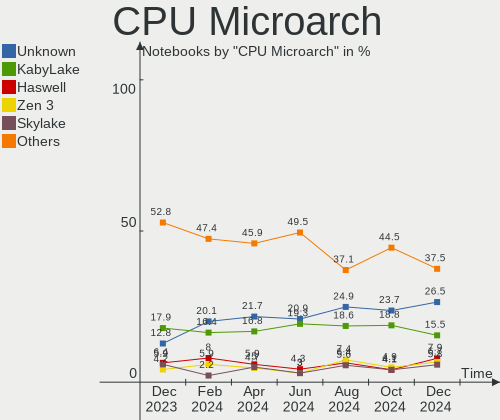

Fedora - Hardware Trends (Notebooks)
------------------------------------

A project to identify most popular hardware characteristics and track their change
over time based on data collected by Linux users at https://Linux-Hardware.org.

Anyone can contribute to this report by the [hw-probe](https://github.com/linuxhw/hw-probe) tool:

    sudo -E hw-probe -all -upload

This report is for one last month. Overall report since the beginning of time: [TestDays](https://github.com/linuxhw/TestDays)

Period: Mar, 2023.

Contents
--------

* [ System ](#system)
  - [ OS                       ](#os)
  - [ OS Family                ](#os-family)
  - [ Kernel                   ](#kernel)
  - [ Kernel Family            ](#kernel-family)
  - [ Kernel Major Ver.        ](#kernel-major-ver)
  - [ Arch                     ](#arch)
  - [ DE                       ](#de)
  - [ Display Server           ](#display-server)
  - [ Display Manager          ](#display-manager)
  - [ OS Lang                  ](#os-lang)
  - [ Boot Mode                ](#boot-mode)
  - [ Filesystem               ](#filesystem)
  - [ Part. scheme             ](#part-scheme)
  - [ Dual Boot with Linux/BSD ](#dual-boot-with-linuxbsd)
  - [ Dual Boot (Win)          ](#dual-boot-win)

* [ Board ](#board)
  - [ Vendor                   ](#vendor)
  - [ Model                    ](#model)
  - [ Model Family             ](#model-family)
  - [ MFG Year                 ](#mfg-year)
  - [ Form Factor              ](#form-factor)
  - [ Secure Boot              ](#secure-boot)
  - [ Coreboot                 ](#coreboot)
  - [ RAM Size                 ](#ram-size)
  - [ RAM Used                 ](#ram-used)
  - [ Total Drives             ](#total-drives)
  - [ Has CD-ROM               ](#has-cd-rom)
  - [ Has Ethernet             ](#has-ethernet)
  - [ Has WiFi                 ](#has-wifi)
  - [ Has Bluetooth            ](#has-bluetooth)

* [ Location ](#location)
  - [ Country                  ](#country)
  - [ City                     ](#city)

* [ Drives ](#drives)
  - [ Drive Vendor             ](#drive-vendor)
  - [ Drive Model              ](#drive-model)
  - [ HDD Vendor               ](#hdd-vendor)
  - [ SSD Vendor               ](#ssd-vendor)
  - [ Drive Kind               ](#drive-kind)
  - [ Drive Connector          ](#drive-connector)
  - [ Drive Size               ](#drive-size)
  - [ Space Total              ](#space-total)
  - [ Space Used               ](#space-used)
  - [ Malfunc. Drives          ](#malfunc-drives)
  - [ Malfunc. Drive Vendor    ](#malfunc-drive-vendor)
  - [ Malfunc. HDD Vendor      ](#malfunc-hdd-vendor)
  - [ Malfunc. Drive Kind      ](#malfunc-drive-kind)
  - [ Failed Drives            ](#failed-drives)
  - [ Failed Drive Vendor      ](#failed-drive-vendor)
  - [ Drive Status             ](#drive-status)

* [ Storage controller ](#storage-controller)
  - [ Storage Vendor           ](#storage-vendor)
  - [ Storage Model            ](#storage-model)
  - [ Storage Kind             ](#storage-kind)

* [ Processor ](#processor)
  - [ CPU Vendor               ](#cpu-vendor)
  - [ CPU Model                ](#cpu-model)
  - [ CPU Model Family         ](#cpu-model-family)
  - [ CPU Cores                ](#cpu-cores)
  - [ CPU Sockets              ](#cpu-sockets)
  - [ CPU Threads              ](#cpu-threads)
  - [ CPU Op-Modes             ](#cpu-op-modes)
  - [ CPU Microcode            ](#cpu-microcode)
  - [ CPU Microarch            ](#cpu-microarch)

* [ Graphics ](#graphics)
  - [ GPU Vendor               ](#gpu-vendor)
  - [ GPU Model                ](#gpu-model)
  - [ GPU Combo                ](#gpu-combo)
  - [ GPU Driver               ](#gpu-driver)
  - [ GPU Memory               ](#gpu-memory)

* [ Monitor ](#monitor)
  - [ Monitor Vendor           ](#monitor-vendor)
  - [ Monitor Model            ](#monitor-model)
  - [ Monitor Resolution       ](#monitor-resolution)
  - [ Monitor Diagonal         ](#monitor-diagonal)
  - [ Monitor Width            ](#monitor-width)
  - [ Aspect Ratio             ](#aspect-ratio)
  - [ Monitor Area             ](#monitor-area)
  - [ Pixel Density            ](#pixel-density)
  - [ Multiple Monitors        ](#multiple-monitors)

* [ Network ](#network)
  - [ Net Controller Vendor    ](#net-controller-vendor)
  - [ Net Controller Model     ](#net-controller-model)
  - [ Wireless Vendor          ](#wireless-vendor)
  - [ Wireless Model           ](#wireless-model)
  - [ Ethernet Vendor          ](#ethernet-vendor)
  - [ Ethernet Model           ](#ethernet-model)
  - [ Net Controller Kind      ](#net-controller-kind)
  - [ Used Controller          ](#used-controller)
  - [ NICs                     ](#nics)
  - [ IPv6                     ](#ipv6)

* [ Bluetooth ](#bluetooth)
  - [ Bluetooth Vendor         ](#bluetooth-vendor)
  - [ Bluetooth Model          ](#bluetooth-model)

* [ Sound ](#sound)
  - [ Sound Vendor             ](#sound-vendor)
  - [ Sound Model              ](#sound-model)

* [ Memory ](#memory)
  - [ Memory Vendor            ](#memory-vendor)
  - [ Memory Model             ](#memory-model)
  - [ Memory Kind              ](#memory-kind)
  - [ Memory Form Factor       ](#memory-form-factor)
  - [ Memory Size              ](#memory-size)
  - [ Memory Speed             ](#memory-speed)

* [ Printers & scanners ](#printers--scanners)
  - [ Printer Vendor           ](#printer-vendor)
  - [ Printer Model            ](#printer-model)
  - [ Scanner Vendor           ](#scanner-vendor)
  - [ Scanner Model            ](#scanner-model)

* [ Camera ](#camera)
  - [ Camera Vendor            ](#camera-vendor)
  - [ Camera Model             ](#camera-model)

* [ Security ](#security)
  - [ Fingerprint Vendor       ](#fingerprint-vendor)
  - [ Fingerprint Model        ](#fingerprint-model)
  - [ Chipcard Vendor          ](#chipcard-vendor)
  - [ Chipcard Model           ](#chipcard-model)

* [ Unsupported ](#unsupported)
  - [ Unsupported Devices      ](#unsupported-devices)
  - [ Unsupported Device Types ](#unsupported-device-types)

System
------

OS
--

Installed operating systems

| Name      | Notebooks | Percent |
|-----------|-----------|---------|
| Fedora 37 | 225       | 86.21%  |
| Fedora 38 | 19        | 7.28%   |
| Fedora 36 | 7         | 2.68%   |
| Fedora 34 | 6         | 2.3%    |
| Fedora 39 | 2         | 0.77%   |
| Fedora 33 | 2         | 0.77%   |

OS Family
---------

OS without a version

| Name   | Notebooks | Percent |
|--------|-----------|---------|
| Fedora | 261       | 100%    |

Kernel
------

Version of the Linux kernel

| Version                                            | Notebooks | Percent |
|----------------------------------------------------|-----------|---------|
| 6.1.14-200.fc37.x86_64                             | 59        | 22.61%  |
| 6.1.18-200.fc37.x86_64                             | 50        | 19.16%  |
| 6.2.7-200.fc37.x86_64                              | 36        | 13.79%  |
| 6.1.15-200.fc37.x86_64                             | 28        | 10.73%  |
| 6.2.8-200.fc37.x86_64                              | 19        | 7.28%   |
| 6.0.7-301.fc37.x86_64                              | 11        | 4.21%   |
| 6.2.8-300.fc38.x86_64                              | 7         | 2.68%   |
| 6.2.6-300.fc38.x86_64                              | 6         | 2.3%    |
| 6.1.13-200.fc37.x86_64                             | 6         | 2.3%    |
| 5.17.12-100.fc34.x86_64                            | 5         | 1.92%   |
| 6.2.7-300.fc38.x86_64                              | 3         | 1.15%   |
| 6.2.5-300.rog.fc37.x86_64                          | 2         | 0.77%   |
| 6.1.8-200.fc37.x86_64                              | 2         | 0.77%   |
| 6.1.14-100.fc36.x86_64                             | 2         | 0.77%   |
| 6.1.11-200.fc37.x86_64                             | 2         | 0.77%   |
| 6.1.10-200.fc37.x86_64                             | 2         | 0.77%   |
| 6.3.0-0.rc3.20230322gita1effab7a3a3.31.fc39.x86_64 | 1         | 0.38%   |
| 6.3.0-0.rc0.20230223gita5c95ca18a98.4.fc39.x86_64  | 1         | 0.38%   |
| 6.2.8-100.fc36.x86_64                              | 1         | 0.38%   |
| 6.2.6-201.fsync.fc37.x86_64                        | 1         | 0.38%   |
| 6.2.5-300.fc38.x86_64                              | 1         | 0.38%   |
| 6.2.2-300.fc38.x86_64                              | 1         | 0.38%   |
| 6.2.0-63.fc38.x86_64                               | 1         | 0.38%   |
| 6.2.0-0.rc3.asahi7.1.fc37.aarch64                  | 1         | 0.38%   |
| 6.1.7-200.fc37.x86_64                              | 1         | 0.38%   |
| 6.1.18-100.fc36.x86_64                             | 1         | 0.38%   |
| 6.1.15-100.fc36.x86_64                             | 1         | 0.38%   |
| 6.1.14-603.inttf.fc37.x86_64                       | 1         | 0.38%   |
| 6.1.13-100.fc36.x86_64                             | 1         | 0.38%   |
| 6.1.12-200.fc37.x86_64                             | 1         | 0.38%   |
| 6.1.11-201.fsync.fc37.x86_64                       | 1         | 0.38%   |
| 6.1.11-100.fc36.x86_64                             | 1         | 0.38%   |
| 6.0.18-300.fc37.x86_64                             | 1         | 0.38%   |
| 6.0.11-300.fc37.x86_64                             | 1         | 0.38%   |
| 5.14.18-100.fc33.x86_64                            | 1         | 0.38%   |
| 5.11.12-300.fc34.x86_64                            | 1         | 0.38%   |
| 5.10.21-200.fc33.x86_64                            | 1         | 0.38%   |

Kernel Family
-------------

Linux kernel without a distro release

| Version | Notebooks | Percent |
|---------|-----------|---------|
| 6.1.14  | 62        | 23.75%  |
| 6.1.18  | 51        | 19.54%  |
| 6.2.7   | 39        | 14.94%  |
| 6.1.15  | 29        | 11.11%  |
| 6.2.8   | 27        | 10.34%  |
| 6.0.7   | 11        | 4.21%   |
| 6.2.6   | 7         | 2.68%   |
| 6.1.13  | 7         | 2.68%   |
| 5.17.12 | 5         | 1.92%   |
| 6.1.11  | 4         | 1.53%   |
| 6.2.5   | 3         | 1.15%   |
| 6.3.0   | 2         | 0.77%   |
| 6.2.0   | 2         | 0.77%   |
| 6.1.8   | 2         | 0.77%   |
| 6.1.10  | 2         | 0.77%   |
| 6.2.2   | 1         | 0.38%   |
| 6.1.7   | 1         | 0.38%   |
| 6.1.12  | 1         | 0.38%   |
| 6.0.18  | 1         | 0.38%   |
| 6.0.11  | 1         | 0.38%   |
| 5.14.18 | 1         | 0.38%   |
| 5.11.12 | 1         | 0.38%   |
| 5.10.21 | 1         | 0.38%   |

Kernel Major Ver.
-----------------

Linux kernel major version

| Version | Notebooks | Percent |
|---------|-----------|---------|
| 6.1     | 159       | 60.92%  |
| 6.2     | 79        | 30.27%  |
| 6.0     | 13        | 4.98%   |
| 5.17    | 5         | 1.92%   |
| 6.3     | 2         | 0.77%   |
| 5.14    | 1         | 0.38%   |
| 5.11    | 1         | 0.38%   |
| 5.10    | 1         | 0.38%   |

Arch
----

OS architecture (x86_64, i586, etc.)

| Name    | Notebooks | Percent |
|---------|-----------|---------|
| x86_64  | 260       | 99.62%  |
| aarch64 | 1         | 0.38%   |

DE
--

Desktop Environment

| Name         | Notebooks | Percent |
|--------------|-----------|---------|
| GNOME        | 190       | 72.8%   |
| KDE5         | 45        | 17.24%  |
| XFCE         | 10        | 3.83%   |
| X-Cinnamon   | 4         | 1.53%   |
| MATE         | 4         | 1.53%   |
| sway         | 2         | 0.77%   |
| Cinnamon     | 2         | 0.77%   |
| Unknown      | 2         | 0.77%   |
| xinit-compat | 1         | 0.38%   |
| dwm          | 1         | 0.38%   |

Display Server
--------------

X11 or Wayland

| Name    | Notebooks | Percent |
|---------|-----------|---------|
| Wayland | 191       | 73.18%  |
| X11     | 64        | 24.52%  |
| Tty     | 4         | 1.53%   |
| Unknown | 2         | 0.77%   |

Display Manager
---------------

SDDM, LightDM, etc.

| Name    | Notebooks | Percent |
|---------|-----------|---------|
| Unknown | 124       | 47.51%  |
| GDM     | 98        | 37.55%  |
| SDDM    | 22        | 8.43%   |
| LightDM | 17        | 6.51%   |

OS Lang
-------

Language

| Lang        | Notebooks | Percent |
|-------------|-----------|---------|
| en_US       | 131       | 50.19%  |
| en_GB       | 20        | 7.66%   |
| ru_RU       | 18        | 6.9%    |
| de_DE       | 12        | 4.6%    |
| it_IT       | 10        | 3.83%   |
| pt_BR       | 9         | 3.45%   |
| es_ES       | 9         | 3.45%   |
| fr_FR       | 7         | 2.68%   |
| en_IN       | 7         | 2.68%   |
| en_AU       | 5         | 1.92%   |
| tr_TR       | 3         | 1.15%   |
| zh_CN       | 2         | 0.77%   |
| pl_PL       | 2         | 0.77%   |
| fr_CH       | 2         | 0.77%   |
| es_MX       | 2         | 0.77%   |
| es_CL       | 2         | 0.77%   |
| en_PH       | 2         | 0.77%   |
| cs_CZ       | 2         | 0.77%   |
| sv_SE       | 1         | 0.38%   |
| nl_NL       | 1         | 0.38%   |
| fr_CA       | 1         | 0.38%   |
| fr_BE       | 1         | 0.38%   |
| es_GT       | 1         | 0.38%   |
| es_AR       | 1         | 0.38%   |
| en_ZA       | 1         | 0.38%   |
| en_US.utf-8 | 1         | 0.38%   |
| en_SG       | 1         | 0.38%   |
| en_IL       | 1         | 0.38%   |
| en_DK       | 1         | 0.38%   |
| en_CA       | 1         | 0.38%   |
| en_BW       | 1         | 0.38%   |
| el_GR       | 1         | 0.38%   |
| de_AT       | 1         | 0.38%   |
| Unknown     | 1         | 0.38%   |

Boot Mode
---------

EFI or BIOS

| Mode | Notebooks | Percent |
|------|-----------|---------|
| EFI  | 228       | 87.36%  |
| BIOS | 33        | 12.64%  |

Filesystem
----------

Type of filesystem

| Type  | Notebooks | Percent |
|-------|-----------|---------|
| Btrfs | 212       | 81.23%  |
| Ext4  | 43        | 16.48%  |
| Xfs   | 4         | 1.53%   |
| Ext3  | 2         | 0.77%   |

Part. scheme
------------

Scheme of partitioning

| Type    | Notebooks | Percent |
|---------|-----------|---------|
| GPT     | 135       | 51.72%  |
| Unknown | 122       | 46.74%  |
| MBR     | 4         | 1.53%   |

Dual Boot with Linux/BSD
------------------------

Hosting more than one Linux/BSD

| Dual boot | Notebooks | Percent |
|-----------|-----------|---------|
| No        | 237       | 90.8%   |
| Yes       | 24        | 9.2%    |

Dual Boot (Win)
---------------

Hosting Linux and Windows

| Dual boot | Notebooks | Percent |
|-----------|-----------|---------|
| No        | 216       | 82.76%  |
| Yes       | 45        | 17.24%  |

Board
-----

Vendor
------

Motherboard manufacturer

| Name                   | Notebooks | Percent |
|------------------------|-----------|---------|
| Lenovo                 | 66        | 25.29%  |
| Hewlett-Packard        | 45        | 17.24%  |
| Dell                   | 41        | 15.71%  |
| ASUSTek Computer       | 30        | 11.49%  |
| Acer                   | 16        | 6.13%   |
| MSI                    | 10        | 3.83%   |
| HUAWEI                 | 9         | 3.45%   |
| Toshiba                | 6         | 2.3%    |
| Apple                  | 4         | 1.53%   |
| Samsung Electronics    | 3         | 1.15%   |
| HONOR                  | 3         | 1.15%   |
| Google                 | 3         | 1.15%   |
| Notebook               | 2         | 0.77%   |
| Exo                    | 2         | 0.77%   |
| Clevo                  | 2         | 0.77%   |
| Unknown                | 2         | 0.77%   |
| TUXEDO                 | 1         | 0.38%   |
| TECNO                  | 1         | 0.38%   |
| System76               | 1         | 0.38%   |
| Purism                 | 1         | 0.38%   |
| Proline                | 1         | 0.38%   |
| Prestigio              | 1         | 0.38%   |
| LG Electronics         | 1         | 0.38%   |
| Insyde                 | 1         | 0.38%   |
| HIPER                  | 1         | 0.38%   |
| Hampoo                 | 1         | 0.38%   |
| Fujitsu                | 1         | 0.38%   |
| Framework              | 1         | 0.38%   |
| Chuwi                  | 1         | 0.38%   |
| BESSTAR Tech           | 1         | 0.38%   |
| Avell High Performance | 1         | 0.38%   |
| Alienware              | 1         | 0.38%   |
| AIR                    | 1         | 0.38%   |

Model
-----

Motherboard model

| Name                                                  | Notebooks | Percent |
|-------------------------------------------------------|-----------|---------|
| Dell XPS 13 9310                                      | 3         | 1.15%   |
| HUAWEI CREM-WXX9                                      | 2         | 0.77%   |
| HUAWEI BOD-WXX9                                       | 2         | 0.77%   |
| HP OMEN by Laptop 16-c0xxx                            | 2         | 0.77%   |
| HP EliteBook 850 G8 Notebook PC                       | 2         | 0.77%   |
| Google Cave                                           | 2         | 0.77%   |
| Dell Latitude 7430                                    | 2         | 0.77%   |
| ASUS ASUS TUF Dash F15 FX516PM_FX516PM                | 2         | 0.77%   |
| Acer Nitro AN515-54                                   | 2         | 0.77%   |
| Unknown                                               | 2         | 0.77%   |
| TUXEDO InfinityBook S 15/17 Gen7                      | 1         | 0.38%   |
| Toshiba Satellite U940                                | 1         | 0.38%   |
| Toshiba Satellite P870                                | 1         | 0.38%   |
| Toshiba Satellite P55t-B                              | 1         | 0.38%   |
| Toshiba Satellite L40                                 | 1         | 0.38%   |
| Toshiba Satellite C850-C5K                            | 1         | 0.38%   |
| Toshiba Satellite C75D-B                              | 1         | 0.38%   |
| TECNO MEGABOOK T1                                     | 1         | 0.38%   |
| System76 Gazelle                                      | 1         | 0.38%   |
| Samsung 550XDA                                        | 1         | 0.38%   |
| Samsung 300E5M/300E5L                                 | 1         | 0.38%   |
| Samsung 300E5EV/300E4EV/270E5EV/270E4EV/2470EV/2470EE | 1         | 0.38%   |
| Purism Librem 14                                      | 1         | 0.38%   |
| Proline V146SH                                        | 1         | 0.38%   |
| Prestigio PSB141C01BFH                                | 1         | 0.38%   |
| Notebook W51XTU                                       | 1         | 0.38%   |
| Notebook L140CU                                       | 1         | 0.38%   |
| MSI Summit E16FlipEvo A11MT                           | 1         | 0.38%   |
| MSI Stealth GS77 12UHS                                | 1         | 0.38%   |
| MSI Modern 15 A5M                                     | 1         | 0.38%   |
| MSI Modern 14 B4MW                                    | 1         | 0.38%   |
| MSI Modern 14 B11MOL                                  | 1         | 0.38%   |
| MSI Katana GF76 11UD                                  | 1         | 0.38%   |
| MSI GS66 Stealth 10SF                                 | 1         | 0.38%   |
| MSI GS63VR 6RF                                        | 1         | 0.38%   |
| MSI GF65 Thin 10UE                                    | 1         | 0.38%   |
| MSI GF63 Thin 11SC                                    | 1         | 0.38%   |
| LG 15Z980-G.BH72P1                                    | 1         | 0.38%   |
| Lenovo Yoga Slim 7 14ARE05 82A2                       | 1         | 0.38%   |
| Lenovo Yoga Slim 7 13ACN5 82CY                        | 1         | 0.38%   |

Model Family
------------

Motherboard model prefix

| Name                | Notebooks | Percent |
|---------------------|-----------|---------|
| Lenovo ThinkPad     | 49        | 18.77%  |
| Dell Latitude       | 17        | 6.51%   |
| Dell Inspiron       | 12        | 4.6%    |
| HP EliteBook        | 9         | 3.45%   |
| HP Pavilion         | 8         | 3.07%   |
| Acer Aspire         | 8         | 3.07%   |
| HP Laptop           | 7         | 2.68%   |
| Toshiba Satellite   | 6         | 2.3%    |
| HP ProBook          | 6         | 2.3%    |
| Dell XPS            | 6         | 2.3%    |
| ASUS VivoBook       | 6         | 2.3%    |
| ASUS ROG            | 6         | 2.3%    |
| ASUS ASUS           | 6         | 2.3%    |
| HP 250              | 5         | 1.92%   |
| Lenovo ThinkBook    | 4         | 1.53%   |
| Lenovo Legion       | 4         | 1.53%   |
| Lenovo IdeaPad      | 4         | 1.53%   |
| HP OMEN             | 4         | 1.53%   |
| MSI Modern          | 3         | 1.15%   |
| Dell Vostro         | 3         | 1.15%   |
| ASUS Zenbook        | 3         | 1.15%   |
| Acer Swift          | 3         | 1.15%   |
| Acer Nitro          | 3         | 1.15%   |
| Lenovo Yoga         | 2         | 0.77%   |
| HUAWEI CREM-WXX9    | 2         | 0.77%   |
| HUAWEI BOD-WXX9     | 2         | 0.77%   |
| HP ENVY             | 2         | 0.77%   |
| Google Cave         | 2         | 0.77%   |
| Exo Smart           | 2         | 0.77%   |
| Dell Precision      | 2         | 0.77%   |
| ASUS TUF            | 2         | 0.77%   |
| Unknown             | 2         | 0.77%   |
| TUXEDO InfinityBook | 1         | 0.38%   |
| TECNO MEGABOOK      | 1         | 0.38%   |
| System76 Gazelle    | 1         | 0.38%   |
| Samsung 550XDA      | 1         | 0.38%   |
| Samsung 300E5M      | 1         | 0.38%   |
| Samsung 300E5EV     | 1         | 0.38%   |
| Purism Librem       | 1         | 0.38%   |
| Proline V146SH      | 1         | 0.38%   |

MFG Year
--------

Motherboard manufacture year

| Year    | Notebooks | Percent |
|---------|-----------|---------|
| 2021    | 54        | 20.69%  |
| 2020    | 38        | 14.56%  |
| 2022    | 34        | 13.03%  |
| 2019    | 27        | 10.34%  |
| 2018    | 19        | 7.28%   |
| 2017    | 18        | 6.9%    |
| 2014    | 15        | 5.75%   |
| 2016    | 11        | 4.21%   |
| 2012    | 11        | 4.21%   |
| 2015    | 9         | 3.45%   |
| 2011    | 6         | 2.3%    |
| 2013    | 5         | 1.92%   |
| 2023    | 3         | 1.15%   |
| 2010    | 3         | 1.15%   |
| 2009    | 2         | 0.77%   |
| 2007    | 2         | 0.77%   |
| Unknown | 2         | 0.77%   |
| 2008    | 1         | 0.38%   |
| 2006    | 1         | 0.38%   |

Form Factor
-----------

Physical design of the computer

| Name     | Notebooks | Percent |
|----------|-----------|---------|
| Notebook | 261       | 100%    |

Secure Boot
-----------

Enabled or disabled

| State    | Notebooks | Percent |
|----------|-----------|---------|
| Disabled | 198       | 75.86%  |
| Enabled  | 63        | 24.14%  |

Coreboot
--------

Have coreboot on board

| Used | Notebooks | Percent |
|------|-----------|---------|
| No   | 257       | 98.47%  |
| Yes  | 4         | 1.53%   |

RAM Size
--------

Total RAM memory

| Size in GB  | Notebooks | Percent |
|-------------|-----------|---------|
| 4.01-8.0    | 71        | 27.2%   |
| 8.01-16.0   | 53        | 20.31%  |
| 16.01-24.0  | 49        | 18.77%  |
| 32.01-64.0  | 42        | 16.09%  |
| 3.01-4.0    | 23        | 8.81%   |
| 24.01-32.0  | 10        | 3.83%   |
| 1.01-2.0    | 7         | 2.68%   |
| 64.01-256.0 | 6         | 2.3%    |

RAM Used
--------

Used RAM memory

| Used GB    | Notebooks | Percent |
|------------|-----------|---------|
| 4.01-8.0   | 81        | 31.03%  |
| 2.01-3.0   | 63        | 24.14%  |
| 3.01-4.0   | 61        | 23.37%  |
| 1.01-2.0   | 26        | 9.96%   |
| 8.01-16.0  | 24        | 9.2%    |
| 24.01-32.0 | 3         | 1.15%   |
| 16.01-24.0 | 2         | 0.77%   |
| 0.51-1.0   | 1         | 0.38%   |

Total Drives
------------

Number of drives on board

| Drives | Notebooks | Percent |
|--------|-----------|---------|
| 1      | 193       | 73.95%  |
| 2      | 55        | 21.07%  |
| 3      | 9         | 3.45%   |
| 4      | 2         | 0.77%   |
| 6      | 1         | 0.38%   |
| 0      | 1         | 0.38%   |

Has CD-ROM
----------

Has CD-ROM on board

| Presented | Notebooks | Percent |
|-----------|-----------|---------|
| No        | 222       | 85.06%  |
| Yes       | 39        | 14.94%  |

Has Ethernet
------------

Has Ethernet on board

| Presented | Notebooks | Percent |
|-----------|-----------|---------|
| Yes       | 181       | 69.35%  |
| No        | 80        | 30.65%  |

Has WiFi
--------

Has WiFi module

| Presented | Notebooks | Percent |
|-----------|-----------|---------|
| Yes       | 253       | 96.93%  |
| No        | 8         | 3.07%   |

Has Bluetooth
-------------

Has Bluetooth module

| Presented | Notebooks | Percent |
|-----------|-----------|---------|
| Yes       | 223       | 85.44%  |
| No        | 38        | 14.56%  |

Location
--------

Country
-------

Geographic location (country)

| Country      | Notebooks | Percent |
|--------------|-----------|---------|
| USA          | 30        | 11.49%  |
| Germany      | 23        | 8.81%   |
| Russia       | 20        | 7.66%   |
| Italy        | 17        | 6.51%   |
| Brazil       | 14        | 5.36%   |
| UK           | 11        | 4.21%   |
| Spain        | 11        | 4.21%   |
| Poland       | 10        | 3.83%   |
| France       | 10        | 3.83%   |
| India        | 8         | 3.07%   |
| Turkey       | 7         | 2.68%   |
| Netherlands  | 6         | 2.3%    |
| Sweden       | 5         | 1.92%   |
| Israel       | 5         | 1.92%   |
| Switzerland  | 4         | 1.53%   |
| Belarus      | 4         | 1.53%   |
| Austria      | 4         | 1.53%   |
| Australia    | 4         | 1.53%   |
| South Africa | 3         | 1.15%   |
| Indonesia    | 3         | 1.15%   |
| Finland      | 3         | 1.15%   |
| Canada       | 3         | 1.15%   |
| Belgium      | 3         | 1.15%   |
| Argentina    | 3         | 1.15%   |
| Vietnam      | 2         | 0.77%   |
| Slovenia     | 2         | 0.77%   |
| Singapore    | 2         | 0.77%   |
| Portugal     | 2         | 0.77%   |
| Philippines  | 2         | 0.77%   |
| New Zealand  | 2         | 0.77%   |
| Mexico       | 2         | 0.77%   |
| Japan        | 2         | 0.77%   |
| Hungary      | 2         | 0.77%   |
| Egypt        | 2         | 0.77%   |
| Denmark      | 2         | 0.77%   |
| Czechia      | 2         | 0.77%   |
| Chile        | 2         | 0.77%   |
| Bangladesh   | 2         | 0.77%   |
| Uruguay      | 1         | 0.38%   |
| Ukraine      | 1         | 0.38%   |

City
----

Geographic location (city)

| City                   | Notebooks | Percent |
|------------------------|-----------|---------|
| St Petersburg          | 6         | 2.3%    |
| Moscow                 | 6         | 2.3%    |
| Berlin                 | 6         | 2.3%    |
| Tel Aviv               | 4         | 1.53%   |
| Munich                 | 4         | 1.53%   |
| Madrid                 | 4         | 1.53%   |
| Paris                  | 3         | 1.15%   |
| London                 | 3         | 1.15%   |
| Istanbul               | 3         | 1.15%   |
| Winsted                | 2         | 0.77%   |
| Vienna                 | 2         | 0.77%   |
| Singapore              | 2         | 0.77%   |
| Prague                 | 2         | 0.77%   |
| Palermo                | 2         | 0.77%   |
| Minsk                  | 2         | 0.77%   |
| Milano                 | 2         | 0.77%   |
| Milan                  | 2         | 0.77%   |
| Melbourne              | 2         | 0.77%   |
| Lisbon                 | 2         | 0.77%   |
| Krakow                 | 2         | 0.77%   |
| Kochi                  | 2         | 0.77%   |
| Johannesburg           | 2         | 0.77%   |
| Jakarta                | 2         | 0.77%   |
| Elblag                 | 2         | 0.77%   |
| Chennai                | 2         | 0.77%   |
| Capelle aan den IJssel | 2         | 0.77%   |
| Bengaluru              | 2         | 0.77%   |
| Baden bei Wien         | 2         | 0.77%   |
| Auckland               | 2         | 0.77%   |
| Alexandria             | 2         | 0.77%   |
| Zweidlen-Dorf          | 1         | 0.38%   |
| Zurich                 | 1         | 0.38%   |
| Zeist                  | 1         | 0.38%   |
| Zagreb                 | 1         | 0.38%   |
| Yerevan                | 1         | 0.38%   |
| Wroclaw                | 1         | 0.38%   |
| Wolverhampton          | 1         | 0.38%   |
| Winthrop               | 1         | 0.38%   |
| Winterthur             | 1         | 0.38%   |
| Whiteley               | 1         | 0.38%   |

Drives
------

Drive Vendor
------------

Hard drive vendors

| Vendor                       | Notebooks | Drives | Percent |
|------------------------------|-----------|--------|---------|
| Samsung Electronics          | 73        | 78     | 22.32%  |
| WDC                          | 35        | 36     | 10.7%   |
| SK hynix                     | 25        | 25     | 7.65%   |
| Sandisk                      | 23        | 24     | 7.03%   |
| Micron Technology            | 18        | 18     | 5.5%    |
| Unknown                      | 16        | 18     | 4.89%   |
| Seagate                      | 16        | 16     | 4.89%   |
| Kingston                     | 16        | 17     | 4.89%   |
| Toshiba                      | 14        | 15     | 4.28%   |
| KIOXIA                       | 12        | 12     | 3.67%   |
| Intel                        | 10        | 10     | 3.06%   |
| Crucial                      | 7         | 8      | 2.14%   |
| Micron/Crucial Technology    | 5         | 5      | 1.53%   |
| HGST                         | 5         | 5      | 1.53%   |
| PNY                          | 4         | 4      | 1.22%   |
| A-DATA Technology            | 4         | 4      | 1.22%   |
| Phison                       | 3         | 3      | 0.92%   |
| ADATA Technology             | 3         | 3      | 0.92%   |
| SPCC                         | 2         | 2      | 0.61%   |
| Netac                        | 2         | 2      | 0.61%   |
| Kingston Technology Company  | 2         | 2      | 0.61%   |
| JMicron Technology           | 2         | 2      | 0.61%   |
| Corsair                      | 2         | 2      | 0.61%   |
| Apple                        | 2         | 4      | 0.61%   |
| Unknown                      | 2         | 2      | 0.61%   |
| UMIS                         | 1         | 1      | 0.31%   |
| TO Exter                     | 1         | 1      | 0.31%   |
| Teclast                      | 1         | 1      | 0.31%   |
| Shenzhen Longsys Electronics | 1         | 1      | 0.31%   |
| Realtek Semiconductor        | 1         | 1      | 0.31%   |
| Realtek                      | 1         | 1      | 0.31%   |
| Ramsta                       | 1         | 1      | 0.31%   |
| Plextor                      | 1         | 1      | 0.31%   |
| Phison Electronics           | 1         | 1      | 0.31%   |
| Patriot                      | 1         | 1      | 0.31%   |
| Netac NV                     | 1         | 1      | 0.31%   |
| Neo                          | 1         | 1      | 0.31%   |
| Mushkin                      | 1         | 1      | 0.31%   |
| LITEON                       | 1         | 1      | 0.31%   |
| KingSpec                     | 1         | 2      | 0.31%   |

Drive Model
-----------

Hard drive models

| Model                                               | Notebooks | Percent |
|-----------------------------------------------------|-----------|---------|
| Samsung NVMe SSD Controller SM981/PM981/PM983 250GB | 8         | 2.36%   |
| Samsung NVMe SSD Controller PM9A1/PM9A3/980PRO 1TB  | 7         | 2.06%   |
| Sandisk WD Black SN750 / PC SN730 NVMe SSD 1TB      | 5         | 1.47%   |
| Micron/Crucial P2 NVMe PCIe SSD 1TB                 | 5         | 1.47%   |
| Unknown MMC Card  128GB                             | 4         | 1.18%   |
| WDC WD10SPZX-60Z10T0 1TB                            | 3         | 0.88%   |
| Samsung MZVLB1T0HBLR-000L7 1TB                      | 3         | 0.88%   |
| Kingston SA400S37480G 480GB SSD                     | 3         | 0.88%   |
| Kingston OM8PCP3512F-AI1 512GB                      | 3         | 0.88%   |
| HGST HTS545050A7E680 500GB                          | 3         | 0.88%   |
| WDC WD10JPVX-22JC3T0 1TB                            | 2         | 0.59%   |
| WDC PC SN530 SDBPNPZ-256G-1002 256GB                | 2         | 0.59%   |
| Unknown MMC Card  64GB                              | 2         | 0.59%   |
| Unknown MMC Card  32GB                              | 2         | 0.59%   |
| Toshiba MQ04ABF100 1TB                              | 2         | 0.59%   |
| Toshiba MQ01ABF050 500GB                            | 2         | 0.59%   |
| Toshiba MQ01ABD100 1TB                              | 2         | 0.59%   |
| Toshiba MQ01ABD050V 500GB                           | 2         | 0.59%   |
| SK hynix SKHynix_HFS512GDE9X081N 512GB              | 2         | 0.59%   |
| SK hynix SKHynix_HFS256GDE9X081N 256GB              | 2         | 0.59%   |
| SK hynix SKHynix_HFS001TD9TNI-L2B0B 1TB             | 2         | 0.59%   |
| SK hynix HFM512GD3JX016N 512GB                      | 2         | 0.59%   |
| SK hynix HFM512GD3JX013N 512GB                      | 2         | 0.59%   |
| SK hynix BC511 512GB                                | 2         | 0.59%   |
| Seagate ST1000LM048-2E7172 1TB                      | 2         | 0.59%   |
| Seagate ST1000LM035-1RK172 1TB                      | 2         | 0.59%   |
| Sandisk WD Black SN850 1TB                          | 2         | 0.59%   |
| Samsung SSD 980 1TB                                 | 2         | 0.59%   |
| Samsung SSD 970 EVO Plus 500GB                      | 2         | 0.59%   |
| Samsung SSD 850 EVO 500GB                           | 2         | 0.59%   |
| Samsung MZVLQ512HBLU-00BH1 512GB                    | 2         | 0.59%   |
| Samsung MZVLQ1T0HBLB-00BH1 1TB                      | 2         | 0.59%   |
| Samsung MZVLQ1T0HBLB-00B00 1024GB                   | 2         | 0.59%   |
| Samsung MZVLB512HBJQ-000L7 512GB                    | 2         | 0.59%   |
| Samsung MZVLB512HBJQ-00000 512GB                    | 2         | 0.59%   |
| Samsung MZNLN128HAHQ-000H1 128GB SSD                | 2         | 0.59%   |
| PNY 1TB SATA SSD                                    | 2         | 0.59%   |
| Micron MTFDKBA512TFH 512GB                          | 2         | 0.59%   |
| Micron 2450_MTFDKBA1T0TFK 1TB                       | 2         | 0.59%   |
| Micron 2210_MTFDHBA512QFD 512GB                     | 2         | 0.59%   |

HDD Vendor
----------

Hard disk drive vendors

| Vendor  | Notebooks | Drives | Percent |
|---------|-----------|--------|---------|
| WDC     | 18        | 18     | 35.29%  |
| Seagate | 15        | 15     | 29.41%  |
| Toshiba | 11        | 11     | 21.57%  |
| HGST    | 5         | 5      | 9.8%    |
| Unknown | 1         | 1      | 1.96%   |
| Fujitsu | 1         | 1      | 1.96%   |

SSD Vendor
----------

Solid state drive vendors

| Vendor              | Notebooks | Drives | Percent |
|---------------------|-----------|--------|---------|
| Samsung Electronics | 23        | 23     | 27.38%  |
| Kingston            | 10        | 11     | 11.9%   |
| WDC                 | 6         | 6      | 7.14%   |
| SanDisk             | 6         | 6      | 7.14%   |
| Crucial             | 6         | 7      | 7.14%   |
| SK hynix            | 3         | 3      | 3.57%   |
| PNY                 | 3         | 3      | 3.57%   |
| Micron Technology   | 3         | 3      | 3.57%   |
| A-DATA Technology   | 3         | 3      | 3.57%   |
| Netac               | 2         | 2      | 2.38%   |
| JMicron Technology  | 2         | 2      | 2.38%   |
| Corsair             | 2         | 2      | 2.38%   |
| Toshiba             | 1         | 1      | 1.19%   |
| TO Exter            | 1         | 1      | 1.19%   |
| SPCC                | 1         | 1      | 1.19%   |
| Ramsta              | 1         | 1      | 1.19%   |
| Plextor             | 1         | 1      | 1.19%   |
| Patriot             | 1         | 1      | 1.19%   |
| Mushkin             | 1         | 1      | 1.19%   |
| LITEON              | 1         | 1      | 1.19%   |
| KingSpec            | 1         | 2      | 1.19%   |
| KingFast            | 1         | 1      | 1.19%   |
| Intenso             | 1         | 1      | 1.19%   |
| GOODRAM             | 1         | 1      | 1.19%   |
| Gigabyte Technology | 1         | 1      | 1.19%   |
| China               | 1         | 1      | 1.19%   |
| Apple               | 1         | 1      | 1.19%   |

Drive Kind
----------

HDD or SSD

| Kind    | Notebooks | Drives | Percent |
|---------|-----------|--------|---------|
| NVMe    | 162       | 181    | 52.26%  |
| SSD     | 77        | 87     | 24.84%  |
| HDD     | 50        | 51     | 16.13%  |
| MMC     | 16        | 18     | 5.16%   |
| Unknown | 5         | 5      | 1.61%   |

Drive Connector
---------------

SATA, SAS, NVMe, etc.

| Type | Notebooks | Drives | Percent |
|------|-----------|--------|---------|
| NVMe | 161       | 179    | 53.67%  |
| SATA | 109       | 129    | 36.33%  |
| MMC  | 16        | 18     | 5.33%   |
| SAS  | 14        | 16     | 4.67%   |

Drive Size
----------

Size of hard drive

| Size in TB | Notebooks | Drives | Percent |
|------------|-----------|--------|---------|
| 0.01-0.5   | 79        | 87     | 62.7%   |
| 0.51-1.0   | 39        | 42     | 30.95%  |
| 1.01-2.0   | 6         | 7      | 4.76%   |
| 4.01-10.0  | 2         | 2      | 1.59%   |

Space Total
-----------

Amount of disk space available on the file system

| Size in GB     | Notebooks | Percent |
|----------------|-----------|---------|
| 501-1000       | 53        | 20.31%  |
| 251-500        | 44        | 16.86%  |
| 1001-2000      | 41        | 15.71%  |
| 101-250        | 40        | 15.33%  |
| 1-20           | 32        | 12.26%  |
| Unknown        | 25        | 9.58%   |
| 51-100         | 8         | 3.07%   |
| 21-50          | 7         | 2.68%   |
| More than 3000 | 6         | 2.3%    |
| 2001-3000      | 5         | 1.92%   |

Space Used
----------

Amount of used disk space

| Used GB   | Notebooks | Percent |
|-----------|-----------|---------|
| 1-20      | 74        | 28.35%  |
| 21-50     | 41        | 15.71%  |
| 51-100    | 33        | 12.64%  |
| 101-250   | 31        | 11.88%  |
| 251-500   | 29        | 11.11%  |
| Unknown   | 25        | 9.58%   |
| 501-1000  | 22        | 8.43%   |
| 1001-2000 | 5         | 1.92%   |
| 2001-3000 | 1         | 0.38%   |

Malfunc. Drives
---------------

Drive models with a malfunction

| Model                                               | Notebooks | Drives | Percent |
|-----------------------------------------------------|-----------|--------|---------|
| WDC WDS240G2G0B-00EPW0 240GB SSD                    | 1         | 1      | 9.09%   |
| Toshiba MQ01ABF050 500GB                            | 1         | 1      | 9.09%   |
| Toshiba HDWL110 1TB                                 | 1         | 1      | 9.09%   |
| SK hynix SC308 SATA 128GB SSD                       | 1         | 1      | 9.09%   |
| Seagate ST500LM000-1EJ162 500GB                     | 1         | 1      | 9.09%   |
| Seagate ST2000LM003 HN-M201RAD 2TB                  | 1         | 1      | 9.09%   |
| Samsung Electronics SSD 980 1TB                     | 1         | 1      | 9.09%   |
| Micron Technology MTFDDAK256MAY-1AH1ZABHA 256GB SSD | 1         | 1      | 9.09%   |
| Micron Technology 1100 SATA 512GB SSD               | 1         | 1      | 9.09%   |
| HGST HTS721010A9E630 1TB                            | 1         | 1      | 9.09%   |
| Crucial CT1050MX300SSD1 1TB                         | 1         | 1      | 9.09%   |

Malfunc. Drive Vendor
---------------------

Vendors of faulty drives

| Vendor              | Notebooks | Drives | Percent |
|---------------------|-----------|--------|---------|
| Toshiba             | 2         | 2      | 18.18%  |
| Seagate             | 2         | 2      | 18.18%  |
| Micron Technology   | 2         | 2      | 18.18%  |
| WDC                 | 1         | 1      | 9.09%   |
| SK hynix            | 1         | 1      | 9.09%   |
| Samsung Electronics | 1         | 1      | 9.09%   |
| HGST                | 1         | 1      | 9.09%   |
| Crucial             | 1         | 1      | 9.09%   |

Malfunc. HDD Vendor
-------------------

Vendors of faulty HDD drives

| Vendor  | Notebooks | Drives | Percent |
|---------|-----------|--------|---------|
| Toshiba | 2         | 2      | 40%     |
| Seagate | 2         | 2      | 40%     |
| HGST    | 1         | 1      | 20%     |

Malfunc. Drive Kind
-------------------

Kinds of faulty drives

| Kind | Notebooks | Drives | Percent |
|------|-----------|--------|---------|
| SSD  | 5         | 5      | 45.45%  |
| HDD  | 5         | 5      | 45.45%  |
| NVMe | 1         | 1      | 9.09%   |

Failed Drives
-------------

Failed drive models

Zero info for selected period =(

Failed Drive Vendor
-------------------

Failed drive vendors

Zero info for selected period =(

Drive Status
------------

Number of failed and malfunc. drives

| Status   | Notebooks | Drives | Percent |
|----------|-----------|--------|---------|
| Detected | 142       | 186    | 51.64%  |
| Works    | 123       | 145    | 44.73%  |
| Malfunc  | 10        | 11     | 3.64%   |

Storage controller
------------------

Storage Vendor
--------------

Storage controller vendors

| Vendor                       | Notebooks | Percent |
|------------------------------|-----------|---------|
| Intel                        | 131       | 40.43%  |
| Samsung Electronics          | 54        | 16.67%  |
| SanDisk                      | 29        | 8.95%   |
| AMD                          | 27        | 8.33%   |
| SK hynix                     | 22        | 6.79%   |
| Micron Technology            | 15        | 4.63%   |
| KIOXIA                       | 9         | 2.78%   |
| Kingston Technology Company  | 8         | 2.47%   |
| Toshiba America Info Systems | 6         | 1.85%   |
| Micron/Crucial Technology    | 6         | 1.85%   |
| Phison Electronics           | 5         | 1.54%   |
| ADATA Technology             | 4         | 1.23%   |
| Shenzhen Longsys Electronics | 2         | 0.62%   |
| MAXIO Technology (Hangzhou)  | 2         | 0.62%   |
| Union Memory (Shenzhen)      | 1         | 0.31%   |
| Realtek Semiconductor        | 1         | 0.31%   |
| Nvidia                       | 1         | 0.31%   |
| JMicron Technology           | 1         | 0.31%   |

Storage Model
-------------

Storage controller models

| Model                                                                          | Notebooks | Percent |
|--------------------------------------------------------------------------------|-----------|---------|
| AMD FCH SATA Controller [AHCI mode]                                            | 25        | 7.42%   |
| Samsung NVMe SSD Controller SM981/PM981/PM983                                  | 24        | 7.12%   |
| Intel Sunrise Point-LP SATA Controller [AHCI mode]                             | 21        | 6.23%   |
| Intel 82801 Mobile SATA Controller [RAID mode]                                 | 19        | 5.64%   |
| Intel Volume Management Device NVMe RAID Controller                            | 18        | 5.34%   |
| Samsung NVMe SSD Controller 980                                                | 17        | 5.04%   |
| Micron NVMe Storage Controller                                                 | 14        | 4.15%   |
| SK hynix Gold P31/PC711 NVMe Solid State Drive                                 | 12        | 3.56%   |
| SanDisk WD Black SN750 / PC SN730 NVMe SSD                                     | 11        | 3.26%   |
| Samsung NVMe SSD Controller PM9A1/PM9A3/980PRO                                 | 10        | 2.97%   |
| Intel 7 Series Chipset Family 6-port SATA Controller [AHCI mode]               | 10        | 2.97%   |
| Intel Wildcat Point-LP SATA Controller [AHCI Mode]                             | 7         | 2.08%   |
| Kingston Company Company Non-Volatile memory controller                        | 6         | 1.78%   |
| Intel 6 Series/C200 Series Chipset Family 6 port Mobile SATA AHCI Controller   | 6         | 1.78%   |
| SanDisk WD Blue SN550 NVMe SSD                                                 | 5         | 1.48%   |
| Micron/Crucial P2 NVMe PCIe SSD                                                | 5         | 1.48%   |
| KIOXIA NVMe SSD Controller BG4                                                 | 5         | 1.48%   |
| Toshiba America Info Systems XG6 NVMe SSD Controller                           | 4         | 1.19%   |
| SK hynix BC501 NVMe Solid State Drive                                          | 4         | 1.19%   |
| KIOXIA Non-Volatile memory controller                                          | 4         | 1.19%   |
| Intel Q170/Q150/B150/H170/H110/Z170/CM236 Chipset SATA Controller [AHCI Mode]  | 4         | 1.19%   |
| Intel Non-Volatile memory controller                                           | 4         | 1.19%   |
| Intel HM170/QM170 Chipset SATA Controller [AHCI Mode]                          | 4         | 1.19%   |
| Intel Cannon Lake Mobile PCH SATA AHCI Controller                              | 4         | 1.19%   |
| Intel Atom Processor E3800 Series SATA AHCI Controller                         | 4         | 1.19%   |
| Intel 8 Series/C220 Series Chipset Family 6-port SATA Controller 1 [AHCI mode] | 4         | 1.19%   |
| SK hynix Non-Volatile memory controller                                        | 3         | 0.89%   |
| SanDisk NVMe Controller                                                        | 3         | 0.89%   |
| Intel SSD Pro 7600p/760p/E 6100p Series                                        | 3         | 0.89%   |
| Intel SSD 660P Series                                                          | 3         | 0.89%   |
| Intel Comet Lake SATA AHCI Controller                                          | 3         | 0.89%   |
| Intel 8 Series SATA Controller 1 [AHCI mode]                                   | 3         | 0.89%   |
| Toshiba America Info Systems XG5 NVMe SSD Controller                           | 2         | 0.59%   |
| SK hynix BC511                                                                 | 2         | 0.59%   |
| Shenzhen Longsys Electronics Non-Volatile memory controller                    | 2         | 0.59%   |
| SanDisk WD PC SN810 / Black SN850 NVMe SSD                                     | 2         | 0.59%   |
| SanDisk WD Blue SN500 / PC SN520 NVMe SSD                                      | 2         | 0.59%   |
| SanDisk WD Black 2018/SN750 / PC SN720 NVMe SSD                                | 2         | 0.59%   |
| SanDisk PC SN520 NVMe SSD                                                      | 2         | 0.59%   |
| Samsung NVMe SSD Controller SM961/PM961/SM963                                  | 2         | 0.59%   |

Storage Kind
------------

Kind of storage controller (IDE, SATA, NVMe, SAS, ...)

| Kind | Notebooks | Percent |
|------|-----------|---------|
| NVMe | 160       | 49.84%  |
| SATA | 118       | 36.76%  |
| RAID | 39        | 12.15%  |
| IDE  | 4         | 1.25%   |

Processor
---------

CPU Vendor
----------

Processor vendors

| Vendor  | Notebooks | Percent |
|---------|-----------|---------|
| Intel   | 196       | 75.1%   |
| AMD     | 64        | 24.52%  |
| Unknown | 1         | 0.38%   |

CPU Model
---------

Processor models

| Model                                         | Notebooks | Percent |
|-----------------------------------------------|-----------|---------|
| Intel 11th Gen Core i5-1135G7 @ 2.40GHz       | 9         | 3.45%   |
| Intel Core i7-8550U CPU @ 1.80GHz             | 6         | 2.3%    |
| Intel Core i5-1035G1 CPU @ 1.00GHz            | 6         | 2.3%    |
| Intel 11th Gen Core i7-1165G7 @ 2.80GHz       | 6         | 2.3%    |
| Intel Core i7-9750H CPU @ 2.60GHz             | 5         | 1.92%   |
| Intel Core i5-5200U CPU @ 2.20GHz             | 5         | 1.92%   |
| Intel 11th Gen Core i7-1185G7 @ 3.00GHz       | 5         | 1.92%   |
| Intel Core i7-10750H CPU @ 2.60GHz            | 4         | 1.53%   |
| Intel Core i7-10510U CPU @ 1.80GHz            | 4         | 1.53%   |
| Intel Core i5-8265U CPU @ 1.60GHz             | 4         | 1.53%   |
| Intel Core i5-8250U CPU @ 1.60GHz             | 4         | 1.53%   |
| Intel Core i5-7300U CPU @ 2.60GHz             | 4         | 1.53%   |
| Intel Core i5-10210U CPU @ 1.60GHz            | 4         | 1.53%   |
| Intel 12th Gen Core i7-1260P                  | 4         | 1.53%   |
| AMD Ryzen 5 5600H with Radeon Graphics        | 4         | 1.53%   |
| AMD Ryzen 5 5500U with Radeon Graphics        | 4         | 1.53%   |
| Intel Core i7-8650U CPU @ 1.90GHz             | 3         | 1.15%   |
| Intel Core i7-7700HQ CPU @ 2.80GHz            | 3         | 1.15%   |
| Intel Core i7-6700HQ CPU @ 2.60GHz            | 3         | 1.15%   |
| Intel Core i5-6300U CPU @ 2.40GHz             | 3         | 1.15%   |
| Intel 12th Gen Core i5-1235U                  | 3         | 1.15%   |
| Intel 11th Gen Core i7-11800H @ 2.30GHz       | 3         | 1.15%   |
| Intel 11th Gen Core i7-11370H @ 3.30GHz       | 3         | 1.15%   |
| AMD Ryzen 7 PRO 4750U with Radeon Graphics    | 3         | 1.15%   |
| AMD Ryzen 7 5800H with Radeon Graphics        | 3         | 1.15%   |
| AMD Ryzen 7 4800H with Radeon Graphics        | 3         | 1.15%   |
| AMD Ryzen 5 3500U with Radeon Vega Mobile Gfx | 3         | 1.15%   |
| Intel Core i9-10885H CPU @ 2.40GHz            | 2         | 0.77%   |
| Intel Core i7-8750H CPU @ 2.20GHz             | 2         | 0.77%   |
| Intel Core i7-8565U CPU @ 1.80GHz             | 2         | 0.77%   |
| Intel Core i7-4710HQ CPU @ 2.50GHz            | 2         | 0.77%   |
| Intel Core i7-3630QM CPU @ 2.40GHz            | 2         | 0.77%   |
| Intel Core i7-10850H CPU @ 2.70GHz            | 2         | 0.77%   |
| Intel Core i5-7200U CPU @ 2.50GHz             | 2         | 0.77%   |
| Intel Core i5-6200U CPU @ 2.30GHz             | 2         | 0.77%   |
| Intel Core i5-10300H CPU @ 2.50GHz            | 2         | 0.77%   |
| Intel Core i3-6100U CPU @ 2.30GHz             | 2         | 0.77%   |
| Intel Core i3-5005U CPU @ 2.00GHz             | 2         | 0.77%   |
| Intel Core i3-3217U CPU @ 1.80GHz             | 2         | 0.77%   |
| Intel Core i3-3120M CPU @ 2.50GHz             | 2         | 0.77%   |

CPU Model Family
----------------

Processor model prefix

| Model              | Notebooks | Percent |
|--------------------|-----------|---------|
| Intel Core i7      | 55        | 21.07%  |
| Intel Core i5      | 52        | 19.92%  |
| Other              | 51        | 19.54%  |
| AMD Ryzen 5        | 20        | 7.66%   |
| AMD Ryzen 7        | 17        | 6.51%   |
| Intel Core i3      | 14        | 5.36%   |
| AMD Ryzen 7 PRO    | 7         | 2.68%   |
| AMD Ryzen 9        | 6         | 2.3%    |
| AMD Ryzen 3        | 6         | 2.3%    |
| Intel Celeron      | 5         | 1.92%   |
| Intel Atom         | 5         | 1.92%   |
| Intel Pentium      | 4         | 1.53%   |
| Intel Core 2 Duo   | 4         | 1.53%   |
| Intel Core i9      | 3         | 1.15%   |
| AMD Ryzen 5 PRO    | 3         | 1.15%   |
| AMD Athlon II      | 2         | 0.77%   |
| Intel Pentium Dual | 1         | 0.38%   |
| Intel Core m7      | 1         | 0.38%   |
| Intel Core m3      | 1         | 0.38%   |
| Intel Core 2       | 1         | 0.38%   |
| AMD A8             | 1         | 0.38%   |
| AMD A6             | 1         | 0.38%   |
| AMD A12            | 1         | 0.38%   |

CPU Cores
---------

Number of processor cores

| Number | Notebooks | Percent |
|--------|-----------|---------|
| 4      | 104       | 39.85%  |
| 2      | 68        | 26.05%  |
| 8      | 35        | 13.41%  |
| 6      | 33        | 12.64%  |
| 12     | 9         | 3.45%   |
| 10     | 5         | 1.92%   |
| 14     | 4         | 1.53%   |
| 16     | 2         | 0.77%   |
| 1      | 1         | 0.38%   |

CPU Sockets
-----------

Number of sockets

| Number | Notebooks | Percent |
|--------|-----------|---------|
| 1      | 261       | 100%    |

CPU Threads
-----------

Threads per core (Hyper-Threading)

| Number | Notebooks | Percent |
|--------|-----------|---------|
| 2      | 237       | 90.8%   |
| 1      | 24        | 9.2%    |

CPU Op-Modes
------------

CPU Operation Modes (32-bit, 64-bit)

| Op mode        | Notebooks | Percent |
|----------------|-----------|---------|
| 32-bit, 64-bit | 260       | 99.62%  |
| 64-bit         | 1         | 0.38%   |

CPU Microcode
-------------

Microcode number

| Number     | Notebooks | Percent |
|------------|-----------|---------|
| Unknown    | 68        | 26.05%  |
| 0x806c1    | 20        | 7.66%   |
| 0x0a50000c | 16        | 6.13%   |
| 0x806ea    | 14        | 5.36%   |
| 0x806ec    | 9         | 3.45%   |
| 0x906a3    | 8         | 3.07%   |
| 0x08108109 | 8         | 3.07%   |
| 0x406e3    | 7         | 2.68%   |
| 0xa0652    | 6         | 2.3%    |
| 0x306d4    | 6         | 2.3%    |
| 0x0a50000d | 6         | 2.3%    |
| 0x0a404102 | 6         | 2.3%    |
| 0x906ea    | 5         | 1.92%   |
| 0x906a4    | 5         | 1.92%   |
| 0x706e5    | 5         | 1.92%   |
| 0x306c3    | 5         | 1.92%   |
| 0x306a9    | 5         | 1.92%   |
| 0x30678    | 5         | 1.92%   |
| 0x08608103 | 5         | 1.92%   |
| 0x806d1    | 4         | 1.53%   |
| 0x906e9    | 3         | 1.15%   |
| 0x806e9    | 3         | 1.15%   |
| 0x406c4    | 3         | 1.15%   |
| 0x206a7    | 3         | 1.15%   |
| 0x08600104 | 3         | 1.15%   |
| 0x906ed    | 2         | 0.77%   |
| 0x90672    | 2         | 0.77%   |
| 0x806eb    | 2         | 0.77%   |
| 0x806c2    | 2         | 0.77%   |
| 0x6fd      | 2         | 0.77%   |
| 0x506e3    | 2         | 0.77%   |
| 0x40651    | 2         | 0.77%   |
| 0x08600106 | 2         | 0.77%   |
| 0x08101007 | 2         | 0.77%   |
| 0xa0660    | 1         | 0.38%   |
| 0x706a8    | 1         | 0.38%   |
| 0x6f6      | 1         | 0.38%   |
| 0x40661    | 1         | 0.38%   |
| 0x1067a    | 1         | 0.38%   |
| 0x08701021 | 1         | 0.38%   |

CPU Microarch
-------------

Microarchitecture

| Name             | Notebooks | Percent |
|------------------|-----------|---------|
| KabyLake         | 56        | 21.46%  |
| TigerLake        | 26        | 9.96%   |
| Zen 3            | 23        | 8.81%   |
| Alderlake Hybrid | 19        | 7.28%   |
| Skylake          | 16        | 6.13%   |
| Unknown          | 15        | 5.75%   |
| IceLake          | 13        | 4.98%   |
| IvyBridge        | 12        | 4.6%    |
| CometLake        | 12        | 4.6%    |
| Zen 2            | 10        | 3.83%   |
| Zen+             | 9         | 3.45%   |
| Silvermont       | 9         | 3.45%   |
| Haswell          | 9         | 3.45%   |
| Broadwell        | 8         | 3.07%   |
| SandyBridge      | 7         | 2.68%   |
| Zen              | 3         | 1.15%   |
| Penryn           | 3         | 1.15%   |
| Core             | 3         | 1.15%   |
| K10              | 2         | 0.77%   |
| Puma             | 1         | 0.38%   |
| Piledriver       | 1         | 0.38%   |
| Goldmont plus    | 1         | 0.38%   |
| Goldmont         | 1         | 0.38%   |
| Excavator        | 1         | 0.38%   |
| Bonnell          | 1         | 0.38%   |

Graphics
--------

GPU Vendor
----------

Vendors of graphics cards

| Vendor | Notebooks | Percent |
|--------|-----------|---------|
| Intel  | 186       | 54.71%  |
| Nvidia | 80        | 23.53%  |
| AMD    | 74        | 21.76%  |

GPU Model
---------

Graphics card models

| Model                                                                                    | Notebooks | Percent |
|------------------------------------------------------------------------------------------|-----------|---------|
| Intel TigerLake-LP GT2 [Iris Xe Graphics]                                                | 25        | 7.12%   |
| AMD Cezanne [Radeon Vega Series / Radeon Vega Mobile Series]                             | 19        | 5.41%   |
| Intel UHD Graphics 620                                                                   | 14        | 3.99%   |
| Intel Alder Lake-P Integrated Graphics Controller                                        | 12        | 3.42%   |
| Intel CometLake-U GT2 [UHD Graphics]                                                     | 10        | 2.85%   |
| Intel CoffeeLake-H GT2 [UHD Graphics 630]                                                | 10        | 2.85%   |
| Intel 3rd Gen Core processor Graphics Controller                                         | 10        | 2.85%   |
| Intel Skylake GT2 [HD Graphics 520]                                                      | 9         | 2.56%   |
| Intel HD Graphics 620                                                                    | 9         | 2.56%   |
| Intel CometLake-H GT2 [UHD Graphics]                                                     | 9         | 2.56%   |
| AMD Renoir                                                                               | 9         | 2.56%   |
| AMD Picasso/Raven 2 [Radeon Vega Series / Radeon Vega Mobile Series]                     | 9         | 2.56%   |
| Nvidia GA106M [GeForce RTX 3060 Mobile / Max-Q]                                          | 8         | 2.28%   |
| Intel WhiskeyLake-U GT2 [UHD Graphics 620]                                               | 8         | 2.28%   |
| Intel HD Graphics 5500                                                                   | 8         | 2.28%   |
| Nvidia TU117M [GeForce GTX 1650 Mobile / Max-Q]                                          | 7         | 1.99%   |
| Intel Iris Plus Graphics G1 (Ice Lake)                                                   | 7         | 1.99%   |
| AMD Rembrandt [Radeon 680M]                                                              | 7         | 1.99%   |
| AMD Lucienne                                                                             | 7         | 1.99%   |
| Intel Atom Processor Z36xxx/Z37xxx Series Graphics & Display                             | 6         | 1.71%   |
| Intel 2nd Generation Core Processor Family Integrated Graphics Controller                | 6         | 1.71%   |
| Intel TigerLake-H GT1 [UHD Graphics]                                                     | 5         | 1.42%   |
| Intel 4th Gen Core Processor Integrated Graphics Controller                              | 5         | 1.42%   |
| Intel HD Graphics 630                                                                    | 4         | 1.14%   |
| Intel Alder Lake-UP3 GT2 [Iris Xe Graphics]                                              | 4         | 1.14%   |
| AMD Barcelo                                                                              | 4         | 1.14%   |
| Nvidia GP107M [GeForce GTX 1050 Ti Mobile]                                               | 3         | 0.85%   |
| Nvidia GA107M [GeForce RTX 3050 Ti Mobile]                                               | 3         | 0.85%   |
| Nvidia GA107M [GeForce RTX 3050 Mobile]                                                  | 3         | 0.85%   |
| Intel HD Graphics 530                                                                    | 3         | 0.85%   |
| Intel Haswell-ULT Integrated Graphics Controller                                         | 3         | 0.85%   |
| Intel Atom/Celeron/Pentium Processor x5-E8000/J3xxx/N3xxx Integrated Graphics Controller | 3         | 0.85%   |
| AMD Topaz XT [Radeon R7 M260/M265 / M340/M360 / M440/M445 / 530/535 / 620/625 Mobile]    | 3         | 0.85%   |
| AMD Raven Ridge [Radeon Vega Series / Radeon Vega Mobile Series]                         | 3         | 0.85%   |
| Nvidia TU117M [GeForce GTX 1650 Ti Mobile]                                               | 2         | 0.57%   |
| Nvidia TU116M [GeForce GTX 1660 Ti Mobile]                                               | 2         | 0.57%   |
| Nvidia TU106M [GeForce RTX 2070 Mobile / Max-Q Refresh]                                  | 2         | 0.57%   |
| Nvidia TU106M [GeForce RTX 2060 Mobile]                                                  | 2         | 0.57%   |
| Nvidia TU104GLM [Quadro RTX 4000 Mobile / Max-Q]                                         | 2         | 0.57%   |
| Nvidia GP108M [GeForce MX150]                                                            | 2         | 0.57%   |

GPU Combo
---------

Combinations of graphics cards

| Name           | Notebooks | Percent |
|----------------|-----------|---------|
| 1 x Intel      | 119       | 45.59%  |
| Intel + Nvidia | 59        | 22.61%  |
| 1 x AMD        | 46        | 17.62%  |
| AMD + Nvidia   | 13        | 4.98%   |
| 2 x AMD        | 8         | 3.07%   |
| 1 x Nvidia     | 8         | 3.07%   |
| Intel + AMD    | 7         | 2.68%   |
| Other          | 1         | 0.38%   |

GPU Driver
----------

Free vs proprietary

| Driver      | Notebooks | Percent |
|-------------|-----------|---------|
| Free        | 214       | 81.99%  |
| Proprietary | 44        | 16.86%  |
| Unknown     | 3         | 1.15%   |

GPU Memory
----------

Total video memory

| Size in GB | Notebooks | Percent |
|------------|-----------|---------|
| Unknown    | 156       | 59.77%  |
| 1.01-2.0   | 31        | 11.88%  |
| 0.01-0.5   | 27        | 10.34%  |
| 3.01-4.0   | 19        | 7.28%   |
| 0.51-1.0   | 13        | 4.98%   |
| 7.01-8.0   | 7         | 2.68%   |
| 5.01-6.0   | 6         | 2.3%    |
| 8.01-16.0  | 2         | 0.77%   |

Monitor
-------

Monitor Vendor
--------------

Monitor vendors

| Vendor                  | Notebooks | Percent |
|-------------------------|-----------|---------|
| AU Optronics            | 57        | 17.59%  |
| BOE                     | 53        | 16.36%  |
| Chimei Innolux          | 50        | 15.43%  |
| LG Display              | 38        | 11.73%  |
| Samsung Electronics     | 21        | 6.48%   |
| Dell                    | 16        | 4.94%   |
| Sharp                   | 11        | 3.4%    |
| Lenovo                  | 8         | 2.47%   |
| Goldstar                | 7         | 2.16%   |
| PANDA                   | 6         | 1.85%   |
| Chi Mei Optoelectronics | 6         | 1.85%   |
| Hewlett-Packard         | 5         | 1.54%   |
| Apple                   | 5         | 1.54%   |
| Philips                 | 4         | 1.23%   |
| CSO                     | 4         | 1.23%   |
| AOC                     | 4         | 1.23%   |
| LG Philips              | 3         | 0.93%   |
| InfoVision              | 3         | 0.93%   |
| TMX                     | 2         | 0.62%   |
| MSI                     | 2         | 0.62%   |
| Iiyama                  | 2         | 0.62%   |
| BenQ                    | 2         | 0.62%   |
| ASUSTek Computer        | 2         | 0.62%   |
| Toshiba                 | 1         | 0.31%   |
| STD                     | 1         | 0.31%   |
| Sony                    | 1         | 0.31%   |
| RTK                     | 1         | 0.31%   |
| NEC Computers           | 1         | 0.31%   |
| Mi                      | 1         | 0.31%   |
| HUAWEI                  | 1         | 0.31%   |
| HKC                     | 1         | 0.31%   |
| Gigabyte Technology     | 1         | 0.31%   |
| Fujitsu Siemens         | 1         | 0.31%   |
| CTO                     | 1         | 0.31%   |
| Ancor Communications    | 1         | 0.31%   |
| Unknown                 | 1         | 0.31%   |

Monitor Model
-------------

Monitor models

| Model                                                             | Notebooks | Percent |
|-------------------------------------------------------------------|-----------|---------|
| AU Optronics LCD Monitor AUO21ED 1920x1080 344x194mm 15.5-inch    | 5         | 1.53%   |
| Chimei Innolux LCD Monitor CMN1521 1920x1080 344x193mm 15.5-inch  | 4         | 1.22%   |
| Sharp LCD Monitor SHP14FA 3840x2400 288x180mm 13.4-inch           | 3         | 0.92%   |
| PANDA LCD Monitor NCP004D 1920x1080 344x194mm 15.5-inch           | 3         | 0.92%   |
| Chimei Innolux LCD Monitor CMN14D5 1920x1080 309x173mm 13.9-inch  | 3         | 0.92%   |
| BOE LCD Monitor BOE08D7 1920x1080 309x174mm 14.0-inch             | 3         | 0.92%   |
| BOE LCD Monitor BOE0893 2160x1440 296x197mm 14.0-inch             | 3         | 0.92%   |
| AU Optronics LCD Monitor AUO61ED 1920x1080 344x194mm 15.5-inch    | 3         | 0.92%   |
| AU Optronics LCD Monitor AUO403D 1920x1080 309x173mm 13.9-inch    | 3         | 0.92%   |
| AU Optronics LCD Monitor AUO21EC 1366x768 344x193mm 15.5-inch     | 3         | 0.92%   |
| Samsung Electronics C27F390 SAM0D32 1920x1080 598x336mm 27.0-inch | 2         | 0.61%   |
| LG Display LCD Monitor LGD04A7 1920x1080 344x194mm 15.5-inch      | 2         | 0.61%   |
| LG Display LCD Monitor LGD033A 1366x768 344x194mm 15.5-inch       | 2         | 0.61%   |
| Lenovo E27q-20 LEN62D0 2560x1440 597x336mm 27.0-inch              | 2         | 0.61%   |
| Goldstar HDR 4K GSM7706 3840x2160 600x340mm 27.2-inch             | 2         | 0.61%   |
| Dell P2422H DELA1C4 1920x1080 527x296mm 23.8-inch                 | 2         | 0.61%   |
| Dell P2419H DELD0D9 1920x1080 527x296mm 23.8-inch                 | 2         | 0.61%   |
| Chimei Innolux LCD Monitor CMN15F5 1920x1080 344x193mm 15.5-inch  | 2         | 0.61%   |
| Chimei Innolux LCD Monitor CMN15E8 1920x1080 344x193mm 15.5-inch  | 2         | 0.61%   |
| Chimei Innolux LCD Monitor CMN15DB 1366x768 344x193mm 15.5-inch   | 2         | 0.61%   |
| Chimei Innolux LCD Monitor CMN150C 1920x1080 344x193mm 15.5-inch  | 2         | 0.61%   |
| Chimei Innolux LCD Monitor CMN14F5 1920x1080 309x173mm 13.9-inch  | 2         | 0.61%   |
| Chimei Innolux LCD Monitor CMN14B1 1920x1080 308x173mm 13.9-inch  | 2         | 0.61%   |
| Chimei Innolux LCD Monitor CMN140A 1920x1080 309x173mm 13.9-inch  | 2         | 0.61%   |
| BOE LCD Monitor BOE092F 2520x1680 338x226mm 16.0-inch             | 2         | 0.61%   |
| BOE LCD Monitor BOE0872 1920x1080 344x194mm 15.5-inch             | 2         | 0.61%   |
| BOE LCD Monitor BOE0853 1920x1080 344x194mm 15.5-inch             | 2         | 0.61%   |
| BOE LCD Monitor BOE06A4 1366x768 344x194mm 15.5-inch              | 2         | 0.61%   |
| BOE LCD Monitor BOE0697 1366x768 309x173mm 13.9-inch              | 2         | 0.61%   |
| AU Optronics LCD Monitor AUO243D 1920x1080 309x173mm 13.9-inch    | 2         | 0.61%   |
| AU Optronics LCD Monitor AUO226D 1920x1080 276x155mm 12.5-inch    | 2         | 0.61%   |
| AU Optronics LCD Monitor AUO106C 1366x768 276x155mm 12.5-inch     | 2         | 0.61%   |
| Toshiba TV TSB0206 1920x1080                                      | 1         | 0.31%   |
| TMX TL140BDXP01-0 TMX1400 2560x1440 310x174mm 14.0-inch           | 1         | 0.31%   |
| TMX TL140ADXP01 TMX1481 2560x1600 301x188mm 14.0-inch             | 1         | 0.31%   |
| STD LED STD0001 1920x1080 480x260mm 21.5-inch                     | 1         | 0.31%   |
| Sony SDM-X93 SNY1290 1280x1024 359x287mm 18.1-inch                | 1         | 0.31%   |
| Sharp LQ156M1JW25 SHP152C 1920x1080 344x194mm 15.5-inch           | 1         | 0.31%   |
| Sharp LQ156M1JW03 SHP14C5 1920x1080 344x194mm 15.5-inch           | 1         | 0.31%   |
| Sharp LQ156D1JX01 SHP1414 3840x2160 346x194mm 15.6-inch           | 1         | 0.31%   |

Monitor Resolution
------------------

Monitor screen resolution

| Resolution         | Notebooks | Percent |
|--------------------|-----------|---------|
| 1920x1080 (FHD)    | 160       | 54.24%  |
| 1366x768 (WXGA)    | 43        | 14.58%  |
| 2560x1440 (QHD)    | 17        | 5.76%   |
| 3840x2160 (4K)     | 11        | 3.73%   |
| 1600x900 (HD+)     | 11        | 3.73%   |
| 1920x1200 (WUXGA)  | 9         | 3.05%   |
| 3440x1440          | 7         | 2.37%   |
| 3840x2400          | 6         | 2.03%   |
| 2560x1600          | 5         | 1.69%   |
| 2160x1440          | 4         | 1.36%   |
| 1440x900 (WXGA+)   | 4         | 1.36%   |
| 1280x800 (WXGA)    | 4         | 1.36%   |
| 2880x1800          | 3         | 1.02%   |
| 2520x1680          | 2         | 0.68%   |
| 3840x1080          | 1         | 0.34%   |
| 3200x1800 (QHD+)   | 1         | 0.34%   |
| 2880x1620          | 1         | 0.34%   |
| 2560x1080          | 1         | 0.34%   |
| 2256x1504          | 1         | 0.34%   |
| 1920x1280          | 1         | 0.34%   |
| 1680x1050 (WSXGA+) | 1         | 0.34%   |
| 1280x1024 (SXGA)   | 1         | 0.34%   |
| 1024x600           | 1         | 0.34%   |

Monitor Diagonal
----------------

Diagonal size in inches

| Inches  | Notebooks | Percent |
|---------|-----------|---------|
| 15      | 120       | 36.92%  |
| 13      | 48        | 14.77%  |
| 14      | 42        | 12.92%  |
| 27      | 21        | 6.46%   |
| 17      | 16        | 4.92%   |
| 23      | 13        | 4%      |
| 16      | 12        | 3.69%   |
| 24      | 11        | 3.38%   |
| 12      | 8         | 2.46%   |
| 34      | 7         | 2.15%   |
| 11      | 4         | 1.23%   |
| 40      | 3         | 0.92%   |
| 21      | 3         | 0.92%   |
| 18      | 3         | 0.92%   |
| 25      | 2         | 0.62%   |
| 19      | 2         | 0.62%   |
| 74      | 1         | 0.31%   |
| 65      | 1         | 0.31%   |
| 54      | 1         | 0.31%   |
| 48      | 1         | 0.31%   |
| 42      | 1         | 0.31%   |
| 35      | 1         | 0.31%   |
| 31      | 1         | 0.31%   |
| 22      | 1         | 0.31%   |
| 10      | 1         | 0.31%   |
| Unknown | 1         | 0.31%   |

Monitor Width
-------------

Physical width

| Width in mm | Notebooks | Percent |
|-------------|-----------|---------|
| 301-350     | 190       | 59.19%  |
| 501-600     | 42        | 13.08%  |
| 201-300     | 41        | 12.77%  |
| 351-400     | 21        | 6.54%   |
| 401-500     | 8         | 2.49%   |
| 701-800     | 7         | 2.18%   |
| 801-900     | 4         | 1.25%   |
| 1001-1500   | 3         | 0.93%   |
| 601-700     | 2         | 0.62%   |
| 1501-2000   | 1         | 0.31%   |
| 901-1000    | 1         | 0.31%   |
| Unknown     | 1         | 0.31%   |

Aspect Ratio
------------

Proportional relationship between the width and the height

| Ratio   | Notebooks | Percent |
|---------|-----------|---------|
| 16/9    | 224       | 80.58%  |
| 16/10   | 35        | 12.59%  |
| 3/2     | 8         | 2.88%   |
| 21/9    | 8         | 2.88%   |
| 5/4     | 1         | 0.36%   |
| 32/9    | 1         | 0.36%   |
| Unknown | 1         | 0.36%   |

Monitor Area
------------

Area in inch

| Area in inch | Notebooks | Percent |
|----------------|-----------|---------|
| 101-110        | 123       | 38.2%   |
| 81-90          | 67        | 20.81%  |
| 71-80          | 23        | 7.14%   |
| 201-250        | 22        | 6.83%   |
| 301-350        | 21        | 6.52%   |
| 121-130        | 16        | 4.97%   |
| 351-500        | 9         | 2.8%    |
| 111-120        | 9         | 2.8%    |
| 61-70          | 8         | 2.48%   |
| 501-1000       | 5         | 1.55%   |
| 51-60          | 4         | 1.24%   |
| 251-300        | 4         | 1.24%   |
| 151-200        | 4         | 1.24%   |
| More than 1000 | 3         | 0.93%   |
| 141-150        | 2         | 0.62%   |
| 41-50          | 1         | 0.31%   |
| Unknown        | 1         | 0.31%   |

Pixel Density
-------------

Pixels per inch

| Density       | Notebooks | Percent |
|---------------|-----------|---------|
| 121-160       | 151       | 47.63%  |
| 101-120       | 61        | 19.24%  |
| 161-240       | 45        | 14.2%   |
| 51-100        | 42        | 13.25%  |
| More than 240 | 13        | 4.1%    |
| 1-50          | 4         | 1.26%   |
| Unknown       | 1         | 0.32%   |

Multiple Monitors
-----------------

Total monitors connected

| Total | Notebooks | Percent |
|-------|-----------|---------|
| 1     | 197       | 75.48%  |
| 2     | 47        | 18.01%  |
| 3     | 12        | 4.6%    |
| 0     | 4         | 1.53%   |
| 4     | 1         | 0.38%   |

Network
-------

Net Controller Vendor
---------------------

Controller vendors

| Vendor                                | Notebooks | Percent |
|---------------------------------------|-----------|---------|
| Intel                                 | 154       | 40.63%  |
| Realtek Semiconductor                 | 131       | 34.56%  |
| MediaTek                              | 22        | 5.8%    |
| Qualcomm Atheros                      | 18        | 4.75%   |
| Broadcom                              | 13        | 3.43%   |
| Lenovo                                | 10        | 2.64%   |
| ASIX Electronics                      | 7         | 1.85%   |
| Qualcomm                              | 5         | 1.32%   |
| Dell                                  | 4         | 1.06%   |
| Sierra Wireless                       | 2         | 0.53%   |
| Samsung Electronics                   | 2         | 0.53%   |
| Ralink                                | 2         | 0.53%   |
| JMicron Technology                    | 2         | 0.53%   |
| ZTE WCDMA Technologies MSM            | 1         | 0.26%   |
| OPPO Electronics                      | 1         | 0.26%   |
| Huawei Technologies                   | 1         | 0.26%   |
| Hewlett-Packard                       | 1         | 0.26%   |
| DisplayLink                           | 1         | 0.26%   |
| Arduino SA                            | 1         | 0.26%   |
| 802.11g Adapter [Linksys WUSB54GC v3] | 1         | 0.26%   |

Net Controller Model
--------------------

Controller models

| Model                                                             | Notebooks | Percent |
|-------------------------------------------------------------------|-----------|---------|
| Realtek RTL8111/8168/8411 PCI Express Gigabit Ethernet Controller | 78        | 16.85%  |
| Intel Wi-Fi 6 AX201                                               | 23        | 4.97%   |
| Intel Wireless 8265 / 8275                                        | 20        | 4.32%   |
| MediaTek MT7921 802.11ax PCI Express Wireless Network Adapter     | 16        | 3.46%   |
| Realtek RTL8822CE 802.11ac PCIe Wireless Network Adapter          | 15        | 3.24%   |
| Intel Wi-Fi 6 AX200                                               | 15        | 3.24%   |
| Realtek RTL8153 Gigabit Ethernet Adapter                          | 13        | 2.81%   |
| Realtek RTL810xE PCI Express Fast Ethernet controller             | 13        | 2.81%   |
| Intel Wireless 7265                                               | 13        | 2.81%   |
| Intel Comet Lake PCH CNVi WiFi                                    | 11        | 2.38%   |
| Realtek RTL8821CE 802.11ac PCIe Wireless Network Adapter          | 10        | 2.16%   |
| Intel Wi-Fi 6 AX210/AX211/AX411 160MHz                            | 9         | 1.94%   |
| Intel Ethernet Connection (4) I219-LM                             | 9         | 1.94%   |
| Intel Alder Lake-P PCH CNVi WiFi                                  | 9         | 1.94%   |
| ASIX AX88179 Gigabit Ethernet                                     | 7         | 1.51%   |
| Qualcomm Atheros QCA9377 802.11ac Wireless Network Adapter        | 6         | 1.3%    |
| Intel 82579LM Gigabit Network Connection (Lewisville)             | 6         | 1.3%    |
| Realtek RTL8852AE 802.11ax PCIe Wireless Network Adapter          | 5         | 1.08%   |
| Intel Wireless 8260                                               | 5         | 1.08%   |
| Intel Ice Lake-LP PCH CNVi WiFi                                   | 5         | 1.08%   |
| Intel Cannon Point-LP CNVi [Wireless-AC]                          | 5         | 1.08%   |
| Qualcomm QCNFA765 Wireless Network Adapter                        | 4         | 0.86%   |
| Lenovo ThinkPad TBT 3 Dock                                        | 4         | 0.86%   |
| Intel Wireless 7260                                               | 4         | 0.86%   |
| Intel Ethernet Connection (4) I219-V                              | 4         | 0.86%   |
| Intel Comet Lake PCH-LP CNVi WiFi                                 | 4         | 0.86%   |
| Intel Cannon Lake PCH CNVi WiFi                                   | 4         | 0.86%   |
| Realtek RTL8723BU 802.11b/g/n WLAN Adapter                        | 3         | 0.65%   |
| Qualcomm Atheros QCA9565 / AR9565 Wireless Network Adapter        | 3         | 0.65%   |
| Qualcomm Atheros AR9485 Wireless Network Adapter                  | 3         | 0.65%   |
| MediaTek MT7922 802.11ax PCI Express Wireless Network Adapter     | 3         | 0.65%   |
| Intel Tiger Lake PCH CNVi WiFi                                    | 3         | 0.65%   |
| Intel Ethernet Connection I219-LM                                 | 3         | 0.65%   |
| Intel Ethernet Connection (11) I219-LM                            | 3         | 0.65%   |
| Intel Ethernet Connection (10) I219-V                             | 3         | 0.65%   |
| Intel Centrino Advanced-N 6205 [Taylor Peak]                      | 3         | 0.65%   |
| Dell DW5811e Snapdragon X7 LTE                              | 3         | 0.65%   |
| Broadcom BCM43142 802.11b/g/n                                     | 3         | 0.65%   |
| Sierra Wireless EM7455                                            | 2         | 0.43%   |
| Samsung Galaxy series, misc. (tethering mode)                     | 2         | 0.43%   |

Wireless Vendor
---------------

Wireless vendors

| Vendor                                | Notebooks | Percent |
|---------------------------------------|-----------|---------|
| Intel                                 | 149       | 57.31%  |
| Realtek Semiconductor                 | 50        | 19.23%  |
| MediaTek                              | 22        | 8.46%   |
| Qualcomm Atheros                      | 14        | 5.38%   |
| Broadcom                              | 12        | 4.62%   |
| Qualcomm                              | 4         | 1.54%   |
| Dell                                  | 3         | 1.15%   |
| Sierra Wireless                       | 2         | 0.77%   |
| Ralink                                | 2         | 0.77%   |
| Hewlett-Packard                       | 1         | 0.38%   |
| 802.11g Adapter [Linksys WUSB54GC v3] | 1         | 0.38%   |

Wireless Model
--------------

Wireless models

| Model                                                         | Notebooks | Percent |
|---------------------------------------------------------------|-----------|---------|
| Intel Wi-Fi 6 AX201                                           | 23        | 8.85%   |
| Intel Wireless 8265 / 8275                                    | 20        | 7.69%   |
| MediaTek MT7921 802.11ax PCI Express Wireless Network Adapter | 16        | 6.15%   |
| Realtek RTL8822CE 802.11ac PCIe Wireless Network Adapter      | 15        | 5.77%   |
| Intel Wi-Fi 6 AX200                                           | 15        | 5.77%   |
| Intel Wireless 7265                                           | 13        | 5%      |
| Intel Comet Lake PCH CNVi WiFi                                | 11        | 4.23%   |
| Realtek RTL8821CE 802.11ac PCIe Wireless Network Adapter      | 10        | 3.85%   |
| Intel Wi-Fi 6 AX210/AX211/AX411 160MHz                        | 9         | 3.46%   |
| Intel Alder Lake-P PCH CNVi WiFi                              | 9         | 3.46%   |
| Qualcomm Atheros QCA9377 802.11ac Wireless Network Adapter    | 6         | 2.31%   |
| Realtek RTL8852AE 802.11ax PCIe Wireless Network Adapter      | 5         | 1.92%   |
| Intel Wireless 8260                                           | 5         | 1.92%   |
| Intel Ice Lake-LP PCH CNVi WiFi                               | 5         | 1.92%   |
| Intel Cannon Point-LP CNVi [Wireless-AC]                      | 5         | 1.92%   |
| Qualcomm QCNFA765 Wireless Network Adapter                    | 4         | 1.54%   |
| Intel Wireless 7260                                           | 4         | 1.54%   |
| Intel Comet Lake PCH-LP CNVi WiFi                             | 4         | 1.54%   |
| Intel Cannon Lake PCH CNVi WiFi                               | 4         | 1.54%   |
| Realtek RTL8723BU 802.11b/g/n WLAN Adapter                    | 3         | 1.15%   |
| Qualcomm Atheros QCA9565 / AR9565 Wireless Network Adapter    | 3         | 1.15%   |
| Qualcomm Atheros AR9485 Wireless Network Adapter              | 3         | 1.15%   |
| MediaTek MT7922 802.11ax PCI Express Wireless Network Adapter | 3         | 1.15%   |
| Intel Tiger Lake PCH CNVi WiFi                                | 3         | 1.15%   |
| Intel Centrino Advanced-N 6205 [Taylor Peak]                  | 3         | 1.15%   |
| Dell DW5811e Snapdragon X7 LTE                          | 3         | 1.15%   |
| Broadcom BCM43142 802.11b/g/n                                 | 3         | 1.15%   |
| Sierra Wireless EM7455                                        | 2         | 0.77%   |
| Realtek RTL8852BE PCIe 802.11ax Wireless Network Controller   | 2         | 0.77%   |
| Realtek RTL8723DE Wireless Network Adapter                    | 2         | 0.77%   |
| Realtek RTL8723BE PCIe Wireless Network Adapter               | 2         | 0.77%   |
| Realtek RTL8188CE 802.11b/g/n WiFi Adapter                    | 2         | 0.77%   |
| MediaTek Wi-Fi 6E MT7922 160MHz Wireless Network Adapter      | 2         | 0.77%   |
| Intel Wireless-AC 9260                                        | 2         | 0.77%   |
| Intel Wireless 3165                                           | 2         | 0.77%   |
| Intel Wireless 3160                                           | 2         | 0.77%   |
| Intel Alder Lake-S PCH CNVi WiFi                              | 2         | 0.77%   |
| Broadcom BCM43228 802.11a/b/g/n                               | 2         | 0.77%   |
| Realtek RTL88x2bu [AC1200 Techkey]                            | 1         | 0.38%   |
| Realtek RTL8822BE 802.11a/b/g/n/ac WiFi adapter               | 1         | 0.38%   |

Ethernet Vendor
---------------

Ethernet vendors

| Vendor                     | Notebooks | Percent |
|----------------------------|-----------|---------|
| Realtek Semiconductor      | 110       | 56.12%  |
| Intel                      | 53        | 27.04%  |
| Lenovo                     | 9         | 4.59%   |
| ASIX Electronics           | 7         | 3.57%   |
| Qualcomm Atheros           | 4         | 2.04%   |
| Broadcom                   | 4         | 2.04%   |
| Samsung Electronics        | 2         | 1.02%   |
| JMicron Technology         | 2         | 1.02%   |
| ZTE WCDMA Technologies MSM | 1         | 0.51%   |
| Qualcomm                   | 1         | 0.51%   |
| OPPO Electronics           | 1         | 0.51%   |
| Huawei Technologies        | 1         | 0.51%   |
| DisplayLink                | 1         | 0.51%   |

Ethernet Model
--------------

Ethernet models

| Model                                                             | Notebooks | Percent |
|-------------------------------------------------------------------|-----------|---------|
| Realtek RTL8111/8168/8411 PCI Express Gigabit Ethernet Controller | 78        | 39.2%   |
| Realtek RTL8153 Gigabit Ethernet Adapter                          | 13        | 6.53%   |
| Realtek RTL810xE PCI Express Fast Ethernet controller             | 13        | 6.53%   |
| Intel Ethernet Connection (4) I219-LM                             | 9         | 4.52%   |
| ASIX AX88179 Gigabit Ethernet                                     | 7         | 3.52%   |
| Intel 82579LM Gigabit Network Connection (Lewisville)             | 6         | 3.02%   |
| Lenovo ThinkPad TBT 3 Dock                                        | 4         | 2.01%   |
| Intel Ethernet Connection (4) I219-V                              | 4         | 2.01%   |
| Intel Ethernet Connection I219-LM                                 | 3         | 1.51%   |
| Intel Ethernet Connection (11) I219-LM                            | 3         | 1.51%   |
| Intel Ethernet Connection (10) I219-V                             | 3         | 1.51%   |
| Samsung Galaxy series, misc. (tethering mode)                     | 2         | 1.01%   |
| Realtek RTL8152 Fast Ethernet Adapter                             | 2         | 1.01%   |
| Realtek RTL8125 2.5GbE Controller                                 | 2         | 1.01%   |
| Realtek Killer E3000 2.5GbE Controller                            | 2         | 1.01%   |
| Intel Ethernet Controller I225-V                                  | 2         | 1.01%   |
| Intel Ethernet Connection I217-LM                                 | 2         | 1.01%   |
| Intel Ethernet Connection (7) I219-LM                             | 2         | 1.01%   |
| Intel Ethernet Connection (6) I219-LM                             | 2         | 1.01%   |
| Intel Ethernet Connection (3) I218-LM                             | 2         | 1.01%   |
| Intel Ethernet Connection (13) I219-V                             | 2         | 1.01%   |
| Broadcom NetXtreme BCM5764M Gigabit Ethernet PCIe                 | 2         | 1.01%   |
| ZTE WCDMA MSM USB SCSI CD-ROM                                     | 1         | 0.5%    |
| Realtek RTL-8100/8101L/8139 PCI Fast Ethernet Adapter             | 1         | 0.5%    |
| Realtek PCIe GbE Family Controller                                | 1         | 0.5%    |
| Realtek Killer E2600 Gigabit Ethernet Controller                  | 1         | 0.5%    |
| Qualcomm Fairphone 4 5G                                           | 1         | 0.5%    |
| Qualcomm Atheros Killer E2500 Gigabit Ethernet Controller         | 1         | 0.5%    |
| Qualcomm Atheros Killer E2400 Gigabit Ethernet Controller         | 1         | 0.5%    |
| Qualcomm Atheros AR8162 Fast Ethernet                             | 1         | 0.5%    |
| Qualcomm Atheros AR8161 Gigabit Ethernet                          | 1         | 0.5%    |
| OPPO RMX3263                                                      | 1         | 0.5%    |
| Lenovo USB-C to LAN                                               | 1         | 0.5%    |
| Lenovo USB-C Dock Ethernet                                        | 1         | 0.5%    |
| Lenovo ThinkPad TBT3 LAN                                          | 1         | 0.5%    |
| Lenovo ThinkPad Lan                                               | 1         | 0.5%    |
| Lenovo ThinkPad Dock Ethernet [Realtek RTL8153B]                  | 1         | 0.5%    |
| JMicron JMC260 PCI Express Fast Ethernet Controller               | 1         | 0.5%    |
| JMicron JMC250 PCI Express Gigabit Ethernet Controller            | 1         | 0.5%    |
| Intel Killer E3100X 2.5 Gigabit Ethernet Controller               | 1         | 0.5%    |

Net Controller Kind
-------------------

Ethernet, WiFi or modem

| Kind     | Notebooks | Percent |
|----------|-----------|---------|
| WiFi     | 253       | 57.76%  |
| Ethernet | 181       | 41.32%  |
| Modem    | 3         | 0.68%   |
| Unknown  | 1         | 0.23%   |

Used Controller
---------------

Currently used network controller

| Kind     | Notebooks | Percent |
|----------|-----------|---------|
| WiFi     | 218       | 81.04%  |
| Ethernet | 51        | 18.96%  |

NICs
----

Total network controllers on board

| Total | Notebooks | Percent |
|-------|-----------|---------|
| 2     | 153       | 58.62%  |
| 1     | 95        | 36.4%   |
| 0     | 9         | 3.45%   |
| 3     | 4         | 1.53%   |

IPv6
----

IPv6 vs IPv4

| Used | Notebooks | Percent |
|------|-----------|---------|
| No   | 205       | 78.54%  |
| Yes  | 56        | 21.46%  |

Bluetooth
---------

Bluetooth Vendor
----------------

Controller vendors

| Vendor                          | Notebooks | Percent |
|---------------------------------|-----------|---------|
| Intel                           | 126       | 56.25%  |
| Realtek Semiconductor           | 27        | 12.05%  |
| IMC Networks                    | 16        | 7.14%   |
| Foxconn / Hon Hai               | 13        | 5.8%    |
| Qualcomm Atheros Communications | 7         | 3.13%   |
| Lite-On Technology              | 7         | 3.13%   |
| Broadcom                        | 6         | 2.68%   |
| Realtek                         | 4         | 1.79%   |
| Apple                           | 4         | 1.79%   |
| Dell                            | 3         | 1.34%   |
| USI                             | 2         | 0.89%   |
| Hewlett-Packard                 | 2         | 0.89%   |
| Cambridge Silicon Radio         | 2         | 0.89%   |
| Toshiba                         | 1         | 0.45%   |
| Ralink                          | 1         | 0.45%   |
| MediaTek                        | 1         | 0.45%   |
| Chicony Electronics             | 1         | 0.45%   |
| ASUSTek Computer                | 1         | 0.45%   |

Bluetooth Model
---------------

Controller models

| Model                                               | Notebooks | Percent |
|-----------------------------------------------------|-----------|---------|
| Intel AX201 Bluetooth                               | 40        | 17.86%  |
| Intel Bluetooth wireless interface                  | 37        | 16.52%  |
| Realtek Bluetooth Radio                             | 19        | 8.48%   |
| Intel Bluetooth 9460/9560 Jefferson Peak (JfP)      | 15        | 6.7%    |
| Intel AX200 Bluetooth                               | 15        | 6.7%    |
| IMC Networks Wireless_Device                        | 10        | 4.46%   |
| Intel AX210 Bluetooth                               | 9         | 4.02%   |
| Foxconn / Hon Hai Wireless_Device                   | 9         | 4.02%   |
| Realtek  Bluetooth 4.2 Adapter                      | 8         | 3.57%   |
| Intel Bluetooth Device                              | 8         | 3.57%   |
| Qualcomm Atheros  Bluetooth Device                  | 5         | 2.23%   |
| IMC Networks Bluetooth Radio                        | 5         | 2.23%   |
| Realtek Bluetooth Radio                             | 4         | 1.79%   |
| Foxconn / Hon Hai Bluetooth Device                  | 3         | 1.34%   |
| Apple Bluetooth Host Controller                     | 3         | 1.34%   |
| USI Bluetooth Device                                | 2         | 0.89%   |
| Lite-On Wireless_Device                             | 2         | 0.89%   |
| Lite-On Qualcomm Atheros QCA9377 Bluetooth          | 2         | 0.89%   |
| HP Bluetooth 2.0 Interface [Broadcom BCM2045]       | 2         | 0.89%   |
| Dell BCM20702A0 Bluetooth Module                    | 2         | 0.89%   |
| Cambridge Silicon Radio Bluetooth Dongle (HCI mode) | 2         | 0.89%   |
| Broadcom HP Portable SoftSailing                    | 2         | 0.89%   |
| Toshiba BCM43142A0                                  | 1         | 0.45%   |
| Ralink RT3290 Bluetooth                             | 1         | 0.45%   |
| Qualcomm Atheros AR9462 Bluetooth                   | 1         | 0.45%   |
| Qualcomm Atheros AR3012 Bluetooth 4.0               | 1         | 0.45%   |
| MediaTek Wireless_Device                            | 1         | 0.45%   |
| Lite-On Broadcom BCM43142A0 Bluetooth Device        | 1         | 0.45%   |
| Lite-On Bluetooth Radio                             | 1         | 0.45%   |
| Lite-On Atheros AR3012 Bluetooth                    | 1         | 0.45%   |
| Intel Centrino Bluetooth Wireless Transceiver       | 1         | 0.45%   |
| Intel Centrino Advanced-N 6230 Bluetooth adapter    | 1         | 0.45%   |
| IMC Networks Atheros AR3012 Bluetooth 4.0 Adapter   | 1         | 0.45%   |
| Foxconn / Hon Hai Broadcom BCM20702 Bluetooth       | 1         | 0.45%   |
| Dell Wireless 350 Bluetooth                         | 1         | 0.45%   |
| Chicony Bluetooth (RTL8723BE)                       | 1         | 0.45%   |
| Broadcom BCM43142A0 Bluetooth 4.0                   | 1         | 0.45%   |
| Broadcom BCM20702A0                                 | 1         | 0.45%   |
| Broadcom BCM20702 Bluetooth 4.0 [ThinkPad]          | 1         | 0.45%   |
| Broadcom BCM2045 Bluetooth                          | 1         | 0.45%   |

Sound
-----

Sound Vendor
------------

Sound card vendors

| Vendor                               | Notebooks | Percent |
|--------------------------------------|-----------|---------|
| Intel                                | 191       | 57.01%  |
| AMD                                  | 65        | 19.4%   |
| Nvidia                               | 47        | 14.03%  |
| Lenovo                               | 10        | 2.99%   |
| Logitech                             | 3         | 0.9%    |
| C-Media Electronics                  | 3         | 0.9%    |
| GN Netcom                            | 2         | 0.6%    |
| Yamaha                               | 1         | 0.3%    |
| Thesycon Systemsoftware & Consulting | 1         | 0.3%    |
| Texas Instruments                    | 1         | 0.3%    |
| Samsung Electronics                  | 1         | 0.3%    |
| Realtek Semiconductor                | 1         | 0.3%    |
| Razer USA                            | 1         | 0.3%    |
| Plantronics                          | 1         | 0.3%    |
| No brand                             | 1         | 0.3%    |
| Native Instruments                   | 1         | 0.3%    |
| M-Audio                              | 1         | 0.3%    |
| JMTek                                | 1         | 0.3%    |
| Generalplus Technology               | 1         | 0.3%    |
| BR36                                 | 1         | 0.3%    |
| ASUSTek Computer                     | 1         | 0.3%    |

Sound Model
-----------

Sound card models

| Model                                                                      | Notebooks | Percent |
|----------------------------------------------------------------------------|-----------|---------|
| AMD Family 17h/19h HD Audio Controller                                     | 56        | 13.56%  |
| AMD Renoir Radeon High Definition Audio Controller                         | 36        | 8.72%   |
| Intel Sunrise Point-LP HD Audio                                            | 35        | 8.47%   |
| Intel Tiger Lake-LP Smart Sound Technology Audio Controller                | 26        | 6.3%    |
| Intel Alder Lake PCH-P High Definition Audio Controller                    | 17        | 4.12%   |
| Intel 7 Series/C216 Chipset Family High Definition Audio Controller        | 13        | 3.15%   |
| Intel Comet Lake PCH-LP cAVS                                               | 11        | 2.66%   |
| Intel Comet Lake PCH cAVS                                                  | 11        | 2.66%   |
| AMD Raven/Raven2/Fenghuang HDMI/DP Audio Controller                        | 11        | 2.66%   |
| Intel Cannon Lake PCH cAVS                                                 | 10        | 2.42%   |
| Nvidia TU107 GeForce GTX 1650 High Definition Audio Controller             | 8         | 1.94%   |
| Nvidia GA106 High Definition Audio Controller                              | 8         | 1.94%   |
| Intel Ice Lake-LP Smart Sound Technology Audio Controller                  | 8         | 1.94%   |
| Intel Cannon Point-LP High Definition Audio Controller                     | 8         | 1.94%   |
| Intel Broadwell-U Audio Controller                                         | 8         | 1.94%   |
| Intel Wildcat Point-LP High Definition Audio Controller                    | 7         | 1.69%   |
| Nvidia Audio device                                                        | 6         | 1.45%   |
| Intel 8 Series/C220 Series Chipset High Definition Audio Controller        | 6         | 1.45%   |
| Intel 6 Series/C200 Series Chipset Family High Definition Audio Controller | 6         | 1.45%   |
| AMD Rembrandt Radeon High Definition Audio Controller                      | 6         | 1.45%   |
| Lenovo ThinkPad Thunderbolt 3 Dock USB Audio                               | 5         | 1.21%   |
| Intel Xeon E3-1200 v3/4th Gen Core Processor HD Audio Controller           | 5         | 1.21%   |
| Intel Tiger Lake-H HD Audio Controller                                     | 5         | 1.21%   |
| Intel CM238 HD Audio Controller                                            | 5         | 1.21%   |
| AMD Navi 21/23 HDMI/DP Audio Controller                                    | 5         | 1.21%   |
| Nvidia TU106 High Definition Audio Controller                              | 4         | 0.97%   |
| Nvidia GF108 High Definition Audio Controller                              | 4         | 0.97%   |
| Intel Atom Processor Z36xxx/Z37xxx Series High Definition Audio Controller | 4         | 0.97%   |
| Intel 100 Series/C230 Series Chipset Family HD Audio Controller            | 4         | 0.97%   |
| Intel Haswell-ULT HD Audio Controller                                      | 3         | 0.73%   |
| Intel 8 Series HD Audio Controller                                         | 3         | 0.73%   |
| Nvidia TU116 High Definition Audio Controller                              | 2         | 0.48%   |
| Nvidia TU104 HD Audio Controller                                           | 2         | 0.48%   |
| Nvidia GP107GL High Definition Audio Controller                            | 2         | 0.48%   |
| Nvidia GP106 High Definition Audio Controller                              | 2         | 0.48%   |
| Nvidia GP104 High Definition Audio Controller                              | 2         | 0.48%   |
| Nvidia GM107 High Definition Audio Controller [GeForce 940MX]              | 2         | 0.48%   |
| Nvidia GA104 High Definition Audio Controller                              | 2         | 0.48%   |
| Intel NM10/ICH7 Family High Definition Audio Controller                    | 2         | 0.48%   |
| Intel Alder Lake-S HD Audio Controller                                     | 2         | 0.48%   |

Memory
------

Memory Vendor
-------------

Memory module vendors

| Vendor              | Notebooks | Percent |
|---------------------|-----------|---------|
| Samsung Electronics | 57        | 34.97%  |
| SK hynix            | 41        | 25.15%  |
| Micron Technology   | 19        | 11.66%  |
| Crucial             | 13        | 7.98%   |
| Unknown             | 7         | 4.29%   |
| Kingston            | 6         | 3.68%   |
| Ramaxel Technology  | 5         | 3.07%   |
| Corsair             | 4         | 2.45%   |
| A-DATA Technology   | 3         | 1.84%   |
| Smart               | 2         | 1.23%   |
| Unknown             | 2         | 1.23%   |
| Unknown (F288)      | 1         | 0.61%   |
| Team                | 1         | 0.61%   |
| GOODRAM             | 1         | 0.61%   |
| Elpida              | 1         | 0.61%   |

Memory Model
------------

Memory module models

| Model                                                            | Notebooks | Percent |
|------------------------------------------------------------------|-----------|---------|
| SK hynix RAM HMA81GS6AFR8N-UH 8GB SODIMM DDR4 2667MT/s           | 5         | 2.94%   |
| Samsung RAM M471A1K43EB1-CWE 8GB SODIMM DDR4 3200MT/s            | 5         | 2.94%   |
| SK hynix RAM HMT351S6EFR8A-PB 4GB SODIMM DDR3 1600MT/s           | 3         | 1.76%   |
| SK hynix RAM HMAA1GS6CJR6N-XN 8GB SODIMM DDR4 3200MT/s           | 3         | 1.76%   |
| Samsung RAM M471A5244CB0-CTD 4GB SODIMM DDR4 3266MT/s            | 3         | 1.76%   |
| Samsung RAM M471A1G44AB0-CWE 8GB SODIMM DDR4 3200MT/s            | 3         | 1.76%   |
| Micron RAM 4ATF1G64HZ-3G2E1 8GB SODIMM DDR4 3200MT/s             | 3         | 1.76%   |
| Unknown RAM Module 2GB SODIMM DDR3 1333MT/s                      | 2         | 1.18%   |
| Unknown RAM Module 2GB Row Of Chips LPDDR4 4267MT/s              | 2         | 1.18%   |
| SK hynix RAM Module 8GB SODIMM DDR4 2133MT/s                     | 2         | 1.18%   |
| SK hynix RAM Module 2GB SODIMM DDR3 1600MT/s                     | 2         | 1.18%   |
| SK hynix RAM HMT351S6CFR8C-PB 4GB SODIMM DDR3 1600MT/s           | 2         | 1.18%   |
| SK hynix RAM HMAA4GS6AJR8N-XN 32GB SODIMM DDR4 3200MT/s          | 2         | 1.18%   |
| SK hynix RAM HMAA2GS6CJR8N-XN 16384MB SODIMM DDR4 3200MT/s       | 2         | 1.18%   |
| SK hynix RAM HMA851S6JJR6N-VK 4GB SODIMM DDR4 2667MT/s           | 2         | 1.18%   |
| SK hynix RAM HMA81GS6DJR8N-XN 8GB SODIMM DDR4 3200MT/s           | 2         | 1.18%   |
| SK hynix RAM H9CCNNNCLGALAR-NVD 8GB Row Of Chips LPDDR3 2133MT/s | 2         | 1.18%   |
| Samsung RAM M471B1G73EB0-YK0 8GB SODIMM DDR3 1600MT/s            | 2         | 1.18%   |
| Samsung RAM M471A5244CB0-CWE 4GB SODIMM DDR4 3200MT/s            | 2         | 1.18%   |
| Samsung RAM M471A2K43DB1-CWE 16GB SODIMM DDR4 3200MT/s           | 2         | 1.18%   |
| Samsung RAM M471A2K43CB1-CRC 16GB SODIMM DDR4 2667MT/s           | 2         | 1.18%   |
| Samsung RAM M471A2G44AM0-CWE 16GB SODIMM DDR4 3200MT/s           | 2         | 1.18%   |
| Samsung RAM M471A1K43DB1-CWE 8GB SODIMM DDR4 3200MT/s            | 2         | 1.18%   |
| Samsung RAM M471A1K43DB1-CTD 8GB SODIMM DDR4 2667MT/s            | 2         | 1.18%   |
| Samsung RAM M471A1K43BB1-CRC 8GB SODIMM DDR4 2667MT/s            | 2         | 1.18%   |
| Samsung RAM M471A1G44BB0-CWE 8GB SODIMM DDR4 3200MT/s            | 2         | 1.18%   |
| Samsung RAM M471A1G44AB0-CWE 8GB Row Of Chips DDR4 3200MT/s      | 2         | 1.18%   |
| Micron RAM 4ATF1G64HZ-3G2E1 8GB Row Of Chips DDR4 3200MT/s       | 2         | 1.18%   |
| Crucial RAM CT16G4SFRA32A.M8FF 16GB SODIMM DDR4 3200MT/s         | 2         | 1.18%   |
| A-DATA RAM Module 32GB SODIMM DDR4 3200MT/s                      | 2         | 1.18%   |
| Unknown                                                          | 2         | 1.18%   |
| Unknown RAM Module 8GB SODIMM DDR3 1067MT/s                      | 1         | 0.59%   |
| Unknown RAM Module 8GB Row Of Chips LPDDR4 4267MT/s              | 1         | 0.59%   |
| Unknown RAM Module 4GB Row Of Chips LPDDR3 1867MT/s              | 1         | 0.59%   |
| Unknown (F288) RAM Module 16GB SODIMM DDR4 3200MT/s              | 1         | 0.59%   |
| Team RAM TEAMGROUP-SD4-2666 8GB SODIMM DDR4 2667MT/s             | 1         | 0.59%   |
| Smart RAM SF4642G8CK8IEHLSBG 16GB SODIMM DDR4 2667MT/s           | 1         | 0.59%   |
| Smart RAM SF4641G8CKHIWDFSEG 8GB SODIMM DDR4 2133MT/s            | 1         | 0.59%   |
| SK hynix RAM Module 2GB DIMM DDR3 1066MT/s                       | 1         | 0.59%   |
| SK hynix RAM HMT351S6BFR8C-PB 4GB SODIMM DDR3 1600MT/s           | 1         | 0.59%   |

Memory Kind
-----------

Memory module kinds

| Kind   | Notebooks | Percent |
|--------|-----------|---------|
| DDR4   | 93        | 66.91%  |
| DDR3   | 22        | 15.83%  |
| LPDDR4 | 10        | 7.19%   |
| LPDDR5 | 5         | 3.6%    |
| LPDDR3 | 5         | 3.6%    |
| DDR5   | 2         | 1.44%   |
| SDRAM  | 1         | 0.72%   |
| DDR2   | 1         | 0.72%   |

Memory Form Factor
------------------

Physical design of the memory module

| Name         | Notebooks | Percent |
|--------------|-----------|---------|
| SODIMM       | 113       | 81.29%  |
| Row Of Chips | 25        | 17.99%  |
| DIMM         | 1         | 0.72%   |

Memory Size
-----------

Memory module size

| Size  | Notebooks | Percent |
|-------|-----------|---------|
| 8192  | 70        | 47.3%   |
| 16384 | 33        | 22.3%   |
| 4096  | 22        | 14.86%  |
| 2048  | 13        | 8.78%   |
| 32768 | 9         | 6.08%   |
| 1024  | 1         | 0.68%   |

Memory Speed
------------

Memory module speed

| Speed | Notebooks | Percent |
|-------|-----------|---------|
| 3200  | 54        | 37.76%  |
| 2667  | 34        | 23.78%  |
| 1600  | 15        | 10.49%  |
| 2133  | 7         | 4.9%    |
| 4267  | 6         | 4.2%    |
| 6400  | 5         | 3.5%    |
| 2400  | 4         | 2.8%    |
| 3266  | 3         | 2.1%    |
| 4800  | 2         | 1.4%    |
| 3733  | 2         | 1.4%    |
| 1867  | 2         | 1.4%    |
| 1333  | 2         | 1.4%    |
| 4266  | 1         | 0.7%    |
| 4199  | 1         | 0.7%    |
| 1777  | 1         | 0.7%    |
| 1334  | 1         | 0.7%    |
| 1067  | 1         | 0.7%    |
| 1066  | 1         | 0.7%    |
| 975   | 1         | 0.7%    |

Printers & scanners
-------------------

Printer Vendor
--------------

Printer device vendors

Zero info for selected period =(

Printer Model
-------------

Printer device models

Zero info for selected period =(

Scanner Vendor
--------------

Scanner device vendors

Zero info for selected period =(

Scanner Model
-------------

Scanner device models

Zero info for selected period =(

Camera
------

Camera Vendor
-------------

Camera device vendors

| Vendor                                 | Notebooks | Percent |
|----------------------------------------|-----------|---------|
| Chicony Electronics                    | 58        | 24.79%  |
| IMC Networks                           | 36        | 15.38%  |
| Microdia                               | 27        | 11.54%  |
| Quanta                                 | 17        | 7.26%   |
| Acer                                   | 16        | 6.84%   |
| Realtek Semiconductor                  | 12        | 5.13%   |
| Luxvisions Innotech Limited            | 10        | 4.27%   |
| Sunplus Innovation Technology          | 9         | 3.85%   |
| Syntek                                 | 6         | 2.56%   |
| Sonix Technology                       | 6         | 2.56%   |
| Logitech                               | 5         | 2.14%   |
| Lite-On Technology                     | 4         | 1.71%   |
| Cheng Uei Precision Industry (Foxlink) | 4         | 1.71%   |
| Bison Electronics                      | 4         | 1.71%   |
| Suyin                                  | 3         | 1.28%   |
| Primax Electronics                     | 2         | 0.85%   |
| Apple                                  | 2         | 0.85%   |
| Alcor Micro                            | 2         | 0.85%   |
| Y Media                                | 1         | 0.43%   |
| USB Camera                             | 1         | 0.43%   |
| Tobii Technology AB                    | 1         | 0.43%   |
| SunplusIT                              | 1         | 0.43%   |
| Silicon Motion                         | 1         | 0.43%   |
| Ricoh                                  | 1         | 0.43%   |
| Microsoft                              | 1         | 0.43%   |
| kingcome                               | 1         | 0.43%   |
| Hewlett-Packard                        | 1         | 0.43%   |
| BRS 2Mp Camera                         | 1         | 0.43%   |
| AVerMedia Technologies                 | 1         | 0.43%   |

Camera Model
------------

Camera device models

| Model                                               | Notebooks | Percent |
|-----------------------------------------------------|-----------|---------|
| Chicony Integrated Camera                           | 24        | 10.21%  |
| Microdia Integrated_Webcam_HD                       | 12        | 5.11%   |
| IMC Networks Integrated Camera                      | 12        | 5.11%   |
| IMC Networks USB2.0 HD UVC WebCam                   | 9         | 3.83%   |
| Microdia Integrated_Webcam_FHD                      | 7         | 2.98%   |
| IMC Networks HD Camera                              | 7         | 2.98%   |
| Sunplus Integrated_Webcam_HD                        | 6         | 2.55%   |
| Chicony HD WebCam                                   | 6         | 2.55%   |
| Acer Integrated Camera                              | 6         | 2.55%   |
| Syntek Integrated Camera                            | 5         | 2.13%   |
| Realtek Integrated_Webcam_HD                        | 5         | 2.13%   |
| Sonix USB2.0 HD UVC WebCam                          | 3         | 1.28%   |
| Quanta HP Wide Vision HD Camera                     | 3         | 1.28%   |
| Quanta HD User Facing                               | 3         | 1.28%   |
| Luxvisions Innotech Limited Integrated Camera       | 3         | 1.28%   |
| Luxvisions Innotech Limited HP HD Camera            | 3         | 1.28%   |
| IMC Networks USB2.0 VGA UVC WebCam                  | 3         | 1.28%   |
| Chicony USB2.0 Camera                               | 3         | 1.28%   |
| Chicony HP HD Camera                                | 3         | 1.28%   |
| Acer SunplusIT Integrated Camera                    | 3         | 1.28%   |
| Sonix USB2.0 FHD UVC WebCam                         | 2         | 0.85%   |
| Realtek USB Camera                                  | 2         | 0.85%   |
| Realtek Integrated Webcam_HD                        | 2         | 0.85%   |
| Quanta ov9734_techfront_camera                      | 2         | 0.85%   |
| Quanta HP Webcam                                    | 2         | 0.85%   |
| Microdia Laptop_Integrated_Webcam_HD                | 2         | 0.85%   |
| Luxvisions Innotech Limited HP TrueVision HD Camera | 2         | 0.85%   |
| IMC Networks ov9734_azurewave_camera                | 2         | 0.85%   |
| Chicony USB2.0 HD UVC WebCam                        | 2         | 0.85%   |
| Chicony HP Wide Vision HD Camera                    | 2         | 0.85%   |
| Chicony HP TrueVision HD Camera                     | 2         | 0.85%   |
| Chicony HD User Facing                              | 2         | 0.85%   |
| Cheng Uei Precision Industry (Foxlink) HP HD Camera | 2         | 0.85%   |
| Alcor Micro USB 2.0 Camera                          | 2         | 0.85%   |
| Acer HD Webcam                                      | 2         | 0.85%   |
| Y Media USB Camera                                  | 1         | 0.43%   |
| USB Camera USB Camera                               | 1         | 0.43%   |
| Tobii AB EyeChip                                    | 1         | 0.43%   |
| Syntek Lenovo EasyCamera                            | 1         | 0.43%   |
| Suyin HP TrueVision HD Integrated Webcam            | 1         | 0.43%   |

Security
--------

Fingerprint Vendor
------------------

Fingerprint sensor vendors

| Vendor                             | Notebooks | Percent |
|------------------------------------|-----------|---------|
| Synaptics                          | 29        | 45.31%  |
| Validity Sensors                   | 14        | 21.88%  |
| Shenzhen Goodix Technology         | 14        | 21.88%  |
| Realtek USB2.0 Finger Print Bridge | 2         | 3.13%   |
| Elan Microelectronics              | 2         | 3.13%   |
| Upek                               | 1         | 1.56%   |
| LighTuning Technology              | 1         | 1.56%   |
| AuthenTec                          | 1         | 1.56%   |

Fingerprint Model
-----------------

Fingerprint sensor models

| Model                                                                      | Notebooks | Percent |
|----------------------------------------------------------------------------|-----------|---------|
| Synaptics Prometheus MIS Touch Fingerprint Reader                          | 19        | 29.69%  |
| Shenzhen Goodix  Fingerprint Device                                        | 9         | 14.06%  |
| Shenzhen Goodix FingerPrint                                                | 4         | 6.25%   |
| Validity Sensors VFS495 Fingerprint Reader                                 | 3         | 4.69%   |
| Validity Sensors Synaptics WBDI                                            | 3         | 4.69%   |
| Validity Sensors VFS491                                                    | 2         | 3.13%   |
| Validity Sensors VFS 5011 fingerprint sensor                               | 2         | 3.13%   |
| Synaptics UWP WBDI Device                                                  | 2         | 3.13%   |
| Synaptics  FS7604 Touch Fingerprint Sensor with PurePrint                  | 2         | 3.13%   |
| Synaptics Metallica MIS Touch Fingerprint Reader                           | 2         | 3.13%   |
| Synaptics FS7604 Touch Fingerprint Sensor with PurePrint                   | 2         | 3.13%   |
| Realtek USB2.0 Finger Print Bridge FocalTech Fingerprint Device            | 2         | 3.13%   |
| Elan ELAN:ARM-M4                                                           | 2         | 3.13%   |
| Validity Sensors VFS7500 Touch Fingerprint Sensor                          | 1         | 1.56%   |
| Validity Sensors VFS5011 Fingerprint Reader                                | 1         | 1.56%   |
| Validity Sensors VFS471 Fingerprint Reader                                 | 1         | 1.56%   |
| Validity Sensors Synaptics VFS7552 Touch Fingerprint Sensor with PurePrint | 1         | 1.56%   |
| Upek Biometric Touchchip/Touchstrip Fingerprint Sensor                     | 1         | 1.56%   |
| Synaptics  VFS7552 Touch Fingerprint Sensor with PurePrint                 | 1         | 1.56%   |
| Synaptics Metallica MOH Touch Fingerprint Reader                           | 1         | 1.56%   |
| Shenzhen Goodix Fingerprint Reader                                         | 1         | 1.56%   |
| LighTuning EgisTec Touch Fingerprint Sensor                                | 1         | 1.56%   |
| AuthenTec AES2810                                                          | 1         | 1.56%   |

Chipcard Vendor
---------------

Chipcard module vendors

| Vendor                | Notebooks | Percent |
|-----------------------|-----------|---------|
| Alcor Micro           | 13        | 50%     |
| Broadcom              | 10        | 38.46%  |
| Purism, SPC           | 1         | 3.85%   |
| O2 Micro              | 1         | 3.85%   |
| Gemalto (was Gemplus) | 1         | 3.85%   |

Chipcard Model
--------------

Chipcard module models

| Model                                                                        | Notebooks | Percent |
|------------------------------------------------------------------------------|-----------|---------|
| Alcor Micro AU9540 Smartcard Reader                                          | 13        | 50%     |
| Broadcom 5880                                                                | 5         | 19.23%  |
| Broadcom 58200                                                               | 4         | 15.38%  |
| Purism, SPC Librem Key                                                       | 1         | 3.85%   |
| O2 Micro Oz776 SmartCard Reader                                              | 1         | 3.85%   |
| Gemalto (was Gemplus) Compact Smart Card Reader Writer                       | 1         | 3.85%   |
| Broadcom BCM5880 Secure Applications Processor with fingerprint swipe sensor | 1         | 3.85%   |

Unsupported
-----------

Unsupported Devices
-------------------

Total unsupported devices on board

| Total | Notebooks | Percent |
|-------|-----------|---------|
| 0     | 164       | 62.84%  |
| 1     | 82        | 31.42%  |
| 2     | 12        | 4.6%    |
| 7     | 1         | 0.38%   |
| 5     | 1         | 0.38%   |
| 3     | 1         | 0.38%   |

Unsupported Device Types
------------------------

Types of unsupported devices

| Type                  | Notebooks | Percent |
|-----------------------|-----------|---------|
| Fingerprint reader    | 64        | 54.7%   |
| Graphics card         | 21        | 17.95%  |
| Multimedia controller | 12        | 10.26%  |
| Net/wireless          | 5         | 4.27%   |
| Chipcard              | 5         | 4.27%   |
| Sound                 | 3         | 2.56%   |
| Bluetooth             | 3         | 2.56%   |
| Card reader           | 2         | 1.71%   |
| Camera                | 2         | 1.71%   |

