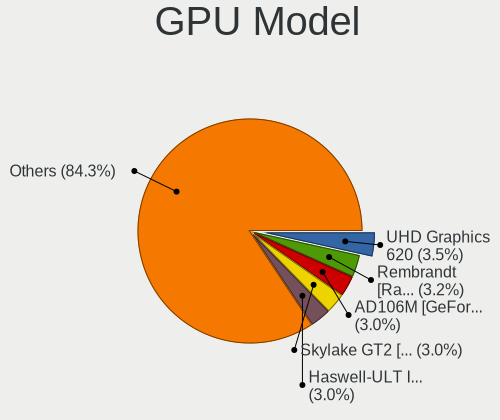
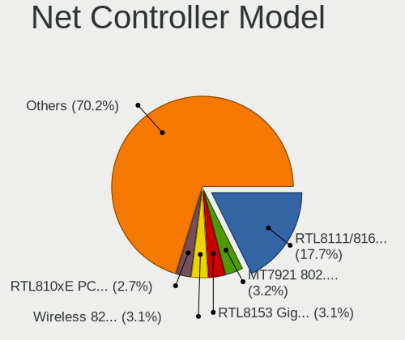

Fedora - Hardware Trends (Notebooks)
------------------------------------

A project to identify most popular hardware characteristics and track their change
over time based on data collected by Linux users at https://Linux-Hardware.org.

Anyone can contribute to this report by the [hw-probe](https://github.com/linuxhw/hw-probe) tool:

    sudo -E hw-probe -all -upload

This report is for one last month. Overall report since the beginning of time: [TestCoverage](https://github.com/linuxhw/TestCoverage)

Period: Jul, 2022.

Contents
--------

* [ System ](#system)
  - [ OS                       ](#os)
  - [ OS Family                ](#os-family)
  - [ Kernel                   ](#kernel)
  - [ Kernel Family            ](#kernel-family)
  - [ Kernel Major Ver.        ](#kernel-major-ver)
  - [ Arch                     ](#arch)
  - [ DE                       ](#de)
  - [ Display Server           ](#display-server)
  - [ Display Manager          ](#display-manager)
  - [ OS Lang                  ](#os-lang)
  - [ Boot Mode                ](#boot-mode)
  - [ Filesystem               ](#filesystem)
  - [ Part. scheme             ](#part-scheme)
  - [ Dual Boot with Linux/BSD ](#dual-boot-with-linuxbsd)
  - [ Dual Boot (Win)          ](#dual-boot-win)

* [ Board ](#board)
  - [ Vendor                   ](#vendor)
  - [ Model                    ](#model)
  - [ Model Family             ](#model-family)
  - [ MFG Year                 ](#mfg-year)
  - [ Form Factor              ](#form-factor)
  - [ Secure Boot              ](#secure-boot)
  - [ Coreboot                 ](#coreboot)
  - [ RAM Size                 ](#ram-size)
  - [ RAM Used                 ](#ram-used)
  - [ Total Drives             ](#total-drives)
  - [ Has CD-ROM               ](#has-cd-rom)
  - [ Has Ethernet             ](#has-ethernet)
  - [ Has WiFi                 ](#has-wifi)
  - [ Has Bluetooth            ](#has-bluetooth)

* [ Location ](#location)
  - [ Country                  ](#country)
  - [ City                     ](#city)

* [ Drives ](#drives)
  - [ Drive Vendor             ](#drive-vendor)
  - [ Drive Model              ](#drive-model)
  - [ HDD Vendor               ](#hdd-vendor)
  - [ SSD Vendor               ](#ssd-vendor)
  - [ Drive Kind               ](#drive-kind)
  - [ Drive Connector          ](#drive-connector)
  - [ Drive Size               ](#drive-size)
  - [ Space Total              ](#space-total)
  - [ Space Used               ](#space-used)
  - [ Malfunc. Drives          ](#malfunc-drives)
  - [ Malfunc. Drive Vendor    ](#malfunc-drive-vendor)
  - [ Malfunc. HDD Vendor      ](#malfunc-hdd-vendor)
  - [ Malfunc. Drive Kind      ](#malfunc-drive-kind)
  - [ Failed Drives            ](#failed-drives)
  - [ Failed Drive Vendor      ](#failed-drive-vendor)
  - [ Drive Status             ](#drive-status)

* [ Storage controller ](#storage-controller)
  - [ Storage Vendor           ](#storage-vendor)
  - [ Storage Model            ](#storage-model)
  - [ Storage Kind             ](#storage-kind)

* [ Processor ](#processor)
  - [ CPU Vendor               ](#cpu-vendor)
  - [ CPU Model                ](#cpu-model)
  - [ CPU Model Family         ](#cpu-model-family)
  - [ CPU Cores                ](#cpu-cores)
  - [ CPU Sockets              ](#cpu-sockets)
  - [ CPU Threads              ](#cpu-threads)
  - [ CPU Op-Modes             ](#cpu-op-modes)
  - [ CPU Microcode            ](#cpu-microcode)
  - [ CPU Microarch            ](#cpu-microarch)

* [ Graphics ](#graphics)
  - [ GPU Vendor               ](#gpu-vendor)
  - [ GPU Model                ](#gpu-model)
  - [ GPU Combo                ](#gpu-combo)
  - [ GPU Driver               ](#gpu-driver)
  - [ GPU Memory               ](#gpu-memory)

* [ Monitor ](#monitor)
  - [ Monitor Vendor           ](#monitor-vendor)
  - [ Monitor Model            ](#monitor-model)
  - [ Monitor Resolution       ](#monitor-resolution)
  - [ Monitor Diagonal         ](#monitor-diagonal)
  - [ Monitor Width            ](#monitor-width)
  - [ Aspect Ratio             ](#aspect-ratio)
  - [ Monitor Area             ](#monitor-area)
  - [ Pixel Density            ](#pixel-density)
  - [ Multiple Monitors        ](#multiple-monitors)

* [ Network ](#network)
  - [ Net Controller Vendor    ](#net-controller-vendor)
  - [ Net Controller Model     ](#net-controller-model)
  - [ Wireless Vendor          ](#wireless-vendor)
  - [ Wireless Model           ](#wireless-model)
  - [ Ethernet Vendor          ](#ethernet-vendor)
  - [ Ethernet Model           ](#ethernet-model)
  - [ Net Controller Kind      ](#net-controller-kind)
  - [ Used Controller          ](#used-controller)
  - [ NICs                     ](#nics)
  - [ IPv6                     ](#ipv6)

* [ Bluetooth ](#bluetooth)
  - [ Bluetooth Vendor         ](#bluetooth-vendor)
  - [ Bluetooth Model          ](#bluetooth-model)

* [ Sound ](#sound)
  - [ Sound Vendor             ](#sound-vendor)
  - [ Sound Model              ](#sound-model)

* [ Memory ](#memory)
  - [ Memory Vendor            ](#memory-vendor)
  - [ Memory Model             ](#memory-model)
  - [ Memory Kind              ](#memory-kind)
  - [ Memory Form Factor       ](#memory-form-factor)
  - [ Memory Size              ](#memory-size)
  - [ Memory Speed             ](#memory-speed)

* [ Printers & scanners ](#printers--scanners)
  - [ Printer Vendor           ](#printer-vendor)
  - [ Printer Model            ](#printer-model)
  - [ Scanner Vendor           ](#scanner-vendor)
  - [ Scanner Model            ](#scanner-model)

* [ Camera ](#camera)
  - [ Camera Vendor            ](#camera-vendor)
  - [ Camera Model             ](#camera-model)

* [ Security ](#security)
  - [ Fingerprint Vendor       ](#fingerprint-vendor)
  - [ Fingerprint Model        ](#fingerprint-model)
  - [ Chipcard Vendor          ](#chipcard-vendor)
  - [ Chipcard Model           ](#chipcard-model)

* [ Unsupported ](#unsupported)
  - [ Unsupported Devices      ](#unsupported-devices)
  - [ Unsupported Device Types ](#unsupported-device-types)

System
------

OS
--

Installed operating systems

| Name      | Notebooks | Percent |
|-----------|-----------|---------|
| Fedora 36 | 166       | 92.22%  |
| Fedora 35 | 8         | 4.44%   |
| Fedora 32 | 3         | 1.67%   |
| Fedora 37 | 1         | 0.56%   |
| Fedora 34 | 1         | 0.56%   |
| Fedora 33 | 1         | 0.56%   |

OS Family
---------

OS without a version

| Name   | Notebooks | Percent |
|--------|-----------|---------|
| Fedora | 180       | 100%    |

Kernel
------

Version of the Linux kernel

| Version                                             | Notebooks | Percent |
|-----------------------------------------------------|-----------|---------|
| 5.18.11-200.fc36.x86_64                             | 47        | 26.11%  |
| 5.18.13-200.fc36.x86_64                             | 33        | 18.33%  |
| 5.18.9-200.fc36.x86_64                              | 28        | 15.56%  |
| 5.18.7-200.fc36.x86_64                              | 21        | 11.67%  |
| 5.18.10-200.fc36.x86_64                             | 20        | 11.11%  |
| 5.17.5-300.fc36.x86_64                              | 9         | 5%      |
| 5.11.22-100.fc32.x86_64                             | 3         | 1.67%   |
| 5.18.9-100.fc35.x86_64                              | 2         | 1.11%   |
| 5.18.10-201.fsync.fc36.x86_64                       | 2         | 1.11%   |
| 5.19.0-0.rc6.20220714git4a57a8400075.49.fc37.x86_64 | 1         | 0.56%   |
| 5.18.8-200.fc36.x86_64                              | 1         | 0.56%   |
| 5.18.6-200.fc36.x86_64                              | 1         | 0.56%   |
| 5.18.5-200.fc36.x86_64                              | 1         | 0.56%   |
| 5.18.5-100.fc35.x86_64                              | 1         | 0.56%   |
| 5.18.13-100.fc35.x86_64                             | 1         | 0.56%   |
| 5.18.11-100.fc35.x86_64                             | 1         | 0.56%   |
| 5.18.10-250.vanilla.1.fc36.x86_64                   | 1         | 0.56%   |
| 5.18.10-100.fc35.x86_64                             | 1         | 0.56%   |
| 5.17.9-200.fc35.x86_64                              | 1         | 0.56%   |
| 5.17.14-300.fc36.x86_64                             | 1         | 0.56%   |
| 5.17.13-300.fc36.x86_64                             | 1         | 0.56%   |
| 5.17.12-100.fc34.x86_64                             | 1         | 0.56%   |
| 5.14.18-100.fc33.x86_64                             | 1         | 0.56%   |
| 5.14.10-300.fc35.x86_64                             | 1         | 0.56%   |

Kernel Family
-------------

Linux kernel without a distro release

| Version | Notebooks | Percent |
|---------|-----------|---------|
| 5.18.11 | 48        | 26.67%  |
| 5.18.13 | 34        | 18.89%  |
| 5.18.9  | 30        | 16.67%  |
| 5.18.10 | 24        | 13.33%  |
| 5.18.7  | 21        | 11.67%  |
| 5.17.5  | 9         | 5%      |
| 5.11.22 | 3         | 1.67%   |
| 5.18.5  | 2         | 1.11%   |
| 5.19.0  | 1         | 0.56%   |
| 5.18.8  | 1         | 0.56%   |
| 5.18.6  | 1         | 0.56%   |
| 5.17.9  | 1         | 0.56%   |
| 5.17.14 | 1         | 0.56%   |
| 5.17.13 | 1         | 0.56%   |
| 5.17.12 | 1         | 0.56%   |
| 5.14.18 | 1         | 0.56%   |
| 5.14.10 | 1         | 0.56%   |

Kernel Major Ver.
-----------------

Linux kernel major version

| Version | Notebooks | Percent |
|---------|-----------|---------|
| 5.18    | 161       | 89.44%  |
| 5.17    | 13        | 7.22%   |
| 5.11    | 3         | 1.67%   |
| 5.14    | 2         | 1.11%   |
| 5.19    | 1         | 0.56%   |

Arch
----

OS architecture (x86_64, i586, etc.)

| Name   | Notebooks | Percent |
|--------|-----------|---------|
| x86_64 | 180       | 100%    |

DE
--

Desktop Environment

| Name       | Notebooks | Percent |
|------------|-----------|---------|
| GNOME      | 137       | 76.11%  |
| KDE5       | 23        | 12.78%  |
| XFCE       | 5         | 2.78%   |
| X-Cinnamon | 4         | 2.22%   |
| i3         | 3         | 1.67%   |
| Unknown    | 3         | 1.67%   |
| Cinnamon   | 2         | 1.11%   |
| openbox    | 1         | 0.56%   |
| MATE       | 1         | 0.56%   |
| awesome    | 1         | 0.56%   |

Display Server
--------------

X11 or Wayland

| Name    | Notebooks | Percent |
|---------|-----------|---------|
| Wayland | 129       | 71.67%  |
| X11     | 46        | 25.56%  |
| Unknown | 3         | 1.67%   |
| Tty     | 2         | 1.11%   |

Display Manager
---------------

SDDM, LightDM, etc.

| Name    | Notebooks | Percent |
|---------|-----------|---------|
| Unknown | 93        | 51.67%  |
| GDM     | 61        | 33.89%  |
| LightDM | 14        | 7.78%   |
| SDDM    | 12        | 6.67%   |

OS Lang
-------

Language

| Lang  | Notebooks | Percent |
|-------|-----------|---------|
| en_US | 97        | 53.89%  |
| ru_RU | 15        | 8.33%   |
| de_DE | 10        | 5.56%   |
| pt_BR | 7         | 3.89%   |
| en_AU | 6         | 3.33%   |
| pl_PL | 5         | 2.78%   |
| en_GB | 5         | 2.78%   |
| fr_FR | 4         | 2.22%   |
| es_MX | 3         | 1.67%   |
| es_ES | 3         | 1.67%   |
| es_CL | 3         | 1.67%   |
| de_AT | 3         | 1.67%   |
| ru_UA | 2         | 1.11%   |
| it_IT | 2         | 1.11%   |
| en_NZ | 2         | 1.11%   |
| zh_CN | 1         | 0.56%   |
| tr_TR | 1         | 0.56%   |
| sr_RS | 1         | 0.56%   |
| pt_PT | 1         | 0.56%   |
| id_ID | 1         | 0.56%   |
| hu_HU | 1         | 0.56%   |
| gl_ES | 1         | 0.56%   |
| es_GT | 1         | 0.56%   |
| en_PH | 1         | 0.56%   |
| en_IL | 1         | 0.56%   |
| en_DK | 1         | 0.56%   |
| en_CA | 1         | 0.56%   |
| cs_CZ | 1         | 0.56%   |

Boot Mode
---------

EFI or BIOS

| Mode | Notebooks | Percent |
|------|-----------|---------|
| EFI  | 156       | 86.67%  |
| BIOS | 24        | 13.33%  |

Filesystem
----------

Type of filesystem

| Type  | Notebooks | Percent |
|-------|-----------|---------|
| Btrfs | 139       | 77.22%  |
| Ext4  | 37        | 20.56%  |
| Xfs   | 3         | 1.67%   |
| F2fs  | 1         | 0.56%   |

Part. scheme
------------

Scheme of partitioning

| Type    | Notebooks | Percent |
|---------|-----------|---------|
| Unknown | 96        | 53.33%  |
| GPT     | 77        | 42.78%  |
| MBR     | 7         | 3.89%   |

Dual Boot with Linux/BSD
------------------------

Hosting more than one Linux/BSD

| Dual boot | Notebooks | Percent |
|-----------|-----------|---------|
| No        | 162       | 90%     |
| Yes       | 18        | 10%     |

Dual Boot (Win)
---------------

Hosting Linux and Windows

| Dual boot | Notebooks | Percent |
|-----------|-----------|---------|
| No        | 150       | 83.33%  |
| Yes       | 30        | 16.67%  |

Board
-----

Vendor
------

Motherboard manufacturer

| Name                | Notebooks | Percent |
|---------------------|-----------|---------|
| Lenovo              | 55        | 30.56%  |
| Hewlett-Packard     | 36        | 20%     |
| Dell                | 25        | 13.89%  |
| ASUSTek Computer    | 20        | 11.11%  |
| Acer                | 9         | 5%      |
| MSI                 | 5         | 2.78%   |
| Samsung Electronics | 4         | 2.22%   |
| HUAWEI              | 3         | 1.67%   |
| Framework           | 3         | 1.67%   |
| System76            | 2         | 1.11%   |
| GPU Company         | 2         | 1.11%   |
| VALE                | 1         | 0.56%   |
| Toshiba             | 1         | 0.56%   |
| Sony                | 1         | 0.56%   |
| SLIMBOOK            | 1         | 0.56%   |
| Pegatron            | 1         | 0.56%   |
| Panasonic           | 1         | 0.56%   |
| Notebook            | 1         | 0.56%   |
| GPD                 | 1         | 0.56%   |
| Google              | 1         | 0.56%   |
| Gigabyte Technology | 1         | 0.56%   |
| Clevo               | 1         | 0.56%   |
| Chuwi               | 1         | 0.56%   |
| Aquarius            | 1         | 0.56%   |
| Apple               | 1         | 0.56%   |
| Alienware           | 1         | 0.56%   |
| Unknown             | 1         | 0.56%   |

Model
-----

Motherboard model

| Name                                        | Notebooks | Percent |
|---------------------------------------------|-----------|---------|
| HP Notebook                                 | 4         | 2.22%   |
| Framework Laptop                            | 3         | 1.67%   |
| Lenovo ThinkBook 14 G3 ACL 21A2             | 2         | 1.11%   |
| Lenovo IdeaPad 5 14ALC05 82LM               | 2         | 1.11%   |
| HP ZBook 17 G5                              | 2         | 1.11%   |
| HP Pavilion Laptop 15-cs0xxx                | 2         | 1.11%   |
| HP Pavilion g6                              | 2         | 1.11%   |
| HP EliteBook 8470p                          | 2         | 1.11%   |
| GPU Company GWNR51416                       | 2         | 1.11%   |
| Dell G3 3590                                | 2         | 1.11%   |
| ASUS X541NA                                 | 2         | 1.11%   |
| Acer Nitro AN515-55                         | 2         | 1.11%   |
| VALE Notebook Classic C140                  | 1         | 0.56%   |
| Toshiba Satellite L505D                     | 1         | 0.56%   |
| System76 Oryx Pro                           | 1         | 0.56%   |
| System76 Bonobo Extreme                     | 1         | 0.56%   |
| Sony SVF1531V8CW                            | 1         | 0.56%   |
| SLIMBOOK PROX-AMD5                          | 1         | 0.56%   |
| Samsung 550XBE/350XBE                       | 1         | 0.56%   |
| Samsung 355V4C/356V4C/3445VC/3545VC         | 1         | 0.56%   |
| Samsung 300E4A/300E5A/300E7A/3430EA/3530EA  | 1         | 0.56%   |
| Samsung 270E5G/270E5U                       | 1         | 0.56%   |
| Pegatron D15K                               | 1         | 0.56%   |
| Panasonic FZG1-3                            | 1         | 0.56%   |
| Notebook NH55RGQ                            | 1         | 0.56%   |
| MSI Summit E13FlipEvo A11MT                 | 1         | 0.56%   |
| MSI MS-14Y1                                 | 1         | 0.56%   |
| MSI GL75 Leopard 10SEK                      | 1         | 0.56%   |
| MSI GF63 Thin 8RCS                          | 1         | 0.56%   |
| MSI Bravo 17 A4DDK                          | 1         | 0.56%   |
| Lenovo Yoga S740-14IIL 81RM                 | 1         | 0.56%   |
| Lenovo V14-ADA 82C6                         | 1         | 0.56%   |
| Lenovo ThinkPad X280 20KES8D400             | 1         | 0.56%   |
| Lenovo ThinkPad X240 20AMS28505             | 1         | 0.56%   |
| Lenovo ThinkPad X230 2325SDE                | 1         | 0.56%   |
| Lenovo ThinkPad X220 4291WSH                | 1         | 0.56%   |
| Lenovo ThinkPad X1 Extreme 20MF000TPB       | 1         | 0.56%   |
| Lenovo ThinkPad X1 Carbon Gen 10 21CBCTO1WW | 1         | 0.56%   |
| Lenovo ThinkPad X1 Carbon 5th 20HQA07QCL    | 1         | 0.56%   |
| Lenovo ThinkPad X1 Carbon 4th 20FB002UGE    | 1         | 0.56%   |
| Lenovo ThinkPad T590 20N5S4R800             | 1         | 0.56%   |
| Lenovo ThinkPad T580 20LAS27000             | 1         | 0.56%   |
| Lenovo ThinkPad T490s 20NYS0LY00            | 1         | 0.56%   |
| Lenovo ThinkPad T480s 20L8S02D00            | 1         | 0.56%   |
| Lenovo ThinkPad T480s 20L7004NMX            | 1         | 0.56%   |
| Lenovo ThinkPad T480 20L6S2EQ00             | 1         | 0.56%   |
| Lenovo ThinkPad T480 20L6S0EK00             | 1         | 0.56%   |
| Lenovo ThinkPad T460p 20FXS05500            | 1         | 0.56%   |
| Lenovo ThinkPad T460 20FMS2292S             | 1         | 0.56%   |
| Lenovo ThinkPad T450s 20BX002NMS            | 1         | 0.56%   |
| Lenovo ThinkPad T430 2349DN4                | 1         | 0.56%   |
| Lenovo ThinkPad T420 4236C92                | 1         | 0.56%   |
| Lenovo ThinkPad T14s Gen 3 21CQ000GUS       | 1         | 0.56%   |
| Lenovo ThinkPad T14s Gen 1 20T0001SMX       | 1         | 0.56%   |
| Lenovo ThinkPad P53 20QN0011IV              | 1         | 0.56%   |
| Lenovo ThinkPad P50 20EQA05JCL              | 1         | 0.56%   |
| Lenovo ThinkPad P14s Gen 2a 21A1S00E00      | 1         | 0.56%   |
| Lenovo ThinkPad P14s Gen 1 20Y1S00D00       | 1         | 0.56%   |
| Lenovo ThinkPad L480 20LSCTO1WW             | 1         | 0.56%   |
| Lenovo ThinkPad L380 20M5000FUS             | 1         | 0.56%   |

Model Family
------------

Motherboard model prefix

| Name                  | Notebooks | Percent |
|-----------------------|-----------|---------|
| Lenovo ThinkPad       | 32        | 17.78%  |
| Lenovo IdeaPad        | 15        | 8.33%   |
| Dell Latitude         | 10        | 5.56%   |
| HP Pavilion           | 7         | 3.89%   |
| Dell Inspiron         | 6         | 3.33%   |
| ASUS ROG              | 6         | 3.33%   |
| HP ProBook            | 5         | 2.78%   |
| HP Laptop             | 5         | 2.78%   |
| HP EliteBook          | 5         | 2.78%   |
| Dell XPS              | 5         | 2.78%   |
| Lenovo ThinkBook      | 4         | 2.22%   |
| HP ZBook              | 4         | 2.22%   |
| HP Notebook           | 4         | 2.22%   |
| Acer Aspire           | 4         | 2.22%   |
| Framework Laptop      | 3         | 1.67%   |
| Acer Nitro            | 3         | 1.67%   |
| GPU Company GWNR51416 | 2         | 1.11%   |
| Dell G3               | 2         | 1.11%   |
| ASUS Zenbook          | 2         | 1.11%   |
| ASUS X541NA           | 2         | 1.11%   |
| ASUS VivoBook         | 2         | 1.11%   |
| VALE Notebook         | 1         | 0.56%   |
| Toshiba Satellite     | 1         | 0.56%   |
| System76 Oryx         | 1         | 0.56%   |
| System76 Bonobo       | 1         | 0.56%   |
| Sony SVF1531V8CW      | 1         | 0.56%   |
| SLIMBOOK PROX-AMD5    | 1         | 0.56%   |
| Samsung 550XBE        | 1         | 0.56%   |
| Samsung 355V4C        | 1         | 0.56%   |
| Samsung 300E4A        | 1         | 0.56%   |
| Samsung 270E5G        | 1         | 0.56%   |
| Pegatron D15K         | 1         | 0.56%   |
| Panasonic FZG1-3      | 1         | 0.56%   |
| Notebook NH55RGQ      | 1         | 0.56%   |
| MSI Summit            | 1         | 0.56%   |
| MSI MS-14Y1           | 1         | 0.56%   |
| MSI GL75              | 1         | 0.56%   |
| MSI GF63              | 1         | 0.56%   |
| MSI Bravo             | 1         | 0.56%   |
| Lenovo Yoga           | 1         | 0.56%   |
| Lenovo V14-ADA        | 1         | 0.56%   |
| Lenovo G400s          | 1         | 0.56%   |
| Lenovo 81FV           | 1         | 0.56%   |
| HUAWEI WRT-WX9        | 1         | 0.56%   |
| HUAWEI KLVL-WXXW      | 1         | 0.56%   |
| HUAWEI HVY-WXX9       | 1         | 0.56%   |
| HP Victus             | 1         | 0.56%   |
| HP Sona               | 1         | 0.56%   |
| HP ENVY               | 1         | 0.56%   |
| HP 348                | 1         | 0.56%   |
| HP 250                | 1         | 0.56%   |
| HP 240                | 1         | 0.56%   |
| GPD G1621-02          | 1         | 0.56%   |
| Google Kohaku         | 1         | 0.56%   |
| Gigabyte AERO         | 1         | 0.56%   |
| Dell Vostro           | 1         | 0.56%   |
| Dell Precision        | 1         | 0.56%   |
| Clevo M570TU          | 1         | 0.56%   |
| Chuwi GemiBook        | 1         | 0.56%   |
| ASUS X555DG           | 1         | 0.56%   |

MFG Year
--------

Motherboard manufacture year

| Year | Notebooks | Percent |
|------|-----------|---------|
| 2021 | 35        | 19.44%  |
| 2020 | 30        | 16.67%  |
| 2018 | 18        | 10%     |
| 2019 | 16        | 8.89%   |
| 2016 | 13        | 7.22%   |
| 2022 | 12        | 6.67%   |
| 2017 | 12        | 6.67%   |
| 2011 | 11        | 6.11%   |
| 2012 | 10        | 5.56%   |
| 2013 | 9         | 5%      |
| 2015 | 8         | 4.44%   |
| 2014 | 3         | 1.67%   |
| 2009 | 2         | 1.11%   |
| 2010 | 1         | 0.56%   |

Form Factor
-----------

Physical design of the computer

| Name     | Notebooks | Percent |
|----------|-----------|---------|
| Notebook | 180       | 100%    |

Secure Boot
-----------

Enabled or disabled

| State    | Notebooks | Percent |
|----------|-----------|---------|
| Disabled | 139       | 77.22%  |
| Enabled  | 41        | 22.78%  |

Coreboot
--------

Have coreboot on board

| Used | Notebooks | Percent |
|------|-----------|---------|
| No   | 177       | 98.33%  |
| Yes  | 3         | 1.67%   |

RAM Size
--------

Total RAM memory

| Size in GB  | Notebooks | Percent |
|-------------|-----------|---------|
| 4.01-8.0    | 66        | 36.67%  |
| 8.01-16.0   | 40        | 22.22%  |
| 16.01-24.0  | 34        | 18.89%  |
| 32.01-64.0  | 16        | 8.89%   |
| 3.01-4.0    | 12        | 6.67%   |
| 24.01-32.0  | 5         | 2.78%   |
| 64.01-256.0 | 5         | 2.78%   |
| 2.01-3.0    | 1         | 0.56%   |
| 1.01-2.0    | 1         | 0.56%   |

RAM Used
--------

Used RAM memory

| Used GB    | Notebooks | Percent |
|------------|-----------|---------|
| 4.01-8.0   | 54        | 30%     |
| 3.01-4.0   | 51        | 28.33%  |
| 2.01-3.0   | 43        | 23.89%  |
| 1.01-2.0   | 19        | 10.56%  |
| 8.01-16.0  | 10        | 5.56%   |
| 0.51-1.0   | 2         | 1.11%   |
| 24.01-32.0 | 1         | 0.56%   |

Total Drives
------------

Number of drives on board

| Drives | Notebooks | Percent |
|--------|-----------|---------|
| 1      | 143       | 79.44%  |
| 2      | 35        | 19.44%  |
| 3      | 2         | 1.11%   |

Has CD-ROM
----------

Has CD-ROM on board

| Presented | Notebooks | Percent |
|-----------|-----------|---------|
| No        | 144       | 80%     |
| Yes       | 36        | 20%     |

Has Ethernet
------------

Has Ethernet on board

| Presented | Notebooks | Percent |
|-----------|-----------|---------|
| Yes       | 139       | 77.22%  |
| No        | 41        | 22.78%  |

Has WiFi
--------

Has WiFi module

| Presented | Notebooks | Percent |
|-----------|-----------|---------|
| Yes       | 179       | 99.44%  |
| No        | 1         | 0.56%   |

Has Bluetooth
-------------

Has Bluetooth module

| Presented | Notebooks | Percent |
|-----------|-----------|---------|
| Yes       | 163       | 90.56%  |
| No        | 17        | 9.44%   |

Location
--------

Country
-------

Geographic location (country)

| Country            | Notebooks | Percent |
|--------------------|-----------|---------|
| USA                | 36        | 20%     |
| Germany            | 14        | 7.78%   |
| Russia             | 12        | 6.67%   |
| Brazil             | 10        | 5.56%   |
| Poland             | 8         | 4.44%   |
| Turkey             | 6         | 3.33%   |
| France             | 6         | 3.33%   |
| Australia          | 6         | 3.33%   |
| Spain              | 5         | 2.78%   |
| Mexico             | 5         | 2.78%   |
| India              | 5         | 2.78%   |
| Indonesia          | 4         | 2.22%   |
| Chile              | 4         | 2.22%   |
| Austria            | 4         | 2.22%   |
| Philippines        | 3         | 1.67%   |
| Hungary            | 3         | 1.67%   |
| Ukraine            | 2         | 1.11%   |
| Sweden             | 2         | 1.11%   |
| South Africa       | 2         | 1.11%   |
| Serbia             | 2         | 1.11%   |
| Netherlands        | 2         | 1.11%   |
| Kazakhstan         | 2         | 1.11%   |
| Italy              | 2         | 1.11%   |
| Egypt              | 2         | 1.11%   |
| Dominican Republic | 2         | 1.11%   |
| Czechia            | 2         | 1.11%   |
| Croatia            | 2         | 1.11%   |
| Canada             | 2         | 1.11%   |
| Bulgaria           | 2         | 1.11%   |
| Belarus            | 2         | 1.11%   |
| UK                 | 1         | 0.56%   |
| UAE                | 1         | 0.56%   |
| Switzerland        | 1         | 0.56%   |
| Singapore          | 1         | 0.56%   |
| Qatar              | 1         | 0.56%   |
| Portugal           | 1         | 0.56%   |
| Norway             | 1         | 0.56%   |
| Nigeria            | 1         | 0.56%   |
| New Zealand        | 1         | 0.56%   |
| Nepal              | 1         | 0.56%   |
| Moldova            | 1         | 0.56%   |
| Japan              | 1         | 0.56%   |
| Israel             | 1         | 0.56%   |
| Iran               | 1         | 0.56%   |
| Iceland            | 1         | 0.56%   |
| Guatemala          | 1         | 0.56%   |
| Finland            | 1         | 0.56%   |
| Denmark            | 1         | 0.56%   |
| Colombia           | 1         | 0.56%   |
| China              | 1         | 0.56%   |
| Belgium            | 1         | 0.56%   |

City
----

Geographic location (city)

| City                    | Notebooks | Percent |
|-------------------------|-----------|---------|
| Warsaw                  | 4         | 2.22%   |
| Vienna                  | 3         | 1.67%   |
| St Petersburg           | 3         | 1.67%   |
| Sao Paulo               | 3         | 1.67%   |
| Bogor                   | 3         | 1.67%   |
| Sofia                   | 2         | 1.11%   |
| Santo Domingo Este      | 2         | 1.11%   |
| Santiago                | 2         | 1.11%   |
| Prague                  | 2         | 1.11%   |
| Paris                   | 2         | 1.11%   |
| Mundelein               | 2         | 1.11%   |
| Minsk                   | 2         | 1.11%   |
| Merritt Island          | 2         | 1.11%   |
| Melbourne               | 2         | 1.11%   |
| Istanbul                | 2         | 1.11%   |
| Cairo                   | 2         | 1.11%   |
| Bursa                   | 2         | 1.11%   |
| Budapest                | 2         | 1.11%   |
| Belgrade                | 2         | 1.11%   |
| Barueri                 | 2         | 1.11%   |
| Atlanta                 | 2         | 1.11%   |
| Zagreb                  | 1         | 0.56%   |
| Wooster                 | 1         | 0.56%   |
| Vladivostok             | 1         | 0.56%   |
| Vijayawada              | 1         | 0.56%   |
| Vence                   | 1         | 0.56%   |
| Valencia                | 1         | 0.56%   |
| Vadodara                | 1         | 0.56%   |
| Ust'-Ilimsk             | 1         | 0.56%   |
| Ufa                     | 1         | 0.56%   |
| Udupi                   | 1         | 0.56%   |
| Tyumen                  | 1         | 0.56%   |
| Tokyo                   | 1         | 0.56%   |
| Tehran                  | 1         | 0.56%   |
| Tavaux                  | 1         | 0.56%   |
| Tampico                 | 1         | 0.56%   |
| Stockholm               | 1         | 0.56%   |
| Springfield             | 1         | 0.56%   |
| Springboro              | 1         | 0.56%   |
| Spadafora               | 1         | 0.56%   |
| Southampton             | 1         | 0.56%   |
| Solingen                | 1         | 0.56%   |
| Singapore               | 1         | 0.56%   |
| Shreveport              | 1         | 0.56%   |
| Sherwood Park           | 1         | 0.56%   |
| Sheksna                 | 1         | 0.56%   |
| Shanghai                | 1         | 0.56%   |
| Sedona                  | 1         | 0.56%   |
| Seattle                 | 1         | 0.56%   |
| Sao Goncalo do Amarante | 1         | 0.56%   |
| Sandpoint               | 1         | 0.56%   |
| San Miguel              | 1         | 0.56%   |
| San Diego               | 1         | 0.56%   |
| Samara                  | 1         | 0.56%   |
| Rüsselsheim am Main    | 1         | 0.56%   |
| Ruda Śląska           | 1         | 0.56%   |
| Royersford              | 1         | 0.56%   |
| Rock Hill               | 1         | 0.56%   |
| Reykjavik               | 1         | 0.56%   |
| Regensburg              | 1         | 0.56%   |

Drives
------

Drive Vendor
------------

Hard drive vendors

| Vendor                  | Notebooks | Drives | Percent |
|-------------------------|-----------|--------|---------|
| Samsung Electronics     | 46        | 52     | 21.2%   |
| WDC                     | 21        | 21     | 9.68%   |
| Seagate                 | 21        | 21     | 9.68%   |
| SanDisk                 | 17        | 17     | 7.83%   |
| Toshiba                 | 15        | 15     | 6.91%   |
| Micron Technology       | 13        | 13     | 5.99%   |
| SK hynix                | 11        | 11     | 5.07%   |
| Kingston                | 10        | 10     | 4.61%   |
| Intel                   | 8         | 8      | 3.69%   |
| Crucial                 | 7         | 7      | 3.23%   |
| Unknown                 | 5         | 5      | 2.3%    |
| HGST                    | 4         | 4      | 1.84%   |
| Silicon Motion          | 2         | 2      | 0.92%   |
| SABRENT                 | 2         | 2      | 0.92%   |
| Phison                  | 2         | 2      | 0.92%   |
| Patriot                 | 2         | 2      | 0.92%   |
| Lenovo                  | 2         | 3      | 0.92%   |
| KIOXIA                  | 2         | 2      | 0.92%   |
| GALAX                   | 2         | 2      | 0.92%   |
| A-DATA Technology       | 2         | 2      | 0.92%   |
| Unknown                 | 2         | 2      | 0.92%   |
| XPG                     | 1         | 1      | 0.46%   |
| Union Memory (Shenzhen) | 1         | 1      | 0.46%   |
| Transcend               | 1         | 1      | 0.46%   |
| Teclast                 | 1         | 1      | 0.46%   |
| Team                    | 1         | 1      | 0.46%   |
| T-FORCE                 | 1         | 1      | 0.46%   |
| SSSTC                   | 1         | 1      | 0.46%   |
| Plextor                 | 1         | 1      | 0.46%   |
| new                     | 1         | 1      | 0.46%   |
| Netac                   | 1         | 1      | 0.46%   |
| LITEONIT                | 1         | 1      | 0.46%   |
| LITEON                  | 1         | 1      | 0.46%   |
| Intenso                 | 1         | 1      | 0.46%   |
| Hitachi                 | 1         | 1      | 0.46%   |
| GOODRAM                 | 1         | 1      | 0.46%   |
| GLOWAY                  | 1         | 1      | 0.46%   |
| Fujitsu                 | 1         | 1      | 0.46%   |
| EZCOOL                  | 1         | 1      | 0.46%   |
| BIWIN                   | 1         | 1      | 0.46%   |
| Apple                   | 1         | 1      | 0.46%   |
| ADATA SU                | 1         | 1      | 0.46%   |

Drive Model
-----------

Hard drive models

| Model                                | Notebooks | Percent |
|--------------------------------------|-----------|---------|
| SanDisk NVMe SSD Drive 512GB         | 5         | 2.24%   |
| Seagate ST1000LM035-1RK172 1TB       | 4         | 1.79%   |
| Seagate ST1000LM024 HN-M101MBB 1TB   | 4         | 1.79%   |
| Samsung NVMe SSD Drive 512GB         | 4         | 1.79%   |
| Samsung NVMe SSD Drive 256GB         | 4         | 1.79%   |
| Samsung NVMe SSD Drive 1024GB        | 4         | 1.79%   |
| Micron NVMe SSD Drive 512GB          | 4         | 1.79%   |
| Toshiba NVMe SSD Drive 512GB         | 3         | 1.35%   |
| Toshiba MQ04ABF100 1TB               | 3         | 1.35%   |
| SK hynix NVMe SSD Drive 512GB        | 3         | 1.35%   |
| SK hynix NVMe SSD Drive 1024GB       | 3         | 1.35%   |
| Seagate ST1000LM048-2E7172 1TB       | 3         | 1.35%   |
| Samsung NVMe SSD Drive 1TB           | 3         | 1.35%   |
| Samsung MZALQ512HALU-000L2 512GB     | 3         | 1.35%   |
| Kingston NVMe SSD Drive 512GB        | 3         | 1.35%   |
| Intel NVMe SSD Drive 512GB           | 3         | 1.35%   |
| WDC PC SN530 SDBPMPZ-512G-1101 512GB | 2         | 0.9%    |
| Toshiba MQ01ABD100 1TB               | 2         | 0.9%    |
| SK hynix NVMe SSD Drive 256GB        | 2         | 0.9%    |
| Seagate Expansion 1TB                | 2         | 0.9%    |
| SanDisk SSD PLUS 480GB               | 2         | 0.9%    |
| SanDisk NVMe SSD Drive 256GB         | 2         | 0.9%    |
| SanDisk NVMe SSD Drive 1024GB        | 2         | 0.9%    |
| Samsung SSD 980 PRO 1TB              | 2         | 0.9%    |
| Samsung SSD 860 EVO 2TB              | 2         | 0.9%    |
| Samsung NVMe SSD Drive 500GB         | 2         | 0.9%    |
| Samsung NVMe SSD Drive 2TB           | 2         | 0.9%    |
| Samsung MZVLB512HAJQ-000H1 512GB     | 2         | 0.9%    |
| Samsung MZVLB1T0HBLR-000L7 1TB       | 2         | 0.9%    |
| Samsung MZALQ512HBLU-00BL2 512GB     | 2         | 0.9%    |
| SABRENT Disk 1TB                     | 2         | 0.9%    |
| Patriot Blaze 120GB SSD              | 2         | 0.9%    |
| HGST HTS721010A9E630 1TB             | 2         | 0.9%    |
| Crucial CT500MX500SSD1 500GB         | 2         | 0.9%    |
| Crucial CT1000MX500SSD1 1TB          | 2         | 0.9%    |
| Unknown                              | 2         | 0.9%    |
| XPG NVMe SSD Drive 2TB               | 1         | 0.45%   |
| WDC WDS500G2B0A 500GB SSD            | 1         | 0.45%   |
| WDC WDS240G2G0A-00JH30 240GB SSD     | 1         | 0.45%   |
| WDC WDS100T2B0A-00SM50 1TB SSD       | 1         | 0.45%   |
| WDC WD5000LPCX-80VHAT0 500GB         | 1         | 0.45%   |
| WDC WD5000LPCX-00VHAT0 500GB         | 1         | 0.45%   |
| WDC WD3200LPCX-24C6HT0 320GB         | 1         | 0.45%   |
| WDC WD3200BEVT-00A0RT0 320GB         | 1         | 0.45%   |
| WDC WD20SPZX-22UA7T0 2TB             | 1         | 0.45%   |
| WDC WD10SPZX-21Z10T0 1TB             | 1         | 0.45%   |
| WDC WD10SPCX-08S8TT0 1TB             | 1         | 0.45%   |
| WDC WD10JPVX-75JC3T0 1TB             | 1         | 0.45%   |
| WDC WD10JPVX-60JC3T0 1TB             | 1         | 0.45%   |
| WDC PC SN810 NVMe 512GB              | 1         | 0.45%   |
| WDC PC SN730 SDBPNTY-512G-1006 512GB | 1         | 0.45%   |
| WDC PC SN730 SDBPNTY-512G            | 1         | 0.45%   |
| WDC PC SN720 SDAPNTW-512G-1027 512GB | 1         | 0.45%   |
| WDC PC SN530 SDBPNPZ-256G-1014 256GB | 1         | 0.45%   |
| WDC PC SN530 SDBPMPZ-512G-1001 512GB | 1         | 0.45%   |
| WDC PC SN520 SDAPMUW-256G-1101 256GB | 1         | 0.45%   |
| Unknown USB DISK 3.2 1TB             | 1         | 0.45%   |
| Unknown Trust HDD 2.5" 1TB           | 1         | 0.45%   |
| Unknown MMC Card  64GB               | 1         | 0.45%   |
| Unknown MMC Card  128GB              | 1         | 0.45%   |

HDD Vendor
----------

Hard disk drive vendors

| Vendor  | Notebooks | Drives | Percent |
|---------|-----------|--------|---------|
| Seagate | 21        | 21     | 43.75%  |
| WDC     | 9         | 9      | 18.75%  |
| Toshiba | 8         | 8      | 16.67%  |
| HGST    | 4         | 4      | 8.33%   |
| SABRENT | 2         | 2      | 4.17%   |
| Unknown | 1         | 1      | 2.08%   |
| Hitachi | 1         | 1      | 2.08%   |
| Fujitsu | 1         | 1      | 2.08%   |
| Apple   | 1         | 1      | 2.08%   |

SSD Vendor
----------

Solid state drive vendors

| Vendor              | Notebooks | Drives | Percent |
|---------------------|-----------|--------|---------|
| Samsung Electronics | 11        | 12     | 20.37%  |
| Crucial             | 7         | 7      | 12.96%  |
| Micron Technology   | 6         | 6      | 11.11%  |
| SanDisk             | 5         | 5      | 9.26%   |
| Kingston            | 4         | 4      | 7.41%   |
| WDC                 | 3         | 3      | 5.56%   |
| Patriot             | 2         | 2      | 3.7%    |
| GALAX               | 2         | 2      | 3.7%    |
| Unknown             | 2         | 2      | 3.7%    |
| Transcend           | 1         | 1      | 1.85%   |
| Teclast             | 1         | 1      | 1.85%   |
| Plextor             | 1         | 1      | 1.85%   |
| Netac               | 1         | 1      | 1.85%   |
| LITEONIT            | 1         | 1      | 1.85%   |
| LITEON              | 1         | 1      | 1.85%   |
| Intenso             | 1         | 1      | 1.85%   |
| GOODRAM             | 1         | 1      | 1.85%   |
| GLOWAY              | 1         | 1      | 1.85%   |
| EZCOOL              | 1         | 1      | 1.85%   |
| ADATA SU            | 1         | 1      | 1.85%   |
| A-DATA Technology   | 1         | 1      | 1.85%   |

Drive Kind
----------

HDD or SSD

| Kind    | Notebooks | Drives | Percent |
|---------|-----------|--------|---------|
| NVMe    | 106       | 116    | 50.24%  |
| SSD     | 52        | 55     | 24.64%  |
| HDD     | 48        | 48     | 22.75%  |
| MMC     | 3         | 3      | 1.42%   |
| Unknown | 2         | 2      | 0.95%   |

Drive Connector
---------------

SATA, SAS, NVMe, etc.

| Type | Notebooks | Drives | Percent |
|------|-----------|--------|---------|
| NVMe | 106       | 116    | 51.21%  |
| SATA | 88        | 95     | 42.51%  |
| SAS  | 10        | 10     | 4.83%   |
| MMC  | 3         | 3      | 1.45%   |

Drive Size
----------

Size of hard drive

| Size in TB | Notebooks | Drives | Percent |
|------------|-----------|--------|---------|
| 0.01-0.5   | 56        | 57     | 56.57%  |
| 0.51-1.0   | 39        | 41     | 39.39%  |
| 1.01-2.0   | 4         | 5      | 4.04%   |

Space Total
-----------

Amount of disk space available on the file system

| Size in GB     | Notebooks | Percent |
|----------------|-----------|---------|
| 501-1000       | 42        | 23.33%  |
| 251-500        | 31        | 17.22%  |
| 101-250        | 31        | 17.22%  |
| 1001-2000      | 18        | 10%     |
| Unknown        | 18        | 10%     |
| 1-20           | 17        | 9.44%   |
| 51-100         | 10        | 5.56%   |
| 21-50          | 5         | 2.78%   |
| More than 3000 | 4         | 2.22%   |
| 2001-3000      | 4         | 2.22%   |

Space Used
----------

Amount of used disk space

| Used GB   | Notebooks | Percent |
|-----------|-----------|---------|
| 1-20      | 57        | 31.67%  |
| 21-50     | 32        | 17.78%  |
| 101-250   | 27        | 15%     |
| 51-100    | 19        | 10.56%  |
| Unknown   | 18        | 10%     |
| 501-1000  | 13        | 7.22%   |
| 251-500   | 12        | 6.67%   |
| 1001-2000 | 2         | 1.11%   |

Malfunc. Drives
---------------

Drive models with a malfunction

| Model                                 | Notebooks | Drives | Percent |
|---------------------------------------|-----------|--------|---------|
| WDC WD5000LPCX-00VHAT0 500GB          | 1         | 1      | 14.29%  |
| Seagate ST9500325AS 500GB             | 1         | 1      | 14.29%  |
| Seagate ST500LM021-1KJ152 500GB       | 1         | 1      | 14.29%  |
| Seagate ST1000LM024 HN-M101MBB 1TB    | 1         | 1      | 14.29%  |
| Micron Technology 1100 SATA 256GB SSD | 1         | 1      | 14.29%  |
| LITEONIT LCS-128M6S-HP 128GB SSD      | 1         | 1      | 14.29%  |
| HGST HTS721010A9E630 1TB              | 1         | 1      | 14.29%  |

Malfunc. Drive Vendor
---------------------

Vendors of faulty drives

| Vendor            | Notebooks | Drives | Percent |
|-------------------|-----------|--------|---------|
| Seagate           | 3         | 3      | 42.86%  |
| WDC               | 1         | 1      | 14.29%  |
| Micron Technology | 1         | 1      | 14.29%  |
| LITEONIT          | 1         | 1      | 14.29%  |
| HGST              | 1         | 1      | 14.29%  |

Malfunc. HDD Vendor
-------------------

Vendors of faulty HDD drives

| Vendor  | Notebooks | Drives | Percent |
|---------|-----------|--------|---------|
| Seagate | 3         | 3      | 60%     |
| WDC     | 1         | 1      | 20%     |
| HGST    | 1         | 1      | 20%     |

Malfunc. Drive Kind
-------------------

Kinds of faulty drives

| Kind | Notebooks | Drives | Percent |
|------|-----------|--------|---------|
| HDD  | 5         | 5      | 71.43%  |
| SSD  | 2         | 2      | 28.57%  |

Failed Drives
-------------

Failed drive models

Zero info for selected period =(

Failed Drive Vendor
-------------------

Failed drive vendors

Zero info for selected period =(

Drive Status
------------

Number of failed and malfunc. drives

| Status   | Notebooks | Drives | Percent |
|----------|-----------|--------|---------|
| Detected | 105       | 128    | 55.56%  |
| Works    | 77        | 89     | 40.74%  |
| Malfunc  | 7         | 7      | 3.7%    |

Storage controller
------------------

Storage Vendor
--------------

Storage controller vendors

| Vendor                         | Notebooks | Percent |
|--------------------------------|-----------|---------|
| Intel                          | 105       | 45.06%  |
| Samsung Electronics            | 36        | 15.45%  |
| AMD                            | 27        | 11.59%  |
| SanDisk                        | 20        | 8.58%   |
| SK hynix                       | 11        | 4.72%   |
| Toshiba America Info Systems   | 7         | 3%      |
| Micron Technology              | 7         | 3%      |
| Kingston Technology Company    | 6         | 2.58%   |
| Phison Electronics             | 3         | 1.29%   |
| Silicon Motion                 | 2         | 0.86%   |
| Lenovo                         | 2         | 0.86%   |
| KIOXIA                         | 2         | 0.86%   |
| ADATA Technology               | 2         | 0.86%   |
| Union Memory (Shenzhen)        | 1         | 0.43%   |
| Solid State Storage Technology | 1         | 0.43%   |
| Biwin Storage Technology       | 1         | 0.43%   |

Storage Model
-------------

Storage controller models

| Model                                                                            | Notebooks | Percent |
|----------------------------------------------------------------------------------|-----------|---------|
| AMD FCH SATA Controller [AHCI mode]                                              | 25        | 10.29%  |
| Intel Sunrise Point-LP SATA Controller [AHCI mode]                               | 20        | 8.23%   |
| Samsung NVMe SSD Controller SM981/PM981/PM983                                    | 16        | 6.58%   |
| Intel 7 Series Chipset Family 6-port SATA Controller [AHCI mode]                 | 13        | 5.35%   |
| Samsung NVMe SSD Controller 980                                                  | 11        | 4.53%   |
| Samsung NVMe SSD Controller PM9A1/PM9A3/980PRO                                   | 9         | 3.7%    |
| Intel Volume Management Device NVMe RAID Controller                              | 9         | 3.7%    |
| Intel Cannon Lake Mobile PCH SATA AHCI Controller                                | 9         | 3.7%    |
| Intel 82801 Mobile SATA Controller [RAID mode]                                   | 8         | 3.29%   |
| Micron Non-Volatile memory controller                                            | 7         | 2.88%   |
| Intel 6 Series/C200 Series Chipset Family 6 port Mobile SATA AHCI Controller     | 7         | 2.88%   |
| SK hynix Gold P31 SSD                                                            | 6         | 2.47%   |
| Intel Wildcat Point-LP SATA Controller [AHCI Mode]                               | 6         | 2.47%   |
| Intel 400 Series Chipset Family SATA AHCI Controller                             | 6         | 2.47%   |
| SanDisk WD Blue SN550 NVMe SSD                                                   | 5         | 2.06%   |
| SanDisk WD Black SN750 / PC SN730 NVMe SSD                                       | 5         | 2.06%   |
| SanDisk Non-Volatile memory controller                                           | 5         | 2.06%   |
| Intel SSD Pro 7600p/760p/E 6100p Series                                          | 4         | 1.65%   |
| Toshiba America Info Systems XG4 NVMe SSD Controller                             | 3         | 1.23%   |
| SK hynix BC511                                                                   | 3         | 1.23%   |
| Intel Tiger Lake-LP SATA Controller                                              | 3         | 1.23%   |
| Intel Non-Volatile memory controller                                             | 3         | 1.23%   |
| Intel HM170/QM170 Chipset SATA Controller [AHCI Mode]                            | 3         | 1.23%   |
| Intel Comet Lake SATA AHCI Controller                                            | 3         | 1.23%   |
| Intel Celeron/Pentium Silver Processor SATA Controller                           | 3         | 1.23%   |
| Intel 8 Series SATA Controller 1 [AHCI mode]                                     | 3         | 1.23%   |
| Toshiba America Info Systems XG6 NVMe SSD Controller                             | 2         | 0.82%   |
| Toshiba America Info Systems Toshiba America Info Non-Volatile memory controller | 2         | 0.82%   |
| SanDisk WD PC SN810 / Black SN850 NVMe SSD                                       | 2         | 0.82%   |
| SanDisk PC SN520 NVMe SSD                                                        | 2         | 0.82%   |
| Samsung NVMe SSD Controller SM951/PM951                                          | 2         | 0.82%   |
| Lenovo Non-Volatile memory controller                                            | 2         | 0.82%   |
| KIOXIA NVMe SSD Controller BG4                                                   | 2         | 0.82%   |
| Kingston Company U-SNS8154P3 NVMe SSD                                            | 2         | 0.82%   |
| Kingston Company SNVS2000G [NV1 NVMe PCIe SSD 2TB]                               | 2         | 0.82%   |
| Kingston Company OM3PDP3 NVMe SSD                                                | 2         | 0.82%   |
| Intel Q170/Q150/B150/H170/H110/Z170/CM236 Chipset SATA Controller [AHCI Mode]    | 2         | 0.82%   |
| Intel Celeron N3350/Pentium N4200/Atom E3900 Series SATA AHCI Controller         | 2         | 0.82%   |
| Intel Cannon Point-LP SATA Controller [AHCI Mode]                                | 2         | 0.82%   |
| Intel 82801IBM/IEM (ICH9M/ICH9M-E) 2 port SATA Controller [IDE mode]             | 2         | 0.82%   |
| Union Memory (Shenzhen) Non-Volatile memory controller                           | 1         | 0.41%   |
| Solid State Storage Non-Volatile memory controller                               | 1         | 0.41%   |
| SK hynix PC401 NVMe Solid State Drive 256GB                                      | 1         | 0.41%   |
| SK hynix Non-Volatile memory controller                                          | 1         | 0.41%   |
| Silicon Motion SM2262/SM2262EN SSD Controller                                    | 1         | 0.41%   |
| Silicon Motion Non-Volatile memory controller                                    | 1         | 0.41%   |
| SanDisk WD Black 2018/SN750 / PC SN720 NVMe SSD                                  | 1         | 0.41%   |
| Samsung NVMe SSD Controller SM961/PM961/SM963                                    | 1         | 0.41%   |
| Phison PS5013 E13 NVMe Controller                                                | 1         | 0.41%   |
| Phison E16 PCIe4 NVMe Controller                                                 | 1         | 0.41%   |
| Phison E12 NVMe Controller                                                       | 1         | 0.41%   |
| Intel SSD 660P Series                                                            | 1         | 0.41%   |
| Intel Ice Lake-LP SATA Controller [AHCI mode]                                    | 1         | 0.41%   |
| Intel Atom/Celeron/Pentium Processor x5-E8000/J3xxx/N3xxx Series SATA Controller | 1         | 0.41%   |
| Biwin Storage Non-Volatile memory controller                                     | 1         | 0.41%   |
| AMD SB7x0/SB8x0/SB9x0 SATA Controller [IDE mode]                                 | 1         | 0.41%   |
| AMD SB7x0/SB8x0/SB9x0 SATA Controller [AHCI mode]                                | 1         | 0.41%   |
| AMD 300 Series Chipset SATA Controller                                           | 1         | 0.41%   |
| ADATA XPG SX8200 Pro PCIe Gen3x4 M.2 2280 Solid State Drive                      | 1         | 0.41%   |
| ADATA Non-Volatile memory controller                                             | 1         | 0.41%   |

Storage Kind
------------

Kind of storage controller (IDE, SATA, NVMe, SAS, ...)

| Kind | Notebooks | Percent |
|------|-----------|---------|
| SATA | 111       | 47.23%  |
| NVMe | 105       | 44.68%  |
| RAID | 17        | 7.23%   |
| IDE  | 2         | 0.85%   |

Processor
---------

CPU Vendor
----------

Processor vendors

| Vendor | Notebooks | Percent |
|--------|-----------|---------|
| Intel  | 131       | 72.78%  |
| AMD    | 49        | 27.22%  |

CPU Model
---------

Processor models

| Model                                           | Notebooks | Percent |
|-------------------------------------------------|-----------|---------|
| AMD Ryzen 7 5700U with Radeon Graphics          | 7         | 3.89%   |
| AMD Ryzen 5 3500U with Radeon Vega Mobile Gfx   | 7         | 3.89%   |
| Intel Core i7-8550U CPU @ 1.80GHz               | 6         | 3.33%   |
| Intel 11th Gen Core i7-1165G7 @ 2.80GHz         | 6         | 3.33%   |
| Intel Core i5-8250U CPU @ 1.60GHz               | 4         | 2.22%   |
| Intel Core i5-6200U CPU @ 2.30GHz               | 4         | 2.22%   |
| AMD Ryzen 5 5500U with Radeon Graphics          | 4         | 2.22%   |
| Intel Core i7-9750H CPU @ 2.60GHz               | 3         | 1.67%   |
| Intel Core i7-8750H CPU @ 2.20GHz               | 3         | 1.67%   |
| Intel Core i7-7500U CPU @ 2.70GHz               | 3         | 1.67%   |
| Intel Core i5-8350U CPU @ 1.70GHz               | 3         | 1.67%   |
| Intel Core i5-8265U CPU @ 1.60GHz               | 3         | 1.67%   |
| Intel Core i5-7200U CPU @ 2.50GHz               | 3         | 1.67%   |
| Intel Core i5-3320M CPU @ 2.60GHz               | 3         | 1.67%   |
| Intel Core i5-10300H CPU @ 2.50GHz              | 3         | 1.67%   |
| Intel 11th Gen Core i5-1135G7 @ 2.40GHz         | 3         | 1.67%   |
| Intel Core i7-8850H CPU @ 2.60GHz               | 2         | 1.11%   |
| Intel Core i7-7700HQ CPU @ 2.80GHz              | 2         | 1.11%   |
| Intel Core i7-6700HQ CPU @ 2.60GHz              | 2         | 1.11%   |
| Intel Core i7-6600U CPU @ 2.60GHz               | 2         | 1.11%   |
| Intel Core i7-10750H CPU @ 2.60GHz              | 2         | 1.11%   |
| Intel Core i7-10510U CPU @ 1.80GHz              | 2         | 1.11%   |
| Intel Core i5-5300U CPU @ 2.30GHz               | 2         | 1.11%   |
| Intel Core i5-4210U CPU @ 1.70GHz               | 2         | 1.11%   |
| Intel Core i5-3360M CPU @ 2.80GHz               | 2         | 1.11%   |
| Intel Core i5-2520M CPU @ 2.50GHz               | 2         | 1.11%   |
| Intel Core i5-10210U CPU @ 1.60GHz              | 2         | 1.11%   |
| Intel Core i3-6006U CPU @ 2.00GHz               | 2         | 1.11%   |
| Intel Core i3-5005U CPU @ 2.00GHz               | 2         | 1.11%   |
| Intel Core i3-1005G1 CPU @ 1.20GHz              | 2         | 1.11%   |
| Intel 11th Gen Core i7-1185G7 @ 3.00GHz         | 2         | 1.11%   |
| Intel 11th Gen Core i7-11800H @ 2.30GHz         | 2         | 1.11%   |
| Intel 11th Gen Core i5-11300H @ 3.10GHz         | 2         | 1.11%   |
| AMD Ryzen 9 5900HS with Radeon Graphics         | 2         | 1.11%   |
| AMD Ryzen 7 5825U with Radeon Graphics          | 2         | 1.11%   |
| AMD Ryzen 7 4800H with Radeon Graphics          | 2         | 1.11%   |
| AMD Ryzen 7 4700U with Radeon Graphics          | 2         | 1.11%   |
| AMD Ryzen 5 5600U with Radeon Graphics          | 2         | 1.11%   |
| AMD A10-9600P RADEON R5, 10 COMPUTE CORES 4C+6G | 2         | 1.11%   |
| Intel Pentium Silver N6000 @ 1.10GHz            | 1         | 0.56%   |
| Intel Pentium CPU N4200 @ 1.10GHz               | 1         | 0.56%   |
| Intel Core i9-9880H CPU @ 2.30GHz               | 1         | 0.56%   |
| Intel Core i9-10885H CPU @ 2.40GHz              | 1         | 0.56%   |
| Intel Core i7-8565U CPU @ 1.80GHz               | 1         | 0.56%   |
| Intel Core i7-7600U CPU @ 2.80GHz               | 1         | 0.56%   |
| Intel Core i7-6500U CPU @ 2.50GHz               | 1         | 0.56%   |
| Intel Core i7-6498DU CPU @ 2.50GHz              | 1         | 0.56%   |
| Intel Core i7-5500U CPU @ 2.40GHz               | 1         | 0.56%   |
| Intel Core i7-4600U CPU @ 2.10GHz               | 1         | 0.56%   |
| Intel Core i7-4500U CPU @ 1.80GHz               | 1         | 0.56%   |
| Intel Core i7-3940XM CPU @ 3.00GHz              | 1         | 0.56%   |
| Intel Core i7-3720QM CPU @ 2.60GHz              | 1         | 0.56%   |
| Intel Core i7-3630QM CPU @ 2.40GHz              | 1         | 0.56%   |
| Intel Core i7-3612QM CPU @ 2.10GHz              | 1         | 0.56%   |
| Intel Core i7-3610QM CPU @ 2.30GHz              | 1         | 0.56%   |
| Intel Core i7-3520M CPU @ 2.90GHz               | 1         | 0.56%   |
| Intel Core i7-2720QM CPU @ 2.20GHz              | 1         | 0.56%   |
| Intel Core i7-10870H CPU @ 2.20GHz              | 1         | 0.56%   |
| Intel Core i7-1065G7 CPU @ 1.30GHz              | 1         | 0.56%   |
| Intel Core i5-9300H CPU @ 2.40GHz               | 1         | 0.56%   |

CPU Model Family
----------------

Processor model prefix

| Model                   | Notebooks | Percent |
|-------------------------|-----------|---------|
| Intel Core i5           | 48        | 26.67%  |
| Intel Core i7           | 43        | 23.89%  |
| Other                   | 21        | 11.67%  |
| AMD Ryzen 5             | 16        | 8.89%   |
| AMD Ryzen 7             | 15        | 8.33%   |
| Intel Core i3           | 10        | 5.56%   |
| Intel Celeron           | 5         | 2.78%   |
| AMD Ryzen 9             | 4         | 2.22%   |
| AMD A10                 | 4         | 2.22%   |
| AMD Ryzen 7 PRO         | 3         | 1.67%   |
| Intel Core i9           | 2         | 1.11%   |
| AMD A8                  | 2         | 1.11%   |
| Intel Pentium Silver    | 1         | 0.56%   |
| Intel Pentium           | 1         | 0.56%   |
| Intel Core 2 Duo        | 1         | 0.56%   |
| AMD Ryzen 3             | 1         | 0.56%   |
| AMD PRO A8              | 1         | 0.56%   |
| AMD Athlon II Dual-Core | 1         | 0.56%   |
| AMD Athlon II           | 1         | 0.56%   |

CPU Cores
---------

Number of processor cores

| Number | Notebooks | Percent |
|--------|-----------|---------|
| 4      | 69        | 38.33%  |
| 2      | 61        | 33.89%  |
| 8      | 27        | 15%     |
| 6      | 18        | 10%     |
| 14     | 4         | 2.22%   |
| 10     | 1         | 0.56%   |

CPU Sockets
-----------

Number of sockets

| Number | Notebooks | Percent |
|--------|-----------|---------|
| 1      | 180       | 100%    |

CPU Threads
-----------

Threads per core (Hyper-Threading)

| Number | Notebooks | Percent |
|--------|-----------|---------|
| 2      | 161       | 89.44%  |
| 1      | 19        | 10.56%  |

CPU Op-Modes
------------

CPU Operation Modes (32-bit, 64-bit)

| Op mode        | Notebooks | Percent |
|----------------|-----------|---------|
| 32-bit, 64-bit | 180       | 100%    |

CPU Microcode
-------------

Microcode number

| Number     | Notebooks | Percent |
|------------|-----------|---------|
| 0x306a9    | 15        | 8.33%   |
| 0x806ea    | 13        | 7.22%   |
| 0x806c1    | 12        | 6.67%   |
| 0x806ec    | 10        | 5.56%   |
| 0x406e3    | 10        | 5.56%   |
| 0x906ea    | 9         | 5%      |
| 0x08608103 | 9         | 5%      |
| 0x0a50000c | 8         | 4.44%   |
| 0x08108109 | 8         | 4.44%   |
| 0xa0652    | 7         | 3.89%   |
| 0x806e9    | 7         | 3.89%   |
| 0x206a7    | 7         | 3.89%   |
| 0x40651    | 6         | 3.33%   |
| Unknown    | 6         | 3.33%   |
| 0x906a3    | 5         | 2.78%   |
| 0x306d4    | 5         | 2.78%   |
| 0x08600106 | 4         | 2.22%   |
| 0x706e5    | 3         | 1.67%   |
| 0x506e3    | 3         | 1.67%   |
| 0x08608102 | 3         | 1.67%   |
| 0x906ed    | 2         | 1.11%   |
| 0x906e9    | 2         | 1.11%   |
| 0x806d1    | 2         | 1.11%   |
| 0x706a8    | 2         | 1.11%   |
| 0x506c9    | 2         | 1.11%   |
| 0x08600104 | 2         | 1.11%   |
| 0x0600611a | 2         | 1.11%   |
| 0x906c0    | 1         | 0.56%   |
| 0x806eb    | 1         | 0.56%   |
| 0x706a1    | 1         | 0.56%   |
| 0x406c3    | 1         | 0.56%   |
| 0x1067a    | 1         | 0.56%   |
| 0x0a404102 | 1         | 0.56%   |
| 0x0a404101 | 1         | 0.56%   |
| 0x08600103 | 1         | 0.56%   |
| 0x08200103 | 1         | 0.56%   |
| 0x08001137 | 1         | 0.56%   |
| 0x07030105 | 1         | 0.56%   |
| 0x06006118 | 1         | 0.56%   |
| 0x06006110 | 1         | 0.56%   |
| 0x06001116 | 1         | 0.56%   |
| 0x03000014 | 1         | 0.56%   |
| 0x010000c8 | 1         | 0.56%   |

CPU Microarch
-------------

Microarchitecture

| Name             | Notebooks | Percent |
|------------------|-----------|---------|
| KabyLake         | 45        | 25%     |
| IvyBridge        | 15        | 8.33%   |
| Skylake          | 14        | 7.78%   |
| Unknown          | 14        | 7.78%   |
| TigerLake        | 13        | 7.22%   |
| Zen+             | 8         | 4.44%   |
| Zen 3            | 8         | 4.44%   |
| Zen 2            | 8         | 4.44%   |
| SandyBridge      | 7         | 3.89%   |
| CometLake        | 7         | 3.89%   |
| Haswell          | 6         | 3.33%   |
| Broadwell        | 6         | 3.33%   |
| Icelake          | 5         | 2.78%   |
| Alderlake Hybrid | 5         | 2.78%   |
| Excavator        | 4         | 2.22%   |
| Goldmont plus    | 3         | 1.67%   |
| Zen              | 2         | 1.11%   |
| K10              | 2         | 1.11%   |
| Goldmont         | 2         | 1.11%   |
| Tremont          | 1         | 0.56%   |
| Silvermont       | 1         | 0.56%   |
| Puma             | 1         | 0.56%   |
| Piledriver       | 1         | 0.56%   |
| Penryn           | 1         | 0.56%   |
| K10 Llano        | 1         | 0.56%   |

Graphics
--------

GPU Vendor
----------

Vendors of graphics cards

| Vendor | Notebooks | Percent |
|--------|-----------|---------|
| Intel  | 124       | 53.22%  |
| Nvidia | 55        | 23.61%  |
| AMD    | 54        | 23.18%  |

GPU Model
---------

Graphics card models

| Model                                                                                 | Notebooks | Percent |
|---------------------------------------------------------------------------------------|-----------|---------|
| Intel UHD Graphics 620                                                                | 14        | 5.83%   |
| Intel TigerLake-LP GT2 [Iris Xe Graphics]                                             | 13        | 5.42%   |
| Intel 3rd Gen Core processor Graphics Controller                                      | 12        | 5%      |
| AMD Lucienne                                                                          | 12        | 5%      |
| Intel Skylake GT2 [HD Graphics 520]                                                   | 10        | 4.17%   |
| Intel CoffeeLake-H GT2 [UHD Graphics 630]                                             | 9         | 3.75%   |
| AMD Picasso/Raven 2 [Radeon Vega Series / Radeon Vega Mobile Series]                  | 9         | 3.75%   |
| AMD Renoir                                                                            | 8         | 3.33%   |
| Intel HD Graphics 620                                                                 | 7         | 2.92%   |
| Intel CometLake-H GT2 [UHD Graphics]                                                  | 7         | 2.92%   |
| Intel HD Graphics 5500                                                                | 6         | 2.5%    |
| Intel Haswell-ULT Integrated Graphics Controller                                      | 6         | 2.5%    |
| Intel CometLake-U GT2 [UHD Graphics]                                                  | 6         | 2.5%    |
| Intel 2nd Generation Core Processor Family Integrated Graphics Controller             | 6         | 2.5%    |
| AMD Cezanne                                                                           | 6         | 2.5%    |
| Intel WhiskeyLake-U GT2 [UHD Graphics 620]                                            | 5         | 2.08%   |
| Intel Alder Lake-P Integrated Graphics Controller                                     | 4         | 1.67%   |
| AMD Wani [Radeon R5/R6/R7 Graphics]                                                   | 4         | 1.67%   |
| AMD Sun XT [Radeon HD 8670A/8670M/8690M / R5 M330 / M430 / Radeon 520 Mobile]         | 4         | 1.67%   |
| Nvidia TU117M                                                                         | 3         | 1.25%   |
| Nvidia TU116M [GeForce GTX 1660 Ti Mobile]                                            | 3         | 1.25%   |
| Nvidia GP108M [GeForce MX250]                                                         | 3         | 1.25%   |
| Nvidia GP108M [GeForce MX150]                                                         | 3         | 1.25%   |
| Nvidia GP107M [GeForce GTX 1050 Ti Mobile]                                            | 3         | 1.25%   |
| Nvidia GM108M [GeForce 940MX]                                                         | 3         | 1.25%   |
| Nvidia GA107M [GeForce RTX 3050 Ti Mobile]                                            | 3         | 1.25%   |
| Nvidia GA106M [GeForce RTX 3060 Mobile / Max-Q]                                       | 3         | 1.25%   |
| Intel HD Graphics 530                                                                 | 3         | 1.25%   |
| Intel GeminiLake [UHD Graphics 600]                                                   | 3         | 1.25%   |
| AMD Topaz XT [Radeon R7 M260/M265 / M340/M360 / M440/M445 / 530/535 / 620/625 Mobile] | 3         | 1.25%   |
| Nvidia TU117M [GeForce GTX 1650 Mobile / Max-Q]                                       | 2         | 0.83%   |
| Nvidia GP107M [GeForce GTX 1050 Mobile]                                               | 2         | 0.83%   |
| Nvidia GP104GLM [Quadro P3200 Mobile]                                                 | 2         | 0.83%   |
| Nvidia GK107GLM [Quadro K2000M]                                                       | 2         | 0.83%   |
| Nvidia GF117M [GeForce 610M/710M/810M/820M / GT 620M/625M/630M/720M]                  | 2         | 0.83%   |
| Nvidia GA107M [GeForce RTX 3050 Mobile]                                               | 2         | 0.83%   |
| Intel TigerLake-H GT1 [UHD Graphics]                                                  | 2         | 0.83%   |
| Intel Iris Plus Graphics G1 (Ice Lake)                                                | 2         | 0.83%   |
| Intel HD Graphics 630                                                                 | 2         | 0.83%   |
| AMD Rembrandt [Radeon 680M]                                                           | 2         | 0.83%   |
| AMD Barcelo                                                                           | 2         | 0.83%   |
| Nvidia TU117M [GeForce GTX 1650 Ti Mobile]                                            | 1         | 0.42%   |
| Nvidia TU117GLM [Quadro T500 Mobile]                                                  | 1         | 0.42%   |
| Nvidia TU117GLM [Quadro T1000 Mobile]                                                 | 1         | 0.42%   |
| Nvidia TU106M [GeForce RTX 2070 Mobile / Max-Q Refresh]                               | 1         | 0.42%   |
| Nvidia TU106M [GeForce RTX 2060 Mobile]                                               | 1         | 0.42%   |
| Nvidia TU104GLM [Quadro RTX 4000 Mobile / Max-Q]                                      | 1         | 0.42%   |
| Nvidia GP104M [GeForce GTX 1070 Mobile]                                               | 1         | 0.42%   |
| Nvidia GM108M [GeForce 940M]                                                          | 1         | 0.42%   |
| Nvidia GM108M [GeForce 920MX]                                                         | 1         | 0.42%   |
| Nvidia GM107GLM [Quadro M1000M]                                                       | 1         | 0.42%   |
| Nvidia GK208M [GeForce GT 730M]                                                       | 1         | 0.42%   |
| Nvidia GK104M [GeForce GTX 670MX]                                                     | 1         | 0.42%   |
| Nvidia GF119M [NVS 4200M]                                                             | 1         | 0.42%   |
| Nvidia GF119M [GeForce GT 520M]                                                       | 1         | 0.42%   |
| Nvidia GF108M [GeForce GT 635M]                                                       | 1         | 0.42%   |
| Nvidia GF108M [GeForce GT 620M/630M/635M/640M LE]                                     | 1         | 0.42%   |
| Nvidia GA104M [GeForce RTX 3080 Mobile / Max-Q 8GB/16GB]                              | 1         | 0.42%   |
| Nvidia GA104 [Geforce RTX 3070 Ti Laptop GPU]                                         | 1         | 0.42%   |
| Nvidia G92M [GeForce GTX 280M]                                                        | 1         | 0.42%   |

GPU Combo
---------

Combinations of graphics cards

| Name           | Notebooks | Percent |
|----------------|-----------|---------|
| 1 x Intel      | 77        | 42.78%  |
| Intel + Nvidia | 41        | 22.78%  |
| 1 x AMD        | 36        | 20%     |
| 1 x Nvidia     | 8         | 4.44%   |
| 2 x AMD        | 7         | 3.89%   |
| AMD + Nvidia   | 6         | 3.33%   |
| Intel + AMD    | 5         | 2.78%   |

GPU Driver
----------

Free vs proprietary

| Driver      | Notebooks | Percent |
|-------------|-----------|---------|
| Free        | 152       | 84.44%  |
| Proprietary | 27        | 15%     |
| Unknown     | 1         | 0.56%   |

GPU Memory
----------

Total video memory

| Size in GB | Notebooks | Percent |
|------------|-----------|---------|
| Unknown    | 101       | 56.11%  |
| 0.01-0.5   | 27        | 15%     |
| 1.01-2.0   | 22        | 12.22%  |
| 3.01-4.0   | 19        | 10.56%  |
| 0.51-1.0   | 6         | 3.33%   |
| 5.01-6.0   | 2         | 1.11%   |
| 7.01-8.0   | 1         | 0.56%   |
| 2.01-3.0   | 1         | 0.56%   |
| 8.01-16.0  | 1         | 0.56%   |

Monitor
-------

Monitor Vendor
--------------

Monitor vendors

| Vendor                  | Notebooks | Percent |
|-------------------------|-----------|---------|
| AU Optronics            | 53        | 23.04%  |
| BOE                     | 34        | 14.78%  |
| LG Display              | 27        | 11.74%  |
| Chimei Innolux          | 25        | 10.87%  |
| Dell                    | 16        | 6.96%   |
| Samsung Electronics     | 14        | 6.09%   |
| Goldstar                | 11        | 4.78%   |
| Sharp                   | 7         | 3.04%   |
| PANDA                   | 7         | 3.04%   |
| Hewlett-Packard         | 6         | 2.61%   |
| Lenovo                  | 5         | 2.17%   |
| Chi Mei Optoelectronics | 4         | 1.74%   |
| Philips                 | 3         | 1.3%    |
| InfoVision              | 3         | 1.3%    |
| CSO                     | 3         | 1.3%    |
| ViewSonic               | 2         | 0.87%   |
| TMX                     | 2         | 0.87%   |
| VOXICON                 | 1         | 0.43%   |
| Vizio                   | 1         | 0.43%   |
| ONN                     | 1         | 0.43%   |
| MSI                     | 1         | 0.43%   |
| LG Philips              | 1         | 0.43%   |
| Apple                   | 1         | 0.43%   |
| Ancor Communications    | 1         | 0.43%   |
| Unknown                 | 1         | 0.43%   |

Monitor Model
-------------

Monitor models

| Model                                                                    | Notebooks | Percent |
|--------------------------------------------------------------------------|-----------|---------|
| Dell U2412M DELA07B 1920x1200 518x324mm 24.1-inch                        | 4         | 1.69%   |
| BOE LCD Monitor BOE06A4 1366x768 344x194mm 15.5-inch                     | 4         | 1.69%   |
| BOE LCD Monitor BOE095F 2256x1504 285x190mm 13.5-inch                    | 3         | 1.27%   |
| AU Optronics LCD Monitor AUO21ED 1920x1080 344x194mm 15.5-inch           | 3         | 1.27%   |
| PANDA LCD Monitor NCP0046 1920x1080 344x194mm 15.5-inch                  | 2         | 0.85%   |
| LG Display LCD Monitor LGD05E5 1920x1080 344x194mm 15.5-inch             | 2         | 0.85%   |
| LG Display LCD Monitor LGD059E 1920x1080 382x215mm 17.3-inch             | 2         | 0.85%   |
| Goldstar MP59G GSM5B34 1920x1080 480x270mm 21.7-inch                     | 2         | 0.85%   |
| Goldstar 24MB65 GSM5A4D 1920x1200 520x330mm 24.2-inch                    | 2         | 0.85%   |
| Dell U2412M DELA07A 1920x1200 518x324mm 24.1-inch                        | 2         | 0.85%   |
| Chimei Innolux P130ZFA-BA1 CMN8201 2160x1440 275x183mm 13.0-inch         | 2         | 0.85%   |
| Chimei Innolux LCD Monitor CMN15C4 1920x1080 344x193mm 15.5-inch         | 2         | 0.85%   |
| Chimei Innolux LCD Monitor CMN1521 1920x1080 344x193mm 15.5-inch         | 2         | 0.85%   |
| Chi Mei Optoelectronics LCD Monitor CMO15A3 1366x768 344x194mm 15.5-inch | 2         | 0.85%   |
| BOE LCD Monitor BOE08E2 1920x1080 344x194mm 15.5-inch                    | 2         | 0.85%   |
| BOE LCD Monitor BOE08D7 1920x1080 309x174mm 14.0-inch                    | 2         | 0.85%   |
| BOE LCD Monitor BOE07C9 1920x1080 309x173mm 13.9-inch                    | 2         | 0.85%   |
| AU Optronics LCD Monitor AUOE48D 1920x1080 344x194mm 15.5-inch           | 2         | 0.85%   |
| AU Optronics LCD Monitor AUO978F 1920x1080 382x215mm 17.3-inch           | 2         | 0.85%   |
| AU Optronics LCD Monitor AUO403D 1920x1080 309x174mm 14.0-inch           | 2         | 0.85%   |
| AU Optronics LCD Monitor AUO23ED 1920x1080 344x194mm 15.5-inch           | 2         | 0.85%   |
| AU Optronics LCD Monitor AUO229E 1920x1080 309x174mm 14.0-inch           | 2         | 0.85%   |
| VOXICON D32QO DUS3200 2560x1440 708x398mm 32.0-inch                      | 1         | 0.42%   |
| Vizio D32x-D1 VIZ1005 1920x1080 700x390mm 31.5-inch                      | 1         | 0.42%   |
| ViewSonic VX3211-2K VSCF634 2560x1440 698x392mm 31.5-inch                | 1         | 0.42%   |
| ViewSonic VX2452 Series VSCDE2E 1920x1080 521x293mm 23.5-inch            | 1         | 0.42%   |
| TMX TL156VDXP0101 TMX1561 1920x1080 344x194mm 15.5-inch                  | 1         | 0.42%   |
| TMX TL140BDXP01-0 TMX1400 2560x1440 310x174mm 14.0-inch                  | 1         | 0.42%   |
| Sharp LQ173M1JW04 SHP14E1 1920x1080 382x215mm 17.3-inch                  | 1         | 0.42%   |
| Sharp LQ156M1JW25 SHP152C 1920x1080 344x194mm 15.5-inch                  | 1         | 0.42%   |
| Sharp LQ134N1JW53 SHP1521 1920x1200 288x180mm 13.4-inch                  | 1         | 0.42%   |
| Sharp LCD Monitor SHP1517 3840x2400 366x229mm 17.0-inch                  | 1         | 0.42%   |
| Sharp LCD Monitor SHP1479 1920x1280 259x173mm 12.3-inch                  | 1         | 0.42%   |
| Sharp LCD Monitor SHP1476 3840x2160 346x194mm 15.6-inch                  | 1         | 0.42%   |
| Sharp LCD Monitor SHP1449 1920x1080 294x165mm 13.3-inch                  | 1         | 0.42%   |
| Samsung Electronics SyncMaster SAM049C 1920x1080 477x268mm 21.5-inch     | 1         | 0.42%   |
| Samsung Electronics SME1920N SAM06A3 1366x768 410x230mm 18.5-inch        | 1         | 0.42%   |
| Samsung Electronics S24E310 SAM0C2F 1920x1080 521x293mm 23.5-inch        | 1         | 0.42%   |
| Samsung Electronics LF27T35 SAM707F 1920x1080 598x337mm 27.0-inch        | 1         | 0.42%   |
| Samsung Electronics LCD Monitor SEC5441 1366x768 344x194mm 15.5-inch     | 1         | 0.42%   |
| Samsung Electronics LCD Monitor SEC4251 1366x768 344x194mm 15.5-inch     | 1         | 0.42%   |
| Samsung Electronics LCD Monitor SEC3649 1366x768 310x170mm 13.9-inch     | 1         | 0.42%   |
| Samsung Electronics LCD Monitor SEC304C 1366x768 309x174mm 14.0-inch     | 1         | 0.42%   |
| Samsung Electronics LCD Monitor SEC3047 1366x768 277x156mm 12.5-inch     | 1         | 0.42%   |
| Samsung Electronics LCD Monitor SDC4D42 1366x768 309x174mm 14.0-inch     | 1         | 0.42%   |
| Samsung Electronics LCD Monitor SDC4171 2880x1800 302x189mm 14.0-inch    | 1         | 0.42%   |
| Samsung Electronics LCD Monitor SDC4154 2880x1800 302x189mm 14.0-inch    | 1         | 0.42%   |
| Samsung Electronics LCD Monitor SDC4142 3840x2160 294x165mm 13.3-inch    | 1         | 0.42%   |
| Samsung Electronics LC32T55 SAM7024 1920x1080 699x393mm 31.6-inch        | 1         | 0.42%   |
| Samsung Electronics C32F391 SAM0D34 1920x1080 698x393mm 31.5-inch        | 1         | 0.42%   |
| Philips PHL 273V7 PHLC156 1920x1080 598x336mm 27.0-inch                  | 1         | 0.42%   |
| Philips PHL 243V5 PHLC0D1 1920x1080 521x293mm 23.5-inch                  | 1         | 0.42%   |
| Philips 191V PHL0887 1366x768 409x230mm 18.5-inch                        | 1         | 0.42%   |
| PANDA LCD Monitor NCP0063 1920x1080 344x194mm 15.5-inch                  | 1         | 0.42%   |
| PANDA LCD Monitor NCP005E 1920x1080 309x174mm 14.0-inch                  | 1         | 0.42%   |
| PANDA LCD Monitor NCP004D 1920x1080 344x194mm 15.5-inch                  | 1         | 0.42%   |
| PANDA LCD Monitor NCP004A 1920x1080 309x174mm 14.0-inch                  | 1         | 0.42%   |
| PANDA LCD Monitor NCP002D 1920x1080 344x194mm 15.5-inch                  | 1         | 0.42%   |
| ONN ONA24HB19T01 ONN0101 1920x1080 517x323mm 24.0-inch                   | 1         | 0.42%   |
| MSI MAG342CQR MSI3DB6 3440x1440 797x333mm 34.0-inch                      | 1         | 0.42%   |

Monitor Resolution
------------------

Monitor screen resolution

| Resolution        | Notebooks | Percent |
|-------------------|-----------|---------|
| 1920x1080 (FHD)   | 110       | 52.38%  |
| 1366x768 (WXGA)   | 39        | 18.57%  |
| 2560x1440 (QHD)   | 13        | 6.19%   |
| 1920x1200 (WUXGA) | 12        | 5.71%   |
| 3840x2160 (4K)    | 9         | 4.29%   |
| 1600x900 (HD+)    | 6         | 2.86%   |
| 3440x1440         | 3         | 1.43%   |
| 2256x1504         | 3         | 1.43%   |
| 2160x1440         | 3         | 1.43%   |
| 1280x1024 (SXGA)  | 3         | 1.43%   |
| 3840x2400         | 2         | 0.95%   |
| 2880x1800         | 2         | 0.95%   |
| 1280x800 (WXGA)   | 2         | 0.95%   |
| 2560x1600         | 1         | 0.48%   |
| 2240x1400         | 1         | 0.48%   |
| 1920x1280         | 1         | 0.48%   |

Monitor Diagonal
----------------

Diagonal size in inches

| Inches  | Notebooks | Percent |
|---------|-----------|---------|
| 15      | 80        | 34.63%  |
| 14      | 41        | 17.75%  |
| 13      | 34        | 14.72%  |
| 17      | 13        | 5.63%   |
| 24      | 11        | 4.76%   |
| 27      | 10        | 4.33%   |
| 21      | 8         | 3.46%   |
| 31      | 7         | 3.03%   |
| 12      | 7         | 3.03%   |
| 23      | 6         | 2.6%    |
| 34      | 3         | 1.3%    |
| 16      | 3         | 1.3%    |
| 19      | 2         | 0.87%   |
| 18      | 2         | 0.87%   |
| 39      | 1         | 0.43%   |
| 32      | 1         | 0.43%   |
| 25      | 1         | 0.43%   |
| Unknown | 1         | 0.43%   |

Monitor Width
-------------

Physical width

| Width in mm | Notebooks | Percent |
|-------------|-----------|---------|
| 301-350     | 139       | 60.7%   |
| 501-600     | 25        | 10.92%  |
| 201-300     | 24        | 10.48%  |
| 351-400     | 18        | 7.86%   |
| 401-500     | 10        | 4.37%   |
| 601-700     | 7         | 3.06%   |
| 701-800     | 3         | 1.31%   |
| 801-900     | 2         | 0.87%   |
| Unknown     | 1         | 0.44%   |

Aspect Ratio
------------

Proportional relationship between the width and the height

| Ratio   | Notebooks | Percent |
|---------|-----------|---------|
| 16/9    | 160       | 82.05%  |
| 16/10   | 21        | 10.77%  |
| 3/2     | 7         | 3.59%   |
| 5/4     | 3         | 1.54%   |
| 21/9    | 3         | 1.54%   |
| Unknown | 1         | 0.51%   |

Monitor Area
------------

Area in inch²

| Area in inch² | Notebooks | Percent |
|----------------|-----------|---------|
| 101-110        | 81        | 34.91%  |
| 81-90          | 62        | 26.72%  |
| 201-250        | 16        | 6.9%    |
| 71-80          | 13        | 5.6%    |
| 121-130        | 12        | 5.17%   |
| 351-500        | 11        | 4.74%   |
| 301-350        | 10        | 4.31%   |
| 251-300        | 8         | 3.45%   |
| 61-70          | 7         | 3.02%   |
| 151-200        | 4         | 1.72%   |
| 141-150        | 3         | 1.29%   |
| 111-120        | 2         | 0.86%   |
| 131-140        | 1         | 0.43%   |
| 501-1000       | 1         | 0.43%   |
| Unknown        | 1         | 0.43%   |

Pixel Density
-------------

Pixels per inch

| Density       | Notebooks | Percent |
|---------------|-----------|---------|
| 121-160       | 107       | 47.98%  |
| 101-120       | 44        | 19.73%  |
| 51-100        | 36        | 16.14%  |
| 161-240       | 24        | 10.76%  |
| More than 240 | 11        | 4.93%   |
| Unknown       | 1         | 0.45%   |

Multiple Monitors
-----------------

Total monitors connected

| Total | Notebooks | Percent |
|-------|-----------|---------|
| 1     | 132       | 73.33%  |
| 2     | 40        | 22.22%  |
| 3     | 7         | 3.89%   |
| 4     | 1         | 0.56%   |

Network
-------

Net Controller Vendor
---------------------

Controller vendors

| Vendor                | Notebooks | Percent |
|-----------------------|-----------|---------|
| Intel                 | 106       | 39.26%  |
| Realtek Semiconductor | 102       | 37.78%  |
| Qualcomm Atheros      | 21        | 7.78%   |
| MediaTek              | 13        | 4.81%   |
| Broadcom              | 9         | 3.33%   |
| Lenovo                | 3         | 1.11%   |
| TP-Link               | 2         | 0.74%   |
| Samsung Electronics   | 2         | 0.74%   |
| Ralink Technology     | 2         | 0.74%   |
| Fibocom               | 2         | 0.74%   |
| ASIX Electronics      | 2         | 0.74%   |
| Sierra Wireless       | 1         | 0.37%   |
| Qualcomm              | 1         | 0.37%   |
| Huawei Technologies   | 1         | 0.37%   |
| Hewlett-Packard       | 1         | 0.37%   |
| Dell                  | 1         | 0.37%   |
| Broadcom Limited      | 1         | 0.37%   |

Net Controller Model
--------------------

Controller models

| Model                                                             | Notebooks | Percent |
|-------------------------------------------------------------------|-----------|---------|
| Realtek RTL8111/8168/8411 PCI Express Gigabit Ethernet Controller | 54        | 16.02%  |
| Realtek RTL810xE PCI Express Fast Ethernet controller             | 18        | 5.34%   |
| Intel Wireless 8265 / 8275                                        | 13        | 3.86%   |
| Realtek RTL8153 Gigabit Ethernet Adapter                          | 11        | 3.26%   |
| Intel Wi-Fi 6 AX200                                               | 11        | 3.26%   |
| Intel Wi-Fi 6 AX201                                               | 10        | 2.97%   |
| Intel 82579LM Gigabit Network Connection (Lewisville)             | 10        | 2.97%   |
| MediaTek MT7921 802.11ax PCI Express Wireless Network Adapter     | 9         | 2.67%   |
| Intel Wireless 7265                                               | 9         | 2.67%   |
| Realtek RTL8821CE 802.11ac PCIe Wireless Network Adapter          | 8         | 2.37%   |
| Realtek RTL8723BE PCIe Wireless Network Adapter                   | 8         | 2.37%   |
| Intel Ethernet Connection (4) I219-V                              | 8         | 2.37%   |
| Realtek RTL8822CE 802.11ac PCIe Wireless Network Adapter          | 6         | 1.78%   |
| Qualcomm Atheros QCA6174 802.11ac Wireless Network Adapter        | 6         | 1.78%   |
| Qualcomm Atheros AR9485 Wireless Network Adapter                  | 6         | 1.78%   |
| Intel Wireless 8260                                               | 6         | 1.78%   |
| Intel Comet Lake PCH CNVi WiFi                                    | 6         | 1.78%   |
| Intel Cannon Lake PCH CNVi WiFi                                   | 6         | 1.78%   |
| Intel Wi-Fi 6 AX210/AX211/AX411 160MHz                            | 5         | 1.48%   |
| Intel Centrino Ultimate-N 6300                                    | 5         | 1.48%   |
| Realtek RTL8822BE 802.11a/b/g/n/ac WiFi adapter                   | 4         | 1.19%   |
| Realtek RTL8125 2.5GbE Controller                                 | 4         | 1.19%   |
| Realtek Killer E2600 Gigabit Ethernet Controller                  | 4         | 1.19%   |
| Qualcomm Atheros QCA9377 802.11ac Wireless Network Adapter        | 4         | 1.19%   |
| Intel Wireless 7260                                               | 4         | 1.19%   |
| Intel Ethernet Connection I218-LM                                 | 4         | 1.19%   |
| MediaTek WLAN controller                                          | 3         | 0.89%   |
| Intel Ice Lake-LP PCH CNVi WiFi                                   | 3         | 0.89%   |
| Intel Ethernet Connection I219-LM                                 | 3         | 0.89%   |
| Intel Ethernet Connection (7) I219-LM                             | 3         | 0.89%   |
| Intel Ethernet Connection (4) I219-LM                             | 3         | 0.89%   |
| Intel Comet Lake PCH-LP CNVi WiFi                                 | 3         | 0.89%   |
| Intel Cannon Point-LP CNVi [Wireless-AC]                          | 3         | 0.89%   |
| Intel Alder Lake-P PCH CNVi WiFi                                  | 3         | 0.89%   |
| Broadcom BCM43228 802.11a/b/g/n                                   | 3         | 0.89%   |
| Samsung Galaxy series, misc. (tethering mode)                     | 2         | 0.59%   |
| Realtek RTL8852AE 802.11ax PCIe Wireless Network Adapter          | 2         | 0.59%   |
| Realtek 802.11ac NIC                                              | 2         | 0.59%   |
| Qualcomm Atheros QCA9565 / AR9565 Wireless Network Adapter        | 2         | 0.59%   |
| Qualcomm Atheros AR9462 Wireless Network Adapter                  | 2         | 0.59%   |
| Intel Wireless 3165                                               | 2         | 0.59%   |
| Intel Wireless 3160                                               | 2         | 0.59%   |
| Intel Gemini Lake PCH CNVi WiFi                                   | 2         | 0.59%   |
| Intel Ethernet Connection (2) I219-V                              | 2         | 0.59%   |
| Intel Ethernet Connection (10) I219-LM                            | 2         | 0.59%   |
| Intel Centrino Advanced-N 6235                                    | 2         | 0.59%   |
| Intel Centrino Advanced-N 6205 [Taylor Peak]                      | 2         | 0.59%   |
| Fibocom L830-EB-00 LTE WWAN Modem                                 | 2         | 0.59%   |
| Broadcom BCM43142 802.11b/g/n                                     | 2         | 0.59%   |
| Broadcom BCM4313 802.11bgn Wireless Network Adapter               | 2         | 0.59%   |
| ASIX AX88179 Gigabit Ethernet                                     | 2         | 0.59%   |
| TP-Link UE300 10/100/1000 LAN (ethernet mode) [Realtek RTL8153]   | 1         | 0.3%    |
| TP-Link TL-WN722N v2/v3 [Realtek RTL8188EUS]                      | 1         | 0.3%    |
| TP-Link AC600 wireless Realtek RTL8811AU [Archer T2U Nano]        | 1         | 0.3%    |
| Sierra Wireless EM7305 Modem                                      | 1         | 0.3%    |
| Realtek RTL88x2bu [AC1200 Techkey]                                | 1         | 0.3%    |
| Realtek RTL8821AE 802.11ac PCIe Wireless Network Adapter          | 1         | 0.3%    |
| Realtek RTL8723DE Wireless Network Adapter                        | 1         | 0.3%    |
| Realtek RTL8187SE Wireless LAN Controller                         | 1         | 0.3%    |
| Realtek Killer E3000 2.5GbE Controller                            | 1         | 0.3%    |

Wireless Vendor
---------------

Wireless vendors

| Vendor                | Notebooks | Percent |
|-----------------------|-----------|---------|
| Intel                 | 102       | 54.26%  |
| Realtek Semiconductor | 34        | 18.09%  |
| Qualcomm Atheros      | 21        | 11.17%  |
| MediaTek              | 13        | 6.91%   |
| Broadcom              | 9         | 4.79%   |
| TP-Link               | 2         | 1.06%   |
| Ralink Technology     | 2         | 1.06%   |
| Fibocom               | 2         | 1.06%   |
| Sierra Wireless       | 1         | 0.53%   |
| Qualcomm              | 1         | 0.53%   |
| Dell                  | 1         | 0.53%   |

Wireless Model
--------------

Wireless models

| Model                                                          | Notebooks | Percent |
|----------------------------------------------------------------|-----------|---------|
| Intel Wireless 8265 / 8275                                     | 13        | 6.91%   |
| Intel Wi-Fi 6 AX200                                            | 11        | 5.85%   |
| Intel Wi-Fi 6 AX201                                            | 10        | 5.32%   |
| MediaTek MT7921 802.11ax PCI Express Wireless Network Adapter  | 9         | 4.79%   |
| Intel Wireless 7265                                            | 9         | 4.79%   |
| Realtek RTL8821CE 802.11ac PCIe Wireless Network Adapter       | 8         | 4.26%   |
| Realtek RTL8723BE PCIe Wireless Network Adapter                | 8         | 4.26%   |
| Realtek RTL8822CE 802.11ac PCIe Wireless Network Adapter       | 6         | 3.19%   |
| Qualcomm Atheros QCA6174 802.11ac Wireless Network Adapter     | 6         | 3.19%   |
| Qualcomm Atheros AR9485 Wireless Network Adapter               | 6         | 3.19%   |
| Intel Wireless 8260                                            | 6         | 3.19%   |
| Intel Comet Lake PCH CNVi WiFi                                 | 6         | 3.19%   |
| Intel Cannon Lake PCH CNVi WiFi                                | 6         | 3.19%   |
| Intel Wi-Fi 6 AX210/AX211/AX411 160MHz                         | 5         | 2.66%   |
| Intel Centrino Ultimate-N 6300                                 | 5         | 2.66%   |
| Realtek RTL8822BE 802.11a/b/g/n/ac WiFi adapter                | 4         | 2.13%   |
| Qualcomm Atheros QCA9377 802.11ac Wireless Network Adapter     | 4         | 2.13%   |
| Intel Wireless 7260                                            | 4         | 2.13%   |
| MediaTek WLAN controller                                       | 3         | 1.6%    |
| Intel Ice Lake-LP PCH CNVi WiFi                                | 3         | 1.6%    |
| Intel Comet Lake PCH-LP CNVi WiFi                              | 3         | 1.6%    |
| Intel Cannon Point-LP CNVi [Wireless-AC]                       | 3         | 1.6%    |
| Intel Alder Lake-P PCH CNVi WiFi                               | 3         | 1.6%    |
| Broadcom BCM43228 802.11a/b/g/n                                | 3         | 1.6%    |
| Realtek RTL8852AE 802.11ax PCIe Wireless Network Adapter       | 2         | 1.06%   |
| Realtek 802.11ac NIC                                           | 2         | 1.06%   |
| Qualcomm Atheros QCA9565 / AR9565 Wireless Network Adapter     | 2         | 1.06%   |
| Qualcomm Atheros AR9462 Wireless Network Adapter               | 2         | 1.06%   |
| Intel Wireless 3165                                            | 2         | 1.06%   |
| Intel Wireless 3160                                            | 2         | 1.06%   |
| Intel Gemini Lake PCH CNVi WiFi                                | 2         | 1.06%   |
| Intel Centrino Advanced-N 6235                                 | 2         | 1.06%   |
| Intel Centrino Advanced-N 6205 [Taylor Peak]                   | 2         | 1.06%   |
| Fibocom L830-EB-00 LTE WWAN Modem                              | 2         | 1.06%   |
| Broadcom BCM43142 802.11b/g/n                                  | 2         | 1.06%   |
| Broadcom BCM4313 802.11bgn Wireless Network Adapter            | 2         | 1.06%   |
| TP-Link TL-WN722N v2/v3 [Realtek RTL8188EUS]                   | 1         | 0.53%   |
| TP-Link AC600 wireless Realtek RTL8811AU [Archer T2U Nano]     | 1         | 0.53%   |
| Sierra Wireless EM7305 Modem                                   | 1         | 0.53%   |
| Realtek RTL88x2bu [AC1200 Techkey]                             | 1         | 0.53%   |
| Realtek RTL8821AE 802.11ac PCIe Wireless Network Adapter       | 1         | 0.53%   |
| Realtek RTL8723DE Wireless Network Adapter                     | 1         | 0.53%   |
| Realtek RTL8187SE Wireless LAN Controller                      | 1         | 0.53%   |
| Ralink RT3072 Wireless Adapter                                 | 1         | 0.53%   |
| Ralink MT7601U Wireless Adapter                                | 1         | 0.53%   |
| Qualcomm QCNFA765 Wireless Network Adapter                     | 1         | 0.53%   |
| Qualcomm Atheros AR9285 Wireless Network Adapter (PCI-Express) | 1         | 0.53%   |
| MediaTek MT7630e 802.11bgn Wireless Network Adapter            | 1         | 0.53%   |
| Intel Wireless-AC 9260                                         | 1         | 0.53%   |
| Intel Wi-Fi 6 AX201 160MHz                                     | 1         | 0.53%   |
| Intel Ultimate N WiFi Link 5300                                | 1         | 0.53%   |
| Intel Tiger Lake PCH CNVi WiFi                                 | 1         | 0.53%   |
| Intel Dual Band Wireless-AC 3168NGW [Stone Peak]               | 1         | 0.53%   |
| Dell DW5811e Snapdragon™ X7 LTE                           | 1         | 0.53%   |
| Broadcom BCM4350 802.11ac Wireless Network Adapter             | 1         | 0.53%   |
| Broadcom BCM4331 802.11a/b/g/n                                 | 1         | 0.53%   |

Ethernet Vendor
---------------

Ethernet vendors

| Vendor                | Notebooks | Percent |
|-----------------------|-----------|---------|
| Realtek Semiconductor | 90        | 61.22%  |
| Intel                 | 43        | 29.25%  |
| Lenovo                | 3         | 2.04%   |
| Samsung Electronics   | 2         | 1.36%   |
| Qualcomm Atheros      | 2         | 1.36%   |
| ASIX Electronics      | 2         | 1.36%   |
| TP-Link               | 1         | 0.68%   |
| Huawei Technologies   | 1         | 0.68%   |
| Hewlett-Packard       | 1         | 0.68%   |
| Broadcom Limited      | 1         | 0.68%   |
| Broadcom              | 1         | 0.68%   |

Ethernet Model
--------------

Ethernet models

| Model                                                             | Notebooks | Percent |
|-------------------------------------------------------------------|-----------|---------|
| Realtek RTL8111/8168/8411 PCI Express Gigabit Ethernet Controller | 54        | 36.24%  |
| Realtek RTL810xE PCI Express Fast Ethernet controller             | 18        | 12.08%  |
| Realtek RTL8153 Gigabit Ethernet Adapter                          | 11        | 7.38%   |
| Intel 82579LM Gigabit Network Connection (Lewisville)             | 10        | 6.71%   |
| Intel Ethernet Connection (4) I219-V                              | 8         | 5.37%   |
| Realtek RTL8125 2.5GbE Controller                                 | 4         | 2.68%   |
| Realtek Killer E2600 Gigabit Ethernet Controller                  | 4         | 2.68%   |
| Intel Ethernet Connection I218-LM                                 | 4         | 2.68%   |
| Intel Ethernet Connection I219-LM                                 | 3         | 2.01%   |
| Intel Ethernet Connection (7) I219-LM                             | 3         | 2.01%   |
| Intel Ethernet Connection (4) I219-LM                             | 3         | 2.01%   |
| Samsung Galaxy series, misc. (tethering mode)                     | 2         | 1.34%   |
| Intel Ethernet Connection (2) I219-V                              | 2         | 1.34%   |
| Intel Ethernet Connection (10) I219-LM                            | 2         | 1.34%   |
| ASIX AX88179 Gigabit Ethernet                                     | 2         | 1.34%   |
| TP-Link UE300 10/100/1000 LAN (ethernet mode) [Realtek RTL8153]   | 1         | 0.67%   |
| Realtek Killer E3000 2.5GbE Controller                            | 1         | 0.67%   |
| Qualcomm Atheros AR8162 Fast Ethernet                             | 1         | 0.67%   |
| Qualcomm Atheros AR8151 v2.0 Gigabit Ethernet                     | 1         | 0.67%   |
| Lenovo USB-C Hub                                                  | 1         | 0.67%   |
| Lenovo USB-C Dock Ethernet                                        | 1         | 0.67%   |
| Lenovo ThinkPad TBT 3 Dock                                        | 1         | 0.67%   |
| Intel Ethernet Controller I225-V                                  | 1         | 0.67%   |
| Intel Ethernet Connection I219-V                                  | 1         | 0.67%   |
| Intel Ethernet Connection (7) I219-V                              | 1         | 0.67%   |
| Intel Ethernet Connection (6) I219-V                              | 1         | 0.67%   |
| Intel Ethernet Connection (6) I219-LM                             | 1         | 0.67%   |
| Intel Ethernet Connection (3) I218-LM                             | 1         | 0.67%   |
| Intel Ethernet Connection (2) I219-LM                             | 1         | 0.67%   |
| Intel 82579V Gigabit Network Connection                           | 1         | 0.67%   |
| Huawei LYA-L09                                                    | 1         | 0.67%   |
| HP lt4120 Snapdragon X5 LTE                                       | 1         | 0.67%   |
| Broadcom NetXtreme BCM57765 Gigabit Ethernet PCIe                 | 1         | 0.67%   |
| Broadcom Limited NetXtreme BCM5761 Gigabit Ethernet PCIe          | 1         | 0.67%   |

Net Controller Kind
-------------------

Ethernet, WiFi or modem

| Kind     | Notebooks | Percent |
|----------|-----------|---------|
| WiFi     | 180       | 56.43%  |
| Ethernet | 139       | 43.57%  |

Used Controller
---------------

Currently used network controller

| Kind     | Notebooks | Percent |
|----------|-----------|---------|
| WiFi     | 161       | 80.5%   |
| Ethernet | 39        | 19.5%   |

NICs
----

Total network controllers on board

| Total | Notebooks | Percent |
|-------|-----------|---------|
| 2     | 125       | 69.44%  |
| 1     | 51        | 28.33%  |
| 3     | 2         | 1.11%   |
| 0     | 2         | 1.11%   |

IPv6
----

IPv6 vs IPv4

| Used | Notebooks | Percent |
|------|-----------|---------|
| No   | 137       | 76.11%  |
| Yes  | 43        | 23.89%  |

Bluetooth
---------

Bluetooth Vendor
----------------

Controller vendors

| Vendor                          | Notebooks | Percent |
|---------------------------------|-----------|---------|
| Intel                           | 87        | 52.41%  |
| Realtek Semiconductor           | 25        | 15.06%  |
| Qualcomm Atheros Communications | 14        | 8.43%   |
| IMC Networks                    | 9         | 5.42%   |
| Foxconn / Hon Hai               | 9         | 5.42%   |
| Broadcom                        | 9         | 5.42%   |
| Lite-On Technology              | 3         | 1.81%   |
| Dell                            | 3         | 1.81%   |
| Cambridge Silicon Radio         | 3         | 1.81%   |
| Realtek                         | 2         | 1.2%    |
| USI                             | 1         | 0.6%    |
| Apple                           | 1         | 0.6%    |

Bluetooth Model
---------------

Controller models

| Model                                               | Notebooks | Percent |
|-----------------------------------------------------|-----------|---------|
| Intel Bluetooth wireless interface                  | 31        | 18.67%  |
| Intel AX201 Bluetooth                               | 20        | 12.05%  |
| Realtek Bluetooth Radio                             | 17        | 10.24%  |
| Intel Bluetooth 9460/9560 Jefferson Peak (JfP)      | 14        | 8.43%   |
| Intel AX200 Bluetooth                               | 11        | 6.63%   |
| Qualcomm Atheros  Bluetooth Device                  | 10        | 6.02%   |
| Foxconn / Hon Hai Wireless_Device                   | 6         | 3.61%   |
| Realtek  Bluetooth 4.2 Adapter                      | 5         | 3.01%   |
| Intel AX210 Bluetooth                               | 5         | 3.01%   |
| IMC Networks Wireless_Device                        | 5         | 3.01%   |
| Intel Bluetooth Device                              | 4         | 2.41%   |
| IMC Networks Bluetooth Radio                        | 3         | 1.81%   |
| Cambridge Silicon Radio Bluetooth Dongle (HCI mode) | 3         | 1.81%   |
| Broadcom HP Portable SoftSailing                    | 3         | 1.81%   |
| Realtek RTL8822BE Bluetooth 4.2 Adapter             | 2         | 1.2%    |
| Realtek Bluetooth Radio                             | 2         | 1.2%    |
| Qualcomm Atheros AR3012 Bluetooth 4.0               | 2         | 1.2%    |
| Lite-On Bluetooth Device                            | 2         | 1.2%    |
| Dell BCM20702A0 Bluetooth Module                    | 2         | 1.2%    |
| Broadcom BCM2045B (BDC-2.1)                         | 2         | 1.2%    |
| USI Bluetooth Device                                | 1         | 0.6%    |
| Realtek RTL8821A Bluetooth                          | 1         | 0.6%    |
| Qualcomm Atheros Bluetooth                          | 1         | 0.6%    |
| Qualcomm Atheros AR3011 Bluetooth                   | 1         | 0.6%    |
| Lite-On Wireless_Device                             | 1         | 0.6%    |
| Intel Wireless-AC 3168 Bluetooth                    | 1         | 0.6%    |
| Intel Centrino Bluetooth Wireless Transceiver       | 1         | 0.6%    |
| IMC Networks Atheros AR3012 Bluetooth 4.0 Adapter   | 1         | 0.6%    |
| Foxconn / Hon Hai BT                                | 1         | 0.6%    |
| Foxconn / Hon Hai Bluetooth Device                  | 1         | 0.6%    |
| Foxconn / Hon Hai BCM43142A0                        | 1         | 0.6%    |
| Dell DW375 Bluetooth Module                         | 1         | 0.6%    |
| Broadcom HP Portable Valentine                      | 1         | 0.6%    |
| Broadcom BCM43142A0 Bluetooth 4.0                   | 1         | 0.6%    |
| Broadcom BCM20702 Bluetooth 4.0 [ThinkPad]          | 1         | 0.6%    |
| Broadcom BCM2045A0                                  | 1         | 0.6%    |
| Apple Bluetooth USB Host Controller                 | 1         | 0.6%    |

Sound
-----

Sound Vendor
------------

Sound card vendors

| Vendor                | Notebooks | Percent |
|-----------------------|-----------|---------|
| Intel                 | 131       | 57.71%  |
| AMD                   | 49        | 21.59%  |
| Nvidia                | 32        | 14.1%   |
| Realtek Semiconductor | 3         | 1.32%   |
| Hewlett-Packard       | 3         | 1.32%   |
| GN Netcom             | 3         | 1.32%   |
| Lenovo                | 2         | 0.88%   |
| Plantronics           | 1         | 0.44%   |
| No brand              | 1         | 0.44%   |
| Conexant Systems      | 1         | 0.44%   |
| C-Media Electronics   | 1         | 0.44%   |

Sound Model
-----------

Sound card models

| Model                                                                                             | Notebooks | Percent |
|---------------------------------------------------------------------------------------------------|-----------|---------|
| AMD Family 17h/19h HD Audio Controller                                                            | 37        | 12.89%  |
| Intel Sunrise Point-LP HD Audio                                                                   | 32        | 11.15%  |
| AMD Renoir Radeon High Definition Audio Controller                                                | 26        | 9.06%   |
| Intel 7 Series/C216 Chipset Family High Definition Audio Controller                               | 15        | 5.23%   |
| Intel Tiger Lake-LP Smart Sound Technology Audio Controller                                       | 13        | 4.53%   |
| Intel Cannon Lake PCH cAVS                                                                        | 11        | 3.83%   |
| AMD Raven/Raven2/Fenghuang HDMI/DP Audio Controller                                               | 9         | 3.14%   |
| Intel Comet Lake PCH cAVS                                                                         | 7         | 2.44%   |
| Intel 6 Series/C200 Series Chipset Family High Definition Audio Controller                        | 7         | 2.44%   |
| Intel Wildcat Point-LP High Definition Audio Controller                                           | 6         | 2.09%   |
| Intel Haswell-ULT HD Audio Controller                                                             | 6         | 2.09%   |
| Intel Comet Lake PCH-LP cAVS                                                                      | 6         | 2.09%   |
| Intel Broadwell-U Audio Controller                                                                | 6         | 2.09%   |
| Intel 8 Series HD Audio Controller                                                                | 6         | 2.09%   |
| Nvidia TU107 GeForce GTX 1650 High Definition Audio Controller                                    | 5         | 1.74%   |
| Intel Cannon Point-LP High Definition Audio Controller                                            | 5         | 1.74%   |
| Intel Alder Lake PCH-P High Definition Audio Controller                                           | 5         | 1.74%   |
| AMD Kabini HDMI/DP Audio                                                                          | 5         | 1.74%   |
| AMD Family 15h (Models 60h-6fh) Audio Controller                                                  | 4         | 1.39%   |
| Realtek Semiconductor USB Audio                                                                   | 3         | 1.05%   |
| Nvidia TU116 High Definition Audio Controller                                                     | 3         | 1.05%   |
| Nvidia GP107GL High Definition Audio Controller                                                   | 3         | 1.05%   |
| Nvidia GP104 High Definition Audio Controller                                                     | 3         | 1.05%   |
| Nvidia Audio device                                                                               | 3         | 1.05%   |
| Intel Ice Lake-LP Smart Sound Technology Audio Controller                                         | 3         | 1.05%   |
| Intel Celeron/Pentium Silver Processor High Definition Audio                                      | 3         | 1.05%   |
| Intel 100 Series/C230 Series Chipset Family HD Audio Controller                                   | 3         | 1.05%   |
| Hewlett-Packard USB Audio                                                                         | 3         | 1.05%   |
| AMD FCH Azalia Controller                                                                         | 3         | 1.05%   |
| Nvidia TU106 High Definition Audio Controller                                                     | 2         | 0.7%    |
| Nvidia GK107 HDMI Audio Controller                                                                | 2         | 0.7%    |
| Nvidia GF119 HDMI Audio Controller                                                                | 2         | 0.7%    |
| Nvidia GF108 High Definition Audio Controller                                                     | 2         | 0.7%    |
| Nvidia GA106 High Definition Audio Controller                                                     | 2         | 0.7%    |
| Nvidia GA104 High Definition Audio Controller                                                     | 2         | 0.7%    |
| Intel Tiger Lake-H HD Audio Controller                                                            | 2         | 0.7%    |
| Intel CM238 HD Audio Controller                                                                   | 2         | 0.7%    |
| Intel Celeron N3350/Pentium N4200/Atom E3900 Series Audio Cluster                                 | 2         | 0.7%    |
| AMD SBx00 Azalia (Intel HDA)                                                                      | 2         | 0.7%    |
| AMD Rembrandt Radeon High Definition Audio Controller                                             | 2         | 0.7%    |
| Plantronics BT300                                                                                 | 1         | 0.35%   |
| Nvidia TU104 HD Audio Controller                                                                  | 1         | 0.35%   |
| Nvidia GM107 High Definition Audio Controller [GeForce 940MX]                                     | 1         | 0.35%   |
| Nvidia GK104 HDMI Audio Controller                                                                | 1         | 0.35%   |
| No brand CalDigit USB-C HDMI Audio                                                                | 1         | 0.35%   |
| Lenovo ThinkPad USB-C Dock Gen2 USB Audio                                                         | 1         | 0.35%   |
| Lenovo ThinkPad Thunderbolt 3 Dock USB Audio                                                      | 1         | 0.35%   |
| Intel USB PnP Sound Device                                                                        | 1         | 0.35%   |
| Intel UNA USB audio                                                                               | 1         | 0.35%   |
| Intel Jasper Lake HD Audio                                                                        | 1         | 0.35%   |
| Intel Atom/Celeron/Pentium Processor x5-E8000/J3xxx/N3xxx Series High Definition Audio Controller | 1         | 0.35%   |
| Intel 82801I (ICH9 Family) HD Audio Controller                                                    | 1         | 0.35%   |
| GN Netcom Jabra Link 380                                                                          | 1         | 0.35%   |
| GN Netcom Jabra Engage 75                                                                         | 1         | 0.35%   |
| GN Netcom Jabra BIZ 1100                                                                          | 1         | 0.35%   |
| Conexant Systems P2418HZm                                                                         | 1         | 0.35%   |
| C-Media Electronics Audio Adapter (Unitek Y-247A)                                                 | 1         | 0.35%   |
| AMD Trinity HDMI Audio Controller                                                                 | 1         | 0.35%   |
| AMD RS880 HDMI Audio [Radeon HD 4200 Series]                                                      | 1         | 0.35%   |
| AMD Navi 21/23 HDMI/DP Audio Controller                                                           | 1         | 0.35%   |

Memory
------

Memory Vendor
-------------

Memory module vendors

| Vendor              | Notebooks | Percent |
|---------------------|-----------|---------|
| Samsung Electronics | 28        | 25.23%  |
| Micron Technology   | 26        | 23.42%  |
| SK hynix            | 25        | 22.52%  |
| Kingston            | 7         | 6.31%   |
| Unknown             | 5         | 4.5%    |
| Ramaxel Technology  | 4         | 3.6%    |
| Crucial             | 4         | 3.6%    |
| Team                | 2         | 1.8%    |
| Smart               | 2         | 1.8%    |
| Unknown (ABCD)      | 1         | 0.9%    |
| Patriot             | 1         | 0.9%    |
| Nanya Technology    | 1         | 0.9%    |
| Goldkey             | 1         | 0.9%    |
| Elpida              | 1         | 0.9%    |
| Corsair             | 1         | 0.9%    |
| Atermiter           | 1         | 0.9%    |
| A-DATA Technology   | 1         | 0.9%    |

Memory Model
------------

Memory module models

| Model                                                               | Notebooks | Percent |
|---------------------------------------------------------------------|-----------|---------|
| Micron RAM 4ATF51264HZ-2G6E1 4GB SODIMM DDR4 2667MT/s               | 5         | 4.27%   |
| SK hynix RAM HMA81GS6AFR8N-UH 8GB SODIMM DDR4 2667MT/s              | 3         | 2.56%   |
| Team RAM TEAMGROUP-SD4-3200 16GB SODIMM DDR4 3200MT/s               | 2         | 1.71%   |
| Smart RAM SF4641G8CK8IEHLSBG 8GB SODIMM DDR4 2667MT/s               | 2         | 1.71%   |
| SK hynix RAM HMAA1GS6CJR6N-XN 8GB SODIMM DDR4 3200MT/s              | 2         | 1.71%   |
| SK hynix RAM HMA82GS6AFR8N-UH 16GB SODIMM DDR4 2667MT/s             | 2         | 1.71%   |
| Samsung RAM Module 16GB SODIMM DDR4 2667MT/s                        | 2         | 1.71%   |
| Samsung RAM M471B5173EB0-YK0 4GB SODIMM DDR3 1600MT/s               | 2         | 1.71%   |
| Samsung RAM M471A1G44AB0-CWE 8192MB SODIMM DDR4 3200MT/s            | 2         | 1.71%   |
| Micron RAM 8KTF51264HZ-1G6E1 4GB SODIMM DDR3 1600MT/s               | 2         | 1.71%   |
| Micron RAM 4ATF1G64HZ-3G2E2 8GB SODIMM DDR4 3200MT/s                | 2         | 1.71%   |
| Micron RAM 4ATF1G64HZ-3G2E1 8GB SODIMM DDR4 3200MT/s                | 2         | 1.71%   |
| Micron RAM 4ATF1G64HZ-3G2B1 8GB Row Of Chips DDR4 3200MT/s          | 2         | 1.71%   |
| Unknown RAM Module 8GB SODIMM DDR4 2400MT/s                         | 1         | 0.85%   |
| Unknown RAM Module 4GB SODIMM DDR3 1600MT/s                         | 1         | 0.85%   |
| Unknown RAM Module 4GB SODIMM DDR3 1333MT/s                         | 1         | 0.85%   |
| Unknown RAM Module 4GB SODIMM DDR3                                  | 1         | 0.85%   |
| Unknown RAM Module 4GB Row Of Chips LPDDR3 1867MT/s                 | 1         | 0.85%   |
| Unknown (ABCD) RAM 123456789012345678 4GB SODIMM LPDDR4 2400MT/s    | 1         | 0.85%   |
| SK hynix RAM HMT451S6BFR8A-PB 4GB SODIMM DDR3 1600MT/s              | 1         | 0.85%   |
| SK hynix RAM HMT451S6AFR8A-PB 4GB SODIMM DDR3 1600MT/s              | 1         | 0.85%   |
| SK hynix RAM HMT425S6CFR6A-PB 2GB SODIMM DDR3 1600MT/s              | 1         | 0.85%   |
| SK hynix RAM HMT41GS6BFR8A-PB 8GB SODIMM DDR3 1600MT/s              | 1         | 0.85%   |
| SK hynix RAM HMT41GS6AFR8A-PB 8GB SODIMM DDR3 1600MT/s              | 1         | 0.85%   |
| SK hynix RAM HMT351S6EFR8A-PB 4GB SODIMM DDR3 1600MT/s              | 1         | 0.85%   |
| SK hynix RAM HMT351S6CFR8C-PB 4GB SODIMM DDR3 1600MT/s              | 1         | 0.85%   |
| SK hynix RAM HMAA1GS6CMR6N-XN 8GB SODIMM DDR4 3200MT/s              | 1         | 0.85%   |
| SK hynix RAM HMAA1GS6CJR6N-XN 8GB Row Of Chips DDR4 3200MT/s        | 1         | 0.85%   |
| SK hynix RAM HMA851S6DJR6N-XN 4GB SODIMM DDR4 3200MT/s              | 1         | 0.85%   |
| SK hynix RAM HMA851S6AFR6N-UH 4GB SODIMM DDR4 2667MT/s              | 1         | 0.85%   |
| SK hynix RAM HMA81GS6DJR8N-XN 8GB SODIMM DDR4 3200MT/s              | 1         | 0.85%   |
| SK hynix RAM HMA81GS6AFR8N-UH 8GB SODIMM DDR4 2400MT/s              | 1         | 0.85%   |
| SK hynix RAM H9JCNNNCP3MLYR-N6E 2GB Row Of Chips 6400MT/s           | 1         | 0.85%   |
| SK hynix RAM H9HCNNNCPMMLXR-NEE 8GB SODIMM LPDDR4 4266MT/s          | 1         | 0.85%   |
| SK hynix RAM H9CCNNNCLGALAR-NVD 8192MB Row Of Chips LPDDR3 2133MT/s | 1         | 0.85%   |
| SK hynix RAM H9CCNNNBJTALAR-NUD 4GB Row Of Chips LPDDR3 1867MT/s    | 1         | 0.85%   |
| SK hynix RAM 53D512M64D4RQ-046 4GB Row Of Chips LPDDR4 4267MT/s     | 1         | 0.85%   |
| Samsung RAM Module 4GB Row Of Chips LPDDR3 2133MT/s                 | 1         | 0.85%   |
| Samsung RAM Module 16GB SODIMM DDR4 3200MT/s                        | 1         | 0.85%   |
| Samsung RAM M471B5773DH0-CH9 2GB SODIMM DDR3 1600MT/s               | 1         | 0.85%   |
| Samsung RAM M471B5273DH0-YK0 4GB SODIMM DDR3 1600MT/s               | 1         | 0.85%   |
| Samsung RAM M471B5273DH0-CH9 4GB SODIMM DDR3 1334MT/s               | 1         | 0.85%   |
| Samsung RAM M471B5273CH0-CK0 4GB SODIMM DDR3 1600MT/s               | 1         | 0.85%   |
| Samsung RAM M471B5173DB0-YK0 4GB SODIMM DDR3 1600MT/s               | 1         | 0.85%   |
| Samsung RAM M471B1G73QH0-YK0 8GB SODIMM DDR3 1600MT/s               | 1         | 0.85%   |
| Samsung RAM M471B1G73DB0-YK0 8GB SODIMM DDR3 1600MT/s               | 1         | 0.85%   |
| Samsung RAM M471A5244CB0-CWE 4GB SODIMM DDR4 3200MT/s               | 1         | 0.85%   |
| Samsung RAM M471A5244CB0-CTD 4096MB SODIMM DDR4 3266MT/s            | 1         | 0.85%   |
| Samsung RAM M471A5244CB0-CRC 4GB SODIMM DDR4 2667MT/s               | 1         | 0.85%   |
| Samsung RAM M471A4G43MB1-CTD 32GB SODIMM DDR4 2667MT/s              | 1         | 0.85%   |
| Samsung RAM M471A2K43DB1-CWE 16GB SODIMM DDR4 3200MT/s              | 1         | 0.85%   |
| Samsung RAM M471A2G44AM0-CWE 16GB SODIMM DDR4 3200MT/s              | 1         | 0.85%   |
| Samsung RAM M471A1K43EB1-CWE 8192MB SODIMM DDR4 3200MT/s            | 1         | 0.85%   |
| Samsung RAM M471A1K43DB1-CWE 8GB SODIMM DDR4 3200MT/s               | 1         | 0.85%   |
| Samsung RAM M471A1K43BB1-CTD 8192MB SODIMM DDR4 2667MT/s            | 1         | 0.85%   |
| Samsung RAM M471A1K43BB1-CRC 8GB SODIMM DDR4 2667MT/s               | 1         | 0.85%   |
| Samsung RAM M471A1G44BB0-CWE 8GB SODIMM DDR4 3200MT/s               | 1         | 0.85%   |
| Samsung RAM M471A1G44AB0-CWE 8GB Row Of Chips DDR4 3200MT/s         | 1         | 0.85%   |
| Samsung RAM M471A1G43DB0-CPB 8GB SODIMM DDR4 2400MT/s               | 1         | 0.85%   |
| Samsung RAM M425R4GA3BB0-CQKOD 32GB SODIMM 4800MT/s                 | 1         | 0.85%   |

Memory Kind
-----------

Memory module kinds

| Kind    | Notebooks | Percent |
|---------|-----------|---------|
| DDR4    | 50        | 56.82%  |
| DDR3    | 24        | 27.27%  |
| LPDDR3  | 6         | 6.82%   |
| LPDDR4  | 5         | 5.68%   |
| LPDDR5  | 2         | 2.27%   |
| Unknown | 1         | 1.14%   |

Memory Form Factor
------------------

Physical design of the memory module

| Name         | Notebooks | Percent |
|--------------|-----------|---------|
| SODIMM       | 77        | 83.7%   |
| Row Of Chips | 14        | 15.22%  |
| Chip         | 1         | 1.09%   |

Memory Size
-----------

Memory module size

| Size  | Notebooks | Percent |
|-------|-----------|---------|
| 8192  | 42        | 44.68%  |
| 4096  | 37        | 39.36%  |
| 16384 | 8         | 8.51%   |
| 32768 | 4         | 4.26%   |
| 2048  | 3         | 3.19%   |

Memory Speed
------------

Memory module speed

| Speed   | Notebooks | Percent |
|---------|-----------|---------|
| 3200    | 23        | 23.71%  |
| 2667    | 23        | 23.71%  |
| 1600    | 23        | 23.71%  |
| 2133    | 7         | 7.22%   |
| 2400    | 5         | 5.15%   |
| 1867    | 3         | 3.09%   |
| 1333    | 3         | 3.09%   |
| 6400    | 2         | 2.06%   |
| 4800    | 1         | 1.03%   |
| 4267    | 1         | 1.03%   |
| 4266    | 1         | 1.03%   |
| 3733    | 1         | 1.03%   |
| 3266    | 1         | 1.03%   |
| 1334    | 1         | 1.03%   |
| 1067    | 1         | 1.03%   |
| Unknown | 1         | 1.03%   |

Printers & scanners
-------------------

Printer Vendor
--------------

Printer device vendors

Zero info for selected period =(

Printer Model
-------------

Printer device models

Zero info for selected period =(

Scanner Vendor
--------------

Scanner device vendors

Zero info for selected period =(

Scanner Model
-------------

Scanner device models

Zero info for selected period =(

Camera
------

Camera Vendor
-------------

Camera device vendors

| Vendor                                 | Notebooks | Percent |
|----------------------------------------|-----------|---------|
| Chicony Electronics                    | 43        | 24.86%  |
| IMC Networks                           | 27        | 15.61%  |
| Microdia                               | 18        | 10.4%   |
| Realtek Semiconductor                  | 15        | 8.67%   |
| Acer                                   | 14        | 8.09%   |
| Cheng Uei Precision Industry (Foxlink) | 12        | 6.94%   |
| Quanta                                 | 11        | 6.36%   |
| Sunplus Innovation Technology          | 5         | 2.89%   |
| Suyin                                  | 4         | 2.31%   |
| Syntek                                 | 3         | 1.73%   |
| Silicon Motion                         | 3         | 1.73%   |
| Primax Electronics                     | 3         | 1.73%   |
| Samsung Electronics                    | 2         | 1.16%   |
| Luxvisions Innotech Limited            | 2         | 1.16%   |
| Logitech                               | 2         | 1.16%   |
| Lite-On Technology                     | 2         | 1.16%   |
| Apple                                  | 2         | 1.16%   |
| Xiaomi                                 | 1         | 0.58%   |
| Intel                                  | 1         | 0.58%   |
| Hewlett-Packard                        | 1         | 0.58%   |
| BKX-210918                             | 1         | 0.58%   |
| Alcor Micro                            | 1         | 0.58%   |

Camera Model
------------

Camera device models

| Model                                                   | Notebooks | Percent |
|---------------------------------------------------------|-----------|---------|
| IMC Networks Integrated Camera                          | 14        | 7.95%   |
| Chicony Integrated Camera                               | 14        | 7.95%   |
| IMC Networks USB2.0 HD UVC WebCam                       | 8         | 4.55%   |
| Microdia Integrated_Webcam_HD                           | 7         | 3.98%   |
| Acer Integrated Camera                                  | 5         | 2.84%   |
| Realtek Integrated_Webcam_HD                            | 4         | 2.27%   |
| Quanta HD User Facing                                   | 4         | 2.27%   |
| Chicony Integrated Camera (1280x720@30)                 | 4         | 2.27%   |
| Syntek Integrated Camera                                | 3         | 1.7%    |
| Quanta HP HD Camera                                     | 3         | 1.7%    |
| Primax HP HD Webcam [Fixed]                             | 3         | 1.7%    |
| Microdia Amcrest AWC2198 USB Webcam                     | 3         | 1.7%    |
| IMC Networks USB2.0 VGA UVC WebCam                      | 3         | 1.7%    |
| Chicony USB 2.0 Camera                                  | 3         | 1.7%    |
| Cheng Uei Precision Industry (Foxlink) Webcam           | 3         | 1.7%    |
| Suyin HP Truevision HD                                  | 2         | 1.14%   |
| Sunplus Integrated_Webcam_FHD                           | 2         | 1.14%   |
| Samsung Galaxy A5 (MTP)                                 | 2         | 1.14%   |
| Realtek Lenovo EasyCamera                               | 2         | 1.14%   |
| Quanta HP Wide Vision HD Camera                         | 2         | 1.14%   |
| Quanta HP TrueVision HD Camera                          | 2         | 1.14%   |
| Microdia Integrated Webcam                              | 2         | 1.14%   |
| Lite-On Integrated Camera                               | 2         | 1.14%   |
| Chicony HP Wide Vision HD Camera                        | 2         | 1.14%   |
| Chicony HP Webcam                                       | 2         | 1.14%   |
| Chicony HP TrueVision HD Camera                         | 2         | 1.14%   |
| Chicony HP HD Camera                                    | 2         | 1.14%   |
| Chicony HD User Facing                                  | 2         | 1.14%   |
| Chicony EasyCamera                                      | 2         | 1.14%   |
| Cheng Uei Precision Industry (Foxlink) HP TrueVision HD | 2         | 1.14%   |
| Cheng Uei Precision Industry (Foxlink) HD Camera        | 2         | 1.14%   |
| Acer SunplusIT Integrated Camera                        | 2         | 1.14%   |
| Acer HD Webcam                                          | 2         | 1.14%   |
| Acer BisonCam, NB Pro                                   | 2         | 1.14%   |
| Xiaomi Redmi Note 10 Pro                                | 1         | 0.57%   |
| Suyin USB 2.0 Camera                                    | 1         | 0.57%   |
| Suyin HD WebCam                                         | 1         | 0.57%   |
| Sunplus Laptop Integrated Webcam HD                     | 1         | 0.57%   |
| Sunplus Integrated_Webcam_HD                            | 1         | 0.57%   |
| Sunplus ASUS USB2.0 Webcam                              | 1         | 0.57%   |
| Silicon Motion WebCam SCB-1100N                         | 1         | 0.57%   |
| Silicon Motion WebCam SC-10HDD12636N                    | 1         | 0.57%   |
| Silicon Motion Web Camera                               | 1         | 0.57%   |
| Realtek USB2.0 VGA UVC WebCam                           | 1         | 0.57%   |
| Realtek USB2.0 HD UVC WebCam                            | 1         | 0.57%   |
| Realtek USB Camera                                      | 1         | 0.57%   |
| Realtek MTD Camera                                      | 1         | 0.57%   |
| Realtek HP Wide Vision HD Camera                        | 1         | 0.57%   |
| Realtek HD WebCam                                       | 1         | 0.57%   |
| Realtek Front Camera                                    | 1         | 0.57%   |
| Realtek Dell_Monitor_IR_Webcam                          | 1         | 0.57%   |
| Realtek Built-In Video Camera                           | 1         | 0.57%   |
| Microdia WebCam SC-13HDL12639P                          | 1         | 0.57%   |
| Microdia Laptop_Integrated_Webcam_E4HD                  | 1         | 0.57%   |
| Microdia Integrated_Webcam_FHD                          | 1         | 0.57%   |
| Microdia Integrated Webcam HD                           | 1         | 0.57%   |
| Microdia Dell Integrated HD Webcam                      | 1         | 0.57%   |
| Microdia 1.3 MPixel Integrated Webcam                   | 1         | 0.57%   |
| Luxvisions Innotech Limited HP Wide Vision HD Camera    | 1         | 0.57%   |
| Luxvisions Innotech Limited HP TrueVision HD Camera     | 1         | 0.57%   |

Security
--------

Fingerprint Vendor
------------------

Fingerprint sensor vendors

| Vendor                     | Notebooks | Percent |
|----------------------------|-----------|---------|
| Validity Sensors           | 17        | 34.69%  |
| Synaptics                  | 15        | 30.61%  |
| Shenzhen Goodix Technology | 9         | 18.37%  |
| Upek                       | 3         | 6.12%   |
| Focal-systems.Corp         | 2         | 4.08%   |
| Elan Microelectronics      | 2         | 4.08%   |
| LighTuning Technology      | 1         | 2.04%   |

Fingerprint Model
-----------------

Fingerprint sensor models

| Model                                                                      | Notebooks | Percent |
|----------------------------------------------------------------------------|-----------|---------|
| Synaptics Prometheus MIS Touch Fingerprint Reader                          | 6         | 12.24%  |
| Synaptics Metallica MIS Touch Fingerprint Reader                           | 6         | 12.24%  |
| Shenzhen Goodix  Fingerprint Device                                        | 5         | 10.2%   |
| Validity Sensors VFS491                                                    | 4         | 8.16%   |
| Shenzhen Goodix Fingerprint Reader                                         | 4         | 8.16%   |
| Validity Sensors VFS7500 Touch Fingerprint Sensor                          | 3         | 6.12%   |
| Validity Sensors VFS495 Fingerprint Reader                                 | 3         | 6.12%   |
| Upek Biometric Touchchip/Touchstrip Fingerprint Sensor                     | 3         | 6.12%   |
| Validity Sensors VFS 5011 fingerprint sensor                               | 2         | 4.08%   |
| Validity Sensors Synaptics VFS7552 Touch Fingerprint Sensor with PurePrint | 2         | 4.08%   |
| Focal-systems.Corp FT9201Fingerprint.                                      | 2         | 4.08%   |
| Unknown                                                                    | 2         | 4.08%   |
| Validity Sensors VFS7552 Touch Fingerprint Sensor                          | 1         | 2.04%   |
| Validity Sensors VFS5011 Fingerprint Reader                                | 1         | 2.04%   |
| Validity Sensors Synaptics WBDI                                            | 1         | 2.04%   |
| Synaptics WBDI Device                                                      | 1         | 2.04%   |
| LighTuning ES603 Swipe Fingerprint Sensor                                  | 1         | 2.04%   |
| Elan ELAN:Fingerprint                                                      | 1         | 2.04%   |
| Elan ELAN:ARM-M4                                                           | 1         | 2.04%   |

Chipcard Vendor
---------------

Chipcard module vendors

| Vendor                | Notebooks | Percent |
|-----------------------|-----------|---------|
| Alcor Micro           | 9         | 60%     |
| Broadcom              | 4         | 26.67%  |
| Upek                  | 1         | 6.67%   |
| Gemalto (was Gemplus) | 1         | 6.67%   |

Chipcard Model
--------------

Chipcard module models

| Model                                                                        | Notebooks | Percent |
|------------------------------------------------------------------------------|-----------|---------|
| Alcor Micro AU9540 Smartcard Reader                                          | 9         | 60%     |
| Upek TouchChip Fingerprint Coprocessor (WBF advanced mode)                   | 1         | 6.67%   |
| Gemalto (was Gemplus) Compact Smart Card Reader Writer                       | 1         | 6.67%   |
| Broadcom BCM5880 Secure Applications Processor with fingerprint touch sensor | 1         | 6.67%   |
| Broadcom BCM5880 Secure Applications Processor                               | 1         | 6.67%   |
| Broadcom 5880                                                                | 1         | 6.67%   |
| Broadcom 58200                                                               | 1         | 6.67%   |

Unsupported
-----------

Unsupported Devices
-------------------

Total unsupported devices on board

| Total | Notebooks | Percent |
|-------|-----------|---------|
| 0     | 95        | 52.78%  |
| 1     | 72        | 40%     |
| 2     | 12        | 6.67%   |
| 8     | 1         | 0.56%   |

Unsupported Device Types
------------------------

Types of unsupported devices

| Type                  | Notebooks | Percent |
|-----------------------|-----------|---------|
| Fingerprint reader    | 49        | 48.51%  |
| Graphics card         | 19        | 18.81%  |
| Multimedia controller | 11        | 10.89%  |
| Camera                | 5         | 4.95%   |
| Net/wireless          | 4         | 3.96%   |
| Chipcard              | 4         | 3.96%   |
| Bluetooth             | 3         | 2.97%   |
| Storage               | 2         | 1.98%   |
| Sound                 | 1         | 0.99%   |
| Network               | 1         | 0.99%   |
| Net/ethernet          | 1         | 0.99%   |
| Card reader           | 1         | 0.99%   |

