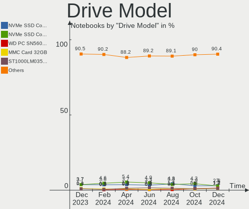
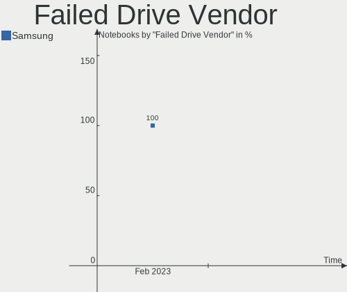
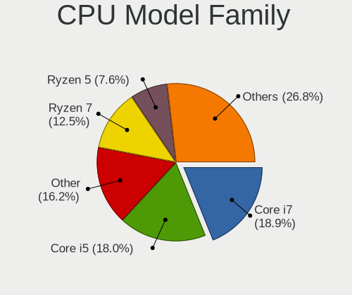

Fedora Hardware Trends (Notebook)
---------------------------------

A project to identify most popular hardware characteristics and track their change
over time based on data collected by Fedora users at https://Linux-Hardware.org.

Anyone can contribute to the study by uploading probes of their computers by
the [hw-probe](https://github.com/linuxhw/hw-probe) tool:

    sudo -E hw-probe -all -upload

Full-feature report is available here: https://linux-hardware.org/?view=trends&formfactor=notebook

Period: Jun, 2021.

Contents
--------

- [ OS                       ](#os)
- [ OS Family                ](#os-family)
- [ Kernel                   ](#kernel)
- [ Kernel Family            ](#kernel-family)
- [ Kernel Major Ver.        ](#kernel-major-ver)
- [ Arch                     ](#arch)
- [ DE                       ](#de)
- [ Display Server           ](#display-server)
- [ Display Manager          ](#display-manager)
- [ OS Lang                  ](#os-lang)
- [ Boot Mode                ](#boot-mode)
- [ Filesystem               ](#filesystem)
- [ Part. scheme             ](#part-scheme)
- [ Dual Boot with Linux/BSD ](#dual-boot-with-linux/bsd)
- [ Dual Boot (Win)          ](#dual-boot-win)
- [ Country                  ](#country)
- [ City                     ](#city)
- [ Vendor                   ](#vendor)
- [ Model                    ](#model)
- [ Model Family             ](#model-family)
- [ MFG Year                 ](#mfg-year)
- [ Form Factor              ](#form-factor)
- [ Secure Boot              ](#secure-boot)
- [ Coreboot                 ](#coreboot)
- [ RAM Size                 ](#ram-size)
- [ RAM Used                 ](#ram-used)
- [ Has CD-ROM               ](#has-cd-rom)
- [ Total Drives             ](#total-drives)
- [ Has Ethernet             ](#has-ethernet)
- [ Has WiFi                 ](#has-wifi)
- [ Has Bluetooth            ](#has-bluetooth)
- [ Drive Vendor             ](#drive-vendor)
- [ Drive Model              ](#drive-model)
- [ HDD Vendor               ](#hdd-vendor)
- [ SSD Vendor               ](#ssd-vendor)
- [ Drive Kind               ](#drive-kind)
- [ Drive Connector          ](#drive-connector)
- [ Drive Size               ](#drive-size)
- [ Space Total              ](#space-total)
- [ Space Used               ](#space-used)
- [ Malfunc. Drives          ](#malfunc-drives)
- [ Malfunc. Drive Vendor    ](#malfunc-drive-vendor)
- [ Malfunc. HDD Vendor      ](#malfunc-hdd-vendor)
- [ Malfunc. Drive Kind      ](#malfunc-drive-kind)
- [ Failed Drives            ](#failed-drives)
- [ Failed Drive Vendor      ](#failed-drive-vendor)
- [ Drive Status             ](#drive-status)
- [ Storage Vendor           ](#storage-vendor)
- [ Storage Model            ](#storage-model)
- [ Storage Kind             ](#storage-kind)
- [ CPU Vendor               ](#cpu-vendor)
- [ CPU Model                ](#cpu-model)
- [ CPU Model Family         ](#cpu-model-family)
- [ CPU Cores                ](#cpu-cores)
- [ CPU Sockets              ](#cpu-sockets)
- [ CPU Threads              ](#cpu-threads)
- [ CPU Op-Modes             ](#cpu-op-modes)
- [ CPU Microcode            ](#cpu-microcode)
- [ CPU Microarch            ](#cpu-microarch)
- [ GPU Vendor               ](#gpu-vendor)
- [ GPU Model                ](#gpu-model)
- [ GPU Combo                ](#gpu-combo)
- [ GPU Driver               ](#gpu-driver)
- [ GPU Memory               ](#gpu-memory)
- [ Monitor Vendor           ](#monitor-vendor)
- [ Monitor Model            ](#monitor-model)
- [ Monitor Resolution       ](#monitor-resolution)
- [ Monitor Diagonal         ](#monitor-diagonal)
- [ Monitor Width            ](#monitor-width)
- [ Aspect Ratio             ](#aspect-ratio)
- [ Monitor Area             ](#monitor-area)
- [ Pixel Density            ](#pixel-density)
- [ Multiple Monitors        ](#multiple-monitors)
- [ Net Controller Vendor    ](#net-controller-vendor)
- [ Net Controller Model     ](#net-controller-model)
- [ Wireless Vendor          ](#wireless-vendor)
- [ Wireless Model           ](#wireless-model)
- [ Ethernet Vendor          ](#ethernet-vendor)
- [ Ethernet Model           ](#ethernet-model)
- [ Net Controller Kind      ](#net-controller-kind)
- [ Used Controller          ](#used-controller)
- [ NICs                     ](#nics)
- [ IPv6                     ](#ipv6)
- [ Memory Vendor            ](#memory-vendor)
- [ Memory Model             ](#memory-model)
- [ Memory Kind              ](#memory-kind)
- [ Memory Form Factor       ](#memory-form-factor)
- [ Memory Size              ](#memory-size)
- [ Memory Speed             ](#memory-speed)
- [ Sound Vendor             ](#sound-vendor)
- [ Sound Model              ](#sound-model)
- [ Camera Vendor            ](#camera-vendor)
- [ Camera Model             ](#camera-model)
- [ Fingerprint Vendor       ](#fingerprint-vendor)
- [ Fingerprint Model        ](#fingerprint-model)
- [ Chipcard Vendor          ](#chipcard-vendor)
- [ Chipcard Model           ](#chipcard-model)
- [ Printer Vendor           ](#printer-vendor)
- [ Printer Model            ](#printer-model)
- [ Scanner Vendor           ](#scanner-vendor)
- [ Scanner Model            ](#scanner-model)
- [ Bluetooth Vendor         ](#bluetooth-vendor)
- [ Bluetooth Model          ](#bluetooth-model)
- [ Unsupported Devices      ](#unsupported-devices)
- [ Unsupported Device Types ](#unsupported-device-types)

OS
--

Installed operating systems

| Name      | Notebooks | Percent |
|-----------|-----------|---------|
| Fedora 34 | 128       | 86.49%  |
| Fedora 33 | 13        | 8.78%   |
| Fedora 32 | 7         | 4.73%   |

OS Family
---------

OS without a version

| Name   | Notebooks | Percent |
|--------|-----------|---------|
| Fedora | 148       | 100%    |

Kernel
------

Version of the Linux kernel

| Version                           | Notebooks | Percent |
|-----------------------------------|-----------|---------|
| 5.12.8-300.fc34.x86_64            | 28        | 18.92%  |
| 5.12.9-300.fc34.x86_64            | 26        | 17.57%  |
| 5.12.11-300.fc34.x86_64           | 24        | 16.22%  |
| 5.12.10-300.fc34.x86_64           | 18        | 12.16%  |
| 5.12.12-300.fc34.x86_64           | 12        | 8.11%   |
| 5.11.12-300.fc34.x86_64           | 9         | 6.08%   |
| 5.12.8-200.fc33.x86_64            | 6         | 4.05%   |
| 5.12.9-200.fc33.x86_64            | 4         | 2.7%    |
| 5.12.7-300.fc34.x86_64            | 4         | 2.7%    |
| 5.11.22-100.fc32.x86_64           | 3         | 2.03%   |
| 5.11.20-300.fc34.x86_64           | 2         | 1.35%   |
| 5.5.15-200.fc31.x86_64            | 1         | 0.68%   |
| 5.12.8-300.fc34.aarch64           | 1         | 0.68%   |
| 5.12.13-300.fc34.x86_64           | 1         | 0.68%   |
| 5.12.12-200.fc33.x86_64           | 1         | 0.68%   |
| 5.12.11-200.fc33.x86_64           | 1         | 0.68%   |
| 5.12.10-350.vanilla.1.fc34.x86_64 | 1         | 0.68%   |
| 5.11.7-200.fc33.x86_64            | 1         | 0.68%   |
| 5.11.18-100.fc32.x86_64           | 1         | 0.68%   |
| 5.11.17-300.fc34.x86_64           | 1         | 0.68%   |
| 5.11.11-100.fc32.x86_64           | 1         | 0.68%   |
| 5.10.22-100.fc32.x86_64           | 1         | 0.68%   |
| 5.1.15-300.fc30.x86_64            | 1         | 0.68%   |

Kernel Family
-------------

Linux kernel without a distro release

| Version | Notebooks | Percent |
|---------|-----------|---------|
| 5.12.8  | 35        | 23.65%  |
| 5.12.9  | 30        | 20.27%  |
| 5.12.11 | 25        | 16.89%  |
| 5.12.10 | 19        | 12.84%  |
| 5.12.12 | 13        | 8.78%   |
| 5.11.12 | 9         | 6.08%   |
| 5.12.7  | 4         | 2.7%    |
| 5.11.22 | 3         | 2.03%   |
| 5.11.20 | 2         | 1.35%   |
| 5.5.15  | 1         | 0.68%   |
| 5.12.13 | 1         | 0.68%   |
| 5.11.7  | 1         | 0.68%   |
| 5.11.18 | 1         | 0.68%   |
| 5.11.17 | 1         | 0.68%   |
| 5.11.11 | 1         | 0.68%   |
| 5.10.22 | 1         | 0.68%   |
| 5.1.15  | 1         | 0.68%   |

Kernel Major Ver.
-----------------

Linux kernel major version

| Version | Notebooks | Percent |
|---------|-----------|---------|
| 5.12    | 127       | 85.81%  |
| 5.11    | 18        | 12.16%  |
| 5.5     | 1         | 0.68%   |
| 5.10    | 1         | 0.68%   |
| 5.1     | 1         | 0.68%   |

Arch
----

OS architecture (x86_64, i586, etc.)

| Name    | Notebooks | Percent |
|---------|-----------|---------|
| x86_64  | 147       | 99.32%  |
| aarch64 | 1         | 0.68%   |

DE
--

Desktop Environment

| Name       | Notebooks | Percent |
|------------|-----------|---------|
| GNOME      | 118       | 79.73%  |
| KDE5       | 10        | 6.76%   |
| Unknown    | 5         | 3.38%   |
| KDE        | 4         | 2.7%    |
| XFCE       | 2         | 1.35%   |
| X-Cinnamon | 2         | 1.35%   |
| MATE       | 2         | 1.35%   |
| Cinnamon   | 2         | 1.35%   |
| LXQt       | 1         | 0.68%   |
| i3         | 1         | 0.68%   |
| Deepin     | 1         | 0.68%   |

Display Server
--------------

X11 or Wayland

| Name    | Notebooks | Percent |
|---------|-----------|---------|
| Wayland | 86        | 58.11%  |
| X11     | 59        | 39.86%  |
| Tty     | 2         | 1.35%   |
| Unknown | 1         | 0.68%   |

Display Manager
---------------

SDDM, LightDM, etc.

| Name    | Notebooks | Percent |
|---------|-----------|---------|
| Unknown | 86        | 58.11%  |
| GDM     | 45        | 30.41%  |
| SDDM    | 11        | 7.43%   |
| TDM     | 5         | 3.38%   |
| LightDM | 1         | 0.68%   |

OS Lang
-------

Language

| Lang    | Notebooks | Percent |
|---------|-----------|---------|
| en_US   | 69        | 46.62%  |
| pt_BR   | 14        | 9.46%   |
| en_GB   | 12        | 8.11%   |
| ru_RU   | 9         | 6.08%   |
| en_IN   | 6         | 4.05%   |
| it_IT   | 4         | 2.7%    |
| fr_FR   | 4         | 2.7%    |
| es_CL   | 3         | 2.03%   |
| en_CA   | 3         | 2.03%   |
| de_DE   | 3         | 2.03%   |
| tr_TR   | 2         | 1.35%   |
| pt_PT   | 2         | 1.35%   |
| hu_HU   | 2         | 1.35%   |
| es_ES   | 2         | 1.35%   |
| en_AU   | 2         | 1.35%   |
| sr_ME   | 1         | 0.68%   |
| sl_SI   | 1         | 0.68%   |
| nl_BE   | 1         | 0.68%   |
| fr_CH   | 1         | 0.68%   |
| es_MX   | 1         | 0.68%   |
| en_PK   | 1         | 0.68%   |
| en_IE   | 1         | 0.68%   |
| en_DK   | 1         | 0.68%   |
| de_CH   | 1         | 0.68%   |
| cs_CZ   | 1         | 0.68%   |
| Unknown | 1         | 0.68%   |

Boot Mode
---------

EFI or BIOS

| Mode | Notebooks | Percent |
|------|-----------|---------|
| EFI  | 118       | 79.73%  |
| BIOS | 30        | 20.27%  |

Filesystem
----------

Type of filesystem

| Type  | Notebooks | Percent |
|-------|-----------|---------|
| Btrfs | 102       | 68.92%  |
| Ext4  | 42        | 28.38%  |
| Xfs   | 4         | 2.7%    |

Part. scheme
------------

Scheme of partitioning

| Type    | Notebooks | Percent |
|---------|-----------|---------|
| Unknown | 83        | 56.08%  |
| GPT     | 54        | 36.49%  |
| MBR     | 11        | 7.43%   |

Dual Boot with Linux/BSD
------------------------

Hosting more than one Linux/BSD

| Dual boot | Notebooks | Percent |
|-----------|-----------|---------|
| No        | 138       | 93.24%  |
| Yes       | 10        | 6.76%   |

Dual Boot (Win)
---------------

Hosting Linux and Windows

| Dual boot | Notebooks | Percent |
|-----------|-----------|---------|
| No        | 127       | 85.81%  |
| Yes       | 21        | 14.19%  |

Country
-------

Geographic location (country)

| Country     | Notebooks | Percent |
|-------------|-----------|---------|
| USA         | 24        | 16.22%  |
| Brazil      | 15        | 10.14%  |
| Russia      | 10        | 6.76%   |
| India       | 9         | 6.08%   |
| Germany     | 7         | 4.73%   |
| Italy       | 6         | 4.05%   |
| UK          | 5         | 3.38%   |
| France      | 5         | 3.38%   |
| Canada      | 5         | 3.38%   |
| Ukraine     | 4         | 2.7%    |
| Turkey      | 4         | 2.7%    |
| Switzerland | 4         | 2.7%    |
| Chile       | 4         | 2.7%    |
| Romania     | 3         | 2.03%   |
| Hungary     | 3         | 2.03%   |
| Belgium     | 3         | 2.03%   |
| Spain       | 2         | 1.35%   |
| Slovenia    | 2         | 1.35%   |
| Portugal    | 2         | 1.35%   |
| Netherlands | 2         | 1.35%   |
| Moldova     | 2         | 1.35%   |
| Mexico      | 2         | 1.35%   |
| Czechia     | 2         | 1.35%   |
| Austria     | 2         | 1.35%   |
| Australia   | 2         | 1.35%   |
| Taiwan      | 1         | 0.68%   |
| Sweden      | 1         | 0.68%   |
| Sri Lanka   | 1         | 0.68%   |
| Slovakia    | 1         | 0.68%   |
| Poland      | 1         | 0.68%   |
| Pakistan    | 1         | 0.68%   |
| Norway      | 1         | 0.68%   |
| Montenegro  | 1         | 0.68%   |
| Malaysia    | 1         | 0.68%   |
| Kyrgyzstan  | 1         | 0.68%   |
| Ireland     | 1         | 0.68%   |
| Iran        | 1         | 0.68%   |
| Indonesia   | 1         | 0.68%   |
| Greece      | 1         | 0.68%   |
| Estonia     | 1         | 0.68%   |
| Egypt       | 1         | 0.68%   |
| Belarus     | 1         | 0.68%   |
| Bangladesh  | 1         | 0.68%   |
| Argentina   | 1         | 0.68%   |

City
----

Geographic location (city)

| City                     | Notebooks | Percent |
|--------------------------|-----------|---------|
| Moscow                   | 5         | 3.38%   |
| Kyiv                     | 3         | 2.03%   |
| Sydney                   | 2         | 1.35%   |
| Santiago                 | 2         | 1.35%   |
| London                   | 2         | 1.35%   |
| Kirchbichl               | 2         | 1.35%   |
| Istanbul                 | 2         | 1.35%   |
| Chisinau                 | 2         | 1.35%   |
| Budapest                 | 2         | 1.35%   |
| Zurich                   | 1         | 0.68%   |
| Woodstock                | 1         | 0.68%   |
| Winterthur               | 1         | 0.68%   |
| Wiesbaden                | 1         | 0.68%   |
| Wendell                  | 1         | 0.68%   |
| Washington               | 1         | 0.68%   |
| Vignacourt               | 1         | 0.68%   |
| Veceslavci               | 1         | 0.68%   |
| Vancouver                | 1         | 0.68%   |
| Uberlândia              | 1         | 0.68%   |
| Tyumen                   | 1         | 0.68%   |
| Tvrdosin                 | 1         | 0.68%   |
| Toulouse                 | 1         | 0.68%   |
| Toronto                  | 1         | 0.68%   |
| The Bronx                | 1         | 0.68%   |
| Temuco                   | 1         | 0.68%   |
| Tehran                   | 1         | 0.68%   |
| São Paulo               | 1         | 0.68%   |
| Stockholm                | 1         | 0.68%   |
| Stevenage                | 1         | 0.68%   |
| Skudai                   | 1         | 0.68%   |
| Sharon                   | 1         | 0.68%   |
| Serra Talhada            | 1         | 0.68%   |
| Seattle                  | 1         | 0.68%   |
| Santpoort-Noord          | 1         | 0.68%   |
| Santa Cruz de Minas      | 1         | 0.68%   |
| Sanary-sur-Mer           | 1         | 0.68%   |
| San Francisco            | 1         | 0.68%   |
| Rome                     | 1         | 0.68%   |
| Rio de Janeiro           | 1         | 0.68%   |
| Rancagua                 | 1         | 0.68%   |
| Pärnu                   | 1         | 0.68%   |
| Prague                   | 1         | 0.68%   |
| Porto Alegre             | 1         | 0.68%   |
| Portland                 | 1         | 0.68%   |
| Pomezia                  | 1         | 0.68%   |
| Podgorica                | 1         | 0.68%   |
| Perm                     | 1         | 0.68%   |
| Ottawa                   | 1         | 0.68%   |
| Oslo                     | 1         | 0.68%   |
| Oradea                   | 1         | 0.68%   |
| Ontinyent                | 1         | 0.68%   |
| Oleiros                  | 1         | 0.68%   |
| Oeiras                   | 1         | 0.68%   |
| Nossa Senhora do Socorro | 1         | 0.68%   |
| Nieuwrode                | 1         | 0.68%   |
| Newtownabbey             | 1         | 0.68%   |
| New Taipei               | 1         | 0.68%   |
| New Delhi                | 1         | 0.68%   |
| Neuwied                  | 1         | 0.68%   |
| Metepec                  | 1         | 0.68%   |

Vendor
------

Motherboard manufacturer

| Name                | Notebooks | Percent |
|---------------------|-----------|---------|
| Lenovo              | 41        | 27.7%   |
| Dell                | 27        | 18.24%  |
| Hewlett-Packard     | 25        | 16.89%  |
| ASUSTek Computer    | 20        | 13.51%  |
| Acer                | 14        | 9.46%   |
| Apple               | 5         | 3.38%   |
| Sony                | 2         | 1.35%   |
| Positivo            | 2         | 1.35%   |
| Notebook            | 2         | 1.35%   |
| HUAWEI              | 2         | 1.35%   |
| TrekStor            | 1         | 0.68%   |
| Toshiba             | 1         | 0.68%   |
| SLIMBOOK            | 1         | 0.68%   |
| Samsung Electronics | 1         | 0.68%   |
| Pine Microsystems   | 1         | 0.68%   |
| MSI                 | 1         | 0.68%   |
| LG Electronics      | 1         | 0.68%   |
| eMachines           | 1         | 0.68%   |

Model
-----

Motherboard model

| Name                                       | Notebooks | Percent |
|--------------------------------------------|-----------|---------|
| Lenovo IdeaPad Yoga 13 20175               | 2         | 1.35%   |
| HP Pro x2 612 G1 Tablet                    | 2         | 1.35%   |
| HP Pavilion Notebook                       | 2         | 1.35%   |
| HP Pavilion 15                             | 2         | 1.35%   |
| HP Notebook                                | 2         | 1.35%   |
| Dell Inspiron 15 7000 Gaming               | 2         | 1.35%   |
| ASUS VivoBook_ASUSLaptop X509JA_X509JA     | 2         | 1.35%   |
| ASUS N550JV                                | 2         | 1.35%   |
| Apple MacBookPro11,5                       | 2         | 1.35%   |
| TrekStor Notebook Slim S130                | 1         | 0.68%   |
| Toshiba Satellite L75-B                    | 1         | 0.68%   |
| Sony VPCSA25GX                             | 1         | 0.68%   |
| Sony SVE14113ELW                           | 1         | 0.68%   |
| SLIMBOOK PROX15-AMD                        | 1         | 0.68%   |
| Samsung 700Z3C/700Z5C                      | 1         | 0.68%   |
| Positivo CHT14B                            | 1         | 0.68%   |
| Positivo C41TB                             | 1         | 0.68%   |
| Pine Microsystems Pine64 Pinebook Pro      | 1         | 0.68%   |
| Notebook PB50_70DFx,DDx                    | 1         | 0.68%   |
| Notebook NH5x_7xDPx                        | 1         | 0.68%   |
| MSI GE70 2PE                               | 1         | 0.68%   |
| LG 17Z90N-R.AAC8U1                         | 1         | 0.68%   |
| Lenovo Yoga Slim 7 15ITL05 82AC            | 1         | 0.68%   |
| Lenovo Yoga 300-11IBR 80M1                 | 1         | 0.68%   |
| Lenovo ThinkPad X220 4290LT8               | 1         | 0.68%   |
| Lenovo ThinkPad X1 Nano Gen 1 20UN005KUS   | 1         | 0.68%   |
| Lenovo ThinkPad X1 Extreme 2nd 20QVCTO1WW  | 1         | 0.68%   |
| Lenovo ThinkPad X1 Carbon Gen 9 20XW003FUS | 1         | 0.68%   |
| Lenovo ThinkPad X1 Carbon Gen 8 20U9CTO1WW | 1         | 0.68%   |
| Lenovo ThinkPad X1 Carbon Gen 8 20U9005KUS | 1         | 0.68%   |
| Lenovo ThinkPad W540 20BHS04T0K            | 1         | 0.68%   |
| Lenovo ThinkPad W530 2447AC4               | 1         | 0.68%   |
| Lenovo ThinkPad W520 4282AB9               | 1         | 0.68%   |
| Lenovo ThinkPad T580 20LAS3NJ0B            | 1         | 0.68%   |
| Lenovo ThinkPad T480 20L6S29D07            | 1         | 0.68%   |
| Lenovo ThinkPad T460s 20FAS0W901           | 1         | 0.68%   |
| Lenovo ThinkPad T460p 20FXS1SX00           | 1         | 0.68%   |
| Lenovo ThinkPad T450s 20BWS1RG01           | 1         | 0.68%   |
| Lenovo ThinkPad T430 2349V4B               | 1         | 0.68%   |
| Lenovo ThinkPad T410 2522PT3               | 1         | 0.68%   |
| Lenovo ThinkPad T14 Gen 2i 20W1S02K03      | 1         | 0.68%   |
| Lenovo ThinkPad T14 Gen 1 20UDCTO1WW       | 1         | 0.68%   |
| Lenovo ThinkPad P50 20EQS3B41R             | 1         | 0.68%   |
| Lenovo ThinkPad P14s Gen 1 20Y1CTO1WW      | 1         | 0.68%   |
| Lenovo ThinkPad P1 Gen 2 20QUS1R500        | 1         | 0.68%   |
| Lenovo ThinkPad Helix 37027L8              | 1         | 0.68%   |
| Lenovo ThinkPad E595 20NF001PTX            | 1         | 0.68%   |
| Lenovo ThinkPad E560 20EV003WUS            | 1         | 0.68%   |
| Lenovo ThinkPad E490 20N8CTO1WW            | 1         | 0.68%   |
| Lenovo ThinkPad E480 20KN003YUS            | 1         | 0.68%   |
| Lenovo ThinkPad E15 Gen 2 20T8001STX       | 1         | 0.68%   |
| Lenovo ThinkPad E15 20RD0011RT             | 1         | 0.68%   |
| Lenovo ThinkPad E15 20RD0011MZ             | 1         | 0.68%   |
| Lenovo Legion 5 15ARH05H 82B1              | 1         | 0.68%   |
| Lenovo IdeaPad S340-14API 81NB             | 1         | 0.68%   |
| Lenovo IdeaPad L340-15IRH Gaming 81LK      | 1         | 0.68%   |
| Lenovo IdeaPad 530S-14ARR 81H1             | 1         | 0.68%   |
| Lenovo IdeaPad 5 15ARE05 81YQ              | 1         | 0.68%   |
| Lenovo IdeaPad 5 15ALC05 82LN              | 1         | 0.68%   |
| Lenovo IdeaPad 330S-15IKB 81F5             | 1         | 0.68%   |

Model Family
------------

Motherboard model prefix

| Name                     | Notebooks | Percent |
|--------------------------|-----------|---------|
| Lenovo ThinkPad          | 29        | 19.59%  |
| Dell Latitude            | 10        | 6.76%   |
| HP Pavilion              | 9         | 6.08%   |
| Dell Inspiron            | 9         | 6.08%   |
| Lenovo IdeaPad           | 8         | 5.41%   |
| ASUS VivoBook            | 7         | 4.73%   |
| Acer Aspire              | 7         | 4.73%   |
| Dell XPS                 | 4         | 2.7%    |
| HP ProBook               | 3         | 2.03%   |
| ASUS ROG                 | 3         | 2.03%   |
| Acer Swift               | 3         | 2.03%   |
| Acer Nitro               | 3         | 2.03%   |
| Lenovo Yoga              | 2         | 1.35%   |
| HP Pro                   | 2         | 1.35%   |
| HP OMEN                  | 2         | 1.35%   |
| HP Notebook              | 2         | 1.35%   |
| HP EliteBook             | 2         | 1.35%   |
| Dell Precision           | 2         | 1.35%   |
| ASUS TUF                 | 2         | 1.35%   |
| ASUS N550JV              | 2         | 1.35%   |
| Apple MacBookPro11       | 2         | 1.35%   |
| TrekStor Notebook        | 1         | 0.68%   |
| Toshiba Satellite        | 1         | 0.68%   |
| Sony VPCSA25GX           | 1         | 0.68%   |
| Sony SVE14113ELW         | 1         | 0.68%   |
| SLIMBOOK PROX15-AMD      | 1         | 0.68%   |
| Samsung 700Z3C           | 1         | 0.68%   |
| Positivo CHT14B          | 1         | 0.68%   |
| Positivo C41TB           | 1         | 0.68%   |
| Pine Microsystems Pine64 | 1         | 0.68%   |
| Notebook PB50            | 1         | 0.68%   |
| Notebook NH5x            | 1         | 0.68%   |
| MSI GE70                 | 1         | 0.68%   |
| LG 17Z90N-R.AAC8U1       | 1         | 0.68%   |
| Lenovo Legion            | 1         | 0.68%   |
| Lenovo G500              | 1         | 0.68%   |
| HUAWEI KPL-W0X           | 1         | 0.68%   |
| HUAWEI HLYL-WXX9         | 1         | 0.68%   |
| HP ZBook                 | 1         | 0.68%   |
| HP Laptop                | 1         | 0.68%   |
| HP ENVY                  | 1         | 0.68%   |
| HP 255                   | 1         | 0.68%   |
| HP 240                   | 1         | 0.68%   |
| eMachines eME732         | 1         | 0.68%   |
| Dell Vostro              | 1         | 0.68%   |
| Dell G7                  | 1         | 0.68%   |
| ASUS ZenBook             | 1         | 0.68%   |
| ASUS X510URR             | 1         | 0.68%   |
| ASUS X450LA              | 1         | 0.68%   |
| ASUS T100TA              | 1         | 0.68%   |
| ASUS N551JX              | 1         | 0.68%   |
| ASUS ASUS                | 1         | 0.68%   |
| Apple MacBookPro9        | 1         | 0.68%   |
| Apple MacBookPro7        | 1         | 0.68%   |
| Apple MacBookPro5        | 1         | 0.68%   |
| Acer Predator            | 1         | 0.68%   |

MFG Year
--------

Motherboard manufacture year

| Year | Notebooks | Percent |
|------|-----------|---------|
| 2020 | 37        | 25%     |
| 2021 | 29        | 19.59%  |
| 2019 | 24        | 16.22%  |
| 2015 | 12        | 8.11%   |
| 2018 | 11        | 7.43%   |
| 2014 | 8         | 5.41%   |
| 2013 | 7         | 4.73%   |
| 2011 | 5         | 3.38%   |
| 2017 | 4         | 2.7%    |
| 2016 | 4         | 2.7%    |
| 2012 | 4         | 2.7%    |
| 2010 | 3         | 2.03%   |

Form Factor
-----------

Physical design of the computer

| Name     | Notebooks | Percent |
|----------|-----------|---------|
| Notebook | 148       | 100%    |

Secure Boot
-----------

Enabled or disabled

| State    | Notebooks | Percent |
|----------|-----------|---------|
| Disabled | 122       | 82.43%  |
| Enabled  | 26        | 17.57%  |

Coreboot
--------

Have coreboot on board

| Used | Notebooks | Percent |
|------|-----------|---------|
| No   | 148       | 100%    |

RAM Size
--------

Total RAM memory

| Size in GB  | Notebooks | Percent |
|-------------|-----------|---------|
| 4.01-8.0    | 42        | 28.38%  |
| 16.01-24.0  | 35        | 23.65%  |
| 8.01-16.0   | 33        | 22.3%   |
| 32.01-64.0  | 18        | 12.16%  |
| 3.01-4.0    | 13        | 8.78%   |
| 1.01-2.0    | 3         | 2.03%   |
| 24.01-32.0  | 2         | 1.35%   |
| 64.01-256.0 | 2         | 1.35%   |

RAM Used
--------

Used RAM memory

| Used GB    | Notebooks | Percent |
|------------|-----------|---------|
| 2.01-3.0   | 42        | 28.38%  |
| 4.01-8.0   | 39        | 26.35%  |
| 3.01-4.0   | 28        | 18.92%  |
| 1.01-2.0   | 28        | 18.92%  |
| 8.01-16.0  | 7         | 4.73%   |
| 0.51-1.0   | 3         | 2.03%   |
| 16.01-24.0 | 1         | 0.68%   |

Has CD-ROM
----------

Has CD-ROM on board

| Presented | Notebooks | Percent |
|-----------|-----------|---------|
| No        | 119       | 80.41%  |
| Yes       | 29        | 19.59%  |

Total Drives
------------

Number of drives on board

| Drives | Notebooks | Percent |
|--------|-----------|---------|
| 1      | 102       | 68.92%  |
| 2      | 40        | 27.03%  |
| 3      | 5         | 3.38%   |
| 5      | 1         | 0.68%   |

Has Ethernet
------------

Has Ethernet on board

| Presented | Notebooks | Percent |
|-----------|-----------|---------|
| Yes       | 111       | 75%     |
| No        | 37        | 25%     |

Has WiFi
--------

Has WiFi module

| Presented | Notebooks | Percent |
|-----------|-----------|---------|
| Yes       | 143       | 96.62%  |
| No        | 5         | 3.38%   |

Has Bluetooth
-------------

Has Bluetooth module

| Presented | Notebooks | Percent |
|-----------|-----------|---------|
| Yes       | 116       | 78.38%  |
| No        | 32        | 21.62%  |

Drive Vendor
------------

Hard drive vendors

| Vendor                  | Notebooks | Drives | Percent |
|-------------------------|-----------|--------|---------|
| Samsung Electronics     | 40        | 43     | 20.73%  |
| WDC                     | 25        | 25     | 12.95%  |
| SanDisk                 | 13        | 13     | 6.74%   |
| Toshiba                 | 12        | 13     | 6.22%   |
| Seagate                 | 12        | 12     | 6.22%   |
| Crucial                 | 11        | 11     | 5.7%    |
| Unknown                 | 10        | 12     | 5.18%   |
| Kingston                | 10        | 10     | 5.18%   |
| Micron Technology       | 9         | 11     | 4.66%   |
| SK Hynix                | 8         | 8      | 4.15%   |
| Intel                   | 8         | 8      | 4.15%   |
| HGST                    | 8         | 8      | 4.15%   |
| SPCC                    | 2         | 2      | 1.04%   |
| Silicon Motion          | 2         | 3      | 1.04%   |
| LITEONIT                | 2         | 2      | 1.04%   |
| Apple                   | 2         | 2      | 1.04%   |
| XPG                     | 1         | 1      | 0.52%   |
| Union Memory (Shenzhen) | 1         | 1      | 0.52%   |
| Union Memory            | 1         | 1      | 0.52%   |
| Transcend               | 1         | 1      | 0.52%   |
| Team                    | 1         | 1      | 0.52%   |
| Solid State Storage     | 1         | 1      | 0.52%   |
| Realtek Semiconductor   | 1         | 1      | 0.52%   |
| Phison                  | 1         | 1      | 0.52%   |
| Patriot                 | 1         | 2      | 0.52%   |
| LITEON                  | 1         | 1      | 0.52%   |
| Lite-On                 | 1         | 1      | 0.52%   |
| Lexar                   | 1         | 1      | 0.52%   |
| Lenovo                  | 1         | 1      | 0.52%   |
| KIOXIA                  | 1         | 1      | 0.52%   |
| KingFast                | 1         | 1      | 0.52%   |
| HS-SSD-C100             | 1         | 1      | 0.52%   |
| Hitachi                 | 1         | 1      | 0.52%   |
| Corsair                 | 1         | 1      | 0.52%   |
| BHT                     | 1         | 1      | 0.52%   |

Drive Model
-----------

Hard drive models

| Model                                        | Notebooks | Percent |
|----------------------------------------------|-----------|---------|
| Samsung NVMe SSD Drive 512GB                 | 6         | 3.02%   |
| HGST HTS721010A9E630 1TB                     | 4         | 2.01%   |
| Seagate ST1000LM035-1RK172 1TB               | 3         | 1.51%   |
| Samsung SSD 870 EVO 500GB                    | 3         | 1.51%   |
| Samsung SSD 860 EVO 500GB                    | 3         | 1.51%   |
| Samsung NVMe SSD Drive 256GB                 | 3         | 1.51%   |
| HGST HTS541010A9E680 1TB                     | 3         | 1.51%   |
| WDC WDS240G2G0B-00EPW0 240GB SSD             | 2         | 1.01%   |
| WDC WD10SPZX-24Z10 1TB                       | 2         | 1.01%   |
| WDC WD10JPVX-60JC3T0 1TB                     | 2         | 1.01%   |
| WDC PC SN520 SDAPNUW-512G-1202 512GB         | 2         | 1.01%   |
| WDC PC SN520 SDAPMUW-512G-1001 512GB         | 2         | 1.01%   |
| Unknown SD/MMC/MS PRO 128GB                  | 2         | 1.01%   |
| Unknown MMC Card  32GB                       | 2         | 1.01%   |
| Toshiba MQ02ABD100H 1TB                      | 2         | 1.01%   |
| SK Hynix HBG4e  32GB                         | 2         | 1.01%   |
| SK Hynix BC511 NVMe 256GB                    | 2         | 1.01%   |
| Seagate ST1000LM049-2GH172 1TB               | 2         | 1.01%   |
| Seagate ST1000LM024 HN-M101MBB 1TB           | 2         | 1.01%   |
| Sandisk NVMe SSD Drive 512GB                 | 2         | 1.01%   |
| Sandisk NVMe SSD Drive 1024GB                | 2         | 1.01%   |
| Samsung SSD 970 EVO Plus 1TB                 | 2         | 1.01%   |
| Samsung SSD 850 EVO 500GB                    | 2         | 1.01%   |
| Samsung NVMe SSD Drive 1024GB                | 2         | 1.01%   |
| Samsung MZMPC128HBFU-000L1 128GB SSD         | 2         | 1.01%   |
| Micron NVMe SSD Drive 512GB                  | 2         | 1.01%   |
| Kingston SA400S37480G 480GB SSD              | 2         | 1.01%   |
| Kingston SA400S37120G 120GB SSD              | 2         | 1.01%   |
| Intel NVMe SSD Drive 512GB                   | 2         | 1.01%   |
| Crucial CT500MX500SSD1 500GB                 | 2         | 1.01%   |
| Crucial CT1000MX500SSD1 1TB                  | 2         | 1.01%   |
| Apple SSD SM0512G 500GB                      | 2         | 1.01%   |
| XPG NVMe SSD Drive 256GB                     | 1         | 0.5%    |
| WDC WDS500G3X0C-00SJG0 500GB                 | 1         | 0.5%    |
| WDC WDS500G2B0B-00YS70 500GB SSD             | 1         | 0.5%    |
| WDC WDS500G2B0A-00SM50 500GB SSD             | 1         | 0.5%    |
| WDC WDS120G2G0B-00EPW0 120GB SSD             | 1         | 0.5%    |
| WDC WDBNCE0010PNC 1TB SSD                    | 1         | 0.5%    |
| WDC WD5000BPVX-00JC3T0 500GB                 | 1         | 0.5%    |
| WDC WD5000BPVT-22HXZT1 500GB                 | 1         | 0.5%    |
| WDC WD2500BJKT-75F4T0 250GB                  | 1         | 0.5%    |
| WDC WD2500BEKT-75A25T0 250GB                 | 1         | 0.5%    |
| WDC WD16 00BEVT-60ZCT 160GB                  | 1         | 0.5%    |
| WDC WD10SPZX-60Z10T0 1TB                     | 1         | 0.5%    |
| WDC WD10SPZX-22Z10T1 1TB                     | 1         | 0.5%    |
| WDC PC SN530 SDBPNPZ-512G-1006 512GB         | 1         | 0.5%    |
| WDC PC SN530 SDBPMPZ-512G-1001 512GB         | 1         | 0.5%    |
| WDC PC SN530 SDBPMPZ-256G-1001 256GB         | 1         | 0.5%    |
| Unknown SLD64G  64GB                         | 1         | 0.5%    |
| Unknown SF256  256GB                         | 1         | 0.5%    |
| Unknown SDW32G  32GB                         | 1         | 0.5%    |
| Unknown SD128  128GB                         | 1         | 0.5%    |
| Unknown MMC Card  128GB                      | 1         | 0.5%    |
| Unknown GD4QT  128GB                         | 1         | 0.5%    |
| Unknown EFAQK  512GB                         | 1         | 0.5%    |
| Unknown DA4128  128GB                        | 1         | 0.5%    |
| Union Memory RTOTJ128VGD2EYX 128GB SSD       | 1         | 0.5%    |
| Union Memory (Shenzhen) NVMe SSD Drive 256GB | 1         | 0.5%    |
| Transcend TS128GSSD370S 128GB                | 1         | 0.5%    |
| Toshiba THNSNC128GMMJ 128GB SSD              | 1         | 0.5%    |

HDD Vendor
----------

Hard disk drive vendors

| Vendor  | Notebooks | Drives | Percent |
|---------|-----------|--------|---------|
| Seagate | 12        | 12     | 30.77%  |
| WDC     | 11        | 11     | 28.21%  |
| HGST    | 8         | 8      | 20.51%  |
| Toshiba | 7         | 7      | 17.95%  |
| Hitachi | 1         | 1      | 2.56%   |

SSD Vendor
----------

Solid state drive vendors

| Vendor              | Notebooks | Drives | Percent |
|---------------------|-----------|--------|---------|
| Samsung Electronics | 20        | 21     | 27.03%  |
| Crucial             | 10        | 10     | 13.51%  |
| SanDisk             | 8         | 8      | 10.81%  |
| Kingston            | 8         | 8      | 10.81%  |
| WDC                 | 6         | 6      | 8.11%   |
| Micron Technology   | 4         | 4      | 5.41%   |
| Intel               | 4         | 4      | 5.41%   |
| SPCC                | 2         | 2      | 2.7%    |
| LITEONIT            | 2         | 2      | 2.7%    |
| Apple               | 2         | 2      | 2.7%    |
| Union Memory        | 1         | 1      | 1.35%   |
| Transcend           | 1         | 1      | 1.35%   |
| Toshiba             | 1         | 2      | 1.35%   |
| Team                | 1         | 1      | 1.35%   |
| SK Hynix            | 1         | 1      | 1.35%   |
| LITEON              | 1         | 1      | 1.35%   |
| Lexar               | 1         | 1      | 1.35%   |
| BHT                 | 1         | 1      | 1.35%   |

Drive Kind
----------

HDD or SSD

| Kind    | Notebooks | Drives | Percent |
|---------|-----------|--------|---------|
| SSD     | 71        | 76     | 38.59%  |
| NVMe    | 62        | 72     | 33.7%   |
| HDD     | 37        | 39     | 20.11%  |
| MMC     | 10        | 12     | 5.43%   |
| Unknown | 4         | 4      | 2.17%   |

Drive Connector
---------------

SATA, SAS, NVMe, etc.

| Type | Notebooks | Drives | Percent |
|------|-----------|--------|---------|
| SATA | 97        | 112    | 55.43%  |
| NVMe | 62        | 72     | 35.43%  |
| MMC  | 10        | 12     | 5.71%   |
| SAS  | 6         | 7      | 3.43%   |

Drive Size
----------

Size of hard drive

| Size in TB | Notebooks | Drives | Percent |
|------------|-----------|--------|---------|
| 0.01-0.5   | 67        | 75     | 64.42%  |
| 0.51-1.0   | 35        | 37     | 33.65%  |
| 1.01-2.0   | 2         | 3      | 1.92%   |

Space Total
-----------

Amount of disk space available on the file system

| Size in GB | Notebooks | Percent |
|------------|-----------|---------|
| 501-1000   | 37        | 25%     |
| 251-500    | 27        | 18.24%  |
| 101-250    | 25        | 16.89%  |
| 1-20       | 18        | 12.16%  |
| 1001-2000  | 12        | 8.11%   |
| Unknown    | 12        | 8.11%   |
| 51-100     | 11        | 7.43%   |
| 21-50      | 4         | 2.7%    |
| 2001-3000  | 2         | 1.35%   |

Space Used
----------

Amount of used disk space

| Used GB  | Notebooks | Percent |
|----------|-----------|---------|
| 1-20     | 45        | 30.41%  |
| 21-50    | 25        | 16.89%  |
| 101-250  | 25        | 16.89%  |
| 51-100   | 16        | 10.81%  |
| 251-500  | 13        | 8.78%   |
| 501-1000 | 12        | 8.11%   |
| Unknown  | 12        | 8.11%   |

Malfunc. Drives
---------------

Drive models with a malfunction

| Model                                 | Notebooks | Drives | Percent |
|---------------------------------------|-----------|--------|---------|
| SK Hynix HFS256G39TND-N210A 256GB SSD | 1         | 1      | 25%     |
| Seagate ST1000LM024 HN-M101MBB 1TB    | 1         | 1      | 25%     |
| Intel SSDSCKKF256G8H 256GB            | 1         | 1      | 25%     |
| Crucial CT1000P1SSD8 1TB              | 1         | 1      | 25%     |

Malfunc. Drive Vendor
---------------------

Vendors of faulty drives

| Vendor   | Notebooks | Drives | Percent |
|----------|-----------|--------|---------|
| SK Hynix | 1         | 1      | 25%     |
| Seagate  | 1         | 1      | 25%     |
| Intel    | 1         | 1      | 25%     |
| Crucial  | 1         | 1      | 25%     |

Malfunc. HDD Vendor
-------------------

Vendors of faulty HDD drives

| Vendor  | Notebooks | Drives | Percent |
|---------|-----------|--------|---------|
| Seagate | 1         | 1      | 100%    |

Malfunc. Drive Kind
-------------------

Kinds of faulty drives

| Kind | Notebooks | Drives | Percent |
|------|-----------|--------|---------|
| SSD  | 2         | 2      | 50%     |
| NVMe | 1         | 1      | 25%     |
| HDD  | 1         | 1      | 25%     |

Failed Drives
-------------

Failed drive models

| Model                                | Notebooks | Drives | Percent |
|--------------------------------------|-----------|--------|---------|
| WDC PC SN520 SDAPMUW-512G-1001 512GB | 1         | 1      | 100%    |

Failed Drive Vendor
-------------------

Failed drive vendors

| Vendor | Notebooks | Drives | Percent |
|--------|-----------|--------|---------|
| WDC    | 1         | 1      | 100%    |

Drive Status
------------

Number of failed and malfunc. drives

| Status   | Notebooks | Drives | Percent |
|----------|-----------|--------|---------|
| Detected | 93        | 124    | 58.86%  |
| Works    | 60        | 74     | 37.97%  |
| Malfunc  | 4         | 4      | 2.53%   |
| Failed   | 1         | 1      | 0.63%   |

Storage Vendor
--------------

Storage controller vendors

| Vendor                         | Notebooks | Percent |
|--------------------------------|-----------|---------|
| Intel                          | 94        | 52.51%  |
| Samsung Electronics            | 22        | 12.29%  |
| AMD                            | 20        | 11.17%  |
| Sandisk                        | 13        | 7.26%   |
| SK Hynix                       | 5         | 2.79%   |
| Micron Technology              | 5         | 2.79%   |
| Toshiba America Info Systems   | 4         | 2.23%   |
| Silicon Motion                 | 2         | 1.12%   |
| Phison Electronics             | 2         | 1.12%   |
| Nvidia                         | 2         | 1.12%   |
| Kingston Technology Company    | 2         | 1.12%   |
| Union Memory (Shenzhen)        | 1         | 0.56%   |
| Solid State Storage Technology | 1         | 0.56%   |
| Realtek Semiconductor          | 1         | 0.56%   |
| Micron/Crucial Technology      | 1         | 0.56%   |
| Lite-On Technology             | 1         | 0.56%   |
| Lenovo                         | 1         | 0.56%   |
| KIOXIA                         | 1         | 0.56%   |
| ADATA Technology               | 1         | 0.56%   |

Storage Model
-------------

Storage controller models

| Model                                                                            | Notebooks | Percent |
|----------------------------------------------------------------------------------|-----------|---------|
| AMD FCH SATA Controller [AHCI mode]                                              | 19        | 10.33%  |
| Samsung NVMe SSD Controller SM981/PM981/PM983                                    | 14        | 7.61%   |
| Intel Sunrise Point-LP SATA Controller [AHCI mode]                               | 13        | 7.07%   |
| Intel 82801 Mobile SATA Controller [RAID mode]                                   | 11        | 5.98%   |
| Intel 8 Series SATA Controller 1 [AHCI mode]                                     | 9         | 4.89%   |
| Intel 7 Series Chipset Family 6-port SATA Controller [AHCI mode]                 | 9         | 4.89%   |
| Intel Wildcat Point-LP SATA Controller [AHCI Mode]                               | 7         | 3.8%    |
| Intel 8 Series/C220 Series Chipset Family 6-port SATA Controller 1 [AHCI mode]   | 6         | 3.26%   |
| Micron Non-Volatile memory controller                                            | 5         | 2.72%   |
| Intel Cannon Lake Mobile PCH SATA AHCI Controller                                | 5         | 2.72%   |
| Intel HM170/QM170 Chipset SATA Controller [AHCI Mode]                            | 4         | 2.17%   |
| Intel 6 Series/C200 Series Chipset Family 6 port Mobile SATA AHCI Controller     | 4         | 2.17%   |
| SK Hynix BC511                                                                   | 3         | 1.63%   |
| Sandisk WD Black SN750 / PC SN730 NVMe SSD                                       | 3         | 1.63%   |
| Sandisk PC SN520 NVMe SSD                                                        | 3         | 1.63%   |
| Samsung NVMe Controller                                                          | 3         | 1.63%   |
| Intel Comet Lake SATA AHCI Controller                                            | 3         | 1.63%   |
| Intel Atom/Celeron/Pentium Processor x5-E8000/J3xxx/N3xxx Series SATA Controller | 3         | 1.63%   |
| Intel 5 Series/3400 Series Chipset 4 port SATA AHCI Controller                   | 3         | 1.63%   |
| Intel 400 Series Chipset Family SATA AHCI Controller                             | 3         | 1.63%   |
| Toshiba America Info Systems XG6 NVMe SSD Controller                             | 2         | 1.09%   |
| Sandisk WD Blue SN550 NVMe SSD                                                   | 2         | 1.09%   |
| Sandisk WD Blue SN500 / PC SN520 NVMe SSD                                        | 2         | 1.09%   |
| Sandisk Non-Volatile memory controller                                           | 2         | 1.09%   |
| Samsung NVMe SSD Controller SM961/PM961/SM963                                    | 2         | 1.09%   |
| Samsung Electronics SATA controller                                              | 2         | 1.09%   |
| Intel SSD Pro 7600p/760p/E 6100p Series                                          | 2         | 1.09%   |
| Intel SSD 660P Series                                                            | 2         | 1.09%   |
| Intel Q170/Q150/B150/H170/H110/Z170/CM236 Chipset SATA Controller [AHCI Mode]    | 2         | 1.09%   |
| Intel Ice Lake-LP SATA Controller [AHCI mode]                                    | 2         | 1.09%   |
| Intel Cannon Point-LP SATA Controller [AHCI Mode]                                | 2         | 1.09%   |
| Intel 5 Series/3400 Series Chipset 6 port SATA AHCI Controller                   | 2         | 1.09%   |
| Union Memory (Shenzhen) Non-Volatile memory controller                           | 1         | 0.54%   |
| Toshiba America Info Systems Toshiba America Info Non-Volatile memory controller | 1         | 0.54%   |
| Toshiba America Info Systems BG3 NVMe SSD Controller                             | 1         | 0.54%   |
| Solid State Storage Non-Volatile memory controller                               | 1         | 0.54%   |
| SK Hynix Non-Volatile memory controller                                          | 1         | 0.54%   |
| SK Hynix BC501 NVMe Solid State Drive                                            | 1         | 0.54%   |
| Silicon Motion SM2263EN/SM2263XT SSD Controller                                  | 1         | 0.54%   |
| Silicon Motion SM2262/SM2262EN SSD Controller                                    | 1         | 0.54%   |
| Sandisk WD Black 2018/SN750 / PC SN720 NVMe SSD                                  | 1         | 0.54%   |
| Samsung NVMe SSD Controller PM9A1/PM9A3/980PRO                                   | 1         | 0.54%   |
| Realtek Realtek Non-Volatile memory controller                                   | 1         | 0.54%   |
| Phison PS5013 E13 NVMe Controller                                                | 1         | 0.54%   |
| Phison E16 PCIe4 NVMe Controller                                                 | 1         | 0.54%   |
| Nvidia MCP89 SATA Controller (AHCI mode)                                         | 1         | 0.54%   |
| Nvidia MCP79 AHCI Controller                                                     | 1         | 0.54%   |
| Micron/Crucial P1 NVMe PCIe SSD                                                  | 1         | 0.54%   |
| Lite-On Non-Volatile memory controller                                           | 1         | 0.54%   |
| Lenovo Non-Volatile memory controller                                            | 1         | 0.54%   |
| KIOXIA Non-Volatile memory controller                                            | 1         | 0.54%   |
| Kingston Company U-SNS8154P3 NVMe SSD                                            | 1         | 0.54%   |
| Kingston Company KC2000 NVMe SSD                                                 | 1         | 0.54%   |
| Intel Volume Management Device NVMe RAID Controller                              | 1         | 0.54%   |
| Intel SATA Controller [RAID mode]                                                | 1         | 0.54%   |
| Intel Celeron/Pentium Silver Processor SATA Controller                           | 1         | 0.54%   |
| Intel Celeron N3350/Pentium N4200/Atom E3900 Series SATA AHCI Controller         | 1         | 0.54%   |
| Intel 5 Series/3400 Series Chipset 4 port SATA IDE Controller                    | 1         | 0.54%   |
| Intel 5 Series/3400 Series Chipset 2 port SATA IDE Controller                    | 1         | 0.54%   |
| AMD SB7x0/SB8x0/SB9x0 SATA Controller [AHCI mode]                                | 1         | 0.54%   |

Storage Kind
------------

Kind of storage controller (IDE, SATA, NVMe, SAS, ...)

| Kind | Notebooks | Percent |
|------|-----------|---------|
| SATA | 103       | 57.22%  |
| NVMe | 62        | 34.44%  |
| RAID | 13        | 7.22%   |
| IDE  | 2         | 1.11%   |

CPU Vendor
----------

Processor vendors

| Vendor | Notebooks | Percent |
|--------|-----------|---------|
| Intel  | 118       | 79.73%  |
| AMD    | 29        | 19.59%  |
| ARM    | 1         | 0.68%   |

CPU Model
---------

Processor models

| Model                                         | Notebooks | Percent |
|-----------------------------------------------|-----------|---------|
| Intel Core i7-8750H CPU @ 2.20GHz             | 6         | 4.05%   |
| Intel Core i5-8250U CPU @ 1.60GHz             | 6         | 4.05%   |
| Intel Core i5-5200U CPU @ 2.20GHz             | 4         | 2.7%    |
| AMD Ryzen 7 4800H with Radeon Graphics        | 4         | 2.7%    |
| AMD Ryzen 5 2500U with Radeon Vega Mobile Gfx | 4         | 2.7%    |
| Intel Core i7-7700HQ CPU @ 2.80GHz            | 3         | 2.03%   |
| Intel Core i5-4200U CPU @ 1.60GHz             | 3         | 2.03%   |
| Intel Core i5-2520M CPU @ 2.50GHz             | 3         | 2.03%   |
| Intel Core i5-1035G1 CPU @ 1.00GHz            | 3         | 2.03%   |
| Intel Core i5-10210U CPU @ 1.60GHz            | 3         | 2.03%   |
| Intel Celeron CPU N3050 @ 1.60GHz             | 3         | 2.03%   |
| AMD Ryzen 5 3500U with Radeon Vega Mobile Gfx | 3         | 2.03%   |
| Intel Core i9-9880H CPU @ 2.30GHz             | 2         | 1.35%   |
| Intel Core i7-8650U CPU @ 1.90GHz             | 2         | 1.35%   |
| Intel Core i7-7500U CPU @ 2.70GHz             | 2         | 1.35%   |
| Intel Core i7-6820HQ CPU @ 2.70GHz            | 2         | 1.35%   |
| Intel Core i7-6700HQ CPU @ 2.60GHz            | 2         | 1.35%   |
| Intel Core i7-4700HQ CPU @ 2.40GHz            | 2         | 1.35%   |
| Intel Core i7-10750H CPU @ 2.60GHz            | 2         | 1.35%   |
| Intel Core i7-1065G7 CPU @ 1.30GHz            | 2         | 1.35%   |
| Intel Core i7-10510U CPU @ 1.80GHz            | 2         | 1.35%   |
| Intel Core i5-8265U CPU @ 1.60GHz             | 2         | 1.35%   |
| Intel Core i5-7300HQ CPU @ 2.50GHz            | 2         | 1.35%   |
| Intel Core i5-6200U CPU @ 2.30GHz             | 2         | 1.35%   |
| Intel Core i5-5300U CPU @ 2.30GHz             | 2         | 1.35%   |
| Intel Core i5-4210U CPU @ 1.70GHz             | 2         | 1.35%   |
| Intel Core i5-3317U CPU @ 1.70GHz             | 2         | 1.35%   |
| Intel Core i5 CPU M 540 @ 2.53GHz             | 2         | 1.35%   |
| Intel Core i3 CPU M 370 @ 2.40GHz             | 2         | 1.35%   |
| Intel 11th Gen Core i5-1135G7 @ 2.40GHz       | 2         | 1.35%   |
| AMD Ryzen 7 4700U with Radeon Graphics        | 2         | 1.35%   |
| Intel Pentium CPU N3700 @ 1.60GHz             | 1         | 0.68%   |
| Intel Pentium CPU 4417U @ 2.30GHz             | 1         | 0.68%   |
| Intel Core m7-6Y75 CPU @ 1.20GHz              | 1         | 0.68%   |
| Intel Core i9-10980HK CPU @ 2.40GHz           | 1         | 0.68%   |
| Intel Core i7-8665U CPU @ 1.90GHz             | 1         | 0.68%   |
| Intel Core i7-8550U CPU @ 1.80GHz             | 1         | 0.68%   |
| Intel Core i7-6600U CPU @ 2.60GHz             | 1         | 0.68%   |
| Intel Core i7-5500U CPU @ 2.40GHz             | 1         | 0.68%   |
| Intel Core i7-4980HQ CPU @ 2.80GHz            | 1         | 0.68%   |
| Intel Core i7-4870HQ CPU @ 2.50GHz            | 1         | 0.68%   |
| Intel Core i7-4800MQ CPU @ 2.70GHz            | 1         | 0.68%   |
| Intel Core i7-4720HQ CPU @ 2.60GHz            | 1         | 0.68%   |
| Intel Core i7-4710HQ CPU @ 2.50GHz            | 1         | 0.68%   |
| Intel Core i7-4700MQ CPU @ 2.40GHz            | 1         | 0.68%   |
| Intel Core i7-4600U CPU @ 2.10GHz             | 1         | 0.68%   |
| Intel Core i7-3740QM CPU @ 2.70GHz            | 1         | 0.68%   |
| Intel Core i7-3667U CPU @ 2.00GHz             | 1         | 0.68%   |
| Intel Core i7-3635QM CPU @ 2.40GHz            | 1         | 0.68%   |
| Intel Core i7-3520M CPU @ 2.90GHz             | 1         | 0.68%   |
| Intel Core i7-2720QM CPU @ 2.20GHz            | 1         | 0.68%   |
| Intel Core i7-10875H CPU @ 2.30GHz            | 1         | 0.68%   |
| Intel Core i7-10870H CPU @ 2.20GHz            | 1         | 0.68%   |
| Intel Core i7-10710U CPU @ 1.10GHz            | 1         | 0.68%   |
| Intel Core i7-10610U CPU @ 1.80GHz            | 1         | 0.68%   |
| Intel Core i5-9300H CPU @ 2.40GHz             | 1         | 0.68%   |
| Intel Core i5-7300U CPU @ 2.60GHz             | 1         | 0.68%   |
| Intel Core i5-7200U CPU @ 2.50GHz             | 1         | 0.68%   |
| Intel Core i5-6300U CPU @ 2.40GHz             | 1         | 0.68%   |
| Intel Core i5-4302Y CPU @ 1.60GHz             | 1         | 0.68%   |

CPU Model Family
----------------

Processor model prefix

| Model            | Notebooks | Percent |
|------------------|-----------|---------|
| Intel Core i5    | 46        | 31.08%  |
| Intel Core i7    | 45        | 30.41%  |
| AMD Ryzen 5      | 11        | 7.43%   |
| AMD Ryzen 7      | 8         | 5.41%   |
| Other            | 6         | 4.05%   |
| Intel Core i3    | 6         | 4.05%   |
| Intel Celeron    | 6         | 4.05%   |
| Intel Core i9    | 3         | 2.03%   |
| Intel Pentium    | 2         | 1.35%   |
| Intel Core 2 Duo | 2         | 1.35%   |
| Intel Atom       | 2         | 1.35%   |
| AMD Ryzen 5 PRO  | 2         | 1.35%   |
| Intel Core m7    | 1         | 0.68%   |
| AMD Ryzen 9      | 1         | 0.68%   |
| AMD Ryzen 7 PRO  | 1         | 0.68%   |
| AMD Ryzen 3      | 1         | 0.68%   |
| AMD Athlon II    | 1         | 0.68%   |
| AMD A8           | 1         | 0.68%   |
| AMD A6           | 1         | 0.68%   |
| AMD A12          | 1         | 0.68%   |
| AMD A10          | 1         | 0.68%   |

CPU Cores
---------

Number of processor cores

| Number | Notebooks | Percent |
|--------|-----------|---------|
| 4      | 64        | 43.24%  |
| 2      | 56        | 37.84%  |
| 6      | 15        | 10.14%  |
| 8      | 13        | 8.78%   |

CPU Sockets
-----------

Number of sockets

| Number | Notebooks | Percent |
|--------|-----------|---------|
| 1      | 147       | 99.32%  |
| 2      | 1         | 0.68%   |

CPU Threads
-----------

Threads per core (Hyper-Threading)

| Number | Notebooks | Percent |
|--------|-----------|---------|
| 2      | 127       | 85.81%  |
| 1      | 21        | 14.19%  |

CPU Op-Modes
------------

CPU Operation Modes (32-bit, 64-bit)

| Op mode        | Notebooks | Percent |
|----------------|-----------|---------|
| 32-bit, 64-bit | 148       | 100%    |

CPU Microcode
-------------

Microcode number

| Number     | Notebooks | Percent |
|------------|-----------|---------|
| 0x806ea    | 10        | 6.76%   |
| 0x40651    | 9         | 6.08%   |
| 0x806ec    | 8         | 5.41%   |
| 0x306a9    | 8         | 5.41%   |
| 0x906ea    | 7         | 4.73%   |
| 0x306d4    | 7         | 4.73%   |
| 0x706e5    | 6         | 4.05%   |
| 0x306c3    | 6         | 4.05%   |
| 0x206a7    | 6         | 4.05%   |
| 0xa0652    | 5         | 3.38%   |
| 0x806c1    | 5         | 3.38%   |
| 0x406e3    | 5         | 3.38%   |
| 0x20655    | 5         | 3.38%   |
| 0x08600106 | 5         | 3.38%   |
| 0x08108102 | 5         | 3.38%   |
| Unknown    | 5         | 3.38%   |
| 0x906e9    | 4         | 2.7%    |
| 0x806e9    | 4         | 2.7%    |
| 0x406c3    | 4         | 2.7%    |
| 0x08600104 | 4         | 2.7%    |
| 0x506e3    | 3         | 2.03%   |
| 0x906ed    | 2         | 1.35%   |
| 0x806eb    | 2         | 1.35%   |
| 0x40661    | 2         | 1.35%   |
| 0x08600103 | 2         | 1.35%   |
| 0x0810100b | 2         | 1.35%   |
| 0x08101007 | 2         | 1.35%   |
| 0xa0660    | 1         | 0.68%   |
| 0x706a1    | 1         | 0.68%   |
| 0x506c9    | 1         | 0.68%   |
| 0x406c4    | 1         | 0.68%   |
| 0x30673    | 1         | 0.68%   |
| 0x20652    | 1         | 0.68%   |
| 0x1067a    | 1         | 0.68%   |
| 0x0a50000c | 1         | 0.68%   |
| 0x08608102 | 1         | 0.68%   |
| 0x08108109 | 1         | 0.68%   |
| 0x08101016 | 1         | 0.68%   |
| 0x0600611a | 1         | 0.68%   |
| 0x06006110 | 1         | 0.68%   |
| 0x03000027 | 1         | 0.68%   |
| 0x010000c8 | 1         | 0.68%   |

CPU Microarch
-------------

Microarchitecture

| Name          | Notebooks | Percent |
|---------------|-----------|---------|
| KabyLake      | 38        | 25.68%  |
| Haswell       | 17        | 11.49%  |
| Zen 2         | 11        | 7.43%   |
| Skylake       | 9         | 6.08%   |
| IvyBridge     | 8         | 5.41%   |
| Broadwell     | 7         | 4.73%   |
| Zen+          | 6         | 4.05%   |
| Westmere      | 6         | 4.05%   |
| Silvermont    | 6         | 4.05%   |
| SandyBridge   | 6         | 4.05%   |
| IceLake       | 6         | 4.05%   |
| CometLake     | 6         | 4.05%   |
| Zen           | 5         | 3.38%   |
| TigerLake     | 5         | 3.38%   |
| Penryn        | 2         | 1.35%   |
| Excavator     | 2         | 1.35%   |
| Unknown       | 2         | 1.35%   |
| Zen 3         | 1         | 0.68%   |
| Puma          | 1         | 0.68%   |
| K10 Llano     | 1         | 0.68%   |
| K10           | 1         | 0.68%   |
| Goldmont plus | 1         | 0.68%   |
| Goldmont      | 1         | 0.68%   |

GPU Vendor
----------

Vendors of graphics cards

| Vendor | Notebooks | Percent |
|--------|-----------|---------|
| Intel  | 112       | 56.57%  |
| Nvidia | 50        | 25.25%  |
| AMD    | 36        | 18.18%  |

GPU Model
---------

Graphics card models

| Model                                                                                    | Notebooks | Percent |
|------------------------------------------------------------------------------------------|-----------|---------|
| AMD Renoir                                                                               | 11        | 5.45%   |
| Intel UHD Graphics 620                                                                   | 10        | 4.95%   |
| Intel CoffeeLake-H GT2 [UHD Graphics 630]                                                | 8         | 3.96%   |
| Intel 3rd Gen Core processor Graphics Controller                                         | 8         | 3.96%   |
| Intel HD Graphics 5500                                                                   | 7         | 3.47%   |
| Intel Haswell-ULT Integrated Graphics Controller                                         | 7         | 3.47%   |
| Intel CometLake-U GT2 [UHD Graphics]                                                     | 6         | 2.97%   |
| Intel 4th Gen Core Processor Integrated Graphics Controller                              | 6         | 2.97%   |
| Intel 2nd Generation Core Processor Family Integrated Graphics Controller                | 6         | 2.97%   |
| AMD Picasso                                                                              | 6         | 2.97%   |
| Intel HD Graphics 630                                                                    | 5         | 2.48%   |
| Intel Core Processor Integrated Graphics Controller                                      | 5         | 2.48%   |
| Intel Atom/Celeron/Pentium Processor x5-E8000/J3xxx/N3xxx Integrated Graphics Controller | 5         | 2.48%   |
| AMD Raven Ridge [Radeon Vega Series / Radeon Vega Mobile Series]                         | 5         | 2.48%   |
| Nvidia GP107M [GeForce GTX 1050 Mobile]                                                  | 4         | 1.98%   |
| Intel WhiskeyLake-U GT2 [UHD Graphics 620]                                               | 4         | 1.98%   |
| Intel TigerLake-LP GT2 [Iris Xe Graphics]                                                | 4         | 1.98%   |
| Intel Skylake GT2 [HD Graphics 520]                                                      | 4         | 1.98%   |
| Intel Iris Plus Graphics G1 (Ice Lake)                                                   | 4         | 1.98%   |
| Intel HD Graphics 620                                                                    | 4         | 1.98%   |
| Intel CometLake-H GT2 [UHD Graphics]                                                     | 4         | 1.98%   |
| Nvidia TU117M [GeForce GTX 1650 Mobile / Max-Q]                                          | 3         | 1.49%   |
| Nvidia GP106M [GeForce GTX 1060 Mobile]                                                  | 3         | 1.49%   |
| Nvidia GM108M [GeForce 930MX]                                                            | 3         | 1.49%   |
| Nvidia GM107GLM [Quadro M1000M]                                                          | 3         | 1.49%   |
| Intel HD Graphics 530                                                                    | 3         | 1.49%   |
| Nvidia TU117M [GeForce GTX 1650 Ti Mobile]                                               | 2         | 0.99%   |
| Nvidia GP108M [GeForce MX150]                                                            | 2         | 0.99%   |
| Nvidia GP107M [GeForce GTX 1050 Ti Mobile]                                               | 2         | 0.99%   |
| Nvidia GM108M [GeForce 830M]                                                             | 2         | 0.99%   |
| Nvidia GK107M [GeForce GT 750M]                                                          | 2         | 0.99%   |
| Intel Iris Plus Graphics G7                                                              | 2         | 0.99%   |
| Intel Haswell-ULT High Definition Audio Controller [HD Graphics]                         | 2         | 0.99%   |
| AMD Whistler [Radeon HD 6630M/6650M/6750M/7670M/7690M]                                   | 2         | 0.99%   |
| AMD Wani [Radeon R5/R6/R7 Graphics]                                                      | 2         | 0.99%   |
| AMD Venus XT [Radeon HD 8870M / R9 M270X/M370X]                                          | 2         | 0.99%   |
| AMD Topaz XT [Radeon R7 M260/M265 / M340/M360 / M440/M445 / 530/535 / 620/625 Mobile]    | 2         | 0.99%   |
| AMD Lexa [Radeon 540X/550X/630 / RX 640 / E9171 MCM]                                     | 2         | 0.99%   |
| Nvidia TU117GLM [Quadro T2000 Mobile / Max-Q]                                            | 1         | 0.5%    |
| Nvidia TU116M [GeForce GTX 1660 Ti Mobile]                                               | 1         | 0.5%    |
| Nvidia TU116M [GeForce GTX 1650 Ti Mobile]                                               | 1         | 0.5%    |
| Nvidia TU106M [GeForce RTX 2060 Mobile]                                                  | 1         | 0.5%    |
| Nvidia TU106BM [GeForce RTX 2070 Mobile / Max-Q]                                         | 1         | 0.5%    |
| Nvidia TU104M [GeForce RTX 2070 SUPER Mobile / Max-Q]                                    | 1         | 0.5%    |
| Nvidia TU104BM [GeForce RTX 2080 SUPER Mobile / Max-Q]                                   | 1         | 0.5%    |
| Nvidia MCP89 [GeForce 320M]                                                              | 1         | 0.5%    |
| Nvidia GT218M [NVS 3100M]                                                                | 1         | 0.5%    |
| Nvidia GP108M [GeForce MX330]                                                            | 1         | 0.5%    |
| Nvidia GP107GLM [Quadro P2000 Mobile]                                                    | 1         | 0.5%    |
| Nvidia GM108M [GeForce 940M]                                                             | 1         | 0.5%    |
| Nvidia GM108M [GeForce 940MX]                                                            | 1         | 0.5%    |
| Nvidia GM108M [GeForce 840M]                                                             | 1         | 0.5%    |
| Nvidia GM107M [GeForce GTX 950M]                                                         | 1         | 0.5%    |
| Nvidia GM107M [GeForce GTX 860M]                                                         | 1         | 0.5%    |
| Nvidia GM107 [GeForce 940MX]                                                             | 1         | 0.5%    |
| Nvidia GK107M [GeForce GT 640M]                                                          | 1         | 0.5%    |
| Nvidia GK107GLM [Quadro K1100M]                                                          | 1         | 0.5%    |
| Nvidia GK107GLM [Quadro K1000M]                                                          | 1         | 0.5%    |
| Nvidia GF119M [NVS 4200M]                                                                | 1         | 0.5%    |
| Nvidia GF108GLM [Quadro 1000M]                                                           | 1         | 0.5%    |

GPU Combo
---------

Combinations of graphics cards

| Name           | Notebooks | Percent |
|----------------|-----------|---------|
| 1 x Intel      | 66        | 44.59%  |
| Intel + Nvidia | 39        | 26.35%  |
| 1 x AMD        | 22        | 14.86%  |
| Intel + AMD    | 6         | 4.05%   |
| 1 x Nvidia     | 5         | 3.38%   |
| AMD + Nvidia   | 5         | 3.38%   |
| 2 x AMD        | 3         | 2.03%   |
| Other          | 1         | 0.68%   |
| 2 x Nvidia     | 1         | 0.68%   |

GPU Driver
----------

Free vs proprietary

| Driver      | Notebooks | Percent |
|-------------|-----------|---------|
| Free        | 123       | 83.11%  |
| Proprietary | 23        | 15.54%  |
| Unknown     | 2         | 1.35%   |

GPU Memory
----------

Total video memory

| Size in GB | Notebooks | Percent |
|------------|-----------|---------|
| Unknown    | 87        | 58.78%  |
| 1.01-2.0   | 27        | 18.24%  |
| 0.01-0.5   | 17        | 11.49%  |
| 3.01-4.0   | 9         | 6.08%   |
| 0.51-1.0   | 4         | 2.7%    |
| 7.01-8.0   | 2         | 1.35%   |
| 5.01-6.0   | 2         | 1.35%   |

Monitor Vendor
--------------

Monitor vendors

| Vendor                  | Notebooks | Percent |
|-------------------------|-----------|---------|
| AU Optronics            | 34        | 18.78%  |
| LG Display              | 33        | 18.23%  |
| Chimei Innolux          | 26        | 14.36%  |
| BOE                     | 17        | 9.39%   |
| Samsung Electronics     | 11        | 6.08%   |
| Sharp                   | 9         | 4.97%   |
| Dell                    | 9         | 4.97%   |
| Acer                    | 6         | 3.31%   |
| Lenovo                  | 5         | 2.76%   |
| Goldstar                | 5         | 2.76%   |
| Apple                   | 5         | 2.76%   |
| Philips                 | 3         | 1.66%   |
| PANDA                   | 3         | 1.66%   |
| Hewlett-Packard         | 3         | 1.66%   |
| ASUSTek Computer        | 2         | 1.1%    |
| AOC                     | 2         | 1.1%    |
| TMX                     | 1         | 0.55%   |
| Sony                    | 1         | 0.55%   |
| SKY                     | 1         | 0.55%   |
| KTC                     | 1         | 0.55%   |
| Insignia                | 1         | 0.55%   |
| InfoVision              | 1         | 0.55%   |
| CSO                     | 1         | 0.55%   |
| Chi Mei Optoelectronics | 1         | 0.55%   |

Monitor Model
-------------

Monitor models

| Model                                                                 | Notebooks | Percent |
|-----------------------------------------------------------------------|-----------|---------|
| Chimei Innolux LCD Monitor CMN15F5 1920x1080 344x193mm 15.5-inch      | 6         | 3.28%   |
| Chimei Innolux LCD Monitor CMN14D4 1920x1080 309x173mm 13.9-inch      | 4         | 2.19%   |
| Samsung Electronics LCD Monitor SEC5441 1366x768 344x194mm 15.5-inch  | 2         | 1.09%   |
| Samsung Electronics LCD Monitor SDC4951 1366x768 344x194mm 15.5-inch  | 2         | 1.09%   |
| LG Display LCD Monitor LGD0599 1920x1080 309x174mm 14.0-inch          | 2         | 1.09%   |
| LG Display LCD Monitor LGD054F 1920x1080 344x194mm 15.5-inch          | 2         | 1.09%   |
| LG Display LCD Monitor LGD046F 1920x1080 344x194mm 15.5-inch          | 2         | 1.09%   |
| LG Display LCD Monitor LGD0360 1600x900 294x166mm 13.3-inch           | 2         | 1.09%   |
| LG Display LCD Monitor LGD0323 1920x1080 345x194mm 15.6-inch          | 2         | 1.09%   |
| Lenovo LCD Monitor LEN40BA 1920x1080 344x194mm 15.5-inch              | 2         | 1.09%   |
| Dell U2715H DELD067 2560x1440 597x336mm 27.0-inch                     | 2         | 1.09%   |
| Chimei Innolux LCD Monitor CMN151E 1920x1080 344x193mm 15.5-inch      | 2         | 1.09%   |
| Chimei Innolux LCD Monitor CMN1515 1920x1080 344x193mm 15.5-inch      | 2         | 1.09%   |
| BOE LCD Monitor BOE0690 1920x1080 344x193mm 15.5-inch                 | 2         | 1.09%   |
| AU Optronics LCD Monitor AUO573D 1920x1080 309x174mm 14.0-inch        | 2         | 1.09%   |
| AU Optronics LCD Monitor AUO403D 1920x1080 309x173mm 13.9-inch        | 2         | 1.09%   |
| AU Optronics LCD Monitor AUO38ED 1920x1080 340x190mm 15.3-inch        | 2         | 1.09%   |
| AU Optronics LCD Monitor AUO10EC 1366x768 340x190mm 15.3-inch         | 2         | 1.09%   |
| Apple Color LCD APPA02E 2880x1800 331x207mm 15.4-inch                 | 2         | 1.09%   |
| TMX TL140BDXP01-0 TMX1400 2560x1440 310x174mm 14.0-inch               | 1         | 0.55%   |
| Sony TV SNYAA01 1920x1080 880x490mm 39.7-inch                         | 1         | 0.55%   |
| SKY TV-monitor SKY0104 1920x1080 885x498mm 40.0-inch                  | 1         | 0.55%   |
| Sharp LQ156M1JW01 SHP14C3 1920x1080 344x194mm 15.5-inch               | 1         | 0.55%   |
| Sharp LCD Monitor SHP14E7 1920x1080 294x165mm 13.3-inch               | 1         | 0.55%   |
| Sharp LCD Monitor SHP14D1 1920x1200 336x210mm 15.6-inch               | 1         | 0.55%   |
| Sharp LCD Monitor SHP14CC 3840x2400 288x180mm 13.4-inch               | 1         | 0.55%   |
| Sharp LCD Monitor SHP14AD 3840x2160 294x165mm 13.3-inch               | 1         | 0.55%   |
| Sharp LCD Monitor SHP1479 1920x1280 259x173mm 12.3-inch               | 1         | 0.55%   |
| Sharp LCD Monitor SHP1476 3840x2160 346x194mm 15.6-inch               | 1         | 0.55%   |
| Sharp LCD Monitor SHP1461 3200x1800 294x165mm 13.3-inch               | 1         | 0.55%   |
| Sharp LCD Monitor SHP1453 1920x1080 346x194mm 15.6-inch               | 1         | 0.55%   |
| Samsung Electronics T24B300 SAM092E 1920x1080 521x293mm 23.5-inch     | 1         | 0.55%   |
| Samsung Electronics SMB2430L SAM0645 1920x1080 521x293mm 23.5-inch    | 1         | 0.55%   |
| Samsung Electronics SMB1630N SAM0630 1366x768 344x194mm 15.5-inch     | 1         | 0.55%   |
| Samsung Electronics LCD Monitor SEC314B 1680x945 409x230mm 18.5-inch  | 1         | 0.55%   |
| Samsung Electronics LCD Monitor SDC4141 1366x768 340x190mm 15.3-inch  | 1         | 0.55%   |
| Samsung Electronics LCD Monitor SDC324C 1920x1080 344x194mm 15.5-inch | 1         | 0.55%   |
| Samsung Electronics Color LCD SDCA029 2160x1440 252x168mm 11.9-inch   | 1         | 0.55%   |
| Philips PHL 276E8V PHLC18F 3840x2160 597x336mm 27.0-inch              | 1         | 0.55%   |
| Philips 170X PHLC00C 1280x1024 338x270mm 17.0-inch                    | 1         | 0.55%   |
| Philips 170S PHL082B 1280x1024 338x270mm 17.0-inch                    | 1         | 0.55%   |
| PANDA LCD Monitor NCP0050 1920x1080 309x174mm 14.0-inch               | 1         | 0.55%   |
| PANDA LCD Monitor NCP0035 1920x1080 309x174mm 14.0-inch               | 1         | 0.55%   |
| PANDA LCD Monitor NCP0029 1920x1080 344x194mm 15.5-inch               | 1         | 0.55%   |
| LG Display LCD Monitor LGD065B 1920x1080 382x215mm 17.3-inch          | 1         | 0.55%   |
| LG Display LCD Monitor LGD062E 1920x1080 344x194mm 15.5-inch          | 1         | 0.55%   |
| LG Display LCD Monitor LGD05FE 1920x1080 344x194mm 15.5-inch          | 1         | 0.55%   |
| LG Display LCD Monitor LGD05F8 2560x1600 366x229mm 17.0-inch          | 1         | 0.55%   |
| LG Display LCD Monitor LGD05F5 1920x1080 309x174mm 14.0-inch          | 1         | 0.55%   |
| LG Display LCD Monitor LGD05F2 1920x1080 344x194mm 15.5-inch          | 1         | 0.55%   |
| LG Display LCD Monitor LGD05E5 1920x1080 344x194mm 15.5-inch          | 1         | 0.55%   |
| LG Display LCD Monitor LGD05D8 1920x1080 344x194mm 15.5-inch          | 1         | 0.55%   |
| LG Display LCD Monitor LGD05D5 1920x1080 344x194mm 15.5-inch          | 1         | 0.55%   |
| LG Display LCD Monitor LGD0573 1920x1080 344x194mm 15.5-inch          | 1         | 0.55%   |
| LG Display LCD Monitor LGD056D 1920x1080 380x210mm 17.1-inch          | 1         | 0.55%   |
| LG Display LCD Monitor LGD053F 1920x1080 344x194mm 15.5-inch          | 1         | 0.55%   |
| LG Display LCD Monitor LGD052D 1920x1080 294x165mm 13.3-inch          | 1         | 0.55%   |
| LG Display LCD Monitor LGD050B 1920x1080 309x174mm 14.0-inch          | 1         | 0.55%   |
| LG Display LCD Monitor LGD04B7 1366x768 344x194mm 15.5-inch           | 1         | 0.55%   |
| LG Display LCD Monitor LGD049A 2560x1440 310x174mm 14.0-inch          | 1         | 0.55%   |

Monitor Resolution
------------------

Monitor screen resolution

| Resolution         | Notebooks | Percent |
|--------------------|-----------|---------|
| 1920x1080 (FHD)    | 92        | 54.76%  |
| 1366x768 (WXGA)    | 32        | 19.05%  |
| 3840x2160 (4K)     | 8         | 4.76%   |
| 1600x900 (HD+)     | 7         | 4.17%   |
| 2560x1440 (QHD)    | 6         | 3.57%   |
| 1440x900 (WXGA+)   | 3         | 1.79%   |
| 2880x1800          | 2         | 1.19%   |
| 2560x1600          | 2         | 1.19%   |
| 1920x1200 (WUXGA)  | 2         | 1.19%   |
| 1360x768           | 2         | 1.19%   |
| 1280x800 (WXGA)    | 2         | 1.19%   |
| 1280x1024 (SXGA)   | 2         | 1.19%   |
| 3840x2400          | 1         | 0.6%    |
| 3840x1100          | 1         | 0.6%    |
| 3440x1440          | 1         | 0.6%    |
| 3200x1800 (QHD+)   | 1         | 0.6%    |
| 2160x1350          | 1         | 0.6%    |
| 1920x1280          | 1         | 0.6%    |
| 1680x945           | 1         | 0.6%    |
| 1680x1050 (WSXGA+) | 1         | 0.6%    |

Monitor Diagonal
----------------

Diagonal size in inches

| Inches | Notebooks | Percent |
|--------|-----------|---------|
| 15     | 78        | 43.33%  |
| 13     | 27        | 15%     |
| 14     | 21        | 11.67%  |
| 17     | 12        | 6.67%   |
| 27     | 11        | 6.11%   |
| 23     | 6         | 3.33%   |
| 12     | 4         | 2.22%   |
| 24     | 3         | 1.67%   |
| 21     | 3         | 1.67%   |
| 18     | 3         | 1.67%   |
| 29     | 2         | 1.11%   |
| 11     | 2         | 1.11%   |
| 40     | 1         | 0.56%   |
| 39     | 1         | 0.56%   |
| 35     | 1         | 0.56%   |
| 32     | 1         | 0.56%   |
| 25     | 1         | 0.56%   |
| 22     | 1         | 0.56%   |
| 20     | 1         | 0.56%   |
| 16     | 1         | 0.56%   |

Monitor Width
-------------

Physical width

| Width in mm | Notebooks | Percent |
|-------------|-----------|---------|
| 301-350     | 112       | 64%     |
| 501-600     | 19        | 10.86%  |
| 201-300     | 17        | 9.71%   |
| 351-400     | 13        | 7.43%   |
| 401-500     | 8         | 4.57%   |
| 801-900     | 3         | 1.71%   |
| 601-700     | 2         | 1.14%   |
| 701-800     | 1         | 0.57%   |

Aspect Ratio
------------

Proportional relationship between the width and the height

| Ratio | Notebooks | Percent |
|-------|-----------|---------|
| 16/9  | 133       | 86.93%  |
| 16/10 | 14        | 9.15%   |
| 5/4   | 2         | 1.31%   |
| 3/2   | 2         | 1.31%   |
| 3.40  | 1         | 0.65%   |
| 21/9  | 1         | 0.65%   |

Monitor Area
------------

Area in inch²

| Area in inch² | Notebooks | Percent |
|----------------|-----------|---------|
| 101-110        | 78        | 43.33%  |
| 81-90          | 36        | 20%     |
| 71-80          | 11        | 6.11%   |
| 301-350        | 11        | 6.11%   |
| 201-250        | 11        | 6.11%   |
| 121-130        | 10        | 5.56%   |
| 61-70          | 4         | 2.22%   |
| 351-500        | 4         | 2.22%   |
| 141-150        | 4         | 2.22%   |
| 51-60          | 3         | 1.67%   |
| 151-200        | 3         | 1.67%   |
| 251-300        | 2         | 1.11%   |
| 501-1000       | 2         | 1.11%   |
| 111-120        | 1         | 0.56%   |

Pixel Density
-------------

Pixels per inch

| Density       | Notebooks | Percent |
|---------------|-----------|---------|
| 121-160       | 89        | 49.72%  |
| 101-120       | 42        | 23.46%  |
| 51-100        | 26        | 14.53%  |
| 161-240       | 13        | 7.26%   |
| More than 240 | 8         | 4.47%   |
| 1-50          | 1         | 0.56%   |

Multiple Monitors
-----------------

Total monitors connected

| Total | Notebooks | Percent |
|-------|-----------|---------|
| 1     | 112       | 75.68%  |
| 2     | 30        | 20.27%  |
| 3     | 4         | 2.7%    |
| 0     | 2         | 1.35%   |

Net Controller Vendor
---------------------

Controller vendors

| Vendor                | Notebooks | Percent |
|-----------------------|-----------|---------|
| Intel                 | 87        | 39.19%  |
| Realtek Semiconductor | 75        | 33.78%  |
| Qualcomm Atheros      | 24        | 10.81%  |
| Broadcom              | 12        | 5.41%   |
| Lenovo                | 4         | 1.8%    |
| TP-Link               | 3         | 1.35%   |
| Ralink Technology     | 3         | 1.35%   |
| NetGear               | 2         | 0.9%    |
| DisplayLink           | 2         | 0.9%    |
| Dell                  | 2         | 0.9%    |
| Broadcom Limited      | 2         | 0.9%    |
| T & A Mobile Phones   | 1         | 0.45%   |
| Qualcomm              | 1         | 0.45%   |
| Nvidia                | 1         | 0.45%   |
| MEDIATEK              | 1         | 0.45%   |
| Linksys               | 1         | 0.45%   |
| Hewlett-Packard       | 1         | 0.45%   |

Net Controller Model
--------------------

Controller models

| Model                                                             | Notebooks | Percent |
|-------------------------------------------------------------------|-----------|---------|
| Realtek RTL8111/8168/8411 PCI Express Gigabit Ethernet Controller | 44        | 15.94%  |
| Realtek RTL810xE PCI Express Fast Ethernet controller             | 15        | 5.43%   |
| Intel Wi-Fi 6 AX200                                               | 10        | 3.62%   |
| Intel Wireless 8265 / 8275                                        | 9         | 3.26%   |
| Intel Wireless 8260                                               | 8         | 2.9%    |
| Realtek RTL8822BE 802.11a/b/g/n/ac WiFi adapter                   | 7         | 2.54%   |
| Realtek RTL8153 Gigabit Ethernet Adapter                          | 7         | 2.54%   |
| Intel Wireless 7265                                               | 7         | 2.54%   |
| Intel Comet Lake PCH-LP CNVi WiFi                                 | 6         | 2.17%   |
| Intel Centrino Advanced-N 6205 [Taylor Peak]                      | 6         | 2.17%   |
| Intel 82579LM Gigabit Network Connection (Lewisville)             | 6         | 2.17%   |
| Realtek RTL8822CE 802.11ac PCIe Wireless Network Adapter          | 5         | 1.81%   |
| Realtek RTL8723BE PCIe Wireless Network Adapter                   | 5         | 1.81%   |
| Qualcomm Atheros QCA9377 802.11ac Wireless Network Adapter        | 5         | 1.81%   |
| Qualcomm Atheros AR9485 Wireless Network Adapter                  | 5         | 1.81%   |
| Intel Wireless 3165                                               | 5         | 1.81%   |
| Intel Ice Lake-LP PCH CNVi WiFi                                   | 5         | 1.81%   |
| Intel Comet Lake PCH CNVi WiFi                                    | 5         | 1.81%   |
| Qualcomm Atheros QCA9565 / AR9565 Wireless Network Adapter        | 4         | 1.45%   |
| Qualcomm Atheros QCA6174 802.11ac Wireless Network Adapter        | 4         | 1.45%   |
| Intel Wireless 7260                                               | 4         | 1.45%   |
| Intel Wi-Fi 6 AX201                                               | 4         | 1.45%   |
| Realtek RTL8821CE 802.11ac PCIe Wireless Network Adapter          | 3         | 1.09%   |
| Qualcomm Atheros AR9287 Wireless Network Adapter (PCI-Express)    | 3         | 1.09%   |
| Intel Ethernet Connection I218-LM                                 | 3         | 1.09%   |
| Intel Ethernet Connection (7) I219-LM                             | 3         | 1.09%   |
| Intel Ethernet Connection (2) I219-LM                             | 3         | 1.09%   |
| Intel Cannon Lake PCH CNVi WiFi                                   | 3         | 1.09%   |
| Intel 82577LM Gigabit Network Connection                          | 3         | 1.09%   |
| Broadcom BCM43142 802.11b/g/n                                     | 3         | 1.09%   |
| TP-Link Archer T3U [Realtek RTL8812BU]                            | 2         | 0.72%   |
| Realtek RTL8723AU 802.11n WLAN Adapter                            | 2         | 0.72%   |
| Ralink MT7601U Wireless Adapter                                   | 2         | 0.72%   |
| Lenovo ThinkPad TBT3 LAN                                          | 2         | 0.72%   |
| Intel Wireless-AC 9260                                            | 2         | 0.72%   |
| Intel Wireless 3160                                               | 2         | 0.72%   |
| Intel Ethernet Connection I219-LM                                 | 2         | 0.72%   |
| Intel Ethernet Connection (4) I219-LM                             | 2         | 0.72%   |
| Intel Ethernet Connection (3) I218-LM                             | 2         | 0.72%   |
| Intel Ethernet Connection (10) I219-V                             | 2         | 0.72%   |
| Intel Centrino Ultimate-N 6300                                    | 2         | 0.72%   |
| Intel Centrino Advanced-N 6235                                    | 2         | 0.72%   |
| Intel Centrino Advanced-N 6200                                    | 2         | 0.72%   |
| Intel Cannon Point-LP CNVi [Wireless-AC]                          | 2         | 0.72%   |
| Broadcom NetXtreme BCM57786 Gigabit Ethernet PCIe                 | 2         | 0.72%   |
| Broadcom Limited NetLink BCM57780 Gigabit Ethernet PCIe           | 2         | 0.72%   |
| Broadcom BCM43602 802.11ac Wireless LAN SoC                       | 2         | 0.72%   |
| Broadcom BCM4322 802.11a/b/g/n Wireless LAN Controller            | 2         | 0.72%   |
| Broadcom BCM4313 802.11bgn Wireless Network Adapter               | 2         | 0.72%   |
| TP-Link AC600 wireless Realtek RTL8811AU [Archer T2U Nano]        | 1         | 0.36%   |
| T & A Mobile Phones Mobilebroadband                               | 1         | 0.36%   |
| Realtek RTL8723DE Wireless Network Adapter                        | 1         | 0.36%   |
| Realtek RTL8188EUS 802.11n Wireless Network Adapter               | 1         | 0.36%   |
| Realtek RTL8188EE Wireless Network Adapter                        | 1         | 0.36%   |
| Realtek RTL8188CE 802.11b/g/n WiFi Adapter                        | 1         | 0.36%   |
| Realtek RTL8152 Fast Ethernet Adapter                             | 1         | 0.36%   |
| Realtek Realtek Network controller                                | 1         | 0.36%   |
| Realtek Killer E2600 Gigabit Ethernet Controller                  | 1         | 0.36%   |
| Ralink RT5572 Wireless Adapter                                    | 1         | 0.36%   |
| Qualcomm Atheros QCA8172 Fast Ethernet                            | 1         | 0.36%   |

Wireless Vendor
---------------

Wireless vendors

| Vendor                | Notebooks | Percent |
|-----------------------|-----------|---------|
| Intel                 | 86        | 56.21%  |
| Realtek Semiconductor | 26        | 16.99%  |
| Qualcomm Atheros      | 21        | 13.73%  |
| Broadcom              | 10        | 6.54%   |
| TP-Link               | 3         | 1.96%   |
| Ralink Technology     | 3         | 1.96%   |
| NetGear               | 2         | 1.31%   |
| MEDIATEK              | 1         | 0.65%   |
| Dell                  | 1         | 0.65%   |

Wireless Model
--------------

Wireless models

| Model                                                          | Notebooks | Percent |
|----------------------------------------------------------------|-----------|---------|
| Intel Wi-Fi 6 AX200                                            | 10        | 6.54%   |
| Intel Wireless 8265 / 8275                                     | 9         | 5.88%   |
| Intel Wireless 8260                                            | 8         | 5.23%   |
| Realtek RTL8822BE 802.11a/b/g/n/ac WiFi adapter                | 7         | 4.58%   |
| Intel Wireless 7265                                            | 7         | 4.58%   |
| Intel Comet Lake PCH-LP CNVi WiFi                              | 6         | 3.92%   |
| Intel Centrino Advanced-N 6205 [Taylor Peak]                   | 6         | 3.92%   |
| Realtek RTL8822CE 802.11ac PCIe Wireless Network Adapter       | 5         | 3.27%   |
| Realtek RTL8723BE PCIe Wireless Network Adapter                | 5         | 3.27%   |
| Qualcomm Atheros QCA9377 802.11ac Wireless Network Adapter     | 5         | 3.27%   |
| Qualcomm Atheros AR9485 Wireless Network Adapter               | 5         | 3.27%   |
| Intel Wireless 3165                                            | 5         | 3.27%   |
| Intel Ice Lake-LP PCH CNVi WiFi                                | 5         | 3.27%   |
| Intel Comet Lake PCH CNVi WiFi                                 | 5         | 3.27%   |
| Qualcomm Atheros QCA9565 / AR9565 Wireless Network Adapter     | 4         | 2.61%   |
| Qualcomm Atheros QCA6174 802.11ac Wireless Network Adapter     | 4         | 2.61%   |
| Intel Wireless 7260                                            | 4         | 2.61%   |
| Intel Wi-Fi 6 AX201                                            | 4         | 2.61%   |
| Realtek RTL8821CE 802.11ac PCIe Wireless Network Adapter       | 3         | 1.96%   |
| Qualcomm Atheros AR9287 Wireless Network Adapter (PCI-Express) | 3         | 1.96%   |
| Intel Cannon Lake PCH CNVi WiFi                                | 3         | 1.96%   |
| Broadcom BCM43142 802.11b/g/n                                  | 3         | 1.96%   |
| TP-Link Archer T3U [Realtek RTL8812BU]                         | 2         | 1.31%   |
| Realtek RTL8723AU 802.11n WLAN Adapter                         | 2         | 1.31%   |
| Ralink MT7601U Wireless Adapter                                | 2         | 1.31%   |
| Intel Wireless-AC 9260                                         | 2         | 1.31%   |
| Intel Wireless 3160                                            | 2         | 1.31%   |
| Intel Centrino Ultimate-N 6300                                 | 2         | 1.31%   |
| Intel Centrino Advanced-N 6235                                 | 2         | 1.31%   |
| Intel Centrino Advanced-N 6200                                 | 2         | 1.31%   |
| Intel Cannon Point-LP CNVi [Wireless-AC]                       | 2         | 1.31%   |
| Broadcom BCM43602 802.11ac Wireless LAN SoC                    | 2         | 1.31%   |
| Broadcom BCM4322 802.11a/b/g/n Wireless LAN Controller         | 2         | 1.31%   |
| Broadcom BCM4313 802.11bgn Wireless Network Adapter            | 2         | 1.31%   |
| TP-Link AC600 wireless Realtek RTL8811AU [Archer T2U Nano]     | 1         | 0.65%   |
| Realtek RTL8723DE Wireless Network Adapter                     | 1         | 0.65%   |
| Realtek RTL8188EUS 802.11n Wireless Network Adapter            | 1         | 0.65%   |
| Realtek RTL8188EE Wireless Network Adapter                     | 1         | 0.65%   |
| Realtek RTL8188CE 802.11b/g/n WiFi Adapter                     | 1         | 0.65%   |
| Ralink RT5572 Wireless Adapter                                 | 1         | 0.65%   |
| NetGear WNA1100 Wireless-N 150 [Atheros AR9271]                | 1         | 0.65%   |
| NetGear A6150                                                  | 1         | 0.65%   |
| MEDIATEK Network controller                                    | 1         | 0.65%   |
| Intel Wi-Fi 6 AX210/AX211/AX411 160MHz                         | 1         | 0.65%   |
| Intel Centrino Wireless-N 2230                                 | 1         | 0.65%   |
| Dell Wireless 5809e Gobi™ 4G LTE Mobile Broadband Card    | 1         | 0.65%   |
| Broadcom BCM4331 802.11a/b/g/n                                 | 1         | 0.65%   |

Ethernet Vendor
---------------

Ethernet vendors

| Vendor                | Notebooks | Percent |
|-----------------------|-----------|---------|
| Realtek Semiconductor | 67        | 56.3%   |
| Intel                 | 31        | 26.05%  |
| Qualcomm Atheros      | 5         | 4.2%    |
| Lenovo                | 4         | 3.36%   |
| Broadcom              | 4         | 3.36%   |
| DisplayLink           | 2         | 1.68%   |
| Broadcom Limited      | 2         | 1.68%   |
| Qualcomm              | 1         | 0.84%   |
| Nvidia                | 1         | 0.84%   |
| Linksys               | 1         | 0.84%   |
| Hewlett-Packard       | 1         | 0.84%   |

Ethernet Model
--------------

Ethernet models

| Model                                                             | Notebooks | Percent |
|-------------------------------------------------------------------|-----------|---------|
| Realtek RTL8111/8168/8411 PCI Express Gigabit Ethernet Controller | 44        | 36.67%  |
| Realtek RTL810xE PCI Express Fast Ethernet controller             | 15        | 12.5%   |
| Realtek RTL8153 Gigabit Ethernet Adapter                          | 7         | 5.83%   |
| Intel 82579LM Gigabit Network Connection (Lewisville)             | 6         | 5%      |
| Intel Ethernet Connection I218-LM                                 | 3         | 2.5%    |
| Intel Ethernet Connection (7) I219-LM                             | 3         | 2.5%    |
| Intel Ethernet Connection (2) I219-LM                             | 3         | 2.5%    |
| Intel 82577LM Gigabit Network Connection                          | 3         | 2.5%    |
| Lenovo ThinkPad TBT3 LAN                                          | 2         | 1.67%   |
| Intel Ethernet Connection I219-LM                                 | 2         | 1.67%   |
| Intel Ethernet Connection (4) I219-LM                             | 2         | 1.67%   |
| Intel Ethernet Connection (3) I218-LM                             | 2         | 1.67%   |
| Intel Ethernet Connection (10) I219-V                             | 2         | 1.67%   |
| Broadcom NetXtreme BCM57786 Gigabit Ethernet PCIe                 | 2         | 1.67%   |
| Broadcom Limited NetLink BCM57780 Gigabit Ethernet PCIe           | 2         | 1.67%   |
| Realtek RTL8152 Fast Ethernet Adapter                             | 1         | 0.83%   |
| Realtek Killer E2600 Gigabit Ethernet Controller                  | 1         | 0.83%   |
| Qualcomm Atheros QCA8172 Fast Ethernet                            | 1         | 0.83%   |
| Qualcomm Atheros QCA8171 Gigabit Ethernet                         | 1         | 0.83%   |
| Qualcomm Atheros Killer E2400 Gigabit Ethernet Controller         | 1         | 0.83%   |
| Qualcomm Atheros Killer E220x Gigabit Ethernet Controller         | 1         | 0.83%   |
| Qualcomm Atheros AR8151 v2.0 Gigabit Ethernet                     | 1         | 0.83%   |
| Qualcomm Android                                                  | 1         | 0.83%   |
| Nvidia MCP79 Ethernet                                             | 1         | 0.83%   |
| Linksys Gigabit Ethernet Adapter                                  | 1         | 0.83%   |
| Lenovo ThinkPad TBT 3 Dock                                        | 1         | 0.83%   |
| Lenovo ThinkPad Dock Ethernet [Realtek RTL8153B]                  | 1         | 0.83%   |
| Intel Ethernet Connection I219-V                                  | 1         | 0.83%   |
| Intel Ethernet Connection I217-LM                                 | 1         | 0.83%   |
| Intel Ethernet Connection (6) I219-LM                             | 1         | 0.83%   |
| Intel Ethernet Connection (13) I219-LM                            | 1         | 0.83%   |
| Intel Ethernet Connection (10) I219-LM                            | 1         | 0.83%   |
| HP lt4211 Gobi 4G Module                                          | 1         | 0.83%   |
| DisplayLink USB-C Triple-4K Dock                                  | 1         | 0.83%   |
| DisplayLink Dell Universal Dock D6000                             | 1         | 0.83%   |
| Broadcom NetXtreme BCM57765 Gigabit Ethernet PCIe                 | 1         | 0.83%   |
| Broadcom NetXtreme BCM5764M Gigabit Ethernet PCIe                 | 1         | 0.83%   |

Net Controller Kind
-------------------

Ethernet, WiFi or modem

| Kind     | Notebooks | Percent |
|----------|-----------|---------|
| WiFi     | 143       | 55.64%  |
| Ethernet | 111       | 43.19%  |
| Modem    | 2         | 0.78%   |
| Unknown  | 1         | 0.39%   |

Used Controller
---------------

Currently used network controller

| Kind     | Notebooks | Percent |
|----------|-----------|---------|
| WiFi     | 135       | 62.79%  |
| Ethernet | 79        | 36.74%  |
| Modem    | 1         | 0.47%   |

NICs
----

Total network controllers on board

| Total | Notebooks | Percent |
|-------|-----------|---------|
| 2     | 100       | 67.57%  |
| 1     | 40        | 27.03%  |
| 0     | 6         | 4.05%   |
| 3     | 2         | 1.35%   |

IPv6
----

IPv6 vs IPv4

| Used | Notebooks | Percent |
|------|-----------|---------|
| No   | 116       | 78.38%  |
| Yes  | 32        | 21.62%  |

Memory Vendor
-------------

Memory module vendors

| Vendor              | Notebooks | Percent |
|---------------------|-----------|---------|
| SK Hynix            | 24        | 28.57%  |
| Samsung Electronics | 20        | 23.81%  |
| Kingston            | 11        | 13.1%   |
| Micron Technology   | 8         | 9.52%   |
| Unknown             | 5         | 5.95%   |
| A-DATA Technology   | 4         | 4.76%   |
| Crucial             | 3         | 3.57%   |
| Ramaxel Technology  | 2         | 2.38%   |
| GOODRAM             | 2         | 2.38%   |
| Unknown (ABCD)      | 1         | 1.19%   |
| Smart               | 1         | 1.19%   |
| Silicon Power       | 1         | 1.19%   |
| Goldkey             | 1         | 1.19%   |
| Avant               | 1         | 1.19%   |

Memory Model
------------

Memory module models

| Model                                                               | Notebooks | Percent |
|---------------------------------------------------------------------|-----------|---------|
| Samsung RAM M471A5244CB0-CTD 4096MB SODIMM DDR4 2667MT/s            | 4         | 4.55%   |
| Samsung RAM M471A2K43DB1-CTD 16GB SODIMM DDR4 2667MT/s              | 3         | 3.41%   |
| SK Hynix RAM HMT451S6BFR8A-PB 4GB SODIMM DDR3 1600MT/s              | 2         | 2.27%   |
| SK Hynix RAM HMA82GS6JJR8N-VK 16384MB SODIMM DDR4 2667MT/s          | 2         | 2.27%   |
| SK Hynix RAM HMA82GS6AFR8N-UH 16384MB SODIMM DDR4 2667MT/s          | 2         | 2.27%   |
| SK Hynix RAM HMA81GS6AFR8N-UH 8GB SODIMM DDR4 2667MT/s              | 2         | 2.27%   |
| SK Hynix RAM HMA41GS6AFR8N-TF 8192MB SODIMM DDR4 2133MT/s           | 2         | 2.27%   |
| Samsung RAM M471A2G44AM0-CWE 16GB SODIMM DDR4 3200MT/s              | 2         | 2.27%   |
| Samsung RAM M471A1K43DB1-CWE 8GB SODIMM DDR4 3200MT/s               | 2         | 2.27%   |
| Samsung RAM M471A1G44AB0-CWE 8GB SODIMM DDR4 3200MT/s               | 2         | 2.27%   |
| Micron RAM 4ATF51264HZ-2G6E1 4GB SODIMM DDR4 2667MT/s               | 2         | 2.27%   |
| Unknown RAM Module 8GB SODIMM LPDDR3 1867MT/s                       | 1         | 1.14%   |
| Unknown RAM Module 8GB Row Of Chips LPDDR4 4267MT/s                 | 1         | 1.14%   |
| Unknown RAM Module 4GB Row Of Chips LPDDR3 1867MT/s                 | 1         | 1.14%   |
| Unknown RAM Module 2048MB SODIMM DDR3 1600MT/s                      | 1         | 1.14%   |
| Unknown RAM Module 1GB SODIMM DDR3 1066MT/s                         | 1         | 1.14%   |
| Unknown (ABCD) RAM 123456789012345678 1536MB SODIMM LPDDR4 2400MT/s | 1         | 1.14%   |
| Smart RAM SH564128FJ8NWRNSQR 4096MB SODIMM DDR3 1600MT/s            | 1         | 1.14%   |
| SK Hynix RAM Module 8GB SODIMM DDR4 2400MT/s                        | 1         | 1.14%   |
| SK Hynix RAM Module 8GB SODIMM DDR3 1600MT/s                        | 1         | 1.14%   |
| SK Hynix RAM Module 4GB SODIMM DDR3 1066MT/s                        | 1         | 1.14%   |
| SK Hynix RAM Module 2GB Row Of Chips LPDDR4 4267MT/s                | 1         | 1.14%   |
| SK Hynix RAM HMT451S6AFR8A-PB 4096MB SODIMM DDR3 1600MT/s           | 1         | 1.14%   |
| SK Hynix RAM HMT41GS6DFR8A-PB 8GB SODIMM DDR3 1600MT/s              | 1         | 1.14%   |
| SK Hynix RAM HMT41GS6BFR8A-PB 8192MB SODIMM DDR3 1600MT/s           | 1         | 1.14%   |
| SK Hynix RAM HMT351S6CFR8C-PB 4096MB SODIMM DDR3 1600MT/s           | 1         | 1.14%   |
| SK Hynix RAM HMAB2GS6AMR6N-XN 16GB SODIMM DDR4 3200MT/s             | 1         | 1.14%   |
| SK Hynix RAM HMAA2GS6CJR8N-XN 16384MB SODIMM DDR4 3200MT/s          | 1         | 1.14%   |
| SK Hynix RAM HMAA1GS6CMR6N-XN 8192MB Row Of Chips DDR4 3200MT/s     | 1         | 1.14%   |
| SK Hynix RAM HMA851S6JJR6N-VK 4GB SODIMM DDR4 2667MT/s              | 1         | 1.14%   |
| SK Hynix RAM HMA81GS6JJR8N-VK 8192MB SODIMM DDR4 2667MT/s           | 1         | 1.14%   |
| SK Hynix RAM HMA81GS6DJR8N-XN 8GB SODIMM DDR4 3200MT/s              | 1         | 1.14%   |
| SK Hynix RAM HMA81GS6DJR8N-VK 8GB SODIMM DDR4 2400MT/s              | 1         | 1.14%   |
| SK Hynix RAM H9CCNNNCLGALAR-NVD 8GB Row Of Chips LPDDR3 2133MT/s    | 1         | 1.14%   |
| Silicon Power RAM SP016GBSFU266B02 16GB SODIMM DDR4 2667MT/s        | 1         | 1.14%   |
| Samsung RAM M471B5273DH0-YK0 4GB SODIMM DDR3 1600MT/s               | 1         | 1.14%   |
| Samsung RAM M471B5273CH0-CH9 4GB SODIMM DDR3 1334MT/s               | 1         | 1.14%   |
| Samsung RAM M471B5173QH0-YK0 4096MB SODIMM DDR3 1600MT/s            | 1         | 1.14%   |
| Samsung RAM M471B1G73EB0-YK0 8192MB SODIMM DDR3 1600MT/s            | 1         | 1.14%   |
| Samsung RAM M471A2K43CB1-CRC 16GB SODIMM DDR4 2667MT/s              | 1         | 1.14%   |
| Samsung RAM M471A2G43AB2-CWE 16384MB SODIMM DDR4 3200MT/s           | 1         | 1.14%   |
| Samsung RAM M471A1K43CB1-CRC 8192MB SODIMM DDR4 2667MT/s            | 1         | 1.14%   |
| Samsung RAM M471A1K43BB1-CTD 8GB SODIMM DDR4 2667MT/s               | 1         | 1.14%   |
| Samsung RAM M471A1G43EB1-CPB 8GB SODIMM DDR4 2133MT/s               | 1         | 1.14%   |
| Ramaxel RAM RMSA3320ME88HBF-3200 16GB SODIMM DDR4 3200MT/s          | 1         | 1.14%   |
| Ramaxel RAM RMSA3270ME86H9F-2666 4GB SODIMM DDR4 2667MT/s           | 1         | 1.14%   |
| Micron RAM Module 2GB SODIMM DDR3 1600MT/s                          | 1         | 1.14%   |
| Micron RAM 8KTF51264HZ-1G6P2 4GB SODIMM DDR3 1600MT/s               | 1         | 1.14%   |
| Micron RAM 8ATF1G64HZ-2G3E1 8GB SODIMM DDR4 2400MT/s                | 1         | 1.14%   |
| Micron RAM 4ATF51264HZ-3G2J1 4GB SODIMM DDR4 3200MT/s               | 1         | 1.14%   |
| Micron RAM 4ATF51264HZ-2G3B1 4GB SODIMM DDR4 2400MT/s               | 1         | 1.14%   |
| Micron RAM 16ATF1G64HZ-2G1B1 8GB SODIMM DDR4 2133MT/s               | 1         | 1.14%   |
| Kingston RAM KHX3200C20S4/8G 8GB SODIMM DDR4 3200MT/s               | 1         | 1.14%   |
| Kingston RAM HP32D4S2S1ME-8 8GB SODIMM DDR4 3200MT/s                | 1         | 1.14%   |
| Kingston RAM ACR26D4S9S8MH-8 8GB SODIMM DDR4 2667MT/s               | 1         | 1.14%   |
| Kingston RAM 99U5624-001.A00G 8GB SODIMM DDR4 2400MT/s              | 1         | 1.14%   |
| Kingston RAM 99U5469-046.A00LF 4096MB SODIMM DDR3 1333MT/s          | 1         | 1.14%   |
| Kingston RAM 99U5469-045.A00LF 4GB SODIMM DDR3 1600MT/s             | 1         | 1.14%   |
| Kingston RAM 9905744-035.A00G 16GB SODIMM DDR4 3200MT/s             | 1         | 1.14%   |
| Kingston RAM 9905630-051.A00G 16GB SODIMM DDR4 2400MT/s             | 1         | 1.14%   |

Memory Kind
-----------

Memory module kinds

| Kind   | Notebooks | Percent |
|--------|-----------|---------|
| DDR4   | 41        | 63.08%  |
| DDR3   | 18        | 27.69%  |
| LPDDR4 | 3         | 4.62%   |
| LPDDR3 | 3         | 4.62%   |

Memory Form Factor
------------------

Physical design of the memory module

| Name         | Notebooks | Percent |
|--------------|-----------|---------|
| SODIMM       | 60        | 92.31%  |
| Row Of Chips | 5         | 7.69%   |

Memory Size
-----------

Memory module size

| Size  | Notebooks | Percent |
|-------|-----------|---------|
| 8192  | 31        | 42.47%  |
| 4096  | 22        | 30.14%  |
| 16384 | 15        | 20.55%  |
| 2048  | 3         | 4.11%   |
| 32768 | 1         | 1.37%   |
| 1024  | 1         | 1.37%   |

Memory Speed
------------

Memory module speed

| Speed | Notebooks | Percent |
|-------|-----------|---------|
| 2667  | 20        | 28.99%  |
| 3200  | 14        | 20.29%  |
| 1600  | 14        | 20.29%  |
| 2400  | 7         | 10.14%  |
| 2133  | 6         | 8.7%    |
| 4267  | 2         | 2.9%    |
| 1867  | 2         | 2.9%    |
| 1066  | 2         | 2.9%    |
| 1334  | 1         | 1.45%   |
| 1333  | 1         | 1.45%   |

Sound Vendor
------------

Sound card vendors

| Vendor                    | Notebooks | Percent |
|---------------------------|-----------|---------|
| Intel                     | 114       | 58.76%  |
| Nvidia                    | 32        | 16.49%  |
| AMD                       | 31        | 15.98%  |
| Lenovo                    | 4         | 2.06%   |
| GN Netcom                 | 3         | 1.55%   |
| Dell                      | 2         | 1.03%   |
| Sony                      | 1         | 0.52%   |
| Sennheiser Communications | 1         | 0.52%   |
| SAVITECH                  | 1         | 0.52%   |
| RODE Microphones          | 1         | 0.52%   |
| Plantronics               | 1         | 0.52%   |
| Logitech                  | 1         | 0.52%   |
| Hewlett-Packard           | 1         | 0.52%   |
| C-Media Electronics       | 1         | 0.52%   |

Sound Model
-----------

Sound card models

| Model                                                                                             | Notebooks | Percent |
|---------------------------------------------------------------------------------------------------|-----------|---------|
| AMD Family 17h (Models 10h-1fh) HD Audio Controller                                               | 24        | 9.88%   |
| Intel Sunrise Point-LP HD Audio                                                                   | 19        | 7.82%   |
| AMD Renoir Radeon High Definition Audio Controller                                                | 11        | 4.53%   |
| AMD Raven/Raven2/Fenghuang HDMI/DP Audio Controller                                               | 10        | 4.12%   |
| Intel Haswell-ULT HD Audio Controller                                                             | 9         | 3.7%    |
| Intel Cannon Lake PCH cAVS                                                                        | 9         | 3.7%    |
| Intel 8 Series HD Audio Controller                                                                | 9         | 3.7%    |
| Intel 7 Series/C216 Chipset Family High Definition Audio Controller                               | 9         | 3.7%    |
| Intel 8 Series/C220 Series Chipset High Definition Audio Controller                               | 8         | 3.29%   |
| Intel Wildcat Point-LP High Definition Audio Controller                                           | 7         | 2.88%   |
| Intel Comet Lake PCH-LP cAVS                                                                      | 7         | 2.88%   |
| Intel Broadwell-U Audio Controller                                                                | 7         | 2.88%   |
| Nvidia TU107 GeForce GTX 1650 High Definition Audio Controller                                    | 6         | 2.47%   |
| Intel Xeon E3-1200 v3/4th Gen Core Processor HD Audio Controller                                  | 6         | 2.47%   |
| Intel Ice Lake-LP Smart Sound Technology Audio Controller                                         | 6         | 2.47%   |
| Intel 5 Series/3400 Series Chipset High Definition Audio                                          | 6         | 2.47%   |
| Nvidia GP107GL High Definition Audio Controller                                                   | 5         | 2.06%   |
| Intel Tiger Lake-LP Smart Sound Technology Audio Controller                                       | 5         | 2.06%   |
| Intel Comet Lake PCH cAVS                                                                         | 5         | 2.06%   |
| Intel CM238 HD Audio Controller                                                                   | 5         | 2.06%   |
| Intel 6 Series/C200 Series Chipset Family High Definition Audio Controller                        | 5         | 2.06%   |
| Intel Cannon Point-LP High Definition Audio Controller                                            | 4         | 1.65%   |
| Intel Atom/Celeron/Pentium Processor x5-E8000/J3xxx/N3xxx Series High Definition Audio Controller | 4         | 1.65%   |
| Intel 100 Series/C230 Series Chipset Family HD Audio Controller                                   | 4         | 1.65%   |
| Nvidia GP106 High Definition Audio Controller                                                     | 3         | 1.23%   |
| Nvidia GM107 High Definition Audio Controller [GeForce 940MX]                                     | 3         | 1.23%   |
| AMD Kabini HDMI/DP Audio                                                                          | 3         | 1.23%   |
| Nvidia TU116 High Definition Audio Controller                                                     | 2         | 0.82%   |
| Nvidia TU106 High Definition Audio Controller                                                     | 2         | 0.82%   |
| Nvidia TU104 HD Audio Controller                                                                  | 2         | 0.82%   |
| Nvidia GK107 HDMI Audio Controller                                                                | 2         | 0.82%   |
| Lenovo ThinkPad Thunderbolt 3 Dock Audio                                                          | 2         | 0.82%   |
| Dell AC511 Sound Bar                                                                              | 2         | 0.82%   |
| AMD Oland/Hainan/Cape Verde/Pitcairn HDMI Audio [Radeon HD 7000 Series]                           | 2         | 0.82%   |
| AMD FCH Azalia Controller                                                                         | 2         | 0.82%   |
| AMD Family 15h (Models 60h-6fh) Audio Controller                                                  | 2         | 0.82%   |
| Sony DualShock 4 [CUH-ZCT2x]                                                                      | 1         | 0.41%   |
| Sennheiser Communications Headset [PC 8]                                                          | 1         | 0.41%   |
| SAVITECH ODAC-revB                                                                                | 1         | 0.41%   |
| RODE Microphones RODE NT-USB                                                                      | 1         | 0.41%   |
| Plantronics Blackwire 3225 Series                                                                 | 1         | 0.41%   |
| Nvidia MCP89 High Definition Audio                                                                | 1         | 0.41%   |
| Nvidia MCP79 High Definition Audio                                                                | 1         | 0.41%   |
| Nvidia High Definition Audio Controller                                                           | 1         | 0.41%   |
| Nvidia GM204 High Definition Audio Controller                                                     | 1         | 0.41%   |
| Nvidia GF119 HDMI Audio Controller                                                                | 1         | 0.41%   |
| Nvidia GF108 High Definition Audio Controller                                                     | 1         | 0.41%   |
| Nvidia Audio device                                                                               | 1         | 0.41%   |
| Logitech H600 [Wireless Headset]                                                                  | 1         | 0.41%   |
| Lenovo ThinkPad Thunderbolt 3 Dock USB Audio                                                      | 1         | 0.41%   |
| Lenovo ThinkPad Dock Audio                                                                        | 1         | 0.41%   |
| Intel Crystal Well HD Audio Controller                                                            | 1         | 0.41%   |
| Intel Celeron/Pentium Silver Processor High Definition Audio                                      | 1         | 0.41%   |
| Intel Celeron N3350/Pentium N4200/Atom E3900 Series Audio Cluster                                 | 1         | 0.41%   |
| Hewlett-Packard USB Audio                                                                         | 1         | 0.41%   |
| GN Netcom Jabra PRO 9460                                                                          | 1         | 0.41%   |
| GN Netcom Jabra Link 370                                                                          | 1         | 0.41%   |
| GN Netcom Jabra EVOLVE 20 MS                                                                      | 1         | 0.41%   |
| C-Media Electronics Audio Adapter (Unitek Y-247A)                                                 | 1         | 0.41%   |
| AMD SBx00 Azalia (Intel HDA)                                                                      | 1         | 0.41%   |

Camera Vendor
-------------

Camera device vendors

| Vendor                                 | Notebooks | Percent |
|----------------------------------------|-----------|---------|
| Chicony Electronics                    | 41        | 30.6%   |
| IMC Networks                           | 20        | 14.93%  |
| Acer                                   | 12        | 8.96%   |
| Realtek Semiconductor                  | 10        | 7.46%   |
| Sunplus Innovation Technology          | 7         | 5.22%   |
| Microdia                               | 7         | 5.22%   |
| Cheng Uei Precision Industry (Foxlink) | 7         | 5.22%   |
| Suyin                                  | 5         | 3.73%   |
| Quanta                                 | 5         | 3.73%   |
| Syntek                                 | 4         | 2.99%   |
| Lite-On Technology                     | 4         | 2.99%   |
| Apple                                  | 3         | 2.24%   |
| Ricoh                                  | 2         | 1.49%   |
| WaveRider Communications               | 1         | 0.75%   |
| Silicon Motion                         | 1         | 0.75%   |
| Pixart Imaging                         | 1         | 0.75%   |
| Lenovo                                 | 1         | 0.75%   |
| Importek                               | 1         | 0.75%   |
| ALi                                    | 1         | 0.75%   |
| Alcor Micro                            | 1         | 0.75%   |

Camera Model
------------

Camera device models

| Model                                                                      | Notebooks | Percent |
|----------------------------------------------------------------------------|-----------|---------|
| Chicony Integrated Camera                                                  | 14        | 10.14%  |
| Realtek Integrated_Webcam_HD                                               | 8         | 5.8%    |
| Acer Integrated Camera                                                     | 7         | 5.07%   |
| IMC Networks Integrated Camera                                             | 6         | 4.35%   |
| Sunplus Integrated_Webcam_HD                                               | 5         | 3.62%   |
| IMC Networks USB2.0 HD UVC WebCam                                          | 5         | 3.62%   |
| Microdia Integrated_Webcam_HD                                              | 4         | 2.9%    |
| IMC Networks USB2.0 VGA UVC WebCam                                         | 4         | 2.9%    |
| Chicony HD Webcam                                                          | 4         | 2.9%    |
| Syntek Integrated Camera                                                   | 3         | 2.17%   |
| Quanta HD Webcam                                                           | 3         | 2.17%   |
| Lite-On HP HD Camera                                                       | 3         | 2.17%   |
| Chicony HP TrueVision HD Camera                                            | 3         | 2.17%   |
| Suyin Integrated_Webcam_HD                                                 | 2         | 1.45%   |
| IMC Networks USB2.0 UVC HD Webcam                                          | 2         | 1.45%   |
| Chicony Lenovo Integrated Camera (0.3MP)                                   | 2         | 1.45%   |
| Chicony Lenovo EasyCamera                                                  | 2         | 1.45%   |
| Chicony Integrated Camera (1280x720@30)                                    | 2         | 1.45%   |
| Chicony HP Full HD Camera                                                  | 2         | 1.45%   |
| Chicony HP 5MP Camera                                                      | 2         | 1.45%   |
| Chicony HD WebCam (Acer)                                                   | 2         | 1.45%   |
| Cheng Uei Precision Industry (Foxlink) HP Wide Vision HD integrated webcam | 2         | 1.45%   |
| Apple Built-in iSight                                                      | 2         | 1.45%   |
| Acer BisonCam,NB Pro                                                       | 2         | 1.45%   |
| WaveRider USB Live camera                                                  | 1         | 0.72%   |
| Syntek Lenovo EasyCamera                                                   | 1         | 0.72%   |
| Suyin USB 2.0 Webcam Device                                                | 1         | 0.72%   |
| Suyin HP TrueVision HD                                                     | 1         | 0.72%   |
| Suyin 1.3M HD WebCam                                                       | 1         | 0.72%   |
| Sunplus Integrated Webcam                                                  | 1         | 0.72%   |
| Sunplus HD WebCam                                                          | 1         | 0.72%   |
| Silicon Motion WebCam SC-13HDL12131N                                       | 1         | 0.72%   |
| Ricoh USB2.0 Camera                                                        | 1         | 0.72%   |
| Ricoh HD Webcam                                                            | 1         | 0.72%   |
| Realtek HD Webcam - Realtek                                                | 1         | 0.72%   |
| Realtek HD WebCam                                                          | 1         | 0.72%   |
| Quanta HP Wide Vision HD Camera                                            | 1         | 0.72%   |
| Quanta hm1091_techfront                                                    | 1         | 0.72%   |
| Pixart Imaging VGA Webcam                                                  | 1         | 0.72%   |
| Microdia Laptop Integrated Webcam HD (Composite Device)                    | 1         | 0.72%   |
| Microdia Integrated Webcam                                                 | 1         | 0.72%   |
| Microdia 1.3 MPixel Integrated Webcam                                      | 1         | 0.72%   |
| Lite-On HP Wide Vision HD Camera                                           | 1         | 0.72%   |
| Lenovo Integrated Webcam [R5U877]                                          | 1         | 0.72%   |
| Importek TOSHIBA Web Camera - HD                                           | 1         | 0.72%   |
| IMC Networks VGA UVC WebCam                                                | 1         | 0.72%   |
| IMC Networks ov9734_azurewave_camera                                       | 1         | 0.72%   |
| IMC Networks HP TrueVision HD Camera                                       | 1         | 0.72%   |
| Chicony USB2.0 HD UVC WebCam                                               | 1         | 0.72%   |
| Chicony USB2.0 Camera                                                      | 1         | 0.72%   |
| Chicony LG Camera                                                          | 1         | 0.72%   |
| Chicony Integrated Rear Camera                                             | 1         | 0.72%   |
| Chicony HP Wide Vision HD Camera                                           | 1         | 0.72%   |
| Chicony HP Webcam [2 MP Macro]                                             | 1         | 0.72%   |
| Chicony HP Webcam                                                          | 1         | 0.72%   |
| Chicony HP TrueVision HD                                                   | 1         | 0.72%   |
| Chicony HP HD Camera                                                       | 1         | 0.72%   |
| Chicony HD User Facing                                                     | 1         | 0.72%   |
| Chicony 1.3M HD WebCam                                                     | 1         | 0.72%   |
| Cheng Uei Precision Industry (Foxlink) Webcam                              | 1         | 0.72%   |

Fingerprint Vendor
------------------

Fingerprint sensor vendors

| Vendor                     | Notebooks | Percent |
|----------------------------|-----------|---------|
| Synaptics                  | 9         | 30%     |
| Validity Sensors           | 8         | 26.67%  |
| Shenzhen Goodix Technology | 6         | 20%     |
| Upek                       | 3         | 10%     |
| LighTuning Technology      | 3         | 10%     |
| Elan Microelectronics      | 1         | 3.33%   |

Fingerprint Model
-----------------

Fingerprint sensor models

| Model                                                                      | Notebooks | Percent |
|----------------------------------------------------------------------------|-----------|---------|
| Synaptics Prometheus MIS Touch Fingerprint Reader                          | 6         | 20%     |
| Upek Biometric Touchchip/Touchstrip Fingerprint Sensor                     | 3         | 10%     |
| Shenzhen Goodix  FingerPrint Device                                        | 3         | 10%     |
| LighTuning EgisTec Touch Fingerprint Sensor                                | 3         | 10%     |
| Validity Sensors VFS7500 Touch Fingerprint Sensor                          | 2         | 6.67%   |
| Validity Sensors VFS495 Fingerprint Reader                                 | 2         | 6.67%   |
| Shenzhen Goodix FingerPrint                                                | 2         | 6.67%   |
| Validity Sensors VFS5011 Fingerprint Reader                                | 1         | 3.33%   |
| Validity Sensors VFS451 Fingerprint Reader                                 | 1         | 3.33%   |
| Validity Sensors Synaptics VFS7552 Touch Fingerprint Sensor with PurePrint | 1         | 3.33%   |
| Validity Sensors Swipe Fingerprint Sensor                                  | 1         | 3.33%   |
| Synaptics Metallica MOH Touch Fingerprint Reader                           | 1         | 3.33%   |
| Synaptics Metallica MIS Touch Fingerprint Reader                           | 1         | 3.33%   |
| Shenzhen Goodix Fingerprint Reader                                         | 1         | 3.33%   |
| Elan ELAN:Fingerprint                                                      | 1         | 3.33%   |
| Unknown                                                                    | 1         | 3.33%   |

Chipcard Vendor
---------------

Chipcard module vendors

| Vendor                | Notebooks | Percent |
|-----------------------|-----------|---------|
| Broadcom              | 7         | 50%     |
| Lenovo                | 3         | 21.43%  |
| Alcor Micro           | 2         | 14.29%  |
| Upek                  | 1         | 7.14%   |
| Gemalto (was Gemplus) | 1         | 7.14%   |

Chipcard Model
--------------

Chipcard module models

| Model                                                                        | Notebooks | Percent |
|------------------------------------------------------------------------------|-----------|---------|
| Lenovo Integrated Smart Card Reader                                          | 3         | 21.43%  |
| Broadcom BCM5880 Secure Applications Processor                               | 3         | 21.43%  |
| Broadcom 5880                                                                | 3         | 21.43%  |
| Alcor Micro AU9540 Smartcard Reader                                          | 2         | 14.29%  |
| Upek TouchChip Fingerprint Coprocessor (WBF advanced mode)                   | 1         | 7.14%   |
| Gemalto (was Gemplus) Compact Smart Card Reader Writer                       | 1         | 7.14%   |
| Broadcom BCM5880 Secure Applications Processor with fingerprint swipe sensor | 1         | 7.14%   |

Printer Vendor
--------------

Printer device vendors

Zero info for selected period =(

Printer Model
-------------

Printer device models

Zero info for selected period =(

Scanner Vendor
--------------

Scanner device vendors

Zero info for selected period =(

Scanner Model
-------------

Scanner device models

Zero info for selected period =(

Bluetooth Vendor
----------------

Controller vendors

| Vendor                          | Notebooks | Percent |
|---------------------------------|-----------|---------|
| Intel                           | 66        | 56.9%   |
| Realtek Semiconductor           | 15        | 12.93%  |
| IMC Networks                    | 9         | 7.76%   |
| Qualcomm Atheros Communications | 7         | 6.03%   |
| Lite-On Technology              | 5         | 4.31%   |
| Apple                           | 5         | 4.31%   |
| Broadcom                        | 3         | 2.59%   |
| Dell                            | 2         | 1.72%   |
| Toshiba                         | 1         | 0.86%   |
| Realtek                         | 1         | 0.86%   |
| Hewlett-Packard                 | 1         | 0.86%   |
| Foxconn / Hon Hai               | 1         | 0.86%   |

Bluetooth Model
---------------

Controller models

| Model                                           | Notebooks | Percent |
|-------------------------------------------------|-----------|---------|
| Intel Bluetooth wireless interface              | 30        | 25.86%  |
| Intel Bluetooth Device                          | 15        | 12.93%  |
| Realtek Bluetooth Radio                         | 9         | 7.76%   |
| Intel Bluetooth 9460/9560 Jefferson Peak (JfP)  | 9         | 7.76%   |
| Intel AX200 Bluetooth                           | 9         | 7.76%   |
| Qualcomm Atheros  Bluetooth Device              | 5         | 4.31%   |
| Realtek  Bluetooth 4.2 Adapter                  | 4         | 3.45%   |
| IMC Networks Bluetooth Radio                    | 4         | 3.45%   |
| Apple Bluetooth Host Controller                 | 4         | 3.45%   |
| IMC Networks Bluetooth USB Host Controller      | 3         | 2.59%   |
| Realtek RTL8822BE Bluetooth 4.2 Adapter         | 2         | 1.72%   |
| Lite-On Bluetooth Device                        | 2         | 1.72%   |
| Lite-On Atheros AR3012 Bluetooth                | 2         | 1.72%   |
| Intel Centrino Bluetooth Wireless Transceiver   | 2         | 1.72%   |
| Dell DW375 Bluetooth Module                     | 2         | 1.72%   |
| Toshiba BCM43142A0                              | 1         | 0.86%   |
| Realtek Bluetooth Radio                         | 1         | 0.86%   |
| Qualcomm Atheros QCA61x4 Bluetooth 4.0          | 1         | 0.86%   |
| Qualcomm Atheros AR9462 Bluetooth               | 1         | 0.86%   |
| Lite-On Qualcomm Atheros QCA9377 Bluetooth      | 1         | 0.86%   |
| Intel Wireless-AC 9260 Bluetooth Adapter        | 1         | 0.86%   |
| IMC Networks Wireless_Device                    | 1         | 0.86%   |
| IMC Networks Bluetooth Device                   | 1         | 0.86%   |
| HP Broadcom 2070 Bluetooth Combo                | 1         | 0.86%   |
| Foxconn / Hon Hai Bluetooth USB Host Controller | 1         | 0.86%   |
| Broadcom BCM43142A0 Bluetooth Device            | 1         | 0.86%   |
| Broadcom BCM43142A0 Bluetooth 4.0               | 1         | 0.86%   |
| Broadcom BCM20702 Bluetooth 4.0 [ThinkPad]      | 1         | 0.86%   |
| Apple Bluetooth USB Host Controller             | 1         | 0.86%   |

Unsupported Devices
-------------------

Total unsupported devices on board

| Total | Notebooks | Percent |
|-------|-----------|---------|
| 0     | 94        | 63.51%  |
| 1     | 48        | 32.43%  |
| 2     | 6         | 4.05%   |

Unsupported Device Types
------------------------

Types of unsupported devices

| Type                  | Notebooks | Percent |
|-----------------------|-----------|---------|
| Fingerprint reader    | 30        | 50%     |
| Net/wireless          | 8         | 13.33%  |
| Multimedia controller | 8         | 13.33%  |
| Graphics card         | 7         | 11.67%  |
| Chipcard              | 3         | 5%      |
| Storage               | 1         | 1.67%   |
| Sound                 | 1         | 1.67%   |
| Network               | 1         | 1.67%   |
| Net/ethernet          | 1         | 1.67%   |

