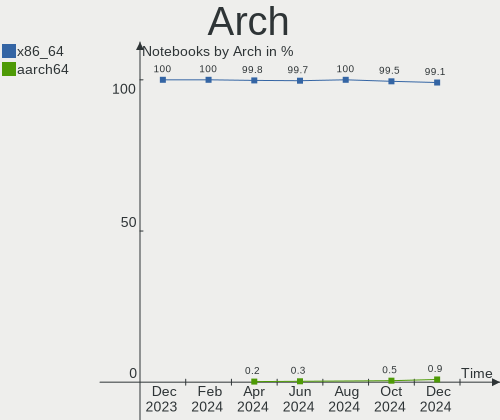
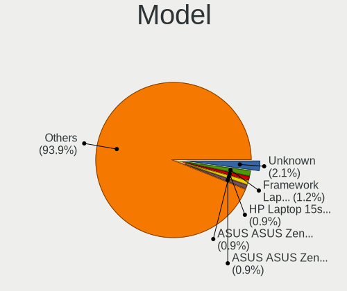
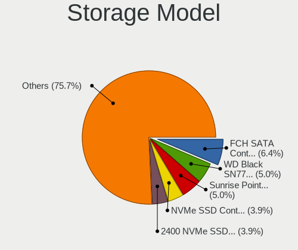
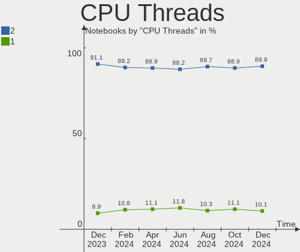
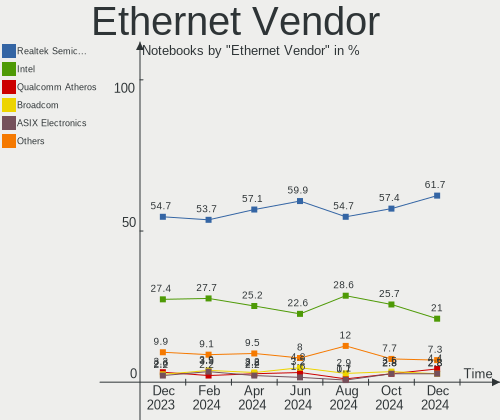
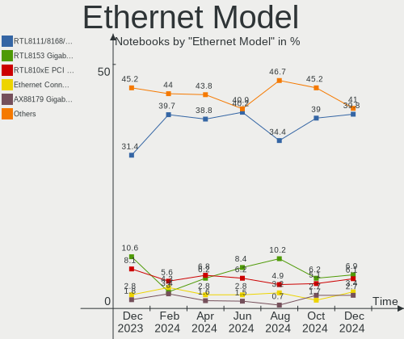

Fedora Hardware Trends (Notebook)
---------------------------------

A project to identify most popular hardware characteristics and track their change
over time based on data collected by Fedora users at https://Linux-Hardware.org.

Anyone can contribute to the study by uploading probes of their computers by
the [hw-probe](https://github.com/linuxhw/hw-probe) tool:

    sudo -E hw-probe -all -upload

Full-feature report is available here: https://linux-hardware.org/?view=trends&formfactor=notebook

Period: Nov, 2020.

Contents
--------

- [ OS                       ](#os)
- [ OS Family                ](#os-family)
- [ Kernel                   ](#kernel)
- [ Kernel Family            ](#kernel-family)
- [ Kernel Major Ver.        ](#kernel-major-ver)
- [ Arch                     ](#arch)
- [ DE                       ](#de)
- [ Display Server           ](#display-server)
- [ Display Manager          ](#display-manager)
- [ OS Lang                  ](#os-lang)
- [ Boot Mode                ](#boot-mode)
- [ Filesystem               ](#filesystem)
- [ Part. scheme             ](#part-scheme)
- [ Dual Boot with Linux/BSD ](#dual-boot-with-linux/bsd)
- [ Dual Boot (Win)          ](#dual-boot-win)
- [ Country                  ](#country)
- [ City                     ](#city)
- [ Vendor                   ](#vendor)
- [ Model                    ](#model)
- [ Model Family             ](#model-family)
- [ MFG Year                 ](#mfg-year)
- [ Form Factor              ](#form-factor)
- [ Secure Boot              ](#secure-boot)
- [ Coreboot                 ](#coreboot)
- [ RAM Size                 ](#ram-size)
- [ RAM Used                 ](#ram-used)
- [ Has CD-ROM               ](#has-cd-rom)
- [ Total Drives             ](#total-drives)
- [ Has Ethernet             ](#has-ethernet)
- [ Drive Vendor             ](#drive-vendor)
- [ Drive Model              ](#drive-model)
- [ HDD Vendor               ](#hdd-vendor)
- [ SSD Vendor               ](#ssd-vendor)
- [ Drive Kind               ](#drive-kind)
- [ Drive Connector          ](#drive-connector)
- [ Drive Size               ](#drive-size)
- [ Space Total              ](#space-total)
- [ Space Used               ](#space-used)
- [ Malfunc. Drives          ](#malfunc-drives)
- [ Malfunc. Drive Vendor    ](#malfunc-drive-vendor)
- [ Malfunc. HDD Vendor      ](#malfunc-hdd-vendor)
- [ Malfunc. Drive Kind      ](#malfunc-drive-kind)
- [ Failed Drives            ](#failed-drives)
- [ Failed Drive Vendor      ](#failed-drive-vendor)
- [ Drive Status             ](#drive-status)
- [ Storage Vendor           ](#storage-vendor)
- [ Storage Model            ](#storage-model)
- [ Storage Kind             ](#storage-kind)
- [ CPU Vendor               ](#cpu-vendor)
- [ CPU Model                ](#cpu-model)
- [ CPU Model Family         ](#cpu-model-family)
- [ CPU Cores                ](#cpu-cores)
- [ CPU Sockets              ](#cpu-sockets)
- [ CPU Threads              ](#cpu-threads)
- [ CPU Op-Modes             ](#cpu-op-modes)
- [ CPU Microcode            ](#cpu-microcode)
- [ CPU Microarch            ](#cpu-microarch)
- [ GPU Vendor               ](#gpu-vendor)
- [ GPU Model                ](#gpu-model)
- [ GPU Combo                ](#gpu-combo)
- [ GPU Driver               ](#gpu-driver)
- [ GPU Memory               ](#gpu-memory)
- [ Monitor Vendor           ](#monitor-vendor)
- [ Monitor Model            ](#monitor-model)
- [ Monitor Resolution       ](#monitor-resolution)
- [ Monitor Diagonal         ](#monitor-diagonal)
- [ Monitor Width            ](#monitor-width)
- [ Aspect Ratio             ](#aspect-ratio)
- [ Monitor Area             ](#monitor-area)
- [ Pixel Density            ](#pixel-density)
- [ Multiple Monitors        ](#multiple-monitors)
- [ Net Controller Vendor    ](#net-controller-vendor)
- [ Net Controller Model     ](#net-controller-model)
- [ Wireless Vendor          ](#wireless-vendor)
- [ Wireless Model           ](#wireless-model)
- [ Ethernet Vendor          ](#ethernet-vendor)
- [ Ethernet Model           ](#ethernet-model)
- [ Net Controller Kind      ](#net-controller-kind)
- [ Used Controller          ](#used-controller)
- [ NICs                     ](#nics)
- [ Memory Vendor            ](#memory-vendor)
- [ Memory Model             ](#memory-model)
- [ Memory Kind              ](#memory-kind)
- [ Memory Form Factor       ](#memory-form-factor)
- [ Memory Size              ](#memory-size)
- [ Memory Speed             ](#memory-speed)
- [ Sound Vendor             ](#sound-vendor)
- [ Sound Model              ](#sound-model)
- [ Camera Vendor            ](#camera-vendor)
- [ Camera Model             ](#camera-model)
- [ Fingerprint Vendor       ](#fingerprint-vendor)
- [ Fingerprint Model        ](#fingerprint-model)
- [ Chipcard Vendor          ](#chipcard-vendor)
- [ Chipcard Model           ](#chipcard-model)
- [ Printer Vendor           ](#printer-vendor)
- [ Printer Model            ](#printer-model)
- [ Scanner Vendor           ](#scanner-vendor)
- [ Scanner Model            ](#scanner-model)
- [ Bluetooth Vendor         ](#bluetooth-vendor)
- [ Bluetooth Model          ](#bluetooth-model)
- [ Unsupported Devices      ](#unsupported-devices)
- [ Unsupported Device Types ](#unsupported-device-types)

OS
--

Installed operating systems

| Name      | Notebooks | Percent |
|-----------|-----------|---------|
| Fedora 33 | 180       | 82.95%  |
| Fedora 32 | 24        | 11.06%  |
| Fedora 31 | 7         | 3.23%   |
| Fedora 34 | 4         | 1.84%   |
| Fedora 30 | 1         | 0.46%   |
| Fedora 21 | 1         | 0.46%   |

OS Family
---------

OS without a version

| Name   | Notebooks | Percent |
|--------|-----------|---------|
| Fedora | 217       | 100%    |

Kernel
------

Version of the Linux kernel

| Version                                             | Notebooks | Percent |
|-----------------------------------------------------|-----------|---------|
| 5.8.18-300.fc33.x86_64                              | 46        | 21.2%   |
| 5.9.8-200.fc33.x86_64                               | 44        | 20.28%  |
| 5.9.10-200.fc33.x86_64                              | 28        | 12.9%   |
| 5.8.16-300.fc33.x86_64                              | 25        | 11.52%  |
| 5.9.9-200.fc33.x86_64                               | 11        | 5.07%   |
| 5.8.15-301.fc33.x86_64                              | 11        | 5.07%   |
| 5.8.17-300.fc33.x86_64                              | 10        | 4.61%   |
| 5.8.18-200.fc32.x86_64                              | 6         | 2.76%   |
| 5.8.16-200.fc32.x86_64                              | 6         | 2.76%   |
| 5.9.8-100.fc32.x86_64                               | 2         | 0.92%   |
| 5.9.10-100.fc32.x86_64                              | 2         | 0.92%   |
| 5.8.18-100.fc31.x86_64                              | 2         | 0.92%   |
| 5.8.17-200.fc32.x86_64                              | 2         | 0.92%   |
| 5.8.14-200.fc32.x86_64                              | 2         | 0.92%   |
| 5.8.12-200.fc32.x86_64                              | 2         | 0.92%   |
| 5.10.0-0.rc3.68.fc34.x86_64                         | 2         | 0.92%   |
| 5.9.9-100.fc32.x86_64                               | 1         | 0.46%   |
| 5.9.8-350.vanilla.knurd.1.fc33.x86_64               | 1         | 0.46%   |
| 5.9.11-200.fc33.x86_64                              | 1         | 0.46%   |
| 5.9.11-100.fc32.x86_64                              | 1         | 0.46%   |
| 5.8.9-200.fc32.x86_64                               | 1         | 0.46%   |
| 5.8.9-101.fc31.x86_64                               | 1         | 0.46%   |
| 5.8.16-100.fc31.x86_64                              | 1         | 0.46%   |
| 5.8.10-100.fc31.x86_64                              | 1         | 0.46%   |
| 5.6.6-300.fc32.x86_64                               | 1         | 0.46%   |
| 5.6.19-300.fc32.x86_64                              | 1         | 0.46%   |
| 5.6.13-100.fc30.x86_64                              | 1         | 0.46%   |
| 5.5.8-200.fc31.x86_64                               | 1         | 0.46%   |
| 5.10.0-rc5+                                         | 1         | 0.46%   |
| 5.10.0-0.rc4.20201117git9c87c9f41245.79.fc34.x86_64 | 1         | 0.46%   |
| 5.10.0-0.rc1.20201028gited8780e3f2ec.57.fc34.x86_64 | 1         | 0.46%   |
| 4.1.13-100.fc21.x86_64                              | 1         | 0.46%   |

Kernel Family
-------------

Linux kernel without a distro release

| Version | Notebooks | Percent |
|---------|-----------|---------|
| 5.8.18  | 54        | 24.88%  |
| 5.9.8   | 47        | 21.66%  |
| 5.8.16  | 32        | 14.75%  |
| 5.9.10  | 30        | 13.82%  |
| 5.9.9   | 12        | 5.53%   |
| 5.8.17  | 12        | 5.53%   |
| 5.8.15  | 11        | 5.07%   |
| 5.10.0  | 5         | 2.3%    |
| 5.9.11  | 2         | 0.92%   |
| 5.8.9   | 2         | 0.92%   |
| 5.8.14  | 2         | 0.92%   |
| 5.8.12  | 2         | 0.92%   |
| 5.8.10  | 1         | 0.46%   |
| 5.6.6   | 1         | 0.46%   |
| 5.6.19  | 1         | 0.46%   |
| 5.6.13  | 1         | 0.46%   |
| 5.5.8   | 1         | 0.46%   |
| 4.1.13  | 1         | 0.46%   |

Kernel Major Ver.
-----------------

Linux kernel major version

| Version | Notebooks | Percent |
|---------|-----------|---------|
| 5.8     | 116       | 53.46%  |
| 5.9     | 91        | 41.94%  |
| 5.10    | 5         | 2.3%    |
| 5.6     | 3         | 1.38%   |
| 5.5     | 1         | 0.46%   |
| 4.1     | 1         | 0.46%   |

Arch
----

OS architecture (x86_64, i586, etc.)

| Name   | Notebooks | Percent |
|--------|-----------|---------|
| x86_64 | 217       | 100%    |

DE
--

Desktop Environment

| Name            | Notebooks | Percent |
|-----------------|-----------|---------|
| GNOME           | 153       | 70.51%  |
| KDE5            | 18        | 8.29%   |
| KDE             | 10        | 4.61%   |
| MATE            | 7         | 3.23%   |
| Cinnamon        | 7         | 3.23%   |
| XFCE            | 5         | 2.3%    |
| X-Cinnamon      | 5         | 2.3%    |
| LXQt            | 5         | 2.3%    |
| Unknown         | 2         | 0.92%   |
| KDE4            | 1         | 0.46%   |
| i3              | 1         | 0.46%   |
| GNOME Flashback | 1         | 0.46%   |
| GNOME Classic   | 1         | 0.46%   |
| Budgie          | 1         | 0.46%   |

Display Server
--------------

X11 or Wayland

| Name    | Notebooks | Percent |
|---------|-----------|---------|
| Wayland | 108       | 49.77%  |
| X11     | 104       | 47.93%  |
| Tty     | 4         | 1.84%   |
| Unknown | 1         | 0.46%   |

Display Manager
---------------

SDDM, LightDM, etc.

| Name    | Notebooks | Percent |
|---------|-----------|---------|
| Unknown | 120       | 55.3%   |
| GDM     | 68        | 31.34%  |
| SDDM    | 18        | 8.29%   |
| TDM     | 10        | 4.61%   |
| LightDM | 1         | 0.46%   |

OS Lang
-------

Language

| Lang       | Notebooks | Percent |
|------------|-----------|---------|
| en_US      | 112       | 51.61%  |
| de_DE      | 18        | 8.29%   |
| pt_BR      | 13        | 5.99%   |
| en_GB      | 9         | 4.15%   |
| fr_FR      | 7         | 3.23%   |
| ru_RU      | 6         | 2.76%   |
| pl_PL      | 5         | 2.3%    |
| it_IT      | 5         | 2.3%    |
| es_AR      | 3         | 1.38%   |
| en_IN      | 3         | 1.38%   |
| en_CA      | 3         | 1.38%   |
| de_CH      | 3         | 1.38%   |
| zh_CN      | 2         | 0.92%   |
| sv_SE      | 2         | 0.92%   |
| pt_PT      | 2         | 0.92%   |
| es_MX      | 2         | 0.92%   |
| en_SG      | 2         | 0.92%   |
| en_AU      | 2         | 0.92%   |
| Unknown    | 2         | 0.92%   |
| tr_TR      | 1         | 0.46%   |
| nl_NL      | 1         | 0.46%   |
| ko_KR      | 1         | 0.46%   |
| it_IT.utf8 | 1         | 0.46%   |
| hu_HU      | 1         | 0.46%   |
| fr_FR.utf8 | 1         | 0.46%   |
| es_ES      | 1         | 0.46%   |
| eo         | 1         | 0.46%   |
| en_NZ.utf8 | 1         | 0.46%   |
| en_IE      | 1         | 0.46%   |
| en_GB.utf8 | 1         | 0.46%   |
| en_CA.utf8 | 1         | 0.46%   |
| en-US      | 1         | 0.46%   |
| de_AT.utf8 | 1         | 0.46%   |
| de_AT      | 1         | 0.46%   |
| cs_CZ      | 1         | 0.46%   |

Boot Mode
---------

EFI or BIOS

| Mode | Notebooks | Percent |
|------|-----------|---------|
| EFI  | 153       | 70.51%  |
| BIOS | 64        | 29.49%  |

Filesystem
----------

Type of filesystem

| Type  | Notebooks | Percent |
|-------|-----------|---------|
| Ext4  | 113       | 52.07%  |
| Btrfs | 95        | 43.78%  |
| Xfs   | 7         | 3.23%   |
| Zfs   | 2         | 0.92%   |

Part. scheme
------------

Scheme of partitioning

| Type    | Notebooks | Percent |
|---------|-----------|---------|
| Unknown | 120       | 55.3%   |
| GPT     | 80        | 36.87%  |
| MBR     | 17        | 7.83%   |

Dual Boot with Linux/BSD
------------------------

Hosting more than one Linux/BSD

| Dual boot | Notebooks | Percent |
|-----------|-----------|---------|
| No        | 203       | 93.55%  |
| Yes       | 14        | 6.45%   |

Dual Boot (Win)
---------------

Hosting Linux and Windows

| Dual boot | Notebooks | Percent |
|-----------|-----------|---------|
| No        | 177       | 81.57%  |
| Yes       | 40        | 18.43%  |

Country
-------

Geographic location (country)

| Country                   | Notebooks | Percent |
|---------------------------|-----------|---------|
| USA                       | 42        | 19.35%  |
| Germany                   | 22        | 10.14%  |
| Brazil                    | 15        | 6.91%   |
| Netherlands               | 10        | 4.61%   |
| France                    | 10        | 4.61%   |
| Russia                    | 7         | 3.23%   |
| Italy                     | 7         | 3.23%   |
| Canada                    | 7         | 3.23%   |
| Poland                    | 6         | 2.76%   |
| UK                        | 5         | 2.3%    |
| Turkey                    | 5         | 2.3%    |
| Switzerland               | 5         | 2.3%    |
| Singapore                 | 5         | 2.3%    |
| India                     | 5         | 2.3%    |
| Bulgaria                  | 5         | 2.3%    |
| Argentina                 | 5         | 2.3%    |
| Portugal                  | 4         | 1.84%   |
| Spain                     | 3         | 1.38%   |
| Belgium                   | 3         | 1.38%   |
| Ukraine                   | 2         | 0.92%   |
| Sweden                    | 2         | 0.92%   |
| Pakistan                  | 2         | 0.92%   |
| Norway                    | 2         | 0.92%   |
| Mexico                    | 2         | 0.92%   |
| Malaysia                  | 2         | 0.92%   |
| Indonesia                 | 2         | 0.92%   |
| Greece                    | 2         | 0.92%   |
| China                     | 2         | 0.92%   |
| Austria                   | 2         | 0.92%   |
| Australia                 | 2         | 0.92%   |
| South Africa              | 1         | 0.46%   |
| Slovenia                  | 1         | 0.46%   |
| Serbia                    | 1         | 0.46%   |
| Romania                   | 1         | 0.46%   |
| Philippines               | 1         | 0.46%   |
| Panama                    | 1         | 0.46%   |
| New Zealand               | 1         | 0.46%   |
| Lithuania                 | 1         | 0.46%   |
| Korea, Republic of        | 1         | 0.46%   |
| Jamaica                   | 1         | 0.46%   |
| Israel                    | 1         | 0.46%   |
| Ireland                   | 1         | 0.46%   |
| Iran, Islamic Republic of | 1         | 0.46%   |
| Iran                      | 1         | 0.46%   |
| Hungary                   | 1         | 0.46%   |
| Hong Kong                 | 1         | 0.46%   |
| Guatemala                 | 1         | 0.46%   |
| Finland                   | 1         | 0.46%   |
| Egypt                     | 1         | 0.46%   |
| Denmark                   | 1         | 0.46%   |
| Czech Republic            | 1         | 0.46%   |
| Colombia                  | 1         | 0.46%   |
| Chile                     | 1         | 0.46%   |
| Belarus                   | 1         | 0.46%   |

City
----

Geographic location (city)

| City                  | Notebooks | Percent |
|-----------------------|-----------|---------|
| Singapore             | 4         | 1.84%   |
| Rio de Janeiro        | 4         | 1.84%   |
| Lisbon                | 3         | 1.38%   |
| Greifswald            | 3         | 1.38%   |
| Amsterdam             | 3         | 1.38%   |
| Wateringen            | 2         | 0.92%   |
| Voronezh              | 2         | 0.92%   |
| Virginia Beach        | 2         | 0.92%   |
| Vienna                | 2         | 0.92%   |
| Sofia                 | 2         | 0.92%   |
| Paris                 | 2         | 0.92%   |
| Milan                 | 2         | 0.92%   |
| London                | 2         | 0.92%   |
| Hyderabad             | 2         | 0.92%   |
| Heilbronn             | 2         | 0.92%   |
| Hamburg               | 2         | 0.92%   |
| Calgary               | 2         | 0.92%   |
| Brownsburg            | 2         | 0.92%   |
| Berlin                | 2         | 0.92%   |
| Austin                | 2         | 0.92%   |
| Angier                | 2         | 0.92%   |
| Šiauliai             | 1         | 0.46%   |
| Zurich                | 1         | 0.46%   |
| Zhukovskiy            | 1         | 0.46%   |
| Yakima                | 1         | 0.46%   |
| Xinxiang              | 1         | 0.46%   |
| Wrocław              | 1         | 0.46%   |
| Wauconda              | 1         | 0.46%   |
| Warsaw                | 1         | 0.46%   |
| Wanderup              | 1         | 0.46%   |
| Wahroonga             | 1         | 0.46%   |
| Vimercate             | 1         | 0.46%   |
| Viedma                | 1         | 0.46%   |
| Vanves                | 1         | 0.46%   |
| Vancouver             | 1         | 0.46%   |
| Valencia              | 1         | 0.46%   |
| Utrecht               | 1         | 0.46%   |
| Tupelo                | 1         | 0.46%   |
| Tung Chung            | 1         | 0.46%   |
| Thibodaux             | 1         | 0.46%   |
| Thessaloniki          | 1         | 0.46%   |
| The Bronx             | 1         | 0.46%   |
| Tehran                | 1         | 0.46%   |
| São Paulo            | 1         | 0.46%   |
| São José dos Campos | 1         | 0.46%   |
| Szamotuły            | 1         | 0.46%   |
| Sydney                | 1         | 0.46%   |
| Surrey                | 1         | 0.46%   |
| Strullendorf          | 1         | 0.46%   |
| Sigtuna               | 1         | 0.46%   |
| Shahrīār            | 1         | 0.46%   |
| Seoul                 | 1         | 0.46%   |
| Seljord               | 1         | 0.46%   |
| Seattle               | 1         | 0.46%   |
| Sao Joaquim da Barra  | 1         | 0.46%   |
| Santa Fe              | 1         | 0.46%   |
| San Antonio           | 1         | 0.46%   |
| Rousse                | 1         | 0.46%   |
| Round Rock            | 1         | 0.46%   |
| Rouen                 | 1         | 0.46%   |

Vendor
------

Motherboard manufacturer

| Name                             | Notebooks | Percent |
|----------------------------------|-----------|---------|
| Lenovo                           | 68        | 31.34%  |
| Dell                             | 45        | 20.74%  |
| Hewlett-Packard                  | 36        | 16.59%  |
| Acer                             | 19        | 8.76%   |
| ASUSTek Computer                 | 13        | 5.99%   |
| Toshiba                          | 9         | 4.15%   |
| Samsung Electronics              | 4         | 1.84%   |
| MSI                              | 3         | 1.38%   |
| System76                         | 2         | 0.92%   |
| Sony                             | 2         | 0.92%   |
| Notebook                         | 2         | 0.92%   |
| Apple                            | 2         | 0.92%   |
| Alienware                        | 2         | 0.92%   |
| Positivo                         | 1         | 0.46%   |
| PC Specialist                    | 1         | 0.46%   |
| Packard Bell                     | 1         | 0.46%   |
| Jumper                           | 1         | 0.46%   |
| Google                           | 1         | 0.46%   |
| FUJITSU CLIENT COMPUTING LIMITED | 1         | 0.46%   |
| Fujitsu                          | 1         | 0.46%   |
| Clevo                            | 1         | 0.46%   |
| AZW                              | 1         | 0.46%   |
| Avell High Performance           | 1         | 0.46%   |

Model
-----

Motherboard model

| Name                                              | Notebooks | Percent |
|---------------------------------------------------|-----------|---------|
| HP Pavilion dv6                                   | 3         | 1.38%   |
| Dell Latitude E6530                               | 3         | 1.38%   |
| Lenovo ThinkPad X220 42911H8                      | 2         | 0.92%   |
| Lenovo ThinkPad X1 Extreme 2nd 20QVCTO1WW         | 2         | 0.92%   |
| HP Pavilion 15                                    | 2         | 0.92%   |
| Dell XPS 15 9560                                  | 2         | 0.92%   |
| Dell XPS 15 7590                                  | 2         | 0.92%   |
| Dell XPS 13 9370                                  | 2         | 0.92%   |
| Dell XPS 13 7390                                  | 2         | 0.92%   |
| Dell Latitude 7400                                | 2         | 0.92%   |
| Dell Inspiron 5559                                | 2         | 0.92%   |
| Toshiba TECRA R950                                | 1         | 0.46%   |
| Toshiba Satellite S55t-B                          | 1         | 0.46%   |
| Toshiba Satellite S55-B                           | 1         | 0.46%   |
| Toshiba Satellite R945                            | 1         | 0.46%   |
| Toshiba Satellite L850                            | 1         | 0.46%   |
| Toshiba Satellite L50-B                           | 1         | 0.46%   |
| Toshiba Satellite C850-1KD                        | 1         | 0.46%   |
| Toshiba Satellite C70-A-K2W                       | 1         | 0.46%   |
| Toshiba Satellite C55-A                           | 1         | 0.46%   |
| System76 Gazelle                                  | 1         | 0.46%   |
| System76 Galago Pro                               | 1         | 0.46%   |
| Sony VPCCB45FN                                    | 1         | 0.46%   |
| Sony SVF1521C2EW                                  | 1         | 0.46%   |
| Samsung RF510/RF410/RF710                         | 1         | 0.46%   |
| Samsung 730QCJ/730QCR                             | 1         | 0.46%   |
| Samsung 530XBB                                    | 1         | 0.46%   |
| Samsung 350U2A/350U2B/300U1A/351U2A/351U2B/301U1A | 1         | 0.46%   |
| Positivo CHT12CP                                  | 1         | 0.46%   |
| PC Specialist N7x0WU                              | 1         | 0.46%   |
| Packard Bell EasyNote TE69HW                      | 1         | 0.46%   |
| Notebook P377SM-A                                 | 1         | 0.46%   |
| Notebook NH55RGQ                                  | 1         | 0.46%   |
| MSI GT70 2PE                                      | 1         | 0.46%   |
| MSI GS65 Stealth 9SE                              | 1         | 0.46%   |
| MSI Bravo 15 A4DDR                                | 1         | 0.46%   |
| Lenovo Y520-15IKBN 80WK                           | 1         | 0.46%   |
| Lenovo XiaoXin-15ARE 2020 81YR                    | 1         | 0.46%   |
| Lenovo ThinkPad X395 20NMS01G00                   | 1         | 0.46%   |
| Lenovo ThinkPad X395 20NM0002UK                   | 1         | 0.46%   |
| Lenovo ThinkPad X270 W10DG 20K5S0EF00             | 1         | 0.46%   |
| Lenovo ThinkPad X240 20AMS2PN0N                   | 1         | 0.46%   |
| Lenovo ThinkPad X230 Tablet 34383C8               | 1         | 0.46%   |
| Lenovo ThinkPad X230 2325DN0                      | 1         | 0.46%   |
| Lenovo ThinkPad X220 42913J9                      | 1         | 0.46%   |
| Lenovo ThinkPad X220 4290A48                      | 1         | 0.46%   |
| Lenovo ThinkPad X140e 20BLS00400                  | 1         | 0.46%   |
| Lenovo ThinkPad X1 Extreme Gen 3 20TK001JUS       | 1         | 0.46%   |
| Lenovo ThinkPad X1 Extreme 20MFA01DCD             | 1         | 0.46%   |
| Lenovo ThinkPad X1 Extreme 20MF000SPB             | 1         | 0.46%   |
| Lenovo ThinkPad X1 Carbon Gen 8 20U90SIT19        | 1         | 0.46%   |
| Lenovo ThinkPad X1 Carbon 7th 20QES18N00          | 1         | 0.46%   |
| Lenovo ThinkPad X1 Carbon 7th 20QD0007US          | 1         | 0.46%   |
| Lenovo ThinkPad X1 Carbon 6th 20KHCTO1WW          | 1         | 0.46%   |
| Lenovo ThinkPad W550s 20E1S0L500                  | 1         | 0.46%   |
| Lenovo ThinkPad W520 4284A44                      | 1         | 0.46%   |
| Lenovo ThinkPad T590 20N5S2NC0F                   | 1         | 0.46%   |
| Lenovo ThinkPad T495 20NKS01W0H                   | 1         | 0.46%   |
| Lenovo ThinkPad T495 20NJCTO1WW                   | 1         | 0.46%   |
| Lenovo ThinkPad T490 20N3S5DU0S                   | 1         | 0.46%   |

Model Family
------------

Motherboard model prefix

| Name                                  | Notebooks | Percent |
|---------------------------------------|-----------|---------|
| Lenovo ThinkPad                       | 49        | 22.58%  |
| Dell Latitude                         | 16        | 7.37%   |
| Lenovo IdeaPad                        | 14        | 6.45%   |
| HP Pavilion                           | 13        | 5.99%   |
| Dell Inspiron                         | 13        | 5.99%   |
| HP EliteBook                          | 11        | 5.07%   |
| Acer Aspire                           | 11        | 5.07%   |
| Dell XPS                              | 10        | 4.61%   |
| Toshiba Satellite                     | 8         | 3.69%   |
| HP Laptop                             | 4         | 1.84%   |
| HP ProBook                            | 3         | 1.38%   |
| Dell Precision                        | 3         | 1.38%   |
| Acer Nitro                            | 3         | 1.38%   |
| HP ENVY                               | 2         | 0.92%   |
| Acer Predator                         | 2         | 0.92%   |
| Toshiba TECRA                         | 1         | 0.46%   |
| System76 Gazelle                      | 1         | 0.46%   |
| System76 Galago                       | 1         | 0.46%   |
| Sony VPCCB45FN                        | 1         | 0.46%   |
| Sony SVF1521C2EW                      | 1         | 0.46%   |
| Samsung RF510                         | 1         | 0.46%   |
| Samsung 730QCJ                        | 1         | 0.46%   |
| Samsung 530XBB                        | 1         | 0.46%   |
| Samsung 350U2A                        | 1         | 0.46%   |
| Positivo CHT12CP                      | 1         | 0.46%   |
| PC Specialist N7x0WU                  | 1         | 0.46%   |
| Packard Bell EasyNote                 | 1         | 0.46%   |
| Notebook P377SM-A                     | 1         | 0.46%   |
| Notebook NH55RGQ                      | 1         | 0.46%   |
| MSI GT70                              | 1         | 0.46%   |
| MSI GS65                              | 1         | 0.46%   |
| MSI Bravo                             | 1         | 0.46%   |
| Lenovo Y520-15IKBN                    | 1         | 0.46%   |
| Lenovo XiaoXin-15ARE                  | 1         | 0.46%   |
| Lenovo ThinkBook                      | 1         | 0.46%   |
| Lenovo Legion                         | 1         | 0.46%   |
| Lenovo B550                           | 1         | 0.46%   |
| Jumper EZbook                         | 1         | 0.46%   |
| HP Pro                                | 1         | 0.46%   |
| HP 255                                | 1         | 0.46%   |
| Google Cyan                           | 1         | 0.46%   |
| Fujitsu LIFEBOOK                      | 1         | 0.46%   |
| FUJITSU CLIENT COMPUTING LIMITED UH-X | 1         | 0.46%   |
| Dell Venue                            | 1         | 0.46%   |
| Dell G5                               | 1         | 0.46%   |
| Dell G3                               | 1         | 0.46%   |
| Clevo W55xEU                          | 1         | 0.46%   |
| AZW BT3                               | 1         | 0.46%   |
| Avell High Performance A75            | 1         | 0.46%   |
| ASUS ZenBook                          | 1         | 0.46%   |
| ASUS Z450LA                           | 1         | 0.46%   |
| ASUS X550VX                           | 1         | 0.46%   |
| ASUS X510UNR                          | 1         | 0.46%   |
| ASUS X510UAR                          | 1         | 0.46%   |
| ASUS X456URK                          | 1         | 0.46%   |
| ASUS X411UQ                           | 1         | 0.46%   |
| ASUS VivoBook                         | 1         | 0.46%   |
| ASUS TUF                              | 1         | 0.46%   |
| ASUS ROG                              | 1         | 0.46%   |
| ASUS K54HR                            | 1         | 0.46%   |

MFG Year
--------

Motherboard manufacture year

| Year | Notebooks | Percent |
|------|-----------|---------|
| 2020 | 74        | 34.1%   |
| 2019 | 43        | 19.82%  |
| 2018 | 18        | 8.29%   |
| 2014 | 15        | 6.91%   |
| 2015 | 13        | 5.99%   |
| 2012 | 12        | 5.53%   |
| 2011 | 10        | 4.61%   |
| 2017 | 9         | 4.15%   |
| 2016 | 8         | 3.69%   |
| 2013 | 8         | 3.69%   |
| 2010 | 3         | 1.38%   |
| 2008 | 3         | 1.38%   |
| 2009 | 1         | 0.46%   |

Form Factor
-----------

Physical design of the computer

| Name     | Notebooks | Percent |
|----------|-----------|---------|
| Notebook | 217       | 100%    |

Secure Boot
-----------

Enabled or disabled

| State    | Notebooks | Percent |
|----------|-----------|---------|
| Disabled | 184       | 84.79%  |
| Enabled  | 33        | 15.21%  |

Coreboot
--------

Have coreboot on board

| Used | Notebooks | Percent |
|------|-----------|---------|
| No   | 214       | 98.62%  |
| Yes  | 3         | 1.38%   |

RAM Size
--------

Total RAM memory

| Size in GB  | Notebooks | Percent |
|-------------|-----------|---------|
| 4.01-8.0    | 62        | 28.57%  |
| 16.01-24.0  | 48        | 22.12%  |
| 8.01-16.0   | 48        | 22.12%  |
| 3.01-4.0    | 28        | 12.9%   |
| 32.01-64.0  | 19        | 8.76%   |
| 24.01-32.0  | 5         | 2.3%    |
| 64.01-256.0 | 3         | 1.38%   |
| 1.01-2.0    | 3         | 1.38%   |
| 2.01-3.0    | 1         | 0.46%   |

RAM Used
--------

Used RAM memory

| Used GB    | Notebooks | Percent |
|------------|-----------|---------|
| 2.01-3.0   | 63        | 29.03%  |
| 1.01-2.0   | 48        | 22.12%  |
| 3.01-4.0   | 45        | 20.74%  |
| 4.01-8.0   | 39        | 17.97%  |
| 8.01-16.0  | 12        | 5.53%   |
| 0.01-1.0   | 6         | 2.76%   |
| 16.01-24.0 | 4         | 1.84%   |

Has CD-ROM
----------

Has CD-ROM on board

| Presented | Notebooks | Percent |
|-----------|-----------|---------|
| No        | 151       | 69.59%  |
| Yes       | 66        | 30.41%  |

Total Drives
------------

Number of drives on board

| Drives | Notebooks | Percent |
|--------|-----------|---------|
| 1      | 153       | 70.51%  |
| 2      | 55        | 25.35%  |
| 3      | 4         | 1.84%   |
| 5      | 2         | 0.92%   |
| 4      | 2         | 0.92%   |
| 0      | 1         | 0.46%   |

Has Ethernet
------------

Has Ethernet on board

| Presented | Notebooks | Percent |
|-----------|-----------|---------|
| Yes       | 183       | 84.33%  |
| No        | 34        | 15.67%  |

Drive Vendor
------------

Hard drive vendors

| Vendor              | Notebooks | Drives | Percent |
|---------------------|-----------|--------|---------|
| Samsung Electronics | 55        | 64     | 20.37%  |
| WDC                 | 36        | 38     | 13.33%  |
| Seagate             | 26        | 30     | 9.63%   |
| Toshiba             | 22        | 24     | 8.15%   |
| SanDisk             | 17        | 18     | 6.3%    |
| Unknown             | 16        | 19     | 5.93%   |
| SK Hynix            | 13        | 13     | 4.81%   |
| HGST                | 13        | 13     | 4.81%   |
| Intel               | 11        | 11     | 4.07%   |
| Kingston            | 9         | 10     | 3.33%   |
| Crucial             | 9         | 9      | 3.33%   |
| Micron Technology   | 8         | 8      | 2.96%   |
| A-DATA Technology   | 4         | 4      | 1.48%   |
| Silicon Motion      | 3         | 3      | 1.11%   |
| KIOXIA              | 3         | 3      | 1.11%   |
| Transcend           | 2         | 2      | 0.74%   |
| Lite-On             | 2         | 2      | 0.74%   |
| KingSpec            | 2         | 2      | 0.74%   |
| Hitachi             | 2         | 2      | 0.74%   |
| ADATA Technology    | 2         | 2      | 0.74%   |
| Union Memory        | 1         | 1      | 0.37%   |
| tigo                | 1         | 1      | 0.37%   |
| Team                | 1         | 1      | 0.37%   |
| SUNEAST             | 1         | 1      | 0.37%   |
| SPCC                | 1         | 1      | 0.37%   |
| Solid State Storage | 1         | 1      | 0.37%   |
| PNY                 | 1         | 1      | 0.37%   |
| Phison              | 1         | 1      | 0.37%   |
| LITEON              | 1         | 1      | 0.37%   |
| Lenovo              | 1         | 1      | 0.37%   |
| JMicron             | 1         | 1      | 0.37%   |
| Hewlett-Packard     | 1         | 1      | 0.37%   |
| China               | 1         | 1      | 0.37%   |
| Apple               | 1         | 1      | 0.37%   |
| Apacer              | 1         | 1      | 0.37%   |

Drive Model
-----------

Hard drive models

| Model                                   | Notebooks | Percent |
|-----------------------------------------|-----------|---------|
| Samsung SSD 850 EVO 250GB               | 7         | 2.45%   |
| HGST HTS541010A9E680 1TB                | 6         | 2.1%    |
| Seagate ST1000LM035-1RK172 1TB          | 5         | 1.75%   |
| Seagate Expansion 1TB                   | 5         | 1.75%   |
| HGST HTS721010A9E630 1TB                | 5         | 1.75%   |
| Samsung SSD 850 EVO 500GB               | 4         | 1.4%    |
| Samsung NVMe SSD Drive 256GB            | 4         | 1.4%    |
| Unknown MMC Card  64GB                  | 3         | 1.05%   |
| Unknown MMC Card  128GB                 | 3         | 1.05%   |
| Toshiba MQ04ABF100 1TB                  | 3         | 1.05%   |
| SK Hynix NVMe SSD Drive 256GB           | 3         | 1.05%   |
| Samsung SSD 860 EVO 250GB               | 3         | 1.05%   |
| Samsung MZVLB1T0HBLR-000L7 1TB          | 3         | 1.05%   |
| Micron 1100_MTFDDAV256TBN 256GB SSD     | 3         | 1.05%   |
| Kingston SA400S37240G 240GB SSD         | 3         | 1.05%   |
| Crucial CT240BX500SSD1 240GB            | 3         | 1.05%   |
| WDC WDS240G2G0B-00EPW0 240GB SSD        | 2         | 0.7%    |
| WDC WD10SPZX-60Z10T0 1TB                | 2         | 0.7%    |
| WDC WD10SPZX-24Z10 1TB                  | 2         | 0.7%    |
| WDC WD10SPZX-21Z10T0 1TB                | 2         | 0.7%    |
| WDC PC SN730 SDBQNTY-512G-1001 512GB    | 2         | 0.7%    |
| WDC PC SN730 NVMe 1024GB                | 2         | 0.7%    |
| WDC PC SN520 SDAPNUW-512G-1014 512GB    | 2         | 0.7%    |
| Unknown MMC Card  32GB                  | 2         | 0.7%    |
| Unknown MMC Card  16GB                  | 2         | 0.7%    |
| Toshiba NVMe SSD Drive 512GB            | 2         | 0.7%    |
| Toshiba MQ01ABD100 1TB                  | 2         | 0.7%    |
| SK Hynix BC501 HFM256GDJTNG-8310A 256GB | 2         | 0.7%    |
| Seagate ST2000LM007-1R8174 2TB          | 2         | 0.7%    |
| Seagate ST1000LM048-2E7172 1TB          | 2         | 0.7%    |
| Sandisk NVMe SSD Drive 512GB            | 2         | 0.7%    |
| Samsung SSD 860 EVO mSATA 250GB         | 2         | 0.7%    |
| Samsung NVMe SSD Drive 512GB            | 2         | 0.7%    |
| Samsung NVMe SSD Drive 1024GB           | 2         | 0.7%    |
| Lite-On NVMe SSD Drive 512GB            | 2         | 0.7%    |
| Kingston SV300S37A120G 120GB SSD        | 2         | 0.7%    |
| Intel SSDPEMKF010T8 NVMe 1024GB         | 2         | 0.7%    |
| WDC WDS500G2B0A 500GB SSD               | 1         | 0.35%   |
| WDC WDS250G2B0A-00SM50 250GB SSD        | 1         | 0.35%   |
| WDC WDS240G2G0A-00JH30 240GB SSD        | 1         | 0.35%   |
| WDC WDS120G1G0B-00RC30 120GB SSD        | 1         | 0.35%   |
| WDC WDS100T2G0A-00JH30 1TB SSD          | 1         | 0.35%   |
| WDC WDS100T2B0A-00SM50 1TB SSD          | 1         | 0.35%   |
| WDC WDBNCE5000PNC 500GB SSD             | 1         | 0.35%   |
| WDC WD75 00BPVX-22JC3 752GB             | 1         | 0.35%   |
| WDC WD5000LPLX-08ZNTT0 500GB            | 1         | 0.35%   |
| WDC WD5000BPVX-00JC3T0 500GB            | 1         | 0.35%   |
| WDC WD5000BEVT-22ZAT0 500GB             | 1         | 0.35%   |
| WDC WD32 00BPVT-22JJ5T0 320GB           | 1         | 0.35%   |
| WDC WD2500BPVT-75JJ5T0 250GB            | 1         | 0.35%   |
| WDC WD1600BEVS-22RST0 160GB             | 1         | 0.35%   |
| WDC WD16 00BEVT-60ZCT 160GB             | 1         | 0.35%   |
| WDC WD10SPZX-24Z10T0 1TB                | 1         | 0.35%   |
| WDC WD10SPCX-24HWST1 1TB                | 1         | 0.35%   |
| WDC WD10JPVX-60JC3T0 1TB                | 1         | 0.35%   |
| WDC WD10JPCX-24UE4T0 1TB                | 1         | 0.35%   |
| WDC PC SN730 SDBQNTY-256G-1001 256GB    | 1         | 0.35%   |
| WDC PC SN730 NVMe 256GB                 | 1         | 0.35%   |
| WDC PC SN720 SDAQNTW-512G-1001 512GB    | 1         | 0.35%   |
| WDC PC SN530 SDBPNPZ-512G-1014 512GB    | 1         | 0.35%   |

HDD Vendor
----------

Hard disk drive vendors

| Vendor              | Notebooks | Drives | Percent |
|---------------------|-----------|--------|---------|
| Seagate             | 24        | 27     | 34.29%  |
| WDC                 | 18        | 18     | 25.71%  |
| HGST                | 13        | 13     | 18.57%  |
| Toshiba             | 12        | 13     | 17.14%  |
| Hitachi             | 2         | 2      | 2.86%   |
| Samsung Electronics | 1         | 1      | 1.43%   |

SSD Vendor
----------

Solid state drive vendors

| Vendor              | Notebooks | Drives | Percent |
|---------------------|-----------|--------|---------|
| Samsung Electronics | 32        | 37     | 31.37%  |
| SanDisk             | 14        | 14     | 13.73%  |
| Crucial             | 9         | 9      | 8.82%   |
| WDC                 | 8         | 9      | 7.84%   |
| Kingston            | 8         | 9      | 7.84%   |
| Micron Technology   | 5         | 5      | 4.9%    |
| Intel               | 5         | 5      | 4.9%    |
| A-DATA Technology   | 3         | 3      | 2.94%   |
| Toshiba             | 2         | 2      | 1.96%   |
| SK Hynix            | 2         | 2      | 1.96%   |
| KingSpec            | 2         | 2      | 1.96%   |
| Transcend           | 1         | 1      | 0.98%   |
| tigo                | 1         | 1      | 0.98%   |
| Team                | 1         | 1      | 0.98%   |
| SUNEAST             | 1         | 1      | 0.98%   |
| SPCC                | 1         | 1      | 0.98%   |
| Seagate             | 1         | 1      | 0.98%   |
| PNY                 | 1         | 1      | 0.98%   |
| LITEON              | 1         | 1      | 0.98%   |
| Hewlett-Packard     | 1         | 1      | 0.98%   |
| China               | 1         | 1      | 0.98%   |
| Apple               | 1         | 1      | 0.98%   |
| Apacer              | 1         | 1      | 0.98%   |

Drive Kind
----------

HDD or SSD

| Kind    | Notebooks | Drives | Percent |
|---------|-----------|--------|---------|
| SSD     | 95        | 109    | 36.12%  |
| NVMe    | 82        | 89     | 31.18%  |
| HDD     | 68        | 74     | 25.86%  |
| MMC     | 17        | 19     | 6.46%   |
| Unknown | 1         | 1      | 0.38%   |

Drive Connector
---------------

SATA, SAS, NVMe, etc.

| Type | Notebooks | Drives | Percent |
|------|-----------|--------|---------|
| SATA | 144       | 170    | 56.47%  |
| NVMe | 82        | 88     | 32.16%  |
| MMC  | 17        | 19     | 6.67%   |
| SAS  | 12        | 15     | 4.71%   |

Drive Size
----------

Size of hard drive

| Size in TB | Notebooks | Drives | Percent |
|------------|-----------|--------|---------|
| 0.01-0.5   | 91        | 104    | 56.17%  |
| 0.51-1.0   | 65        | 72     | 40.12%  |
| 1.01-2.0   | 6         | 7      | 3.7%    |

Space Total
-----------

Amount of disk space available on the file system

| Size in GB     | Notebooks | Percent |
|----------------|-----------|---------|
| 251-500        | 49        | 22.58%  |
| 101-250        | 48        | 22.12%  |
| 501-1000       | 46        | 21.2%   |
| 1001-2000      | 23        | 10.6%   |
| 1-20           | 17        | 7.83%   |
| 51-100         | 12        | 5.53%   |
| Unknown        | 11        | 5.07%   |
| 21-50          | 6         | 2.76%   |
| More than 3000 | 3         | 1.38%   |
| 2001-3000      | 2         | 0.92%   |

Space Used
----------

Amount of used disk space

| Used GB   | Notebooks | Percent |
|-----------|-----------|---------|
| 21-50     | 54        | 24.88%  |
| 1-20      | 43        | 19.82%  |
| 51-100    | 43        | 19.82%  |
| 101-250   | 36        | 16.59%  |
| 251-500   | 14        | 6.45%   |
| 501-1000  | 13        | 5.99%   |
| Unknown   | 11        | 5.07%   |
| 1001-2000 | 2         | 0.92%   |
| 2001-3000 | 1         | 0.46%   |

Malfunc. Drives
---------------

Drive models with a malfunction

| Model                                          | Notebooks | Drives | Percent |
|------------------------------------------------|-----------|--------|---------|
| HGST HTS541010A9E680 1TB                       | 3         | 3      | 42.86%  |
| WDC WD2500BPVT-75JJ5T0 250GB                   | 1         | 1      | 14.29%  |
| Toshiba MQ01ABD075 752GB                       | 1         | 1      | 14.29%  |
| Seagate ST9750420AS 752GB                      | 1         | 1      | 14.29%  |
| Micron Technology 1100_MTFDDAV256TBN 256GB SSD | 1         | 1      | 14.29%  |

Malfunc. Drive Vendor
---------------------

Vendors of faulty drives

| Vendor            | Notebooks | Drives | Percent |
|-------------------|-----------|--------|---------|
| HGST              | 3         | 3      | 42.86%  |
| WDC               | 1         | 1      | 14.29%  |
| Toshiba           | 1         | 1      | 14.29%  |
| Seagate           | 1         | 1      | 14.29%  |
| Micron Technology | 1         | 1      | 14.29%  |

Malfunc. HDD Vendor
-------------------

Vendors of faulty HDD drives

| Vendor  | Notebooks | Drives | Percent |
|---------|-----------|--------|---------|
| HGST    | 3         | 3      | 50%     |
| WDC     | 1         | 1      | 16.67%  |
| Toshiba | 1         | 1      | 16.67%  |
| Seagate | 1         | 1      | 16.67%  |

Malfunc. Drive Kind
-------------------

Kinds of faulty drives

| Kind | Notebooks | Drives | Percent |
|------|-----------|--------|---------|
| HDD  | 6         | 6      | 85.71%  |
| SSD  | 1         | 1      | 14.29%  |

Failed Drives
-------------

Failed drive models

Zero info for selected period =(

Failed Drive Vendor
-------------------

Failed drive vendors

Zero info for selected period =(

Drive Status
------------

Number of failed and malfunc. drives

| Status   | Notebooks | Drives | Percent |
|----------|-----------|--------|---------|
| Detected | 135       | 190    | 59.47%  |
| Works    | 85        | 95     | 37.44%  |
| Malfunc  | 7         | 7      | 3.08%   |

Storage Vendor
--------------

Storage controller vendors

| Vendor                         | Notebooks | Percent |
|--------------------------------|-----------|---------|
| Intel                          | 144       | 57.83%  |
| AMD                            | 25        | 10.04%  |
| Samsung Electronics            | 23        | 9.24%   |
| Sandisk                        | 14        | 5.62%   |
| SK Hynix                       | 10        | 4.02%   |
| Toshiba America Info Systems   | 8         | 3.21%   |
| Silicon Motion                 | 4         | 1.61%   |
| Micron Technology              | 4         | 1.61%   |
| KIOXIA                         | 4         | 1.61%   |
| Seagate Technology             | 2         | 0.8%    |
| Lite-On Technology             | 2         | 0.8%    |
| Union Memory (Shenzhen)        | 1         | 0.4%    |
| Solid State Storage Technology | 1         | 0.4%    |
| Realtek Semiconductor          | 1         | 0.4%    |
| Phison Electronics             | 1         | 0.4%    |
| Nvidia                         | 1         | 0.4%    |
| Micron/Crucial Technology      | 1         | 0.4%    |
| Lenovo                         | 1         | 0.4%    |
| Kingston Technology Company    | 1         | 0.4%    |
| ADATA Technology               | 1         | 0.4%    |

Storage Model
-------------

Storage controller models

| Model                                                                                  | Notebooks | Percent |
|----------------------------------------------------------------------------------------|-----------|---------|
| Intel Sunrise Point-LP SATA Controller [AHCI mode]                                     | 23        | 8.81%   |
| AMD FCH SATA Controller [AHCI mode]                                                    | 23        | 8.81%   |
| Intel 7 Series Chipset Family 6-port SATA Controller [AHCI mode]                       | 22        | 8.43%   |
| Samsung Electronics NVMe SSD Controller SM981/PM981/PM983                              | 17        | 6.51%   |
| Intel 82801 Mobile SATA Controller [RAID mode]                                         | 14        | 5.36%   |
| Intel Cannon Lake Mobile PCH SATA AHCI Controller                                      | 13        | 4.98%   |
| Intel 6 Series/C200 Series Chipset Family 6 port Mobile SATA AHCI Controller           | 13        | 4.98%   |
| Intel Wildcat Point-LP SATA Controller [AHCI Mode]                                     | 10        | 3.83%   |
| Intel 8 Series SATA Controller 1 [AHCI mode]                                           | 9         | 3.45%   |
| Toshiba America Info Systems Toshiba America Info Non-Volatile memory controller       | 8         | 3.07%   |
| Intel HM170/QM170 Chipset SATA Controller [AHCI Mode]                                  | 8         | 3.07%   |
| Sandisk WD Black 2019/PC SN750 NVMe SSD                                                | 7         | 2.68%   |
| Intel 8 Series/C220 Series Chipset Family 6-port SATA Controller 1 [AHCI mode]         | 6         | 2.3%    |
| SK Hynix Non-Volatile memory controller                                                | 5         | 1.92%   |
| SK Hynix BC501 NVMe Solid State Drive 512GB                                            | 5         | 1.92%   |
| Samsung Electronics NVMe SSD Controller SM961/PM961                                    | 5         | 1.92%   |
| Silicon Motion Non-Volatile memory controller                                          | 4         | 1.53%   |
| Micron Technology Non-Volatile memory controller                                       | 4         | 1.53%   |
| KIOXIA Non-Volatile memory controller                                                  | 4         | 1.53%   |
| Intel 5 Series/3400 Series Chipset 6 port SATA AHCI Controller                         | 4         | 1.53%   |
| Sandisk WD Black 2018 / PC SN720 NVMe SSD                                              | 3         | 1.15%   |
| Intel SSD Pro 7600p/760p/E 6100p Series                                                | 3         | 1.15%   |
| Intel SSD 660P Series                                                                  | 3         | 1.15%   |
| Intel Comet Lake SATA AHCI Controller                                                  | 3         | 1.15%   |
| Seagate Technology Non-Volatile memory controller                                      | 2         | 0.77%   |
| Sandisk WD Black 2018 / PC SN520 NVMe SSD                                              | 2         | 0.77%   |
| Samsung Electronics Electronics Non-Volatile memory controller                         | 2         | 0.77%   |
| Intel Q170/Q150/B150/H170/H110/Z170/CM236 Chipset SATA Controller [AHCI Mode]          | 2         | 0.77%   |
| Intel 82801HM/HEM (ICH8M/ICH8M-E) SATA Controller [AHCI mode]                          | 2         | 0.77%   |
| Intel 82801HM/HEM (ICH8M/ICH8M-E) IDE Controller                                       | 2         | 0.77%   |
| Intel 6 Series/C200 Series Chipset Family Mobile SATA Controller (IDE mode, ports 4-5) | 2         | 0.77%   |
| Intel 6 Series/C200 Series Chipset Family Mobile SATA Controller (IDE mode, ports 0-3) | 2         | 0.77%   |
| Union Memory (Shenzhen) Non-Volatile memory controller                                 | 1         | 0.38%   |
| Solid State Storage Technology Non-Volatile memory controller                          | 1         | 0.38%   |
| Sandisk WD Blue SN550 NVMe SSD                                                         | 1         | 0.38%   |
| Sandisk Non-Volatile memory controller                                                 | 1         | 0.38%   |
| Realtek Semiconductor RTS5763DL NVMe SSD Controller                                    | 1         | 0.38%   |
| Phison Electronics NVMe Storage Controller                                             | 1         | 0.38%   |
| Nvidia MCP79 AHCI Controller                                                           | 1         | 0.38%   |
| Micron/Crucial Technology Non-Volatile memory controller                               | 1         | 0.38%   |
| Lite-On Technology NVMe Controller                                                     | 1         | 0.38%   |
| Lite-On Technology Non-Volatile memory controller                                      | 1         | 0.38%   |
| Lenovo Non-Volatile memory controller                                                  | 1         | 0.38%   |
| Kingston Technology Company Non-Volatile memory controller                             | 1         | 0.38%   |
| Intel SATA controller                                                                  | 1         | 0.38%   |
| Intel Ice Lake-LP SATA Controller [AHCI mode]                                          | 1         | 0.38%   |
| Intel Celeron N3350/Pentium N4200/Atom E3900 Series SATA AHCI Controller               | 1         | 0.38%   |
| Intel Cannon Point-LP SATA Controller [AHCI Mode]                                      | 1         | 0.38%   |
| Intel Atom Processor E3800 Series SATA AHCI Controller                                 | 1         | 0.38%   |
| Intel 82801IBM/IEM (ICH9M/ICH9M-E) 4 port SATA Controller [AHCI mode]                  | 1         | 0.38%   |
| Intel 8 Series/C220 Series Chipset Family 2-port SATA Controller 2 [IDE mode]          | 1         | 0.38%   |
| Intel 8 Series Chipset Family 4-port SATA Controller 1 [IDE mode] - Mobile             | 1         | 0.38%   |
| Intel 7 Series Chipset Family 4-port SATA Controller [IDE mode]                        | 1         | 0.38%   |
| Intel 7 Series Chipset Family 2-port SATA Controller [IDE mode]                        | 1         | 0.38%   |
| Intel 5 Series/3400 Series Chipset 4 port SATA AHCI Controller                         | 1         | 0.38%   |
| AMD SB7x0/SB8x0/SB9x0 SATA Controller [AHCI mode]                                      | 1         | 0.38%   |
| AMD IXP SB4x0 Serial ATA Controller                                                    | 1         | 0.38%   |
| AMD IXP SB4x0 IDE Controller                                                           | 1         | 0.38%   |
| AMD FCH IDE Controller                                                                 | 1         | 0.38%   |
| AMD 400 Series Chipset SATA Controller                                                 | 1         | 0.38%   |

Storage Kind
------------

Kind of storage controller (IDE, SATA, NVMe, SAS, ...)

| Kind | Notebooks | Percent |
|------|-----------|---------|
| SATA | 147       | 58.57%  |
| NVMe | 82        | 32.67%  |
| RAID | 14        | 5.58%   |
| IDE  | 8         | 3.19%   |

CPU Vendor
----------

Processor vendors

| Vendor | Notebooks | Percent |
|--------|-----------|---------|
| Intel  | 183       | 84.33%  |
| AMD    | 34        | 15.67%  |

CPU Model
---------

Processor models

| Model                                           | Notebooks | Percent |
|-------------------------------------------------|-----------|---------|
| Intel Core i7-9750H CPU @ 2.60GHz               | 11        | 5.07%   |
| Intel Core i5-2520M CPU @ 2.50GHz               | 9         | 4.15%   |
| Intel Core i7-10510U CPU @ 1.80GHz              | 7         | 3.23%   |
| Intel Core i5-8250U CPU @ 1.60GHz               | 7         | 3.23%   |
| Intel Core i7-8550U CPU @ 1.80GHz               | 5         | 2.3%    |
| Intel Core i7-5500U CPU @ 2.40GHz               | 5         | 2.3%    |
| Intel Core i7-8750H CPU @ 2.20GHz               | 4         | 1.84%   |
| Intel Core i7-8565U CPU @ 1.80GHz               | 4         | 1.84%   |
| Intel Core i7-7700HQ CPU @ 2.80GHz              | 4         | 1.84%   |
| Intel Core i5-8265U CPU @ 1.60GHz               | 4         | 1.84%   |
| Intel Core i5-7200U CPU @ 2.50GHz               | 4         | 1.84%   |
| Intel Core i5-3320M CPU @ 2.60GHz               | 4         | 1.84%   |
| Intel Core i5-3210M CPU @ 2.50GHz               | 4         | 1.84%   |
| Intel Core i5-10210U CPU @ 1.60GHz              | 4         | 1.84%   |
| AMD Ryzen 5 PRO 3500U w/ Radeon Vega Mobile Gfx | 4         | 1.84%   |
| AMD Ryzen 5 3500U with Radeon Vega Mobile Gfx   | 4         | 1.84%   |
| Intel Core i7-8665U CPU @ 1.90GHz               | 3         | 1.38%   |
| Intel Core i7-8650U CPU @ 1.90GHz               | 3         | 1.38%   |
| Intel Core i7-6700HQ CPU @ 2.60GHz              | 3         | 1.38%   |
| Intel Core i7-6500U CPU @ 2.50GHz               | 3         | 1.38%   |
| Intel Core i7-4700MQ CPU @ 2.40GHz              | 3         | 1.38%   |
| Intel Core i5-4300U CPU @ 1.90GHz               | 3         | 1.38%   |
| AMD Ryzen 7 4800H with Radeon Graphics          | 3         | 1.38%   |
| AMD Ryzen 7 3700U with Radeon Vega Mobile Gfx   | 3         | 1.38%   |
| Intel Core i9-9880H CPU @ 2.30GHz               | 2         | 0.92%   |
| Intel Core i7-7500U CPU @ 2.70GHz               | 2         | 0.92%   |
| Intel Core i7-3630QM CPU @ 2.40GHz              | 2         | 0.92%   |
| Intel Core i7-2630QM CPU @ 2.00GHz              | 2         | 0.92%   |
| Intel Core i7-10610U CPU @ 1.80GHz              | 2         | 0.92%   |
| Intel Core i5-8365U CPU @ 1.60GHz               | 2         | 0.92%   |
| Intel Core i5-8300H CPU @ 2.30GHz               | 2         | 0.92%   |
| Intel Core i5-6300U CPU @ 2.40GHz               | 2         | 0.92%   |
| Intel Core i5-5200U CPU @ 2.20GHz               | 2         | 0.92%   |
| Intel Core i5-4200U CPU @ 1.60GHz               | 2         | 0.92%   |
| Intel Core i5-3230M CPU @ 2.60GHz               | 2         | 0.92%   |
| Intel Core i3-6006U CPU @ 2.00GHz               | 2         | 0.92%   |
| Intel Core i3-3120M CPU @ 2.50GHz               | 2         | 0.92%   |
| Intel Atom x5-Z8350 CPU @ 1.44GHz               | 2         | 0.92%   |
| AMD Ryzen 5 4600H with Radeon Graphics          | 2         | 0.92%   |
| AMD Ryzen 5 4500U with Radeon Graphics          | 2         | 0.92%   |
| Intel Pentium Dual-Core CPU T4400 @ 2.20GHz     | 1         | 0.46%   |
| Intel Pentium CPU B960 @ 2.20GHz                | 1         | 0.46%   |
| Intel Core m5-6Y57 CPU @ 1.10GHz                | 1         | 0.46%   |
| Intel Core M-5Y71 CPU @ 1.20GHz                 | 1         | 0.46%   |
| Intel Core i9-8950HK CPU @ 2.90GHz              | 1         | 0.46%   |
| Intel Core i9-10885H CPU @ 2.40GHz              | 1         | 0.46%   |
| Intel Core i7-8850H CPU @ 2.60GHz               | 1         | 0.46%   |
| Intel Core i7-6820HQ CPU @ 2.70GHz              | 1         | 0.46%   |
| Intel Core i7-6600U CPU @ 2.60GHz               | 1         | 0.46%   |
| Intel Core i7-4910MQ CPU @ 2.90GHz              | 1         | 0.46%   |
| Intel Core i7-4810MQ CPU @ 2.80GHz              | 1         | 0.46%   |
| Intel Core i7-4712MQ CPU @ 2.30GHz              | 1         | 0.46%   |
| Intel Core i7-4710HQ CPU @ 2.50GHz              | 1         | 0.46%   |
| Intel Core i7-4600U CPU @ 2.10GHz               | 1         | 0.46%   |
| Intel Core i7-4510U CPU @ 2.00GHz               | 1         | 0.46%   |
| Intel Core i7-3820QM CPU @ 2.70GHz              | 1         | 0.46%   |
| Intel Core i7-3740QM CPU @ 2.70GHz              | 1         | 0.46%   |
| Intel Core i7-3667U CPU @ 2.00GHz               | 1         | 0.46%   |
| Intel Core i7-3632QM CPU @ 2.20GHz              | 1         | 0.46%   |
| Intel Core i7-3537U CPU @ 2.00GHz               | 1         | 0.46%   |

CPU Model Family
----------------

Processor model prefix

| Model                   | Notebooks | Percent |
|-------------------------|-----------|---------|
| Intel Core i7           | 85        | 39.17%  |
| Intel Core i5           | 66        | 30.41%  |
| Intel Core i3           | 12        | 5.53%   |
| AMD Ryzen 7             | 10        | 4.61%   |
| AMD Ryzen 5             | 9         | 4.15%   |
| Intel Atom              | 5         | 2.3%    |
| Intel Core i9           | 4         | 1.84%   |
| Intel Celeron           | 4         | 1.84%   |
| AMD Ryzen 5 PRO         | 4         | 1.84%   |
| Intel Core 2 Duo        | 3         | 1.38%   |
| AMD E1                  | 2         | 0.92%   |
| AMD A4                  | 2         | 0.92%   |
| Intel Pentium Dual-Core | 1         | 0.46%   |
| Intel Pentium           | 1         | 0.46%   |
| Intel Core m5           | 1         | 0.46%   |
| Intel Core M            | 1         | 0.46%   |
| AMD Turion 64 Mobile    | 1         | 0.46%   |
| AMD Ryzen 7 PRO         | 1         | 0.46%   |
| AMD Ryzen 3             | 1         | 0.46%   |
| AMD E                   | 1         | 0.46%   |
| AMD A6                  | 1         | 0.46%   |
| AMD A12                 | 1         | 0.46%   |
| AMD A10                 | 1         | 0.46%   |

CPU Cores
---------

Number of processor cores

| Number | Notebooks | Percent |
|--------|-----------|---------|
| 4      | 92        | 42.4%   |
| 2      | 91        | 41.94%  |
| 6      | 23        | 10.6%   |
| 8      | 10        | 4.61%   |
| 1      | 1         | 0.46%   |

CPU Sockets
-----------

Number of sockets

| Number | Notebooks | Percent |
|--------|-----------|---------|
| 1      | 217       | 100%    |

CPU Threads
-----------

Threads per core (Hyper-Threading)

| Number | Notebooks | Percent |
|--------|-----------|---------|
| 2      | 190       | 87.56%  |
| 1      | 27        | 12.44%  |

CPU Op-Modes
------------

CPU Operation Modes (32-bit, 64-bit)

| Op mode        | Notebooks | Percent |
|----------------|-----------|---------|
| 32-bit, 64-bit | 217       | 100%    |

CPU Microcode
-------------

Microcode number

| Number     | Notebooks | Percent |
|------------|-----------|---------|
| 0x306a9    | 22        | 10.14%  |
| 0x806ec    | 21        | 9.68%   |
| 0x206a7    | 19        | 8.76%   |
| 0x806ea    | 16        | 7.37%   |
| 0x906ea    | 15        | 6.91%   |
| 0x406e3    | 12        | 5.53%   |
| Unknown    | 12        | 5.53%   |
| 0x306d4    | 10        | 4.61%   |
| 0x08108102 | 10        | 4.61%   |
| 0x40651    | 9         | 4.15%   |
| 0x306c3    | 8         | 3.69%   |
| 0x806e9    | 7         | 3.23%   |
| 0x506e3    | 5         | 2.3%    |
| 0x08600102 | 5         | 2.3%    |
| 0x906ed    | 4         | 1.84%   |
| 0x406c4    | 4         | 1.84%   |
| 0x906e9    | 3         | 1.38%   |
| 0x30678    | 3         | 1.38%   |
| 0x08600103 | 3         | 1.38%   |
| 0xa0652    | 2         | 0.92%   |
| 0x806eb    | 2         | 0.92%   |
| 0x20655    | 2         | 0.92%   |
| 0x1067a    | 2         | 0.92%   |
| 0x08600104 | 2         | 0.92%   |
| 0x08108109 | 2         | 0.92%   |
| 0x0810100b | 2         | 0.92%   |
| 0x0700010f | 2         | 0.92%   |
| 0x05000119 | 2         | 0.92%   |
| 0xa0660    | 1         | 0.46%   |
| 0x706e5    | 1         | 0.46%   |
| 0x6fd      | 1         | 0.46%   |
| 0x6fa      | 1         | 0.46%   |
| 0x506c9    | 1         | 0.46%   |
| 0x20652    | 1         | 0.46%   |
| 0x106e5    | 1         | 0.46%   |
| 0x06006705 | 1         | 0.46%   |
| 0x06006118 | 1         | 0.46%   |
| 0x06001119 | 1         | 0.46%   |
| 0x03000027 | 1         | 0.46%   |

CPU Microarch
-------------

Microarchitecture

| Name          | Notebooks | Percent |
|---------------|-----------|---------|
| KabyLake      | 75        | 34.56%  |
| IvyBridge     | 23        | 10.6%   |
| SandyBridge   | 19        | 8.76%   |
| Skylake       | 17        | 7.83%   |
| Haswell       | 17        | 7.83%   |
| Zen+          | 13        | 5.99%   |
| Zen 2         | 10        | 4.61%   |
| Broadwell     | 10        | 4.61%   |
| Silvermont    | 7         | 3.23%   |
| Westmere      | 4         | 1.84%   |
| CometLake     | 3         | 1.38%   |
| Zen           | 2         | 0.92%   |
| Penryn        | 2         | 0.92%   |
| Jaguar        | 2         | 0.92%   |
| Excavator     | 2         | 0.92%   |
| Core          | 2         | 0.92%   |
| Bobcat        | 2         | 0.92%   |
| Piledriver    | 1         | 0.46%   |
| Nehalem       | 1         | 0.46%   |
| K8 Hammer     | 1         | 0.46%   |
| K10 Llano     | 1         | 0.46%   |
| IceLake       | 1         | 0.46%   |
| Goldmont plus | 1         | 0.46%   |
| Goldmont      | 1         | 0.46%   |

GPU Vendor
----------

Vendors of graphics cards

| Vendor | Notebooks | Percent |
|--------|-----------|---------|
| Intel  | 172       | 58.9%   |
| Nvidia | 69        | 23.63%  |
| AMD    | 51        | 17.47%  |

GPU Model
---------

Graphics card models

| Model                                                                                    | Notebooks | Percent |
|------------------------------------------------------------------------------------------|-----------|---------|
| Intel 3rd Gen Core processor Graphics Controller                                         | 22        | 7.36%   |
| Intel UHD Graphics 630 (Mobile)                                                          | 19        | 6.35%   |
| Intel UHD Graphics 620                                                                   | 16        | 5.35%   |
| Intel UHD Graphics                                                                       | 16        | 5.35%   |
| Intel 2nd Generation Core Processor Family Integrated Graphics Controller                | 16        | 5.35%   |
| Intel UHD Graphics 620 (Whiskey Lake)                                                    | 13        | 4.35%   |
| AMD Picasso                                                                              | 12        | 4.01%   |
| AMD Renoir                                                                               | 10        | 3.34%   |
| Intel HD Graphics 5500                                                                   | 9         | 3.01%   |
| Intel Haswell-ULT Integrated Graphics Controller                                         | 9         | 3.01%   |
| Intel Skylake GT2 [HD Graphics 520]                                                      | 8         | 2.68%   |
| Intel HD Graphics 620                                                                    | 7         | 2.34%   |
| Intel 4th Gen Core Processor Integrated Graphics Controller                              | 7         | 2.34%   |
| Nvidia GP107M [GeForce GTX 1050 Mobile]                                                  | 6         | 2.01%   |
| Nvidia TU117M [GeForce GTX 1650 Mobile / Max-Q]                                          | 5         | 1.67%   |
| Intel HD Graphics 530                                                                    | 5         | 1.67%   |
| AMD Sun XT [Radeon HD 8670A/8670M/8690M / R5 M330 / M430 / Radeon 520 Mobile]            | 5         | 1.67%   |
| Nvidia GP108M [GeForce MX250]                                                            | 4         | 1.34%   |
| Nvidia GP107M [GeForce GTX 1050 Ti Mobile]                                               | 4         | 1.34%   |
| Nvidia GM107M [GeForce GTX 950M]                                                         | 4         | 1.34%   |
| Intel HD Graphics 630                                                                    | 4         | 1.34%   |
| Intel Atom/Celeron/Pentium Processor x5-E8000/J3xxx/N3xxx Integrated Graphics Controller | 4         | 1.34%   |
| AMD Seymour [Radeon HD 6400M/7400M Series]                                               | 4         | 1.34%   |
| Nvidia TU116M [GeForce GTX 1660 Ti Mobile]                                               | 3         | 1%      |
| Nvidia GF117M [GeForce 610M/710M/810M/820M / GT 620M/625M/630M/720M]                     | 3         | 1%      |
| Intel Core Processor Integrated Graphics Controller                                      | 3         | 1%      |
| Intel Atom Processor Z36xxx/Z37xxx Series Graphics & Display                             | 3         | 1%      |
| Nvidia TU117M [GeForce GTX 1650 Ti Mobile]                                               | 2         | 0.67%   |
| Nvidia TU117M                                                                            | 2         | 0.67%   |
| Nvidia TU106M [GeForce RTX 2060 Mobile]                                                  | 2         | 0.67%   |
| Nvidia GP108M [GeForce MX150]                                                            | 2         | 0.67%   |
| Nvidia GM108M [GeForce 940MX]                                                            | 2         | 0.67%   |
| Nvidia GM108M [GeForce 920MX]                                                            | 2         | 0.67%   |
| Nvidia GK107M [GeForce GT 755M]                                                          | 2         | 0.67%   |
| Nvidia GF108GLM [NVS 5200M]                                                              | 2         | 0.67%   |
| Intel Mobile GM965/GL960 Integrated Graphics Controller (secondary)                      | 2         | 0.67%   |
| Intel Mobile GM965/GL960 Integrated Graphics Controller (primary)                        | 2         | 0.67%   |
| Intel HD Graphics 520                                                                    | 2         | 0.67%   |
| AMD Whistler [Radeon HD 6630M/6650M/6750M/7670M/7690M]                                   | 2         | 0.67%   |
| AMD Topaz XT [Radeon R7 M260/M265 / M340/M360 / M440/M445 / 530/535 / 620/625 Mobile]    | 2         | 0.67%   |
| AMD Raven Ridge [Radeon Vega Series / Radeon Vega Mobile Series]                         | 2         | 0.67%   |
| Nvidia TU117GLM [Quadro T2000 Mobile / Max-Q]                                            | 1         | 0.33%   |
| Nvidia TU117GLM [Quadro T1000 Mobile]                                                    | 1         | 0.33%   |
| Nvidia TU106M [GeForce RTX 2070 Mobile]                                                  | 1         | 0.33%   |
| Nvidia TU104BM [GeForce RTX 2080 Mobile]                                                 | 1         | 0.33%   |
| Nvidia GT218M [NVS 3100M]                                                                | 1         | 0.33%   |
| Nvidia GP108GLM [Quadro P520]                                                            | 1         | 0.33%   |
| Nvidia GP107GLM [Quadro P2000 Mobile]                                                    | 1         | 0.33%   |
| Nvidia GP104M [GeForce GTX 1070 Mobile]                                                  | 1         | 0.33%   |
| Nvidia GM108M [GeForce MX130]                                                            | 1         | 0.33%   |
| Nvidia GM108M [GeForce 930MX]                                                            | 1         | 0.33%   |
| Nvidia GM108M [GeForce 840M]                                                             | 1         | 0.33%   |
| Nvidia GM108GLM [Quadro K620M / Quadro M500M]                                            | 1         | 0.33%   |
| Nvidia GM107GLM [Quadro M1200 Mobile]                                                    | 1         | 0.33%   |
| Nvidia GM107GLM [Quadro M1000M]                                                          | 1         | 0.33%   |
| Nvidia GK208BM [GeForce 920M]                                                            | 1         | 0.33%   |
| Nvidia GK107M [GeForce GTX 660M]                                                         | 1         | 0.33%   |
| Nvidia GK107M [GeForce GT 740M]                                                          | 1         | 0.33%   |
| Nvidia GK107M [GeForce GT 650M Mac Edition]                                              | 1         | 0.33%   |
| Nvidia GK104M [GeForce GTX 880M]                                                         | 1         | 0.33%   |

GPU Combo
---------

Combinations of graphics cards

| Name               | Notebooks | Percent |
|--------------------|-----------|---------|
| 1 x Intel          | 102       | 47%     |
| Intel + Nvidia     | 54        | 24.88%  |
| 1 x AMD            | 28        | 12.9%   |
| Intel + AMD        | 15        | 6.91%   |
| 1 x Nvidia         | 9         | 4.15%   |
| 2 x AMD            | 4         | 1.84%   |
| AMD + Nvidia       | 4         | 1.84%   |
| Intel + 2 x Nvidia | 1         | 0.46%   |

GPU Driver
----------

Free vs proprietary

| Driver      | Notebooks | Percent |
|-------------|-----------|---------|
| Free        | 188       | 86.64%  |
| Proprietary | 27        | 12.44%  |
| Unknown     | 2         | 0.92%   |

GPU Memory
----------

Total video memory

| Size in GB | Notebooks | Percent |
|------------|-----------|---------|
| Unknown    | 125       | 57.6%   |
| 1.01-2.0   | 33        | 15.21%  |
| 3.01-4.0   | 21        | 9.68%   |
| 0.01-0.5   | 19        | 8.76%   |
| 0.51-1.0   | 14        | 6.45%   |
| 7.01-8.0   | 3         | 1.38%   |
| 5.01-6.0   | 2         | 0.92%   |

Monitor Vendor
--------------

Monitor vendors

| Vendor                  | Notebooks | Percent |
|-------------------------|-----------|---------|
| AU Optronics            | 57        | 20.8%   |
| LG Display              | 43        | 15.69%  |
| Samsung Electronics     | 34        | 12.41%  |
| Chimei Innolux          | 33        | 12.04%  |
| BOE                     | 24        | 8.76%   |
| Dell                    | 20        | 7.3%    |
| Sharp                   | 12        | 4.38%   |
| Lenovo                  | 7         | 2.55%   |
| Goldstar                | 7         | 2.55%   |
| PANDA                   | 6         | 2.19%   |
| Hewlett-Packard         | 5         | 1.82%   |
| AOC                     | 4         | 1.46%   |
| Chi Mei Optoelectronics | 3         | 1.09%   |
| Apple                   | 3         | 1.09%   |
| LG Philips              | 2         | 0.73%   |
| InfoVision              | 2         | 0.73%   |
| Iiyama                  | 2         | 0.73%   |
| BenQ                    | 2         | 0.73%   |
| Ancor Communications    | 2         | 0.73%   |
| ViewSonic               | 1         | 0.36%   |
| Toshiba                 | 1         | 0.36%   |
| Sceptre Tech            | 1         | 0.36%   |
| Philips                 | 1         | 0.36%   |
| CSO                     | 1         | 0.36%   |
| Acer                    | 1         | 0.36%   |

Monitor Model
-------------

Monitor models

| Model                                                                | Notebooks | Percent |
|----------------------------------------------------------------------|-----------|---------|
| AU Optronics LCD Monitor AUO403D 1920x1080 309x173mm 13.9-inch       | 4         | 1.43%   |
| Samsung Electronics LCD Monitor SDC4146 1366x768 344x194mm 15.5-inch | 3         | 1.08%   |
| LG Display LCD Monitor LGD033A 1366x768 340x190mm 15.3-inch          | 3         | 1.08%   |
| Dell P2419H DELD0DA 1920x1080 527x296mm 23.8-inch                    | 3         | 1.08%   |
| Chimei Innolux LCD Monitor CMN14C9 1920x1080 309x173mm 13.9-inch     | 3         | 1.08%   |
| AU Optronics LCD Monitor AUO61ED 1920x1080 340x190mm 15.3-inch       | 3         | 1.08%   |
| Sharp LCD Monitor SHP14B9 3840x2160 344x194mm 15.5-inch              | 2         | 0.72%   |
| Sharp LCD Monitor SHP148B 3840x2160 294x165mm 13.3-inch              | 2         | 0.72%   |
| Sharp LCD Monitor SHP1476 3840x2160 346x194mm 15.6-inch              | 2         | 0.72%   |
| Samsung Electronics LCD Monitor SEC4251 1366x768 344x194mm 15.5-inch | 2         | 0.72%   |
| PANDA LCD Monitor NCP0035 1920x1080 309x174mm 14.0-inch              | 2         | 0.72%   |
| LG Display LCD Monitor LGD05E5 1920x1080 344x194mm 15.5-inch         | 2         | 0.72%   |
| LG Display LCD Monitor LGD045C 1366x768 350x190mm 15.7-inch          | 2         | 0.72%   |
| LG Display LCD Monitor LGD03ED 1366x768 277x156mm 12.5-inch          | 2         | 0.72%   |
| LG Display LCD Monitor LGD02D8 1366x768 277x156mm 12.5-inch          | 2         | 0.72%   |
| LG Display LCD Monitor LGD02C5 1920x1080 380x210mm 17.1-inch         | 2         | 0.72%   |
| Lenovo LCD Monitor LEN4036 1440x900 304x190mm 14.1-inch              | 2         | 0.72%   |
| InfoVision LCD Monitor IVO057D 1920x1080 309x174mm 14.0-inch         | 2         | 0.72%   |
| Dell P2419H DELD0D9 1920x1080 527x296mm 23.8-inch                    | 2         | 0.72%   |
| Chimei Innolux LCD Monitor CMN15F5 1920x1080 344x193mm 15.5-inch     | 2         | 0.72%   |
| Chimei Innolux LCD Monitor CMN15E8 1920x1080 344x193mm 15.5-inch     | 2         | 0.72%   |
| Chimei Innolux LCD Monitor CMN15CA 1366x768 340x190mm 15.3-inch      | 2         | 0.72%   |
| Chimei Innolux LCD Monitor CMN15C3 1920x1080 340x190mm 15.3-inch     | 2         | 0.72%   |
| Chimei Innolux LCD Monitor CMN150C 1920x1080 344x193mm 15.5-inch     | 2         | 0.72%   |
| BOE LCD Monitor BOE0742 1920x1080 309x173mm 13.9-inch                | 2         | 0.72%   |
| BOE LCD Monitor BOE0729 1920x1080 344x193mm 15.5-inch                | 2         | 0.72%   |
| AU Optronics LCD Monitor AUO633D 1920x1080 309x174mm 14.0-inch       | 2         | 0.72%   |
| AU Optronics LCD Monitor AUO5B2D 1920x1080 293x162mm 13.2-inch       | 2         | 0.72%   |
| AU Optronics LCD Monitor AUO38ED 1920x1080 340x190mm 15.3-inch       | 2         | 0.72%   |
| AU Optronics LCD Monitor AUO23ED 1920x1080 344x193mm 15.5-inch       | 2         | 0.72%   |
| AU Optronics LCD Monitor AUO233D 1920x1080 309x174mm 14.0-inch       | 2         | 0.72%   |
| AU Optronics LCD Monitor AUO2336 2560x1440 309x174mm 14.0-inch       | 2         | 0.72%   |
| AU Optronics LCD Monitor AUO21ED 1920x1080 344x194mm 15.5-inch       | 2         | 0.72%   |
| AU Optronics LCD Monitor AUO106C 1366x768 277x156mm 12.5-inch        | 2         | 0.72%   |
| ViewSonic VX2757 VSCF931 1920x1080 598x336mm 27.0-inch               | 1         | 0.36%   |
| ViewSonic LCD Monitor VSCDE2E 1920x1080 520x290mm 23.4-inch          | 1         | 0.36%   |
| Toshiba LCD Monitor TOS508F 1920x1080 509x286mm 23.0-inch            | 1         | 0.36%   |
| Sharp LQ156M1JW03 SHP14C5 1920x1080 344x194mm 15.5-inch              | 1         | 0.36%   |
| Sharp LQ133M1JW48 SHP14F5 1920x1080 294x165mm 13.3-inch              | 1         | 0.36%   |
| Sharp LCD Monitor SHP14D0 3840x2400 336x210mm 15.6-inch              | 1         | 0.36%   |
| Sharp LCD Monitor SHP14AD 3840x2160 294x165mm 13.3-inch              | 1         | 0.36%   |
| Sharp LCD Monitor SHP148D 3840x2160 344x194mm 15.5-inch              | 1         | 0.36%   |
| Sharp LCD Monitor SHP143B 3840x2160 350x190mm 15.7-inch              | 1         | 0.36%   |
| Sceptre Tech Sceptre C35 SPT0DB7 3440x1440 820x350mm 35.1-inch       | 1         | 0.36%   |
| Samsung Electronics T19B300 SAM0928 1366x768 410x230mm 18.5-inch     | 1         | 0.36%   |
| Samsung Electronics SyncMaster SAM03C2 1680x1050 459x296mm 21.5-inch | 1         | 0.36%   |
| Samsung Electronics SyncMaster SAM01B7 1280x1024 338x270mm 17.0-inch | 1         | 0.36%   |
| Samsung Electronics SMFX2490HD SAM074A 1920x1080 530x300mm 24.0-inch | 1         | 0.36%   |
| Samsung Electronics SMBX2240 SAM0684 1920x1080 477x268mm 21.5-inch   | 1         | 0.36%   |
| Samsung Electronics S24D390 SAM0B65 1920x1080 520x290mm 23.4-inch    | 1         | 0.36%   |
| Samsung Electronics S22C450 SAM0B0E 1920x1080 477x268mm 21.5-inch    | 1         | 0.36%   |
| Samsung Electronics S22B350 SAM08D4 1920x1080 480x270mm 21.7-inch    | 1         | 0.36%   |
| Samsung Electronics S20B300 SAM08A8 1600x900 443x249mm 20.0-inch     | 1         | 0.36%   |
| Samsung Electronics LCD Monitor SEC544B 1600x900 382x214mm 17.2-inch | 1         | 0.36%   |
| Samsung Electronics LCD Monitor SEC5441 1366x768 344x194mm 15.5-inch | 1         | 0.36%   |
| Samsung Electronics LCD Monitor SEC4B41 1280x800 261x163mm 12.1-inch | 1         | 0.36%   |
| Samsung Electronics LCD Monitor SEC3959 1366x768 344x194mm 15.5-inch | 1         | 0.36%   |
| Samsung Electronics LCD Monitor SEC3354 1600x900 382x215mm 17.3-inch | 1         | 0.36%   |
| Samsung Electronics LCD Monitor SEC3245 1366x768 344x194mm 15.5-inch | 1         | 0.36%   |
| Samsung Electronics LCD Monitor SEC3150 1366x768 344x193mm 15.5-inch | 1         | 0.36%   |

Monitor Resolution
------------------

Monitor screen resolution

| Resolution         | Notebooks | Percent |
|--------------------|-----------|---------|
| 1920x1080 (FHD)    | 121       | 49.39%  |
| 1366x768 (WXGA)    | 59        | 24.08%  |
| 1600x900 (HD+)     | 21        | 8.57%   |
| 3840x2160 (4K)     | 15        | 6.12%   |
| 2560x1440 (QHD)    | 10        | 4.08%   |
| 1280x800 (WXGA)    | 4         | 1.63%   |
| 1680x1050 (WSXGA+) | 3         | 1.22%   |
| 3440x1440          | 2         | 0.82%   |
| 2560x1080          | 2         | 0.82%   |
| 1920x1200 (WUXGA)  | 2         | 0.82%   |
| 1440x900 (WXGA+)   | 2         | 0.82%   |
| 3840x2400          | 1         | 0.41%   |
| 2880x1800          | 1         | 0.41%   |
| 1360x768           | 1         | 0.41%   |
| 1280x1024 (SXGA)   | 1         | 0.41%   |

Monitor Diagonal
----------------

Diagonal size in inches

| Inches | Notebooks | Percent |
|--------|-----------|---------|
| 15     | 105       | 38.04%  |
| 13     | 35        | 12.68%  |
| 14     | 34        | 12.32%  |
| 17     | 17        | 6.16%   |
| 27     | 15        | 5.43%   |
| 24     | 14        | 5.07%   |
| 23     | 14        | 5.07%   |
| 12     | 12        | 4.35%   |
| 21     | 8         | 2.9%    |
| 11     | 6         | 2.17%   |
| 18     | 4         | 1.45%   |
| 25     | 3         | 1.09%   |
| 40     | 2         | 0.72%   |
| 35     | 2         | 0.72%   |
| 34     | 2         | 0.72%   |
| 31     | 1         | 0.36%   |
| 26     | 1         | 0.36%   |
| 20     | 1         | 0.36%   |

Monitor Width
-------------

Physical width

| Width in mm | Notebooks | Percent |
|-------------|-----------|---------|
| 301-350     | 159       | 57.82%  |
| 501-600     | 41        | 14.91%  |
| 201-300     | 33        | 12%     |
| 351-400     | 18        | 6.55%   |
| 401-500     | 14        | 5.09%   |
| 801-900     | 4         | 1.45%   |
| 601-700     | 4         | 1.45%   |
| 701-800     | 2         | 0.73%   |

Aspect Ratio
------------

Proportional relationship between the width and the height

| Ratio | Notebooks | Percent |
|-------|-----------|---------|
| 16/9  | 200       | 91.74%  |
| 16/10 | 12        | 5.5%    |
| 21/9  | 4         | 1.83%   |
| 5/4   | 1         | 0.46%   |
| 3/2   | 1         | 0.46%   |

Monitor Area
------------

Area in inch²

| Area in inch² | Notebooks | Percent |
|----------------|-----------|---------|
| 101-110        | 105       | 37.91%  |
| 81-90          | 54        | 19.49%  |
| 201-250        | 28        | 10.11%  |
| 301-350        | 16        | 5.78%   |
| 121-130        | 16        | 5.78%   |
| 71-80          | 15        | 5.42%   |
| 61-70          | 12        | 4.33%   |
| 51-60          | 6         | 2.17%   |
| 251-300        | 6         | 2.17%   |
| 151-200        | 6         | 2.17%   |
| 351-500        | 5         | 1.81%   |
| 141-150        | 5         | 1.81%   |
| 501-1000       | 2         | 0.72%   |
| 131-140        | 1         | 0.36%   |

Pixel Density
-------------

Pixels per inch

| Density       | Notebooks | Percent |
|---------------|-----------|---------|
| 121-160       | 122       | 45.69%  |
| 101-120       | 64        | 23.97%  |
| 51-100        | 47        | 17.6%   |
| 161-240       | 19        | 7.12%   |
| More than 240 | 14        | 5.24%   |
| 1-50          | 1         | 0.37%   |

Multiple Monitors
-----------------

Total monitors connected

| Total | Notebooks | Percent |
|-------|-----------|---------|
| 1     | 157       | 72.35%  |
| 2     | 46        | 21.2%   |
| 3     | 11        | 5.07%   |
| 0     | 2         | 0.92%   |
| 4     | 1         | 0.46%   |

Net Controller Vendor
---------------------

Controller vendors

| Vendor                            | Notebooks | Percent |
|-----------------------------------|-----------|---------|
| Intel                             | 139       | 41.87%  |
| Realtek Semiconductor             | 106       | 31.93%  |
| Qualcomm Atheros                  | 42        | 12.65%  |
| Broadcom Inc. and subsidiaries    | 12        | 3.61%   |
| Broadcom Limited                  | 5         | 1.51%   |
| Ralink Technology                 | 4         | 1.2%    |
| Lenovo                            | 4         | 1.2%    |
| ASIX Electronics                  | 4         | 1.2%    |
| Ralink                            | 3         | 0.9%    |
| DisplayLink                       | 3         | 0.9%    |
| TP-Link                           | 2         | 0.6%    |
| Marvell Technology Group          | 2         | 0.6%    |
| Dell                              | 2         | 0.6%    |
| ZTE WCDMA Technologies MSM        | 1         | 0.3%    |
| Nvidia                            | 1         | 0.3%    |
| Ericsson Business Mobile Networks | 1         | 0.3%    |
| Broadcom                          | 1         | 0.3%    |

Net Controller Model
--------------------

Controller models

| Model                                                                     | Notebooks | Percent |
|---------------------------------------------------------------------------|-----------|---------|
| Realtek RTL8111/8168/8411 PCI Express Gigabit Ethernet Controller         | 69        | 16.43%  |
| Intel Wi-Fi 6 AX200                                                       | 21        | 5%      |
| Realtek RTL810xE PCI Express Fast Ethernet controller                     | 18        | 4.29%   |
| Intel 82579LM Gigabit Network Connection (Lewisville)                     | 16        | 3.81%   |
| Realtek RTL8153 Gigabit Ethernet Adapter                                  | 14        | 3.33%   |
| Intel Wireless 8265 / 8275                                                | 13        | 3.1%    |
| Qualcomm Atheros QCA9377 802.11ac Wireless Network Adapter                | 11        | 2.62%   |
| Intel Wireless-AC 9260                                                    | 11        | 2.62%   |
| Intel Centrino Advanced-N 6205 [Taylor Peak]                              | 11        | 2.62%   |
| Qualcomm Atheros QCA6174 802.11ac Wireless Network Adapter                | 10        | 2.38%   |
| Intel Comet Lake PCH-LP CNVi WiFi                                         | 9         | 2.14%   |
| Intel Cannon Point-LP CNVi [Wireless-AC]                                  | 9         | 2.14%   |
| Intel Wireless-AC 9560 [Jefferson Peak]                                   | 8         | 1.9%    |
| Intel Wireless 7265                                                       | 8         | 1.9%    |
| Intel Wireless 3160                                                       | 8         | 1.9%    |
| Qualcomm Atheros QCA9565 / AR9565 Wireless Network Adapter                | 7         | 1.67%   |
| Qualcomm Atheros AR9485 Wireless Network Adapter                          | 6         | 1.43%   |
| Intel Wireless 7260                                                       | 6         | 1.43%   |
| Realtek RTL8822BE 802.11a/b/g/n/ac WiFi adapter                           | 5         | 1.19%   |
| Qualcomm Atheros AR8151 v2.0 Gigabit Ethernet                             | 5         | 1.19%   |
| Intel Wireless 8260                                                       | 5         | 1.19%   |
| Intel Ethernet Connection (4) I219-LM                                     | 5         | 1.19%   |
| Intel Centrino Ultimate-N 6300                                            | 5         | 1.19%   |
| Realtek RTL8821AE 802.11ac PCIe Wireless Network Adapter                  | 4         | 0.95%   |
| Intel Ethernet Connection I218-LM                                         | 4         | 0.95%   |
| Intel Ethernet Connection (7) I219-V                                      | 4         | 0.95%   |
| Intel 82577LM Gigabit Network Connection                                  | 4         | 0.95%   |
| Broadcom Inc. and subsidiaries BCM43142 802.11b/g/n                       | 4         | 0.95%   |
| Broadcom Inc. and subsidiaries BCM4313 802.11bgn Wireless Network Adapter | 4         | 0.95%   |
| ASIX AX88179 Gigabit Ethernet                                             | 4         | 0.95%   |
| Realtek RTL8822CE 802.11ac PCIe Wireless Network Adapter                  | 3         | 0.71%   |
| Realtek RTL8821CE 802.11ac PCIe Wireless Network Adapter                  | 3         | 0.71%   |
| Qualcomm Atheros Killer E2500 Gigabit Ethernet Controller                 | 3         | 0.71%   |
| Intel Ethernet Connection I219-LM                                         | 3         | 0.71%   |
| Intel Ethernet Connection (7) I219-LM                                     | 3         | 0.71%   |
| Intel Ethernet Connection (6) I219-LM                                     | 3         | 0.71%   |
| Intel Dual Band Wireless-AC 3165 Plus Bluetooth                           | 3         | 0.71%   |
| Realtek RTL8723BE PCIe Wireless Network Adapter                           | 2         | 0.48%   |
| Realtek RTL8188EE Wireless Network Adapter                                | 2         | 0.48%   |
| Ralink MT7601U Wireless Adapter                                           | 2         | 0.48%   |
| Ralink RT3290 Wireless 802.11n 1T/1R PCIe                                 | 2         | 0.48%   |
| Qualcomm Atheros QCA8171 Gigabit Ethernet                                 | 2         | 0.48%   |
| Qualcomm Atheros AR9462 Wireless Network Adapter                          | 2         | 0.48%   |
| Qualcomm Atheros AR8162 Fast Ethernet                                     | 2         | 0.48%   |
| Intel Wireless 3165                                                       | 2         | 0.48%   |
| Intel Ethernet Connection I219-V                                          | 2         | 0.48%   |
| Intel Ethernet Connection (6) I219-V                                      | 2         | 0.48%   |
| Intel Ethernet Connection (4) I219-V                                      | 2         | 0.48%   |
| Intel Ethernet Connection (3) I218-V                                      | 2         | 0.48%   |
| Intel Ethernet Connection (10) I219-LM                                    | 2         | 0.48%   |
| Intel Comet Lake PCH CNVi WiFi                                            | 2         | 0.48%   |
| Intel Centrino Wireless-N 2230                                            | 2         | 0.48%   |
| Intel Centrino Advanced-N 6235                                            | 2         | 0.48%   |
| Intel Centrino Advanced-N 6200                                            | 2         | 0.48%   |
| Intel 82579V Gigabit Network Connection                                   | 2         | 0.48%   |
| DisplayLink Dell Universal Dock D6000                                     | 2         | 0.48%   |
| Broadcom Inc. and subsidiaries NetXtreme BCM57786 Gigabit Ethernet PCIe   | 2         | 0.48%   |
| ZTE WCDMA MSM Android                                                     | 1         | 0.24%   |
| TP-Link UE300 10/100/1000 LAN (ethernet mode) [Realtek RTL8153]           | 1         | 0.24%   |
| TP-Link 802.11ac WLAN Adapter                                             | 1         | 0.24%   |

Wireless Vendor
---------------

Wireless vendors

| Vendor                         | Notebooks | Percent |
|--------------------------------|-----------|---------|
| Intel                          | 135       | 61.93%  |
| Qualcomm Atheros               | 37        | 16.97%  |
| Realtek Semiconductor          | 22        | 10.09%  |
| Broadcom Inc. and subsidiaries | 10        | 4.59%   |
| Ralink Technology              | 4         | 1.83%   |
| Ralink                         | 3         | 1.38%   |
| Broadcom Limited               | 3         | 1.38%   |
| Dell                           | 2         | 0.92%   |
| TP-Link                        | 1         | 0.46%   |
| Broadcom                       | 1         | 0.46%   |

Wireless Model
--------------

Wireless models

| Model                                                                        | Notebooks | Percent |
|------------------------------------------------------------------------------|-----------|---------|
| Intel Wi-Fi 6 AX200                                                          | 21        | 9.59%   |
| Intel Wireless 8265 / 8275                                                   | 13        | 5.94%   |
| Qualcomm Atheros QCA9377 802.11ac Wireless Network Adapter                   | 11        | 5.02%   |
| Intel Wireless-AC 9260                                                       | 11        | 5.02%   |
| Intel Centrino Advanced-N 6205 [Taylor Peak]                                 | 11        | 5.02%   |
| Qualcomm Atheros QCA6174 802.11ac Wireless Network Adapter                   | 10        | 4.57%   |
| Intel Comet Lake PCH-LP CNVi WiFi                                            | 9         | 4.11%   |
| Intel Cannon Point-LP CNVi [Wireless-AC]                                     | 9         | 4.11%   |
| Intel Wireless-AC 9560 [Jefferson Peak]                                      | 8         | 3.65%   |
| Intel Wireless 7265                                                          | 8         | 3.65%   |
| Intel Wireless 3160                                                          | 8         | 3.65%   |
| Qualcomm Atheros QCA9565 / AR9565 Wireless Network Adapter                   | 7         | 3.2%    |
| Qualcomm Atheros AR9485 Wireless Network Adapter                             | 6         | 2.74%   |
| Intel Wireless 7260                                                          | 6         | 2.74%   |
| Realtek RTL8822BE 802.11a/b/g/n/ac WiFi adapter                              | 5         | 2.28%   |
| Intel Wireless 8260                                                          | 5         | 2.28%   |
| Intel Centrino Ultimate-N 6300                                               | 5         | 2.28%   |
| Realtek RTL8821AE 802.11ac PCIe Wireless Network Adapter                     | 4         | 1.83%   |
| Broadcom Inc. and subsidiaries BCM43142 802.11b/g/n                          | 4         | 1.83%   |
| Broadcom Inc. and subsidiaries BCM4313 802.11bgn Wireless Network Adapter    | 4         | 1.83%   |
| Realtek RTL8822CE 802.11ac PCIe Wireless Network Adapter                     | 3         | 1.37%   |
| Realtek RTL8821CE 802.11ac PCIe Wireless Network Adapter                     | 3         | 1.37%   |
| Intel Dual Band Wireless-AC 3165 Plus Bluetooth                              | 3         | 1.37%   |
| Realtek RTL8723BE PCIe Wireless Network Adapter                              | 2         | 0.91%   |
| Realtek RTL8188EE Wireless Network Adapter                                   | 2         | 0.91%   |
| Ralink MT7601U Wireless Adapter                                              | 2         | 0.91%   |
| Ralink RT3290 Wireless 802.11n 1T/1R PCIe                                    | 2         | 0.91%   |
| Qualcomm Atheros AR9462 Wireless Network Adapter                             | 2         | 0.91%   |
| Intel Wireless 3165                                                          | 2         | 0.91%   |
| Intel Comet Lake PCH CNVi WiFi                                               | 2         | 0.91%   |
| Intel Centrino Wireless-N 2230                                               | 2         | 0.91%   |
| Intel Centrino Advanced-N 6235                                               | 2         | 0.91%   |
| Intel Centrino Advanced-N 6200                                               | 2         | 0.91%   |
| TP-Link 802.11ac WLAN Adapter                                                | 1         | 0.46%   |
| Realtek RTL8723AE PCIe Wireless Network Adapter                              | 1         | 0.46%   |
| Realtek RTL8188EUS 802.11n Wireless Network Adapter                          | 1         | 0.46%   |
| Realtek RTL8188CE 802.11b/g/n WiFi Adapter                                   | 1         | 0.46%   |
| Ralink RT5370 Wireless Adapter                                               | 1         | 0.46%   |
| Ralink RT3573 Wireless Adapter                                               | 1         | 0.46%   |
| Ralink RT3090 Wireless 802.11n 1T/1R PCIe                                    | 1         | 0.46%   |
| Qualcomm Atheros AR9285 Wireless Network Adapter (PCI-Express)               | 1         | 0.46%   |
| Intel PRO/Wireless 4965 AG or AGN [Kedron] Network Connection                | 1         | 0.46%   |
| Intel PRO/Wireless 3945ABG [Golan] Network Connection                        | 1         | 0.46%   |
| Intel Dual Band Wireless-AC 3168NGW [Stone Peak]                             | 1         | 0.46%   |
| Intel Centrino Wireless-N 2200                                               | 1         | 0.46%   |
| Intel Centrino Wireless-N 130                                                | 1         | 0.46%   |
| Intel Centrino Wireless-N 1030 [Rainbow Peak]                                | 1         | 0.46%   |
| Intel Centrino Wireless-N 1000 [Condor Peak]                                 | 1         | 0.46%   |
| Intel Centrino Advanced-N + WiMAX 6250 [Kilmer Peak]                         | 1         | 0.46%   |
| Intel AC 1550i Wireless                                                      | 1         | 0.46%   |
| Dell Hub of E-Port Replicator                                                | 1         | 0.46%   |
| Dell DW5811e Snapdragon™ X7 LTE                                         | 1         | 0.46%   |
| Broadcom Limited BCM4331 802.11a/b/g/n                                       | 1         | 0.46%   |
| Broadcom Limited BCM43228 802.11a/b/g/n                                      | 1         | 0.46%   |
| Broadcom Limited BCM4312 802.11b/g LP-PHY                                    | 1         | 0.46%   |
| Broadcom Inc. and subsidiaries BCM4322 802.11a/b/g/n Wireless LAN Controller | 1         | 0.46%   |
| Broadcom Inc. and subsidiaries BCM4312 802.11b/g LP-PHY                      | 1         | 0.46%   |
| Broadcom BCM43228 802.11a/b/g/n                                              | 1         | 0.46%   |

Ethernet Vendor
---------------

Ethernet vendors

| Vendor                         | Notebooks | Percent |
|--------------------------------|-----------|---------|
| Realtek Semiconductor          | 101       | 51.79%  |
| Intel                          | 60        | 30.77%  |
| Qualcomm Atheros               | 13        | 6.67%   |
| Lenovo                         | 4         | 2.05%   |
| ASIX Electronics               | 4         | 2.05%   |
| DisplayLink                    | 3         | 1.54%   |
| Broadcom Inc. and subsidiaries | 3         | 1.54%   |
| Marvell Technology Group       | 2         | 1.03%   |
| Broadcom Limited               | 2         | 1.03%   |
| ZTE WCDMA Technologies MSM     | 1         | 0.51%   |
| TP-Link                        | 1         | 0.51%   |
| Nvidia                         | 1         | 0.51%   |

Ethernet Model
--------------

Ethernet models

| Model                                                                          | Notebooks | Percent |
|--------------------------------------------------------------------------------|-----------|---------|
| Realtek RTL8111/8168/8411 PCI Express Gigabit Ethernet Controller              | 69        | 34.5%   |
| Realtek RTL810xE PCI Express Fast Ethernet controller                          | 18        | 9%      |
| Intel 82579LM Gigabit Network Connection (Lewisville)                          | 16        | 8%      |
| Realtek RTL8153 Gigabit Ethernet Adapter                                       | 14        | 7%      |
| Qualcomm Atheros AR8151 v2.0 Gigabit Ethernet                                  | 5         | 2.5%    |
| Intel Ethernet Connection (4) I219-LM                                          | 5         | 2.5%    |
| Intel Ethernet Connection I218-LM                                              | 4         | 2%      |
| Intel Ethernet Connection (7) I219-V                                           | 4         | 2%      |
| Intel 82577LM Gigabit Network Connection                                       | 4         | 2%      |
| ASIX AX88179 Gigabit Ethernet                                                  | 4         | 2%      |
| Qualcomm Atheros Killer E2500 Gigabit Ethernet Controller                      | 3         | 1.5%    |
| Intel Ethernet Connection I219-LM                                              | 3         | 1.5%    |
| Intel Ethernet Connection (7) I219-LM                                          | 3         | 1.5%    |
| Intel Ethernet Connection (6) I219-LM                                          | 3         | 1.5%    |
| Qualcomm Atheros QCA8171 Gigabit Ethernet                                      | 2         | 1%      |
| Qualcomm Atheros AR8162 Fast Ethernet                                          | 2         | 1%      |
| Intel Ethernet Connection I219-V                                               | 2         | 1%      |
| Intel Ethernet Connection (6) I219-V                                           | 2         | 1%      |
| Intel Ethernet Connection (4) I219-V                                           | 2         | 1%      |
| Intel Ethernet Connection (3) I218-V                                           | 2         | 1%      |
| Intel Ethernet Connection (10) I219-LM                                         | 2         | 1%      |
| Intel 82579V Gigabit Network Connection                                        | 2         | 1%      |
| DisplayLink Dell Universal Dock D6000                                          | 2         | 1%      |
| Broadcom Inc. and subsidiaries NetXtreme BCM57786 Gigabit Ethernet PCIe        | 2         | 1%      |
| ZTE WCDMA MSM Android                                                          | 1         | 0.5%    |
| TP-Link UE300 10/100/1000 LAN (ethernet mode) [Realtek RTL8153]                | 1         | 0.5%    |
| Realtek RTL8152 Fast Ethernet Adapter                                          | 1         | 0.5%    |
| Realtek RTL-8100/8101L/8139 PCI Fast Ethernet Adapter                          | 1         | 0.5%    |
| Realtek Killer E3000 2.5 Gigabit Ethernet Controller                           | 1         | 0.5%    |
| Realtek Killer E2600 Gigabit Ethernet Controller                               | 1         | 0.5%    |
| Qualcomm Atheros Killer E220x Gigabit Ethernet Controller                      | 1         | 0.5%    |
| Nvidia MCP79 Ethernet                                                          | 1         | 0.5%    |
| Marvell Group Yukon Optima 88E8059 [PCIe Gigabit Ethernet Controller with AVB] | 1         | 0.5%    |
| Marvell Group 88E8039 PCI-E Fast Ethernet Controller                           | 1         | 0.5%    |
| Lenovo USB 10/100/1000 LAN                                                     | 1         | 0.5%    |
| Lenovo ThinkPad TBT3 LAN                                                       | 1         | 0.5%    |
| Lenovo ThinkPad TBT 3 Dock                                                     | 1         | 0.5%    |
| Lenovo Thinkpad LAN                                                            | 1         | 0.5%    |
| Intel WiMAX Connection 2400m                                                   | 1         | 0.5%    |
| Intel I210 Gigabit Network Connection                                          | 1         | 0.5%    |
| Intel Ethernet Connection I217-LM                                              | 1         | 0.5%    |
| Intel Ethernet Connection (5) I219-V                                           | 1         | 0.5%    |
| Intel Ethernet Connection (3) I218-LM                                          | 1         | 0.5%    |
| Intel Ethernet Connection (2) I219-LM                                          | 1         | 0.5%    |
| Intel Ethernet Connection (10) I219-V                                          | 1         | 0.5%    |
| DisplayLink Dell D3100 USB3.0 Dock                                             | 1         | 0.5%    |
| Broadcom Limited NetXtreme BCM5761 Gigabit Ethernet PCIe                       | 1         | 0.5%    |
| Broadcom Limited NetLink BCM5787M Gigabit Ethernet PCI Express                 | 1         | 0.5%    |
| Broadcom Inc. and subsidiaries NetLink BCM5906M Fast Ethernet PCI Express      | 1         | 0.5%    |

Net Controller Kind
-------------------

Ethernet, WiFi or modem

| Kind     | Notebooks | Percent |
|----------|-----------|---------|
| WiFi     | 212       | 53.54%  |
| Ethernet | 183       | 46.21%  |
| Modem    | 1         | 0.25%   |

Used Controller
---------------

Currently used network controller

| Kind     | Notebooks | Percent |
|----------|-----------|---------|
| WiFi     | 190       | 59.38%  |
| Ethernet | 130       | 40.63%  |

NICs
----

Total network controllers on board

| Total | Notebooks | Percent |
|-------|-----------|---------|
| 2     | 162       | 74.65%  |
| 1     | 48        | 22.12%  |
| 0     | 4         | 1.84%   |
| 3     | 3         | 1.38%   |

Memory Vendor
-------------

Memory module vendors

| Vendor              | Notebooks | Percent |
|---------------------|-----------|---------|
| SK Hynix            | 32        | 27.12%  |
| Samsung Electronics | 27        | 22.88%  |
| Micron Technology   | 19        | 16.1%   |
| Kingston            | 12        | 10.17%  |
| Unknown             | 7         | 5.93%   |
| Crucial             | 7         | 5.93%   |
| A-DATA Technology   | 6         | 5.08%   |
| Ramaxel Technology  | 2         | 1.69%   |
| Unknown (ABCD)      | 1         | 0.85%   |
| Teikon              | 1         | 0.85%   |
| OnBoard             | 1         | 0.85%   |
| Micron/Elpida       | 1         | 0.85%   |
| Elpida              | 1         | 0.85%   |
| Corsair             | 1         | 0.85%   |

Memory Model
------------

Memory module models

| Model                                                                        | Notebooks | Percent |
|------------------------------------------------------------------------------|-----------|---------|
| SK Hynix RAM H9CCNNNCLGALAR-NVD 8GB Row Of Chips LPDDR3 2133MT/s             | 4         | 3.1%    |
| Samsung RAM M471A2K43DB1-CTD 16GB SODIMM DDR4 2667MT/s                       | 4         | 3.1%    |
| Micron RAM 4ATF51264HZ-2G6E1 4096MB SODIMM DDR4 2667MT/s                     | 4         | 3.1%    |
| SK Hynix RAM HMT451S6AFR8A-PB 4096MB SODIMM DDR3 1600MT/s                    | 3         | 2.33%   |
| Samsung RAM M471B5273DH0-CH9 4096MB SODIMM DDR3 1334MT/s                     | 3         | 2.33%   |
| Samsung RAM M471A1K43DB1-CWE 8192MB SODIMM DDR4 3200MT/s                     | 3         | 2.33%   |
| Unknown RAM Module 4GB Chip DDR4 2133MT/s                                    | 2         | 1.55%   |
| SK Hynix RAM Module 8GB Row Of Chips LPDDR3 2133MT/s                         | 2         | 1.55%   |
| SK Hynix RAM Module 4GB SODIMM DDR3 1066MT/s                                 | 2         | 1.55%   |
| SK Hynix RAM HMT351S6CFR8C-PB 4096MB SODIMM DDR3 1600MT/s                    | 2         | 1.55%   |
| SK Hynix RAM HMT351S6BFR8C-H9 4GB SODIMM DDR3 1333MT/s                       | 2         | 1.55%   |
| SK Hynix RAM HMA82GS6DJR8N-VK 16384MB SODIMM DDR4 2667MT/s                   | 2         | 1.55%   |
| SK Hynix RAM HMA81GS6JJR8N-VK 8GB SODIMM DDR4 2667MT/s                       | 2         | 1.55%   |
| SK Hynix RAM HMA81GS6AFR8N-UH 8192MB SODIMM DDR4 2667MT/s                    | 2         | 1.55%   |
| Samsung RAM M471A5244CB0-CTD 4GB SODIMM DDR4 2667MT/s                        | 2         | 1.55%   |
| Samsung RAM M471A2G44AM0-CTD 16GB SODIMM DDR4 2667MT/s                       | 2         | 1.55%   |
| Samsung RAM M471A1K43DB1-CTD 8192MB SODIMM DDR4 2667MT/s                     | 2         | 1.55%   |
| Micron RAM 8ATF1G64HZ-2G6E1 8GB SODIMM DDR4 2667MT/s                         | 2         | 1.55%   |
| Micron RAM 4ATS1G64HZ-2G6E1 8GB SODIMM DDR4 2667MT/s                         | 2         | 1.55%   |
| Micron RAM 16ATF2G64HZ-2G6E1 16GB SODIMM DDR4 2667MT/s                       | 2         | 1.55%   |
| Unknown SODIMM 2048MB SODIMM DDR2 667MT/s                                    | 1         | 0.78%   |
| Unknown RAM Module 64MB DDR4 3200MT/s                                        | 1         | 0.78%   |
| Unknown RAM Module 4GB SODIMM DDR3                                           | 1         | 0.78%   |
| Unknown RAM Module 2GB SODIMM DDR3 1333MT/s                                  | 1         | 0.78%   |
| Unknown RAM Module 1GB SODIMM DDR3                                           | 1         | 0.78%   |
| Unknown RAM 1GX64B160KNYA 8192MB SODIMM DDR3 1600MT/s                        | 1         | 0.78%   |
| Unknown (ABCD) RAM 123456789012345678 1536MB SODIMM DDR3 2400MT/s            | 1         | 0.78%   |
| Teikon RAM TMA851S6AFR6N-UHSC 4GB SODIMM DDR4 2133MT/s                       | 1         | 0.78%   |
| SK Hynix RAM Module 16GB SODIMM DDR4 2400MT/s                                | 1         | 0.78%   |
| SK Hynix RAM HMT425S6CFR6A-PB 2GB DDR3 1600MT/s                              | 1         | 0.78%   |
| SK Hynix RAM HMT41GS6MFR8C-PB 8GB SODIMM DDR3 1600MT/s                       | 1         | 0.78%   |
| SK Hynix RAM HMT41GS6AFR8A-PB 8GB SODIMM DDR3 1600MT/s                       | 1         | 0.78%   |
| SK Hynix RAM HMT351S6CFR8C-PB 4GB SODIMM DDR3 1600MT/s                       | 1         | 0.78%   |
| SK Hynix RAM HMT325S6BFR8C-H9 2GB SODIMM DDR3 1600MT/s                       | 1         | 0.78%   |
| SK Hynix RAM HMT325S6BFR8C-H9 2GB SODIMM DDR3 1333MT/s                       | 1         | 0.78%   |
| SK Hynix RAM HMAA1GS6CMR6N-XN 8GB SODIMM DDR4 3200MT/s                       | 1         | 0.78%   |
| SK Hynix RAM HMA851S6AFR6N-UH 4096MB SODIMM DDR4 2400MT/s                    | 1         | 0.78%   |
| SK Hynix RAM HMA82GS6CJR8N-VK 16GB SODIMM DDR4 2667MT/s                      | 1         | 0.78%   |
| SK Hynix RAM HMA82GS6AFR8N-UH 16GB SODIMM DDR4 2400MT/s                      | 1         | 0.78%   |
| SK Hynix RAM HMA81GS6CJR8N-VK 8192MB SODIMM DDR4 2667MT/s                    | 1         | 0.78%   |
| SK Hynix RAM 808080808080808080808080808080808080 4GB SODIMM LPDDR3 1600MT/s | 1         | 0.78%   |
| Samsung RAM Module 8GB SODIMM DDR4 2667MT/s                                  | 1         | 0.78%   |
| Samsung RAM Module 8GB Row Of Chips LPDDR3 2133MT/s                          | 1         | 0.78%   |
| Samsung RAM Module 16384MB SODIMM DDR4 2667MT/s                              | 1         | 0.78%   |
| Samsung RAM M471B5674EB0-YK0 2048MB SODIMM 1600MT/s                          | 1         | 0.78%   |
| Samsung RAM M471B5673FH0-CF8 2GB SODIMM DDR3 1067MT/s                        | 1         | 0.78%   |
| Samsung RAM M471B5173EB0-YK0 4096MB SODIMM DDR3 1600MT/s                     | 1         | 0.78%   |
| Samsung RAM M471B5173DB0-YK0 4096MB SODIMM DDR3 1600MT/s                     | 1         | 0.78%   |
| Samsung RAM M471B5173BH0-CK0 4GB SODIMM DDR3 1600MT/s                        | 1         | 0.78%   |
| Samsung RAM M471B1G73QH0-YK0 8192MB SODIMM DDR3 1600MT/s                     | 1         | 0.78%   |
| Samsung RAM M471A5244CB0-CTD 4GB Row Of Chips DDR4 2667MT/s                  | 1         | 0.78%   |
| Samsung RAM M471A5244CB0-CTD 4GB DDR4 2667MT/s                               | 1         | 0.78%   |
| Samsung RAM M471A4G43MB1-CTD 32GB SODIMM DDR4 2667MT/s                       | 1         | 0.78%   |
| Samsung RAM M471A4G43AB1-CWE 32GB SODIMM DDR4 3200MT/s                       | 1         | 0.78%   |
| Samsung RAM M471A2K43CB1-CTD 16GB SODIMM DDR4 2667MT/s                       | 1         | 0.78%   |
| Samsung RAM M471A2K43CB1-CRC 16384MB SODIMM DDR4 2667MT/s                    | 1         | 0.78%   |
| Samsung RAM M471A1K43BB1-CRC 8192MB SODIMM DDR4 2667MT/s                     | 1         | 0.78%   |
| Samsung RAM M471A1G44AB0-CWE 8GB Row Of Chips DDR4 3200MT/s                  | 1         | 0.78%   |
| Ramaxel RAM RMT3170EF68F9W1600 4GB SODIMM DDR3 1600MT/s                      | 1         | 0.78%   |
| Ramaxel RAM RMSA3260NA78HAF-2666 8GB SODIMM DDR4 2667MT/s                    | 1         | 0.78%   |

Memory Kind
-----------

Memory module kinds

| Kind   | Notebooks | Percent |
|--------|-----------|---------|
| DDR4   | 54        | 55.67%  |
| DDR3   | 32        | 32.99%  |
| LPDDR3 | 9         | 9.28%   |
| LPDDR4 | 1         | 1.03%   |
| DDR2   | 1         | 1.03%   |

Memory Form Factor
------------------

Physical design of the memory module

| Name         | Notebooks | Percent |
|--------------|-----------|---------|
| SODIMM       | 85        | 85%     |
| Row Of Chips | 10        | 10%     |
| Unknown      | 3         | 3%      |
| Chip         | 2         | 2%      |

Memory Size
-----------

Memory module size

| Size  | Notebooks | Percent |
|-------|-----------|---------|
| 8192  | 41        | 36.61%  |
| 4096  | 37        | 33.04%  |
| 16384 | 21        | 18.75%  |
| 2048  | 8         | 7.14%   |
| 32768 | 3         | 2.68%   |
| 1024  | 1         | 0.89%   |
| 64    | 1         | 0.89%   |

Memory Speed
------------

Memory module speed

| Speed   | Notebooks | Percent |
|---------|-----------|---------|
| 2667    | 38        | 34.23%  |
| 1600    | 23        | 20.72%  |
| 2400    | 11        | 9.91%   |
| 2133    | 11        | 9.91%   |
| 3200    | 10        | 9.01%   |
| 1333    | 6         | 5.41%   |
| 1334    | 4         | 3.6%    |
| 1067    | 2         | 1.8%    |
| 1066    | 2         | 1.8%    |
| 2933    | 1         | 0.9%    |
| 1867    | 1         | 0.9%    |
| 667     | 1         | 0.9%    |
| Unknown | 1         | 0.9%    |

Sound Vendor
------------

Sound card vendors

| Vendor                    | Notebooks | Percent |
|---------------------------|-----------|---------|
| Intel                     | 177       | 62.77%  |
| Nvidia                    | 37        | 13.12%  |
| AMD                       | 37        | 13.12%  |
| Realtek Semiconductor     | 6         | 2.13%   |
| Lenovo                    | 4         | 1.42%   |
| Plantronics               | 3         | 1.06%   |
| Logitech                  | 2         | 0.71%   |
| C-Media Electronics       | 2         | 0.71%   |
| Texas Instruments         | 1         | 0.35%   |
| SteelSeries ApS           | 1         | 0.35%   |
| Sennheiser Communications | 1         | 0.35%   |
| Razer USA                 | 1         | 0.35%   |
| Micronas                  | 1         | 0.35%   |
| Kingston Technology       | 1         | 0.35%   |
| Hewlett-Packard           | 1         | 0.35%   |
| GYROCOM C&C               | 1         | 0.35%   |
| Google                    | 1         | 0.35%   |
| GN Netcom                 | 1         | 0.35%   |
| Generalplus Technology    | 1         | 0.35%   |
| FiiO                      | 1         | 0.35%   |
| FIFINE Microphones        | 1         | 0.35%   |
| CalDigit                  | 1         | 0.35%   |

Sound Model
-----------

Sound card models

| Model                                                                             | Notebooks | Percent |
|-----------------------------------------------------------------------------------|-----------|---------|
| Intel Sunrise Point-LP HD Audio                                                   | 35        | 10.29%  |
| Intel 7 Series/C216 Chipset Family High Definition Audio Controller               | 25        | 7.35%   |
| AMD Family 17h (Models 10h-1fh) HD Audio Controller                               | 24        | 7.06%   |
| Intel Cannon Lake PCH cAVS                                                        | 21        | 6.18%   |
| Intel 6 Series/C200 Series Chipset Family High Definition Audio Controller        | 17        | 5%      |
| Intel Comet Lake PCH-LP cAVS                                                      | 14        | 4.12%   |
| AMD Raven/Raven2/Fenghuang HDMI/DP Audio Controller                               | 14        | 4.12%   |
| Intel Cannon Point-LP High Definition Audio Controller                            | 13        | 3.82%   |
| Intel Broadwell-U Audio Controller                                                | 10        | 2.94%   |
| Intel Wildcat Point-LP High Definition Audio Controller                           | 9         | 2.65%   |
| Intel Haswell-ULT HD Audio Controller                                             | 9         | 2.65%   |
| Intel 8 Series HD Audio Controller                                                | 9         | 2.65%   |
| Intel 8 Series/C220 Series Chipset High Definition Audio Controller               | 8         | 2.35%   |
| Nvidia TU107 GeForce GTX 1650 High Definition Audio Controller                    | 7         | 2.06%   |
| AMD Renoir Radeon High Definition Audio Controller                                | 7         | 2.06%   |
| Realtek Semiconductor USB Audio                                                   | 6         | 1.76%   |
| Intel Xeon E3-1200 v3/4th Gen Core Processor HD Audio Controller                  | 6         | 1.76%   |
| Nvidia GP107GL High Definition Audio Controller                                   | 5         | 1.47%   |
| Nvidia GK107 HDMI Audio Controller                                                | 5         | 1.47%   |
| Intel CM238 HD Audio Controller                                                   | 5         | 1.47%   |
| Intel 5 Series/3400 Series Chipset High Definition Audio                          | 5         | 1.47%   |
| Intel 100 Series/C230 Series Chipset Family HD Audio Controller                   | 5         | 1.47%   |
| AMD FCH Azalia Controller                                                         | 5         | 1.47%   |
| Nvidia TU116 High Definition Audio Controller                                     | 3         | 0.88%   |
| Nvidia TU106 High Definition Audio Controller                                     | 3         | 0.88%   |
| Nvidia GF108 High Definition Audio Controller                                     | 3         | 0.88%   |
| AMD Kabini HDMI/DP Audio                                                          | 3         | 0.88%   |
| Nvidia GM107 High Definition Audio Controller [GeForce 940MX]                     | 2         | 0.59%   |
| Nvidia GF106 High Definition Audio Controller                                     | 2         | 0.59%   |
| Intel Comet Lake PCH cAVS                                                         | 2         | 0.59%   |
| Intel 82801H (ICH8 Family) HD Audio Controller                                    | 2         | 0.59%   |
| AMD Wrestler HDMI Audio                                                           | 2         | 0.59%   |
| AMD Navi 10 HDMI Audio                                                            | 2         | 0.59%   |
| AMD Family 15h (Models 60h-6fh) Audio Controller                                  | 2         | 0.59%   |
| AMD Caicos HDMI Audio [Radeon HD 6450 / 7450/8450/8490 OEM / R5 230/235/235X OEM] | 2         | 0.59%   |
| Texas Instruments PCM2704 16-bit stereo audio DAC                                 | 1         | 0.29%   |
| SteelSeries ApS SteelSeries Arctis 5                                              | 1         | 0.29%   |
| Sennheiser Communications Headset [PC 8]                                          | 1         | 0.29%   |
| Razer USA Electra V2 USB                                                          | 1         | 0.29%   |
| Plantronics USB DSP v4 Audio Interface                                            | 1         | 0.29%   |
| Plantronics C320                                                                  | 1         | 0.29%   |
| Plantronics BT600                                                                 | 1         | 0.29%   |
| Nvidia TU104 HD Audio Controller                                                  | 1         | 0.29%   |
| Nvidia stereo controller                                                          | 1         | 0.29%   |
| Nvidia MCP79 High Definition Audio                                                | 1         | 0.29%   |
| Nvidia High Definition Audio Controller                                           | 1         | 0.29%   |
| Nvidia GP104 High Definition Audio Controller                                     | 1         | 0.29%   |
| Nvidia GK208 HDMI/DP Audio Controller                                             | 1         | 0.29%   |
| Nvidia GK104 HDMI Audio Controller                                                | 1         | 0.29%   |
| Nvidia GF119 HDMI Audio Controller                                                | 1         | 0.29%   |
| Micronas BLUE USB Audio 2.0                                                       | 1         | 0.29%   |
| Logitech USB Headset                                                              | 1         | 0.29%   |
| Logitech G933 Wireless Headset Dongle                                             | 1         | 0.29%   |
| Lenovo USB Audio                                                                  | 1         | 0.29%   |
| Lenovo ThinkPad Thunderbolt 3 Dock USB Audio                                      | 1         | 0.29%   |
| Lenovo ThinkPad Thunderbolt 3 Dock Audio                                          | 1         | 0.29%   |
| Lenovo T2424Z Monitor for USB-Audio                                               | 1         | 0.29%   |
| Kingston Technology HyperX 7.1 Audio                                              | 1         | 0.29%   |
| Intel USB PnP Sound Device                                                        | 1         | 0.29%   |
| Intel Smart Sound Technology Audio Controller                                     | 1         | 0.29%   |

Camera Vendor
-------------

Camera device vendors

| Vendor                                 | Notebooks | Percent |
|----------------------------------------|-----------|---------|
| Chicony Electronics                    | 57        | 28.36%  |
| Realtek Semiconductor                  | 25        | 12.44%  |
| Acer                                   | 18        | 8.96%   |
| IMC Networks                           | 17        | 8.46%   |
| Microdia                               | 16        | 7.96%   |
| Sunplus Innovation Technology          | 10        | 4.98%   |
| Quanta                                 | 9         | 4.48%   |
| Lite-On Technology                     | 7         | 3.48%   |
| Logitech                               | 5         | 2.49%   |
| Cheng Uei Precision Industry (Foxlink) | 5         | 2.49%   |
| Silicon Motion                         | 4         | 1.99%   |
| Apple                                  | 4         | 1.99%   |
| Syntek                                 | 3         | 1.49%   |
| Suyin                                  | 3         | 1.49%   |
| Lenovo                                 | 3         | 1.49%   |
| Alcor Micro                            | 3         | 1.49%   |
| Unknown                                | 1         | 0.5%    |
| SJ-180517-N                            | 1         | 0.5%    |
| Samsung Electronics                    | 1         | 0.5%    |
| Ricoh                                  | 1         | 0.5%    |
| Primax Electronics                     | 1         | 0.5%    |
| Microsoft                              | 1         | 0.5%    |
| MacroSilicon                           | 1         | 0.5%    |
| Luxvisions Innotech Limited            | 1         | 0.5%    |
| Intel                                  | 1         | 0.5%    |
| Importek                               | 1         | 0.5%    |
| DJJHFA19IDXEOQ                         | 1         | 0.5%    |
| Alpha Imaging Technology               | 1         | 0.5%    |

Camera Model
------------

Camera device models

| Model                                      | Notebooks | Percent |
|--------------------------------------------|-----------|---------|
| Chicony Integrated Camera                  | 19        | 9.27%   |
| Realtek Integrated_Webcam_HD               | 12        | 5.85%   |
| Microdia Integrated_Webcam_HD              | 8         | 3.9%    |
| IMC Networks Integrated Camera             | 6         | 2.93%   |
| Quanta HD Webcam                           | 5         | 2.44%   |
| Lite-On Integrated Camera                  | 4         | 1.95%   |
| Chicony TOSHIBA Web Camera - HD            | 4         | 1.95%   |
| Chicony Lenovo Integrated Camera (0.3MP)   | 4         | 1.95%   |
| Chicony HD WebCam                          | 4         | 1.95%   |
| Acer Integrated Camera                     | 4         | 1.95%   |
| Sunplus HD WebCam                          | 3         | 1.46%   |
| IMC Networks VGA UVC WebCam                | 3         | 1.46%   |
| Chicony USB2.0 Camera                      | 3         | 1.46%   |
| Chicony Integrated Camera (1280x720@30)    | 3         | 1.46%   |
| Acer Lenovo EasyCamera                     | 3         | 1.46%   |
| Syntek Integrated Camera                   | 2         | 0.98%   |
| Suyin HP TrueVision HD Integrated Webcam   | 2         | 0.98%   |
| Sunplus Integrated_Webcam_HD               | 2         | 0.98%   |
| Realtek USB2.0 VGA UVC WebCam              | 2         | 0.98%   |
| Realtek Lenovo EasyCamera                  | 2         | 0.98%   |
| Realtek Integrated_Webcam_FHD              | 2         | 0.98%   |
| Realtek Integrated Webcam HD               | 2         | 0.98%   |
| Microdia Laptop_Integrated_Webcam_HD       | 2         | 0.98%   |
| Microdia Integrated Webcam                 | 2         | 0.98%   |
| Logitech Webcam C270                       | 2         | 0.98%   |
| Lenovo Integrated Webcam [R5U877]          | 2         | 0.98%   |
| IMC Networks USB2.0 HD UVC WebCam          | 2         | 0.98%   |
| IMC Networks TOSHIBA Web Camera - HD       | 2         | 0.98%   |
| IMC Networks EasyCamera                    | 2         | 0.98%   |
| Chicony ThinkPad T490 Webcam               | 2         | 0.98%   |
| Chicony Integrated IR Camera               | 2         | 0.98%   |
| Chicony HP Truevision HD                   | 2         | 0.98%   |
| Chicony HP HD Camera                       | 2         | 0.98%   |
| Chicony FJ Camera                          | 2         | 0.98%   |
| Chicony EasyCamera                         | 2         | 0.98%   |
| Apple iPhone 5/5C/5S/6/SE                  | 2         | 0.98%   |
| Alcor Micro USB 2.0 Web Camera             | 2         | 0.98%   |
| Acer SunplusIT Integrated Camera           | 2         | 0.98%   |
| Acer HP TrueVision HD Webcam               | 2         | 0.98%   |
| Acer EasyCamera                            | 2         | 0.98%   |
| Unknown 720p HD Camera                     | 1         | 0.49%   |
| Syntek Lenovo EasyCamera                   | 1         | 0.49%   |
| Suyin Integrated_Webcam_HD                 | 1         | 0.49%   |
| Sunplus Laptop_Integrated_Webcam_HD        | 1         | 0.49%   |
| Sunplus Laptop Integrated Webcam FHD       | 1         | 0.49%   |
| Sunplus HD User Facing                     | 1         | 0.49%   |
| Sunplus Aukey-PC-LM1E Camera               | 1         | 0.49%   |
| Sunplus ASUS Webcam                        | 1         | 0.49%   |
| SJ-180517-N 1080P Webcam                   | 1         | 0.49%   |
| Silicon Motion WebCam SCB-0370N            | 1         | 0.49%   |
| Silicon Motion WebCam SC-13HD11338N        | 1         | 0.49%   |
| Silicon Motion Web Camera                  | 1         | 0.49%   |
| Silicon Motion 300k Pixel Camera           | 1         | 0.49%   |
| Samsung Galaxy A5 (MTP)                    | 1         | 0.49%   |
| Ricoh USB2.0 Camera                        | 1         | 0.49%   |
| Realtek Integrated Webcam_HD               | 1         | 0.49%   |
| Realtek HP Truevision HD integrated webcam | 1         | 0.49%   |
| Realtek HP Truevision HD                   | 1         | 0.49%   |
| Realtek HD WebCam                          | 1         | 0.49%   |
| Realtek Front Camera                       | 1         | 0.49%   |

Fingerprint Vendor
------------------

Fingerprint sensor vendors

| Vendor                     | Notebooks | Percent |
|----------------------------|-----------|---------|
| Synaptics                  | 22        | 37.29%  |
| Validity Sensors           | 20        | 33.9%   |
| Upek                       | 6         | 10.17%  |
| AuthenTec                  | 3         | 5.08%   |
| Shenzhen Goodix Technology | 2         | 3.39%   |
| Samsung Electronics        | 2         | 3.39%   |
| LighTuning Technology      | 2         | 3.39%   |
| Elan Microelectronics      | 2         | 3.39%   |

Fingerprint Model
-----------------

Fingerprint sensor models

| Model                                                      | Notebooks | Percent |
|------------------------------------------------------------|-----------|---------|
| Synaptics Prometheus MIS Touch Fingerprint Reader          | 11        | 18.33%  |
| Upek Biometric Touchchip/Touchstrip Fingerprint Sensor     | 6         | 10%     |
| Synaptics Metallica MIS Touch Fingerprint Reader           | 5         | 8.33%   |
| Validity Sensors Fingerprint scanner                       | 4         | 6.67%   |
| Validity Sensors VFS7500 Touch Fingerprint Sensor          | 3         | 5%      |
| Validity Sensors VFS495 Fingerprint Reader                 | 3         | 5%      |
| Validity Sensors VFS 5011 fingerprint sensor               | 3         | 5%      |
| Validity Sensors Synaptics WBDI                            | 2         | 3.33%   |
| Synaptics  VFS7552 Touch Fingerprint Sensor with PurePrint | 2         | 3.33%   |
| Synaptics Metallica MOH Touch Fingerprint Reader           | 2         | 3.33%   |
| Elan ELAN:Fingerprint                                      | 2         | 3.33%   |
| AuthenTec AES2501 Fingerprint Sensor                       | 2         | 3.33%   |
| Unknown                                                    | 2         | 3.33%   |
| Validity Sensors VFS5011 Fingerprint Reader                | 1         | 1.67%   |
| Validity Sensors VFS491                                    | 1         | 1.67%   |
| Validity Sensors VFS471 Fingerprint Reader                 | 1         | 1.67%   |
| Validity Sensors VFS451 Fingerprint Reader                 | 1         | 1.67%   |
| Validity Sensors Swipe Fingerprint Sensor                  | 1         | 1.67%   |
| Synaptics  WBDI Fingerprint Reader - USB 052               | 1         | 1.67%   |
| Shenzhen Goodix  FingerPrint Device                        | 1         | 1.67%   |
| Shenzhen Goodix Fingerprint Reader                         | 1         | 1.67%   |
| Samsung Fingerprint Sensor Device - 730B                   | 1         | 1.67%   |
| Samsung Fingerprint Device                                 | 1         | 1.67%   |
| LighTuning ES603 Swipe Fingerprint Sensor                  | 1         | 1.67%   |
| LighTuning EgisTec Touch Fingerprint Sensor                | 1         | 1.67%   |
| AuthenTec Fingerprint Sensor                               | 1         | 1.67%   |

Chipcard Vendor
---------------

Chipcard module vendors

| Vendor                | Notebooks | Percent |
|-----------------------|-----------|---------|
| Broadcom              | 10        | 55.56%  |
| Alcor Micro           | 3         | 16.67%  |
| Lenovo                | 2         | 11.11%  |
| Yubico.com            | 1         | 5.56%   |
| Realtek Semiconductor | 1         | 5.56%   |
| O2 Micro              | 1         | 5.56%   |

Chipcard Model
--------------

Chipcard module models

| Model                                                                        | Notebooks | Percent |
|------------------------------------------------------------------------------|-----------|---------|
| Broadcom BCM5880 Secure Applications Processor                               | 4         | 22.22%  |
| Alcor Micro AU9540 Smartcard Reader                                          | 3         | 16.67%  |
| Lenovo Integrated Smart Card Reader                                          | 2         | 11.11%  |
| Broadcom BCM5880 Secure Applications Processor with fingerprint swipe sensor | 2         | 11.11%  |
| Broadcom 5880                                                                | 2         | 11.11%  |
| Broadcom 58200                                                               | 2         | 11.11%  |
| Yubico.com Yubikey 4/5 U2F+CCID                                              | 1         | 5.56%   |
| Realtek Semiconductor Smart Card Reader Interface                            | 1         | 5.56%   |
| O2 Micro OZ776 CCID Smartcard Reader                                         | 1         | 5.56%   |

Printer Vendor
--------------

Printer device vendors

| Vendor              | Notebooks | Percent |
|---------------------|-----------|---------|
| Seiko Epson         | 2         | 40%     |
| Samsung Electronics | 1         | 20%     |
| Canon               | 1         | 20%     |
| Brother Industries  | 1         | 20%     |

Printer Model
-------------

Printer device models

| Model                                | Notebooks | Percent |
|--------------------------------------|-----------|---------|
| Seiko Epson L200 Series              | 1         | 20%     |
| Seiko Epson ET-2710 Series           | 1         | 20%     |
| Samsung ML-331x Series Laser Printer | 1         | 20%     |
| Canon PIXMA MG3000 series            | 1         | 20%     |
| Brother HL-5250DN Printer            | 1         | 20%     |

Scanner Vendor
--------------

Scanner device vendors

Zero info for selected period =(

Scanner Model
-------------

Scanner device models

Zero info for selected period =(

Bluetooth Vendor
----------------

Controller vendors

| Vendor                          | Notebooks | Percent |
|---------------------------------|-----------|---------|
| Intel                           | 96        | 55.49%  |
| Qualcomm Atheros Communications | 18        | 10.4%   |
| Realtek Semiconductor           | 14        | 8.09%   |
| Broadcom                        | 13        | 7.51%   |
| Lite-On Technology              | 9         | 5.2%    |
| Foxconn / Hon Hai               | 6         | 3.47%   |
| IMC Networks                    | 4         | 2.31%   |
| Hewlett-Packard                 | 3         | 1.73%   |
| Ralink                          | 2         | 1.16%   |
| Dell                            | 2         | 1.16%   |
| Apple                           | 2         | 1.16%   |
| Realtek                         | 1         | 0.58%   |
| Ralink Technology               | 1         | 0.58%   |
| Foxconn International           | 1         | 0.58%   |
| Cambridge Silicon Radio         | 1         | 0.58%   |

Bluetooth Model
---------------

Controller models

| Model                                               | Notebooks | Percent |
|-----------------------------------------------------|-----------|---------|
| Intel Bluetooth wireless interface                  | 36        | 20.81%  |
| Intel AX200 Bluetooth                               | 20        | 11.56%  |
| Intel Bluetooth 9460/9560 Jefferson Peak (JfP)      | 17        | 9.83%   |
| Qualcomm Atheros  Bluetooth Device                  | 13        | 7.51%   |
| Intel Wireless-AC 9260 Bluetooth Adapter            | 11        | 6.36%   |
| Intel Bluetooth Device                              | 8         | 4.62%   |
| Realtek Bluetooth Radio                             | 5         | 2.89%   |
| Lite-On Bluetooth Device                            | 5         | 2.89%   |
| Realtek  Bluetooth 4.2 Adapter                      | 4         | 2.31%   |
| Foxconn / Hon Hai Bluetooth Device                  | 4         | 2.31%   |
| Broadcom BCM2045B (BDC-2.1)                         | 4         | 2.31%   |
| Realtek RTL8821A Bluetooth                          | 3         | 1.73%   |
| Qualcomm Atheros AR3012 Bluetooth 4.0               | 3         | 1.73%   |
| Intel Centrino Bluetooth Wireless Transceiver       | 3         | 1.73%   |
| Ralink RT3290 Bluetooth                             | 2         | 1.16%   |
| Lite-On Atheros AR3012 Bluetooth                    | 2         | 1.16%   |
| IMC Networks Bluetooth Device                       | 2         | 1.16%   |
| HP Broadcom 2070 Bluetooth Combo                    | 2         | 1.16%   |
| Broadcom BCM20702 Bluetooth 4.0 [ThinkPad]          | 2         | 1.16%   |
| Apple Bluetooth Host Controller                     | 2         | 1.16%   |
| Realtek RTL8822BE Bluetooth 4.2 Adapter             | 1         | 0.58%   |
| Realtek RTL8723A Bluetooth                          | 1         | 0.58%   |
| Realtek Bluetooth Radio                             | 1         | 0.58%   |
| Ralink Motorola BC4 Bluetooth 3.0+HS Adapter        | 1         | 0.58%   |
| Qualcomm Atheros Bluetooth USB Host Controller      | 1         | 0.58%   |
| Qualcomm Atheros AR3011 Bluetooth                   | 1         | 0.58%   |
| Lite-On Bluetooth Radio                             | 1         | 0.58%   |
| Lite-On Atheros Bluetooth                           | 1         | 0.58%   |
| Intel Wireless-AC 3168 Bluetooth                    | 1         | 0.58%   |
| IMC Networks Bluetooth Radio                        | 1         | 0.58%   |
| IMC Networks Atheros AR3012 Bluetooth 4.0 Adapter   | 1         | 0.58%   |
| HP Bluetooth 2.0 Interface [Broadcom BCM2045]       | 1         | 0.58%   |
| Foxconn International BCM43142A0 Bluetooth module   | 1         | 0.58%   |
| Foxconn / Hon Hai Bluetooth USB Host Controller     | 1         | 0.58%   |
| Foxconn / Hon Hai BCM43142A0                        | 1         | 0.58%   |
| Dell DW375 Bluetooth Module                         | 1         | 0.58%   |
| Dell BCM20702A0 Bluetooth Module                    | 1         | 0.58%   |
| Cambridge Silicon Radio Bluetooth Dongle (HCI mode) | 1         | 0.58%   |
| Broadcom HP Portable Valentine                      | 1         | 0.58%   |
| Broadcom HP Portable SoftSailing                    | 1         | 0.58%   |
| Broadcom BCM43142A0 Bluetooth 4.0                   | 1         | 0.58%   |
| Broadcom BCM43142 Bluetooth 4.0                     | 1         | 0.58%   |
| Broadcom BCM20702A0 Bluetooth 4.0                   | 1         | 0.58%   |
| Broadcom BCM20702A0                                 | 1         | 0.58%   |
| Broadcom BCM2070 Bluetooth 2.1 + EDR                | 1         | 0.58%   |

Unsupported Devices
-------------------

Total unsupported devices on board

| Total | Notebooks | Percent |
|-------|-----------|---------|
| 0     | 138       | 63.59%  |
| 1     | 67        | 30.88%  |
| 2     | 11        | 5.07%   |
| 3     | 1         | 0.46%   |

Unsupported Device Types
------------------------

Types of unsupported devices

| Type                     | Notebooks | Percent |
|--------------------------|-----------|---------|
| Fingerprint reader       | 60        | 66.67%  |
| Graphics card            | 6         | 6.67%   |
| Chipcard                 | 6         | 6.67%   |
| Net/wireless             | 5         | 5.56%   |
| Storage                  | 3         | 3.33%   |
| Multimedia controller    | 3         | 3.33%   |
| Bluetooth                | 2         | 2.22%   |
| Net/ethernet             | 1         | 1.11%   |
| Flash memory             | 1         | 1.11%   |
| Communication controller | 1         | 1.11%   |
| Card reader              | 1         | 1.11%   |
| Camera                   | 1         | 1.11%   |

