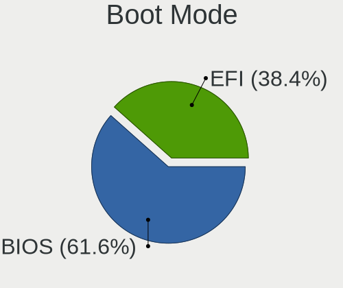
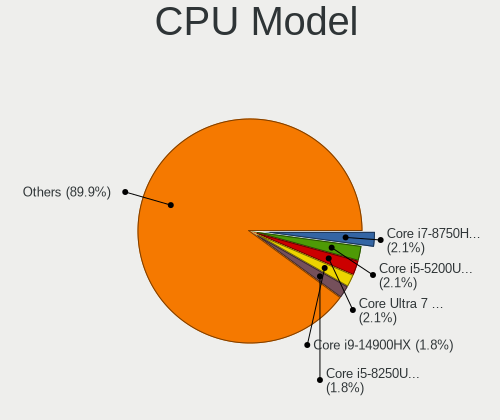
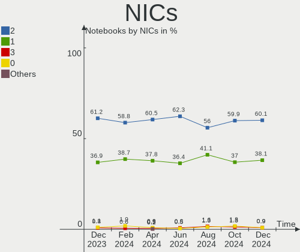

Fedora Hardware Trends (Notebooks)
----------------------------------

A project to identify most popular hardware characteristics and track their change
over time based on data collected by Fedora users at https://Linux-Hardware.org.

Anyone can contribute to this report by the [hw-probe](https://github.com/linuxhw/hw-probe) tool:

    sudo -E hw-probe -all -upload

Full-feature report is available here: https://linux-hardware.org/?view=trends&formfactor=notebook

Period: Oct, 2021.

Contents
--------

* [ System ](#system)
  - [ OS                       ](#os)
  - [ OS Family                ](#os-family)
  - [ Kernel                   ](#kernel)
  - [ Kernel Family            ](#kernel-family)
  - [ Kernel Major Ver.        ](#kernel-major-ver)
  - [ Arch                     ](#arch)
  - [ DE                       ](#de)
  - [ Display Server           ](#display-server)
  - [ Display Manager          ](#display-manager)
  - [ OS Lang                  ](#os-lang)
  - [ Boot Mode                ](#boot-mode)
  - [ Filesystem               ](#filesystem)
  - [ Part. scheme             ](#part-scheme)
  - [ Dual Boot with Linux/BSD ](#dual-boot-with-linuxbsd)
  - [ Dual Boot (Win)          ](#dual-boot-win)

* [ Board ](#board)
  - [ Vendor                   ](#vendor)
  - [ Model                    ](#model)
  - [ Model Family             ](#model-family)
  - [ MFG Year                 ](#mfg-year)
  - [ Form Factor              ](#form-factor)
  - [ Secure Boot              ](#secure-boot)
  - [ Coreboot                 ](#coreboot)
  - [ RAM Size                 ](#ram-size)
  - [ RAM Used                 ](#ram-used)
  - [ Total Drives             ](#total-drives)
  - [ Has CD-ROM               ](#has-cd-rom)
  - [ Has Ethernet             ](#has-ethernet)
  - [ Has WiFi                 ](#has-wifi)
  - [ Has Bluetooth            ](#has-bluetooth)

* [ Location ](#location)
  - [ Country                  ](#country)
  - [ City                     ](#city)

* [ Drives ](#drives)
  - [ Drive Vendor             ](#drive-vendor)
  - [ Drive Model              ](#drive-model)
  - [ HDD Vendor               ](#hdd-vendor)
  - [ SSD Vendor               ](#ssd-vendor)
  - [ Drive Kind               ](#drive-kind)
  - [ Drive Connector          ](#drive-connector)
  - [ Drive Size               ](#drive-size)
  - [ Space Total              ](#space-total)
  - [ Space Used               ](#space-used)
  - [ Malfunc. Drives          ](#malfunc-drives)
  - [ Malfunc. Drive Vendor    ](#malfunc-drive-vendor)
  - [ Malfunc. HDD Vendor      ](#malfunc-hdd-vendor)
  - [ Malfunc. Drive Kind      ](#malfunc-drive-kind)
  - [ Failed Drives            ](#failed-drives)
  - [ Failed Drive Vendor      ](#failed-drive-vendor)
  - [ Drive Status             ](#drive-status)

* [ Storage controller ](#storage-controller)
  - [ Storage Vendor           ](#storage-vendor)
  - [ Storage Model            ](#storage-model)
  - [ Storage Kind             ](#storage-kind)

* [ Processor ](#processor)
  - [ CPU Vendor               ](#cpu-vendor)
  - [ CPU Model                ](#cpu-model)
  - [ CPU Model Family         ](#cpu-model-family)
  - [ CPU Cores                ](#cpu-cores)
  - [ CPU Sockets              ](#cpu-sockets)
  - [ CPU Threads              ](#cpu-threads)
  - [ CPU Op-Modes             ](#cpu-op-modes)
  - [ CPU Microcode            ](#cpu-microcode)
  - [ CPU Microarch            ](#cpu-microarch)

* [ Graphics ](#graphics)
  - [ GPU Vendor               ](#gpu-vendor)
  - [ GPU Model                ](#gpu-model)
  - [ GPU Combo                ](#gpu-combo)
  - [ GPU Driver               ](#gpu-driver)
  - [ GPU Memory               ](#gpu-memory)

* [ Monitor ](#monitor)
  - [ Monitor Vendor           ](#monitor-vendor)
  - [ Monitor Model            ](#monitor-model)
  - [ Monitor Resolution       ](#monitor-resolution)
  - [ Monitor Diagonal         ](#monitor-diagonal)
  - [ Monitor Width            ](#monitor-width)
  - [ Aspect Ratio             ](#aspect-ratio)
  - [ Monitor Area             ](#monitor-area)
  - [ Pixel Density            ](#pixel-density)
  - [ Multiple Monitors        ](#multiple-monitors)

* [ Network ](#network)
  - [ Net Controller Vendor    ](#net-controller-vendor)
  - [ Net Controller Model     ](#net-controller-model)
  - [ Wireless Vendor          ](#wireless-vendor)
  - [ Wireless Model           ](#wireless-model)
  - [ Ethernet Vendor          ](#ethernet-vendor)
  - [ Ethernet Model           ](#ethernet-model)
  - [ Net Controller Kind      ](#net-controller-kind)
  - [ Used Controller          ](#used-controller)
  - [ NICs                     ](#nics)
  - [ IPv6                     ](#ipv6)

* [ Bluetooth ](#bluetooth)
  - [ Bluetooth Vendor         ](#bluetooth-vendor)
  - [ Bluetooth Model          ](#bluetooth-model)

* [ Sound ](#sound)
  - [ Sound Vendor             ](#sound-vendor)
  - [ Sound Model              ](#sound-model)

* [ Memory ](#memory)
  - [ Memory Vendor            ](#memory-vendor)
  - [ Memory Model             ](#memory-model)
  - [ Memory Kind              ](#memory-kind)
  - [ Memory Form Factor       ](#memory-form-factor)
  - [ Memory Size              ](#memory-size)
  - [ Memory Speed             ](#memory-speed)

* [ Printers & scanners ](#printers--scanners)
  - [ Printer Vendor           ](#printer-vendor)
  - [ Printer Model            ](#printer-model)
  - [ Scanner Vendor           ](#scanner-vendor)
  - [ Scanner Model            ](#scanner-model)

* [ Camera ](#camera)
  - [ Camera Vendor            ](#camera-vendor)
  - [ Camera Model             ](#camera-model)

* [ Security ](#security)
  - [ Fingerprint Vendor       ](#fingerprint-vendor)
  - [ Fingerprint Model        ](#fingerprint-model)
  - [ Chipcard Vendor          ](#chipcard-vendor)
  - [ Chipcard Model           ](#chipcard-model)

* [ Unsupported ](#unsupported)
  - [ Unsupported Devices      ](#unsupported-devices)
  - [ Unsupported Device Types ](#unsupported-device-types)

System
------

OS
--

Installed operating systems

| Name      | Notebooks | Percent |
|-----------|-----------|---------|
| Fedora 34 | 126       | 75%     |
| Fedora 35 | 35        | 20.83%  |
| Fedora 33 | 5         | 2.98%   |
| Fedora 36 | 1         | 0.6%    |
| Fedora 32 | 1         | 0.6%    |

OS Family
---------

OS without a version

| Name   | Notebooks | Percent |
|--------|-----------|---------|
| Fedora | 168       | 100%    |

Kernel
------

Version of the Linux kernel

| Version                                             | Notebooks | Percent |
|-----------------------------------------------------|-----------|---------|
| 5.14.9-200.fc34.x86_64                              | 30        | 17.86%  |
| 5.14.13-200.fc34.x86_64                             | 24        | 14.29%  |
| 5.14.11-200.fc34.x86_64                             | 24        | 14.29%  |
| 5.13.19-200.fc34.x86_64                             | 15        | 8.93%   |
| 5.14.9-300.fc35.x86_64                              | 9         | 5.36%   |
| 5.14.10-300.fc35.x86_64                             | 9         | 5.36%   |
| 5.14.10-200.fc34.x86_64                             | 9         | 5.36%   |
| 5.11.12-300.fc34.x86_64                             | 7         | 4.17%   |
| 5.14.12-200.fc34.x86_64                             | 6         | 3.57%   |
| 5.14.11-300.fc35.x86_64                             | 4         | 2.38%   |
| 5.14.0-60.fc35.x86_64                               | 4         | 2.38%   |
| 5.14.12-300.fc35.x86_64                             | 3         | 1.79%   |
| 5.13.16-200.fc34.x86_64                             | 3         | 1.79%   |
| 5.14.14-200.fc34.x86_64                             | 2         | 1.19%   |
| 5.14.12-100.fc33.x86_64                             | 2         | 1.19%   |
| 5.13.14-200.fc34.x86_64                             | 2         | 1.19%   |
| 5.13.12-200.fc34.x86_64                             | 2         | 1.19%   |
| 5.15.0-0.rc4.20211008git1da38549dd64.36.fc36.x86_64 | 1         | 0.6%    |
| 5.14.9-300.rog.fc34.x86_64                          | 1         | 0.6%    |
| 5.14.8-xm1cacule.0.fc35.x86_64                      | 1         | 0.6%    |
| 5.14.7-300.fc35.x86_64                              | 1         | 0.6%    |
| 5.14.15-300.fc35.x86_64                             | 1         | 0.6%    |
| 5.14.14-300.fc35.x86_64                             | 1         | 0.6%    |
| 5.14.13-100.fc33.x86_64                             | 1         | 0.6%    |
| 5.13.9-200.fc34.x86_64                              | 1         | 0.6%    |
| 5.13.12-1                                           | 1         | 0.6%    |
| 5.12.9-200.fc33.x86_64                              | 1         | 0.6%    |
| 5.11.22-100.fc32.x86_64                             | 1         | 0.6%    |
| 5.10.23-200.fc35.x86_64                             | 1         | 0.6%    |
| 5.10.23-200.fc33.x86_64                             | 1         | 0.6%    |

Kernel Family
-------------

Linux kernel without a distro release

| Version | Notebooks | Percent |
|---------|-----------|---------|
| 5.14.9  | 40        | 23.81%  |
| 5.14.11 | 28        | 16.67%  |
| 5.14.13 | 25        | 14.88%  |
| 5.14.10 | 18        | 10.71%  |
| 5.13.19 | 15        | 8.93%   |
| 5.14.12 | 11        | 6.55%   |
| 5.11.12 | 7         | 4.17%   |
| 5.14.0  | 4         | 2.38%   |
| 5.14.14 | 3         | 1.79%   |
| 5.13.16 | 3         | 1.79%   |
| 5.13.12 | 3         | 1.79%   |
| 5.13.14 | 2         | 1.19%   |
| 5.10.23 | 2         | 1.19%   |
| 5.15.0  | 1         | 0.6%    |
| 5.14.8  | 1         | 0.6%    |
| 5.14.7  | 1         | 0.6%    |
| 5.14.15 | 1         | 0.6%    |
| 5.13.9  | 1         | 0.6%    |
| 5.12.9  | 1         | 0.6%    |
| 5.11.22 | 1         | 0.6%    |

Kernel Major Ver.
-----------------

Linux kernel major version

| Version | Notebooks | Percent |
|---------|-----------|---------|
| 5.14    | 132       | 78.57%  |
| 5.13    | 24        | 14.29%  |
| 5.11    | 8         | 4.76%   |
| 5.10    | 2         | 1.19%   |
| 5.15    | 1         | 0.6%    |
| 5.12    | 1         | 0.6%    |

Arch
----

OS architecture (x86_64, i586, etc.)

| Name    | Notebooks | Percent |
|---------|-----------|---------|
| x86_64  | 167       | 99.4%   |
| aarch64 | 1         | 0.6%    |

DE
--

Desktop Environment

| Name          | Notebooks | Percent |
|---------------|-----------|---------|
| GNOME         | 134       | 79.76%  |
| KDE5          | 10        | 5.95%   |
| Unknown       | 8         | 4.76%   |
| XFCE          | 3         | 1.79%   |
| X-Cinnamon    | 3         | 1.79%   |
| MATE          | 3         | 1.79%   |
| Cinnamon      | 3         | 1.79%   |
| LXQt          | 2         | 1.19%   |
| sway          | 1         | 0.6%    |
| GNOME Classic | 1         | 0.6%    |

Display Server
--------------

X11 or Wayland

| Name    | Notebooks | Percent |
|---------|-----------|---------|
| Wayland | 107       | 63.69%  |
| X11     | 49        | 29.17%  |
| Tty     | 6         | 3.57%   |
| Unknown | 6         | 3.57%   |

Display Manager
---------------

SDDM, LightDM, etc.

| Name    | Notebooks | Percent |
|---------|-----------|---------|
| Unknown | 98        | 58.33%  |
| GDM     | 52        | 30.95%  |
| LightDM | 10        | 5.95%   |
| SDDM    | 8         | 4.76%   |

OS Lang
-------

Language

| Lang  | Notebooks | Percent |
|-------|-----------|---------|
| en_US | 88        | 52.38%  |
| en_GB | 15        | 8.93%   |
| ru_RU | 10        | 5.95%   |
| fr_FR | 9         | 5.36%   |
| pt_BR | 6         | 3.57%   |
| it_IT | 5         | 2.98%   |
| de_DE | 5         | 2.98%   |
| pl_PL | 4         | 2.38%   |
| es_ES | 4         | 2.38%   |
| es_MX | 3         | 1.79%   |
| en_IN | 3         | 1.79%   |
| en_AU | 3         | 1.79%   |
| uk_UA | 2         | 1.19%   |
| nl_NL | 1         | 0.6%    |
| nl_BE | 1         | 0.6%    |
| fr_CH | 1         | 0.6%    |
| fr_CA | 1         | 0.6%    |
| es_VE | 1         | 0.6%    |
| es_EC | 1         | 0.6%    |
| es_AR | 1         | 0.6%    |
| en_NZ | 1         | 0.6%    |
| en_IE | 1         | 0.6%    |
| en_DK | 1         | 0.6%    |
| de_CH | 1         | 0.6%    |

Boot Mode
---------

EFI or BIOS

| Mode | Notebooks | Percent |
|------|-----------|---------|
| EFI  | 126       | 75%     |
| BIOS | 42        | 25%     |

Filesystem
----------

Type of filesystem

| Type  | Notebooks | Percent |
|-------|-----------|---------|
| Btrfs | 127       | 75.6%   |
| Ext4  | 36        | 21.43%  |
| Xfs   | 5         | 2.98%   |

Part. scheme
------------

Scheme of partitioning

| Type    | Notebooks | Percent |
|---------|-----------|---------|
| Unknown | 94        | 55.95%  |
| GPT     | 66        | 39.29%  |
| MBR     | 8         | 4.76%   |

Dual Boot with Linux/BSD
------------------------

Hosting more than one Linux/BSD

| Dual boot | Notebooks | Percent |
|-----------|-----------|---------|
| No        | 149       | 88.69%  |
| Yes       | 19        | 11.31%  |

Dual Boot (Win)
---------------

Hosting Linux and Windows

| Dual boot | Notebooks | Percent |
|-----------|-----------|---------|
| No        | 139       | 82.74%  |
| Yes       | 29        | 17.26%  |

Board
-----

Vendor
------

Motherboard manufacturer

| Name                  | Notebooks | Percent |
|-----------------------|-----------|---------|
| Lenovo                | 51        | 30.36%  |
| Dell                  | 31        | 18.45%  |
| Hewlett-Packard       | 30        | 17.86%  |
| ASUSTek Computer      | 16        | 9.52%   |
| Apple                 | 8         | 4.76%   |
| Acer                  | 5         | 2.98%   |
| Notebook              | 4         | 2.38%   |
| Toshiba               | 3         | 1.79%   |
| Samsung Electronics   | 2         | 1.19%   |
| HUAWEI                | 2         | 1.19%   |
| ZOOSTORM              | 1         | 0.6%    |
| TUXEDO                | 1         | 0.6%    |
| Teclast               | 1         | 0.6%    |
| System76              | 1         | 0.6%    |
| Standard              | 1         | 0.6%    |
| Sony                  | 1         | 0.6%    |
| Razer                 | 1         | 0.6%    |
| Positivo Bahia - VAIO | 1         | 0.6%    |
| Pine Microsystems     | 1         | 0.6%    |
| LG Electronics        | 1         | 0.6%    |
| GPU Company           | 1         | 0.6%    |
| Framework             | 1         | 0.6%    |
| eMachines             | 1         | 0.6%    |
| BESSTAR Tech          | 1         | 0.6%    |
| Alienware             | 1         | 0.6%    |
| Unknown               | 1         | 0.6%    |

Model
-----

Motherboard model

| Name                                                                                     | Notebooks | Percent |
|------------------------------------------------------------------------------------------|-----------|---------|
| Dell Inspiron N5110                                                                      | 3         | 1.79%   |
| Lenovo G40-45 80E1                                                                       | 2         | 1.19%   |
| ASUS ROG Zephyrus G14 GA401QM_GA401QM                                                    | 2         | 1.19%   |
| Apple MacBook4,1                                                                         | 2         | 1.19%   |
| Unknown                                                                                  | 2         | 1.19%   |
| ZOOSTORM 7200-9041A                                                                      | 1         | 0.6%    |
| TUXEDO Polaris 15 AMD Gen1                                                               | 1         | 0.6%    |
| Toshiba Satellite L750                                                                   | 1         | 0.6%    |
| Toshiba Satellite C855-12R                                                               | 1         | 0.6%    |
| Toshiba Satellite C55-A-1NK                                                              | 1         | 0.6%    |
| Teclast F7 Plus                                                                          | 1         | 0.6%    |
| System76 Oryx Pro                                                                        | 1         | 0.6%    |
| Sony VPCSA25GX                                                                           | 1         | 0.6%    |
| Samsung 370E4K                                                                           | 1         | 0.6%    |
| Samsung 355V4C/355V4X/355V5C/355V5X/356V4C/356V4X/356V5C/356V5X/3445VC/3445VX/3545VC/354 | 1         | 0.6%    |
| Razer Blade 15 Base Model (Early 2020) - RZ09-0328                                       | 1         | 0.6%    |
| Positivo Bahia - VAIO VJFE53F11X-XXXXXX                                                  | 1         | 0.6%    |
| Pine Microsystems Pine64 Pinebook Pro                                                    | 1         | 0.6%    |
| Notebook PCx0Dx                                                                          | 1         | 0.6%    |
| Notebook NH5x_NH7x_HHx_HJx_HKx                                                           | 1         | 0.6%    |
| Notebook NH5x_NH7xHP                                                                     | 1         | 0.6%    |
| Notebook NB50TL                                                                          | 1         | 0.6%    |
| LG A550-C.BE55P1                                                                         | 1         | 0.6%    |
| Lenovo Yoga S740-14IIL 81RS                                                              | 1         | 0.6%    |
| Lenovo V580c 20160                                                                       | 1         | 0.6%    |
| Lenovo ThinkPad X240 20AMA1Y3UK                                                          | 1         | 0.6%    |
| Lenovo ThinkPad X220 4289A92                                                             | 1         | 0.6%    |
| Lenovo ThinkPad X1 Extreme 2nd 20QVCTO1WW                                                | 1         | 0.6%    |
| Lenovo ThinkPad X1 Carbon Gen 9 20XWCTO1WW                                               | 1         | 0.6%    |
| Lenovo ThinkPad X1 Carbon 7th 20QD001FZA                                                 | 1         | 0.6%    |
| Lenovo ThinkPad X1 Carbon 6th 20KH007BUK                                                 | 1         | 0.6%    |
| Lenovo ThinkPad T490s 20NX003NRT                                                         | 1         | 0.6%    |
| Lenovo ThinkPad T490 20N3S6VU00                                                          | 1         | 0.6%    |
| Lenovo ThinkPad T490 20N3S37900                                                          | 1         | 0.6%    |
| Lenovo ThinkPad T490 20N2005VMX                                                          | 1         | 0.6%    |
| Lenovo ThinkPad T490 20N2000BPB                                                          | 1         | 0.6%    |
| Lenovo ThinkPad T480s 20L70026US                                                         | 1         | 0.6%    |
| Lenovo ThinkPad T480 20L6S7PE06                                                          | 1         | 0.6%    |
| Lenovo ThinkPad T480 20L5000BMX                                                          | 1         | 0.6%    |
| Lenovo ThinkPad T470s 20HGS3AX02                                                         | 1         | 0.6%    |
| Lenovo ThinkPad T470 20HES0FA02                                                          | 1         | 0.6%    |
| Lenovo ThinkPad T460p 20FWS0A600                                                         | 1         | 0.6%    |
| Lenovo ThinkPad T460 20FMS1R01K                                                          | 1         | 0.6%    |
| Lenovo ThinkPad T450 20BU000QLM                                                          | 1         | 0.6%    |
| Lenovo ThinkPad T410 2522PT3                                                             | 1         | 0.6%    |
| Lenovo ThinkPad T14s Gen 1 20UHCTO1WW                                                    | 1         | 0.6%    |
| Lenovo ThinkPad P52 20MAS17200                                                           | 1         | 0.6%    |
| Lenovo ThinkPad P14s Gen 2a 21A0004WMX                                                   | 1         | 0.6%    |
| Lenovo ThinkPad P14s Gen 1 20S4000EGE                                                    | 1         | 0.6%    |
| Lenovo ThinkPad P1 Gen 3 20TJS2F42V                                                      | 1         | 0.6%    |
| Lenovo ThinkPad P1 Gen 3 20TJS2F40K                                                      | 1         | 0.6%    |
| Lenovo ThinkPad P1 Gen 3 20TJS07300                                                      | 1         | 0.6%    |
| Lenovo ThinkPad L15 Gen 1 20U70002GE                                                     | 1         | 0.6%    |
| Lenovo ThinkPad E490 20N9CTO1WW                                                          | 1         | 0.6%    |
| Lenovo ThinkPad E14 20RA0020AU                                                           | 1         | 0.6%    |
| Lenovo Legion 5 15ARH05H 82B1                                                            | 1         | 0.6%    |
| Lenovo Legion 5 15ARH05 82B5                                                             | 1         | 0.6%    |
| Lenovo IdeaPad S540-15IWL                                                                | 1         | 0.6%    |
| Lenovo IdeaPad S145-15API 81V7                                                           | 1         | 0.6%    |
| Lenovo IdeaPad Gaming 3 15ACH6 82K2                                                      | 1         | 0.6%    |

Model Family
------------

Motherboard model prefix

| Name                                    | Notebooks | Percent |
|-----------------------------------------|-----------|---------|
| Lenovo ThinkPad                         | 30        | 17.86%  |
| Lenovo IdeaPad                          | 11        | 6.55%   |
| Dell Inspiron                           | 9         | 5.36%   |
| HP Pavilion                             | 8         | 4.76%   |
| Dell XPS                                | 7         | 4.17%   |
| Dell Latitude                           | 7         | 4.17%   |
| HP ProBook                              | 6         | 3.57%   |
| HP Laptop                               | 4         | 2.38%   |
| HP EliteBook                            | 4         | 2.38%   |
| ASUS VivoBook                           | 4         | 2.38%   |
| Toshiba Satellite                       | 3         | 1.79%   |
| Dell Vostro                             | 3         | 1.79%   |
| Dell Precision                          | 3         | 1.79%   |
| ASUS ROG                                | 3         | 1.79%   |
| Notebook NH5x                           | 2         | 1.19%   |
| Lenovo Legion                           | 2         | 1.19%   |
| Lenovo G40-45                           | 2         | 1.19%   |
| HP OMEN                                 | 2         | 1.19%   |
| HP ENVY                                 | 2         | 1.19%   |
| HP 240                                  | 2         | 1.19%   |
| ASUS ASUS                               | 2         | 1.19%   |
| Apple MacBookPro5                       | 2         | 1.19%   |
| Apple MacBookPro11                      | 2         | 1.19%   |
| Apple MacBook4                          | 2         | 1.19%   |
| Acer Aspire                             | 2         | 1.19%   |
| Unknown                                 | 2         | 1.19%   |
| ZOOSTORM 7200-9041A                     | 1         | 0.6%    |
| TUXEDO Polaris                          | 1         | 0.6%    |
| Teclast F7                              | 1         | 0.6%    |
| System76 Oryx                           | 1         | 0.6%    |
| Sony VPCSA25GX                          | 1         | 0.6%    |
| Samsung 370E4K                          | 1         | 0.6%    |
| Samsung 355V4C                          | 1         | 0.6%    |
| Razer Blade                             | 1         | 0.6%    |
| Positivo Bahia - VAIO VJFE53F11X-XXXXXX | 1         | 0.6%    |
| Pine Microsystems Pine64                | 1         | 0.6%    |
| Notebook PCx0Dx                         | 1         | 0.6%    |
| Notebook NB50TL                         | 1         | 0.6%    |
| LG A550-C.BE55P1                        | 1         | 0.6%    |
| Lenovo Yoga                             | 1         | 0.6%    |
| Lenovo V580c                            | 1         | 0.6%    |
| Lenovo G710                             | 1         | 0.6%    |
| Lenovo G580                             | 1         | 0.6%    |
| Lenovo G550                             | 1         | 0.6%    |
| Lenovo G50-30                           | 1         | 0.6%    |
| HUAWEI NBLK-WAX9X                       | 1         | 0.6%    |
| HUAWEI EUL-WX9                          | 1         | 0.6%    |
| HP Elite                                | 1         | 0.6%    |
| HP 250                                  | 1         | 0.6%    |
| GPU Company GWTN156-1                   | 1         | 0.6%    |
| Framework Laptop                        | 1         | 0.6%    |
| eMachines E520                          | 1         | 0.6%    |
| Dell Studio                             | 1         | 0.6%    |
| Dell G5                                 | 1         | 0.6%    |
| BESSTAR Tech X400                       | 1         | 0.6%    |
| ASUS X750JN                             | 1         | 0.6%    |
| ASUS X555DA                             | 1         | 0.6%    |
| ASUS N76VZ                              | 1         | 0.6%    |
| ASUS N551VW                             | 1         | 0.6%    |
| ASUS N501JW                             | 1         | 0.6%    |

MFG Year
--------

Motherboard manufacture year

| Year    | Notebooks | Percent |
|---------|-----------|---------|
| 2021    | 57        | 33.93%  |
| 2020    | 30        | 17.86%  |
| 2019    | 17        | 10.12%  |
| 2018    | 11        | 6.55%   |
| 2013    | 11        | 6.55%   |
| 2015    | 10        | 5.95%   |
| 2016    | 6         | 3.57%   |
| 2012    | 6         | 3.57%   |
| 2011    | 5         | 2.98%   |
| 2017    | 3         | 1.79%   |
| 2010    | 3         | 1.79%   |
| 2008    | 3         | 1.79%   |
| 2014    | 2         | 1.19%   |
| 2009    | 2         | 1.19%   |
| Unknown | 2         | 1.19%   |

Form Factor
-----------

Physical design of the computer

| Name     | Notebooks | Percent |
|----------|-----------|---------|
| Notebook | 168       | 100%    |

Secure Boot
-----------

Enabled or disabled

| State    | Notebooks | Percent |
|----------|-----------|---------|
| Disabled | 147       | 87.5%   |
| Enabled  | 21        | 12.5%   |

Coreboot
--------

Have coreboot on board

| Used | Notebooks | Percent |
|------|-----------|---------|
| No   | 168       | 100%    |

RAM Size
--------

Total RAM memory

| Size in GB  | Notebooks | Percent |
|-------------|-----------|---------|
| 4.01-8.0    | 57        | 33.93%  |
| 16.01-24.0  | 38        | 22.62%  |
| 8.01-16.0   | 28        | 16.67%  |
| 32.01-64.0  | 23        | 13.69%  |
| 3.01-4.0    | 16        | 9.52%   |
| 24.01-32.0  | 2         | 1.19%   |
| 64.01-256.0 | 2         | 1.19%   |
| 1.01-2.0    | 2         | 1.19%   |

RAM Used
--------

Used RAM memory

| Used GB   | Notebooks | Percent |
|-----------|-----------|---------|
| 4.01-8.0  | 59        | 35.12%  |
| 2.01-3.0  | 49        | 29.17%  |
| 3.01-4.0  | 29        | 17.26%  |
| 1.01-2.0  | 22        | 13.1%   |
| 8.01-16.0 | 9         | 5.36%   |

Total Drives
------------

Number of drives on board

| Drives | Notebooks | Percent |
|--------|-----------|---------|
| 1      | 115       | 68.45%  |
| 2      | 42        | 25%     |
| 3      | 9         | 5.36%   |
| 6      | 1         | 0.6%    |
| 4      | 1         | 0.6%    |

Has CD-ROM
----------

Has CD-ROM on board

| Presented | Notebooks | Percent |
|-----------|-----------|---------|
| No        | 133       | 79.17%  |
| Yes       | 35        | 20.83%  |

Has Ethernet
------------

Has Ethernet on board

| Presented | Notebooks | Percent |
|-----------|-----------|---------|
| Yes       | 129       | 76.79%  |
| No        | 39        | 23.21%  |

Has WiFi
--------

Has WiFi module

| Presented | Notebooks | Percent |
|-----------|-----------|---------|
| Yes       | 166       | 98.81%  |
| No        | 2         | 1.19%   |

Has Bluetooth
-------------

Has Bluetooth module

| Presented | Notebooks | Percent |
|-----------|-----------|---------|
| Yes       | 141       | 83.93%  |
| No        | 27        | 16.07%  |

Location
--------

Country
-------

Geographic location (country)

| Country               | Notebooks | Percent |
|-----------------------|-----------|---------|
| USA                   | 31        | 18.45%  |
| France                | 12        | 7.14%   |
| Brazil                | 12        | 7.14%   |
| Russia                | 11        | 6.55%   |
| India                 | 7         | 4.17%   |
| Germany               | 7         | 4.17%   |
| Poland                | 6         | 3.57%   |
| Italy                 | 6         | 3.57%   |
| UK                    | 5         | 2.98%   |
| Netherlands           | 5         | 2.98%   |
| Ukraine               | 4         | 2.38%   |
| Mexico                | 4         | 2.38%   |
| Spain                 | 3         | 1.79%   |
| Portugal              | 3         | 1.79%   |
| Iran                  | 3         | 1.79%   |
| Ecuador               | 3         | 1.79%   |
| Austria               | 3         | 1.79%   |
| Australia             | 3         | 1.79%   |
| Switzerland           | 2         | 1.19%   |
| Sweden                | 2         | 1.19%   |
| Romania               | 2         | 1.19%   |
| Norway                | 2         | 1.19%   |
| New Zealand           | 2         | 1.19%   |
| Ireland               | 2         | 1.19%   |
| Indonesia             | 2         | 1.19%   |
| Denmark               | 2         | 1.19%   |
| Czechia               | 2         | 1.19%   |
| Canada                | 2         | 1.19%   |
| Belgium               | 2         | 1.19%   |
| Belarus               | 2         | 1.19%   |
| Argentina             | 2         | 1.19%   |
| Venezuela             | 1         | 0.6%    |
| South Africa          | 1         | 0.6%    |
| Slovenia              | 1         | 0.6%    |
| Serbia                | 1         | 0.6%    |
| Palestinian Territory | 1         | 0.6%    |
| Pakistan              | 1         | 0.6%    |
| Finland               | 1         | 0.6%    |
| Egypt                 | 1         | 0.6%    |
| Cyprus                | 1         | 0.6%    |
| Colombia              | 1         | 0.6%    |
| Chile                 | 1         | 0.6%    |
| Bulgaria              | 1         | 0.6%    |
| Azerbaijan            | 1         | 0.6%    |
| Angola                | 1         | 0.6%    |

City
----

Geographic location (city)

| City                | Notebooks | Percent |
|---------------------|-----------|---------|
| Moscow              | 6         | 3.57%   |
| Paris               | 4         | 2.38%   |
| London              | 3         | 1.79%   |
| Apex                | 3         | 1.79%   |
| Zurich              | 2         | 1.19%   |
| Vienna              | 2         | 1.19%   |
| Sydney              | 2         | 1.19%   |
| Quito               | 2         | 1.19%   |
| Porto Alegre        | 2         | 1.19%   |
| Novosibirsk         | 2         | 1.19%   |
| Montreal            | 2         | 1.19%   |
| Minsk               | 2         | 1.19%   |
| Milan               | 2         | 1.19%   |
| Madrid              | 2         | 1.19%   |
| Lisbon              | 2         | 1.19%   |
| Las Vegas           | 2         | 1.19%   |
| Kyiv                | 2         | 1.19%   |
| Dallas              | 2         | 1.19%   |
| Yuma                | 1         | 0.6%    |
| Yekaterinburg       | 1         | 0.6%    |
| Worms               | 1         | 0.6%    |
| Warsaw              | 1         | 0.6%    |
| Villeparisis        | 1         | 0.6%    |
| Veldhoven           | 1         | 0.6%    |
| Utica               | 1         | 0.6%    |
| Ume??               | 1         | 0.6%    |
| Trbovlje            | 1         | 0.6%    |
| Tongeren            | 1         | 0.6%    |
| Tirunelveli         | 1         | 0.6%    |
| Timbauba            | 1         | 0.6%    |
| Tehran              | 1         | 0.6%    |
| Szczecin            | 1         | 0.6%    |
| Surabaya            | 1         | 0.6%    |
| Sun City Center     | 1         | 0.6%    |
| Stokke              | 1         | 0.6%    |
| Sprockhoevel        | 1         | 0.6%    |
| Sofia               | 1         | 0.6%    |
| S??o Paulo          | 1         | 0.6%    |
| Sao Jose            | 1         | 0.6%    |
| Saint-Etienne       | 1         | 0.6%    |
| Saint-Cyr-sur-Loire | 1         | 0.6%    |
| Ruda ??l?…ska       | 1         | 0.6%    |
| Royse               | 1         | 0.6%    |
| Rosario             | 1         | 0.6%    |
| Rochester           | 1         | 0.6%    |
| Ramallah            | 1         | 0.6%    |
| Queens              | 1         | 0.6%    |
| Pretoria            | 1         | 0.6%    |
| Prague              | 1         | 0.6%    |
| Pleasanton          | 1         | 0.6%    |
| Phoenix             | 1         | 0.6%    |
| Peyrins             | 1         | 0.6%    |
| Petrolina           | 1         | 0.6%    |
| Penafiel            | 1         | 0.6%    |
| Passo Fundo         | 1         | 0.6%    |
| Parnamirim          | 1         | 0.6%    |
| Palmerston North    | 1         | 0.6%    |
| Palazzago           | 1         | 0.6%    |
| Old Lyme            | 1         | 0.6%    |
| Nuremberg           | 1         | 0.6%    |

Drives
------

Drive Vendor
------------

Hard drive vendors

| Vendor                  | Notebooks | Drives | Percent |
|-------------------------|-----------|--------|---------|
| Samsung Electronics     | 49        | 56     | 22.69%  |
| WDC                     | 23        | 25     | 10.65%  |
| Seagate                 | 18        | 19     | 8.33%   |
| Toshiba                 | 16        | 18     | 7.41%   |
| Unknown                 | 14        | 16     | 6.48%   |
| SanDisk                 | 13        | 14     | 6.02%   |
| SK Hynix                | 11        | 12     | 5.09%   |
| Intel                   | 8         | 8      | 3.7%    |
| Kingston                | 7         | 7      | 3.24%   |
| PNY                     | 5         | 5      | 2.31%   |
| Crucial                 | 5         | 6      | 2.31%   |
| Micron Technology       | 4         | 4      | 1.85%   |
| HGST                    | 4         | 4      | 1.85%   |
| China                   | 4         | 4      | 1.85%   |
| Apple                   | 4         | 5      | 1.85%   |
| Transcend               | 3         | 3      | 1.39%   |
| Union Memory (Shenzhen) | 2         | 3      | 0.93%   |
| OCZ                     | 2         | 2      | 0.93%   |
| KIOXIA                  | 2         | 2      | 0.93%   |
| Hitachi                 | 2         | 2      | 0.93%   |
| Corsair                 | 2         | 2      | 0.93%   |
| USB3.0                  | 1         | 1      | 0.46%   |
| Team                    | 1         | 1      | 0.46%   |
| SPCC                    | 1         | 1      | 0.46%   |
| Silicon Motion          | 1         | 1      | 0.46%   |
| Realtek Semiconductor   | 1         | 1      | 0.46%   |
| Patriot                 | 1         | 1      | 0.46%   |
| Mushkin                 | 1         | 1      | 0.46%   |
| LITEON                  | 1         | 1      | 0.46%   |
| Lite-On                 | 1         | 1      | 0.46%   |
| Lenovo                  | 1         | 1      | 0.46%   |
| LDLC                    | 1         | 1      | 0.46%   |
| HPE                     | 1         | 1      | 0.46%   |
| GOODRAM                 | 1         | 1      | 0.46%   |
| Gigabyte Technology     | 1         | 1      | 0.46%   |
| FORESEE                 | 1         | 1      | 0.46%   |
| Enmotus                 | 1         | 1      | 0.46%   |
| BRAVEEAGLE              | 1         | 1      | 0.46%   |
| A-DATA Technology       | 1         | 1      | 0.46%   |

Drive Model
-----------

Hard drive models

| Model                                  | Notebooks | Percent |
|----------------------------------------|-----------|---------|
| Seagate ST1000LM024 HN-M101MBB 1TB     | 5         | 2.2%    |
| Unknown MMC Card  64GB                 | 4         | 1.76%   |
| Samsung PM963 2.5" NVMe PCIe SSD 512GB | 4         | 1.76%   |
| Seagate ST1000LM035-1RK172 1TB         | 3         | 1.32%   |
| Samsung SSD 850 EVO 250GB              | 3         | 1.32%   |
| Samsung NVMe SSD Drive 256GB           | 3         | 1.32%   |
| Samsung NVMe SSD Drive 1TB             | 3         | 1.32%   |
| Samsung NVMe SSD Drive 1024GB          | 3         | 1.32%   |
| HGST HTS721010A9E630 1TB               | 3         | 1.32%   |
| WDC WDS240G2G0A-00JH30 240GB SSD       | 2         | 0.88%   |
| WDC WD10SPZX-60Z10T0 1TB               | 2         | 0.88%   |
| Unknown MMC Card  32GB                 | 2         | 0.88%   |
| Unknown MMC Card  128GB                | 2         | 0.88%   |
| Toshiba NVMe SSD Drive 512GB           | 2         | 0.88%   |
| Toshiba KXG6AZNV512G 512GB             | 2         | 0.88%   |
| SK Hynix NVMe SSD Drive 512GB          | 2         | 0.88%   |
| SK Hynix NVMe SSD Drive 256GB          | 2         | 0.88%   |
| Seagate ST500LT012-9WS142 500GB        | 2         | 0.88%   |
| Seagate ST500LT012-1DG142 500GB        | 2         | 0.88%   |
| Seagate ST1000LM048-2E7172 1TB         | 2         | 0.88%   |
| Sandisk NVMe SSD Drive 512GB           | 2         | 0.88%   |
| Sandisk NVMe SSD Drive 2TB             | 2         | 0.88%   |
| Samsung SSD 970 EVO Plus 500GB         | 2         | 0.88%   |
| Samsung SSD 970 EVO 1TB                | 2         | 0.88%   |
| Samsung SSD 860 EVO 250GB              | 2         | 0.88%   |
| Samsung SSD 860 EVO 1TB                | 2         | 0.88%   |
| Samsung NVMe SSD Drive 500GB           | 2         | 0.88%   |
| Samsung MZVLB256HBHQ-000L7 256GB       | 2         | 0.88%   |
| Samsung MZ7LN512HMJP-000L7 512GB SSD   | 2         | 0.88%   |
| PNY CS900 120GB SSD                    | 2         | 0.88%   |
| Kingston SA400S37240G 240GB SSD        | 2         | 0.88%   |
| WDC WDS500G3X0C-00SJG0 500GB           | 1         | 0.44%   |
| WDC WDS500G2B0C-00PXH0 500GB           | 1         | 0.44%   |
| WDC WDS500G2B0C 500GB                  | 1         | 0.44%   |
| WDC WDS500G2B0A-00SM50 500GB SSD       | 1         | 0.44%   |
| WDC WDS120G2G0A-00JH30 120GB SSD       | 1         | 0.44%   |
| WDC WDS100T2B0A-00SM50 1TB SSD         | 1         | 0.44%   |
| WDC WD5000LPVX-22V0TT0 500GB           | 1         | 0.44%   |
| WDC WD5000LPLX-66ZNTT1 500GB           | 1         | 0.44%   |
| WDC WD5000LPCX-24C6HT0 500GB           | 1         | 0.44%   |
| WDC WD1600BEVT-22ZCT0 160GB            | 1         | 0.44%   |
| WDC WD16 00BEVT-60ZCT 160GB            | 1         | 0.44%   |
| WDC WD10SPZX-24Z10T0 1TB               | 1         | 0.44%   |
| WDC WD10SPZX-22Z10T1 1TB               | 1         | 0.44%   |
| WDC WD10SPZX-21Z10T0 1TB               | 1         | 0.44%   |
| WDC WD10JPVX-60JC3T0 1TB               | 1         | 0.44%   |
| WDC WD10JPCX-24UE4T0 1TB               | 1         | 0.44%   |
| WDC PC SN730 SDBQNTY-256G-1001 256GB   | 1         | 0.44%   |
| WDC PC SN730 SDBQNTY-1T00-1001 1TB     | 1         | 0.44%   |
| WDC PC SN730 NVMe 1024GB               | 1         | 0.44%   |
| WDC PC SN520 NVMe 256GB                | 1         | 0.44%   |
| USB3.0 Super Speed 80GB                | 1         | 0.44%   |
| Unknown USB DISK 3.2 250GB             | 1         | 0.44%   |
| Unknown SF256  256GB                   | 1         | 0.44%   |
| Unknown SD16G  16GB                    | 1         | 0.44%   |
| Unknown SD128  128GB                   | 1         | 0.44%   |
| Unknown SD04G  4GB                     | 1         | 0.44%   |
| Unknown MMC Card  7GB                  | 1         | 0.44%   |
| Unknown MMC Card  4GB                  | 1         | 0.44%   |
| Unknown GE8QT  256GB                   | 1         | 0.44%   |

HDD Vendor
----------

Hard disk drive vendors

| Vendor              | Notebooks | Drives | Percent |
|---------------------|-----------|--------|---------|
| Seagate             | 18        | 19     | 41.86%  |
| WDC                 | 12        | 12     | 27.91%  |
| Toshiba             | 4         | 4      | 9.3%    |
| HGST                | 4         | 4      | 9.3%    |
| Samsung Electronics | 2         | 2      | 4.65%   |
| Hitachi             | 2         | 2      | 4.65%   |
| USB3.0              | 1         | 1      | 2.33%   |

SSD Vendor
----------

Solid state drive vendors

| Vendor              | Notebooks | Drives | Percent |
|---------------------|-----------|--------|---------|
| Samsung Electronics | 19        | 20     | 26.76%  |
| SanDisk             | 8         | 8      | 11.27%  |
| WDC                 | 5         | 5      | 7.04%   |
| PNY                 | 5         | 5      | 7.04%   |
| Kingston            | 5         | 5      | 7.04%   |
| Crucial             | 4         | 5      | 5.63%   |
| China               | 4         | 4      | 5.63%   |
| Toshiba             | 2         | 3      | 2.82%   |
| OCZ                 | 2         | 2      | 2.82%   |
| Intel               | 2         | 2      | 2.82%   |
| Corsair             | 2         | 2      | 2.82%   |
| Apple               | 2         | 2      | 2.82%   |
| Transcend           | 1         | 1      | 1.41%   |
| Team                | 1         | 1      | 1.41%   |
| SK Hynix            | 1         | 1      | 1.41%   |
| Patriot             | 1         | 1      | 1.41%   |
| Mushkin             | 1         | 1      | 1.41%   |
| Micron Technology   | 1         | 1      | 1.41%   |
| GOODRAM             | 1         | 1      | 1.41%   |
| Gigabyte Technology | 1         | 1      | 1.41%   |
| FORESEE             | 1         | 1      | 1.41%   |
| BRAVEEAGLE          | 1         | 1      | 1.41%   |
| A-DATA Technology   | 1         | 1      | 1.41%   |

Drive Kind
----------

HDD or SSD

| Kind    | Notebooks | Drives | Percent |
|---------|-----------|--------|---------|
| NVMe    | 83        | 98     | 39.9%   |
| SSD     | 66        | 74     | 31.73%  |
| HDD     | 42        | 44     | 20.19%  |
| MMC     | 13        | 15     | 6.25%   |
| Unknown | 4         | 4      | 1.92%   |

Drive Connector
---------------

SATA, SAS, NVMe, etc.

| Type | Notebooks | Drives | Percent |
|------|-----------|--------|---------|
| SATA | 91        | 114    | 46.91%  |
| NVMe | 83        | 98     | 42.78%  |
| MMC  | 13        | 15     | 6.7%    |
| SAS  | 7         | 8      | 3.61%   |

Drive Size
----------

Size of hard drive

| Size in TB | Notebooks | Drives | Percent |
|------------|-----------|--------|---------|
| 0.01-0.5   | 69        | 82     | 66.99%  |
| 0.51-1.0   | 32        | 34     | 31.07%  |
| 1.01-2.0   | 2         | 2      | 1.94%   |

Space Total
-----------

Amount of disk space available on the file system

| Size in GB     | Notebooks | Percent |
|----------------|-----------|---------|
| 101-250        | 38        | 22.62%  |
| 251-500        | 32        | 19.05%  |
| 501-1000       | 32        | 19.05%  |
| Unknown        | 17        | 10.12%  |
| 1001-2000      | 16        | 9.52%   |
| 1-20           | 16        | 9.52%   |
| 51-100         | 7         | 4.17%   |
| 2001-3000      | 5         | 2.98%   |
| More than 3000 | 3         | 1.79%   |
| 21-50          | 2         | 1.19%   |

Space Used
----------

Amount of used disk space

| Used GB        | Notebooks | Percent |
|----------------|-----------|---------|
| 1-20           | 40        | 23.81%  |
| 21-50          | 35        | 20.83%  |
| 101-250        | 25        | 14.88%  |
| 51-100         | 21        | 12.5%   |
| Unknown        | 17        | 10.12%  |
| 251-500        | 14        | 8.33%   |
| 501-1000       | 12        | 7.14%   |
| 1001-2000      | 3         | 1.79%   |
| More than 3000 | 1         | 0.6%    |

Malfunc. Drives
---------------

Drive models with a malfunction

| Model                                               | Notebooks | Drives | Percent |
|-----------------------------------------------------|-----------|--------|---------|
| Seagate ST1000LM035-1RK172 1TB                      | 1         | 1      | 10%     |
| SanDisk SSD PLUS 240GB                              | 1         | 1      | 10%     |
| Samsung Electronics SSD 970 EVO 1TB                 | 1         | 1      | 10%     |
| Micron Technology MTFDDAK256MAY-1AH12ABHA 256GB SSD | 1         | 1      | 10%     |
| Kingston SUV400S37240G 240GB SSD                    | 1         | 1      | 10%     |
| Hitachi HTS545025B9SA02 250GB                       | 1         | 1      | 10%     |
| Hitachi HTS543216L9A300 160GB                       | 1         | 1      | 10%     |
| HGST HTS721010A9E630 1TB                            | 1         | 1      | 10%     |
| HGST HTS545050A7E660 500GB                          | 1         | 1      | 10%     |
| Crucial CT1050MX300SSD1 1TB                         | 1         | 1      | 10%     |

Malfunc. Drive Vendor
---------------------

Vendors of faulty drives

| Vendor              | Notebooks | Drives | Percent |
|---------------------|-----------|--------|---------|
| Hitachi             | 2         | 2      | 20%     |
| HGST                | 2         | 2      | 20%     |
| Seagate             | 1         | 1      | 10%     |
| SanDisk             | 1         | 1      | 10%     |
| Samsung Electronics | 1         | 1      | 10%     |
| Micron Technology   | 1         | 1      | 10%     |
| Kingston            | 1         | 1      | 10%     |
| Crucial             | 1         | 1      | 10%     |

Malfunc. HDD Vendor
-------------------

Vendors of faulty HDD drives

| Vendor  | Notebooks | Drives | Percent |
|---------|-----------|--------|---------|
| Hitachi | 2         | 2      | 40%     |
| HGST    | 2         | 2      | 40%     |
| Seagate | 1         | 1      | 20%     |

Malfunc. Drive Kind
-------------------

Kinds of faulty drives

| Kind | Notebooks | Drives | Percent |
|------|-----------|--------|---------|
| HDD  | 5         | 5      | 50%     |
| SSD  | 4         | 4      | 40%     |
| NVMe | 1         | 1      | 10%     |

Failed Drives
-------------

Failed drive models

Zero info for selected period =(

Failed Drive Vendor
-------------------

Failed drive vendors

Zero info for selected period =(

Drive Status
------------

Number of failed and malfunc. drives

| Status   | Notebooks | Drives | Percent |
|----------|-----------|--------|---------|
| Detected | 104       | 138    | 56.52%  |
| Works    | 71        | 87     | 38.59%  |
| Malfunc  | 9         | 10     | 4.89%   |

Storage controller
------------------

Storage Vendor
--------------

Storage controller vendors

| Vendor                       | Notebooks | Percent |
|------------------------------|-----------|---------|
| Intel                        | 100       | 49.26%  |
| Samsung Electronics          | 33        | 16.26%  |
| AMD                          | 19        | 9.36%   |
| Sandisk                      | 11        | 5.42%   |
| Toshiba America Info Systems | 10        | 4.93%   |
| SK Hynix                     | 10        | 4.93%   |
| Silicon Motion               | 3         | 1.48%   |
| Micron Technology            | 3         | 1.48%   |
| Union Memory (Shenzhen)      | 2         | 0.99%   |
| Nvidia                       | 2         | 0.99%   |
| Kingston Technology Company  | 2         | 0.99%   |
| Unknown                      | 1         | 0.49%   |
| Realtek Semiconductor        | 1         | 0.49%   |
| Micron/Crucial Technology    | 1         | 0.49%   |
| Lite-On Technology           | 1         | 0.49%   |
| Lenovo                       | 1         | 0.49%   |
| KIOXIA                       | 1         | 0.49%   |
| Enmotus                      | 1         | 0.49%   |
| Apple                        | 1         | 0.49%   |

Storage Model
-------------

Storage controller models

| Model                                                                            | Notebooks | Percent |
|----------------------------------------------------------------------------------|-----------|---------|
| Samsung NVMe SSD Controller SM981/PM981/PM983                                    | 17        | 8.02%   |
| AMD FCH SATA Controller [AHCI mode]                                              | 17        | 8.02%   |
| Intel Sunrise Point-LP SATA Controller [AHCI mode]                               | 16        | 7.55%   |
| Intel 82801 Mobile SATA Controller [RAID mode]                                   | 10        | 4.72%   |
| Intel 7 Series Chipset Family 6-port SATA Controller [AHCI mode]                 | 9         | 4.25%   |
| Intel 6 Series/C200 Series Chipset Family 6 port Mobile SATA AHCI Controller     | 9         | 4.25%   |
| Samsung NVMe SSD Controller 980                                                  | 8         | 3.77%   |
| Toshiba America Info Systems XG6 NVMe SSD Controller                             | 7         | 3.3%    |
| Intel 8 Series/C220 Series Chipset Family 6-port SATA Controller 1 [AHCI mode]   | 7         | 3.3%    |
| Sandisk WD Black SN750 / PC SN730 NVMe SSD                                       | 6         | 2.83%   |
| Intel Volume Management Device NVMe RAID Controller                              | 5         | 2.36%   |
| Samsung NVMe SSD Controller PM9A1/PM9A3/980PRO                                   | 4         | 1.89%   |
| Intel SSD 660P Series                                                            | 4         | 1.89%   |
| Intel HM170/QM170 Chipset SATA Controller [AHCI Mode]                            | 4         | 1.89%   |
| SK Hynix Non-Volatile memory controller                                          | 3         | 1.42%   |
| SK Hynix Gold P31 SSD                                                            | 3         | 1.42%   |
| SK Hynix BC511                                                                   | 3         | 1.42%   |
| Silicon Motion SM2263EN/SM2263XT SSD Controller                                  | 3         | 1.42%   |
| Samsung NVMe SSD Controller SM961/PM961/SM963                                    | 3         | 1.42%   |
| Micron Non-Volatile memory controller                                            | 3         | 1.42%   |
| Intel Wildcat Point-LP SATA Controller [AHCI Mode]                               | 3         | 1.42%   |
| Intel Ice Lake-LP SATA Controller [AHCI mode]                                    | 3         | 1.42%   |
| Intel Comet Lake SATA AHCI Controller                                            | 3         | 1.42%   |
| Intel Celeron/Pentium Silver Processor SATA Controller                           | 3         | 1.42%   |
| Intel Cannon Lake Mobile PCH SATA AHCI Controller                                | 3         | 1.42%   |
| Intel 82801IBM/IEM (ICH9M/ICH9M-E) 4 port SATA Controller [AHCI mode]            | 3         | 1.42%   |
| Intel 8 Series SATA Controller 1 [AHCI mode]                                     | 3         | 1.42%   |
| Intel 400 Series Chipset Family SATA AHCI Controller                             | 3         | 1.42%   |
| Union Memory (Shenzhen) Non-Volatile memory controller                           | 2         | 0.94%   |
| Toshiba America Info Systems BG3 NVMe SSD Controller                             | 2         | 0.94%   |
| Sandisk WD Blue SN550 NVMe SSD                                                   | 2         | 0.94%   |
| Samsung Apple PCIe SSD                                                           | 2         | 0.94%   |
| Nvidia MCP79 AHCI Controller                                                     | 2         | 0.94%   |
| Intel Cannon Point-LP SATA Controller [AHCI Mode]                                | 2         | 0.94%   |
| Intel Atom/Celeron/Pentium Processor x5-E8000/J3xxx/N3xxx Series SATA Controller | 2         | 0.94%   |
| Intel Atom Processor E3800 Series SATA AHCI Controller                           | 2         | 0.94%   |
| Intel 82801HM/HEM (ICH8M/ICH8M-E) SATA Controller [AHCI mode]                    | 2         | 0.94%   |
| Intel 82801HM/HEM (ICH8M/ICH8M-E) IDE Controller                                 | 2         | 0.94%   |
| Intel 500 Series Chipset Family SATA AHCI Controller                             | 2         | 0.94%   |
| AMD FCH SATA Controller [IDE mode]                                               | 2         | 0.94%   |
| Unknown Non-Volatile memory controller                                           | 1         | 0.47%   |
| Toshiba America Info Systems XG4 NVMe SSD Controller                             | 1         | 0.47%   |
| SK Hynix PC300 NVMe Solid State Drive 256GB                                      | 1         | 0.47%   |
| Sandisk WD Black SN850                                                           | 1         | 0.47%   |
| Sandisk WD Black 2018/SN750 / PC SN720 NVMe SSD                                  | 1         | 0.47%   |
| Sandisk PC SN520 NVMe SSD                                                        | 1         | 0.47%   |
| Realtek RTS5763DL NVMe SSD Controller                                            | 1         | 0.47%   |
| Micron/Crucial P2 NVMe PCIe SSD                                                  | 1         | 0.47%   |
| Lite-On Lite-On Non-Volatile memory controller                                   | 1         | 0.47%   |
| Lenovo Non-Volatile memory controller                                            | 1         | 0.47%   |
| KIOXIA Non-Volatile memory controller                                            | 1         | 0.47%   |
| Kingston Company U-SNS8154P3 NVMe SSD                                            | 1         | 0.47%   |
| Kingston Company Company Non-Volatile memory controller                          | 1         | 0.47%   |
| Intel Tiger Lake-LP SATA Controller [AHCI mode]                                  | 1         | 0.47%   |
| Intel SSD Pro 7600p/760p/E 6100p Series                                          | 1         | 0.47%   |
| Intel SATA Controller [RAID mode]                                                | 1         | 0.47%   |
| Intel Q170/Q150/B150/H170/H110/Z170/CM236 Chipset SATA Controller [AHCI Mode]    | 1         | 0.47%   |
| Intel NVMe Optane Memory Series                                                  | 1         | 0.47%   |
| Intel Cannon Lake PCH SATA AHCI Controller                                       | 1         | 0.47%   |
| Intel 5 Series/3400 Series Chipset 6 port SATA AHCI Controller                   | 1         | 0.47%   |

Storage Kind
------------

Kind of storage controller (IDE, SATA, NVMe, SAS, ...)

| Kind | Notebooks | Percent |
|------|-----------|---------|
| SATA | 106       | 51.21%  |
| NVMe | 83        | 40.1%   |
| RAID | 16        | 7.73%   |
| IDE  | 2         | 0.97%   |

Processor
---------

CPU Vendor
----------

Processor vendors

| Vendor | Notebooks | Percent |
|--------|-----------|---------|
| Intel  | 135       | 80.36%  |
| AMD    | 32        | 19.05%  |
| ARM    | 1         | 0.6%    |

CPU Model
---------

Processor models

| Model                                         | Notebooks | Percent |
|-----------------------------------------------|-----------|---------|
| Intel Core i5-8250U CPU @ 1.60GHz             | 7         | 4.17%   |
| Intel Core i7-10750H CPU @ 2.60GHz            | 5         | 2.98%   |
| Intel Core i7-10510U CPU @ 1.80GHz            | 4         | 2.38%   |
| Intel Core i5-8265U CPU @ 1.60GHz             | 4         | 2.38%   |
| AMD Ryzen 5 2500U with Radeon Vega Mobile Gfx | 4         | 2.38%   |
| Intel Core i7-8650U CPU @ 1.90GHz             | 3         | 1.79%   |
| Intel Core i7-6700HQ CPU @ 2.60GHz            | 3         | 1.79%   |
| Intel Core i7-3630QM CPU @ 2.40GHz            | 3         | 1.79%   |
| Intel Core i5-7200U CPU @ 2.50GHz             | 3         | 1.79%   |
| Intel Core i5-6300U CPU @ 2.40GHz             | 3         | 1.79%   |
| Intel Core i5-2410M CPU @ 2.30GHz             | 3         | 1.79%   |
| Intel Core i5-10210U CPU @ 1.60GHz            | 3         | 1.79%   |
| Intel 11th Gen Core i7-11800H @ 2.30GHz       | 3         | 1.79%   |
| AMD Ryzen 5 4500U with Radeon Graphics        | 3         | 1.79%   |
| Intel Core i7-8665U CPU @ 1.90GHz             | 2         | 1.19%   |
| Intel Core i7-8565U CPU @ 1.80GHz             | 2         | 1.19%   |
| Intel Core i7-8550U CPU @ 1.80GHz             | 2         | 1.19%   |
| Intel Core i7-7700HQ CPU @ 2.80GHz            | 2         | 1.19%   |
| Intel Core i7-6600U CPU @ 2.60GHz             | 2         | 1.19%   |
| Intel Core i7-10870H CPU @ 2.20GHz            | 2         | 1.19%   |
| Intel Core i7-10850H CPU @ 2.70GHz            | 2         | 1.19%   |
| Intel Core i7-1065G7 CPU @ 1.30GHz            | 2         | 1.19%   |
| Intel Core i5-7300U CPU @ 2.60GHz             | 2         | 1.19%   |
| Intel Core i5-2430M CPU @ 2.40GHz             | 2         | 1.19%   |
| Intel Core i5-1035G1 CPU @ 1.00GHz            | 2         | 1.19%   |
| Intel Core i3-8130U CPU @ 2.20GHz             | 2         | 1.19%   |
| Intel Core 2 Duo CPU T8300 @ 2.40GHz          | 2         | 1.19%   |
| Intel Core 2 Duo CPU P8700 @ 2.53GHz          | 2         | 1.19%   |
| Intel Celeron CPU N3050 @ 1.60GHz             | 2         | 1.19%   |
| Intel 11th Gen Core i7-1165G7 @ 2.80GHz       | 2         | 1.19%   |
| Intel 11th Gen Core i5-1135G7 @ 2.40GHz       | 2         | 1.19%   |
| AMD Ryzen 9 5900HS with Radeon Graphics       | 2         | 1.19%   |
| AMD Ryzen 7 4800H with Radeon Graphics        | 2         | 1.19%   |
| AMD Ryzen 5 5600H with Radeon Graphics        | 2         | 1.19%   |
| AMD Ryzen 5 3500U with Radeon Vega Mobile Gfx | 2         | 1.19%   |
| AMD A8-6410 APU with AMD Radeon R5 Graphics   | 2         | 1.19%   |
| Intel Pentium Silver N5030 CPU @ 1.10GHz      | 1         | 0.6%    |
| Intel Pentium CPU N3540 @ 2.16GHz             | 1         | 0.6%    |
| Intel Genuine CPU 575 @ 2.00GHz               | 1         | 0.6%    |
| Intel Core m5-6Y54 CPU @ 1.10GHz              | 1         | 0.6%    |
| Intel Core i9-9880H CPU @ 2.30GHz             | 1         | 0.6%    |
| Intel Core i9-10900K CPU @ 3.70GHz            | 1         | 0.6%    |
| Intel Core i9-10885H CPU @ 2.40GHz            | 1         | 0.6%    |
| Intel Core i7-9750H CPU @ 2.60GHz             | 1         | 0.6%    |
| Intel Core i7-8850H CPU @ 2.60GHz             | 1         | 0.6%    |
| Intel Core i7-8750H CPU @ 2.20GHz             | 1         | 0.6%    |
| Intel Core i7-7820HQ CPU @ 2.90GHz            | 1         | 0.6%    |
| Intel Core i7-7600U CPU @ 2.80GHz             | 1         | 0.6%    |
| Intel Core i7-6500U CPU @ 2.50GHz             | 1         | 0.6%    |
| Intel Core i7-5500U CPU @ 2.40GHz             | 1         | 0.6%    |
| Intel Core i7-4870HQ CPU @ 2.50GHz            | 1         | 0.6%    |
| Intel Core i7-4810MQ CPU @ 2.80GHz            | 1         | 0.6%    |
| Intel Core i7-4750HQ CPU @ 2.00GHz            | 1         | 0.6%    |
| Intel Core i7-4720HQ CPU @ 2.60GHz            | 1         | 0.6%    |
| Intel Core i7-4710MQ CPU @ 2.50GHz            | 1         | 0.6%    |
| Intel Core i7-4710HQ CPU @ 2.50GHz            | 1         | 0.6%    |
| Intel Core i7-3537U CPU @ 2.00GHz             | 1         | 0.6%    |
| Intel Core i7-3520M CPU @ 2.90GHz             | 1         | 0.6%    |
| Intel Core i7-2670QM CPU @ 2.20GHz            | 1         | 0.6%    |
| Intel Core i7-2630QM CPU @ 2.00GHz            | 1         | 0.6%    |

CPU Model Family
----------------

Processor model prefix

| Model                   | Notebooks | Percent |
|-------------------------|-----------|---------|
| Intel Core i7           | 53        | 31.55%  |
| Intel Core i5           | 45        | 26.79%  |
| AMD Ryzen 5             | 13        | 7.74%   |
| Other                   | 10        | 5.95%   |
| Intel Core i3           | 9         | 5.36%   |
| Intel Core 2 Duo        | 5         | 2.98%   |
| Intel Celeron           | 5         | 2.98%   |
| AMD Ryzen 7             | 5         | 2.98%   |
| Intel Core i9           | 3         | 1.79%   |
| AMD Ryzen 7 PRO         | 3         | 1.79%   |
| AMD A8                  | 3         | 1.79%   |
| AMD Ryzen 9             | 2         | 1.19%   |
| AMD Ryzen 3             | 2         | 1.19%   |
| AMD A10                 | 2         | 1.19%   |
| Intel Pentium Silver    | 1         | 0.6%    |
| Intel Pentium           | 1         | 0.6%    |
| Intel Genuine           | 1         | 0.6%    |
| Intel Core m5           | 1         | 0.6%    |
| Intel Celeron Dual-Core | 1         | 0.6%    |
| Intel Atom              | 1         | 0.6%    |
| AMD E1                  | 1         | 0.6%    |
| AMD Athlon II           | 1         | 0.6%    |

CPU Cores
---------

Number of processor cores

| Number | Notebooks | Percent |
|--------|-----------|---------|
| 4      | 74        | 44.05%  |
| 2      | 59        | 35.12%  |
| 6      | 17        | 10.12%  |
| 8      | 16        | 9.52%   |
| 10     | 1         | 0.6%    |
| 1      | 1         | 0.6%    |

CPU Sockets
-----------

Number of sockets

| Number | Notebooks | Percent |
|--------|-----------|---------|
| 1      | 168       | 100%    |

CPU Threads
-----------

Threads per core (Hyper-Threading)

| Number | Notebooks | Percent |
|--------|-----------|---------|
| 2      | 140       | 83.33%  |
| 1      | 28        | 16.67%  |

CPU Op-Modes
------------

CPU Operation Modes (32-bit, 64-bit)

| Op mode        | Notebooks | Percent |
|----------------|-----------|---------|
| 32-bit, 64-bit | 167       | 99.4%   |
| 64-bit         | 1         | 0.6%    |

CPU Microcode
-------------

Microcode number

| Number     | Notebooks | Percent |
|------------|-----------|---------|
| 0xa0652    | 12        | 7.14%   |
| 0x806ec    | 12        | 7.14%   |
| 0x806ea    | 12        | 7.14%   |
| 0x206a7    | 11        | 6.55%   |
| Unknown    | 10        | 5.95%   |
| 0x306a9    | 9         | 5.36%   |
| 0x406e3    | 8         | 4.76%   |
| 0x806e9    | 6         | 3.57%   |
| 0x806c1    | 6         | 3.57%   |
| 0x306c3    | 6         | 3.57%   |
| 0x906ea    | 5         | 2.98%   |
| 0x0a50000c | 5         | 2.98%   |
| 0x706e5    | 4         | 2.38%   |
| 0x08600106 | 4         | 2.38%   |
| 0x07030105 | 4         | 2.38%   |
| 0x906e9    | 3         | 1.79%   |
| 0x806d1    | 3         | 1.79%   |
| 0x506e3    | 3         | 1.79%   |
| 0x40651    | 3         | 1.79%   |
| 0x30678    | 3         | 1.79%   |
| 0x1067a    | 3         | 1.79%   |
| 0x10676    | 3         | 1.79%   |
| 0x08600104 | 3         | 1.79%   |
| 0x806eb    | 2         | 1.19%   |
| 0x706a8    | 2         | 1.19%   |
| 0x406c3    | 2         | 1.19%   |
| 0x40661    | 2         | 1.19%   |
| 0x306d4    | 2         | 1.19%   |
| 0x08108102 | 2         | 1.19%   |
| 0x0810100b | 2         | 1.19%   |
| 0x08101007 | 2         | 1.19%   |
| 0xa0655    | 1         | 0.6%    |
| 0x906ed    | 1         | 0.6%    |
| 0x906eb    | 1         | 0.6%    |
| 0x706a1    | 1         | 0.6%    |
| 0x6fd      | 1         | 0.6%    |
| 0x20652    | 1         | 0.6%    |
| 0x08608103 | 1         | 0.6%    |
| 0x08608102 | 1         | 0.6%    |
| 0x08600103 | 1         | 0.6%    |
| 0x08108109 | 1         | 0.6%    |
| 0x08101016 | 1         | 0.6%    |
| 0x06006118 | 1         | 0.6%    |
| 0x0600110f | 1         | 0.6%    |
| 0x010000c8 | 1         | 0.6%    |

CPU Microarch
-------------

Microarchitecture

| Name          | Notebooks | Percent |
|---------------|-----------|---------|
| KabyLake      | 45        | 26.79%  |
| CometLake     | 13        | 7.74%   |
| Skylake       | 12        | 7.14%   |
| Haswell       | 12        | 7.14%   |
| SandyBridge   | 11        | 6.55%   |
| IvyBridge     | 10        | 5.95%   |
| Zen 2         | 9         | 5.36%   |
| IceLake       | 7         | 4.17%   |
| TigerLake     | 6         | 3.57%   |
| Penryn        | 6         | 3.57%   |
| Zen 3         | 5         | 2.98%   |
| Zen           | 5         | 2.98%   |
| Silvermont    | 5         | 2.98%   |
| Zen+          | 4         | 2.38%   |
| Puma          | 4         | 2.38%   |
| Goldmont plus | 3         | 1.79%   |
| Broadwell     | 3         | 1.79%   |
| Unknown       | 3         | 1.79%   |
| Westmere      | 1         | 0.6%    |
| Piledriver    | 1         | 0.6%    |
| K10           | 1         | 0.6%    |
| Excavator     | 1         | 0.6%    |
| Core          | 1         | 0.6%    |

Graphics
--------

GPU Vendor
----------

Vendors of graphics cards

| Vendor | Notebooks | Percent |
|--------|-----------|---------|
| Intel  | 126       | 54.78%  |
| Nvidia | 61        | 26.52%  |
| AMD    | 43        | 18.7%   |

GPU Model
---------

Graphics card models

| Model                                                                                    | Notebooks | Percent |
|------------------------------------------------------------------------------------------|-----------|---------|
| Intel UHD Graphics 620                                                                   | 14        | 5.93%   |
| Intel CometLake-H GT2 [UHD Graphics]                                                     | 12        | 5.08%   |
| Intel 3rd Gen Core processor Graphics Controller                                         | 9         | 3.81%   |
| AMD Renoir                                                                               | 9         | 3.81%   |
| Intel WhiskeyLake-U GT2 [UHD Graphics 620]                                               | 8         | 3.39%   |
| Intel 2nd Generation Core Processor Family Integrated Graphics Controller                | 8         | 3.39%   |
| Intel Skylake GT2 [HD Graphics 520]                                                      | 7         | 2.97%   |
| Intel CometLake-U GT2 [UHD Graphics]                                                     | 7         | 2.97%   |
| Intel 4th Gen Core Processor Integrated Graphics Controller                              | 7         | 2.97%   |
| Intel TigerLake-LP GT2 [Iris Xe Graphics]                                                | 6         | 2.54%   |
| Intel HD Graphics 620                                                                    | 6         | 2.54%   |
| Nvidia GA106M [GeForce RTX 3060 Mobile / Max-Q]                                          | 5         | 2.12%   |
| Intel CoffeeLake-H GT2 [UHD Graphics 630]                                                | 5         | 2.12%   |
| AMD Raven Ridge [Radeon Vega Series / Radeon Vega Mobile Series]                         | 5         | 2.12%   |
| AMD Cezanne                                                                              | 5         | 2.12%   |
| Nvidia TU106M [GeForce RTX 2060 Mobile]                                                  | 4         | 1.69%   |
| Nvidia GP108M [GeForce MX250]                                                            | 4         | 1.69%   |
| AMD Picasso                                                                              | 4         | 1.69%   |
| Nvidia TU117M [GeForce GTX 1650 Mobile / Max-Q]                                          | 3         | 1.27%   |
| Nvidia TU116M [GeForce GTX 1660 Ti Mobile]                                               | 3         | 1.27%   |
| Nvidia GP108M [GeForce MX150]                                                            | 3         | 1.27%   |
| Intel TigerLake-H GT1 [UHD Graphics]                                                     | 3         | 1.27%   |
| Intel Mobile 4 Series Chipset Integrated Graphics Controller                             | 3         | 1.27%   |
| Intel HD Graphics 5500                                                                   | 3         | 1.27%   |
| Intel HD Graphics 530                                                                    | 3         | 1.27%   |
| Intel Haswell-ULT Integrated Graphics Controller                                         | 3         | 1.27%   |
| Intel Atom Processor Z36xxx/Z37xxx Series Graphics & Display                             | 3         | 1.27%   |
| AMD Topaz XT [Radeon R7 M260/M265 / M340/M360 / M440/M445 / 530/535 / 620/625 Mobile]    | 3         | 1.27%   |
| AMD Mullins [Radeon R4/R5 Graphics]                                                      | 3         | 1.27%   |
| Nvidia TU117M                                                                            | 2         | 0.85%   |
| Nvidia GM108M [GeForce 930MX]                                                            | 2         | 0.85%   |
| Nvidia GM107M [GeForce GTX 960M]                                                         | 2         | 0.85%   |
| Nvidia GA107M [GeForce RTX 3050 Ti Mobile]                                               | 2         | 0.85%   |
| Nvidia C79 [GeForce 9400M]                                                               | 2         | 0.85%   |
| Intel Mobile GM965/GL960 Integrated Graphics Controller (secondary)                      | 2         | 0.85%   |
| Intel Mobile GM965/GL960 Integrated Graphics Controller (primary)                        | 2         | 0.85%   |
| Intel Iris Plus Graphics G7                                                              | 2         | 0.85%   |
| Intel Iris Plus Graphics G1 (Ice Lake)                                                   | 2         | 0.85%   |
| Intel HD Graphics 630                                                                    | 2         | 0.85%   |
| Intel GeminiLake [UHD Graphics 600]                                                      | 2         | 0.85%   |
| Intel Atom/Celeron/Pentium Processor x5-E8000/J3xxx/N3xxx Integrated Graphics Controller | 2         | 0.85%   |
| AMD Thames [Radeon HD 7550M/7570M/7650M]                                                 | 2         | 0.85%   |
| AMD Seymour [Radeon HD 6400M/7400M Series]                                               | 2         | 0.85%   |
| AMD Lucienne                                                                             | 2         | 0.85%   |
| AMD Baffin [Radeon RX 460/560D / Pro 450/455/460/555/555X/560/560X]                      | 2         | 0.85%   |
| Nvidia TU117GLM [Quadro T2000 Mobile / Max-Q]                                            | 1         | 0.42%   |
| Nvidia TU117GLM [Quadro T1000 Mobile]                                                    | 1         | 0.42%   |
| Nvidia TU106M [GeForce RTX 2070 Mobile / Max-Q Refresh]                                  | 1         | 0.42%   |
| Nvidia TU104M [GeForce RTX 2080 SUPER Mobile / Max-Q]                                    | 1         | 0.42%   |
| Nvidia TU104M [GeForce RTX 2070 SUPER Mobile / Max-Q]                                    | 1         | 0.42%   |
| Nvidia GP108M [GeForce MX330]                                                            | 1         | 0.42%   |
| Nvidia GP108M [GeForce MX230]                                                            | 1         | 0.42%   |
| Nvidia GP108GLM [Quadro P520]                                                            | 1         | 0.42%   |
| Nvidia GP107M [GeForce GTX 1050 Ti Mobile]                                               | 1         | 0.42%   |
| Nvidia GP107M [GeForce GTX 1050 Mobile]                                                  | 1         | 0.42%   |
| Nvidia GP107GLM [Quadro P1000 Mobile]                                                    | 1         | 0.42%   |
| Nvidia GP106M [GeForce GTX 1060 Mobile]                                                  | 1         | 0.42%   |
| Nvidia GP104M [GeForce GTX 1070 Mobile]                                                  | 1         | 0.42%   |
| Nvidia GM204M [GeForce GTX 980M]                                                         | 1         | 0.42%   |
| Nvidia GM108M [GeForce 940MX]                                                            | 1         | 0.42%   |

GPU Combo
---------

Combinations of graphics cards

| Name           | Notebooks | Percent |
|----------------|-----------|---------|
| 1 x Intel      | 70        | 41.67%  |
| Intel + Nvidia | 48        | 28.57%  |
| 1 x AMD        | 25        | 14.88%  |
| Intel + AMD    | 7         | 4.17%   |
| AMD + Nvidia   | 7         | 4.17%   |
| 1 x Nvidia     | 6         | 3.57%   |
| 2 x AMD        | 4         | 2.38%   |
| Other          | 1         | 0.6%    |

GPU Driver
----------

Free vs proprietary

| Driver      | Notebooks | Percent |
|-------------|-----------|---------|
| Free        | 138       | 82.14%  |
| Proprietary | 29        | 17.26%  |
| Unknown     | 1         | 0.6%    |

GPU Memory
----------

Total video memory

| Size in GB | Notebooks | Percent |
|------------|-----------|---------|
| Unknown    | 100       | 59.52%  |
| 0.01-0.5   | 23        | 13.69%  |
| 1.01-2.0   | 21        | 12.5%   |
| 0.51-1.0   | 13        | 7.74%   |
| 3.01-4.0   | 6         | 3.57%   |
| 7.01-8.0   | 4         | 2.38%   |
| 5.01-6.0   | 1         | 0.6%    |

Monitor
-------

Monitor Vendor
--------------

Monitor vendors

| Vendor                  | Notebooks | Percent |
|-------------------------|-----------|---------|
| AU Optronics            | 39        | 18.75%  |
| LG Display              | 32        | 15.38%  |
| BOE                     | 31        | 14.9%   |
| Chimei Innolux          | 28        | 13.46%  |
| Samsung Electronics     | 17        | 8.17%   |
| Apple                   | 8         | 3.85%   |
| Goldstar                | 7         | 3.37%   |
| Hewlett-Packard         | 6         | 2.88%   |
| Dell                    | 6         | 2.88%   |
| Sharp                   | 5         | 2.4%    |
| PANDA                   | 5         | 2.4%    |
| Philips                 | 4         | 1.92%   |
| AOC                     | 3         | 1.44%   |
| Lenovo                  | 2         | 0.96%   |
| InfoVision              | 2         | 0.96%   |
| eMachines               | 2         | 0.96%   |
| BenQ                    | 2         | 0.96%   |
| VOR                     | 1         | 0.48%   |
| TMX                     | 1         | 0.48%   |
| JDI                     | 1         | 0.48%   |
| GDH                     | 1         | 0.48%   |
| Fujitsu Siemens         | 1         | 0.48%   |
| CSO                     | 1         | 0.48%   |
| Chi Mei Optoelectronics | 1         | 0.48%   |
| ASUSTek Computer        | 1         | 0.48%   |
| Ancor Communications    | 1         | 0.48%   |

Monitor Model
-------------

Monitor models

| Model                                                                   | Notebooks | Percent |
|-------------------------------------------------------------------------|-----------|---------|
| Chimei Innolux LCD Monitor CMN14D4 1920x1080 309x173mm 13.9-inch        | 4         | 1.9%    |
| Samsung Electronics LCD Monitor SEC5441 1366x768 344x194mm 15.5-inch    | 3         | 1.43%   |
| AU Optronics LCD Monitor AUO22EC 1366x768 344x193mm 15.5-inch           | 3         | 1.43%   |
| AU Optronics LCD Monitor AUO103D 1920x1080 310x170mm 13.9-inch          | 3         | 1.43%   |
| Sharp LCD Monitor SHP14D1 1920x1200 336x210mm 15.6-inch                 | 2         | 0.95%   |
| LG Display LCD Monitor LGD0521 1920x1080 309x174mm 14.0-inch            | 2         | 0.95%   |
| Goldstar IPS FULLHD GSM5AB8 1920x1080 480x270mm 21.7-inch               | 2         | 0.95%   |
| eMachines E190HQV EMA0212 1280x1024 440x250mm 19.9-inch                 | 2         | 0.95%   |
| Chimei Innolux LCD Monitor CMN15F5 1920x1080 344x193mm 15.5-inch        | 2         | 0.95%   |
| Chimei Innolux LCD Monitor CMN14C3 1366x768 309x173mm 13.9-inch         | 2         | 0.95%   |
| BOE LCD Monitor BOE086E 1920x1080 344x194mm 15.5-inch                   | 2         | 0.95%   |
| BOE LCD Monitor BOE0812 1920x1080 344x194mm 15.5-inch                   | 2         | 0.95%   |
| AU Optronics LCD Monitor AUO5B2D 1920x1080 293x162mm 13.2-inch          | 2         | 0.95%   |
| AU Optronics LCD Monitor AUO573D 1920x1080 309x174mm 14.0-inch          | 2         | 0.95%   |
| AU Optronics LCD Monitor AUO21EC 1366x768 340x190mm 15.3-inch           | 2         | 0.95%   |
| AU Optronics LCD Monitor AUO2036 2560x1440 309x174mm 14.0-inch          | 2         | 0.95%   |
| Apple LCD Monitor APP9C5F 1280x800 286x179mm 13.3-inch                  | 2         | 0.95%   |
| Apple Color LCD APPA019 2880x1800 330x210mm 15.4-inch                   | 2         | 0.95%   |
| VOR LED19204 VOR1950 1600x900 368x207mm 16.6-inch                       | 1         | 0.48%   |
| TMX TL140BDXP01-0 TMX1400 2560x1440 310x174mm 14.0-inch                 | 1         | 0.48%   |
| Sharp LCD Monitor SHP1484 1920x1080 294x165mm 13.3-inch                 | 1         | 0.48%   |
| Sharp LCD Monitor SHP1453 1920x1080 346x194mm 15.6-inch                 | 1         | 0.48%   |
| Sharp LCD Monitor SHP1449 1920x1080 294x165mm 13.3-inch                 | 1         | 0.48%   |
| Samsung Electronics U32R59x SAM0F94 3840x2160 697x392mm 31.5-inch       | 1         | 0.48%   |
| Samsung Electronics U28E590 SAM0C4D 3840x2160 607x345mm 27.5-inch       | 1         | 0.48%   |
| Samsung Electronics SMS24A450/460 SAM0838 1920x1080 531x299mm 24.0-inch | 1         | 0.48%   |
| Samsung Electronics SMB2230N SAM0635 1920x1080 477x268mm 21.5-inch      | 1         | 0.48%   |
| Samsung Electronics SMB1930N SAM0632 1366x768 410x230mm 18.5-inch       | 1         | 0.48%   |
| Samsung Electronics LCD Monitor SEC4251 1366x768 344x194mm 15.5-inch    | 1         | 0.48%   |
| Samsung Electronics LCD Monitor SEC3945 1280x800 331x207mm 15.4-inch    | 1         | 0.48%   |
| Samsung Electronics LCD Monitor SEC3152 1366x768 344x194mm 15.5-inch    | 1         | 0.48%   |
| Samsung Electronics LCD Monitor SEC3046 1366x768 340x190mm 15.3-inch    | 1         | 0.48%   |
| Samsung Electronics LCD Monitor SDC5441 1366x768 340x190mm 15.3-inch    | 1         | 0.48%   |
| Samsung Electronics LCD Monitor SDC4A52 1366x768 344x194mm 15.5-inch    | 1         | 0.48%   |
| Samsung Electronics LCD Monitor SDC4347 1366x768 340x190mm 15.3-inch    | 1         | 0.48%   |
| Samsung Electronics LC32G7xT SAM7058 2560x1440 698x393mm 31.5-inch      | 1         | 0.48%   |
| Samsung Electronics Color LCD SDCA029 2160x1440 252x168mm 11.9-inch     | 1         | 0.48%   |
| Samsung Electronics C24F390 SAM0D2C 1920x1080 520x290mm 23.4-inch       | 1         | 0.48%   |
| Philips PHL 322E1 PHLC20F 1920x1080 698x393mm 31.5-inch                 | 1         | 0.48%   |
| Philips PHL 288P6L PHL08F2 3840x2160 621x341mm 27.9-inch                | 1         | 0.48%   |
| Philips PHL 276E8V PHLC18F 3840x2160 597x336mm 27.0-inch                | 1         | 0.48%   |
| Philips 247ELH PHLC085 1920x1080 521x293mm 23.5-inch                    | 1         | 0.48%   |
| PANDA LCD Monitor NCP005E 1920x1080 309x174mm 14.0-inch                 | 1         | 0.48%   |
| PANDA LCD Monitor NCP004D 1920x1080 344x194mm 15.5-inch                 | 1         | 0.48%   |
| PANDA LCD Monitor NCP004B 1920x1080 344x194mm 15.5-inch                 | 1         | 0.48%   |
| PANDA LCD Monitor NCP0040 1920x1080 344x194mm 15.5-inch                 | 1         | 0.48%   |
| PANDA LCD Monitor NCP002D 1920x1080 344x194mm 15.5-inch                 | 1         | 0.48%   |
| LG Display LP156WH2-TLAA LGD0230 1366x768 344x194mm 15.5-inch           | 1         | 0.48%   |
| LG Display LCD Monitor LGD06B3 1920x1200 336x210mm 15.6-inch            | 1         | 0.48%   |
| LG Display LCD Monitor LGD069C 1920x1080 309x174mm 14.0-inch            | 1         | 0.48%   |
| LG Display LCD Monitor LGD0685 1920x1080 309x174mm 14.0-inch            | 1         | 0.48%   |
| LG Display LCD Monitor LGD066A 1920x1080 344x194mm 15.5-inch            | 1         | 0.48%   |
| LG Display LCD Monitor LGD065B 1920x1080 382x215mm 17.3-inch            | 1         | 0.48%   |
| LG Display LCD Monitor LGD062E 1920x1080 344x194mm 15.5-inch            | 1         | 0.48%   |
| LG Display LCD Monitor LGD062C 1920x1080 309x174mm 14.0-inch            | 1         | 0.48%   |
| LG Display LCD Monitor LGD0625 1920x1080 344x194mm 15.5-inch            | 1         | 0.48%   |
| LG Display LCD Monitor LGD060F 1920x1080 309x174mm 14.0-inch            | 1         | 0.48%   |
| LG Display LCD Monitor LGD05FE 1920x1080 344x194mm 15.5-inch            | 1         | 0.48%   |
| LG Display LCD Monitor LGD05F2 1920x1080 344x194mm 15.5-inch            | 1         | 0.48%   |
| LG Display LCD Monitor LGD05D8 1920x1080 344x194mm 15.5-inch            | 1         | 0.48%   |

Monitor Resolution
------------------

Monitor screen resolution

| Resolution         | Notebooks | Percent |
|--------------------|-----------|---------|
| 1920x1080 (FHD)    | 96        | 49.48%  |
| 1366x768 (WXGA)    | 47        | 24.23%  |
| 3840x2160 (4K)     | 11        | 5.67%   |
| 2560x1440 (QHD)    | 9         | 4.64%   |
| 1600x900 (HD+)     | 6         | 3.09%   |
| 1920x1200 (WUXGA)  | 5         | 2.58%   |
| 2880x1800          | 4         | 2.06%   |
| 1280x800 (WXGA)    | 4         | 2.06%   |
| 2560x1080          | 3         | 1.55%   |
| 1680x1050 (WSXGA+) | 2         | 1.03%   |
| 1440x900 (WXGA+)   | 2         | 1.03%   |
| 3440x1440          | 1         | 0.52%   |
| 3000x2000          | 1         | 0.52%   |
| 2560x1600          | 1         | 0.52%   |
| 2256x1504          | 1         | 0.52%   |
| 1920x1280          | 1         | 0.52%   |

Monitor Diagonal
----------------

Diagonal size in inches

| Inches | Notebooks | Percent |
|--------|-----------|---------|
| 15     | 85        | 40.87%  |
| 13     | 37        | 17.79%  |
| 14     | 27        | 12.98%  |
| 27     | 9         | 4.33%   |
| 17     | 9         | 4.33%   |
| 23     | 6         | 2.88%   |
| 24     | 5         | 2.4%    |
| 21     | 5         | 2.4%    |
| 12     | 5         | 2.4%    |
| 34     | 4         | 1.92%   |
| 31     | 4         | 1.92%   |
| 25     | 2         | 0.96%   |
| 22     | 2         | 0.96%   |
| 19     | 2         | 0.96%   |
| 11     | 2         | 0.96%   |
| 32     | 1         | 0.48%   |
| 29     | 1         | 0.48%   |
| 18     | 1         | 0.48%   |
| 16     | 1         | 0.48%   |

Monitor Width
-------------

Physical width

| Width in mm | Notebooks | Percent |
|-------------|-----------|---------|
| 301-350     | 135       | 65.22%  |
| 501-600     | 18        | 8.7%    |
| 201-300     | 18        | 8.7%    |
| 351-400     | 13        | 6.28%   |
| 401-500     | 10        | 4.83%   |
| 601-700     | 8         | 3.86%   |
| 701-800     | 5         | 2.42%   |

Aspect Ratio
------------

Proportional relationship between the width and the height

| Ratio | Notebooks | Percent |
|-------|-----------|---------|
| 16/9  | 153       | 85.96%  |
| 16/10 | 18        | 10.11%  |
| 21/9  | 4         | 2.25%   |
| 3/2   | 3         | 1.69%   |

Monitor Area
------------

Area in inch²

| Area in inch² | Notebooks | Percent |
|----------------|-----------|---------|
| 101-110        | 85        | 41.06%  |
| 81-90          | 56        | 27.05%  |
| 201-250        | 15        | 7.25%   |
| 351-500        | 10        | 4.83%   |
| 301-350        | 9         | 4.35%   |
| 71-80          | 8         | 3.86%   |
| 121-130        | 8         | 3.86%   |
| 61-70          | 5         | 2.42%   |
| 251-300        | 3         | 1.45%   |
| 151-200        | 3         | 1.45%   |
| 51-60          | 2         | 0.97%   |
| 141-150        | 1         | 0.48%   |
| 131-140        | 1         | 0.48%   |
| 111-120        | 1         | 0.48%   |

Pixel Density
-------------

Pixels per inch

| Density       | Notebooks | Percent |
|---------------|-----------|---------|
| 121-160       | 95        | 47.74%  |
| 101-120       | 52        | 26.13%  |
| 51-100        | 28        | 14.07%  |
| 161-240       | 18        | 9.05%   |
| More than 240 | 6         | 3.02%   |

Multiple Monitors
-----------------

Total monitors connected

| Total | Notebooks | Percent |
|-------|-----------|---------|
| 1     | 128       | 76.19%  |
| 2     | 33        | 19.64%  |
| 3     | 6         | 3.57%   |
| 0     | 1         | 0.6%    |

Network
-------

Net Controller Vendor
---------------------

Controller vendors

| Vendor                   | Notebooks | Percent |
|--------------------------|-----------|---------|
| Intel                    | 104       | 40%     |
| Realtek Semiconductor    | 89        | 34.23%  |
| Qualcomm Atheros         | 27        | 10.38%  |
| Broadcom                 | 18        | 6.92%   |
| MEDIATEK                 | 3         | 1.15%   |
| Hewlett-Packard          | 3         | 1.15%   |
| Ralink Technology        | 2         | 0.77%   |
| Nvidia                   | 2         | 0.77%   |
| Marvell Technology Group | 2         | 0.77%   |
| Lenovo                   | 2         | 0.77%   |
| DisplayLink              | 2         | 0.77%   |
| TP-Link                  | 1         | 0.38%   |
| Sierra Wireless          | 1         | 0.38%   |
| Ralink                   | 1         | 0.38%   |
| Linksys                  | 1         | 0.38%   |
| Fibocom                  | 1         | 0.38%   |
| ASUSTek Computer         | 1         | 0.38%   |

Net Controller Model
--------------------

Controller models

| Model                                                             | Notebooks | Percent |
|-------------------------------------------------------------------|-----------|---------|
| Realtek RTL8111/8168/8411 PCI Express Gigabit Ethernet Controller | 59        | 18.85%  |
| Intel Wireless 8265 / 8275                                        | 16        | 5.11%   |
| Intel Wi-Fi 6 AX200                                               | 15        | 4.79%   |
| Realtek RTL810xE PCI Express Fast Ethernet controller             | 13        | 4.15%   |
| Intel Comet Lake PCH CNVi WiFi                                    | 13        | 4.15%   |
| Intel Ethernet Connection (4) I219-LM                             | 8         | 2.56%   |
| Realtek RTL8153 Gigabit Ethernet Adapter                          | 7         | 2.24%   |
| Intel Wireless 8260                                               | 7         | 2.24%   |
| Intel Cannon Point-LP CNVi [Wireless-AC]                          | 7         | 2.24%   |
| Qualcomm Atheros QCA9377 802.11ac Wireless Network Adapter        | 6         | 1.92%   |
| Intel Wireless 7260                                               | 6         | 1.92%   |
| Intel Comet Lake PCH-LP CNVi WiFi                                 | 6         | 1.92%   |
| Realtek RTL8723BE PCIe Wireless Network Adapter                   | 5         | 1.6%    |
| Qualcomm Atheros QCA9565 / AR9565 Wireless Network Adapter        | 5         | 1.6%    |
| Qualcomm Atheros AR9485 Wireless Network Adapter                  | 5         | 1.6%    |
| Intel Wireless 7265                                               | 5         | 1.6%    |
| Intel Wi-Fi 6 AX201                                               | 4         | 1.28%   |
| Intel Ethernet Connection I219-LM                                 | 4         | 1.28%   |
| Intel Ethernet Connection (6) I219-V                              | 4         | 1.28%   |
| Intel 82579LM Gigabit Network Connection (Lewisville)             | 4         | 1.28%   |
| Broadcom BCM43142 802.11b/g/n                                     | 4         | 1.28%   |
| Realtek RTL8822CE 802.11ac PCIe Wireless Network Adapter          | 3         | 0.96%   |
| Realtek RTL8822BE 802.11a/b/g/n/ac WiFi adapter                   | 3         | 0.96%   |
| Realtek RTL8821CE 802.11ac PCIe Wireless Network Adapter          | 3         | 0.96%   |
| Qualcomm Atheros QCA6174 802.11ac Wireless Network Adapter        | 3         | 0.96%   |
| Qualcomm Atheros AR9285 Wireless Network Adapter (PCI-Express)    | 3         | 0.96%   |
| MEDIATEK Network controller                                       | 3         | 0.96%   |
| Intel Wireless 3165                                               | 3         | 0.96%   |
| Intel Ice Lake-LP PCH CNVi WiFi                                   | 3         | 0.96%   |
| Intel Centrino Wireless-N 1030 [Rainbow Peak]                     | 3         | 0.96%   |
| Intel Centrino Advanced-N 6205 [Taylor Peak]                      | 3         | 0.96%   |
| Realtek RTL8723AE PCIe Wireless Network Adapter                   | 2         | 0.64%   |
| Realtek RTL8192CU 802.11n WLAN Adapter                            | 2         | 0.64%   |
| Qualcomm Atheros QCA8172 Fast Ethernet                            | 2         | 0.64%   |
| Qualcomm Atheros AR8162 Fast Ethernet                             | 2         | 0.64%   |
| Qualcomm Atheros AR8161 Gigabit Ethernet                          | 2         | 0.64%   |
| Nvidia MCP79 Ethernet                                             | 2         | 0.64%   |
| Marvell Group 88E8058 PCI-E Gigabit Ethernet Controller           | 2         | 0.64%   |
| Intel Ethernet Connection I218-LM                                 | 2         | 0.64%   |
| Intel Ethernet Connection (7) I219-LM                             | 2         | 0.64%   |
| Intel Ethernet Connection (6) I219-LM                             | 2         | 0.64%   |
| Intel Ethernet Connection (4) I219-V                              | 2         | 0.64%   |
| Intel Ethernet Connection (10) I219-V                             | 2         | 0.64%   |
| Intel Centrino Wireless-N 2230                                    | 2         | 0.64%   |
| Intel Cannon Lake PCH CNVi WiFi                                   | 2         | 0.64%   |
| Broadcom BCM4360 802.11ac Wireless Network Adapter                | 2         | 0.64%   |
| Broadcom BCM4350 802.11ac Wireless Network Adapter                | 2         | 0.64%   |
| Broadcom BCM4322 802.11a/b/g/n Wireless LAN Controller            | 2         | 0.64%   |
| Broadcom BCM4321 802.11a/b/g/n                                    | 2         | 0.64%   |
| Broadcom BCM4313 802.11bgn Wireless Network Adapter               | 2         | 0.64%   |
| TP-Link 802.11ac NIC                                              | 1         | 0.32%   |
| Sierra Wireless EM7455                                            | 1         | 0.32%   |
| Realtek RTL88x2bu [AC1200 Techkey]                                | 1         | 0.32%   |
| Realtek RTL8852AE 802.11ax PCIe Wireless Network Adapter          | 1         | 0.32%   |
| Realtek RTL8723DE Wireless Network Adapter                        | 1         | 0.32%   |
| Realtek RTL8188GU 802.11n WLAN Adapter (After Modeswitch)         | 1         | 0.32%   |
| Realtek RTL8188FTV 802.11b/g/n 1T1R 2.4G WLAN Adapter             | 1         | 0.32%   |
| Realtek RTL8188CE 802.11b/g/n WiFi Adapter                        | 1         | 0.32%   |
| Realtek Killer E3000 2.5GbE Controller                            | 1         | 0.32%   |
| Realtek Killer E2500 Gigabit Ethernet Controller                  | 1         | 0.32%   |

Wireless Vendor
---------------

Wireless vendors

| Vendor                | Notebooks | Percent |
|-----------------------|-----------|---------|
| Intel                 | 103       | 58.19%  |
| Realtek Semiconductor | 23        | 12.99%  |
| Qualcomm Atheros      | 23        | 12.99%  |
| Broadcom              | 16        | 9.04%   |
| MEDIATEK              | 3         | 1.69%   |
| Ralink Technology     | 2         | 1.13%   |
| TP-Link               | 1         | 0.56%   |
| Sierra Wireless       | 1         | 0.56%   |
| Ralink                | 1         | 0.56%   |
| Linksys               | 1         | 0.56%   |
| Hewlett-Packard       | 1         | 0.56%   |
| Fibocom               | 1         | 0.56%   |
| ASUSTek Computer      | 1         | 0.56%   |

Wireless Model
--------------

Wireless models

| Model                                                                   | Notebooks | Percent |
|-------------------------------------------------------------------------|-----------|---------|
| Intel Wireless 8265 / 8275                                              | 16        | 8.99%   |
| Intel Wi-Fi 6 AX200                                                     | 15        | 8.43%   |
| Intel Comet Lake PCH CNVi WiFi                                          | 13        | 7.3%    |
| Intel Wireless 8260                                                     | 7         | 3.93%   |
| Intel Cannon Point-LP CNVi [Wireless-AC]                                | 7         | 3.93%   |
| Qualcomm Atheros QCA9377 802.11ac Wireless Network Adapter              | 6         | 3.37%   |
| Intel Wireless 7260                                                     | 6         | 3.37%   |
| Intel Comet Lake PCH-LP CNVi WiFi                                       | 6         | 3.37%   |
| Realtek RTL8723BE PCIe Wireless Network Adapter                         | 5         | 2.81%   |
| Qualcomm Atheros QCA9565 / AR9565 Wireless Network Adapter              | 5         | 2.81%   |
| Qualcomm Atheros AR9485 Wireless Network Adapter                        | 5         | 2.81%   |
| Intel Wireless 7265                                                     | 5         | 2.81%   |
| Intel Wi-Fi 6 AX201                                                     | 4         | 2.25%   |
| Broadcom BCM43142 802.11b/g/n                                           | 4         | 2.25%   |
| Realtek RTL8822CE 802.11ac PCIe Wireless Network Adapter                | 3         | 1.69%   |
| Realtek RTL8822BE 802.11a/b/g/n/ac WiFi adapter                         | 3         | 1.69%   |
| Realtek RTL8821CE 802.11ac PCIe Wireless Network Adapter                | 3         | 1.69%   |
| Qualcomm Atheros QCA6174 802.11ac Wireless Network Adapter              | 3         | 1.69%   |
| Qualcomm Atheros AR9285 Wireless Network Adapter (PCI-Express)          | 3         | 1.69%   |
| MEDIATEK Network controller                                             | 3         | 1.69%   |
| Intel Wireless 3165                                                     | 3         | 1.69%   |
| Intel Ice Lake-LP PCH CNVi WiFi                                         | 3         | 1.69%   |
| Intel Centrino Wireless-N 1030 [Rainbow Peak]                           | 3         | 1.69%   |
| Intel Centrino Advanced-N 6205 [Taylor Peak]                            | 3         | 1.69%   |
| Realtek RTL8723AE PCIe Wireless Network Adapter                         | 2         | 1.12%   |
| Realtek RTL8192CU 802.11n WLAN Adapter                                  | 2         | 1.12%   |
| Intel Centrino Wireless-N 2230                                          | 2         | 1.12%   |
| Intel Cannon Lake PCH CNVi WiFi                                         | 2         | 1.12%   |
| Broadcom BCM4360 802.11ac Wireless Network Adapter                      | 2         | 1.12%   |
| Broadcom BCM4350 802.11ac Wireless Network Adapter                      | 2         | 1.12%   |
| Broadcom BCM4322 802.11a/b/g/n Wireless LAN Controller                  | 2         | 1.12%   |
| Broadcom BCM4321 802.11a/b/g/n                                          | 2         | 1.12%   |
| Broadcom BCM4313 802.11bgn Wireless Network Adapter                     | 2         | 1.12%   |
| TP-Link 802.11ac NIC                                                    | 1         | 0.56%   |
| Sierra Wireless EM7455                                                  | 1         | 0.56%   |
| Realtek RTL88x2bu [AC1200 Techkey]                                      | 1         | 0.56%   |
| Realtek RTL8852AE 802.11ax PCIe Wireless Network Adapter                | 1         | 0.56%   |
| Realtek RTL8723DE Wireless Network Adapter                              | 1         | 0.56%   |
| Realtek RTL8188GU 802.11n WLAN Adapter (After Modeswitch)               | 1         | 0.56%   |
| Realtek RTL8188FTV 802.11b/g/n 1T1R 2.4G WLAN Adapter                   | 1         | 0.56%   |
| Realtek RTL8188CE 802.11b/g/n WiFi Adapter                              | 1         | 0.56%   |
| Ralink RT2870/RT3070 Wireless Adapter                                   | 1         | 0.56%   |
| Ralink MT7601U Wireless Adapter                                         | 1         | 0.56%   |
| Ralink RT3290 Wireless 802.11n 1T/1R PCIe                               | 1         | 0.56%   |
| Qualcomm Atheros AR242x / AR542x Wireless Network Adapter (PCI-Express) | 1         | 0.56%   |
| Linksys WUSB6100M 802.11a/b/g/n/ac Wireless Adapter                     | 1         | 0.56%   |
| Intel Wireless-AC 9260                                                  | 1         | 0.56%   |
| Intel Wireless 3160                                                     | 1         | 0.56%   |
| Intel WiFi Link 5100                                                    | 1         | 0.56%   |
| Intel Wi-Fi 6 AX210/AX211/AX411 160MHz                                  | 1         | 0.56%   |
| Intel Tiger Lake PCH CNVi WiFi                                          | 1         | 0.56%   |
| Intel Gemini Lake PCH CNVi WiFi                                         | 1         | 0.56%   |
| Intel Centrino Ultimate-N 6300                                          | 1         | 0.56%   |
| Intel Centrino Advanced-N 6200                                          | 1         | 0.56%   |
| HP lt4112 Gobi 4G Module Network Device                                 | 1         | 0.56%   |
| Fibocom L830-EB-00 LTE WWAN Modem                                       | 1         | 0.56%   |
| Broadcom BCM43602 802.11ac Wireless LAN SoC                             | 1         | 0.56%   |
| Broadcom BCM4312 802.11b/g LP-PHY                                       | 1         | 0.56%   |
| ASUS AC51 802.11a/b/g/n/ac Wireless Adapter [Mediatek MT7610U]          | 1         | 0.56%   |

Ethernet Vendor
---------------

Ethernet vendors

| Vendor                   | Notebooks | Percent |
|--------------------------|-----------|---------|
| Realtek Semiconductor    | 81        | 60.45%  |
| Intel                    | 35        | 26.12%  |
| Qualcomm Atheros         | 7         | 5.22%   |
| Nvidia                   | 2         | 1.49%   |
| Marvell Technology Group | 2         | 1.49%   |
| Lenovo                   | 2         | 1.49%   |
| DisplayLink              | 2         | 1.49%   |
| Broadcom                 | 2         | 1.49%   |
| Hewlett-Packard          | 1         | 0.75%   |

Ethernet Model
--------------

Ethernet models

| Model                                                             | Notebooks | Percent |
|-------------------------------------------------------------------|-----------|---------|
| Realtek RTL8111/8168/8411 PCI Express Gigabit Ethernet Controller | 59        | 44.03%  |
| Realtek RTL810xE PCI Express Fast Ethernet controller             | 13        | 9.7%    |
| Intel Ethernet Connection (4) I219-LM                             | 8         | 5.97%   |
| Realtek RTL8153 Gigabit Ethernet Adapter                          | 7         | 5.22%   |
| Intel Ethernet Connection I219-LM                                 | 4         | 2.99%   |
| Intel Ethernet Connection (6) I219-V                              | 4         | 2.99%   |
| Intel 82579LM Gigabit Network Connection (Lewisville)             | 4         | 2.99%   |
| Qualcomm Atheros QCA8172 Fast Ethernet                            | 2         | 1.49%   |
| Qualcomm Atheros AR8162 Fast Ethernet                             | 2         | 1.49%   |
| Qualcomm Atheros AR8161 Gigabit Ethernet                          | 2         | 1.49%   |
| Nvidia MCP79 Ethernet                                             | 2         | 1.49%   |
| Marvell Group 88E8058 PCI-E Gigabit Ethernet Controller           | 2         | 1.49%   |
| Intel Ethernet Connection I218-LM                                 | 2         | 1.49%   |
| Intel Ethernet Connection (7) I219-LM                             | 2         | 1.49%   |
| Intel Ethernet Connection (6) I219-LM                             | 2         | 1.49%   |
| Intel Ethernet Connection (4) I219-V                              | 2         | 1.49%   |
| Intel Ethernet Connection (10) I219-V                             | 2         | 1.49%   |
| Realtek Killer E3000 2.5GbE Controller                            | 1         | 0.75%   |
| Realtek Killer E2500 Gigabit Ethernet Controller                  | 1         | 0.75%   |
| Qualcomm Atheros AR8152 v2.0 Fast Ethernet                        | 1         | 0.75%   |
| Lenovo USB-C to LAN                                               | 1         | 0.75%   |
| Lenovo ThinkPad TBT 3 Dock                                        | 1         | 0.75%   |
| Intel Ethernet Connection I217-V                                  | 1         | 0.75%   |
| Intel Ethernet Connection I217-LM                                 | 1         | 0.75%   |
| Intel Ethernet Connection (3) I218-V                              | 1         | 0.75%   |
| Intel Ethernet Connection (2) I219-LM                             | 1         | 0.75%   |
| Intel 82577LM Gigabit Network Connection                          | 1         | 0.75%   |
| HP lt4120 Snapdragon X5 LTE                                       | 1         | 0.75%   |
| DisplayLink USB-C Hybrid UHD Video Dock                           | 1         | 0.75%   |
| DisplayLink Dell Universal Dock D6000                             | 1         | 0.75%   |
| Broadcom NetXtreme BCM5761 Gigabit Ethernet PCIe                  | 1         | 0.75%   |
| Broadcom NetLink BCM5784M Gigabit Ethernet PCIe                   | 1         | 0.75%   |

Net Controller Kind
-------------------

Ethernet, WiFi or modem

| Kind     | Notebooks | Percent |
|----------|-----------|---------|
| WiFi     | 166       | 56.08%  |
| Ethernet | 129       | 43.58%  |
| Modem    | 1         | 0.34%   |

Used Controller
---------------

Currently used network controller

| Kind     | Notebooks | Percent |
|----------|-----------|---------|
| WiFi     | 152       | 63.33%  |
| Ethernet | 88        | 36.67%  |

NICs
----

Total network controllers on board

| Total | Notebooks | Percent |
|-------|-----------|---------|
| 2     | 120       | 71.43%  |
| 1     | 42        | 25%     |
| 0     | 4         | 2.38%   |
| 3     | 2         | 1.19%   |

IPv6
----

IPv6 vs IPv4

| Used | Notebooks | Percent |
|------|-----------|---------|
| No   | 136       | 80.95%  |
| Yes  | 32        | 19.05%  |

Bluetooth
---------

Bluetooth Vendor
----------------

Controller vendors

| Vendor                          | Notebooks | Percent |
|---------------------------------|-----------|---------|
| Intel                           | 89        | 61.38%  |
| Realtek Semiconductor           | 14        | 9.66%   |
| Qualcomm Atheros Communications | 8         | 5.52%   |
| IMC Networks                    | 6         | 4.14%   |
| Broadcom                        | 6         | 4.14%   |
| Apple                           | 6         | 4.14%   |
| Lite-On Technology              | 5         | 3.45%   |
| Foxconn / Hon Hai               | 3         | 2.07%   |
| Cambridge Silicon Radio         | 3         | 2.07%   |
| Toshiba                         | 1         | 0.69%   |
| Realtek                         | 1         | 0.69%   |
| Ralink                          | 1         | 0.69%   |
| Foxconn International           | 1         | 0.69%   |
| Chicony Electronics             | 1         | 0.69%   |

Bluetooth Model
---------------

Controller models

| Model                                                                               | Notebooks | Percent |
|-------------------------------------------------------------------------------------|-----------|---------|
| Intel Bluetooth Device                                                              | 24        | 16.55%  |
| Intel AX201 Bluetooth                                                               | 21        | 14.48%  |
| Intel AX200 Bluetooth                                                               | 15        | 10.34%  |
| Intel Bluetooth 9460/9560 Jefferson Peak (JfP)                                      | 14        | 9.66%   |
| Intel Bluetooth wireless interface                                                  | 13        | 8.97%   |
| Realtek Bluetooth Radio                                                             | 7         | 4.83%   |
| Qualcomm Atheros  Bluetooth Device                                                  | 6         | 4.14%   |
| Realtek  Bluetooth 4.2 Adapter                                                      | 4         | 2.76%   |
| Apple Bluetooth Host Controller                                                     | 4         | 2.76%   |
| Lite-On Bluetooth Device                                                            | 3         | 2.07%   |
| Cambridge Silicon Radio Bluetooth Dongle (HCI mode)                                 | 3         | 2.07%   |
| Realtek RTL8723B Bluetooth                                                          | 2         | 1.38%   |
| Qualcomm Atheros AR3011 Bluetooth                                                   | 2         | 1.38%   |
| IMC Networks Wireless_Device                                                        | 2         | 1.38%   |
| IMC Networks Atheros AR3012 Bluetooth 4.0 Adapter                                   | 2         | 1.38%   |
| Apple Bluetooth HCI MacBookPro (HID mode)                                           | 2         | 1.38%   |
| Toshiba Bluetooth Radio                                                             | 1         | 0.69%   |
| Realtek RTL8822BE Bluetooth 4.2 Adapter                                             | 1         | 0.69%   |
| Realtek Bluetooth Radio                                                             | 1         | 0.69%   |
| Ralink RT3290 Bluetooth                                                             | 1         | 0.69%   |
| Lite-On Qualcomm Atheros Bluetooth                                                  | 1         | 0.69%   |
| Lite-On Atheros Bluetooth                                                           | 1         | 0.69%   |
| Intel Wireless-AC 9260 Bluetooth Adapter                                            | 1         | 0.69%   |
| Intel AX210 Bluetooth                                                               | 1         | 0.69%   |
| IMC Networks Bluetooth Radio                                                        | 1         | 0.69%   |
| IMC Networks Bluetooth                                                              | 1         | 0.69%   |
| Foxconn International BCM43142A0 Bluetooth module                                   | 1         | 0.69%   |
| Foxconn / Hon Hai Wireless_Device                                                   | 1         | 0.69%   |
| Foxconn / Hon Hai Foxconn T77H114 BCM2070 [Single-Chip Bluetooth 2.1 + EDR Adapter] | 1         | 0.69%   |
| Foxconn / Hon Hai Bluetooth Device                                                  | 1         | 0.69%   |
| Chicony Bluetooth (RTL8723BE)                                                       | 1         | 0.69%   |
| Broadcom HP Portable SoftSailing                                                    | 1         | 0.69%   |
| Broadcom BCM92046DG-CL1ROM Bluetooth 2.1 Adapter                                    | 1         | 0.69%   |
| Broadcom BCM43142A0 Bluetooth 4.0                                                   | 1         | 0.69%   |
| Broadcom BCM43142 Bluetooth 4.0                                                     | 1         | 0.69%   |
| Broadcom BCM20702A0 Bluetooth 4.0                                                   | 1         | 0.69%   |
| Broadcom BCM2045A0                                                                  | 1         | 0.69%   |

Sound
-----

Sound Vendor
------------

Sound card vendors

| Vendor                | Notebooks | Percent |
|-----------------------|-----------|---------|
| Intel                 | 133       | 58.59%  |
| AMD                   | 36        | 15.86%  |
| Nvidia                | 34        | 14.98%  |
| Lenovo                | 3         | 1.32%   |
| C-Media Electronics   | 3         | 1.32%   |
| Sony                  | 2         | 0.88%   |
| Plantronics           | 2         | 0.88%   |
| GN Netcom             | 2         | 0.88%   |
| Texas Instruments     | 1         | 0.44%   |
| Tenx Technology       | 1         | 0.44%   |
| SteelSeries ApS       | 1         | 0.44%   |
| SAVITECH              | 1         | 0.44%   |
| RODE Microphones      | 1         | 0.44%   |
| Realtek Semiconductor | 1         | 0.44%   |
| Kingston Technology   | 1         | 0.44%   |
| Hewlett-Packard       | 1         | 0.44%   |
| Creative Technology   | 1         | 0.44%   |
| Corsair               | 1         | 0.44%   |
| Conexant              | 1         | 0.44%   |
| CMX Systems           | 1         | 0.44%   |

Sound Model
-----------

Sound card models

| Model                                                                                             | Notebooks | Percent |
|---------------------------------------------------------------------------------------------------|-----------|---------|
| Intel Sunrise Point-LP HD Audio                                                                   | 29        | 10.78%  |
| AMD Family 17h (Models 10h-1fh) HD Audio Controller                                               | 25        | 9.29%   |
| Intel Comet Lake PCH cAVS                                                                         | 13        | 4.83%   |
| AMD Renoir Radeon High Definition Audio Controller                                                | 12        | 4.46%   |
| Intel 7 Series/C216 Chipset Family High Definition Audio Controller                               | 11        | 4.09%   |
| Intel 6 Series/C200 Series Chipset Family High Definition Audio Controller                        | 10        | 3.72%   |
| Intel 8 Series/C220 Series Chipset High Definition Audio Controller                               | 9         | 3.35%   |
| Intel Cannon Point-LP High Definition Audio Controller                                            | 8         | 2.97%   |
| AMD Raven/Raven2/Fenghuang HDMI/DP Audio Controller                                               | 8         | 2.97%   |
| Intel Xeon E3-1200 v3/4th Gen Core Processor HD Audio Controller                                  | 7         | 2.6%    |
| Intel Comet Lake PCH-LP cAVS                                                                      | 7         | 2.6%    |
| Intel Cannon Lake PCH cAVS                                                                        | 7         | 2.6%    |
| Nvidia Audio device                                                                               | 6         | 2.23%   |
| Intel Tiger Lake-LP Smart Sound Technology Audio Controller                                       | 6         | 2.23%   |
| Nvidia TU107 GeForce GTX 1650 High Definition Audio Controller                                    | 5         | 1.86%   |
| Nvidia TU106 High Definition Audio Controller                                                     | 5         | 1.86%   |
| AMD Kabini HDMI/DP Audio                                                                          | 5         | 1.86%   |
| AMD FCH Azalia Controller                                                                         | 5         | 1.86%   |
| Intel Ice Lake-LP Smart Sound Technology Audio Controller                                         | 4         | 1.49%   |
| Intel 100 Series/C230 Series Chipset Family HD Audio Controller                                   | 4         | 1.49%   |
| Nvidia TU116 High Definition Audio Controller                                                     | 3         | 1.12%   |
| Nvidia GP107GL High Definition Audio Controller                                                   | 3         | 1.12%   |
| Intel Wildcat Point-LP High Definition Audio Controller                                           | 3         | 1.12%   |
| Intel Tiger Lake-H HD Audio Controller                                                            | 3         | 1.12%   |
| Intel Haswell-ULT HD Audio Controller                                                             | 3         | 1.12%   |
| Intel Celeron/Pentium Silver Processor High Definition Audio                                      | 3         | 1.12%   |
| Intel Broadwell-U Audio Controller                                                                | 3         | 1.12%   |
| Intel 82801I (ICH9 Family) HD Audio Controller                                                    | 3         | 1.12%   |
| Intel 8 Series HD Audio Controller                                                                | 3         | 1.12%   |
| AMD Turks HDMI Audio [Radeon HD 6500/6600 / 6700M Series]                                         | 3         | 1.12%   |
| Nvidia TU104 HD Audio Controller                                                                  | 2         | 0.74%   |
| Nvidia MCP79 High Definition Audio                                                                | 2         | 0.74%   |
| Nvidia GK107 HDMI Audio Controller                                                                | 2         | 0.74%   |
| Nvidia GF119 HDMI Audio Controller                                                                | 2         | 0.74%   |
| Lenovo ThinkPad Dock USB Audio                                                                    | 2         | 0.74%   |
| Intel USB PnP Sound Device                                                                        | 2         | 0.74%   |
| Intel CM238 HD Audio Controller                                                                   | 2         | 0.74%   |
| Intel Atom/Celeron/Pentium Processor x5-E8000/J3xxx/N3xxx Series High Definition Audio Controller | 2         | 0.74%   |
| Intel Atom Processor Z36xxx/Z37xxx Series High Definition Audio Controller                        | 2         | 0.74%   |
| Intel 82801H (ICH8 Family) HD Audio Controller                                                    | 2         | 0.74%   |
| C-Media Electronics Audio Adapter (Unitek Y-247A)                                                 | 2         | 0.74%   |
| Texas Instruments PCM2902 Audio Codec                                                             | 1         | 0.37%   |
| Tenx Technology USB AUDIO                                                                         | 1         | 0.37%   |
| SteelSeries ApS SteelSeries Arctis 7                                                              | 1         | 0.37%   |
| Sony Wireless Controller                                                                          | 1         | 0.37%   |
| Sony DualShock 4 [CUH-ZCT2x]                                                                      | 1         | 0.37%   |
| SAVITECH JDS Labs Element DAC                                                                     | 1         | 0.37%   |
| RODE Microphones RODE NT-USB                                                                      | 1         | 0.37%   |
| Realtek Semiconductor USB Audio                                                                   | 1         | 0.37%   |
| Plantronics BT600                                                                                 | 1         | 0.37%   |
| Plantronics Blackwire 325.1                                                                       | 1         | 0.37%   |
| Nvidia GP106 High Definition Audio Controller                                                     | 1         | 0.37%   |
| Nvidia GM204 High Definition Audio Controller                                                     | 1         | 0.37%   |
| Nvidia GM107 High Definition Audio Controller [GeForce 940MX]                                     | 1         | 0.37%   |
| Nvidia GF108 High Definition Audio Controller                                                     | 1         | 0.37%   |
| Lenovo ThinkPad Thunderbolt 3 Dock USB Audio                                                      | 1         | 0.37%   |
| Kingston Technology HyperX 7.1 Audio                                                              | 1         | 0.37%   |
| Intel Crystal Well HD Audio Controller                                                            | 1         | 0.37%   |
| Intel 5 Series/3400 Series Chipset High Definition Audio                                          | 1         | 0.37%   |
| Hewlett-Packard USB Audio                                                                         | 1         | 0.37%   |

Memory
------

Memory Vendor
-------------

Memory module vendors

| Vendor              | Notebooks | Percent |
|---------------------|-----------|---------|
| Samsung Electronics | 29        | 31.18%  |
| SK Hynix            | 26        | 27.96%  |
| Micron Technology   | 9         | 9.68%   |
| Kingston            | 9         | 9.68%   |
| Crucial             | 5         | 5.38%   |
| Unknown             | 3         | 3.23%   |
| Corsair             | 3         | 3.23%   |
| Ramaxel Technology  | 2         | 2.15%   |
| Transcend           | 1         | 1.08%   |
| SMART Brazil        | 1         | 1.08%   |
| Smart               | 1         | 1.08%   |
| Kllisre             | 1         | 1.08%   |
| Goldkey             | 1         | 1.08%   |
| G.Skill             | 1         | 1.08%   |
| Avant               | 1         | 1.08%   |

Memory Model
------------

Memory module models

| Model                                                                    | Notebooks | Percent |
|--------------------------------------------------------------------------|-----------|---------|
| Samsung RAM M471A5244CB0-CTD 4GB SODIMM DDR4 3266MT/s                    | 5         | 5.26%   |
| SK Hynix RAM HMA81GS6JJR8N-VK 8192MB SODIMM DDR4 2667MT/s                | 4         | 4.21%   |
| Samsung RAM M471A1K43DB1-CWE 8GB SODIMM DDR4 3200MT/s                    | 3         | 3.16%   |
| SK Hynix RAM HMAB2GS6AMR6N-XN 16GB SODIMM DDR4 3200MT/s                  | 2         | 2.11%   |
| SK Hynix RAM HMAA4GS6AJR8N-XN 32GB SODIMM DDR4 3200MT/s                  | 2         | 2.11%   |
| SK Hynix RAM HMA81GS6AFR8N-UH 8GB SODIMM DDR4 2667MT/s                   | 2         | 2.11%   |
| Samsung RAM M471A2K43DB1-CTD 16GB SODIMM DDR4 2667MT/s                   | 2         | 2.11%   |
| Samsung RAM M471A1K43CB1-CRC 8GB SODIMM DDR4 2667MT/s                    | 2         | 2.11%   |
| Samsung RAM M471A1K43BB1-CTD 8192MB SODIMM DDR4 2667MT/s                 | 2         | 2.11%   |
| Samsung RAM M471A1G44AB0-CWE 8GB SODIMM DDR4 3200MT/s                    | 2         | 2.11%   |
| Kingston RAM KHX2666C15S4/16G 16GB SODIMM DDR4 2667MT/s                  | 2         | 2.11%   |
| Crucial RAM CT16G4SFRA32A.M16FRS 16GB SODIMM DDR4 3200MT/s               | 2         | 2.11%   |
| Unknown RAM Module 8GB SODIMM DDR3 1600MT/s                              | 1         | 1.05%   |
| Unknown RAM Module 4GB SODIMM DDR3 1067MT/s                              | 1         | 1.05%   |
| Unknown RAM Module 2GB Row Of Chips LPDDR4 4267MT/s                      | 1         | 1.05%   |
| Transcend RAM Module 8GB SODIMM DDR4 3200MT/s                            | 1         | 1.05%   |
| Smart RAM SH5641G8FJ8NWRNSQG 8GB SODIMM DDR3 1600MT/s                    | 1         | 1.05%   |
| SMART Brazil RAM SMS4TDC3C0K0446SCG 4GB SODIMM DDR4 2667MT/s             | 1         | 1.05%   |
| SK Hynix RAM Module 8GB SODIMM DDR4 2400MT/s                             | 1         | 1.05%   |
| SK Hynix RAM Module 8GB SODIMM DDR4 2133MT/s                             | 1         | 1.05%   |
| SK Hynix RAM Module 8GB SODIMM DDR3 1600MT/s                             | 1         | 1.05%   |
| SK Hynix RAM Module 4GB SODIMM DDR3 1066MT/s                             | 1         | 1.05%   |
| SK Hynix RAM HMT451S6BFR8A-PB 4GB SODIMM DDR3 1600MT/s                   | 1         | 1.05%   |
| SK Hynix RAM HMT41GS6MFR8C-PB 8GB SODIMM DDR3 1600MT/s                   | 1         | 1.05%   |
| SK Hynix RAM HMT351S6CFR8C-PB 4GB SODIMM DDR3 1600MT/s                   | 1         | 1.05%   |
| SK Hynix RAM HMT351S6BFR8C-H9 4GB SODIMM DDR3 1333MT/s                   | 1         | 1.05%   |
| SK Hynix RAM HMAA2GS6CJR8N-XN 16384MB SODIMM DDR4 3200MT/s               | 1         | 1.05%   |
| SK Hynix RAM HMA851S6CJR6N-VK 4GB Row Of Chips DDR4 2667MT/s             | 1         | 1.05%   |
| SK Hynix RAM HMA851S6AFR6N-UH 4GB SODIMM DDR4 2667MT/s                   | 1         | 1.05%   |
| SK Hynix RAM HMA851S6AFR6N-UH 4GB SODIMM DDR4 2400MT/s                   | 1         | 1.05%   |
| SK Hynix RAM HMA82GS6JJR8N-VK 16GB SODIMM DDR4 2667MT/s                  | 1         | 1.05%   |
| SK Hynix RAM HMA81GS6DJR8N-XN 8GB SODIMM DDR4 3200MT/s                   | 1         | 1.05%   |
| SK Hynix RAM HMA81GS6CJR8N-VK 8GB SODIMM DDR4 2667MT/s                   | 1         | 1.05%   |
| SK Hynix RAM H9CCNNNCLGALAR-NVD 8192MB Row Of Chips LPDDR3 2133MT/s      | 1         | 1.05%   |
| Samsung RAM Module 8GB SODIMM DDR4 2400MT/s                              | 1         | 1.05%   |
| Samsung RAM Module 4GB SODIMM DDR3 1600MT/s                              | 1         | 1.05%   |
| Samsung RAM M471B5273DH0-YK0 4GB SODIMM DDR3 1600MT/s                    | 1         | 1.05%   |
| Samsung RAM M471B5273CH0-CH9 4096MB SODIMM DDR3 1334MT/s                 | 1         | 1.05%   |
| Samsung RAM M471B5273BH1-CH9 4GB SODIMM DDR3 1333MT/s                    | 1         | 1.05%   |
| Samsung RAM M471B5173QH0-YK0 4GB SODIMM DDR3 1600MT/s                    | 1         | 1.05%   |
| Samsung RAM M471B1G73QH0-YK0 8GB SODIMM DDR3 2667MT/s                    | 1         | 1.05%   |
| Samsung RAM M471B1G73QH0-CK0 8GB SODIMM DDR3 800MT/s                     | 1         | 1.05%   |
| Samsung RAM M471A5244CB0-CWE 4GB SODIMM DDR4 3200MT/s                    | 1         | 1.05%   |
| Samsung RAM M471A2K43CB1-CTD 16GB SODIMM DDR4 2667MT/s                   | 1         | 1.05%   |
| Samsung RAM M471A2G44AM0-CTD 16GB SODIMM DDR4 2667MT/s                   | 1         | 1.05%   |
| Samsung RAM M471A1K43CB1-CTD 8GB SODIMM DDR4 2667MT/s                    | 1         | 1.05%   |
| Samsung RAM K4UBE3D4AA-M 8GB Row Of Chips LPDDR4 3733MT/s                | 1         | 1.05%   |
| Samsung RAM 141414141414141414141414141414141414 2GB SODIMM DDR2 667MT/s | 1         | 1.05%   |
| Ramaxel RAM RMT3170MN68F9F1600 4GB SODIMM DDR3 1600MT/s                  | 1         | 1.05%   |
| Ramaxel RAM RMT3020EF48E8W1333 2GB SODIMM 1334MT/s                       | 1         | 1.05%   |
| Micron RAM Module 8GB SODIMM LPDDR3 2133MT/s                             | 1         | 1.05%   |
| Micron RAM Module 4GB SODIMM LPDDR3 1867MT/s                             | 1         | 1.05%   |
| Micron RAM 8ATF1G64HZ-2G3E1 8192MB SODIMM DDR4 2400MT/s                  | 1         | 1.05%   |
| Micron RAM 8ATF1G64HZ-2G3B1 8GB SODIMM DDR4 2400MT/s                     | 1         | 1.05%   |
| Micron RAM 53E1G32D2NP-046 2048MB Row Of Chips LPDDR4 4267MT/s           | 1         | 1.05%   |
| Micron RAM 4ATS2G64HZ-3G2B1 16GB SODIMM DDR4 3200MT/s                    | 1         | 1.05%   |
| Micron RAM 4ATF51264HZ-3G2J1 4GB SODIMM DDR4 3200MT/s                    | 1         | 1.05%   |
| Micron RAM 4ATF51264HZ-3G2J1 4GB Row Of Chips DDR4 3200MT/s              | 1         | 1.05%   |
| Micron RAM 4ATF1G64HZ-3G2E2 8GB SODIMM DDR4 3200MT/s                     | 1         | 1.05%   |
| Micron RAM 16KTF1G64HZ-1G6N1 8GB SODIMM DDR3 1600MT/s                    | 1         | 1.05%   |

Memory Kind
-----------

Memory module kinds

| Kind   | Notebooks | Percent |
|--------|-----------|---------|
| DDR4   | 54        | 65.85%  |
| DDR3   | 19        | 23.17%  |
| LPDDR4 | 4         | 4.88%   |
| LPDDR3 | 3         | 3.66%   |
| DDR2   | 2         | 2.44%   |

Memory Form Factor
------------------

Physical design of the memory module

| Name         | Notebooks | Percent |
|--------------|-----------|---------|
| SODIMM       | 76        | 92.68%  |
| Row Of Chips | 6         | 7.32%   |

Memory Size
-----------

Memory module size

| Size  | Notebooks | Percent |
|-------|-----------|---------|
| 8192  | 40        | 47.62%  |
| 4096  | 22        | 26.19%  |
| 16384 | 15        | 17.86%  |
| 2048  | 4         | 4.76%   |
| 32768 | 3         | 3.57%   |

Memory Speed
------------

Memory module speed

| Speed | Notebooks | Percent |
|-------|-----------|---------|
| 2667  | 22        | 25.29%  |
| 3200  | 21        | 24.14%  |
| 1600  | 13        | 14.94%  |
| 2400  | 8         | 9.2%    |
| 3266  | 5         | 5.75%   |
| 2133  | 4         | 4.6%    |
| 4267  | 2         | 2.3%    |
| 1334  | 2         | 2.3%    |
| 1333  | 2         | 2.3%    |
| 1067  | 2         | 2.3%    |
| 667   | 2         | 2.3%    |
| 3733  | 1         | 1.15%   |
| 1867  | 1         | 1.15%   |
| 1066  | 1         | 1.15%   |
| 800   | 1         | 1.15%   |

Printers & scanners
-------------------

Printer Vendor
--------------

Printer device vendors

| Vendor              | Notebooks | Percent |
|---------------------|-----------|---------|
| Samsung Electronics | 1         | 100%    |

Printer Model
-------------

Printer device models

| Model                   | Notebooks | Percent |
|-------------------------|-----------|---------|
| Samsung CLX-6260 Series | 1         | 100%    |

Scanner Vendor
--------------

Scanner device vendors

Zero info for selected period =(

Scanner Model
-------------

Scanner device models

Zero info for selected period =(

Camera
------

Camera Vendor
-------------

Camera device vendors

| Vendor                                 | Notebooks | Percent |
|----------------------------------------|-----------|---------|
| Chicony Electronics                    | 37        | 22.56%  |
| IMC Networks                           | 24        | 14.63%  |
| Microdia                               | 14        | 8.54%   |
| Sunplus Innovation Technology          | 13        | 7.93%   |
| Acer                                   | 11        | 6.71%   |
| Realtek Semiconductor                  | 9         | 5.49%   |
| Logitech                               | 7         | 4.27%   |
| Syntek                                 | 6         | 3.66%   |
| Quanta                                 | 6         | 3.66%   |
| Cheng Uei Precision Industry (Foxlink) | 6         | 3.66%   |
| Apple                                  | 5         | 3.05%   |
| Suyin                                  | 4         | 2.44%   |
| Lite-On Technology                     | 4         | 2.44%   |
| Silicon Motion                         | 3         | 1.83%   |
| Ricoh                                  | 3         | 1.83%   |
| Samsung Electronics                    | 2         | 1.22%   |
| DJKANA1RSF34LM                         | 2         | 1.22%   |
| Alcor Micro                            | 2         | 1.22%   |
| WaveRider Communications               | 1         | 0.61%   |
| Tobii Technology AB                    | 1         | 0.61%   |
| Razer USA                              | 1         | 0.61%   |
| Luxvisions Innotech Limited            | 1         | 0.61%   |
| Lenovo                                 | 1         | 0.61%   |
| Gearway Electronics (Dong Guan)        | 1         | 0.61%   |

Camera Model
------------

Camera device models

| Model                                               | Notebooks | Percent |
|-----------------------------------------------------|-----------|---------|
| Chicony Integrated Camera                           | 15        | 9.09%   |
| IMC Networks Integrated Camera                      | 14        | 8.48%   |
| Sunplus Integrated_Webcam_HD                        | 7         | 4.24%   |
| Microdia Integrated_Webcam_HD                       | 6         | 3.64%   |
| Syntek Integrated Camera                            | 5         | 3.03%   |
| Realtek Integrated_Webcam_HD                        | 4         | 2.42%   |
| Microdia Laptop_Integrated_Webcam_HD                | 4         | 2.42%   |
| Chicony HD Webcam                                   | 4         | 2.42%   |
| Realtek USB Camera                                  | 3         | 1.82%   |
| Quanta HP TrueVision HD Camera                      | 3         | 1.82%   |
| IMC Networks USB2.0 HD UVC WebCam                   | 3         | 1.82%   |
| Acer BisonCam,NB Pro                                | 3         | 1.82%   |
| Suyin HP TrueVision HD Integrated Webcam            | 2         | 1.21%   |
| Sunplus Dell HD Webcam                              | 2         | 1.21%   |
| Sunplus Asus Webcam                                 | 2         | 1.21%   |
| Samsung Galaxy A5 (MTP)                             | 2         | 1.21%   |
| Quanta HD Webcam                                    | 2         | 1.21%   |
| Logitech HD Pro Webcam C920                         | 2         | 1.21%   |
| Logitech C922 Pro Stream Webcam                     | 2         | 1.21%   |
| Lite-On HP Wide Vision HD Camera                    | 2         | 1.21%   |
| Lite-On HP HD Camera                                | 2         | 1.21%   |
| IMC Networks USB2.0 VGA UVC WebCam                  | 2         | 1.21%   |
| IMC Networks USB Camera                             | 2         | 1.21%   |
| DJKANA1RSF34LM HP Wide Vision HD Camera             | 2         | 1.21%   |
| Chicony Integrated Camera (1280x720@30)             | 2         | 1.21%   |
| Chicony HP HD Camera                                | 2         | 1.21%   |
| Chicony HD WebCam (Asus N-series)                   | 2         | 1.21%   |
| Apple iPhone 5/5C/5S/6/SE                           | 2         | 1.21%   |
| Apple Built-in iSight                               | 2         | 1.21%   |
| Acer Lenovo Integrated Webcam                       | 2         | 1.21%   |
| Acer Integrated Camera                              | 2         | 1.21%   |
| WaveRider USB 2.0 Camera                            | 1         | 0.61%   |
| Tobii AB EyeChip                                    | 1         | 0.61%   |
| Syntek Lenovo EasyCamera                            | 1         | 0.61%   |
| Suyin Integrated_Webcam_HD                          | 1         | 0.61%   |
| Suyin Acer/HP Integrated Webcam [CN0314]            | 1         | 0.61%   |
| Sunplus Integrated Webcam                           | 1         | 0.61%   |
| Sunplus HP TrueVision HD Camera                     | 1         | 0.61%   |
| Silicon Motion WebCam SC-03FFL11939N                | 1         | 0.61%   |
| Silicon Motion Lenovo EasyCamera                    | 1         | 0.61%   |
| Silicon Motion ATIV VGA Camera                      | 1         | 0.61%   |
| Ricoh USB2.0 Camera                                 | 1         | 0.61%   |
| Ricoh Laptop_Integrated_Webcam_FHD                  | 1         | 0.61%   |
| Ricoh Integrated Webcam                             | 1         | 0.61%   |
| Realtek Lenovo EasyCamera                           | 1         | 0.61%   |
| Realtek HD WebCam                                   | 1         | 0.61%   |
| Razer USA Razer Kiyo Pro                            | 1         | 0.61%   |
| Quanta HP Wide Vision HD Camera                     | 1         | 0.61%   |
| Microdia Lenovo EasyCamera                          | 1         | 0.61%   |
| Microdia HP Integrated Webcam                       | 1         | 0.61%   |
| Microdia Dell Integrated HD Webcam                  | 1         | 0.61%   |
| Microdia 1.3 MPixel Integrated Webcam               | 1         | 0.61%   |
| Luxvisions Innotech Limited HP TrueVision HD Camera | 1         | 0.61%   |
| Logitech Webcam C310                                | 1         | 0.61%   |
| Logitech Webcam C270                                | 1         | 0.61%   |
| Logitech HD Webcam C525                             | 1         | 0.61%   |
| Lenovo Integrated Webcam [R5U877]                   | 1         | 0.61%   |
| IMC Networks ov9734_azurewave_camera                | 1         | 0.61%   |
| IMC Networks LG HD WebCam                           | 1         | 0.61%   |
| IMC Networks Lenovo EasyCamera                      | 1         | 0.61%   |

Security
--------

Fingerprint Vendor
------------------

Fingerprint sensor vendors

| Vendor                     | Notebooks | Percent |
|----------------------------|-----------|---------|
| Synaptics                  | 22        | 45.83%  |
| Validity Sensors           | 16        | 33.33%  |
| Shenzhen Goodix Technology | 7         | 14.58%  |
| Upek                       | 2         | 4.17%   |
| LighTuning Technology      | 1         | 2.08%   |

Fingerprint Model
-----------------

Fingerprint sensor models

| Model                                                                      | Notebooks | Percent |
|----------------------------------------------------------------------------|-----------|---------|
| Synaptics Prometheus MIS Touch Fingerprint Reader                          | 12        | 25%     |
| Validity Sensors VFS495 Fingerprint Reader                                 | 6         | 12.5%   |
| Synaptics Metallica MIS Touch Fingerprint Reader                           | 4         | 8.33%   |
| Validity Sensors VFS 5011 fingerprint sensor                               | 3         | 6.25%   |
| Shenzhen Goodix  Fingerprint Device                                        | 3         | 6.25%   |
| Unknown                                                                    | 3         | 6.25%   |
| Validity Sensors VFS5011 Fingerprint Reader                                | 2         | 4.17%   |
| Validity Sensors Synaptics WBDI                                            | 2         | 4.17%   |
| Upek Biometric Touchchip/Touchstrip Fingerprint Sensor                     | 2         | 4.17%   |
| Shenzhen Goodix Fingerprint Reader                                         | 2         | 4.17%   |
| Shenzhen Goodix FingerPrint                                                | 2         | 4.17%   |
| Validity Sensors VFS7500 Touch Fingerprint Sensor                          | 1         | 2.08%   |
| Validity Sensors VFS491                                                    | 1         | 2.08%   |
| Validity Sensors Synaptics VFS7552 Touch Fingerprint Sensor with PurePrint | 1         | 2.08%   |
| Synaptics WBDI Device                                                      | 1         | 2.08%   |
| Synaptics  FS7604 Touch Fingerprint Sensor with PurePrint                  | 1         | 2.08%   |
| Synaptics Metallica MOH Touch Fingerprint Reader                           | 1         | 2.08%   |
| LighTuning EgisTec Touch Fingerprint Sensor                                | 1         | 2.08%   |

Chipcard Vendor
---------------

Chipcard module vendors

| Vendor      | Notebooks | Percent |
|-------------|-----------|---------|
| Alcor Micro | 9         | 50%     |
| Broadcom    | 7         | 38.89%  |
| O2 Micro    | 1         | 5.56%   |
| Lenovo      | 1         | 5.56%   |

Chipcard Model
--------------

Chipcard module models

| Model                                          | Notebooks | Percent |
|------------------------------------------------|-----------|---------|
| Alcor Micro AU9540 Smartcard Reader            | 9         | 50%     |
| Broadcom 5880                                  | 5         | 27.78%  |
| Broadcom BCM5880 Secure Applications Processor | 2         | 11.11%  |
| O2 Micro OZ776 CCID Smartcard Reader           | 1         | 5.56%   |
| Lenovo Integrated Smart Card Reader            | 1         | 5.56%   |

Unsupported
-----------

Unsupported Devices
-------------------

Total unsupported devices on board

| Total | Notebooks | Percent |
|-------|-----------|---------|
| 0     | 104       | 61.9%   |
| 1     | 47        | 27.98%  |
| 2     | 15        | 8.93%   |
| 3     | 2         | 1.19%   |

Unsupported Device Types
------------------------

Types of unsupported devices

| Type                  | Notebooks | Percent |
|-----------------------|-----------|---------|
| Fingerprint reader    | 47        | 57.32%  |
| Graphics card         | 12        | 14.63%  |
| Net/wireless          | 10        | 12.2%   |
| Multimedia controller | 6         | 7.32%   |
| Card reader           | 2         | 2.44%   |
| Storage               | 1         | 1.22%   |
| Net/ethernet          | 1         | 1.22%   |
| Chipcard              | 1         | 1.22%   |
| Camera                | 1         | 1.22%   |
| Bluetooth             | 1         | 1.22%   |

