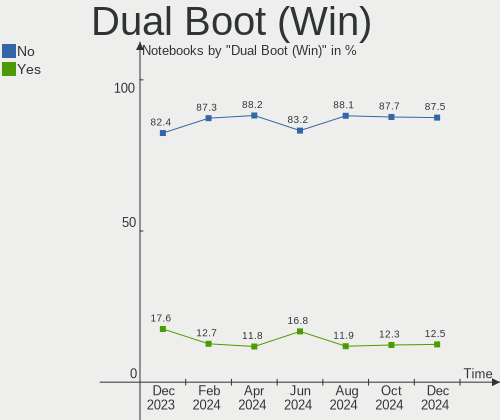
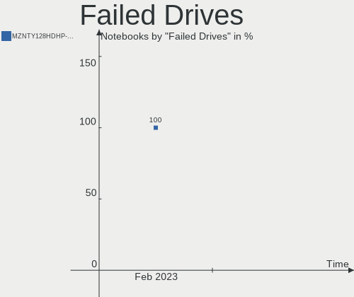
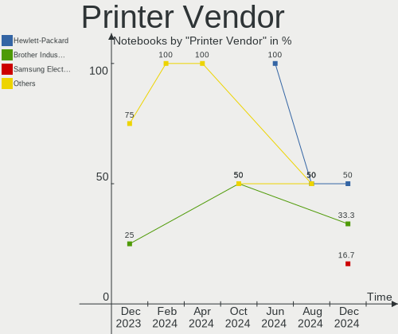
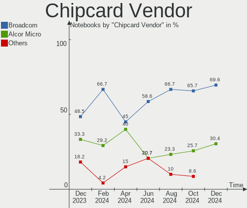

Fedora - Hardware Trends (Notebooks)
------------------------------------

A project to identify most popular hardware characteristics and track their change
over time based on data collected by Linux users at https://Linux-Hardware.org.

Anyone can contribute to this report by the [hw-probe](https://github.com/linuxhw/hw-probe) tool:

    sudo -E hw-probe -all -upload

This report is for one last month. Overall report since the beginning of time: [TestCoverage](https://github.com/linuxhw/TestCoverage)

Period: Sep, 2022.

Contents
--------

* [ System ](#system)
  - [ OS                       ](#os)
  - [ OS Family                ](#os-family)
  - [ Kernel                   ](#kernel)
  - [ Kernel Family            ](#kernel-family)
  - [ Kernel Major Ver.        ](#kernel-major-ver)
  - [ Arch                     ](#arch)
  - [ DE                       ](#de)
  - [ Display Server           ](#display-server)
  - [ Display Manager          ](#display-manager)
  - [ OS Lang                  ](#os-lang)
  - [ Boot Mode                ](#boot-mode)
  - [ Filesystem               ](#filesystem)
  - [ Part. scheme             ](#part-scheme)
  - [ Dual Boot with Linux/BSD ](#dual-boot-with-linuxbsd)
  - [ Dual Boot (Win)          ](#dual-boot-win)

* [ Board ](#board)
  - [ Vendor                   ](#vendor)
  - [ Model                    ](#model)
  - [ Model Family             ](#model-family)
  - [ MFG Year                 ](#mfg-year)
  - [ Form Factor              ](#form-factor)
  - [ Secure Boot              ](#secure-boot)
  - [ Coreboot                 ](#coreboot)
  - [ RAM Size                 ](#ram-size)
  - [ RAM Used                 ](#ram-used)
  - [ Total Drives             ](#total-drives)
  - [ Has CD-ROM               ](#has-cd-rom)
  - [ Has Ethernet             ](#has-ethernet)
  - [ Has WiFi                 ](#has-wifi)
  - [ Has Bluetooth            ](#has-bluetooth)

* [ Location ](#location)
  - [ Country                  ](#country)
  - [ City                     ](#city)

* [ Drives ](#drives)
  - [ Drive Vendor             ](#drive-vendor)
  - [ Drive Model              ](#drive-model)
  - [ HDD Vendor               ](#hdd-vendor)
  - [ SSD Vendor               ](#ssd-vendor)
  - [ Drive Kind               ](#drive-kind)
  - [ Drive Connector          ](#drive-connector)
  - [ Drive Size               ](#drive-size)
  - [ Space Total              ](#space-total)
  - [ Space Used               ](#space-used)
  - [ Malfunc. Drives          ](#malfunc-drives)
  - [ Malfunc. Drive Vendor    ](#malfunc-drive-vendor)
  - [ Malfunc. HDD Vendor      ](#malfunc-hdd-vendor)
  - [ Malfunc. Drive Kind      ](#malfunc-drive-kind)
  - [ Failed Drives            ](#failed-drives)
  - [ Failed Drive Vendor      ](#failed-drive-vendor)
  - [ Drive Status             ](#drive-status)

* [ Storage controller ](#storage-controller)
  - [ Storage Vendor           ](#storage-vendor)
  - [ Storage Model            ](#storage-model)
  - [ Storage Kind             ](#storage-kind)

* [ Processor ](#processor)
  - [ CPU Vendor               ](#cpu-vendor)
  - [ CPU Model                ](#cpu-model)
  - [ CPU Model Family         ](#cpu-model-family)
  - [ CPU Cores                ](#cpu-cores)
  - [ CPU Sockets              ](#cpu-sockets)
  - [ CPU Threads              ](#cpu-threads)
  - [ CPU Op-Modes             ](#cpu-op-modes)
  - [ CPU Microcode            ](#cpu-microcode)
  - [ CPU Microarch            ](#cpu-microarch)

* [ Graphics ](#graphics)
  - [ GPU Vendor               ](#gpu-vendor)
  - [ GPU Model                ](#gpu-model)
  - [ GPU Combo                ](#gpu-combo)
  - [ GPU Driver               ](#gpu-driver)
  - [ GPU Memory               ](#gpu-memory)

* [ Monitor ](#monitor)
  - [ Monitor Vendor           ](#monitor-vendor)
  - [ Monitor Model            ](#monitor-model)
  - [ Monitor Resolution       ](#monitor-resolution)
  - [ Monitor Diagonal         ](#monitor-diagonal)
  - [ Monitor Width            ](#monitor-width)
  - [ Aspect Ratio             ](#aspect-ratio)
  - [ Monitor Area             ](#monitor-area)
  - [ Pixel Density            ](#pixel-density)
  - [ Multiple Monitors        ](#multiple-monitors)

* [ Network ](#network)
  - [ Net Controller Vendor    ](#net-controller-vendor)
  - [ Net Controller Model     ](#net-controller-model)
  - [ Wireless Vendor          ](#wireless-vendor)
  - [ Wireless Model           ](#wireless-model)
  - [ Ethernet Vendor          ](#ethernet-vendor)
  - [ Ethernet Model           ](#ethernet-model)
  - [ Net Controller Kind      ](#net-controller-kind)
  - [ Used Controller          ](#used-controller)
  - [ NICs                     ](#nics)
  - [ IPv6                     ](#ipv6)

* [ Bluetooth ](#bluetooth)
  - [ Bluetooth Vendor         ](#bluetooth-vendor)
  - [ Bluetooth Model          ](#bluetooth-model)

* [ Sound ](#sound)
  - [ Sound Vendor             ](#sound-vendor)
  - [ Sound Model              ](#sound-model)

* [ Memory ](#memory)
  - [ Memory Vendor            ](#memory-vendor)
  - [ Memory Model             ](#memory-model)
  - [ Memory Kind              ](#memory-kind)
  - [ Memory Form Factor       ](#memory-form-factor)
  - [ Memory Size              ](#memory-size)
  - [ Memory Speed             ](#memory-speed)

* [ Printers & scanners ](#printers--scanners)
  - [ Printer Vendor           ](#printer-vendor)
  - [ Printer Model            ](#printer-model)
  - [ Scanner Vendor           ](#scanner-vendor)
  - [ Scanner Model            ](#scanner-model)

* [ Camera ](#camera)
  - [ Camera Vendor            ](#camera-vendor)
  - [ Camera Model             ](#camera-model)

* [ Security ](#security)
  - [ Fingerprint Vendor       ](#fingerprint-vendor)
  - [ Fingerprint Model        ](#fingerprint-model)
  - [ Chipcard Vendor          ](#chipcard-vendor)
  - [ Chipcard Model           ](#chipcard-model)

* [ Unsupported ](#unsupported)
  - [ Unsupported Devices      ](#unsupported-devices)
  - [ Unsupported Device Types ](#unsupported-device-types)

System
------

OS
--

Installed operating systems

| Name      | Notebooks | Percent |
|-----------|-----------|---------|
| Fedora 36 | 218       | 82.89%  |
| Fedora 37 | 34        | 12.93%  |
| Fedora 35 | 8         | 3.04%   |
| Fedora 31 | 2         | 0.76%   |
| Fedora 38 | 1         | 0.38%   |

OS Family
---------

OS without a version

| Name   | Notebooks | Percent |
|--------|-----------|---------|
| Fedora | 263       | 100%    |

Kernel
------

Version of the Linux kernel

| Version                                                      | Notebooks | Percent |
|--------------------------------------------------------------|-----------|---------|
| 5.19.9-200.fc36.x86_64                                       | 41        | 15.59%  |
| 5.19.8-200.fc36.x86_64                                       | 36        | 13.69%  |
| 5.19.6-200.fc36.x86_64                                       | 36        | 13.69%  |
| 5.19.11-200.fc36.x86_64                                      | 26        | 9.89%   |
| 5.19.4-200.fc36.x86_64                                       | 22        | 8.37%   |
| 5.17.5-300.fc36.x86_64                                       | 19        | 7.22%   |
| 5.19.10-200.fc36.x86_64                                      | 11        | 4.18%   |
| 5.19.8-300.fc37.x86_64                                       | 10        | 3.8%    |
| 5.19.7-200.fc36.x86_64                                       | 7         | 2.66%   |
| 5.19.11-300.fc37.x86_64                                      | 6         | 2.28%   |
| 5.19.10-300.fc37.x86_64                                      | 6         | 2.28%   |
| 5.18.19-200.fc36.x86_64                                      | 6         | 2.28%   |
| 5.19.9-300.fc37.x86_64                                       | 5         | 1.9%    |
| 5.19.7-300.fc37.x86_64                                       | 4         | 1.52%   |
| 5.18.17-200.fc36.x86_64                                      | 3         | 1.14%   |
| 5.5.9-200.fc31.x86_64                                        | 2         | 0.76%   |
| 5.19.8-100.fc35.x86_64                                       | 2         | 0.76%   |
| 5.19.10-100.fc35.x86_64                                      | 2         | 0.76%   |
| 5.18.18-200.fc36.x86_64                                      | 2         | 0.76%   |
| 6.0.0-0.rc7.20220929gitc3e0e1e23c70.50.vanilla.1.fc36.x86_64 | 1         | 0.38%   |
| 6.0.0-0.rc6.41.fc38.x86_64                                   | 1         | 0.38%   |
| 6.0.0-0.rc5.20220914git3245cb65fd91.39.vanilla.1.fc36.x86_64 | 1         | 0.38%   |
| 6.0.0-0.rc5.20220914git3245cb65fd91.39.fc38.x86_64           | 1         | 0.38%   |
| 6.0.0-0.rc5.20220913gite839a756012b.38.vanilla.1.fc36.x86_64 | 1         | 0.38%   |
| 5.19.9-201.fsync.fc36.x86_64                                 | 1         | 0.38%   |
| 5.19.9-100.fc35.x86_64                                       | 1         | 0.38%   |
| 5.19.6-xm1.0.fc36.x86_64                                     | 1         | 0.38%   |
| 5.19.4-100.fc35.x86_64                                       | 1         | 0.38%   |
| 5.19.12-300.fc37.x86_64                                      | 1         | 0.38%   |
| 5.19.10-602.inttf.fc37.x86_64                                | 1         | 0.38%   |
| 5.19.1-xm1.0.fc36.x86_64                                     | 1         | 0.38%   |
| 5.18.6-200.mbp.fc34.x86_64                                   | 1         | 0.38%   |
| 5.18.18-100.fc35.x86_64                                      | 1         | 0.38%   |
| 5.18.13-200.mbp.fc34.x86_64                                  | 1         | 0.38%   |
| 5.17.8-300.fc36.x86_64                                       | 1         | 0.38%   |
| 5.17.11-200.fc35.x86_64                                      | 1         | 0.38%   |

Kernel Family
-------------

Linux kernel without a distro release

| Version | Notebooks | Percent |
|---------|-----------|---------|
| 5.19.9  | 48        | 18.25%  |
| 5.19.8  | 48        | 18.25%  |
| 5.19.6  | 37        | 14.07%  |
| 5.19.11 | 32        | 12.17%  |
| 5.19.4  | 23        | 8.75%   |
| 5.19.10 | 20        | 7.6%    |
| 5.17.5  | 19        | 7.22%   |
| 5.19.7  | 11        | 4.18%   |
| 5.18.19 | 6         | 2.28%   |
| 6.0.0   | 5         | 1.9%    |
| 5.18.18 | 3         | 1.14%   |
| 5.18.17 | 3         | 1.14%   |
| 5.5.9   | 2         | 0.76%   |
| 5.19.12 | 1         | 0.38%   |
| 5.19.1  | 1         | 0.38%   |
| 5.18.6  | 1         | 0.38%   |
| 5.18.13 | 1         | 0.38%   |
| 5.17.8  | 1         | 0.38%   |
| 5.17.11 | 1         | 0.38%   |

Kernel Major Ver.
-----------------

Linux kernel major version

| Version | Notebooks | Percent |
|---------|-----------|---------|
| 5.19    | 221       | 84.03%  |
| 5.17    | 21        | 7.98%   |
| 5.18    | 14        | 5.32%   |
| 6.0     | 5         | 1.9%    |
| 5.5     | 2         | 0.76%   |

Arch
----

OS architecture (x86_64, i586, etc.)

| Name   | Notebooks | Percent |
|--------|-----------|---------|
| x86_64 | 263       | 100%    |

DE
--

Desktop Environment

| Name          | Notebooks | Percent |
|---------------|-----------|---------|
| GNOME         | 193       | 73.38%  |
| KDE5          | 41        | 15.59%  |
| Unknown       | 9         | 3.42%   |
| XFCE          | 7         | 2.66%   |
| X-Cinnamon    | 4         | 1.52%   |
| i3            | 2         | 0.76%   |
| Cinnamon      | 2         | 0.76%   |
| sway          | 1         | 0.38%   |
| MATE          | 1         | 0.38%   |
| KDE:old       | 1         | 0.38%   |
| GNOME Classic | 1         | 0.38%   |
| fluxbox       | 1         | 0.38%   |

Display Server
--------------

X11 or Wayland

| Name    | Notebooks | Percent |
|---------|-----------|---------|
| Wayland | 187       | 71.1%   |
| X11     | 66        | 25.1%   |
| Unknown | 6         | 2.28%   |
| Tty     | 4         | 1.52%   |

Display Manager
---------------

SDDM, LightDM, etc.

| Name    | Notebooks | Percent |
|---------|-----------|---------|
| Unknown | 131       | 49.81%  |
| GDM     | 94        | 35.74%  |
| LightDM | 19        | 7.22%   |
| SDDM    | 18        | 6.84%   |
| KDM     | 1         | 0.38%   |

OS Lang
-------

Language

| Lang    | Notebooks | Percent |
|---------|-----------|---------|
| en_US   | 140       | 53.23%  |
| en_GB   | 24        | 9.13%   |
| it_IT   | 18        | 6.84%   |
| ru_RU   | 15        | 5.7%    |
| de_DE   | 10        | 3.8%    |
| pt_BR   | 7         | 2.66%   |
| fr_FR   | 7         | 2.66%   |
| en_CA   | 7         | 2.66%   |
| es_ES   | 6         | 2.28%   |
| en_AU   | 4         | 1.52%   |
| tr_TR   | 3         | 1.14%   |
| en_IN   | 3         | 1.14%   |
| Unknown | 3         | 1.14%   |
| es_MX   | 2         | 0.76%   |
| es_GT   | 2         | 0.76%   |
| es_CL   | 2         | 0.76%   |
| en_DK   | 2         | 0.76%   |
| pt_PT   | 1         | 0.38%   |
| nl_BE   | 1         | 0.38%   |
| hu_HU   | 1         | 0.38%   |
| en_ZA   | 1         | 0.38%   |
| en_NZ   | 1         | 0.38%   |
| el_GR   | 1         | 0.38%   |
| da_DK   | 1         | 0.38%   |
| be_BY   | 1         | 0.38%   |

Boot Mode
---------

EFI or BIOS

| Mode | Notebooks | Percent |
|------|-----------|---------|
| EFI  | 224       | 85.17%  |
| BIOS | 39        | 14.83%  |

Filesystem
----------

Type of filesystem

| Type    | Notebooks | Percent |
|---------|-----------|---------|
| Btrfs   | 214       | 81.37%  |
| Ext4    | 43        | 16.35%  |
| Xfs     | 5         | 1.9%    |
| Overlay | 1         | 0.38%   |

Part. scheme
------------

Scheme of partitioning

| Type    | Notebooks | Percent |
|---------|-----------|---------|
| Unknown | 129       | 49.05%  |
| GPT     | 121       | 46.01%  |
| MBR     | 13        | 4.94%   |

Dual Boot with Linux/BSD
------------------------

Hosting more than one Linux/BSD

| Dual boot | Notebooks | Percent |
|-----------|-----------|---------|
| No        | 235       | 89.35%  |
| Yes       | 28        | 10.65%  |

Dual Boot (Win)
---------------

Hosting Linux and Windows

| Dual boot | Notebooks | Percent |
|-----------|-----------|---------|
| No        | 218       | 82.89%  |
| Yes       | 45        | 17.11%  |

Board
-----

Vendor
------

Motherboard manufacturer

| Name                   | Notebooks | Percent |
|------------------------|-----------|---------|
| Lenovo                 | 80        | 30.42%  |
| Dell                   | 46        | 17.49%  |
| Hewlett-Packard        | 37        | 14.07%  |
| ASUSTek Computer       | 32        | 12.17%  |
| HUAWEI                 | 9         | 3.42%   |
| MSI                    | 8         | 3.04%   |
| Apple                  | 8         | 3.04%   |
| Acer                   | 8         | 3.04%   |
| TUXEDO                 | 3         | 1.14%   |
| Toshiba                | 3         | 1.14%   |
| Timi                   | 3         | 1.14%   |
| Notebook               | 3         | 1.14%   |
| Chuwi                  | 3         | 1.14%   |
| Razer                  | 2         | 0.76%   |
| Framework              | 2         | 0.76%   |
| VALE                   | 1         | 0.38%   |
| System76               | 1         | 0.38%   |
| SK hynix               | 1         | 0.38%   |
| Samsung Electronics    | 1         | 0.38%   |
| Medion                 | 1         | 0.38%   |
| Lanix                  | 1         | 0.38%   |
| Irbis                  | 1         | 0.38%   |
| HONOR                  | 1         | 0.38%   |
| GPD                    | 1         | 0.38%   |
| Fujitsu                | 1         | 0.38%   |
| AZW                    | 1         | 0.38%   |
| Avell High Performance | 1         | 0.38%   |
| Alienware              | 1         | 0.38%   |
| Acidanthera            | 1         | 0.38%   |
| A-DATA Technology      | 1         | 0.38%   |
| Unknown                | 1         | 0.38%   |

Model
-----

Motherboard model

| Name                                        | Notebooks | Percent |
|---------------------------------------------|-----------|---------|
| Dell XPS 15 9570                            | 3         | 1.14%   |
| Lenovo ThinkPad X1 Carbon Gen 9 20XWCTO1WW  | 2         | 0.76%   |
| Lenovo ThinkPad X1 Carbon Gen 10 21CBCTO1WW | 2         | 0.76%   |
| Lenovo ThinkBook 15 G2 ITL 20VE             | 2         | 0.76%   |
| Lenovo ThinkBook 13s G4 ARB 21AS            | 2         | 0.76%   |
| HUAWEI NBLK-WAX9X                           | 2         | 0.76%   |
| HUAWEI HVY-WXX9                             | 2         | 0.76%   |
| HP ProBook 4540s                            | 2         | 0.76%   |
| HP Pavilion Aero Laptop 13-be0xxx           | 2         | 0.76%   |
| HP EliteBook 8470p                          | 2         | 0.76%   |
| HP EliteBook 840 G3                         | 2         | 0.76%   |
| Dell Latitude 5511                          | 2         | 0.76%   |
| Dell Latitude 5420                          | 2         | 0.76%   |
| Dell Inspiron 5566                          | 2         | 0.76%   |
| Chuwi HeroBook Air                          | 2         | 0.76%   |
| ASUS UX310UQK                               | 2         | 0.76%   |
| ASUS ROG Strix G513QY_G513QY                | 2         | 0.76%   |
| Apple MacBookPro9,2                         | 2         | 0.76%   |
| Apple MacBookPro16,1                        | 2         | 0.76%   |
| Apple MacBookPro12,1                        | 2         | 0.76%   |
| Unknown                                     | 2         | 0.76%   |
| VALE Notebook Classic C140                  | 1         | 0.38%   |
| TUXEDO Pulse 15 Gen1                        | 1         | 0.38%   |
| TUXEDO InfinityBook S 15/17 Gen7            | 1         | 0.38%   |
| TUXEDO InfinityBook Pro 14 v4               | 1         | 0.38%   |
| Toshiba Satellite L40t-A                    | 1         | 0.38%   |
| Toshiba Satellite C850-C5K                  | 1         | 0.38%   |
| Toshiba Satellite C660                      | 1         | 0.38%   |
| Timi Xiaomi Book Pro 16 2022                | 1         | 0.38%   |
| Timi Redmi Book Pro 15 2022                 | 1         | 0.38%   |
| Timi A35S                                   | 1         | 0.38%   |
| System76 Lemur Pro                          | 1         | 0.38%   |
| SK hynix HyBook                             | 1         | 0.38%   |
| Samsung 550P5C/550P7C                       | 1         | 0.38%   |
| Razer Blade 14 - RZ09-0370                  | 1         | 0.38%   |
| Razer Blade                                 | 1         | 0.38%   |
| Notebook W230SS                             | 1         | 0.38%   |
| Notebook NJ5x_NJ7xLU                        | 1         | 0.38%   |
| Notebook NH55RGQ                            | 1         | 0.38%   |
| MSI Prestige 15 A10SC                       | 1         | 0.38%   |

Model Family
------------

Motherboard model prefix

| Name                | Notebooks | Percent |
|---------------------|-----------|---------|
| Lenovo ThinkPad     | 45        | 17.11%  |
| Lenovo IdeaPad      | 17        | 6.46%   |
| Dell Latitude       | 14        | 5.32%   |
| Dell Inspiron       | 14        | 5.32%   |
| ASUS ROG            | 12        | 4.56%   |
| Lenovo ThinkBook    | 10        | 3.8%    |
| Dell XPS            | 10        | 3.8%    |
| HP ProBook          | 9         | 3.42%   |
| HP EliteBook        | 8         | 3.04%   |
| HP Pavilion         | 7         | 2.66%   |
| ASUS VivoBook       | 6         | 2.28%   |
| HP Laptop           | 4         | 1.52%   |
| Dell Precision      | 4         | 1.52%   |
| Toshiba Satellite   | 3         | 1.14%   |
| Dell Vostro         | 3         | 1.14%   |
| ASUS ZenBook        | 3         | 1.14%   |
| ASUS ASUS           | 3         | 1.14%   |
| Acer Nitro          | 3         | 1.14%   |
| Acer Aspire         | 3         | 1.14%   |
| TUXEDO InfinityBook | 2         | 0.76%   |
| Razer Blade         | 2         | 0.76%   |
| MSI Modern          | 2         | 0.76%   |
| Lenovo Yoga         | 2         | 0.76%   |
| Lenovo Legion       | 2         | 0.76%   |
| HUAWEI NBLK-WAX9X   | 2         | 0.76%   |
| HUAWEI HVY-WXX9     | 2         | 0.76%   |
| HP OMEN             | 2         | 0.76%   |
| HP ENVY             | 2         | 0.76%   |
| Framework Laptop    | 2         | 0.76%   |
| Chuwi HeroBook      | 2         | 0.76%   |
| ASUS UX310UQK       | 2         | 0.76%   |
| Apple MacBookPro9   | 2         | 0.76%   |
| Apple MacBookPro16  | 2         | 0.76%   |
| Apple MacBookPro12  | 2         | 0.76%   |
| Unknown             | 2         | 0.76%   |
| VALE Notebook       | 1         | 0.38%   |
| TUXEDO Pulse        | 1         | 0.38%   |
| Timi Xiaomi         | 1         | 0.38%   |
| Timi Redmi          | 1         | 0.38%   |
| Timi A35S           | 1         | 0.38%   |

MFG Year
--------

Motherboard manufacture year

| Year | Notebooks | Percent |
|------|-----------|---------|
| 2021 | 58        | 22.05%  |
| 2020 | 38        | 14.45%  |
| 2022 | 32        | 12.17%  |
| 2019 | 25        | 9.51%   |
| 2018 | 20        | 7.6%    |
| 2016 | 14        | 5.32%   |
| 2013 | 12        | 4.56%   |
| 2017 | 11        | 4.18%   |
| 2015 | 11        | 4.18%   |
| 2014 | 11        | 4.18%   |
| 2012 | 10        | 3.8%    |
| 2011 | 9         | 3.42%   |
| 2010 | 5         | 1.9%    |
| 2008 | 4         | 1.52%   |
| 2009 | 3         | 1.14%   |

Form Factor
-----------

Physical design of the computer

| Name     | Notebooks | Percent |
|----------|-----------|---------|
| Notebook | 263       | 100%    |

Secure Boot
-----------

Enabled or disabled

| State    | Notebooks | Percent |
|----------|-----------|---------|
| Disabled | 215       | 81.75%  |
| Enabled  | 48        | 18.25%  |

Coreboot
--------

Have coreboot on board

| Used | Notebooks | Percent |
|------|-----------|---------|
| No   | 261       | 99.24%  |
| Yes  | 2         | 0.76%   |

RAM Size
--------

Total RAM memory

| Size in GB  | Notebooks | Percent |
|-------------|-----------|---------|
| 4.01-8.0    | 65        | 24.71%  |
| 16.01-24.0  | 58        | 22.05%  |
| 8.01-16.0   | 58        | 22.05%  |
| 32.01-64.0  | 40        | 15.21%  |
| 3.01-4.0    | 30        | 11.41%  |
| 64.01-256.0 | 5         | 1.9%    |
| 24.01-32.0  | 4         | 1.52%   |
| 1.01-2.0    | 3         | 1.14%   |

RAM Used
--------

Used RAM memory

| Used GB    | Notebooks | Percent |
|------------|-----------|---------|
| 4.01-8.0   | 81        | 30.8%   |
| 3.01-4.0   | 64        | 24.33%  |
| 2.01-3.0   | 62        | 23.57%  |
| 1.01-2.0   | 29        | 11.03%  |
| 8.01-16.0  | 26        | 9.89%   |
| 16.01-24.0 | 1         | 0.38%   |

Total Drives
------------

Number of drives on board

| Drives | Notebooks | Percent |
|--------|-----------|---------|
| 1      | 199       | 75.67%  |
| 2      | 57        | 21.67%  |
| 3      | 6         | 2.28%   |
| 5      | 1         | 0.38%   |

Has CD-ROM
----------

Has CD-ROM on board

| Presented | Notebooks | Percent |
|-----------|-----------|---------|
| No        | 214       | 81.37%  |
| Yes       | 49        | 18.63%  |

Has Ethernet
------------

Has Ethernet on board

| Presented | Notebooks | Percent |
|-----------|-----------|---------|
| Yes       | 178       | 67.68%  |
| No        | 85        | 32.32%  |

Has WiFi
--------

Has WiFi module

| Presented | Notebooks | Percent |
|-----------|-----------|---------|
| Yes       | 257       | 97.72%  |
| No        | 6         | 2.28%   |

Has Bluetooth
-------------

Has Bluetooth module

| Presented | Notebooks | Percent |
|-----------|-----------|---------|
| Yes       | 227       | 86.31%  |
| No        | 36        | 13.69%  |

Location
--------

Country
-------

Geographic location (country)

| Country             | Notebooks | Percent |
|---------------------|-----------|---------|
| USA                 | 41        | 15.59%  |
| Italy               | 31        | 11.79%  |
| Germany             | 24        | 9.13%   |
| Russia              | 22        | 8.37%   |
| Canada              | 11        | 4.18%   |
| UK                  | 10        | 3.8%    |
| Brazil              | 10        | 3.8%    |
| Spain               | 9         | 3.42%   |
| India               | 9         | 3.42%   |
| Mexico              | 7         | 2.66%   |
| France              | 7         | 2.66%   |
| Turkey              | 6         | 2.28%   |
| Poland              | 5         | 1.9%    |
| Netherlands         | 5         | 1.9%    |
| Czechia             | 5         | 1.9%    |
| Australia           | 5         | 1.9%    |
| Norway              | 4         | 1.52%   |
| Hungary             | 4         | 1.52%   |
| Austria             | 4         | 1.52%   |
| Japan               | 3         | 1.14%   |
| Denmark             | 3         | 1.14%   |
| Romania             | 2         | 0.76%   |
| Portugal            | 2         | 0.76%   |
| Indonesia           | 2         | 0.76%   |
| Guatemala           | 2         | 0.76%   |
| Greece              | 2         | 0.76%   |
| Chile               | 2         | 0.76%   |
| Belarus             | 2         | 0.76%   |
| Argentina           | 2         | 0.76%   |
| Ukraine             | 1         | 0.38%   |
| Uganda              | 1         | 0.38%   |
| UAE                 | 1         | 0.38%   |
| Trinidad and Tobago | 1         | 0.38%   |
| Thailand            | 1         | 0.38%   |
| Sri Lanka           | 1         | 0.38%   |
| South Africa        | 1         | 0.38%   |
| Pakistan            | 1         | 0.38%   |
| New Zealand         | 1         | 0.38%   |
| Montenegro          | 1         | 0.38%   |
| Kenya               | 1         | 0.38%   |

City
----

Geographic location (city)

| City                  | Notebooks | Percent |
|-----------------------|-----------|---------|
| Moscow                | 10        | 3.8%    |
| St Petersburg         | 5         | 1.9%    |
| Verona                | 4         | 1.52%   |
| Bologna               | 4         | 1.52%   |
| Sao Paulo             | 3         | 1.14%   |
| Richmond              | 3         | 1.14%   |
| Prague                | 3         | 1.14%   |
| Brisbane              | 3         | 1.14%   |
| Berlin                | 3         | 1.14%   |
| Amsterdam             | 3         | 1.14%   |
| Unknown               | 3         | 1.14%   |
| Warsaw                | 2         | 0.76%   |
| Santiago              | 2         | 0.76%   |
| Samara                | 2         | 0.76%   |
| Rome                  | 2         | 0.76%   |
| Paris                 | 2         | 0.76%   |
| Oslo                  | 2         | 0.76%   |
| New York              | 2         | 0.76%   |
| New Baltimore         | 2         | 0.76%   |
| Mumbai                | 2         | 0.76%   |
| Milan                 | 2         | 0.76%   |
| Mexico City           | 2         | 0.76%   |
| Lisbon                | 2         | 0.76%   |
| Kolkata               | 2         | 0.76%   |
| Guatemala City        | 2         | 0.76%   |
| Fürth                | 2         | 0.76%   |
| Barcelona             | 2         | 0.76%   |
| Bad Koenig            | 2         | 0.76%   |
| Ashford               | 2         | 0.76%   |
| Zuera                 | 1         | 0.38%   |
| Yorktown Heights      | 1         | 0.38%   |
| Yalova                | 1         | 0.38%   |
| Wytheville            | 1         | 0.38%   |
| Wiesbaden             | 1         | 0.38%   |
| West Cowes            | 1         | 0.38%   |
| West Chicago          | 1         | 0.38%   |
| Wellington            | 1         | 0.38%   |
| Walthamstow           | 1         | 0.38%   |
| Vitória da Conquista | 1         | 0.38%   |
| Vienna                | 1         | 0.38%   |

Drives
------

Drive Vendor
------------

Hard drive vendors

| Vendor                      | Notebooks | Drives | Percent |
|-----------------------------|-----------|--------|---------|
| Samsung Electronics         | 79        | 85     | 24.31%  |
| Sandisk                     | 23        | 25     | 7.08%   |
| WDC                         | 22        | 23     | 6.77%   |
| SK hynix                    | 21        | 21     | 6.46%   |
| Intel                       | 17        | 17     | 5.23%   |
| Micron Technology           | 16        | 16     | 4.92%   |
| Toshiba                     | 15        | 15     | 4.62%   |
| Seagate                     | 15        | 16     | 4.62%   |
| Unknown                     | 14        | 15     | 4.31%   |
| Crucial                     | 14        | 16     | 4.31%   |
| Kingston                    | 13        | 14     | 4%      |
| KIOXIA                      | 8         | 10     | 2.46%   |
| HGST                        | 4         | 4      | 1.23%   |
| China                       | 4         | 4      | 1.23%   |
| A-DATA Technology           | 4         | 5      | 1.23%   |
| Transcend                   | 3         | 3      | 0.92%   |
| Silicon Motion              | 3         | 3      | 0.92%   |
| Apple                       | 3         | 3      | 0.92%   |
| ADATA Technology            | 3         | 3      | 0.92%   |
| Unknown                     | 3         | 3      | 0.92%   |
| XPG                         | 2         | 2      | 0.62%   |
| Union Memory (Shenzhen)     | 2         | 2      | 0.62%   |
| Team                        | 2         | 2      | 0.62%   |
| SPCC                        | 2         | 2      | 0.62%   |
| PNY                         | 2         | 2      | 0.62%   |
| Phison Electronics          | 2         | 2      | 0.62%   |
| Phison                      | 2         | 2      | 0.62%   |
| Micron/Crucial Technology   | 2         | 2      | 0.62%   |
| Kingston Technology Company | 2         | 2      | 0.62%   |
| YMTC                        | 1         | 1      | 0.31%   |
| XrayDisk                    | 1         | 1      | 0.31%   |
| WALRAM                      | 1         | 1      | 0.31%   |
| UMIS                        | 1         | 1      | 0.31%   |
| SSSTC                       | 1         | 1      | 0.31%   |
| Solid State Storage         | 1         | 1      | 0.31%   |
| Realtek Semiconductor       | 1         | 1      | 0.31%   |
| Patriot                     | 1         | 1      | 0.31%   |
| Netac                       | 1         | 1      | 0.31%   |
| LITEONIT                    | 1         | 1      | 0.31%   |
| LITEON                      | 1         | 1      | 0.31%   |

Drive Model
-----------

Hard drive models

| Model                                                 | Notebooks | Percent |
|-------------------------------------------------------|-----------|---------|
| Samsung NVMe SSD Controller SM981/PM981/PM983 256GB   | 10        | 2.96%   |
| Samsung SSD 860 EVO 1TB                               | 6         | 1.78%   |
| Seagate ST1000LM035-1RK172 1TB                        | 4         | 1.18%   |
| Kingston SA400S37240G 240GB SSD                       | 4         | 1.18%   |
| Unknown MMC Card  64GB                                | 3         | 0.89%   |
| SK hynix NVMe SSD Drive 512GB                         | 3         | 0.89%   |
| Sandisk WD Blue SN570 1TB                             | 3         | 0.89%   |
| SanDisk NVMe SSD Drive 512GB                          | 3         | 0.89%   |
| SanDisk NVMe SSD Drive 1TB                            | 3         | 0.89%   |
| Samsung SSD 980 PRO 1TB                               | 3         | 0.89%   |
| Samsung NVMe SSD Controller PM9A1/PM9A3/980PRO 1024GB | 3         | 0.89%   |
| Samsung MZVLQ512HBLU-00BH1 512GB                      | 3         | 0.89%   |
| Samsung MZVL21T0HCLR-00BL7 1TB                        | 3         | 0.89%   |
| Samsung MZALQ512HBLU-00BL2 512GB                      | 3         | 0.89%   |
| Samsung MZALQ512HALU-000L2 512GB                      | 3         | 0.89%   |
| Micron NVMe SSD Drive 512GB                           | 3         | 0.89%   |
| HGST HTS721010A9E630 1TB                              | 3         | 0.89%   |
| Unknown                                               | 3         | 0.89%   |
| Unknown MMC Card  32GB                                | 2         | 0.59%   |
| Unknown MMC Card  128GB                               | 2         | 0.59%   |
| Toshiba XG6 NVMe SSD Controller 512GB                 | 2         | 0.59%   |
| Toshiba NVMe SSD Drive 256GB                          | 2         | 0.59%   |
| Toshiba MQ04ABF100 1TB                                | 2         | 0.59%   |
| SK hynix HFM001TD3JX013N 1024GB                       | 2         | 0.59%   |
| Seagate ST500LT012-1DG142 500GB                       | 2         | 0.59%   |
| Seagate ST1000LM048-2E7172 1TB                        | 2         | 0.59%   |
| SanDisk SSD PLUS 240GB                                | 2         | 0.59%   |
| Samsung SSD 970 EVO Plus 500GB                        | 2         | 0.59%   |
| Samsung SSD 970 EVO Plus 2TB                          | 2         | 0.59%   |
| Samsung SSD 860 EVO 250GB                             | 2         | 0.59%   |
| Samsung NVMe SSD Drive 256GB                          | 2         | 0.59%   |
| Samsung NVMe SSD Drive 1TB                            | 2         | 0.59%   |
| Samsung MZVLQ1T0HBLB-00B00 1TB                        | 2         | 0.59%   |
| Samsung MZVLB512HBJQ-000L7 512GB                      | 2         | 0.59%   |
| Samsung MZVLB1T0HBLR-000L7 1TB                        | 2         | 0.59%   |
| Micron 3400_MTFDKBA1T0TFH 1TB                         | 2         | 0.59%   |
| KIOXIA NVMe SSD Drive 512GB                           | 2         | 0.59%   |
| KIOXIA KBG50ZNT512G LS 512GB                          | 2         | 0.59%   |
| KIOXIA KBG40ZNV512G 512GB                             | 2         | 0.59%   |
| KIOXIA KBG40ZNS512G NVMe 512GB                        | 2         | 0.59%   |

HDD Vendor
----------

Hard disk drive vendors

| Vendor  | Notebooks | Drives | Percent |
|---------|-----------|--------|---------|
| Seagate | 15        | 16     | 39.47%  |
| WDC     | 10        | 10     | 26.32%  |
| Toshiba | 8         | 8      | 21.05%  |
| HGST    | 4         | 4      | 10.53%  |
| Hitachi | 1         | 1      | 2.63%   |

SSD Vendor
----------

Solid state drive vendors

| Vendor              | Notebooks | Drives | Percent |
|---------------------|-----------|--------|---------|
| Samsung Electronics | 17        | 20     | 19.54%  |
| Crucial             | 12        | 14     | 13.79%  |
| SanDisk             | 9         | 10     | 10.34%  |
| Kingston            | 8         | 8      | 9.2%    |
| Intel               | 8         | 8      | 9.2%    |
| China               | 4         | 4      | 4.6%    |
| Transcend           | 3         | 3      | 3.45%   |
| SK hynix            | 3         | 3      | 3.45%   |
| WDC                 | 2         | 2      | 2.3%    |
| Team                | 2         | 2      | 2.3%    |
| SPCC                | 2         | 2      | 2.3%    |
| PNY                 | 2         | 2      | 2.3%    |
| Micron Technology   | 2         | 2      | 2.3%    |
| A-DATA Technology   | 2         | 2      | 2.3%    |
| XrayDisk            | 1         | 1      | 1.15%   |
| Netac               | 1         | 1      | 1.15%   |
| LITEONIT            | 1         | 1      | 1.15%   |
| KingSpec            | 1         | 1      | 1.15%   |
| Kingmax             | 1         | 1      | 1.15%   |
| KingFast            | 1         | 1      | 1.15%   |
| GOODRAM             | 1         | 1      | 1.15%   |
| GLOWAY              | 1         | 1      | 1.15%   |
| Gigabyte Technology | 1         | 1      | 1.15%   |
| Apple               | 1         | 1      | 1.15%   |
| Apacer              | 1         | 1      | 1.15%   |

Drive Kind
----------

HDD or SSD

| Kind    | Notebooks | Drives | Percent |
|---------|-----------|--------|---------|
| NVMe    | 166       | 188    | 54.97%  |
| SSD     | 78        | 93     | 25.83%  |
| HDD     | 38        | 39     | 12.58%  |
| MMC     | 17        | 19     | 5.63%   |
| Unknown | 3         | 3      | 0.99%   |

Drive Connector
---------------

SATA, SAS, NVMe, etc.

| Type | Notebooks | Drives | Percent |
|------|-----------|--------|---------|
| NVMe | 166       | 187    | 55.7%   |
| SATA | 107       | 127    | 35.91%  |
| MMC  | 17        | 19     | 5.7%    |
| SAS  | 8         | 9      | 2.68%   |

Drive Size
----------

Size of hard drive

| Size in TB | Notebooks | Drives | Percent |
|------------|-----------|--------|---------|
| 0.01-0.5   | 69        | 77     | 56.56%  |
| 0.51-1.0   | 46        | 48     | 37.7%   |
| 1.01-2.0   | 6         | 6      | 4.92%   |
| 3.01-4.0   | 1         | 1      | 0.82%   |

Space Total
-----------

Amount of disk space available on the file system

| Size in GB     | Notebooks | Percent |
|----------------|-----------|---------|
| 251-500        | 57        | 21.67%  |
| 501-1000       | 56        | 21.29%  |
| 101-250        | 38        | 14.45%  |
| 1-20           | 32        | 12.17%  |
| 1001-2000      | 29        | 11.03%  |
| Unknown        | 27        | 10.27%  |
| 51-100         | 10        | 3.8%    |
| More than 3000 | 7         | 2.66%   |
| 2001-3000      | 6         | 2.28%   |
| 21-50          | 1         | 0.38%   |

Space Used
----------

Amount of used disk space

| Used GB   | Notebooks | Percent |
|-----------|-----------|---------|
| 1-20      | 86        | 32.7%   |
| 21-50     | 45        | 17.11%  |
| 101-250   | 35        | 13.31%  |
| Unknown   | 27        | 10.27%  |
| 251-500   | 25        | 9.51%   |
| 51-100    | 24        | 9.13%   |
| 501-1000  | 15        | 5.7%    |
| 1001-2000 | 5         | 1.9%    |
| 2001-3000 | 1         | 0.38%   |

Malfunc. Drives
---------------

Drive models with a malfunction

| Model                                 | Notebooks | Drives | Percent |
|---------------------------------------|-----------|--------|---------|
| WDC WD6400BEVT-22A0RT0 640GB          | 1         | 1      | 9.09%   |
| WDC WD5000LPVX-22V0TT0 500GB          | 1         | 1      | 9.09%   |
| Toshiba MK3275GSX 320GB               | 1         | 1      | 9.09%   |
| Toshiba MK2556GSY 250GB               | 1         | 1      | 9.09%   |
| SK hynix HFS512G39TND-N210A 512GB SSD | 1         | 1      | 9.09%   |
| Seagate ST2000LM003 HN-M201RAD 2TB    | 1         | 1      | 9.09%   |
| Seagate ST1000LM024 HN-M101MBB 1TB    | 1         | 1      | 9.09%   |
| SanDisk SSD PLUS 1000GB               | 1         | 1      | 9.09%   |
| Lenovo LENSE20512GMSP34MEAT2TA 512GB  | 1         | 1      | 9.09%   |
| HGST HTS721010A9E630 1TB              | 1         | 1      | 9.09%   |
| Crucial M4-CT128M4SSD2 128GB          | 1         | 1      | 9.09%   |

Malfunc. Drive Vendor
---------------------

Vendors of faulty drives

| Vendor   | Notebooks | Drives | Percent |
|----------|-----------|--------|---------|
| WDC      | 2         | 2      | 18.18%  |
| Toshiba  | 2         | 2      | 18.18%  |
| Seagate  | 2         | 2      | 18.18%  |
| SK hynix | 1         | 1      | 9.09%   |
| SanDisk  | 1         | 1      | 9.09%   |
| Lenovo   | 1         | 1      | 9.09%   |
| HGST     | 1         | 1      | 9.09%   |
| Crucial  | 1         | 1      | 9.09%   |

Malfunc. HDD Vendor
-------------------

Vendors of faulty HDD drives

| Vendor  | Notebooks | Drives | Percent |
|---------|-----------|--------|---------|
| WDC     | 2         | 2      | 28.57%  |
| Toshiba | 2         | 2      | 28.57%  |
| Seagate | 2         | 2      | 28.57%  |
| HGST    | 1         | 1      | 14.29%  |

Malfunc. Drive Kind
-------------------

Kinds of faulty drives

| Kind | Notebooks | Drives | Percent |
|------|-----------|--------|---------|
| HDD  | 7         | 7      | 63.64%  |
| SSD  | 3         | 3      | 27.27%  |
| NVMe | 1         | 1      | 9.09%   |

Failed Drives
-------------

Failed drive models

| Model                          | Notebooks | Drives | Percent |
|--------------------------------|-----------|--------|---------|
| Seagate ST1000LM035-1RK172 1TB | 1         | 1      | 100%    |

Failed Drive Vendor
-------------------

Failed drive vendors

| Vendor  | Notebooks | Drives | Percent |
|---------|-----------|--------|---------|
| Seagate | 1         | 1      | 100%    |

Drive Status
------------

Number of failed and malfunc. drives

| Status   | Notebooks | Drives | Percent |
|----------|-----------|--------|---------|
| Detected | 140       | 182    | 50.36%  |
| Works    | 126       | 148    | 45.32%  |
| Malfunc  | 11        | 11     | 3.96%   |
| Failed   | 1         | 1      | 0.36%   |

Storage controller
------------------

Storage Vendor
--------------

Storage controller vendors

| Vendor                         | Notebooks | Percent |
|--------------------------------|-----------|---------|
| Intel                          | 149       | 43.44%  |
| Samsung Electronics            | 62        | 18.08%  |
| SanDisk                        | 25        | 7.29%   |
| AMD                            | 24        | 7%      |
| SK hynix                       | 18        | 5.25%   |
| Micron Technology              | 14        | 4.08%   |
| KIOXIA                         | 9         | 2.62%   |
| Kingston Technology Company    | 8         | 2.33%   |
| Toshiba America Info Systems   | 6         | 1.75%   |
| ADATA Technology               | 6         | 1.75%   |
| Phison Electronics             | 5         | 1.46%   |
| Micron/Crucial Technology      | 4         | 1.17%   |
| Silicon Motion                 | 3         | 0.87%   |
| Union Memory (Shenzhen)        | 2         | 0.58%   |
| Solid State Storage Technology | 2         | 0.58%   |
| Apple                          | 2         | 0.58%   |
| Yangtze Memory Technologies    | 1         | 0.29%   |
| Realtek Semiconductor          | 1         | 0.29%   |
| Lite-On Technology             | 1         | 0.29%   |
| Lenovo                         | 1         | 0.29%   |

Storage Model
-------------

Storage controller models

| Model                                                                          | Notebooks | Percent |
|--------------------------------------------------------------------------------|-----------|---------|
| AMD FCH SATA Controller [AHCI mode]                                            | 24        | 6.69%   |
| Samsung NVMe SSD Controller 980                                                | 23        | 6.41%   |
| Samsung NVMe SSD Controller SM981/PM981/PM983                                  | 22        | 6.13%   |
| Intel Volume Management Device NVMe RAID Controller                            | 18        | 5.01%   |
| Intel Sunrise Point-LP SATA Controller [AHCI mode]                             | 16        | 4.46%   |
| Intel 7 Series Chipset Family 6-port SATA Controller [AHCI mode]               | 16        | 4.46%   |
| Samsung NVMe SSD Controller PM9A1/PM9A3/980PRO                                 | 14        | 3.9%    |
| Micron Non-Volatile memory controller                                          | 14        | 3.9%    |
| SK hynix Gold P31 SSD                                                          | 12        | 3.34%   |
| Intel Tiger Lake-LP SATA Controller                                            | 10        | 2.79%   |
| Intel Cannon Lake Mobile PCH SATA AHCI Controller                              | 9         | 2.51%   |
| Intel 8 Series SATA Controller 1 [AHCI mode]                                   | 9         | 2.51%   |
| Intel HM170/QM170 Chipset SATA Controller [AHCI Mode]                          | 8         | 2.23%   |
| Intel 82801 Mobile SATA Controller [RAID mode]                                 | 7         | 1.95%   |
| Intel 8 Series/C220 Series Chipset Family 6-port SATA Controller 1 [AHCI mode] | 7         | 1.95%   |
| SanDisk Non-Volatile memory controller                                         | 6         | 1.67%   |
| KIOXIA NVMe SSD Controller BG4                                                 | 6         | 1.67%   |
| Kingston Company Company Non-Volatile memory controller                        | 6         | 1.67%   |
| Intel Comet Lake SATA AHCI Controller                                          | 6         | 1.67%   |
| Intel Celeron/Pentium Silver Processor SATA Controller                         | 6         | 1.67%   |
| Intel 6 Series/C200 Series Chipset Family 6 port Mobile SATA AHCI Controller   | 6         | 1.67%   |
| Toshiba America Info Systems XG6 NVMe SSD Controller                           | 5         | 1.39%   |
| SK hynix Non-Volatile memory controller                                        | 5         | 1.39%   |
| SanDisk WD Black SN750 / PC SN730 NVMe SSD                                     | 5         | 1.39%   |
| Intel Wildcat Point-LP SATA Controller [AHCI Mode]                             | 5         | 1.39%   |
| SanDisk WD Blue SN570 NVMe SSD                                                 | 4         | 1.11%   |
| Phison PS5013 E13 NVMe Controller                                              | 4         | 1.11%   |
| Intel 500 Series Chipset Family SATA AHCI Controller                           | 4         | 1.11%   |
| ADATA XPG SX8200 Pro PCIe Gen3x4 M.2 2280 Solid State Drive                    | 4         | 1.11%   |
| SanDisk WD Blue SN550 NVMe SSD                                                 | 3         | 0.84%   |
| Micron/Crucial Non-Volatile memory controller                                  | 3         | 0.84%   |
| KIOXIA Non-Volatile memory controller                                          | 3         | 0.84%   |
| Intel SSD 660P Series                                                          | 3         | 0.84%   |
| Intel Non-Volatile memory controller                                           | 3         | 0.84%   |
| Intel Ice Lake-LP SATA Controller [AHCI mode]                                  | 3         | 0.84%   |
| Intel Celeron N3350/Pentium N4200/Atom E3900 Series SATA AHCI Controller       | 3         | 0.84%   |
| Intel Cannon Point-LP SATA Controller [AHCI Mode]                              | 3         | 0.84%   |
| Intel 82801IBM/IEM (ICH9M/ICH9M-E) 4 port SATA Controller [AHCI mode]          | 3         | 0.84%   |
| Intel 400 Series Chipset Family SATA AHCI Controller                           | 3         | 0.84%   |
| Union Memory (Shenzhen) Non-Volatile memory controller                         | 2         | 0.56%   |

Storage Kind
------------

Kind of storage controller (IDE, SATA, NVMe, SAS, ...)

| Kind | Notebooks | Percent |
|------|-----------|---------|
| NVMe | 165       | 47.97%  |
| SATA | 152       | 44.19%  |
| RAID | 25        | 7.27%   |
| IDE  | 2         | 0.58%   |

Processor
---------

CPU Vendor
----------

Processor vendors

| Vendor | Notebooks | Percent |
|--------|-----------|---------|
| Intel  | 200       | 76.05%  |
| AMD    | 63        | 23.95%  |

CPU Model
---------

Processor models

| Model                                         | Notebooks | Percent |
|-----------------------------------------------|-----------|---------|
| Intel 11th Gen Core i5-1135G7 @ 2.40GHz       | 14        | 5.32%   |
| Intel Core i7-8750H CPU @ 2.20GHz             | 7         | 2.66%   |
| Intel Core i5-10210U CPU @ 1.60GHz            | 7         | 2.66%   |
| Intel 11th Gen Core i7-1165G7 @ 2.80GHz       | 6         | 2.28%   |
| AMD Ryzen 5 5500U with Radeon Graphics        | 6         | 2.28%   |
| Intel Core i7-7700HQ CPU @ 2.80GHz            | 5         | 1.9%    |
| Intel Core i7-7500U CPU @ 2.70GHz             | 5         | 1.9%    |
| Intel Celeron N4020 CPU @ 1.10GHz             | 5         | 1.9%    |
| AMD Ryzen 9 5900HX with Radeon Graphics       | 5         | 1.9%    |
| AMD Ryzen 5 3500U with Radeon Vega Mobile Gfx | 5         | 1.9%    |
| Intel Core i7-10850H CPU @ 2.70GHz            | 4         | 1.52%   |
| Intel Core i5-7200U CPU @ 2.50GHz             | 4         | 1.52%   |
| AMD Ryzen 5 PRO 4650U with Radeon Graphics    | 4         | 1.52%   |
| Intel Core i7-3632QM CPU @ 2.20GHz            | 3         | 1.14%   |
| Intel Core i7-1065G7 CPU @ 1.30GHz            | 3         | 1.14%   |
| Intel Core i5-3320M CPU @ 2.60GHz             | 3         | 1.14%   |
| Intel Core i5-2520M CPU @ 2.50GHz             | 3         | 1.14%   |
| Intel Celeron CPU N3350 @ 1.10GHz             | 3         | 1.14%   |
| Intel 12th Gen Core i9-12900H                 | 3         | 1.14%   |
| Intel 12th Gen Core i7-1260P                  | 3         | 1.14%   |
| Intel 12th Gen Core i5-1240P                  | 3         | 1.14%   |
| AMD Ryzen 5 5625U with Radeon Graphics        | 3         | 1.14%   |
| AMD Ryzen 5 5600U with Radeon Graphics        | 3         | 1.14%   |
| AMD Ryzen 5 4600H with Radeon Graphics        | 3         | 1.14%   |
| AMD Ryzen 5 4500U with Radeon Graphics        | 3         | 1.14%   |
| AMD Ryzen 5 2500U with Radeon Vega Mobile Gfx | 3         | 1.14%   |
| Intel Core i9-9980HK CPU @ 2.40GHz            | 2         | 0.76%   |
| Intel Core i7-9750H CPU @ 2.60GHz             | 2         | 0.76%   |
| Intel Core i7-8565U CPU @ 1.80GHz             | 2         | 0.76%   |
| Intel Core i7-6700HQ CPU @ 2.60GHz            | 2         | 0.76%   |
| Intel Core i7-4710MQ CPU @ 2.50GHz            | 2         | 0.76%   |
| Intel Core i7-4510U CPU @ 2.00GHz             | 2         | 0.76%   |
| Intel Core i7-3520M CPU @ 2.90GHz             | 2         | 0.76%   |
| Intel Core i7-2720QM CPU @ 2.20GHz            | 2         | 0.76%   |
| Intel Core i7-10710U CPU @ 1.10GHz            | 2         | 0.76%   |
| Intel Core i7-10510U CPU @ 1.80GHz            | 2         | 0.76%   |
| Intel Core i7 CPU M 620 @ 2.67GHz             | 2         | 0.76%   |
| Intel Core i5-8250U CPU @ 1.60GHz             | 2         | 0.76%   |
| Intel Core i5-7300HQ CPU @ 2.50GHz            | 2         | 0.76%   |
| Intel Core i5-6300U CPU @ 2.40GHz             | 2         | 0.76%   |

CPU Model Family
----------------

Processor model prefix

| Model                | Notebooks | Percent |
|----------------------|-----------|---------|
| Intel Core i7        | 62        | 23.57%  |
| Other                | 50        | 19.01%  |
| Intel Core i5        | 50        | 19.01%  |
| AMD Ryzen 5          | 27        | 10.27%  |
| AMD Ryzen 7          | 17        | 6.46%   |
| Intel Celeron        | 13        | 4.94%   |
| Intel Core i3        | 12        | 4.56%   |
| AMD Ryzen 9          | 7         | 2.66%   |
| AMD Ryzen 5 PRO      | 6         | 2.28%   |
| Intel Core 2 Duo     | 5         | 1.9%    |
| Intel Core i9        | 4         | 1.52%   |
| AMD Ryzen 7 PRO      | 4         | 1.52%   |
| Intel Pentium Silver | 2         | 0.76%   |
| Intel Pentium        | 1         | 0.38%   |
| Intel Atom           | 1         | 0.38%   |
| AMD Ryzen 3          | 1         | 0.38%   |
| AMD A6               | 1         | 0.38%   |

CPU Cores
---------

Number of processor cores

| Number | Notebooks | Percent |
|--------|-----------|---------|
| 4      | 93        | 35.36%  |
| 2      | 78        | 29.66%  |
| 6      | 43        | 16.35%  |
| 8      | 33        | 12.55%  |
| 12     | 8         | 3.04%   |
| 14     | 6         | 2.28%   |
| 10     | 2         | 0.76%   |

CPU Sockets
-----------

Number of sockets

| Number | Notebooks | Percent |
|--------|-----------|---------|
| 1      | 263       | 100%    |

CPU Threads
-----------

Threads per core (Hyper-Threading)

| Number | Notebooks | Percent |
|--------|-----------|---------|
| 2      | 231       | 87.83%  |
| 1      | 32        | 12.17%  |

CPU Op-Modes
------------

CPU Operation Modes (32-bit, 64-bit)

| Op mode        | Notebooks | Percent |
|----------------|-----------|---------|
| 32-bit, 64-bit | 263       | 100%    |

CPU Microcode
-------------

Microcode number

| Number     | Notebooks | Percent |
|------------|-----------|---------|
| 0x806c1    | 22        | 8.37%   |
| 0x0a50000c | 15        | 5.7%    |
| 0x306a9    | 14        | 5.32%   |
| Unknown    | 14        | 5.32%   |
| 0x906a3    | 13        | 4.94%   |
| 0x806ec    | 11        | 4.18%   |
| 0x08600106 | 11        | 4.18%   |
| 0x906ea    | 10        | 3.8%    |
| 0x206a7    | 10        | 3.8%    |
| 0x806e9    | 9         | 3.42%   |
| 0x40651    | 9         | 3.42%   |
| 0x906e9    | 8         | 3.04%   |
| 0x306d4    | 8         | 3.04%   |
| 0xa0652    | 7         | 2.66%   |
| 0x306c3    | 7         | 2.66%   |
| 0x806d1    | 6         | 2.28%   |
| 0x706a8    | 6         | 2.28%   |
| 0x806ea    | 5         | 1.9%    |
| 0x506e3    | 5         | 1.9%    |
| 0x406e3    | 5         | 1.9%    |
| 0x0a404102 | 5         | 1.9%    |
| 0x08108109 | 5         | 1.9%    |
| 0x706e5    | 4         | 1.52%   |
| 0x506c9    | 4         | 1.52%   |
| 0x08608103 | 4         | 1.52%   |
| 0x906a4    | 3         | 1.14%   |
| 0x806c2    | 3         | 1.14%   |
| 0x20655    | 3         | 1.14%   |
| 0x1067a    | 3         | 1.14%   |
| 0x0a404101 | 3         | 1.14%   |
| 0x08600104 | 3         | 1.14%   |
| 0x08108102 | 3         | 1.14%   |
| 0xa0660    | 2         | 0.76%   |
| 0x906ed    | 2         | 0.76%   |
| 0x906c0    | 2         | 0.76%   |
| 0x806eb    | 2         | 0.76%   |
| 0x406c4    | 2         | 0.76%   |
| 0x10676    | 2         | 0.76%   |
| 0x0a50000b | 2         | 0.76%   |
| 0x08608102 | 2         | 0.76%   |

CPU Microarch
-------------

Microarchitecture

| Name             | Notebooks | Percent |
|------------------|-----------|---------|
| KabyLake         | 52        | 19.77%  |
| TigerLake        | 26        | 9.89%   |
| Zen 3            | 19        | 7.22%   |
| Haswell          | 17        | 6.46%   |
| Zen 2            | 16        | 6.08%   |
| Alderlake Hybrid | 16        | 6.08%   |
| Unknown          | 16        | 6.08%   |
| IvyBridge        | 15        | 5.7%    |
| Skylake          | 11        | 4.18%   |
| SandyBridge      | 10        | 3.8%    |
| Icelake          | 10        | 3.8%    |
| Zen+             | 9         | 3.42%   |
| CometLake        | 9         | 3.42%   |
| Broadwell        | 8         | 3.04%   |
| Goldmont plus    | 6         | 2.28%   |
| Penryn           | 5         | 1.9%    |
| Zen              | 4         | 1.52%   |
| Westmere         | 4         | 1.52%   |
| Goldmont         | 4         | 1.52%   |
| Silvermont       | 3         | 1.14%   |
| Tremont          | 2         | 0.76%   |
| Jaguar           | 1         | 0.38%   |

Graphics
--------

GPU Vendor
----------

Vendors of graphics cards

| Vendor | Notebooks | Percent |
|--------|-----------|---------|
| Intel  | 185       | 53.16%  |
| Nvidia | 86        | 24.71%  |
| AMD    | 77        | 22.13%  |

GPU Model
---------

Graphics card models

| Model                                                                                    | Notebooks | Percent |
|------------------------------------------------------------------------------------------|-----------|---------|
| Intel TigerLake-LP GT2 [Iris Xe Graphics]                                                | 25        | 7.08%   |
| AMD Renoir                                                                               | 16        | 4.53%   |
| AMD Cezanne                                                                              | 15        | 4.25%   |
| Intel Alder Lake-P Integrated Graphics Controller                                        | 14        | 3.97%   |
| Intel 3rd Gen Core processor Graphics Controller                                         | 14        | 3.97%   |
| Intel CometLake-U GT2 [UHD Graphics]                                                     | 11        | 3.12%   |
| Intel HD Graphics 620                                                                    | 10        | 2.83%   |
| Intel Haswell-ULT Integrated Graphics Controller                                         | 9         | 2.55%   |
| Intel CoffeeLake-H GT2 [UHD Graphics 630]                                                | 9         | 2.55%   |
| Intel 2nd Generation Core Processor Family Integrated Graphics Controller                | 9         | 2.55%   |
| AMD Picasso/Raven 2 [Radeon Vega Series / Radeon Vega Mobile Series]                     | 9         | 2.55%   |
| Intel 4th Gen Core Processor Integrated Graphics Controller                              | 8         | 2.27%   |
| AMD Rembrandt [Radeon 680M]                                                              | 8         | 2.27%   |
| Intel TigerLake-H GT1 [UHD Graphics]                                                     | 7         | 1.98%   |
| Intel CometLake-H GT2 [UHD Graphics]                                                     | 7         | 1.98%   |
| Nvidia GP107M [GeForce GTX 1050 Ti Mobile]                                               | 6         | 1.7%    |
| Intel Skylake GT2 [HD Graphics 520]                                                      | 6         | 1.7%    |
| Intel HD Graphics 630                                                                    | 6         | 1.7%    |
| AMD Lucienne                                                                             | 6         | 1.7%    |
| Nvidia GA107M [GeForce RTX 3050 Ti Mobile]                                               | 5         | 1.42%   |
| Intel HD Graphics 5500                                                                   | 5         | 1.42%   |
| Intel GeminiLake [UHD Graphics 600]                                                      | 5         | 1.42%   |
| AMD Topaz XT [Radeon R7 M260/M265 / M340/M360 / M440/M445 / 530/535 / 620/625 Mobile]    | 5         | 1.42%   |
| Nvidia TU117M [GeForce GTX 1650 Mobile / Max-Q]                                          | 4         | 1.13%   |
| Nvidia GM108M [GeForce 940MX]                                                            | 4         | 1.13%   |
| Intel WhiskeyLake-U GT2 [UHD Graphics 620]                                               | 4         | 1.13%   |
| Intel UHD Graphics 620                                                                   | 4         | 1.13%   |
| Intel HD Graphics 500                                                                    | 4         | 1.13%   |
| AMD Raven Ridge [Radeon Vega Series / Radeon Vega Mobile Series]                         | 4         | 1.13%   |
| AMD Barcelo                                                                              | 4         | 1.13%   |
| Nvidia TU117M [GeForce GTX 1650 Ti Mobile]                                               | 3         | 0.85%   |
| Nvidia GP107M [GeForce GTX 1050 Mobile]                                                  | 3         | 0.85%   |
| Nvidia GP106M [GeForce GTX 1060 Mobile]                                                  | 3         | 0.85%   |
| Nvidia GA104M [GeForce RTX 3080 Mobile / Max-Q 8GB/16GB]                                 | 3         | 0.85%   |
| Intel Mobile 4 Series Chipset Integrated Graphics Controller                             | 3         | 0.85%   |
| Intel Iris Plus Graphics G7                                                              | 3         | 0.85%   |
| Intel Atom/Celeron/Pentium Processor x5-E8000/J3xxx/N3xxx Integrated Graphics Controller | 3         | 0.85%   |
| AMD Thames [Radeon HD 7550M/7570M/7650M]                                                 | 3         | 0.85%   |
| AMD Navi 14 [Radeon RX 5500/5500M / Pro 5500M]                                           | 3         | 0.85%   |
| Nvidia TU117M [GeForce MX450]                                                            | 2         | 0.57%   |

GPU Combo
---------

Combinations of graphics cards

| Name           | Notebooks | Percent |
|----------------|-----------|---------|
| 1 x Intel      | 112       | 42.59%  |
| Intel + Nvidia | 63        | 23.95%  |
| 1 x AMD        | 51        | 19.39%  |
| AMD + Nvidia   | 12        | 4.56%   |
| 1 x Nvidia     | 11        | 4.18%   |
| Intel + AMD    | 10        | 3.8%    |
| 2 x AMD        | 4         | 1.52%   |

GPU Driver
----------

Free vs proprietary

| Driver      | Notebooks | Percent |
|-------------|-----------|---------|
| Free        | 215       | 81.75%  |
| Proprietary | 44        | 16.73%  |
| Unknown     | 4         | 1.52%   |

GPU Memory
----------

Total video memory

| Size in GB | Notebooks | Percent |
|------------|-----------|---------|
| Unknown    | 155       | 58.94%  |
| 0.01-0.5   | 34        | 12.93%  |
| 1.01-2.0   | 30        | 11.41%  |
| 3.01-4.0   | 17        | 6.46%   |
| 0.51-1.0   | 17        | 6.46%   |
| 7.01-8.0   | 4         | 1.52%   |
| 8.01-16.0  | 3         | 1.14%   |
| 5.01-6.0   | 2         | 0.76%   |
| 2.01-3.0   | 1         | 0.38%   |

Monitor
-------

Monitor Vendor
--------------

Monitor vendors

| Vendor                  | Notebooks | Percent |
|-------------------------|-----------|---------|
| BOE                     | 59        | 18.5%   |
| Chimei Innolux          | 48        | 15.05%  |
| AU Optronics            | 44        | 13.79%  |
| LG Display              | 34        | 10.66%  |
| Samsung Electronics     | 20        | 6.27%   |
| Goldstar                | 15        | 4.7%    |
| Sharp                   | 13        | 4.08%   |
| Dell                    | 13        | 4.08%   |
| PANDA                   | 10        | 3.13%   |
| Hewlett-Packard         | 9         | 2.82%   |
| Apple                   | 8         | 2.51%   |
| Lenovo                  | 6         | 1.88%   |
| BenQ                    | 6         | 1.88%   |
| TMX                     | 5         | 1.57%   |
| CSO                     | 5         | 1.57%   |
| InfoVision              | 4         | 1.25%   |
| Chi Mei Optoelectronics | 3         | 0.94%   |
| AOC                     | 3         | 0.94%   |
| Vestel Elektronik       | 2         | 0.63%   |
| Toshiba                 | 2         | 0.63%   |
| Philips                 | 2         | 0.63%   |
| Iiyama                  | 2         | 0.63%   |
| ViewSonic               | 1         | 0.31%   |
| STA                     | 1         | 0.31%   |
| Sony                    | 1         | 0.31%   |
| SLD                     | 1         | 0.31%   |
| ONN                     | 1         | 0.31%   |
| Mi                      | 1         | 0.31%   |

Monitor Model
-------------

Monitor models

| Model                                                              | Notebooks | Percent |
|--------------------------------------------------------------------|-----------|---------|
| LG Display LCD Monitor LGD046F 1920x1080 345x194mm 15.6-inch       | 3         | 0.92%   |
| Chimei Innolux LCD Monitor CMN151E 1920x1080 344x193mm 15.5-inch   | 3         | 0.92%   |
| Chimei Innolux LCD Monitor CMN14D4 1920x1080 309x173mm 13.9-inch   | 3         | 0.92%   |
| BOE LCD Monitor BOE08D7 1920x1080 309x174mm 14.0-inch              | 3         | 0.92%   |
| Vestel Elektronik 24W_LCD_TV VES3700 1920x1080 706x398mm 31.9-inch | 2         | 0.61%   |
| TMX TL140BDXP01-0 TMX1400 2560x1440 310x174mm 14.0-inch            | 2         | 0.61%   |
| Sharp LCD Monitor SHP1516 3840x2400 336x210mm 15.6-inch            | 2         | 0.61%   |
| Sharp LCD Monitor SHP149A 1920x1080 344x194mm 15.5-inch            | 2         | 0.61%   |
| Philips PHL 276E8V PHLC18F 3840x2160 597x336mm 27.0-inch           | 2         | 0.61%   |
| PANDA LCD Monitor NCP004D 1920x1080 344x194mm 15.5-inch            | 2         | 0.61%   |
| LG Display LCD Monitor LGD068D 1920x1080 309x174mm 14.0-inch       | 2         | 0.61%   |
| LG Display LCD Monitor LGD062E 1920x1080 344x194mm 15.5-inch       | 2         | 0.61%   |
| Lenovo LCD Monitor LEN4036 1440x900 303x190mm 14.1-inch            | 2         | 0.61%   |
| Goldstar IPS FULLHD GSM5AB8 1920x1080 480x270mm 21.7-inch          | 2         | 0.61%   |
| Goldstar HDR 4K GSM7707 3840x2160 600x340mm 27.2-inch              | 2         | 0.61%   |
| Goldstar FULL HD GSM5B55 1920x1080 480x270mm 21.7-inch             | 2         | 0.61%   |
| Goldstar 27GL850 GSM5B80 2560x1440 697x392mm 31.5-inch             | 2         | 0.61%   |
| Dell U2415 DELA0B8 1920x1200 518x324mm 24.1-inch                   | 2         | 0.61%   |
| CSO LCD Monitor CSO140C 2880x1800 302x188mm 14.0-inch              | 2         | 0.61%   |
| Chimei Innolux LCD Monitor CMN1738 1920x1080 381x214mm 17.2-inch   | 2         | 0.61%   |
| Chimei Innolux LCD Monitor CMN15E7 1920x1080 344x193mm 15.5-inch   | 2         | 0.61%   |
| Chimei Innolux LCD Monitor CMN15C0 1920x1080 344x194mm 15.5-inch   | 2         | 0.61%   |
| Chimei Innolux LCD Monitor CMN1540 2560x1440 344x193mm 15.5-inch   | 2         | 0.61%   |
| Chimei Innolux LCD Monitor CMN14D5 1920x1080 309x173mm 13.9-inch   | 2         | 0.61%   |
| Chimei Innolux LCD Monitor CMN14C9 1920x1080 309x173mm 13.9-inch   | 2         | 0.61%   |
| Chimei Innolux LCD Monitor CMN140A 1920x1080 309x173mm 13.9-inch   | 2         | 0.61%   |
| BOE LCD Monitor BOE095F 2256x1504 285x190mm 13.5-inch              | 2         | 0.61%   |
| BOE LCD Monitor BOE091D 1920x1080 309x174mm 14.0-inch              | 2         | 0.61%   |
| BOE LCD Monitor BOE0893 2160x1440 296x197mm 14.0-inch              | 2         | 0.61%   |
| BOE LCD Monitor BOE0869 1920x1080 344x194mm 15.5-inch              | 2         | 0.61%   |
| BOE LCD Monitor BOE0792 1920x1080 344x194mm 15.5-inch              | 2         | 0.61%   |
| BOE LCD Monitor BOE0700 1920x1080 344x194mm 15.5-inch              | 2         | 0.61%   |
| BOE LCD Monitor BOE06A4 1366x768 344x194mm 15.5-inch               | 2         | 0.61%   |
| BOE LCD Monitor BOE0698 1366x768 309x173mm 13.9-inch               | 2         | 0.61%   |
| BOE LCD Monitor BOE0671 1366x768 344x194mm 15.5-inch               | 2         | 0.61%   |
| AU Optronics LCD Monitor AUOE3A0 3840x2400 301x188mm 14.0-inch     | 2         | 0.61%   |
| AU Optronics LCD Monitor AUO5B2D 1920x1080 293x162mm 13.2-inch     | 2         | 0.61%   |
| AU Optronics LCD Monitor AUO313C 1366x768 309x173mm 13.9-inch      | 2         | 0.61%   |
| AU Optronics LCD Monitor AUO21ED 1920x1080 344x193mm 15.5-inch     | 2         | 0.61%   |
| AU Optronics LCD Monitor AUO142D 1920x1080 293x165mm 13.2-inch     | 2         | 0.61%   |

Monitor Resolution
------------------

Monitor screen resolution

| Resolution         | Notebooks | Percent |
|--------------------|-----------|---------|
| 1920x1080 (FHD)    | 148       | 48.68%  |
| 1366x768 (WXGA)    | 46        | 15.13%  |
| 3840x2160 (4K)     | 21        | 6.91%   |
| 2560x1440 (QHD)    | 16        | 5.26%   |
| 1920x1200 (WUXGA)  | 12        | 3.95%   |
| 2560x1600          | 10        | 3.29%   |
| 3840x2400          | 8         | 2.63%   |
| 1600x900 (HD+)     | 7         | 2.3%    |
| 3440x1440          | 4         | 1.32%   |
| 2880x1800          | 4         | 1.32%   |
| 1440x900 (WXGA+)   | 4         | 1.32%   |
| 1280x800 (WXGA)    | 4         | 1.32%   |
| 1280x1024 (SXGA)   | 4         | 1.32%   |
| 3072x1920          | 2         | 0.66%   |
| 2256x1504          | 2         | 0.66%   |
| 2160x1440          | 2         | 0.66%   |
| 1680x1050 (WSXGA+) | 2         | 0.66%   |
| 1360x768           | 2         | 0.66%   |
| 3840x1600          | 1         | 0.33%   |
| 3456x2160          | 1         | 0.33%   |
| 3200x2000          | 1         | 0.33%   |
| 2560x1080          | 1         | 0.33%   |
| 2520x1680          | 1         | 0.33%   |
| 2160x1350          | 1         | 0.33%   |

Monitor Diagonal
----------------

Diagonal size in inches

| Inches | Notebooks | Percent |
|--------|-----------|---------|
| 15     | 108       | 33.54%  |
| 13     | 62        | 19.25%  |
| 14     | 48        | 14.91%  |
| 17     | 17        | 5.28%   |
| 27     | 16        | 4.97%   |
| 24     | 12        | 3.73%   |
| 23     | 11        | 3.42%   |
| 16     | 9         | 2.8%    |
| 31     | 7         | 2.17%   |
| 21     | 7         | 2.17%   |
| 34     | 4         | 1.24%   |
| 12     | 4         | 1.24%   |
| 11     | 4         | 1.24%   |
| 84     | 2         | 0.62%   |
| 20     | 2         | 0.62%   |
| 19     | 2         | 0.62%   |
| 50     | 1         | 0.31%   |
| 37     | 1         | 0.31%   |
| 35     | 1         | 0.31%   |
| 29     | 1         | 0.31%   |
| 26     | 1         | 0.31%   |
| 22     | 1         | 0.31%   |
| 18     | 1         | 0.31%   |

Monitor Width
-------------

Physical width

| Width in mm | Notebooks | Percent |
|-------------|-----------|---------|
| 301-350     | 195       | 61.51%  |
| 201-300     | 36        | 11.36%  |
| 501-600     | 34        | 10.73%  |
| 351-400     | 22        | 6.94%   |
| 401-500     | 12        | 3.79%   |
| 601-700     | 9         | 2.84%   |
| 701-800     | 4         | 1.26%   |
| 801-900     | 2         | 0.63%   |
| 1501-2000   | 2         | 0.63%   |
| 1001-1500   | 1         | 0.32%   |

Aspect Ratio
------------

Proportional relationship between the width and the height

| Ratio | Notebooks | Percent |
|-------|-----------|---------|
| 16/9  | 214       | 77.26%  |
| 16/10 | 47        | 16.97%  |
| 3/2   | 6         | 2.17%   |
| 21/9  | 6         | 2.17%   |
| 5/4   | 3         | 1.08%   |
| 4/3   | 1         | 0.36%   |

Monitor Area
------------

Area in inch²

| Area in inch² | Notebooks | Percent |
|----------------|-----------|---------|
| 101-110        | 109       | 33.96%  |
| 81-90          | 90        | 28.04%  |
| 201-250        | 24        | 7.48%   |
| 71-80          | 19        | 5.92%   |
| 301-350        | 17        | 5.3%    |
| 121-130        | 15        | 4.67%   |
| 351-500        | 14        | 4.36%   |
| 111-120        | 8         | 2.49%   |
| 251-300        | 6         | 1.87%   |
| 61-70          | 4         | 1.25%   |
| 51-60          | 4         | 1.25%   |
| 151-200        | 4         | 1.25%   |
| More than 1000 | 3         | 0.93%   |
| 141-150        | 2         | 0.62%   |
| 131-140        | 1         | 0.31%   |
| 91-100         | 1         | 0.31%   |

Pixel Density
-------------

Pixels per inch

| Density       | Notebooks | Percent |
|---------------|-----------|---------|
| 121-160       | 144       | 45.86%  |
| 101-120       | 53        | 16.88%  |
| 51-100        | 47        | 14.97%  |
| 161-240       | 46        | 14.65%  |
| More than 240 | 23        | 7.32%   |
| 1-50          | 1         | 0.32%   |

Multiple Monitors
-----------------

Total monitors connected

| Total | Notebooks | Percent |
|-------|-----------|---------|
| 1     | 194       | 73.76%  |
| 2     | 52        | 19.77%  |
| 3     | 10        | 3.8%    |
| 0     | 6         | 2.28%   |
| 4     | 1         | 0.38%   |

Network
-------

Net Controller Vendor
---------------------

Controller vendors

| Vendor                     | Notebooks | Percent |
|----------------------------|-----------|---------|
| Intel                      | 162       | 41.65%  |
| Realtek Semiconductor      | 133       | 34.19%  |
| Qualcomm Atheros           | 30        | 7.71%   |
| Broadcom                   | 17        | 4.37%   |
| MediaTek                   | 16        | 4.11%   |
| Lenovo                     | 5         | 1.29%   |
| Broadcom Limited           | 5         | 1.29%   |
| T & A Mobile Phones        | 3         | 0.77%   |
| Samsung Electronics        | 3         | 0.77%   |
| Sierra Wireless            | 2         | 0.51%   |
| Qualcomm                   | 2         | 0.51%   |
| ASIX Electronics           | 2         | 0.51%   |
| Apple                      | 2         | 0.51%   |
| TP-Link                    | 1         | 0.26%   |
| Shenzhen Goodix Technology | 1         | 0.26%   |
| Ralink                     | 1         | 0.26%   |
| OPPO Electronics           | 1         | 0.26%   |
| Huawei Technologies        | 1         | 0.26%   |
| Hewlett-Packard            | 1         | 0.26%   |
| DisplayLink                | 1         | 0.26%   |

Net Controller Model
--------------------

Controller models

| Model                                                             | Notebooks | Percent |
|-------------------------------------------------------------------|-----------|---------|
| Realtek RTL8111/8168/8411 PCI Express Gigabit Ethernet Controller | 84        | 18.22%  |
| Intel Wi-Fi 6 AX200                                               | 24        | 5.21%   |
| Intel Wi-Fi 6 AX201                                               | 21        | 4.56%   |
| Realtek RTL810xE PCI Express Fast Ethernet controller             | 15        | 3.25%   |
| Realtek RTL8153 Gigabit Ethernet Adapter                          | 13        | 2.82%   |
| Intel Alder Lake-P PCH CNVi WiFi                                  | 13        | 2.82%   |
| Qualcomm Atheros QCA6174 802.11ac Wireless Network Adapter        | 12        | 2.6%    |
| MediaTek MT7921 802.11ax PCI Express Wireless Network Adapter     | 12        | 2.6%    |
| Intel 82579LM Gigabit Network Connection (Lewisville)             | 11        | 2.39%   |
| Realtek RTL8822CE 802.11ac PCIe Wireless Network Adapter          | 9         | 1.95%   |
| Intel Comet Lake PCH-LP CNVi WiFi                                 | 9         | 1.95%   |
| Intel Wireless 8265 / 8275                                        | 8         | 1.74%   |
| Intel Wi-Fi 6 AX210/AX211/AX411 160MHz                            | 8         | 1.74%   |
| Intel Wireless 8260                                               | 7         | 1.52%   |
| Intel Centrino Advanced-N 6205 [Taylor Peak]                      | 7         | 1.52%   |
| Qualcomm Atheros QCA9565 / AR9565 Wireless Network Adapter        | 6         | 1.3%    |
| Qualcomm Atheros QCA9377 802.11ac Wireless Network Adapter        | 6         | 1.3%    |
| Intel Wireless-AC 9260                                            | 6         | 1.3%    |
| Intel Tiger Lake PCH CNVi WiFi                                    | 6         | 1.3%    |
| Intel Comet Lake PCH CNVi WiFi                                    | 6         | 1.3%    |
| Realtek RTL8821CE 802.11ac PCIe Wireless Network Adapter          | 5         | 1.08%   |
| Realtek Realtek Network controller                                | 5         | 1.08%   |
| Intel Wireless 7260                                               | 5         | 1.08%   |
| Intel Wireless 3165                                               | 5         | 1.08%   |
| Intel Cannon Lake PCH CNVi WiFi                                   | 5         | 1.08%   |
| Realtek RTL8125 2.5GbE Controller                                 | 4         | 0.87%   |
| Lenovo ThinkPad TBT 3 Dock                                        | 4         | 0.87%   |
| Intel Wireless 7265                                               | 4         | 0.87%   |
| Intel Centrino Ultimate-N 6300                                    | 4         | 0.87%   |
| Broadcom BCM43142 802.11b/g/n                                     | 4         | 0.87%   |
| Realtek RTL8852AE 802.11ax PCIe Wireless Network Adapter          | 3         | 0.65%   |
| Realtek 802.11ac NIC                                              | 3         | 0.65%   |
| Qualcomm Atheros Killer E2400 Gigabit Ethernet Controller         | 3         | 0.65%   |
| Intel Wireless 3160                                               | 3         | 0.65%   |
| Intel Ethernet Connection I218-LM                                 | 3         | 0.65%   |
| Intel Ethernet Connection (4) I219-LM                             | 3         | 0.65%   |
| Intel Centrino Advanced-N 6235                                    | 3         | 0.65%   |
| Samsung GT-I9070 (network tethering, USB debugging enabled)       | 2         | 0.43%   |
| Realtek RTL8822BE 802.11a/b/g/n/ac WiFi adapter                   | 2         | 0.43%   |
| Realtek RTL8723BU 802.11b/g/n WLAN Adapter                        | 2         | 0.43%   |

Wireless Vendor
---------------

Wireless vendors

| Vendor                | Notebooks | Percent |
|-----------------------|-----------|---------|
| Intel                 | 158       | 60.31%  |
| Realtek Semiconductor | 36        | 13.74%  |
| Qualcomm Atheros      | 28        | 10.69%  |
| MediaTek              | 16        | 6.11%   |
| Broadcom              | 14        | 5.34%   |
| Broadcom Limited      | 4         | 1.53%   |
| Sierra Wireless       | 2         | 0.76%   |
| Qualcomm              | 2         | 0.76%   |
| TP-Link               | 1         | 0.38%   |
| Ralink                | 1         | 0.38%   |

Wireless Model
--------------

Wireless models

| Model                                                         | Notebooks | Percent |
|---------------------------------------------------------------|-----------|---------|
| Intel Wi-Fi 6 AX200                                           | 24        | 9.13%   |
| Intel Wi-Fi 6 AX201                                           | 21        | 7.98%   |
| Intel Alder Lake-P PCH CNVi WiFi                              | 13        | 4.94%   |
| Qualcomm Atheros QCA6174 802.11ac Wireless Network Adapter    | 12        | 4.56%   |
| MediaTek MT7921 802.11ax PCI Express Wireless Network Adapter | 12        | 4.56%   |
| Realtek RTL8822CE 802.11ac PCIe Wireless Network Adapter      | 9         | 3.42%   |
| Intel Comet Lake PCH-LP CNVi WiFi                             | 9         | 3.42%   |
| Intel Wireless 8265 / 8275                                    | 8         | 3.04%   |
| Intel Wi-Fi 6 AX210/AX211/AX411 160MHz                        | 8         | 3.04%   |
| Intel Wireless 8260                                           | 7         | 2.66%   |
| Intel Centrino Advanced-N 6205 [Taylor Peak]                  | 7         | 2.66%   |
| Qualcomm Atheros QCA9565 / AR9565 Wireless Network Adapter    | 6         | 2.28%   |
| Qualcomm Atheros QCA9377 802.11ac Wireless Network Adapter    | 6         | 2.28%   |
| Intel Wireless-AC 9260                                        | 6         | 2.28%   |
| Intel Tiger Lake PCH CNVi WiFi                                | 6         | 2.28%   |
| Intel Comet Lake PCH CNVi WiFi                                | 6         | 2.28%   |
| Realtek RTL8821CE 802.11ac PCIe Wireless Network Adapter      | 5         | 1.9%    |
| Intel Wireless 7260                                           | 5         | 1.9%    |
| Intel Wireless 3165                                           | 5         | 1.9%    |
| Intel Cannon Lake PCH CNVi WiFi                               | 5         | 1.9%    |
| Realtek Realtek Network controller                            | 4         | 1.52%   |
| Intel Wireless 7265                                           | 4         | 1.52%   |
| Intel Centrino Ultimate-N 6300                                | 4         | 1.52%   |
| Broadcom BCM43142 802.11b/g/n                                 | 4         | 1.52%   |
| Realtek RTL8852AE 802.11ax PCIe Wireless Network Adapter      | 3         | 1.14%   |
| Realtek 802.11ac NIC                                          | 3         | 1.14%   |
| Intel Wireless 3160                                           | 3         | 1.14%   |
| Intel Centrino Advanced-N 6235                                | 3         | 1.14%   |
| Realtek RTL8822BE 802.11a/b/g/n/ac WiFi adapter               | 2         | 0.76%   |
| Realtek RTL8723BU 802.11b/g/n WLAN Adapter                    | 2         | 0.76%   |
| Realtek RTL8723BE PCIe Wireless Network Adapter               | 2         | 0.76%   |
| Realtek RTL8188EE Wireless Network Adapter                    | 2         | 0.76%   |
| Qualcomm Atheros AR9462 Wireless Network Adapter              | 2         | 0.76%   |
| MediaTek WLAN controller                                      | 2         | 0.76%   |
| MediaTek MT7922 802.11ax PCI Express Wireless Network Adapter | 2         | 0.76%   |
| Intel Ultimate N WiFi Link 5300                               | 2         | 0.76%   |
| Intel Ice Lake-LP PCH CNVi WiFi                               | 2         | 0.76%   |
| Intel Dual Band Wireless-AC 3168NGW [Stone Peak]              | 2         | 0.76%   |
| Intel Dual Band Wireless-AC 3165 Plus Bluetooth               | 2         | 0.76%   |
| Broadcom BCM4364 802.11ac Wireless Network Adapter            | 2         | 0.76%   |

Ethernet Vendor
---------------

Ethernet vendors

| Vendor                | Notebooks | Percent |
|-----------------------|-----------|---------|
| Realtek Semiconductor | 115       | 61.17%  |
| Intel                 | 46        | 24.47%  |
| Broadcom              | 6         | 3.19%   |
| Qualcomm Atheros      | 5         | 2.66%   |
| Lenovo                | 5         | 2.66%   |
| Samsung Electronics   | 3         | 1.6%    |
| ASIX Electronics      | 2         | 1.06%   |
| Apple                 | 2         | 1.06%   |
| OPPO Electronics      | 1         | 0.53%   |
| Huawei Technologies   | 1         | 0.53%   |
| DisplayLink           | 1         | 0.53%   |
| Broadcom Limited      | 1         | 0.53%   |

Ethernet Model
--------------

Ethernet models

| Model                                                             | Notebooks | Percent |
|-------------------------------------------------------------------|-----------|---------|
| Realtek RTL8111/8168/8411 PCI Express Gigabit Ethernet Controller | 84        | 43.75%  |
| Realtek RTL810xE PCI Express Fast Ethernet controller             | 15        | 7.81%   |
| Realtek RTL8153 Gigabit Ethernet Adapter                          | 13        | 6.77%   |
| Intel 82579LM Gigabit Network Connection (Lewisville)             | 11        | 5.73%   |
| Realtek RTL8125 2.5GbE Controller                                 | 4         | 2.08%   |
| Lenovo ThinkPad TBT 3 Dock                                        | 4         | 2.08%   |
| Qualcomm Atheros Killer E2400 Gigabit Ethernet Controller         | 3         | 1.56%   |
| Intel Ethernet Connection I218-LM                                 | 3         | 1.56%   |
| Intel Ethernet Connection (4) I219-LM                             | 3         | 1.56%   |
| Samsung GT-I9070 (network tethering, USB debugging enabled)       | 2         | 1.04%   |
| Realtek Killer E2600 Gigabit Ethernet Controller                  | 2         | 1.04%   |
| Intel Ethernet Connection I219-V                                  | 2         | 1.04%   |
| Intel Ethernet Connection I219-LM                                 | 2         | 1.04%   |
| Intel Ethernet Connection (7) I219-V                              | 2         | 1.04%   |
| Intel Ethernet Connection (4) I219-V                              | 2         | 1.04%   |
| Intel Ethernet Connection (13) I219-V                             | 2         | 1.04%   |
| Intel Ethernet Connection (11) I219-LM                            | 2         | 1.04%   |
| Intel Ethernet Connection (10) I219-V                             | 2         | 1.04%   |
| Intel 82577LM Gigabit Network Connection                          | 2         | 1.04%   |
| Intel 82567LM Gigabit Network Connection                          | 2         | 1.04%   |
| Broadcom NetXtreme BCM57765 Gigabit Ethernet PCIe                 | 2         | 1.04%   |
| ASIX AX88179 Gigabit Ethernet                                     | 2         | 1.04%   |
| Apple iBridge                                                     | 2         | 1.04%   |
| Samsung Galaxy series, misc. (tethering mode)                     | 1         | 0.52%   |
| Realtek RTL8152 Fast Ethernet Adapter                             | 1         | 0.52%   |
| Qualcomm Atheros Killer E220x Gigabit Ethernet Controller         | 1         | 0.52%   |
| Qualcomm Atheros AR8162 Fast Ethernet                             | 1         | 0.52%   |
| OPPO RMX2117                                                      | 1         | 0.52%   |
| Lenovo USB-C Dock Ethernet                                        | 1         | 0.52%   |
| Intel Ethernet Controller I225-V                                  | 1         | 0.52%   |
| Intel Ethernet Controller I225-LM                                 | 1         | 0.52%   |
| Intel Ethernet controller                                         | 1         | 0.52%   |
| Intel Ethernet Connection I217-V                                  | 1         | 0.52%   |
| Intel Ethernet Connection I217-LM                                 | 1         | 0.52%   |
| Intel Ethernet Connection (6) I219-LM                             | 1         | 0.52%   |
| Intel Ethernet Connection (5) I219-LM                             | 1         | 0.52%   |
| Intel Ethernet Connection (3) I218-LM                             | 1         | 0.52%   |
| Intel Ethernet Connection (2) I219-LM                             | 1         | 0.52%   |
| Intel Ethernet Connection (14) I219-LM                            | 1         | 0.52%   |
| Intel 82579V Gigabit Network Connection                           | 1         | 0.52%   |

Net Controller Kind
-------------------

Ethernet, WiFi or modem

| Kind     | Notebooks | Percent |
|----------|-----------|---------|
| WiFi     | 257       | 58.68%  |
| Ethernet | 176       | 40.18%  |
| Unknown  | 3         | 0.68%   |
| Modem    | 2         | 0.46%   |

Used Controller
---------------

Currently used network controller

| Kind     | Notebooks | Percent |
|----------|-----------|---------|
| WiFi     | 226       | 84.01%  |
| Ethernet | 42        | 15.61%  |
| Modem    | 1         | 0.37%   |

NICs
----

Total network controllers on board

| Total | Notebooks | Percent |
|-------|-----------|---------|
| 2     | 156       | 59.32%  |
| 1     | 99        | 37.64%  |
| 0     | 5         | 1.9%    |
| 3     | 3         | 1.14%   |

IPv6
----

IPv6 vs IPv4

| Used | Notebooks | Percent |
|------|-----------|---------|
| No   | 198       | 75.29%  |
| Yes  | 65        | 24.71%  |

Bluetooth
---------

Bluetooth Vendor
----------------

Controller vendors

| Vendor                          | Notebooks | Percent |
|---------------------------------|-----------|---------|
| Intel                           | 137       | 59.83%  |
| Realtek Semiconductor           | 24        | 10.48%  |
| Qualcomm Atheros Communications | 21        | 9.17%   |
| IMC Networks                    | 12        | 5.24%   |
| Broadcom                        | 10        | 4.37%   |
| Foxconn / Hon Hai               | 9         | 3.93%   |
| Apple                           | 6         | 2.62%   |
| Lite-On Technology              | 4         | 1.75%   |
| Realtek                         | 3         | 1.31%   |
| Toshiba                         | 1         | 0.44%   |
| Micro Star International        | 1         | 0.44%   |
| Cambridge Silicon Radio         | 1         | 0.44%   |

Bluetooth Model
---------------

Controller models

| Model                                                    | Notebooks | Percent |
|----------------------------------------------------------|-----------|---------|
| Intel AX201 Bluetooth                                    | 37        | 16.09%  |
| Intel Bluetooth wireless interface                       | 31        | 13.48%  |
| Intel AX200 Bluetooth                                    | 24        | 10.43%  |
| Realtek Bluetooth Radio                                  | 19        | 8.26%   |
| Intel Bluetooth 9460/9560 Jefferson Peak (JfP)           | 15        | 6.52%   |
| Qualcomm Atheros  Bluetooth Device                       | 10        | 4.35%   |
| Intel Bluetooth Device                                   | 10        | 4.35%   |
| IMC Networks Wireless_Device                             | 9         | 3.91%   |
| Intel AX210 Bluetooth                                    | 8         | 3.48%   |
| Qualcomm Atheros QCA61x4 Bluetooth 4.0                   | 7         | 3.04%   |
| Foxconn / Hon Hai Wireless_Device                        | 7         | 3.04%   |
| Intel Wireless-AC 9260 Bluetooth Adapter                 | 6         | 2.61%   |
| Intel Centrino Bluetooth Wireless Transceiver            | 4         | 1.74%   |
| Realtek  Bluetooth 4.2 Adapter                           | 3         | 1.3%    |
| Realtek Bluetooth Radio                                  | 3         | 1.3%    |
| Qualcomm Atheros AR3012 Bluetooth 4.0                    | 3         | 1.3%    |
| Broadcom BCM2045B (BDC-2.1)                              | 3         | 1.3%    |
| Apple Bluetooth USB Host Controller                      | 3         | 1.3%    |
| Apple Bluetooth Host Controller                          | 3         | 1.3%    |
| Lite-On Broadcom BCM43142A0 Bluetooth Device             | 2         | 0.87%   |
| Lite-On Bluetooth Device                                 | 2         | 0.87%   |
| Intel Wireless-AC 3168 Bluetooth                         | 2         | 0.87%   |
| IMC Networks Bluetooth Radio                             | 2         | 0.87%   |
| Broadcom HP Portable SoftSailing                         | 2         | 0.87%   |
| Broadcom BCM43142 Bluetooth 4.0                          | 2         | 0.87%   |
| Toshiba RT Bluetooth Radio                               | 1         | 0.43%   |
| Realtek RTL8822BE Bluetooth 4.2 Adapter                  | 1         | 0.43%   |
| Realtek RTL8723B Bluetooth                               | 1         | 0.43%   |
| Qualcomm Atheros AR9462 Bluetooth                        | 1         | 0.43%   |
| Micro Star International MS-6970 BToes Bluetooth adapter | 1         | 0.43%   |
| Intel Centrino Advanced-N 6230 Bluetooth adapter         | 1         | 0.43%   |
| IMC Networks Bluetooth Device                            | 1         | 0.43%   |
| Foxconn / Hon Hai Broadcom BCM20702 Bluetooth            | 1         | 0.43%   |
| Foxconn / Hon Hai Bluetooth Device                       | 1         | 0.43%   |
| Cambridge Silicon Radio Bluetooth Dongle (HCI mode)      | 1         | 0.43%   |
| Broadcom BCM43142A0 Bluetooth Device                     | 1         | 0.43%   |
| Broadcom BCM20702 Bluetooth 4.0 [ThinkPad]               | 1         | 0.43%   |
| Broadcom BCM2045 Bluetooth                               | 1         | 0.43%   |

Sound
-----

Sound Vendor
------------

Sound card vendors

| Vendor                               | Notebooks | Percent |
|--------------------------------------|-----------|---------|
| Intel                                | 197       | 55.81%  |
| AMD                                  | 67        | 18.98%  |
| Nvidia                               | 49        | 13.88%  |
| Lenovo                               | 8         | 2.27%   |
| Logitech                             | 3         | 0.85%   |
| GN Netcom                            | 3         | 0.85%   |
| Realtek Semiconductor                | 2         | 0.57%   |
| Plantronics                          | 2         | 0.57%   |
| JMTek                                | 2         | 0.57%   |
| C-Media Electronics                  | 2         | 0.57%   |
| ASUSTek Computer                     | 2         | 0.57%   |
| Apple                                | 2         | 0.57%   |
| Yamaha                               | 1         | 0.28%   |
| XMOS                                 | 1         | 0.28%   |
| Thesycon Systemsoftware & Consulting | 1         | 0.28%   |
| Syntek                               | 1         | 0.28%   |
| Schiit Audio                         | 1         | 0.28%   |
| RME                                  | 1         | 0.28%   |
| Medeli Electronics                   | 1         | 0.28%   |
| Hewlett-Packard                      | 1         | 0.28%   |
| DisplayLink                          | 1         | 0.28%   |
| Creative Technology                  | 1         | 0.28%   |
| Corsair                              | 1         | 0.28%   |
| Conexant Systems                     | 1         | 0.28%   |
| Blue Microphones                     | 1         | 0.28%   |
| Beyerdynamic                         | 1         | 0.28%   |

Sound Model
-----------

Sound card models

| Model                                                                      | Notebooks | Percent |
|----------------------------------------------------------------------------|-----------|---------|
| AMD Family 17h/19h HD Audio Controller                                     | 59        | 13.5%   |
| AMD Renoir Radeon High Definition Audio Controller                         | 37        | 8.47%   |
| Intel Tiger Lake-LP Smart Sound Technology Audio Controller                | 26        | 5.95%   |
| Intel Sunrise Point-LP HD Audio                                            | 21        | 4.81%   |
| Intel Alder Lake PCH-P High Definition Audio Controller                    | 17        | 3.89%   |
| Intel 7 Series/C216 Chipset Family High Definition Audio Controller        | 16        | 3.66%   |
| Intel Comet Lake PCH-LP cAVS                                               | 13        | 2.97%   |
| AMD Raven/Raven2/Fenghuang HDMI/DP Audio Controller                        | 12        | 2.75%   |
| Intel Cannon Lake PCH cAVS                                                 | 11        | 2.52%   |
| Intel Haswell-ULT HD Audio Controller                                      | 9         | 2.06%   |
| Intel 8 Series HD Audio Controller                                         | 9         | 2.06%   |
| Intel 6 Series/C200 Series Chipset Family High Definition Audio Controller | 9         | 2.06%   |
| Nvidia GA104 High Definition Audio Controller                              | 8         | 1.83%   |
| Intel Xeon E3-1200 v3/4th Gen Core Processor HD Audio Controller           | 8         | 1.83%   |
| Intel Wildcat Point-LP High Definition Audio Controller                    | 8         | 1.83%   |
| Intel CM238 HD Audio Controller                                            | 8         | 1.83%   |
| Intel Broadwell-U Audio Controller                                         | 8         | 1.83%   |
| Intel 8 Series/C220 Series Chipset High Definition Audio Controller        | 8         | 1.83%   |
| Nvidia Audio device                                                        | 7         | 1.6%    |
| Intel Tiger Lake-H HD Audio Controller                                     | 7         | 1.6%    |
| Intel Comet Lake PCH cAVS                                                  | 7         | 1.6%    |
| AMD Rembrandt Radeon High Definition Audio Controller                      | 7         | 1.6%    |
| Nvidia TU107 GeForce GTX 1650 High Definition Audio Controller             | 6         | 1.37%   |
| Nvidia GP107GL High Definition Audio Controller                            | 6         | 1.37%   |
| Intel Celeron/Pentium Silver Processor High Definition Audio               | 6         | 1.37%   |
| Intel Cannon Point-LP High Definition Audio Controller                     | 5         | 1.14%   |
| Intel 100 Series/C230 Series Chipset Family HD Audio Controller            | 5         | 1.14%   |
| Nvidia GP106 High Definition Audio Controller                              | 4         | 0.92%   |
| Nvidia GF108 High Definition Audio Controller                              | 4         | 0.92%   |
| Lenovo ThinkPad Thunderbolt 3 Dock USB Audio                               | 4         | 0.92%   |
| Intel Ice Lake-LP Smart Sound Technology Audio Controller                  | 4         | 0.92%   |
| Intel Celeron N3350/Pentium N4200/Atom E3900 Series Audio Cluster          | 4         | 0.92%   |
| Intel 82801I (ICH9 Family) HD Audio Controller                             | 4         | 0.92%   |
| Intel 5 Series/3400 Series Chipset High Definition Audio                   | 4         | 0.92%   |
| AMD Navi 21/23 HDMI/DP Audio Controller                                    | 3         | 0.69%   |
| AMD Navi 10 HDMI Audio                                                     | 3         | 0.69%   |
| Realtek Semiconductor USB Audio                                            | 2         | 0.46%   |
| Nvidia TU116 High Definition Audio Controller                              | 2         | 0.46%   |
| Nvidia TU106 High Definition Audio Controller                              | 2         | 0.46%   |
| Nvidia High Definition Audio Controller                                    | 2         | 0.46%   |

Memory
------

Memory Vendor
-------------

Memory module vendors

| Vendor              | Notebooks | Percent |
|---------------------|-----------|---------|
| Samsung Electronics | 63        | 36.21%  |
| SK hynix            | 35        | 20.11%  |
| Micron Technology   | 29        | 16.67%  |
| Kingston            | 12        | 6.9%    |
| Crucial             | 9         | 5.17%   |
| A-DATA Technology   | 5         | 2.87%   |
| Unknown (ABCD)      | 4         | 2.3%    |
| Unknown             | 3         | 1.72%   |
| Ramaxel Technology  | 3         | 1.72%   |
| Patriot             | 3         | 1.72%   |
| G.Skill             | 2         | 1.15%   |
| Corsair             | 2         | 1.15%   |
| Unknown             | 2         | 1.15%   |
| Team                | 1         | 0.57%   |
| Goldkey             | 1         | 0.57%   |

Memory Model
------------

Memory module models

| Model                                                            | Notebooks | Percent |
|------------------------------------------------------------------|-----------|---------|
| Samsung RAM M471A1K43EB1-CWE 8GB SODIMM DDR4 3200MT/s            | 5         | 2.79%   |
| Samsung RAM M471A1K43DB1-CWE 8192MB SODIMM DDR4 3200MT/s         | 5         | 2.79%   |
| Unknown (ABCD) RAM 123456789012345678 1GB SODIMM LPDDR4 2400MT/s | 4         | 2.23%   |
| SK hynix RAM HMT451S6AFR8A-PB 4GB SODIMM DDR3 1600MT/s           | 3         | 1.68%   |
| Samsung RAM M471A2G43AB2-CWE 16GB SODIMM DDR4 3200MT/s           | 3         | 1.68%   |
| Samsung RAM M471A1G44AB0-CWE 8GB SODIMM DDR4 3200MT/s            | 3         | 1.68%   |
| Samsung RAM M471A1G44AB0-CWE 8GB Row Of Chips DDR4 3200MT/s      | 3         | 1.68%   |
| Micron RAM 8ATF1G64HZ-3G2J1 8GB SODIMM DDR4 3200MT/s             | 3         | 1.68%   |
| SK hynix RAM HMAA2GS6CJR8N-XN 16GB SODIMM DDR4 3200MT/s          | 2         | 1.12%   |
| SK hynix RAM HMA851S6CJR6N-VK 4GB SODIMM DDR4 2667MT/s           | 2         | 1.12%   |
| SK hynix RAM HMA81GS6DJR8N-XN 8GB SODIMM DDR4 3200MT/s           | 2         | 1.12%   |
| SK hynix RAM HMA81GS6AFR8N-UH 8192MB SODIMM DDR4 2667MT/s        | 2         | 1.12%   |
| Samsung RAM M471B5273DH0-CH9 4GB SODIMM DDR3 1334MT/s            | 2         | 1.12%   |
| Samsung RAM M471A5244CB0-CWE 4GB SODIMM DDR4 3200MT/s            | 2         | 1.12%   |
| Samsung RAM M471A5244CB0-CWE 4GB Row Of Chips DDR4 3200MT/s      | 2         | 1.12%   |
| Samsung RAM M471A2K43CB1-CTD 16384MB SODIMM DDR4 8400MT/s        | 2         | 1.12%   |
| Samsung RAM M471A2G43BB2-CWE 16GB SODIMM DDR4 3200MT/s           | 2         | 1.12%   |
| Samsung RAM M425R2GA3BB0-CQKOL 16GB SODIMM DDR5 4800MT/s         | 2         | 1.12%   |
| Samsung RAM K3LKBKB0BM-MGCP 2GB Row Of Chips LPDDR5 6400MT/s     | 2         | 1.12%   |
| Micron RAM MTC8C1084S1SC48BA1 16GB SODIMM 4800MT/s               | 2         | 1.12%   |
| Micron RAM 4ATF51264HZ-3G2E1 4GB SODIMM DDR4 3200MT/s            | 2         | 1.12%   |
| Corsair RAM CMSX8GX3M1A1600C10 8192MB SODIMM DDR3 1600MT/s       | 2         | 1.12%   |
| A-DATA RAM Module 16GB SODIMM DDR4 3200MT/s                      | 2         | 1.12%   |
| A-DATA RAM Module 16GB SODIMM DDR4 2667MT/s                      | 2         | 1.12%   |
| Unknown                                                          | 2         | 1.12%   |
| Unknown RAM Module 8GB Row Of Chips LPDDR4 4267MT/s              | 1         | 0.56%   |
| Unknown RAM Module 2GB SODIMM DDR2 667MT/s                       | 1         | 0.56%   |
| Unknown RAM Module 2GB Row Of Chips LPDDR4 4267MT/s              | 1         | 0.56%   |
| Team RAM TEAMGROUP-SD4-2133 8GB SODIMM DDR4 2133MT/s             | 1         | 0.56%   |
| SK hynix RAM Module 8GB SODIMM DDR4 2400MT/s                     | 1         | 0.56%   |
| SK hynix RAM Module 8GB Row Of Chips LPDDR3 2133MT/s             | 1         | 0.56%   |
| SK hynix RAM Module 4GB SODIMM DDR3 1867MT/s                     | 1         | 0.56%   |
| SK hynix RAM Module 16GB SODIMM DDR4 2133MT/s                    | 1         | 0.56%   |
| SK hynix RAM HMT451S6DFR8A-PB 4GB SODIMM DDR3 1600MT/s           | 1         | 0.56%   |
| SK hynix RAM HMT451S6BFR8A-PB 4096MB SODIMM DDR3 1600MT/s        | 1         | 0.56%   |
| SK hynix RAM HMT351S6EFR8C-PB 4GB SODIMM DDR3 1600MT/s           | 1         | 0.56%   |
| SK hynix RAM HMT351S6CFR8C-H9 4096MB SODIMM DDR3 1333MT/s        | 1         | 0.56%   |
| SK hynix RAM HMT351S6BFR8C-PB 4GB SODIMM DDR3 1600MT/s           | 1         | 0.56%   |
| SK hynix RAM HMT325S6EFR8C-PB 2GB SODIMM DDR3 1600MT/s           | 1         | 0.56%   |
| SK hynix RAM HMT325S6BFR8C-H9 2GB SODIMM DDR3 1600MT/s           | 1         | 0.56%   |

Memory Kind
-----------

Memory module kinds

| Kind    | Notebooks | Percent |
|---------|-----------|---------|
| DDR4    | 84        | 58.33%  |
| DDR3    | 30        | 20.83%  |
| LPDDR4  | 11        | 7.64%   |
| LPDDR5  | 8         | 5.56%   |
| LPDDR3  | 4         | 2.78%   |
| DDR5    | 4         | 2.78%   |
| SDRAM   | 1         | 0.69%   |
| DDR2    | 1         | 0.69%   |
| Unknown | 1         | 0.69%   |

Memory Form Factor
------------------

Physical design of the memory module

| Name         | Notebooks | Percent |
|--------------|-----------|---------|
| SODIMM       | 119       | 79.33%  |
| Row Of Chips | 30        | 20%     |
| Chip         | 1         | 0.67%   |

Memory Size
-----------

Memory module size

| Size  | Notebooks | Percent |
|-------|-----------|---------|
| 8192  | 59        | 38.56%  |
| 4096  | 40        | 26.14%  |
| 16384 | 37        | 24.18%  |
| 2048  | 12        | 7.84%   |
| 32768 | 4         | 2.61%   |
| 3072  | 1         | 0.65%   |

Memory Speed
------------

Memory module speed

| Speed | Notebooks | Percent |
|-------|-----------|---------|
| 3200  | 54        | 35.53%  |
| 2667  | 22        | 14.47%  |
| 1600  | 22        | 14.47%  |
| 2133  | 11        | 7.24%   |
| 2400  | 10        | 6.58%   |
| 6400  | 8         | 5.26%   |
| 4800  | 5         | 3.29%   |
| 1334  | 5         | 3.29%   |
| 4267  | 4         | 2.63%   |
| 8400  | 2         | 1.32%   |
| 4266  | 2         | 1.32%   |
| 1867  | 2         | 1.32%   |
| 1333  | 2         | 1.32%   |
| 2048  | 1         | 0.66%   |
| 1067  | 1         | 0.66%   |
| 667   | 1         | 0.66%   |

Printers & scanners
-------------------

Printer Vendor
--------------

Printer device vendors

| Vendor             | Notebooks | Percent |
|--------------------|-----------|---------|
| NXP Semiconductors | 1         | 50%     |
| Brother Industries | 1         | 50%     |

Printer Model
-------------

Printer device models

| Model                         | Notebooks | Percent |
|-------------------------------|-----------|---------|
| NXP Semiconductors Printer-80 | 1         | 50%     |
| Brother DCP-T220              | 1         | 50%     |

Scanner Vendor
--------------

Scanner device vendors

Zero info for selected period =(

Scanner Model
-------------

Scanner device models

Zero info for selected period =(

Camera
------

Camera Vendor
-------------

Camera device vendors

| Vendor                                 | Notebooks | Percent |
|----------------------------------------|-----------|---------|
| Chicony Electronics                    | 71        | 28.06%  |
| IMC Networks                           | 32        | 12.65%  |
| Realtek Semiconductor                  | 21        | 8.3%    |
| Microdia                               | 21        | 8.3%    |
| Acer                                   | 18        | 7.11%   |
| Sunplus Innovation Technology          | 13        | 5.14%   |
| Quanta                                 | 13        | 5.14%   |
| Logitech                               | 9         | 3.56%   |
| Cheng Uei Precision Industry (Foxlink) | 8         | 3.16%   |
| Lite-On Technology                     | 7         | 2.77%   |
| Luxvisions Innotech Limited            | 6         | 2.37%   |
| Apple                                  | 6         | 2.37%   |
| Syntek                                 | 5         | 1.98%   |
| Suyin                                  | 4         | 1.58%   |
| USB Camera CS                          | 2         | 0.79%   |
| Silicon Motion                         | 2         | 0.79%   |
| Samsung Electronics                    | 2         | 0.79%   |
| Lenovo                                 | 2         | 0.79%   |
| icSpring                               | 2         | 0.79%   |
| Y Media                                | 1         | 0.4%    |
| SunplusIT                              | 1         | 0.4%    |
| Sonix Technology                       | 1         | 0.4%    |
| Ricoh                                  | 1         | 0.4%    |
| Primax Electronics                     | 1         | 0.4%    |
| Goodong Industry                       | 1         | 0.4%    |
| BKX-210918                             | 1         | 0.4%    |
| ARC International                      | 1         | 0.4%    |
| Alcor Micro                            | 1         | 0.4%    |

Camera Model
------------

Camera device models

| Model                                                           | Notebooks | Percent |
|-----------------------------------------------------------------|-----------|---------|
| Chicony Integrated Camera                                       | 28        | 11.02%  |
| Microdia Integrated_Webcam_HD                                   | 15        | 5.91%   |
| Acer Integrated Camera                                          | 13        | 5.12%   |
| IMC Networks USB2.0 HD UVC WebCam                               | 12        | 4.72%   |
| Realtek Integrated_Webcam_HD                                    | 11        | 4.33%   |
| IMC Networks Integrated Camera                                  | 10        | 3.94%   |
| Sunplus Integrated_Webcam_HD                                    | 6         | 2.36%   |
| Chicony HD Webcam                                               | 6         | 2.36%   |
| Chicony USB2.0 Camera                                           | 5         | 1.97%   |
| Chicony HP HD Camera                                            | 5         | 1.97%   |
| Chicony HP Wide Vision HD Camera                                | 4         | 1.57%   |
| Realtek USB Camera                                              | 3         | 1.18%   |
| Quanta USB2.0 HD UVC WebCam                                     | 3         | 1.18%   |
| Luxvisions Innotech Limited Integrated RGB Camera               | 3         | 1.18%   |
| Logitech HD Pro Webcam C920                                     | 3         | 1.18%   |
| Lite-On Integrated Camera                                       | 3         | 1.18%   |
| IMC Networks HD Camera                                          | 3         | 1.18%   |
| Chicony HP HD Webcam [Fixed]                                    | 3         | 1.18%   |
| USB Camera CS USB Camera CS                                     | 2         | 0.79%   |
| Syntek Integrated Camera                                        | 2         | 0.79%   |
| Syntek EasyCamera                                               | 2         | 0.79%   |
| Sunplus Integrated Webcam                                       | 2         | 0.79%   |
| Samsung Galaxy A5 (MTP)                                         | 2         | 0.79%   |
| Realtek USB2.0 HD UVC WebCam                                    | 2         | 0.79%   |
| Quanta HP TrueVision HD Camera                                  | 2         | 0.79%   |
| Quanta ACER HD User Facing                                      | 2         | 0.79%   |
| Microdia Sonix Integrated Webcam                                | 2         | 0.79%   |
| Logitech Webcam C310                                            | 2         | 0.79%   |
| Logitech C920 PRO HD Webcam                                     | 2         | 0.79%   |
| Lite-On HP HD Camera                                            | 2         | 0.79%   |
| Lenovo Integrated Webcam [R5U877]                               | 2         | 0.79%   |
| IMC Networks ov9734_azurewave_camera                            | 2         | 0.79%   |
| icSpring camera                                                 | 2         | 0.79%   |
| Chicony USB 2.0 Webcam Device                                   | 2         | 0.79%   |
| Chicony Integrated Camera (1280x720@30)                         | 2         | 0.79%   |
| Chicony EasyCamera                                              | 2         | 0.79%   |
| Cheng Uei Precision Industry (Foxlink) HP True Vision HD Camera | 2         | 0.79%   |
| Cheng Uei Precision Industry (Foxlink) HP HD Camera             | 2         | 0.79%   |
| Cheng Uei Precision Industry (Foxlink) HD Camera                | 2         | 0.79%   |
| Apple iPhone5/5C/5S/6                                           | 2         | 0.79%   |

Security
--------

Fingerprint Vendor
------------------

Fingerprint sensor vendors

| Vendor                     | Notebooks | Percent |
|----------------------------|-----------|---------|
| Synaptics                  | 18        | 31.03%  |
| Validity Sensors           | 15        | 25.86%  |
| Shenzhen Goodix Technology | 15        | 25.86%  |
| Upek                       | 4         | 6.9%    |
| Elan Microelectronics      | 3         | 5.17%   |
| AuthenTec                  | 2         | 3.45%   |
| LighTuning Technology      | 1         | 1.72%   |

Fingerprint Model
-----------------

Fingerprint sensor models

| Model                                                      | Notebooks | Percent |
|------------------------------------------------------------|-----------|---------|
| Shenzhen Goodix  Fingerprint Device                        | 12        | 20.69%  |
| Synaptics Prometheus MIS Touch Fingerprint Reader          | 10        | 17.24%  |
| Validity Sensors VFS495 Fingerprint Reader                 | 5         | 8.62%   |
| Validity Sensors VFS491                                    | 4         | 6.9%    |
| Upek Biometric Touchchip/Touchstrip Fingerprint Sensor     | 4         | 6.9%    |
| Validity Sensors Synaptics WBDI                            | 3         | 5.17%   |
| Synaptics Metallica MIS Touch Fingerprint Reader           | 3         | 5.17%   |
| Elan ELAN:ARM-M4                                           | 3         | 5.17%   |
| Synaptics  VFS7552 Touch Fingerprint Sensor with PurePrint | 2         | 3.45%   |
| Shenzhen Goodix Fingerprint Reader                         | 2         | 3.45%   |
| Validity Sensors VFS5011 Fingerprint Reader                | 1         | 1.72%   |
| Validity Sensors VFS471 Fingerprint Reader                 | 1         | 1.72%   |
| Validity Sensors VFS 5011 fingerprint sensor               | 1         | 1.72%   |
| Synaptics  WBDI                                            | 1         | 1.72%   |
| Synaptics  FS7604 Touch Fingerprint Sensor with PurePrint  | 1         | 1.72%   |
| Shenzhen Goodix FingerPrint                                | 1         | 1.72%   |
| LighTuning EgisTec Touch Fingerprint Sensor                | 1         | 1.72%   |
| AuthenTec Fingerprint Sensor                               | 1         | 1.72%   |
| AuthenTec AES2501 Fingerprint Sensor                       | 1         | 1.72%   |
| Unknown                                                    | 1         | 1.72%   |

Chipcard Vendor
---------------

Chipcard module vendors

| Vendor                | Notebooks | Percent |
|-----------------------|-----------|---------|
| Broadcom              | 10        | 41.67%  |
| Alcor Micro           | 9         | 37.5%   |
| Upek                  | 2         | 8.33%   |
| Lenovo                | 2         | 8.33%   |
| Gemalto (was Gemplus) | 1         | 4.17%   |

Chipcard Model
--------------

Chipcard module models

| Model                                                                        | Notebooks | Percent |
|------------------------------------------------------------------------------|-----------|---------|
| Alcor Micro AU9540 Smartcard Reader                                          | 9         | 37.5%   |
| Broadcom 58200                                                               | 5         | 20.83%  |
| Broadcom BCM5880 Secure Applications Processor                               | 3         | 12.5%   |
| Upek TouchChip Fingerprint Coprocessor (WBF advanced mode)                   | 2         | 8.33%   |
| Lenovo Integrated Smart Card Reader                                          | 2         | 8.33%   |
| Gemalto (was Gemplus) Compact Smart Card Reader Writer                       | 1         | 4.17%   |
| Broadcom BCM5880 Secure Applications Processor with fingerprint swipe sensor | 1         | 4.17%   |
| Broadcom 5880                                                                | 1         | 4.17%   |

Unsupported
-----------

Unsupported Devices
-------------------

Total unsupported devices on board

| Total | Notebooks | Percent |
|-------|-----------|---------|
| 0     | 144       | 54.75%  |
| 1     | 101       | 38.4%   |
| 2     | 16        | 6.08%   |
| 3     | 2         | 0.76%   |

Unsupported Device Types
------------------------

Types of unsupported devices

| Type                     | Notebooks | Percent |
|--------------------------|-----------|---------|
| Fingerprint reader       | 57        | 42.22%  |
| Multimedia controller    | 21        | 15.56%  |
| Graphics card            | 20        | 14.81%  |
| Chipcard                 | 8         | 5.93%   |
| Camera                   | 8         | 5.93%   |
| Network                  | 5         | 3.7%    |
| Net/wireless             | 5         | 3.7%    |
| Storage                  | 3         | 2.22%   |
| Card reader              | 3         | 2.22%   |
| Bluetooth                | 3         | 2.22%   |
| Modem                    | 1         | 0.74%   |
| Communication controller | 1         | 0.74%   |

