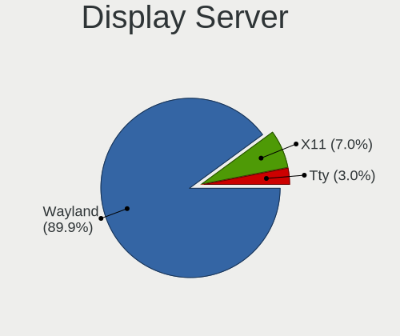
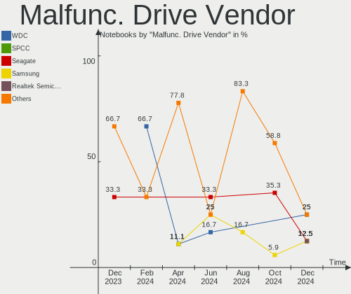
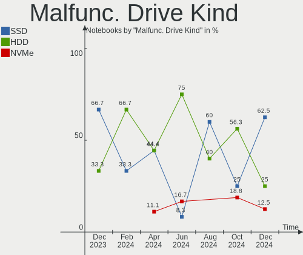
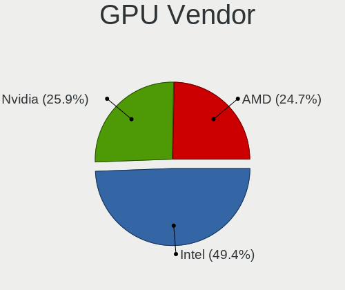
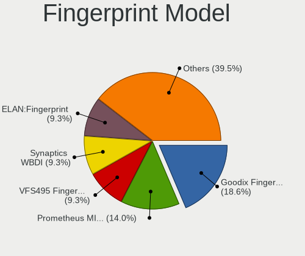
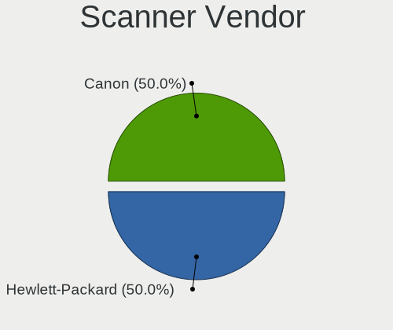
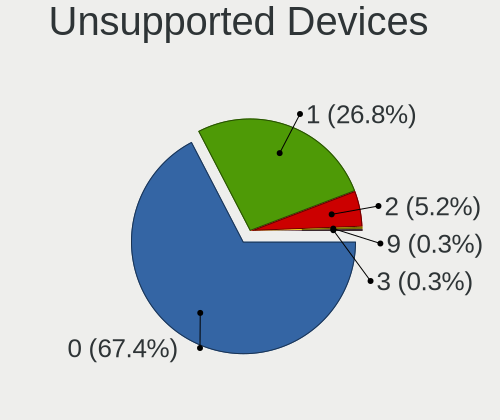

Fedora Hardware Trends (Notebook)
---------------------------------

A project to identify most popular hardware characteristics and track their change
over time based on data collected by Fedora users at https://Linux-Hardware.org.

Anyone can contribute to the study by uploading probes of their computers by
the [hw-probe](https://github.com/linuxhw/hw-probe) tool:

    sudo -E hw-probe -all -upload

Full-feature report is available here: https://linux-hardware.org/?view=trends&formfactor=notebook

Period: Oct, 2020.

Contents
--------

- [ OS                       ](#os)
- [ OS Family                ](#os-family)
- [ Kernel                   ](#kernel)
- [ Kernel Family            ](#kernel-family)
- [ Kernel Major Ver.        ](#kernel-major-ver)
- [ Arch                     ](#arch)
- [ DE                       ](#de)
- [ Display Server           ](#display-server)
- [ Display Manager          ](#display-manager)
- [ OS Lang                  ](#os-lang)
- [ Boot Mode                ](#boot-mode)
- [ Filesystem               ](#filesystem)
- [ Part. scheme             ](#part-scheme)
- [ Dual Boot with Linux/BSD ](#dual-boot-with-linux/bsd)
- [ Dual Boot (Win)          ](#dual-boot-win)
- [ Country                  ](#country)
- [ City                     ](#city)
- [ Vendor                   ](#vendor)
- [ Model                    ](#model)
- [ Model Family             ](#model-family)
- [ MFG Year                 ](#mfg-year)
- [ Form Factor              ](#form-factor)
- [ Secure Boot              ](#secure-boot)
- [ Coreboot                 ](#coreboot)
- [ RAM Size                 ](#ram-size)
- [ RAM Used                 ](#ram-used)
- [ Has CD-ROM               ](#has-cd-rom)
- [ Total Drives             ](#total-drives)
- [ Has Ethernet             ](#has-ethernet)
- [ Drive Vendor             ](#drive-vendor)
- [ HDD Vendor               ](#hdd-vendor)
- [ SSD Vendor               ](#ssd-vendor)
- [ Drive Model              ](#drive-model)
- [ Drive Kind               ](#drive-kind)
- [ Drive Connector          ](#drive-connector)
- [ Drive Size               ](#drive-size)
- [ Space Total              ](#space-total)
- [ Space Used               ](#space-used)
- [ Malfunc. Drives          ](#malfunc-drives)
- [ Malfunc. Drive Vendor    ](#malfunc-drive-vendor)
- [ Malfunc. HDD Vendor      ](#malfunc-hdd-vendor)
- [ Malfunc. Drive Kind      ](#malfunc-drive-kind)
- [ Failed Drives            ](#failed-drives)
- [ Failed Drive Vendor      ](#failed-drive-vendor)
- [ Drive Status             ](#drive-status)
- [ Storage Vendor           ](#storage-vendor)
- [ Storage Model            ](#storage-model)
- [ Storage Kind             ](#storage-kind)
- [ CPU Vendor               ](#cpu-vendor)
- [ CPU Model                ](#cpu-model)
- [ CPU Model Family         ](#cpu-model-family)
- [ CPU Cores                ](#cpu-cores)
- [ CPU Sockets              ](#cpu-sockets)
- [ CPU Threads              ](#cpu-threads)
- [ CPU Op-Modes             ](#cpu-op-modes)
- [ CPU Microcode            ](#cpu-microcode)
- [ CPU Microarch            ](#cpu-microarch)
- [ GPU Vendor               ](#gpu-vendor)
- [ GPU Model                ](#gpu-model)
- [ GPU Combo                ](#gpu-combo)
- [ GPU Driver               ](#gpu-driver)
- [ GPU Memory               ](#gpu-memory)
- [ Monitor Vendor           ](#monitor-vendor)
- [ Monitor Model            ](#monitor-model)
- [ Monitor Resolution       ](#monitor-resolution)
- [ Monitor Diagonal         ](#monitor-diagonal)
- [ Monitor Width            ](#monitor-width)
- [ Aspect Ratio             ](#aspect-ratio)
- [ Monitor Area             ](#monitor-area)
- [ Pixel Density            ](#pixel-density)
- [ Multiple Monitors        ](#multiple-monitors)
- [ Net Controller Vendor    ](#net-controller-vendor)
- [ Net Controller Model     ](#net-controller-model)
- [ Wireless Vendor          ](#wireless-vendor)
- [ Wireless Model           ](#wireless-model)
- [ Ethernet Vendor          ](#ethernet-vendor)
- [ Ethernet Model           ](#ethernet-model)
- [ Net Controller Kind      ](#net-controller-kind)
- [ Used Controller          ](#used-controller)
- [ NICs                     ](#nics)
- [ Memory Vendor            ](#memory-vendor)
- [ Memory Model             ](#memory-model)
- [ Memory Kind              ](#memory-kind)
- [ Memory Form Factor       ](#memory-form-factor)
- [ Memory Size              ](#memory-size)
- [ Memory Speed             ](#memory-speed)
- [ Sound Vendor             ](#sound-vendor)
- [ Sound Model              ](#sound-model)
- [ Camera Vendor            ](#camera-vendor)
- [ Camera Model             ](#camera-model)
- [ Fingerprint Vendor       ](#fingerprint-vendor)
- [ Fingerprint Model        ](#fingerprint-model)
- [ Chipcard Vendor          ](#chipcard-vendor)
- [ Chipcard Model           ](#chipcard-model)
- [ Printer Vendor           ](#printer-vendor)
- [ Printer Model            ](#printer-model)
- [ Scanner Vendor           ](#scanner-vendor)
- [ Scanner Model            ](#scanner-model)
- [ Bluetooth Vendor         ](#bluetooth-vendor)
- [ Bluetooth Model          ](#bluetooth-model)
- [ Unsupported Devices      ](#unsupported-devices)
- [ Unsupported Device Types ](#unsupported-device-types)

OS
--

Installed operating systems

| Name      | Notebooks | Percent |
|-----------|-----------|---------|
| Fedora 32 | 121       | 61.42%  |
| Fedora 33 | 70        | 35.53%  |
| Fedora 31 | 2         | 1.02%   |
| Fedora 29 | 2         | 1.02%   |
| Fedora 30 | 1         | 0.51%   |
| Fedora 28 | 1         | 0.51%   |

OS Family
---------

OS without a version

| Name   | Notebooks | Percent |
|--------|-----------|---------|
| Fedora | 197       | 100%    |

Kernel
------

Version of the Linux kernel

| Version                 | Notebooks | Percent |
|-------------------------|-----------|---------|
| 5.8.16-300.fc33.x86_64  | 41        | 20.81%  |
| 5.8.15-201.fc32.x86_64  | 26        | 13.2%   |
| 5.8.12-200.fc32.x86_64  | 26        | 13.2%   |
| 5.8.13-200.fc32.x86_64  | 21        | 10.66%  |
| 5.8.14-200.fc32.x86_64  | 18        | 9.14%   |
| 5.8.15-301.fc33.x86_64  | 13        | 6.6%    |
| 5.8.16-200.fc32.x86_64  | 11        | 5.58%   |
| 5.8.14-300.fc33.x86_64  | 10        | 5.08%   |
| 5.8.11-200.fc32.x86_64  | 7         | 3.55%   |
| 5.6.6-300.fc32.x86_64   | 4         | 2.03%   |
| 5.8.13-300.fc33.x86_64  | 3         | 1.52%   |
| 5.8.12-300.fc33.x86_64  | 3         | 1.52%   |
| 5.8.10-200.fc32.x86_64  | 2         | 1.02%   |
| 5.3.11-100.fc29.x86_64  | 2         | 1.02%   |
| 5.8.9-200.fc32.x86_64   | 1         | 0.51%   |
| 5.8.8-200.fc32.x86_64   | 1         | 0.51%   |
| 5.8.7-200.fc32.x86_64   | 1         | 0.51%   |
| 5.8.15-101.fc31.x86_64  | 1         | 0.51%   |
| 5.8.13-200.fc32.armv7hl | 1         | 0.51%   |
| 5.8.13-100.fc31.x86_64  | 1         | 0.51%   |
| 5.7.11-200.fc32.x86_64  | 1         | 0.51%   |
| 5.6.13-100.fc30.x86_64  | 1         | 0.51%   |
| 5.3.7-301.fc31.x86_64   | 1         | 0.51%   |
| 5.0.16-100.fc28.x86_64  | 1         | 0.51%   |

Kernel Family
-------------

Linux kernel without a distro release

| Version | Notebooks | Percent |
|---------|-----------|---------|
| 5.8.16  | 52        | 26.4%   |
| 5.8.15  | 40        | 20.3%   |
| 5.8.12  | 29        | 14.72%  |
| 5.8.14  | 28        | 14.21%  |
| 5.8.13  | 26        | 13.2%   |
| 5.8.11  | 7         | 3.55%   |
| 5.6.6   | 4         | 2.03%   |
| 5.8.10  | 2         | 1.02%   |
| 5.3.11  | 2         | 1.02%   |
| 5.8.9   | 1         | 0.51%   |
| 5.8.8   | 1         | 0.51%   |
| 5.8.7   | 1         | 0.51%   |
| 5.7.11  | 1         | 0.51%   |
| 5.6.13  | 1         | 0.51%   |
| 5.3.7   | 1         | 0.51%   |
| 5.0.16  | 1         | 0.51%   |

Kernel Major Ver.
-----------------

Linux kernel major version

| Version | Notebooks | Percent |
|---------|-----------|---------|
| 5.8     | 187       | 94.92%  |
| 5.6     | 5         | 2.54%   |
| 5.3     | 3         | 1.52%   |
| 5.7     | 1         | 0.51%   |
| 5.0     | 1         | 0.51%   |

Arch
----

OS architecture (x86_64, i586, etc.)

| Name   | Notebooks | Percent |
|--------|-----------|---------|
| x86_64 | 196       | 99.49%  |
| armv7l | 1         | 0.51%   |

DE
--

Desktop Environment

| Name          | Notebooks | Percent |
|---------------|-----------|---------|
| GNOME         | 154       | 78.17%  |
| KDE5          | 16        | 8.12%   |
| KDE           | 11        | 5.58%   |
| XFCE          | 3         | 1.52%   |
| Cinnamon      | 3         | 1.52%   |
| Unknown       | 3         | 1.52%   |
| X-Cinnamon    | 2         | 1.02%   |
| MATE          | 2         | 1.02%   |
| LXDE          | 2         | 1.02%   |
| GNOME Classic | 1         | 0.51%   |

Display Server
--------------

X11 or Wayland

| Name    | Notebooks | Percent |
|---------|-----------|---------|
| X11     | 98        | 49.75%  |
| Wayland | 97        | 49.24%  |
| Tty     | 1         | 0.51%   |
| Unknown | 1         | 0.51%   |

Display Manager
---------------

SDDM, LightDM, etc.

| Name    | Notebooks | Percent |
|---------|-----------|---------|
| Unknown | 106       | 53.81%  |
| GDM     | 70        | 35.53%  |
| SDDM    | 14        | 7.11%   |
| TDM     | 5         | 2.54%   |
| XDM     | 2         | 1.02%   |

OS Lang
-------

Language

| Lang       | Notebooks | Percent |
|------------|-----------|---------|
| en_US      | 96        | 48.73%  |
| en_GB      | 12        | 6.09%   |
| pt_BR      | 10        | 5.08%   |
| de_DE      | 10        | 5.08%   |
| ru_RU      | 9         | 4.57%   |
| fr_FR      | 8         | 4.06%   |
| Unknown    | 5         | 2.54%   |
| cs_CZ      | 4         | 2.03%   |
| it_IT      | 3         | 1.52%   |
| fi_FI      | 3         | 1.52%   |
| en_AU      | 3         | 1.52%   |
| ru_RU.utf8 | 2         | 1.02%   |
| fr_CA      | 2         | 1.02%   |
| es_ES      | 2         | 1.02%   |
| es_AR      | 2         | 1.02%   |
| en_GB.utf8 | 2         | 1.02%   |
| en_CA      | 2         | 1.02%   |
| da_DK      | 2         | 1.02%   |
| uk_UA      | 1         | 0.51%   |
| sv_SE      | 1         | 0.51%   |
| ro_RO      | 1         | 0.51%   |
| pl_PL      | 1         | 0.51%   |
| pa_IN      | 1         | 0.51%   |
| nl_NL      | 1         | 0.51%   |
| ko_KR      | 1         | 0.51%   |
| it_IT.utf8 | 1         | 0.51%   |
| hu_HU      | 1         | 0.51%   |
| es_MX      | 1         | 0.51%   |
| es_ES.utf8 | 1         | 0.51%   |
| es_DO      | 1         | 0.51%   |
| es_CL      | 1         | 0.51%   |
| en_NZ      | 1         | 0.51%   |
| en_IN      | 1         | 0.51%   |
| en_IL      | 1         | 0.51%   |
| en_IE      | 1         | 0.51%   |
| en_BE      | 1         | 0.51%   |
| el_GR      | 1         | 0.51%   |
| de_AT      | 1         | 0.51%   |

Boot Mode
---------

EFI or BIOS

| Mode | Notebooks | Percent |
|------|-----------|---------|
| EFI  | 148       | 75.13%  |
| BIOS | 49        | 24.87%  |

Filesystem
----------

Type of filesystem

| Type  | Notebooks | Percent |
|-------|-----------|---------|
| Ext4  | 138       | 70.05%  |
| Btrfs | 54        | 27.41%  |
| Xfs   | 5         | 2.54%   |

Part. scheme
------------

Scheme of partitioning

| Type    | Notebooks | Percent |
|---------|-----------|---------|
| Unknown | 103       | 52.28%  |
| GPT     | 76        | 38.58%  |
| MBR     | 18        | 9.14%   |

Dual Boot with Linux/BSD
------------------------

Hosting more than one Linux/BSD

| Dual boot | Notebooks | Percent |
|-----------|-----------|---------|
| No        | 185       | 93.91%  |
| Yes       | 12        | 6.09%   |

Dual Boot (Win)
---------------

Hosting Linux and Windows

| Dual boot | Notebooks | Percent |
|-----------|-----------|---------|
| No        | 176       | 89.34%  |
| Yes       | 21        | 10.66%  |

Country
-------

Geographic location (country)

| Country                          | Notebooks | Percent |
|----------------------------------|-----------|---------|
| USA                              | 33        | 16.75%  |
| Germany                          | 25        | 12.69%  |
| Brazil                           | 12        | 6.09%   |
| Russia                           | 10        | 5.08%   |
| Canada                           | 10        | 5.08%   |
| India                            | 8         | 4.06%   |
| France                           | 8         | 4.06%   |
| Italy                            | 7         | 3.55%   |
| Austria                          | 6         | 3.05%   |
| UK                               | 5         | 2.54%   |
| Poland                           | 5         | 2.54%   |
| Czech Republic                   | 5         | 2.54%   |
| Netherlands                      | 4         | 2.03%   |
| Finland                          | 4         | 2.03%   |
| Australia                        | 4         | 2.03%   |
| Argentina                        | 4         | 2.03%   |
| Ukraine                          | 3         | 1.52%   |
| Turkey                           | 3         | 1.52%   |
| Sweden                           | 3         | 1.52%   |
| Spain                            | 3         | 1.52%   |
| Romania                          | 3         | 1.52%   |
| Hungary                          | 3         | 1.52%   |
| Denmark                          | 3         | 1.52%   |
| Switzerland                      | 2         | 1.02%   |
| Mexico                           | 2         | 1.02%   |
| Israel                           | 2         | 1.02%   |
| Chile                            | 2         | 1.02%   |
| Belarus                          | 2         | 1.02%   |
| Singapore                        | 1         | 0.51%   |
| Saint Vincent and the Grenadines | 1         | 0.51%   |
| Philippines                      | 1         | 0.51%   |
| New Zealand                      | 1         | 0.51%   |
| Morocco                          | 1         | 0.51%   |
| Korea, Republic of               | 1         | 0.51%   |
| Jordan                           | 1         | 0.51%   |
| Ireland                          | 1         | 0.51%   |
| Indonesia                        | 1         | 0.51%   |
| Greece                           | 1         | 0.51%   |
| Ecuador                          | 1         | 0.51%   |
| Dominican Republic               | 1         | 0.51%   |
| China                            | 1         | 0.51%   |
| Bulgaria                         | 1         | 0.51%   |
| Bosnia and Herzegovina           | 1         | 0.51%   |
| Belgium                          | 1         | 0.51%   |

City
----

Geographic location (city)

| City                 | Notebooks | Percent |
|----------------------|-----------|---------|
| Berlin               | 4         | 2.03%   |
| Vienna               | 3         | 1.52%   |
| Vancouver            | 3         | 1.52%   |
| St Petersburg        | 3         | 1.52%   |
| Paris                | 3         | 1.52%   |
| Greifswald           | 3         | 1.52%   |
| Goiânia             | 3         | 1.52%   |
| Bucharest            | 3         | 1.52%   |
| Utrecht              | 2         | 1.02%   |
| The Bronx            | 2         | 1.02%   |
| Stralsund            | 2         | 1.02%   |
| Prague               | 2         | 1.02%   |
| Munich               | 2         | 1.02%   |
| Moscow               | 2         | 1.02%   |
| Montreal             | 2         | 1.02%   |
| Kyiv                 | 2         | 1.02%   |
| Hrodna               | 2         | 1.02%   |
| Helsinki             | 2         | 1.02%   |
| Heilbronn            | 2         | 1.02%   |
| Graz                 | 2         | 1.02%   |
| Denver               | 2         | 1.02%   |
| Córdoba             | 2         | 1.02%   |
| Coventry             | 2         | 1.02%   |
| Clinton              | 2         | 1.02%   |
| Carbondale           | 2         | 1.02%   |
| Budapest             | 2         | 1.02%   |
| České Budějovice  | 1         | 0.51%   |
| Zwolle               | 1         | 0.51%   |
| Zurich               | 1         | 0.51%   |
| Zgorzelec            | 1         | 0.51%   |
| Wrocław             | 1         | 0.51%   |
| Woodridge            | 1         | 0.51%   |
| Westbury             | 1         | 0.51%   |
| Warsaw               | 1         | 0.51%   |
| Warragul             | 1         | 0.51%   |
| Wanderup             | 1         | 0.51%   |
| Waltham              | 1         | 0.51%   |
| Visakhapatnam        | 1         | 0.51%   |
| Vincennes            | 1         | 0.51%   |
| Villa María         | 1         | 0.51%   |
| Vijayawada           | 1         | 0.51%   |
| Vantaa               | 1         | 0.51%   |
| Uppsala              | 1         | 0.51%   |
| Trivandrum           | 1         | 0.51%   |
| Trier                | 1         | 0.51%   |
| Treviolo             | 1         | 0.51%   |
| Toruń               | 1         | 0.51%   |
| Stollhof             | 1         | 0.51%   |
| Sterling             | 1         | 0.51%   |
| Srebrenik            | 1         | 0.51%   |
| Skaerbaek            | 1         | 0.51%   |
| Singapore            | 1         | 0.51%   |
| Sherbrooke           | 1         | 0.51%   |
| Santo Domingo Este   | 1         | 0.51%   |
| Santiago             | 1         | 0.51%   |
| Santa Ana            | 1         | 0.51%   |
| Sant'Agata Bolognese | 1         | 0.51%   |
| San Felipe           | 1         | 0.51%   |
| Salinas              | 1         | 0.51%   |
| Saint Paul           | 1         | 0.51%   |

Vendor
------

Motherboard manufacturer

| Name                | Notebooks | Percent |
|---------------------|-----------|---------|
| Lenovo              | 74        | 37.56%  |
| Dell                | 36        | 18.27%  |
| Hewlett-Packard     | 21        | 10.66%  |
| Acer                | 18        | 9.14%   |
| ASUSTek Computer    | 13        | 6.6%    |
| Apple               | 7         | 3.55%   |
| Toshiba             | 4         | 2.03%   |
| MSI                 | 4         | 2.03%   |
| Unknown             | 4         | 2.03%   |
| HUAWEI              | 3         | 1.52%   |
| Positivo            | 2         | 1.02%   |
| Fujitsu Siemens     | 2         | 1.02%   |
| System76            | 1         | 0.51%   |
| Sony                | 1         | 0.51%   |
| Samsung Electronics | 1         | 0.51%   |
| Prestigio           | 1         | 0.51%   |
| Notebook            | 1         | 0.51%   |
| HANSUNG COMPUTER    | 1         | 0.51%   |
| Gigabyte Technology | 1         | 0.51%   |
| Dynabook            | 1         | 0.51%   |
| Alienware           | 1         | 0.51%   |

Model
-----

Motherboard model

| Name                                                   | Notebooks | Percent |
|--------------------------------------------------------|-----------|---------|
| Unknown                                                | 6         | 3.05%   |
| Dell XPS 13 9370                                       | 3         | 1.52%   |
| Dell Latitude E7440                                    | 3         | 1.52%   |
| Lenovo ThinkPad T14 Gen 1 20UDCTO1WW                   | 2         | 1.02%   |
| Lenovo IdeaPad S145-15API 81UT                         | 2         | 1.02%   |
| HUAWEI KLVL-WXX9                                       | 2         | 1.02%   |
| HP ProBook 450 G6                                      | 2         | 1.02%   |
| HP Notebook                                            | 2         | 1.02%   |
| Dell XPS 15 9570                                       | 2         | 1.02%   |
| Dell Latitude 5480                                     | 2         | 1.02%   |
| Dell Inspiron 5593                                     | 2         | 1.02%   |
| Dell Inspiron 5590                                     | 2         | 1.02%   |
| Toshiba Satellite L500                                 | 1         | 0.51%   |
| Toshiba Satellite C850D-119                            | 1         | 0.51%   |
| Toshiba Satellite C70D-A                               | 1         | 0.51%   |
| Toshiba Satellite C660                                 | 1         | 0.51%   |
| System76 Galago Pro                                    | 1         | 0.51%   |
| Sony VPCF131FM                                         | 1         | 0.51%   |
| Samsung Electronics 900X3C/900X3D/900X3E/900X4C/900X4D | 1         | 0.51%   |
| Prestigio PSB141C03                                    | 1         | 0.51%   |
| Positivo S14SL01                                       | 1         | 0.51%   |
| Positivo C14CR21                                       | 1         | 0.51%   |
| Notebook NH55RGQ                                       | 1         | 0.51%   |
| MSI PS42 8M                                            | 1         | 0.51%   |
| MSI GL62M 7REX                                         | 1         | 0.51%   |
| MSI GE60 2QE                                           | 1         | 0.51%   |
| MSI Bravo 15 A4DDR                                     | 1         | 0.51%   |
| Lenovo Yoga S740-14IIL 81RS                            | 1         | 0.51%   |
| Lenovo V145-15AST 81MT                                 | 1         | 0.51%   |
| Lenovo V14-ARE 82DQ                                    | 1         | 0.51%   |
| Lenovo ThinkPad X61 767366U                            | 1         | 0.51%   |
| Lenovo ThinkPad X260 20F6CTO1WW                        | 1         | 0.51%   |
| Lenovo ThinkPad X230 2325AT6                           | 1         | 0.51%   |
| Lenovo ThinkPad X230 23255Y3                           | 1         | 0.51%   |
| Lenovo ThinkPad X220 4290A48                           | 1         | 0.51%   |
| Lenovo ThinkPad X201 Tablet 2985C7U                    | 1         | 0.51%   |
| Lenovo ThinkPad X1 Extreme 2nd 20QV0007US              | 1         | 0.51%   |
| Lenovo ThinkPad X1 Extreme 20MFA01DCD                  | 1         | 0.51%   |
| Lenovo ThinkPad X1 Carbon 7th 20QDCTO1WW               | 1         | 0.51%   |
| Lenovo ThinkPad X1 Carbon 3rd 20BTS0MX00               | 1         | 0.51%   |
| Lenovo ThinkPad W550s 20E1S0L500                       | 1         | 0.51%   |
| Lenovo ThinkPad W530 24491B7                           | 1         | 0.51%   |
| Lenovo ThinkPad T495 20NJCTO1WW                        | 1         | 0.51%   |
| Lenovo ThinkPad T490 20N30028BR                        | 1         | 0.51%   |
| Lenovo ThinkPad T490 20N2S01900                        | 1         | 0.51%   |
| Lenovo ThinkPad T480s 20L70028US                       | 1         | 0.51%   |
| Lenovo ThinkPad T480 20L5S1S000                        | 1         | 0.51%   |
| Lenovo ThinkPad T480 20L5000BMX                        | 1         | 0.51%   |
| Lenovo ThinkPad T480 20L50004HV                        | 1         | 0.51%   |
| Lenovo ThinkPad T470s 20HGS22D00                       | 1         | 0.51%   |
| Lenovo ThinkPad T450 20BU000QLM                        | 1         | 0.51%   |
| Lenovo ThinkPad T440s 20ARA07500                       | 1         | 0.51%   |
| Lenovo ThinkPad T440s 20AQ006HUS                       | 1         | 0.51%   |
| Lenovo ThinkPad T430 2349Y3D                           | 1         | 0.51%   |
| Lenovo ThinkPad T420 4236NUU                           | 1         | 0.51%   |
| Lenovo ThinkPad T410 2537N24                           | 1         | 0.51%   |
| Lenovo ThinkPad T14 Gen 1 20UD0013GE                   | 1         | 0.51%   |
| Lenovo ThinkPad S2 20GK0018AU                          | 1         | 0.51%   |
| Lenovo ThinkPad R500 2732BHG                           | 1         | 0.51%   |
| Lenovo ThinkPad P51 20HJS0Q900                         | 1         | 0.51%   |

Model Family
------------

Motherboard model prefix

| Name                       | Notebooks | Percent |
|----------------------------|-----------|---------|
| Lenovo ThinkPad            | 53        | 26.9%   |
| Lenovo IdeaPad             | 11        | 5.58%   |
| Dell Latitude              | 11        | 5.58%   |
| Dell Inspiron              | 11        | 5.58%   |
| Acer Aspire                | 11        | 5.58%   |
| Dell XPS                   | 9         | 4.57%   |
| HP PROBOOK                 | 7         | 3.55%   |
| Unknown                    | 6         | 3.05%   |
| Toshiba Satellite          | 4         | 2.03%   |
| Acer Nitro                 | 4         | 2.03%   |
| Lenovo Legion              | 3         | 1.52%   |
| HP Laptop                  | 3         | 1.52%   |
| HP EliteBook               | 3         | 1.52%   |
| HUAWEI KLVL-WXX9           | 2         | 1.02%   |
| HP Pavilion                | 2         | 1.02%   |
| HP Notebook                | 2         | 1.02%   |
| Dell Vostro                | 2         | 1.02%   |
| Apple MacBookPro11         | 2         | 1.02%   |
| System76 Galago            | 1         | 0.51%   |
| Sony VPCF131FM             | 1         | 0.51%   |
| Samsung Electronics 900X3C | 1         | 0.51%   |
| Prestigio PSB141C03        | 1         | 0.51%   |
| Positivo S14SL01           | 1         | 0.51%   |
| Positivo C14CR21           | 1         | 0.51%   |
| Notebook NH55RGQ           | 1         | 0.51%   |
| MSI PS42                   | 1         | 0.51%   |
| MSI GL62M                  | 1         | 0.51%   |
| MSI GE60                   | 1         | 0.51%   |
| MSI Bravo                  | 1         | 0.51%   |
| Lenovo Yoga                | 1         | 0.51%   |
| Lenovo V145-15AST          | 1         | 0.51%   |
| Lenovo V14-ARE             | 1         | 0.51%   |
| Lenovo G575                | 1         | 0.51%   |
| Lenovo G50-45              | 1         | 0.51%   |
| Lenovo B50-10              | 1         | 0.51%   |
| HUAWEI NBLK-WAX9X          | 1         | 0.51%   |
| HP ZHAN                    | 1         | 0.51%   |
| HP ZBook                   | 1         | 0.51%   |
| HP 620                     | 1         | 0.51%   |
| HANSUNG COMPUTER TFX5470H  | 1         | 0.51%   |
| Gigabyte AORUS             | 1         | 0.51%   |
| Fujitsu Siemens ESPRIMO    | 1         | 0.51%   |
| Fujitsu Siemens AMILO      | 1         | 0.51%   |
| Dynabook dynabook          | 1         | 0.51%   |
| Dell Venue                 | 1         | 0.51%   |
| Dell Precision             | 1         | 0.51%   |
| Dell G5                    | 1         | 0.51%   |
| ASUS ZenBook               | 1         | 0.51%   |
| ASUS X555LAB               | 1         | 0.51%   |
| ASUS X553MA                | 1         | 0.51%   |
| ASUS X510UAR               | 1         | 0.51%   |
| ASUS UX303UB               | 1         | 0.51%   |
| ASUS TP500LA               | 1         | 0.51%   |
| ASUS T100TA                | 1         | 0.51%   |
| ASUS ROG                   | 1         | 0.51%   |
| ASUS K70IC                 | 1         | 0.51%   |
| ASUS GL753VE               | 1         | 0.51%   |
| ASUS GL702VSK              | 1         | 0.51%   |
| ASUS GL553VD               | 1         | 0.51%   |
| ASUS G73Jh                 | 1         | 0.51%   |

MFG Year
--------

Motherboard manufacture year

| Year    | Notebooks | Percent |
|---------|-----------|---------|
| 2020    | 73        | 37.06%  |
| 2019    | 41        | 20.81%  |
| 2018    | 18        | 9.14%   |
| 2015    | 11        | 5.58%   |
| 2016    | 9         | 4.57%   |
| 2010    | 8         | 4.06%   |
| 2017    | 7         | 3.55%   |
| 2012    | 7         | 3.55%   |
| 2014    | 6         | 3.05%   |
| 2013    | 6         | 3.05%   |
| 2011    | 6         | 3.05%   |
| 2009    | 2         | 1.02%   |
| 2008    | 1         | 0.51%   |
| 2007    | 1         | 0.51%   |
| Unknown | 1         | 0.51%   |

Form Factor
-----------

Physical design of the computer

| Name     | Notebooks | Percent |
|----------|-----------|---------|
| Notebook | 197       | 100%    |

Secure Boot
-----------

Enabled or disabled

| State    | Notebooks | Percent |
|----------|-----------|---------|
| Disabled | 159       | 80.71%  |
| Enabled  | 38        | 19.29%  |

Coreboot
--------

Have coreboot on board

| Used | Notebooks | Percent |
|------|-----------|---------|
| No   | 196       | 99.49%  |
| Yes  | 1         | 0.51%   |

RAM Size
--------

Total RAM memory

| Size in GB  | Notebooks | Percent |
|-------------|-----------|---------|
| 4.01-8.0    | 53        | 26.9%   |
| 16.01-24.0  | 48        | 24.37%  |
| 8.01-16.0   | 42        | 21.32%  |
| 3.01-4.0    | 22        | 11.17%  |
| 32.01-64.0  | 16        | 8.12%   |
| 1.01-2.0    | 8         | 4.06%   |
| 64.01-256.0 | 4         | 2.03%   |
| 24.01-32.0  | 3         | 1.52%   |
| 0.01-1.0    | 1         | 0.51%   |

RAM Used
--------

Used RAM memory

| Used GB    | Notebooks | Percent |
|------------|-----------|---------|
| 2.01-3.0   | 56        | 28.43%  |
| 4.01-8.0   | 49        | 24.87%  |
| 3.01-4.0   | 36        | 18.27%  |
| 1.01-2.0   | 36        | 18.27%  |
| 8.01-16.0  | 13        | 6.6%    |
| 0.01-1.0   | 4         | 2.03%   |
| 16.01-24.0 | 2         | 1.02%   |
| 32.01-64.0 | 1         | 0.51%   |

Has CD-ROM
----------

Has CD-ROM on board

| Presented | Notebooks | Percent |
|-----------|-----------|---------|
| No        | 146       | 74.11%  |
| Yes       | 51        | 25.89%  |

Total Drives
------------

Number of drives on board

| Drives | Notebooks | Percent |
|--------|-----------|---------|
| 1      | 139       | 70.56%  |
| 2      | 54        | 27.41%  |
| 3      | 3         | 1.52%   |
| 4      | 1         | 0.51%   |

Has Ethernet
------------

Has Ethernet on board

| Presented | Notebooks | Percent |
|-----------|-----------|---------|
| Yes       | 155       | 78.68%  |
| No        | 42        | 21.32%  |

Drive Vendor
------------

Hard drive vendors

| Vendor                | Notebooks | Drives | Percent |
|-----------------------|-----------|--------|---------|
| Samsung Electronics   | 53        | 57     | 20.95%  |
| WDC                   | 31        | 33     | 12.25%  |
| Toshiba               | 21        | 22     | 8.3%    |
| Seagate               | 19        | 21     | 7.51%   |
| Unknown               | 18        | 19     | 7.11%   |
| Sandisk               | 16        | 16     | 6.32%   |
| SK Hynix              | 15        | 15     | 5.93%   |
| Kingston              | 13        | 13     | 5.14%   |
| Intel                 | 12        | 12     | 4.74%   |
| HGST                  | 7         | 7      | 2.77%   |
| Crucial               | 5         | 5      | 1.98%   |
| Hitachi               | 4         | 4      | 1.58%   |
| China                 | 4         | 4      | 1.58%   |
| Apple                 | 4         | 4      | 1.58%   |
| Phison                | 3         | 3      | 1.19%   |
| Micron Technology     | 3         | 3      | 1.19%   |
| A-DATA Technology     | 3         | 3      | 1.19%   |
| Lenovo                | 2         | 2      | 0.79%   |
| Hewlett-Packard       | 2         | 2      | 0.79%   |
| UNIC2                 | 1         | 1      | 0.4%    |
| Transcend             | 1         | 1      | 0.4%    |
| TO Exter              | 1         | 1      | 0.4%    |
| SPCC                  | 1         | 1      | 0.4%    |
| Silicon Motion        | 1         | 1      | 0.4%    |
| Realtek Semiconductor | 1         | 1      | 0.4%    |
| PNY                   | 1         | 1      | 0.4%    |
| Patriot               | 1         | 1      | 0.4%    |
| OCZ                   | 1         | 1      | 0.4%    |
| LITEONIT              | 1         | 1      | 0.4%    |
| LITEON                | 1         | 1      | 0.4%    |
| Lite-On               | 1         | 1      | 0.4%    |
| LDLC                  | 1         | 1      | 0.4%    |
| KIOXIA                | 1         | 1      | 0.4%    |
| HGST HTS              | 1         | 1      | 0.4%    |
| External              | 1         | 1      | 0.4%    |
| Corsair               | 1         | 1      | 0.4%    |
| ADATA Technology      | 1         | 1      | 0.4%    |

HDD Vendor
----------

Hard disk drive vendors

| Vendor   | Notebooks | Drives | Percent |
|----------|-----------|--------|---------|
| WDC      | 19        | 19     | 30.65%  |
| Seagate  | 19        | 21     | 30.65%  |
| Toshiba  | 11        | 11     | 17.74%  |
| HGST     | 7         | 7      | 11.29%  |
| Hitachi  | 4         | 4      | 6.45%   |
| TO Exter | 1         | 1      | 1.61%   |
| HGST HTS | 1         | 1      | 1.61%   |

SSD Vendor
----------

Solid state drive vendors

| Vendor              | Notebooks | Drives | Percent |
|---------------------|-----------|--------|---------|
| Samsung Electronics | 17        | 18     | 22.37%  |
| Kingston            | 12        | 12     | 15.79%  |
| SanDisk             | 7         | 7      | 9.21%   |
| Intel               | 6         | 6      | 7.89%   |
| WDC                 | 4         | 5      | 5.26%   |
| Crucial             | 4         | 4      | 5.26%   |
| China               | 4         | 4      | 5.26%   |
| Apple               | 4         | 4      | 5.26%   |
| SK Hynix            | 3         | 3      | 3.95%   |
| Toshiba             | 2         | 2      | 2.63%   |
| A-DATA Technology   | 2         | 2      | 2.63%   |
| UNIC2               | 1         | 1      | 1.32%   |
| Transcend           | 1         | 1      | 1.32%   |
| SPCC                | 1         | 1      | 1.32%   |
| PNY                 | 1         | 1      | 1.32%   |
| Patriot             | 1         | 1      | 1.32%   |
| OCZ                 | 1         | 1      | 1.32%   |
| Micron Technology   | 1         | 1      | 1.32%   |
| LITEONIT            | 1         | 1      | 1.32%   |
| LITEON              | 1         | 1      | 1.32%   |
| External            | 1         | 1      | 1.32%   |
| Corsair             | 1         | 1      | 1.32%   |

Drive Model
-----------

Hard drive models

| Model                            | Notebooks | Percent |
|----------------------------------|-----------|---------|
| NVMe SSD Drive 512GB             | 22        | 8.43%   |
| NVMe SSD Drive 256GB             | 16        | 6.13%   |
| ST1000LM035-1RK172 1TB           | 6         | 2.3%    |
| MQ04ABF100 1TB                   | 5         | 1.92%   |
| SA400S37240G 240GB SSD           | 4         | 1.53%   |
| NVMe SSD Drive 1024GB            | 4         | 1.53%   |
| WDS240G2G0A-00JH30 240GB SSD     | 3         | 1.15%   |
| SSD 860 EVO 500GB                | 3         | 1.15%   |
| SATA3 2TB SSD                    | 3         | 1.15%   |
| MQ01ABD100 1TB                   | 3         | 1.15%   |
| HTS721010A9E630 1TB              | 3         | 1.15%   |
| X400 M.2 2280 256GB SSD          | 2         | 0.77%   |
| WDS240G2G0B-00EPW0 240GB SSD     | 2         | 0.77%   |
| WD10SPZX-75Z10T2 1TB             | 2         | 0.77%   |
| WD10SPZX-24Z10 1TB               | 2         | 0.77%   |
| WD10SPZX-21Z10T0 1TB             | 2         | 0.77%   |
| WD10JPVX-22JC3T0 1TB             | 2         | 0.77%   |
| SU630 240GB SSD                  | 2         | 0.77%   |
| ST9500325AS 500GB                | 2         | 0.77%   |
| ST1000LM048-2E7172 1TB           | 2         | 0.77%   |
| ST1000LM024 HN-M101MBB 1TB       | 2         | 0.77%   |
| SSDPEKKF256G8L 256GB             | 2         | 0.77%   |
| SSD U110 16GB                    | 2         | 0.77%   |
| SSD SM0512G 500GB                | 2         | 0.77%   |
| SSD 850 EVO 250GB                | 2         | 0.77%   |
| SD/MMC/MS PRO 32GB               | 2         | 0.77%   |
| PC401 NVMe 512GB                 | 2         | 0.77%   |
| NVMe SSD Drive 2TB               | 2         | 0.77%   |
| NVMe SSD Drive 128GB             | 2         | 0.77%   |
| MZVLB512HBJQ-000L7 512GB         | 2         | 0.77%   |
| MZ7LN256HCHP-000L7 256GB SSD     | 2         | 0.77%   |
| MMC Card  32GB                   | 2         | 0.77%   |
| HBG4e  32GB                      | 2         | 0.77%   |
| WD7500BPVT-60HXZT3 752GB         | 1         | 0.38%   |
| WD7500BPKX-00HPJT0 752GB         | 1         | 0.38%   |
| WD7500BPKT-75PK4T0 752GB         | 1         | 0.38%   |
| WD5000LPVX-22V0TT0 500GB         | 1         | 0.38%   |
| WD5000LPLX-08ZNTT0 500GB         | 1         | 0.38%   |
| WD5000LPCX-21VHAT0 500GB         | 1         | 0.38%   |
| WD5000BPVT-22HXZT3 500GB         | 1         | 0.38%   |
| WD3200BPVT-22JJ5T0 320GB         | 1         | 0.38%   |
| WD2500BPVT-75JJ5T0 250GB         | 1         | 0.38%   |
| WD10SPZX-24Z10T0 1TB             | 1         | 0.38%   |
| WD10JPVX-08JC3T5 1TB             | 1         | 0.38%   |
| VERTEX4 512GB SSD                | 1         | 0.38%   |
| USDU1  65GB                      | 1         | 0.38%   |
| USB3.0 500GB                     | 1         | 0.38%   |
| TS128GSSD340K 128GB              | 1         | 0.38%   |
| THNSNK128GVN8 M.2 2280 128GB SSD | 1         | 0.38%   |
| THNSNJ256G8NU 256GB SSD          | 1         | 0.38%   |
| SX6000LNP 512GB                  | 1         | 0.38%   |
| SV300S37A240G 240GB SSD          | 1         | 0.38%   |
| SUV500MS480G 480GB SSD           | 1         | 0.38%   |
| SUV500MS240G 240GB SSD           | 1         | 0.38%   |
| SUV400S37240G 240GB SSD          | 1         | 0.38%   |
| ST500LT012-1DG142 500GB          | 1         | 0.38%   |
| ST500LM034-2GH17A 500GB          | 1         | 0.38%   |
| ST500LM021-1KJ152 500GB          | 1         | 0.38%   |
| ST320LM001 HN-M320MBB 320GB      | 1         | 0.38%   |
| ST2000LX001-1RG174 2TB           | 1         | 0.38%   |

Drive Kind
----------

HDD or SSD

| Kind    | Notebooks | Drives | Percent |
|---------|-----------|--------|---------|
| NVMe    | 93        | 102    | 38.27%  |
| SSD     | 72        | 78     | 29.63%  |
| HDD     | 60        | 64     | 24.69%  |
| MMC     | 15        | 16     | 6.17%   |
| Unknown | 3         | 3      | 1.23%   |

Drive Connector
---------------

SATA, SAS, NVMe, etc.

| Type | Notebooks | Drives | Percent |
|------|-----------|--------|---------|
| SATA | 118       | 138    | 50.64%  |
| NVMe | 93        | 102    | 39.91%  |
| MMC  | 15        | 16     | 6.44%   |
| SAS  | 7         | 7      | 3%      |

Drive Size
----------

Size of hard drive

| Size in TB | Notebooks | Drives | Percent |
|------------|-----------|--------|---------|
| 0.01-0.5   | 84        | 93     | 64.12%  |
| 0.51-1.0   | 41        | 43     | 31.3%   |
| 1.01-2.0   | 5         | 5      | 3.82%   |
| 3.01-4.0   | 1         | 1      | 0.76%   |

Space Total
-----------

Amount of disk space available on the file system

| Size in GB     | Notebooks | Percent |
|----------------|-----------|---------|
| 101-250        | 55        | 27.92%  |
| 251-500        | 43        | 21.83%  |
| 501-1000       | 42        | 21.32%  |
| 1-20           | 14        | 7.11%   |
| 21-50          | 11        | 5.58%   |
| Unknown        | 10        | 5.08%   |
| 1001-2000      | 9         | 4.57%   |
| 51-100         | 7         | 3.55%   |
| 2001-3000      | 4         | 2.03%   |
| More than 3000 | 2         | 1.02%   |

Space Used
----------

Amount of used disk space

| Used GB        | Notebooks | Percent |
|----------------|-----------|---------|
| 1-20           | 48        | 24.37%  |
| 21-50          | 43        | 21.83%  |
| 101-250        | 37        | 18.78%  |
| 51-100         | 31        | 15.74%  |
| 251-500        | 15        | 7.61%   |
| Unknown        | 10        | 5.08%   |
| 501-1000       | 6         | 3.05%   |
| 1001-2000      | 5         | 2.54%   |
| More than 3000 | 1         | 0.51%   |
| 0              | 1         | 0.51%   |

Malfunc. Drives
---------------

Drive models with a malfunction

| Model                    | Notebooks | Drives | Percent |
|--------------------------|-----------|--------|---------|
| WD2500BPVT-75JJ5T0 250GB | 1         | 1      | 10%     |
| SSDSCKKF256G8H 256GB     | 1         | 1      | 10%     |
| SSDSA2M040G2GC 40GB      | 1         | 1      | 10%     |
| SC308 SATA 128GB SSD     | 1         | 1      | 10%     |
| PM981 NVMe 512GB         | 1         | 1      | 10%     |
| MQ01ABD100 1TB           | 1         | 1      | 10%     |
| HTS725050A7E630 500GB    | 1         | 1      | 10%     |
| HTS547564A9E384 640GB    | 1         | 1      | 10%     |
| HTS541010A9E680 1TB      | 1         | 1      | 10%     |
| CT1000P1SSD8 1TB         | 1         | 1      | 10%     |

Malfunc. Drive Vendor
---------------------

Vendors of faulty drives

| Vendor              | Notebooks | Drives | Percent |
|---------------------|-----------|--------|---------|
| Intel               | 2         | 2      | 20%     |
| HGST                | 2         | 2      | 20%     |
| WDC                 | 1         | 1      | 10%     |
| Toshiba             | 1         | 1      | 10%     |
| SK Hynix            | 1         | 1      | 10%     |
| Samsung Electronics | 1         | 1      | 10%     |
| Hitachi             | 1         | 1      | 10%     |
| Crucial             | 1         | 1      | 10%     |

Malfunc. HDD Vendor
-------------------

Vendors of faulty HDD drives

| Vendor  | Notebooks | Drives | Percent |
|---------|-----------|--------|---------|
| HGST    | 2         | 2      | 40%     |
| WDC     | 1         | 1      | 20%     |
| Toshiba | 1         | 1      | 20%     |
| Hitachi | 1         | 1      | 20%     |

Malfunc. Drive Kind
-------------------

Kinds of faulty drives

| Kind | Notebooks | Drives | Percent |
|------|-----------|--------|---------|
| HDD  | 5         | 5      | 50%     |
| SSD  | 3         | 3      | 30%     |
| NVMe | 2         | 2      | 20%     |

Failed Drives
-------------

Failed drive models

Zero info for selected period =(

Failed Drive Vendor
-------------------

Failed drive vendors

Zero info for selected period =(

Drive Status
------------

Number of failed and malfunc. drives

| Status   | Notebooks | Drives | Percent |
|----------|-----------|--------|---------|
| Detected | 118       | 157    | 56.73%  |
| Works    | 80        | 96     | 38.46%  |
| Malfunc  | 10        | 10     | 4.81%   |

Storage Vendor
--------------

Storage controller vendors

| Vendor                       | Notebooks | Percent |
|------------------------------|-----------|---------|
| Intel                        | 119       | 49.38%  |
| Samsung Electronics          | 39        | 16.18%  |
| AMD                          | 24        | 9.96%   |
| Sandisk                      | 18        | 7.47%   |
| SK Hynix                     | 10        | 4.15%   |
| Toshiba America Info Systems | 7         | 2.9%    |
| Silicon Motion               | 3         | 1.24%   |
| Phison Electronics           | 3         | 1.24%   |
| Nvidia                       | 3         | 1.24%   |
| ADATA Technology             | 3         | 1.24%   |
| Realtek Semiconductor        | 2         | 0.83%   |
| Micron Technology            | 2         | 0.83%   |
| Lenovo                       | 2         | 0.83%   |
| KIOXIA                       | 2         | 0.83%   |
| Micron/Crucial Technology    | 1         | 0.41%   |
| Lite-On Technology           | 1         | 0.41%   |
| Kingston Technology Company  | 1         | 0.41%   |
| JMicron Technology           | 1         | 0.41%   |

Storage Model
-------------

Storage controller models

| Model                                                                            | Notebooks | Percent |
|----------------------------------------------------------------------------------|-----------|---------|
| NVMe SSD Controller SM981/PM981/PM983                                            | 26        | 10.44%  |
| Non-Volatile memory controller                                                   | 22        | 8.84%   |
| FCH SATA Controller [AHCI mode]                                                  | 21        | 8.43%   |
| Sunrise Point-LP SATA Controller [AHCI mode]                                     | 16        | 6.43%   |
| 82801 Mobile SATA Controller [RAID mode]                                         | 14        | 5.62%   |
| Cannon Lake Mobile PCH SATA AHCI Controller                                      | 13        | 5.22%   |
| 7 Series Chipset Family 6-port SATA Controller [AHCI mode]                       | 10        | 4.02%   |
| Cannon Point-LP SATA Controller [AHCI Mode]                                      | 8         | 3.21%   |
| WD Black 2019/PC SN750 NVMe SSD                                                  | 6         | 2.41%   |
| HM170/QM170 Chipset SATA Controller [AHCI Mode]                                  | 6         | 2.41%   |
| 8 Series SATA Controller 1 [AHCI mode]                                           | 6         | 2.41%   |
| 6 Series/C200 Series Chipset Family 6 port Mobile SATA AHCI Controller           | 6         | 2.41%   |
| Wildcat Point-LP SATA Controller [AHCI Mode]                                     | 5         | 2.01%   |
| Comet Lake SATA AHCI Controller                                                  | 5         | 2.01%   |
| WD Black 2018 / PC SN520 NVMe SSD                                                | 4         | 1.61%   |
| Toshiba America Info Non-Volatile memory controller                              | 4         | 1.61%   |
| NVMe SSD Controller SM961/PM961                                                  | 4         | 1.61%   |
| Electronics SATA controller                                                      | 4         | 1.61%   |
| Electronics Non-Volatile memory controller                                       | 4         | 1.61%   |
| SSD Pro 7600p/760p/E 6100p Series                                                | 3         | 1.2%    |
| E12 NVMe Controller                                                              | 3         | 1.2%    |
| BG3 NVMe SSD Controller                                                          | 3         | 1.2%    |
| 82801IBM/IEM (ICH9M/ICH9M-E) 4 port SATA Controller [AHCI mode]                  | 3         | 1.2%    |
| 82801HM/HEM (ICH8M/ICH8M-E) SATA Controller [AHCI mode]                          | 3         | 1.2%    |
| 82801HM/HEM (ICH8M/ICH8M-E) IDE Controller                                       | 3         | 1.2%    |
| 5 Series/3400 Series Chipset 6 port SATA AHCI Controller                         | 3         | 1.2%    |
| 5 Series/3400 Series Chipset 4 port SATA AHCI Controller                         | 3         | 1.2%    |
| WD Black 2018 / PC SN720 NVMe SSD                                                | 2         | 0.8%    |
| SSD 660P Series                                                                  | 2         | 0.8%    |
| SM2262/SM2262EN SSD Controller                                                   | 2         | 0.8%    |
| SB7x0/SB8x0/SB9x0 SATA Controller [AHCI mode]                                    | 2         | 0.8%    |
| Realtek Non-Volatile memory controller                                           | 2         | 0.8%    |
| Q170/Q150/B150/H170/H110/Z170/CM236 Chipset SATA Controller [AHCI Mode]          | 2         | 0.8%    |
| MCP79 AHCI Controller                                                            | 2         | 0.8%    |
| Ice Lake-LP SATA Controller [AHCI mode]                                          | 2         | 0.8%    |
| BC501 NVMe Solid State Drive 512GB                                               | 2         | 0.8%    |
| Atom Processor E3800 Series SATA AHCI Controller                                 | 2         | 0.8%    |
| 8 Series/C220 Series Chipset Family 6-port SATA Controller 1 [AHCI mode]         | 2         | 0.8%    |
| 6 Series/C200 Series Chipset Family Mobile SATA Controller (IDE mode, ports 4-5) | 2         | 0.8%    |
| 6 Series/C200 Series Chipset Family Mobile SATA Controller (IDE mode, ports 0-3) | 2         | 0.8%    |
| 400 Series Chipset Family SATA AHCI Controller                                   | 2         | 0.8%    |
| WD Blue SN550 NVMe SSD                                                           | 1         | 0.4%    |
| SSD 600P Series                                                                  | 1         | 0.4%    |
| SATA Controller [RAID mode]                                                      | 1         | 0.4%    |
| PC300 NVMe Solid State Drive 512GB                                               | 1         | 0.4%    |
| P1 NVMe PCIe SSD                                                                 | 1         | 0.4%    |
| NVMe SSD Controller SM951/PM951                                                  | 1         | 0.4%    |
| NVMe Controller                                                                  | 1         | 0.4%    |
| MCP89 SATA Controller (AHCI mode)                                                | 1         | 0.4%    |
| JMB360 AHCI Controller                                                           | 1         | 0.4%    |
| FCH SATA Controller [IDE mode]                                                   | 1         | 0.4%    |
| Chipset SATA RAID Controller                                                     | 1         | 0.4%    |
| Atom/Celeron/Pentium Processor x5-E8000/J3xxx/N3xxx Series SATA Controller       | 1         | 0.4%    |
| A2000, M.2, 500GB                                                                | 1         | 0.4%    |

Storage Kind
------------

Kind of storage controller (IDE, SATA, NVMe, SAS, ...)

| Kind | Notebooks | Percent |
|------|-----------|---------|
| SATA | 130       | 53.72%  |
| NVMe | 92        | 38.02%  |
| RAID | 15        | 6.2%    |
| IDE  | 5         | 2.07%   |

CPU Vendor
----------

Processor vendors

| Vendor | Notebooks | Percent |
|--------|-----------|---------|
| Intel  | 159       | 80.71%  |
| AMD    | 37        | 18.78%  |
| ARM    | 1         | 0.51%   |

CPU Model
---------

Processor models

| Model                                         | Notebooks | Percent |
|-----------------------------------------------|-----------|---------|
| Intel Core i7-8550U CPU @ 1.80GHz             | 11        | 5.58%   |
| Intel Core i7-9750H CPU @ 2.60GHz             | 7         | 3.55%   |
| Intel Core i7-8750H CPU @ 2.20GHz             | 7         | 3.55%   |
| Intel Core i5-8250U CPU @ 1.60GHz             | 7         | 3.55%   |
| Intel Core i5-8265U CPU @ 1.60GHz             | 6         | 3.05%   |
| Intel Core i7-8565U CPU @ 1.80GHz             | 5         | 2.54%   |
| Intel Core i7-7700HQ CPU @ 2.80GHz            | 5         | 2.54%   |
| Intel Core i7-10510U CPU @ 1.80GHz            | 5         | 2.54%   |
| Intel Core i7-8665U CPU @ 1.90GHz             | 4         | 2.03%   |
| Intel Core i5-2520M CPU @ 2.50GHz             | 4         | 2.03%   |
| AMD Ryzen 7 4800H with Radeon Graphics        | 4         | 2.03%   |
| AMD Ryzen 5 4500U with Radeon Graphics        | 4         | 2.03%   |
| Intel Core i7-4600U CPU @ 2.10GHz             | 3         | 1.52%   |
| Intel Core i7-3520M CPU @ 2.90GHz             | 3         | 1.52%   |
| Intel Core i5-7200U CPU @ 2.50GHz             | 3         | 1.52%   |
| Intel Core i5-6200U CPU @ 2.30GHz             | 3         | 1.52%   |
| Intel Atom CPU Z3735F @ 1.33GHz               | 3         | 1.52%   |
| AMD Ryzen 7 PRO 4750U with Radeon Graphics    | 3         | 1.52%   |
| AMD Ryzen 5 3500U with Radeon Vega Mobile Gfx | 3         | 1.52%   |
| AMD Ryzen 5 2500U with Radeon Vega Mobile Gfx | 3         | 1.52%   |
| Intel Core i7-5500U CPU @ 2.40GHz             | 2         | 1.02%   |
| Intel Core i7-10875H CPU @ 2.30GHz            | 2         | 1.02%   |
| Intel Core i7-1065G7 CPU @ 1.30GHz            | 2         | 1.02%   |
| Intel Core i7 CPU Q 720 @ 1.60GHz             | 2         | 1.02%   |
| Intel Core i5-7300HQ CPU @ 2.50GHz            | 2         | 1.02%   |
| Intel Core i5-3320M CPU @ 2.60GHz             | 2         | 1.02%   |
| Intel Core i5-10210U CPU @ 1.60GHz            | 2         | 1.02%   |
| Intel Core i3-2350M CPU @ 2.30GHz             | 2         | 1.02%   |
| Intel Core 2 Duo CPU P8600 @ 2.40GHz          | 2         | 1.02%   |
| AMD Ryzen 7 4700U with Radeon Graphics        | 2         | 1.02%   |
| Intel Xeon E-2276M CPU @ 2.80GHz              | 1         | 0.51%   |
| Intel Xeon CPU E3-1505M v6 @ 3.00GHz          | 1         | 0.51%   |
| Intel Pentium Dual-Core CPU T4400 @ 2.20GHz   | 1         | 0.51%   |
| Intel Pentium Dual-Core CPU T4300 @ 2.10GHz   | 1         | 0.51%   |
| Intel Pentium CPU N3710 @ 1.60GHz             | 1         | 0.51%   |
| Intel Pentium CPU 6405U @ 2.40GHz             | 1         | 0.51%   |
| Intel Core M-5Y71 CPU @ 1.20GHz               | 1         | 0.51%   |
| Intel Core i7-9850H CPU @ 2.60GHz             | 1         | 0.51%   |
| Intel Core i7-8650U CPU @ 1.90GHz             | 1         | 0.51%   |
| Intel Core i7-7820HQ CPU @ 2.90GHz            | 1         | 0.51%   |
| Intel Core i7-7600U CPU @ 2.80GHz             | 1         | 0.51%   |
| Intel Core i7-7560U CPU @ 2.40GHz             | 1         | 0.51%   |
| Intel Core i7-7500U CPU @ 2.70GHz             | 1         | 0.51%   |
| Intel Core i7-6820HQ CPU @ 2.70GHz            | 1         | 0.51%   |
| Intel Core i7-6600U CPU @ 2.60GHz             | 1         | 0.51%   |
| Intel Core i7-5600U CPU @ 2.60GHz             | 1         | 0.51%   |
| Intel Core i7-4870HQ CPU @ 2.50GHz            | 1         | 0.51%   |
| Intel Core i7-4770HQ CPU @ 2.20GHz            | 1         | 0.51%   |
| Intel Core i7-4720HQ CPU @ 2.60GHz            | 1         | 0.51%   |
| Intel Core i7-4702MQ CPU @ 2.20GHz            | 1         | 0.51%   |
| Intel Core i7-4510U CPU @ 2.00GHz             | 1         | 0.51%   |
| Intel Core i7-3740QM CPU @ 2.70GHz            | 1         | 0.51%   |
| Intel Core i7-3667U CPU @ 2.00GHz             | 1         | 0.51%   |
| Intel Core i7-3630QM CPU @ 2.40GHz            | 1         | 0.51%   |
| Intel Core i7-2620M CPU @ 2.70GHz             | 1         | 0.51%   |
| Intel Core i7-10750H CPU @ 2.60GHz            | 1         | 0.51%   |
| Intel Core i7-10710U CPU @ 1.10GHz            | 1         | 0.51%   |
| Intel Core i7 CPU M 620 @ 2.67GHz             | 1         | 0.51%   |
| Intel Core i7 CPU L 640 @ 2.13GHz             | 1         | 0.51%   |
| Intel Core i5-8300H CPU @ 2.30GHz             | 1         | 0.51%   |

CPU Model Family
----------------

Processor model prefix

| Model                          | Notebooks | Percent |
|--------------------------------|-----------|---------|
| Intel Core i7                  | 80        | 40.61%  |
| Intel Core i5                  | 48        | 24.37%  |
| AMD Ryzen 5                    | 11        | 5.58%   |
| Intel Core i3                  | 8         | 4.06%   |
| Intel Core 2 Duo               | 7         | 3.55%   |
| AMD Ryzen 7                    | 7         | 3.55%   |
| Intel Atom                     | 6         | 3.05%   |
| AMD Ryzen 7 PRO                | 5         | 2.54%   |
| AMD A6                         | 4         | 2.03%   |
| Intel Celeron                  | 3         | 1.52%   |
| Intel Xeon                     | 2         | 1.02%   |
| Intel Pentium Dual-Core        | 2         | 1.02%   |
| Intel Pentium                  | 2         | 1.02%   |
| AMD Ryzen 3                    | 2         | 1.02%   |
| Intel Core M                   | 1         | 0.51%   |
| ARM Allwinner                  | 1         | 0.51%   |
| AMD Turion X2 Dual-Core Mobile | 1         | 0.51%   |
| AMD Ryzen 5 PRO                | 1         | 0.51%   |
| AMD E1                         | 1         | 0.51%   |
| AMD E                          | 1         | 0.51%   |
| AMD Athlon                     | 1         | 0.51%   |
| AMD A8                         | 1         | 0.51%   |
| AMD A4                         | 1         | 0.51%   |
| AMD A12                        | 1         | 0.51%   |

CPU Cores
---------

Number of processor cores

| Number | Notebooks | Percent |
|--------|-----------|---------|
| 4      | 86        | 43.65%  |
| 2      | 77        | 39.09%  |
| 6      | 23        | 11.68%  |
| 8      | 11        | 5.58%   |

CPU Sockets
-----------

Number of sockets

| Number | Notebooks | Percent |
|--------|-----------|---------|
| 1      | 197       | 100%    |

CPU Threads
-----------

Threads per core (Hyper-Threading)

| Number | Notebooks | Percent |
|--------|-----------|---------|
| 2      | 158       | 80.2%   |
| 1      | 39        | 19.8%   |

CPU Op-Modes
------------

CPU Operation Modes (32-bit, 64-bit)

| Op mode        | Notebooks | Percent |
|----------------|-----------|---------|
| 32-bit, 64-bit | 196       | 99.49%  |
| Unknown        | 1         | 0.51%   |

CPU Microcode
-------------

Microcode number

| Number     | Notebooks | Percent |
|------------|-----------|---------|
| 0x806ec    | 17        | 8.63%   |
| 0x806ea    | 17        | 8.63%   |
| 0x906ea    | 15        | 7.61%   |
| 0x306a9    | 11        | 5.58%   |
| 0x206a7    | 11        | 5.58%   |
| Unknown    | 10        | 5.08%   |
| 0x906e9    | 9         | 4.57%   |
| 0x40651    | 8         | 4.06%   |
| 0x806e9    | 7         | 3.55%   |
| 0x406e3    | 7         | 3.55%   |
| 0x306d4    | 7         | 3.55%   |
| 0x08600103 | 6         | 3.05%   |
| 0x08108102 | 6         | 3.05%   |
| 0x806eb    | 5         | 2.54%   |
| 0x1067a    | 5         | 2.54%   |
| 0x08600104 | 5         | 2.54%   |
| 0x0810100b | 5         | 2.54%   |
| 0xa0652    | 4         | 2.03%   |
| 0x30678    | 4         | 2.03%   |
| 0x08600102 | 4         | 2.03%   |
| 0x706e5    | 3         | 1.52%   |
| 0x506e3    | 2         | 1.02%   |
| 0x406c4    | 2         | 1.02%   |
| 0x306c3    | 2         | 1.02%   |
| 0x20652    | 2         | 1.02%   |
| 0x106e5    | 2         | 1.02%   |
| 0x10676    | 2         | 1.02%   |
| 0x06006705 | 2         | 1.02%   |
| 0x05000119 | 2         | 1.02%   |
| 0xa0660    | 1         | 0.51%   |
| 0x906ed    | 1         | 0.51%   |
| 0x6fb      | 1         | 0.51%   |
| 0x6fa      | 1         | 0.51%   |
| 0x406c3    | 1         | 0.51%   |
| 0x40661    | 1         | 0.51%   |
| 0x30673    | 1         | 0.51%   |
| 0x20655    | 1         | 0.51%   |
| 0x08108109 | 1         | 0.51%   |
| 0x07030106 | 1         | 0.51%   |
| 0x07030105 | 1         | 0.51%   |
| 0x0700010f | 1         | 0.51%   |
| 0x0600611a | 1         | 0.51%   |
| 0x06001119 | 1         | 0.51%   |
| 0x02000032 | 1         | 0.51%   |

CPU Microarch
-------------

Microarchitecture

| Name            | Notebooks | Percent |
|-----------------|-----------|---------|
| KabyLake        | 76        | 38.58%  |
| Zen 2           | 15        | 7.61%   |
| Haswell         | 13        | 6.6%    |
| SandyBridge     | 11        | 5.58%   |
| IvyBridge       | 11        | 5.58%   |
| Skylake         | 9         | 4.57%   |
| Silvermont      | 9         | 4.57%   |
| Zen+            | 7         | 3.55%   |
| Penryn          | 7         | 3.55%   |
| Broadwell       | 7         | 3.55%   |
| Zen             | 5         | 2.54%   |
| CometLake       | 5         | 2.54%   |
| Westmere        | 4         | 2.03%   |
| IceLake         | 3         | 1.52%   |
| Excavator       | 3         | 1.52%   |
| Puma            | 2         | 1.02%   |
| Nehalem         | 2         | 1.02%   |
| Core            | 2         | 1.02%   |
| Bobcat          | 2         | 1.02%   |
| Piledriver      | 1         | 0.51%   |
| K8 & K10 hybrid | 1         | 0.51%   |
| Jaguar          | 1         | 0.51%   |
| Unknown         | 1         | 0.51%   |

GPU Vendor
----------

Vendors of graphics cards

| Vendor | Notebooks | Percent |
|--------|-----------|---------|
| Intel  | 143       | 58.13%  |
| Nvidia | 53        | 21.54%  |
| AMD    | 50        | 20.33%  |

GPU Model
---------

Graphics card models

| Model                                                                              | Notebooks | Percent |
|------------------------------------------------------------------------------------|-----------|---------|
| UHD Graphics 620                                                                   | 20        | 7.84%   |
| UHD Graphics 630 (Mobile)                                                          | 15        | 5.88%   |
| UHD Graphics 620 (Whiskey Lake)                                                    | 15        | 5.88%   |
| Renoir                                                                             | 15        | 5.88%   |
| UHD Graphics                                                                       | 13        | 5.1%    |
| 3rd Gen Core processor Graphics Controller                                         | 10        | 3.92%   |
| 2nd Generation Core Processor Family Integrated Graphics Controller                | 10        | 3.92%   |
| Haswell-ULT Integrated Graphics Controller                                         | 9         | 3.53%   |
| GP107M [GeForce GTX 1050 Ti Mobile]                                                | 8         | 3.14%   |
| Picasso                                                                            | 7         | 2.75%   |
| Skylake GT2 [HD Graphics 520]                                                      | 6         | 2.35%   |
| HD Graphics 620                                                                    | 6         | 2.35%   |
| GP108M [GeForce MX250]                                                             | 6         | 2.35%   |
| Atom Processor Z36xxx/Z37xxx Series Graphics & Display                             | 6         | 2.35%   |
| Raven Ridge [Radeon Vega Series / Radeon Vega Mobile Series]                       | 5         | 1.96%   |
| HD Graphics 630                                                                    | 5         | 1.96%   |
| HD Graphics 5500                                                                   | 5         | 1.96%   |
| GP107M [GeForce GTX 1050 Mobile]                                                   | 5         | 1.96%   |
| Topaz XT [Radeon R7 M260/M265 / M340/M360 / M440/M445 / 530/535 / 620/625 Mobile]  | 4         | 1.57%   |
| TU117M [GeForce GTX 1650 Mobile / Max-Q]                                           | 3         | 1.18%   |
| Mobile GM965/GL960 Integrated Graphics Controller (secondary)                      | 3         | 1.18%   |
| Mobile GM965/GL960 Integrated Graphics Controller (primary)                        | 3         | 1.18%   |
| Core Processor Integrated Graphics Controller                                      | 3         | 1.18%   |
| Atom/Celeron/Pentium Processor x5-E8000/J3xxx/N3xxx Integrated Graphics Controller | 3         | 1.18%   |
| TU117M [GeForce GTX 1650 Ti Mobile]                                                | 2         | 0.78%   |
| TU116M [GeForce GTX 1660 Ti Mobile]                                                | 2         | 0.78%   |
| Stoney [Radeon R2/R3/R4/R5 Graphics]                                               | 2         | 0.78%   |
| Seymour [Radeon HD 6400M/7400M Series]                                             | 2         | 0.78%   |
| RV620/M82 [Mobility Radeon HD 3450/3470]                                           | 2         | 0.78%   |
| Mullins [Radeon R4/R5 Graphics]                                                    | 2         | 0.78%   |
| Mobile 4 Series Chipset Integrated Graphics Controller                             | 2         | 0.78%   |
| Lexa PRO [Radeon 540/540X/550/550X / RX 540X/550/550X]                             | 2         | 0.78%   |
| Iris Plus Graphics G7                                                              | 2         | 0.78%   |
| HD Graphics 530                                                                    | 2         | 0.78%   |
| GM107GLM [Quadro M1200 Mobile]                                                     | 2         | 0.78%   |
| 4th Gen Core Processor Integrated Graphics Controller                              | 2         | 0.78%   |
| Wrestler [Radeon HD 7310]                                                          | 1         | 0.39%   |
| Wrestler [Radeon HD 6320]                                                          | 1         | 0.39%   |
| Wani [Radeon R5/R6/R7 Graphics]                                                    | 1         | 0.39%   |
| Venus XT [Radeon HD 8870M / R9 M270X/M370X]                                        | 1         | 0.39%   |
| TU117M                                                                             | 1         | 0.39%   |
| TU117GLM [Quadro T2000 Mobile / Max-Q]                                             | 1         | 0.39%   |
| TU104M [GeForce RTX 2070 SUPER Mobile / Max-Q]                                     | 1         | 0.39%   |
| TU104BM [GeForce RTX 2080 SUPER Mobile / Max-Q]                                    | 1         | 0.39%   |
| Trinity [Radeon HD 7640G]                                                          | 1         | 0.39%   |
| Thames [Radeon HD 7550M/7570M/7650M]                                               | 1         | 0.39%   |
| Thames [Radeon HD 7500M/7600M Series]                                              | 1         | 0.39%   |
| RS780M [Mobility Radeon HD 3200]                                                   | 1         | 0.39%   |
| Navi 14 [Radeon RX 5500/5500M / Pro 5500M]                                         | 1         | 0.39%   |
| Meso XT [Radeon R5 M315]                                                           | 1         | 0.39%   |
| MCP89 [GeForce 320M]                                                               | 1         | 0.39%   |
| Madison [Mobility Radeon HD 5650/5750 / 6530M/6550M]                               | 1         | 0.39%   |
| Kabini [Radeon HD 8400 / R3 Series]                                                | 1         | 0.39%   |
| Iris Plus Graphics G1 (Ice Lake)                                                   | 1         | 0.39%   |
| Iris Plus Graphics 640                                                             | 1         | 0.39%   |
| Iris Graphics 6100                                                                 | 1         | 0.39%   |
| Iris Graphics 550                                                                  | 1         | 0.39%   |
| HD Graphics 5300                                                                   | 1         | 0.39%   |
| GT218M [GeForce 310M]                                                              | 1         | 0.39%   |
| GT216M [GeForce GT 330M]                                                           | 1         | 0.39%   |

GPU Combo
---------

Combinations of graphics cards

| Name               | Notebooks | Percent |
|--------------------|-----------|---------|
| 1 x Intel          | 94        | 47.72%  |
| Intel + Nvidia     | 41        | 20.81%  |
| 1 x AMD            | 37        | 18.78%  |
| 1 x Nvidia         | 10        | 5.08%   |
| Intel + AMD        | 7         | 3.55%   |
| 2 x AMD            | 5         | 2.54%   |
| Other              | 1         | 0.51%   |
| Intel + 2 x Nvidia | 1         | 0.51%   |
| AMD + Nvidia       | 1         | 0.51%   |

GPU Driver
----------

Free vs proprietary

| Driver      | Notebooks | Percent |
|-------------|-----------|---------|
| Free        | 163       | 82.74%  |
| Proprietary | 29        | 14.72%  |
| Unknown     | 5         | 2.54%   |

GPU Memory
----------

Total video memory

| Size in GB | Notebooks | Percent |
|------------|-----------|---------|
| Unknown    | 130       | 65.99%  |
| 0.01-0.5   | 25        | 12.69%  |
| 1.01-2.0   | 16        | 8.12%   |
| 0.51-1.0   | 13        | 6.6%    |
| 3.01-4.0   | 10        | 5.08%   |
| 7.01-8.0   | 2         | 1.02%   |
| 5.01-6.0   | 1         | 0.51%   |

Monitor Vendor
--------------

Monitor vendors

| Vendor                  | Notebooks | Percent |
|-------------------------|-----------|---------|
| AU Optronics            | 41        | 17.52%  |
| LG Display              | 40        | 17.09%  |
| Chimei Innolux          | 34        | 14.53%  |
| BOE                     | 27        | 11.54%  |
| Samsung Electronics     | 22        | 9.4%    |
| Sharp                   | 8         | 3.42%   |
| Dell                    | 8         | 3.42%   |
| Apple                   | 8         | 3.42%   |
| Lenovo                  | 7         | 2.99%   |
| Hewlett-Packard         | 5         | 2.14%   |
| Goldstar                | 5         | 2.14%   |
| Ancor Communications    | 3         | 1.28%   |
| Vizio                   | 2         | 0.85%   |
| Sony                    | 2         | 0.85%   |
| Philips                 | 2         | 0.85%   |
| PANDA                   | 2         | 0.85%   |
| Fujitsu Siemens         | 2         | 0.85%   |
| BenQ                    | 2         | 0.85%   |
| AOC                     | 2         | 0.85%   |
| ViewSonic               | 1         | 0.43%   |
| VIE                     | 1         | 0.43%   |
| Unknown                 | 1         | 0.43%   |
| LG Philips              | 1         | 0.43%   |
| InfoVision              | 1         | 0.43%   |
| HannStar                | 1         | 0.43%   |
| CSO                     | 1         | 0.43%   |
| CPT                     | 1         | 0.43%   |
| CMN                     | 1         | 0.43%   |
| CHO                     | 1         | 0.43%   |
| Chi Mei Optoelectronics | 1         | 0.43%   |
| Acer                    | 1         | 0.43%   |

Monitor Model
-------------

Monitor models

| Model                                                           | Notebooks | Percent |
|-----------------------------------------------------------------|-----------|---------|
| LCD Monitor CMN14C9 1920x1080 309x173mm 13.9-inch               | 4         | 1.68%   |
| LCD Monitor BOE0791 1920x1080 309x173mm 13.9-inch               | 4         | 1.68%   |
| LCD Monitor AUO23ED 1920x1080 344x193mm 15.5-inch               | 4         | 1.68%   |
| LCD Monitor CMN14D4 1920x1080 309x173mm 13.9-inch               | 3         | 1.26%   |
| LCD Monitor AUO38ED 1920x1080 340x190mm 15.3-inch               | 3         | 1.26%   |
| LCD Monitor AUO2E8D 1920x1080 344x194mm 15.5-inch               | 3         | 1.26%   |
| ULTRAWIDE GSM76F9 2560x1080 531x298mm 24.0-inch                 | 2         | 0.84%   |
| P140ZKA-BZ1 CMN8C03 2160x1440 296x197mm 14.0-inch               | 2         | 0.84%   |
| LCD Monitor SHP148B 3840x2160 294x165mm 13.3-inch               | 2         | 0.84%   |
| LCD Monitor SEC3150 1366x768 344x193mm 15.5-inch                | 2         | 0.84%   |
| LCD Monitor SDC4C48 1920x1080 409x230mm 18.5-inch               | 2         | 0.84%   |
| LCD Monitor LGD0590 1920x1080 344x194mm 15.5-inch               | 2         | 0.84%   |
| LCD Monitor LGD052D 1920x1080 294x165mm 13.3-inch               | 2         | 0.84%   |
| LCD Monitor LGD040A 1920x1080 310x170mm 13.9-inch               | 2         | 0.84%   |
| LCD Monitor LGD02D8 1366x768 277x156mm 12.5-inch                | 2         | 0.84%   |
| LCD Monitor CMN15D5 1920x1080 340x190mm 15.3-inch               | 2         | 0.84%   |
| LCD Monitor BOE0819 1920x1080 344x194mm 15.5-inch               | 2         | 0.84%   |
| LCD Monitor BOE0757 1366x768 344x194mm 15.5-inch                | 2         | 0.84%   |
| LCD Monitor AUO573D 1920x1080 309x174mm 14.0-inch               | 2         | 0.84%   |
| LCD Monitor AUO403D 1920x1080 309x173mm 13.9-inch               | 2         | 0.84%   |
| LCD Monitor AUO21ED 1920x1080 344x194mm 15.5-inch               | 2         | 0.84%   |
| LCD Monitor AUO213E 1600x900 309x174mm 14.0-inch                | 2         | 0.84%   |
| LCD Monitor AUO133D 1920x1080 309x173mm 13.9-inch               | 2         | 0.84%   |
| Color LCD APPA02E 2880x1800 331x207mm 15.4-inch                 | 2         | 0.84%   |
| 27E1 AOC2701 1920x1080 598x336mm 27.0-inch                      | 2         | 0.84%   |
| ZR2740w HWP2958 2560x1440 597x336mm 27.0-inch                   | 1         | 0.42%   |
| ZR22w HWP2868 1920x1080 475x267mm 21.5-inch                     | 1         | 0.42%   |
| VX3211-4K VSCC336 3840x2160 698x393mm 31.5-inch                 | 1         | 0.42%   |
| VX238 ACI23C1 1920x1080 510x290mm 23.1-inch                     | 1         | 0.42%   |
| VS24A ACI24D1 1920x1200 518x324mm 24.1-inch                     | 1         | 0.42%   |
| VH22 HWP3353 1920x1080 477x268mm 21.5-inch                      | 1         | 0.42%   |
| U2719DC DEL419C 2560x1440 597x336mm 27.0-inch                   | 1         | 0.42%   |
| U2719D DEL415F 2560x1440 597x336mm 27.0-inch                    | 1         | 0.42%   |
| U2515H DELD070 2560x1440 553x311mm 25.0-inch                    | 1         | 0.42%   |
| U2415 DELA0BC 1920x1080 518x324mm 24.1-inch                     | 1         | 0.42%   |
| U2415 DELA0BA 1920x1080 518x324mm 24.1-inch                     | 1         | 0.42%   |
| U2414H DELA0A4 1920x1080 530x300mm 24.0-inch                    | 1         | 0.42%   |
| U2412M DELA07B 1920x1200 518x324mm 24.1-inch                    | 1         | 0.42%   |
| U2412M DELA07A 1920x1200 518x324mm 24.1-inch                    | 1         | 0.42%   |
| U2410 DELF014 1920x1200 518x324mm 24.1-inch                     | 1         | 0.42%   |
| TV SNYF301 1920x1080 1600x900mm 72.3-inch                       | 1         | 0.42%   |
| SyncMaster SAM0524 1920x1080 477x268mm 21.5-inch                | 1         | 0.42%   |
| SyncMaster SAM044C 1680x1050 474x296mm 22.0-inch                | 1         | 0.42%   |
| SMS24A450 SAM083A 1920x1200 518x324mm 24.1-inch                 | 1         | 0.42%   |
| Smart TV CHO0030 1920x1080 708x398mm 32.0-inch                  | 1         | 0.42%   |
| SMART TV 0563 1920x1080 1209x680mm 54.6-inch                    | 1         | 0.42%   |
| S24F350 SAM0D20 1920x1080 521x293mm 23.5-inch                   | 1         | 0.42%   |
| S241HL ACR0312 1920x1080 531x299mm 24.0-inch                    | 1         | 0.42%   |
| S22C450 SAM0B0E 1920x1080 477x268mm 21.5-inch                   | 1         | 0.42%   |
| PHL 258B6QJEB PHL08E9 2560x1440 553x311mm 25.0-inch             | 1         | 0.42%   |
| P24W-7 LED FUS084F 1920x1200 518x324mm 24.1-inch                | 1         | 0.42%   |
| P2419H DELD0D9 1920x1080 527x296mm 23.8-inch                    | 1         | 0.42%   |
| P2011H DEL406A 1600x900 443x249mm 20.0-inch                     | 1         | 0.42%   |
| Nvidia Defaul t Flat Panel SNY06FA 1600x900 360x200mm 16.2-inch | 1         | 0.42%   |
| LU28R55 SAM1017 3840x2160 630x360mm 28.6-inch                   | 1         | 0.42%   |
| LP156WH2-TLRA LGD026B 1366x768 344x194mm 15.5-inch              | 1         | 0.42%   |
| LP156WH2-TLAA LGD0230 1366x768 344x194mm 15.5-inch              | 1         | 0.42%   |
| LG ULTRAWIDE GSM59F1 1920x1080 580x240mm 24.7-inch              | 1         | 0.42%   |
| LEN P32u-10 LEN61C1 3840x2160 708x399mm 32.0-inch               | 1         | 0.42%   |
| LCD Monitor SHP14D1 1920x1200 336x210mm 15.6-inch               | 1         | 0.42%   |

Monitor Resolution
------------------

Monitor screen resolution

| Resolution         | Notebooks | Percent |
|--------------------|-----------|---------|
| 1920x1080 (FHD)    | 123       | 56.16%  |
| 1366x768 (WXGA)    | 40        | 18.26%  |
| 3840x2160 (4K)     | 12        | 5.48%   |
| 1600x900 (HD+)     | 10        | 4.57%   |
| 2560x1440 (QHD)    | 8         | 3.65%   |
| 1920x1200 (WUXGA)  | 6         | 2.74%   |
| 1280x800 (WXGA)    | 6         | 2.74%   |
| 2560x1080          | 3         | 1.37%   |
| 1680x1050 (WSXGA+) | 3         | 1.37%   |
| 2880x1800          | 2         | 0.91%   |
| 2160x1440          | 2         | 0.91%   |
| 9360x2160          | 1         | 0.46%   |
| 2560x1600          | 1         | 0.46%   |
| 1440x900 (WXGA+)   | 1         | 0.46%   |
| 1360x768           | 1         | 0.46%   |

Monitor Diagonal
----------------

Diagonal size in inches

| Inches  | Notebooks | Percent |
|---------|-----------|---------|
| 15      | 85        | 36.17%  |
| 13      | 44        | 18.72%  |
| 14      | 29        | 12.34%  |
| 17      | 15        | 6.38%   |
| 24      | 9         | 3.83%   |
| 27      | 8         | 3.4%    |
| 21      | 8         | 3.4%    |
| 12      | 6         | 2.55%   |
| 23      | 4         | 1.7%    |
| 34      | 3         | 1.28%   |
| 31      | 3         | 1.28%   |
| 22      | 3         | 1.28%   |
| 18      | 3         | 1.28%   |
| 11      | 3         | 1.28%   |
| Unknown | 3         | 1.28%   |
| 32      | 2         | 0.85%   |
| 25      | 2         | 0.85%   |
| 72      | 1         | 0.43%   |
| 60      | 1         | 0.43%   |
| 54      | 1         | 0.43%   |
| 28      | 1         | 0.43%   |
| 20      | 1         | 0.43%   |

Monitor Width
-------------

Physical width

| Width in mm | Notebooks | Percent |
|-------------|-----------|---------|
| 301-350     | 140       | 60.09%  |
| 201-300     | 26        | 11.16%  |
| 501-600     | 20        | 8.58%   |
| 351-400     | 16        | 6.87%   |
| 401-500     | 15        | 6.44%   |
| 701-800     | 5         | 2.15%   |
| 601-700     | 5         | 2.15%   |
| Unknown     | 3         | 1.29%   |
| 1001-1500   | 2         | 0.86%   |
| 1501-2000   | 1         | 0.43%   |

Aspect Ratio
------------

Proportional relationship between the width and the height

| Ratio   | Notebooks | Percent |
|---------|-----------|---------|
| 16/9    | 172       | 86%     |
| 16/10   | 20        | 10%     |
| 3/2     | 3         | 1.5%    |
| 21/9    | 3         | 1.5%    |
| Unknown | 2         | 1%      |

Monitor Area
------------

Area in inch²

| Area in inch² | Notebooks | Percent |
|----------------|-----------|---------|
| 101-110        | 85        | 36.17%  |
| 81-90          | 59        | 25.11%  |
| 201-250        | 15        | 6.38%   |
| 71-80          | 14        | 5.96%   |
| 121-130        | 14        | 5.96%   |
| 351-500        | 9         | 3.83%   |
| 301-350        | 8         | 3.4%    |
| 251-300        | 8         | 3.4%    |
| 61-70          | 6         | 2.55%   |
| 151-200        | 4         | 1.7%    |
| More than 1000 | 3         | 1.28%   |
| 51-60          | 3         | 1.28%   |
| 141-150        | 3         | 1.28%   |
| Unknown        | 3         | 1.28%   |
| 131-140        | 1         | 0.43%   |

Pixel Density
-------------

Pixels per inch

| Density       | Notebooks | Percent |
|---------------|-----------|---------|
| 121-160       | 116       | 50.66%  |
| 101-120       | 55        | 24.02%  |
| 51-100        | 29        | 12.66%  |
| 161-240       | 14        | 6.11%   |
| More than 240 | 8         | 3.49%   |
| 1-50          | 4         | 1.75%   |
| Unknown       | 3         | 1.31%   |

Multiple Monitors
-----------------

Total monitors connected

| Total | Notebooks | Percent |
|-------|-----------|---------|
| 1     | 148       | 75.13%  |
| 2     | 39        | 19.8%   |
| 0     | 5         | 2.54%   |
| 3     | 4         | 2.03%   |
| 4     | 1         | 0.51%   |

Net Controller Vendor
---------------------

Controller vendors

| Vendor                            | Notebooks | Percent |
|-----------------------------------|-----------|---------|
| Intel                             | 120       | 40.13%  |
| Realtek Semiconductor             | 94        | 31.44%  |
| Qualcomm Atheros                  | 38        | 12.71%  |
| Broadcom Inc. and subsidiaries    | 12        | 4.01%   |
| Lenovo                            | 6         | 2.01%   |
| ASIX Electronics                  | 5         | 1.67%   |
| Marvell Technology Group          | 3         | 1%      |
| TP-Link                           | 2         | 0.67%   |
| Sierra Wireless                   | 2         | 0.67%   |
| Qualcomm Atheros Communications   | 2         | 0.67%   |
| Nvidia                            | 2         | 0.67%   |
| Ericsson Business Mobile Networks | 2         | 0.67%   |
| Broadcom Limited                  | 2         | 0.67%   |
| vivo                              | 1         | 0.33%   |
| Samsung Electronics               | 1         | 0.33%   |
| Ralink                            | 1         | 0.33%   |
| Microsoft                         | 1         | 0.33%   |
| MEDIATEK                          | 1         | 0.33%   |
| JMicron Technology                | 1         | 0.33%   |
| Hewlett-Packard                   | 1         | 0.33%   |
| Fibocom                           | 1         | 0.33%   |
| Dell                              | 1         | 0.33%   |

Net Controller Model
--------------------

Controller models

| Model                                                     | Notebooks | Percent |
|-----------------------------------------------------------|-----------|---------|
| RTL8111/8168/8411 PCI Express Gigabit Ethernet Controller | 66        | 17.89%  |
| Wi-Fi 6 AX200                                             | 28        | 7.59%   |
| Wireless 8265 / 8275                                      | 14        | 3.79%   |
| RTL810xE PCI Express Fast Ethernet controller             | 14        | 3.79%   |
| QCA9377 802.11ac Wireless Network Adapter                 | 12        | 3.25%   |
| QCA6174 802.11ac Wireless Network Adapter                 | 12        | 3.25%   |
| Cannon Point-LP CNVi [Wireless-AC]                        | 12        | 3.25%   |
| Wireless 7265                                             | 10        | 2.71%   |
| 82579LM Gigabit Network Connection (Lewisville)           | 10        | 2.71%   |
| Centrino Advanced-N 6205 [Taylor Peak]                    | 9         | 2.44%   |
| Wireless-AC 9560 [Jefferson Peak]                         | 7         | 1.9%    |
| RTL8153 Gigabit Ethernet Adapter                          | 7         | 1.9%    |
| RTL8822BE 802.11a/b/g/n/ac WiFi adapter                   | 6         | 1.63%   |
| Ethernet Connection I218-LM                               | 5         | 1.36%   |
| Ethernet Connection (4) I219-V                            | 5         | 1.36%   |
| AX88179 Gigabit Ethernet                                  | 5         | 1.36%   |
| Wireless 8260                                             | 4         | 1.08%   |
| Wireless 7260                                             | 4         | 1.08%   |
| RTL8821CE 802.11ac PCIe Wireless Network Adapter          | 4         | 1.08%   |
| Ethernet Connection (6) I219-V                            | 4         | 1.08%   |
| Ethernet Connection (4) I219-LM                           | 4         | 1.08%   |
| AR9485 Wireless Network Adapter                           | 4         | 1.08%   |
| Wireless 3160                                             | 3         | 0.81%   |
| RTL8822CE 802.11ac PCIe Wireless Network Adapter          | 3         | 0.81%   |
| RTL8723BE PCIe Wireless Network Adapter                   | 3         | 0.81%   |
| QCA9565 / AR9565 Wireless Network Adapter                 | 3         | 0.81%   |
| Ethernet Connection (5) I219-LM                           | 3         | 0.81%   |
| Dual Band Wireless-AC 3165 Plus Bluetooth                 | 3         | 0.81%   |
| Comet Lake PCH CNVi WiFi                                  | 3         | 0.81%   |
| BCM43602 802.11ac Wireless LAN SoC                        | 3         | 0.81%   |
| BCM4313 802.11bgn Wireless Network Adapter                | 3         | 0.81%   |
| AR9285 Wireless Network Adapter (PCI-Express)             | 3         | 0.81%   |
| Wireless-AC 9260                                          | 2         | 0.54%   |
| Wireless 3165                                             | 2         | 0.54%   |
| USB-C Dock Ethernet                                       | 2         | 0.54%   |
| ThinkPad Lan                                              | 2         | 0.54%   |
| RTL8188EE Wireless Network Adapter                        | 2         | 0.54%   |
| RTL8188CE 802.11b/g/n WiFi Adapter                        | 2         | 0.54%   |
| PRO/Wireless 4965 AG or AGN [Kedron] Network Connection   | 2         | 0.54%   |
| N5321 gw                                                  | 2         | 0.54%   |
| Killer E2600 Gigabit Ethernet Controller                  | 2         | 0.54%   |
| Ethernet Connection I219-LM                               | 2         | 0.54%   |
| Ethernet Connection (7) I219-V                            | 2         | 0.54%   |
| Ethernet Connection (6) I219-LM                           | 2         | 0.54%   |
| Ethernet Connection (3) I218-V                            | 2         | 0.54%   |
| Ethernet Connection (10) I219-V                           | 2         | 0.54%   |
| Dual Band Wireless-AC 3168NGW [Stone Peak]                | 2         | 0.54%   |
| Centrino Wireless-N 1030 [Rainbow Peak]                   | 2         | 0.54%   |
| Centrino Advanced-N 6200                                  | 2         | 0.54%   |
| BCM43224 802.11a/b/g/n                                    | 2         | 0.54%   |
| AR9271 802.11n                                            | 2         | 0.54%   |
| 82577LM Gigabit Network Connection                        | 2         | 0.54%   |
| 802.11ac WLAN Adapter                                     | 2         | 0.54%   |
| Xbox 360 Wireless Adapter                                 | 1         | 0.27%   |
| WiMAX Connection 2400m                                    | 1         | 0.27%   |
| USB 10/100/1000 LAN                                       | 1         | 0.27%   |
| ThinkPad TBT 3 Dock                                       | 1         | 0.27%   |
| RTL8821AE 802.11ac PCIe Wireless Network Adapter          | 1         | 0.27%   |
| RTL8723DE Wireless Network Adapter                        | 1         | 0.27%   |
| RTL8723AE PCIe Wireless Network Adapter                   | 1         | 0.27%   |

Wireless Vendor
---------------

Wireless vendors

| Vendor                          | Notebooks | Percent |
|---------------------------------|-----------|---------|
| Intel                           | 117       | 59.09%  |
| Qualcomm Atheros                | 36        | 18.18%  |
| Realtek Semiconductor           | 25        | 12.63%  |
| Broadcom Inc. and subsidiaries  | 8         | 4.04%   |
| TP-Link                         | 2         | 1.01%   |
| Sierra Wireless                 | 2         | 1.01%   |
| Qualcomm Atheros Communications | 2         | 1.01%   |
| Ralink                          | 1         | 0.51%   |
| Microsoft                       | 1         | 0.51%   |
| MEDIATEK                        | 1         | 0.51%   |
| Fibocom                         | 1         | 0.51%   |
| Dell                            | 1         | 0.51%   |
| Broadcom Limited                | 1         | 0.51%   |

Wireless Model
--------------

Wireless models

| Model                                                           | Notebooks | Percent |
|-----------------------------------------------------------------|-----------|---------|
| Wi-Fi 6 AX200                                                   | 28        | 14.14%  |
| Wireless 8265 / 8275                                            | 14        | 7.07%   |
| QCA9377 802.11ac Wireless Network Adapter                       | 12        | 6.06%   |
| QCA6174 802.11ac Wireless Network Adapter                       | 12        | 6.06%   |
| Cannon Point-LP CNVi [Wireless-AC]                              | 12        | 6.06%   |
| Wireless 7265                                                   | 10        | 5.05%   |
| Centrino Advanced-N 6205 [Taylor Peak]                          | 9         | 4.55%   |
| Wireless-AC 9560 [Jefferson Peak]                               | 7         | 3.54%   |
| RTL8822BE 802.11a/b/g/n/ac WiFi adapter                         | 6         | 3.03%   |
| Wireless 8260                                                   | 4         | 2.02%   |
| Wireless 7260                                                   | 4         | 2.02%   |
| RTL8821CE 802.11ac PCIe Wireless Network Adapter                | 4         | 2.02%   |
| AR9485 Wireless Network Adapter                                 | 4         | 2.02%   |
| Wireless 3160                                                   | 3         | 1.52%   |
| RTL8822CE 802.11ac PCIe Wireless Network Adapter                | 3         | 1.52%   |
| RTL8723BE PCIe Wireless Network Adapter                         | 3         | 1.52%   |
| QCA9565 / AR9565 Wireless Network Adapter                       | 3         | 1.52%   |
| Dual Band Wireless-AC 3165 Plus Bluetooth                       | 3         | 1.52%   |
| Comet Lake PCH CNVi WiFi                                        | 3         | 1.52%   |
| BCM43602 802.11ac Wireless LAN SoC                              | 3         | 1.52%   |
| BCM4313 802.11bgn Wireless Network Adapter                      | 3         | 1.52%   |
| AR9285 Wireless Network Adapter (PCI-Express)                   | 3         | 1.52%   |
| Wireless-AC 9260                                                | 2         | 1.01%   |
| Wireless 3165                                                   | 2         | 1.01%   |
| RTL8188EE Wireless Network Adapter                              | 2         | 1.01%   |
| RTL8188CE 802.11b/g/n WiFi Adapter                              | 2         | 1.01%   |
| PRO/Wireless 4965 AG or AGN [Kedron] Network Connection         | 2         | 1.01%   |
| Dual Band Wireless-AC 3168NGW [Stone Peak]                      | 2         | 1.01%   |
| Centrino Wireless-N 1030 [Rainbow Peak]                         | 2         | 1.01%   |
| Centrino Advanced-N 6200                                        | 2         | 1.01%   |
| BCM43224 802.11a/b/g/n                                          | 2         | 1.01%   |
| AR9271 802.11n                                                  | 2         | 1.01%   |
| 802.11ac WLAN Adapter                                           | 2         | 1.01%   |
| Xbox 360 Wireless Adapter                                       | 1         | 0.51%   |
| RTL8821AE 802.11ac PCIe Wireless Network Adapter                | 1         | 0.51%   |
| RTL8723DE Wireless Network Adapter                              | 1         | 0.51%   |
| RTL8723AE PCIe Wireless Network Adapter                         | 1         | 0.51%   |
| RTL8191SEvB Wireless LAN Controller                             | 1         | 0.51%   |
| RTL8191SEvA Wireless LAN Controller                             | 1         | 0.51%   |
| RT2790 Wireless 802.11n 1T/2R PCIe                              | 1         | 0.51%   |
| PRO/Wireless 5100 AGN [Shiloh] Network Connection               | 1         | 0.51%   |
| PRO/Wireless 3945ABG [Golan] Network Connection                 | 1         | 0.51%   |
| MT7630e 802.11bgn Wireless Network Adapter                      | 1         | 0.51%   |
| MC7710                                                          | 1         | 0.51%   |
| L830-EB-00 LTE WWAN Modem                                       | 1         | 0.51%   |
| Killer Wi-Fi 6 AX1650i 160MHz Wireless Network Adapter (201NGW) | 1         | 0.51%   |
| EM7455                                                          | 1         | 0.51%   |
| DW5811e Snapdragon™ X7 LTE                                 | 1         | 0.51%   |
| Comet Lake PCH-LP CNVi WiFi                                     | 1         | 0.51%   |
| Centrino Wireless-N 1000 [Condor Peak]                          | 1         | 0.51%   |
| Centrino Ultimate-N 6300                                        | 1         | 0.51%   |
| Centrino Advanced-N 6235                                        | 1         | 0.51%   |
| Centrino Advanced-N + WiMAX 6250 [Kilmer Peak]                  | 1         | 0.51%   |
| BCM4322 802.11a/b/g/n Wireless LAN Controller                   | 1         | 0.51%   |
| AR9462 Wireless Network Adapter                                 | 1         | 0.51%   |
| AR9287 Wireless Network Adapter (PCI-Express)                   | 1         | 0.51%   |

Ethernet Vendor
---------------

Ethernet vendors

| Vendor                         | Notebooks | Percent |
|--------------------------------|-----------|---------|
| Realtek Semiconductor          | 89        | 53.61%  |
| Intel                          | 48        | 28.92%  |
| Qualcomm Atheros               | 6         | 3.61%   |
| Lenovo                         | 6         | 3.61%   |
| ASIX Electronics               | 5         | 3.01%   |
| Broadcom Inc. and subsidiaries | 4         | 2.41%   |
| Marvell Technology Group       | 3         | 1.81%   |
| Nvidia                         | 2         | 1.2%    |
| Samsung Electronics            | 1         | 0.6%    |
| JMicron Technology             | 1         | 0.6%    |
| Broadcom Limited               | 1         | 0.6%    |

Ethernet Model
--------------

Ethernet models

| Model                                                     | Notebooks | Percent |
|-----------------------------------------------------------|-----------|---------|
| RTL8111/8168/8411 PCI Express Gigabit Ethernet Controller | 66        | 39.52%  |
| RTL810xE PCI Express Fast Ethernet controller             | 14        | 8.38%   |
| 82579LM Gigabit Network Connection (Lewisville)           | 10        | 5.99%   |
| RTL8153 Gigabit Ethernet Adapter                          | 7         | 4.19%   |
| Ethernet Connection I218-LM                               | 5         | 2.99%   |
| Ethernet Connection (4) I219-V                            | 5         | 2.99%   |
| AX88179 Gigabit Ethernet                                  | 5         | 2.99%   |
| Ethernet Connection (6) I219-V                            | 4         | 2.4%    |
| Ethernet Connection (4) I219-LM                           | 4         | 2.4%    |
| Ethernet Connection (5) I219-LM                           | 3         | 1.8%    |
| USB-C Dock Ethernet                                       | 2         | 1.2%    |
| ThinkPad Lan                                              | 2         | 1.2%    |
| Killer E2600 Gigabit Ethernet Controller                  | 2         | 1.2%    |
| Ethernet Connection I219-LM                               | 2         | 1.2%    |
| Ethernet Connection (7) I219-V                            | 2         | 1.2%    |
| Ethernet Connection (6) I219-LM                           | 2         | 1.2%    |
| Ethernet Connection (3) I218-V                            | 2         | 1.2%    |
| Ethernet Connection (10) I219-V                           | 2         | 1.2%    |
| 82577LM Gigabit Network Connection                        | 2         | 1.2%    |
| WiMAX Connection 2400m                                    | 1         | 0.6%    |
| USB 10/100/1000 LAN                                       | 1         | 0.6%    |
| ThinkPad TBT 3 Dock                                       | 1         | 0.6%    |
| QCA8171 Gigabit Ethernet                                  | 1         | 0.6%    |
| NetXtreme BCM5764M Gigabit Ethernet PCIe                  | 1         | 0.6%    |
| NetXtreme BCM5761 Gigabit Ethernet PCIe                   | 1         | 0.6%    |
| NetLink BCM5787M Gigabit Ethernet PCI Express             | 1         | 0.6%    |
| NetLink BCM57785 Gigabit Ethernet PCIe                    | 1         | 0.6%    |
| NetLink BCM57780 Gigabit Ethernet PCIe                    | 1         | 0.6%    |
| MCP89 Ethernet                                            | 1         | 0.6%    |
| MCP79 Ethernet                                            | 1         | 0.6%    |
| Killer E2500 Gigabit Ethernet Controller                  | 1         | 0.6%    |
| Killer E220x Gigabit Ethernet Controller                  | 1         | 0.6%    |
| JMC250 PCI Express Gigabit Ethernet Controller            | 1         | 0.6%    |
| Galaxy series, misc. (tethering mode)                     | 1         | 0.6%    |
| Ethernet Connection (7) I219-LM                           | 1         | 0.6%    |
| Ethernet Connection (5) I219-V                            | 1         | 0.6%    |
| Ethernet Connection (3) I218-LM                           | 1         | 0.6%    |
| AR8162 Fast Ethernet                                      | 1         | 0.6%    |
| AR8152 v2.0 Fast Ethernet                                 | 1         | 0.6%    |
| AR8151 v2.0 Gigabit Ethernet                              | 1         | 0.6%    |
| AR8131 Gigabit Ethernet                                   | 1         | 0.6%    |
| 88E8057 PCI-E Gigabit Ethernet Controller                 | 1         | 0.6%    |
| 88E8056 PCI-E Gigabit Ethernet Controller                 | 1         | 0.6%    |
| 88E8055 PCI-E Gigabit Ethernet Controller                 | 1         | 0.6%    |
| 82566MM Gigabit Network Connection                        | 1         | 0.6%    |

Net Controller Kind
-------------------

Ethernet, WiFi or modem

| Kind     | Notebooks | Percent |
|----------|-----------|---------|
| WiFi     | 189       | 54.31%  |
| Ethernet | 155       | 44.54%  |
| Modem    | 3         | 0.86%   |
| Unknown  | 1         | 0.29%   |

Used Controller
---------------

Currently used network controller

| Kind     | Notebooks | Percent |
|----------|-----------|---------|
| WiFi     | 174       | 62.82%  |
| Ethernet | 103       | 37.18%  |

NICs
----

Total network controllers on board

| Total | Notebooks | Percent |
|-------|-----------|---------|
| 2     | 140       | 71.07%  |
| 1     | 44        | 22.34%  |
| 0     | 7         | 3.55%   |
| 3     | 6         | 3.05%   |

Memory Vendor
-------------

Memory module vendors

| Vendor              | Notebooks | Percent |
|---------------------|-----------|---------|
| Samsung Electronics | 43        | 39.45%  |
| SK Hynix            | 21        | 19.27%  |
| Micron Technology   | 12        | 11.01%  |
| Kingston            | 10        | 9.17%   |
| Unknown             | 8         | 7.34%   |
| Crucial             | 6         | 5.5%    |
| Corsair             | 3         | 2.75%   |
| Ramaxel Technology  | 2         | 1.83%   |
| PNY                 | 1         | 0.92%   |
| Nanya Technology    | 1         | 0.92%   |
| Innodisk            | 1         | 0.92%   |
| Apacer              | 1         | 0.92%   |

Memory Model
------------

Memory module models

| Model                                                   | Notebooks | Percent |
|---------------------------------------------------------|-----------|---------|
| RAM M471B5273DH0-CH9 4GB SODIMM DDR3 1334MT/s           | 4         | 3.42%   |
| RAM M471A1K43DB1-CTD 8GB SODIMM DDR4 2667MT/s           | 4         | 3.42%   |
| RAM HMA81GS6AFR8N-UH 8GB SODIMM DDR4 2667MT/s           | 4         | 3.42%   |
| RAM Module 2GB SODIMM DDR3 1333MT/s                     | 3         | 2.56%   |
| RAM M471B5673FH0-CF8 2GB SODIMM DDR3 1067MT/s           | 3         | 2.56%   |
| RAM M471A1K43CB1-CTD 8GB SODIMM DDR4 2667MT/s           | 3         | 2.56%   |
| RAM M471A1K43CB1-CRC 8GB SODIMM DDR4 2667MT/s           | 3         | 2.56%   |
| RAM RMSA3260ME78HAF-2666 8GB SODIMM DDR4 2667MT/s       | 2         | 1.71%   |
| RAM Module 8GB SODIMM DDR3 1600MT/s                     | 2         | 1.71%   |
| RAM Module 2GB SODIMM DDR2                              | 2         | 1.71%   |
| RAM M471B1G73DB0-YK0 8192MB SODIMM DDR3 1600MT/s        | 2         | 1.71%   |
| RAM M471A5244CB0-CTD 4096MB SODIMM DDR4 2667MT/s        | 2         | 1.71%   |
| RAM M471A2K43CB1-CRC 16384MB SODIMM DDR4 2667MT/s       | 2         | 1.71%   |
| RAM M471A2G44AM0-CWE 16GB SODIMM DDR4 3200MT/s          | 2         | 1.71%   |
| RAM M471A1K43DB1-CWE 8GB SODIMM DDR4 3200MT/s           | 2         | 1.71%   |
| RAM M471A1K43BB1-CTD 8GB SODIMM DDR4 2667MT/s           | 2         | 1.71%   |
| RAM HMT351S6CFR8C-PB 4GB SODIMM DDR3 1600MT/s           | 2         | 1.71%   |
| RAM CT16G4SFD824A.C16FDD 16384MB SODIMM DDR4 2400MT/s   | 2         | 1.71%   |
| RAM 8ATF1G64HZ-2G6E1 8GB SODIMM DDR4 2667MT/s           | 2         | 1.71%   |
| RAM 4ATF51264HZ-2G3B1 4096MB SODIMM DDR4 2400MT/s       | 2         | 1.71%   |
| RAM NT4GC64B8HG0NS-CG 4096MB SODIMM DDR3 1333MT/s       | 1         | 0.85%   |
| RAM Module 8GB SODIMM DDR4 2667MT/s                     | 1         | 0.85%   |
| RAM Module 4GB SODIMM DDR3 1600MT/s                     | 1         | 0.85%   |
| RAM Module 4GB SODIMM DDR3 1333MT/s                     | 1         | 0.85%   |
| RAM Module 4GB SODIMM DDR3 1067MT/s                     | 1         | 0.85%   |
| RAM Module 2GB SODIMM DDR3 1066MT/s                     | 1         | 0.85%   |
| RAM Module 2048MB SODIMM DDR3 1600MT/s                  | 1         | 0.85%   |
| RAM Module 16GB SODIMM DDR4 2400MT/s                    | 1         | 0.85%   |
| RAM Module 16384MB SODIMM DDR4 2667MT/s                 | 1         | 0.85%   |
| RAM M474A4G43MB1-CTD 32GB SODIMM DDR4 2667MT/s          | 1         | 0.85%   |
| RAM M471B5673EH1-CF8 2048MB SODIMM 4199MT/s             | 1         | 0.85%   |
| RAM M471B5273DH0-CK0 4GB SODIMM DDR3 1600MT/s           | 1         | 0.85%   |
| RAM M471B5273CH0-YK0 4096MB SODIMM DDR3 1600MT/s        | 1         | 0.85%   |
| RAM M471B5273CH0-CK0 4GB SODIMM DDR3 1600MT/s           | 1         | 0.85%   |
| RAM M471B5173DB0-YK0 4096MB SODIMM DDR3 1600MT/s        | 1         | 0.85%   |
| RAM M471B5173BH0-YK0 4GB SODIMM DDR3 1600MT/s           | 1         | 0.85%   |
| RAM M471A5244CB0-CTD 4096MB Row Of Chips DDR4 2667MT/s  | 1         | 0.85%   |
| RAM M471A2K43DB1-CWE 16384MB SODIMM DDR4 3200MT/s       | 1         | 0.85%   |
| RAM M471A2K43DB1-CTD 16GB SODIMM DDR4 2667MT/s          | 1         | 0.85%   |
| RAM M471A2K43CB1-CTD 16384MB SODIMM DDR4 2667MT/s       | 1         | 0.85%   |
| RAM M471A2K43BB1-CTD 16GB SODIMM DDR4 2667MT/s          | 1         | 0.85%   |
| RAM M471A2G43AB2-CWE 16GB SODIMM DDR4 3200MT/s          | 1         | 0.85%   |
| RAM M471A1K43BB1-CRC 8GB SODIMM DDR4 2667MT/s           | 1         | 0.85%   |
| RAM M471A1K43BB1-CRC 8192MB SODIMM DDR4 2400MT/s        | 1         | 0.85%   |
| RAM M471A1G44AB0-CTD 8GB Row Of Chips DDR4 2667MT/s     | 1         | 0.85%   |
| RAM KN2M64-ETB 8GB SODIMM DDR3 1600MT/s                 | 1         | 0.85%   |
| RAM KHX2400C14S4/8G 8GB SODIMM DDR4 2400MT/s            | 1         | 0.85%   |
| RAM KHX1600C9S3L/8G 8GB SODIMM DDR3 1600MT/s            | 1         | 0.85%   |
| RAM K4EBE304EB-EGCG 8192MB Row Of Chips LPDDR3 2133MT/s | 1         | 0.85%   |
| RAM i-DIMM 4GB SODIMM DDR3 1600MT/s                     | 1         | 0.85%   |
| RAM HMT351S6BFR8C-H9 4GB SODIMM DDR3 1333MT/s           | 1         | 0.85%   |
| RAM HMT325S6CFR8C-PB 2GB SODIMM DDR3 1600MT/s           | 1         | 0.85%   |
| RAM HMT325S6BFR8C-H9 2GB SODIMM DDR3 1333MT/s           | 1         | 0.85%   |
| RAM HMAA4GS6AJR8N-XN 32GB SODIMM DDR4 3200MT/s          | 1         | 0.85%   |
| RAM HMAA1GS6CMR6N-XN 8GB SODIMM DDR4 3200MT/s           | 1         | 0.85%   |
| RAM HMA851S6CJR6N-VK 4096MB Row Of Chips DDR4 2667MT/s  | 1         | 0.85%   |
| RAM HMA851S6AFR6N-UH 4096MB SODIMM DDR4 2400MT/s        | 1         | 0.85%   |
| RAM HMA82GS6MFR8N-TF 16384MB SODIMM DDR4 2133MT/s       | 1         | 0.85%   |
| RAM HMA82GS6JJR8N-VK 16384MB SODIMM DDR4 2667MT/s       | 1         | 0.85%   |
| RAM HMA82GS6CJR8N-VK 16GB SODIMM DDR4 2667MT/s          | 1         | 0.85%   |

Memory Kind
-----------

Memory module kinds

| Kind   | Notebooks | Percent |
|--------|-----------|---------|
| DDR4   | 57        | 60.64%  |
| DDR3   | 31        | 32.98%  |
| LPDDR3 | 3         | 3.19%   |
| DDR2   | 2         | 2.13%   |
| SDRAM  | 1         | 1.06%   |

Memory Form Factor
------------------

Physical design of the memory module

| Name         | Notebooks | Percent |
|--------------|-----------|---------|
| SODIMM       | 87        | 93.55%  |
| Row Of Chips | 6         | 6.45%   |

Memory Size
-----------

Memory module size

| Size  | Notebooks | Percent |
|-------|-----------|---------|
| 8192  | 40        | 38.46%  |
| 4096  | 25        | 24.04%  |
| 16384 | 21        | 20.19%  |
| 2048  | 14        | 13.46%  |
| 32768 | 4         | 3.85%   |

Memory Speed
------------

Memory module speed

| Speed   | Notebooks | Percent |
|---------|-----------|---------|
| 2667    | 38        | 35.19%  |
| 1600    | 19        | 17.59%  |
| 2400    | 11        | 10.19%  |
| 1333    | 11        | 10.19%  |
| 3200    | 10        | 9.26%   |
| 2133    | 5         | 4.63%   |
| 1067    | 5         | 4.63%   |
| 1334    | 4         | 3.7%    |
| Unknown | 2         | 1.85%   |
| 4199    | 1         | 0.93%   |
| 1066    | 1         | 0.93%   |
| 533     | 1         | 0.93%   |

Sound Vendor
------------

Sound card vendors

| Vendor                    | Notebooks | Percent |
|---------------------------|-----------|---------|
| Intel                     | 150       | 62.24%  |
| AMD                       | 42        | 17.43%  |
| Nvidia                    | 26        | 10.79%  |
| Lenovo                    | 6         | 2.49%   |
| Realtek Semiconductor     | 3         | 1.24%   |
| Plantronics               | 3         | 1.24%   |
| GN Netcom                 | 3         | 1.24%   |
| XMOS                      | 1         | 0.41%   |
| Sennheiser Communications | 1         | 0.41%   |
| GYROCOM C&C               | 1         | 0.41%   |
| FIFINE Microphones        | 1         | 0.41%   |
| Creative Technology       | 1         | 0.41%   |
| CMX Systems               | 1         | 0.41%   |
| C-Media Electronics       | 1         | 0.41%   |
| AudioQuest                | 1         | 0.41%   |

Sound Model
-----------

Sound card models

| Model                                                                | Notebooks | Percent |
|----------------------------------------------------------------------|-----------|---------|
| Sunrise Point-LP HD Audio                                            | 34        | 11.53%  |
| Family 17h (Models 10h-1fh) HD Audio Controller                      | 27        | 9.15%   |
| Cannon Lake PCH cAVS                                                 | 17        | 5.76%   |
| Cannon Point-LP High Definition Audio Controller                     | 15        | 5.08%   |
| Renoir Radeon High Definition Audio Controller                       | 13        | 4.41%   |
| Raven/Raven2/Fenghuang HDMI/DP Audio Controller                      | 12        | 4.07%   |
| 7 Series/C216 Chipset Family High Definition Audio Controller        | 12        | 4.07%   |
| CM238 HD Audio Controller                                            | 10        | 3.39%   |
| 6 Series/C200 Series Chipset Family High Definition Audio Controller | 10        | 3.39%   |
| Haswell-ULT HD Audio Controller                                      | 9         | 3.05%   |
| Comet Lake PCH-LP cAVS                                               | 9         | 3.05%   |
| 8 Series HD Audio Controller                                         | 9         | 3.05%   |
| Broadwell-U Audio Controller                                         | 7         | 2.37%   |
| Wildcat Point-LP High Definition Audio Controller                    | 6         | 2.03%   |
| GP107GL High Definition Audio Controller                             | 6         | 2.03%   |
| 5 Series/3400 Series Chipset High Definition Audio                   | 6         | 2.03%   |
| TU107 GeForce GTX 1650 High Definition Audio Controller              | 5         | 1.69%   |
| FCH Azalia Controller                                                | 5         | 1.69%   |
| USB Audio                                                            | 4         | 1.36%   |
| Kabini HDMI/DP Audio                                                 | 4         | 1.36%   |
| Comet Lake PCH cAVS                                                  | 4         | 1.36%   |
| 8 Series/C220 Series Chipset High Definition Audio Controller        | 4         | 1.36%   |
| Smart Sound Technology Audio Controller                              | 3         | 1.02%   |
| High Definition Audio Controller                                     | 3         | 1.02%   |
| Family 15h (Models 60h-6fh) Audio Controller                         | 3         | 1.02%   |
| 82801I (ICH9 Family) HD Audio Controller                             | 3         | 1.02%   |
| 82801H (ICH8 Family) HD Audio Controller                             | 3         | 1.02%   |
| Xeon E3-1200 v3/4th Gen Core Processor HD Audio Controller           | 2         | 0.68%   |
| TU116 High Definition Audio Controller                               | 2         | 0.68%   |
| TU104 HD Audio Controller                                            | 2         | 0.68%   |
| ThinkPad USB-C Dock Gen2 USB Audio                                   | 2         | 0.68%   |
| ThinkPad Thunderbolt 3 Dock USB Audio                                | 2         | 0.68%   |
| SBx00 Azalia (Intel HDA)                                             | 2         | 0.68%   |
| MCP79 High Definition Audio                                          | 2         | 0.68%   |
| Jabra Link 370                                                       | 2         | 0.68%   |
| GM107 High Definition Audio Controller [GeForce 940MX]               | 2         | 0.68%   |
| GK107 HDMI Audio Controller                                          | 2         | 0.68%   |
| Atom Processor Z36xxx/Z37xxx Series High Definition Audio Controller | 2         | 0.68%   |
| xDuoo USB Audio 2.0                                                  | 1         | 0.34%   |
| Wrestler HDMI Audio                                                  | 1         | 0.34%   |
| Turks HDMI Audio [Radeon HD 6500/6600 / 6700M Series]                | 1         | 0.34%   |
| Trinity HDMI Audio Controller                                        | 1         | 0.34%   |
| ThinkPad Dock USB Audio                                              | 1         | 0.34%   |
| SB X-Fi Surround 5.1 Pro                                             | 1         | 0.34%   |
| RV620 HDMI Audio [Radeon HD 3450/3470/3550/3570]                     | 1         | 0.34%   |
| RS780 HDMI Audio [Radeon 3000/3100 / HD 3200/3300]                   | 1         | 0.34%   |
| Redwood HDMI Audio [Radeon HD 5000 Series]                           | 1         | 0.34%   |
| Oland/Hainan/Cape Verde/Pitcairn HDMI Audio [Radeon HD 7000 Series]  | 1         | 0.34%   |
| Navi 10 HDMI Audio                                                   | 1         | 0.34%   |
| MCP89 High Definition Audio                                          | 1         | 0.34%   |
| Juniper HDMI Audio [Radeon HD 5700 Series]                           | 1         | 0.34%   |
| Jabra EVOLVE 30 II                                                   | 1         | 0.34%   |
| Headset [PC 8]                                                       | 1         | 0.34%   |
| GT216 HDMI Audio Controller                                          | 1         | 0.34%   |
| GP104 High Definition Audio Controller                               | 1         | 0.34%   |
| GM206 High Definition Audio Controller                               | 1         | 0.34%   |
| GameCom 818                                                          | 1         | 0.34%   |
| Fiio E10                                                             | 1         | 0.34%   |
| FIFINE K670 Microphone                                               | 1         | 0.34%   |
| EarPods_TC01_K3L                                                     | 1         | 0.34%   |

Camera Vendor
-------------

Camera device vendors

| Vendor                                 | Notebooks | Percent |
|----------------------------------------|-----------|---------|
| Chicony Electronics                    | 49        | 27.07%  |
| Acer                                   | 25        | 13.81%  |
| Realtek Semiconductor                  | 21        | 11.6%   |
| IMC Networks                           | 17        | 9.39%   |
| Sunplus Innovation Technology          | 11        | 6.08%   |
| Microdia                               | 10        | 5.52%   |
| Lite-On Technology                     | 9         | 4.97%   |
| Quanta                                 | 7         | 3.87%   |
| Apple                                  | 5         | 2.76%   |
| Syntek                                 | 4         | 2.21%   |
| Suyin                                  | 4         | 2.21%   |
| Logitech                               | 4         | 2.21%   |
| Cheng Uei Precision Industry (Foxlink) | 4         | 2.21%   |
| Lenovo                                 | 2         | 1.1%    |
| Silicon Motion                         | 1         | 0.55%   |
| Samsung Electronics                    | 1         | 0.55%   |
| Ricoh                                  | 1         | 0.55%   |
| Primax Electronics                     | 1         | 0.55%   |
| KYE Systems (Mouse Systems)            | 1         | 0.55%   |
| Genesys Logic                          | 1         | 0.55%   |
| Creative Technology                    | 1         | 0.55%   |
| Alpha Imaging Technology               | 1         | 0.55%   |
| Alcor Micro                            | 1         | 0.55%   |

Camera Model
------------

Camera device models

| Model                               | Notebooks | Percent |
|-------------------------------------|-----------|---------|
| Integrated Camera                   | 41        | 22.53%  |
| Integrated_Webcam_HD                | 25        | 13.74%  |
| HD WebCam                           | 9         | 4.95%   |
| HP HD Camera                        | 8         | 4.4%    |
| USB2.0 HD UVC WebCam                | 7         | 3.85%   |
| Integrated Webcam                   | 7         | 3.85%   |
| SunplusIT Integrated Camera         | 6         | 3.3%    |
| EasyCamera                          | 5         | 2.75%   |
| VGA WebCam                          | 3         | 1.65%   |
| Integrated Camera (1280x720@30)     | 3         | 1.65%   |
| HD User Facing                      | 3         | 1.65%   |
| Built-in iSight                     | 3         | 1.65%   |
| USB2.0 Camera                       | 2         | 1.1%    |
| USB Camera                          | 2         | 1.1%    |
| TOSHIBA Web Camera - HD             | 2         | 1.1%    |
| Lenovo Integrated Webcam            | 2         | 1.1%    |
| Lenovo EasyCamera                   | 2         | 1.1%    |
| Integrated HP HD Webcam             | 2         | 1.1%    |
| HP Wide Vision HD Integrated Webcam | 2         | 1.1%    |
| HP Webcam                           | 2         | 1.1%    |
| HP TrueVision HD Camera             | 2         | 1.1%    |
| HD Camera                           | 2         | 1.1%    |
| BisonCam, NB Pro                    | 2         | 1.1%    |
| Webcam SC-13HDL11624N               | 1         | 0.55%   |
| Webcam C930e                        | 1         | 0.55%   |
| Webcam C210                         | 1         | 0.55%   |
| Webcam                              | 1         | 0.55%   |
| Web Camera - FHD                    | 1         | 0.55%   |
| Villem                              | 1         | 0.55%   |
| VGA UVC WebCam                      | 1         | 0.55%   |
| UVC 1.3MPixel WebCam                | 1         | 0.55%   |
| USB2.0 UVC WebCam                   | 1         | 0.55%   |
| USB2.0 2.0M UVC WebCam              | 1         | 0.55%   |
| USB 2.0 Camera                      | 1         | 0.55%   |
| ThinkPad P50 Integrated Camera      | 1         | 0.55%   |
| ThinkPad Integrated Camera          | 1         | 0.55%   |
| Sony Visual Communication Camera    | 1         | 0.55%   |
| PC-LM1E Camera                      | 1         | 0.55%   |
| ov9734_azurewave_camera             | 1         | 0.55%   |
| Live! Cam Sync HD [VF0770]          | 1         | 0.55%   |
| Lenovo Integrated Camera (0.3MP)    | 1         | 0.55%   |
| Lenovo Integrated Camera            | 1         | 0.55%   |
| Laptop_Integrated_Webcam_HD         | 1         | 0.55%   |
| Laptop_Integrated_Webcam_FHD        | 1         | 0.55%   |
| Laptop Integrated Webcam FHD        | 1         | 0.55%   |
| iPhone 5/5C/5S/6/SE                 | 1         | 0.55%   |
| Integrated_Webcam_FHD               | 1         | 0.55%   |
| Integrated_Webcam_8M                | 1         | 0.55%   |
| Integrated Webcam_HD                | 1         | 0.55%   |
| Integrated IR Camera                | 1         | 0.55%   |
| Integrated Camera [ThinkPad]        | 1         | 0.55%   |
| HP Wide Vision HD Camera            | 1         | 0.55%   |
| HP TrueVision HD Webcam             | 1         | 0.55%   |
| HP TrueVision HD Integrated Webcam  | 1         | 0.55%   |
| HP Truevision HD                    | 1         | 0.55%   |
| Galaxy series, misc. (MTP mode)     | 1         | 0.55%   |
| FaceTime HD Camera (Built-in)       | 1         | 0.55%   |
| Dell Integrated HD Webcam           | 1         | 0.55%   |
| CNF9055 Toshiba Webcam              | 1         | 0.55%   |
| C922 Pro Stream Webcam              | 1         | 0.55%   |

Fingerprint Vendor
------------------

Fingerprint sensor vendors

| Vendor                     | Notebooks | Percent |
|----------------------------|-----------|---------|
| Synaptics                  | 22        | 39.29%  |
| Validity Sensors           | 18        | 32.14%  |
| Shenzhen Goodix Technology | 9         | 16.07%  |
| Upek                       | 5         | 8.93%   |
| AuthenTec                  | 2         | 3.57%   |

Fingerprint Model
-----------------

Fingerprint sensor models

| Model                                                     | Notebooks | Percent |
|-----------------------------------------------------------|-----------|---------|
| Prometheus MIS Touch Fingerprint Reader                   | 11        | 19.64%  |
| Synaptics VFS7552 Touch Fingerprint Sensor with PurePrint | 6         | 10.71%  |
| VFS 5011 fingerprint sensor                               | 5         | 8.93%   |
| Metallica MIS Touch Fingerprint Reader                    | 5         | 8.93%   |
| Goodix Fingerprint Device                                 | 5         | 8.93%   |
| Biometric Touchchip/Touchstrip Fingerprint Sensor         | 5         | 8.93%   |
| Fingerprint Reader                                        | 4         | 7.14%   |
| Synaptics WBDI                                            | 3         | 5.36%   |
| VFS5011 Fingerprint Reader                                | 2         | 3.57%   |
| VFS495 Fingerprint Reader                                 | 2         | 3.57%   |
| Metallica MOH Touch Fingerprint Reader                    | 2         | 3.57%   |
| VFS491                                                    | 1         | 1.79%   |
| VFS471 Fingerprint Reader                                 | 1         | 1.79%   |
| Fingerprint Sensor                                        | 1         | 1.79%   |
| Fingerprint scanner                                       | 1         | 1.79%   |
| AES2810                                                   | 1         | 1.79%   |
| Unknown                                                   | 1         | 1.79%   |

Chipcard Vendor
---------------

Chipcard module vendors

| Vendor                    | Notebooks | Percent |
|---------------------------|-----------|---------|
| Alcor Micro               | 10        | 52.63%  |
| Broadcom                  | 4         | 21.05%  |
| Lenovo                    | 2         | 10.53%  |
| Upek                      | 1         | 5.26%   |
| Realtek Semiconductor     | 1         | 5.26%   |
| Aladdin Knowledge Systems | 1         | 5.26%   |

Chipcard Model
--------------

Chipcard module models

| Model                                                               | Notebooks | Percent |
|---------------------------------------------------------------------|-----------|---------|
| AU9540 Smartcard Reader                                             | 10        | 52.63%  |
| Integrated Smart Card Reader                                        | 2         | 10.53%  |
| BCM5880 Secure Applications Processor with fingerprint swipe sensor | 2         | 10.53%  |
| TouchChip Fingerprint Coprocessor (WBF advanced mode)               | 1         | 5.26%   |
| Token JC                                                            | 1         | 5.26%   |
| Smart Card Reader Interface                                         | 1         | 5.26%   |
| 5880                                                                | 1         | 5.26%   |
| 58200                                                               | 1         | 5.26%   |

Printer Vendor
--------------

Printer device vendors

| Vendor              | Notebooks | Percent |
|---------------------|-----------|---------|
| Seiko Epson         | 1         | 33.33%  |
| Samsung Electronics | 1         | 33.33%  |
| Canon               | 1         | 33.33%  |

Printer Model
-------------

Printer device models

| Model          | Notebooks | Percent |
|----------------|-----------|---------|
| MF220 Series   | 1         | 33.33%  |
| ET-2710 Series | 1         | 33.33%  |
| C43x Series    | 1         | 33.33%  |

Scanner Vendor
--------------

Scanner device vendors

| Vendor      | Notebooks | Percent |
|-------------|-----------|---------|
| Seiko Epson | 1         | 100%    |

Scanner Model
-------------

Scanner device models

| Model                     | Notebooks | Percent |
|---------------------------|-----------|---------|
| GT-X770 [Perfection V500] | 1         | 100%    |

Bluetooth Vendor
----------------

Controller vendors

| Vendor                          | Notebooks | Percent |
|---------------------------------|-----------|---------|
| Intel                           | 88        | 59.06%  |
| Qualcomm Atheros Communications | 17        | 11.41%  |
| Realtek Semiconductor           | 14        | 9.4%    |
| Lite-On Technology              | 5         | 3.36%   |
| Broadcom                        | 5         | 3.36%   |
| Apple                           | 5         | 3.36%   |
| Foxconn / Hon Hai               | 4         | 2.68%   |
| Realtek                         | 3         | 2.01%   |
| Cambridge Silicon Radio         | 3         | 2.01%   |
| IMC Networks                    | 2         | 1.34%   |
| ASUSTek Computer                | 2         | 1.34%   |
| Toshiba                         | 1         | 0.67%   |

Bluetooth Model
---------------

Controller models

| Model                                      | Notebooks | Percent |
|--------------------------------------------|-----------|---------|
| Bluetooth wireless interface               | 36        | 24.16%  |
| AX200 Bluetooth                            | 26        | 17.45%  |
| Bluetooth 9460/9560 Jefferson Peak (JfP)   | 15        | 10.07%  |
| Bluetooth Device                           | 13        | 8.72%   |
| Qualcomm Atheros Bluetooth Device          | 12        | 8.05%   |
| Bluetooth Radio                            | 7         | 4.7%    |
| Realtek Bluetooth 4.2 Adapter              | 6         | 4.03%   |
| QCA61x4 Bluetooth 4.0                      | 5         | 3.36%   |
| Bluetooth Host Controller                  | 4         | 2.68%   |
| RTL8822BE Bluetooth 4.2 Adapter            | 3         | 2.01%   |
| Qualcomm Atheros QCA9377 Bluetooth         | 3         | 2.01%   |
| Bluetooth Dongle (HCI mode)                | 3         | 2.01%   |
| BCM2045B (BDC-2.1)                         | 3         | 2.01%   |
| Wireless-AC 3168 Bluetooth                 | 2         | 1.34%   |
| RTL8821A Bluetooth                         | 1         | 0.67%   |
| RTL8723B Bluetooth                         | 1         | 0.67%   |
| RT Bluetooth Radio                         | 1         | 0.67%   |
| HP Portable SoftSailing                    | 1         | 0.67%   |
| Centrino Bluetooth Wireless Transceiver    | 1         | 0.67%   |
| Centrino Advanced-N 6230 Bluetooth adapter | 1         | 0.67%   |
| Built-in Bluetooth 2.0+EDR HCI             | 1         | 0.67%   |
| BT-270 Bluetooth Adapter                   | 1         | 0.67%   |
| BT-183 Bluetooth 2.0+EDR adapter           | 1         | 0.67%   |
| BT                                         | 1         | 0.67%   |
| BCM20702 Bluetooth 4.0 [ThinkPad]          | 1         | 0.67%   |

Unsupported Devices
-------------------

Total unsupported devices on board

| Total | Notebooks | Percent |
|-------|-----------|---------|
| 0     | 119       | 60.41%  |
| 1     | 70        | 35.53%  |
| 2     | 7         | 3.55%   |
| 3     | 1         | 0.51%   |

Unsupported Device Types
------------------------

Types of unsupported devices

| Type                  | Notebooks | Percent |
|-----------------------|-----------|---------|
| Fingerprint reader    | 56        | 65.12%  |
| Chipcard              | 10        | 11.63%  |
| Graphics card         | 8         | 9.3%    |
| Net/wireless          | 6         | 6.98%   |
| Storage               | 2         | 2.33%   |
| Multimedia controller | 2         | 2.33%   |
| Bluetooth             | 2         | 2.33%   |

