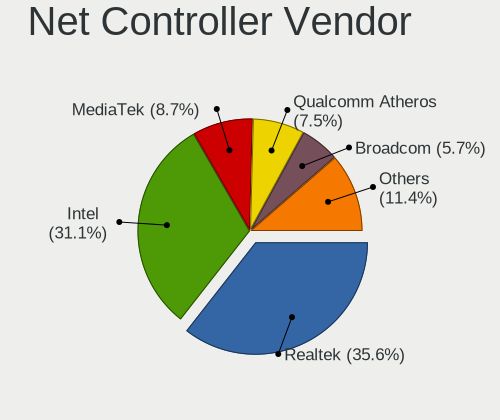
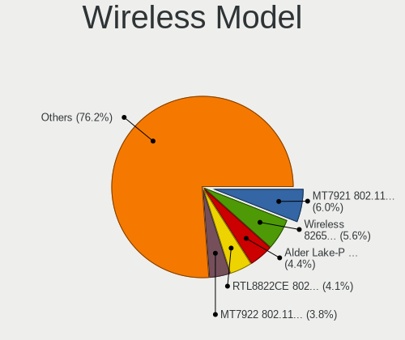

Fedora Hardware Trends (Notebooks)
----------------------------------

A project to identify most popular hardware characteristics and track their change
over time based on data collected by Fedora users at https://Linux-Hardware.org.

Anyone can contribute to this report by the [hw-probe](https://github.com/linuxhw/hw-probe) tool:

    sudo -E hw-probe -all -upload

Full-feature report is available here: https://linux-hardware.org/?view=trends

Period: Mar, 2022.

Contents
--------

* [ System ](#system)
  - [ OS                       ](#os)
  - [ OS Family                ](#os-family)
  - [ Kernel                   ](#kernel)
  - [ Kernel Family            ](#kernel-family)
  - [ Kernel Major Ver.        ](#kernel-major-ver)
  - [ Arch                     ](#arch)
  - [ DE                       ](#de)
  - [ Display Server           ](#display-server)
  - [ Display Manager          ](#display-manager)
  - [ OS Lang                  ](#os-lang)
  - [ Boot Mode                ](#boot-mode)
  - [ Filesystem               ](#filesystem)
  - [ Part. scheme             ](#part-scheme)
  - [ Dual Boot with Linux/BSD ](#dual-boot-with-linuxbsd)
  - [ Dual Boot (Win)          ](#dual-boot-win)

* [ Board ](#board)
  - [ Vendor                   ](#vendor)
  - [ Model                    ](#model)
  - [ Model Family             ](#model-family)
  - [ MFG Year                 ](#mfg-year)
  - [ Form Factor              ](#form-factor)
  - [ Secure Boot              ](#secure-boot)
  - [ Coreboot                 ](#coreboot)
  - [ RAM Size                 ](#ram-size)
  - [ RAM Used                 ](#ram-used)
  - [ Total Drives             ](#total-drives)
  - [ Has CD-ROM               ](#has-cd-rom)
  - [ Has Ethernet             ](#has-ethernet)
  - [ Has WiFi                 ](#has-wifi)
  - [ Has Bluetooth            ](#has-bluetooth)

* [ Location ](#location)
  - [ Country                  ](#country)
  - [ City                     ](#city)

* [ Drives ](#drives)
  - [ Drive Vendor             ](#drive-vendor)
  - [ Drive Model              ](#drive-model)
  - [ HDD Vendor               ](#hdd-vendor)
  - [ SSD Vendor               ](#ssd-vendor)
  - [ Drive Kind               ](#drive-kind)
  - [ Drive Connector          ](#drive-connector)
  - [ Drive Size               ](#drive-size)
  - [ Space Total              ](#space-total)
  - [ Space Used               ](#space-used)
  - [ Malfunc. Drives          ](#malfunc-drives)
  - [ Malfunc. Drive Vendor    ](#malfunc-drive-vendor)
  - [ Malfunc. HDD Vendor      ](#malfunc-hdd-vendor)
  - [ Malfunc. Drive Kind      ](#malfunc-drive-kind)
  - [ Failed Drives            ](#failed-drives)
  - [ Failed Drive Vendor      ](#failed-drive-vendor)
  - [ Drive Status             ](#drive-status)

* [ Storage controller ](#storage-controller)
  - [ Storage Vendor           ](#storage-vendor)
  - [ Storage Model            ](#storage-model)
  - [ Storage Kind             ](#storage-kind)

* [ Processor ](#processor)
  - [ CPU Vendor               ](#cpu-vendor)
  - [ CPU Model                ](#cpu-model)
  - [ CPU Model Family         ](#cpu-model-family)
  - [ CPU Cores                ](#cpu-cores)
  - [ CPU Sockets              ](#cpu-sockets)
  - [ CPU Threads              ](#cpu-threads)
  - [ CPU Op-Modes             ](#cpu-op-modes)
  - [ CPU Microcode            ](#cpu-microcode)
  - [ CPU Microarch            ](#cpu-microarch)

* [ Graphics ](#graphics)
  - [ GPU Vendor               ](#gpu-vendor)
  - [ GPU Model                ](#gpu-model)
  - [ GPU Combo                ](#gpu-combo)
  - [ GPU Driver               ](#gpu-driver)
  - [ GPU Memory               ](#gpu-memory)

* [ Monitor ](#monitor)
  - [ Monitor Vendor           ](#monitor-vendor)
  - [ Monitor Model            ](#monitor-model)
  - [ Monitor Resolution       ](#monitor-resolution)
  - [ Monitor Diagonal         ](#monitor-diagonal)
  - [ Monitor Width            ](#monitor-width)
  - [ Aspect Ratio             ](#aspect-ratio)
  - [ Monitor Area             ](#monitor-area)
  - [ Pixel Density            ](#pixel-density)
  - [ Multiple Monitors        ](#multiple-monitors)

* [ Network ](#network)
  - [ Net Controller Vendor    ](#net-controller-vendor)
  - [ Net Controller Model     ](#net-controller-model)
  - [ Wireless Vendor          ](#wireless-vendor)
  - [ Wireless Model           ](#wireless-model)
  - [ Ethernet Vendor          ](#ethernet-vendor)
  - [ Ethernet Model           ](#ethernet-model)
  - [ Net Controller Kind      ](#net-controller-kind)
  - [ Used Controller          ](#used-controller)
  - [ NICs                     ](#nics)
  - [ IPv6                     ](#ipv6)

* [ Bluetooth ](#bluetooth)
  - [ Bluetooth Vendor         ](#bluetooth-vendor)
  - [ Bluetooth Model          ](#bluetooth-model)

* [ Sound ](#sound)
  - [ Sound Vendor             ](#sound-vendor)
  - [ Sound Model              ](#sound-model)

* [ Memory ](#memory)
  - [ Memory Vendor            ](#memory-vendor)
  - [ Memory Model             ](#memory-model)
  - [ Memory Kind              ](#memory-kind)
  - [ Memory Form Factor       ](#memory-form-factor)
  - [ Memory Size              ](#memory-size)
  - [ Memory Speed             ](#memory-speed)

* [ Printers & scanners ](#printers--scanners)
  - [ Printer Vendor           ](#printer-vendor)
  - [ Printer Model            ](#printer-model)
  - [ Scanner Vendor           ](#scanner-vendor)
  - [ Scanner Model            ](#scanner-model)

* [ Camera ](#camera)
  - [ Camera Vendor            ](#camera-vendor)
  - [ Camera Model             ](#camera-model)

* [ Security ](#security)
  - [ Fingerprint Vendor       ](#fingerprint-vendor)
  - [ Fingerprint Model        ](#fingerprint-model)
  - [ Chipcard Vendor          ](#chipcard-vendor)
  - [ Chipcard Model           ](#chipcard-model)

* [ Unsupported ](#unsupported)
  - [ Unsupported Devices      ](#unsupported-devices)
  - [ Unsupported Device Types ](#unsupported-device-types)

System
------

OS
--

Installed operating systems

| Name      | Notebooks | Percent |
|-----------|-----------|---------|
| Fedora 35 | 146       | 86.9%   |
| Fedora 36 | 11        | 6.55%   |
| Fedora 34 | 8         | 4.76%   |
| Fedora 33 | 2         | 1.19%   |
| Fedora 32 | 1         | 0.6%    |

OS Family
---------

OS without a version

| Name   | Notebooks | Percent |
|--------|-----------|---------|
| Fedora | 168       | 100%    |

Kernel
------

Version of the Linux kernel

| Version                           | Notebooks | Percent |
|-----------------------------------|-----------|---------|
| 5.16.12-200.fc35.x86_64           | 36        | 21.43%  |
| 5.16.16-200.fc35.x86_64           | 34        | 20.24%  |
| 5.16.11-200.fc35.x86_64           | 17        | 10.12%  |
| 5.16.14-200.fc35.x86_64           | 12        | 7.14%   |
| 5.16.15-201.fc35.x86_64           | 11        | 6.55%   |
| 5.16.18-200.fc35.x86_64           | 10        | 5.95%   |
| 5.14.10-300.fc35.x86_64           | 9         | 5.36%   |
| 5.17.1-300.fc36.x86_64            | 5         | 2.98%   |
| 5.16.17-200.fc35.x86_64           | 4         | 2.38%   |
| 5.16.13-200.fc35.x86_64           | 4         | 2.38%   |
| 5.17.0-0.rc7.116.fc36.x86_64      | 3         | 1.79%   |
| 5.17.0-300.fc36.x86_64            | 2         | 1.19%   |
| 5.16.12-100.fc34.x86_64           | 2         | 1.19%   |
| 5.16.11-100.fc34.x86_64           | 2         | 1.19%   |
| 5.14.18-100.fc33.x86_64           | 2         | 1.19%   |
| 5.17.0-0.rc5.102.fc36.x86_64      | 1         | 0.6%    |
| 5.16.9-200.fc35.x86_64            | 1         | 0.6%    |
| 5.16.9-100.fc34.x86_64            | 1         | 0.6%    |
| 5.16.5-200.fc35.x86_64            | 1         | 0.6%    |
| 5.16.16-lqx2.0.fc35.x86_64        | 1         | 0.6%    |
| 5.16.16-100.fc34.x86_64           | 1         | 0.6%    |
| 5.16.13-xm1.0.fc35.x86_64         | 1         | 0.6%    |
| 5.16.12-250.vanilla.1.fc35.x86_64 | 1         | 0.6%    |
| 5.16.12-200.mbp.fc33.x86_64       | 1         | 0.6%    |
| 5.16.10-200.fc35.x86_64           | 1         | 0.6%    |
| 5.15.18-200.fc35.x86_64           | 1         | 0.6%    |
| 5.15.16-100.fc34.x86_64           | 1         | 0.6%    |
| 5.15.10-200.fc35.x86_64           | 1         | 0.6%    |
| 5.11.22-100.fc32.x86_64           | 1         | 0.6%    |
| 5.10.102-200.fc34.x86_64          | 1         | 0.6%    |

Kernel Family
-------------

Linux kernel without a distro release

| Version  | Notebooks | Percent |
|----------|-----------|---------|
| 5.16.12  | 40        | 23.81%  |
| 5.16.16  | 36        | 21.43%  |
| 5.16.11  | 19        | 11.31%  |
| 5.16.14  | 12        | 7.14%   |
| 5.16.15  | 11        | 6.55%   |
| 5.16.18  | 10        | 5.95%   |
| 5.14.10  | 9         | 5.36%   |
| 5.17.0   | 6         | 3.57%   |
| 5.17.1   | 5         | 2.98%   |
| 5.16.13  | 5         | 2.98%   |
| 5.16.17  | 4         | 2.38%   |
| 5.16.9   | 2         | 1.19%   |
| 5.14.18  | 2         | 1.19%   |
| 5.16.5   | 1         | 0.6%    |
| 5.16.10  | 1         | 0.6%    |
| 5.15.18  | 1         | 0.6%    |
| 5.15.16  | 1         | 0.6%    |
| 5.15.10  | 1         | 0.6%    |
| 5.11.22  | 1         | 0.6%    |
| 5.10.102 | 1         | 0.6%    |

Kernel Major Ver.
-----------------

Linux kernel major version

| Version | Notebooks | Percent |
|---------|-----------|---------|
| 5.16    | 141       | 83.93%  |
| 5.17    | 11        | 6.55%   |
| 5.14    | 11        | 6.55%   |
| 5.15    | 3         | 1.79%   |
| 5.11    | 1         | 0.6%    |
| 5.10    | 1         | 0.6%    |

Arch
----

OS architecture (x86_64, i586, etc.)

| Name   | Notebooks | Percent |
|--------|-----------|---------|
| x86_64 | 168       | 100%    |

DE
--

Desktop Environment

| Name          | Notebooks | Percent |
|---------------|-----------|---------|
| GNOME         | 134       | 79.76%  |
| KDE5          | 19        | 11.31%  |
| X-Cinnamon    | 4         | 2.38%   |
| MATE          | 3         | 1.79%   |
| Unknown       | 3         | 1.79%   |
| GNOME Classic | 2         | 1.19%   |
| XFCE          | 1         | 0.6%    |
| LXQt          | 1         | 0.6%    |
| Cinnamon      | 1         | 0.6%    |

Display Server
--------------

X11 or Wayland

| Name    | Notebooks | Percent |
|---------|-----------|---------|
| Wayland | 113       | 67.26%  |
| X11     | 51        | 30.36%  |
| Tty     | 2         | 1.19%   |
| Unknown | 2         | 1.19%   |

Display Manager
---------------

SDDM, LightDM, etc.

| Name    | Notebooks | Percent |
|---------|-----------|---------|
| Unknown | 85        | 50.6%   |
| GDM     | 64        | 38.1%   |
| SDDM    | 11        | 6.55%   |
| LightDM | 8         | 4.76%   |

OS Lang
-------

Language

| Lang  | Notebooks | Percent |
|-------|-----------|---------|
| en_US | 93        | 55.36%  |
| en_GB | 11        | 6.55%   |
| ru_RU | 9         | 5.36%   |
| pt_BR | 9         | 5.36%   |
| de_DE | 6         | 3.57%   |
| it_IT | 5         | 2.98%   |
| fr_FR | 5         | 2.98%   |
| es_MX | 4         | 2.38%   |
| en_AU | 3         | 1.79%   |
| tr_TR | 2         | 1.19%   |
| pl_PL | 2         | 1.19%   |
| en_IN | 2         | 1.19%   |
| en_CA | 2         | 1.19%   |
| zh_CN | 1         | 0.6%    |
| uk_UA | 1         | 0.6%    |
| nl_BE | 1         | 0.6%    |
| lt_LT | 1         | 0.6%    |
| fr_CH | 1         | 0.6%    |
| fr_BE | 1         | 0.6%    |
| es_GT | 1         | 0.6%    |
| es_EC | 1         | 0.6%    |
| es_CL | 1         | 0.6%    |
| es_AR | 1         | 0.6%    |
| en_ZA | 1         | 0.6%    |
| en_NZ | 1         | 0.6%    |
| en_IL | 1         | 0.6%    |
| da_DK | 1         | 0.6%    |
| cs_CZ | 1         | 0.6%    |

Boot Mode
---------

EFI or BIOS

| Mode | Notebooks | Percent |
|------|-----------|---------|
| EFI  | 142       | 84.52%  |
| BIOS | 26        | 15.48%  |

Filesystem
----------

Type of filesystem

| Type  | Notebooks | Percent |
|-------|-----------|---------|
| Btrfs | 132       | 78.57%  |
| Ext4  | 32        | 19.05%  |
| Xfs   | 4         | 2.38%   |

Part. scheme
------------

Scheme of partitioning

| Type    | Notebooks | Percent |
|---------|-----------|---------|
| Unknown | 87        | 51.79%  |
| GPT     | 75        | 44.64%  |
| MBR     | 6         | 3.57%   |

Dual Boot with Linux/BSD
------------------------

Hosting more than one Linux/BSD

| Dual boot | Notebooks | Percent |
|-----------|-----------|---------|
| No        | 153       | 91.07%  |
| Yes       | 15        | 8.93%   |

Dual Boot (Win)
---------------

Hosting Linux and Windows

| Dual boot | Notebooks | Percent |
|-----------|-----------|---------|
| No        | 140       | 83.33%  |
| Yes       | 28        | 16.67%  |

Board
-----

Vendor
------

Motherboard manufacturer

| Name                   | Notebooks | Percent |
|------------------------|-----------|---------|
| Lenovo                 | 42        | 25%     |
| Hewlett-Packard        | 38        | 22.62%  |
| Dell                   | 26        | 15.48%  |
| Acer                   | 13        | 7.74%   |
| ASUSTek Computer       | 12        | 7.14%   |
| Apple                  | 6         | 3.57%   |
| MSI                    | 4         | 2.38%   |
| HUAWEI                 | 3         | 1.79%   |
| Toshiba                | 2         | 1.19%   |
| System76               | 2         | 1.19%   |
| Sony                   | 2         | 1.19%   |
| Positivo               | 2         | 1.19%   |
| Vulcan Electronics     | 1         | 0.6%    |
| VALE                   | 1         | 0.6%    |
| TUXEDO                 | 1         | 0.6%    |
| Timi                   | 1         | 0.6%    |
| Samsung Electronics    | 1         | 0.6%    |
| Razer                  | 1         | 0.6%    |
| Medion                 | 1         | 0.6%    |
| HONOR                  | 1         | 0.6%    |
| Hampoo                 | 1         | 0.6%    |
| Fujitsu Siemens        | 1         | 0.6%    |
| Fujitsu                | 1         | 0.6%    |
| Framework              | 1         | 0.6%    |
| eMachines              | 1         | 0.6%    |
| Digibras               | 1         | 0.6%    |
| Avell High Performance | 1         | 0.6%    |
| Alienware              | 1         | 0.6%    |

Model
-----

Motherboard model

| Name                                       | Notebooks | Percent |
|--------------------------------------------|-----------|---------|
| HP Pavilion Aero Laptop 13-be0xxx          | 3         | 1.79%   |
| MSI GE75 Raider 10SE                       | 2         | 1.19%   |
| Lenovo ThinkBook 15 G2 ITL 20VE            | 2         | 1.19%   |
| HP Pavilion Gaming Laptop 15-ec1xxx        | 2         | 1.19%   |
| HP EliteBook 850 G5                        | 2         | 1.19%   |
| Dell Latitude 7285                         | 2         | 1.19%   |
| Vulcan Excursion XB                        | 1         | 0.6%    |
| VALE Notebook Slim S132                    | 1         | 0.6%    |
| TUXEDO Polaris Intel Gen3 (TGL)            | 1         | 0.6%    |
| Toshiba TECRA Z50-A                        | 1         | 0.6%    |
| Toshiba Satellite C855-12R                 | 1         | 0.6%    |
| Timi TM1612                                | 1         | 0.6%    |
| System76 Oryx Pro                          | 1         | 0.6%    |
| System76 Gazelle                           | 1         | 0.6%    |
| Sony VGN-FW180D                            | 1         | 0.6%    |
| Sony SVF14213CLB                           | 1         | 0.6%    |
| Samsung RC420/RC520/RC720                  | 1         | 0.6%    |
| Razer Blade Stealth                        | 1         | 0.6%    |
| Positivo N1250                             | 1         | 0.6%    |
| Positivo CHT12CP                           | 1         | 0.6%    |
| MSI Stealth GS66 12UHS                     | 1         | 0.6%    |
| MSI Delta 15 A5EFK                         | 1         | 0.6%    |
| Medion Akoya P6638                         | 1         | 0.6%    |
| Lenovo Yoga Slim 7 Pro 14ACH5 82MS         | 1         | 0.6%    |
| Lenovo V330-15IKB 81AX                     | 1         | 0.6%    |
| Lenovo V14-ADA 82C6                        | 1         | 0.6%    |
| Lenovo ThinkPad X270 20HMS6AT00            | 1         | 0.6%    |
| Lenovo ThinkPad X260 20F5S0HK1J            | 1         | 0.6%    |
| Lenovo ThinkPad X250 20CLS09Y19            | 1         | 0.6%    |
| Lenovo ThinkPad X220 428767U               | 1         | 0.6%    |
| Lenovo ThinkPad X1 Carbon Gen 9 20XW00A9US | 1         | 0.6%    |
| Lenovo ThinkPad X1 Carbon 7th 20QD003LAD   | 1         | 0.6%    |
| Lenovo ThinkPad X1 Carbon 6th 20KGS3Y900   | 1         | 0.6%    |
| Lenovo ThinkPad X1 Carbon 4th 20FB006AMN   | 1         | 0.6%    |
| Lenovo ThinkPad T490s 20NYS7K91U           | 1         | 0.6%    |
| Lenovo ThinkPad T490 20N2S1CV00            | 1         | 0.6%    |
| Lenovo ThinkPad T440p 20AWA07B00           | 1         | 0.6%    |
| Lenovo ThinkPad P53 20QN0011IV             | 1         | 0.6%    |
| Lenovo ThinkPad P53 20QN000HGE             | 1         | 0.6%    |
| Lenovo ThinkPad P15 Gen 1 20STS0J500       | 1         | 0.6%    |
| Lenovo ThinkPad P14s Gen 1 20Y1S00D00      | 1         | 0.6%    |
| Lenovo ThinkPad L14 Gen 1 20U1S1G700       | 1         | 0.6%    |
| Lenovo ThinkPad L13 Gen 2 20VJS0HB00       | 1         | 0.6%    |
| Lenovo ThinkPad Edge E540 20C6004GRI       | 1         | 0.6%    |
| Lenovo ThinkPad E15 Gen 2 20T8S0AG00       | 1         | 0.6%    |
| Lenovo Legion 5 Pro 16ACH6H 82JQ           | 1         | 0.6%    |
| Lenovo Legion 5 15ARH05H 82B1              | 1         | 0.6%    |
| Lenovo IdeaPad Z510 20287                  | 1         | 0.6%    |
| Lenovo IdeaPad Slim 1-14AST-05 81VS        | 1         | 0.6%    |
| Lenovo IdeaPad S145-15IIL 82DJ             | 1         | 0.6%    |
| Lenovo IdeaPad Gaming 3 15IMH05 81Y4       | 1         | 0.6%    |
| Lenovo IdeaPad Gaming 3 15IHU6 82K1        | 1         | 0.6%    |
| Lenovo IdeaPad 710S-13ISK 80SW             | 1         | 0.6%    |
| Lenovo IdeaPad 710S-13IKB 80VQ             | 1         | 0.6%    |
| Lenovo IdeaPad 530S-14ARR 81H1             | 1         | 0.6%    |
| Lenovo IdeaPad 520-15IKB 81BF              | 1         | 0.6%    |
| Lenovo IdeaPad 5 Pro 14ACN6 82L7           | 1         | 0.6%    |
| Lenovo IdeaPad 330-14AST 81D5              | 1         | 0.6%    |
| Lenovo IdeaPad 320S-14IKB 81BN             | 1         | 0.6%    |
| Lenovo G780 20138                          | 1         | 0.6%    |

Model Family
------------

Motherboard model prefix

| Name                        | Notebooks | Percent |
|-----------------------------|-----------|---------|
| Lenovo ThinkPad             | 19        | 11.31%  |
| HP Pavilion                 | 13        | 7.74%   |
| Lenovo IdeaPad              | 12        | 7.14%   |
| Dell Latitude               | 9         | 5.36%   |
| Acer Aspire                 | 8         | 4.76%   |
| Dell Inspiron               | 7         | 4.17%   |
| HP EliteBook                | 6         | 3.57%   |
| HP ProBook                  | 5         | 2.98%   |
| HP Laptop                   | 5         | 2.98%   |
| Dell XPS                    | 5         | 2.98%   |
| HP ZBook                    | 4         | 2.38%   |
| Dell Vostro                 | 3         | 1.79%   |
| ASUS ROG                    | 3         | 1.79%   |
| MSI GE75                    | 2         | 1.19%   |
| Lenovo ThinkBook            | 2         | 1.19%   |
| Lenovo Legion               | 2         | 1.19%   |
| Vulcan Excursion            | 1         | 0.6%    |
| VALE Notebook               | 1         | 0.6%    |
| TUXEDO Polaris              | 1         | 0.6%    |
| Toshiba TECRA               | 1         | 0.6%    |
| Toshiba Satellite           | 1         | 0.6%    |
| Timi TM1612                 | 1         | 0.6%    |
| System76 Oryx               | 1         | 0.6%    |
| System76 Gazelle            | 1         | 0.6%    |
| Sony VGN-FW180D             | 1         | 0.6%    |
| Sony SVF14213CLB            | 1         | 0.6%    |
| Samsung RC420               | 1         | 0.6%    |
| Razer Blade                 | 1         | 0.6%    |
| Positivo N1250              | 1         | 0.6%    |
| Positivo CHT12CP            | 1         | 0.6%    |
| MSI Stealth                 | 1         | 0.6%    |
| MSI Delta                   | 1         | 0.6%    |
| Medion Akoya                | 1         | 0.6%    |
| Lenovo Yoga                 | 1         | 0.6%    |
| Lenovo V330-15IKB           | 1         | 0.6%    |
| Lenovo V14-ADA              | 1         | 0.6%    |
| Lenovo G780                 | 1         | 0.6%    |
| Lenovo G50-70               | 1         | 0.6%    |
| Lenovo G50-45               | 1         | 0.6%    |
| Lenovo G40-80               | 1         | 0.6%    |
| HUAWEI HVY-WXX9             | 1         | 0.6%    |
| HUAWEI BOHK-WAX9X           | 1         | 0.6%    |
| HUAWEI BOD-WXX9             | 1         | 0.6%    |
| HONOR NBD-WXX9              | 1         | 0.6%    |
| HP Stream                   | 1         | 0.6%    |
| HP OMEN                     | 1         | 0.6%    |
| HP Notebook                 | 1         | 0.6%    |
| HP ENVY                     | 1         | 0.6%    |
| HP ElitePad                 | 1         | 0.6%    |
| Hampoo C1W6                 | 1         | 0.6%    |
| Fujitsu Siemens ESPRIMO     | 1         | 0.6%    |
| Fujitsu LIFEBOOK            | 1         | 0.6%    |
| Framework Laptop            | 1         | 0.6%    |
| eMachines E725              | 1         | 0.6%    |
| Digibras NH4CU03            | 1         | 0.6%    |
| Dell Precision              | 1         | 0.6%    |
| Dell G5                     | 1         | 0.6%    |
| Avell High Performance B.ON | 1         | 0.6%    |
| ASUS X75VCP                 | 1         | 0.6%    |
| ASUS X550LC                 | 1         | 0.6%    |

MFG Year
--------

Motherboard manufacture year

| Year | Notebooks | Percent |
|------|-----------|---------|
| 2020 | 34        | 20.24%  |
| 2021 | 26        | 15.48%  |
| 2019 | 19        | 11.31%  |
| 2018 | 15        | 8.93%   |
| 2013 | 13        | 7.74%   |
| 2017 | 12        | 7.14%   |
| 2015 | 10        | 5.95%   |
| 2011 | 10        | 5.95%   |
| 2016 | 9         | 5.36%   |
| 2014 | 7         | 4.17%   |
| 2012 | 7         | 4.17%   |
| 2008 | 3         | 1.79%   |
| 2009 | 2         | 1.19%   |
| 2010 | 1         | 0.6%    |

Form Factor
-----------

Physical design of the computer

| Name     | Notebooks | Percent |
|----------|-----------|---------|
| Notebook | 168       | 100%    |

Secure Boot
-----------

Enabled or disabled

| State    | Notebooks | Percent |
|----------|-----------|---------|
| Disabled | 138       | 82.14%  |
| Enabled  | 30        | 17.86%  |

Coreboot
--------

Have coreboot on board

| Used | Notebooks | Percent |
|------|-----------|---------|
| No   | 168       | 100%    |

RAM Size
--------

Total RAM memory

| Size in GB  | Notebooks | Percent |
|-------------|-----------|---------|
| 16.01-24.0  | 39        | 23.21%  |
| 8.01-16.0   | 38        | 22.62%  |
| 4.01-8.0    | 37        | 22.02%  |
| 3.01-4.0    | 26        | 15.48%  |
| 32.01-64.0  | 22        | 13.1%   |
| 64.01-256.0 | 3         | 1.79%   |
| 1.01-2.0    | 2         | 1.19%   |
| 24.01-32.0  | 1         | 0.6%    |

RAM Used
--------

Used RAM memory

| Used GB    | Notebooks | Percent |
|------------|-----------|---------|
| 4.01-8.0   | 52        | 30.95%  |
| 2.01-3.0   | 44        | 26.19%  |
| 3.01-4.0   | 39        | 23.21%  |
| 1.01-2.0   | 24        | 14.29%  |
| 8.01-16.0  | 6         | 3.57%   |
| 16.01-24.0 | 3         | 1.79%   |

Total Drives
------------

Number of drives on board

| Drives | Notebooks | Percent |
|--------|-----------|---------|
| 1      | 113       | 67.26%  |
| 2      | 50        | 29.76%  |
| 3      | 4         | 2.38%   |
| 4      | 1         | 0.6%    |

Has CD-ROM
----------

Has CD-ROM on board

| Presented | Notebooks | Percent |
|-----------|-----------|---------|
| No        | 134       | 79.76%  |
| Yes       | 34        | 20.24%  |

Has Ethernet
------------

Has Ethernet on board

| Presented | Notebooks | Percent |
|-----------|-----------|---------|
| Yes       | 130       | 77.38%  |
| No        | 38        | 22.62%  |

Has WiFi
--------

Has WiFi module

| Presented | Notebooks | Percent |
|-----------|-----------|---------|
| Yes       | 164       | 97.62%  |
| No        | 4         | 2.38%   |

Has Bluetooth
-------------

Has Bluetooth module

| Presented | Notebooks | Percent |
|-----------|-----------|---------|
| Yes       | 136       | 80.95%  |
| No        | 32        | 19.05%  |

Location
--------

Country
-------

Geographic location (country)

| Country      | Notebooks | Percent |
|--------------|-----------|---------|
| USA          | 29        | 17.26%  |
| Brazil       | 17        | 10.12%  |
| Russia       | 10        | 5.95%   |
| UK           | 7         | 4.17%   |
| Italy        | 6         | 3.57%   |
| Indonesia    | 6         | 3.57%   |
| Germany      | 6         | 3.57%   |
| Turkey       | 5         | 2.98%   |
| Mexico       | 5         | 2.98%   |
| Canada       | 5         | 2.98%   |
| Norway       | 4         | 2.38%   |
| France       | 4         | 2.38%   |
| Poland       | 3         | 1.79%   |
| India        | 3         | 1.79%   |
| Czechia      | 3         | 1.79%   |
| Belgium      | 3         | 1.79%   |
| Australia    | 3         | 1.79%   |
| Argentina    | 3         | 1.79%   |
| Switzerland  | 2         | 1.19%   |
| Romania      | 2         | 1.19%   |
| Philippines  | 2         | 1.19%   |
| Netherlands  | 2         | 1.19%   |
| Israel       | 2         | 1.19%   |
| Hungary      | 2         | 1.19%   |
| Uzbekistan   | 1         | 0.6%    |
| Uruguay      | 1         | 0.6%    |
| Ukraine      | 1         | 0.6%    |
| UAE          | 1         | 0.6%    |
| Tunisia      | 1         | 0.6%    |
| Sweden       | 1         | 0.6%    |
| Spain        | 1         | 0.6%    |
| South Africa | 1         | 0.6%    |
| Serbia       | 1         | 0.6%    |
| Saudi Arabia | 1         | 0.6%    |
| Panama       | 1         | 0.6%    |
| New Zealand  | 1         | 0.6%    |
| Myanmar      | 1         | 0.6%    |
| Malaysia     | 1         | 0.6%    |
| Lithuania    | 1         | 0.6%    |
| Latvia       | 1         | 0.6%    |
| Kuwait       | 1         | 0.6%    |
| Japan        | 1         | 0.6%    |
| Iran         | 1         | 0.6%    |
| Hong Kong    | 1         | 0.6%    |
| Honduras     | 1         | 0.6%    |
| Guatemala    | 1         | 0.6%    |
| Greece       | 1         | 0.6%    |
| Finland      | 1         | 0.6%    |
| Estonia      | 1         | 0.6%    |
| Ecuador      | 1         | 0.6%    |
| Denmark      | 1         | 0.6%    |
| Cyprus       | 1         | 0.6%    |
| Croatia      | 1         | 0.6%    |
| China        | 1         | 0.6%    |
| Chile        | 1         | 0.6%    |
| Bulgaria     | 1         | 0.6%    |
| Belarus      | 1         | 0.6%    |
| Austria      | 1         | 0.6%    |

City
----

Geographic location (city)

| City                   | Notebooks | Percent |
|------------------------|-----------|---------|
| Sao Paulo              | 5         | 2.98%   |
| Istanbul               | 4         | 2.38%   |
| Vancouver              | 2         | 1.19%   |
| Sydney                 | 2         | 1.19%   |
| Seattle                | 2         | 1.19%   |
| Oslo                   | 2         | 1.19%   |
| Nuremberg              | 2         | 1.19%   |
| Moscow                 | 2         | 1.19%   |
| Los Angeles            | 2         | 1.19%   |
| Jakarta                | 2         | 1.19%   |
| Fortaleza              | 2         | 1.19%   |
| Canton                 | 2         | 1.19%   |
| Bucharest              | 2         | 1.19%   |
| Brno                   | 2         | 1.19%   |
| Zagreb                 | 1         | 0.6%    |
| Yuzhno-Sakhalinsk      | 1         | 0.6%    |
| Yangon                 | 1         | 0.6%    |
| Winnipeg               | 1         | 0.6%    |
| West Drayton           | 1         | 0.6%    |
| Washington             | 1         | 0.6%    |
| Warsaw                 | 1         | 0.6%    |
| Warrington             | 1         | 0.6%    |
| Vicosa                 | 1         | 0.6%    |
| Vegarshei              | 1         | 0.6%    |
| Varginha               | 1         | 0.6%    |
| Vantaa                 | 1         | 0.6%    |
| Valbrembo              | 1         | 0.6%    |
| Umeå                  | 1         | 0.6%    |
| Ulyanovsk              | 1         | 0.6%    |
| Ufa                    | 1         | 0.6%    |
| Tunis                  | 1         | 0.6%    |
| Tijucas                | 1         | 0.6%    |
| Tepic                  | 1         | 0.6%    |
| Tehran                 | 1         | 0.6%    |
| Tashkent               | 1         | 0.6%    |
| Tampa                  | 1         | 0.6%    |
| Tallinn                | 1         | 0.6%    |
| Tacoma                 | 1         | 0.6%    |
| Syktyvkar              | 1         | 0.6%    |
| Surabaya               | 1         | 0.6%    |
| St Petersburg          | 1         | 0.6%    |
| Springfield            | 1         | 0.6%    |
| Springboro             | 1         | 0.6%    |
| Southampton            | 1         | 0.6%    |
| Sorocaba               | 1         | 0.6%    |
| Solihull               | 1         | 0.6%    |
| Sofia                  | 1         | 0.6%    |
| Skoppum                | 1         | 0.6%    |
| Siemianowice Śląskie | 1         | 0.6%    |
| Seraing                | 1         | 0.6%    |
| Sao José dos Campos   | 1         | 0.6%    |
| Santiago               | 1         | 0.6%    |
| Santa Fe               | 1         | 0.6%    |
| San Pedro Sula         | 1         | 0.6%    |
| San Jose               | 1         | 0.6%    |
| Salerno                | 1         | 0.6%    |
| Saint-Denis            | 1         | 0.6%    |
| Royersford             | 1         | 0.6%    |
| Rostov-on-Don          | 1         | 0.6%    |
| Rokiškis              | 1         | 0.6%    |

Drives
------

Drive Vendor
------------

Hard drive vendors

| Vendor                         | Notebooks | Drives | Percent |
|--------------------------------|-----------|--------|---------|
| Samsung Electronics            | 45        | 52     | 21.13%  |
| WDC                            | 25        | 26     | 11.74%  |
| SK Hynix                       | 14        | 14     | 6.57%   |
| Toshiba                        | 13        | 13     | 6.1%    |
| Sandisk                        | 13        | 13     | 6.1%    |
| Kingston                       | 13        | 13     | 6.1%    |
| Seagate                        | 12        | 12     | 5.63%   |
| Unknown                        | 10        | 14     | 4.69%   |
| Intel                          | 9         | 10     | 4.23%   |
| KIOXIA                         | 7         | 7      | 3.29%   |
| Micron Technology              | 6         | 6      | 2.82%   |
| Crucial                        | 5         | 6      | 2.35%   |
| Apple                          | 4         | 5      | 1.88%   |
| A-DATA Technology              | 4         | 4      | 1.88%   |
| Hitachi                        | 3         | 3      | 1.41%   |
| Transcend                      | 2         | 2      | 0.94%   |
| HGST                           | 2         | 2      | 0.94%   |
| Unknown                        | 2         | 2      | 0.94%   |
| YMTC                           | 1         | 1      | 0.47%   |
| XPG                            | 1         | 1      | 0.47%   |
| UMIS                           | 1         | 1      | 0.47%   |
| Team                           | 1         | 1      | 0.47%   |
| Solid State Storage Technology | 1         | 1      | 0.47%   |
| Silicon Motion                 | 1         | 1      | 0.47%   |
| Realtek Semiconductor          | 1         | 1      | 0.47%   |
| Ramsta                         | 1         | 1      | 0.47%   |
| PNY                            | 1         | 2      | 0.47%   |
| PLEXTOR                        | 1         | 2      | 0.47%   |
| Patriot                        | 1         | 1      | 0.47%   |
| OCZ                            | 1         | 1      | 0.47%   |
| Mushkin                        | 1         | 1      | 0.47%   |
| Lexar                          | 1         | 1      | 0.47%   |
| KingSpec                       | 1         | 1      | 0.47%   |
| JMicron                        | 1         | 1      | 0.47%   |
| JetFlash                       | 1         | 1      | 0.47%   |
| HPE                            | 1         | 1      | 0.47%   |
| External                       | 1         | 1      | 0.47%   |
| CT1000P2                       | 1         | 1      | 0.47%   |
| China                          | 1         | 1      | 0.47%   |
| APS-SL3N                       | 1         | 1      | 0.47%   |
| Apacer                         | 1         | 1      | 0.47%   |
| ADATA Technology               | 1         | 1      | 0.47%   |

Drive Model
-----------

Hard drive models

| Model                                | Notebooks | Percent |
|--------------------------------------|-----------|---------|
| Samsung NVMe SSD Drive 512GB         | 5         | 2.25%   |
| Samsung NVMe SSD Drive 1TB           | 5         | 2.25%   |
| Samsung NVMe SSD Drive 256GB         | 4         | 1.8%    |
| Kingston SA400S37480G 480GB SSD      | 4         | 1.8%    |
| Kingston SA400S37240G 240GB SSD      | 4         | 1.8%    |
| Unknown MMC Card  64GB               | 3         | 1.35%   |
| Toshiba MQ04ABF100 1TB               | 3         | 1.35%   |
| SK Hynix NVMe SSD Drive 512GB        | 3         | 1.35%   |
| Sandisk NVMe SSD Drive 512GB         | 3         | 1.35%   |
| Samsung NVMe SSD Drive 1024GB        | 3         | 1.35%   |
| WDC PC SN730 SDBQNTY-256G-1001 256GB | 2         | 0.9%    |
| Unknown MMC Card  32GB               | 2         | 0.9%    |
| Unknown MMC Card  128GB              | 2         | 0.9%    |
| Toshiba NVMe SSD Drive 512GB         | 2         | 0.9%    |
| SK Hynix NVMe SSD Drive 256GB        | 2         | 0.9%    |
| SK Hynix NVMe SSD Drive 1024GB       | 2         | 0.9%    |
| Seagate ST500LM030-2E717D 500GB      | 2         | 0.9%    |
| Seagate ST1000LM024 HN-M101MBB 1TB   | 2         | 0.9%    |
| Sandisk NVMe SSD Drive 500GB         | 2         | 0.9%    |
| Sandisk NVMe SSD Drive 1TB           | 2         | 0.9%    |
| Samsung SSD 860 EVO 2TB              | 2         | 0.9%    |
| Samsung MZVLV256HCHP-000L2 256GB     | 2         | 0.9%    |
| Samsung MZVLQ512HBLU-00BH1 512GB     | 2         | 0.9%    |
| Samsung MZVLB1T0HBLR-000L7 1TB       | 2         | 0.9%    |
| Samsung MZALQ512HBLU-00BL2 512GB     | 2         | 0.9%    |
| KIOXIA NVMe SSD Drive 512GB          | 2         | 0.9%    |
| KIOXIA NVMe SSD Drive 256GB          | 2         | 0.9%    |
| Crucial CT240BX500SSD1 240GB         | 2         | 0.9%    |
| Unknown                              | 2         | 0.9%    |
| YMTC PC005 512GB                     | 1         | 0.45%   |
| XPG NVMe SSD Drive 2TB               | 1         | 0.45%   |
| WDC WDS500G1X0E-00AFY0 500GB         | 1         | 0.45%   |
| WDC WDS250G2B0A-00SM50 250GB SSD     | 1         | 0.45%   |
| WDC WDS240G2G0B-00EPW0 240GB SSD     | 1         | 0.45%   |
| WDC WDS240G2G0A-00JH30 240GB SSD     | 1         | 0.45%   |
| WDC WDS240G1G0A-00SS50 240GB SSD     | 1         | 0.45%   |
| WDC WDS120G2G0A-00JH30 120GB SSD     | 1         | 0.45%   |
| WDC WDS100T2B0B-00YS70 1TB SSD       | 1         | 0.45%   |
| WDC WD5000LPVX-75V0TT0 500GB         | 1         | 0.45%   |
| WDC WD5000LPCX-24VHAT0 500GB         | 1         | 0.45%   |
| WDC WD5000LPCX-24C6HT0 500GB         | 1         | 0.45%   |
| WDC WD5000BPVT-22HXZT3 500GB         | 1         | 0.45%   |
| WDC WD3200BEKT-75PVMT1 320GB         | 1         | 0.45%   |
| WDC WD3200BEKT-22F3T0 320GB          | 1         | 0.45%   |
| WDC WD20SPZX-22UA7T0 2TB             | 1         | 0.45%   |
| WDC WD1600BEVT-22ZCT0 160GB          | 1         | 0.45%   |
| WDC WD10SPZX-21Z10T0 1TB             | 1         | 0.45%   |
| WDC WD10SPZX-00Z10T0 1TB             | 1         | 0.45%   |
| WDC WD10SPSX-00A6WT0 1TB             | 1         | 0.45%   |
| WDC WD10JPVX-75JC3T0 1TB             | 1         | 0.45%   |
| WDC WD10JPVX-60JC3T0 1TB             | 1         | 0.45%   |
| WDC WD10JPCX-24UE4T0 1TB             | 1         | 0.45%   |
| WDC PC SN810 SDCPNRY-1T00-1032 1TB   | 1         | 0.45%   |
| WDC PC SN730 SDBPNTY-512G-1027 512GB | 1         | 0.45%   |
| WDC PC SN530 NVMe 512GB              | 1         | 0.45%   |
| Unknown SD16G  16GB                  | 1         | 0.45%   |
| Unknown SD128  128GB                 | 1         | 0.45%   |
| Unknown SD/MMC/MS PRO 32GB           | 1         | 0.45%   |
| Unknown NCard  32GB                  | 1         | 0.45%   |
| Unknown MMC64G  64GB                 | 1         | 0.45%   |

HDD Vendor
----------

Hard disk drive vendors

| Vendor  | Notebooks | Drives | Percent |
|---------|-----------|--------|---------|
| WDC     | 14        | 14     | 40%     |
| Seagate | 11        | 11     | 31.43%  |
| Toshiba | 4         | 4      | 11.43%  |
| Hitachi | 3         | 3      | 8.57%   |
| HGST    | 2         | 2      | 5.71%   |
| Unknown | 1         | 1      | 2.86%   |

SSD Vendor
----------

Solid state drive vendors

| Vendor              | Notebooks | Drives | Percent |
|---------------------|-----------|--------|---------|
| Samsung Electronics | 12        | 13     | 18.75%  |
| Kingston            | 11        | 11     | 17.19%  |
| WDC                 | 5         | 6      | 7.81%   |
| Crucial             | 5         | 6      | 7.81%   |
| SanDisk             | 4         | 4      | 6.25%   |
| Micron Technology   | 4         | 4      | 6.25%   |
| Intel               | 3         | 3      | 4.69%   |
| A-DATA Technology   | 3         | 3      | 4.69%   |
| Transcend           | 2         | 2      | 3.13%   |
| Apple               | 2         | 2      | 3.13%   |
| Toshiba             | 1         | 1      | 1.56%   |
| Team                | 1         | 1      | 1.56%   |
| Ramsta              | 1         | 1      | 1.56%   |
| PLEXTOR             | 1         | 2      | 1.56%   |
| Patriot             | 1         | 1      | 1.56%   |
| OCZ                 | 1         | 1      | 1.56%   |
| Mushkin             | 1         | 1      | 1.56%   |
| KingSpec            | 1         | 1      | 1.56%   |
| JMicron             | 1         | 1      | 1.56%   |
| HPE                 | 1         | 1      | 1.56%   |
| CT1000P2            | 1         | 1      | 1.56%   |
| China               | 1         | 1      | 1.56%   |
| Apacer              | 1         | 1      | 1.56%   |

Drive Kind
----------

HDD or SSD

| Kind    | Notebooks | Drives | Percent |
|---------|-----------|--------|---------|
| NVMe    | 91        | 107    | 45.05%  |
| SSD     | 62        | 68     | 30.69%  |
| HDD     | 35        | 35     | 17.33%  |
| MMC     | 10        | 16     | 4.95%   |
| Unknown | 4         | 4      | 1.98%   |

Drive Connector
---------------

SATA, SAS, NVMe, etc.

| Type | Notebooks | Drives | Percent |
|------|-----------|--------|---------|
| NVMe | 91        | 106    | 47.15%  |
| SATA | 84        | 99     | 43.52%  |
| MMC  | 10        | 16     | 5.18%   |
| SAS  | 8         | 9      | 4.15%   |

Drive Size
----------

Size of hard drive

| Size in TB | Notebooks | Drives | Percent |
|------------|-----------|--------|---------|
| 0.01-0.5   | 60        | 65     | 62.5%   |
| 0.51-1.0   | 30        | 31     | 31.25%  |
| 1.01-2.0   | 6         | 7      | 6.25%   |

Space Total
-----------

Amount of disk space available on the file system

| Size in GB     | Notebooks | Percent |
|----------------|-----------|---------|
| 501-1000       | 38        | 22.62%  |
| 101-250        | 35        | 20.83%  |
| 251-500        | 29        | 17.26%  |
| 1001-2000      | 25        | 14.88%  |
| 1-20           | 20        | 11.9%   |
| 51-100         | 7         | 4.17%   |
| More than 3000 | 6         | 3.57%   |
| Unknown        | 5         | 2.98%   |
| 2001-3000      | 2         | 1.19%   |
| 21-50          | 1         | 0.6%    |

Space Used
----------

Amount of used disk space

| Used GB        | Notebooks | Percent |
|----------------|-----------|---------|
| 1-20           | 60        | 35.71%  |
| 21-50          | 29        | 17.26%  |
| 51-100         | 28        | 16.67%  |
| 101-250        | 18        | 10.71%  |
| 251-500        | 13        | 7.74%   |
| 501-1000       | 9         | 5.36%   |
| Unknown        | 5         | 2.98%   |
| 1001-2000      | 4         | 2.38%   |
| More than 3000 | 1         | 0.6%    |
| 2001-3000      | 1         | 0.6%    |

Malfunc. Drives
---------------

Drive models with a malfunction

| Model                              | Notebooks | Drives | Percent |
|------------------------------------|-----------|--------|---------|
| Seagate ST1000LM024 HN-M101MBB 1TB | 1         | 1      | 33.33%  |
| Hitachi HTS545050B9A300 500GB      | 1         | 1      | 33.33%  |
| Crucial CT240BX500SSD1 240GB       | 1         | 1      | 33.33%  |

Malfunc. Drive Vendor
---------------------

Vendors of faulty drives

| Vendor  | Notebooks | Drives | Percent |
|---------|-----------|--------|---------|
| Seagate | 1         | 1      | 33.33%  |
| Hitachi | 1         | 1      | 33.33%  |
| Crucial | 1         | 1      | 33.33%  |

Malfunc. HDD Vendor
-------------------

Vendors of faulty HDD drives

| Vendor  | Notebooks | Drives | Percent |
|---------|-----------|--------|---------|
| Seagate | 1         | 1      | 50%     |
| Hitachi | 1         | 1      | 50%     |

Malfunc. Drive Kind
-------------------

Kinds of faulty drives

| Kind | Notebooks | Drives | Percent |
|------|-----------|--------|---------|
| HDD  | 2         | 2      | 66.67%  |
| SSD  | 1         | 1      | 33.33%  |

Failed Drives
-------------

Failed drive models

Zero info for selected period =(

Failed Drive Vendor
-------------------

Failed drive vendors

Zero info for selected period =(

Drive Status
------------

Number of failed and malfunc. drives

| Status   | Notebooks | Drives | Percent |
|----------|-----------|--------|---------|
| Detected | 95        | 132    | 54.29%  |
| Works    | 77        | 95     | 44%     |
| Malfunc  | 3         | 3      | 1.71%   |

Storage controller
------------------

Storage Vendor
--------------

Storage controller vendors

| Vendor                           | Notebooks | Percent |
|----------------------------------|-----------|---------|
| Intel                            | 96        | 45.07%  |
| Samsung Electronics              | 35        | 16.43%  |
| AMD                              | 24        | 11.27%  |
| Sandisk                          | 14        | 6.57%   |
| SK Hynix                         | 13        | 6.1%    |
| Toshiba America Info Systems     | 9         | 4.23%   |
| KIOXIA                           | 6         | 2.82%   |
| Silicon Motion                   | 2         | 0.94%   |
| Micron Technology                | 2         | 0.94%   |
| Kingston Technology Company      | 2         | 0.94%   |
| Apple                            | 2         | 0.94%   |
| ADATA Technology                 | 2         | 0.94%   |
| Yangtze Memory Technologies      | 1         | 0.47%   |
| Union Memory (Shenzhen)          | 1         | 0.47%   |
| Solid State Storage Technology   | 1         | 0.47%   |
| Silicon Integrated Systems [SiS] | 1         | 0.47%   |
| Phison Electronics               | 1         | 0.47%   |
| Nvidia                           | 1         | 0.47%   |

Storage Model
-------------

Storage controller models

| Model                                                                            | Notebooks | Percent |
|----------------------------------------------------------------------------------|-----------|---------|
| AMD FCH SATA Controller [AHCI mode]                                              | 23        | 10.27%  |
| Intel Sunrise Point-LP SATA Controller [AHCI mode]                               | 16        | 7.14%   |
| Samsung NVMe SSD Controller SM981/PM981/PM983                                    | 15        | 6.7%    |
| Samsung NVMe SSD Controller 980                                                  | 10        | 4.46%   |
| Intel 7 Series Chipset Family 6-port SATA Controller [AHCI mode]                 | 10        | 4.46%   |
| Intel Volume Management Device NVMe RAID Controller                              | 9         | 4.02%   |
| Sandisk WD Black SN750 / PC SN730 NVMe SSD                                       | 7         | 3.13%   |
| Samsung NVMe SSD Controller PM9A1/PM9A3/980PRO                                   | 6         | 2.68%   |
| KIOXIA Non-Volatile memory controller                                            | 6         | 2.68%   |
| Intel Wildcat Point-LP SATA Controller [AHCI Mode]                               | 6         | 2.68%   |
| Intel 6 Series/C200 Series Chipset Family 6 port Mobile SATA AHCI Controller     | 6         | 2.68%   |
| SK Hynix Gold P31 SSD                                                            | 5         | 2.23%   |
| Intel 82801 Mobile SATA Controller [RAID mode]                                   | 5         | 2.23%   |
| Intel 8 Series/C220 Series Chipset Family 6-port SATA Controller 1 [AHCI mode]   | 5         | 2.23%   |
| Toshiba America Info Systems XG6 NVMe SSD Controller                             | 4         | 1.79%   |
| SK Hynix BC501 NVMe Solid State Drive                                            | 4         | 1.79%   |
| Intel Tiger Lake-LP SATA Controller [AHCI mode]                                  | 4         | 1.79%   |
| Intel 8 Series SATA Controller 1 [AHCI mode]                                     | 4         | 1.79%   |
| Intel 400 Series Chipset Family SATA AHCI Controller                             | 4         | 1.79%   |
| Intel HM170/QM170 Chipset SATA Controller [AHCI Mode]                            | 3         | 1.34%   |
| Intel Celeron/Pentium Silver Processor SATA Controller                           | 3         | 1.34%   |
| Intel Cannon Point-LP SATA Controller [AHCI Mode]                                | 3         | 1.34%   |
| Intel Cannon Lake Mobile PCH SATA AHCI Controller                                | 3         | 1.34%   |
| Intel 82801IBM/IEM (ICH9M/ICH9M-E) 4 port SATA Controller [AHCI mode]            | 3         | 1.34%   |
| Toshiba America Info Systems BG3 NVMe SSD Controller                             | 2         | 0.89%   |
| SK Hynix Non-Volatile memory controller                                          | 2         | 0.89%   |
| SK Hynix BC511                                                                   | 2         | 0.89%   |
| Silicon Motion SM2263EN/SM2263XT SSD Controller                                  | 2         | 0.89%   |
| Sandisk WD PC SN810 / Black SN850 NVMe SSD                                       | 2         | 0.89%   |
| Sandisk WD Black 2018/SN750 / PC SN720 NVMe SSD                                  | 2         | 0.89%   |
| Sandisk Non-Volatile memory controller                                           | 2         | 0.89%   |
| Samsung NVMe SSD Controller SM961/PM961/SM963                                    | 2         | 0.89%   |
| Samsung NVMe SSD Controller SM951/PM951                                          | 2         | 0.89%   |
| Micron Non-Volatile memory controller                                            | 2         | 0.89%   |
| Intel SSD Pro 7600p/760p/E 6100p Series                                          | 2         | 0.89%   |
| Intel SSD 660P Series                                                            | 2         | 0.89%   |
| Intel Non-Volatile memory controller                                             | 2         | 0.89%   |
| Intel 500 Series Chipset Family SATA AHCI Controller                             | 2         | 0.89%   |
| Yangtze Memory Non-Volatile memory controller                                    | 1         | 0.45%   |
| Union Memory (Shenzhen) Non-Volatile memory controller                           | 1         | 0.45%   |
| Toshiba America Info Systems XG4 NVMe SSD Controller                             | 1         | 0.45%   |
| Toshiba America Info Systems Toshiba America Info Non-Volatile memory controller | 1         | 0.45%   |
| Toshiba America Info Systems NVMe Controller                                     | 1         | 0.45%   |
| Solid State Storage Non-Volatile memory controller                               | 1         | 0.45%   |
| Silicon Integrated Systems [SiS] SATA Controller / IDE mode                      | 1         | 0.45%   |
| Silicon Integrated Systems [SiS] 5513 IDE Controller                             | 1         | 0.45%   |
| Sandisk WD Blue SN570 NVMe SSD                                                   | 1         | 0.45%   |
| Samsung Electronics SATA controller                                              | 1         | 0.45%   |
| Phison E16 PCIe4 NVMe Controller                                                 | 1         | 0.45%   |
| Nvidia MCP89 SATA Controller (AHCI mode)                                         | 1         | 0.45%   |
| Kingston Company Company Non-Volatile memory controller                          | 1         | 0.45%   |
| Kingston Company KC2000 NVMe SSD                                                 | 1         | 0.45%   |
| Intel SATA Controller [RAID mode]                                                | 1         | 0.45%   |
| Intel Ice Lake-LP SATA Controller [AHCI mode]                                    | 1         | 0.45%   |
| Intel Comet Lake SATA AHCI Controller                                            | 1         | 0.45%   |
| Intel Comet Lake PCH-H RAID                                                      | 1         | 0.45%   |
| Intel Celeron N3350/Pentium N4200/Atom E3900 Series SATA AHCI Controller         | 1         | 0.45%   |
| Intel Atom Processor E3800 Series SATA AHCI Controller                           | 1         | 0.45%   |
| Intel 8 Series/C220 Series Chipset Family 2-port SATA Controller 2 [IDE mode]    | 1         | 0.45%   |
| Intel 8 Series Chipset Family 4-port SATA Controller 1 [IDE mode] - Mobile       | 1         | 0.45%   |

Storage Kind
------------

Kind of storage controller (IDE, SATA, NVMe, SAS, ...)

| Kind | Notebooks | Percent |
|------|-----------|---------|
| SATA | 103       | 48.36%  |
| NVMe | 90        | 42.25%  |
| RAID | 16        | 7.51%   |
| IDE  | 4         | 1.88%   |

Processor
---------

CPU Vendor
----------

Processor vendors

| Vendor | Notebooks | Percent |
|--------|-----------|---------|
| Intel  | 127       | 75.6%   |
| AMD    | 41        | 24.4%   |

CPU Model
---------

Processor models

| Model                                         | Notebooks | Percent |
|-----------------------------------------------|-----------|---------|
| Intel 11th Gen Core i7-1165G7 @ 2.80GHz       | 8         | 4.76%   |
| Intel 11th Gen Core i5-1135G7 @ 2.40GHz       | 5         | 2.98%   |
| Intel Core i5-8250U CPU @ 1.60GHz             | 4         | 2.38%   |
| AMD Ryzen 7 4800H with Radeon Graphics        | 4         | 2.38%   |
| AMD Ryzen 5 5600U with Radeon Graphics        | 4         | 2.38%   |
| Intel Core i7-8565U CPU @ 1.80GHz             | 3         | 1.79%   |
| Intel Core i7-8550U CPU @ 1.80GHz             | 3         | 1.79%   |
| Intel Core i7-6600U CPU @ 2.60GHz             | 3         | 1.79%   |
| Intel Core i7-5500U CPU @ 2.40GHz             | 3         | 1.79%   |
| AMD Ryzen 7 4700U with Radeon Graphics        | 3         | 1.79%   |
| Intel Core i9-9880H CPU @ 2.30GHz             | 2         | 1.19%   |
| Intel Core i7-8665U CPU @ 1.90GHz             | 2         | 1.19%   |
| Intel Core i7-7700HQ CPU @ 2.80GHz            | 2         | 1.19%   |
| Intel Core i7-7500U CPU @ 2.70GHz             | 2         | 1.19%   |
| Intel Core i7-4710HQ CPU @ 2.50GHz            | 2         | 1.19%   |
| Intel Core i7-10850H CPU @ 2.70GHz            | 2         | 1.19%   |
| Intel Core i7-10750H CPU @ 2.60GHz            | 2         | 1.19%   |
| Intel Core i7-1065G7 CPU @ 1.30GHz            | 2         | 1.19%   |
| Intel Core i5-8265U CPU @ 1.60GHz             | 2         | 1.19%   |
| Intel Core i5-7200U CPU @ 2.50GHz             | 2         | 1.19%   |
| Intel Core i5-5200U CPU @ 2.20GHz             | 2         | 1.19%   |
| Intel Core i5-3210M CPU @ 2.50GHz             | 2         | 1.19%   |
| Intel Core i5-2410M CPU @ 2.30GHz             | 2         | 1.19%   |
| Intel Core i5-10210U CPU @ 1.60GHz            | 2         | 1.19%   |
| Intel Core 2 Duo CPU P8600 @ 2.40GHz          | 2         | 1.19%   |
| Intel Celeron N4020 CPU @ 1.10GHz             | 2         | 1.19%   |
| Intel 11th Gen Core i7-1185G7 @ 3.00GHz       | 2         | 1.19%   |
| Intel 11th Gen Core i7-11800H @ 2.30GHz       | 2         | 1.19%   |
| AMD Ryzen 9 5900HX with Radeon Graphics       | 2         | 1.19%   |
| AMD Ryzen 7 5800H with Radeon Graphics        | 2         | 1.19%   |
| AMD Ryzen 7 3700U with Radeon Vega Mobile Gfx | 2         | 1.19%   |
| AMD Ryzen 5 4600H with Radeon Graphics        | 2         | 1.19%   |
| AMD Ryzen 5 2500U with Radeon Vega Mobile Gfx | 2         | 1.19%   |
| AMD Ryzen 3 3200U with Radeon Vega Mobile Gfx | 2         | 1.19%   |
| Intel Pentium Dual-Core CPU T4200 @ 2.00GHz   | 1         | 0.6%    |
| Intel Pentium Dual CPU T3200 @ 2.00GHz        | 1         | 0.6%    |
| Intel Pentium CPU N3520 @ 2.16GHz             | 1         | 0.6%    |
| Intel Pentium CPU 2020M @ 2.40GHz             | 1         | 0.6%    |
| Intel Core m3-6Y30 CPU @ 0.90GHz              | 1         | 0.6%    |
| Intel Core i9-9980HK CPU @ 2.40GHz            | 1         | 0.6%    |
| Intel Core i9-10885H CPU @ 2.40GHz            | 1         | 0.6%    |
| Intel Core i7-9850H CPU @ 2.60GHz             | 1         | 0.6%    |
| Intel Core i7-9750H CPU @ 2.60GHz             | 1         | 0.6%    |
| Intel Core i7-8750H CPU @ 2.20GHz             | 1         | 0.6%    |
| Intel Core i7-8650U CPU @ 1.90GHz             | 1         | 0.6%    |
| Intel Core i7-7Y75 CPU @ 1.30GHz              | 1         | 0.6%    |
| Intel Core i7-7600U CPU @ 2.80GHz             | 1         | 0.6%    |
| Intel Core i7-6560U CPU @ 2.20GHz             | 1         | 0.6%    |
| Intel Core i7-4770HQ CPU @ 2.20GHz            | 1         | 0.6%    |
| Intel Core i7-4702MQ CPU @ 2.20GHz            | 1         | 0.6%    |
| Intel Core i7-4700MQ CPU @ 2.40GHz            | 1         | 0.6%    |
| Intel Core i7-4600U CPU @ 2.10GHz             | 1         | 0.6%    |
| Intel Core i7-4500U CPU @ 1.80GHz             | 1         | 0.6%    |
| Intel Core i7-3840QM CPU @ 2.80GHz            | 1         | 0.6%    |
| Intel Core i7-3537U CPU @ 2.00GHz             | 1         | 0.6%    |
| Intel Core i7-3520M CPU @ 2.90GHz             | 1         | 0.6%    |
| Intel Core i7-2640M CPU @ 2.80GHz             | 1         | 0.6%    |
| Intel Core i7-2630QM CPU @ 2.00GHz            | 1         | 0.6%    |
| Intel Core i7-2620M CPU @ 2.70GHz             | 1         | 0.6%    |
| Intel Core i7-10875H CPU @ 2.30GHz            | 1         | 0.6%    |

CPU Model Family
----------------

Processor model prefix

| Model                   | Notebooks | Percent |
|-------------------------|-----------|---------|
| Intel Core i7           | 46        | 27.38%  |
| Intel Core i5           | 32        | 19.05%  |
| Other                   | 21        | 12.5%   |
| AMD Ryzen 7             | 14        | 8.33%   |
| AMD Ryzen 5             | 10        | 5.95%   |
| Intel Core i3           | 9         | 5.36%   |
| Intel Celeron           | 5         | 2.98%   |
| Intel Core i9           | 4         | 2.38%   |
| Intel Core 2 Duo        | 3         | 1.79%   |
| Intel Atom              | 3         | 1.79%   |
| AMD Ryzen 3             | 3         | 1.79%   |
| AMD A10                 | 3         | 1.79%   |
| Intel Pentium           | 2         | 1.19%   |
| AMD Ryzen 9             | 2         | 1.19%   |
| AMD A4                  | 2         | 1.19%   |
| Intel Pentium Dual-Core | 1         | 0.6%    |
| Intel Pentium Dual      | 1         | 0.6%    |
| Intel Core m3           | 1         | 0.6%    |
| AMD Ryzen 7 PRO         | 1         | 0.6%    |
| AMD E2                  | 1         | 0.6%    |
| AMD E                   | 1         | 0.6%    |
| AMD C-60                | 1         | 0.6%    |
| AMD Athlon              | 1         | 0.6%    |
| AMD A8                  | 1         | 0.6%    |

CPU Cores
---------

Number of processor cores

| Number | Notebooks | Percent |
|--------|-----------|---------|
| 2      | 66        | 39.29%  |
| 4      | 64        | 38.1%   |
| 8      | 22        | 13.1%   |
| 6      | 15        | 8.93%   |
| 14     | 1         | 0.6%    |

CPU Sockets
-----------

Number of sockets

| Number | Notebooks | Percent |
|--------|-----------|---------|
| 1      | 168       | 100%    |

CPU Threads
-----------

Threads per core (Hyper-Threading)

| Number | Notebooks | Percent |
|--------|-----------|---------|
| 2      | 138       | 82.14%  |
| 1      | 30        | 17.86%  |

CPU Op-Modes
------------

CPU Operation Modes (32-bit, 64-bit)

| Op mode        | Notebooks | Percent |
|----------------|-----------|---------|
| 32-bit, 64-bit | 168       | 100%    |

CPU Microcode
-------------

Microcode number

| Number     | Notebooks | Percent |
|------------|-----------|---------|
| 0x806c1    | 14        | 8.33%   |
| Unknown    | 14        | 8.33%   |
| 0x806ea    | 10        | 5.95%   |
| 0x306a9    | 10        | 5.95%   |
| 0x0a50000c | 9         | 5.36%   |
| 0x206a7    | 8         | 4.76%   |
| 0x806ec    | 7         | 4.17%   |
| 0xa0652    | 6         | 3.57%   |
| 0x806e9    | 6         | 3.57%   |
| 0x306d4    | 6         | 3.57%   |
| 0x906ed    | 5         | 2.98%   |
| 0x406e3    | 5         | 2.98%   |
| 0x306c3    | 5         | 2.98%   |
| 0x08600106 | 5         | 2.98%   |
| 0x40651    | 4         | 2.38%   |
| 0x08108109 | 4         | 2.38%   |
| 0x806d1    | 3         | 1.79%   |
| 0x706e5    | 3         | 1.79%   |
| 0x1067a    | 3         | 1.79%   |
| 0x08600104 | 3         | 1.79%   |
| 0x906e9    | 2         | 1.19%   |
| 0x706a8    | 2         | 1.19%   |
| 0x506e3    | 2         | 1.19%   |
| 0x406c4    | 2         | 1.19%   |
| 0x30678    | 2         | 1.19%   |
| 0x08108102 | 2         | 1.19%   |
| 0x06006705 | 2         | 1.19%   |
| 0x06001119 | 2         | 1.19%   |
| 0xa0660    | 1         | 0.6%    |
| 0x906ea    | 1         | 0.6%    |
| 0x906a3    | 1         | 0.6%    |
| 0x806eb    | 1         | 0.6%    |
| 0x706a1    | 1         | 0.6%    |
| 0x6fd      | 1         | 0.6%    |
| 0x506c9    | 1         | 0.6%    |
| 0x40661    | 1         | 0.6%    |
| 0x20655    | 1         | 0.6%    |
| 0x10676    | 1         | 0.6%    |
| 0x0a50000b | 1         | 0.6%    |
| 0x08608102 | 1         | 0.6%    |
| 0x08600103 | 1         | 0.6%    |
| 0x08600102 | 1         | 0.6%    |
| 0x08101016 | 1         | 0.6%    |
| 0x0810100b | 1         | 0.6%    |
| 0x07030105 | 1         | 0.6%    |
| 0x0700010b | 1         | 0.6%    |
| 0x0600611a | 1         | 0.6%    |
| 0x05000119 | 1         | 0.6%    |
| 0x05000101 | 1         | 0.6%    |
| 0x03000014 | 1         | 0.6%    |

CPU Microarch
-------------

Microarchitecture

| Name             | Notebooks | Percent |
|------------------|-----------|---------|
| KabyLake         | 34        | 20.24%  |
| TigerLake        | 16        | 9.52%   |
| Zen 2            | 11        | 6.55%   |
| Haswell          | 11        | 6.55%   |
| Zen 3            | 10        | 5.95%   |
| Skylake          | 10        | 5.95%   |
| IvyBridge        | 10        | 5.95%   |
| SandyBridge      | 9         | 5.36%   |
| CometLake        | 9         | 5.36%   |
| Zen+             | 7         | 4.17%   |
| Icelake          | 6         | 3.57%   |
| Broadwell        | 6         | 3.57%   |
| Silvermont       | 5         | 2.98%   |
| Penryn           | 4         | 2.38%   |
| Goldmont plus    | 3         | 1.79%   |
| Excavator        | 3         | 1.79%   |
| Zen              | 2         | 1.19%   |
| Piledriver       | 2         | 1.19%   |
| Bobcat           | 2         | 1.19%   |
| Westmere         | 1         | 0.6%    |
| Puma             | 1         | 0.6%    |
| K10 Llano        | 1         | 0.6%    |
| Jaguar           | 1         | 0.6%    |
| Goldmont         | 1         | 0.6%    |
| Core             | 1         | 0.6%    |
| Alderlake Hybrid | 1         | 0.6%    |
| Unknown          | 1         | 0.6%    |

Graphics
--------

GPU Vendor
----------

Vendors of graphics cards

| Vendor                           | Notebooks | Percent |
|----------------------------------|-----------|---------|
| Intel                            | 118       | 52.21%  |
| AMD                              | 54        | 23.89%  |
| Nvidia                           | 53        | 23.45%  |
| Silicon Integrated Systems [SiS] | 1         | 0.44%   |

GPU Model
---------

Graphics card models

| Model                                                                                    | Notebooks | Percent |
|------------------------------------------------------------------------------------------|-----------|---------|
| Intel TigerLake-LP GT2 [Iris Xe Graphics]                                                | 16        | 6.99%   |
| AMD Renoir                                                                               | 11        | 4.8%    |
| Intel UHD Graphics 620                                                                   | 10        | 4.37%   |
| AMD Cezanne                                                                              | 9         | 3.93%   |
| Intel CometLake-H GT2 [UHD Graphics]                                                     | 8         | 3.49%   |
| Intel 3rd Gen Core processor Graphics Controller                                         | 8         | 3.49%   |
| Intel WhiskeyLake-U GT2 [UHD Graphics 620]                                               | 7         | 3.06%   |
| Intel 2nd Generation Core Processor Family Integrated Graphics Controller                | 7         | 3.06%   |
| AMD Picasso/Raven 2 [Radeon Vega Series / Radeon Vega Mobile Series]                     | 7         | 3.06%   |
| Intel HD Graphics 5500                                                                   | 6         | 2.62%   |
| Intel 4th Gen Core Processor Integrated Graphics Controller                              | 6         | 2.62%   |
| Nvidia TU117M                                                                            | 5         | 2.18%   |
| Intel Skylake GT2 [HD Graphics 520]                                                      | 5         | 2.18%   |
| Intel HD Graphics 620                                                                    | 5         | 2.18%   |
| Intel CoffeeLake-H GT2 [UHD Graphics 630]                                                | 5         | 2.18%   |
| Intel Haswell-ULT Integrated Graphics Controller                                         | 4         | 1.75%   |
| Nvidia TU117GLM [Quadro T1000 Mobile]                                                    | 3         | 1.31%   |
| Nvidia GA106M [GeForce RTX 3060 Mobile / Max-Q]                                          | 3         | 1.31%   |
| Intel TigerLake-H GT1 [UHD Graphics]                                                     | 3         | 1.31%   |
| Intel GeminiLake [UHD Graphics 600]                                                      | 3         | 1.31%   |
| Intel Atom Processor Z36xxx/Z37xxx Series Graphics & Display                             | 3         | 1.31%   |
| AMD Topaz XT [Radeon R7 M260/M265 / M340/M360 / M440/M445 / 530/535 / 620/625 Mobile]    | 3         | 1.31%   |
| AMD Seymour [Radeon HD 6400M/7400M Series]                                               | 3         | 1.31%   |
| Nvidia TU117M [GeForce GTX 1650 Ti Mobile]                                               | 2         | 0.87%   |
| Nvidia TU117GLM [Quadro T500 Mobile]                                                     | 2         | 0.87%   |
| Nvidia TU116M [GeForce GTX 1660 Ti Mobile]                                               | 2         | 0.87%   |
| Nvidia TU106M [GeForce RTX 2060 Mobile]                                                  | 2         | 0.87%   |
| Nvidia GM108M [GeForce 940M]                                                             | 2         | 0.87%   |
| Nvidia GM107M [GeForce GTX 850M]                                                         | 2         | 0.87%   |
| Nvidia GK208BM [GeForce 920M]                                                            | 2         | 0.87%   |
| Nvidia GF117M [GeForce 610M/710M/810M/820M / GT 620M/625M/630M/720M]                     | 2         | 0.87%   |
| Nvidia GF108M [GeForce GT 635M]                                                          | 2         | 0.87%   |
| Intel Mobile 4 Series Chipset Integrated Graphics Controller                             | 2         | 0.87%   |
| Intel Iris Plus Graphics G7                                                              | 2         | 0.87%   |
| Intel HD Graphics 630                                                                    | 2         | 0.87%   |
| Intel HD Graphics 615                                                                    | 2         | 0.87%   |
| Intel HD Graphics 530                                                                    | 2         | 0.87%   |
| Intel CometLake-U GT2 [UHD Graphics]                                                     | 2         | 0.87%   |
| Intel Atom/Celeron/Pentium Processor x5-E8000/J3xxx/N3xxx Integrated Graphics Controller | 2         | 0.87%   |
| AMD Sun LE [Radeon HD 8550M / R5 M230]                                                   | 2         | 0.87%   |
| AMD Stoney [Radeon R2/R3/R4/R5 Graphics]                                                 | 2         | 0.87%   |
| AMD Raven Ridge [Radeon Vega Series / Radeon Vega Mobile Series]                         | 2         | 0.87%   |
| Silicon Integrated Systems [SiS] 771/671 PCIE VGA Display Adapter                        | 1         | 0.44%   |
| Nvidia TU117M [GeForce GTX 1650 Mobile / Max-Q]                                          | 1         | 0.44%   |
| Nvidia TU117GLM [Quadro T2000 Mobile / Max-Q]                                            | 1         | 0.44%   |
| Nvidia TU104GLM [Quadro RTX 4000 Mobile / Max-Q]                                         | 1         | 0.44%   |
| Nvidia MCP89 [GeForce 320M]                                                              | 1         | 0.44%   |
| Nvidia GP108M [GeForce MX330]                                                            | 1         | 0.44%   |
| Nvidia GP108M [GeForce MX250]                                                            | 1         | 0.44%   |
| Nvidia GP108M [GeForce MX230]                                                            | 1         | 0.44%   |
| Nvidia GP108M [GeForce MX150]                                                            | 1         | 0.44%   |
| Nvidia GP107M [GeForce GTX 1050 Ti Mobile]                                               | 1         | 0.44%   |
| Nvidia GP107M [GeForce GTX 1050 Mobile]                                                  | 1         | 0.44%   |
| Nvidia GP104M [GeForce GTX 1070 Mobile]                                                  | 1         | 0.44%   |
| Nvidia GM108M [GeForce 930MX]                                                            | 1         | 0.44%   |
| Nvidia GM108M [GeForce 920MX]                                                            | 1         | 0.44%   |
| Nvidia GM107M [GeForce GTX 960M]                                                         | 1         | 0.44%   |
| Nvidia GM107M [GeForce GTX 950M]                                                         | 1         | 0.44%   |
| Nvidia GK208M [GeForce GT 740M]                                                          | 1         | 0.44%   |
| Nvidia GK107M [GeForce GT 740M]                                                          | 1         | 0.44%   |

GPU Combo
---------

Combinations of graphics cards

| Name           | Notebooks | Percent |
|----------------|-----------|---------|
| 1 x Intel      | 68        | 40.48%  |
| Intel + Nvidia | 42        | 25%     |
| 1 x AMD        | 35        | 20.83%  |
| Intel + AMD    | 8         | 4.76%   |
| AMD + Nvidia   | 8         | 4.76%   |
| 2 x AMD        | 3         | 1.79%   |
| 1 x Nvidia     | 3         | 1.79%   |
| 1 x SiS        | 1         | 0.6%    |

GPU Driver
----------

Free vs proprietary

| Driver      | Notebooks | Percent |
|-------------|-----------|---------|
| Free        | 139       | 82.74%  |
| Proprietary | 26        | 15.48%  |
| Unknown     | 3         | 1.79%   |

GPU Memory
----------

Total video memory

| Size in GB | Notebooks | Percent |
|------------|-----------|---------|
| Unknown    | 100       | 59.52%  |
| 0.01-0.5   | 27        | 16.07%  |
| 1.01-2.0   | 21        | 12.5%   |
| 0.51-1.0   | 11        | 6.55%   |
| 3.01-4.0   | 5         | 2.98%   |
| 7.01-8.0   | 2         | 1.19%   |
| 5.01-6.0   | 1         | 0.6%    |
| 8.01-16.0  | 1         | 0.6%    |

Monitor
-------

Monitor Vendor
--------------

Monitor vendors

| Vendor                  | Notebooks | Percent |
|-------------------------|-----------|---------|
| BOE                     | 35        | 17.24%  |
| Chimei Innolux          | 33        | 16.26%  |
| AU Optronics            | 30        | 14.78%  |
| LG Display              | 22        | 10.84%  |
| Samsung Electronics     | 18        | 8.87%   |
| Sharp                   | 14        | 6.9%    |
| Dell                    | 10        | 4.93%   |
| Apple                   | 6         | 2.96%   |
| Goldstar                | 4         | 1.97%   |
| CSO                     | 4         | 1.97%   |
| PANDA                   | 3         | 1.48%   |
| Lenovo                  | 3         | 1.48%   |
| Acer                    | 3         | 1.48%   |
| Philips                 | 2         | 0.99%   |
| InnoLux Display         | 2         | 0.99%   |
| InfoVision              | 2         | 0.99%   |
| Hewlett-Packard         | 2         | 0.99%   |
| BenQ                    | 2         | 0.99%   |
| AOC                     | 2         | 0.99%   |
| Ancor Communications    | 2         | 0.99%   |
| Sony                    | 1         | 0.49%   |
| CPT                     | 1         | 0.49%   |
| Chi Mei Optoelectronics | 1         | 0.49%   |
| ASUSTek Computer        | 1         | 0.49%   |

Monitor Model
-------------

Monitor models

| Model                                                                 | Notebooks | Percent |
|-----------------------------------------------------------------------|-----------|---------|
| Chimei Innolux LCD Monitor CMN15C4 1920x1080 344x193mm 15.5-inch      | 3         | 1.45%   |
| AU Optronics LCD Monitor AUO6496 1920x1200 286x178mm 13.3-inch        | 3         | 1.45%   |
| Sharp LCD Monitor SHP14AD 3840x2160 294x165mm 13.3-inch               | 2         | 0.97%   |
| Sharp LCD Monitor SHP1482 2880x1920 259x173mm 12.3-inch               | 2         | 0.97%   |
| Samsung Electronics LCD Monitor SDC324C 1920x1080 344x194mm 15.5-inch | 2         | 0.97%   |
| LG Display LCD Monitor LGD05FA 1920x1080 309x174mm 14.0-inch          | 2         | 0.97%   |
| LG Display LCD Monitor LGD0306 1600x900 310x174mm 14.0-inch           | 2         | 0.97%   |
| LG Display LCD Monitor LGD02EB 1366x768 309x174mm 14.0-inch           | 2         | 0.97%   |
| Dell P2419H DELD0DA 1920x1080 527x296mm 23.8-inch                     | 2         | 0.97%   |
| Chimei Innolux LCD Monitor CMN1738 1920x1080 381x214mm 17.2-inch      | 2         | 0.97%   |
| Chimei Innolux LCD Monitor CMN15F5 1920x1080 344x193mm 15.5-inch      | 2         | 0.97%   |
| Chimei Innolux LCD Monitor CMN150C 1920x1080 344x193mm 15.5-inch      | 2         | 0.97%   |
| Chimei Innolux LCD Monitor CMN14C0 1920x1080 308x173mm 13.9-inch      | 2         | 0.97%   |
| BOE LCD Monitor BOE0900 1920x1080 344x194mm 15.5-inch                 | 2         | 0.97%   |
| BOE LCD Monitor BOE0872 1920x1080 344x194mm 15.5-inch                 | 2         | 0.97%   |
| BOE LCD Monitor BOE06EE 1920x1080 309x173mm 13.9-inch                 | 2         | 0.97%   |
| AU Optronics LCD Monitor AUO23ED 1920x1080 344x194mm 15.5-inch        | 2         | 0.97%   |
| Sony LCD Monitor SNY9E02 1920x1080                                    | 1         | 0.48%   |
| Sharp LQ156M1JW25 SHP152C 1920x1080 344x194mm 15.5-inch               | 1         | 0.48%   |
| Sharp LQ156M1JW03 SHP155D 1920x1080 344x194mm 15.5-inch               | 1         | 0.48%   |
| Sharp LCD Monitor SHP151C 1920x1080 344x194mm 15.5-inch               | 1         | 0.48%   |
| Sharp LCD Monitor SHP1517 3840x2400 366x229mm 17.0-inch               | 1         | 0.48%   |
| Sharp LCD Monitor SHP14D0 3840x2400 336x210mm 15.6-inch               | 1         | 0.48%   |
| Sharp LCD Monitor SHP14B9 3840x2160 344x194mm 15.5-inch               | 1         | 0.48%   |
| Sharp LCD Monitor SHP14B8 1920x1080 294x165mm 13.3-inch               | 1         | 0.48%   |
| Sharp LCD Monitor SHP14A1 3840x2160 344x194mm 15.5-inch               | 1         | 0.48%   |
| Sharp LCD Monitor SHP1453 1920x1080 346x194mm 15.6-inch               | 1         | 0.48%   |
| Sharp LCD Monitor SHP1447 1920x1080 294x165mm 13.3-inch               | 1         | 0.48%   |
| Samsung Electronics T27B350 SAM0943 1920x1080 598x336mm 27.0-inch     | 1         | 0.48%   |
| Samsung Electronics SMS27A550H SAM07CC 1920x1080 598x336mm 27.0-inch  | 1         | 0.48%   |
| Samsung Electronics SMS23A550H SAM07CA 1920x1080 509x286mm 23.0-inch  | 1         | 0.48%   |
| Samsung Electronics SMBX2250 SAM071B 1920x1080 477x268mm 21.5-inch    | 1         | 0.48%   |
| Samsung Electronics SMB1930N SAM0632 1366x768 410x230mm 18.5-inch     | 1         | 0.48%   |
| Samsung Electronics S24D300 SAM0B42 1920x1080 531x299mm 24.0-inch     | 1         | 0.48%   |
| Samsung Electronics S19C200 SAM09B2 1440x900 408x255mm 18.9-inch      | 1         | 0.48%   |
| Samsung Electronics LCD Monitor SEC4251 1366x768 344x194mm 15.5-inch  | 1         | 0.48%   |
| Samsung Electronics LCD Monitor SEC3549 1366x768 309x174mm 14.0-inch  | 1         | 0.48%   |
| Samsung Electronics LCD Monitor SEC3046 1366x768 344x193mm 15.5-inch  | 1         | 0.48%   |
| Samsung Electronics LCD Monitor SDC4852 1366x768 344x194mm 15.5-inch  | 1         | 0.48%   |
| Samsung Electronics LCD Monitor SDC3853 2736x1824 260x173mm 12.3-inch | 1         | 0.48%   |
| Samsung Electronics LCD Monitor SDC3654 1600x900 382x215mm 17.3-inch  | 1         | 0.48%   |
| Samsung Electronics LCD Monitor SDC364A 3200x1800 293x165mm 13.2-inch | 1         | 0.48%   |
| Samsung Electronics LCD Monitor SDC354A 1366x768 340x190mm 15.3-inch  | 1         | 0.48%   |
| Samsung Electronics LCD Monitor SAM0FEF 3840x2160 950x540mm 43.0-inch | 1         | 0.48%   |
| Samsung Electronics C34H89x SAM0E25 3440x1440 797x333mm 34.0-inch     | 1         | 0.48%   |
| Philips PHL 241V8 PHLC212 1920x1080 527x296mm 23.8-inch               | 1         | 0.48%   |
| Philips PHL 203V5 PHLC0CE 1600x900 434x236mm 19.4-inch                | 1         | 0.48%   |
| PANDA LCD Monitor NCP004F 1920x1080 309x174mm 14.0-inch               | 1         | 0.48%   |
| PANDA LCD Monitor NCP0036 1920x1080 344x194mm 15.5-inch               | 1         | 0.48%   |
| PANDA LCD Monitor NCP0035 1920x1080 309x174mm 14.0-inch               | 1         | 0.48%   |
| LG Display LCD Monitor LGD0653 1920x1080 309x174mm 14.0-inch          | 1         | 0.48%   |
| LG Display LCD Monitor LGD062E 1920x1080 344x194mm 15.5-inch          | 1         | 0.48%   |
| LG Display LCD Monitor LGD062C 1920x1080 309x174mm 14.0-inch          | 1         | 0.48%   |
| LG Display LCD Monitor LGD05E5 1920x1080 344x194mm 15.5-inch          | 1         | 0.48%   |
| LG Display LCD Monitor LGD0599 1920x1080 309x174mm 14.0-inch          | 1         | 0.48%   |
| LG Display LCD Monitor LGD0563 1920x1080 344x194mm 15.5-inch          | 1         | 0.48%   |
| LG Display LCD Monitor LGD0502 2560x1440 310x174mm 14.0-inch          | 1         | 0.48%   |
| LG Display LCD Monitor LGD04EF 1920x1080 294x165mm 13.3-inch          | 1         | 0.48%   |
| LG Display LCD Monitor LGD04B1 1366x768 310x174mm 14.0-inch           | 1         | 0.48%   |
| LG Display LCD Monitor LGD046F 1920x1080 345x194mm 15.6-inch          | 1         | 0.48%   |

Monitor Resolution
------------------

Monitor screen resolution

| Resolution         | Notebooks | Percent |
|--------------------|-----------|---------|
| 1920x1080 (FHD)    | 89        | 48.37%  |
| 1366x768 (WXGA)    | 40        | 21.74%  |
| 3840x2160 (4K)     | 12        | 6.52%   |
| 1920x1200 (WUXGA)  | 7         | 3.8%    |
| 1600x900 (HD+)     | 7         | 3.8%    |
| 2560x1440 (QHD)    | 6         | 3.26%   |
| 2880x1800          | 4         | 2.17%   |
| 3840x2400          | 2         | 1.09%   |
| 3440x1440          | 2         | 1.09%   |
| 2880x1920          | 2         | 1.09%   |
| 1440x900 (WXGA+)   | 2         | 1.09%   |
| 1280x800 (WXGA)    | 2         | 1.09%   |
| 3840x1600          | 1         | 0.54%   |
| 3200x1800 (QHD+)   | 1         | 0.54%   |
| 3072x1920          | 1         | 0.54%   |
| 2736x1824          | 1         | 0.54%   |
| 2560x1600          | 1         | 0.54%   |
| 2256x1504          | 1         | 0.54%   |
| 2240x1400          | 1         | 0.54%   |
| 1920x550           | 1         | 0.54%   |
| 1680x1050 (WSXGA+) | 1         | 0.54%   |

Monitor Diagonal
----------------

Diagonal size in inches

| Inches  | Notebooks | Percent |
|---------|-----------|---------|
| 15      | 72        | 35.12%  |
| 13      | 37        | 18.05%  |
| 14      | 25        | 12.2%   |
| 24      | 16        | 7.8%    |
| 17      | 11        | 5.37%   |
| 12      | 9         | 4.39%   |
| 27      | 8         | 3.9%    |
| 23      | 4         | 1.95%   |
| 21      | 3         | 1.46%   |
| 18      | 3         | 1.46%   |
| 16      | 3         | 1.46%   |
| 11      | 3         | 1.46%   |
| 40      | 2         | 0.98%   |
| 34      | 2         | 0.98%   |
| Unknown | 2         | 0.98%   |
| 84      | 1         | 0.49%   |
| 37      | 1         | 0.49%   |
| 22      | 1         | 0.49%   |
| 19      | 1         | 0.49%   |
| 10      | 1         | 0.49%   |

Monitor Width
-------------

Physical width

| Width in mm | Notebooks | Percent |
|-------------|-----------|---------|
| 301-350     | 121       | 59.61%  |
| 201-300     | 28        | 13.79%  |
| 501-600     | 26        | 12.81%  |
| 351-400     | 12        | 5.91%   |
| 401-500     | 7         | 3.45%   |
| 801-900     | 3         | 1.48%   |
| 701-800     | 2         | 0.99%   |
| Unknown     | 2         | 0.99%   |
| 601-700     | 1         | 0.49%   |
| 1501-2000   | 1         | 0.49%   |

Aspect Ratio
------------

Proportional relationship between the width and the height

| Ratio | Notebooks | Percent |
|-------|-----------|---------|
| 16/9  | 142       | 83.04%  |
| 16/10 | 21        | 12.28%  |
| 3/2   | 4         | 2.34%   |
| 21/9  | 3         | 1.75%   |
| 32/9  | 1         | 0.58%   |

Monitor Area
------------

Area in inch²

| Area in inch² | Notebooks | Percent |
|----------------|-----------|---------|
| 101-110        | 73        | 35.44%  |
| 81-90          | 48        | 23.3%   |
| 201-250        | 22        | 10.68%  |
| 71-80          | 15        | 7.28%   |
| 121-130        | 11        | 5.34%   |
| 61-70          | 8         | 3.88%   |
| 301-350        | 8         | 3.88%   |
| 51-60          | 3         | 1.46%   |
| 251-300        | 3         | 1.46%   |
| 151-200        | 3         | 1.46%   |
| 501-1000       | 3         | 1.46%   |
| 351-500        | 2         | 0.97%   |
| 111-120        | 2         | 0.97%   |
| Unknown        | 2         | 0.97%   |
| More than 1000 | 1         | 0.49%   |
| 41-50          | 1         | 0.49%   |
| 141-150        | 1         | 0.49%   |

Pixel Density
-------------

Pixels per inch

| Density       | Notebooks | Percent |
|---------------|-----------|---------|
| 121-160       | 88        | 44%     |
| 101-120       | 43        | 21.5%   |
| 51-100        | 30        | 15%     |
| 161-240       | 21        | 10.5%   |
| More than 240 | 16        | 8%      |
| Unknown       | 2         | 1%      |

Multiple Monitors
-----------------

Total monitors connected

| Total | Notebooks | Percent |
|-------|-----------|---------|
| 1     | 117       | 69.64%  |
| 2     | 40        | 23.81%  |
| 0     | 6         | 3.57%   |
| 3     | 5         | 2.98%   |

Network
-------

Net Controller Vendor
---------------------

Controller vendors

| Vendor                            | Notebooks | Percent |
|-----------------------------------|-----------|---------|
| Intel                             | 88        | 34.24%  |
| Realtek Semiconductor             | 87        | 33.85%  |
| Qualcomm Atheros                  | 34        | 13.23%  |
| Broadcom                          | 16        | 6.23%   |
| Lenovo                            | 5         | 1.95%   |
| Ralink                            | 4         | 1.56%   |
| Broadcom Limited                  | 4         | 1.56%   |
| MEDIATEK                          | 2         | 0.78%   |
| DisplayLink                       | 2         | 0.78%   |
| ASUSTek Computer                  | 2         | 0.78%   |
| Xiaomi                            | 1         | 0.39%   |
| Silicon Integrated Systems [SiS]  | 1         | 0.39%   |
| Sierra Wireless                   | 1         | 0.39%   |
| Ralink Technology                 | 1         | 0.39%   |
| Qualcomm                          | 1         | 0.39%   |
| OPPO Electronics                  | 1         | 0.39%   |
| Nvidia                            | 1         | 0.39%   |
| Marvell Technology Group          | 1         | 0.39%   |
| Hewlett-Packard                   | 1         | 0.39%   |
| Ericsson Business Mobile Networks | 1         | 0.39%   |
| Dell                              | 1         | 0.39%   |
| ASIX Electronics                  | 1         | 0.39%   |
| Apple                             | 1         | 0.39%   |

Net Controller Model
--------------------

Controller models

| Model                                                             | Notebooks | Percent |
|-------------------------------------------------------------------|-----------|---------|
| Realtek RTL8111/8168/8411 PCI Express Gigabit Ethernet Controller | 52        | 16.51%  |
| Intel Wi-Fi 6 AX200                                               | 15        | 4.76%   |
| Realtek RTL8153 Gigabit Ethernet Adapter                          | 13        | 4.13%   |
| Realtek RTL810xE PCI Express Fast Ethernet controller             | 13        | 4.13%   |
| Intel Wi-Fi 6 AX201                                               | 13        | 4.13%   |
| Intel Wireless 8265 / 8275                                        | 12        | 3.81%   |
| Qualcomm Atheros QCA9377 802.11ac Wireless Network Adapter        | 9         | 2.86%   |
| Realtek RTL8821CE 802.11ac PCIe Wireless Network Adapter          | 8         | 2.54%   |
| Intel Comet Lake PCH CNVi WiFi                                    | 7         | 2.22%   |
| Intel Wireless 8260                                               | 6         | 1.9%    |
| Realtek RTL8822CE 802.11ac PCIe Wireless Network Adapter          | 5         | 1.59%   |
| Qualcomm Atheros QCA9565 / AR9565 Wireless Network Adapter        | 5         | 1.59%   |
| Qualcomm Atheros QCA6174 802.11ac Wireless Network Adapter        | 5         | 1.59%   |
| Intel Wireless 7265                                               | 5         | 1.59%   |
| Intel Cannon Point-LP CNVi [Wireless-AC]                          | 5         | 1.59%   |
| Realtek RTL8852AE 802.11ax PCIe Wireless Network Adapter          | 4         | 1.27%   |
| Ralink RT3290 Wireless 802.11n 1T/1R PCIe                         | 4         | 1.27%   |
| Qualcomm Atheros AR9485 Wireless Network Adapter                  | 4         | 1.27%   |
| Intel Wireless 7260                                               | 4         | 1.27%   |
| Intel Ethernet Connection (4) I219-LM                             | 4         | 1.27%   |
| Intel Dual Band Wireless-AC 3165 Plus Bluetooth                   | 4         | 1.27%   |
| Intel 82579LM Gigabit Network Connection (Lewisville)             | 4         | 1.27%   |
| Broadcom BCM4313 802.11bgn Wireless Network Adapter               | 4         | 1.27%   |
| Realtek RTL8723BE PCIe Wireless Network Adapter                   | 3         | 0.95%   |
| Lenovo ThinkPad TBT 3 Dock                                        | 3         | 0.95%   |
| Intel Tiger Lake PCH CNVi WiFi                                    | 3         | 0.95%   |
| Intel Ethernet Connection I219-LM                                 | 3         | 0.95%   |
| Intel Ethernet Connection (4) I219-V                              | 3         | 0.95%   |
| Intel Ethernet Connection (11) I219-LM                            | 3         | 0.95%   |
| Broadcom BCM43142 802.11b/g/n                                     | 3         | 0.95%   |
| Realtek Killer E2600 Gigabit Ethernet Controller                  | 2         | 0.63%   |
| Qualcomm Atheros Killer E2500 Gigabit Ethernet Controller         | 2         | 0.63%   |
| Qualcomm Atheros AR9462 Wireless Network Adapter                  | 2         | 0.63%   |
| Qualcomm Atheros AR9287 Wireless Network Adapter (PCI-Express)    | 2         | 0.63%   |
| Qualcomm Atheros AR8161 Gigabit Ethernet                          | 2         | 0.63%   |
| MEDIATEK MT7921 802.11ax PCI Express Wireless Network Adapter     | 2         | 0.63%   |
| Intel Wireless 3165                                               | 2         | 0.63%   |
| Intel Wi-Fi 6 AX210/AX211/AX411 160MHz                            | 2         | 0.63%   |
| Intel Ethernet Connection (7) I219-LM                             | 2         | 0.63%   |
| Intel Ethernet Connection (6) I219-V                              | 2         | 0.63%   |
| Intel Ethernet Connection (6) I219-LM                             | 2         | 0.63%   |
| Intel Ethernet Connection (13) I219-V                             | 2         | 0.63%   |
| Intel Centrino Advanced-N 6205 [Taylor Peak]                      | 2         | 0.63%   |
| DisplayLink Dell Universal Dock D6000                             | 2         | 0.63%   |
| Broadcom BCM43602 802.11ac Wireless LAN SoC                       | 2         | 0.63%   |
| Xiaomi Mi/Redmi series (RNDIS)                                    | 1         | 0.32%   |
| Silicon Integrated Systems [SiS] 191 Gigabit Ethernet Adapter     | 1         | 0.32%   |
| Sierra Wireless EM7305                                            | 1         | 0.32%   |
| Realtek RTL8821AE 802.11ac PCIe Wireless Network Adapter          | 1         | 0.32%   |
| Realtek RTL8723BU 802.11b/g/n WLAN Adapter                        | 1         | 0.32%   |
| Realtek RTL8723AE PCIe Wireless Network Adapter                   | 1         | 0.32%   |
| Realtek RTL8188SU 802.11n WLAN Adapter                            | 1         | 0.32%   |
| Realtek RTL8188CE 802.11b/g/n WiFi Adapter                        | 1         | 0.32%   |
| Realtek RTL8152 Fast Ethernet Adapter                             | 1         | 0.32%   |
| Realtek RTL8125 2.5GbE Controller                                 | 1         | 0.32%   |
| Realtek Killer E3000 2.5GbE Controller                            | 1         | 0.32%   |
| Realtek 802.11ac NIC                                              | 1         | 0.32%   |
| Ralink RT2870/RT3070 Wireless Adapter                             | 1         | 0.32%   |
| Qualcomm QCA6390 Wireless Network Adapter [AX500-DBS (2x2)]       | 1         | 0.32%   |
| Qualcomm Atheros QCA8171 Gigabit Ethernet                         | 1         | 0.32%   |

Wireless Vendor
---------------

Wireless vendors

| Vendor                            | Notebooks | Percent |
|-----------------------------------|-----------|---------|
| Intel                             | 86        | 50.29%  |
| Qualcomm Atheros                  | 29        | 16.96%  |
| Realtek Semiconductor             | 26        | 15.2%   |
| Broadcom                          | 13        | 7.6%    |
| Ralink                            | 4         | 2.34%   |
| Broadcom Limited                  | 4         | 2.34%   |
| MEDIATEK                          | 2         | 1.17%   |
| ASUSTek Computer                  | 2         | 1.17%   |
| Sierra Wireless                   | 1         | 0.58%   |
| Ralink Technology                 | 1         | 0.58%   |
| Qualcomm                          | 1         | 0.58%   |
| Ericsson Business Mobile Networks | 1         | 0.58%   |
| Dell                              | 1         | 0.58%   |

Wireless Model
--------------

Wireless models

| Model                                                          | Notebooks | Percent |
|----------------------------------------------------------------|-----------|---------|
| Intel Wi-Fi 6 AX200                                            | 15        | 8.77%   |
| Intel Wi-Fi 6 AX201                                            | 13        | 7.6%    |
| Intel Wireless 8265 / 8275                                     | 12        | 7.02%   |
| Qualcomm Atheros QCA9377 802.11ac Wireless Network Adapter     | 9         | 5.26%   |
| Realtek RTL8821CE 802.11ac PCIe Wireless Network Adapter       | 8         | 4.68%   |
| Intel Comet Lake PCH CNVi WiFi                                 | 7         | 4.09%   |
| Intel Wireless 8260                                            | 6         | 3.51%   |
| Realtek RTL8822CE 802.11ac PCIe Wireless Network Adapter       | 5         | 2.92%   |
| Qualcomm Atheros QCA9565 / AR9565 Wireless Network Adapter     | 5         | 2.92%   |
| Qualcomm Atheros QCA6174 802.11ac Wireless Network Adapter     | 5         | 2.92%   |
| Intel Wireless 7265                                            | 5         | 2.92%   |
| Intel Cannon Point-LP CNVi [Wireless-AC]                       | 5         | 2.92%   |
| Realtek RTL8852AE 802.11ax PCIe Wireless Network Adapter       | 4         | 2.34%   |
| Ralink RT3290 Wireless 802.11n 1T/1R PCIe                      | 4         | 2.34%   |
| Qualcomm Atheros AR9485 Wireless Network Adapter               | 4         | 2.34%   |
| Intel Wireless 7260                                            | 4         | 2.34%   |
| Intel Dual Band Wireless-AC 3165 Plus Bluetooth                | 4         | 2.34%   |
| Broadcom BCM4313 802.11bgn Wireless Network Adapter            | 4         | 2.34%   |
| Realtek RTL8723BE PCIe Wireless Network Adapter                | 3         | 1.75%   |
| Intel Tiger Lake PCH CNVi WiFi                                 | 3         | 1.75%   |
| Broadcom BCM43142 802.11b/g/n                                  | 3         | 1.75%   |
| Qualcomm Atheros AR9462 Wireless Network Adapter               | 2         | 1.17%   |
| Qualcomm Atheros AR9287 Wireless Network Adapter (PCI-Express) | 2         | 1.17%   |
| MEDIATEK MT7921 802.11ax PCI Express Wireless Network Adapter  | 2         | 1.17%   |
| Intel Wireless 3165                                            | 2         | 1.17%   |
| Intel Wi-Fi 6 AX210/AX211/AX411 160MHz                         | 2         | 1.17%   |
| Intel Centrino Advanced-N 6205 [Taylor Peak]                   | 2         | 1.17%   |
| Broadcom BCM43602 802.11ac Wireless LAN SoC                    | 2         | 1.17%   |
| Sierra Wireless EM7305                                         | 1         | 0.58%   |
| Realtek RTL8821AE 802.11ac PCIe Wireless Network Adapter       | 1         | 0.58%   |
| Realtek RTL8723BU 802.11b/g/n WLAN Adapter                     | 1         | 0.58%   |
| Realtek RTL8723AE PCIe Wireless Network Adapter                | 1         | 0.58%   |
| Realtek RTL8188SU 802.11n WLAN Adapter                         | 1         | 0.58%   |
| Realtek RTL8188CE 802.11b/g/n WiFi Adapter                     | 1         | 0.58%   |
| Realtek 802.11ac NIC                                           | 1         | 0.58%   |
| Ralink RT2870/RT3070 Wireless Adapter                          | 1         | 0.58%   |
| Qualcomm QCA6390 Wireless Network Adapter [AX500-DBS (2x2)]    | 1         | 0.58%   |
| Qualcomm Atheros AR928X Wireless Network Adapter (PCI-Express) | 1         | 0.58%   |
| Qualcomm Atheros AR9285 Wireless Network Adapter (PCI-Express) | 1         | 0.58%   |
| Intel Wireless-AC 9260                                         | 1         | 0.58%   |
| Intel WiFi Link 5100                                           | 1         | 0.58%   |
| Intel Ice Lake-LP PCH CNVi WiFi                                | 1         | 0.58%   |
| Intel Centrino Wireless-N 2230                                 | 1         | 0.58%   |
| Intel Cannon Lake PCH CNVi WiFi                                | 1         | 0.58%   |
| Intel Alder Lake-P PCH CNVi WiFi                               | 1         | 0.58%   |
| Ericsson Business Mobile Networks N5321 gw                     | 1         | 0.58%   |
| Dell DW5811e Snapdragon™ X7 LTE                           | 1         | 0.58%   |
| Broadcom Limited BCM43602 802.11ac Wireless LAN SoC            | 1         | 0.58%   |
| Broadcom Limited BCM4331 802.11a/b/g/n                         | 1         | 0.58%   |
| Broadcom Limited BCM4313 802.11bgn Wireless Network Adapter    | 1         | 0.58%   |
| Broadcom Limited BCM4312 802.11b/g LP-PHY                      | 1         | 0.58%   |
| Broadcom BCM4364 802.11ac Wireless Network Adapter             | 1         | 0.58%   |
| Broadcom BCM4331 802.11a/b/g/n                                 | 1         | 0.58%   |
| Broadcom BCM43228 802.11a/b/g/n                                | 1         | 0.58%   |
| Broadcom BCM43224 802.11a/b/g/n                                | 1         | 0.58%   |
| ASUS Realtek 8188EUS [USB-N10 Nano]                            | 1         | 0.58%   |
| ASUS AC51 802.11a/b/g/n/ac Wireless Adapter [Mediatek MT7610U] | 1         | 0.58%   |

Ethernet Vendor
---------------

Ethernet vendors

| Vendor                           | Notebooks | Percent |
|----------------------------------|-----------|---------|
| Realtek Semiconductor            | 80        | 57.14%  |
| Intel                            | 34        | 24.29%  |
| Qualcomm Atheros                 | 8         | 5.71%   |
| Lenovo                           | 5         | 3.57%   |
| Broadcom                         | 4         | 2.86%   |
| DisplayLink                      | 2         | 1.43%   |
| Xiaomi                           | 1         | 0.71%   |
| Silicon Integrated Systems [SiS] | 1         | 0.71%   |
| OPPO Electronics                 | 1         | 0.71%   |
| Nvidia                           | 1         | 0.71%   |
| Marvell Technology Group         | 1         | 0.71%   |
| ASIX Electronics                 | 1         | 0.71%   |
| Apple                            | 1         | 0.71%   |

Ethernet Model
--------------

Ethernet models

| Model                                                             | Notebooks | Percent |
|-------------------------------------------------------------------|-----------|---------|
| Realtek RTL8111/8168/8411 PCI Express Gigabit Ethernet Controller | 52        | 36.36%  |
| Realtek RTL8153 Gigabit Ethernet Adapter                          | 13        | 9.09%   |
| Realtek RTL810xE PCI Express Fast Ethernet controller             | 13        | 9.09%   |
| Intel Ethernet Connection (4) I219-LM                             | 4         | 2.8%    |
| Intel 82579LM Gigabit Network Connection (Lewisville)             | 4         | 2.8%    |
| Lenovo ThinkPad TBT 3 Dock                                        | 3         | 2.1%    |
| Intel Ethernet Connection I219-LM                                 | 3         | 2.1%    |
| Intel Ethernet Connection (4) I219-V                              | 3         | 2.1%    |
| Intel Ethernet Connection (11) I219-LM                            | 3         | 2.1%    |
| Realtek Killer E2600 Gigabit Ethernet Controller                  | 2         | 1.4%    |
| Qualcomm Atheros Killer E2500 Gigabit Ethernet Controller         | 2         | 1.4%    |
| Qualcomm Atheros AR8161 Gigabit Ethernet                          | 2         | 1.4%    |
| Intel Ethernet Connection (7) I219-LM                             | 2         | 1.4%    |
| Intel Ethernet Connection (6) I219-V                              | 2         | 1.4%    |
| Intel Ethernet Connection (6) I219-LM                             | 2         | 1.4%    |
| Intel Ethernet Connection (13) I219-V                             | 2         | 1.4%    |
| DisplayLink Dell Universal Dock D6000                             | 2         | 1.4%    |
| Xiaomi Mi/Redmi series (RNDIS)                                    | 1         | 0.7%    |
| Silicon Integrated Systems [SiS] 191 Gigabit Ethernet Adapter     | 1         | 0.7%    |
| Realtek RTL8152 Fast Ethernet Adapter                             | 1         | 0.7%    |
| Realtek RTL8125 2.5GbE Controller                                 | 1         | 0.7%    |
| Realtek Killer E3000 2.5GbE Controller                            | 1         | 0.7%    |
| Qualcomm Atheros QCA8171 Gigabit Ethernet                         | 1         | 0.7%    |
| Qualcomm Atheros AR8152 v2.0 Fast Ethernet                        | 1         | 0.7%    |
| Qualcomm Atheros AR8151 v2.0 Gigabit Ethernet                     | 1         | 0.7%    |
| Qualcomm Atheros AR8132 Fast Ethernet                             | 1         | 0.7%    |
| OPPO RMX2001                                                      | 1         | 0.7%    |
| Nvidia MCP89 Ethernet                                             | 1         | 0.7%    |
| Marvell Group 88E8055 PCI-E Gigabit Ethernet Controller           | 1         | 0.7%    |
| Lenovo ThinkPad Lan                                               | 1         | 0.7%    |
| Lenovo ThinkPad Dock Ethernet [Realtek RTL8153B]                  | 1         | 0.7%    |
| Intel I210 Gigabit Network Connection                             | 1         | 0.7%    |
| Intel Ethernet Connection I219-V                                  | 1         | 0.7%    |
| Intel Ethernet Connection I218-LM                                 | 1         | 0.7%    |
| Intel Ethernet Connection I217-V                                  | 1         | 0.7%    |
| Intel Ethernet Connection I217-LM                                 | 1         | 0.7%    |
| Intel Ethernet Connection (3) I218-LM                             | 1         | 0.7%    |
| Intel Ethernet Connection (2) I219-LM                             | 1         | 0.7%    |
| Intel Ethernet Connection (10) I219-V                             | 1         | 0.7%    |
| Intel Ethernet Connection (10) I219-LM                            | 1         | 0.7%    |
| Broadcom NetXtreme BCM57786 Gigabit Ethernet PCIe                 | 1         | 0.7%    |
| Broadcom NetXtreme BCM57765 Gigabit Ethernet PCIe                 | 1         | 0.7%    |
| Broadcom NetLink BCM57785 Gigabit Ethernet PCIe                   | 1         | 0.7%    |
| Broadcom NetLink BCM57780 Gigabit Ethernet PCIe                   | 1         | 0.7%    |
| ASIX AX88179 Gigabit Ethernet                                     | 1         | 0.7%    |
| Apple iBridge                                                     | 1         | 0.7%    |

Net Controller Kind
-------------------

Ethernet, WiFi or modem

| Kind     | Notebooks | Percent |
|----------|-----------|---------|
| WiFi     | 164       | 55.59%  |
| Ethernet | 130       | 44.07%  |
| Modem    | 1         | 0.34%   |

Used Controller
---------------

Currently used network controller

| Kind     | Notebooks | Percent |
|----------|-----------|---------|
| WiFi     | 143       | 76.06%  |
| Ethernet | 45        | 23.94%  |

NICs
----

Total network controllers on board

| Total | Notebooks | Percent |
|-------|-----------|---------|
| 2     | 115       | 68.45%  |
| 1     | 48        | 28.57%  |
| 0     | 4         | 2.38%   |
| 3     | 1         | 0.6%    |

IPv6
----

IPv6 vs IPv4

| Used | Notebooks | Percent |
|------|-----------|---------|
| No   | 129       | 76.79%  |
| Yes  | 39        | 23.21%  |

Bluetooth
---------

Bluetooth Vendor
----------------

Controller vendors

| Vendor                          | Notebooks | Percent |
|---------------------------------|-----------|---------|
| Intel                           | 75        | 54.74%  |
| Realtek Semiconductor           | 18        | 13.14%  |
| Qualcomm Atheros Communications | 13        | 9.49%   |
| Lite-On Technology              | 5         | 3.65%   |
| IMC Networks                    | 5         | 3.65%   |
| Broadcom                        | 5         | 3.65%   |
| Ralink                          | 4         | 2.92%   |
| Apple                           | 4         | 2.92%   |
| Foxconn / Hon Hai               | 3         | 2.19%   |
| Realtek                         | 1         | 0.73%   |
| Hewlett-Packard                 | 1         | 0.73%   |
| Foxconn International           | 1         | 0.73%   |
| Cambridge Silicon Radio         | 1         | 0.73%   |
| Alps Electric                   | 1         | 0.73%   |

Bluetooth Model
---------------

Controller models

| Model                                               | Notebooks | Percent |
|-----------------------------------------------------|-----------|---------|
| Intel Bluetooth wireless interface                  | 28        | 20.44%  |
| Intel AX201 Bluetooth                               | 22        | 16.06%  |
| Intel AX200 Bluetooth                               | 15        | 10.95%  |
| Realtek Bluetooth Radio                             | 13        | 9.49%   |
| Qualcomm Atheros  Bluetooth Device                  | 9         | 6.57%   |
| Intel Bluetooth 9460/9560 Jefferson Peak (JfP)      | 5         | 3.65%   |
| Realtek  Bluetooth 4.2 Adapter                      | 4         | 2.92%   |
| Ralink RT3290 Bluetooth                             | 4         | 2.92%   |
| Lite-On Qualcomm Atheros QCA9377 Bluetooth          | 3         | 2.19%   |
| Apple Bluetooth Host Controller                     | 3         | 2.19%   |
| Qualcomm Atheros QCA61x4 Bluetooth 4.0              | 2         | 1.46%   |
| Qualcomm Atheros AR3012 Bluetooth 4.0               | 2         | 1.46%   |
| Intel Bluetooth Device                              | 2         | 1.46%   |
| Intel AX210 Bluetooth                               | 2         | 1.46%   |
| IMC Networks Atheros AR3012 Bluetooth 4.0 Adapter   | 2         | 1.46%   |
| Realtek RTL8723B Bluetooth                          | 1         | 0.73%   |
| Realtek Bluetooth Radio                             | 1         | 0.73%   |
| Lite-On Atheros Bluetooth                           | 1         | 0.73%   |
| Lite-On Atheros AR3012 Bluetooth                    | 1         | 0.73%   |
| Intel Centrino Bluetooth Wireless Transceiver       | 1         | 0.73%   |
| IMC Networks Wireless_Device                        | 1         | 0.73%   |
| IMC Networks Bluetooth USB Host Controller          | 1         | 0.73%   |
| IMC Networks Atheros AR3012 Bluetooth               | 1         | 0.73%   |
| HP Broadcom 2070 Bluetooth Combo                    | 1         | 0.73%   |
| Foxconn International BCM43142A0 Bluetooth module   | 1         | 0.73%   |
| Foxconn / Hon Hai Wireless_Device                   | 1         | 0.73%   |
| Foxconn / Hon Hai Broadcom BCM20702 Bluetooth       | 1         | 0.73%   |
| Foxconn / Hon Hai BCM43142A0                        | 1         | 0.73%   |
| Cambridge Silicon Radio Bluetooth Dongle (HCI mode) | 1         | 0.73%   |
| Broadcom HP Portable SoftSailing                    | 1         | 0.73%   |
| Broadcom HP Portable Bumble Bee                     | 1         | 0.73%   |
| Broadcom BCM43142 Bluetooth 4.0                     | 1         | 0.73%   |
| Broadcom BCM2070 Bluetooth Device                   | 1         | 0.73%   |
| Broadcom BCM2070 Bluetooth 2.1 + EDR                | 1         | 0.73%   |
| Apple Bluetooth USB Host Controller                 | 1         | 0.73%   |
| Alps Electric BCM2046 Bluetooth Device              | 1         | 0.73%   |

Sound
-----

Sound Vendor
------------

Sound card vendors

| Vendor                           | Notebooks | Percent |
|----------------------------------|-----------|---------|
| Intel                            | 120       | 53.81%  |
| AMD                              | 47        | 21.08%  |
| Nvidia                           | 32        | 14.35%  |
| Realtek Semiconductor            | 4         | 1.79%   |
| Lenovo                           | 4         | 1.79%   |
| Logitech                         | 2         | 0.9%    |
| Texas Instruments                | 1         | 0.45%   |
| Tenx Technology                  | 1         | 0.45%   |
| Silicon Integrated Systems [SiS] | 1         | 0.45%   |
| Razer USA                        | 1         | 0.45%   |
| PreSonus Audio Electronics       | 1         | 0.45%   |
| Plantronics                      | 1         | 0.45%   |
| JMTek                            | 1         | 0.45%   |
| Hewlett-Packard                  | 1         | 0.45%   |
| GN Netcom                        | 1         | 0.45%   |
| Corsair                          | 1         | 0.45%   |
| Cooler Master                    | 1         | 0.45%   |
| Barco Display Systems            | 1         | 0.45%   |
| Apple                            | 1         | 0.45%   |
| A4Tech                           | 1         | 0.45%   |

Sound Model
-----------

Sound card models

| Model                                                                                             | Notebooks | Percent |
|---------------------------------------------------------------------------------------------------|-----------|---------|
| AMD Family 17h/19h HD Audio Controller                                                            | 30        | 10.99%  |
| Intel Sunrise Point-LP HD Audio                                                                   | 25        | 9.16%   |
| Intel Tiger Lake-LP Smart Sound Technology Audio Controller                                       | 16        | 5.86%   |
| AMD Renoir Radeon High Definition Audio Controller                                                | 15        | 5.49%   |
| Intel 7 Series/C216 Chipset Family High Definition Audio Controller                               | 11        | 4.03%   |
| Nvidia TU107 GeForce GTX 1650 High Definition Audio Controller                                    | 10        | 3.66%   |
| Intel Comet Lake PCH cAVS                                                                         | 8         | 2.93%   |
| Intel 6 Series/C200 Series Chipset Family High Definition Audio Controller                        | 8         | 2.93%   |
| AMD Raven/Raven2/Fenghuang HDMI/DP Audio Controller                                               | 8         | 2.93%   |
| Intel Cannon Point-LP High Definition Audio Controller                                            | 7         | 2.56%   |
| Intel 8 Series/C220 Series Chipset High Definition Audio Controller                               | 7         | 2.56%   |
| Intel Xeon E3-1200 v3/4th Gen Core Processor HD Audio Controller                                  | 6         | 2.2%    |
| Intel Wildcat Point-LP High Definition Audio Controller                                           | 6         | 2.2%    |
| Intel Broadwell-U Audio Controller                                                                | 6         | 2.2%    |
| AMD FCH Azalia Controller                                                                         | 6         | 2.2%    |
| Intel Cannon Lake PCH cAVS                                                                        | 5         | 1.83%   |
| Realtek Semiconductor USB Audio                                                                   | 4         | 1.47%   |
| Nvidia Audio device                                                                               | 4         | 1.47%   |
| Intel Haswell-ULT HD Audio Controller                                                             | 4         | 1.47%   |
| Intel 8 Series HD Audio Controller                                                                | 4         | 1.47%   |
| Nvidia GF108 High Definition Audio Controller                                                     | 3         | 1.1%    |
| Lenovo ThinkPad Thunderbolt 3 Dock USB Audio                                                      | 3         | 1.1%    |
| Intel Tiger Lake-H HD Audio Controller                                                            | 3         | 1.1%    |
| Intel Ice Lake-LP Smart Sound Technology Audio Controller                                         | 3         | 1.1%    |
| Intel Comet Lake PCH-LP cAVS                                                                      | 3         | 1.1%    |
| Intel Celeron/Pentium Silver Processor High Definition Audio                                      | 3         | 1.1%    |
| Intel 82801I (ICH9 Family) HD Audio Controller                                                    | 3         | 1.1%    |
| AMD Kabini HDMI/DP Audio                                                                          | 3         | 1.1%    |
| AMD Family 15h (Models 60h-6fh) Audio Controller                                                  | 3         | 1.1%    |
| Nvidia TU116 High Definition Audio Controller                                                     | 2         | 0.73%   |
| Nvidia TU106 High Definition Audio Controller                                                     | 2         | 0.73%   |
| Nvidia GP107GL High Definition Audio Controller                                                   | 2         | 0.73%   |
| Nvidia GK208 HDMI/DP Audio Controller                                                             | 2         | 0.73%   |
| Nvidia GK107 HDMI Audio Controller                                                                | 2         | 0.73%   |
| Nvidia GA104 High Definition Audio Controller                                                     | 2         | 0.73%   |
| Intel CM238 HD Audio Controller                                                                   | 2         | 0.73%   |
| Intel 100 Series/C230 Series Chipset Family HD Audio Controller                                   | 2         | 0.73%   |
| AMD Turks HDMI Audio [Radeon HD 6500/6600 / 6700M Series]                                         | 2         | 0.73%   |
| AMD Trinity HDMI Audio Controller                                                                 | 2         | 0.73%   |
| AMD Navi 10 HDMI Audio                                                                            | 2         | 0.73%   |
| AMD High Definition Audio Controller                                                              | 2         | 0.73%   |
| Texas Instruments PCM2912A Audio Codec                                                            | 1         | 0.37%   |
| Tenx Technology USB AUDIO                                                                         | 1         | 0.37%   |
| Silicon Integrated Systems [SiS] Azalia Audio Controller                                          | 1         | 0.37%   |
| Razer USA Razer Barracuda X                                                                       | 1         | 0.37%   |
| PreSonus Audio Electronics Studio 24c                                                             | 1         | 0.37%   |
| Plantronics Blackwire 5220 Series                                                                 | 1         | 0.37%   |
| Nvidia TU104 HD Audio Controller                                                                  | 1         | 0.37%   |
| Nvidia MCP89 High Definition Audio                                                                | 1         | 0.37%   |
| Nvidia GP104 High Definition Audio Controller                                                     | 1         | 0.37%   |
| Logitech G930                                                                                     | 1         | 0.37%   |
| Logitech G432 Gaming Headset                                                                      | 1         | 0.37%   |
| Lenovo ThinkPad Dock Audio                                                                        | 1         | 0.37%   |
| JMTek USB PnP Audio Device                                                                        | 1         | 0.37%   |
| Intel Crystal Well HD Audio Controller                                                            | 1         | 0.37%   |
| Intel Celeron N3350/Pentium N4200/Atom E3900 Series Audio Cluster                                 | 1         | 0.37%   |
| Intel Atom/Celeron/Pentium Processor x5-E8000/J3xxx/N3xxx Series High Definition Audio Controller | 1         | 0.37%   |
| Intel Atom Processor Z36xxx/Z37xxx Series High Definition Audio Controller                        | 1         | 0.37%   |
| Intel Alder Lake PCH-P High Definition Audio Controller                                           | 1         | 0.37%   |
| Hewlett-Packard USB Audio                                                                         | 1         | 0.37%   |

Memory
------

Memory Vendor
-------------

Memory module vendors

| Vendor              | Notebooks | Percent |
|---------------------|-----------|---------|
| Samsung Electronics | 34        | 33.33%  |
| SK Hynix            | 26        | 25.49%  |
| Micron Technology   | 9         | 8.82%   |
| Crucial             | 7         | 6.86%   |
| Unknown             | 4         | 3.92%   |
| Kingston            | 4         | 3.92%   |
| A-DATA Technology   | 4         | 3.92%   |
| Ramaxel Technology  | 3         | 2.94%   |
| Goldkey             | 2         | 1.96%   |
| Unknown (ABCD)      | 1         | 0.98%   |
| Transcend           | 1         | 0.98%   |
| Smart               | 1         | 0.98%   |
| Silicon Power       | 1         | 0.98%   |
| Patriot             | 1         | 0.98%   |
| Nanya Technology    | 1         | 0.98%   |
| Elpida              | 1         | 0.98%   |
| Corsair             | 1         | 0.98%   |
| AMD                 | 1         | 0.98%   |

Memory Model
------------

Memory module models

| Model                                                               | Notebooks | Percent |
|---------------------------------------------------------------------|-----------|---------|
| SK Hynix RAM HMA81GS6DJR8N-XN 8GB SODIMM DDR4 3200MT/s              | 5         | 4.76%   |
| SK Hynix RAM HMA81GS6AFR8N-UH 8GB SODIMM DDR4 2667MT/s              | 2         | 1.9%    |
| Samsung RAM Module 8GB SODIMM DDR4 3200MT/s                         | 2         | 1.9%    |
| Samsung RAM M471B1G73QH0-YK0 8GB SODIMM DDR3 1600MT/s               | 2         | 1.9%    |
| Samsung RAM M471A5244CB0-CTD 4096MB SODIMM DDR4 3266MT/s            | 2         | 1.9%    |
| Samsung RAM M471A1K43DB1-CTD 8192MB SODIMM DDR4 2667MT/s            | 2         | 1.9%    |
| Samsung RAM M471A1G44AB0-CWE 8GB SODIMM DDR4 3200MT/s               | 2         | 1.9%    |
| Unknown RAM Module 4GB SODIMM DDR3 1600MT/s                         | 1         | 0.95%   |
| Unknown RAM Module 4GB SODIMM DDR3 1066MT/s                         | 1         | 0.95%   |
| Unknown RAM Module 2GB Row Of Chips LPDDR4 4267MT/s                 | 1         | 0.95%   |
| Unknown RAM Module 2GB DIMM DDR3 1333MT/s                           | 1         | 0.95%   |
| Unknown (ABCD) RAM 123456789012345678 2048MB SODIMM LPDDR4 2400MT/s | 1         | 0.95%   |
| Transcend RAM JM3200HSB-8G 8GB SODIMM DDR4 3200MT/s                 | 1         | 0.95%   |
| Smart RAM SMS4WEC8C2K0446FCG 16GB SODIMM DDR4 3200MT/s              | 1         | 0.95%   |
| SK Hynix RAM Module 8GB SODIMM DDR4 2400MT/s                        | 1         | 0.95%   |
| SK Hynix RAM Module 8GB SODIMM DDR3 1600MT/s                        | 1         | 0.95%   |
| SK Hynix RAM Module 4GB SODIMM LPDDR3 1867MT/s                      | 1         | 0.95%   |
| SK Hynix RAM Module 32GB SODIMM DDR4 2667MT/s                       | 1         | 0.95%   |
| SK Hynix RAM Module 2GB SODIMM DDR3 1066MT/s                        | 1         | 0.95%   |
| SK Hynix RAM HMT451S6BFR8A-PB 4GB SODIMM DDR3 1600MT/s              | 1         | 0.95%   |
| SK Hynix RAM HMT351S6EFR8A-PB 4GB SODIMM DDR3 1600MT/s              | 1         | 0.95%   |
| SK Hynix RAM HMT351S6CFR8C-PB 4096MB SODIMM DDR3 1600MT/s           | 1         | 0.95%   |
| SK Hynix RAM HMAA4GS6AJR8N-XN 32GB SODIMM DDR4 3200MT/s             | 1         | 0.95%   |
| SK Hynix RAM HMAA1GS6CMR6N-XN 8GB SODIMM DDR4 3200MT/s              | 1         | 0.95%   |
| SK Hynix RAM HMAA1GS6CJR6N-XN 8GB SODIMM DDR4 3200MT/s              | 1         | 0.95%   |
| SK Hynix RAM HMA851S6DJR6N-XN 4GB SODIMM DDR4 3200MT/s              | 1         | 0.95%   |
| SK Hynix RAM HMA851S6CJR6N-VK 4GB Row Of Chips DDR4 2667MT/s        | 1         | 0.95%   |
| SK Hynix RAM HMA851S6CJR6N-VK 4GB Row Of Chips DDR4 1866MT/s        | 1         | 0.95%   |
| SK Hynix RAM HMA851S6AFR6N-UH 4096MB SODIMM DDR4 2667MT/s           | 1         | 0.95%   |
| SK Hynix RAM HMA81GS6CJR8N-VK 8192MB SODIMM DDR4 2667MT/s           | 1         | 0.95%   |
| SK Hynix RAM H9CCNNNCLTMLAR 8GB SODIMM LPDDR3 1867MT/s              | 1         | 0.95%   |
| SK Hynix RAM H9CCNNNCLTMLAR 8GB Chip LPDDR3 1867MT/s                | 1         | 0.95%   |
| SK Hynix RAM H9CCNNNCLTALAR-NTD 4GB Row Of Chips LPDDR3 1867MT/s    | 1         | 0.95%   |
| SK Hynix RAM H9CCNNNCLGALAR-NVD 8GB Row Of Chips LPDDR3 2133MT/s    | 1         | 0.95%   |
| Silicon Power RAM SP016GBSFU266B02 16GB SODIMM DDR4 2667MT/s        | 1         | 0.95%   |
| Samsung RAM Module 8GB SODIMM DDR4 2667MT/s                         | 1         | 0.95%   |
| Samsung RAM Module 8GB SODIMM DDR4 2133MT/s                         | 1         | 0.95%   |
| Samsung RAM Module 4096MB SODIMM LPDDR3 2133MT/s                    | 1         | 0.95%   |
| Samsung RAM M474A4G43AB1-CWE 32GB SODIMM DDR4 3200MT/s              | 1         | 0.95%   |
| Samsung RAM M471B5773CHS-CH9 2GB SODIMM DDR3 4199MT/s               | 1         | 0.95%   |
| Samsung RAM M471B5273DH0-CH9 4096MB SODIMM DDR3 1334MT/s            | 1         | 0.95%   |
| Samsung RAM M471B5273CH0-YK0 4GB SODIMM DDR3 1600MT/s               | 1         | 0.95%   |
| Samsung RAM M471B1G73EB0-YK0 8GB SODIMM DDR3 1600MT/s               | 1         | 0.95%   |
| Samsung RAM M471B1G73DB0-YK0 8GB SODIMM DDR3 1600MT/s               | 1         | 0.95%   |
| Samsung RAM M471B1G73BH0-YK0 8192MB SODIMM DDR3 1600MT/s            | 1         | 0.95%   |
| Samsung RAM M471A5244CB0-CWE 4GB SODIMM DDR4 3200MT/s               | 1         | 0.95%   |
| Samsung RAM M471A4G43MB1-CTD 32GB SODIMM DDR4 2667MT/s              | 1         | 0.95%   |
| Samsung RAM M471A2K43DB1-CWE 16GB SODIMM DDR4 3200MT/s              | 1         | 0.95%   |
| Samsung RAM M471A2G44AM0-CWE 16GB SODIMM DDR4 3200MT/s              | 1         | 0.95%   |
| Samsung RAM M471A2G44AM0-CTD 16384MB SODIMM DDR4 2667MT/s           | 1         | 0.95%   |
| Samsung RAM M471A1K43DB1-CWE 8192MB SODIMM DDR4 3200MT/s            | 1         | 0.95%   |
| Samsung RAM M471A1K43CB1-CTD 8192MB SODIMM DDR4 2667MT/s            | 1         | 0.95%   |
| Samsung RAM M471A1K43BB1-CTD 8GB SODIMM DDR4 2667MT/s               | 1         | 0.95%   |
| Samsung RAM M471A1K43BB0-CPB 8GB SODIMM DDR4 2133MT/s               | 1         | 0.95%   |
| Samsung RAM M471A1G44AB0-CWE 8GB Row Of Chips DDR4 3200MT/s         | 1         | 0.95%   |
| Samsung RAM M425R2GA3BB0-CQKOD 16GB SODIMM 4800MT/s                 | 1         | 0.95%   |
| Samsung RAM K4F6E3S4HM-MGCJ 4GB SODIMM LPDDR4 3733MT/s              | 1         | 0.95%   |
| Samsung RAM K4EBE304EB-EGCF 8GB Row Of Chips LPDDR3 1867MT/s        | 1         | 0.95%   |
| Samsung RAM K4E6E304EB-EGCG 4GB Row Of Chips LPDDR3 2133MT/s        | 1         | 0.95%   |
| Samsung RAM K4E6E304EB-EGCF 4GB Row Of Chips LPDDR3 1867MT/s        | 1         | 0.95%   |

Memory Kind
-----------

Memory module kinds

| Kind    | Notebooks | Percent |
|---------|-----------|---------|
| DDR4    | 48        | 55.81%  |
| DDR3    | 22        | 25.58%  |
| LPDDR3  | 8         | 9.3%    |
| LPDDR4  | 5         | 5.81%   |
| SDRAM   | 1         | 1.16%   |
| DDR2    | 1         | 1.16%   |
| Unknown | 1         | 1.16%   |

Memory Form Factor
------------------

Physical design of the memory module

| Name         | Notebooks | Percent |
|--------------|-----------|---------|
| SODIMM       | 73        | 82.95%  |
| Row Of Chips | 13        | 14.77%  |
| DIMM         | 1         | 1.14%   |
| Chip         | 1         | 1.14%   |

Memory Size
-----------

Memory module size

| Size  | Notebooks | Percent |
|-------|-----------|---------|
| 8192  | 40        | 42.55%  |
| 4096  | 26        | 27.66%  |
| 16384 | 12        | 12.77%  |
| 2048  | 10        | 10.64%  |
| 32768 | 5         | 5.32%   |
| 1024  | 1         | 1.06%   |

Memory Speed
------------

Memory module speed

| Speed | Notebooks | Percent |
|-------|-----------|---------|
| 3200  | 23        | 25%     |
| 2667  | 20        | 21.74%  |
| 1600  | 14        | 15.22%  |
| 2400  | 6         | 6.52%   |
| 2133  | 6         | 6.52%   |
| 1867  | 5         | 5.43%   |
| 1334  | 3         | 3.26%   |
| 4267  | 2         | 2.17%   |
| 3266  | 2         | 2.17%   |
| 1333  | 2         | 2.17%   |
| 1067  | 2         | 2.17%   |
| 1066  | 2         | 2.17%   |
| 4800  | 1         | 1.09%   |
| 4199  | 1         | 1.09%   |
| 3733  | 1         | 1.09%   |
| 1866  | 1         | 1.09%   |
| 667   | 1         | 1.09%   |

Printers & scanners
-------------------

Printer Vendor
--------------

Printer device vendors

Zero info for selected period =(

Printer Model
-------------

Printer device models

Zero info for selected period =(

Scanner Vendor
--------------

Scanner device vendors

| Vendor | Notebooks | Percent |
|--------|-----------|---------|
| Canon  | 1         | 100%    |

Scanner Model
-------------

Scanner device models

| Model                   | Notebooks | Percent |
|-------------------------|-----------|---------|
| Canon CanoScan LiDE 220 | 1         | 100%    |

Camera
------

Camera Vendor
-------------

Camera device vendors

| Vendor                                 | Notebooks | Percent |
|----------------------------------------|-----------|---------|
| Chicony Electronics                    | 30        | 18.99%  |
| Realtek Semiconductor                  | 17        | 10.76%  |
| IMC Networks                           | 15        | 9.49%   |
| Acer                                   | 14        | 8.86%   |
| Quanta                                 | 12        | 7.59%   |
| Microdia                               | 11        | 6.96%   |
| Cheng Uei Precision Industry (Foxlink) | 8         | 5.06%   |
| Sunplus Innovation Technology          | 7         | 4.43%   |
| Lite-On Technology                     | 7         | 4.43%   |
| Logitech                               | 6         | 3.8%    |
| Syntek                                 | 5         | 3.16%   |
| Apple                                  | 5         | 3.16%   |
| Suyin                                  | 4         | 2.53%   |
| Luxvisions Innotech Limited            | 3         | 1.9%    |
| Ricoh                                  | 2         | 1.27%   |
| Alcor Micro                            | 2         | 1.27%   |
| USB Camera                             | 1         | 0.63%   |
| SunplusIT                              | 1         | 0.63%   |
| Samsung Electronics                    | 1         | 0.63%   |
| Primax Electronics                     | 1         | 0.63%   |
| MacroSilicon                           | 1         | 0.63%   |
| Lenovo                                 | 1         | 0.63%   |
| DJKANA1BIFZTDM                         | 1         | 0.63%   |
| DigiTech                               | 1         | 0.63%   |
| ARC International                      | 1         | 0.63%   |
| ALi                                    | 1         | 0.63%   |

Camera Model
------------

Camera device models

| Model                                               | Notebooks | Percent |
|-----------------------------------------------------|-----------|---------|
| Microdia Integrated_Webcam_HD                       | 9         | 5.66%   |
| Chicony Integrated Camera                           | 9         | 5.66%   |
| IMC Networks Integrated Camera                      | 7         | 4.4%    |
| Acer Integrated Camera                              | 7         | 4.4%    |
| Realtek Integrated_Webcam_HD                        | 5         | 3.14%   |
| Syntek Integrated Camera                            | 4         | 2.52%   |
| Quanta HP TrueVision HD Camera                      | 4         | 2.52%   |
| Lite-On HP HD Camera                                | 4         | 2.52%   |
| Sunplus Integrated_Webcam_HD                        | 3         | 1.89%   |
| Quanta HP HD Camera                                 | 3         | 1.89%   |
| Sunplus HD WebCam                                   | 2         | 1.26%   |
| Realtek EasyCamera                                  | 2         | 1.26%   |
| Quanta ov9734_techfront_camera                      | 2         | 1.26%   |
| Luxvisions Innotech Limited HP TrueVision HD Camera | 2         | 1.26%   |
| Lite-On HP Wide Vision HD Camera                    | 2         | 1.26%   |
| IMC Networks USB2.0 HD UVC WebCam                   | 2         | 1.26%   |
| Chicony HP Wide Vision HD Camera                    | 2         | 1.26%   |
| Chicony HD Webcam                                   | 2         | 1.26%   |
| Chicony EasyCamera                                  | 2         | 1.26%   |
| Cheng Uei Precision Industry (Foxlink) Webcam       | 2         | 1.26%   |
| Apple FaceTime HD Camera (Built-in)                 | 2         | 1.26%   |
| Acer HD Webcam                                      | 2         | 1.26%   |
| USB Camera USB Camera                               | 1         | 0.63%   |
| Syntek EasyCamera                                   | 1         | 0.63%   |
| Suyin Integrated_Webcam_HD                          | 1         | 0.63%   |
| Suyin Integrated_Webcam_2M                          | 1         | 0.63%   |
| Suyin HP TrueVision HD Integrated Webcam            | 1         | 0.63%   |
| Suyin HD WebCam                                     | 1         | 0.63%   |
| SunplusIT MTD camera                                | 1         | 0.63%   |
| Sunplus Integrated Webcam                           | 1         | 0.63%   |
| Sunplus HP HD Webcam [Fixed]                        | 1         | 0.63%   |
| Samsung Galaxy series, misc. (MTP mode)             | 1         | 0.63%   |
| Ricoh Sony Vaio Integrated Webcam                   | 1         | 0.63%   |
| Ricoh Laptop_Integrated_Webcam_FHD                  | 1         | 0.63%   |
| Realtek USB2.0 HD UVC WebCam                        | 1         | 0.63%   |
| Realtek Lenovo EasyCamera                           | 1         | 0.63%   |
| Realtek Integrated Webcam HD                        | 1         | 0.63%   |
| Realtek Integrated Webcam                           | 1         | 0.63%   |
| Realtek Integrated Camera                           | 1         | 0.63%   |
| Realtek HP Truevision HD integrated webcam          | 1         | 0.63%   |
| Realtek HP Truevision HD                            | 1         | 0.63%   |
| Realtek HP "Truevision HD" laptop camera            | 1         | 0.63%   |
| Realtek HD WebCam                                   | 1         | 0.63%   |
| Realtek Front Camera                                | 1         | 0.63%   |
| Quanta VGA WebCam                                   | 1         | 0.63%   |
| Quanta HD Webcam                                    | 1         | 0.63%   |
| Quanta HD User Facing                               | 1         | 0.63%   |
| Primax HP HD Webcam [Fixed]                         | 1         | 0.63%   |
| Microdia USB 2.0 Camera                             | 1         | 0.63%   |
| Microdia Lenovo EasyCamera                          | 1         | 0.63%   |
| MacroSilicon MiraBox Capture                        | 1         | 0.63%   |
| Luxvisions Innotech Limited HP HD Camera            | 1         | 0.63%   |
| Logitech Webcam C930e                               | 1         | 0.63%   |
| Logitech Webcam C925e                               | 1         | 0.63%   |
| Logitech QuickCam Pro 9000                          | 1         | 0.63%   |
| Logitech Quickcam 3000 For Business                 | 1         | 0.63%   |
| Logitech HD Webcam C615                             | 1         | 0.63%   |
| Logitech HD Pro Webcam C920                         | 1         | 0.63%   |
| Lite-On Integrated Camera                           | 1         | 0.63%   |
| Lenovo FHD Webcam                                   | 1         | 0.63%   |

Security
--------

Fingerprint Vendor
------------------

Fingerprint sensor vendors

| Vendor                     | Notebooks | Percent |
|----------------------------|-----------|---------|
| Synaptics                  | 15        | 44.12%  |
| Validity Sensors           | 10        | 29.41%  |
| Shenzhen Goodix Technology | 5         | 14.71%  |
| Elan Microelectronics      | 3         | 8.82%   |
| Upek                       | 1         | 2.94%   |

Fingerprint Model
-----------------

Fingerprint sensor models

| Model                                                                      | Notebooks | Percent |
|----------------------------------------------------------------------------|-----------|---------|
| Synaptics Prometheus MIS Touch Fingerprint Reader                          | 6         | 17.65%  |
| Shenzhen Goodix  FingerPrint Device                                        | 4         | 11.76%  |
| Unknown                                                                    | 4         | 11.76%  |
| Validity Sensors VFS495 Fingerprint Reader                                 | 3         | 8.82%   |
| Elan ELAN:ARM-M4                                                           | 3         | 8.82%   |
| Validity Sensors VFS 5011 fingerprint sensor                               | 2         | 5.88%   |
| Validity Sensors Synaptics VFS7552 Touch Fingerprint Sensor with PurePrint | 2         | 5.88%   |
| Validity Sensors VFS7500 Touch Fingerprint Sensor                          | 1         | 2.94%   |
| Validity Sensors VFS491                                                    | 1         | 2.94%   |
| Validity Sensors VFS471 Fingerprint Reader                                 | 1         | 2.94%   |
| Upek Biometric Touchchip/Touchstrip Fingerprint Sensor                     | 1         | 2.94%   |
| Synaptics WBDI Device                                                      | 1         | 2.94%   |
| Synaptics  WBDI                                                            | 1         | 2.94%   |
| Synaptics  VFS7552 Touch Fingerprint Sensor with PurePrint                 | 1         | 2.94%   |
| Synaptics  FS7604 Touch Fingerprint Sensor with PurePrint                  | 1         | 2.94%   |
| Synaptics Metallica MIS Touch Fingerprint Reader                           | 1         | 2.94%   |
| Shenzhen Goodix FingerPrint                                                | 1         | 2.94%   |

Chipcard Vendor
---------------

Chipcard module vendors

| Vendor                    | Notebooks | Percent |
|---------------------------|-----------|---------|
| Broadcom                  | 5         | 35.71%  |
| Alcor Micro               | 5         | 35.71%  |
| O2 Micro                  | 1         | 7.14%   |
| Hewlett-Packard           | 1         | 7.14%   |
| Gemalto (was Gemplus)     | 1         | 7.14%   |
| Aladdin Knowledge Systems | 1         | 7.14%   |

Chipcard Model
--------------

Chipcard module models

| Model                                                  | Notebooks | Percent |
|--------------------------------------------------------|-----------|---------|
| Alcor Micro AU9540 Smartcard Reader                    | 5         | 35.71%  |
| Broadcom BCM5880 Secure Applications Processor         | 2         | 14.29%  |
| Broadcom 58200                                         | 2         | 14.29%  |
| O2 Micro OZ776 CCID Smartcard Reader                   | 1         | 7.14%   |
| Hewlett-Packard SC Keyboard - Apollo (Liteon)          | 1         | 7.14%   |
| Gemalto (was Gemplus) Compact Smart Card Reader Writer | 1         | 7.14%   |
| Broadcom 5880                                          | 1         | 7.14%   |
| Aladdin Knowledge Systems Token JC                     | 1         | 7.14%   |

Unsupported
-----------

Unsupported Devices
-------------------

Total unsupported devices on board

| Total | Notebooks | Percent |
|-------|-----------|---------|
| 0     | 97        | 57.74%  |
| 1     | 54        | 32.14%  |
| 2     | 11        | 6.55%   |
| 3     | 6         | 3.57%   |

Unsupported Device Types
------------------------

Types of unsupported devices

| Type                     | Notebooks | Percent |
|--------------------------|-----------|---------|
| Fingerprint reader       | 33        | 36.67%  |
| Graphics card            | 20        | 22.22%  |
| Multimedia controller    | 13        | 14.44%  |
| Net/wireless             | 6         | 6.67%   |
| Card reader              | 4         | 4.44%   |
| Bluetooth                | 4         | 4.44%   |
| Camera                   | 3         | 3.33%   |
| Storage                  | 2         | 2.22%   |
| Chipcard                 | 2         | 2.22%   |
| Sound                    | 1         | 1.11%   |
| Net/ethernet             | 1         | 1.11%   |
| Communication controller | 1         | 1.11%   |

