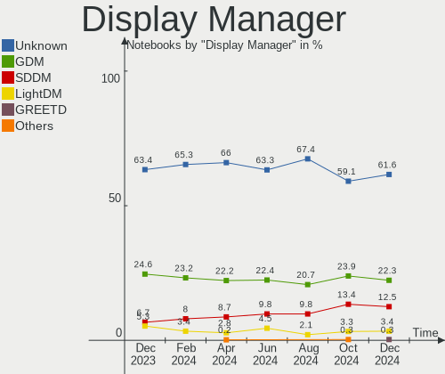
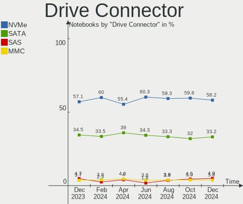
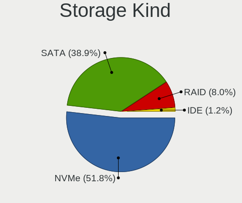
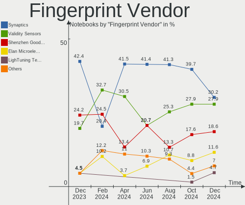
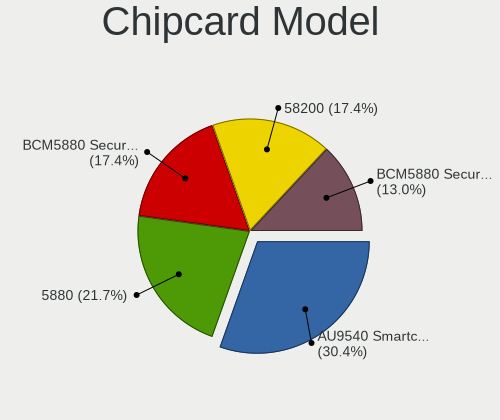

Fedora - Hardware Trends (Notebooks)
------------------------------------

A project to identify most popular hardware characteristics and track their change
over time based on data collected by Linux users at https://Linux-Hardware.org.

Anyone can contribute to this report by the [hw-probe](https://github.com/linuxhw/hw-probe) tool:

    sudo -E hw-probe -all -upload

This report is for one last month. Overall report since the beginning of time: [TestCoverage](https://github.com/linuxhw/TestCoverage)

Period: Dec, 2022.

Contents
--------

* [ System ](#system)
  - [ OS                       ](#os)
  - [ OS Family                ](#os-family)
  - [ Kernel                   ](#kernel)
  - [ Kernel Family            ](#kernel-family)
  - [ Kernel Major Ver.        ](#kernel-major-ver)
  - [ Arch                     ](#arch)
  - [ DE                       ](#de)
  - [ Display Server           ](#display-server)
  - [ Display Manager          ](#display-manager)
  - [ OS Lang                  ](#os-lang)
  - [ Boot Mode                ](#boot-mode)
  - [ Filesystem               ](#filesystem)
  - [ Part. scheme             ](#part-scheme)
  - [ Dual Boot with Linux/BSD ](#dual-boot-with-linuxbsd)
  - [ Dual Boot (Win)          ](#dual-boot-win)

* [ Board ](#board)
  - [ Vendor                   ](#vendor)
  - [ Model                    ](#model)
  - [ Model Family             ](#model-family)
  - [ MFG Year                 ](#mfg-year)
  - [ Form Factor              ](#form-factor)
  - [ Secure Boot              ](#secure-boot)
  - [ Coreboot                 ](#coreboot)
  - [ RAM Size                 ](#ram-size)
  - [ RAM Used                 ](#ram-used)
  - [ Total Drives             ](#total-drives)
  - [ Has CD-ROM               ](#has-cd-rom)
  - [ Has Ethernet             ](#has-ethernet)
  - [ Has WiFi                 ](#has-wifi)
  - [ Has Bluetooth            ](#has-bluetooth)

* [ Location ](#location)
  - [ Country                  ](#country)
  - [ City                     ](#city)

* [ Drives ](#drives)
  - [ Drive Vendor             ](#drive-vendor)
  - [ Drive Model              ](#drive-model)
  - [ HDD Vendor               ](#hdd-vendor)
  - [ SSD Vendor               ](#ssd-vendor)
  - [ Drive Kind               ](#drive-kind)
  - [ Drive Connector          ](#drive-connector)
  - [ Drive Size               ](#drive-size)
  - [ Space Total              ](#space-total)
  - [ Space Used               ](#space-used)
  - [ Malfunc. Drives          ](#malfunc-drives)
  - [ Malfunc. Drive Vendor    ](#malfunc-drive-vendor)
  - [ Malfunc. HDD Vendor      ](#malfunc-hdd-vendor)
  - [ Malfunc. Drive Kind      ](#malfunc-drive-kind)
  - [ Failed Drives            ](#failed-drives)
  - [ Failed Drive Vendor      ](#failed-drive-vendor)
  - [ Drive Status             ](#drive-status)

* [ Storage controller ](#storage-controller)
  - [ Storage Vendor           ](#storage-vendor)
  - [ Storage Model            ](#storage-model)
  - [ Storage Kind             ](#storage-kind)

* [ Processor ](#processor)
  - [ CPU Vendor               ](#cpu-vendor)
  - [ CPU Model                ](#cpu-model)
  - [ CPU Model Family         ](#cpu-model-family)
  - [ CPU Cores                ](#cpu-cores)
  - [ CPU Sockets              ](#cpu-sockets)
  - [ CPU Threads              ](#cpu-threads)
  - [ CPU Op-Modes             ](#cpu-op-modes)
  - [ CPU Microcode            ](#cpu-microcode)
  - [ CPU Microarch            ](#cpu-microarch)

* [ Graphics ](#graphics)
  - [ GPU Vendor               ](#gpu-vendor)
  - [ GPU Model                ](#gpu-model)
  - [ GPU Combo                ](#gpu-combo)
  - [ GPU Driver               ](#gpu-driver)
  - [ GPU Memory               ](#gpu-memory)

* [ Monitor ](#monitor)
  - [ Monitor Vendor           ](#monitor-vendor)
  - [ Monitor Model            ](#monitor-model)
  - [ Monitor Resolution       ](#monitor-resolution)
  - [ Monitor Diagonal         ](#monitor-diagonal)
  - [ Monitor Width            ](#monitor-width)
  - [ Aspect Ratio             ](#aspect-ratio)
  - [ Monitor Area             ](#monitor-area)
  - [ Pixel Density            ](#pixel-density)
  - [ Multiple Monitors        ](#multiple-monitors)

* [ Network ](#network)
  - [ Net Controller Vendor    ](#net-controller-vendor)
  - [ Net Controller Model     ](#net-controller-model)
  - [ Wireless Vendor          ](#wireless-vendor)
  - [ Wireless Model           ](#wireless-model)
  - [ Ethernet Vendor          ](#ethernet-vendor)
  - [ Ethernet Model           ](#ethernet-model)
  - [ Net Controller Kind      ](#net-controller-kind)
  - [ Used Controller          ](#used-controller)
  - [ NICs                     ](#nics)
  - [ IPv6                     ](#ipv6)

* [ Bluetooth ](#bluetooth)
  - [ Bluetooth Vendor         ](#bluetooth-vendor)
  - [ Bluetooth Model          ](#bluetooth-model)

* [ Sound ](#sound)
  - [ Sound Vendor             ](#sound-vendor)
  - [ Sound Model              ](#sound-model)

* [ Memory ](#memory)
  - [ Memory Vendor            ](#memory-vendor)
  - [ Memory Model             ](#memory-model)
  - [ Memory Kind              ](#memory-kind)
  - [ Memory Form Factor       ](#memory-form-factor)
  - [ Memory Size              ](#memory-size)
  - [ Memory Speed             ](#memory-speed)

* [ Printers & scanners ](#printers--scanners)
  - [ Printer Vendor           ](#printer-vendor)
  - [ Printer Model            ](#printer-model)
  - [ Scanner Vendor           ](#scanner-vendor)
  - [ Scanner Model            ](#scanner-model)

* [ Camera ](#camera)
  - [ Camera Vendor            ](#camera-vendor)
  - [ Camera Model             ](#camera-model)

* [ Security ](#security)
  - [ Fingerprint Vendor       ](#fingerprint-vendor)
  - [ Fingerprint Model        ](#fingerprint-model)
  - [ Chipcard Vendor          ](#chipcard-vendor)
  - [ Chipcard Model           ](#chipcard-model)

* [ Unsupported ](#unsupported)
  - [ Unsupported Devices      ](#unsupported-devices)
  - [ Unsupported Device Types ](#unsupported-device-types)

System
------

OS
--

Installed operating systems

| Name      | Notebooks | Percent |
|-----------|-----------|---------|
| Fedora 37 | 224       | 86.82%  |
| Fedora 36 | 30        | 11.63%  |
| Fedora 38 | 3         | 1.16%   |
| Fedora 35 | 1         | 0.39%   |

OS Family
---------

OS without a version

| Name   | Notebooks | Percent |
|--------|-----------|---------|
| Fedora | 258       | 100%    |

Kernel
------

Version of the Linux kernel

| Version                                                          | Notebooks | Percent |
|------------------------------------------------------------------|-----------|---------|
| 6.0.12-300.fc37.x86_64                                           | 49        | 18.99%  |
| 6.0.15-300.fc37.x86_64                                           | 40        | 15.5%   |
| 6.0.11-300.fc37.x86_64                                           | 35        | 13.57%  |
| 6.0.10-300.fc37.x86_64                                           | 33        | 12.79%  |
| 6.0.14-300.fc37.x86_64                                           | 15        | 5.81%   |
| 6.0.9-300.fc37.x86_64                                            | 14        | 5.43%   |
| 6.0.13-300.fc37.x86_64                                           | 13        | 5.04%   |
| 6.0.7-301.fc37.x86_64                                            | 11        | 4.26%   |
| 6.0.10-200.fc36.x86_64                                           | 8         | 3.1%    |
| 6.0.8-300.fc37.x86_64                                            | 4         | 1.55%   |
| 6.0.5-200.fc36.x86_64                                            | 3         | 1.16%   |
| 6.0.14-200.fc36.x86_64                                           | 3         | 1.16%   |
| 6.0.11-200.fc36.x86_64                                           | 3         | 1.16%   |
| 6.0.9-200.fc36.x86_64                                            | 2         | 0.78%   |
| 6.0.12-200.fc36.x86_64                                           | 2         | 0.78%   |
| 5.17.5-300.fc36.x86_64                                           | 2         | 0.78%   |
| 6.2.0-rc1-1b929c02afd37871d5afb9d498426f83432e71c2-btrfs-debug4+ | 1         | 0.39%   |
| 6.1.1-xm1.0.fc37.x86_64                                          | 1         | 0.39%   |
| 6.1.1-225.vanilla.1.fc37.x86_64                                  | 1         | 0.39%   |
| 6.1.0-rc7+                                                       | 1         | 0.39%   |
| 6.1.0-65.vanilla.1.fc37.x86_64                                   | 1         | 0.39%   |
| 6.1.0-65.fc38.x86_64                                             | 1         | 0.39%   |
| 6.0.9                                                            | 1         | 0.39%   |
| 6.0.8-xm1.0.fc37.x86_64                                          | 1         | 0.39%   |
| 6.0.8-200.fc36.x86_64                                            | 1         | 0.39%   |
| 6.0.7-100.fc35.x86_64                                            | 1         | 0.39%   |
| 6.0.15-602.inttf.fc37.x86_64                                     | 1         | 0.39%   |
| 6.0.11-250.vanilla.1.fc36.x86_64                                 | 1         | 0.39%   |
| 6.0.10-602.inttf.fc37.x86_64                                     | 1         | 0.39%   |
| 5.19.8-200.fc36.x86_64                                           | 1         | 0.39%   |
| 5.19.16-200.fc36.x86_64                                          | 1         | 0.39%   |
| 5.19.14-200.fc36.x86_64                                          | 1         | 0.39%   |
| 5.19.13-200.fc36.x86_64                                          | 1         | 0.39%   |
| 5.18.7-200.fc36.x86_64                                           | 1         | 0.39%   |
| 5.18.17-200.fc36.x86_64                                          | 1         | 0.39%   |
| 5.16.20-200.fc35.x86_64                                          | 1         | 0.39%   |
| 5.15.55-rt48xm1.0.fc37.x86_64                                    | 1         | 0.39%   |

Kernel Family
-------------

Linux kernel without a distro release

| Version | Notebooks | Percent |
|---------|-----------|---------|
| 6.0.12  | 51        | 19.77%  |
| 6.0.10  | 42        | 16.28%  |
| 6.0.15  | 41        | 15.89%  |
| 6.0.11  | 39        | 15.12%  |
| 6.0.14  | 18        | 6.98%   |
| 6.0.9   | 17        | 6.59%   |
| 6.0.13  | 13        | 5.04%   |
| 6.0.7   | 12        | 4.65%   |
| 6.0.8   | 6         | 2.33%   |
| 6.1.0   | 3         | 1.16%   |
| 6.0.5   | 3         | 1.16%   |
| 6.1.1   | 2         | 0.78%   |
| 5.17.5  | 2         | 0.78%   |
| 6.2.0   | 1         | 0.39%   |
| 5.19.8  | 1         | 0.39%   |
| 5.19.16 | 1         | 0.39%   |
| 5.19.14 | 1         | 0.39%   |
| 5.19.13 | 1         | 0.39%   |
| 5.18.7  | 1         | 0.39%   |
| 5.18.17 | 1         | 0.39%   |
| 5.16.20 | 1         | 0.39%   |
| 5.15.55 | 1         | 0.39%   |

Kernel Major Ver.
-----------------

Linux kernel major version

| Version | Notebooks | Percent |
|---------|-----------|---------|
| 6.0     | 242       | 93.8%   |
| 6.1     | 5         | 1.94%   |
| 5.19    | 4         | 1.55%   |
| 5.18    | 2         | 0.78%   |
| 5.17    | 2         | 0.78%   |
| 6.2     | 1         | 0.39%   |
| 5.16    | 1         | 0.39%   |
| 5.15    | 1         | 0.39%   |

Arch
----

OS architecture (x86_64, i586, etc.)

| Name   | Notebooks | Percent |
|--------|-----------|---------|
| x86_64 | 258       | 100%    |

DE
--

Desktop Environment

| Name       | Notebooks | Percent |
|------------|-----------|---------|
| GNOME      | 192       | 74.42%  |
| KDE5       | 44        | 17.05%  |
| Unknown    | 6         | 2.33%   |
| XFCE       | 5         | 1.94%   |
| X-Cinnamon | 4         | 1.55%   |
| i3         | 2         | 0.78%   |
| xmonad     | 1         | 0.39%   |
| MATE       | 1         | 0.39%   |
| LXQt       | 1         | 0.39%   |
| LXDE       | 1         | 0.39%   |
| Cinnamon   | 1         | 0.39%   |

Display Server
--------------

X11 or Wayland

| Name    | Notebooks | Percent |
|---------|-----------|---------|
| Wayland | 205       | 79.46%  |
| X11     | 50        | 19.38%  |
| Unknown | 3         | 1.16%   |

Display Manager
---------------

SDDM, LightDM, etc.

| Name    | Notebooks | Percent |
|---------|-----------|---------|
| Unknown | 139       | 53.88%  |
| GDM     | 82        | 31.78%  |
| SDDM    | 23        | 8.91%   |
| LightDM | 13        | 5.04%   |
| LXDM    | 1         | 0.39%   |

OS Lang
-------

Language

| Lang    | Notebooks | Percent |
|---------|-----------|---------|
| en_US   | 127       | 49.22%  |
| pt_BR   | 18        | 6.98%   |
| ru_RU   | 17        | 6.59%   |
| en_GB   | 13        | 5.04%   |
| it_IT   | 8         | 3.1%    |
| fr_FR   | 7         | 2.71%   |
| es_ES   | 7         | 2.71%   |
| de_DE   | 7         | 2.71%   |
| es_MX   | 5         | 1.94%   |
| en_IN   | 5         | 1.94%   |
| en_AU   | 5         | 1.94%   |
| es_CL   | 3         | 1.16%   |
| es_AR   | 3         | 1.16%   |
| zh_TW   | 2         | 0.78%   |
| zh_CN   | 2         | 0.78%   |
| tr_TR   | 2         | 0.78%   |
| hu_HU   | 2         | 0.78%   |
| en_ZA   | 2         | 0.78%   |
| en_CA   | 2         | 0.78%   |
| de_AT   | 2         | 0.78%   |
| ca_ES   | 2         | 0.78%   |
| C       | 2         | 0.78%   |
| sk_SK   | 1         | 0.39%   |
| ru_UA   | 1         | 0.39%   |
| pt_PT   | 1         | 0.39%   |
| pl_PL   | 1         | 0.39%   |
| fr_CA   | 1         | 0.39%   |
| fr_BE   | 1         | 0.39%   |
| es_US   | 1         | 0.39%   |
| es_CU   | 1         | 0.39%   |
| es_CO   | 1         | 0.39%   |
| en_PH   | 1         | 0.39%   |
| en_NZ   | 1         | 0.39%   |
| en_IE   | 1         | 0.39%   |
| de_CH   | 1         | 0.39%   |
| da_DK   | 1         | 0.39%   |
| Unknown | 1         | 0.39%   |

Boot Mode
---------

EFI or BIOS

| Mode | Notebooks | Percent |
|------|-----------|---------|
| EFI  | 218       | 84.5%   |
| BIOS | 40        | 15.5%   |

Filesystem
----------

Type of filesystem

| Type    | Notebooks | Percent |
|---------|-----------|---------|
| Btrfs   | 216       | 83.72%  |
| Ext4    | 38        | 14.73%  |
| Xfs     | 3         | 1.16%   |
| Overlay | 1         | 0.39%   |

Part. scheme
------------

Scheme of partitioning

| Type    | Notebooks | Percent |
|---------|-----------|---------|
| Unknown | 134       | 51.94%  |
| GPT     | 119       | 46.12%  |
| MBR     | 5         | 1.94%   |

Dual Boot with Linux/BSD
------------------------

Hosting more than one Linux/BSD

| Dual boot | Notebooks | Percent |
|-----------|-----------|---------|
| No        | 236       | 91.47%  |
| Yes       | 22        | 8.53%   |

Dual Boot (Win)
---------------

Hosting Linux and Windows

| Dual boot | Notebooks | Percent |
|-----------|-----------|---------|
| No        | 213       | 82.56%  |
| Yes       | 45        | 17.44%  |

Board
-----

Vendor
------

Motherboard manufacturer

| Name                  | Notebooks | Percent |
|-----------------------|-----------|---------|
| Lenovo                | 69        | 26.74%  |
| Dell                  | 48        | 18.6%   |
| Hewlett-Packard       | 35        | 13.57%  |
| ASUSTek Computer      | 27        | 10.47%  |
| Acer                  | 20        | 7.75%   |
| HUAWEI                | 13        | 5.04%   |
| MSI                   | 12        | 4.65%   |
| Toshiba               | 5         | 1.94%   |
| Samsung Electronics   | 4         | 1.55%   |
| Timi                  | 3         | 1.16%   |
| Google                | 3         | 1.16%   |
| Apple                 | 3         | 1.16%   |
| Schenker              | 2         | 0.78%   |
| Pegatron              | 2         | 0.78%   |
| GPD                   | 2         | 0.78%   |
| Valve                 | 1         | 0.39%   |
| TUXEDO                | 1         | 0.39%   |
| System76              | 1         | 0.39%   |
| Sony                  | 1         | 0.39%   |
| Positivo Bahia - VAIO | 1         | 0.39%   |
| Notebook              | 1         | 0.39%   |
| MACHENIKE             | 1         | 0.39%   |
| Jooyon Tech           | 1         | 0.39%   |
| Framework             | 1         | 0.39%   |
| BANGHO                | 1         | 0.39%   |

Model
-----

Motherboard model

| Name                                       | Notebooks | Percent |
|--------------------------------------------|-----------|---------|
| Dell XPS 15 9570                           | 3         | 1.16%   |
| Dell Inspiron 5566                         | 3         | 1.16%   |
| MSI GL63 8RC                               | 2         | 0.78%   |
| Lenovo ThinkBook 15 G3 ACL 21A4            | 2         | 0.78%   |
| Lenovo Legion 5 15ACH6H 82JU               | 2         | 0.78%   |
| Lenovo IdeaPad 3 15ALC6 82KU               | 2         | 0.78%   |
| HUAWEI NBLK-WAX9X                          | 2         | 0.78%   |
| HUAWEI MACH-WX9                            | 2         | 0.78%   |
| HUAWEI KLVL-WXX9                           | 2         | 0.78%   |
| HP ProBook 440 G7                          | 2         | 0.78%   |
| HP ProBook 440 14 inch G9 Notebook PC      | 2         | 0.78%   |
| HP OMEN by Laptop 16-c0xxx                 | 2         | 0.78%   |
| Dell Latitude 7490                         | 2         | 0.78%   |
| Dell Latitude 5420                         | 2         | 0.78%   |
| Dell Inspiron 3583                         | 2         | 0.78%   |
| Dell Inspiron 16 5625                      | 2         | 0.78%   |
| Apple MacBookPro9,2                        | 2         | 0.78%   |
| Acer Aspire A515-45                        | 2         | 0.78%   |
| Valve Jupiter                              | 1         | 0.39%   |
| TUXEDO InfinityBook Pro 14 Gen6            | 1         | 0.39%   |
| Toshiba TECRA A10                          | 1         | 0.39%   |
| Toshiba Satellite C850-C5K                 | 1         | 0.39%   |
| Toshiba Satellite C75D-B                   | 1         | 0.39%   |
| Toshiba Satellite C50D-A-138               | 1         | 0.39%   |
| Toshiba Satellite A300                     | 1         | 0.39%   |
| Timi RedmiBook 15                          | 1         | 0.39%   |
| Timi Mi NoteBook Pro                       | 1         | 0.39%   |
| Timi A35S                                  | 1         | 0.39%   |
| System76 Oryx Pro                          | 1         | 0.39%   |
| Sony VPCEB1M1E                             | 1         | 0.39%   |
| Schenker VISION 16 Pro (L22)               | 1         | 0.39%   |
| Schenker VIA 15                            | 1         | 0.39%   |
| Samsung 930X5J/910S5J/940X5J               | 1         | 0.39%   |
| Samsung 750XDA                             | 1         | 0.39%   |
| Samsung 550XBE/350XBE                      | 1         | 0.39%   |
| Samsung 300E4A/300E5A/300E7A/3430EA/3530EA | 1         | 0.39%   |
| Positivo Bahia - VAIO VJFE41F11X-XXXXXX    | 1         | 0.39%   |
| Pegatron C17A                              | 1         | 0.39%   |
| Pegatron A15W8                             | 1         | 0.39%   |
| Notebook WA50SRQ                           | 1         | 0.39%   |

Model Family
------------

Motherboard model prefix

| Name                | Notebooks | Percent |
|---------------------|-----------|---------|
| Lenovo ThinkPad     | 43        | 16.67%  |
| Dell Inspiron       | 22        | 8.53%   |
| Acer Aspire         | 14        | 5.43%   |
| Dell Latitude       | 13        | 5.04%   |
| Lenovo IdeaPad      | 9         | 3.49%   |
| HP ProBook          | 9         | 3.49%   |
| Dell XPS            | 9         | 3.49%   |
| HP Pavilion         | 8         | 3.1%    |
| HP Laptop           | 8         | 3.1%    |
| Lenovo ThinkBook    | 7         | 2.71%   |
| ASUS VivoBook       | 6         | 2.33%   |
| ASUS ASUS           | 6         | 2.33%   |
| Toshiba Satellite   | 4         | 1.55%   |
| Lenovo Legion       | 4         | 1.55%   |
| ASUS ROG            | 4         | 1.55%   |
| MSI Modern          | 3         | 1.16%   |
| Acer Predator       | 3         | 1.16%   |
| MSI GL63            | 2         | 0.78%   |
| Lenovo Yoga         | 2         | 0.78%   |
| HUAWEI NBLK-WAX9X   | 2         | 0.78%   |
| HUAWEI MACH-WX9     | 2         | 0.78%   |
| HUAWEI KLVL-WXX9    | 2         | 0.78%   |
| HP ZBook            | 2         | 0.78%   |
| HP OMEN             | 2         | 0.78%   |
| HP EliteBook        | 2         | 0.78%   |
| HP 245              | 2         | 0.78%   |
| Dell Vostro         | 2         | 0.78%   |
| Dell G5             | 2         | 0.78%   |
| ASUS Zenbook        | 2         | 0.78%   |
| Apple MacBookPro9   | 2         | 0.78%   |
| Valve Jupiter       | 1         | 0.39%   |
| TUXEDO InfinityBook | 1         | 0.39%   |
| Toshiba TECRA       | 1         | 0.39%   |
| Timi RedmiBook      | 1         | 0.39%   |
| Timi Mi             | 1         | 0.39%   |
| Timi A35S           | 1         | 0.39%   |
| System76 Oryx       | 1         | 0.39%   |
| Sony VPCEB1M1E      | 1         | 0.39%   |
| Schenker VISION     | 1         | 0.39%   |
| Schenker VIA        | 1         | 0.39%   |

MFG Year
--------

Motherboard manufacture year

| Year | Notebooks | Percent |
|------|-----------|---------|
| 2021 | 60        | 23.26%  |
| 2020 | 37        | 14.34%  |
| 2022 | 29        | 11.24%  |
| 2018 | 29        | 11.24%  |
| 2019 | 27        | 10.47%  |
| 2012 | 14        | 5.43%   |
| 2017 | 13        | 5.04%   |
| 2013 | 13        | 5.04%   |
| 2016 | 9         | 3.49%   |
| 2014 | 7         | 2.71%   |
| 2011 | 7         | 2.71%   |
| 2015 | 6         | 2.33%   |
| 2008 | 4         | 1.55%   |
| 2010 | 2         | 0.78%   |
| 2007 | 1         | 0.39%   |

Form Factor
-----------

Physical design of the computer

| Name     | Notebooks | Percent |
|----------|-----------|---------|
| Notebook | 258       | 100%    |

Secure Boot
-----------

Enabled or disabled

| State    | Notebooks | Percent |
|----------|-----------|---------|
| Disabled | 194       | 75.19%  |
| Enabled  | 64        | 24.81%  |

Coreboot
--------

Have coreboot on board

| Used | Notebooks | Percent |
|------|-----------|---------|
| No   | 255       | 98.84%  |
| Yes  | 3         | 1.16%   |

RAM Size
--------

Total RAM memory

| Size in GB  | Notebooks | Percent |
|-------------|-----------|---------|
| 4.01-8.0    | 79        | 30.62%  |
| 8.01-16.0   | 63        | 24.42%  |
| 16.01-24.0  | 62        | 24.03%  |
| 32.01-64.0  | 23        | 8.91%   |
| 3.01-4.0    | 19        | 7.36%   |
| 24.01-32.0  | 6         | 2.33%   |
| 1.01-2.0    | 3         | 1.16%   |
| 64.01-256.0 | 2         | 0.78%   |
| 2.01-3.0    | 1         | 0.39%   |

RAM Used
--------

Used RAM memory

| Used GB    | Notebooks | Percent |
|------------|-----------|---------|
| 4.01-8.0   | 82        | 31.78%  |
| 3.01-4.0   | 72        | 27.91%  |
| 2.01-3.0   | 56        | 21.71%  |
| 8.01-16.0  | 24        | 9.3%    |
| 1.01-2.0   | 17        | 6.59%   |
| 0.51-1.0   | 5         | 1.94%   |
| 16.01-24.0 | 2         | 0.78%   |

Total Drives
------------

Number of drives on board

| Drives | Notebooks | Percent |
|--------|-----------|---------|
| 1      | 185       | 71.71%  |
| 2      | 69        | 26.74%  |
| 3      | 3         | 1.16%   |
| 0      | 1         | 0.39%   |

Has CD-ROM
----------

Has CD-ROM on board

| Presented | Notebooks | Percent |
|-----------|-----------|---------|
| No        | 216       | 83.72%  |
| Yes       | 42        | 16.28%  |

Has Ethernet
------------

Has Ethernet on board

| Presented | Notebooks | Percent |
|-----------|-----------|---------|
| Yes       | 193       | 74.81%  |
| No        | 65        | 25.19%  |

Has WiFi
--------

Has WiFi module

| Presented | Notebooks | Percent |
|-----------|-----------|---------|
| Yes       | 257       | 99.61%  |
| No        | 1         | 0.39%   |

Has Bluetooth
-------------

Has Bluetooth module

| Presented | Notebooks | Percent |
|-----------|-----------|---------|
| Yes       | 232       | 89.92%  |
| No        | 26        | 10.08%  |

Location
--------

Country
-------

Geographic location (country)

| Country             | Notebooks | Percent |
|---------------------|-----------|---------|
| USA                 | 37        | 14.34%  |
| Brazil              | 24        | 9.3%    |
| Russia              | 22        | 8.53%   |
| Germany             | 16        | 6.2%    |
| Italy               | 14        | 5.43%   |
| India               | 12        | 4.65%   |
| France              | 12        | 4.65%   |
| Canada              | 9         | 3.49%   |
| Spain               | 8         | 3.1%    |
| Mexico              | 7         | 2.71%   |
| UK                  | 6         | 2.33%   |
| Australia           | 6         | 2.33%   |
| Argentina           | 6         | 2.33%   |
| Netherlands         | 5         | 1.94%   |
| Czechia             | 4         | 1.55%   |
| Turkey              | 3         | 1.16%   |
| Taiwan              | 3         | 1.16%   |
| Switzerland         | 3         | 1.16%   |
| Ireland             | 3         | 1.16%   |
| Hungary             | 3         | 1.16%   |
| Colombia            | 3         | 1.16%   |
| Chile               | 3         | 1.16%   |
| Austria             | 3         | 1.16%   |
| Ukraine             | 2         | 0.78%   |
| Sweden              | 2         | 0.78%   |
| South Africa        | 2         | 0.78%   |
| Slovakia            | 2         | 0.78%   |
| Serbia              | 2         | 0.78%   |
| Romania             | 2         | 0.78%   |
| Qatar               | 2         | 0.78%   |
| Poland              | 2         | 0.78%   |
| Philippines         | 2         | 0.78%   |
| Indonesia           | 2         | 0.78%   |
| Hong Kong           | 2         | 0.78%   |
| Finland             | 2         | 0.78%   |
| China               | 2         | 0.78%   |
| Uruguay             | 1         | 0.39%   |
| Trinidad and Tobago | 1         | 0.39%   |
| Thailand            | 1         | 0.39%   |
| Sri Lanka           | 1         | 0.39%   |

City
----

Geographic location (city)

| City               | Notebooks | Percent |
|--------------------|-----------|---------|
| Moscow             | 5         | 1.94%   |
| St Petersburg      | 4         | 1.55%   |
| Zapopan            | 3         | 1.16%   |
| Madrid             | 3         | 1.16%   |
| London             | 3         | 1.16%   |
| Bogotá            | 3         | 1.16%   |
| Vienna             | 2         | 0.78%   |
| Verona             | 2         | 0.78%   |
| Sydney             | 2         | 0.78%   |
| Sao Paulo          | 2         | 0.78%   |
| Santiago           | 2         | 0.78%   |
| Pune               | 2         | 0.78%   |
| Montreal           | 2         | 0.78%   |
| Milan              | 2         | 0.78%   |
| Miami              | 2         | 0.78%   |
| Jakarta            | 2         | 0.78%   |
| Istanbul           | 2         | 0.78%   |
| Idaho Falls        | 2         | 0.78%   |
| Helsinki           | 2         | 0.78%   |
| Frankfurt am Main  | 2         | 0.78%   |
| Fortaleza          | 2         | 0.78%   |
| Doha               | 2         | 0.78%   |
| Curitiba           | 2         | 0.78%   |
| Central            | 2         | 0.78%   |
| Cape Town          | 2         | 0.78%   |
| Brisbane           | 2         | 0.78%   |
| Berlin             | 2         | 0.78%   |
| Austin             | 2         | 0.78%   |
| Zwartsluis         | 1         | 0.39%   |
| Yoshkar-Ola        | 1         | 0.39%   |
| Yekaterinburg      | 1         | 0.39%   |
| Wuppertal          | 1         | 0.39%   |
| Worms              | 1         | 0.39%   |
| Winterthur         | 1         | 0.39%   |
| Winnipeg           | 1         | 0.39%   |
| Windsor            | 1         | 0.39%   |
| Wilthen            | 1         | 0.39%   |
| West Stockbridge   | 1         | 0.39%   |
| Welwyn Garden City | 1         | 0.39%   |
| Wayne              | 1         | 0.39%   |

Drives
------

Drive Vendor
------------

Hard drive vendors

| Vendor                         | Notebooks | Drives | Percent |
|--------------------------------|-----------|--------|---------|
| Samsung Electronics            | 71        | 77     | 22.33%  |
| SK hynix                       | 35        | 35     | 11.01%  |
| WDC                            | 34        | 36     | 10.69%  |
| SanDisk                        | 30        | 31     | 9.43%   |
| Kingston                       | 18        | 18     | 5.66%   |
| Micron Technology              | 17        | 17     | 5.35%   |
| Toshiba                        | 16        | 16     | 5.03%   |
| Seagate                        | 15        | 16     | 4.72%   |
| Intel                          | 12        | 13     | 3.77%   |
| Crucial                        | 11        | 11     | 3.46%   |
| Unknown                        | 9         | 9      | 2.83%   |
| China                          | 5         | 5      | 1.57%   |
| A-DATA Technology              | 5         | 5      | 1.57%   |
| SABRENT                        | 3         | 3      | 0.94%   |
| LITEON                         | 3         | 3      | 0.94%   |
| UMIS                           | 2         | 2      | 0.63%   |
| SPCC                           | 2         | 2      | 0.63%   |
| Phison                         | 2         | 2      | 0.63%   |
| KIOXIA                         | 2         | 2      | 0.63%   |
| Hitachi                        | 2         | 2      | 0.63%   |
| HGST                           | 2         | 2      | 0.63%   |
| ADATA Technology               | 2         | 2      | 0.63%   |
| Unknown                        | 2         | 2      | 0.63%   |
| YMTC                           | 1         | 1      | 0.31%   |
| Solid State Storage Technology | 1         | 1      | 0.31%   |
| Simmtronic                     | 1         | 1      | 0.31%   |
| Silicon Motion                 | 1         | 1      | 0.31%   |
| Phison Electronics             | 1         | 1      | 0.31%   |
| Netac                          | 1         | 1      | 0.31%   |
| Micron/Crucial Technology      | 1         | 1      | 0.31%   |
| MAXIO Technology (Hangzhou)    | 1         | 1      | 0.31%   |
| Lite-On Technology             | 1         | 1      | 0.31%   |
| Lexar                          | 1         | 1      | 0.31%   |
| Kingston Technology Company    | 1         | 1      | 0.31%   |
| HS-SSD-E100                    | 1         | 1      | 0.31%   |
| HS-SSD-C100                    | 1         | 1      | 0.31%   |
| Gigabyte Technology            | 1         | 1      | 0.31%   |
| FORESEE                        | 1         | 1      | 0.31%   |
| External                       | 1         | 1      | 0.31%   |
| Biwin Storage Technology       | 1         | 1      | 0.31%   |

Drive Model
-----------

Hard drive models

| Model                                               | Notebooks | Percent |
|-----------------------------------------------------|-----------|---------|
| Samsung NVMe SSD Controller SM981/PM981/PM983 500GB | 9         | 2.76%   |
| Sandisk WD Black SN750 / PC SN730 NVMe SSD 512GB    | 6         | 1.84%   |
| Samsung NVMe SSD Controller PM9A1/PM9A3/980PRO 2TB  | 6         | 1.84%   |
| Toshiba MQ04ABF100 1TB                              | 5         | 1.53%   |
| Kingston SA400S37240G 240GB SSD                     | 5         | 1.53%   |
| Seagate ST1000LM024 HN-M101MBB 1TB                  | 4         | 1.23%   |
| Sandisk WD Blue SN500 / PC SN520 NVMe SSD 256GB     | 4         | 1.23%   |
| SK hynix SKHynix_HFS512GDE9X081N 512GB              | 3         | 0.92%   |
| SK hynix HFM512GD3JX013N 512GB                      | 3         | 0.92%   |
| SK hynix BC711 NVMe 512GB                           | 3         | 0.92%   |
| Seagate ST1000LM035-1RK172 1TB                      | 3         | 0.92%   |
| Samsung MZVLQ512HALU-00000 512GB                    | 3         | 0.92%   |
| Samsung MZALQ512HBLU-00BL2 512GB                    | 3         | 0.92%   |
| Samsung MZALQ512HALU-000L2 512GB                    | 3         | 0.92%   |
| SABRENT Disk 1TB                                    | 3         | 0.92%   |
| Micron 2450_MTFDKBA512TFK 512GB                     | 3         | 0.92%   |
| Micron 1100_MTFDDAV256TBN 256GB SSD                 | 3         | 0.92%   |
| A-DATA IM2P33F8ABR2-256GB                           | 3         | 0.92%   |
| WDC WDS120G1G0A-00SS50 120GB SSD                    | 2         | 0.61%   |
| WDC WD5000LPVX-22V0TT0 500GB                        | 2         | 0.61%   |
| WDC WD10SPZX-60Z10T0 1TB                            | 2         | 0.61%   |
| WDC WD10SPZX-21Z10T0 1TB                            | 2         | 0.61%   |
| WDC WD10SPZX-17Z10T0 1TB                            | 2         | 0.61%   |
| Toshiba MQ01ABF050 500GB                            | 2         | 0.61%   |
| Toshiba MQ01ABD075 752GB                            | 2         | 0.61%   |
| SK hynix SKHynix_HFS512GDE9X084N 512GB              | 2         | 0.61%   |
| SK hynix SKHynix_HFS256GDE9X081N 256GB              | 2         | 0.61%   |
| SK hynix HFM256GD3JX016N 256GB                      | 2         | 0.61%   |
| SK hynix BC501 NVMe Solid State Drive 512GB         | 2         | 0.61%   |
| Seagate ST500LM012 HN-M500MBB 500GB                 | 2         | 0.61%   |
| Samsung SSD 980 500GB                               | 2         | 0.61%   |
| Samsung SSD 970 EVO Plus 2TB                        | 2         | 0.61%   |
| Samsung SSD 970 EVO Plus 1TB                        | 2         | 0.61%   |
| Samsung SSD 860 EVO 2TB                             | 2         | 0.61%   |
| Samsung MZVLQ512HBLU-00BTW 512GB                    | 2         | 0.61%   |
| Samsung MZVLQ512HBLU-00B00 512GB                    | 2         | 0.61%   |
| Samsung MZVLQ512HALU-000H1 512GB                    | 2         | 0.61%   |
| Samsung MZVLB256HAHQ-000L7 256GB                    | 2         | 0.61%   |
| Samsung MZVL21T0HCLR-00B00 1TB                      | 2         | 0.61%   |
| Samsung MZALQ512HALU-000L1 512GB                    | 2         | 0.61%   |

HDD Vendor
----------

Hard disk drive vendors

| Vendor   | Notebooks | Drives | Percent |
|----------|-----------|--------|---------|
| WDC      | 18        | 19     | 36.73%  |
| Seagate  | 14        | 14     | 28.57%  |
| Toshiba  | 12        | 12     | 24.49%  |
| Hitachi  | 2         | 2      | 4.08%   |
| HGST     | 2         | 2      | 4.08%   |
| External | 1         | 1      | 2.04%   |

SSD Vendor
----------

Solid state drive vendors

| Vendor              | Notebooks | Drives | Percent |
|---------------------|-----------|--------|---------|
| Samsung Electronics | 16        | 17     | 21.62%  |
| SanDisk             | 10        | 10     | 13.51%  |
| Kingston            | 10        | 10     | 13.51%  |
| Crucial             | 9         | 9      | 12.16%  |
| WDC                 | 5         | 5      | 6.76%   |
| China               | 5         | 5      | 6.76%   |
| SK hynix            | 4         | 4      | 5.41%   |
| Micron Technology   | 4         | 4      | 5.41%   |
| SPCC                | 2         | 2      | 2.7%    |
| Intel               | 2         | 2      | 2.7%    |
| LITEON              | 1         | 1      | 1.35%   |
| Lexar               | 1         | 1      | 1.35%   |
| HS-SSD-C100         | 1         | 1      | 1.35%   |
| Gigabyte Technology | 1         | 1      | 1.35%   |
| FORESEE             | 1         | 1      | 1.35%   |
| Apacer              | 1         | 1      | 1.35%   |
| A-DATA Technology   | 1         | 1      | 1.35%   |

Drive Kind
----------

HDD or SSD

| Kind    | Notebooks | Drives | Percent |
|---------|-----------|--------|---------|
| NVMe    | 167       | 191    | 55.85%  |
| SSD     | 70        | 75     | 23.41%  |
| HDD     | 49        | 50     | 16.39%  |
| MMC     | 11        | 11     | 3.68%   |
| Unknown | 2         | 2      | 0.67%   |

Drive Connector
---------------

SATA, SAS, NVMe, etc.

| Type | Notebooks | Drives | Percent |
|------|-----------|--------|---------|
| NVMe | 167       | 188    | 57.39%  |
| SATA | 105       | 122    | 36.08%  |
| MMC  | 11        | 11     | 3.78%   |
| SAS  | 8         | 8      | 2.75%   |

Drive Size
----------

Size of hard drive

| Size in TB | Notebooks | Drives | Percent |
|------------|-----------|--------|---------|
| 0.01-0.5   | 68        | 74     | 58.12%  |
| 0.51-1.0   | 39        | 40     | 33.33%  |
| 1.01-2.0   | 6         | 7      | 5.13%   |
| 3.01-4.0   | 3         | 3      | 2.56%   |
| 4.01-10.0  | 1         | 1      | 0.85%   |

Space Total
-----------

Amount of disk space available on the file system

| Size in GB     | Notebooks | Percent |
|----------------|-----------|---------|
| 501-1000       | 69        | 26.74%  |
| 251-500        | 63        | 24.42%  |
| 1001-2000      | 30        | 11.63%  |
| 1-20           | 28        | 10.85%  |
| 101-250        | 27        | 10.47%  |
| Unknown        | 16        | 6.2%    |
| 2001-3000      | 9         | 3.49%   |
| 21-50          | 6         | 2.33%   |
| More than 3000 | 5         | 1.94%   |
| 51-100         | 5         | 1.94%   |

Space Used
----------

Amount of used disk space

| Used GB        | Notebooks | Percent |
|----------------|-----------|---------|
| 1-20           | 74        | 28.68%  |
| 21-50          | 48        | 18.6%   |
| 101-250        | 40        | 15.5%   |
| 251-500        | 31        | 12.02%  |
| 51-100         | 27        | 10.47%  |
| Unknown        | 16        | 6.2%    |
| 501-1000       | 15        | 5.81%   |
| 1001-2000      | 5         | 1.94%   |
| More than 3000 | 1         | 0.39%   |
| 2001-3000      | 1         | 0.39%   |

Malfunc. Drives
---------------

Drive models with a malfunction

| Model                                          | Notebooks | Drives | Percent |
|------------------------------------------------|-----------|--------|---------|
| WDC WD5000LPVX-22V0TT0 500GB                   | 1         | 1      | 12.5%   |
| Toshiba MQ01ABD075 752GB                       | 1         | 1      | 12.5%   |
| Toshiba MK3275GSX 320GB                        | 1         | 1      | 12.5%   |
| Toshiba MK1237GSX 120GB                        | 1         | 1      | 12.5%   |
| Seagate ST4000LM024-2AN17V 4TB                 | 1         | 1      | 12.5%   |
| Seagate ST1000LM024 HN-M101MBB 1TB             | 1         | 1      | 12.5%   |
| Samsung Electronics SSD 870 EVO 500GB          | 1         | 1      | 12.5%   |
| Micron Technology 1100_MTFDDAV256TBN 256GB SSD | 1         | 1      | 12.5%   |

Malfunc. Drive Vendor
---------------------

Vendors of faulty drives

| Vendor              | Notebooks | Drives | Percent |
|---------------------|-----------|--------|---------|
| Toshiba             | 3         | 3      | 37.5%   |
| Seagate             | 2         | 2      | 25%     |
| WDC                 | 1         | 1      | 12.5%   |
| Samsung Electronics | 1         | 1      | 12.5%   |
| Micron Technology   | 1         | 1      | 12.5%   |

Malfunc. HDD Vendor
-------------------

Vendors of faulty HDD drives

| Vendor  | Notebooks | Drives | Percent |
|---------|-----------|--------|---------|
| Toshiba | 3         | 3      | 50%     |
| Seagate | 2         | 2      | 33.33%  |
| WDC     | 1         | 1      | 16.67%  |

Malfunc. Drive Kind
-------------------

Kinds of faulty drives

| Kind | Notebooks | Drives | Percent |
|------|-----------|--------|---------|
| HDD  | 6         | 6      | 75%     |
| SSD  | 2         | 2      | 25%     |

Failed Drives
-------------

Failed drive models

Zero info for selected period =(

Failed Drive Vendor
-------------------

Failed drive vendors

Zero info for selected period =(

Drive Status
------------

Number of failed and malfunc. drives

| Status   | Notebooks | Drives | Percent |
|----------|-----------|--------|---------|
| Detected | 160       | 197    | 59.04%  |
| Works    | 103       | 124    | 38.01%  |
| Malfunc  | 8         | 8      | 2.95%   |

Storage controller
------------------

Storage Vendor
--------------

Storage controller vendors

| Vendor                                  | Notebooks | Percent |
|-----------------------------------------|-----------|---------|
| Intel                                   | 142       | 40.46%  |
| Samsung Electronics                     | 56        | 15.95%  |
| AMD                                     | 38        | 10.83%  |
| SanDisk                                 | 32        | 9.12%   |
| SK hynix                                | 31        | 8.83%   |
| Micron Technology                       | 14        | 3.99%   |
| Kingston Technology Company             | 9         | 2.56%   |
| ADATA Technology                        | 6         | 1.71%   |
| Toshiba America Info Systems            | 4         | 1.14%   |
| Phison Electronics                      | 3         | 0.85%   |
| Lite-On Technology                      | 3         | 0.85%   |
| Micron/Crucial Technology               | 2         | 0.57%   |
| KIOXIA                                  | 2         | 0.57%   |
| Yangtze Memory Technologies             | 1         | 0.28%   |
| Union Memory (Shenzhen)                 | 1         | 0.28%   |
| Solid State Storage Technology          | 1         | 0.28%   |
| Silicon Motion                          | 1         | 0.28%   |
| Shenzhen Unionmemory Information System | 1         | 0.28%   |
| Seagate Technology                      | 1         | 0.28%   |
| Netac Technology                        | 1         | 0.28%   |
| MAXIO Technology (Hangzhou)             | 1         | 0.28%   |
| Biwin Storage Technology                | 1         | 0.28%   |

Storage Model
-------------

Storage controller models

| Model                                                                          | Notebooks | Percent |
|--------------------------------------------------------------------------------|-----------|---------|
| AMD FCH SATA Controller [AHCI mode]                                            | 38        | 10.47%  |
| Samsung NVMe SSD Controller 980                                                | 26        | 7.16%   |
| Samsung NVMe SSD Controller SM981/PM981/PM983                                  | 21        | 5.79%   |
| Intel Sunrise Point-LP SATA Controller [AHCI mode]                             | 21        | 5.79%   |
| SK hynix Gold P31/PC711 NVMe Solid State Drive                                 | 20        | 5.51%   |
| Intel Volume Management Device NVMe RAID Controller                            | 19        | 5.23%   |
| Intel 7 Series Chipset Family 6-port SATA Controller [AHCI mode]               | 18        | 4.96%   |
| Micron Non-Volatile memory controller                                          | 14        | 3.86%   |
| Intel 82801 Mobile SATA Controller [RAID mode]                                 | 13        | 3.58%   |
| Intel Comet Lake SATA AHCI Controller                                          | 12        | 3.31%   |
| Sandisk Non-Volatile memory controller                                         | 11        | 3.03%   |
| Samsung NVMe SSD Controller PM9A1/PM9A3/980PRO                                 | 11        | 3.03%   |
| Intel Cannon Lake Mobile PCH SATA AHCI Controller                              | 9         | 2.48%   |
| SanDisk WD Black SN750 / PC SN730 NVMe SSD                                     | 8         | 2.2%    |
| Kingston Company Company Non-Volatile memory controller                        | 6         | 1.65%   |
| Intel Tiger Lake-LP SATA Controller                                            | 6         | 1.65%   |
| Intel Non-Volatile memory controller                                           | 6         | 1.65%   |
| Intel Wildcat Point-LP SATA Controller [AHCI Mode]                             | 5         | 1.38%   |
| Intel 8 Series SATA Controller 1 [AHCI mode]                                   | 5         | 1.38%   |
| SanDisk WD Blue SN550 NVMe SSD                                                 | 4         | 1.1%    |
| SanDisk WD Blue SN500 / PC SN520 NVMe SSD                                      | 4         | 1.1%    |
| Intel 82801IBM/IEM (ICH9M/ICH9M-E) 4 port SATA Controller [AHCI mode]          | 4         | 1.1%    |
| Intel 6 Series/C200 Series Chipset Family 6 port Mobile SATA AHCI Controller   | 4         | 1.1%    |
| Intel 400 Series Chipset Family SATA AHCI Controller                           | 4         | 1.1%    |
| SK hynix Non-Volatile memory controller                                        | 3         | 0.83%   |
| SK hynix BC501 NVMe Solid State Drive                                          | 3         | 0.83%   |
| SanDisk WD PC SN810 / Black SN850 NVMe SSD                                     | 3         | 0.83%   |
| Intel HM170/QM170 Chipset SATA Controller [AHCI Mode]                          | 3         | 0.83%   |
| Intel Cannon Point-LP SATA Controller [AHCI Mode]                              | 3         | 0.83%   |
| Intel 8 Series/C220 Series Chipset Family 6-port SATA Controller 1 [AHCI mode] | 3         | 0.83%   |
| ADATA IM2P33F8ABR1 NVMe SSD                                                    | 3         | 0.83%   |
| Toshiba America Info Systems XG5 NVMe SSD Controller                           | 2         | 0.55%   |
| SK hynix PC401 NVMe Solid State Drive 256GB                                    | 2         | 0.55%   |
| SK hynix BC511                                                                 | 2         | 0.55%   |
| SanDisk PC SN520 NVMe SSD                                                      | 2         | 0.55%   |
| Phison PS5013 E13 NVMe Controller                                              | 2         | 0.55%   |
| Micron/Crucial P2 NVMe PCIe SSD                                                | 2         | 0.55%   |
| Lite-On Non-Volatile memory controller                                         | 2         | 0.55%   |
| Kingston Company OM3PDP3 NVMe SSD                                              | 2         | 0.55%   |
| Intel SSD 660P Series                                                          | 2         | 0.55%   |

Storage Kind
------------

Kind of storage controller (IDE, SATA, NVMe, SAS, ...)

| Kind | Notebooks | Percent |
|------|-----------|---------|
| NVMe | 167       | 48.13%  |
| SATA | 147       | 42.36%  |
| RAID | 32        | 9.22%   |
| IDE  | 1         | 0.29%   |

Processor
---------

CPU Vendor
----------

Processor vendors

| Vendor | Notebooks | Percent |
|--------|-----------|---------|
| Intel  | 186       | 72.09%  |
| AMD    | 72        | 27.91%  |

CPU Model
---------

Processor models

| Model                                         | Notebooks | Percent |
|-----------------------------------------------|-----------|---------|
| AMD Ryzen 7 5800H with Radeon Graphics        | 9         | 3.49%   |
| Intel Core i5-10210U CPU @ 1.60GHz            | 7         | 2.71%   |
| Intel 11th Gen Core i7-1165G7 @ 2.80GHz       | 7         | 2.71%   |
| Intel 11th Gen Core i5-1135G7 @ 2.40GHz       | 7         | 2.71%   |
| AMD Ryzen 5 5500U with Radeon Graphics        | 7         | 2.71%   |
| Intel Core i7-10510U CPU @ 1.80GHz            | 6         | 2.33%   |
| Intel Core i5-8250U CPU @ 1.60GHz             | 6         | 2.33%   |
| Intel 12th Gen Core i5-1235U                  | 6         | 2.33%   |
| AMD Ryzen 7 5700U with Radeon Graphics        | 6         | 2.33%   |
| Intel Core i7-8750H CPU @ 2.20GHz             | 5         | 1.94%   |
| Intel Core i5-8265U CPU @ 1.60GHz             | 5         | 1.94%   |
| Intel Core i7-9750H CPU @ 2.60GHz             | 4         | 1.55%   |
| Intel Core i7-8550U CPU @ 1.80GHz             | 4         | 1.55%   |
| Intel Core i5-7200U CPU @ 2.50GHz             | 4         | 1.55%   |
| Intel 12th Gen Core i5-1240P                  | 4         | 1.55%   |
| Intel 11th Gen Core i3-1115G4 @ 3.00GHz       | 4         | 1.55%   |
| AMD Ryzen 9 5900HX with Radeon Graphics       | 4         | 1.55%   |
| AMD Ryzen 5 4600H with Radeon Graphics        | 4         | 1.55%   |
| AMD Ryzen 5 3500U with Radeon Vega Mobile Gfx | 4         | 1.55%   |
| Intel Core i7-8565U CPU @ 1.80GHz             | 3         | 1.16%   |
| Intel Core i7-10750H CPU @ 2.60GHz            | 3         | 1.16%   |
| Intel Core i5-6200U CPU @ 2.30GHz             | 3         | 1.16%   |
| Intel Core i5-5200U CPU @ 2.20GHz             | 3         | 1.16%   |
| Intel 12th Gen Core i7-12700H                 | 3         | 1.16%   |
| Intel 11th Gen Core i7-1185G7 @ 3.00GHz       | 3         | 1.16%   |
| Intel 11th Gen Core i5-11300H @ 3.10GHz       | 3         | 1.16%   |
| AMD Ryzen 7 PRO 4750U with Radeon Graphics    | 3         | 1.16%   |
| AMD Ryzen 7 5825U with Radeon Graphics        | 3         | 1.16%   |
| AMD Ryzen 7 4800H with Radeon Graphics        | 3         | 1.16%   |
| Intel Pentium Silver N6000 @ 1.10GHz          | 2         | 0.78%   |
| Intel Core i7-8650U CPU @ 1.90GHz             | 2         | 0.78%   |
| Intel Core i7-7700HQ CPU @ 2.80GHz            | 2         | 0.78%   |
| Intel Core i7-7500U CPU @ 2.70GHz             | 2         | 0.78%   |
| Intel Core i7-6700HQ CPU @ 2.60GHz            | 2         | 0.78%   |
| Intel Core i7-5500U CPU @ 2.40GHz             | 2         | 0.78%   |
| Intel Core i7-3630QM CPU @ 2.40GHz            | 2         | 0.78%   |
| Intel Core i7-3520M CPU @ 2.90GHz             | 2         | 0.78%   |
| Intel Core i5-8350U CPU @ 1.70GHz             | 2         | 0.78%   |
| Intel Core i5-6300U CPU @ 2.40GHz             | 2         | 0.78%   |
| Intel Core i5-4210U CPU @ 1.70GHz             | 2         | 0.78%   |

CPU Model Family
----------------

Processor model prefix

| Model                | Notebooks | Percent |
|----------------------|-----------|---------|
| Intel Core i7        | 53        | 20.54%  |
| Intel Core i5        | 51        | 19.77%  |
| Other                | 50        | 19.38%  |
| AMD Ryzen 7          | 28        | 10.85%  |
| AMD Ryzen 5          | 20        | 7.75%   |
| Intel Core i3        | 16        | 6.2%    |
| Intel Core 2 Duo     | 5         | 1.94%   |
| Intel Celeron        | 5         | 1.94%   |
| AMD Ryzen 7 PRO      | 5         | 1.94%   |
| AMD Ryzen 9          | 4         | 1.55%   |
| AMD Ryzen 5 PRO      | 4         | 1.55%   |
| Intel Pentium Silver | 3         | 1.16%   |
| AMD Ryzen 3          | 3         | 1.16%   |
| Intel Core i9        | 2         | 0.78%   |
| AMD A6               | 2         | 0.78%   |
| AMD A4               | 2         | 0.78%   |
| Intel Pentium        | 1         | 0.39%   |
| Intel Core m3        | 1         | 0.39%   |
| Intel Atom           | 1         | 0.39%   |
| AMD E1               | 1         | 0.39%   |
| AMD A12              | 1         | 0.39%   |

CPU Cores
---------

Number of processor cores

| Number | Notebooks | Percent |
|--------|-----------|---------|
| 4      | 85        | 32.95%  |
| 2      | 79        | 30.62%  |
| 8      | 41        | 15.89%  |
| 6      | 33        | 12.79%  |
| 12     | 8         | 3.1%    |
| 10     | 7         | 2.71%   |
| 14     | 4         | 1.55%   |
| 16     | 1         | 0.39%   |

CPU Sockets
-----------

Number of sockets

| Number | Notebooks | Percent |
|--------|-----------|---------|
| 1      | 258       | 100%    |

CPU Threads
-----------

Threads per core (Hyper-Threading)

| Number | Notebooks | Percent |
|--------|-----------|---------|
| 2      | 230       | 89.15%  |
| 1      | 28        | 10.85%  |

CPU Op-Modes
------------

CPU Operation Modes (32-bit, 64-bit)

| Op mode        | Notebooks | Percent |
|----------------|-----------|---------|
| 32-bit, 64-bit | 258       | 100%    |

CPU Microcode
-------------

Microcode number

| Number     | Notebooks | Percent |
|------------|-----------|---------|
| 0x806ec    | 20        | 7.75%   |
| 0x806c1    | 19        | 7.36%   |
| 0x0a50000c | 18        | 6.98%   |
| Unknown    | 17        | 6.59%   |
| 0x806ea    | 16        | 6.2%    |
| 0x306a9    | 13        | 5.04%   |
| 0x906a3    | 12        | 4.65%   |
| 0x08608103 | 11        | 4.26%   |
| 0x906ea    | 9         | 3.49%   |
| 0x406e3    | 9         | 3.49%   |
| 0x206a7    | 9         | 3.49%   |
| 0x906a4    | 7         | 2.71%   |
| 0x08600106 | 7         | 2.71%   |
| 0xa0652    | 6         | 2.33%   |
| 0x40651    | 6         | 2.33%   |
| 0x306d4    | 6         | 2.33%   |
| 0x08600104 | 6         | 2.33%   |
| 0x806e9    | 5         | 1.94%   |
| 0x08108109 | 5         | 1.94%   |
| 0x806eb    | 4         | 1.55%   |
| 0x806d1    | 4         | 1.55%   |
| 0x306c3    | 4         | 1.55%   |
| 0x806c2    | 3         | 1.16%   |
| 0x1067a    | 3         | 1.16%   |
| 0x08608102 | 3         | 1.16%   |
| 0x906e9    | 2         | 0.78%   |
| 0x906c0    | 2         | 0.78%   |
| 0x706e5    | 2         | 0.78%   |
| 0x706a8    | 2         | 0.78%   |
| 0x6fd      | 2         | 0.78%   |
| 0x506e3    | 2         | 0.78%   |
| 0x20652    | 2         | 0.78%   |
| 0x0a404101 | 2         | 0.78%   |
| 0x08600103 | 2         | 0.78%   |
| 0x06006705 | 2         | 0.78%   |
| 0x90672    | 1         | 0.39%   |
| 0x706a1    | 1         | 0.39%   |
| 0x506c9    | 1         | 0.39%   |
| 0x30678    | 1         | 0.39%   |
| 0x30673    | 1         | 0.39%   |

CPU Microarch
-------------

Microarchitecture

| Name             | Notebooks | Percent |
|------------------|-----------|---------|
| KabyLake         | 65        | 25.19%  |
| TigerLake        | 24        | 9.3%    |
| Zen 3            | 23        | 8.91%   |
| Alderlake Hybrid | 20        | 7.75%   |
| Zen 2            | 17        | 6.59%   |
| Unknown          | 17        | 6.59%   |
| IvyBridge        | 14        | 5.43%   |
| Skylake          | 11        | 4.26%   |
| Haswell          | 10        | 3.88%   |
| SandyBridge      | 9         | 3.49%   |
| Zen+             | 6         | 2.33%   |
| IceLake          | 6         | 2.33%   |
| CometLake        | 6         | 2.33%   |
| Broadwell        | 6         | 2.33%   |
| Zen              | 3         | 1.16%   |
| Penryn           | 3         | 1.16%   |
| Goldmont plus    | 3         | 1.16%   |
| Excavator        | 3         | 1.16%   |
| Westmere         | 2         | 0.78%   |
| Tremont          | 2         | 0.78%   |
| Silvermont       | 2         | 0.78%   |
| Core             | 2         | 0.78%   |
| Puma             | 1         | 0.39%   |
| K10 Llano        | 1         | 0.39%   |
| Jaguar           | 1         | 0.39%   |
| Goldmont         | 1         | 0.39%   |

Graphics
--------

GPU Vendor
----------

Vendors of graphics cards

| Vendor | Notebooks | Percent |
|--------|-----------|---------|
| Intel  | 181       | 54.19%  |
| AMD    | 83        | 24.85%  |
| Nvidia | 70        | 20.96%  |

GPU Model
---------

Graphics card models

| Model                                                                                 | Notebooks | Percent |
|---------------------------------------------------------------------------------------|-----------|---------|
| Intel TigerLake-LP GT2 [Iris Xe Graphics]                                             | 20        | 5.87%   |
| AMD Renoir                                                                            | 17        | 4.99%   |
| AMD Cezanne [Radeon Vega Series / Radeon Vega Mobile Series]                          | 17        | 4.99%   |
| Intel CometLake-U GT2 [UHD Graphics]                                                  | 16        | 4.69%   |
| Intel UHD Graphics 620                                                                | 15        | 4.4%    |
| AMD Lucienne                                                                          | 14        | 4.11%   |
| Intel 3rd Gen Core processor Graphics Controller                                      | 13        | 3.81%   |
| Intel Alder Lake-P Integrated Graphics Controller                                     | 12        | 3.52%   |
| Intel CoffeeLake-H GT2 [UHD Graphics 630]                                             | 11        | 3.23%   |
| Intel HD Graphics 620                                                                 | 10        | 2.93%   |
| Intel WhiskeyLake-U GT2 [UHD Graphics 620]                                            | 9         | 2.64%   |
| Intel 2nd Generation Core Processor Family Integrated Graphics Controller             | 9         | 2.64%   |
| Intel Skylake GT2 [HD Graphics 520]                                                   | 8         | 2.35%   |
| Intel Alder Lake-UP3 GT2 [Iris Xe Graphics]                                           | 7         | 2.05%   |
| AMD Picasso/Raven 2 [Radeon Vega Series / Radeon Vega Mobile Series]                  | 7         | 2.05%   |
| Nvidia GP108M [GeForce MX150]                                                         | 6         | 1.76%   |
| Intel HD Graphics 5500                                                                | 6         | 1.76%   |
| Intel Haswell-ULT Integrated Graphics Controller                                      | 6         | 1.76%   |
| Intel CometLake-H GT2 [UHD Graphics]                                                  | 6         | 1.76%   |
| Nvidia GA106M [GeForce RTX 3060 Mobile / Max-Q]                                       | 5         | 1.47%   |
| AMD Topaz XT [Radeon R7 M260/M265 / M340/M360 / M440/M445 / 530/535 / 620/625 Mobile] | 5         | 1.47%   |
| AMD Barcelo                                                                           | 5         | 1.47%   |
| Nvidia GP107M [GeForce GTX 1050 Ti Mobile]                                            | 4         | 1.17%   |
| Nvidia GA107M [GeForce RTX 3050 Mobile]                                               | 4         | 1.17%   |
| Intel TigerLake-H GT1 [UHD Graphics]                                                  | 4         | 1.17%   |
| Intel Tiger Lake-LP GT2 [UHD Graphics G4]                                             | 4         | 1.17%   |
| Intel 4th Gen Core Processor Integrated Graphics Controller                           | 4         | 1.17%   |
| Nvidia TU117M [GeForce GTX 1650 Mobile / Max-Q]                                       | 3         | 0.88%   |
| Nvidia TU116M [GeForce GTX 1660 Ti Mobile]                                            | 3         | 0.88%   |
| Nvidia TU117M [GeForce GTX 1650 Ti Mobile]                                            | 2         | 0.59%   |
| Nvidia TU117M                                                                         | 2         | 0.59%   |
| Nvidia TU106M [GeForce RTX 2060 Mobile]                                               | 2         | 0.59%   |
| Nvidia GP107M [GeForce GTX 1050 Mobile]                                               | 2         | 0.59%   |
| Nvidia GP104M [GeForce GTX 1070 Mobile]                                               | 2         | 0.59%   |
| Nvidia GF119M [GeForce 610M]                                                          | 2         | 0.59%   |
| Nvidia GF117M [GeForce 610M/710M/810M/820M / GT 620M/625M/630M/720M]                  | 2         | 0.59%   |
| Nvidia GA107M [GeForce RTX 3050 Ti Mobile]                                            | 2         | 0.59%   |
| Nvidia GA107M [GeForce RTX 2050]                                                      | 2         | 0.59%   |
| Intel JasperLake [UHD Graphics]                                                       | 2         | 0.59%   |
| Intel HD Graphics 630                                                                 | 2         | 0.59%   |

GPU Combo
---------

Combinations of graphics cards

| Name               | Notebooks | Percent |
|--------------------|-----------|---------|
| 1 x Intel          | 117       | 45.35%  |
| 1 x AMD            | 57        | 22.09%  |
| Intel + Nvidia     | 54        | 20.93%  |
| AMD + Nvidia       | 12        | 4.65%   |
| Intel + AMD        | 9         | 3.49%   |
| 2 x AMD            | 5         | 1.94%   |
| 1 x Nvidia         | 3         | 1.16%   |
| Intel + 2 x Nvidia | 1         | 0.39%   |

GPU Driver
----------

Free vs proprietary

| Driver      | Notebooks | Percent |
|-------------|-----------|---------|
| Free        | 221       | 85.66%  |
| Proprietary | 35        | 13.57%  |
| Unknown     | 2         | 0.78%   |

GPU Memory
----------

Total video memory

| Size in GB | Notebooks | Percent |
|------------|-----------|---------|
| Unknown    | 156       | 60.47%  |
| 0.01-0.5   | 41        | 15.89%  |
| 1.01-2.0   | 29        | 11.24%  |
| 0.51-1.0   | 13        | 5.04%   |
| 3.01-4.0   | 10        | 3.88%   |
| 5.01-6.0   | 5         | 1.94%   |
| 7.01-8.0   | 2         | 0.78%   |
| 8.01-16.0  | 2         | 0.78%   |

Monitor
-------

Monitor Vendor
--------------

Monitor vendors

| Vendor                  | Notebooks | Percent |
|-------------------------|-----------|---------|
| BOE                     | 63        | 19.81%  |
| AU Optronics            | 54        | 16.98%  |
| Chimei Innolux          | 42        | 13.21%  |
| LG Display              | 36        | 11.32%  |
| Samsung Electronics     | 21        | 6.6%    |
| Dell                    | 14        | 4.4%    |
| Goldstar                | 8         | 2.52%   |
| CSO                     | 8         | 2.52%   |
| Sharp                   | 7         | 2.2%    |
| PANDA                   | 7         | 2.2%    |
| AOC                     | 6         | 1.89%   |
| Acer                    | 5         | 1.57%   |
| Lenovo                  | 4         | 1.26%   |
| Philips                 | 3         | 0.94%   |
| InfoVision              | 3         | 0.94%   |
| BenQ                    | 3         | 0.94%   |
| Apple                   | 3         | 0.94%   |
| ViewSonic               | 2         | 0.63%   |
| Sony                    | 2         | 0.63%   |
| JDI                     | 2         | 0.63%   |
| HUAWEI                  | 2         | 0.63%   |
| Hewlett-Packard         | 2         | 0.63%   |
| Chi Mei Optoelectronics | 2         | 0.63%   |
| ASUSTek Computer        | 2         | 0.63%   |
| Vizio                   | 1         | 0.31%   |
| Valve                   | 1         | 0.31%   |
| Toshiba                 | 1         | 0.31%   |
| TMX                     | 1         | 0.31%   |
| Tianma XM               | 1         | 0.31%   |
| RGT                     | 1         | 0.31%   |
| Panasonic               | 1         | 0.31%   |
| OEM                     | 1         | 0.31%   |
| NCS                     | 1         | 0.31%   |
| LNV                     | 1         | 0.31%   |
| LG Philips              | 1         | 0.31%   |
| ITE                     | 1         | 0.31%   |
| Iiyama                  | 1         | 0.31%   |
| HKC                     | 1         | 0.31%   |
| CTO                     | 1         | 0.31%   |
| BUBALUS                 | 1         | 0.31%   |

Monitor Model
-------------

Monitor models

| Model                                                                 | Notebooks | Percent |
|-----------------------------------------------------------------------|-----------|---------|
| Chimei Innolux LCD Monitor CMN14D4 1920x1080 309x173mm 13.9-inch      | 5         | 1.55%   |
| AU Optronics LCD Monitor AUO21ED 1920x1080 344x193mm 15.5-inch        | 4         | 1.24%   |
| PANDA LCD Monitor NCP004D 1920x1080 344x194mm 15.5-inch               | 3         | 0.93%   |
| LG Display LCD Monitor LGD033A 1366x768 344x194mm 15.5-inch           | 3         | 0.93%   |
| BOE LCD Monitor BOE08D7 1920x1080 309x174mm 14.0-inch                 | 3         | 0.93%   |
| BOE LCD Monitor BOE0893 2160x1440 296x197mm 14.0-inch                 | 3         | 0.93%   |
| BOE LCD Monitor BOE0791 1920x1080 309x173mm 13.9-inch                 | 3         | 0.93%   |
| AU Optronics LCD Monitor AUOE48D 1920x1080 344x194mm 15.5-inch        | 3         | 0.93%   |
| AU Optronics LCD Monitor AUO2E8D 1920x1080 344x194mm 15.5-inch        | 3         | 0.93%   |
| Sharp LCD Monitor SHP148D 3840x2160 344x194mm 15.5-inch               | 2         | 0.62%   |
| Samsung Electronics LCD Monitor SEC3649 1366x768 309x174mm 14.0-inch  | 2         | 0.62%   |
| Samsung Electronics LCD Monitor SDC4171 2880x1800 302x189mm 14.0-inch | 2         | 0.62%   |
| PANDA LM156LF1L03 NCP001C 1920x1080 344x194mm 15.5-inch               | 2         | 0.62%   |
| LG Display LCD Monitor LGD06B3 1920x1200 336x210mm 15.6-inch          | 2         | 0.62%   |
| LG Display LCD Monitor LGD062E 1920x1080 344x194mm 15.5-inch          | 2         | 0.62%   |
| LG Display LCD Monitor LGD060F 1920x1080 309x174mm 14.0-inch          | 2         | 0.62%   |
| LG Display LCD Monitor LGD0608 1920x1080 309x174mm 14.0-inch          | 2         | 0.62%   |
| LG Display LCD Monitor LGD0521 1920x1080 309x174mm 14.0-inch          | 2         | 0.62%   |
| JDI LCD Monitor JDI422A 3000x2000 293x196mm 13.9-inch                 | 2         | 0.62%   |
| Dell U3023E DEL425D 2560x1600 641x401mm 29.8-inch                     | 2         | 0.62%   |
| CSO LCD Monitor CSO1603 2560x1600 344x215mm 16.0-inch                 | 2         | 0.62%   |
| CSO LCD Monitor CSO1404 1920x1200 302x189mm 14.0-inch                 | 2         | 0.62%   |
| Chimei Innolux LCD Monitor CMN1735 1920x1080 382x215mm 17.3-inch      | 2         | 0.62%   |
| Chimei Innolux LCD Monitor CMN15E8 1920x1080 344x193mm 15.5-inch      | 2         | 0.62%   |
| Chimei Innolux LCD Monitor CMN15E7 1920x1080 344x193mm 15.5-inch      | 2         | 0.62%   |
| Chimei Innolux LCD Monitor CMN15DB 1366x768 344x193mm 15.5-inch       | 2         | 0.62%   |
| Chimei Innolux LCD Monitor CMN15D6 1920x1080 344x193mm 15.5-inch      | 2         | 0.62%   |
| Chimei Innolux LCD Monitor CMN15C6 1366x768 344x193mm 15.5-inch       | 2         | 0.62%   |
| Chimei Innolux LCD Monitor CMN1521 1920x1080 344x193mm 15.5-inch      | 2         | 0.62%   |
| BOE LCD Monitor BOE0A34 1920x1200 345x215mm 16.0-inch                 | 2         | 0.62%   |
| BOE LCD Monitor BOE09DE 1920x1080 309x174mm 14.0-inch                 | 2         | 0.62%   |
| BOE LCD Monitor BOE095F 2256x1504 285x190mm 13.5-inch                 | 2         | 0.62%   |
| BOE LCD Monitor BOE08E8 1920x1080 344x194mm 15.5-inch                 | 2         | 0.62%   |
| BOE LCD Monitor BOE08D5 1920x1080 344x194mm 15.5-inch                 | 2         | 0.62%   |
| BOE LCD Monitor BOE0872 1920x1080 344x194mm 15.5-inch                 | 2         | 0.62%   |
| BOE LCD Monitor BOE07F6 1920x1080 309x174mm 14.0-inch                 | 2         | 0.62%   |
| BOE LCD Monitor BOE07CB 1920x1080 344x193mm 15.5-inch                 | 2         | 0.62%   |
| BOE LCD Monitor BOE06A4 1366x768 344x194mm 15.5-inch                  | 2         | 0.62%   |
| BOE LCD Monitor BOE0671 1366x768 344x194mm 15.5-inch                  | 2         | 0.62%   |
| AU Optronics LCD Monitor AUODF87 1920x1080 344x193mm 15.5-inch        | 2         | 0.62%   |

Monitor Resolution
------------------

Monitor screen resolution

| Resolution        | Notebooks | Percent |
|-------------------|-----------|---------|
| 1920x1080 (FHD)   | 158       | 53.38%  |
| 1366x768 (WXGA)   | 49        | 16.55%  |
| 2560x1440 (QHD)   | 14        | 4.73%   |
| 1920x1200 (WUXGA) | 14        | 4.73%   |
| 2560x1600         | 10        | 3.38%   |
| 3840x2160 (4K)    | 8         | 2.7%    |
| 1600x900 (HD+)    | 7         | 2.36%   |
| 1280x800 (WXGA)   | 6         | 2.03%   |
| 2880x1800         | 5         | 1.69%   |
| 3440x1440         | 4         | 1.35%   |
| 3000x2000         | 3         | 1.01%   |
| 2160x1440         | 3         | 1.01%   |
| 2256x1504         | 2         | 0.68%   |
| 1280x1024 (SXGA)  | 2         | 0.68%   |
| 800x1280          | 1         | 0.34%   |
| 3840x2400         | 1         | 0.34%   |
| 3456x2160         | 1         | 0.34%   |
| 3200x2000         | 1         | 0.34%   |
| 3200x1800 (QHD+)  | 1         | 0.34%   |
| 2560x1080         | 1         | 0.34%   |
| 2520x1680         | 1         | 0.34%   |
| 2240x1400         | 1         | 0.34%   |
| 2160x1350         | 1         | 0.34%   |
| 1920x540          | 1         | 0.34%   |
| 1360x768          | 1         | 0.34%   |

Monitor Diagonal
----------------

Diagonal size in inches

| Inches  | Notebooks | Percent |
|---------|-----------|---------|
| 15      | 119       | 36.96%  |
| 13      | 52        | 16.15%  |
| 14      | 49        | 15.22%  |
| 24      | 17        | 5.28%   |
| 27      | 14        | 4.35%   |
| 17      | 14        | 4.35%   |
| 16      | 14        | 4.35%   |
| 23      | 9         | 2.8%    |
| 21      | 9         | 2.8%    |
| 34      | 5         | 1.55%   |
| 20      | 3         | 0.93%   |
| 12      | 3         | 0.93%   |
| 29      | 2         | 0.62%   |
| 18      | 2         | 0.62%   |
| 11      | 2         | 0.62%   |
| 54      | 1         | 0.31%   |
| 47      | 1         | 0.31%   |
| 31      | 1         | 0.31%   |
| 26      | 1         | 0.31%   |
| 25      | 1         | 0.31%   |
| 19      | 1         | 0.31%   |
| 7       | 1         | 0.31%   |
| Unknown | 1         | 0.31%   |

Monitor Width
-------------

Physical width

| Width in mm | Notebooks | Percent |
|-------------|-----------|---------|
| 301-350     | 206       | 64.17%  |
| 501-600     | 40        | 12.46%  |
| 201-300     | 29        | 9.03%   |
| 351-400     | 19        | 5.92%   |
| 401-500     | 14        | 4.36%   |
| 701-800     | 5         | 1.56%   |
| 601-700     | 4         | 1.25%   |
| 1001-1500   | 2         | 0.62%   |
| 1-100       | 1         | 0.31%   |
| Unknown     | 1         | 0.31%   |

Aspect Ratio
------------

Proportional relationship between the width and the height

| Ratio | Notebooks | Percent |
|-------|-----------|---------|
| 16/9  | 214       | 78.68%  |
| 16/10 | 39        | 14.34%  |
| 3/2   | 9         | 3.31%   |
| 21/9  | 5         | 1.84%   |
| 4/3   | 3         | 1.1%    |
| 5/4   | 1         | 0.37%   |
| 0.67  | 1         | 0.37%   |

Monitor Area
------------

Area in inch²

| Area in inch² | Notebooks | Percent |
|----------------|-----------|---------|
| 101-110        | 121       | 37.58%  |
| 81-90          | 86        | 26.71%  |
| 201-250        | 26        | 8.07%   |
| 71-80          | 15        | 4.66%   |
| 301-350        | 15        | 4.66%   |
| 121-130        | 14        | 4.35%   |
| 111-120        | 11        | 3.42%   |
| 351-500        | 8         | 2.48%   |
| 251-300        | 7         | 2.17%   |
| 151-200        | 7         | 2.17%   |
| 61-70          | 2         | 0.62%   |
| 51-60          | 2         | 0.62%   |
| 141-150        | 2         | 0.62%   |
| 91-100         | 2         | 0.62%   |
| More than 1000 | 1         | 0.31%   |
| 1-40           | 1         | 0.31%   |
| 501-1000       | 1         | 0.31%   |
| Unknown        | 1         | 0.31%   |

Pixel Density
-------------

Pixels per inch

| Density       | Notebooks | Percent |
|---------------|-----------|---------|
| 121-160       | 140       | 44.73%  |
| 101-120       | 65        | 20.77%  |
| 51-100        | 50        | 15.97%  |
| 161-240       | 40        | 12.78%  |
| More than 240 | 17        | 5.43%   |
| Unknown       | 1         | 0.32%   |

Multiple Monitors
-----------------

Total monitors connected

| Total | Notebooks | Percent |
|-------|-----------|---------|
| 1     | 186       | 72.09%  |
| 2     | 64        | 24.81%  |
| 3     | 4         | 1.55%   |
| 0     | 4         | 1.55%   |

Network
-------

Net Controller Vendor
---------------------

Controller vendors

| Vendor                   | Notebooks | Percent |
|--------------------------|-----------|---------|
| Realtek Semiconductor    | 151       | 37.19%  |
| Intel                    | 146       | 35.96%  |
| Qualcomm Atheros         | 44        | 10.84%  |
| MediaTek                 | 20        | 4.93%   |
| Broadcom                 | 15        | 3.69%   |
| TP-Link                  | 5         | 1.23%   |
| Lenovo                   | 4         | 0.99%   |
| Qualcomm                 | 3         | 0.74%   |
| ASIX Electronics         | 3         | 0.74%   |
| Sierra Wireless          | 2         | 0.49%   |
| DisplayLink              | 2         | 0.49%   |
| Samsung Electronics      | 1         | 0.25%   |
| Ralink Technology        | 1         | 0.25%   |
| Ralink                   | 1         | 0.25%   |
| Microsoft                | 1         | 0.25%   |
| Marvell Technology Group | 1         | 0.25%   |
| Linksys                  | 1         | 0.25%   |
| Hewlett-Packard          | 1         | 0.25%   |
| Fibocom                  | 1         | 0.25%   |
| D-Link                   | 1         | 0.25%   |
| Broadcom Limited         | 1         | 0.25%   |
| Aquantia                 | 1         | 0.25%   |

Net Controller Model
--------------------

Controller models

| Model                                                             | Notebooks | Percent |
|-------------------------------------------------------------------|-----------|---------|
| Realtek RTL8111/8168/8411 PCI Express Gigabit Ethernet Controller | 88        | 18.26%  |
| Realtek RTL810xE PCI Express Fast Ethernet controller             | 23        | 4.77%   |
| Intel Wi-Fi 6 AX201                                               | 21        | 4.36%   |
| Realtek RTL8822CE 802.11ac PCIe Wireless Network Adapter          | 18        | 3.73%   |
| MediaTek MT7921 802.11ax PCI Express Wireless Network Adapter     | 18        | 3.73%   |
| Realtek RTL8153 Gigabit Ethernet Adapter                          | 17        | 3.53%   |
| Intel Wi-Fi 6 AX200                                               | 16        | 3.32%   |
| Intel Comet Lake PCH-LP CNVi WiFi                                 | 14        | 2.9%    |
| Intel Alder Lake-P PCH CNVi WiFi                                  | 14        | 2.9%    |
| Intel Wireless 8265 / 8275                                        | 12        | 2.49%   |
| Qualcomm Atheros QCA9565 / AR9565 Wireless Network Adapter        | 9         | 1.87%   |
| Realtek RTL8852AE 802.11ax PCIe Wireless Network Adapter          | 8         | 1.66%   |
| Qualcomm Atheros QCA9377 802.11ac Wireless Network Adapter        | 8         | 1.66%   |
| Realtek RTL8821CE 802.11ac PCIe Wireless Network Adapter          | 7         | 1.45%   |
| Qualcomm Atheros QCA6174 802.11ac Wireless Network Adapter        | 7         | 1.45%   |
| Intel Ethernet Connection (4) I219-LM                             | 7         | 1.45%   |
| Qualcomm Atheros AR9485 Wireless Network Adapter                  | 6         | 1.24%   |
| Intel Dual Band Wireless-AC 3168NGW [Stone Peak]                  | 6         | 1.24%   |
| Intel Cannon Point-LP CNVi [Wireless-AC]                          | 6         | 1.24%   |
| Intel Wi-Fi 6 AX210/AX211/AX411 160MHz                            | 5         | 1.04%   |
| Intel Comet Lake PCH CNVi WiFi                                    | 5         | 1.04%   |
| Intel Cannon Lake PCH CNVi WiFi                                   | 5         | 1.04%   |
| Intel Wireless 3160                                               | 4         | 0.83%   |
| Intel Ethernet Connection (13) I219-V                             | 4         | 0.83%   |
| Intel 82579LM Gigabit Network Connection (Lewisville)             | 4         | 0.83%   |
| Broadcom BCM43142 802.11b/g/n                                     | 4         | 0.83%   |
| Realtek RTL8723BE PCIe Wireless Network Adapter                   | 3         | 0.62%   |
| Realtek Realtek Network controller                                | 3         | 0.62%   |
| Qualcomm Atheros Killer E2400 Gigabit Ethernet Controller         | 3         | 0.62%   |
| Qualcomm Atheros AR9285 Wireless Network Adapter (PCI-Express)    | 3         | 0.62%   |
| Intel Wireless 8260                                               | 3         | 0.62%   |
| Intel Wireless 7265                                               | 3         | 0.62%   |
| Intel Wireless 7260                                               | 3         | 0.62%   |
| Intel Wireless 3165                                               | 3         | 0.62%   |
| Intel Ethernet Connection I219-LM                                 | 3         | 0.62%   |
| Intel Ethernet Connection I218-LM                                 | 3         | 0.62%   |
| Intel Ethernet Connection (16) I219-V                             | 3         | 0.62%   |
| Intel Ethernet Connection (10) I219-V                             | 3         | 0.62%   |
| Broadcom NetXtreme BCM57765 Gigabit Ethernet PCIe                 | 3         | 0.62%   |
| Broadcom BCM4331 802.11a/b/g/n                                    | 3         | 0.62%   |

Wireless Vendor
---------------

Wireless vendors

| Vendor                | Notebooks | Percent |
|-----------------------|-----------|---------|
| Intel                 | 142       | 52.4%   |
| Realtek Semiconductor | 47        | 17.34%  |
| Qualcomm Atheros      | 35        | 12.92%  |
| MediaTek              | 20        | 7.38%   |
| Broadcom              | 13        | 4.8%    |
| TP-Link               | 4         | 1.48%   |
| Sierra Wireless       | 2         | 0.74%   |
| Ralink Technology     | 1         | 0.37%   |
| Ralink                | 1         | 0.37%   |
| Qualcomm              | 1         | 0.37%   |
| Linksys               | 1         | 0.37%   |
| Hewlett-Packard       | 1         | 0.37%   |
| Fibocom               | 1         | 0.37%   |
| D-Link                | 1         | 0.37%   |
| Broadcom Limited      | 1         | 0.37%   |

Wireless Model
--------------

Wireless models

| Model                                                          | Notebooks | Percent |
|----------------------------------------------------------------|-----------|---------|
| Intel Wi-Fi 6 AX201                                            | 21        | 7.75%   |
| Realtek RTL8822CE 802.11ac PCIe Wireless Network Adapter       | 18        | 6.64%   |
| MediaTek MT7921 802.11ax PCI Express Wireless Network Adapter  | 18        | 6.64%   |
| Intel Wi-Fi 6 AX200                                            | 16        | 5.9%    |
| Intel Comet Lake PCH-LP CNVi WiFi                              | 14        | 5.17%   |
| Intel Alder Lake-P PCH CNVi WiFi                               | 14        | 5.17%   |
| Intel Wireless 8265 / 8275                                     | 12        | 4.43%   |
| Qualcomm Atheros QCA9565 / AR9565 Wireless Network Adapter     | 9         | 3.32%   |
| Realtek RTL8852AE 802.11ax PCIe Wireless Network Adapter       | 8         | 2.95%   |
| Qualcomm Atheros QCA9377 802.11ac Wireless Network Adapter     | 8         | 2.95%   |
| Realtek RTL8821CE 802.11ac PCIe Wireless Network Adapter       | 7         | 2.58%   |
| Qualcomm Atheros QCA6174 802.11ac Wireless Network Adapter     | 7         | 2.58%   |
| Qualcomm Atheros AR9485 Wireless Network Adapter               | 6         | 2.21%   |
| Intel Dual Band Wireless-AC 3168NGW [Stone Peak]               | 6         | 2.21%   |
| Intel Cannon Point-LP CNVi [Wireless-AC]                       | 6         | 2.21%   |
| Intel Wi-Fi 6 AX210/AX211/AX411 160MHz                         | 5         | 1.85%   |
| Intel Comet Lake PCH CNVi WiFi                                 | 5         | 1.85%   |
| Intel Cannon Lake PCH CNVi WiFi                                | 5         | 1.85%   |
| Intel Wireless 3160                                            | 4         | 1.48%   |
| Broadcom BCM43142 802.11b/g/n                                  | 4         | 1.48%   |
| Realtek RTL8723BE PCIe Wireless Network Adapter                | 3         | 1.11%   |
| Realtek Realtek Network controller                             | 3         | 1.11%   |
| Qualcomm Atheros AR9285 Wireless Network Adapter (PCI-Express) | 3         | 1.11%   |
| Intel Wireless 8260                                            | 3         | 1.11%   |
| Intel Wireless 7265                                            | 3         | 1.11%   |
| Intel Wireless 7260                                            | 3         | 1.11%   |
| Intel Wireless 3165                                            | 3         | 1.11%   |
| Broadcom BCM4331 802.11a/b/g/n                                 | 3         | 1.11%   |
| TP-Link AC600 wireless Realtek RTL8811AU [Archer T2U Nano]     | 2         | 0.74%   |
| Realtek RTL8723DE Wireless Network Adapter                     | 2         | 0.74%   |
| Realtek RTL8723AE PCIe Wireless Network Adapter                | 2         | 0.74%   |
| Realtek 802.11ac NIC                                           | 2         | 0.74%   |
| MediaTek MT7922 802.11ax PCI Express Wireless Network Adapter  | 2         | 0.74%   |
| Intel Wireless-AC 9260                                         | 2         | 0.74%   |
| Intel WiFi Link 5100                                           | 2         | 0.74%   |
| Intel Tiger Lake PCH CNVi WiFi                                 | 2         | 0.74%   |
| Intel Ice Lake-LP PCH CNVi WiFi                                | 2         | 0.74%   |
| Intel Gemini Lake PCH CNVi WiFi                                | 2         | 0.74%   |
| Intel Centrino Ultimate-N 6300                                 | 2         | 0.74%   |
| Intel Centrino Advanced-N 6235                                 | 2         | 0.74%   |

Ethernet Vendor
---------------

Ethernet vendors

| Vendor                   | Notebooks | Percent |
|--------------------------|-----------|---------|
| Realtek Semiconductor    | 131       | 62.98%  |
| Intel                    | 45        | 21.63%  |
| Qualcomm Atheros         | 11        | 5.29%   |
| Broadcom                 | 5         | 2.4%    |
| Lenovo                   | 4         | 1.92%   |
| ASIX Electronics         | 3         | 1.44%   |
| Qualcomm                 | 2         | 0.96%   |
| DisplayLink              | 2         | 0.96%   |
| TP-Link                  | 1         | 0.48%   |
| Samsung Electronics      | 1         | 0.48%   |
| Microsoft                | 1         | 0.48%   |
| Marvell Technology Group | 1         | 0.48%   |
| Aquantia                 | 1         | 0.48%   |

Ethernet Model
--------------

Ethernet models

| Model                                                                          | Notebooks | Percent |
|--------------------------------------------------------------------------------|-----------|---------|
| Realtek RTL8111/8168/8411 PCI Express Gigabit Ethernet Controller              | 88        | 41.71%  |
| Realtek RTL810xE PCI Express Fast Ethernet controller                          | 23        | 10.9%   |
| Realtek RTL8153 Gigabit Ethernet Adapter                                       | 17        | 8.06%   |
| Intel Ethernet Connection (4) I219-LM                                          | 7         | 3.32%   |
| Intel Ethernet Connection (13) I219-V                                          | 4         | 1.9%    |
| Intel 82579LM Gigabit Network Connection (Lewisville)                          | 4         | 1.9%    |
| Qualcomm Atheros Killer E2400 Gigabit Ethernet Controller                      | 3         | 1.42%   |
| Intel Ethernet Connection I219-LM                                              | 3         | 1.42%   |
| Intel Ethernet Connection I218-LM                                              | 3         | 1.42%   |
| Intel Ethernet Connection (16) I219-V                                          | 3         | 1.42%   |
| Intel Ethernet Connection (10) I219-V                                          | 3         | 1.42%   |
| Broadcom NetXtreme BCM57765 Gigabit Ethernet PCIe                              | 3         | 1.42%   |
| ASIX AX88179 Gigabit Ethernet                                                  | 3         | 1.42%   |
| Realtek Killer E2600 Gigabit Ethernet Controller                               | 2         | 0.95%   |
| Qualcomm MegaFon M150-4                                                        | 2         | 0.95%   |
| Qualcomm Atheros QCA8172 Fast Ethernet                                         | 2         | 0.95%   |
| Qualcomm Atheros QCA8171 Gigabit Ethernet                                      | 2         | 0.95%   |
| Qualcomm Atheros Killer E2500 Gigabit Ethernet Controller                      | 2         | 0.95%   |
| Lenovo USB-C Dock Ethernet                                                     | 2         | 0.95%   |
| Intel Ethernet Connection (4) I219-V                                           | 2         | 0.95%   |
| Intel Ethernet Connection (13) I219-LM                                         | 2         | 0.95%   |
| Intel Ethernet Connection (10) I219-LM                                         | 2         | 0.95%   |
| TP-Link UE300 10/100/1000 LAN (ethernet mode) [Realtek RTL8153]                | 1         | 0.47%   |
| Samsung Galaxy series, misc. (tethering mode)                                  | 1         | 0.47%   |
| Realtek RTL8152 Fast Ethernet Adapter                                          | 1         | 0.47%   |
| Realtek Realtek Ethernet controller                                            | 1         | 0.47%   |
| Realtek Killer E3000 2.5GbE Controller                                         | 1         | 0.47%   |
| Realtek Killer E2500 Gigabit Ethernet Controller                               | 1         | 0.47%   |
| Qualcomm Atheros Killer E220x Gigabit Ethernet Controller                      | 1         | 0.47%   |
| Qualcomm Atheros AR8161 Gigabit Ethernet                                       | 1         | 0.47%   |
| Microsoft Ethernet Adapter                                                     | 1         | 0.47%   |
| Marvell Group Yukon Optima 88E8059 [PCIe Gigabit Ethernet Controller with AVB] | 1         | 0.47%   |
| Lenovo ThinkPad TBT 3 Dock                                                     | 1         | 0.47%   |
| Lenovo ThinkPad Lan                                                            | 1         | 0.47%   |
| Intel Ethernet Controller I225-LM                                              | 1         | 0.47%   |
| Intel Ethernet Connection I217-V                                               | 1         | 0.47%   |
| Intel Ethernet Connection I217-LM                                              | 1         | 0.47%   |
| Intel Ethernet Connection (6) I219-V                                           | 1         | 0.47%   |
| Intel Ethernet Connection (6) I219-LM                                          | 1         | 0.47%   |
| Intel Ethernet Connection (3) I218-V                                           | 1         | 0.47%   |

Net Controller Kind
-------------------

Ethernet, WiFi or modem

| Kind     | Notebooks | Percent |
|----------|-----------|---------|
| WiFi     | 257       | 56.98%  |
| Ethernet | 194       | 43.02%  |

Used Controller
---------------

Currently used network controller

| Kind     | Notebooks | Percent |
|----------|-----------|---------|
| WiFi     | 226       | 81.88%  |
| Ethernet | 50        | 18.12%  |

NICs
----

Total network controllers on board

| Total | Notebooks | Percent |
|-------|-----------|---------|
| 2     | 170       | 65.89%  |
| 1     | 79        | 30.62%  |
| 3     | 8         | 3.1%    |
| 0     | 1         | 0.39%   |

IPv6
----

IPv6 vs IPv4

| Used | Notebooks | Percent |
|------|-----------|---------|
| No   | 193       | 74.81%  |
| Yes  | 65        | 25.19%  |

Bluetooth
---------

Bluetooth Vendor
----------------

Controller vendors

| Vendor                          | Notebooks | Percent |
|---------------------------------|-----------|---------|
| Intel                           | 125       | 53.65%  |
| Realtek Semiconductor           | 31        | 13.3%   |
| Qualcomm Atheros Communications | 16        | 6.87%   |
| Foxconn / Hon Hai               | 13        | 5.58%   |
| IMC Networks                    | 11        | 4.72%   |
| Realtek                         | 9         | 3.86%   |
| Lite-On Technology              | 8         | 3.43%   |
| Broadcom                        | 8         | 3.43%   |
| Toshiba                         | 4         | 1.72%   |
| Apple                           | 3         | 1.29%   |
| Hewlett-Packard                 | 2         | 0.86%   |
| Dell                            | 1         | 0.43%   |
| Corsair                         | 1         | 0.43%   |
| Cambridge Silicon Radio         | 1         | 0.43%   |

Bluetooth Model
---------------

Controller models

| Model                                               | Notebooks | Percent |
|-----------------------------------------------------|-----------|---------|
| Intel AX201 Bluetooth                               | 36        | 15.45%  |
| Realtek Bluetooth Radio                             | 25        | 10.73%  |
| Intel Bluetooth wireless interface                  | 24        | 10.3%   |
| Intel Bluetooth 9460/9560 Jefferson Peak (JfP)      | 24        | 10.3%   |
| Intel AX200 Bluetooth                               | 16        | 6.87%   |
| Qualcomm Atheros  Bluetooth Device                  | 13        | 5.58%   |
| Foxconn / Hon Hai Wireless_Device                   | 12        | 5.15%   |
| Realtek Bluetooth Radio                             | 9         | 3.86%   |
| Intel Bluetooth Device                              | 9         | 3.86%   |
| Realtek  Bluetooth 4.2 Adapter                      | 6         | 2.58%   |
| Intel Wireless-AC 3168 Bluetooth                    | 6         | 2.58%   |
| IMC Networks Wireless_Device                        | 6         | 2.58%   |
| Intel AX210 Bluetooth                               | 5         | 2.15%   |
| Lite-On Qualcomm Atheros QCA9377 Bluetooth          | 3         | 1.29%   |
| Intel Centrino Bluetooth Wireless Transceiver       | 3         | 1.29%   |
| IMC Networks Bluetooth Radio                        | 3         | 1.29%   |
| Lite-On Wireless_Device                             | 2         | 0.86%   |
| Lite-On Atheros AR3012 Bluetooth                    | 2         | 0.86%   |
| Intel Wireless-AC 9260 Bluetooth Adapter            | 2         | 0.86%   |
| Broadcom BCM43142 Bluetooth 4.0                     | 2         | 0.86%   |
| Apple Bluetooth USB Host Controller                 | 2         | 0.86%   |
| Toshiba RT Bluetooth Radio                          | 1         | 0.43%   |
| Toshiba Integrated Bluetooth HCI                    | 1         | 0.43%   |
| Toshiba Bluetooth Device                            | 1         | 0.43%   |
| Toshiba BCM43142A0                                  | 1         | 0.43%   |
| Qualcomm Atheros QCA61x4 Bluetooth 4.0              | 1         | 0.43%   |
| Qualcomm Atheros Bluetooth (AR3011)                 | 1         | 0.43%   |
| Qualcomm Atheros AR3011 Bluetooth                   | 1         | 0.43%   |
| Lite-On Bluetooth Device                            | 1         | 0.43%   |
| IMC Networks Bluetooth Device                       | 1         | 0.43%   |
| IMC Networks Bluetooth                              | 1         | 0.43%   |
| HP Broadcom 2070 Bluetooth Combo                    | 1         | 0.43%   |
| HP Bluetooth 2.0 Interface [Broadcom BCM2045]       | 1         | 0.43%   |
| Foxconn / Hon Hai Bluetooth Device                  | 1         | 0.43%   |
| Dell DW375 Bluetooth Module                         | 1         | 0.43%   |
| Corsair HS70 BLUETOOTH Gaming Headset               | 1         | 0.43%   |
| Cambridge Silicon Radio Bluetooth Dongle (HCI mode) | 1         | 0.43%   |
| Broadcom HP Portable SoftSailing                    | 1         | 0.43%   |
| Broadcom HP Portable Bumble Bee                     | 1         | 0.43%   |
| Broadcom BCM20702A0 Bluetooth                       | 1         | 0.43%   |

Sound
-----

Sound Vendor
------------

Sound card vendors

| Vendor                | Notebooks | Percent |
|-----------------------|-----------|---------|
| Intel                 | 184       | 56.79%  |
| AMD                   | 75        | 23.15%  |
| Nvidia                | 33        | 10.19%  |
| C-Media Electronics   | 6         | 1.85%   |
| Logitech              | 4         | 1.23%   |
| Lenovo                | 4         | 1.23%   |
| Realtek Semiconductor | 3         | 0.93%   |
| Plantronics           | 3         | 0.93%   |
| GN Netcom             | 3         | 0.93%   |
| Samsung Electronics   | 1         | 0.31%   |
| Samson Technologies   | 1         | 0.31%   |
| RODE Microphones      | 1         | 0.31%   |
| Power Delivery        | 1         | 0.31%   |
| Huawei Technologies   | 1         | 0.31%   |
| Hewlett-Packard       | 1         | 0.31%   |
| Creative Technology   | 1         | 0.31%   |
| Conexant Systems      | 1         | 0.31%   |
| Alesis                | 1         | 0.31%   |

Sound Model
-----------

Sound card models

| Model                                                                      | Notebooks | Percent |
|----------------------------------------------------------------------------|-----------|---------|
| AMD Family 17h/19h HD Audio Controller                                     | 62        | 15.23%  |
| AMD Renoir Radeon High Definition Audio Controller                         | 49        | 12.04%  |
| Intel Sunrise Point-LP HD Audio                                            | 35        | 8.6%    |
| Intel Tiger Lake-LP Smart Sound Technology Audio Controller                | 23        | 5.65%   |
| Intel Alder Lake PCH-P High Definition Audio Controller                    | 19        | 4.67%   |
| Intel 7 Series/C216 Chipset Family High Definition Audio Controller        | 18        | 4.42%   |
| Intel Comet Lake PCH-LP cAVS                                               | 16        | 3.93%   |
| Intel Cannon Lake PCH cAVS                                                 | 11        | 2.7%    |
| Intel Cannon Point-LP High Definition Audio Controller                     | 10        | 2.46%   |
| AMD Raven/Raven2/Fenghuang HDMI/DP Audio Controller                        | 9         | 2.21%   |
| Intel Wildcat Point-LP High Definition Audio Controller                    | 6         | 1.47%   |
| Intel Haswell-ULT HD Audio Controller                                      | 6         | 1.47%   |
| Intel Comet Lake PCH cAVS                                                  | 6         | 1.47%   |
| Intel Broadwell-U Audio Controller                                         | 6         | 1.47%   |
| Intel 8 Series HD Audio Controller                                         | 6         | 1.47%   |
| Intel 6 Series/C200 Series Chipset Family High Definition Audio Controller | 5         | 1.23%   |
| Nvidia TU107 GeForce GTX 1650 High Definition Audio Controller             | 4         | 0.98%   |
| Nvidia TU106 High Definition Audio Controller                              | 4         | 0.98%   |
| Nvidia GA106 High Definition Audio Controller                              | 4         | 0.98%   |
| Nvidia Audio device                                                        | 4         | 0.98%   |
| Intel Tiger Lake-H HD Audio Controller                                     | 4         | 0.98%   |
| Intel 82801I (ICH9 Family) HD Audio Controller                             | 4         | 0.98%   |
| Intel 8 Series/C220 Series Chipset High Definition Audio Controller        | 4         | 0.98%   |
| Realtek Semiconductor USB Audio                                            | 3         | 0.74%   |
| Nvidia TU116 High Definition Audio Controller                              | 3         | 0.74%   |
| Nvidia GK107 HDMI Audio Controller                                         | 3         | 0.74%   |
| Nvidia GA104 High Definition Audio Controller                              | 3         | 0.74%   |
| Intel Xeon E3-1200 v3/4th Gen Core Processor HD Audio Controller           | 3         | 0.74%   |
| Intel Celeron/Pentium Silver Processor High Definition Audio               | 3         | 0.74%   |
| C-Media Electronics Audio Adapter (Unitek Y-247A)                          | 3         | 0.74%   |
| AMD Rembrandt Radeon High Definition Audio Controller                      | 3         | 0.74%   |
| AMD Navi 21/23 HDMI/DP Audio Controller                                    | 3         | 0.74%   |
| AMD Kabini HDMI/DP Audio                                                   | 3         | 0.74%   |
| AMD FCH Azalia Controller                                                  | 3         | 0.74%   |
| Nvidia GP104 High Definition Audio Controller                              | 2         | 0.49%   |
| Logitech H390 headset with microphone                                      | 2         | 0.49%   |
| Lenovo ThinkPad USB-C Dock Gen2 USB Audio                                  | 2         | 0.49%   |
| Intel Jasper Lake HD Audio                                                 | 2         | 0.49%   |
| Intel Ice Lake-LP Smart Sound Technology Audio Controller                  | 2         | 0.49%   |
| Intel CM238 HD Audio Controller                                            | 2         | 0.49%   |

Memory
------

Memory Vendor
-------------

Memory module vendors

| Vendor              | Notebooks | Percent |
|---------------------|-----------|---------|
| Samsung Electronics | 45        | 30.2%   |
| Micron Technology   | 33        | 22.15%  |
| SK hynix            | 32        | 21.48%  |
| Kingston            | 7         | 4.7%    |
| Crucial             | 7         | 4.7%    |
| A-DATA Technology   | 5         | 3.36%   |
| Ramaxel Technology  | 3         | 2.01%   |
| Elpida              | 3         | 2.01%   |
| Unknown             | 2         | 1.34%   |
| Nanya Technology    | 2         | 1.34%   |
| Timetec             | 1         | 0.67%   |
| Team                | 1         | 0.67%   |
| Smart               | 1         | 0.67%   |
| Kllisre             | 1         | 0.67%   |
| High Bridge         | 1         | 0.67%   |
| Goldkey             | 1         | 0.67%   |
| G.Skill             | 1         | 0.67%   |
| Corsair             | 1         | 0.67%   |
| 4ea5                | 1         | 0.67%   |
| Unknown             | 1         | 0.67%   |

Memory Model
------------

Memory module models

| Model                                                        | Notebooks | Percent |
|--------------------------------------------------------------|-----------|---------|
| Samsung RAM M471A1G44AB0-CWE 8GB SODIMM DDR4 3200MT/s        | 7         | 4.43%   |
| SK hynix RAM HMAA1GS6CJR6N-XN 8GB SODIMM DDR4 3200MT/s       | 4         | 2.53%   |
| SK hynix RAM HMA81GS6AFR8N-UH 8GB SODIMM DDR4 2667MT/s       | 3         | 1.9%    |
| Samsung RAM M471A1K43EB1-CWE 8GB SODIMM DDR4 3200MT/s        | 3         | 1.9%    |
| Samsung RAM M471A1K43DB1-CWE 8GB SODIMM DDR4 3200MT/s        | 3         | 1.9%    |
| Samsung RAM M471A1K43BB1-CRC 8192MB SODIMM DDR4 2667MT/s     | 3         | 1.9%    |
| Samsung RAM M471A1G44BB0-CWE 8GB SODIMM DDR4 3200MT/s        | 3         | 1.9%    |
| Samsung RAM M471A1G44AB0-CWE 8GB Row Of Chips DDR4 3200MT/s  | 3         | 1.9%    |
| Micron RAM 8ATF1G64HZ-3G2J1 8GB SODIMM DDR4 3200MT/s         | 3         | 1.9%    |
| Micron RAM 4ATF1G64HZ-3G2E1 8GB Row Of Chips DDR4 3200MT/s   | 3         | 1.9%    |
| SK hynix RAM HMT41GS6BFR8A-PB 8GB SODIMM DDR3 1600MT/s       | 2         | 1.27%   |
| SK hynix RAM HMAA2GS6AJR8N-XN 16GB SODIMM DDR4 3200MT/s      | 2         | 1.27%   |
| SK hynix RAM HMA81GS6DJR8N-VK 8GB SODIMM DDR4 2667MT/s       | 2         | 1.27%   |
| Samsung RAM M471A2G43BB2-CWE 16GB SODIMM DDR4 3200MT/s       | 2         | 1.27%   |
| Samsung RAM M471A1K43CB1-CTD 8GB SODIMM DDR4 2667MT/s        | 2         | 1.27%   |
| Samsung RAM M471A1K43CB1-CRC 8GB SODIMM DDR4 2667MT/s        | 2         | 1.27%   |
| Ramaxel RAM RMSA3320ME88HBF-3200 16GB SODIMM DDR4 3200MT/s   | 2         | 1.27%   |
| Micron RAM 8ATF2G64HZ-3G2E2 16GB SODIMM DDR4 3200MT/s        | 2         | 1.27%   |
| Micron RAM 8ATF1G64HZ-3G2R1 8GB SODIMM DDR4 3200MT/s         | 2         | 1.27%   |
| Micron RAM 4ATS2G64HZ-3G2B1 16GB SODIMM DDR4 3200MT/s        | 2         | 1.27%   |
| Unknown RAM Module 2GB SODIMM DDR3                           | 1         | 0.63%   |
| Unknown RAM Module 1GB SODIMM DDR3 1066MT/s                  | 1         | 0.63%   |
| Timetec RAM SD3-1600 8GB SODIMM DDR3 1600MT/s                | 1         | 0.63%   |
| Team RAM TEAMGROUP-SD4-3200 16GB SODIMM DDR4 3200MT/s        | 1         | 0.63%   |
| Smart RAM SH564128FJ8NWRNSQR 4GB SODIMM DDR3 1600MT/s        | 1         | 0.63%   |
| SK hynix RAM Module 8GB SODIMM DDR4 3200MT/s                 | 1         | 0.63%   |
| SK hynix RAM HMT851S6AMR6R-PB 4GB Chip DDR3 1600MT/s         | 1         | 0.63%   |
| SK hynix RAM HMT351S6BFR8C-PB 4GB SODIMM DDR3 1600MT/s       | 1         | 0.63%   |
| SK hynix RAM HMT325S6EFR8C-PB 2GB SODIMM DDR3 1600MT/s       | 1         | 0.63%   |
| SK hynix RAM HMCG66MEBSA092N 8GB SODIMM DDR5 4800MT/s        | 1         | 0.63%   |
| SK hynix RAM HMAB2GS6CMR6N-XN 16GB SODIMM DDR4 3200MT/s      | 1         | 0.63%   |
| SK hynix RAM HMAB2GS6AMR6N-XN 16GB SODIMM DDR4 3200MT/s      | 1         | 0.63%   |
| SK hynix RAM HMAA2GS6CJR8N-XN 16GB SODIMM DDR4 3200MT/s      | 1         | 0.63%   |
| SK hynix RAM HMAA1GS6CMR6N-XN 8GB SODIMM DDR4 3200MT/s       | 1         | 0.63%   |
| SK hynix RAM HMAA1GS6CJR6N-XN 8GB Row Of Chips DDR4 3200MT/s | 1         | 0.63%   |
| SK hynix RAM HMAA1GS6C.R8N-VK 8GB SODIMM DDR4 2667MT/s       | 1         | 0.63%   |
| SK hynix RAM HMA851S6DJR6N-XN 4GB Row Of Chips DDR4 3200MT/s | 1         | 0.63%   |
| SK hynix RAM HMA851S6CJR6N-VK 4GB Row Of Chips DDR4 2667MT/s | 1         | 0.63%   |
| SK hynix RAM HMA82GS6JJR8N-VK 16GB SODIMM DDR4 2667MT/s      | 1         | 0.63%   |
| SK hynix RAM HMA81GS6MFR8N-UH 8GB SODIMM DDR4 2400MT/s       | 1         | 0.63%   |

Memory Kind
-----------

Memory module kinds

| Kind    | Notebooks | Percent |
|---------|-----------|---------|
| DDR4    | 85        | 71.43%  |
| DDR3    | 19        | 15.97%  |
| LPDDR3  | 4         | 3.36%   |
| LPDDR4  | 3         | 2.52%   |
| DDR5    | 3         | 2.52%   |
| LPDDR5  | 2         | 1.68%   |
| SDRAM   | 1         | 0.84%   |
| DDR2    | 1         | 0.84%   |
| Unknown | 1         | 0.84%   |

Memory Form Factor
------------------

Physical design of the memory module

| Name         | Notebooks | Percent |
|--------------|-----------|---------|
| SODIMM       | 101       | 82.11%  |
| Row Of Chips | 19        | 15.45%  |
| Chip         | 2         | 1.63%   |
| Unknown      | 1         | 0.81%   |

Memory Size
-----------

Memory module size

| Size  | Notebooks | Percent |
|-------|-----------|---------|
| 8192  | 62        | 48.82%  |
| 16384 | 27        | 21.26%  |
| 4096  | 25        | 19.69%  |
| 32768 | 6         | 4.72%   |
| 2048  | 6         | 4.72%   |
| 1024  | 1         | 0.79%   |

Memory Speed
------------

Memory module speed

| Speed   | Notebooks | Percent |
|---------|-----------|---------|
| 3200    | 55        | 43.31%  |
| 2667    | 28        | 22.05%  |
| 1600    | 18        | 14.17%  |
| 2400    | 7         | 5.51%   |
| 4800    | 3         | 2.36%   |
| 6400    | 2         | 1.57%   |
| 4267    | 2         | 1.57%   |
| 2133    | 2         | 1.57%   |
| 8400    | 1         | 0.79%   |
| 4266    | 1         | 0.79%   |
| 2933    | 1         | 0.79%   |
| 2048    | 1         | 0.79%   |
| 1867    | 1         | 0.79%   |
| 1334    | 1         | 0.79%   |
| 1066    | 1         | 0.79%   |
| 933     | 1         | 0.79%   |
| 800     | 1         | 0.79%   |
| Unknown | 1         | 0.79%   |

Printers & scanners
-------------------

Printer Vendor
--------------

Printer device vendors

| Vendor             | Notebooks | Percent |
|--------------------|-----------|---------|
| Brother Industries | 1         | 100%    |

Printer Model
-------------

Printer device models

| Model            | Notebooks | Percent |
|------------------|-----------|---------|
| Brother DCP-1600 | 1         | 100%    |

Scanner Vendor
--------------

Scanner device vendors

Zero info for selected period =(

Scanner Model
-------------

Scanner device models

Zero info for selected period =(

Camera
------

Camera Vendor
-------------

Camera device vendors

| Vendor                                 | Notebooks | Percent |
|----------------------------------------|-----------|---------|
| Chicony Electronics                    | 59        | 24.28%  |
| IMC Networks                           | 29        | 11.93%  |
| Microdia                               | 25        | 10.29%  |
| Acer                                   | 22        | 9.05%   |
| Quanta                                 | 21        | 8.64%   |
| Realtek Semiconductor                  | 16        | 6.58%   |
| Sunplus Innovation Technology          | 11        | 4.53%   |
| Cheng Uei Precision Industry (Foxlink) | 10        | 4.12%   |
| Syntek                                 | 8         | 3.29%   |
| Luxvisions Innotech Limited            | 8         | 3.29%   |
| Logitech                               | 6         | 2.47%   |
| Suyin                                  | 5         | 2.06%   |
| Silicon Motion                         | 4         | 1.65%   |
| Lite-On Technology                     | 4         | 1.65%   |
| Apple                                  | 3         | 1.23%   |
| Sonix Technology                       | 2         | 0.82%   |
| Primax Electronics                     | 2         | 0.82%   |
| Z-Star Microelectronics                | 1         | 0.41%   |
| USB Camera                             | 1         | 0.41%   |
| SunplusIT                              | 1         | 0.41%   |
| Novatek Microelectronics               | 1         | 0.41%   |
| Microsoft                              | 1         | 0.41%   |
| MacroSilicon                           | 1         | 0.41%   |
| Generalplus Technology                 | 1         | 0.41%   |
| Alcor Micro                            | 1         | 0.41%   |

Camera Model
------------

Camera device models

| Model                                                | Notebooks | Percent |
|------------------------------------------------------|-----------|---------|
| Chicony Integrated Camera                            | 26        | 10.61%  |
| Microdia Integrated_Webcam_HD                        | 15        | 6.12%   |
| Acer Integrated Camera                               | 13        | 5.31%   |
| IMC Networks USB2.0 HD UVC WebCam                    | 11        | 4.49%   |
| Realtek Integrated_Webcam_HD                         | 9         | 3.67%   |
| IMC Networks Integrated Camera                       | 8         | 3.27%   |
| Quanta HD User Facing                                | 6         | 2.45%   |
| Syntek Integrated Camera                             | 5         | 2.04%   |
| Chicony Integrated Camera (1280x720@30)              | 5         | 2.04%   |
| Chicony HD WebCam                                    | 5         | 2.04%   |
| IMC Networks HD Camera                               | 4         | 1.63%   |
| Cheng Uei Precision Industry (Foxlink) HD Camera     | 4         | 1.63%   |
| Acer HD Webcam                                       | 4         | 1.63%   |
| Sunplus Integrated_Webcam_HD                         | 3         | 1.22%   |
| Quanta HP TrueVision HD Camera                       | 3         | 1.22%   |
| Microdia Integrated_Webcam_FHD                       | 3         | 1.22%   |
| Apple FaceTime HD Camera                             | 3         | 1.22%   |
| Syntek Lenovo EasyCamera                             | 2         | 0.82%   |
| Suyin Integrated_Webcam_HD                           | 2         | 0.82%   |
| Sunplus Integrated Webcam                            | 2         | 0.82%   |
| Sunplus Asus Webcam                                  | 2         | 0.82%   |
| Realtek Integrated Webcam HD                         | 2         | 0.82%   |
| Quanta VGA WebCam                                    | 2         | 0.82%   |
| Quanta ov9734_techfront_camera                       | 2         | 0.82%   |
| Quanta HP HD Camera                                  | 2         | 0.82%   |
| Quanta HD Webcam                                     | 2         | 0.82%   |
| Primax HP HD Webcam [Fixed]                          | 2         | 0.82%   |
| Microdia USB 2.0 Camera                              | 2         | 0.82%   |
| Microdia Integrated Webcam                           | 2         | 0.82%   |
| Luxvisions Innotech Limited Integrated Camera        | 2         | 0.82%   |
| Luxvisions Innotech Limited HP Wide Vision HD Camera | 2         | 0.82%   |
| Logitech StreamCam                                   | 2         | 0.82%   |
| IMC Networks XiaoMi Webcam                           | 2         | 0.82%   |
| IMC Networks ov9734_azurewave_camera                 | 2         | 0.82%   |
| Chicony USB 2.0 Camera                               | 2         | 0.82%   |
| Chicony HP Wide Vision HD Camera                     | 2         | 0.82%   |
| Chicony HP TrueVision HD Camera                      | 2         | 0.82%   |
| Chicony HD User Facing                               | 2         | 0.82%   |
| Chicony EasyCamera                                   | 2         | 0.82%   |
| Chicony ACER HD User Facing                          | 2         | 0.82%   |

Security
--------

Fingerprint Vendor
------------------

Fingerprint sensor vendors

| Vendor                             | Notebooks | Percent |
|------------------------------------|-----------|---------|
| Synaptics                          | 21        | 39.62%  |
| Shenzhen Goodix Technology         | 19        | 35.85%  |
| Validity Sensors                   | 8         | 15.09%  |
| Elan Microelectronics              | 2         | 3.77%   |
| Realtek USB2.0 Finger Print Bridge | 1         | 1.89%   |
| LighTuning Technology              | 1         | 1.89%   |
| AuthenTec                          | 1         | 1.89%   |

Fingerprint Model
-----------------

Fingerprint sensor models

| Model                                                                      | Notebooks | Percent |
|----------------------------------------------------------------------------|-----------|---------|
| Shenzhen Goodix  Fingerprint Device                                        | 16        | 30.19%  |
| Synaptics Prometheus MIS Touch Fingerprint Reader                          | 14        | 26.42%  |
| Synaptics Metallica MIS Touch Fingerprint Reader                           | 3         | 5.66%   |
| Unknown                                                                    | 3         | 5.66%   |
| Validity Sensors VFS 5011 fingerprint sensor                               | 2         | 3.77%   |
| Validity Sensors Synaptics WBDI                                            | 2         | 3.77%   |
| Shenzhen Goodix Fingerprint Reader                                         | 2         | 3.77%   |
| Validity Sensors VFS495 Fingerprint Reader                                 | 1         | 1.89%   |
| Validity Sensors VFS491                                                    | 1         | 1.89%   |
| Validity Sensors VFS471 Fingerprint Reader                                 | 1         | 1.89%   |
| Validity Sensors Synaptics VFS7552 Touch Fingerprint Sensor with PurePrint | 1         | 1.89%   |
| Synaptics WBDI Device                                                      | 1         | 1.89%   |
| Shenzhen Goodix FingerPrint                                                | 1         | 1.89%   |
| Realtek USB2.0 Finger Print Bridge FocalTech Fingerprint Device            | 1         | 1.89%   |
| LighTuning EgisTec Touch Fingerprint Sensor                                | 1         | 1.89%   |
| Elan ELAN:Fingerprint                                                      | 1         | 1.89%   |
| Elan ELAN:ARM-M4                                                           | 1         | 1.89%   |
| AuthenTec AES1600                                                          | 1         | 1.89%   |

Chipcard Vendor
---------------

Chipcard module vendors

| Vendor           | Notebooks | Percent |
|------------------|-----------|---------|
| Alcor Micro      | 11        | 52.38%  |
| Broadcom         | 6         | 28.57%  |
| Lenovo           | 2         | 9.52%   |
| Upek             | 1         | 4.76%   |
| SCM Microsystems | 1         | 4.76%   |

Chipcard Model
--------------

Chipcard module models

| Model                                                                        | Notebooks | Percent |
|------------------------------------------------------------------------------|-----------|---------|
| Alcor Micro AU9540 Smartcard Reader                                          | 11        | 52.38%  |
| Broadcom 58200                                                               | 3         | 14.29%  |
| Lenovo Integrated Smart Card Reader                                          | 2         | 9.52%   |
| Upek TouchChip Fingerprint Coprocessor (WBF advanced mode)                   | 1         | 4.76%   |
| SCM Microsystems CLOUD 2900 R Smart Card Reader                              | 1         | 4.76%   |
| Broadcom BCM5880 Secure Applications Processor with fingerprint swipe sensor | 1         | 4.76%   |
| Broadcom BCM5880 Secure Applications Processor                               | 1         | 4.76%   |
| Broadcom 5880                                                                | 1         | 4.76%   |

Unsupported
-----------

Unsupported Devices
-------------------

Total unsupported devices on board

| Total | Notebooks | Percent |
|-------|-----------|---------|
| 0     | 154       | 59.69%  |
| 1     | 92        | 35.66%  |
| 2     | 11        | 4.26%   |
| 5     | 1         | 0.39%   |

Unsupported Device Types
------------------------

Types of unsupported devices

| Type                     | Notebooks | Percent |
|--------------------------|-----------|---------|
| Fingerprint reader       | 53        | 44.54%  |
| Graphics card            | 26        | 21.85%  |
| Multimedia controller    | 14        | 11.76%  |
| Camera                   | 8         | 6.72%   |
| Net/wireless             | 6         | 5.04%   |
| Card reader              | 5         | 4.2%    |
| Chipcard                 | 2         | 1.68%   |
| Storage                  | 1         | 0.84%   |
| Sound                    | 1         | 0.84%   |
| Net/ethernet             | 1         | 0.84%   |
| Communication controller | 1         | 0.84%   |
| Bluetooth                | 1         | 0.84%   |

