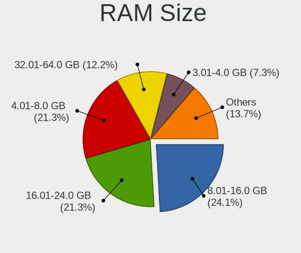
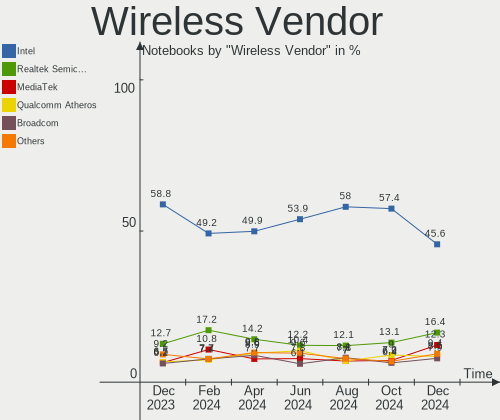
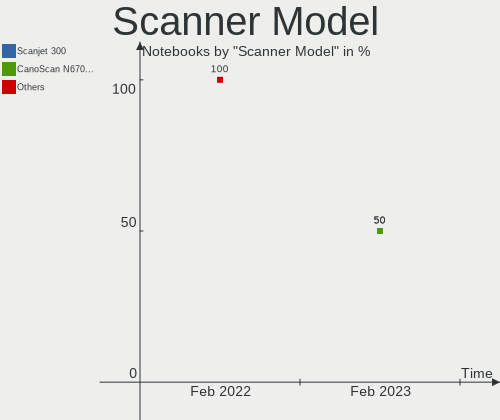

Fedora - Hardware Trends (Notebooks)
------------------------------------

A project to identify most popular hardware characteristics and track their change
over time based on data collected by Linux users at https://Linux-Hardware.org.

Anyone can contribute to this report by the [hw-probe](https://github.com/linuxhw/hw-probe) tool:

    sudo -E hw-probe -all -upload

This report is for one last month. Overall report since the beginning of time: [TestCoverage](https://github.com/linuxhw/TestCoverage)

Period: Nov, 2022.

Contents
--------

* [ System ](#system)
  - [ OS                       ](#os)
  - [ OS Family                ](#os-family)
  - [ Kernel                   ](#kernel)
  - [ Kernel Family            ](#kernel-family)
  - [ Kernel Major Ver.        ](#kernel-major-ver)
  - [ Arch                     ](#arch)
  - [ DE                       ](#de)
  - [ Display Server           ](#display-server)
  - [ Display Manager          ](#display-manager)
  - [ OS Lang                  ](#os-lang)
  - [ Boot Mode                ](#boot-mode)
  - [ Filesystem               ](#filesystem)
  - [ Part. scheme             ](#part-scheme)
  - [ Dual Boot with Linux/BSD ](#dual-boot-with-linuxbsd)
  - [ Dual Boot (Win)          ](#dual-boot-win)

* [ Board ](#board)
  - [ Vendor                   ](#vendor)
  - [ Model                    ](#model)
  - [ Model Family             ](#model-family)
  - [ MFG Year                 ](#mfg-year)
  - [ Form Factor              ](#form-factor)
  - [ Secure Boot              ](#secure-boot)
  - [ Coreboot                 ](#coreboot)
  - [ RAM Size                 ](#ram-size)
  - [ RAM Used                 ](#ram-used)
  - [ Total Drives             ](#total-drives)
  - [ Has CD-ROM               ](#has-cd-rom)
  - [ Has Ethernet             ](#has-ethernet)
  - [ Has WiFi                 ](#has-wifi)
  - [ Has Bluetooth            ](#has-bluetooth)

* [ Location ](#location)
  - [ Country                  ](#country)
  - [ City                     ](#city)

* [ Drives ](#drives)
  - [ Drive Vendor             ](#drive-vendor)
  - [ Drive Model              ](#drive-model)
  - [ HDD Vendor               ](#hdd-vendor)
  - [ SSD Vendor               ](#ssd-vendor)
  - [ Drive Kind               ](#drive-kind)
  - [ Drive Connector          ](#drive-connector)
  - [ Drive Size               ](#drive-size)
  - [ Space Total              ](#space-total)
  - [ Space Used               ](#space-used)
  - [ Malfunc. Drives          ](#malfunc-drives)
  - [ Malfunc. Drive Vendor    ](#malfunc-drive-vendor)
  - [ Malfunc. HDD Vendor      ](#malfunc-hdd-vendor)
  - [ Malfunc. Drive Kind      ](#malfunc-drive-kind)
  - [ Failed Drives            ](#failed-drives)
  - [ Failed Drive Vendor      ](#failed-drive-vendor)
  - [ Drive Status             ](#drive-status)

* [ Storage controller ](#storage-controller)
  - [ Storage Vendor           ](#storage-vendor)
  - [ Storage Model            ](#storage-model)
  - [ Storage Kind             ](#storage-kind)

* [ Processor ](#processor)
  - [ CPU Vendor               ](#cpu-vendor)
  - [ CPU Model                ](#cpu-model)
  - [ CPU Model Family         ](#cpu-model-family)
  - [ CPU Cores                ](#cpu-cores)
  - [ CPU Sockets              ](#cpu-sockets)
  - [ CPU Threads              ](#cpu-threads)
  - [ CPU Op-Modes             ](#cpu-op-modes)
  - [ CPU Microcode            ](#cpu-microcode)
  - [ CPU Microarch            ](#cpu-microarch)

* [ Graphics ](#graphics)
  - [ GPU Vendor               ](#gpu-vendor)
  - [ GPU Model                ](#gpu-model)
  - [ GPU Combo                ](#gpu-combo)
  - [ GPU Driver               ](#gpu-driver)
  - [ GPU Memory               ](#gpu-memory)

* [ Monitor ](#monitor)
  - [ Monitor Vendor           ](#monitor-vendor)
  - [ Monitor Model            ](#monitor-model)
  - [ Monitor Resolution       ](#monitor-resolution)
  - [ Monitor Diagonal         ](#monitor-diagonal)
  - [ Monitor Width            ](#monitor-width)
  - [ Aspect Ratio             ](#aspect-ratio)
  - [ Monitor Area             ](#monitor-area)
  - [ Pixel Density            ](#pixel-density)
  - [ Multiple Monitors        ](#multiple-monitors)

* [ Network ](#network)
  - [ Net Controller Vendor    ](#net-controller-vendor)
  - [ Net Controller Model     ](#net-controller-model)
  - [ Wireless Vendor          ](#wireless-vendor)
  - [ Wireless Model           ](#wireless-model)
  - [ Ethernet Vendor          ](#ethernet-vendor)
  - [ Ethernet Model           ](#ethernet-model)
  - [ Net Controller Kind      ](#net-controller-kind)
  - [ Used Controller          ](#used-controller)
  - [ NICs                     ](#nics)
  - [ IPv6                     ](#ipv6)

* [ Bluetooth ](#bluetooth)
  - [ Bluetooth Vendor         ](#bluetooth-vendor)
  - [ Bluetooth Model          ](#bluetooth-model)

* [ Sound ](#sound)
  - [ Sound Vendor             ](#sound-vendor)
  - [ Sound Model              ](#sound-model)

* [ Memory ](#memory)
  - [ Memory Vendor            ](#memory-vendor)
  - [ Memory Model             ](#memory-model)
  - [ Memory Kind              ](#memory-kind)
  - [ Memory Form Factor       ](#memory-form-factor)
  - [ Memory Size              ](#memory-size)
  - [ Memory Speed             ](#memory-speed)

* [ Printers & scanners ](#printers--scanners)
  - [ Printer Vendor           ](#printer-vendor)
  - [ Printer Model            ](#printer-model)
  - [ Scanner Vendor           ](#scanner-vendor)
  - [ Scanner Model            ](#scanner-model)

* [ Camera ](#camera)
  - [ Camera Vendor            ](#camera-vendor)
  - [ Camera Model             ](#camera-model)

* [ Security ](#security)
  - [ Fingerprint Vendor       ](#fingerprint-vendor)
  - [ Fingerprint Model        ](#fingerprint-model)
  - [ Chipcard Vendor          ](#chipcard-vendor)
  - [ Chipcard Model           ](#chipcard-model)

* [ Unsupported ](#unsupported)
  - [ Unsupported Devices      ](#unsupported-devices)
  - [ Unsupported Device Types ](#unsupported-device-types)

System
------

OS
--

Installed operating systems

| Name      | Notebooks | Percent |
|-----------|-----------|---------|
| Fedora 37 | 147       | 56.76%  |
| Fedora 36 | 101       | 39%     |
| Fedora 35 | 6         | 2.32%   |
| Fedora 34 | 2         | 0.77%   |
| Fedora 38 | 1         | 0.39%   |
| Fedora 33 | 1         | 0.39%   |
| Fedora 29 | 1         | 0.39%   |

OS Family
---------

OS without a version

| Name   | Notebooks | Percent |
|--------|-----------|---------|
| Fedora | 259       | 100%    |

Kernel
------

Version of the Linux kernel

| Version                          | Notebooks | Percent |
|----------------------------------|-----------|---------|
| 6.0.5-200.fc36.x86_64            | 59        | 22.78%  |
| 6.0.8-300.fc37.x86_64            | 50        | 19.31%  |
| 6.0.9-300.fc37.x86_64            | 37        | 14.29%  |
| 5.19.16-301.fc37.x86_64          | 18        | 6.95%   |
| 6.0.7-301.fc37.x86_64            | 17        | 6.56%   |
| 5.17.5-300.fc36.x86_64           | 14        | 5.41%   |
| 6.0.7-200.fc36.x86_64            | 9         | 3.47%   |
| 6.0.9-200.fc36.x86_64            | 7         | 2.7%    |
| 6.0.6-300.fc37.x86_64            | 6         | 2.32%   |
| 6.0.8-200.fc36.x86_64            | 4         | 1.54%   |
| 6.0.5-100.fc35.x86_64            | 3         | 1.16%   |
| 6.0.9-300.mbp.fc37.x86_64        | 2         | 0.77%   |
| 6.0.2-xm1.0.fc36.x86_64          | 2         | 0.77%   |
| 6.0.10-300.fc37.x86_64           | 2         | 0.77%   |
| 5.19.7-300.fc37.x86_64           | 2         | 0.77%   |
| 5.19.16-200.fc36.x86_64          | 2         | 0.77%   |
| 6.1.0-rc6+                       | 1         | 0.39%   |
| 6.1.0-rc4+                       | 1         | 0.39%   |
| 6.1.0-0.rc6.46.fc38.x86_64       | 1         | 0.39%   |
| 6.1.0-0.rc5.39.fc38.x86_64       | 1         | 0.39%   |
| 6.1.0-0.rc4.34.inttf.fc37.x86_64 | 1         | 0.39%   |
| 6.0.9-602.inttf.fc36.x86_64      | 1         | 0.39%   |
| 6.0.9-350.vanilla.1.fc37.x86_64  | 1         | 0.39%   |
| 6.0.9-302.rog.fc37.x86_64        | 1         | 0.39%   |
| 6.0.8-oem-lenovo                 | 1         | 0.39%   |
| 6.0.8-602.inttf.fc37.x86_64      | 1         | 0.39%   |
| 6.0.5-300.fc37.x86_64            | 1         | 0.39%   |
| 6.0.2-xm1.0.fc37.x86_64          | 1         | 0.39%   |
| 6.0.2-300.rog.fc36.x86_64        | 1         | 0.39%   |
| 6.0.10-200.fc36.x86_64           | 1         | 0.39%   |
| 5.3.11-100.fc29.i686             | 1         | 0.39%   |
| 5.19.9-200.fc36.x86_64           | 1         | 0.39%   |
| 5.19.15-301.fc37.x86_64          | 1         | 0.39%   |
| 5.19.15-201.fc36.x86_64          | 1         | 0.39%   |
| 5.19.13-200.fc36.x86_64          | 1         | 0.39%   |
| 5.18.18-100.fc35.x86_64          | 1         | 0.39%   |
| 5.17.12-100.fc34.x86_64          | 1         | 0.39%   |
| 5.16.20-200.fc35.x86_64          | 1         | 0.39%   |
| 5.14.18-100.fc33.x86_64          | 1         | 0.39%   |
| 5.14.10-300.fc35.x86_64          | 1         | 0.39%   |

Kernel Family
-------------

Linux kernel without a distro release

| Version | Notebooks | Percent |
|---------|-----------|---------|
| 6.0.5   | 63        | 24.32%  |
| 6.0.8   | 56        | 21.62%  |
| 6.0.9   | 49        | 18.92%  |
| 6.0.7   | 26        | 10.04%  |
| 5.19.16 | 20        | 7.72%   |
| 5.17.5  | 14        | 5.41%   |
| 6.0.6   | 6         | 2.32%   |
| 6.1.0   | 5         | 1.93%   |
| 6.0.2   | 4         | 1.54%   |
| 6.0.10  | 3         | 1.16%   |
| 5.19.7  | 2         | 0.77%   |
| 5.19.15 | 2         | 0.77%   |
| 5.3.11  | 1         | 0.39%   |
| 5.19.9  | 1         | 0.39%   |
| 5.19.13 | 1         | 0.39%   |
| 5.18.18 | 1         | 0.39%   |
| 5.17.12 | 1         | 0.39%   |
| 5.16.20 | 1         | 0.39%   |
| 5.14.18 | 1         | 0.39%   |
| 5.14.10 | 1         | 0.39%   |
| 5.11.12 | 1         | 0.39%   |

Kernel Major Ver.
-----------------

Linux kernel major version

| Version | Notebooks | Percent |
|---------|-----------|---------|
| 6.0     | 207       | 79.92%  |
| 5.19    | 26        | 10.04%  |
| 5.17    | 15        | 5.79%   |
| 6.1     | 5         | 1.93%   |
| 5.14    | 2         | 0.77%   |
| 5.3     | 1         | 0.39%   |
| 5.18    | 1         | 0.39%   |
| 5.16    | 1         | 0.39%   |
| 5.11    | 1         | 0.39%   |

Arch
----

OS architecture (x86_64, i586, etc.)

| Name   | Notebooks | Percent |
|--------|-----------|---------|
| x86_64 | 258       | 99.61%  |
| i686   | 1         | 0.39%   |

DE
--

Desktop Environment

| Name            | Notebooks | Percent |
|-----------------|-----------|---------|
| GNOME           | 185       | 71.43%  |
| KDE5            | 50        | 19.31%  |
| Unknown         | 7         | 2.7%    |
| XFCE            | 4         | 1.54%   |
| MATE            | 4         | 1.54%   |
| X-Cinnamon      | 3         | 1.16%   |
| sway            | 2         | 0.77%   |
| LXQt            | 1         | 0.39%   |
| LXDE            | 1         | 0.39%   |
| GNOME Flashback | 1         | 0.39%   |
| Deepin          | 1         | 0.39%   |

Display Server
--------------

X11 or Wayland

| Name    | Notebooks | Percent |
|---------|-----------|---------|
| Wayland | 191       | 73.75%  |
| X11     | 64        | 24.71%  |
| Unknown | 3         | 1.16%   |
| Tty     | 1         | 0.39%   |

Display Manager
---------------

SDDM, LightDM, etc.

| Name    | Notebooks | Percent |
|---------|-----------|---------|
| Unknown | 114       | 44.02%  |
| GDM     | 101       | 39%     |
| SDDM    | 29        | 11.2%   |
| LightDM | 14        | 5.41%   |
| KDM     | 1         | 0.39%   |

OS Lang
-------

Language

| Lang    | Notebooks | Percent |
|---------|-----------|---------|
| en_US   | 137       | 52.9%   |
| ru_RU   | 17        | 6.56%   |
| it_IT   | 13        | 5.02%   |
| en_GB   | 13        | 5.02%   |
| de_DE   | 11        | 4.25%   |
| en_IN   | 10        | 3.86%   |
| fr_FR   | 9         | 3.47%   |
| pt_BR   | 6         | 2.32%   |
| tr_TR   | 5         | 1.93%   |
| en_AU   | 5         | 1.93%   |
| es_ES   | 4         | 1.54%   |
| pl_PL   | 3         | 1.16%   |
| nl_NL   | 3         | 1.16%   |
| en_CA   | 3         | 1.16%   |
| Unknown | 3         | 1.16%   |
| zh_CN   | 2         | 0.77%   |
| ja_JP   | 2         | 0.77%   |
| sv_SE   | 1         | 0.39%   |
| sr_RS   | 1         | 0.39%   |
| ru_UA   | 1         | 0.39%   |
| pt_PT   | 1         | 0.39%   |
| fi_FI   | 1         | 0.39%   |
| en_PH   | 1         | 0.39%   |
| en_NZ   | 1         | 0.39%   |
| en_IL   | 1         | 0.39%   |
| en_IE   | 1         | 0.39%   |
| en_DK   | 1         | 0.39%   |
| en_001  | 1         | 0.39%   |
| de_AT   | 1         | 0.39%   |
| da_DK   | 1         | 0.39%   |

Boot Mode
---------

EFI or BIOS

| Mode | Notebooks | Percent |
|------|-----------|---------|
| EFI  | 233       | 89.96%  |
| BIOS | 26        | 10.04%  |

Filesystem
----------

Type of filesystem

| Type    | Notebooks | Percent |
|---------|-----------|---------|
| Btrfs   | 205       | 79.15%  |
| Ext4    | 52        | 20.08%  |
| Unknown | 2         | 0.77%   |

Part. scheme
------------

Scheme of partitioning

| Type    | Notebooks | Percent |
|---------|-----------|---------|
| GPT     | 143       | 55.21%  |
| Unknown | 111       | 42.86%  |
| MBR     | 5         | 1.93%   |

Dual Boot with Linux/BSD
------------------------

Hosting more than one Linux/BSD

| Dual boot | Notebooks | Percent |
|-----------|-----------|---------|
| No        | 231       | 89.19%  |
| Yes       | 28        | 10.81%  |

Dual Boot (Win)
---------------

Hosting Linux and Windows

| Dual boot | Notebooks | Percent |
|-----------|-----------|---------|
| No        | 208       | 80.31%  |
| Yes       | 51        | 19.69%  |

Board
-----

Vendor
------

Motherboard manufacturer

| Name             | Notebooks | Percent |
|------------------|-----------|---------|
| Lenovo           | 80        | 30.89%  |
| Hewlett-Packard  | 34        | 13.13%  |
| ASUSTek Computer | 34        | 13.13%  |
| Dell             | 31        | 11.97%  |
| Acer             | 22        | 8.49%   |
| MSI              | 9         | 3.47%   |
| Apple            | 9         | 3.47%   |
| HUAWEI           | 6         | 2.32%   |
| Google           | 4         | 1.54%   |
| TUXEDO           | 3         | 1.16%   |
| GPD              | 3         | 1.16%   |
| Toshiba          | 2         | 0.77%   |
| Timi             | 2         | 0.77%   |
| Framework        | 2         | 0.77%   |
| Alienware        | 2         | 0.77%   |
| Unknown          | 2         | 0.77%   |
| UNOWHY           | 1         | 0.39%   |
| Sony             | 1         | 0.39%   |
| SLIMBOOK         | 1         | 0.39%   |
| Quanta           | 1         | 0.39%   |
| Packard Bell     | 1         | 0.39%   |
| NEC Computers    | 1         | 0.39%   |
| Monster          | 1         | 0.39%   |
| MACHENIKE        | 1         | 0.39%   |
| Kraftway         | 1         | 0.39%   |
| HASEE Computer   | 1         | 0.39%   |
| GEO              | 1         | 0.39%   |
| Exo              | 1         | 0.39%   |
| Eluktronics      | 1         | 0.39%   |
| AVITA            | 1         | 0.39%   |

Model
-----

Motherboard model

| Name                                     | Notebooks | Percent |
|------------------------------------------|-----------|---------|
| Unknown                                  | 4         | 1.54%   |
| HUAWEI CREM-WXX9                         | 3         | 1.16%   |
| GPD G1619-04                             | 3         | 1.16%   |
| Lenovo ThinkBook 15-IIL 20SM             | 2         | 0.77%   |
| Lenovo ThinkBook 15 G3 ACL 21A4          | 2         | 0.77%   |
| Lenovo IdeaPad 5 Pro 16ACH6 82L5         | 2         | 0.77%   |
| HP Pavilion Laptop 14-dv0xxx             | 2         | 0.77%   |
| HP Notebook                              | 2         | 0.77%   |
| HP Laptop 15-dw3xxx                      | 2         | 0.77%   |
| HP EliteBook 830 G5                      | 2         | 0.77%   |
| Framework Laptop (12th Gen Intel Core)   | 2         | 0.77%   |
| Dell XPS 15 9510                         | 2         | 0.77%   |
| Dell XPS 13 9300                         | 2         | 0.77%   |
| Dell Latitude 7480                       | 2         | 0.77%   |
| Dell G3 3579                             | 2         | 0.77%   |
| ASUS ZenBook UX534FTC_UX534FT            | 2         | 0.77%   |
| ASUS ASUS TUF Gaming F15 FX506HM_FX506HM | 2         | 0.77%   |
| Apple MacBookPro9,2                      | 2         | 0.77%   |
| Apple MacBookPro10,1                     | 2         | 0.77%   |
| Acer Aspire A515-45                      | 2         | 0.77%   |
| UNOWHY Y13G011S4EI                       | 1         | 0.39%   |
| TUXEDO Stellaris Intel Gen4              | 1         | 0.39%   |
| TUXEDO Pulse 15 Gen2                     | 1         | 0.39%   |
| TUXEDO InfinityBook S 15 Gen6            | 1         | 0.39%   |
| Toshiba Satellite S55-A                  | 1         | 0.39%   |
| Toshiba Satellite C660                   | 1         | 0.39%   |
| Timi RedmiBook Pro 14S                   | 1         | 0.39%   |
| Timi RedmiBook 14 II                     | 1         | 0.39%   |
| Sony SVE15133CNB                         | 1         | 0.39%   |
| SLIMBOOK Executive                       | 1         | 0.39%   |
| Quanta TWS                               | 1         | 0.39%   |
| Packard Bell EasyNote LX                 | 1         | 0.39%   |
| NEC Computers NEC VERSA M160             | 1         | 0.39%   |
| MSI Summit E16Flip A12UCT                | 1         | 0.39%   |
| MSI Stealth GS66 12UGS                   | 1         | 0.39%   |
| MSI PS63 Modern 8RC                      | 1         | 0.39%   |
| MSI Modern 15 A11MU                      | 1         | 0.39%   |
| MSI Modern 14 B5M                        | 1         | 0.39%   |
| MSI Katana GF76 12UE                     | 1         | 0.39%   |
| MSI Katana GF76 11UD                     | 1         | 0.39%   |

Model Family
------------

Motherboard model prefix

| Name                | Notebooks | Percent |
|---------------------|-----------|---------|
| Lenovo ThinkPad     | 46        | 17.76%  |
| Lenovo IdeaPad      | 12        | 4.63%   |
| Acer Aspire         | 12        | 4.63%   |
| HP Laptop           | 10        | 3.86%   |
| Dell Latitude       | 10        | 3.86%   |
| Lenovo ThinkBook    | 9         | 3.47%   |
| HP Pavilion         | 8         | 3.09%   |
| Dell Inspiron       | 8         | 3.09%   |
| Lenovo Legion       | 7         | 2.7%    |
| HP EliteBook        | 7         | 2.7%    |
| Dell XPS            | 7         | 2.7%    |
| ASUS VivoBook       | 7         | 2.7%    |
| ASUS ASUS           | 6         | 2.32%   |
| ASUS ROG            | 5         | 1.93%   |
| Acer Nitro          | 5         | 1.93%   |
| ASUS ZenBook        | 4         | 1.54%   |
| Unknown             | 4         | 1.54%   |
| Lenovo Yoga         | 3         | 1.16%   |
| HUAWEI CREM-WXX9    | 3         | 1.16%   |
| HP ZBook            | 3         | 1.16%   |
| HP ProBook          | 3         | 1.16%   |
| GPD G1619-04        | 3         | 1.16%   |
| Toshiba Satellite   | 2         | 0.77%   |
| Timi RedmiBook      | 2         | 0.77%   |
| MSI Modern          | 2         | 0.77%   |
| MSI Katana          | 2         | 0.77%   |
| HP Notebook         | 2         | 0.77%   |
| Framework Laptop    | 2         | 0.77%   |
| Dell Vostro         | 2         | 0.77%   |
| Dell G3             | 2         | 0.77%   |
| Apple MacBookPro9   | 2         | 0.77%   |
| Apple MacBookPro10  | 2         | 0.77%   |
| Acer Predator       | 2         | 0.77%   |
| UNOWHY Y13G011S4EI  | 1         | 0.39%   |
| TUXEDO Stellaris    | 1         | 0.39%   |
| TUXEDO Pulse        | 1         | 0.39%   |
| TUXEDO InfinityBook | 1         | 0.39%   |
| Sony SVE15133CNB    | 1         | 0.39%   |
| SLIMBOOK Executive  | 1         | 0.39%   |
| Quanta TWS          | 1         | 0.39%   |

MFG Year
--------

Motherboard manufacture year

| Year | Notebooks | Percent |
|------|-----------|---------|
| 2021 | 58        | 22.39%  |
| 2020 | 42        | 16.22%  |
| 2022 | 40        | 15.44%  |
| 2018 | 25        | 9.65%   |
| 2019 | 22        | 8.49%   |
| 2017 | 17        | 6.56%   |
| 2016 | 11        | 4.25%   |
| 2015 | 9         | 3.47%   |
| 2013 | 9         | 3.47%   |
| 2012 | 8         | 3.09%   |
| 2014 | 5         | 1.93%   |
| 2010 | 5         | 1.93%   |
| 2011 | 3         | 1.16%   |
| 2006 | 2         | 0.77%   |
| 2009 | 1         | 0.39%   |
| 2008 | 1         | 0.39%   |
| 2007 | 1         | 0.39%   |

Form Factor
-----------

Physical design of the computer

| Name     | Notebooks | Percent |
|----------|-----------|---------|
| Notebook | 259       | 100%    |

Secure Boot
-----------

Enabled or disabled

| State    | Notebooks | Percent |
|----------|-----------|---------|
| Disabled | 183       | 70.66%  |
| Enabled  | 76        | 29.34%  |

Coreboot
--------

Have coreboot on board

| Used | Notebooks | Percent |
|------|-----------|---------|
| No   | 255       | 98.46%  |
| Yes  | 4         | 1.54%   |

RAM Size
--------

Total RAM memory

| Size in GB  | Notebooks | Percent |
|-------------|-----------|---------|
| 4.01-8.0    | 64        | 24.71%  |
| 8.01-16.0   | 61        | 23.55%  |
| 16.01-24.0  | 56        | 21.62%  |
| 32.01-64.0  | 27        | 10.42%  |
| 3.01-4.0    | 25        | 9.65%   |
| 64.01-256.0 | 14        | 5.41%   |
| 24.01-32.0  | 8         | 3.09%   |
| 1.01-2.0    | 3         | 1.16%   |
| 0.51-1.0    | 1         | 0.39%   |

RAM Used
--------

Used RAM memory

| Used GB    | Notebooks | Percent |
|------------|-----------|---------|
| 4.01-8.0   | 88        | 33.98%  |
| 2.01-3.0   | 71        | 27.41%  |
| 3.01-4.0   | 46        | 17.76%  |
| 1.01-2.0   | 25        | 9.65%   |
| 8.01-16.0  | 23        | 8.88%   |
| 24.01-32.0 | 2         | 0.77%   |
| 16.01-24.0 | 2         | 0.77%   |
| 0.51-1.0   | 2         | 0.77%   |

Total Drives
------------

Number of drives on board

| Drives | Notebooks | Percent |
|--------|-----------|---------|
| 1      | 188       | 72.59%  |
| 2      | 64        | 24.71%  |
| 3      | 3         | 1.16%   |
| 0      | 2         | 0.77%   |
| 6      | 1         | 0.39%   |
| 4      | 1         | 0.39%   |

Has CD-ROM
----------

Has CD-ROM on board

| Presented | Notebooks | Percent |
|-----------|-----------|---------|
| No        | 222       | 85.71%  |
| Yes       | 37        | 14.29%  |

Has Ethernet
------------

Has Ethernet on board

| Presented | Notebooks | Percent |
|-----------|-----------|---------|
| Yes       | 179       | 69.11%  |
| No        | 80        | 30.89%  |

Has WiFi
--------

Has WiFi module

| Presented | Notebooks | Percent |
|-----------|-----------|---------|
| Yes       | 256       | 98.84%  |
| No        | 3         | 1.16%   |

Has Bluetooth
-------------

Has Bluetooth module

| Presented | Notebooks | Percent |
|-----------|-----------|---------|
| Yes       | 222       | 85.71%  |
| No        | 37        | 14.29%  |

Location
--------

Country
-------

Geographic location (country)

| Country      | Notebooks | Percent |
|--------------|-----------|---------|
| USA          | 48        | 18.53%  |
| India        | 20        | 7.72%   |
| Germany      | 20        | 7.72%   |
| Russia       | 18        | 6.95%   |
| Italy        | 16        | 6.18%   |
| Brazil       | 12        | 4.63%   |
| Netherlands  | 11        | 4.25%   |
| Turkey       | 10        | 3.86%   |
| France       | 8         | 3.09%   |
| Australia    | 8         | 3.09%   |
| Spain        | 7         | 2.7%    |
| Switzerland  | 6         | 2.32%   |
| Poland       | 6         | 2.32%   |
| UK           | 4         | 1.54%   |
| Sweden       | 4         | 1.54%   |
| Japan        | 3         | 1.16%   |
| Indonesia    | 3         | 1.16%   |
| Finland      | 3         | 1.16%   |
| Belarus      | 3         | 1.16%   |
| Taiwan       | 2         | 0.77%   |
| Romania      | 2         | 0.77%   |
| Portugal     | 2         | 0.77%   |
| Pakistan     | 2         | 0.77%   |
| Mexico       | 2         | 0.77%   |
| Israel       | 2         | 0.77%   |
| Estonia      | 2         | 0.77%   |
| Denmark      | 2         | 0.77%   |
| Croatia      | 2         | 0.77%   |
| Canada       | 2         | 0.77%   |
| Belgium      | 2         | 0.77%   |
| Austria      | 2         | 0.77%   |
| Vietnam      | 1         | 0.39%   |
| Ukraine      | 1         | 0.39%   |
| Suriname     | 1         | 0.39%   |
| Sudan        | 1         | 0.39%   |
| South Africa | 1         | 0.39%   |
| Slovakia     | 1         | 0.39%   |
| Singapore    | 1         | 0.39%   |
| Serbia       | 1         | 0.39%   |
| Saudi Arabia | 1         | 0.39%   |

City
----

Geographic location (city)

| City            | Notebooks | Percent |
|-----------------|-----------|---------|
| Moscow          | 7         | 2.7%    |
| Izmir           | 4         | 1.54%   |
| Paris           | 3         | 1.16%   |
| Milan           | 3         | 1.16%   |
| Melbourne       | 3         | 1.16%   |
| Karlskrona      | 3         | 1.16%   |
| Chicago         | 3         | 1.16%   |
| Zagreb          | 2         | 0.77%   |
| Tokyo           | 2         | 0.77%   |
| Tallinn         | 2         | 0.77%   |
| Sao Paulo       | 2         | 0.77%   |
| Rishon LeZiyyon | 2         | 0.77%   |
| Pune            | 2         | 0.77%   |
| Portland        | 2         | 0.77%   |
| New York        | 2         | 0.77%   |
| Minsk           | 2         | 0.77%   |
| Madrid          | 2         | 0.77%   |
| Lisbon          | 2         | 0.77%   |
| Krakow          | 2         | 0.77%   |
| Jakarta         | 2         | 0.77%   |
| Istanbul        | 2         | 0.77%   |
| Easton          | 2         | 0.77%   |
| Delft           | 2         | 0.77%   |
| Chennai         | 2         | 0.77%   |
| Canoas          | 2         | 0.77%   |
| Bucharest       | 2         | 0.77%   |
| Brisbane        | 2         | 0.77%   |
| Bengaluru       | 2         | 0.77%   |
| Altus           | 2         | 0.77%   |
| Ahmedabad       | 2         | 0.77%   |
| Zurich          | 1         | 0.39%   |
| Zenica          | 1         | 0.39%   |
| Zeist           | 1         | 0.39%   |
| Yerevan         | 1         | 0.39%   |
| Yaroslavl       | 1         | 0.39%   |
| Yalova          | 1         | 0.39%   |
| Wuppertal       | 1         | 0.39%   |
| Wroclaw         | 1         | 0.39%   |
| Worms           | 1         | 0.39%   |
| Wielbark        | 1         | 0.39%   |

Drives
------

Drive Vendor
------------

Hard drive vendors

| Vendor                         | Notebooks | Drives | Percent |
|--------------------------------|-----------|--------|---------|
| Samsung Electronics            | 70        | 80     | 21.81%  |
| WDC                            | 36        | 39     | 11.21%  |
| Sandisk                        | 32        | 34     | 9.97%   |
| SK hynix                       | 26        | 26     | 8.1%    |
| Unknown                        | 15        | 17     | 4.67%   |
| Kingston                       | 15        | 15     | 4.67%   |
| Micron Technology              | 14        | 14     | 4.36%   |
| Crucial                        | 13        | 14     | 4.05%   |
| Intel                          | 10        | 10     | 3.12%   |
| Toshiba                        | 9         | 9      | 2.8%    |
| Seagate                        | 9         | 9      | 2.8%    |
| KIOXIA                         | 8         | 8      | 2.49%   |
| Apple                          | 6         | 9      | 1.87%   |
| Hitachi                        | 5         | 5      | 1.56%   |
| Phison Electronics             | 4         | 4      | 1.25%   |
| A-DATA Technology              | 4         | 4      | 1.25%   |
| PNY                            | 3         | 3      | 0.93%   |
| Phison                         | 3         | 3      | 0.93%   |
| Micron/Crucial Technology      | 3         | 3      | 0.93%   |
| ADATA Technology               | 3         | 3      | 0.93%   |
| UMIS                           | 2         | 2      | 0.62%   |
| Kingston Technology Company    | 2         | 2      | 0.62%   |
| HGST                           | 2         | 2      | 0.62%   |
| XPG                            | 1         | 1      | 0.31%   |
| Union Memory                   | 1         | 1      | 0.31%   |
| TO Exter                       | 1         | 1      | 0.31%   |
| Teclast                        | 1         | 1      | 0.31%   |
| SYMWAVE                        | 1         | 1      | 0.31%   |
| Solid State Storage Technology | 1         | 1      | 0.31%   |
| Solid State Storage            | 1         | 1      | 0.31%   |
| Silicon Motion                 | 1         | 1      | 0.31%   |
| Ramaxel Technology             | 1         | 1      | 0.31%   |
| Mushkin                        | 1         | 1      | 0.31%   |
| MAXIO Technology (Hangzhou)    | 1         | 1      | 0.31%   |
| LITEON                         | 1         | 1      | 0.31%   |
| Lenovo                         | 1         | 1      | 0.31%   |
| LDLC                           | 1         | 1      | 0.31%   |
| KIOXIA-EXCERIA                 | 1         | 1      | 0.31%   |
| JAMESDONKEY                    | 1         | 1      | 0.31%   |
| Intenso                        | 1         | 1      | 0.31%   |

Drive Model
-----------

Hard drive models

| Model                                                | Notebooks | Percent |
|------------------------------------------------------|-----------|---------|
| Samsung NVMe SSD Controller SM981/PM981/PM983 1TB    | 13        | 3.87%   |
| Samsung NVMe SSD Controller PM9A1/PM9A3/980PRO 250GB | 6         | 1.79%   |
| Sandisk WD Blue SN550 NVMe SSD 1TB                   | 5         | 1.49%   |
| Sandisk WD Black SN750 / PC SN730 NVMe SSD 1024GB    | 5         | 1.49%   |
| Samsung MZALQ512HALU-000L2 512GB                     | 5         | 1.49%   |
| Unknown MMC Card  64GB                               | 4         | 1.19%   |
| WDC WDS100T1X0E-00AFY0 1TB                           | 3         | 0.89%   |
| Toshiba MQ04ABF100 1TB                               | 3         | 0.89%   |
| SK hynix SKHynix_HFS512GDE9X081N 512GB               | 3         | 0.89%   |
| SK hynix BC711 HFM512GD3JX013N 512GB                 | 3         | 0.89%   |
| Seagate ST1000LM035-1RK172 1TB                       | 3         | 0.89%   |
| Sandisk WD Black SN850 256GB                         | 3         | 0.89%   |
| Samsung SSD 980 1TB                                  | 3         | 0.89%   |
| Samsung SSD 860 EVO 500GB                            | 3         | 0.89%   |
| Samsung SSD 850 EVO 500GB                            | 3         | 0.89%   |
| Micron 2210_MTFDHBA512QFD 512GB                      | 3         | 0.89%   |
| KIOXIA KBG40ZNV512G 512GB                            | 3         | 0.89%   |
| Kingston SA400S37240G 240GB SSD                      | 3         | 0.89%   |
| Crucial CT1000MX500SSD1 1TB                          | 3         | 0.89%   |
| WDC WDBNCE0010PNC 1TB SSD                            | 2         | 0.6%    |
| WDC WD10SPZX-60Z10T0 1TB                             | 2         | 0.6%    |
| WDC WD10JPVX-22JC3T0 1TB                             | 2         | 0.6%    |
| WDC PC SN730 SDBQNTY-512G-1001 512GB                 | 2         | 0.6%    |
| WDC PC SN730 SDBPNTY-512G                            | 2         | 0.6%    |
| SK hynix BC711 NVMe 512GB                            | 2         | 0.6%    |
| SK hynix BC511 512GB                                 | 2         | 0.6%    |
| Sandisk WDC PC SN530 SDBPMPZ-512G-1101 512GB         | 2         | 0.6%    |
| SanDisk SSD PLUS 480GB                               | 2         | 0.6%    |
| Sandisk PC SN530 NVMe WDC 256GB                      | 2         | 0.6%    |
| SanDisk NVMe SSD Drive 2TB                           | 2         | 0.6%    |
| SanDisk NVMe SSD Drive 1TB                           | 2         | 0.6%    |
| Samsung SSD 860 EVO 250GB                            | 2         | 0.6%    |
| Samsung NVMe SSD Controller SM961/PM961/SM963 250GB  | 2         | 0.6%    |
| Samsung MZVLQ512HALU-000H1 512GB                     | 2         | 0.6%    |
| Samsung MZVLB1T0HBLR-000L7 1TB                       | 2         | 0.6%    |
| Phison E12 NVMe Controller 2TB                       | 2         | 0.6%    |
| Micron/Crucial P2 NVMe PCIe SSD 250GB                | 2         | 0.6%    |
| Micron 3400_MTFDKBA1T0TFH 1TB                        | 2         | 0.6%    |
| Micron 2450_MTFDKBA1T0TFK 1024GB                     | 2         | 0.6%    |
| Kingston Company U-SNS8154P3 NVMe SSD 256GB          | 2         | 0.6%    |

HDD Vendor
----------

Hard disk drive vendors

| Vendor  | Notebooks | Drives | Percent |
|---------|-----------|--------|---------|
| WDC     | 14        | 14     | 41.18%  |
| Seagate | 8         | 8      | 23.53%  |
| Toshiba | 5         | 5      | 14.71%  |
| Hitachi | 5         | 5      | 14.71%  |
| HGST    | 2         | 2      | 5.88%   |

SSD Vendor
----------

Solid state drive vendors

| Vendor              | Notebooks | Drives | Percent |
|---------------------|-----------|--------|---------|
| Samsung Electronics | 18        | 20     | 23.38%  |
| Crucial             | 12        | 13     | 15.58%  |
| WDC                 | 8         | 8      | 10.39%  |
| SanDisk             | 7         | 7      | 9.09%   |
| Kingston            | 7         | 7      | 9.09%   |
| PNY                 | 3         | 3      | 3.9%    |
| Intel               | 3         | 3      | 3.9%    |
| Apple               | 3         | 3      | 3.9%    |
| SK hynix            | 2         | 2      | 2.6%    |
| Toshiba             | 1         | 1      | 1.3%    |
| TO Exter            | 1         | 1      | 1.3%    |
| Teclast             | 1         | 1      | 1.3%    |
| Ramaxel Technology  | 1         | 1      | 1.3%    |
| Mushkin             | 1         | 1      | 1.3%    |
| LITEON              | 1         | 1      | 1.3%    |
| JAMESDONKEY         | 1         | 1      | 1.3%    |
| Intenso             | 1         | 1      | 1.3%    |
| HS-SSD-C100         | 1         | 1      | 1.3%    |
| GOODRAM             | 1         | 1      | 1.3%    |
| FORESEE             | 1         | 1      | 1.3%    |
| ExeGate             | 1         | 1      | 1.3%    |
| Eluktro             | 1         | 1      | 1.3%    |
| China               | 1         | 1      | 1.3%    |

Drive Kind
----------

HDD or SSD

| Kind    | Notebooks | Drives | Percent |
|---------|-----------|--------|---------|
| NVMe    | 176       | 207    | 58.67%  |
| SSD     | 74        | 80     | 24.67%  |
| HDD     | 32        | 34     | 10.67%  |
| MMC     | 14        | 17     | 4.67%   |
| Unknown | 4         | 4      | 1.33%   |

Drive Connector
---------------

SATA, SAS, NVMe, etc.

| Type | Notebooks | Drives | Percent |
|------|-----------|--------|---------|
| NVMe | 176       | 207    | 60.27%  |
| SATA | 96        | 111    | 32.88%  |
| MMC  | 14        | 17     | 4.79%   |
| SAS  | 6         | 7      | 2.05%   |

Drive Size
----------

Size of hard drive

| Size in TB | Notebooks | Drives | Percent |
|------------|-----------|--------|---------|
| 0.01-0.5   | 68        | 75     | 64.76%  |
| 0.51-1.0   | 32        | 33     | 30.48%  |
| 1.01-2.0   | 5         | 6      | 4.76%   |

Space Total
-----------

Amount of disk space available on the file system

| Size in GB     | Notebooks | Percent |
|----------------|-----------|---------|
| 501-1000       | 61        | 23.55%  |
| 251-500        | 43        | 16.6%   |
| 101-250        | 41        | 15.83%  |
| 1-20           | 38        | 14.67%  |
| 1001-2000      | 33        | 12.74%  |
| Unknown        | 22        | 8.49%   |
| More than 3000 | 8         | 3.09%   |
| 51-100         | 5         | 1.93%   |
| 21-50          | 4         | 1.54%   |
| 2001-3000      | 4         | 1.54%   |

Space Used
----------

Amount of used disk space

| Used GB   | Notebooks | Percent |
|-----------|-----------|---------|
| 1-20      | 76        | 29.34%  |
| 21-50     | 45        | 17.37%  |
| 101-250   | 37        | 14.29%  |
| 51-100    | 36        | 13.9%   |
| 251-500   | 23        | 8.88%   |
| Unknown   | 22        | 8.49%   |
| 501-1000  | 14        | 5.41%   |
| 1001-2000 | 5         | 1.93%   |
| 2001-3000 | 1         | 0.39%   |

Malfunc. Drives
---------------

Drive models with a malfunction

| Model                                        | Notebooks | Drives | Percent |
|----------------------------------------------|-----------|--------|---------|
| WDC WD6400BPVT-75HXZT3 640GB                 | 1         | 1      | 14.29%  |
| SK hynix BC711 HFM512GD3JX013N 512GB         | 1         | 1      | 14.29%  |
| Seagate ST9320325AS 320GB                    | 1         | 1      | 14.29%  |
| Samsung Electronics MZVKW512HMJP-000H1 512GB | 1         | 1      | 14.29%  |
| PNY SSD2SC120G3LC726B104-370P 120GB          | 1         | 1      | 14.29%  |
| Hitachi HTS545032B9A300 320GB                | 1         | 1      | 14.29%  |
| Crucial CT1050MX300SSD1 1TB                  | 1         | 1      | 14.29%  |

Malfunc. Drive Vendor
---------------------

Vendors of faulty drives

| Vendor              | Notebooks | Drives | Percent |
|---------------------|-----------|--------|---------|
| WDC                 | 1         | 1      | 14.29%  |
| SK hynix            | 1         | 1      | 14.29%  |
| Seagate             | 1         | 1      | 14.29%  |
| Samsung Electronics | 1         | 1      | 14.29%  |
| PNY                 | 1         | 1      | 14.29%  |
| Hitachi             | 1         | 1      | 14.29%  |
| Crucial             | 1         | 1      | 14.29%  |

Malfunc. HDD Vendor
-------------------

Vendors of faulty HDD drives

| Vendor  | Notebooks | Drives | Percent |
|---------|-----------|--------|---------|
| WDC     | 1         | 1      | 33.33%  |
| Seagate | 1         | 1      | 33.33%  |
| Hitachi | 1         | 1      | 33.33%  |

Malfunc. Drive Kind
-------------------

Kinds of faulty drives

| Kind | Notebooks | Drives | Percent |
|------|-----------|--------|---------|
| HDD  | 3         | 3      | 42.86%  |
| NVMe | 2         | 2      | 28.57%  |
| SSD  | 2         | 2      | 28.57%  |

Failed Drives
-------------

Failed drive models

Zero info for selected period =(

Failed Drive Vendor
-------------------

Failed drive vendors

Zero info for selected period =(

Drive Status
------------

Number of failed and malfunc. drives

| Status   | Notebooks | Drives | Percent |
|----------|-----------|--------|---------|
| Detected | 136       | 184    | 50%     |
| Works    | 130       | 151    | 47.79%  |
| Malfunc  | 6         | 7      | 2.21%   |

Storage controller
------------------

Storage Vendor
--------------

Storage controller vendors

| Vendor                         | Notebooks | Percent |
|--------------------------------|-----------|---------|
| Intel                          | 133       | 38.22%  |
| Samsung Electronics            | 53        | 15.23%  |
| SanDisk                        | 40        | 11.49%  |
| AMD                            | 29        | 8.33%   |
| SK hynix                       | 24        | 6.9%    |
| Micron Technology              | 14        | 4.02%   |
| Kingston Technology Company    | 10        | 2.87%   |
| KIOXIA                         | 8         | 2.3%    |
| Phison Electronics             | 7         | 2.01%   |
| ADATA Technology               | 7         | 2.01%   |
| Toshiba America Info Systems   | 4         | 1.15%   |
| Micron/Crucial Technology      | 4         | 1.15%   |
| Union Memory (Shenzhen)        | 3         | 0.86%   |
| Apple                          | 3         | 0.86%   |
| Solid State Storage Technology | 2         | 0.57%   |
| Silicon Motion                 | 2         | 0.57%   |
| Seagate Technology             | 1         | 0.29%   |
| Nvidia                         | 1         | 0.29%   |
| MAXIO Technology (Hangzhou)    | 1         | 0.29%   |
| Lenovo                         | 1         | 0.29%   |
| Biwin Storage Technology       | 1         | 0.29%   |

Storage Model
-------------

Storage controller models

| Model                                                                          | Notebooks | Percent |
|--------------------------------------------------------------------------------|-----------|---------|
| AMD FCH SATA Controller [AHCI mode]                                            | 28        | 7.63%   |
| Intel Volume Management Device NVMe RAID Controller                            | 23        | 6.27%   |
| Samsung NVMe SSD Controller SM981/PM981/PM983                                  | 20        | 5.45%   |
| SK hynix Gold P31/PC711 NVMe Solid State Drive                                 | 17        | 4.63%   |
| Samsung NVMe SSD Controller 980                                                | 16        | 4.36%   |
| Samsung NVMe SSD Controller PM9A1/PM9A3/980PRO                                 | 14        | 3.81%   |
| Micron Non-Volatile memory controller                                          | 14        | 3.81%   |
| Intel 82801 Mobile SATA Controller [RAID mode]                                 | 14        | 3.81%   |
| Intel 7 Series Chipset Family 6-port SATA Controller [AHCI mode]               | 13        | 3.54%   |
| SanDisk WD Black SN750 / PC SN730 NVMe SSD                                     | 12        | 3.27%   |
| SanDisk Non-Volatile memory controller                                         | 12        | 3.27%   |
| Intel Tiger Lake-LP SATA Controller                                            | 12        | 3.27%   |
| Intel Sunrise Point-LP SATA Controller [AHCI mode]                             | 12        | 3.27%   |
| SanDisk WD Blue SN550 NVMe SSD                                                 | 8         | 2.18%   |
| Intel 8 Series/C220 Series Chipset Family 6-port SATA Controller 1 [AHCI mode] | 7         | 1.91%   |
| KIOXIA NVMe SSD Controller BG4                                                 | 6         | 1.63%   |
| Kingston Company Company Non-Volatile memory controller                        | 6         | 1.63%   |
| Intel Cannon Lake Mobile PCH SATA AHCI Controller                              | 6         | 1.63%   |
| Intel 8 Series SATA Controller 1 [AHCI mode]                                   | 6         | 1.63%   |
| SanDisk WD PC SN810 / Black SN850 NVMe SSD                                     | 5         | 1.36%   |
| Intel Wildcat Point-LP SATA Controller [AHCI Mode]                             | 5         | 1.36%   |
| Phison E12 NVMe Controller                                                     | 4         | 1.09%   |
| Intel Ice Lake-LP SATA Controller [AHCI mode]                                  | 4         | 1.09%   |
| Intel HM170/QM170 Chipset SATA Controller [AHCI Mode]                          | 4         | 1.09%   |
| Intel Celeron/Pentium Silver Processor SATA Controller                         | 4         | 1.09%   |
| Intel Cannon Point-LP SATA Controller [AHCI Mode]                              | 4         | 1.09%   |
| Intel Alder Lake-P SATA AHCI Controller                                        | 4         | 1.09%   |
| Intel 5 Series/3400 Series Chipset 4 port SATA AHCI Controller                 | 4         | 1.09%   |
| SK hynix BC511                                                                 | 3         | 0.82%   |
| Samsung NVMe SSD Controller SM961/PM961/SM963                                  | 3         | 0.82%   |
| Intel SSD Pro 7600p/760p/E 6100p Series                                        | 3         | 0.82%   |
| Intel Non-Volatile memory controller                                           | 3         | 0.82%   |
| Intel 6 Series/C200 Series Chipset Family 6 port Mobile SATA AHCI Controller   | 3         | 0.82%   |
| ADATA XPG SX8200 Pro PCIe Gen3x4 M.2 2280 Solid State Drive                    | 3         | 0.82%   |
| Union Memory (Shenzhen) Non-Volatile memory controller                         | 2         | 0.54%   |
| Toshiba America Info Systems XG6 NVMe SSD Controller                           | 2         | 0.54%   |
| Solid State Storage Non-Volatile memory controller                             | 2         | 0.54%   |
| SK hynix Non-Volatile memory controller                                        | 2         | 0.54%   |
| SK hynix BC501 NVMe Solid State Drive                                          | 2         | 0.54%   |
| SanDisk WD Blue SN570 NVMe SSD                                                 | 2         | 0.54%   |

Storage Kind
------------

Kind of storage controller (IDE, SATA, NVMe, SAS, ...)

| Kind | Notebooks | Percent |
|------|-----------|---------|
| NVMe | 175       | 50.29%  |
| SATA | 131       | 37.64%  |
| RAID | 38        | 10.92%  |
| IDE  | 4         | 1.15%   |

Processor
---------

CPU Vendor
----------

Processor vendors

| Vendor | Notebooks | Percent |
|--------|-----------|---------|
| Intel  | 193       | 74.52%  |
| AMD    | 66        | 25.48%  |

CPU Model
---------

Processor models

| Model                                         | Notebooks | Percent |
|-----------------------------------------------|-----------|---------|
| Intel 11th Gen Core i7-1165G7 @ 2.80GHz       | 9         | 3.47%   |
| Intel 11th Gen Core i7-11800H @ 2.30GHz       | 8         | 3.09%   |
| Intel 11th Gen Core i5-1135G7 @ 2.40GHz       | 8         | 3.09%   |
| AMD Ryzen 7 5800H with Radeon Graphics        | 7         | 2.7%    |
| Intel Core i5-7200U CPU @ 2.50GHz             | 5         | 1.93%   |
| Intel 12th Gen Core i7-12700H                 | 5         | 1.93%   |
| Intel 11th Gen Core i3-1115G4 @ 3.00GHz       | 5         | 1.93%   |
| AMD Ryzen 7 5700U with Radeon Graphics        | 5         | 1.93%   |
| AMD Ryzen 7 4800H with Radeon Graphics        | 5         | 1.93%   |
| Intel Core i7-8565U CPU @ 1.80GHz             | 4         | 1.54%   |
| Intel Core i7-8550U CPU @ 1.80GHz             | 4         | 1.54%   |
| Intel Core i5-8350U CPU @ 1.70GHz             | 4         | 1.54%   |
| Intel 12th Gen Core i9-12900H                 | 4         | 1.54%   |
| AMD Ryzen 7 PRO 4750U with Radeon Graphics    | 4         | 1.54%   |
| Intel Core i7-8650U CPU @ 1.90GHz             | 3         | 1.16%   |
| Intel Core i7-6700HQ CPU @ 2.60GHz            | 3         | 1.16%   |
| Intel Core i7-1065G7 CPU @ 1.30GHz            | 3         | 1.16%   |
| Intel Core i5-8250U CPU @ 1.60GHz             | 3         | 1.16%   |
| Intel Core i5-6200U CPU @ 2.30GHz             | 3         | 1.16%   |
| Intel Core i5-5200U CPU @ 2.20GHz             | 3         | 1.16%   |
| Intel Core i5-1035G1 CPU @ 1.00GHz            | 3         | 1.16%   |
| Intel Celeron N4020 CPU @ 1.10GHz             | 3         | 1.16%   |
| Intel 12th Gen Core i5-1240P                  | 3         | 1.16%   |
| AMD Ryzen 7 6800U with Radeon Graphics        | 3         | 1.16%   |
| AMD Ryzen 7 6800H with Radeon Graphics        | 3         | 1.16%   |
| AMD Ryzen 5 5500U with Radeon Graphics        | 3         | 1.16%   |
| AMD Ryzen 5 3500U with Radeon Vega Mobile Gfx | 3         | 1.16%   |
| Intel Core i7-9850H CPU @ 2.60GHz             | 2         | 0.77%   |
| Intel Core i7-9750H CPU @ 2.60GHz             | 2         | 0.77%   |
| Intel Core i7-8750H CPU @ 2.20GHz             | 2         | 0.77%   |
| Intel Core i7-7500U CPU @ 2.70GHz             | 2         | 0.77%   |
| Intel Core i7-4710HQ CPU @ 2.50GHz            | 2         | 0.77%   |
| Intel Core i7-4500U CPU @ 1.80GHz             | 2         | 0.77%   |
| Intel Core i7-3740QM CPU @ 2.70GHz            | 2         | 0.77%   |
| Intel Core i7-10850H CPU @ 2.70GHz            | 2         | 0.77%   |
| Intel Core i7-10750H CPU @ 2.60GHz            | 2         | 0.77%   |
| Intel Core i7-10510U CPU @ 1.80GHz            | 2         | 0.77%   |
| Intel Core i5-8265U CPU @ 1.60GHz             | 2         | 0.77%   |
| Intel Core i5-7300HQ CPU @ 2.50GHz            | 2         | 0.77%   |
| Intel Core i5-3230M CPU @ 2.60GHz             | 2         | 0.77%   |

CPU Model Family
----------------

Processor model prefix

| Model            | Notebooks | Percent |
|------------------|-----------|---------|
| Other            | 57        | 22.01%  |
| Intel Core i5    | 50        | 19.31%  |
| Intel Core i7    | 48        | 18.53%  |
| AMD Ryzen 7      | 33        | 12.74%  |
| Intel Core i3    | 15        | 5.79%   |
| AMD Ryzen 5      | 14        | 5.41%   |
| Intel Celeron    | 10        | 3.86%   |
| AMD Ryzen 7 PRO  | 6         | 2.32%   |
| AMD Ryzen 3      | 5         | 1.93%   |
| AMD Ryzen 9      | 4         | 1.54%   |
| Intel Core i9    | 3         | 1.16%   |
| Intel Core 2 Duo | 3         | 1.16%   |
| Intel Atom       | 3         | 1.16%   |
| AMD Ryzen 5 PRO  | 2         | 0.77%   |
| Intel Pentium    | 1         | 0.39%   |
| Intel Core m5    | 1         | 0.39%   |
| Intel Core 2     | 1         | 0.39%   |
| Intel Celeron M  | 1         | 0.39%   |
| AMD PRO A10      | 1         | 0.39%   |
| AMD A4           | 1         | 0.39%   |

CPU Cores
---------

Number of processor cores

| Number | Notebooks | Percent |
|--------|-----------|---------|
| 4      | 89        | 34.36%  |
| 2      | 70        | 27.03%  |
| 8      | 51        | 19.69%  |
| 6      | 24        | 9.27%   |
| 14     | 12        | 4.63%   |
| 12     | 8         | 3.09%   |
| 10     | 2         | 0.77%   |
| 1      | 2         | 0.77%   |
| 16     | 1         | 0.39%   |

CPU Sockets
-----------

Number of sockets

| Number | Notebooks | Percent |
|--------|-----------|---------|
| 1      | 259       | 100%    |

CPU Threads
-----------

Threads per core (Hyper-Threading)

| Number | Notebooks | Percent |
|--------|-----------|---------|
| 2      | 233       | 89.96%  |
| 1      | 26        | 10.04%  |

CPU Op-Modes
------------

CPU Operation Modes (32-bit, 64-bit)

| Op mode        | Notebooks | Percent |
|----------------|-----------|---------|
| 32-bit, 64-bit | 258       | 99.61%  |
| 32-bit         | 1         | 0.39%   |

CPU Microcode
-------------

Microcode number

| Number     | Notebooks | Percent |
|------------|-----------|---------|
| 0x806c1    | 24        | 9.27%   |
| 0x906a3    | 19        | 7.34%   |
| 0x806ea    | 18        | 6.95%   |
| 0x0a50000c | 15        | 5.79%   |
| 0x306a9    | 13        | 5.02%   |
| Unknown    | 11        | 4.25%   |
| 0x806e9    | 10        | 3.86%   |
| 0x08600106 | 10        | 3.86%   |
| 0xa0652    | 7         | 2.7%    |
| 0x806ec    | 7         | 2.7%    |
| 0x806d1    | 7         | 2.7%    |
| 0x706e5    | 7         | 2.7%    |
| 0x306c3    | 7         | 2.7%    |
| 0x906ea    | 6         | 2.32%   |
| 0x406e3    | 6         | 2.32%   |
| 0x40651    | 6         | 2.32%   |
| 0x0a404102 | 6         | 2.32%   |
| 0x906ed    | 5         | 1.93%   |
| 0x706a8    | 5         | 1.93%   |
| 0x08608103 | 5         | 1.93%   |
| 0x906e9    | 4         | 1.54%   |
| 0x306d4    | 4         | 1.54%   |
| 0x0a404101 | 4         | 1.54%   |
| 0x08108109 | 4         | 1.54%   |
| 0x806eb    | 3         | 1.16%   |
| 0x806c2    | 3         | 1.16%   |
| 0x506e3    | 3         | 1.16%   |
| 0x406c4    | 3         | 1.16%   |
| 0x206a7    | 3         | 1.16%   |
| 0x20655    | 3         | 1.16%   |
| 0x08600104 | 3         | 1.16%   |
| 0x08600103 | 3         | 1.16%   |
| 0x906a4    | 2         | 0.77%   |
| 0x506c9    | 2         | 0.77%   |
| 0x30673    | 2         | 0.77%   |
| 0x10676    | 2         | 0.77%   |
| 0x08608102 | 2         | 0.77%   |
| 0x08108102 | 2         | 0.77%   |
| 0x90672    | 1         | 0.39%   |
| 0x6fb      | 1         | 0.39%   |

CPU Microarch
-------------

Microarchitecture

| Name             | Notebooks | Percent |
|------------------|-----------|---------|
| KabyLake         | 54        | 20.85%  |
| TigerLake        | 27        | 10.42%  |
| Alderlake Hybrid | 22        | 8.49%   |
| Unknown          | 21        | 8.11%   |
| Zen 3            | 19        | 7.34%   |
| Zen 2            | 17        | 6.56%   |
| Icelake          | 14        | 5.41%   |
| Haswell          | 14        | 5.41%   |
| IvyBridge        | 13        | 5.02%   |
| Skylake          | 10        | 3.86%   |
| CometLake        | 7         | 2.7%    |
| Zen+             | 6         | 2.32%   |
| Silvermont       | 6         | 2.32%   |
| Goldmont plus    | 5         | 1.93%   |
| Broadwell        | 5         | 1.93%   |
| Westmere         | 4         | 1.54%   |
| SandyBridge      | 4         | 1.54%   |
| Zen              | 2         | 0.77%   |
| Penryn           | 2         | 0.77%   |
| Goldmont         | 2         | 0.77%   |
| Excavator        | 2         | 0.77%   |
| Core             | 2         | 0.77%   |
| P6               | 1         | 0.39%   |

Graphics
--------

GPU Vendor
----------

Vendors of graphics cards

| Vendor | Notebooks | Percent |
|--------|-----------|---------|
| Intel  | 189       | 54.31%  |
| Nvidia | 86        | 24.71%  |
| AMD    | 73        | 20.98%  |

GPU Model
---------

Graphics card models

| Model                                                                                    | Notebooks | Percent |
|------------------------------------------------------------------------------------------|-----------|---------|
| Intel TigerLake-LP GT2 [Iris Xe Graphics]                                                | 21        | 5.92%   |
| Intel Alder Lake-P Integrated Graphics Controller                                        | 19        | 5.35%   |
| AMD Renoir                                                                               | 16        | 4.51%   |
| Intel UHD Graphics 620                                                                   | 15        | 4.23%   |
| AMD Cezanne [Radeon Vega Series / Radeon Vega Mobile Series]                             | 15        | 4.23%   |
| Intel 3rd Gen Core processor Graphics Controller                                         | 13        | 3.66%   |
| AMD Rembrandt [Radeon 680M]                                                              | 10        | 2.82%   |
| AMD Lucienne                                                                             | 10        | 2.82%   |
| Nvidia GA106M [GeForce RTX 3060 Mobile / Max-Q]                                          | 9         | 2.54%   |
| Intel HD Graphics 620                                                                    | 9         | 2.54%   |
| Intel CoffeeLake-H GT2 [UHD Graphics 630]                                                | 9         | 2.54%   |
| Intel TigerLake-H GT1 [UHD Graphics]                                                     | 8         | 2.25%   |
| Intel WhiskeyLake-U GT2 [UHD Graphics 620]                                               | 7         | 1.97%   |
| Intel 4th Gen Core Processor Integrated Graphics Controller                              | 7         | 1.97%   |
| Nvidia TU117M [GeForce GTX 1650 Mobile / Max-Q]                                          | 6         | 1.69%   |
| Intel Haswell-ULT Integrated Graphics Controller                                         | 6         | 1.69%   |
| Intel CometLake-H GT2 [UHD Graphics]                                                     | 6         | 1.69%   |
| AMD Picasso/Raven 2 [Radeon Vega Series / Radeon Vega Mobile Series]                     | 6         | 1.69%   |
| Intel Tiger Lake-LP GT2 [UHD Graphics G4]                                                | 5         | 1.41%   |
| Intel Skylake GT2 [HD Graphics 520]                                                      | 5         | 1.41%   |
| Intel HD Graphics 5500                                                                   | 5         | 1.41%   |
| Intel GeminiLake [UHD Graphics 600]                                                      | 5         | 1.41%   |
| Nvidia TU117M [GeForce GTX 1650 Ti Mobile]                                               | 4         | 1.13%   |
| Nvidia GP107M [GeForce GTX 1050 Mobile]                                                  | 4         | 1.13%   |
| Nvidia GA107M [GeForce RTX 3050 Ti Mobile]                                               | 4         | 1.13%   |
| Nvidia GA107M [GeForce RTX 3050 Mobile]                                                  | 4         | 1.13%   |
| Intel Iris Plus Graphics G1 (Ice Lake)                                                   | 4         | 1.13%   |
| Intel HD Graphics 630                                                                    | 4         | 1.13%   |
| Intel HD Graphics 530                                                                    | 4         | 1.13%   |
| Intel Core Processor Integrated Graphics Controller                                      | 4         | 1.13%   |
| Intel CometLake-U GT2 [UHD Graphics]                                                     | 4         | 1.13%   |
| Intel 2nd Generation Core Processor Family Integrated Graphics Controller                | 4         | 1.13%   |
| AMD Barcelo                                                                              | 4         | 1.13%   |
| Nvidia TU117M [GeForce MX450]                                                            | 3         | 0.85%   |
| Nvidia TU117M                                                                            | 3         | 0.85%   |
| Nvidia TU117GLM [Quadro T1000 Mobile]                                                    | 3         | 0.85%   |
| Nvidia TU106M [GeForce RTX 2060 Mobile]                                                  | 3         | 0.85%   |
| Intel Iris Plus Graphics G7                                                              | 3         | 0.85%   |
| Intel Atom/Celeron/Pentium Processor x5-E8000/J3xxx/N3xxx Integrated Graphics Controller | 3         | 0.85%   |
| Intel Atom Processor Z36xxx/Z37xxx Series Graphics & Display                             | 3         | 0.85%   |

GPU Combo
---------

Combinations of graphics cards

| Name           | Notebooks | Percent |
|----------------|-----------|---------|
| 1 x Intel      | 117       | 45.17%  |
| Intel + Nvidia | 63        | 24.32%  |
| 1 x AMD        | 47        | 18.15%  |
| AMD + Nvidia   | 17        | 6.56%   |
| Intel + AMD    | 6         | 2.32%   |
| 1 x Nvidia     | 5         | 1.93%   |
| 2 x AMD        | 3         | 1.16%   |
| 2 x Intel      | 1         | 0.39%   |

GPU Driver
----------

Free vs proprietary

| Driver      | Notebooks | Percent |
|-------------|-----------|---------|
| Free        | 207       | 79.92%  |
| Proprietary | 51        | 19.69%  |
| Unknown     | 1         | 0.39%   |

GPU Memory
----------

Total video memory

| Size in GB | Notebooks | Percent |
|------------|-----------|---------|
| Unknown    | 159       | 61.39%  |
| 0.01-0.5   | 37        | 14.29%  |
| 1.01-2.0   | 25        | 9.65%   |
| 3.01-4.0   | 19        | 7.34%   |
| 0.51-1.0   | 10        | 3.86%   |
| 7.01-8.0   | 3         | 1.16%   |
| 2.01-3.0   | 3         | 1.16%   |
| 5.01-6.0   | 2         | 0.77%   |
| 8.01-16.0  | 1         | 0.39%   |

Monitor
-------

Monitor Vendor
--------------

Monitor vendors

| Vendor                  | Notebooks | Percent |
|-------------------------|-----------|---------|
| BOE                     | 61        | 19.43%  |
| AU Optronics            | 60        | 19.11%  |
| Chimei Innolux          | 37        | 11.78%  |
| LG Display              | 34        | 10.83%  |
| Samsung Electronics     | 18        | 5.73%   |
| Dell                    | 9         | 2.87%   |
| Apple                   | 9         | 2.87%   |
| Goldstar                | 8         | 2.55%   |
| CSO                     | 8         | 2.55%   |
| Sharp                   | 7         | 2.23%   |
| PANDA                   | 7         | 2.23%   |
| Lenovo                  | 7         | 2.23%   |
| BenQ                    | 5         | 1.59%   |
| JDI                     | 4         | 1.27%   |
| InfoVision              | 4         | 1.27%   |
| Hewlett-Packard         | 4         | 1.27%   |
| Philips                 | 3         | 0.96%   |
| MSI                     | 3         | 0.96%   |
| AOC                     | 3         | 0.96%   |
| Acer                    | 3         | 0.96%   |
| Toshiba                 | 2         | 0.64%   |
| Mi                      | 2         | 0.64%   |
| Fujitsu Siemens         | 2         | 0.64%   |
| CTO                     | 2         | 0.64%   |
| Ancor Communications    | 2         | 0.64%   |
| ViewSonic               | 1         | 0.32%   |
| TMX                     | 1         | 0.32%   |
| Sceptre Tech            | 1         | 0.32%   |
| Panasonic               | 1         | 0.32%   |
| LG Philips              | 1         | 0.32%   |
| IBM                     | 1         | 0.32%   |
| HUAWEI                  | 1         | 0.32%   |
| HKC                     | 1         | 0.32%   |
| CPT                     | 1         | 0.32%   |
| Chi Mei Optoelectronics | 1         | 0.32%   |

Monitor Model
-------------

Monitor models

| Model                                                            | Notebooks | Percent |
|------------------------------------------------------------------|-----------|---------|
| AU Optronics LCD Monitor AUO403D 1920x1080 309x173mm 13.9-inch   | 7         | 2.2%    |
| Chimei Innolux LCD Monitor CMN1521 1920x1080 344x193mm 15.5-inch | 4         | 1.26%   |
| AU Optronics LCD Monitor AUO21ED 1920x1080 344x193mm 15.5-inch   | 4         | 1.26%   |
| JDI GPD1001H JDI0031 2560x1600 890x500mm 40.2-inch               | 3         | 0.94%   |
| Chimei Innolux LCD Monitor CMN15F5 1920x1080 344x193mm 15.5-inch | 3         | 0.94%   |
| BOE LCD Monitor BOE092F 2520x1680 338x226mm 16.0-inch            | 3         | 0.94%   |
| AU Optronics LCD Monitor AUO978F 1920x1080 382x215mm 17.3-inch   | 3         | 0.94%   |
| AU Optronics LCD Monitor AUO38ED 1920x1080 344x193mm 15.5-inch   | 3         | 0.94%   |
| Toshiba ScreenXpert TSB8888 1080x2160                            | 2         | 0.63%   |
| PANDA LCD Monitor NCP004D 1920x1080 344x194mm 15.5-inch          | 2         | 0.63%   |
| Mi Monitor XMI3446 3440x1440 797x334mm 34.0-inch                 | 2         | 0.63%   |
| LG Display LCD Monitor LGD06F0 1920x1080 309x174mm 14.0-inch     | 2         | 0.63%   |
| LG Display LCD Monitor LGD06B3 1920x1200 336x210mm 15.6-inch     | 2         | 0.63%   |
| Goldstar HDR WFHD GSM7714 2560x1080 798x334mm 34.1-inch          | 2         | 0.63%   |
| CSO LCD Monitor CSO160A 2560x1600 345x215mm 16.0-inch            | 2         | 0.63%   |
| Chimei Innolux LCD Monitor CMN15E8 1920x1080 344x193mm 15.5-inch | 2         | 0.63%   |
| Chimei Innolux LCD Monitor CMN151E 1920x1080 344x193mm 15.5-inch | 2         | 0.63%   |
| Chimei Innolux LCD Monitor CMN150C 1920x1080 344x193mm 15.5-inch | 2         | 0.63%   |
| Chimei Innolux LCD Monitor CMN14D6 1366x768 309x173mm 13.9-inch  | 2         | 0.63%   |
| Chimei Innolux LCD Monitor CMN14D3 1920x1080 309x173mm 13.9-inch | 2         | 0.63%   |
| Chimei Innolux LCD Monitor CMN14C9 1920x1080 309x173mm 13.9-inch | 2         | 0.63%   |
| Chimei Innolux LCD Monitor CMN14A3 1600x900 309x174mm 14.0-inch  | 2         | 0.63%   |
| BOE LCD Monitor BOE095F 2256x1504 285x190mm 13.5-inch            | 2         | 0.63%   |
| BOE LCD Monitor BOE08E8 1920x1080 344x194mm 15.5-inch            | 2         | 0.63%   |
| BOE LCD Monitor BOE08D7 1920x1080 309x174mm 14.0-inch            | 2         | 0.63%   |
| BOE LCD Monitor BOE08A6 1920x1080 294x165mm 13.3-inch            | 2         | 0.63%   |
| BOE LCD Monitor BOE0853 1920x1080 344x194mm 15.5-inch            | 2         | 0.63%   |
| BOE LCD Monitor BOE07D9 3840x2160 344x194mm 15.5-inch            | 2         | 0.63%   |
| BOE LCD Monitor BOE06FB 1920x1080 344x194mm 15.5-inch            | 2         | 0.63%   |
| BOE LCD Monitor BOE06DF 1920x1080 309x173mm 13.9-inch            | 2         | 0.63%   |
| AU Optronics LCD Monitor AUOE48D 1920x1080 344x194mm 15.5-inch   | 2         | 0.63%   |
| AU Optronics LCD Monitor AUODF87 1920x1080 344x193mm 15.5-inch   | 2         | 0.63%   |
| AU Optronics LCD Monitor AUOD1ED 1920x1080 344x193mm 15.5-inch   | 2         | 0.63%   |
| AU Optronics LCD Monitor AUOA08B 1920x1080 344x193mm 15.5-inch   | 2         | 0.63%   |
| AU Optronics LCD Monitor AUO70EC 1366x768 344x193mm 15.5-inch    | 2         | 0.63%   |
| AU Optronics LCD Monitor AUO61ED 1920x1080 344x193mm 15.5-inch   | 2         | 0.63%   |
| AU Optronics LCD Monitor AUO45EC 1366x768 344x193mm 15.5-inch    | 2         | 0.63%   |
| Apple Color LCD APPA00F 2880x1800 331x207mm 15.4-inch            | 2         | 0.63%   |
| ViewSonic VX2758-Series VSCA738 2560x1440 598x336mm 27.0-inch    | 1         | 0.31%   |
| ViewSonic VX2705-2KP VSC3B3A 2560x1440 597x336mm 27.0-inch       | 1         | 0.31%   |

Monitor Resolution
------------------

Monitor screen resolution

| Resolution         | Notebooks | Percent |
|--------------------|-----------|---------|
| 1920x1080 (FHD)    | 145       | 49.66%  |
| 1366x768 (WXGA)    | 40        | 13.7%   |
| 2560x1440 (QHD)    | 17        | 5.82%   |
| 2560x1600          | 16        | 5.48%   |
| 3840x2160 (4K)     | 13        | 4.45%   |
| 1600x900 (HD+)     | 10        | 3.42%   |
| 2880x1800          | 9         | 3.08%   |
| 1920x1200 (WUXGA)  | 9         | 3.08%   |
| 3440x1440          | 7         | 2.4%    |
| 1280x800 (WXGA)    | 4         | 1.37%   |
| 1280x1024 (SXGA)   | 4         | 1.37%   |
| 2560x1080          | 3         | 1.03%   |
| 2520x1680          | 3         | 1.03%   |
| 3840x2400          | 2         | 0.68%   |
| 3840x1080          | 2         | 0.68%   |
| 2256x1504          | 2         | 0.68%   |
| 3000x2000          | 1         | 0.34%   |
| 2304x1440          | 1         | 0.34%   |
| 2160x1350          | 1         | 0.34%   |
| 1680x1050 (WSXGA+) | 1         | 0.34%   |
| 1440x900 (WXGA+)   | 1         | 0.34%   |
| 1024x768 (XGA)     | 1         | 0.34%   |

Monitor Diagonal
----------------

Diagonal size in inches

| Inches  | Notebooks | Percent |
|---------|-----------|---------|
| 15      | 123       | 38.92%  |
| 14      | 46        | 14.56%  |
| 13      | 42        | 13.29%  |
| 27      | 22        | 6.96%   |
| 17      | 18        | 5.7%    |
| 16      | 14        | 4.43%   |
| 34      | 10        | 3.16%   |
| 23      | 7         | 2.22%   |
| 24      | 6         | 1.9%    |
| 12      | 5         | 1.58%   |
| 40      | 3         | 0.95%   |
| 19      | 3         | 0.95%   |
| 11      | 3         | 0.95%   |
| 48      | 2         | 0.63%   |
| 31      | 2         | 0.63%   |
| 26      | 2         | 0.63%   |
| 21      | 2         | 0.63%   |
| 72      | 1         | 0.32%   |
| 32      | 1         | 0.32%   |
| 25      | 1         | 0.32%   |
| 22      | 1         | 0.32%   |
| 18      | 1         | 0.32%   |
| Unknown | 1         | 0.32%   |

Monitor Width
-------------

Physical width

| Width in mm | Notebooks | Percent |
|-------------|-----------|---------|
| 301-350     | 199       | 63.78%  |
| 501-600     | 33        | 10.58%  |
| 201-300     | 32        | 10.26%  |
| 351-400     | 20        | 6.41%   |
| 701-800     | 11        | 3.53%   |
| 601-700     | 5         | 1.6%    |
| 401-500     | 5         | 1.6%    |
| 801-900     | 3         | 0.96%   |
| 1001-1500   | 2         | 0.64%   |
| 1501-2000   | 1         | 0.32%   |
| Unknown     | 1         | 0.32%   |

Aspect Ratio
------------

Proportional relationship between the width and the height

| Ratio | Notebooks | Percent |
|-------|-----------|---------|
| 16/9  | 214       | 76.43%  |
| 16/10 | 43        | 15.36%  |
| 21/9  | 10        | 3.57%   |
| 3/2   | 6         | 2.14%   |
| 4/3   | 3         | 1.07%   |
| 5/4   | 2         | 0.71%   |
| 32/9  | 2         | 0.71%   |

Monitor Area
------------

Area in inch

| Area in inch | Notebooks | Percent |
|----------------|-----------|---------|
| 101-110        | 123       | 38.92%  |
| 81-90          | 69        | 21.84%  |
| 301-350        | 24        | 7.59%   |
| 71-80          | 18        | 5.7%    |
| 121-130        | 16        | 5.06%   |
| 201-250        | 15        | 4.75%   |
| 111-120        | 14        | 4.43%   |
| 351-500        | 13        | 4.11%   |
| 61-70          | 5         | 1.58%   |
| 501-1000       | 5         | 1.58%   |
| 51-60          | 3         | 0.95%   |
| 151-200        | 3         | 0.95%   |
| 251-300        | 2         | 0.63%   |
| 141-150        | 2         | 0.63%   |
| More than 1000 | 1         | 0.32%   |
| 131-140        | 1         | 0.32%   |
| 91-100         | 1         | 0.32%   |
| Unknown        | 1         | 0.32%   |

Pixel Density
-------------

Pixels per inch

| Density       | Notebooks | Percent |
|---------------|-----------|---------|
| 121-160       | 144       | 46.15%  |
| 101-120       | 55        | 17.63%  |
| 161-240       | 51        | 16.35%  |
| 51-100        | 46        | 14.74%  |
| More than 240 | 15        | 4.81%   |
| Unknown       | 1         | 0.32%   |

Multiple Monitors
-----------------

Total monitors connected

| Total | Notebooks | Percent |
|-------|-----------|---------|
| 1     | 201       | 77.61%  |
| 2     | 48        | 18.53%  |
| 3     | 6         | 2.32%   |
| 0     | 3         | 1.16%   |
| 5     | 1         | 0.39%   |

Network
-------

Net Controller Vendor
---------------------

Controller vendors

| Vendor                        | Notebooks | Percent |
|-------------------------------|-----------|---------|
| Intel                         | 149       | 38.01%  |
| Realtek Semiconductor         | 139       | 35.46%  |
| Qualcomm Atheros              | 28        | 7.14%   |
| MediaTek                      | 22        | 5.61%   |
| Broadcom                      | 18        | 4.59%   |
| Lenovo                        | 6         | 1.53%   |
| DisplayLink                   | 5         | 1.28%   |
| Broadcom Limited              | 4         | 1.02%   |
| ASUSTek Computer              | 3         | 0.77%   |
| Xiaomi                        | 2         | 0.51%   |
| TP-Link                       | 2         | 0.51%   |
| Ralink Technology             | 1         | 0.26%   |
| Ralink                        | 1         | 0.26%   |
| Qualcomm                      | 1         | 0.26%   |
| OnePlus Technology (Shenzhen) | 1         | 0.26%   |
| Nvidia                        | 1         | 0.26%   |
| NetGear                       | 1         | 0.26%   |
| Microsoft                     | 1         | 0.26%   |
| Microchip Technology          | 1         | 0.26%   |
| Huawei Technologies           | 1         | 0.26%   |
| Google                        | 1         | 0.26%   |
| Fibocom                       | 1         | 0.26%   |
| Dell                          | 1         | 0.26%   |
| ASIX Electronics              | 1         | 0.26%   |
| Apple                         | 1         | 0.26%   |

Net Controller Model
--------------------

Controller models

| Model                                                             | Notebooks | Percent |
|-------------------------------------------------------------------|-----------|---------|
| Realtek RTL8111/8168/8411 PCI Express Gigabit Ethernet Controller | 81        | 17.31%  |
| Intel Wi-Fi 6 AX200                                               | 26        | 5.56%   |
| Intel Wi-Fi 6 AX201                                               | 21        | 4.49%   |
| Intel Alder Lake-P PCH CNVi WiFi                                  | 17        | 3.63%   |
| MediaTek MT7921 802.11ax PCI Express Wireless Network Adapter     | 15        | 3.21%   |
| Intel Wireless 8265 / 8275                                        | 15        | 3.21%   |
| Realtek RTL8822CE 802.11ac PCIe Wireless Network Adapter          | 13        | 2.78%   |
| Realtek RTL8153 Gigabit Ethernet Adapter                          | 13        | 2.78%   |
| Intel Wi-Fi 6 AX210/AX211/AX411 160MHz                            | 10        | 2.14%   |
| Realtek RTL810xE PCI Express Fast Ethernet controller             | 9         | 1.92%   |
| Qualcomm Atheros QCA9377 802.11ac Wireless Network Adapter        | 9         | 1.92%   |
| Intel Ethernet Connection (4) I219-LM                             | 9         | 1.92%   |
| Realtek RTL8821CE 802.11ac PCIe Wireless Network Adapter          | 8         | 1.71%   |
| Realtek RTL8852AE 802.11ax PCIe Wireless Network Adapter          | 7         | 1.5%    |
| Qualcomm Atheros QCA9565 / AR9565 Wireless Network Adapter        | 6         | 1.28%   |
| Intel Wireless 7260                                               | 6         | 1.28%   |
| Intel Comet Lake PCH CNVi WiFi                                    | 6         | 1.28%   |
| Realtek RTL8125 2.5GbE Controller                                 | 5         | 1.07%   |
| Lenovo ThinkPad TBT 3 Dock                                        | 5         | 1.07%   |
| Intel Wireless 7265                                               | 5         | 1.07%   |
| Intel Ice Lake-LP PCH CNVi WiFi                                   | 5         | 1.07%   |
| Intel Cannon Lake PCH CNVi WiFi                                   | 5         | 1.07%   |
| Realtek RTL8723BE PCIe Wireless Network Adapter                   | 4         | 0.85%   |
| Realtek Killer E2600 Gigabit Ethernet Controller                  | 4         | 0.85%   |
| Qualcomm Atheros QCA6174 802.11ac Wireless Network Adapter        | 4         | 0.85%   |
| Intel Tiger Lake PCH CNVi WiFi                                    | 4         | 0.85%   |
| Intel Ethernet Connection (7) I219-LM                             | 4         | 0.85%   |
| Intel Ethernet Connection (4) I219-V                              | 4         | 0.85%   |
| Intel Ethernet Connection (13) I219-V                             | 4         | 0.85%   |
| Intel Cannon Point-LP CNVi [Wireless-AC]                          | 4         | 0.85%   |
| Intel 82579LM Gigabit Network Connection (Lewisville)             | 4         | 0.85%   |
| Broadcom NetXtreme BCM57786 Gigabit Ethernet PCIe                 | 4         | 0.85%   |
| Realtek RTL8822BE 802.11a/b/g/n/ac WiFi adapter                   | 3         | 0.64%   |
| Realtek RTL8152 Fast Ethernet Adapter                             | 3         | 0.64%   |
| Realtek Realtek Network controller                                | 3         | 0.64%   |
| Realtek Killer E3000 2.5GbE Controller                            | 3         | 0.64%   |
| Qualcomm Atheros AR9485 Wireless Network Adapter                  | 3         | 0.64%   |
| MediaTek WLAN controller                                          | 3         | 0.64%   |
| MediaTek MT7922 802.11ax PCI Express Wireless Network Adapter     | 3         | 0.64%   |
| Intel Wireless 8260                                               | 3         | 0.64%   |

Wireless Vendor
---------------

Wireless vendors

| Vendor                | Notebooks | Percent |
|-----------------------|-----------|---------|
| Intel                 | 146       | 54.89%  |
| Realtek Semiconductor | 46        | 17.29%  |
| Qualcomm Atheros      | 26        | 9.77%   |
| MediaTek              | 22        | 8.27%   |
| Broadcom              | 11        | 4.14%   |
| Broadcom Limited      | 4         | 1.5%    |
| ASUSTek Computer      | 3         | 1.13%   |
| TP-Link               | 1         | 0.38%   |
| Ralink Technology     | 1         | 0.38%   |
| Ralink                | 1         | 0.38%   |
| Qualcomm              | 1         | 0.38%   |
| NetGear               | 1         | 0.38%   |
| Microsoft             | 1         | 0.38%   |
| Fibocom               | 1         | 0.38%   |
| Dell                  | 1         | 0.38%   |

Wireless Model
--------------

Wireless models

| Model                                                          | Notebooks | Percent |
|----------------------------------------------------------------|-----------|---------|
| Intel Wi-Fi 6 AX200                                            | 26        | 9.77%   |
| Intel Wi-Fi 6 AX201                                            | 21        | 7.89%   |
| Intel Alder Lake-P PCH CNVi WiFi                               | 17        | 6.39%   |
| MediaTek MT7921 802.11ax PCI Express Wireless Network Adapter  | 15        | 5.64%   |
| Intel Wireless 8265 / 8275                                     | 15        | 5.64%   |
| Realtek RTL8822CE 802.11ac PCIe Wireless Network Adapter       | 13        | 4.89%   |
| Intel Wi-Fi 6 AX210/AX211/AX411 160MHz                         | 10        | 3.76%   |
| Qualcomm Atheros QCA9377 802.11ac Wireless Network Adapter     | 9         | 3.38%   |
| Realtek RTL8821CE 802.11ac PCIe Wireless Network Adapter       | 8         | 3.01%   |
| Realtek RTL8852AE 802.11ax PCIe Wireless Network Adapter       | 7         | 2.63%   |
| Qualcomm Atheros QCA9565 / AR9565 Wireless Network Adapter     | 6         | 2.26%   |
| Intel Wireless 7260                                            | 6         | 2.26%   |
| Intel Comet Lake PCH CNVi WiFi                                 | 6         | 2.26%   |
| Intel Wireless 7265                                            | 5         | 1.88%   |
| Intel Ice Lake-LP PCH CNVi WiFi                                | 5         | 1.88%   |
| Intel Cannon Lake PCH CNVi WiFi                                | 5         | 1.88%   |
| Realtek RTL8723BE PCIe Wireless Network Adapter                | 4         | 1.5%    |
| Qualcomm Atheros QCA6174 802.11ac Wireless Network Adapter     | 4         | 1.5%    |
| Intel Tiger Lake PCH CNVi WiFi                                 | 4         | 1.5%    |
| Intel Cannon Point-LP CNVi [Wireless-AC]                       | 4         | 1.5%    |
| Realtek RTL8822BE 802.11a/b/g/n/ac WiFi adapter                | 3         | 1.13%   |
| Realtek Realtek Network controller                             | 3         | 1.13%   |
| Qualcomm Atheros AR9485 Wireless Network Adapter               | 3         | 1.13%   |
| MediaTek WLAN controller                                       | 3         | 1.13%   |
| MediaTek MT7922 802.11ax PCI Express Wireless Network Adapter  | 3         | 1.13%   |
| Intel Wireless 8260                                            | 3         | 1.13%   |
| Intel Gemini Lake PCH CNVi WiFi                                | 3         | 1.13%   |
| Intel Dual Band Wireless-AC 3165 Plus Bluetooth                | 3         | 1.13%   |
| Intel Comet Lake PCH-LP CNVi WiFi                              | 3         | 1.13%   |
| ASUS 802.11ac NIC                                              | 3         | 1.13%   |
| Realtek RTL8188CE 802.11b/g/n WiFi Adapter                     | 2         | 0.75%   |
| Qualcomm Atheros AR9285 Wireless Network Adapter (PCI-Express) | 2         | 0.75%   |
| Intel Centrino Ultimate-N 6300                                 | 2         | 0.75%   |
| Intel Centrino Advanced-N 6205 [Taylor Peak]                   | 2         | 0.75%   |
| Broadcom Limited BCM4331 802.11a/b/g/n                         | 2         | 0.75%   |
| Broadcom BCM4331 802.11a/b/g/n                                 | 2         | 0.75%   |
| Broadcom BCM4313 802.11bgn Wireless Network Adapter            | 2         | 0.75%   |
| TP-Link Archer T3U [Realtek RTL8812BU]                         | 1         | 0.38%   |
| Realtek RTL88x2bu [AC1200 Techkey]                             | 1         | 0.38%   |
| Realtek RTL8723DE Wireless Network Adapter                     | 1         | 0.38%   |

Ethernet Vendor
---------------

Ethernet vendors

| Vendor                        | Notebooks | Percent |
|-------------------------------|-----------|---------|
| Realtek Semiconductor         | 115       | 59.28%  |
| Intel                         | 46        | 23.71%  |
| Broadcom                      | 10        | 5.15%   |
| Qualcomm Atheros              | 5         | 2.58%   |
| Lenovo                        | 5         | 2.58%   |
| DisplayLink                   | 5         | 2.58%   |
| Xiaomi                        | 2         | 1.03%   |
| TP-Link                       | 1         | 0.52%   |
| OnePlus Technology (Shenzhen) | 1         | 0.52%   |
| Nvidia                        | 1         | 0.52%   |
| Google                        | 1         | 0.52%   |
| ASIX Electronics              | 1         | 0.52%   |
| Apple                         | 1         | 0.52%   |

Ethernet Model
--------------

Ethernet models

| Model                                                             | Notebooks | Percent |
|-------------------------------------------------------------------|-----------|---------|
| Realtek RTL8111/8168/8411 PCI Express Gigabit Ethernet Controller | 81        | 40.7%   |
| Realtek RTL8153 Gigabit Ethernet Adapter                          | 13        | 6.53%   |
| Realtek RTL810xE PCI Express Fast Ethernet controller             | 9         | 4.52%   |
| Intel Ethernet Connection (4) I219-LM                             | 9         | 4.52%   |
| Realtek RTL8125 2.5GbE Controller                                 | 5         | 2.51%   |
| Lenovo ThinkPad TBT 3 Dock                                        | 5         | 2.51%   |
| Realtek Killer E2600 Gigabit Ethernet Controller                  | 4         | 2.01%   |
| Intel Ethernet Connection (7) I219-LM                             | 4         | 2.01%   |
| Intel Ethernet Connection (4) I219-V                              | 4         | 2.01%   |
| Intel Ethernet Connection (13) I219-V                             | 4         | 2.01%   |
| Intel 82579LM Gigabit Network Connection (Lewisville)             | 4         | 2.01%   |
| Broadcom NetXtreme BCM57786 Gigabit Ethernet PCIe                 | 4         | 2.01%   |
| Realtek RTL8152 Fast Ethernet Adapter                             | 3         | 1.51%   |
| Realtek Killer E3000 2.5GbE Controller                            | 3         | 1.51%   |
| Intel Ethernet Connection (16) I219-V                             | 3         | 1.51%   |
| Xiaomi Mi/Redmi series (RNDIS)                                    | 2         | 1.01%   |
| Qualcomm Atheros AR8151 v1.0 Gigabit Ethernet                     | 2         | 1.01%   |
| Intel Ethernet Controller I225-V                                  | 2         | 1.01%   |
| Intel Ethernet Connection I217-LM                                 | 2         | 1.01%   |
| Intel Ethernet Connection (6) I219-V                              | 2         | 1.01%   |
| Intel Ethernet Connection (3) I218-LM                             | 2         | 1.01%   |
| Intel Ethernet Connection (16) I219-LM                            | 2         | 1.01%   |
| DisplayLink USB 3.0 DOCK                                          | 2         | 1.01%   |
| Broadcom NetXtreme BCM57765 Gigabit Ethernet PCIe                 | 2         | 1.01%   |
| Broadcom NetXtreme BCM57762 Gigabit Ethernet PCIe                 | 2         | 1.01%   |
| TP-Link UE300 10/100/1000 LAN (ethernet mode) [Realtek RTL8153]   | 1         | 0.5%    |
| Realtek RTL-8100/8101L/8139 PCI Fast Ethernet Adapter             | 1         | 0.5%    |
| Qualcomm Atheros QCA8171 Gigabit Ethernet                         | 1         | 0.5%    |
| Qualcomm Atheros Killer E2400 Gigabit Ethernet Controller         | 1         | 0.5%    |
| Qualcomm Atheros AR8131 Gigabit Ethernet                          | 1         | 0.5%    |
| OnePlus (Shenzhen) AC2003                                         | 1         | 0.5%    |
| Nvidia MCP79 Ethernet                                             | 1         | 0.5%    |
| Intel Ethernet Connection I219-V                                  | 1         | 0.5%    |
| Intel Ethernet Connection I218-LM                                 | 1         | 0.5%    |
| Intel Ethernet Connection I217-V                                  | 1         | 0.5%    |
| Intel Ethernet Connection (7) I219-V                              | 1         | 0.5%    |
| Intel Ethernet Connection (3) I218-V                              | 1         | 0.5%    |
| Intel Ethernet Connection (2) I219-LM                             | 1         | 0.5%    |
| Intel Ethernet Connection (10) I219-V                             | 1         | 0.5%    |
| Intel 82566MM Gigabit Network Connection                          | 1         | 0.5%    |

Net Controller Kind
-------------------

Ethernet, WiFi or modem

| Kind     | Notebooks | Percent |
|----------|-----------|---------|
| WiFi     | 257       | 58.41%  |
| Ethernet | 180       | 40.91%  |
| Modem    | 3         | 0.68%   |

Used Controller
---------------

Currently used network controller

| Kind     | Notebooks | Percent |
|----------|-----------|---------|
| WiFi     | 224       | 81.16%  |
| Ethernet | 52        | 18.84%  |

NICs
----

Total network controllers on board

| Total | Notebooks | Percent |
|-------|-----------|---------|
| 2     | 160       | 61.78%  |
| 1     | 93        | 35.91%  |
| 0     | 4         | 1.54%   |
| 3     | 2         | 0.77%   |

IPv6
----

IPv6 vs IPv4

| Used | Notebooks | Percent |
|------|-----------|---------|
| No   | 199       | 76.83%  |
| Yes  | 60        | 23.17%  |

Bluetooth
---------

Bluetooth Vendor
----------------

Controller vendors

| Vendor                          | Notebooks | Percent |
|---------------------------------|-----------|---------|
| Intel                           | 129       | 57.33%  |
| Realtek Semiconductor           | 33        | 14.67%  |
| IMC Networks                    | 14        | 6.22%   |
| Foxconn / Hon Hai               | 12        | 5.33%   |
| Lite-On Technology              | 10        | 4.44%   |
| Qualcomm Atheros Communications | 8         | 3.56%   |
| Apple                           | 6         | 2.67%   |
| Broadcom                        | 4         | 1.78%   |
| Realtek                         | 3         | 1.33%   |
| Cambridge Silicon Radio         | 3         | 1.33%   |
| Ralink                          | 1         | 0.44%   |
| Opticis                         | 1         | 0.44%   |
| MediaTek                        | 1         | 0.44%   |

Bluetooth Model
---------------

Controller models

| Model                                               | Notebooks | Percent |
|-----------------------------------------------------|-----------|---------|
| Intel AX201 Bluetooth                               | 36        | 16%     |
| Intel Bluetooth wireless interface                  | 27        | 12%     |
| Realtek Bluetooth Radio                             | 26        | 11.56%  |
| Intel AX200 Bluetooth                               | 25        | 11.11%  |
| Intel Bluetooth 9460/9560 Jefferson Peak (JfP)      | 16        | 7.11%   |
| Intel Bluetooth Device                              | 13        | 5.78%   |
| Intel AX210 Bluetooth                               | 10        | 4.44%   |
| Foxconn / Hon Hai Wireless_Device                   | 10        | 4.44%   |
| IMC Networks Wireless_Device                        | 9         | 4%      |
| Realtek  Bluetooth 4.2 Adapter                      | 6         | 2.67%   |
| Qualcomm Atheros  Bluetooth Device                  | 6         | 2.67%   |
| Lite-On Qualcomm Atheros QCA9377 Bluetooth          | 4         | 1.78%   |
| Apple Bluetooth Host Controller                     | 4         | 1.78%   |
| Realtek Bluetooth Radio                             | 3         | 1.33%   |
| IMC Networks Bluetooth Device                       | 3         | 1.33%   |
| Cambridge Silicon Radio Bluetooth Dongle (HCI mode) | 3         | 1.33%   |
| Qualcomm Atheros QCA61x4 Bluetooth 4.0              | 2         | 0.89%   |
| Lite-On Wireless_Device                             | 2         | 0.89%   |
| Lite-On Bluetooth Device                            | 2         | 0.89%   |
| Lite-On Atheros AR3012 Bluetooth                    | 2         | 0.89%   |
| Apple Bluetooth USB Host Controller                 | 2         | 0.89%   |
| Realtek RTL8723B Bluetooth                          | 1         | 0.44%   |
| Ralink RT3290 Bluetooth                             | 1         | 0.44%   |
| Opticis Bluetooth Radio                             | 1         | 0.44%   |
| MediaTek Wireless_Device                            | 1         | 0.44%   |
| Intel Wireless-AC 9260 Bluetooth Adapter            | 1         | 0.44%   |
| Intel Wireless-AC 3168 Bluetooth                    | 1         | 0.44%   |
| IMC Networks Bluetooth Radio                        | 1         | 0.44%   |
| IMC Networks Atheros AR3012 Bluetooth 4.0 Adapter   | 1         | 0.44%   |
| Foxconn / Hon Hai Bluetooth USB Host Controller     | 1         | 0.44%   |
| Foxconn / Hon Hai Bluetooth Device                  | 1         | 0.44%   |
| Broadcom HP Portable Bumble Bee                     | 1         | 0.44%   |
| Broadcom BCM2070 Bluetooth Device                   | 1         | 0.44%   |
| Broadcom BCM2045B (BDC-2.1)                         | 1         | 0.44%   |
| Broadcom BCM2045B (BDC-2) [Bluetooth Controller]    | 1         | 0.44%   |

Sound
-----

Sound Vendor
------------

Sound card vendors

| Vendor                               | Notebooks | Percent |
|--------------------------------------|-----------|---------|
| Intel                                | 189       | 56.08%  |
| AMD                                  | 67        | 19.88%  |
| Nvidia                               | 52        | 15.43%  |
| Lenovo                               | 7         | 2.08%   |
| GN Netcom                            | 3         | 0.89%   |
| C-Media Electronics                  | 3         | 0.89%   |
| Realtek Semiconductor                | 2         | 0.59%   |
| Apple                                | 2         | 0.59%   |
| Thesycon Systemsoftware & Consulting | 1         | 0.3%    |
| Sennheiser electronic                | 1         | 0.3%    |
| Samson Technologies                  | 1         | 0.3%    |
| Razer USA                            | 1         | 0.3%    |
| Micro Star International             | 1         | 0.3%    |
| Logitech                             | 1         | 0.3%    |
| Kingston Technology                  | 1         | 0.3%    |
| JMTek                                | 1         | 0.3%    |
| DSEA A/S                             | 1         | 0.3%    |
| Creative Technology                  | 1         | 0.3%    |
| Blue Microphones                     | 1         | 0.3%    |
| ASUSTek Computer                     | 1         | 0.3%    |

Sound Model
-----------

Sound card models

| Model                                                                                             | Notebooks | Percent |
|---------------------------------------------------------------------------------------------------|-----------|---------|
| AMD Family 17h/19h HD Audio Controller                                                            | 62        | 14.94%  |
| AMD Renoir Radeon High Definition Audio Controller                                                | 38        | 9.16%   |
| Intel Sunrise Point-LP HD Audio                                                                   | 32        | 7.71%   |
| Intel Tiger Lake-LP Smart Sound Technology Audio Controller                                       | 27        | 6.51%   |
| Intel Alder Lake PCH-P High Definition Audio Controller                                           | 21        | 5.06%   |
| Intel 7 Series/C216 Chipset Family High Definition Audio Controller                               | 14        | 3.37%   |
| Nvidia TU107 GeForce GTX 1650 High Definition Audio Controller                                    | 13        | 3.13%   |
| Intel Cannon Lake PCH cAVS                                                                        | 11        | 2.65%   |
| Nvidia GA106 High Definition Audio Controller                                                     | 9         | 2.17%   |
| Intel Cannon Point-LP High Definition Audio Controller                                            | 9         | 2.17%   |
| AMD Rembrandt Radeon High Definition Audio Controller                                             | 9         | 2.17%   |
| Intel Tiger Lake-H HD Audio Controller                                                            | 8         | 1.93%   |
| Intel 8 Series/C220 Series Chipset High Definition Audio Controller                               | 8         | 1.93%   |
| Intel Xeon E3-1200 v3/4th Gen Core Processor HD Audio Controller                                  | 7         | 1.69%   |
| Intel Ice Lake-LP Smart Sound Technology Audio Controller                                         | 7         | 1.69%   |
| Intel Comet Lake PCH cAVS                                                                         | 7         | 1.69%   |
| AMD Raven/Raven2/Fenghuang HDMI/DP Audio Controller                                               | 7         | 1.69%   |
| Intel Haswell-ULT HD Audio Controller                                                             | 6         | 1.45%   |
| Intel 8 Series HD Audio Controller                                                                | 6         | 1.45%   |
| Nvidia Audio device                                                                               | 5         | 1.2%    |
| Lenovo ThinkPad Thunderbolt 3 Dock USB Audio                                                      | 5         | 1.2%    |
| Intel Wildcat Point-LP High Definition Audio Controller                                           | 5         | 1.2%    |
| Intel Celeron/Pentium Silver Processor High Definition Audio                                      | 5         | 1.2%    |
| Intel Broadwell-U Audio Controller                                                                | 5         | 1.2%    |
| Nvidia TU106 High Definition Audio Controller                                                     | 4         | 0.96%   |
| Nvidia GP107GL High Definition Audio Controller                                                   | 4         | 0.96%   |
| Nvidia GA104 High Definition Audio Controller                                                     | 4         | 0.96%   |
| Intel Comet Lake PCH-LP cAVS                                                                      | 4         | 0.96%   |
| Intel CM238 HD Audio Controller                                                                   | 4         | 0.96%   |
| Intel 5 Series/3400 Series Chipset High Definition Audio                                          | 4         | 0.96%   |
| Intel 100 Series/C230 Series Chipset Family HD Audio Controller                                   | 4         | 0.96%   |
| Nvidia GK107 HDMI Audio Controller                                                                | 3         | 0.72%   |
| Intel 6 Series/C200 Series Chipset Family High Definition Audio Controller                        | 3         | 0.72%   |
| Nvidia TU104 HD Audio Controller                                                                  | 2         | 0.48%   |
| Nvidia GM204 High Definition Audio Controller                                                     | 2         | 0.48%   |
| Nvidia GK208 HDMI/DP Audio Controller                                                             | 2         | 0.48%   |
| Intel NM10/ICH7 Family High Definition Audio Controller                                           | 2         | 0.48%   |
| Intel Celeron N3350/Pentium N4200/Atom E3900 Series Audio Cluster                                 | 2         | 0.48%   |
| Intel Atom/Celeron/Pentium Processor x5-E8000/J3xxx/N3xxx Series High Definition Audio Controller | 2         | 0.48%   |
| Intel 82801H (ICH8 Family) HD Audio Controller                                                    | 2         | 0.48%   |

Memory
------

Memory Vendor
-------------

Memory module vendors

| Vendor              | Notebooks | Percent |
|---------------------|-----------|---------|
| Samsung Electronics | 59        | 32.78%  |
| SK hynix            | 33        | 18.33%  |
| Micron Technology   | 21        | 11.67%  |
| Crucial             | 14        | 7.78%   |
| Kingston            | 11        | 6.11%   |
| Unknown             | 8         | 4.44%   |
| Ramaxel Technology  | 8         | 4.44%   |
| Corsair             | 4         | 2.22%   |
| Patriot             | 3         | 1.67%   |
| A-DATA Technology   | 3         | 1.67%   |
| Unknown             | 3         | 1.67%   |
| G.Skill             | 2         | 1.11%   |
| Elpida              | 2         | 1.11%   |
| Avant               | 2         | 1.11%   |
| Unknown (ABCD)      | 1         | 0.56%   |
| Transcend           | 1         | 0.56%   |
| Team                | 1         | 0.56%   |
| Smart               | 1         | 0.56%   |
| Qumo                | 1         | 0.56%   |
| GOODRAM             | 1         | 0.56%   |
| ASint Technology    | 1         | 0.56%   |

Memory Model
------------

Memory module models

| Model                                                            | Notebooks | Percent |
|------------------------------------------------------------------|-----------|---------|
| Samsung RAM M471A1K43DB1-CWE 8192MB SODIMM DDR4 3200MT/s         | 9         | 4.89%   |
| Samsung RAM M471A5244CB0-CWE 4096MB SODIMM DDR4 3200MT/s         | 5         | 2.72%   |
| SK hynix RAM HMAA1GS6CJR6N-XN 8GB SODIMM DDR4 3200MT/s           | 4         | 2.17%   |
| Samsung RAM M471A1G44AB0-CWE 8GB Row Of Chips DDR4 3200MT/s      | 4         | 2.17%   |
| SK hynix RAM HMA81GS6AFR8N-UH 8GB SODIMM DDR4 2667MT/s           | 3         | 1.63%   |
| Samsung RAM M471A1K43EB1-CWE 8GB SODIMM DDR4 3200MT/s            | 3         | 1.63%   |
| Samsung RAM M471A1G44BB0-CWE 8GB SODIMM DDR4 3200MT/s            | 3         | 1.63%   |
| Micron RAM 4ATS2G64HZ-3G2B1 16GB SODIMM DDR4 3200MT/s            | 3         | 1.63%   |
| Unknown                                                          | 3         | 1.63%   |
| Unknown RAM Module 8GB Row Of Chips LPDDR4 4267MT/s              | 2         | 1.09%   |
| SK hynix RAM Module 8GB SODIMM DDR3 1600MT/s                     | 2         | 1.09%   |
| Samsung RAM M471B1G73DB0-YK0 8GB SODIMM DDR3 1600MT/s            | 2         | 1.09%   |
| Samsung RAM M471A5244CB0-CTD 4GB SODIMM DDR4 3266MT/s            | 2         | 1.09%   |
| Samsung RAM M471A2K43DB1-CWE 16GB SODIMM DDR4 3200MT/s           | 2         | 1.09%   |
| Samsung RAM M471A1K43CB1-CRC 8GB SODIMM DDR4 2667MT/s            | 2         | 1.09%   |
| Samsung RAM K4EBE3 4ED-EGCG 8GB Row Of Chips LPDDR3 2133MT/s     | 2         | 1.09%   |
| Micron RAM 4ATF1G64HZ-3G2E1 8GB Row Of Chips DDR4 3200MT/s       | 2         | 1.09%   |
| Crucial RAM CT8G4SFRA32A.C4FE 8GB SODIMM DDR4 3200MT/s           | 2         | 1.09%   |
| Unknown RAM Module 8GB SODIMM DDR4 3200MT/s                      | 1         | 0.54%   |
| Unknown RAM Module 4GB SODIMM DDR3 1600MT/s                      | 1         | 0.54%   |
| Unknown RAM Module 4GB SODIMM DDR3 1067MT/s                      | 1         | 0.54%   |
| Unknown RAM Module 4GB SODIMM DDR2 667MT/s                       | 1         | 0.54%   |
| Unknown RAM Module 2GB SODIMM DDR3 1333MT/s                      | 1         | 0.54%   |
| Unknown RAM Module 1GB SODIMM DDR2 667MT/s                       | 1         | 0.54%   |
| Unknown (ABCD) RAM 123456789012345678 2GB SODIMM LPDDR4 2400MT/s | 1         | 0.54%   |
| Transcend RAM Module 16GB SODIMM DDR4 3200MT/s                   | 1         | 0.54%   |
| Team RAM TEAMGROUP-SD4-3200 8GB SODIMM DDR4 3200MT/s             | 1         | 0.54%   |
| Smart RAM SH564568FH8NZPHSCG 2GB SODIMM DDR3 1333MT/s            | 1         | 0.54%   |
| SK hynix RAM Module 4GB SODIMM LPDDR3 2133MT/s                   | 1         | 0.54%   |
| SK hynix RAM Module 4GB SODIMM LPDDR3 1867MT/s                   | 1         | 0.54%   |
| SK hynix RAM Module 16GB SODIMM DDR4 2133MT/s                    | 1         | 0.54%   |
| SK hynix RAM HMT451S6AFR8A-PB 4GB SODIMM DDR3 1600MT/s           | 1         | 0.54%   |
| SK hynix RAM HMT351S6EFR8A-PB 4GB SODIMM DDR3 1600MT/s           | 1         | 0.54%   |
| SK hynix RAM HMT351S6CFR8C-PB 4GB SODIMM DDR3 1600MT/s           | 1         | 0.54%   |
| SK hynix RAM HMCG78MEBSA092N 16GB SODIMM DDR5 4800MT/s           | 1         | 0.54%   |
| SK hynix RAM HMCG66MEBSA095N 8GB SODIMM 4800MT/s                 | 1         | 0.54%   |
| SK hynix RAM HMCG66MEBSA092N 8GB SODIMM DDR5 4800MT/s            | 1         | 0.54%   |
| SK hynix RAM HMAA4GS6AJR8N-XN 32GB SODIMM DDR4 3200MT/s          | 1         | 0.54%   |
| SK hynix RAM HMAA2GS6CJR8N-XN 16GB SODIMM DDR4 3200MT/s          | 1         | 0.54%   |
| SK hynix RAM HMAA2GS6AJR8N-XN 16GB SODIMM DDR4 3200MT/s          | 1         | 0.54%   |

Memory Kind
-----------

Memory module kinds

| Kind   | Notebooks | Percent |
|--------|-----------|---------|
| DDR4   | 94        | 62.67%  |
| DDR3   | 23        | 15.33%  |
| LPDDR4 | 10        | 6.67%   |
| LPDDR3 | 9         | 6%      |
| DDR5   | 7         | 4.67%   |
| LPDDR5 | 5         | 3.33%   |
| DDR2   | 2         | 1.33%   |

Memory Form Factor
------------------

Physical design of the memory module

| Name         | Notebooks | Percent |
|--------------|-----------|---------|
| SODIMM       | 125       | 81.17%  |
| Row Of Chips | 25        | 16.23%  |
| DIMM         | 3         | 1.95%   |
| Unknown      | 1         | 0.65%   |

Memory Size
-----------

Memory module size

| Size  | Notebooks | Percent |
|-------|-----------|---------|
| 8192  | 78        | 48.75%  |
| 4096  | 36        | 22.5%   |
| 16384 | 28        | 17.5%   |
| 32768 | 11        | 6.88%   |
| 2048  | 6         | 3.75%   |
| 1024  | 1         | 0.63%   |

Memory Speed
------------

Memory module speed

| Speed | Notebooks | Percent |
|-------|-----------|---------|
| 3200  | 64        | 40%     |
| 2667  | 25        | 15.63%  |
| 1600  | 18        | 11.25%  |
| 2133  | 10        | 6.25%   |
| 4800  | 7         | 4.38%   |
| 2400  | 7         | 4.38%   |
| 6400  | 5         | 3.13%   |
| 4267  | 5         | 3.13%   |
| 1333  | 4         | 2.5%    |
| 1334  | 3         | 1.88%   |
| 4266  | 2         | 1.25%   |
| 3266  | 2         | 1.25%   |
| 1867  | 2         | 1.25%   |
| 667   | 2         | 1.25%   |
| 3400  | 1         | 0.63%   |
| 2933  | 1         | 0.63%   |
| 2800  | 1         | 0.63%   |
| 1067  | 1         | 0.63%   |

Printers & scanners
-------------------

Printer Vendor
--------------

Printer device vendors

| Vendor              | Notebooks | Percent |
|---------------------|-----------|---------|
| Prolific Technology | 1         | 50%     |
| Canon               | 1         | 50%     |

Printer Model
-------------

Printer device models

| Model                         | Notebooks | Percent |
|-------------------------------|-----------|---------|
| Prolific PL2305 Parallel Port | 1         | 50%     |
| Canon PIXMA MG3600 Series     | 1         | 50%     |

Scanner Vendor
--------------

Scanner device vendors

| Vendor      | Notebooks | Percent |
|-------------|-----------|---------|
| Seiko Epson | 1         | 100%    |

Scanner Model
-------------

Scanner device models

| Model                                       | Notebooks | Percent |
|---------------------------------------------|-----------|---------|
| Seiko Epson GT-X820 [Perfection V600 Photo] | 1         | 100%    |

Camera
------

Camera Vendor
-------------

Camera device vendors

| Vendor                                 | Notebooks | Percent |
|----------------------------------------|-----------|---------|
| Chicony Electronics                    | 58        | 23.87%  |
| IMC Networks                           | 30        | 12.35%  |
| Acer                                   | 29        | 11.93%  |
| Quanta                                 | 18        | 7.41%   |
| Microdia                               | 18        | 7.41%   |
| Realtek Semiconductor                  | 15        | 6.17%   |
| Luxvisions Innotech Limited            | 13        | 5.35%   |
| Sunplus Innovation Technology          | 9         | 3.7%    |
| Syntek                                 | 7         | 2.88%   |
| Logitech                               | 7         | 2.88%   |
| Cheng Uei Precision Industry (Foxlink) | 7         | 2.88%   |
| Sonix Technology                       | 6         | 2.47%   |
| Apple                                  | 6         | 2.47%   |
| Tripath Technology                     | 3         | 1.23%   |
| Suyin                                  | 2         | 0.82%   |
| Samsung Electronics                    | 2         | 0.82%   |
| Lite-On Technology                     | 2         | 0.82%   |
| Silicon Motion                         | 1         | 0.41%   |
| Ricoh                                  | 1         | 0.41%   |
| Razer USA                              | 1         | 0.41%   |
| Linux Foundation                       | 1         | 0.41%   |
| Lenovo                                 | 1         | 0.41%   |
| KYE Systems (Mouse Systems)            | 1         | 0.41%   |
| Goodong Industry                       | 1         | 0.41%   |
| DJKANA19IDX53W                         | 1         | 0.41%   |
| ARC International                      | 1         | 0.41%   |
| ANYKA                                  | 1         | 0.41%   |
| Alcor Micro                            | 1         | 0.41%   |

Camera Model
------------

Camera device models

| Model                                               | Notebooks | Percent |
|-----------------------------------------------------|-----------|---------|
| Chicony Integrated Camera                           | 22        | 9.02%   |
| Microdia Integrated_Webcam_HD                       | 14        | 5.74%   |
| IMC Networks Integrated Camera                      | 9         | 3.69%   |
| Acer Integrated Camera                              | 9         | 3.69%   |
| IMC Networks USB2.0 HD UVC WebCam                   | 8         | 3.28%   |
| Realtek Integrated_Webcam_HD                        | 6         | 2.46%   |
| Chicony HP TrueVision HD Camera                     | 6         | 2.46%   |
| Acer HD Webcam                                      | 6         | 2.46%   |
| Syntek Integrated Camera                            | 5         | 2.05%   |
| Sonix USB2.0 HD UVC WebCam                          | 5         | 2.05%   |
| Quanta HP TrueVision HD Camera                      | 4         | 1.64%   |
| Luxvisions Innotech Limited Integrated RGB Camera   | 4         | 1.64%   |
| IMC Networks HD Camera                              | 4         | 1.64%   |
| Chicony HD Webcam                                   | 4         | 1.64%   |
| Acer SunplusIT Integrated Camera                    | 4         | 1.64%   |
| Tripath USB Camera                                  | 3         | 1.23%   |
| Sunplus HD WebCam                                   | 3         | 1.23%   |
| Quanta HP Wide Vision HD Camera                     | 3         | 1.23%   |
| Quanta HP HD Camera                                 | 3         | 1.23%   |
| Quanta HD User Facing                               | 3         | 1.23%   |
| Luxvisions Innotech Limited Integrated Camera       | 3         | 1.23%   |
| IMC Networks USB2.0 VGA UVC WebCam                  | 3         | 1.23%   |
| Apple FaceTime HD Camera (Built-in)                 | 3         | 1.23%   |
| Sunplus Integrated Camera                           | 2         | 0.82%   |
| Samsung Galaxy series, misc. (MTP mode)             | 2         | 0.82%   |
| Microdia Integrated_Webcam_FHD                      | 2         | 0.82%   |
| Luxvisions Innotech Limited HP TrueVision HD Camera | 2         | 0.82%   |
| Luxvisions Innotech Limited HP HD Camera            | 2         | 0.82%   |
| Logitech HD Pro Webcam C920                         | 2         | 0.82%   |
| IMC Networks USB2.0 HD IR UVC WebCam                | 2         | 0.82%   |
| Chicony ThinkPad T490 Webcam                        | 2         | 0.82%   |
| Chicony Integrated Camera (1280x720@30)             | 2         | 0.82%   |
| Chicony HD User Facing                              | 2         | 0.82%   |
| Chicony FHD Webcam                                  | 2         | 0.82%   |
| Cheng Uei Precision Industry (Foxlink) HP HD Camera | 2         | 0.82%   |
| Apple FaceTime HD Camera                            | 2         | 0.82%   |
| Acer Lenovo EasyCamera                              | 2         | 0.82%   |
| Syntek HD WebCam                                    | 1         | 0.41%   |
| Syntek EasyCamera                                   | 1         | 0.41%   |
| Suyin Integrated_Webcam_HD                          | 1         | 0.41%   |

Security
--------

Fingerprint Vendor
------------------

Fingerprint sensor vendors

| Vendor                     | Notebooks | Percent |
|----------------------------|-----------|---------|
| Synaptics                  | 30        | 50.85%  |
| Shenzhen Goodix Technology | 13        | 22.03%  |
| Validity Sensors           | 8         | 13.56%  |
| Elan Microelectronics      | 4         | 6.78%   |
| LighTuning Technology      | 2         | 3.39%   |
| Upek                       | 1         | 1.69%   |
| STMicroelectronics         | 1         | 1.69%   |

Fingerprint Model
-----------------

Fingerprint sensor models

| Model                                                                      | Notebooks | Percent |
|----------------------------------------------------------------------------|-----------|---------|
| Synaptics Prometheus MIS Touch Fingerprint Reader                          | 14        | 23.73%  |
| Shenzhen Goodix  Fingerprint Device                                        | 10        | 16.95%  |
| Synaptics Metallica MIS Touch Fingerprint Reader                           | 6         | 10.17%  |
| Unknown                                                                    | 6         | 10.17%  |
| Elan ELAN:ARM-M4                                                           | 4         | 6.78%   |
| Validity Sensors VFS 5011 fingerprint sensor                               | 3         | 5.08%   |
| Validity Sensors VFS5011 Fingerprint Reader                                | 2         | 3.39%   |
| Validity Sensors Synaptics VFS7552 Touch Fingerprint Sensor with PurePrint | 2         | 3.39%   |
| Synaptics  WBDI                                                            | 2         | 3.39%   |
| Shenzhen Goodix FingerPrint                                                | 2         | 3.39%   |
| Validity Sensors VFS495 Fingerprint Reader                                 | 1         | 1.69%   |
| Upek Biometric Touchchip/Touchstrip Fingerprint Sensor                     | 1         | 1.69%   |
| Synaptics  VFS7552 Touch Fingerprint Sensor with PurePrint                 | 1         | 1.69%   |
| Synaptics  FS7604 Touch Fingerprint Sensor with PurePrint                  | 1         | 1.69%   |
| STMicroelectronics Fingerprint Reader                                      | 1         | 1.69%   |
| Shenzhen Goodix Fingerprint Reader                                         | 1         | 1.69%   |
| LighTuning ES603 Swipe Fingerprint Sensor                                  | 1         | 1.69%   |
| LighTuning EgisTec Touch Fingerprint Sensor                                | 1         | 1.69%   |

Chipcard Vendor
---------------

Chipcard module vendors

| Vendor                | Notebooks | Percent |
|-----------------------|-----------|---------|
| Alcor Micro           | 12        | 57.14%  |
| Broadcom              | 6         | 28.57%  |
| Realtek Semiconductor | 1         | 4.76%   |
| O2 Micro              | 1         | 4.76%   |
| Gemalto (was Gemplus) | 1         | 4.76%   |

Chipcard Model
--------------

Chipcard module models

| Model                                                                        | Notebooks | Percent |
|------------------------------------------------------------------------------|-----------|---------|
| Alcor Micro AU9540 Smartcard Reader                                          | 12        | 57.14%  |
| Broadcom 5880                                                                | 3         | 14.29%  |
| Broadcom 58200                                                               | 2         | 9.52%   |
| Realtek Semiconductor Smart Card Reader Interface                            | 1         | 4.76%   |
| O2 Micro Oz776 SmartCard Reader                                              | 1         | 4.76%   |
| Gemalto (was Gemplus) Compact Smart Card Reader Writer                       | 1         | 4.76%   |
| Broadcom BCM5880 Secure Applications Processor with fingerprint swipe sensor | 1         | 4.76%   |

Unsupported
-----------

Unsupported Devices
-------------------

Total unsupported devices on board

| Total | Notebooks | Percent |
|-------|-----------|---------|
| 0     | 156       | 60.23%  |
| 1     | 89        | 34.36%  |
| 2     | 13        | 5.02%   |
| 3     | 1         | 0.39%   |

Unsupported Device Types
------------------------

Types of unsupported devices

| Type                  | Notebooks | Percent |
|-----------------------|-----------|---------|
| Fingerprint reader    | 58        | 49.15%  |
| Graphics card         | 25        | 21.19%  |
| Multimedia controller | 12        | 10.17%  |
| Camera                | 11        | 9.32%   |
| Net/wireless          | 4         | 3.39%   |
| Net/ethernet          | 2         | 1.69%   |
| Chipcard              | 2         | 1.69%   |
| Storage               | 1         | 0.85%   |
| Modem                 | 1         | 0.85%   |
| Card reader           | 1         | 0.85%   |
| Bluetooth             | 1         | 0.85%   |

