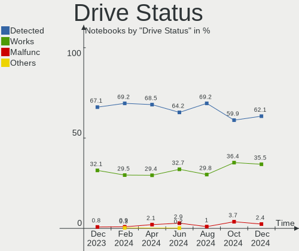
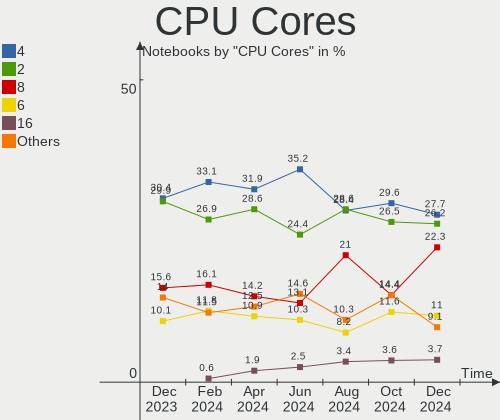

Fedora Hardware Trends (Notebook)
---------------------------------

A project to identify most popular hardware characteristics and track their change
over time based on data collected by Fedora users at https://Linux-Hardware.org.

Anyone can contribute to the study by uploading probes of their computers by
the [hw-probe](https://github.com/linuxhw/hw-probe) tool:

    sudo -E hw-probe -all -upload

Full-feature report is available here: https://linux-hardware.org/?view=trends&formfactor=notebook

Period: May, 2020.

Contents
--------

- [ OS                       ](#os)
- [ OS Family                ](#os-family)
- [ Kernel                   ](#kernel)
- [ Kernel Family            ](#kernel-family)
- [ Kernel Major Ver.        ](#kernel-major-ver)
- [ Arch                     ](#arch)
- [ DE                       ](#de)
- [ Display Server           ](#display-server)
- [ Display Manager          ](#display-manager)
- [ OS Lang                  ](#os-lang)
- [ Boot Mode                ](#boot-mode)
- [ Filesystem               ](#filesystem)
- [ Part. scheme             ](#part-scheme)
- [ Dual Boot with Linux/BSD ](#dual-boot-with-linux/bsd)
- [ Dual Boot (Win)          ](#dual-boot-win)
- [ Country                  ](#country)
- [ City                     ](#city)
- [ Vendor                   ](#vendor)
- [ Model                    ](#model)
- [ Model Family             ](#model-family)
- [ MFG Year                 ](#mfg-year)
- [ Form Factor              ](#form-factor)
- [ Secure Boot              ](#secure-boot)
- [ Coreboot                 ](#coreboot)
- [ RAM Size                 ](#ram-size)
- [ RAM Used                 ](#ram-used)
- [ Drive Vendor             ](#drive-vendor)
- [ Drive Model              ](#drive-model)
- [ Drive Kind               ](#drive-kind)
- [ Drive Connector          ](#drive-connector)
- [ Drive Size               ](#drive-size)
- [ Space Total              ](#space-total)
- [ Space Used               ](#space-used)
- [ Malfunc. Drives          ](#malfunc-drives)
- [ Malfunc. Drive Vendor    ](#malfunc-drive-vendor)
- [ Malfunc. HDD Vendor      ](#malfunc-hdd-vendor)
- [ Malfunc. Drive Kind      ](#malfunc-drive-kind)
- [ Failed Drives            ](#failed-drives)
- [ Failed Drive Vendor      ](#failed-drive-vendor)
- [ Drive Status             ](#drive-status)
- [ Storage Vendor           ](#storage-vendor)
- [ Storage Model            ](#storage-model)
- [ Storage Kind             ](#storage-kind)
- [ CPU Vendor               ](#cpu-vendor)
- [ CPU Model                ](#cpu-model)
- [ CPU Model Family         ](#cpu-model-family)
- [ CPU Cores                ](#cpu-cores)
- [ CPU Sockets              ](#cpu-sockets)
- [ CPU Threads              ](#cpu-threads)
- [ CPU Op-Modes             ](#cpu-op-modes)
- [ CPU Microcode            ](#cpu-microcode)
- [ CPU Microarch            ](#cpu-microarch)
- [ GPU Vendor               ](#gpu-vendor)
- [ GPU Model                ](#gpu-model)
- [ GPU Combo                ](#gpu-combo)
- [ GPU Driver               ](#gpu-driver)
- [ GPU Memory               ](#gpu-memory)
- [ Monitor Vendor           ](#monitor-vendor)
- [ Monitor Model            ](#monitor-model)
- [ Monitor Resolution       ](#monitor-resolution)
- [ Monitor Diagonal         ](#monitor-diagonal)
- [ Monitor Width            ](#monitor-width)
- [ Aspect Ratio             ](#aspect-ratio)
- [ Monitor Area             ](#monitor-area)
- [ Pixel Density            ](#pixel-density)
- [ Multiple Monitors        ](#multiple-monitors)
- [ Net Controller Vendor    ](#net-controller-vendor)
- [ Net Controller Model     ](#net-controller-model)
- [ Wireless Vendor          ](#wireless-vendor)
- [ Wireless Model           ](#wireless-model)
- [ Ethernet Vendor          ](#ethernet-vendor)
- [ Ethernet Model           ](#ethernet-model)
- [ Net Controller Kind      ](#net-controller-kind)
- [ Used Controller          ](#used-controller)
- [ NICs                     ](#nics)
- [ Bluetooth Vendor         ](#bluetooth-vendor)
- [ Bluetooth Model          ](#bluetooth-model)
- [ Unsupported Devices      ](#unsupported-devices)
- [ Unsupported Device Types ](#unsupported-device-types)

OS
--

Installed operating systems

| Name      | Computers | Percent |
|-----------|-----------|---------|
| Fedora 32 | 108       | 82.44%  |
| Fedora 31 | 20        | 15.27%  |
| Fedora 30 | 2         | 1.53%   |
| Fedora 28 | 1         | 0.76%   |

OS Family
---------

OS without a version

| Name   | Computers | Percent |
|--------|-----------|---------|
| Fedora | 131       | 100%    |

Kernel
------

Version of the Linux kernel

| Version                | Computers | Percent |
|------------------------|-----------|---------|
| 5.6.8-300.fc32.x86_64  | 27        | 20.61%  |
| 5.6.14-300.fc32.x86_64 | 16        | 12.21%  |
| 5.6.13-300.fc32.x86_64 | 14        | 10.69%  |
| 5.6.10-300.fc32.x86_64 | 13        | 9.92%   |
| 5.6.7-300.fc32.x86_64  | 11        | 8.4%    |
| 5.6.11-300.fc32.x86_64 | 11        | 8.4%    |
| 5.6.12-300.fc32.x86_64 | 10        | 7.63%   |
| 5.6.8-200.fc31.x86_64  | 6         | 4.58%   |
| 5.6.6-300.fc32.x86_64  | 5         | 3.82%   |
| 5.6.7-200.fc31.x86_64  | 4         | 3.05%   |
| 5.6.13-200.fc31.x86_64 | 3         | 2.29%   |
| 5.6.11-200.fc31.x86_64 | 2         | 1.53%   |
| 5.5.17-200.fc31.x86_64 | 2         | 1.53%   |
| 5.5.10-200.fc31.x86_64 | 2         | 1.53%   |
| 5.6.8-100.fc30.x86_64  | 1         | 0.76%   |
| 5.5.13-200.fc31.x86_64 | 1         | 0.76%   |
| 5.3.11-100.fc29.x86_64 | 1         | 0.76%   |
| 5.1.20-300.fc30.x86_64 | 1         | 0.76%   |
| 5.0.16-100.fc28.i686   | 1         | 0.76%   |

Kernel Family
-------------

Linux kernel without a distro release

| Version | Computers | Percent |
|---------|-----------|---------|
| 5.6.8   | 34        | 25.95%  |
| 5.6.13  | 17        | 12.98%  |
| 5.6.14  | 16        | 12.21%  |
| 5.6.7   | 15        | 11.45%  |
| 5.6.11  | 13        | 9.92%   |
| 5.6.10  | 13        | 9.92%   |
| 5.6.12  | 10        | 7.63%   |
| 5.6.6   | 5         | 3.82%   |
| 5.5.17  | 2         | 1.53%   |
| 5.5.10  | 2         | 1.53%   |
| 5.5.13  | 1         | 0.76%   |
| 5.3.11  | 1         | 0.76%   |
| 5.1.20  | 1         | 0.76%   |
| 5.0.16  | 1         | 0.76%   |

Kernel Major Ver.
-----------------

Linux kernel major version

| Version | Computers | Percent |
|---------|-----------|---------|
| 5.6     | 123       | 93.89%  |
| 5.5     | 5         | 3.82%   |
| 5.3     | 1         | 0.76%   |
| 5.1     | 1         | 0.76%   |
| 5.0     | 1         | 0.76%   |

Arch
----

OS architecture (x86_64, i586, etc.)

| Name   | Computers | Percent |
|--------|-----------|---------|
| x86_64 | 130       | 99.24%  |
| i686   | 1         | 0.76%   |

DE
--

Desktop Environment

| Name          | Computers | Percent |
|---------------|-----------|---------|
| GNOME         | 99        | 75.57%  |
| KDE           | 8         | 6.11%   |
| X-Cinnamon    | 6         | 4.58%   |
| MATE          | 4         | 3.05%   |
| KDE5          | 4         | 3.05%   |
| Cinnamon      | 4         | 3.05%   |
| XFCE          | 2         | 1.53%   |
| LXDE          | 2         | 1.53%   |
| GNOME Classic | 1         | 0.76%   |
| Deepin        | 1         | 0.76%   |

Display Server
--------------

X11 or Wayland

| Name    | Computers | Percent |
|---------|-----------|---------|
| Wayland | 74        | 56.49%  |
| X11     | 56        | 42.75%  |
| Tty     | 1         | 0.76%   |

Display Manager
---------------

SDDM, LightDM, etc.

| Name    | Computers | Percent |
|---------|-----------|---------|
| Unknown | 77        | 58.78%  |
| GDM     | 41        | 31.3%   |
| LightDM | 9         | 6.87%   |
| XDM     | 2         | 1.53%   |
| SDDM    | 2         | 1.53%   |

OS Lang
-------

Language

| Lang       | Computers | Percent |
|------------|-----------|---------|
| en_US      | 68        | 51.91%  |
| en_GB      | 11        | 8.4%    |
| fr_FR      | 6         | 4.58%   |
| en_CA      | 5         | 3.82%   |
| pt_BR      | 4         | 3.05%   |
| pl_PL      | 4         | 3.05%   |
| en_AU      | 4         | 3.05%   |
| de_DE      | 4         | 3.05%   |
| ru_RU      | 3         | 2.29%   |
| it_IT      | 3         | 2.29%   |
| es_MX      | 2         | 1.53%   |
| es_AR      | 2         | 1.53%   |
| Unknown    | 2         | 1.53%   |
| tr_TR      | 1         | 0.76%   |
| mr_IN      | 1         | 0.76%   |
| ko_KR      | 1         | 0.76%   |
| hu_HU      | 1         | 0.76%   |
| fr_FR.utf8 | 1         | 0.76%   |
| fi_FI      | 1         | 0.76%   |
| es_CO      | 1         | 0.76%   |
| en_US.utf8 | 1         | 0.76%   |
| en_NZ      | 1         | 0.76%   |
| en_IN      | 1         | 0.76%   |
| en_IE      | 1         | 0.76%   |
| da_DK      | 1         | 0.76%   |
| cs_CZ      | 1         | 0.76%   |

Boot Mode
---------

EFI or BIOS

| Mode | Computers | Percent |
|------|-----------|---------|
| EFI  | 97        | 74.05%  |
| BIOS | 34        | 25.95%  |

Filesystem
----------

Type of filesystem

| Type  | Computers | Percent |
|-------|-----------|---------|
| Ext4  | 125       | 95.42%  |
| Xfs   | 5         | 3.82%   |
| Btrfs | 1         | 0.76%   |

Part. scheme
------------

Scheme of partitioning

| Type    | Computers | Percent |
|---------|-----------|---------|
| Unknown | 114       | 87.02%  |
| GPT     | 14        | 10.69%  |
| MBR     | 3         | 2.29%   |

Dual Boot with Linux/BSD
------------------------

Hosting more than one Linux/BSD

| Dual boot | Computers | Percent |
|-----------|-----------|---------|
| No        | 128       | 97.71%  |
| Yes       | 3         | 2.29%   |

Dual Boot (Win)
---------------

Hosting Linux and Windows

| Dual boot | Computers | Percent |
|-----------|-----------|---------|
| No        | 108       | 82.44%  |
| Yes       | 23        | 17.56%  |

Country
-------

Geographic location (country)

| Country            | Computers | Percent |
|--------------------|-----------|---------|
| USA                | 22        | 16.79%  |
| France             | 14        | 10.69%  |
| Poland             | 7         | 5.34%   |
| Russia             | 6         | 4.58%   |
| Italy              | 6         | 4.58%   |
| Germany            | 6         | 4.58%   |
| Canada             | 5         | 3.82%   |
| UK                 | 4         | 3.05%   |
| Czech Republic     | 4         | 3.05%   |
| Brazil             | 4         | 3.05%   |
| Australia          | 4         | 3.05%   |
| Ukraine            | 3         | 2.29%   |
| Switzerland        | 3         | 2.29%   |
| India              | 3         | 2.29%   |
| Finland            | 3         | 2.29%   |
| Argentina          | 3         | 2.29%   |
| Spain              | 2         | 1.53%   |
| Netherlands        | 2         | 1.53%   |
| Mexico             | 2         | 1.53%   |
| Hungary            | 2         | 1.53%   |
| Denmark            | 2         | 1.53%   |
| Bulgaria           | 2         | 1.53%   |
| Belgium            | 2         | 1.53%   |
| Austria            | 2         | 1.53%   |
| Turkey             | 1         | 0.76%   |
| Sweden             | 1         | 0.76%   |
| Slovakia           | 1         | 0.76%   |
| Serbia             | 1         | 0.76%   |
| Portugal           | 1         | 0.76%   |
| New Zealand        | 1         | 0.76%   |
| Nepal              | 1         | 0.76%   |
| Myanmar            | 1         | 0.76%   |
| Korea, Republic of | 1         | 0.76%   |
| Kenya              | 1         | 0.76%   |
| Jordan             | 1         | 0.76%   |
| Japan              | 1         | 0.76%   |
| Ireland            | 1         | 0.76%   |
| Indonesia          | 1         | 0.76%   |
| Greece             | 1         | 0.76%   |
| Colombia           | 1         | 0.76%   |
| Bolivia            | 1         | 0.76%   |
| Azerbaijan         | 1         | 0.76%   |

City
----

Geographic location (city)

| City                   | Computers | Percent |
|------------------------|-----------|---------|
| Zurich                 | 3         | 2.29%   |
| Warsaw                 | 2         | 1.53%   |
| The Bronx              | 2         | 1.53%   |
| St Louis               | 2         | 1.53%   |
| Sofia                  | 2         | 1.53%   |
| Moscow                 | 2         | 1.53%   |
| Kyiv                   | 2         | 1.53%   |
| Helsinki               | 2         | 1.53%   |
| Buenos Aires           | 2         | 1.53%   |
| Łódź                | 1         | 0.76%   |
| Šaľa                 | 1         | 0.76%   |
| Ústí nad Labem       | 1         | 0.76%   |
| Yuzhne                 | 1         | 0.76%   |
| Yangon                 | 1         | 0.76%   |
| Winnipeg               | 1         | 0.76%   |
| Wetteren               | 1         | 0.76%   |
| Westerlo               | 1         | 0.76%   |
| Wegierska Gorka        | 1         | 0.76%   |
| Wahroonga              | 1         | 0.76%   |
| Utrecht                | 1         | 0.76%   |
| Uppsala                | 1         | 0.76%   |
| Turku                  | 1         | 0.76%   |
| Turin                  | 1         | 0.76%   |
| Traralgon              | 1         | 0.76%   |
| Toronto                | 1         | 0.76%   |
| Tomsk                  | 1         | 0.76%   |
| Tilburg                | 1         | 0.76%   |
| Szigethalom            | 1         | 0.76%   |
| Sydney                 | 1         | 0.76%   |
| Surgeres               | 1         | 0.76%   |
| Sucy-en-Brie           | 1         | 0.76%   |
| South Gower            | 1         | 0.76%   |
| Snowflake              | 1         | 0.76%   |
| Skaerbaek              | 1         | 0.76%   |
| Sherwood               | 1         | 0.76%   |
| Santa Rosa             | 1         | 0.76%   |
| Sant Cugat del Vallès | 1         | 0.76%   |
| Safety Harbor          | 1         | 0.76%   |
| Rungis                 | 1         | 0.76%   |
| Rouen                  | 1         | 0.76%   |
| Roche-la-Moliere       | 1         | 0.76%   |
| Randers                | 1         | 0.76%   |
| Pátrai                | 1         | 0.76%   |
| Pune                   | 1         | 0.76%   |
| Prague                 | 1         | 0.76%   |
| Portland               | 1         | 0.76%   |
| Ploen                  | 1         | 0.76%   |
| Paris                  | 1         | 0.76%   |
| Palos Verdes Estates   | 1         | 0.76%   |
| Ottawa                 | 1         | 0.76%   |
| Oceanside              | 1         | 0.76%   |
| Oaxaca City            | 1         | 0.76%   |
| Nuoro                  | 1         | 0.76%   |
| North Liberty          | 1         | 0.76%   |
| Nogent-le-Phaye        | 1         | 0.76%   |
| New Braunfels          | 1         | 0.76%   |
| Nairobi                | 1         | 0.76%   |
| Montreal               | 1         | 0.76%   |
| Montepaone Lido        | 1         | 0.76%   |
| Monor                  | 1         | 0.76%   |

Vendor
------

Motherboard manufacturer

| Name                | Computers | Percent |
|---------------------|-----------|---------|
| Lenovo              | 42        | 32.06%  |
| Hewlett-Packard     | 27        | 20.61%  |
| Dell                | 26        | 19.85%  |
| ASUSTek Computer    | 11        | 8.4%    |
| Notebook            | 4         | 3.05%   |
| Acer                | 4         | 3.05%   |
| Toshiba             | 3         | 2.29%   |
| Sony                | 3         | 2.29%   |
| Samsung Electronics | 2         | 1.53%   |
| MSI                 | 2         | 1.53%   |
| Apple               | 2         | 1.53%   |
| Timi                | 1         | 0.76%   |
| System76            | 1         | 0.76%   |
| NOBLEX              | 1         | 0.76%   |
| Fujitsu             | 1         | 0.76%   |
| Alienware           | 1         | 0.76%   |

Model
-----

Motherboard model

| Name                                     | Computers | Percent |
|------------------------------------------|-----------|---------|
| Lenovo V330-15IKB 81AX                   | 2         | 1.53%   |
| Dell XPS 15 9570                         | 2         | 1.53%   |
| Dell Inspiron 7375                       | 2         | 1.53%   |
| ASUS ZenBook UX431DA_UM431DA             | 2         | 1.53%   |
| Toshiba Satellite S50-B                  | 1         | 0.76%   |
| Toshiba Satellite Pro C665               | 1         | 0.76%   |
| Toshiba Satellite L50-B                  | 1         | 0.76%   |
| Timi TM1701                              | 1         | 0.76%   |
| System76 Serval                          | 1         | 0.76%   |
| Sony VPCF131FM                           | 1         | 0.76%   |
| Sony SVE14121CLP                         | 1         | 0.76%   |
| Sony PCG-FRV27(UC)                       | 1         | 0.76%   |
| Samsung Electronics 760XBE               | 1         | 0.76%   |
| Samsung Electronics 570Z5E/580Z5E        | 1         | 0.76%   |
| Notebook P95_HP                          | 1         | 0.76%   |
| Notebook NH55RGQ                         | 1         | 0.76%   |
| Notebook N150ZU                          | 1         | 0.76%   |
| Notebook N150CU                          | 1         | 0.76%   |
| NOBLEX SF20BA                            | 1         | 0.76%   |
| MSI GT83VR 7RF                           | 1         | 0.76%   |
| MSI GS65 Stealth Thin 8RE                | 1         | 0.76%   |
| Lenovo Z710 20250                        | 1         | 0.76%   |
| Lenovo Yoga S940-14IWL 81Q7              | 1         | 0.76%   |
| Lenovo Yoga S740-14IIL 81RS              | 1         | 0.76%   |
| Lenovo V330-14IKB 81B0                   | 1         | 0.76%   |
| Lenovo V145-15AST 81MT                   | 1         | 0.76%   |
| Lenovo ThinkPad X280 20KES3EJ1F          | 1         | 0.76%   |
| Lenovo ThinkPad X260 20F5003KPG          | 1         | 0.76%   |
| Lenovo ThinkPad X1 Extreme 20MF000CUS    | 1         | 0.76%   |
| Lenovo ThinkPad X1 Carbon 7th 20QESITRN1 | 1         | 0.76%   |
| Lenovo ThinkPad X1 Carbon 7th 20QES2P401 | 1         | 0.76%   |
| Lenovo ThinkPad X1 Carbon 6th 20KH002HUS | 1         | 0.76%   |
| Lenovo ThinkPad X1 Carbon 3rd 20BSCTO1WW | 1         | 0.76%   |
| Lenovo ThinkPad W540 20BHS11M00          | 1         | 0.76%   |
| Lenovo ThinkPad T580 20L90023RT          | 1         | 0.76%   |
| Lenovo ThinkPad T570 20H90002RT          | 1         | 0.76%   |
| Lenovo ThinkPad T540p 20BE009CRT         | 1         | 0.76%   |
| Lenovo ThinkPad T490 20N2S03R00          | 1         | 0.76%   |
| Lenovo ThinkPad T470 20HDCTO1WW          | 1         | 0.76%   |
| Lenovo ThinkPad T450s 20BX000TMS         | 1         | 0.76%   |
| Lenovo ThinkPad T450 20BUS09905          | 1         | 0.76%   |
| Lenovo ThinkPad T430s 2356LRG            | 1         | 0.76%   |
| Lenovo ThinkPad T430 2349KQ3             | 1         | 0.76%   |
| Lenovo ThinkPad T430 2349FC3             | 1         | 0.76%   |
| Lenovo ThinkPad T430 2347DE9             | 1         | 0.76%   |
| Lenovo ThinkPad T420 4177R3U             | 1         | 0.76%   |
| Lenovo ThinkPad T410 2522PT3             | 1         | 0.76%   |
| Lenovo ThinkPad S3 Yoga 14 20DM000VUS    | 1         | 0.76%   |
| Lenovo ThinkPad L460 20FVS0LM00          | 1         | 0.76%   |
| Lenovo ThinkPad L380 20M50013UK          | 1         | 0.76%   |
| Lenovo ThinkPad E495 20NECTO1WW          | 1         | 0.76%   |
| Lenovo ThinkBook 14-IML 20RV             | 1         | 0.76%   |
| Lenovo Legion Y530-15ICH-1060 81LB       | 1         | 0.76%   |
| Lenovo IdeaPad Z580                      | 1         | 0.76%   |
| Lenovo IdeaPad MIIX 700-12ISK 80QL       | 1         | 0.76%   |
| Lenovo IdeaPad L340-15IRH Gaming 81LK    | 1         | 0.76%   |
| Lenovo IdeaPad 720S-14IKB 81BD           | 1         | 0.76%   |
| Lenovo IdeaPad 530S-14IKB 81EU           | 1         | 0.76%   |
| Lenovo IdeaPad 330S-14IKB U 81F4         | 1         | 0.76%   |
| Lenovo IdeaPad 330S-14IKB 81F4           | 1         | 0.76%   |

Model Family
------------

Motherboard model prefix

| Name                       | Computers | Percent |
|----------------------------|-----------|---------|
| Lenovo ThinkPad            | 25        | 19.08%  |
| Dell Latitude              | 10        | 7.63%   |
| Dell Inspiron              | 9         | 6.87%   |
| Lenovo IdeaPad             | 8         | 6.11%   |
| HP ProBook                 | 7         | 5.34%   |
| HP Pavilion                | 7         | 5.34%   |
| Dell XPS                   | 6         | 4.58%   |
| HP Laptop                  | 4         | 3.05%   |
| HP EliteBook               | 4         | 3.05%   |
| Toshiba Satellite          | 3         | 2.29%   |
| Acer Aspire                | 3         | 2.29%   |
| Lenovo Yoga                | 2         | 1.53%   |
| Lenovo V330-15IKB          | 2         | 1.53%   |
| HP ENVY                    | 2         | 1.53%   |
| ASUS ZenBook               | 2         | 1.53%   |
| ASUS VivoBook              | 2         | 1.53%   |
| ASUS TUF                   | 2         | 1.53%   |
| Timi TM1701                | 1         | 0.76%   |
| System76 Serval            | 1         | 0.76%   |
| Sony VPCF131FM             | 1         | 0.76%   |
| Sony SVE14121CLP           | 1         | 0.76%   |
| Sony PCG-FRV27(UC)         | 1         | 0.76%   |
| Samsung Electronics 760XBE | 1         | 0.76%   |
| Samsung Electronics 570Z5E | 1         | 0.76%   |
| Notebook P95               | 1         | 0.76%   |
| Notebook NH55RGQ           | 1         | 0.76%   |
| Notebook N150ZU            | 1         | 0.76%   |
| Notebook N150CU            | 1         | 0.76%   |
| NOBLEX SF20BA              | 1         | 0.76%   |
| MSI GT83VR                 | 1         | 0.76%   |
| MSI GS65                   | 1         | 0.76%   |
| Lenovo Z710                | 1         | 0.76%   |
| Lenovo V330-14IKB          | 1         | 0.76%   |
| Lenovo V145-15AST          | 1         | 0.76%   |
| Lenovo ThinkBook           | 1         | 0.76%   |
| Lenovo Legion              | 1         | 0.76%   |
| HP ZBook                   | 1         | 0.76%   |
| HP OMEN                    | 1         | 0.76%   |
| HP 255                     | 1         | 0.76%   |
| Fujitsu LIFEBOOK           | 1         | 0.76%   |
| Dell Precision             | 1         | 0.76%   |
| ASUS Zephyrus              | 1         | 0.76%   |
| ASUS X751YI                | 1         | 0.76%   |
| ASUS X555UA                | 1         | 0.76%   |
| ASUS X541UVK               | 1         | 0.76%   |
| ASUS P751JF                | 1         | 0.76%   |
| Apple MacBookPro9          | 1         | 0.76%   |
| Apple MacBookPro14         | 1         | 0.76%   |
| Alienware M17xR4           | 1         | 0.76%   |
| Acer Nitro                 | 1         | 0.76%   |

MFG Year
--------

Motherboard manufacture year

| Year | Computers | Percent |
|------|-----------|---------|
| 2019 | 54        | 41.22%  |
| 2018 | 20        | 15.27%  |
| 2020 | 13        | 9.92%   |
| 2017 | 11        | 8.4%    |
| 2014 | 8         | 6.11%   |
| 2016 | 7         | 5.34%   |
| 2012 | 6         | 4.58%   |
| 2015 | 5         | 3.82%   |
| 2010 | 3         | 2.29%   |
| 2013 | 2         | 1.53%   |
| 2011 | 1         | 0.76%   |
| 2003 | 1         | 0.76%   |

Form Factor
-----------

Physical design of the computer

| Name     | Computers | Percent |
|----------|-----------|---------|
| Notebook | 131       | 100%    |

Secure Boot
-----------

Enabled or disabled

| State    | Computers | Percent |
|----------|-----------|---------|
| Disabled | 103       | 78.63%  |
| Enabled  | 28        | 21.37%  |

Coreboot
--------

Have coreboot on board

| Used | Computers | Percent |
|------|-----------|---------|
| No   | 131       | 100%    |

RAM Size
--------

Total RAM memory

| Size in GB  | Computers | Percent |
|-------------|-----------|---------|
| 4.01-8.0    | 42        | 32.06%  |
| 16.01-24.0  | 38        | 29.01%  |
| 8.01-16.0   | 25        | 19.08%  |
| 3.01-4.0    | 12        | 9.16%   |
| 32.01-64.0  | 9         | 6.87%   |
| 64.01-256.0 | 2         | 1.53%   |
| 24.01-32.0  | 1         | 0.76%   |
| 1.01-2.0    | 1         | 0.76%   |
| 0.01-1.0    | 1         | 0.76%   |

RAM Used
--------

Used RAM memory

| Used GB    | Computers | Percent |
|------------|-----------|---------|
| 2.01-3.0   | 43        | 32.82%  |
| 4.01-8.0   | 37        | 28.24%  |
| 1.01-2.0   | 23        | 17.56%  |
| 3.01-4.0   | 14        | 10.69%  |
| 8.01-16.0  | 12        | 9.16%   |
| 16.01-24.0 | 1         | 0.76%   |
| 0.01-1.0   | 1         | 0.76%   |

Drive Vendor
------------

Hard drive vendors

| Vendor              | Computers | Drives  | Percent |
|---------------------|-----------|---------|---------|
| Samsung Electronics | 37        | 39      | 25.52%  |
| Seagate             | 20        | 20      | 13.79%  |
| WDC                 | 17        | 18      | 11.72%  |
| Toshiba             | 10        | 10      | 6.9%    |
| Kingston            | 8         | 9       | 5.52%   |
| Unknown             | 7         | 7       | 4.83%   |
| Intel               | 7         | 7       | 4.83%   |
| Crucial             | 7         | 7       | 4.83%   |
| SanDisk             | 6         | 7       | 4.14%   |
| HGST                | 6         | 6       | 4.14%   |
| LITEON              | 3         | 3       | 2.07%   |
| Micron Technology   | 2         | 2       | 1.38%   |
| A-DATA Technology   | 2         | 2       | 1.38%   |
| WDC WD16            | 1         | 1       | 0.69%   |
| Transcend           | 1         | 1       | 0.69%   |
| StoreJet            | 1         | 1       | 0.69%   |
| SPCC                | 1         | 1       | 0.69%   |
| SK Hynix            | 1         | 1       | 0.69%   |
| Patriot             | 1         | 1       | 0.69%   |
| LITEONIT            | 1         | 1       | 0.69%   |
| LDLC                | 1         | 1       | 0.69%   |
| JMicron             | 1         | 1       | 0.69%   |
| HL-DT-ST            | 1         | Unknown | 0.69%   |
| Hitachi             | 1         | 1       | 0.69%   |
| External            | 1         | 1       | 0.69%   |
| Corsair             | 1         | 1       | 0.69%   |

Drive Model
-----------

Hard drive models

| Model                        | Computers | Percent |
|------------------------------|-----------|---------|
| SSD 850 EVO 500GB            | 6         | 4%      |
| ST2000LX001-1RG174 2TB       | 4         | 2.67%   |
| ST1000LM035-1RK172 1TB       | 4         | 2.67%   |
| SA400S37120G 120GB SSD       | 3         | 2%      |
| ST1000LM049-2GH172 1TB       | 2         | 1.33%   |
| ST1000LM024 HN-M101MBB 1TB   | 2         | 1.33%   |
| SSD U110 16GB                | 2         | 1.33%   |
| SSD 860 EVO 1TB              | 2         | 1.33%   |
| SSD 850 PRO 512GB            | 2         | 1.33%   |
| MZVLW256HEHP-000L7 256GB     | 2         | 1.33%   |
| MZVLB256HAHQ-000H1 256GB     | 2         | 1.33%   |
| MQ01ABD100 1TB               | 2         | 1.33%   |
| MMC Card  32GB               | 2         | 1.33%   |
| HTS721010A9E630 1TB          | 2         | 1.33%   |
| HTS541010A9E680 1TB          | 2         | 1.33%   |
| WDS500G2B0B-00YS70 500GB SSD | 1         | 0.67%   |
| WDS250G2B0B-00YS70 250GB SSD | 1         | 0.67%   |
| WDS240G2G0B-00EPW0 240GB SSD | 1         | 0.67%   |
| WDS240G2G0A-00JH30 240GB SSD | 1         | 0.67%   |
| WDS120G2G0A-00JH30 120GB SSD | 1         | 0.67%   |
| WD7500BPVX-60JC3T0 752GB     | 1         | 0.67%   |
| WD7500BPVT-24HXZT3 752GB     | 1         | 0.67%   |
| WD3200BPVT-55JJ5T1 320GB     | 1         | 0.67%   |
| WD3200BPVT-22JJ5T0 320GB     | 1         | 0.67%   |
| WD20SPZX-60UA7T0 2TB         | 1         | 0.67%   |
| WD10SPZX-75Z10T0 1TB         | 1         | 0.67%   |
| WD10SPZX-60Z10T0 1TB         | 1         | 0.67%   |
| WD10SPZX-21Z10T0 1TB         | 1         | 0.67%   |
| WD10SPZX-00Z10T0 1TB         | 1         | 0.67%   |
| WD10SPCX-75KHST0 1TB         | 1         | 0.67%   |
| WD10JPCX-24UE4T0 1TB         | 1         | 0.67%   |
| USB3.0 256GB                 | 1         | 0.67%   |
| TS512GMTE110S 512GB          | 1         | 0.67%   |
| TS120GESD220C 120GB          | 1         | 0.67%   |
| THNSN5256GPU7 256GB          | 1         | 0.67%   |
| SV300S37A480G 480GB SSD      | 1         | 0.67%   |
| SUV500MS120G 120GB SSD       | 1         | 0.67%   |
| SUV400S37240G 240GB SSD      | 1         | 0.67%   |
| SU900 256GB SSD              | 1         | 0.67%   |
| SU800NS38 512GB SSD          | 1         | 0.67%   |
| ST750LM022 HN-M750MBB 752GB  | 1         | 0.67%   |
| ST500LM021-1KJ152 500GB      | 1         | 0.67%   |
| ST500LM000-1EJ162 500GB      | 1         | 0.67%   |
| ST320LT007-9ZV142 320GB      | 1         | 0.67%   |
| ST250LT014-9YK14C 250GB      | 1         | 0.67%   |
| ST2000LM015-2E8174 2TB       | 1         | 0.67%   |
| ST1000LM048-2E7172 1TB       | 1         | 0.67%   |
| SSDSC2KW256G8 256GB          | 1         | 0.67%   |
| SSDSC2KF256H6L 256GB         | 1         | 0.67%   |
| SSDSC2BF240A5L 240GB         | 1         | 0.67%   |
| SSDSA2BW160G3L 160GB         | 1         | 0.67%   |
| SSDPEKNW512G8L 512GB         | 1         | 0.67%   |
| SSDPEKKF256G7L 256GB         | 1         | 0.67%   |
| SSDPEKKF256G7H 256GB         | 1         | 0.67%   |
| SSD PM871 mSATA 128GB        | 1         | 0.67%   |
| SSD PM830 mSATA 32GB         | 1         | 0.67%   |
| SSD PLUS 1000GB              | 1         | 0.67%   |
| SSD 970 EVO Plus 500GB       | 1         | 0.67%   |
| SSD 970 EVO Plus 1TB         | 1         | 0.67%   |
| SSD 960 EVO 250GB            | 1         | 0.67%   |

Drive Kind
----------

HDD or SSD

| Kind    | Computers | Drives | Percent |
|---------|-----------|--------|---------|
| SSD     | 64        | 72     | 45.71%  |
| HDD     | 44        | 45     | 31.43%  |
| NVMe    | 20        | 21     | 14.29%  |
| MMC     | 7         | 7      | 5%      |
| Unknown | 5         | 4      | 3.57%   |

Drive Connector
---------------

SATA, SAS, NVMe, etc.

| Type | Computers | Drives | Percent |
|------|-----------|--------|---------|
| SATA | 93        | 115    | 73.81%  |
| NVMe | 20        | 21     | 15.87%  |
| MMC  | 7         | 7      | 5.56%   |
| SAS  | 6         | 6      | 4.76%   |

Drive Size
----------

Size of hard drive

| Size in TB | Computers | Drives | Percent |
|------------|-----------|--------|---------|
| 0.01-0.5   | 77        | 94     | 58.33%  |
| 0.51-1.0   | 48        | 48     | 36.36%  |
| 1.01-2.0   | 6         | 6      | 4.55%   |
| 4.01-10.0  | 1         | 1      | 0.76%   |

Space Total
-----------

Amount of disk space available on the file system

| Size in GB     | Computers | Percent |
|----------------|-----------|---------|
| 101-250        | 42        | 32.06%  |
| 251-500        | 38        | 29.01%  |
| 501-1000       | 20        | 15.27%  |
| 51-100         | 10        | 7.63%   |
| 1001-2000      | 7         | 5.34%   |
| 21-50          | 5         | 3.82%   |
| 1-20           | 3         | 2.29%   |
| More than 3000 | 2         | 1.53%   |
| 2001-3000      | 2         | 1.53%   |
| Unknown        | 2         | 1.53%   |

Space Used
----------

Amount of used disk space

| Used GB   | Computers | Percent |
|-----------|-----------|---------|
| 1-20      | 37        | 28.24%  |
| 21-50     | 26        | 19.85%  |
| 101-250   | 19        | 14.5%   |
| 51-100    | 18        | 13.74%  |
| 251-500   | 16        | 12.21%  |
| 501-1000  | 9         | 6.87%   |
| 1001-2000 | 4         | 3.05%   |
| Unknown   | 2         | 1.53%   |

Malfunc. Drives
---------------

Drive models with a malfunction

| Model                      | Computers | Drives | Percent |
|----------------------------|-----------|--------|---------|
| WD7500BPVX-60JC3T0 752GB   | 1         | 1      | 20%     |
| SV300S37A480G 480GB SSD    | 1         | 1      | 20%     |
| ST1000LM024 HN-M101MBB 1TB | 1         | 1      | 20%     |
| DK23EA-40 40GB             | 1         | 1      | 20%     |
| CV8-8E128-HP 128GB SSD     | 1         | 1      | 20%     |

Malfunc. Drive Vendor
---------------------

Vendors of faulty drives

| Vendor   | Computers | Drives | Percent |
|----------|-----------|--------|---------|
| WDC      | 1         | 1      | 20%     |
| Seagate  | 1         | 1      | 20%     |
| LITEON   | 1         | 1      | 20%     |
| Kingston | 1         | 1      | 20%     |
| Hitachi  | 1         | 1      | 20%     |

Malfunc. HDD Vendor
-------------------

Vendors of faulty HDD drives

| Vendor  | Computers | Drives | Percent |
|---------|-----------|--------|---------|
| WDC     | 1         | 1      | 33.33%  |
| Seagate | 1         | 1      | 33.33%  |
| Hitachi | 1         | 1      | 33.33%  |

Malfunc. Drive Kind
-------------------

Kinds of faulty drives

| Kind | Computers | Drives | Percent |
|------|-----------|--------|---------|
| HDD  | 3         | 3      | 60%     |
| SSD  | 2         | 2      | 40%     |

Failed Drives
-------------

Failed drive models

Zero info for selected period =(

Failed Drive Vendor
-------------------

Failed drive vendors

Zero info for selected period =(

Drive Status
------------

Number of failed and malfunc. drives

| Status   | Computers | Drives | Percent |
|----------|-----------|--------|---------|
| Detected | 65        | 83     | 55.08%  |
| Works    | 48        | 61     | 40.68%  |
| Malfunc  | 5         | 5      | 4.24%   |

Storage Vendor
--------------

Storage controller vendors

| Vendor                       | Computers | Percent |
|------------------------------|-----------|---------|
| Intel                        | 93        | 61.59%  |
| Samsung Electronics          | 22        | 14.57%  |
| AMD                          | 15        | 9.93%   |
| Toshiba America Info Systems | 6         | 3.97%   |
| Sandisk                      | 5         | 3.31%   |
| SK Hynix                     | 3         | 1.99%   |
| Kingston Technology Company  | 2         | 1.32%   |
| ULi Electronics              | 1         | 0.66%   |
| Silicon Motion               | 1         | 0.66%   |
| Phison Electronics           | 1         | 0.66%   |
| Micron/Crucial Technology    | 1         | 0.66%   |
| Apple                        | 1         | 0.66%   |

Storage Model
-------------

Storage controller models

| Model                                                                    | Computers | Percent |
|--------------------------------------------------------------------------|-----------|---------|
| Sunrise Point-LP SATA Controller [AHCI mode]                             | 23        | 14.94%  |
| NVMe SSD Controller SM981/PM981/PM983                                    | 18        | 11.69%  |
| FCH SATA Controller [AHCI mode]                                          | 14        | 9.09%   |
| 7 Series Chipset Family 6-port SATA Controller [AHCI mode]               | 11        | 7.14%   |
| 82801 Mobile SATA Controller [RAID mode]                                 | 9         | 5.84%   |
| Wildcat Point-LP SATA Controller [AHCI Mode]                             | 8         | 5.19%   |
| Cannon Lake Mobile PCH SATA AHCI Controller                              | 7         | 4.55%   |
| 8 Series/C220 Series Chipset Family 6-port SATA Controller 1 [AHCI mode] | 6         | 3.9%    |
| 8 Series SATA Controller 1 [AHCI mode]                                   | 6         | 3.9%    |
| 6 Series/C200 Series Chipset Family 6 port Mobile SATA AHCI Controller   | 5         | 3.25%   |
| Toshiba America Info Non-Volatile memory controller                      | 4         | 2.6%    |
| NVMe SSD Controller SM961/PM961                                          | 4         | 2.6%    |
| Cannon Point-LP SATA Controller [AHCI Mode]                              | 4         | 2.6%    |
| Q170/Q150/B150/H170/H110/Z170/CM236 Chipset SATA Controller [AHCI Mode]  | 3         | 1.95%   |
| Non-Volatile memory controller                                           | 3         | 1.95%   |
| HM170/QM170 Chipset SATA Controller [AHCI Mode]                          | 3         | 1.95%   |
| BC501 NVMe Solid State Drive 512GB                                       | 3         | 1.95%   |
| WD Black 2018/PC SN520 NVMe SSD                                          | 2         | 1.3%    |
| Technology Company Non-Volatile memory controller                        | 2         | 1.3%    |
| SSD 660P Series                                                          | 2         | 1.3%    |
| SSD 600P Series                                                          | 2         | 1.3%    |
| Comet Lake SATA AHCI Controller                                          | 2         | 1.3%    |
| 5 Series/3400 Series Chipset 6 port SATA AHCI Controller                 | 2         | 1.3%    |
| WD Black 2018/PC SN720 NVMe SSD                                          | 1         | 0.65%   |
| SSD Pro 7600p/760p/E 6100p Series                                        | 1         | 0.65%   |
| SATA controller                                                          | 1         | 0.65%   |
| S3X NVMe Controller                                                      | 1         | 0.65%   |
| P1 NVMe PCIe SSD                                                         | 1         | 0.65%   |
| NVMe Controller                                                          | 1         | 0.65%   |
| M5229 IDE                                                                | 1         | 0.65%   |
| FCH SATA Controller [IDE mode]                                           | 1         | 0.65%   |
| E12 NVMe Controller                                                      | 1         | 0.65%   |
| BG3 NVMe SSD Controller                                                  | 1         | 0.65%   |
| 200 Series PCH SATA controller [AHCI mode]                               | 1         | 0.65%   |

Storage Kind
------------

Kind of storage controller (IDE, SATA, NVMe, SAS, ...)

| Kind | Computers | Percent |
|------|-----------|---------|
| SATA | 97        | 63.4%   |
| NVMe | 46        | 30.07%  |
| RAID | 9         | 5.88%   |
| IDE  | 1         | 0.65%   |

CPU Vendor
----------

Processor vendors

| Vendor | Computers | Percent |
|--------|-----------|---------|
| Intel  | 113       | 86.26%  |
| AMD    | 18        | 13.74%  |

CPU Model
---------

Processor models

| Model                                         | Computers | Percent |
|-----------------------------------------------|-----------|---------|
| Intel Core i5-8250U CPU @ 1.60GHz             | 9         | 6.87%   |
| Intel Core i7-8750H CPU @ 2.20GHz             | 6         | 4.58%   |
| Intel Core i7-8550U CPU @ 1.80GHz             | 6         | 4.58%   |
| Intel Core i5-3320M CPU @ 2.60GHz             | 4         | 3.05%   |
| Intel Core i7-8565U CPU @ 1.80GHz             | 3         | 2.29%   |
| Intel Core i7-7500U CPU @ 2.70GHz             | 3         | 2.29%   |
| Intel Core i7-5600U CPU @ 2.60GHz             | 3         | 2.29%   |
| Intel Core i5-8265U CPU @ 1.60GHz             | 3         | 2.29%   |
| Intel Core i5-2520M CPU @ 2.50GHz             | 3         | 2.29%   |
| Intel Core i3-8130U CPU @ 2.20GHz             | 3         | 2.29%   |
| AMD Ryzen 5 3500U with Radeon Vega Mobile Gfx | 3         | 2.29%   |
| Intel Core i7-8665U CPU @ 1.90GHz             | 2         | 1.53%   |
| Intel Core i7-8650U CPU @ 1.90GHz             | 2         | 1.53%   |
| Intel Core i7-7700HQ CPU @ 2.80GHz            | 2         | 1.53%   |
| Intel Core i7-6820HQ CPU @ 2.70GHz            | 2         | 1.53%   |
| Intel Core i7-5500U CPU @ 2.40GHz             | 2         | 1.53%   |
| Intel Core i7-10510U CPU @ 1.80GHz            | 2         | 1.53%   |
| Intel Core i5-7200U CPU @ 2.50GHz             | 2         | 1.53%   |
| Intel Core i5-6300U CPU @ 2.40GHz             | 2         | 1.53%   |
| Intel Core i5-6200U CPU @ 2.30GHz             | 2         | 1.53%   |
| Intel Core i5-5200U CPU @ 2.20GHz             | 2         | 1.53%   |
| Intel Core i5-4210U CPU @ 1.70GHz             | 2         | 1.53%   |
| Intel Core i5-3230M CPU @ 2.60GHz             | 2         | 1.53%   |
| AMD Ryzen 7 2700U with Radeon Vega Mobile Gfx | 2         | 1.53%   |
| AMD Ryzen 3 3200U with Radeon Vega Mobile Gfx | 2         | 1.53%   |
| AMD A6-9225 RADEON R4, 5 COMPUTE CORES 2C+3G  | 2         | 1.53%   |
| Intel Pentium CPU B980 @ 2.40GHz              | 1         | 0.76%   |
| Intel Pentium CPU 4417U @ 2.30GHz             | 1         | 0.76%   |
| Intel Pentium 4 CPU 2.66GHz                   | 1         | 0.76%   |
| Intel Core m5-6Y54 CPU @ 1.10GHz              | 1         | 0.76%   |
| Intel Core i9-9900K CPU @ 3.60GHz             | 1         | 0.76%   |
| Intel Core i7-9750H CPU @ 2.60GHz             | 1         | 0.76%   |
| Intel Core i7-8850H CPU @ 2.60GHz             | 1         | 0.76%   |
| Intel Core i7-7820HK CPU @ 2.90GHz            | 1         | 0.76%   |
| Intel Core i7-7660U CPU @ 2.50GHz             | 1         | 0.76%   |
| Intel Core i7-7600U CPU @ 2.80GHz             | 1         | 0.76%   |
| Intel Core i7-6700HQ CPU @ 2.60GHz            | 1         | 0.76%   |
| Intel Core i7-6600U CPU @ 2.60GHz             | 1         | 0.76%   |
| Intel Core i7-4800MQ CPU @ 2.70GHz            | 1         | 0.76%   |
| Intel Core i7-4712MQ CPU @ 2.30GHz            | 1         | 0.76%   |
| Intel Core i7-4710MQ CPU @ 2.50GHz            | 1         | 0.76%   |
| Intel Core i7-4700MQ CPU @ 2.40GHz            | 1         | 0.76%   |
| Intel Core i7-4600M CPU @ 2.90GHz             | 1         | 0.76%   |
| Intel Core i7-4510U CPU @ 2.00GHz             | 1         | 0.76%   |
| Intel Core i7-3720QM CPU @ 2.60GHz            | 1         | 0.76%   |
| Intel Core i7-3632QM CPU @ 2.20GHz            | 1         | 0.76%   |
| Intel Core i7-3630QM CPU @ 2.40GHz            | 1         | 0.76%   |
| Intel Core i7-3612QM CPU @ 2.10GHz            | 1         | 0.76%   |
| Intel Core i7-1065G7 CPU @ 1.30GHz            | 1         | 0.76%   |
| Intel Core i7 CPU M 620 @ 2.67GHz             | 1         | 0.76%   |
| Intel Core i5-9300H CPU @ 2.40GHz             | 1         | 0.76%   |
| Intel Core i5-8400H CPU @ 2.50GHz             | 1         | 0.76%   |
| Intel Core i5-8350U CPU @ 1.70GHz             | 1         | 0.76%   |
| Intel Core i5-7300U CPU @ 2.60GHz             | 1         | 0.76%   |
| Intel Core i5-7300HQ CPU @ 2.50GHz            | 1         | 0.76%   |
| Intel Core i5-5300U CPU @ 2.30GHz             | 1         | 0.76%   |
| Intel Core i5-4310U CPU @ 2.00GHz             | 1         | 0.76%   |
| Intel Core i5-4300U CPU @ 1.90GHz             | 1         | 0.76%   |
| Intel Core i5-4300M CPU @ 2.60GHz             | 1         | 0.76%   |
| Intel Core i5-4200U CPU @ 1.60GHz             | 1         | 0.76%   |

CPU Model Family
----------------

Processor model prefix

| Model           | Computers | Percent |
|-----------------|-----------|---------|
| Intel Core i7   | 52        | 39.69%  |
| Intel Core i5   | 47        | 35.88%  |
| Intel Core i3   | 6         | 4.58%   |
| AMD Ryzen 5     | 5         | 3.82%   |
| AMD Ryzen 7     | 3         | 2.29%   |
| AMD Ryzen 3     | 3         | 2.29%   |
| Intel Pentium   | 2         | 1.53%   |
| Intel Celeron   | 2         | 1.53%   |
| AMD A8          | 2         | 1.53%   |
| AMD A6          | 2         | 1.53%   |
| Intel Pentium 4 | 1         | 0.76%   |
| Intel Core m5   | 1         | 0.76%   |
| Intel Core i9   | 1         | 0.76%   |
| Intel Atom      | 1         | 0.76%   |
| AMD PRO A10     | 1         | 0.76%   |
| AMD FX          | 1         | 0.76%   |
| AMD E1          | 1         | 0.76%   |

CPU Cores
---------

Number of processor cores

| Number | Computers | Percent |
|--------|-----------|---------|
| 2      | 65        | 49.62%  |
| 4      | 55        | 41.98%  |
| 6      | 8         | 6.11%   |
| 8      | 2         | 1.53%   |
| 1      | 1         | 0.76%   |

CPU Sockets
-----------

Number of sockets

| Number | Computers | Percent |
|--------|-----------|---------|
| 1      | 131       | 100%    |

CPU Threads
-----------

Threads per core (Hyper-Threading)

| Number | Computers | Percent |
|--------|-----------|---------|
| 2      | 121       | 92.37%  |
| 1      | 10        | 7.63%   |

CPU Op-Modes
------------

CPU Operation Modes (32-bit, 64-bit)

| Op mode        | Computers | Percent |
|----------------|-----------|---------|
| 32-bit, 64-bit | 130       | 99.24%  |
| 32-bit         | 1         | 0.76%   |

CPU Microcode
-------------

Microcode number

| Number     | Computers | Percent |
|------------|-----------|---------|
| 0x806ea    | 20        | 15.27%  |
| 0x306a9    | 11        | 8.4%    |
| 0x906ea    | 10        | 7.63%   |
| Unknown    | 10        | 7.63%   |
| 0x806e9    | 9         | 6.87%   |
| 0x306d4    | 8         | 6.11%   |
| 0x406e3    | 7         | 5.34%   |
| 0x306c3    | 6         | 4.58%   |
| 0x206a7    | 6         | 4.58%   |
| 0x08108102 | 6         | 4.58%   |
| 0x40651    | 5         | 3.82%   |
| 0x806ec    | 4         | 3.05%   |
| 0x906e9    | 3         | 2.29%   |
| 0x806eb    | 3         | 2.29%   |
| 0x506e3    | 3         | 2.29%   |
| 0x08101007 | 3         | 2.29%   |
| 0x20655    | 2         | 1.53%   |
| 0x06006705 | 2         | 1.53%   |
| 0xf27      | 1         | 0.76%   |
| 0x706e5    | 1         | 0.76%   |
| 0x706a1    | 1         | 0.76%   |
| 0x406c4    | 1         | 0.76%   |
| 0x406c3    | 1         | 0.76%   |
| 0x20652    | 1         | 0.76%   |
| 0x08600102 | 1         | 0.76%   |
| 0x0810100b | 1         | 0.76%   |
| 0x07030105 | 1         | 0.76%   |
| 0x0700010f | 1         | 0.76%   |
| 0x0600611a | 1         | 0.76%   |
| 0x06003106 | 1         | 0.76%   |
| 0x06001119 | 1         | 0.76%   |

CPU Microarch
-------------

Microarchitecture

| Name          | Computers | Percent |
|---------------|-----------|---------|
| Skylake       | 58        | 44.27%  |
| Haswell       | 13        | 9.92%   |
| IvyBridge     | 12        | 9.16%   |
| KabyLake      | 8         | 6.11%   |
| Broadwell     | 8         | 6.11%   |
| Zen+          | 6         | 4.58%   |
| SandyBridge   | 6         | 4.58%   |
| Zen           | 4         | 3.05%   |
| Westmere      | 3         | 2.29%   |
| Excavator     | 3         | 2.29%   |
| Silvermont    | 2         | 1.53%   |
| Steamroller   | 1         | 0.76%   |
| Puma          | 1         | 0.76%   |
| Piledriver    | 1         | 0.76%   |
| NetBurst      | 1         | 0.76%   |
| Jaguar        | 1         | 0.76%   |
| Icelake       | 1         | 0.76%   |
| Goldmont plus | 1         | 0.76%   |
| Unknown       | 1         | 0.76%   |

GPU Vendor
----------

Vendors of graphics cards

| Vendor | Computers | Percent |
|--------|-----------|---------|
| Intel  | 105       | 61.4%   |
| Nvidia | 40        | 23.39%  |
| AMD    | 26        | 15.2%   |

GPU Model
---------

Graphics card models

| Model                                                                              | Computers | Percent |
|------------------------------------------------------------------------------------|-----------|---------|
| UHD Graphics 620                                                                   | 21        | 12.07%  |
| 3rd Gen Core processor Graphics Controller                                         | 11        | 6.32%   |
| UHD Graphics 630 (Mobile)                                                          | 9         | 5.17%   |
| UHD Graphics 620 (Whiskey Lake)                                                    | 8         | 4.6%    |
| HD Graphics 620                                                                    | 8         | 4.6%    |
| HD Graphics 5500                                                                   | 8         | 4.6%    |
| 4th Gen Core Processor Integrated Graphics Controller                              | 7         | 4.02%   |
| Skylake GT2 [HD Graphics 520]                                                      | 6         | 3.45%   |
| Picasso                                                                            | 6         | 3.45%   |
| Haswell-ULT Integrated Graphics Controller                                         | 6         | 3.45%   |
| 2nd Generation Core Processor Family Integrated Graphics Controller                | 5         | 2.87%   |
| Topaz XT [Radeon R7 M260/M265 / M340/M360 / M440/M445 / 530/535 / 620/625 Mobile]  | 4         | 2.3%    |
| Raven Ridge [Radeon Vega Series / Radeon Vega Mobile Series]                       | 4         | 2.3%    |
| GP106M [GeForce GTX 1060 Mobile]                                                   | 4         | 2.3%    |
| HD Graphics 630                                                                    | 3         | 1.72%   |
| HD Graphics 530                                                                    | 3         | 1.72%   |
| GP107M [GeForce GTX 1050 Ti Mobile]                                                | 3         | 1.72%   |
| GP107M [GeForce GTX 1050 Mobile]                                                   | 3         | 1.72%   |
| UHD Graphics                                                                       | 2         | 1.15%   |
| Stoney [Radeon R2/R3/R4/R5 Graphics]                                               | 2         | 1.15%   |
| GP108M [GeForce MX250]                                                             | 2         | 1.15%   |
| GP108M [GeForce MX150]                                                             | 2         | 1.15%   |
| GM108M [GeForce MX130]                                                             | 2         | 1.15%   |
| GM108M [GeForce 940MX]                                                             | 2         | 1.15%   |
| GM108M [GeForce 920MX]                                                             | 2         | 1.15%   |
| Baffin [Radeon RX 460/560D / Pro 450/455/460/555/555X/560/560X]                    | 2         | 1.15%   |
| Atom/Celeron/Pentium Processor x5-E8000/J3xxx/N3xxx Integrated Graphics Controller | 2         | 1.15%   |
| Wani [Radeon R5/R6/R7 Graphics]                                                    | 1         | 0.57%   |
| Venus XT [Radeon HD 8870M / R9 M270X/M370X]                                        | 1         | 0.57%   |
| UHD Graphics 605                                                                   | 1         | 0.57%   |
| TU117M [GeForce GTX 1650 Mobile / Max-Q]                                           | 1         | 0.57%   |
| TU116M [GeForce GTX 1660 Ti Mobile]                                                | 1         | 0.57%   |
| TU104BM [GeForce RTX 2080 Mobile]                                                  | 1         | 0.57%   |
| Trinity [Radeon HD 7640G]                                                          | 1         | 0.57%   |
| Seymour [Radeon HD 6400M/7400M Series]                                             | 1         | 0.57%   |
| RS200M [Radeon IGP 330M/340M/345M/350M]                                            | 1         | 0.57%   |
| Renoir                                                                             | 1         | 0.57%   |
| Opal XT [Radeon R7 M265/M365X/M465]                                                | 1         | 0.57%   |
| Mullins [Radeon R4/R5 Graphics]                                                    | 1         | 0.57%   |
| Kaveri [Radeon R6/R7 Graphics]                                                     | 1         | 0.57%   |
| Kaby Lake-U GT1 Integrated Graphics Controller                                     | 1         | 0.57%   |
| Kabini [Radeon HD 8240 / R3 Series]                                                | 1         | 0.57%   |
| Jet PRO [Radeon R5 M230 / R7 M260DX / Radeon 520 Mobile]                           | 1         | 0.57%   |
| Iris Plus Graphics G7                                                              | 1         | 0.57%   |
| Iris Plus Graphics 640                                                             | 1         | 0.57%   |
| HD Graphics 515                                                                    | 1         | 0.57%   |
| GT218M [NVS 3100M]                                                                 | 1         | 0.57%   |
| GT218M [GeForce 310M]                                                              | 1         | 0.57%   |
| GP107M [GeForce GTX 1050 3 GB Max-Q]                                               | 1         | 0.57%   |
| GP104M [GeForce GTX 1080 Mobile]                                                   | 1         | 0.57%   |
| GM108M [GeForce 930M]                                                              | 1         | 0.57%   |
| GM108M [GeForce 930MX]                                                             | 1         | 0.57%   |
| GM108M [GeForce 840M]                                                              | 1         | 0.57%   |
| GM107M [GeForce GTX 960M]                                                          | 1         | 0.57%   |
| GM107GLM [Quadro M1000M]                                                           | 1         | 0.57%   |
| GK208M [GeForce GT 730M]                                                           | 1         | 0.57%   |
| GK208BM [GeForce 920M]                                                             | 1         | 0.57%   |
| GK107M [GeForce GT 745M]                                                           | 1         | 0.57%   |
| GK107M [GeForce GT 650M Mac Edition]                                               | 1         | 0.57%   |
| GK106GLM [Quadro K2100M]                                                           | 1         | 0.57%   |

GPU Combo
---------

Combinations of graphics cards

| Name           | Computers | Percent |
|----------------|-----------|---------|
| 1 x Intel      | 66        | 50.38%  |
| Intel + Nvidia | 33        | 25.19%  |
| 1 x AMD        | 16        | 12.21%  |
| 1 x Nvidia     | 6         | 4.58%   |
| Intel + AMD    | 6         | 4.58%   |
| 2 x AMD        | 3         | 2.29%   |
| AMD + Nvidia   | 1         | 0.76%   |

GPU Driver
----------

Free vs proprietary

| Driver      | Computers | Percent |
|-------------|-----------|---------|
| Free        | 112       | 85.5%   |
| Proprietary | 18        | 13.74%  |
| Unknown     | 1         | 0.76%   |

GPU Memory
----------

Total video memory

| Size in GB | Computers | Percent |
|------------|-----------|---------|
| Unknown    | 89        | 67.94%  |
| 1.01-2.0   | 15        | 11.45%  |
| 0.01-0.5   | 10        | 7.63%   |
| 0.51-1.0   | 8         | 6.11%   |
| 3.01-4.0   | 7         | 5.34%   |
| 7.01-8.0   | 1         | 0.76%   |
| 2.01-3.0   | 1         | 0.76%   |

Monitor Vendor
--------------

Monitor vendors

| Vendor                  | Computers | Percent |
|-------------------------|-----------|---------|
| AU Optronics            | 29        | 18.13%  |
| BOE                     | 24        | 15%     |
| Chimei Innolux          | 23        | 14.38%  |
| LG Display              | 21        | 13.13%  |
| Samsung Electronics     | 17        | 10.63%  |
| Sharp                   | 7         | 4.38%   |
| Dell                    | 7         | 4.38%   |
| PANDA                   | 5         | 3.13%   |
| ViewSonic               | 2         | 1.25%   |
| Philips                 | 2         | 1.25%   |
| InfoVision              | 2         | 1.25%   |
| Iiyama                  | 2         | 1.25%   |
| Goldstar                | 2         | 1.25%   |
| Apple                   | 2         | 1.25%   |
| Acer                    | 2         | 1.25%   |
| Toshiba                 | 1         | 0.63%   |
| Sun                     | 1         | 0.63%   |
| Sony                    | 1         | 0.63%   |
| SGT                     | 1         | 0.63%   |
| RTK                     | 1         | 0.63%   |
| NEC Computers           | 1         | 0.63%   |
| Lenovo                  | 1         | 0.63%   |
| KDC                     | 1         | 0.63%   |
| Hewlett-Packard         | 1         | 0.63%   |
| Chi Mei Optoelectronics | 1         | 0.63%   |
| BenQ                    | 1         | 0.63%   |
| AOC                     | 1         | 0.63%   |
| Ancor Communications    | 1         | 0.63%   |

Monitor Model
-------------

Monitor models

| Model                                                           | Computers | Percent |
|-----------------------------------------------------------------|-----------|---------|
| LCD Monitor AUO38ED 1920x1080 340x190mm 15.3-inch               | 4         | 2.47%   |
| LCD Monitor BOE0747 1920x1080 344x194mm 15.5-inch               | 3         | 1.85%   |
| LCD Monitor BOE06A7 1920x1080 294x165mm 13.3-inch               | 3         | 1.85%   |
| LCD Monitor SHP143E 3840x2160 346x194mm 15.6-inch               | 2         | 1.23%   |
| LCD Monitor SDC4C48 1920x1080 409x230mm 18.5-inch               | 2         | 1.23%   |
| LCD Monitor SDC4146 1366x768 344x194mm 15.5-inch                | 2         | 1.23%   |
| LCD Monitor NCP0035 1920x1080 309x174mm 14.0-inch               | 2         | 1.23%   |
| LCD Monitor LGD046D 1920x1080 309x174mm 14.0-inch               | 2         | 1.23%   |
| LCD Monitor LGD0362 1600x900 309x174mm 14.0-inch                | 2         | 1.23%   |
| LCD Monitor CMN15DB 1366x768 344x193mm 15.5-inch                | 2         | 1.23%   |
| LCD Monitor CMN15C3 1920x1080 340x190mm 15.3-inch               | 2         | 1.23%   |
| LCD Monitor CMN14C9 1920x1080 309x173mm 13.9-inch               | 2         | 1.23%   |
| LCD Monitor BOE07DB 1920x1080 309x174mm 14.0-inch               | 2         | 1.23%   |
| LCD Monitor AUO46EC 1366x768 344x193mm 15.5-inch                | 2         | 1.23%   |
| VX2433wm VSC3822 1920x1080 520x290mm 23.4-inch                  | 1         | 0.62%   |
| VP2365 SERIES VSC7C28 1920x1080 509x286mm 23.0-inch             | 1         | 0.62%   |
| ULTRAWIDE GSM76F9 2560x1080 531x298mm 24.0-inch                 | 1         | 0.62%   |
| UHD HDR RTK1B1A 3840x2160 600x330mm 27.0-inch                   | 1         | 0.62%   |
| U2713HM DEL4080 2560x1440 597x336mm 27.0-inch                   | 1         | 0.62%   |
| U2515H DELD070 2560x1440 553x311mm 25.0-inch                    | 1         | 0.62%   |
| U2414H DELA0B2 1920x1080 530x300mm 24.0-inch                    | 1         | 0.62%   |
| U2410 DELF017 1920x1200 518x324mm 24.1-inch                     | 1         | 0.62%   |
| TV TSB020A 1920x1080 1594x900mm 72.1-inch                       | 1         | 0.62%   |
| SyncMaster SAM0526 1920x1080 510x287mm 23.0-inch                | 1         | 0.62%   |
| SyncMaster SAM036F 1440x900 428x255mm 19.6-inch                 | 1         | 0.62%   |
| SMEX2220 SAM0686 1920x1080 477x268mm 21.5-inch                  | 1         | 0.62%   |
| SCEI MONITOR SCE0301 1920x1080 522x294mm 23.6-inch              | 1         | 0.62%   |
| S24B300 SAM08CC 1920x1080 521x293mm 23.5-inch                   | 1         | 0.62%   |
| PL2779QQ IVM6641 3840x2160 595x335mm 26.9-inch                  | 1         | 0.62%   |
| PL2730H IVM663A 1920x1080 598x336mm 27.0-inch                   | 1         | 0.62%   |
| PHL 223V5LH PHLC114 1920x1080 477x268mm 21.5-inch               | 1         | 0.62%   |
| PA248 ACI24B1 1920x1080 550x350mm 25.7-inch                     | 1         | 0.62%   |
| P2419H DELD0D9 1920x1080 527x296mm 23.8-inch                    | 1         | 0.62%   |
| P2414H DELA09B 1920x1080 530x300mm 24.0-inch                    | 1         | 0.62%   |
| P2411H DELA06E 1920x1080 531x299mm 24.0-inch                    | 1         | 0.62%   |
| Nvidia Defaul t Flat Panel SNY06FA 1600x900 360x200mm 16.2-inch | 1         | 0.62%   |
| MP59G GSM5B34 1920x1080 480x270mm 21.7-inch                     | 1         | 0.62%   |
| MDS-156F13 SGT0173 3840x2160 379x213mm 17.1-inch                | 1         | 0.62%   |
| LCD Monitor SHP149A 1920x1080 344x194mm 15.5-inch               | 1         | 0.62%   |
| LCD Monitor SHP148D 3840x2160 344x194mm 15.5-inch               | 1         | 0.62%   |
| LCD Monitor SHP1484 1920x1080 294x165mm 13.3-inch               | 1         | 0.62%   |
| LCD Monitor SHP1476 3840x2160 346x194mm 15.6-inch               | 1         | 0.62%   |
| LCD Monitor SHP1420 1920x1080 290x170mm 13.2-inch               | 1         | 0.62%   |
| LCD Monitor SEC5442 1440x900 367x230mm 17.1-inch                | 1         | 0.62%   |
| LCD Monitor SEC304C 1920x1080 353x198mm 15.9-inch               | 1         | 0.62%   |
| LCD Monitor SDC5344 1920x1080 344x194mm 15.5-inch               | 1         | 0.62%   |
| LCD Monitor SDC4C51 1366x768 344x194mm 15.5-inch                | 1         | 0.62%   |
| LCD Monitor SDC4A51 1366x768 344x194mm 15.5-inch                | 1         | 0.62%   |
| LCD Monitor SDC4A42 1366x768 309x174mm 14.0-inch                | 1         | 0.62%   |
| LCD Monitor SDC4951 1366x768 344x194mm 15.5-inch                | 1         | 0.62%   |
| LCD Monitor SDC4144 2160x1440 254x169mm 12.0-inch               | 1         | 0.62%   |
| LCD Monitor SAM04FD 1920x1080                                   | 1         | 0.62%   |
| LCD Monitor NCP0064 1920x1080 344x194mm 15.5-inch               | 1         | 0.62%   |
| LCD Monitor NCP004D 1920x1080 344x194mm 15.5-inch               | 1         | 0.62%   |
| LCD Monitor NCP0036 1920x1080 344x194mm 15.5-inch               | 1         | 0.62%   |
| LCD Monitor LGD05EC 1920x1080 309x174mm 14.0-inch               | 1         | 0.62%   |
| LCD Monitor LGD05E5 1920x1080 344x194mm 15.5-inch               | 1         | 0.62%   |
| LCD Monitor LGD05D8 1920x1080 344x194mm 15.5-inch               | 1         | 0.62%   |
| LCD Monitor LGD05CF 1920x1080 344x194mm 15.5-inch               | 1         | 0.62%   |
| LCD Monitor LGD059E 1920x1080 382x215mm 17.3-inch               | 1         | 0.62%   |

Monitor Resolution
------------------

Monitor screen resolution

| Resolution         | Computers | Percent |
|--------------------|-----------|---------|
| 1920x1080 (FHD)    | 80        | 54.05%  |
| 1366x768 (WXGA)    | 35        | 23.65%  |
| 3840x2160 (4K)     | 8         | 5.41%   |
| 1600x900 (HD+)     | 8         | 5.41%   |
| 1440x900 (WXGA+)   | 4         | 2.7%    |
| 2560x1440 (QHD)    | 3         | 2.03%   |
| 1920x1200 (WUXGA)  | 3         | 2.03%   |
| 1680x1050 (WSXGA+) | 2         | 1.35%   |
| 2880x1800          | 1         | 0.68%   |
| 2560x1080          | 1         | 0.68%   |
| 2160x1440          | 1         | 0.68%   |
| 1360x768           | 1         | 0.68%   |
| 1280x800 (WXGA)    | 1         | 0.68%   |

Monitor Diagonal
----------------

Diagonal size in inches

| Inches  | Computers | Percent |
|---------|-----------|---------|
| 15      | 66        | 41.51%  |
| 13      | 30        | 18.87%  |
| 14      | 22        | 13.84%  |
| 23      | 8         | 5.03%   |
| 24      | 6         | 3.77%   |
| 17      | 6         | 3.77%   |
| 27      | 4         | 2.52%   |
| 21      | 3         | 1.89%   |
| 12      | 3         | 1.89%   |
| 25      | 2         | 1.26%   |
| 72      | 1         | 0.63%   |
| 31      | 1         | 0.63%   |
| 26      | 1         | 0.63%   |
| 22      | 1         | 0.63%   |
| 20      | 1         | 0.63%   |
| 19      | 1         | 0.63%   |
| 16      | 1         | 0.63%   |
| 10      | 1         | 0.63%   |
| Unknown | 1         | 0.63%   |

Monitor Width
-------------

Physical width

| Width in mm | Computers | Percent |
|-------------|-----------|---------|
| 301-350     | 108       | 67.92%  |
| 501-600     | 21        | 13.21%  |
| 201-300     | 14        | 8.81%   |
| 351-400     | 7         | 4.4%    |
| 401-500     | 6         | 3.77%   |
| 601-700     | 1         | 0.63%   |
| 1501-2000   | 1         | 0.63%   |
| Unknown     | 1         | 0.63%   |

Aspect Ratio
------------

Proportional relationship between the width and the height

| Ratio | Computers | Percent |
|-------|-----------|---------|
| 16/9  | 123       | 92.48%  |
| 16/10 | 9         | 6.77%   |
| 3/2   | 1         | 0.75%   |

Monitor Area
------------

Area in inch²

| Area in inch² | Computers | Percent |
|----------------|-----------|---------|
| 101-110        | 66        | 41.77%  |
| 81-90          | 42        | 26.58%  |
| 201-250        | 14        | 8.86%   |
| 71-80          | 10        | 6.33%   |
| 121-130        | 6         | 3.8%    |
| 301-350        | 5         | 3.16%   |
| 251-300        | 4         | 2.53%   |
| 61-70          | 3         | 1.9%    |
| 151-200        | 3         | 1.9%    |
| More than 1000 | 1         | 0.63%   |
| 351-500        | 1         | 0.63%   |
| 41-50          | 1         | 0.63%   |
| 111-120        | 1         | 0.63%   |
| Unknown        | 1         | 0.63%   |

Pixel Density
-------------

Pixels per inch

| Density       | Computers | Percent |
|---------------|-----------|---------|
| 121-160       | 74        | 46.84%  |
| 101-120       | 44        | 27.85%  |
| 51-100        | 19        | 12.03%  |
| 161-240       | 11        | 6.96%   |
| More than 240 | 8         | 5.06%   |
| 1-50          | 1         | 0.63%   |
| Unknown       | 1         | 0.63%   |

Multiple Monitors
-----------------

Total monitors connected

| Total | Computers | Percent |
|-------|-----------|---------|
| 1     | 95        | 72.52%  |
| 2     | 33        | 25.19%  |
| 3     | 2         | 1.53%   |
| 0     | 1         | 0.76%   |

Net Controller Vendor
---------------------

Controller vendors

| Vendor                            | Computers | Percent |
|-----------------------------------|-----------|---------|
| Intel                             | 87        | 43.72%  |
| Realtek Semiconductor             | 62        | 31.16%  |
| Qualcomm Atheros                  | 27        | 13.57%  |
| Broadcom Inc. and subsidiaries    | 6         | 3.02%   |
| TP-Link                           | 2         | 1.01%   |
| Ericsson Business Mobile Networks | 2         | 1.01%   |
| ULi Electronics                   | 1         | 0.5%    |
| Sierra Wireless                   | 1         | 0.5%    |
| Ralink Technology                 | 1         | 0.5%    |
| Ralink                            | 1         | 0.5%    |
| Marvell Technology Group          | 1         | 0.5%    |
| Linksys                           | 1         | 0.5%    |
| Lenovo                            | 1         | 0.5%    |
| Hewlett-Packard                   | 1         | 0.5%    |
| DisplayLink                       | 1         | 0.5%    |
| Dell                              | 1         | 0.5%    |
| Broadcom Limited                  | 1         | 0.5%    |
| ASUSTek Computer                  | 1         | 0.5%    |
| ASIX Electronics                  | 1         | 0.5%    |

Net Controller Model
--------------------

Controller models

| Model                                                           | Computers | Percent |
|-----------------------------------------------------------------|-----------|---------|
| RTL8111/8168/8411 PCI Express Gigabit Ethernet Controller       | 42        | 16.22%  |
| Wireless 8265 / 8275                                            | 16        | 6.18%   |
| Wireless 7260                                                   | 9         | 3.47%   |
| RTL810xE PCI Express Fast Ethernet controller                   | 9         | 3.47%   |
| QCA9377 802.11ac Wireless Network Adapter                       | 9         | 3.47%   |
| QCA6174 802.11ac Wireless Network Adapter                       | 9         | 3.47%   |
| 82579LM Gigabit Network Connection (Lewisville)                 | 9         | 3.47%   |
| Wireless 8260                                                   | 8         | 3.09%   |
| Wireless 7265                                                   | 8         | 3.09%   |
| RTL8153 Gigabit Ethernet Adapter                                | 7         | 2.7%    |
| Centrino Advanced-N 6205 [Taylor Peak]                          | 7         | 2.7%    |
| Cannon Point-LP CNVi [Wireless-AC]                              | 6         | 2.32%   |
| Wi-Fi 6 AX200                                                   | 5         | 1.93%   |
| Ethernet Connection (4) I219-LM                                 | 5         | 1.93%   |
| Wireless-AC 9560 [Jefferson Peak]                               | 4         | 1.54%   |
| Wireless 3160                                                   | 4         | 1.54%   |
| RTL8822BE 802.11a/b/g/n/ac WiFi adapter                         | 4         | 1.54%   |
| RTL8723BE PCIe Wireless Network Adapter                         | 4         | 1.54%   |
| Ethernet Connection (4) I219-V                                  | 4         | 1.54%   |
| Ethernet Connection (3) I218-LM                                 | 4         | 1.54%   |
| Wireless 3165                                                   | 3         | 1.16%   |
| RTL8821CE 802.11ac PCIe Wireless Network Adapter                | 3         | 1.16%   |
| RTL8188EUS 802.11n Wireless Network Adapter                     | 3         | 1.16%   |
| QCA9565 / AR9565 Wireless Network Adapter                       | 3         | 1.16%   |
| Killer E2500 Gigabit Ethernet Controller                        | 3         | 1.16%   |
| Ethernet Connection I219-LM                                     | 3         | 1.16%   |
| Ethernet Connection I218-LM                                     | 3         | 1.16%   |
| Ethernet Connection I217-LM                                     | 3         | 1.16%   |
| Dual Band Wireless-AC 3165 Plus Bluetooth                       | 3         | 1.16%   |
| Centrino Ultimate-N 6300                                        | 3         | 1.16%   |
| Wireless-AC 9260                                                | 2         | 0.77%   |
| USB3.0 802.11ac 1200M Adapter                                   | 2         | 0.77%   |
| RTL8723DE Wireless Network Adapter                              | 2         | 0.77%   |
| H5321 gw Mobile Broadband Driver                                | 2         | 0.77%   |
| Ethernet Connection (7) I219-LM                                 | 2         | 0.77%   |
| Ethernet Connection (6) I219-LM                                 | 2         | 0.77%   |
| Centrino Wireless-N 2230                                        | 2         | 0.77%   |
| Centrino Advanced-N 6235                                        | 2         | 0.77%   |
| BCM43228 802.11a/b/g/n                                          | 2         | 0.77%   |
| WUSB6300 802.11a/b/g/n/ac Wireless Adapter [Realtek RTL8812AU]  | 1         | 0.39%   |
| Wireless 5570 HSPA+ (42Mbps) Mobile Broadband Card              | 1         | 0.39%   |
| WiMAX Connection 2400m                                          | 1         | 0.39%   |
| ThinkPad TBT 3 Dock                                             | 1         | 0.39%   |
| RTL8822CE 802.11ac PCIe Wireless Network Adapter                | 1         | 0.39%   |
| RTL8192CU 802.11n WLAN Adapter                                  | 1         | 0.39%   |
| RTL8191SU 802.11n WLAN Adapter                                  | 1         | 0.39%   |
| RTL8188EE Wireless Network Adapter                              | 1         | 0.39%   |
| RTL-8100/8101L/8139 PCI Fast Ethernet Adapter                   | 1         | 0.39%   |
| RT5372 Wireless Adapter                                         | 1         | 0.39%   |
| RT3290 Wireless 802.11n 1T/1R PCIe                              | 1         | 0.39%   |
| QCA8171 Gigabit Ethernet                                        | 1         | 0.39%   |
| NetXtreme BCM57765 Gigabit Ethernet PCIe                        | 1         | 0.39%   |
| NetXtreme BCM5762 Gigabit Ethernet PCIe                         | 1         | 0.39%   |
| N10 Nano 802.11n Network Adapter [Realtek RTL8192CU]            | 1         | 0.39%   |
| M5457 AC'97 Modem Controller                                    | 1         | 0.39%   |
| lt4112 Gobi 4G Module Network Device                            | 1         | 0.39%   |
| Killer Wi-Fi 6 AX1650i 160MHz Wireless Network Adapter (201NGW) | 1         | 0.39%   |
| Ethernet Connection I217-V                                      | 1         | 0.39%   |
| Ethernet Connection (6) I219-V                                  | 1         | 0.39%   |
| Ethernet Connection (2) I219-LM                                 | 1         | 0.39%   |

Wireless Vendor
---------------

Wireless vendors

| Vendor                         | Computers | Percent |
|--------------------------------|-----------|---------|
| Intel                          | 86        | 60.99%  |
| Qualcomm Atheros               | 22        | 15.6%   |
| Realtek Semiconductor          | 18        | 12.77%  |
| Broadcom Inc. and subsidiaries | 5         | 3.55%   |
| TP-Link                        | 2         | 1.42%   |
| Sierra Wireless                | 1         | 0.71%   |
| Ralink Technology              | 1         | 0.71%   |
| Ralink                         | 1         | 0.71%   |
| Linksys                        | 1         | 0.71%   |
| Hewlett-Packard                | 1         | 0.71%   |
| Dell                           | 1         | 0.71%   |
| Broadcom Limited               | 1         | 0.71%   |
| ASUSTek Computer               | 1         | 0.71%   |

Wireless Model
--------------

Wireless models

| Model                                                           | Computers | Percent |
|-----------------------------------------------------------------|-----------|---------|
| Wireless 8265 / 8275                                            | 16        | 11.03%  |
| Wireless 7260                                                   | 9         | 6.21%   |
| QCA9377 802.11ac Wireless Network Adapter                       | 9         | 6.21%   |
| QCA6174 802.11ac Wireless Network Adapter                       | 9         | 6.21%   |
| Wireless 8260                                                   | 8         | 5.52%   |
| Wireless 7265                                                   | 8         | 5.52%   |
| Centrino Advanced-N 6205 [Taylor Peak]                          | 7         | 4.83%   |
| Cannon Point-LP CNVi [Wireless-AC]                              | 6         | 4.14%   |
| Wi-Fi 6 AX200                                                   | 5         | 3.45%   |
| Wireless-AC 9560 [Jefferson Peak]                               | 4         | 2.76%   |
| Wireless 3160                                                   | 4         | 2.76%   |
| RTL8822BE 802.11a/b/g/n/ac WiFi adapter                         | 4         | 2.76%   |
| RTL8723BE PCIe Wireless Network Adapter                         | 4         | 2.76%   |
| Wireless 3165                                                   | 3         | 2.07%   |
| RTL8821CE 802.11ac PCIe Wireless Network Adapter                | 3         | 2.07%   |
| RTL8188EUS 802.11n Wireless Network Adapter                     | 3         | 2.07%   |
| QCA9565 / AR9565 Wireless Network Adapter                       | 3         | 2.07%   |
| Dual Band Wireless-AC 3165 Plus Bluetooth                       | 3         | 2.07%   |
| Centrino Ultimate-N 6300                                        | 3         | 2.07%   |
| Wireless-AC 9260                                                | 2         | 1.38%   |
| USB3.0 802.11ac 1200M Adapter                                   | 2         | 1.38%   |
| RTL8723DE Wireless Network Adapter                              | 2         | 1.38%   |
| Centrino Wireless-N 2230                                        | 2         | 1.38%   |
| Centrino Advanced-N 6235                                        | 2         | 1.38%   |
| BCM43228 802.11a/b/g/n                                          | 2         | 1.38%   |
| WUSB6300 802.11a/b/g/n/ac Wireless Adapter [Realtek RTL8812AU]  | 1         | 0.69%   |
| Wireless 5570 HSPA+ (42Mbps) Mobile Broadband Card              | 1         | 0.69%   |
| RTL8822CE 802.11ac PCIe Wireless Network Adapter                | 1         | 0.69%   |
| RTL8192CU 802.11n WLAN Adapter                                  | 1         | 0.69%   |
| RTL8191SU 802.11n WLAN Adapter                                  | 1         | 0.69%   |
| RTL8188EE Wireless Network Adapter                              | 1         | 0.69%   |
| RT5372 Wireless Adapter                                         | 1         | 0.69%   |
| RT3290 Wireless 802.11n 1T/1R PCIe                              | 1         | 0.69%   |
| N10 Nano 802.11n Network Adapter [Realtek RTL8192CU]            | 1         | 0.69%   |
| lt4112 Gobi 4G Module Network Device                            | 1         | 0.69%   |
| Killer Wi-Fi 6 AX1650i 160MHz Wireless Network Adapter (201NGW) | 1         | 0.69%   |
| EM7455 Qualcomm Snapdragon X7 LTE-A                             | 1         | 0.69%   |
| Centrino Wireless-N 1000 [Condor Peak]                          | 1         | 0.69%   |
| Centrino Advanced-N 6200                                        | 1         | 0.69%   |
| Centrino Advanced-N + WiMAX 6250 [Kilmer Peak]                  | 1         | 0.69%   |
| BCM4352 802.11ac Wireless Network Adapter                       | 1         | 0.69%   |
| BCM4350 802.11ac Wireless Network Adapter                       | 1         | 0.69%   |
| BCM4331 802.11a/b/g/n                                           | 1         | 0.69%   |
| BCM4313 802.11bgn Wireless Network Adapter                      | 1         | 0.69%   |
| Archer T1U 802.11a/n/ac Wireless Adapter [MediaTek MT7610U]     | 1         | 0.69%   |
| AR9485 Wireless Network Adapter                                 | 1         | 0.69%   |
| 802.11ac WLAN Adapter                                           | 1         | 0.69%   |

Ethernet Vendor
---------------

Ethernet vendors

| Vendor                         | Computers | Percent |
|--------------------------------|-----------|---------|
| Realtek Semiconductor          | 58        | 52.73%  |
| Intel                          | 40        | 36.36%  |
| Qualcomm Atheros               | 6         | 5.45%   |
| Broadcom Inc. and subsidiaries | 2         | 1.82%   |
| Marvell Technology Group       | 1         | 0.91%   |
| Lenovo                         | 1         | 0.91%   |
| DisplayLink                    | 1         | 0.91%   |
| ASIX Electronics               | 1         | 0.91%   |

Ethernet Model
--------------

Ethernet models

| Model                                                     | Computers | Percent |
|-----------------------------------------------------------|-----------|---------|
| RTL8111/8168/8411 PCI Express Gigabit Ethernet Controller | 42        | 37.84%  |
| RTL810xE PCI Express Fast Ethernet controller             | 9         | 8.11%   |
| 82579LM Gigabit Network Connection (Lewisville)           | 9         | 8.11%   |
| RTL8153 Gigabit Ethernet Adapter                          | 7         | 6.31%   |
| Ethernet Connection (4) I219-LM                           | 5         | 4.5%    |
| Ethernet Connection (4) I219-V                            | 4         | 3.6%    |
| Ethernet Connection (3) I218-LM                           | 4         | 3.6%    |
| Killer E2500 Gigabit Ethernet Controller                  | 3         | 2.7%    |
| Ethernet Connection I219-LM                               | 3         | 2.7%    |
| Ethernet Connection I218-LM                               | 3         | 2.7%    |
| Ethernet Connection I217-LM                               | 3         | 2.7%    |
| Ethernet Connection (7) I219-LM                           | 2         | 1.8%    |
| Ethernet Connection (6) I219-LM                           | 2         | 1.8%    |
| WiMAX Connection 2400m                                    | 1         | 0.9%    |
| ThinkPad TBT 3 Dock                                       | 1         | 0.9%    |
| RTL-8100/8101L/8139 PCI Fast Ethernet Adapter             | 1         | 0.9%    |
| QCA8171 Gigabit Ethernet                                  | 1         | 0.9%    |
| NetXtreme BCM57765 Gigabit Ethernet PCIe                  | 1         | 0.9%    |
| NetXtreme BCM5762 Gigabit Ethernet PCIe                   | 1         | 0.9%    |
| Ethernet Connection I217-V                                | 1         | 0.9%    |
| Ethernet Connection (6) I219-V                            | 1         | 0.9%    |
| Ethernet Connection (2) I219-LM                           | 1         | 0.9%    |
| Dell Universal Dock D6000                                 | 1         | 0.9%    |
| AX88179 Gigabit Ethernet                                  | 1         | 0.9%    |
| AR8152 v2.0 Fast Ethernet                                 | 1         | 0.9%    |
| AR8151 v2.0 Gigabit Ethernet                              | 1         | 0.9%    |
| 88E8057 PCI-E Gigabit Ethernet Controller                 | 1         | 0.9%    |
| 82577LM Gigabit Network Connection                        | 1         | 0.9%    |

Net Controller Kind
-------------------

Ethernet, WiFi or modem

| Kind     | Computers | Percent |
|----------|-----------|---------|
| WiFi     | 131       | 54.58%  |
| Ethernet | 106       | 44.17%  |
| Modem    | 3         | 1.25%   |

Used Controller
---------------

Currently used network controller

| Kind     | Computers | Percent |
|----------|-----------|---------|
| WiFi     | 112       | 79.43%  |
| Ethernet | 29        | 20.57%  |

NICs
----

Total network controllers on board

| Total | Computers | Percent |
|-------|-----------|---------|
| 2     | 99        | 75.57%  |
| 1     | 32        | 24.43%  |

Bluetooth Vendor
----------------

Controller vendors

| Vendor                          | Computers | Percent |
|---------------------------------|-----------|---------|
| Intel                           | 63        | 56.25%  |
| Qualcomm Atheros Communications | 15        | 13.39%  |
| Realtek Semiconductor           | 11        | 9.82%   |
| Broadcom                        | 8         | 7.14%   |
| Lite-On Technology              | 4         | 3.57%   |
| Foxconn / Hon Hai               | 3         | 2.68%   |
| Dell                            | 3         | 2.68%   |
| IMC Networks                    | 2         | 1.79%   |
| Ralink                          | 1         | 0.89%   |
| Hewlett-Packard                 | 1         | 0.89%   |
| Apple                           | 1         | 0.89%   |

Bluetooth Model
---------------

Controller models

| Model                                                             | Computers | Percent |
|-------------------------------------------------------------------|-----------|---------|
| Bluetooth Device                                                  | 69        | 61.61%  |
| Qualcomm Atheros Bluetooth Device                                 | 14        | 12.5%   |
| Bluetooth Radio                                                   | 10        | 8.93%   |
| BCM20702 Bluetooth 4.0 [ThinkPad]                                 | 4         | 3.57%   |
| HP Portable Bumble Bee                                            | 2         | 1.79%   |
| DW375 Bluetooth Module                                            | 2         | 1.79%   |
| Bluetooth USB Host Controller                                     | 2         | 1.79%   |
| 802.11n WLAN Adapter                                              | 2         | 1.79%   |
| RT3290 Bluetooth                                                  | 1         | 0.89%   |
| HP Portable Valentine                                             | 1         | 0.89%   |
| Foxconn T77H114 BCM2070 [Single-Chip Bluetooth 2.1 + EDR Adapter] | 1         | 0.89%   |
| Broadcom 2070 Bluetooth Combo                                     | 1         | 0.89%   |
| BCM20702A0 Bluetooth                                              | 1         | 0.89%   |
| BCM20702A0                                                        | 1         | 0.89%   |
| AR3012 Bluetooth                                                  | 1         | 0.89%   |

Unsupported Devices
-------------------

Total unsupported devices on board

| Total | Computers | Percent |
|-------|-----------|---------|
| 0     | 67        | 51.15%  |
| 1     | 54        | 41.22%  |
| 2     | 9         | 6.87%   |
| 3     | 1         | 0.76%   |

Unsupported Device Types
------------------------

Types of unsupported devices

| Type                  | Computers | Percent |
|-----------------------|-----------|---------|
| Fingerprint reader    | 34        | 46.58%  |
| Chipcard              | 10        | 13.7%   |
| Net/wireless          | 8         | 10.96%  |
| Multimedia controller | 8         | 10.96%  |
| Graphics card         | 7         | 9.59%   |
| Camera                | 2         | 2.74%   |
| Bluetooth             | 2         | 2.74%   |
| Storage               | 1         | 1.37%   |
| Modem                 | 1         | 1.37%   |

