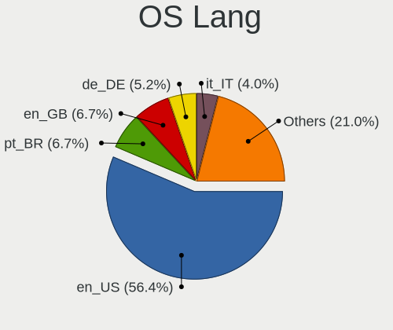
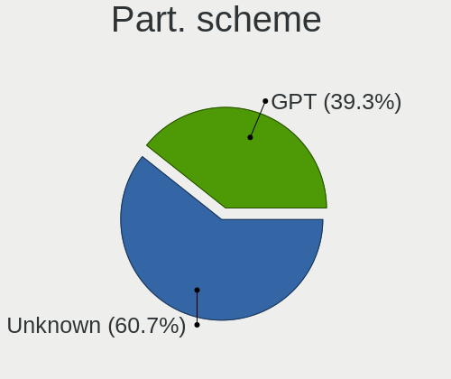
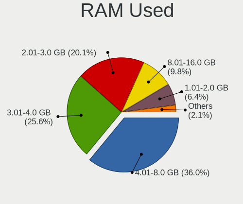
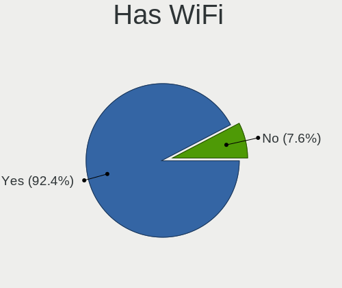
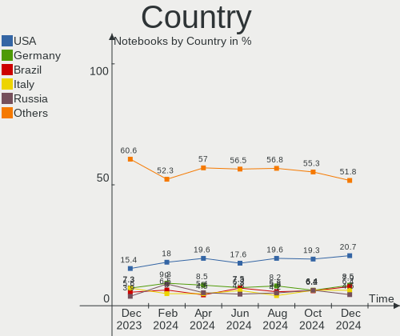
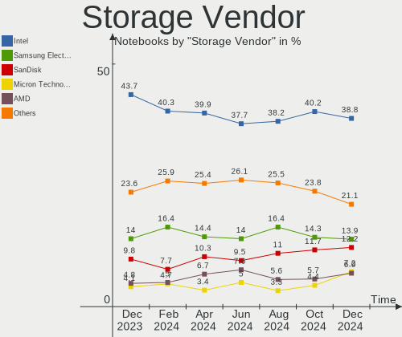
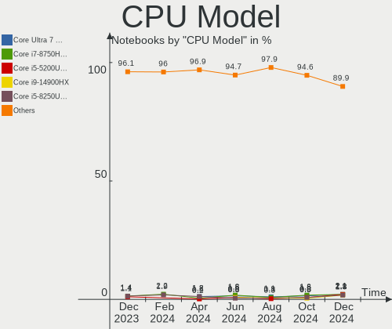
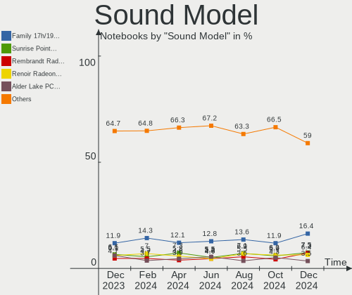
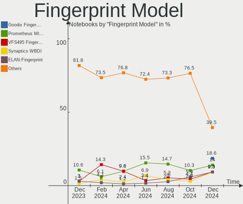

Fedora - Hardware Trends (Notebooks)
------------------------------------

A project to identify most popular hardware characteristics and track their change
over time based on data collected by Linux users at https://Linux-Hardware.org.

Anyone can contribute to this report by the [hw-probe](https://github.com/linuxhw/hw-probe) tool:

    sudo -E hw-probe -all -upload

This report is for one last month. Overall report since the beginning of time: [TestDays](https://github.com/linuxhw/TestDays)

Period: Dec, 2023.

Contents
--------

* [ System ](#system)
  - [ OS                       ](#os)
  - [ OS Family                ](#os-family)
  - [ Kernel                   ](#kernel)
  - [ Kernel Family            ](#kernel-family)
  - [ Kernel Major Ver.        ](#kernel-major-ver)
  - [ Arch                     ](#arch)
  - [ DE                       ](#de)
  - [ Display Server           ](#display-server)
  - [ Display Manager          ](#display-manager)
  - [ OS Lang                  ](#os-lang)
  - [ Boot Mode                ](#boot-mode)
  - [ Filesystem               ](#filesystem)
  - [ Part. scheme             ](#part-scheme)
  - [ Dual Boot with Linux/BSD ](#dual-boot-with-linuxbsd)
  - [ Dual Boot (Win)          ](#dual-boot-win)

* [ Board ](#board)
  - [ Vendor                   ](#vendor)
  - [ Model                    ](#model)
  - [ Model Family             ](#model-family)
  - [ MFG Year                 ](#mfg-year)
  - [ Form Factor              ](#form-factor)
  - [ Secure Boot              ](#secure-boot)
  - [ Coreboot                 ](#coreboot)
  - [ RAM Size                 ](#ram-size)
  - [ RAM Used                 ](#ram-used)
  - [ Total Drives             ](#total-drives)
  - [ Has CD-ROM               ](#has-cd-rom)
  - [ Has Ethernet             ](#has-ethernet)
  - [ Has WiFi                 ](#has-wifi)
  - [ Has Bluetooth            ](#has-bluetooth)

* [ Location ](#location)
  - [ Country                  ](#country)
  - [ City                     ](#city)

* [ Drives ](#drives)
  - [ Drive Vendor             ](#drive-vendor)
  - [ Drive Model              ](#drive-model)
  - [ HDD Vendor               ](#hdd-vendor)
  - [ SSD Vendor               ](#ssd-vendor)
  - [ Drive Kind               ](#drive-kind)
  - [ Drive Connector          ](#drive-connector)
  - [ Drive Size               ](#drive-size)
  - [ Space Total              ](#space-total)
  - [ Space Used               ](#space-used)
  - [ Malfunc. Drives          ](#malfunc-drives)
  - [ Malfunc. Drive Vendor    ](#malfunc-drive-vendor)
  - [ Malfunc. HDD Vendor      ](#malfunc-hdd-vendor)
  - [ Malfunc. Drive Kind      ](#malfunc-drive-kind)
  - [ Failed Drives            ](#failed-drives)
  - [ Failed Drive Vendor      ](#failed-drive-vendor)
  - [ Drive Status             ](#drive-status)

* [ Storage controller ](#storage-controller)
  - [ Storage Vendor           ](#storage-vendor)
  - [ Storage Model            ](#storage-model)
  - [ Storage Kind             ](#storage-kind)

* [ Processor ](#processor)
  - [ CPU Vendor               ](#cpu-vendor)
  - [ CPU Model                ](#cpu-model)
  - [ CPU Model Family         ](#cpu-model-family)
  - [ CPU Cores                ](#cpu-cores)
  - [ CPU Sockets              ](#cpu-sockets)
  - [ CPU Threads              ](#cpu-threads)
  - [ CPU Op-Modes             ](#cpu-op-modes)
  - [ CPU Microcode            ](#cpu-microcode)
  - [ CPU Microarch            ](#cpu-microarch)

* [ Graphics ](#graphics)
  - [ GPU Vendor               ](#gpu-vendor)
  - [ GPU Model                ](#gpu-model)
  - [ GPU Combo                ](#gpu-combo)
  - [ GPU Driver               ](#gpu-driver)
  - [ GPU Memory               ](#gpu-memory)

* [ Monitor ](#monitor)
  - [ Monitor Vendor           ](#monitor-vendor)
  - [ Monitor Model            ](#monitor-model)
  - [ Monitor Resolution       ](#monitor-resolution)
  - [ Monitor Diagonal         ](#monitor-diagonal)
  - [ Monitor Width            ](#monitor-width)
  - [ Aspect Ratio             ](#aspect-ratio)
  - [ Monitor Area             ](#monitor-area)
  - [ Pixel Density            ](#pixel-density)
  - [ Multiple Monitors        ](#multiple-monitors)

* [ Network ](#network)
  - [ Net Controller Vendor    ](#net-controller-vendor)
  - [ Net Controller Model     ](#net-controller-model)
  - [ Wireless Vendor          ](#wireless-vendor)
  - [ Wireless Model           ](#wireless-model)
  - [ Ethernet Vendor          ](#ethernet-vendor)
  - [ Ethernet Model           ](#ethernet-model)
  - [ Net Controller Kind      ](#net-controller-kind)
  - [ Used Controller          ](#used-controller)
  - [ NICs                     ](#nics)
  - [ IPv6                     ](#ipv6)

* [ Bluetooth ](#bluetooth)
  - [ Bluetooth Vendor         ](#bluetooth-vendor)
  - [ Bluetooth Model          ](#bluetooth-model)

* [ Sound ](#sound)
  - [ Sound Vendor             ](#sound-vendor)
  - [ Sound Model              ](#sound-model)

* [ Memory ](#memory)
  - [ Memory Vendor            ](#memory-vendor)
  - [ Memory Model             ](#memory-model)
  - [ Memory Kind              ](#memory-kind)
  - [ Memory Form Factor       ](#memory-form-factor)
  - [ Memory Size              ](#memory-size)
  - [ Memory Speed             ](#memory-speed)

* [ Printers & scanners ](#printers--scanners)
  - [ Printer Vendor           ](#printer-vendor)
  - [ Printer Model            ](#printer-model)
  - [ Scanner Vendor           ](#scanner-vendor)
  - [ Scanner Model            ](#scanner-model)

* [ Camera ](#camera)
  - [ Camera Vendor            ](#camera-vendor)
  - [ Camera Model             ](#camera-model)

* [ Security ](#security)
  - [ Fingerprint Vendor       ](#fingerprint-vendor)
  - [ Fingerprint Model        ](#fingerprint-model)
  - [ Chipcard Vendor          ](#chipcard-vendor)
  - [ Chipcard Model           ](#chipcard-model)

* [ Unsupported ](#unsupported)
  - [ Unsupported Devices      ](#unsupported-devices)
  - [ Unsupported Device Types ](#unsupported-device-types)

System
------

OS
--

Installed operating systems

| Name      | Notebooks | Percent |
|-----------|-----------|---------|
| Fedora 39 | 304       | 85.15%  |
| Fedora 38 | 36        | 10.08%  |
| Fedora 37 | 7         | 1.96%   |
| Fedora 36 | 5         | 1.4%    |
| Fedora 40 | 2         | 0.56%   |
| Fedora 35 | 2         | 0.56%   |
| Fedora 34 | 1         | 0.28%   |

OS Family
---------

OS without a version

| Name   | Notebooks | Percent |
|--------|-----------|---------|
| Fedora | 357       | 100%    |

Kernel
------

Version of the Linux kernel

| Version                                            | Notebooks | Percent |
|----------------------------------------------------|-----------|---------|
| 6.6.4-200.fc39.x86_64                              | 55        | 15.41%  |
| 6.6.6-200.fc39.x86_64                              | 53        | 14.85%  |
| 6.6.8-200.fc39.x86_64                              | 52        | 14.57%  |
| 6.6.7-200.fc39.x86_64                              | 43        | 12.04%  |
| 6.6.2-201.fc39.x86_64                              | 33        | 9.24%   |
| 6.6.3-200.fc39.x86_64                              | 24        | 6.72%   |
| 6.5.6-300.fc39.x86_64                              | 24        | 6.72%   |
| 6.6.6-100.fc38.x86_64                              | 9         | 2.52%   |
| 6.5.12-300.fc39.x86_64                             | 6         | 1.68%   |
| 6.6.4-100.fc38.x86_64                              | 5         | 1.4%    |
| 6.2.9-300.fc38.x86_64                              | 5         | 1.4%    |
| 6.6.7-100.fc38.x86_64                              | 4         | 1.12%   |
| 6.5.12-100.fc37.x86_64                             | 4         | 1.12%   |
| 6.5.11-300.fc39.x86_64                             | 4         | 1.12%   |
| 6.6.8-100.fc38.x86_64                              | 3         | 0.84%   |
| 5.17.5-300.fc36.x86_64                             | 3         | 0.84%   |
| 6.6.4-cb1.0.fc39.x86_64                            | 2         | 0.56%   |
| 6.6.3-100.fc38.x86_64                              | 2         | 0.56%   |
| 6.5.9-300.fc39.x86_64                              | 2         | 0.56%   |
| 6.5.12-200.fc38.x86_64                             | 2         | 0.56%   |
| 6.0.12-100.fc35.x86_64                             | 2         | 0.56%   |
| 6.7.0-0.rc5.20231212git26aff849438c.42.fc40.x86_64 | 1         | 0.28%   |
| 6.6.7-666.rog.fc39.x86_64                          | 1         | 0.28%   |
| 6.6.7-203.fsync.fc39.x86_64                        | 1         | 0.28%   |
| 6.6.3-666.rog.fc39.x86_64                          | 1         | 0.28%   |
| 6.5.9-200.fc38.x86_64                              | 1         | 0.28%   |
| 6.5.7-100.fc37.x86_64                              | 1         | 0.28%   |
| 6.5.11-200.fc38.x86_64                             | 1         | 0.28%   |
| 6.5.10-300.fc39.x86_64                             | 1         | 0.28%   |
| 6.5.10-200.fc38.x86_64                             | 1         | 0.28%   |
| 6.5.0-57.fc40.x86_64                               | 1         | 0.28%   |
| 6.4.16-200.mbp.fc38.x86_64                         | 1         | 0.28%   |
| 6.4.15-200.fc38.x86_64                             | 1         | 0.28%   |
| 6.4.14-200.fc38.x86_64                             | 1         | 0.28%   |
| 6.2.15-703.inttf.fc38.x86_64                       | 1         | 0.28%   |
| 6.2.15-200.fc37.x86_64                             | 1         | 0.28%   |
| 6.2.15-100.fc36.x86_64                             | 1         | 0.28%   |
| 6.2.12-300.fc38.x86_64                             | 1         | 0.28%   |
| 6.0.18-300.fc37.x86_64                             | 1         | 0.28%   |
| 5.19.11-200.fc36.x86_64                            | 1         | 0.28%   |

Kernel Family
-------------

Linux kernel without a distro release

| Version | Notebooks | Percent |
|---------|-----------|---------|
| 6.6.6   | 62        | 17.37%  |
| 6.6.4   | 62        | 17.37%  |
| 6.6.8   | 55        | 15.41%  |
| 6.6.7   | 49        | 13.73%  |
| 6.6.2   | 33        | 9.24%   |
| 6.6.3   | 27        | 7.56%   |
| 6.5.6   | 24        | 6.72%   |
| 6.5.12  | 12        | 3.36%   |
| 6.5.11  | 5         | 1.4%    |
| 6.2.9   | 5         | 1.4%    |
| 6.5.9   | 3         | 0.84%   |
| 6.2.15  | 3         | 0.84%   |
| 5.17.5  | 3         | 0.84%   |
| 6.5.10  | 2         | 0.56%   |
| 6.0.12  | 2         | 0.56%   |
| 6.7.0   | 1         | 0.28%   |
| 6.5.7   | 1         | 0.28%   |
| 6.5.0   | 1         | 0.28%   |
| 6.4.16  | 1         | 0.28%   |
| 6.4.15  | 1         | 0.28%   |
| 6.4.14  | 1         | 0.28%   |
| 6.2.12  | 1         | 0.28%   |
| 6.0.18  | 1         | 0.28%   |
| 5.19.11 | 1         | 0.28%   |
| 5.17.12 | 1         | 0.28%   |

Kernel Major Ver.
-----------------

Linux kernel major version

| Version | Notebooks | Percent |
|---------|-----------|---------|
| 6.6     | 288       | 80.67%  |
| 6.5     | 48        | 13.45%  |
| 6.2     | 9         | 2.52%   |
| 5.17    | 4         | 1.12%   |
| 6.4     | 3         | 0.84%   |
| 6.0     | 3         | 0.84%   |
| 6.7     | 1         | 0.28%   |
| 5.19    | 1         | 0.28%   |

Arch
----

OS architecture (x86_64, i586, etc.)

| Name   | Notebooks | Percent |
|--------|-----------|---------|
| x86_64 | 357       | 100%    |

DE
--

Desktop Environment

| Name          | Notebooks | Percent |
|---------------|-----------|---------|
| GNOME         | 278       | 77.87%  |
| KDE5          | 53        | 14.85%  |
| XFCE          | 6         | 1.68%   |
| Unknown       | 5         | 1.4%    |
| MATE          | 4         | 1.12%   |
| Cinnamon      | 2         | 0.56%   |
| X-Cinnamon    | 1         | 0.28%   |
| sway          | 1         | 0.28%   |
| Pantheon      | 1         | 0.28%   |
| i3            | 1         | 0.28%   |
| Hyprland      | 1         | 0.28%   |
| GNOME-Classic | 1         | 0.28%   |
| GNOME Classic | 1         | 0.28%   |
| Deepin        | 1         | 0.28%   |
| Budgie        | 1         | 0.28%   |

Display Server
--------------

X11 or Wayland

| Name    | Notebooks | Percent |
|---------|-----------|---------|
| Wayland | 291       | 81.51%  |
| X11     | 59        | 16.53%  |
| Unknown | 4         | 1.12%   |
| Tty     | 3         | 0.84%   |

Display Manager
---------------

SDDM, LightDM, etc.

| Name    | Notebooks | Percent |
|---------|-----------|---------|
| Unknown | 229       | 64.15%  |
| GDM     | 86        | 24.09%  |
| SDDM    | 23        | 6.44%   |
| LightDM | 19        | 5.32%   |

OS Lang
-------

Language

| Lang    | Notebooks | Percent |
|---------|-----------|---------|
| en_US   | 175       | 49.02%  |
| en_GB   | 26        | 7.28%   |
| ru_RU   | 16        | 4.48%   |
| it_IT   | 16        | 4.48%   |
| fr_FR   | 16        | 4.48%   |
| de_DE   | 16        | 4.48%   |
| pt_BR   | 15        | 4.2%    |
| pl_PL   | 10        | 2.8%    |
| en_IN   | 8         | 2.24%   |
| en_CA   | 5         | 1.4%    |
| es_ES   | 4         | 1.12%   |
| es_CO   | 4         | 1.12%   |
| en_AU   | 4         | 1.12%   |
| ru_UA   | 3         | 0.84%   |
| es_CL   | 3         | 0.84%   |
| en_DK   | 3         | 0.84%   |
| de_CH   | 3         | 0.84%   |
| de_AT   | 3         | 0.84%   |
| es_MX   | 2         | 0.56%   |
| es_DO   | 2         | 0.56%   |
| es_AR   | 2         | 0.56%   |
| en_ZA   | 2         | 0.56%   |
| en_SG   | 2         | 0.56%   |
| zh_TW   | 1         | 0.28%   |
| uk_UA   | 1         | 0.28%   |
| tr_TR   | 1         | 0.28%   |
| sv_SE   | 1         | 0.28%   |
| ro_RO   | 1         | 0.28%   |
| pt_PT   | 1         | 0.28%   |
| nb_NO   | 1         | 0.28%   |
| ja_JP   | 1         | 0.28%   |
| fr_CH   | 1         | 0.28%   |
| fr_BE   | 1         | 0.28%   |
| es_VE   | 1         | 0.28%   |
| es_PE   | 1         | 0.28%   |
| es_EC   | 1         | 0.28%   |
| en_IL   | 1         | 0.28%   |
| en_IE   | 1         | 0.28%   |
| da_DK   | 1         | 0.28%   |
| Unknown | 1         | 0.28%   |

Boot Mode
---------

EFI or BIOS

| Mode | Notebooks | Percent |
|------|-----------|---------|
| EFI  | 298       | 83.47%  |
| BIOS | 59        | 16.53%  |

Filesystem
----------

Type of filesystem

| Type    | Notebooks | Percent |
|---------|-----------|---------|
| Btrfs   | 310       | 86.83%  |
| Ext4    | 40        | 11.2%   |
| Xfs     | 6         | 1.68%   |
| Overlay | 1         | 0.28%   |

Part. scheme
------------

Scheme of partitioning

| Type    | Notebooks | Percent |
|---------|-----------|---------|
| Unknown | 222       | 62.18%  |
| GPT     | 128       | 35.85%  |
| MBR     | 7         | 1.96%   |

Dual Boot with Linux/BSD
------------------------

Hosting more than one Linux/BSD

| Dual boot | Notebooks | Percent |
|-----------|-----------|---------|
| No        | 330       | 92.44%  |
| Yes       | 27        | 7.56%   |

Dual Boot (Win)
---------------

Hosting Linux and Windows

| Dual boot | Notebooks | Percent |
|-----------|-----------|---------|
| No        | 295       | 82.63%  |
| Yes       | 62        | 17.37%  |

Board
-----

Vendor
------

Motherboard manufacturer

| Name                | Notebooks | Percent |
|---------------------|-----------|---------|
| Lenovo              | 108       | 30.25%  |
| Dell                | 64        | 17.93%  |
| Hewlett-Packard     | 45        | 12.61%  |
| ASUSTek Computer    | 44        | 12.32%  |
| Acer                | 24        | 6.72%   |
| Apple               | 16        | 4.48%   |
| HUAWEI              | 10        | 2.8%    |
| MSI                 | 6         | 1.68%   |
| Framework           | 5         | 1.4%    |
| Fujitsu             | 3         | 0.84%   |
| TUXEDO              | 2         | 0.56%   |
| Toshiba             | 2         | 0.56%   |
| Sony                | 2         | 0.56%   |
| Samsung Electronics | 2         | 0.56%   |
| Packard Bell        | 2         | 0.56%   |
| HONOR               | 2         | 0.56%   |
| Gigabyte Technology | 2         | 0.56%   |
| Chuwi               | 2         | 0.56%   |
| VIT                 | 1         | 0.28%   |
| Valve               | 1         | 0.28%   |
| Timi                | 1         | 0.28%   |
| Thirdwave           | 1         | 0.28%   |
| Star Labs           | 1         | 0.28%   |
| Razer               | 1         | 0.28%   |
| LG Electronics      | 1         | 0.28%   |
| GPD                 | 1         | 0.28%   |
| Dynabook            | 1         | 0.28%   |
| Danew               | 1         | 0.28%   |
| Compal              | 1         | 0.28%   |
| BAKED               | 1         | 0.28%   |
| ASRock              | 1         | 0.28%   |
| Alienware           | 1         | 0.28%   |
| A-DATA Technology   | 1         | 0.28%   |
| Unknown             | 1         | 0.28%   |

Model
-----

Motherboard model

| Name                                       | Notebooks | Percent |
|--------------------------------------------|-----------|---------|
| Framework Laptop 13 (AMD Ryzen 7040Series) | 4         | 1.12%   |
| Acer Aspire A515-45                        | 3         | 0.84%   |
| Lenovo V15 G3 IAP 82TT                     | 2         | 0.56%   |
| Lenovo ThinkPad T480 20L50011US            | 2         | 0.56%   |
| Lenovo IdeaPad Gaming 3 15IHU6 82K1        | 2         | 0.56%   |
| HP Stream Laptop 14-ax0XX                  | 2         | 0.56%   |
| HP Laptop 15-da0xxx                        | 2         | 0.56%   |
| Dell XPS 15 9530                           | 2         | 0.56%   |
| Dell XPS 13 9310                           | 2         | 0.56%   |
| Dell Latitude E7440                        | 2         | 0.56%   |
| Dell Latitude E5550                        | 2         | 0.56%   |
| Dell Latitude E5470                        | 2         | 0.56%   |
| Dell Latitude 5420                         | 2         | 0.56%   |
| Dell Inspiron N5110                        | 2         | 0.56%   |
| Dell Inspiron 3542                         | 2         | 0.56%   |
| ASUS ROG Zephyrus G14 GA402RJ_GA402RJ      | 2         | 0.56%   |
| VIT P3400                                  | 1         | 0.28%   |
| Valve Jupiter                              | 1         | 0.28%   |
| TUXEDO InfinityBook S 15/17 Gen7           | 1         | 0.28%   |
| TUXEDO InfinityBook Pro 14 Gen6            | 1         | 0.28%   |
| Toshiba Satellite P850                     | 1         | 0.28%   |
| Toshiba Satellite C70-B                    | 1         | 0.28%   |
| Timi A35R                                  | 1         | 0.28%   |
| Thirdwave Prime Series                     | 1         | 0.28%   |
| Star Labs StarBook                         | 1         | 0.28%   |
| Sony VPCEB25FX                             | 1         | 0.28%   |
| Sony SVF1521G6EW                           | 1         | 0.28%   |
| Samsung RV415/RV515                        | 1         | 0.28%   |
| Samsung 550P5C/550P7C                      | 1         | 0.28%   |
| Razer Blade                                | 1         | 0.28%   |
| Packard Bell EasyNote TSX66HR              | 1         | 0.28%   |
| Packard Bell EasyNote TS44HR               | 1         | 0.28%   |
| MSI Prestige 15 A12UD                      | 1         | 0.28%   |
| MSI Prestige 14Evo A12M                    | 1         | 0.28%   |
| MSI Modern 15 B7M                          | 1         | 0.28%   |
| MSI Katana GF76 11UD                       | 1         | 0.28%   |
| MSI GS70 2OD                               | 1         | 0.28%   |
| MSI GP62MVR 7RFX                           | 1         | 0.28%   |
| LG 17Z90N-R.AAC8U1                         | 1         | 0.28%   |
| Lenovo Z710 20250                          | 1         | 0.28%   |

Model Family
------------

Motherboard model prefix

| Name                  | Notebooks | Percent |
|-----------------------|-----------|---------|
| Lenovo ThinkPad       | 58        | 16.25%  |
| Dell Latitude         | 24        | 6.72%   |
| Dell Inspiron         | 17        | 4.76%   |
| ASUS VivoBook         | 17        | 4.76%   |
| Lenovo IdeaPad        | 15        | 4.2%    |
| Lenovo Legion         | 12        | 3.36%   |
| Acer Aspire           | 10        | 2.8%    |
| Lenovo ThinkBook      | 9         | 2.52%   |
| Dell XPS              | 9         | 2.52%   |
| HP Laptop             | 8         | 2.24%   |
| ASUS ROG              | 8         | 2.24%   |
| HP EliteBook          | 7         | 1.96%   |
| Dell Precision        | 7         | 1.96%   |
| Acer Nitro            | 6         | 1.68%   |
| Lenovo Yoga           | 5         | 1.4%    |
| HP Pavilion           | 5         | 1.4%    |
| Framework Laptop      | 5         | 1.4%    |
| HP ZBook              | 4         | 1.12%   |
| HP OMEN               | 4         | 1.12%   |
| ASUS ASUS             | 4         | 1.12%   |
| HP Stream             | 3         | 0.84%   |
| HP ProBook            | 3         | 0.84%   |
| HP ENVY               | 3         | 0.84%   |
| Fujitsu LIFEBOOK      | 3         | 0.84%   |
| Apple MacBookPro11    | 3         | 0.84%   |
| Acer Swift            | 3         | 0.84%   |
| TUXEDO InfinityBook   | 2         | 0.56%   |
| Toshiba Satellite     | 2         | 0.56%   |
| Packard Bell EasyNote | 2         | 0.56%   |
| MSI Prestige          | 2         | 0.56%   |
| Lenovo V15            | 2         | 0.56%   |
| Lenovo Slim           | 2         | 0.56%   |
| HP 15                 | 2         | 0.56%   |
| Gigabyte AORUS        | 2         | 0.56%   |
| Dell Vostro           | 2         | 0.56%   |
| ASUS Zenbook          | 2         | 0.56%   |
| Apple MacBookPro5     | 2         | 0.56%   |
| Apple MacBookPro14    | 2         | 0.56%   |
| Apple MacBookPro13    | 2         | 0.56%   |
| Acer TravelMate       | 2         | 0.56%   |

MFG Year
--------

Motherboard manufacture year

| Year | Notebooks | Percent |
|------|-----------|---------|
| 2023 | 46        | 12.89%  |
| 2022 | 45        | 12.61%  |
| 2020 | 43        | 12.04%  |
| 2021 | 41        | 11.48%  |
| 2019 | 26        | 7.28%   |
| 2016 | 22        | 6.16%   |
| 2018 | 20        | 5.6%    |
| 2012 | 20        | 5.6%    |
| 2014 | 19        | 5.32%   |
| 2013 | 18        | 5.04%   |
| 2017 | 15        | 4.2%    |
| 2015 | 14        | 3.92%   |
| 2011 | 12        | 3.36%   |
| 2010 | 6         | 1.68%   |
| 2009 | 6         | 1.68%   |
| 2008 | 2         | 0.56%   |
| 2007 | 2         | 0.56%   |

Form Factor
-----------

Physical design of the computer

| Name     | Notebooks | Percent |
|----------|-----------|---------|
| Notebook | 357       | 100%    |

Secure Boot
-----------

Enabled or disabled

| State    | Notebooks | Percent |
|----------|-----------|---------|
| Disabled | 263       | 73.67%  |
| Enabled  | 94        | 26.33%  |

Coreboot
--------

Have coreboot on board

| Used | Notebooks | Percent |
|------|-----------|---------|
| No   | 357       | 100%    |

RAM Size
--------

Total RAM memory

| Size in GB  | Notebooks | Percent |
|-------------|-----------|---------|
| 4.01-8.0    | 94        | 26.33%  |
| 16.01-24.0  | 84        | 23.53%  |
| 8.01-16.0   | 67        | 18.77%  |
| 32.01-64.0  | 59        | 16.53%  |
| 3.01-4.0    | 25        | 7%      |
| 24.01-32.0  | 19        | 5.32%   |
| 64.01-256.0 | 8         | 2.24%   |
| 1.01-2.0    | 1         | 0.28%   |

RAM Used
--------

Used RAM memory

| Used GB    | Notebooks | Percent |
|------------|-----------|---------|
| 4.01-8.0   | 131       | 36.69%  |
| 2.01-3.0   | 93        | 26.05%  |
| 3.01-4.0   | 83        | 23.25%  |
| 1.01-2.0   | 24        | 6.72%   |
| 8.01-16.0  | 23        | 6.44%   |
| 16.01-24.0 | 2         | 0.56%   |
| 0.51-1.0   | 1         | 0.28%   |

Total Drives
------------

Number of drives on board

| Drives | Notebooks | Percent |
|--------|-----------|---------|
| 1      | 265       | 74.23%  |
| 2      | 81        | 22.69%  |
| 3      | 8         | 2.24%   |
| 7      | 1         | 0.28%   |
| 6      | 1         | 0.28%   |
| 4      | 1         | 0.28%   |

Has CD-ROM
----------

Has CD-ROM on board

| Presented | Notebooks | Percent |
|-----------|-----------|---------|
| No        | 299       | 83.75%  |
| Yes       | 58        | 16.25%  |

Has Ethernet
------------

Has Ethernet on board

| Presented | Notebooks | Percent |
|-----------|-----------|---------|
| Yes       | 250       | 70.03%  |
| No        | 107       | 29.97%  |

Has WiFi
--------

Has WiFi module

| Presented | Notebooks | Percent |
|-----------|-----------|---------|
| Yes       | 355       | 99.44%  |
| No        | 2         | 0.56%   |

Has Bluetooth
-------------

Has Bluetooth module

| Presented | Notebooks | Percent |
|-----------|-----------|---------|
| Yes       | 314       | 87.96%  |
| No        | 43        | 12.04%  |

Location
--------

Country
-------

Geographic location (country)

| Country            | Notebooks | Percent |
|--------------------|-----------|---------|
| USA                | 54        | 15.13%  |
| Italy              | 26        | 7.28%   |
| Germany            | 26        | 7.28%   |
| Poland             | 20        | 5.6%    |
| Brazil             | 20        | 5.6%    |
| UK                 | 17        | 4.76%   |
| France             | 15        | 4.2%    |
| Russia             | 14        | 3.92%   |
| India              | 13        | 3.64%   |
| Canada             | 11        | 3.08%   |
| Netherlands        | 10        | 2.8%    |
| Spain              | 9         | 2.52%   |
| Austria            | 9         | 2.52%   |
| Switzerland        | 7         | 1.96%   |
| Romania            | 6         | 1.68%   |
| Colombia           | 6         | 1.68%   |
| Belgium            | 6         | 1.68%   |
| Portugal           | 5         | 1.4%    |
| Mexico             | 5         | 1.4%    |
| Denmark            | 4         | 1.12%   |
| Australia          | 4         | 1.12%   |
| Turkey             | 3         | 0.84%   |
| Philippines        | 3         | 0.84%   |
| Czechia            | 3         | 0.84%   |
| Chile              | 3         | 0.84%   |
| Belarus            | 3         | 0.84%   |
| Algeria            | 3         | 0.84%   |
| Venezuela          | 2         | 0.56%   |
| Sweden             | 2         | 0.56%   |
| South Africa       | 2         | 0.56%   |
| Serbia             | 2         | 0.56%   |
| Peru               | 2         | 0.56%   |
| Israel             | 2         | 0.56%   |
| Ireland            | 2         | 0.56%   |
| Hong Kong          | 2         | 0.56%   |
| Greece             | 2         | 0.56%   |
| Finland            | 2         | 0.56%   |
| Egypt              | 2         | 0.56%   |
| Dominican Republic | 2         | 0.56%   |
| Bulgaria           | 2         | 0.56%   |

City
----

Geographic location (city)

| City          | Notebooks | Percent |
|---------------|-----------|---------|
| Vienna        | 6         | 1.68%   |
| Moscow        | 5         | 1.4%    |
| Sao Paulo     | 4         | 1.12%   |
| Berlin        | 4         | 1.12%   |
| Zurich        | 3         | 0.84%   |
| Warsaw        | 3         | 0.84%   |
| Toronto       | 3         | 0.84%   |
| Poznan        | 3         | 0.84%   |
| Munich        | 3         | 0.84%   |
| Minsk         | 3         | 0.84%   |
| Milano        | 3         | 0.84%   |
| Milan         | 3         | 0.84%   |
| Bucharest     | 3         | 0.84%   |
| Brussels      | 3         | 0.84%   |
| Wroclaw       | 2         | 0.56%   |
| The Hague     | 2         | 0.56%   |
| Tel Aviv      | 2         | 0.56%   |
| Târgu Mureş | 2         | 0.56%   |
| Sydney        | 2         | 0.56%   |
| Seattle       | 2         | 0.56%   |
| Santiago      | 2         | 0.56%   |
| Reading       | 2         | 0.56%   |
| Quezon City   | 2         | 0.56%   |
| Palma         | 2         | 0.56%   |
| Nuremberg     | 2         | 0.56%   |
| Naples        | 2         | 0.56%   |
| Medellín     | 2         | 0.56%   |
| Los Angeles   | 2         | 0.56%   |
| Jacksonville  | 2         | 0.56%   |
| Istanbul      | 2         | 0.56%   |
| Helsinki      | 2         | 0.56%   |
| Fontevivo     | 2         | 0.56%   |
| Flushing      | 2         | 0.56%   |
| Burnaby       | 2         | 0.56%   |
| Bristol       | 2         | 0.56%   |
| Amsterdam     | 2         | 0.56%   |
| Algiers       | 2         | 0.56%   |
| Albuquerque   | 2         | 0.56%   |
| Yopal         | 1         | 0.28%   |
| Yerevan       | 1         | 0.28%   |

Drives
------

Drive Vendor
------------

Hard drive vendors

| Vendor                         | Notebooks | Drives | Percent |
|--------------------------------|-----------|--------|---------|
| Samsung Electronics            | 79        | 84     | 17.83%  |
| Sandisk                        | 53        | 57     | 11.96%  |
| SK hynix                       | 32        | 33     | 7.22%   |
| Micron Technology              | 25        | 25     | 5.64%   |
| Toshiba                        | 24        | 24     | 5.42%   |
| Seagate                        | 18        | 18     | 4.06%   |
| Unknown                        | 17        | 19     | 3.84%   |
| Intel                          | 17        | 18     | 3.84%   |
| WDC                            | 16        | 16     | 3.61%   |
| Crucial                        | 16        | 16     | 3.61%   |
| Phison Electronics             | 14        | 14     | 3.16%   |
| Micron/Crucial Technology      | 13        | 13     | 2.93%   |
| Kingston                       | 12        | 12     | 2.71%   |
| Apple                          | 10        | 13     | 2.26%   |
| KIOXIA                         | 8         | 8      | 1.81%   |
| HGST                           | 7         | 7      | 1.58%   |
| MAXIO Technology (Hangzhou)    | 6         | 6      | 1.35%   |
| Silicon Motion                 | 5         | 5      | 1.13%   |
| LITEONIT                       | 5         | 5      | 1.13%   |
| A-DATA Technology              | 5         | 5      | 1.13%   |
| China                          | 4         | 4      | 0.9%    |
| SPCC                           | 3         | 3      | 0.68%   |
| Hitachi                        | 3         | 3      | 0.68%   |
| ADATA Technology               | 3         | 3      | 0.68%   |
| USB                            | 2         | 2      | 0.45%   |
| Union Memory                   | 2         | 2      | 0.45%   |
| Realtek                        | 2         | 2      | 0.45%   |
| PNY                            | 2         | 2      | 0.45%   |
| Plextor                        | 2         | 2      | 0.45%   |
| Netac                          | 2         | 2      | 0.45%   |
| LITEON                         | 2         | 2      | 0.45%   |
| Kingston Technology Company    | 2         | 2      | 0.45%   |
| Gigabyte Technology            | 2         | 2      | 0.45%   |
| Unknown                        | 2         | 2      | 0.45%   |
| Wdxsky                         | 1         | 1      | 0.23%   |
| USB3.0                         | 1         | 1      | 0.23%   |
| Union Memory (Shenzhen)        | 1         | 1      | 0.23%   |
| Star                           | 1         | 1      | 0.23%   |
| Solid State Storage Technology | 1         | 1      | 0.23%   |
| Shenzhen Longsys Electronics   | 1         | 1      | 0.23%   |

Drive Model
-----------

Hard drive models

| Model                                               | Notebooks | Percent |
|-----------------------------------------------------|-----------|---------|
| Samsung NVMe SSD Controller SM981/PM981/PM983 512GB | 17        | 3.76%   |
| Samsung NVMe SSD Controller PM9A1/PM9A3/980PRO 2TB  | 17        | 3.76%   |
| Sandisk WD Blue SN550 NVMe SSD 1TB                  | 10        | 2.21%   |
| Micron/Crucial P2 NVMe PCIe SSD 4TB                 | 8         | 1.77%   |
| Kingston SA400S37240G 240GB SSD                     | 8         | 1.77%   |
| Sandisk WD Black SN750 / PC SN730 NVMe SSD 2TB      | 7         | 1.55%   |
| Intel SSD 660P Series 1TB                           | 7         | 1.55%   |
| Unknown MMC Card  32GB                              | 5         | 1.11%   |
| Toshiba XG6 NVMe SSD Controller 512GB               | 5         | 1.11%   |
| SK hynix BC511 512GB                                | 5         | 1.11%   |
| SK hynix BC501 NVMe Solid State Drive 512GB         | 5         | 1.11%   |
| Unknown MMC Card  128GB                             | 4         | 0.88%   |
| Toshiba MQ04ABF100 1TB                              | 4         | 0.88%   |
| Seagate ST1000LM035-1RK172 1TB                      | 4         | 0.88%   |
| Sandisk WD_BLACK SN850X 2000GB                      | 4         | 0.88%   |
| Sandisk WD Black SN850 1024GB                       | 4         | 0.88%   |
| Samsung NVMe SSD Controller SM961/PM961/SM963 250GB | 4         | 0.88%   |
| Samsung MZALQ512HBLU-00BL2 512GB                    | 4         | 0.88%   |
| Phison PS5013 E13 NVMe Controller 512GB             | 4         | 0.88%   |
| Phison E12 NVMe Controller 1TB                      | 4         | 0.88%   |
| MAXIO (Hangzhou) NVMe SSD Controller MAP1202 256GB  | 4         | 0.88%   |
| HGST HTS721010A9E630 1TB                            | 4         | 0.88%   |
| Crucial CT1000MX500SSD1 1TB                         | 4         | 0.88%   |
| Seagate ST1000LM024 HN-M101MBB 1TB                  | 3         | 0.66%   |
| Samsung SSD 980 1TB                                 | 3         | 0.66%   |
| Samsung MZAL4512HBLU-00BL2 512GB                    | 3         | 0.66%   |
| Phison E16 PCIe4 NVMe Controller 2TB                | 3         | 0.66%   |
| Intel SSDPEKNU512GZ 512GB                           | 3         | 0.66%   |
| Crucial CT240BX500SSD1 240GB                        | 3         | 0.66%   |
| Apple S3X NVMe Controller 256GB                     | 3         | 0.66%   |
| WDC WDS100T2B0A-00SM50 1TB SSD                      | 2         | 0.44%   |
| WDC WD10SPZX-75Z10T3 1TB                            | 2         | 0.44%   |
| Unknown MMC Card  64GB                              | 2         | 0.44%   |
| Unknown MMC Card  256GB                             | 2         | 0.44%   |
| Toshiba MQ01ABD100 1TB                              | 2         | 0.44%   |
| Toshiba MQ01ABD050V 500GB                           | 2         | 0.44%   |
| Toshiba MK5061GSYN 500GB                            | 2         | 0.44%   |
| SK hynix SKHynix_HFM256GD3HX015N 256GB              | 2         | 0.44%   |
| SK hynix PC801 NVMe 1TB                             | 2         | 0.44%   |
| SK hynix HFM001TD3JX013N 1024GB                     | 2         | 0.44%   |

HDD Vendor
----------

Hard disk drive vendors

| Vendor   | Notebooks | Drives | Percent |
|----------|-----------|--------|---------|
| Seagate  | 15        | 15     | 27.27%  |
| Toshiba  | 14        | 14     | 25.45%  |
| WDC      | 10        | 10     | 18.18%  |
| HGST     | 7         | 7      | 12.73%  |
| Hitachi  | 3         | 3      | 5.45%   |
| USB3.0   | 1         | 1      | 1.82%   |
| USB      | 1         | 1      | 1.82%   |
| SABRENT  | 1         | 1      | 1.82%   |
| LIO-ORG  | 1         | 4      | 1.82%   |
| External | 1         | 1      | 1.82%   |
| Apple    | 1         | 1      | 1.82%   |

SSD Vendor
----------

Solid state drive vendors

| Vendor              | Notebooks | Drives | Percent |
|---------------------|-----------|--------|---------|
| Samsung Electronics | 17        | 18     | 14.66%  |
| Crucial             | 16        | 16     | 13.79%  |
| Kingston            | 10        | 10     | 8.62%   |
| SanDisk             | 7         | 7      | 6.03%   |
| WDC                 | 6         | 6      | 5.17%   |
| Micron Technology   | 6         | 6      | 5.17%   |
| SK hynix            | 5         | 5      | 4.31%   |
| LITEONIT            | 5         | 5      | 4.31%   |
| Toshiba             | 4         | 4      | 3.45%   |
| China               | 4         | 4      | 3.45%   |
| Apple               | 4         | 4      | 3.45%   |
| SPCC                | 3         | 3      | 2.59%   |
| Intel               | 3         | 3      | 2.59%   |
| PNY                 | 2         | 2      | 1.72%   |
| Plextor             | 2         | 2      | 1.72%   |
| LITEON              | 2         | 2      | 1.72%   |
| A-DATA Technology   | 2         | 2      | 1.72%   |
| Wdxsky              | 1         | 1      | 0.86%   |
| Star                | 1         | 1      | 0.86%   |
| Reeinno             | 1         | 1      | 0.86%   |
| OCZ                 | 1         | 1      | 0.86%   |
| Netac               | 1         | 1      | 0.86%   |
| Lexar               | 1         | 1      | 0.86%   |
| Lenovo              | 1         | 1      | 0.86%   |
| JMicron Technology  | 1         | 2      | 0.86%   |
| INTEL SS            | 1         | 1      | 0.86%   |
| HS-SSD-E100         | 1         | 1      | 0.86%   |
| Gigabyte Technology | 1         | 1      | 0.86%   |
| Dahua               | 1         | 1      | 0.86%   |
| Corsair             | 1         | 1      | 0.86%   |
| Apacer              | 1         | 1      | 0.86%   |
| AMD R5SL            | 1         | 1      | 0.86%   |
| AMD                 | 1         | 1      | 0.86%   |
| Acer                | 1         | 1      | 0.86%   |
| Unknown             | 1         | 1      | 0.86%   |

Drive Kind
----------

HDD or SSD

| Kind    | Notebooks | Drives | Percent |
|---------|-----------|--------|---------|
| NVMe    | 231       | 259    | 54.87%  |
| SSD     | 110       | 118    | 26.13%  |
| HDD     | 54        | 58     | 12.83%  |
| MMC     | 15        | 17     | 3.56%   |
| Unknown | 11        | 11     | 2.61%   |

Drive Connector
---------------

SATA, SAS, NVMe, etc.

| Type | Notebooks | Drives | Percent |
|------|-----------|--------|---------|
| NVMe | 231       | 257    | 57.04%  |
| SATA | 140       | 166    | 34.57%  |
| SAS  | 19        | 23     | 4.69%   |
| MMC  | 15        | 17     | 3.7%    |

Drive Size
----------

Size of hard drive

| Size in TB | Notebooks | Drives | Percent |
|------------|-----------|--------|---------|
| 0.01-0.5   | 95        | 109    | 59.75%  |
| 0.51-1.0   | 53        | 55     | 33.33%  |
| 1.01-2.0   | 10        | 11     | 6.29%   |
| 4.01-10.0  | 1         | 1      | 0.63%   |

Space Total
-----------

Amount of disk space available on the file system

| Size in GB     | Notebooks | Percent |
|----------------|-----------|---------|
| 501-1000       | 93        | 26.05%  |
| 251-500        | 70        | 19.61%  |
| 1001-2000      | 53        | 14.85%  |
| 101-250        | 43        | 12.04%  |
| Unknown        | 37        | 10.36%  |
| 1-20           | 28        | 7.84%   |
| More than 3000 | 14        | 3.92%   |
| 51-100         | 10        | 2.8%    |
| 2001-3000      | 9         | 2.52%   |

Space Used
----------

Amount of used disk space

| Used GB        | Notebooks | Percent |
|----------------|-----------|---------|
| 1-20           | 91        | 25.49%  |
| 21-50          | 69        | 19.33%  |
| 101-250        | 54        | 15.13%  |
| 51-100         | 40        | 11.2%   |
| Unknown        | 37        | 10.36%  |
| 251-500        | 36        | 10.08%  |
| 501-1000       | 15        | 4.2%    |
| 1001-2000      | 11        | 3.08%   |
| 2001-3000      | 3         | 0.84%   |
| More than 3000 | 1         | 0.28%   |

Malfunc. Drives
---------------

Drive models with a malfunction

| Model                                          | Notebooks | Drives | Percent |
|------------------------------------------------|-----------|--------|---------|
| Seagate ST2000LM003 HN-M201RAD 2TB             | 1         | 1      | 33.33%  |
| Micron Technology 1100_MTFDDAV512TBN 512GB SSD | 1         | 1      | 33.33%  |
| Crucial CT128MX100SSD1 128GB                   | 1         | 1      | 33.33%  |

Malfunc. Drive Vendor
---------------------

Vendors of faulty drives

| Vendor            | Notebooks | Drives | Percent |
|-------------------|-----------|--------|---------|
| Seagate           | 1         | 1      | 33.33%  |
| Micron Technology | 1         | 1      | 33.33%  |
| Crucial           | 1         | 1      | 33.33%  |

Malfunc. HDD Vendor
-------------------

Vendors of faulty HDD drives

| Vendor  | Notebooks | Drives | Percent |
|---------|-----------|--------|---------|
| Seagate | 1         | 1      | 100%    |

Malfunc. Drive Kind
-------------------

Kinds of faulty drives

| Kind | Notebooks | Drives | Percent |
|------|-----------|--------|---------|
| SSD  | 2         | 2      | 66.67%  |
| HDD  | 1         | 1      | 33.33%  |

Failed Drives
-------------

Failed drive models

Zero info for selected period =(

Failed Drive Vendor
-------------------

Failed drive vendors

Zero info for selected period =(

Drive Status
------------

Number of failed and malfunc. drives

| Status   | Notebooks | Drives | Percent |
|----------|-----------|--------|---------|
| Detected | 247       | 316    | 67.3%   |
| Works    | 117       | 144    | 31.88%  |
| Malfunc  | 3         | 3      | 0.82%   |

Storage controller
------------------

Storage Vendor
--------------

Storage controller vendors

| Vendor                         | Notebooks | Percent |
|--------------------------------|-----------|---------|
| Intel                          | 199       | 43.74%  |
| Samsung Electronics            | 64        | 14.07%  |
| SanDisk                        | 45        | 9.89%   |
| SK hynix                       | 27        | 5.93%   |
| AMD                            | 22        | 4.84%   |
| Micron Technology              | 19        | 4.18%   |
| Phison Electronics             | 15        | 3.3%    |
| Micron/Crucial Technology      | 13        | 2.86%   |
| KIOXIA                         | 8         | 1.76%   |
| Toshiba America Info Systems   | 6         | 1.32%   |
| MAXIO Technology (Hangzhou)    | 6         | 1.32%   |
| ADATA Technology               | 6         | 1.32%   |
| Silicon Motion                 | 5         | 1.1%    |
| Apple                          | 5         | 1.1%    |
| Kingston Technology Company    | 4         | 0.88%   |
| Union Memory (Shenzhen)        | 3         | 0.66%   |
| Solidigm                       | 2         | 0.44%   |
| Nvidia                         | 2         | 0.44%   |
| Solid State Storage Technology | 1         | 0.22%   |
| Shenzhen Longsys Electronics   | 1         | 0.22%   |
| Marvell Technology Group       | 1         | 0.22%   |
| INNOGRIT                       | 1         | 0.22%   |

Storage Model
-------------

Storage controller models

| Model                                                                          | Notebooks | Percent |
|--------------------------------------------------------------------------------|-----------|---------|
| Intel 82801 Mobile SATA Controller [RAID mode]                                 | 25        | 5.22%   |
| Intel Volume Management Device NVMe RAID Controller                            | 24        | 5.01%   |
| Intel Sunrise Point-LP SATA Controller [AHCI mode]                             | 22        | 4.59%   |
| AMD FCH SATA Controller [AHCI mode]                                            | 21        | 4.38%   |
| Samsung NVMe SSD Controller SM981/PM981/PM983                                  | 18        | 3.76%   |
| Samsung NVMe SSD Controller 980 (DRAM-less)                                    | 18        | 3.76%   |
| Samsung NVMe SSD Controller PM9A1/PM9A3/980PRO                                 | 17        | 3.55%   |
| Intel 7 Series Chipset Family 6-port SATA Controller [AHCI mode]               | 16        | 3.34%   |
| Intel 8 Series SATA Controller 1 [AHCI mode]                                   | 13        | 2.71%   |
| SanDisk Ultra 3D / WD Blue SN550 NVMe SSD                                      | 10        | 2.09%   |
| Intel Wildcat Point-LP SATA Controller [AHCI Mode]                             | 10        | 2.09%   |
| Intel 6 Series/C200 Series Chipset Family 6 port Mobile SATA AHCI Controller   | 10        | 2.09%   |
| Micron/Crucial P2 [Nick P2] / P3 / P3 Plus NVMe PCIe SSD (DRAM-less)           | 8         | 1.67%   |
| Intel Volume Management Device NVMe RAID Controller Intel Corporation          | 8         | 1.67%   |
| Intel Comet Lake SATA AHCI Controller                                          | 8         | 1.67%   |
| Intel Alder Lake-P SATA AHCI Controller                                        | 8         | 1.67%   |
| SK hynix Platinum P41/PC801 NVMe Solid State Drive                             | 7         | 1.46%   |
| SK hynix Gold P31/BC711/PC711 NVMe Solid State Drive                           | 7         | 1.46%   |
| SanDisk Extreme Pro / WD Black SN750 / PC SN730 / Red SN700 NVMe SSD           | 7         | 1.46%   |
| Intel Tiger Lake-LP SATA Controller                                            | 7         | 1.46%   |
| Intel SSD 660P Series                                                          | 7         | 1.46%   |
| Intel Cannon Lake Mobile PCH SATA AHCI Controller                              | 7         | 1.46%   |
| Sandisk WD Black SN850X NVMe SSD                                               | 6         | 1.25%   |
| Intel 5 Series/3400 Series Chipset 4 port SATA AHCI Controller                 | 6         | 1.25%   |
| Toshiba America Info Systems XG6 NVMe SSD Controller                           | 5         | 1.04%   |
| SK hynix BC511 NVMe SSD                                                        | 5         | 1.04%   |
| SK hynix BC501 NVMe Solid State Drive                                          | 5         | 1.04%   |
| SanDisk WD Black SN770 / PC SN740 256GB / PC SN560 (DRAM-less) NVMe SSD        | 5         | 1.04%   |
| Samsung NVMe SSD Controller PM9B1 (DRAM-less)                                  | 5         | 1.04%   |
| Micron 2450 NVMe SSD [HendrixV] (DRAM-less)                                    | 5         | 1.04%   |
| Intel HM170/QM170 Chipset SATA Controller [AHCI Mode]                          | 5         | 1.04%   |
| Intel 8 Series/C220 Series Chipset Family 6-port SATA Controller 1 [AHCI mode] | 5         | 1.04%   |
| Intel 5 Series/3400 Series Chipset 6 port SATA AHCI Controller                 | 5         | 1.04%   |
| SanDisk WD PC SN810 / Black SN850 NVMe SSD                                     | 4         | 0.84%   |
| SanDisk Ultra 3D / WD Blue SN570 NVMe SSD (DRAM-less)                          | 4         | 0.84%   |
| Phison PS5013-E13 PCIe3 NVMe Controller (DRAM-less)                            | 4         | 0.84%   |
| Phison E12 NVMe Controller                                                     | 4         | 0.84%   |
| Micron/Crucial P5 Plus NVMe PCIe SSD                                           | 4         | 0.84%   |
| Micron 2400 NVMe SSD (DRAM-less)                                               | 4         | 0.84%   |
| Micron 2300 NVMe SSD [Santana]                                                 | 4         | 0.84%   |

Storage Kind
------------

Kind of storage controller (IDE, SATA, NVMe, SAS, ...)

| Kind | Notebooks | Percent |
|------|-----------|---------|
| NVMe | 229       | 49.89%  |
| SATA | 168       | 36.6%   |
| RAID | 59        | 12.85%  |
| IDE  | 3         | 0.65%   |

Processor
---------

CPU Vendor
----------

Processor vendors

| Vendor | Notebooks | Percent |
|--------|-----------|---------|
| Intel  | 280       | 78.43%  |
| AMD    | 77        | 21.57%  |

CPU Model
---------

Processor models

| Model                                         | Notebooks | Percent |
|-----------------------------------------------|-----------|---------|
| Intel 11th Gen Core i5-1135G7 @ 2.40GHz       | 9         | 2.52%   |
| Intel 12th Gen Core i5-1235U                  | 6         | 1.68%   |
| AMD Ryzen 7 5700U with Radeon Graphics        | 6         | 1.68%   |
| AMD Ryzen 5 5500U with Radeon Graphics        | 6         | 1.68%   |
| Intel Core i7-8750H CPU @ 2.20GHz             | 5         | 1.4%    |
| Intel Core i7-7700HQ CPU @ 2.80GHz            | 5         | 1.4%    |
| Intel Core i7-6500U CPU @ 2.50GHz             | 5         | 1.4%    |
| Intel Core i7-10510U CPU @ 1.80GHz            | 5         | 1.4%    |
| Intel Core i5-8250U CPU @ 1.60GHz             | 5         | 1.4%    |
| Intel Core i5-1035G1 CPU @ 1.00GHz            | 5         | 1.4%    |
| Intel 13th Gen Core i7-1355U                  | 5         | 1.4%    |
| Intel 12th Gen Core i7-1260P                  | 5         | 1.4%    |
| Intel Core i7-5600U CPU @ 2.60GHz             | 4         | 1.12%   |
| Intel Core i7-10750H CPU @ 2.60GHz            | 4         | 1.12%   |
| Intel Core i5-9300H CPU @ 2.40GHz             | 4         | 1.12%   |
| Intel Core i5-5200U CPU @ 2.20GHz             | 4         | 1.12%   |
| Intel Core i5-10210U CPU @ 1.60GHz            | 4         | 1.12%   |
| Intel Core i3-4030U CPU @ 1.90GHz             | 4         | 1.12%   |
| Intel 13th Gen Core i7-13700H                 | 4         | 1.12%   |
| Intel 12th Gen Core i7-12700H                 | 4         | 1.12%   |
| Intel 12th Gen Core i7-1255U                  | 4         | 1.12%   |
| Intel 12th Gen Core i5-12500H                 | 4         | 1.12%   |
| Intel 11th Gen Core i7-11370H @ 3.30GHz       | 4         | 1.12%   |
| AMD Ryzen 7 PRO 4750U with Radeon Graphics    | 4         | 1.12%   |
| AMD Ryzen 7 5800H with Radeon Graphics        | 4         | 1.12%   |
| AMD Ryzen 5 3500U with Radeon Vega Mobile Gfx | 4         | 1.12%   |
| Intel Core i7-9750H CPU @ 2.60GHz             | 3         | 0.84%   |
| Intel Core i7-8565U CPU @ 1.80GHz             | 3         | 0.84%   |
| Intel Core i7-2670QM CPU @ 2.20GHz            | 3         | 0.84%   |
| Intel Core i7-10850H CPU @ 2.70GHz            | 3         | 0.84%   |
| Intel Core i5-8350U CPU @ 1.70GHz             | 3         | 0.84%   |
| Intel Core i5-7200U CPU @ 2.50GHz             | 3         | 0.84%   |
| Intel Core i5-6200U CPU @ 2.30GHz             | 3         | 0.84%   |
| Intel Core i5-3320M CPU @ 2.60GHz             | 3         | 0.84%   |
| Intel Core i5-3230M CPU @ 2.60GHz             | 3         | 0.84%   |
| Intel Core i5 CPU M 520 @ 2.40GHz             | 3         | 0.84%   |
| Intel Core i3-8130U CPU @ 2.20GHz             | 3         | 0.84%   |
| Intel Celeron N4020 CPU @ 1.10GHz             | 3         | 0.84%   |
| Intel 13th Gen Core i7-1370P                  | 3         | 0.84%   |
| Intel 12th Gen Core i7-1280P                  | 3         | 0.84%   |

CPU Model Family
----------------

Processor model prefix

| Model              | Notebooks | Percent |
|--------------------|-----------|---------|
| Other              | 85        | 23.81%  |
| Intel Core i5      | 77        | 21.57%  |
| Intel Core i7      | 76        | 21.29%  |
| AMD Ryzen 7        | 31        | 8.68%   |
| AMD Ryzen 5        | 23        | 6.44%   |
| Intel Core i3      | 22        | 6.16%   |
| AMD Ryzen 7 PRO    | 9         | 2.52%   |
| Intel Celeron      | 8         | 2.24%   |
| AMD Ryzen 9        | 7         | 1.96%   |
| Intel Pentium      | 4         | 1.12%   |
| Intel Core 2 Duo   | 3         | 0.84%   |
| Intel Core m5      | 2         | 0.56%   |
| AMD Ryzen 3        | 2         | 0.56%   |
| AMD A6             | 2         | 0.56%   |
| Intel Xeon         | 1         | 0.28%   |
| Intel Pentium Dual | 1         | 0.28%   |
| Intel Core i9      | 1         | 0.28%   |
| Intel Atom         | 1         | 0.28%   |
| AMD E              | 1         | 0.28%   |
| AMD A8             | 1         | 0.28%   |

CPU Cores
---------

Number of processor cores

| Number | Notebooks | Percent |
|--------|-----------|---------|
| 4      | 109       | 30.53%  |
| 2      | 107       | 29.97%  |
| 8      | 56        | 15.69%  |
| 6      | 36        | 10.08%  |
| 14     | 17        | 4.76%   |
| 10     | 16        | 4.48%   |
| 12     | 12        | 3.36%   |
| 24     | 4         | 1.12%   |

CPU Sockets
-----------

Number of sockets

| Number | Notebooks | Percent |
|--------|-----------|---------|
| 1      | 357       | 100%    |

CPU Threads
-----------

Threads per core (Hyper-Threading)

| Number | Notebooks | Percent |
|--------|-----------|---------|
| 2      | 325       | 91.04%  |
| 1      | 32        | 8.96%   |

CPU Op-Modes
------------

CPU Operation Modes (32-bit, 64-bit)

| Op mode        | Notebooks | Percent |
|----------------|-----------|---------|
| 32-bit, 64-bit | 357       | 100%    |

CPU Microcode
-------------

Microcode number

| Number     | Notebooks | Percent |
|------------|-----------|---------|
| Unknown    | 274       | 76.75%  |
| 0x0a704103 | 12        | 3.36%   |
| 0x0a404102 | 10        | 2.8%    |
| 0x0a50000d | 7         | 1.96%   |
| 0x08108109 | 7         | 1.96%   |
| 0x0a50000c | 6         | 1.68%   |
| 0x08608103 | 6         | 1.68%   |
| 0x08600106 | 6         | 1.68%   |
| 0x08608102 | 4         | 1.12%   |
| 0x08600109 | 4         | 1.12%   |
| 0x0a704101 | 3         | 0.84%   |
| 0x306a9    | 2         | 0.56%   |
| 0x206a7    | 2         | 0.56%   |
| 0xa0652    | 1         | 0.28%   |
| 0x806c1    | 1         | 0.28%   |
| 0x306d4    | 1         | 0.28%   |
| 0x0a704104 | 1         | 0.28%   |
| 0x0a50000f | 1         | 0.28%   |
| 0x0a50000b | 1         | 0.28%   |
| 0x0a404101 | 1         | 0.28%   |
| 0x08900201 | 1         | 0.28%   |
| 0x08608104 | 1         | 0.28%   |
| 0x08600104 | 1         | 0.28%   |
| 0x07030105 | 1         | 0.28%   |
| 0x0700010f | 1         | 0.28%   |
| 0x06006704 | 1         | 0.28%   |
| 0x05000119 | 1         | 0.28%   |

CPU Microarch
-------------

Microarchitecture

| Name             | Notebooks | Percent |
|------------------|-----------|---------|
| KabyLake         | 64        | 17.93%  |
| Alderlake Hybrid | 49        | 13.73%  |
| Unknown          | 46        | 12.89%  |
| TigerLake        | 24        | 6.72%   |
| Haswell          | 23        | 6.44%   |
| Skylake          | 21        | 5.88%   |
| IvyBridge        | 19        | 5.32%   |
| Zen 3            | 15        | 4.2%    |
| SandyBridge      | 13        | 3.64%   |
| IceLake          | 13        | 3.64%   |
| Broadwell        | 13        | 3.64%   |
| Zen 2            | 11        | 3.08%   |
| Westmere         | 10        | 2.8%    |
| CometLake        | 9         | 2.52%   |
| Zen+             | 7         | 1.96%   |
| Goldmont plus    | 5         | 1.4%    |
| Silvermont       | 4         | 1.12%   |
| Penryn           | 3         | 0.84%   |
| Gracemont        | 2         | 0.56%   |
| Puma             | 1         | 0.28%   |
| Nehalem          | 1         | 0.28%   |
| Jaguar           | 1         | 0.28%   |
| Excavator        | 1         | 0.28%   |
| Core             | 1         | 0.28%   |
| Bobcat           | 1         | 0.28%   |

Graphics
--------

GPU Vendor
----------

Vendors of graphics cards

| Vendor | Notebooks | Percent |
|--------|-----------|---------|
| Intel  | 266       | 56.84%  |
| Nvidia | 115       | 24.57%  |
| AMD    | 87        | 18.59%  |

GPU Model
---------

Graphics card models

| Model                                                                     | Notebooks | Percent |
|---------------------------------------------------------------------------|-----------|---------|
| Intel TigerLake-LP GT2 [Iris Xe Graphics]                                 | 23        | 4.82%   |
| Intel 3rd Gen Core processor Graphics Controller                          | 19        | 3.98%   |
| Intel Alder Lake-P GT2 [Iris Xe Graphics]                                 | 16        | 3.35%   |
| AMD Phoenix1                                                              | 16        | 3.35%   |
| Intel Haswell-ULT Integrated Graphics Controller                          | 15        | 3.14%   |
| Intel CoffeeLake-H GT2 [UHD Graphics 630]                                 | 14        | 2.94%   |
| Intel UHD Graphics 620                                                    | 13        | 2.73%   |
| Intel 2nd Generation Core Processor Family Integrated Graphics Controller | 13        | 2.73%   |
| Intel Raptor Lake-P [Iris Xe Graphics]                                    | 12        | 2.52%   |
| AMD Lucienne                                                              | 12        | 2.52%   |
| Intel Skylake GT2 [HD Graphics 520]                                       | 11        | 2.31%   |
| Intel HD Graphics 5500                                                    | 11        | 2.31%   |
| AMD Renoir [Radeon RX Vega 6 (Ryzen 4000/5000 Mobile Series)]             | 11        | 2.31%   |
| AMD Rembrandt [Radeon 680M]                                               | 11        | 2.31%   |
| Intel CometLake-U GT2 [UHD Graphics]                                      | 10        | 2.1%    |
| AMD Cezanne [Radeon Vega Series / Radeon Vega Mobile Series]              | 9         | 1.89%   |
| Nvidia TU117M [GeForce GTX 1650 Mobile / Max-Q]                           | 8         | 1.68%   |
| Intel HD Graphics 620                                                     | 8         | 1.68%   |
| Intel Core Processor Integrated Graphics Controller                       | 8         | 1.68%   |
| Intel Alder Lake-UP3 GT2 [Iris Xe Graphics]                               | 8         | 1.68%   |
| Intel WhiskeyLake-U GT2 [UHD Graphics 620]                                | 7         | 1.47%   |
| Intel CometLake-H GT2 [UHD Graphics]                                      | 7         | 1.47%   |
| AMD Picasso/Raven 2 [Radeon Vega Series / Radeon Vega Mobile Series]      | 7         | 1.47%   |
| Nvidia GA106M [GeForce RTX 3060 Mobile / Max-Q]                           | 6         | 1.26%   |
| Nvidia AD107M [GeForce RTX 4060 Max-Q / Mobile]                           | 6         | 1.26%   |
| Intel Iris Plus Graphics G1 (Ice Lake)                                    | 6         | 1.26%   |
| Intel HD Graphics 630                                                     | 6         | 1.26%   |
| Intel HD Graphics 530                                                     | 5         | 1.05%   |
| Intel GeminiLake [UHD Graphics 600]                                       | 5         | 1.05%   |
| Intel 4th Gen Core Processor Integrated Graphics Controller               | 5         | 1.05%   |
| AMD Barcelo                                                               | 5         | 1.05%   |
| Nvidia GP107M [GeForce GTX 1050 Ti Mobile]                                | 4         | 0.84%   |
| Nvidia GP107M [GeForce GTX 1050 Mobile]                                   | 4         | 0.84%   |
| Nvidia GA107M [GeForce RTX 3050 Ti Mobile]                                | 4         | 0.84%   |
| Nvidia AD107M [GeForce RTX 4050 Max-Q / Mobile]                           | 4         | 0.84%   |
| Intel TigerLake-H GT1 [UHD Graphics]                                      | 4         | 0.84%   |
| Intel Raptor Lake-S UHD Graphics                                          | 4         | 0.84%   |
| Intel Alder Lake-P GT1 [UHD Graphics]                                     | 4         | 0.84%   |
| Nvidia TU117GLM [Quadro T1000 Mobile]                                     | 3         | 0.63%   |
| Nvidia GM108M [GeForce 940MX]                                             | 3         | 0.63%   |

GPU Combo
---------

Combinations of graphics cards

| Name           | Notebooks | Percent |
|----------------|-----------|---------|
| 1 x Intel      | 168       | 47.06%  |
| Intel + Nvidia | 87        | 24.37%  |
| 1 x AMD        | 57        | 15.97%  |
| 1 x Nvidia     | 14        | 3.92%   |
| AMD + Nvidia   | 13        | 3.64%   |
| Intel + AMD    | 10        | 2.8%    |
| 2 x AMD        | 7         | 1.96%   |
| 2 x Nvidia     | 1         | 0.28%   |

GPU Driver
----------

Free vs proprietary

| Driver      | Notebooks | Percent |
|-------------|-----------|---------|
| Free        | 309       | 86.55%  |
| Proprietary | 45        | 12.61%  |
| Unknown     | 3         | 0.84%   |

GPU Memory
----------

Total video memory

| Size in GB | Notebooks | Percent |
|------------|-----------|---------|
| Unknown    | 210       | 58.82%  |
| 0.01-0.5   | 44        | 12.32%  |
| 1.01-2.0   | 42        | 11.76%  |
| 3.01-4.0   | 28        | 7.84%   |
| 0.51-1.0   | 13        | 3.64%   |
| 7.01-8.0   | 10        | 2.8%    |
| 5.01-6.0   | 5         | 1.4%    |
| 2.01-3.0   | 3         | 0.84%   |
| 8.01-16.0  | 2         | 0.56%   |

Monitor
-------

Monitor Vendor
--------------

Monitor vendors

| Vendor                  | Notebooks | Percent |
|-------------------------|-----------|---------|
| AU Optronics            | 73        | 16.94%  |
| BOE                     | 64        | 14.85%  |
| Chimei Innolux          | 62        | 14.39%  |
| LG Display              | 54        | 12.53%  |
| Samsung Electronics     | 43        | 9.98%   |
| Sharp                   | 13        | 3.02%   |
| Dell                    | 13        | 3.02%   |
| Goldstar                | 12        | 2.78%   |
| CSO                     | 12        | 2.78%   |
| Apple                   | 12        | 2.78%   |
| Lenovo                  | 10        | 2.32%   |
| Chi Mei Optoelectronics | 8         | 1.86%   |
| TMX                     | 6         | 1.39%   |
| Philips                 | 6         | 1.39%   |
| PANDA                   | 5         | 1.16%   |
| Hewlett-Packard         | 5         | 1.16%   |
| AOC                     | 5         | 1.16%   |
| InfoVision              | 4         | 0.93%   |
| ASUSTek Computer        | 3         | 0.7%    |
| Sony                    | 2         | 0.46%   |
| Iiyama                  | 2         | 0.46%   |
| Eizo                    | 2         | 0.46%   |
| Acer                    | 2         | 0.46%   |
| ViewSonic               | 1         | 0.23%   |
| Valve                   | 1         | 0.23%   |
| JDI                     | 1         | 0.23%   |
| InnoLux Display         | 1         | 0.23%   |
| HVR                     | 1         | 0.23%   |
| HUAWEI                  | 1         | 0.23%   |
| HKC                     | 1         | 0.23%   |
| GreenWood               | 1         | 0.23%   |
| Gigabyte Technology     | 1         | 0.23%   |
| CTO                     | 1         | 0.23%   |
| CDS                     | 1         | 0.23%   |
| BenQ                    | 1         | 0.23%   |
| Ancor Communications    | 1         | 0.23%   |

Monitor Model
-------------

Monitor models

| Model                                                                    | Notebooks | Percent |
|--------------------------------------------------------------------------|-----------|---------|
| Chimei Innolux LCD Monitor CMN15F5 1920x1080 344x193mm 15.5-inch         | 7         | 1.61%   |
| BOE LCD Monitor BOE0BCA 2256x1504 285x190mm 13.5-inch                    | 4         | 0.92%   |
| AU Optronics LCD Monitor AUO2E8D 1920x1080 344x194mm 15.5-inch           | 4         | 0.92%   |
| Samsung Electronics LCD Monitor SEC5441 1366x768 344x194mm 15.5-inch     | 3         | 0.69%   |
| Samsung Electronics LCD Monitor SDC4193 2880x1800 302x189mm 14.0-inch    | 3         | 0.69%   |
| LG Display LCD Monitor LGD046F 1920x1080 344x194mm 15.5-inch             | 3         | 0.69%   |
| Chimei Innolux P140ZKA-BZ1 CMN8C02 2160x1440 296x197mm 14.0-inch         | 3         | 0.69%   |
| Chimei Innolux LCD Monitor CMN15E7 1920x1080 344x193mm 15.5-inch         | 3         | 0.69%   |
| Chimei Innolux LCD Monitor CMN14D4 1920x1080 309x173mm 13.9-inch         | 3         | 0.69%   |
| TMX TL160ADMP03-0 TMX1603 2560x1600 345x215mm 16.0-inch                  | 2         | 0.46%   |
| Philips PHL 241V8 PHLC212 1920x1080 527x296mm 23.8-inch                  | 2         | 0.46%   |
| PANDA LCD Monitor NCP0036 1920x1080 344x194mm 15.5-inch                  | 2         | 0.46%   |
| LG Display LCD Monitor LGD0521 1920x1080 309x174mm 14.0-inch             | 2         | 0.46%   |
| LG Display LCD Monitor LGD0493 1366x768 344x194mm 15.5-inch              | 2         | 0.46%   |
| LG Display LCD Monitor LGD046D 1920x1080 309x174mm 14.0-inch             | 2         | 0.46%   |
| LG Display LCD Monitor LGD0456 1366x768 344x194mm 15.5-inch              | 2         | 0.46%   |
| LG Display LCD Monitor LGD032C 1920x1080 344x194mm 15.5-inch             | 2         | 0.46%   |
| Lenovo LCD Monitor LEN4036 1440x900 303x190mm 14.1-inch                  | 2         | 0.46%   |
| Goldstar ULTRAGEAR GSM7765 2560x1440 697x392mm 31.5-inch                 | 2         | 0.46%   |
| CSO LCD Monitor CSO1415 3120x2080 300x200mm 14.2-inch                    | 2         | 0.46%   |
| Chimei Innolux LCD Monitor CMN15C9 1366x768 344x193mm 15.5-inch          | 2         | 0.46%   |
| Chimei Innolux LCD Monitor CMN14C9 1920x1080 309x173mm 13.9-inch         | 2         | 0.46%   |
| Chimei Innolux LCD Monitor CMN14C4 1366x768 309x173mm 13.9-inch          | 2         | 0.46%   |
| Chimei Innolux LCD Monitor CMN143F 1920x1200 301x188mm 14.0-inch         | 2         | 0.46%   |
| Chimei Innolux LCD Monitor CMN140A 1920x1080 309x173mm 13.9-inch         | 2         | 0.46%   |
| Chi Mei Optoelectronics LCD Monitor CMO15A4 1366x768 344x194mm 15.5-inch | 2         | 0.46%   |
| Chi Mei Optoelectronics LCD Monitor CMO1592 1366x768 344x193mm 15.5-inch | 2         | 0.46%   |
| BOE LCD Monitor BOE08D5 1920x1080 344x194mm 15.5-inch                    | 2         | 0.46%   |
| BOE LCD Monitor BOE0872 1920x1080 344x194mm 15.5-inch                    | 2         | 0.46%   |
| AU Optronics LCD Monitor AUOFA9B 1920x1200 301x188mm 14.0-inch           | 2         | 0.46%   |
| AU Optronics LCD Monitor AUOE997 1920x1080 344x194mm 15.5-inch           | 2         | 0.46%   |
| AU Optronics LCD Monitor AUO45EC 1366x768 344x193mm 15.5-inch            | 2         | 0.46%   |
| AU Optronics LCD Monitor AUO42EB 3840x2160 344x193mm 15.5-inch           | 2         | 0.46%   |
| AU Optronics LCD Monitor AUO26EC 1366x768 344x193mm 15.5-inch            | 2         | 0.46%   |
| AU Optronics LCD Monitor AUO109D 1920x1080 381x214mm 17.2-inch           | 2         | 0.46%   |
| AU Optronics LCD Monitor AUO106C 1366x768 277x156mm 12.5-inch            | 2         | 0.46%   |
| Apple Color LCD APPA034 2880x1800 286x179mm 13.3-inch                    | 2         | 0.46%   |
| Apple Color LCD APP9CDF 1440x900 286x179mm 13.3-inch                     | 2         | 0.46%   |
| ViewSonic VG2021m VSCE11D 1400x1050 408x306mm 20.1-inch                  | 1         | 0.23%   |
| Valve ANX7530 U VLV3001 800x1280 100x150mm 7.1-inch                      | 1         | 0.23%   |

Monitor Resolution
------------------

Monitor screen resolution

| Resolution         | Notebooks | Percent |
|--------------------|-----------|---------|
| 1920x1080 (FHD)    | 182       | 45.05%  |
| 1366x768 (WXGA)    | 62        | 15.35%  |
| 2560x1600          | 23        | 5.69%   |
| 1920x1200 (WUXGA)  | 23        | 5.69%   |
| 3840x2160 (4K)     | 21        | 5.2%    |
| 2560x1440 (QHD)    | 17        | 4.21%   |
| 2880x1800          | 13        | 3.22%   |
| 1600x900 (HD+)     | 12        | 2.97%   |
| 1440x900 (WXGA+)   | 6         | 1.49%   |
| 3840x2400          | 5         | 1.24%   |
| 2256x1504          | 5         | 1.24%   |
| 2160x1440          | 5         | 1.24%   |
| 3200x1800 (QHD+)   | 4         | 0.99%   |
| 1280x800 (WXGA)    | 3         | 0.74%   |
| 3456x2160          | 2         | 0.5%    |
| 3120x2080          | 2         | 0.5%    |
| 3072x1920          | 2         | 0.5%    |
| 2560x1080          | 2         | 0.5%    |
| 2520x1680          | 2         | 0.5%    |
| 2240x1400          | 2         | 0.5%    |
| 1280x1024 (SXGA)   | 2         | 0.5%    |
| 800x1280           | 1         | 0.25%   |
| 3840x1080          | 1         | 0.25%   |
| 3440x1440          | 1         | 0.25%   |
| 3200x2000          | 1         | 0.25%   |
| 2160x1200          | 1         | 0.25%   |
| 2048x1152          | 1         | 0.25%   |
| 1920x1280          | 1         | 0.25%   |
| 1680x1050 (WSXGA+) | 1         | 0.25%   |
| 1400x1050          | 1         | 0.25%   |

Monitor Diagonal
----------------

Diagonal size in inches

| Inches  | Notebooks | Percent |
|---------|-----------|---------|
| 15      | 156       | 36.28%  |
| 14      | 83        | 19.3%   |
| 13      | 54        | 12.56%  |
| 16      | 24        | 5.58%   |
| 27      | 22        | 5.12%   |
| 17      | 20        | 4.65%   |
| 24      | 13        | 3.02%   |
| 23      | 8         | 1.86%   |
| 31      | 7         | 1.63%   |
| 21      | 7         | 1.63%   |
| 12      | 6         | 1.4%    |
| 19      | 4         | 0.93%   |
| 11      | 3         | 0.7%    |
| 40      | 2         | 0.47%   |
| 34      | 2         | 0.47%   |
| 26      | 2         | 0.47%   |
| 85      | 1         | 0.23%   |
| 84      | 1         | 0.23%   |
| 72      | 1         | 0.23%   |
| 64      | 1         | 0.23%   |
| 58      | 1         | 0.23%   |
| 54      | 1         | 0.23%   |
| 48      | 1         | 0.23%   |
| 46      | 1         | 0.23%   |
| 39      | 1         | 0.23%   |
| 38      | 1         | 0.23%   |
| 32      | 1         | 0.23%   |
| 29      | 1         | 0.23%   |
| 22      | 1         | 0.23%   |
| 20      | 1         | 0.23%   |
| 7       | 1         | 0.23%   |
| 5       | 1         | 0.23%   |
| Unknown | 1         | 0.23%   |

Monitor Width
-------------

Physical width

| Width in mm | Notebooks | Percent |
|-------------|-----------|---------|
| 301-350     | 273       | 63.79%  |
| 201-300     | 45        | 10.51%  |
| 501-600     | 42        | 9.81%   |
| 351-400     | 28        | 6.54%   |
| 601-700     | 11        | 2.57%   |
| 401-500     | 11        | 2.57%   |
| 1001-1500   | 5         | 1.17%   |
| 801-900     | 3         | 0.7%    |
| 701-800     | 3         | 0.7%    |
| 1501-2000   | 3         | 0.7%    |
| 101-200     | 1         | 0.23%   |
| 901-1000    | 1         | 0.23%   |
| 1-100       | 1         | 0.23%   |
| Unknown     | 1         | 0.23%   |

Aspect Ratio
------------

Proportional relationship between the width and the height

| Ratio | Notebooks | Percent |
|-------|-----------|---------|
| 16/9  | 272       | 72.53%  |
| 16/10 | 80        | 21.33%  |
| 3/2   | 15        | 4%      |
| 21/9  | 3         | 0.8%    |
| 5/4   | 2         | 0.53%   |
| 4/3   | 1         | 0.27%   |
| 32/9  | 1         | 0.27%   |
| 0.67  | 1         | 0.27%   |

Monitor Area
------------

Area in inch²

| Area in inch² | Notebooks | Percent |
|----------------|-----------|---------|
| 101-110        | 159       | 36.89%  |
| 81-90          | 107       | 24.83%  |
| 201-250        | 26        | 6.03%   |
| 301-350        | 24        | 5.57%   |
| 111-120        | 21        | 4.87%   |
| 71-80          | 20        | 4.64%   |
| 121-130        | 18        | 4.18%   |
| 351-500        | 11        | 2.55%   |
| 91-100         | 10        | 2.32%   |
| More than 1000 | 6         | 1.39%   |
| 61-70          | 6         | 1.39%   |
| 151-200        | 6         | 1.39%   |
| 501-1000       | 6         | 1.39%   |
| 51-60          | 3         | 0.7%    |
| 251-300        | 3         | 0.7%    |
| 1-40           | 2         | 0.46%   |
| 131-140        | 2         | 0.46%   |
| Unknown        | 1         | 0.23%   |

Pixel Density
-------------

Pixels per inch

| Density       | Notebooks | Percent |
|---------------|-----------|---------|
| 121-160       | 185       | 43.94%  |
| 101-120       | 74        | 17.58%  |
| 161-240       | 73        | 17.34%  |
| 51-100        | 54        | 12.83%  |
| More than 240 | 30        | 7.13%   |
| 1-50          | 4         | 0.95%   |
| Unknown       | 1         | 0.24%   |

Multiple Monitors
-----------------

Total monitors connected

| Total | Notebooks | Percent |
|-------|-----------|---------|
| 1     | 276       | 77.31%  |
| 2     | 65        | 18.21%  |
| 3     | 10        | 2.8%    |
| 0     | 5         | 1.4%    |
| 4     | 1         | 0.28%   |

Network
-------

Net Controller Vendor
---------------------

Controller vendors

| Vendor                            | Notebooks | Percent |
|-----------------------------------|-----------|---------|
| Intel                             | 222       | 39.93%  |
| Realtek Semiconductor             | 178       | 32.01%  |
| Qualcomm Atheros                  | 31        | 5.58%   |
| MediaTek                          | 31        | 5.58%   |
| Broadcom                          | 28        | 5.04%   |
| Broadcom Limited                  | 8         | 1.44%   |
| Qualcomm                          | 7         | 1.26%   |
| TP-Link                           | 6         | 1.08%   |
| Dell                              | 6         | 1.08%   |
| ASIX Electronics                  | 6         | 1.08%   |
| Lenovo                            | 4         | 0.72%   |
| Sierra Wireless                   | 3         | 0.54%   |
| Ralink Technology                 | 3         | 0.54%   |
| DisplayLink                       | 3         | 0.54%   |
| Xiaomi                            | 2         | 0.36%   |
| Nvidia                            | 2         | 0.36%   |
| Marvell Technology Group          | 2         | 0.36%   |
| Google                            | 2         | 0.36%   |
| Samsung Electronics               | 1         | 0.18%   |
| Ralink                            | 1         | 0.18%   |
| OPPO Electronics                  | 1         | 0.18%   |
| NetGear                           | 1         | 0.18%   |
| Motorola PCS                      | 1         | 0.18%   |
| Hewlett-Packard                   | 1         | 0.18%   |
| Fibocom                           | 1         | 0.18%   |
| Ericsson Business Mobile Networks | 1         | 0.18%   |
| Dresden Elektronik                | 1         | 0.18%   |
| D-Link System                     | 1         | 0.18%   |
| Cisco Systems                     | 1         | 0.18%   |
| Bose                              | 1         | 0.18%   |

Net Controller Model
--------------------

Controller models

| Model                                                             | Notebooks | Percent |
|-------------------------------------------------------------------|-----------|---------|
| Realtek RTL8111/8168/8411 PCI Express Gigabit Ethernet Controller | 89        | 13.44%  |
| Realtek RTL8153 Gigabit Ethernet Adapter                          | 30        | 4.53%   |
| Intel Alder Lake-P PCH CNVi WiFi                                  | 25        | 3.78%   |
| Realtek RTL810xE PCI Express Fast Ethernet controller             | 23        | 3.47%   |
| Intel Wi-Fi 6 AX201                                               | 22        | 3.32%   |
| Intel Wi-Fi 6 AX200                                               | 18        | 2.72%   |
| MediaTek MT7922 802.11ax PCI Express Wireless Network Adapter     | 17        | 2.57%   |
| Intel Wireless 8265 / 8275                                        | 14        | 2.11%   |
| Realtek RTL8822CE 802.11ac PCIe Wireless Network Adapter          | 13        | 1.96%   |
| Intel Wireless 7265                                               | 13        | 1.96%   |
| Intel Wi-Fi 6 AX210/AX211/AX411 160MHz                            | 13        | 1.96%   |
| Intel Wireless 8260                                               | 12        | 1.81%   |
| Intel Wireless 7260                                               | 12        | 1.81%   |
| Intel Raptor Lake PCH CNVi WiFi                                   | 11        | 1.66%   |
| Intel Comet Lake PCH-LP CNVi WiFi                                 | 10        | 1.51%   |
| Realtek RTL8821CE 802.11ac PCIe Wireless Network Adapter          | 9         | 1.36%   |
| MediaTek MT7921 802.11ax PCI Express Wireless Network Adapter     | 9         | 1.36%   |
| Intel Cannon Lake PCH CNVi WiFi                                   | 9         | 1.36%   |
| Intel Ethernet Connection (4) I219-LM                             | 8         | 1.21%   |
| Intel Comet Lake PCH CNVi WiFi                                    | 8         | 1.21%   |
| Qualcomm Atheros QCA9565 / AR9565 Wireless Network Adapter        | 7         | 1.06%   |
| Intel 82579LM Gigabit Network Connection (Lewisville)             | 7         | 1.06%   |
| Realtek RTL8852BE PCIe 802.11ax Wireless Network Controller       | 6         | 0.91%   |
| Realtek RTL8125 2.5GbE Controller                                 | 6         | 0.91%   |
| Realtek Killer E2600 Gigabit Ethernet Controller                  | 6         | 0.91%   |
| Qualcomm QCNFA765 Wireless Network Adapter                        | 6         | 0.91%   |
| Intel Ethernet Connection (3) I218-LM                             | 6         | 0.91%   |
| Intel Centrino Advanced-N 6205 [Taylor Peak]                      | 6         | 0.91%   |
| Broadcom BCM43142 802.11b/g/n                                     | 6         | 0.91%   |
| Qualcomm Atheros QCA9377 802.11ac Wireless Network Adapter        | 5         | 0.76%   |
| Intel Tiger Lake PCH CNVi WiFi                                    | 5         | 0.76%   |
| Intel Ethernet Connection I219-V                                  | 5         | 0.76%   |
| Intel Ethernet Connection (16) I219-V                             | 5         | 0.76%   |
| Intel Cannon Point-LP CNVi [Wireless-AC]                          | 5         | 0.76%   |
| Intel 700 Series Chipset Family Wi-Fi                             | 5         | 0.76%   |
| ASIX AX88179 Gigabit Ethernet                                     | 5         | 0.76%   |
| Realtek RTL8852AE 802.11ax PCIe Wireless Network Adapter          | 4         | 0.6%    |
| Realtek RTL8723BE PCIe Wireless Network Adapter                   | 4         | 0.6%    |
| Qualcomm Atheros AR9285 Wireless Network Adapter (PCI-Express)    | 4         | 0.6%    |
| MediaTek Wi-Fi 6E MT7902 Wireless Network Adapter                 | 4         | 0.6%    |

Wireless Vendor
---------------

Wireless vendors

| Vendor                | Notebooks | Percent |
|-----------------------|-----------|---------|
| Intel                 | 219       | 57.63%  |
| Realtek Semiconductor | 48        | 12.63%  |
| MediaTek              | 31        | 8.16%   |
| Qualcomm Atheros      | 25        | 6.58%   |
| Broadcom              | 23        | 6.05%   |
| Qualcomm              | 7         | 1.84%   |
| TP-Link               | 6         | 1.58%   |
| Broadcom Limited      | 6         | 1.58%   |
| Dell                  | 5         | 1.32%   |
| Sierra Wireless       | 3         | 0.79%   |
| Ralink Technology     | 3         | 0.79%   |
| Ralink                | 1         | 0.26%   |
| NetGear               | 1         | 0.26%   |
| Fibocom               | 1         | 0.26%   |
| D-Link System         | 1         | 0.26%   |

Wireless Model
--------------

Wireless models

| Model                                                          | Notebooks | Percent |
|----------------------------------------------------------------|-----------|---------|
| Intel Alder Lake-P PCH CNVi WiFi                               | 25        | 6.54%   |
| Intel Wi-Fi 6 AX201                                            | 22        | 5.76%   |
| Intel Wi-Fi 6 AX200                                            | 18        | 4.71%   |
| MediaTek MT7922 802.11ax PCI Express Wireless Network Adapter  | 17        | 4.45%   |
| Intel Wireless 8265 / 8275                                     | 14        | 3.66%   |
| Realtek RTL8822CE 802.11ac PCIe Wireless Network Adapter       | 13        | 3.4%    |
| Intel Wireless 7265                                            | 13        | 3.4%    |
| Intel Wi-Fi 6 AX210/AX211/AX411 160MHz                         | 13        | 3.4%    |
| Intel Wireless 8260                                            | 12        | 3.14%   |
| Intel Wireless 7260                                            | 12        | 3.14%   |
| Intel Raptor Lake PCH CNVi WiFi                                | 11        | 2.88%   |
| Intel Comet Lake PCH-LP CNVi WiFi                              | 10        | 2.62%   |
| Realtek RTL8821CE 802.11ac PCIe Wireless Network Adapter       | 9         | 2.36%   |
| MediaTek MT7921 802.11ax PCI Express Wireless Network Adapter  | 9         | 2.36%   |
| Intel Cannon Lake PCH CNVi WiFi                                | 9         | 2.36%   |
| Intel Comet Lake PCH CNVi WiFi                                 | 8         | 2.09%   |
| Qualcomm Atheros QCA9565 / AR9565 Wireless Network Adapter     | 7         | 1.83%   |
| Realtek RTL8852BE PCIe 802.11ax Wireless Network Controller    | 6         | 1.57%   |
| Qualcomm QCNFA765 Wireless Network Adapter                     | 6         | 1.57%   |
| Intel Centrino Advanced-N 6205 [Taylor Peak]                   | 6         | 1.57%   |
| Broadcom BCM43142 802.11b/g/n                                  | 6         | 1.57%   |
| Qualcomm Atheros QCA9377 802.11ac Wireless Network Adapter     | 5         | 1.31%   |
| Intel Tiger Lake PCH CNVi WiFi                                 | 5         | 1.31%   |
| Intel Cannon Point-LP CNVi [Wireless-AC]                       | 5         | 1.31%   |
| Intel 700 Series Chipset Family Wi-Fi                          | 5         | 1.31%   |
| Realtek RTL8852AE 802.11ax PCIe Wireless Network Adapter       | 4         | 1.05%   |
| Realtek RTL8723BE PCIe Wireless Network Adapter                | 4         | 1.05%   |
| Qualcomm Atheros AR9285 Wireless Network Adapter (PCI-Express) | 4         | 1.05%   |
| MediaTek Wi-Fi 6E MT7902 Wireless Network Adapter              | 4         | 1.05%   |
| Intel Wireless 3165                                            | 4         | 1.05%   |
| Intel Ice Lake-LP PCH CNVi WiFi                                | 4         | 1.05%   |
| Intel Dual Band Wireless-AC 3165 Plus Bluetooth                | 4         | 1.05%   |
| Intel Centrino Advanced-N 6200                                 | 4         | 1.05%   |
| Realtek RTL88x2bu [AC1200 Techkey]                             | 3         | 0.79%   |
| Qualcomm Atheros QCA6174 802.11ac Wireless Network Adapter     | 3         | 0.79%   |
| Dell Wireless 5809e Gobi™ 4G LTE Mobile Broadband Card    | 3         | 0.79%   |
| Broadcom BCM43602 802.11ac Wireless LAN SoC                    | 3         | 0.79%   |
| TP-Link Archer T4U ver.3                                       | 2         | 0.52%   |
| TP-Link 802.11ac WLAN Adapter                                  | 2         | 0.52%   |
| Sierra Wireless EM7455                                         | 2         | 0.52%   |

Ethernet Vendor
---------------

Ethernet vendors

| Vendor                   | Notebooks | Percent |
|--------------------------|-----------|---------|
| Realtek Semiconductor    | 149       | 56.65%  |
| Intel                    | 72        | 27.38%  |
| Qualcomm Atheros         | 9         | 3.42%   |
| Broadcom                 | 7         | 2.66%   |
| ASIX Electronics         | 6         | 2.28%   |
| Lenovo                   | 3         | 1.14%   |
| DisplayLink              | 3         | 1.14%   |
| Xiaomi                   | 2         | 0.76%   |
| Nvidia                   | 2         | 0.76%   |
| Marvell Technology Group | 2         | 0.76%   |
| Google                   | 2         | 0.76%   |
| Broadcom Limited         | 2         | 0.76%   |
| Samsung Electronics      | 1         | 0.38%   |
| OPPO Electronics         | 1         | 0.38%   |
| Motorola PCS             | 1         | 0.38%   |
| Hewlett-Packard          | 1         | 0.38%   |

Ethernet Model
--------------

Ethernet models

| Model                                                             | Notebooks | Percent |
|-------------------------------------------------------------------|-----------|---------|
| Realtek RTL8111/8168/8411 PCI Express Gigabit Ethernet Controller | 89        | 32.72%  |
| Realtek RTL8153 Gigabit Ethernet Adapter                          | 30        | 11.03%  |
| Realtek RTL810xE PCI Express Fast Ethernet controller             | 23        | 8.46%   |
| Intel Ethernet Connection (4) I219-LM                             | 8         | 2.94%   |
| Intel 82579LM Gigabit Network Connection (Lewisville)             | 7         | 2.57%   |
| Realtek RTL8125 2.5GbE Controller                                 | 6         | 2.21%   |
| Realtek Killer E2600 Gigabit Ethernet Controller                  | 6         | 2.21%   |
| Intel Ethernet Connection (3) I218-LM                             | 6         | 2.21%   |
| Intel Ethernet Connection I219-V                                  | 5         | 1.84%   |
| Intel Ethernet Connection (16) I219-V                             | 5         | 1.84%   |
| ASIX AX88179 Gigabit Ethernet                                     | 5         | 1.84%   |
| Intel Ethernet Connection I218-LM                                 | 4         | 1.47%   |
| Intel Ethernet Connection (2) I219-LM                             | 4         | 1.47%   |
| Qualcomm Atheros Killer E2400 Gigabit Ethernet Controller         | 3         | 1.1%    |
| Intel 82577LM Gigabit Network Connection                          | 3         | 1.1%    |
| Xiaomi Mi/Redmi series (RNDIS)                                    | 2         | 0.74%   |
| Realtek RTL8152 Fast Ethernet Adapter                             | 2         | 0.74%   |
| Qualcomm Atheros AR8151 v2.0 Gigabit Ethernet                     | 2         | 0.74%   |
| Nvidia MCP79 Ethernet                                             | 2         | 0.74%   |
| Lenovo ThinkPad TBT 3 Dock                                        | 2         | 0.74%   |
| Intel Ethernet Connection I219-LM                                 | 2         | 0.74%   |
| Intel Ethernet Connection I217-LM                                 | 2         | 0.74%   |
| Intel Ethernet Connection (7) I219-V                              | 2         | 0.74%   |
| Intel Ethernet Connection (7) I219-LM                             | 2         | 0.74%   |
| Intel Ethernet Connection (6) I219-V                              | 2         | 0.74%   |
| Intel Ethernet Connection (6) I219-LM                             | 2         | 0.74%   |
| Intel Ethernet Connection (5) I219-LM                             | 2         | 0.74%   |
| Intel Ethernet Connection (4) I219-V                              | 2         | 0.74%   |
| Intel Ethernet Connection (13) I219-V                             | 2         | 0.74%   |
| Intel Ethernet Connection (13) I219-LM                            | 2         | 0.74%   |
| Intel Ethernet Connection (11) I219-V                             | 2         | 0.74%   |
| Intel Ethernet Connection (10) I219-V                             | 2         | 0.74%   |
| Google Nexus/Pixel Device (tether)                                | 2         | 0.74%   |
| Broadcom NetLink BCM57785 Gigabit Ethernet PCIe                   | 2         | 0.74%   |
| Samsung Galaxy series, misc. (tethering mode)                     | 1         | 0.37%   |
| Realtek USB 10/100/1G/2.5G LAN                                    | 1         | 0.37%   |
| Realtek Killer E3000 2.5GbE Controller                            | 1         | 0.37%   |
| Qualcomm Atheros QCA8172 Fast Ethernet                            | 1         | 0.37%   |
| Qualcomm Atheros QCA8171 Gigabit Ethernet                         | 1         | 0.37%   |
| Qualcomm Atheros Killer E220x Gigabit Ethernet Controller         | 1         | 0.37%   |

Net Controller Kind
-------------------

Ethernet, WiFi or modem

| Kind     | Notebooks | Percent |
|----------|-----------|---------|
| WiFi     | 356       | 58.08%  |
| Ethernet | 249       | 40.62%  |
| Modem    | 6         | 0.98%   |
| Unknown  | 2         | 0.33%   |

Used Controller
---------------

Currently used network controller

| Kind     | Notebooks | Percent |
|----------|-----------|---------|
| WiFi     | 305       | 81.55%  |
| Ethernet | 69        | 18.45%  |

NICs
----

Total network controllers on board

| Total | Notebooks | Percent |
|-------|-----------|---------|
| 2     | 218       | 61.06%  |
| 1     | 132       | 36.97%  |
| 0     | 4         | 1.12%   |
| 3     | 3         | 0.84%   |

IPv6
----

IPv6 vs IPv4

| Used | Notebooks | Percent |
|------|-----------|---------|
| No   | 250       | 70.03%  |
| Yes  | 107       | 29.97%  |

Bluetooth
---------

Bluetooth Vendor
----------------

Controller vendors

| Vendor                          | Notebooks | Percent |
|---------------------------------|-----------|---------|
| Intel                           | 189       | 60%     |
| Realtek Semiconductor           | 30        | 9.52%   |
| IMC Networks                    | 19        | 6.03%   |
| Foxconn / Hon Hai               | 17        | 5.4%    |
| Qualcomm Atheros Communications | 13        | 4.13%   |
| Apple                           | 10        | 3.17%   |
| Lite-On Technology              | 9         | 2.86%   |
| Broadcom                        | 9         | 2.86%   |
| Realtek                         | 5         | 1.59%   |
| MediaTek                        | 5         | 1.59%   |
| USI                             | 3         | 0.95%   |
| Dell                            | 3         | 0.95%   |
| Foxconn International           | 1         | 0.32%   |
| Cambridge Silicon Radio         | 1         | 0.32%   |
| Askey Computer                  | 1         | 0.32%   |

Bluetooth Model
---------------

Controller models

| Model                                             | Notebooks | Percent |
|---------------------------------------------------|-----------|---------|
| Intel Bluetooth Device                            | 78        | 24.76%  |
| Intel Bluetooth wireless interface                | 53        | 16.83%  |
| Realtek Bluetooth Radio                           | 26        | 8.25%   |
| Intel Bluetooth 9460/9560 Jefferson Peak (JfP)    | 23        | 7.3%    |
| Intel AX200 Bluetooth                             | 16        | 5.08%   |
| Intel AX210 Bluetooth                             | 13        | 4.13%   |
| IMC Networks Wireless_Device                      | 9         | 2.86%   |
| Foxconn / Hon Hai Bluetooth Adapter               | 7         | 2.22%   |
| Apple Bluetooth Host Controller                   | 6         | 1.9%    |
| Realtek Bluetooth Radio                           | 5         | 1.59%   |
| Qualcomm Atheros  Bluetooth Device                | 5         | 1.59%   |
| MediaTek Wireless_Device                          | 5         | 1.59%   |
| Lite-On Wireless_Device                           | 4         | 1.27%   |
| IMC Networks Bluetooth Radio                      | 4         | 1.27%   |
| IMC Networks Bluetooth Device                     | 4         | 1.27%   |
| Foxconn / Hon Hai Wireless_Device                 | 4         | 1.27%   |
| USI Bluetooth Device                              | 3         | 0.95%   |
| Realtek  Bluetooth 4.2 Adapter                    | 3         | 0.95%   |
| Qualcomm Atheros AR3011 Bluetooth                 | 3         | 0.95%   |
| Lite-On Bluetooth Device                          | 3         | 0.95%   |
| Intel Centrino Bluetooth Wireless Transceiver     | 3         | 0.95%   |
| Dell BCM20702A0 Bluetooth Module                  | 3         | 0.95%   |
| Apple Bluetooth USB Host Controller               | 3         | 0.95%   |
| Qualcomm Atheros AR9462 Bluetooth                 | 2         | 0.63%   |
| Qualcomm Atheros AR3012 Bluetooth 4.0             | 2         | 0.63%   |
| Intel Centrino Advanced-N 6230 Bluetooth adapter  | 2         | 0.63%   |
| Foxconn / Hon Hai MediaTek Bluetooth Adapter      | 2         | 0.63%   |
| Foxconn / Hon Hai Bluetooth Device                | 2         | 0.63%   |
| Broadcom BCM43142 Bluetooth 4.0                   | 2         | 0.63%   |
| Broadcom BCM2045B (BDC-2.1)                       | 2         | 0.63%   |
| Realtek RTL8723B Bluetooth                        | 1         | 0.32%   |
| Qualcomm Atheros QCA61x4 Bluetooth 4.0            | 1         | 0.32%   |
| Lite-On Broadcom BCM43142A0 Bluetooth Device      | 1         | 0.32%   |
| Lite-On Bluetooth Radio                           | 1         | 0.32%   |
| Intel Wireless-AC 3168 Bluetooth                  | 1         | 0.32%   |
| IMC Networks Atheros AR3012 Bluetooth 4.0 Adapter | 1         | 0.32%   |
| IMC Networks 802.11ac WLAN Adapter                | 1         | 0.32%   |
| Foxconn International BCM43142A0 Bluetooth module | 1         | 0.32%   |
| Foxconn / Hon Hai BCM43142A0                      | 1         | 0.32%   |
| Foxconn / Hon Hai BCM20702A0                      | 1         | 0.32%   |

Sound
-----

Sound Vendor
------------

Sound card vendors

| Vendor                               | Notebooks | Percent |
|--------------------------------------|-----------|---------|
| Intel                                | 277       | 59.31%  |
| AMD                                  | 79        | 16.92%  |
| Nvidia                               | 68        | 14.56%  |
| Lenovo                               | 6         | 1.28%   |
| GN Netcom                            | 5         | 1.07%   |
| Hewlett-Packard                      | 3         | 0.64%   |
| C-Media Electronics                  | 3         | 0.64%   |
| ASUSTek Computer                     | 3         | 0.64%   |
| Sony                                 | 2         | 0.43%   |
| Razer USA                            | 2         | 0.43%   |
| Plantronics                          | 2         | 0.43%   |
| Logitech                             | 2         | 0.43%   |
| Apple                                | 2         | 0.43%   |
| Yealink Network Technology           | 1         | 0.21%   |
| Thesycon Systemsoftware & Consulting | 1         | 0.21%   |
| Texas Instruments                    | 1         | 0.21%   |
| Realtek Semiconductor                | 1         | 0.21%   |
| Panasonic (Matsushita)               | 1         | 0.21%   |
| Nordic Semiconductor ASA             | 1         | 0.21%   |
| Microchip Technology                 | 1         | 0.21%   |
| JMTek                                | 1         | 0.21%   |
| Generalplus Technology               | 1         | 0.21%   |
| Focusrite-Novation                   | 1         | 0.21%   |
| Creative Technology                  | 1         | 0.21%   |
| BR23                                 | 1         | 0.21%   |
| AKAI Professional M.I.               | 1         | 0.21%   |

Sound Model
-----------

Sound card models

| Model                                                                      | Notebooks | Percent |
|----------------------------------------------------------------------------|-----------|---------|
| AMD Family 17h/19h HD Audio Controller                                     | 69        | 12%     |
| Intel Sunrise Point-LP HD Audio                                            | 38        | 6.61%   |
| Intel Alder Lake PCH-P High Definition Audio Controller                    | 35        | 6.09%   |
| AMD Renoir Radeon High Definition Audio Controller                         | 35        | 6.09%   |
| AMD Rembrandt Radeon High Definition Audio Controller                      | 27        | 4.7%    |
| Intel Tiger Lake-LP Smart Sound Technology Audio Controller                | 24        | 4.17%   |
| Intel 7 Series/C216 Chipset Family High Definition Audio Controller        | 21        | 3.65%   |
| Nvidia Audio device                                                        | 16        | 2.78%   |
| Intel Cannon Lake PCH cAVS                                                 | 16        | 2.78%   |
| Intel Haswell-ULT HD Audio Controller                                      | 15        | 2.61%   |
| Intel 8 Series HD Audio Controller                                         | 14        | 2.43%   |
| Intel Wildcat Point-LP High Definition Audio Controller                    | 13        | 2.26%   |
| Intel Raptor Lake-P/U/H cAVS                                               | 13        | 2.26%   |
| Intel Broadwell-U Audio Controller                                         | 13        | 2.26%   |
| Intel 6 Series/C200 Series Chipset Family High Definition Audio Controller | 11        | 1.91%   |
| Intel 5 Series/3400 Series Chipset High Definition Audio                   | 11        | 1.91%   |
| Intel Comet Lake PCH-LP cAVS                                               | 10        | 1.74%   |
| Nvidia TU107 GeForce GTX 1650 High Definition Audio Controller             | 9         | 1.57%   |
| Intel Comet Lake PCH cAVS                                                  | 9         | 1.57%   |
| Intel Ice Lake-LP Smart Sound Technology Audio Controller                  | 8         | 1.39%   |
| Intel Cannon Point-LP High Definition Audio Controller                     | 8         | 1.39%   |
| Intel 8 Series/C220 Series Chipset High Definition Audio Controller        | 8         | 1.39%   |
| Nvidia GA106 High Definition Audio Controller                              | 7         | 1.22%   |
| Intel CM238 HD Audio Controller                                            | 7         | 1.22%   |
| AMD Raven/Raven2/Fenghuang HDMI/DP Audio Controller                        | 7         | 1.22%   |
| Nvidia GP107GL High Definition Audio Controller                            | 6         | 1.04%   |
| Intel 100 Series/C230 Series Chipset Family HD Audio Controller            | 6         | 1.04%   |
| Nvidia GF108 High Definition Audio Controller                              | 5         | 0.87%   |
| Intel Tiger Lake-H HD Audio Controller                                     | 5         | 0.87%   |
| Intel Celeron/Pentium Silver Processor High Definition Audio               | 5         | 0.87%   |
| Intel 700 Series Chipset Family Precise Touch and Stylus Port #1           | 5         | 0.87%   |
| AMD Navi 21/23 HDMI/DP Audio Controller                                    | 5         | 0.87%   |
| Nvidia GK107 HDMI Audio Controller                                         | 4         | 0.7%    |
| Nvidia GA104 High Definition Audio Controller                              | 4         | 0.7%    |
| Intel Xeon E3-1200 v3/4th Gen Core Processor HD Audio Controller           | 4         | 0.7%    |
| Nvidia GP106 High Definition Audio Controller                              | 3         | 0.52%   |
| ASUSTek Computer C-Media Audio                                             | 3         | 0.52%   |
| Nvidia TU116 High Definition Audio Controller                              | 2         | 0.35%   |
| Nvidia MCP79 High Definition Audio                                         | 2         | 0.35%   |
| Nvidia GM107 High Definition Audio Controller [GeForce 940MX]              | 2         | 0.35%   |

Memory
------

Memory Vendor
-------------

Memory module vendors

| Vendor              | Notebooks | Percent |
|---------------------|-----------|---------|
| Samsung Electronics | 46        | 28.05%  |
| SK hynix            | 44        | 26.83%  |
| Micron Technology   | 33        | 20.12%  |
| Kingston            | 15        | 9.15%   |
| Crucial             | 11        | 6.71%   |
| Ramaxel Technology  | 3         | 1.83%   |
| Unknown             | 2         | 1.22%   |
| Corsair             | 2         | 1.22%   |
| Team                | 1         | 0.61%   |
| Smart               | 1         | 0.61%   |
| Nanya Technology    | 1         | 0.61%   |
| G.Skill             | 1         | 0.61%   |
| Avant               | 1         | 0.61%   |
| ASint Technology    | 1         | 0.61%   |
| Apacer              | 1         | 0.61%   |
| A-DATA Technology   | 1         | 0.61%   |

Memory Model
------------

Memory module models

| Model                                                       | Notebooks | Percent |
|-------------------------------------------------------------|-----------|---------|
| Samsung RAM M471A1K43EB1-CWE 8GB SODIMM DDR4 3200MT/s       | 4         | 2.27%   |
| SK hynix RAM HMT41GS6BFR8A-PB 8GB SODIMM DDR3 1600MT/s      | 3         | 1.7%    |
| SK hynix RAM HMCG66AGBSA092N 8GB SODIMM DDR5 5600MT/s       | 3         | 1.7%    |
| Samsung RAM M471A5244CB0-CWE 4GB SODIMM DDR4 3200MT/s       | 3         | 1.7%    |
| Samsung RAM M471A5244CB0-CWE 4GB Row Of Chips DDR4 3200MT/s | 3         | 1.7%    |
| Samsung RAM M471A1G44BB0-CWE 8GB SODIMM DDR4 3200MT/s       | 3         | 1.7%    |
| Micron RAM 8KTF51264HZ-1G6E1 4096MB SODIMM DDR3 1600MT/s    | 3         | 1.7%    |
| SK hynix RAM HMCG78AGBSA095N 16GB SODIMM DDR5 5600MT/s      | 2         | 1.14%   |
| SK hynix RAM HMAA1GS6CJR6N-XN 8GB SODIMM DDR4 3200MT/s      | 2         | 1.14%   |
| SK hynix RAM HMA82GS6CJR8N-VK 16GB SODIMM DDR4 2667MT/s     | 2         | 1.14%   |
| SK hynix RAM HMA81GS6DJR8N-XN 8GB SODIMM DDR4 3200MT/s      | 2         | 1.14%   |
| Samsung RAM M471A5244CB0-CTD 4GB SODIMM DDR4 3266MT/s       | 2         | 1.14%   |
| Samsung RAM M471A2K43EB1-CWE 16GB SODIMM DDR4 3200MT/s      | 2         | 1.14%   |
| Samsung RAM M471A2K43CB1-CRC 16GB SODIMM DDR4 2667MT/s      | 2         | 1.14%   |
| Samsung RAM M471A1K43DB1-CWE 8GB SODIMM DDR4 3200MT/s       | 2         | 1.14%   |
| Samsung RAM M471A1G44BB0-CWE 8GB Row Of Chips DDR4 3200MT/s | 2         | 1.14%   |
| Samsung RAM M471A1G44AB0-CWE 8GB SODIMM DDR4 3200MT/s       | 2         | 1.14%   |
| Micron RAM MTC4C10163S1SC48BA1 8GB SODIMM DDR5 4800MT/s     | 2         | 1.14%   |
| Micron RAM 4ATF1G64HZ-3G2F1 8GB SODIMM DDR4 3200MT/s        | 2         | 1.14%   |
| Kingston RAM KF3200C20S4/16G 16GB SODIMM DDR4 3200MT/s      | 2         | 1.14%   |
| Unknown RAM Module 4GB SODIMM DDR3                          | 1         | 0.57%   |
| Unknown RAM Module 2GB SODIMM DDR3                          | 1         | 0.57%   |
| Team RAM TEAMGROUP-SD4-2666 16GB SODIMM DDR4 2667MT/s       | 1         | 0.57%   |
| Smart RAM SMS4WEC8C1K0446FCG 8GB SODIMM DDR4 3200MT/s       | 1         | 0.57%   |
| SK hynix RAM Module 8GB SODIMM DDR5 5600MT/s                | 1         | 0.57%   |
| SK hynix RAM Module 4GB SODIMM DDR3 1066MT/s                | 1         | 0.57%   |
| SK hynix RAM Module 2GB SODIMM LPDDR3 1867MT/s              | 1         | 0.57%   |
| SK hynix RAM Module 16GB SODIMM DDR5 5600MT/s               | 1         | 0.57%   |
| SK hynix RAM Module 16GB SODIMM DDR4 3200MT/s               | 1         | 0.57%   |
| SK hynix RAM HMT451S6BFR8A-PB 4GB SODIMM DDR3 1600MT/s      | 1         | 0.57%   |
| SK hynix RAM HMT41GS6DFR8A-PB 8GB SODIMM DDR3 1600MT/s      | 1         | 0.57%   |
| SK hynix RAM HMT41GS6AFR8A-PB 8GB SODIMM DDR3 1600MT/s      | 1         | 0.57%   |
| SK hynix RAM HMCG78AGBSA092N 16GB SODIMM DDR5 5600MT/s      | 1         | 0.57%   |
| SK hynix RAM HMCG78AEBSA095N 16384MB SODIMM 4800MT/s        | 1         | 0.57%   |
| SK hynix RAM HMAG68EXNSA051N 8GB SODIMM DDR4 3200MT/s       | 1         | 0.57%   |
| SK hynix RAM HMAB2GS6CMR6N-XN 16GB SODIMM DDR4 3200MT/s     | 1         | 0.57%   |
| SK hynix RAM HMAA4GS6AJR8N-XN 32GB SODIMM DDR4 3200MT/s     | 1         | 0.57%   |
| SK hynix RAM HMAA2GS6AJR8N-XN 16GB SODIMM DDR4 3200MT/s     | 1         | 0.57%   |
| SK hynix RAM HMAA1GS6CMR6N-XN 8GB SODIMM DDR4 3200MT/s      | 1         | 0.57%   |
| SK hynix RAM HMA851S6CJR6N-VK 4GB SODIMM DDR4 2667MT/s      | 1         | 0.57%   |

Memory Kind
-----------

Memory module kinds

| Kind   | Notebooks | Percent |
|--------|-----------|---------|
| DDR4   | 70        | 51.09%  |
| DDR3   | 25        | 18.25%  |
| LPDDR5 | 16        | 11.68%  |
| DDR5   | 15        | 10.95%  |
| LPDDR4 | 5         | 3.65%   |
| LPDDR3 | 5         | 3.65%   |
| SDRAM  | 1         | 0.73%   |

Memory Form Factor
------------------

Physical design of the memory module

| Name         | Notebooks | Percent |
|--------------|-----------|---------|
| SODIMM       | 112       | 78.32%  |
| Row Of Chips | 28        | 19.58%  |
| Chip         | 2         | 1.4%    |
| DIMM         | 1         | 0.7%    |

Memory Size
-----------

Memory module size

| Size  | Notebooks | Percent |
|-------|-----------|---------|
| 8192  | 60        | 40.54%  |
| 16384 | 38        | 25.68%  |
| 4096  | 35        | 23.65%  |
| 32768 | 7         | 4.73%   |
| 2048  | 7         | 4.73%   |
| 3072  | 1         | 0.68%   |

Memory Speed
------------

Memory module speed

| Speed   | Notebooks | Percent |
|---------|-----------|---------|
| 3200    | 38        | 26.39%  |
| 2667    | 26        | 18.06%  |
| 1600    | 20        | 13.89%  |
| 6400    | 15        | 10.42%  |
| 5600    | 7         | 4.86%   |
| 4800    | 7         | 4.86%   |
| 2133    | 6         | 4.17%   |
| 2400    | 4         | 2.78%   |
| 4267    | 3         | 2.08%   |
| 1867    | 3         | 2.08%   |
| 4266    | 2         | 1.39%   |
| 3266    | 2         | 1.39%   |
| 1334    | 2         | 1.39%   |
| 1333    | 2         | 1.39%   |
| Unknown | 2         | 1.39%   |
| 7500    | 1         | 0.69%   |
| 5200    | 1         | 0.69%   |
| 4199    | 1         | 0.69%   |
| 2933    | 1         | 0.69%   |
| 1066    | 1         | 0.69%   |

Printers & scanners
-------------------

Printer Vendor
--------------

Printer device vendors

| Vendor             | Notebooks | Percent |
|--------------------|-----------|---------|
| Minolta            | 1         | 25%     |
| Dymo-CoStar        | 1         | 25%     |
| Canon              | 1         | 25%     |
| Brother Industries | 1         | 25%     |

Printer Model
-------------

Printer device models

| Model                       | Notebooks | Percent |
|-----------------------------|-----------|---------|
| Minolta PagePro 1300W       | 1         | 25%     |
| Dymo-CoStar LabelWriter 450 | 1         | 25%     |
| Canon PIXMA MG3500 Series   | 1         | 25%     |
| Brother HL-2240D series     | 1         | 25%     |

Scanner Vendor
--------------

Scanner device vendors

Zero info for selected period =(

Scanner Model
-------------

Scanner device models

Zero info for selected period =(

Camera
------

Camera Vendor
-------------

Camera device vendors

| Vendor                                 | Notebooks | Percent |
|----------------------------------------|-----------|---------|
| Chicony Electronics                    | 64        | 20.19%  |
| IMC Networks                           | 43        | 13.56%  |
| Microdia                               | 36        | 11.36%  |
| Bison Electronics                      | 27        | 8.52%   |
| Realtek Semiconductor                  | 25        | 7.89%   |
| Quanta                                 | 22        | 6.94%   |
| Luxvisions Innotech Limited            | 14        | 4.42%   |
| Sunplus Innovation Technology          | 13        | 4.1%    |
| Sonix Technology                       | 12        | 3.79%   |
| Cheng Uei Precision Industry (Foxlink) | 11        | 3.47%   |
| Syntek                                 | 7         | 2.21%   |
| Apple                                  | 7         | 2.21%   |
| Lite-On Technology                     | 5         | 1.58%   |
| Acer                                   | 5         | 1.58%   |
| Suyin                                  | 4         | 1.26%   |
| Logitech                               | 3         | 0.95%   |
| Silicon Motion                         | 2         | 0.63%   |
| ShineTech                              | 2         | 0.63%   |
| Lenovo                                 | 2         | 0.63%   |
| Alcor Micro                            | 2         | 0.63%   |
| Unknown (3730304233333731323245)       | 1         | 0.32%   |
| Tripath Technology                     | 1         | 0.32%   |
| Sunplus Technology                     | 1         | 0.32%   |
| Ricoh                                  | 1         | 0.32%   |
| OmniVision Technologies                | 1         | 0.32%   |
| Intel                                  | 1         | 0.32%   |
| Importek                               | 1         | 0.32%   |
| HYGD-220831-A                          | 1         | 0.32%   |
| Goodong                                | 1         | 0.32%   |
| DQYGF0A9IHU4ID                         | 1         | 0.32%   |
| Creative Technology                    | 1         | 0.32%   |

Camera Model
------------

Camera device models

| Model                                                | Notebooks | Percent |
|------------------------------------------------------|-----------|---------|
| Chicony Integrated Camera                            | 29        | 9.09%   |
| IMC Networks Integrated Camera                       | 16        | 5.02%   |
| Realtek Integrated_Webcam_HD                         | 15        | 4.7%    |
| Microdia Integrated_Webcam_HD                        | 15        | 4.7%    |
| IMC Networks USB2.0 HD UVC WebCam                    | 13        | 4.08%   |
| Bison Integrated Camera                              | 13        | 4.08%   |
| Sonix USB2.0 HD UVC WebCam                           | 10        | 3.13%   |
| Sunplus Integrated_Webcam_HD                         | 7         | 2.19%   |
| Syntek Integrated Camera                             | 6         | 1.88%   |
| Quanta HD User Facing                                | 6         | 1.88%   |
| IMC Networks USB2.0 VGA UVC WebCam                   | 5         | 1.57%   |
| IMC Networks HD Camera                               | 5         | 1.57%   |
| Quanta ACER HD User Facing                           | 4         | 1.25%   |
| Microdia Integrated Webcam                           | 4         | 1.25%   |
| Luxvisions Innotech Limited HP TrueVision HD Camera  | 4         | 1.25%   |
| Acer Integrated RGB Camera                           | 4         | 1.25%   |
| Quanta HP Wide Vision HD Camera                      | 3         | 0.94%   |
| Microdia Webcam Vitade AF                            | 3         | 0.94%   |
| Microdia Laptop_Integrated_Webcam_HD                 | 3         | 0.94%   |
| Chicony HP TrueVision HD Camera                      | 3         | 0.94%   |
| Chicony HP TrueVision HD                             | 3         | 0.94%   |
| Chicony HD WebCam                                    | 3         | 0.94%   |
| Bison Integrated RGB Camera                          | 3         | 0.94%   |
| Sunplus HD WebCam                                    | 2         | 0.63%   |
| Sonix USB2.0 FHD UVC WebCam                          | 2         | 0.63%   |
| ShineTech USB2.0 HD UVC WebCam                       | 2         | 0.63%   |
| Realtek Integrated Camera                            | 2         | 0.63%   |
| Microdia Laptop_Integrated_Webcam_E4HD               | 2         | 0.63%   |
| Microdia Integrated_Webcam_FHD                       | 2         | 0.63%   |
| Microdia HP Webcam                                   | 2         | 0.63%   |
| Luxvisions Innotech Limited USB Camera               | 2         | 0.63%   |
| Luxvisions Innotech Limited Integrated RGB Camera    | 2         | 0.63%   |
| Luxvisions Innotech Limited HP Wide Vision HD Camera | 2         | 0.63%   |
| Luxvisions Innotech Limited HP HD Camera             | 2         | 0.63%   |
| Lite-On Integrated Camera                            | 2         | 0.63%   |
| Lite-On HP HD Camera                                 | 2         | 0.63%   |
| Lenovo Integrated Webcam [R5U877]                    | 2         | 0.63%   |
| Chicony USB2.0 VGA UVC WebCam                        | 2         | 0.63%   |
| Chicony ThinkPad T490 Webcam                         | 2         | 0.63%   |
| Chicony Integrated IR Camera                         | 2         | 0.63%   |

Security
--------

Fingerprint Vendor
------------------

Fingerprint sensor vendors

| Vendor                     | Notebooks | Percent |
|----------------------------|-----------|---------|
| Synaptics                  | 23        | 37.7%   |
| Shenzhen Goodix Technology | 16        | 26.23%  |
| Validity Sensors           | 13        | 21.31%  |
| Upek                       | 3         | 4.92%   |
| LighTuning Technology      | 3         | 4.92%   |
| Elan Microelectronics      | 3         | 4.92%   |

Fingerprint Model
-----------------

Fingerprint sensor models

| Model                                                     | Notebooks | Percent |
|-----------------------------------------------------------|-----------|---------|
| Shenzhen Goodix  Fingerprint Device                       | 13        | 21.31%  |
| Synaptics Prometheus MIS Touch Fingerprint Reader         | 7         | 11.48%  |
| Validity Sensors VFS 5011 fingerprint sensor              | 4         | 6.56%   |
| Synaptics Metallica MIS Touch Fingerprint Reader          | 4         | 6.56%   |
| Validity Sensors VFS7500 Touch Fingerprint Sensor         | 3         | 4.92%   |
| Validity Sensors VFS5011 Fingerprint Reader               | 3         | 4.92%   |
| Upek Biometric Touchchip/Touchstrip Fingerprint Sensor    | 3         | 4.92%   |
| Synaptics  FS7604 Touch Fingerprint Sensor with PurePrint | 3         | 4.92%   |
| Validity Sensors VFS495 Fingerprint Reader                | 2         | 3.28%   |
| Synaptics WBDI Fingerprint Reader USB 086                 | 2         | 3.28%   |
| Synaptics UWP WBDI                                        | 2         | 3.28%   |
| Synaptics FS7604 Touch Fingerprint Sensor with PurePrint  | 2         | 3.28%   |
| Shenzhen Goodix FingerPrint                               | 2         | 3.28%   |
| LighTuning EgisTec Touch Fingerprint Sensor               | 2         | 3.28%   |
| Elan ELAN:Fingerprint                                     | 2         | 3.28%   |
| Validity Sensors Synaptics WBDI                           | 1         | 1.64%   |
| Synaptics WBDI                                            | 1         | 1.64%   |
| Synaptics UWP WBDI Device                                 | 1         | 1.64%   |
| Synaptics Fingerprint reader [HP G6]                      | 1         | 1.64%   |
| Shenzhen Goodix Fingerprint Reader                        | 1         | 1.64%   |
| LighTuning ES603 Swipe Fingerprint Sensor                 | 1         | 1.64%   |
| Elan ELAN:ARM-M4                                          | 1         | 1.64%   |

Chipcard Vendor
---------------

Chipcard module vendors

| Vendor                   | Notebooks | Percent |
|--------------------------|-----------|---------|
| Broadcom                 | 16        | 48.48%  |
| Alcor Micro              | 11        | 33.33%  |
| Lenovo                   | 2         | 6.06%   |
| Upek                     | 1         | 3.03%   |
| Reiner SCT Kartensysteme | 1         | 3.03%   |
| OmniKey                  | 1         | 3.03%   |
| Gemalto (was Gemplus)    | 1         | 3.03%   |

Chipcard Model
--------------

Chipcard module models

| Model                                                                        | Notebooks | Percent |
|------------------------------------------------------------------------------|-----------|---------|
| Alcor Micro AU9540 Smartcard Reader                                          | 11        | 33.33%  |
| Broadcom BCM5880 Secure Applications Processor with fingerprint swipe sensor | 4         | 12.12%  |
| Broadcom BCM5880 Secure Applications Processor                               | 4         | 12.12%  |
| Broadcom 5880                                                                | 4         | 12.12%  |
| Broadcom 58200                                                               | 4         | 12.12%  |
| Lenovo Integrated Smart Card Reader                                          | 2         | 6.06%   |
| Upek TouchChip Fingerprint Coprocessor (WBF advanced mode)                   | 1         | 3.03%   |
| Reiner SCT Kartensysteme cyberJack RFID basis contactless smartcard reader   | 1         | 3.03%   |
| OmniKey CardMan 3021 / 3121                                                  | 1         | 3.03%   |
| Gemalto (was Gemplus) GemPC Twin SmartCard Reader                            | 1         | 3.03%   |

Unsupported
-----------

Unsupported Devices
-------------------

Total unsupported devices on board

| Total | Notebooks | Percent |
|-------|-----------|---------|
| 0     | 215       | 60.22%  |
| 1     | 122       | 34.17%  |
| 2     | 18        | 5.04%   |
| 3     | 2         | 0.56%   |

Unsupported Device Types
------------------------

Types of unsupported devices

| Type                  | Notebooks | Percent |
|-----------------------|-----------|---------|
| Fingerprint reader    | 61        | 38.61%  |
| Graphics card         | 43        | 27.22%  |
| Multimedia controller | 20        | 12.66%  |
| Net/wireless          | 15        | 9.49%   |
| Chipcard              | 7         | 4.43%   |
| Camera                | 3         | 1.9%    |
| Sound                 | 2         | 1.27%   |
| Network               | 2         | 1.27%   |
| Net/ethernet          | 2         | 1.27%   |
| Card reader           | 2         | 1.27%   |
| Storage               | 1         | 0.63%   |

