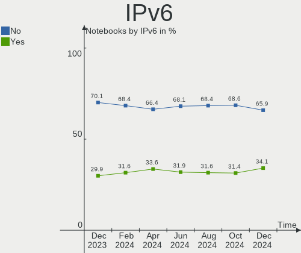
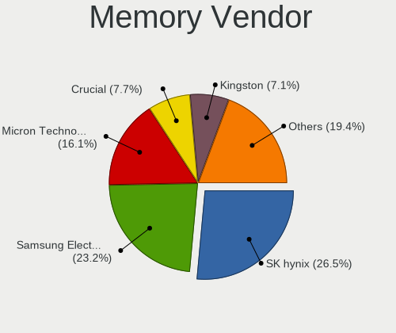

Fedora Hardware Trends (Notebooks)
----------------------------------

A project to identify most popular hardware characteristics and track their change
over time based on data collected by Fedora users at https://Linux-Hardware.org.

Anyone can contribute to this report by the [hw-probe](https://github.com/linuxhw/hw-probe) tool:

    sudo -E hw-probe -all -upload

Full-feature report is available here: https://linux-hardware.org/?view=trends

Period: Nov, 2021.

Contents
--------

* [ System ](#system)
  - [ OS                       ](#os)
  - [ OS Family                ](#os-family)
  - [ Kernel                   ](#kernel)
  - [ Kernel Family            ](#kernel-family)
  - [ Kernel Major Ver.        ](#kernel-major-ver)
  - [ Arch                     ](#arch)
  - [ DE                       ](#de)
  - [ Display Server           ](#display-server)
  - [ Display Manager          ](#display-manager)
  - [ OS Lang                  ](#os-lang)
  - [ Boot Mode                ](#boot-mode)
  - [ Filesystem               ](#filesystem)
  - [ Part. scheme             ](#part-scheme)
  - [ Dual Boot with Linux/BSD ](#dual-boot-with-linuxbsd)
  - [ Dual Boot (Win)          ](#dual-boot-win)

* [ Board ](#board)
  - [ Vendor                   ](#vendor)
  - [ Model                    ](#model)
  - [ Model Family             ](#model-family)
  - [ MFG Year                 ](#mfg-year)
  - [ Form Factor              ](#form-factor)
  - [ Secure Boot              ](#secure-boot)
  - [ Coreboot                 ](#coreboot)
  - [ RAM Size                 ](#ram-size)
  - [ RAM Used                 ](#ram-used)
  - [ Total Drives             ](#total-drives)
  - [ Has CD-ROM               ](#has-cd-rom)
  - [ Has Ethernet             ](#has-ethernet)
  - [ Has WiFi                 ](#has-wifi)
  - [ Has Bluetooth            ](#has-bluetooth)

* [ Location ](#location)
  - [ Country                  ](#country)
  - [ City                     ](#city)

* [ Drives ](#drives)
  - [ Drive Vendor             ](#drive-vendor)
  - [ Drive Model              ](#drive-model)
  - [ HDD Vendor               ](#hdd-vendor)
  - [ SSD Vendor               ](#ssd-vendor)
  - [ Drive Kind               ](#drive-kind)
  - [ Drive Connector          ](#drive-connector)
  - [ Drive Size               ](#drive-size)
  - [ Space Total              ](#space-total)
  - [ Space Used               ](#space-used)
  - [ Malfunc. Drives          ](#malfunc-drives)
  - [ Malfunc. Drive Vendor    ](#malfunc-drive-vendor)
  - [ Malfunc. HDD Vendor      ](#malfunc-hdd-vendor)
  - [ Malfunc. Drive Kind      ](#malfunc-drive-kind)
  - [ Failed Drives            ](#failed-drives)
  - [ Failed Drive Vendor      ](#failed-drive-vendor)
  - [ Drive Status             ](#drive-status)

* [ Storage controller ](#storage-controller)
  - [ Storage Vendor           ](#storage-vendor)
  - [ Storage Model            ](#storage-model)
  - [ Storage Kind             ](#storage-kind)

* [ Processor ](#processor)
  - [ CPU Vendor               ](#cpu-vendor)
  - [ CPU Model                ](#cpu-model)
  - [ CPU Model Family         ](#cpu-model-family)
  - [ CPU Cores                ](#cpu-cores)
  - [ CPU Sockets              ](#cpu-sockets)
  - [ CPU Threads              ](#cpu-threads)
  - [ CPU Op-Modes             ](#cpu-op-modes)
  - [ CPU Microcode            ](#cpu-microcode)
  - [ CPU Microarch            ](#cpu-microarch)

* [ Graphics ](#graphics)
  - [ GPU Vendor               ](#gpu-vendor)
  - [ GPU Model                ](#gpu-model)
  - [ GPU Combo                ](#gpu-combo)
  - [ GPU Driver               ](#gpu-driver)
  - [ GPU Memory               ](#gpu-memory)

* [ Monitor ](#monitor)
  - [ Monitor Vendor           ](#monitor-vendor)
  - [ Monitor Model            ](#monitor-model)
  - [ Monitor Resolution       ](#monitor-resolution)
  - [ Monitor Diagonal         ](#monitor-diagonal)
  - [ Monitor Width            ](#monitor-width)
  - [ Aspect Ratio             ](#aspect-ratio)
  - [ Monitor Area             ](#monitor-area)
  - [ Pixel Density            ](#pixel-density)
  - [ Multiple Monitors        ](#multiple-monitors)

* [ Network ](#network)
  - [ Net Controller Vendor    ](#net-controller-vendor)
  - [ Net Controller Model     ](#net-controller-model)
  - [ Wireless Vendor          ](#wireless-vendor)
  - [ Wireless Model           ](#wireless-model)
  - [ Ethernet Vendor          ](#ethernet-vendor)
  - [ Ethernet Model           ](#ethernet-model)
  - [ Net Controller Kind      ](#net-controller-kind)
  - [ Used Controller          ](#used-controller)
  - [ NICs                     ](#nics)
  - [ IPv6                     ](#ipv6)

* [ Bluetooth ](#bluetooth)
  - [ Bluetooth Vendor         ](#bluetooth-vendor)
  - [ Bluetooth Model          ](#bluetooth-model)

* [ Sound ](#sound)
  - [ Sound Vendor             ](#sound-vendor)
  - [ Sound Model              ](#sound-model)

* [ Memory ](#memory)
  - [ Memory Vendor            ](#memory-vendor)
  - [ Memory Model             ](#memory-model)
  - [ Memory Kind              ](#memory-kind)
  - [ Memory Form Factor       ](#memory-form-factor)
  - [ Memory Size              ](#memory-size)
  - [ Memory Speed             ](#memory-speed)

* [ Printers & scanners ](#printers--scanners)
  - [ Printer Vendor           ](#printer-vendor)
  - [ Printer Model            ](#printer-model)
  - [ Scanner Vendor           ](#scanner-vendor)
  - [ Scanner Model            ](#scanner-model)

* [ Camera ](#camera)
  - [ Camera Vendor            ](#camera-vendor)
  - [ Camera Model             ](#camera-model)

* [ Security ](#security)
  - [ Fingerprint Vendor       ](#fingerprint-vendor)
  - [ Fingerprint Model        ](#fingerprint-model)
  - [ Chipcard Vendor          ](#chipcard-vendor)
  - [ Chipcard Model           ](#chipcard-model)

* [ Unsupported ](#unsupported)
  - [ Unsupported Devices      ](#unsupported-devices)
  - [ Unsupported Device Types ](#unsupported-device-types)

System
------

OS
--

Installed operating systems

| Name      | Notebooks | Percent |
|-----------|-----------|---------|
| Fedora 35 | 163       | 79.13%  |
| Fedora 34 | 35        | 16.99%  |
| Fedora 36 | 3         | 1.46%   |
| Fedora 33 | 2         | 0.97%   |
| Fedora 32 | 1         | 0.49%   |
| Fedora 30 | 1         | 0.49%   |
| Fedora 21 | 1         | 0.49%   |

OS Family
---------

OS without a version

| Name   | Notebooks | Percent |
|--------|-----------|---------|
| Fedora | 206       | 100%    |

Kernel
------

Version of the Linux kernel

| Version                                             | Notebooks | Percent |
|-----------------------------------------------------|-----------|---------|
| 5.14.16-301.fc35.x86_64                             | 44        | 21.36%  |
| 5.14.18-300.fc35.x86_64                             | 33        | 16.02%  |
| 5.14.17-301.fc35.x86_64                             | 27        | 13.11%  |
| 5.14.14-300.fc35.x86_64                             | 21        | 10.19%  |
| 5.14.15-300.fc35.x86_64                             | 12        | 5.83%   |
| 5.15.4-201.fc35.x86_64                              | 11        | 5.34%   |
| 5.14.10-300.fc35.x86_64                             | 11        | 5.34%   |
| 5.14.14-200.fc34.x86_64                             | 8         | 3.88%   |
| 5.14.18-200.fc34.x86_64                             | 5         | 2.43%   |
| 5.14.16-201.fc34.x86_64                             | 4         | 1.94%   |
| 5.15.4-101.fc34.x86_64                              | 3         | 1.46%   |
| 5.14.15-200.fc34.x86_64                             | 3         | 1.46%   |
| 5.11.12-300.fc34.x86_64                             | 3         | 1.46%   |
| 5.14.13-200.fc34.x86_64                             | 2         | 0.97%   |
| 5.6.13-100.fc30.x86_64                              | 1         | 0.49%   |
| 5.15.5-200.fc35.x86_64                              | 1         | 0.49%   |
| 5.15.2-225.vanilla.1.fc35.x86_64                    | 1         | 0.49%   |
| 5.15.0-60.fc36.x86_64                               | 1         | 0.49%   |
| 5.15.0-0.rc7.20211028git1fc596a56b33.56.fc36.x86_64 | 1         | 0.49%   |
| 5.14.9-200.fc34.x86_64                              | 1         | 0.49%   |
| 5.14.17-201.fc34.x86_64                             | 1         | 0.49%   |
| 5.14.15-300.rog.fc35.x86_64                         | 1         | 0.49%   |
| 5.14.13-100.fc33.x86_64                             | 1         | 0.49%   |
| 5.14.12-200.fc34.x86_64                             | 1         | 0.49%   |
| 5.13.9-200.fc34.x86_64                              | 1         | 0.49%   |
| 5.13.8-100.fc33.x86_64                              | 1         | 0.49%   |
| 5.13.7-200.fc34.x86_64                              | 1         | 0.49%   |
| 5.13.19-200.fc35.x86_64                             | 1         | 0.49%   |
| 5.13.19-200.fc34.x86_64                             | 1         | 0.49%   |
| 5.12.7-300.fc34.x86_64                              | 1         | 0.49%   |
| 5.11.22-100.fc32.x86_64                             | 1         | 0.49%   |
| 5.11.16-300.fc34.x86_64                             | 1         | 0.49%   |
| 4.1.13-100.fc21.x86_64                              | 1         | 0.49%   |

Kernel Family
-------------

Linux kernel without a distro release

| Version | Notebooks | Percent |
|---------|-----------|---------|
| 5.14.16 | 48        | 23.3%   |
| 5.14.18 | 38        | 18.45%  |
| 5.14.14 | 29        | 14.08%  |
| 5.14.17 | 28        | 13.59%  |
| 5.14.15 | 16        | 7.77%   |
| 5.15.4  | 14        | 6.8%    |
| 5.14.10 | 11        | 5.34%   |
| 5.14.13 | 3         | 1.46%   |
| 5.11.12 | 3         | 1.46%   |
| 5.15.0  | 2         | 0.97%   |
| 5.13.19 | 2         | 0.97%   |
| 5.6.13  | 1         | 0.49%   |
| 5.15.5  | 1         | 0.49%   |
| 5.15.2  | 1         | 0.49%   |
| 5.14.9  | 1         | 0.49%   |
| 5.14.12 | 1         | 0.49%   |
| 5.13.9  | 1         | 0.49%   |
| 5.13.8  | 1         | 0.49%   |
| 5.13.7  | 1         | 0.49%   |
| 5.12.7  | 1         | 0.49%   |
| 5.11.22 | 1         | 0.49%   |
| 5.11.16 | 1         | 0.49%   |
| 4.1.13  | 1         | 0.49%   |

Kernel Major Ver.
-----------------

Linux kernel major version

| Version | Notebooks | Percent |
|---------|-----------|---------|
| 5.14    | 175       | 84.95%  |
| 5.15    | 18        | 8.74%   |
| 5.13    | 5         | 2.43%   |
| 5.11    | 5         | 2.43%   |
| 5.6     | 1         | 0.49%   |
| 5.12    | 1         | 0.49%   |
| 4.1     | 1         | 0.49%   |

Arch
----

OS architecture (x86_64, i586, etc.)

| Name   | Notebooks | Percent |
|--------|-----------|---------|
| x86_64 | 206       | 100%    |

DE
--

Desktop Environment

| Name          | Notebooks | Percent |
|---------------|-----------|---------|
| GNOME         | 153       | 74.27%  |
| KDE5          | 13        | 6.31%   |
| Unknown       | 11        | 5.34%   |
| MATE          | 7         | 3.4%    |
| X-Cinnamon    | 6         | 2.91%   |
| XFCE          | 5         | 2.43%   |
| Cinnamon      | 4         | 1.94%   |
| sway          | 2         | 0.97%   |
| LXDE          | 1         | 0.49%   |
| KDE4          | 1         | 0.49%   |
| i3            | 1         | 0.49%   |
| GNOME Classic | 1         | 0.49%   |
| fluxbox       | 1         | 0.49%   |

Display Server
--------------

X11 or Wayland

| Name    | Notebooks | Percent |
|---------|-----------|---------|
| Wayland | 130       | 63.11%  |
| X11     | 67        | 32.52%  |
| Tty     | 6         | 2.91%   |
| Unknown | 3         | 1.46%   |

Display Manager
---------------

SDDM, LightDM, etc.

| Name    | Notebooks | Percent |
|---------|-----------|---------|
| Unknown | 91        | 44.17%  |
| GDM     | 87        | 42.23%  |
| LightDM | 15        | 7.28%   |
| SDDM    | 12        | 5.83%   |
| XDM     | 1         | 0.49%   |

OS Lang
-------

Language

| Lang    | Notebooks | Percent |
|---------|-----------|---------|
| en_US   | 98        | 47.57%  |
| en_GB   | 24        | 11.65%  |
| ru_RU   | 13        | 6.31%   |
| pt_BR   | 10        | 4.85%   |
| it_IT   | 8         | 3.88%   |
| fr_FR   | 7         | 3.4%    |
| de_DE   | 6         | 2.91%   |
| pl_PL   | 5         | 2.43%   |
| en_AU   | 3         | 1.46%   |
| sv_SE   | 2         | 0.97%   |
| ru_UA   | 2         | 0.97%   |
| pt_PT   | 2         | 0.97%   |
| nl_NL   | 2         | 0.97%   |
| nb_NO   | 2         | 0.97%   |
| es_ES   | 2         | 0.97%   |
| en_NZ   | 2         | 0.97%   |
| en_IN   | 2         | 0.97%   |
| C       | 2         | 0.97%   |
| zh_CN   | 1         | 0.49%   |
| nl_BE   | 1         | 0.49%   |
| fi_FI   | 1         | 0.49%   |
| es_MX   | 1         | 0.49%   |
| es_GT   | 1         | 0.49%   |
| es_CL   | 1         | 0.49%   |
| es_AR   | 1         | 0.49%   |
| en_ZA   | 1         | 0.49%   |
| en_DK   | 1         | 0.49%   |
| en_CA   | 1         | 0.49%   |
| da_DK   | 1         | 0.49%   |
| cs_CZ   | 1         | 0.49%   |
| ca_ES   | 1         | 0.49%   |
| Unknown | 1         | 0.49%   |

Boot Mode
---------

EFI or BIOS

| Mode | Notebooks | Percent |
|------|-----------|---------|
| EFI  | 172       | 83.5%   |
| BIOS | 34        | 16.5%   |

Filesystem
----------

Type of filesystem

| Type    | Notebooks | Percent |
|---------|-----------|---------|
| Btrfs   | 151       | 73.3%   |
| Ext4    | 45        | 21.84%  |
| Xfs     | 8         | 3.88%   |
| Overlay | 1         | 0.49%   |
| Unknown | 1         | 0.49%   |

Part. scheme
------------

Scheme of partitioning

| Type    | Notebooks | Percent |
|---------|-----------|---------|
| GPT     | 103       | 50%     |
| Unknown | 91        | 44.17%  |
| MBR     | 12        | 5.83%   |

Dual Boot with Linux/BSD
------------------------

Hosting more than one Linux/BSD

| Dual boot | Notebooks | Percent |
|-----------|-----------|---------|
| No        | 188       | 91.26%  |
| Yes       | 18        | 8.74%   |

Dual Boot (Win)
---------------

Hosting Linux and Windows

| Dual boot | Notebooks | Percent |
|-----------|-----------|---------|
| No        | 170       | 82.52%  |
| Yes       | 36        | 17.48%  |

Board
-----

Vendor
------

Motherboard manufacturer

| Name                | Notebooks | Percent |
|---------------------|-----------|---------|
| Lenovo              | 64        | 31.07%  |
| Dell                | 39        | 18.93%  |
| Hewlett-Packard     | 29        | 14.08%  |
| ASUSTek Computer    | 14        | 6.8%    |
| Acer                | 14        | 6.8%    |
| Apple               | 8         | 3.88%   |
| HUAWEI              | 7         | 3.4%    |
| Notebook            | 5         | 2.43%   |
| Toshiba             | 4         | 1.94%   |
| MSI                 | 4         | 1.94%   |
| Positivo            | 3         | 1.46%   |
| System76            | 2         | 0.97%   |
| Samsung Electronics | 2         | 0.97%   |
| Standard            | 1         | 0.49%   |
| Sony                | 1         | 0.49%   |
| SiComputer          | 1         | 0.49%   |
| Razer               | 1         | 0.49%   |
| Prestigio           | 1         | 0.49%   |
| Login Informatica   | 1         | 0.49%   |
| LG Electronics      | 1         | 0.49%   |
| HONOR               | 1         | 0.49%   |
| Google              | 1         | 0.49%   |
| Fujitsu             | 1         | 0.49%   |
| Unknown             | 1         | 0.49%   |

Model
-----

Motherboard model

| Name                                                                                     | Notebooks | Percent |
|------------------------------------------------------------------------------------------|-----------|---------|
| Dell Latitude E7440                                                                      | 3         | 1.46%   |
| Lenovo IdeaPad 320-15ISK 80XH                                                            | 2         | 0.97%   |
| HP ProBook 470 G5                                                                        | 2         | 0.97%   |
| Dell XPS 13 9360                                                                         | 2         | 0.97%   |
| Dell Precision 5510                                                                      | 2         | 0.97%   |
| Dell Inspiron 7572                                                                       | 2         | 0.97%   |
| ASUS ROG Strix G513QY_G513QY                                                             | 2         | 0.97%   |
| Apple MacBookPro6,2                                                                      | 2         | 0.97%   |
| Unknown                                                                                  | 2         | 0.97%   |
| Toshiba TECRA Z50-A                                                                      | 1         | 0.49%   |
| Toshiba Satellite L305                                                                   | 1         | 0.49%   |
| Toshiba Satellite C855-12R                                                               | 1         | 0.49%   |
| Toshiba NB255                                                                            | 1         | 0.49%   |
| System76 Pangolin                                                                        | 1         | 0.49%   |
| System76 Oryx Pro                                                                        | 1         | 0.49%   |
| Sony VPCF131FM                                                                           | 1         | 0.49%   |
| SiComputer Nauta 01W PRO                                                                 | 1         | 0.49%   |
| Samsung RV411/RV511/E3511/S3511/RV711/E3411                                              | 1         | 0.49%   |
| Samsung 355V4C/355V4X/355V5C/355V5X/356V4C/356V4X/356V5C/356V5X/3445VC/3445VX/3545VC/354 | 1         | 0.49%   |
| Razer Blade 15 Advanced Model (Early 2020) - RZ09-033                                    | 1         | 0.49%   |
| Prestigio PSB141C03                                                                      | 1         | 0.49%   |
| Positivo W942SW_SW1                                                                      | 1         | 0.49%   |
| Positivo V142N_4G                                                                        | 1         | 0.49%   |
| Positivo CHT12CP                                                                         | 1         | 0.49%   |
| Notebook W65_W67RZ                                                                       | 1         | 0.49%   |
| Notebook PB50_70DFx,DDx                                                                  | 1         | 0.49%   |
| Notebook NH5x_NH7x_HHx_HJx_HKx                                                           | 1         | 0.49%   |
| Notebook NH55RGQ                                                                         | 1         | 0.49%   |
| Notebook NB50TL                                                                          | 1         | 0.49%   |
| MSI Modern 15 A11M                                                                       | 1         | 0.49%   |
| MSI GL62M 7RDX                                                                           | 1         | 0.49%   |
| MSI GF63 Thin 9SC                                                                        | 1         | 0.49%   |
| MSI Delta 15 A5EFK                                                                       | 1         | 0.49%   |
| Login Informatica LOG-QAL30                                                              | 1         | 0.49%   |
| LG 14Z90P-G.AR53A                                                                        | 1         | 0.49%   |
| Lenovo Yoga S940-14IWL 81Q7                                                              | 1         | 0.49%   |
| Lenovo ThinkPad X395 20NL0005US                                                          | 1         | 0.49%   |
| Lenovo ThinkPad X270 20HN0013UK                                                          | 1         | 0.49%   |
| Lenovo ThinkPad X260 20F5S0E000                                                          | 1         | 0.49%   |
| Lenovo ThinkPad X13 Gen 1 20UF000NMH                                                     | 1         | 0.49%   |
| Lenovo ThinkPad X1 Nano Gen 1 20UN005PRT                                                 | 1         | 0.49%   |
| Lenovo ThinkPad X1 Extreme 2nd 20QV00BTUK                                                | 1         | 0.49%   |
| Lenovo ThinkPad X1 Extreme 20MF000CUS                                                    | 1         | 0.49%   |
| Lenovo ThinkPad X1 Carbon Gen 9 20XWCTO1WW                                               | 1         | 0.49%   |
| Lenovo ThinkPad X1 Carbon Gen 9 20XW008BMX                                               | 1         | 0.49%   |
| Lenovo ThinkPad X1 Carbon Gen 8 20U9CTO1WW                                               | 1         | 0.49%   |
| Lenovo ThinkPad X1 Carbon Gen 8 20U90084MX                                               | 1         | 0.49%   |
| Lenovo ThinkPad X1 Carbon 7th 20QES0EJ00                                                 | 1         | 0.49%   |
| Lenovo ThinkPad X1 Carbon 7th 20QDCTO1WW                                                 | 1         | 0.49%   |
| Lenovo ThinkPad X1 Carbon 6th 20KH007BUK                                                 | 1         | 0.49%   |
| Lenovo ThinkPad X1 Carbon 4th 20FCS0RV18                                                 | 1         | 0.49%   |
| Lenovo ThinkPad X1 Carbon 2nd 20A8S0ET00                                                 | 1         | 0.49%   |
| Lenovo ThinkPad T490 20N2CTO1WW                                                          | 1         | 0.49%   |
| Lenovo ThinkPad T480s 20L7CTO1WW                                                         | 1         | 0.49%   |
| Lenovo ThinkPad T480s 20L70026US                                                         | 1         | 0.49%   |
| Lenovo ThinkPad T470 20HD000EMH                                                          | 1         | 0.49%   |
| Lenovo ThinkPad T460s 20F9CTO1WW                                                         | 1         | 0.49%   |
| Lenovo ThinkPad T460 20FNCTO1WW                                                          | 1         | 0.49%   |
| Lenovo ThinkPad T450 20BU000QLM                                                          | 1         | 0.49%   |
| Lenovo ThinkPad T420 4236DK9                                                             | 1         | 0.49%   |

Model Family
------------

Motherboard model prefix

| Name                        | Notebooks | Percent |
|-----------------------------|-----------|---------|
| Lenovo ThinkPad             | 44        | 21.36%  |
| Dell Latitude               | 15        | 7.28%   |
| Lenovo IdeaPad              | 10        | 4.85%   |
| Dell Inspiron               | 10        | 4.85%   |
| HP ProBook                  | 6         | 2.91%   |
| Dell XPS                    | 6         | 2.91%   |
| HP Pavilion                 | 5         | 2.43%   |
| Dell Precision              | 5         | 2.43%   |
| ASUS VivoBook               | 5         | 2.43%   |
| Acer Swift                  | 5         | 2.43%   |
| Acer Aspire                 | 5         | 2.43%   |
| HP Laptop                   | 4         | 1.94%   |
| HP EliteBook                | 4         | 1.94%   |
| Lenovo Legion               | 3         | 1.46%   |
| HP ZBook                    | 3         | 1.46%   |
| HP ENVY                     | 3         | 1.46%   |
| Toshiba Satellite           | 2         | 0.97%   |
| Lenovo ThinkBook            | 2         | 0.97%   |
| ASUS ZenBook                | 2         | 0.97%   |
| ASUS ROG                    | 2         | 0.97%   |
| Apple MacBookPro6           | 2         | 0.97%   |
| Acer Nitro                  | 2         | 0.97%   |
| Unknown                     | 2         | 0.97%   |
| Toshiba TECRA               | 1         | 0.49%   |
| Toshiba NB255               | 1         | 0.49%   |
| System76 Pangolin           | 1         | 0.49%   |
| System76 Oryx               | 1         | 0.49%   |
| Sony VPCF131FM              | 1         | 0.49%   |
| SiComputer Nauta            | 1         | 0.49%   |
| Samsung RV411               | 1         | 0.49%   |
| Samsung 355V4C              | 1         | 0.49%   |
| Razer Blade                 | 1         | 0.49%   |
| Prestigio PSB141C03         | 1         | 0.49%   |
| Positivo W942SW             | 1         | 0.49%   |
| Positivo V142N              | 1         | 0.49%   |
| Positivo CHT12CP            | 1         | 0.49%   |
| Notebook W65                | 1         | 0.49%   |
| Notebook PB50               | 1         | 0.49%   |
| Notebook NH5x               | 1         | 0.49%   |
| Notebook NH55RGQ            | 1         | 0.49%   |
| Notebook NB50TL             | 1         | 0.49%   |
| MSI Modern                  | 1         | 0.49%   |
| MSI GL62M                   | 1         | 0.49%   |
| MSI GF63                    | 1         | 0.49%   |
| MSI Delta                   | 1         | 0.49%   |
| Login Informatica LOG-QAL30 | 1         | 0.49%   |
| LG 14Z90P-G.AR53A           | 1         | 0.49%   |
| Lenovo Yoga                 | 1         | 0.49%   |
| Lenovo IdeaPadFlex          | 1         | 0.49%   |
| Lenovo G40-45               | 1         | 0.49%   |
| Lenovo Ducati               | 1         | 0.49%   |
| Lenovo B40-70               | 1         | 0.49%   |
| HUAWEI MACHC-WAX9           | 1         | 0.49%   |
| HUAWEI KPL-W0X              | 1         | 0.49%   |
| HUAWEI KLVL-WXXW            | 1         | 0.49%   |
| HUAWEI KLVL-WXX9            | 1         | 0.49%   |
| HUAWEI HLYL-WXX9            | 1         | 0.49%   |
| HUAWEI BOHK-WAX9X           | 1         | 0.49%   |
| HUAWEI BOD-WXX9             | 1         | 0.49%   |
| HONOR NBD-WXX9              | 1         | 0.49%   |

MFG Year
--------

Motherboard manufacture year

| Year | Notebooks | Percent |
|------|-----------|---------|
| 2021 | 88        | 42.72%  |
| 2020 | 35        | 16.99%  |
| 2019 | 24        | 11.65%  |
| 2018 | 12        | 5.83%   |
| 2017 | 8         | 3.88%   |
| 2014 | 8         | 3.88%   |
| 2013 | 7         | 3.4%    |
| 2016 | 6         | 2.91%   |
| 2015 | 5         | 2.43%   |
| 2011 | 5         | 2.43%   |
| 2012 | 3         | 1.46%   |
| 2010 | 3         | 1.46%   |
| 2009 | 2         | 0.97%   |

Form Factor
-----------

Physical design of the computer

| Name     | Notebooks | Percent |
|----------|-----------|---------|
| Notebook | 206       | 100%    |

Secure Boot
-----------

Enabled or disabled

| State    | Notebooks | Percent |
|----------|-----------|---------|
| Disabled | 161       | 78.16%  |
| Enabled  | 45        | 21.84%  |

Coreboot
--------

Have coreboot on board

| Used | Notebooks | Percent |
|------|-----------|---------|
| No   | 205       | 99.51%  |
| Yes  | 1         | 0.49%   |

RAM Size
--------

Total RAM memory

| Size in GB  | Notebooks | Percent |
|-------------|-----------|---------|
| 4.01-8.0    | 64        | 31.07%  |
| 16.01-24.0  | 55        | 26.7%   |
| 8.01-16.0   | 35        | 16.99%  |
| 32.01-64.0  | 25        | 12.14%  |
| 3.01-4.0    | 19        | 9.22%   |
| 24.01-32.0  | 3         | 1.46%   |
| 1.01-2.0    | 3         | 1.46%   |
| 2.01-3.0    | 1         | 0.49%   |
| 64.01-256.0 | 1         | 0.49%   |

RAM Used
--------

Used RAM memory

| Used GB    | Notebooks | Percent |
|------------|-----------|---------|
| 3.01-4.0   | 54        | 26.21%  |
| 2.01-3.0   | 51        | 24.76%  |
| 4.01-8.0   | 50        | 24.27%  |
| 1.01-2.0   | 26        | 12.62%  |
| 8.01-16.0  | 19        | 9.22%   |
| 0.51-1.0   | 4         | 1.94%   |
| 24.01-32.0 | 1         | 0.49%   |
| 16.01-24.0 | 1         | 0.49%   |

Total Drives
------------

Number of drives on board

| Drives | Notebooks | Percent |
|--------|-----------|---------|
| 1      | 156       | 75.73%  |
| 2      | 43        | 20.87%  |
| 3      | 3         | 1.46%   |
| 6      | 1         | 0.49%   |
| 5      | 1         | 0.49%   |
| 4      | 1         | 0.49%   |
| 0      | 1         | 0.49%   |

Has CD-ROM
----------

Has CD-ROM on board

| Presented | Notebooks | Percent |
|-----------|-----------|---------|
| No        | 173       | 83.98%  |
| Yes       | 33        | 16.02%  |

Has Ethernet
------------

Has Ethernet on board

| Presented | Notebooks | Percent |
|-----------|-----------|---------|
| Yes       | 154       | 74.76%  |
| No        | 52        | 25.24%  |

Has WiFi
--------

Has WiFi module

| Presented | Notebooks | Percent |
|-----------|-----------|---------|
| Yes       | 202       | 98.06%  |
| No        | 4         | 1.94%   |

Has Bluetooth
-------------

Has Bluetooth module

| Presented | Notebooks | Percent |
|-----------|-----------|---------|
| Yes       | 175       | 84.95%  |
| No        | 31        | 15.05%  |

Location
--------

Country
-------

Geographic location (country)

| Country             | Notebooks | Percent |
|---------------------|-----------|---------|
| USA                 | 25        | 12.14%  |
| Russia              | 16        | 7.77%   |
| Italy               | 16        | 7.77%   |
| Brazil              | 15        | 7.28%   |
| UK                  | 11        | 5.34%   |
| Netherlands         | 11        | 5.34%   |
| France              | 10        | 4.85%   |
| Germany             | 9         | 4.37%   |
| Spain               | 6         | 2.91%   |
| Poland              | 6         | 2.91%   |
| India               | 5         | 2.43%   |
| Sweden              | 4         | 1.94%   |
| Norway              | 4         | 1.94%   |
| Canada              | 4         | 1.94%   |
| Portugal            | 3         | 1.46%   |
| Iran                | 3         | 1.46%   |
| Indonesia           | 3         | 1.46%   |
| Hungary             | 3         | 1.46%   |
| Finland             | 3         | 1.46%   |
| Denmark             | 3         | 1.46%   |
| China               | 3         | 1.46%   |
| Belarus             | 3         | 1.46%   |
| Australia           | 3         | 1.46%   |
| Ukraine             | 2         | 0.97%   |
| Switzerland         | 2         | 0.97%   |
| South Africa        | 2         | 0.97%   |
| New Zealand         | 2         | 0.97%   |
| Mexico              | 2         | 0.97%   |
| Greece              | 2         | 0.97%   |
| Czechia             | 2         | 0.97%   |
| Belgium             | 2         | 0.97%   |
| Austria             | 2         | 0.97%   |
| Venezuela           | 1         | 0.49%   |
| Uganda              | 1         | 0.49%   |
| Trinidad and Tobago | 1         | 0.49%   |
| Slovenia            | 1         | 0.49%   |
| Singapore           | 1         | 0.49%   |
| Romania             | 1         | 0.49%   |
| Philippines         | 1         | 0.49%   |
| Peru                | 1         | 0.49%   |
| Palestine           | 1         | 0.49%   |
| Latvia              | 1         | 0.49%   |
| Kazakhstan          | 1         | 0.49%   |
| Guatemala           | 1         | 0.49%   |
| Georgia             | 1         | 0.49%   |
| Cyprus              | 1         | 0.49%   |
| Colombia            | 1         | 0.49%   |
| Chile               | 1         | 0.49%   |
| Bulgaria            | 1         | 0.49%   |
| Armenia             | 1         | 0.49%   |
| Argentina           | 1         | 0.49%   |

City
----

Geographic location (city)

| City                | Notebooks | Percent |
|---------------------|-----------|---------|
| Moscow              | 8         | 3.88%   |
| Milan               | 4         | 1.94%   |
| Helsinki            | 3         | 1.46%   |
| East Longmeadow     | 3         | 1.46%   |
| Vienna              | 2         | 0.97%   |
| St Petersburg       | 2         | 0.97%   |
| Shenzhen            | 2         | 0.97%   |
| Rotterdam           | 2         | 0.97%   |
| Rome                | 2         | 0.97%   |
| Rio de Janeiro      | 2         | 0.97%   |
| Noyelles-sous-Lens  | 2         | 0.97%   |
| Nova Russas         | 2         | 0.97%   |
| Nijmegen            | 2         | 0.97%   |
| Minsk               | 2         | 0.97%   |
| Mangawhai           | 2         | 0.97%   |
| Madison             | 2         | 0.97%   |
| Lawrenceville       | 2         | 0.97%   |
| Isfahan             | 2         | 0.97%   |
| Bolzano             | 2         | 0.97%   |
| Berlin              | 2         | 0.97%   |
| Zurich              | 1         | 0.49%   |
| Zulte               | 1         | 0.49%   |
| Zhlobin             | 1         | 0.49%   |
| Zhengzhou           | 1         | 0.49%   |
| Yerevan             | 1         | 0.49%   |
| Winterthur          | 1         | 0.49%   |
| Weinsberg           | 1         | 0.49%   |
| Weert               | 1         | 0.49%   |
| Wattrelos           | 1         | 0.49%   |
| Watertown           | 1         | 0.49%   |
| Warsaw              | 1         | 0.49%   |
| Vriezenveen         | 1         | 0.49%   |
| Voula               | 1         | 0.49%   |
| Vicenza             | 1         | 0.49%   |
| Vedbaek             | 1         | 0.49%   |
| V?¤ster??s          | 1         | 0.49%   |
| Ufa                 | 1         | 0.49%   |
| Uberl??ndia         | 1         | 0.49%   |
| Trzciel             | 1         | 0.49%   |
| Toronto             | 1         | 0.49%   |
| Szigetszentmiklos   | 1         | 0.49%   |
| Sydney              | 1         | 0.49%   |
| Surabaya            | 1         | 0.49%   |
| Sunderland          | 1         | 0.49%   |
| Sun City Center     | 1         | 0.49%   |
| Sumar?©             | 1         | 0.49%   |
| Stara Biala         | 1         | 0.49%   |
| Solihull            | 1         | 0.49%   |
| Sofiemyr            | 1         | 0.49%   |
| Sofia               | 1         | 0.49%   |
| Singapore           | 1         | 0.49%   |
| S??o Paulo          | 1         | 0.49%   |
| Sao Jose            | 1         | 0.49%   |
| Santiago Teyahualco | 1         | 0.49%   |
| Santiago            | 1         | 0.49%   |
| San Fernando        | 1         | 0.49%   |
| Salvador            | 1         | 0.49%   |
| Salt Lake City      | 1         | 0.49%   |
| Saint-Etienne       | 1         | 0.49%   |
| Rowley Regis        | 1         | 0.49%   |

Drives
------

Drive Vendor
------------

Hard drive vendors

| Vendor              | Notebooks | Drives | Percent |
|---------------------|-----------|--------|---------|
| Samsung Electronics | 60        | 68     | 23.53%  |
| WDC                 | 29        | 29     | 11.37%  |
| Seagate             | 20        | 20     | 7.84%   |
| SK Hynix            | 19        | 21     | 7.45%   |
| Sandisk             | 18        | 18     | 7.06%   |
| Toshiba             | 17        | 17     | 6.67%   |
| Micron Technology   | 11        | 11     | 4.31%   |
| Unknown             | 9         | 10     | 3.53%   |
| Intel               | 9         | 11     | 3.53%   |
| Crucial             | 8         | 9      | 3.14%   |
| KIOXIA              | 7         | 7      | 2.75%   |
| Kingston            | 7         | 7      | 2.75%   |
| LITEON              | 5         | 5      | 1.96%   |
| HGST                | 5         | 5      | 1.96%   |
| Apple               | 4         | 4      | 1.57%   |
| Phison              | 3         | 3      | 1.18%   |
| Corsair             | 3         | 3      | 1.18%   |
| LITEONIT            | 2         | 2      | 0.78%   |
| Hewlett-Packard     | 2         | 2      | 0.78%   |
| A-DATA Technology   | 2         | 2      | 0.78%   |
| WDC WDS             | 1         | 1      | 0.39%   |
| Transcend           | 1         | 1      | 0.39%   |
| TO Exter            | 1         | 1      | 0.39%   |
| TCSUNBOW            | 1         | 1      | 0.39%   |
| SSSTC               | 1         | 1      | 0.39%   |
| Silicon Motion      | 1         | 1      | 0.39%   |
| PNY                 | 1         | 1      | 0.39%   |
| Mushkin             | 1         | 1      | 0.39%   |
| Mass                | 1         | 1      | 0.39%   |
| Lexar               | 1         | 1      | 0.39%   |
| LDLC                | 1         | 1      | 0.39%   |
| Gigabyte Technology | 1         | 1      | 0.39%   |
| Enmotus             | 1         | 1      | 0.39%   |
| AMicro              | 1         | 1      | 0.39%   |
| ADATA Technology    | 1         | 1      | 0.39%   |

Drive Model
-----------

Hard drive models

| Model                                | Notebooks | Percent |
|--------------------------------------|-----------|---------|
| Samsung NVMe SSD Drive 512GB         | 6         | 2.24%   |
| Sandisk NVMe SSD Drive 512GB         | 5         | 1.87%   |
| Samsung NVMe SSD Drive 500GB         | 5         | 1.87%   |
| Seagate ST1000LM024 HN-M101MBB 1TB   | 4         | 1.49%   |
| Seagate ST1000LM014-1EJ164 1TB       | 4         | 1.49%   |
| Samsung SSD 860 EVO 250GB            | 4         | 1.49%   |
| Samsung MZVLB512HBJQ-000L7 512GB     | 4         | 1.49%   |
| SK Hynix NVMe SSD Drive 512GB        | 3         | 1.12%   |
| Samsung NVMe SSD Drive 1024GB        | 3         | 1.12%   |
| Intel NVMe SSD Drive 512GB           | 3         | 1.12%   |
| WDC WD16 00BEVT-60ZCT 160GB          | 2         | 0.75%   |
| WDC WD10SPZX-75Z10T1 1TB             | 2         | 0.75%   |
| WDC PC SN730 SDBQNTY-512G-1001 512GB | 2         | 0.75%   |
| Unknown MMC Card  32GB               | 2         | 0.75%   |
| Unknown MMC Card  128GB              | 2         | 0.75%   |
| Toshiba MQ04ABF100 1TB               | 2         | 0.75%   |
| Toshiba MK5061GSYN 500GB             | 2         | 0.75%   |
| Toshiba KXG6AZNV256G 256GB           | 2         | 0.75%   |
| Seagate ST500LM021-1KJ152 500GB      | 2         | 0.75%   |
| Seagate ST2000LM003 HN-M201RAD 2TB   | 2         | 0.75%   |
| Seagate ST1000LM048-2E7172 1TB       | 2         | 0.75%   |
| Seagate ST1000LM035-1RK172 1TB       | 2         | 0.75%   |
| SanDisk SDSSDA240G 240GB             | 2         | 0.75%   |
| Samsung SSD 980 PRO 500GB            | 2         | 0.75%   |
| Samsung SSD 860 EVO 2TB              | 2         | 0.75%   |
| Samsung SSD 850 PRO 512GB            | 2         | 0.75%   |
| Samsung NVMe SSD Drive 256GB         | 2         | 0.75%   |
| Phison 311CD0512GB                   | 2         | 0.75%   |
| Micron NVMe SSD Drive 512GB          | 2         | 0.75%   |
| Micron MTFDHBA256TCK-1AS1AABHA 256GB | 2         | 0.75%   |
| LITEON CV3-8D128-11 SATA 128GB SSD   | 2         | 0.75%   |
| KIOXIA NVMe SSD Drive 512GB          | 2         | 0.75%   |
| Kingston NVMe SSD Drive 512GB        | 2         | 0.75%   |
| Intel SSDPEKNW010T8 1TB              | 2         | 0.75%   |
| HGST HTS721010A9E630 1TB             | 2         | 0.75%   |
| Corsair MP400 1TB                    | 2         | 0.75%   |
| WDC WDS500G2B0B-00YS70 500GB SSD     | 1         | 0.37%   |
| WDC WDS100T2G0A-00JH30 1TB SSD       | 1         | 0.37%   |
| WDC WDS 100T2B0A-00SM50 1TB SSD      | 1         | 0.37%   |
| WDC WD5000LPVX-80V0TT0 500GB         | 1         | 0.37%   |
| WDC WD5000LPCX-24C6HT0 500GB         | 1         | 0.37%   |
| WDC WD5000BPKT-00PK4T0 500GB         | 1         | 0.37%   |
| WDC WD40 EZRZ-00GXCB0 4TB            | 1         | 0.37%   |
| WDC WD3200BPVT-22JJ5T0 320GB         | 1         | 0.37%   |
| WDC WD3200BEVT-60ZCT1 320GB          | 1         | 0.37%   |
| WDC WD2500BEKT-75A25T0 250GB         | 1         | 0.37%   |
| WDC WD1600BEVT-24A23T0 160GB         | 1         | 0.37%   |
| WDC WD1600BEVT-22ZCT0 160GB          | 1         | 0.37%   |
| WDC WD10SPZX-80Z10T2 1TB             | 1         | 0.37%   |
| WDC WD10SPZX-75Z10T0 1TB             | 1         | 0.37%   |
| WDC PC SN730 SDBQNTY-256G-1001 256GB | 1         | 0.37%   |
| WDC PC SN730 SDBPNTY-512G-1101 512GB | 1         | 0.37%   |
| WDC PC SN730 NVMe 1024GB             | 1         | 0.37%   |
| WDC PC SN720 SDAQNTW-512G-1001 512GB | 1         | 0.37%   |
| WDC PC SN720 SDAQNTW-256G-1001 256GB | 1         | 0.37%   |
| WDC PC SN530 SDBPNPZ-512G-1114 512GB | 1         | 0.37%   |
| WDC PC SN530 SDBPNPZ-1T00-1014 1TB   | 1         | 0.37%   |
| WDC PC SN530 SDBPMPZ-512G-1101 512GB | 1         | 0.37%   |
| WDC PC SN530 SDBPMPZ-512G-1001 512GB | 1         | 0.37%   |
| WDC PC SN520 SDAPNUW-256G-1002 256GB | 1         | 0.37%   |

HDD Vendor
----------

Hard disk drive vendors

| Vendor              | Notebooks | Drives | Percent |
|---------------------|-----------|--------|---------|
| Seagate             | 20        | 20     | 40%     |
| WDC                 | 15        | 15     | 30%     |
| Toshiba             | 8         | 8      | 16%     |
| HGST                | 5         | 5      | 10%     |
| TO Exter            | 1         | 1      | 2%      |
| Samsung Electronics | 1         | 1      | 2%      |

SSD Vendor
----------

Solid state drive vendors

| Vendor              | Notebooks | Drives | Percent |
|---------------------|-----------|--------|---------|
| Samsung Electronics | 24        | 26     | 34.29%  |
| SanDisk             | 9         | 9      | 12.86%  |
| Crucial             | 7         | 8      | 10%     |
| LITEON              | 4         | 4      | 5.71%   |
| Kingston            | 4         | 4      | 5.71%   |
| SK Hynix            | 3         | 3      | 4.29%   |
| Apple               | 3         | 3      | 4.29%   |
| WDC                 | 2         | 2      | 2.86%   |
| Toshiba             | 2         | 2      | 2.86%   |
| Micron Technology   | 2         | 2      | 2.86%   |
| LITEONIT            | 2         | 2      | 2.86%   |
| Hewlett-Packard     | 2         | 2      | 2.86%   |
| WDC WDS             | 1         | 1      | 1.43%   |
| TCSUNBOW            | 1         | 1      | 1.43%   |
| PNY                 | 1         | 1      | 1.43%   |
| Mushkin             | 1         | 1      | 1.43%   |
| Lexar               | 1         | 1      | 1.43%   |
| Gigabyte Technology | 1         | 1      | 1.43%   |

Drive Kind
----------

HDD or SSD

| Kind    | Notebooks | Drives | Percent |
|---------|-----------|--------|---------|
| NVMe    | 118       | 132    | 48.16%  |
| SSD     | 67        | 73     | 27.35%  |
| HDD     | 47        | 50     | 19.18%  |
| MMC     | 10        | 11     | 4.08%   |
| Unknown | 3         | 3      | 1.22%   |

Drive Connector
---------------

SATA, SAS, NVMe, etc.

| Type | Notebooks | Drives | Percent |
|------|-----------|--------|---------|
| NVMe | 118       | 132    | 50.86%  |
| SATA | 93        | 113    | 40.09%  |
| SAS  | 11        | 13     | 4.74%   |
| MMC  | 10        | 11     | 4.31%   |

Drive Size
----------

Size of hard drive

| Size in TB | Notebooks | Drives | Percent |
|------------|-----------|--------|---------|
| 0.01-0.5   | 67        | 71     | 58.77%  |
| 0.51-1.0   | 40        | 44     | 35.09%  |
| 1.01-2.0   | 6         | 7      | 5.26%   |
| 3.01-4.0   | 1         | 1      | 0.88%   |

Space Total
-----------

Amount of disk space available on the file system

| Size in GB     | Notebooks | Percent |
|----------------|-----------|---------|
| 501-1000       | 43        | 20.87%  |
| 1-20           | 41        | 19.9%   |
| 251-500        | 37        | 17.96%  |
| 101-250        | 34        | 16.5%   |
| 1001-2000      | 22        | 10.68%  |
| Unknown        | 15        | 7.28%   |
| 51-100         | 8         | 3.88%   |
| 21-50          | 3         | 1.46%   |
| 2001-3000      | 2         | 0.97%   |
| More than 3000 | 1         | 0.49%   |

Space Used
----------

Amount of used disk space

| Used GB   | Notebooks | Percent |
|-----------|-----------|---------|
| 1-20      | 71        | 34.47%  |
| 21-50     | 27        | 13.11%  |
| 101-250   | 27        | 13.11%  |
| 51-100    | 26        | 12.62%  |
| 251-500   | 25        | 12.14%  |
| Unknown   | 15        | 7.28%   |
| 501-1000  | 14        | 6.8%    |
| 1001-2000 | 1         | 0.49%   |

Malfunc. Drives
---------------

Drive models with a malfunction

| Model                              | Notebooks | Drives | Percent |
|------------------------------------|-----------|--------|---------|
| Seagate ST1000LM024 HN-M101MBB 1TB | 2         | 2      | 28.57%  |
| WDC WD1600BEVT-24A23T0 160GB       | 1         | 1      | 14.29%  |
| Seagate ST1000LM014-1EJ164 1TB     | 1         | 1      | 14.29%  |
| HGST HTS545050A7E680 500GB         | 1         | 1      | 14.29%  |
| Crucial CT1050MX300SSD1 1TB        | 1         | 1      | 14.29%  |
| Crucial CT1000P1SSD8 1TB           | 1         | 1      | 14.29%  |

Malfunc. Drive Vendor
---------------------

Vendors of faulty drives

| Vendor  | Notebooks | Drives | Percent |
|---------|-----------|--------|---------|
| Seagate | 3         | 3      | 42.86%  |
| Crucial | 2         | 2      | 28.57%  |
| WDC     | 1         | 1      | 14.29%  |
| HGST    | 1         | 1      | 14.29%  |

Malfunc. HDD Vendor
-------------------

Vendors of faulty HDD drives

| Vendor  | Notebooks | Drives | Percent |
|---------|-----------|--------|---------|
| Seagate | 3         | 3      | 60%     |
| WDC     | 1         | 1      | 20%     |
| HGST    | 1         | 1      | 20%     |

Malfunc. Drive Kind
-------------------

Kinds of faulty drives

| Kind | Notebooks | Drives | Percent |
|------|-----------|--------|---------|
| HDD  | 5         | 5      | 71.43%  |
| NVMe | 1         | 1      | 14.29%  |
| SSD  | 1         | 1      | 14.29%  |

Failed Drives
-------------

Failed drive models

| Model                             | Notebooks | Drives | Percent |
|-----------------------------------|-----------|--------|---------|
| Samsung Electronics SSD 980 500GB | 1         | 1      | 100%    |

Failed Drive Vendor
-------------------

Failed drive vendors

| Vendor              | Notebooks | Drives | Percent |
|---------------------|-----------|--------|---------|
| Samsung Electronics | 1         | 1      | 100%    |

Drive Status
------------

Number of failed and malfunc. drives

| Status   | Notebooks | Drives | Percent |
|----------|-----------|--------|---------|
| Works    | 108       | 127    | 49.32%  |
| Detected | 103       | 134    | 47.03%  |
| Malfunc  | 7         | 7      | 3.2%    |
| Failed   | 1         | 1      | 0.46%   |

Storage controller
------------------

Storage Vendor
--------------

Storage controller vendors

| Vendor                         | Notebooks | Percent |
|--------------------------------|-----------|---------|
| Intel                          | 122       | 47.84%  |
| Samsung Electronics            | 38        | 14.9%   |
| Sandisk                        | 20        | 7.84%   |
| AMD                            | 18        | 7.06%   |
| SK Hynix                       | 16        | 6.27%   |
| Toshiba America Info Systems   | 9         | 3.53%   |
| Micron Technology              | 9         | 3.53%   |
| Phison Electronics             | 5         | 1.96%   |
| KIOXIA                         | 4         | 1.57%   |
| Kingston Technology Company    | 3         | 1.18%   |
| Silicon Motion                 | 2         | 0.78%   |
| Realtek Semiconductor          | 2         | 0.78%   |
| Solid State Storage Technology | 1         | 0.39%   |
| Nvidia                         | 1         | 0.39%   |
| Micron/Crucial Technology      | 1         | 0.39%   |
| Lite-On Technology             | 1         | 0.39%   |
| Enmotus                        | 1         | 0.39%   |
| Apple                          | 1         | 0.39%   |
| ADATA Technology               | 1         | 0.39%   |

Storage Model
-------------

Storage controller models

| Model                                                                            | Notebooks | Percent |
|----------------------------------------------------------------------------------|-----------|---------|
| Samsung NVMe SSD Controller SM981/PM981/PM983                                    | 24        | 9.13%   |
| Intel Sunrise Point-LP SATA Controller [AHCI mode]                               | 23        | 8.75%   |
| AMD FCH SATA Controller [AHCI mode]                                              | 16        | 6.08%   |
| Intel 82801 Mobile SATA Controller [RAID mode]                                   | 15        | 5.7%    |
| Intel 8 Series SATA Controller 1 [AHCI mode]                                     | 11        | 4.18%   |
| Sandisk WD Black SN750 / PC SN730 NVMe SSD                                       | 9         | 3.42%   |
| Micron Non-Volatile memory controller                                            | 9         | 3.42%   |
| Intel 7 Series Chipset Family 6-port SATA Controller [AHCI mode]                 | 9         | 3.42%   |
| Intel Volume Management Device NVMe RAID Controller                              | 8         | 3.04%   |
| Intel Cannon Lake Mobile PCH SATA AHCI Controller                                | 8         | 3.04%   |
| Toshiba America Info Systems XG6 NVMe SSD Controller                             | 6         | 2.28%   |
| SK Hynix Gold P31 SSD                                                            | 6         | 2.28%   |
| Samsung NVMe SSD Controller PM9A1/PM9A3/980PRO                                   | 6         | 2.28%   |
| Samsung NVMe SSD Controller 980                                                  | 5         | 1.9%    |
| Intel SSD 660P Series                                                            | 5         | 1.9%    |
| Intel Comet Lake SATA AHCI Controller                                            | 5         | 1.9%    |
| SK Hynix BC511                                                                   | 4         | 1.52%   |
| KIOXIA Non-Volatile memory controller                                            | 4         | 1.52%   |
| Intel HM170/QM170 Chipset SATA Controller [AHCI Mode]                            | 4         | 1.52%   |
| Intel 82801IBM/IEM (ICH9M/ICH9M-E) 4 port SATA Controller [AHCI mode]            | 4         | 1.52%   |
| Intel 8 Series/C220 Series Chipset Family 6-port SATA Controller 1 [AHCI mode]   | 4         | 1.52%   |
| SK Hynix PC401 NVMe Solid State Drive 256GB                                      | 3         | 1.14%   |
| Sandisk WD Blue SN550 NVMe SSD                                                   | 3         | 1.14%   |
| Sandisk WD Black 2018/SN750 / PC SN720 NVMe SSD                                  | 3         | 1.14%   |
| Intel Celeron/Pentium Silver Processor SATA Controller                           | 3         | 1.14%   |
| Intel 5 Series/3400 Series Chipset 4 port SATA AHCI Controller                   | 3         | 1.14%   |
| Intel 400 Series Chipset Family SATA AHCI Controller                             | 3         | 1.14%   |
| SK Hynix Non-Volatile memory controller                                          | 2         | 0.76%   |
| Sandisk Non-Volatile memory controller                                           | 2         | 0.76%   |
| Samsung NVMe SSD Controller SM951/PM951                                          | 2         | 0.76%   |
| Phison PS5013 E13 NVMe Controller                                                | 2         | 0.76%   |
| Phison E12 NVMe Controller                                                       | 2         | 0.76%   |
| Intel Wildcat Point-LP SATA Controller [AHCI Mode]                               | 2         | 0.76%   |
| Intel SSD Pro 7600p/760p/E 6100p Series                                          | 2         | 0.76%   |
| Intel Q170/Q150/B150/H170/H110/Z170/CM236 Chipset SATA Controller [AHCI Mode]    | 2         | 0.76%   |
| Intel Ice Lake-LP SATA Controller [AHCI mode]                                    | 2         | 0.76%   |
| Intel 6 Series/C200 Series Chipset Family 6 port Mobile SATA AHCI Controller     | 2         | 0.76%   |
| Toshiba America Info Systems XG4 NVMe SSD Controller                             | 1         | 0.38%   |
| Toshiba America Info Systems Toshiba America Info Non-Volatile memory controller | 1         | 0.38%   |
| Toshiba America Info Systems BG3 NVMe SSD Controller                             | 1         | 0.38%   |
| Solid State Storage Non-Volatile memory controller                               | 1         | 0.38%   |
| SK Hynix BC501 NVMe Solid State Drive                                            | 1         | 0.38%   |
| Silicon Motion SM2263EN/SM2263XT SSD Controller                                  | 1         | 0.38%   |
| Silicon Motion SM2262/SM2262EN SSD Controller                                    | 1         | 0.38%   |
| Sandisk WD PC SN810 / Black SN850 NVMe SSD                                       | 1         | 0.38%   |
| Sandisk WD Blue SN500 / PC SN520 NVMe SSD                                        | 1         | 0.38%   |
| Sandisk PC SN520 NVMe SSD                                                        | 1         | 0.38%   |
| Samsung NVMe SSD Controller SM961/PM961/SM963                                    | 1         | 0.38%   |
| Samsung Electronics SATA controller                                              | 1         | 0.38%   |
| Samsung Apple PCIe SSD                                                           | 1         | 0.38%   |
| Realtek RTS5763DL NVMe SSD Controller                                            | 1         | 0.38%   |
| Realtek Realtek Non-Volatile memory controller                                   | 1         | 0.38%   |
| Phison E16 PCIe4 NVMe Controller                                                 | 1         | 0.38%   |
| Nvidia MCP89 SATA Controller (AHCI mode)                                         | 1         | 0.38%   |
| Micron/Crucial P1 NVMe PCIe SSD                                                  | 1         | 0.38%   |
| Lite-On Lite-On Non-Volatile memory controller                                   | 1         | 0.38%   |
| Kingston Company U-SNS8154P3 NVMe SSD                                            | 1         | 0.38%   |
| Kingston Company Company Non-Volatile memory controller                          | 1         | 0.38%   |
| Kingston Company OM3PDP3 NVMe SSD                                                | 1         | 0.38%   |
| Intel Tiger Lake-LP SATA Controller [AHCI mode]                                  | 1         | 0.38%   |

Storage Kind
------------

Kind of storage controller (IDE, SATA, NVMe, SAS, ...)

| Kind | Notebooks | Percent |
|------|-----------|---------|
| NVMe | 116       | 45.31%  |
| SATA | 114       | 44.53%  |
| RAID | 25        | 9.77%   |
| IDE  | 1         | 0.39%   |

Processor
---------

CPU Vendor
----------

Processor vendors

| Vendor | Notebooks | Percent |
|--------|-----------|---------|
| Intel  | 172       | 83.5%   |
| AMD    | 34        | 16.5%   |

CPU Model
---------

Processor models

| Model                                       | Notebooks | Percent |
|---------------------------------------------|-----------|---------|
| Intel Core i7-8550U CPU @ 1.80GHz           | 10        | 4.85%   |
| Intel Core i7-10510U CPU @ 1.80GHz          | 8         | 3.88%   |
| Intel 11th Gen Core i5-1135G7 @ 2.40GHz     | 7         | 3.4%    |
| Intel Core i7-9750H CPU @ 2.60GHz           | 6         | 2.91%   |
| Intel Core i7-7500U CPU @ 2.70GHz           | 6         | 2.91%   |
| Intel 11th Gen Core i7-1165G7 @ 2.80GHz     | 6         | 2.91%   |
| Intel Core i5-8265U CPU @ 1.60GHz           | 5         | 2.43%   |
| Intel Core i5-8250U CPU @ 1.60GHz           | 5         | 2.43%   |
| Intel Core i7-6700HQ CPU @ 2.60GHz          | 4         | 1.94%   |
| Intel Core i7-4600U CPU @ 2.10GHz           | 4         | 1.94%   |
| Intel Core i7-10850H CPU @ 2.70GHz          | 4         | 1.94%   |
| Intel Core i5-6200U CPU @ 2.30GHz           | 4         | 1.94%   |
| Intel Core i5-10210U CPU @ 1.60GHz          | 4         | 1.94%   |
| AMD Ryzen 7 5700U with Radeon Graphics      | 4         | 1.94%   |
| Intel Core i7-9850H CPU @ 2.60GHz           | 3         | 1.46%   |
| Intel Core i7-8650U CPU @ 1.90GHz           | 3         | 1.46%   |
| Intel Core i7-8565U CPU @ 1.80GHz           | 3         | 1.46%   |
| Intel Core i7-3520M CPU @ 2.90GHz           | 3         | 1.46%   |
| Intel Core i7-10875H CPU @ 2.30GHz          | 3         | 1.46%   |
| Intel Core i7-10750H CPU @ 2.60GHz          | 3         | 1.46%   |
| Intel Core i5-4200U CPU @ 1.60GHz           | 3         | 1.46%   |
| Intel Atom x5-Z8350 CPU @ 1.44GHz           | 3         | 1.46%   |
| AMD Ryzen 9 5900HX with Radeon Graphics     | 3         | 1.46%   |
| AMD Ryzen 7 PRO 4750U with Radeon Graphics  | 3         | 1.46%   |
| AMD Ryzen 7 5800H with Radeon Graphics      | 3         | 1.46%   |
| Intel Core i7-8750H CPU @ 2.20GHz           | 2         | 0.97%   |
| Intel Core i7-8665U CPU @ 1.90GHz           | 2         | 0.97%   |
| Intel Core i7-7700HQ CPU @ 2.80GHz          | 2         | 0.97%   |
| Intel Core i7-6500U CPU @ 2.50GHz           | 2         | 0.97%   |
| Intel Core i7-4510U CPU @ 2.00GHz           | 2         | 0.97%   |
| Intel Core i5-7200U CPU @ 2.50GHz           | 2         | 0.97%   |
| Intel Core i5-1035G1 CPU @ 1.00GHz          | 2         | 0.97%   |
| Intel Core i3-6006U CPU @ 2.00GHz           | 2         | 0.97%   |
| AMD Ryzen 5 5500U with Radeon Graphics      | 2         | 0.97%   |
| Intel Pentium Silver N5030 CPU @ 1.10GHz    | 1         | 0.49%   |
| Intel Pentium Silver N5000 CPU @ 1.10GHz    | 1         | 0.49%   |
| Intel Pentium Dual-Core CPU T4300 @ 2.10GHz | 1         | 0.49%   |
| Intel Pentium Dual CPU T3400 @ 2.16GHz      | 1         | 0.49%   |
| Intel Pentium CPU P6100 @ 2.00GHz           | 1         | 0.49%   |
| Intel Pentium CPU N4200 @ 1.10GHz           | 1         | 0.49%   |
| Intel Pentium 3556U @ 1.70GHz               | 1         | 0.49%   |
| Intel Core i7-8850H CPU @ 2.60GHz           | 1         | 0.49%   |
| Intel Core i7-7600U CPU @ 2.80GHz           | 1         | 0.49%   |
| Intel Core i7-6600U CPU @ 2.60GHz           | 1         | 0.49%   |
| Intel Core i7-5500U CPU @ 2.40GHz           | 1         | 0.49%   |
| Intel Core i7-4770HQ CPU @ 2.20GHz          | 1         | 0.49%   |
| Intel Core i7-4712HQ CPU @ 2.30GHz          | 1         | 0.49%   |
| Intel Core i7-4710HQ CPU @ 2.50GHz          | 1         | 0.49%   |
| Intel Core i7-4702MQ CPU @ 2.20GHz          | 1         | 0.49%   |
| Intel Core i7-4650U CPU @ 1.70GHz           | 1         | 0.49%   |
| Intel Core i7-3632QM CPU @ 2.20GHz          | 1         | 0.49%   |
| Intel Core i7-3630QM CPU @ 2.40GHz          | 1         | 0.49%   |
| Intel Core i7-1065G7 CPU @ 1.30GHz          | 1         | 0.49%   |
| Intel Core i7 CPU M 620 @ 2.67GHz           | 1         | 0.49%   |
| Intel Core i5-9400H CPU @ 2.50GHz           | 1         | 0.49%   |
| Intel Core i5-9300H CPU @ 2.40GHz           | 1         | 0.49%   |
| Intel Core i5-8300H CPU @ 2.30GHz           | 1         | 0.49%   |
| Intel Core i5-7300U CPU @ 2.60GHz           | 1         | 0.49%   |
| Intel Core i5-7300HQ CPU @ 2.50GHz          | 1         | 0.49%   |
| Intel Core i5-6440HQ CPU @ 2.60GHz          | 1         | 0.49%   |

CPU Model Family
----------------

Processor model prefix

| Model                   | Notebooks | Percent |
|-------------------------|-----------|---------|
| Intel Core i7           | 83        | 40.29%  |
| Intel Core i5           | 40        | 19.42%  |
| Other                   | 20        | 9.71%   |
| Intel Core i3           | 11        | 5.34%   |
| AMD Ryzen 7             | 10        | 4.85%   |
| AMD Ryzen 5             | 7         | 3.4%    |
| Intel Atom              | 5         | 2.43%   |
| Intel Celeron           | 4         | 1.94%   |
| Intel Pentium           | 3         | 1.46%   |
| Intel Core 2 Duo        | 3         | 1.46%   |
| AMD Ryzen 9             | 3         | 1.46%   |
| AMD Ryzen 7 PRO         | 3         | 1.46%   |
| Intel Pentium Silver    | 2         | 0.97%   |
| AMD Ryzen 5 PRO         | 2         | 0.97%   |
| AMD A10                 | 2         | 0.97%   |
| Intel Pentium Dual-Core | 1         | 0.49%   |
| Intel Pentium Dual      | 1         | 0.49%   |
| AMD Ryzen 3             | 1         | 0.49%   |
| AMD PRO A10             | 1         | 0.49%   |
| AMD E1                  | 1         | 0.49%   |
| AMD Athlon II           | 1         | 0.49%   |
| AMD A8                  | 1         | 0.49%   |
| AMD A4                  | 1         | 0.49%   |

CPU Cores
---------

Number of processor cores

| Number | Notebooks | Percent |
|--------|-----------|---------|
| 4      | 92        | 44.66%  |
| 2      | 68        | 33.01%  |
| 6      | 24        | 11.65%  |
| 8      | 20        | 9.71%   |
| 1      | 2         | 0.97%   |

CPU Sockets
-----------

Number of sockets

| Number | Notebooks | Percent |
|--------|-----------|---------|
| 1      | 206       | 100%    |

CPU Threads
-----------

Threads per core (Hyper-Threading)

| Number | Notebooks | Percent |
|--------|-----------|---------|
| 2      | 175       | 84.95%  |
| 1      | 31        | 15.05%  |

CPU Op-Modes
------------

CPU Operation Modes (32-bit, 64-bit)

| Op mode        | Notebooks | Percent |
|----------------|-----------|---------|
| 32-bit, 64-bit | 206       | 100%    |

CPU Microcode
-------------

Microcode number

| Number     | Notebooks | Percent |
|------------|-----------|---------|
| 0x806ec    | 20        | 9.71%   |
| 0x806c1    | 18        | 8.74%   |
| 0x806ea    | 16        | 7.77%   |
| 0x40651    | 14        | 6.8%    |
| Unknown    | 11        | 5.34%   |
| 0x906ea    | 10        | 4.85%   |
| 0xa0652    | 9         | 4.37%   |
| 0x806e9    | 9         | 4.37%   |
| 0x406e3    | 9         | 4.37%   |
| 0x0a50000c | 8         | 3.88%   |
| 0x306a9    | 7         | 3.4%    |
| 0x906ed    | 5         | 2.43%   |
| 0x08600106 | 5         | 2.43%   |
| 0x706e5    | 4         | 1.94%   |
| 0x406c4    | 4         | 1.94%   |
| 0x306c3    | 4         | 1.94%   |
| 0x20655    | 4         | 1.94%   |
| 0x08608102 | 4         | 1.94%   |
| 0x906e9    | 3         | 1.46%   |
| 0x506e3    | 3         | 1.46%   |
| 0x206a7    | 3         | 1.46%   |
| 0x1067a    | 3         | 1.46%   |
| 0x08608103 | 3         | 1.46%   |
| 0x06001119 | 3         | 1.46%   |
| 0x706a8    | 2         | 0.97%   |
| 0x406c3    | 2         | 0.97%   |
| 0x306d4    | 2         | 0.97%   |
| 0x906eb    | 1         | 0.49%   |
| 0x806eb    | 1         | 0.49%   |
| 0x806d1    | 1         | 0.49%   |
| 0x706a1    | 1         | 0.49%   |
| 0x6fd      | 1         | 0.49%   |
| 0x506c9    | 1         | 0.49%   |
| 0x40661    | 1         | 0.49%   |
| 0x20652    | 1         | 0.49%   |
| 0x106ca    | 1         | 0.49%   |
| 0x10676    | 1         | 0.49%   |
| 0x08600104 | 1         | 0.49%   |
| 0x08600102 | 1         | 0.49%   |
| 0x08200103 | 1         | 0.49%   |
| 0x08108109 | 1         | 0.49%   |
| 0x08108102 | 1         | 0.49%   |
| 0x08101016 | 1         | 0.49%   |
| 0x08101007 | 1         | 0.49%   |
| 0x07030105 | 1         | 0.49%   |
| 0x0600611a | 1         | 0.49%   |
| 0x0600110f | 1         | 0.49%   |
| 0x010000c8 | 1         | 0.49%   |

CPU Microarch
-------------

Microarchitecture

| Name          | Notebooks | Percent |
|---------------|-----------|---------|
| KabyLake      | 70        | 33.98%  |
| Haswell       | 19        | 9.22%   |
| TigerLake     | 18        | 8.74%   |
| Skylake       | 15        | 7.28%   |
| CometLake     | 11        | 5.34%   |
| Zen 3         | 8         | 3.88%   |
| Zen 2         | 7         | 3.4%    |
| IvyBridge     | 7         | 3.4%    |
| Unknown       | 7         | 3.4%    |
| Silvermont    | 6         | 2.91%   |
| Westmere      | 5         | 2.43%   |
| IceLake       | 5         | 2.43%   |
| SandyBridge   | 4         | 1.94%   |
| Piledriver    | 4         | 1.94%   |
| Penryn        | 4         | 1.94%   |
| Zen           | 3         | 1.46%   |
| Goldmont plus | 3         | 1.46%   |
| Zen+          | 2         | 0.97%   |
| Broadwell     | 2         | 0.97%   |
| Puma          | 1         | 0.49%   |
| K10           | 1         | 0.49%   |
| Goldmont      | 1         | 0.49%   |
| Excavator     | 1         | 0.49%   |
| Core          | 1         | 0.49%   |
| Bonnell       | 1         | 0.49%   |

Graphics
--------

GPU Vendor
----------

Vendors of graphics cards

| Vendor | Notebooks | Percent |
|--------|-----------|---------|
| Intel  | 163       | 60.82%  |
| Nvidia | 68        | 25.37%  |
| AMD    | 37        | 13.81%  |

GPU Model
---------

Graphics card models

| Model                                                                                    | Notebooks | Percent |
|------------------------------------------------------------------------------------------|-----------|---------|
| Intel UHD Graphics 620                                                                   | 18        | 6.55%   |
| Intel TigerLake-LP GT2 [Iris Xe Graphics]                                                | 15        | 5.45%   |
| Intel Haswell-ULT Integrated Graphics Controller                                         | 14        | 5.09%   |
| Intel CometLake-U GT2 [UHD Graphics]                                                     | 13        | 4.73%   |
| Intel CoffeeLake-H GT2 [UHD Graphics 630]                                                | 13        | 4.73%   |
| Intel WhiskeyLake-U GT2 [UHD Graphics 620]                                               | 10        | 3.64%   |
| Intel HD Graphics 620                                                                    | 10        | 3.64%   |
| Intel CometLake-H GT2 [UHD Graphics]                                                     | 10        | 3.64%   |
| Intel Skylake GT2 [HD Graphics 520]                                                      | 8         | 2.91%   |
| Intel 3rd Gen Core processor Graphics Controller                                         | 7         | 2.55%   |
| AMD Renoir                                                                               | 7         | 2.55%   |
| AMD Lucienne                                                                             | 7         | 2.55%   |
| Intel Atom/Celeron/Pentium Processor x5-E8000/J3xxx/N3xxx Integrated Graphics Controller | 6         | 2.18%   |
| AMD Cezanne                                                                              | 6         | 2.18%   |
| Nvidia TU116M [GeForce GTX 1660 Ti Mobile]                                               | 4         | 1.45%   |
| Nvidia GP108M [GeForce MX250]                                                            | 4         | 1.45%   |
| Intel HD Graphics 530                                                                    | 4         | 1.45%   |
| Intel 4th Gen Core Processor Integrated Graphics Controller                              | 4         | 1.45%   |
| Nvidia TU117M [GeForce GTX 1650 Mobile / Max-Q]                                          | 3         | 1.09%   |
| Nvidia GP108M [GeForce MX150]                                                            | 3         | 1.09%   |
| Nvidia GP107M [GeForce GTX 1050 Ti Mobile]                                               | 3         | 1.09%   |
| Nvidia GP107M [GeForce GTX 1050 Mobile]                                                  | 3         | 1.09%   |
| Nvidia GM108M [GeForce 840M]                                                             | 3         | 1.09%   |
| Intel Mobile 4 Series Chipset Integrated Graphics Controller                             | 3         | 1.09%   |
| Intel Iris Plus Graphics G1 (Ice Lake)                                                   | 3         | 1.09%   |
| Intel HD Graphics 630                                                                    | 3         | 1.09%   |
| Intel Core Processor Integrated Graphics Controller                                      | 3         | 1.09%   |
| Intel 2nd Generation Core Processor Family Integrated Graphics Controller                | 3         | 1.09%   |
| AMD Topaz XT [Radeon R7 M260/M265 / M340/M360 / M440/M445 / 530/535 / 620/625 Mobile]    | 3         | 1.09%   |
| AMD Picasso/Raven 2 [Radeon Vega Series / Radeon Vega Mobile Series]                     | 3         | 1.09%   |
| AMD Navi 22 [Radeon RX 6700/6700 XT / 6800M]                                             | 3         | 1.09%   |
| Nvidia TU117M [GeForce GTX 1650 Ti Mobile]                                               | 2         | 0.73%   |
| Nvidia TU117GLM [Quadro T2000 Mobile / Max-Q]                                            | 2         | 0.73%   |
| Nvidia TU117GLM [Quadro T1000 Mobile]                                                    | 2         | 0.73%   |
| Nvidia TU104M [GeForce RTX 2070 SUPER Mobile / Max-Q]                                    | 2         | 0.73%   |
| Nvidia GT216M [GeForce GT 330M]                                                          | 2         | 0.73%   |
| Nvidia GM108M [GeForce MX110]                                                            | 2         | 0.73%   |
| Nvidia GM108M [GeForce 940MX]                                                            | 2         | 0.73%   |
| Nvidia GM108M [GeForce 930MX]                                                            | 2         | 0.73%   |
| Nvidia GM107GLM [Quadro M1000M]                                                          | 2         | 0.73%   |
| Nvidia GA107M [GeForce RTX 3050 Ti Mobile]                                               | 2         | 0.73%   |
| Nvidia GA106M [GeForce RTX 3060 Mobile / Max-Q]                                          | 2         | 0.73%   |
| Intel Tiger Lake UHD Graphics                                                            | 2         | 0.73%   |
| Intel HD Graphics 5500                                                                   | 2         | 0.73%   |
| Intel HD Graphics 520                                                                    | 2         | 0.73%   |
| Intel GeminiLake [UHD Graphics 605]                                                      | 2         | 0.73%   |
| AMD Raven Ridge [Radeon Vega Series / Radeon Vega Mobile Series]                         | 2         | 0.73%   |
| Nvidia TU117M [GeForce MX450]                                                            | 1         | 0.36%   |
| Nvidia TU104M [GeForce RTX 2080 SUPER Mobile / Max-Q]                                    | 1         | 0.36%   |
| Nvidia MCP89 [GeForce 320M]                                                              | 1         | 0.36%   |
| Nvidia GT218M [NVS 3100M]                                                                | 1         | 0.36%   |
| Nvidia GT218M [GeForce 310M]                                                             | 1         | 0.36%   |
| Nvidia GP108M [GeForce MX330]                                                            | 1         | 0.36%   |
| Nvidia GP108M [GeForce MX230]                                                            | 1         | 0.36%   |
| Nvidia GP108GLM [Quadro P520]                                                            | 1         | 0.36%   |
| Nvidia GP108BM [GeForce MX250]                                                           | 1         | 0.36%   |
| Nvidia GP107M [GeForce MX350]                                                            | 1         | 0.36%   |
| Nvidia GP107GLM [Quadro P620]                                                            | 1         | 0.36%   |
| Nvidia GP106BM [GeForce GTX 1060 Mobile 6GB]                                             | 1         | 0.36%   |
| Nvidia GP104M [GeForce GTX 1070 Mobile]                                                  | 1         | 0.36%   |

GPU Combo
---------

Combinations of graphics cards

| Name           | Notebooks | Percent |
|----------------|-----------|---------|
| 1 x Intel      | 103       | 50%     |
| Intel + Nvidia | 57        | 27.67%  |
| 1 x AMD        | 25        | 12.14%  |
| 1 x Nvidia     | 9         | 4.37%   |
| 2 x AMD        | 7         | 3.4%    |
| Intel + AMD    | 3         | 1.46%   |
| AMD + Nvidia   | 2         | 0.97%   |

GPU Driver
----------

Free vs proprietary

| Driver      | Notebooks | Percent |
|-------------|-----------|---------|
| Free        | 175       | 84.95%  |
| Proprietary | 31        | 15.05%  |

GPU Memory
----------

Total video memory

| Size in GB | Notebooks | Percent |
|------------|-----------|---------|
| Unknown    | 141       | 68.45%  |
| 0.01-0.5   | 20        | 9.71%   |
| 1.01-2.0   | 17        | 8.25%   |
| 3.01-4.0   | 11        | 5.34%   |
| 0.51-1.0   | 10        | 4.85%   |
| 5.01-6.0   | 3         | 1.46%   |
| 8.01-16.0  | 3         | 1.46%   |
| 7.01-8.0   | 1         | 0.49%   |

Monitor
-------

Monitor Vendor
--------------

Monitor vendors

| Vendor               | Notebooks | Percent |
|----------------------|-----------|---------|
| AU Optronics         | 53        | 20.46%  |
| BOE                  | 47        | 18.15%  |
| Chimei Innolux       | 32        | 12.36%  |
| LG Display           | 29        | 11.2%   |
| Samsung Electronics  | 14        | 5.41%   |
| Dell                 | 13        | 5.02%   |
| Sharp                | 10        | 3.86%   |
| Apple                | 8         | 3.09%   |
| Lenovo               | 6         | 2.32%   |
| InfoVision           | 5         | 1.93%   |
| Hewlett-Packard      | 5         | 1.93%   |
| CSO                  | 5         | 1.93%   |
| Philips              | 4         | 1.54%   |
| PANDA                | 3         | 1.16%   |
| Goldstar             | 3         | 1.16%   |
| ASUSTek Computer     | 3         | 1.16%   |
| AOC                  | 3         | 1.16%   |
| Iiyama               | 2         | 0.77%   |
| Ancor Communications | 2         | 0.77%   |
| Acer                 | 2         | 0.77%   |
| VOR                  | 1         | 0.39%   |
| ViewSonic            | 1         | 0.39%   |
| Toshiba              | 1         | 0.39%   |
| TMX                  | 1         | 0.39%   |
| TIANMA XM            | 1         | 0.39%   |
| Sony                 | 1         | 0.39%   |
| Panasonic            | 1         | 0.39%   |
| LG Philips           | 1         | 0.39%   |
| eMachines            | 1         | 0.39%   |
| BenQ                 | 1         | 0.39%   |

Monitor Model
-------------

Monitor models

| Model                                                                 | Notebooks | Percent |
|-----------------------------------------------------------------------|-----------|---------|
| Chimei Innolux LCD Monitor CMN15E8 1920x1080 344x193mm 15.5-inch      | 4         | 1.51%   |
| BOE LCD Monitor BOE0853 1920x1080 344x194mm 15.5-inch                 | 4         | 1.51%   |
| BOE LCD Monitor BOE08D7 1920x1080 309x174mm 14.0-inch                 | 3         | 1.13%   |
| BOE LCD Monitor BOE07DB 1920x1080 309x174mm 14.0-inch                 | 3         | 1.13%   |
| Sharp LCD Monitor SHP1453 1920x1080 346x194mm 15.6-inch               | 2         | 0.75%   |
| Samsung Electronics LCD Monitor SEC5441 1366x768 344x194mm 15.5-inch  | 2         | 0.75%   |
| Samsung Electronics C24F390 SAM0D2C 1920x1080 520x290mm 23.4-inch     | 2         | 0.75%   |
| Lenovo LCD Monitor LEN40BA 1920x1080 344x194mm 15.5-inch              | 2         | 0.75%   |
| InfoVision LCD Monitor IVO057C 1366x768 310x170mm 13.9-inch           | 2         | 0.75%   |
| Dell U2515H DELD070 2560x1440 553x311mm 25.0-inch                     | 2         | 0.75%   |
| Chimei Innolux LCD Monitor CMN15F5 1920x1080 344x193mm 15.5-inch      | 2         | 0.75%   |
| Chimei Innolux LCD Monitor CMN14D6 1366x768 309x173mm 13.9-inch       | 2         | 0.75%   |
| Chimei Innolux LCD Monitor CMN14D5 1920x1080 309x173mm 13.9-inch      | 2         | 0.75%   |
| Chimei Innolux LCD Monitor CMN14C9 1920x1080 309x173mm 13.9-inch      | 2         | 0.75%   |
| BOE LCD Monitor BOE0893 2160x1440 296x197mm 14.0-inch                 | 2         | 0.75%   |
| BOE LCD Monitor BOE0729 1920x1080 344x193mm 15.5-inch                 | 2         | 0.75%   |
| BOE LCD Monitor BOE06B4 1920x1080 344x194mm 15.5-inch                 | 2         | 0.75%   |
| AU Optronics LCD Monitor AUOD291 1920x1200 301x188mm 14.0-inch        | 2         | 0.75%   |
| AU Optronics LCD Monitor AUO5A2D 1920x1080 293x165mm 13.2-inch        | 2         | 0.75%   |
| AU Optronics LCD Monitor AUO573D 1920x1080 309x174mm 14.0-inch        | 2         | 0.75%   |
| AU Optronics LCD Monitor AUO21ED 1920x1080 344x194mm 15.5-inch        | 2         | 0.75%   |
| AU Optronics LCD Monitor AUO21EC 1366x768 340x190mm 15.3-inch         | 2         | 0.75%   |
| AU Optronics LCD Monitor AUO2036 2560x1440 309x174mm 14.0-inch        | 2         | 0.75%   |
| AU Optronics LCD Monitor AUO113D 1920x1080 309x173mm 13.9-inch        | 2         | 0.75%   |
| AU Optronics LCD Monitor AUO109D 1920x1080 381x214mm 17.2-inch        | 2         | 0.75%   |
| Apple LCD Monitor APP9CA3 1440x900 330x210mm 15.4-inch                | 2         | 0.75%   |
| VOR LED19204 VOR1950 1600x900 368x207mm 16.6-inch                     | 1         | 0.38%   |
| ViewSonic VA2431 Series VSCD824 1920x1080 521x293mm 23.5-inch         | 1         | 0.38%   |
| Toshiba TV TSB010B 1920x1080 1600x900mm 72.3-inch                     | 1         | 0.38%   |
| TMX TL156MDMP01-0 TMX1560 3200x2000 336x210mm 15.6-inch               | 1         | 0.38%   |
| TIANMA XM LCD Monitor TLX1388 3000x2000 293x196mm 13.9-inch           | 1         | 0.38%   |
| Sony Nvidia Defaul t Flat Panel SNY06FA 1600x900 360x200mm 16.2-inch  | 1         | 0.38%   |
| Sharp LQ156M1JW03 SHP155D 1920x1080 344x194mm 15.5-inch               | 1         | 0.38%   |
| Sharp LCD Monitor SHP14D1 1920x1200 336x210mm 15.6-inch               | 1         | 0.38%   |
| Sharp LCD Monitor SHP14CC 3840x2400 288x180mm 13.4-inch               | 1         | 0.38%   |
| Sharp LCD Monitor SHP149A 1920x1080 344x194mm 15.5-inch               | 1         | 0.38%   |
| Sharp LCD Monitor SHP148B 3840x2160 294x165mm 13.3-inch               | 1         | 0.38%   |
| Sharp LCD Monitor SHP144A 3200x1800 294x165mm 13.3-inch               | 1         | 0.38%   |
| Sharp LCD Monitor SHP1449 1920x1080 294x165mm 13.3-inch               | 1         | 0.38%   |
| Sharp LCD Monitor SHP1431 3840x2160 350x190mm 15.7-inch               | 1         | 0.38%   |
| Samsung Electronics S22F350 SAM0D1A 1920x1080 480x270mm 21.7-inch     | 1         | 0.38%   |
| Samsung Electronics S19D300 SAM0B36 1366x768 410x230mm 18.5-inch      | 1         | 0.38%   |
| Samsung Electronics LCD Monitor SEC4542 1280x800 303x190mm 14.1-inch  | 1         | 0.38%   |
| Samsung Electronics LCD Monitor SEC3046 1366x768 340x190mm 15.3-inch  | 1         | 0.38%   |
| Samsung Electronics LCD Monitor SDC4255 1366x768 293x164mm 13.2-inch  | 1         | 0.38%   |
| Samsung Electronics LCD Monitor SAM7103 3840x2160 700x390mm 31.5-inch | 1         | 0.38%   |
| Samsung Electronics LCD Monitor SAM0B32 1920x1080 890x500mm 40.2-inch | 1         | 0.38%   |
| Samsung Electronics Color LCD SDCA029 2160x1440 252x168mm 11.9-inch   | 1         | 0.38%   |
| Samsung Electronics C32HG7x SAM0E13 2560x1440 697x392mm 31.5-inch     | 1         | 0.38%   |
| Samsung Electronics C27JG5x SAM0F57 2560x1440 600x340mm 27.2-inch     | 1         | 0.38%   |
| Philips PHL 276E8V PHLC18F 3840x2160 597x336mm 27.0-inch              | 1         | 0.38%   |
| Philips PHL 273V7 PHLC156 1920x1080 598x336mm 27.0-inch               | 1         | 0.38%   |
| Philips PHL 243V5 PHLC0D1 1920x1080 521x293mm 23.5-inch               | 1         | 0.38%   |
| Philips PHL 243S7 PHL090F 1920x1080 527x296mm 23.8-inch               | 1         | 0.38%   |
| PANDA LM133LF5L01 NCP0020 1920x1080 294x165mm 13.3-inch               | 1         | 0.38%   |
| PANDA LCD Monitor NCP004D 1920x1080 344x194mm 15.5-inch               | 1         | 0.38%   |
| PANDA LCD Monitor NCP004B 1920x1080 344x194mm 15.5-inch               | 1         | 0.38%   |
| Panasonic VVX13F009G00 MEI96A2 1920x1080 290x170mm 13.2-inch          | 1         | 0.38%   |
| LG Philips LP154WX4-TLC8 LPL0120 1280x800 331x207mm 15.4-inch         | 1         | 0.38%   |
| LG Display LCD Monitor LGD06B8 1920x1080 344x194mm 15.5-inch          | 1         | 0.38%   |

Monitor Resolution
------------------

Monitor screen resolution

| Resolution         | Notebooks | Percent |
|--------------------|-----------|---------|
| 1920x1080 (FHD)    | 126       | 52.72%  |
| 1366x768 (WXGA)    | 41        | 17.15%  |
| 2560x1440 (QHD)    | 18        | 7.53%   |
| 3840x2160 (4K)     | 15        | 6.28%   |
| 1920x1200 (WUXGA)  | 7         | 2.93%   |
| 1600x900 (HD+)     | 7         | 2.93%   |
| 2560x1600          | 4         | 1.67%   |
| 1440x900 (WXGA+)   | 4         | 1.67%   |
| 1280x800 (WXGA)    | 3         | 1.26%   |
| 3440x1440          | 2         | 0.84%   |
| 2160x1440          | 2         | 0.84%   |
| 3840x2400          | 1         | 0.42%   |
| 3200x2000          | 1         | 0.42%   |
| 3200x1800 (QHD+)   | 1         | 0.42%   |
| 3072x1920          | 1         | 0.42%   |
| 3000x2000          | 1         | 0.42%   |
| 2880x1800          | 1         | 0.42%   |
| 2160x1350          | 1         | 0.42%   |
| 1920x515           | 1         | 0.42%   |
| 1680x1050 (WSXGA+) | 1         | 0.42%   |
| 1024x600           | 1         | 0.42%   |

Monitor Diagonal
----------------

Diagonal size in inches

| Inches  | Notebooks | Percent |
|---------|-----------|---------|
| 15      | 88        | 34.11%  |
| 13      | 46        | 17.83%  |
| 14      | 44        | 17.05%  |
| 17      | 13        | 5.04%   |
| 27      | 12        | 4.65%   |
| 24      | 9         | 3.49%   |
| 23      | 8         | 3.1%    |
| 21      | 6         | 2.33%   |
| 16      | 6         | 2.33%   |
| 12      | 4         | 1.55%   |
| 11      | 4         | 1.55%   |
| 25      | 3         | 1.16%   |
| 34      | 2         | 0.78%   |
| 31      | 2         | 0.78%   |
| 19      | 2         | 0.78%   |
| 18      | 2         | 0.78%   |
| 72      | 1         | 0.39%   |
| 43      | 1         | 0.39%   |
| 40      | 1         | 0.39%   |
| 22      | 1         | 0.39%   |
| 20      | 1         | 0.39%   |
| 10      | 1         | 0.39%   |
| Unknown | 1         | 0.39%   |

Monitor Width
-------------

Physical width

| Width in mm | Notebooks | Percent |
|-------------|-----------|---------|
| 301-350     | 159       | 62.11%  |
| 501-600     | 31        | 12.11%  |
| 201-300     | 29        | 11.33%  |
| 351-400     | 17        | 6.64%   |
| 401-500     | 12        | 4.69%   |
| 701-800     | 2         | 0.78%   |
| 601-700     | 2         | 0.78%   |
| 801-900     | 1         | 0.39%   |
| 1501-2000   | 1         | 0.39%   |
| 901-1000    | 1         | 0.39%   |
| Unknown     | 1         | 0.39%   |

Aspect Ratio
------------

Proportional relationship between the width and the height

| Ratio | Notebooks | Percent |
|-------|-----------|---------|
| 16/9  | 184       | 85.58%  |
| 16/10 | 25        | 11.63%  |
| 3/2   | 3         | 1.4%    |
| 21/9  | 2         | 0.93%   |
| 3.73  | 1         | 0.47%   |

Monitor Area
------------

Area in inch²

| Area in inch² | Notebooks | Percent |
|----------------|-----------|---------|
| 101-110        | 89        | 34.5%   |
| 81-90          | 74        | 28.68%  |
| 201-250        | 21        | 8.14%   |
| 71-80          | 16        | 6.2%    |
| 121-130        | 13        | 5.04%   |
| 301-350        | 12        | 4.65%   |
| 251-300        | 5         | 1.94%   |
| 111-120        | 5         | 1.94%   |
| 61-70          | 4         | 1.55%   |
| 51-60          | 4         | 1.55%   |
| 351-500        | 4         | 1.55%   |
| 151-200        | 4         | 1.55%   |
| 141-150        | 2         | 0.78%   |
| 501-1000       | 2         | 0.78%   |
| More than 1000 | 1         | 0.39%   |
| 41-50          | 1         | 0.39%   |
| Unknown        | 1         | 0.39%   |

Pixel Density
-------------

Pixels per inch

| Density       | Notebooks | Percent |
|---------------|-----------|---------|
| 121-160       | 122       | 49.39%  |
| 101-120       | 51        | 20.65%  |
| 161-240       | 31        | 12.55%  |
| 51-100        | 27        | 10.93%  |
| More than 240 | 13        | 5.26%   |
| 1-50          | 2         | 0.81%   |
| Unknown       | 1         | 0.4%    |

Multiple Monitors
-----------------

Total monitors connected

| Total | Notebooks | Percent |
|-------|-----------|---------|
| 1     | 156       | 75.73%  |
| 2     | 40        | 19.42%  |
| 3     | 9         | 4.37%   |
| 4     | 1         | 0.49%   |

Network
-------

Net Controller Vendor
---------------------

Controller vendors

| Vendor                          | Notebooks | Percent |
|---------------------------------|-----------|---------|
| Intel                           | 134       | 43.37%  |
| Realtek Semiconductor           | 98        | 31.72%  |
| Qualcomm Atheros                | 34        | 11%     |
| Broadcom                        | 10        | 3.24%   |
| Lenovo                          | 6         | 1.94%   |
| MEDIATEK                        | 5         | 1.62%   |
| Ralink                          | 4         | 1.29%   |
| DisplayLink                     | 3         | 0.97%   |
| Dell                            | 3         | 0.97%   |
| Sierra Wireless                 | 2         | 0.65%   |
| Ralink Technology               | 2         | 0.65%   |
| NetGear                         | 2         | 0.65%   |
| TP-Link                         | 1         | 0.32%   |
| Qualcomm Atheros Communications | 1         | 0.32%   |
| Marvell Technology Group        | 1         | 0.32%   |
| Huawei Technologies             | 1         | 0.32%   |
| Broadcom Limited                | 1         | 0.32%   |
| ASIX Electronics                | 1         | 0.32%   |

Net Controller Model
--------------------

Controller models

| Model                                                             | Notebooks | Percent |
|-------------------------------------------------------------------|-----------|---------|
| Realtek RTL8111/8168/8411 PCI Express Gigabit Ethernet Controller | 60        | 15.71%  |
| Intel Wi-Fi 6 AX200                                               | 20        | 5.24%   |
| Intel Wireless 8265 / 8275                                        | 16        | 4.19%   |
| Realtek RTL810xE PCI Express Fast Ethernet controller             | 14        | 3.66%   |
| Qualcomm Atheros QCA6174 802.11ac Wireless Network Adapter        | 13        | 3.4%    |
| Intel Wi-Fi 6 AX201                                               | 13        | 3.4%    |
| Intel Comet Lake PCH-LP CNVi WiFi                                 | 12        | 3.14%   |
| Realtek RTL8153 Gigabit Ethernet Adapter                          | 11        | 2.88%   |
| Intel Comet Lake PCH CNVi WiFi                                    | 11        | 2.88%   |
| Intel Wireless 7260                                               | 10        | 2.62%   |
| Intel Wireless 8260                                               | 9         | 2.36%   |
| Realtek RTL8822CE 802.11ac PCIe Wireless Network Adapter          | 7         | 1.83%   |
| Qualcomm Atheros QCA9565 / AR9565 Wireless Network Adapter        | 7         | 1.83%   |
| Intel Cannon Point-LP CNVi [Wireless-AC]                          | 7         | 1.83%   |
| Intel Ethernet Connection I218-LM                                 | 6         | 1.57%   |
| Intel Ethernet Connection (4) I219-V                              | 6         | 1.57%   |
| Intel Ethernet Connection (4) I219-LM                             | 6         | 1.57%   |
| Qualcomm Atheros AR9485 Wireless Network Adapter                  | 5         | 1.31%   |
| Intel Ethernet Connection (7) I219-LM                             | 5         | 1.31%   |
| Realtek RTL8852AE 802.11ax PCIe Wireless Network Adapter          | 4         | 1.05%   |
| Realtek RTL8821CE 802.11ac PCIe Wireless Network Adapter          | 4         | 1.05%   |
| Qualcomm Atheros QCA9377 802.11ac Wireless Network Adapter        | 4         | 1.05%   |
| MEDIATEK Network controller                                       | 4         | 1.05%   |
| Lenovo ThinkPad TBT 3 Dock                                        | 4         | 1.05%   |
| Intel Wireless-AC 9260                                            | 4         | 1.05%   |
| Intel Wireless 7265                                               | 4         | 1.05%   |
| Intel Ethernet Connection I219-V                                  | 4         | 1.05%   |
| Intel Ethernet Connection (10) I219-V                             | 4         | 1.05%   |
| Intel Cannon Lake PCH CNVi WiFi                                   | 4         | 1.05%   |
| Realtek RTL8723BE PCIe Wireless Network Adapter                   | 3         | 0.79%   |
| Realtek RTL8152 Fast Ethernet Adapter                             | 3         | 0.79%   |
| Ralink RT3290 Wireless 802.11n 1T/1R PCIe                         | 3         | 0.79%   |
| Intel Wireless 3165                                               | 3         | 0.79%   |
| Intel Wi-Fi 6 AX210/AX211/AX411 160MHz                            | 3         | 0.79%   |
| Intel Ice Lake-LP PCH CNVi WiFi                                   | 3         | 0.79%   |
| Intel Ethernet Connection I219-LM                                 | 3         | 0.79%   |
| Intel Dual Band Wireless-AC 3168NGW [Stone Peak]                  | 3         | 0.79%   |
| Intel 82579LM Gigabit Network Connection (Lewisville)             | 3         | 0.79%   |
| Broadcom NetXtreme BCM5764M Gigabit Ethernet PCIe                 | 3         | 0.79%   |
| Qualcomm Atheros AR9285 Wireless Network Adapter (PCI-Express)    | 2         | 0.52%   |
| Intel Ethernet Connection (6) I219-LM                             | 2         | 0.52%   |
| Intel Dual Band Wireless-AC 3165 Plus Bluetooth                   | 2         | 0.52%   |
| DisplayLink Dell Universal Dock D6000                             | 2         | 0.52%   |
| Dell DW5811e Snapdragon???„?? X7 LTE                              | 2         | 0.52%   |
| Broadcom NetXtreme BCM57786 Gigabit Ethernet PCIe                 | 2         | 0.52%   |
| Broadcom BCM4331 802.11a/b/g/n                                    | 2         | 0.52%   |
| Broadcom BCM43224 802.11a/b/g/n                                   | 2         | 0.52%   |
| TP-Link USB 10/100 LAN                                            | 1         | 0.26%   |
| Sierra Wireless EM7345 4G LTE                                     | 1         | 0.26%   |
| Sierra Wireless EM7305                                            | 1         | 0.26%   |
| Realtek RTL88x2bu [AC1200 Techkey]                                | 1         | 0.26%   |
| Realtek RTL8723DE Wireless Network Adapter                        | 1         | 0.26%   |
| Realtek RTL8723AE PCIe Wireless Network Adapter                   | 1         | 0.26%   |
| Realtek RTL8192EU 802.11b/g/n WLAN Adapter                        | 1         | 0.26%   |
| Realtek Killer E2600 Gigabit Ethernet Controller                  | 1         | 0.26%   |
| Realtek Killer E2500 Gigabit Ethernet Controller                  | 1         | 0.26%   |
| Realtek 802.11ac NIC                                              | 1         | 0.26%   |
| Ralink RT5370 Wireless Adapter                                    | 1         | 0.26%   |
| Ralink RT2870/RT3070 Wireless Adapter                             | 1         | 0.26%   |
| Ralink RT5390 Wireless 802.11n 1T/1R PCIe                         | 1         | 0.26%   |

Wireless Vendor
---------------

Wireless vendors

| Vendor                          | Notebooks | Percent |
|---------------------------------|-----------|---------|
| Intel                           | 132       | 61.97%  |
| Qualcomm Atheros                | 32        | 15.02%  |
| Realtek Semiconductor           | 22        | 10.33%  |
| Broadcom                        | 8         | 3.76%   |
| MEDIATEK                        | 5         | 2.35%   |
| Ralink                          | 4         | 1.88%   |
| Dell                            | 3         | 1.41%   |
| Sierra Wireless                 | 2         | 0.94%   |
| Ralink Technology               | 2         | 0.94%   |
| Qualcomm Atheros Communications | 1         | 0.47%   |
| NetGear                         | 1         | 0.47%   |
| Broadcom Limited                | 1         | 0.47%   |

Wireless Model
--------------

Wireless models

| Model                                                                   | Notebooks | Percent |
|-------------------------------------------------------------------------|-----------|---------|
| Intel Wi-Fi 6 AX200                                                     | 20        | 9.26%   |
| Intel Wireless 8265 / 8275                                              | 16        | 7.41%   |
| Qualcomm Atheros QCA6174 802.11ac Wireless Network Adapter              | 13        | 6.02%   |
| Intel Wi-Fi 6 AX201                                                     | 13        | 6.02%   |
| Intel Comet Lake PCH-LP CNVi WiFi                                       | 12        | 5.56%   |
| Intel Comet Lake PCH CNVi WiFi                                          | 11        | 5.09%   |
| Intel Wireless 7260                                                     | 10        | 4.63%   |
| Intel Wireless 8260                                                     | 9         | 4.17%   |
| Realtek RTL8822CE 802.11ac PCIe Wireless Network Adapter                | 7         | 3.24%   |
| Qualcomm Atheros QCA9565 / AR9565 Wireless Network Adapter              | 7         | 3.24%   |
| Intel Cannon Point-LP CNVi [Wireless-AC]                                | 7         | 3.24%   |
| Qualcomm Atheros AR9485 Wireless Network Adapter                        | 5         | 2.31%   |
| Realtek RTL8852AE 802.11ax PCIe Wireless Network Adapter                | 4         | 1.85%   |
| Realtek RTL8821CE 802.11ac PCIe Wireless Network Adapter                | 4         | 1.85%   |
| Qualcomm Atheros QCA9377 802.11ac Wireless Network Adapter              | 4         | 1.85%   |
| MEDIATEK Network controller                                             | 4         | 1.85%   |
| Intel Wireless-AC 9260                                                  | 4         | 1.85%   |
| Intel Wireless 7265                                                     | 4         | 1.85%   |
| Intel Cannon Lake PCH CNVi WiFi                                         | 4         | 1.85%   |
| Realtek RTL8723BE PCIe Wireless Network Adapter                         | 3         | 1.39%   |
| Ralink RT3290 Wireless 802.11n 1T/1R PCIe                               | 3         | 1.39%   |
| Intel Wireless 3165                                                     | 3         | 1.39%   |
| Intel Wi-Fi 6 AX210/AX211/AX411 160MHz                                  | 3         | 1.39%   |
| Intel Ice Lake-LP PCH CNVi WiFi                                         | 3         | 1.39%   |
| Intel Dual Band Wireless-AC 3168NGW [Stone Peak]                        | 3         | 1.39%   |
| Qualcomm Atheros AR9285 Wireless Network Adapter (PCI-Express)          | 2         | 0.93%   |
| Intel Dual Band Wireless-AC 3165 Plus Bluetooth                         | 2         | 0.93%   |
| Dell DW5811e Snapdragon???„?? X7 LTE                                    | 2         | 0.93%   |
| Broadcom BCM4331 802.11a/b/g/n                                          | 2         | 0.93%   |
| Broadcom BCM43224 802.11a/b/g/n                                         | 2         | 0.93%   |
| Sierra Wireless EM7345 4G LTE                                           | 1         | 0.46%   |
| Sierra Wireless EM7305                                                  | 1         | 0.46%   |
| Realtek RTL88x2bu [AC1200 Techkey]                                      | 1         | 0.46%   |
| Realtek RTL8723DE Wireless Network Adapter                              | 1         | 0.46%   |
| Realtek RTL8723AE PCIe Wireless Network Adapter                         | 1         | 0.46%   |
| Realtek RTL8192EU 802.11b/g/n WLAN Adapter                              | 1         | 0.46%   |
| Realtek 802.11ac NIC                                                    | 1         | 0.46%   |
| Ralink RT5370 Wireless Adapter                                          | 1         | 0.46%   |
| Ralink RT2870/RT3070 Wireless Adapter                                   | 1         | 0.46%   |
| Ralink RT5390 Wireless 802.11n 1T/1R PCIe                               | 1         | 0.46%   |
| Qualcomm Atheros AR9271 802.11n                                         | 1         | 0.46%   |
| Qualcomm Atheros AR242x / AR542x Wireless Network Adapter (PCI-Express) | 1         | 0.46%   |
| NetGear WG111v2 54 Mbps Wireless [RealTek RTL8187L]                     | 1         | 0.46%   |
| MEDIATEK MT7630e 802.11bgn Wireless Network Adapter                     | 1         | 0.46%   |
| Intel Wireless 3160                                                     | 1         | 0.46%   |
| Intel WiFi Link 5100                                                    | 1         | 0.46%   |
| Intel PRO/Wireless 5100 AGN [Shiloh] Network Connection                 | 1         | 0.46%   |
| Intel Gemini Lake PCH CNVi WiFi                                         | 1         | 0.46%   |
| Intel Centrino Wireless-N 6150                                          | 1         | 0.46%   |
| Intel Centrino Wireless-N 1000 [Condor Peak]                            | 1         | 0.46%   |
| Intel Centrino Wireless-N + WiMAX 6150                                  | 1         | 0.46%   |
| Intel Centrino Ultimate-N 6300                                          | 1         | 0.46%   |
| Intel Centrino Advanced-N 6205 [Taylor Peak]                            | 1         | 0.46%   |
| Intel Centrino Advanced-N + WiMAX 6250 [Kilmer Peak]                    | 1         | 0.46%   |
| Dell Hub of E-Port Replicator                                           | 1         | 0.46%   |
| Broadcom Limited BCM4360 802.11ac Wireless Network Adapter              | 1         | 0.46%   |
| Broadcom BCM4364 802.11ac Wireless Network Adapter                      | 1         | 0.46%   |
| Broadcom BCM43602 802.11ac Wireless LAN SoC                             | 1         | 0.46%   |
| Broadcom BCM4322 802.11a/b/g/n Wireless LAN Controller                  | 1         | 0.46%   |
| Broadcom BCM4313 802.11bgn Wireless Network Adapter                     | 1         | 0.46%   |

Ethernet Vendor
---------------

Ethernet vendors

| Vendor                   | Notebooks | Percent |
|--------------------------|-----------|---------|
| Realtek Semiconductor    | 87        | 53.37%  |
| Intel                    | 50        | 30.67%  |
| Broadcom                 | 7         | 4.29%   |
| Lenovo                   | 6         | 3.68%   |
| Qualcomm Atheros         | 5         | 3.07%   |
| DisplayLink              | 3         | 1.84%   |
| TP-Link                  | 1         | 0.61%   |
| NetGear                  | 1         | 0.61%   |
| Marvell Technology Group | 1         | 0.61%   |
| Huawei Technologies      | 1         | 0.61%   |
| ASIX Electronics         | 1         | 0.61%   |

Ethernet Model
--------------

Ethernet models

| Model                                                             | Notebooks | Percent |
|-------------------------------------------------------------------|-----------|---------|
| Realtek RTL8111/8168/8411 PCI Express Gigabit Ethernet Controller | 60        | 36.14%  |
| Realtek RTL810xE PCI Express Fast Ethernet controller             | 14        | 8.43%   |
| Realtek RTL8153 Gigabit Ethernet Adapter                          | 11        | 6.63%   |
| Intel Ethernet Connection I218-LM                                 | 6         | 3.61%   |
| Intel Ethernet Connection (4) I219-V                              | 6         | 3.61%   |
| Intel Ethernet Connection (4) I219-LM                             | 6         | 3.61%   |
| Intel Ethernet Connection (7) I219-LM                             | 5         | 3.01%   |
| Lenovo ThinkPad TBT 3 Dock                                        | 4         | 2.41%   |
| Intel Ethernet Connection I219-V                                  | 4         | 2.41%   |
| Intel Ethernet Connection (10) I219-V                             | 4         | 2.41%   |
| Realtek RTL8152 Fast Ethernet Adapter                             | 3         | 1.81%   |
| Intel Ethernet Connection I219-LM                                 | 3         | 1.81%   |
| Intel 82579LM Gigabit Network Connection (Lewisville)             | 3         | 1.81%   |
| Broadcom NetXtreme BCM5764M Gigabit Ethernet PCIe                 | 3         | 1.81%   |
| Intel Ethernet Connection (6) I219-LM                             | 2         | 1.2%    |
| DisplayLink Dell Universal Dock D6000                             | 2         | 1.2%    |
| Broadcom NetXtreme BCM57786 Gigabit Ethernet PCIe                 | 2         | 1.2%    |
| TP-Link USB 10/100 LAN                                            | 1         | 0.6%    |
| Realtek Killer E2600 Gigabit Ethernet Controller                  | 1         | 0.6%    |
| Realtek Killer E2500 Gigabit Ethernet Controller                  | 1         | 0.6%    |
| Qualcomm Atheros QCA8171 Gigabit Ethernet                         | 1         | 0.6%    |
| Qualcomm Atheros Killer E2400 Gigabit Ethernet Controller         | 1         | 0.6%    |
| Qualcomm Atheros AR8162 Fast Ethernet                             | 1         | 0.6%    |
| Qualcomm Atheros AR8161 Gigabit Ethernet                          | 1         | 0.6%    |
| Qualcomm Atheros AR8151 v2.0 Gigabit Ethernet                     | 1         | 0.6%    |
| NetGear LB1120-100NAS                                             | 1         | 0.6%    |
| Marvell Group 88E8057 PCI-E Gigabit Ethernet Controller           | 1         | 0.6%    |
| Lenovo USB-C Dock Ethernet                                        | 1         | 0.6%    |
| Lenovo RTL8153 Gigabit Ethernet [ThinkPad OneLink Pro Dock]       | 1         | 0.6%    |
| Intel WiMAX Connection 2400m                                      | 1         | 0.6%    |
| Intel Ethernet Connection I217-V                                  | 1         | 0.6%    |
| Intel Ethernet Connection (7) I219-V                              | 1         | 0.6%    |
| Intel Ethernet Connection (6) I219-V                              | 1         | 0.6%    |
| Intel Ethernet Connection (3) I218-V                              | 1         | 0.6%    |
| Intel Ethernet Connection (2) I219-LM                             | 1         | 0.6%    |
| Intel Ethernet Connection (13) I219-V                             | 1         | 0.6%    |
| Intel Ethernet Connection (11) I219-LM                            | 1         | 0.6%    |
| Intel Ethernet Connection (10) I219-LM                            | 1         | 0.6%    |
| Intel 82577LM Gigabit Network Connection                          | 1         | 0.6%    |
| Intel 82567LM Gigabit Network Connection                          | 1         | 0.6%    |
| Huawei DRA-L01                                                    | 1         | 0.6%    |
| DisplayLink Dell D3100 Docking Station                            | 1         | 0.6%    |
| Broadcom NetXtreme BCM57765 Gigabit Ethernet PCIe                 | 1         | 0.6%    |
| Broadcom NetLink BCM5784M Gigabit Ethernet PCIe                   | 1         | 0.6%    |
| ASIX AX88179 Gigabit Ethernet                                     | 1         | 0.6%    |

Net Controller Kind
-------------------

Ethernet, WiFi or modem

| Kind     | Notebooks | Percent |
|----------|-----------|---------|
| WiFi     | 202       | 56.74%  |
| Ethernet | 154       | 43.26%  |

Used Controller
---------------

Currently used network controller

| Kind     | Notebooks | Percent |
|----------|-----------|---------|
| WiFi     | 187       | 68.25%  |
| Ethernet | 87        | 31.75%  |

NICs
----

Total network controllers on board

| Total | Notebooks | Percent |
|-------|-----------|---------|
| 2     | 134       | 65.05%  |
| 1     | 66        | 32.04%  |
| 3     | 3         | 1.46%   |
| 0     | 3         | 1.46%   |

IPv6
----

IPv6 vs IPv4

| Used | Notebooks | Percent |
|------|-----------|---------|
| No   | 160       | 77.67%  |
| Yes  | 46        | 22.33%  |

Bluetooth
---------

Bluetooth Vendor
----------------

Controller vendors

| Vendor                          | Notebooks | Percent |
|---------------------------------|-----------|---------|
| Intel                           | 114       | 64.41%  |
| Qualcomm Atheros Communications | 16        | 9.04%   |
| Realtek Semiconductor           | 11        | 6.21%   |
| Lite-On Technology              | 7         | 3.95%   |
| Apple                           | 7         | 3.95%   |
| IMC Networks                    | 6         | 3.39%   |
| Realtek                         | 4         | 2.26%   |
| Foxconn / Hon Hai               | 4         | 2.26%   |
| Ralink                          | 3         | 1.69%   |
| Dell                            | 2         | 1.13%   |
| Cambridge Silicon Radio         | 2         | 1.13%   |
| ASUSTek Computer                | 1         | 0.56%   |

Bluetooth Model
---------------

Controller models

| Model                                               | Notebooks | Percent |
|-----------------------------------------------------|-----------|---------|
| Intel Bluetooth wireless interface                  | 40        | 22.6%   |
| Intel Bluetooth Device                              | 34        | 19.21%  |
| Intel AX200 Bluetooth                               | 16        | 9.04%   |
| Intel Bluetooth 9460/9560 Jefferson Peak (JfP)      | 14        | 7.91%   |
| Qualcomm Atheros  Bluetooth Device                  | 11        | 6.21%   |
| Realtek Bluetooth Radio                             | 8         | 4.52%   |
| Apple Bluetooth Host Controller                     | 5         | 2.82%   |
| Realtek Bluetooth Radio                             | 4         | 2.26%   |
| Intel Wireless-AC 9260 Bluetooth Adapter            | 4         | 2.26%   |
| Ralink RT3290 Bluetooth                             | 3         | 1.69%   |
| Lite-On Bluetooth Device                            | 3         | 1.69%   |
| Intel Wireless-AC 3168 Bluetooth                    | 3         | 1.69%   |
| Intel AX210 Bluetooth                               | 3         | 1.69%   |
| IMC Networks Bluetooth Radio                        | 3         | 1.69%   |
| Qualcomm Atheros QCA61x4 Bluetooth 4.0              | 2         | 1.13%   |
| Lite-On Wireless_Device                             | 2         | 1.13%   |
| Lite-On Atheros AR3012 Bluetooth                    | 2         | 1.13%   |
| Foxconn / Hon Hai Bluetooth Device                  | 2         | 1.13%   |
| Cambridge Silicon Radio Bluetooth Dongle (HCI mode) | 2         | 1.13%   |
| Apple Bluetooth USB Host Controller                 | 2         | 1.13%   |
| Realtek RTL8723B Bluetooth                          | 1         | 0.56%   |
| Realtek  Bluetooth 4.2 Adapter                      | 1         | 0.56%   |
| Realtek 802.11n WLAN Adapter                        | 1         | 0.56%   |
| Qualcomm Atheros Bluetooth USB Host Controller      | 1         | 0.56%   |
| Qualcomm Atheros AR3012 Bluetooth 4.0               | 1         | 0.56%   |
| Qualcomm Atheros AR3012 Bluetooth                   | 1         | 0.56%   |
| IMC Networks Wireless_Device                        | 1         | 0.56%   |
| IMC Networks Bluetooth Device                       | 1         | 0.56%   |
| IMC Networks Atheros AR3012 Bluetooth 4.0 Adapter   | 1         | 0.56%   |
| Foxconn / Hon Hai Wireless_Device                   | 1         | 0.56%   |
| Foxconn / Hon Hai BT                                | 1         | 0.56%   |
| Dell Wireless 370 Bluetooth Mini-card               | 1         | 0.56%   |
| Dell DW375 Bluetooth Module                         | 1         | 0.56%   |
| ASUS Broadcom BCM20702A0 Bluetooth                  | 1         | 0.56%   |

Sound
-----

Sound Vendor
------------

Sound card vendors

| Vendor                    | Notebooks | Percent |
|---------------------------|-----------|---------|
| Intel                     | 166       | 64.34%  |
| AMD                       | 36        | 13.95%  |
| Nvidia                    | 29        | 11.24%  |
| Lenovo                    | 7         | 2.71%   |
| C-Media Electronics       | 5         | 1.94%   |
| Realtek Semiconductor     | 2         | 0.78%   |
| GN Netcom                 | 2         | 0.78%   |
| CMX Systems               | 2         | 0.78%   |
| SteelSeries ApS           | 1         | 0.39%   |
| Sennheiser Communications | 1         | 0.39%   |
| Plantronics               | 1         | 0.39%   |
| Logitech                  | 1         | 0.39%   |
| Fujitsu                   | 1         | 0.39%   |
| FIFINE Microphones        | 1         | 0.39%   |
| Creative Technology       | 1         | 0.39%   |
| Corsair                   | 1         | 0.39%   |
| Apple                     | 1         | 0.39%   |

Sound Model
-----------

Sound card models

| Model                                                                                             | Notebooks | Percent |
|---------------------------------------------------------------------------------------------------|-----------|---------|
| Intel Sunrise Point-LP HD Audio                                                                   | 38        | 12.22%  |
| AMD Family 17h (Models 10h-1fh) HD Audio Controller                                               | 25        | 8.04%   |
| AMD Renoir Radeon High Definition Audio Controller                                                | 19        | 6.11%   |
| Intel Tiger Lake-LP Smart Sound Technology Audio Controller                                       | 18        | 5.79%   |
| Intel Cannon Lake PCH cAVS                                                                        | 15        | 4.82%   |
| Intel Haswell-ULT HD Audio Controller                                                             | 14        | 4.5%    |
| Intel 8 Series HD Audio Controller                                                                | 14        | 4.5%    |
| Intel Comet Lake PCH-LP cAVS                                                                      | 13        | 4.18%   |
| Intel Comet Lake PCH cAVS                                                                         | 11        | 3.54%   |
| Intel Cannon Point-LP High Definition Audio Controller                                            | 10        | 3.22%   |
| Intel 7 Series/C216 Chipset Family High Definition Audio Controller                               | 9         | 2.89%   |
| Nvidia TU107 GeForce GTX 1650 High Definition Audio Controller                                    | 6         | 1.93%   |
| Intel 8 Series/C220 Series Chipset High Definition Audio Controller                               | 5         | 1.61%   |
| Intel 5 Series/3400 Series Chipset High Definition Audio                                          | 5         | 1.61%   |
| Intel 100 Series/C230 Series Chipset Family HD Audio Controller                                   | 5         | 1.61%   |
| AMD Raven/Raven2/Fenghuang HDMI/DP Audio Controller                                               | 5         | 1.61%   |
| AMD FCH Azalia Controller                                                                         | 5         | 1.61%   |
| Nvidia TU116 High Definition Audio Controller                                                     | 4         | 1.29%   |
| Lenovo ThinkPad Thunderbolt 3 Dock USB Audio                                                      | 4         | 1.29%   |
| Intel Xeon E3-1200 v3/4th Gen Core Processor HD Audio Controller                                  | 4         | 1.29%   |
| Intel Ice Lake-LP Smart Sound Technology Audio Controller                                         | 4         | 1.29%   |
| Intel 82801I (ICH9 Family) HD Audio Controller                                                    | 4         | 1.29%   |
| AMD Trinity HDMI Audio Controller                                                                 | 4         | 1.29%   |
| Nvidia TU104 HD Audio Controller                                                                  | 3         | 0.96%   |
| Nvidia GP107GL High Definition Audio Controller                                                   | 3         | 0.96%   |
| Nvidia Audio device                                                                               | 3         | 0.96%   |
| Intel CM238 HD Audio Controller                                                                   | 3         | 0.96%   |
| Intel Celeron/Pentium Silver Processor High Definition Audio                                      | 3         | 0.96%   |
| AMD Navi 21 HDMI Audio [Radeon RX 6800/6800 XT / 6900 XT]                                         | 3         | 0.96%   |
| Realtek Semiconductor USB Audio                                                                   | 2         | 0.64%   |
| Nvidia High Definition Audio Controller                                                           | 2         | 0.64%   |
| Nvidia GT216 HDMI Audio Controller                                                                | 2         | 0.64%   |
| Lenovo ThinkPad Dock USB Audio                                                                    | 2         | 0.64%   |
| Intel Wildcat Point-LP High Definition Audio Controller                                           | 2         | 0.64%   |
| Intel Broadwell-U Audio Controller                                                                | 2         | 0.64%   |
| Intel Atom/Celeron/Pentium Processor x5-E8000/J3xxx/N3xxx Series High Definition Audio Controller | 2         | 0.64%   |
| Intel 6 Series/C200 Series Chipset Family High Definition Audio Controller                        | 2         | 0.64%   |
| CMX Systems USB PnP Audio Device                                                                  | 2         | 0.64%   |
| AMD Kabini HDMI/DP Audio                                                                          | 2         | 0.64%   |
| SteelSeries ApS SteelSeries Arctis 7                                                              | 1         | 0.32%   |
| Sennheiser Communications GSX 1200 Pro Main Audio                                                 | 1         | 0.32%   |
| Plantronics Audio 622 USB                                                                         | 1         | 0.32%   |
| Nvidia MCP89 High Definition Audio                                                                | 1         | 0.32%   |
| Nvidia GP106 High Definition Audio Controller                                                     | 1         | 0.32%   |
| Nvidia GP104 High Definition Audio Controller                                                     | 1         | 0.32%   |
| Nvidia GK208 HDMI/DP Audio Controller                                                             | 1         | 0.32%   |
| Nvidia GF108 High Definition Audio Controller                                                     | 1         | 0.32%   |
| Nvidia GA104 High Definition Audio Controller                                                     | 1         | 0.32%   |
| Logitech H600 [Wireless Headset]                                                                  | 1         | 0.32%   |
| Lenovo ThinkPad USB-C Dock Gen2 USB Audio                                                         | 1         | 0.32%   |
| Intel Tiger Lake-H HD Audio Controller                                                            | 1         | 0.32%   |
| Intel NM10/ICH7 Family High Definition Audio Controller                                           | 1         | 0.32%   |
| Intel Crystal Well HD Audio Controller                                                            | 1         | 0.32%   |
| Intel Celeron N3350/Pentium N4200/Atom E3900 Series Audio Cluster                                 | 1         | 0.32%   |
| GN Netcom Jabra Evolve2 40                                                                        | 1         | 0.32%   |
| GN Netcom Jabra EVOLVE 20 SE MS                                                                   | 1         | 0.32%   |
| Fujitsu USB Audio                                                                                 | 1         | 0.32%   |
| FIFINE Microphones FIFINE K670 Microphone                                                         | 1         | 0.32%   |
| Creative Technology E-MU 0204 | USB                                                               | 1         | 0.32%   |
| Corsair VOID PRO Wireless Gaming Headset                                                          | 1         | 0.32%   |

Memory
------

Memory Vendor
-------------

Memory module vendors

| Vendor              | Notebooks | Percent |
|---------------------|-----------|---------|
| Samsung Electronics | 49        | 36.03%  |
| SK Hynix            | 33        | 24.26%  |
| Micron Technology   | 20        | 14.71%  |
| Crucial             | 13        | 9.56%   |
| Kingston            | 8         | 5.88%   |
| Unknown             | 5         | 3.68%   |
| Ramaxel Technology  | 3         | 2.21%   |
| Goldkey             | 2         | 1.47%   |
| Elpida              | 1         | 0.74%   |
| Corsair             | 1         | 0.74%   |
| A-DATA Technology   | 1         | 0.74%   |

Memory Model
------------

Memory module models

| Model                                                             | Notebooks | Percent |
|-------------------------------------------------------------------|-----------|---------|
| Samsung RAM M471A1G44AB0-CWE 8192MB SODIMM DDR4 3200MT/s          | 4         | 2.78%   |
| SK Hynix RAM HMA81GS6JJR8N-VK 8GB SODIMM DDR4 2667MT/s            | 3         | 2.08%   |
| Samsung RAM M471A5244CB0-CTD 4GB SODIMM DDR4 3266MT/s             | 3         | 2.08%   |
| Samsung RAM M471A5244CB0-CRC 4GB SODIMM DDR4 2667MT/s             | 3         | 2.08%   |
| Samsung RAM M471A2K43DB1-CWE 16GB SODIMM DDR4 3200MT/s            | 3         | 2.08%   |
| Samsung RAM M471A2K43DB1-CTD 16384MB SODIMM DDR4 2667MT/s         | 3         | 2.08%   |
| Samsung RAM M471A2G44AM0-CWE 16GB SODIMM DDR4 3200MT/s            | 3         | 2.08%   |
| Micron RAM 4ATF1G64HZ-3G2E2 8192MB SODIMM DDR4 3200MT/s           | 3         | 2.08%   |
| SK Hynix RAM Module 8GB SODIMM DDR4 2400MT/s                      | 2         | 1.39%   |
| SK Hynix RAM Module 8GB Row Of Chips LPDDR3 2133MT/s              | 2         | 1.39%   |
| SK Hynix RAM Module 4GB SODIMM DDR3 1600MT/s                      | 2         | 1.39%   |
| SK Hynix RAM HMT41GS6BFR8A-PB 8GB SODIMM DDR3 1600MT/s            | 2         | 1.39%   |
| SK Hynix RAM HMAA1GS6CJR6N-XN 8GB SODIMM DDR4 3200MT/s            | 2         | 1.39%   |
| SK Hynix RAM HMA41GS6AFR8N-TF 8192MB SODIMM DDR4 2667MT/s         | 2         | 1.39%   |
| Samsung RAM Module 8GB Row Of Chips LPDDR3 2133MT/s               | 2         | 1.39%   |
| Samsung RAM M471B5273DH0-CH9 4096MB SODIMM DDR3 1334MT/s          | 2         | 1.39%   |
| Samsung RAM M471A5244CB0-CWE 4GB SODIMM DDR4 3200MT/s             | 2         | 1.39%   |
| Samsung RAM M471A1K43DB1-CTD 8GB SODIMM DDR4 2667MT/s             | 2         | 1.39%   |
| Micron RAM 4ATF1G64HZ-3G2E1 8GB SODIMM DDR4 3200MT/s              | 2         | 1.39%   |
| Crucial RAM Module 8GB SODIMM DDR3 1600MT/s                       | 2         | 1.39%   |
| Crucial RAM Module 4GB SODIMM DDR3 1067MT/s                       | 2         | 1.39%   |
| Crucial RAM CT16G4SFD824A.C16FE 16GB SODIMM DDR4 2400MT/s         | 2         | 1.39%   |
| Unknown RAM Module 8GB SODIMM DDR4 3200MT/s                       | 1         | 0.69%   |
| Unknown RAM Module 8GB Row Of Chips LPDDR4 4267MT/s               | 1         | 0.69%   |
| Unknown RAM Module 4GB SODIMM DDR3 1066MT/s                       | 1         | 0.69%   |
| Unknown RAM Module 4GB Chip DDR4 2133MT/s                         | 1         | 0.69%   |
| Unknown RAM Module 2GB SODIMM DDR2 667MT/s                        | 1         | 0.69%   |
| SK Hynix RAM Module 4GB SODIMM DDR3 1066MT/s                      | 1         | 0.69%   |
| SK Hynix RAM Module 32GB SODIMM DDR4 2667MT/s                     | 1         | 0.69%   |
| SK Hynix RAM Module 2GB SODIMM DDR3 1066MT/s                      | 1         | 0.69%   |
| SK Hynix RAM HMT451S6BFR8A-PB 4GB SODIMM DDR3 1600MT/s            | 1         | 0.69%   |
| SK Hynix RAM HMT351S6CFR8C-H9 4096MB SODIMM DDR3 1333MT/s         | 1         | 0.69%   |
| SK Hynix RAM HMAA51S6AMR6N-UH 8192MB SODIMM DDR4 2400MT/s         | 1         | 0.69%   |
| SK Hynix RAM HMAA2GS6CMR8K-VK 16GB SODIMM DDR4 2667MT/s           | 1         | 0.69%   |
| SK Hynix RAM HMAA2GS6CJR8N-XN 16384MB SODIMM DDR4 3200MT/s        | 1         | 0.69%   |
| SK Hynix RAM HMAA1GS6CJR6N-XN 8GB Row Of Chips DDR4 3200MT/s      | 1         | 0.69%   |
| SK Hynix RAM HMA851S6JJR6N-VK 4GB SODIMM DDR4 2667MT/s            | 1         | 0.69%   |
| SK Hynix RAM HMA82GS6JJR8N-VK 16GB SODIMM DDR4 2667MT/s           | 1         | 0.69%   |
| SK Hynix RAM HMA81GS6DJR8N-XN 8GB SODIMM DDR4 3200MT/s            | 1         | 0.69%   |
| SK Hynix RAM HMA81GS6AFR8N-UH 8192MB SODIMM DDR4 2667MT/s         | 1         | 0.69%   |
| SK Hynix RAM HMA451S6AFR8N-TF 4GB SODIMM DDR4 2133MT/s            | 1         | 0.69%   |
| SK Hynix RAM HCNNNFAMMLXR-NEE 4GB Row Of Chips LPDDR4 4267MT/s    | 1         | 0.69%   |
| SK Hynix RAM HCNNNCPMBLHR-NEE 2048MB Row Of Chips LPDDR4 4267MT/s | 1         | 0.69%   |
| SK Hynix RAM H9HCNNNCPUMLHR-NME 4GB SODIMM LPDDR4 3733MT/s        | 1         | 0.69%   |
| SK Hynix RAM H9HCNNNCPMMLXR-NEE 8192MB SODIMM LPDDR4 4266MT/s     | 1         | 0.69%   |
| SK Hynix RAM H9CCNNNCLGALAR-NVD 8GB Row Of Chips LPDDR3 2133MT/s  | 1         | 0.69%   |
| Samsung RAM U6E3S4AA-MGCR 4GB Row Of Chips LPDDR4 4267MT/s        | 1         | 0.69%   |
| Samsung RAM Module 8GB SODIMM DDR4 2400MT/s                       | 1         | 0.69%   |
| Samsung RAM Module 8GB SODIMM DDR4 2133MT/s                       | 1         | 0.69%   |
| Samsung RAM Module 4GB SODIMM DDR3 1600MT/s                       | 1         | 0.69%   |
| Samsung RAM Module 4096MB Row Of Chips DDR4 2400MT/s              | 1         | 0.69%   |
| Samsung RAM M471B5773CHS-CH9 2048MB SODIMM DDR3 4199MT/s          | 1         | 0.69%   |
| Samsung RAM M471B5674-H0-YK0--- 4GB Chip DDR3 1600MT/s            | 1         | 0.69%   |
| Samsung RAM M471B5273DH0-YK0 4GB SODIMM DDR3 1600MT/s             | 1         | 0.69%   |
| Samsung RAM M471B5173QH0-YK0 4096MB SODIMM DDR3 1600MT/s          | 1         | 0.69%   |
| Samsung RAM M471B5173EB0-YK0 4096MB SODIMM DDR3 1600MT/s          | 1         | 0.69%   |
| Samsung RAM M471B5173DB0-YK0 4GB SODIMM DDR3 1600MT/s             | 1         | 0.69%   |
| Samsung RAM M471B1G73QH0-YK0 8192MB SODIMM DDR3 2667MT/s          | 1         | 0.69%   |
| Samsung RAM M471B1G73EB0-YK0 8GB SODIMM DDR3 1600MT/s             | 1         | 0.69%   |
| Samsung RAM M471B1G73DB0-YK0 8GB SODIMM DDR3 1600MT/s             | 1         | 0.69%   |

Memory Kind
-----------

Memory module kinds

| Kind   | Notebooks | Percent |
|--------|-----------|---------|
| DDR4   | 71        | 58.68%  |
| DDR3   | 28        | 23.14%  |
| LPDDR4 | 10        | 8.26%   |
| LPDDR3 | 10        | 8.26%   |
| SDRAM  | 1         | 0.83%   |
| DDR2   | 1         | 0.83%   |

Memory Form Factor
------------------

Physical design of the memory module

| Name         | Notebooks | Percent |
|--------------|-----------|---------|
| SODIMM       | 98        | 79.03%  |
| Row Of Chips | 22        | 17.74%  |
| Chip         | 3         | 2.42%   |
| Unknown      | 1         | 0.81%   |

Memory Size
-----------

Memory module size

| Size  | Notebooks | Percent |
|-------|-----------|---------|
| 8192  | 58        | 44.96%  |
| 4096  | 38        | 29.46%  |
| 16384 | 25        | 19.38%  |
| 2048  | 5         | 3.88%   |
| 32768 | 3         | 2.33%   |

Memory Speed
------------

Memory module speed

| Speed | Notebooks | Percent |
|-------|-----------|---------|
| 3200  | 30        | 23.81%  |
| 2667  | 29        | 23.02%  |
| 1600  | 21        | 16.67%  |
| 2133  | 12        | 9.52%   |
| 2400  | 10        | 7.94%   |
| 4267  | 7         | 5.56%   |
| 3266  | 3         | 2.38%   |
| 1066  | 3         | 2.38%   |
| 4266  | 2         | 1.59%   |
| 1334  | 2         | 1.59%   |
| 1067  | 2         | 1.59%   |
| 4199  | 1         | 0.79%   |
| 3733  | 1         | 0.79%   |
| 1867  | 1         | 0.79%   |
| 1333  | 1         | 0.79%   |
| 667   | 1         | 0.79%   |

Printers & scanners
-------------------

Printer Vendor
--------------

Printer device vendors

Zero info for selected period =(

Printer Model
-------------

Printer device models

Zero info for selected period =(

Scanner Vendor
--------------

Scanner device vendors

Zero info for selected period =(

Scanner Model
-------------

Scanner device models

Zero info for selected period =(

Camera
------

Camera Vendor
-------------

Camera device vendors

| Vendor                                 | Notebooks | Percent |
|----------------------------------------|-----------|---------|
| Chicony Electronics                    | 48        | 24.24%  |
| IMC Networks                           | 25        | 12.63%  |
| Acer                                   | 22        | 11.11%  |
| Quanta                                 | 17        | 8.59%   |
| Realtek Semiconductor                  | 16        | 8.08%   |
| Microdia                               | 14        | 7.07%   |
| Sunplus Innovation Technology          | 12        | 6.06%   |
| Syntek                                 | 7         | 3.54%   |
| Apple                                  | 5         | 2.53%   |
| Luxvisions Innotech Limited            | 4         | 2.02%   |
| Logitech                               | 4         | 2.02%   |
| Lite-On Technology                     | 4         | 2.02%   |
| Cheng Uei Precision Industry (Foxlink) | 4         | 2.02%   |
| Suyin                                  | 3         | 1.52%   |
| Silicon Motion                         | 3         | 1.52%   |
| Ricoh                                  | 3         | 1.52%   |
| Alcor Micro                            | 2         | 1.01%   |
| Xiongmai                               | 1         | 0.51%   |
| Samsung Electronics                    | 1         | 0.51%   |
| kingcome                               | 1         | 0.51%   |
| Generalplus Technology                 | 1         | 0.51%   |
| DLEQNA14PF8SVW                         | 1         | 0.51%   |

Camera Model
------------

Camera device models

| Model                                                | Notebooks | Percent |
|------------------------------------------------------|-----------|---------|
| Chicony Integrated Camera                            | 17        | 8.5%    |
| IMC Networks Integrated Camera                       | 13        | 6.5%    |
| Acer Integrated Camera                               | 11        | 5.5%    |
| Realtek Integrated_Webcam_HD                         | 9         | 4.5%    |
| Sunplus Integrated_Webcam_HD                         | 7         | 3.5%    |
| Quanta HD User Facing                                | 7         | 3.5%    |
| Microdia Integrated_Webcam_HD                        | 5         | 2.5%    |
| Microdia Integrated Webcam                           | 5         | 2.5%    |
| Chicony HD WebCam                                    | 5         | 2.5%    |
| Syntek Integrated Camera                             | 4         | 2%      |
| Chicony Integrated Camera (1280x720@30)              | 4         | 2%      |
| Chicony HP HD Camera                                 | 4         | 2%      |
| IMC Networks USB2.0 VGA UVC WebCam                   | 3         | 1.5%    |
| Chicony USB2.0 HD UVC WebCam                         | 3         | 1.5%    |
| Apple Built-in iSight                                | 3         | 1.5%    |
| Acer BisonCam,NB Pro                                 | 3         | 1.5%    |
| Acer BisonCam, NB Pro                                | 3         | 1.5%    |
| Syntek EasyCamera                                    | 2         | 1%      |
| Sunplus FHD Camera Microphone                        | 2         | 1%      |
| Realtek Integrated Webcam_HD                         | 2         | 1%      |
| Quanta ov9734_techfront_camera                       | 2         | 1%      |
| Quanta HP Wide Vision HD Camera                      | 2         | 1%      |
| Quanta HP TrueVision HD Camera                       | 2         | 1%      |
| Quanta HP HD Camera                                  | 2         | 1%      |
| Luxvisions Innotech Limited HP Wide Vision HD Camera | 2         | 1%      |
| Logitech HD Pro Webcam C920                          | 2         | 1%      |
| Lite-On HP HD Camera                                 | 2         | 1%      |
| IMC Networks USB2.0 HD UVC WebCam                    | 2         | 1%      |
| IMC Networks HD Camera                               | 2         | 1%      |
| Chicony USB2.0 Camera                                | 2         | 1%      |
| Chicony USB 2.0 Camera                               | 2         | 1%      |
| Chicony HP Truevision HD                             | 2         | 1%      |
| Alcor Micro USB 2.0 Camera                           | 2         | 1%      |
| Acer Lenovo EasyCamera                               | 2         | 1%      |
| Acer HD Webcam                                       | 2         | 1%      |
| Xiongmai web camera                                  | 1         | 0.5%    |
| Syntek Lenovo EasyCamera                             | 1         | 0.5%    |
| Suyin Integrated_Webcam_HD                           | 1         | 0.5%    |
| Suyin HP TrueVision HD Integrated Webcam             | 1         | 0.5%    |
| Suyin HP Truevision HD                               | 1         | 0.5%    |
| Sunplus Laptop_Integrated_Webcam_HD                  | 1         | 0.5%    |
| Sunplus Integrated_Webcam_FHD                        | 1         | 0.5%    |
| Sunplus HD WebCam                                    | 1         | 0.5%    |
| Silicon Motion WebCam SCB-0385N                      | 1         | 0.5%    |
| Silicon Motion WebCam SC-03FFL11939N                 | 1         | 0.5%    |
| Silicon Motion HD WebCam                             | 1         | 0.5%    |
| Samsung Galaxy A5 (MTP)                              | 1         | 0.5%    |
| Ricoh Sony Visual Communication Camera               | 1         | 0.5%    |
| Ricoh Integrated Webcam                              | 1         | 0.5%    |
| Ricoh HD Webcam                                      | 1         | 0.5%    |
| Realtek LG Camera                                    | 1         | 0.5%    |
| Realtek Lenovo EasyCamera                            | 1         | 0.5%    |
| Realtek Integrated Webcam HD                         | 1         | 0.5%    |
| Realtek Integrated Webcam                            | 1         | 0.5%    |
| Realtek HD WebCam                                    | 1         | 0.5%    |
| Quanta hm1091_techfront                              | 1         | 0.5%    |
| Quanta Chromebook HD Camera                          | 1         | 0.5%    |
| Microdia Integrated Webcam HD                        | 1         | 0.5%    |
| Microdia Integrated Camera                           | 1         | 0.5%    |
| Microdia HP Integrated Webcam                        | 1         | 0.5%    |

Security
--------

Fingerprint Vendor
------------------

Fingerprint sensor vendors

| Vendor                     | Notebooks | Percent |
|----------------------------|-----------|---------|
| Synaptics                  | 28        | 43.75%  |
| Validity Sensors           | 19        | 29.69%  |
| Shenzhen Goodix Technology | 12        | 18.75%  |
| Elan Microelectronics      | 3         | 4.69%   |
| LighTuning Technology      | 2         | 3.13%   |

Fingerprint Model
-----------------

Fingerprint sensor models

| Model                                                                      | Notebooks | Percent |
|----------------------------------------------------------------------------|-----------|---------|
| Synaptics Prometheus MIS Touch Fingerprint Reader                          | 16        | 25%     |
| Shenzhen Goodix  FingerPrint Device                                        | 8         | 12.5%   |
| Validity Sensors VFS495 Fingerprint Reader                                 | 7         | 10.94%  |
| Synaptics Metallica MIS Touch Fingerprint Reader                           | 4         | 6.25%   |
| Validity Sensors Synaptics VFS7552 Touch Fingerprint Sensor with PurePrint | 3         | 4.69%   |
| Synaptics Metallica MOH Touch Fingerprint Reader                           | 3         | 4.69%   |
| Elan ELAN:Fingerprint                                                      | 3         | 4.69%   |
| Validity Sensors VFS7500 Touch Fingerprint Sensor                          | 2         | 3.13%   |
| Validity Sensors VFS5011 Fingerprint Reader                                | 2         | 3.13%   |
| Validity Sensors VFS 5011 fingerprint sensor                               | 2         | 3.13%   |
| Synaptics  FS7604 Touch Fingerprint Sensor with PurePrint                  | 2         | 3.13%   |
| Shenzhen Goodix Fingerprint Reader                                         | 2         | 3.13%   |
| Shenzhen Goodix FingerPrint                                                | 2         | 3.13%   |
| Unknown                                                                    | 2         | 3.13%   |
| Validity Sensors VFS491                                                    | 1         | 1.56%   |
| Validity Sensors Synaptics WBDI                                            | 1         | 1.56%   |
| Validity Sensors Swipe Fingerprint Sensor                                  | 1         | 1.56%   |
| Synaptics WBDI Device                                                      | 1         | 1.56%   |
| LighTuning ES603 Swipe Fingerprint Sensor                                  | 1         | 1.56%   |
| LighTuning EgisTec Touch Fingerprint Sensor                                | 1         | 1.56%   |

Chipcard Vendor
---------------

Chipcard module vendors

| Vendor           | Notebooks | Percent |
|------------------|-----------|---------|
| Alcor Micro      | 12        | 48%     |
| Broadcom         | 10        | 40%     |
| O2 Micro         | 2         | 8%      |
| SCM Microsystems | 1         | 4%      |

Chipcard Model
--------------

Chipcard module models

| Model                                                                        | Notebooks | Percent |
|------------------------------------------------------------------------------|-----------|---------|
| Alcor Micro AU9540 Smartcard Reader                                          | 12        | 48%     |
| Broadcom 5880                                                                | 4         | 16%     |
| O2 Micro OZ776 CCID Smartcard Reader                                         | 2         | 8%      |
| Broadcom BCM5880 Secure Applications Processor with fingerprint swipe sensor | 2         | 8%      |
| Broadcom BCM5880 Secure Applications Processor                               | 2         | 8%      |
| Broadcom 58200                                                               | 2         | 8%      |
| SCM Microsystems SCR331 SmartCard Reader                                     | 1         | 4%      |

Unsupported
-----------

Unsupported Devices
-------------------

Total unsupported devices on board

| Total | Notebooks | Percent |
|-------|-----------|---------|
| 0     | 108       | 52.43%  |
| 1     | 80        | 38.83%  |
| 2     | 15        | 7.28%   |
| 3     | 2         | 0.97%   |
| 5     | 1         | 0.49%   |

Unsupported Device Types
------------------------

Types of unsupported devices

| Type                  | Notebooks | Percent |
|-----------------------|-----------|---------|
| Fingerprint reader    | 63        | 52.07%  |
| Graphics card         | 18        | 14.88%  |
| Net/wireless          | 10        | 8.26%   |
| Multimedia controller | 9         | 7.44%   |
| Chipcard              | 8         | 6.61%   |
| Bluetooth             | 5         | 4.13%   |
| Camera                | 4         | 3.31%   |
| Sound                 | 2         | 1.65%   |
| Net/ethernet          | 1         | 0.83%   |
| Card reader           | 1         | 0.83%   |

