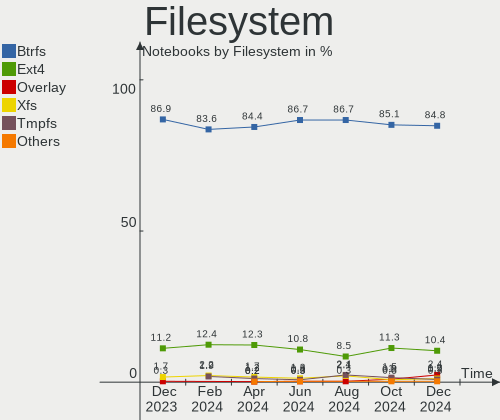
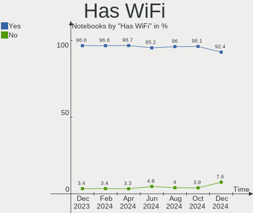
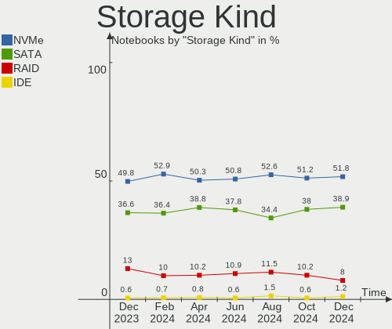
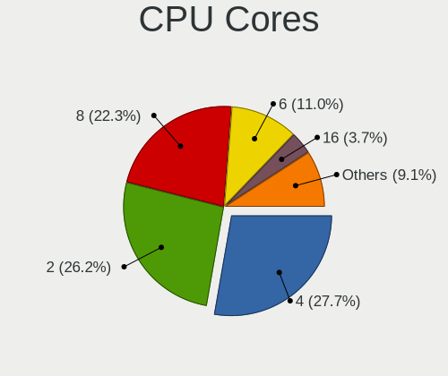
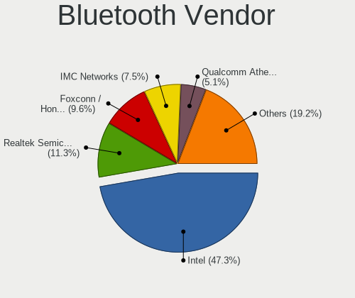

Fedora - Hardware Trends (Notebooks)
------------------------------------

A project to identify most popular hardware characteristics and track their change
over time based on data collected by Linux users at https://Linux-Hardware.org.

Anyone can contribute to this report by the [hw-probe](https://github.com/linuxhw/hw-probe) tool:

    sudo -E hw-probe -all -upload

This report is for one last month. Overall report since the beginning of time: [TestDays](https://github.com/linuxhw/TestDays)

Period: Jul, 2023.

Contents
--------

* [ System ](#system)
  - [ OS                       ](#os)
  - [ OS Family                ](#os-family)
  - [ Kernel                   ](#kernel)
  - [ Kernel Family            ](#kernel-family)
  - [ Kernel Major Ver.        ](#kernel-major-ver)
  - [ Arch                     ](#arch)
  - [ DE                       ](#de)
  - [ Display Server           ](#display-server)
  - [ Display Manager          ](#display-manager)
  - [ OS Lang                  ](#os-lang)
  - [ Boot Mode                ](#boot-mode)
  - [ Filesystem               ](#filesystem)
  - [ Part. scheme             ](#part-scheme)
  - [ Dual Boot with Linux/BSD ](#dual-boot-with-linuxbsd)
  - [ Dual Boot (Win)          ](#dual-boot-win)

* [ Board ](#board)
  - [ Vendor                   ](#vendor)
  - [ Model                    ](#model)
  - [ Model Family             ](#model-family)
  - [ MFG Year                 ](#mfg-year)
  - [ Form Factor              ](#form-factor)
  - [ Secure Boot              ](#secure-boot)
  - [ Coreboot                 ](#coreboot)
  - [ RAM Size                 ](#ram-size)
  - [ RAM Used                 ](#ram-used)
  - [ Total Drives             ](#total-drives)
  - [ Has CD-ROM               ](#has-cd-rom)
  - [ Has Ethernet             ](#has-ethernet)
  - [ Has WiFi                 ](#has-wifi)
  - [ Has Bluetooth            ](#has-bluetooth)

* [ Location ](#location)
  - [ Country                  ](#country)
  - [ City                     ](#city)

* [ Drives ](#drives)
  - [ Drive Vendor             ](#drive-vendor)
  - [ Drive Model              ](#drive-model)
  - [ HDD Vendor               ](#hdd-vendor)
  - [ SSD Vendor               ](#ssd-vendor)
  - [ Drive Kind               ](#drive-kind)
  - [ Drive Connector          ](#drive-connector)
  - [ Drive Size               ](#drive-size)
  - [ Space Total              ](#space-total)
  - [ Space Used               ](#space-used)
  - [ Malfunc. Drives          ](#malfunc-drives)
  - [ Malfunc. Drive Vendor    ](#malfunc-drive-vendor)
  - [ Malfunc. HDD Vendor      ](#malfunc-hdd-vendor)
  - [ Malfunc. Drive Kind      ](#malfunc-drive-kind)
  - [ Failed Drives            ](#failed-drives)
  - [ Failed Drive Vendor      ](#failed-drive-vendor)
  - [ Drive Status             ](#drive-status)

* [ Storage controller ](#storage-controller)
  - [ Storage Vendor           ](#storage-vendor)
  - [ Storage Model            ](#storage-model)
  - [ Storage Kind             ](#storage-kind)

* [ Processor ](#processor)
  - [ CPU Vendor               ](#cpu-vendor)
  - [ CPU Model                ](#cpu-model)
  - [ CPU Model Family         ](#cpu-model-family)
  - [ CPU Cores                ](#cpu-cores)
  - [ CPU Sockets              ](#cpu-sockets)
  - [ CPU Threads              ](#cpu-threads)
  - [ CPU Op-Modes             ](#cpu-op-modes)
  - [ CPU Microcode            ](#cpu-microcode)
  - [ CPU Microarch            ](#cpu-microarch)

* [ Graphics ](#graphics)
  - [ GPU Vendor               ](#gpu-vendor)
  - [ GPU Model                ](#gpu-model)
  - [ GPU Combo                ](#gpu-combo)
  - [ GPU Driver               ](#gpu-driver)
  - [ GPU Memory               ](#gpu-memory)

* [ Monitor ](#monitor)
  - [ Monitor Vendor           ](#monitor-vendor)
  - [ Monitor Model            ](#monitor-model)
  - [ Monitor Resolution       ](#monitor-resolution)
  - [ Monitor Diagonal         ](#monitor-diagonal)
  - [ Monitor Width            ](#monitor-width)
  - [ Aspect Ratio             ](#aspect-ratio)
  - [ Monitor Area             ](#monitor-area)
  - [ Pixel Density            ](#pixel-density)
  - [ Multiple Monitors        ](#multiple-monitors)

* [ Network ](#network)
  - [ Net Controller Vendor    ](#net-controller-vendor)
  - [ Net Controller Model     ](#net-controller-model)
  - [ Wireless Vendor          ](#wireless-vendor)
  - [ Wireless Model           ](#wireless-model)
  - [ Ethernet Vendor          ](#ethernet-vendor)
  - [ Ethernet Model           ](#ethernet-model)
  - [ Net Controller Kind      ](#net-controller-kind)
  - [ Used Controller          ](#used-controller)
  - [ NICs                     ](#nics)
  - [ IPv6                     ](#ipv6)

* [ Bluetooth ](#bluetooth)
  - [ Bluetooth Vendor         ](#bluetooth-vendor)
  - [ Bluetooth Model          ](#bluetooth-model)

* [ Sound ](#sound)
  - [ Sound Vendor             ](#sound-vendor)
  - [ Sound Model              ](#sound-model)

* [ Memory ](#memory)
  - [ Memory Vendor            ](#memory-vendor)
  - [ Memory Model             ](#memory-model)
  - [ Memory Kind              ](#memory-kind)
  - [ Memory Form Factor       ](#memory-form-factor)
  - [ Memory Size              ](#memory-size)
  - [ Memory Speed             ](#memory-speed)

* [ Printers & scanners ](#printers--scanners)
  - [ Printer Vendor           ](#printer-vendor)
  - [ Printer Model            ](#printer-model)
  - [ Scanner Vendor           ](#scanner-vendor)
  - [ Scanner Model            ](#scanner-model)

* [ Camera ](#camera)
  - [ Camera Vendor            ](#camera-vendor)
  - [ Camera Model             ](#camera-model)

* [ Security ](#security)
  - [ Fingerprint Vendor       ](#fingerprint-vendor)
  - [ Fingerprint Model        ](#fingerprint-model)
  - [ Chipcard Vendor          ](#chipcard-vendor)
  - [ Chipcard Model           ](#chipcard-model)

* [ Unsupported ](#unsupported)
  - [ Unsupported Devices      ](#unsupported-devices)
  - [ Unsupported Device Types ](#unsupported-device-types)

System
------

OS
--

Installed operating systems

| Name      | Notebooks | Percent |
|-----------|-----------|---------|
| Fedora 38 | 251       | 92.62%  |
| Fedora 37 | 15        | 5.54%   |
| Fedora 35 | 2         | 0.74%   |
| Fedora 34 | 2         | 0.74%   |
| Fedora 36 | 1         | 0.37%   |

OS Family
---------

OS without a version

| Name   | Notebooks | Percent |
|--------|-----------|---------|
| Fedora | 271       | 100%    |

Kernel
------

Version of the Linux kernel

| Version                           | Notebooks | Percent |
|-----------------------------------|-----------|---------|
| 6.3.12-200.fc38.x86_64            | 61        | 22.51%  |
| 6.3.8-200.fc38.x86_64             | 50        | 18.45%  |
| 6.3.11-200.fc38.x86_64            | 49        | 18.08%  |
| 6.4.6-200.fc38.x86_64             | 26        | 9.59%   |
| 6.4.4-200.fc38.x86_64             | 26        | 9.59%   |
| 6.2.9-300.fc38.x86_64             | 22        | 8.12%   |
| 6.3.8-100.fc37.x86_64             | 7         | 2.58%   |
| 6.2.15-300.fc38.x86_64            | 4         | 1.48%   |
| 6.0.7-301.fc37.x86_64             | 4         | 1.48%   |
| 6.0.12-100.fc35.x86_64            | 2         | 0.74%   |
| 5.17.12-100.fc34.x86_64           | 2         | 0.74%   |
| 6.5.0-0.rc2.17.fc39.x86_64        | 1         | 0.37%   |
| 6.5.0-0.rc1.200.x13s.fc38.aarch64 | 1         | 0.37%   |
| 6.4.7-200.fc38.x86_64             | 1         | 0.37%   |
| 6.4.6-100.fc37.x86_64             | 1         | 0.37%   |
| 6.4.0-cb2.0.fc38.x86_64           | 1         | 0.37%   |
| 6.4.0-66.rog.fc38.x86_64          | 1         | 0.37%   |
| 6.3.7-200.fc38.x86_64             | 1         | 0.37%   |
| 6.3.6-200.fc38.x86_64             | 1         | 0.37%   |
| 6.3.12-100.fc37.x86_64            | 1         | 0.37%   |
| 6.3.10-200.fc38.x86_64            | 1         | 0.37%   |
| 6.3.1-eupnea                      | 1         | 0.37%   |
| 6.3.1-200.fc38.x86_64             | 1         | 0.37%   |
| 6.2.2-301.fc38.x86_64             | 1         | 0.37%   |
| 6.2.15-200.fc37.x86_64            | 1         | 0.37%   |
| 6.2.15-100.fc36.x86_64            | 1         | 0.37%   |
| 6.1.9-200.fc37.x86_64             | 1         | 0.37%   |
| 6.0.8-xm1.0e20221004.fc38.x86_64  | 1         | 0.37%   |
| 5.19.8-300.fc36.x86_64            | 1         | 0.37%   |

Kernel Family
-------------

Linux kernel without a distro release

| Version | Notebooks | Percent |
|---------|-----------|---------|
| 6.3.12  | 62        | 22.88%  |
| 6.3.8   | 57        | 21.03%  |
| 6.3.11  | 49        | 18.08%  |
| 6.4.6   | 27        | 9.96%   |
| 6.4.4   | 26        | 9.59%   |
| 6.2.9   | 22        | 8.12%   |
| 6.2.15  | 6         | 2.21%   |
| 6.0.7   | 4         | 1.48%   |
| 6.5.0   | 2         | 0.74%   |
| 6.4.0   | 2         | 0.74%   |
| 6.3.1   | 2         | 0.74%   |
| 6.0.12  | 2         | 0.74%   |
| 5.17.12 | 2         | 0.74%   |
| 6.4.7   | 1         | 0.37%   |
| 6.3.7   | 1         | 0.37%   |
| 6.3.6   | 1         | 0.37%   |
| 6.3.10  | 1         | 0.37%   |
| 6.2.2   | 1         | 0.37%   |
| 6.1.9   | 1         | 0.37%   |
| 6.0.8   | 1         | 0.37%   |
| 5.19.8  | 1         | 0.37%   |

Kernel Major Ver.
-----------------

Linux kernel major version

| Version | Notebooks | Percent |
|---------|-----------|---------|
| 6.3     | 173       | 63.84%  |
| 6.4     | 56        | 20.66%  |
| 6.2     | 29        | 10.7%   |
| 6.0     | 7         | 2.58%   |
| 6.5     | 2         | 0.74%   |
| 5.17    | 2         | 0.74%   |
| 6.1     | 1         | 0.37%   |
| 5.19    | 1         | 0.37%   |

Arch
----

OS architecture (x86_64, i586, etc.)

| Name    | Notebooks | Percent |
|---------|-----------|---------|
| x86_64  | 270       | 99.63%  |
| aarch64 | 1         | 0.37%   |

DE
--

Desktop Environment

| Name          | Notebooks | Percent |
|---------------|-----------|---------|
| GNOME         | 210       | 77.49%  |
| KDE5          | 41        | 15.13%  |
| XFCE          | 4         | 1.48%   |
| Unknown       | 4         | 1.48%   |
| X-Cinnamon    | 3         | 1.11%   |
| Cinnamon      | 2         | 0.74%   |
| sway          | 1         | 0.37%   |
| Pantheon      | 1         | 0.37%   |
| KDE4          | 1         | 0.37%   |
| i3            | 1         | 0.37%   |
| Hyprland      | 1         | 0.37%   |
| GNOME Classic | 1         | 0.37%   |
| Budgie        | 1         | 0.37%   |

Display Server
--------------

X11 or Wayland

| Name    | Notebooks | Percent |
|---------|-----------|---------|
| Wayland | 218       | 80.44%  |
| X11     | 47        | 17.34%  |
| Tty     | 4         | 1.48%   |
| Unknown | 2         | 0.74%   |

Display Manager
---------------

SDDM, LightDM, etc.

| Name    | Notebooks | Percent |
|---------|-----------|---------|
| Unknown | 160       | 59.04%  |
| GDM     | 75        | 27.68%  |
| SDDM    | 21        | 7.75%   |
| LightDM | 15        | 5.54%   |

OS Lang
-------

Language

| Lang    | Notebooks | Percent |
|---------|-----------|---------|
| en_US   | 140       | 51.66%  |
| en_GB   | 26        | 9.59%   |
| pt_BR   | 13        | 4.8%    |
| de_DE   | 12        | 4.43%   |
| ru_RU   | 10        | 3.69%   |
| it_IT   | 6         | 2.21%   |
| en_AU   | 6         | 2.21%   |
| pl_PL   | 5         | 1.85%   |
| fr_FR   | 5         | 1.85%   |
| es_ES   | 5         | 1.85%   |
| en_IN   | 4         | 1.48%   |
| zh_CN   | 3         | 1.11%   |
| es_MX   | 3         | 1.11%   |
| en_CA   | 3         | 1.11%   |
| pt_PT   | 2         | 0.74%   |
| ja_JP   | 2         | 0.74%   |
| es_CL   | 2         | 0.74%   |
| en_PH   | 2         | 0.74%   |
| en_IE   | 2         | 0.74%   |
| en_DK   | 2         | 0.74%   |
| sv_SE   | 1         | 0.37%   |
| sk_SK   | 1         | 0.37%   |
| ru_UA   | 1         | 0.37%   |
| hu_HU   | 1         | 0.37%   |
| fr_CA   | 1         | 0.37%   |
| fr_BE   | 1         | 0.37%   |
| es_UY   | 1         | 0.37%   |
| es_PE   | 1         | 0.37%   |
| es_CO   | 1         | 0.37%   |
| es_AR   | 1         | 0.37%   |
| en_NZ   | 1         | 0.37%   |
| en_IL   | 1         | 0.37%   |
| da_DK   | 1         | 0.37%   |
| cs_CZ   | 1         | 0.37%   |
| ca_ES   | 1         | 0.37%   |
| C       | 1         | 0.37%   |
| bg_BG   | 1         | 0.37%   |
| Unknown | 1         | 0.37%   |

Boot Mode
---------

EFI or BIOS

| Mode | Notebooks | Percent |
|------|-----------|---------|
| EFI  | 226       | 83.39%  |
| BIOS | 45        | 16.61%  |

Filesystem
----------

Type of filesystem

| Type    | Notebooks | Percent |
|---------|-----------|---------|
| Btrfs   | 220       | 81.18%  |
| Ext4    | 44        | 16.24%  |
| Xfs     | 6         | 2.21%   |
| Unknown | 1         | 0.37%   |

Part. scheme
------------

Scheme of partitioning

| Type    | Notebooks | Percent |
|---------|-----------|---------|
| Unknown | 158       | 58.3%   |
| GPT     | 106       | 39.11%  |
| MBR     | 7         | 2.58%   |

Dual Boot with Linux/BSD
------------------------

Hosting more than one Linux/BSD

| Dual boot | Notebooks | Percent |
|-----------|-----------|---------|
| No        | 257       | 94.83%  |
| Yes       | 14        | 5.17%   |

Dual Boot (Win)
---------------

Hosting Linux and Windows

| Dual boot | Notebooks | Percent |
|-----------|-----------|---------|
| No        | 225       | 83.03%  |
| Yes       | 46        | 16.97%  |

Board
-----

Vendor
------

Motherboard manufacturer

| Name                   | Notebooks | Percent |
|------------------------|-----------|---------|
| Lenovo                 | 84        | 31%     |
| Hewlett-Packard        | 43        | 15.87%  |
| Dell                   | 41        | 15.13%  |
| ASUSTek Computer       | 29        | 10.7%   |
| MSI                    | 14        | 5.17%   |
| Apple                  | 14        | 5.17%   |
| Acer                   | 10        | 3.69%   |
| HUAWEI                 | 9         | 3.32%   |
| Samsung Electronics    | 6         | 2.21%   |
| Toshiba                | 2         | 0.74%   |
| Timi                   | 2         | 0.74%   |
| Notebook               | 2         | 0.74%   |
| Google                 | 2         | 0.74%   |
| Gigabyte Technology    | 2         | 0.74%   |
| Fujitsu                | 2         | 0.74%   |
| Sony                   | 1         | 0.37%   |
| Schenker               | 1         | 0.37%   |
| GPD                    | 1         | 0.37%   |
| Fujitsu Siemens        | 1         | 0.37%   |
| Compaq                 | 1         | 0.37%   |
| Avell High Performance | 1         | 0.37%   |
| Alienware              | 1         | 0.37%   |
| Aava Mobile Oy         | 1         | 0.37%   |
| Unknown                | 1         | 0.37%   |

Model
-----

Motherboard model

| Name                                        | Notebooks | Percent |
|---------------------------------------------|-----------|---------|
| HUAWEI NBLB-WAX9N                           | 3         | 1.11%   |
| Apple MacBookPro9,2                         | 3         | 1.11%   |
| Timi Mi NoteBook Ultra                      | 2         | 0.74%   |
| Lenovo ThinkBook 16 G4+ IAP 21CY            | 2         | 0.74%   |
| Lenovo G50-70 20351                         | 2         | 0.74%   |
| HP ProBook 445 G8 Notebook PC               | 2         | 0.74%   |
| HP Notebook                                 | 2         | 0.74%   |
| HP Laptop 15-dw0xxx                         | 2         | 0.74%   |
| HP EliteBook 840 G6                         | 2         | 0.74%   |
| Dell XPS 13 9370                            | 2         | 0.74%   |
| Dell Inspiron 5577                          | 2         | 0.74%   |
| Acer Aspire V3-571                          | 2         | 0.74%   |
| Unknown                                     | 2         | 0.74%   |
| Toshiba TECRA A50-A                         | 1         | 0.37%   |
| Toshiba Satellite C70-B                     | 1         | 0.37%   |
| Sony SVE14A2V2RS                            | 1         | 0.37%   |
| Schenker VIA 15 Pro                         | 1         | 0.37%   |
| Samsung RV411/RV511/E3511/S3511/RV711/E3411 | 1         | 0.37%   |
| Samsung R580                                | 1         | 0.37%   |
| Samsung 950XDB/951XDB/950XDY                | 1         | 0.37%   |
| Samsung 950XCJ/951XCJ/950XCR                | 1         | 0.37%   |
| Samsung 700Z3A/700Z4A/700Z5A/700Z5B         | 1         | 0.37%   |
| Samsung 550XDA                              | 1         | 0.37%   |
| Notebook PE60RNE_RND_RNC                    | 1         | 0.37%   |
| Notebook P377SM-A                           | 1         | 0.37%   |
| MSI Sword 17 A11UD                          | 1         | 0.37%   |
| MSI Summit E16Flip A12UCT                   | 1         | 0.37%   |
| MSI Summit E13FlipEvo A13MT                 | 1         | 0.37%   |
| MSI Raider GE77HX 12UHS                     | 1         | 0.37%   |
| MSI Modern 14 B4MW                          | 1         | 0.37%   |
| MSI Katana GF66 12UC                        | 1         | 0.37%   |
| MSI Katana GF66 11UC                        | 1         | 0.37%   |
| MSI GF65 Thin 10UE                          | 1         | 0.37%   |
| MSI GF63 Thin 9SCSR                         | 1         | 0.37%   |
| MSI GE75 Raider 10SE                        | 1         | 0.37%   |
| MSI GE72MVR 7RG                             | 1         | 0.37%   |
| MSI GE66 Raider 10SFS                       | 1         | 0.37%   |
| MSI Creator 17 A10SE                        | 1         | 0.37%   |
| MSI Bravo 15 B5DD                           | 1         | 0.37%   |
| Lenovo Z50-70 20354                         | 1         | 0.37%   |

Model Family
------------

Motherboard model prefix

| Name              | Notebooks | Percent |
|-------------------|-----------|---------|
| Lenovo ThinkPad   | 45        | 16.61%  |
| Lenovo IdeaPad    | 16        | 5.9%    |
| Dell Inspiron     | 16        | 5.9%    |
| ASUS VivoBook     | 13        | 4.8%    |
| Dell Latitude     | 12        | 4.43%   |
| ASUS ROG          | 9         | 3.32%   |
| Acer Aspire       | 9         | 3.32%   |
| HP Pavilion       | 7         | 2.58%   |
| HP EliteBook      | 7         | 2.58%   |
| Dell XPS          | 7         | 2.58%   |
| HP ProBook        | 6         | 2.21%   |
| HP Laptop         | 6         | 2.21%   |
| Lenovo ThinkBook  | 5         | 1.85%   |
| Lenovo Yoga       | 4         | 1.48%   |
| Lenovo Legion     | 4         | 1.48%   |
| Dell Precision    | 4         | 1.48%   |
| HUAWEI NBLB-WAX9N | 3         | 1.11%   |
| HP ENVY           | 3         | 1.11%   |
| Apple MacBookPro9 | 3         | 1.11%   |
| Timi Mi           | 2         | 0.74%   |
| MSI Summit        | 2         | 0.74%   |
| MSI Katana        | 2         | 0.74%   |
| Lenovo V15        | 2         | 0.74%   |
| Lenovo G50-70     | 2         | 0.74%   |
| HP OMEN           | 2         | 0.74%   |
| HP Notebook       | 2         | 0.74%   |
| HP 255            | 2         | 0.74%   |
| Apple MacBookPro8 | 2         | 0.74%   |
| Apple MacBookPro5 | 2         | 0.74%   |
| Apple MacBookAir6 | 2         | 0.74%   |
| Unknown           | 2         | 0.74%   |
| Toshiba TECRA     | 1         | 0.37%   |
| Toshiba Satellite | 1         | 0.37%   |
| Sony SVE14A2V2RS  | 1         | 0.37%   |
| Schenker VIA      | 1         | 0.37%   |
| Samsung RV411     | 1         | 0.37%   |
| Samsung R580      | 1         | 0.37%   |
| Samsung 950XDB    | 1         | 0.37%   |
| Samsung 950XCJ    | 1         | 0.37%   |
| Samsung 700Z3A    | 1         | 0.37%   |

MFG Year
--------

Motherboard manufacture year

| Year | Notebooks | Percent |
|------|-----------|---------|
| 2021 | 53        | 19.56%  |
| 2022 | 40        | 14.76%  |
| 2020 | 35        | 12.92%  |
| 2019 | 25        | 9.23%   |
| 2018 | 20        | 7.38%   |
| 2012 | 14        | 5.17%   |
| 2015 | 13        | 4.8%    |
| 2014 | 13        | 4.8%    |
| 2013 | 13        | 4.8%    |
| 2017 | 9         | 3.32%   |
| 2023 | 8         | 2.95%   |
| 2010 | 7         | 2.58%   |
| 2011 | 6         | 2.21%   |
| 2016 | 5         | 1.85%   |
| 2009 | 4         | 1.48%   |
| 2008 | 4         | 1.48%   |
| 2007 | 2         | 0.74%   |

Form Factor
-----------

Physical design of the computer

| Name     | Notebooks | Percent |
|----------|-----------|---------|
| Notebook | 271       | 100%    |

Secure Boot
-----------

Enabled or disabled

| State    | Notebooks | Percent |
|----------|-----------|---------|
| Disabled | 191       | 70.48%  |
| Enabled  | 80        | 29.52%  |

Coreboot
--------

Have coreboot on board

| Used | Notebooks | Percent |
|------|-----------|---------|
| No   | 269       | 99.26%  |
| Yes  | 2         | 0.74%   |

RAM Size
--------

Total RAM memory

| Size in GB  | Notebooks | Percent |
|-------------|-----------|---------|
| 4.01-8.0    | 77        | 28.41%  |
| 16.01-24.0  | 64        | 23.62%  |
| 8.01-16.0   | 50        | 18.45%  |
| 32.01-64.0  | 40        | 14.76%  |
| 3.01-4.0    | 25        | 9.23%   |
| 64.01-256.0 | 7         | 2.58%   |
| 24.01-32.0  | 5         | 1.85%   |
| 1.01-2.0    | 3         | 1.11%   |

RAM Used
--------

Used RAM memory

| Used GB    | Notebooks | Percent |
|------------|-----------|---------|
| 2.01-3.0   | 79        | 29.15%  |
| 4.01-8.0   | 70        | 25.83%  |
| 3.01-4.0   | 68        | 25.09%  |
| 8.01-16.0  | 27        | 9.96%   |
| 1.01-2.0   | 23        | 8.49%   |
| 0.51-1.0   | 2         | 0.74%   |
| 24.01-32.0 | 1         | 0.37%   |
| 16.01-24.0 | 1         | 0.37%   |

Total Drives
------------

Number of drives on board

| Drives | Notebooks | Percent |
|--------|-----------|---------|
| 1      | 197       | 72.69%  |
| 2      | 64        | 23.62%  |
| 3      | 6         | 2.21%   |
| 5      | 2         | 0.74%   |
| 4      | 2         | 0.74%   |

Has CD-ROM
----------

Has CD-ROM on board

| Presented | Notebooks | Percent |
|-----------|-----------|---------|
| No        | 222       | 81.92%  |
| Yes       | 49        | 18.08%  |

Has Ethernet
------------

Has Ethernet on board

| Presented | Notebooks | Percent |
|-----------|-----------|---------|
| Yes       | 198       | 73.06%  |
| No        | 73        | 26.94%  |

Has WiFi
--------

Has WiFi module

| Presented | Notebooks | Percent |
|-----------|-----------|---------|
| Yes       | 267       | 98.52%  |
| No        | 4         | 1.48%   |

Has Bluetooth
-------------

Has Bluetooth module

| Presented | Notebooks | Percent |
|-----------|-----------|---------|
| Yes       | 237       | 87.45%  |
| No        | 34        | 12.55%  |

Location
--------

Country
-------

Geographic location (country)

| Country      | Notebooks | Percent |
|--------------|-----------|---------|
| USA          | 47        | 17.34%  |
| Germany      | 25        | 9.23%   |
| Brazil       | 18        | 6.64%   |
| UK           | 17        | 6.27%   |
| Russia       | 16        | 5.9%    |
| Italy        | 14        | 5.17%   |
| India        | 13        | 4.8%    |
| Mexico       | 8         | 2.95%   |
| Canada       | 7         | 2.58%   |
| Australia    | 7         | 2.58%   |
| Spain        | 6         | 2.21%   |
| Netherlands  | 6         | 2.21%   |
| Turkey       | 5         | 1.85%   |
| Poland       | 5         | 1.85%   |
| France       | 5         | 1.85%   |
| Czechia      | 5         | 1.85%   |
| Bulgaria     | 5         | 1.85%   |
| Belgium      | 5         | 1.85%   |
| Thailand     | 3         | 1.11%   |
| Portugal     | 3         | 1.11%   |
| Denmark      | 3         | 1.11%   |
| Colombia     | 3         | 1.11%   |
| China        | 3         | 1.11%   |
| Chile        | 3         | 1.11%   |
| Uzbekistan   | 2         | 0.74%   |
| Uruguay      | 2         | 0.74%   |
| Switzerland  | 2         | 0.74%   |
| Sweden       | 2         | 0.74%   |
| Singapore    | 2         | 0.74%   |
| Norway       | 2         | 0.74%   |
| Japan        | 2         | 0.74%   |
| Ireland      | 2         | 0.74%   |
| Indonesia    | 2         | 0.74%   |
| Hungary      | 2         | 0.74%   |
| Argentina    | 2         | 0.74%   |
| Sri Lanka    | 1         | 0.37%   |
| Slovakia     | 1         | 0.37%   |
| Saudi Arabia | 1         | 0.37%   |
| Romania      | 1         | 0.37%   |
| Philippines  | 1         | 0.37%   |

City
----

Geographic location (city)

| City            | Notebooks | Percent |
|-----------------|-----------|---------|
| Sofia           | 4         | 1.48%   |
| Moscow          | 3         | 1.11%   |
| Delhi           | 3         | 1.11%   |
| Bangkok         | 3         | 1.11%   |
| Wiesbaden       | 2         | 0.74%   |
| Tokyo           | 2         | 0.74%   |
| Tashkent        | 2         | 0.74%   |
| Sydney          | 2         | 0.74%   |
| Singapore       | 2         | 0.74%   |
| Sheffield       | 2         | 0.74%   |
| Sao Paulo       | 2         | 0.74%   |
| Prague          | 2         | 0.74%   |
| Montreal        | 2         | 0.74%   |
| Montevideo      | 2         | 0.74%   |
| Minneapolis     | 2         | 0.74%   |
| Lisbon          | 2         | 0.74%   |
| Leeds           | 2         | 0.74%   |
| Grajewo         | 2         | 0.74%   |
| Erfurt          | 2         | 0.74%   |
| Dublin          | 2         | 0.74%   |
| Budapest        | 2         | 0.74%   |
| Brussels        | 2         | 0.74%   |
| Atlanta         | 2         | 0.74%   |
| Amsterdam       | 2         | 0.74%   |
| Zug             | 1         | 0.37%   |
| Zedelgem        | 1         | 0.37%   |
| Zabrze          | 1         | 0.37%   |
| Yuma            | 1         | 0.37%   |
| Yasnogorsk      | 1         | 0.37%   |
| Yangzhou        | 1         | 0.37%   |
| Warsaw          | 1         | 0.37%   |
| Walldorf        | 1         | 0.37%   |
| Wadsworth       | 1         | 0.37%   |
| Voronezh        | 1         | 0.37%   |
| Vladikavkaz     | 1         | 0.37%   |
| Vila do Conde   | 1         | 0.37%   |
| Vienna          | 1         | 0.37%   |
| Victoria        | 1         | 0.37%   |
| Vicenza         | 1         | 0.37%   |
| Veliky Novgorod | 1         | 0.37%   |

Drives
------

Drive Vendor
------------

Hard drive vendors

| Vendor                      | Notebooks | Drives | Percent |
|-----------------------------|-----------|--------|---------|
| Samsung Electronics         | 90        | 98     | 26.16%  |
| Sandisk                     | 43        | 44     | 12.5%   |
| WDC                         | 19        | 19     | 5.52%   |
| Toshiba                     | 19        | 19     | 5.52%   |
| SK hynix                    | 18        | 18     | 5.23%   |
| Micron Technology           | 17        | 17     | 4.94%   |
| Intel                       | 14        | 14     | 4.07%   |
| Seagate                     | 13        | 13     | 3.78%   |
| Kingston                    | 13        | 14     | 3.78%   |
| Unknown                     | 9         | 10     | 2.62%   |
| Phison Electronics          | 8         | 8      | 2.33%   |
| Crucial                     | 8         | 9      | 2.33%   |
| KIOXIA                      | 7         | 7      | 2.03%   |
| Apple                       | 6         | 6      | 1.74%   |
| Silicon Motion              | 5         | 5      | 1.45%   |
| A-DATA Technology           | 5         | 5      | 1.45%   |
| Micron/Crucial Technology   | 4         | 4      | 1.16%   |
| HGST                        | 4         | 4      | 1.16%   |
| Lenovo                      | 3         | 3      | 0.87%   |
| Kingston Technology Company | 3         | 3      | 0.87%   |
| JMicron Technology          | 3         | 4      | 0.87%   |
| China                       | 3         | 3      | 0.87%   |
| PNY                         | 2         | 2      | 0.58%   |
| Hewlett-Packard             | 2         | 2      | 0.58%   |
| YS                          | 1         | 1      | 0.29%   |
| Yangtze Memory Technologies | 1         | 1      | 0.29%   |
| XrayDisk                    | 1         | 1      | 0.29%   |
| Union Memory (Shenzhen)     | 1         | 1      | 0.29%   |
| SPCC                        | 1         | 1      | 0.29%   |
| Solid State Storage         | 1         | 1      | 0.29%   |
| Smartbuy                    | 1         | 1      | 0.29%   |
| ShineDisk                   | 1         | 1      | 0.29%   |
| SABRENT                     | 1         | 1      | 0.29%   |
| Realtek Semiconductor       | 1         | 1      | 0.29%   |
| QNAP                        | 1         | 4      | 0.29%   |
| Plextor                     | 1         | 1      | 0.29%   |
| OCZ                         | 1         | 1      | 0.29%   |
| NFORCE                      | 1         | 1      | 0.29%   |
| MemoirsTek                  | 1         | 1      | 0.29%   |
| Logitec                     | 1         | 1      | 0.29%   |

Drive Model
-----------

Hard drive models

| Model                                                 | Notebooks | Percent |
|-------------------------------------------------------|-----------|---------|
| Samsung NVMe SSD Controller SM981/PM981/PM983 500GB   | 20        | 5.68%   |
| Samsung NVMe SSD Controller PM9A1/PM9A3/980PRO 1TB    | 12        | 3.41%   |
| Sandisk WD Blue SN550 NVMe SSD 250GB                  | 8         | 2.27%   |
| Toshiba XG6 NVMe SSD Controller 512GB                 | 6         | 1.7%    |
| Samsung NVMe SSD Controller SM961/PM961/SM963 256GB   | 6         | 1.7%    |
| Sandisk WD Black SN750 / PC SN730 NVMe SSD 1024GB     | 5         | 1.42%   |
| Silicon Motion SM2263EN/SM2263XT SSD Controller 500GB | 4         | 1.14%   |
| Seagate ST1000LM035-1RK172 1TB                        | 4         | 1.14%   |
| Phison PS5013 E13 NVMe Controller 256GB               | 4         | 1.14%   |
| Micron/Crucial P2 NVMe PCIe SSD 1TB                   | 4         | 1.14%   |
| Intel SSD 660P Series 1024GB                          | 4         | 1.14%   |
| WDC WD10JPVX-60JC3T0 1TB                              | 3         | 0.85%   |
| Unknown MMC Card  64GB                                | 3         | 0.85%   |
| Sandisk WD Blue SN500 / PC SN520 NVMe SSD 512GB       | 3         | 0.85%   |
| Samsung SSD 980 1TB                                   | 3         | 0.85%   |
| Samsung SSD 870 EVO 1TB                               | 3         | 0.85%   |
| Samsung SSD 850 EVO 500GB                             | 3         | 0.85%   |
| Phison E12 NVMe Controller 2TB                        | 3         | 0.85%   |
| Micron 2450_MTFDKBA512TFK 512GB                       | 3         | 0.85%   |
| JMicron Generic 512GB                                 | 3         | 0.85%   |
| Intel SSDPEKNU512GZ 512GB                             | 3         | 0.85%   |
| Unknown SD/MMC/MS PRO 128GB                           | 2         | 0.57%   |
| Unknown MMC Card  128GB                               | 2         | 0.57%   |
| Toshiba MQ01ABD100 1TB                                | 2         | 0.57%   |
| Toshiba MQ01ABD050V 500GB                             | 2         | 0.57%   |
| SK hynix HFM001TD3JX013N 1TB                          | 2         | 0.57%   |
| Sandisk WDC PC SN530 SDBPMPZ-256G-1101 256GB          | 2         | 0.57%   |
| Sandisk WD Blue SN570 1TB                             | 2         | 0.57%   |
| Sandisk WD Black SN850 1TB                            | 2         | 0.57%   |
| SanDisk SSD PLUS 480GB                                | 2         | 0.57%   |
| SanDisk SDSSDH3512G 512GB                             | 2         | 0.57%   |
| Sandisk PC SN520 NVMe SSD 512GB                       | 2         | 0.57%   |
| Samsung SSD 990 PRO 2TB                               | 2         | 0.57%   |
| Samsung PSSD T7 1TB                                   | 2         | 0.57%   |
| Samsung MZVLQ512HBLU-00BH1 512GB                      | 2         | 0.57%   |
| Samsung MZVLQ1T0HBLB-00BH1 1TB                        | 2         | 0.57%   |
| Samsung MZVL4512HBLU-00BTW 512GB                      | 2         | 0.57%   |
| Samsung MZALQ512HALU-000L2 512GB                      | 2         | 0.57%   |
| Samsung MZAL4512HBLU-00BL2 512GB                      | 2         | 0.57%   |
| Samsung MZ7LM240HMHQ-00003 240GB SSD                  | 2         | 0.57%   |

HDD Vendor
----------

Hard disk drive vendors

| Vendor              | Notebooks | Drives | Percent |
|---------------------|-----------|--------|---------|
| WDC                 | 15        | 15     | 28.85%  |
| Seagate             | 12        | 12     | 23.08%  |
| Toshiba             | 9         | 9      | 17.31%  |
| HGST                | 4         | 4      | 7.69%   |
| Unknown             | 3         | 4      | 5.77%   |
| JMicron Technology  | 3         | 3      | 5.77%   |
| Samsung Electronics | 2         | 2      | 3.85%   |
| QNAP                | 1         | 4      | 1.92%   |
| IB                  | 1         | 2      | 1.92%   |
| Hitachi             | 1         | 1      | 1.92%   |
| Apple               | 1         | 1      | 1.92%   |

SSD Vendor
----------

Solid state drive vendors

| Vendor              | Notebooks | Drives | Percent |
|---------------------|-----------|--------|---------|
| Samsung Electronics | 22        | 26     | 27.85%  |
| SanDisk             | 9         | 9      | 11.39%  |
| Crucial             | 8         | 8      | 10.13%  |
| Kingston            | 7         | 7      | 8.86%   |
| Apple               | 5         | 5      | 6.33%   |
| WDC                 | 3         | 3      | 3.8%    |
| China               | 3         | 3      | 3.8%    |
| PNY                 | 2         | 2      | 2.53%   |
| Micron Technology   | 2         | 2      | 2.53%   |
| Hewlett-Packard     | 2         | 2      | 2.53%   |
| A-DATA Technology   | 2         | 2      | 2.53%   |
| YS                  | 1         | 1      | 1.27%   |
| Toshiba             | 1         | 1      | 1.27%   |
| SPCC                | 1         | 1      | 1.27%   |
| Smartbuy            | 1         | 1      | 1.27%   |
| SK hynix            | 1         | 1      | 1.27%   |
| Plextor             | 1         | 1      | 1.27%   |
| OCZ                 | 1         | 1      | 1.27%   |
| LITEONIT            | 1         | 1      | 1.27%   |
| Lenovo              | 1         | 1      | 1.27%   |
| Intenso             | 1         | 1      | 1.27%   |
| Intel               | 1         | 1      | 1.27%   |
| GOODRAM             | 1         | 1      | 1.27%   |
| EYOTA               | 1         | 1      | 1.27%   |
| Unknown             | 1         | 1      | 1.27%   |

Drive Kind
----------

HDD or SSD

| Kind    | Notebooks | Drives | Percent |
|---------|-----------|--------|---------|
| NVMe    | 183       | 207    | 57.37%  |
| SSD     | 74        | 83     | 23.2%   |
| HDD     | 48        | 57     | 15.05%  |
| Unknown | 8         | 8      | 2.51%   |
| MMC     | 6         | 6      | 1.88%   |

Drive Connector
---------------

SATA, SAS, NVMe, etc.

| Type | Notebooks | Drives | Percent |
|------|-----------|--------|---------|
| NVMe | 182       | 206    | 58.52%  |
| SATA | 109       | 131    | 35.05%  |
| SAS  | 14        | 18     | 4.5%    |
| MMC  | 6         | 6      | 1.93%   |

Drive Size
----------

Size of hard drive

| Size in TB | Notebooks | Drives | Percent |
|------------|-----------|--------|---------|
| 0.01-0.5   | 74        | 84     | 59.68%  |
| 0.51-1.0   | 45        | 51     | 36.29%  |
| 1.01-2.0   | 4         | 4      | 3.23%   |
| 3.01-4.0   | 1         | 1      | 0.81%   |

Space Total
-----------

Amount of disk space available on the file system

| Size in GB     | Notebooks | Percent |
|----------------|-----------|---------|
| 501-1000       | 65        | 23.99%  |
| 251-500        | 62        | 22.88%  |
| 1001-2000      | 46        | 16.97%  |
| 101-250        | 30        | 11.07%  |
| 1-20           | 26        | 9.59%   |
| Unknown        | 23        | 8.49%   |
| More than 3000 | 7         | 2.58%   |
| 51-100         | 6         | 2.21%   |
| 2001-3000      | 4         | 1.48%   |
| 21-50          | 2         | 0.74%   |

Space Used
----------

Amount of used disk space

| Used GB   | Notebooks | Percent |
|-----------|-----------|---------|
| 1-20      | 80        | 29.52%  |
| 21-50     | 44        | 16.24%  |
| 101-250   | 41        | 15.13%  |
| 51-100    | 31        | 11.44%  |
| 251-500   | 27        | 9.96%   |
| Unknown   | 23        | 8.49%   |
| 501-1000  | 15        | 5.54%   |
| 1001-2000 | 8         | 2.95%   |
| 2001-3000 | 2         | 0.74%   |

Malfunc. Drives
---------------

Drive models with a malfunction

| Model                                   | Notebooks | Drives | Percent |
|-----------------------------------------|-----------|--------|---------|
| YS SSD 240GB                            | 1         | 1      | 12.5%   |
| SanDisk iSSD P4 8GB                     | 1         | 1      | 12.5%   |
| Samsung Electronics HD154UI 1TB         | 1         | 1      | 12.5%   |
| Micron Technology 1100 SATA 256GB SSD   | 1         | 1      | 12.5%   |
| Kingston RBU-SNS8350DES3128GP 128GB SSD | 1         | 1      | 12.5%   |
| Intel SSDSC2BF180A5H SED 180GB          | 1         | 1      | 12.5%   |
| HGST HTS725050A7E630 500GB              | 1         | 1      | 12.5%   |
| Crucial CT240M500SSD 240GB              | 1         | 1      | 12.5%   |

Malfunc. Drive Vendor
---------------------

Vendors of faulty drives

| Vendor              | Notebooks | Drives | Percent |
|---------------------|-----------|--------|---------|
| YS                  | 1         | 1      | 12.5%   |
| SanDisk             | 1         | 1      | 12.5%   |
| Samsung Electronics | 1         | 1      | 12.5%   |
| Micron Technology   | 1         | 1      | 12.5%   |
| Kingston            | 1         | 1      | 12.5%   |
| Intel               | 1         | 1      | 12.5%   |
| HGST                | 1         | 1      | 12.5%   |
| Crucial             | 1         | 1      | 12.5%   |

Malfunc. HDD Vendor
-------------------

Vendors of faulty HDD drives

| Vendor              | Notebooks | Drives | Percent |
|---------------------|-----------|--------|---------|
| Samsung Electronics | 1         | 1      | 50%     |
| HGST                | 1         | 1      | 50%     |

Malfunc. Drive Kind
-------------------

Kinds of faulty drives

| Kind | Notebooks | Drives | Percent |
|------|-----------|--------|---------|
| SSD  | 6         | 6      | 75%     |
| HDD  | 2         | 2      | 25%     |

Failed Drives
-------------

Failed drive models

Zero info for selected period =(

Failed Drive Vendor
-------------------

Failed drive vendors

Zero info for selected period =(

Drive Status
------------

Number of failed and malfunc. drives

| Status   | Notebooks | Drives | Percent |
|----------|-----------|--------|---------|
| Detected | 166       | 222    | 58.66%  |
| Works    | 109       | 131    | 38.52%  |
| Malfunc  | 8         | 8      | 2.83%   |

Storage controller
------------------

Storage Vendor
--------------

Storage controller vendors

| Vendor                                  | Notebooks | Percent |
|-----------------------------------------|-----------|---------|
| Intel                                   | 147       | 39.73%  |
| Samsung Electronics                     | 67        | 18.11%  |
| SanDisk                                 | 35        | 9.46%   |
| AMD                                     | 32        | 8.65%   |
| SK hynix                                | 17        | 4.59%   |
| Micron Technology                       | 15        | 4.05%   |
| Toshiba America Info Systems            | 9         | 2.43%   |
| Kingston Technology Company             | 9         | 2.43%   |
| Phison Electronics                      | 8         | 2.16%   |
| KIOXIA                                  | 7         | 1.89%   |
| Silicon Motion                          | 5         | 1.35%   |
| Micron/Crucial Technology               | 5         | 1.35%   |
| Nvidia                                  | 3         | 0.81%   |
| ADATA Technology                        | 3         | 0.81%   |
| Lenovo                                  | 2         | 0.54%   |
| Yangtze Memory Technologies             | 1         | 0.27%   |
| Solid State Storage Technology          | 1         | 0.27%   |
| Shenzhen Unionmemory Information System | 1         | 0.27%   |
| Realtek Semiconductor                   | 1         | 0.27%   |
| Marvell Technology Group                | 1         | 0.27%   |
| Biwin Storage Technology                | 1         | 0.27%   |

Storage Model
-------------

Storage controller models

| Model                                                                         | Notebooks | Percent |
|-------------------------------------------------------------------------------|-----------|---------|
| AMD FCH SATA Controller [AHCI mode]                                           | 31        | 7.91%   |
| Intel Volume Management Device NVMe RAID Controller                           | 23        | 5.87%   |
| Samsung NVMe SSD Controller SM981/PM981/PM983                                 | 21        | 5.36%   |
| Samsung NVMe SSD Controller 980                                               | 19        | 4.85%   |
| Intel 7 Series Chipset Family 6-port SATA Controller [AHCI mode]              | 17        | 4.34%   |
| Samsung NVMe SSD Controller PM9A1/PM9A3/980PRO                                | 12        | 3.06%   |
| Intel Sunrise Point-LP SATA Controller [AHCI mode]                            | 12        | 3.06%   |
| SK hynix Gold P31/BC711/PC711 NVMe Solid State Drive                          | 11        | 2.81%   |
| Intel Tiger Lake-LP SATA Controller                                           | 10        | 2.55%   |
| SanDisk WD Blue SN550 NVMe SSD                                                | 8         | 2.04%   |
| Micron 2450 NVMe SSD [HendrixV] (DRAM-less)                                   | 8         | 2.04%   |
| Intel 82801 Mobile SATA Controller [RAID mode]                                | 8         | 2.04%   |
| Intel Alder Lake-P SATA AHCI Controller                                       | 7         | 1.79%   |
| Toshiba America Info Systems XG6 NVMe SSD Controller                          | 6         | 1.53%   |
| SanDisk WD Black SN750 / PC SN730 NVMe SSD                                    | 6         | 1.53%   |
| Samsung NVMe SSD Controller SM961/PM961/SM963                                 | 6         | 1.53%   |
| Samsung NVMe SSD Controller PM9B1                                             | 6         | 1.53%   |
| Intel Wildcat Point-LP SATA Controller [AHCI Mode]                            | 6         | 1.53%   |
| Intel SSD 670p Series [Keystone Harbor]                                       | 6         | 1.53%   |
| Intel 8 Series SATA Controller 1 [AHCI mode]                                  | 6         | 1.53%   |
| Intel 6 Series/C200 Series Chipset Family 6 port Mobile SATA AHCI Controller  | 6         | 1.53%   |
| KIOXIA NVMe SSD Controller BG4 (DRAM-less)                                    | 5         | 1.28%   |
| Intel Comet Lake SATA AHCI Controller                                         | 5         | 1.28%   |
| Intel Cannon Lake Mobile PCH SATA AHCI Controller                             | 5         | 1.28%   |
| Silicon Motion SM2263EN/SM2263XT (DRAM-less) NVMe SSD Controllers             | 4         | 1.02%   |
| Phison PS5013 E13 NVMe Controller                                             | 4         | 1.02%   |
| Micron/Crucial P2 [Nick P2] / P3 / P3 Plus NVMe PCIe SSD (DRAM-less)          | 4         | 1.02%   |
| Intel Volume Management Device NVMe RAID Controller Intel Corporation         | 4         | 1.02%   |
| Intel SSD 660P Series                                                         | 4         | 1.02%   |
| Intel Ice Lake-LP SATA Controller [AHCI mode]                                 | 4         | 1.02%   |
| Intel 5 Series/3400 Series Chipset 6 port SATA AHCI Controller                | 4         | 1.02%   |
| Intel 5 Series/3400 Series Chipset 4 port SATA AHCI Controller                | 4         | 1.02%   |
| Intel 400 Series Chipset Family SATA AHCI Controller                          | 4         | 1.02%   |
| SanDisk WD Blue SN500 / PC SN520 NVMe SSD                                     | 3         | 0.77%   |
| SanDisk PC SN530 NVMe SSD (DRAM-less)                                         | 3         | 0.77%   |
| Phison E12 NVMe Controller                                                    | 3         | 0.77%   |
| Kingston Company OM8PCP Design-In PCIe 3 NVMe SSD (DRAM-less)                 | 3         | 0.77%   |
| Intel Q170/Q150/B150/H170/H110/Z170/CM236 Chipset SATA Controller [AHCI Mode] | 3         | 0.77%   |
| Intel HM170/QM170 Chipset SATA Controller [AHCI Mode]                         | 3         | 0.77%   |
| Intel 82801IBM/IEM (ICH9M/ICH9M-E) 4 port SATA Controller [AHCI mode]         | 3         | 0.77%   |

Storage Kind
------------

Kind of storage controller (IDE, SATA, NVMe, SAS, ...)

| Kind | Notebooks | Percent |
|------|-----------|---------|
| NVMe | 180       | 48.39%  |
| SATA | 150       | 40.32%  |
| RAID | 35        | 9.41%   |
| IDE  | 7         | 1.88%   |

Processor
---------

CPU Vendor
----------

Processor vendors

| Vendor | Notebooks | Percent |
|--------|-----------|---------|
| Intel  | 202       | 74.54%  |
| AMD    | 68        | 25.09%  |
| ARM    | 1         | 0.37%   |

CPU Model
---------

Processor models

| Model                                         | Notebooks | Percent |
|-----------------------------------------------|-----------|---------|
| Intel 11th Gen Core i5-1135G7 @ 2.40GHz       | 10        | 3.69%   |
| AMD Ryzen 5 5500U with Radeon Graphics        | 10        | 3.69%   |
| Intel 11th Gen Core i7-1165G7 @ 2.80GHz       | 9         | 3.32%   |
| Intel Core i5-10210U CPU @ 1.60GHz            | 6         | 2.21%   |
| Intel Core i7-8565U CPU @ 1.80GHz             | 5         | 1.85%   |
| Intel Core i7-8550U CPU @ 1.80GHz             | 5         | 1.85%   |
| AMD Ryzen 7 4800H with Radeon Graphics        | 5         | 1.85%   |
| Intel Core i5-8265U CPU @ 1.60GHz             | 4         | 1.48%   |
| Intel Core i5-6300U CPU @ 2.40GHz             | 4         | 1.48%   |
| Intel 12th Gen Core i7-1255U                  | 4         | 1.48%   |
| Intel 12th Gen Core i5-12500H                 | 4         | 1.48%   |
| AMD Ryzen 7 5825U with Radeon Graphics        | 4         | 1.48%   |
| AMD Ryzen 7 5800H with Radeon Graphics        | 4         | 1.48%   |
| AMD Ryzen 5 5600H with Radeon Graphics        | 4         | 1.48%   |
| Intel Core i7-7700HQ CPU @ 2.80GHz            | 3         | 1.11%   |
| Intel Core i7-10750H CPU @ 2.60GHz            | 3         | 1.11%   |
| Intel Core i5-5200U CPU @ 2.20GHz             | 3         | 1.11%   |
| Intel Core i5-4300U CPU @ 1.90GHz             | 3         | 1.11%   |
| Intel Core i5-3210M CPU @ 2.50GHz             | 3         | 1.11%   |
| Intel 13th Gen Core i9-13900H                 | 3         | 1.11%   |
| Intel 12th Gen Core i7-12700H                 | 3         | 1.11%   |
| Intel 12th Gen Core i7-1260P                  | 3         | 1.11%   |
| Intel 11th Gen Core i7-1185G7 @ 3.00GHz       | 3         | 1.11%   |
| Intel 11th Gen Core i7-11800H @ 2.30GHz       | 3         | 1.11%   |
| Intel 11th Gen Core i7-11390H @ 3.40GHz       | 3         | 1.11%   |
| AMD Ryzen 7 PRO 6850U with Radeon Graphics    | 3         | 1.11%   |
| AMD Ryzen 7 5700U with Radeon Graphics        | 3         | 1.11%   |
| AMD Ryzen 5 2500U with Radeon Vega Mobile Gfx | 3         | 1.11%   |
| Intel Core i9-9980HK CPU @ 2.40GHz            | 2         | 0.74%   |
| Intel Core i7-8650U CPU @ 1.90GHz             | 2         | 0.74%   |
| Intel Core i7-7500U CPU @ 2.70GHz             | 2         | 0.74%   |
| Intel Core i7-4600M CPU @ 2.90GHz             | 2         | 0.74%   |
| Intel Core i7-4510U CPU @ 2.00GHz             | 2         | 0.74%   |
| Intel Core i7-3520M CPU @ 2.90GHz             | 2         | 0.74%   |
| Intel Core i5-8365U CPU @ 1.60GHz             | 2         | 0.74%   |
| Intel Core i5-8250U CPU @ 1.60GHz             | 2         | 0.74%   |
| Intel Core i5-1035G1 CPU @ 1.00GHz            | 2         | 0.74%   |
| Intel Core i5 CPU M 560 @ 2.67GHz             | 2         | 0.74%   |
| Intel Core i3-7100U CPU @ 2.40GHz             | 2         | 0.74%   |
| Intel Core i3-7020U CPU @ 2.30GHz             | 2         | 0.74%   |

CPU Model Family
----------------

Processor model prefix

| Model                | Notebooks | Percent |
|----------------------|-----------|---------|
| Other                | 68        | 25.09%  |
| Intel Core i5        | 52        | 19.19%  |
| Intel Core i7        | 45        | 16.61%  |
| AMD Ryzen 5          | 26        | 9.59%   |
| AMD Ryzen 7          | 23        | 8.49%   |
| Intel Core i3        | 15        | 5.54%   |
| Intel Core 2 Duo     | 8         | 2.95%   |
| AMD Ryzen 9          | 7         | 2.58%   |
| Intel Celeron        | 4         | 1.48%   |
| AMD Ryzen 7 PRO      | 4         | 1.48%   |
| Intel Core i9        | 3         | 1.11%   |
| Intel Pentium        | 2         | 0.74%   |
| AMD Ryzen 3          | 2         | 0.74%   |
| AMD A8               | 2         | 0.74%   |
| Intel Xeon           | 1         | 0.37%   |
| Intel Pentium Silver | 1         | 0.37%   |
| Intel Pentium Dual   | 1         | 0.37%   |
| Intel Genuine        | 1         | 0.37%   |
| Intel Core 2 Quad    | 1         | 0.37%   |
| Intel Atom           | 1         | 0.37%   |
| AMD FX               | 1         | 0.37%   |
| AMD Athlon II        | 1         | 0.37%   |
| AMD Athlon           | 1         | 0.37%   |
| AMD A6               | 1         | 0.37%   |

CPU Cores
---------

Number of processor cores

| Number | Notebooks | Percent |
|--------|-----------|---------|
| 4      | 92        | 33.95%  |
| 2      | 79        | 29.15%  |
| 8      | 42        | 15.5%   |
| 6      | 31        | 11.44%  |
| 12     | 11        | 4.06%   |
| 14     | 9         | 3.32%   |
| 10     | 6         | 2.21%   |
| 16     | 1         | 0.37%   |

CPU Sockets
-----------

Number of sockets

| Number | Notebooks | Percent |
|--------|-----------|---------|
| 1      | 271       | 100%    |

CPU Threads
-----------

Threads per core (Hyper-Threading)

| Number | Notebooks | Percent |
|--------|-----------|---------|
| 2      | 245       | 90.41%  |
| 1      | 26        | 9.59%   |

CPU Op-Modes
------------

CPU Operation Modes (32-bit, 64-bit)

| Op mode        | Notebooks | Percent |
|----------------|-----------|---------|
| 32-bit, 64-bit | 270       | 99.63%  |
| 64-bit         | 1         | 0.37%   |

CPU Microcode
-------------

Microcode number

| Number     | Notebooks | Percent |
|------------|-----------|---------|
| Unknown    | 199       | 73.43%  |
| 0x0a50000c | 13        | 4.8%    |
| 0x08608103 | 9         | 3.32%   |
| 0x0a50000d | 6         | 2.21%   |
| 0x08600106 | 6         | 2.21%   |
| 0x0a404102 | 5         | 1.85%   |
| 0x08600104 | 5         | 1.85%   |
| 0x08108109 | 3         | 1.11%   |
| 0x0810100b | 3         | 1.11%   |
| 0x806c1    | 2         | 0.74%   |
| 0x206a7    | 2         | 0.74%   |
| 0x0a404101 | 2         | 0.74%   |
| 0x06001119 | 2         | 0.74%   |
| 0x806ec    | 1         | 0.37%   |
| 0x806ea    | 1         | 0.37%   |
| 0x306d4    | 1         | 0.37%   |
| 0x10676    | 1         | 0.37%   |
| 0x0a704103 | 1         | 0.37%   |
| 0x0a601203 | 1         | 0.37%   |
| 0x08a00006 | 1         | 0.37%   |
| 0x08608104 | 1         | 0.37%   |
| 0x08608102 | 1         | 0.37%   |
| 0x08600103 | 1         | 0.37%   |
| 0x08108102 | 1         | 0.37%   |
| 0x06006705 | 1         | 0.37%   |
| 0x06006110 | 1         | 0.37%   |
| 0x010000c8 | 1         | 0.37%   |

CPU Microarch
-------------

Microarchitecture

| Name             | Notebooks | Percent |
|------------------|-----------|---------|
| KabyLake         | 49        | 18.08%  |
| TigerLake        | 33        | 12.18%  |
| Alderlake Hybrid | 28        | 10.33%  |
| Unknown          | 24        | 8.86%   |
| Zen 3            | 20        | 7.38%   |
| IvyBridge        | 15        | 5.54%   |
| Haswell          | 14        | 5.17%   |
| Zen 2            | 12        | 4.43%   |
| SandyBridge      | 9         | 3.32%   |
| Icelake          | 9         | 3.32%   |
| Westmere         | 8         | 2.95%   |
| Skylake          | 8         | 2.95%   |
| Penryn           | 7         | 2.58%   |
| Broadwell        | 7         | 2.58%   |
| CometLake        | 6         | 2.21%   |
| Zen+             | 5         | 1.85%   |
| Silvermont       | 5         | 1.85%   |
| Zen              | 3         | 1.11%   |
| Core             | 3         | 1.11%   |
| Piledriver       | 2         | 0.74%   |
| Excavator        | 2         | 0.74%   |
| K10              | 1         | 0.37%   |
| Goldmont plus    | 1         | 0.37%   |

Graphics
--------

GPU Vendor
----------

Vendors of graphics cards

| Vendor | Notebooks | Percent |
|--------|-----------|---------|
| Intel  | 190       | 54.29%  |
| Nvidia | 83        | 23.71%  |
| AMD    | 77        | 22%     |

GPU Model
---------

Graphics card models

| Model                                                                                 | Notebooks | Percent |
|---------------------------------------------------------------------------------------|-----------|---------|
| Intel TigerLake-LP GT2 [Iris Xe Graphics]                                             | 31        | 8.66%   |
| Intel 3rd Gen Core processor Graphics Controller                                      | 15        | 4.19%   |
| Intel Alder Lake-P Integrated Graphics Controller                                     | 14        | 3.91%   |
| AMD Cezanne [Radeon Vega Series / Radeon Vega Mobile Series]                          | 14        | 3.91%   |
| AMD Lucienne                                                                          | 13        | 3.63%   |
| AMD Renoir                                                                            | 12        | 3.35%   |
| Intel WhiskeyLake-U GT2 [UHD Graphics 620]                                            | 11        | 3.07%   |
| Intel UHD Graphics 620                                                                | 10        | 2.79%   |
| Intel Haswell-ULT Integrated Graphics Controller                                      | 10        | 2.79%   |
| Intel 2nd Generation Core Processor Family Integrated Graphics Controller             | 9         | 2.51%   |
| Nvidia GA107M [GeForce RTX 3050 Mobile]                                               | 8         | 2.23%   |
| Intel CoffeeLake-H GT2 [UHD Graphics 630]                                             | 8         | 2.23%   |
| Intel HD Graphics 620                                                                 | 7         | 1.96%   |
| Intel CometLake-U GT2 [UHD Graphics]                                                  | 7         | 1.96%   |
| AMD Rembrandt [Radeon 680M]                                                           | 7         | 1.96%   |
| Intel Skylake GT2 [HD Graphics 520]                                                   | 6         | 1.68%   |
| Intel Core Processor Integrated Graphics Controller                                   | 6         | 1.68%   |
| Nvidia TU117M [GeForce MX450]                                                         | 5         | 1.4%    |
| Nvidia TU117M [GeForce GTX 1650 Mobile / Max-Q]                                       | 5         | 1.4%    |
| Nvidia GF117M [GeForce 610M/710M/810M/820M / GT 620M/625M/630M/720M]                  | 5         | 1.4%    |
| Intel TigerLake-H GT1 [UHD Graphics]                                                  | 5         | 1.4%    |
| Intel Raptor Lake-P [Iris Xe Graphics]                                                | 5         | 1.4%    |
| Intel HD Graphics 5500                                                                | 5         | 1.4%    |
| Intel CometLake-H GT2 [UHD Graphics]                                                  | 5         | 1.4%    |
| AMD Picasso/Raven 2 [Radeon Vega Series / Radeon Vega Mobile Series]                  | 5         | 1.4%    |
| Nvidia GP107M [GeForce GTX 1050 Mobile]                                               | 4         | 1.12%   |
| Nvidia GA107M [GeForce RTX 3050 Ti Mobile]                                            | 4         | 1.12%   |
| Nvidia GA106M [GeForce RTX 3060 Mobile / Max-Q]                                       | 4         | 1.12%   |
| AMD Barcelo                                                                           | 4         | 1.12%   |
| Nvidia AD106M [GeForce RTX 4070 Max-Q / Mobile]                                       | 3         | 0.84%   |
| Intel Mobile GM965/GL960 Integrated Graphics Controller (secondary)                   | 3         | 0.84%   |
| Intel Mobile GM965/GL960 Integrated Graphics Controller (primary)                     | 3         | 0.84%   |
| Intel Iris Plus Graphics G1 (Ice Lake)                                                | 3         | 0.84%   |
| Intel HD Graphics 630                                                                 | 3         | 0.84%   |
| Intel Atom Processor Z36xxx/Z37xxx Series Graphics & Display                          | 3         | 0.84%   |
| Intel Alder Lake-UP3 GT2 [UHD Graphics]                                               | 3         | 0.84%   |
| Intel Alder Lake-UP3 GT2 [Iris Xe Graphics]                                           | 3         | 0.84%   |
| Intel 4th Gen Core Processor Integrated Graphics Controller                           | 3         | 0.84%   |
| AMD Topaz XT [Radeon R7 M260/M265 / M340/M360 / M440/M445 / 530/535 / 620/625 Mobile] | 3         | 0.84%   |
| AMD Raven Ridge [Radeon Vega Series / Radeon Vega Mobile Series]                      | 3         | 0.84%   |

GPU Combo
---------

Combinations of graphics cards

| Name           | Notebooks | Percent |
|----------------|-----------|---------|
| 1 x Intel      | 123       | 45.39%  |
| Intel + Nvidia | 55        | 20.3%   |
| 1 x AMD        | 48        | 17.71%  |
| AMD + Nvidia   | 15        | 5.54%   |
| 1 x Nvidia     | 13        | 4.8%    |
| Intel + AMD    | 9         | 3.32%   |
| 2 x AMD        | 5         | 1.85%   |
| Other          | 2         | 0.74%   |
| 2 x Intel      | 1         | 0.37%   |

GPU Driver
----------

Free vs proprietary

| Driver      | Notebooks | Percent |
|-------------|-----------|---------|
| Free        | 221       | 81.55%  |
| Proprietary | 39        | 14.39%  |
| Unknown     | 11        | 4.06%   |

GPU Memory
----------

Total video memory

| Size in GB | Notebooks | Percent |
|------------|-----------|---------|
| Unknown    | 166       | 61.25%  |
| 0.01-0.5   | 35        | 12.92%  |
| 3.01-4.0   | 21        | 7.75%   |
| 0.51-1.0   | 21        | 7.75%   |
| 1.01-2.0   | 17        | 6.27%   |
| 5.01-6.0   | 5         | 1.85%   |
| 7.01-8.0   | 4         | 1.48%   |
| 8.01-16.0  | 2         | 0.74%   |

Monitor
-------

Monitor Vendor
--------------

Monitor vendors

| Vendor                  | Notebooks | Percent |
|-------------------------|-----------|---------|
| BOE                     | 53        | 16.26%  |
| AU Optronics            | 53        | 16.26%  |
| Chimei Innolux          | 42        | 12.88%  |
| Samsung Electronics     | 38        | 11.66%  |
| LG Display              | 29        | 8.9%    |
| Dell                    | 15        | 4.6%    |
| Apple                   | 13        | 3.99%   |
| Sharp                   | 8         | 2.45%   |
| Lenovo                  | 8         | 2.45%   |
| Goldstar                | 8         | 2.45%   |
| TMX                     | 7         | 2.15%   |
| InfoVision              | 7         | 2.15%   |
| Hewlett-Packard         | 5         | 1.53%   |
| PANDA                   | 4         | 1.23%   |
| Chi Mei Optoelectronics | 4         | 1.23%   |
| BenQ                    | 4         | 1.23%   |
| Iiyama                  | 3         | 0.92%   |
| CSO                     | 3         | 0.92%   |
| ASUSTek Computer        | 3         | 0.92%   |
| ViewSonic               | 2         | 0.61%   |
| Unknown                 | 2         | 0.61%   |
| AOC                     | 2         | 0.61%   |
| Acer                    | 2         | 0.61%   |
| RTK                     | 1         | 0.31%   |
| Philips                 | 1         | 0.31%   |
| NEC Computers           | 1         | 0.31%   |
| MSI                     | 1         | 0.31%   |
| IBM                     | 1         | 0.31%   |
| Denver                  | 1         | 0.31%   |
| CTO                     | 1         | 0.31%   |
| CPT                     | 1         | 0.31%   |
| BOE Technology Group    | 1         | 0.31%   |
| AVX                     | 1         | 0.31%   |
| Ancor Communications    | 1         | 0.31%   |

Monitor Model
-------------

Monitor models

| Model                                                                | Notebooks | Percent |
|----------------------------------------------------------------------|-----------|---------|
| Chimei Innolux LCD Monitor CMN15E7 1920x1080 344x193mm 15.5-inch     | 5         | 1.5%    |
| Chimei Innolux LCD Monitor CMN14D4 1920x1080 309x173mm 13.9-inch     | 4         | 1.2%    |
| AU Optronics LCD Monitor AUOAF90 1920x1080 344x193mm 15.5-inch       | 4         | 1.2%    |
| AU Optronics LCD Monitor AUO61ED 1920x1080 344x193mm 15.5-inch       | 4         | 1.2%    |
| Samsung Electronics LCD Monitor SEC5441 1366x768 344x194mm 15.5-inch | 3         | 0.9%    |
| BOE LCD Monitor BOE0877 1920x1080 309x173mm 13.9-inch                | 3         | 0.9%    |
| Apple LCD Monitor APP9CC3 1280x800 286x179mm 13.3-inch               | 3         | 0.9%    |
| TMX TL156MDMP01-0 TMX1560 3200x2000 336x210mm 15.6-inch              | 2         | 0.6%    |
| Samsung Electronics LCD Monitor SDC5441 1366x768 309x174mm 14.0-inch | 2         | 0.6%    |
| Lenovo LEN L28u-30 LEN65FA 3840x2160 621x341mm 27.9-inch             | 2         | 0.6%    |
| Dell U2413 DELF046 1920x1200 518x324mm 24.1-inch                     | 2         | 0.6%    |
| Dell U2412M DELA07B 1920x1200 518x324mm 24.1-inch                    | 2         | 0.6%    |
| Chimei Innolux LCD Monitor CMN1604 1920x1080 355x199mm 16.0-inch     | 2         | 0.6%    |
| Chimei Innolux LCD Monitor CMN14D6 1366x768 309x173mm 13.9-inch      | 2         | 0.6%    |
| Chimei Innolux LCD Monitor CMN1301 2160x1350 280x175mm 13.0-inch     | 2         | 0.6%    |
| BOE LCD Monitor BOE09F0 1920x1080 309x174mm 14.0-inch                | 2         | 0.6%    |
| BOE LCD Monitor BOE08D7 1920x1080 309x174mm 14.0-inch                | 2         | 0.6%    |
| BOE LCD Monitor BOE0872 1920x1080 344x194mm 15.5-inch                | 2         | 0.6%    |
| BOE LCD Monitor BOE0812 1920x1080 344x194mm 15.5-inch                | 2         | 0.6%    |
| BOE LCD Monitor BOE07DB 1920x1080 309x174mm 14.0-inch                | 2         | 0.6%    |
| AU Optronics LCD Monitor AUO403D 1920x1080 309x174mm 14.0-inch       | 2         | 0.6%    |
| AU Optronics LCD Monitor AUO369F 1920x1080 344x194mm 15.5-inch       | 2         | 0.6%    |
| AU Optronics LCD Monitor AUO23ED 1920x1080 344x194mm 15.5-inch       | 2         | 0.6%    |
| AU Optronics LCD Monitor AUO106C 1366x768 277x156mm 12.5-inch        | 2         | 0.6%    |
| Apple Color LCD APP9CF3 1366x768 260x140mm 11.6-inch                 | 2         | 0.6%    |
| ViewSonic VX2458 Series VSC36AF 1920x1080 521x293mm 23.5-inch        | 1         | 0.3%    |
| ViewSonic VA2446 SERIES VSC732E 1920x1080 521x293mm 23.5-inch        | 1         | 0.3%    |
| Unknown SMART TV 6488 3840x2160 1209x680mm 54.6-inch                 | 1         | 0.3%    |
| Unknown LCD Monitor FFFF 2288x1287 2550x2550mm 142.0-inch            | 1         | 0.3%    |
| TMX TL160ADMP03-0 TMX1603 2560x1600 345x215mm 16.0-inch              | 1         | 0.3%    |
| TMX TL156VDXP0101 TMX1561 1920x1080 344x194mm 15.5-inch              | 1         | 0.3%    |
| TMX TL142GDXP02-0 TMX1420 2520x1680 300x200mm 14.2-inch              | 1         | 0.3%    |
| TMX TL140BDXP01-0 TMX1400 2560x1440 310x174mm 14.0-inch              | 1         | 0.3%    |
| TMX TL140ADXP01 TMX1481 2560x1600 301x188mm 14.0-inch                | 1         | 0.3%    |
| Sharp LQ173M1JW12 SHP1563 1920x1080 382x215mm 17.3-inch              | 1         | 0.3%    |
| Sharp LQ156M1JW03 SHP14C5 1920x1080 344x194mm 15.5-inch              | 1         | 0.3%    |
| Sharp LQ134N1JW53 SHP1521 1920x1200 288x180mm 13.4-inch              | 1         | 0.3%    |
| Sharp LQ134N1JW52 SHP151E 1920x1200 288x180mm 13.4-inch              | 1         | 0.3%    |
| Sharp LCD Monitor SHP14BA 1920x1080 344x194mm 15.5-inch              | 1         | 0.3%    |
| Sharp LCD Monitor SHP14AD 3840x2160 294x165mm 13.3-inch              | 1         | 0.3%    |

Monitor Resolution
------------------

Monitor screen resolution

| Resolution         | Notebooks | Percent |
|--------------------|-----------|---------|
| 1920x1080 (FHD)    | 139       | 47.12%  |
| 1366x768 (WXGA)    | 55        | 18.64%  |
| 3840x2160 (4K)     | 16        | 5.42%   |
| 2560x1440 (QHD)    | 14        | 4.75%   |
| 2560x1600          | 13        | 4.41%   |
| 1920x1200 (WUXGA)  | 13        | 4.41%   |
| 1280x800 (WXGA)    | 8         | 2.71%   |
| 3440x1440          | 6         | 2.03%   |
| 2880x1800          | 5         | 1.69%   |
| 1600x900 (HD+)     | 4         | 1.36%   |
| 2560x1080          | 3         | 1.02%   |
| 1440x900 (WXGA+)   | 3         | 1.02%   |
| 3840x2400          | 2         | 0.68%   |
| 3200x2000          | 2         | 0.68%   |
| 2160x1350          | 2         | 0.68%   |
| 3840x1600          | 1         | 0.34%   |
| 3456x2160          | 1         | 0.34%   |
| 3200x1800 (QHD+)   | 1         | 0.34%   |
| 3072x1920          | 1         | 0.34%   |
| 2880x1620          | 1         | 0.34%   |
| 2520x1680          | 1         | 0.34%   |
| 2288x1287          | 1         | 0.34%   |
| 2240x1400          | 1         | 0.34%   |
| 1680x945           | 1         | 0.34%   |
| 1680x1050 (WSXGA+) | 1         | 0.34%   |

Monitor Diagonal
----------------

Diagonal size in inches

| Inches  | Notebooks | Percent |
|---------|-----------|---------|
| 15      | 122       | 37.31%  |
| 14      | 46        | 14.07%  |
| 13      | 46        | 14.07%  |
| 24      | 16        | 4.89%   |
| 27      | 15        | 4.59%   |
| 17      | 15        | 4.59%   |
| 16      | 15        | 4.59%   |
| 23      | 12        | 3.67%   |
| 34      | 6         | 1.83%   |
| 21      | 6         | 1.83%   |
| 12      | 5         | 1.53%   |
| 11      | 4         | 1.22%   |
| 31      | 3         | 0.92%   |
| 54      | 2         | 0.61%   |
| 35      | 2         | 0.61%   |
| 28      | 2         | 0.61%   |
| 18      | 2         | 0.61%   |
| 142     | 1         | 0.31%   |
| 84      | 1         | 0.31%   |
| 72      | 1         | 0.31%   |
| 37      | 1         | 0.31%   |
| 33      | 1         | 0.31%   |
| 32      | 1         | 0.31%   |
| 19      | 1         | 0.31%   |
| Unknown | 1         | 0.31%   |

Monitor Width
-------------

Physical width

| Width in mm    | Notebooks | Percent |
|----------------|-----------|---------|
| 301-350        | 198       | 61.3%   |
| 501-600        | 35        | 10.84%  |
| 201-300        | 34        | 10.53%  |
| 351-400        | 21        | 6.5%    |
| 601-700        | 9         | 2.79%   |
| 401-500        | 9         | 2.79%   |
| 701-800        | 8         | 2.48%   |
| 801-900        | 3         | 0.93%   |
| 1501-2000      | 2         | 0.62%   |
| 1001-1500      | 2         | 0.62%   |
| More than 2000 | 1         | 0.31%   |
| Unknown        | 1         | 0.31%   |

Aspect Ratio
------------

Proportional relationship between the width and the height

| Ratio   | Notebooks | Percent |
|---------|-----------|---------|
| 16/9    | 214       | 76.16%  |
| 16/10   | 52        | 18.51%  |
| 21/9    | 11        | 3.91%   |
| 3/2     | 2         | 0.71%   |
| 1.00    | 1         | 0.36%   |
| Unknown | 1         | 0.36%   |

Monitor Area
------------

Area in inch

| Area in inch | Notebooks | Percent |
|----------------|-----------|---------|
| 101-110        | 124       | 37.92%  |
| 81-90          | 73        | 22.32%  |
| 201-250        | 25        | 7.65%   |
| 71-80          | 16        | 4.89%   |
| 301-350        | 15        | 4.59%   |
| 121-130        | 15        | 4.59%   |
| 351-500        | 14        | 4.28%   |
| 111-120        | 13        | 3.98%   |
| 251-300        | 9         | 2.75%   |
| More than 1000 | 5         | 1.53%   |
| 61-70          | 5         | 1.53%   |
| 51-60          | 4         | 1.22%   |
| 91-100         | 3         | 0.92%   |
| 151-200        | 2         | 0.61%   |
| 141-150        | 2         | 0.61%   |
| 501-1000       | 1         | 0.31%   |
| Unknown        | 1         | 0.31%   |

Pixel Density
-------------

Pixels per inch

| Density       | Notebooks | Percent |
|---------------|-----------|---------|
| 121-160       | 144       | 45.28%  |
| 101-120       | 68        | 21.38%  |
| 51-100        | 46        | 14.47%  |
| 161-240       | 43        | 13.52%  |
| More than 240 | 14        | 4.4%    |
| 1-50          | 2         | 0.63%   |
| Unknown       | 1         | 0.31%   |

Multiple Monitors
-----------------

Total monitors connected

| Total | Notebooks | Percent |
|-------|-----------|---------|
| 1     | 194       | 71.59%  |
| 2     | 58        | 21.4%   |
| 0     | 12        | 4.43%   |
| 3     | 5         | 1.85%   |
| 4     | 2         | 0.74%   |

Network
-------

Net Controller Vendor
---------------------

Controller vendors

| Vendor                     | Notebooks | Percent |
|----------------------------|-----------|---------|
| Intel                      | 150       | 37.5%   |
| Realtek Semiconductor      | 133       | 33.25%  |
| Qualcomm Atheros           | 29        | 7.25%   |
| Broadcom                   | 27        | 6.75%   |
| MediaTek                   | 18        | 4.5%    |
| Broadcom Limited           | 8         | 2%      |
| Qualcomm                   | 6         | 1.5%    |
| Lenovo                     | 6         | 1.5%    |
| ASIX Electronics           | 5         | 1.25%   |
| Xiaomi                     | 2         | 0.5%    |
| TP-Link                    | 2         | 0.5%    |
| Ralink Technology          | 2         | 0.5%    |
| Ralink                     | 2         | 0.5%    |
| Nvidia                     | 2         | 0.5%    |
| Marvell Technology Group   | 2         | 0.5%    |
| DisplayLink                | 2         | 0.5%    |
| Sierra Wireless            | 1         | 0.25%   |
| Shenzhen Goodix Technology | 1         | 0.25%   |
| OPPO Electronics           | 1         | 0.25%   |
| Huawei Technologies        | 1         | 0.25%   |

Net Controller Model
--------------------

Controller models

| Model                                                             | Notebooks | Percent |
|-------------------------------------------------------------------|-----------|---------|
| Realtek RTL8111/8168/8411 PCI Express Gigabit Ethernet Controller | 82        | 16.8%   |
| Intel Wi-Fi 6 AX201                                               | 28        | 5.74%   |
| Intel Wi-Fi 6 AX200                                               | 19        | 3.89%   |
| Realtek RTL8153 Gigabit Ethernet Adapter                          | 17        | 3.48%   |
| Realtek RTL810xE PCI Express Fast Ethernet controller             | 16        | 3.28%   |
| Intel Alder Lake-P PCH CNVi WiFi                                  | 15        | 3.07%   |
| MediaTek MT7921 802.11ax PCI Express Wireless Network Adapter     | 13        | 2.66%   |
| Realtek RTL8822CE 802.11ac PCIe Wireless Network Adapter          | 11        | 2.25%   |
| Realtek RTL8821CE 802.11ac PCIe Wireless Network Adapter          | 11        | 2.25%   |
| Intel Wi-Fi 6 AX210/AX211/AX411 160MHz                            | 10        | 2.05%   |
| Qualcomm Atheros QCA9377 802.11ac Wireless Network Adapter        | 9         | 1.84%   |
| Realtek RTL8852BE PCIe 802.11ax Wireless Network Controller       | 6         | 1.23%   |
| Realtek RTL8852AE 802.11ax PCIe Wireless Network Adapter          | 6         | 1.23%   |
| Qualcomm Atheros QCA6174 802.11ac Wireless Network Adapter        | 6         | 1.23%   |
| Intel Wireless 8265 / 8275                                        | 6         | 1.23%   |
| Intel Wireless 7260                                               | 6         | 1.23%   |
| Intel Comet Lake PCH-LP CNVi WiFi                                 | 6         | 1.23%   |
| Intel Cannon Point-LP CNVi [Wireless-AC]                          | 6         | 1.23%   |
| Qualcomm QCNFA765 Wireless Network Adapter                        | 5         | 1.02%   |
| Qualcomm Atheros QCA9565 / AR9565 Wireless Network Adapter        | 5         | 1.02%   |
| Intel Ethernet Connection (6) I219-V                              | 5         | 1.02%   |
| Intel Comet Lake PCH CNVi WiFi                                    | 5         | 1.02%   |
| Intel Cannon Lake PCH CNVi WiFi                                   | 5         | 1.02%   |
| Intel 82579LM Gigabit Network Connection (Lewisville)             | 5         | 1.02%   |
| Broadcom NetXtreme BCM57765 Gigabit Ethernet PCIe                 | 5         | 1.02%   |
| Broadcom BCM4331 802.11a/b/g/n                                    | 5         | 1.02%   |
| ASIX AX88179 Gigabit Ethernet                                     | 5         | 1.02%   |
| Realtek RTL8125 2.5GbE Controller                                 | 4         | 0.82%   |
| Intel Wireless 8260                                               | 4         | 0.82%   |
| Intel Raptor Lake PCH CNVi WiFi                                   | 4         | 0.82%   |
| Intel Ethernet Connection I218-LM                                 | 4         | 0.82%   |
| Intel Ethernet Connection (7) I219-LM                             | 4         | 0.82%   |
| Intel 82577LM Gigabit Network Connection                          | 4         | 0.82%   |
| Broadcom BCM43142 802.11b/g/n                                     | 4         | 0.82%   |
| Broadcom BCM4313 802.11bgn Wireless Network Adapter               | 4         | 0.82%   |
| MediaTek MT7922 802.11ax PCI Express Wireless Network Adapter     | 3         | 0.61%   |
| Lenovo ThinkPad TBT 3 Dock                                        | 3         | 0.61%   |
| Intel Wireless 3165                                               | 3         | 0.61%   |
| Intel Tiger Lake PCH CNVi WiFi                                    | 3         | 0.61%   |
| Intel Ethernet Connection I219-LM                                 | 3         | 0.61%   |

Wireless Vendor
---------------

Wireless vendors

| Vendor                | Notebooks | Percent |
|-----------------------|-----------|---------|
| Intel                 | 144       | 52.55%  |
| Realtek Semiconductor | 44        | 16.06%  |
| Qualcomm Atheros      | 26        | 9.49%   |
| Broadcom              | 22        | 8.03%   |
| MediaTek              | 18        | 6.57%   |
| Broadcom Limited      | 8         | 2.92%   |
| Qualcomm              | 5         | 1.82%   |
| TP-Link               | 2         | 0.73%   |
| Ralink Technology     | 2         | 0.73%   |
| Ralink                | 2         | 0.73%   |
| Sierra Wireless       | 1         | 0.36%   |

Wireless Model
--------------

Wireless models

| Model                                                         | Notebooks | Percent |
|---------------------------------------------------------------|-----------|---------|
| Intel Wi-Fi 6 AX201                                           | 28        | 10.14%  |
| Intel Wi-Fi 6 AX200                                           | 19        | 6.88%   |
| Intel Alder Lake-P PCH CNVi WiFi                              | 15        | 5.43%   |
| MediaTek MT7921 802.11ax PCI Express Wireless Network Adapter | 13        | 4.71%   |
| Realtek RTL8822CE 802.11ac PCIe Wireless Network Adapter      | 11        | 3.99%   |
| Realtek RTL8821CE 802.11ac PCIe Wireless Network Adapter      | 11        | 3.99%   |
| Intel Wi-Fi 6 AX210/AX211/AX411 160MHz                        | 10        | 3.62%   |
| Qualcomm Atheros QCA9377 802.11ac Wireless Network Adapter    | 9         | 3.26%   |
| Realtek RTL8852BE PCIe 802.11ax Wireless Network Controller   | 6         | 2.17%   |
| Realtek RTL8852AE 802.11ax PCIe Wireless Network Adapter      | 6         | 2.17%   |
| Qualcomm Atheros QCA6174 802.11ac Wireless Network Adapter    | 6         | 2.17%   |
| Intel Wireless 8265 / 8275                                    | 6         | 2.17%   |
| Intel Wireless 7260                                           | 6         | 2.17%   |
| Intel Comet Lake PCH-LP CNVi WiFi                             | 6         | 2.17%   |
| Intel Cannon Point-LP CNVi [Wireless-AC]                      | 6         | 2.17%   |
| Qualcomm QCNFA765 Wireless Network Adapter                    | 5         | 1.81%   |
| Qualcomm Atheros QCA9565 / AR9565 Wireless Network Adapter    | 5         | 1.81%   |
| Intel Comet Lake PCH CNVi WiFi                                | 5         | 1.81%   |
| Intel Cannon Lake PCH CNVi WiFi                               | 5         | 1.81%   |
| Broadcom BCM4331 802.11a/b/g/n                                | 5         | 1.81%   |
| Intel Wireless 8260                                           | 4         | 1.45%   |
| Intel Raptor Lake PCH CNVi WiFi                               | 4         | 1.45%   |
| Broadcom BCM43142 802.11b/g/n                                 | 4         | 1.45%   |
| Broadcom BCM4313 802.11bgn Wireless Network Adapter           | 4         | 1.45%   |
| MediaTek MT7922 802.11ax PCI Express Wireless Network Adapter | 3         | 1.09%   |
| Intel Wireless 3165                                           | 3         | 1.09%   |
| Intel Tiger Lake PCH CNVi WiFi                                | 3         | 1.09%   |
| Intel Centrino Wireless-N 1000 [Condor Peak]                  | 3         | 1.09%   |
| Intel Centrino Ultimate-N 6300                                | 3         | 1.09%   |
| Intel Centrino Advanced-N 6200                                | 3         | 1.09%   |
| Broadcom Limited BCM4360 802.11ac Wireless Network Adapter    | 3         | 1.09%   |
| Broadcom BCM4322 802.11a/b/g/n Wireless LAN Controller        | 3         | 1.09%   |
| Realtek RTL88x2bu [AC1200 Techkey]                            | 2         | 0.72%   |
| Realtek RTL8723DE Wireless Network Adapter                    | 2         | 0.72%   |
| Realtek RTL8723BE PCIe Wireless Network Adapter               | 2         | 0.72%   |
| Ralink RT3290 Wireless 802.11n 1T/1R PCIe                     | 2         | 0.72%   |
| Qualcomm Atheros AR9485 Wireless Network Adapter              | 2         | 0.72%   |
| Qualcomm Atheros AR9462 Wireless Network Adapter              | 2         | 0.72%   |
| Intel Wireless 7265                                           | 2         | 0.72%   |
| Intel PRO/Wireless 4965 AG or AGN [Kedron] Network Connection | 2         | 0.72%   |

Ethernet Vendor
---------------

Ethernet vendors

| Vendor                   | Notebooks | Percent |
|--------------------------|-----------|---------|
| Realtek Semiconductor    | 118       | 57%     |
| Intel                    | 53        | 25.6%   |
| Broadcom                 | 10        | 4.83%   |
| Lenovo                   | 6         | 2.9%    |
| ASIX Electronics         | 5         | 2.42%   |
| Qualcomm Atheros         | 4         | 1.93%   |
| Xiaomi                   | 2         | 0.97%   |
| Nvidia                   | 2         | 0.97%   |
| Marvell Technology Group | 2         | 0.97%   |
| DisplayLink              | 2         | 0.97%   |
| Qualcomm                 | 1         | 0.48%   |
| OPPO Electronics         | 1         | 0.48%   |
| Huawei Technologies      | 1         | 0.48%   |

Ethernet Model
--------------

Ethernet models

| Model                                                             | Notebooks | Percent |
|-------------------------------------------------------------------|-----------|---------|
| Realtek RTL8111/8168/8411 PCI Express Gigabit Ethernet Controller | 82        | 38.86%  |
| Realtek RTL8153 Gigabit Ethernet Adapter                          | 17        | 8.06%   |
| Realtek RTL810xE PCI Express Fast Ethernet controller             | 16        | 7.58%   |
| Intel Ethernet Connection (6) I219-V                              | 5         | 2.37%   |
| Intel 82579LM Gigabit Network Connection (Lewisville)             | 5         | 2.37%   |
| Broadcom NetXtreme BCM57765 Gigabit Ethernet PCIe                 | 5         | 2.37%   |
| ASIX AX88179 Gigabit Ethernet                                     | 5         | 2.37%   |
| Realtek RTL8125 2.5GbE Controller                                 | 4         | 1.9%    |
| Intel Ethernet Connection I218-LM                                 | 4         | 1.9%    |
| Intel Ethernet Connection (7) I219-LM                             | 4         | 1.9%    |
| Intel 82577LM Gigabit Network Connection                          | 4         | 1.9%    |
| Lenovo ThinkPad TBT 3 Dock                                        | 3         | 1.42%   |
| Intel Ethernet Connection I219-LM                                 | 3         | 1.42%   |
| Intel Ethernet Connection (4) I219-V                              | 3         | 1.42%   |
| Intel Ethernet Connection (4) I219-LM                             | 3         | 1.42%   |
| Intel Ethernet Connection (16) I219-V                             | 3         | 1.42%   |
| Broadcom NetLink BCM57785 Gigabit Ethernet PCIe                   | 3         | 1.42%   |
| Xiaomi Mi/Redmi series (RNDIS)                                    | 2         | 0.95%   |
| Qualcomm Atheros Killer E2500 Gigabit Ethernet Controller         | 2         | 0.95%   |
| Nvidia MCP79 Ethernet                                             | 2         | 0.95%   |
| Intel Ethernet Connection I217-LM                                 | 2         | 0.95%   |
| Intel Ethernet Connection (6) I219-LM                             | 2         | 0.95%   |
| Intel Ethernet Connection (2) I219-LM                             | 2         | 0.95%   |
| Intel 82566MM Gigabit Network Connection                          | 2         | 0.95%   |
| Broadcom NetXtreme BCM57786 Gigabit Ethernet PCIe                 | 2         | 0.95%   |
| Realtek RTL8152 Fast Ethernet Adapter                             | 1         | 0.47%   |
| Realtek Killer E3000 2.5GbE Controller                            | 1         | 0.47%   |
| Realtek Killer E2600 Gigabit Ethernet Controller                  | 1         | 0.47%   |
| Qualcomm Redmi Note 8                                             | 1         | 0.47%   |
| Qualcomm Atheros QCA8172 Fast Ethernet                            | 1         | 0.47%   |
| Qualcomm Atheros AR8131 Gigabit Ethernet                          | 1         | 0.47%   |
| OPPO SM6375-QRD _SN:F4A23F05                                      | 1         | 0.47%   |
| Marvell Group 88E8055 PCI-E Gigabit Ethernet Controller           | 1         | 0.47%   |
| Marvell Group 88E8040 PCI-E Fast Ethernet Controller              | 1         | 0.47%   |
| Lenovo USB-C Dock Ethernet                                        | 1         | 0.47%   |
| Lenovo ThinkPad Dock Ethernet [Realtek RTL8153B]                  | 1         | 0.47%   |
| Lenovo RTL8153 Gigabit Ethernet [ThinkPad OneLink Pro Dock]       | 1         | 0.47%   |
| Intel Killer E3100 2.5 Gigabit Ethernet Controller                | 1         | 0.47%   |
| Intel Ethernet Controller I225-V                                  | 1         | 0.47%   |
| Intel Ethernet Connection I219-V                                  | 1         | 0.47%   |

Net Controller Kind
-------------------

Ethernet, WiFi or modem

| Kind     | Notebooks | Percent |
|----------|-----------|---------|
| WiFi     | 267       | 57.42%  |
| Ethernet | 197       | 42.37%  |
| Unknown  | 1         | 0.22%   |

Used Controller
---------------

Currently used network controller

| Kind     | Notebooks | Percent |
|----------|-----------|---------|
| WiFi     | 223       | 78.8%   |
| Ethernet | 60        | 21.2%   |

NICs
----

Total network controllers on board

| Total | Notebooks | Percent |
|-------|-----------|---------|
| 2     | 171       | 63.1%   |
| 1     | 96        | 35.42%  |
| 0     | 3         | 1.11%   |
| 3     | 1         | 0.37%   |

IPv6
----

IPv6 vs IPv4

| Used | Notebooks | Percent |
|------|-----------|---------|
| No   | 180       | 66.42%  |
| Yes  | 91        | 33.58%  |

Bluetooth
---------

Bluetooth Vendor
----------------

Controller vendors

| Vendor                          | Notebooks | Percent |
|---------------------------------|-----------|---------|
| Intel                           | 118       | 49.79%  |
| Realtek Semiconductor           | 32        | 13.5%   |
| Qualcomm Atheros Communications | 17        | 7.17%   |
| Apple                           | 14        | 5.91%   |
| IMC Networks                    | 12        | 5.06%   |
| Foxconn / Hon Hai               | 12        | 5.06%   |
| Broadcom                        | 8         | 3.38%   |
| Lite-On Technology              | 6         | 2.53%   |
| Realtek                         | 4         | 1.69%   |
| USI                             | 3         | 1.27%   |
| Ralink                          | 2         | 0.84%   |
| Dell                            | 2         | 0.84%   |
| Toshiba                         | 1         | 0.42%   |
| Taiyo Yuden                     | 1         | 0.42%   |
| MediaTek                        | 1         | 0.42%   |
| Hewlett-Packard                 | 1         | 0.42%   |
| Foxconn International           | 1         | 0.42%   |
| ASUSTek Computer                | 1         | 0.42%   |
| Askey Computer                  | 1         | 0.42%   |

Bluetooth Model
---------------

Controller models

| Model                                             | Notebooks | Percent |
|---------------------------------------------------|-----------|---------|
| Intel AX201 Bluetooth                             | 39        | 16.39%  |
| Realtek Bluetooth Radio                           | 27        | 11.34%  |
| Intel Bluetooth wireless interface                | 18        | 7.56%   |
| Intel AX200 Bluetooth                             | 17        | 7.14%   |
| Intel Bluetooth 9460/9560 Jefferson Peak (JfP)    | 16        | 6.72%   |
| Intel Bluetooth Device                            | 15        | 6.3%    |
| Qualcomm Atheros  Bluetooth Device                | 10        | 4.2%    |
| Intel AX210 Bluetooth                             | 10        | 4.2%    |
| IMC Networks Wireless_Device                      | 8         | 3.36%   |
| Apple Bluetooth USB Host Controller               | 8         | 3.36%   |
| Realtek  Bluetooth 4.2 Adapter                    | 5         | 2.1%    |
| Foxconn / Hon Hai MediaTek Bluetooth Adapter      | 5         | 2.1%    |
| Foxconn / Hon Hai Bluetooth Device                | 5         | 2.1%    |
| Apple Bluetooth Host Controller                   | 5         | 2.1%    |
| USI Bluetooth Device                              | 3         | 1.26%   |
| Realtek 802.11ac WLAN Adapter                     | 3         | 1.26%   |
| Qualcomm Atheros AR3012 Bluetooth 4.0             | 3         | 1.26%   |
| IMC Networks Bluetooth Radio                      | 3         | 1.26%   |
| Ralink RT3290 Bluetooth                           | 2         | 0.84%   |
| Qualcomm Atheros QCA61x4 Bluetooth 4.0            | 2         | 0.84%   |
| Lite-On Wireless_Device                           | 2         | 0.84%   |
| Intel Wireless-AC 3168 Bluetooth                  | 2         | 0.84%   |
| Broadcom BCM2045B (BDC-2.1)                       | 2         | 0.84%   |
| Toshiba BCM43142A0                                | 1         | 0.42%   |
| Taiyo Yuden Bluetooth Device (V2.0+EDR)           | 1         | 0.42%   |
| Realtek Bluetooth Radio                           | 1         | 0.42%   |
| Qualcomm Atheros Bluetooth USB Host Controller    | 1         | 0.42%   |
| Qualcomm Atheros AR3011 Bluetooth                 | 1         | 0.42%   |
| MediaTek Wireless_Device                          | 1         | 0.42%   |
| Lite-On Qualcomm Atheros QCA9377 Bluetooth        | 1         | 0.42%   |
| Lite-On Broadcom BCM43142A0 Bluetooth Device      | 1         | 0.42%   |
| Lite-On Bluetooth Radio                           | 1         | 0.42%   |
| Lite-On Atheros AR3012 Bluetooth                  | 1         | 0.42%   |
| Intel Centrino Bluetooth Wireless Transceiver     | 1         | 0.42%   |
| Intel Centrino Advanced-N 6230 Bluetooth adapter  | 1         | 0.42%   |
| IMC Networks Bluetooth Device                     | 1         | 0.42%   |
| HP Bluetooth 2.0 Interface [Broadcom BCM2045]     | 1         | 0.42%   |
| Foxconn International BCM43142A0 Bluetooth module | 1         | 0.42%   |
| Foxconn / Hon Hai Wireless_Device                 | 1         | 0.42%   |
| Foxconn / Hon Hai Broadcom BCM20702A1 Bluetooth   | 1         | 0.42%   |

Sound
-----

Sound Vendor
------------

Sound card vendors

| Vendor                   | Notebooks | Percent |
|--------------------------|-----------|---------|
| Intel                    | 198       | 56.41%  |
| AMD                      | 71        | 20.23%  |
| Nvidia                   | 47        | 13.39%  |
| Lenovo                   | 9         | 2.56%   |
| GN Netcom                | 5         | 1.42%   |
| Sony                     | 2         | 0.57%   |
| Realtek Semiconductor    | 2         | 0.57%   |
| Logitech                 | 2         | 0.57%   |
| Kingston Technology      | 2         | 0.57%   |
| Scarlett                 | 1         | 0.28%   |
| Razer USA                | 1         | 0.28%   |
| Micro Star International | 1         | 0.28%   |
| JMTek                    | 1         | 0.28%   |
| HiBy                     | 1         | 0.28%   |
| Focusrite-Novation       | 1         | 0.28%   |
| Dell                     | 1         | 0.28%   |
| Corsair                  | 1         | 0.28%   |
| C-Media Electronics      | 1         | 0.28%   |
| Audio-Technica           | 1         | 0.28%   |
| Audient                  | 1         | 0.28%   |
| ASUSTek Computer         | 1         | 0.28%   |
| Arturia                  | 1         | 0.28%   |

Sound Model
-----------

Sound card models

| Model                                                                      | Notebooks | Percent |
|----------------------------------------------------------------------------|-----------|---------|
| AMD Family 17h/19h HD Audio Controller                                     | 60        | 13.86%  |
| AMD Renoir Radeon High Definition Audio Controller                         | 40        | 9.24%   |
| Intel Tiger Lake-LP Smart Sound Technology Audio Controller                | 33        | 7.62%   |
| Intel Sunrise Point-LP HD Audio                                            | 23        | 5.31%   |
| Intel Alder Lake PCH-P High Definition Audio Controller                    | 22        | 5.08%   |
| Intel 7 Series/C216 Chipset Family High Definition Audio Controller        | 18        | 4.16%   |
| Nvidia Audio device                                                        | 11        | 2.54%   |
| Intel Cannon Point-LP High Definition Audio Controller                     | 11        | 2.54%   |
| Intel Haswell-ULT HD Audio Controller                                      | 10        | 2.31%   |
| Intel 8 Series HD Audio Controller                                         | 10        | 2.31%   |
| Intel Cannon Lake PCH cAVS                                                 | 9         | 2.08%   |
| Intel 5 Series/3400 Series Chipset High Definition Audio                   | 8         | 1.85%   |
| AMD Rembrandt Radeon High Definition Audio Controller                      | 8         | 1.85%   |
| Intel Wildcat Point-LP High Definition Audio Controller                    | 7         | 1.62%   |
| Intel Comet Lake PCH-LP cAVS                                               | 7         | 1.62%   |
| Intel Broadwell-U Audio Controller                                         | 7         | 1.62%   |
| AMD Raven/Raven2/Fenghuang HDMI/DP Audio Controller                        | 7         | 1.62%   |
| Intel 6 Series/C200 Series Chipset Family High Definition Audio Controller | 6         | 1.39%   |
| Nvidia GA106 High Definition Audio Controller                              | 5         | 1.15%   |
| Intel Tiger Lake-H HD Audio Controller                                     | 5         | 1.15%   |
| Intel Raptor Lake-P/U/H cAVS                                               | 5         | 1.15%   |
| Intel Comet Lake PCH cAVS                                                  | 5         | 1.15%   |
| Nvidia TU107 GeForce GTX 1650 High Definition Audio Controller             | 4         | 0.92%   |
| Intel Ice Lake-LP Smart Sound Technology Audio Controller                  | 4         | 0.92%   |
| Intel 82801I (ICH9 Family) HD Audio Controller                             | 4         | 0.92%   |
| Intel 8 Series/C220 Series Chipset High Definition Audio Controller        | 4         | 0.92%   |
| Intel 100 Series/C230 Series Chipset Family HD Audio Controller            | 4         | 0.92%   |
| Nvidia TU106 High Definition Audio Controller                              | 3         | 0.69%   |
| Nvidia TU104 HD Audio Controller                                           | 3         | 0.69%   |
| Nvidia GP107GL High Definition Audio Controller                            | 3         | 0.69%   |
| Nvidia GA104 High Definition Audio Controller                              | 3         | 0.69%   |
| Lenovo ThinkPad Thunderbolt 3 Dock USB Audio                               | 3         | 0.69%   |
| Intel Xeon E3-1200 v3/4th Gen Core Processor HD Audio Controller           | 3         | 0.69%   |
| Intel CM238 HD Audio Controller                                            | 3         | 0.69%   |
| Intel 82801H (ICH8 Family) HD Audio Controller                             | 3         | 0.69%   |
| Sony DualShock 4 [CUH-ZCT2x]                                               | 2         | 0.46%   |
| Realtek Semiconductor USB Audio                                            | 2         | 0.46%   |
| Nvidia MCP79 High Definition Audio                                         | 2         | 0.46%   |
| Nvidia GT216 HDMI Audio Controller                                         | 2         | 0.46%   |
| Nvidia GP104 High Definition Audio Controller                              | 2         | 0.46%   |

Memory
------

Memory Vendor
-------------

Memory module vendors

| Vendor              | Notebooks | Percent |
|---------------------|-----------|---------|
| Samsung Electronics | 42        | 28.97%  |
| SK hynix            | 30        | 20.69%  |
| Micron Technology   | 26        | 17.93%  |
| Kingston            | 14        | 9.66%   |
| Crucial             | 7         | 4.83%   |
| Unknown             | 6         | 4.14%   |
| Unknown             | 4         | 2.76%   |
| Ramaxel Technology  | 3         | 2.07%   |
| Corsair             | 3         | 2.07%   |
| Nanya Technology    | 2         | 1.38%   |
| A-DATA Technology   | 2         | 1.38%   |
| V-GeN               | 1         | 0.69%   |
| Timetec             | 1         | 0.69%   |
| GOODRAM             | 1         | 0.69%   |
| Gold Key            | 1         | 0.69%   |
| G.Skill             | 1         | 0.69%   |
| Elpida              | 1         | 0.69%   |

Memory Model
------------

Memory module models

| Model                                                            | Notebooks | Percent |
|------------------------------------------------------------------|-----------|---------|
| Unknown                                                          | 4         | 2.7%    |
| Samsung RAM M471A1G44BB0-CWE 8GB SODIMM DDR4 3200MT/s            | 3         | 2.03%   |
| Samsung RAM M471A1G44AB0-CWE 8GB SODIMM DDR4 3200MT/s            | 3         | 2.03%   |
| Unknown RAM Module 8GB SODIMM DDR3 1600MT/s                      | 2         | 1.35%   |
| SK hynix RAM HMT451S6BFR8A-PB 4GB SODIMM DDR3 1600MT/s           | 2         | 1.35%   |
| SK hynix RAM HMAA1GS6CJR6N-XN 8GB SODIMM DDR4 3200MT/s           | 2         | 1.35%   |
| SK hynix RAM HMA851S6CJR6N-VK 4GB SODIMM DDR4 2667MT/s           | 2         | 1.35%   |
| SK hynix RAM HMA82GS6DJR8N-XN 16GB SODIMM DDR4 3200MT/s          | 2         | 1.35%   |
| SK hynix RAM H9CCNNNCLGALAR-NVD 8GB Row Of Chips LPDDR3 2133MT/s | 2         | 1.35%   |
| Samsung RAM M471A2G44AM0-CWE 16GB SODIMM DDR4 3200MT/s           | 2         | 1.35%   |
| Samsung RAM M471A1K43EB1-CWE 8GB SODIMM DDR4 3200MT/s            | 2         | 1.35%   |
| Samsung RAM M471A1K43DB1-CWE 8192MB SODIMM DDR4 3200MT/s         | 2         | 1.35%   |
| Samsung RAM M471A1K43DB1-CTD 8GB SODIMM DDR4 2667MT/s            | 2         | 1.35%   |
| Samsung RAM M471A1G44AB0-CWE 8GB Row Of Chips DDR4 3200MT/s      | 2         | 1.35%   |
| Micron RAM 8ATF1G64HZ-3G2J1 8GB SODIMM DDR4 3200MT/s             | 2         | 1.35%   |
| Micron RAM 4ATF51264HZ-3G2J1 4GB Row Of Chips DDR4 3200MT/s      | 2         | 1.35%   |
| Micron RAM 4ATF51264HZ-2G6E1 4GB SODIMM DDR4 2667MT/s            | 2         | 1.35%   |
| Micron RAM 4ATF1G64HZ-3G2F1 8GB SODIMM DDR4 3200MT/s             | 2         | 1.35%   |
| Micron RAM 16ATF2G64HZ-2G6E1 16GB SODIMM DDR4 2667MT/s           | 2         | 1.35%   |
| Kingston RAM KF3200C20S4/16G 16GB SODIMM DDR4 3200MT/s           | 2         | 1.35%   |
| Crucial RAM CT102464BF160B.C16 8GB SODIMM DDR3 1600MT/s          | 2         | 1.35%   |
| V-GeN RAM D4H4GS24A8 4GB SODIMM DDR4 2400MT/s                    | 1         | 0.68%   |
| Unknown RAM Module 4GB SODIMM LPDDR3 1600MT/s                    | 1         | 0.68%   |
| Unknown RAM Module 4GB Row Of Chips LPDDR4 4267MT/s              | 1         | 0.68%   |
| Unknown RAM Module 2GB SODIMM DDR2 667MT/s                       | 1         | 0.68%   |
| Unknown RAM Module 1GB Row Of Chips LPDDR4 4267MT/s              | 1         | 0.68%   |
| Timetec RAM Module 4GB SODIMM DDR3 1067MT/s                      | 1         | 0.68%   |
| SK hynix RAM Module 8GB SODIMM DDR4 3200MT/s                     | 1         | 0.68%   |
| SK hynix RAM Module 4GB SODIMM DDR3 1600MT/s                     | 1         | 0.68%   |
| SK hynix RAM Module 2GB SODIMM DDR3 1600MT/s                     | 1         | 0.68%   |
| SK hynix RAM Module 16GB SODIMM DDR5 5600MT/s                    | 1         | 0.68%   |
| SK hynix RAM HMT351S6CFR8C-PB 4GB SODIMM DDR3 1600MT/s           | 1         | 0.68%   |
| SK hynix RAM HMT351S6BFR8C-H9 4GB SODIMM 1334MT/s                | 1         | 0.68%   |
| SK hynix RAM HMT125S6BFR8C-H9 2GB SODIMM DDR3 1333MT/s           | 1         | 0.68%   |
| SK hynix RAM HMCG78AGBSA092N 16GB SODIMM DDR5 5600MT/s           | 1         | 0.68%   |
| SK hynix RAM HMCG66MEBSA095N 8GB SODIMM 4800MT/s                 | 1         | 0.68%   |
| SK hynix RAM HMAG78EXNSA051N 16GB SODIMM DDR4 3200MT/s           | 1         | 0.68%   |
| SK hynix RAM HMAB2GS6CMR6N-XN 16GB SODIMM DDR4 3200MT/s          | 1         | 0.68%   |
| SK hynix RAM HMAB2GS6AMR6N-XN 16GB Row Of Chips DDR4 3200MT/s    | 1         | 0.68%   |
| SK hynix RAM HMAA2GS6CJR8N-XN 16GB SODIMM DDR4 3200MT/s          | 1         | 0.68%   |

Memory Kind
-----------

Memory module kinds

| Kind   | Notebooks | Percent |
|--------|-----------|---------|
| DDR4   | 66        | 55%     |
| DDR3   | 24        | 20%     |
| LPDDR4 | 8         | 6.67%   |
| LPDDR5 | 7         | 5.83%   |
| DDR5   | 7         | 5.83%   |
| LPDDR3 | 6         | 5%      |
| SDRAM  | 1         | 0.83%   |
| DDR2   | 1         | 0.83%   |

Memory Form Factor
------------------

Physical design of the memory module

| Name         | Notebooks | Percent |
|--------------|-----------|---------|
| SODIMM       | 95        | 77.87%  |
| Row Of Chips | 25        | 20.49%  |
| DIMM         | 1         | 0.82%   |
| Unknown      | 1         | 0.82%   |

Memory Size
-----------

Memory module size

| Size  | Notebooks | Percent |
|-------|-----------|---------|
| 8192  | 55        | 42.97%  |
| 4096  | 33        | 25.78%  |
| 16384 | 26        | 20.31%  |
| 32768 | 6         | 4.69%   |
| 2048  | 6         | 4.69%   |
| 1024  | 2         | 1.56%   |

Memory Speed
------------

Memory module speed

| Speed | Notebooks | Percent |
|-------|-----------|---------|
| 3200  | 43        | 33.33%  |
| 2667  | 23        | 17.83%  |
| 1600  | 17        | 13.18%  |
| 6400  | 7         | 5.43%   |
| 4267  | 7         | 5.43%   |
| 4800  | 5         | 3.88%   |
| 2133  | 5         | 3.88%   |
| 1334  | 4         | 3.1%    |
| 2400  | 3         | 2.33%   |
| 1867  | 3         | 2.33%   |
| 1067  | 3         | 2.33%   |
| 5600  | 2         | 1.55%   |
| 8400  | 1         | 0.78%   |
| 4266  | 1         | 0.78%   |
| 3600  | 1         | 0.78%   |
| 3266  | 1         | 0.78%   |
| 2048  | 1         | 0.78%   |
| 1333  | 1         | 0.78%   |
| 667   | 1         | 0.78%   |

Printers & scanners
-------------------

Printer Vendor
--------------

Printer device vendors

Zero info for selected period =(

Printer Model
-------------

Printer device models

Zero info for selected period =(

Scanner Vendor
--------------

Scanner device vendors

Zero info for selected period =(

Scanner Model
-------------

Scanner device models

Zero info for selected period =(

Camera
------

Camera Vendor
-------------

Camera device vendors

| Vendor                                 | Notebooks | Percent |
|----------------------------------------|-----------|---------|
| Chicony Electronics                    | 52        | 21.22%  |
| IMC Networks                           | 33        | 13.47%  |
| Microdia                               | 24        | 9.8%    |
| Quanta                                 | 15        | 6.12%   |
| Bison Electronics                      | 14        | 5.71%   |
| Apple                                  | 14        | 5.71%   |
| Acer                                   | 13        | 5.31%   |
| Realtek Semiconductor                  | 12        | 4.9%    |
| Luxvisions Innotech Limited            | 10        | 4.08%   |
| Cheng Uei Precision Industry (Foxlink) | 9         | 3.67%   |
| Sunplus Innovation Technology          | 7         | 2.86%   |
| Logitech                               | 6         | 2.45%   |
| Syntek                                 | 5         | 2.04%   |
| Suyin                                  | 4         | 1.63%   |
| Sonix Technology                       | 4         | 1.63%   |
| Lite-On Technology                     | 4         | 1.63%   |
| Silicon Motion                         | 3         | 1.22%   |
| Shenzhen Kingcome Optoelectronic       | 2         | 0.82%   |
| Lenovo                                 | 2         | 0.82%   |
| Z-Star Microelectronics                | 1         | 0.41%   |
| WaveRider Communications               | 1         | 0.41%   |
| Unknown (3730304231385031345945)       | 1         | 0.41%   |
| Shine-optics                           | 1         | 0.41%   |
| Samsung Electronics                    | 1         | 0.41%   |
| Ricoh                                  | 1         | 0.41%   |
| Remo Tech                              | 1         | 0.41%   |
| Importek                               | 1         | 0.41%   |
| Goodong                                | 1         | 0.41%   |
| Foxconn / Hon Hai                      | 1         | 0.41%   |
| AVerMedia Technologies                 | 1         | 0.41%   |
| Alcor Micro                            | 1         | 0.41%   |

Camera Model
------------

Camera device models

| Model                                               | Notebooks | Percent |
|-----------------------------------------------------|-----------|---------|
| Chicony Integrated Camera                           | 20        | 8.1%    |
| Microdia Integrated_Webcam_HD                       | 16        | 6.48%   |
| IMC Networks Integrated Camera                      | 14        | 5.67%   |
| IMC Networks USB2.0 HD UVC WebCam                   | 11        | 4.45%   |
| Realtek Integrated_Webcam_HD                        | 7         | 2.83%   |
| Acer Integrated Camera                              | 7         | 2.83%   |
| Syntek Integrated Camera                            | 5         | 2.02%   |
| Apple FaceTime HD Camera                            | 5         | 2.02%   |
| Sunplus Integrated_Webcam_HD                        | 4         | 1.62%   |
| Sonix USB2.0 FHD UVC WebCam                         | 4         | 1.62%   |
| Chicony HP TrueVision HD Camera                     | 4         | 1.62%   |
| Chicony HP Truevision HD                            | 4         | 1.62%   |
| Bison Lenovo EasyCamera                             | 4         | 1.62%   |
| Quanta HD Camera                                    | 3         | 1.21%   |
| Luxvisions Innotech Limited HP TrueVision HD Camera | 3         | 1.21%   |
| IMC Networks HD Camera                              | 3         | 1.21%   |
| Chicony Integrated Camera (1280x720@30)             | 3         | 1.21%   |
| Chicony HP Wide Vision HD Camera                    | 3         | 1.21%   |
| Bison Integrated Camera                             | 3         | 1.21%   |
| Apple iPhone 5/5C/5S/6/SE/7/8/X                     | 3         | 1.21%   |
| Acer HD Webcam                                      | 3         | 1.21%   |
| Suyin UVC 1.3MPixel WebCam                          | 2         | 0.81%   |
| Shenzhen Kingcome Optoelectronic 720p HD Camera     | 2         | 0.81%   |
| Realtek USB Camera                                  | 2         | 0.81%   |
| Quanta USB2.0 HD UVC WebCam                         | 2         | 0.81%   |
| Quanta HP Wide Vision HD Camera                     | 2         | 0.81%   |
| Quanta HP HD Camera                                 | 2         | 0.81%   |
| Quanta HD User Facing                               | 2         | 0.81%   |
| Quanta ACER HD User Facing                          | 2         | 0.81%   |
| Microdia Laptop_Integrated_Webcam_HD                | 2         | 0.81%   |
| Luxvisions Innotech Limited Integrated RGB Camera   | 2         | 0.81%   |
| Luxvisions Innotech Limited Integrated Camera       | 2         | 0.81%   |
| Luxvisions Innotech Limited HP HD Camera            | 2         | 0.81%   |
| Logitech Webcam C270                                | 2         | 0.81%   |
| Lite-On Integrated Camera                           | 2         | 0.81%   |
| Lite-On HP HD Camera                                | 2         | 0.81%   |
| IMC Networks USB2.0 VGA UVC WebCam                  | 2         | 0.81%   |
| IMC Networks HP TrueVision HD Camera                | 2         | 0.81%   |
| Chicony ThinkPad T490 Webcam                        | 2         | 0.81%   |
| Chicony Integrated IR Camera                        | 2         | 0.81%   |

Security
--------

Fingerprint Vendor
------------------

Fingerprint sensor vendors

| Vendor                             | Notebooks | Percent |
|------------------------------------|-----------|---------|
| Synaptics                          | 25        | 42.37%  |
| Shenzhen Goodix Technology         | 12        | 20.34%  |
| Validity Sensors                   | 8         | 13.56%  |
| Elan Microelectronics              | 5         | 8.47%   |
| Realtek USB2.0 Finger Print Bridge | 3         | 5.08%   |
| Upek                               | 2         | 3.39%   |
| AuthenTec                          | 2         | 3.39%   |
| Samsung Electronics                | 1         | 1.69%   |
| LighTuning Technology              | 1         | 1.69%   |

Fingerprint Model
-----------------

Fingerprint sensor models

| Model                                                           | Notebooks | Percent |
|-----------------------------------------------------------------|-----------|---------|
| Shenzhen Goodix  FingerPrint Device                             | 10        | 16.95%  |
| Synaptics Prometheus MIS Touch Fingerprint Reader               | 7         | 11.86%  |
| Synaptics Metallica MIS Touch Fingerprint Reader                | 6         | 10.17%  |
| Synaptics UWP WBDI Device                                       | 4         | 6.78%   |
| Realtek USB2.0 Finger Print Bridge FocalTech Fingerprint Device | 3         | 5.08%   |
| Elan ELAN:ARM-M4                                                | 3         | 5.08%   |
| Validity Sensors VFS495 Fingerprint Reader                      | 2         | 3.39%   |
| Validity Sensors VFS 5011 fingerprint sensor                    | 2         | 3.39%   |
| Synaptics Metallica MOH Touch Fingerprint Reader                | 2         | 3.39%   |
| Synaptics Fingerprint reader [HP G6]                            | 2         | 3.39%   |
| Shenzhen Goodix Fingerprint Reader                              | 2         | 3.39%   |
| Elan ELAN:Fingerprint                                           | 2         | 3.39%   |
| Validity Sensors VFS7500 Touch Fingerprint Sensor               | 1         | 1.69%   |
| Validity Sensors VFS5011 Fingerprint Reader                     | 1         | 1.69%   |
| Validity Sensors VFS451 Fingerprint Reader                      | 1         | 1.69%   |
| Validity Sensors Synaptics WBDI                                 | 1         | 1.69%   |
| Upek TCS5B Fingerprint sensor                                   | 1         | 1.69%   |
| Upek Biometric Touchchip/Touchstrip Fingerprint Sensor          | 1         | 1.69%   |
| Synaptics WBDI Fingerprint Reader USB 086                       | 1         | 1.69%   |
| Synaptics WBDI                                                  | 1         | 1.69%   |
| Synaptics  FS7604 Touch Fingerprint Sensor with PurePrint       | 1         | 1.69%   |
| Synaptics FS7604 Touch Fingerprint Sensor with PurePrint        | 1         | 1.69%   |
| Samsung Fingerprint Sensor Device - 730B                        | 1         | 1.69%   |
| LighTuning ES603 Swipe Fingerprint Sensor                       | 1         | 1.69%   |
| AuthenTec AES2550 Fingerprint Sensor                            | 1         | 1.69%   |
| AuthenTec AES2501 Fingerprint Sensor                            | 1         | 1.69%   |

Chipcard Vendor
---------------

Chipcard module vendors

| Vendor                | Notebooks | Percent |
|-----------------------|-----------|---------|
| Broadcom              | 9         | 60%     |
| Alcor Micro           | 2         | 13.33%  |
| Yubico.com            | 1         | 6.67%   |
| Upek                  | 1         | 6.67%   |
| Realtek Semiconductor | 1         | 6.67%   |
| O2 Micro              | 1         | 6.67%   |

Chipcard Model
--------------

Chipcard module models

| Model                                                      | Notebooks | Percent |
|------------------------------------------------------------|-----------|---------|
| Broadcom BCM5880 Secure Applications Processor             | 4         | 26.67%  |
| Broadcom 58200                                             | 4         | 26.67%  |
| Alcor Micro AU9540 Smartcard Reader                        | 2         | 13.33%  |
| Yubico.com Yubikey 4/5 U2F+CCID                            | 1         | 6.67%   |
| Upek TouchChip Fingerprint Coprocessor (WBF advanced mode) | 1         | 6.67%   |
| Realtek Semiconductor Smart Card Reader Interface          | 1         | 6.67%   |
| O2 Micro OZ776 CCID Smartcard Reader                       | 1         | 6.67%   |
| Broadcom 5880                                              | 1         | 6.67%   |

Unsupported
-----------

Unsupported Devices
-------------------

Total unsupported devices on board

| Total | Notebooks | Percent |
|-------|-----------|---------|
| 0     | 141       | 52.03%  |
| 1     | 103       | 38.01%  |
| 2     | 22        | 8.12%   |
| 3     | 4         | 1.48%   |
| 6     | 1         | 0.37%   |

Unsupported Device Types
------------------------

Types of unsupported devices

| Type                  | Notebooks | Percent |
|-----------------------|-----------|---------|
| Fingerprint reader    | 56        | 35.67%  |
| Graphics card         | 37        | 23.57%  |
| Multimedia controller | 29        | 18.47%  |
| Net/wireless          | 11        | 7.01%   |
| Bluetooth             | 8         | 5.1%    |
| Storage               | 4         | 2.55%   |
| Chipcard              | 3         | 1.91%   |
| Camera                | 3         | 1.91%   |
| Sound                 | 2         | 1.27%   |
| Network               | 1         | 0.64%   |
| Net/ethernet          | 1         | 0.64%   |
| Modem                 | 1         | 0.64%   |
| Card reader           | 1         | 0.64%   |

