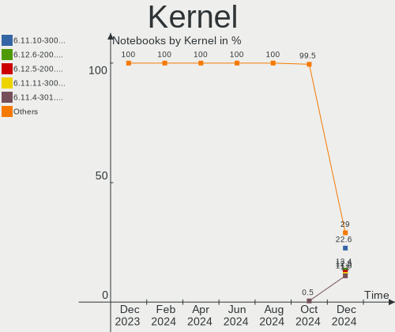
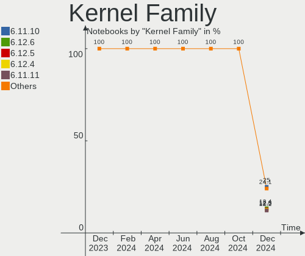
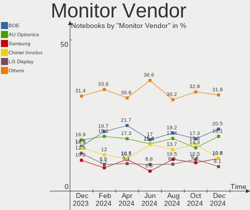
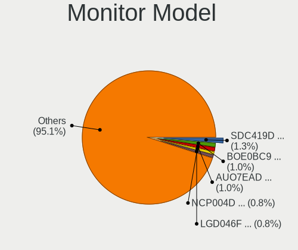
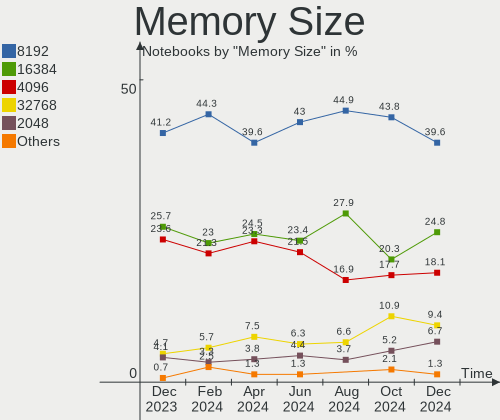

Fedora - Hardware Trends (Notebooks)
------------------------------------

A project to identify most popular hardware characteristics and track their change
over time based on data collected by Linux users at https://Linux-Hardware.org.

Anyone can contribute to this report by the [hw-probe](https://github.com/linuxhw/hw-probe) tool:

    sudo -E hw-probe -all -upload

This report is for one last month. Overall report since the beginning of time: [TestDays](https://github.com/linuxhw/TestDays)

Period: Apr, 2023.

Contents
--------

* [ System ](#system)
  - [ OS                       ](#os)
  - [ OS Family                ](#os-family)
  - [ Kernel                   ](#kernel)
  - [ Kernel Family            ](#kernel-family)
  - [ Kernel Major Ver.        ](#kernel-major-ver)
  - [ Arch                     ](#arch)
  - [ DE                       ](#de)
  - [ Display Server           ](#display-server)
  - [ Display Manager          ](#display-manager)
  - [ OS Lang                  ](#os-lang)
  - [ Boot Mode                ](#boot-mode)
  - [ Filesystem               ](#filesystem)
  - [ Part. scheme             ](#part-scheme)
  - [ Dual Boot with Linux/BSD ](#dual-boot-with-linuxbsd)
  - [ Dual Boot (Win)          ](#dual-boot-win)

* [ Board ](#board)
  - [ Vendor                   ](#vendor)
  - [ Model                    ](#model)
  - [ Model Family             ](#model-family)
  - [ MFG Year                 ](#mfg-year)
  - [ Form Factor              ](#form-factor)
  - [ Secure Boot              ](#secure-boot)
  - [ Coreboot                 ](#coreboot)
  - [ RAM Size                 ](#ram-size)
  - [ RAM Used                 ](#ram-used)
  - [ Total Drives             ](#total-drives)
  - [ Has CD-ROM               ](#has-cd-rom)
  - [ Has Ethernet             ](#has-ethernet)
  - [ Has WiFi                 ](#has-wifi)
  - [ Has Bluetooth            ](#has-bluetooth)

* [ Location ](#location)
  - [ Country                  ](#country)
  - [ City                     ](#city)

* [ Drives ](#drives)
  - [ Drive Vendor             ](#drive-vendor)
  - [ Drive Model              ](#drive-model)
  - [ HDD Vendor               ](#hdd-vendor)
  - [ SSD Vendor               ](#ssd-vendor)
  - [ Drive Kind               ](#drive-kind)
  - [ Drive Connector          ](#drive-connector)
  - [ Drive Size               ](#drive-size)
  - [ Space Total              ](#space-total)
  - [ Space Used               ](#space-used)
  - [ Malfunc. Drives          ](#malfunc-drives)
  - [ Malfunc. Drive Vendor    ](#malfunc-drive-vendor)
  - [ Malfunc. HDD Vendor      ](#malfunc-hdd-vendor)
  - [ Malfunc. Drive Kind      ](#malfunc-drive-kind)
  - [ Failed Drives            ](#failed-drives)
  - [ Failed Drive Vendor      ](#failed-drive-vendor)
  - [ Drive Status             ](#drive-status)

* [ Storage controller ](#storage-controller)
  - [ Storage Vendor           ](#storage-vendor)
  - [ Storage Model            ](#storage-model)
  - [ Storage Kind             ](#storage-kind)

* [ Processor ](#processor)
  - [ CPU Vendor               ](#cpu-vendor)
  - [ CPU Model                ](#cpu-model)
  - [ CPU Model Family         ](#cpu-model-family)
  - [ CPU Cores                ](#cpu-cores)
  - [ CPU Sockets              ](#cpu-sockets)
  - [ CPU Threads              ](#cpu-threads)
  - [ CPU Op-Modes             ](#cpu-op-modes)
  - [ CPU Microcode            ](#cpu-microcode)
  - [ CPU Microarch            ](#cpu-microarch)

* [ Graphics ](#graphics)
  - [ GPU Vendor               ](#gpu-vendor)
  - [ GPU Model                ](#gpu-model)
  - [ GPU Combo                ](#gpu-combo)
  - [ GPU Driver               ](#gpu-driver)
  - [ GPU Memory               ](#gpu-memory)

* [ Monitor ](#monitor)
  - [ Monitor Vendor           ](#monitor-vendor)
  - [ Monitor Model            ](#monitor-model)
  - [ Monitor Resolution       ](#monitor-resolution)
  - [ Monitor Diagonal         ](#monitor-diagonal)
  - [ Monitor Width            ](#monitor-width)
  - [ Aspect Ratio             ](#aspect-ratio)
  - [ Monitor Area             ](#monitor-area)
  - [ Pixel Density            ](#pixel-density)
  - [ Multiple Monitors        ](#multiple-monitors)

* [ Network ](#network)
  - [ Net Controller Vendor    ](#net-controller-vendor)
  - [ Net Controller Model     ](#net-controller-model)
  - [ Wireless Vendor          ](#wireless-vendor)
  - [ Wireless Model           ](#wireless-model)
  - [ Ethernet Vendor          ](#ethernet-vendor)
  - [ Ethernet Model           ](#ethernet-model)
  - [ Net Controller Kind      ](#net-controller-kind)
  - [ Used Controller          ](#used-controller)
  - [ NICs                     ](#nics)
  - [ IPv6                     ](#ipv6)

* [ Bluetooth ](#bluetooth)
  - [ Bluetooth Vendor         ](#bluetooth-vendor)
  - [ Bluetooth Model          ](#bluetooth-model)

* [ Sound ](#sound)
  - [ Sound Vendor             ](#sound-vendor)
  - [ Sound Model              ](#sound-model)

* [ Memory ](#memory)
  - [ Memory Vendor            ](#memory-vendor)
  - [ Memory Model             ](#memory-model)
  - [ Memory Kind              ](#memory-kind)
  - [ Memory Form Factor       ](#memory-form-factor)
  - [ Memory Size              ](#memory-size)
  - [ Memory Speed             ](#memory-speed)

* [ Printers & scanners ](#printers--scanners)
  - [ Printer Vendor           ](#printer-vendor)
  - [ Printer Model            ](#printer-model)
  - [ Scanner Vendor           ](#scanner-vendor)
  - [ Scanner Model            ](#scanner-model)

* [ Camera ](#camera)
  - [ Camera Vendor            ](#camera-vendor)
  - [ Camera Model             ](#camera-model)

* [ Security ](#security)
  - [ Fingerprint Vendor       ](#fingerprint-vendor)
  - [ Fingerprint Model        ](#fingerprint-model)
  - [ Chipcard Vendor          ](#chipcard-vendor)
  - [ Chipcard Model           ](#chipcard-model)

* [ Unsupported ](#unsupported)
  - [ Unsupported Devices      ](#unsupported-devices)
  - [ Unsupported Device Types ](#unsupported-device-types)

System
------

OS
--

Installed operating systems

| Name      | Notebooks | Percent |
|-----------|-----------|---------|
| Fedora 38 | 161       | 56.49%  |
| Fedora 37 | 106       | 37.19%  |
| Fedora 36 | 9         | 3.16%   |
| Fedora 35 | 5         | 1.75%   |
| Fedora 39 | 2         | 0.7%    |
| Fedora 34 | 2         | 0.7%    |

OS Family
---------

OS without a version

| Name   | Notebooks | Percent |
|--------|-----------|---------|
| Fedora | 285       | 100%    |

Kernel
------

Version of the Linux kernel

| Version                                            | Notebooks | Percent |
|----------------------------------------------------|-----------|---------|
| 6.2.11-300.fc38.x86_64                             | 81        | 28.42%  |
| 6.2.9-200.fc37.x86_64                              | 35        | 12.28%  |
| 6.2.12-300.fc38.x86_64                             | 31        | 10.88%  |
| 6.2.8-200.fc37.x86_64                              | 27        | 9.47%   |
| 6.2.9-300.fc38.x86_64                              | 21        | 7.37%   |
| 6.2.13-300.fc38.x86_64                             | 13        | 4.56%   |
| 6.2.10-200.fc37.x86_64                             | 13        | 4.56%   |
| 6.0.7-301.fc37.x86_64                              | 8         | 2.81%   |
| 6.2.12-200.fc37.x86_64                             | 7         | 2.46%   |
| 6.2.10-300.fc38.x86_64                             | 7         | 2.46%   |
| 6.2.11-200.fc37.x86_64                             | 6         | 2.11%   |
| 6.2.9-100.fc36.x86_64                              | 4         | 1.4%    |
| 6.0.12-100.fc35.x86_64                             | 4         | 1.4%    |
| 6.3.0-rc2+                                         | 2         | 0.7%    |
| 6.3.0+                                             | 2         | 0.7%    |
| 6.2.8-300.fc38.x86_64                              | 2         | 0.7%    |
| 6.2.2-301.fc38.x86_64                              | 2         | 0.7%    |
| 6.2.11-703.inttf.fc38.x86_64                       | 2         | 0.7%    |
| 6.1.18-200.fc37.x86_64                             | 2         | 0.7%    |
| 5.17.12-100.fc34.x86_64                            | 2         | 0.7%    |
| 6.3.0-rc7+                                         | 1         | 0.35%   |
| 6.3.0-0.rc7.20230420gitcb0856346a60.59.fc39.x86_64 | 1         | 0.35%   |
| 6.3.0-0.rc4.20230330gitffe78bbd5121.38.fc39.x86_64 | 1         | 0.35%   |
| 6.2.9-250.vanilla.fc37.x86_64                      | 1         | 0.35%   |
| 6.2.8-100.fc36.x86_64                              | 1         | 0.35%   |
| 6.2.7-200.fc37.x86_64                              | 1         | 0.35%   |
| 6.2.11-100.fc36.x86_64                             | 1         | 0.35%   |
| 6.2.10-300.rog.fc38.x86_64                         | 1         | 0.35%   |
| 6.2.10-300.rog.fc37.x86_64                         | 1         | 0.35%   |
| 6.2.10-100.fc36.x86_64                             | 1         | 0.35%   |
| 6.1.15-200.fc37.x86_64                             | 1         | 0.35%   |
| 6.1.14-200.fc37.x86_64                             | 1         | 0.35%   |
| 5.18.17-200.fc36.x86_64                            | 1         | 0.35%   |
| 5.17.3-302.fc36.x86_64                             | 1         | 0.35%   |

Kernel Family
-------------

Linux kernel without a distro release

| Version | Notebooks | Percent |
|---------|-----------|---------|
| 6.2.11  | 90        | 31.58%  |
| 6.2.9   | 61        | 21.4%   |
| 6.2.12  | 38        | 13.33%  |
| 6.2.8   | 30        | 10.53%  |
| 6.2.10  | 23        | 8.07%   |
| 6.2.13  | 13        | 4.56%   |
| 6.0.7   | 8         | 2.81%   |
| 6.3.0   | 7         | 2.46%   |
| 6.0.12  | 4         | 1.4%    |
| 6.2.2   | 2         | 0.7%    |
| 6.1.18  | 2         | 0.7%    |
| 5.17.12 | 2         | 0.7%    |
| 6.2.7   | 1         | 0.35%   |
| 6.1.15  | 1         | 0.35%   |
| 6.1.14  | 1         | 0.35%   |
| 5.18.17 | 1         | 0.35%   |
| 5.17.3  | 1         | 0.35%   |

Kernel Major Ver.
-----------------

Linux kernel major version

| Version | Notebooks | Percent |
|---------|-----------|---------|
| 6.2     | 258       | 90.53%  |
| 6.0     | 12        | 4.21%   |
| 6.3     | 7         | 2.46%   |
| 6.1     | 4         | 1.4%    |
| 5.17    | 3         | 1.05%   |
| 5.18    | 1         | 0.35%   |

Arch
----

OS architecture (x86_64, i586, etc.)

| Name   | Notebooks | Percent |
|--------|-----------|---------|
| x86_64 | 285       | 100%    |

DE
--

Desktop Environment

| Name          | Notebooks | Percent |
|---------------|-----------|---------|
| GNOME         | 218       | 76.49%  |
| KDE5          | 41        | 14.39%  |
| XFCE          | 6         | 2.11%   |
| Unknown       | 6         | 2.11%   |
| X-Cinnamon    | 4         | 1.4%    |
| MATE          | 3         | 1.05%   |
| LXQt          | 2         | 0.7%    |
| GNOME-Classic | 1         | 0.35%   |
| GNOME Classic | 1         | 0.35%   |
| custom        | 1         | 0.35%   |
| Cinnamon      | 1         | 0.35%   |
| Budgie        | 1         | 0.35%   |

Display Server
--------------

X11 or Wayland

| Name    | Notebooks | Percent |
|---------|-----------|---------|
| Wayland | 213       | 74.74%  |
| X11     | 68        | 23.86%  |
| Unknown | 3         | 1.05%   |
| Tty     | 1         | 0.35%   |

Display Manager
---------------

SDDM, LightDM, etc.

| Name    | Notebooks | Percent |
|---------|-----------|---------|
| Unknown | 135       | 47.37%  |
| GDM     | 111       | 38.95%  |
| SDDM    | 26        | 9.12%   |
| LightDM | 12        | 4.21%   |
| LXDM    | 1         | 0.35%   |

OS Lang
-------

Language

| Lang  | Notebooks | Percent |
|-------|-----------|---------|
| en_US | 163       | 57.19%  |
| en_GB | 21        | 7.37%   |
| ru_RU | 16        | 5.61%   |
| fr_FR | 12        | 4.21%   |
| de_DE | 11        | 3.86%   |
| pt_BR | 10        | 3.51%   |
| it_IT | 7         | 2.46%   |
| es_ES | 4         | 1.4%    |
| en_CA | 4         | 1.4%    |
| pl_PL | 3         | 1.05%   |
| es_MX | 3         | 1.05%   |
| es_CL | 3         | 1.05%   |
| de_AT | 3         | 1.05%   |
| zh_CN | 2         | 0.7%    |
| tr_TR | 2         | 0.7%    |
| ru_UA | 2         | 0.7%    |
| en_NL | 2         | 0.7%    |
| uk_UA | 1         | 0.35%   |
| sv_SE | 1         | 0.35%   |
| pt_PT | 1         | 0.35%   |
| nl_NL | 1         | 0.35%   |
| id_ID | 1         | 0.35%   |
| hu_HU | 1         | 0.35%   |
| gl_ES | 1         | 0.35%   |
| fr_CH | 1         | 0.35%   |
| es_VE | 1         | 0.35%   |
| es_PE | 1         | 0.35%   |
| es_EC | 1         | 0.35%   |
| es_CO | 1         | 0.35%   |
| en_IL | 1         | 0.35%   |
| en_AU | 1         | 0.35%   |
| de_CH | 1         | 0.35%   |
| cs_CZ | 1         | 0.35%   |
| C     | 1         | 0.35%   |

Boot Mode
---------

EFI or BIOS

| Mode | Notebooks | Percent |
|------|-----------|---------|
| EFI  | 249       | 87.37%  |
| BIOS | 36        | 12.63%  |

Filesystem
----------

Type of filesystem

| Type    | Notebooks | Percent |
|---------|-----------|---------|
| Btrfs   | 234       | 82.11%  |
| Ext4    | 42        | 14.74%  |
| Xfs     | 7         | 2.46%   |
| Zfs     | 1         | 0.35%   |
| Overlay | 1         | 0.35%   |

Part. scheme
------------

Scheme of partitioning

| Type    | Notebooks | Percent |
|---------|-----------|---------|
| GPT     | 146       | 51.23%  |
| Unknown | 133       | 46.67%  |
| MBR     | 6         | 2.11%   |

Dual Boot with Linux/BSD
------------------------

Hosting more than one Linux/BSD

| Dual boot | Notebooks | Percent |
|-----------|-----------|---------|
| No        | 265       | 92.98%  |
| Yes       | 20        | 7.02%   |

Dual Boot (Win)
---------------

Hosting Linux and Windows

| Dual boot | Notebooks | Percent |
|-----------|-----------|---------|
| No        | 244       | 85.61%  |
| Yes       | 41        | 14.39%  |

Board
-----

Vendor
------

Motherboard manufacturer

| Name                | Notebooks | Percent |
|---------------------|-----------|---------|
| Lenovo              | 81        | 28.42%  |
| Dell                | 45        | 15.79%  |
| ASUSTek Computer    | 38        | 13.33%  |
| Hewlett-Packard     | 36        | 12.63%  |
| HUAWEI              | 14        | 4.91%   |
| Acer                | 14        | 4.91%   |
| MSI                 | 5         | 1.75%   |
| Apple               | 5         | 1.75%   |
| Timi                | 4         | 1.4%    |
| Notebook            | 4         | 1.4%    |
| Toshiba             | 3         | 1.05%   |
| Sony                | 3         | 1.05%   |
| Google              | 3         | 1.05%   |
| Framework           | 3         | 1.05%   |
| Samsung Electronics | 2         | 0.7%    |
| Insyde              | 2         | 0.7%    |
| ilife               | 2         | 0.7%    |
| Fujitsu             | 2         | 0.7%    |
| Chuwi               | 2         | 0.7%    |
| VIOS                | 1         | 0.35%   |
| TUXEDO              | 1         | 0.35%   |
| Razer               | 1         | 0.35%   |
| Positivo            | 1         | 0.35%   |
| PC Specialist       | 1         | 0.35%   |
| Panasonic           | 1         | 0.35%   |
| NEC Computers       | 1         | 0.35%   |
| MECHREVO            | 1         | 0.35%   |
| LDLC                | 1         | 0.35%   |
| Intel               | 1         | 0.35%   |
| HONOR               | 1         | 0.35%   |
| Getac               | 1         | 0.35%   |
| Dynabook            | 1         | 0.35%   |
| Digibras            | 1         | 0.35%   |
| Clevo               | 1         | 0.35%   |
| BTO                 | 1         | 0.35%   |
| 3Logic Group        | 1         | 0.35%   |

Model
-----

Motherboard model

| Name                                        | Notebooks | Percent |
|---------------------------------------------|-----------|---------|
| HUAWEI HVY-WXX9                             | 3         | 1.05%   |
| HP Notebook                                 | 3         | 1.05%   |
| Framework Laptop                            | 3         | 1.05%   |
| Acer Nitro AN515-54                         | 3         | 1.05%   |
| Timi Redmi Book Pro 15 2022                 | 2         | 0.7%    |
| Samsung 550P5C/550P7C                       | 2         | 0.7%    |
| Lenovo ThinkPad X220 42911H8                | 2         | 0.7%    |
| Lenovo ThinkPad X1 Carbon Gen 10 21CBCTO1WW | 2         | 0.7%    |
| ilife S806                                  | 2         | 0.7%    |
| HUAWEI BOHK-WAX9X                           | 2         | 0.7%    |
| HP Laptop 15s-eq2xxx                        | 2         | 0.7%    |
| Dell XPS 15 9500                            | 2         | 0.7%    |
| Dell XPS 13 9380                            | 2         | 0.7%    |
| Dell XPS 13 9310                            | 2         | 0.7%    |
| Dell XPS 13 7390                            | 2         | 0.7%    |
| Dell Latitude 7490                          | 2         | 0.7%    |
| VIOS LTH17                                  | 1         | 0.35%   |
| TUXEDO Pulse 15 Gen1                        | 1         | 0.35%   |
| Toshiba Satellite L515                      | 1         | 0.35%   |
| Toshiba Satellite C55-B                     | 1         | 0.35%   |
| Toshiba Kronos 10CUG                        | 1         | 0.35%   |
| Timi TM1703                                 | 1         | 0.35%   |
| Timi Redmi Book Pro 14 2022                 | 1         | 0.35%   |
| Sony VPCEG23EL                              | 1         | 0.35%   |
| Sony VPCCA1S1E                              | 1         | 0.35%   |
| Sony SVS13A25PXB                            | 1         | 0.35%   |
| Razer Blade                                 | 1         | 0.35%   |
| Positivo N6440                              | 1         | 0.35%   |
| PC Specialist PCx0Dx                        | 1         | 0.35%   |
| Panasonic CF-C2CCEZXCM                      | 1         | 0.35%   |
| Notebook P95_96_97Ex,Rx                     | 1         | 0.35%   |
| Notebook NLxxPUx                            | 1         | 0.35%   |
| Notebook NH55RGQ                            | 1         | 0.35%   |
| Notebook L140PU                             | 1         | 0.35%   |
| NEC Computers PC-VK27MCZCK                  | 1         | 0.35%   |
| MSI Prestige 15 A10SC                       | 1         | 0.35%   |
| MSI Modern 14 B11MOU                        | 1         | 0.35%   |
| MSI Katana 17 B12VGK                        | 1         | 0.35%   |
| MSI Delta 15 A5EFK                          | 1         | 0.35%   |
| MSI Creator 15 A10SGS                       | 1         | 0.35%   |

Model Family
------------

Motherboard model prefix

| Name               | Notebooks | Percent |
|--------------------|-----------|---------|
| Lenovo ThinkPad    | 44        | 15.44%  |
| Lenovo IdeaPad     | 15        | 5.26%   |
| Dell Latitude      | 14        | 4.91%   |
| Dell XPS           | 12        | 4.21%   |
| ASUS VivoBook      | 9         | 3.16%   |
| HP Laptop          | 8         | 2.81%   |
| Lenovo ThinkBook   | 7         | 2.46%   |
| Lenovo Legion      | 7         | 2.46%   |
| HP Pavilion        | 7         | 2.46%   |
| Dell Inspiron      | 7         | 2.46%   |
| ASUS ROG           | 7         | 2.46%   |
| ASUS ASUS          | 6         | 2.11%   |
| Acer Aspire        | 6         | 2.11%   |
| HP ProBook         | 5         | 1.75%   |
| Dell Precision     | 5         | 1.75%   |
| Acer Nitro         | 5         | 1.75%   |
| Timi Redmi         | 3         | 1.05%   |
| Lenovo Yoga        | 3         | 1.05%   |
| HUAWEI HVY-WXX9    | 3         | 1.05%   |
| HP Notebook        | 3         | 1.05%   |
| HP EliteBook       | 3         | 1.05%   |
| Framework Laptop   | 3         | 1.05%   |
| Dell Vostro        | 3         | 1.05%   |
| ASUS ZenBook       | 3         | 1.05%   |
| Toshiba Satellite  | 2         | 0.7%    |
| Samsung 550P5C     | 2         | 0.7%    |
| ilife S806         | 2         | 0.7%    |
| HUAWEI BOHK-WAX9X  | 2         | 0.7%    |
| HP ENVY            | 2         | 0.7%    |
| Fujitsu LIFEBOOK   | 2         | 0.7%    |
| Dell G15           | 2         | 0.7%    |
| ASUS TUF           | 2         | 0.7%    |
| Apple MacBookPro11 | 2         | 0.7%    |
| Acer Swift         | 2         | 0.7%    |
| VIOS LTH17         | 1         | 0.35%   |
| TUXEDO Pulse       | 1         | 0.35%   |
| Toshiba Kronos     | 1         | 0.35%   |
| Timi TM1703        | 1         | 0.35%   |
| Sony VPCEG23EL     | 1         | 0.35%   |
| Sony VPCCA1S1E     | 1         | 0.35%   |

MFG Year
--------

Motherboard manufacture year

| Year    | Notebooks | Percent |
|---------|-----------|---------|
| 2020    | 50        | 17.54%  |
| 2021    | 46        | 16.14%  |
| 2022    | 41        | 14.39%  |
| 2019    | 34        | 11.93%  |
| 2018    | 22        | 7.72%   |
| 2017    | 18        | 6.32%   |
| 2014    | 15        | 5.26%   |
| 2013    | 11        | 3.86%   |
| 2011    | 10        | 3.51%   |
| 2015    | 9         | 3.16%   |
| 2023    | 8         | 2.81%   |
| 2016    | 8         | 2.81%   |
| 2012    | 6         | 2.11%   |
| 2009    | 3         | 1.05%   |
| 2010    | 1         | 0.35%   |
| 2008    | 1         | 0.35%   |
| 2006    | 1         | 0.35%   |
| Unknown | 1         | 0.35%   |

Form Factor
-----------

Physical design of the computer

| Name     | Notebooks | Percent |
|----------|-----------|---------|
| Notebook | 285       | 100%    |

Secure Boot
-----------

Enabled or disabled

| State    | Notebooks | Percent |
|----------|-----------|---------|
| Disabled | 217       | 76.14%  |
| Enabled  | 68        | 23.86%  |

Coreboot
--------

Have coreboot on board

| Used | Notebooks | Percent |
|------|-----------|---------|
| No   | 279       | 97.89%  |
| Yes  | 6         | 2.11%   |

RAM Size
--------

Total RAM memory

| Size in GB  | Notebooks | Percent |
|-------------|-----------|---------|
| 8.01-16.0   | 71        | 24.91%  |
| 16.01-24.0  | 66        | 23.16%  |
| 4.01-8.0    | 62        | 21.75%  |
| 32.01-64.0  | 34        | 11.93%  |
| 3.01-4.0    | 24        | 8.42%   |
| 24.01-32.0  | 11        | 3.86%   |
| 1.01-2.0    | 10        | 3.51%   |
| 64.01-256.0 | 6         | 2.11%   |
| 0.51-1.0    | 1         | 0.35%   |

RAM Used
--------

Used RAM memory

| Used GB    | Notebooks | Percent |
|------------|-----------|---------|
| 3.01-4.0   | 78        | 27.37%  |
| 2.01-3.0   | 77        | 27.02%  |
| 4.01-8.0   | 73        | 25.61%  |
| 1.01-2.0   | 28        | 9.82%   |
| 8.01-16.0  | 19        | 6.67%   |
| 0.51-1.0   | 6         | 2.11%   |
| 16.01-24.0 | 3         | 1.05%   |
| 24.01-32.0 | 1         | 0.35%   |

Total Drives
------------

Number of drives on board

| Drives | Notebooks | Percent |
|--------|-----------|---------|
| 1      | 200       | 70.18%  |
| 2      | 76        | 26.67%  |
| 3      | 7         | 2.46%   |
| 5      | 1         | 0.35%   |
| 0      | 1         | 0.35%   |

Has CD-ROM
----------

Has CD-ROM on board

| Presented | Notebooks | Percent |
|-----------|-----------|---------|
| No        | 243       | 85.26%  |
| Yes       | 42        | 14.74%  |

Has Ethernet
------------

Has Ethernet on board

| Presented | Notebooks | Percent |
|-----------|-----------|---------|
| Yes       | 190       | 66.67%  |
| No        | 95        | 33.33%  |

Has WiFi
--------

Has WiFi module

| Presented | Notebooks | Percent |
|-----------|-----------|---------|
| Yes       | 277       | 97.19%  |
| No        | 8         | 2.81%   |

Has Bluetooth
-------------

Has Bluetooth module

| Presented | Notebooks | Percent |
|-----------|-----------|---------|
| Yes       | 243       | 85.26%  |
| No        | 42        | 14.74%  |

Location
--------

Country
-------

Geographic location (country)

| Country     | Notebooks | Percent |
|-------------|-----------|---------|
| USA         | 46        | 16.14%  |
| Russia      | 18        | 6.32%   |
| Germany     | 18        | 6.32%   |
| Brazil      | 18        | 6.32%   |
| Netherlands | 15        | 5.26%   |
| France      | 14        | 4.91%   |
| Italy       | 12        | 4.21%   |
| Poland      | 10        | 3.51%   |
| UK          | 8         | 2.81%   |
| Turkey      | 8         | 2.81%   |
| Canada      | 8         | 2.81%   |
| Spain       | 7         | 2.46%   |
| India       | 7         | 2.46%   |
| Mexico      | 4         | 1.4%    |
| Chile       | 4         | 1.4%    |
| Belgium     | 4         | 1.4%    |
| Switzerland | 3         | 1.05%   |
| Sweden      | 3         | 1.05%   |
| Singapore   | 3         | 1.05%   |
| Portugal    | 3         | 1.05%   |
| Malaysia    | 3         | 1.05%   |
| Iran        | 3         | 1.05%   |
| Egypt       | 3         | 1.05%   |
| Bulgaria    | 3         | 1.05%   |
| Austria     | 3         | 1.05%   |
| Algeria     | 3         | 1.05%   |
| Thailand    | 2         | 0.7%    |
| Taiwan      | 2         | 0.7%    |
| South Korea | 2         | 0.7%    |
| Slovenia    | 2         | 0.7%    |
| Serbia      | 2         | 0.7%    |
| Paraguay    | 2         | 0.7%    |
| Montenegro  | 2         | 0.7%    |
| Lithuania   | 2         | 0.7%    |
| Indonesia   | 2         | 0.7%    |
| Hungary     | 2         | 0.7%    |
| Czechia     | 2         | 0.7%    |
| Croatia     | 2         | 0.7%    |
| Colombia    | 2         | 0.7%    |
| Belarus     | 2         | 0.7%    |

City
----

Geographic location (city)

| City                | Notebooks | Percent |
|---------------------|-----------|---------|
| Delft               | 6         | 2.11%   |
| Moscow              | 4         | 1.4%    |
| Singapore           | 3         | 1.05%   |
| Sao Paulo           | 3         | 1.05%   |
| New York            | 3         | 1.05%   |
| Kloetinge           | 3         | 1.05%   |
| Istanbul            | 3         | 1.05%   |
| Frankfurt am Main   | 3         | 1.05%   |
| Barcelona           | 3         | 1.05%   |
| Zurich              | 2         | 0.7%    |
| Warsaw              | 2         | 0.7%    |
| Turin               | 2         | 0.7%    |
| Tainan City         | 2         | 0.7%    |
| Sofia               | 2         | 0.7%    |
| Riverside           | 2         | 0.7%    |
| Rio de Janeiro      | 2         | 0.7%    |
| Pune                | 2         | 0.7%    |
| Porto Alegre        | 2         | 0.7%    |
| Podgorica           | 2         | 0.7%    |
| Paris               | 2         | 0.7%    |
| Opole               | 2         | 0.7%    |
| Fernando de la Mora | 2         | 0.7%    |
| Cairo               | 2         | 0.7%    |
| Berlin              | 2         | 0.7%    |
| Bengaluru           | 2         | 0.7%    |
| Ankara              | 2         | 0.7%    |
| Zrenjanin           | 1         | 0.35%   |
| Zaprešić          | 1         | 0.35%   |
| Zagreb              | 1         | 0.35%   |
| Zagazig             | 1         | 0.35%   |
| Yakutsk             | 1         | 0.35%   |
| Wynyard             | 1         | 0.35%   |
| Wroclaw             | 1         | 0.35%   |
| Wloszczowa          | 1         | 0.35%   |
| Winnipeg            | 1         | 0.35%   |
| Wilster             | 1         | 0.35%   |
| Washington          | 1         | 0.35%   |
| Wanchai             | 1         | 0.35%   |
| Volos               | 1         | 0.35%   |
| Vologda             | 1         | 0.35%   |

Drives
------

Drive Vendor
------------

Hard drive vendors

| Vendor                         | Notebooks | Drives | Percent |
|--------------------------------|-----------|--------|---------|
| Samsung Electronics            | 81        | 95     | 22.25%  |
| Unknown                        | 30        | 31     | 8.24%   |
| SanDisk                        | 28        | 30     | 7.69%   |
| WDC                            | 25        | 26     | 6.87%   |
| Micron Technology              | 22        | 22     | 6.04%   |
| Toshiba                        | 21        | 22     | 5.77%   |
| SK hynix                       | 21        | 21     | 5.77%   |
| Kingston                       | 18        | 18     | 4.95%   |
| Seagate                        | 17        | 17     | 4.67%   |
| Intel                          | 11        | 12     | 3.02%   |
| Crucial                        | 9         | 10     | 2.47%   |
| Phison                         | 6         | 6      | 1.65%   |
| Phison Electronics             | 5         | 5      | 1.37%   |
| HGST                           | 5         | 5      | 1.37%   |
| China                          | 5         | 5      | 1.37%   |
| KIOXIA                         | 4         | 4      | 1.1%    |
| Silicon Motion                 | 3         | 3      | 0.82%   |
| Micron/Crucial Technology      | 3         | 3      | 0.82%   |
| Apple                          | 3         | 3      | 0.82%   |
| ADATA Technology               | 3         | 3      | 0.82%   |
| A-DATA Technology              | 3         | 3      | 0.82%   |
| Unknown                        | 3         | 3      | 0.82%   |
| Transcend                      | 2         | 2      | 0.55%   |
| Team                           | 2         | 2      | 0.55%   |
| Shenzhen Longsys Electronics   | 2         | 2      | 0.55%   |
| SABRENT                        | 2         | 2      | 0.55%   |
| Netac                          | 2         | 2      | 0.55%   |
| Kingston Technology Company    | 2         | 2      | 0.55%   |
| JMicron Technology             | 2         | 2      | 0.55%   |
| GOODRAM                        | 2         | 2      | 0.55%   |
| UMIS                           | 1         | 1      | 0.27%   |
| SSSTC                          | 1         | 1      | 0.27%   |
| SPCC                           | 1         | 1      | 0.27%   |
| Solid State Storage Technology | 1         | 1      | 0.27%   |
| Solid State Storage            | 1         | 1      | 0.27%   |
| Reeinno                        | 1         | 1      | 0.27%   |
| Realtek Semiconductor          | 1         | 1      | 0.27%   |
| PNY                            | 1         | 1      | 0.27%   |
| Plextor                        | 1         | 1      | 0.27%   |
| ORTIAL                         | 1         | 1      | 0.27%   |

Drive Model
-----------

Hard drive models

| Model                                              | Notebooks | Percent |
|----------------------------------------------------|-----------|---------|
| Samsung NVMe SSD Controller SM981/PM981/PM983 1TB  | 18        | 4.74%   |
| Samsung NVMe SSD Controller PM9A1/PM9A3/980PRO 2TB | 9         | 2.37%   |
| Toshiba MQ04ABF100 1TB                             | 7         | 1.84%   |
| Seagate ST1000LM035-1RK172 970GB                   | 7         | 1.84%   |
| Kingston SA400S37480G 480GB SSD                    | 5         | 1.32%   |
| Unknown MMC Card  64GB                             | 4         | 1.05%   |
| Unknown MMC Card  32GB                             | 4         | 1.05%   |
| Sandisk WD Blue SN500 / PC SN520 NVMe SSD 512GB    | 4         | 1.05%   |
| Sandisk WD Black SN750 / PC SN730 NVMe SSD 512GB   | 4         | 1.05%   |
| Samsung SSD 980 1TB                                | 4         | 1.05%   |
| Silicon Motion PCIe-8 SSD 512GB                    | 3         | 0.79%   |
| Seagate ST500LT012-1DG142 500GB                    | 3         | 0.79%   |
| Seagate ST1000LM048-2E7172 1TB                     | 3         | 0.79%   |
| SanDisk NVMe SSD Drive 512GB                       | 3         | 0.79%   |
| Samsung MZVL2512HCJQ-00B00 512GB                   | 3         | 0.79%   |
| Samsung MZALQ512HALU-000L2 512GB                   | 3         | 0.79%   |
| Micron 2300 NVMe 512GB                             | 3         | 0.79%   |
| Kingston SNVS1000G 1TB                             | 3         | 0.79%   |
| Crucial CT240BX500SSD1 240GB                       | 3         | 0.79%   |
| Unknown                                            | 3         | 0.79%   |
| WDC WD10SPZX-08Z10 1TB                             | 2         | 0.53%   |
| Unknown NCard  32GB                                | 2         | 0.53%   |
| Unknown MMC Card  256GB                            | 2         | 0.53%   |
| Unknown MMC Card  16GB                             | 2         | 0.53%   |
| Toshiba MQ01ABF050 500GB                           | 2         | 0.53%   |
| Toshiba MQ01ABD100 1TB                             | 2         | 0.53%   |
| SK hynix HFM001TD3JX013N 1024GB                    | 2         | 0.53%   |
| SK hynix BC711 HFM512GD3JX013N 512GB               | 2         | 0.53%   |
| Sandisk WD Blue SN550 NVMe SSD 1024GB              | 2         | 0.53%   |
| Sandisk WD Black SN850 1TB                         | 2         | 0.53%   |
| SanDisk NVMe SSD Drive 1TB                         | 2         | 0.53%   |
| Samsung SSD 980 PRO 1TB                            | 2         | 0.53%   |
| Samsung SSD 850 EVO 500GB                          | 2         | 0.53%   |
| Samsung MZVLB1T0HBLR-000L7 1TB                     | 2         | 0.53%   |
| Samsung MZVL2512HCJQ-00BL7 512GB                   | 2         | 0.53%   |
| Samsung MZALQ256HAJD-000L1 256GB                   | 2         | 0.53%   |
| SABRENT Disk 1TB                                   | 2         | 0.53%   |
| Phison PS5013 E13 NVMe Controller 500GB            | 2         | 0.53%   |
| Phison E12 NVMe Controller 512GB                   | 2         | 0.53%   |
| Phison CFESR512GMTCT-E9C-2 512GB                   | 2         | 0.53%   |

HDD Vendor
----------

Hard disk drive vendors

| Vendor             | Notebooks | Drives | Percent |
|--------------------|-----------|--------|---------|
| Toshiba            | 15        | 15     | 30%     |
| Seagate            | 15        | 15     | 30%     |
| WDC                | 12        | 12     | 24%     |
| HGST               | 5         | 5      | 10%     |
| JMicron Technology | 2         | 2      | 4%      |
| Apple              | 1         | 1      | 2%      |

SSD Vendor
----------

Solid state drive vendors

| Vendor              | Notebooks | Drives | Percent |
|---------------------|-----------|--------|---------|
| Samsung Electronics | 18        | 18     | 22.78%  |
| Kingston            | 11        | 11     | 13.92%  |
| Crucial             | 7         | 8      | 8.86%   |
| SanDisk             | 5         | 5      | 6.33%   |
| China               | 5         | 5      | 6.33%   |
| WDC                 | 4         | 4      | 5.06%   |
| Micron Technology   | 3         | 3      | 3.8%    |
| Toshiba             | 2         | 3      | 2.53%   |
| SK hynix            | 2         | 2      | 2.53%   |
| Netac               | 2         | 2      | 2.53%   |
| GOODRAM             | 2         | 2      | 2.53%   |
| Apple               | 2         | 2      | 2.53%   |
| A-DATA Technology   | 2         | 2      | 2.53%   |
| Transcend           | 1         | 1      | 1.27%   |
| Team                | 1         | 1      | 1.27%   |
| SPCC                | 1         | 1      | 1.27%   |
| PNY                 | 1         | 1      | 1.27%   |
| Plextor             | 1         | 1      | 1.27%   |
| ORTIAL              | 1         | 1      | 1.27%   |
| MidasForce          | 1         | 1      | 1.27%   |
| LITEONIT            | 1         | 1      | 1.27%   |
| Lexar               | 1         | 1      | 1.27%   |
| Leven               | 1         | 1      | 1.27%   |
| KingSpec            | 1         | 1      | 1.27%   |
| KimMiDi             | 1         | 1      | 1.27%   |
| Intel               | 1         | 1      | 1.27%   |
| ASMT                | 1         | 1      | 1.27%   |

Drive Kind
----------

HDD or SSD

| Kind    | Notebooks | Drives | Percent |
|---------|-----------|--------|---------|
| NVMe    | 186       | 217    | 54.23%  |
| SSD     | 74        | 81     | 21.57%  |
| HDD     | 48        | 50     | 13.99%  |
| MMC     | 32        | 33     | 9.33%   |
| Unknown | 3         | 4      | 0.87%   |

Drive Connector
---------------

SATA, SAS, NVMe, etc.

| Type | Notebooks | Drives | Percent |
|------|-----------|--------|---------|
| NVMe | 186       | 215    | 56.02%  |
| SATA | 104       | 125    | 31.33%  |
| MMC  | 32        | 33     | 9.64%   |
| SAS  | 10        | 12     | 3.01%   |

Drive Size
----------

Size of hard drive

| Size in TB | Notebooks | Drives | Percent |
|------------|-----------|--------|---------|
| 0.01-0.5   | 73        | 85     | 61.86%  |
| 0.51-1.0   | 42        | 43     | 35.59%  |
| 1.01-2.0   | 3         | 3      | 2.54%   |

Space Total
-----------

Amount of disk space available on the file system

| Size in GB     | Notebooks | Percent |
|----------------|-----------|---------|
| 501-1000       | 58        | 20.35%  |
| 251-500        | 51        | 17.89%  |
| 1001-2000      | 51        | 17.89%  |
| 101-250        | 39        | 13.68%  |
| 1-20           | 34        | 11.93%  |
| Unknown        | 25        | 8.77%   |
| 51-100         | 11        | 3.86%   |
| 21-50          | 6         | 2.11%   |
| More than 3000 | 5         | 1.75%   |
| 2001-3000      | 5         | 1.75%   |

Space Used
----------

Amount of used disk space

| Used GB        | Notebooks | Percent |
|----------------|-----------|---------|
| 1-20           | 94        | 32.98%  |
| 21-50          | 47        | 16.49%  |
| 51-100         | 36        | 12.63%  |
| 101-250        | 33        | 11.58%  |
| Unknown        | 25        | 8.77%   |
| 251-500        | 22        | 7.72%   |
| 501-1000       | 18        | 6.32%   |
| 1001-2000      | 9         | 3.16%   |
| More than 3000 | 1         | 0.35%   |

Malfunc. Drives
---------------

Drive models with a malfunction

| Model                               | Notebooks | Drives | Percent |
|-------------------------------------|-----------|--------|---------|
| Toshiba MQ04ABF100 1TB              | 1         | 1      | 14.29%  |
| Toshiba MQ01ABF050 500GB            | 1         | 1      | 14.29%  |
| Seagate ST750LM022 HN-M750MBB 752GB | 1         | 1      | 14.29%  |
| Seagate ST500LT012-1DG142 500GB     | 1         | 1      | 14.29%  |
| Kingston SNV425S264GB SSD           | 1         | 1      | 14.29%  |
| HGST HTS725050A7E630 500GB          | 1         | 1      | 14.29%  |
| HGST HTS545050A7E680 500GB          | 1         | 1      | 14.29%  |

Malfunc. Drive Vendor
---------------------

Vendors of faulty drives

| Vendor   | Notebooks | Drives | Percent |
|----------|-----------|--------|---------|
| Toshiba  | 2         | 2      | 28.57%  |
| Seagate  | 2         | 2      | 28.57%  |
| HGST     | 2         | 2      | 28.57%  |
| Kingston | 1         | 1      | 14.29%  |

Malfunc. HDD Vendor
-------------------

Vendors of faulty HDD drives

| Vendor  | Notebooks | Drives | Percent |
|---------|-----------|--------|---------|
| Toshiba | 2         | 2      | 33.33%  |
| Seagate | 2         | 2      | 33.33%  |
| HGST    | 2         | 2      | 33.33%  |

Malfunc. Drive Kind
-------------------

Kinds of faulty drives

| Kind | Notebooks | Drives | Percent |
|------|-----------|--------|---------|
| HDD  | 6         | 6      | 85.71%  |
| SSD  | 1         | 1      | 14.29%  |

Failed Drives
-------------

Failed drive models

Zero info for selected period =(

Failed Drive Vendor
-------------------

Failed drive vendors

Zero info for selected period =(

Drive Status
------------

Number of failed and malfunc. drives

| Status   | Notebooks | Drives | Percent |
|----------|-----------|--------|---------|
| Detected | 172       | 229    | 57.33%  |
| Works    | 121       | 149    | 40.33%  |
| Malfunc  | 7         | 7      | 2.33%   |

Storage controller
------------------

Storage Vendor
--------------

Storage controller vendors

| Vendor                         | Notebooks | Percent |
|--------------------------------|-----------|---------|
| Intel                          | 140       | 38.67%  |
| Samsung Electronics            | 67        | 18.51%  |
| AMD                            | 32        | 8.84%   |
| SanDisk                        | 31        | 8.56%   |
| SK hynix                       | 19        | 5.25%   |
| Micron Technology              | 19        | 5.25%   |
| Phison Electronics             | 11        | 3.04%   |
| Kingston Technology Company    | 9         | 2.49%   |
| Toshiba America Info Systems   | 6         | 1.66%   |
| Silicon Motion                 | 5         | 1.38%   |
| Micron/Crucial Technology      | 4         | 1.1%    |
| ADATA Technology               | 4         | 1.1%    |
| Solid State Storage Technology | 3         | 0.83%   |
| KIOXIA                         | 3         | 0.83%   |
| Shenzhen Longsys Electronics   | 2         | 0.55%   |
| MAXIO Technology (Hangzhou)    | 2         | 0.55%   |
| Union Memory (Shenzhen)        | 1         | 0.28%   |
| Solidigm                       | 1         | 0.28%   |
| Seagate Technology             | 1         | 0.28%   |
| Realtek Semiconductor          | 1         | 0.28%   |
| Lite-On Technology             | 1         | 0.28%   |

Storage Model
-------------

Storage controller models

| Model                                                                          | Notebooks | Percent |
|--------------------------------------------------------------------------------|-----------|---------|
| AMD FCH SATA Controller [AHCI mode]                                            | 32        | 8.63%   |
| Samsung NVMe SSD Controller SM981/PM981/PM983                                  | 30        | 8.09%   |
| Micron NVMe Storage Controller                                                 | 19        | 5.12%   |
| Samsung NVMe SSD Controller PM9A1/PM9A3/980PRO                                 | 16        | 4.31%   |
| Samsung NVMe SSD Controller 980                                                | 15        | 4.04%   |
| Intel Sunrise Point-LP SATA Controller [AHCI mode]                             | 15        | 4.04%   |
| Intel 82801 Mobile SATA Controller [RAID mode]                                 | 12        | 3.23%   |
| Intel Volume Management Device NVMe RAID Controller                            | 11        | 2.96%   |
| SK hynix Gold P31/PC711 NVMe Solid State Drive                                 | 10        | 2.7%    |
| Intel 6 Series/C200 Series Chipset Family 6 port Mobile SATA AHCI Controller   | 9         | 2.43%   |
| SanDisk WD Black SN750 / PC SN730 NVMe SSD                                     | 8         | 2.16%   |
| Intel HM170/QM170 Chipset SATA Controller [AHCI Mode]                          | 8         | 2.16%   |
| Intel 400 Series Chipset Family SATA AHCI Controller                           | 8         | 2.16%   |
| Sandisk Non-Volatile memory controller                                         | 7         | 1.89%   |
| Intel Celeron/Pentium Silver Processor SATA Controller                         | 7         | 1.89%   |
| Intel Cannon Lake Mobile PCH SATA AHCI Controller                              | 7         | 1.89%   |
| Intel Comet Lake SATA AHCI Controller                                          | 6         | 1.62%   |
| Intel 7 Series Chipset Family 6-port SATA Controller [AHCI mode]               | 6         | 1.62%   |
| Intel Wildcat Point-LP SATA Controller [AHCI Mode]                             | 5         | 1.35%   |
| Intel SSD Pro 7600p/760p/E 6100p Series                                        | 5         | 1.35%   |
| Intel 8 Series/C220 Series Chipset Family 6-port SATA Controller 1 [AHCI mode] | 5         | 1.35%   |
| SanDisk WD Blue SN550 NVMe SSD                                                 | 4         | 1.08%   |
| SanDisk WD Blue SN500 / PC SN520 NVMe SSD                                      | 4         | 1.08%   |
| Phison E12 NVMe Controller                                                     | 4         | 1.08%   |
| Intel Tiger Lake-LP SATA Controller                                            | 4         | 1.08%   |
| Intel Atom Processor E3800 Series SATA AHCI Controller                         | 4         | 1.08%   |
| Intel 8 Series SATA Controller 1 [AHCI mode]                                   | 4         | 1.08%   |
| Intel 500 Series Chipset Family SATA AHCI Controller                           | 4         | 1.08%   |
| Toshiba America Info Systems XG6 NVMe SSD Controller                           | 3         | 0.81%   |
| Solid State Storage Non-Volatile memory controller                             | 3         | 0.81%   |
| SK hynix Platinum P41 NVMe Solid State Drive 2TB                               | 3         | 0.81%   |
| SK hynix BC511                                                                 | 3         | 0.81%   |
| Silicon Motion Non-Volatile memory controller                                  | 3         | 0.81%   |
| SanDisk WD PC SN810 / Black SN850 NVMe SSD                                     | 3         | 0.81%   |
| SanDisk WD Black SN770 NVMe SSD                                                | 3         | 0.81%   |
| Samsung NVMe SSD Controller SM961/PM961/SM963                                  | 3         | 0.81%   |
| Phison PS5013 E13 NVMe Controller                                              | 3         | 0.81%   |
| Kingston Company Company Non-Volatile memory controller                        | 3         | 0.81%   |
| Kingston Company NVMe Controller                                               | 3         | 0.81%   |
| Intel Non-Volatile memory controller                                           | 3         | 0.81%   |

Storage Kind
------------

Kind of storage controller (IDE, SATA, NVMe, SAS, ...)

| Kind | Notebooks | Percent |
|------|-----------|---------|
| NVMe | 185       | 52.26%  |
| SATA | 143       | 40.4%   |
| RAID | 23        | 6.5%    |
| IDE  | 3         | 0.85%   |

Processor
---------

CPU Vendor
----------

Processor vendors

| Vendor | Notebooks | Percent |
|--------|-----------|---------|
| Intel  | 211       | 74.04%  |
| AMD    | 74        | 25.96%  |

CPU Model
---------

Processor models

| Model                                         | Notebooks | Percent |
|-----------------------------------------------|-----------|---------|
| Intel Core i7-10750H CPU @ 2.60GHz            | 8         | 2.81%   |
| Intel 12th Gen Core i7-1260P                  | 8         | 2.81%   |
| Intel 11th Gen Core i5-1135G7 @ 2.40GHz       | 8         | 2.81%   |
| Intel Core i7-8550U CPU @ 1.80GHz             | 7         | 2.46%   |
| Intel 12th Gen Core i7-1255U                  | 6         | 2.11%   |
| Intel 11th Gen Core i7-1185G7 @ 3.00GHz       | 6         | 2.11%   |
| AMD Ryzen 7 5800H with Radeon Graphics        | 6         | 2.11%   |
| AMD Ryzen 5 3500U with Radeon Vega Mobile Gfx | 6         | 2.11%   |
| Intel Core i5-10210U CPU @ 1.60GHz            | 5         | 1.75%   |
| Intel Core i7-9750H CPU @ 2.60GHz             | 4         | 1.4%    |
| Intel 11th Gen Core i3-1115G4 @ 3.00GHz       | 4         | 1.4%    |
| AMD Ryzen 5 5600H with Radeon Graphics        | 4         | 1.4%    |
| AMD Ryzen 5 5500U with Radeon Graphics        | 4         | 1.4%    |
| AMD Ryzen 5 4600H with Radeon Graphics        | 4         | 1.4%    |
| Intel Core i7-8750H CPU @ 2.20GHz             | 3         | 1.05%   |
| Intel Core i7-8565U CPU @ 1.80GHz             | 3         | 1.05%   |
| Intel Core i7-7700HQ CPU @ 2.80GHz            | 3         | 1.05%   |
| Intel Core i7-6700HQ CPU @ 2.60GHz            | 3         | 1.05%   |
| Intel Core i7-10870H CPU @ 2.20GHz            | 3         | 1.05%   |
| Intel Core i7-10510U CPU @ 1.80GHz            | 3         | 1.05%   |
| Intel Core i5-6300U CPU @ 2.40GHz             | 3         | 1.05%   |
| Intel Core i5-5200U CPU @ 2.20GHz             | 3         | 1.05%   |
| Intel Core i5-2520M CPU @ 2.50GHz             | 3         | 1.05%   |
| Intel Core i5-10300H CPU @ 2.50GHz            | 3         | 1.05%   |
| Intel Celeron N4020 CPU @ 1.10GHz             | 3         | 1.05%   |
| Intel 12th Gen Core i7-12700H                 | 3         | 1.05%   |
| Intel 12th Gen Core i5-12500H                 | 3         | 1.05%   |
| Intel 12th Gen Core i5-12450H                 | 3         | 1.05%   |
| Intel 11th Gen Core i7-1165G7 @ 2.80GHz       | 3         | 1.05%   |
| AMD Ryzen 7 6800H with Radeon Graphics        | 3         | 1.05%   |
| AMD Ryzen 7 5700U with Radeon Graphics        | 3         | 1.05%   |
| AMD Ryzen 5 2500U with Radeon Vega Mobile Gfx | 3         | 1.05%   |
| Intel Pentium Silver N5030 CPU @ 1.10GHz      | 2         | 0.7%    |
| Intel Pentium CPU N3540 @ 2.16GHz             | 2         | 0.7%    |
| Intel Core i7-7500U CPU @ 2.70GHz             | 2         | 0.7%    |
| Intel Core i7-4610M CPU @ 3.00GHz             | 2         | 0.7%    |
| Intel Core i7-3520M CPU @ 2.90GHz             | 2         | 0.7%    |
| Intel Core i7-10710U CPU @ 1.10GHz            | 2         | 0.7%    |
| Intel Core i5-9300H CPU @ 2.40GHz             | 2         | 0.7%    |
| Intel Core i5-8350U CPU @ 1.70GHz             | 2         | 0.7%    |

CPU Model Family
----------------

Processor model prefix

| Model                   | Notebooks | Percent |
|-------------------------|-----------|---------|
| Intel Core i7           | 63        | 22.11%  |
| Other                   | 56        | 19.65%  |
| Intel Core i5           | 46        | 16.14%  |
| AMD Ryzen 5             | 26        | 9.12%   |
| AMD Ryzen 7             | 23        | 8.07%   |
| Intel Celeron           | 14        | 4.91%   |
| Intel Core i3           | 13        | 4.56%   |
| Intel Atom              | 11        | 3.86%   |
| AMD Ryzen 9             | 7         | 2.46%   |
| AMD Ryzen 7 PRO         | 5         | 1.75%   |
| Intel Pentium Silver    | 3         | 1.05%   |
| AMD Ryzen 5 PRO         | 3         | 1.05%   |
| AMD A10                 | 3         | 1.05%   |
| Intel Pentium           | 2         | 0.7%    |
| AMD Ryzen 3             | 2         | 0.7%    |
| AMD A6                  | 2         | 0.7%    |
| Intel Pentium Dual-Core | 1         | 0.35%   |
| Intel Core i9           | 1         | 0.35%   |
| Intel Core 2 Duo        | 1         | 0.35%   |
| Intel Core 2            | 1         | 0.35%   |
| AMD A8                  | 1         | 0.35%   |
| AMD A12                 | 1         | 0.35%   |

CPU Cores
---------

Number of processor cores

| Number | Notebooks | Percent |
|--------|-----------|---------|
| 4      | 105       | 36.84%  |
| 2      | 74        | 25.96%  |
| 8      | 44        | 15.44%  |
| 6      | 37        | 12.98%  |
| 12     | 11        | 3.86%   |
| 10     | 9         | 3.16%   |
| 14     | 3         | 1.05%   |
| 16     | 1         | 0.35%   |
| 1      | 1         | 0.35%   |

CPU Sockets
-----------

Number of sockets

| Number | Notebooks | Percent |
|--------|-----------|---------|
| 1      | 285       | 100%    |

CPU Threads
-----------

Threads per core (Hyper-Threading)

| Number | Notebooks | Percent |
|--------|-----------|---------|
| 2      | 245       | 85.96%  |
| 1      | 40        | 14.04%  |

CPU Op-Modes
------------

CPU Operation Modes (32-bit, 64-bit)

| Op mode        | Notebooks | Percent |
|----------------|-----------|---------|
| 32-bit, 64-bit | 285       | 100%    |

CPU Microcode
-------------

Microcode number

| Number     | Notebooks | Percent |
|------------|-----------|---------|
| Unknown    | 194       | 68.07%  |
| 0x0a50000c | 13        | 4.56%   |
| 0x08600106 | 8         | 2.81%   |
| 0x08608103 | 6         | 2.11%   |
| 0x08108109 | 6         | 2.11%   |
| 0x0a50000d | 5         | 1.75%   |
| 0x0a404102 | 4         | 1.4%    |
| 0x0a404101 | 4         | 1.4%    |
| 0x08108102 | 4         | 1.4%    |
| 0xa0652    | 3         | 1.05%   |
| 0x806c1    | 3         | 1.05%   |
| 0x0810100b | 3         | 1.05%   |
| 0x06006705 | 3         | 1.05%   |
| 0x806ec    | 2         | 0.7%    |
| 0x806d1    | 2         | 0.7%    |
| 0x206a7    | 2         | 0.7%    |
| 0x0a50000b | 2         | 0.7%    |
| 0x08608104 | 2         | 0.7%    |
| 0x08600104 | 2         | 0.7%    |
| 0x06001119 | 2         | 0.7%    |
| 0x806ea    | 1         | 0.35%   |
| 0x806e9    | 1         | 0.35%   |
| 0x806c2    | 1         | 0.35%   |
| 0x306d4    | 1         | 0.35%   |
| 0x306a9    | 1         | 0.35%   |
| 0x30678    | 1         | 0.35%   |
| 0x30673    | 1         | 0.35%   |
| 0x0a601203 | 1         | 0.35%   |
| 0x08a00006 | 1         | 0.35%   |
| 0x08608102 | 1         | 0.35%   |
| 0x08600103 | 1         | 0.35%   |
| 0x08101007 | 1         | 0.35%   |
| 0x07030106 | 1         | 0.35%   |
| 0x0600611a | 1         | 0.35%   |
| 0x06006118 | 1         | 0.35%   |

CPU Microarch
-------------

Microarchitecture

| Name             | Notebooks | Percent |
|------------------|-----------|---------|
| KabyLake         | 53        | 18.6%   |
| TigerLake        | 24        | 8.42%   |
| Alderlake Hybrid | 24        | 8.42%   |
| Zen 3            | 21        | 7.37%   |
| Unknown          | 21        | 7.37%   |
| CometLake        | 19        | 6.67%   |
| Silvermont       | 17        | 5.96%   |
| Zen 2            | 12        | 4.21%   |
| Haswell          | 12        | 4.21%   |
| Skylake          | 11        | 3.86%   |
| Zen+             | 10        | 3.51%   |
| SandyBridge      | 10        | 3.51%   |
| IvyBridge        | 9         | 3.16%   |
| Goldmont plus    | 8         | 2.81%   |
| IceLake          | 7         | 2.46%   |
| Broadwell        | 7         | 2.46%   |
| Excavator        | 5         | 1.75%   |
| Zen              | 4         | 1.4%    |
| Westmere         | 2         | 0.7%    |
| Piledriver       | 2         | 0.7%    |
| Penryn           | 2         | 0.7%    |
| Tremont          | 1         | 0.35%   |
| Puma             | 1         | 0.35%   |
| Goldmont         | 1         | 0.35%   |
| Core             | 1         | 0.35%   |
| Bonnell          | 1         | 0.35%   |

Graphics
--------

GPU Vendor
----------

Vendors of graphics cards

| Vendor | Notebooks | Percent |
|--------|-----------|---------|
| Intel  | 200       | 54.2%   |
| Nvidia | 94        | 25.47%  |
| AMD    | 75        | 20.33%  |

GPU Model
---------

Graphics card models

| Model                                                                                    | Notebooks | Percent |
|------------------------------------------------------------------------------------------|-----------|---------|
| Intel TigerLake-LP GT2 [Iris Xe Graphics]                                                | 20        | 5.36%   |
| Intel CometLake-H GT2 [UHD Graphics]                                                     | 16        | 4.29%   |
| AMD Cezanne [Radeon Vega Series / Radeon Vega Mobile Series]                             | 15        | 4.02%   |
| Intel Alder Lake-P Integrated Graphics Controller                                        | 14        | 3.75%   |
| Intel UHD Graphics 620                                                                   | 13        | 3.49%   |
| AMD Renoir                                                                               | 12        | 3.22%   |
| Intel CoffeeLake-H GT2 [UHD Graphics 630]                                                | 11        | 2.95%   |
| Intel CometLake-U GT2 [UHD Graphics]                                                     | 10        | 2.68%   |
| Intel Atom Processor Z36xxx/Z37xxx Series Graphics & Display                             | 10        | 2.68%   |
| AMD Picasso/Raven 2 [Radeon Vega Series / Radeon Vega Mobile Series]                     | 10        | 2.68%   |
| Intel 2nd Generation Core Processor Family Integrated Graphics Controller                | 9         | 2.41%   |
| AMD Lucienne                                                                             | 9         | 2.41%   |
| AMD Rembrandt [Radeon 680M]                                                              | 8         | 2.14%   |
| Nvidia GA106M [GeForce RTX 3060 Mobile / Max-Q]                                          | 7         | 1.88%   |
| Intel WhiskeyLake-U GT2 [UHD Graphics 620]                                               | 7         | 1.88%   |
| Intel Atom/Celeron/Pentium Processor x5-E8000/J3xxx/N3xxx Integrated Graphics Controller | 7         | 1.88%   |
| Intel 3rd Gen Core processor Graphics Controller                                         | 7         | 1.88%   |
| Intel HD Graphics 5500                                                                   | 6         | 1.61%   |
| Intel Haswell-ULT Integrated Graphics Controller                                         | 6         | 1.61%   |
| Intel Alder Lake-UP3 GT2 [Iris Xe Graphics]                                              | 6         | 1.61%   |
| Nvidia TU117M [GeForce GTX 1650 Ti Mobile]                                               | 5         | 1.34%   |
| Intel Skylake GT2 [HD Graphics 520]                                                      | 5         | 1.34%   |
| Intel HD Graphics 620                                                                    | 5         | 1.34%   |
| Intel HD Graphics 530                                                                    | 5         | 1.34%   |
| Intel GeminiLake [UHD Graphics 600]                                                      | 5         | 1.34%   |
| Nvidia TU117M [GeForce GTX 1650 Mobile / Max-Q]                                          | 4         | 1.07%   |
| Nvidia TU116M [GeForce GTX 1660 Ti Mobile]                                               | 4         | 1.07%   |
| Nvidia GP108M [GeForce MX150]                                                            | 4         | 1.07%   |
| Nvidia GA107M [GeForce RTX 3050 Mobile]                                                  | 4         | 1.07%   |
| Intel Tiger Lake-LP GT2 [UHD Graphics G4]                                                | 4         | 1.07%   |
| Intel HD Graphics 630                                                                    | 4         | 1.07%   |
| Intel Alder Lake-P GT1 [UHD Graphics]                                                    | 4         | 1.07%   |
| Intel 4th Gen Core Processor Integrated Graphics Controller                              | 4         | 1.07%   |
| AMD Raven Ridge [Radeon Vega Series / Radeon Vega Mobile Series]                         | 4         | 1.07%   |
| AMD Barcelo                                                                              | 4         | 1.07%   |
| Nvidia TU117M                                                                            | 3         | 0.8%    |
| Nvidia GP108M [GeForce MX250]                                                            | 3         | 0.8%    |
| Nvidia GP107M [GeForce GTX 1050 Ti Mobile]                                               | 3         | 0.8%    |
| Nvidia GP106M [GeForce GTX 1060 Mobile]                                                  | 3         | 0.8%    |
| Nvidia GM108M [GeForce 940MX]                                                            | 3         | 0.8%    |

GPU Combo
---------

Combinations of graphics cards

| Name           | Notebooks | Percent |
|----------------|-----------|---------|
| 1 x Intel      | 128       | 44.91%  |
| Intel + Nvidia | 70        | 24.56%  |
| 1 x AMD        | 58        | 20.35%  |
| AMD + Nvidia   | 13        | 4.56%   |
| 1 x Nvidia     | 11        | 3.86%   |
| 2 x AMD        | 3         | 1.05%   |
| 2 x Intel      | 1         | 0.35%   |
| Intel + AMD    | 1         | 0.35%   |

GPU Driver
----------

Free vs proprietary

| Driver      | Notebooks | Percent |
|-------------|-----------|---------|
| Free        | 239       | 83.86%  |
| Proprietary | 38        | 13.33%  |
| Unknown     | 8         | 2.81%   |

GPU Memory
----------

Total video memory

| Size in GB | Notebooks | Percent |
|------------|-----------|---------|
| Unknown    | 171       | 60%     |
| 0.01-0.5   | 35        | 12.28%  |
| 1.01-2.0   | 27        | 9.47%   |
| 3.01-4.0   | 18        | 6.32%   |
| 0.51-1.0   | 14        | 4.91%   |
| 5.01-6.0   | 10        | 3.51%   |
| 8.01-16.0  | 5         | 1.75%   |
| 7.01-8.0   | 4         | 1.4%    |
| 2.01-3.0   | 1         | 0.35%   |

Monitor
-------

Monitor Vendor
--------------

Monitor vendors

| Vendor                  | Notebooks | Percent |
|-------------------------|-----------|---------|
| BOE                     | 68        | 20.48%  |
| AU Optronics            | 65        | 19.58%  |
| Chimei Innolux          | 43        | 12.95%  |
| LG Display              | 27        | 8.13%   |
| Samsung Electronics     | 20        | 6.02%   |
| Sharp                   | 19        | 5.72%   |
| Dell                    | 11        | 3.31%   |
| Goldstar                | 8         | 2.41%   |
| CSO                     | 8         | 2.41%   |
| PANDA                   | 7         | 2.11%   |
| Hewlett-Packard         | 7         | 2.11%   |
| Lenovo                  | 6         | 1.81%   |
| Philips                 | 5         | 1.51%   |
| Apple                   | 5         | 1.51%   |
| BenQ                    | 4         | 1.2%    |
| Chi Mei Optoelectronics | 3         | 0.9%    |
| AOC                     | 3         | 0.9%    |
| TMX                     | 2         | 0.6%    |
| Ancor Communications    | 2         | 0.6%    |
| Acer                    | 2         | 0.6%    |
| ViewSonic               | 1         | 0.3%    |
| Vestel Elektronik       | 1         | 0.3%    |
| Toshiba                 | 1         | 0.3%    |
| Tianma XM               | 1         | 0.3%    |
| Sceptre Tech            | 1         | 0.3%    |
| SANYO                   | 1         | 0.3%    |
| LG Philips              | 1         | 0.3%    |
| KDB                     | 1         | 0.3%    |
| Iiyama                  | 1         | 0.3%    |
| HannStar                | 1         | 0.3%    |
| GDH                     | 1         | 0.3%    |
| Gateway                 | 1         | 0.3%    |
| Fujitsu Siemens         | 1         | 0.3%    |
| CTO                     | 1         | 0.3%    |
| CPT                     | 1         | 0.3%    |
| ASUSTek Computer        | 1         | 0.3%    |
| AGO                     | 1         | 0.3%    |

Monitor Model
-------------

Monitor models

| Model                                                                  | Notebooks | Percent |
|------------------------------------------------------------------------|-----------|---------|
| AU Optronics LCD Monitor AUO38ED 1920x1080 344x193mm 15.5-inch         | 5         | 1.5%    |
| AU Optronics LCD Monitor AUO21ED 1920x1080 344x193mm 15.5-inch         | 5         | 1.5%    |
| Chimei Innolux LCD Monitor CMN1521 1920x1080 344x193mm 15.5-inch       | 4         | 1.2%    |
| BOE LCD Monitor BOE0878 1920x1080 355x200mm 16.0-inch                  | 4         | 1.2%    |
| Sharp LCD Monitor SHP14AD 3840x2160 294x165mm 13.3-inch                | 3         | 0.9%    |
| LG Display LCD Monitor LGD046D 1920x1080 309x174mm 14.0-inch           | 3         | 0.9%    |
| Chimei Innolux LCD Monitor CMN15F5 1920x1080 344x193mm 15.5-inch       | 3         | 0.9%    |
| Chimei Innolux LCD Monitor CMN14D4 1920x1080 309x173mm 13.9-inch       | 3         | 0.9%    |
| BOE LCD Monitor BOE095F 2256x1504 285x190mm 13.5-inch                  | 3         | 0.9%    |
| BOE LCD Monitor BOE0872 1920x1080 344x194mm 15.5-inch                  | 3         | 0.9%    |
| TMX TL156MDMP11-0 TMX1560 3200x2000 336x210mm 15.6-inch                | 2         | 0.6%    |
| Sharp LCD Monitor SHP1453 1920x1080 346x194mm 15.6-inch                | 2         | 0.6%    |
| Samsung Electronics LCD Monitor SDC4E51 1366x768 344x194mm 15.5-inch   | 2         | 0.6%    |
| PANDA LCD Monitor NCP005E 1920x1080 309x174mm 14.0-inch                | 2         | 0.6%    |
| LG Display LCD Monitor LGD06B3 1920x1200 336x210mm 15.6-inch           | 2         | 0.6%    |
| LG Display LCD Monitor LGD02D8 1366x768 277x156mm 12.5-inch            | 2         | 0.6%    |
| Hewlett-Packard 24fw HPN3545 1920x1080 527x296mm 23.8-inch             | 2         | 0.6%    |
| Goldstar HDR WFHD GSM7714 2560x1080 798x334mm 34.1-inch                | 2         | 0.6%    |
| Dell U2412M DELA07A 1920x1200 518x324mm 24.1-inch                      | 2         | 0.6%    |
| Chimei Innolux LCD Monitor CMN15E8 1920x1080 344x193mm 15.5-inch       | 2         | 0.6%    |
| Chimei Innolux LCD Monitor CMN15E6 1366x768 344x193mm 15.5-inch        | 2         | 0.6%    |
| Chimei Innolux LCD Monitor CMN15C2 1920x1080 344x194mm 15.5-inch       | 2         | 0.6%    |
| Chimei Innolux LCD Monitor CMN14F2 1920x1080 309x173mm 13.9-inch       | 2         | 0.6%    |
| Chimei Innolux LCD Monitor CMN14D5 1920x1080 309x173mm 13.9-inch       | 2         | 0.6%    |
| BOE LCD Monitor BOE0893 2160x1440 296x197mm 14.0-inch                  | 2         | 0.6%    |
| BOE LCD Monitor BOE0877 1920x1080 309x173mm 13.9-inch                  | 2         | 0.6%    |
| BOE LCD Monitor BOE07F6 1920x1080 309x174mm 14.0-inch                  | 2         | 0.6%    |
| BOE LCD Monitor BOE06FB 1920x1080 344x194mm 15.5-inch                  | 2         | 0.6%    |
| BOE LCD Monitor BOE069B 1600x900 382x215mm 17.3-inch                   | 2         | 0.6%    |
| AU Optronics LCD Monitor AUOED8F 1920x1080 344x193mm 15.5-inch         | 2         | 0.6%    |
| AU Optronics LCD Monitor AUOE48D 1920x1080 344x194mm 15.5-inch         | 2         | 0.6%    |
| AU Optronics LCD Monitor AUO71EC 1366x768 344x193mm 15.5-inch          | 2         | 0.6%    |
| AU Optronics LCD Monitor AUO408D 1920x1080 309x174mm 14.0-inch         | 2         | 0.6%    |
| AU Optronics LCD Monitor AUO403D 1920x1080 309x174mm 14.0-inch         | 2         | 0.6%    |
| AU Optronics LCD Monitor AUO10EC 1366x768 344x193mm 15.5-inch          | 2         | 0.6%    |
| ViewSonic Q22wb VSCDB1F 1680x1050 474x296mm 22.0-inch                  | 1         | 0.3%    |
| Vestel Elektronik 55UHD_LCD_TV VES3700 3840x2160 1872x1053mm 84.6-inch | 1         | 0.3%    |
| Toshiba TV TSB0206 1920x1080 886x498mm 40.0-inch                       | 1         | 0.3%    |
| Tianma XM LCD Monitor TLX1388 3000x2000 293x196mm 13.9-inch            | 1         | 0.3%    |
| Sharp LQ156M1JW09 SHP14D3 1920x1080 344x194mm 15.5-inch                | 1         | 0.3%    |

Monitor Resolution
------------------

Monitor screen resolution

| Resolution         | Notebooks | Percent |
|--------------------|-----------|---------|
| 1920x1080 (FHD)    | 160       | 52.29%  |
| 1366x768 (WXGA)    | 46        | 15.03%  |
| 3840x2160 (4K)     | 16        | 5.23%   |
| 1920x1200 (WUXGA)  | 15        | 4.9%    |
| 2560x1440 (QHD)    | 11        | 3.59%   |
| 2560x1600          | 10        | 3.27%   |
| 1600x900 (HD+)     | 8         | 2.61%   |
| 1440x900 (WXGA+)   | 5         | 1.63%   |
| 3840x2400          | 4         | 1.31%   |
| 2160x1440          | 4         | 1.31%   |
| 3440x1440          | 3         | 0.98%   |
| 2256x1504          | 3         | 0.98%   |
| 1680x1050 (WSXGA+) | 3         | 0.98%   |
| 3200x2000          | 2         | 0.65%   |
| 2880x1800          | 2         | 0.65%   |
| 2560x1080          | 2         | 0.65%   |
| 1280x800 (WXGA)    | 2         | 0.65%   |
| 3840x1100          | 1         | 0.33%   |
| 3456x2160          | 1         | 0.33%   |
| 3120x2080          | 1         | 0.33%   |
| 3000x2000          | 1         | 0.33%   |
| 2880x1620          | 1         | 0.33%   |
| 2520x1680          | 1         | 0.33%   |
| 2160x1350          | 1         | 0.33%   |
| 1280x1024 (SXGA)   | 1         | 0.33%   |
| 1024x768 (XGA)     | 1         | 0.33%   |
| 1024x600           | 1         | 0.33%   |

Monitor Diagonal
----------------

Diagonal size in inches

| Inches  | Notebooks | Percent |
|---------|-----------|---------|
| 15      | 125       | 37.65%  |
| 14      | 53        | 15.96%  |
| 13      | 50        | 15.06%  |
| 24      | 16        | 4.82%   |
| 16      | 15        | 4.52%   |
| 27      | 12        | 3.61%   |
| 17      | 10        | 3.01%   |
| 12      | 9         | 2.71%   |
| 21      | 7         | 2.11%   |
| 34      | 6         | 1.81%   |
| 23      | 6         | 1.81%   |
| 11      | 4         | 1.2%    |
| 22      | 3         | 0.9%    |
| 19      | 3         | 0.9%    |
| 31      | 2         | 0.6%    |
| 10      | 2         | 0.6%    |
| 84      | 1         | 0.3%    |
| 74      | 1         | 0.3%    |
| 54      | 1         | 0.3%    |
| 52      | 1         | 0.3%    |
| 42      | 1         | 0.3%    |
| 36      | 1         | 0.3%    |
| 28      | 1         | 0.3%    |
| 25      | 1         | 0.3%    |
| Unknown | 1         | 0.3%    |

Monitor Width
-------------

Physical width

| Width in mm | Notebooks | Percent |
|-------------|-----------|---------|
| 301-350     | 205       | 62.31%  |
| 201-300     | 45        | 13.68%  |
| 501-600     | 34        | 10.33%  |
| 351-400     | 17        | 5.17%   |
| 401-500     | 11        | 3.34%   |
| 701-800     | 7         | 2.13%   |
| 601-700     | 4         | 1.22%   |
| 1501-2000   | 2         | 0.61%   |
| 1001-1500   | 2         | 0.61%   |
| 901-1000    | 1         | 0.3%    |
| Unknown     | 1         | 0.3%    |

Aspect Ratio
------------

Proportional relationship between the width and the height

| Ratio | Notebooks | Percent |
|-------|-----------|---------|
| 16/9  | 225       | 77.32%  |
| 16/10 | 47        | 16.15%  |
| 3/2   | 9         | 3.09%   |
| 21/9  | 6         | 2.06%   |
| 4/3   | 2         | 0.69%   |
| 5/4   | 1         | 0.34%   |
| 3.40  | 1         | 0.34%   |

Monitor Area
------------

Area in inch²

| Area in inch² | Notebooks | Percent |
|----------------|-----------|---------|
| 101-110        | 131       | 39.46%  |
| 81-90          | 80        | 24.1%   |
| 201-250        | 26        | 7.83%   |
| 71-80          | 20        | 6.02%   |
| 301-350        | 12        | 3.61%   |
| 121-130        | 10        | 3.01%   |
| 351-500        | 9         | 2.71%   |
| 111-120        | 9         | 2.71%   |
| 61-70          | 8         | 2.41%   |
| 251-300        | 6         | 1.81%   |
| 51-60          | 5         | 1.51%   |
| More than 1000 | 4         | 1.2%    |
| 151-200        | 4         | 1.2%    |
| 91-100         | 3         | 0.9%    |
| 41-50          | 2         | 0.6%    |
| 501-1000       | 2         | 0.6%    |
| Unknown        | 1         | 0.3%    |

Pixel Density
-------------

Pixels per inch

| Density       | Notebooks | Percent |
|---------------|-----------|---------|
| 121-160       | 169       | 52%     |
| 101-120       | 55        | 16.92%  |
| 51-100        | 40        | 12.31%  |
| 161-240       | 39        | 12%     |
| More than 240 | 18        | 5.54%   |
| 1-50          | 3         | 0.92%   |
| Unknown       | 1         | 0.31%   |

Multiple Monitors
-----------------

Total monitors connected

| Total | Notebooks | Percent |
|-------|-----------|---------|
| 1     | 207       | 72.63%  |
| 2     | 60        | 21.05%  |
| 0     | 14        | 4.91%   |
| 3     | 4         | 1.4%    |

Network
-------

Net Controller Vendor
---------------------

Controller vendors

| Vendor                                | Notebooks | Percent |
|---------------------------------------|-----------|---------|
| Intel                                 | 173       | 42.51%  |
| Realtek Semiconductor                 | 148       | 36.36%  |
| Qualcomm Atheros                      | 19        | 4.67%   |
| MediaTek                              | 16        | 3.93%   |
| Broadcom                              | 14        | 3.44%   |
| Lenovo                                | 5         | 1.23%   |
| DisplayLink                           | 4         | 0.98%   |
| Broadcom Limited                      | 4         | 0.98%   |
| Xiaomi                                | 3         | 0.74%   |
| TP-Link                               | 3         | 0.74%   |
| Qualcomm                              | 3         | 0.74%   |
| Samsung Electronics                   | 2         | 0.49%   |
| ASIX Electronics                      | 2         | 0.49%   |
| T & A Mobile Phones                   | 1         | 0.25%   |
| Sierra Wireless                       | 1         | 0.25%   |
| Ralink Technology                     | 1         | 0.25%   |
| Quectel Wireless Solutions            | 1         | 0.25%   |
| Qualcomm Technologies                 | 1         | 0.25%   |
| Qualcomm Atheros Communications       | 1         | 0.25%   |
| OnePlus Technology (Shenzhen)         | 1         | 0.25%   |
| JMicron Technology                    | 1         | 0.25%   |
| Hewlett-Packard                       | 1         | 0.25%   |
| Google                                | 1         | 0.25%   |
| 802.11g Adapter [Linksys WUSB54GC v3] | 1         | 0.25%   |

Net Controller Model
--------------------

Controller models

| Model                                                             | Notebooks | Percent |
|-------------------------------------------------------------------|-----------|---------|
| Realtek RTL8111/8168/8411 PCI Express Gigabit Ethernet Controller | 94        | 18.91%  |
| Intel Wi-Fi 6 AX200                                               | 22        | 4.43%   |
| Intel Alder Lake-P PCH CNVi WiFi                                  | 22        | 4.43%   |
| Intel Wi-Fi 6 AX201                                               | 18        | 3.62%   |
| Realtek RTL8153 Gigabit Ethernet Adapter                          | 16        | 3.22%   |
| Intel Comet Lake PCH CNVi WiFi                                    | 15        | 3.02%   |
| Intel Wireless 8265 / 8275                                        | 14        | 2.82%   |
| Realtek RTL8822CE 802.11ac PCIe Wireless Network Adapter          | 12        | 2.41%   |
| Realtek RTL810xE PCI Express Fast Ethernet controller             | 10        | 2.01%   |
| Realtek RTL8821CE 802.11ac PCIe Wireless Network Adapter          | 9         | 1.81%   |
| MediaTek MT7921 802.11ax PCI Express Wireless Network Adapter     | 9         | 1.81%   |
| Intel Wi-Fi 6 AX210/AX211/AX411 160MHz                            | 9         | 1.81%   |
| Intel Comet Lake PCH-LP CNVi WiFi                                 | 9         | 1.81%   |
| Intel 82579LM Gigabit Network Connection (Lewisville)             | 9         | 1.81%   |
| Intel Wireless 7265                                               | 8         | 1.61%   |
| Realtek RTL8852BE PCIe 802.11ax Wireless Network Controller       | 7         | 1.41%   |
| Qualcomm Atheros QCA9377 802.11ac Wireless Network Adapter        | 7         | 1.41%   |
| Intel Ethernet Connection (16) I219-V                             | 7         | 1.41%   |
| Intel Cannon Lake PCH CNVi WiFi                                   | 7         | 1.41%   |
| Realtek RTL8852AE 802.11ax PCIe Wireless Network Adapter          | 5         | 1.01%   |
| Realtek RTL8723BE PCIe Wireless Network Adapter                   | 5         | 1.01%   |
| Qualcomm Atheros QCA6174 802.11ac Wireless Network Adapter        | 5         | 1.01%   |
| MediaTek MT7922 802.11ax PCI Express Wireless Network Adapter     | 5         | 1.01%   |
| Intel Wireless 8260                                               | 5         | 1.01%   |
| Intel Centrino Advanced-N 6235                                    | 5         | 1.01%   |
| Intel Cannon Point-LP CNVi [Wireless-AC]                          | 5         | 1.01%   |
| Intel Tiger Lake PCH CNVi WiFi                                    | 4         | 0.8%    |
| Intel Ethernet Connection I219-LM                                 | 4         | 0.8%    |
| Intel Ethernet Connection (4) I219-LM                             | 4         | 0.8%    |
| Intel Centrino Advanced-N 6205 [Taylor Peak]                      | 4         | 0.8%    |
| Broadcom BCM43142 802.11b/g/n                                     | 4         | 0.8%    |
| Xiaomi Mi/Redmi series (RNDIS)                                    | 3         | 0.6%    |
| Realtek RTL88x2bu [AC1200 Techkey]                                | 3         | 0.6%    |
| Realtek RTL8723DE Wireless Network Adapter                        | 3         | 0.6%    |
| Realtek RTL8125 2.5GbE Controller                                 | 3         | 0.6%    |
| Qualcomm Atheros AR9285 Wireless Network Adapter (PCI-Express)    | 3         | 0.6%    |
| Intel Wireless-AC 9260                                            | 3         | 0.6%    |
| Intel Wireless 3165                                               | 3         | 0.6%    |
| Intel Gemini Lake PCH CNVi WiFi                                   | 3         | 0.6%    |
| Intel Ethernet Connection I217-LM                                 | 3         | 0.6%    |

Wireless Vendor
---------------

Wireless vendors

| Vendor                                | Notebooks | Percent |
|---------------------------------------|-----------|---------|
| Intel                                 | 169       | 58.89%  |
| Realtek Semiconductor                 | 56        | 19.51%  |
| Qualcomm Atheros                      | 18        | 6.27%   |
| MediaTek                              | 16        | 5.57%   |
| Broadcom                              | 13        | 4.53%   |
| Broadcom Limited                      | 4         | 1.39%   |
| TP-Link                               | 2         | 0.7%    |
| Qualcomm                              | 2         | 0.7%    |
| Sierra Wireless                       | 1         | 0.35%   |
| Ralink Technology                     | 1         | 0.35%   |
| Quectel Wireless Solutions            | 1         | 0.35%   |
| Qualcomm Technologies                 | 1         | 0.35%   |
| Qualcomm Atheros Communications       | 1         | 0.35%   |
| Hewlett-Packard                       | 1         | 0.35%   |
| 802.11g Adapter [Linksys WUSB54GC v3] | 1         | 0.35%   |

Wireless Model
--------------

Wireless models

| Model                                                          | Notebooks | Percent |
|----------------------------------------------------------------|-----------|---------|
| Intel Wi-Fi 6 AX200                                            | 22        | 7.64%   |
| Intel Alder Lake-P PCH CNVi WiFi                               | 22        | 7.64%   |
| Intel Wi-Fi 6 AX201                                            | 18        | 6.25%   |
| Intel Comet Lake PCH CNVi WiFi                                 | 15        | 5.21%   |
| Intel Wireless 8265 / 8275                                     | 14        | 4.86%   |
| Realtek RTL8822CE 802.11ac PCIe Wireless Network Adapter       | 12        | 4.17%   |
| Realtek RTL8821CE 802.11ac PCIe Wireless Network Adapter       | 9         | 3.13%   |
| MediaTek MT7921 802.11ax PCI Express Wireless Network Adapter  | 9         | 3.13%   |
| Intel Wi-Fi 6 AX210/AX211/AX411 160MHz                         | 9         | 3.13%   |
| Intel Comet Lake PCH-LP CNVi WiFi                              | 9         | 3.13%   |
| Intel Wireless 7265                                            | 8         | 2.78%   |
| Realtek RTL8852BE PCIe 802.11ax Wireless Network Controller    | 7         | 2.43%   |
| Qualcomm Atheros QCA9377 802.11ac Wireless Network Adapter     | 7         | 2.43%   |
| Intel Cannon Lake PCH CNVi WiFi                                | 7         | 2.43%   |
| Realtek RTL8852AE 802.11ax PCIe Wireless Network Adapter       | 5         | 1.74%   |
| Realtek RTL8723BE PCIe Wireless Network Adapter                | 5         | 1.74%   |
| Qualcomm Atheros QCA6174 802.11ac Wireless Network Adapter     | 5         | 1.74%   |
| MediaTek MT7922 802.11ax PCI Express Wireless Network Adapter  | 5         | 1.74%   |
| Intel Wireless 8260                                            | 5         | 1.74%   |
| Intel Centrino Advanced-N 6235                                 | 5         | 1.74%   |
| Intel Cannon Point-LP CNVi [Wireless-AC]                       | 5         | 1.74%   |
| Intel Tiger Lake PCH CNVi WiFi                                 | 4         | 1.39%   |
| Intel Centrino Advanced-N 6205 [Taylor Peak]                   | 4         | 1.39%   |
| Broadcom BCM43142 802.11b/g/n                                  | 4         | 1.39%   |
| Realtek RTL88x2bu [AC1200 Techkey]                             | 3         | 1.04%   |
| Realtek RTL8723DE Wireless Network Adapter                     | 3         | 1.04%   |
| Qualcomm Atheros AR9285 Wireless Network Adapter (PCI-Express) | 3         | 1.04%   |
| Intel Wireless-AC 9260                                         | 3         | 1.04%   |
| Intel Wireless 3165                                            | 3         | 1.04%   |
| Intel Gemini Lake PCH CNVi WiFi                                | 3         | 1.04%   |
| Broadcom Limited BCM4360 802.11ac Wireless Network Adapter     | 3         | 1.04%   |
| TP-Link 802.11ac WLAN Adapter                                  | 2         | 0.69%   |
| Realtek RTL8821AE 802.11ac PCIe Wireless Network Adapter       | 2         | 0.69%   |
| Realtek RTL8188CE 802.11b/g/n WiFi Adapter                     | 2         | 0.69%   |
| Qualcomm QCNFA765 Wireless Network Adapter                     | 2         | 0.69%   |
| Qualcomm Atheros QCA9565 / AR9565 Wireless Network Adapter     | 2         | 0.69%   |
| Intel Wireless 7260                                            | 2         | 0.69%   |
| Intel Dual Band Wireless-AC 3165 Plus Bluetooth                | 2         | 0.69%   |
| Intel Centrino Ultimate-N 6300                                 | 2         | 0.69%   |
| Broadcom BCM4356 802.11ac Wireless Network Adapter             | 2         | 0.69%   |

Ethernet Vendor
---------------

Ethernet vendors

| Vendor                        | Notebooks | Percent |
|-------------------------------|-----------|---------|
| Realtek Semiconductor         | 122       | 60.1%   |
| Intel                         | 54        | 26.6%   |
| Lenovo                        | 5         | 2.46%   |
| DisplayLink                   | 4         | 1.97%   |
| Broadcom                      | 4         | 1.97%   |
| Xiaomi                        | 3         | 1.48%   |
| Qualcomm Atheros              | 3         | 1.48%   |
| ASIX Electronics              | 2         | 0.99%   |
| TP-Link                       | 1         | 0.49%   |
| Samsung Electronics           | 1         | 0.49%   |
| Qualcomm                      | 1         | 0.49%   |
| OnePlus Technology (Shenzhen) | 1         | 0.49%   |
| JMicron Technology            | 1         | 0.49%   |
| Google                        | 1         | 0.49%   |

Ethernet Model
--------------

Ethernet models

| Model                                                             | Notebooks | Percent |
|-------------------------------------------------------------------|-----------|---------|
| Realtek RTL8111/8168/8411 PCI Express Gigabit Ethernet Controller | 94        | 45.41%  |
| Realtek RTL8153 Gigabit Ethernet Adapter                          | 16        | 7.73%   |
| Realtek RTL810xE PCI Express Fast Ethernet controller             | 10        | 4.83%   |
| Intel 82579LM Gigabit Network Connection (Lewisville)             | 9         | 4.35%   |
| Intel Ethernet Connection (16) I219-V                             | 7         | 3.38%   |
| Intel Ethernet Connection I219-LM                                 | 4         | 1.93%   |
| Intel Ethernet Connection (4) I219-LM                             | 4         | 1.93%   |
| Xiaomi Mi/Redmi series (RNDIS)                                    | 3         | 1.45%   |
| Realtek RTL8125 2.5GbE Controller                                 | 3         | 1.45%   |
| Intel Ethernet Connection I217-LM                                 | 3         | 1.45%   |
| Intel Ethernet Connection (6) I219-V                              | 3         | 1.45%   |
| Intel Ethernet Connection (13) I219-LM                            | 3         | 1.45%   |
| Intel Ethernet Connection (11) I219-LM                            | 3         | 1.45%   |
| Realtek Killer E2600 Gigabit Ethernet Controller                  | 2         | 0.97%   |
| Qualcomm Atheros AR8151 v2.0 Gigabit Ethernet                     | 2         | 0.97%   |
| Lenovo ThinkPad TBT 3 Dock                                        | 2         | 0.97%   |
| Lenovo ThinkPad Lan                                               | 2         | 0.97%   |
| Intel Ethernet Connection (7) I219-LM                             | 2         | 0.97%   |
| Intel Ethernet Connection (4) I219-V                              | 2         | 0.97%   |
| Intel Ethernet Connection (16) I219-LM                            | 2         | 0.97%   |
| DisplayLink Dell Universal Dock D6000                             | 2         | 0.97%   |
| ASIX AX88179 Gigabit Ethernet                                     | 2         | 0.97%   |
| TP-Link UE300 10/100/1000 LAN (ethernet mode) [Realtek RTL8153]   | 1         | 0.48%   |
| Samsung Galaxy series, misc. (tethering mode)                     | 1         | 0.48%   |
| Realtek RTL8152 Fast Ethernet Adapter                             | 1         | 0.48%   |
| Qualcomm Nokia XR20                                               | 1         | 0.48%   |
| Qualcomm Atheros Killer E2500 Gigabit Ethernet Controller         | 1         | 0.48%   |
| OnePlus (Shenzhen) OnePlus                                        | 1         | 0.48%   |
| Lenovo ThinkPad TBT3 LAN                                          | 1         | 0.48%   |
| JMicron JMC260 PCI Express Fast Ethernet Controller               | 1         | 0.48%   |
| Intel Ethernet Controller I225-V                                  | 1         | 0.48%   |
| Intel Ethernet Connection I219-V                                  | 1         | 0.48%   |
| Intel Ethernet Connection I218-LM                                 | 1         | 0.48%   |
| Intel Ethernet Connection (7) I219-V                              | 1         | 0.48%   |
| Intel Ethernet Connection (5) I219-V                              | 1         | 0.48%   |
| Intel Ethernet Connection (5) I219-LM                             | 1         | 0.48%   |
| Intel Ethernet Connection (3) I218-V                              | 1         | 0.48%   |
| Intel Ethernet Connection (3) I218-LM                             | 1         | 0.48%   |
| Intel Ethernet Connection (14) I219-LM                            | 1         | 0.48%   |
| Intel Ethernet Connection (13) I219-V                             | 1         | 0.48%   |

Net Controller Kind
-------------------

Ethernet, WiFi or modem

| Kind     | Notebooks | Percent |
|----------|-----------|---------|
| WiFi     | 277       | 59.06%  |
| Ethernet | 190       | 40.51%  |
| Modem    | 1         | 0.21%   |
| Unknown  | 1         | 0.21%   |

Used Controller
---------------

Currently used network controller

| Kind     | Notebooks | Percent |
|----------|-----------|---------|
| WiFi     | 238       | 82.35%  |
| Ethernet | 51        | 17.65%  |

NICs
----

Total network controllers on board

| Total | Notebooks | Percent |
|-------|-----------|---------|
| 2     | 163       | 57.19%  |
| 1     | 107       | 37.54%  |
| 0     | 10        | 3.51%   |
| 3     | 5         | 1.75%   |

IPv6
----

IPv6 vs IPv4

| Used | Notebooks | Percent |
|------|-----------|---------|
| No   | 202       | 70.88%  |
| Yes  | 83        | 29.12%  |

Bluetooth
---------

Bluetooth Vendor
----------------

Controller vendors

| Vendor                          | Notebooks | Percent |
|---------------------------------|-----------|---------|
| Intel                           | 147       | 60.25%  |
| Realtek Semiconductor           | 26        | 10.66%  |
| Foxconn / Hon Hai               | 17        | 6.97%   |
| IMC Networks                    | 11        | 4.51%   |
| Qualcomm Atheros Communications | 9         | 3.69%   |
| Lite-On Technology              | 8         | 3.28%   |
| Broadcom                        | 7         | 2.87%   |
| Apple                           | 5         | 2.05%   |
| Realtek                         | 4         | 1.64%   |
| Opticis                         | 3         | 1.23%   |
| Dell                            | 3         | 1.23%   |
| USI                             | 1         | 0.41%   |
| Toshiba                         | 1         | 0.41%   |
| Foxconn International           | 1         | 0.41%   |
| Cambridge Silicon Radio         | 1         | 0.41%   |

Bluetooth Model
---------------

Controller models

| Model                                                                               | Notebooks | Percent |
|-------------------------------------------------------------------------------------|-----------|---------|
| Intel AX201 Bluetooth                                                               | 43        | 17.62%  |
| Intel Bluetooth wireless interface                                                  | 29        | 11.89%  |
| Intel Bluetooth 9460/9560 Jefferson Peak (JfP)                                      | 25        | 10.25%  |
| Intel AX200 Bluetooth                                                               | 22        | 9.02%   |
| Realtek Bluetooth Radio                                                             | 20        | 8.2%    |
| Intel Bluetooth Device                                                              | 13        | 5.33%   |
| Foxconn / Hon Hai Wireless_Device                                                   | 10        | 4.1%    |
| Intel AX210 Bluetooth                                                               | 8         | 3.28%   |
| IMC Networks Bluetooth Radio                                                        | 8         | 3.28%   |
| Qualcomm Atheros  Bluetooth Device                                                  | 7         | 2.87%   |
| Foxconn / Hon Hai Bluetooth Device                                                  | 5         | 2.05%   |
| Realtek  Bluetooth 4.2 Adapter                                                      | 4         | 1.64%   |
| Realtek 802.11ac WLAN Adapter                                                       | 4         | 1.64%   |
| Opticis Bluetooth Radio                                                             | 3         | 1.23%   |
| Intel Wireless-AC 9260 Bluetooth Adapter                                            | 3         | 1.23%   |
| Intel Centrino Bluetooth Wireless Transceiver                                       | 3         | 1.23%   |
| IMC Networks Wireless_Device                                                        | 3         | 1.23%   |
| Broadcom BCM2045B (BDC-2.1)                                                         | 3         | 1.23%   |
| Apple Bluetooth USB Host Controller                                                 | 3         | 1.23%   |
| Qualcomm Atheros AR3011 Bluetooth                                                   | 2         | 0.82%   |
| Lite-On Wireless_Device                                                             | 2         | 0.82%   |
| Lite-On Qualcomm Atheros QCA9377 Bluetooth                                          | 2         | 0.82%   |
| Lite-On Broadcom BCM43142A0 Bluetooth Device                                        | 2         | 0.82%   |
| Lite-On Atheros AR3012 Bluetooth                                                    | 2         | 0.82%   |
| Apple Bluetooth Host Controller                                                     | 2         | 0.82%   |
| USI Bluetooth Device                                                                | 1         | 0.41%   |
| Toshiba BCM43142A0                                                                  | 1         | 0.41%   |
| Realtek RTL8821A Bluetooth                                                          | 1         | 0.41%   |
| Realtek RTL8723B Bluetooth                                                          | 1         | 0.41%   |
| Intel Wireless-AC 3168 Bluetooth                                                    | 1         | 0.41%   |
| Foxconn International BCM43142A0 Bluetooth module                                   | 1         | 0.41%   |
| Foxconn / Hon Hai Foxconn T77H114 BCM2070 [Single-Chip Bluetooth 2.1 + EDR Adapter] | 1         | 0.41%   |
| Foxconn / Hon Hai BT                                                                | 1         | 0.41%   |
| Dell Wireless 350 Bluetooth                                                         | 1         | 0.41%   |
| Dell DW375 Bluetooth Module                                                         | 1         | 0.41%   |
| Dell BCM20702A0 Bluetooth Module                                                    | 1         | 0.41%   |
| Cambridge Silicon Radio Bluetooth Dongle (HCI mode)                                 | 1         | 0.41%   |
| Broadcom HP Portable SoftSailing                                                    | 1         | 0.41%   |
| Broadcom BCM43142 Bluetooth 4.0                                                     | 1         | 0.41%   |
| Broadcom BCM20703A1 Bluetooth 4.1 + LE                                              | 1         | 0.41%   |

Sound
-----

Sound Vendor
------------

Sound card vendors

| Vendor                | Notebooks | Percent |
|-----------------------|-----------|---------|
| Intel                 | 201       | 54.92%  |
| AMD                   | 76        | 20.77%  |
| Nvidia                | 61        | 16.67%  |
| Realtek Semiconductor | 4         | 1.09%   |
| Lenovo                | 4         | 1.09%   |
| JMTek                 | 3         | 0.82%   |
| Logitech              | 2         | 0.55%   |
| Kingston Technology   | 2         | 0.55%   |
| Hewlett-Packard       | 2         | 0.55%   |
| ASUSTek Computer      | 2         | 0.55%   |
| Unknown               | 1         | 0.27%   |
| Texas Instruments     | 1         | 0.27%   |
| SteelSeries ApS       | 1         | 0.27%   |
| OPPO Electronics      | 1         | 0.27%   |
| Microsoft             | 1         | 0.27%   |
| GN Netcom             | 1         | 0.27%   |
| Fujitsu               | 1         | 0.27%   |
| DCMT Technology       | 1         | 0.27%   |
| C-Media Electronics   | 1         | 0.27%   |

Sound Model
-----------

Sound card models

| Model                                                                                             | Notebooks | Percent |
|---------------------------------------------------------------------------------------------------|-----------|---------|
| AMD Family 17h/19h HD Audio Controller                                                            | 61        | 13.62%  |
| AMD Renoir Radeon High Definition Audio Controller                                                | 38        | 8.48%   |
| Intel Alder Lake PCH-P High Definition Audio Controller                                           | 26        | 5.8%    |
| Intel Tiger Lake-LP Smart Sound Technology Audio Controller                                       | 24        | 5.36%   |
| Intel Sunrise Point-LP HD Audio                                                                   | 23        | 5.13%   |
| Intel Comet Lake PCH cAVS                                                                         | 17        | 3.79%   |
| Intel Cannon Lake PCH cAVS                                                                        | 13        | 2.9%    |
| Intel Comet Lake PCH-LP cAVS                                                                      | 12        | 2.68%   |
| AMD Raven/Raven2/Fenghuang HDMI/DP Audio Controller                                               | 12        | 2.68%   |
| Nvidia TU107 GeForce GTX 1650 High Definition Audio Controller                                    | 10        | 2.23%   |
| Intel 6 Series/C200 Series Chipset Family High Definition Audio Controller                        | 10        | 2.23%   |
| AMD Rembrandt Radeon High Definition Audio Controller                                             | 10        | 2.23%   |
| Intel 7 Series/C216 Chipset Family High Definition Audio Controller                               | 9         | 2.01%   |
| Nvidia Audio device                                                                               | 8         | 1.79%   |
| Intel Celeron/Pentium Silver Processor High Definition Audio                                      | 8         | 1.79%   |
| Intel Cannon Point-LP High Definition Audio Controller                                            | 8         | 1.79%   |
| Intel Wildcat Point-LP High Definition Audio Controller                                           | 7         | 1.56%   |
| Intel Broadwell-U Audio Controller                                                                | 7         | 1.56%   |
| Nvidia TU106 High Definition Audio Controller                                                     | 6         | 1.34%   |
| Nvidia GP107GL High Definition Audio Controller                                                   | 6         | 1.34%   |
| Nvidia GA106 High Definition Audio Controller                                                     | 6         | 1.34%   |
| Nvidia GA104 High Definition Audio Controller                                                     | 6         | 1.34%   |
| Intel Haswell-ULT HD Audio Controller                                                             | 6         | 1.34%   |
| Intel 8 Series/C220 Series Chipset High Definition Audio Controller                               | 6         | 1.34%   |
| Intel 8 Series HD Audio Controller                                                                | 6         | 1.34%   |
| Intel 100 Series/C230 Series Chipset Family HD Audio Controller                                   | 6         | 1.34%   |
| Nvidia GF108 High Definition Audio Controller                                                     | 5         | 1.12%   |
| Intel Tiger Lake-H HD Audio Controller                                                            | 5         | 1.12%   |
| AMD Family 15h (Models 60h-6fh) Audio Controller                                                  | 5         | 1.12%   |
| Realtek Semiconductor USB Audio                                                                   | 4         | 0.89%   |
| Nvidia TU116 High Definition Audio Controller                                                     | 4         | 0.89%   |
| Intel Xeon E3-1200 v3/4th Gen Core Processor HD Audio Controller                                  | 4         | 0.89%   |
| Intel CM238 HD Audio Controller                                                                   | 4         | 0.89%   |
| Intel Atom Processor Z36xxx/Z37xxx Series High Definition Audio Controller                        | 4         | 0.89%   |
| Nvidia GP106 High Definition Audio Controller                                                     | 3         | 0.67%   |
| Intel Atom/Celeron/Pentium Processor x5-E8000/J3xxx/N3xxx Series High Definition Audio Controller | 3         | 0.67%   |
| AMD Kabini HDMI/DP Audio                                                                          | 3         | 0.67%   |
| AMD High Definition Audio Controller                                                              | 3         | 0.67%   |
| AMD FCH Azalia Controller                                                                         | 3         | 0.67%   |
| Nvidia TU104 HD Audio Controller                                                                  | 2         | 0.45%   |

Memory
------

Memory Vendor
-------------

Memory module vendors

| Vendor              | Notebooks | Percent |
|---------------------|-----------|---------|
| Samsung Electronics | 51        | 28.02%  |
| SK hynix            | 49        | 26.92%  |
| Micron Technology   | 23        | 12.64%  |
| Unknown             | 14        | 7.69%   |
| Crucial             | 12        | 6.59%   |
| Kingston            | 10        | 5.49%   |
| Ramaxel Technology  | 4         | 2.2%    |
| A-DATA Technology   | 4         | 2.2%    |
| G.Skill             | 3         | 1.65%   |
| Teikon              | 2         | 1.1%    |
| Elpida              | 2         | 1.1%    |
| Transcend           | 1         | 0.55%   |
| Smart Brazil        | 1         | 0.55%   |
| Smart               | 1         | 0.55%   |
| Lexar               | 1         | 0.55%   |
| Foxline             | 1         | 0.55%   |
| Corsair             | 1         | 0.55%   |
| 4ea5                | 1         | 0.55%   |
| Unknown             | 1         | 0.55%   |

Memory Model
------------

Memory module models

| Model                                                            | Notebooks | Percent |
|------------------------------------------------------------------|-----------|---------|
| Micron RAM 4ATF1G64HZ-3G2E1 8GB Row Of Chips DDR4 3200MT/s       | 6         | 3.13%   |
| SK hynix RAM HMA81GS6AFR8N-UH 8GB SODIMM DDR4 2667MT/s           | 4         | 2.08%   |
| Samsung RAM M471A5244CB0-CTD 4GB SODIMM DDR4 3266MT/s            | 4         | 2.08%   |
| Samsung RAM M471A2G44AM0-CWE 16GB SODIMM DDR4 3200MT/s           | 4         | 2.08%   |
| Unknown RAM Module 2GB SODIMM DDR3 1333MT/s                      | 3         | 1.56%   |
| SK hynix RAM HMAA1GS6CJR6N-XN 8GB Row Of Chips DDR4 3200MT/s     | 3         | 1.56%   |
| SK hynix RAM HMA82GS6AFR8N-UH 16GB SODIMM DDR4 2667MT/s          | 3         | 1.56%   |
| SK hynix RAM H9CCNNNCLGALAR-NVD 8GB Row Of Chips LPDDR3 2133MT/s | 3         | 1.56%   |
| Samsung RAM M471A1K43EB1-CWE 8GB SODIMM DDR4 3200MT/s            | 3         | 1.56%   |
| Samsung RAM M471A1K43BB1-CRC 8GB SODIMM DDR4 2667MT/s            | 3         | 1.56%   |
| Samsung RAM M471A1G44BB0-CWE 8GB SODIMM DDR4 3200MT/s            | 3         | 1.56%   |
| Samsung RAM M471A1G44AB0-CWE 8GB SODIMM DDR4 3200MT/s            | 3         | 1.56%   |
| Samsung RAM M471A1G44AB0-CWE 8GB Row Of Chips DDR4 3200MT/s      | 3         | 1.56%   |
| G.Skill RAM F4-3200C22-32GRS 32GB SODIMM DDR4 3200MT/s           | 3         | 1.56%   |
| Unknown RAM Module 4GB SODIMM DDR3 1333MT/s                      | 2         | 1.04%   |
| Unknown RAM Module 2GB SODIMM DDR3 1600MT/s                      | 2         | 1.04%   |
| Unknown RAM Module 2GB Row Of Chips LPDDR4 4267MT/s              | 2         | 1.04%   |
| SK hynix RAM HMCG66MEBSA092N 8GB SODIMM DDR5 4800MT/s            | 2         | 1.04%   |
| SK hynix RAM HMAB2GS6CMR6N-XN 16GB SODIMM DDR4 3200MT/s          | 2         | 1.04%   |
| SK hynix RAM HMA851S6AFR6N-UH 4GB SODIMM DDR4 2667MT/s           | 2         | 1.04%   |
| SK hynix RAM HMA81GS6DJR8N-XN 8GB SODIMM DDR4 3200MT/s           | 2         | 1.04%   |
| SK hynix RAM H9JCNNNCP3MLYR-N6E 4GB Row Of Chips LPDDR5 6400MT/s | 2         | 1.04%   |
| Samsung RAM M471B5273DH0-CH9 4GB SODIMM DDR3 1334MT/s            | 2         | 1.04%   |
| Samsung RAM M471B1G73QH0-YK0 8GB SODIMM DDR3 1867MT/s            | 2         | 1.04%   |
| Samsung RAM M471A2K43CB1-CTD 16384MB SODIMM DDR4 8400MT/s        | 2         | 1.04%   |
| Samsung RAM M471A2G43AB2-CWE 16GB SODIMM DDR4 3200MT/s           | 2         | 1.04%   |
| Samsung RAM M471A1K43CB1-CTD 8GB SODIMM DDR4 2667MT/s            | 2         | 1.04%   |
| Samsung RAM K3LKCKC0BM-MGCP 4GB Row Of Chips LPDDR5 6400MT/s     | 2         | 1.04%   |
| Micron RAM 8ATF2G64HZ-3G2E2 16GB SODIMM DDR4 3200MT/s            | 2         | 1.04%   |
| Micron RAM 8ATF1G64HZ-3G2J1 8GB SODIMM DDR4 3200MT/s             | 2         | 1.04%   |
| Kingston RAM 9905700-118.A00G 8GB SODIMM DDR4 3200MT/s           | 2         | 1.04%   |
| Unknown RAM Module 8GB SODIMM DDR3                               | 1         | 0.52%   |
| Unknown RAM Module 4GB SODIMM DDR4 2667MT/s                      | 1         | 0.52%   |
| Unknown RAM Module 4GB SODIMM DDR3                               | 1         | 0.52%   |
| Unknown RAM Module 2GB SODIMM DDR3                               | 1         | 0.52%   |
| Unknown RAM Module 1GB SODIMM DDR3 1333MT/s                      | 1         | 0.52%   |
| Unknown RAM Module 1GB SODIMM DDR3 1066MT/s                      | 1         | 0.52%   |
| Transcend RAM JM2666HSE-16G 16GB SODIMM DDR4 2667MT/s            | 1         | 0.52%   |
| Teikon RAM TMT451S6AFR8A-PBHJ 4GB SODIMM DDR3 1600MT/s           | 1         | 0.52%   |
| Teikon RAM TMA81GS6AFR8N-UHSC 8GB SODIMM DDR4 2400MT/s           | 1         | 0.52%   |

Memory Kind
-----------

Memory module kinds

| Kind   | Notebooks | Percent |
|--------|-----------|---------|
| DDR4   | 92        | 60.13%  |
| DDR3   | 31        | 20.26%  |
| LPDDR5 | 10        | 6.54%   |
| LPDDR4 | 10        | 6.54%   |
| LPDDR3 | 5         | 3.27%   |
| DDR5   | 5         | 3.27%   |

Memory Form Factor
------------------

Physical design of the memory module

| Name         | Notebooks | Percent |
|--------------|-----------|---------|
| SODIMM       | 124       | 78.48%  |
| Row Of Chips | 28        | 17.72%  |
| Unknown      | 5         | 3.16%   |
| Chip         | 1         | 0.63%   |

Memory Size
-----------

Memory module size

| Size  | Notebooks | Percent |
|-------|-----------|---------|
| 8192  | 72        | 42.6%   |
| 4096  | 37        | 21.89%  |
| 16384 | 34        | 20.12%  |
| 2048  | 14        | 8.28%   |
| 32768 | 9         | 5.33%   |
| 1024  | 3         | 1.78%   |

Memory Speed
------------

Memory module speed

| Speed   | Notebooks | Percent |
|---------|-----------|---------|
| 3200    | 51        | 31.1%   |
| 2667    | 36        | 21.95%  |
| 1600    | 17        | 10.37%  |
| 6400    | 9         | 5.49%   |
| 2400    | 9         | 5.49%   |
| 1333    | 7         | 4.27%   |
| 2133    | 6         | 3.66%   |
| 4800    | 5         | 3.05%   |
| 4267    | 5         | 3.05%   |
| 3266    | 4         | 2.44%   |
| 1334    | 3         | 1.83%   |
| 8400    | 2         | 1.22%   |
| 1867    | 2         | 1.22%   |
| 1066    | 2         | 1.22%   |
| Unknown | 2         | 1.22%   |
| 5500    | 1         | 0.61%   |
| 4266    | 1         | 0.61%   |
| 1067    | 1         | 0.61%   |
| 800     | 1         | 0.61%   |

Printers & scanners
-------------------

Printer Vendor
--------------

Printer device vendors

Zero info for selected period =(

Printer Model
-------------

Printer device models

Zero info for selected period =(

Scanner Vendor
--------------

Scanner device vendors

Zero info for selected period =(

Scanner Model
-------------

Scanner device models

Zero info for selected period =(

Camera
------

Camera Vendor
-------------

Camera device vendors

| Vendor                                 | Notebooks | Percent |
|----------------------------------------|-----------|---------|
| Chicony Electronics                    | 53        | 21.12%  |
| IMC Networks                           | 34        | 13.55%  |
| Microdia                               | 28        | 11.16%  |
| Quanta                                 | 25        | 9.96%   |
| Bison Electronics                      | 19        | 7.57%   |
| Realtek Semiconductor                  | 16        | 6.37%   |
| Sunplus Innovation Technology          | 14        | 5.58%   |
| Syntek                                 | 9         | 3.59%   |
| Cheng Uei Precision Industry (Foxlink) | 9         | 3.59%   |
| Sonix Technology                       | 8         | 3.19%   |
| Logitech                               | 7         | 2.79%   |
| Lite-On Technology                     | 5         | 1.99%   |
| Luxvisions Innotech Limited            | 4         | 1.59%   |
| SunplusIT                              | 3         | 1.2%    |
| Acer                                   | 3         | 1.2%    |
| Silicon Motion                         | 2         | 0.8%    |
| Samsung Electronics                    | 2         | 0.8%    |
| Apple                                  | 2         | 0.8%    |
| Suyin                                  | 1         | 0.4%    |
| ShineTech                              | 1         | 0.4%    |
| Ricoh                                  | 1         | 0.4%    |
| Qtech                                  | 1         | 0.4%    |
| LG Electronics                         | 1         | 0.4%    |
| Lenovo                                 | 1         | 0.4%    |
| icSpring                               | 1         | 0.4%    |
| Unknown                                | 1         | 0.4%    |

Camera Model
------------

Camera device models

| Model                                            | Notebooks | Percent |
|--------------------------------------------------|-----------|---------|
| Microdia Integrated_Webcam_HD                    | 20        | 7.94%   |
| IMC Networks Integrated Camera                   | 17        | 6.75%   |
| Chicony Integrated Camera                        | 15        | 5.95%   |
| Syntek Integrated Camera                         | 7         | 2.78%   |
| Realtek Integrated_Webcam_HD                     | 7         | 2.78%   |
| Quanta HP Wide Vision HD Camera                  | 6         | 2.38%   |
| IMC Networks USB2.0 HD UVC WebCam                | 6         | 2.38%   |
| Chicony HD WebCam                                | 6         | 2.38%   |
| Sonix USB2.0 HD UVC WebCam                       | 4         | 1.59%   |
| Cheng Uei Precision Industry (Foxlink) HD Camera | 4         | 1.59%   |
| Bison Integrated Camera                          | 4         | 1.59%   |
| Sunplus Integrated_Webcam_HD                     | 3         | 1.19%   |
| Sonix USB2.0 FHD UVC WebCam                      | 3         | 1.19%   |
| Realtek USB Camera                               | 3         | 1.19%   |
| Quanta HP TrueVision HD Camera                   | 3         | 1.19%   |
| Quanta HP HD Camera                              | 3         | 1.19%   |
| Quanta HD User Facing                            | 3         | 1.19%   |
| IMC Networks ov9734_azurewave_camera             | 3         | 1.19%   |
| Chicony Integrated Camera (1280x720@30)          | 3         | 1.19%   |
| Chicony HP Wide Vision HD Camera                 | 3         | 1.19%   |
| Bison SunplusIT Integrated Camera                | 3         | 1.19%   |
| Bison BisonCam,NB Pro                            | 3         | 1.19%   |
| Acer Integrated Camera                           | 3         | 1.19%   |
| SunplusIT XiaoMi USB 2.0 Webcam                  | 2         | 0.79%   |
| Sunplus Laptop_Integrated_Webcam_FHD             | 2         | 0.79%   |
| Silicon Motion WebCam SC-13HDL11939N             | 2         | 0.79%   |
| Samsung Galaxy series, misc. (MTP mode)          | 2         | 0.79%   |
| Quanta USB2.0 VGA UVC WebCam                     | 2         | 0.79%   |
| Quanta ACER HD User Facing                       | 2         | 0.79%   |
| Microdia Webcam Vitade AF                        | 2         | 0.79%   |
| Microdia USB 2.0 Camera                          | 2         | 0.79%   |
| Microdia Lenovo EasyCamera                       | 2         | 0.79%   |
| Luxvisions Innotech Limited Integrated Camera    | 2         | 0.79%   |
| Logitech Webcam C930e                            | 2         | 0.79%   |
| Logitech HD Pro Webcam C920                      | 2         | 0.79%   |
| Lite-On Integrated Camera                        | 2         | 0.79%   |
| IMC Networks VGA UVC WebCam                      | 2         | 0.79%   |
| IMC Networks USB2.0 VGA UVC WebCam               | 2         | 0.79%   |
| IMC Networks HD Camera                           | 2         | 0.79%   |
| Chicony USB2.0 VGA UVC WebCam                    | 2         | 0.79%   |

Security
--------

Fingerprint Vendor
------------------

Fingerprint sensor vendors

| Vendor                             | Notebooks | Percent |
|------------------------------------|-----------|---------|
| Shenzhen Goodix Technology         | 22        | 36.07%  |
| Synaptics                          | 20        | 32.79%  |
| Validity Sensors                   | 8         | 13.11%  |
| Upek                               | 4         | 6.56%   |
| Elan Microelectronics              | 3         | 4.92%   |
| LighTuning Technology              | 2         | 3.28%   |
| Realtek USB2.0 Finger Print Bridge | 1         | 1.64%   |
| AuthenTec                          | 1         | 1.64%   |

Fingerprint Model
-----------------

Fingerprint sensor models

| Model                                                           | Notebooks | Percent |
|-----------------------------------------------------------------|-----------|---------|
| Shenzhen Goodix  Fingerprint Device                             | 15        | 24.59%  |
| Synaptics Prometheus MIS Touch Fingerprint Reader               | 11        | 18.03%  |
| Upek Biometric Touchchip/Touchstrip Fingerprint Sensor          | 4         | 6.56%   |
| Shenzhen Goodix FingerPrint                                     | 4         | 6.56%   |
| Validity Sensors VFS495 Fingerprint Reader                      | 3         | 4.92%   |
| Synaptics Metallica MIS Touch Fingerprint Reader                | 3         | 4.92%   |
| Shenzhen Goodix Fingerprint Reader                              | 3         | 4.92%   |
| Validity Sensors Synaptics WBDI                                 | 2         | 3.28%   |
| Synaptics WBDI Fingerprint Reader USB 086                       | 2         | 3.28%   |
| Synaptics UWP WBDI                                              | 2         | 3.28%   |
| Elan ELAN:Fingerprint                                           | 2         | 3.28%   |
| Validity Sensors VFS7500 Touch Fingerprint Sensor               | 1         | 1.64%   |
| Validity Sensors VFS Fingerprint sensor                         | 1         | 1.64%   |
| Validity Sensors VFS 5011 fingerprint sensor                    | 1         | 1.64%   |
| Synaptics UWP WBDI Device                                       | 1         | 1.64%   |
| Synaptics FS7604 Touch Fingerprint Sensor with PurePrint        | 1         | 1.64%   |
| Realtek USB2.0 Finger Print Bridge FocalTech Fingerprint Device | 1         | 1.64%   |
| LighTuning ES603 Swipe Fingerprint Sensor                       | 1         | 1.64%   |
| LighTuning EgisTec Touch Fingerprint Sensor                     | 1         | 1.64%   |
| Elan ELAN:ARM-M4                                                | 1         | 1.64%   |
| AuthenTec AES1660 Fingerprint Sensor                            | 1         | 1.64%   |

Chipcard Vendor
---------------

Chipcard module vendors

| Vendor                | Notebooks | Percent |
|-----------------------|-----------|---------|
| Alcor Micro           | 12        | 48%     |
| Broadcom              | 8         | 32%     |
| Gemalto (was Gemplus) | 2         | 8%      |
| Upek                  | 1         | 4%      |
| O2 Micro              | 1         | 4%      |
| Lenovo                | 1         | 4%      |

Chipcard Model
--------------

Chipcard module models

| Model                                                                        | Notebooks | Percent |
|------------------------------------------------------------------------------|-----------|---------|
| Alcor Micro AU9540 Smartcard Reader                                          | 12        | 48%     |
| Broadcom 58200                                                               | 3         | 12%     |
| Gemalto (was Gemplus) Compact Smart Card Reader Writer                       | 2         | 8%      |
| Broadcom BCM5880 Secure Applications Processor                               | 2         | 8%      |
| Broadcom 5880                                                                | 2         | 8%      |
| Upek TouchChip Fingerprint Coprocessor (WBF advanced mode)                   | 1         | 4%      |
| O2 Micro Oz776 SmartCard Reader                                              | 1         | 4%      |
| Lenovo Integrated Smart Card Reader                                          | 1         | 4%      |
| Broadcom BCM5880 Secure Applications Processor with fingerprint swipe sensor | 1         | 4%      |

Unsupported
-----------

Unsupported Devices
-------------------

Total unsupported devices on board

| Total | Notebooks | Percent |
|-------|-----------|---------|
| 0     | 162       | 56.84%  |
| 1     | 95        | 33.33%  |
| 2     | 21        | 7.37%   |
| 3     | 4         | 1.4%    |
| 8     | 1         | 0.35%   |
| 7     | 1         | 0.35%   |
| 4     | 1         | 0.35%   |

Unsupported Device Types
------------------------

Types of unsupported devices

| Type                     | Notebooks | Percent |
|--------------------------|-----------|---------|
| Fingerprint reader       | 61        | 36.75%  |
| Graphics card            | 45        | 27.11%  |
| Multimedia controller    | 23        | 13.86%  |
| Net/wireless             | 14        | 8.43%   |
| Camera                   | 8         | 4.82%   |
| Sound                    | 3         | 1.81%   |
| Chipcard                 | 3         | 1.81%   |
| Bluetooth                | 3         | 1.81%   |
| Storage                  | 2         | 1.2%    |
| Card reader              | 2         | 1.2%    |
| Network                  | 1         | 0.6%    |
| Communication controller | 1         | 0.6%    |

