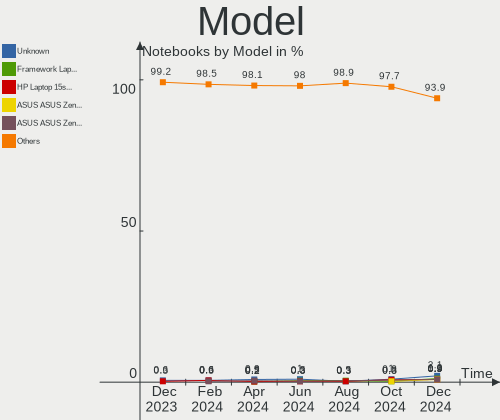
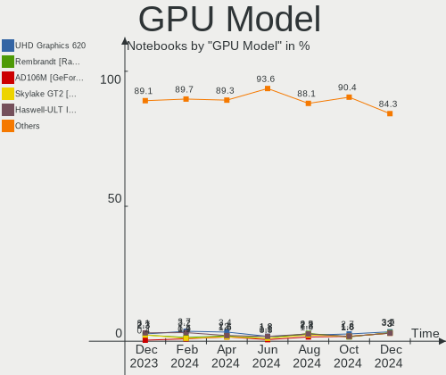
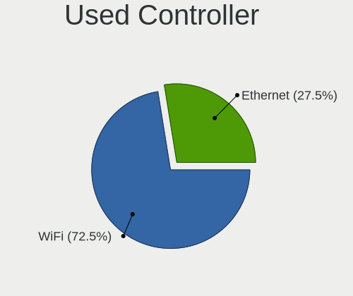
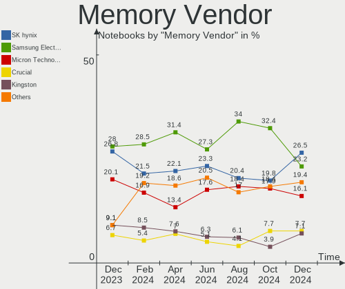

Fedora Hardware Trends (Notebooks)
----------------------------------

A project to identify most popular hardware characteristics and track their change
over time based on data collected by Fedora users at https://Linux-Hardware.org.

Anyone can contribute to this report by the [hw-probe](https://github.com/linuxhw/hw-probe) tool:

    sudo -E hw-probe -all -upload

Full-feature report is available here: https://linux-hardware.org/?view=trends

Period: Dec, 2021.

Contents
--------

* [ System ](#system)
  - [ OS                       ](#os)
  - [ OS Family                ](#os-family)
  - [ Kernel                   ](#kernel)
  - [ Kernel Family            ](#kernel-family)
  - [ Kernel Major Ver.        ](#kernel-major-ver)
  - [ Arch                     ](#arch)
  - [ DE                       ](#de)
  - [ Display Server           ](#display-server)
  - [ Display Manager          ](#display-manager)
  - [ OS Lang                  ](#os-lang)
  - [ Boot Mode                ](#boot-mode)
  - [ Filesystem               ](#filesystem)
  - [ Part. scheme             ](#part-scheme)
  - [ Dual Boot with Linux/BSD ](#dual-boot-with-linuxbsd)
  - [ Dual Boot (Win)          ](#dual-boot-win)

* [ Board ](#board)
  - [ Vendor                   ](#vendor)
  - [ Model                    ](#model)
  - [ Model Family             ](#model-family)
  - [ MFG Year                 ](#mfg-year)
  - [ Form Factor              ](#form-factor)
  - [ Secure Boot              ](#secure-boot)
  - [ Coreboot                 ](#coreboot)
  - [ RAM Size                 ](#ram-size)
  - [ RAM Used                 ](#ram-used)
  - [ Total Drives             ](#total-drives)
  - [ Has CD-ROM               ](#has-cd-rom)
  - [ Has Ethernet             ](#has-ethernet)
  - [ Has WiFi                 ](#has-wifi)
  - [ Has Bluetooth            ](#has-bluetooth)

* [ Location ](#location)
  - [ Country                  ](#country)
  - [ City                     ](#city)

* [ Drives ](#drives)
  - [ Drive Vendor             ](#drive-vendor)
  - [ Drive Model              ](#drive-model)
  - [ HDD Vendor               ](#hdd-vendor)
  - [ SSD Vendor               ](#ssd-vendor)
  - [ Drive Kind               ](#drive-kind)
  - [ Drive Connector          ](#drive-connector)
  - [ Drive Size               ](#drive-size)
  - [ Space Total              ](#space-total)
  - [ Space Used               ](#space-used)
  - [ Malfunc. Drives          ](#malfunc-drives)
  - [ Malfunc. Drive Vendor    ](#malfunc-drive-vendor)
  - [ Malfunc. HDD Vendor      ](#malfunc-hdd-vendor)
  - [ Malfunc. Drive Kind      ](#malfunc-drive-kind)
  - [ Failed Drives            ](#failed-drives)
  - [ Failed Drive Vendor      ](#failed-drive-vendor)
  - [ Drive Status             ](#drive-status)

* [ Storage controller ](#storage-controller)
  - [ Storage Vendor           ](#storage-vendor)
  - [ Storage Model            ](#storage-model)
  - [ Storage Kind             ](#storage-kind)

* [ Processor ](#processor)
  - [ CPU Vendor               ](#cpu-vendor)
  - [ CPU Model                ](#cpu-model)
  - [ CPU Model Family         ](#cpu-model-family)
  - [ CPU Cores                ](#cpu-cores)
  - [ CPU Sockets              ](#cpu-sockets)
  - [ CPU Threads              ](#cpu-threads)
  - [ CPU Op-Modes             ](#cpu-op-modes)
  - [ CPU Microcode            ](#cpu-microcode)
  - [ CPU Microarch            ](#cpu-microarch)

* [ Graphics ](#graphics)
  - [ GPU Vendor               ](#gpu-vendor)
  - [ GPU Model                ](#gpu-model)
  - [ GPU Combo                ](#gpu-combo)
  - [ GPU Driver               ](#gpu-driver)
  - [ GPU Memory               ](#gpu-memory)

* [ Monitor ](#monitor)
  - [ Monitor Vendor           ](#monitor-vendor)
  - [ Monitor Model            ](#monitor-model)
  - [ Monitor Resolution       ](#monitor-resolution)
  - [ Monitor Diagonal         ](#monitor-diagonal)
  - [ Monitor Width            ](#monitor-width)
  - [ Aspect Ratio             ](#aspect-ratio)
  - [ Monitor Area             ](#monitor-area)
  - [ Pixel Density            ](#pixel-density)
  - [ Multiple Monitors        ](#multiple-monitors)

* [ Network ](#network)
  - [ Net Controller Vendor    ](#net-controller-vendor)
  - [ Net Controller Model     ](#net-controller-model)
  - [ Wireless Vendor          ](#wireless-vendor)
  - [ Wireless Model           ](#wireless-model)
  - [ Ethernet Vendor          ](#ethernet-vendor)
  - [ Ethernet Model           ](#ethernet-model)
  - [ Net Controller Kind      ](#net-controller-kind)
  - [ Used Controller          ](#used-controller)
  - [ NICs                     ](#nics)
  - [ IPv6                     ](#ipv6)

* [ Bluetooth ](#bluetooth)
  - [ Bluetooth Vendor         ](#bluetooth-vendor)
  - [ Bluetooth Model          ](#bluetooth-model)

* [ Sound ](#sound)
  - [ Sound Vendor             ](#sound-vendor)
  - [ Sound Model              ](#sound-model)

* [ Memory ](#memory)
  - [ Memory Vendor            ](#memory-vendor)
  - [ Memory Model             ](#memory-model)
  - [ Memory Kind              ](#memory-kind)
  - [ Memory Form Factor       ](#memory-form-factor)
  - [ Memory Size              ](#memory-size)
  - [ Memory Speed             ](#memory-speed)

* [ Printers & scanners ](#printers--scanners)
  - [ Printer Vendor           ](#printer-vendor)
  - [ Printer Model            ](#printer-model)
  - [ Scanner Vendor           ](#scanner-vendor)
  - [ Scanner Model            ](#scanner-model)

* [ Camera ](#camera)
  - [ Camera Vendor            ](#camera-vendor)
  - [ Camera Model             ](#camera-model)

* [ Security ](#security)
  - [ Fingerprint Vendor       ](#fingerprint-vendor)
  - [ Fingerprint Model        ](#fingerprint-model)
  - [ Chipcard Vendor          ](#chipcard-vendor)
  - [ Chipcard Model           ](#chipcard-model)

* [ Unsupported ](#unsupported)
  - [ Unsupported Devices      ](#unsupported-devices)
  - [ Unsupported Device Types ](#unsupported-device-types)

System
------

OS
--

Installed operating systems

| Name      | Notebooks | Percent |
|-----------|-----------|---------|
| Fedora 35 | 151       | 86.29%  |
| Fedora 34 | 17        | 9.71%   |
| Fedora 33 | 3         | 1.71%   |
| Fedora 32 | 2         | 1.14%   |
| Fedora 36 | 1         | 0.57%   |
| Fedora 31 | 1         | 0.57%   |

OS Family
---------

OS without a version

| Name   | Notebooks | Percent |
|--------|-----------|---------|
| Fedora | 175       | 100%    |

Kernel
------

Version of the Linux kernel

| Version                                                       | Notebooks | Percent |
|---------------------------------------------------------------|-----------|---------|
| 5.15.6-200.fc35.x86_64                                        | 41        | 23.43%  |
| 5.15.11-200.fc35.x86_64                                       | 22        | 12.57%  |
| 5.15.10-200.fc35.x86_64                                       | 18        | 10.29%  |
| 5.15.8-200.fc35.x86_64                                        | 15        | 8.57%   |
| 5.15.5-200.fc35.x86_64                                        | 14        | 8%      |
| 5.14.10-300.fc35.x86_64                                       | 14        | 8%      |
| 5.15.7-200.fc35.x86_64                                        | 11        | 6.29%   |
| 5.15.6-100.fc34.x86_64                                        | 5         | 2.86%   |
| 5.15.4-201.fc35.x86_64                                        | 4         | 2.29%   |
| 5.15.10-100.fc34.x86_64                                       | 3         | 1.71%   |
| 5.14.18-300.fc35.x86_64                                       | 3         | 1.71%   |
| 5.15.6-200.rog.fc35.x86_64                                    | 2         | 1.14%   |
| 5.14.16-201.fc34.x86_64                                       | 2         | 1.14%   |
| 5.8.18-100.fc31.x86_64                                        | 1         | 0.57%   |
| 5.8.15-301.fc33.x86_64                                        | 1         | 0.57%   |
| 5.6.6-300.fc32.x86_64                                         | 1         | 0.57%   |
| 5.16.0-0.rc5.35.vanilla.1.fc35.x86_64                         | 1         | 0.57%   |
| 5.15.8_tkg_pds                                                | 1         | 0.57%   |
| 5.15.8-100.fc34.x86_64                                        | 1         | 0.57%   |
| 5.15.7-100.fc34.x86_64                                        | 1         | 0.57%   |
| 5.15.6-250.vanilla.1.fc35.x86_64                              | 1         | 0.57%   |
| 5.15.6-200.rog.fc34.x86_64                                    | 1         | 0.57%   |
| 5.15.5-xm1tt.0.fc35.x86_64                                    | 1         | 0.57%   |
| 5.15.5-100.fc34.x86_64                                        | 1         | 0.57%   |
| 5.15.11-250.vanilla.1.fc35.x86_64                             | 1         | 0.57%   |
| 5.15.0-0.rc2.20210923git58e2cf5d7946.21.vanilla.1.fc36.x86_64 | 1         | 0.57%   |
| 5.14.18-200.fc34.x86_64                                       | 1         | 0.57%   |
| 5.14.18-100.fc33.x86_64                                       | 1         | 0.57%   |
| 5.14.17-301.fc35.x86_64                                       | 1         | 0.57%   |
| 5.14.17-201.fc34.x86_64                                       | 1         | 0.57%   |
| 5.13.19-200.fc34.x86_64                                       | 1         | 0.57%   |
| 5.11.22-100.fc32.x86_64                                       | 1         | 0.57%   |
| 5.11.14-200.fc33.x86_64                                       | 1         | 0.57%   |
| 5.11.12-300.fc34.x86_64                                       | 1         | 0.57%   |

Kernel Family
-------------

Linux kernel without a distro release

| Version | Notebooks | Percent |
|---------|-----------|---------|
| 5.15.6  | 50        | 28.57%  |
| 5.15.11 | 23        | 13.14%  |
| 5.15.10 | 21        | 12%     |
| 5.15.8  | 17        | 9.71%   |
| 5.15.5  | 16        | 9.14%   |
| 5.14.10 | 14        | 8%      |
| 5.15.7  | 12        | 6.86%   |
| 5.14.18 | 5         | 2.86%   |
| 5.15.4  | 4         | 2.29%   |
| 5.14.17 | 2         | 1.14%   |
| 5.14.16 | 2         | 1.14%   |
| 5.8.18  | 1         | 0.57%   |
| 5.8.15  | 1         | 0.57%   |
| 5.6.6   | 1         | 0.57%   |
| 5.16.0  | 1         | 0.57%   |
| 5.15.0  | 1         | 0.57%   |
| 5.13.19 | 1         | 0.57%   |
| 5.11.22 | 1         | 0.57%   |
| 5.11.14 | 1         | 0.57%   |
| 5.11.12 | 1         | 0.57%   |

Kernel Major Ver.
-----------------

Linux kernel major version

| Version | Notebooks | Percent |
|---------|-----------|---------|
| 5.15    | 144       | 82.29%  |
| 5.14    | 23        | 13.14%  |
| 5.11    | 3         | 1.71%   |
| 5.8     | 2         | 1.14%   |
| 5.6     | 1         | 0.57%   |
| 5.16    | 1         | 0.57%   |
| 5.13    | 1         | 0.57%   |

Arch
----

OS architecture (x86_64, i586, etc.)

| Name   | Notebooks | Percent |
|--------|-----------|---------|
| x86_64 | 175       | 100%    |

DE
--

Desktop Environment

| Name          | Notebooks | Percent |
|---------------|-----------|---------|
| GNOME         | 131       | 74.86%  |
| KDE5          | 28        | 16%     |
| XFCE          | 5         | 2.86%   |
| MATE          | 3         | 1.71%   |
| X-Cinnamon    | 2         | 1.14%   |
| Unknown       | 2         | 1.14%   |
| Pantheon      | 1         | 0.57%   |
| openbox       | 1         | 0.57%   |
| GNOME Classic | 1         | 0.57%   |
| Cinnamon      | 1         | 0.57%   |

Display Server
--------------

X11 or Wayland

| Name    | Notebooks | Percent |
|---------|-----------|---------|
| Wayland | 108       | 61.71%  |
| X11     | 63        | 36%     |
| Tty     | 3         | 1.71%   |
| Unknown | 1         | 0.57%   |

Display Manager
---------------

SDDM, LightDM, etc.

| Name    | Notebooks | Percent |
|---------|-----------|---------|
| Unknown | 74        | 42.29%  |
| GDM     | 66        | 37.71%  |
| SDDM    | 18        | 10.29%  |
| LightDM | 17        | 9.71%   |

OS Lang
-------

Language

| Lang  | Notebooks | Percent |
|-------|-----------|---------|
| en_US | 106       | 60.57%  |
| en_GB | 12        | 6.86%   |
| de_DE | 8         | 4.57%   |
| ru_RU | 6         | 3.43%   |
| pt_BR | 5         | 2.86%   |
| fr_FR | 5         | 2.86%   |
| en_CA | 5         | 2.86%   |
| es_ES | 4         | 2.29%   |
| it_IT | 3         | 1.71%   |
| C     | 3         | 1.71%   |
| zh_CN | 2         | 1.14%   |
| pl_PL | 2         | 1.14%   |
| fr_CA | 2         | 1.14%   |
| es_MX | 2         | 1.14%   |
| en_AU | 2         | 1.14%   |
| uk_UA | 1         | 0.57%   |
| tr_TR | 1         | 0.57%   |
| sv_SE | 1         | 0.57%   |
| nl_BE | 1         | 0.57%   |
| es_AR | 1         | 0.57%   |
| en_NZ | 1         | 0.57%   |
| de_CH | 1         | 0.57%   |
| de_AT | 1         | 0.57%   |

Boot Mode
---------

EFI or BIOS

| Mode | Notebooks | Percent |
|------|-----------|---------|
| EFI  | 152       | 86.86%  |
| BIOS | 23        | 13.14%  |

Filesystem
----------

Type of filesystem

| Type    | Notebooks | Percent |
|---------|-----------|---------|
| Btrfs   | 126       | 72%     |
| Ext4    | 43        | 24.57%  |
| Xfs     | 5         | 2.86%   |
| Overlay | 1         | 0.57%   |

Part. scheme
------------

Scheme of partitioning

| Type    | Notebooks | Percent |
|---------|-----------|---------|
| GPT     | 87        | 49.71%  |
| Unknown | 78        | 44.57%  |
| MBR     | 10        | 5.71%   |

Dual Boot with Linux/BSD
------------------------

Hosting more than one Linux/BSD

| Dual boot | Notebooks | Percent |
|-----------|-----------|---------|
| No        | 161       | 92%     |
| Yes       | 14        | 8%      |

Dual Boot (Win)
---------------

Hosting Linux and Windows

| Dual boot | Notebooks | Percent |
|-----------|-----------|---------|
| No        | 133       | 76%     |
| Yes       | 42        | 24%     |

Board
-----

Vendor
------

Motherboard manufacturer

| Name                   | Notebooks | Percent |
|------------------------|-----------|---------|
| Lenovo                 | 58        | 33.14%  |
| Dell                   | 33        | 18.86%  |
| Hewlett-Packard        | 24        | 13.71%  |
| ASUSTek Computer       | 11        | 6.29%   |
| Acer                   | 11        | 6.29%   |
| Apple                  | 7         | 4%      |
| Notebook               | 4         | 2.29%   |
| HUAWEI                 | 4         | 2.29%   |
| MSI                    | 3         | 1.71%   |
| Toshiba                | 2         | 1.14%   |
| Sony                   | 2         | 1.14%   |
| Google                 | 2         | 1.14%   |
| TUXEDO                 | 1         | 0.57%   |
| Timi                   | 1         | 0.57%   |
| Samsung Electronics    | 1         | 0.57%   |
| Positivo               | 1         | 0.57%   |
| LDLC                   | 1         | 0.57%   |
| Hampoo                 | 1         | 0.57%   |
| Gigabyte Technology    | 1         | 0.57%   |
| Fujitsu Siemens        | 1         | 0.57%   |
| Fujitsu                | 1         | 0.57%   |
| Framework              | 1         | 0.57%   |
| Cube                   | 1         | 0.57%   |
| AVITA                  | 1         | 0.57%   |
| Avell High Performance | 1         | 0.57%   |
| Unknown                | 1         | 0.57%   |

Model
-----

Motherboard model

| Name                                        | Notebooks | Percent |
|---------------------------------------------|-----------|---------|
| Lenovo ThinkPad P1 Gen 3 20TJS53A00         | 2         | 1.14%   |
| HUAWEI HVY-WXX9                             | 2         | 1.14%   |
| HP ProBook 470 G5                           | 2         | 1.14%   |
| HP Laptop 15s-fq2xxx                        | 2         | 1.14%   |
| Dell XPS 17 9700                            | 2         | 1.14%   |
| Dell Latitude 7490                          | 2         | 1.14%   |
| Dell Latitude 7300                          | 2         | 1.14%   |
| ASUS ROG Zephyrus G14 GA401QM_GA401QM       | 2         | 1.14%   |
| Apple MacBookPro9,2                         | 2         | 1.14%   |
| Acer Swift SF314-43                         | 2         | 1.14%   |
| TUXEDO InfinityBook S 15 Gen6               | 1         | 0.57%   |
| Toshiba Satellite L12-C-104                 | 1         | 0.57%   |
| Toshiba Satellite C70-A-K2W                 | 1         | 0.57%   |
| Timi TM1612                                 | 1         | 0.57%   |
| Sony SVE1713S1RW                            | 1         | 0.57%   |
| Sony SVE1711Z1RB                            | 1         | 0.57%   |
| Samsung RV410/RV510/S3510/E3510             | 1         | 0.57%   |
| Positivo W942SW_SW1                         | 1         | 0.57%   |
| Notebook NH5x_NH7xHP                        | 1         | 0.57%   |
| Notebook NH5xAx                             | 1         | 0.57%   |
| Notebook NH55RGQ                            | 1         | 0.57%   |
| Notebook N24_25JU                           | 1         | 0.57%   |
| MSI Modern 14 B5M                           | 1         | 0.57%   |
| MSI GL63 9SC                                | 1         | 0.57%   |
| MSI Alpha 15 B5EEK                          | 1         | 0.57%   |
| Lenovo Yoga S740-14IIL 81RS                 | 1         | 0.57%   |
| Lenovo Y520-15IKBM 80YY                     | 1         | 0.57%   |
| Lenovo V470 439627U                         | 1         | 0.57%   |
| Lenovo V15-ADA 82C7                         | 1         | 0.57%   |
| Lenovo ThinkPad X390 20Q0CTO1WW             | 1         | 0.57%   |
| Lenovo ThinkPad X270 W10DG 20K5S17R0L       | 1         | 0.57%   |
| Lenovo ThinkPad X260 20F5S0V400             | 1         | 0.57%   |
| Lenovo ThinkPad X250 20CLS2B000             | 1         | 0.57%   |
| Lenovo ThinkPad X230 23257R2                | 1         | 0.57%   |
| Lenovo ThinkPad X230 23255E4                | 1         | 0.57%   |
| Lenovo ThinkPad X1 Nano Gen 1 20UN002QIX    | 1         | 0.57%   |
| Lenovo ThinkPad X1 Extreme Gen 3 20TK001EUS | 1         | 0.57%   |
| Lenovo ThinkPad X1 Extreme 2nd 20QVCTO1WW   | 1         | 0.57%   |
| Lenovo ThinkPad X1 Carbon 6th 20KGS23S0G    | 1         | 0.57%   |
| Lenovo ThinkPad X1 Carbon 5th 20HR0011US    | 1         | 0.57%   |
| Lenovo ThinkPad W520 42763JF                | 1         | 0.57%   |
| Lenovo ThinkPad T550 20CKA00ECD             | 1         | 0.57%   |
| Lenovo ThinkPad T520 4243B96                | 1         | 0.57%   |
| Lenovo ThinkPad T490s 20NX000DRT            | 1         | 0.57%   |
| Lenovo ThinkPad T490 20N3S6VU00             | 1         | 0.57%   |
| Lenovo ThinkPad T460p 20FXS05500            | 1         | 0.57%   |
| Lenovo ThinkPad T460 20FMS1R01K             | 1         | 0.57%   |
| Lenovo ThinkPad T440p 20AWS1H600            | 1         | 0.57%   |
| Lenovo ThinkPad T14s Gen 2i 20WNS23A00      | 1         | 0.57%   |
| Lenovo ThinkPad T14s Gen 1 20T1S39D5Q       | 1         | 0.57%   |
| Lenovo ThinkPad T14s Gen 1 20T1S39D0L       | 1         | 0.57%   |
| Lenovo ThinkPad T14 Gen 1 20UD001AIX        | 1         | 0.57%   |
| Lenovo ThinkPad S430 33644KG                | 1         | 0.57%   |
| Lenovo ThinkPad P15s Gen 1 20T4001JUS       | 1         | 0.57%   |
| Lenovo ThinkPad P14s Gen 1 20Y1CTO1WW       | 1         | 0.57%   |
| Lenovo ThinkPad P14s Gen 1 20S4000EGE       | 1         | 0.57%   |
| Lenovo ThinkPad P1 Gen 3 20TJS06W00         | 1         | 0.57%   |
| Lenovo ThinkPad L390 20NSS43600             | 1         | 0.57%   |
| Lenovo ThinkPad L14 Gen 2 20X10044EQ        | 1         | 0.57%   |
| Lenovo ThinkPad L14 Gen 1 20U50001GE        | 1         | 0.57%   |

Model Family
------------

Motherboard model prefix

| Name                       | Notebooks | Percent |
|----------------------------|-----------|---------|
| Lenovo ThinkPad            | 40        | 22.86%  |
| Lenovo IdeaPad             | 10        | 5.71%   |
| Dell Latitude              | 10        | 5.71%   |
| Dell Inspiron              | 10        | 5.71%   |
| Dell XPS                   | 7         | 4%      |
| HP Pavilion                | 6         | 3.43%   |
| HP Laptop                  | 6         | 3.43%   |
| ASUS ROG                   | 5         | 2.86%   |
| Acer Aspire                | 4         | 2.29%   |
| HP ProBook                 | 3         | 1.71%   |
| Dell Vostro                | 3         | 1.71%   |
| Dell Precision             | 3         | 1.71%   |
| Acer Swift                 | 3         | 1.71%   |
| Acer Nitro                 | 3         | 1.71%   |
| Toshiba Satellite          | 2         | 1.14%   |
| Lenovo ThinkBook           | 2         | 1.14%   |
| HUAWEI HVY-WXX9            | 2         | 1.14%   |
| HP ZBook                   | 2         | 1.14%   |
| ASUS ASUS                  | 2         | 1.14%   |
| Apple MacBookPro9          | 2         | 1.14%   |
| TUXEDO InfinityBook        | 1         | 0.57%   |
| Timi TM1612                | 1         | 0.57%   |
| Sony SVE1713S1RW           | 1         | 0.57%   |
| Sony SVE1711Z1RB           | 1         | 0.57%   |
| Samsung RV410              | 1         | 0.57%   |
| Positivo W942SW            | 1         | 0.57%   |
| Notebook NH5xAx            | 1         | 0.57%   |
| Notebook NH5x              | 1         | 0.57%   |
| Notebook NH55RGQ           | 1         | 0.57%   |
| Notebook N24               | 1         | 0.57%   |
| MSI Modern                 | 1         | 0.57%   |
| MSI GL63                   | 1         | 0.57%   |
| MSI Alpha                  | 1         | 0.57%   |
| Lenovo Yoga                | 1         | 0.57%   |
| Lenovo Y520-15IKBM         | 1         | 0.57%   |
| Lenovo V470                | 1         | 0.57%   |
| Lenovo V15-ADA             | 1         | 0.57%   |
| Lenovo G570                | 1         | 0.57%   |
| Lenovo G50-30              | 1         | 0.57%   |
| LDLC Mercure               | 1         | 0.57%   |
| HUAWEI NBLK-WAX9X          | 1         | 0.57%   |
| HUAWEI NBLB-WAX9N          | 1         | 0.57%   |
| HP OMEN                    | 1         | 0.57%   |
| HP ENVY                    | 1         | 0.57%   |
| HP EliteBook               | 1         | 0.57%   |
| HP 340                     | 1         | 0.57%   |
| HP 250                     | 1         | 0.57%   |
| HP 2000                    | 1         | 0.57%   |
| HP 15                      | 1         | 0.57%   |
| Hampoo C3W6                | 1         | 0.57%   |
| Google Coral               | 1         | 0.57%   |
| Google Chell               | 1         | 0.57%   |
| Gigabyte AERO              | 1         | 0.57%   |
| Fujitsu Siemens ESPRIMO    | 1         | 0.57%   |
| Fujitsu LIFEBOOK           | 1         | 0.57%   |
| Framework Laptop           | 1         | 0.57%   |
| Cube i18-L                 | 1         | 0.57%   |
| AVITA NS14A1US             | 1         | 0.57%   |
| Avell High Performance A70 | 1         | 0.57%   |
| ASUS VivoBook              | 1         | 0.57%   |

MFG Year
--------

Motherboard manufacture year

| Year | Notebooks | Percent |
|------|-----------|---------|
| 2021 | 85        | 48.57%  |
| 2020 | 25        | 14.29%  |
| 2019 | 15        | 8.57%   |
| 2018 | 12        | 6.86%   |
| 2014 | 7         | 4%      |
| 2017 | 6         | 3.43%   |
| 2016 | 5         | 2.86%   |
| 2013 | 5         | 2.86%   |
| 2012 | 5         | 2.86%   |
| 2015 | 3         | 1.71%   |
| 2011 | 3         | 1.71%   |
| 2010 | 2         | 1.14%   |
| 2009 | 1         | 0.57%   |
| 2008 | 1         | 0.57%   |

Form Factor
-----------

Physical design of the computer

| Name     | Notebooks | Percent |
|----------|-----------|---------|
| Notebook | 175       | 100%    |

Secure Boot
-----------

Enabled or disabled

| State    | Notebooks | Percent |
|----------|-----------|---------|
| Disabled | 136       | 77.71%  |
| Enabled  | 39        | 22.29%  |

Coreboot
--------

Have coreboot on board

| Used | Notebooks | Percent |
|------|-----------|---------|
| No   | 173       | 98.86%  |
| Yes  | 2         | 1.14%   |

RAM Size
--------

Total RAM memory

| Size in GB  | Notebooks | Percent |
|-------------|-----------|---------|
| 4.01-8.0    | 45        | 25.71%  |
| 16.01-24.0  | 39        | 22.29%  |
| 8.01-16.0   | 38        | 21.71%  |
| 32.01-64.0  | 29        | 16.57%  |
| 3.01-4.0    | 17        | 9.71%   |
| 64.01-256.0 | 5         | 2.86%   |
| 24.01-32.0  | 1         | 0.57%   |
| 2.01-3.0    | 1         | 0.57%   |

RAM Used
--------

Used RAM memory

| Used GB    | Notebooks | Percent |
|------------|-----------|---------|
| 2.01-3.0   | 54        | 30.86%  |
| 4.01-8.0   | 52        | 29.71%  |
| 3.01-4.0   | 33        | 18.86%  |
| 1.01-2.0   | 19        | 10.86%  |
| 8.01-16.0  | 14        | 8%      |
| 16.01-24.0 | 3         | 1.71%   |

Total Drives
------------

Number of drives on board

| Drives | Notebooks | Percent |
|--------|-----------|---------|
| 1      | 130       | 74.29%  |
| 2      | 38        | 21.71%  |
| 3      | 5         | 2.86%   |
| 0      | 2         | 1.14%   |

Has CD-ROM
----------

Has CD-ROM on board

| Presented | Notebooks | Percent |
|-----------|-----------|---------|
| No        | 147       | 84%     |
| Yes       | 28        | 16%     |

Has Ethernet
------------

Has Ethernet on board

| Presented | Notebooks | Percent |
|-----------|-----------|---------|
| Yes       | 122       | 69.71%  |
| No        | 53        | 30.29%  |

Has WiFi
--------

Has WiFi module

| Presented | Notebooks | Percent |
|-----------|-----------|---------|
| Yes       | 174       | 99.43%  |
| No        | 1         | 0.57%   |

Has Bluetooth
-------------

Has Bluetooth module

| Presented | Notebooks | Percent |
|-----------|-----------|---------|
| Yes       | 144       | 82.29%  |
| No        | 31        | 17.71%  |

Location
--------

Country
-------

Geographic location (country)

| Country      | Notebooks | Percent |
|--------------|-----------|---------|
| USA          | 27        | 15.43%  |
| Russia       | 15        | 8.57%   |
| Germany      | 14        | 8%      |
| Brazil       | 11        | 6.29%   |
| Canada       | 8         | 4.57%   |
| Spain        | 7         | 4%      |
| India        | 7         | 4%      |
| UK           | 6         | 3.43%   |
| Italy        | 6         | 3.43%   |
| France       | 6         | 3.43%   |
| Poland       | 5         | 2.86%   |
| Mexico       | 5         | 2.86%   |
| Belgium      | 4         | 2.29%   |
| Turkey       | 3         | 1.71%   |
| Sweden       | 3         | 1.71%   |
| Indonesia    | 3         | 1.71%   |
| Ukraine      | 2         | 1.14%   |
| Switzerland  | 2         | 1.14%   |
| Serbia       | 2         | 1.14%   |
| Saudi Arabia | 2         | 1.14%   |
| Romania      | 2         | 1.14%   |
| Portugal     | 2         | 1.14%   |
| Norway       | 2         | 1.14%   |
| Malaysia     | 2         | 1.14%   |
| Kazakhstan   | 2         | 1.14%   |
| Israel       | 2         | 1.14%   |
| Greece       | 2         | 1.14%   |
| Denmark      | 2         | 1.14%   |
| Czechia      | 2         | 1.14%   |
| Belarus      | 2         | 1.14%   |
| Austria      | 2         | 1.14%   |
| Australia    | 2         | 1.14%   |
| Argentina    | 2         | 1.14%   |
| Venezuela    | 1         | 0.57%   |
| Syria        | 1         | 0.57%   |
| Pakistan     | 1         | 0.57%   |
| Nigeria      | 1         | 0.57%   |
| Netherlands  | 1         | 0.57%   |
| Kenya        | 1         | 0.57%   |
| Iran         | 1         | 0.57%   |
| Finland      | 1         | 0.57%   |
| China        | 1         | 0.57%   |
| Bulgaria     | 1         | 0.57%   |
| Algeria      | 1         | 0.57%   |

City
----

Geographic location (city)

| City              | Notebooks | Percent |
|-------------------|-----------|---------|
| Moscow            | 5         | 2.86%   |
| St Petersburg     | 3         | 1.71%   |
| S??o Paulo        | 3         | 1.71%   |
| Nuremberg         | 3         | 1.71%   |
| Mexico City       | 3         | 1.71%   |
| Madrid            | 3         | 1.71%   |
| Istanbul          | 3         | 1.71%   |
| Zurich            | 2         | 1.14%   |
| Vienna            | 2         | 1.14%   |
| Mumbai            | 2         | 1.14%   |
| Minsk             | 2         | 1.14%   |
| Lubbock           | 2         | 1.14%   |
| Lodz              | 2         | 1.14%   |
| Jakarta           | 2         | 1.14%   |
| Belo Horizonte    | 2         | 1.14%   |
| Belgrade          | 2         | 1.14%   |
| Worthing          | 1         | 0.57%   |
| Woolwich          | 1         | 0.57%   |
| Wolcott           | 1         | 0.57%   |
| Waterloo          | 1         | 0.57%   |
| Warsaw            | 1         | 0.57%   |
| Vila Velha        | 1         | 0.57%   |
| Vila Nova de Gaia | 1         | 0.57%   |
| Venice            | 1         | 0.57%   |
| Vaennaesby        | 1         | 0.57%   |
| Ufa               | 1         | 0.57%   |
| Twin Falls        | 1         | 0.57%   |
| Tver              | 1         | 0.57%   |
| Tuusula           | 1         | 0.57%   |
| Trondheim         | 1         | 0.57%   |
| Toronto           | 1         | 0.57%   |
| Thessaloniki      | 1         | 0.57%   |
| Tepic             | 1         | 0.57%   |
| Tampa             | 1         | 0.57%   |
| Tacoma            | 1         | 0.57%   |
| Sydney            | 1         | 0.57%   |
| Sunnyvale         | 1         | 0.57%   |
| Sukhaya Chemrovka | 1         | 0.57%   |
| Strasbourg        | 1         | 0.57%   |
| Spresiano         | 1         | 0.57%   |
| Somerville        | 1         | 0.57%   |
| Sofia             | 1         | 0.57%   |
| Smyrna            | 1         | 0.57%   |
| Savannah          | 1         | 0.57%   |
| Santa Clara       | 1         | 0.57%   |
| Ryazan            | 1         | 0.57%   |
| Rotterdam         | 1         | 0.57%   |
| Roquetas de Mar   | 1         | 0.57%   |
| Riyadh            | 1         | 0.57%   |
| Rio de Janeiro    | 1         | 0.57%   |
| Ridder            | 1         | 0.57%   |
| Relizane          | 1         | 0.57%   |
| Rehovot           | 1         | 0.57%   |
| Realeza           | 1         | 0.57%   |
| Rawang            | 1         | 0.57%   |
| Prague            | 1         | 0.57%   |
| Porto Alegre      | 1         | 0.57%   |
| Piedmont          | 1         | 0.57%   |
| Pickering         | 1         | 0.57%   |
| Petaling Jaya     | 1         | 0.57%   |

Drives
------

Drive Vendor
------------

Hard drive vendors

| Vendor              | Notebooks | Drives | Percent |
|---------------------|-----------|--------|---------|
| Samsung Electronics | 60        | 66     | 28.3%   |
| SK Hynix            | 15        | 15     | 7.08%   |
| Seagate             | 15        | 16     | 7.08%   |
| SanDisk             | 15        | 16     | 7.08%   |
| Toshiba             | 14        | 15     | 6.6%    |
| WDC                 | 13        | 13     | 6.13%   |
| Micron Technology   | 11        | 11     | 5.19%   |
| Kingston            | 11        | 11     | 5.19%   |
| Unknown             | 10        | 10     | 4.72%   |
| KIOXIA              | 8         | 8      | 3.77%   |
| Intel               | 8         | 8      | 3.77%   |
| Transcend           | 4         | 4      | 1.89%   |
| HGST                | 3         | 3      | 1.42%   |
| Apple               | 3         | 4      | 1.42%   |
| Phison              | 2         | 2      | 0.94%   |
| Gigabyte Technology | 2         | 2      | 0.94%   |
| YMTC                | 1         | 1      | 0.47%   |
| XPG                 | 1         | 1      | 0.47%   |
| SPCC                | 1         | 1      | 0.47%   |
| Silicon Motion      | 1         | 1      | 0.47%   |
| PNY                 | 1         | 1      | 0.47%   |
| PLEXTOR             | 1         | 1      | 0.47%   |
| Patriot             | 1         | 1      | 0.47%   |
| Mushkin             | 1         | 1      | 0.47%   |
| LITEON              | 1         | 1      | 0.47%   |
| LaCie               | 1         | 2      | 0.47%   |
| JMicron             | 1         | 1      | 0.47%   |
| Crucial             | 1         | 1      | 0.47%   |
| Corsair             | 1         | 1      | 0.47%   |
| BIWIN               | 1         | 1      | 0.47%   |
| ADATA Technology    | 1         | 1      | 0.47%   |
| A-DATA Technology   | 1         | 1      | 0.47%   |
| 2-Power             | 1         | 1      | 0.47%   |
| Unknown             | 1         | 1      | 0.47%   |

Drive Model
-----------

Hard drive models

| Model                                     | Notebooks | Percent |
|-------------------------------------------|-----------|---------|
| Samsung NVMe SSD Drive 512GB              | 6         | 2.73%   |
| Unknown MMC Card  64GB                    | 5         | 2.27%   |
| SK Hynix NVMe SSD Drive 512GB             | 4         | 1.82%   |
| Sandisk NVMe SSD Drive 256GB              | 4         | 1.82%   |
| Samsung NVMe SSD Drive 1024GB             | 4         | 1.82%   |
| WDC PC SN730 SDBQNTY-256G-1001 256GB      | 3         | 1.36%   |
| Seagate ST1000LM048-2E7172 1TB            | 3         | 1.36%   |
| Seagate ST1000LM014-1EJ164 1TB            | 3         | 1.36%   |
| Sandisk NVMe SSD Drive 1TB                | 3         | 1.36%   |
| Samsung SSD 970 EVO Plus 1TB              | 3         | 1.36%   |
| Samsung SSD 850 EVO 250GB                 | 3         | 1.36%   |
| Kingston SA400S37480G 480GB SSD           | 3         | 1.36%   |
| Unknown MMC Card  8GB                     | 2         | 0.91%   |
| Toshiba NVMe SSD Drive 256GB              | 2         | 0.91%   |
| Toshiba KXG6AZNV512G 512GB                | 2         | 0.91%   |
| Toshiba KSG60ZMV256G M.2 2280 256GB SSD   | 2         | 0.91%   |
| SK Hynix NVMe SSD Drive 256GB             | 2         | 0.91%   |
| SK Hynix HFM001TD3JX013N 1TB              | 2         | 0.91%   |
| SK Hynix BC711 NVMe 512GB                 | 2         | 0.91%   |
| Seagate ST2000LM007-1R8174 2TB            | 2         | 0.91%   |
| Sandisk NVMe SSD Drive 1024GB             | 2         | 0.91%   |
| Samsung SSD 980 1TB                       | 2         | 0.91%   |
| Samsung SSD 860 EVO 500GB                 | 2         | 0.91%   |
| Samsung SSD 860 EVO 1TB                   | 2         | 0.91%   |
| Samsung NVMe SSD Drive 1TB                | 2         | 0.91%   |
| Samsung MZVLB1T0HBLR-000L7 1TB            | 2         | 0.91%   |
| Micron MTFDHBA512TDV 512GB                | 2         | 0.91%   |
| KIOXIA KBG40ZNS512G NVMe 512GB            | 2         | 0.91%   |
| Kingston OM8PDP3512B-AA1 512GB            | 2         | 0.91%   |
| YMTC PC005 256GB                          | 1         | 0.45%   |
| XPG NVMe SSD Drive 512GB                  | 1         | 0.45%   |
| WDC WDS500G2B0C 500GB                     | 1         | 0.45%   |
| WDC WDS480G2G0A-00JH30 480GB SSD          | 1         | 0.45%   |
| WDC WDBNCE2500PNC 250GB SSD               | 1         | 0.45%   |
| WDC WD3200BPVT-80JJ5T0 320GB              | 1         | 0.45%   |
| WDC WD3200BEVT-75ZCT2 320GB               | 1         | 0.45%   |
| WDC WD2500BEKT-00A25T0 250GB              | 1         | 0.45%   |
| WDC WD10SPZX-21Z10T0 1TB                  | 1         | 0.45%   |
| WDC PC SN730 SDBPNTY-1T00-1101 1TB        | 1         | 0.45%   |
| WDC PC SN530 NVMe 256GB                   | 1         | 0.45%   |
| WDC PC SN520 SDAPMUW-512G-1101 512GB      | 1         | 0.45%   |
| Unknown USD00  32GB                       | 1         | 0.45%   |
| Unknown BJTD4R  32GB                      | 1         | 0.45%   |
| Unknown 00000  32GB                       | 1         | 0.45%   |
| Transcend TS512GMTS430S 512GB SSD         | 1         | 0.45%   |
| Transcend TS256GMTS400 256GB SSD          | 1         | 0.45%   |
| Transcend TS240GMTS420S 240GB SSD         | 1         | 0.45%   |
| Transcend TS120GMTS420S 120GB SSD         | 1         | 0.45%   |
| Toshiba NVMe SSD Drive 512GB              | 1         | 0.45%   |
| Toshiba MQ01ABF050 500GB                  | 1         | 0.45%   |
| Toshiba MQ01ABD100 1TB                    | 1         | 0.45%   |
| Toshiba MQ01ABD050V 500GB                 | 1         | 0.45%   |
| Toshiba MK3276GSX H 320GB                 | 1         | 0.45%   |
| Toshiba MK1059GSM 1TB                     | 1         | 0.45%   |
| Toshiba KXG6AZNV256G 256GB                | 1         | 0.45%   |
| Toshiba KBG30ZMV256G 256GB                | 1         | 0.45%   |
| SPCC Solid State Disk 1TB                 | 1         | 0.45%   |
| SK Hynix SKHynix_HFS512GD9TNG-L5B0B 512GB | 1         | 0.45%   |
| SK Hynix PC401 NVMe 512GB                 | 1         | 0.45%   |
| SK Hynix PC401 HFS256GD9TNG-62A0A 256GB   | 1         | 0.45%   |

HDD Vendor
----------

Hard disk drive vendors

| Vendor  | Notebooks | Drives | Percent |
|---------|-----------|--------|---------|
| Seagate | 15        | 16     | 51.72%  |
| Toshiba | 5         | 6      | 17.24%  |
| WDC     | 4         | 4      | 13.79%  |
| HGST    | 3         | 3      | 10.34%  |
| LaCie   | 1         | 2      | 3.45%   |
| Apple   | 1         | 1      | 3.45%   |

SSD Vendor
----------

Solid state drive vendors

| Vendor              | Notebooks | Drives | Percent |
|---------------------|-----------|--------|---------|
| Samsung Electronics | 23        | 26     | 38.33%  |
| Kingston            | 6         | 6      | 10%     |
| Transcend           | 4         | 4      | 6.67%   |
| SanDisk             | 4         | 4      | 6.67%   |
| Micron Technology   | 3         | 3      | 5%      |
| WDC                 | 2         | 2      | 3.33%   |
| Toshiba             | 2         | 2      | 3.33%   |
| Gigabyte Technology | 2         | 2      | 3.33%   |
| SPCC                | 1         | 1      | 1.67%   |
| SK Hynix            | 1         | 1      | 1.67%   |
| PNY                 | 1         | 1      | 1.67%   |
| PLEXTOR             | 1         | 1      | 1.67%   |
| Patriot             | 1         | 1      | 1.67%   |
| Mushkin             | 1         | 1      | 1.67%   |
| LITEON              | 1         | 1      | 1.67%   |
| JMicron             | 1         | 1      | 1.67%   |
| Intel               | 1         | 1      | 1.67%   |
| Crucial             | 1         | 1      | 1.67%   |
| Corsair             | 1         | 1      | 1.67%   |
| BIWIN               | 1         | 1      | 1.67%   |
| Apple               | 1         | 1      | 1.67%   |
| 2-Power             | 1         | 1      | 1.67%   |

Drive Kind
----------

HDD or SSD

| Kind    | Notebooks | Drives | Percent |
|---------|-----------|--------|---------|
| NVMe    | 107       | 117    | 52.71%  |
| SSD     | 57        | 63     | 28.08%  |
| HDD     | 28        | 32     | 13.79%  |
| MMC     | 10        | 10     | 4.93%   |
| Unknown | 1         | 1      | 0.49%   |

Drive Connector
---------------

SATA, SAS, NVMe, etc.

| Type | Notebooks | Drives | Percent |
|------|-----------|--------|---------|
| NVMe | 107       | 117    | 53.23%  |
| SATA | 81        | 92     | 40.3%   |
| MMC  | 10        | 10     | 4.98%   |
| SAS  | 3         | 4      | 1.49%   |

Drive Size
----------

Size of hard drive

| Size in TB | Notebooks | Drives | Percent |
|------------|-----------|--------|---------|
| 0.01-0.5   | 56        | 58     | 63.64%  |
| 0.51-1.0   | 25        | 28     | 28.41%  |
| 1.01-2.0   | 7         | 9      | 7.95%   |

Space Total
-----------

Amount of disk space available on the file system

| Size in GB     | Notebooks | Percent |
|----------------|-----------|---------|
| 501-1000       | 40        | 22.86%  |
| 251-500        | 34        | 19.43%  |
| 1-20           | 34        | 19.43%  |
| Unknown        | 21        | 12%     |
| 101-250        | 20        | 11.43%  |
| 1001-2000      | 13        | 7.43%   |
| More than 3000 | 5         | 2.86%   |
| 51-100         | 5         | 2.86%   |
| 2001-3000      | 2         | 1.14%   |
| 21-50          | 1         | 0.57%   |

Space Used
----------

Amount of used disk space

| Used GB        | Notebooks | Percent |
|----------------|-----------|---------|
| 1-20           | 57        | 32.57%  |
| 21-50          | 26        | 14.86%  |
| 101-250        | 25        | 14.29%  |
| Unknown        | 21        | 12%     |
| 51-100         | 20        | 11.43%  |
| 251-500        | 13        | 7.43%   |
| 501-1000       | 8         | 4.57%   |
| 1001-2000      | 4         | 2.29%   |
| More than 3000 | 1         | 0.57%   |

Malfunc. Drives
---------------

Drive models with a malfunction

| Model                                               | Notebooks | Drives | Percent |
|-----------------------------------------------------|-----------|--------|---------|
| Toshiba MQ01ABD050V 500GB                           | 1         | 1      | 11.11%  |
| Toshiba KSG60ZMV256G M.2 2280 256GB SSD             | 1         | 1      | 11.11%  |
| SK Hynix HFS128G39TND-N210A 128GB SSD               | 1         | 1      | 11.11%  |
| Seagate ST1000LM024 HN-M101MBB 1TB                  | 1         | 1      | 11.11%  |
| SanDisk SDSSDX240GG25 240GB                         | 1         | 1      | 11.11%  |
| Samsung Electronics MZNLH256HAJD-000H1 256GB SSD    | 1         | 1      | 11.11%  |
| Micron Technology MTFDDAK512TBN-1AR1ZABHA 512GB SSD | 1         | 1      | 11.11%  |
| Micron Technology 1100_MTFDDAV512TBN 512GB SSD      | 1         | 1      | 11.11%  |
| LITEON CV8-8E128-HP 128GB SSD                       | 1         | 1      | 11.11%  |

Malfunc. Drive Vendor
---------------------

Vendors of faulty drives

| Vendor              | Notebooks | Drives | Percent |
|---------------------|-----------|--------|---------|
| Toshiba             | 2         | 2      | 22.22%  |
| Micron Technology   | 2         | 2      | 22.22%  |
| SK Hynix            | 1         | 1      | 11.11%  |
| Seagate             | 1         | 1      | 11.11%  |
| SanDisk             | 1         | 1      | 11.11%  |
| Samsung Electronics | 1         | 1      | 11.11%  |
| LITEON              | 1         | 1      | 11.11%  |

Malfunc. HDD Vendor
-------------------

Vendors of faulty HDD drives

| Vendor  | Notebooks | Drives | Percent |
|---------|-----------|--------|---------|
| Toshiba | 1         | 1      | 50%     |
| Seagate | 1         | 1      | 50%     |

Malfunc. Drive Kind
-------------------

Kinds of faulty drives

| Kind | Notebooks | Drives | Percent |
|------|-----------|--------|---------|
| SSD  | 7         | 7      | 77.78%  |
| HDD  | 2         | 2      | 22.22%  |

Failed Drives
-------------

Failed drive models

Zero info for selected period =(

Failed Drive Vendor
-------------------

Failed drive vendors

Zero info for selected period =(

Drive Status
------------

Number of failed and malfunc. drives

| Status   | Notebooks | Drives | Percent |
|----------|-----------|--------|---------|
| Works    | 91        | 110    | 50%     |
| Detected | 82        | 104    | 45.05%  |
| Malfunc  | 9         | 9      | 4.95%   |

Storage controller
------------------

Storage Vendor
--------------

Storage controller vendors

| Vendor                       | Notebooks | Percent |
|------------------------------|-----------|---------|
| Intel                        | 93        | 42.08%  |
| Samsung Electronics          | 37        | 16.74%  |
| AMD                          | 22        | 9.95%   |
| Sandisk                      | 18        | 8.14%   |
| SK Hynix                     | 14        | 6.33%   |
| Toshiba America Info Systems | 9         | 4.07%   |
| Micron Technology            | 8         | 3.62%   |
| KIOXIA                       | 6         | 2.71%   |
| Kingston Technology Company  | 5         | 2.26%   |
| ADATA Technology             | 3         | 1.36%   |
| Phison Electronics           | 2         | 0.9%    |
| Yangtze Memory Technologies  | 1         | 0.45%   |
| Silicon Motion               | 1         | 0.45%   |
| Nvidia                       | 1         | 0.45%   |
| Apple                        | 1         | 0.45%   |

Storage Model
-------------

Storage controller models

| Model                                                                            | Notebooks | Percent |
|----------------------------------------------------------------------------------|-----------|---------|
| AMD FCH SATA Controller [AHCI mode]                                              | 20        | 8.62%   |
| Samsung NVMe SSD Controller SM981/PM981/PM983                                    | 19        | 8.19%   |
| Intel Sunrise Point-LP SATA Controller [AHCI mode]                               | 16        | 6.9%    |
| Samsung NVMe SSD Controller 980                                                  | 13        | 5.6%    |
| Intel Volume Management Device NVMe RAID Controller                              | 11        | 4.74%   |
| Intel 7 Series Chipset Family 6-port SATA Controller [AHCI mode]                 | 10        | 4.31%   |
| Micron Non-Volatile memory controller                                            | 8         | 3.45%   |
| Intel 82801 Mobile SATA Controller [RAID mode]                                   | 7         | 3.02%   |
| Toshiba America Info Systems XG6 NVMe SSD Controller                             | 6         | 2.59%   |
| SK Hynix Gold P31 SSD                                                            | 6         | 2.59%   |
| KIOXIA Non-Volatile memory controller                                            | 6         | 2.59%   |
| Intel 6 Series/C200 Series Chipset Family 6 port Mobile SATA AHCI Controller     | 6         | 2.59%   |
| Sandisk WD Blue SN550 NVMe SSD                                                   | 5         | 2.16%   |
| Sandisk WD Black SN750 / PC SN730 NVMe SSD                                       | 5         | 2.16%   |
| Sandisk Non-Volatile memory controller                                           | 5         | 2.16%   |
| SK Hynix Non-Volatile memory controller                                          | 4         | 1.72%   |
| Intel Wildcat Point-LP SATA Controller [AHCI Mode]                               | 4         | 1.72%   |
| Intel Tiger Lake-LP SATA Controller [AHCI mode]                                  | 4         | 1.72%   |
| Intel HM170/QM170 Chipset SATA Controller [AHCI Mode]                            | 4         | 1.72%   |
| Intel Celeron N3350/Pentium N4200/Atom E3900 Series SATA AHCI Controller         | 4         | 1.72%   |
| Intel Cannon Lake Mobile PCH SATA AHCI Controller                                | 4         | 1.72%   |
| Intel SSD 660P Series                                                            | 3         | 1.29%   |
| Intel 8 Series/C220 Series Chipset Family 6-port SATA Controller 1 [AHCI mode]   | 3         | 1.29%   |
| Intel 8 Series SATA Controller 1 [AHCI mode]                                     | 3         | 1.29%   |
| Toshiba America Info Systems BG3 NVMe SSD Controller                             | 2         | 0.86%   |
| SK Hynix PC401 NVMe Solid State Drive 256GB                                      | 2         | 0.86%   |
| Sandisk PC SN520 NVMe SSD                                                        | 2         | 0.86%   |
| Samsung NVMe SSD Controller SM961/PM961/SM963                                    | 2         | 0.86%   |
| Samsung NVMe SSD Controller PM9A1/PM9A3/980PRO                                   | 2         | 0.86%   |
| Kingston Company OM3PDP3 NVMe SSD                                                | 2         | 0.86%   |
| Intel SSD Pro 7600p/760p/E 6100p Series                                          | 2         | 0.86%   |
| Intel Ice Lake-LP SATA Controller [AHCI mode]                                    | 2         | 0.86%   |
| Intel Comet Lake SATA AHCI Controller                                            | 2         | 0.86%   |
| Intel Cannon Point-LP SATA Controller [AHCI Mode]                                | 2         | 0.86%   |
| Intel 82801IBM/IEM (ICH9M/ICH9M-E) 4 port SATA Controller [AHCI mode]            | 2         | 0.86%   |
| AMD SB7x0/SB8x0/SB9x0 SATA Controller [AHCI mode]                                | 2         | 0.86%   |
| AMD 400 Series Chipset SATA Controller                                           | 2         | 0.86%   |
| ADATA Non-Volatile memory controller                                             | 2         | 0.86%   |
| Yangtze Memory Non-Volatile memory controller                                    | 1         | 0.43%   |
| Toshiba America Info Systems Toshiba America Info Non-Volatile memory controller | 1         | 0.43%   |
| SK Hynix SC300 512GB M.2 2280 SATA Solid State Drive                             | 1         | 0.43%   |
| SK Hynix BC511                                                                   | 1         | 0.43%   |
| Silicon Motion Non-Volatile memory controller                                    | 1         | 0.43%   |
| Sandisk WD PC SN810 / Black SN850 NVMe SSD                                       | 1         | 0.43%   |
| Samsung Electronics SATA controller                                              | 1         | 0.43%   |
| Phison PS5013 E13 NVMe Controller                                                | 1         | 0.43%   |
| Phison E12 NVMe Controller                                                       | 1         | 0.43%   |
| Nvidia MCP89 SATA Controller (AHCI mode)                                         | 1         | 0.43%   |
| Kingston Company U-SNS8154P3 NVMe SSD                                            | 1         | 0.43%   |
| Kingston Company Company Non-Volatile memory controller                          | 1         | 0.43%   |
| Kingston Company SNVS2000G [NV1 NVMe PCIe SSD 2TB]                               | 1         | 0.43%   |
| Intel SSD 600P Series                                                            | 1         | 0.43%   |
| Intel SATA Controller [RAID mode]                                                | 1         | 0.43%   |
| Intel Non-Volatile memory controller                                             | 1         | 0.43%   |
| Intel Atom/Celeron/Pentium Processor x5-E8000/J3xxx/N3xxx Series SATA Controller | 1         | 0.43%   |
| Intel Atom Processor E3800 Series SATA IDE Controller                            | 1         | 0.43%   |
| Intel 82801HM/HEM (ICH8M/ICH8M-E) SATA Controller [AHCI mode]                    | 1         | 0.43%   |
| Intel 82801HM/HEM (ICH8M/ICH8M-E) IDE Controller                                 | 1         | 0.43%   |
| Intel 7 Series Chipset Family 4-port SATA Controller [IDE mode]                  | 1         | 0.43%   |
| Intel 7 Series Chipset Family 2-port SATA Controller [IDE mode]                  | 1         | 0.43%   |

Storage Kind
------------

Kind of storage controller (IDE, SATA, NVMe, SAS, ...)

| Kind | Notebooks | Percent |
|------|-----------|---------|
| NVMe | 106       | 47.32%  |
| SATA | 94        | 41.96%  |
| RAID | 19        | 8.48%   |
| IDE  | 5         | 2.23%   |

Processor
---------

CPU Vendor
----------

Processor vendors

| Vendor | Notebooks | Percent |
|--------|-----------|---------|
| Intel  | 130       | 74.29%  |
| AMD    | 45        | 25.71%  |

CPU Model
---------

Processor models

| Model                                         | Notebooks | Percent |
|-----------------------------------------------|-----------|---------|
| Intel 11th Gen Core i7-1165G7 @ 2.80GHz       | 8         | 4.57%   |
| AMD Ryzen 5 5500U with Radeon Graphics        | 5         | 2.86%   |
| AMD Ryzen 5 3500U with Radeon Vega Mobile Gfx | 5         | 2.86%   |
| Intel Core i7-10850H CPU @ 2.70GHz            | 4         | 2.29%   |
| Intel Core i7-10750H CPU @ 2.60GHz            | 4         | 2.29%   |
| Intel Core i7-10510U CPU @ 1.80GHz            | 4         | 2.29%   |
| Intel Core i5-8265U CPU @ 1.60GHz             | 4         | 2.29%   |
| Intel Core i5-8250U CPU @ 1.60GHz             | 4         | 2.29%   |
| AMD Ryzen 9 5900HS with Radeon Graphics       | 4         | 2.29%   |
| Intel Core i7-8650U CPU @ 1.90GHz             | 3         | 1.71%   |
| Intel Core i7-8550U CPU @ 1.80GHz             | 3         | 1.71%   |
| Intel Core i7-10610U CPU @ 1.80GHz            | 3         | 1.71%   |
| Intel Core i5-5200U CPU @ 2.20GHz             | 3         | 1.71%   |
| Intel Core i5-3210M CPU @ 2.50GHz             | 3         | 1.71%   |
| Intel Celeron CPU N3450 @ 1.10GHz             | 3         | 1.71%   |
| Intel 11th Gen Core i5-1135G7 @ 2.40GHz       | 3         | 1.71%   |
| AMD Ryzen 7 PRO 4750U with Radeon Graphics    | 3         | 1.71%   |
| AMD Ryzen 7 4800H with Radeon Graphics        | 3         | 1.71%   |
| Intel Core i9-10885H CPU @ 2.40GHz            | 2         | 1.14%   |
| Intel Core i7-8565U CPU @ 1.80GHz             | 2         | 1.14%   |
| Intel Core i7-6700HQ CPU @ 2.60GHz            | 2         | 1.14%   |
| Intel Core i7-4810MQ CPU @ 2.80GHz            | 2         | 1.14%   |
| Intel Core i7-4510U CPU @ 2.00GHz             | 2         | 1.14%   |
| Intel Core i7-2630QM CPU @ 2.00GHz            | 2         | 1.14%   |
| Intel Core i7-1065G7 CPU @ 1.30GHz            | 2         | 1.14%   |
| Intel Core i5-8365U CPU @ 1.60GHz             | 2         | 1.14%   |
| Intel Core i5-6300U CPU @ 2.40GHz             | 2         | 1.14%   |
| Intel Core i5-3320M CPU @ 2.60GHz             | 2         | 1.14%   |
| Intel Core i5-3317U CPU @ 1.70GHz             | 2         | 1.14%   |
| Intel Core i3-3120M CPU @ 2.50GHz             | 2         | 1.14%   |
| Intel 11th Gen Core i7-1185G7 @ 3.00GHz       | 2         | 1.14%   |
| Intel 11th Gen Core i7-11800H @ 2.30GHz       | 2         | 1.14%   |
| Intel 11th Gen Core i7-11390H @ 3.40GHz       | 2         | 1.14%   |
| Intel 11th Gen Core i3-1115G4 @ 3.00GHz       | 2         | 1.14%   |
| AMD Ryzen 9 5900HX with Radeon Graphics       | 2         | 1.14%   |
| AMD Ryzen 7 5700U with Radeon Graphics        | 2         | 1.14%   |
| AMD Ryzen 5 5600H with Radeon Graphics        | 2         | 1.14%   |
| AMD Ryzen 5 4600H with Radeon Graphics        | 2         | 1.14%   |
| AMD Ryzen 5 4500U with Radeon Graphics        | 2         | 1.14%   |
| Intel Pentium Dual-Core CPU T4500 @ 2.30GHz   | 1         | 0.57%   |
| Intel Pentium Dual CPU T3400 @ 2.16GHz        | 1         | 0.57%   |
| Intel Pentium CPU N4200 @ 1.10GHz             | 1         | 0.57%   |
| Intel Core m7-6Y75 CPU @ 1.20GHz              | 1         | 0.57%   |
| Intel Core m3-7Y30 CPU @ 1.00GHz              | 1         | 0.57%   |
| Intel Core m3-6Y30 CPU @ 0.90GHz              | 1         | 0.57%   |
| Intel Core i9-9880H CPU @ 2.30GHz             | 1         | 0.57%   |
| Intel Core i7-9850H CPU @ 2.60GHz             | 1         | 0.57%   |
| Intel Core i7-9750H CPU @ 2.60GHz             | 1         | 0.57%   |
| Intel Core i7-8665U CPU @ 1.90GHz             | 1         | 0.57%   |
| Intel Core i7-7700HQ CPU @ 2.80GHz            | 1         | 0.57%   |
| Intel Core i7-7660U CPU @ 2.50GHz             | 1         | 0.57%   |
| Intel Core i7-6600U CPU @ 2.60GHz             | 1         | 0.57%   |
| Intel Core i7-4870HQ CPU @ 2.50GHz            | 1         | 0.57%   |
| Intel Core i7-3630QM CPU @ 2.40GHz            | 1         | 0.57%   |
| Intel Core i7-3612QM CPU @ 2.10GHz            | 1         | 0.57%   |
| Intel Core i7-2675QM CPU @ 2.20GHz            | 1         | 0.57%   |
| Intel Core i7-2670QM CPU @ 2.20GHz            | 1         | 0.57%   |
| Intel Core i7-2640M CPU @ 2.80GHz             | 1         | 0.57%   |
| Intel Core i7-10710U CPU @ 1.10GHz            | 1         | 0.57%   |
| Intel Core i5-9300H CPU @ 2.40GHz             | 1         | 0.57%   |

CPU Model Family
----------------

Processor model prefix

| Model                   | Notebooks | Percent |
|-------------------------|-----------|---------|
| Intel Core i7           | 46        | 26.29%  |
| Intel Core i5           | 36        | 20.57%  |
| Other                   | 21        | 12%     |
| AMD Ryzen 5             | 18        | 10.29%  |
| Intel Core i3           | 10        | 5.71%   |
| AMD Ryzen 7             | 8         | 4.57%   |
| AMD Ryzen 9             | 7         | 4%      |
| Intel Celeron           | 6         | 3.43%   |
| Intel Core i9           | 3         | 1.71%   |
| AMD Ryzen 7 PRO         | 3         | 1.71%   |
| AMD Ryzen 3             | 3         | 1.71%   |
| Intel Core m3           | 2         | 1.14%   |
| Intel Core 2 Duo        | 2         | 1.14%   |
| Intel Pentium Dual-Core | 1         | 0.57%   |
| Intel Pentium Dual      | 1         | 0.57%   |
| Intel Pentium           | 1         | 0.57%   |
| Intel Core m7           | 1         | 0.57%   |
| AMD E                   | 1         | 0.57%   |
| AMD C-60                | 1         | 0.57%   |
| AMD Athlon II           | 1         | 0.57%   |
| AMD Athlon              | 1         | 0.57%   |
| AMD A6                  | 1         | 0.57%   |
| AMD A10                 | 1         | 0.57%   |

CPU Cores
---------

Number of processor cores

| Number | Notebooks | Percent |
|--------|-----------|---------|
| 4      | 76        | 43.43%  |
| 2      | 53        | 30.29%  |
| 6      | 23        | 13.14%  |
| 8      | 22        | 12.57%  |
| 12     | 1         | 0.57%   |

CPU Sockets
-----------

Number of sockets

| Number | Notebooks | Percent |
|--------|-----------|---------|
| 1      | 175       | 100%    |

CPU Threads
-----------

Threads per core (Hyper-Threading)

| Number | Notebooks | Percent |
|--------|-----------|---------|
| 2      | 154       | 88%     |
| 1      | 21        | 12%     |

CPU Op-Modes
------------

CPU Operation Modes (32-bit, 64-bit)

| Op mode        | Notebooks | Percent |
|----------------|-----------|---------|
| 32-bit, 64-bit | 175       | 100%    |

CPU Microcode
-------------

Microcode number

| Number     | Notebooks | Percent |
|------------|-----------|---------|
| 0x806c1    | 17        | 9.71%   |
| 0x806ec    | 15        | 8.57%   |
| 0x306a9    | 11        | 6.29%   |
| 0xa0652    | 10        | 5.71%   |
| 0x806ea    | 10        | 5.71%   |
| 0x0a50000c | 9         | 5.14%   |
| 0x406e3    | 8         | 4.57%   |
| 0x08600106 | 8         | 4.57%   |
| Unknown    | 8         | 4.57%   |
| 0x206a7    | 7         | 4%      |
| 0x08108109 | 6         | 3.43%   |
| 0x806e9    | 5         | 2.86%   |
| 0x506c9    | 5         | 2.86%   |
| 0x08608103 | 5         | 2.86%   |
| 0x306d4    | 4         | 2.29%   |
| 0x306c3    | 4         | 2.29%   |
| 0x706e5    | 3         | 1.71%   |
| 0x506e3    | 3         | 1.71%   |
| 0x40651    | 3         | 1.71%   |
| 0x08608102 | 3         | 1.71%   |
| 0x08600104 | 3         | 1.71%   |
| 0x906ed    | 2         | 1.14%   |
| 0x906ea    | 2         | 1.14%   |
| 0x906e9    | 2         | 1.14%   |
| 0x806eb    | 2         | 1.14%   |
| 0x806c2    | 2         | 1.14%   |
| 0x1067a    | 2         | 1.14%   |
| 0xa0660    | 1         | 0.57%   |
| 0x806d1    | 1         | 0.57%   |
| 0x6fd      | 1         | 0.57%   |
| 0x406c3    | 1         | 0.57%   |
| 0x40661    | 1         | 0.57%   |
| 0x30678    | 1         | 0.57%   |
| 0x10676    | 1         | 0.57%   |
| 0x08701013 | 1         | 0.57%   |
| 0x08108102 | 1         | 0.57%   |
| 0x0810100b | 1         | 0.57%   |
| 0x08008206 | 1         | 0.57%   |
| 0x0700010b | 1         | 0.57%   |
| 0x06001119 | 1         | 0.57%   |
| 0x0500010d | 1         | 0.57%   |
| 0x05000101 | 1         | 0.57%   |
| 0x010000c8 | 1         | 0.57%   |

CPU Microarch
-------------

Microarchitecture

| Name        | Notebooks | Percent |
|-------------|-----------|---------|
| KabyLake    | 40        | 22.86%  |
| TigerLake   | 19        | 10.86%  |
| Zen 2       | 12        | 6.86%   |
| IvyBridge   | 12        | 6.86%   |
| CometLake   | 12        | 6.86%   |
| Zen 3       | 11        | 6.29%   |
| Skylake     | 11        | 6.29%   |
| Unknown     | 9         | 5.14%   |
| Zen+        | 8         | 4.57%   |
| Haswell     | 8         | 4.57%   |
| SandyBridge | 7         | 4%      |
| Goldmont    | 5         | 2.86%   |
| Broadwell   | 5         | 2.86%   |
| IceLake     | 4         | 2.29%   |
| Penryn      | 3         | 1.71%   |
| Silvermont  | 2         | 1.14%   |
| Bobcat      | 2         | 1.14%   |
| Zen         | 1         | 0.57%   |
| Piledriver  | 1         | 0.57%   |
| K10         | 1         | 0.57%   |
| Jaguar      | 1         | 0.57%   |
| Core        | 1         | 0.57%   |

Graphics
--------

GPU Vendor
----------

Vendors of graphics cards

| Vendor | Notebooks | Percent |
|--------|-----------|---------|
| Intel  | 123       | 52.79%  |
| Nvidia | 56        | 24.03%  |
| AMD    | 54        | 23.18%  |

GPU Model
---------

Graphics card models

| Model                                                                                 | Notebooks | Percent |
|---------------------------------------------------------------------------------------|-----------|---------|
| Intel TigerLake-LP GT2 [Iris Xe Graphics]                                             | 16        | 6.78%   |
| Intel CometLake-H GT2 [UHD Graphics]                                                  | 11        | 4.66%   |
| AMD Renoir                                                                            | 11        | 4.66%   |
| AMD Cezanne                                                                           | 11        | 4.66%   |
| Intel UHD Graphics 620                                                                | 10        | 4.24%   |
| Intel 3rd Gen Core processor Graphics Controller                                      | 10        | 4.24%   |
| Intel WhiskeyLake-U GT2 [UHD Graphics 620]                                            | 9         | 3.81%   |
| Nvidia GA106M [GeForce RTX 3060 Mobile / Max-Q]                                       | 8         | 3.39%   |
| Intel CometLake-U GT2 [UHD Graphics]                                                  | 8         | 3.39%   |
| AMD Lucienne                                                                          | 8         | 3.39%   |
| AMD Picasso/Raven 2 [Radeon Vega Series / Radeon Vega Mobile Series]                  | 7         | 2.97%   |
| Intel 2nd Generation Core Processor Family Integrated Graphics Controller             | 6         | 2.54%   |
| Intel Skylake GT2 [HD Graphics 520]                                                   | 5         | 2.12%   |
| Intel CoffeeLake-H GT2 [UHD Graphics 630]                                             | 5         | 2.12%   |
| Nvidia GP108M [GeForce MX250]                                                         | 4         | 1.69%   |
| Intel HD Graphics 5500                                                                | 4         | 1.69%   |
| Intel HD Graphics 500                                                                 | 4         | 1.69%   |
| Intel 4th Gen Core Processor Integrated Graphics Controller                           | 4         | 1.69%   |
| Nvidia TU117M [GeForce GTX 1650 Ti Mobile]                                            | 3         | 1.27%   |
| Nvidia TU117GLM [Quadro T1000 Mobile]                                                 | 3         | 1.27%   |
| Intel HD Graphics 620                                                                 | 3         | 1.27%   |
| Intel HD Graphics 530                                                                 | 3         | 1.27%   |
| Intel Haswell-ULT Integrated Graphics Controller                                      | 3         | 1.27%   |
| AMD Topaz XT [Radeon R7 M260/M265 / M340/M360 / M440/M445 / 530/535 / 620/625 Mobile] | 3         | 1.27%   |
| Nvidia TU117M [GeForce GTX 1650 Mobile / Max-Q]                                       | 2         | 0.85%   |
| Nvidia TU106M [GeForce RTX 2060 Mobile]                                               | 2         | 0.85%   |
| Nvidia TU106M [GeForce RTX 2060 Max-Q]                                                | 2         | 0.85%   |
| Nvidia GP108GLM [Quadro P520]                                                         | 2         | 0.85%   |
| Nvidia GM108M [GeForce 940MX]                                                         | 2         | 0.85%   |
| Nvidia GM108M [GeForce 930MX]                                                         | 2         | 0.85%   |
| Nvidia GF117M [GeForce 610M/710M/810M/820M / GT 620M/625M/630M/720M]                  | 2         | 0.85%   |
| Nvidia GA107M [GeForce RTX 3050 Ti Mobile]                                            | 2         | 0.85%   |
| Intel TigerLake-H GT1 [UHD Graphics]                                                  | 2         | 0.85%   |
| Intel Tiger Lake UHD Graphics                                                         | 2         | 0.85%   |
| Intel Iris Plus Graphics G7                                                           | 2         | 0.85%   |
| Intel HD Graphics 630                                                                 | 2         | 0.85%   |
| Intel HD Graphics 615                                                                 | 2         | 0.85%   |
| Intel HD Graphics 515                                                                 | 2         | 0.85%   |
| AMD Thames [Radeon HD 7550M/7570M/7650M]                                              | 2         | 0.85%   |
| Nvidia TU117M [GeForce MX450]                                                         | 1         | 0.42%   |
| Nvidia TU117GLM [Quadro T500 Mobile]                                                  | 1         | 0.42%   |
| Nvidia TU116M [GeForce GTX 1660 Ti Mobile]                                            | 1         | 0.42%   |
| Nvidia TU106M [GeForce RTX 2070 Mobile / Max-Q Refresh]                               | 1         | 0.42%   |
| Nvidia MCP89 [GeForce 320M]                                                           | 1         | 0.42%   |
| Nvidia GP108M [GeForce MX330]                                                         | 1         | 0.42%   |
| Nvidia GP108M [GeForce MX150]                                                         | 1         | 0.42%   |
| Nvidia GP107M [GeForce GTX 1050 Ti Mobile]                                            | 1         | 0.42%   |
| Nvidia GP107M [GeForce GTX 1050 Mobile]                                               | 1         | 0.42%   |
| Nvidia GP106M [GeForce GTX 1060 Mobile]                                               | 1         | 0.42%   |
| Nvidia GM108M [GeForce 940M]                                                          | 1         | 0.42%   |
| Nvidia GM108M [GeForce 920MX]                                                         | 1         | 0.42%   |
| Nvidia GM108M [GeForce 840M]                                                          | 1         | 0.42%   |
| Nvidia GM107M [GeForce GTX 960M]                                                      | 1         | 0.42%   |
| Nvidia GK208BM [GeForce 920M]                                                         | 1         | 0.42%   |
| Nvidia GK107M [GeForce GT 750M Mac Edition]                                           | 1         | 0.42%   |
| Nvidia GK106GLM [Quadro K2100M]                                                       | 1         | 0.42%   |
| Nvidia GF108GLM [Quadro 1000M]                                                        | 1         | 0.42%   |
| Nvidia GF108GLM [NVS 5200M]                                                           | 1         | 0.42%   |
| Nvidia GA107M [GeForce RTX 3050 Mobile]                                               | 1         | 0.42%   |
| Nvidia GA104M [GeForce RTX 3070 Mobile / Max-Q]                                       | 1         | 0.42%   |

GPU Combo
---------

Combinations of graphics cards

| Name           | Notebooks | Percent |
|----------------|-----------|---------|
| 1 x Intel      | 76        | 43.43%  |
| Intel + Nvidia | 41        | 23.43%  |
| 1 x AMD        | 34        | 19.43%  |
| AMD + Nvidia   | 10        | 5.71%   |
| Intel + AMD    | 6         | 3.43%   |
| 1 x Nvidia     | 5         | 2.86%   |
| 2 x AMD        | 3         | 1.71%   |

GPU Driver
----------

Free vs proprietary

| Driver      | Notebooks | Percent |
|-------------|-----------|---------|
| Free        | 149       | 85.14%  |
| Proprietary | 25        | 14.29%  |
| Unknown     | 1         | 0.57%   |

GPU Memory
----------

Total video memory

| Size in GB | Notebooks | Percent |
|------------|-----------|---------|
| Unknown    | 97        | 55.43%  |
| 0.01-0.5   | 27        | 15.43%  |
| 1.01-2.0   | 25        | 14.29%  |
| 3.01-4.0   | 11        | 6.29%   |
| 0.51-1.0   | 8         | 4.57%   |
| 7.01-8.0   | 4         | 2.29%   |
| 5.01-6.0   | 2         | 1.14%   |
| 8.01-16.0  | 1         | 0.57%   |

Monitor
-------

Monitor Vendor
--------------

Monitor vendors

| Vendor                  | Notebooks | Percent |
|-------------------------|-----------|---------|
| Chimei Innolux          | 36        | 16.9%   |
| LG Display              | 33        | 15.49%  |
| AU Optronics            | 33        | 15.49%  |
| BOE                     | 29        | 13.62%  |
| Samsung Electronics     | 15        | 7.04%   |
| Dell                    | 10        | 4.69%   |
| Lenovo                  | 7         | 3.29%   |
| Apple                   | 7         | 3.29%   |
| Sharp                   | 6         | 2.82%   |
| TMX                     | 4         | 1.88%   |
| Philips                 | 4         | 1.88%   |
| Hewlett-Packard         | 3         | 1.41%   |
| CSO                     | 3         | 1.41%   |
| Ancor Communications    | 3         | 1.41%   |
| Acer                    | 3         | 1.41%   |
| PANDA                   | 2         | 0.94%   |
| InfoVision              | 2         | 0.94%   |
| Goldstar                | 2         | 0.94%   |
| AOC                     | 2         | 0.94%   |
| ViewSonic               | 1         | 0.47%   |
| MSI                     | 1         | 0.47%   |
| JRY                     | 1         | 0.47%   |
| InnoLux Display         | 1         | 0.47%   |
| Hitachi                 | 1         | 0.47%   |
| Gigabyte Technology     | 1         | 0.47%   |
| eMachines               | 1         | 0.47%   |
| Chi Mei Optoelectronics | 1         | 0.47%   |
| BenQ                    | 1         | 0.47%   |

Monitor Model
-------------

Monitor models

| Model                                                                 | Notebooks | Percent |
|-----------------------------------------------------------------------|-----------|---------|
| Chimei Innolux LCD Monitor CMN14D4 1920x1080 309x173mm 13.9-inch      | 6         | 2.76%   |
| TMX TL140BDXP01-0 TMX1400 2560x1440 310x174mm 14.0-inch               | 3         | 1.38%   |
| Chimei Innolux LCD Monitor CMN1521 1920x1080 344x193mm 15.5-inch      | 3         | 1.38%   |
| Sharp LCD Monitor SHP14D6 3840x2400 366x229mm 17.0-inch               | 2         | 0.92%   |
| Samsung Electronics C24F390 SAM0D2C 1920x1080 520x290mm 23.4-inch     | 2         | 0.92%   |
| PANDA LCD Monitor NCP002B 1920x1080 309x174mm 14.0-inch               | 2         | 0.92%   |
| LG Display LCD Monitor LGD062C 1920x1080 309x174mm 14.0-inch          | 2         | 0.92%   |
| LG Display LCD Monitor LGD0625 1920x1080 344x194mm 15.5-inch          | 2         | 0.92%   |
| LG Display LCD Monitor LGD046D 1920x1080 309x174mm 14.0-inch          | 2         | 0.92%   |
| LG Display LCD Monitor LGD03A3 1366x768 277x156mm 12.5-inch           | 2         | 0.92%   |
| Lenovo LCD Monitor LEN40BA 1920x1080 344x194mm 15.5-inch              | 2         | 0.92%   |
| Dell P2719H DEL4184 1920x1080 598x336mm 27.0-inch                     | 2         | 0.92%   |
| Chimei Innolux LCD Monitor CMN15C3 1920x1080 340x190mm 15.3-inch      | 2         | 0.92%   |
| Chimei Innolux LCD Monitor CMN1526 1920x1080 344x193mm 15.5-inch      | 2         | 0.92%   |
| Chimei Innolux LCD Monitor CMN1515 1920x1080 344x193mm 15.5-inch      | 2         | 0.92%   |
| Chimei Innolux LCD Monitor CMN150C 1920x1080 344x193mm 15.5-inch      | 2         | 0.92%   |
| BOE LCD Monitor BOE0877 1920x1080 309x173mm 13.9-inch                 | 2         | 0.92%   |
| BOE LCD Monitor BOE0853 1920x1080 344x194mm 15.5-inch                 | 2         | 0.92%   |
| AU Optronics LCD Monitor AUO61ED 1920x1080 340x190mm 15.3-inch        | 2         | 0.92%   |
| AU Optronics LCD Monitor AUO5B2D 1920x1080 293x162mm 13.2-inch        | 2         | 0.92%   |
| AU Optronics LCD Monitor AUO573D 1920x1080 309x174mm 14.0-inch        | 2         | 0.92%   |
| AU Optronics LCD Monitor AUO21ED 1920x1080 344x194mm 15.5-inch        | 2         | 0.92%   |
| ViewSonic VG2719-2K VSC1935 2560x1440 597x336mm 27.0-inch             | 1         | 0.46%   |
| TMX TL156MDMP01-0 TMX1560 3200x2000 336x210mm 15.6-inch               | 1         | 0.46%   |
| Sharp LCD Monitor SHP14F9 1920x1200 288x180mm 13.4-inch               | 1         | 0.46%   |
| Sharp LCD Monitor SHP14D0 3840x2400 336x210mm 15.6-inch               | 1         | 0.46%   |
| Sharp LCD Monitor SHP14BA 1920x1080 344x194mm 15.5-inch               | 1         | 0.46%   |
| Sharp LCD Monitor SHP14AD 3840x2160 294x165mm 13.3-inch               | 1         | 0.46%   |
| Samsung Electronics U28E590 SAM0C4D 3840x2160 607x345mm 27.5-inch     | 1         | 0.46%   |
| Samsung Electronics S34J55x SAM0F71 3440x1440 797x333mm 34.0-inch     | 1         | 0.46%   |
| Samsung Electronics LCD Monitor SEC5442 1440x900 367x230mm 17.1-inch  | 1         | 0.46%   |
| Samsung Electronics LCD Monitor SEC5441 1366x768 344x194mm 15.5-inch  | 1         | 0.46%   |
| Samsung Electronics LCD Monitor SEC4545 1280x800 331x207mm 15.4-inch  | 1         | 0.46%   |
| Samsung Electronics LCD Monitor SEC3354 1600x900 382x215mm 17.3-inch  | 1         | 0.46%   |
| Samsung Electronics LCD Monitor SEC324C 1366x768 353x198mm 15.9-inch  | 1         | 0.46%   |
| Samsung Electronics LCD Monitor SEC3242 1920x1080 230x130mm 10.4-inch | 1         | 0.46%   |
| Samsung Electronics LCD Monitor SDC4E51 1366x768 340x190mm 15.3-inch  | 1         | 0.46%   |
| Samsung Electronics LCD Monitor SDC415A 3200x1800 293x165mm 13.2-inch | 1         | 0.46%   |
| Samsung Electronics LCD Monitor SAM0B7C 1920x1080 886x498mm 40.0-inch | 1         | 0.46%   |
| Samsung Electronics C34J79x SAM0F1E 3440x1440 797x333mm 34.0-inch     | 1         | 0.46%   |
| Samsung Electronics C27R504 SAM0F9D 1920x1080 598x336mm 27.0-inch     | 1         | 0.46%   |
| Philips PHL 322E1 PHLC20F 1920x1080 698x393mm 31.5-inch               | 1         | 0.46%   |
| Philips PHL 288P6L PHL08F2 3840x2160 621x341mm 27.9-inch              | 1         | 0.46%   |
| Philips PHL 272S4L PHL08E4 1920x1080 600x340mm 27.2-inch              | 1         | 0.46%   |
| Philips PHL 243V7 PHLC155 1920x1080 530x300mm 24.0-inch               | 1         | 0.46%   |
| MSI MAG272QR MSI3CA8 2560x1440 597x336mm 27.0-inch                    | 1         | 0.46%   |
| LG Display LCD Monitor LGD0684 1920x1080 344x194mm 15.5-inch          | 1         | 0.46%   |
| LG Display LCD Monitor LGD0683 1920x1080 344x194mm 15.5-inch          | 1         | 0.46%   |
| LG Display LCD Monitor LGD065B 1920x1080 382x215mm 17.3-inch          | 1         | 0.46%   |
| LG Display LCD Monitor LGD064E 1920x1080 309x174mm 14.0-inch          | 1         | 0.46%   |
| LG Display LCD Monitor LGD060A 1920x1080 294x165mm 13.3-inch          | 1         | 0.46%   |
| LG Display LCD Monitor LGD05FE 1920x1080 344x194mm 15.5-inch          | 1         | 0.46%   |
| LG Display LCD Monitor LGD05EC 1920x1080 309x174mm 14.0-inch          | 1         | 0.46%   |
| LG Display LCD Monitor LGD05E5 1920x1080 344x194mm 15.5-inch          | 1         | 0.46%   |
| LG Display LCD Monitor LGD05DA 1920x1080 309x174mm 14.0-inch          | 1         | 0.46%   |
| LG Display LCD Monitor LGD05A2 1920x1080 309x174mm 14.0-inch          | 1         | 0.46%   |
| LG Display LCD Monitor LGD0590 1920x1080 344x194mm 15.5-inch          | 1         | 0.46%   |
| LG Display LCD Monitor LGD056D 1920x1080 380x210mm 17.1-inch          | 1         | 0.46%   |
| LG Display LCD Monitor LGD04B9 1920x1080 344x194mm 15.5-inch          | 1         | 0.46%   |
| LG Display LCD Monitor LGD049A 2560x1440 310x174mm 14.0-inch          | 1         | 0.46%   |

Monitor Resolution
------------------

Monitor screen resolution

| Resolution         | Notebooks | Percent |
|--------------------|-----------|---------|
| 1920x1080 (FHD)    | 110       | 56.12%  |
| 1366x768 (WXGA)    | 30        | 15.31%  |
| 2560x1440 (QHD)    | 11        | 5.61%   |
| 3840x2160 (4K)     | 7         | 3.57%   |
| 2560x1600          | 5         | 2.55%   |
| 1920x1200 (WUXGA)  | 5         | 2.55%   |
| 1600x900 (HD+)     | 4         | 2.04%   |
| 1280x800 (WXGA)    | 4         | 2.04%   |
| 3840x2400          | 3         | 1.53%   |
| 3440x1440          | 3         | 1.53%   |
| 2880x1800          | 2         | 1.02%   |
| 2560x1080          | 2         | 1.02%   |
| 1680x1050 (WSXGA+) | 2         | 1.02%   |
| 1440x900 (WXGA+)   | 2         | 1.02%   |
| 3200x2000          | 1         | 0.51%   |
| 3200x1800 (QHD+)   | 1         | 0.51%   |
| 3072x1920          | 1         | 0.51%   |
| 2256x1504          | 1         | 0.51%   |
| 2160x1350          | 1         | 0.51%   |
| 1280x1024 (SXGA)   | 1         | 0.51%   |

Monitor Diagonal
----------------

Diagonal size in inches

| Inches | Notebooks | Percent |
|--------|-----------|---------|
| 15     | 71        | 32.87%  |
| 13     | 41        | 18.98%  |
| 14     | 33        | 15.28%  |
| 27     | 13        | 6.02%   |
| 24     | 11        | 5.09%   |
| 17     | 10        | 4.63%   |
| 12     | 7         | 3.24%   |
| 34     | 5         | 2.31%   |
| 16     | 5         | 2.31%   |
| 21     | 4         | 1.85%   |
| 40     | 2         | 0.93%   |
| 23     | 2         | 0.93%   |
| 19     | 2         | 0.93%   |
| 11     | 2         | 0.93%   |
| 84     | 1         | 0.46%   |
| 31     | 1         | 0.46%   |
| 29     | 1         | 0.46%   |
| 26     | 1         | 0.46%   |
| 25     | 1         | 0.46%   |
| 22     | 1         | 0.46%   |
| 18     | 1         | 0.46%   |
| 10     | 1         | 0.46%   |

Monitor Width
-------------

Physical width

| Width in mm | Notebooks | Percent |
|-------------|-----------|---------|
| 301-350     | 125       | 58.96%  |
| 201-300     | 30        | 14.15%  |
| 501-600     | 23        | 10.85%  |
| 351-400     | 14        | 6.6%    |
| 401-500     | 7         | 3.3%    |
| 701-800     | 5         | 2.36%   |
| 601-700     | 5         | 2.36%   |
| 801-900     | 2         | 0.94%   |
| 1501-2000   | 1         | 0.47%   |

Aspect Ratio
------------

Proportional relationship between the width and the height

| Ratio | Notebooks | Percent |
|-------|-----------|---------|
| 16/9  | 150       | 81.08%  |
| 16/10 | 28        | 15.14%  |
| 21/9  | 5         | 2.7%    |
| 5/4   | 1         | 0.54%   |
| 3/2   | 1         | 0.54%   |

Monitor Area
------------

Area in inch

| Area in inch | Notebooks | Percent |
|----------------|-----------|---------|
| 101-110        | 73        | 33.8%   |
| 81-90          | 58        | 26.85%  |
| 71-80          | 17        | 7.87%   |
| 301-350        | 14        | 6.48%   |
| 201-250        | 13        | 6.02%   |
| 121-130        | 9         | 4.17%   |
| 351-500        | 7         | 3.24%   |
| 61-70          | 6         | 2.78%   |
| 251-300        | 5         | 2.31%   |
| 151-200        | 3         | 1.39%   |
| 111-120        | 3         | 1.39%   |
| 51-60          | 2         | 0.93%   |
| 501-1000       | 2         | 0.93%   |
| More than 1000 | 1         | 0.46%   |
| 41-50          | 1         | 0.46%   |
| 141-150        | 1         | 0.46%   |
| 131-140        | 1         | 0.46%   |

Pixel Density
-------------

Pixels per inch

| Density       | Notebooks | Percent |
|---------------|-----------|---------|
| 121-160       | 99        | 47.37%  |
| 101-120       | 41        | 19.62%  |
| 51-100        | 31        | 14.83%  |
| 161-240       | 29        | 13.88%  |
| More than 240 | 9         | 4.31%   |

Multiple Monitors
-----------------

Total monitors connected

| Total | Notebooks | Percent |
|-------|-----------|---------|
| 1     | 130       | 74.29%  |
| 2     | 37        | 21.14%  |
| 3     | 5         | 2.86%   |
| 0     | 3         | 1.71%   |

Network
-------

Net Controller Vendor
---------------------

Controller vendors

| Vendor                            | Notebooks | Percent |
|-----------------------------------|-----------|---------|
| Intel                             | 108       | 40.3%   |
| Realtek Semiconductor             | 85        | 31.72%  |
| Qualcomm Atheros                  | 19        | 7.09%   |
| MEDIATEK                          | 15        | 5.6%    |
| Broadcom                          | 12        | 4.48%   |
| Lenovo                            | 7         | 2.61%   |
| Qualcomm                          | 3         | 1.12%   |
| TP-Link                           | 2         | 0.75%   |
| Sierra Wireless                   | 2         | 0.75%   |
| Xiaomi                            | 1         | 0.37%   |
| Spreadtrum Communications         | 1         | 0.37%   |
| Shenzhen Goodix Technology        | 1         | 0.37%   |
| Samsung Electronics               | 1         | 0.37%   |
| Ralink Technology                 | 1         | 0.37%   |
| Ralink                            | 1         | 0.37%   |
| OPPO Electronics                  | 1         | 0.37%   |
| Marvell Technology Group          | 1         | 0.37%   |
| Linksys                           | 1         | 0.37%   |
| FIBOCOM                           | 1         | 0.37%   |
| Ericsson Business Mobile Networks | 1         | 0.37%   |
| DisplayLink                       | 1         | 0.37%   |
| Dell                              | 1         | 0.37%   |
| D-Link                            | 1         | 0.37%   |
| Broadcom Limited                  | 1         | 0.37%   |

Net Controller Model
--------------------

Controller models

| Model                                                             | Notebooks | Percent |
|-------------------------------------------------------------------|-----------|---------|
| Realtek RTL8111/8168/8411 PCI Express Gigabit Ethernet Controller | 53        | 16.31%  |
| Intel Wi-Fi 6 AX200                                               | 19        | 5.85%   |
| MEDIATEK Network controller                                       | 13        | 4%      |
| Intel Wi-Fi 6 AX201                                               | 13        | 4%      |
| Realtek RTL8153 Gigabit Ethernet Adapter                          | 12        | 3.69%   |
| Realtek RTL810xE PCI Express Fast Ethernet controller             | 8         | 2.46%   |
| Intel Comet Lake PCH-LP CNVi WiFi                                 | 8         | 2.46%   |
| Intel Comet Lake PCH CNVi WiFi                                    | 8         | 2.46%   |
| Realtek RTL8822CE 802.11ac PCIe Wireless Network Adapter          | 7         | 2.15%   |
| Intel Wireless 8265 / 8275                                        | 7         | 2.15%   |
| Intel Wireless 3165                                               | 7         | 2.15%   |
| Intel Cannon Point-LP CNVi [Wireless-AC]                          | 7         | 2.15%   |
| Intel Wireless 8260                                               | 6         | 1.85%   |
| Intel 82579LM Gigabit Network Connection (Lewisville)             | 6         | 1.85%   |
| Realtek RTL8821CE 802.11ac PCIe Wireless Network Adapter          | 5         | 1.54%   |
| Intel Wireless 7265                                               | 5         | 1.54%   |
| Qualcomm Atheros QCA9565 / AR9565 Wireless Network Adapter        | 4         | 1.23%   |
| Qualcomm Atheros QCA9377 802.11ac Wireless Network Adapter        | 4         | 1.23%   |
| Lenovo ThinkPad TBT 3 Dock                                        | 4         | 1.23%   |
| Intel Wireless 7260                                               | 4         | 1.23%   |
| Intel Ethernet Connection (4) I219-LM                             | 4         | 1.23%   |
| Intel Dual Band Wireless-AC 3165 Plus Bluetooth                   | 4         | 1.23%   |
| Intel Centrino Advanced-N 6205 [Taylor Peak]                      | 4         | 1.23%   |
| Broadcom BCM4313 802.11bgn Wireless Network Adapter               | 4         | 1.23%   |
| Realtek Killer E2600 Gigabit Ethernet Controller                  | 3         | 0.92%   |
| Qualcomm Atheros QCA6174 802.11ac Wireless Network Adapter        | 3         | 0.92%   |
| Qualcomm Atheros AR9485 Wireless Network Adapter                  | 3         | 0.92%   |
| Intel Ice Lake-LP PCH CNVi WiFi                                   | 3         | 0.92%   |
| Intel Ethernet Connection I219-LM                                 | 3         | 0.92%   |
| Intel Ethernet Connection I217-LM                                 | 3         | 0.92%   |
| Intel Ethernet Connection (6) I219-V                              | 3         | 0.92%   |
| Intel Ethernet Connection (10) I219-LM                            | 3         | 0.92%   |
| Broadcom NetXtreme BCM57765 Gigabit Ethernet PCIe                 | 3         | 0.92%   |
| Broadcom BCM4331 802.11a/b/g/n                                    | 3         | 0.92%   |
| TP-Link 802.11ac NIC                                              | 2         | 0.62%   |
| Realtek RTL8822BE 802.11a/b/g/n/ac WiFi adapter                   | 2         | 0.62%   |
| Realtek RTL8723DE Wireless Network Adapter                        | 2         | 0.62%   |
| Qualcomm QCA6390 Wireless Network Adapter [AX500-DBS (2x2)]       | 2         | 0.62%   |
| Qualcomm Atheros AR9285 Wireless Network Adapter (PCI-Express)    | 2         | 0.62%   |
| Lenovo ThinkPad TBT3 LAN                                          | 2         | 0.62%   |
| Intel Wireless-AC 9260                                            | 2         | 0.62%   |
| Intel Wireless 3160                                               | 2         | 0.62%   |
| Intel Ethernet Connection (6) I219-LM                             | 2         | 0.62%   |
| Intel Ethernet Connection (2) I219-LM                             | 2         | 0.62%   |
| Intel Ethernet Connection (13) I219-V                             | 2         | 0.62%   |
| Intel Ethernet Connection (13) I219-LM                            | 2         | 0.62%   |
| Intel Ethernet Connection (10) I219-V                             | 2         | 0.62%   |
| Intel Cannon Lake PCH CNVi WiFi                                   | 2         | 0.62%   |
| Xiaomi Mi/Redmi series (RNDIS + ADB)                              | 1         | 0.31%   |
| Spreadtrum Nokia C30                                              | 1         | 0.31%   |
| Sierra Wireless EM7455                                            | 1         | 0.31%   |
| Sierra Wireless EM7305                                            | 1         | 0.31%   |
| Shenzhen Goodix Unknow device                                     | 1         | 0.31%   |
| Samsung Galaxy series, misc. (tethering mode)                     | 1         | 0.31%   |
| Realtek RTL8852AE 802.11ax PCIe Wireless Network Adapter          | 1         | 0.31%   |
| Realtek RTL8821AE 802.11ac PCIe Wireless Network Adapter          | 1         | 0.31%   |
| Realtek RTL8814AU 802.11a/b/g/n/ac Wireless Adapter               | 1         | 0.31%   |
| Realtek RTL8723BU 802.11b/g/n WLAN Adapter                        | 1         | 0.31%   |
| Realtek RTL8723BE PCIe Wireless Network Adapter                   | 1         | 0.31%   |
| Realtek RTL8188EE Wireless Network Adapter                        | 1         | 0.31%   |

Wireless Vendor
---------------

Wireless vendors

| Vendor                | Notebooks | Percent |
|-----------------------|-----------|---------|
| Intel                 | 105       | 58.01%  |
| Realtek Semiconductor | 22        | 12.15%  |
| Qualcomm Atheros      | 17        | 9.39%   |
| MEDIATEK              | 14        | 7.73%   |
| Broadcom              | 12        | 6.63%   |
| TP-Link               | 2         | 1.1%    |
| Sierra Wireless       | 2         | 1.1%    |
| Qualcomm              | 2         | 1.1%    |
| Ralink Technology     | 1         | 0.55%   |
| Ralink                | 1         | 0.55%   |
| FIBOCOM               | 1         | 0.55%   |
| D-Link                | 1         | 0.55%   |
| Broadcom Limited      | 1         | 0.55%   |

Wireless Model
--------------

Wireless models

| Model                                                                   | Notebooks | Percent |
|-------------------------------------------------------------------------|-----------|---------|
| Intel Wi-Fi 6 AX200                                                     | 19        | 10.38%  |
| MEDIATEK Network controller                                             | 13        | 7.1%    |
| Intel Wi-Fi 6 AX201                                                     | 13        | 7.1%    |
| Intel Comet Lake PCH-LP CNVi WiFi                                       | 8         | 4.37%   |
| Intel Comet Lake PCH CNVi WiFi                                          | 8         | 4.37%   |
| Realtek RTL8822CE 802.11ac PCIe Wireless Network Adapter                | 7         | 3.83%   |
| Intel Wireless 8265 / 8275                                              | 7         | 3.83%   |
| Intel Wireless 3165                                                     | 7         | 3.83%   |
| Intel Cannon Point-LP CNVi [Wireless-AC]                                | 7         | 3.83%   |
| Intel Wireless 8260                                                     | 6         | 3.28%   |
| Realtek RTL8821CE 802.11ac PCIe Wireless Network Adapter                | 5         | 2.73%   |
| Intel Wireless 7265                                                     | 5         | 2.73%   |
| Qualcomm Atheros QCA9565 / AR9565 Wireless Network Adapter              | 4         | 2.19%   |
| Qualcomm Atheros QCA9377 802.11ac Wireless Network Adapter              | 4         | 2.19%   |
| Intel Wireless 7260                                                     | 4         | 2.19%   |
| Intel Dual Band Wireless-AC 3165 Plus Bluetooth                         | 4         | 2.19%   |
| Intel Centrino Advanced-N 6205 [Taylor Peak]                            | 4         | 2.19%   |
| Broadcom BCM4313 802.11bgn Wireless Network Adapter                     | 4         | 2.19%   |
| Qualcomm Atheros QCA6174 802.11ac Wireless Network Adapter              | 3         | 1.64%   |
| Qualcomm Atheros AR9485 Wireless Network Adapter                        | 3         | 1.64%   |
| Intel Ice Lake-LP PCH CNVi WiFi                                         | 3         | 1.64%   |
| Broadcom BCM4331 802.11a/b/g/n                                          | 3         | 1.64%   |
| TP-Link 802.11ac NIC                                                    | 2         | 1.09%   |
| Realtek RTL8822BE 802.11a/b/g/n/ac WiFi adapter                         | 2         | 1.09%   |
| Realtek RTL8723DE Wireless Network Adapter                              | 2         | 1.09%   |
| Qualcomm QCA6390 Wireless Network Adapter [AX500-DBS (2x2)]             | 2         | 1.09%   |
| Qualcomm Atheros AR9285 Wireless Network Adapter (PCI-Express)          | 2         | 1.09%   |
| Intel Wireless-AC 9260                                                  | 2         | 1.09%   |
| Intel Wireless 3160                                                     | 2         | 1.09%   |
| Intel Cannon Lake PCH CNVi WiFi                                         | 2         | 1.09%   |
| Sierra Wireless EM7455                                                  | 1         | 0.55%   |
| Sierra Wireless EM7305                                                  | 1         | 0.55%   |
| Realtek RTL8852AE 802.11ax PCIe Wireless Network Adapter                | 1         | 0.55%   |
| Realtek RTL8821AE 802.11ac PCIe Wireless Network Adapter                | 1         | 0.55%   |
| Realtek RTL8814AU 802.11a/b/g/n/ac Wireless Adapter                     | 1         | 0.55%   |
| Realtek RTL8723BU 802.11b/g/n WLAN Adapter                              | 1         | 0.55%   |
| Realtek RTL8723BE PCIe Wireless Network Adapter                         | 1         | 0.55%   |
| Realtek RTL8188EE Wireless Network Adapter                              | 1         | 0.55%   |
| Ralink RT3573 Wireless Adapter                                          | 1         | 0.55%   |
| Ralink RT3290 Wireless 802.11n 1T/1R PCIe                               | 1         | 0.55%   |
| Qualcomm Atheros AR242x / AR542x Wireless Network Adapter (PCI-Express) | 1         | 0.55%   |
| MEDIATEK MT7630e 802.11bgn Wireless Network Adapter                     | 1         | 0.55%   |
| Intel Wi-Fi 6 AX210/AX211/AX411 160MHz                                  | 1         | 0.55%   |
| Intel Tiger Lake PCH CNVi WiFi                                          | 1         | 0.55%   |
| Intel Centrino Wireless-N 6150                                          | 1         | 0.55%   |
| Intel Centrino Wireless-N 1000 [Condor Peak]                            | 1         | 0.55%   |
| Intel Centrino Wireless-N + WiMAX 6150                                  | 1         | 0.55%   |
| Intel Centrino Ultimate-N 6300                                          | 1         | 0.55%   |
| FIBOCOM L830-EB                                                         | 1         | 0.55%   |
| D-Link 802.11ac NIC                                                     | 1         | 0.55%   |
| Broadcom Limited BCM4352 802.11ac Wireless Network Adapter              | 1         | 0.55%   |
| Broadcom BCM43602 802.11ac Wireless LAN SoC                             | 1         | 0.55%   |
| Broadcom BCM4360 802.11ac Wireless Network Adapter                      | 1         | 0.55%   |
| Broadcom BCM4350 802.11ac Wireless Network Adapter                      | 1         | 0.55%   |
| Broadcom BCM4322 802.11a/b/g/n Wireless LAN Controller                  | 1         | 0.55%   |
| Broadcom BCM4312 802.11b/g LP-PHY                                       | 1         | 0.55%   |

Ethernet Vendor
---------------

Ethernet vendors

| Vendor                    | Notebooks | Percent |
|---------------------------|-----------|---------|
| Realtek Semiconductor     | 75        | 55.56%  |
| Intel                     | 37        | 27.41%  |
| Lenovo                    | 7         | 5.19%   |
| Broadcom                  | 4         | 2.96%   |
| Qualcomm Atheros          | 3         | 2.22%   |
| Xiaomi                    | 1         | 0.74%   |
| Spreadtrum Communications | 1         | 0.74%   |
| Samsung Electronics       | 1         | 0.74%   |
| Qualcomm                  | 1         | 0.74%   |
| OPPO Electronics          | 1         | 0.74%   |
| MediaTek                  | 1         | 0.74%   |
| Marvell Technology Group  | 1         | 0.74%   |
| Linksys                   | 1         | 0.74%   |
| DisplayLink               | 1         | 0.74%   |

Ethernet Model
--------------

Ethernet models

| Model                                                             | Notebooks | Percent |
|-------------------------------------------------------------------|-----------|---------|
| Realtek RTL8111/8168/8411 PCI Express Gigabit Ethernet Controller | 53        | 38.13%  |
| Realtek RTL8153 Gigabit Ethernet Adapter                          | 12        | 8.63%   |
| Realtek RTL810xE PCI Express Fast Ethernet controller             | 8         | 5.76%   |
| Intel 82579LM Gigabit Network Connection (Lewisville)             | 6         | 4.32%   |
| Lenovo ThinkPad TBT 3 Dock                                        | 4         | 2.88%   |
| Intel Ethernet Connection (4) I219-LM                             | 4         | 2.88%   |
| Realtek Killer E2600 Gigabit Ethernet Controller                  | 3         | 2.16%   |
| Intel Ethernet Connection I219-LM                                 | 3         | 2.16%   |
| Intel Ethernet Connection I217-LM                                 | 3         | 2.16%   |
| Intel Ethernet Connection (6) I219-V                              | 3         | 2.16%   |
| Intel Ethernet Connection (10) I219-LM                            | 3         | 2.16%   |
| Broadcom NetXtreme BCM57765 Gigabit Ethernet PCIe                 | 3         | 2.16%   |
| Lenovo ThinkPad TBT3 LAN                                          | 2         | 1.44%   |
| Intel Ethernet Connection (6) I219-LM                             | 2         | 1.44%   |
| Intel Ethernet Connection (2) I219-LM                             | 2         | 1.44%   |
| Intel Ethernet Connection (13) I219-V                             | 2         | 1.44%   |
| Intel Ethernet Connection (13) I219-LM                            | 2         | 1.44%   |
| Intel Ethernet Connection (10) I219-V                             | 2         | 1.44%   |
| Xiaomi Mi/Redmi series (RNDIS + ADB)                              | 1         | 0.72%   |
| Spreadtrum Nokia C30                                              | 1         | 0.72%   |
| Samsung Galaxy series, misc. (tethering mode)                     | 1         | 0.72%   |
| Realtek RTL8152 Fast Ethernet Adapter                             | 1         | 0.72%   |
| Realtek RTL8125 2.5GbE Controller                                 | 1         | 0.72%   |
| Realtek Killer E2500 Gigabit Ethernet Controller                  | 1         | 0.72%   |
| Qualcomm Mobile Router                                            | 1         | 0.72%   |
| Qualcomm Atheros Killer E2500 Gigabit Ethernet Controller         | 1         | 0.72%   |
| Qualcomm Atheros AR8162 Fast Ethernet                             | 1         | 0.72%   |
| Qualcomm Atheros AR8152 v2.0 Fast Ethernet                        | 1         | 0.72%   |
| OPPO realme X50 Pro 5G                                            | 1         | 0.72%   |
| MediaTek WP5 Pro                                                  | 1         | 0.72%   |
| Marvell Group 88E8040 PCI-E Fast Ethernet Controller              | 1         | 0.72%   |
| Linksys Gigabit Ethernet Adapter                                  | 1         | 0.72%   |
| Lenovo USB-C Dock Ethernet                                        | 1         | 0.72%   |
| Intel Ethernet Connection I217-V                                  | 1         | 0.72%   |
| Intel Ethernet Connection (7) I219-LM                             | 1         | 0.72%   |
| Intel Ethernet Connection (4) I219-V                              | 1         | 0.72%   |
| Intel Ethernet Connection (3) I218-V                              | 1         | 0.72%   |
| Intel Ethernet Connection (3) I218-LM                             | 1         | 0.72%   |
| DisplayLink USB-C Triple-4K Dock                                  | 1         | 0.72%   |
| Broadcom NetXtreme BCM5764M Gigabit Ethernet PCIe                 | 1         | 0.72%   |

Net Controller Kind
-------------------

Ethernet, WiFi or modem

| Kind     | Notebooks | Percent |
|----------|-----------|---------|
| WiFi     | 174       | 58.19%  |
| Ethernet | 122       | 40.8%   |
| Modem    | 2         | 0.67%   |
| Unknown  | 1         | 0.33%   |

Used Controller
---------------

Currently used network controller

| Kind     | Notebooks | Percent |
|----------|-----------|---------|
| WiFi     | 159       | 70.04%  |
| Ethernet | 68        | 29.96%  |

NICs
----

Total network controllers on board

| Total | Notebooks | Percent |
|-------|-----------|---------|
| 2     | 107       | 61.14%  |
| 1     | 63        | 36%     |
| 3     | 3         | 1.71%   |
| 0     | 2         | 1.14%   |

IPv6
----

IPv6 vs IPv4

| Used | Notebooks | Percent |
|------|-----------|---------|
| No   | 118       | 67.43%  |
| Yes  | 57        | 32.57%  |

Bluetooth
---------

Bluetooth Vendor
----------------

Controller vendors

| Vendor                          | Notebooks | Percent |
|---------------------------------|-----------|---------|
| Intel                           | 86        | 58.5%   |
| Realtek Semiconductor           | 17        | 11.56%  |
| Qualcomm Atheros Communications | 7         | 4.76%   |
| Lite-On Technology              | 7         | 4.76%   |
| IMC Networks                    | 6         | 4.08%   |
| Apple                           | 6         | 4.08%   |
| Foxconn / Hon Hai               | 5         | 3.4%    |
| Broadcom                        | 5         | 3.4%    |
| MediaTek                        | 2         | 1.36%   |
| Dell                            | 2         | 1.36%   |
| Cambridge Silicon Radio         | 2         | 1.36%   |
| Realtek                         | 1         | 0.68%   |
| Ralink                          | 1         | 0.68%   |

Bluetooth Model
---------------

Controller models

| Model                                               | Notebooks | Percent |
|-----------------------------------------------------|-----------|---------|
| Intel Bluetooth Device                              | 46        | 31.29%  |
| Intel Bluetooth wireless interface                  | 19        | 12.93%  |
| Intel AX200 Bluetooth                               | 19        | 12.93%  |
| Realtek Bluetooth Radio                             | 11        | 7.48%   |
| Qualcomm Atheros  Bluetooth Device                  | 5         | 3.4%    |
| IMC Networks Wireless_Device                        | 5         | 3.4%    |
| Realtek  Bluetooth 4.2 Adapter                      | 4         | 2.72%   |
| Lite-On Wireless_Device                             | 4         | 2.72%   |
| Apple Bluetooth Host Controller                     | 4         | 2.72%   |
| Realtek RTL8822BE Bluetooth 4.2 Adapter             | 2         | 1.36%   |
| MediaTek Wireless_Device                            | 2         | 1.36%   |
| Lite-On Qualcomm Atheros QCA9377 Bluetooth          | 2         | 1.36%   |
| Foxconn / Hon Hai Wireless_Device                   | 2         | 1.36%   |
| Cambridge Silicon Radio Bluetooth Dongle (HCI mode) | 2         | 1.36%   |
| Broadcom BCM2045B (BDC-2.1)                         | 2         | 1.36%   |
| Apple Bluetooth USB Host Controller                 | 2         | 1.36%   |
| Realtek Bluetooth Radio                             | 1         | 0.68%   |
| Ralink RT3290 Bluetooth                             | 1         | 0.68%   |
| Qualcomm Atheros Bluetooth USB Host Controller      | 1         | 0.68%   |
| Qualcomm Atheros AR3012 Bluetooth 4.0               | 1         | 0.68%   |
| Lite-On Atheros AR3012 Bluetooth                    | 1         | 0.68%   |
| Intel Wireless-AC 9260 Bluetooth Adapter            | 1         | 0.68%   |
| Intel Centrino Bluetooth Wireless Transceiver       | 1         | 0.68%   |
| IMC Networks Bluetooth Radio                        | 1         | 0.68%   |
| Foxconn / Hon Hai BT                                | 1         | 0.68%   |
| Foxconn / Hon Hai Bluetooth USB Host Controller     | 1         | 0.68%   |
| Foxconn / Hon Hai Bluetooth Device                  | 1         | 0.68%   |
| Dell Wireless 360 Bluetooth                         | 1         | 0.68%   |
| Dell BCM20702A0 Bluetooth Module                    | 1         | 0.68%   |
| Broadcom BCM20702A0                                 | 1         | 0.68%   |
| Broadcom BCM20702 Bluetooth 4.0 [ThinkPad]          | 1         | 0.68%   |
| Broadcom BCM2035 Bluetooth dongle                   | 1         | 0.68%   |

Sound
-----

Sound Vendor
------------

Sound card vendors

| Vendor                   | Notebooks | Percent |
|--------------------------|-----------|---------|
| Intel                    | 129       | 55.13%  |
| AMD                      | 48        | 20.51%  |
| Nvidia                   | 31        | 13.25%  |
| Lenovo                   | 7         | 2.99%   |
| GN Netcom                | 4         | 1.71%   |
| C-Media Electronics      | 4         | 1.71%   |
| Kingston Technology      | 2         | 0.85%   |
| Hewlett-Packard          | 2         | 0.85%   |
| Texas Instruments        | 1         | 0.43%   |
| Sony                     | 1         | 0.43%   |
| SAVITECH                 | 1         | 0.43%   |
| Realtek Semiconductor    | 1         | 0.43%   |
| Plantronics              | 1         | 0.43%   |
| HECATE G2 GAMING HEADSET | 1         | 0.43%   |
| Arturia                  | 1         | 0.43%   |

Sound Model
-----------

Sound card models

| Model                                                                                             | Notebooks | Percent |
|---------------------------------------------------------------------------------------------------|-----------|---------|
| AMD Family 17h (Models 10h-1fh) HD Audio Controller                                               | 37        | 12.94%  |
| AMD Renoir Radeon High Definition Audio Controller                                                | 26        | 9.09%   |
| Intel Sunrise Point-LP HD Audio                                                                   | 24        | 8.39%   |
| Intel Tiger Lake-LP Smart Sound Technology Audio Controller                                       | 19        | 6.64%   |
| Intel 7 Series/C216 Chipset Family High Definition Audio Controller                               | 12        | 4.2%    |
| Intel Comet Lake PCH cAVS                                                                         | 11        | 3.85%   |
| Nvidia Audio device                                                                               | 10        | 3.5%    |
| Intel Comet Lake PCH-LP cAVS                                                                      | 9         | 3.15%   |
| Intel Cannon Point-LP High Definition Audio Controller                                            | 9         | 3.15%   |
| AMD Raven/Raven2/Fenghuang HDMI/DP Audio Controller                                               | 8         | 2.8%    |
| Intel 6 Series/C200 Series Chipset Family High Definition Audio Controller                        | 7         | 2.45%   |
| Nvidia TU107 GeForce GTX 1650 High Definition Audio Controller                                    | 5         | 1.75%   |
| Nvidia TU106 High Definition Audio Controller                                                     | 5         | 1.75%   |
| Intel Wildcat Point-LP High Definition Audio Controller                                           | 5         | 1.75%   |
| Intel Celeron N3350/Pentium N4200/Atom E3900 Series Audio Cluster                                 | 5         | 1.75%   |
| Intel Cannon Lake PCH cAVS                                                                        | 5         | 1.75%   |
| Intel Broadwell-U Audio Controller                                                                | 5         | 1.75%   |
| Intel 8 Series/C220 Series Chipset High Definition Audio Controller                               | 5         | 1.75%   |
| Lenovo ThinkPad Thunderbolt 3 Dock USB Audio                                                      | 4         | 1.4%    |
| Intel Xeon E3-1200 v3/4th Gen Core Processor HD Audio Controller                                  | 3         | 1.05%   |
| Intel Ice Lake-LP Smart Sound Technology Audio Controller                                         | 3         | 1.05%   |
| Intel Haswell-ULT HD Audio Controller                                                             | 3         | 1.05%   |
| Intel 8 Series HD Audio Controller                                                                | 3         | 1.05%   |
| Intel 100 Series/C230 Series Chipset Family HD Audio Controller                                   | 3         | 1.05%   |
| AMD Turks HDMI Audio [Radeon HD 6500/6600 / 6700M Series]                                         | 3         | 1.05%   |
| AMD FCH Azalia Controller                                                                         | 3         | 1.05%   |
| Nvidia GP107GL High Definition Audio Controller                                                   | 2         | 0.7%    |
| Nvidia GF108 High Definition Audio Controller                                                     | 2         | 0.7%    |
| Lenovo ThinkPad Thunderbolt 3 Dock Audio                                                          | 2         | 0.7%    |
| Intel Tiger Lake-H HD Audio Controller                                                            | 2         | 0.7%    |
| Intel CM238 HD Audio Controller                                                                   | 2         | 0.7%    |
| Intel 82801I (ICH9 Family) HD Audio Controller                                                    | 2         | 0.7%    |
| Hewlett-Packard USB Audio                                                                         | 2         | 0.7%    |
| C-Media Electronics Audio Adapter (Unitek Y-247A)                                                 | 2         | 0.7%    |
| AMD Wrestler HDMI Audio                                                                           | 2         | 0.7%    |
| AMD SBx00 Azalia (Intel HDA)                                                                      | 2         | 0.7%    |
| AMD Navi 21 HDMI Audio [Radeon RX 6800/6800 XT / 6900 XT]                                         | 2         | 0.7%    |
| Texas Instruments PCM2903B Audio CODEC                                                            | 1         | 0.35%   |
| Sony CEVCECM                                                                                      | 1         | 0.35%   |
| SAVITECH ODAC-revB                                                                                | 1         | 0.35%   |
| Realtek Semiconductor USB Audio                                                                   | 1         | 0.35%   |
| Plantronics Blackwire 3210 Series                                                                 | 1         | 0.35%   |
| Nvidia TU116 High Definition Audio Controller                                                     | 1         | 0.35%   |
| Nvidia MCP89 High Definition Audio                                                                | 1         | 0.35%   |
| Nvidia GP106 High Definition Audio Controller                                                     | 1         | 0.35%   |
| Nvidia GK208 HDMI/DP Audio Controller                                                             | 1         | 0.35%   |
| Nvidia GK107 HDMI Audio Controller                                                                | 1         | 0.35%   |
| Nvidia GK106 HDMI Audio Controller                                                                | 1         | 0.35%   |
| Nvidia GA104 High Definition Audio Controller                                                     | 1         | 0.35%   |
| Lenovo ThinkPad USB-C Dock Gen2 USB Audio                                                         | 1         | 0.35%   |
| Kingston Technology HyperX SoloCast                                                               | 1         | 0.35%   |
| Kingston Technology HyperX 7.1 Audio                                                              | 1         | 0.35%   |
| Intel Atom/Celeron/Pentium Processor x5-E8000/J3xxx/N3xxx Series High Definition Audio Controller | 1         | 0.35%   |
| Intel Atom Processor Z36xxx/Z37xxx Series High Definition Audio Controller                        | 1         | 0.35%   |
| Intel 82801H (ICH8 Family) HD Audio Controller                                                    | 1         | 0.35%   |
| HECATE G2 GAMING HEADSET HECATE G2 GAMING HEADSET                                                 | 1         | 0.35%   |
| GN Netcom Jabra SPEAK 510 USB                                                                     | 1         | 0.35%   |
| GN Netcom Jabra Link 380                                                                          | 1         | 0.35%   |
| GN Netcom Jabra Link 370                                                                          | 1         | 0.35%   |
| GN Netcom Jabra EVOLVE 65                                                                         | 1         | 0.35%   |

Memory
------

Memory Vendor
-------------

Memory module vendors

| Vendor              | Notebooks | Percent |
|---------------------|-----------|---------|
| Samsung Electronics | 42        | 37.5%   |
| SK Hynix            | 20        | 17.86%  |
| Micron Technology   | 17        | 15.18%  |
| Kingston            | 9         | 8.04%   |
| Crucial             | 6         | 5.36%   |
| Unknown             | 5         | 4.46%   |
| Team                | 3         | 2.68%   |
| A-DATA Technology   | 3         | 2.68%   |
| Corsair             | 2         | 1.79%   |
| Sesame              | 1         | 0.89%   |
| Ramaxel Technology  | 1         | 0.89%   |
| Miron               | 1         | 0.89%   |
| G.Skill             | 1         | 0.89%   |
| Apacer              | 1         | 0.89%   |

Memory Model
------------

Memory module models

| Model                                                            | Notebooks | Percent |
|------------------------------------------------------------------|-----------|---------|
| Samsung RAM M471A5244CB0-CTD 4GB SODIMM DDR4 3266MT/s            | 5         | 4.13%   |
| Samsung RAM M471A2G44AM0-CWE 16GB SODIMM DDR4 3200MT/s           | 4         | 3.31%   |
| Samsung RAM M471A1K43DB1-CWE 8192MB SODIMM DDR4 3200MT/s         | 4         | 3.31%   |
| Samsung RAM M471A1K43CB1-CTD 8192MB SODIMM DDR4 2667MT/s         | 3         | 2.48%   |
| Samsung RAM M471A1G44AB0-CWE 8GB SODIMM DDR4 3200MT/s            | 3         | 2.48%   |
| Micron RAM 4ATF1G64HZ-3G2E1 8GB SODIMM DDR4 3200MT/s             | 3         | 2.48%   |
| Unknown RAM Module 2GB Row Of Chips LPDDR4 4267MT/s              | 2         | 1.65%   |
| SK Hynix RAM HMA81GS6AFR8N-UH 8GB SODIMM DDR4 2667MT/s           | 2         | 1.65%   |
| SK Hynix RAM H9CCNNNCLGALAR-NVD 8GB Row Of Chips LPDDR3 2133MT/s | 2         | 1.65%   |
| Samsung RAM M471B5173QH0-YK0 4GB SODIMM DDR3 1600MT/s            | 2         | 1.65%   |
| Samsung RAM M471A2G43AB2-CWE 16GB SODIMM DDR4 3200MT/s           | 2         | 1.65%   |
| Samsung RAM M471A1K43EB1-CWE 8GB SODIMM DDR4 3200MT/s            | 2         | 1.65%   |
| Micron RAM 4ATF1G64HZ-3G2E1 8GB Row Of Chips DDR4 3200MT/s       | 2         | 1.65%   |
| Unknown RAM Module 8GB SODIMM DDR3 1600MT/s                      | 1         | 0.83%   |
| Unknown RAM Module 2GB SODIMM DDR2 800MT/s                       | 1         | 0.83%   |
| Unknown RAM Module 16GB Row Of Chips LPDDR4 4267MT/s             | 1         | 0.83%   |
| Team RAM TEAMGROUP-SD4-3200 16GB SODIMM DDR4 3200MT/s            | 1         | 0.83%   |
| Team RAM TEAMGROUP-SD4-2666 32GB SODIMM DDR4 2667MT/s            | 1         | 0.83%   |
| Team RAM TEAMGROUP-SD4-2400 8GB SODIMM DDR4 2667MT/s             | 1         | 0.83%   |
| SK Hynix RAM Module 8GB SODIMM DDR4 2400MT/s                     | 1         | 0.83%   |
| SK Hynix RAM Module 8192MB SODIMM DDR3 1600MT/s                  | 1         | 0.83%   |
| SK Hynix RAM Module 32GB SODIMM DDR4 2667MT/s                    | 1         | 0.83%   |
| SK Hynix RAM HMT451S6BFR8A-PB 4GB SODIMM DDR3 1600MT/s           | 1         | 0.83%   |
| SK Hynix RAM HMT451S6AFR8C-PB 4GB SODIMM DDR3 1600MT/s           | 1         | 0.83%   |
| SK Hynix RAM HMT451S6AFR8A-PB 4GB SODIMM DDR3 1600MT/s           | 1         | 0.83%   |
| SK Hynix RAM HMT41GS6BFR8A-PB 8GB SODIMM DDR3 1600MT/s           | 1         | 0.83%   |
| SK Hynix RAM HMT41GS6BFR8A-PB 8192MB SODIMM DDR3 1600MT/s        | 1         | 0.83%   |
| SK Hynix RAM HMAA4GS6AJR8N-XN 32GB SODIMM DDR4 3200MT/s          | 1         | 0.83%   |
| SK Hynix RAM HMAA2GS6CJR8N-XN 16384MB SODIMM DDR4 3200MT/s       | 1         | 0.83%   |
| SK Hynix RAM HMA851S6CJR6N-VK 4GB Row Of Chips DDR4 2667MT/s     | 1         | 0.83%   |
| SK Hynix RAM HMA82GS6JJR8N-VK 16GB SODIMM DDR4 2667MT/s          | 1         | 0.83%   |
| SK Hynix RAM HMA82GS6DJR8N-XN 16GB SODIMM DDR4 3200MT/s          | 1         | 0.83%   |
| SK Hynix RAM HMA81GS6JJR8N-VK 8GB SODIMM DDR4 2667MT/s           | 1         | 0.83%   |
| SK Hynix RAM HMA81GS6DJR8N-XN 8192MB SODIMM DDR4 3200MT/s        | 1         | 0.83%   |
| SK Hynix RAM HMA81GS6AFR8N-UH 8GB SODIMM DDR4 2400MT/s           | 1         | 0.83%   |
| Sesame RAM S939A2SGS-ITR 8GB SODIMM DDR3 1600MT/s                | 1         | 0.83%   |
| Samsung RAM Module 8GB SODIMM DDR4 3200MT/s                      | 1         | 0.83%   |
| Samsung RAM Module 4GB SODIMM DDR3 1867MT/s                      | 1         | 0.83%   |
| Samsung RAM M471B5273DH0-YK0 4GB SODIMM DDR3 1600MT/s            | 1         | 0.83%   |
| Samsung RAM M471B5273DH0-CK0 4096MB SODIMM DDR3 1600MT/s         | 1         | 0.83%   |
| Samsung RAM M471B5173EB0-YK0 4GB SODIMM DDR3 1600MT/s            | 1         | 0.83%   |
| Samsung RAM M471B5173CB0-YK0 4096MB SODIMM DDR3 1600MT/s         | 1         | 0.83%   |
| Samsung RAM M471B1G73EB0-YK0 8GB SODIMM DDR3 1600MT/s            | 1         | 0.83%   |
| Samsung RAM M471B1G73DB0-YK0 8192MB SODIMM DDR3 1600MT/s         | 1         | 0.83%   |
| Samsung RAM M471A5244CB0-CWE 4GB SODIMM DDR4 3200MT/s            | 1         | 0.83%   |
| Samsung RAM M471A5244CB0-CWE 4GB Row Of Chips DDR4 3200MT/s      | 1         | 0.83%   |
| Samsung RAM M471A4G43MB1-CTD 32GB SODIMM DDR4 2667MT/s           | 1         | 0.83%   |
| Samsung RAM M471A2K43DB1-CWE 16384MB SODIMM DDR4 3200MT/s        | 1         | 0.83%   |
| Samsung RAM M471A2K43DB1-CTD 16384MB SODIMM DDR4 2667MT/s        | 1         | 0.83%   |
| Samsung RAM M471A2K43BB1-CRC 16GB SODIMM DDR4 2400MT/s           | 1         | 0.83%   |
| Samsung RAM M471A2K43BB1-CPB 16GB SODIMM DDR4 2133MT/s           | 1         | 0.83%   |
| Samsung RAM M471A2G44AM0-CWE 16384MB Row Of Chips DDR4 3200MT/s  | 1         | 0.83%   |
| Samsung RAM M471A1K43DB1-CTD 8GB SODIMM DDR4 2667MT/s            | 1         | 0.83%   |
| Samsung RAM M471A1K43BB1-CTD 8192MB SODIMM DDR4 2667MT/s         | 1         | 0.83%   |
| Samsung RAM M471A1G44BB0-CWE 8GB SODIMM DDR4 3200MT/s            | 1         | 0.83%   |
| Samsung RAM M471A1G43DB0-CPB 8GB SODIMM DDR4 2400MT/s            | 1         | 0.83%   |
| Samsung RAM K4U6E3S4AA-MGCR 4GB SODIMM LPDDR4 4266MT/s           | 1         | 0.83%   |
| Samsung RAM K4EBE304EB-EGCF 8GB SODIMM LPDDR3 1867MT/s           | 1         | 0.83%   |
| Samsung RAM K4E6E304EB-EGCG 4096MB Row Of Chips LPDDR3 2133MT/s  | 1         | 0.83%   |
| Ramaxel RAM RMSA3320ME88HBF-3200 16384MB SODIMM DDR4 3200MT/s    | 1         | 0.83%   |

Memory Kind
-----------

Memory module kinds

| Kind   | Notebooks | Percent |
|--------|-----------|---------|
| DDR4   | 61        | 62.89%  |
| DDR3   | 23        | 23.71%  |
| LPDDR4 | 8         | 8.25%   |
| LPDDR3 | 4         | 4.12%   |
| DDR2   | 1         | 1.03%   |

Memory Form Factor
------------------

Physical design of the memory module

| Name         | Notebooks | Percent |
|--------------|-----------|---------|
| SODIMM       | 85        | 85%     |
| Row Of Chips | 15        | 15%     |

Memory Size
-----------

Memory module size

| Size  | Notebooks | Percent |
|-------|-----------|---------|
| 8192  | 45        | 43.69%  |
| 4096  | 25        | 24.27%  |
| 16384 | 22        | 21.36%  |
| 32768 | 6         | 5.83%   |
| 2048  | 5         | 4.85%   |

Memory Speed
------------

Memory module speed

| Speed | Notebooks | Percent |
|-------|-----------|---------|
| 3200  | 32        | 30.77%  |
| 1600  | 20        | 19.23%  |
| 2667  | 19        | 18.27%  |
| 2400  | 9         | 8.65%   |
| 4267  | 5         | 4.81%   |
| 3266  | 5         | 4.81%   |
| 2133  | 4         | 3.85%   |
| 1867  | 4         | 3.85%   |
| 4266  | 2         | 1.92%   |
| 3733  | 1         | 0.96%   |
| 2933  | 1         | 0.96%   |
| 1333  | 1         | 0.96%   |
| 800   | 1         | 0.96%   |

Printers & scanners
-------------------

Printer Vendor
--------------

Printer device vendors

| Vendor              | Notebooks | Percent |
|---------------------|-----------|---------|
| Prolific Technology | 1         | 100%    |

Printer Model
-------------

Printer device models

| Model                         | Notebooks | Percent |
|-------------------------------|-----------|---------|
| Prolific PL2305 Parallel Port | 1         | 100%    |

Scanner Vendor
--------------

Scanner device vendors

Zero info for selected period =(

Scanner Model
-------------

Scanner device models

Zero info for selected period =(

Camera
------

Camera Vendor
-------------

Camera device vendors

| Vendor                                 | Notebooks | Percent |
|----------------------------------------|-----------|---------|
| Chicony Electronics                    | 44        | 25.88%  |
| IMC Networks                           | 18        | 10.59%  |
| Acer                                   | 16        | 9.41%   |
| Quanta                                 | 14        | 8.24%   |
| Microdia                               | 14        | 8.24%   |
| Realtek Semiconductor                  | 13        | 7.65%   |
| Sunplus Innovation Technology          | 7         | 4.12%   |
| Logitech                               | 7         | 4.12%   |
| Suyin                                  | 6         | 3.53%   |
| Lite-On Technology                     | 6         | 3.53%   |
| Cheng Uei Precision Industry (Foxlink) | 6         | 3.53%   |
| Luxvisions Innotech Limited            | 4         | 2.35%   |
| Apple                                  | 4         | 2.35%   |
| Syntek                                 | 3         | 1.76%   |
| Samsung Electronics                    | 3         | 1.76%   |
| Sony                                   | 1         | 0.59%   |
| Silicon Motion                         | 1         | 0.59%   |
| Pixart Imaging                         | 1         | 0.59%   |
| DLEQNA1G4FA2WJ                         | 1         | 0.59%   |
| ARC International                      | 1         | 0.59%   |

Camera Model
------------

Camera device models

| Model                                                | Notebooks | Percent |
|------------------------------------------------------|-----------|---------|
| Chicony Integrated Camera                            | 22        | 12.94%  |
| Microdia Integrated_Webcam_HD                        | 11        | 6.47%   |
| IMC Networks Integrated Camera                       | 8         | 4.71%   |
| Realtek Integrated_Webcam_HD                         | 7         | 4.12%   |
| Quanta HD User Facing                                | 6         | 3.53%   |
| Acer Integrated Camera                               | 6         | 3.53%   |
| Quanta HP TrueVision HD Camera                       | 4         | 2.35%   |
| Chicony Integrated Camera (1280x720@30)              | 4         | 2.35%   |
| Syntek Integrated Camera                             | 3         | 1.76%   |
| Suyin HP TrueVision HD Integrated Webcam             | 3         | 1.76%   |
| Sunplus Integrated_Webcam_HD                         | 3         | 1.76%   |
| Samsung Galaxy A5 (MTP)                              | 3         | 1.76%   |
| Logitech Webcam C270                                 | 3         | 1.76%   |
| Logitech C922 Pro Stream Webcam                      | 3         | 1.76%   |
| IMC Networks USB2.0 HD UVC WebCam                    | 3         | 1.76%   |
| Chicony EasyCamera                                   | 3         | 1.76%   |
| Apple FaceTime HD Camera                             | 3         | 1.76%   |
| Realtek Integrated Webcam HD                         | 2         | 1.18%   |
| Luxvisions Innotech Limited HP HD Camera             | 2         | 1.18%   |
| Lite-On Integrated Camera                            | 2         | 1.18%   |
| IMC Networks HP TrueVision HD Camera                 | 2         | 1.18%   |
| IMC Networks HD Camera                               | 2         | 1.18%   |
| Chicony USB2.0 Camera                                | 2         | 1.18%   |
| Chicony Lenovo Integrated Camera (0.3MP)             | 2         | 1.18%   |
| Chicony HD Webcam                                    | 2         | 1.18%   |
| Acer USB2.0 Camera                                   | 2         | 1.18%   |
| Acer Lenovo EasyCamera                               | 2         | 1.18%   |
| Acer BisonCam,NB Pro                                 | 2         | 1.18%   |
| Suyin Integrated_Webcam_HD                           | 1         | 0.59%   |
| Suyin HP Truevision HD                               | 1         | 0.59%   |
| Suyin Asus Integrated Webcam                         | 1         | 0.59%   |
| Sunplus Laptop_Integrated_Webcam_HD                  | 1         | 0.59%   |
| Sunplus Laptop Integrated Webcam FHD                 | 1         | 0.59%   |
| Sunplus HP Truevision HD                             | 1         | 0.59%   |
| Sunplus Depstech webcam MIC                          | 1         | 0.59%   |
| Sony CEVCECM                                         | 1         | 0.59%   |
| Silicon Motion WebCam SCB-0355N                      | 1         | 0.59%   |
| Realtek Laptop Camera                                | 1         | 0.59%   |
| Realtek Integrated Webcam_HD                         | 1         | 0.59%   |
| Realtek Integrated Camera 2M                         | 1         | 0.59%   |
| Realtek HP Wide Vision HD Camera                     | 1         | 0.59%   |
| Quanta VGA WebCam                                    | 1         | 0.59%   |
| Quanta HP Webcam                                     | 1         | 0.59%   |
| Quanta HP Truevision HD                              | 1         | 0.59%   |
| Quanta HD Webcam                                     | 1         | 0.59%   |
| Pixart Imaging VGA Webcam                            | 1         | 0.59%   |
| Microdia Sonix Integrated Webcam                     | 1         | 0.59%   |
| Microdia Integrated Webcam                           | 1         | 0.59%   |
| Microdia 1.3 MPixel Integrated Webcam                | 1         | 0.59%   |
| Luxvisions Innotech Limited Integrated Camera        | 1         | 0.59%   |
| Luxvisions Innotech Limited HP Wide Vision HD Camera | 1         | 0.59%   |
| Logitech Webcam C310                                 | 1         | 0.59%   |
| Lite-On HP Wide Vision FHD Camera                    | 1         | 0.59%   |
| Lite-On HP HD Webcam                                 | 1         | 0.59%   |
| Lite-On HP HD Camera                                 | 1         | 0.59%   |
| Lite-On EasyCamera 5M                                | 1         | 0.59%   |
| IMC Networks USB2.0 VGA UVC WebCam                   | 1         | 0.59%   |
| IMC Networks TOSHIBA Web Camera - HD                 | 1         | 0.59%   |
| IMC Networks ov9734_azurewave_camera                 | 1         | 0.59%   |
| DLEQNA1G4FA2WJ HP TrueVision HD Camera               | 1         | 0.59%   |

Security
--------

Fingerprint Vendor
------------------

Fingerprint sensor vendors

| Vendor                     | Notebooks | Percent |
|----------------------------|-----------|---------|
| Synaptics                  | 19        | 40.43%  |
| Shenzhen Goodix Technology | 14        | 29.79%  |
| Validity Sensors           | 9         | 19.15%  |
| LighTuning Technology      | 2         | 4.26%   |
| Upek                       | 1         | 2.13%   |
| STMicroelectronics         | 1         | 2.13%   |
| Elan Microelectronics      | 1         | 2.13%   |

Fingerprint Model
-----------------

Fingerprint sensor models

| Model                                                     | Notebooks | Percent |
|-----------------------------------------------------------|-----------|---------|
| Synaptics Prometheus MIS Touch Fingerprint Reader         | 12        | 25.53%  |
| Shenzhen Goodix  FingerPrint Device                       | 7         | 14.89%  |
| Shenzhen Goodix FingerPrint                               | 4         | 8.51%   |
| Validity Sensors VFS495 Fingerprint Reader                | 3         | 6.38%   |
| Validity Sensors VFS 5011 fingerprint sensor              | 3         | 6.38%   |
| Synaptics Metallica MOH Touch Fingerprint Reader          | 3         | 6.38%   |
| Shenzhen Goodix Fingerprint Reader                        | 3         | 6.38%   |
| Synaptics  FS7604 Touch Fingerprint Sensor with PurePrint | 2         | 4.26%   |
| LighTuning ES603 Swipe Fingerprint Sensor                 | 2         | 4.26%   |
| Validity Sensors VFS7500 Touch Fingerprint Sensor         | 1         | 2.13%   |
| Validity Sensors Synaptics WBDI                           | 1         | 2.13%   |
| Validity Sensors Fingerprint scanner                      | 1         | 2.13%   |
| Upek Biometric Touchchip/Touchstrip Fingerprint Sensor    | 1         | 2.13%   |
| Synaptics Metallica MIS Touch Fingerprint Reader          | 1         | 2.13%   |
| STMicroelectronics Fingerprint Reader                     | 1         | 2.13%   |
| Elan ELAN:Fingerprint                                     | 1         | 2.13%   |
| Unknown                                                   | 1         | 2.13%   |

Chipcard Vendor
---------------

Chipcard module vendors

| Vendor      | Notebooks | Percent |
|-------------|-----------|---------|
| Alcor Micro | 10        | 55.56%  |
| Broadcom    | 6         | 33.33%  |
| Upek        | 1         | 5.56%   |
| Lenovo      | 1         | 5.56%   |

Chipcard Model
--------------

Chipcard module models

| Model                                                                        | Notebooks | Percent |
|------------------------------------------------------------------------------|-----------|---------|
| Alcor Micro AU9540 Smartcard Reader                                          | 10        | 55.56%  |
| Broadcom BCM5880 Secure Applications Processor                               | 2         | 11.11%  |
| Broadcom 58200                                                               | 2         | 11.11%  |
| Upek TouchChip Fingerprint Coprocessor (WBF advanced mode)                   | 1         | 5.56%   |
| Lenovo Integrated Smart Card Reader                                          | 1         | 5.56%   |
| Broadcom BCM5880 Secure Applications Processor with fingerprint swipe sensor | 1         | 5.56%   |
| Broadcom 5880                                                                | 1         | 5.56%   |

Unsupported
-----------

Unsupported Devices
-------------------

Total unsupported devices on board

| Total | Notebooks | Percent |
|-------|-----------|---------|
| 0     | 90        | 51.43%  |
| 1     | 63        | 36%     |
| 2     | 18        | 10.29%  |
| 4     | 2         | 1.14%   |
| 3     | 2         | 1.14%   |

Unsupported Device Types
------------------------

Types of unsupported devices

| Type                  | Notebooks | Percent |
|-----------------------|-----------|---------|
| Fingerprint reader    | 46        | 41.44%  |
| Graphics card         | 27        | 24.32%  |
| Multimedia controller | 14        | 12.61%  |
| Net/wireless          | 7         | 6.31%   |
| Camera                | 7         | 6.31%   |
| Chipcard              | 4         | 3.6%    |
| Storage               | 2         | 1.8%    |
| Bluetooth             | 2         | 1.8%    |
| Network               | 1         | 0.9%    |
| Card reader           | 1         | 0.9%    |

