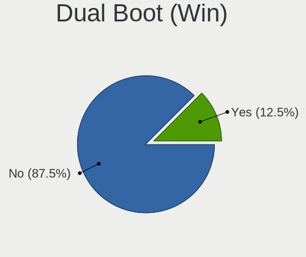
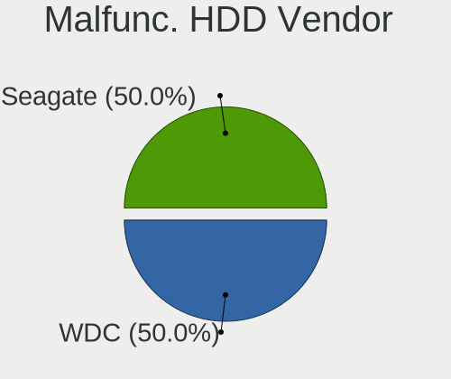
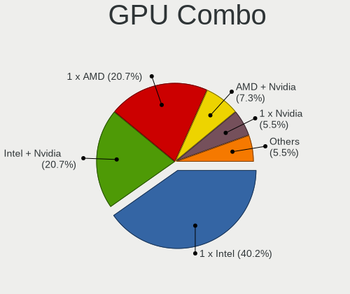
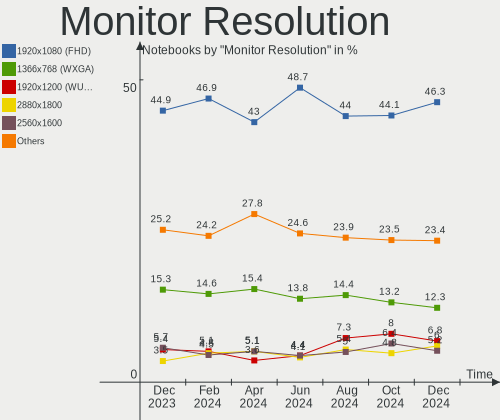

Fedora - Hardware Trends (Notebooks)
------------------------------------

A project to identify most popular hardware characteristics and track their change
over time based on data collected by Linux users at https://Linux-Hardware.org.

Anyone can contribute to this report by the [hw-probe](https://github.com/linuxhw/hw-probe) tool:

    sudo -E hw-probe -all -upload

This report is for one last month. Overall report since the beginning of time: [TestDays](https://github.com/linuxhw/TestDays)

Period: Oct, 2023.

Contents
--------

* [ System ](#system)
  - [ OS                       ](#os)
  - [ OS Family                ](#os-family)
  - [ Kernel                   ](#kernel)
  - [ Kernel Family            ](#kernel-family)
  - [ Kernel Major Ver.        ](#kernel-major-ver)
  - [ Arch                     ](#arch)
  - [ DE                       ](#de)
  - [ Display Server           ](#display-server)
  - [ Display Manager          ](#display-manager)
  - [ OS Lang                  ](#os-lang)
  - [ Boot Mode                ](#boot-mode)
  - [ Filesystem               ](#filesystem)
  - [ Part. scheme             ](#part-scheme)
  - [ Dual Boot with Linux/BSD ](#dual-boot-with-linuxbsd)
  - [ Dual Boot (Win)          ](#dual-boot-win)

* [ Board ](#board)
  - [ Vendor                   ](#vendor)
  - [ Model                    ](#model)
  - [ Model Family             ](#model-family)
  - [ MFG Year                 ](#mfg-year)
  - [ Form Factor              ](#form-factor)
  - [ Secure Boot              ](#secure-boot)
  - [ Coreboot                 ](#coreboot)
  - [ RAM Size                 ](#ram-size)
  - [ RAM Used                 ](#ram-used)
  - [ Total Drives             ](#total-drives)
  - [ Has CD-ROM               ](#has-cd-rom)
  - [ Has Ethernet             ](#has-ethernet)
  - [ Has WiFi                 ](#has-wifi)
  - [ Has Bluetooth            ](#has-bluetooth)

* [ Location ](#location)
  - [ Country                  ](#country)
  - [ City                     ](#city)

* [ Drives ](#drives)
  - [ Drive Vendor             ](#drive-vendor)
  - [ Drive Model              ](#drive-model)
  - [ HDD Vendor               ](#hdd-vendor)
  - [ SSD Vendor               ](#ssd-vendor)
  - [ Drive Kind               ](#drive-kind)
  - [ Drive Connector          ](#drive-connector)
  - [ Drive Size               ](#drive-size)
  - [ Space Total              ](#space-total)
  - [ Space Used               ](#space-used)
  - [ Malfunc. Drives          ](#malfunc-drives)
  - [ Malfunc. Drive Vendor    ](#malfunc-drive-vendor)
  - [ Malfunc. HDD Vendor      ](#malfunc-hdd-vendor)
  - [ Malfunc. Drive Kind      ](#malfunc-drive-kind)
  - [ Failed Drives            ](#failed-drives)
  - [ Failed Drive Vendor      ](#failed-drive-vendor)
  - [ Drive Status             ](#drive-status)

* [ Storage controller ](#storage-controller)
  - [ Storage Vendor           ](#storage-vendor)
  - [ Storage Model            ](#storage-model)
  - [ Storage Kind             ](#storage-kind)

* [ Processor ](#processor)
  - [ CPU Vendor               ](#cpu-vendor)
  - [ CPU Model                ](#cpu-model)
  - [ CPU Model Family         ](#cpu-model-family)
  - [ CPU Cores                ](#cpu-cores)
  - [ CPU Sockets              ](#cpu-sockets)
  - [ CPU Threads              ](#cpu-threads)
  - [ CPU Op-Modes             ](#cpu-op-modes)
  - [ CPU Microcode            ](#cpu-microcode)
  - [ CPU Microarch            ](#cpu-microarch)

* [ Graphics ](#graphics)
  - [ GPU Vendor               ](#gpu-vendor)
  - [ GPU Model                ](#gpu-model)
  - [ GPU Combo                ](#gpu-combo)
  - [ GPU Driver               ](#gpu-driver)
  - [ GPU Memory               ](#gpu-memory)

* [ Monitor ](#monitor)
  - [ Monitor Vendor           ](#monitor-vendor)
  - [ Monitor Model            ](#monitor-model)
  - [ Monitor Resolution       ](#monitor-resolution)
  - [ Monitor Diagonal         ](#monitor-diagonal)
  - [ Monitor Width            ](#monitor-width)
  - [ Aspect Ratio             ](#aspect-ratio)
  - [ Monitor Area             ](#monitor-area)
  - [ Pixel Density            ](#pixel-density)
  - [ Multiple Monitors        ](#multiple-monitors)

* [ Network ](#network)
  - [ Net Controller Vendor    ](#net-controller-vendor)
  - [ Net Controller Model     ](#net-controller-model)
  - [ Wireless Vendor          ](#wireless-vendor)
  - [ Wireless Model           ](#wireless-model)
  - [ Ethernet Vendor          ](#ethernet-vendor)
  - [ Ethernet Model           ](#ethernet-model)
  - [ Net Controller Kind      ](#net-controller-kind)
  - [ Used Controller          ](#used-controller)
  - [ NICs                     ](#nics)
  - [ IPv6                     ](#ipv6)

* [ Bluetooth ](#bluetooth)
  - [ Bluetooth Vendor         ](#bluetooth-vendor)
  - [ Bluetooth Model          ](#bluetooth-model)

* [ Sound ](#sound)
  - [ Sound Vendor             ](#sound-vendor)
  - [ Sound Model              ](#sound-model)

* [ Memory ](#memory)
  - [ Memory Vendor            ](#memory-vendor)
  - [ Memory Model             ](#memory-model)
  - [ Memory Kind              ](#memory-kind)
  - [ Memory Form Factor       ](#memory-form-factor)
  - [ Memory Size              ](#memory-size)
  - [ Memory Speed             ](#memory-speed)

* [ Printers & scanners ](#printers--scanners)
  - [ Printer Vendor           ](#printer-vendor)
  - [ Printer Model            ](#printer-model)
  - [ Scanner Vendor           ](#scanner-vendor)
  - [ Scanner Model            ](#scanner-model)

* [ Camera ](#camera)
  - [ Camera Vendor            ](#camera-vendor)
  - [ Camera Model             ](#camera-model)

* [ Security ](#security)
  - [ Fingerprint Vendor       ](#fingerprint-vendor)
  - [ Fingerprint Model        ](#fingerprint-model)
  - [ Chipcard Vendor          ](#chipcard-vendor)
  - [ Chipcard Model           ](#chipcard-model)

* [ Unsupported ](#unsupported)
  - [ Unsupported Devices      ](#unsupported-devices)
  - [ Unsupported Device Types ](#unsupported-device-types)

System
------

OS
--

Installed operating systems

| Name      | Notebooks | Percent |
|-----------|-----------|---------|
| Fedora 38 | 257       | 85.38%  |
| Fedora 39 | 29        | 9.63%   |
| Fedora 37 | 6         | 1.99%   |
| Fedora 36 | 4         | 1.33%   |
| Fedora 35 | 2         | 0.66%   |
| Fedora 40 | 1         | 0.33%   |
| Fedora 34 | 1         | 0.33%   |
| Fedora 33 | 1         | 0.33%   |

OS Family
---------

OS without a version

| Name   | Notebooks | Percent |
|--------|-----------|---------|
| Fedora | 301       | 100%    |

Kernel
------

Version of the Linux kernel

| Version                                                | Notebooks | Percent |
|--------------------------------------------------------|-----------|---------|
| 6.5.5-200.fc38.x86_64                                  | 72        | 23.92%  |
| 6.5.6-200.fc38.x86_64                                  | 51        | 16.94%  |
| 6.5.7-200.fc38.x86_64                                  | 44        | 14.62%  |
| 6.5.8-200.fc38.x86_64                                  | 35        | 11.63%  |
| 6.2.9-300.fc38.x86_64                                  | 35        | 11.63%  |
| 6.5.6-300.fc39.x86_64                                  | 16        | 5.32%   |
| 6.4.15-200.fc38.x86_64                                 | 6         | 1.99%   |
| 6.5.5-300.fc39.x86_64                                  | 5         | 1.66%   |
| 6.5.8-300.fc39.x86_64                                  | 4         | 1.33%   |
| 6.2.15-100.fc36.x86_64                                 | 4         | 1.33%   |
| 6.5.5-100.fc37.x86_64                                  | 3         | 1%      |
| 6.5.7-300.fc39.x86_64                                  | 2         | 0.66%   |
| 6.5.2-301.fc39.x86_64                                  | 2         | 0.66%   |
| 6.0.12-100.fc35.x86_64                                 | 2         | 0.66%   |
| 6.6.0-0.rc4.20231005git3006adf3be79.36.fc40.x86_64     | 1         | 0.33%   |
| 6.6.0-0.rc0.20230902gt0468be89.203.vanilla.fc38.x86_64 | 1         | 0.33%   |
| 6.5.6-100.fc37.x86_64                                  | 1         | 0.33%   |
| 6.5.5-xm1.0.fc38.x86_64                                | 1         | 0.33%   |
| 6.5.5-cbe1.0.fc38.x86_64                               | 1         | 0.33%   |
| 6.5.3-301.rog.fc38.x86_64                              | 1         | 0.33%   |
| 6.4.8-200.fc38.x86_64                                  | 1         | 0.33%   |
| 6.4.7-200.fc38.x86_64                                  | 1         | 0.33%   |
| 6.4.6-200.fc38.x86_64                                  | 1         | 0.33%   |
| 6.4.4-100.fc37.x86_64                                  | 1         | 0.33%   |
| 6.4.12-200.fc38.x86_64                                 | 1         | 0.33%   |
| 6.4.11-200.fc38.x86_64                                 | 1         | 0.33%   |
| 6.3.5-200.fc38.x86_64                                  | 1         | 0.33%   |
| 6.3.11-200.fc38.x86_64                                 | 1         | 0.33%   |
| 6.2.2-301.fc38.x86_64                                  | 1         | 0.33%   |
| 6.2.15-703.inttf.fc38.x86_64                           | 1         | 0.33%   |
| 6.0.8-300.fc37.x86_64                                  | 1         | 0.33%   |
| 5.4.19-200.fc31.x86_64                                 | 1         | 0.33%   |
| 5.17.12-100.fc34.x86_64                                | 1         | 0.33%   |
| 5.14.17-101.fc33.x86_64                                | 1         | 0.33%   |

Kernel Family
-------------

Linux kernel without a distro release

| Version | Notebooks | Percent |
|---------|-----------|---------|
| 6.5.5   | 82        | 27.24%  |
| 6.5.6   | 68        | 22.59%  |
| 6.5.7   | 46        | 15.28%  |
| 6.5.8   | 39        | 12.96%  |
| 6.2.9   | 35        | 11.63%  |
| 6.4.15  | 6         | 1.99%   |
| 6.2.15  | 5         | 1.66%   |
| 6.6.0   | 2         | 0.66%   |
| 6.5.2   | 2         | 0.66%   |
| 6.0.12  | 2         | 0.66%   |
| 6.5.3   | 1         | 0.33%   |
| 6.4.8   | 1         | 0.33%   |
| 6.4.7   | 1         | 0.33%   |
| 6.4.6   | 1         | 0.33%   |
| 6.4.4   | 1         | 0.33%   |
| 6.4.12  | 1         | 0.33%   |
| 6.4.11  | 1         | 0.33%   |
| 6.3.5   | 1         | 0.33%   |
| 6.3.11  | 1         | 0.33%   |
| 6.2.2   | 1         | 0.33%   |
| 6.0.8   | 1         | 0.33%   |
| 5.4.19  | 1         | 0.33%   |
| 5.17.12 | 1         | 0.33%   |
| 5.14.17 | 1         | 0.33%   |

Kernel Major Ver.
-----------------

Linux kernel major version

| Version | Notebooks | Percent |
|---------|-----------|---------|
| 6.5     | 238       | 79.07%  |
| 6.2     | 41        | 13.62%  |
| 6.4     | 12        | 3.99%   |
| 6.0     | 3         | 1%      |
| 6.6     | 2         | 0.66%   |
| 6.3     | 2         | 0.66%   |
| 5.4     | 1         | 0.33%   |
| 5.17    | 1         | 0.33%   |
| 5.14    | 1         | 0.33%   |

Arch
----

OS architecture (x86_64, i586, etc.)

| Name   | Notebooks | Percent |
|--------|-----------|---------|
| x86_64 | 301       | 100%    |

DE
--

Desktop Environment

| Name          | Notebooks | Percent |
|---------------|-----------|---------|
| GNOME         | 227       | 75.42%  |
| KDE5          | 52        | 17.28%  |
| Unknown       | 8         | 2.66%   |
| X-Cinnamon    | 5         | 1.66%   |
| XFCE          | 2         | 0.66%   |
| Cinnamon      | 2         | 0.66%   |
| Budgie        | 2         | 0.66%   |
| sway          | 1         | 0.33%   |
| LXDE          | 1         | 0.33%   |
| GNOME Classic | 1         | 0.33%   |

Display Server
--------------

X11 or Wayland

| Name    | Notebooks | Percent |
|---------|-----------|---------|
| Wayland | 249       | 82.72%  |
| X11     | 45        | 14.95%  |
| Tty     | 5         | 1.66%   |
| Unknown | 2         | 0.66%   |

Display Manager
---------------

SDDM, LightDM, etc.

| Name    | Notebooks | Percent |
|---------|-----------|---------|
| Unknown | 173       | 57.48%  |
| GDM     | 89        | 29.57%  |
| SDDM    | 31        | 10.3%   |
| LightDM | 8         | 2.66%   |

OS Lang
-------

Language

| Lang    | Notebooks | Percent |
|---------|-----------|---------|
| en_US   | 166       | 55.15%  |
| en_GB   | 25        | 8.31%   |
| ru_RU   | 14        | 4.65%   |
| it_IT   | 11        | 3.65%   |
| pt_BR   | 10        | 3.32%   |
| en_CA   | 9         | 2.99%   |
| de_DE   | 8         | 2.66%   |
| es_ES   | 7         | 2.33%   |
| es_MX   | 6         | 1.99%   |
| en_IN   | 4         | 1.33%   |
| pt_PT   | 3         | 1%      |
| pl_PL   | 3         | 1%      |
| fr_FR   | 3         | 1%      |
| es_CL   | 3         | 1%      |
| en_AU   | 3         | 1%      |
| cs_CZ   | 3         | 1%      |
| nl_NL   | 2         | 0.66%   |
| ja_JP   | 2         | 0.66%   |
| es_CO   | 2         | 0.66%   |
| en_SG   | 2         | 0.66%   |
| en_DK   | 2         | 0.66%   |
| tr_TR   | 1         | 0.33%   |
| lv_LV   | 1         | 0.33%   |
| id_ID   | 1         | 0.33%   |
| fr_CA   | 1         | 0.33%   |
| fi_FI   | 1         | 0.33%   |
| es_US   | 1         | 0.33%   |
| es_GT   | 1         | 0.33%   |
| es_DO   | 1         | 0.33%   |
| en_PH   | 1         | 0.33%   |
| en_IL   | 1         | 0.33%   |
| de_AT   | 1         | 0.33%   |
| az_AZ   | 1         | 0.33%   |
| Unknown | 1         | 0.33%   |

Boot Mode
---------

EFI or BIOS

| Mode | Notebooks | Percent |
|------|-----------|---------|
| EFI  | 261       | 86.71%  |
| BIOS | 40        | 13.29%  |

Filesystem
----------

Type of filesystem

| Type  | Notebooks | Percent |
|-------|-----------|---------|
| Btrfs | 244       | 81.06%  |
| Ext4  | 50        | 16.61%  |
| Xfs   | 7         | 2.33%   |

Part. scheme
------------

Scheme of partitioning

| Type    | Notebooks | Percent |
|---------|-----------|---------|
| Unknown | 162       | 53.82%  |
| GPT     | 134       | 44.52%  |
| MBR     | 5         | 1.66%   |

Dual Boot with Linux/BSD
------------------------

Hosting more than one Linux/BSD

| Dual boot | Notebooks | Percent |
|-----------|-----------|---------|
| No        | 269       | 89.37%  |
| Yes       | 32        | 10.63%  |

Dual Boot (Win)
---------------

Hosting Linux and Windows

| Dual boot | Notebooks | Percent |
|-----------|-----------|---------|
| No        | 252       | 83.72%  |
| Yes       | 49        | 16.28%  |

Board
-----

Vendor
------

Motherboard manufacturer

| Name                   | Notebooks | Percent |
|------------------------|-----------|---------|
| Lenovo                 | 90        | 29.9%   |
| Hewlett-Packard        | 43        | 14.29%  |
| Dell                   | 42        | 13.95%  |
| ASUSTek Computer       | 42        | 13.95%  |
| Acer                   | 16        | 5.32%   |
| Apple                  | 13        | 4.32%   |
| MSI                    | 9         | 2.99%   |
| HUAWEI                 | 6         | 1.99%   |
| Samsung Electronics    | 5         | 1.66%   |
| Toshiba                | 4         | 1.33%   |
| Framework              | 4         | 1.33%   |
| Timi                   | 3         | 1%      |
| Google                 | 3         | 1%      |
| Schenker               | 2         | 0.66%   |
| XIAOMI                 | 1         | 0.33%   |
| VANT                   | 1         | 0.33%   |
| TUXEDO                 | 1         | 0.33%   |
| Thomson                | 1         | 0.33%   |
| Teclast                | 1         | 0.33%   |
| Razer                  | 1         | 0.33%   |
| Positivo Bahia - VAIO  | 1         | 0.33%   |
| Packard Bell           | 1         | 0.33%   |
| Notebook               | 1         | 0.33%   |
| Maibenben              | 1         | 0.33%   |
| Infinix                | 1         | 0.33%   |
| GPD                    | 1         | 0.33%   |
| GLM                    | 1         | 0.33%   |
| Gigabyte Technology    | 1         | 0.33%   |
| Fujitsu                | 1         | 0.33%   |
| BANGHO                 | 1         | 0.33%   |
| Avell High Performance | 1         | 0.33%   |
| Alienware              | 1         | 0.33%   |
| Unknown                | 1         | 0.33%   |

Model
-----

Motherboard model

| Name                                    | Notebooks | Percent |
|-----------------------------------------|-----------|---------|
| Lenovo G500 20236                       | 3         | 1%      |
| HP Notebook                             | 3         | 1%      |
| ASUS Vivobook Go E1504FA_E1504FA        | 3         | 1%      |
| MSI Prestige 14H B12UCX                 | 2         | 0.66%   |
| Lenovo IdeaPad 5 14ARE05 81YM           | 2         | 0.66%   |
| HP ProBook 640 G1                       | 2         | 0.66%   |
| HP EliteBook 845 G8 Notebook PC         | 2         | 0.66%   |
| Framework Laptop                        | 2         | 0.66%   |
| Dell Precision 5480                     | 2         | 0.66%   |
| Dell Latitude 5440                      | 2         | 0.66%   |
| ASUS Zenbook UM3402YAR_UM3402YA         | 2         | 0.66%   |
| ASUS ROG Zephyrus G14 GA402RJ_GA402RJ   | 2         | 0.66%   |
| Apple MacBookPro8,1                     | 2         | 0.66%   |
| Apple MacBookPro12,1                    | 2         | 0.66%   |
| Acer Nitro AN515-58                     | 2         | 0.66%   |
| Acer Aspire A515-45                     | 2         | 0.66%   |
| Unknown                                 | 2         | 0.66%   |
| XIAOMI Redmi Book Pro 15 2023           | 1         | 0.33%   |
| VANT MOOVE14_2023                       | 1         | 0.33%   |
| Toshiba Satellite L75D-A                | 1         | 0.33%   |
| Toshiba Satellite L735                  | 1         | 0.33%   |
| Toshiba Satellite CL10-C-102            | 1         | 0.33%   |
| Toshiba Satellite A500                  | 1         | 0.33%   |
| Timi TM1701                             | 1         | 0.33%   |
| Timi Redmi Book Pro 14 2022             | 1         | 0.33%   |
| Timi A35S                               | 1         | 0.33%   |
| Thomson N14C4WH64                       | 1         | 0.33%   |
| Teclast F7S                             | 1         | 0.33%   |
| Schenker XMG NEO (TGL/M21)              | 1         | 0.33%   |
| Schenker VISION (M23)                   | 1         | 0.33%   |
| Samsung 960XFH                          | 1         | 0.33%   |
| Samsung 950XCJ/951XCJ/950XCR            | 1         | 0.33%   |
| Samsung 940Z5L                          | 1         | 0.33%   |
| Samsung 940XGK                          | 1         | 0.33%   |
| Samsung 670Z5E                          | 1         | 0.33%   |
| Razer Blade 15 Base Model (Late 2020)   | 1         | 0.33%   |
| Positivo Bahia - VAIO VJFE42F11X-XXXXXX | 1         | 0.33%   |
| Packard Bell EasyNote LE69KB            | 1         | 0.33%   |
| Notebook PCx0Dx                         | 1         | 0.33%   |
| MSI VR630                               | 1         | 0.33%   |

Model Family
------------

Motherboard model prefix

| Name               | Notebooks | Percent |
|--------------------|-----------|---------|
| Lenovo ThinkPad    | 47        | 15.61%  |
| Lenovo IdeaPad     | 18        | 5.98%   |
| Dell Latitude      | 16        | 5.32%   |
| HP EliteBook       | 12        | 3.99%   |
| ASUS Vivobook      | 12        | 3.99%   |
| Dell Precision     | 10        | 3.32%   |
| HP Pavilion        | 9         | 2.99%   |
| ASUS Zenbook       | 8         | 2.66%   |
| Acer Aspire        | 8         | 2.66%   |
| HP ProBook         | 7         | 2.33%   |
| Dell XPS           | 5         | 1.66%   |
| ASUS ASUS          | 5         | 1.66%   |
| Toshiba Satellite  | 4         | 1.33%   |
| Lenovo Yoga        | 4         | 1.33%   |
| Lenovo ThinkBook   | 4         | 1.33%   |
| Lenovo Legion      | 4         | 1.33%   |
| HP Laptop          | 4         | 1.33%   |
| Framework Laptop   | 4         | 1.33%   |
| Dell Vostro        | 4         | 1.33%   |
| Dell Inspiron      | 4         | 1.33%   |
| ASUS ROG           | 4         | 1.33%   |
| Acer Nitro         | 4         | 1.33%   |
| MSI Prestige       | 3         | 1%      |
| Lenovo G500        | 3         | 1%      |
| HP Notebook        | 3         | 1%      |
| HP ENVY            | 2         | 0.66%   |
| ASUS Zephyrus      | 2         | 0.66%   |
| Apple MacBookPro8  | 2         | 0.66%   |
| Apple MacBookPro15 | 2         | 0.66%   |
| Apple MacBookPro12 | 2         | 0.66%   |
| Acer Predator      | 2         | 0.66%   |
| Unknown            | 2         | 0.66%   |
| XIAOMI Redmi       | 1         | 0.33%   |
| VANT MOOVE14       | 1         | 0.33%   |
| Timi TM1701        | 1         | 0.33%   |
| Timi Redmi         | 1         | 0.33%   |
| Timi A35S          | 1         | 0.33%   |
| Thomson N14C4WH64  | 1         | 0.33%   |
| Teclast F7S        | 1         | 0.33%   |
| Schenker XMG       | 1         | 0.33%   |

MFG Year
--------

Motherboard manufacture year

| Year | Notebooks | Percent |
|------|-----------|---------|
| 2022 | 50        | 16.61%  |
| 2023 | 43        | 14.29%  |
| 2021 | 38        | 12.62%  |
| 2020 | 38        | 12.62%  |
| 2018 | 23        | 7.64%   |
| 2013 | 20        | 6.64%   |
| 2019 | 18        | 5.98%   |
| 2017 | 14        | 4.65%   |
| 2011 | 10        | 3.32%   |
| 2015 | 9         | 2.99%   |
| 2014 | 9         | 2.99%   |
| 2012 | 8         | 2.66%   |
| 2016 | 7         | 2.33%   |
| 2009 | 6         | 1.99%   |
| 2010 | 3         | 1%      |
| 2008 | 3         | 1%      |
| 2007 | 2         | 0.66%   |

Form Factor
-----------

Physical design of the computer

| Name     | Notebooks | Percent |
|----------|-----------|---------|
| Notebook | 301       | 100%    |

Secure Boot
-----------

Enabled or disabled

| State    | Notebooks | Percent |
|----------|-----------|---------|
| Disabled | 224       | 74.42%  |
| Enabled  | 77        | 25.58%  |

Coreboot
--------

Have coreboot on board

| Used | Notebooks | Percent |
|------|-----------|---------|
| No   | 298       | 99%     |
| Yes  | 3         | 1%      |

RAM Size
--------

Total RAM memory

| Size in GB  | Notebooks | Percent |
|-------------|-----------|---------|
| 8.01-16.0   | 81        | 26.91%  |
| 4.01-8.0    | 74        | 24.58%  |
| 32.01-64.0  | 56        | 18.6%   |
| 16.01-24.0  | 54        | 17.94%  |
| 3.01-4.0    | 23        | 7.64%   |
| 24.01-32.0  | 5         | 1.66%   |
| 2.01-3.0    | 3         | 1%      |
| 64.01-256.0 | 3         | 1%      |
| 1.01-2.0    | 2         | 0.66%   |

RAM Used
--------

Used RAM memory

| Used GB   | Notebooks | Percent |
|-----------|-----------|---------|
| 4.01-8.0  | 110       | 36.54%  |
| 2.01-3.0  | 72        | 23.92%  |
| 3.01-4.0  | 61        | 20.27%  |
| 1.01-2.0  | 30        | 9.97%   |
| 8.01-16.0 | 27        | 8.97%   |
| 0.51-1.0  | 1         | 0.33%   |

Total Drives
------------

Number of drives on board

| Drives | Notebooks | Percent |
|--------|-----------|---------|
| 1      | 248       | 82.39%  |
| 2      | 50        | 16.61%  |
| 3      | 2         | 0.66%   |
| 4      | 1         | 0.33%   |

Has CD-ROM
----------

Has CD-ROM on board

| Presented | Notebooks | Percent |
|-----------|-----------|---------|
| No        | 249       | 82.72%  |
| Yes       | 52        | 17.28%  |

Has Ethernet
------------

Has Ethernet on board

| Presented | Notebooks | Percent |
|-----------|-----------|---------|
| Yes       | 205       | 68.11%  |
| No        | 96        | 31.89%  |

Has WiFi
--------

Has WiFi module

| Presented | Notebooks | Percent |
|-----------|-----------|---------|
| Yes       | 299       | 99.34%  |
| No        | 2         | 0.66%   |

Has Bluetooth
-------------

Has Bluetooth module

| Presented | Notebooks | Percent |
|-----------|-----------|---------|
| Yes       | 262       | 87.04%  |
| No        | 39        | 12.96%  |

Location
--------

Country
-------

Geographic location (country)

| Country            | Notebooks | Percent |
|--------------------|-----------|---------|
| USA                | 40        | 13.29%  |
| Italy              | 23        | 7.64%   |
| Spain              | 18        | 5.98%   |
| UK                 | 17        | 5.65%   |
| Germany            | 16        | 5.32%   |
| Brazil             | 15        | 4.98%   |
| Russia             | 14        | 4.65%   |
| India              | 12        | 3.99%   |
| Canada             | 11        | 3.65%   |
| France             | 10        | 3.32%   |
| Poland             | 9         | 2.99%   |
| Mexico             | 9         | 2.99%   |
| Netherlands        | 8         | 2.66%   |
| Australia          | 6         | 1.99%   |
| Turkey             | 5         | 1.66%   |
| Czechia            | 5         | 1.66%   |
| Indonesia          | 4         | 1.33%   |
| Colombia           | 4         | 1.33%   |
| Tunisia            | 3         | 1%      |
| Thailand           | 3         | 1%      |
| Sweden             | 3         | 1%      |
| Romania            | 3         | 1%      |
| Portugal           | 3         | 1%      |
| Japan              | 3         | 1%      |
| Finland            | 3         | 1%      |
| Chile              | 3         | 1%      |
| Argentina          | 3         | 1%      |
| Vietnam            | 2         | 0.66%   |
| Philippines        | 2         | 0.66%   |
| Morocco            | 2         | 0.66%   |
| Israel             | 2         | 0.66%   |
| Greece             | 2         | 0.66%   |
| Dominican Republic | 2         | 0.66%   |
| Croatia            | 2         | 0.66%   |
| Bulgaria           | 2         | 0.66%   |
| Belgium            | 2         | 0.66%   |
| Austria            | 2         | 0.66%   |
| Uzbekistan         | 1         | 0.33%   |
| Switzerland        | 1         | 0.33%   |
| Slovenia           | 1         | 0.33%   |

City
----

Geographic location (city)

| City               | Notebooks | Percent |
|--------------------|-----------|---------|
| London             | 4         | 1.33%   |
| Barcelona          | 4         | 1.33%   |
| St Petersburg      | 3         | 1%      |
| Mexico City        | 3         | 1%      |
| Madrid             | 3         | 1%      |
| Wroclaw            | 2         | 0.66%   |
| Warsaw             | 2         | 0.66%   |
| Vienna             | 2         | 0.66%   |
| Turin              | 2         | 0.66%   |
| Tokyo              | 2         | 0.66%   |
| Sydney             | 2         | 0.66%   |
| Stuttgart          | 2         | 0.66%   |
| Sofia              | 2         | 0.66%   |
| Santo Domingo Este | 2         | 0.66%   |
| Santiago           | 2         | 0.66%   |
| Rome               | 2         | 0.66%   |
| Prague             | 2         | 0.66%   |
| Nizhniy Novgorod   | 2         | 0.66%   |
| Moscow             | 2         | 0.66%   |
| Montreal           | 2         | 0.66%   |
| Milan              | 2         | 0.66%   |
| Maringá           | 2         | 0.66%   |
| Liverpool          | 2         | 0.66%   |
| Lisbon             | 2         | 0.66%   |
| Kerkrade           | 2         | 0.66%   |
| Istanbul           | 2         | 0.66%   |
| Helsinki           | 2         | 0.66%   |
| Hanoi              | 2         | 0.66%   |
| Guadalajara        | 2         | 0.66%   |
| Genoa              | 2         | 0.66%   |
| Berlin             | 2         | 0.66%   |
| Belo Horizonte     | 2         | 0.66%   |
| Bangkok            | 2         | 0.66%   |
| Bad Krozingen      | 2         | 0.66%   |
| Athens             | 2         | 0.66%   |
| Amstelveen         | 2         | 0.66%   |
| Zavidovici         | 1         | 0.33%   |
| Zaragoza           | 1         | 0.33%   |
| Zagreb             | 1         | 0.33%   |
| Yogyakarta         | 1         | 0.33%   |

Drives
------

Drive Vendor
------------

Hard drive vendors

| Vendor                       | Notebooks | Drives | Percent |
|------------------------------|-----------|--------|---------|
| Samsung Electronics          | 83        | 90     | 23.85%  |
| Sandisk                      | 35        | 35     | 10.06%  |
| Micron Technology            | 27        | 27     | 7.76%   |
| Seagate                      | 20        | 20     | 5.75%   |
| WDC                          | 19        | 19     | 5.46%   |
| SK hynix                     | 19        | 19     | 5.46%   |
| Intel                        | 17        | 18     | 4.89%   |
| Unknown                      | 14        | 16     | 4.02%   |
| Toshiba                      | 14        | 14     | 4.02%   |
| Kingston                     | 11        | 12     | 3.16%   |
| Apple                        | 8         | 9      | 2.3%    |
| Crucial                      | 7         | 7      | 2.01%   |
| Phison Electronics           | 6         | 6      | 1.72%   |
| A-DATA Technology            | 6         | 6      | 1.72%   |
| KIOXIA                       | 5         | 6      | 1.44%   |
| Kingston Technology Company  | 5         | 5      | 1.44%   |
| Solid State Storage          | 4         | 4      | 1.15%   |
| HGST                         | 4         | 4      | 1.15%   |
| Union Memory (Shenzhen)      | 3         | 3      | 0.86%   |
| Micron/Crucial Technology    | 3         | 3      | 0.86%   |
| MAXIO Technology (Hangzhou)  | 3         | 3      | 0.86%   |
| ADATA Technology             | 3         | 3      | 0.86%   |
| Shenzhen Longsys Electronics | 2         | 3      | 0.57%   |
| Realtek                      | 2         | 2      | 0.57%   |
| PNY                          | 2         | 2      | 0.57%   |
| KingSpec                     | 2         | 2      | 0.57%   |
| China                        | 2         | 2      | 0.57%   |
| VR                           | 1         | 1      | 0.29%   |
| V-GeN                        | 1         | 1      | 0.29%   |
| Transcend                    | 1         | 1      | 0.29%   |
| Teclast                      | 1         | 1      | 0.29%   |
| SPCC                         | 1         | 1      | 0.29%   |
| Silicon Motion               | 1         | 1      | 0.29%   |
| Realtek Semiconductor        | 1         | 1      | 0.29%   |
| Patriot                      | 1         | 1      | 0.29%   |
| Mushkin                      | 1         | 1      | 0.29%   |
| LITEON                       | 1         | 1      | 0.29%   |
| Lexar                        | 1         | 1      | 0.29%   |
| JMicron Technology           | 1         | 1      | 0.29%   |
| JetFlash                     | 1         | 1      | 0.29%   |

Drive Model
-----------

Hard drive models

| Model                                               | Notebooks | Percent |
|-----------------------------------------------------|-----------|---------|
| Samsung NVMe SSD Controller PM9A1/PM9A3/980PRO 1TB  | 16        | 4.52%   |
| Samsung NVMe SSD Controller SM981/PM981/PM983 1TB   | 12        | 3.39%   |
| Sandisk WD Black SN750 / PC SN730 NVMe SSD 1024GB   | 7         | 1.98%   |
| Sandisk WD Blue SN550 NVMe SSD 1TB                  | 6         | 1.69%   |
| Intel SSDPEKNU512GZ 512GB                           | 6         | 1.69%   |
| Unknown MMC Card  128GB                             | 5         | 1.41%   |
| Seagate ST1000LM035-1RK172 1TB                      | 5         | 1.41%   |
| Unknown MMC Card  64GB                              | 4         | 1.13%   |
| Toshiba XG6 NVMe SSD Controller 256GB               | 4         | 1.13%   |
| Toshiba MQ04ABF100 1TB                              | 4         | 1.13%   |
| Samsung MZALQ512HALU-000L2 512GB                    | 4         | 1.13%   |
| Crucial CT500MX500SSD1 500GB                        | 4         | 1.13%   |
| Sandisk WD PC SN740 SDDQMQD-512G-1001 512GB         | 3         | 0.85%   |
| Sandisk WD Black SN850 1TB                          | 3         | 0.85%   |
| Samsung NVMe SSD Controller SM961/PM961/SM963 121GB | 3         | 0.85%   |
| Samsung MZALQ512HBLU-00BL2 512GB                    | 3         | 0.85%   |
| Phison E16 PCIe4 NVMe Controller 500GB              | 3         | 0.85%   |
| Micron/Crucial P2 NVMe PCIe SSD 500GB               | 3         | 0.85%   |
| Micron 2450_MTFDKBA1T0TFK 1TB                       | 3         | 0.85%   |
| Micron 2400_MTFDKBA512QFM 512GB                     | 3         | 0.85%   |
| MAXIO (Hangzhou) NVMe SSD Controller MAP1202 250GB  | 3         | 0.85%   |
| KIOXIA KBG50ZNS512G NVMe 512GB                      | 3         | 0.85%   |
| Intel SSD 660P Series 1024GB                        | 3         | 0.85%   |
| Apple ANS2 NVMe Controller 1TB                      | 3         | 0.85%   |
| WDC WDS240G2G0A-00JH30 240GB SSD                    | 2         | 0.56%   |
| WDC WD10SPZX-24Z10 1TB                              | 2         | 0.56%   |
| Unknown MMC Card  32GB                              | 2         | 0.56%   |
| Union Memory (Shenzhen) UMIS RPJTJ512MGE1QDQ 512GB  | 2         | 0.56%   |
| Toshiba KXG50ZNV256G 256GB                          | 2         | 0.56%   |
| SK hynix PC801 NVMe 1TB                             | 2         | 0.56%   |
| Seagate ST9500420AS 500GB                           | 2         | 0.56%   |
| Seagate ST500LT012-1DG142 500GB                     | 2         | 0.56%   |
| SanDisk SD8TB8U256G1001 256GB SSD                   | 2         | 0.56%   |
| Sandisk PC SN520 NVMe SSD 256GB                     | 2         | 0.56%   |
| Samsung SSD 980 1TB                                 | 2         | 0.56%   |
| Samsung SSD 870 EVO 1TB                             | 2         | 0.56%   |
| Samsung SSD 850 EVO 250GB                           | 2         | 0.56%   |
| Samsung PM9B1 NVMe 512GB                            | 2         | 0.56%   |
| Samsung MZVLQ512HBLU-00BH1 512GB                    | 2         | 0.56%   |
| Micron MTFDKCD512TFK 512GB                          | 2         | 0.56%   |

HDD Vendor
----------

Hard disk drive vendors

| Vendor  | Notebooks | Drives | Percent |
|---------|-----------|--------|---------|
| Seagate | 19        | 19     | 42.22%  |
| WDC     | 15        | 15     | 33.33%  |
| Toshiba | 5         | 5      | 11.11%  |
| HGST    | 4         | 4      | 8.89%   |
| Hitachi | 1         | 1      | 2.22%   |
| Fujitsu | 1         | 1      | 2.22%   |

SSD Vendor
----------

Solid state drive vendors

| Vendor              | Notebooks | Drives | Percent |
|---------------------|-----------|--------|---------|
| Samsung Electronics | 19        | 20     | 25%     |
| Kingston            | 7         | 7      | 9.21%   |
| Crucial             | 7         | 7      | 9.21%   |
| SanDisk             | 5         | 5      | 6.58%   |
| A-DATA Technology   | 5         | 5      | 6.58%   |
| SK hynix            | 4         | 4      | 5.26%   |
| Apple               | 4         | 4      | 5.26%   |
| WDC                 | 2         | 2      | 2.63%   |
| Toshiba             | 2         | 2      | 2.63%   |
| PNY                 | 2         | 2      | 2.63%   |
| KingSpec            | 2         | 2      | 2.63%   |
| Intel               | 2         | 2      | 2.63%   |
| China               | 2         | 2      | 2.63%   |
| V-GeN               | 1         | 1      | 1.32%   |
| Transcend           | 1         | 1      | 1.32%   |
| Teclast             | 1         | 1      | 1.32%   |
| SPCC                | 1         | 1      | 1.32%   |
| Patriot             | 1         | 1      | 1.32%   |
| Mushkin             | 1         | 1      | 1.32%   |
| Micron Technology   | 1         | 1      | 1.32%   |
| LITEON              | 1         | 1      | 1.32%   |
| Lexar               | 1         | 1      | 1.32%   |
| Hewlett-Packard     | 1         | 1      | 1.32%   |
| GOODRAM             | 1         | 1      | 1.32%   |
| Dahua               | 1         | 1      | 1.32%   |
| ACCLAMATOR          | 1         | 1      | 1.32%   |

Drive Kind
----------

HDD or SSD

| Kind    | Notebooks | Drives | Percent |
|---------|-----------|--------|---------|
| NVMe    | 198       | 220    | 59.28%  |
| SSD     | 72        | 77     | 21.56%  |
| HDD     | 45        | 45     | 13.47%  |
| MMC     | 13        | 14     | 3.89%   |
| Unknown | 6         | 6      | 1.8%    |

Drive Connector
---------------

SATA, SAS, NVMe, etc.

| Type | Notebooks | Drives | Percent |
|------|-----------|--------|---------|
| NVMe | 198       | 217    | 60%     |
| SATA | 110       | 121    | 33.33%  |
| MMC  | 13        | 14     | 3.94%   |
| SAS  | 9         | 10     | 2.73%   |

Drive Size
----------

Size of hard drive

| Size in TB | Notebooks | Drives | Percent |
|------------|-----------|--------|---------|
| 0.01-0.5   | 74        | 80     | 63.79%  |
| 0.51-1.0   | 39        | 39     | 33.62%  |
| 1.01-2.0   | 2         | 2      | 1.72%   |
| 4.01-10.0  | 1         | 1      | 0.86%   |

Space Total
-----------

Amount of disk space available on the file system

| Size in GB     | Notebooks | Percent |
|----------------|-----------|---------|
| 501-1000       | 82        | 27.24%  |
| 251-500        | 58        | 19.27%  |
| 1-20           | 39        | 12.96%  |
| 101-250        | 34        | 11.3%   |
| 1001-2000      | 30        | 9.97%   |
| Unknown        | 29        | 9.63%   |
| More than 3000 | 11        | 3.65%   |
| 51-100         | 10        | 3.32%   |
| 2001-3000      | 7         | 2.33%   |
| 21-50          | 1         | 0.33%   |

Space Used
----------

Amount of used disk space

| Used GB        | Notebooks | Percent |
|----------------|-----------|---------|
| 1-20           | 104       | 34.55%  |
| 101-250        | 41        | 13.62%  |
| 21-50          | 39        | 12.96%  |
| 51-100         | 34        | 11.3%   |
| Unknown        | 29        | 9.63%   |
| 251-500        | 28        | 9.3%    |
| 501-1000       | 18        | 5.98%   |
| 1001-2000      | 6         | 1.99%   |
| More than 3000 | 1         | 0.33%   |
| 2001-3000      | 1         | 0.33%   |

Malfunc. Drives
---------------

Drive models with a malfunction

| Model                           | Notebooks | Drives | Percent |
|---------------------------------|-----------|--------|---------|
| WDC WD5000LPCX-60VHAT0 500GB    | 1         | 1      | 14.29%  |
| Seagate ST9500420AS 500GB       | 1         | 1      | 14.29%  |
| Seagate ST500LT012-1DG142 500GB | 1         | 1      | 14.29%  |
| Seagate ST2000LX001-1RG174 2TB  | 1         | 1      | 14.29%  |
| Seagate ST1000LM014-1EJ164 1TB  | 1         | 1      | 14.29%  |
| SanDisk SSD PLUS 480GB          | 1         | 1      | 14.29%  |
| Intel HBRPEKNX0202AHO 32GB      | 1         | 1      | 14.29%  |

Malfunc. Drive Vendor
---------------------

Vendors of faulty drives

| Vendor  | Notebooks | Drives | Percent |
|---------|-----------|--------|---------|
| Seagate | 4         | 4      | 57.14%  |
| WDC     | 1         | 1      | 14.29%  |
| SanDisk | 1         | 1      | 14.29%  |
| Intel   | 1         | 1      | 14.29%  |

Malfunc. HDD Vendor
-------------------

Vendors of faulty HDD drives

| Vendor  | Notebooks | Drives | Percent |
|---------|-----------|--------|---------|
| Seagate | 4         | 4      | 80%     |
| WDC     | 1         | 1      | 20%     |

Malfunc. Drive Kind
-------------------

Kinds of faulty drives

| Kind | Notebooks | Drives | Percent |
|------|-----------|--------|---------|
| HDD  | 5         | 5      | 71.43%  |
| NVMe | 1         | 1      | 14.29%  |
| SSD  | 1         | 1      | 14.29%  |

Failed Drives
-------------

Failed drive models

Zero info for selected period =(

Failed Drive Vendor
-------------------

Failed drive vendors

Zero info for selected period =(

Drive Status
------------

Number of failed and malfunc. drives

| Status   | Notebooks | Drives | Percent |
|----------|-----------|--------|---------|
| Detected | 173       | 213    | 55.99%  |
| Works    | 129       | 142    | 41.75%  |
| Malfunc  | 7         | 7      | 2.27%   |

Storage controller
------------------

Storage Vendor
--------------

Storage controller vendors

| Vendor                                  | Notebooks | Percent |
|-----------------------------------------|-----------|---------|
| Intel                                   | 154       | 40.21%  |
| Samsung Electronics                     | 66        | 17.23%  |
| SanDisk                                 | 32        | 8.36%   |
| AMD                                     | 32        | 8.36%   |
| Micron Technology                       | 26        | 6.79%   |
| SK hynix                                | 15        | 3.92%   |
| Kingston Technology Company             | 10        | 2.61%   |
| Toshiba America Info Systems            | 7         | 1.83%   |
| Phison Electronics                      | 6         | 1.57%   |
| KIOXIA                                  | 5         | 1.31%   |
| Solid State Storage Technology          | 4         | 1.04%   |
| Apple                                   | 4         | 1.04%   |
| ADATA Technology                        | 4         | 1.04%   |
| Union Memory (Shenzhen)                 | 3         | 0.78%   |
| Micron/Crucial Technology               | 3         | 0.78%   |
| MAXIO Technology (Hangzhou)             | 3         | 0.78%   |
| Shenzhen Longsys Electronics            | 2         | 0.52%   |
| Nvidia                                  | 2         | 0.52%   |
| Solidigm                                | 1         | 0.26%   |
| Silicon Motion                          | 1         | 0.26%   |
| Shenzhen Unionmemory Information System | 1         | 0.26%   |
| Realtek Semiconductor                   | 1         | 0.26%   |
| Biwin Storage Technology                | 1         | 0.26%   |

Storage Model
-------------

Storage controller models

| Model                                                                          | Notebooks | Percent |
|--------------------------------------------------------------------------------|-----------|---------|
| AMD FCH SATA Controller [AHCI mode]                                            | 30        | 7.61%   |
| Samsung NVMe SSD Controller 980 (DRAM-less)                                    | 23        | 5.84%   |
| Intel Sunrise Point-LP SATA Controller [AHCI mode]                             | 22        | 5.58%   |
| Intel Volume Management Device NVMe RAID Controller                            | 19        | 4.82%   |
| Intel 82801 Mobile SATA Controller [RAID mode]                                 | 17        | 4.31%   |
| Samsung NVMe SSD Controller PM9A1/PM9A3/980PRO                                 | 16        | 4.06%   |
| Samsung NVMe SSD Controller SM981/PM981/PM983                                  | 13        | 3.3%    |
| Intel Volume Management Device NVMe RAID Controller Intel Corporation          | 12        | 3.05%   |
| Intel 7 Series Chipset Family 6-port SATA Controller [AHCI mode]               | 11        | 2.79%   |
| Micron 2450 NVMe SSD [HendrixV] (DRAM-less)                                    | 9         | 2.28%   |
| Intel 6 Series/C200 Series Chipset Family 6 port Mobile SATA AHCI Controller   | 9         | 2.28%   |
| SanDisk Extreme Pro / WD Black SN750 / PC SN730 / Red SN700 NVMe SSD           | 8         | 2.03%   |
| Intel SSD 670p Series [Keystone Harbor]                                        | 8         | 2.03%   |
| SK hynix Gold P31/BC711/PC711 NVMe Solid State Drive                           | 7         | 1.78%   |
| SanDisk Ultra 3D / WD Blue SN550 NVMe SSD                                      | 7         | 1.78%   |
| Samsung NVMe SSD Controller PM9B1 (DRAM-less)                                  | 7         | 1.78%   |
| Intel 400 Series Chipset Family SATA AHCI Controller                           | 7         | 1.78%   |
| Intel Alder Lake-P SATA AHCI Controller                                        | 6         | 1.52%   |
| Micron 2400 NVMe SSD (DRAM-less)                                               | 5         | 1.27%   |
| Intel Cannon Lake Mobile PCH SATA AHCI Controller                              | 5         | 1.27%   |
| Intel 8 Series/C220 Series Chipset Family 6-port SATA Controller 1 [AHCI mode] | 5         | 1.27%   |
| Toshiba America Info Systems XG6 NVMe SSD Controller                           | 4         | 1.02%   |
| SK hynix Platinum P41/PC801 NVMe Solid State Drive                             | 4         | 1.02%   |
| Micron 3400 NVMe SSD [Hendrix]                                                 | 4         | 1.02%   |
| Micron 2210 NVMe SSD [Cobain]                                                  | 4         | 1.02%   |
| KIOXIA NVMe SSD Controller BG5 (DRAM-less)                                     | 4         | 1.02%   |
| Intel 8 Series SATA Controller 1 [AHCI mode]                                   | 4         | 1.02%   |
| Solid State Storage CL1-3D256-Q11 NVMe SSD M.2                                 | 3         | 0.76%   |
| SK hynix BC901 NVMe Solid State Drive (DRAM-less)                              | 3         | 0.76%   |
| SanDisk WD PC SN810 / Black SN850 NVMe SSD                                     | 3         | 0.76%   |
| Sandisk WD PC SN740 NVMe SSD 512GB (DRAM-less)                                 | 3         | 0.76%   |
| SanDisk WD Black SN770 / PC SN740 256GB / PC SN560 (DRAM-less) NVMe SSD        | 3         | 0.76%   |
| Samsung NVMe SSD Controller SM961/PM961/SM963                                  | 3         | 0.76%   |
| Phison E16 PCIe4 NVMe Controller                                               | 3         | 0.76%   |
| Micron/Crucial P2 [Nick P2] / P3 / P3 Plus NVMe PCIe SSD (DRAM-less)           | 3         | 0.76%   |
| MAXIO (Hangzhou) NVMe SSD Controller MAP1202                                   | 3         | 0.76%   |
| Kingston Company NV2 NVMe SSD SM2267XT                                         | 3         | 0.76%   |
| Intel Tiger Lake-LP SATA Controller                                            | 3         | 0.76%   |
| Intel SSD 660P Series                                                          | 3         | 0.76%   |
| Intel Comet Lake SATA AHCI Controller                                          | 3         | 0.76%   |

Storage Kind
------------

Kind of storage controller (IDE, SATA, NVMe, SAS, ...)

| Kind | Notebooks | Percent |
|------|-----------|---------|
| NVMe | 197       | 51.44%  |
| SATA | 135       | 35.25%  |
| RAID | 48        | 12.53%  |
| IDE  | 3         | 0.78%   |

Processor
---------

CPU Vendor
----------

Processor vendors

| Vendor | Notebooks | Percent |
|--------|-----------|---------|
| Intel  | 219       | 72.76%  |
| AMD    | 82        | 27.24%  |

CPU Model
---------

Processor models

| Model                                         | Notebooks | Percent |
|-----------------------------------------------|-----------|---------|
| Intel Core i5-7200U CPU @ 2.50GHz             | 9         | 2.99%   |
| Intel Core i5-6200U CPU @ 2.30GHz             | 6         | 1.99%   |
| Intel 11th Gen Core i5-1135G7 @ 2.40GHz       | 6         | 1.99%   |
| AMD Ryzen 7 5800H with Radeon Graphics        | 6         | 1.99%   |
| Intel Core i7-8565U CPU @ 1.80GHz             | 5         | 1.66%   |
| Intel Core i7-10750H CPU @ 2.60GHz            | 5         | 1.66%   |
| Intel Core i5-8350U CPU @ 1.70GHz             | 5         | 1.66%   |
| Intel Core i5-10210U CPU @ 1.60GHz            | 5         | 1.66%   |
| Intel 12th Gen Core i7-1260P                  | 5         | 1.66%   |
| Intel 12th Gen Core i5-1235U                  | 5         | 1.66%   |
| AMD Ryzen 5 7520U with Radeon Graphics        | 5         | 1.66%   |
| Intel Core i5-8250U CPU @ 1.60GHz             | 4         | 1.33%   |
| Intel 13th Gen Core i9-13900H                 | 4         | 1.33%   |
| Intel 11th Gen Core i7-1165G7 @ 2.80GHz       | 4         | 1.33%   |
| AMD Ryzen 7 5700U with Radeon Graphics        | 4         | 1.33%   |
| AMD Ryzen 7 4800H with Radeon Graphics        | 4         | 1.33%   |
| Intel Core i7-8550U CPU @ 1.80GHz             | 3         | 1%      |
| Intel Core i7-1065G7 CPU @ 1.30GHz            | 3         | 1%      |
| Intel Core i7-10510U CPU @ 1.80GHz            | 3         | 1%      |
| Intel Core i5-3230M CPU @ 2.60GHz             | 3         | 1%      |
| Intel 13th Gen Core i5-1335U                  | 3         | 1%      |
| Intel 12th Gen Core i7-12650H                 | 3         | 1%      |
| Intel 12th Gen Core i7-1255U                  | 3         | 1%      |
| Intel 11th Gen Core i3-1115G4 @ 3.00GHz       | 3         | 1%      |
| AMD Ryzen 7 7730U with Radeon Graphics        | 3         | 1%      |
| AMD Ryzen 7 5825U with Radeon Graphics        | 3         | 1%      |
| AMD Ryzen 5 4500U with Radeon Graphics        | 3         | 1%      |
| AMD Ryzen 5 3500U with Radeon Vega Mobile Gfx | 3         | 1%      |
| Intel Core i7-9750H CPU @ 2.60GHz             | 2         | 0.66%   |
| Intel Core i7-8850H CPU @ 2.60GHz             | 2         | 0.66%   |
| Intel Core i7-8650U CPU @ 1.90GHz             | 2         | 0.66%   |
| Intel Core i7-6700HQ CPU @ 2.60GHz            | 2         | 0.66%   |
| Intel Core i7-4700MQ CPU @ 2.40GHz            | 2         | 0.66%   |
| Intel Core i5-8300H CPU @ 2.30GHz             | 2         | 0.66%   |
| Intel Core i5-8265U CPU @ 1.60GHz             | 2         | 0.66%   |
| Intel Core i5-8257U CPU @ 1.40GHz             | 2         | 0.66%   |
| Intel Core i5-5257U CPU @ 2.70GHz             | 2         | 0.66%   |
| Intel Core i5-4300U CPU @ 1.90GHz             | 2         | 0.66%   |
| Intel Core i5-2520M CPU @ 2.50GHz             | 2         | 0.66%   |
| Intel Core i5-2435M CPU @ 2.40GHz             | 2         | 0.66%   |

CPU Model Family
----------------

Processor model prefix

| Model                   | Notebooks | Percent |
|-------------------------|-----------|---------|
| Other                   | 77        | 25.58%  |
| Intel Core i5           | 63        | 20.93%  |
| Intel Core i7           | 49        | 16.28%  |
| AMD Ryzen 7             | 35        | 11.63%  |
| AMD Ryzen 5             | 19        | 6.31%   |
| Intel Core i3           | 11        | 3.65%   |
| Intel Celeron           | 8         | 2.66%   |
| AMD Ryzen 7 PRO         | 6         | 1.99%   |
| Intel Core 2 Duo        | 5         | 1.66%   |
| AMD Ryzen 9             | 4         | 1.33%   |
| AMD Ryzen 3             | 3         | 1%      |
| Intel Atom              | 2         | 0.66%   |
| AMD Ryzen 5 PRO         | 2         | 0.66%   |
| AMD Athlon              | 2         | 0.66%   |
| AMD A8                  | 2         | 0.66%   |
| AMD A10                 | 2         | 0.66%   |
| Intel Pentium Dual-Core | 1         | 0.33%   |
| Intel Genuine           | 1         | 0.33%   |
| Intel Core M            | 1         | 0.33%   |
| Intel Core i9           | 1         | 0.33%   |
| AMD Ryzen 3 PRO         | 1         | 0.33%   |
| AMD E1                  | 1         | 0.33%   |
| AMD Athlon X2           | 1         | 0.33%   |
| AMD Athlon II Dual-Core | 1         | 0.33%   |
| AMD A6                  | 1         | 0.33%   |
| AMD A4                  | 1         | 0.33%   |
| AMD A12                 | 1         | 0.33%   |

CPU Cores
---------

Number of processor cores

| Number | Notebooks | Percent |
|--------|-----------|---------|
| 4      | 92        | 30.56%  |
| 2      | 84        | 27.91%  |
| 8      | 47        | 15.61%  |
| 6      | 24        | 7.97%   |
| 10     | 20        | 6.64%   |
| 14     | 14        | 4.65%   |
| 12     | 14        | 4.65%   |
| 16     | 2         | 0.66%   |
| 1      | 2         | 0.66%   |
| 24     | 1         | 0.33%   |
| 20     | 1         | 0.33%   |

CPU Sockets
-----------

Number of sockets

| Number | Notebooks | Percent |
|--------|-----------|---------|
| 1      | 301       | 100%    |

CPU Threads
-----------

Threads per core (Hyper-Threading)

| Number | Notebooks | Percent |
|--------|-----------|---------|
| 2      | 271       | 90.03%  |
| 1      | 30        | 9.97%   |

CPU Op-Modes
------------

CPU Operation Modes (32-bit, 64-bit)

| Op mode        | Notebooks | Percent |
|----------------|-----------|---------|
| 32-bit, 64-bit | 301       | 100%    |

CPU Microcode
-------------

Microcode number

| Number     | Notebooks | Percent |
|------------|-----------|---------|
| Unknown    | 222       | 73.75%  |
| 0x0a50000c | 11        | 3.65%   |
| 0x0a50000d | 9         | 2.99%   |
| 0x0a404102 | 8         | 2.66%   |
| 0x08600106 | 7         | 2.33%   |
| 0x08a00008 | 5         | 1.66%   |
| 0x08608102 | 4         | 1.33%   |
| 0x08108109 | 4         | 1.33%   |
| 0x08108102 | 4         | 1.33%   |
| 0x08600104 | 3         | 1%      |
| 0x06006118 | 3         | 1%      |
| 0x0a704103 | 2         | 0.66%   |
| 0x08608103 | 2         | 0.66%   |
| 0x08600109 | 2         | 0.66%   |
| 0xa0652    | 1         | 0.33%   |
| 0x906ea    | 1         | 0.33%   |
| 0x806ea    | 1         | 0.33%   |
| 0x106e5    | 1         | 0.33%   |
| 0x0a704101 | 1         | 0.33%   |
| 0x0a404101 | 1         | 0.33%   |
| 0x0a201009 | 1         | 0.33%   |
| 0x08600103 | 1         | 0.33%   |
| 0x08101016 | 1         | 0.33%   |
| 0x08101007 | 1         | 0.33%   |
| 0x07030105 | 1         | 0.33%   |
| 0x0700010f | 1         | 0.33%   |
| 0x0700010b | 1         | 0.33%   |
| 0x0600111f | 1         | 0.33%   |
| 0x02000057 | 1         | 0.33%   |

CPU Microarch
-------------

Microarchitecture

| Name              | Notebooks | Percent |
|-------------------|-----------|---------|
| KabyLake          | 55        | 18.27%  |
| Alderlake Hybrid  | 51        | 16.94%  |
| Unknown           | 29        | 9.63%   |
| Zen 3             | 21        | 6.98%   |
| TigerLake         | 20        | 6.64%   |
| Zen 2             | 13        | 4.32%   |
| Skylake           | 13        | 4.32%   |
| Haswell           | 13        | 4.32%   |
| IvyBridge         | 12        | 3.99%   |
| SandyBridge       | 11        | 3.65%   |
| CometLake         | 10        | 3.32%   |
| Zen+              | 9         | 2.99%   |
| Icelake           | 7         | 2.33%   |
| Westmere          | 4         | 1.33%   |
| Penryn            | 4         | 1.33%   |
| Broadwell         | 4         | 1.33%   |
| Silvermont        | 3         | 1%      |
| Goldmont          | 3         | 1%      |
| Excavator         | 3         | 1%      |
| Zen               | 2         | 0.66%   |
| Puma              | 2         | 0.66%   |
| Jaguar            | 2         | 0.66%   |
| Core              | 2         | 0.66%   |
| Tremont           | 1         | 0.33%   |
| Piledriver        | 1         | 0.33%   |
| Nehalem           | 1         | 0.33%   |
| Meteorlake Hybrid | 1         | 0.33%   |
| K8 Hammer         | 1         | 0.33%   |
| K8 & K10 hybrid   | 1         | 0.33%   |
| K10               | 1         | 0.33%   |
| Goldmont plus     | 1         | 0.33%   |

Graphics
--------

GPU Vendor
----------

Vendors of graphics cards

| Vendor | Notebooks | Percent |
|--------|-----------|---------|
| Intel  | 207       | 54.19%  |
| AMD    | 92        | 24.08%  |
| Nvidia | 83        | 21.73%  |

GPU Model
---------

Graphics card models

| Model                                                                     | Notebooks | Percent |
|---------------------------------------------------------------------------|-----------|---------|
| Intel TigerLake-LP GT2 [Iris Xe Graphics]                                 | 17        | 4.37%   |
| Intel Raptor Lake-P [Iris Xe Graphics]                                    | 17        | 4.37%   |
| Intel UHD Graphics 620                                                    | 16        | 4.11%   |
| Intel Alder Lake-P GT2 [Iris Xe Graphics]                                 | 14        | 3.6%    |
| AMD Renoir [Radeon RX Vega 6 (Ryzen 4000/5000 Mobile Series)]             | 13        | 3.34%   |
| Intel 3rd Gen Core processor Graphics Controller                          | 12        | 3.08%   |
| Intel 2nd Generation Core Processor Family Integrated Graphics Controller | 11        | 2.83%   |
| AMD Rembrandt [Radeon 680M]                                               | 11        | 2.83%   |
| AMD Cezanne [Radeon Vega Series / Radeon Vega Mobile Series]              | 11        | 2.83%   |
| Intel HD Graphics 620                                                     | 10        | 2.57%   |
| Intel CometLake-U GT2 [UHD Graphics]                                      | 10        | 2.57%   |
| Intel CometLake-H GT2 [UHD Graphics]                                      | 10        | 2.57%   |
| Intel Skylake GT2 [HD Graphics 520]                                       | 9         | 2.31%   |
| AMD Picasso/Raven 2 [Radeon Vega Series / Radeon Vega Mobile Series]      | 9         | 2.31%   |
| AMD Barcelo                                                               | 9         | 2.31%   |
| Nvidia GA107M [GeForce RTX 3050 Mobile]                                   | 8         | 2.06%   |
| Intel WhiskeyLake-U GT2 [UHD Graphics 620]                                | 8         | 2.06%   |
| Intel Alder Lake-UP3 GT2 [Iris Xe Graphics]                               | 8         | 2.06%   |
| Intel 4th Gen Core Processor Integrated Graphics Controller               | 7         | 1.8%    |
| Intel CoffeeLake-H GT2 [UHD Graphics 630]                                 | 6         | 1.54%   |
| AMD Lucienne                                                              | 6         | 1.54%   |
| Nvidia TU117M [GeForce GTX 1650 Ti Mobile]                                | 5         | 1.29%   |
| Intel Raptor Lake-P [UHD Graphics]                                        | 5         | 1.29%   |
| AMD Mendocino                                                             | 5         | 1.29%   |
| Nvidia TU117M [GeForce GTX 1650 Mobile / Max-Q]                           | 4         | 1.03%   |
| Nvidia TU116M [GeForce GTX 1660 Ti Mobile]                                | 4         | 1.03%   |
| Nvidia GP108M [GeForce MX150]                                             | 4         | 1.03%   |
| Nvidia GA106M [GeForce RTX 3060 Mobile / Max-Q]                           | 4         | 1.03%   |
| Intel Haswell-ULT Integrated Graphics Controller                          | 4         | 1.03%   |
| Intel Alder Lake-P GT1 [UHD Graphics]                                     | 4         | 1.03%   |
| AMD Phoenix1                                                              | 4         | 1.03%   |
| Nvidia GA107M [GeForce RTX 2050]                                          | 3         | 0.77%   |
| Nvidia AD106M [GeForce RTX 4070 Max-Q / Mobile]                           | 3         | 0.77%   |
| Intel Tiger Lake-LP GT2 [UHD Graphics G4]                                 | 3         | 0.77%   |
| Intel Iris Plus Graphics G7                                               | 3         | 0.77%   |
| Intel HD Graphics 500                                                     | 3         | 0.77%   |
| AMD Wani [Radeon R5/R6/R7 Graphics]                                       | 3         | 0.77%   |
| Nvidia GM107M [GeForce GTX 960M]                                          | 2         | 0.51%   |
| Nvidia GK208BM [GeForce 920M]                                             | 2         | 0.51%   |
| Nvidia GA107M [GeForce RTX 3050 Ti Mobile]                                | 2         | 0.51%   |

GPU Combo
---------

Combinations of graphics cards

| Name           | Notebooks | Percent |
|----------------|-----------|---------|
| 1 x Intel      | 140       | 46.51%  |
| 1 x AMD        | 64        | 21.26%  |
| Intel + Nvidia | 59        | 19.6%   |
| AMD + Nvidia   | 14        | 4.65%   |
| 1 x Nvidia     | 10        | 3.32%   |
| Intel + AMD    | 8         | 2.66%   |
| 2 x AMD        | 6         | 1.99%   |

GPU Driver
----------

Free vs proprietary

| Driver      | Notebooks | Percent |
|-------------|-----------|---------|
| Free        | 265       | 88.04%  |
| Proprietary | 30        | 9.97%   |
| Unknown     | 6         | 1.99%   |

GPU Memory
----------

Total video memory

| Size in GB | Notebooks | Percent |
|------------|-----------|---------|
| Unknown    | 175       | 58.14%  |
| 0.01-0.5   | 48        | 15.95%  |
| 1.01-2.0   | 30        | 9.97%   |
| 3.01-4.0   | 21        | 6.98%   |
| 0.51-1.0   | 19        | 6.31%   |
| 7.01-8.0   | 4         | 1.33%   |
| 5.01-6.0   | 3         | 1%      |
| 8.01-16.0  | 1         | 0.33%   |

Monitor
-------

Monitor Vendor
--------------

Monitor vendors

| Vendor                  | Notebooks | Percent |
|-------------------------|-----------|---------|
| BOE                     | 73        | 20.33%  |
| Chimei Innolux          | 63        | 17.55%  |
| AU Optronics            | 50        | 13.93%  |
| Samsung Electronics     | 38        | 10.58%  |
| LG Display              | 26        | 7.24%   |
| Goldstar                | 14        | 3.9%    |
| Dell                    | 14        | 3.9%    |
| Apple                   | 12        | 3.34%   |
| Sharp                   | 9         | 2.51%   |
| Lenovo                  | 8         | 2.23%   |
| PANDA                   | 7         | 1.95%   |
| CSO                     | 5         | 1.39%   |
| InfoVision              | 4         | 1.11%   |
| Chi Mei Optoelectronics | 4         | 1.11%   |
| AOC                     | 4         | 1.11%   |
| TMX                     | 2         | 0.56%   |
| Sony                    | 2         | 0.56%   |
| MSI                     | 2         | 0.56%   |
| Hewlett-Packard         | 2         | 0.56%   |
| Gigabyte Technology     | 2         | 0.56%   |
| Acer                    | 2         | 0.56%   |
| ViewSonic               | 1         | 0.28%   |
| Unknown (XXX)           | 1         | 0.28%   |
| Toshiba                 | 1         | 0.28%   |
| Tianma XM               | 1         | 0.28%   |
| SKG                     | 1         | 0.28%   |
| Panasonic               | 1         | 0.28%   |
| OPP                     | 1         | 0.28%   |
| NCS                     | 1         | 0.28%   |
| KDB                     | 1         | 0.28%   |
| Iiyama                  | 1         | 0.28%   |
| HGC                     | 1         | 0.28%   |
| CTO                     | 1         | 0.28%   |
| CDS                     | 1         | 0.28%   |
| ASUSTek Computer        | 1         | 0.28%   |
| Arzopa                  | 1         | 0.28%   |
| Ancor Communications    | 1         | 0.28%   |

Monitor Model
-------------

Monitor models

| Model                                                                 | Notebooks | Percent |
|-----------------------------------------------------------------------|-----------|---------|
| Chimei Innolux LCD Monitor CMN15F5 1920x1080 344x193mm 15.5-inch      | 5         | 1.38%   |
| Chimei Innolux LCD Monitor CMN143F 1920x1200 301x188mm 14.0-inch      | 4         | 1.1%    |
| BOE LCD Monitor BOE08E2 1920x1080 344x194mm 15.5-inch                 | 4         | 1.1%    |
| Samsung Electronics LCD Monitor SDC3654 1600x900 382x215mm 17.3-inch  | 3         | 0.83%   |
| PANDA LCD Monitor NCP004D 1920x1080 344x194mm 15.5-inch               | 3         | 0.83%   |
| LG Display LCD Monitor LGD033A 1366x768 344x194mm 15.5-inch           | 3         | 0.83%   |
| Lenovo LCD Monitor LEN4036 1440x900 304x190mm 14.1-inch               | 3         | 0.83%   |
| Goldstar FULL HD GSM5B55 1920x1080 480x270mm 21.7-inch                | 3         | 0.83%   |
| Chimei Innolux LCD Monitor CMN15E8 1920x1080 344x193mm 15.5-inch      | 3         | 0.83%   |
| Chimei Innolux LCD Monitor CMN15DB 1366x768 344x193mm 15.5-inch       | 3         | 0.83%   |
| Chimei Innolux LCD Monitor CMN14D5 1920x1080 309x173mm 13.9-inch      | 3         | 0.83%   |
| BOE LCD Monitor BOE095F 2256x1504 285x190mm 13.5-inch                 | 3         | 0.83%   |
| AU Optronics LCD Monitor AUO408D 1920x1080 309x174mm 14.0-inch        | 3         | 0.83%   |
| AU Optronics LCD Monitor AUO403D 1920x1080 309x173mm 13.9-inch        | 3         | 0.83%   |
| Samsung Electronics LCD Monitor SDC4171 2880x1800 302x189mm 14.0-inch | 2         | 0.55%   |
| PANDA LCD Monitor NCP0061 2560x1600 302x189mm 14.0-inch               | 2         | 0.55%   |
| LG Display LCD Monitor LGD0563 1920x1080 344x194mm 15.5-inch          | 2         | 0.55%   |
| Goldstar ULTRAWIDE GSM76E4 3440x1440 800x335mm 34.1-inch              | 2         | 0.55%   |
| Dell U2719D DEL415F 2560x1440 597x336mm 27.0-inch                     | 2         | 0.55%   |
| Dell P2422H DELA1C5 1920x1080 527x296mm 23.8-inch                     | 2         | 0.55%   |
| Chimei Innolux LCD Monitor CMN1618 1920x1200 344x215mm 16.0-inch      | 2         | 0.55%   |
| Chimei Innolux LCD Monitor CMN15E7 1920x1080 344x193mm 15.5-inch      | 2         | 0.55%   |
| Chimei Innolux LCD Monitor CMN153C 1920x1080 344x193mm 15.5-inch      | 2         | 0.55%   |
| Chimei Innolux LCD Monitor CMN1529 1920x1080 344x193mm 15.5-inch      | 2         | 0.55%   |
| Chimei Innolux LCD Monitor CMN1521 1920x1080 344x193mm 15.5-inch      | 2         | 0.55%   |
| Chimei Innolux LCD Monitor CMN14E7 1920x1080 309x173mm 13.9-inch      | 2         | 0.55%   |
| Chimei Innolux LCD Monitor CMN14E5 1920x1080 309x173mm 13.9-inch      | 2         | 0.55%   |
| Chimei Innolux LCD Monitor CMN14D4 1920x1080 309x173mm 13.9-inch      | 2         | 0.55%   |
| Chimei Innolux LCD Monitor CMN1375 1920x1080 293x165mm 13.2-inch      | 2         | 0.55%   |
| BOE LCD Monitor BOE0AFC 1920x1080 309x174mm 14.0-inch                 | 2         | 0.55%   |
| BOE LCD Monitor BOE0A42 1920x1200 302x188mm 14.0-inch                 | 2         | 0.55%   |
| BOE LCD Monitor BOE0A1D 2560x1600 302x189mm 14.0-inch                 | 2         | 0.55%   |
| BOE LCD Monitor BOE08D5 1920x1080 344x194mm 15.5-inch                 | 2         | 0.55%   |
| BOE LCD Monitor BOE0893 2160x1440 296x197mm 14.0-inch                 | 2         | 0.55%   |
| BOE LCD Monitor BOE0714 1920x1080 344x193mm 15.5-inch                 | 2         | 0.55%   |
| BOE LCD Monitor BOE069B 1600x900 382x215mm 17.3-inch                  | 2         | 0.55%   |
| AU Optronics LCD Monitor AUO333C 1366x768 309x173mm 13.9-inch         | 2         | 0.55%   |
| AU Optronics LCD Monitor AUO233D 1920x1080 309x174mm 14.0-inch        | 2         | 0.55%   |
| AU Optronics LCD Monitor AUO21ED 1920x1080 344x194mm 15.5-inch        | 2         | 0.55%   |
| AU Optronics LCD Monitor AUO10EC 1366x768 344x193mm 15.5-inch         | 2         | 0.55%   |

Monitor Resolution
------------------

Monitor screen resolution

| Resolution         | Notebooks | Percent |
|--------------------|-----------|---------|
| 1920x1080 (FHD)    | 156       | 46.57%  |
| 1366x768 (WXGA)    | 48        | 14.33%  |
| 1920x1200 (WUXGA)  | 20        | 5.97%   |
| 2560x1600          | 19        | 5.67%   |
| 3840x2160 (4K)     | 14        | 4.18%   |
| 1600x900 (HD+)     | 13        | 3.88%   |
| 2560x1440 (QHD)    | 12        | 3.58%   |
| 2880x1800          | 8         | 2.39%   |
| 1440x900 (WXGA+)   | 7         | 2.09%   |
| 3440x1440          | 5         | 1.49%   |
| 1280x800 (WXGA)    | 5         | 1.49%   |
| 3840x2400          | 4         | 1.19%   |
| 2560x1080          | 4         | 1.19%   |
| 2256x1504          | 4         | 1.19%   |
| 2880x1620          | 2         | 0.6%    |
| 2160x1440          | 2         | 0.6%    |
| 3456x2160          | 1         | 0.3%    |
| 3200x2000          | 1         | 0.3%    |
| 3200x1800 (QHD+)   | 1         | 0.3%    |
| 3072x1920          | 1         | 0.3%    |
| 3000x2000          | 1         | 0.3%    |
| 2944x1840          | 1         | 0.3%    |
| 2520x1680          | 1         | 0.3%    |
| 2240x1400          | 1         | 0.3%    |
| 1920x1280          | 1         | 0.3%    |
| 1680x1050 (WSXGA+) | 1         | 0.3%    |
| 1360x768           | 1         | 0.3%    |
| 1280x1024 (SXGA)   | 1         | 0.3%    |

Monitor Diagonal
----------------

Diagonal size in inches

| Inches | Notebooks | Percent |
|--------|-----------|---------|
| 15     | 119       | 33.06%  |
| 14     | 68        | 18.89%  |
| 13     | 67        | 18.61%  |
| 27     | 17        | 4.72%   |
| 16     | 17        | 4.72%   |
| 17     | 15        | 4.17%   |
| 24     | 10        | 2.78%   |
| 21     | 9         | 2.5%    |
| 34     | 8         | 2.22%   |
| 23     | 8         | 2.22%   |
| 31     | 4         | 1.11%   |
| 28     | 3         | 0.83%   |
| 12     | 2         | 0.56%   |
| 11     | 2         | 0.56%   |
| 86     | 1         | 0.28%   |
| 72     | 1         | 0.28%   |
| 64     | 1         | 0.28%   |
| 55     | 1         | 0.28%   |
| 54     | 1         | 0.28%   |
| 32     | 1         | 0.28%   |
| 26     | 1         | 0.28%   |
| 22     | 1         | 0.28%   |
| 20     | 1         | 0.28%   |
| 19     | 1         | 0.28%   |
| 10     | 1         | 0.28%   |

Monitor Width
-------------

Physical width

| Width in mm | Notebooks | Percent |
|-------------|-----------|---------|
| 301-350     | 228       | 63.69%  |
| 201-300     | 43        | 12.01%  |
| 501-600     | 32        | 8.94%   |
| 351-400     | 19        | 5.31%   |
| 401-500     | 12        | 3.35%   |
| 601-700     | 10        | 2.79%   |
| 701-800     | 9         | 2.51%   |
| 1001-1500   | 4         | 1.12%   |
| 1501-2000   | 1         | 0.28%   |

Aspect Ratio
------------

Proportional relationship between the width and the height

| Ratio | Notebooks | Percent |
|-------|-----------|---------|
| 16/9  | 225       | 71.43%  |
| 16/10 | 69        | 21.9%   |
| 3/2   | 9         | 2.86%   |
| 21/9  | 9         | 2.86%   |
| 5/4   | 1         | 0.32%   |
| 4/3   | 1         | 0.32%   |
| 0.56  | 1         | 0.32%   |

Monitor Area
------------

Area in inch²

| Area in inch² | Notebooks | Percent |
|----------------|-----------|---------|
| 101-110        | 120       | 33.33%  |
| 81-90          | 110       | 30.56%  |
| 71-80          | 25        | 6.94%   |
| 201-250        | 22        | 6.11%   |
| 301-350        | 18        | 5%      |
| 351-500        | 15        | 4.17%   |
| 121-130        | 15        | 4.17%   |
| 111-120        | 15        | 4.17%   |
| More than 1000 | 5         | 1.39%   |
| 151-200        | 5         | 1.39%   |
| 251-300        | 4         | 1.11%   |
| 51-60          | 2         | 0.56%   |
| 91-100         | 2         | 0.56%   |
| 41-50          | 1         | 0.28%   |
| 141-150        | 1         | 0.28%   |

Pixel Density
-------------

Pixels per inch

| Density       | Notebooks | Percent |
|---------------|-----------|---------|
| 121-160       | 146       | 41.36%  |
| 101-120       | 70        | 19.83%  |
| 161-240       | 68        | 19.26%  |
| 51-100        | 48        | 13.6%   |
| More than 240 | 17        | 4.82%   |
| 1-50          | 4         | 1.13%   |

Multiple Monitors
-----------------

Total monitors connected

| Total | Notebooks | Percent |
|-------|-----------|---------|
| 1     | 228       | 75.75%  |
| 2     | 60        | 19.93%  |
| 0     | 8         | 2.66%   |
| 3     | 5         | 1.66%   |

Network
-------

Net Controller Vendor
---------------------

Controller vendors

| Vendor                | Notebooks | Percent |
|-----------------------|-----------|---------|
| Intel                 | 180       | 40.09%  |
| Realtek Semiconductor | 145       | 32.29%  |
| Qualcomm Atheros      | 29        | 6.46%   |
| Broadcom              | 24        | 5.35%   |
| MediaTek              | 23        | 5.12%   |
| Samsung Electronics   | 6         | 1.34%   |
| ASIX Electronics      | 6         | 1.34%   |
| Xiaomi                | 5         | 1.11%   |
| Qualcomm              | 5         | 1.11%   |
| Ralink Technology     | 4         | 0.89%   |
| TP-Link               | 3         | 0.67%   |
| Lenovo                | 3         | 0.67%   |
| JMicron Technology    | 2         | 0.45%   |
| Broadcom Limited      | 2         | 0.45%   |
| U-Blox                | 1         | 0.22%   |
| Sierra Wireless       | 1         | 0.22%   |
| Ralink                | 1         | 0.22%   |
| Nvidia                | 1         | 0.22%   |
| Hewlett-Packard       | 1         | 0.22%   |
| Google                | 1         | 0.22%   |
| DisplayLink           | 1         | 0.22%   |
| Dell                  | 1         | 0.22%   |
| D-Link System         | 1         | 0.22%   |
| ASUSTek Computer      | 1         | 0.22%   |
| Apple                 | 1         | 0.22%   |
| Unknown               | 1         | 0.22%   |

Net Controller Model
--------------------

Controller models

| Model                                                             | Notebooks | Percent |
|-------------------------------------------------------------------|-----------|---------|
| Realtek RTL8111/8168/8411 PCI Express Gigabit Ethernet Controller | 81        | 15%     |
| Intel Alder Lake-P PCH CNVi WiFi                                  | 23        | 4.26%   |
| Intel Raptor Lake PCH CNVi WiFi                                   | 20        | 3.7%    |
| Realtek RTL8153 Gigabit Ethernet Adapter                          | 18        | 3.33%   |
| Intel Wi-Fi 6 AX200                                               | 18        | 3.33%   |
| Intel Wireless 8265 / 8275                                        | 16        | 2.96%   |
| Realtek RTL8822CE 802.11ac PCIe Wireless Network Adapter          | 13        | 2.41%   |
| Intel Wi-Fi 6 AX201                                               | 12        | 2.22%   |
| Realtek RTL8821CE 802.11ac PCIe Wireless Network Adapter          | 11        | 2.04%   |
| Intel Wi-Fi 6 AX210/AX211/AX411 160MHz                            | 10        | 1.85%   |
| Realtek RTL810xE PCI Express Fast Ethernet controller             | 9         | 1.67%   |
| MediaTek MT7922 802.11ax PCI Express Wireless Network Adapter     | 9         | 1.67%   |
| Intel Ethernet Connection (16) I219-V                             | 9         | 1.67%   |
| Intel Comet Lake PCH-LP CNVi WiFi                                 | 9         | 1.67%   |
| Realtek RTL8852BE PCIe 802.11ax Wireless Network Controller       | 8         | 1.48%   |
| MediaTek MT7921 802.11ax PCI Express Wireless Network Adapter     | 8         | 1.48%   |
| Intel Ethernet Connection (4) I219-LM                             | 8         | 1.48%   |
| Intel Comet Lake PCH CNVi WiFi                                    | 8         | 1.48%   |
| Intel 82579LM Gigabit Network Connection (Lewisville)             | 7         | 1.3%    |
| Qualcomm Atheros AR9285 Wireless Network Adapter (PCI-Express)    | 6         | 1.11%   |
| Intel Wireless 7260                                               | 6         | 1.11%   |
| Samsung Galaxy series, misc. (tethering mode)                     | 5         | 0.93%   |
| Realtek RTL8125 2.5GbE Controller                                 | 5         | 0.93%   |
| Realtek Killer E2600 Gigabit Ethernet Controller                  | 5         | 0.93%   |
| Qualcomm Atheros QCA6174 802.11ac Wireless Network Adapter        | 5         | 0.93%   |
| MediaTek Wi-Fi 6E MT7902 Wireless Network Adapter                 | 5         | 0.93%   |
| ASIX AX88179 Gigabit Ethernet                                     | 5         | 0.93%   |
| Xiaomi Mi/Redmi series (RNDIS)                                    | 4         | 0.74%   |
| Qualcomm Atheros QCA9377 802.11ac Wireless Network Adapter        | 4         | 0.74%   |
| Qualcomm Atheros QCA8172 Fast Ethernet                            | 4         | 0.74%   |
| Intel Ice Lake-LP PCH CNVi WiFi                                   | 4         | 0.74%   |
| Intel Dual Band Wireless-AC 3168NGW [Stone Peak]                  | 4         | 0.74%   |
| Intel Cannon Point-LP CNVi [Wireless-AC]                          | 4         | 0.74%   |
| Intel Cannon Lake PCH CNVi WiFi                                   | 4         | 0.74%   |
| Broadcom BCM43228 802.11a/b/g/n                                   | 4         | 0.74%   |
| Realtek RTL8852AE 802.11ax PCIe Wireless Network Adapter          | 3         | 0.56%   |
| Realtek RTL8822BE 802.11a/b/g/n/ac WiFi adapter                   | 3         | 0.56%   |
| Realtek RTL8723BE PCIe Wireless Network Adapter                   | 3         | 0.56%   |
| Realtek RTL8188EE Wireless Network Adapter                        | 3         | 0.56%   |
| Ralink MT7601U Wireless Adapter                                   | 3         | 0.56%   |

Wireless Vendor
---------------

Wireless vendors

| Vendor                | Notebooks | Percent |
|-----------------------|-----------|---------|
| Intel                 | 173       | 55.63%  |
| Realtek Semiconductor | 52        | 16.72%  |
| MediaTek              | 23        | 7.4%    |
| Broadcom              | 23        | 7.4%    |
| Qualcomm Atheros      | 22        | 7.07%   |
| Ralink Technology     | 4         | 1.29%   |
| TP-Link               | 3         | 0.96%   |
| Qualcomm              | 3         | 0.96%   |
| Broadcom Limited      | 2         | 0.64%   |
| Sierra Wireless       | 1         | 0.32%   |
| Ralink                | 1         | 0.32%   |
| Dell                  | 1         | 0.32%   |
| D-Link System         | 1         | 0.32%   |
| ASUSTek Computer      | 1         | 0.32%   |
| Unknown               | 1         | 0.32%   |

Wireless Model
--------------

Wireless models

| Model                                                          | Notebooks | Percent |
|----------------------------------------------------------------|-----------|---------|
| Intel Alder Lake-P PCH CNVi WiFi                               | 23        | 7.37%   |
| Intel Raptor Lake PCH CNVi WiFi                                | 20        | 6.41%   |
| Intel Wi-Fi 6 AX200                                            | 18        | 5.77%   |
| Intel Wireless 8265 / 8275                                     | 16        | 5.13%   |
| Realtek RTL8822CE 802.11ac PCIe Wireless Network Adapter       | 13        | 4.17%   |
| Intel Wi-Fi 6 AX201                                            | 12        | 3.85%   |
| Realtek RTL8821CE 802.11ac PCIe Wireless Network Adapter       | 11        | 3.53%   |
| Intel Wi-Fi 6 AX210/AX211/AX411 160MHz                         | 10        | 3.21%   |
| MediaTek MT7922 802.11ax PCI Express Wireless Network Adapter  | 9         | 2.88%   |
| Intel Comet Lake PCH-LP CNVi WiFi                              | 9         | 2.88%   |
| Realtek RTL8852BE PCIe 802.11ax Wireless Network Controller    | 8         | 2.56%   |
| MediaTek MT7921 802.11ax PCI Express Wireless Network Adapter  | 8         | 2.56%   |
| Intel Comet Lake PCH CNVi WiFi                                 | 8         | 2.56%   |
| Qualcomm Atheros AR9285 Wireless Network Adapter (PCI-Express) | 6         | 1.92%   |
| Intel Wireless 7260                                            | 6         | 1.92%   |
| Qualcomm Atheros QCA6174 802.11ac Wireless Network Adapter     | 5         | 1.6%    |
| MediaTek Wi-Fi 6E MT7902 Wireless Network Adapter              | 5         | 1.6%    |
| Qualcomm Atheros QCA9377 802.11ac Wireless Network Adapter     | 4         | 1.28%   |
| Intel Ice Lake-LP PCH CNVi WiFi                                | 4         | 1.28%   |
| Intel Dual Band Wireless-AC 3168NGW [Stone Peak]               | 4         | 1.28%   |
| Intel Cannon Point-LP CNVi [Wireless-AC]                       | 4         | 1.28%   |
| Intel Cannon Lake PCH CNVi WiFi                                | 4         | 1.28%   |
| Broadcom BCM43228 802.11a/b/g/n                                | 4         | 1.28%   |
| Realtek RTL8852AE 802.11ax PCIe Wireless Network Adapter       | 3         | 0.96%   |
| Realtek RTL8822BE 802.11a/b/g/n/ac WiFi adapter                | 3         | 0.96%   |
| Realtek RTL8723BE PCIe Wireless Network Adapter                | 3         | 0.96%   |
| Realtek RTL8188EE Wireless Network Adapter                     | 3         | 0.96%   |
| Ralink MT7601U Wireless Adapter                                | 3         | 0.96%   |
| Qualcomm Atheros AR9462 Wireless Network Adapter               | 3         | 0.96%   |
| Intel Wireless-AC 9260                                         | 3         | 0.96%   |
| Intel Wireless 8260                                            | 3         | 0.96%   |
| Intel Dual Band Wireless-AC 3165 Plus Bluetooth                | 3         | 0.96%   |
| Intel Centrino Ultimate-N 6300                                 | 3         | 0.96%   |
| Broadcom BCM43602 802.11ac Wireless LAN SoC                    | 3         | 0.96%   |
| Broadcom BCM4331 802.11a/b/g/n                                 | 3         | 0.96%   |
| Broadcom BCM43142 802.11b/g/n                                  | 3         | 0.96%   |
| TP-Link Archer T4U ver.3                                       | 2         | 0.64%   |
| Realtek RTL8188EUS 802.11n Wireless Network Adapter            | 2         | 0.64%   |
| Realtek 802.11ac NIC                                           | 2         | 0.64%   |
| Qualcomm QCNFA765 Wireless Network Adapter                     | 2         | 0.64%   |

Ethernet Vendor
---------------

Ethernet vendors

| Vendor                | Notebooks | Percent |
|-----------------------|-----------|---------|
| Realtek Semiconductor | 117       | 53.18%  |
| Intel                 | 60        | 27.27%  |
| Qualcomm Atheros      | 9         | 4.09%   |
| Samsung Electronics   | 6         | 2.73%   |
| Broadcom              | 6         | 2.73%   |
| ASIX Electronics      | 6         | 2.73%   |
| Xiaomi                | 5         | 2.27%   |
| Lenovo                | 3         | 1.36%   |
| Qualcomm              | 2         | 0.91%   |
| JMicron Technology    | 2         | 0.91%   |
| Nvidia                | 1         | 0.45%   |
| Google                | 1         | 0.45%   |
| DisplayLink           | 1         | 0.45%   |
| Apple                 | 1         | 0.45%   |

Ethernet Model
--------------

Ethernet models

| Model                                                             | Notebooks | Percent |
|-------------------------------------------------------------------|-----------|---------|
| Realtek RTL8111/8168/8411 PCI Express Gigabit Ethernet Controller | 81        | 36.16%  |
| Realtek RTL8153 Gigabit Ethernet Adapter                          | 18        | 8.04%   |
| Realtek RTL810xE PCI Express Fast Ethernet controller             | 9         | 4.02%   |
| Intel Ethernet Connection (16) I219-V                             | 9         | 4.02%   |
| Intel Ethernet Connection (4) I219-LM                             | 8         | 3.57%   |
| Intel 82579LM Gigabit Network Connection (Lewisville)             | 7         | 3.13%   |
| Samsung Galaxy series, misc. (tethering mode)                     | 5         | 2.23%   |
| Realtek RTL8125 2.5GbE Controller                                 | 5         | 2.23%   |
| Realtek Killer E2600 Gigabit Ethernet Controller                  | 5         | 2.23%   |
| ASIX AX88179 Gigabit Ethernet                                     | 5         | 2.23%   |
| Xiaomi Mi/Redmi series (RNDIS)                                    | 4         | 1.79%   |
| Qualcomm Atheros QCA8172 Fast Ethernet                            | 4         | 1.79%   |
| Intel Ethernet Connection I217-LM                                 | 3         | 1.34%   |
| Intel Ethernet Connection (6) I219-V                              | 3         | 1.34%   |
| Intel Ethernet Connection (4) I219-V                              | 3         | 1.34%   |
| Intel Ethernet Connection (23) I219-LM                            | 3         | 1.34%   |
| Intel Ethernet Connection (10) I219-V                             | 3         | 1.34%   |
| Broadcom NetXtreme BCM57765 Gigabit Ethernet PCIe                 | 3         | 1.34%   |
| Qualcomm SDM630-MTP _SN:0B9EB96E                                  | 2         | 0.89%   |
| Intel Ethernet Connection I219-LM                                 | 2         | 0.89%   |
| Intel Ethernet Connection I218-LM                                 | 2         | 0.89%   |
| Intel Ethernet Connection I217-V                                  | 2         | 0.89%   |
| Intel Ethernet Connection (16) I219-LM                            | 2         | 0.89%   |
| Intel 82577LM Gigabit Network Connection                          | 2         | 0.89%   |
| Xiaomi Mi/Redmi series (RNDIS + ADB)                              | 1         | 0.45%   |
| Samsung GT-I9070 (network tethering, USB debugging enabled)       | 1         | 0.45%   |
| Realtek USB 10/100/1G/2.5G LAN                                    | 1         | 0.45%   |
| Realtek RTL8152 Fast Ethernet Adapter                             | 1         | 0.45%   |
| Realtek Killer E2500 Gigabit Ethernet Controller                  | 1         | 0.45%   |
| Qualcomm Atheros Killer E220x Gigabit Ethernet Controller         | 1         | 0.45%   |
| Qualcomm Atheros Attansic L1 Gigabit Ethernet                     | 1         | 0.45%   |
| Qualcomm Atheros AR8162 Fast Ethernet                             | 1         | 0.45%   |
| Qualcomm Atheros AR8152 v2.0 Fast Ethernet                        | 1         | 0.45%   |
| Qualcomm Atheros AR8151 v2.0 Gigabit Ethernet                     | 1         | 0.45%   |
| Nvidia MCP79 Ethernet                                             | 1         | 0.45%   |
| Lenovo USB-C Dock Ethernet                                        | 1         | 0.45%   |
| Lenovo ThinkPad TBT 3 Dock                                        | 1         | 0.45%   |
| Lenovo Ethernet adapter [U2L 100P-Y1]                             | 1         | 0.45%   |
| JMicron JMC260 PCI Express Fast Ethernet Controller               | 1         | 0.45%   |
| JMicron JMC250 PCI Express Gigabit Ethernet Controller            | 1         | 0.45%   |

Net Controller Kind
-------------------

Ethernet, WiFi or modem

| Kind     | Notebooks | Percent |
|----------|-----------|---------|
| WiFi     | 298       | 58.89%  |
| Ethernet | 204       | 40.32%  |
| Unknown  | 3         | 0.59%   |
| Modem    | 1         | 0.2%    |

Used Controller
---------------

Currently used network controller

| Kind     | Notebooks | Percent |
|----------|-----------|---------|
| WiFi     | 254       | 81.67%  |
| Ethernet | 57        | 18.33%  |

NICs
----

Total network controllers on board

| Total | Notebooks | Percent |
|-------|-----------|---------|
| 2     | 175       | 58.14%  |
| 1     | 121       | 40.2%   |
| 0     | 3         | 1%      |
| 3     | 2         | 0.66%   |

IPv6
----

IPv6 vs IPv4

| Used | Notebooks | Percent |
|------|-----------|---------|
| No   | 213       | 70.76%  |
| Yes  | 88        | 29.24%  |

Bluetooth
---------

Bluetooth Vendor
----------------

Controller vendors

| Vendor                          | Notebooks | Percent |
|---------------------------------|-----------|---------|
| Intel                           | 150       | 57.03%  |
| Realtek Semiconductor           | 30        | 11.41%  |
| IMC Networks                    | 17        | 6.46%   |
| Broadcom                        | 12        | 4.56%   |
| Foxconn / Hon Hai               | 10        | 3.8%    |
| Qualcomm Atheros Communications | 9         | 3.42%   |
| Apple                           | 9         | 3.42%   |
| Lite-On Technology              | 6         | 2.28%   |
| Realtek                         | 4         | 1.52%   |
| Toshiba                         | 3         | 1.14%   |
| USI                             | 2         | 0.76%   |
| MediaTek                        | 2         | 0.76%   |
| Foxconn International           | 2         | 0.76%   |
| Dell                            | 2         | 0.76%   |
| Ralink                          | 1         | 0.38%   |
| Hewlett-Packard                 | 1         | 0.38%   |
| Dynex                           | 1         | 0.38%   |
| Cambridge Silicon Radio         | 1         | 0.38%   |
| ASUSTek Computer                | 1         | 0.38%   |

Bluetooth Model
---------------

Controller models

| Model                                             | Notebooks | Percent |
|---------------------------------------------------|-----------|---------|
| Intel AX201 Bluetooth                             | 37        | 14.07%  |
| Intel Bluetooth Device                            | 33        | 12.55%  |
| Intel Bluetooth wireless interface                | 29        | 11.03%  |
| Realtek Bluetooth Radio                           | 25        | 9.51%   |
| Intel AX200 Bluetooth                             | 17        | 6.46%   |
| Intel Bluetooth 9460/9560 Jefferson Peak (JfP)    | 16        | 6.08%   |
| IMC Networks Wireless_Device                      | 10        | 3.8%    |
| Intel AX210 Bluetooth                             | 8         | 3.04%   |
| Foxconn / Hon Hai Wireless_Device                 | 8         | 3.04%   |
| IMC Networks Bluetooth Radio                      | 6         | 2.28%   |
| Apple Bluetooth Host Controller                   | 6         | 2.28%   |
| Qualcomm Atheros  Bluetooth Device                | 5         | 1.9%    |
| Realtek Bluetooth Radio                           | 4         | 1.52%   |
| Intel Wireless-AC 3168 Bluetooth                  | 4         | 1.52%   |
| Intel Centrino Bluetooth Wireless Transceiver     | 4         | 1.52%   |
| Realtek  Bluetooth 4.2 Adapter                    | 3         | 1.14%   |
| Broadcom HP Portable Bumble Bee                   | 3         | 1.14%   |
| USI Bluetooth Device                              | 2         | 0.76%   |
| Qualcomm Atheros QCA61x4 Bluetooth 4.0            | 2         | 0.76%   |
| MediaTek Wireless_Device                          | 2         | 0.76%   |
| Lite-On Wireless_Device                           | 2         | 0.76%   |
| Lite-On Bluetooth Device                          | 2         | 0.76%   |
| Intel Wireless-AC 9260 Bluetooth Adapter          | 2         | 0.76%   |
| Foxconn International BCM43142A0 Bluetooth module | 2         | 0.76%   |
| Broadcom BCM43142A0 Bluetooth 4.0                 | 2         | 0.76%   |
| Broadcom BCM20702 Bluetooth 4.0 [ThinkPad]        | 2         | 0.76%   |
| Broadcom BCM2070 Bluetooth 2.1 + EDR              | 2         | 0.76%   |
| Apple Built-in Bluetooth 2.0+EDR HCI              | 2         | 0.76%   |
| Toshiba Bluetooth Device                          | 1         | 0.38%   |
| Toshiba Atheros AR3012 Bluetooth                  | 1         | 0.38%   |
| Toshiba Askey for                                 | 1         | 0.38%   |
| Realtek RTL8822BE Bluetooth 4.2 Adapter           | 1         | 0.38%   |
| Realtek RTL8821A Bluetooth                        | 1         | 0.38%   |
| Ralink RT3290 Bluetooth                           | 1         | 0.38%   |
| Qualcomm Atheros AR3012 Bluetooth 4.0             | 1         | 0.38%   |
| Qualcomm Atheros AR3011 Bluetooth                 | 1         | 0.38%   |
| Lite-On Bluetooth Radio                           | 1         | 0.38%   |
| Lite-On Atheros AR3012 Bluetooth                  | 1         | 0.38%   |
| IMC Networks Bluetooth Device                     | 1         | 0.38%   |
| HP Broadcom 2070 Bluetooth Combo                  | 1         | 0.38%   |

Sound
-----

Sound Vendor
------------

Sound card vendors

| Vendor                   | Notebooks | Percent |
|--------------------------|-----------|---------|
| Intel                    | 215       | 55.27%  |
| AMD                      | 85        | 21.85%  |
| Nvidia                   | 50        | 12.85%  |
| Logitech                 | 9         | 2.31%   |
| C-Media Electronics      | 5         | 1.29%   |
| Lenovo                   | 4         | 1.03%   |
| Apple                    | 3         | 0.77%   |
| Realtek Semiconductor    | 2         | 0.51%   |
| Hewlett-Packard          | 2         | 0.51%   |
| Tenx Technology          | 1         | 0.26%   |
| Sony                     | 1         | 0.26%   |
| RODE Microphones         | 1         | 0.26%   |
| Quanta                   | 1         | 0.26%   |
| Native Instruments       | 1         | 0.26%   |
| Micro Star International | 1         | 0.26%   |
| JMTek                    | 1         | 0.26%   |
| JBL                      | 1         | 0.26%   |
| GN Netcom                | 1         | 0.26%   |
| Generalplus Technology   | 1         | 0.26%   |
| Focusrite-Novation       | 1         | 0.26%   |
| Creative Technology      | 1         | 0.26%   |
| Barco Display Systems    | 1         | 0.26%   |
| ASUSTek Computer         | 1         | 0.26%   |

Sound Model
-----------

Sound card models

| Model                                                                      | Notebooks | Percent |
|----------------------------------------------------------------------------|-----------|---------|
| AMD Family 17h/19h HD Audio Controller                                     | 67        | 13.93%  |
| Intel Sunrise Point-LP HD Audio                                            | 37        | 7.69%   |
| AMD Renoir Radeon High Definition Audio Controller                         | 35        | 7.28%   |
| Intel Alder Lake PCH-P High Definition Audio Controller                    | 28        | 5.82%   |
| Intel Raptor Lake-P/U/H cAVS                                               | 22        | 4.57%   |
| Intel Tiger Lake-LP Smart Sound Technology Audio Controller                | 20        | 4.16%   |
| AMD Rembrandt Radeon High Definition Audio Controller                      | 20        | 4.16%   |
| Nvidia Audio device                                                        | 17        | 3.53%   |
| Intel 7 Series/C216 Chipset Family High Definition Audio Controller        | 12        | 2.49%   |
| Intel 6 Series/C200 Series Chipset Family High Definition Audio Controller | 11        | 2.29%   |
| Intel Comet Lake PCH-LP cAVS                                               | 10        | 2.08%   |
| Intel Comet Lake PCH cAVS                                                  | 10        | 2.08%   |
| Intel Cannon Point-LP High Definition Audio Controller                     | 10        | 2.08%   |
| AMD Raven/Raven2/Fenghuang HDMI/DP Audio Controller                        | 10        | 2.08%   |
| Intel 8 Series/C220 Series Chipset High Definition Audio Controller        | 9         | 1.87%   |
| Intel Xeon E3-1200 v3/4th Gen Core Processor HD Audio Controller           | 8         | 1.66%   |
| Nvidia TU107 GeForce GTX 1650 High Definition Audio Controller             | 7         | 1.46%   |
| Intel Cannon Lake PCH cAVS                                                 | 7         | 1.46%   |
| AMD Kabini HDMI/DP Audio                                                   | 7         | 1.46%   |
| Intel 5 Series/3400 Series Chipset High Definition Audio                   | 5         | 1.04%   |
| AMD Navi 21/23 HDMI/DP Audio Controller                                    | 5         | 1.04%   |
| AMD FCH Azalia Controller                                                  | 5         | 1.04%   |
| Nvidia TU116 High Definition Audio Controller                              | 4         | 0.83%   |
| Nvidia GA106 High Definition Audio Controller                              | 4         | 0.83%   |
| Intel Wildcat Point-LP High Definition Audio Controller                    | 4         | 0.83%   |
| Intel Ice Lake-LP Smart Sound Technology Audio Controller                  | 4         | 0.83%   |
| Intel Haswell-ULT HD Audio Controller                                      | 4         | 0.83%   |
| Intel Broadwell-U Audio Controller                                         | 4         | 0.83%   |
| Intel 8 Series HD Audio Controller                                         | 4         | 0.83%   |
| Nvidia TU106 High Definition Audio Controller                              | 3         | 0.62%   |
| Intel Tiger Lake-H HD Audio Controller                                     | 3         | 0.62%   |
| Intel Celeron N3350/Pentium N4200/Atom E3900 Series Audio Cluster          | 3         | 0.62%   |
| Intel 82801I (ICH9 Family) HD Audio Controller                             | 3         | 0.62%   |
| Apple Audio Device                                                         | 3         | 0.62%   |
| AMD Family 15h (Models 60h-6fh) Audio Controller                           | 3         | 0.62%   |
| Realtek Semiconductor USB Audio                                            | 2         | 0.42%   |
| Nvidia GT216 HDMI Audio Controller                                         | 2         | 0.42%   |
| Nvidia GP107GL High Definition Audio Controller                            | 2         | 0.42%   |
| Nvidia GK208 HDMI/DP Audio Controller                                      | 2         | 0.42%   |
| Nvidia GK107 HDMI Audio Controller                                         | 2         | 0.42%   |

Memory
------

Memory Vendor
-------------

Memory module vendors

| Vendor              | Notebooks | Percent |
|---------------------|-----------|---------|
| Samsung Electronics | 60        | 38.71%  |
| SK hynix            | 36        | 23.23%  |
| Micron Technology   | 19        | 12.26%  |
| Kingston            | 12        | 7.74%   |
| Crucial             | 7         | 4.52%   |
| Unknown             | 5         | 3.23%   |
| Unknown             | 3         | 1.94%   |
| Unknown (ABCD)      | 1         | 0.65%   |
| Timetec             | 1         | 0.65%   |
| Team                | 1         | 0.65%   |
| Smart               | 1         | 0.65%   |
| Ramaxel Technology  | 1         | 0.65%   |
| Lexar               | 1         | 0.65%   |
| Kllisre             | 1         | 0.65%   |
| Hikvision           | 1         | 0.65%   |
| G.Skill             | 1         | 0.65%   |
| Elpida              | 1         | 0.65%   |
| Corsair             | 1         | 0.65%   |
| Apacer              | 1         | 0.65%   |
| 2B0B00000000        | 1         | 0.65%   |

Memory Model
------------

Memory module models

| Model                                                            | Notebooks | Percent |
|------------------------------------------------------------------|-----------|---------|
| Unknown                                                          | 5         | 3.11%   |
| SK hynix RAM HMAA1GS6CJR6N-XN 8GB SODIMM DDR4 3200MT/s           | 4         | 2.48%   |
| Samsung RAM M471A1G44BB0-CWE 8GB SODIMM DDR4 3200MT/s            | 4         | 2.48%   |
| Samsung RAM K3LKCKC0BM-MGCP 4GB Row Of Chips LPDDR5 6400MT/s     | 4         | 2.48%   |
| SK hynix RAM HMAA2GS6CJR8N-XN 16GB SODIMM DDR4 3200MT/s          | 3         | 1.86%   |
| SK hynix RAM HMA81GS6AFR8N-UH 8GB SODIMM DDR4 2667MT/s           | 3         | 1.86%   |
| Samsung RAM M471A1K43EB1-CWE 8GB SODIMM DDR4 3200MT/s            | 3         | 1.86%   |
| Samsung RAM M471A1K43CB1-CRC 8GB SODIMM DDR4 2667MT/s            | 3         | 1.86%   |
| SK hynix RAM Module 16GB SODIMM DDR4 3200MT/s                    | 2         | 1.24%   |
| SK hynix RAM HMCG78AEBSA095N 16GB SODIMM DDR5 4800MT/s           | 2         | 1.24%   |
| SK hynix RAM H9JCNNNCP3MLYR-N6E 4GB Row Of Chips LPDDR5 6400MT/s | 2         | 1.24%   |
| Samsung RAM Module 16GB SODIMM DDR4 3200MT/s                     | 2         | 1.24%   |
| Samsung RAM M471B1G73DB0-YK0 8GB SODIMM DDR3 1600MT/s            | 2         | 1.24%   |
| Samsung RAM M471B1G73BH0-YK0 8GB SODIMM DDR3 1600MT/s            | 2         | 1.24%   |
| Samsung RAM M471A2G44AM0-CWE 16384MB SODIMM DDR4 3200MT/s        | 2         | 1.24%   |
| Samsung RAM M471A1K43BB1-CRC 8GB SODIMM DDR4 2667MT/s            | 2         | 1.24%   |
| Samsung RAM M471A1G44AB0-CWE 8GB SODIMM DDR4 3200MT/s            | 2         | 1.24%   |
| Samsung RAM M425R2GA3BB0-CQKOL 16GB SODIMM DDR5 4800MT/s         | 2         | 1.24%   |
| Samsung RAM M425R1GB4BB0-CQKOL 8GB SODIMM DDR5 4800MT/s          | 2         | 1.24%   |
| Samsung RAM K4UBE3D4AA-MGCR 8GB SODIMM LPDDR4 4266MT/s           | 2         | 1.24%   |
| Samsung RAM K3LKCKC0BM-MGCP 8GB SODIMM LPDDR5 6400MT/s           | 2         | 1.24%   |
| Samsung RAM K3KL9L90CM-MGCT 4GB Row Of Chips LPDDR5 7467MT/s     | 2         | 1.24%   |
| Micron RAM 4ATF1G64HZ-3G2F1 8GB SODIMM DDR4 3200MT/s             | 2         | 1.24%   |
| Kingston RAM Module 8GB SODIMM DDR4 2667MT/s                     | 2         | 1.24%   |
| Unknown RAM Module 8GB SODIMM DDR3 1600MT/s                      | 1         | 0.62%   |
| Unknown RAM Module 8GB Row Of Chips LPDDR4 4267MT/s              | 1         | 0.62%   |
| Unknown RAM Module 2GB SODIMM DDR3                               | 1         | 0.62%   |
| Unknown (ABCD) RAM 123456789012345678 2GB SODIMM LPDDR4 2400MT/s | 1         | 0.62%   |
| Timetec RAM S8G-1600 8GB SODIMM DDR3 1600MT/s                    | 1         | 0.62%   |
| Team RAM TEAMGROUP-SD4-3200 16GB SODIMM DDR4 3200MT/s            | 1         | 0.62%   |
| Smart RAM SF4641G8CK8IEHLSBG 8GB SODIMM DDR4 2667MT/s            | 1         | 0.62%   |
| SK hynix RAM Module 8GB SODIMM DDR3 1066MT/s                     | 1         | 0.62%   |
| SK hynix RAM Module 4GB SODIMM DDR3 1600MT/s                     | 1         | 0.62%   |
| SK hynix RAM Module 4GB SODIMM DDR3 1066MT/s                     | 1         | 0.62%   |
| SK hynix RAM Module 16GB SODIMM DDR5 5600MT/s                    | 1         | 0.62%   |
| SK hynix RAM HMT451S6MFR8A-PB 4GB SODIMM DDR3 1600MT/s           | 1         | 0.62%   |
| SK hynix RAM HMT351S6BFR8C-H9 4GB SODIMM DDR3 1333MT/s           | 1         | 0.62%   |
| SK hynix RAM HMCG78MEBSA092N 16GB SODIMM DDR5 4800MT/s           | 1         | 0.62%   |
| SK hynix RAM HMCG78AGBSA095N 16GB SODIMM DDR5 5600MT/s           | 1         | 0.62%   |
| SK hynix RAM HMCG78AGBSA092N 16GB SODIMM DDR5 5600MT/s           | 1         | 0.62%   |

Memory Kind
-----------

Memory module kinds

| Kind   | Notebooks | Percent |
|--------|-----------|---------|
| DDR4   | 68        | 48.92%  |
| LPDDR5 | 23        | 16.55%  |
| DDR3   | 23        | 16.55%  |
| DDR5   | 11        | 7.91%   |
| LPDDR4 | 7         | 5.04%   |
| LPDDR3 | 6         | 4.32%   |
| SDRAM  | 1         | 0.72%   |

Memory Form Factor
------------------

Physical design of the memory module

| Name         | Notebooks | Percent |
|--------------|-----------|---------|
| SODIMM       | 106       | 76.81%  |
| Row Of Chips | 31        | 22.46%  |
| Unknown      | 1         | 0.72%   |

Memory Size
-----------

Memory module size

| Size  | Notebooks | Percent |
|-------|-----------|---------|
| 8192  | 64        | 44.44%  |
| 16384 | 37        | 25.69%  |
| 4096  | 33        | 22.92%  |
| 2048  | 6         | 4.17%   |
| 32768 | 4         | 2.78%   |

Memory Speed
------------

Memory module speed

| Speed   | Notebooks | Percent |
|---------|-----------|---------|
| 3200    | 40        | 27.59%  |
| 2667    | 25        | 17.24%  |
| 6400    | 21        | 14.48%  |
| 1600    | 16        | 11.03%  |
| 2133    | 8         | 5.52%   |
| 4800    | 7         | 4.83%   |
| 2400    | 5         | 3.45%   |
| 5600    | 4         | 2.76%   |
| 1867    | 4         | 2.76%   |
| 7467    | 2         | 1.38%   |
| 4267    | 2         | 1.38%   |
| 4266    | 2         | 1.38%   |
| 1066    | 2         | 1.38%   |
| 8400    | 1         | 0.69%   |
| 4199    | 1         | 0.69%   |
| 3266    | 1         | 0.69%   |
| 2933    | 1         | 0.69%   |
| 1333    | 1         | 0.69%   |
| 1067    | 1         | 0.69%   |
| Unknown | 1         | 0.69%   |

Printers & scanners
-------------------

Printer Vendor
--------------

Printer device vendors

Zero info for selected period =(

Printer Model
-------------

Printer device models

Zero info for selected period =(

Scanner Vendor
--------------

Scanner device vendors

Zero info for selected period =(

Scanner Model
-------------

Scanner device models

Zero info for selected period =(

Camera
------

Camera Vendor
-------------

Camera device vendors

| Vendor                                 | Notebooks | Percent |
|----------------------------------------|-----------|---------|
| Chicony Electronics                    | 56        | 20.22%  |
| IMC Networks                           | 37        | 13.36%  |
| Realtek Semiconductor                  | 26        | 9.39%   |
| Bison Electronics                      | 19        | 6.86%   |
| Quanta                                 | 18        | 6.5%    |
| Microdia                               | 18        | 6.5%    |
| Syntek                                 | 13        | 4.69%   |
| Sunplus Innovation Technology          | 12        | 4.33%   |
| Apple                                  | 11        | 3.97%   |
| Sonix Technology                       | 10        | 3.61%   |
| Cheng Uei Precision Industry (Foxlink) | 9         | 3.25%   |
| Luxvisions Innotech Limited            | 8         | 2.89%   |
| ShineTech                              | 5         | 1.81%   |
| Lite-On Technology                     | 4         | 1.44%   |
| Suyin                                  | 3         | 1.08%   |
| Silicon Motion                         | 3         | 1.08%   |
| Samsung Electronics                    | 3         | 1.08%   |
| Logitech                               | 3         | 1.08%   |
| Alcor Micro                            | 3         | 1.08%   |
| Acer                                   | 3         | 1.08%   |
| SunplusIT                              | 2         | 0.72%   |
| Microsoft                              | 2         | 0.72%   |
| Lenovo                                 | 2         | 0.72%   |
| 8SSC21D67422V1SR28902JL                | 2         | 0.72%   |
| Trust                                  | 1         | 0.36%   |
| Shenzhen Kingcome Optoelectronic       | 1         | 0.36%   |
| Nebraska Furniture Mart                | 1         | 0.36%   |
| GEMBIRD                                | 1         | 0.36%   |
| Creative Technology                    | 1         | 0.36%   |

Camera Model
------------

Camera device models

| Model                                             | Notebooks | Percent |
|---------------------------------------------------|-----------|---------|
| Chicony Integrated Camera                         | 18        | 6.45%   |
| IMC Networks Integrated Camera                    | 12        | 4.3%    |
| Syntek Integrated Camera                          | 10        | 3.58%   |
| IMC Networks USB2.0 HD UVC WebCam                 | 10        | 3.58%   |
| Microdia Integrated_Webcam_HD                     | 8         | 2.87%   |
| Bison Integrated Camera                           | 8         | 2.87%   |
| Sonix USB2.0 HD UVC WebCam                        | 5         | 1.79%   |
| Sonix USB2.0 FHD UVC WebCam                       | 5         | 1.79%   |
| Realtek Integrated_Webcam_HD                      | 5         | 1.79%   |
| Quanta HP HD Camera                               | 5         | 1.79%   |
| Microdia Integrated_Webcam_FHD                    | 5         | 1.79%   |
| Realtek Lenovo EasyCamera                         | 4         | 1.43%   |
| IMC Networks USB2.0 VGA UVC WebCam                | 4         | 1.43%   |
| Chicony Integrated Camera (1280x720@30)           | 4         | 1.43%   |
| ShineTech USB2.0 HD UVC WebCam                    | 3         | 1.08%   |
| Samsung Galaxy series, misc. (MTP mode)           | 3         | 1.08%   |
| Realtek Laptop Camera                             | 3         | 1.08%   |
| Quanta HD User Facing                             | 3         | 1.08%   |
| Quanta ACER HD User Facing                        | 3         | 1.08%   |
| Luxvisions Innotech Limited Integrated RGB Camera | 3         | 1.08%   |
| Lite-On Integrated Camera                         | 3         | 1.08%   |
| Chicony HP TrueVision HD                          | 3         | 1.08%   |
| Chicony HP HD Camera                              | 3         | 1.08%   |
| Chicony HD User Facing                            | 3         | 1.08%   |
| Apple iPhone 5/5C/5S/6/SE/7/8/X                   | 3         | 1.08%   |
| Apple FaceTime HD Camera                          | 3         | 1.08%   |
| Alcor Micro USB 2.0 Camera                        | 3         | 1.08%   |
| Syntek Lenovo EasyCamera                          | 2         | 0.72%   |
| Sunplus Integrated_Webcam_HD                      | 2         | 0.72%   |
| Sunplus HP HD Webcam [Fixed]                      | 2         | 0.72%   |
| Sunplus HD WebCam                                 | 2         | 0.72%   |
| Realtek USB2.0 VGA UVC WebCam                     | 2         | 0.72%   |
| Realtek USB Camera                                | 2         | 0.72%   |
| Realtek Integrated_Webcam_FHD                     | 2         | 0.72%   |
| Quanta HP Wide Vision HD Camera                   | 2         | 0.72%   |
| Microdia Integrated Webcam                        | 2         | 0.72%   |
| Luxvisions Innotech Limited HP HD Camera          | 2         | 0.72%   |
| Logitech Webcam C270                              | 2         | 0.72%   |
| IMC Networks ov9734_azurewave_camera              | 2         | 0.72%   |
| Chicony USB2.0 Camera                             | 2         | 0.72%   |

Security
--------

Fingerprint Vendor
------------------

Fingerprint sensor vendors

| Vendor                             | Notebooks | Percent |
|------------------------------------|-----------|---------|
| Synaptics                          | 22        | 38.6%   |
| Validity Sensors                   | 13        | 22.81%  |
| Shenzhen Goodix Technology         | 10        | 17.54%  |
| Elan Microelectronics              | 4         | 7.02%   |
| Upek                               | 2         | 3.51%   |
| Realtek USB2.0 Finger Print Bridge | 2         | 3.51%   |
| AuthenTec                          | 2         | 3.51%   |
| Samsung Electronics                | 1         | 1.75%   |
| LighTuning Technology              | 1         | 1.75%   |

Fingerprint Model
-----------------

Fingerprint sensor models

| Model                                                                      | Notebooks | Percent |
|----------------------------------------------------------------------------|-----------|---------|
| Shenzhen Goodix  Fingerprint Device                                        | 7         | 12.28%  |
| Synaptics Metallica MIS Touch Fingerprint Reader                           | 6         | 10.53%  |
| Synaptics WBDI                                                             | 4         | 7.02%   |
| Synaptics Prometheus MIS Touch Fingerprint Reader                          | 4         | 7.02%   |
| Validity Sensors VFS495 Fingerprint Reader                                 | 3         | 5.26%   |
| Elan ELAN:ARM-M4                                                           | 3         | 5.26%   |
| Validity Sensors VFS471 Fingerprint Reader                                 | 2         | 3.51%   |
| Validity Sensors VFS 5011 fingerprint sensor                               | 2         | 3.51%   |
| Upek Biometric Touchchip/Touchstrip Fingerprint Sensor                     | 2         | 3.51%   |
| Synaptics WBDI Fingerprint Reader USB 086                                  | 2         | 3.51%   |
| Synaptics FS7604 Touch Fingerprint Sensor with PurePrint                   | 2         | 3.51%   |
| Synaptics Fingerprint reader [HP G6]                                       | 2         | 3.51%   |
| Shenzhen Goodix FingerPrint                                                | 2         | 3.51%   |
| Realtek USB2.0 Finger Print Bridge FocalTech Fingerprint Device            | 2         | 3.51%   |
| Validity Sensors VFS7552 Touch Fingerprint Sensor                          | 1         | 1.75%   |
| Validity Sensors VFS5011 Fingerprint Reader                                | 1         | 1.75%   |
| Validity Sensors VFS301 Fingerprint Reader                                 | 1         | 1.75%   |
| Validity Sensors VFS300 Fingerprint Reader                                 | 1         | 1.75%   |
| Validity Sensors Synaptics WBDI                                            | 1         | 1.75%   |
| Validity Sensors Synaptics VFS7552 Touch Fingerprint Sensor with PurePrint | 1         | 1.75%   |
| Synaptics UWP WBDI                                                         | 1         | 1.75%   |
| Synaptics TouchPad                                                         | 1         | 1.75%   |
| Shenzhen Goodix Fingerprint Reader                                         | 1         | 1.75%   |
| Samsung Fingerprint Sensor Device - 730B                                   | 1         | 1.75%   |
| LighTuning EgisTec Touch Fingerprint Sensor                                | 1         | 1.75%   |
| Elan ELAN:Fingerprint                                                      | 1         | 1.75%   |
| AuthenTec AES2810                                                          | 1         | 1.75%   |
| AuthenTec AES1600                                                          | 1         | 1.75%   |

Chipcard Vendor
---------------

Chipcard module vendors

| Vendor                    | Notebooks | Percent |
|---------------------------|-----------|---------|
| Broadcom                  | 16        | 53.33%  |
| Alcor Micro               | 8         | 26.67%  |
| Lenovo                    | 2         | 6.67%   |
| Upek                      | 1         | 3.33%   |
| Bit4id                    | 1         | 3.33%   |
| Aladdin Knowledge Systems | 1         | 3.33%   |
| Advanced Card Systems     | 1         | 3.33%   |

Chipcard Model
--------------

Chipcard module models

| Model                                                                        | Notebooks | Percent |
|------------------------------------------------------------------------------|-----------|---------|
| Broadcom 58200                                                               | 8         | 26.67%  |
| Alcor Micro AU9540 Smartcard Reader                                          | 8         | 26.67%  |
| Broadcom 5880                                                                | 5         | 16.67%  |
| Lenovo Integrated Smart Card Reader                                          | 2         | 6.67%   |
| Broadcom BCM5880 Secure Applications Processor                               | 2         | 6.67%   |
| Upek TouchChip Fingerprint Coprocessor (WBF advanced mode)                   | 1         | 3.33%   |
| Broadcom BCM5880 Secure Applications Processor with fingerprint swipe sensor | 1         | 3.33%   |
| Bit4id miniLector EVO                                                        | 1         | 3.33%   |
| Aladdin Knowledge Systems Token JC                                           | 1         | 3.33%   |
| Advanced Card Systems ACR39U                                                 | 1         | 3.33%   |

Unsupported
-----------

Unsupported Devices
-------------------

Total unsupported devices on board

| Total | Notebooks | Percent |
|-------|-----------|---------|
| 0     | 164       | 54.49%  |
| 1     | 114       | 37.87%  |
| 2     | 20        | 6.64%   |
| 3     | 2         | 0.66%   |
| 4     | 1         | 0.33%   |

Unsupported Device Types
------------------------

Types of unsupported devices

| Type                  | Notebooks | Percent |
|-----------------------|-----------|---------|
| Fingerprint reader    | 55        | 34.16%  |
| Graphics card         | 42        | 26.09%  |
| Multimedia controller | 28        | 17.39%  |
| Net/wireless          | 13        | 8.07%   |
| Chipcard              | 9         | 5.59%   |
| Sound                 | 4         | 2.48%   |
| Camera                | 3         | 1.86%   |
| Storage               | 2         | 1.24%   |
| Bluetooth             | 2         | 1.24%   |
| Network               | 1         | 0.62%   |
| Modem                 | 1         | 0.62%   |
| Card reader           | 1         | 0.62%   |

