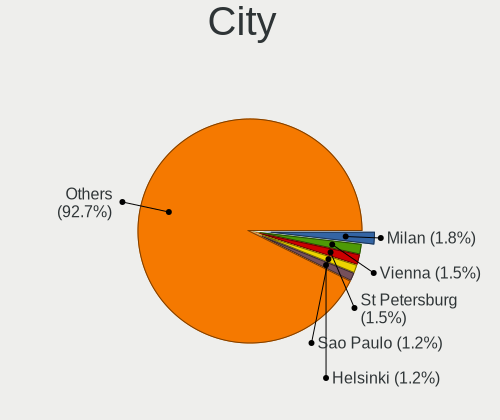
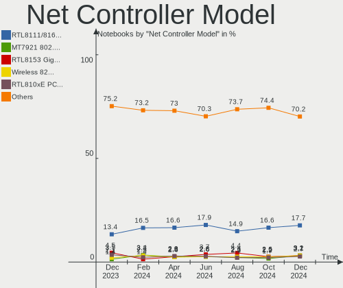
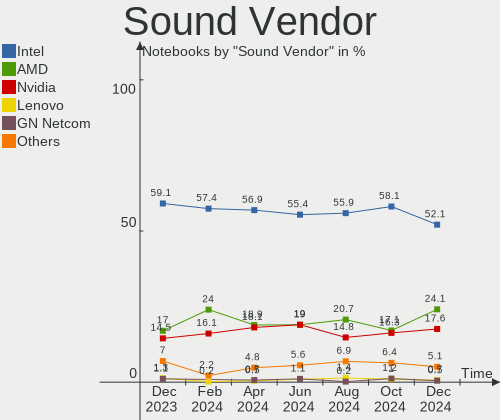

Fedora - Hardware Trends (Notebooks)
------------------------------------

A project to identify most popular hardware characteristics and track their change
over time based on data collected by Linux users at https://Linux-Hardware.org.

Anyone can contribute to this report by the [hw-probe](https://github.com/linuxhw/hw-probe) tool:

    sudo -E hw-probe -all -upload

This report is for one last month. Overall report since the beginning of time: [TestDays](https://github.com/linuxhw/TestDays)

Period: Feb, 2023.

Contents
--------

* [ System ](#system)
  - [ OS                       ](#os)
  - [ OS Family                ](#os-family)
  - [ Kernel                   ](#kernel)
  - [ Kernel Family            ](#kernel-family)
  - [ Kernel Major Ver.        ](#kernel-major-ver)
  - [ Arch                     ](#arch)
  - [ DE                       ](#de)
  - [ Display Server           ](#display-server)
  - [ Display Manager          ](#display-manager)
  - [ OS Lang                  ](#os-lang)
  - [ Boot Mode                ](#boot-mode)
  - [ Filesystem               ](#filesystem)
  - [ Part. scheme             ](#part-scheme)
  - [ Dual Boot with Linux/BSD ](#dual-boot-with-linuxbsd)
  - [ Dual Boot (Win)          ](#dual-boot-win)

* [ Board ](#board)
  - [ Vendor                   ](#vendor)
  - [ Model                    ](#model)
  - [ Model Family             ](#model-family)
  - [ MFG Year                 ](#mfg-year)
  - [ Form Factor              ](#form-factor)
  - [ Secure Boot              ](#secure-boot)
  - [ Coreboot                 ](#coreboot)
  - [ RAM Size                 ](#ram-size)
  - [ RAM Used                 ](#ram-used)
  - [ Total Drives             ](#total-drives)
  - [ Has CD-ROM               ](#has-cd-rom)
  - [ Has Ethernet             ](#has-ethernet)
  - [ Has WiFi                 ](#has-wifi)
  - [ Has Bluetooth            ](#has-bluetooth)

* [ Location ](#location)
  - [ Country                  ](#country)
  - [ City                     ](#city)

* [ Drives ](#drives)
  - [ Drive Vendor             ](#drive-vendor)
  - [ Drive Model              ](#drive-model)
  - [ HDD Vendor               ](#hdd-vendor)
  - [ SSD Vendor               ](#ssd-vendor)
  - [ Drive Kind               ](#drive-kind)
  - [ Drive Connector          ](#drive-connector)
  - [ Drive Size               ](#drive-size)
  - [ Space Total              ](#space-total)
  - [ Space Used               ](#space-used)
  - [ Malfunc. Drives          ](#malfunc-drives)
  - [ Malfunc. Drive Vendor    ](#malfunc-drive-vendor)
  - [ Malfunc. HDD Vendor      ](#malfunc-hdd-vendor)
  - [ Malfunc. Drive Kind      ](#malfunc-drive-kind)
  - [ Failed Drives            ](#failed-drives)
  - [ Failed Drive Vendor      ](#failed-drive-vendor)
  - [ Drive Status             ](#drive-status)

* [ Storage controller ](#storage-controller)
  - [ Storage Vendor           ](#storage-vendor)
  - [ Storage Model            ](#storage-model)
  - [ Storage Kind             ](#storage-kind)

* [ Processor ](#processor)
  - [ CPU Vendor               ](#cpu-vendor)
  - [ CPU Model                ](#cpu-model)
  - [ CPU Model Family         ](#cpu-model-family)
  - [ CPU Cores                ](#cpu-cores)
  - [ CPU Sockets              ](#cpu-sockets)
  - [ CPU Threads              ](#cpu-threads)
  - [ CPU Op-Modes             ](#cpu-op-modes)
  - [ CPU Microcode            ](#cpu-microcode)
  - [ CPU Microarch            ](#cpu-microarch)

* [ Graphics ](#graphics)
  - [ GPU Vendor               ](#gpu-vendor)
  - [ GPU Model                ](#gpu-model)
  - [ GPU Combo                ](#gpu-combo)
  - [ GPU Driver               ](#gpu-driver)
  - [ GPU Memory               ](#gpu-memory)

* [ Monitor ](#monitor)
  - [ Monitor Vendor           ](#monitor-vendor)
  - [ Monitor Model            ](#monitor-model)
  - [ Monitor Resolution       ](#monitor-resolution)
  - [ Monitor Diagonal         ](#monitor-diagonal)
  - [ Monitor Width            ](#monitor-width)
  - [ Aspect Ratio             ](#aspect-ratio)
  - [ Monitor Area             ](#monitor-area)
  - [ Pixel Density            ](#pixel-density)
  - [ Multiple Monitors        ](#multiple-monitors)

* [ Network ](#network)
  - [ Net Controller Vendor    ](#net-controller-vendor)
  - [ Net Controller Model     ](#net-controller-model)
  - [ Wireless Vendor          ](#wireless-vendor)
  - [ Wireless Model           ](#wireless-model)
  - [ Ethernet Vendor          ](#ethernet-vendor)
  - [ Ethernet Model           ](#ethernet-model)
  - [ Net Controller Kind      ](#net-controller-kind)
  - [ Used Controller          ](#used-controller)
  - [ NICs                     ](#nics)
  - [ IPv6                     ](#ipv6)

* [ Bluetooth ](#bluetooth)
  - [ Bluetooth Vendor         ](#bluetooth-vendor)
  - [ Bluetooth Model          ](#bluetooth-model)

* [ Sound ](#sound)
  - [ Sound Vendor             ](#sound-vendor)
  - [ Sound Model              ](#sound-model)

* [ Memory ](#memory)
  - [ Memory Vendor            ](#memory-vendor)
  - [ Memory Model             ](#memory-model)
  - [ Memory Kind              ](#memory-kind)
  - [ Memory Form Factor       ](#memory-form-factor)
  - [ Memory Size              ](#memory-size)
  - [ Memory Speed             ](#memory-speed)

* [ Printers & scanners ](#printers--scanners)
  - [ Printer Vendor           ](#printer-vendor)
  - [ Printer Model            ](#printer-model)
  - [ Scanner Vendor           ](#scanner-vendor)
  - [ Scanner Model            ](#scanner-model)

* [ Camera ](#camera)
  - [ Camera Vendor            ](#camera-vendor)
  - [ Camera Model             ](#camera-model)

* [ Security ](#security)
  - [ Fingerprint Vendor       ](#fingerprint-vendor)
  - [ Fingerprint Model        ](#fingerprint-model)
  - [ Chipcard Vendor          ](#chipcard-vendor)
  - [ Chipcard Model           ](#chipcard-model)

* [ Unsupported ](#unsupported)
  - [ Unsupported Devices      ](#unsupported-devices)
  - [ Unsupported Device Types ](#unsupported-device-types)

System
------

OS
--

Installed operating systems

| Name      | Notebooks | Percent |
|-----------|-----------|---------|
| Fedora 37 | 238       | 95.2%   |
| Fedora 36 | 6         | 2.4%    |
| Fedora 39 | 2         | 0.8%    |
| Fedora 38 | 2         | 0.8%    |
| Fedora 35 | 1         | 0.4%    |
| Fedora 34 | 1         | 0.4%    |

OS Family
---------

OS without a version

| Name   | Notebooks | Percent |
|--------|-----------|---------|
| Fedora | 250       | 100%    |

Kernel
------

Version of the Linux kernel

| Version                                            | Notebooks | Percent |
|----------------------------------------------------|-----------|---------|
| 6.1.11-200.fc37.x86_64                             | 40        | 16%     |
| 6.1.9-200.fc37.x86_64                              | 39        | 15.6%   |
| 6.1.8-200.fc37.x86_64                              | 34        | 13.6%   |
| 6.1.10-200.fc37.x86_64                             | 34        | 13.6%   |
| 6.1.13-200.fc37.x86_64                             | 32        | 12.8%   |
| 6.0.7-301.fc37.x86_64                              | 18        | 7.2%    |
| 6.1.12-200.fc37.x86_64                             | 15        | 6%      |
| 6.1.7-200.fc37.x86_64                              | 9         | 3.6%    |
| 6.1.6-200.fc37.x86_64                              | 5         | 2%      |
| 6.1.9-100.fc36.x86_64                              | 2         | 0.8%    |
| 6.1.8-100.fc36.x86_64                              | 2         | 0.8%    |
| 6.1.12-100.fc36.x86_64                             | 2         | 0.8%    |
| 6.0.18-300.fc37.x86_64                             | 2         | 0.8%    |
| 6.0.12-300.fc37.x86_64                             | 2         | 0.8%    |
| 6.2.0-63.fc38.x86_64                               | 1         | 0.4%    |
| 6.2.0-0.rc8.57.fc39.x86_64                         | 1         | 0.4%    |
| 6.2.0-0.rc7.20230208git0983f6bf2bfc.52.fc38.x86_64 | 1         | 0.4%    |
| 6.2.0-0.rc3.asahi7.1.fc37.aarch64                  | 1         | 0.4%    |
| 6.1.9-666.rog.fc37.x86_64                          | 1         | 0.4%    |
| 6.1.11-201.fsync.fc37.x86_64                       | 1         | 0.4%    |
| 6.1.10-603.inttf.fc37.x86_64                       | 1         | 0.4%    |
| 6.1.10-100.fc36.x86_64                             | 1         | 0.4%    |
| 6.0.8-xm1.0e20221004.fc38.x86_64                   | 1         | 0.4%    |
| 6.0.8-xm1.0.fc37.x86_64                            | 1         | 0.4%    |
| 6.0.12-100.fc35.x86_64                             | 1         | 0.4%    |
| 5.17.5-300.fc36.x86_64                             | 1         | 0.4%    |
| 5.17.12-100.fc34.x86_64                            | 1         | 0.4%    |
| 5.10.165-eupnea                                    | 1         | 0.4%    |

Kernel Family
-------------

Linux kernel without a distro release

| Version  | Notebooks | Percent |
|----------|-----------|---------|
| 6.1.9    | 42        | 16.8%   |
| 6.1.11   | 41        | 16.4%   |
| 6.1.8    | 36        | 14.4%   |
| 6.1.10   | 36        | 14.4%   |
| 6.1.13   | 32        | 12.8%   |
| 6.0.7    | 18        | 7.2%    |
| 6.1.12   | 17        | 6.8%    |
| 6.1.7    | 9         | 3.6%    |
| 6.1.6    | 5         | 2%      |
| 6.2.0    | 4         | 1.6%    |
| 6.0.12   | 3         | 1.2%    |
| 6.0.8    | 2         | 0.8%    |
| 6.0.18   | 2         | 0.8%    |
| 5.17.5   | 1         | 0.4%    |
| 5.17.12  | 1         | 0.4%    |
| 5.10.165 | 1         | 0.4%    |

Kernel Major Ver.
-----------------

Linux kernel major version

| Version | Notebooks | Percent |
|---------|-----------|---------|
| 6.1     | 218       | 87.2%   |
| 6.0     | 25        | 10%     |
| 6.2     | 4         | 1.6%    |
| 5.17    | 2         | 0.8%    |
| 5.10    | 1         | 0.4%    |

Arch
----

OS architecture (x86_64, i586, etc.)

| Name    | Notebooks | Percent |
|---------|-----------|---------|
| x86_64  | 249       | 99.6%   |
| aarch64 | 1         | 0.4%    |

DE
--

Desktop Environment

| Name          | Notebooks | Percent |
|---------------|-----------|---------|
| GNOME         | 183       | 73.2%   |
| KDE5          | 39        | 15.6%   |
| Unknown       | 8         | 3.2%    |
| XFCE          | 7         | 2.8%    |
| X-Cinnamon    | 3         | 1.2%    |
| MATE          | 3         | 1.2%    |
| i3            | 3         | 1.2%    |
| KDE           | 1         | 0.4%    |
| GNOME-Classic | 1         | 0.4%    |
| GNOME Classic | 1         | 0.4%    |
| Cinnamon      | 1         | 0.4%    |

Display Server
--------------

X11 or Wayland

| Name    | Notebooks | Percent |
|---------|-----------|---------|
| Wayland | 187       | 74.8%   |
| X11     | 60        | 24%     |
| Unknown | 3         | 1.2%    |

Display Manager
---------------

SDDM, LightDM, etc.

| Name    | Notebooks | Percent |
|---------|-----------|---------|
| Unknown | 126       | 50.4%   |
| GDM     | 82        | 32.8%   |
| SDDM    | 21        | 8.4%    |
| LightDM | 21        | 8.4%    |

OS Lang
-------

Language

| Lang    | Notebooks | Percent |
|---------|-----------|---------|
| en_US   | 145       | 58%     |
| ru_RU   | 21        | 8.4%    |
| en_GB   | 14        | 5.6%    |
| de_DE   | 9         | 3.6%    |
| fr_FR   | 8         | 3.2%    |
| it_IT   | 5         | 2%      |
| pt_BR   | 4         | 1.6%    |
| es_ES   | 4         | 1.6%    |
| en_IN   | 4         | 1.6%    |
| en_CA   | 4         | 1.6%    |
| pl_PL   | 3         | 1.2%    |
| es_MX   | 3         | 1.2%    |
| es_CL   | 3         | 1.2%    |
| C       | 3         | 1.2%    |
| zh_TW   | 2         | 0.8%    |
| es_VE   | 2         | 0.8%    |
| es_CO   | 2         | 0.8%    |
| en_IL   | 2         | 0.8%    |
| Unknown | 2         | 0.8%    |
| zh_CN   | 1         | 0.4%    |
| tr_TR   | 1         | 0.4%    |
| ko_KR   | 1         | 0.4%    |
| fr_CA   | 1         | 0.4%    |
| es_SV   | 1         | 0.4%    |
| en_ZA   | 1         | 0.4%    |
| en_HK   | 1         | 0.4%    |
| en_AU   | 1         | 0.4%    |
| de_AT   | 1         | 0.4%    |
| cs_CZ   | 1         | 0.4%    |

Boot Mode
---------

EFI or BIOS

| Mode | Notebooks | Percent |
|------|-----------|---------|
| EFI  | 213       | 85.2%   |
| BIOS | 37        | 14.8%   |

Filesystem
----------

Type of filesystem

| Type    | Notebooks | Percent |
|---------|-----------|---------|
| Btrfs   | 203       | 81.2%   |
| Ext4    | 42        | 16.8%   |
| Xfs     | 4         | 1.6%    |
| Overlay | 1         | 0.4%    |

Part. scheme
------------

Scheme of partitioning

| Type    | Notebooks | Percent |
|---------|-----------|---------|
| Unknown | 120       | 48%     |
| GPT     | 119       | 47.6%   |
| MBR     | 11        | 4.4%    |

Dual Boot with Linux/BSD
------------------------

Hosting more than one Linux/BSD

| Dual boot | Notebooks | Percent |
|-----------|-----------|---------|
| No        | 229       | 91.6%   |
| Yes       | 21        | 8.4%    |

Dual Boot (Win)
---------------

Hosting Linux and Windows

| Dual boot | Notebooks | Percent |
|-----------|-----------|---------|
| No        | 201       | 80.4%   |
| Yes       | 49        | 19.6%   |

Board
-----

Vendor
------

Motherboard manufacturer

| Name                | Notebooks | Percent |
|---------------------|-----------|---------|
| Lenovo              | 75        | 30%     |
| Dell                | 43        | 17.2%   |
| ASUSTek Computer    | 36        | 14.4%   |
| Hewlett-Packard     | 32        | 12.8%   |
| Acer                | 14        | 5.6%    |
| MSI                 | 7         | 2.8%    |
| HUAWEI              | 6         | 2.4%    |
| Samsung Electronics | 5         | 2%      |
| Google              | 4         | 1.6%    |
| Toshiba             | 3         | 1.2%    |
| Timi                | 3         | 1.2%    |
| Apple               | 3         | 1.2%    |
| TUXEDO              | 2         | 0.8%    |
| Standard            | 2         | 0.8%    |
| HONOR               | 2         | 0.8%    |
| Fujitsu             | 2         | 0.8%    |
| Alienware           | 2         | 0.8%    |
| TECNO               | 1         | 0.4%    |
| SiComputer          | 1         | 0.4%    |
| Monster             | 1         | 0.4%    |
| MACHENIKE           | 1         | 0.4%    |
| Gigabyte Technology | 1         | 0.4%    |
| Dynabook            | 1         | 0.4%    |
| CyberPowerPC        | 1         | 0.4%    |
| Chuwi               | 1         | 0.4%    |
| Unknown             | 1         | 0.4%    |

Model
-----

Motherboard model

| Name                                     | Notebooks | Percent |
|------------------------------------------|-----------|---------|
| Dell XPS 13 7390                         | 3         | 1.2%    |
| Unknown                                  | 3         | 1.2%    |
| MSI Modern 14 B11MOU                     | 2         | 0.8%    |
| Lenovo ThinkPad T14s Gen 1 20T1S39D0Y    | 2         | 0.8%    |
| Lenovo Legion 5 15ACH6H 82JU             | 2         | 0.8%    |
| Lenovo Legion 5 15ACH6A 82NW             | 2         | 0.8%    |
| Lenovo IdeaPad 5 15ARE05 81YQ            | 2         | 0.8%    |
| HUAWEI MACH-WX9                          | 2         | 0.8%    |
| HP ProBook 440 G7                        | 2         | 0.8%    |
| HP OMEN by Laptop 16-c0xxx               | 2         | 0.8%    |
| HP Notebook                              | 2         | 0.8%    |
| Dell Latitude E7270                      | 2         | 0.8%    |
| Dell Latitude 5511                       | 2         | 0.8%    |
| ASUS VivoBook_ASUSLaptop S5402ZA_S5402ZA | 2         | 0.8%    |
| Acer Nitro AN515-52                      | 2         | 0.8%    |
| Acer Aspire A315-59                      | 2         | 0.8%    |
| TUXEDO Polaris Intel Gen3 (TGL)          | 1         | 0.4%    |
| TUXEDO InfinityBook S 14 Gen6            | 1         | 0.4%    |
| Toshiba Satellite P870                   | 1         | 0.4%    |
| Toshiba Satellite L515                   | 1         | 0.4%    |
| Toshiba Satellite L50-B                  | 1         | 0.4%    |
| Timi Xiaomi NoteBook Pro                 | 1         | 0.4%    |
| Timi TM1613                              | 1         | 0.4%    |
| Timi TM1612                              | 1         | 0.4%    |
| TECNO MEGABOOK T1                        | 1         | 0.4%    |
| SiComputer Nauta 01C                     | 1         | 0.4%    |
| Samsung 940XFG                           | 1         | 0.4%    |
| Samsung 900X5N                           | 1         | 0.4%    |
| Samsung 767XCL                           | 1         | 0.4%    |
| Samsung 370E4K                           | 1         | 0.4%    |
| Samsung 340XAA/350XAA/550XAA             | 1         | 0.4%    |
| MSI Stealth 15M B12UE                    | 1         | 0.4%    |
| MSI Raider GE77HX 12UHS                  | 1         | 0.4%    |
| MSI MS-7A32                              | 1         | 0.4%    |
| MSI Modern 15 A5M                        | 1         | 0.4%    |
| MSI Bravo 15 B5ED                        | 1         | 0.4%    |
| Monster TULPAR T7 V5.x                   | 1         | 0.4%    |
| MACHENIKE MACHCREATOR-16                 | 1         | 0.4%    |
| Lenovo ZIWB2                             | 1         | 0.4%    |
| Lenovo Yoga Slim 7 ProX 14ARH7 82TL      | 1         | 0.4%    |

Model Family
------------

Motherboard model prefix

| Name                | Notebooks | Percent |
|---------------------|-----------|---------|
| Lenovo ThinkPad     | 42        | 16.8%   |
| Lenovo IdeaPad      | 16        | 6.4%    |
| ASUS VivoBook       | 15        | 6%      |
| Dell Latitude       | 13        | 5.2%    |
| Dell Inspiron       | 11        | 4.4%    |
| HP EliteBook        | 8         | 3.2%    |
| Dell XPS            | 8         | 3.2%    |
| Acer Aspire         | 7         | 2.8%    |
| Lenovo ThinkBook    | 6         | 2.4%    |
| Lenovo Legion       | 6         | 2.4%    |
| HP Pavilion         | 6         | 2.4%    |
| HP ProBook          | 5         | 2%      |
| HP Laptop           | 4         | 1.6%    |
| Dell Precision      | 4         | 1.6%    |
| ASUS ROG            | 4         | 1.6%    |
| ASUS ASUS           | 4         | 1.6%    |
| Toshiba Satellite   | 3         | 1.2%    |
| MSI Modern          | 3         | 1.2%    |
| Lenovo Yoga         | 3         | 1.2%    |
| Dell Vostro         | 3         | 1.2%    |
| Unknown             | 3         | 1.2%    |
| HUAWEI MACH-WX9     | 2         | 0.8%    |
| HP OMEN             | 2         | 0.8%    |
| HP Notebook         | 2         | 0.8%    |
| Fujitsu LIFEBOOK    | 2         | 0.8%    |
| ASUS Zenbook        | 2         | 0.8%    |
| Acer TravelMate     | 2         | 0.8%    |
| Acer Swift          | 2         | 0.8%    |
| Acer Nitro          | 2         | 0.8%    |
| TUXEDO Polaris      | 1         | 0.4%    |
| TUXEDO InfinityBook | 1         | 0.4%    |
| Timi Xiaomi         | 1         | 0.4%    |
| Timi TM1613         | 1         | 0.4%    |
| Timi TM1612         | 1         | 0.4%    |
| TECNO MEGABOOK      | 1         | 0.4%    |
| SiComputer Nauta    | 1         | 0.4%    |
| Samsung 940XFG      | 1         | 0.4%    |
| Samsung 900X5N      | 1         | 0.4%    |
| Samsung 767XCL      | 1         | 0.4%    |
| Samsung 370E4K      | 1         | 0.4%    |

MFG Year
--------

Motherboard manufacture year

| Year    | Notebooks | Percent |
|---------|-----------|---------|
| 2022    | 45        | 18%     |
| 2020    | 40        | 16%     |
| 2021    | 39        | 15.6%   |
| 2018    | 26        | 10.4%   |
| 2019    | 25        | 10%     |
| 2017    | 12        | 4.8%    |
| 2016    | 12        | 4.8%    |
| 2015    | 11        | 4.4%    |
| 2012    | 11        | 4.4%    |
| 2014    | 8         | 3.2%    |
| 2011    | 7         | 2.8%    |
| 2023    | 4         | 1.6%    |
| 2013    | 3         | 1.2%    |
| 2010    | 2         | 0.8%    |
| 2009    | 2         | 0.8%    |
| 2008    | 1         | 0.4%    |
| 2007    | 1         | 0.4%    |
| Unknown | 1         | 0.4%    |

Form Factor
-----------

Physical design of the computer

| Name     | Notebooks | Percent |
|----------|-----------|---------|
| Notebook | 250       | 100%    |

Secure Boot
-----------

Enabled or disabled

| State    | Notebooks | Percent |
|----------|-----------|---------|
| Disabled | 181       | 72.4%   |
| Enabled  | 69        | 27.6%   |

Coreboot
--------

Have coreboot on board

| Used | Notebooks | Percent |
|------|-----------|---------|
| No   | 246       | 98.4%   |
| Yes  | 4         | 1.6%    |

RAM Size
--------

Total RAM memory

| Size in GB  | Notebooks | Percent |
|-------------|-----------|---------|
| 4.01-8.0    | 64        | 25.6%   |
| 16.01-24.0  | 59        | 23.6%   |
| 8.01-16.0   | 51        | 20.4%   |
| 32.01-64.0  | 41        | 16.4%   |
| 3.01-4.0    | 17        | 6.8%    |
| 24.01-32.0  | 8         | 3.2%    |
| 64.01-256.0 | 8         | 3.2%    |
| 1.01-2.0    | 2         | 0.8%    |

RAM Used
--------

Used RAM memory

| Used GB    | Notebooks | Percent |
|------------|-----------|---------|
| 4.01-8.0   | 83        | 33.2%   |
| 2.01-3.0   | 59        | 23.6%   |
| 3.01-4.0   | 55        | 22%     |
| 8.01-16.0  | 29        | 11.6%   |
| 1.01-2.0   | 16        | 6.4%    |
| 16.01-24.0 | 5         | 2%      |
| 32.01-64.0 | 2         | 0.8%    |
| 0.51-1.0   | 1         | 0.4%    |

Total Drives
------------

Number of drives on board

| Drives | Notebooks | Percent |
|--------|-----------|---------|
| 1      | 184       | 73.6%   |
| 2      | 53        | 21.2%   |
| 3      | 7         | 2.8%    |
| 4      | 4         | 1.6%    |
| 0      | 2         | 0.8%    |

Has CD-ROM
----------

Has CD-ROM on board

| Presented | Notebooks | Percent |
|-----------|-----------|---------|
| No        | 215       | 86%     |
| Yes       | 35        | 14%     |

Has Ethernet
------------

Has Ethernet on board

| Presented | Notebooks | Percent |
|-----------|-----------|---------|
| Yes       | 161       | 64.4%   |
| No        | 89        | 35.6%   |

Has WiFi
--------

Has WiFi module

| Presented | Notebooks | Percent |
|-----------|-----------|---------|
| Yes       | 244       | 97.6%   |
| No        | 6         | 2.4%    |

Has Bluetooth
-------------

Has Bluetooth module

| Presented | Notebooks | Percent |
|-----------|-----------|---------|
| Yes       | 219       | 87.6%   |
| No        | 31        | 12.4%   |

Location
--------

Country
-------

Geographic location (country)

| Country      | Notebooks | Percent |
|--------------|-----------|---------|
| USA          | 37        | 14.8%   |
| Russia       | 26        | 10.4%   |
| Germany      | 20        | 8%      |
| Poland       | 14        | 5.6%    |
| Italy        | 10        | 4%      |
| France       | 10        | 4%      |
| Spain        | 9         | 3.6%    |
| India        | 9         | 3.6%    |
| Brazil       | 9         | 3.6%    |
| Canada       | 8         | 3.2%    |
| Israel       | 6         | 2.4%    |
| UK           | 5         | 2%      |
| Turkey       | 5         | 2%      |
| Romania      | 4         | 1.6%    |
| Portugal     | 4         | 1.6%    |
| Mexico       | 4         | 1.6%    |
| Thailand     | 3         | 1.2%    |
| Netherlands  | 3         | 1.2%    |
| Greece       | 3         | 1.2%    |
| Czechia      | 3         | 1.2%    |
| Chile        | 3         | 1.2%    |
| Armenia      | 3         | 1.2%    |
| Vietnam      | 2         | 0.8%    |
| Venezuela    | 2         | 0.8%    |
| Ukraine      | 2         | 0.8%    |
| Sweden       | 2         | 0.8%    |
| South Korea  | 2         | 0.8%    |
| Serbia       | 2         | 0.8%    |
| Kazakhstan   | 2         | 0.8%    |
| Indonesia    | 2         | 0.8%    |
| Denmark      | 2         | 0.8%    |
| Belgium      | 2         | 0.8%    |
| Belarus      | 2         | 0.8%    |
| Australia    | 2         | 0.8%    |
| Taiwan       | 1         | 0.4%    |
| Switzerland  | 1         | 0.4%    |
| South Africa | 1         | 0.4%    |
| Slovenia     | 1         | 0.4%    |
| Slovakia     | 1         | 0.4%    |
| Philippines  | 1         | 0.4%    |

City
----

Geographic location (city)

| City              | Notebooks | Percent |
|-------------------|-----------|---------|
| Moscow            | 7         | 2.8%    |
| Berlin            | 4         | 1.6%    |
| St Petersburg     | 3         | 1.2%    |
| Milan             | 3         | 1.2%    |
| Madrid            | 3         | 1.2%    |
| Istanbul          | 3         | 1.2%    |
| Gdansk            | 3         | 1.2%    |
| Yerevan           | 2         | 0.8%    |
| Wroclaw           | 2         | 0.8%    |
| Warsaw            | 2         | 0.8%    |
| Tel Aviv          | 2         | 0.8%    |
| Santiago          | 2         | 0.8%    |
| Samara            | 2         | 0.8%    |
| Rishon LeTsiyyon  | 2         | 0.8%    |
| Novosibirsk       | 2         | 0.8%    |
| Mexico City       | 2         | 0.8%    |
| London            | 2         | 0.8%    |
| Karlsruhe         | 2         | 0.8%    |
| Houilles          | 2         | 0.8%    |
| Heidelberg        | 2         | 0.8%    |
| Frankfurt am Main | 2         | 0.8%    |
| Elblag            | 2         | 0.8%    |
| Chicago           | 2         | 0.8%    |
| Chelyabinsk       | 2         | 0.8%    |
| Caracas           | 2         | 0.8%    |
| Bucharest         | 2         | 0.8%    |
| Bengaluru         | 2         | 0.8%    |
| Belgrade          | 2         | 0.8%    |
| Bangkok           | 2         | 0.8%    |
| Atlanta           | 2         | 0.8%    |
| Athens            | 2         | 0.8%    |
| Zurich            | 1         | 0.4%    |
| Znojmo            | 1         | 0.4%    |
| Zawadzkie         | 1         | 0.4%    |
| Zafra             | 1         | 0.4%    |
| Yogyakarta        | 1         | 0.4%    |
| Yekaterinburg     | 1         | 0.4%    |
| Yaqum             | 1         | 0.4%    |
| Yangon            | 1         | 0.4%    |
| Winthrop          | 1         | 0.4%    |

Drives
------

Drive Vendor
------------

Hard drive vendors

| Vendor                         | Notebooks | Drives | Percent |
|--------------------------------|-----------|--------|---------|
| Samsung Electronics            | 77        | 85     | 24.29%  |
| Sandisk                        | 26        | 26     | 8.2%    |
| WDC                            | 22        | 22     | 6.94%   |
| Toshiba                        | 20        | 21     | 6.31%   |
| Intel                          | 19        | 20     | 5.99%   |
| Micron Technology              | 18        | 18     | 5.68%   |
| SK hynix                       | 15        | 15     | 4.73%   |
| Seagate                        | 14        | 14     | 4.42%   |
| Kingston                       | 13        | 13     | 4.1%    |
| Unknown                        | 12        | 14     | 3.79%   |
| KIOXIA                         | 11        | 11     | 3.47%   |
| Crucial                        | 11        | 11     | 3.47%   |
| HGST                           | 6         | 6      | 1.89%   |
| Apple                          | 3         | 5      | 0.95%   |
| ADATA Technology               | 3         | 3      | 0.95%   |
| UMIS                           | 2         | 2      | 0.63%   |
| SPCC                           | 2         | 2      | 0.63%   |
| Solid State Storage            | 2         | 2      | 0.63%   |
| Realtek                        | 2         | 2      | 0.63%   |
| PNY                            | 2         | 2      | 0.63%   |
| Phison Electronics             | 2         | 2      | 0.63%   |
| Micron/Crucial Technology      | 2         | 2      | 0.63%   |
| Lenovo                         | 2         | 2      | 0.63%   |
| Kingston Technology Company    | 2         | 2      | 0.63%   |
| Intenso                        | 2         | 3      | 0.63%   |
| Hitachi                        | 2         | 2      | 0.63%   |
| China                          | 2         | 2      | 0.63%   |
| A-DATA Technology              | 2         | 2      | 0.63%   |
| YMTC                           | 1         | 1      | 0.32%   |
| XrayDisk                       | 1         | 1      | 0.32%   |
| XPG                            | 1         | 1      | 0.32%   |
| Union Memory (Shenzhen)        | 1         | 1      | 0.32%   |
| SSD 128G                       | 1         | 1      | 0.32%   |
| Solid State Storage Technology | 1         | 1      | 0.32%   |
| Silicon Motion                 | 1         | 1      | 0.32%   |
| Netac                          | 1         | 1      | 0.32%   |
| MidasForce                     | 1         | 1      | 0.32%   |
| LITEONIT                       | 1         | 1      | 0.32%   |
| LITEON                         | 1         | 1      | 0.32%   |
| Lite-On Technology             | 1         | 1      | 0.32%   |

Drive Model
-----------

Hard drive models

| Model                                                | Notebooks | Percent |
|------------------------------------------------------|-----------|---------|
| Samsung NVMe SSD Controller SM981/PM981/PM983 250GB  | 11        | 3.36%   |
| Toshiba XG6 NVMe SSD Controller 512GB                | 6         | 1.83%   |
| Unknown MMC Card  32GB                               | 5         | 1.53%   |
| Samsung NVMe SSD Controller PM9A1/PM9A3/980PRO 960GB | 5         | 1.53%   |
| Intel SSDPEKNU512GZ 512GB                            | 5         | 1.53%   |
| Sandisk WD Black SN750 / PC SN730 NVMe SSD 512GB     | 4         | 1.22%   |
| HGST HTS721010A9E630 1TB                             | 4         | 1.22%   |
| Toshiba MQ04ABF100 1TB                               | 3         | 0.92%   |
| Toshiba MQ01ABD100 1TB                               | 3         | 0.92%   |
| Sandisk WD Blue SN500 / PC SN520 NVMe SSD 256GB      | 3         | 0.92%   |
| Samsung SSD 980 PRO 1TB                              | 3         | 0.92%   |
| Samsung SSD 870 EVO 500GB                            | 3         | 0.92%   |
| Samsung MZALQ512HBLU-00BL2 512GB                     | 3         | 0.92%   |
| Crucial CT240BX500SSD1 240GB                         | 3         | 0.92%   |
| WDC WDS240G2G0A-00JH30 240GB SSD                     | 2         | 0.61%   |
| WDC WD10SPZX-21Z10T0 1TB                             | 2         | 0.61%   |
| WDC WD10JPVX-60JC3T1 1TB                             | 2         | 0.61%   |
| Unknown MMC Card  64GB                               | 2         | 0.61%   |
| Solid State Storage SSSTC CL1-4D256 256GB            | 2         | 0.61%   |
| SK hynix HFM256GD3JX016N 256GB                       | 2         | 0.61%   |
| SK hynix BC511 512GB                                 | 2         | 0.61%   |
| Seagate ST500LT012-1DG142 500GB                      | 2         | 0.61%   |
| Seagate ST1000LM035-1RK172 1TB                       | 2         | 0.61%   |
| Sandisk PC SN520 NVMe SSD 512GB                      | 2         | 0.61%   |
| SanDisk Extreme 55AE 500GB SSD                       | 2         | 0.61%   |
| Samsung SSD 980 500GB                                | 2         | 0.61%   |
| Samsung SSD 970 EVO Plus 2TB                         | 2         | 0.61%   |
| Samsung SSD 970 EVO 1TB                              | 2         | 0.61%   |
| Samsung SSD 860 EVO 500GB                            | 2         | 0.61%   |
| Samsung SSD 860 EVO 250GB                            | 2         | 0.61%   |
| Samsung SSD 860 EVO 1TB                              | 2         | 0.61%   |
| Samsung MZVLQ512HBLU-00B00 512GB                     | 2         | 0.61%   |
| Samsung MZVLQ1T0HBLB-00B00 1024GB                    | 2         | 0.61%   |
| Samsung MZVL22T0HBLB-00BL7 2TB                       | 2         | 0.61%   |
| Samsung MZVL21T0HCLR-00B00 1TB                       | 2         | 0.61%   |
| Micron/Crucial P2 NVMe PCIe SSD 1TB                  | 2         | 0.61%   |
| Micron MTFDHBA512QFD 512GB                           | 2         | 0.61%   |
| Micron 2300 NVMe 512GB                               | 2         | 0.61%   |
| KIOXIA KBG50ZNT512G LS 512GB                         | 2         | 0.61%   |
| KIOXIA KBG40ZNV512G 512GB                            | 2         | 0.61%   |

HDD Vendor
----------

Hard disk drive vendors

| Vendor   | Notebooks | Drives | Percent |
|----------|-----------|--------|---------|
| Seagate  | 13        | 13     | 30.23%  |
| WDC      | 10        | 10     | 23.26%  |
| Toshiba  | 9         | 9      | 20.93%  |
| HGST     | 6         | 6      | 13.95%  |
| Hitachi  | 2         | 2      | 4.65%   |
| Unknown  | 1         | 2      | 2.33%   |
| Intenso  | 1         | 1      | 2.33%   |
| HGST HTS | 1         | 1      | 2.33%   |

SSD Vendor
----------

Solid state drive vendors

| Vendor              | Notebooks | Drives | Percent |
|---------------------|-----------|--------|---------|
| Samsung Electronics | 20        | 20     | 26.32%  |
| Kingston            | 10        | 10     | 13.16%  |
| Crucial             | 10        | 10     | 13.16%  |
| SanDisk             | 7         | 7      | 9.21%   |
| WDC                 | 4         | 4      | 5.26%   |
| Micron Technology   | 3         | 3      | 3.95%   |
| Toshiba             | 2         | 2      | 2.63%   |
| SK hynix            | 2         | 2      | 2.63%   |
| PNY                 | 2         | 2      | 2.63%   |
| Intenso             | 2         | 2      | 2.63%   |
| China               | 2         | 2      | 2.63%   |
| Apple               | 2         | 2      | 2.63%   |
| XrayDisk            | 1         | 1      | 1.32%   |
| SPCC                | 1         | 1      | 1.32%   |
| Netac               | 1         | 1      | 1.32%   |
| MidasForce          | 1         | 1      | 1.32%   |
| LITEONIT            | 1         | 1      | 1.32%   |
| LITEON              | 1         | 1      | 1.32%   |
| Gigabyte Technology | 1         | 1      | 1.32%   |
| Dahua               | 1         | 1      | 1.32%   |
| Apacer              | 1         | 1      | 1.32%   |
| A-DATA Technology   | 1         | 1      | 1.32%   |

Drive Kind
----------

HDD or SSD

| Kind    | Notebooks | Drives | Percent |
|---------|-----------|--------|---------|
| NVMe    | 167       | 193    | 56.04%  |
| SSD     | 73        | 76     | 24.5%   |
| HDD     | 40        | 44     | 13.42%  |
| MMC     | 12        | 13     | 4.03%   |
| Unknown | 6         | 6      | 2.01%   |

Drive Connector
---------------

SATA, SAS, NVMe, etc.

| Type | Notebooks | Drives | Percent |
|------|-----------|--------|---------|
| NVMe | 166       | 191    | 57.64%  |
| SATA | 95        | 111    | 32.99%  |
| SAS  | 15        | 17     | 5.21%   |
| MMC  | 12        | 13     | 4.17%   |

Drive Size
----------

Size of hard drive

| Size in TB | Notebooks | Drives | Percent |
|------------|-----------|--------|---------|
| 0.01-0.5   | 70        | 78     | 63.06%  |
| 0.51-1.0   | 37        | 38     | 33.33%  |
| 1.01-2.0   | 2         | 2      | 1.8%    |
| 3.01-4.0   | 1         | 1      | 0.9%    |
| 4.01-10.0  | 1         | 1      | 0.9%    |

Space Total
-----------

Amount of disk space available on the file system

| Size in GB     | Notebooks | Percent |
|----------------|-----------|---------|
| 501-1000       | 64        | 25.6%   |
| 251-500        | 50        | 20%     |
| 101-250        | 34        | 13.6%   |
| 1001-2000      | 34        | 13.6%   |
| 1-20           | 27        | 10.8%   |
| Unknown        | 27        | 10.8%   |
| More than 3000 | 8         | 3.2%    |
| 51-100         | 3         | 1.2%    |
| 21-50          | 2         | 0.8%    |
| 2001-3000      | 1         | 0.4%    |

Space Used
----------

Amount of used disk space

| Used GB        | Notebooks | Percent |
|----------------|-----------|---------|
| 1-20           | 68        | 27.2%   |
| 101-250        | 48        | 19.2%   |
| 21-50          | 30        | 12%     |
| 251-500        | 27        | 10.8%   |
| Unknown        | 27        | 10.8%   |
| 51-100         | 25        | 10%     |
| 501-1000       | 16        | 6.4%    |
| 1001-2000      | 6         | 2.4%    |
| More than 3000 | 2         | 0.8%    |
| 2001-3000      | 1         | 0.4%    |

Malfunc. Drives
---------------

Drive models with a malfunction

| Model                                 | Notebooks | Drives | Percent |
|---------------------------------------|-----------|--------|---------|
| WDC WD10JPVX-60JC3T1 1TB              | 1         | 1      | 11.11%  |
| SK hynix HFS128G39TND-N210A 128GB SSD | 1         | 1      | 11.11%  |
| Seagate ST500LT012-1DG142 500GB       | 1         | 1      | 11.11%  |
| Seagate ST500LM012 HN-M500MBB 500GB   | 1         | 1      | 11.11%  |
| Samsung Electronics SSD 980 1TB       | 1         | 1      | 11.11%  |
| Samsung Electronics SSD 870 EVO 500GB | 1         | 1      | 11.11%  |
| Samsung Electronics PM9A1 NVMe 1024GB | 1         | 1      | 11.11%  |
| HGST HTS541075A9E680 752GB            | 1         | 1      | 11.11%  |
| HGST HTS 545050A7E680 500GB           | 1         | 1      | 11.11%  |

Malfunc. Drive Vendor
---------------------

Vendors of faulty drives

| Vendor              | Notebooks | Drives | Percent |
|---------------------|-----------|--------|---------|
| Samsung Electronics | 3         | 3      | 33.33%  |
| Seagate             | 2         | 2      | 22.22%  |
| WDC                 | 1         | 1      | 11.11%  |
| SK hynix            | 1         | 1      | 11.11%  |
| HGST HTS            | 1         | 1      | 11.11%  |
| HGST                | 1         | 1      | 11.11%  |

Malfunc. HDD Vendor
-------------------

Vendors of faulty HDD drives

| Vendor   | Notebooks | Drives | Percent |
|----------|-----------|--------|---------|
| Seagate  | 2         | 2      | 40%     |
| WDC      | 1         | 1      | 20%     |
| HGST HTS | 1         | 1      | 20%     |
| HGST     | 1         | 1      | 20%     |

Malfunc. Drive Kind
-------------------

Kinds of faulty drives

| Kind | Notebooks | Drives | Percent |
|------|-----------|--------|---------|
| HDD  | 5         | 5      | 55.56%  |
| NVMe | 2         | 2      | 22.22%  |
| SSD  | 2         | 2      | 22.22%  |

Failed Drives
-------------

Failed drive models

| Model                                            | Notebooks | Drives | Percent |
|--------------------------------------------------|-----------|--------|---------|
| Samsung Electronics MZNTY128HDHP-00000 128GB SSD | 1         | 1      | 100%    |

Failed Drive Vendor
-------------------

Failed drive vendors

| Vendor              | Notebooks | Drives | Percent |
|---------------------|-----------|--------|---------|
| Samsung Electronics | 1         | 1      | 100%    |

Drive Status
------------

Number of failed and malfunc. drives

| Status   | Notebooks | Drives | Percent |
|----------|-----------|--------|---------|
| Detected | 139       | 184    | 52.65%  |
| Works    | 115       | 138    | 43.56%  |
| Malfunc  | 9         | 9      | 3.41%   |
| Failed   | 1         | 1      | 0.38%   |

Storage controller
------------------

Storage Vendor
--------------

Storage controller vendors

| Vendor                         | Notebooks | Percent |
|--------------------------------|-----------|---------|
| Intel                          | 142       | 42.26%  |
| Samsung Electronics            | 60        | 17.86%  |
| AMD                            | 28        | 8.33%   |
| SanDisk                        | 26        | 7.74%   |
| Micron Technology              | 15        | 4.46%   |
| SK hynix                       | 13        | 3.87%   |
| KIOXIA                         | 12        | 3.57%   |
| Toshiba America Info Systems   | 11        | 3.27%   |
| Kingston Technology Company    | 6         | 1.79%   |
| ADATA Technology               | 4         | 1.19%   |
| Union Memory (Shenzhen)        | 3         | 0.89%   |
| Solid State Storage Technology | 3         | 0.89%   |
| Micron/Crucial Technology      | 3         | 0.89%   |
| Realtek Semiconductor          | 2         | 0.6%    |
| Phison Electronics             | 2         | 0.6%    |
| Lenovo                         | 2         | 0.6%    |
| Yangtze Memory Technologies    | 1         | 0.3%    |
| Silicon Motion                 | 1         | 0.3%    |
| Shenzhen Longsys Electronics   | 1         | 0.3%    |
| Lite-On Technology             | 1         | 0.3%    |

Storage Model
-------------

Storage controller models

| Model                                                                         | Notebooks | Percent |
|-------------------------------------------------------------------------------|-----------|---------|
| AMD FCH SATA Controller [AHCI mode]                                           | 27        | 7.63%   |
| Intel Sunrise Point-LP SATA Controller [AHCI mode]                            | 24        | 6.78%   |
| Samsung NVMe SSD Controller SM981/PM981/PM983                                 | 23        | 6.5%    |
| Intel Volume Management Device NVMe RAID Controller                           | 23        | 6.5%    |
| Samsung NVMe SSD Controller PM9A1/PM9A3/980PRO                                | 17        | 4.8%    |
| Samsung NVMe SSD Controller 980                                               | 16        | 4.52%   |
| Micron Non-Volatile memory controller                                         | 15        | 4.24%   |
| Intel 82801 Mobile SATA Controller [RAID mode]                                | 12        | 3.39%   |
| Intel 7 Series Chipset Family 6-port SATA Controller [AHCI mode]              | 10        | 2.82%   |
| Toshiba America Info Systems XG6 NVMe SSD Controller                          | 8         | 2.26%   |
| KIOXIA Non-Volatile memory controller                                         | 8         | 2.26%   |
| Intel Non-Volatile memory controller                                          | 8         | 2.26%   |
| SanDisk WD Blue SN550 NVMe SSD                                                | 6         | 1.69%   |
| Sandisk Non-Volatile memory controller                                        | 6         | 1.69%   |
| Intel HM170/QM170 Chipset SATA Controller [AHCI Mode]                         | 6         | 1.69%   |
| Intel Cannon Lake Mobile PCH SATA AHCI Controller                             | 6         | 1.69%   |
| Intel Tiger Lake-LP SATA Controller                                           | 5         | 1.41%   |
| Intel SSD Pro 7600p/760p/E 6100p Series                                       | 5         | 1.41%   |
| Intel SSD 660P Series                                                         | 5         | 1.41%   |
| Intel 6 Series/C200 Series Chipset Family 6 port Mobile SATA AHCI Controller  | 5         | 1.41%   |
| Intel 400 Series Chipset Family SATA AHCI Controller                          | 5         | 1.41%   |
| SK hynix BC511                                                                | 4         | 1.13%   |
| SanDisk WD Blue SN500 / PC SN520 NVMe SSD                                     | 4         | 1.13%   |
| SanDisk WD Black SN750 / PC SN730 NVMe SSD                                    | 4         | 1.13%   |
| Kingston Company Company Non-Volatile memory controller                       | 4         | 1.13%   |
| Intel Wildcat Point-LP SATA Controller [AHCI Mode]                            | 4         | 1.13%   |
| Intel Q170/Q150/B150/H170/H110/Z170/CM236 Chipset SATA Controller [AHCI Mode] | 4         | 1.13%   |
| Intel Comet Lake SATA AHCI Controller                                         | 4         | 1.13%   |
| Intel Cannon Point-LP SATA Controller [AHCI Mode]                             | 4         | 1.13%   |
| Union Memory (Shenzhen) Non-Volatile memory controller                        | 3         | 0.85%   |
| Solid State Storage Non-Volatile memory controller                            | 3         | 0.85%   |
| SK hynix Gold P31/PC711 NVMe Solid State Drive                                | 3         | 0.85%   |
| SanDisk PC SN520 NVMe SSD                                                     | 3         | 0.85%   |
| Samsung NVMe SSD Controller SM951/PM951                                       | 3         | 0.85%   |
| Micron/Crucial P2 NVMe PCIe SSD                                               | 3         | 0.85%   |
| KIOXIA NVMe SSD Controller BG4                                                | 3         | 0.85%   |
| Intel Ice Lake-LP SATA Controller [AHCI mode]                                 | 3         | 0.85%   |
| Intel Alder Lake-P SATA AHCI Controller                                       | 3         | 0.85%   |
| Intel 82801IBM/IEM (ICH9M/ICH9M-E) 4 port SATA Controller [AHCI mode]         | 3         | 0.85%   |
| Intel 500 Series Chipset Family SATA AHCI Controller                          | 3         | 0.85%   |

Storage Kind
------------

Kind of storage controller (IDE, SATA, NVMe, SAS, ...)

| Kind | Notebooks | Percent |
|------|-----------|---------|
| NVMe | 166       | 49.85%  |
| SATA | 128       | 38.44%  |
| RAID | 36        | 10.81%  |
| IDE  | 3         | 0.9%    |

Processor
---------

CPU Vendor
----------

Processor vendors

| Vendor  | Notebooks | Percent |
|---------|-----------|---------|
| Intel   | 189       | 75.6%   |
| AMD     | 60        | 24%     |
| Unknown | 1         | 0.4%    |

CPU Model
---------

Processor models

| Model                                         | Notebooks | Percent |
|-----------------------------------------------|-----------|---------|
| Intel 11th Gen Core i5-1135G7 @ 2.40GHz       | 10        | 4%      |
| Intel Core i5-8250U CPU @ 1.60GHz             | 7         | 2.8%    |
| Intel Core i5-8265U CPU @ 1.60GHz             | 6         | 2.4%    |
| Intel 12th Gen Core i7-12700H                 | 6         | 2.4%    |
| AMD Ryzen 7 5800H with Radeon Graphics        | 6         | 2.4%    |
| Intel Core i5-1035G1 CPU @ 1.00GHz            | 5         | 2%      |
| Intel Core i5-10210U CPU @ 1.60GHz            | 5         | 2%      |
| AMD Ryzen 5 5500U with Radeon Graphics        | 5         | 2%      |
| Intel Core i7-10850H CPU @ 2.70GHz            | 4         | 1.6%    |
| Intel Core i5-8300H CPU @ 2.30GHz             | 4         | 1.6%    |
| Intel Core i5-6200U CPU @ 2.30GHz             | 4         | 1.6%    |
| Intel 11th Gen Core i7-1165G7 @ 2.80GHz       | 4         | 1.6%    |
| AMD Ryzen 7 4800H with Radeon Graphics        | 4         | 1.6%    |
| AMD Ryzen 5 4500U with Radeon Graphics        | 4         | 1.6%    |
| Intel Core i7-7700HQ CPU @ 2.80GHz            | 3         | 1.2%    |
| Intel Core i7-10510U CPU @ 1.80GHz            | 3         | 1.2%    |
| Intel Core i5-7200U CPU @ 2.50GHz             | 3         | 1.2%    |
| Intel Core i5-5200U CPU @ 2.20GHz             | 3         | 1.2%    |
| Intel 12th Gen Core i9-12900H                 | 3         | 1.2%    |
| Intel 12th Gen Core i7-1255U                  | 3         | 1.2%    |
| Intel 12th Gen Core i5-1235U                  | 3         | 1.2%    |
| Intel 11th Gen Core i7-11800H @ 2.30GHz       | 3         | 1.2%    |
| Intel 11th Gen Core i5-11400H @ 2.70GHz       | 3         | 1.2%    |
| AMD Ryzen 7 PRO 6850U with Radeon Graphics    | 3         | 1.2%    |
| AMD Ryzen 5 3500U with Radeon Vega Mobile Gfx | 3         | 1.2%    |
| Intel Core i9-10885H CPU @ 2.40GHz            | 2         | 0.8%    |
| Intel Core i7-8750H CPU @ 2.20GHz             | 2         | 0.8%    |
| Intel Core i7-8650U CPU @ 1.90GHz             | 2         | 0.8%    |
| Intel Core i7-8550U CPU @ 1.80GHz             | 2         | 0.8%    |
| Intel Core i7-7500U CPU @ 2.70GHz             | 2         | 0.8%    |
| Intel Core i7-6700HQ CPU @ 2.60GHz            | 2         | 0.8%    |
| Intel Core i7-6600U CPU @ 2.60GHz             | 2         | 0.8%    |
| Intel Core i7-6500U CPU @ 2.50GHz             | 2         | 0.8%    |
| Intel Core i7-10750H CPU @ 2.60GHz            | 2         | 0.8%    |
| Intel Core i7-10610U CPU @ 1.80GHz            | 2         | 0.8%    |
| Intel Core i5-9300H CPU @ 2.40GHz             | 2         | 0.8%    |
| Intel Core i5-8350U CPU @ 1.70GHz             | 2         | 0.8%    |
| Intel Core i5-6300U CPU @ 2.40GHz             | 2         | 0.8%    |
| Intel Core i5-3320M CPU @ 2.60GHz             | 2         | 0.8%    |
| Intel Core i5-2520M CPU @ 2.50GHz             | 2         | 0.8%    |

CPU Model Family
----------------

Processor model prefix

| Model                   | Notebooks | Percent |
|-------------------------|-----------|---------|
| Intel Core i5           | 60        | 24%     |
| Other                   | 58        | 23.2%   |
| Intel Core i7           | 47        | 18.8%   |
| AMD Ryzen 7             | 19        | 7.6%    |
| AMD Ryzen 5             | 19        | 7.6%    |
| Intel Core i3           | 7         | 2.8%    |
| AMD Ryzen 7 PRO         | 7         | 2.8%    |
| Intel Celeron           | 6         | 2.4%    |
| AMD Ryzen 9             | 4         | 1.6%    |
| AMD Ryzen 3             | 4         | 1.6%    |
| Intel Pentium           | 3         | 1.2%    |
| Intel Core i9           | 3         | 1.2%    |
| Intel Core 2 Duo        | 2         | 0.8%    |
| AMD Ryzen 5 PRO         | 2         | 0.8%    |
| AMD A12                 | 2         | 0.8%    |
| Intel Pentium Dual-Core | 1         | 0.4%    |
| Intel Genuine           | 1         | 0.4%    |
| Intel Core m3           | 1         | 0.4%    |
| Intel Atom              | 1         | 0.4%    |
| AMD E                   | 1         | 0.4%    |
| AMD A8                  | 1         | 0.4%    |
| AMD A6                  | 1         | 0.4%    |

CPU Cores
---------

Number of processor cores

| Number | Notebooks | Percent |
|--------|-----------|---------|
| 4      | 96        | 38.4%   |
| 2      | 61        | 24.4%   |
| 8      | 40        | 16%     |
| 6      | 28        | 11.2%   |
| 14     | 10        | 4%      |
| 10     | 8         | 3.2%    |
| 12     | 5         | 2%      |
| 16     | 1         | 0.4%    |
| 5      | 1         | 0.4%    |

CPU Sockets
-----------

Number of sockets

| Number | Notebooks | Percent |
|--------|-----------|---------|
| 1      | 250       | 100%    |

CPU Threads
-----------

Threads per core (Hyper-Threading)

| Number | Notebooks | Percent |
|--------|-----------|---------|
| 2      | 227       | 90.8%   |
| 1      | 23        | 9.2%    |

CPU Op-Modes
------------

CPU Operation Modes (32-bit, 64-bit)

| Op mode        | Notebooks | Percent |
|----------------|-----------|---------|
| 32-bit, 64-bit | 249       | 99.6%   |
| 64-bit         | 1         | 0.4%    |

CPU Microcode
-------------

Microcode number

| Number     | Notebooks | Percent |
|------------|-----------|---------|
| 0x806c1    | 17        | 6.8%    |
| 0x806ec    | 15        | 6%      |
| 0x806ea    | 15        | 6%      |
| 0x406e3    | 13        | 5.2%    |
| Unknown    | 13        | 5.2%    |
| 0x906a3    | 12        | 4.8%    |
| 0xa0652    | 11        | 4.4%    |
| 0x306a9    | 11        | 4.4%    |
| 0x906ea    | 10        | 4%      |
| 0x0a50000c | 10        | 4%      |
| 0x906a4    | 9         | 3.6%    |
| 0x806d1    | 9         | 3.6%    |
| 0x806e9    | 7         | 2.8%    |
| 0x206a7    | 7         | 2.8%    |
| 0x0a404102 | 7         | 2.8%    |
| 0x506e3    | 6         | 2.4%    |
| 0x08108109 | 6         | 2.4%    |
| 0x08608103 | 5         | 2%      |
| 0x08600106 | 5         | 2%      |
| 0x08600104 | 5         | 2%      |
| 0x706e5    | 4         | 1.6%    |
| 0x0a50000d | 4         | 1.6%    |
| 0x906e9    | 3         | 1.2%    |
| 0x806c2    | 3         | 1.2%    |
| 0x40651    | 3         | 1.2%    |
| 0x306d4    | 3         | 1.2%    |
| 0x806eb    | 2         | 0.8%    |
| 0x706a8    | 2         | 0.8%    |
| 0x306c3    | 2         | 0.8%    |
| 0x30678    | 2         | 0.8%    |
| 0x1067a    | 2         | 0.8%    |
| 0x0a404101 | 2         | 0.8%    |
| 0x0810100b | 2         | 0.8%    |
| 0x08101007 | 2         | 0.8%    |
| 0x0600611a | 2         | 0.8%    |
| 0xb06a2    | 1         | 0.4%    |
| 0xa0660    | 1         | 0.4%    |
| 0x906ed    | 1         | 0.4%    |
| 0x90672    | 1         | 0.4%    |
| 0x806a1    | 1         | 0.4%    |

CPU Microarch
-------------

Microarchitecture

| Name             | Notebooks | Percent |
|------------------|-----------|---------|
| KabyLake         | 55        | 22%     |
| TigerLake        | 22        | 8.8%    |
| Alderlake Hybrid | 22        | 8.8%    |
| Unknown          | 22        | 8.8%    |
| Skylake          | 19        | 7.6%    |
| Zen 3            | 15        | 6%      |
| Icelake          | 14        | 5.6%    |
| Zen 2            | 12        | 4.8%    |
| CometLake        | 12        | 4.8%    |
| IvyBridge        | 11        | 4.4%    |
| Zen+             | 7         | 2.8%    |
| SandyBridge      | 7         | 2.8%    |
| Haswell          | 6         | 2.4%    |
| Zen              | 5         | 2%      |
| Silvermont       | 4         | 1.6%    |
| Penryn           | 4         | 1.6%    |
| Broadwell        | 4         | 1.6%    |
| Westmere         | 2         | 0.8%    |
| Goldmont plus    | 2         | 0.8%    |
| Excavator        | 2         | 0.8%    |
| Steamroller      | 1         | 0.4%    |
| Puma             | 1         | 0.4%    |
| Bobcat           | 1         | 0.4%    |

Graphics
--------

GPU Vendor
----------

Vendors of graphics cards

| Vendor | Notebooks | Percent |
|--------|-----------|---------|
| Intel  | 178       | 53.45%  |
| Nvidia | 91        | 27.33%  |
| AMD    | 64        | 19.22%  |

GPU Model
---------

Graphics card models

| Model                                                                                 | Notebooks | Percent |
|---------------------------------------------------------------------------------------|-----------|---------|
| Intel TigerLake-LP GT2 [Iris Xe Graphics]                                             | 20        | 5.87%   |
| Intel UHD Graphics 620                                                                | 15        | 4.4%    |
| Intel Alder Lake-P Integrated Graphics Controller                                     | 14        | 4.11%   |
| AMD Cezanne [Radeon Vega Series / Radeon Vega Mobile Series]                          | 13        | 3.81%   |
| Intel Skylake GT2 [HD Graphics 520]                                                   | 12        | 3.52%   |
| Intel CometLake-H GT2 [UHD Graphics]                                                  | 11        | 3.23%   |
| AMD Renoir                                                                            | 11        | 3.23%   |
| Intel CoffeeLake-H GT2 [UHD Graphics 630]                                             | 10        | 2.93%   |
| Intel WhiskeyLake-U GT2 [UHD Graphics 620]                                            | 9         | 2.64%   |
| Intel CometLake-U GT2 [UHD Graphics]                                                  | 9         | 2.64%   |
| Intel 3rd Gen Core processor Graphics Controller                                      | 9         | 2.64%   |
| AMD Rembrandt [Radeon 680M]                                                           | 9         | 2.64%   |
| Nvidia GA106M [GeForce RTX 3060 Mobile / Max-Q]                                       | 8         | 2.35%   |
| Intel TigerLake-H GT1 [UHD Graphics]                                                  | 8         | 2.35%   |
| AMD Picasso/Raven 2 [Radeon Vega Series / Radeon Vega Mobile Series]                  | 7         | 2.05%   |
| AMD Lucienne                                                                          | 7         | 2.05%   |
| Intel HD Graphics 620                                                                 | 6         | 1.76%   |
| Intel Alder Lake-UP3 GT2 [Iris Xe Graphics]                                           | 6         | 1.76%   |
| Intel Iris Plus Graphics G1 (Ice Lake)                                                | 5         | 1.47%   |
| Intel 2nd Generation Core Processor Family Integrated Graphics Controller             | 5         | 1.47%   |
| Nvidia TU117M [GeForce GTX 1650 Mobile / Max-Q]                                       | 4         | 1.17%   |
| Nvidia GP108M [GeForce MX150]                                                         | 4         | 1.17%   |
| Nvidia GP107M [GeForce GTX 1050 Ti Mobile]                                            | 4         | 1.17%   |
| Intel HD Graphics 630                                                                 | 4         | 1.17%   |
| Intel HD Graphics 530                                                                 | 4         | 1.17%   |
| AMD Raven Ridge [Radeon Vega Series / Radeon Vega Mobile Series]                      | 4         | 1.17%   |
| Nvidia TU117M [GeForce MX550]                                                         | 3         | 0.88%   |
| Nvidia TU117M [GeForce GTX 1650 Ti Mobile]                                            | 3         | 0.88%   |
| Nvidia TU106M [GeForce RTX 2060 Mobile]                                               | 3         | 0.88%   |
| Nvidia GP107M [GeForce GTX 1050 Mobile]                                               | 3         | 0.88%   |
| Nvidia GM108M [GeForce MX110]                                                         | 3         | 0.88%   |
| Nvidia GM107M [GeForce GTX 960M]                                                      | 3         | 0.88%   |
| Nvidia GA107M [GeForce RTX 3050 Ti Mobile]                                            | 3         | 0.88%   |
| Intel Mobile 4 Series Chipset Integrated Graphics Controller                          | 3         | 0.88%   |
| Intel HD Graphics 5500                                                                | 3         | 0.88%   |
| Intel Haswell-ULT Integrated Graphics Controller                                      | 3         | 0.88%   |
| AMD Topaz XT [Radeon R7 M260/M265 / M340/M360 / M440/M445 / 530/535 / 620/625 Mobile] | 3         | 0.88%   |
| AMD Sun XT [Radeon HD 8670A/8670M/8690M / R5 M330 / M430 / Radeon 520 Mobile]         | 3         | 0.88%   |
| AMD Navi 23 [Radeon RX 6600/6600 XT/6600M]                                            | 3         | 0.88%   |
| Nvidia TU117M                                                                         | 2         | 0.59%   |

GPU Combo
---------

Combinations of graphics cards

| Name           | Notebooks | Percent |
|----------------|-----------|---------|
| 1 x Intel      | 102       | 40.8%   |
| Intel + Nvidia | 69        | 27.6%   |
| 1 x AMD        | 43        | 17.2%   |
| 1 x Nvidia     | 12        | 4.8%    |
| AMD + Nvidia   | 9         | 3.6%    |
| 2 x AMD        | 7         | 2.8%    |
| Intel + AMD    | 5         | 2%      |
| 2 x Intel      | 2         | 0.8%    |
| Other          | 1         | 0.4%    |

GPU Driver
----------

Free vs proprietary

| Driver      | Notebooks | Percent |
|-------------|-----------|---------|
| Free        | 190       | 76%     |
| Proprietary | 49        | 19.6%   |
| Unknown     | 11        | 4.4%    |

GPU Memory
----------

Total video memory

| Size in GB | Notebooks | Percent |
|------------|-----------|---------|
| Unknown    | 157       | 62.8%   |
| 0.01-0.5   | 27        | 10.8%   |
| 3.01-4.0   | 23        | 9.2%    |
| 1.01-2.0   | 23        | 9.2%    |
| 0.51-1.0   | 14        | 5.6%    |
| 7.01-8.0   | 4         | 1.6%    |
| 5.01-6.0   | 2         | 0.8%    |

Monitor
-------

Monitor Vendor
--------------

Monitor vendors

| Vendor                  | Notebooks | Percent |
|-------------------------|-----------|---------|
| Chimei Innolux          | 51        | 17.23%  |
| BOE                     | 50        | 16.89%  |
| AU Optronics            | 50        | 16.89%  |
| LG Display              | 36        | 12.16%  |
| Samsung Electronics     | 19        | 6.42%   |
| Sharp                   | 12        | 4.05%   |
| Dell                    | 9         | 3.04%   |
| Goldstar                | 7         | 2.36%   |
| Lenovo                  | 6         | 2.03%   |
| AOC                     | 6         | 2.03%   |
| Acer                    | 5         | 1.69%   |
| ViewSonic               | 4         | 1.35%   |
| Philips                 | 4         | 1.35%   |
| PANDA                   | 4         | 1.35%   |
| CSO                     | 4         | 1.35%   |
| Hewlett-Packard         | 3         | 1.01%   |
| ASUSTek Computer        | 3         | 1.01%   |
| Apple                   | 3         | 1.01%   |
| JDI                     | 2         | 0.68%   |
| Toshiba                 | 1         | 0.34%   |
| TMX                     | 1         | 0.34%   |
| Tianma XM               | 1         | 0.34%   |
| NEC Computers           | 1         | 0.34%   |
| MSI                     | 1         | 0.34%   |
| Mi                      | 1         | 0.34%   |
| KTC                     | 1         | 0.34%   |
| InfoVision              | 1         | 0.34%   |
| IBM                     | 1         | 0.34%   |
| HKC                     | 1         | 0.34%   |
| Gigabyte Technology     | 1         | 0.34%   |
| FUN                     | 1         | 0.34%   |
| eMachines               | 1         | 0.34%   |
| Eizo                    | 1         | 0.34%   |
| Chi Mei Optoelectronics | 1         | 0.34%   |
| BenQ                    | 1         | 0.34%   |
| AVX                     | 1         | 0.34%   |
| Ancor Communications    | 1         | 0.34%   |

Monitor Model
-------------

Monitor models

| Model                                                                 | Notebooks | Percent |
|-----------------------------------------------------------------------|-----------|---------|
| Chimei Innolux LCD Monitor CMN15E7 1920x1080 344x193mm 15.5-inch      | 5         | 1.68%   |
| AU Optronics LCD Monitor AUO403D 1920x1080 309x173mm 13.9-inch        | 5         | 1.68%   |
| Chimei Innolux LCD Monitor CMN14D4 1920x1080 309x173mm 13.9-inch      | 4         | 1.34%   |
| AU Optronics LCD Monitor AUO21ED 1920x1080 344x193mm 15.5-inch        | 4         | 1.34%   |
| Samsung Electronics LCD Monitor SDC416D 2880x1800 312x195mm 14.5-inch | 3         | 1.01%   |
| Chimei Innolux LCD Monitor CMN15E8 1920x1080 344x193mm 15.5-inch      | 3         | 1.01%   |
| Chimei Innolux LCD Monitor CMN15E6 1366x768 344x193mm 15.5-inch       | 3         | 1.01%   |
| Chimei Innolux LCD Monitor CMN15D5 1920x1080 344x193mm 15.5-inch      | 3         | 1.01%   |
| AU Optronics LCD Monitor AUO5B2D 1920x1080 293x162mm 13.2-inch        | 3         | 1.01%   |
| Sharp LCD Monitor SHP1476 3840x2160 346x194mm 15.6-inch               | 2         | 0.67%   |
| PANDA LCD Monitor NCP004D 1920x1080 344x194mm 15.5-inch               | 2         | 0.67%   |
| LG Display LCD Monitor LGD06A5 1920x1080 344x194mm 15.5-inch          | 2         | 0.67%   |
| LG Display LCD Monitor LGD060F 1920x1080 309x174mm 14.0-inch          | 2         | 0.67%   |
| LG Display LCD Monitor LGD046C 1920x1080 382x215mm 17.3-inch          | 2         | 0.67%   |
| LG Display LCD Monitor LGD02DF 1600x900 310x174mm 14.0-inch           | 2         | 0.67%   |
| LG Display LCD Monitor LGD02DC 1366x768 344x194mm 15.5-inch           | 2         | 0.67%   |
| JDI LCD Monitor JDI422A 3000x2000 293x196mm 13.9-inch                 | 2         | 0.67%   |
| Chimei Innolux LCD Monitor CMN15F5 1920x1080 344x193mm 15.5-inch      | 2         | 0.67%   |
| Chimei Innolux LCD Monitor CMN15DB 1366x768 344x193mm 15.5-inch       | 2         | 0.67%   |
| Chimei Innolux LCD Monitor CMN1521 1920x1080 344x193mm 15.5-inch      | 2         | 0.67%   |
| Chimei Innolux LCD Monitor CMN151E 1920x1080 344x193mm 15.5-inch      | 2         | 0.67%   |
| Chimei Innolux LCD Monitor CMN14C9 1920x1080 309x173mm 13.9-inch      | 2         | 0.67%   |
| Chimei Innolux LCD Monitor CMN142B 1920x1080 309x173mm 13.9-inch      | 2         | 0.67%   |
| BOE LCD Monitor BOE095F 2256x1504 285x190mm 13.5-inch                 | 2         | 0.67%   |
| BOE LCD Monitor BOE08E2 1920x1080 344x194mm 15.5-inch                 | 2         | 0.67%   |
| BOE LCD Monitor BOE086E 1920x1080 344x194mm 15.5-inch                 | 2         | 0.67%   |
| AU Optronics LCD Monitor AUOD1ED 1920x1080 344x193mm 15.5-inch        | 2         | 0.67%   |
| AU Optronics LCD Monitor AUO119E 1600x900 382x214mm 17.2-inch         | 2         | 0.67%   |
| AU Optronics LCD Monitor AUO106C 1366x768 277x156mm 12.5-inch         | 2         | 0.67%   |
| ViewSonic VX3276-UHD VSC5138 2048x1152 700x390mm 31.5-inch            | 1         | 0.34%   |
| ViewSonic VX2776-4K-mhd VSC7137 3840x2160 608x355mm 27.7-inch         | 1         | 0.34%   |
| ViewSonic VA2446 SERIES VSC732E 1920x1080 521x293mm 23.5-inch         | 1         | 0.34%   |
| ViewSonic VA2246 SERIES VSC6F2E 1920x1080 477x268mm 21.5-inch         | 1         | 0.34%   |
| Toshiba TV TSB0205 1360x765 886x498mm 40.0-inch                       | 1         | 0.34%   |
| TMX TL156VDXP0101 TMX1561 1920x1080 344x194mm 15.5-inch               | 1         | 0.34%   |
| Tianma XM LCD Monitor TLX1388 3000x2000 293x196mm 13.9-inch           | 1         | 0.34%   |
| Sharp LQ173M1JW04 SHP14E1 1920x1080 382x215mm 17.3-inch               | 1         | 0.34%   |
| Sharp LQ156M1JW03 SHP14C5 1920x1080 344x194mm 15.5-inch               | 1         | 0.34%   |
| Sharp LCD Monitor SHP154D 1920x1080 309x174mm 14.0-inch               | 1         | 0.34%   |
| Sharp LCD Monitor SHP1516 3840x2400 336x210mm 15.6-inch               | 1         | 0.34%   |

Monitor Resolution
------------------

Monitor screen resolution

| Resolution         | Notebooks | Percent |
|--------------------|-----------|---------|
| 1920x1080 (FHD)    | 148       | 55.64%  |
| 1366x768 (WXGA)    | 38        | 14.29%  |
| 3840x2160 (4K)     | 18        | 6.77%   |
| 1920x1200 (WUXGA)  | 11        | 4.14%   |
| 1600x900 (HD+)     | 10        | 3.76%   |
| 2560x1440 (QHD)    | 8         | 3.01%   |
| 2880x1800          | 7         | 2.63%   |
| 2560x1600          | 4         | 1.5%    |
| 3840x2400          | 3         | 1.13%   |
| 3000x2000          | 3         | 1.13%   |
| 3440x1440          | 2         | 0.75%   |
| 3072x1920          | 2         | 0.75%   |
| 2560x1080          | 2         | 0.75%   |
| 2256x1504          | 2         | 0.75%   |
| 1360x768           | 2         | 0.75%   |
| 3456x2160          | 1         | 0.38%   |
| 2880x1620          | 1         | 0.38%   |
| 2160x1440          | 1         | 0.38%   |
| 1680x1050 (WSXGA+) | 1         | 0.38%   |
| 1440x900 (WXGA+)   | 1         | 0.38%   |
| 1280x800 (WXGA)    | 1         | 0.38%   |

Monitor Diagonal
----------------

Diagonal size in inches

| Inches  | Notebooks | Percent |
|---------|-----------|---------|
| 15      | 117       | 39.66%  |
| 13      | 42        | 14.24%  |
| 14      | 41        | 13.9%   |
| 27      | 18        | 6.1%    |
| 17      | 18        | 6.1%    |
| 24      | 12        | 4.07%   |
| 23      | 12        | 4.07%   |
| 16      | 5         | 1.69%   |
| 12      | 5         | 1.69%   |
| 21      | 4         | 1.36%   |
| 34      | 3         | 1.02%   |
| 31      | 3         | 1.02%   |
| 11      | 3         | 1.02%   |
| 19      | 2         | 0.68%   |
| Unknown | 2         | 0.68%   |
| 84      | 1         | 0.34%   |
| 72      | 1         | 0.34%   |
| 69      | 1         | 0.34%   |
| 38      | 1         | 0.34%   |
| 35      | 1         | 0.34%   |
| 32      | 1         | 0.34%   |
| 28      | 1         | 0.34%   |
| 18      | 1         | 0.34%   |

Monitor Width
-------------

Physical width

| Width in mm | Notebooks | Percent |
|-------------|-----------|---------|
| 301-350     | 181       | 62.2%   |
| 501-600     | 35        | 12.03%  |
| 201-300     | 30        | 10.31%  |
| 351-400     | 20        | 6.87%   |
| 601-700     | 7         | 2.41%   |
| 401-500     | 7         | 2.41%   |
| 701-800     | 4         | 1.37%   |
| 1501-2000   | 3         | 1.03%   |
| 801-900     | 2         | 0.69%   |
| Unknown     | 2         | 0.69%   |

Aspect Ratio
------------

Proportional relationship between the width and the height

| Ratio   | Notebooks | Percent |
|---------|-----------|---------|
| 16/9    | 203       | 82.52%  |
| 16/10   | 32        | 13.01%  |
| 3/2     | 6         | 2.44%   |
| 21/9    | 4         | 1.63%   |
| Unknown | 1         | 0.41%   |

Monitor Area
------------

Area in inch

| Area in inch | Notebooks | Percent |
|----------------|-----------|---------|
| 101-110        | 116       | 39.32%  |
| 81-90          | 62        | 21.02%  |
| 201-250        | 22        | 7.46%   |
| 301-350        | 18        | 6.1%    |
| 121-130        | 18        | 6.1%    |
| 71-80          | 17        | 5.76%   |
| 351-500        | 9         | 3.05%   |
| 91-100         | 6         | 2.03%   |
| 111-120        | 5         | 1.69%   |
| 61-70          | 4         | 1.36%   |
| 251-300        | 4         | 1.36%   |
| 151-200        | 4         | 1.36%   |
| More than 1000 | 3         | 1.02%   |
| 51-60          | 3         | 1.02%   |
| Unknown        | 2         | 0.68%   |
| 141-150        | 1         | 0.34%   |
| 501-1000       | 1         | 0.34%   |

Pixel Density
-------------

Pixels per inch

| Density       | Notebooks | Percent |
|---------------|-----------|---------|
| 121-160       | 144       | 50.53%  |
| 101-120       | 46        | 16.14%  |
| 51-100        | 38        | 13.33%  |
| 161-240       | 33        | 11.58%  |
| More than 240 | 19        | 6.67%   |
| 1-50          | 3         | 1.05%   |
| Unknown       | 2         | 0.7%    |

Multiple Monitors
-----------------

Total monitors connected

| Total | Notebooks | Percent |
|-------|-----------|---------|
| 1     | 188       | 75.2%   |
| 2     | 46        | 18.4%   |
| 0     | 10        | 4%      |
| 4     | 4         | 1.6%    |
| 3     | 2         | 0.8%    |

Network
-------

Net Controller Vendor
---------------------

Controller vendors

| Vendor                            | Notebooks | Percent |
|-----------------------------------|-----------|---------|
| Intel                             | 161       | 45.61%  |
| Realtek Semiconductor             | 108       | 30.59%  |
| Qualcomm Atheros                  | 33        | 9.35%   |
| MediaTek                          | 16        | 4.53%   |
| Broadcom                          | 8         | 2.27%   |
| Qualcomm                          | 7         | 1.98%   |
| Lenovo                            | 4         | 1.13%   |
| Samsung Electronics               | 2         | 0.57%   |
| Broadcom Limited                  | 2         | 0.57%   |
| Xiaomi                            | 1         | 0.28%   |
| TP-Link                           | 1         | 0.28%   |
| Sierra Wireless                   | 1         | 0.28%   |
| Ralink Technology                 | 1         | 0.28%   |
| Ralink                            | 1         | 0.28%   |
| Hewlett-Packard                   | 1         | 0.28%   |
| Google                            | 1         | 0.28%   |
| Ericsson Business Mobile Networks | 1         | 0.28%   |
| DisplayLink                       | 1         | 0.28%   |
| Dell                              | 1         | 0.28%   |
| ASUSTek Computer                  | 1         | 0.28%   |
| ASIX Electronics                  | 1         | 0.28%   |

Net Controller Model
--------------------

Controller models

| Model                                                             | Notebooks | Percent |
|-------------------------------------------------------------------|-----------|---------|
| Realtek RTL8111/8168/8411 PCI Express Gigabit Ethernet Controller | 69        | 16.12%  |
| Intel Alder Lake-P PCH CNVi WiFi                                  | 23        | 5.37%   |
| Intel Wi-Fi 6 AX200                                               | 18        | 4.21%   |
| Intel Wi-Fi 6 AX201                                               | 17        | 3.97%   |
| Intel Wireless 8265 / 8275                                        | 15        | 3.5%    |
| Realtek RTL810xE PCI Express Fast Ethernet controller             | 13        | 3.04%   |
| Realtek RTL8822CE 802.11ac PCIe Wireless Network Adapter          | 11        | 2.57%   |
| Qualcomm Atheros QCA9377 802.11ac Wireless Network Adapter        | 10        | 2.34%   |
| MediaTek MT7921 802.11ax PCI Express Wireless Network Adapter     | 9         | 2.1%    |
| Intel Comet Lake PCH CNVi WiFi                                    | 9         | 2.1%    |
| Intel Cannon Lake PCH CNVi WiFi                                   | 9         | 2.1%    |
| Intel Cannon Point-LP CNVi [Wireless-AC]                          | 8         | 1.87%   |
| Intel 82579LM Gigabit Network Connection (Lewisville)             | 8         | 1.87%   |
| Realtek RTL8852AE 802.11ax PCIe Wireless Network Adapter          | 7         | 1.64%   |
| Realtek RTL8153 Gigabit Ethernet Adapter                          | 7         | 1.64%   |
| Qualcomm Atheros QCA9565 / AR9565 Wireless Network Adapter        | 7         | 1.64%   |
| Intel Wireless 8260                                               | 7         | 1.64%   |
| Qualcomm QCNFA765 Wireless Network Adapter                        | 6         | 1.4%    |
| Qualcomm Atheros QCA6174 802.11ac Wireless Network Adapter        | 6         | 1.4%    |
| Intel Wireless 7265                                               | 6         | 1.4%    |
| Intel Tiger Lake PCH CNVi WiFi                                    | 6         | 1.4%    |
| Intel Comet Lake PCH-LP CNVi WiFi                                 | 6         | 1.4%    |
| Realtek RTL8723BE PCIe Wireless Network Adapter                   | 5         | 1.17%   |
| Intel Centrino Ultimate-N 6300                                    | 5         | 1.17%   |
| Realtek RTL8125 2.5GbE Controller                                 | 4         | 0.93%   |
| Intel Wi-Fi 6 AX210/AX211/AX411 160MHz                            | 4         | 0.93%   |
| Intel Ethernet Connection I219-LM                                 | 4         | 0.93%   |
| Intel Ethernet Connection (4) I219-LM                             | 4         | 0.93%   |
| Intel Ethernet Connection (16) I219-V                             | 4         | 0.93%   |
| Realtek RTL8821CE 802.11ac PCIe Wireless Network Adapter          | 3         | 0.7%    |
| Qualcomm Atheros Killer E2400 Gigabit Ethernet Controller         | 3         | 0.7%    |
| MediaTek MT7922 802.11ax PCI Express Wireless Network Adapter     | 3         | 0.7%    |
| Lenovo ThinkPad TBT 3 Dock                                        | 3         | 0.7%    |
| Intel Ice Lake-LP PCH CNVi WiFi                                   | 3         | 0.7%    |
| Intel Ethernet Connection (6) I219-LM                             | 3         | 0.7%    |
| Intel Ethernet Connection (13) I219-V                             | 3         | 0.7%    |
| Intel Ethernet Connection (11) I219-LM                            | 3         | 0.7%    |
| Samsung Galaxy series, misc. (tethering mode)                     | 2         | 0.47%   |
| Realtek Realtek Network controller                                | 2         | 0.47%   |
| Qualcomm Atheros AR9485 Wireless Network Adapter                  | 2         | 0.47%   |

Wireless Vendor
---------------

Wireless vendors

| Vendor                | Notebooks | Percent |
|-----------------------|-----------|---------|
| Intel                 | 158       | 62.7%   |
| Realtek Semiconductor | 35        | 13.89%  |
| Qualcomm Atheros      | 27        | 10.71%  |
| MediaTek              | 11        | 4.37%   |
| Qualcomm              | 7         | 2.78%   |
| Broadcom              | 6         | 2.38%   |
| Broadcom Limited      | 2         | 0.79%   |
| TP-Link               | 1         | 0.4%    |
| Sierra Wireless       | 1         | 0.4%    |
| Ralink Technology     | 1         | 0.4%    |
| Ralink                | 1         | 0.4%    |
| Dell                  | 1         | 0.4%    |
| ASUSTek Computer      | 1         | 0.4%    |

Wireless Model
--------------

Wireless models

| Model                                                         | Notebooks | Percent |
|---------------------------------------------------------------|-----------|---------|
| Intel Alder Lake-P PCH CNVi WiFi                              | 23        | 9.13%   |
| Intel Wi-Fi 6 AX200                                           | 18        | 7.14%   |
| Intel Wi-Fi 6 AX201                                           | 17        | 6.75%   |
| Intel Wireless 8265 / 8275                                    | 15        | 5.95%   |
| Realtek RTL8822CE 802.11ac PCIe Wireless Network Adapter      | 11        | 4.37%   |
| Qualcomm Atheros QCA9377 802.11ac Wireless Network Adapter    | 10        | 3.97%   |
| Intel Comet Lake PCH CNVi WiFi                                | 9         | 3.57%   |
| Intel Cannon Lake PCH CNVi WiFi                               | 9         | 3.57%   |
| Intel Cannon Point-LP CNVi [Wireless-AC]                      | 8         | 3.17%   |
| Realtek RTL8852AE 802.11ax PCIe Wireless Network Adapter      | 7         | 2.78%   |
| Qualcomm Atheros QCA9565 / AR9565 Wireless Network Adapter    | 7         | 2.78%   |
| Intel Wireless 8260                                           | 7         | 2.78%   |
| Qualcomm QCNFA765 Wireless Network Adapter                    | 6         | 2.38%   |
| Qualcomm Atheros QCA6174 802.11ac Wireless Network Adapter    | 6         | 2.38%   |
| Intel Wireless 7265                                           | 6         | 2.38%   |
| Intel Tiger Lake PCH CNVi WiFi                                | 6         | 2.38%   |
| Intel Comet Lake PCH-LP CNVi WiFi                             | 6         | 2.38%   |
| Realtek RTL8723BE PCIe Wireless Network Adapter               | 5         | 1.98%   |
| MediaTek MT7921 802.11ax PCI Express Wireless Network Adapter | 5         | 1.98%   |
| Intel Centrino Ultimate-N 6300                                | 5         | 1.98%   |
| Intel Wi-Fi 6 AX210/AX211/AX411 160MHz                        | 4         | 1.59%   |
| Realtek RTL8821CE 802.11ac PCIe Wireless Network Adapter      | 3         | 1.19%   |
| MediaTek MT7922 802.11ax PCI Express Wireless Network Adapter | 3         | 1.19%   |
| Intel Ice Lake-LP PCH CNVi WiFi                               | 3         | 1.19%   |
| Realtek Realtek Network controller                            | 2         | 0.79%   |
| Qualcomm Atheros AR9485 Wireless Network Adapter              | 2         | 0.79%   |
| Intel Wireless 7260                                           | 2         | 0.79%   |
| Intel Wireless 3160                                           | 2         | 0.79%   |
| Intel Dual Band Wireless-AC 3168NGW [Stone Peak]              | 2         | 0.79%   |
| Intel Centrino Advanced-N 6235                                | 2         | 0.79%   |
| Intel Centrino Advanced-N 6205 [Taylor Peak]                  | 2         | 0.79%   |
| Broadcom BCM43142 802.11b/g/n                                 | 2         | 0.79%   |
| TP-Link Archer T2U PLUS [RTL8821AU]                           | 1         | 0.4%    |
| Sierra Wireless EM7455                                        | 1         | 0.4%    |
| Realtek RTL8822BE 802.11a/b/g/n/ac WiFi adapter               | 1         | 0.4%    |
| Realtek RTL8811AU 802.11a/b/g/n/ac WLAN Adapter               | 1         | 0.4%    |
| Realtek RTL8723DE Wireless Network Adapter                    | 1         | 0.4%    |
| Realtek RTL8723BU 802.11b/g/n WLAN Adapter                    | 1         | 0.4%    |
| Realtek RTL8188EUS 802.11n Wireless Network Adapter           | 1         | 0.4%    |
| Realtek RTL8188EE Wireless Network Adapter                    | 1         | 0.4%    |

Ethernet Vendor
---------------

Ethernet vendors

| Vendor                | Notebooks | Percent |
|-----------------------|-----------|---------|
| Realtek Semiconductor | 94        | 54.65%  |
| Intel                 | 51        | 29.65%  |
| Qualcomm Atheros      | 9         | 5.23%   |
| MediaTek              | 5         | 2.91%   |
| Lenovo                | 4         | 2.33%   |
| Broadcom              | 3         | 1.74%   |
| Samsung Electronics   | 2         | 1.16%   |
| Xiaomi                | 1         | 0.58%   |
| Google                | 1         | 0.58%   |
| DisplayLink           | 1         | 0.58%   |
| ASIX Electronics      | 1         | 0.58%   |

Ethernet Model
--------------

Ethernet models

| Model                                                             | Notebooks | Percent |
|-------------------------------------------------------------------|-----------|---------|
| Realtek RTL8111/8168/8411 PCI Express Gigabit Ethernet Controller | 69        | 39.88%  |
| Realtek RTL810xE PCI Express Fast Ethernet controller             | 13        | 7.51%   |
| Intel 82579LM Gigabit Network Connection (Lewisville)             | 8         | 4.62%   |
| Realtek RTL8153 Gigabit Ethernet Adapter                          | 7         | 4.05%   |
| Realtek RTL8125 2.5GbE Controller                                 | 4         | 2.31%   |
| MediaTek MT7921 802.11ax PCI Express Wireless Network Adapter     | 4         | 2.31%   |
| Intel Ethernet Connection I219-LM                                 | 4         | 2.31%   |
| Intel Ethernet Connection (4) I219-LM                             | 4         | 2.31%   |
| Intel Ethernet Connection (16) I219-V                             | 4         | 2.31%   |
| Qualcomm Atheros Killer E2400 Gigabit Ethernet Controller         | 3         | 1.73%   |
| Lenovo ThinkPad TBT 3 Dock                                        | 3         | 1.73%   |
| Intel Ethernet Connection (6) I219-LM                             | 3         | 1.73%   |
| Intel Ethernet Connection (13) I219-V                             | 3         | 1.73%   |
| Intel Ethernet Connection (11) I219-LM                            | 3         | 1.73%   |
| Samsung Galaxy series, misc. (tethering mode)                     | 2         | 1.16%   |
| Qualcomm Atheros AR8151 v2.0 Gigabit Ethernet                     | 2         | 1.16%   |
| Intel WiMAX Connection 2400m                                      | 2         | 1.16%   |
| Intel Ethernet Connection (7) I219-V                              | 2         | 1.16%   |
| Intel Ethernet Connection (7) I219-LM                             | 2         | 1.16%   |
| Intel Ethernet Connection (16) I219-LM                            | 2         | 1.16%   |
| Intel Ethernet Connection (10) I219-LM                            | 2         | 1.16%   |
| Intel 82577LM Gigabit Network Connection                          | 2         | 1.16%   |
| Xiaomi Mi/Redmi series (RNDIS)                                    | 1         | 0.58%   |
| Realtek RTL8152 Fast Ethernet Adapter                             | 1         | 0.58%   |
| Realtek Killer E3000 2.5GbE Controller                            | 1         | 0.58%   |
| Qualcomm Atheros QCA8172 Fast Ethernet                            | 1         | 0.58%   |
| Qualcomm Atheros Killer E2500 Gigabit Ethernet Controller         | 1         | 0.58%   |
| Qualcomm Atheros AR8161 Gigabit Ethernet                          | 1         | 0.58%   |
| Qualcomm Atheros AR8132 Fast Ethernet                             | 1         | 0.58%   |
| MediaTek moto e(6) plus                                           | 1         | 0.58%   |
| Lenovo USB-C Dock Ethernet                                        | 1         | 0.58%   |
| Intel I211 Gigabit Network Connection                             | 1         | 0.58%   |
| Intel Ethernet Controller I225-V                                  | 1         | 0.58%   |
| Intel Ethernet Connection (6) I219-V                              | 1         | 0.58%   |
| Intel Ethernet Connection (5) I219-V                              | 1         | 0.58%   |
| Intel Ethernet Connection (4) I219-V                              | 1         | 0.58%   |
| Intel Ethernet Connection (3) I218-LM                             | 1         | 0.58%   |
| Intel Ethernet Connection (2) I219-LM                             | 1         | 0.58%   |
| Intel Ethernet Connection (14) I219-V                             | 1         | 0.58%   |
| Intel Ethernet Connection (14) I219-LM                            | 1         | 0.58%   |

Net Controller Kind
-------------------

Ethernet, WiFi or modem

| Kind     | Notebooks | Percent |
|----------|-----------|---------|
| WiFi     | 244       | 59.66%  |
| Ethernet | 162       | 39.61%  |
| Modem    | 2         | 0.49%   |
| Unknown  | 1         | 0.24%   |

Used Controller
---------------

Currently used network controller

| Kind     | Notebooks | Percent |
|----------|-----------|---------|
| WiFi     | 208       | 80.93%  |
| Ethernet | 49        | 19.07%  |

NICs
----

Total network controllers on board

| Total | Notebooks | Percent |
|-------|-----------|---------|
| 2     | 146       | 58.4%   |
| 1     | 100       | 40%     |
| 3     | 2         | 0.8%    |
| 0     | 2         | 0.8%    |

IPv6
----

IPv6 vs IPv4

| Used | Notebooks | Percent |
|------|-----------|---------|
| No   | 184       | 73.6%   |
| Yes  | 66        | 26.4%   |

Bluetooth
---------

Bluetooth Vendor
----------------

Controller vendors

| Vendor                          | Notebooks | Percent |
|---------------------------------|-----------|---------|
| Intel                           | 132       | 60.27%  |
| Realtek Semiconductor           | 26        | 11.87%  |
| Qualcomm Atheros Communications | 19        | 8.68%   |
| IMC Networks                    | 11        | 5.02%   |
| Foxconn / Hon Hai               | 11        | 5.02%   |
| Broadcom                        | 5         | 2.28%   |
| Lite-On Technology              | 4         | 1.83%   |
| Apple                           | 3         | 1.37%   |
| USI                             | 2         | 0.91%   |
| Dell                            | 2         | 0.91%   |
| Realtek                         | 1         | 0.46%   |
| Ralink                          | 1         | 0.46%   |
| MediaTek                        | 1         | 0.46%   |
| ASUSTek Computer                | 1         | 0.46%   |

Bluetooth Model
---------------

Controller models

| Model                                             | Notebooks | Percent |
|---------------------------------------------------|-----------|---------|
| Intel AX201 Bluetooth                             | 37        | 16.89%  |
| Intel Bluetooth wireless interface                | 30        | 13.7%   |
| Realtek Bluetooth Radio                           | 23        | 10.5%   |
| Intel Bluetooth 9460/9560 Jefferson Peak (JfP)    | 22        | 10.05%  |
| Intel AX200 Bluetooth                             | 17        | 7.76%   |
| Intel Bluetooth Device                            | 15        | 6.85%   |
| Qualcomm Atheros  Bluetooth Device                | 11        | 5.02%   |
| Foxconn / Hon Hai Wireless_Device                 | 7         | 3.2%    |
| IMC Networks Wireless_Device                      | 5         | 2.28%   |
| Qualcomm Atheros QCA61x4 Bluetooth 4.0            | 4         | 1.83%   |
| Intel AX210 Bluetooth                             | 4         | 1.83%   |
| Intel Centrino Bluetooth Wireless Transceiver     | 3         | 1.37%   |
| IMC Networks Bluetooth Device                     | 3         | 1.37%   |
| Foxconn / Hon Hai Bluetooth Device                | 3         | 1.37%   |
| USI Bluetooth Device                              | 2         | 0.91%   |
| Qualcomm Atheros AR3012 Bluetooth 4.0             | 2         | 0.91%   |
| Lite-On Bluetooth Device                          | 2         | 0.91%   |
| Intel Wireless-AC 3168 Bluetooth                  | 2         | 0.91%   |
| IMC Networks Bluetooth Radio                      | 2         | 0.91%   |
| Broadcom BCM20702 Bluetooth 4.0 [ThinkPad]        | 2         | 0.91%   |
| Apple Bluetooth Host Controller                   | 2         | 0.91%   |
| Realtek RTL8822BE Bluetooth 4.2 Adapter           | 1         | 0.46%   |
| Realtek RTL8723B Bluetooth                        | 1         | 0.46%   |
| Realtek  Bluetooth 4.2 Adapter                    | 1         | 0.46%   |
| Realtek 802.11ac WLAN Adapter                     | 1         | 0.46%   |
| Ralink RT3290 Bluetooth                           | 1         | 0.46%   |
| Qualcomm Atheros AR9462 Bluetooth                 | 1         | 0.46%   |
| Qualcomm Atheros AR3011 Bluetooth                 | 1         | 0.46%   |
| MediaTek Wireless_Device                          | 1         | 0.46%   |
| Lite-On Wireless_Device                           | 1         | 0.46%   |
| Lite-On Bluetooth Radio                           | 1         | 0.46%   |
| Intel Wireless-AC 9260 Bluetooth Adapter          | 1         | 0.46%   |
| Intel Centrino Advanced-N 6230 Bluetooth adapter  | 1         | 0.46%   |
| IMC Networks Atheros AR3012 Bluetooth 4.0 Adapter | 1         | 0.46%   |
| Foxconn / Hon Hai BCM20702A0                      | 1         | 0.46%   |
| Dell DW375 Bluetooth Module                       | 1         | 0.46%   |
| Dell BCM20702A0 Bluetooth Module                  | 1         | 0.46%   |
| Broadcom BCM43142A0 Bluetooth Device              | 1         | 0.46%   |
| Broadcom BCM43142 Bluetooth 4.0                   | 1         | 0.46%   |
| Broadcom BCM2045B (BDC-2) [Bluetooth Controller]  | 1         | 0.46%   |

Sound
-----

Sound Vendor
------------

Sound card vendors

| Vendor                  | Notebooks | Percent |
|-------------------------|-----------|---------|
| Intel                   | 188       | 56.46%  |
| AMD                     | 60        | 18.02%  |
| Nvidia                  | 56        | 16.82%  |
| Lenovo                  | 6         | 1.8%    |
| Plantronics             | 2         | 0.6%    |
| Corsair                 | 2         | 0.6%    |
| C-Media Electronics     | 2         | 0.6%    |
| ASUSTek Computer        | 2         | 0.6%    |
| Texas Instruments       | 1         | 0.3%    |
| RODE Microphones        | 1         | 0.3%    |
| Realtek Semiconductor   | 1         | 0.3%    |
| Razer USA               | 1         | 0.3%    |
| No brand                | 1         | 0.3%    |
| Logitech                | 1         | 0.3%    |
| Kingston Technology     | 1         | 0.3%    |
| Hewlett-Packard         | 1         | 0.3%    |
| GN Netcom               | 1         | 0.3%    |
| Generalplus Technology  | 1         | 0.3%    |
| Dell                    | 1         | 0.3%    |
| Creative Technology     | 1         | 0.3%    |
| Cambridge Silicon Radio | 1         | 0.3%    |
| Blue Microphones        | 1         | 0.3%    |
| BEHRINGER International | 1         | 0.3%    |

Sound Model
-----------

Sound card models

| Model                                                                                             | Notebooks | Percent |
|---------------------------------------------------------------------------------------------------|-----------|---------|
| AMD Family 17h/19h HD Audio Controller                                                            | 53        | 13.45%  |
| Intel Sunrise Point-LP HD Audio                                                                   | 35        | 8.88%   |
| AMD Renoir Radeon High Definition Audio Controller                                                | 27        | 6.85%   |
| Intel Alder Lake PCH-P High Definition Audio Controller                                           | 24        | 6.09%   |
| Intel Tiger Lake-LP Smart Sound Technology Audio Controller                                       | 22        | 5.58%   |
| Intel Comet Lake PCH cAVS                                                                         | 11        | 2.79%   |
| Intel Cannon Lake PCH cAVS                                                                        | 11        | 2.79%   |
| Intel 7 Series/C216 Chipset Family High Definition Audio Controller                               | 11        | 2.79%   |
| Intel Comet Lake PCH-LP cAVS                                                                      | 10        | 2.54%   |
| AMD Raven/Raven2/Fenghuang HDMI/DP Audio Controller                                               | 10        | 2.54%   |
| Intel Tiger Lake-H HD Audio Controller                                                            | 9         | 2.28%   |
| Intel Cannon Point-LP High Definition Audio Controller                                            | 9         | 2.28%   |
| Nvidia GP107GL High Definition Audio Controller                                                   | 8         | 2.03%   |
| Nvidia GA106 High Definition Audio Controller                                                     | 8         | 2.03%   |
| AMD Rembrandt Radeon High Definition Audio Controller                                             | 8         | 2.03%   |
| Nvidia TU107 GeForce GTX 1650 High Definition Audio Controller                                    | 7         | 1.78%   |
| Intel 6 Series/C200 Series Chipset Family High Definition Audio Controller                        | 7         | 1.78%   |
| Nvidia Audio device                                                                               | 6         | 1.52%   |
| Intel 100 Series/C230 Series Chipset Family HD Audio Controller                                   | 6         | 1.52%   |
| Nvidia TU106 High Definition Audio Controller                                                     | 5         | 1.27%   |
| Intel Ice Lake-LP Smart Sound Technology Audio Controller                                         | 5         | 1.27%   |
| Nvidia GF108 High Definition Audio Controller                                                     | 4         | 1.02%   |
| Lenovo ThinkPad Thunderbolt 3 Dock USB Audio                                                      | 4         | 1.02%   |
| Intel Wildcat Point-LP High Definition Audio Controller                                           | 4         | 1.02%   |
| Intel CM238 HD Audio Controller                                                                   | 4         | 1.02%   |
| Intel Broadwell-U Audio Controller                                                                | 4         | 1.02%   |
| AMD Navi 21/23 HDMI/DP Audio Controller                                                           | 4         | 1.02%   |
| Nvidia TU104 HD Audio Controller                                                                  | 3         | 0.76%   |
| Nvidia GM204 High Definition Audio Controller                                                     | 3         | 0.76%   |
| Nvidia GA104 High Definition Audio Controller                                                     | 3         | 0.76%   |
| Intel Haswell-ULT HD Audio Controller                                                             | 3         | 0.76%   |
| Intel 82801I (ICH9 Family) HD Audio Controller                                                    | 3         | 0.76%   |
| Intel 8 Series/C220 Series Chipset High Definition Audio Controller                               | 3         | 0.76%   |
| Intel 8 Series HD Audio Controller                                                                | 3         | 0.76%   |
| AMD Kabini HDMI/DP Audio                                                                          | 3         | 0.76%   |
| Nvidia GM107 High Definition Audio Controller [GeForce 940MX]                                     | 2         | 0.51%   |
| Nvidia GK107 HDMI Audio Controller                                                                | 2         | 0.51%   |
| Intel Celeron/Pentium Silver Processor High Definition Audio                                      | 2         | 0.51%   |
| Intel Atom/Celeron/Pentium Processor x5-E8000/J3xxx/N3xxx Series High Definition Audio Controller | 2         | 0.51%   |
| Intel 5 Series/3400 Series Chipset High Definition Audio                                          | 2         | 0.51%   |

Memory
------

Memory Vendor
-------------

Memory module vendors

| Vendor              | Notebooks | Percent |
|---------------------|-----------|---------|
| Samsung Electronics | 47        | 30.92%  |
| SK hynix            | 34        | 22.37%  |
| Micron Technology   | 25        | 16.45%  |
| Kingston            | 16        | 10.53%  |
| Unknown             | 6         | 3.95%   |
| Crucial             | 6         | 3.95%   |
| Ramaxel Technology  | 3         | 1.97%   |
| Team                | 2         | 1.32%   |
| Corsair             | 2         | 1.32%   |
| Unknown             | 2         | 1.32%   |
| V-Color             | 1         | 0.66%   |
| Unknown (0x0B5E)    | 1         | 0.66%   |
| Transcend           | 1         | 0.66%   |
| Smart               | 1         | 0.66%   |
| PUSKILL             | 1         | 0.66%   |
| Patriot             | 1         | 0.66%   |
| G.Skill             | 1         | 0.66%   |
| Elpida              | 1         | 0.66%   |
| A-DATA Technology   | 1         | 0.66%   |

Memory Model
------------

Memory module models

| Model                                                            | Notebooks | Percent |
|------------------------------------------------------------------|-----------|---------|
| Samsung RAM M471A1K43DB1-CWE 8GB SODIMM DDR4 3200MT/s            | 4         | 2.5%    |
| Samsung RAM M471A5244CB0-CTD 4GB SODIMM DDR4 3266MT/s            | 3         | 1.88%   |
| Samsung RAM M471A1K43EB1-CWE 8GB SODIMM DDR4 3200MT/s            | 3         | 1.88%   |
| Samsung RAM M471A1G44BB0-CWE 8GB SODIMM DDR4 3200MT/s            | 3         | 1.88%   |
| Micron RAM MT62F2G32D8DR-031 WT 8GB SODIMM LPDDR5 6400MT/s       | 3         | 1.88%   |
| Unknown RAM Module 8GB SODIMM DDR4 2133MT/s                      | 2         | 1.25%   |
| Team RAM TEAMGROUP-SD4-2666 16GB SODIMM DDR4 2667MT/s            | 2         | 1.25%   |
| SK hynix RAM HMAA1GS6CMR6N-XN 8GB Row Of Chips DDR4 3200MT/s     | 2         | 1.25%   |
| SK hynix RAM HMAA1GS6CJR6N-XN 8192MB SODIMM DDR4 3200MT/s        | 2         | 1.25%   |
| SK hynix RAM HMA82GS6AFR8N-UH 16GB SODIMM DDR4 2667MT/s          | 2         | 1.25%   |
| SK hynix RAM HMA81GS6DJR8N-XN 8GB SODIMM DDR4 3200MT/s           | 2         | 1.25%   |
| SK hynix RAM H9CCNNNCLGALAR-NVD 8GB Row Of Chips LPDDR3 2133MT/s | 2         | 1.25%   |
| Samsung RAM M471B1G73DB0-YK0 8192MB SODIMM DDR3 1600MT/s         | 2         | 1.25%   |
| Samsung RAM M471A5244BB0-CRC 4GB SODIMM DDR4 2667MT/s            | 2         | 1.25%   |
| Samsung RAM M471A5143EB0-CPB 4GB SODIMM DDR4 2133MT/s            | 2         | 1.25%   |
| Samsung RAM M471A4G43MB1-CTD 32GB SODIMM DDR4 2667MT/s           | 2         | 1.25%   |
| Samsung RAM M471A4G43AB1-CWE 32GB SODIMM DDR4 3200MT/s           | 2         | 1.25%   |
| Samsung RAM M471A2K43EB1-CWE 16GB SODIMM DDR4 3200MT/s           | 2         | 1.25%   |
| Samsung RAM M471A2G44AM0-CWE 16GB SODIMM DDR4 3200MT/s           | 2         | 1.25%   |
| Samsung RAM M471A1G44AB0-CWE 8GB SODIMM DDR4 3200MT/s            | 2         | 1.25%   |
| Samsung RAM M471A1G43DB0-CPB 8GB SODIMM DDR4 2400MT/s            | 2         | 1.25%   |
| Micron RAM Module 2GB Row Of Chips LPDDR5 6400MT/s               | 2         | 1.25%   |
| Micron RAM Module 16GB SODIMM DDR4 3200MT/s                      | 2         | 1.25%   |
| Micron RAM 4ATS1G64HZ-2G6E1 8GB SODIMM DDR4 2667MT/s             | 2         | 1.25%   |
| Micron RAM 4ATF51264HZ-2G6E1 4GB SODIMM DDR4 2667MT/s            | 2         | 1.25%   |
| Kingston RAM 9905700-047.A00G 16GB SODIMM DDR4 2667MT/s          | 2         | 1.25%   |
| Corsair RAM CMSX64GX4M2A3200C22 32GB SODIMM DDR4 3200MT/s        | 2         | 1.25%   |
| Unknown                                                          | 2         | 1.25%   |
| V-Color RAM TN48G32S822 8GB SODIMM DDR4 3200MT/s                 | 1         | 0.63%   |
| Unknown RAM Module 8GB SODIMM DDR4 3200MT/s                      | 1         | 0.63%   |
| Unknown RAM Module 8GB SODIMM DDR4 2667MT/s                      | 1         | 0.63%   |
| Unknown RAM Module 2GB SODIMM DDR3 1333MT/s                      | 1         | 0.63%   |
| Unknown RAM Module 2GB SODIMM DDR2 667MT/s                       | 1         | 0.63%   |
| Unknown (0x0B5E) RAM HEMA81GS6DJR8N-XN 8GB SODIMM DDR4 3200MT/s  | 1         | 0.63%   |
| Transcend RAM JM3200HSB-8G 8GB SODIMM DDR4 3200MT/s              | 1         | 0.63%   |
| Smart RAM SF4642G8CK8IEHLSBG 16GB SODIMM DDR4 2667MT/s           | 1         | 0.63%   |
| SK hynix RAM Module 8GB SODIMM DDR3 1600MT/s                     | 1         | 0.63%   |
| SK hynix RAM Module 4GB Row Of Chips LPDDR4 4267MT/s             | 1         | 0.63%   |
| SK hynix RAM Module 2GB Row Of Chips LPDDR4 4267MT/s             | 1         | 0.63%   |
| SK hynix RAM HMT451S6MFR8C-PB 4GB SODIMM DDR3 1600MT/s           | 1         | 0.63%   |

Memory Kind
-----------

Memory module kinds

| Kind   | Notebooks | Percent |
|--------|-----------|---------|
| DDR4   | 81        | 61.83%  |
| DDR3   | 19        | 14.5%   |
| LPDDR5 | 13        | 9.92%   |
| LPDDR4 | 7         | 5.34%   |
| LPDDR3 | 6         | 4.58%   |
| DDR5   | 4         | 3.05%   |
| DDR2   | 1         | 0.76%   |

Memory Form Factor
------------------

Physical design of the memory module

| Name         | Notebooks | Percent |
|--------------|-----------|---------|
| SODIMM       | 106       | 80.92%  |
| Row Of Chips | 24        | 18.32%  |
| Unknown      | 1         | 0.76%   |

Memory Size
-----------

Memory module size

| Size  | Notebooks | Percent |
|-------|-----------|---------|
| 8192  | 66        | 45.52%  |
| 16384 | 30        | 20.69%  |
| 4096  | 27        | 18.62%  |
| 2048  | 12        | 8.28%   |
| 32768 | 10        | 6.9%    |

Memory Speed
------------

Memory module speed

| Speed | Notebooks | Percent |
|-------|-----------|---------|
| 3200  | 48        | 33.33%  |
| 2667  | 27        | 18.75%  |
| 1600  | 14        | 9.72%   |
| 6400  | 13        | 9.03%   |
| 2133  | 11        | 7.64%   |
| 2400  | 9         | 6.25%   |
| 4800  | 4         | 2.78%   |
| 4267  | 4         | 2.78%   |
| 1333  | 4         | 2.78%   |
| 3266  | 3         | 2.08%   |
| 1867  | 3         | 2.08%   |
| 4266  | 2         | 1.39%   |
| 3733  | 1         | 0.69%   |
| 667   | 1         | 0.69%   |

Printers & scanners
-------------------

Printer Vendor
--------------

Printer device vendors

| Vendor | Notebooks | Percent |
|--------|-----------|---------|
| MiiiW  | 1         | 100%    |

Printer Model
-------------

Printer device models

| Model                 | Notebooks | Percent |
|-----------------------|-----------|---------|
| MiiiW MW USB Receiver | 1         | 100%    |

Scanner Vendor
--------------

Scanner device vendors

| Vendor          | Notebooks | Percent |
|-----------------|-----------|---------|
| Hewlett-Packard | 1         | 50%     |
| Canon           | 1         | 50%     |

Scanner Model
-------------

Scanner device models

| Model                              | Notebooks | Percent |
|------------------------------------|-----------|---------|
| HP Scanjet 300                     | 1         | 50%     |
| Canon CanoScan N670U/N676U/LiDE 20 | 1         | 50%     |

Camera
------

Camera Vendor
-------------

Camera device vendors

| Vendor                                 | Notebooks | Percent |
|----------------------------------------|-----------|---------|
| Chicony Electronics                    | 57        | 24.36%  |
| IMC Networks                           | 37        | 15.81%  |
| Microdia                               | 22        | 9.4%    |
| Quanta                                 | 20        | 8.55%   |
| Acer                                   | 17        | 7.26%   |
| Realtek Semiconductor                  | 15        | 6.41%   |
| Sunplus Innovation Technology          | 11        | 4.7%    |
| Luxvisions Innotech Limited            | 10        | 4.27%   |
| Cheng Uei Precision Industry (Foxlink) | 8         | 3.42%   |
| Syntek                                 | 6         | 2.56%   |
| Sonix Technology                       | 6         | 2.56%   |
| Logitech                               | 5         | 2.14%   |
| Silicon Motion                         | 3         | 1.28%   |
| Lite-On Technology                     | 3         | 1.28%   |
| WaveRider Communications               | 1         | 0.43%   |
| Suyin                                  | 1         | 0.43%   |
| SunplusIT                              | 1         | 0.43%   |
| Samsung Electronics                    | 1         | 0.43%   |
| Ricoh                                  | 1         | 0.43%   |
| kingcome                               | 1         | 0.43%   |
| Jieli Technology                       | 1         | 0.43%   |
| Importek                               | 1         | 0.43%   |
| icSpring                               | 1         | 0.43%   |
| Hewlett-Packard                        | 1         | 0.43%   |
| Generalplus Technology                 | 1         | 0.43%   |
| AVerMedia Technologies                 | 1         | 0.43%   |
| Apple                                  | 1         | 0.43%   |
| Alcor Micro                            | 1         | 0.43%   |

Camera Model
------------

Camera device models

| Model                                                                      | Notebooks | Percent |
|----------------------------------------------------------------------------|-----------|---------|
| Chicony Integrated Camera                                                  | 23        | 9.75%   |
| Microdia Integrated_Webcam_HD                                              | 15        | 6.36%   |
| IMC Networks Integrated Camera                                             | 14        | 5.93%   |
| IMC Networks USB2.0 HD UVC WebCam                                          | 11        | 4.66%   |
| Realtek Integrated_Webcam_HD                                               | 9         | 3.81%   |
| Chicony HD Webcam                                                          | 7         | 2.97%   |
| Syntek Integrated Camera                                                   | 6         | 2.54%   |
| Sunplus Integrated_Webcam_HD                                               | 5         | 2.12%   |
| Quanta HD User Facing                                                      | 5         | 2.12%   |
| Acer Integrated Camera                                                     | 5         | 2.12%   |
| Sonix USB2.0 HD UVC WebCam                                                 | 4         | 1.69%   |
| Quanta HP Wide Vision HD Camera                                            | 4         | 1.69%   |
| Luxvisions Innotech Limited Integrated RGB Camera                          | 4         | 1.69%   |
| IMC Networks USB2.0 VGA UVC WebCam                                         | 4         | 1.69%   |
| Quanta HP HD Camera                                                        | 3         | 1.27%   |
| Microdia Integrated_Webcam_FHD                                             | 3         | 1.27%   |
| Chicony USB2.0 VGA UVC WebCam                                              | 3         | 1.27%   |
| Chicony USB2.0 Camera                                                      | 3         | 1.27%   |
| Chicony HD User Facing                                                     | 3         | 1.27%   |
| Quanta USB2.0 HD UVC WebCam                                                | 2         | 0.85%   |
| Quanta ACER HD User Facing                                                 | 2         | 0.85%   |
| Luxvisions Innotech Limited Integrated Camera                              | 2         | 0.85%   |
| Luxvisions Innotech Limited HP HD Camera                                   | 2         | 0.85%   |
| Logitech Webcam C270                                                       | 2         | 0.85%   |
| Lite-On Integrated Camera                                                  | 2         | 0.85%   |
| Chicony XiaoMi USB 2.0 Webcam                                              | 2         | 0.85%   |
| Chicony Integrated IR Camera                                               | 2         | 0.85%   |
| Chicony Integrated Camera (1280x720@30)                                    | 2         | 0.85%   |
| Chicony FJ Camera                                                          | 2         | 0.85%   |
| Chicony EasyCamera                                                         | 2         | 0.85%   |
| Cheng Uei Precision Industry (Foxlink) HP Wide Vision HD Integrated Webcam | 2         | 0.85%   |
| Cheng Uei Precision Industry (Foxlink) HP TrueVision HD Camera             | 2         | 0.85%   |
| Acer ThinkPad Integrated Camera                                            | 2         | 0.85%   |
| Acer Lenovo EasyCamera                                                     | 2         | 0.85%   |
| Acer HD Webcam                                                             | 2         | 0.85%   |
| WaveRider USB 2.0 Camera                                                   | 1         | 0.42%   |
| Suyin Integrated_Webcam_HD                                                 | 1         | 0.42%   |
| SunplusIT USB Camera                                                       | 1         | 0.42%   |
| Sunplus XiaoMi USB 2.0 Webcam                                              | 1         | 0.42%   |
| Sunplus Laptop_Integrated_Webcam_FHD                                       | 1         | 0.42%   |

Security
--------

Fingerprint Vendor
------------------

Fingerprint sensor vendors

| Vendor                             | Notebooks | Percent |
|------------------------------------|-----------|---------|
| Synaptics                          | 27        | 45%     |
| Validity Sensors                   | 11        | 18.33%  |
| Shenzhen Goodix Technology         | 11        | 18.33%  |
| LighTuning Technology              | 4         | 6.67%   |
| Elan Microelectronics              | 3         | 5%      |
| STMicroelectronics                 | 1         | 1.67%   |
| Samsung Electronics                | 1         | 1.67%   |
| Realtek USB2.0 Finger Print Bridge | 1         | 1.67%   |
| AuthenTec                          | 1         | 1.67%   |

Fingerprint Model
-----------------

Fingerprint sensor models

| Model                                                                      | Notebooks | Percent |
|----------------------------------------------------------------------------|-----------|---------|
| Synaptics Prometheus MIS Touch Fingerprint Reader                          | 12        | 20%     |
| Shenzhen Goodix  FingerPrint Device                                        | 8         | 13.33%  |
| Unknown                                                                    | 7         | 11.67%  |
| Synaptics Metallica MIS Touch Fingerprint Reader                           | 6         | 10%     |
| Validity Sensors VFS5011 Fingerprint Reader                                | 2         | 3.33%   |
| Validity Sensors Synaptics WBDI                                            | 2         | 3.33%   |
| Shenzhen Goodix FingerPrint                                                | 2         | 3.33%   |
| LighTuning ES603 Swipe Fingerprint Sensor                                  | 2         | 3.33%   |
| LighTuning EgisTec Touch Fingerprint Sensor                                | 2         | 3.33%   |
| Elan ELAN:Fingerprint                                                      | 2         | 3.33%   |
| Validity Sensors VFS7500 Touch Fingerprint Sensor                          | 1         | 1.67%   |
| Validity Sensors VFS491                                                    | 1         | 1.67%   |
| Validity Sensors VFS471 Fingerprint Reader                                 | 1         | 1.67%   |
| Validity Sensors VFS451 Fingerprint Reader                                 | 1         | 1.67%   |
| Validity Sensors VFS Fingerprint sensor                                    | 1         | 1.67%   |
| Validity Sensors Synaptics VFS7552 Touch Fingerprint Sensor with PurePrint | 1         | 1.67%   |
| Validity Sensors Synaptics VFS7552 Touch Fingerprint Sensor                | 1         | 1.67%   |
| Synaptics  WBDI                                                            | 1         | 1.67%   |
| Synaptics  VFS7552 Touch Fingerprint Sensor with PurePrint                 | 1         | 1.67%   |
| STMicroelectronics Fingerprint Reader                                      | 1         | 1.67%   |
| Shenzhen Goodix Fingerprint Reader                                         | 1         | 1.67%   |
| Samsung Fingerprint Device                                                 | 1         | 1.67%   |
| Realtek USB2.0 Finger Print Bridge FocalTech Fingerprint Device            | 1         | 1.67%   |
| Elan ELAN:ARM-M4                                                           | 1         | 1.67%   |
| AuthenTec AES1600                                                          | 1         | 1.67%   |

Chipcard Vendor
---------------

Chipcard module vendors

| Vendor      | Notebooks | Percent |
|-------------|-----------|---------|
| Broadcom    | 10        | 52.63%  |
| Alcor Micro | 7         | 36.84%  |
| Upek        | 2         | 10.53%  |

Chipcard Model
--------------

Chipcard module models

| Model                                                      | Notebooks | Percent |
|------------------------------------------------------------|-----------|---------|
| Alcor Micro AU9540 Smartcard Reader                        | 7         | 36.84%  |
| Broadcom 5880                                              | 5         | 26.32%  |
| Broadcom 58200                                             | 3         | 15.79%  |
| Upek TouchChip Fingerprint Coprocessor (WBF advanced mode) | 2         | 10.53%  |
| Broadcom BCM5880 Secure Applications Processor             | 2         | 10.53%  |

Unsupported
-----------

Unsupported Devices
-------------------

Total unsupported devices on board

| Total | Notebooks | Percent |
|-------|-----------|---------|
| 0     | 140       | 56%     |
| 1     | 93        | 37.2%   |
| 2     | 14        | 5.6%    |
| 7     | 2         | 0.8%    |
| 5     | 1         | 0.4%    |

Unsupported Device Types
------------------------

Types of unsupported devices

| Type                     | Notebooks | Percent |
|--------------------------|-----------|---------|
| Fingerprint reader       | 59        | 44.03%  |
| Graphics card            | 36        | 26.87%  |
| Multimedia controller    | 15        | 11.19%  |
| Net/wireless             | 6         | 4.48%   |
| Chipcard                 | 4         | 2.99%   |
| Sound                    | 3         | 2.24%   |
| Camera                   | 3         | 2.24%   |
| Storage                  | 2         | 1.49%   |
| Bluetooth                | 2         | 1.49%   |
| Net/ethernet             | 1         | 0.75%   |
| Firewire controller      | 1         | 0.75%   |
| Communication controller | 1         | 0.75%   |
| Card reader              | 1         | 0.75%   |

