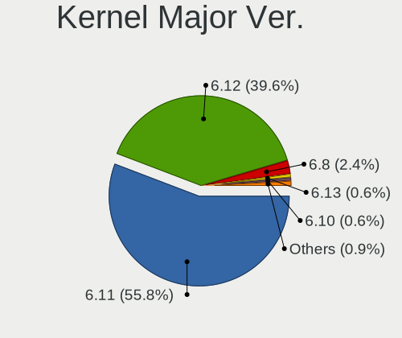
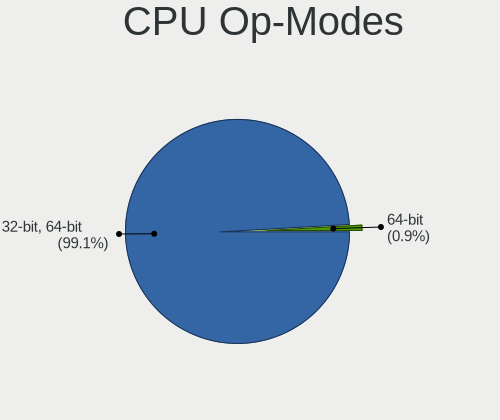
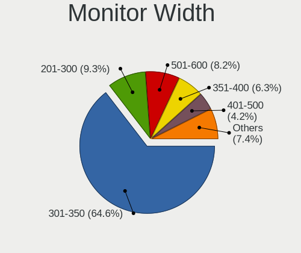

Fedora - Hardware Trends (Notebooks)
------------------------------------

A project to identify most popular hardware characteristics and track their change
over time based on data collected by Linux users at https://Linux-Hardware.org.

Anyone can contribute to this report by the [hw-probe](https://github.com/linuxhw/hw-probe) tool:

    sudo -E hw-probe -all -upload

This report is for one last month. Overall report since the beginning of time: [TestDays](https://github.com/linuxhw/TestDays)

Period: Jan, 2024.

Contents
--------

* [ System ](#system)
  - [ OS                       ](#os)
  - [ OS Family                ](#os-family)
  - [ Kernel                   ](#kernel)
  - [ Kernel Family            ](#kernel-family)
  - [ Kernel Major Ver.        ](#kernel-major-ver)
  - [ Arch                     ](#arch)
  - [ DE                       ](#de)
  - [ Display Server           ](#display-server)
  - [ Display Manager          ](#display-manager)
  - [ OS Lang                  ](#os-lang)
  - [ Boot Mode                ](#boot-mode)
  - [ Filesystem               ](#filesystem)
  - [ Part. scheme             ](#part-scheme)
  - [ Dual Boot with Linux/BSD ](#dual-boot-with-linuxbsd)
  - [ Dual Boot (Win)          ](#dual-boot-win)

* [ Board ](#board)
  - [ Vendor                   ](#vendor)
  - [ Model                    ](#model)
  - [ Model Family             ](#model-family)
  - [ MFG Year                 ](#mfg-year)
  - [ Form Factor              ](#form-factor)
  - [ Secure Boot              ](#secure-boot)
  - [ Coreboot                 ](#coreboot)
  - [ RAM Size                 ](#ram-size)
  - [ RAM Used                 ](#ram-used)
  - [ Total Drives             ](#total-drives)
  - [ Has CD-ROM               ](#has-cd-rom)
  - [ Has Ethernet             ](#has-ethernet)
  - [ Has WiFi                 ](#has-wifi)
  - [ Has Bluetooth            ](#has-bluetooth)

* [ Location ](#location)
  - [ Country                  ](#country)
  - [ City                     ](#city)

* [ Drives ](#drives)
  - [ Drive Vendor             ](#drive-vendor)
  - [ Drive Model              ](#drive-model)
  - [ HDD Vendor               ](#hdd-vendor)
  - [ SSD Vendor               ](#ssd-vendor)
  - [ Drive Kind               ](#drive-kind)
  - [ Drive Connector          ](#drive-connector)
  - [ Drive Size               ](#drive-size)
  - [ Space Total              ](#space-total)
  - [ Space Used               ](#space-used)
  - [ Malfunc. Drives          ](#malfunc-drives)
  - [ Malfunc. Drive Vendor    ](#malfunc-drive-vendor)
  - [ Malfunc. HDD Vendor      ](#malfunc-hdd-vendor)
  - [ Malfunc. Drive Kind      ](#malfunc-drive-kind)
  - [ Failed Drives            ](#failed-drives)
  - [ Failed Drive Vendor      ](#failed-drive-vendor)
  - [ Drive Status             ](#drive-status)

* [ Storage controller ](#storage-controller)
  - [ Storage Vendor           ](#storage-vendor)
  - [ Storage Model            ](#storage-model)
  - [ Storage Kind             ](#storage-kind)

* [ Processor ](#processor)
  - [ CPU Vendor               ](#cpu-vendor)
  - [ CPU Model                ](#cpu-model)
  - [ CPU Model Family         ](#cpu-model-family)
  - [ CPU Cores                ](#cpu-cores)
  - [ CPU Sockets              ](#cpu-sockets)
  - [ CPU Threads              ](#cpu-threads)
  - [ CPU Op-Modes             ](#cpu-op-modes)
  - [ CPU Microcode            ](#cpu-microcode)
  - [ CPU Microarch            ](#cpu-microarch)

* [ Graphics ](#graphics)
  - [ GPU Vendor               ](#gpu-vendor)
  - [ GPU Model                ](#gpu-model)
  - [ GPU Combo                ](#gpu-combo)
  - [ GPU Driver               ](#gpu-driver)
  - [ GPU Memory               ](#gpu-memory)

* [ Monitor ](#monitor)
  - [ Monitor Vendor           ](#monitor-vendor)
  - [ Monitor Model            ](#monitor-model)
  - [ Monitor Resolution       ](#monitor-resolution)
  - [ Monitor Diagonal         ](#monitor-diagonal)
  - [ Monitor Width            ](#monitor-width)
  - [ Aspect Ratio             ](#aspect-ratio)
  - [ Monitor Area             ](#monitor-area)
  - [ Pixel Density            ](#pixel-density)
  - [ Multiple Monitors        ](#multiple-monitors)

* [ Network ](#network)
  - [ Net Controller Vendor    ](#net-controller-vendor)
  - [ Net Controller Model     ](#net-controller-model)
  - [ Wireless Vendor          ](#wireless-vendor)
  - [ Wireless Model           ](#wireless-model)
  - [ Ethernet Vendor          ](#ethernet-vendor)
  - [ Ethernet Model           ](#ethernet-model)
  - [ Net Controller Kind      ](#net-controller-kind)
  - [ Used Controller          ](#used-controller)
  - [ NICs                     ](#nics)
  - [ IPv6                     ](#ipv6)

* [ Bluetooth ](#bluetooth)
  - [ Bluetooth Vendor         ](#bluetooth-vendor)
  - [ Bluetooth Model          ](#bluetooth-model)

* [ Sound ](#sound)
  - [ Sound Vendor             ](#sound-vendor)
  - [ Sound Model              ](#sound-model)

* [ Memory ](#memory)
  - [ Memory Vendor            ](#memory-vendor)
  - [ Memory Model             ](#memory-model)
  - [ Memory Kind              ](#memory-kind)
  - [ Memory Form Factor       ](#memory-form-factor)
  - [ Memory Size              ](#memory-size)
  - [ Memory Speed             ](#memory-speed)

* [ Printers & scanners ](#printers--scanners)
  - [ Printer Vendor           ](#printer-vendor)
  - [ Printer Model            ](#printer-model)
  - [ Scanner Vendor           ](#scanner-vendor)
  - [ Scanner Model            ](#scanner-model)

* [ Camera ](#camera)
  - [ Camera Vendor            ](#camera-vendor)
  - [ Camera Model             ](#camera-model)

* [ Security ](#security)
  - [ Fingerprint Vendor       ](#fingerprint-vendor)
  - [ Fingerprint Model        ](#fingerprint-model)
  - [ Chipcard Vendor          ](#chipcard-vendor)
  - [ Chipcard Model           ](#chipcard-model)

* [ Unsupported ](#unsupported)
  - [ Unsupported Devices      ](#unsupported-devices)
  - [ Unsupported Device Types ](#unsupported-device-types)

System
------

OS
--

Installed operating systems

| Name      | Notebooks | Percent |
|-----------|-----------|---------|
| Fedora 39 | 338       | 93.11%  |
| Fedora 38 | 20        | 5.51%   |
| Fedora 37 | 2         | 0.55%   |
| Fedora 35 | 2         | 0.55%   |
| Fedora 36 | 1         | 0.28%   |

OS Family
---------

OS without a version

| Name   | Notebooks | Percent |
|--------|-----------|---------|
| Fedora | 363       | 100%    |

Kernel
------

Version of the Linux kernel

| Version                             | Notebooks | Percent |
|-------------------------------------|-----------|---------|
| 6.6.9-200.fc39.x86_64               | 108       | 29.75%  |
| 6.6.8-200.fc39.x86_64               | 50        | 13.77%  |
| 6.6.11-200.fc39.x86_64              | 49        | 13.5%   |
| 6.6.13-200.fc39.x86_64              | 47        | 12.95%  |
| 6.5.6-300.fc39.x86_64               | 33        | 9.09%   |
| 6.6.12-200.fc39.x86_64              | 20        | 5.51%   |
| 6.6.8-100.fc38.x86_64               | 6         | 1.65%   |
| 6.6.7-200.fc39.x86_64               | 4         | 1.1%    |
| 6.2.9-300.fc38.x86_64               | 4         | 1.1%    |
| 6.6.9-100.fc38.x86_64               | 3         | 0.83%   |
| 6.6.11-100.fc38.x86_64              | 3         | 0.83%   |
| 6.5.11-300.fc39.x86_64              | 3         | 0.83%   |
| 6.7.0-cb1.0.fc39.x86_64             | 2         | 0.55%   |
| 6.6.8-200.t2.fc39.x86_64            | 2         | 0.55%   |
| 6.6.7-666.rog.fc39.x86_64           | 2         | 0.55%   |
| 6.6.14-200.fc39.x86_64              | 2         | 0.55%   |
| 6.6.12-100.fc38.x86_64              | 2         | 0.55%   |
| 6.6.10-200.fc39.x86_64              | 2         | 0.55%   |
| 6.0.12-100.fc35.x86_64              | 2         | 0.55%   |
| 6.7.2-250.vanilla.fc39.x86_64       | 1         | 0.28%   |
| 6.7.1-200.fc39.x86_64               | 1         | 0.28%   |
| 6.7.1-200.1.ipu6.fc39.x86_64        | 1         | 0.28%   |
| 6.7.1-0.rc1.250.vanilla.fc39.x86_64 | 1         | 0.28%   |
| 6.7.0-68.es83xx.fc40.x86_64         | 1         | 0.28%   |
| 6.7.0-367.vanilla.fc39.x86_64       | 1         | 0.28%   |
| 6.6.7-100.fc38.x86_64               | 1         | 0.28%   |
| 6.6.6-200.fc39.x86_64               | 1         | 0.28%   |
| 6.6.4-200.fc39.x86_64               | 1         | 0.28%   |
| 6.6.2-201.fc39.x86_64               | 1         | 0.28%   |
| 6.6.13-100.fc38.x86_64              | 1         | 0.28%   |
| 6.6.12-201.fsync.fc39.x86_64        | 1         | 0.28%   |
| 6.6.10-667.rog.fc39.x86_64          | 1         | 0.28%   |
| 6.5.8-200.fc38.x86_64               | 1         | 0.28%   |
| 6.5.12-100.fc37.x86_64              | 1         | 0.28%   |
| 6.4.6-200.fc38.x86_64               | 1         | 0.28%   |
| 6.3.11-200.fc38.x86_64              | 1         | 0.28%   |
| 6.2.15-100.fc36.x86_64              | 1         | 0.28%   |
| 6.0.7-301.fc37.x86_64               | 1         | 0.28%   |

Kernel Family
-------------

Linux kernel without a distro release

| Version | Notebooks | Percent |
|---------|-----------|---------|
| 6.6.9   | 111       | 30.58%  |
| 6.6.8   | 58        | 15.98%  |
| 6.6.11  | 52        | 14.33%  |
| 6.6.13  | 48        | 13.22%  |
| 6.5.6   | 33        | 9.09%   |
| 6.6.12  | 23        | 6.34%   |
| 6.6.7   | 7         | 1.93%   |
| 6.7.0   | 4         | 1.1%    |
| 6.2.9   | 4         | 1.1%    |
| 6.7.1   | 3         | 0.83%   |
| 6.6.10  | 3         | 0.83%   |
| 6.5.11  | 3         | 0.83%   |
| 6.6.14  | 2         | 0.55%   |
| 6.0.12  | 2         | 0.55%   |
| 6.7.2   | 1         | 0.28%   |
| 6.6.6   | 1         | 0.28%   |
| 6.6.4   | 1         | 0.28%   |
| 6.6.2   | 1         | 0.28%   |
| 6.5.8   | 1         | 0.28%   |
| 6.5.12  | 1         | 0.28%   |
| 6.4.6   | 1         | 0.28%   |
| 6.3.11  | 1         | 0.28%   |
| 6.2.15  | 1         | 0.28%   |
| 6.0.7   | 1         | 0.28%   |

Kernel Major Ver.
-----------------

Linux kernel major version

| Version | Notebooks | Percent |
|---------|-----------|---------|
| 6.6     | 307       | 84.57%  |
| 6.5     | 38        | 10.47%  |
| 6.7     | 8         | 2.2%    |
| 6.2     | 5         | 1.38%   |
| 6.0     | 3         | 0.83%   |
| 6.4     | 1         | 0.28%   |
| 6.3     | 1         | 0.28%   |

Arch
----

OS architecture (x86_64, i586, etc.)

| Name   | Notebooks | Percent |
|--------|-----------|---------|
| x86_64 | 363       | 100%    |

DE
--

Desktop Environment

| Name           | Notebooks | Percent |
|----------------|-----------|---------|
| GNOME          | 286       | 78.79%  |
| KDE5           | 48        | 13.22%  |
| XFCE           | 8         | 2.2%    |
| sway           | 5         | 1.38%   |
| X-Cinnamon     | 3         | 0.83%   |
| Unknown        | 3         | 0.83%   |
| MATE           | 2         | 0.55%   |
| GNOME Classic  | 2         | 0.55%   |
| Cinnamon       | 2         | 0.55%   |
| LXQt           | 1         | 0.28%   |
| i3-with-shmlog | 1         | 0.28%   |
| Deepin         | 1         | 0.28%   |
| Budgie         | 1         | 0.28%   |

Display Server
--------------

X11 or Wayland

| Name    | Notebooks | Percent |
|---------|-----------|---------|
| Wayland | 308       | 84.85%  |
| X11     | 49        | 13.5%   |
| Tty     | 5         | 1.38%   |
| Unknown | 1         | 0.28%   |

Display Manager
---------------

SDDM, LightDM, etc.

| Name    | Notebooks | Percent |
|---------|-----------|---------|
| Unknown | 227       | 62.53%  |
| GDM     | 93        | 25.62%  |
| SDDM    | 26        | 7.16%   |
| LightDM | 17        | 4.68%   |

OS Lang
-------

Language

| Lang    | Notebooks | Percent |
|---------|-----------|---------|
| en_US   | 174       | 47.93%  |
| en_GB   | 33        | 9.09%   |
| ru_RU   | 24        | 6.61%   |
| de_DE   | 21        | 5.79%   |
| pt_BR   | 16        | 4.41%   |
| fr_FR   | 11        | 3.03%   |
| it_IT   | 10        | 2.75%   |
| en_IN   | 7         | 1.93%   |
| es_ES   | 6         | 1.65%   |
| tr_TR   | 5         | 1.38%   |
| en_AU   | 5         | 1.38%   |
| en_CA   | 4         | 1.1%    |
| pl_PL   | 3         | 0.83%   |
| es_MX   | 3         | 0.83%   |
| en_ZA   | 3         | 0.83%   |
| zh_CN   | 2         | 0.55%   |
| ru_UA   | 2         | 0.55%   |
| pt_PT   | 2         | 0.55%   |
| nb_NO   | 2         | 0.55%   |
| es_CO   | 2         | 0.55%   |
| es_CL   | 2         | 0.55%   |
| es_AR   | 2         | 0.55%   |
| en_PH   | 2         | 0.55%   |
| en_IL   | 2         | 0.55%   |
| el_GR   | 2         | 0.55%   |
| de_CH   | 2         | 0.55%   |
| cs_CZ   | 2         | 0.55%   |
| Unknown | 2         | 0.55%   |
| zh_HK   | 1         | 0.28%   |
| sk_SK   | 1         | 0.28%   |
| ro_RO   | 1         | 0.28%   |
| ko_KR   | 1         | 0.28%   |
| fr_CA   | 1         | 0.28%   |
| es_SV   | 1         | 0.28%   |
| es_PR   | 1         | 0.28%   |
| es_PA   | 1         | 0.28%   |
| es_DO   | 1         | 0.28%   |
| en_DK   | 1         | 0.28%   |
| de_AT   | 1         | 0.28%   |
| da_DK   | 1         | 0.28%   |

Boot Mode
---------

EFI or BIOS

| Mode | Notebooks | Percent |
|------|-----------|---------|
| EFI  | 306       | 84.3%   |
| BIOS | 57        | 15.7%   |

Filesystem
----------

Type of filesystem

| Type  | Notebooks | Percent |
|-------|-----------|---------|
| Btrfs | 319       | 87.88%  |
| Ext4  | 37        | 10.19%  |
| Xfs   | 6         | 1.65%   |
| Tmpfs | 1         | 0.28%   |

Part. scheme
------------

Scheme of partitioning

| Type    | Notebooks | Percent |
|---------|-----------|---------|
| Unknown | 223       | 61.43%  |
| GPT     | 131       | 36.09%  |
| MBR     | 9         | 2.48%   |

Dual Boot with Linux/BSD
------------------------

Hosting more than one Linux/BSD

| Dual boot | Notebooks | Percent |
|-----------|-----------|---------|
| No        | 343       | 94.49%  |
| Yes       | 20        | 5.51%   |

Dual Boot (Win)
---------------

Hosting Linux and Windows

| Dual boot | Notebooks | Percent |
|-----------|-----------|---------|
| No        | 303       | 83.47%  |
| Yes       | 60        | 16.53%  |

Board
-----

Vendor
------

Motherboard manufacturer

| Name                     | Notebooks | Percent |
|--------------------------|-----------|---------|
| Lenovo                   | 92        | 25.34%  |
| Dell                     | 60        | 16.53%  |
| ASUSTek Computer         | 50        | 13.77%  |
| Hewlett-Packard          | 43        | 11.85%  |
| Acer                     | 25        | 6.89%   |
| Apple                    | 22        | 6.06%   |
| MSI                      | 12        | 3.31%   |
| HUAWEI                   | 9         | 2.48%   |
| Toshiba                  | 4         | 1.1%    |
| Samsung Electronics      | 4         | 1.1%    |
| Fujitsu                  | 4         | 1.1%    |
| Unknown                  | 4         | 1.1%    |
| LG Electronics           | 3         | 0.83%   |
| Google                   | 3         | 0.83%   |
| Sony                     | 2         | 0.55%   |
| Notebook                 | 2         | 0.55%   |
| GPD                      | 2         | 0.55%   |
| Gigabyte Technology      | 2         | 0.55%   |
| Framework                | 2         | 0.55%   |
| TUXEDO                   | 1         | 0.28%   |
| Timi                     | 1         | 0.28%   |
| SPA CONDOR               | 1         | 0.28%   |
| Razer                    | 1         | 0.28%   |
| Positivo Bahia - VAIO    | 1         | 0.28%   |
| Panasonic                | 1         | 0.28%   |
| OEM                      | 1         | 0.28%   |
| Nuvision                 | 1         | 0.28%   |
| mPTech                   | 1         | 0.28%   |
| MECHREVO                 | 1         | 0.28%   |
| MACHENIKE                | 1         | 0.28%   |
| Infinix                  | 1         | 0.28%   |
| HONOR                    | 1         | 0.28%   |
| General Dynamics Itronix | 1         | 0.28%   |
| ENTITY                   | 1         | 0.28%   |
| Casper                   | 1         | 0.28%   |
| Avell                    | 1         | 0.28%   |
| Alienware                | 1         | 0.28%   |

Model
-----

Motherboard model

| Name                                               | Notebooks | Percent |
|----------------------------------------------------|-----------|---------|
| Unknown                                            | 7         | 1.93%   |
| ASUS Zenbook UM3402YAR_UM3402YA                    | 3         | 0.83%   |
| Apple MacBookPro14,1                               | 3         | 0.83%   |
| Apple MacBookPro10,1                               | 3         | 0.83%   |
| Apple MacBookAir7,2                                | 3         | 0.83%   |
| Lenovo ThinkPad X220 42911H8                       | 2         | 0.55%   |
| HUAWEI WRT-WX9                                     | 2         | 0.55%   |
| HUAWEI MRGFG-XX                                    | 2         | 0.55%   |
| HUAWEI BOM-WXX9                                    | 2         | 0.55%   |
| HP Notebook                                        | 2         | 0.55%   |
| HP Laptop 14-cf2xxx                                | 2         | 0.55%   |
| Dell Latitude 5310                                 | 2         | 0.55%   |
| Dell Inspiron 15 3520                              | 2         | 0.55%   |
| Apple MacBookPro9,2                                | 2         | 0.55%   |
| Apple MacBookAir6,2                                | 2         | 0.55%   |
| Acer Predator PH315-53                             | 2         | 0.55%   |
| Acer Predator PH16-71                              | 2         | 0.55%   |
| Acer Aspire A315-24P                               | 2         | 0.55%   |
| TUXEDO Pulse 14 Gen3                               | 1         | 0.28%   |
| Toshiba Satellite C855-2J5                         | 1         | 0.28%   |
| Toshiba Satellite C850-C5K                         | 1         | 0.28%   |
| Toshiba Satellite C75D-B                           | 1         | 0.28%   |
| Toshiba Satellite C70-B                            | 1         | 0.28%   |
| Timi Xiaomi Book Pro 16 2022                       | 1         | 0.28%   |
| SPA CONDOR WM15-CCLPRO                             | 1         | 0.28%   |
| Sony VPCS12AFJ                                     | 1         | 0.28%   |
| Sony SVF1521A1EW                                   | 1         | 0.28%   |
| Samsung RV415/RV515                                | 1         | 0.28%   |
| Samsung 960XFH                                     | 1         | 0.28%   |
| Samsung 940XFG                                     | 1         | 0.28%   |
| Samsung 900X3L                                     | 1         | 0.28%   |
| Razer Blade 15 Base Model (Early 2021) - RZ09-0369 | 1         | 0.28%   |
| Positivo Bahia - VAIO VJFE53F11X-XXXXXX            | 1         | 0.28%   |
| Panasonic CF-52PFN61PM                             | 1         | 0.28%   |
| Nuvision NES11                                     | 1         | 0.28%   |
| Notebook NS5x_NS7xAU                               | 1         | 0.28%   |
| Notebook NL5xRU                                    | 1         | 0.28%   |
| MSI Stealth GS66 12UGS                             | 1         | 0.28%   |
| MSI Prestige 15 A11SCS                             | 1         | 0.28%   |
| MSI Modern 15 H B13M                               | 1         | 0.28%   |

Model Family
------------

Motherboard model prefix

| Name               | Notebooks | Percent |
|--------------------|-----------|---------|
| Lenovo ThinkPad    | 54        | 14.88%  |
| Dell Latitude      | 22        | 6.06%   |
| Dell Inspiron      | 20        | 5.51%   |
| ASUS VivoBook      | 19        | 5.23%   |
| Lenovo IdeaPad     | 17        | 4.68%   |
| Acer Aspire        | 14        | 3.86%   |
| HP Laptop          | 12        | 3.31%   |
| HP EliteBook       | 11        | 3.03%   |
| ASUS ROG           | 8         | 2.2%    |
| Dell XPS           | 7         | 1.93%   |
| Dell Precision     | 7         | 1.93%   |
| ASUS ZenBook       | 7         | 1.93%   |
| Unknown            | 7         | 1.93%   |
| HP ProBook         | 5         | 1.38%   |
| ASUS ASUS          | 5         | 1.38%   |
| Toshiba Satellite  | 4         | 1.1%    |
| Lenovo Legion      | 4         | 1.1%    |
| Apple MacBookPro14 | 4         | 1.1%    |
| Acer Swift         | 4         | 1.1%    |
| Acer Predator      | 4         | 1.1%    |
| MSI Modern         | 3         | 0.83%   |
| HP Pavilion        | 3         | 0.83%   |
| Fujitsu LIFEBOOK   | 3         | 0.83%   |
| Apple MacBookPro11 | 3         | 0.83%   |
| Apple MacBookPro10 | 3         | 0.83%   |
| Apple MacBookAir7  | 3         | 0.83%   |
| Lenovo Yoga        | 2         | 0.55%   |
| Lenovo V15         | 2         | 0.55%   |
| Lenovo ThinkBook   | 2         | 0.55%   |
| HUAWEI WRT-WX9     | 2         | 0.55%   |
| HUAWEI MRGFG-XX    | 2         | 0.55%   |
| HUAWEI BOM-WXX9    | 2         | 0.55%   |
| HP ZBook           | 2         | 0.55%   |
| HP Notebook        | 2         | 0.55%   |
| HP ENVY            | 2         | 0.55%   |
| Framework Laptop   | 2         | 0.55%   |
| Dell Vostro        | 2         | 0.55%   |
| Apple MacBookPro9  | 2         | 0.55%   |
| Apple MacBookPro16 | 2         | 0.55%   |
| Apple MacBookAir6  | 2         | 0.55%   |

MFG Year
--------

Motherboard manufacture year

| Year | Notebooks | Percent |
|------|-----------|---------|
| 2022 | 50        | 13.77%  |
| 2021 | 45        | 12.4%   |
| 2023 | 44        | 12.12%  |
| 2020 | 41        | 11.29%  |
| 2018 | 28        | 7.71%   |
| 2019 | 24        | 6.61%   |
| 2017 | 21        | 5.79%   |
| 2013 | 21        | 5.79%   |
| 2011 | 17        | 4.68%   |
| 2012 | 16        | 4.41%   |
| 2014 | 15        | 4.13%   |
| 2016 | 13        | 3.58%   |
| 2015 | 12        | 3.31%   |
| 2010 | 6         | 1.65%   |
| 2009 | 4         | 1.1%    |
| 2007 | 3         | 0.83%   |
| 2008 | 2         | 0.55%   |
| 2024 | 1         | 0.28%   |

Form Factor
-----------

Physical design of the computer

| Name     | Notebooks | Percent |
|----------|-----------|---------|
| Notebook | 363       | 100%    |

Secure Boot
-----------

Enabled or disabled

| State    | Notebooks | Percent |
|----------|-----------|---------|
| Disabled | 280       | 77.13%  |
| Enabled  | 83        | 22.87%  |

Coreboot
--------

Have coreboot on board

| Used | Notebooks | Percent |
|------|-----------|---------|
| No   | 360       | 99.17%  |
| Yes  | 3         | 0.83%   |

RAM Size
--------

Total RAM memory

| Size in GB  | Notebooks | Percent |
|-------------|-----------|---------|
| 4.01-8.0    | 104       | 28.65%  |
| 16.01-24.0  | 85        | 23.42%  |
| 8.01-16.0   | 68        | 18.73%  |
| 32.01-64.0  | 54        | 14.88%  |
| 3.01-4.0    | 29        | 7.99%   |
| 24.01-32.0  | 13        | 3.58%   |
| 64.01-256.0 | 7         | 1.93%   |
| 2.01-3.0    | 2         | 0.55%   |
| 1.01-2.0    | 1         | 0.28%   |

RAM Used
--------

Used RAM memory

| Used GB    | Notebooks | Percent |
|------------|-----------|---------|
| 4.01-8.0   | 116       | 31.96%  |
| 3.01-4.0   | 90        | 24.79%  |
| 2.01-3.0   | 88        | 24.24%  |
| 1.01-2.0   | 42        | 11.57%  |
| 8.01-16.0  | 23        | 6.34%   |
| 16.01-24.0 | 3         | 0.83%   |
| 0.51-1.0   | 1         | 0.28%   |

Total Drives
------------

Number of drives on board

| Drives | Notebooks | Percent |
|--------|-----------|---------|
| 1      | 271       | 74.66%  |
| 2      | 78        | 21.49%  |
| 3      | 11        | 3.03%   |
| 4      | 3         | 0.83%   |

Has CD-ROM
----------

Has CD-ROM on board

| Presented | Notebooks | Percent |
|-----------|-----------|---------|
| No        | 311       | 85.67%  |
| Yes       | 52        | 14.33%  |

Has Ethernet
------------

Has Ethernet on board

| Presented | Notebooks | Percent |
|-----------|-----------|---------|
| Yes       | 243       | 66.94%  |
| No        | 120       | 33.06%  |

Has WiFi
--------

Has WiFi module

| Presented | Notebooks | Percent |
|-----------|-----------|---------|
| Yes       | 362       | 99.72%  |
| No        | 1         | 0.28%   |

Has Bluetooth
-------------

Has Bluetooth module

| Presented | Notebooks | Percent |
|-----------|-----------|---------|
| Yes       | 319       | 87.88%  |
| No        | 44        | 12.12%  |

Location
--------

Country
-------

Geographic location (country)

| Country      | Notebooks | Percent |
|--------------|-----------|---------|
| USA          | 53        | 14.6%   |
| Germany      | 34        | 9.37%   |
| Russia       | 26        | 7.16%   |
| Italy        | 20        | 5.51%   |
| Brazil       | 20        | 5.51%   |
| India        | 16        | 4.41%   |
| France       | 16        | 4.41%   |
| Spain        | 14        | 3.86%   |
| UK           | 12        | 3.31%   |
| Canada       | 11        | 3.03%   |
| Poland       | 10        | 2.75%   |
| Netherlands  | 10        | 2.75%   |
| Switzerland  | 9         | 2.48%   |
| Turkey       | 8         | 2.2%    |
| Romania      | 6         | 1.65%   |
| Australia    | 6         | 1.65%   |
| South Africa | 5         | 1.38%   |
| Philippines  | 5         | 1.38%   |
| Mexico       | 5         | 1.38%   |
| Czechia      | 5         | 1.38%   |
| Belarus      | 4         | 1.1%    |
| Argentina    | 4         | 1.1%    |
| Portugal     | 3         | 0.83%   |
| Norway       | 3         | 0.83%   |
| El Salvador  | 3         | 0.83%   |
| Uzbekistan   | 2         | 0.55%   |
| Sweden       | 2         | 0.55%   |
| South Korea  | 2         | 0.55%   |
| Singapore    | 2         | 0.55%   |
| Japan        | 2         | 0.55%   |
| Israel       | 2         | 0.55%   |
| Indonesia    | 2         | 0.55%   |
| Greece       | 2         | 0.55%   |
| Denmark      | 2         | 0.55%   |
| Colombia     | 2         | 0.55%   |
| China        | 2         | 0.55%   |
| Chile        | 2         | 0.55%   |
| Cambodia     | 2         | 0.55%   |
| Bulgaria     | 2         | 0.55%   |
| Austria      | 2         | 0.55%   |

City
----

Geographic location (city)

| City              | Notebooks | Percent |
|-------------------|-----------|---------|
| St Petersburg     | 6         | 1.65%   |
| Moscow            | 5         | 1.38%   |
| Berlin            | 5         | 1.38%   |
| Paris             | 4         | 1.1%    |
| Zurich            | 3         | 0.83%   |
| Sydney            | 3         | 0.83%   |
| Stuttgart         | 3         | 0.83%   |
| San Salvador      | 3         | 0.83%   |
| Quezon City       | 3         | 0.83%   |
| Minsk             | 3         | 0.83%   |
| Istanbul          | 3         | 0.83%   |
| Hamburg           | 3         | 0.83%   |
| Chennai           | 3         | 0.83%   |
| Bengaluru         | 3         | 0.83%   |
| Barcelona         | 3         | 0.83%   |
| Vienna            | 2         | 0.55%   |
| Toronto           | 2         | 0.55%   |
| The Hague         | 2         | 0.55%   |
| The Dalles        | 2         | 0.55%   |
| Tashkent          | 2         | 0.55%   |
| Syracuse          | 2         | 0.55%   |
| Singapore         | 2         | 0.55%   |
| Santiago          | 2         | 0.55%   |
| San Vittore Olona | 2         | 0.55%   |
| Prague            | 2         | 0.55%   |
| Phnom Penh        | 2         | 0.55%   |
| Philadelphia      | 2         | 0.55%   |
| Milan             | 2         | 0.55%   |
| Mérida           | 2         | 0.55%   |
| Lisbon            | 2         | 0.55%   |
| Kalisz            | 2         | 0.55%   |
| Jakarta           | 2         | 0.55%   |
| Jaipur            | 2         | 0.55%   |
| Hyderabad         | 2         | 0.55%   |
| Bucharest         | 2         | 0.55%   |
| Boston            | 2         | 0.55%   |
| Amsterdam         | 2         | 0.55%   |
| Zdanice           | 1         | 0.28%   |
| Zaragoza          | 1         | 0.28%   |
| Zabrze            | 1         | 0.28%   |

Drives
------

Drive Vendor
------------

Hard drive vendors

| Vendor                         | Notebooks | Drives | Percent |
|--------------------------------|-----------|--------|---------|
| Samsung Electronics            | 84        | 94     | 18.83%  |
| Sandisk                        | 45        | 47     | 10.09%  |
| SK hynix                       | 28        | 28     | 6.28%   |
| Unknown                        | 27        | 29     | 6.05%   |
| WDC                            | 25        | 25     | 5.61%   |
| Intel                          | 24        | 26     | 5.38%   |
| Kingston                       | 22        | 23     | 4.93%   |
| Micron Technology              | 21        | 21     | 4.71%   |
| Seagate                        | 20        | 20     | 4.48%   |
| Apple                          | 17        | 20     | 3.81%   |
| Phison Electronics             | 16        | 16     | 3.59%   |
| Toshiba                        | 12        | 12     | 2.69%   |
| KIOXIA                         | 12        | 12     | 2.69%   |
| Micron/Crucial Technology      | 9         | 9      | 2.02%   |
| Kingston Technology Company    | 5         | 5      | 1.12%   |
| HGST                           | 5         | 5      | 1.12%   |
| Crucial                        | 5         | 5      | 1.12%   |
| A-DATA Technology              | 5         | 5      | 1.12%   |
| MAXIO Technology (Hangzhou)    | 4         | 4      | 0.9%    |
| LITEON                         | 4         | 4      | 0.9%    |
| ADATA Technology               | 3         | 3      | 0.67%   |
| Union Memory                   | 2         | 2      | 0.45%   |
| Silicon Motion                 | 2         | 2      | 0.45%   |
| Shenzhen Longsys Electronics   | 2         | 2      | 0.45%   |
| PNY                            | 2         | 2      | 0.45%   |
| Phison                         | 2         | 2      | 0.45%   |
| OCZ                            | 2         | 2      | 0.45%   |
| Netac                          | 2         | 2      | 0.45%   |
| LITEONIT                       | 2         | 2      | 0.45%   |
| JMicron Technology             | 2         | 2      | 0.45%   |
| GOODRAM                        | 2         | 2      | 0.45%   |
| Gigabyte Technology            | 2         | 2      | 0.45%   |
| China                          | 2         | 2      | 0.45%   |
| Yangtze Memory Technologies    | 1         | 2      | 0.22%   |
| XrayDisk                       | 1         | 1      | 0.22%   |
| Vaseky                         | 1         | 1      | 0.22%   |
| Union Memory (Shenzhen)        | 1         | 1      | 0.22%   |
| Transcend                      | 1         | 1      | 0.22%   |
| SPCC                           | 1         | 1      | 0.22%   |
| Solid State Storage Technology | 1         | 1      | 0.22%   |

Drive Model
-----------

Hard drive models

| Model                                               | Notebooks | Percent |
|-----------------------------------------------------|-----------|---------|
| Samsung NVMe SSD Controller PM9A1/PM9A3/980PRO 2TB  | 20        | 4.35%   |
| Samsung NVMe SSD Controller SM981/PM981/PM983 1TB   | 19        | 4.13%   |
| Unknown MMC Card  32GB                              | 8         | 1.74%   |
| Samsung NVMe SSD Controller SM961/PM961/SM963 256GB | 7         | 1.52%   |
| Unknown MMC Card  128GB                             | 6         | 1.3%    |
| Sandisk WD Blue SN550 NVMe SSD 512GB                | 6         | 1.3%    |
| Phison PS5013 E13 NVMe Controller 256GB             | 6         | 1.3%    |
| Micron/Crucial P2 NVMe PCIe SSD 1TB                 | 6         | 1.3%    |
| Intel SSDPEKNU512GZ 512GB                           | 6         | 1.3%    |
| Sandisk WD_BLACK SN770 1TB                          | 5         | 1.09%   |
| Samsung SSD 870 EVO 1TB                             | 5         | 1.09%   |
| Intel SSD Pro 7600p/760p/E 6100p Series 1024GB      | 5         | 1.09%   |
| Unknown MMC Card  64GB                              | 4         | 0.87%   |
| Seagate ST1000LM035-1RK172 1TB                      | 4         | 0.87%   |
| Sandisk WD Black SN750 / PC SN730 NVMe SSD 512GB    | 4         | 0.87%   |
| Samsung SSD 860 EVO 500GB                           | 4         | 0.87%   |
| Phison E12 NVMe Controller 1TB                      | 4         | 0.87%   |
| WDC WD10JPVX-22JC3T0 1TB                            | 3         | 0.65%   |
| SK hynix SKHynix_HFS512GEJ4X112N 512GB              | 3         | 0.65%   |
| SK hynix HFM001TD3JX013N 1024GB                     | 3         | 0.65%   |
| Samsung SSD 850 EVO 500GB                           | 3         | 0.65%   |
| Samsung SSD 850 EVO 250GB                           | 3         | 0.65%   |
| Samsung MZALQ256HBJD-00BL2 256GB                    | 3         | 0.65%   |
| Micron 2400_MTFDKBA512QFM 512GB                     | 3         | 0.65%   |
| MAXIO (Hangzhou) NVMe SSD Controller MAP1202 512GB  | 3         | 0.65%   |
| KIOXIA KBG40ZNV256G 256GB                           | 3         | 0.65%   |
| Kingston SA400S37240G 240GB SSD                     | 3         | 0.65%   |
| Intel SSD 660P Series 1024GB                        | 3         | 0.65%   |
| Apple S3X NVMe Controller 256GB                     | 3         | 0.65%   |
| Apple ANS2 NVMe Controller 256GB                    | 3         | 0.65%   |
| Unknown NVMe SSD Drive 512GB                        | 2         | 0.43%   |
| Union Memory UMIS RPJTJ256MEE1OWX 256GB             | 2         | 0.43%   |
| Toshiba XG6 NVMe SSD Controller 256GB               | 2         | 0.43%   |
| Toshiba MQ01ABD100 1TB                              | 2         | 0.43%   |
| Toshiba BG3 NVMe SSD Controller 256GB               | 2         | 0.43%   |
| SK hynix SKHynix_HFS512GDE9X081N 512GB              | 2         | 0.43%   |
| SK hynix BC901 NVMe 512GB                           | 2         | 0.43%   |
| SK hynix BC501 NVMe Solid State Drive 512GB         | 2         | 0.43%   |
| Seagate ST9500420AS 500GB                           | 2         | 0.43%   |
| Seagate ST500LM012 HN-M500MBB 500GB                 | 2         | 0.43%   |

HDD Vendor
----------

Hard disk drive vendors

| Vendor             | Notebooks | Drives | Percent |
|--------------------|-----------|--------|---------|
| WDC                | 20        | 20     | 35.71%  |
| Seagate            | 17        | 17     | 30.36%  |
| Toshiba            | 7         | 7      | 12.5%   |
| HGST               | 5         | 5      | 8.93%   |
| JMicron Technology | 2         | 2      | 3.57%   |
| Unknown            | 1         | 1      | 1.79%   |
| Hitachi            | 1         | 1      | 1.79%   |
| External           | 1         | 2      | 1.79%   |
| Asm                | 1         | 1      | 1.79%   |
| Apple              | 1         | 1      | 1.79%   |

SSD Vendor
----------

Solid state drive vendors

| Vendor              | Notebooks | Drives | Percent |
|---------------------|-----------|--------|---------|
| Samsung Electronics | 25        | 27     | 20.49%  |
| Kingston            | 13        | 13     | 10.66%  |
| SanDisk             | 12        | 12     | 9.84%   |
| Apple               | 10        | 10     | 8.2%    |
| Intel               | 6         | 6      | 4.92%   |
| WDC                 | 5         | 5      | 4.1%    |
| SK hynix            | 5         | 5      | 4.1%    |
| Crucial             | 5         | 5      | 4.1%    |
| Micron Technology   | 4         | 4      | 3.28%   |
| LITEON              | 4         | 4      | 3.28%   |
| A-DATA Technology   | 4         | 4      | 3.28%   |
| PNY                 | 2         | 2      | 1.64%   |
| OCZ                 | 2         | 2      | 1.64%   |
| Netac               | 2         | 2      | 1.64%   |
| LITEONIT            | 2         | 2      | 1.64%   |
| GOODRAM             | 2         | 2      | 1.64%   |
| Gigabyte Technology | 2         | 2      | 1.64%   |
| China               | 2         | 2      | 1.64%   |
| Vaseky              | 1         | 1      | 0.82%   |
| Transcend           | 1         | 1      | 0.82%   |
| SPCC                | 1         | 1      | 0.82%   |
| Seagate             | 1         | 1      | 0.82%   |
| Plextor             | 1         | 1      | 0.82%   |
| Patriot             | 1         | 1      | 0.82%   |
| Lexar               | 1         | 1      | 0.82%   |
| KLEVV               | 1         | 1      | 0.82%   |
| KingSpec            | 1         | 1      | 0.82%   |
| Intenso             | 1         | 1      | 0.82%   |
| HS-SSD-E100         | 1         | 1      | 0.82%   |
| CT1000BX            | 1         | 1      | 0.82%   |
| CERVVO              | 1         | 1      | 0.82%   |
| BRAVEEAGLE          | 1         | 1      | 0.82%   |
| ASMedia             | 1         | 1      | 0.82%   |

Drive Kind
----------

HDD or SSD

| Kind    | Notebooks | Drives | Percent |
|---------|-----------|--------|---------|
| NVMe    | 223       | 256    | 52.84%  |
| SSD     | 117       | 124    | 27.73%  |
| HDD     | 53        | 57     | 12.56%  |
| MMC     | 21        | 23     | 4.98%   |
| Unknown | 8         | 8      | 1.9%    |

Drive Connector
---------------

SATA, SAS, NVMe, etc.

| Type | Notebooks | Drives | Percent |
|------|-----------|--------|---------|
| NVMe | 223       | 256    | 54.26%  |
| SATA | 148       | 168    | 36.01%  |
| MMC  | 21        | 23     | 5.11%   |
| SAS  | 19        | 21     | 4.62%   |

Drive Size
----------

Size of hard drive

| Size in TB | Notebooks | Drives | Percent |
|------------|-----------|--------|---------|
| 0.01-0.5   | 101       | 111    | 61.59%  |
| 0.51-1.0   | 58        | 65     | 35.37%  |
| 3.01-4.0   | 3         | 3      | 1.83%   |
| 1.01-2.0   | 2         | 2      | 1.22%   |

Space Total
-----------

Amount of disk space available on the file system

| Size in GB     | Notebooks | Percent |
|----------------|-----------|---------|
| 501-1000       | 79        | 21.76%  |
| 251-500        | 76        | 20.94%  |
| 1001-2000      | 63        | 17.36%  |
| 101-250        | 53        | 14.6%   |
| 1-20           | 31        | 8.54%   |
| Unknown        | 31        | 8.54%   |
| 51-100         | 13        | 3.58%   |
| More than 3000 | 7         | 1.93%   |
| 2001-3000      | 7         | 1.93%   |
| 21-50          | 3         | 0.83%   |

Space Used
----------

Amount of used disk space

| Used GB        | Notebooks | Percent |
|----------------|-----------|---------|
| 1-20           | 109       | 30.03%  |
| 21-50          | 63        | 17.36%  |
| 101-250        | 51        | 14.05%  |
| 51-100         | 37        | 10.19%  |
| 251-500        | 35        | 9.64%   |
| Unknown        | 31        | 8.54%   |
| 501-1000       | 27        | 7.44%   |
| 1001-2000      | 9         | 2.48%   |
| More than 3000 | 1         | 0.28%   |

Malfunc. Drives
---------------

Drive models with a malfunction

| Model                                  | Notebooks | Drives | Percent |
|----------------------------------------|-----------|--------|---------|
| WDC WD40EFRX-68N32N0 4TB               | 1         | 1      | 14.29%  |
| Toshiba MQ01ABF050 500GB               | 1         | 1      | 14.29%  |
| Toshiba MK5056GSYF 500GB               | 1         | 1      | 14.29%  |
| Seagate ST9500325AS 500GB              | 1         | 1      | 14.29%  |
| Seagate ST1000LX015-1U7172 1TB         | 1         | 1      | 14.29%  |
| Micron Technology M550_mSATA 512GB SSD | 1         | 1      | 14.29%  |
| LITEONIT LAT-256M2S 256GB SSD          | 1         | 1      | 14.29%  |

Malfunc. Drive Vendor
---------------------

Vendors of faulty drives

| Vendor            | Notebooks | Drives | Percent |
|-------------------|-----------|--------|---------|
| Toshiba           | 2         | 2      | 28.57%  |
| Seagate           | 2         | 2      | 28.57%  |
| WDC               | 1         | 1      | 14.29%  |
| Micron Technology | 1         | 1      | 14.29%  |
| LITEONIT          | 1         | 1      | 14.29%  |

Malfunc. HDD Vendor
-------------------

Vendors of faulty HDD drives

| Vendor  | Notebooks | Drives | Percent |
|---------|-----------|--------|---------|
| Toshiba | 2         | 2      | 40%     |
| Seagate | 2         | 2      | 40%     |
| WDC     | 1         | 1      | 20%     |

Malfunc. Drive Kind
-------------------

Kinds of faulty drives

| Kind | Notebooks | Drives | Percent |
|------|-----------|--------|---------|
| HDD  | 5         | 5      | 71.43%  |
| SSD  | 2         | 2      | 28.57%  |

Failed Drives
-------------

Failed drive models

Zero info for selected period =(

Failed Drive Vendor
-------------------

Failed drive vendors

Zero info for selected period =(

Drive Status
------------

Number of failed and malfunc. drives

| Status   | Notebooks | Drives | Percent |
|----------|-----------|--------|---------|
| Detected | 239       | 312    | 64.25%  |
| Works    | 126       | 149    | 33.87%  |
| Malfunc  | 7         | 7      | 1.88%   |

Storage controller
------------------

Storage Vendor
--------------

Storage controller vendors

| Vendor                         | Notebooks | Percent |
|--------------------------------|-----------|---------|
| Intel                          | 208       | 44.92%  |
| Samsung Electronics            | 67        | 14.47%  |
| Sandisk                        | 34        | 7.34%   |
| SK hynix                       | 23        | 4.97%   |
| AMD                            | 21        | 4.54%   |
| Phison Electronics             | 18        | 3.89%   |
| Micron Technology              | 17        | 3.67%   |
| Kingston Technology Company    | 14        | 3.02%   |
| KIOXIA                         | 12        | 2.59%   |
| Micron/Crucial Technology      | 9         | 1.94%   |
| Apple                          | 6         | 1.3%    |
| Toshiba America Info Systems   | 5         | 1.08%   |
| MAXIO Technology (Hangzhou)    | 4         | 0.86%   |
| ADATA Technology               | 4         | 0.86%   |
| Union Memory (Shenzhen)        | 3         | 0.65%   |
| Solidigm                       | 3         | 0.65%   |
| Silicon Motion                 | 2         | 0.43%   |
| Shenzhen Longsys Electronics   | 2         | 0.43%   |
| Seagate Technology             | 2         | 0.43%   |
| Marvell Technology Group       | 2         | 0.43%   |
| Yangtze Memory Technologies    | 1         | 0.22%   |
| Solid State Storage Technology | 1         | 0.22%   |
| Nvidia                         | 1         | 0.22%   |
| INNOGRIT                       | 1         | 0.22%   |
| Hosin Global Electronics       | 1         | 0.22%   |
| Biwin Storage Technology       | 1         | 0.22%   |
| ASMedia Technology             | 1         | 0.22%   |

Storage Model
-------------

Storage controller models

| Model                                                                          | Notebooks | Percent |
|--------------------------------------------------------------------------------|-----------|---------|
| Intel Volume Management Device NVMe RAID Controller                            | 27        | 5.53%   |
| Intel Sunrise Point-LP SATA Controller [AHCI mode]                             | 23        | 4.71%   |
| Samsung NVMe SSD Controller PM9A1/PM9A3/980PRO                                 | 20        | 4.1%    |
| AMD FCH SATA Controller [AHCI mode]                                            | 20        | 4.1%    |
| Samsung NVMe SSD Controller SM981/PM981/PM983                                  | 19        | 3.89%   |
| Intel 82801 Mobile SATA Controller [RAID mode]                                 | 18        | 3.69%   |
| Samsung NVMe SSD Controller 980 (DRAM-less)                                    | 16        | 3.28%   |
| Intel 7 Series Chipset Family 6-port SATA Controller [AHCI mode]               | 16        | 3.28%   |
| Intel 6 Series/C200 Series Chipset Family 6 port Mobile SATA AHCI Controller   | 12        | 2.46%   |
| SanDisk WD Black SN770 / PC SN740 256GB / PC SN560 (DRAM-less) NVMe SSD        | 11        | 2.25%   |
| SK hynix Gold P31/BC711/PC711 NVMe Solid State Drive                           | 10        | 2.05%   |
| Intel Wildcat Point-LP SATA Controller [AHCI Mode]                             | 10        | 2.05%   |
| KIOXIA NVMe SSD Controller BG4 (DRAM-less)                                     | 9         | 1.84%   |
| Intel Volume Management Device NVMe RAID Controller Intel Corporation          | 9         | 1.84%   |
| Intel SSD 670p Series [Keystone Harbor]                                        | 9         | 1.84%   |
| Intel 8 Series/C220 Series Chipset Family 6-port SATA Controller 1 [AHCI mode] | 9         | 1.84%   |
| Intel Celeron/Pentium Silver Processor SATA Controller                         | 8         | 1.64%   |
| Intel Alder Lake-P SATA AHCI Controller                                        | 8         | 1.64%   |
| Samsung NVMe SSD Controller SM961/PM961/SM963                                  | 7         | 1.43%   |
| Intel HM170/QM170 Chipset SATA Controller [AHCI Mode]                          | 7         | 1.43%   |
| Intel Cannon Point-LP SATA Controller [AHCI Mode]                              | 7         | 1.43%   |
| Intel 8 Series SATA Controller 1 [AHCI mode]                                   | 7         | 1.43%   |
| Intel 5 Series/3400 Series Chipset 6 port SATA AHCI Controller                 | 7         | 1.43%   |
| SanDisk Ultra 3D / WD Blue SN550 NVMe SSD                                      | 6         | 1.23%   |
| Phison PS5013-E13 PCIe3 NVMe Controller (DRAM-less)                            | 6         | 1.23%   |
| Micron/Crucial P2 [Nick P2] / P3 / P3 Plus NVMe PCIe SSD (DRAM-less)           | 6         | 1.23%   |
| Intel Tiger Lake-LP SATA Controller                                            | 6         | 1.23%   |
| SK hynix BC901 NVMe Solid State Drive (DRAM-less)                              | 5         | 1.02%   |
| Micron 3400 NVMe SSD [Hendrix]                                                 | 5         | 1.02%   |
| Intel SSD DC P4101/Pro 7600p/760p/E 6100p Series                               | 5         | 1.02%   |
| SK hynix Platinum P41/PC801 NVMe Solid State Drive                             | 4         | 0.82%   |
| SanDisk Extreme Pro / WD Black SN750 / PC SN730 / Red SN700 NVMe SSD           | 4         | 0.82%   |
| Phison E12 NVMe Controller                                                     | 4         | 0.82%   |
| Micron 2400 NVMe SSD (DRAM-less)                                               | 4         | 0.82%   |
| Kingston Company KC3000/FURY Renegade NVMe SSD E18                             | 4         | 0.82%   |
| Intel Q170/Q150/B150/H170/H110/Z170/CM236 Chipset SATA Controller [AHCI Mode]  | 4         | 0.82%   |
| Intel Ice Lake-LP SATA Controller [AHCI mode]                                  | 4         | 0.82%   |
| Intel 5 Series/3400 Series Chipset 4 port SATA AHCI Controller                 | 4         | 0.82%   |
| Intel 400 Series Chipset Family SATA AHCI Controller                           | 4         | 0.82%   |
| Solidigm P41 Plus NVMe SSD (DRAM-less) [Echo Harbor]                           | 3         | 0.61%   |

Storage Kind
------------

Kind of storage controller (IDE, SATA, NVMe, SAS, ...)

| Kind | Notebooks | Percent |
|------|-----------|---------|
| NVMe | 223       | 48.58%  |
| SATA | 178       | 38.78%  |
| RAID | 54        | 11.76%  |
| IDE  | 4         | 0.87%   |

Processor
---------

CPU Vendor
----------

Processor vendors

| Vendor | Notebooks | Percent |
|--------|-----------|---------|
| Intel  | 292       | 80.44%  |
| AMD    | 71        | 19.56%  |

CPU Model
---------

Processor models

| Model                                         | Notebooks | Percent |
|-----------------------------------------------|-----------|---------|
| Intel Core i5-8265U CPU @ 1.60GHz             | 8         | 2.2%    |
| Intel Core i5-1035G1 CPU @ 1.00GHz            | 7         | 1.93%   |
| AMD Ryzen 5 5500U with Radeon Graphics        | 7         | 1.93%   |
| Intel 11th Gen Core i5-1135G7 @ 2.40GHz       | 6         | 1.65%   |
| Intel Core i7-8565U CPU @ 1.80GHz             | 5         | 1.38%   |
| Intel Core i5-6300U CPU @ 2.40GHz             | 5         | 1.38%   |
| Intel Core i5-3320M CPU @ 2.60GHz             | 5         | 1.38%   |
| Intel Celeron N4020 CPU @ 1.10GHz             | 5         | 1.38%   |
| Intel 13th Gen Core i7-1360P                  | 5         | 1.38%   |
| Intel 12th Gen Core i5-1240P                  | 5         | 1.38%   |
| Intel 12th Gen Core i5-1235U                  | 5         | 1.38%   |
| Intel 11th Gen Core i7-1165G7 @ 2.80GHz       | 5         | 1.38%   |
| Intel Core i7-8550U CPU @ 1.80GHz             | 4         | 1.1%    |
| Intel Core i7-10750H CPU @ 2.60GHz            | 4         | 1.1%    |
| Intel Core i5-7200U CPU @ 2.50GHz             | 4         | 1.1%    |
| Intel Core i5-5200U CPU @ 2.20GHz             | 4         | 1.1%    |
| Intel Core i5-2520M CPU @ 2.50GHz             | 4         | 1.1%    |
| Intel 12th Gen Core i7-12700H                 | 4         | 1.1%    |
| Intel 12th Gen Core i5-12450H                 | 4         | 1.1%    |
| AMD Ryzen 7 5700U with Radeon Graphics        | 4         | 1.1%    |
| AMD Ryzen 7 4700U with Radeon Graphics        | 4         | 1.1%    |
| Intel Pentium Silver N5030 CPU @ 1.10GHz      | 3         | 0.83%   |
| Intel Core i7-7700HQ CPU @ 2.80GHz            | 3         | 0.83%   |
| Intel Core i7-7500U CPU @ 2.70GHz             | 3         | 0.83%   |
| Intel Core i7-6820HQ CPU @ 2.70GHz            | 3         | 0.83%   |
| Intel Core i7-6700HQ CPU @ 2.60GHz            | 3         | 0.83%   |
| Intel Core i7-2670QM CPU @ 2.20GHz            | 3         | 0.83%   |
| Intel Core i7-10850H CPU @ 2.70GHz            | 3         | 0.83%   |
| Intel Core i5-7360U CPU @ 2.30GHz             | 3         | 0.83%   |
| Intel Core i5-6200U CPU @ 2.30GHz             | 3         | 0.83%   |
| Intel Core i5-10310U CPU @ 1.70GHz            | 3         | 0.83%   |
| Intel Core i5 CPU M 520 @ 2.40GHz             | 3         | 0.83%   |
| Intel 13th Gen Core i9-13900H                 | 3         | 0.83%   |
| Intel 13th Gen Core i7-1355U                  | 3         | 0.83%   |
| Intel 12th Gen Core i7-1260P                  | 3         | 0.83%   |
| Intel 12th Gen Core i7-1255U                  | 3         | 0.83%   |
| Intel 12th Gen Core i3-1215U                  | 3         | 0.83%   |
| Intel 11th Gen Core i7-11850H @ 2.50GHz       | 3         | 0.83%   |
| AMD Ryzen 7 PRO 7840U w/ Radeon 780M Graphics | 3         | 0.83%   |
| AMD Ryzen 7 7730U with Radeon Graphics        | 3         | 0.83%   |

CPU Model Family
----------------

Processor model prefix

| Model                | Notebooks | Percent |
|----------------------|-----------|---------|
| Intel Core i5        | 90        | 24.79%  |
| Other                | 89        | 24.52%  |
| Intel Core i7        | 68        | 18.73%  |
| AMD Ryzen 7          | 28        | 7.71%   |
| AMD Ryzen 5          | 17        | 4.68%   |
| Intel Core i3        | 15        | 4.13%   |
| Intel Celeron        | 15        | 4.13%   |
| AMD Ryzen 7 PRO      | 7         | 1.93%   |
| AMD Ryzen 3          | 7         | 1.93%   |
| Intel Pentium        | 6         | 1.65%   |
| Intel Pentium Silver | 4         | 1.1%    |
| Intel Core i9        | 3         | 0.83%   |
| Intel Core 2 Duo     | 3         | 0.83%   |
| AMD Ryzen 9          | 2         | 0.55%   |
| AMD Ryzen 5 PRO      | 2         | 0.55%   |
| AMD A8               | 2         | 0.55%   |
| Intel Core m3        | 1         | 0.28%   |
| Intel Core           | 1         | 0.28%   |
| AMD E                | 1         | 0.28%   |
| AMD A6               | 1         | 0.28%   |
| AMD A4               | 1         | 0.28%   |

CPU Cores
---------

Number of processor cores

| Number | Notebooks | Percent |
|--------|-----------|---------|
| 4      | 115       | 31.68%  |
| 2      | 115       | 31.68%  |
| 8      | 49        | 13.5%   |
| 6      | 31        | 8.54%   |
| 12     | 17        | 4.68%   |
| 10     | 17        | 4.68%   |
| 14     | 14        | 3.86%   |
| 24     | 3         | 0.83%   |
| 20     | 1         | 0.28%   |
| 16     | 1         | 0.28%   |

CPU Sockets
-----------

Number of sockets

| Number | Notebooks | Percent |
|--------|-----------|---------|
| 1      | 363       | 100%    |

CPU Threads
-----------

Threads per core (Hyper-Threading)

| Number | Notebooks | Percent |
|--------|-----------|---------|
| 2      | 318       | 87.6%   |
| 1      | 45        | 12.4%   |

CPU Op-Modes
------------

CPU Operation Modes (32-bit, 64-bit)

| Op mode        | Notebooks | Percent |
|----------------|-----------|---------|
| 32-bit, 64-bit | 363       | 100%    |

CPU Microcode
-------------

Microcode number

| Number     | Notebooks | Percent |
|------------|-----------|---------|
| Unknown    | 293       | 80.72%  |
| 0x08600106 | 9         | 2.48%   |
| 0x0a50000d | 8         | 2.2%    |
| 0x08608103 | 7         | 1.93%   |
| 0x0a404102 | 6         | 1.65%   |
| 0x0a50000c | 4         | 1.1%    |
| 0x0a704103 | 3         | 0.83%   |
| 0x08a00008 | 3         | 0.83%   |
| 0x08608104 | 3         | 0.83%   |
| 0x0a704104 | 2         | 0.55%   |
| 0x08600104 | 2         | 0.55%   |
| 0x08101016 | 2         | 0.55%   |
| 0x0810100b | 2         | 0.55%   |
| 0x07030105 | 2         | 0.55%   |
| 0x06006705 | 2         | 0.55%   |
| 0x906e9    | 1         | 0.28%   |
| 0x806ec    | 1         | 0.28%   |
| 0x306c3    | 1         | 0.28%   |
| 0x0a704101 | 1         | 0.28%   |
| 0x0a601203 | 1         | 0.28%   |
| 0x0a50000b | 1         | 0.28%   |
| 0x0a404101 | 1         | 0.28%   |
| 0x08600109 | 1         | 0.28%   |
| 0x08600103 | 1         | 0.28%   |
| 0x08200103 | 1         | 0.28%   |
| 0x08108109 | 1         | 0.28%   |
| 0x08108102 | 1         | 0.28%   |
| 0x0700010f | 1         | 0.28%   |
| 0x06006704 | 1         | 0.28%   |
| 0x05000119 | 1         | 0.28%   |

CPU Microarch
-------------

Microarchitecture

| Name              | Notebooks | Percent |
|-------------------|-----------|---------|
| KabyLake          | 65        | 17.91%  |
| Alderlake Hybrid  | 57        | 15.7%   |
| Unknown           | 36        | 9.92%   |
| Haswell           | 22        | 6.06%   |
| TigerLake         | 20        | 5.51%   |
| Skylake           | 19        | 5.23%   |
| SandyBridge       | 16        | 4.41%   |
| IvyBridge         | 16        | 4.41%   |
| IceLake           | 15        | 4.13%   |
| Broadwell         | 14        | 3.86%   |
| Zen 3             | 13        | 3.58%   |
| Zen 2             | 13        | 3.58%   |
| Goldmont plus     | 12        | 3.31%   |
| Westmere          | 11        | 3.03%   |
| CometLake         | 10        | 2.75%   |
| Zen               | 5         | 1.38%   |
| Silvermont        | 3         | 0.83%   |
| Penryn            | 3         | 0.83%   |
| Excavator         | 3         | 0.83%   |
| Zen+              | 2         | 0.55%   |
| Puma              | 2         | 0.55%   |
| Tremont           | 1         | 0.28%   |
| Nehalem           | 1         | 0.28%   |
| Meteorlake Hybrid | 1         | 0.28%   |
| Jaguar            | 1         | 0.28%   |
| Goldmont          | 1         | 0.28%   |
| Bobcat            | 1         | 0.28%   |

Graphics
--------

GPU Vendor
----------

Vendors of graphics cards

| Vendor | Notebooks | Percent |
|--------|-----------|---------|
| Intel  | 274       | 59.18%  |
| Nvidia | 106       | 22.89%  |
| AMD    | 83        | 17.93%  |

GPU Model
---------

Graphics card models

| Model                                                                     | Notebooks | Percent |
|---------------------------------------------------------------------------|-----------|---------|
| Intel TigerLake-LP GT2 [Iris Xe Graphics]                                 | 18        | 3.85%   |
| Intel Raptor Lake-P [Iris Xe Graphics]                                    | 18        | 3.85%   |
| Intel WhiskeyLake-U GT2 [UHD Graphics 620]                                | 17        | 3.64%   |
| Intel 3rd Gen Core processor Graphics Controller                          | 15        | 3.21%   |
| Intel Alder Lake-P GT2 [Iris Xe Graphics]                                 | 14        | 3%      |
| Intel 2nd Generation Core Processor Family Integrated Graphics Controller | 14        | 3%      |
| AMD Renoir [Radeon RX Vega 6 (Ryzen 4000/5000 Mobile Series)]             | 13        | 2.78%   |
| AMD Lucienne                                                              | 12        | 2.57%   |
| Intel UHD Graphics 620                                                    | 11        | 2.36%   |
| Intel Skylake GT2 [HD Graphics 520]                                       | 11        | 2.36%   |
| Intel HD Graphics 620                                                     | 11        | 2.36%   |
| Intel HD Graphics 5500                                                    | 10        | 2.14%   |
| Intel CometLake-H GT2 [UHD Graphics]                                      | 10        | 2.14%   |
| Nvidia GA106M [GeForce RTX 3060 Mobile / Max-Q]                           | 9         | 1.93%   |
| Intel Haswell-ULT Integrated Graphics Controller                          | 9         | 1.93%   |
| Intel GeminiLake [UHD Graphics 600]                                       | 9         | 1.93%   |
| Intel 4th Gen Core Processor Integrated Graphics Controller               | 9         | 1.93%   |
| Intel Iris Plus Graphics G1 (Ice Lake)                                    | 8         | 1.71%   |
| Intel Core Processor Integrated Graphics Controller                       | 8         | 1.71%   |
| Intel Alder Lake-UP3 GT2 [Iris Xe Graphics]                               | 8         | 1.71%   |
| AMD Rembrandt [Radeon 680M]                                               | 8         | 1.71%   |
| Nvidia GA107M [GeForce RTX 3050 Mobile]                                   | 7         | 1.5%    |
| AMD Phoenix1                                                              | 7         | 1.5%    |
| AMD Barcelo                                                               | 7         | 1.5%    |
| Intel TigerLake-H GT1 [UHD Graphics]                                      | 6         | 1.28%   |
| Intel HD Graphics 530                                                     | 6         | 1.28%   |
| Intel CoffeeLake-H GT2 [UHD Graphics 630]                                 | 6         | 1.28%   |
| AMD Cezanne [Radeon Vega Series / Radeon Vega Mobile Series]              | 6         | 1.28%   |
| Intel HD Graphics 630                                                     | 5         | 1.07%   |
| Intel CometLake-U GT2 [UHD Graphics]                                      | 5         | 1.07%   |
| Nvidia TU117M [GeForce GTX 1650 Ti Mobile]                                | 4         | 0.86%   |
| Nvidia TU117M [GeForce GTX 1650 Mobile / Max-Q]                           | 4         | 0.86%   |
| Nvidia GP107M [GeForce GTX 1050 Mobile]                                   | 4         | 0.86%   |
| Intel Iris Plus Graphics 640                                              | 4         | 0.86%   |
| Intel Alder Lake-UP3 GT1 [UHD Graphics]                                   | 4         | 0.86%   |
| Intel Alder Lake-P GT1 [UHD Graphics]                                     | 4         | 0.86%   |
| AMD Raven Ridge [Radeon Vega Series / Radeon Vega Mobile Series]          | 4         | 0.86%   |
| Nvidia GM108M [GeForce 940MX]                                             | 3         | 0.64%   |
| Nvidia GM107GLM [Quadro M1000M]                                           | 3         | 0.64%   |
| Nvidia GK107M [GeForce GT 650M Mac Edition]                               | 3         | 0.64%   |

GPU Combo
---------

Combinations of graphics cards

| Name           | Notebooks | Percent |
|----------------|-----------|---------|
| 1 x Intel      | 184       | 50.69%  |
| Intel + Nvidia | 81        | 22.31%  |
| 1 x AMD        | 60        | 16.53%  |
| 1 x Nvidia     | 14        | 3.86%   |
| AMD + Nvidia   | 11        | 3.03%   |
| Intel + AMD    | 8         | 2.2%    |
| 2 x AMD        | 4         | 1.1%    |
| Other          | 1         | 0.28%   |

GPU Driver
----------

Free vs proprietary

| Driver      | Notebooks | Percent |
|-------------|-----------|---------|
| Free        | 310       | 85.4%   |
| Proprietary | 44        | 12.12%  |
| Unknown     | 9         | 2.48%   |

GPU Memory
----------

Total video memory

| Size in GB | Notebooks | Percent |
|------------|-----------|---------|
| Unknown    | 240       | 66.12%  |
| 0.01-0.5   | 44        | 12.12%  |
| 1.01-2.0   | 30        | 8.26%   |
| 0.51-1.0   | 18        | 4.96%   |
| 3.01-4.0   | 12        | 3.31%   |
| 7.01-8.0   | 9         | 2.48%   |
| 5.01-6.0   | 5         | 1.38%   |
| 8.01-16.0  | 3         | 0.83%   |
| 2.01-3.0   | 1         | 0.28%   |
| 16.01-24.0 | 1         | 0.28%   |

Monitor
-------

Monitor Vendor
--------------

Monitor vendors

| Vendor                  | Notebooks | Percent |
|-------------------------|-----------|---------|
| BOE                     | 66        | 15.75%  |
| AU Optronics            | 64        | 15.27%  |
| Chimei Innolux          | 61        | 14.56%  |
| LG Display              | 47        | 11.22%  |
| Samsung Electronics     | 42        | 10.02%  |
| Apple                   | 21        | 5.01%   |
| Sharp                   | 13        | 3.1%    |
| Hewlett-Packard         | 10        | 2.39%   |
| CSO                     | 9         | 2.15%   |
| PANDA                   | 8         | 1.91%   |
| Lenovo                  | 8         | 1.91%   |
| Dell                    | 8         | 1.91%   |
| Goldstar                | 7         | 1.67%   |
| InfoVision              | 6         | 1.43%   |
| Chi Mei Optoelectronics | 6         | 1.43%   |
| Philips                 | 5         | 1.19%   |
| AOC                     | 5         | 1.19%   |
| Sony                    | 4         | 0.95%   |
| TMX                     | 3         | 0.72%   |
| ASUSTek Computer        | 3         | 0.72%   |
| TMA                     | 2         | 0.48%   |
| MSI                     | 2         | 0.48%   |
| KDB                     | 2         | 0.48%   |
| Iiyama                  | 2         | 0.48%   |
| Gigabyte Technology     | 2         | 0.48%   |
| Acer                    | 2         | 0.48%   |
| ViewSonic               | 1         | 0.24%   |
| STA                     | 1         | 0.24%   |
| Onkyo                   | 1         | 0.24%   |
| NEC Computers           | 1         | 0.24%   |
| JDI                     | 1         | 0.24%   |
| JCH                     | 1         | 0.24%   |
| HUAWEI                  | 1         | 0.24%   |
| HKC                     | 1         | 0.24%   |
| GDH                     | 1         | 0.24%   |
| Fujitsu Siemens         | 1         | 0.24%   |
| Ancor Communications    | 1         | 0.24%   |

Monitor Model
-------------

Monitor models

| Model                                                                 | Notebooks | Percent |
|-----------------------------------------------------------------------|-----------|---------|
| Samsung Electronics LCD Monitor SDC4171 2880x1800 302x189mm 14.0-inch | 4         | 0.95%   |
| Samsung Electronics LCD Monitor SEC5441 1366x768 344x194mm 15.5-inch  | 3         | 0.71%   |
| Samsung Electronics LCD Monitor SDC416E 2880x1620 344x194mm 15.5-inch | 3         | 0.71%   |
| Chimei Innolux LCD Monitor CMN1735 1920x1080 382x215mm 17.3-inch      | 3         | 0.71%   |
| Chimei Innolux LCD Monitor CMN1618 1920x1200 344x215mm 16.0-inch      | 3         | 0.71%   |
| Chimei Innolux LCD Monitor CMN1521 1920x1080 344x193mm 15.5-inch      | 3         | 0.71%   |
| Chimei Innolux LCD Monitor CMN14D6 1366x768 309x173mm 13.9-inch       | 3         | 0.71%   |
| Chimei Innolux LCD Monitor CMN14D4 1920x1080 309x173mm 13.9-inch      | 3         | 0.71%   |
| Chimei Innolux LCD Monitor CMN14C9 1920x1080 309x173mm 13.9-inch      | 3         | 0.71%   |
| BOE LCD Monitor BOE08D5 1920x1080 344x194mm 15.5-inch                 | 3         | 0.71%   |
| AU Optronics LCD Monitor AUO38ED 1920x1080 344x193mm 15.5-inch        | 3         | 0.71%   |
| AU Optronics LCD Monitor AUO26EC 1366x768 344x193mm 15.5-inch         | 3         | 0.71%   |
| Apple Color LCD APPA034 2880x1800 286x179mm 13.3-inch                 | 3         | 0.71%   |
| TMA TL140ADXP24-0 TMA2004 2880x1800 300x190mm 14.0-inch               | 2         | 0.48%   |
| Sharp LCD Monitor SHP149A 1920x1080 344x194mm 15.5-inch               | 2         | 0.48%   |
| Samsung Electronics LCD Monitor SEC314C 1920x1080 344x194mm 15.5-inch | 2         | 0.48%   |
| PANDA LCD Monitor NCP005F 1920x1080 344x194mm 15.5-inch               | 2         | 0.48%   |
| PANDA LCD Monitor NCP004D 1920x1080 344x194mm 15.5-inch               | 2         | 0.48%   |
| LG Display LCD Monitor LGD0521 1920x1080 309x174mm 14.0-inch          | 2         | 0.48%   |
| LG Display LCD Monitor LGD04D4 3840x2160 344x194mm 15.5-inch          | 2         | 0.48%   |
| LG Display LCD Monitor LGD046F 1920x1080 345x194mm 15.6-inch          | 2         | 0.48%   |
| LG Display LCD Monitor LGD033A 1366x768 344x194mm 15.5-inch           | 2         | 0.48%   |
| InfoVision LCD Monitor IVO04E3 1366x768 277x156mm 12.5-inch           | 2         | 0.48%   |
| Hewlett-Packard E201 HWP305F 1600x900 443x249mm 20.0-inch             | 2         | 0.48%   |
| CSO LCD Monitor CSO1415 3120x2080 300x200mm 14.2-inch                 | 2         | 0.48%   |
| Chimei Innolux LCD Monitor CMN162B 1920x1200 344x215mm 16.0-inch      | 2         | 0.48%   |
| Chimei Innolux LCD Monitor CMN15F5 1920x1080 344x193mm 15.5-inch      | 2         | 0.48%   |
| Chimei Innolux LCD Monitor CMN15E8 1920x1080 344x193mm 15.5-inch      | 2         | 0.48%   |
| Chimei Innolux LCD Monitor CMN15E7 1920x1080 344x193mm 15.5-inch      | 2         | 0.48%   |
| Chimei Innolux LCD Monitor CMN15E6 1366x768 344x193mm 15.5-inch       | 2         | 0.48%   |
| Chimei Innolux LCD Monitor CMN15B1 1920x1080 344x194mm 15.5-inch      | 2         | 0.48%   |
| BOE LCD Monitor BOE0B17 2560x1600 345x215mm 16.0-inch                 | 2         | 0.48%   |
| BOE LCD Monitor BOE0872 1920x1080 344x194mm 15.5-inch                 | 2         | 0.48%   |
| BOE LCD Monitor BOE0812 1920x1080 344x194mm 15.5-inch                 | 2         | 0.48%   |
| BOE LCD Monitor BOE07CB 1920x1080 344x193mm 15.5-inch                 | 2         | 0.48%   |
| BOE LCD Monitor BOE061D 1366x768 309x173mm 13.9-inch                  | 2         | 0.48%   |
| AU Optronics LCD Monitor AUOD49C 1920x1200 344x215mm 16.0-inch        | 2         | 0.48%   |
| AU Optronics LCD Monitor AUO71EC 1366x768 344x193mm 15.5-inch         | 2         | 0.48%   |
| AU Optronics LCD Monitor AUO61ED 1920x1080 344x194mm 15.5-inch        | 2         | 0.48%   |
| AU Optronics LCD Monitor AUO403D 1920x1080 309x174mm 14.0-inch        | 2         | 0.48%   |

Monitor Resolution
------------------

Monitor screen resolution

| Resolution         | Notebooks | Percent |
|--------------------|-----------|---------|
| 1920x1080 (FHD)    | 177       | 44.81%  |
| 1366x768 (WXGA)    | 73        | 18.48%  |
| 1920x1200 (WUXGA)  | 25        | 6.33%   |
| 3840x2160 (4K)     | 24        | 6.08%   |
| 2880x1800          | 21        | 5.32%   |
| 2560x1600          | 13        | 3.29%   |
| 2560x1440 (QHD)    | 13        | 3.29%   |
| 1600x900 (HD+)     | 13        | 3.29%   |
| 1440x900 (WXGA+)   | 6         | 1.52%   |
| 3840x2400          | 4         | 1.01%   |
| 1280x800 (WXGA)    | 4         | 1.01%   |
| 2880x1620          | 3         | 0.76%   |
| 3440x1440          | 2         | 0.51%   |
| 3200x2000          | 2         | 0.51%   |
| 3120x2080          | 2         | 0.51%   |
| 2256x1504          | 2         | 0.51%   |
| 3840x1100          | 1         | 0.25%   |
| 3840x1080          | 1         | 0.25%   |
| 3456x2160          | 1         | 0.25%   |
| 3000x2000          | 1         | 0.25%   |
| 2560x1080          | 1         | 0.25%   |
| 2240x1400          | 1         | 0.25%   |
| 2160x1440          | 1         | 0.25%   |
| 1920x540           | 1         | 0.25%   |
| 1920x1280          | 1         | 0.25%   |
| 1680x1050 (WSXGA+) | 1         | 0.25%   |
| 1400x1050          | 1         | 0.25%   |

Monitor Diagonal
----------------

Diagonal size in inches

| Inches  | Notebooks | Percent |
|---------|-----------|---------|
| 15      | 153       | 36.78%  |
| 13      | 66        | 15.87%  |
| 14      | 60        | 14.42%  |
| 16      | 27        | 6.49%   |
| 27      | 20        | 4.81%   |
| 17      | 16        | 3.85%   |
| 24      | 13        | 3.13%   |
| 12      | 13        | 3.13%   |
| 23      | 10        | 2.4%    |
| 11      | 6         | 1.44%   |
| 31      | 5         | 1.2%    |
| 21      | 5         | 1.2%    |
| 34      | 3         | 0.72%   |
| 20      | 3         | 0.72%   |
| 84      | 2         | 0.48%   |
| 72      | 1         | 0.24%   |
| 52      | 1         | 0.24%   |
| 49      | 1         | 0.24%   |
| 46      | 1         | 0.24%   |
| 40      | 1         | 0.24%   |
| 33      | 1         | 0.24%   |
| 32      | 1         | 0.24%   |
| 28      | 1         | 0.24%   |
| 26      | 1         | 0.24%   |
| 25      | 1         | 0.24%   |
| 22      | 1         | 0.24%   |
| 18      | 1         | 0.24%   |
| 8       | 1         | 0.24%   |
| Unknown | 1         | 0.24%   |

Monitor Width
-------------

Physical width

| Width in mm | Notebooks | Percent |
|-------------|-----------|---------|
| 301-350     | 262       | 63.59%  |
| 201-300     | 56        | 13.59%  |
| 501-600     | 39        | 9.47%   |
| 351-400     | 22        | 5.34%   |
| 401-500     | 10        | 2.43%   |
| 601-700     | 9         | 2.18%   |
| 701-800     | 5         | 1.21%   |
| 1501-2000   | 3         | 0.73%   |
| 1001-1500   | 3         | 0.73%   |
| 801-900     | 1         | 0.24%   |
| 101-200     | 1         | 0.24%   |
| Unknown     | 1         | 0.24%   |

Aspect Ratio
------------

Proportional relationship between the width and the height

| Ratio | Notebooks | Percent |
|-------|-----------|---------|
| 16/9  | 273       | 74.79%  |
| 16/10 | 76        | 20.82%  |
| 3/2   | 8         | 2.19%   |
| 21/9  | 3         | 0.82%   |
| 4/3   | 2         | 0.55%   |
| 32/9  | 1         | 0.27%   |
| 3.40  | 1         | 0.27%   |
| 0.62  | 1         | 0.27%   |

Monitor Area
------------

Area in inch²

| Area in inch² | Notebooks | Percent |
|----------------|-----------|---------|
| 101-110        | 151       | 36.47%  |
| 81-90          | 104       | 25.12%  |
| 201-250        | 27        | 6.52%   |
| 111-120        | 26        | 6.28%   |
| 71-80          | 20        | 4.83%   |
| 301-350        | 19        | 4.59%   |
| 121-130        | 16        | 3.86%   |
| 61-70          | 12        | 2.9%    |
| 351-500        | 12        | 2.9%    |
| 51-60          | 7         | 1.69%   |
| More than 1000 | 4         | 0.97%   |
| 151-200        | 3         | 0.72%   |
| 501-1000       | 3         | 0.72%   |
| 91-100         | 3         | 0.72%   |
| 251-300        | 2         | 0.48%   |
| 131-140        | 2         | 0.48%   |
| 1-40           | 1         | 0.24%   |
| 141-150        | 1         | 0.24%   |
| Unknown        | 1         | 0.24%   |

Pixel Density
-------------

Pixels per inch

| Density       | Notebooks | Percent |
|---------------|-----------|---------|
| 121-160       | 189       | 45.87%  |
| 101-120       | 73        | 17.72%  |
| 161-240       | 61        | 14.81%  |
| 51-100        | 53        | 12.86%  |
| More than 240 | 32        | 7.77%   |
| 1-50          | 3         | 0.73%   |
| Unknown       | 1         | 0.24%   |

Multiple Monitors
-----------------

Total monitors connected

| Total | Notebooks | Percent |
|-------|-----------|---------|
| 1     | 279       | 76.86%  |
| 2     | 69        | 19.01%  |
| 0     | 12        | 3.31%   |
| 3     | 3         | 0.83%   |

Network
-------

Net Controller Vendor
---------------------

Controller vendors

| Vendor                | Notebooks | Percent |
|-----------------------|-----------|---------|
| Intel                 | 210       | 38.32%  |
| Realtek Semiconductor | 168       | 30.66%  |
| Qualcomm Atheros      | 45        | 8.21%   |
| Broadcom              | 38        | 6.93%   |
| MediaTek              | 28        | 5.11%   |
| Broadcom Limited      | 9         | 1.64%   |
| ASIX Electronics      | 7         | 1.28%   |
| Qualcomm              | 6         | 1.09%   |
| TP-Link               | 5         | 0.91%   |
| Lenovo                | 4         | 0.73%   |
| Samsung Electronics   | 3         | 0.55%   |
| Ralink Technology     | 3         | 0.55%   |
| Google                | 3         | 0.55%   |
| Xiaomi                | 2         | 0.36%   |
| Sierra Wireless       | 2         | 0.36%   |
| Hewlett-Packard       | 2         | 0.36%   |
| DisplayLink           | 2         | 0.36%   |
| Dell                  | 2         | 0.36%   |
| Ralink                | 1         | 0.18%   |
| QinHeng Electronics   | 1         | 0.18%   |
| Nvidia                | 1         | 0.18%   |
| Fibocom               | 1         | 0.18%   |
| Espressif             | 1         | 0.18%   |
| Edimax Technology     | 1         | 0.18%   |
| D-Link                | 1         | 0.18%   |
| Bose                  | 1         | 0.18%   |
| Arduino SA            | 1         | 0.18%   |

Net Controller Model
--------------------

Controller models

| Model                                                                  | Notebooks | Percent |
|------------------------------------------------------------------------|-----------|---------|
| Realtek RTL8111/8168/8211/8411 PCI Express Gigabit Ethernet Controller | 86        | 13.31%  |
| Intel Alder Lake-P PCH CNVi WiFi                                       | 28        | 4.33%   |
| Realtek RTL8153 Gigabit Ethernet Adapter                               | 19        | 2.94%   |
| Realtek RTL810xE PCI Express Fast Ethernet controller                  | 17        | 2.63%   |
| Intel Wireless 8265 / 8275                                             | 16        | 2.48%   |
| Intel Raptor Lake PCH CNVi WiFi                                        | 16        | 2.48%   |
| Realtek RTL8822CE 802.11ac PCIe Wireless Network Adapter               | 14        | 2.17%   |
| MediaTek MT7921 802.11ax PCI Express Wireless Network Adapter          | 13        | 2.01%   |
| Intel Wi-Fi 6 AX201                                                    | 13        | 2.01%   |
| Intel Cannon Point-LP CNVi [Wireless-AC]                               | 13        | 2.01%   |
| Qualcomm Atheros QCA9377 802.11ac Wireless Network Adapter             | 12        | 1.86%   |
| Intel Wireless 7265                                                    | 12        | 1.86%   |
| Realtek RTL8821CE 802.11ac PCIe Wireless Network Adapter               | 11        | 1.7%    |
| MediaTek MT7922 802.11ax PCI Express Wireless Network Adapter          | 11        | 1.7%    |
| Intel Wi-Fi 6E(802.11ax) AX210/AX1675* 2x2 [Typhoon Peak]              | 11        | 1.7%    |
| Intel Wi-Fi 6 AX200                                                    | 11        | 1.7%    |
| Qualcomm Atheros QCA6174 802.11ac Wireless Network Adapter             | 10        | 1.55%   |
| Intel Comet Lake PCH CNVi WiFi                                         | 9         | 1.39%   |
| Intel 82579LM Gigabit Network Connection (Lewisville)                  | 9         | 1.39%   |
| Broadcom BCM43142 802.11b/g/n                                          | 9         | 1.39%   |
| Realtek RTL8852BE PCIe 802.11ax Wireless Network Controller            | 8         | 1.24%   |
| Intel Wireless 8260                                                    | 8         | 1.24%   |
| Intel Wireless 7260                                                    | 8         | 1.24%   |
| Qualcomm Atheros QCA9565 / AR9565 Wireless Network Adapter             | 7         | 1.08%   |
| Intel Ethernet Connection (4) I219-LM                                  | 7         | 1.08%   |
| Intel Centrino Advanced-N 6205 [Taylor Peak]                           | 7         | 1.08%   |
| ASIX AX88179 Gigabit Ethernet                                          | 6         | 0.93%   |
| Realtek RTL8125 2.5GbE Controller                                      | 5         | 0.77%   |
| Realtek Killer E2600 GbE Controller                                    | 5         | 0.77%   |
| Qualcomm QCNFA765 Wireless Network Adapter                             | 5         | 0.77%   |
| Qualcomm Atheros AR9285 Wireless Network Adapter (PCI-Express)         | 5         | 0.77%   |
| Intel Wireless 3165                                                    | 5         | 0.77%   |
| Intel Wireless 3160                                                    | 5         | 0.77%   |
| Intel Tiger Lake PCH CNVi WiFi                                         | 5         | 0.77%   |
| Intel Ethernet Connection I219-LM                                      | 5         | 0.77%   |
| Intel Ethernet Connection (4) I219-V                                   | 5         | 0.77%   |
| Intel Ethernet Connection (3) I218-LM                                  | 5         | 0.77%   |
| Intel Ethernet Connection (16) I219-V                                  | 5         | 0.77%   |
| Intel 82577LM Gigabit Network Connection                               | 5         | 0.77%   |
| Broadcom Limited BCM4360 802.11ac Dual Band Wireless Network Adapter   | 5         | 0.77%   |

Wireless Vendor
---------------

Wireless vendors

| Vendor                | Notebooks | Percent |
|-----------------------|-----------|---------|
| Intel                 | 199       | 52.09%  |
| Realtek Semiconductor | 55        | 14.4%   |
| Qualcomm Atheros      | 38        | 9.95%   |
| Broadcom              | 31        | 8.12%   |
| MediaTek              | 28        | 7.33%   |
| Broadcom Limited      | 9         | 2.36%   |
| Qualcomm              | 6         | 1.57%   |
| TP-Link               | 5         | 1.31%   |
| Ralink Technology     | 3         | 0.79%   |
| Sierra Wireless       | 2         | 0.52%   |
| Ralink                | 1         | 0.26%   |
| Hewlett-Packard       | 1         | 0.26%   |
| Fibocom               | 1         | 0.26%   |
| Edimax Technology     | 1         | 0.26%   |
| Dell                  | 1         | 0.26%   |
| D-Link                | 1         | 0.26%   |

Wireless Model
--------------

Wireless models

| Model                                                                | Notebooks | Percent |
|----------------------------------------------------------------------|-----------|---------|
| Intel Alder Lake-P PCH CNVi WiFi                                     | 28        | 7.31%   |
| Intel Wireless 8265 / 8275                                           | 16        | 4.18%   |
| Intel Raptor Lake PCH CNVi WiFi                                      | 16        | 4.18%   |
| Realtek RTL8822CE 802.11ac PCIe Wireless Network Adapter             | 14        | 3.66%   |
| MediaTek MT7921 802.11ax PCI Express Wireless Network Adapter        | 13        | 3.39%   |
| Intel Wi-Fi 6 AX201                                                  | 13        | 3.39%   |
| Intel Cannon Point-LP CNVi [Wireless-AC]                             | 13        | 3.39%   |
| Qualcomm Atheros QCA9377 802.11ac Wireless Network Adapter           | 12        | 3.13%   |
| Intel Wireless 7265                                                  | 12        | 3.13%   |
| Realtek RTL8821CE 802.11ac PCIe Wireless Network Adapter             | 11        | 2.87%   |
| MediaTek MT7922 802.11ax PCI Express Wireless Network Adapter        | 11        | 2.87%   |
| Intel Wi-Fi 6E(802.11ax) AX210/AX1675* 2x2 [Typhoon Peak]            | 11        | 2.87%   |
| Intel Wi-Fi 6 AX200                                                  | 11        | 2.87%   |
| Qualcomm Atheros QCA6174 802.11ac Wireless Network Adapter           | 10        | 2.61%   |
| Intel Comet Lake PCH CNVi WiFi                                       | 9         | 2.35%   |
| Broadcom BCM43142 802.11b/g/n                                        | 9         | 2.35%   |
| Realtek RTL8852BE PCIe 802.11ax Wireless Network Controller          | 8         | 2.09%   |
| Intel Wireless 8260                                                  | 8         | 2.09%   |
| Intel Wireless 7260                                                  | 8         | 2.09%   |
| Qualcomm Atheros QCA9565 / AR9565 Wireless Network Adapter           | 7         | 1.83%   |
| Intel Centrino Advanced-N 6205 [Taylor Peak]                         | 7         | 1.83%   |
| Qualcomm QCNFA765 Wireless Network Adapter                           | 5         | 1.31%   |
| Qualcomm Atheros AR9285 Wireless Network Adapter (PCI-Express)       | 5         | 1.31%   |
| Intel Wireless 3165                                                  | 5         | 1.31%   |
| Intel Wireless 3160                                                  | 5         | 1.31%   |
| Intel Tiger Lake PCH CNVi WiFi                                       | 5         | 1.31%   |
| Broadcom Limited BCM4360 802.11ac Dual Band Wireless Network Adapter | 5         | 1.31%   |
| Realtek RTL8822BE 802.11a/b/g/n/ac WiFi adapter                      | 4         | 1.04%   |
| Intel Raptor Lake-S PCH CNVi WiFi                                    | 4         | 1.04%   |
| Intel Centrino Advanced-N 6200                                       | 4         | 1.04%   |
| Realtek RTL8723BE PCIe Wireless Network Adapter                      | 3         | 0.78%   |
| Qualcomm Atheros AR9485 Wireless Network Adapter                     | 3         | 0.78%   |
| Intel Ice Lake-LP PCH CNVi WiFi                                      | 3         | 0.78%   |
| Intel Comet Lake PCH-LP CNVi WiFi                                    | 3         | 0.78%   |
| Intel Cannon Lake PCH CNVi WiFi                                      | 3         | 0.78%   |
| Broadcom Limited BCM4331 802.11a/b/g/n                               | 3         | 0.78%   |
| Broadcom BCM43602 802.11ac Wireless LAN SoC                          | 3         | 0.78%   |
| Broadcom BCM4350 802.11ac Wireless Network Adapter                   | 3         | 0.78%   |
| Broadcom BCM43228 802.11a/b/g/n                                      | 3         | 0.78%   |
| Broadcom BCM4313 802.11bgn Wireless Network Adapter                  | 3         | 0.78%   |

Ethernet Vendor
---------------

Ethernet vendors

| Vendor                | Notebooks | Percent |
|-----------------------|-----------|---------|
| Realtek Semiconductor | 134       | 52.14%  |
| Intel                 | 80        | 31.13%  |
| Qualcomm Atheros      | 11        | 4.28%   |
| Broadcom              | 10        | 3.89%   |
| ASIX Electronics      | 7         | 2.72%   |
| Lenovo                | 4         | 1.56%   |
| Samsung Electronics   | 3         | 1.17%   |
| Google                | 3         | 1.17%   |
| Xiaomi                | 2         | 0.78%   |
| DisplayLink           | 2         | 0.78%   |
| Nvidia                | 1         | 0.39%   |

Ethernet Model
--------------

Ethernet models

| Model                                                                  | Notebooks | Percent |
|------------------------------------------------------------------------|-----------|---------|
| Realtek RTL8111/8168/8211/8411 PCI Express Gigabit Ethernet Controller | 86        | 33.46%  |
| Realtek RTL8153 Gigabit Ethernet Adapter                               | 19        | 7.39%   |
| Realtek RTL810xE PCI Express Fast Ethernet controller                  | 17        | 6.61%   |
| Intel 82579LM Gigabit Network Connection (Lewisville)                  | 9         | 3.5%    |
| Intel Ethernet Connection (4) I219-LM                                  | 7         | 2.72%   |
| ASIX AX88179 Gigabit Ethernet                                          | 6         | 2.33%   |
| Realtek RTL8125 2.5GbE Controller                                      | 5         | 1.95%   |
| Realtek Killer E2600 GbE Controller                                    | 5         | 1.95%   |
| Intel Ethernet Connection I219-LM                                      | 5         | 1.95%   |
| Intel Ethernet Connection (4) I219-V                                   | 5         | 1.95%   |
| Intel Ethernet Connection (3) I218-LM                                  | 5         | 1.95%   |
| Intel Ethernet Connection (16) I219-V                                  | 5         | 1.95%   |
| Intel 82577LM Gigabit Network Connection                               | 5         | 1.95%   |
| Qualcomm Atheros QCA8171 Gigabit Ethernet                              | 3         | 1.17%   |
| Intel Ethernet Connection I217-LM                                      | 3         | 1.17%   |
| Intel Ethernet Connection (7) I219-LM                                  | 3         | 1.17%   |
| Intel Ethernet Connection (6) I219-V                                   | 3         | 1.17%   |
| Intel Ethernet Connection (6) I219-LM                                  | 3         | 1.17%   |
| Intel Ethernet Connection (2) I219-LM                                  | 3         | 1.17%   |
| Intel Ethernet Connection (13) I219-V                                  | 3         | 1.17%   |
| Intel Ethernet Connection (10) I219-LM                                 | 3         | 1.17%   |
| Broadcom NetXtreme BCM57786 Gigabit Ethernet PCIe                      | 3         | 1.17%   |
| Samsung GT-I9070 (network tethering, USB debugging enabled)            | 2         | 0.78%   |
| Realtek Killer E3000 2.5GbE Controller                                 | 2         | 0.78%   |
| Qualcomm Atheros Killer E2500 Gigabit Ethernet Controller              | 2         | 0.78%   |
| Lenovo ThinkPad TBT 3 Dock                                             | 2         | 0.78%   |
| Intel Ethernet Connection I218-LM                                      | 2         | 0.78%   |
| Intel 82579V Gigabit Network Connection                                | 2         | 0.78%   |
| Broadcom NetXtreme BCM57765 Gigabit Ethernet PCIe                      | 2         | 0.78%   |
| Broadcom NetLink BCM57780 Gigabit Ethernet PCIe                        | 2         | 0.78%   |
| Xiaomi Mi/Redmi series (RNDIS)                                         | 1         | 0.39%   |
| Xiaomi Mi/Redmi series (RNDIS + ADB)                                   | 1         | 0.39%   |
| Samsung Galaxy series, misc. (tethering mode)                          | 1         | 0.39%   |
| Qualcomm Atheros QCA8172 Fast Ethernet                                 | 1         | 0.39%   |
| Qualcomm Atheros Killer E2400 Gigabit Ethernet Controller              | 1         | 0.39%   |
| Qualcomm Atheros Killer E220x Gigabit Ethernet Controller              | 1         | 0.39%   |
| Qualcomm Atheros AR8162 Fast Ethernet                                  | 1         | 0.39%   |
| Qualcomm Atheros AR8161 Gigabit Ethernet                               | 1         | 0.39%   |
| Qualcomm Atheros AR8131 Gigabit Ethernet                               | 1         | 0.39%   |
| Nvidia MCP79 Ethernet                                                  | 1         | 0.39%   |

Net Controller Kind
-------------------

Ethernet, WiFi or modem

| Kind     | Notebooks | Percent |
|----------|-----------|---------|
| WiFi     | 362       | 59.44%  |
| Ethernet | 241       | 39.57%  |
| Modem    | 6         | 0.99%   |

Used Controller
---------------

Currently used network controller

| Kind     | Notebooks | Percent |
|----------|-----------|---------|
| WiFi     | 308       | 83.02%  |
| Ethernet | 63        | 16.98%  |

NICs
----

Total network controllers on board

| Total | Notebooks | Percent |
|-------|-----------|---------|
| 2     | 214       | 58.95%  |
| 1     | 145       | 39.94%  |
| 0     | 3         | 0.83%   |
| 4     | 1         | 0.28%   |

IPv6
----

IPv6 vs IPv4

| Used | Notebooks | Percent |
|------|-----------|---------|
| No   | 250       | 68.87%  |
| Yes  | 113       | 31.13%  |

Bluetooth
---------

Bluetooth Vendor
----------------

Controller vendors

| Vendor                          | Notebooks | Percent |
|---------------------------------|-----------|---------|
| Intel                           | 170       | 53.13%  |
| Realtek Semiconductor           | 35        | 10.94%  |
| Qualcomm Atheros Communications | 21        | 6.56%   |
| IMC Networks                    | 21        | 6.56%   |
| Broadcom                        | 14        | 4.38%   |
| Apple                           | 14        | 4.38%   |
| Foxconn / Hon Hai               | 13        | 4.06%   |
| Lite-On Technology              | 11        | 3.44%   |
| USI                             | 3         | 0.94%   |
| Toshiba                         | 3         | 0.94%   |
| Realtek                         | 3         | 0.94%   |
| MediaTek                        | 3         | 0.94%   |
| Foxconn International           | 2         | 0.63%   |
| Smart Modular Technologies      | 1         | 0.31%   |
| Ralink                          | 1         | 0.31%   |
| Hewlett-Packard                 | 1         | 0.31%   |
| Fujitsu                         | 1         | 0.31%   |
| Dell                            | 1         | 0.31%   |
| Cambridge Silicon Radio         | 1         | 0.31%   |
| Alps Electric                   | 1         | 0.31%   |

Bluetooth Model
---------------

Controller models

| Model                                             | Notebooks | Percent |
|---------------------------------------------------|-----------|---------|
| Intel Bluetooth wireless interface                | 48        | 15%     |
| Intel Bluetooth Device                            | 38        | 11.88%  |
| Intel AX201 Bluetooth                             | 38        | 11.88%  |
| Realtek Bluetooth Radio                           | 26        | 8.13%   |
| Intel Bluetooth 9460/9560 Jefferson Peak (JfP)    | 22        | 6.88%   |
| IMC Networks Wireless_Device                      | 15        | 4.69%   |
| Intel AX210 Bluetooth                             | 11        | 3.44%   |
| Intel AX200 Bluetooth                             | 11        | 3.44%   |
| Qualcomm Atheros  Bluetooth Device                | 10        | 3.13%   |
| Lite-On Qualcomm Atheros QCA9377 Bluetooth        | 7         | 2.19%   |
| Foxconn / Hon Hai Wireless_Device                 | 7         | 2.19%   |
| Apple Bluetooth USB Host Controller               | 7         | 2.19%   |
| Apple Bluetooth Host Controller                   | 7         | 2.19%   |
| Realtek  Bluetooth 4.2 Adapter                    | 5         | 1.56%   |
| Qualcomm Atheros QCA61x4 Bluetooth 4.0            | 5         | 1.56%   |
| IMC Networks Bluetooth Radio                      | 5         | 1.56%   |
| Broadcom BCM2045B (BDC-2.1)                       | 5         | 1.56%   |
| USI Bluetooth Device                              | 3         | 0.94%   |
| Realtek Bluetooth Radio                           | 3         | 0.94%   |
| MediaTek Wireless_Device                          | 3         | 0.94%   |
| Lite-On Wireless_Device                           | 3         | 0.94%   |
| Broadcom BCM43142 Bluetooth 4.0                   | 3         | 0.94%   |
| Broadcom BCM20702 Bluetooth 4.0 [ThinkPad]        | 3         | 0.94%   |
| Toshiba BCM43142A0                                | 2         | 0.63%   |
| Realtek RTL8822BE Bluetooth 4.2 Adapter           | 2         | 0.63%   |
| Realtek RTL8723B Bluetooth                        | 2         | 0.63%   |
| Qualcomm Atheros AR3012 Bluetooth 4.0             | 2         | 0.63%   |
| Qualcomm Atheros AR3011 Bluetooth                 | 2         | 0.63%   |
| Foxconn International BCM43142A0 Bluetooth module | 2         | 0.63%   |
| Foxconn / Hon Hai Bluetooth Device                | 2         | 0.63%   |
| Toshiba RT Bluetooth Radio                        | 1         | 0.31%   |
| Smart Modular Bluetooth Device                    | 1         | 0.31%   |
| Ralink RT3290 Bluetooth                           | 1         | 0.31%   |
| Qualcomm Atheros AR9462 Bluetooth                 | 1         | 0.31%   |
| Qualcomm Atheros AR3012 Bluetooth                 | 1         | 0.31%   |
| Lite-On Qualcomm Atheros Bluetooth                | 1         | 0.31%   |
| Intel Wireless-AC 3168 Bluetooth                  | 1         | 0.31%   |
| Intel Centrino Bluetooth Wireless Transceiver     | 1         | 0.31%   |
| IMC Networks BCM20702A0                           | 1         | 0.31%   |
| HP Broadcom 2070 Bluetooth Combo                  | 1         | 0.31%   |

Sound
-----

Sound Vendor
------------

Sound card vendors

| Vendor                 | Notebooks | Percent |
|------------------------|-----------|---------|
| Intel                  | 290       | 63.46%  |
| AMD                    | 77        | 16.85%  |
| Nvidia                 | 62        | 13.57%  |
| C-Media Electronics    | 5         | 1.09%   |
| Lenovo                 | 3         | 0.66%   |
| Apple                  | 3         | 0.66%   |
| Generalplus Technology | 2         | 0.44%   |
| Creative Technology    | 2         | 0.44%   |
| Tenx Technology        | 1         | 0.22%   |
| Sony                   | 1         | 0.22%   |
| Samson Technologies    | 1         | 0.22%   |
| RODE Microphones       | 1         | 0.22%   |
| Realtek Semiconductor  | 1         | 0.22%   |
| Razer USA              | 1         | 0.22%   |
| Logitech               | 1         | 0.22%   |
| Kingston Technology    | 1         | 0.22%   |
| JMTek                  | 1         | 0.22%   |
| Focusrite-Novation     | 1         | 0.22%   |
| DSEA A/S               | 1         | 0.22%   |
| Dell                   | 1         | 0.22%   |
| ASUSTek Computer       | 1         | 0.22%   |

Sound Model
-----------

Sound card models

| Model                                                                      | Notebooks | Percent |
|----------------------------------------------------------------------------|-----------|---------|
| AMD Family 17h/19h HD Audio Controller                                     | 61        | 10.99%  |
| Intel Sunrise Point-LP HD Audio                                            | 42        | 7.57%   |
| AMD Renoir Radeon High Definition Audio Controller                         | 34        | 6.13%   |
| Intel Alder Lake PCH-P High Definition Audio Controller                    | 32        | 5.77%   |
| Intel Tiger Lake-LP Smart Sound Technology Audio Controller                | 20        | 3.6%    |
| Intel Raptor Lake-P/U/H cAVS                                               | 20        | 3.6%    |
| Intel 7 Series/C216 Chipset Family High Definition Audio Controller        | 20        | 3.6%    |
| Intel Cannon Point-LP High Definition Audio Controller                     | 18        | 3.24%   |
| AMD Rembrandt Radeon High Definition Audio Controller                      | 18        | 3.24%   |
| Nvidia Audio device                                                        | 14        | 2.52%   |
| Intel Wildcat Point-LP High Definition Audio Controller                    | 14        | 2.52%   |
| Intel Broadwell-U Audio Controller                                         | 14        | 2.52%   |
| Intel 8 Series/C220 Series Chipset High Definition Audio Controller        | 13        | 2.34%   |
| Intel Celeron/Pentium Silver Processor High Definition Audio               | 12        | 2.16%   |
| Intel 6 Series/C200 Series Chipset Family High Definition Audio Controller | 12        | 2.16%   |
| Intel 5 Series/3400 Series Chipset High Definition Audio                   | 12        | 2.16%   |
| Nvidia GA106 High Definition Audio Controller                              | 10        | 1.8%    |
| Intel Comet Lake PCH cAVS                                                  | 10        | 1.8%    |
| Intel Xeon E3-1200 v3/4th Gen Core Processor HD Audio Controller           | 9         | 1.62%   |
| Intel Ice Lake-LP Smart Sound Technology Audio Controller                  | 9         | 1.62%   |
| Intel Haswell-ULT HD Audio Controller                                      | 9         | 1.62%   |
| Intel 8 Series HD Audio Controller                                         | 9         | 1.62%   |
| Nvidia GF108 High Definition Audio Controller                              | 8         | 1.44%   |
| Nvidia TU107 GeForce GTX 1650 High Definition Audio Controller             | 7         | 1.26%   |
| Intel Tiger Lake-H HD Audio Controller                                     | 7         | 1.26%   |
| AMD Raven/Raven2/Fenghuang HDMI/DP Audio Controller                        | 7         | 1.26%   |
| Nvidia GK107 HDMI Audio Controller                                         | 6         | 1.08%   |
| Intel CM238 HD Audio Controller                                            | 6         | 1.08%   |
| Intel Cannon Lake PCH cAVS                                                 | 6         | 1.08%   |
| Intel 100 Series/C230 Series Chipset Family HD Audio Controller            | 6         | 1.08%   |
| Intel Comet Lake PCH-LP cAVS                                               | 5         | 0.9%    |
| Nvidia GP104 High Definition Audio Controller                              | 4         | 0.72%   |
| Intel Raptor Lake High Definition Audio Controller                         | 4         | 0.72%   |
| AMD Navi 21/23 HDMI/DP Audio Controller                                    | 4         | 0.72%   |
| Nvidia GM107 High Definition Audio Controller [GeForce 940MX]              | 3         | 0.54%   |
| Apple Audio Device                                                         | 3         | 0.54%   |
| AMD Kabini HDMI/DP Audio                                                   | 3         | 0.54%   |
| AMD High Definition Audio Controller                                       | 3         | 0.54%   |
| AMD FCH Azalia Controller                                                  | 3         | 0.54%   |
| Nvidia TU106 High Definition Audio Controller                              | 2         | 0.36%   |

Memory
------

Memory Vendor
-------------

Memory module vendors

| Vendor              | Notebooks | Percent |
|---------------------|-----------|---------|
| Samsung Electronics | 53        | 32.12%  |
| SK hynix            | 41        | 24.85%  |
| Micron Technology   | 29        | 17.58%  |
| Kingston            | 14        | 8.48%   |
| Crucial             | 6         | 3.64%   |
| Unknown             | 5         | 3.03%   |
| Ramaxel Technology  | 3         | 1.82%   |
| Patriot             | 2         | 1.21%   |
| Nanya Technology    | 2         | 1.21%   |
| A-DATA Technology   | 2         | 1.21%   |
| Unknown (8A5D)      | 1         | 0.61%   |
| Team                | 1         | 0.61%   |
| PNY                 | 1         | 0.61%   |
| Neo Forza           | 1         | 0.61%   |
| King Tiger          | 1         | 0.61%   |
| Corsair             | 1         | 0.61%   |
| ChangXin Memory     | 1         | 0.61%   |
| Unknown             | 1         | 0.61%   |

Memory Model
------------

Memory module models

| Model                                                            | Notebooks | Percent |
|------------------------------------------------------------------|-----------|---------|
| Samsung RAM M471A1G44BB0-CWE 8GB SODIMM DDR4 3200MT/s            | 5         | 2.89%   |
| SK hynix RAM HMT41GS6BFR8A-PB 8GB SODIMM DDR3 1600MT/s           | 4         | 2.31%   |
| Samsung RAM M471B5273DH0-CH9 4GB SODIMM DDR3 1334MT/s            | 4         | 2.31%   |
| SK hynix RAM HMA81GS6AFR8N-UH 8GB SODIMM DDR4 2667MT/s           | 3         | 1.73%   |
| Samsung RAM M471A5244CB0-CWE 4GB SODIMM DDR4 3200MT/s            | 3         | 1.73%   |
| Samsung RAM M471A2K43DB1-CWE 16GB SODIMM DDR4 3200MT/s           | 3         | 1.73%   |
| Samsung RAM M471A2K43CB1-CRC 16GB SODIMM DDR4 2667MT/s           | 3         | 1.73%   |
| Micron RAM MT62F2G32D4DS-026 WT 8GB SODIMM LPDDR5 7500MT/s       | 3         | 1.73%   |
| SK hynix RAM HMAA1GS6CJR6N-XN 8GB SODIMM DDR4 3200MT/s           | 2         | 1.16%   |
| SK hynix RAM H9JCNNNCP3MLYR-N6E 2GB Row Of Chips LPDDR5 6400MT/s | 2         | 1.16%   |
| Samsung RAM M471B5173QH0-YK0 4096MB SODIMM DDR3 1600MT/s         | 2         | 1.16%   |
| Samsung RAM M471B1G73QH0-YK0 8GB SODIMM DDR3 1600MT/s            | 2         | 1.16%   |
| Samsung RAM M471A2K43EB1-CWE 16GB SODIMM DDR4 3200MT/s           | 2         | 1.16%   |
| Samsung RAM M471A1K43EB1-CWE 8GB SODIMM DDR4 3200MT/s            | 2         | 1.16%   |
| Micron RAM MT62F2G32D8DR-031 WT 8GB SODIMM LPDDR5 6400MT/s       | 2         | 1.16%   |
| Micron RAM Module 4GB SODIMM LPDDR3 2133MT/s                     | 2         | 1.16%   |
| Micron RAM 8ATF1G64HZ-3G2R1 8GB SODIMM DDR4 3200MT/s             | 2         | 1.16%   |
| Micron RAM 4ATF1G64HZ-3G2F1 8GB SODIMM DDR4 3200MT/s             | 2         | 1.16%   |
| Micron RAM 16KTF51264HZ-1G6M1 4GB SODIMM DDR3 1600MT/s           | 2         | 1.16%   |
| Kingston RAM ACR24D4S7S8MB-4 4GB SODIMM DDR4 2400MT/s            | 2         | 1.16%   |
| Crucial RAM CT16G4SFRA32A.C16FP 16GB SODIMM DDR4 3200MT/s        | 2         | 1.16%   |
| Unknown RAM Module 8GB SODIMM DDR3 1600MT/s                      | 1         | 0.58%   |
| Unknown RAM Module 8GB Row Of Chips LPDDR3 2133MT/s              | 1         | 0.58%   |
| Unknown RAM Module 2GB SODIMM DDR2 667MT/s                       | 1         | 0.58%   |
| Unknown RAM Module 2GB Row Of Chips LPDDR4 4267MT/s              | 1         | 0.58%   |
| Unknown RAM MEM-DOWN 8192MB SODIMM DDR4 2400MT/s                 | 1         | 0.58%   |
| Unknown (8A5D) RAM SKIHOTAR-8GB-2666 8GB SODIMM DDR4 2667MT/s    | 1         | 0.58%   |
| Team RAM TEAMGROUP-SD4-3200 16GB SODIMM DDR4 3200MT/s            | 1         | 0.58%   |
| SK hynix RAM Module 8GB SODIMM DDR4 2667MT/s                     | 1         | 0.58%   |
| SK hynix RAM Module 8GB Row Of Chips LPDDR3 2133MT/s             | 1         | 0.58%   |
| SK hynix RAM Module 4GB SODIMM LPDDR3 2133MT/s                   | 1         | 0.58%   |
| SK hynix RAM Module 4GB SODIMM DDR3 1066MT/s                     | 1         | 0.58%   |
| SK hynix RAM Module 32GB SODIMM DDR5 5600MT/s                    | 1         | 0.58%   |
| SK hynix RAM Module 2GB Row Of Chips LPDDR5 6400MT/s             | 1         | 0.58%   |
| SK hynix RAM Module 16GB SODIMM DDR5 5600MT/s                    | 1         | 0.58%   |
| SK hynix RAM HMT451S6AFR8A-PB 4GB SODIMM DDR3 1600MT/s           | 1         | 0.58%   |
| SK hynix RAM HMT41GS6MFR8C-PB 8GB SODIMM DDR3 1600MT/s           | 1         | 0.58%   |
| SK hynix RAM HMT351S6CFR8C-H9 4GB SODIMM DDR3 1334MT/s           | 1         | 0.58%   |
| SK hynix RAM HMT351S6BFR8C-PB 4GB SODIMM DDR3 1600MT/s           | 1         | 0.58%   |
| SK hynix RAM HMT325S6BFR8C-H9 2GB SODIMM DDR3 1333MT/s           | 1         | 0.58%   |

Memory Kind
-----------

Memory module kinds

| Kind   | Notebooks | Percent |
|--------|-----------|---------|
| DDR4   | 76        | 53.52%  |
| DDR3   | 25        | 17.61%  |
| LPDDR5 | 18        | 12.68%  |
| LPDDR3 | 8         | 5.63%   |
| DDR5   | 8         | 5.63%   |
| LPDDR4 | 6         | 4.23%   |
| DDR2   | 1         | 0.7%    |

Memory Form Factor
------------------

Physical design of the memory module

| Name         | Notebooks | Percent |
|--------------|-----------|---------|
| SODIMM       | 116       | 81.12%  |
| Row Of Chips | 27        | 18.88%  |

Memory Size
-----------

Memory module size

| Size  | Notebooks | Percent |
|-------|-----------|---------|
| 8192  | 66        | 44%     |
| 16384 | 32        | 21.33%  |
| 4096  | 32        | 21.33%  |
| 32768 | 12        | 8%      |
| 2048  | 7         | 4.67%   |
| 1024  | 1         | 0.67%   |

Memory Speed
------------

Memory module speed

| Speed | Notebooks | Percent |
|-------|-----------|---------|
| 3200  | 43        | 28.48%  |
| 2667  | 26        | 17.22%  |
| 1600  | 16        | 10.6%   |
| 6400  | 14        | 9.27%   |
| 2400  | 11        | 7.28%   |
| 2133  | 8         | 5.3%    |
| 1334  | 7         | 4.64%   |
| 5600  | 5         | 3.31%   |
| 7500  | 3         | 1.99%   |
| 4800  | 3         | 1.99%   |
| 4266  | 3         | 1.99%   |
| 1333  | 3         | 1.99%   |
| 3733  | 2         | 1.32%   |
| 8400  | 1         | 0.66%   |
| 7467  | 1         | 0.66%   |
| 4267  | 1         | 0.66%   |
| 3266  | 1         | 0.66%   |
| 1776  | 1         | 0.66%   |
| 1066  | 1         | 0.66%   |
| 667   | 1         | 0.66%   |

Printers & scanners
-------------------

Printer Vendor
--------------

Printer device vendors

Zero info for selected period =(

Printer Model
-------------

Printer device models

Zero info for selected period =(

Scanner Vendor
--------------

Scanner device vendors

Zero info for selected period =(

Scanner Model
-------------

Scanner device models

Zero info for selected period =(

Camera
------

Camera Vendor
-------------

Camera device vendors

| Vendor                                 | Notebooks | Percent |
|----------------------------------------|-----------|---------|
| Chicony Electronics                    | 64        | 19.94%  |
| IMC Networks                           | 41        | 12.77%  |
| Microdia                               | 30        | 9.35%   |
| Bison Electronics                      | 27        | 8.41%   |
| Realtek Semiconductor                  | 25        | 7.79%   |
| Quanta                                 | 17        | 5.3%    |
| Luxvisions Innotech Limited            | 15        | 4.67%   |
| Sonix Technology                       | 12        | 3.74%   |
| Sunplus Innovation Technology          | 11        | 3.43%   |
| Apple                                  | 11        | 3.43%   |
| Syntek                                 | 9         | 2.8%    |
| Cheng Uei Precision Industry (Foxlink) | 9         | 2.8%    |
| Acer                                   | 9         | 2.8%    |
| Lite-On Technology                     | 7         | 2.18%   |
| Logitech                               | 6         | 1.87%   |
| Silicon Motion                         | 3         | 0.93%   |
| USB Camera                             | 2         | 0.62%   |
| Unknown (3730304233333731323245)       | 2         | 0.62%   |
| Suyin                                  | 2         | 0.62%   |
| ShineTech                              | 2         | 0.62%   |
| Samsung Electronics                    | 2         | 0.62%   |
| Ricoh                                  | 2         | 0.62%   |
| Primax Electronics                     | 2         | 0.62%   |
| Alcor Micro                            | 2         | 0.62%   |
| Razer USA                              | 1         | 0.31%   |
| Rayprus                                | 1         | 0.31%   |
| Microsoft                              | 1         | 0.31%   |
| Lenovo                                 | 1         | 0.31%   |
| Importek                               | 1         | 0.31%   |
| Google                                 | 1         | 0.31%   |
| 8SSC21K12273V1SR33X2817                | 1         | 0.31%   |
| 8SSC21D67422V1SR3AV5KW1                | 1         | 0.31%   |
| Unknown                                | 1         | 0.31%   |

Camera Model
------------

Camera device models

| Model                                                | Notebooks | Percent |
|------------------------------------------------------|-----------|---------|
| Chicony Integrated Camera                            | 19        | 5.88%   |
| IMC Networks USB2.0 HD UVC WebCam                    | 16        | 4.95%   |
| Realtek Integrated_Webcam_HD                         | 14        | 4.33%   |
| Microdia Integrated_Webcam_HD                        | 14        | 4.33%   |
| IMC Networks Integrated Camera                       | 13        | 4.02%   |
| Syntek Integrated Camera                             | 8         | 2.48%   |
| Bison Integrated Camera                              | 7         | 2.17%   |
| Luxvisions Innotech Limited Integrated Camera        | 6         | 1.86%   |
| IMC Networks USB2.0 VGA UVC WebCam                   | 6         | 1.86%   |
| Chicony HD WebCam                                    | 6         | 1.86%   |
| Sonix USB2.0 HD UVC WebCam                           | 5         | 1.55%   |
| Sonix USB2.0 FHD UVC WebCam                          | 5         | 1.55%   |
| Chicony HP TrueVision HD Camera                      | 5         | 1.55%   |
| Apple iPhone 5/5C/5S/6/SE/7/8/X/XR                   | 5         | 1.55%   |
| Acer SunplusIT Integrated Camera                     | 5         | 1.55%   |
| Sunplus Integrated_Webcam_HD                         | 4         | 1.24%   |
| Microdia Integrated_Webcam_FHD                       | 4         | 1.24%   |
| Chicony FJ Camera                                    | 4         | 1.24%   |
| Bison HD Webcam                                      | 4         | 1.24%   |
| Quanta VGA WebCam                                    | 3         | 0.93%   |
| Quanta HP TrueVision HD Camera                       | 3         | 0.93%   |
| Quanta HD User Facing                                | 3         | 0.93%   |
| Microdia Integrated Webcam                           | 3         | 0.93%   |
| Lite-On HP HD Camera                                 | 3         | 0.93%   |
| Cheng Uei Precision Industry (Foxlink) HP Webcam     | 3         | 0.93%   |
| Bison Lenovo EasyCamera                              | 3         | 0.93%   |
| Bison BisonCam,NB Pro                                | 3         | 0.93%   |
| Apple FaceTime HD Camera (Built-in)                  | 3         | 0.93%   |
| Acer Integrated Camera                               | 3         | 0.93%   |
| USB Camera USB Camera                                | 2         | 0.62%   |
| Unknown (3730304233333731323245) USB Camera          | 2         | 0.62%   |
| Sunplus Asus Webcam                                  | 2         | 0.62%   |
| Samsung Galaxy series, misc. (MTP mode)              | 2         | 0.62%   |
| Realtek USB Camera                                   | 2         | 0.62%   |
| Realtek Laptop Camera                                | 2         | 0.62%   |
| Realtek Integrated Webcam HD                         | 2         | 0.62%   |
| Quanta ov9734_techfront_camera                       | 2         | 0.62%   |
| Primax HP HD Webcam [Fixed]                          | 2         | 0.62%   |
| Microdia Webcam Vitade AF                            | 2         | 0.62%   |
| Luxvisions Innotech Limited HP Wide Vision HD Camera | 2         | 0.62%   |

Security
--------

Fingerprint Vendor
------------------

Fingerprint sensor vendors

| Vendor                             | Notebooks | Percent |
|------------------------------------|-----------|---------|
| Synaptics                          | 26        | 36.62%  |
| Validity Sensors                   | 14        | 19.72%  |
| Shenzhen Goodix Technology         | 11        | 15.49%  |
| Elan Microelectronics              | 7         | 9.86%   |
| Upek                               | 6         | 8.45%   |
| LighTuning Technology              | 3         | 4.23%   |
| Realtek USB2.0 Finger Print Bridge | 2         | 2.82%   |
| FocalTech                          | 1         | 1.41%   |
| Focal-systems.Corp                 | 1         | 1.41%   |

Fingerprint Model
-----------------

Fingerprint sensor models

| Model                                                           | Notebooks | Percent |
|-----------------------------------------------------------------|-----------|---------|
| Synaptics Prometheus MIS Touch Fingerprint Reader               | 7         | 9.86%   |
| Synaptics Metallica MIS Touch Fingerprint Reader                | 7         | 9.86%   |
| Shenzhen Goodix  Fingerprint Device                             | 7         | 9.86%   |
| Upek Biometric Touchchip/Touchstrip Fingerprint Sensor          | 5         | 7.04%   |
| Synaptics UWP WBDI Device                                       | 4         | 5.63%   |
| Elan ELAN:ARM-M4                                                | 4         | 5.63%   |
| Validity Sensors VFS495 Fingerprint Reader                      | 3         | 4.23%   |
| Shenzhen Goodix Fingerprint Reader                              | 3         | 4.23%   |
| Elan ELAN:Fingerprint                                           | 3         | 4.23%   |
| Validity Sensors VFS491                                         | 2         | 2.82%   |
| Validity Sensors VFS471 Fingerprint Reader                      | 2         | 2.82%   |
| Validity Sensors VFS 5011 fingerprint sensor                    | 2         | 2.82%   |
| Validity Sensors Synaptics WBDI                                 | 2         | 2.82%   |
| Synaptics WBDI Fingerprint Reader USB 086                       | 2         | 2.82%   |
| Synaptics Metallica MOH Touch Fingerprint Reader                | 2         | 2.82%   |
| Synaptics Fingerprint reader [HP G6]                            | 2         | 2.82%   |
| Realtek USB2.0 Finger Print Bridge FocalTech Fingerprint Device | 2         | 2.82%   |
| LighTuning ES603 Swipe Fingerprint Sensor                       | 2         | 2.82%   |
| Validity Sensors VFS7552 Touch Fingerprint Sensor               | 1         | 1.41%   |
| Validity Sensors VFS7500 Touch Fingerprint Sensor               | 1         | 1.41%   |
| Validity Sensors Fingerprint scanner                            | 1         | 1.41%   |
| Upek TCS5B Fingerprint sensor                                   | 1         | 1.41%   |
| Synaptics  FS7604 Touch Fingerprint Sensor with PurePrint       | 1         | 1.41%   |
| Synaptics FS7604 Touch Fingerprint Sensor with PurePrint        | 1         | 1.41%   |
| Shenzhen Goodix FingerPrint                                     | 1         | 1.41%   |
| LighTuning EgisTec Touch Fingerprint Sensor                     | 1         | 1.41%   |
| FocalTech Fingerprint Device                                    | 1         | 1.41%   |
| Focal-systems.Corp FT9201Fingerprint.̚                       | 1         | 1.41%   |

Chipcard Vendor
---------------

Chipcard module vendors

| Vendor                | Notebooks | Percent |
|-----------------------|-----------|---------|
| Broadcom              | 18        | 48.65%  |
| Alcor Micro           | 13        | 35.14%  |
| Upek                  | 2         | 5.41%   |
| Lenovo                | 2         | 5.41%   |
| OmniKey               | 1         | 2.7%    |
| Gemalto (was Gemplus) | 1         | 2.7%    |

Chipcard Model
--------------

Chipcard module models

| Model                                                      | Notebooks | Percent |
|------------------------------------------------------------|-----------|---------|
| Alcor Micro AU9540 Smartcard Reader                        | 13        | 35.14%  |
| Broadcom 58200                                             | 7         | 18.92%  |
| Broadcom 5880                                              | 6         | 16.22%  |
| Broadcom BCM5880 Secure Applications Processor             | 5         | 13.51%  |
| Upek TouchChip Fingerprint Coprocessor (WBF advanced mode) | 2         | 5.41%   |
| Lenovo Integrated Smart Card Reader                        | 2         | 5.41%   |
| OmniKey CardMan Smart@Link                                 | 1         | 2.7%    |
| Gemalto (was Gemplus) GemPC Twin SmartCard Reader          | 1         | 2.7%    |

Unsupported
-----------

Unsupported Devices
-------------------

Total unsupported devices on board

| Total | Notebooks | Percent |
|-------|-----------|---------|
| 0     | 209       | 57.58%  |
| 1     | 131       | 36.09%  |
| 2     | 20        | 5.51%   |
| 6     | 1         | 0.28%   |
| 5     | 1         | 0.28%   |
| 4     | 1         | 0.28%   |

Unsupported Device Types
------------------------

Types of unsupported devices

| Type                     | Notebooks | Percent |
|--------------------------|-----------|---------|
| Fingerprint reader       | 69        | 38.33%  |
| Graphics card            | 49        | 27.22%  |
| Multimedia controller    | 27        | 15%     |
| Net/wireless             | 14        | 7.78%   |
| Chipcard                 | 5         | 2.78%   |
| Sound                    | 3         | 1.67%   |
| Net/ethernet             | 3         | 1.67%   |
| Communication controller | 3         | 1.67%   |
| Bluetooth                | 3         | 1.67%   |
| Camera                   | 2         | 1.11%   |
| Modem                    | 1         | 0.56%   |
| Card reader              | 1         | 0.56%   |

