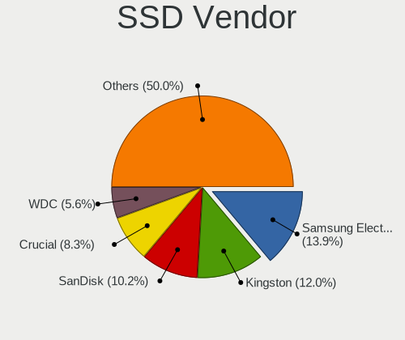
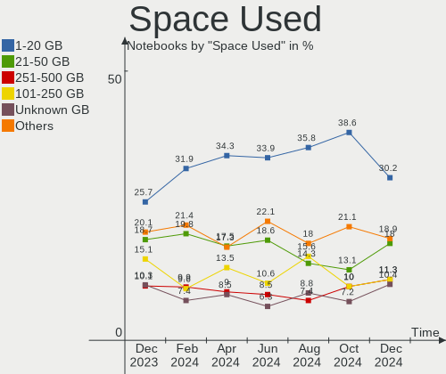
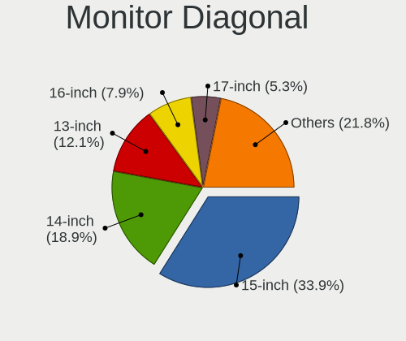
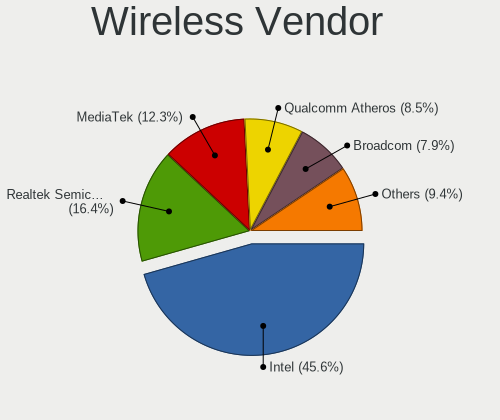
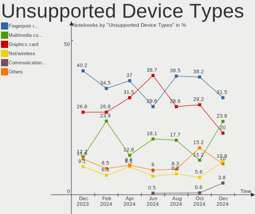

Fedora - Hardware Trends (Notebooks)
------------------------------------

A project to identify most popular hardware characteristics and track their change
over time based on data collected by Linux users at https://Linux-Hardware.org.

Anyone can contribute to this report by the [hw-probe](https://github.com/linuxhw/hw-probe) tool:

    sudo -E hw-probe -all -upload

This report is for one last month. Overall report since the beginning of time: [TestCoverage](https://github.com/linuxhw/TestCoverage)

Period: Jan, 2023.

Contents
--------

* [ System ](#system)
  - [ OS                       ](#os)
  - [ OS Family                ](#os-family)
  - [ Kernel                   ](#kernel)
  - [ Kernel Family            ](#kernel-family)
  - [ Kernel Major Ver.        ](#kernel-major-ver)
  - [ Arch                     ](#arch)
  - [ DE                       ](#de)
  - [ Display Server           ](#display-server)
  - [ Display Manager          ](#display-manager)
  - [ OS Lang                  ](#os-lang)
  - [ Boot Mode                ](#boot-mode)
  - [ Filesystem               ](#filesystem)
  - [ Part. scheme             ](#part-scheme)
  - [ Dual Boot with Linux/BSD ](#dual-boot-with-linuxbsd)
  - [ Dual Boot (Win)          ](#dual-boot-win)

* [ Board ](#board)
  - [ Vendor                   ](#vendor)
  - [ Model                    ](#model)
  - [ Model Family             ](#model-family)
  - [ MFG Year                 ](#mfg-year)
  - [ Form Factor              ](#form-factor)
  - [ Secure Boot              ](#secure-boot)
  - [ Coreboot                 ](#coreboot)
  - [ RAM Size                 ](#ram-size)
  - [ RAM Used                 ](#ram-used)
  - [ Total Drives             ](#total-drives)
  - [ Has CD-ROM               ](#has-cd-rom)
  - [ Has Ethernet             ](#has-ethernet)
  - [ Has WiFi                 ](#has-wifi)
  - [ Has Bluetooth            ](#has-bluetooth)

* [ Location ](#location)
  - [ Country                  ](#country)
  - [ City                     ](#city)

* [ Drives ](#drives)
  - [ Drive Vendor             ](#drive-vendor)
  - [ Drive Model              ](#drive-model)
  - [ HDD Vendor               ](#hdd-vendor)
  - [ SSD Vendor               ](#ssd-vendor)
  - [ Drive Kind               ](#drive-kind)
  - [ Drive Connector          ](#drive-connector)
  - [ Drive Size               ](#drive-size)
  - [ Space Total              ](#space-total)
  - [ Space Used               ](#space-used)
  - [ Malfunc. Drives          ](#malfunc-drives)
  - [ Malfunc. Drive Vendor    ](#malfunc-drive-vendor)
  - [ Malfunc. HDD Vendor      ](#malfunc-hdd-vendor)
  - [ Malfunc. Drive Kind      ](#malfunc-drive-kind)
  - [ Failed Drives            ](#failed-drives)
  - [ Failed Drive Vendor      ](#failed-drive-vendor)
  - [ Drive Status             ](#drive-status)

* [ Storage controller ](#storage-controller)
  - [ Storage Vendor           ](#storage-vendor)
  - [ Storage Model            ](#storage-model)
  - [ Storage Kind             ](#storage-kind)

* [ Processor ](#processor)
  - [ CPU Vendor               ](#cpu-vendor)
  - [ CPU Model                ](#cpu-model)
  - [ CPU Model Family         ](#cpu-model-family)
  - [ CPU Cores                ](#cpu-cores)
  - [ CPU Sockets              ](#cpu-sockets)
  - [ CPU Threads              ](#cpu-threads)
  - [ CPU Op-Modes             ](#cpu-op-modes)
  - [ CPU Microcode            ](#cpu-microcode)
  - [ CPU Microarch            ](#cpu-microarch)

* [ Graphics ](#graphics)
  - [ GPU Vendor               ](#gpu-vendor)
  - [ GPU Model                ](#gpu-model)
  - [ GPU Combo                ](#gpu-combo)
  - [ GPU Driver               ](#gpu-driver)
  - [ GPU Memory               ](#gpu-memory)

* [ Monitor ](#monitor)
  - [ Monitor Vendor           ](#monitor-vendor)
  - [ Monitor Model            ](#monitor-model)
  - [ Monitor Resolution       ](#monitor-resolution)
  - [ Monitor Diagonal         ](#monitor-diagonal)
  - [ Monitor Width            ](#monitor-width)
  - [ Aspect Ratio             ](#aspect-ratio)
  - [ Monitor Area             ](#monitor-area)
  - [ Pixel Density            ](#pixel-density)
  - [ Multiple Monitors        ](#multiple-monitors)

* [ Network ](#network)
  - [ Net Controller Vendor    ](#net-controller-vendor)
  - [ Net Controller Model     ](#net-controller-model)
  - [ Wireless Vendor          ](#wireless-vendor)
  - [ Wireless Model           ](#wireless-model)
  - [ Ethernet Vendor          ](#ethernet-vendor)
  - [ Ethernet Model           ](#ethernet-model)
  - [ Net Controller Kind      ](#net-controller-kind)
  - [ Used Controller          ](#used-controller)
  - [ NICs                     ](#nics)
  - [ IPv6                     ](#ipv6)

* [ Bluetooth ](#bluetooth)
  - [ Bluetooth Vendor         ](#bluetooth-vendor)
  - [ Bluetooth Model          ](#bluetooth-model)

* [ Sound ](#sound)
  - [ Sound Vendor             ](#sound-vendor)
  - [ Sound Model              ](#sound-model)

* [ Memory ](#memory)
  - [ Memory Vendor            ](#memory-vendor)
  - [ Memory Model             ](#memory-model)
  - [ Memory Kind              ](#memory-kind)
  - [ Memory Form Factor       ](#memory-form-factor)
  - [ Memory Size              ](#memory-size)
  - [ Memory Speed             ](#memory-speed)

* [ Printers & scanners ](#printers--scanners)
  - [ Printer Vendor           ](#printer-vendor)
  - [ Printer Model            ](#printer-model)
  - [ Scanner Vendor           ](#scanner-vendor)
  - [ Scanner Model            ](#scanner-model)

* [ Camera ](#camera)
  - [ Camera Vendor            ](#camera-vendor)
  - [ Camera Model             ](#camera-model)

* [ Security ](#security)
  - [ Fingerprint Vendor       ](#fingerprint-vendor)
  - [ Fingerprint Model        ](#fingerprint-model)
  - [ Chipcard Vendor          ](#chipcard-vendor)
  - [ Chipcard Model           ](#chipcard-model)

* [ Unsupported ](#unsupported)
  - [ Unsupported Devices      ](#unsupported-devices)
  - [ Unsupported Device Types ](#unsupported-device-types)

System
------

OS
--

Installed operating systems

| Name      | Notebooks | Percent |
|-----------|-----------|---------|
| Fedora 37 | 249       | 87.99%  |
| Fedora 36 | 22        | 7.77%   |
| Fedora 35 | 5         | 1.77%   |
| Fedora 38 | 4         | 1.41%   |
| Fedora 34 | 2         | 0.71%   |
| Fedora 33 | 1         | 0.35%   |

OS Family
---------

OS without a version

| Name   | Notebooks | Percent |
|--------|-----------|---------|
| Fedora | 283       | 100%    |

Kernel
------

Version of the Linux kernel

| Version                                            | Notebooks | Percent |
|----------------------------------------------------|-----------|---------|
| 6.1.7-200.fc37.x86_64                              | 47        | 16.61%  |
| 6.0.15-300.fc37.x86_64                             | 35        | 12.37%  |
| 6.1.6-200.fc37.x86_64                              | 31        | 10.95%  |
| 6.0.16-300.fc37.x86_64                             | 31        | 10.95%  |
| 6.0.18-300.fc37.x86_64                             | 29        | 10.25%  |
| 6.1.5-200.fc37.x86_64                              | 21        | 7.42%   |
| 6.0.7-301.fc37.x86_64                              | 18        | 6.36%   |
| 6.0.17-300.fc37.x86_64                             | 18        | 6.36%   |
| 6.0.15-200.fc36.x86_64                             | 8         | 2.83%   |
| 6.1.8-200.fc37.x86_64                              | 7         | 2.47%   |
| 6.1.7-100.fc36.x86_64                              | 4         | 1.41%   |
| 6.0.18-200.fc36.x86_64                             | 3         | 1.06%   |
| 6.0.13-300.fc37.x86_64                             | 3         | 1.06%   |
| 6.0.12-100.fc35.x86_64                             | 3         | 1.06%   |
| 6.0.14-300.fc37.x86_64                             | 2         | 0.71%   |
| 6.2.0-0.rc5.20230126git7c46948a6e9c.41.fc38.x86_64 | 1         | 0.35%   |
| 6.2.0-0.rc4.20230120gitd368967cb103.35.fc38.x86_64 | 1         | 0.35%   |
| 6.2.0-0.rc3.20230113gitd9fc1511728c.28.fc38.x86_64 | 1         | 0.35%   |
| 6.2.0-0.rc3.20230110git5a41237ad1d4.25.fc38.x86_64 | 1         | 0.35%   |
| 6.2.0-0.rc2.20230105git41c03ba9beea.20.fc38.x86_64 | 1         | 0.35%   |
| 6.2.0-0.rc2.20230103git69b41ac87e4a.19.fc38.x86_64 | 1         | 0.35%   |
| 6.1.8-603.inttf.fc37.x86_64                        | 1         | 0.35%   |
| 6.1.6-100.fc36.x86_64                              | 1         | 0.35%   |
| 6.1.5-100.fc36.x86_64                              | 1         | 0.35%   |
| 6.1.4-225.vanilla.1.fc36.x86_64                    | 1         | 0.35%   |
| 6.1.2-200.fc37.x86_64                              | 1         | 0.35%   |
| 6.0.17-200.fc36.x86_64                             | 1         | 0.35%   |
| 6.0.16-200.fc36.x86_64                             | 1         | 0.35%   |
| 6.0.15-300.rog.fc37.x86_64                         | 1         | 0.35%   |
| 6.0.14-200.fc36.x86_64                             | 1         | 0.35%   |
| 6.0.12-200.fc36.x86_64                             | 1         | 0.35%   |
| 5.19.10-100.fc35.x86_64                            | 1         | 0.35%   |
| 5.17.5-300.fc36.x86_64                             | 1         | 0.35%   |
| 5.17.12-100.fc34.x86_64                            | 1         | 0.35%   |
| 5.16.19-200.fc35.x86_64                            | 1         | 0.35%   |
| 5.15.54-xm1tt.0.fc37.x86_64                        | 1         | 0.35%   |
| 5.14.18-100.fc33.x86_64                            | 1         | 0.35%   |
| 5.11.12-300.fc34.x86_64                            | 1         | 0.35%   |

Kernel Family
-------------

Linux kernel without a distro release

| Version | Notebooks | Percent |
|---------|-----------|---------|
| 6.1.7   | 51        | 18.02%  |
| 6.0.15  | 44        | 15.55%  |
| 6.1.6   | 32        | 11.31%  |
| 6.0.18  | 32        | 11.31%  |
| 6.0.16  | 32        | 11.31%  |
| 6.1.5   | 22        | 7.77%   |
| 6.0.17  | 19        | 6.71%   |
| 6.0.7   | 18        | 6.36%   |
| 6.1.8   | 8         | 2.83%   |
| 6.2.0   | 6         | 2.12%   |
| 6.0.12  | 4         | 1.41%   |
| 6.0.14  | 3         | 1.06%   |
| 6.0.13  | 3         | 1.06%   |
| 6.1.4   | 1         | 0.35%   |
| 6.1.2   | 1         | 0.35%   |
| 5.19.10 | 1         | 0.35%   |
| 5.17.5  | 1         | 0.35%   |
| 5.17.12 | 1         | 0.35%   |
| 5.16.19 | 1         | 0.35%   |
| 5.15.54 | 1         | 0.35%   |
| 5.14.18 | 1         | 0.35%   |
| 5.11.12 | 1         | 0.35%   |

Kernel Major Ver.
-----------------

Linux kernel major version

| Version | Notebooks | Percent |
|---------|-----------|---------|
| 6.0     | 155       | 54.77%  |
| 6.1     | 115       | 40.64%  |
| 6.2     | 6         | 2.12%   |
| 5.17    | 2         | 0.71%   |
| 5.19    | 1         | 0.35%   |
| 5.16    | 1         | 0.35%   |
| 5.15    | 1         | 0.35%   |
| 5.14    | 1         | 0.35%   |
| 5.11    | 1         | 0.35%   |

Arch
----

OS architecture (x86_64, i586, etc.)

| Name   | Notebooks | Percent |
|--------|-----------|---------|
| x86_64 | 283       | 100%    |

DE
--

Desktop Environment

| Name       | Notebooks | Percent |
|------------|-----------|---------|
| GNOME      | 199       | 70.32%  |
| KDE5       | 57        | 20.14%  |
| XFCE       | 6         | 2.12%   |
| MATE       | 5         | 1.77%   |
| X-Cinnamon | 4         | 1.41%   |
| i3         | 4         | 1.41%   |
| Unknown    | 3         | 1.06%   |
| Cinnamon   | 2         | 0.71%   |
| sway       | 1         | 0.35%   |
| qtile      | 1         | 0.35%   |
| KDE        | 1         | 0.35%   |

Display Server
--------------

X11 or Wayland

| Name    | Notebooks | Percent |
|---------|-----------|---------|
| Wayland | 203       | 71.73%  |
| X11     | 77        | 27.21%  |
| Unknown | 2         | 0.71%   |
| Tty     | 1         | 0.35%   |

Display Manager
---------------

SDDM, LightDM, etc.

| Name    | Notebooks | Percent |
|---------|-----------|---------|
| Unknown | 139       | 49.12%  |
| GDM     | 101       | 35.69%  |
| SDDM    | 25        | 8.83%   |
| LightDM | 17        | 6.01%   |
| GREETD  | 1         | 0.35%   |

OS Lang
-------

Language

| Lang    | Notebooks | Percent |
|---------|-----------|---------|
| en_US   | 139       | 49.12%  |
| ru_RU   | 23        | 8.13%   |
| en_GB   | 21        | 7.42%   |
| de_DE   | 14        | 4.95%   |
| pt_BR   | 13        | 4.59%   |
| fr_FR   | 10        | 3.53%   |
| pl_PL   | 9         | 3.18%   |
| en_IN   | 6         | 2.12%   |
| it_IT   | 5         | 1.77%   |
| es_ES   | 4         | 1.41%   |
| en_CA   | 4         | 1.41%   |
| en_AU   | 4         | 1.41%   |
| zh_CN   | 3         | 1.06%   |
| es_CO   | 2         | 0.71%   |
| es_CL   | 2         | 0.71%   |
| es_AR   | 2         | 0.71%   |
| de_AT   | 2         | 0.71%   |
| zh_TW   | 1         | 0.35%   |
| tr_TR   | 1         | 0.35%   |
| sv_SE   | 1         | 0.35%   |
| nb_NO   | 1         | 0.35%   |
| id_ID   | 1         | 0.35%   |
| hr_HR   | 1         | 0.35%   |
| fr_BE   | 1         | 0.35%   |
| fi_FI   | 1         | 0.35%   |
| es_PE   | 1         | 0.35%   |
| es_MX   | 1         | 0.35%   |
| en_ZA   | 1         | 0.35%   |
| en_PH   | 1         | 0.35%   |
| en_NG   | 1         | 0.35%   |
| en_IL   | 1         | 0.35%   |
| en_IE   | 1         | 0.35%   |
| en_DK   | 1         | 0.35%   |
| de_CH   | 1         | 0.35%   |
| cs_CZ   | 1         | 0.35%   |
| C       | 1         | 0.35%   |
| Unknown | 1         | 0.35%   |

Boot Mode
---------

EFI or BIOS

| Mode | Notebooks | Percent |
|------|-----------|---------|
| EFI  | 247       | 87.28%  |
| BIOS | 36        | 12.72%  |

Filesystem
----------

Type of filesystem

| Type    | Notebooks | Percent |
|---------|-----------|---------|
| Btrfs   | 240       | 84.81%  |
| Ext4    | 40        | 14.13%  |
| Xfs     | 2         | 0.71%   |
| Overlay | 1         | 0.35%   |

Part. scheme
------------

Scheme of partitioning

| Type    | Notebooks | Percent |
|---------|-----------|---------|
| GPT     | 141       | 49.82%  |
| Unknown | 136       | 48.06%  |
| MBR     | 6         | 2.12%   |

Dual Boot with Linux/BSD
------------------------

Hosting more than one Linux/BSD

| Dual boot | Notebooks | Percent |
|-----------|-----------|---------|
| No        | 266       | 93.99%  |
| Yes       | 17        | 6.01%   |

Dual Boot (Win)
---------------

Hosting Linux and Windows

| Dual boot | Notebooks | Percent |
|-----------|-----------|---------|
| No        | 228       | 80.57%  |
| Yes       | 55        | 19.43%  |

Board
-----

Vendor
------

Motherboard manufacturer

| Name                  | Notebooks | Percent |
|-----------------------|-----------|---------|
| Lenovo                | 74        | 26.15%  |
| Hewlett-Packard       | 51        | 18.02%  |
| Dell                  | 44        | 15.55%  |
| ASUSTek Computer      | 31        | 10.95%  |
| Acer                  | 29        | 10.25%  |
| MSI                   | 6         | 2.12%   |
| HUAWEI                | 6         | 2.12%   |
| Apple                 | 5         | 1.77%   |
| Toshiba               | 3         | 1.06%   |
| Timi                  | 3         | 1.06%   |
| Chuwi                 | 3         | 1.06%   |
| TUXEDO                | 2         | 0.71%   |
| Samsung Electronics   | 2         | 0.71%   |
| TECNO                 | 1         | 0.35%   |
| System76              | 1         | 0.35%   |
| SLIMBOOK              | 1         | 0.35%   |
| Schenker              | 1         | 0.35%   |
| Razer                 | 1         | 0.35%   |
| Positivo Bahia - VAIO | 1         | 0.35%   |
| PC Specialist         | 1         | 0.35%   |
| Olivetti              | 1         | 0.35%   |
| Notebook              | 1         | 0.35%   |
| Multilaser            | 1         | 0.35%   |
| MECHREVO              | 1         | 0.35%   |
| MACHENIKE             | 1         | 0.35%   |
| Intel Client Systems  | 1         | 0.35%   |
| Infinix               | 1         | 0.35%   |
| HONOR                 | 1         | 0.35%   |
| GPU Company           | 1         | 0.35%   |
| Google                | 1         | 0.35%   |
| Fujitsu Siemens       | 1         | 0.35%   |
| Fujitsu               | 1         | 0.35%   |
| Framework             | 1         | 0.35%   |
| Dynabook              | 1         | 0.35%   |
| Clevo                 | 1         | 0.35%   |
| Alienware             | 1         | 0.35%   |
| Unknown               | 1         | 0.35%   |

Model
-----

Motherboard model

| Name                                                                                     | Notebooks | Percent |
|------------------------------------------------------------------------------------------|-----------|---------|
| Lenovo IdeaPad 330-15IKB 81DE                                                            | 3         | 1.06%   |
| ASUS VivoBook_ASUSLaptop X515EA_X515EA                                                   | 3         | 1.06%   |
| Lenovo ThinkBook 15 G2 ITL 20VE                                                          | 2         | 0.71%   |
| HUAWEI BOHB-WAX9                                                                         | 2         | 0.71%   |
| HP ZBook 15 G3                                                                           | 2         | 0.71%   |
| HP Victus by Gaming Laptop 15-fa0xxx                                                     | 2         | 0.71%   |
| HP OMEN by Laptop 16-c0xxx                                                               | 2         | 0.71%   |
| HP EliteBook 840 G3                                                                      | 2         | 0.71%   |
| Dell XPS 15 9570                                                                         | 2         | 0.71%   |
| Dell Latitude E5550                                                                      | 2         | 0.71%   |
| Dell Latitude 7480                                                                       | 2         | 0.71%   |
| Acer Swift SF314-43                                                                      | 2         | 0.71%   |
| Acer Nitro AN515-54                                                                      | 2         | 0.71%   |
| Acer Nitro AN515-42                                                                      | 2         | 0.71%   |
| TUXEDO Stellaris Intel Gen4                                                              | 1         | 0.35%   |
| TUXEDO Pulse 15 Gen1                                                                     | 1         | 0.35%   |
| Toshiba Satellite L855D                                                                  | 1         | 0.35%   |
| Toshiba Satellite C75D-B                                                                 | 1         | 0.35%   |
| Toshiba Satellite C50-A                                                                  | 1         | 0.35%   |
| Timi Xiaomi NoteBook Pro                                                                 | 1         | 0.35%   |
| Timi Redmi Book Pro 15 2022                                                              | 1         | 0.35%   |
| Timi A35S                                                                                | 1         | 0.35%   |
| TECNO MEGABOOK T1                                                                        | 1         | 0.35%   |
| System76 Lemur Pro                                                                       | 1         | 0.35%   |
| SLIMBOOK TITAN                                                                           | 1         | 0.35%   |
| Schenker XMG CORE 15 (M22)                                                               | 1         | 0.35%   |
| Samsung 550XCJ/550XCR                                                                    | 1         | 0.35%   |
| Samsung 355V4C/355V4X/355V5C/355V5X/356V4C/356V4X/356V5C/356V5X/3445VC/3445VX/3545VC/354 | 1         | 0.35%   |
| Razer Blade 15 (2022) - RZ09-0421                                                        | 1         | 0.35%   |
| Positivo Bahia - VAIO VJFE43F11X-XXXXXX                                                  | 1         | 0.35%   |
| PC Specialist Recoil II RTX                                                              | 1         | 0.35%   |
| Olivetti Olibook P55-431W850-8G500H-O                                                    | 1         | 0.35%   |
| Notebook PD5x_7xPNP_PNN_PNT                                                              | 1         | 0.35%   |
| Multilaser PC150                                                                         | 1         | 0.35%   |
| MSI PS63 Modern 8RC                                                                      | 1         | 0.35%   |
| MSI Modern 14 B4MW                                                                       | 1         | 0.35%   |
| MSI Modern 14 B11MOU                                                                     | 1         | 0.35%   |
| MSI Katana GF66 11SC                                                                     | 1         | 0.35%   |
| MSI GS66 Stealth 10UE                                                                    | 1         | 0.35%   |
| MSI GL63 8RC                                                                             | 1         | 0.35%   |

Model Family
------------

Motherboard model prefix

| Name               | Notebooks | Percent |
|--------------------|-----------|---------|
| Lenovo ThinkPad    | 39        | 13.78%  |
| Lenovo IdeaPad     | 19        | 6.71%   |
| Dell Latitude      | 16        | 5.65%   |
| HP EliteBook       | 14        | 4.95%   |
| Acer Aspire        | 13        | 4.59%   |
| Dell Inspiron      | 10        | 3.53%   |
| ASUS VivoBook      | 9         | 3.18%   |
| Dell XPS           | 8         | 2.83%   |
| Acer Nitro         | 8         | 2.83%   |
| HP ProBook         | 6         | 2.12%   |
| HP Pavilion        | 6         | 2.12%   |
| ASUS ASUS          | 6         | 2.12%   |
| Lenovo ThinkBook   | 5         | 1.77%   |
| HP ZBook           | 5         | 1.77%   |
| HP Laptop          | 5         | 1.77%   |
| HP OMEN            | 4         | 1.41%   |
| ASUS ROG           | 4         | 1.41%   |
| Acer Swift         | 4         | 1.41%   |
| Toshiba Satellite  | 3         | 1.06%   |
| Lenovo Yoga        | 3         | 1.06%   |
| Lenovo Legion      | 3         | 1.06%   |
| HP Victus          | 3         | 1.06%   |
| HP ENVY            | 3         | 1.06%   |
| Dell Vostro        | 3         | 1.06%   |
| Dell Precision     | 3         | 1.06%   |
| ASUS Zenbook       | 3         | 1.06%   |
| Apple MacBookPro11 | 3         | 1.06%   |
| Acer Predator      | 3         | 1.06%   |
| MSI Modern         | 2         | 0.71%   |
| HUAWEI BOHB-WAX9   | 2         | 0.71%   |
| HP 240             | 2         | 0.71%   |
| Dell G15           | 2         | 0.71%   |
| Chuwi GemiBook     | 2         | 0.71%   |
| TUXEDO Stellaris   | 1         | 0.35%   |
| TUXEDO Pulse       | 1         | 0.35%   |
| Timi Xiaomi        | 1         | 0.35%   |
| Timi Redmi         | 1         | 0.35%   |
| Timi A35S          | 1         | 0.35%   |
| TECNO MEGABOOK     | 1         | 0.35%   |
| System76 Lemur     | 1         | 0.35%   |

MFG Year
--------

Motherboard manufacture year

| Year | Notebooks | Percent |
|------|-----------|---------|
| 2021 | 62        | 21.91%  |
| 2022 | 49        | 17.31%  |
| 2019 | 34        | 12.01%  |
| 2020 | 29        | 10.25%  |
| 2018 | 22        | 7.77%   |
| 2017 | 18        | 6.36%   |
| 2012 | 13        | 4.59%   |
| 2016 | 12        | 4.24%   |
| 2015 | 11        | 3.89%   |
| 2013 | 10        | 3.53%   |
| 2014 | 8         | 2.83%   |
| 2011 | 6         | 2.12%   |
| 2008 | 5         | 1.77%   |
| 2010 | 3         | 1.06%   |
| 2009 | 1         | 0.35%   |

Form Factor
-----------

Physical design of the computer

| Name     | Notebooks | Percent |
|----------|-----------|---------|
| Notebook | 283       | 100%    |

Secure Boot
-----------

Enabled or disabled

| State    | Notebooks | Percent |
|----------|-----------|---------|
| Disabled | 204       | 72.08%  |
| Enabled  | 79        | 27.92%  |

Coreboot
--------

Have coreboot on board

| Used | Notebooks | Percent |
|------|-----------|---------|
| No   | 281       | 99.29%  |
| Yes  | 2         | 0.71%   |

RAM Size
--------

Total RAM memory

| Size in GB  | Notebooks | Percent |
|-------------|-----------|---------|
| 8.01-16.0   | 73        | 25.8%   |
| 4.01-8.0    | 68        | 24.03%  |
| 16.01-24.0  | 63        | 22.26%  |
| 32.01-64.0  | 39        | 13.78%  |
| 3.01-4.0    | 25        | 8.83%   |
| 24.01-32.0  | 6         | 2.12%   |
| 64.01-256.0 | 5         | 1.77%   |
| 1.01-2.0    | 4         | 1.41%   |

RAM Used
--------

Used RAM memory

| Used GB    | Notebooks | Percent |
|------------|-----------|---------|
| 4.01-8.0   | 115       | 40.64%  |
| 2.01-3.0   | 61        | 21.55%  |
| 3.01-4.0   | 58        | 20.49%  |
| 1.01-2.0   | 30        | 10.6%   |
| 8.01-16.0  | 14        | 4.95%   |
| 16.01-24.0 | 5         | 1.77%   |

Total Drives
------------

Number of drives on board

| Drives | Notebooks | Percent |
|--------|-----------|---------|
| 1      | 208       | 73.5%   |
| 2      | 66        | 23.32%  |
| 3      | 7         | 2.47%   |
| 4      | 2         | 0.71%   |

Has CD-ROM
----------

Has CD-ROM on board

| Presented | Notebooks | Percent |
|-----------|-----------|---------|
| No        | 245       | 86.57%  |
| Yes       | 38        | 13.43%  |

Has Ethernet
------------

Has Ethernet on board

| Presented | Notebooks | Percent |
|-----------|-----------|---------|
| Yes       | 201       | 71.02%  |
| No        | 82        | 28.98%  |

Has WiFi
--------

Has WiFi module

| Presented | Notebooks | Percent |
|-----------|-----------|---------|
| Yes       | 281       | 99.29%  |
| No        | 2         | 0.71%   |

Has Bluetooth
-------------

Has Bluetooth module

| Presented | Notebooks | Percent |
|-----------|-----------|---------|
| Yes       | 236       | 83.39%  |
| No        | 47        | 16.61%  |

Location
--------

Country
-------

Geographic location (country)

| Country     | Notebooks | Percent |
|-------------|-----------|---------|
| USA         | 30        | 10.6%   |
| Russia      | 27        | 9.54%   |
| Germany     | 24        | 8.48%   |
| Brazil      | 18        | 6.36%   |
| Italy       | 16        | 5.65%   |
| Poland      | 14        | 4.95%   |
| France      | 12        | 4.24%   |
| Canada      | 10        | 3.53%   |
| Austria     | 10        | 3.53%   |
| India       | 9         | 3.18%   |
| UK          | 8         | 2.83%   |
| Turkey      | 7         | 2.47%   |
| Spain       | 5         | 1.77%   |
| Australia   | 5         | 1.77%   |
| Taiwan      | 4         | 1.41%   |
| Sweden      | 4         | 1.41%   |
| Netherlands | 4         | 1.41%   |
| Indonesia   | 4         | 1.41%   |
| Switzerland | 3         | 1.06%   |
| Sri Lanka   | 3         | 1.06%   |
| Norway      | 3         | 1.06%   |
| Mexico      | 3         | 1.06%   |
| Finland     | 3         | 1.06%   |
| Belgium     | 3         | 1.06%   |
| Argentina   | 3         | 1.06%   |
| UAE         | 2         | 0.71%   |
| Serbia      | 2         | 0.71%   |
| Israel      | 2         | 0.71%   |
| Hungary     | 2         | 0.71%   |
| Hong Kong   | 2         | 0.71%   |
| Greece      | 2         | 0.71%   |
| Georgia     | 2         | 0.71%   |
| Czechia     | 2         | 0.71%   |
| Colombia    | 2         | 0.71%   |
| Chile       | 2         | 0.71%   |
| Belarus     | 2         | 0.71%   |
| Vietnam     | 1         | 0.35%   |
| Uruguay     | 1         | 0.35%   |
| Ukraine     | 1         | 0.35%   |
| Uganda      | 1         | 0.35%   |

City
----

Geographic location (city)

| City                | Notebooks | Percent |
|---------------------|-----------|---------|
| Vienna              | 6         | 2.12%   |
| Moscow              | 6         | 2.12%   |
| St Petersburg       | 5         | 1.77%   |
| Sao Paulo           | 4         | 1.41%   |
| Zurich              | 3         | 1.06%   |
| Warsaw              | 3         | 1.06%   |
| Madrid              | 3         | 1.06%   |
| Innsbruck           | 3         | 1.06%   |
| Brasília           | 3         | 1.06%   |
| Amsterdam           | 3         | 1.06%   |
| Tbilisi             | 2         | 0.71%   |
| San Jose            | 2         | 0.71%   |
| Saint Paul          | 2         | 0.71%   |
| Porto Alegre        | 2         | 0.71%   |
| Perm                | 2         | 0.71%   |
| Montreal            | 2         | 0.71%   |
| Minsk               | 2         | 0.71%   |
| Melbourne           | 2         | 0.71%   |
| Krasnodar           | 2         | 0.71%   |
| Izmir               | 2         | 0.71%   |
| Istanbul            | 2         | 0.71%   |
| Helsinki            | 2         | 0.71%   |
| Frankfurt am Main   | 2         | 0.71%   |
| Dubai               | 2         | 0.71%   |
| Belen de Escobar    | 2         | 0.71%   |
| Athens              | 2         | 0.71%   |
| Ankara              | 2         | 0.71%   |
| Zhumadian           | 1         | 0.35%   |
| Yerevan             | 1         | 0.35%   |
| Worms               | 1         | 0.35%   |
| Winthrop            | 1         | 0.35%   |
| West Stockbridge    | 1         | 0.35%   |
| West Kelowna        | 1         | 0.35%   |
| Waterloo            | 1         | 0.35%   |
| Washington          | 1         | 0.35%   |
| Walincourt-Selvigny | 1         | 0.35%   |
| Vladivostok         | 1         | 0.35%   |
| Vilnius             | 1         | 0.35%   |
| Villavicencio       | 1         | 0.35%   |
| Villa Rumipal       | 1         | 0.35%   |

Drives
------

Drive Vendor
------------

Hard drive vendors

| Vendor                         | Notebooks | Drives | Percent |
|--------------------------------|-----------|--------|---------|
| Samsung Electronics            | 79        | 83     | 22.19%  |
| WDC                            | 27        | 29     | 7.58%   |
| SK hynix                       | 27        | 27     | 7.58%   |
| Seagate                        | 23        | 24     | 6.46%   |
| Toshiba                        | 22        | 22     | 6.18%   |
| Sandisk                        | 21        | 21     | 5.9%    |
| Micron Technology              | 21        | 21     | 5.9%    |
| Kingston                       | 20        | 20     | 5.62%   |
| KIOXIA                         | 15        | 15     | 4.21%   |
| Intel                          | 14        | 15     | 3.93%   |
| Crucial                        | 13        | 13     | 3.65%   |
| Unknown                        | 9         | 10     | 2.53%   |
| HGST                           | 5         | 5      | 1.4%    |
| Apple                          | 5         | 5      | 1.4%    |
| LITEON                         | 4         | 4      | 1.12%   |
| A-DATA Technology              | 4         | 4      | 1.12%   |
| Unknown                        | 4         | 5      | 1.12%   |
| Realtek Semiconductor          | 3         | 3      | 0.84%   |
| Phison Electronics             | 3         | 3      | 0.84%   |
| Netac                          | 3         | 3      | 0.84%   |
| Micron/Crucial Technology      | 3         | 3      | 0.84%   |
| HS-SSD-E100                    | 3         | 3      | 0.84%   |
| China                          | 3         | 3      | 0.84%   |
| Solid State Storage Technology | 2         | 2      | 0.56%   |
| PNY                            | 2         | 2      | 0.56%   |
| Patriot                        | 2         | 2      | 0.56%   |
| Kingston Technology Company    | 2         | 2      | 0.56%   |
| FORESEE                        | 2         | 2      | 0.56%   |
| Apacer                         | 2         | 2      | 0.56%   |
| Union Memory                   | 1         | 1      | 0.28%   |
| Teclast                        | 1         | 1      | 0.28%   |
| SSSTC                          | 1         | 1      | 0.28%   |
| Phison                         | 1         | 1      | 0.28%   |
| OCZ                            | 1         | 1      | 0.28%   |
| LITEONIT                       | 1         | 1      | 0.28%   |
| Lexar                          | 1         | 1      | 0.28%   |
| Kingchuxing                    | 1         | 1      | 0.28%   |
| JMicron Technology             | 1         | 1      | 0.28%   |
| Gigabyte Technology            | 1         | 1      | 0.28%   |
| G521N                          | 1         | 1      | 0.28%   |

Drive Model
-----------

Hard drive models

| Model                                                | Notebooks | Percent |
|------------------------------------------------------|-----------|---------|
| Samsung NVMe SSD Controller SM981/PM981/PM983 500GB  | 12        | 3.31%   |
| Seagate ST1000LM035-1RK172 1TB                       | 10        | 2.76%   |
| Samsung NVMe SSD Controller PM9A1/PM9A3/980PRO 512GB | 9         | 2.49%   |
| Sandisk WD Black SN750 / PC SN730 NVMe SSD 1TB       | 6         | 1.66%   |
| Toshiba MQ04ABF100 1TB                               | 5         | 1.38%   |
| Samsung SSD 980 1TB                                  | 4         | 1.1%    |
| Samsung SSD 870 EVO 500GB                            | 4         | 1.1%    |
| Micron 2210_MTFDHBA512QFD 512GB                      | 4         | 1.1%    |
| KIOXIA KBG40ZNV512G 512GB                            | 4         | 1.1%    |
| Kingston SA400S37240G 240GB SSD                      | 4         | 1.1%    |
| Intel SSDPEKNU512GZ 512GB                            | 4         | 1.1%    |
| Unknown                                              | 4         | 1.1%    |
| Seagate ST1000LM049-2GH172 1TB                       | 3         | 0.83%   |
| Samsung MZALQ512HBLU-00BL2 512GB                     | 3         | 0.83%   |
| Kingston SA400S37480G 480GB SSD                      | 3         | 0.83%   |
| Kingston OM8PCP3512F-AI1 512GB                       | 3         | 0.83%   |
| HGST HTS725050A7E630 500GB                           | 3         | 0.83%   |
| Crucial CT240BX500SSD1 240GB                         | 3         | 0.83%   |
| WDC WDS240G2G0B-00EPW0 240GB SSD                     | 2         | 0.55%   |
| WDC WDS240G2G0A-00JH30 240GB SSD                     | 2         | 0.55%   |
| WDC PC SN730 SDBPNTY-1T00-1101 1TB                   | 2         | 0.55%   |
| WDC PC SN530 SDBPNPZ-256G-1002 256GB                 | 2         | 0.55%   |
| Unknown SD/MMC/MS PRO 2GB                            | 2         | 0.55%   |
| Unknown MMC Card  32GB                               | 2         | 0.55%   |
| Toshiba MQ01ABD075 752GB                             | 2         | 0.55%   |
| Toshiba MK5061GSY 500GB                              | 2         | 0.55%   |
| SK hynix SKHynix_HFS512GDE9X081N 512GB               | 2         | 0.55%   |
| SK hynix PC711 NVMe 1TB                              | 2         | 0.55%   |
| SK hynix HFM256GD3JX016N 256GB                       | 2         | 0.55%   |
| SK hynix BC501 NVMe Solid State Drive 512GB          | 2         | 0.55%   |
| Seagate ST500LT012-1DG142 500GB                      | 2         | 0.55%   |
| Seagate ST1000LM048-2E7172 1TB                       | 2         | 0.55%   |
| Seagate ST1000LM024 HN-M101MBB 1TB                   | 2         | 0.55%   |
| Sandisk WD Blue SN570 1TB                            | 2         | 0.55%   |
| Sandisk WD Blue SN550 NVMe SSD 1TB                   | 2         | 0.55%   |
| SanDisk NVMe SSD Drive 512GB                         | 2         | 0.55%   |
| Samsung SSD 980 PRO 2TB                              | 2         | 0.55%   |
| Samsung SSD 980 PRO 1TB                              | 2         | 0.55%   |
| Samsung SSD 970 EVO Plus 1TB                         | 2         | 0.55%   |
| Samsung SSD 870 EVO 1TB                              | 2         | 0.55%   |

HDD Vendor
----------

Hard disk drive vendors

| Vendor  | Notebooks | Drives | Percent |
|---------|-----------|--------|---------|
| Seagate | 23        | 24     | 46%     |
| Toshiba | 13        | 13     | 26%     |
| WDC     | 7         | 7      | 14%     |
| HGST    | 5         | 5      | 10%     |
| Unknown | 2         | 2      | 4%      |

SSD Vendor
----------

Solid state drive vendors

| Vendor              | Notebooks | Drives | Percent |
|---------------------|-----------|--------|---------|
| Samsung Electronics | 17        | 17     | 17.71%  |
| Kingston            | 13        | 13     | 13.54%  |
| SanDisk             | 8         | 8      | 8.33%   |
| Crucial             | 8         | 8      | 8.33%   |
| WDC                 | 7         | 7      | 7.29%   |
| Micron Technology   | 6         | 6      | 6.25%   |
| SK hynix            | 5         | 5      | 5.21%   |
| Apple               | 5         | 5      | 5.21%   |
| LITEON              | 4         | 4      | 4.17%   |
| China               | 3         | 3      | 3.13%   |
| Toshiba             | 2         | 2      | 2.08%   |
| PNY                 | 2         | 2      | 2.08%   |
| Patriot             | 2         | 2      | 2.08%   |
| Netac               | 2         | 2      | 2.08%   |
| Apacer              | 2         | 2      | 2.08%   |
| Unknown             | 2         | 2      | 2.08%   |
| Teclast             | 1         | 1      | 1.04%   |
| OCZ                 | 1         | 1      | 1.04%   |
| LITEONIT            | 1         | 1      | 1.04%   |
| Lexar               | 1         | 1      | 1.04%   |
| Gigabyte Technology | 1         | 1      | 1.04%   |
| G521N               | 1         | 1      | 1.04%   |
| Dahua               | 1         | 1      | 1.04%   |
| A-DATA Technology   | 1         | 1      | 1.04%   |

Drive Kind
----------

HDD or SSD

| Kind    | Notebooks | Drives | Percent |
|---------|-----------|--------|---------|
| NVMe    | 180       | 203    | 53.89%  |
| SSD     | 90        | 96     | 26.95%  |
| HDD     | 49        | 51     | 14.67%  |
| MMC     | 9         | 10     | 2.69%   |
| Unknown | 6         | 6      | 1.8%    |

Drive Connector
---------------

SATA, SAS, NVMe, etc.

| Type | Notebooks | Drives | Percent |
|------|-----------|--------|---------|
| NVMe | 180       | 203    | 55.9%   |
| SATA | 126       | 146    | 39.13%  |
| MMC  | 9         | 10     | 2.8%    |
| SAS  | 7         | 7      | 2.17%   |

Drive Size
----------

Size of hard drive

| Size in TB | Notebooks | Drives | Percent |
|------------|-----------|--------|---------|
| 0.01-0.5   | 87        | 96     | 63.5%   |
| 0.51-1.0   | 48        | 49     | 35.04%  |
| 3.01-4.0   | 1         | 1      | 0.73%   |
| 4.01-10.0  | 1         | 1      | 0.73%   |

Space Total
-----------

Amount of disk space available on the file system

| Size in GB     | Notebooks | Percent |
|----------------|-----------|---------|
| 251-500        | 69        | 24.38%  |
| 501-1000       | 68        | 24.03%  |
| 1001-2000      | 41        | 14.49%  |
| 1-20           | 33        | 11.66%  |
| Unknown        | 26        | 9.19%   |
| 101-250        | 25        | 8.83%   |
| 2001-3000      | 7         | 2.47%   |
| 51-100         | 7         | 2.47%   |
| More than 3000 | 4         | 1.41%   |
| 21-50          | 3         | 1.06%   |

Space Used
----------

Amount of used disk space

| Used GB   | Notebooks | Percent |
|-----------|-----------|---------|
| 1-20      | 74        | 26.15%  |
| 21-50     | 47        | 16.61%  |
| 101-250   | 39        | 13.78%  |
| 51-100    | 35        | 12.37%  |
| 251-500   | 34        | 12.01%  |
| Unknown   | 26        | 9.19%   |
| 501-1000  | 23        | 8.13%   |
| 1001-2000 | 5         | 1.77%   |

Malfunc. Drives
---------------

Drive models with a malfunction

| Model                                 | Notebooks | Drives | Percent |
|---------------------------------------|-----------|--------|---------|
| Toshiba MK5061GSY 500GB               | 1         | 1      | 14.29%  |
| Toshiba HDWJ105 500GB                 | 1         | 1      | 14.29%  |
| Seagate ST9500325AS 500GB             | 1         | 1      | 14.29%  |
| Seagate ST500LM000-SSHD-8GB           | 1         | 1      | 14.29%  |
| SanDisk SSD PLUS 1000GB               | 1         | 1      | 14.29%  |
| Samsung Electronics SSD 870 EVO 500GB | 1         | 1      | 14.29%  |
| Unknown                               | 1         | 1      | 14.29%  |

Malfunc. Drive Vendor
---------------------

Vendors of faulty drives

| Vendor              | Notebooks | Drives | Percent |
|---------------------|-----------|--------|---------|
| Toshiba             | 2         | 2      | 28.57%  |
| Seagate             | 2         | 2      | 28.57%  |
| SanDisk             | 1         | 1      | 14.29%  |
| Samsung Electronics | 1         | 1      | 14.29%  |
| Unknown             | 1         | 1      | 14.29%  |

Malfunc. HDD Vendor
-------------------

Vendors of faulty HDD drives

| Vendor  | Notebooks | Drives | Percent |
|---------|-----------|--------|---------|
| Toshiba | 2         | 2      | 50%     |
| Seagate | 2         | 2      | 50%     |

Malfunc. Drive Kind
-------------------

Kinds of faulty drives

| Kind | Notebooks | Drives | Percent |
|------|-----------|--------|---------|
| HDD  | 4         | 4      | 57.14%  |
| SSD  | 3         | 3      | 42.86%  |

Failed Drives
-------------

Failed drive models

| Model                           | Notebooks | Drives | Percent |
|---------------------------------|-----------|--------|---------|
| Samsung Electronics SSD 980 1TB | 1         | 1      | 100%    |

Failed Drive Vendor
-------------------

Failed drive vendors

| Vendor              | Notebooks | Drives | Percent |
|---------------------|-----------|--------|---------|
| Samsung Electronics | 1         | 1      | 100%    |

Drive Status
------------

Number of failed and malfunc. drives

| Status   | Notebooks | Drives | Percent |
|----------|-----------|--------|---------|
| Detected | 157       | 198    | 53.4%   |
| Works    | 129       | 160    | 43.88%  |
| Malfunc  | 7         | 7      | 2.38%   |
| Failed   | 1         | 1      | 0.34%   |

Storage controller
------------------

Storage Vendor
--------------

Storage controller vendors

| Vendor                         | Notebooks | Percent |
|--------------------------------|-----------|---------|
| Intel                          | 153       | 39.74%  |
| Samsung Electronics            | 66        | 17.14%  |
| AMD                            | 47        | 12.21%  |
| Sandisk                        | 27        | 7.01%   |
| SK hynix                       | 21        | 5.45%   |
| Micron Technology              | 14        | 3.64%   |
| Toshiba America Info Systems   | 11        | 2.86%   |
| KIOXIA                         | 11        | 2.86%   |
| Kingston Technology Company    | 9         | 2.34%   |
| Micron/Crucial Technology      | 7         | 1.82%   |
| Phison Electronics             | 5         | 1.3%    |
| Solid State Storage Technology | 3         | 0.78%   |
| Realtek Semiconductor          | 3         | 0.78%   |
| ADATA Technology               | 3         | 0.78%   |
| Shenzhen Longsys Electronics   | 2         | 0.52%   |
| Union Memory (Shenzhen)        | 1         | 0.26%   |
| Netac Technology               | 1         | 0.26%   |
| Marvell Technology Group       | 1         | 0.26%   |

Storage Model
-------------

Storage controller models

| Model                                                                         | Notebooks | Percent |
|-------------------------------------------------------------------------------|-----------|---------|
| AMD FCH SATA Controller [AHCI mode]                                           | 45        | 11.11%  |
| Intel Volume Management Device NVMe RAID Controller                           | 24        | 5.93%   |
| Samsung NVMe SSD Controller SM981/PM981/PM983                                 | 21        | 5.19%   |
| Samsung NVMe SSD Controller 980                                               | 20        | 4.94%   |
| Samsung NVMe SSD Controller PM9A1/PM9A3/980PRO                                | 19        | 4.69%   |
| Intel Sunrise Point-LP SATA Controller [AHCI mode]                            | 19        | 4.69%   |
| Intel 82801 Mobile SATA Controller [RAID mode]                                | 18        | 4.44%   |
| Micron Non-Volatile memory controller                                         | 14        | 3.46%   |
| Intel 7 Series Chipset Family 6-port SATA Controller [AHCI mode]              | 14        | 3.46%   |
| Intel Cannon Lake Mobile PCH SATA AHCI Controller                             | 12        | 2.96%   |
| Intel Tiger Lake-LP SATA Controller                                           | 11        | 2.72%   |
| SK hynix Gold P31/PC711 NVMe Solid State Drive                                | 10        | 2.47%   |
| SanDisk WD Black SN750 / PC SN730 NVMe SSD                                    | 9         | 2.22%   |
| Intel Non-Volatile memory controller                                          | 8         | 1.98%   |
| SanDisk WD Blue SN550 NVMe SSD                                                | 7         | 1.73%   |
| KIOXIA NVMe SSD Controller BG4                                                | 7         | 1.73%   |
| Intel Wildcat Point-LP SATA Controller [AHCI Mode]                            | 7         | 1.73%   |
| Intel 8 Series SATA Controller 1 [AHCI mode]                                  | 7         | 1.73%   |
| Toshiba America Info Systems XG6 NVMe SSD Controller                          | 6         | 1.48%   |
| Kingston Company Company Non-Volatile memory controller                       | 5         | 1.23%   |
| Intel Comet Lake SATA AHCI Controller                                         | 5         | 1.23%   |
| SK hynix Non-Volatile memory controller                                       | 4         | 0.99%   |
| SanDisk Non-Volatile memory controller                                        | 4         | 0.99%   |
| KIOXIA Non-Volatile memory controller                                         | 4         | 0.99%   |
| Intel HM170/QM170 Chipset SATA Controller [AHCI Mode]                         | 4         | 0.99%   |
| Intel Celeron/Pentium Silver Processor SATA Controller                        | 4         | 0.99%   |
| Intel Cannon Point-LP SATA Controller [AHCI Mode]                             | 4         | 0.99%   |
| Solid State Storage Non-Volatile memory controller                            | 3         | 0.74%   |
| SK hynix BC511                                                                | 3         | 0.74%   |
| Micron/Crucial P2 NVMe PCIe SSD                                               | 3         | 0.74%   |
| Intel SSD Pro 7600p/760p/E 6100p Series                                       | 3         | 0.74%   |
| Intel Q170/Q150/B150/H170/H110/Z170/CM236 Chipset SATA Controller [AHCI Mode] | 3         | 0.74%   |
| Intel 500 Series Chipset Family SATA AHCI Controller                          | 3         | 0.74%   |
| Toshiba America Info Systems XG5 NVMe SSD Controller                          | 2         | 0.49%   |
| SK hynix PC401 NVMe Solid State Drive 256GB                                   | 2         | 0.49%   |
| SK hynix BC501 NVMe Solid State Drive                                         | 2         | 0.49%   |
| SanDisk WD Blue SN570 NVMe SSD                                                | 2         | 0.49%   |
| SanDisk PC SN520 NVMe SSD                                                     | 2         | 0.49%   |
| Samsung NVMe SSD Controller SM961/PM961/SM963                                 | 2         | 0.49%   |
| Samsung NVMe SSD Controller SM951/PM951                                       | 2         | 0.49%   |

Storage Kind
------------

Kind of storage controller (IDE, SATA, NVMe, SAS, ...)

| Kind | Notebooks | Percent |
|------|-----------|---------|
| NVMe | 180       | 46.63%  |
| SATA | 161       | 41.71%  |
| RAID | 42        | 10.88%  |
| IDE  | 3         | 0.78%   |

Processor
---------

CPU Vendor
----------

Processor vendors

| Vendor | Notebooks | Percent |
|--------|-----------|---------|
| Intel  | 198       | 69.96%  |
| AMD    | 85        | 30.04%  |

CPU Model
---------

Processor models

| Model                                         | Notebooks | Percent |
|-----------------------------------------------|-----------|---------|
| Intel 11th Gen Core i5-1135G7 @ 2.40GHz       | 13        | 4.59%   |
| AMD Ryzen 7 5800H with Radeon Graphics        | 8         | 2.83%   |
| AMD Ryzen 7 4800H with Radeon Graphics        | 7         | 2.47%   |
| Intel Core i5-7200U CPU @ 2.50GHz             | 6         | 2.12%   |
| Intel 11th Gen Core i7-1165G7 @ 2.80GHz       | 6         | 2.12%   |
| AMD Ryzen 5 5500U with Radeon Graphics        | 6         | 2.12%   |
| Intel Core i7-9750H CPU @ 2.60GHz             | 5         | 1.77%   |
| Intel Core i7-8750H CPU @ 2.20GHz             | 5         | 1.77%   |
| Intel Core i5-3320M CPU @ 2.60GHz             | 5         | 1.77%   |
| Intel Core i5-10210U CPU @ 1.60GHz            | 5         | 1.77%   |
| AMD Ryzen 5 3500U with Radeon Vega Mobile Gfx | 5         | 1.77%   |
| Intel Core i7-8565U CPU @ 1.80GHz             | 4         | 1.41%   |
| Intel Core i7-8550U CPU @ 1.80GHz             | 4         | 1.41%   |
| Intel Core i5-8265U CPU @ 1.60GHz             | 4         | 1.41%   |
| Intel Core i5-5200U CPU @ 2.20GHz             | 4         | 1.41%   |
| Intel 12th Gen Core i7-12700H                 | 4         | 1.41%   |
| Intel 12th Gen Core i5-1235U                  | 4         | 1.41%   |
| AMD Ryzen 9 5900HX with Radeon Graphics       | 4         | 1.41%   |
| Intel Core i7-6700HQ CPU @ 2.60GHz            | 3         | 1.06%   |
| Intel Core i7-10850H CPU @ 2.70GHz            | 3         | 1.06%   |
| Intel Core i7-1065G7 CPU @ 1.30GHz            | 3         | 1.06%   |
| Intel Core i7-10510U CPU @ 1.80GHz            | 3         | 1.06%   |
| Intel 12th Gen Core i9-12900H                 | 3         | 1.06%   |
| Intel 12th Gen Core i5-12450H                 | 3         | 1.06%   |
| Intel 11th Gen Core i7-11800H @ 2.30GHz       | 3         | 1.06%   |
| AMD Ryzen 7 6800H with Radeon Graphics        | 3         | 1.06%   |
| AMD Ryzen 7 5700U with Radeon Graphics        | 3         | 1.06%   |
| AMD Ryzen 5 5600U with Radeon Graphics        | 3         | 1.06%   |
| AMD Ryzen 5 2500U with Radeon Vega Mobile Gfx | 3         | 1.06%   |
| Intel Core i7-8665U CPU @ 1.90GHz             | 2         | 0.71%   |
| Intel Core i7-7600U CPU @ 2.80GHz             | 2         | 0.71%   |
| Intel Core i7-7500U CPU @ 2.70GHz             | 2         | 0.71%   |
| Intel Core i7-6820HQ CPU @ 2.70GHz            | 2         | 0.71%   |
| Intel Core i7-6600U CPU @ 2.60GHz             | 2         | 0.71%   |
| Intel Core i7-4600U CPU @ 2.10GHz             | 2         | 0.71%   |
| Intel Core i7-3630QM CPU @ 2.40GHz            | 2         | 0.71%   |
| Intel Core i5-9300H CPU @ 2.40GHz             | 2         | 0.71%   |
| Intel Core i5-8350U CPU @ 1.70GHz             | 2         | 0.71%   |
| Intel Core i5-8250U CPU @ 1.60GHz             | 2         | 0.71%   |
| Intel Core i5-7300HQ CPU @ 2.50GHz            | 2         | 0.71%   |

CPU Model Family
----------------

Processor model prefix

| Model                                | Notebooks | Percent |
|--------------------------------------|-----------|---------|
| Intel Core i7                        | 58        | 20.49%  |
| Other                                | 53        | 18.73%  |
| Intel Core i5                        | 53        | 18.73%  |
| AMD Ryzen 7                          | 28        | 9.89%   |
| AMD Ryzen 5                          | 24        | 8.48%   |
| Intel Core i3                        | 14        | 4.95%   |
| AMD Ryzen 9                          | 7         | 2.47%   |
| Intel Celeron                        | 5         | 1.77%   |
| AMD Ryzen 5 PRO                      | 5         | 1.77%   |
| AMD Ryzen 3                          | 5         | 1.77%   |
| AMD A6                               | 5         | 1.77%   |
| Intel Pentium                        | 4         | 1.41%   |
| AMD Ryzen 7 PRO                      | 4         | 1.41%   |
| Intel Core i9                        | 3         | 1.06%   |
| Intel Core 2 Duo                     | 3         | 1.06%   |
| AMD A4                               | 3         | 1.06%   |
| Intel Pentium Silver                 | 2         | 0.71%   |
| Intel Atom                           | 2         | 0.71%   |
| AMD A10                              | 2         | 0.71%   |
| Intel Xeon                           | 1         | 0.35%   |
| AMD Turion X2 Ultra Dual-Core Mobile | 1         | 0.35%   |
| AMD A8                               | 1         | 0.35%   |

CPU Cores
---------

Number of processor cores

| Number | Notebooks | Percent |
|--------|-----------|---------|
| 4      | 100       | 35.34%  |
| 2      | 79        | 27.92%  |
| 8      | 45        | 15.9%   |
| 6      | 37        | 13.07%  |
| 14     | 9         | 3.18%   |
| 10     | 7         | 2.47%   |
| 12     | 5         | 1.77%   |
| 1      | 1         | 0.35%   |

CPU Sockets
-----------

Number of sockets

| Number | Notebooks | Percent |
|--------|-----------|---------|
| 1      | 283       | 100%    |

CPU Threads
-----------

Threads per core (Hyper-Threading)

| Number | Notebooks | Percent |
|--------|-----------|---------|
| 2      | 253       | 89.4%   |
| 1      | 30        | 10.6%   |

CPU Op-Modes
------------

CPU Operation Modes (32-bit, 64-bit)

| Op mode        | Notebooks | Percent |
|----------------|-----------|---------|
| 32-bit, 64-bit | 283       | 100%    |

CPU Microcode
-------------

Microcode number

| Number     | Notebooks | Percent |
|------------|-----------|---------|
| 0x806c1    | 22        | 7.77%   |
| 0x0a50000c | 18        | 6.36%   |
| Unknown    | 18        | 6.36%   |
| 0x806ec    | 17        | 6.01%   |
| 0x906a3    | 15        | 5.3%    |
| 0x906ea    | 14        | 4.95%   |
| 0x306a9    | 13        | 4.59%   |
| 0x806e9    | 9         | 3.18%   |
| 0x306d4    | 9         | 3.18%   |
| 0x806ea    | 8         | 2.83%   |
| 0x40651    | 8         | 2.83%   |
| 0x706e5    | 7         | 2.47%   |
| 0x406e3    | 7         | 2.47%   |
| 0x0a404102 | 7         | 2.47%   |
| 0x906a4    | 6         | 2.12%   |
| 0x506e3    | 6         | 2.12%   |
| 0x08608103 | 6         | 2.12%   |
| 0x08108109 | 6         | 2.12%   |
| 0x806d1    | 5         | 1.77%   |
| 0x206a7    | 5         | 1.77%   |
| 0x08600106 | 5         | 1.77%   |
| 0x06006705 | 5         | 1.77%   |
| 0xa0652    | 4         | 1.41%   |
| 0x706a8    | 4         | 1.41%   |
| 0x20655    | 4         | 1.41%   |
| 0x0a404101 | 4         | 1.41%   |
| 0x08608102 | 4         | 1.41%   |
| 0x08600104 | 4         | 1.41%   |
| 0x906e9    | 3         | 1.06%   |
| 0x806eb    | 3         | 1.06%   |
| 0x0810100b | 3         | 1.06%   |
| 0xa0660    | 2         | 0.71%   |
| 0x906ed    | 2         | 0.71%   |
| 0x906c0    | 2         | 0.71%   |
| 0x806c2    | 2         | 0.71%   |
| 0x40661    | 2         | 0.71%   |
| 0x30678    | 2         | 0.71%   |
| 0x1067a    | 2         | 0.71%   |
| 0x0a50000d | 2         | 0.71%   |
| 0x08600103 | 2         | 0.71%   |

CPU Microarch
-------------

Microarchitecture

| Name             | Notebooks | Percent |
|------------------|-----------|---------|
| KabyLake         | 61        | 21.55%  |
| Zen 3            | 24        | 8.48%   |
| TigerLake        | 24        | 8.48%   |
| Alderlake Hybrid | 24        | 8.48%   |
| Unknown          | 22        | 7.77%   |
| IvyBridge        | 14        | 4.95%   |
| Skylake          | 13        | 4.59%   |
| Zen 2            | 12        | 4.24%   |
| Icelake          | 12        | 4.24%   |
| Haswell          | 11        | 3.89%   |
| Zen+             | 10        | 3.53%   |
| Broadwell        | 9         | 3.18%   |
| CometLake        | 7         | 2.47%   |
| Zen              | 5         | 1.77%   |
| SandyBridge      | 5         | 1.77%   |
| Excavator        | 5         | 1.77%   |
| Westmere         | 4         | 1.41%   |
| Goldmont plus    | 4         | 1.41%   |
| Silvermont       | 3         | 1.06%   |
| Penryn           | 3         | 1.06%   |
| Tremont          | 2         | 0.71%   |
| Piledriver       | 2         | 0.71%   |
| Steamroller      | 1         | 0.35%   |
| Puma             | 1         | 0.35%   |
| K8 & K10 hybrid  | 1         | 0.35%   |
| K10 Llano        | 1         | 0.35%   |
| Jaguar           | 1         | 0.35%   |
| Goldmont         | 1         | 0.35%   |
| Bonnell          | 1         | 0.35%   |

Graphics
--------

GPU Vendor
----------

Vendors of graphics cards

| Vendor | Notebooks | Percent |
|--------|-----------|---------|
| Intel  | 191       | 49.1%   |
| Nvidia | 103       | 26.48%  |
| AMD    | 95        | 24.42%  |

GPU Model
---------

Graphics card models

| Model                                                                     | Notebooks | Percent |
|---------------------------------------------------------------------------|-----------|---------|
| Intel TigerLake-LP GT2 [Iris Xe Graphics]                                 | 23        | 5.75%   |
| AMD Cezanne [Radeon Vega Series / Radeon Vega Mobile Series]              | 20        | 5%      |
| Intel CoffeeLake-H GT2 [UHD Graphics 630]                                 | 14        | 3.5%    |
| Intel 3rd Gen Core processor Graphics Controller                          | 14        | 3.5%    |
| Intel HD Graphics 620                                                     | 13        | 3.25%   |
| Intel Alder Lake-P Integrated Graphics Controller                         | 13        | 3.25%   |
| AMD Renoir                                                                | 12        | 3%      |
| Intel WhiskeyLake-U GT2 [UHD Graphics 620]                                | 11        | 2.75%   |
| AMD Rembrandt [Radeon 680M]                                               | 11        | 2.75%   |
| AMD Lucienne                                                              | 11        | 2.75%   |
| Intel CometLake-U GT2 [UHD Graphics]                                      | 10        | 2.5%    |
| AMD Picasso/Raven 2 [Radeon Vega Series / Radeon Vega Mobile Series]      | 10        | 2.5%    |
| Nvidia GA106M [GeForce RTX 3060 Mobile / Max-Q]                           | 9         | 2.25%   |
| Intel UHD Graphics 620                                                    | 8         | 2%      |
| Intel HD Graphics 5500                                                    | 8         | 2%      |
| Intel Haswell-ULT Integrated Graphics Controller                          | 8         | 2%      |
| Nvidia TU117M [GeForce GTX 1650 Mobile / Max-Q]                           | 7         | 1.75%   |
| Intel Skylake GT2 [HD Graphics 520]                                       | 7         | 1.75%   |
| Nvidia GA107M [GeForce RTX 3050 Mobile]                                   | 6         | 1.5%    |
| Intel Alder Lake-UP3 GT2 [Iris Xe Graphics]                               | 6         | 1.5%    |
| Nvidia TU106M [GeForce RTX 2060 Mobile]                                   | 5         | 1.25%   |
| Intel TigerLake-H GT1 [UHD Graphics]                                      | 5         | 1.25%   |
| Intel HD Graphics 530                                                     | 5         | 1.25%   |
| Intel CometLake-H GT2 [UHD Graphics]                                      | 5         | 1.25%   |
| Intel 2nd Generation Core Processor Family Integrated Graphics Controller | 5         | 1.25%   |
| AMD Stoney [Radeon R2/R3/R4/R5 Graphics]                                  | 5         | 1.25%   |
| AMD Raven Ridge [Radeon Vega Series / Radeon Vega Mobile Series]          | 5         | 1.25%   |
| Nvidia GP108M [GeForce MX250]                                             | 4         | 1%      |
| Nvidia GP107M [GeForce GTX 1050 Mobile]                                   | 4         | 1%      |
| Nvidia GA107M [GeForce RTX 3050 Ti Mobile]                                | 4         | 1%      |
| Intel Iris Plus Graphics G1 (Ice Lake)                                    | 4         | 1%      |
| AMD Barcelo                                                               | 4         | 1%      |
| Nvidia TU117M [GeForce GTX 1650 Ti Mobile]                                | 3         | 0.75%   |
| Nvidia TU116M [GeForce GTX 1660 Ti Mobile]                                | 3         | 0.75%   |
| Nvidia GP108M [GeForce MX150]                                             | 3         | 0.75%   |
| Nvidia GP107M [GeForce GTX 1050 Ti Mobile]                                | 3         | 0.75%   |
| Nvidia GA104M [GeForce RTX 3070 Mobile / Max-Q]                           | 3         | 0.75%   |
| Intel Iris Plus Graphics G7                                               | 3         | 0.75%   |
| Intel HD Graphics 630                                                     | 3         | 0.75%   |
| Intel GeminiLake [UHD Graphics 600]                                       | 3         | 0.75%   |

GPU Combo
---------

Combinations of graphics cards

| Name           | Notebooks | Percent |
|----------------|-----------|---------|
| 1 x Intel      | 108       | 38.16%  |
| Intel + Nvidia | 74        | 26.15%  |
| 1 x AMD        | 53        | 18.73%  |
| AMD + Nvidia   | 24        | 8.48%   |
| 2 x AMD        | 10        | 3.53%   |
| Intel + AMD    | 8         | 2.83%   |
| 1 x Nvidia     | 5         | 1.77%   |
| 2 x Intel      | 1         | 0.35%   |

GPU Driver
----------

Free vs proprietary

| Driver      | Notebooks | Percent |
|-------------|-----------|---------|
| Free        | 232       | 81.98%  |
| Proprietary | 47        | 16.61%  |
| Unknown     | 4         | 1.41%   |

GPU Memory
----------

Total video memory

| Size in GB | Notebooks | Percent |
|------------|-----------|---------|
| Unknown    | 158       | 55.83%  |
| 0.01-0.5   | 40        | 14.13%  |
| 1.01-2.0   | 36        | 12.72%  |
| 3.01-4.0   | 23        | 8.13%   |
| 0.51-1.0   | 11        | 3.89%   |
| 5.01-6.0   | 9         | 3.18%   |
| 7.01-8.0   | 4         | 1.41%   |
| 2.01-3.0   | 2         | 0.71%   |

Monitor
-------

Monitor Vendor
--------------

Monitor vendors

| Vendor                  | Notebooks | Percent |
|-------------------------|-----------|---------|
| Chimei Innolux          | 58        | 16.38%  |
| BOE                     | 58        | 16.38%  |
| AU Optronics            | 57        | 16.1%   |
| LG Display              | 40        | 11.3%   |
| Samsung Electronics     | 23        | 6.5%    |
| Goldstar                | 11        | 3.11%   |
| Sharp                   | 10        | 2.82%   |
| Dell                    | 10        | 2.82%   |
| CSO                     | 9         | 2.54%   |
| Lenovo                  | 8         | 2.26%   |
| PANDA                   | 7         | 1.98%   |
| AOC                     | 7         | 1.98%   |
| Acer                    | 6         | 1.69%   |
| InfoVision              | 5         | 1.41%   |
| BenQ                    | 5         | 1.41%   |
| Hewlett-Packard         | 4         | 1.13%   |
| ASUSTek Computer        | 4         | 1.13%   |
| Apple                   | 4         | 1.13%   |
| Chi Mei Optoelectronics | 3         | 0.85%   |
| Vestel Elektronik       | 2         | 0.56%   |
| TMX                     | 2         | 0.56%   |
| HUAWEI                  | 2         | 0.56%   |
| ViewSonic               | 1         | 0.28%   |
| STA                     | 1         | 0.28%   |
| Sony                    | 1         | 0.28%   |
| Pixio                   | 1         | 0.28%   |
| Panasonic               | 1         | 0.28%   |
| NCS                     | 1         | 0.28%   |
| Mi                      | 1         | 0.28%   |
| JDI                     | 1         | 0.28%   |
| Iiyama                  | 1         | 0.28%   |
| HSI                     | 1         | 0.28%   |
| HJC                     | 1         | 0.28%   |
| Hitachi                 | 1         | 0.28%   |
| Gigabyte Technology     | 1         | 0.28%   |
| Gateway                 | 1         | 0.28%   |
| ETG                     | 1         | 0.28%   |
| DZX                     | 1         | 0.28%   |
| Denver                  | 1         | 0.28%   |
| CPT                     | 1         | 0.28%   |

Monitor Model
-------------

Monitor models

| Model                                                                 | Notebooks | Percent |
|-----------------------------------------------------------------------|-----------|---------|
| PANDA LCD Monitor NCP004D 1920x1080 344x194mm 15.5-inch               | 6         | 1.69%   |
| Chimei Innolux LCD Monitor CMN15E7 1920x1080 344x193mm 15.5-inch      | 6         | 1.69%   |
| LG Display LCD Monitor LGD046F 1920x1080 344x194mm 15.5-inch          | 4         | 1.12%   |
| Chimei Innolux LCD Monitor CMN15DB 1366x768 344x193mm 15.5-inch       | 4         | 1.12%   |
| Chimei Innolux LCD Monitor CMN1521 1920x1080 344x193mm 15.5-inch      | 4         | 1.12%   |
| Chimei Innolux LCD Monitor CMN14D4 1920x1080 309x173mm 13.9-inch      | 4         | 1.12%   |
| AU Optronics LCD Monitor AUO403D 1920x1080 309x173mm 13.9-inch        | 4         | 1.12%   |
| Goldstar LG ULTRAWIDE GSM59F1 2560x1080 670x280mm 28.6-inch           | 3         | 0.84%   |
| Chimei Innolux LCD Monitor CMN15D5 1920x1080 344x193mm 15.5-inch      | 3         | 0.84%   |
| Chimei Innolux LCD Monitor CMN14D5 1920x1080 309x173mm 13.9-inch      | 3         | 0.84%   |
| AU Optronics LCD Monitor AUO21ED 1920x1080 344x194mm 15.5-inch        | 3         | 0.84%   |
| Vestel Elektronik 50FHD_LCD_TV VES3700 1920x1080 1280x720mm 57.8-inch | 2         | 0.56%   |
| Samsung Electronics LCD Monitor SDC4171 2880x1800 302x189mm 14.0-inch | 2         | 0.56%   |
| LG Display LCD Monitor LGD062E 1920x1080 344x194mm 15.5-inch          | 2         | 0.56%   |
| LG Display LCD Monitor LGD0590 1920x1080 344x194mm 15.5-inch          | 2         | 0.56%   |
| LG Display LCD Monitor LGD0563 1920x1080 344x194mm 15.5-inch          | 2         | 0.56%   |
| LG Display LCD Monitor LGD02DC 1366x768 344x194mm 15.5-inch           | 2         | 0.56%   |
| Lenovo LCD Monitor LEN40BA 1920x1080 344x194mm 15.5-inch              | 2         | 0.56%   |
| Lenovo LCD Monitor LEN40B1 1600x900 344x193mm 15.5-inch               | 2         | 0.56%   |
| InfoVision LCD Monitor IVO8C45 2240x1400 302x188mm 14.0-inch          | 2         | 0.56%   |
| HUAWEI ZQE-CBA HWV6A25 3440x1440 797x334mm 34.0-inch                  | 2         | 0.56%   |
| Dell P2721Q DELF123 3840x2160 597x336mm 27.0-inch                     | 2         | 0.56%   |
| Dell P2719H DEL4185 1920x1080 598x336mm 27.0-inch                     | 2         | 0.56%   |
| CSO LCD Monitor CSO160A 2560x1600 345x215mm 16.0-inch                 | 2         | 0.56%   |
| Chimei Innolux P130ZFA-BA1 CMN8201 2160x1440 275x183mm 13.0-inch      | 2         | 0.56%   |
| Chimei Innolux LCD Monitor CMN15E8 1920x1080 344x193mm 15.5-inch      | 2         | 0.56%   |
| Chimei Innolux LCD Monitor CMN15C4 1920x1080 344x193mm 15.5-inch      | 2         | 0.56%   |
| Chimei Innolux LCD Monitor CMN14F2 1920x1080 309x173mm 13.9-inch      | 2         | 0.56%   |
| Chimei Innolux LCD Monitor CMN14D6 1366x768 309x173mm 13.9-inch       | 2         | 0.56%   |
| BOE LCD Monitor BOE08D5 1920x1080 344x194mm 15.5-inch                 | 2         | 0.56%   |
| BOE LCD Monitor BOE0893 2160x1440 296x197mm 14.0-inch                 | 2         | 0.56%   |
| BOE LCD Monitor BOE07F6 1920x1080 309x174mm 14.0-inch                 | 2         | 0.56%   |
| BOE LCD Monitor BOE07CB 1920x1080 344x193mm 15.5-inch                 | 2         | 0.56%   |
| AU Optronics LCD Monitor AUOA08B 1920x1080 344x193mm 15.5-inch        | 2         | 0.56%   |
| AU Optronics LCD Monitor AUO61ED 1920x1080 344x194mm 15.5-inch        | 2         | 0.56%   |
| AU Optronics LCD Monitor AUO4999 1920x1080 344x193mm 15.5-inch        | 2         | 0.56%   |
| AU Optronics LCD Monitor AUO439D 1920x1080 382x215mm 17.3-inch        | 2         | 0.56%   |
| AOC 24G2W1G4 AOC2402 1920x1080 527x296mm 23.8-inch                    | 2         | 0.56%   |
| ViewSonic VA2448 SERIES VSC3828 1920x1080 521x293mm 23.5-inch         | 1         | 0.28%   |
| TMX TL156VDXP0101 TMX1561 1920x1080 344x194mm 15.5-inch               | 1         | 0.28%   |

Monitor Resolution
------------------

Monitor screen resolution

| Resolution         | Notebooks | Percent |
|--------------------|-----------|---------|
| 1920x1080 (FHD)    | 166       | 51.08%  |
| 1366x768 (WXGA)    | 48        | 14.77%  |
| 3840x2160 (4K)     | 22        | 6.77%   |
| 2560x1600          | 15        | 4.62%   |
| 1600x900 (HD+)     | 14        | 4.31%   |
| 2560x1440 (QHD)    | 13        | 4%      |
| 1920x1200 (WUXGA)  | 8         | 2.46%   |
| 2880x1800          | 6         | 1.85%   |
| 3440x1440          | 5         | 1.54%   |
| 2560x1080          | 5         | 1.54%   |
| 2160x1440          | 4         | 1.23%   |
| 3456x2160          | 2         | 0.62%   |
| 2240x1400          | 2         | 0.62%   |
| 1440x900 (WXGA+)   | 2         | 0.62%   |
| 1280x800 (WXGA)    | 2         | 0.62%   |
| 3840x2400          | 1         | 0.31%   |
| 3840x1080          | 1         | 0.31%   |
| 3200x2000          | 1         | 0.31%   |
| 3000x2000          | 1         | 0.31%   |
| 2880x864           | 1         | 0.31%   |
| 2560x2880          | 1         | 0.31%   |
| 2256x1504          | 1         | 0.31%   |
| 1680x1050 (WSXGA+) | 1         | 0.31%   |
| 1280x1024 (SXGA)   | 1         | 0.31%   |
| 1024x768 (XGA)     | 1         | 0.31%   |
| 1024x600           | 1         | 0.31%   |

Monitor Diagonal
----------------

Diagonal size in inches

| Inches  | Notebooks | Percent |
|---------|-----------|---------|
| 15      | 149       | 42.21%  |
| 14      | 53        | 15.01%  |
| 13      | 41        | 11.61%  |
| 27      | 20        | 5.67%   |
| 17      | 14        | 3.97%   |
| 16      | 13        | 3.68%   |
| 24      | 9         | 2.55%   |
| 23      | 9         | 2.55%   |
| 34      | 8         | 2.27%   |
| 21      | 7         | 1.98%   |
| 12      | 7         | 1.98%   |
| 31      | 4         | 1.13%   |
| 84      | 3         | 0.85%   |
| 11      | 3         | 0.85%   |
| 20      | 2         | 0.57%   |
| 18      | 2         | 0.57%   |
| Unknown | 2         | 0.57%   |
| 72      | 1         | 0.28%   |
| 48      | 1         | 0.28%   |
| 40      | 1         | 0.28%   |
| 39      | 1         | 0.28%   |
| 28      | 1         | 0.28%   |
| 25      | 1         | 0.28%   |
| 10      | 1         | 0.28%   |

Monitor Width
-------------

Physical width

| Width in mm | Notebooks | Percent |
|-------------|-----------|---------|
| 301-350     | 234       | 67.05%  |
| 501-600     | 34        | 9.74%   |
| 201-300     | 27        | 7.74%   |
| 351-400     | 18        | 5.16%   |
| 401-500     | 12        | 3.44%   |
| 701-800     | 8         | 2.29%   |
| 601-700     | 7         | 2.01%   |
| 1501-2000   | 4         | 1.15%   |
| Unknown     | 2         | 0.57%   |
| 801-900     | 1         | 0.29%   |
| 1001-1500   | 1         | 0.29%   |
| 901-1000    | 1         | 0.29%   |

Aspect Ratio
------------

Proportional relationship between the width and the height

| Ratio | Notebooks | Percent |
|-------|-----------|---------|
| 16/9  | 241       | 79.54%  |
| 16/10 | 40        | 13.2%   |
| 21/9  | 10        | 3.3%    |
| 3/2   | 6         | 1.98%   |
| 4/3   | 2         | 0.66%   |
| 5/4   | 1         | 0.33%   |
| 32/9  | 1         | 0.33%   |
| 3.33  | 1         | 0.33%   |
| 0.89  | 1         | 0.33%   |

Monitor Area
------------

Area in inch²

| Area in inch² | Notebooks | Percent |
|----------------|-----------|---------|
| 101-110        | 151       | 42.78%  |
| 81-90          | 82        | 23.23%  |
| 201-250        | 22        | 6.23%   |
| 301-350        | 19        | 5.38%   |
| 351-500        | 13        | 3.68%   |
| 71-80          | 11        | 3.12%   |
| 111-120        | 11        | 3.12%   |
| 121-130        | 10        | 2.83%   |
| 61-70          | 6         | 1.7%    |
| 151-200        | 5         | 1.42%   |
| More than 1000 | 4         | 1.13%   |
| 51-60          | 3         | 0.85%   |
| 251-300        | 3         | 0.85%   |
| 131-140        | 3         | 0.85%   |
| 501-1000       | 3         | 0.85%   |
| 141-150        | 2         | 0.57%   |
| 91-100         | 2         | 0.57%   |
| Unknown        | 2         | 0.57%   |
| 41-50          | 1         | 0.28%   |

Pixel Density
-------------

Pixels per inch

| Density       | Notebooks | Percent |
|---------------|-----------|---------|
| 121-160       | 165       | 47.28%  |
| 101-120       | 62        | 17.77%  |
| 51-100        | 52        | 14.9%   |
| 161-240       | 47        | 13.47%  |
| More than 240 | 19        | 5.44%   |
| 1-50          | 2         | 0.57%   |
| Unknown       | 2         | 0.57%   |

Multiple Monitors
-----------------

Total monitors connected

| Total | Notebooks | Percent |
|-------|-----------|---------|
| 1     | 206       | 72.79%  |
| 2     | 68        | 24.03%  |
| 3     | 5         | 1.77%   |
| 0     | 3         | 1.06%   |
| 4     | 1         | 0.35%   |

Network
-------

Net Controller Vendor
---------------------

Controller vendors

| Vendor                            | Notebooks | Percent |
|-----------------------------------|-----------|---------|
| Intel                             | 163       | 39%     |
| Realtek Semiconductor             | 158       | 37.8%   |
| Qualcomm Atheros                  | 39        | 9.33%   |
| MediaTek                          | 19        | 4.55%   |
| Broadcom                          | 14        | 3.35%   |
| Qualcomm                          | 3         | 0.72%   |
| Dell                              | 3         | 0.72%   |
| Xiaomi                            | 2         | 0.48%   |
| Ralink Technology                 | 2         | 0.48%   |
| Ericsson Business Mobile Networks | 2         | 0.48%   |
| Broadcom Limited                  | 2         | 0.48%   |
| ASIX Electronics                  | 2         | 0.48%   |
| Sierra Wireless                   | 1         | 0.24%   |
| Samsung Electronics               | 1         | 0.24%   |
| Motorola PCS                      | 1         | 0.24%   |
| JMicron Technology                | 1         | 0.24%   |
| Huawei Technologies               | 1         | 0.24%   |
| Hewlett-Packard                   | 1         | 0.24%   |
| D-Link System                     | 1         | 0.24%   |
| ASUSTek Computer                  | 1         | 0.24%   |
| Apple                             | 1         | 0.24%   |

Net Controller Model
--------------------

Controller models

| Model                                                             | Notebooks | Percent |
|-------------------------------------------------------------------|-----------|---------|
| Realtek RTL8111/8168/8411 PCI Express Gigabit Ethernet Controller | 91        | 17.84%  |
| Intel Alder Lake-P PCH CNVi WiFi                                  | 20        | 3.92%   |
| Intel Wi-Fi 6 AX201                                               | 19        | 3.73%   |
| Realtek RTL8822CE 802.11ac PCIe Wireless Network Adapter          | 18        | 3.53%   |
| Realtek RTL8153 Gigabit Ethernet Adapter                          | 17        | 3.33%   |
| Intel Wi-Fi 6 AX200                                               | 16        | 3.14%   |
| MediaTek MT7921 802.11ax PCI Express Wireless Network Adapter     | 15        | 2.94%   |
| Realtek RTL810xE PCI Express Fast Ethernet controller             | 14        | 2.75%   |
| Intel Wireless 8265 / 8275                                        | 10        | 1.96%   |
| Realtek RTL8821CE 802.11ac PCIe Wireless Network Adapter          | 9         | 1.76%   |
| Intel Wireless 8260                                               | 9         | 1.76%   |
| Intel Wireless 7265                                               | 9         | 1.76%   |
| Intel Comet Lake PCH-LP CNVi WiFi                                 | 9         | 1.76%   |
| Intel Cannon Lake PCH CNVi WiFi                                   | 9         | 1.76%   |
| Qualcomm Atheros QCA9377 802.11ac Wireless Network Adapter        | 8         | 1.57%   |
| Intel Wi-Fi 6 AX210/AX211/AX411 160MHz                            | 8         | 1.57%   |
| Intel Cannon Point-LP CNVi [Wireless-AC]                          | 8         | 1.57%   |
| Intel 82579LM Gigabit Network Connection (Lewisville)             | 8         | 1.57%   |
| Realtek RTL8852AE 802.11ax PCIe Wireless Network Adapter          | 7         | 1.37%   |
| Qualcomm Atheros QCA6174 802.11ac Wireless Network Adapter        | 7         | 1.37%   |
| Intel Wireless 7260                                               | 7         | 1.37%   |
| Qualcomm Atheros QCA9565 / AR9565 Wireless Network Adapter        | 6         | 1.18%   |
| Qualcomm Atheros AR9485 Wireless Network Adapter                  | 6         | 1.18%   |
| Realtek RTL8125 2.5GbE Controller                                 | 5         | 0.98%   |
| Realtek Realtek Network controller                                | 5         | 0.98%   |
| Intel Ice Lake-LP PCH CNVi WiFi                                   | 5         | 0.98%   |
| Intel Ethernet Connection (4) I219-LM                             | 5         | 0.98%   |
| Realtek Killer E2600 Gigabit Ethernet Controller                  | 4         | 0.78%   |
| Intel Tiger Lake PCH CNVi WiFi                                    | 4         | 0.78%   |
| Intel Ethernet Connection I218-LM                                 | 4         | 0.78%   |
| Intel Ethernet Connection (6) I219-LM                             | 4         | 0.78%   |
| Intel Ethernet Connection (3) I218-LM                             | 4         | 0.78%   |
| Intel Ethernet Connection (16) I219-V                             | 4         | 0.78%   |
| Intel Ethernet Connection (13) I219-V                             | 4         | 0.78%   |
| Intel Comet Lake PCH CNVi WiFi                                    | 4         | 0.78%   |
| Intel Centrino Advanced-N 6205 [Taylor Peak]                      | 4         | 0.78%   |
| Realtek RTL8152 Fast Ethernet Adapter                             | 3         | 0.59%   |
| Qualcomm QCNFA765 Wireless Network Adapter                        | 3         | 0.59%   |
| Intel Wireless-AC 9260                                            | 3         | 0.59%   |
| Intel Ethernet Connection I219-V                                  | 3         | 0.59%   |

Wireless Vendor
---------------

Wireless vendors

| Vendor                            | Notebooks | Percent |
|-----------------------------------|-----------|---------|
| Intel                             | 161       | 55.14%  |
| Realtek Semiconductor             | 53        | 18.15%  |
| Qualcomm Atheros                  | 34        | 11.64%  |
| MediaTek                          | 19        | 6.51%   |
| Broadcom                          | 12        | 4.11%   |
| Qualcomm                          | 3         | 1.03%   |
| Dell                              | 3         | 1.03%   |
| Ralink Technology                 | 2         | 0.68%   |
| Sierra Wireless                   | 1         | 0.34%   |
| Ericsson Business Mobile Networks | 1         | 0.34%   |
| D-Link System                     | 1         | 0.34%   |
| Broadcom Limited                  | 1         | 0.34%   |
| ASUSTek Computer                  | 1         | 0.34%   |

Wireless Model
--------------

Wireless models

| Model                                                          | Notebooks | Percent |
|----------------------------------------------------------------|-----------|---------|
| Intel Alder Lake-P PCH CNVi WiFi                               | 20        | 6.85%   |
| Intel Wi-Fi 6 AX201                                            | 19        | 6.51%   |
| Realtek RTL8822CE 802.11ac PCIe Wireless Network Adapter       | 18        | 6.16%   |
| Intel Wi-Fi 6 AX200                                            | 16        | 5.48%   |
| MediaTek MT7921 802.11ax PCI Express Wireless Network Adapter  | 15        | 5.14%   |
| Intel Wireless 8265 / 8275                                     | 10        | 3.42%   |
| Realtek RTL8821CE 802.11ac PCIe Wireless Network Adapter       | 9         | 3.08%   |
| Intel Wireless 8260                                            | 9         | 3.08%   |
| Intel Wireless 7265                                            | 9         | 3.08%   |
| Intel Comet Lake PCH-LP CNVi WiFi                              | 9         | 3.08%   |
| Intel Cannon Lake PCH CNVi WiFi                                | 9         | 3.08%   |
| Qualcomm Atheros QCA9377 802.11ac Wireless Network Adapter     | 8         | 2.74%   |
| Intel Wi-Fi 6 AX210/AX211/AX411 160MHz                         | 8         | 2.74%   |
| Intel Cannon Point-LP CNVi [Wireless-AC]                       | 8         | 2.74%   |
| Realtek RTL8852AE 802.11ax PCIe Wireless Network Adapter       | 7         | 2.4%    |
| Qualcomm Atheros QCA6174 802.11ac Wireless Network Adapter     | 7         | 2.4%    |
| Intel Wireless 7260                                            | 7         | 2.4%    |
| Qualcomm Atheros QCA9565 / AR9565 Wireless Network Adapter     | 6         | 2.05%   |
| Qualcomm Atheros AR9485 Wireless Network Adapter               | 6         | 2.05%   |
| Intel Ice Lake-LP PCH CNVi WiFi                                | 5         | 1.71%   |
| Realtek Realtek Network controller                             | 4         | 1.37%   |
| Intel Tiger Lake PCH CNVi WiFi                                 | 4         | 1.37%   |
| Intel Comet Lake PCH CNVi WiFi                                 | 4         | 1.37%   |
| Intel Centrino Advanced-N 6205 [Taylor Peak]                   | 4         | 1.37%   |
| Qualcomm QCNFA765 Wireless Network Adapter                     | 3         | 1.03%   |
| Intel Wireless-AC 9260                                         | 3         | 1.03%   |
| Intel Dual Band Wireless-AC 3168NGW [Stone Peak]               | 3         | 1.03%   |
| Intel Dual Band Wireless-AC 3165 Plus Bluetooth                | 3         | 1.03%   |
| Broadcom BCM43602 802.11ac Wireless LAN SoC                    | 3         | 1.03%   |
| Broadcom BCM43142 802.11b/g/n                                  | 3         | 1.03%   |
| Broadcom BCM4313 802.11bgn Wireless Network Adapter            | 3         | 1.03%   |
| Realtek RTL8723DE Wireless Network Adapter                     | 2         | 0.68%   |
| Realtek RTL8723BU 802.11b/g/n WLAN Adapter                     | 2         | 0.68%   |
| Realtek RTL8723BE PCIe Wireless Network Adapter                | 2         | 0.68%   |
| Realtek RTL8188CE 802.11b/g/n WiFi Adapter                     | 2         | 0.68%   |
| Realtek 802.11ac NIC                                           | 2         | 0.68%   |
| Ralink MT7601U Wireless Adapter                                | 2         | 0.68%   |
| Qualcomm Atheros AR9462 Wireless Network Adapter               | 2         | 0.68%   |
| Qualcomm Atheros AR9285 Wireless Network Adapter (PCI-Express) | 2         | 0.68%   |
| MediaTek MT7922 802.11ax PCI Express Wireless Network Adapter  | 2         | 0.68%   |

Ethernet Vendor
---------------

Ethernet vendors

| Vendor                | Notebooks | Percent |
|-----------------------|-----------|---------|
| Realtek Semiconductor | 130       | 61.9%   |
| Intel                 | 61        | 29.05%  |
| Qualcomm Atheros      | 6         | 2.86%   |
| Broadcom              | 3         | 1.43%   |
| Xiaomi                | 2         | 0.95%   |
| ASIX Electronics      | 2         | 0.95%   |
| Samsung Electronics   | 1         | 0.48%   |
| JMicron Technology    | 1         | 0.48%   |
| Huawei Technologies   | 1         | 0.48%   |
| Hewlett-Packard       | 1         | 0.48%   |
| Broadcom Limited      | 1         | 0.48%   |
| Apple                 | 1         | 0.48%   |

Ethernet Model
--------------

Ethernet models

| Model                                                             | Notebooks | Percent |
|-------------------------------------------------------------------|-----------|---------|
| Realtek RTL8111/8168/8411 PCI Express Gigabit Ethernet Controller | 91        | 42.33%  |
| Realtek RTL8153 Gigabit Ethernet Adapter                          | 17        | 7.91%   |
| Realtek RTL810xE PCI Express Fast Ethernet controller             | 14        | 6.51%   |
| Intel 82579LM Gigabit Network Connection (Lewisville)             | 8         | 3.72%   |
| Realtek RTL8125 2.5GbE Controller                                 | 5         | 2.33%   |
| Intel Ethernet Connection (4) I219-LM                             | 5         | 2.33%   |
| Realtek Killer E2600 Gigabit Ethernet Controller                  | 4         | 1.86%   |
| Intel Ethernet Connection I218-LM                                 | 4         | 1.86%   |
| Intel Ethernet Connection (6) I219-LM                             | 4         | 1.86%   |
| Intel Ethernet Connection (3) I218-LM                             | 4         | 1.86%   |
| Intel Ethernet Connection (16) I219-V                             | 4         | 1.86%   |
| Intel Ethernet Connection (13) I219-V                             | 4         | 1.86%   |
| Realtek RTL8152 Fast Ethernet Adapter                             | 3         | 1.4%    |
| Intel Ethernet Connection I219-V                                  | 3         | 1.4%    |
| Intel Ethernet Connection I219-LM                                 | 3         | 1.4%    |
| Intel Ethernet Connection (2) I219-LM                             | 3         | 1.4%    |
| Xiaomi Mi/Redmi series (RNDIS)                                    | 2         | 0.93%   |
| Qualcomm Atheros Killer E2400 Gigabit Ethernet Controller         | 2         | 0.93%   |
| Qualcomm Atheros AR8162 Fast Ethernet                             | 2         | 0.93%   |
| Intel Ethernet Connection (7) I219-V                              | 2         | 0.93%   |
| Intel Ethernet Connection (11) I219-LM                            | 2         | 0.93%   |
| Intel Ethernet Connection (10) I219-V                             | 2         | 0.93%   |
| Intel 82577LM Gigabit Network Connection                          | 2         | 0.93%   |
| ASIX AX88179 Gigabit Ethernet                                     | 2         | 0.93%   |
| Samsung Galaxy series, misc. (tethering mode)                     | 1         | 0.47%   |
| Realtek Killer E3000 2.5GbE Controller                            | 1         | 0.47%   |
| Qualcomm Atheros QCA8171 Gigabit Ethernet                         | 1         | 0.47%   |
| Qualcomm Atheros Killer E2500 Gigabit Ethernet Controller         | 1         | 0.47%   |
| JMicron JMC260 PCI Express Fast Ethernet Controller               | 1         | 0.47%   |
| Intel Ethernet controller                                         | 1         | 0.47%   |
| Intel Ethernet Connection (7) I219-LM                             | 1         | 0.47%   |
| Intel Ethernet Connection (6) I219-V                              | 1         | 0.47%   |
| Intel Ethernet Connection (4) I219-V                              | 1         | 0.47%   |
| Intel Ethernet Connection (16) I219-LM                            | 1         | 0.47%   |
| Intel Ethernet Connection (14) I219-LM                            | 1         | 0.47%   |
| Intel Ethernet Connection (13) I219-LM                            | 1         | 0.47%   |
| Intel Ethernet Connection (10) I219-LM                            | 1         | 0.47%   |
| Intel 82579V Gigabit Network Connection                           | 1         | 0.47%   |
| Intel 82567LM Gigabit Network Connection                          | 1         | 0.47%   |
| Intel 82567LF Gigabit Network Connection                          | 1         | 0.47%   |

Net Controller Kind
-------------------

Ethernet, WiFi or modem

| Kind     | Notebooks | Percent |
|----------|-----------|---------|
| WiFi     | 281       | 57.94%  |
| Ethernet | 201       | 41.44%  |
| Unknown  | 2         | 0.41%   |
| Modem    | 1         | 0.21%   |

Used Controller
---------------

Currently used network controller

| Kind     | Notebooks | Percent |
|----------|-----------|---------|
| WiFi     | 248       | 83.78%  |
| Ethernet | 48        | 16.22%  |

NICs
----

Total network controllers on board

| Total | Notebooks | Percent |
|-------|-----------|---------|
| 2     | 184       | 65.02%  |
| 1     | 93        | 32.86%  |
| 0     | 4         | 1.41%   |
| 3     | 2         | 0.71%   |

IPv6
----

IPv6 vs IPv4

| Used | Notebooks | Percent |
|------|-----------|---------|
| No   | 197       | 69.61%  |
| Yes  | 86        | 30.39%  |

Bluetooth
---------

Bluetooth Vendor
----------------

Controller vendors

| Vendor                          | Notebooks | Percent |
|---------------------------------|-----------|---------|
| Intel                           | 132       | 55.46%  |
| Realtek Semiconductor           | 28        | 11.76%  |
| Lite-On Technology              | 17        | 7.14%   |
| IMC Networks                    | 16        | 6.72%   |
| Qualcomm Atheros Communications | 15        | 6.3%    |
| Broadcom                        | 9         | 3.78%   |
| Foxconn / Hon Hai               | 7         | 2.94%   |
| Apple                           | 5         | 2.1%    |
| Realtek                         | 3         | 1.26%   |
| Opticis                         | 2         | 0.84%   |
| USI                             | 1         | 0.42%   |
| Toshiba                         | 1         | 0.42%   |
| MediaTek                        | 1         | 0.42%   |
| Hewlett-Packard                 | 1         | 0.42%   |

Bluetooth Model
---------------

Controller models

| Model                                          | Notebooks | Percent |
|------------------------------------------------|-----------|---------|
| Intel Bluetooth Device                         | 44        | 18.49%  |
| Intel Bluetooth wireless interface             | 32        | 13.45%  |
| Intel Bluetooth 9460/9560 Jefferson Peak (JfP) | 26        | 10.92%  |
| Realtek Bluetooth Radio                        | 23        | 9.66%   |
| Intel AX200 Bluetooth                          | 16        | 6.72%   |
| Qualcomm Atheros  Bluetooth Device             | 8         | 3.36%   |
| Lite-On Bluetooth Device                       | 8         | 3.36%   |
| Intel AX210 Bluetooth                          | 8         | 3.36%   |
| Lite-On Wireless_Device                        | 6         | 2.52%   |
| IMC Networks Wireless_Device                   | 6         | 2.52%   |
| IMC Networks Bluetooth Radio                   | 6         | 2.52%   |
| Foxconn / Hon Hai Wireless_Device              | 6         | 2.52%   |
| Qualcomm Atheros QCA61x4 Bluetooth 4.0         | 5         | 2.1%    |
| Realtek  Bluetooth 4.2 Adapter                 | 4         | 1.68%   |
| Broadcom BCM20702 Bluetooth 4.0 [ThinkPad]     | 4         | 1.68%   |
| Apple Bluetooth Host Controller                | 4         | 1.68%   |
| Realtek Bluetooth Radio                        | 3         | 1.26%   |
| Lite-On Bluetooth Radio                        | 3         | 1.26%   |
| Intel Wireless-AC 3168 Bluetooth               | 3         | 1.26%   |
| IMC Networks Bluetooth Device                  | 3         | 1.26%   |
| Opticis Bluetooth Radio                        | 2         | 0.84%   |
| Intel Wireless-AC 9260 Bluetooth Adapter       | 2         | 0.84%   |
| USI Bluetooth Device                           | 1         | 0.42%   |
| Toshiba BCM43142A0                             | 1         | 0.42%   |
| Realtek RTL8821A Bluetooth                     | 1         | 0.42%   |
| Qualcomm Atheros AR3012 Bluetooth 4.0          | 1         | 0.42%   |
| Qualcomm Atheros AR3011 Bluetooth              | 1         | 0.42%   |
| MediaTek Wireless_Device                       | 1         | 0.42%   |
| Intel Centrino Bluetooth Wireless Transceiver  | 1         | 0.42%   |
| IMC Networks Bluetooth USB Host Controller     | 1         | 0.42%   |
| HP Broadcom 2070 Bluetooth Combo               | 1         | 0.42%   |
| Foxconn / Hon Hai Bluetooth Device             | 1         | 0.42%   |
| Broadcom HP Portable Valentine                 | 1         | 0.42%   |
| Broadcom BCM43142A0 Bluetooth 4.0              | 1         | 0.42%   |
| Broadcom BCM43142 Bluetooth 4.0                | 1         | 0.42%   |
| Broadcom BCM20703A1 Bluetooth 4.1 + LE         | 1         | 0.42%   |
| Broadcom BCM2045 Bluetooth                     | 1         | 0.42%   |
| Apple Bluetooth USB Host Controller            | 1         | 0.42%   |

Sound
-----

Sound Vendor
------------

Sound card vendors

| Vendor                     | Notebooks | Percent |
|----------------------------|-----------|---------|
| Intel                      | 197       | 52.53%  |
| AMD                        | 85        | 22.67%  |
| Nvidia                     | 49        | 13.07%  |
| Logitech                   | 6         | 1.6%    |
| Realtek Semiconductor      | 3         | 0.8%    |
| Plantronics                | 3         | 0.8%    |
| Kingston Technology        | 3         | 0.8%    |
| Hewlett-Packard            | 3         | 0.8%    |
| Focusrite-Novation         | 3         | 0.8%    |
| C-Media Electronics        | 3         | 0.8%    |
| SteelSeries ApS            | 2         | 0.53%   |
| Lenovo                     | 2         | 0.53%   |
| GN Netcom                  | 2         | 0.53%   |
| Creative Technology        | 2         | 0.53%   |
| ASUSTek Computer           | 2         | 0.53%   |
| Asahi Kasei Microsystems   | 2         | 0.53%   |
| Razer USA                  | 1         | 0.27%   |
| PreSonus Audio Electronics | 1         | 0.27%   |
| Microsoft                  | 1         | 0.27%   |
| JMTek                      | 1         | 0.27%   |
| Google                     | 1         | 0.27%   |
| Corsair                    | 1         | 0.27%   |
| Blue Microphones           | 1         | 0.27%   |
| Apogee Electronics         | 1         | 0.27%   |

Sound Model
-----------

Sound card models

| Model                                                                      | Notebooks | Percent |
|----------------------------------------------------------------------------|-----------|---------|
| AMD Family 17h/19h HD Audio Controller                                     | 71        | 15.14%  |
| AMD Renoir Radeon High Definition Audio Controller                         | 38        | 8.1%    |
| Intel Sunrise Point-LP HD Audio                                            | 28        | 5.97%   |
| Intel Tiger Lake-LP Smart Sound Technology Audio Controller                | 24        | 5.12%   |
| Intel Alder Lake PCH-P High Definition Audio Controller                    | 23        | 4.9%    |
| Intel Cannon Lake PCH cAVS                                                 | 16        | 3.41%   |
| Intel 7 Series/C216 Chipset Family High Definition Audio Controller        | 15        | 3.2%    |
| AMD Raven/Raven2/Fenghuang HDMI/DP Audio Controller                        | 14        | 2.99%   |
| Intel Comet Lake PCH-LP cAVS                                               | 12        | 2.56%   |
| Intel Cannon Point-LP High Definition Audio Controller                     | 11        | 2.35%   |
| Intel Wildcat Point-LP High Definition Audio Controller                    | 9         | 1.92%   |
| Intel Broadwell-U Audio Controller                                         | 9         | 1.92%   |
| AMD Rembrandt Radeon High Definition Audio Controller                      | 9         | 1.92%   |
| Nvidia TU107 GeForce GTX 1650 High Definition Audio Controller             | 8         | 1.71%   |
| Nvidia GA106 High Definition Audio Controller                              | 8         | 1.71%   |
| Intel Haswell-ULT HD Audio Controller                                      | 8         | 1.71%   |
| Intel 8 Series HD Audio Controller                                         | 8         | 1.71%   |
| Intel Ice Lake-LP Smart Sound Technology Audio Controller                  | 7         | 1.49%   |
| Nvidia Audio device                                                        | 6         | 1.28%   |
| Intel 100 Series/C230 Series Chipset Family HD Audio Controller            | 6         | 1.28%   |
| AMD FCH Azalia Controller                                                  | 6         | 1.28%   |
| Intel Tiger Lake-H HD Audio Controller                                     | 5         | 1.07%   |
| Intel Comet Lake PCH cAVS                                                  | 5         | 1.07%   |
| AMD High Definition Audio Controller                                       | 5         | 1.07%   |
| Nvidia TU106 High Definition Audio Controller                              | 4         | 0.85%   |
| Nvidia GP107GL High Definition Audio Controller                            | 4         | 0.85%   |
| Nvidia GF108 High Definition Audio Controller                              | 4         | 0.85%   |
| Nvidia GA104 High Definition Audio Controller                              | 4         | 0.85%   |
| Intel Celeron/Pentium Silver Processor High Definition Audio               | 4         | 0.85%   |
| Intel 6 Series/C200 Series Chipset Family High Definition Audio Controller | 4         | 0.85%   |
| Intel 5 Series/3400 Series Chipset High Definition Audio                   | 4         | 0.85%   |
| AMD Family 15h (Models 60h-6fh) Audio Controller                           | 4         | 0.85%   |
| Realtek Semiconductor USB Audio                                            | 3         | 0.64%   |
| Nvidia GM107 High Definition Audio Controller [GeForce 940MX]              | 3         | 0.64%   |
| Intel CM238 HD Audio Controller                                            | 3         | 0.64%   |
| Intel 8 Series/C220 Series Chipset High Definition Audio Controller        | 3         | 0.64%   |
| Hewlett-Packard USB Audio                                                  | 3         | 0.64%   |
| AMD Navi 21/23 HDMI/DP Audio Controller                                    | 3         | 0.64%   |
| Nvidia TU116 High Definition Audio Controller                              | 2         | 0.43%   |
| Nvidia GP106 High Definition Audio Controller                              | 2         | 0.43%   |

Memory
------

Memory Vendor
-------------

Memory module vendors

| Vendor              | Notebooks | Percent |
|---------------------|-----------|---------|
| SK hynix            | 41        | 24.85%  |
| Samsung Electronics | 40        | 24.24%  |
| Micron Technology   | 29        | 17.58%  |
| Crucial             | 12        | 7.27%   |
| Kingston            | 7         | 4.24%   |
| A-DATA Technology   | 6         | 3.64%   |
| Unknown (ABCD)      | 4         | 2.42%   |
| Team                | 4         | 2.42%   |
| Unknown             | 4         | 2.42%   |
| Ramaxel Technology  | 3         | 1.82%   |
| Corsair             | 3         | 1.82%   |
| Unknown             | 2         | 1.21%   |
| Wilk                | 1         | 0.61%   |
| Teikon              | 1         | 0.61%   |
| Smart               | 1         | 0.61%   |
| PUSKILL             | 1         | 0.61%   |
| Miron               | 1         | 0.61%   |
| Lexar Co Limited    | 1         | 0.61%   |
| Lexar               | 1         | 0.61%   |
| Hewlett-Packard     | 1         | 0.61%   |
| Goldkey             | 1         | 0.61%   |
| Elpida              | 1         | 0.61%   |

Memory Model
------------

Memory module models

| Model                                                            | Notebooks | Percent |
|------------------------------------------------------------------|-----------|---------|
| Unknown (ABCD) RAM 123456789012345678 2GB SODIMM LPDDR4 2400MT/s | 4         | 2.27%   |
| Unknown                                                          | 4         | 2.27%   |
| SK hynix RAM HMA81GS6JJR8N-VK 8GB SODIMM DDR4 2667MT/s           | 3         | 1.7%    |
| SK hynix RAM HMA81GS6AFR8N-UH 8192MB SODIMM DDR4 2667MT/s        | 3         | 1.7%    |
| Samsung RAM M425R1GB4BB0-CQKOL 8GB SODIMM DDR5 4800MT/s          | 3         | 1.7%    |
| Micron RAM 8ATF1G64HZ-3G2J1 8GB SODIMM DDR4 3200MT/s             | 3         | 1.7%    |
| Micron RAM 4ATF51264HZ-3G2J1 4GB SODIMM DDR4 3200MT/s            | 3         | 1.7%    |
| SK hynix RAM Module 8GB SODIMM DDR4 3200MT/s                     | 2         | 1.14%   |
| SK hynix RAM HMT41GS6BFR8A-PB 8GB SODIMM DDR3 1600MT/s           | 2         | 1.14%   |
| SK hynix RAM HMAA4GS6AJR8N-XN 32GB SODIMM DDR4 3200MT/s          | 2         | 1.14%   |
| SK hynix RAM HMAA1GS6CJR6N-XN 8GB SODIMM DDR4 3200MT/s           | 2         | 1.14%   |
| SK hynix RAM HMA82GS6JJR8N-VK 16GB SODIMM DDR4 2667MT/s          | 2         | 1.14%   |
| SK hynix RAM H9HCNNNCPMMLXR-NEE 8GB SODIMM LPDDR4 4266MT/s       | 2         | 1.14%   |
| Samsung RAM Module 8GB SODIMM DDR4 2133MT/s                      | 2         | 1.14%   |
| Samsung RAM M471A5244CB0-CWE 4GB SODIMM DDR4 3200MT/s            | 2         | 1.14%   |
| Samsung RAM M471A4G43MB1-CTD 32GB SODIMM DDR4 2667MT/s           | 2         | 1.14%   |
| Samsung RAM M471A2K43DB1-CWE 16GB SODIMM DDR4 3200MT/s           | 2         | 1.14%   |
| Samsung RAM M471A1K43DB1-CWE 8GB SODIMM DDR4 3200MT/s            | 2         | 1.14%   |
| Samsung RAM M471A1K43BB1-CTD 8GB SODIMM DDR4 2667MT/s            | 2         | 1.14%   |
| Samsung RAM M471A1G44BB0-CWE 8GB SODIMM DDR4 3200MT/s            | 2         | 1.14%   |
| Micron RAM MTC4C10163S1SC48BA1 8GB SODIMM DDR5 4800MT/s          | 2         | 1.14%   |
| Micron RAM 4ATS1G64HZ-2G6E1 8GB SODIMM DDR4 2667MT/s             | 2         | 1.14%   |
| Wilk RAM W-HK32S32O 32GB SODIMM DDR4 3200MT/s                    | 1         | 0.57%   |
| Unknown RAM Module 2GB SODIMM DDR2 667MT/s                       | 1         | 0.57%   |
| Unknown RAM Module 2GB SODIMM DDR2                               | 1         | 0.57%   |
| Teikon RAM TMT41GS6BFR8A-PBHC 8GB SODIMM DDR3 1600MT/s           | 1         | 0.57%   |
| Team RAM TEAMGROUP-SD4-2666 16GB SODIMM DDR4 2667MT/s            | 1         | 0.57%   |
| Team RAM TEAMGROUP-SD4-2400 16GB SODIMM DDR4 8400MT/s            | 1         | 0.57%   |
| Team RAM TEAMGROUP-SD3-1600 8GB SODIMM DDR3 1600MT/s             | 1         | 0.57%   |
| Team RAM Ind-1600 8GB SODIMM DDR3 1600MT/s                       | 1         | 0.57%   |
| Smart RAM SMS4TDC8C1K0446FCG 8GB DDR4 2667MT/s                   | 1         | 0.57%   |
| SK hynix RAM Module 8GB SODIMM DDR3 1600MT/s                     | 1         | 0.57%   |
| SK hynix RAM Module 4GB SODIMM DDR3 1867MT/s                     | 1         | 0.57%   |
| SK hynix RAM Module 32GB SODIMM DDR4 2667MT/s                    | 1         | 0.57%   |
| SK hynix RAM Module 2GB SODIMM DDR3 1600MT/s                     | 1         | 0.57%   |
| SK hynix RAM HMT451S6MFR8A-PB 4GB SODIMM DDR3 1600MT/s           | 1         | 0.57%   |
| SK hynix RAM HMT451S6MFR6A-PB 4GB SODIMM DDR3 1600MT/s           | 1         | 0.57%   |
| SK hynix RAM HMT451S6AFR8C-PB 4GB SODIMM DDR3 1600MT/s           | 1         | 0.57%   |
| SK hynix RAM HMT41GS6DFR8A-PB 8GB SODIMM DDR3 1600MT/s           | 1         | 0.57%   |
| SK hynix RAM HMT351S6EFR8A-PB 4GB SODIMM DDR3 1600MT/s           | 1         | 0.57%   |

Memory Kind
-----------

Memory module kinds

| Kind   | Notebooks | Percent |
|--------|-----------|---------|
| DDR4   | 90        | 62.5%   |
| DDR3   | 21        | 14.58%  |
| LPDDR4 | 14        | 9.72%   |
| LPDDR5 | 7         | 4.86%   |
| DDR5   | 7         | 4.86%   |
| LPDDR3 | 3         | 2.08%   |
| DDR2   | 2         | 1.39%   |

Memory Form Factor
------------------

Physical design of the memory module

| Name         | Notebooks | Percent |
|--------------|-----------|---------|
| SODIMM       | 122       | 82.43%  |
| Row Of Chips | 25        | 16.89%  |
| Unknown      | 1         | 0.68%   |

Memory Size
-----------

Memory module size

| Size  | Notebooks | Percent |
|-------|-----------|---------|
| 8192  | 77        | 50.66%  |
| 16384 | 28        | 18.42%  |
| 4096  | 27        | 17.76%  |
| 2048  | 11        | 7.24%   |
| 32768 | 9         | 5.92%   |

Memory Speed
------------

Memory module speed

| Speed   | Notebooks | Percent |
|---------|-----------|---------|
| 3200    | 46        | 30.67%  |
| 2667    | 35        | 23.33%  |
| 1600    | 17        | 11.33%  |
| 2400    | 12        | 8%      |
| 6400    | 7         | 4.67%   |
| 4800    | 7         | 4.67%   |
| 2133    | 7         | 4.67%   |
| 4266    | 6         | 4%      |
| 4267    | 2         | 1.33%   |
| 1867    | 2         | 1.33%   |
| 1333    | 2         | 1.33%   |
| 8400    | 1         | 0.67%   |
| 3733    | 1         | 0.67%   |
| 3266    | 1         | 0.67%   |
| 1334    | 1         | 0.67%   |
| 933     | 1         | 0.67%   |
| 667     | 1         | 0.67%   |
| Unknown | 1         | 0.67%   |

Printers & scanners
-------------------

Printer Vendor
--------------

Printer device vendors

| Vendor          | Notebooks | Percent |
|-----------------|-----------|---------|
| Hewlett-Packard | 1         | 50%     |
| Canon           | 1         | 50%     |

Printer Model
-------------

Printer device models

| Model                    | Notebooks | Percent |
|--------------------------|-----------|---------|
| HP Officejet 2620 series | 1         | 50%     |
| Canon MF3110             | 1         | 50%     |

Scanner Vendor
--------------

Scanner device vendors

Zero info for selected period =(

Scanner Model
-------------

Scanner device models

Zero info for selected period =(

Camera
------

Camera Vendor
-------------

Camera device vendors

| Vendor                                 | Notebooks | Percent |
|----------------------------------------|-----------|---------|
| Chicony Electronics                    | 71        | 26.59%  |
| IMC Networks                           | 37        | 13.86%  |
| Quanta                                 | 29        | 10.86%  |
| Microdia                               | 28        | 10.49%  |
| Acer                                   | 19        | 7.12%   |
| Cheng Uei Precision Industry (Foxlink) | 13        | 4.87%   |
| Realtek Semiconductor                  | 12        | 4.49%   |
| Sunplus Innovation Technology          | 10        | 3.75%   |
| Syntek                                 | 8         | 3%      |
| Luxvisions Innotech Limited            | 7         | 2.62%   |
| Sonix Technology                       | 6         | 2.25%   |
| Logitech                               | 5         | 1.87%   |
| Lite-On Technology                     | 4         | 1.5%    |
| Apple                                  | 3         | 1.12%   |
| SunplusIT                              | 2         | 0.75%   |
| Silicon Motion                         | 2         | 0.75%   |
| Alcor Micro                            | 2         | 0.75%   |
| Suyin                                  | 1         | 0.37%   |
| Primax Electronics                     | 1         | 0.37%   |
| Microsoft                              | 1         | 0.37%   |
| MacroSilicon                           | 1         | 0.37%   |
| Jieli Technology                       | 1         | 0.37%   |
| icSpring                               | 1         | 0.37%   |
| Hewlett-Packard                        | 1         | 0.37%   |
| ARC International                      | 1         | 0.37%   |
| A4Tech                                 | 1         | 0.37%   |

Camera Model
------------

Camera device models

| Model                                                | Notebooks | Percent |
|------------------------------------------------------|-----------|---------|
| Microdia Integrated_Webcam_HD                        | 19        | 7.06%   |
| Chicony Integrated Camera                            | 17        | 6.32%   |
| IMC Networks USB2.0 HD UVC WebCam                    | 11        | 4.09%   |
| IMC Networks Integrated Camera                       | 11        | 4.09%   |
| Acer Integrated Camera                               | 8         | 2.97%   |
| Chicony HD Webcam                                    | 7         | 2.6%    |
| Sonix USB2.0 HD UVC WebCam                           | 6         | 2.23%   |
| Quanta HP HD Camera                                  | 6         | 2.23%   |
| Quanta HD User Facing                                | 6         | 2.23%   |
| Syntek Integrated Camera                             | 5         | 1.86%   |
| Realtek Integrated_Webcam_HD                         | 5         | 1.86%   |
| Chicony HD User Facing                               | 5         | 1.86%   |
| Cheng Uei Precision Industry (Foxlink) HP HD Camera  | 5         | 1.86%   |
| Sunplus Integrated_Webcam_HD                         | 4         | 1.49%   |
| Quanta HP Wide Vision HD Camera                      | 4         | 1.49%   |
| IMC Networks HD Camera                               | 4         | 1.49%   |
| Chicony USB2.0 VGA UVC WebCam                        | 4         | 1.49%   |
| Chicony HP Wide Vision HD Camera                     | 4         | 1.49%   |
| Chicony HP HD Camera                                 | 4         | 1.49%   |
| Quanta VGA WebCam                                    | 3         | 1.12%   |
| Quanta ACER HD User Facing                           | 3         | 1.12%   |
| Microdia Integrated Webcam                           | 3         | 1.12%   |
| Luxvisions Innotech Limited HP Wide Vision HD Camera | 3         | 1.12%   |
| IMC Networks USB2.0 VGA UVC WebCam                   | 3         | 1.12%   |
| Chicony Integrated Camera (1280x720@30)              | 3         | 1.12%   |
| Acer EasyCamera                                      | 3         | 1.12%   |
| Realtek Integrated Webcam_HD                         | 2         | 0.74%   |
| Quanta HP TrueVision HD Camera                       | 2         | 0.74%   |
| Quanta HD Webcam                                     | 2         | 0.74%   |
| Microdia Integrated_Webcam_FHD                       | 2         | 0.74%   |
| Luxvisions Innotech Limited Integrated RGB Camera    | 2         | 0.74%   |
| Logitech Webcam C270                                 | 2         | 0.74%   |
| Lite-On Integrated Camera                            | 2         | 0.74%   |
| Lite-On HP HD Camera                                 | 2         | 0.74%   |
| IMC Networks XHC Camera                              | 2         | 0.74%   |
| Chicony USB 2.0 Camera                               | 2         | 0.74%   |
| Chicony ThinkPad T490 Webcam                         | 2         | 0.74%   |
| Chicony Integrated Camera [ThinkPad]                 | 2         | 0.74%   |
| Chicony HP TrueVision HD Camera                      | 2         | 0.74%   |
| Chicony ACER HD User Facing                          | 2         | 0.74%   |

Security
--------

Fingerprint Vendor
------------------

Fingerprint sensor vendors

| Vendor                     | Notebooks | Percent |
|----------------------------|-----------|---------|
| Synaptics                  | 21        | 39.62%  |
| Validity Sensors           | 16        | 30.19%  |
| Shenzhen Goodix Technology | 10        | 18.87%  |
| Elan Microelectronics      | 3         | 5.66%   |
| AuthenTec                  | 2         | 3.77%   |
| Upek                       | 1         | 1.89%   |

Fingerprint Model
-----------------

Fingerprint sensor models

| Model                                                                      | Notebooks | Percent |
|----------------------------------------------------------------------------|-----------|---------|
| Synaptics Prometheus MIS Touch Fingerprint Reader                          | 9         | 16.98%  |
| Shenzhen Goodix  Fingerprint Device                                        | 7         | 13.21%  |
| Unknown                                                                    | 7         | 13.21%  |
| Validity Sensors VFS495 Fingerprint Reader                                 | 3         | 5.66%   |
| Validity Sensors VFS 5011 fingerprint sensor                               | 3         | 5.66%   |
| Shenzhen Goodix Fingerprint Reader                                         | 3         | 5.66%   |
| Validity Sensors VFS451 Fingerprint Reader                                 | 2         | 3.77%   |
| Validity Sensors Synaptics WBDI                                            | 2         | 3.77%   |
| Validity Sensors Synaptics VFS7552 Touch Fingerprint Sensor with PurePrint | 2         | 3.77%   |
| Synaptics  WBDI                                                            | 2         | 3.77%   |
| Elan ELAN:ARM-M4                                                           | 2         | 3.77%   |
| Validity Sensors VFS7500 Touch Fingerprint Sensor                          | 1         | 1.89%   |
| Validity Sensors VFS491                                                    | 1         | 1.89%   |
| Validity Sensors VFS471 Fingerprint Reader                                 | 1         | 1.89%   |
| Validity Sensors Fingerprint scanner                                       | 1         | 1.89%   |
| Upek Biometric Touchchip/Touchstrip Fingerprint Sensor                     | 1         | 1.89%   |
| Synaptics  VFS7552 Touch Fingerprint Sensor with PurePrint                 | 1         | 1.89%   |
| Synaptics  FS7604 Touch Fingerprint Sensor with PurePrint                  | 1         | 1.89%   |
| Synaptics Metallica MIS Touch Fingerprint Reader                           | 1         | 1.89%   |
| Elan ELAN:Fingerprint                                                      | 1         | 1.89%   |
| AuthenTec AES2810                                                          | 1         | 1.89%   |
| AuthenTec AES2501 Fingerprint Sensor                                       | 1         | 1.89%   |

Chipcard Vendor
---------------

Chipcard module vendors

| Vendor      | Notebooks | Percent |
|-------------|-----------|---------|
| Alcor Micro | 12        | 40%     |
| Broadcom    | 11        | 36.67%  |
| Upek        | 4         | 13.33%  |
| Lenovo      | 2         | 6.67%   |
| Yubico.com  | 1         | 3.33%   |

Chipcard Model
--------------

Chipcard module models

| Model                                                                        | Notebooks | Percent |
|------------------------------------------------------------------------------|-----------|---------|
| Alcor Micro AU9540 Smartcard Reader                                          | 12        | 40%     |
| Upek TouchChip Fingerprint Coprocessor (WBF advanced mode)                   | 4         | 13.33%  |
| Broadcom BCM5880 Secure Applications Processor                               | 4         | 13.33%  |
| Broadcom 58200                                                               | 4         | 13.33%  |
| Broadcom BCM5880 Secure Applications Processor with fingerprint swipe sensor | 2         | 6.67%   |
| Yubico.com Yubikey 4/5 U2F+CCID                                              | 1         | 3.33%   |
| Lenovo Smartcard Keyboard                                                    | 1         | 3.33%   |
| Lenovo Integrated Smart Card Reader                                          | 1         | 3.33%   |
| Broadcom 5880                                                                | 1         | 3.33%   |

Unsupported
-----------

Unsupported Devices
-------------------

Total unsupported devices on board

| Total | Notebooks | Percent |
|-------|-----------|---------|
| 0     | 163       | 57.6%   |
| 1     | 98        | 34.63%  |
| 2     | 20        | 7.07%   |
| 4     | 2         | 0.71%   |

Unsupported Device Types
------------------------

Types of unsupported devices

| Type                  | Notebooks | Percent |
|-----------------------|-----------|---------|
| Fingerprint reader    | 53        | 37.86%  |
| Graphics card         | 39        | 27.86%  |
| Multimedia controller | 21        | 15%     |
| Chipcard              | 9         | 6.43%   |
| Net/wireless          | 7         | 5%      |
| Camera                | 6         | 4.29%   |
| Bluetooth             | 3         | 2.14%   |
| Sound                 | 1         | 0.71%   |
| Network               | 1         | 0.71%   |

