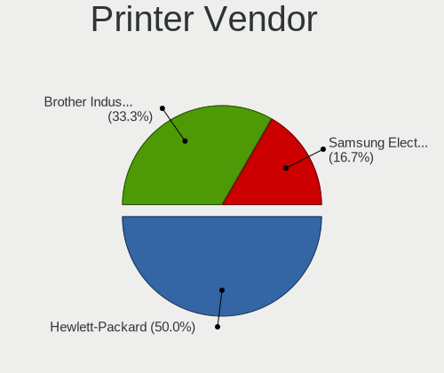
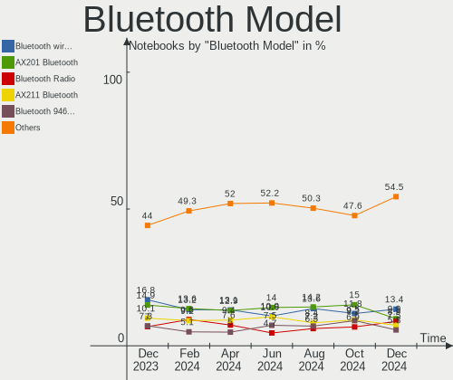

Fedora Hardware Trends (Notebook)
---------------------------------

A project to identify most popular hardware characteristics and track their change
over time based on data collected by Fedora users at https://Linux-Hardware.org.

Anyone can contribute to the study by uploading probes of their computers by
the [hw-probe](https://github.com/linuxhw/hw-probe) tool:

    sudo -E hw-probe -all -upload

Full-feature report is available here: https://linux-hardware.org/?view=trends&formfactor=notebook

Period: Sep, 2020.

Contents
--------

- [ OS                       ](#os)
- [ OS Family                ](#os-family)
- [ Kernel                   ](#kernel)
- [ Kernel Family            ](#kernel-family)
- [ Kernel Major Ver.        ](#kernel-major-ver)
- [ Arch                     ](#arch)
- [ DE                       ](#de)
- [ Display Server           ](#display-server)
- [ Display Manager          ](#display-manager)
- [ OS Lang                  ](#os-lang)
- [ Boot Mode                ](#boot-mode)
- [ Filesystem               ](#filesystem)
- [ Part. scheme             ](#part-scheme)
- [ Dual Boot with Linux/BSD ](#dual-boot-with-linux/bsd)
- [ Dual Boot (Win)          ](#dual-boot-win)
- [ Country                  ](#country)
- [ City                     ](#city)
- [ Vendor                   ](#vendor)
- [ Model                    ](#model)
- [ Model Family             ](#model-family)
- [ MFG Year                 ](#mfg-year)
- [ Form Factor              ](#form-factor)
- [ Secure Boot              ](#secure-boot)
- [ Coreboot                 ](#coreboot)
- [ RAM Size                 ](#ram-size)
- [ RAM Used                 ](#ram-used)
- [ Has CD-ROM               ](#has-cd-rom)
- [ Total Drives             ](#total-drives)
- [ Has Ethernet             ](#has-ethernet)
- [ Drive Vendor             ](#drive-vendor)
- [ HDD Vendor               ](#hdd-vendor)
- [ SSD Vendor               ](#ssd-vendor)
- [ Drive Model              ](#drive-model)
- [ Drive Kind               ](#drive-kind)
- [ Drive Connector          ](#drive-connector)
- [ Drive Size               ](#drive-size)
- [ Space Total              ](#space-total)
- [ Space Used               ](#space-used)
- [ Malfunc. Drives          ](#malfunc-drives)
- [ Malfunc. Drive Vendor    ](#malfunc-drive-vendor)
- [ Malfunc. HDD Vendor      ](#malfunc-hdd-vendor)
- [ Malfunc. Drive Kind      ](#malfunc-drive-kind)
- [ Failed Drives            ](#failed-drives)
- [ Failed Drive Vendor      ](#failed-drive-vendor)
- [ Drive Status             ](#drive-status)
- [ Storage Vendor           ](#storage-vendor)
- [ Storage Model            ](#storage-model)
- [ Storage Kind             ](#storage-kind)
- [ CPU Vendor               ](#cpu-vendor)
- [ CPU Model                ](#cpu-model)
- [ CPU Model Family         ](#cpu-model-family)
- [ CPU Cores                ](#cpu-cores)
- [ CPU Sockets              ](#cpu-sockets)
- [ CPU Threads              ](#cpu-threads)
- [ CPU Op-Modes             ](#cpu-op-modes)
- [ CPU Microcode            ](#cpu-microcode)
- [ CPU Microarch            ](#cpu-microarch)
- [ GPU Vendor               ](#gpu-vendor)
- [ GPU Model                ](#gpu-model)
- [ GPU Combo                ](#gpu-combo)
- [ GPU Driver               ](#gpu-driver)
- [ GPU Memory               ](#gpu-memory)
- [ Monitor Vendor           ](#monitor-vendor)
- [ Monitor Model            ](#monitor-model)
- [ Monitor Resolution       ](#monitor-resolution)
- [ Monitor Diagonal         ](#monitor-diagonal)
- [ Monitor Width            ](#monitor-width)
- [ Aspect Ratio             ](#aspect-ratio)
- [ Monitor Area             ](#monitor-area)
- [ Pixel Density            ](#pixel-density)
- [ Multiple Monitors        ](#multiple-monitors)
- [ Net Controller Vendor    ](#net-controller-vendor)
- [ Net Controller Model     ](#net-controller-model)
- [ Wireless Vendor          ](#wireless-vendor)
- [ Wireless Model           ](#wireless-model)
- [ Ethernet Vendor          ](#ethernet-vendor)
- [ Ethernet Model           ](#ethernet-model)
- [ Net Controller Kind      ](#net-controller-kind)
- [ Used Controller          ](#used-controller)
- [ NICs                     ](#nics)
- [ Memory Vendor            ](#memory-vendor)
- [ Memory Model             ](#memory-model)
- [ Memory Kind              ](#memory-kind)
- [ Memory Form Factor       ](#memory-form-factor)
- [ Memory Size              ](#memory-size)
- [ Memory Speed             ](#memory-speed)
- [ Sound Vendor             ](#sound-vendor)
- [ Sound Model              ](#sound-model)
- [ Camera Vendor            ](#camera-vendor)
- [ Camera Model             ](#camera-model)
- [ Fingerprint Vendor       ](#fingerprint-vendor)
- [ Fingerprint Model        ](#fingerprint-model)
- [ Chipcard Vendor          ](#chipcard-vendor)
- [ Chipcard Model           ](#chipcard-model)
- [ Printer Vendor           ](#printer-vendor)
- [ Printer Model            ](#printer-model)
- [ Scanner Vendor           ](#scanner-vendor)
- [ Scanner Model            ](#scanner-model)
- [ Bluetooth Vendor         ](#bluetooth-vendor)
- [ Bluetooth Model          ](#bluetooth-model)
- [ Unsupported Devices      ](#unsupported-devices)
- [ Unsupported Device Types ](#unsupported-device-types)

OS
--

Installed operating systems

| Name      | Notebooks | Percent |
|-----------|-----------|---------|
| Fedora 32 | 154       | 91.12%  |
| Fedora 33 | 7         | 4.14%   |
| Fedora 31 | 5         | 2.96%   |
| Fedora 34 | 1         | 0.59%   |
| Fedora 30 | 1         | 0.59%   |
| Fedora 28 | 1         | 0.59%   |

OS Family
---------

OS without a version

| Name   | Notebooks | Percent |
|--------|-----------|---------|
| Fedora | 169       | 100%    |

Kernel
------

Version of the Linux kernel

| Version                               | Notebooks | Percent |
|---------------------------------------|-----------|---------|
| 5.8.4-200.fc32.x86_64                 | 52        | 30.77%  |
| 5.8.11-200.fc32.x86_64                | 23        | 13.61%  |
| 5.8.10-200.fc32.x86_64                | 21        | 12.43%  |
| 5.8.9-200.fc32.x86_64                 | 13        | 7.69%   |
| 5.8.7-200.fc32.x86_64                 | 11        | 6.51%   |
| 5.8.6-201.fc32.x86_64                 | 9         | 5.33%   |
| 5.7.17-200.fc32.x86_64                | 6         | 3.55%   |
| 5.6.6-300.fc32.x86_64                 | 6         | 3.55%   |
| 5.8.8-200.fc32.x86_64                 | 4         | 2.37%   |
| 5.7.15-100.fc31.x86_64                | 3         | 1.78%   |
| 5.9.0-rc6+                            | 2         | 1.18%   |
| 5.8.9-301.fc33.x86_64                 | 2         | 1.18%   |
| 5.8.10-300.fc33.x86_64                | 2         | 1.18%   |
| 5.9.0_rc4_tkg_cfs                     | 1         | 0.59%   |
| 5.9.0-0.rc3.1.fc34.x86_64             | 1         | 0.59%   |
| 5.8.9-250.vanilla.knurd.1.fc32.x86_64 | 1         | 0.59%   |
| 5.8.9-101.fc31.x86_64                 | 1         | 0.59%   |
| 5.8.5-zen1                            | 1         | 0.59%   |
| 5.8.3-300.fc33.x86_64                 | 1         | 0.59%   |
| 5.8.11-300.fc33.x86_64                | 1         | 0.59%   |
| 5.7.8-200.fc32.x86_64                 | 1         | 0.59%   |
| 5.7.7-100.fc31.x86_64                 | 1         | 0.59%   |
| 5.7.15-200.fc32.x86_64                | 1         | 0.59%   |
| 5.6.19-200.fc31.x86_64                | 1         | 0.59%   |
| 5.6.11-300.fc32.x86_64                | 1         | 0.59%   |
| 5.5.16-100.fc30.x86_64                | 1         | 0.59%   |
| 5.4.66-300.fc32.x86_64                | 1         | 0.59%   |
| 5.0.16-100.fc28.x86_64                | 1         | 0.59%   |

Kernel Family
-------------

Linux kernel without a distro release

| Version | Notebooks | Percent |
|---------|-----------|---------|
| 5.8.4   | 52        | 30.77%  |
| 5.8.11  | 24        | 14.2%   |
| 5.8.10  | 23        | 13.61%  |
| 5.8.9   | 17        | 10.06%  |
| 5.8.7   | 11        | 6.51%   |
| 5.8.6   | 9         | 5.33%   |
| 5.7.17  | 6         | 3.55%   |
| 5.6.6   | 6         | 3.55%   |
| 5.9.0   | 4         | 2.37%   |
| 5.8.8   | 4         | 2.37%   |
| 5.7.15  | 4         | 2.37%   |
| 5.8.5   | 1         | 0.59%   |
| 5.8.3   | 1         | 0.59%   |
| 5.7.8   | 1         | 0.59%   |
| 5.7.7   | 1         | 0.59%   |
| 5.6.19  | 1         | 0.59%   |
| 5.6.11  | 1         | 0.59%   |
| 5.5.16  | 1         | 0.59%   |
| 5.4.66  | 1         | 0.59%   |
| 5.0.16  | 1         | 0.59%   |

Kernel Major Ver.
-----------------

Linux kernel major version

| Version | Notebooks | Percent |
|---------|-----------|---------|
| 5.8     | 142       | 84.02%  |
| 5.7     | 12        | 7.1%    |
| 5.6     | 8         | 4.73%   |
| 5.9     | 4         | 2.37%   |
| 5.5     | 1         | 0.59%   |
| 5.4     | 1         | 0.59%   |
| 5.0     | 1         | 0.59%   |

Arch
----

OS architecture (x86_64, i586, etc.)

| Name   | Notebooks | Percent |
|--------|-----------|---------|
| x86_64 | 169       | 100%    |

DE
--

Desktop Environment

| Name       | Notebooks | Percent |
|------------|-----------|---------|
| GNOME      | 136       | 80.47%  |
| KDE5       | 9         | 5.33%   |
| KDE        | 7         | 4.14%   |
| Unknown    | 4         | 2.37%   |
| MATE       | 3         | 1.78%   |
| Deepin     | 3         | 1.78%   |
| Cinnamon   | 3         | 1.78%   |
| XFCE       | 2         | 1.18%   |
| X-Cinnamon | 1         | 0.59%   |
| LXDE       | 1         | 0.59%   |

Display Server
--------------

X11 or Wayland

| Name    | Notebooks | Percent |
|---------|-----------|---------|
| Wayland | 95        | 56.21%  |
| X11     | 70        | 41.42%  |
| Tty     | 3         | 1.78%   |
| Unknown | 1         | 0.59%   |

Display Manager
---------------

SDDM, LightDM, etc.

| Name    | Notebooks | Percent |
|---------|-----------|---------|
| Unknown | 90        | 53.25%  |
| GDM     | 64        | 37.87%  |
| SDDM    | 10        | 5.92%   |
| TDM     | 4         | 2.37%   |
| XDM     | 1         | 0.59%   |

OS Lang
-------

Language

| Lang       | Notebooks | Percent |
|------------|-----------|---------|
| en_US      | 85        | 50.3%   |
| en_GB      | 16        | 9.47%   |
| pt_BR      | 8         | 4.73%   |
| de_DE      | 8         | 4.73%   |
| ru_RU      | 7         | 4.14%   |
| fr_FR      | 6         | 3.55%   |
| pl_PL      | 5         | 2.96%   |
| en_CA      | 3         | 1.78%   |
| en_US.utf8 | 2         | 1.18%   |
| en_AU      | 2         | 1.18%   |
| cs_CZ      | 2         | 1.18%   |
| tr_TR      | 1         | 0.59%   |
| sk_SK      | 1         | 0.59%   |
| nl_NL      | 1         | 0.59%   |
| nb_NO      | 1         | 0.59%   |
| it_IT      | 1         | 0.59%   |
| id_ID      | 1         | 0.59%   |
| fr_FR.utf8 | 1         | 0.59%   |
| fr_CA      | 1         | 0.59%   |
| fr_BE      | 1         | 0.59%   |
| fi_FI      | 1         | 0.59%   |
| es_PE      | 1         | 0.59%   |
| es_ES.utf8 | 1         | 0.59%   |
| es_ES      | 1         | 0.59%   |
| es_CO      | 1         | 0.59%   |
| es_AR      | 1         | 0.59%   |
| en_ZA      | 1         | 0.59%   |
| en_SE      | 1         | 0.59%   |
| en_NZ      | 1         | 0.59%   |
| en_IN      | 1         | 0.59%   |
| en_GB.utf8 | 1         | 0.59%   |
| en_DK      | 1         | 0.59%   |
| el_GR      | 1         | 0.59%   |
| da_DK      | 1         | 0.59%   |
| C          | 1         | 0.59%   |
| Unknown    | 1         | 0.59%   |

Boot Mode
---------

EFI or BIOS

| Mode | Notebooks | Percent |
|------|-----------|---------|
| EFI  | 136       | 80.47%  |
| BIOS | 33        | 19.53%  |

Filesystem
----------

Type of filesystem

| Type  | Notebooks | Percent |
|-------|-----------|---------|
| Ext4  | 148       | 87.57%  |
| Btrfs | 18        | 10.65%  |
| Xfs   | 3         | 1.78%   |

Part. scheme
------------

Scheme of partitioning

| Type    | Notebooks | Percent |
|---------|-----------|---------|
| Unknown | 91        | 53.85%  |
| GPT     | 70        | 41.42%  |
| MBR     | 8         | 4.73%   |

Dual Boot with Linux/BSD
------------------------

Hosting more than one Linux/BSD

| Dual boot | Notebooks | Percent |
|-----------|-----------|---------|
| No        | 158       | 93.49%  |
| Yes       | 11        | 6.51%   |

Dual Boot (Win)
---------------

Hosting Linux and Windows

| Dual boot | Notebooks | Percent |
|-----------|-----------|---------|
| No        | 137       | 81.07%  |
| Yes       | 32        | 18.93%  |

Country
-------

Geographic location (country)

| Country            | Notebooks | Percent |
|--------------------|-----------|---------|
| USA                | 34        | 20.12%  |
| Germany            | 15        | 8.88%   |
| Brazil             | 13        | 7.69%   |
| France             | 11        | 6.51%   |
| Poland             | 8         | 4.73%   |
| Russia             | 7         | 4.14%   |
| Canada             | 6         | 3.55%   |
| UK                 | 5         | 2.96%   |
| Netherlands        | 5         | 2.96%   |
| India              | 5         | 2.96%   |
| Turkey             | 3         | 1.78%   |
| Spain              | 3         | 1.78%   |
| Italy              | 3         | 1.78%   |
| Finland            | 3         | 1.78%   |
| Denmark            | 3         | 1.78%   |
| Czech Republic     | 3         | 1.78%   |
| Belgium            | 3         | 1.78%   |
| Australia          | 3         | 1.78%   |
| Ukraine            | 2         | 1.18%   |
| Sweden             | 2         | 1.18%   |
| South Africa       | 2         | 1.18%   |
| Romania            | 2         | 1.18%   |
| Macedonia          | 2         | 1.18%   |
| Korea, Republic of | 2         | 1.18%   |
| Zimbabwe           | 1         | 0.59%   |
| Thailand           | 1         | 0.59%   |
| Switzerland        | 1         | 0.59%   |
| Slovenia           | 1         | 0.59%   |
| Slovakia           | 1         | 0.59%   |
| Singapore          | 1         | 0.59%   |
| Peru               | 1         | 0.59%   |
| Norway             | 1         | 0.59%   |
| New Zealand        | 1         | 0.59%   |
| Mexico             | 1         | 0.59%   |
| Malaysia           | 1         | 0.59%   |
| Kenya              | 1         | 0.59%   |
| Japan              | 1         | 0.59%   |
| Indonesia          | 1         | 0.59%   |
| Greece             | 1         | 0.59%   |
| Egypt              | 1         | 0.59%   |
| Croatia            | 1         | 0.59%   |
| Colombia           | 1         | 0.59%   |
| Chile              | 1         | 0.59%   |
| Bulgaria           | 1         | 0.59%   |
| Bangladesh         | 1         | 0.59%   |
| Austria            | 1         | 0.59%   |
| Argentina          | 1         | 0.59%   |
| Albania            | 1         | 0.59%   |

City
----

Geographic location (city)

| City                   | Notebooks | Percent |
|------------------------|-----------|---------|
| Moscow                 | 4         | 2.37%   |
| Helsinki               | 3         | 1.78%   |
| The Bronx              | 2         | 1.18%   |
| Poznan                 | 2         | 1.18%   |
| Portland               | 2         | 1.18%   |
| North Las Vegas        | 2         | 1.18%   |
| Kyiv                   | 2         | 1.18%   |
| Joliette               | 2         | 1.18%   |
| Greifswald             | 2         | 1.18%   |
| Delft                  | 2         | 1.18%   |
| Bellevue               | 2         | 1.18%   |
| Łódź                | 1         | 0.59%   |
| Zaragoza               | 1         | 0.59%   |
| Zagreb                 | 1         | 0.59%   |
| Wrexham                | 1         | 0.59%   |
| Wrestedt               | 1         | 0.59%   |
| Woerden                | 1         | 0.59%   |
| Wijk bij Duurstede     | 1         | 0.59%   |
| Warsaw                 | 1         | 0.59%   |
| Villeurbanne           | 1         | 0.59%   |
| Veles                  | 1         | 0.59%   |
| Traralgon              | 1         | 0.59%   |
| Toronto                | 1         | 0.59%   |
| Tingsryd               | 1         | 0.59%   |
| Thane                  | 1         | 0.59%   |
| Taylors                | 1         | 0.59%   |
| Talcahuano             | 1         | 0.59%   |
| São Paulo             | 1         | 0.59%   |
| São Bernardo do Campo | 1         | 0.59%   |
| Sumaré                | 1         | 0.59%   |
| Stuttgart              | 1         | 0.59%   |
| Storslett              | 1         | 0.59%   |
| Stockholm              | 1         | 0.59%   |
| Sofia                  | 1         | 0.59%   |
| Schiltigheim           | 1         | 0.59%   |
| Schaarbeek             | 1         | 0.59%   |
| Savage                 | 1         | 0.59%   |
| Satu Mare              | 1         | 0.59%   |
| Sao Jose               | 1         | 0.59%   |
| Sao Goncalo            | 1         | 0.59%   |
| Saint Paul             | 1         | 0.59%   |
| Rize                   | 1         | 0.59%   |
| Recife                 | 1         | 0.59%   |
| Quarryville            | 1         | 0.59%   |
| Putten                 | 1         | 0.59%   |
| Poços de Caldas       | 1         | 0.59%   |
| Popayan                | 1         | 0.59%   |
| Plaisir                | 1         | 0.59%   |
| Pilsen                 | 1         | 0.59%   |
| Piaseczno              | 1         | 0.59%   |
| Patiala                | 1         | 0.59%   |
| Paris                  | 1         | 0.59%   |
| Ostrach                | 1         | 0.59%   |
| Oberasbach             | 1         | 0.59%   |
| Novosibirsk            | 1         | 0.59%   |
| Nova Iguaçu           | 1         | 0.59%   |
| North Liberty          | 1         | 0.59%   |
| North Hollywood        | 1         | 0.59%   |
| New York               | 1         | 0.59%   |
| New Delhi              | 1         | 0.59%   |

Vendor
------

Motherboard manufacturer

| Name                | Notebooks | Percent |
|---------------------|-----------|---------|
| Lenovo              | 64        | 37.87%  |
| Dell                | 31        | 18.34%  |
| Hewlett-Packard     | 22        | 13.02%  |
| Acer                | 14        | 8.28%   |
| ASUSTek Computer    | 8         | 4.73%   |
| Samsung Electronics | 6         | 3.55%   |
| Toshiba             | 4         | 2.37%   |
| MSI                 | 4         | 2.37%   |
| Apple               | 3         | 1.78%   |
| Sony                | 2         | 1.18%   |
| LG Electronics      | 2         | 1.18%   |
| System76            | 1         | 0.59%   |
| Schenker            | 1         | 0.59%   |
| Razer               | 1         | 0.59%   |
| Positivo            | 1         | 0.59%   |
| Notebook            | 1         | 0.59%   |
| MOTILE              | 1         | 0.59%   |
| HUAWEI              | 1         | 0.59%   |
| Gigabyte Technology | 1         | 0.59%   |
| Fujitsu             | 1         | 0.59%   |

Model
-----

Motherboard model

| Name                                                | Notebooks | Percent |
|-----------------------------------------------------|-----------|---------|
| Dell XPS 13 9370                                    | 3         | 1.78%   |
| LG Electronics 17Z90N-V.AA77G                       | 2         | 1.18%   |
| Lenovo ThinkPad X1 Carbon Gen 8 20U9CTO1WW          | 2         | 1.18%   |
| Lenovo ThinkPad T14 Gen 1 20UDCTO1WW                | 2         | 1.18%   |
| Lenovo Legion 5 15ARH05 82B5                        | 2         | 1.18%   |
| HP Pavilion Laptop 15-cw1xxx                        | 2         | 1.18%   |
| Dell XPS 15 9570                                    | 2         | 1.18%   |
| Dell XPS 15 9560                                    | 2         | 1.18%   |
| Dell XPS 15 9500                                    | 2         | 1.18%   |
| Dell Inspiron 5590                                  | 2         | 1.18%   |
| Dell Inspiron 5570                                  | 2         | 1.18%   |
| Unknown                                             | 2         | 1.18%   |
| Toshiba Satellite S875D                             | 1         | 0.59%   |
| Toshiba Satellite PRO C70-B                         | 1         | 0.59%   |
| Toshiba Satellite C70-A-K2W                         | 1         | 0.59%   |
| Toshiba Satellite C660                              | 1         | 0.59%   |
| System76 Serval                                     | 1         | 0.59%   |
| Sony VPCF131FM                                      | 1         | 0.59%   |
| Sony SVF15213SNB                                    | 1         | 0.59%   |
| Schenker XMG_APEX15_XAP15E20                        | 1         | 0.59%   |
| Samsung Electronics R430/P430                       | 1         | 0.59%   |
| Samsung Electronics 850XBC                          | 1         | 0.59%   |
| Samsung Electronics 350V5C/351V5C/3540VC/3440VC     | 1         | 0.59%   |
| Samsung Electronics 300E5M/300E5L                   | 1         | 0.59%   |
| Samsung Electronics 300E5EV/300E4EV/270E5EV/270E4EV | 1         | 0.59%   |
| Samsung Electronics 300E4C/300E5C/300E7C            | 1         | 0.59%   |
| Razer Blade Stealth 13 Late 2019                    | 1         | 0.59%   |
| Positivo CHT12CP                                    | 1         | 0.59%   |
| Notebook NH55RGQ                                    | 1         | 0.59%   |
| MSI GX780/GT780/GT780DX/GT783                       | 1         | 0.59%   |
| MSI GP72 7RE                                        | 1         | 0.59%   |
| MSI GP70 2PE                                        | 1         | 0.59%   |
| MSI GE60 2OC\2OD\2OE                                | 1         | 0.59%   |
| MOTILE M142                                         | 1         | 0.59%   |
| Lenovo Yoga 2 Pro 20266                             | 1         | 0.59%   |
| Lenovo V130-15IKB 81HN                              | 1         | 0.59%   |
| Lenovo ThinkPad Yoga 11e 20DAS0CY00                 | 1         | 0.59%   |
| Lenovo ThinkPad X270 W10DG 20K5S3J102               | 1         | 0.59%   |
| Lenovo ThinkPad X260 20F50055RT                     | 1         | 0.59%   |
| Lenovo ThinkPad X220 4290A48                        | 1         | 0.59%   |
| Lenovo ThinkPad X1 Carbon Gen 8 20UAS0X800          | 1         | 0.59%   |
| Lenovo ThinkPad X1 Carbon Gen 8 20U90SIT19          | 1         | 0.59%   |
| Lenovo ThinkPad X1 Carbon Gen 8 20U9004HIX          | 1         | 0.59%   |
| Lenovo ThinkPad X1 Carbon 7th 20QDCTO1WW            | 1         | 0.59%   |
| Lenovo ThinkPad T540p 20BFA0C4MD                    | 1         | 0.59%   |
| Lenovo ThinkPad T530 2394D44                        | 1         | 0.59%   |
| Lenovo ThinkPad T490s 20NX000DRT                    | 1         | 0.59%   |
| Lenovo ThinkPad T480s 20L8S2N80E                    | 1         | 0.59%   |
| Lenovo ThinkPad T480 20L5000BMX                     | 1         | 0.59%   |
| Lenovo ThinkPad T480 20L50007PB                     | 1         | 0.59%   |
| Lenovo ThinkPad T470s 20HGS0AY00                    | 1         | 0.59%   |
| Lenovo ThinkPad T460s 20FAA00BUS                    | 1         | 0.59%   |
| Lenovo ThinkPad T460s 20F9003SGE                    | 1         | 0.59%   |
| Lenovo ThinkPad T460 20FN002NUS                     | 1         | 0.59%   |
| Lenovo ThinkPad T440s 20AQCTO1WW                    | 1         | 0.59%   |
| Lenovo ThinkPad T440 20B7S0N000                     | 1         | 0.59%   |
| Lenovo ThinkPad T440 20B7A0VQMC                     | 1         | 0.59%   |
| Lenovo ThinkPad T430 2349LRS                        | 1         | 0.59%   |
| Lenovo ThinkPad T410 2537G98                        | 1         | 0.59%   |
| Lenovo ThinkPad T14s Gen 1 20UHCTO1WW               | 1         | 0.59%   |

Model Family
------------

Motherboard model prefix

| Name                          | Notebooks | Percent |
|-------------------------------|-----------|---------|
| Lenovo ThinkPad               | 43        | 25.44%  |
| Dell XPS                      | 13        | 7.69%   |
| Lenovo IdeaPad                | 11        | 6.51%   |
| Acer Aspire                   | 9         | 5.33%   |
| Dell Latitude                 | 6         | 3.55%   |
| Dell Inspiron                 | 6         | 3.55%   |
| HP Pavilion                   | 5         | 2.96%   |
| Toshiba Satellite             | 4         | 2.37%   |
| HP Laptop                     | 4         | 2.37%   |
| Lenovo Legion                 | 3         | 1.78%   |
| HP ProBook                    | 3         | 1.78%   |
| HP EliteBook                  | 3         | 1.78%   |
| Dell Precision                | 3         | 1.78%   |
| Acer Nitro                    | 3         | 1.78%   |
| LG Electronics 17Z90N-V.AA77G | 2         | 1.18%   |
| HP OMEN                       | 2         | 1.18%   |
| HP ENVY                       | 2         | 1.18%   |
| Acer Swift                    | 2         | 1.18%   |
| Unknown                       | 2         | 1.18%   |
| System76 Serval               | 1         | 0.59%   |
| Sony VPCF131FM                | 1         | 0.59%   |
| Sony SVF15213SNB              | 1         | 0.59%   |
| Schenker XMG                  | 1         | 0.59%   |
| Samsung Electronics R430      | 1         | 0.59%   |
| Samsung Electronics 850XBC    | 1         | 0.59%   |
| Samsung Electronics 350V5C    | 1         | 0.59%   |
| Samsung Electronics 300E5M    | 1         | 0.59%   |
| Samsung Electronics 300E5EV   | 1         | 0.59%   |
| Samsung Electronics 300E4C    | 1         | 0.59%   |
| Razer Blade                   | 1         | 0.59%   |
| Positivo CHT12CP              | 1         | 0.59%   |
| Notebook NH55RGQ              | 1         | 0.59%   |
| MSI GX780                     | 1         | 0.59%   |
| MSI GP72                      | 1         | 0.59%   |
| MSI GP70                      | 1         | 0.59%   |
| MSI GE60                      | 1         | 0.59%   |
| MOTILE M142                   | 1         | 0.59%   |
| Lenovo Yoga                   | 1         | 0.59%   |
| Lenovo V130-15IKB             | 1         | 0.59%   |
| Lenovo ThinkBook              | 1         | 0.59%   |
| Lenovo Flex                   | 1         | 0.59%   |
| Lenovo Edge                   | 1         | 0.59%   |
| Lenovo B5400                  | 1         | 0.59%   |
| HUAWEI NBLK-WAX9X             | 1         | 0.59%   |
| HP ZBook                      | 1         | 0.59%   |
| HP Stream                     | 1         | 0.59%   |
| Gigabyte AORUS                | 1         | 0.59%   |
| Fujitsu LIFEBOOK              | 1         | 0.59%   |
| Dell Vostro                   | 1         | 0.59%   |
| Dell Venue                    | 1         | 0.59%   |
| Dell G7                       | 1         | 0.59%   |
| ASUS ZenBook                  | 1         | 0.59%   |
| ASUS X540UP                   | 1         | 0.59%   |
| ASUS VivoBook                 | 1         | 0.59%   |
| ASUS UX305FA                  | 1         | 0.59%   |
| ASUS TUF                      | 1         | 0.59%   |
| ASUS Strix                    | 1         | 0.59%   |
| ASUS K72JT                    | 1         | 0.59%   |
| ASUS G752VS                   | 1         | 0.59%   |
| Apple MacBookPro8             | 1         | 0.59%   |

MFG Year
--------

Motherboard manufacture year

| Year | Notebooks | Percent |
|------|-----------|---------|
| 2020 | 70        | 41.42%  |
| 2019 | 38        | 22.49%  |
| 2018 | 12        | 7.1%    |
| 2014 | 9         | 5.33%   |
| 2011 | 9         | 5.33%   |
| 2017 | 7         | 4.14%   |
| 2013 | 7         | 4.14%   |
| 2015 | 6         | 3.55%   |
| 2012 | 5         | 2.96%   |
| 2016 | 4         | 2.37%   |
| 2010 | 2         | 1.18%   |

Form Factor
-----------

Physical design of the computer

| Name     | Notebooks | Percent |
|----------|-----------|---------|
| Notebook | 169       | 100%    |

Secure Boot
-----------

Enabled or disabled

| State    | Notebooks | Percent |
|----------|-----------|---------|
| Disabled | 132       | 78.11%  |
| Enabled  | 37        | 21.89%  |

Coreboot
--------

Have coreboot on board

| Used | Notebooks | Percent |
|------|-----------|---------|
| No   | 169       | 100%    |

RAM Size
--------

Total RAM memory

| Size in GB | Notebooks | Percent |
|------------|-----------|---------|
| 16.01-24.0 | 47        | 27.81%  |
| 4.01-8.0   | 43        | 25.44%  |
| 8.01-16.0  | 37        | 21.89%  |
| 3.01-4.0   | 19        | 11.24%  |
| 32.01-64.0 | 17        | 10.06%  |
| 24.01-32.0 | 5         | 2.96%   |
| 2.01-3.0   | 1         | 0.59%   |

RAM Used
--------

Used RAM memory

| Used GB    | Notebooks | Percent |
|------------|-----------|---------|
| 2.01-3.0   | 50        | 29.59%  |
| 4.01-8.0   | 40        | 23.67%  |
| 3.01-4.0   | 36        | 21.3%   |
| 1.01-2.0   | 22        | 13.02%  |
| 8.01-16.0  | 17        | 10.06%  |
| 0.01-1.0   | 3         | 1.78%   |
| 16.01-24.0 | 1         | 0.59%   |

Has CD-ROM
----------

Has CD-ROM on board

| Presented | Notebooks | Percent |
|-----------|-----------|---------|
| No        | 126       | 74.56%  |
| Yes       | 43        | 25.44%  |

Total Drives
------------

Number of drives on board

| Drives | Notebooks | Percent |
|--------|-----------|---------|
| 1      | 120       | 71.01%  |
| 2      | 40        | 23.67%  |
| 3      | 5         | 2.96%   |
| 4      | 2         | 1.18%   |
| 5      | 1         | 0.59%   |
| 0      | 1         | 0.59%   |

Has Ethernet
------------

Has Ethernet on board

| Presented | Notebooks | Percent |
|-----------|-----------|---------|
| Yes       | 139       | 82.25%  |
| No        | 30        | 17.75%  |

Drive Vendor
------------

Hard drive vendors

| Vendor                | Notebooks | Drives  | Percent |
|-----------------------|-----------|---------|---------|
| Samsung Electronics   | 52        | 57      | 23.74%  |
| WDC                   | 23        | 25      | 10.5%   |
| SanDisk               | 20        | 20      | 9.13%   |
| Toshiba               | 18        | 19      | 8.22%   |
| Seagate               | 17        | 17      | 7.76%   |
| Unknown               | 13        | 19      | 5.94%   |
| SK Hynix              | 10        | 10      | 4.57%   |
| Intel                 | 10        | 10      | 4.57%   |
| HGST                  | 9         | 9       | 4.11%   |
| Hitachi               | 5         | 5       | 2.28%   |
| Crucial               | 5         | 5       | 2.28%   |
| Kingston              | 4         | 4       | 1.83%   |
| A-DATA Technology     | 4         | 4       | 1.83%   |
| KIOXIA                | 3         | 3       | 1.37%   |
| HL-DT-ST              | 3         | Unknown | 1.37%   |
| Transcend             | 2         | 2       | 0.91%   |
| Phison                | 2         | 2       | 0.91%   |
| Micron Technology     | 2         | 2       | 0.91%   |
| LITEONIT              | 2         | 2       | 0.91%   |
| LITEON                | 2         | 2       | 0.91%   |
| SPCC                  | 1         | 1       | 0.46%   |
| Solid State Storage   | 1         | 1       | 0.46%   |
| Realtek Semiconductor | 1         | 1       | 0.46%   |
| PNY                   | 1         | 1       | 0.46%   |
| Mushkin               | 1         | 1       | 0.46%   |
| Lexar                 | 1         | 1       | 0.46%   |
| JMicron               | 1         | 1       | 0.46%   |
| INDMEM                | 1         | 1       | 0.46%   |
| External              | 1         | 1       | 0.46%   |
| Corsair               | 1         | 1       | 0.46%   |
| China                 | 1         | 1       | 0.46%   |
| BIWIN SS              | 1         | 1       | 0.46%   |
| 2-Power               | 1         | 1       | 0.46%   |

HDD Vendor
----------

Hard disk drive vendors

| Vendor  | Notebooks | Drives | Percent |
|---------|-----------|--------|---------|
| Seagate | 17        | 17     | 34.69%  |
| WDC     | 13        | 13     | 26.53%  |
| HGST    | 9         | 9      | 18.37%  |
| Toshiba | 5         | 6      | 10.2%   |
| Hitachi | 5         | 5      | 10.2%   |

SSD Vendor
----------

Solid state drive vendors

| Vendor              | Notebooks | Drives | Percent |
|---------------------|-----------|--------|---------|
| Samsung Electronics | 16        | 17     | 22.86%  |
| SanDisk             | 14        | 14     | 20%     |
| WDC                 | 5         | 5      | 7.14%   |
| Crucial             | 5         | 5      | 7.14%   |
| SK Hynix            | 4         | 4      | 5.71%   |
| Intel               | 4         | 4      | 5.71%   |
| A-DATA Technology   | 4         | 4      | 5.71%   |
| Unknown             | 3         | 3      | 4.29%   |
| Kingston            | 3         | 3      | 4.29%   |
| Toshiba             | 2         | 2      | 2.86%   |
| LITEONIT            | 2         | 2      | 2.86%   |
| Transcend           | 1         | 1      | 1.43%   |
| PNY                 | 1         | 1      | 1.43%   |
| Micron Technology   | 1         | 1      | 1.43%   |
| LITEON              | 1         | 1      | 1.43%   |
| JMicron             | 1         | 1      | 1.43%   |
| Corsair             | 1         | 1      | 1.43%   |
| China               | 1         | 1      | 1.43%   |
| 2-Power             | 1         | 1      | 1.43%   |

Drive Model
-----------

Hard drive models

| Model                        | Notebooks | Percent |
|------------------------------|-----------|---------|
| NVMe SSD Drive 256GB         | 18        | 7.89%   |
| NVMe SSD Drive 512GB         | 16        | 7.02%   |
| NVMe SSD Drive 1024GB        | 5         | 2.19%   |
| HTS721010A9E630 1TB          | 5         | 2.19%   |
| ST1000LM035-1RK172 1TB       | 4         | 1.75%   |
| SSD U110 16GB                | 3         | 1.32%   |
| MZVLB512HBJQ-000L7 512GB     | 3         | 1.32%   |
| MMC Card  32GB               | 3         | 1.32%   |
| ST500LM000-SSHD-8GB          | 2         | 0.88%   |
| ST1000LM048-2E7172 1TB       | 2         | 0.88%   |
| SD9SN8W256G1002 256GB SSD    | 2         | 0.88%   |
| SATA3 2TB SSD                | 2         | 0.88%   |
| NVMe SSD Drive 500GB         | 2         | 0.88%   |
| NVMe SSD Drive 1TB           | 2         | 0.88%   |
| MZVLB1T0HBLR-00000 1TB       | 2         | 0.88%   |
| KBG40ZNS256G NVMe 256GB      | 2         | 0.88%   |
| HTS547575A9E384 752GB        | 2         | 0.88%   |
| HTS541010A9E680 1TB          | 2         | 0.88%   |
| DVDRAM GUE1N 3GB             | 2         | 0.88%   |
| CT500MX500SSD4 500GB         | 2         | 0.88%   |
| X400 M.2 2280 256GB SSD      | 1         | 0.44%   |
| WDS500G2B0A-00SM50 500GB SSD | 1         | 0.44%   |
| WDS500G2B0A 500GB SSD        | 1         | 0.44%   |
| WDS240G2G0A-00JH30 240GB SSD | 1         | 0.44%   |
| WDS100T1B0A-00H9H0 1TB SSD   | 1         | 0.44%   |
| WDBNCE2500PNC 250GB SSD      | 1         | 0.44%   |
| WD7500BPVX-22JC3T0 752GB     | 1         | 0.44%   |
| WD7500BPKT-22PK4T0 752GB     | 1         | 0.44%   |
| WD5000BEVT-60A0RT0 500GB     | 1         | 0.44%   |
| WD3200BPVT-22JJ5T0 320GB     | 1         | 0.44%   |
| WD32 00BPVT-22JJ5T0 320GB    | 1         | 0.44%   |
| WD2500BEVT-22A23T0 250GB     | 1         | 0.44%   |
| WD20SPZX-22UA7T0 2TB         | 1         | 0.44%   |
| WD16 00BEVT-60ZCT 160GB      | 1         | 0.44%   |
| WD10SPZX-24Z10 1TB           | 1         | 0.44%   |
| WD10SPZX-08Z10 1TB           | 1         | 0.44%   |
| WD10JPVX-60JC3T1 1TB         | 1         | 0.44%   |
| WD10JPVX-35JC3T0 1TB         | 1         | 0.44%   |
| WD10JPVX-08JC3T5 1TB         | 1         | 0.44%   |
| USB 3.0 1TB                  | 1         | 0.44%   |
| TS512GMTE510T 512GB          | 1         | 0.44%   |
| TS256GMTS400S 256GB SSD      | 1         | 0.44%   |
| THNSNJ128GCSU 128GB SSD      | 1         | 0.44%   |
| THNSN5512GPUK NVMe 512GB     | 1         | 0.44%   |
| THNSN5256GPU7 256GB          | 1         | 0.44%   |
| SUV400S37120G 120GB SSD      | 1         | 0.44%   |
| SU800NS38 256GB SSD          | 1         | 0.44%   |
| SU800 256GB SSD              | 1         | 0.44%   |
| SU800 1TB SSD                | 1         | 0.44%   |
| ST9500423AS 500GB            | 1         | 0.44%   |
| ST750LM022 HN-M750MBB 752GB  | 1         | 0.44%   |
| ST500LT012-1DG142 500GB      | 1         | 0.44%   |
| ST500LM021-1KJ152 500GB      | 1         | 0.44%   |
| ST500LM012 HN-M500MBB 500GB  | 1         | 0.44%   |
| ST2000LX001-1RG174 2TB       | 1         | 0.44%   |
| ST2000LM007-1R8174 2TB       | 1         | 0.44%   |
| SSSTC CL1-4D256 256GB        | 1         | 0.44%   |
| SSDSCKKF010X6 1TB            | 1         | 0.44%   |
| SSDSC2CW240A3 240GB          | 1         | 0.44%   |
| SSDSA2M160G2GC 160GB         | 1         | 0.44%   |

Drive Kind
----------

HDD or SSD

| Kind    | Notebooks | Drives | Percent |
|---------|-----------|--------|---------|
| NVMe    | 85        | 95     | 40.67%  |
| SSD     | 63        | 71     | 30.14%  |
| HDD     | 46        | 50     | 22.01%  |
| Unknown | 8         | 5      | 3.83%   |
| MMC     | 7         | 9      | 3.35%   |

Drive Connector
---------------

SATA, SAS, NVMe, etc.

| Type | Notebooks | Drives | Percent |
|------|-----------|--------|---------|
| SATA | 98        | 116    | 48.51%  |
| NVMe | 85        | 95     | 42.08%  |
| SAS  | 12        | 10     | 5.94%   |
| MMC  | 7         | 9      | 3.47%   |

Drive Size
----------

Size of hard drive

| Size in TB | Notebooks | Drives | Percent |
|------------|-----------|--------|---------|
| 0.01-0.5   | 112       | 137    | 57.14%  |
| 0.51-1.0   | 68        | 76     | 34.69%  |
| 1.01-2.0   | 15        | 16     | 7.65%   |
| 4.01-10.0  | 1         | 1      | 0.51%   |

Space Total
-----------

Amount of disk space available on the file system

| Size in GB     | Notebooks | Percent |
|----------------|-----------|---------|
| 101-250        | 57        | 33.73%  |
| 251-500        | 35        | 20.71%  |
| 501-1000       | 34        | 20.12%  |
| 51-100         | 15        | 8.88%   |
| 1001-2000      | 8         | 4.73%   |
| 21-50          | 7         | 4.14%   |
| 1-20           | 6         | 3.55%   |
| 2001-3000      | 4         | 2.37%   |
| Unknown        | 2         | 1.18%   |
| More than 3000 | 1         | 0.59%   |

Space Used
----------

Amount of used disk space

| Used GB   | Notebooks | Percent |
|-----------|-----------|---------|
| 1-20      | 40        | 23.67%  |
| 21-50     | 35        | 20.71%  |
| 101-250   | 32        | 18.93%  |
| 51-100    | 31        | 18.34%  |
| 251-500   | 20        | 11.83%  |
| 1001-2000 | 5         | 2.96%   |
| 501-1000  | 4         | 2.37%   |
| Unknown   | 2         | 1.18%   |

Malfunc. Drives
---------------

Drive models with a malfunction

| Model                 | Notebooks | Drives | Percent |
|-----------------------|-----------|--------|---------|
| ST9500423AS 500GB     | 1         | 1      | 12.5%   |
| ST500LM000-SSHD-8GB   | 1         | 1      | 12.5%   |
| SSDSA2M160G2GC 160GB  | 1         | 1      | 12.5%   |
| SSD 960 EVO 500GB     | 1         | 1      | 12.5%   |
| SSD 850 EVO 1TB       | 1         | 1      | 12.5%   |
| SC401 SATA 512GB SSD  | 1         | 1      | 12.5%   |
| HTS545050A7E680 500GB | 1         | 1      | 12.5%   |
| HTS541010A9E680 1TB   | 1         | 1      | 12.5%   |

Malfunc. Drive Vendor
---------------------

Vendors of faulty drives

| Vendor              | Notebooks | Drives | Percent |
|---------------------|-----------|--------|---------|
| Seagate             | 2         | 2      | 25%     |
| Samsung Electronics | 2         | 2      | 25%     |
| HGST                | 2         | 2      | 25%     |
| SK Hynix            | 1         | 1      | 12.5%   |
| Intel               | 1         | 1      | 12.5%   |

Malfunc. HDD Vendor
-------------------

Vendors of faulty HDD drives

| Vendor  | Notebooks | Drives | Percent |
|---------|-----------|--------|---------|
| Seagate | 2         | 2      | 50%     |
| HGST    | 2         | 2      | 50%     |

Malfunc. Drive Kind
-------------------

Kinds of faulty drives

| Kind | Notebooks | Drives | Percent |
|------|-----------|--------|---------|
| HDD  | 4         | 4      | 50%     |
| SSD  | 3         | 3      | 37.5%   |
| NVMe | 1         | 1      | 12.5%   |

Failed Drives
-------------

Failed drive models

Zero info for selected period =(

Failed Drive Vendor
-------------------

Failed drive vendors

Zero info for selected period =(

Drive Status
------------

Number of failed and malfunc. drives

| Status   | Notebooks | Drives | Percent |
|----------|-----------|--------|---------|
| Detected | 97        | 126    | 54.49%  |
| Works    | 73        | 96     | 41.01%  |
| Malfunc  | 8         | 8      | 4.49%   |

Storage Vendor
--------------

Storage controller vendors

| Vendor                       | Notebooks | Percent |
|------------------------------|-----------|---------|
| Intel                        | 109       | 52.15%  |
| Samsung Electronics          | 34        | 16.27%  |
| AMD                          | 17        | 8.13%   |
| Sandisk                      | 13        | 6.22%   |
| Toshiba America Info Systems | 11        | 5.26%   |
| SK Hynix                     | 6         | 2.87%   |
| KIOXIA                       | 4         | 1.91%   |
| ADATA Technology             | 4         | 1.91%   |
| Phison Electronics           | 3         | 1.44%   |
| Silicon Motion               | 2         | 0.96%   |
| Shenzhen Longsys Electronics | 1         | 0.48%   |
| Realtek Semiconductor        | 1         | 0.48%   |
| Micron Technology            | 1         | 0.48%   |
| Lite-On Technology           | 1         | 0.48%   |
| Kingston Technology Company  | 1         | 0.48%   |
| Apple                        | 1         | 0.48%   |

Storage Model
-------------

Storage controller models

| Model                                                                            | Notebooks | Percent |
|----------------------------------------------------------------------------------|-----------|---------|
| NVMe SSD Controller SM981/PM981/PM983                                            | 30        | 14.15%  |
| Non-Volatile memory controller                                                   | 23        | 10.85%  |
| Sunrise Point-LP SATA Controller [AHCI mode]                                     | 20        | 9.43%   |
| FCH SATA Controller [AHCI mode]                                                  | 16        | 7.55%   |
| 7 Series Chipset Family 6-port SATA Controller [AHCI mode]                       | 13        | 6.13%   |
| 82801 Mobile SATA Controller [RAID mode]                                         | 11        | 5.19%   |
| Cannon Lake Mobile PCH SATA AHCI Controller                                      | 9         | 4.25%   |
| 8 Series SATA Controller 1 [AHCI mode]                                           | 8         | 3.77%   |
| 6 Series/C200 Series Chipset Family 6 port Mobile SATA AHCI Controller           | 8         | 3.77%   |
| Toshiba America Info Non-Volatile memory controller                              | 7         | 3.3%    |
| HM170/QM170 Chipset SATA Controller [AHCI Mode]                                  | 7         | 3.3%    |
| 8 Series/C220 Series Chipset Family 6-port SATA Controller 1 [AHCI mode]         | 7         | 3.3%    |
| WD Black 2018/PC SN520 NVMe SSD                                                  | 5         | 2.36%   |
| Wildcat Point-LP SATA Controller [AHCI Mode]                                     | 3         | 1.42%   |
| SSD 660P Series                                                                  | 3         | 1.42%   |
| Q170/Q150/B150/H170/H110/Z170/CM236 Chipset SATA Controller [AHCI Mode]          | 3         | 1.42%   |
| NVMe SSD Controller SM961/PM961                                                  | 3         | 1.42%   |
| E12 NVMe Controller                                                              | 3         | 1.42%   |
| Comet Lake SATA AHCI Controller                                                  | 3         | 1.42%   |
| XPG SX8200 Pro PCIe Gen3x4 M.2 2280 Solid State Drive                            | 2         | 0.94%   |
| XG4 NVMe SSD Controller                                                          | 2         | 0.94%   |
| SSD Pro 7600p/760p/E 6100p Series                                                | 2         | 0.94%   |
| Cannon Point-LP SATA Controller [AHCI Mode]                                      | 2         | 0.94%   |
| 5 Series/3400 Series Chipset 6 port SATA AHCI Controller                         | 2         | 0.94%   |
| SSD 600P Series                                                                  | 1         | 0.47%   |
| SB7x0/SB8x0/SB9x0 SATA Controller [AHCI mode]                                    | 1         | 0.47%   |
| S3X NVMe Controller                                                              | 1         | 0.47%   |
| Realtek Non-Volatile memory controller                                           | 1         | 0.47%   |
| NVMe SSD Controller SM951/PM951                                                  | 1         | 0.47%   |
| NVMe Controller                                                                  | 1         | 0.47%   |
| Lite-On Non-Volatile memory controller                                           | 1         | 0.47%   |
| Ice Lake-LP SATA Controller [AHCI mode]                                          | 1         | 0.47%   |
| BG3 NVMe SSD Controller                                                          | 1         | 0.47%   |
| BC501 NVMe Solid State Drive 512GB                                               | 1         | 0.47%   |
| Atom/Celeron/Pentium Processor x5-E8000/J3xxx/N3xxx Series SATA Controller       | 1         | 0.47%   |
| Atom Processor E3800 Series SATA AHCI Controller                                 | 1         | 0.47%   |
| A2000, M.2, 500GB                                                                | 1         | 0.47%   |
| 82801IBM/IEM (ICH9M/ICH9M-E) 2 port SATA Controller [IDE mode]                   | 1         | 0.47%   |
| 6 Series/C200 Series Chipset Family Mobile SATA Controller (IDE mode, ports 4-5) | 1         | 0.47%   |
| 6 Series/C200 Series Chipset Family Mobile SATA Controller (IDE mode, ports 0-3) | 1         | 0.47%   |
| 5 Series/3400 Series Chipset 4 port SATA AHCI Controller                         | 1         | 0.47%   |
| 400 Series Chipset SATA Controller                                               | 1         | 0.47%   |
| 400 Series Chipset Family SATA AHCI Controller                                   | 1         | 0.47%   |
| 200 Series PCH SATA controller [AHCI mode]                                       | 1         | 0.47%   |

Storage Kind
------------

Kind of storage controller (IDE, SATA, NVMe, SAS, ...)

| Kind | Notebooks | Percent |
|------|-----------|---------|
| SATA | 108       | 52.94%  |
| NVMe | 83        | 40.69%  |
| RAID | 11        | 5.39%   |
| IDE  | 2         | 0.98%   |

CPU Vendor
----------

Processor vendors

| Vendor | Notebooks | Percent |
|--------|-----------|---------|
| Intel  | 139       | 82.25%  |
| AMD    | 30        | 17.75%  |

CPU Model
---------

Processor models

| Model                                         | Notebooks | Percent |
|-----------------------------------------------|-----------|---------|
| AMD Ryzen 5 3500U with Radeon Vega Mobile Gfx | 8         | 4.73%   |
| Intel Core i7-8550U CPU @ 1.80GHz             | 7         | 4.14%   |
| Intel Core i7-9750H CPU @ 2.60GHz             | 6         | 3.55%   |
| Intel Core i7-10510U CPU @ 1.80GHz            | 6         | 3.55%   |
| Intel Core i7-8750H CPU @ 2.20GHz             | 5         | 2.96%   |
| Intel Core i7-8565U CPU @ 1.80GHz             | 5         | 2.96%   |
| Intel Core i5-7200U CPU @ 2.50GHz             | 5         | 2.96%   |
| Intel Core i5-6200U CPU @ 2.30GHz             | 5         | 2.96%   |
| Intel Core i7-7700HQ CPU @ 2.80GHz            | 4         | 2.37%   |
| Intel Core i5-8250U CPU @ 1.60GHz             | 4         | 2.37%   |
| Intel Core i5-4300U CPU @ 1.90GHz             | 4         | 2.37%   |
| AMD Ryzen 7 PRO 4750U with Radeon Graphics    | 4         | 2.37%   |
| Intel Core i7-6700HQ CPU @ 2.60GHz            | 3         | 1.78%   |
| Intel Core i7-2630QM CPU @ 2.00GHz            | 3         | 1.78%   |
| Intel Core i7-1065G7 CPU @ 1.30GHz            | 3         | 1.78%   |
| Intel Core i5-8265U CPU @ 1.60GHz             | 3         | 1.78%   |
| Intel Core i7-8650U CPU @ 1.90GHz             | 2         | 1.18%   |
| Intel Core i7-7500U CPU @ 2.70GHz             | 2         | 1.18%   |
| Intel Core i7-10875H CPU @ 2.30GHz            | 2         | 1.18%   |
| Intel Core i5-6300U CPU @ 2.40GHz             | 2         | 1.18%   |
| Intel Core i5-4210U CPU @ 1.70GHz             | 2         | 1.18%   |
| Intel Core i5-3320M CPU @ 2.60GHz             | 2         | 1.18%   |
| Intel Core i5-3210M CPU @ 2.50GHz             | 2         | 1.18%   |
| Intel Core i5-2520M CPU @ 2.50GHz             | 2         | 1.18%   |
| Intel Core i5-1035G1 CPU @ 1.00GHz            | 2         | 1.18%   |
| Intel Core i5-10300H CPU @ 2.50GHz            | 2         | 1.18%   |
| Intel Core i5-10210U CPU @ 1.60GHz            | 2         | 1.18%   |
| Intel Core i3-3110M CPU @ 2.40GHz             | 2         | 1.18%   |
| Intel Core i3-2350M CPU @ 2.30GHz             | 2         | 1.18%   |
| AMD Ryzen 7 4800H with Radeon Graphics        | 2         | 1.18%   |
| AMD Ryzen 7 4700U with Radeon Graphics        | 2         | 1.18%   |
| AMD Ryzen 5 4600H with Radeon Graphics        | 2         | 1.18%   |
| AMD Ryzen 5 2500U with Radeon Vega Mobile Gfx | 2         | 1.18%   |
| Intel Xeon CPU E3-1505M v6 @ 3.00GHz          | 1         | 0.59%   |
| Intel Processor 5Y10 CPU @ 0.80GHz            | 1         | 0.59%   |
| Intel Pentium Dual-Core CPU T4400 @ 2.20GHz   | 1         | 0.59%   |
| Intel Pentium CPU N3710 @ 1.60GHz             | 1         | 0.59%   |
| Intel Pentium CPU B970 @ 2.30GHz              | 1         | 0.59%   |
| Intel Core i9-9900K CPU @ 3.60GHz             | 1         | 0.59%   |
| Intel Core i7-9850H CPU @ 2.60GHz             | 1         | 0.59%   |
| Intel Core i7-8665U CPU @ 1.90GHz             | 1         | 0.59%   |
| Intel Core i7-6920HQ CPU @ 2.90GHz            | 1         | 0.59%   |
| Intel Core i7-6820HK CPU @ 2.70GHz            | 1         | 0.59%   |
| Intel Core i7-6600U CPU @ 2.60GHz             | 1         | 0.59%   |
| Intel Core i7-6500U CPU @ 2.50GHz             | 1         | 0.59%   |
| Intel Core i7-5500U CPU @ 2.40GHz             | 1         | 0.59%   |
| Intel Core i7-4702MQ CPU @ 2.20GHz            | 1         | 0.59%   |
| Intel Core i7-4700MQ CPU @ 2.40GHz            | 1         | 0.59%   |
| Intel Core i7-4700HQ CPU @ 2.40GHz            | 1         | 0.59%   |
| Intel Core i7-4500U CPU @ 1.80GHz             | 1         | 0.59%   |
| Intel Core i7-3632QM CPU @ 2.20GHz            | 1         | 0.59%   |
| Intel Core i7-3610QM CPU @ 2.30GHz            | 1         | 0.59%   |
| Intel Core i7-2670QM CPU @ 2.20GHz            | 1         | 0.59%   |
| Intel Core i7-10750H CPU @ 2.60GHz            | 1         | 0.59%   |
| Intel Core i7-10610U CPU @ 1.80GHz            | 1         | 0.59%   |
| Intel Core i5-8365U CPU @ 1.60GHz             | 1         | 0.59%   |
| Intel Core i5-8350U CPU @ 1.70GHz             | 1         | 0.59%   |
| Intel Core i5-8265UC CPU @ 1.60GHz            | 1         | 0.59%   |
| Intel Core i5-7360U CPU @ 2.30GHz             | 1         | 0.59%   |
| Intel Core i5-7300U CPU @ 2.60GHz             | 1         | 0.59%   |

CPU Model Family
----------------

Processor model prefix

| Model                   | Notebooks | Percent |
|-------------------------|-----------|---------|
| Intel Core i7           | 64        | 37.87%  |
| Intel Core i5           | 54        | 31.95%  |
| AMD Ryzen 5             | 15        | 8.88%   |
| Intel Core i3           | 12        | 7.1%    |
| AMD Ryzen 7             | 6         | 3.55%   |
| AMD Ryzen 7 PRO         | 4         | 2.37%   |
| Intel Pentium           | 2         | 1.18%   |
| Intel Celeron           | 2         | 1.18%   |
| Other                   | 1         | 0.59%   |
| Intel Xeon              | 1         | 0.59%   |
| Intel Pentium Dual-Core | 1         | 0.59%   |
| Intel Core i9           | 1         | 0.59%   |
| Intel Atom              | 1         | 0.59%   |
| AMD Ryzen 5 PRO         | 1         | 0.59%   |
| AMD Ryzen 3             | 1         | 0.59%   |
| AMD Athlon II           | 1         | 0.59%   |
| AMD A6                  | 1         | 0.59%   |
| AMD A10                 | 1         | 0.59%   |

CPU Cores
---------

Number of processor cores

| Number | Notebooks | Percent |
|--------|-----------|---------|
| 4      | 76        | 44.97%  |
| 2      | 63        | 37.28%  |
| 6      | 18        | 10.65%  |
| 8      | 12        | 7.1%    |

CPU Sockets
-----------

Number of sockets

| Number | Notebooks | Percent |
|--------|-----------|---------|
| 1      | 169       | 100%    |

CPU Threads
-----------

Threads per core (Hyper-Threading)

| Number | Notebooks | Percent |
|--------|-----------|---------|
| 2      | 157       | 92.9%   |
| 1      | 12        | 7.1%    |

CPU Op-Modes
------------

CPU Operation Modes (32-bit, 64-bit)

| Op mode        | Notebooks | Percent |
|----------------|-----------|---------|
| 32-bit, 64-bit | 169       | 100%    |

CPU Microcode
-------------

Microcode number

| Number     | Notebooks | Percent |
|------------|-----------|---------|
| 0x806ec    | 18        | 10.65%  |
| 0x806ea    | 14        | 8.28%   |
| 0x406e3    | 11        | 6.51%   |
| 0x906ea    | 10        | 5.92%   |
| 0x306a9    | 10        | 5.92%   |
| 0x206a7    | 10        | 5.92%   |
| 0x806e9    | 9         | 5.33%   |
| 0x40651    | 9         | 5.33%   |
| 0x08108102 | 9         | 5.33%   |
| 0x306c3    | 7         | 4.14%   |
| 0x906e9    | 6         | 3.55%   |
| 0x706e5    | 6         | 3.55%   |
| 0xa0652    | 5         | 2.96%   |
| 0x506e3    | 5         | 2.96%   |
| 0x08600104 | 5         | 2.96%   |
| 0x08600103 | 5         | 2.96%   |
| Unknown    | 5         | 2.96%   |
| 0x406c4    | 3         | 1.78%   |
| 0x306d4    | 3         | 1.78%   |
| 0x806eb    | 2         | 1.18%   |
| 0x20655    | 2         | 1.18%   |
| 0x08600102 | 2         | 1.18%   |
| 0x0810100b | 2         | 1.18%   |
| 0x906ed    | 1         | 0.59%   |
| 0x906ec    | 1         | 0.59%   |
| 0x30678    | 1         | 0.59%   |
| 0x20652    | 1         | 0.59%   |
| 0x1067a    | 1         | 0.59%   |
| 0x08701013 | 1         | 0.59%   |
| 0x08600106 | 1         | 0.59%   |
| 0x08108109 | 1         | 0.59%   |
| 0x06006705 | 1         | 0.59%   |
| 0x06001119 | 1         | 0.59%   |
| 0x010000c8 | 1         | 0.59%   |

CPU Microarch
-------------

Microarchitecture

| Name        | Notebooks | Percent |
|-------------|-----------|---------|
| Skylake     | 81        | 47.93%  |
| Haswell     | 16        | 9.47%   |
| Zen 2       | 14        | 8.28%   |
| SandyBridge | 12        | 7.1%    |
| Zen+        | 11        | 6.51%   |
| IvyBridge   | 11        | 6.51%   |
| Icelake     | 6         | 3.55%   |
| Silvermont  | 4         | 2.37%   |
| Westmere    | 3         | 1.78%   |
| Broadwell   | 3         | 1.78%   |
| Zen         | 2         | 1.18%   |
| KabyLake    | 2         | 1.18%   |
| Piledriver  | 1         | 0.59%   |
| K10         | 1         | 0.59%   |
| Excavator   | 1         | 0.59%   |
| Core        | 1         | 0.59%   |

GPU Vendor
----------

Vendors of graphics cards

| Vendor | Notebooks | Percent |
|--------|-----------|---------|
| Intel  | 127       | 57.99%  |
| Nvidia | 51        | 23.29%  |
| AMD    | 41        | 18.72%  |

GPU Model
---------

Graphics card models

| Model                                                                              | Notebooks | Percent |
|------------------------------------------------------------------------------------|-----------|---------|
| UHD Graphics 620                                                                   | 14        | 6.31%   |
| UHD Graphics                                                                       | 13        | 5.86%   |
| Renoir                                                                             | 13        | 5.86%   |
| UHD Graphics 620 (Whiskey Lake)                                                    | 11        | 4.95%   |
| Picasso                                                                            | 11        | 4.95%   |
| 3rd Gen Core processor Graphics Controller                                         | 11        | 4.95%   |
| 2nd Generation Core Processor Family Integrated Graphics Controller                | 11        | 4.95%   |
| Skylake GT2 [HD Graphics 520]                                                      | 9         | 4.05%   |
| UHD Graphics 630 (Mobile)                                                          | 8         | 3.6%    |
| HD Graphics 620                                                                    | 8         | 3.6%    |
| Haswell-ULT Integrated Graphics Controller                                         | 8         | 3.6%    |
| 4th Gen Core Processor Integrated Graphics Controller                              | 7         | 3.15%   |
| GP107M [GeForce GTX 1050 Ti Mobile]                                                | 5         | 2.25%   |
| HD Graphics 630                                                                    | 4         | 1.8%    |
| HD Graphics 530                                                                    | 4         | 1.8%    |
| GP108M [GeForce MX250]                                                             | 4         | 1.8%    |
| TU117M                                                                             | 3         | 1.35%   |
| Topaz XT [Radeon R7 M260/M265 / M340/M360 / M440/M445 / 530/535 / 620/625 Mobile]  | 3         | 1.35%   |
| Iris Plus Graphics G7                                                              | 3         | 1.35%   |
| Iris Plus Graphics G1 (Ice Lake)                                                   | 3         | 1.35%   |
| Atom/Celeron/Pentium Processor x5-E8000/J3xxx/N3xxx Integrated Graphics Controller | 3         | 1.35%   |
| Whistler [Radeon HD 6730M/6770M/7690M XT]                                          | 2         | 0.9%    |
| TU117M [GeForce GTX 1650 Mobile / Max-Q]                                           | 2         | 0.9%    |
| TU106M [GeForce RTX 2070 Mobile / Max-Q Refresh]                                   | 2         | 0.9%    |
| TU106BM [GeForce RTX 2060 Mobile]                                                  | 2         | 0.9%    |
| Raven Ridge [Radeon Vega Series / Radeon Vega Mobile Series]                       | 2         | 0.9%    |
| HD Graphics 5500                                                                   | 2         | 0.9%    |
| GP108M [GeForce MX150]                                                             | 2         | 0.9%    |
| GP107M [GeForce GTX 1050 Mobile]                                                   | 2         | 0.9%    |
| GM108M [GeForce 840M]                                                              | 2         | 0.9%    |
| GM107M [GeForce GTX 960M]                                                          | 2         | 0.9%    |
| GK208M [GeForce GT 740M]                                                           | 2         | 0.9%    |
| Baffin [Radeon RX 460/560D / Pro 450/455/460/555/555X/560/560X]                    | 2         | 0.9%    |
| Whistler LE [Radeon HD 6610M/7610M]                                                | 1         | 0.45%   |
| TU117M [GeForce GTX 1650 Ti Mobile]                                                | 1         | 0.45%   |
| TU116M [GeForce GTX 1660 Ti Mobile]                                                | 1         | 0.45%   |
| TU106GLM [Quadro RTX 3000 Mobile / Max-Q]                                          | 1         | 0.45%   |
| TU106BM [GeForce RTX 2070 Mobile / Max-Q]                                          | 1         | 0.45%   |
| TU104M [GeForce RTX 2070 SUPER Mobile / Max-Q]                                     | 1         | 0.45%   |
| Trinity [Radeon HD 7660G]                                                          | 1         | 0.45%   |
| Thames [Radeon HD 7550M/7570M/7650M]                                               | 1         | 0.45%   |
| Thames [Radeon HD 7500M/7600M Series]                                              | 1         | 0.45%   |
| Sun XT [Radeon HD 8670A/8670M/8690M / R5 M330 / M430 / Radeon 520 Mobile]          | 1         | 0.45%   |
| Sun LE [Radeon HD 8550M / R5 M230]                                                 | 1         | 0.45%   |
| Stoney [Radeon R2/R3/R4/R5 Graphics]                                               | 1         | 0.45%   |
| RS880M [Mobility Radeon HD 4225/4250]                                              | 1         | 0.45%   |
| Robson CE [Radeon HD 6370M/7370M]                                                  | 1         | 0.45%   |
| Mobile 4 Series Chipset Integrated Graphics Controller                             | 1         | 0.45%   |
| Lexa XT [Radeon PRO WX 3100]                                                       | 1         | 0.45%   |
| Lexa PRO [Radeon 540/540X/550/550X / RX 540X/550/550X]                             | 1         | 0.45%   |
| Iris Plus Graphics 640                                                             | 1         | 0.45%   |
| Iris Graphics 550                                                                  | 1         | 0.45%   |
| HD Graphics 5300                                                                   | 1         | 0.45%   |
| HD Graphics 520                                                                    | 1         | 0.45%   |
| Haswell-ULT High Definition Audio Controller [HD Graphics]                         | 1         | 0.45%   |
| GT218M [GeForce 310M]                                                              | 1         | 0.45%   |
| GP107M [GeForce GTX 1050 3 GB Max-Q]                                               | 1         | 0.45%   |
| GP107GLM [Quadro P1000 Mobile]                                                     | 1         | 0.45%   |
| GP106M [GeForce GTX 1060 Mobile]                                                   | 1         | 0.45%   |
| GP104BM [GeForce GTX 1070 Mobile]                                                  | 1         | 0.45%   |

GPU Combo
---------

Combinations of graphics cards

| Name           | Notebooks | Percent |
|----------------|-----------|---------|
| 1 x Intel      | 81        | 47.93%  |
| Intel + Nvidia | 35        | 20.71%  |
| 1 x AMD        | 23        | 13.61%  |
| 1 x Nvidia     | 12        | 7.1%    |
| Intel + AMD    | 11        | 6.51%   |
| AMD + Nvidia   | 4         | 2.37%   |
| 2 x AMD        | 3         | 1.78%   |

GPU Driver
----------

Free vs proprietary

| Driver      | Notebooks | Percent |
|-------------|-----------|---------|
| Free        | 143       | 84.62%  |
| Proprietary | 24        | 14.2%   |
| Unknown     | 2         | 1.18%   |

GPU Memory
----------

Total video memory

| Size in GB | Notebooks | Percent |
|------------|-----------|---------|
| Unknown    | 104       | 61.54%  |
| 1.01-2.0   | 24        | 14.2%   |
| 3.01-4.0   | 15        | 8.88%   |
| 0.01-0.5   | 15        | 8.88%   |
| 0.51-1.0   | 7         | 4.14%   |
| 7.01-8.0   | 3         | 1.78%   |
| 5.01-6.0   | 1         | 0.59%   |

Monitor Vendor
--------------

Monitor vendors

| Vendor                  | Notebooks | Percent |
|-------------------------|-----------|---------|
| AU Optronics            | 44        | 20.28%  |
| LG Display              | 36        | 16.59%  |
| BOE                     | 25        | 11.52%  |
| Chimei Innolux          | 21        | 9.68%   |
| Sharp                   | 14        | 6.45%   |
| Samsung Electronics     | 14        | 6.45%   |
| Dell                    | 11        | 5.07%   |
| Goldstar                | 9         | 4.15%   |
| Hewlett-Packard         | 5         | 2.3%    |
| Lenovo                  | 4         | 1.84%   |
| PANDA                   | 3         | 1.38%   |
| Chi Mei Optoelectronics | 3         | 1.38%   |
| Apple                   | 3         | 1.38%   |
| Acer                    | 3         | 1.38%   |
| Philips                 | 2         | 0.92%   |
| InnoLux Display         | 2         | 0.92%   |
| InfoVision              | 2         | 0.92%   |
| Iiyama                  | 2         | 0.92%   |
| BenQ                    | 2         | 0.92%   |
| AOC                     | 2         | 0.92%   |
| ViewSonic               | 1         | 0.46%   |
| Unknown (XXX)           | 1         | 0.46%   |
| Sony                    | 1         | 0.46%   |
| Sceptre Tech            | 1         | 0.46%   |
| RX_                     | 1         | 0.46%   |
| KEB                     | 1         | 0.46%   |
| JDI                     | 1         | 0.46%   |
| Grundig                 | 1         | 0.46%   |
| Eizo                    | 1         | 0.46%   |
| Ancor Communications    | 1         | 0.46%   |

Monitor Model
-------------

Monitor models

| Model                                                           | Notebooks | Percent |
|-----------------------------------------------------------------|-----------|---------|
| LCD Monitor AUO573D 1920x1080 309x174mm 14.0-inch               | 4         | 1.8%    |
| ULTRAWIDE GSM76F9 2560x1080 531x298mm 24.0-inch                 | 3         | 1.35%   |
| LCD Monitor AUO38ED 1920x1080 340x190mm 15.3-inch               | 3         | 1.35%   |
| LCD Monitor AUO23ED 1920x1080 344x193mm 15.5-inch               | 3         | 1.35%   |
| LCD Monitor AUO21ED 1920x1080 344x194mm 15.5-inch               | 3         | 1.35%   |
| U2412M DELA07A 1920x1200 518x324mm 24.1-inch                    | 2         | 0.9%    |
| LEN LI2364d LEN65C8 1920x1080 509x286mm 23.0-inch               | 2         | 0.9%    |
| LCD Monitor SHP14D1 1920x1200 336x210mm 15.6-inch               | 2         | 0.9%    |
| LCD Monitor SHP148B 3840x2160 294x165mm 13.3-inch               | 2         | 0.9%    |
| LCD Monitor SHP1476 3840x2160 346x194mm 15.6-inch               | 2         | 0.9%    |
| LCD Monitor LGD0608 1920x1080 309x174mm 14.0-inch               | 2         | 0.9%    |
| LCD Monitor LGD05F8 2560x1600 366x229mm 17.0-inch               | 2         | 0.9%    |
| LCD Monitor LGD046D 1920x1080 309x174mm 14.0-inch               | 2         | 0.9%    |
| LCD Monitor LGD02DC 1366x768 344x194mm 15.5-inch                | 2         | 0.9%    |
| LCD Monitor CMN15CA 1366x768 340x190mm 15.3-inch                | 2         | 0.9%    |
| LCD Monitor CMN14D4 1920x1080 309x173mm 13.9-inch               | 2         | 0.9%    |
| LCD Monitor CMN14C9 1920x1080 309x173mm 13.9-inch               | 2         | 0.9%    |
| LCD Monitor BOE07C8 3840x2160 309x174mm 14.0-inch               | 2         | 0.9%    |
| LCD Monitor BOE06A9 1920x1080 344x193mm 15.5-inch               | 2         | 0.9%    |
| LCD Monitor AUO423D 1920x1080 309x173mm 13.9-inch               | 2         | 0.9%    |
| LCD Monitor AUO403D 1920x1080 309x173mm 13.9-inch               | 2         | 0.9%    |
| FULL HD GSM5B55 1920x1080 480x270mm 21.7-inch                   | 2         | 0.9%    |
| ZR2440w HWP2956 1920x1200 518x324mm 24.1-inch                   | 1         | 0.45%   |
| XV340CK P ACR06F3 3440x1440 800x335mm 34.1-inch                 | 1         | 0.45%   |
| XL2730Z BNQ7F45 2560x1440 600x340mm 27.2-inch                   | 1         | 0.45%   |
| XF270HU ACR0549 2560x1440 597x336mm 27.0-inch                   | 1         | 0.45%   |
| W2486 GSM5729 1920x1080 531x299mm 24.0-inch                     | 1         | 0.45%   |
| VS24A ACI24D1 1920x1200 518x324mm 24.1-inch                     | 1         | 0.45%   |
| V3D231 Series VSC4C29 1920x1080 510x290mm 23.1-inch             | 1         | 0.45%   |
| U3818DW DELA0F4 3840x1600 880x367mm 37.5-inch                   | 1         | 0.45%   |
| U2417H DEL40E7 1920x1080 527x296mm 23.8-inch                    | 1         | 0.45%   |
| T22C310 SAM0AE9 1920x1080 477x268mm 21.5-inch                   | 1         | 0.45%   |
| ST2310 DELF01B 1920x1080 510x290mm 23.1-inch                    | 1         | 0.45%   |
| SMBX2240 SAM0684 1920x1080 477x268mm 21.5-inch                  | 1         | 0.45%   |
| SMB2220N SAM06A2 1920x1080 477x268mm 21.5-inch                  | 1         | 0.45%   |
| S3220DGF DELD0F2 2560x1440 697x392mm 31.5-inch                  | 1         | 0.45%   |
| S2716DG DELA0D1 2560x1440 598x336mm 27.0-inch                   | 1         | 0.45%   |
| S24F350 SAM0D20 1920x1080 521x293mm 23.5-inch                   | 1         | 0.45%   |
| S22D300 SAM0B3F 1920x1080 477x268mm 21.5-inch                   | 1         | 0.45%   |
| PLX2283H-DP IVM5631 1920x1080 480x270mm 21.7-inch               | 1         | 0.45%   |
| PL2792Q IVM6630 2560x1440 597x336mm 27.0-inch                   | 1         | 0.45%   |
| PHL 272B8Q PHL0918 1920x1080 597x336mm 27.0-inch                | 1         | 0.45%   |
| P2714H DELD05E 1920x1080 598x336mm 27.0-inch                    | 1         | 0.45%   |
| P2419H DELD0DA 1920x1080 527x296mm 23.8-inch                    | 1         | 0.45%   |
| P2212H DELA07F 1920x1080 531x299mm 24.0-inch                    | 1         | 0.45%   |
| Nvidia Defaul t Flat Panel SNY06FA 1600x900 360x200mm 16.2-inch | 1         | 0.45%   |
| MS82PV XXX001A 1360x768 330x210mm 15.4-inch                     | 1         | 0.45%   |
| LCD Monitor SHP14D6 3840x2400 366x229mm 17.0-inch               | 1         | 0.45%   |
| LCD Monitor SHP14CB 1920x1200 288x180mm 13.4-inch               | 1         | 0.45%   |
| LCD Monitor SHP149A 1920x1080 344x194mm 15.5-inch               | 1         | 0.45%   |
| LCD Monitor SHP148D 3840x2160 344x194mm 15.5-inch               | 1         | 0.45%   |
| LCD Monitor SHP1484 1920x1080 294x165mm 13.3-inch               | 1         | 0.45%   |
| LCD Monitor SHP144A 3200x1800 294x165mm 13.3-inch               | 1         | 0.45%   |
| LCD Monitor SHP143E 3840x2160 346x194mm 15.6-inch               | 1         | 0.45%   |
| LCD Monitor SHP140B 1920x1080 239x134mm 10.8-inch               | 1         | 0.45%   |
| LCD Monitor SEC4542 1280x800 303x190mm 14.1-inch                | 1         | 0.45%   |
| LCD Monitor SEC4149 1366x768 292x174mm 13.4-inch                | 1         | 0.45%   |
| LCD Monitor SEC3354 1600x900 382x215mm 17.3-inch                | 1         | 0.45%   |
| LCD Monitor SEC3150 1366x768 344x193mm 15.5-inch                | 1         | 0.45%   |
| LCD Monitor SEC3051 1600x900 398x232mm 18.1-inch                | 1         | 0.45%   |

Monitor Resolution
------------------

Monitor screen resolution

| Resolution        | Notebooks | Percent |
|-------------------|-----------|---------|
| 1920x1080 (FHD)   | 108       | 54.82%  |
| 1366x768 (WXGA)   | 33        | 16.75%  |
| 3840x2160 (4K)    | 14        | 7.11%   |
| 1600x900 (HD+)    | 10        | 5.08%   |
| 2560x1440 (QHD)   | 7         | 3.55%   |
| 1920x1200 (WUXGA) | 6         | 3.05%   |
| 3200x1800 (QHD+)  | 3         | 1.52%   |
| 2560x1080         | 3         | 1.52%   |
| 3440x1440         | 2         | 1.02%   |
| 2560x1600         | 2         | 1.02%   |
| 1280x800 (WXGA)   | 2         | 1.02%   |
| 4680x2175         | 1         | 0.51%   |
| 3840x2400         | 1         | 0.51%   |
| 3840x1600         | 1         | 0.51%   |
| 2880x1800         | 1         | 0.51%   |
| 1600x1200         | 1         | 0.51%   |
| 1440x900 (WXGA+)  | 1         | 0.51%   |
| 1360x768          | 1         | 0.51%   |

Monitor Diagonal
----------------

Diagonal size in inches

| Inches  | Notebooks | Percent |
|---------|-----------|---------|
| 15      | 73        | 33.8%   |
| 13      | 40        | 18.52%  |
| 14      | 24        | 11.11%  |
| 17      | 20        | 9.26%   |
| 23      | 14        | 6.48%   |
| 24      | 11        | 5.09%   |
| 27      | 9         | 4.17%   |
| 21      | 6         | 2.78%   |
| 12      | 3         | 1.39%   |
| 11      | 3         | 1.39%   |
| 34      | 2         | 0.93%   |
| 31      | 2         | 0.93%   |
| 18      | 2         | 0.93%   |
| 72      | 1         | 0.46%   |
| 37      | 1         | 0.46%   |
| 26      | 1         | 0.46%   |
| 20      | 1         | 0.46%   |
| 16      | 1         | 0.46%   |
| 10      | 1         | 0.46%   |
| Unknown | 1         | 0.46%   |

Monitor Width
-------------

Physical width

| Width in mm | Notebooks | Percent |
|-------------|-----------|---------|
| 301-350     | 120       | 55.81%  |
| 501-600     | 33        | 15.35%  |
| 201-300     | 24        | 11.16%  |
| 351-400     | 22        | 10.23%  |
| 401-500     | 8         | 3.72%   |
| 601-700     | 3         | 1.4%    |
| 701-800     | 2         | 0.93%   |
| 801-900     | 1         | 0.47%   |
| 1501-2000   | 1         | 0.47%   |
| Unknown     | 1         | 0.47%   |

Aspect Ratio
------------

Proportional relationship between the width and the height

| Ratio   | Notebooks | Percent |
|---------|-----------|---------|
| 16/9    | 158       | 88.27%  |
| 16/10   | 15        | 8.38%   |
| 21/9    | 3         | 1.68%   |
| 6/5     | 1         | 0.56%   |
| 2.07    | 1         | 0.56%   |
| Unknown | 1         | 0.56%   |

Monitor Area
------------

Area in inch²

| Area in inch² | Notebooks | Percent |
|----------------|-----------|---------|
| 101-110        | 73        | 33.64%  |
| 81-90          | 48        | 22.12%  |
| 201-250        | 24        | 11.06%  |
| 121-130        | 21        | 9.68%   |
| 71-80          | 16        | 7.37%   |
| 301-350        | 9         | 4.15%   |
| 251-300        | 5         | 2.3%    |
| 351-500        | 4         | 1.84%   |
| 151-200        | 4         | 1.84%   |
| 61-70          | 3         | 1.38%   |
| 51-60          | 3         | 1.38%   |
| 141-150        | 2         | 0.92%   |
| More than 1000 | 1         | 0.46%   |
| 41-50          | 1         | 0.46%   |
| 111-120        | 1         | 0.46%   |
| 501-1000       | 1         | 0.46%   |
| Unknown        | 1         | 0.46%   |

Pixel Density
-------------

Pixels per inch

| Density       | Notebooks | Percent |
|---------------|-----------|---------|
| 121-160       | 101       | 48.79%  |
| 101-120       | 48        | 23.19%  |
| 51-100        | 28        | 13.53%  |
| More than 240 | 18        | 8.7%    |
| 161-240       | 10        | 4.83%   |
| 1-50          | 1         | 0.48%   |
| Unknown       | 1         | 0.48%   |

Multiple Monitors
-----------------

Total monitors connected

| Total | Notebooks | Percent |
|-------|-----------|---------|
| 1     | 120       | 71.01%  |
| 2     | 41        | 24.26%  |
| 3     | 7         | 4.14%   |
| 0     | 1         | 0.59%   |

Net Controller Vendor
---------------------

Controller vendors

| Vendor                         | Notebooks | Percent |
|--------------------------------|-----------|---------|
| Intel                          | 110       | 41.2%   |
| Realtek Semiconductor          | 84        | 31.46%  |
| Qualcomm Atheros               | 35        | 13.11%  |
| Broadcom Inc. and subsidiaries | 9         | 3.37%   |
| Lenovo                         | 5         | 1.87%   |
| ASIX Electronics               | 5         | 1.87%   |
| Sierra Wireless                | 3         | 1.12%   |
| Ralink Technology              | 2         | 0.75%   |
| Marvell Technology Group       | 2         | 0.75%   |
| FIBOCOM                        | 2         | 0.75%   |
| Dell                           | 2         | 0.75%   |
| TP-Link                        | 1         | 0.37%   |
| Ralink                         | 1         | 0.37%   |
| NetGear                        | 1         | 0.37%   |
| Huawei Technologies            | 1         | 0.37%   |
| Hewlett-Packard                | 1         | 0.37%   |
| Google                         | 1         | 0.37%   |
| Edimax Technology              | 1         | 0.37%   |
| DisplayLink                    | 1         | 0.37%   |

Net Controller Model
--------------------

Controller models

| Model                                                           | Notebooks | Percent |
|-----------------------------------------------------------------|-----------|---------|
| RTL8111/8168/8411 PCI Express Gigabit Ethernet Controller       | 65        | 19.46%  |
| Wi-Fi 6 AX200                                                   | 20        | 5.99%   |
| Wireless 7260                                                   | 13        | 3.89%   |
| Wireless 8265 / 8275                                            | 12        | 3.59%   |
| QCA6174 802.11ac Wireless Network Adapter                       | 10        | 2.99%   |
| Wireless 8260                                                   | 9         | 2.69%   |
| RTL810xE PCI Express Fast Ethernet controller                   | 9         | 2.69%   |
| Comet Lake PCH-LP CNVi WiFi                                     | 8         | 2.4%    |
| RTL8153 Gigabit Ethernet Adapter                                | 7         | 2.1%    |
| QCA9377 802.11ac Wireless Network Adapter                       | 7         | 2.1%    |
| Wireless-AC 9560 [Jefferson Peak]                               | 6         | 1.8%    |
| Centrino Advanced-N 6205 [Taylor Peak]                          | 6         | 1.8%    |
| RTL8821CE 802.11ac PCIe Wireless Network Adapter                | 5         | 1.5%    |
| QCA9565 / AR9565 Wireless Network Adapter                       | 5         | 1.5%    |
| Killer Wi-Fi 6 AX1650i 160MHz Wireless Network Adapter (201NGW) | 5         | 1.5%    |
| Ethernet Connection (4) I219-LM                                 | 5         | 1.5%    |
| Cannon Point-LP CNVi [Wireless-AC]                              | 5         | 1.5%    |
| Wireless-AC 9260                                                | 4         | 1.2%    |
| RTL8822BE 802.11a/b/g/n/ac WiFi adapter                         | 4         | 1.2%    |
| Ethernet Connection I218-LM                                     | 4         | 1.2%    |
| Ethernet Connection (10) I219-V                                 | 4         | 1.2%    |
| Dual Band Wireless-AC 3165 Plus Bluetooth                       | 4         | 1.2%    |
| Comet Lake PCH CNVi WiFi                                        | 4         | 1.2%    |
| AX88179 Gigabit Ethernet                                        | 4         | 1.2%    |
| AR9485 Wireless Network Adapter                                 | 4         | 1.2%    |
| 82579LM Gigabit Network Connection (Lewisville)                 | 4         | 1.2%    |
| RTL8822CE 802.11ac PCIe Wireless Network Adapter                | 3         | 0.9%    |
| Ethernet Connection I219-V                                      | 3         | 0.9%    |
| Ethernet Connection I219-LM                                     | 3         | 0.9%    |
| Ethernet Connection (6) I219-V                                  | 3         | 0.9%    |
| Dual Band Wireless-AC 3168NGW [Stone Peak]                      | 3         | 0.9%    |
| Wireless 7265                                                   | 2         | 0.6%    |
| Wireless 3165                                                   | 2         | 0.6%    |
| Wireless 3160                                                   | 2         | 0.6%    |
| ThinkPad TBT 3 Dock                                             | 2         | 0.6%    |
| RTL8821AE 802.11ac PCIe Wireless Network Adapter                | 2         | 0.6%    |
| RTL8723BE PCIe Wireless Network Adapter                         | 2         | 0.6%    |
| RTL8723AE PCIe Wireless Network Adapter                         | 2         | 0.6%    |
| NetLink BCM57785 Gigabit Ethernet PCIe                          | 2         | 0.6%    |
| L830-EB                                                         | 2         | 0.6%    |
| Killer E2600 Gigabit Ethernet Controller                        | 2         | 0.6%    |
| Killer E2500 Gigabit Ethernet Controller                        | 2         | 0.6%    |
| Killer E220x Gigabit Ethernet Controller                        | 2         | 0.6%    |
| Ethernet Connection I217-LM                                     | 2         | 0.6%    |
| Ethernet Connection (4) I219-V                                  | 2         | 0.6%    |
| EM7455                                                          | 2         | 0.6%    |
| AR9285 Wireless Network Adapter (PCI-Express)                   | 2         | 0.6%    |
| Wireless 5570e HSPA+ (42Mbps) Mobile Broadband Card             | 1         | 0.3%    |
| Wireless 5570 HSPA+ (42Mbps) Mobile Broadband Card              | 1         | 0.3%    |
| WiMAX Connection 2400m                                          | 1         | 0.3%    |
| USB-C Dock Ethernet                                             | 1         | 0.3%    |
| ThinkPad TBT3 LAN                                               | 1         | 0.3%    |
| ThinkPad Lan                                                    | 1         | 0.3%    |
| RTL8723DE Wireless Network Adapter                              | 1         | 0.3%    |
| RTL8188CE 802.11b/g/n WiFi Adapter                              | 1         | 0.3%    |
| RTL8152 Fast Ethernet Adapter                                   | 1         | 0.3%    |
| RT5390 [802.11 b/g/n 1T1R G-band PCI Express Single Chip]       | 1         | 0.3%    |
| RT3573 Wireless Adapter                                         | 1         | 0.3%    |
| Nexus 4/5/7/10 (tether)                                         | 1         | 0.3%    |
| NetXtreme BCM57765 Gigabit Ethernet PCIe                        | 1         | 0.3%    |

Wireless Vendor
---------------

Wireless vendors

| Vendor                         | Notebooks | Percent |
|--------------------------------|-----------|---------|
| Intel                          | 110       | 60.77%  |
| Qualcomm Atheros               | 30        | 16.57%  |
| Realtek Semiconductor          | 21        | 11.6%   |
| Broadcom Inc. and subsidiaries | 7         | 3.87%   |
| Sierra Wireless                | 3         | 1.66%   |
| Ralink Technology              | 2         | 1.1%    |
| FIBOCOM                        | 2         | 1.1%    |
| Dell                           | 2         | 1.1%    |
| TP-Link                        | 1         | 0.55%   |
| Ralink                         | 1         | 0.55%   |
| NetGear                        | 1         | 0.55%   |
| Edimax Technology              | 1         | 0.55%   |

Wireless Model
--------------

Wireless models

| Model                                                           | Notebooks | Percent |
|-----------------------------------------------------------------|-----------|---------|
| Wi-Fi 6 AX200                                                   | 20        | 11.05%  |
| Wireless 7260                                                   | 13        | 7.18%   |
| Wireless 8265 / 8275                                            | 12        | 6.63%   |
| QCA6174 802.11ac Wireless Network Adapter                       | 10        | 5.52%   |
| Wireless 8260                                                   | 9         | 4.97%   |
| Comet Lake PCH-LP CNVi WiFi                                     | 8         | 4.42%   |
| QCA9377 802.11ac Wireless Network Adapter                       | 7         | 3.87%   |
| Wireless-AC 9560 [Jefferson Peak]                               | 6         | 3.31%   |
| Centrino Advanced-N 6205 [Taylor Peak]                          | 6         | 3.31%   |
| RTL8821CE 802.11ac PCIe Wireless Network Adapter                | 5         | 2.76%   |
| QCA9565 / AR9565 Wireless Network Adapter                       | 5         | 2.76%   |
| Killer Wi-Fi 6 AX1650i 160MHz Wireless Network Adapter (201NGW) | 5         | 2.76%   |
| Cannon Point-LP CNVi [Wireless-AC]                              | 5         | 2.76%   |
| Wireless-AC 9260                                                | 4         | 2.21%   |
| RTL8822BE 802.11a/b/g/n/ac WiFi adapter                         | 4         | 2.21%   |
| Dual Band Wireless-AC 3165 Plus Bluetooth                       | 4         | 2.21%   |
| Comet Lake PCH CNVi WiFi                                        | 4         | 2.21%   |
| AR9485 Wireless Network Adapter                                 | 4         | 2.21%   |
| RTL8822CE 802.11ac PCIe Wireless Network Adapter                | 3         | 1.66%   |
| Dual Band Wireless-AC 3168NGW [Stone Peak]                      | 3         | 1.66%   |
| Wireless 7265                                                   | 2         | 1.1%    |
| Wireless 3165                                                   | 2         | 1.1%    |
| Wireless 3160                                                   | 2         | 1.1%    |
| RTL8821AE 802.11ac PCIe Wireless Network Adapter                | 2         | 1.1%    |
| RTL8723BE PCIe Wireless Network Adapter                         | 2         | 1.1%    |
| RTL8723AE PCIe Wireless Network Adapter                         | 2         | 1.1%    |
| L830-EB                                                         | 2         | 1.1%    |
| EM7455                                                          | 2         | 1.1%    |
| AR9285 Wireless Network Adapter (PCI-Express)                   | 2         | 1.1%    |
| Wireless 5570e HSPA+ (42Mbps) Mobile Broadband Card             | 1         | 0.55%   |
| Wireless 5570 HSPA+ (42Mbps) Mobile Broadband Card              | 1         | 0.55%   |
| RTL8723DE Wireless Network Adapter                              | 1         | 0.55%   |
| RTL8188CE 802.11b/g/n WiFi Adapter                              | 1         | 0.55%   |
| RT5390 [802.11 b/g/n 1T1R G-band PCI Express Single Chip]       | 1         | 0.55%   |
| RT3573 Wireless Adapter                                         | 1         | 0.55%   |
| MT7601U Wireless Adapter                                        | 1         | 0.55%   |
| EM7355                                                          | 1         | 0.55%   |
| Centrino Wireless-N 130                                         | 1         | 0.55%   |
| Centrino Wireless-N 1030 [Rainbow Peak]                         | 1         | 0.55%   |
| Centrino Advanced-N 6235                                        | 1         | 0.55%   |
| Centrino Advanced-N 6200                                        | 1         | 0.55%   |
| Centrino Advanced-N + WiMAX 6250 [Kilmer Peak]                  | 1         | 0.55%   |
| BCM43602 802.11ac Wireless LAN SoC                              | 1         | 0.55%   |
| BCM4350 802.11ac Wireless Network Adapter                       | 1         | 0.55%   |
| BCM4331 802.11a/b/g/n                                           | 1         | 0.55%   |
| BCM43225 802.11b/g/n                                            | 1         | 0.55%   |
| BCM43224 802.11a/b/g/n                                          | 1         | 0.55%   |
| BCM43142 802.11b/g/n                                            | 1         | 0.55%   |
| BCM4313 802.11bgn Wireless Network Adapter                      | 1         | 0.55%   |
| AR9462 Wireless Network Adapter                                 | 1         | 0.55%   |
| AR9287 Wireless Network Adapter (PCI-Express)                   | 1         | 0.55%   |
| AC600 USB                                                       | 1         | 0.55%   |
| A6210                                                           | 1         | 0.55%   |
| 802.11n                                                         | 1         | 0.55%   |
| 802.11ac WLAN Adapter                                           | 1         | 0.55%   |

Ethernet Vendor
---------------

Ethernet vendors

| Vendor                         | Notebooks | Percent |
|--------------------------------|-----------|---------|
| Realtek Semiconductor          | 81        | 54.73%  |
| Intel                          | 41        | 27.7%   |
| Qualcomm Atheros               | 7         | 4.73%   |
| Lenovo                         | 5         | 3.38%   |
| ASIX Electronics               | 5         | 3.38%   |
| Broadcom Inc. and subsidiaries | 4         | 2.7%    |
| Marvell Technology Group       | 2         | 1.35%   |
| Huawei Technologies            | 1         | 0.68%   |
| Google                         | 1         | 0.68%   |
| DisplayLink                    | 1         | 0.68%   |

Ethernet Model
--------------

Ethernet models

| Model                                                     | Notebooks | Percent |
|-----------------------------------------------------------|-----------|---------|
| RTL8111/8168/8411 PCI Express Gigabit Ethernet Controller | 65        | 42.76%  |
| RTL810xE PCI Express Fast Ethernet controller             | 9         | 5.92%   |
| RTL8153 Gigabit Ethernet Adapter                          | 7         | 4.61%   |
| Ethernet Connection (4) I219-LM                           | 5         | 3.29%   |
| Ethernet Connection I218-LM                               | 4         | 2.63%   |
| Ethernet Connection (10) I219-V                           | 4         | 2.63%   |
| AX88179 Gigabit Ethernet                                  | 4         | 2.63%   |
| 82579LM Gigabit Network Connection (Lewisville)           | 4         | 2.63%   |
| Ethernet Connection I219-V                                | 3         | 1.97%   |
| Ethernet Connection I219-LM                               | 3         | 1.97%   |
| Ethernet Connection (6) I219-V                            | 3         | 1.97%   |
| ThinkPad TBT 3 Dock                                       | 2         | 1.32%   |
| NetLink BCM57785 Gigabit Ethernet PCIe                    | 2         | 1.32%   |
| Killer E2600 Gigabit Ethernet Controller                  | 2         | 1.32%   |
| Killer E2500 Gigabit Ethernet Controller                  | 2         | 1.32%   |
| Killer E220x Gigabit Ethernet Controller                  | 2         | 1.32%   |
| Ethernet Connection I217-LM                               | 2         | 1.32%   |
| Ethernet Connection (4) I219-V                            | 2         | 1.32%   |
| WiMAX Connection 2400m                                    | 1         | 0.66%   |
| USB-C Dock Ethernet                                       | 1         | 0.66%   |
| ThinkPad TBT3 LAN                                         | 1         | 0.66%   |
| ThinkPad Lan                                              | 1         | 0.66%   |
| RTL8152 Fast Ethernet Adapter                             | 1         | 0.66%   |
| Nexus 4/5/7/10 (tether)                                   | 1         | 0.66%   |
| NetXtreme BCM57765 Gigabit Ethernet PCIe                  | 1         | 0.66%   |
| NetLink BCM57780 Gigabit Ethernet PCIe                    | 1         | 0.66%   |
| Killer E2400 Gigabit Ethernet Controller                  | 1         | 0.66%   |
| I210 Gigabit Network Connection                           | 1         | 0.66%   |
| Ethernet Connection I217-V                                | 1         | 0.66%   |
| Ethernet Connection (7) I219-V                            | 1         | 0.66%   |
| Ethernet Connection (7) I219-LM                           | 1         | 0.66%   |
| Ethernet Connection (6) I219-LM                           | 1         | 0.66%   |
| Ethernet Connection (5) I219-V                            | 1         | 0.66%   |
| Ethernet Connection (5) I219-LM                           | 1         | 0.66%   |
| Ethernet Connection (2) I219-LM                           | 1         | 0.66%   |
| Ethernet Connection (10) I219-LM                          | 1         | 0.66%   |
| E353/E3131                                                | 1         | 0.66%   |
| Dell Universal Dock D6000                                 | 1         | 0.66%   |
| AX88772A Fast Ethernet                                    | 1         | 0.66%   |
| AR8162 Fast Ethernet                                      | 1         | 0.66%   |
| AR8131 Gigabit Ethernet                                   | 1         | 0.66%   |
| 88E8057 PCI-E Gigabit Ethernet Controller                 | 1         | 0.66%   |
| 88E8040 PCI-E Fast Ethernet Controller                    | 1         | 0.66%   |
| 82579V Gigabit Network Connection                         | 1         | 0.66%   |
| 82577LM Gigabit Network Connection                        | 1         | 0.66%   |

Net Controller Kind
-------------------

Ethernet, WiFi or modem

| Kind     | Notebooks | Percent |
|----------|-----------|---------|
| WiFi     | 169       | 54.52%  |
| Ethernet | 140       | 45.16%  |
| Modem    | 1         | 0.32%   |

Used Controller
---------------

Currently used network controller

| Kind     | Notebooks | Percent |
|----------|-----------|---------|
| WiFi     | 156       | 63.93%  |
| Ethernet | 88        | 36.07%  |

NICs
----

Total network controllers on board

| Total | Notebooks | Percent |
|-------|-----------|---------|
| 2     | 125       | 73.96%  |
| 1     | 39        | 23.08%  |
| 3     | 4         | 2.37%   |
| 0     | 1         | 0.59%   |

Memory Vendor
-------------

Memory module vendors

| Vendor              | Notebooks | Percent |
|---------------------|-----------|---------|
| SK Hynix            | 28        | 29.79%  |
| Samsung Electronics | 20        | 21.28%  |
| Kingston            | 14        | 14.89%  |
| Unknown             | 11        | 11.7%   |
| Micron Technology   | 9         | 9.57%   |
| Crucial             | 5         | 5.32%   |
| SMART Brazil        | 2         | 2.13%   |
| Ramaxel Technology  | 2         | 2.13%   |
| A-DATA Technology   | 2         | 2.13%   |
| Patriot             | 1         | 1.06%   |

Memory Model
------------

Memory module models

| Model                                                      | Notebooks | Percent |
|------------------------------------------------------------|-----------|---------|
| RAM HMA81GS6DJR8N-XN 8192MB SODIMM DDR4 3200MT/s           | 4         | 4.08%   |
| RAM Module 8GB Row Of Chips LPDDR3 2133MT/s                | 3         | 3.06%   |
| RAM M471A2G44AM0-CWE 16GB SODIMM DDR4 3200MT/s             | 3         | 3.06%   |
| RAM HMA81GS6CJR8N-VK 8192MB SODIMM DDR4 2667MT/s           | 3         | 3.06%   |
| RAM HMA41GS6AFR8N-TF 8192MB SODIMM DDR4 2133MT/s           | 3         | 3.06%   |
| RAM SMS4TDC3C0K0446SCG 4096MB SODIMM DDR4 2667MT/s         | 2         | 2.04%   |
| RAM Module 16GB SODIMM DDR4 3200MT/s                       | 2         | 2.04%   |
| RAM Module 16GB SODIMM DDR4 2400MT/s                       | 2         | 2.04%   |
| RAM M471B5273DH0-CH9 4096MB SODIMM DDR3 1334MT/s           | 2         | 2.04%   |
| RAM HMA851S6CJR6N-VK 4096MB Row Of Chips DDR4 2667MT/s     | 2         | 2.04%   |
| RAM HMA81GS6AFR8N-UH 8192MB SODIMM DDR4 2667MT/s           | 2         | 2.04%   |
| RAM CT16G4SFD832A.M16FJ 16384MB SODIMM DDR4 3200MT/s       | 2         | 2.04%   |
| RAM 8ATF1G64HZ-3G2J1 8192MB SODIMM DDR4 3200MT/s           | 2         | 2.04%   |
| SODIMM 2GB SODIMM DDR2 800MT/s                             | 1         | 1.02%   |
| RAM V02D4S84GB5285282400 4096MB SODIMM DDR4 2400MT/s       | 1         | 1.02%   |
| RAM RMSA3320MJ78HAF-3200 8192MB SODIMM DDR4 3200MT/s       | 1         | 1.02%   |
| RAM RMSA3300ME78HBF-2666 16384MB SODIMM DDR4 2667MT/s      | 1         | 1.02%   |
| RAM PSD416G24002S 16384MB SODIMM DDR4 2667MT/s             | 1         | 1.02%   |
| RAM MT52L512M32D2PF-10 4096MB Row Of Chips LPDDR3 1867MT/s | 1         | 1.02%   |
| RAM MSI24D4S7D8MB-8 8GB SODIMM DDR4 2400MT/s               | 1         | 1.02%   |
| RAM Module 8GB SODIMM DDR3 1600MT/s                        | 1         | 1.02%   |
| RAM Module 8192MB Row Of Chips LPDDR4 4267MT/s             | 1         | 1.02%   |
| RAM Module 4GB SODIMM LPDDR3 2133MT/s                      | 1         | 1.02%   |
| RAM Module 4GB SODIMM LPDDR3 1600MT/s                      | 1         | 1.02%   |
| RAM Module 4GB SODIMM DDR3 1333MT/s                        | 1         | 1.02%   |
| RAM Module 4GB SODIMM DDR3                                 | 1         | 1.02%   |
| RAM Module 4GB DIMM DDR3 1333MT/s                          | 1         | 1.02%   |
| RAM Module 4GB Chip DDR4 2133MT/s                          | 1         | 1.02%   |
| RAM Module 4096MB Chip DDR4 2133MT/s                       | 1         | 1.02%   |
| RAM Module 2GB SODIMM DDR3 1600MT/s                        | 1         | 1.02%   |
| RAM M471B5773CHS-CH9 2048MB SODIMM DDR3 4199MT/s           | 1         | 1.02%   |
| RAM M471B5273DH0-CK0 4096MB SODIMM DDR3 1600MT/s           | 1         | 1.02%   |
| RAM M471B5173EB0-YK0 4096MB SODIMM DDR3 1600MT/s           | 1         | 1.02%   |
| RAM M471B1G73EB0-YK0 8192MB SODIMM DDR3 1600MT/s           | 1         | 1.02%   |
| RAM M471B1G73DB0-YK0 8192MB SODIMM DDR3 1600MT/s           | 1         | 1.02%   |
| RAM M471A5244CB0-CTD 4096MB SODIMM DDR4 2667MT/s           | 1         | 1.02%   |
| RAM M471A5244CB0-CRC 4096MB SODIMM DDR4 2667MT/s           | 1         | 1.02%   |
| RAM M471A2K43CB1-CTD 16GB SODIMM DDR4 2667MT/s             | 1         | 1.02%   |
| RAM M471A2K43BB1-CRC 16384MB SODIMM DDR4 2400MT/s          | 1         | 1.02%   |
| RAM M471A1K43DB1-CTD 8192MB SODIMM DDR4 2667MT/s           | 1         | 1.02%   |
| RAM M471A1K43BB1-CRC 8192MB SODIMM DDR4 2667MT/s           | 1         | 1.02%   |
| RAM M471A1G44AB0-CWE 8192MB SODIMM DDR4 3200MT/s           | 1         | 1.02%   |
| RAM LV26D4S9S8HJ-8 8GB SODIMM DDR4 2667MT/s                | 1         | 1.02%   |
| RAM KMKYF9-MID 8192MB SODIMM DDR4 2400MT/s                 | 1         | 1.02%   |
| RAM KHX2666C15S4/16G 16384MB SODIMM DDR4 2667MT/s          | 1         | 1.02%   |
| RAM KHX1600C9S3L/8G 8192MB SODIMM DDR3 1600MT/s            | 1         | 1.02%   |
| RAM K4UBE3D4AA-MGCL 8GB Row Of Chips LPDDR4 4267MT/s       | 1         | 1.02%   |
| RAM K4B8G1646Q-MYK0 4096MB Chip DDR3 1600MT/s              | 1         | 1.02%   |
| RAM HMT851S6AMR6A-PB 4096MB Chip DDR3 1600MT/s             | 1         | 1.02%   |
| RAM HMT451S6BFR8A-PB 4096MB SODIMM DDR3 1600MT/s           | 1         | 1.02%   |
| RAM HMT451S6AFR8A-PB 4096MB SODIMM DDR3 1600MT/s           | 1         | 1.02%   |
| RAM HMT41GS6MFR8C-PB 8GB SODIMM DDR3 1600MT/s              | 1         | 1.02%   |
| RAM HMT325S6BFR8C-H9 2048MB SODIMM DDR3 1333MT/s           | 1         | 1.02%   |
| RAM HMAA1GS6CMR6N-XN 8192MB SODIMM DDR4 3200MT/s           | 1         | 1.02%   |
| RAM HMA851S6JJR6N-VK 4GB SODIMM DDR4 2667MT/s              | 1         | 1.02%   |
| RAM HMA851S6AFR6N-UH 4096MB SODIMM DDR4 2400MT/s           | 1         | 1.02%   |
| RAM HMA82GS6DJR8N-VK 16384MB SODIMM DDR4 2667MT/s          | 1         | 1.02%   |
| RAM HMA82GS6AFR8N-UH 16384MB SODIMM DDR4 2400MT/s          | 1         | 1.02%   |
| RAM HMA81GS6JJR8N-VK 8192MB SODIMM DDR4 2667MT/s           | 1         | 1.02%   |
| RAM HMA451S6AFR8N-TF 4096MB SODIMM DDR4 2133MT/s           | 1         | 1.02%   |

Memory Kind
-----------

Memory module kinds

| Kind   | Notebooks | Percent |
|--------|-----------|---------|
| DDR4   | 50        | 63.29%  |
| DDR3   | 19        | 24.05%  |
| LPDDR3 | 7         | 8.86%   |
| LPDDR4 | 2         | 2.53%   |
| DDR2   | 1         | 1.27%   |

Memory Form Factor
------------------

Physical design of the memory module

| Name         | Notebooks | Percent |
|--------------|-----------|---------|
| SODIMM       | 70        | 83.33%  |
| Row Of Chips | 8         | 9.52%   |
| Chip         | 4         | 4.76%   |
| DIMM         | 2         | 2.38%   |

Memory Size
-----------

Memory module size

| Size  | Notebooks | Percent |
|-------|-----------|---------|
| 8192  | 29        | 30.85%  |
| 4096  | 19        | 20.21%  |
| 16000 | 12        | 12.77%  |
| 16384 | 10        | 10.64%  |
| 8000  | 10        | 10.64%  |
| 4000  | 7         | 7.45%   |
| 2048  | 3         | 3.19%   |
| 2000  | 3         | 3.19%   |
| 32000 | 1         | 1.06%   |

Memory Speed
------------

Memory module speed

| Speed   | Notebooks | Percent |
|---------|-----------|---------|
| 2667    | 16        | 18.18%  |
| 2133    | 16        | 18.18%  |
| 3200    | 15        | 17.05%  |
| 2400    | 14        | 15.91%  |
| 1600    | 12        | 13.64%  |
| 1333    | 8         | 9.09%   |
| 800     | 2         | 2.27%   |
| 4267    | 1         | 1.14%   |
| 1867    | 1         | 1.14%   |
| 1866    | 1         | 1.14%   |
| 1067    | 1         | 1.14%   |
| Unknown | 1         | 1.14%   |

Sound Vendor
------------

Sound card vendors

| Vendor                    | Notebooks | Percent |
|---------------------------|-----------|---------|
| Intel                     | 139       | 64.65%  |
| AMD                       | 31        | 14.42%  |
| Nvidia                    | 26        | 12.09%  |
| C-Media Electronics       | 5         | 2.33%   |
| Lenovo                    | 4         | 1.86%   |
| Texas Instruments         | 2         | 0.93%   |
| Realtek Semiconductor     | 2         | 0.93%   |
| Plantronics               | 2         | 0.93%   |
| Sennheiser Communications | 1         | 0.47%   |
| Samsung Electronics       | 1         | 0.47%   |
| GN Netcom                 | 1         | 0.47%   |
| CalDigit                  | 1         | 0.47%   |

Sound Model
-----------

Sound card models

| Model                                                                                       | Notebooks | Percent |
|---------------------------------------------------------------------------------------------|-----------|---------|
| Sunrise Point-LP HD Audio                                                                   | 34        | 13.13%  |
| Family 17h (Models 10h-1fh) HD Audio Controller                                             | 26        | 10.04%  |
| 7 Series/C216 Chipset Family High Definition Audio Controller                               | 14        | 5.41%   |
| Raven/Raven2/Fenghuang HDMI/DP Audio Controller                                             | 13        | 5.02%   |
| Cannon Lake PCH cAVS                                                                        | 12        | 4.63%   |
| Cannon Point-LP High Definition Audio Controller                                            | 11        | 4.25%   |
| Renoir Radeon High Definition Audio Controller                                              | 9         | 3.47%   |
| Haswell-ULT HD Audio Controller                                                             | 9         | 3.47%   |
| Comet Lake PCH-LP cAVS                                                                      | 9         | 3.47%   |
| 8 Series HD Audio Controller                                                                | 9         | 3.47%   |
| 6 Series/C200 Series Chipset Family High Definition Audio Controller                        | 9         | 3.47%   |
| Xeon E3-1200 v3/4th Gen Core Processor HD Audio Controller                                  | 7         | 2.7%    |
| 8 Series/C220 Series Chipset High Definition Audio Controller                               | 7         | 2.7%    |
| TU106 High Definition Audio Controller                                                      | 6         | 2.32%   |
| Smart Sound Technology Audio Controller                                                     | 6         | 2.32%   |
| CM238 HD Audio Controller                                                                   | 6         | 2.32%   |
| TU107 GeForce GTX 1650 High Definition Audio Controller                                     | 5         | 1.93%   |
| Comet Lake PCH cAVS                                                                         | 5         | 1.93%   |
| 100 Series/C230 Series Chipset Family HD Audio Controller                                   | 5         | 1.93%   |
| Wildcat Point-LP High Definition Audio Controller                                           | 3         | 1.16%   |
| ThinkPad Thunderbolt 3 Dock USB Audio                                                       | 3         | 1.16%   |
| GP107GL High Definition Audio Controller                                                    | 3         | 1.16%   |
| Broadwell-U Audio Controller                                                                | 3         | 1.16%   |
| 5 Series/3400 Series Chipset High Definition Audio                                          | 3         | 1.16%   |
| USB Audio                                                                                   | 2         | 0.77%   |
| High Definition Audio Controller                                                            | 2         | 0.77%   |
| GF108 High Definition Audio Controller                                                      | 2         | 0.77%   |
| Digital Hifi Audio                                                                          | 2         | 0.77%   |
| BT600                                                                                       | 2         | 0.77%   |
| Atom/Celeron/Pentium Processor x5-E8000/J3xxx/N3xxx Series High Definition Audio Controller | 2         | 0.77%   |
| USBC Headset                                                                                | 1         | 0.39%   |
| USB PnP Sound Device                                                                        | 1         | 0.39%   |
| TU116 High Definition Audio Controller                                                      | 1         | 0.39%   |
| TU104 HD Audio Controller                                                                   | 1         | 0.39%   |
| Trinity HDMI Audio Controller                                                               | 1         | 0.39%   |
| Thunderbolt 3 Audio                                                                         | 1         | 0.39%   |
| ThinkPad USB-C Dock Gen2 USB Audio                                                          | 1         | 0.39%   |
| Starship/Matisse HD Audio Controller                                                        | 1         | 0.39%   |
| SBx00 Azalia (Intel HDA)                                                                    | 1         | 0.39%   |
| RS880 HDMI Audio [Radeon HD 4200 Series]                                                    | 1         | 0.39%   |
| PCM2902 Audio Codec                                                                         | 1         | 0.39%   |
| PCM2704 16-bit stereo audio DAC                                                             | 1         | 0.39%   |
| Jabra Evolve 75                                                                             | 1         | 0.39%   |
| Headset [PC 8]                                                                              | 1         | 0.39%   |
| GP106 High Definition Audio Controller                                                      | 1         | 0.39%   |
| GP104 High Definition Audio Controller                                                      | 1         | 0.39%   |
| GM206 High Definition Audio Controller                                                      | 1         | 0.39%   |
| GM204 High Definition Audio Controller                                                      | 1         | 0.39%   |
| GM107 High Definition Audio Controller [GeForce 940MX]                                      | 1         | 0.39%   |
| GK208 HDMI/DP Audio Controller                                                              | 1         | 0.39%   |
| GF114 HDMI Audio Controller                                                                 | 1         | 0.39%   |
| FCH Azalia Controller                                                                       | 1         | 0.39%   |
| Family 15h (Models 60h-6fh) Audio Controller                                                | 1         | 0.39%   |
| CM108 Audio Controller                                                                      | 1         | 0.39%   |
| CM106 Like Sound Device                                                                     | 1         | 0.39%   |
| Cedar HDMI Audio [Radeon HD 5400/6300/7300 Series]                                          | 1         | 0.39%   |
| Audio Adapter (Unitek Y-247A)                                                               | 1         | 0.39%   |
| Atom Processor Z36xxx/Z37xxx Series High Definition Audio Controller                        | 1         | 0.39%   |
| 82801I (ICH9 Family) HD Audio Controller                                                    | 1         | 0.39%   |
| 200 Series PCH HD Audio                                                                     | 1         | 0.39%   |

Camera Vendor
-------------

Camera device vendors

| Vendor                                 | Notebooks | Percent |
|----------------------------------------|-----------|---------|
| Chicony Electronics                    | 48        | 28.92%  |
| Realtek Semiconductor                  | 19        | 11.45%  |
| IMC Networks                           | 19        | 11.45%  |
| Acer                                   | 18        | 10.84%  |
| Sunplus Innovation Technology          | 10        | 6.02%   |
| Quanta                                 | 10        | 6.02%   |
| Microdia                               | 8         | 4.82%   |
| Lite-On Technology                     | 6         | 3.61%   |
| Silicon Motion                         | 5         | 3.01%   |
| Apple                                  | 5         | 3.01%   |
| Syntek                                 | 4         | 2.41%   |
| Logitech                               | 3         | 1.81%   |
| Suyin                                  | 2         | 1.2%    |
| Z-Star Microelectronics                | 1         | 0.6%    |
| Samsung Electronics                    | 1         | 0.6%    |
| Ricoh                                  | 1         | 0.6%    |
| Microsoft                              | 1         | 0.6%    |
| DJKCVA1BIDYUKT                         | 1         | 0.6%    |
| Cheng Uei Precision Industry (Foxlink) | 1         | 0.6%    |
| Alpha Imaging Technology               | 1         | 0.6%    |
| ALi                                    | 1         | 0.6%    |
| Alcor Micro                            | 1         | 0.6%    |

Camera Model
------------

Camera device models

| Model                              | Notebooks | Percent |
|------------------------------------|-----------|---------|
| Integrated Camera                  | 43        | 25.75%  |
| Integrated_Webcam_HD               | 20        | 11.98%  |
| HD WebCam                          | 8         | 4.79%   |
| USB2.0 HD UVC WebCam               | 6         | 3.59%   |
| Lenovo EasyCamera                  | 6         | 3.59%   |
| Integrated Webcam                  | 5         | 2.99%   |
| Integrated Camera (1280x720@30)    | 5         | 2.99%   |
| HP TrueVision HD Camera            | 5         | 2.99%   |
| HP Wide Vision HD Camera           | 4         | 2.4%    |
| EasyCamera                         | 4         | 2.4%    |
| iPhone5/5C/5S/6                    | 3         | 1.8%    |
| HP Truevision HD                   | 3         | 1.8%    |
| HP HD Camera                       | 3         | 1.8%    |
| Web Camera                         | 2         | 1.2%    |
| VGA WebCam                         | 2         | 1.2%    |
| USB2.0 Camera                      | 2         | 1.2%    |
| USB 2.0 Camera                     | 2         | 1.2%    |
| TOSHIBA Web Camera - HD            | 2         | 1.2%    |
| ThinkPad P50 Integrated Camera     | 2         | 1.2%    |
| LG Camera                          | 2         | 1.2%    |
| HP HD Webcam [Fixed]               | 2         | 1.2%    |
| HD User Facing                     | 2         | 1.2%    |
| HD Pro Webcam C920                 | 2         | 1.2%    |
| BisonCam, NB Pro                   | 2         | 1.2%    |
| 1.3M HD WebCam                     | 2         | 1.2%    |
| WebCam SC-13HDL11939N              | 1         | 0.6%    |
| WebCam SC-03M12736N                | 1         | 0.6%    |
| WebCam SC-03FFL11939N              | 1         | 0.6%    |
| Webcam C930e                       | 1         | 0.6%    |
| Webcam                             | 1         | 0.6%    |
| USB2.0 VGA UVC WebCam              | 1         | 0.6%    |
| thinkpad t430s camera              | 1         | 0.6%    |
| Sony Visual Communication Camera   | 1         | 0.6%    |
| ov9734_azurewave_camera            | 1         | 0.6%    |
| LifeCam Cinema                     | 1         | 0.6%    |
| Lenovo Integrated Camera (0.3MP)   | 1         | 0.6%    |
| Laptop_Integrated_Webcam_2HDM      | 1         | 0.6%    |
| Laptop Integrated Webcam HD        | 1         | 0.6%    |
| Integrated_Webcam_8M               | 1         | 0.6%    |
| Integrated IR Camera               | 1         | 0.6%    |
| Integrated Camera [ThinkPad]       | 1         | 0.6%    |
| HP Wide Vision FHD Camera          | 1         | 0.6%    |
| HP Webcam                          | 1         | 0.6%    |
| HP TrueVision HD Integrated Webcam | 1         | 0.6%    |
| HP Full-HD Camera                  | 1         | 0.6%    |
| Gateway Webcam                     | 1         | 0.6%    |
| Galaxy series, misc. (MTP mode)    | 1         | 0.6%    |
| Front Camera                       | 1         | 0.6%    |
| FaceTime HD Camera (Built-in)      | 1         | 0.6%    |
| FaceTime HD Camera                 | 1         | 0.6%    |
| Dell Integrated HD Webcam          | 1         | 0.6%    |
| CNF9055 Toshiba Webcam             | 1         | 0.6%    |
| Asus Integrated Webcam             | 1         | 0.6%    |

Fingerprint Vendor
------------------

Fingerprint sensor vendors

| Vendor                     | Notebooks | Percent |
|----------------------------|-----------|---------|
| Validity Sensors           | 21        | 42%     |
| Synaptics                  | 21        | 42%     |
| Shenzhen Goodix Technology | 5         | 10%     |
| LighTuning Technology      | 2         | 4%      |
| Elan Microelectronics      | 1         | 2%      |

Fingerprint Model
-----------------

Fingerprint sensor models

| Model                                                     | Notebooks | Percent |
|-----------------------------------------------------------|-----------|---------|
| Prometheus MIS Touch Fingerprint Reader                   | 10        | 20%     |
| VFS 5011 fingerprint sensor                               | 5         | 10%     |
| Goodix FingerPrint Device                                 | 4         | 8%      |
| Unknown                                                   | 4         | 8%      |
| VFS5011 Fingerprint Reader                                | 3         | 6%      |
| Synaptics WBDI                                            | 3         | 6%      |
| Synaptics VFS7552 Touch Fingerprint Sensor with PurePrint | 3         | 6%      |
| Metallica MOH Touch Fingerprint Reader                    | 3         | 6%      |
| VFS7552 Touch Fingerprint Sensor                          | 2         | 4%      |
| VFS7500 Touch Fingerprint Sensor                          | 2         | 4%      |
| Swipe Fingerprint Sensor                                  | 2         | 4%      |
| Fingerprint scanner                                       | 2         | 4%      |
| EgisTec Touch Fingerprint Sensor                          | 2         | 4%      |
| WBDI Device                                               | 1         | 2%      |
| VFS491                                                    | 1         | 2%      |
| Metallica MIS Touch Fingerprint Reader                    | 1         | 2%      |
| Fingerprint Reader                                        | 1         | 2%      |
| ELAN:Fingerprint                                          | 1         | 2%      |

Chipcard Vendor
---------------

Chipcard module vendors

| Vendor      | Notebooks | Percent |
|-------------|-----------|---------|
| Alcor Micro | 6         | 46.15%  |
| Broadcom    | 5         | 38.46%  |
| Upek        | 1         | 7.69%   |
| Lenovo      | 1         | 7.69%   |

Chipcard Model
--------------

Chipcard module models

| Model                                                               | Notebooks | Percent |
|---------------------------------------------------------------------|-----------|---------|
| AU9540 Smartcard Reader                                             | 6         | 46.15%  |
| BCM5880 Secure Applications Processor with fingerprint swipe sensor | 2         | 15.38%  |
| 5880                                                                | 2         | 15.38%  |
| TouchChip Fingerprint Coprocessor (WBF advanced mode)               | 1         | 7.69%   |
| Integrated Smart Card Reader                                        | 1         | 7.69%   |
| 58200                                                               | 1         | 7.69%   |

Printer Vendor
--------------

Printer device vendors

| Vendor             | Notebooks | Percent |
|--------------------|-----------|---------|
| Hewlett-Packard    | 1         | 50%     |
| Brother Industries | 1         | 50%     |

Printer Model
-------------

Printer device models

| Model               | Notebooks | Percent |
|---------------------|-----------|---------|
| Printer             | 1         | 50%     |
| DeskJet 2130 series | 1         | 50%     |

Scanner Vendor
--------------

Scanner device vendors

Zero info for selected period =(

Scanner Model
-------------

Scanner device models

Zero info for selected period =(

Bluetooth Vendor
----------------

Controller vendors

| Vendor                          | Notebooks | Percent |
|---------------------------------|-----------|---------|
| Intel                           | 87        | 63.04%  |
| Realtek Semiconductor           | 13        | 9.42%   |
| Qualcomm Atheros Communications | 12        | 8.7%    |
| Lite-On Technology              | 7         | 5.07%   |
| Foxconn / Hon Hai               | 5         | 3.62%   |
| Broadcom                        | 4         | 2.9%    |
| IMC Networks                    | 2         | 1.45%   |
| Cambridge Silicon Radio         | 2         | 1.45%   |
| Apple                           | 2         | 1.45%   |
| Toshiba                         | 1         | 0.72%   |
| Realtek                         | 1         | 0.72%   |
| Ralink Technology               | 1         | 0.72%   |
| Hewlett-Packard                 | 1         | 0.72%   |

Bluetooth Model
---------------

Controller models

| Model                             | Notebooks | Percent |
|-----------------------------------|-----------|---------|
| Bluetooth Device                  | 94        | 68.12%  |
| Bluetooth Radio                   | 14        | 10.14%  |
| Qualcomm Atheros Bluetooth Device | 9         | 6.52%   |
| Wireless-AC 3168 Bluetooth        | 3         | 2.17%   |
| Bluetooth Dongle (HCI mode)       | 2         | 1.45%   |
| AR3012 Bluetooth 4.0              | 2         | 1.45%   |
| RT Bluetooth Radio                | 1         | 0.72%   |
| Qualcomm Atheros Bluetooth        | 1         | 0.72%   |
| CSR BS8510                        | 1         | 0.72%   |
| Built-in Bluetooth 2.0+EDR HCI    | 1         | 0.72%   |
| Broadcom 2070 Bluetooth Combo     | 1         | 0.72%   |
| Bluetooth Host Controller         | 1         | 0.72%   |
| Bluetooth 2.1 Device              | 1         | 0.72%   |
| Bluetooth                         | 1         | 0.72%   |
| BCM43142A0                        | 1         | 0.72%   |
| BCM20703A1 Bluetooth 4.1 + LE     | 1         | 0.72%   |
| BCM20702 Bluetooth 4.0 [ThinkPad] | 1         | 0.72%   |
| BCM2045B (BDC-2.1)                | 1         | 0.72%   |
| AR3012 Bluetooth                  | 1         | 0.72%   |
| 802.11n WLAN Adapter              | 1         | 0.72%   |

Unsupported Devices
-------------------

Total unsupported devices on board

| Total | Notebooks | Percent |
|-------|-----------|---------|
| 0     | 99        | 58.58%  |
| 1     | 60        | 35.5%   |
| 2     | 9         | 5.33%   |
| 3     | 1         | 0.59%   |

Unsupported Device Types
------------------------

Types of unsupported devices

| Type                     | Notebooks | Percent |
|--------------------------|-----------|---------|
| Fingerprint reader       | 49        | 62.03%  |
| Chipcard                 | 13        | 16.46%  |
| Graphics card            | 8         | 10.13%  |
| Net/wireless             | 5         | 6.33%   |
| Communication controller | 2         | 2.53%   |
| Multimedia controller    | 1         | 1.27%   |
| Camera                   | 1         | 1.27%   |

